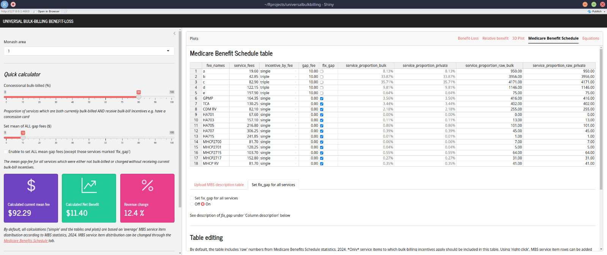
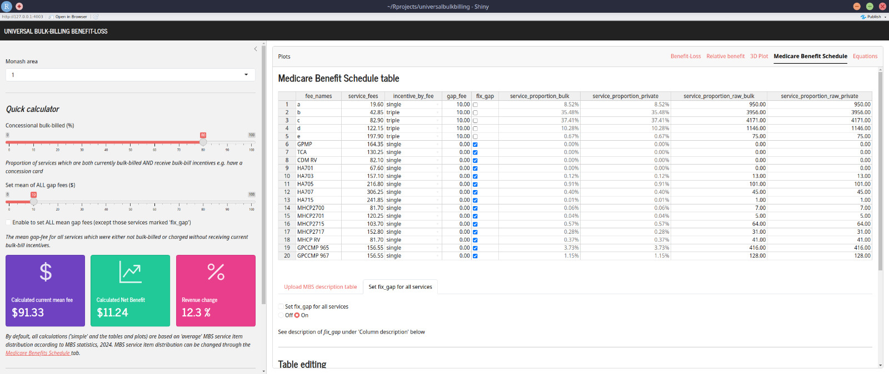
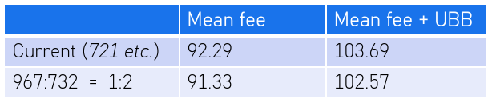
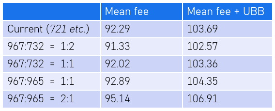
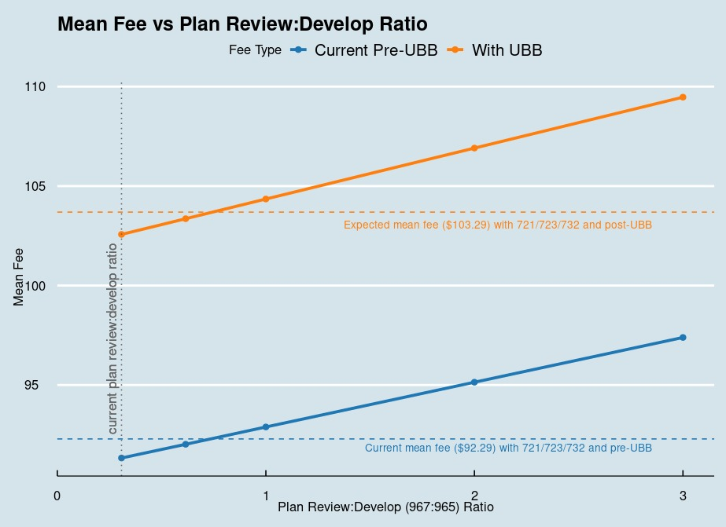

-   [1 Policy changes - bulk-billing and care plan service items](#policy-changes---bulk-billing-and-care-plan-service-items)
-   [2 The current situation, old care plan service items](#the-current-situation-old-care-plan-service-items)
-   [3 'Business-as-usual' with new care plan service items](#business-as-usual-with-new-care-plan-service-items)
-   [4 'More care plan reviews' with the new care plan service items](#more-care-plan-reviews-with-the-new-care-plan-service-items)

Photo by <a href="https://unsplash.com/@glenncarstenspeters?utm_content=creditCopyText&utm_medium=referral&utm_source=unsplash">Glenn Carstens-Peters</a> on <a href="https://unsplash.com/photos/person-writing-bucket-list-on-book-RLw-UC03Gwc?utm_content=creditCopyText&utm_medium=referral&utm_source=unsplash">Unsplash</a>

## Policy changes - bulk-billing and care plan service items

As part of an election promise, the Australian Government released a [proposal](https://www.health.gov.au/ministers/the-hon-mark-butler-mp/media/strengthening-medicare-more-bulk-billing-more-doctors-more-nurses) to increase the incentives for private general practices (sometimes known as 'family medicine' or 'primary care' practices) to *bulk-bill* patients. 'Bulk-billing' essentially allows a patient consultation with medical clinician to be 'free' (no out-of-pocket expense), if-and-only-if the clinician agrees to charge the patient no more than the government-set insurance price for the consultation.

After the election, the [details of a long-announced proposal to change the service item and payment structure of GP chronic condition management plans (GPCCMP or 'care plans')](https://www.mbsonline.gov.au/internet/mbsonline/publishing.nsf/Content/Factsheet-Upcoming+changes+to+the+MBS+Chronic+Disease+Management+Framework) was announced. As expected, the new structure simplified the items and emphasised financially the value of reviewing the plan (rather than putting emphasis on developing/creating the plan). Somewhat unexpectedly, and disappointingly, the new payment structure would reduce the payment for general practices which do not change the rate of care plan development and review.

An [earlier post 'Calculating the practice benefit of universal bulk-billing - an updated model'](../universalbulkbilling-update) describes the calculation of the impact on practice revenue of adopting universal bulk-billing under a wide range of conditions, depending on existing private gap-fees, the proportion of patients who are currently bulk-billed with current bulk-billing incentives and the current distribution of services (and service fee rebates). A dashboard version of the calculation can be found at <https://shiny.davidfong.org/universalbulkbilling/>.

This post describes the combined effects of (potentially) adopting universal bulk-billing *and* the effect of changes to the GP chronic condition management plan (GPCCMP or 'care plans') service items on a specific practice in inner Melbourne. It uses a [dashboard calculator](https://shiny.davidfong.org/universalbulkbilling/) described in the [previous post](../universalbulkbilling-update).

## The current situation, old care plan service items

The practice services a high-need low socio-economic status community in inner Melbourne. 80% of services are delivered to patients who are concession card holders, pensioners or age 16 and below. Those 80% of services are all bulk-billed, and attract current bulk-billing incentive payments. The remainder of services are potentially 'privately-billed' with a flat gap-fee of \$35 over and above the service rebate.

However, some services are never privately-billed with a gap fee, e.g. the current care plans and health assessments, even for those patients without a concession card etc.. About three quarters of the 'regular' services (i.e. 'ABCDE' standard consult items) which under practice-policy could be privately-billed with a gap-fee are not charged the gap-fee either. So the effective mean gap-fee charged for those 'ABCDE' standard consult items is much lower, approximately \$10.

The current full fee distribution for the most common service items is pictured in <a href="#fig-current" class="quarto-xref">Figure 1</a>. The details of the MBS item number distribution can also be found in the 'medicarebenefits_practice2' (.csv or .xlsx) spreadsheet file on ['universalbulkbilling' github repository](https://github.com/DavidPatShuiFong/universalbulkbilling). In the same [github repository](https://github.com/DavidPatShuiFong/universalbulkbilling) can be found 'medicarebenefits.csv' which shows the Australia [MBS 2024](http://medicarestatistics.humanservices.gov.au/statistics/mbs_item.jsp) fee distribution for the same service items, which could be regarded as the 'average' for Australian general practices.

The practice has relatively long consults, much longer than the average in Australian general practice. For example, the ratio of level C:B (20-40 minutes vs 6-19 minutes) consults at the example practice is approximately 1:1, compared to the Australian average of approximately 1:4. The practice also does quite a few of the current care plan development items (item 721), which make up 3.6% of the shown service items (vs 2.8% for the 'Australian average'). The practice does relatively few care plan reviews (item 732) compared to care plan development (721), at a ratio of 0.6:1 (vs 1.3:1 for the 'Australian average').

<a href="#fig-current" class="quarto-xref">Figure 1</a> also shows the mean service fee and expected benefit from adopting universal bulk-billing, as calculated with the [dashboard calculator](https://shiny.davidfong.org/universalbulkbilling/). For the examined service items, the current mean-fee is \$92.29 per service, with a relative benefit of 12.4% after adopting universal bulk-billing. The potential relative benefit for this practice after adopting universal bulk-billing is high for this practice because of:

-   high proportion of services currently being bulk-billed with current bulk-billing incentives
-   low mean-gap-fees being charged for other services
-   relatively high mean-rebates for current services, due to long consults and relatively high use of high-rebate service items e.g. care plans

(The mathematical reason for why each of these features results in high relative-benefit of adopting universal bulk billing is described in the ['Mathematical exploration' section of 'Calculating the practice benefit of universal bulk-billing - an updated model'](../universalbulkbilling-update/#further-mathematical-exploration).

<figure>

<figcaption aria-hidden="true">Current mean fees</figcaption>
</figure>

## 'Business-as-usual' with new care plan service items

The new care plan service fee structure will replace the care plan development service item '721' with item '965'. Item '723' (which is the 'team care' component of care plan development) is merged into 965 i.e. abolished. The care plan review item '732' is replaced with item '967'.

An example calculation of the effect, using the [dashboard calculator](https://shiny.davidfong.org/universalbulkbilling/), is shown in <a href="#fig-businessasusual" class="quarto-xref">Figure 2</a>.

The 416 services (both 'bulk' and 'private') for item 721 'GPMP' are moved to item '965'. Item 723 'TCA' is set to zero services.

The 255 services for item '732 CDM RV' are moved to item '967', but the number of services is halved to 128. The reason is that, in this practice, item '732' was almost always charged twice in the same consultation. Since the 'standard' consult for this practice is close to an item C ('36'), it was not generally worthwhile to charge a single item '732', since item '732' has a lower rebate than item C. It is possible under the old system to charge '732' twice, as it was a review for both the 721 'GPMP' and 723 'TCA' service items. Under the new system, it will not be possible to charge the review twice (since any equivalent for item 723 'TCA' has been abolished), the GPCCMP 967 'review' can only be charge once during a care plan review consult.

The end result, if the rate of new care plans '965' is equal to the current rate of old care plans '721' and the rate of new care plan reviews '967' is half the rate of old care plan review '732' is a mean service fee of \$92.29, less than the current mean service fee.

If the practice adopts universal bulk-billing, the mean service fee is \$102.57. Which is better than the current mean fee, but still less than if the old care plan service item structure was retained.

<figure>

<figcaption aria-hidden="true">Current mean fees</figcaption>
</figure>

## 'More care plan reviews' with the new care plan service items

One benefit of the new care plan structure is that requirements to claim the new care plan service items is less than the old care plan service item numbers. In particular, the old '723' had onerous requirements to contact multiple service providers. So although the new care plan review '967' has less rebate than claiming two of the old review '732's, it is easier to claim review '967' than it was to claim two '732's.

Making more use of care plan reviews is also the express intent of the change in care plan item structure.

<a href="#fig-morereviews" class="quarto-xref">Figure 3</a> shows the effect where more care plan reviews '967' are done, equalling the number (416) of care plans '965'. In this example, the number of item C '36' services is reduced by the same number that '967' has been increased over the 'business as usual' case. This particular practice typically does care plans and care plan reviews as an addition to 'standard' consults. This is because patients do not come in specifically to do care plans or care plan reviews only, so a care plan review '967' would replace a standard (if long) consult.

This service fee distribution can be found in the 'medicarebenefits_practice2_cdccmp.xlsx' spreadsheet file on ['universalbulkbilling' github repository](https://github.com/DavidPatShuiFong/universalbulkbilling).

At last the service mean-fee of \$92.89 now exceeds the 'current' mean fee.

If this practice adopts universal bulk-billing, the mean service-fee will be \$104.36. The calculation can be done for a range of possible 967:932 ratios, as shown in <a href="#fig-fulltable" class="quarto-xref">Figure 4</a> and <a href="#fig-reviewratioplot" class="quarto-xref">Figure 5</a>.

