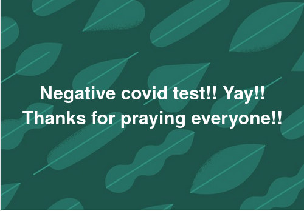

```{r setup, include=FALSE}
knitr::opts_chunk$set(collapse = TRUE)
```

Update!! What a stressful day!!

Covid results didn't come back so I decided to go to the airport to get a rapid PCR test.
Sorry to my family as I skipped most of Christmas lunch. And was too stressed to talk much. 

Shout out to Grace for taking me to the airport earlier. David will enjoy his family lunch and join me later. 

Praying results come back quick!! There was no waiting at the airport.
It's a ghost town here...

[Spur Afrika trip 2021-2022 posts](/spurafrika2021/)

```{r echo=FALSE}
htmltools::HTML(paste(
'<link
  rel="stylesheet"
  href="https://cdn.jsdelivr.net/npm/@fancyapps/ui/dist/fancybox.css"
/>', # for fancybox
'<script 
    src="https://cdn.jsdelivr.net/npm/@fancyapps/ui@4.0/dist/fancybox.umd.js">
 </script>', # for fancybox
'<script 
    src="https://unpkg.com/isotope-layout@3/dist/isotope.pkgd.min.js">
 </script>', # for isotope
'<div 
   class="grid" 
   data-isotope=\'{
     "itemSelector": ".isotope-grid-item",
     "masonry": "{\"columnWidth\": \".grid-sizer\"}",
     "percentPosition": "true",
     "gutter": 0
   }\'
 >',
'  <div id="grid-sizer"></div>',
'  <div class="isotope-grid-item" style="float:left; width: 95%">',
'    <a data-fancybox="gallery" href="./result.jpg">',
'      ', 
       # default CSS top/bottom margin is not zero
'    </a>',
'  </div>',
'</div>',
#
'<br clear="left"><br>'
))
```
