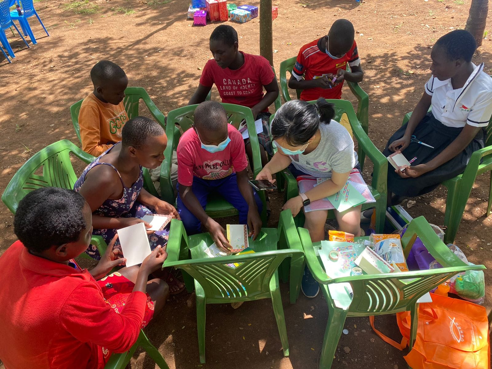
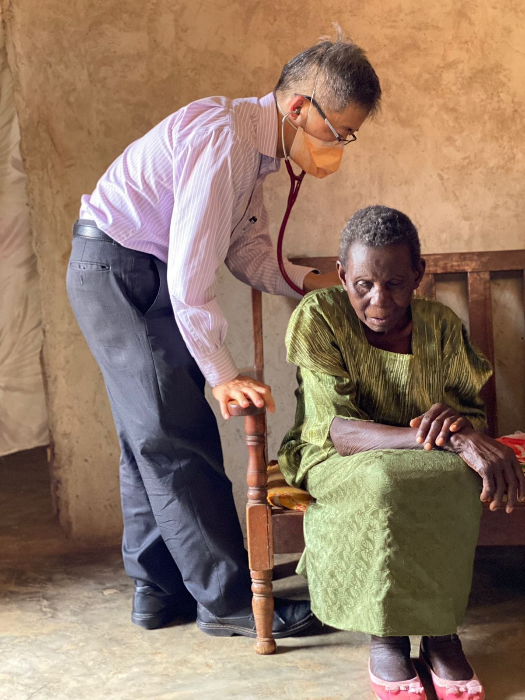
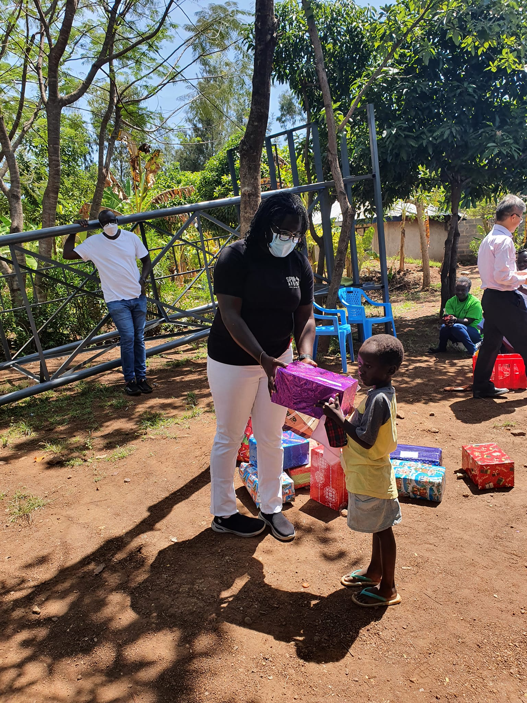
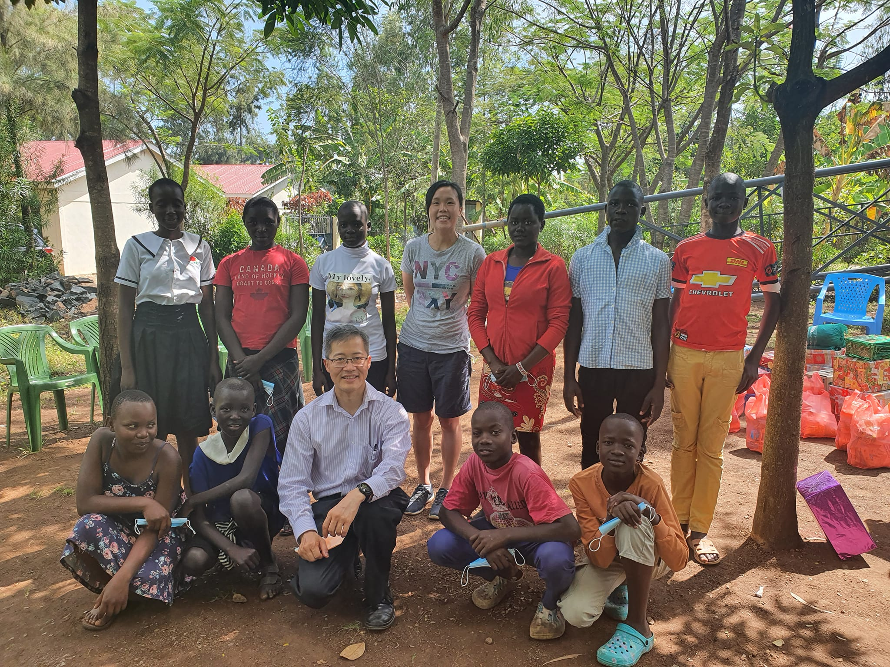
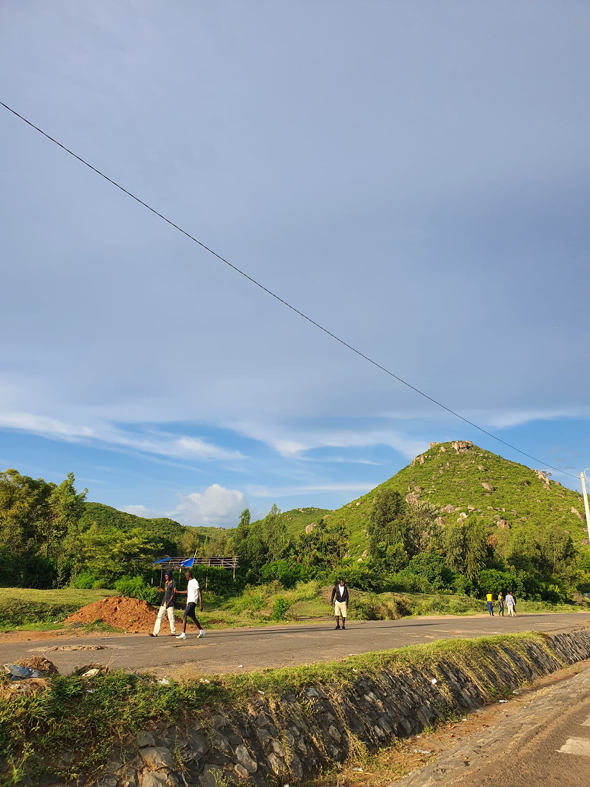
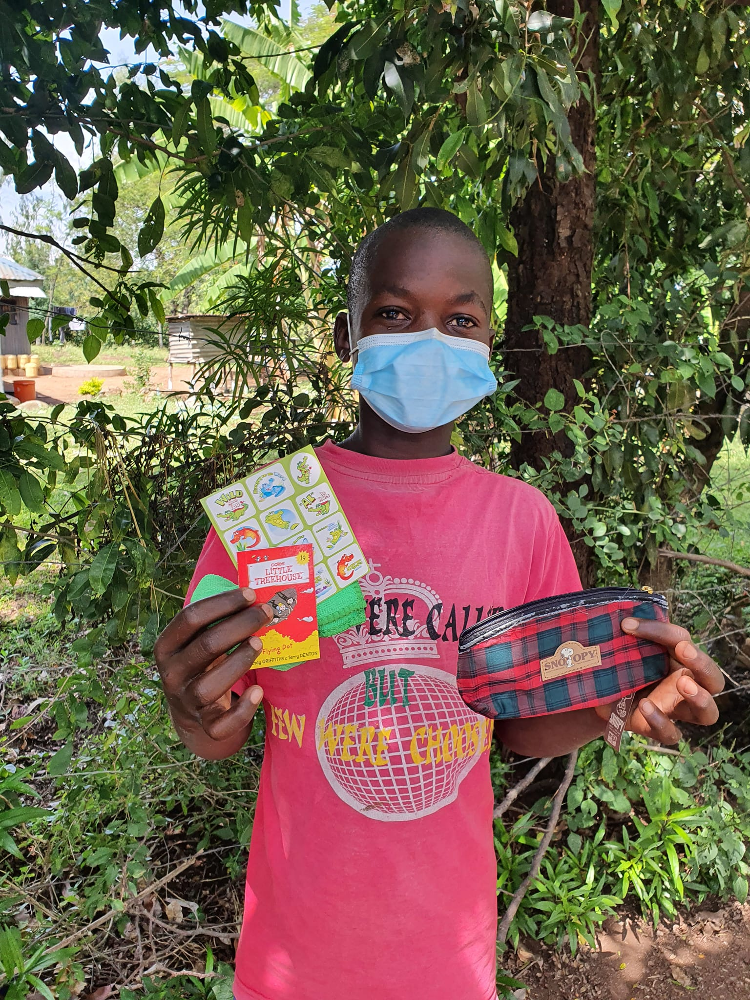
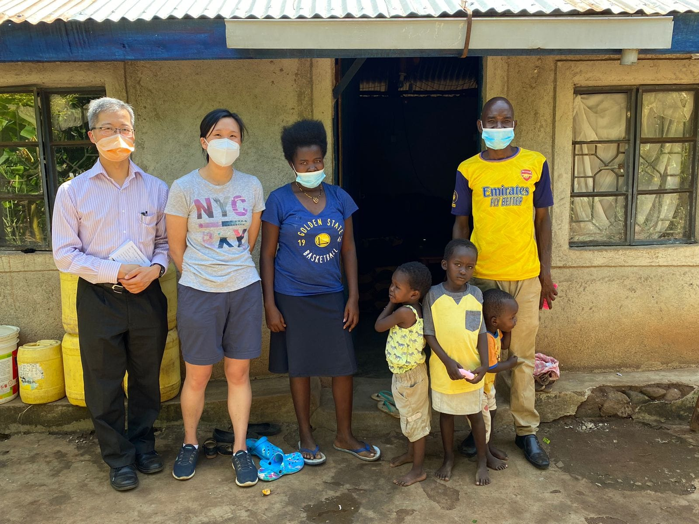
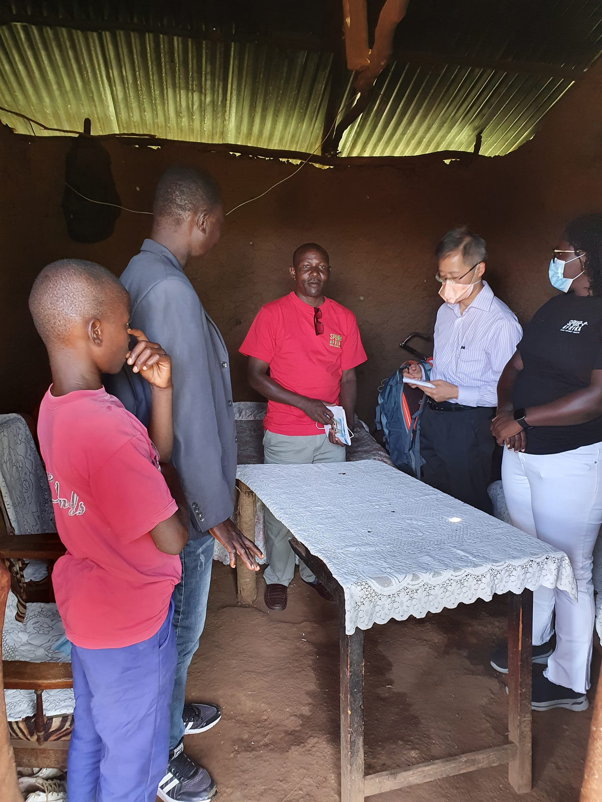
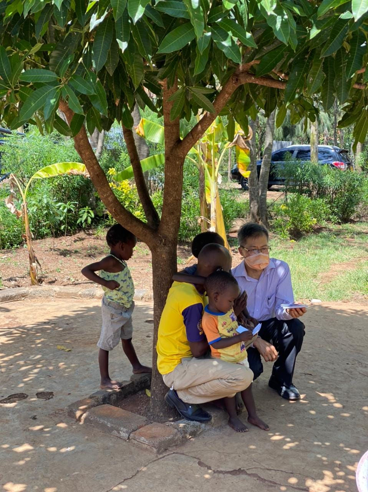

```{r setup, include=FALSE}
knitr::opts_chunk$set(collapse = TRUE)
```

Holo Day 2 - Happy New Year 2022! 

It's what we have been waiting for, to meet the community & the children of Holo. 
🤩

As we entered the area we are borrowing, the children and parents welcomed us with song and dance! I don't think I have felt that special. The 10 children, parents and community members shared introductions and blessings. 

We gave out presents, clothes, shoes & made cards. The children were delighted to use some new pens and art supplies. We didn't even have tables but the children were very willing to do everything. They were so well behaved, polite and a joy to be around. 
The parents were also very welcoming & a pleasure to get to know. Their faces light up when they talked about Spur and how their kids are better off.
😆

We got to see some homes and check up on some of the children's health. We gave some health advice, although we couldn't really give treatment or medication. I didn't have the resources this time. Praying for a local clinic to partner with. It was hard to hear all the health issues that people were going through.  
One of the ladies/grandma had a stroke and didn't have the correct treatment. It is dishearting to hear she was worse off and has to support her whole family. She was given malaria medication instead?🤔 Apparently that is what happens, people give malaria medication for everything.
😊

The houses were all mud huts, some were better than others. Everyone greeted us with welcome arms. Praying we can help them with their lives and empower them to see a better future. 

Praying for 😋

- thankful to have this opportunity to learn from those in Kisumu 
- pray for a possible purchase of land so we can have a place to meet at. Currently we are borrowing and hiring things. It's more expensive in the long term
- Pray for the children and more home visits tomorrow
- Pray for a good meeting with my board in the coming week. Praying for decision making and direction. 
- Pray for the health of our 10 sponsored children and their families. It seems they have more health conditions then those in kibera 
- pray for David and I, for continued good health and preparation for travel. 

Hope you enjoy the photos.😍 I will show more later in the Spur fb or at events. Thanks for praying and partnering with us.

[Spur Afrika trip 2021-2022 posts](/spurafrika2021/)

```{r echo=FALSE}
htmltools::HTML(paste(
  '<p>',
   '<video controls = "">',
    '<source src = "/media/20220101_Holo_Dance.mp4" type = "video/mp4">',
   '</video>',
  '</p>'
))
```

```{r echo=FALSE}
htmltools::HTML(paste(
'<link
  rel="stylesheet"
  href="https://cdn.jsdelivr.net/npm/@fancyapps/ui/dist/fancybox.css"
/>', # for fancybox
'<script 
    src="https://cdn.jsdelivr.net/npm/@fancyapps/ui@4.0/dist/fancybox.umd.js">
 </script>', # for fancybox
'<script 
    src="https://unpkg.com/isotope-layout@3/dist/isotope.pkgd.min.js">
 </script>', # for isotope
'<div 
   class="grid" 
   data-isotope=\'{
     "itemSelector": ".isotope-grid-item",
     "masonry": "{\"columnWidth\": \".grid-sizer\"}",
     "percentPosition": "true",
     "gutter": 0
   }\'
 >',
'  <div id="grid-sizer"></div>',
'  <div class="isotope-grid-item" style="float:left; width: 63%">',
'    <a data-fancybox="gallery" href="./Holo_cards.jpg">',
'      ', 
       # default CSS top/bottom margin is not zero
'    </a>',
'  </div>',
'  <div class="isotope-grid-item" style="float:left; width: 36%">',
'    <a data-fancybox="gallery" href="./Holo_auscultate.jpg">',
'      ', 
       # default CSS top/bottom margin is not zero
'    </a>',
'  </div>',
'  <div class="isotope-grid-item" style="float:left; width: 35%">',
'    <a data-fancybox="gallery" href="./Holo_gift_box.jpg">',
'      ', 
       # default CSS top/bottom margin is not zero
'    </a>',
'  </div>',
'  <div class="isotope-grid-item" style="float:left; width: 63%">',
'    <a data-fancybox="gallery" href="./Holo_group.jpg">',
'      ', 
       # default CSS top/bottom margin is not zero
'    </a>',
'  </div>',
'  <div class="isotope-grid-item" style="float:left; width: 63%">',
'    <a data-fancybox="gallery" href="./Holo_introduction.jpg">',
'      ', 
       # default CSS top/bottom margin is not zero
'    </a>',
'  </div>',
'  <div class="isotope-grid-item" style="float:left; width: 36%">',
'    <a data-fancybox="gallery" href="./Holo_hills.jpg">',
'      ', 
       # default CSS top/bottom margin is not zero
'    </a>',
'  </div>',
'  <div class="isotope-grid-item" style="float:left; width: 40%">',
'    <a data-fancybox="gallery" href="./Holo_child_gift.jpg">',
'      ', 
       # default CSS top/bottom margin is not zero
'    </a>',
'  </div>',
'  <div class="isotope-grid-item" style="float:left; width: 58%">',
'    <a data-fancybox="gallery" href="./Holo_chat.jpg">',
'      ', 
       # default CSS top/bottom margin is not zero
'    </a>',
'  </div>',
'  <div class="isotope-grid-item" style="float:left; width: 63%">',
'    <a data-fancybox="gallery" href="./Holo_house.jpg">',
'      ', 
       # default CSS top/bottom margin is not zero
'    </a>',
'  </div>',
'  <div class="isotope-grid-item" style="float:left; width: 35%">',
'    <a data-fancybox="gallery" href="./Holo_clothes.jpg">',
'      ', 
       # default CSS top/bottom margin is not zero
'    </a>',
'  </div>',
'  <div class="isotope-grid-item" style="float:left; width: 49%">',
'    <a data-fancybox="gallery" href="./Holo_clothes2.jpg">',
'      ', 
       # default CSS top/bottom margin is not zero
'    </a>',
'  </div>',
'  <div class="isotope-grid-item" style="float:left; width: 49%">',
'    <a data-fancybox="gallery" href="./Holo_house_inside.jpg">',
'      ', 
       # default CSS top/bottom margin is not zero
'    </a>',
'  </div>',
'  <div class="isotope-grid-item" style="float:left; width: 38%">',
'    <a data-fancybox="gallery" href="./Holo_tree.jpg">',
'      ', 
       # default CSS top/bottom margin is not zero
'    </a>',
'  </div>',
'</div>',
#
'<br clear="left"><br>'
))
```

