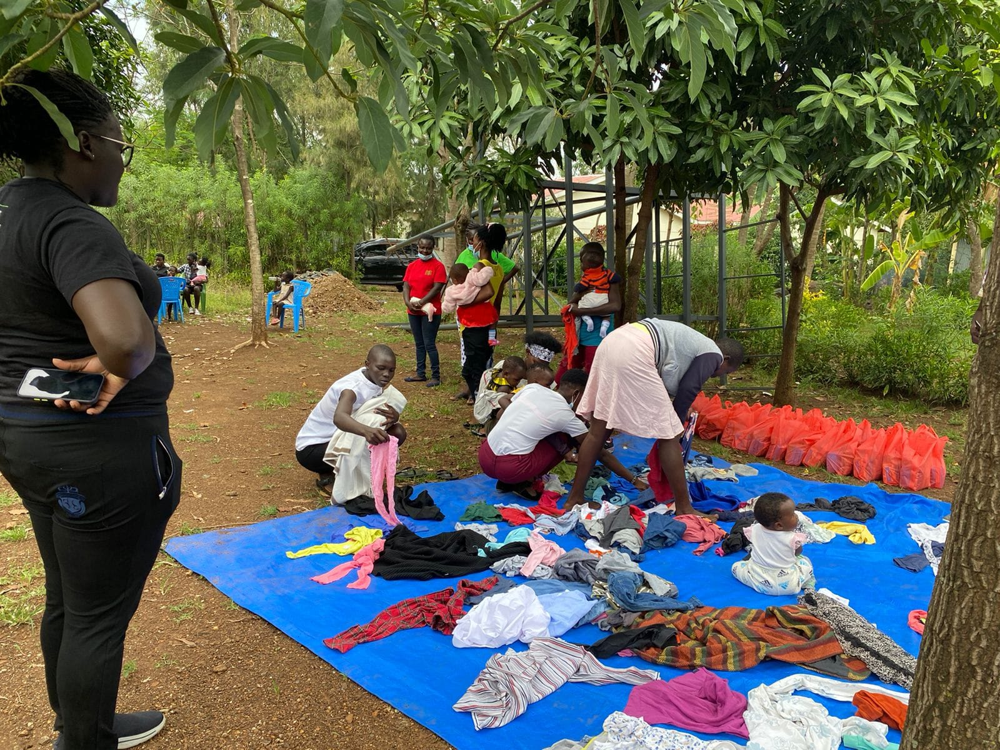
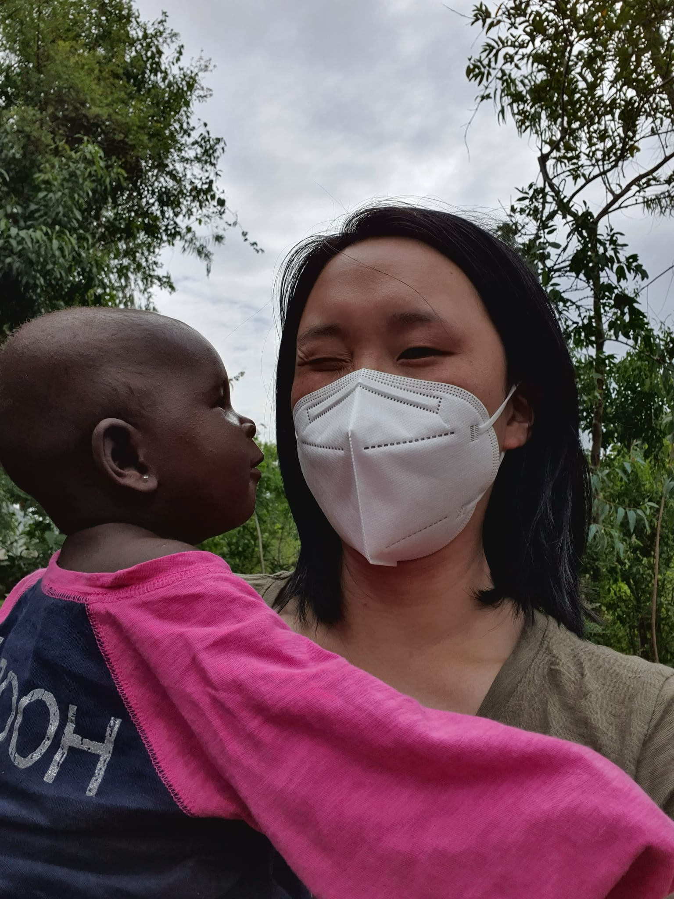
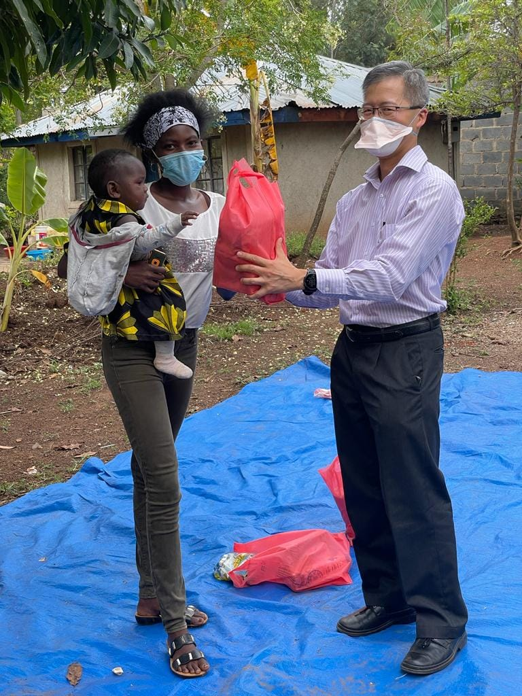
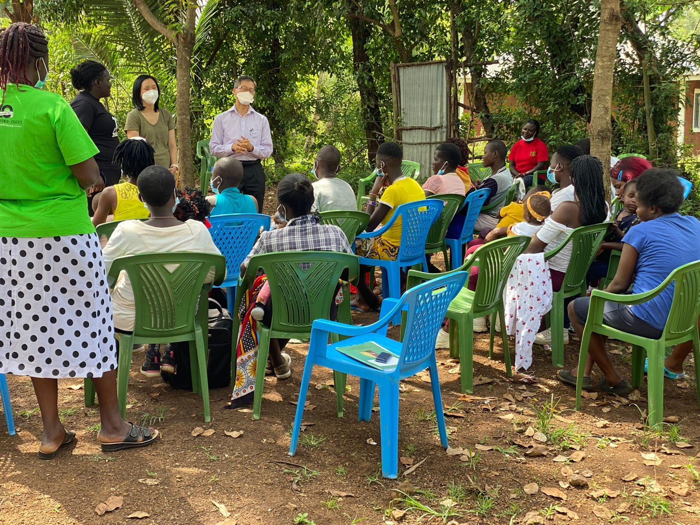
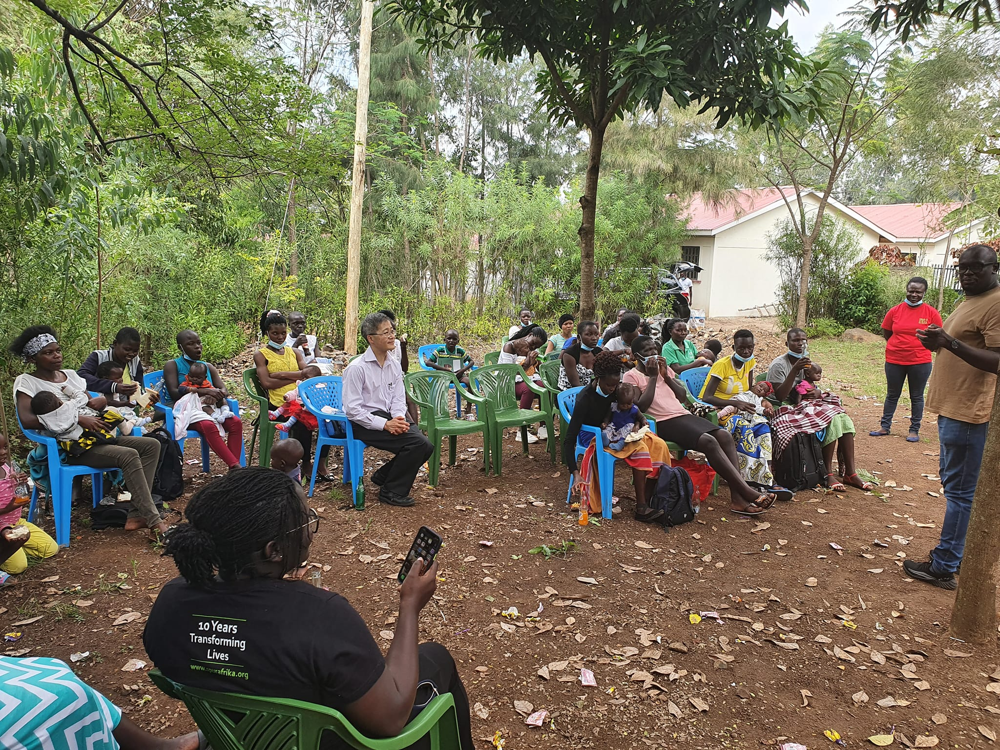
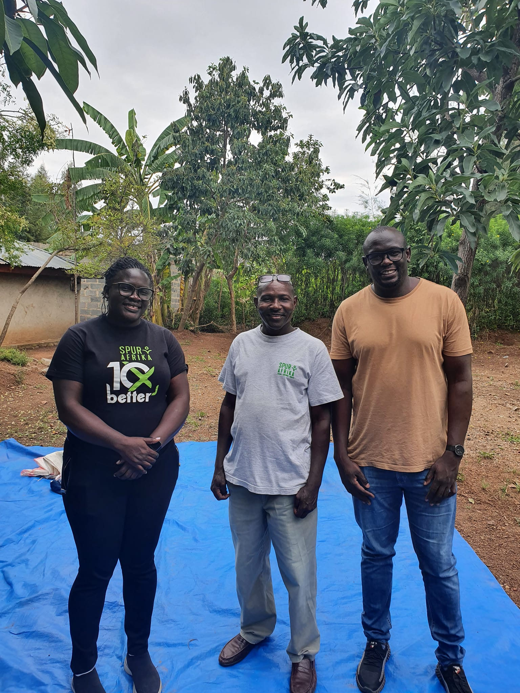

```{r setup, include=FALSE}
knitr::opts_chunk$set(collapse = TRUE)
```

Day 1 - Holo, Kisumu. - Happy New Year EVE!

We are finally here! With a early start and about 2 hours of travel from Nairobi, we landed at Kisumu. It was great to finally meet Andrew, our project officer who has been leading our Holo project. Patoh has been working with him for the last 6 months. 

From Kisumu, we drove to Holo, which was 30 mins away.  When we got there, a open meeting area was set up. Using the backyard of a local chief's house, Andrew and his team set up chairs for a meeting with teen mums. There was about 20 teen mums and babies. This group has just started and will meet monthly. Instead of thinking life is over for them, this group is conducted to encourage and empower. 

The babies were very well behaved. They all sat with their mums quietly. They had a health talk and introductions. They asked doctor David and I some health questions as well! We were able to bless them with some food, flour, soap & donated clothes. They seemed very grateful. 

We also visited a home near by. The house was on a large piece of land but it was falling apart. Again, like kibera, I can't believe people live in those conditions. The girl who lives there, hasn't been able to go to school so we are trying to see what we can do. It does seem people are poorer in rural areas even if they have more space or even a house. 

* Pray for good health and energy for our next 4 days. Sue wasn't feeling so good after the travel & I got a little car sick, so pray we will feel better. Thank God for Patoh's 4 wheeled drive - the roads are not great. 
* Pray for the young mums (they are only 13years, 16 years old). They face a lot of challenges especially that they don't normally get back to school after birth. 
* Pray for Andrew and that Rosalie, David, Patoh and Sue can work together well.
* Pray for future planning for Kisumu. We are meeting the kids we have sponsored in the last 6 months. Hoping to sponsor them for the long term.

[Spur Afrika trip 2021-2022 posts](/spurafrika2021/)

```{r echo=FALSE}
htmltools::HTML(paste(
'<link
  rel="stylesheet"
  href="https://cdn.jsdelivr.net/npm/@fancyapps/ui/dist/fancybox.css"
/>', # for fancybox
'<script 
    src="https://cdn.jsdelivr.net/npm/@fancyapps/ui@4.0/dist/fancybox.umd.js">
 </script>', # for fancybox
'<script 
    src="https://unpkg.com/isotope-layout@3/dist/isotope.pkgd.min.js">
 </script>', # for isotope
'<div 
   class="grid" 
   data-isotope=\'{
     "itemSelector": ".isotope-grid-item",
     "masonry": "{\"columnWidth\": \".grid-sizer\"}",
     "percentPosition": "true",
     "gutter": 0
   }\'
 >',
'  <div id="grid-sizer"></div>',
'  <div class="isotope-grid-item" style="float:left; width: 63%">',
'    <a data-fancybox="gallery" href="./Holo_Clothes.jpg">',
'      ', 
       # default CSS top/bottom margin is not zero
'    </a>',
'  </div>',
'  <div class="isotope-grid-item" style="float:left; width: 36%">',
'    <a data-fancybox="gallery" href="./Holo_wink.jpg">',
'      ', 
       # default CSS top/bottom margin is not zero
'    </a>',
'  </div>',
'  <div class="isotope-grid-item" style="float:left; width: 35%">',
'    <a data-fancybox="gallery" href="./Holo_Clothes2.jpg">',
'      ', 
       # default CSS top/bottom margin is not zero
'    </a>',
'  </div>',
'  <div class="isotope-grid-item" style="float:left; width: 63%">',
'    <a data-fancybox="gallery" href="./Holo_Talk1.jpg">',
'      ', 
       # default CSS top/bottom margin is not zero
'    </a>',
'  </div>',
'  <div class="isotope-grid-item" style="float:left; width: 63%">',
'    <a data-fancybox="gallery" href="./Holo_Talk2.jpg">',
'      ', 
       # default CSS top/bottom margin is not zero
'    </a>',
'  </div>',
'  <div class="isotope-grid-item" style="float:left; width: 35%">',
'    <a data-fancybox="gallery" href="./Holo_Team.jpg">',
'      ', 
       # default CSS top/bottom margin is not zero
'    </a>',
'  </div>',
'</div>',
#
'<br clear="left"><br>'
))
```

