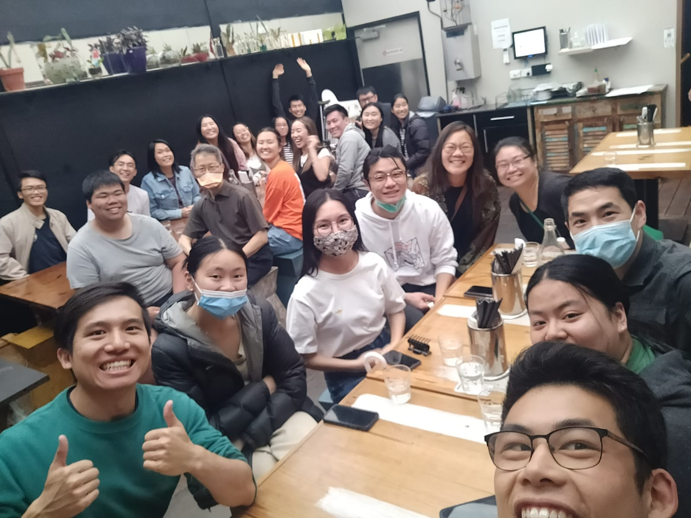

```{r setup, include=FALSE}
knitr::opts_chunk$set(collapse = TRUE)
```

Thanks for lunch at Laksa Garden!! Trying to eat all the yummy things in Melbourne before we leave.

Praying that everything will go smoothly - most pressing is the covid test before the flights and packing!

Thanks for joining. We had a special prayer section at church on Sunday CrossGen (MCBC). 

Paid for all the insurance, flights & meds. Trying to figure out all the documents that are needed to be uploaded. 

Family & friends are all finding out but it's all very mixed feelings. Pray for peace and guidance.

Planning to get tested for the international covid test (costs \$\$) on Dec 23rd.
Dec 22nd is packing donations day! 

Pray for good health and it's my last week of work. - same for David!

[Spur Afrika trip 2021-2022 posts](/spurafrika2021/)

```{r echo=FALSE}
htmltools::HTML(paste(
'<link
  rel="stylesheet"
  href="https://cdn.jsdelivr.net/npm/@fancyapps/ui/dist/fancybox.css"
/>', # for fancybox
'<script 
    src="https://cdn.jsdelivr.net/npm/@fancyapps/ui@4.0/dist/fancybox.umd.js">
 </script>', # for fancybox
'<script 
    src="https://unpkg.com/isotope-layout@3/dist/isotope.pkgd.min.js">
 </script>', # for isotope
'<div 
   class="grid" 
   data-isotope=\'{
     "itemSelector": ".isotope-grid-item",
     "masonry": "{\"columnWidth\": \".grid-sizer\"}",
     "percentPosition": "true",
     "gutter": 0
   }\'
 >',
'  <div id="grid-sizer"></div>',
'  <div class="isotope-grid-item" style="float:left; width: 48%">',
'    <a data-fancybox="gallery" href="./Lunch2.jpg">',
'      ', 
       # default CSS top/bottom margin is not zero
'    </a>',
'  </div>',
'  <div class="isotope-grid-item" style="float:left; width: 44%">',
'    <a data-fancybox="gallery" href="./VisaApproval.jpg">',
'      ',
'    </a>',
'  </div>',
'</div>',
#
'<br clear="left"><br>'
))
```
