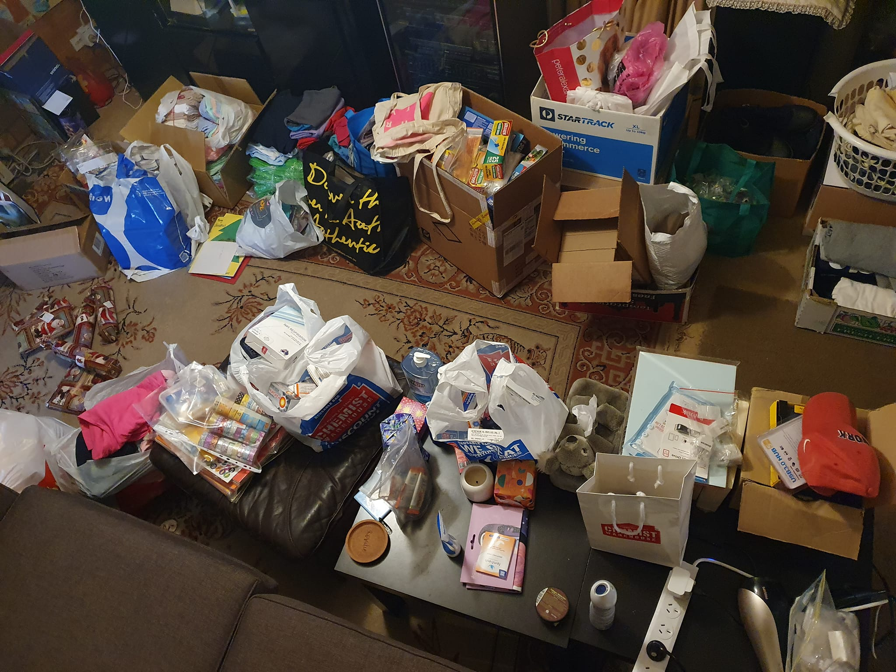
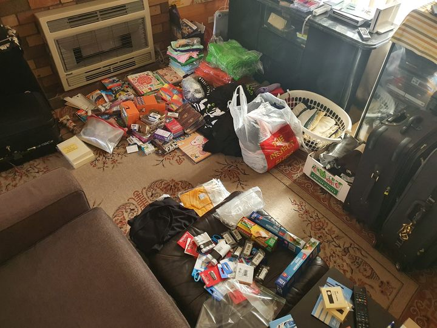

```{r setup, include=FALSE}
knitr::opts_chunk$set(collapse = TRUE)
```

It was packing night. Praying we can take as much as we can.

Shout out to Grace for her amazing & awesome packing skills.
Thanks for helping us pack over 90kg worth of donated goodies.

We appreciate your rolling & tetris skills. 

A special mention to my mother who also packed and organised
all the donated goodies. Also she has given her blessing and
is praying for our trip.

Amen!!

Praying we can safely go & deliver the goods to those in Kenya.

Also update:

* we are testing on Dec 23rd - praying everything will go well & we get our results ASAP 
* quarantine rules seem to be relaxing for when we come back *this is good!

[Spur Afrika trip 2021-2022 posts](/spurafrika2021/)

```{r echo=FALSE}
htmltools::HTML(paste(
'<link
  rel="stylesheet"
  href="https://cdn.jsdelivr.net/npm/@fancyapps/ui/dist/fancybox.css"
/>', # for fancybox
'<script 
    src="https://cdn.jsdelivr.net/npm/@fancyapps/ui@4.0/dist/fancybox.umd.js">
 </script>', # for fancybox
'<script 
    src="https://unpkg.com/isotope-layout@3/dist/isotope.pkgd.min.js">
 </script>', # for isotope
'<div 
   class="grid" 
   data-isotope=\'{
     "itemSelector": ".isotope-grid-item",
     "masonry": "{\"columnWidth\": \".grid-sizer\"}",
     "percentPosition": "true",
     "gutter": 0
   }\'
 >',
'  <div id="grid-sizer"></div>',
'  <div class="isotope-grid-item" style="float:left; width: 48%">',
'    <a data-fancybox="gallery" href="./packing_mum.jpg">',
'      ', 
       # default CSS top/bottom margin is not zero
'    </a>',
'  </div>',
'  <div class="isotope-grid-item" style="float:left; width: 44%">',
'    <a data-fancybox="gallery" href="./packing1.jpg">',
'      ',
'    </a>',
'  </div>',
'  <div class="isotope-grid-item" style="float:left; width: 44%">',
'    <a data-fancybox="gallery" href="./packing2.jpg">',
'      ',
'    </a>',
'  </div>',
'</div>',
#
'<br clear="left"><br>'
))
```