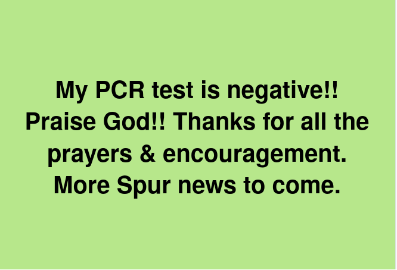

```{r setup, include=FALSE}
knitr::opts_chunk$set(collapse = TRUE)
```

Touch down!! We are back in Melbourne safely!! 😁😆

Thank you for your support, encouragement and prayers. God is great! 

It was very fast getting out of the airport, they didn't check any of our COVID documents. And apparently we only need to get a rapid test (which we will do soon), however as both David and I are working in sensitive sittings we will still go and get a PCR. 

The flight was also smooth enough. Thankfully it wasn't a full flight so we could stretch out. 

Please continue to pray for Spur as we have more events and sponsors to find! So, stay in touch.🥰😍🤩

[Spur Afrika trip 2021-2022 posts](/spurafrika2021/)


```{r echo=FALSE}
htmltools::HTML(paste(
'<link
  rel="stylesheet"
  href="https://cdn.jsdelivr.net/npm/@fancyapps/ui/dist/fancybox.css"
/>', # for fancybox
'<script 
    src="https://cdn.jsdelivr.net/npm/@fancyapps/ui@4.0/dist/fancybox.umd.js">
 </script>', # for fancybox
'<script 
    src="https://unpkg.com/isotope-layout@3/dist/isotope.pkgd.min.js">
 </script>', # for isotope
'<div 
   class="grid" 
   data-isotope=\'{
     "itemSelector": ".isotope-grid-item",
     "masonry": "{\"columnWidth\": \".grid-sizer\"}",
     "percentPosition": "true",
     "gutter": 0
   }\'
 >',
'  <div id="grid-sizer"></div>',
'  <div class="isotope-grid-item" style="float:left; width: 95%">',
'    <a data-fancybox="gallery" href="./COVIDreturnNegative.png">',
'      ', 
       # default CSS top/bottom margin is not zero
'    </a>',
'  </div>',
'</div>',
#
'<br clear="left"><br>'
))
```

