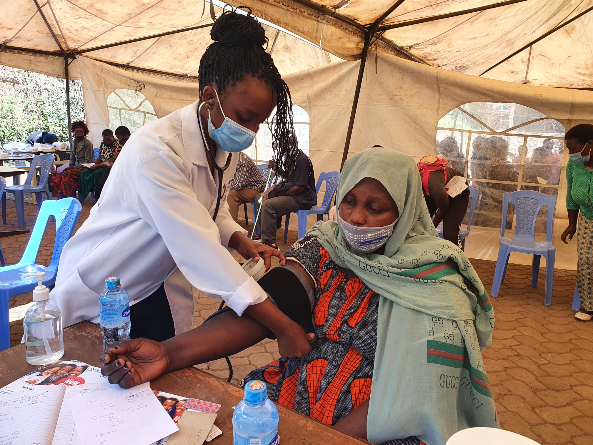
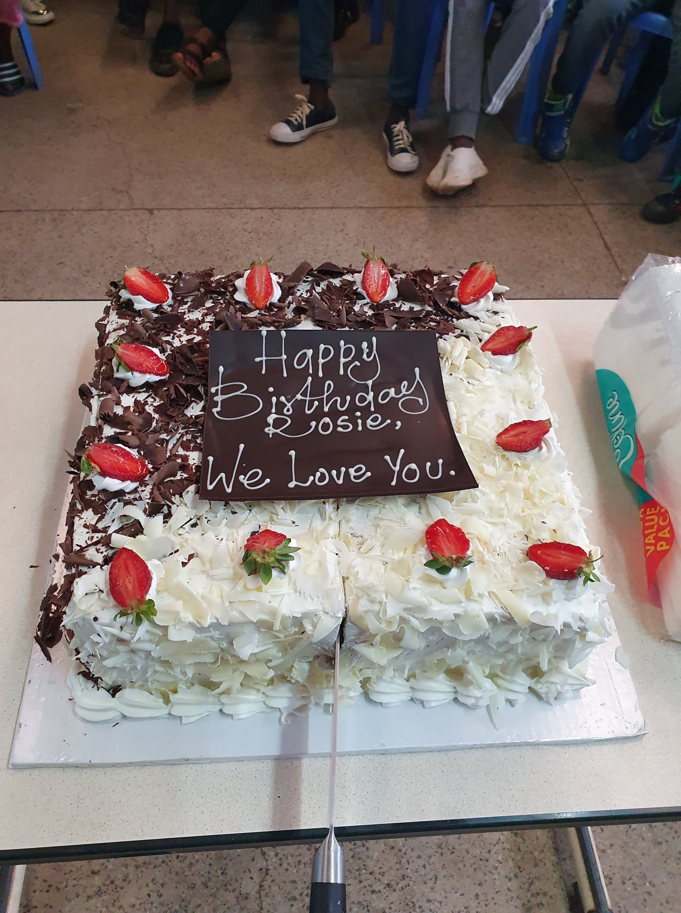
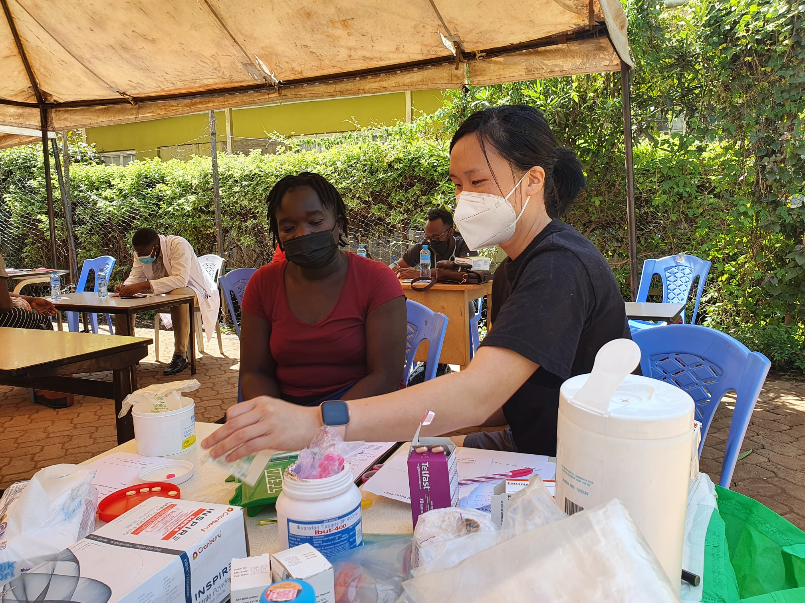
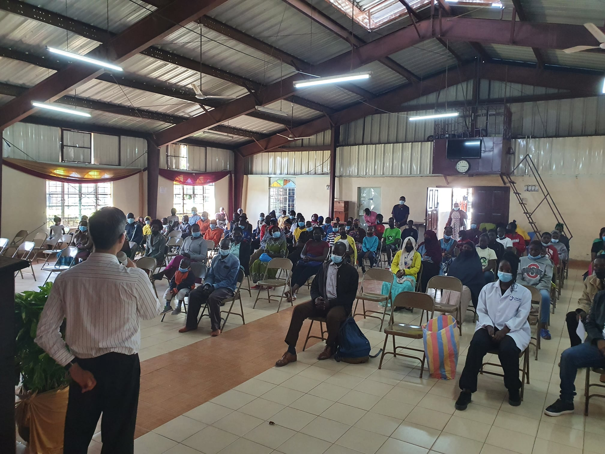
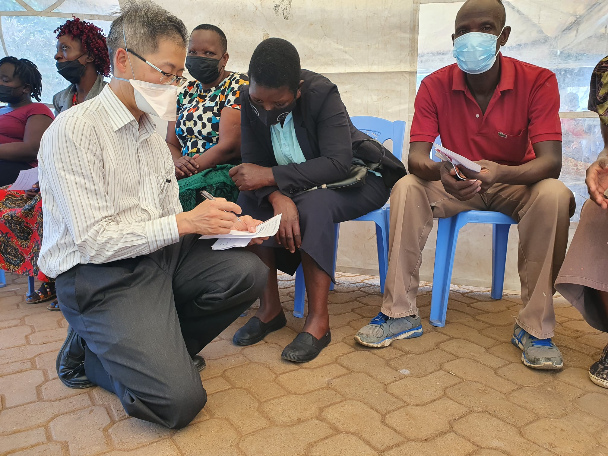

```{r setup, include=FALSE}
knitr::opts_chunk$set(collapse = TRUE)
```

Dec 29th - All the Spur sponsored children and their families were invited for a health check. 🙂 

😝

WHAT A DAY!! I feel very much exhausted,  I forgot how hard it is to run a health clinic.  All the preparation I did was worth it, however without my normal team of people it was a little different (Grace).    

We didn't have enough medications, but everything seemed to go ok (thank God).  I didn't realise how many people we would be seeing till I got there.  However, after the doctors pitched in to help with figuring out what we had and how to dispense it, it worked much better.  Doctor Simiyu (local doctor) saved the day by ordering some extra medications that arrived later.  I love how I can just ask for stuff and in a few hours someone personally delivers it to me.      

6 doctors (mostly local), nurses and dentist participated. 152 patients, including adults and children were seen.  Height, weight, vision, blood pressure, temperature were checked and recorded.  Simple medication was given however for complex conditions referrals were completed to local hospitals.  Our local doctor will follow up most of the conditions for long term management. 

```{r echo=FALSE}
blogdown::shortcode('video', library = 'true', src = '20211229_SpurClinic.mp4', controls = 'yes')
```

Spur children also spent time writing cards for their sponsors. The cards will be personally delivered when I return to Melbourne. GREAT JOB to Maureen and Faith who made sure all the kids wrote a letter and decorated it properly.  The kids loved the stickers and new pens/pencils.   
🤪

SURPISE:  Rosalie also got a birthday cake and heart felt speeches from some of the Spur children.  It was lovely to cut cake, sing and eat together!!  There were some girls who asked to take a photo with me - they were distracting me, all in time for the cake to be set up.  The speeches were wonderful!  All this made me know Spur is doing all the right things for them.  The children I met a few years ago couldn't even put a few words together, so to have them stand in front of a crowd and thank me was really special.  

Sorry about the long update! 😘

Please continue to pray that 

* Good health and no COVID symptoms (so we can get back home!!) 
* Better sleep for both David and I (Jet lag is tough) 
* Preparation for Kisumu Holo trip. We fly to Kisumu on Dec 31st 9am 
* Praise God that we have local doctors, nurses, dentists involved in the clinic today - so good to see sustainable change! 
* Pray for the new term for the children 2022 and thankful for the Spur workers / mentors who have given them support. 
* Pray for the Spur workers for continued support and encouragement.

[Spur Afrika trip 2021-2022 posts](/spurafrika2021/)

```{r echo=FALSE}
htmltools::HTML(paste(
'<link
  rel="stylesheet"
  href="https://cdn.jsdelivr.net/npm/@fancyapps/ui/dist/fancybox.css"
/>', # for fancybox
'<script 
    src="https://cdn.jsdelivr.net/npm/@fancyapps/ui@4.0/dist/fancybox.umd.js">
 </script>', # for fancybox
'<script 
    src="https://unpkg.com/isotope-layout@3/dist/isotope.pkgd.min.js">
 </script>', # for isotope
'<div 
   class="grid" 
   data-isotope=\'{
     "itemSelector": ".isotope-grid-item",
     "masonry": "{\"columnWidth\": \".grid-sizer\"}",
     "percentPosition": "true",
     "gutter": 0
   }\'
 >',
'  <div id="grid-sizer"></div>',
'  <div class="isotope-grid-item" style="float:left; width: 63%">',
'    <a data-fancybox="gallery" href="./bp_check.jpg">',
'      ', 
       # default CSS top/bottom margin is not zero
'    </a>',
'  </div>',
'  <div class="isotope-grid-item" style="float:left; width: 35%">',
'    <a data-fancybox="gallery" href="./birthday_cake.jpg">',
'      ', 
       # default CSS top/bottom margin is not zero
'    </a>',
'  </div>',
'  <div class="isotope-grid-item" style="float:left; width: 49%">',
'    <a data-fancybox="gallery" href="./medication_dispense.jpg">',
'      ', 
       # default CSS top/bottom margin is not zero
'    </a>',
'  </div>',
'  <div class="isotope-grid-item" style="float:left; width: 49%">',
'    <a data-fancybox="gallery" href="./clinic_talk">',
'      ', 
       # default CSS top/bottom margin is not zero
'    </a>',
'  </div>',
'  <div class="isotope-grid-item" style="float:left; width: 45%">',
'    <a data-fancybox="gallery" href="./medicine_check">',
'      ', 
       # default CSS top/bottom margin is not zero
'    </a>',
'  </div>',
'</div>',
#
'<br clear="left"><br>'
))
```
