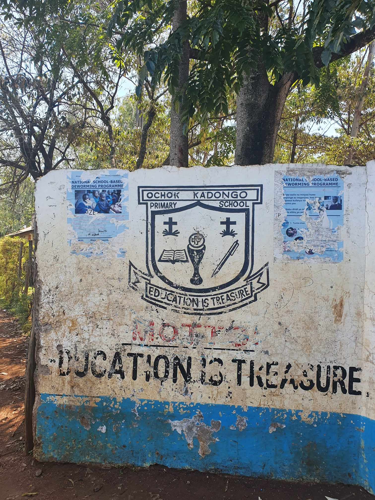
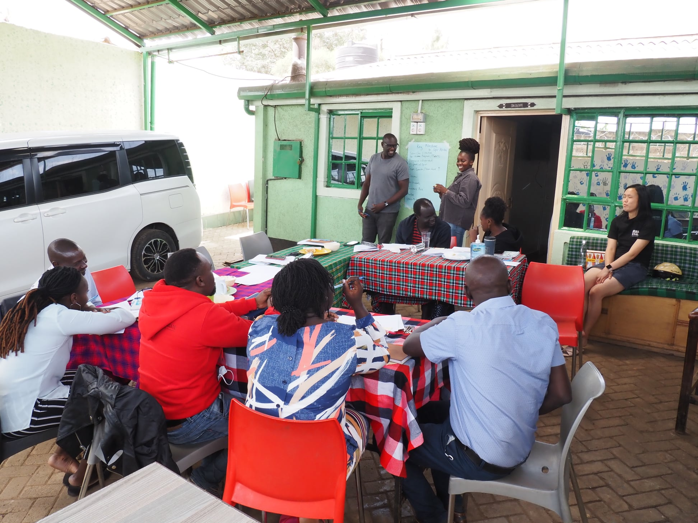

```{r setup, include=FALSE}
knitr::opts_chunk$set(collapse = TRUE)
```

"Whatever things are true, whatever things are honorable, whatever things are right, whatever things are pure, whatever things are pleasing, whatever things are commendable, if there is any excellence of character and if anything praiseworthy, think about these things." (Philippians 4:8 LEB)

"三人行，则必有我师. 择善而从" ("In a group of three, there must be one who can teach me. Choose what is good, and follow it." Analects of Confucius)

On 6th January, Spur Afrika held a training day at the Spur Centre in Kibera for its workers. Rosalie presented a fun interactive session (developed by Deb Doan, thank you!  Deb has developed so many training sessions for Spur Afrika) on team bonding, conflict resolution and psychological safety. The session included exploration of what ways Spur Afrika members depended (or not) on each other, feelings of belonging within the team, safety when expressing disagreement and how team achievements could be celebrated. I was invited to talk (again!) about monitoring and evaluation plans and reporting, and how they fit into a project management framework. I was particularly pleased that the newest team member, Andrew, immediately sought and participated in an extra half-hour tutorial after the three hour training session!

Spur Afrika aims to equip children, their families and - more recently - local communities. In addition, Spur Afrika and its volunteers have - over the years - equipped Spur Afrika workers in skills such as team building, understanding of psychological issues and risk management. Plans for future skills training includes understanding of learning difficulties among children.

Careful and appropriate use of 'worldly wisdom' is encouraged by Paul in his letter to the Philippians. The Philippians are encouraged to think upon whatever is true, honourable, right, pure, pleasing, commendable, praiseworthy and of excellent character. Paul, when warned of danger, took appropriate 'worldly' steps to mitigate the risk (Acts 23:12-24). And certainly skills training in teamwork and understanding of barriers to education (such as psychological issues and learning difficulties) aid the work of Spur Afrika in supporting children.

But in the Kingdom of Christ, worldly wisdom is sometimes turned on its head! Jesus died and was crucified between two 'lestes' (Mark 15:27). 'Lestes' is sometimes translated as 'robbers'. But 'lestes' is also the word used to describe Barabbas (John 18:40), the prisoner who was released by Pilate in preference over Jesus. Barabbas was described as committing murder in a rebellion (Mark 15:7), and the term 'lestes' in non-Biblical writings (e.g. Josephus) is used to describe other violent revolutionaries.

So it appears that Jesus and the 'lestes'  were both working towards a new kingdom, a new world order, but had radically different ways of achieving this! The 'lestes' sought to emulate the traditional tools of power and violence. Whereas Jesus, more subversively, used the way of servanthood and love.

Spur Afrika supports the education and development of children, families and communities. Whilst the Spur Afrika staff encourage good academic results among the children, Spur does not select children to support based on prior academic performance. When I asked, during training sessions, what Spur Afrika team members thought the desired 'impact' of their program is, they didn't just say the typical 'economic' goals of graduation and finding a job. Instead, their desired impact is help children develop strength of character and contribute back to their community.

"...要追求公义、敬虔、信心、爱心、忍耐和温柔，要为真道打美好的仗，要持定永生。你是为永生蒙召的，并在许多见证人面前做过美好的见证。" (提摩太前书 6:11-12 CCB) ("...pursue righteousness, godliness, faith, love, patient endurance, gentleness. Fight the good fight of the faith; take hold of the eternal life to which you were called, and confessed the good confession in the presence of many witnesses.")

[Spur Afrika trip 2021-2022 posts](/spurafrika2021/)

```{r echo=FALSE}
htmltools::HTML(paste(
'<link
  rel="stylesheet"
  href="https://cdn.jsdelivr.net/npm/@fancyapps/ui/dist/fancybox.css"
/>', # for fancybox
'<script src="https://cdn.jsdelivr.net/npm/@fancyapps/ui@4.0/dist/fancybox.umd.js"></script>', # for fancybox
'<script src="https://unpkg.com/isotope-layout@3/dist/isotope.pkgd.min.js"></script>', # for isotope
'<div class="grid" data-isotope=\'{ "itemSelector": ".isotope-grid-item", "masonry": "{\"columnWidth\": \".grid-sizer\"}", "percentPosition": "true", "gutter": 0}\' >',
'<div id="grid-sizer"></div>',
'<div class="isotope-grid-item" style="float:left; width: 35%"><a data-fancybox="gallery" href="./OchokKodongo_SchoolSign.jpg">',
'', # default CSS top/bottom margin is not zero
'</a></div>',
'<div class="isotope-grid-item" style="float:left; width: 62%"><a data-fancybox="gallery" href="./SpurCentre_Training.jpg">',
'',
'</a></div>',
'</div>',
# section below is created by blogdown::shortcode('video', library = 'true', src = 'SpurCentre_TrainingVideo.mp4', controls = 'yes')
# but doesn't seem to be interpreted into correct HTML by Travis)
'<p>',
' <video controls = "">',
'  <source src="/media/SpurCentre_TrainingVideo.mp4" type="video/mp4">',
' </video>',
'</p>'
))
```
