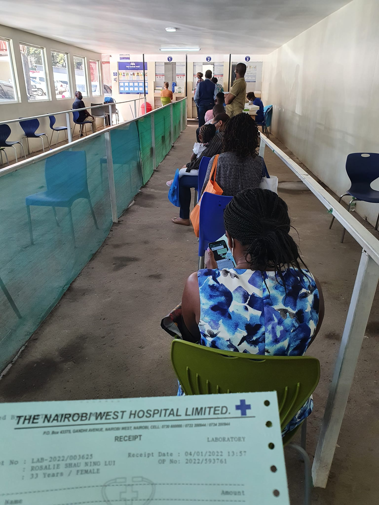

```{r setup, include=FALSE}
knitr::opts_chunk$set(collapse = TRUE)
```

TRAVEL DAY 😆

We are very grateful to be able to travel to Kisumu.  It is bitter sweet to leave Kisumu.  Today Sue, David and I flew back to Kibera, while Patoh and Andrew drove the car back.  The flight wasn't great however we survived! Praise God.    

During breakfast, we had a great time reflecting on the successes and challenges that face Spur in Kisumu.  We are praying we can reach our goals as we have already started planning the next steps.  It is great to feel excited and accepted by the Holo community.  We pray we can achieve mighty things for God there.  I spent last night writing up our report for our board, so praying we can get our proposals through. 

After the flight back to Nairobi, we had to get COVID tested. 😔  I wouldn't say it was a smooth process but at least we got it done within an hour.  I felt it was more complicated than it had to be, as everything was entered manually but the results came back really fast.  WE BOTH TESTED NEGATIVE - YAY!! We can board the plane!! 

We are preparing for departure - SO MANY DOCUMENTS are needed.  Pray that our departure will go smoothly and that we have everything needed to enter Australia!! 

Please pray for our training session tomorrow with the Spur team members. We will be presenting on M and E, psychological safety & working well as a team.  We also have a board meeting with the Aussies, so pray we can communicate well and achieve goals together.  

Tomorrow is the last day we are in Kenya!! It has gone so fast yet it feels like I have been living here for a long time.  🤪

This trip has reminded me that God is always in control and that I have to trust him with everything.  I can't wait to go home and tell everyone about what I have learnt.  So please stay touched on how you can get involved, especially regarding Kisumu.  It is exciting that we are expanding, but the burden of fundraising will also be heightened.  I am constantly reminded that we look to heaven for our reward and treasure. 

Treasures in Heaven 😝

19 “Do not store up for yourselves treasures on earth, where moths and vermin destroy, and where thieves break in and steal. But store up for yourselves treasures in heaven, where moths and vermin do not destroy, and where thieves do not break in and steal. For where your treasure is, there your heart will be also." *Matthew 6:19-21*

[Spur Afrika trip 2021-2022 posts](/spurafrika2021/)


```{r echo=FALSE}
htmltools::HTML(paste(
'<link
  rel="stylesheet"
  href="https://cdn.jsdelivr.net/npm/@fancyapps/ui/dist/fancybox.css"
/>', # for fancybox
'<script 
    src="https://cdn.jsdelivr.net/npm/@fancyapps/ui@4.0/dist/fancybox.umd.js">
 </script>', # for fancybox
'<script 
    src="https://unpkg.com/isotope-layout@3/dist/isotope.pkgd.min.js">
 </script>', # for isotope
'<div 
   class="grid" 
   data-isotope=\'{
     "itemSelector": ".isotope-grid-item",
     "masonry": "{\"columnWidth\": \".grid-sizer\"}",
     "percentPosition": "true",
     "gutter": 0
   }\'
 >',
'  <div id="grid-sizer"></div>',
'  <div class="isotope-grid-item" style="float:left; width: 95%">',
'    <a data-fancybox="gallery" href="./covidtest_nairobiwest.jpg">',
'      ', 
       # default CSS top/bottom margin is not zero
'    </a>',
'  </div>',
'</div>',
#
'<br clear="left"><br>'
))
```

