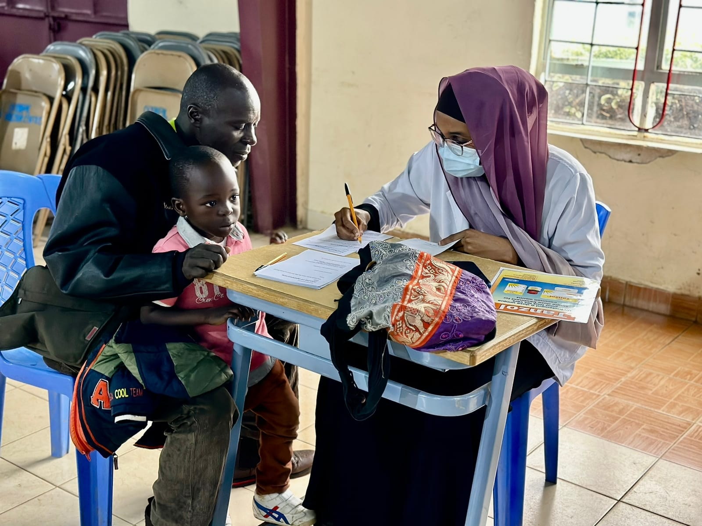

```{r setup, include=FALSE}
knitr::opts_chunk$set(collapse = TRUE)
```

It's clinic time. 🏥

I feel exhausted but it's nothing in comparison to children who are unwell and never get any treatment. It is a privilege to access health care. It is a privilege to be able to give health care. 

The weather has been cold and wet. It's strange to feel cold in Kenya. Back home, we complain that the rain affects our activities but in the slum, it's a totally different story. The houses or huts are not built for the rain. There is mud EVERYWHERE and so it's hard to get around. However despite the rain, children have still turned up for our clinic. 

We have 5 doctors (mostly local Kenyans plus David), 2 dentists and 1 nurse. It's been a fairly smooth process getting the children through registration, eye check, weight, temperature, etc. We have had a lot of help from our Spur community, including the older high school kids and graduates. I have had the joy in working with Winny who helped me dispense drugs and translate. 

We saw 164 children today and 31 for the dentists. Because we have a local team, we managed to finish by 2pm. It was good to have a rest in the afternoon. Please pray that our energy levels will continue to rise and that we will stay well. It's been great to see all the children but I have realised I need the rest and some quite time.  I have forgotten how many children there are in the slums. It's overwhelming at times.

We have 2 more days of clinics. Praying we can all continue to work together well. Praying that we can continue to give adequate treatment to all who come. It's been a joy working with the local clinic, it's great to be able to network and collaborate.  

Also, it is nice to give the children something fun to look forward to, colouring is by far the best thing about the clinic. The excitement is real. (That's the only station that people want to come back to 😆)

[Spur Afrika trip 2023 posts](/spurafrika2023/)

```{r echo=FALSE}
htmltools::HTML(paste(
'<link
  rel="stylesheet"
  href="https://cdn.jsdelivr.net/npm/@fancyapps/ui/dist/fancybox.css"
/>', # for fancybox
'<script src="https://cdn.jsdelivr.net/npm/@fancyapps/ui@4.0/dist/fancybox.umd.js"></script>', # for fancybox
'<script src="https://unpkg.com/isotope-layout@3/dist/isotope.pkgd.min.js"></script>', # for isotope
'<div class="grid" data-isotope=\'{ "itemSelector": ".isotope-grid-item", "masonry": "{\"columnWidth\": \".grid-sizer\"}", "percentPosition": "true", "gutter": 0}\' >',
'<div id="grid-sizer"></div>',
'<div class="isotope-grid-item" style="float:left; width: 47%"><a data-fancybox="gallery" href="./picture1.jpg">',
'', # default CSS top/bottom margin is not zero
'</a></div>',
'<div class="isotope-grid-item" style="float:left; width: 47%"><a data-fancybox="gallery" href="./picture2.jpg">',
'',
'</a></div>',
'<div class="isotope-grid-item" style="float:left; width: 47%"><a data-fancybox="gallery" href="./picture3.jpg">',
'', # default CSS top/bottom margin is not zero
'</a></div>',
'<div class="isotope-grid-item" style="float:left; width: 47%"><a data-fancybox="gallery" href="./picture4.jpg">',
'',
'</a></div>',
'<div class="isotope-grid-item" style="float:left; width: 47%"><a data-fancybox="gallery" href="./picture5.jpg">',
'', # default CSS top/bottom margin is not zero
'</a></div>',
'<div class="isotope-grid-item" style="float:left; width: 47%"><a data-fancybox="gallery" href="./picture6.jpg">',
'',
'</a></div>',
'<div class="isotope-grid-item" style="float:left; width: 47%"><a data-fancybox="gallery" href="./picture7.jpg">',
'', # default CSS top/bottom margin is not zero
'</a></div>',
'</div>'
))
```