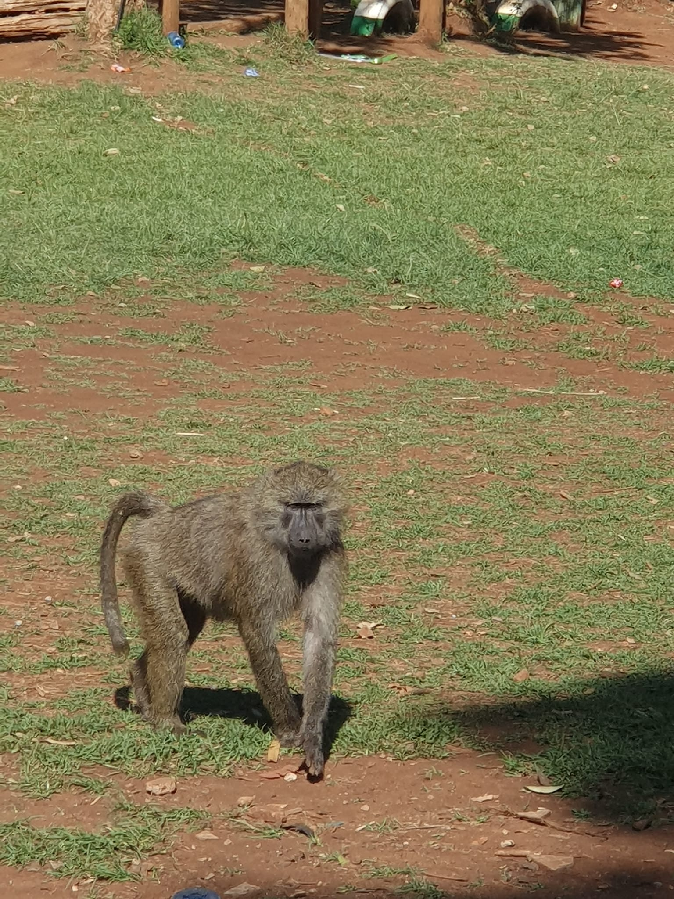

```{r setup, include=FALSE}
knitr::opts_chunk$set(collapse = TRUE)
```

Dance, play, football and a lots of fun! ☺️🕺⚽️

On Saturday we got to take all the sponsored children out of the slum and into the nearby park. It was definitely an experience as it was chaotic to get the children there. They took a public bus and it seems like a miracle but all our stuff and all the children got there. 

In the most Kenyan way, there was a lot of loud music and dancing. It was great to see the children doing what they love and spending time having fun. The workers got into the dance competition as well.

It was lovely to get to know some of the children better. We got to interview a few of them. It was extremely encouraging to hear the older kids wanting to pay it forward. It really makes me happy to see them support each other by volunteering with Spur. 

We got to give our gifts and take photos. The monkeys were everyone.... they were scary... they tried to take our food. 

The Kibera team are doing so well. It's amazing to see God’s work in there. It's a community that gives back but supports each other as well. 

> And let us consider how we may spur one another on toward love and good deeds, not giving up meeting together, as some are in the habit of doing, but encouraging one another—and all the more as you see the Day approaching.  
*Hebrews 10:24-25*

Please pray for safe travels as we go to Kisumu tomorrow.

[Spur Afrika trip 2023 posts](/spurafrika2023/)

```{r echo=FALSE}
blogdown::shortcode('video', library = 'true', src = '20230107_danceoff.mp4', controls = 'yes')
```

```{r echo=FALSE}
htmltools::HTML(paste(
'<link
  rel="stylesheet"
  href="https://cdn.jsdelivr.net/npm/@fancyapps/ui/dist/fancybox.css"
/>', # for fancybox
'<script src="https://cdn.jsdelivr.net/npm/@fancyapps/ui@4.0/dist/fancybox.umd.js"></script>', # for fancybox
'<script src="https://unpkg.com/isotope-layout@3/dist/isotope.pkgd.min.js"></script>', # for isotope
'<div class="grid" data-isotope=\'{ "itemSelector": ".isotope-grid-item", "masonry": "{\"columnWidth\": \".grid-sizer\"}", "percentPosition": "true", "gutter": 0}\' >',
'<div id="grid-sizer"></div>',
'<div class="isotope-grid-item" style="float:left; width: 47%"><a data-fancybox="gallery" href="./picture1.jpg">',
'', # default CSS top/bottom margin is not zero
'</a></div>',
'<div class="isotope-grid-item" style="float:left; width: 47%"><a data-fancybox="gallery" href="./picture2.jpg">',
'',
'</a></div>',
'<div class="isotope-grid-item" style="float:left; width: 47%"><a data-fancybox="gallery" href="./picture3.jpg">',
'', # default CSS top/bottom margin is not zero
'</a></div>',
'<div class="isotope-grid-item" style="float:left; width: 47%"><a data-fancybox="gallery" href="./picture4.jpg">',
'',
'</a></div>',
'</div>'
))
```