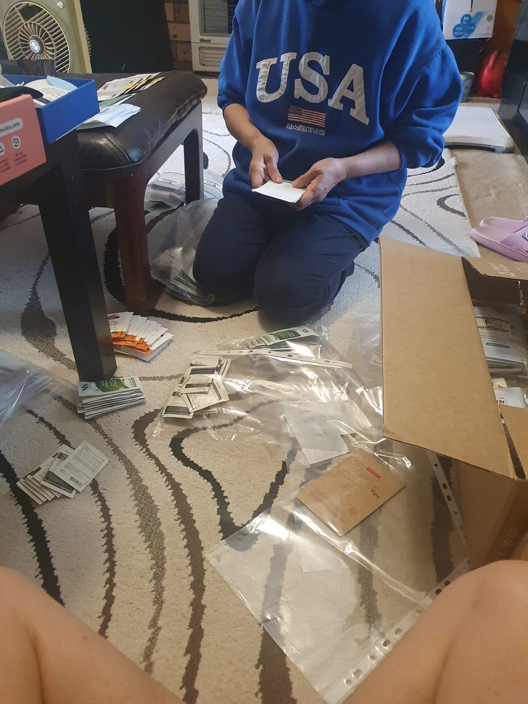
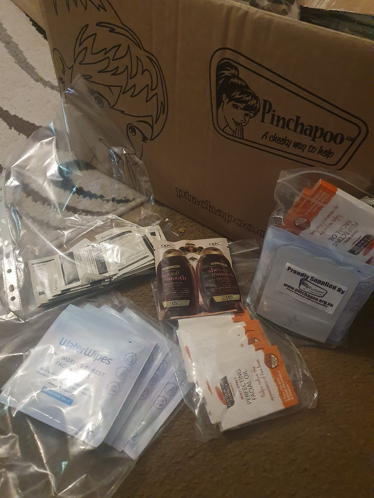

```{r setup, include=FALSE}
knitr::opts_chunk$set(collapse = TRUE)
```

I know I am going to Kenya when my house turns into a warehouse!! 😅🤪😝

It's great to have donations and to be able to bring some nice products to the children, families, workers and mentors. Pinchapoo collects samples from companies to give to non for profits. Thanks Ian Bunston for arranging it.

David and I have a lot going on. I am glad to have this week to plan, prepare and pack. However it is a full schedule. We have Christmas, carols, birthday party, weddings, training days, clinics, and lots on...

Thank God for people, well mainly my mother for all the help. Please keep praying for us! We really need it. 

PS, it was lovely to go away for a week in South Australia but feeling a little behind with all the planning. 🤣😂

[Spur Afrika trip 2023 posts](/spurafrika2023/)

```{r echo=FALSE}
htmltools::HTML(paste(
'<link
  rel="stylesheet"
  href="https://cdn.jsdelivr.net/npm/@fancyapps/ui/dist/fancybox.css"
/>', # for fancybox
'<script src="https://cdn.jsdelivr.net/npm/@fancyapps/ui@4.0/dist/fancybox.umd.js"></script>', # for fancybox
'<script src="https://unpkg.com/isotope-layout@3/dist/isotope.pkgd.min.js"></script>', # for isotope
'<div class="grid" data-isotope=\'{ "itemSelector": ".isotope-grid-item", "masonry": "{\"columnWidth\": \".grid-sizer\"}", "percentPosition": "true", "gutter": 0}\' >',
'<div id="grid-sizer"></div>',
'<div class="isotope-grid-item" style="float:left; width: 47%"><a data-fancybox="gallery" href="./warehouse1.jpg">',
'', # default CSS top/bottom margin is not zero
'</a></div>',
'<div class="isotope-grid-item" style="float:left; width: 47%"><a data-fancybox="gallery" href="./warehouse2.jpg">',
'',
'</a></div>',
'</div>'
))
```