```{r setup, include=FALSE}
knitr::opts_chunk$set(collapse = TRUE)
```

KISUMU 🐓😍🥰🧒🧒🕯❤️

My heart melts and feels for the people of Holo, Kisumu. To be a girl or woman 👩 living in a village is a strength but such a challenge. It makes me angry? Or mad? To be a girl living in Holo, you are immediately disadvantaged, your life is forever tied to a man. You need a man for protection, for income, for a future. But when men take advantage of this, it is a disaster. 

Men have multiple wives and bride inheritance means a man needs to take care of other females in their family when their husband can't. It's such a foreign concept to me, but it's reality. So it's not surprising that many girls believe their only hope in life is to get a man and have a child. 

Kinda girls is a program we started for the overwhelming need to care for pregnant girls who were abandoned by their families. I met with most of them and it was a eye opener. Their life is not easy. Their babies are so cute. The babies were SO well behaved. I can't believe we had about 30 babies outside and I didn't really hear them cry! They also came without anything.... not even a nappy sometimes....😂😭

Anyway, they are being equipped with skills. They have been making soap which they gifted us with 2 bottles. The village leaders were also so happy to meet with us. They gave us 2 chickens! Living ones. 😂🤣

I also enjoyed going into the village to meet families. Phenny lives with her siblings and grandma. Her grandma has to work to support them. The girls had to flee from their abusive father. The father wanted to burn their house down at night, but they managed to change locations. However he still burned down that house with another family in it. Unfortunately, they passed away. The police are now looking for him. 😲

Anyway, it was great to spend time with them and give some health care to the family. The grandma is suffering from back and manual handling problems. We could only offer pain medication. Praying she can earn money quickly so she doesn't need to work so much. They gave us another chicken when we left. What joy! 🐔

Sorry about the long post. We have returned back to Kibera but I still think about Kisumu. There is so so much need in the village. I pray and hope we can grow in Kisumu and be a source of sustainable living for the people of Holo. This is where are resources will be going to. 

Here are a few photos. I also enjoyed sitting back and watching Dr David Fong do his thing. I can be a good assistant and watch my partner flourish. He is always so gentle, kind and patient. Everyone is impressed that he really listens. 

I shall post more when I can gather my thoughts. Please pray for the mentors training, board meeting and worker retreat. Still have a few things to plan for. Only God can provide for our needs. He is good even in dark places, especially in dark places. 🕯

[Spur Afrika trip 2023 posts](/spurafrika2023/)

```{r echo=FALSE}
htmltools::HTML(paste(
'<link
  rel="stylesheet"
  href="https://cdn.jsdelivr.net/npm/@fancyapps/ui/dist/fancybox.css"
/>', # for fancybox
'<script src="https://cdn.jsdelivr.net/npm/@fancyapps/ui@4.0/dist/fancybox.umd.js"></script>', # for fancybox
'<script src="https://unpkg.com/isotope-layout@3/dist/isotope.pkgd.min.js"></script>', # for isotope
'<div class="grid" data-isotope=\'{ "itemSelector": ".isotope-grid-item", "masonry": "{\"columnWidth\": \".grid-sizer\"}", "percentPosition": "true", "gutter": 0}\' >',
'<div id="grid-sizer"></div>',
'<div class="isotope-grid-item" style="float:left; width: 47%"><a data-fancybox="gallery" href="./picture1.jpg">',
'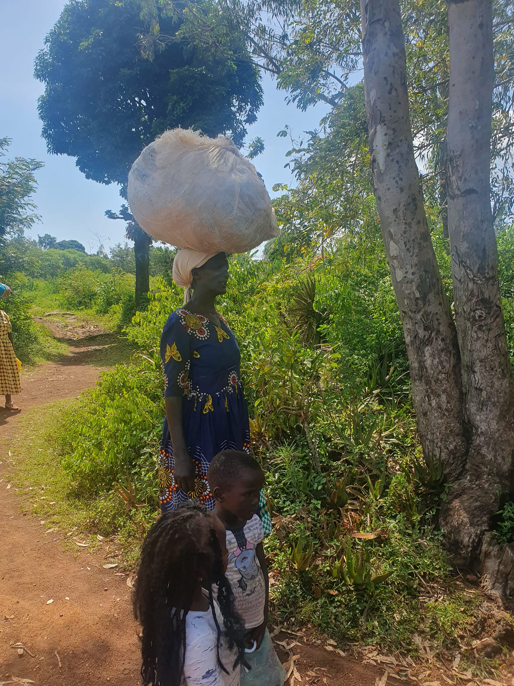', # default CSS top/bottom margin is not zero
'</a></div>',
'<div class="isotope-grid-item" style="float:left; width: 47%"><a data-fancybox="gallery" href="./picture2.jpg">',
'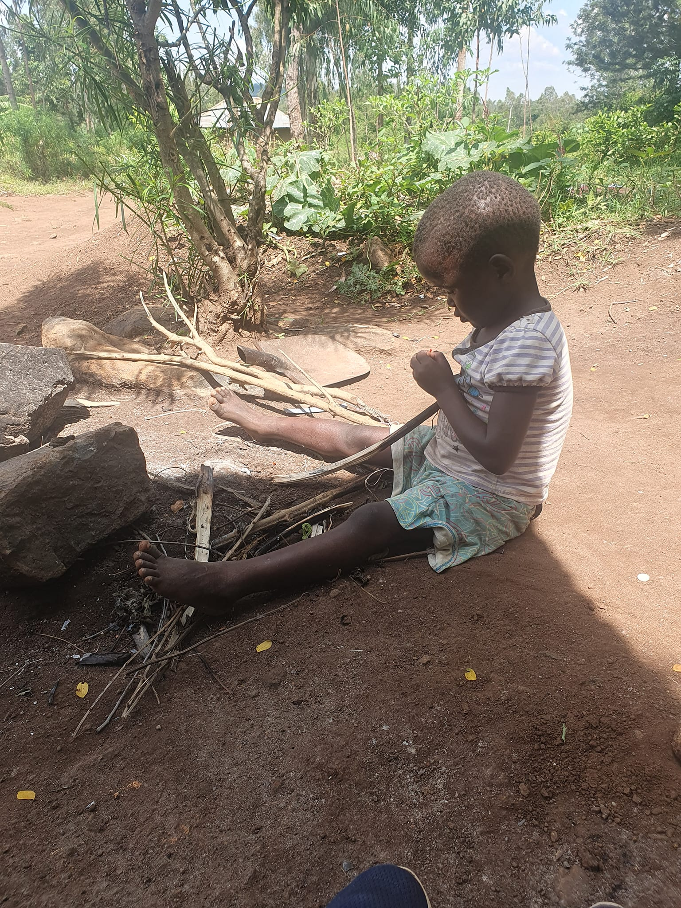',
'</a></div>',
'<div class="isotope-grid-item" style="float:left; width: 47%"><a data-fancybox="gallery" href="./picture10.jpg">',
'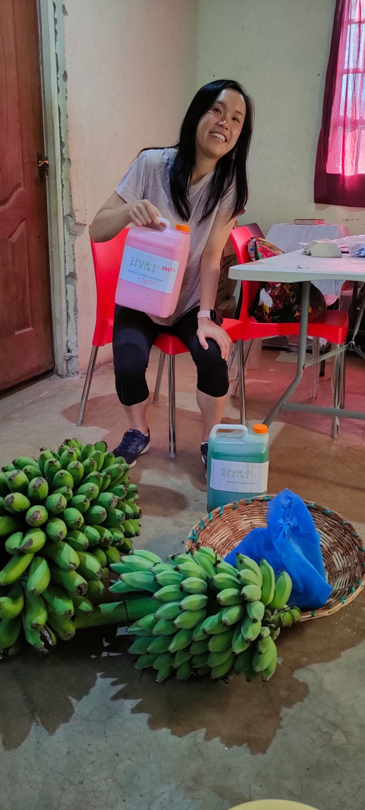',
'</a></div>',
'<div class="isotope-grid-item" style="float:left; width: 47%"><a data-fancybox="gallery" href="./picture11.jpg">',
'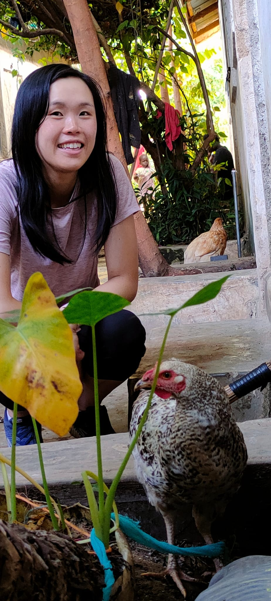', # default CSS top/bottom margin is not zero
'</a></div>',
'<div class="isotope-grid-item" style="float:left; width: 31%"><a data-fancybox="gallery" href="./picture3.jpg">',
'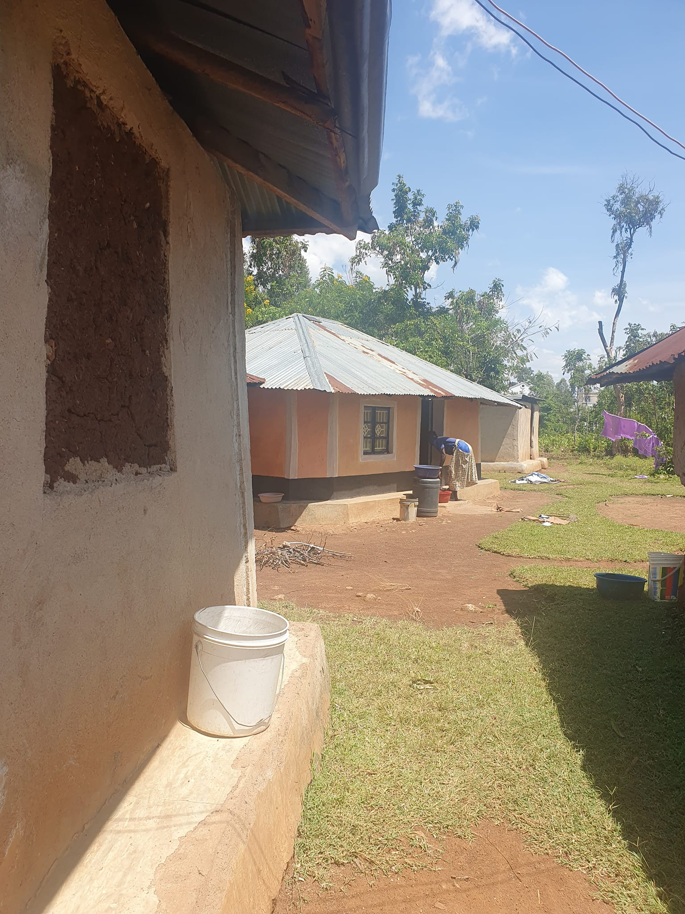', # default CSS top/bottom margin is not zero
'</a></div>',
'<div class="isotope-grid-item" style="float:left; width: 31%"><a data-fancybox="gallery" href="./picture4.jpg">',
'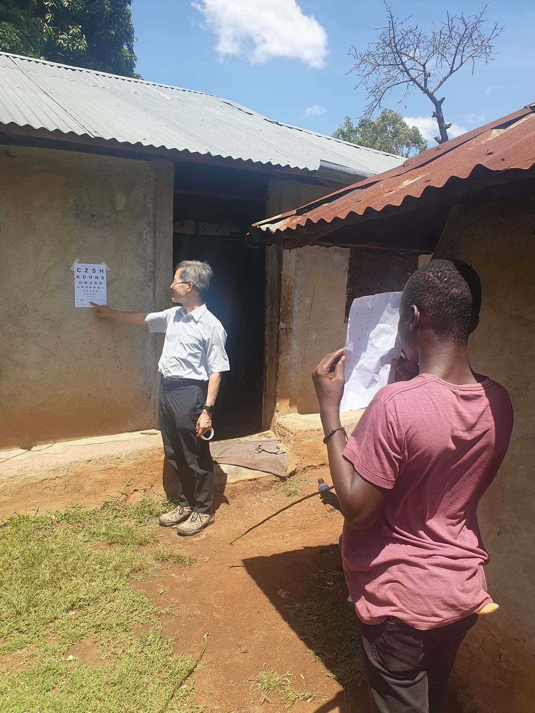',
'</a></div>',
'<div class="isotope-grid-item" style="float:left; width: 31%"><a data-fancybox="gallery" href="./picture5.jpg">',
'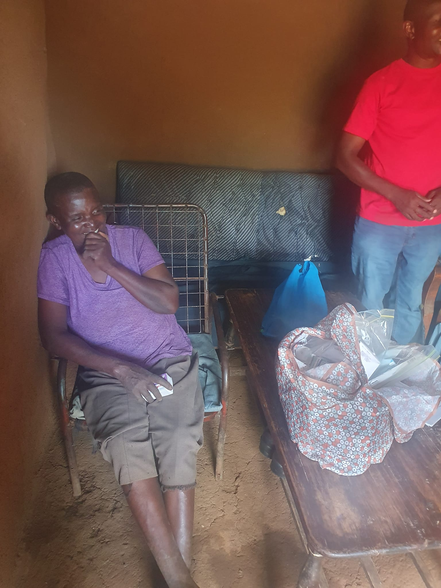', # default CSS top/bottom margin is not zero
'</a></div>',
'<div class="isotope-grid-item" style="float:left; width: 32%"><a data-fancybox="gallery" href="./picture6.jpg">',
'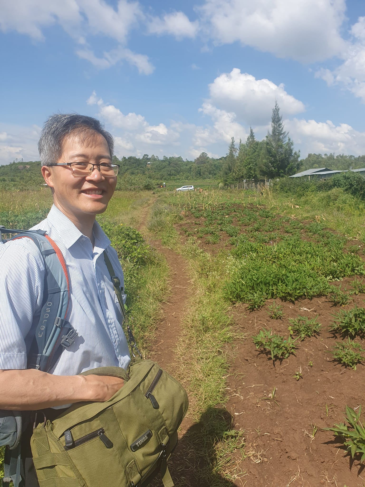',
'</a></div>',
'<div class="isotope-grid-item" style="float:left; width: 61%"><a data-fancybox="gallery" href="./picture8.jpg">',
'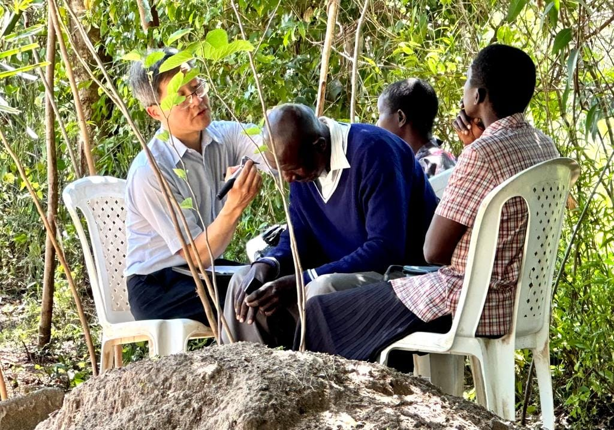',
'</a></div>',
'<div class="isotope-grid-item" style="float:left; width: 94%"><a data-fancybox="gallery" href="./picture7.jpg">',
'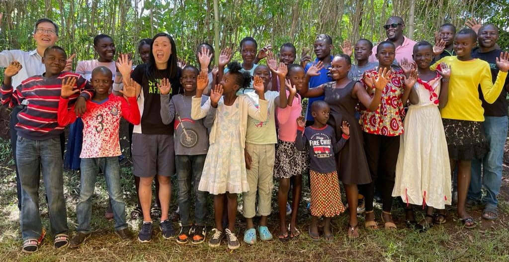', # default CSS top/bottom margin is not zero
'</a></div>',
'<div class="isotope-grid-item" style="float:left; width: 47%"><a data-fancybox="gallery" href="./picture9.jpg">',
'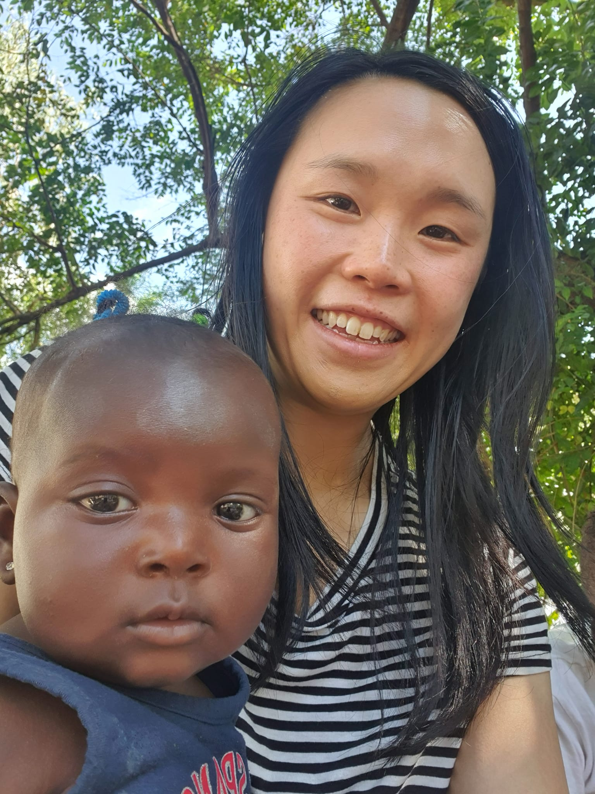', # default CSS top/bottom margin is not zero
'</a></div>',
'<div class="isotope-grid-item" style="float:left; width: 47%"><a data-fancybox="gallery" href="./picture12.jpg">',
'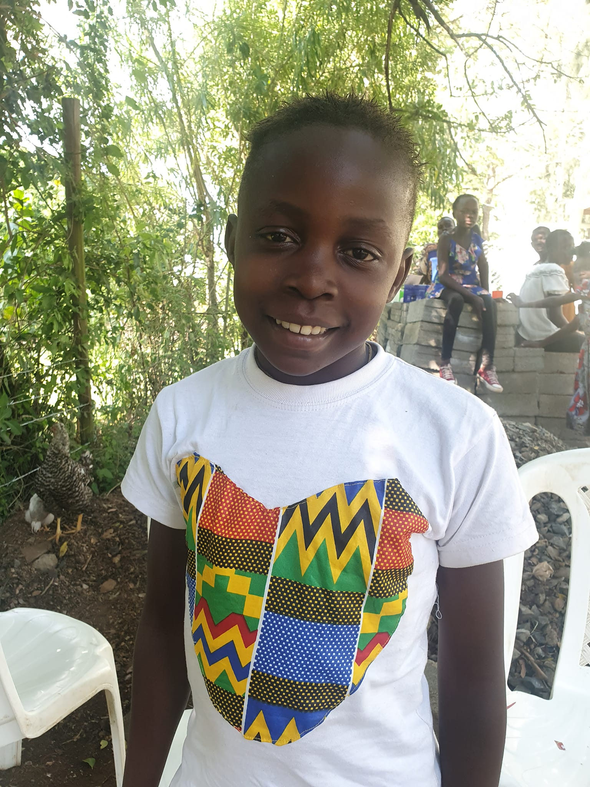',
'</a></div>',
'</div>'
))
```