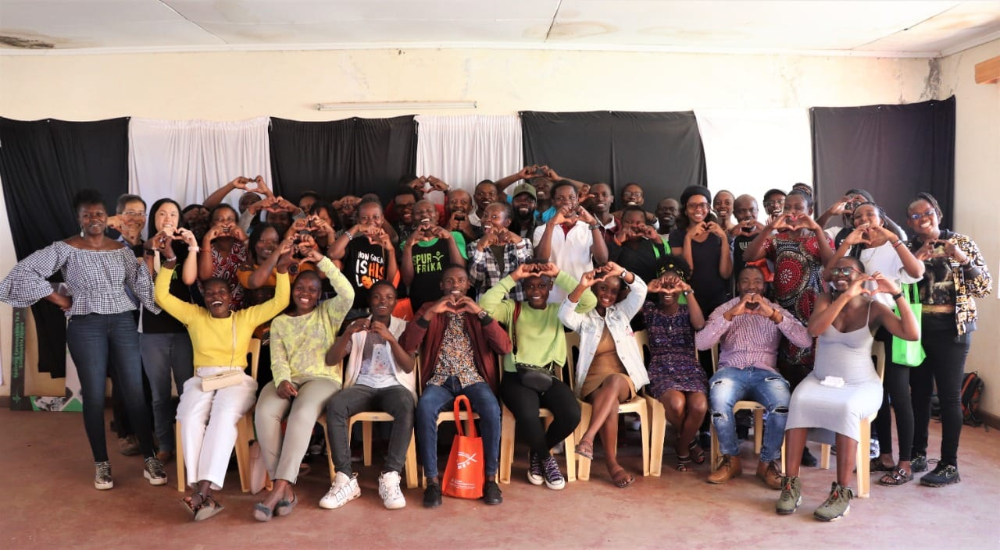
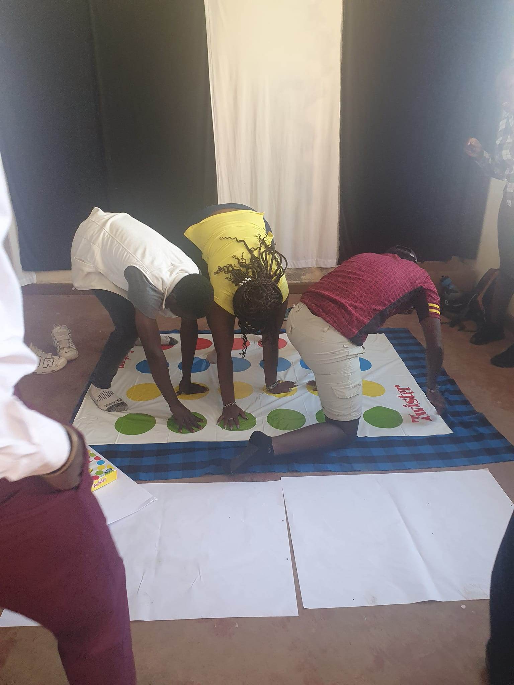
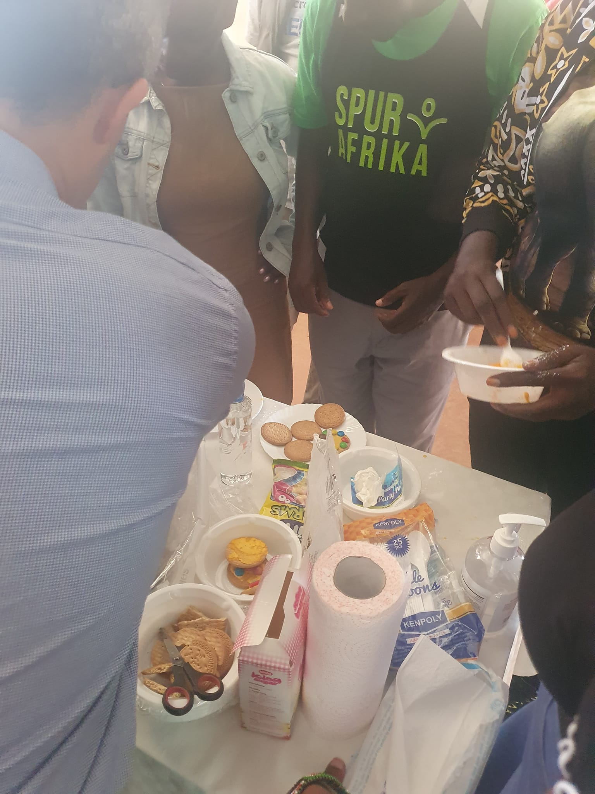
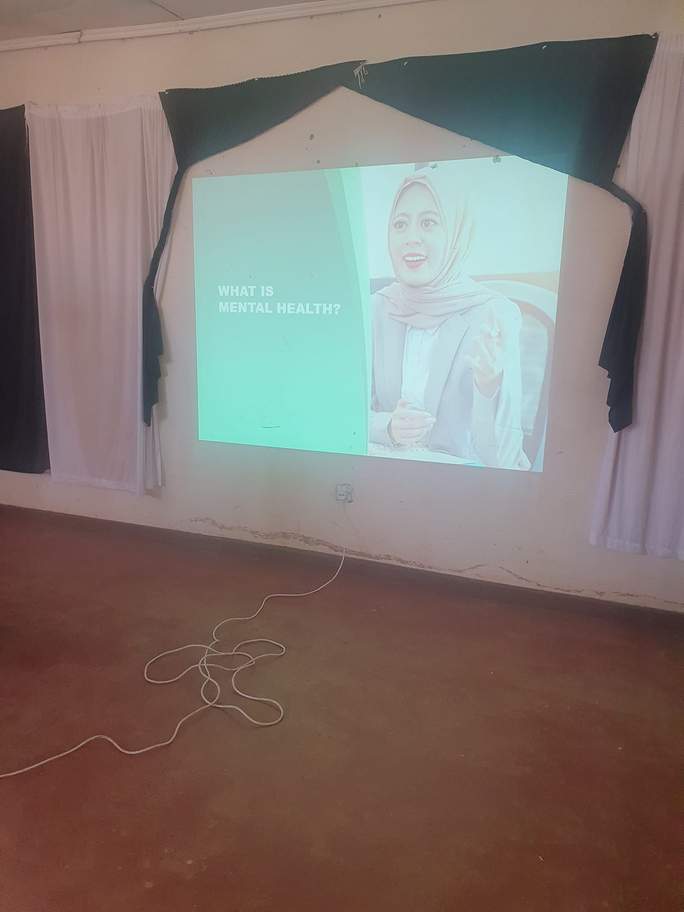

```{r setup, include=FALSE}
knitr::opts_chunk$set(collapse = TRUE)
```

Let's talk about mental health, self care and mentorship! ❤️😍🥰

We had a great time training our Kenyan mentors. We talked about taking care of your own mental health so you can take care of others. We also discussed some scenarios to help them problem solve and guide them through their mentorship journey. It was great to hear their thoughts and for them to collaborate with each other. 

We also had heaps of fun with playing some games and activities that the mentors can play with the kids. Twister, making jellies and decorating biscuits was a very fun activity!! 

It was good to give out the presents that we bought from Melbourne, including the nice samples we got from pinchapoo. 

It's been exhausting but rewarding. We only have the worker retreat left ... praying we can have a productive time with our Spur workers. Pray for good health, energy and adequate rest.

[Spur Afrika trip 2023 posts](/spurafrika2023/)

```{r echo=FALSE}
htmltools::HTML(paste(
'<link
  rel="stylesheet"
  href="https://cdn.jsdelivr.net/npm/@fancyapps/ui/dist/fancybox.css"
/>', # for fancybox
'<script src="https://cdn.jsdelivr.net/npm/@fancyapps/ui@4.0/dist/fancybox.umd.js"></script>', # for fancybox
'<script src="https://unpkg.com/isotope-layout@3/dist/isotope.pkgd.min.js"></script>', # for isotope
'<div class="grid" data-isotope=\'{ "itemSelector": ".isotope-grid-item", "masonry": "{\"columnWidth\": \".grid-sizer\"}", "percentPosition": "true", "gutter": 0}\' >',
'<div id="grid-sizer"></div>',
'<div class="isotope-grid-item" style="float:left; width: 94%"><a data-fancybox="gallery" href="./picture1.jpg">',
'', # default CSS top/bottom margin is not zero
'</a></div>',
'<div class="isotope-grid-item" style="float:left; width: 47%"><a data-fancybox="gallery" href="./picture2.jpg">',
'',
'</a></div>',
'<div class="isotope-grid-item" style="float:left; width: 47%"><a data-fancybox="gallery" href="./picture3.jpg">',
'', # default CSS top/bottom margin is not zero
'</a></div>',
'<div class="isotope-grid-item" style="float:left; width: 94%"><a data-fancybox="gallery" href="./picture4.jpg">',
'',
'</a></div>',
'</div>'
))
```