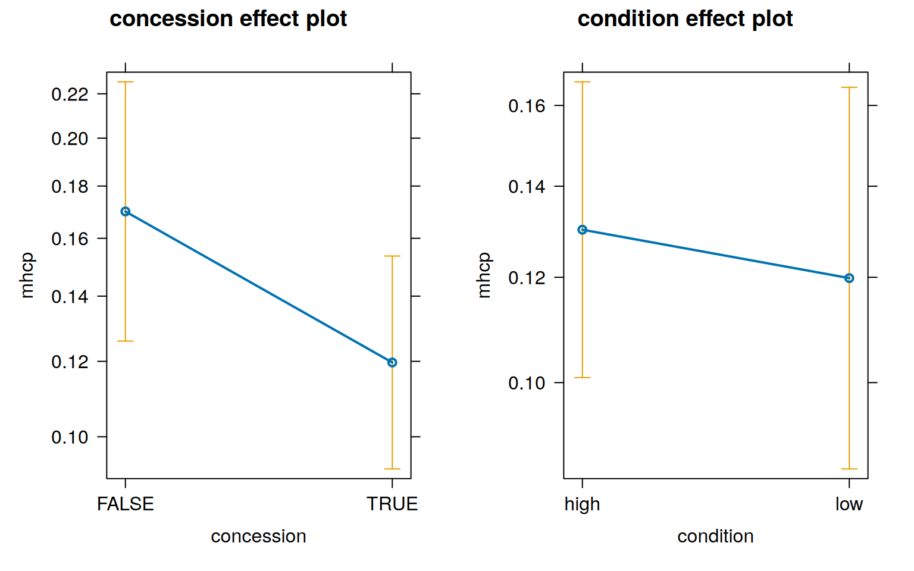
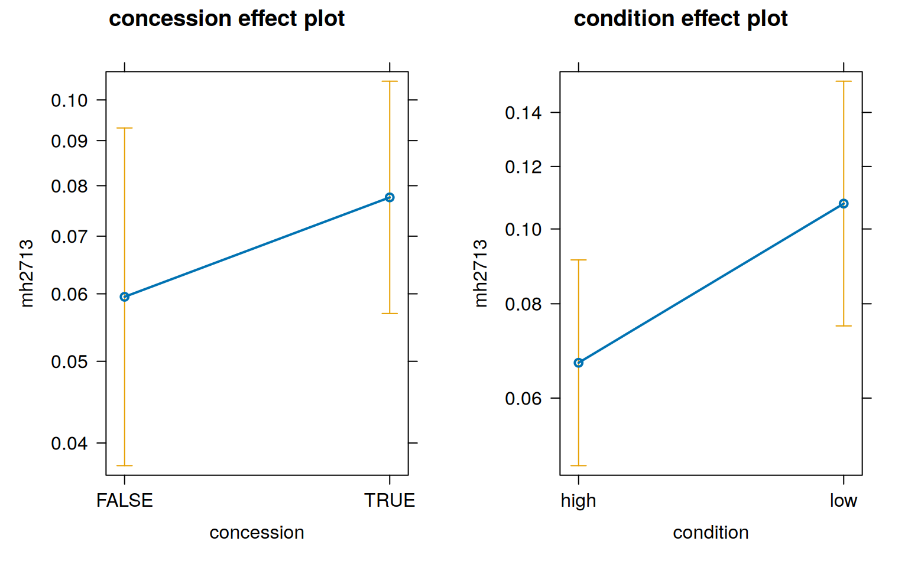
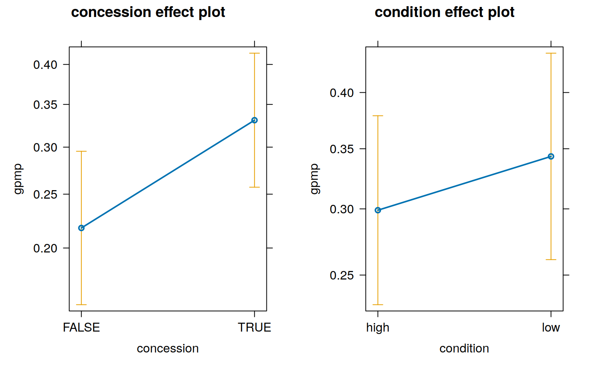

<link href="index_files/libs/table1-1.0/table1_defaults.css" rel="stylesheet" />

Photo by <a href="https://unsplash.com/@tex450?utm_content=creditCopyText&utm_medium=referral&utm_source=unsplash">Matthew Ball</a> on <a href="https://unsplash.com/photos/woman-in-black-and-white-long-sleeve-shirt-OJQFlWvUb2E?utm_content=creditCopyText&utm_medium=referral&utm_source=unsplash">Unsplash</a>

Exploring the question of whether Mental Health Care Plans (and the billing of them) are driven by patients, and the patient's expected utility of MHCPs to unlock government funding for private psychological services.

The number of MHCP-eligible patients at coHealth who were billed MHCPs in the previous twelve months were divided into groups according to concession card holder patients (either health care card 'HCC' or pension card) and high-prevalence and low-prevalence mental health disorders.

It is postulated that concession card holders have lower financial resources and are less able to utilise the government subsidies unlocked by MHCP plans for private psychology. This is because private psychology fees are far greater than the government subsidy to use private psychology.

Mental health conditions can be broadly divided into low- and high- frequency mental health conditions. High-frequency mental health conditions are the common mental health conditions such as anxieyt and depression. Low-frequency mental health conditions are the less common, and often more serious and lifelong conditions, of schizophrenia and bipolar affective disorder. It is postulated that patients with low-prevalence mental health disorders have more severe mental health conditions and are at greater need of mental health assessments and services.

<details class="code-fold">
<summary>Show the code</summary>

``` r
library(dplyr)
library(tidyr)
library(lme4)
library(table1)
library(effects)
library(sjPlot) # regression table plotting
```

</details>
<details class="code-fold">
<summary>Show the code</summary>

``` r
# outcome
#   MHCP - false/true
# 
# predictors
#   concession - false = no, true = yes
#   mental health condition - "high" = high-frequency, "low" = low-frequency
# 
# random effects
#   (not considered to be a predictor of interest)
#   clinic - the clinic's name, a categorical variable

# the initial data was created as counts (i.e. aggregated data)
# the original patient data can be recreated from the counts

summary_df <- tibble(
  concession = logical(),
  condition = factor(),
  clinic = character(),
  total = integer(), # number in this patient category (concession, condition, clinic) occurs
  mhcp = integer(), # number who had a mental health care plan (MHCP e.g. 2715/2717)
  mh2713 = integer(), # number who had a billed GP mental health consult (MBS item 2713)
  gpmp = integer() # number who had a chronic disease management plan (MBS item 721)
)

summary_df <- summary_df |>
  add_row(concession = TRUE, condition = "high", clinic = "Kensington", total = 285, mhcp = 42, mh2713 = 13, gpmp = 109) |>
  add_row(concession = TRUE, condition = "low", clinic = "Kensington", total = 73, mhcp = 7, mh2713 = 7, gpmp = 33) |>
  add_row(concession = FALSE, condition = "high", clinic = "Kensington", total = 84, mhcp = 9, mh2713 = 4, gpmp = 19) |>
  add_row(concession = FALSE, condition = "low", clinic = "Kensington", total = 8, mhcp = 2, mh2713 = 0, gpmp = 3) |>
  add_row(concession = TRUE, condition = "high", clinic = "Paisley", total = 430, mhcp = 26, mh2713 = 42, gpmp = 164) |>
  add_row(concession = TRUE, condition = "low", clinic = "Paisley", total = 123, mhcp = 13, mh2713 = 10, gpmp = 58) |>
  add_row(concession = FALSE, condition = "high", clinic = "Paisley", total = 131, mhcp = 21, mh2713 = 14, gpmp = 26) |>
  add_row(concession = FALSE, condition = "low", clinic = "Paisley", total = 8, mhcp = 1, mh2713 = 0, gpmp = 4) |>
  add_row(concession = TRUE, condition = "high", clinic = "Laverton", total = 79, mhcp = 14, mh2713 = 6, gpmp = 32) |>
  add_row(concession = TRUE, condition = "low", clinic = "Laverton", total = 38, mhcp = 10, mh2713 = 15, gpmp = 18) |>
  add_row(concession = FALSE, condition = "high", clinic = "Laverton", total = 43, mhcp = 7, mh2713 = 1, gpmp = 16) |>
  add_row(concession = FALSE, condition = "low", clinic = "Laverton", total = 4, mhcp = 1, mh2713 = 1, gpmp = 1) |>
  add_row(concession = TRUE, condition = "high", clinic = "Collingwood", total = 346, mhcp = 35, mh2713 = 17, gpmp = 88) |>
  add_row(concession = TRUE, condition = "low", clinic = "Collingwood", total = 87, mhcp = 5, mh2713 = 10, gpmp = 20) |>
  add_row(concession = FALSE, condition = "high", clinic = "Collingwood", total = 88, mhcp = 14, mh2713 = 4, gpmp = 17) |>
  add_row(concession = FALSE, condition = "low", clinic = "Collingwood", total = 6, mhcp = 1, mh2713 = 0, gpmp = 1) |>
  add_row(concession = TRUE, condition = "high", clinic = "Fitzroy", total = 445, mhcp = 74, mh2713 = 29, gpmp = 94) |>
  add_row(concession = TRUE, condition = "low", clinic = "Fitzroy", total = 165, mhcp = 18, mh2713 = 13, gpmp = 38) |>
  add_row(concession = FALSE, condition = "high", clinic = "Fitzroy", total = 91, mhcp = 20, mh2713 = 2, gpmp = 14) |>
  add_row(concession = FALSE, condition = "low", clinic = "Fitzroy", total = 10, mhcp = 3, mh2713 = 1, gpmp = 1)
```

</details>
<details class="code-fold">
<summary>Show the code</summary>

``` r
# duplicate rows according to the weighting 'mhcp',
# hence "re-creating" the original patient-level data from the counts
mhcp <- summary_df |>
  # duplicate rows by number of mental health care plans (mhcp)
  uncount(mhcp) |>
  # add back mhcp column to a logical
  mutate(mhcp = TRUE) |> 
  # don't need 'total' column any more
  select(concession, condition, clinic, mhcp) |>
  bind_rows(
    # do the same, except
    # now duplicate rows by number who do not have mental health care plans
    summary_df |>
      mutate(no_mhcp = total - mhcp) |>
      uncount(no_mhcp) |>
      mutate(mhcp = FALSE) |>
      select(concession, condition, clinic, mhcp)
  )
  
label(mhcp$mhcp) = "Mental Health Plan"
label(mhcp$concession) = "Concession card"
label(mhcp$condition) = "Condition frequency"

table1(
  x = ~ mhcp + concession + condition | clinic,
  data = mhcp |>
    mutate(condition = factor(condition, label = c("High-prevalence", "Low-prevalence"))),
  overall = c(left = "Total"),
  caption = "Mental health care plans, concession card status and High- vs Low- frequency mental health conditions",
  footnote = "coHealth clinics, May 2025, 'active' patients"
  )
```

</details>
<div class="Rtable1"><table class="Rtable1"><caption>Mental health care plans, concession card status and High- vs Low- frequency mental health conditions</caption>

<thead>
<tr>
<th class='rowlabel firstrow lastrow'></th>
<th class='firstrow lastrow'><span class='stratlabel'>Total<br><span class='stratn'>(N=2544)</span></span></th>
<th class='firstrow lastrow'><span class='stratlabel'>Collingwood<br><span class='stratn'>(N=527)</span></span></th>
<th class='firstrow lastrow'><span class='stratlabel'>Fitzroy<br><span class='stratn'>(N=711)</span></span></th>
<th class='firstrow lastrow'><span class='stratlabel'>Kensington<br><span class='stratn'>(N=450)</span></span></th>
<th class='firstrow lastrow'><span class='stratlabel'>Laverton<br><span class='stratn'>(N=164)</span></span></th>
<th class='firstrow lastrow'><span class='stratlabel'>Paisley<br><span class='stratn'>(N=692)</span></span></th>
</tr>
<tfoot><tr><td colspan="7" class="Rtable1-footnote"><p>coHealth clinics, May 2025, 'active' patients</p>
</td></tr></tfoot>
</thead>
<tbody>
<tr>
<td class='rowlabel firstrow'>Mental Health Plan</td>
<td class='firstrow'></td>
<td class='firstrow'></td>
<td class='firstrow'></td>
<td class='firstrow'></td>
<td class='firstrow'></td>
<td class='firstrow'></td>
</tr>
<tr>
<td class='rowlabel'>Yes</td>
<td>323 (12.7%)</td>
<td>55 (10.4%)</td>
<td>115 (16.2%)</td>
<td>60 (13.3%)</td>
<td>32 (19.5%)</td>
<td>61 (8.8%)</td>
</tr>
<tr>
<td class='rowlabel lastrow'>No</td>
<td class='lastrow'>2221 (87.3%)</td>
<td class='lastrow'>472 (89.6%)</td>
<td class='lastrow'>596 (83.8%)</td>
<td class='lastrow'>390 (86.7%)</td>
<td class='lastrow'>132 (80.5%)</td>
<td class='lastrow'>631 (91.2%)</td>
</tr>
<tr>
<td class='rowlabel firstrow'>Concession card</td>
<td class='firstrow'></td>
<td class='firstrow'></td>
<td class='firstrow'></td>
<td class='firstrow'></td>
<td class='firstrow'></td>
<td class='firstrow'></td>
</tr>
<tr>
<td class='rowlabel'>Yes</td>
<td>2071 (81.4%)</td>
<td>433 (82.2%)</td>
<td>610 (85.8%)</td>
<td>358 (79.6%)</td>
<td>117 (71.3%)</td>
<td>553 (79.9%)</td>
</tr>
<tr>
<td class='rowlabel lastrow'>No</td>
<td class='lastrow'>473 (18.6%)</td>
<td class='lastrow'>94 (17.8%)</td>
<td class='lastrow'>101 (14.2%)</td>
<td class='lastrow'>92 (20.4%)</td>
<td class='lastrow'>47 (28.7%)</td>
<td class='lastrow'>139 (20.1%)</td>
</tr>
<tr>
<td class='rowlabel firstrow'>condition</td>
<td class='firstrow'></td>
<td class='firstrow'></td>
<td class='firstrow'></td>
<td class='firstrow'></td>
<td class='firstrow'></td>
<td class='firstrow'></td>
</tr>
<tr>
<td class='rowlabel'>High-prevalence</td>
<td>2022 (79.5%)</td>
<td>434 (82.4%)</td>
<td>536 (75.4%)</td>
<td>369 (82.0%)</td>
<td>122 (74.4%)</td>
<td>561 (81.1%)</td>
</tr>
<tr>
<td class='rowlabel lastrow'>Low-prevalence</td>
<td class='lastrow'>522 (20.5%)</td>
<td class='lastrow'>93 (17.6%)</td>
<td class='lastrow'>175 (24.6%)</td>
<td class='lastrow'>81 (18.0%)</td>
<td class='lastrow'>42 (25.6%)</td>
<td class='lastrow'>131 (18.9%)</td>
</tr>
</tbody>
</table>
</div>

Concession card holders (with either high-prevalence or low-prevalence mental health conditions) have lower annual rates of mental health care plans billing (11.8% vs 16.7%).

<details class="code-fold">
<summary>Show the code</summary>

``` r
table1(
  x = ~ mhcp | concession,
  data = mhcp |>
    mutate(concession = factor(concession, levels = c(FALSE, TRUE), label = c("No Concession", "Concession"))),
  overall = FALSE,
  caption = "Mental health care plans and Concession card status",
  footnote = "coHealth clinics, May 2025, 'active' patients"
)
```

</details>
<div class="Rtable1"><table class="Rtable1"><caption>Mental health care plans and Concession card status</caption>

<thead>
<tr>
<th class='rowlabel firstrow lastrow'></th>
<th class='firstrow lastrow'><span class='stratlabel'>No Concession<br><span class='stratn'>(N=473)</span></span></th>
<th class='firstrow lastrow'><span class='stratlabel'>Concession<br><span class='stratn'>(N=2071)</span></span></th>
</tr>
<tfoot><tr><td colspan="3" class="Rtable1-footnote"><p>coHealth clinics, May 2025, 'active' patients</p>
</td></tr></tfoot>
</thead>
<tbody>
<tr>
<td class='rowlabel firstrow'>Mental Health Plan</td>
<td class='firstrow'></td>
<td class='firstrow'></td>
</tr>
<tr>
<td class='rowlabel'>Yes</td>
<td>79 (16.7%)</td>
<td>244 (11.8%)</td>
</tr>
<tr>
<td class='rowlabel lastrow'>No</td>
<td class='lastrow'>394 (83.3%)</td>
<td class='lastrow'>1827 (88.2%)</td>
</tr>
</tbody>
</table>
</div>

Low-prevalence conditions (schizophrenia and bipolar affective disorder) are often severe and lifelong mental health conditions. Patients with schizophrenia and bipolar affective disorder can benefit from psychological therapies. If mental health care plans were done on the basis of need, it would be expected that more patients with low-prevalence conditions would have mental health care plans compared to patients with high-prevalence mental health conditions. People with low-prevalence conditions have a similar, if slightly lower, rate of mental health care plans than those with high-prevalence conditions (11.7% vs 13.0%).

<details class="code-fold">
<summary>Show the code</summary>

``` r
table1(
  x = ~ mhcp | condition,
  data = mhcp |>
    mutate(condition = factor(condition, label = c("High-prevalence", "Low-prevalence"))),
  overall = FALSE,
  caption = "Mental health care plans and High- vs Low- prevalence mental health conditions",
  footnote = "coHealth clinics, May 2025, 'active' patients"
)
```

</details>
<div class="Rtable1"><table class="Rtable1"><caption>Mental health care plans and High- vs Low- prevalence mental health conditions</caption>

<thead>
<tr>
<th class='rowlabel firstrow lastrow'></th>
<th class='firstrow lastrow'><span class='stratlabel'>High-prevalence<br><span class='stratn'>(N=2022)</span></span></th>
<th class='firstrow lastrow'><span class='stratlabel'>Low-prevalence<br><span class='stratn'>(N=522)</span></span></th>
</tr>
<tfoot><tr><td colspan="3" class="Rtable1-footnote"><p>coHealth clinics, May 2025, 'active' patients</p>
</td></tr></tfoot>
</thead>
<tbody>
<tr>
<td class='rowlabel firstrow'>Mental Health Plan</td>
<td class='firstrow'></td>
<td class='firstrow'></td>
</tr>
<tr>
<td class='rowlabel'>Yes</td>
<td>262 (13.0%)</td>
<td>61 (11.7%)</td>
</tr>
<tr>
<td class='rowlabel lastrow'>No</td>
<td class='lastrow'>1760 (87.0%)</td>
<td class='lastrow'>461 (88.3%)</td>
</tr>
</tbody>
</table>
</div>
<details class="code-fold">
<summary>Show the code</summary>

``` r
# the basic model
model_mhcp <- glm(
  mhcp ~ concession + condition,
  family = binomial(link = "logit"),
  data = mhcp
)

# add clinic as a random effect
model_mhcp_effects <- glmer(
  mhcp ~ concession + condition + (1|clinic),
  family = binomial(link = "logit"),
  data = mhcp
)

# in this case, using 'clinic' as a random effect makes little difference to the model
```

</details>

Probability comparison

<details class="code-fold">
<summary>Show the code</summary>

``` r
plot(effects::allEffects(model_mhcp_effects))
```

</details>



<details class="code-fold">
<summary>Show the code</summary>

``` r
label(mhcp$condition) = "condition"

tab_model(
  model_mhcp, model_mhcp_effects,
  dv.labels = c(
    "Logistic model",
    "Logistic model - clinic random effects"
  ),
  show.aic = TRUE,
  title = paste(
    "The odds ratio of having been billed a mental health care plan,",
    "according to concession card status and low-vs-high prevalence mental health condition",
    "(coHealth GP clinics, May 2025)"
  )
)
```

</details>
<table style="border-collapse:collapse; border:none;">
<caption style="font-weight: bold; text-align:left;">The odds ratio of having been billed a mental health care plan, according to concession card status and low-vs-high prevalence mental health condition (coHealth GP clinics, May 2025)</caption>
<tr>
<th style="border-top: double; text-align:center; font-style:normal; font-weight:bold; padding:0.2cm;  text-align:left; ">&nbsp;</th>
<th colspan="3" style="border-top: double; text-align:center; font-style:normal; font-weight:bold; padding:0.2cm; ">Logistic model</th>
<th colspan="3" style="border-top: double; text-align:center; font-style:normal; font-weight:bold; padding:0.2cm; ">Logistic model - clinic random effects</th>
</tr>
<tr>
<td style=" text-align:center; border-bottom:1px solid; font-style:italic; font-weight:normal;  text-align:left; ">Predictors</td>
<td style=" text-align:center; border-bottom:1px solid; font-style:italic; font-weight:normal;  ">Odds Ratios</td>
<td style=" text-align:center; border-bottom:1px solid; font-style:italic; font-weight:normal;  ">CI</td>
<td style=" text-align:center; border-bottom:1px solid; font-style:italic; font-weight:normal;  ">p</td>
<td style=" text-align:center; border-bottom:1px solid; font-style:italic; font-weight:normal;  ">Odds Ratios</td>
<td style=" text-align:center; border-bottom:1px solid; font-style:italic; font-weight:normal;  ">CI</td>
<td style=" text-align:center; border-bottom:1px solid; font-style:italic; font-weight:normal;  col7">p</td>
</tr>
<tr>
<td style=" padding:0.2cm; text-align:left; vertical-align:top; text-align:left; ">(Intercept)</td>
<td style=" padding:0.2cm; text-align:left; vertical-align:top; text-align:center;  ">0.20</td>
<td style=" padding:0.2cm; text-align:left; vertical-align:top; text-align:center;  ">0.16&nbsp;&ndash;&nbsp;0.26</td>
<td style=" padding:0.2cm; text-align:left; vertical-align:top; text-align:center;  "><strong>&lt;0.001</strong></td>
<td style=" padding:0.2cm; text-align:left; vertical-align:top; text-align:center;  ">0.21</td>
<td style=" padding:0.2cm; text-align:left; vertical-align:top; text-align:center;  ">0.15&nbsp;&ndash;&nbsp;0.30</td>
<td style=" padding:0.2cm; text-align:left; vertical-align:top; text-align:center;  col7"><strong>&lt;0.001</strong></td>
</tr>
<tr>
<td style=" padding:0.2cm; text-align:left; vertical-align:top; text-align:left; ">concessionTRUE</td>
<td style=" padding:0.2cm; text-align:left; vertical-align:top; text-align:center;  ">0.67</td>
<td style=" padding:0.2cm; text-align:left; vertical-align:top; text-align:center;  ">0.51&nbsp;&ndash;&nbsp;0.89</td>
<td style=" padding:0.2cm; text-align:left; vertical-align:top; text-align:center;  "><strong>0.005</strong></td>
<td style=" padding:0.2cm; text-align:left; vertical-align:top; text-align:center;  ">0.66</td>
<td style=" padding:0.2cm; text-align:left; vertical-align:top; text-align:center;  ">0.50&nbsp;&ndash;&nbsp;0.88</td>
<td style=" padding:0.2cm; text-align:left; vertical-align:top; text-align:center;  col7"><strong>0.004</strong></td>
</tr>
<tr>
<td style=" padding:0.2cm; text-align:left; vertical-align:top; text-align:left; ">conditionlow</td>
<td style=" padding:0.2cm; text-align:left; vertical-align:top; text-align:center;  ">0.95</td>
<td style=" padding:0.2cm; text-align:left; vertical-align:top; text-align:center;  ">0.70&nbsp;&ndash;&nbsp;1.27</td>
<td style=" padding:0.2cm; text-align:left; vertical-align:top; text-align:center;  ">0.730</td>
<td style=" padding:0.2cm; text-align:left; vertical-align:top; text-align:center;  ">0.91</td>
<td style=" padding:0.2cm; text-align:left; vertical-align:top; text-align:center;  ">0.67&nbsp;&ndash;&nbsp;1.23</td>
<td style=" padding:0.2cm; text-align:left; vertical-align:top; text-align:center;  col7">0.543</td>
</tr>
<tr>
<td colspan="7" style="font-weight:bold; text-align:left; padding-top:.8em;">Random Effects</td>
</tr>

<tr>
<td style=" padding:0.2cm; text-align:left; vertical-align:top; text-align:left; padding-top:0.1cm; padding-bottom:0.1cm;">&sigma;<sup>2</sup></td>
<td style=" padding:0.2cm; text-align:left; vertical-align:top; padding-top:0.1cm; padding-bottom:0.1cm; text-align:left;" colspan="3">&nbsp;</td>
<td style=" padding:0.2cm; text-align:left; vertical-align:top; padding-top:0.1cm; padding-bottom:0.1cm; text-align:left;" colspan="3">3.29</td>
</tr>

<tr>
<td style=" padding:0.2cm; text-align:left; vertical-align:top; text-align:left; padding-top:0.1cm; padding-bottom:0.1cm;">&tau;<sub>00</sub></td>
<td style=" padding:0.2cm; text-align:left; vertical-align:top; padding-top:0.1cm; padding-bottom:0.1cm; text-align:left;" colspan="3">&nbsp;</td>
<td style=" padding:0.2cm; text-align:left; vertical-align:top; padding-top:0.1cm; padding-bottom:0.1cm; text-align:left;" colspan="3">0.08 <sub>clinic</sub></td>

<tr>
<td style=" padding:0.2cm; text-align:left; vertical-align:top; text-align:left; padding-top:0.1cm; padding-bottom:0.1cm;">ICC</td>
<td style=" padding:0.2cm; text-align:left; vertical-align:top; padding-top:0.1cm; padding-bottom:0.1cm; text-align:left;" colspan="3">&nbsp;</td>
<td style=" padding:0.2cm; text-align:left; vertical-align:top; padding-top:0.1cm; padding-bottom:0.1cm; text-align:left;" colspan="3">0.02</td>

<tr>
<td style=" padding:0.2cm; text-align:left; vertical-align:top; text-align:left; padding-top:0.1cm; padding-bottom:0.1cm;">N</td>
<td style=" padding:0.2cm; text-align:left; vertical-align:top; padding-top:0.1cm; padding-bottom:0.1cm; text-align:left;" colspan="3">&nbsp;</td>
<td style=" padding:0.2cm; text-align:left; vertical-align:top; padding-top:0.1cm; padding-bottom:0.1cm; text-align:left;" colspan="3">5 <sub>clinic</sub></td>
<tr>
<td style=" padding:0.2cm; text-align:left; vertical-align:top; text-align:left; padding-top:0.1cm; padding-bottom:0.1cm; border-top:1px solid;">Observations</td>
<td style=" padding:0.2cm; text-align:left; vertical-align:top; padding-top:0.1cm; padding-bottom:0.1cm; text-align:left; border-top:1px solid;" colspan="3">2544</td>
<td style=" padding:0.2cm; text-align:left; vertical-align:top; padding-top:0.1cm; padding-bottom:0.1cm; text-align:left; border-top:1px solid;" colspan="3">2544</td>
</tr>
<tr>
<td style=" padding:0.2cm; text-align:left; vertical-align:top; text-align:left; padding-top:0.1cm; padding-bottom:0.1cm;">R<sup>2</sup> Tjur</td>
<td style=" padding:0.2cm; text-align:left; vertical-align:top; padding-top:0.1cm; padding-bottom:0.1cm; text-align:left;" colspan="3">0.003</td>
<td style=" padding:0.2cm; text-align:left; vertical-align:top; padding-top:0.1cm; padding-bottom:0.1cm; text-align:left;" colspan="3">0.008 / 0.032</td>
</tr>
<tr>
<td style=" padding:0.2cm; text-align:left; vertical-align:top; text-align:left; padding-top:0.1cm; padding-bottom:0.1cm;">AIC</td>
<td style=" padding:0.2cm; text-align:left; vertical-align:top; padding-top:0.1cm; padding-bottom:0.1cm; text-align:left;" colspan="3">1934.345</td>
<td style=" padding:0.2cm; text-align:left; vertical-align:top; padding-top:0.1cm; padding-bottom:0.1cm; text-align:left;" colspan="3">1922.609</td>
</tr>

</table>

<details class="code-fold">
<summary>Show the code</summary>

``` r
# duplicate rows according to the weighting 'mh2713',
# hence "re-creating" the original patient-level data from the counts
mh2713 <- summary_df |>
  # duplicate rows by number of mental health GP consults (mh2713)
  uncount(mh2713) |>
  # add back mhcp column to a logical
  mutate(mh2713 = TRUE) |> 
  # don't need 'total' column any more
  select(concession, condition, clinic, mh2713) |>
  bind_rows(
    # do the same, except
    # now duplicate rows by number who do not have mental health care plans
    summary_df |>
      mutate(no_mh2713 = total - mh2713) |>
      uncount(no_mh2713) |>
      mutate(mh2713 = FALSE) |>
      select(concession, condition, clinic, mh2713)
  )
  
label(mh2713$mh2713) = "Mental Health GP Consult"
label(mh2713$concession) = "Concession card"
label(mh2713$condition) = "Condition frequency"

table1(
  x = ~ mh2713 + concession + condition | clinic,
  data = mh2713 |>
    mutate(condition = factor(condition, label = c("High-prevalence", "Low-prevalence"))),
  overall = c(left = "Total"),
  caption = "Mental health GP consults, concession card status and High- vs Low- frequency mental health conditions",
  footnote = "coHealth clinics, May 2025, 'active' patients"
  )
```

</details>
<div class="Rtable1"><table class="Rtable1"><caption>Mental health GP consults, concession card status and High- vs Low- frequency mental health conditions</caption>

<thead>
<tr>
<th class='rowlabel firstrow lastrow'></th>
<th class='firstrow lastrow'><span class='stratlabel'>Total<br><span class='stratn'>(N=2544)</span></span></th>
<th class='firstrow lastrow'><span class='stratlabel'>Collingwood<br><span class='stratn'>(N=527)</span></span></th>
<th class='firstrow lastrow'><span class='stratlabel'>Fitzroy<br><span class='stratn'>(N=711)</span></span></th>
<th class='firstrow lastrow'><span class='stratlabel'>Kensington<br><span class='stratn'>(N=450)</span></span></th>
<th class='firstrow lastrow'><span class='stratlabel'>Laverton<br><span class='stratn'>(N=164)</span></span></th>
<th class='firstrow lastrow'><span class='stratlabel'>Paisley<br><span class='stratn'>(N=692)</span></span></th>
</tr>
<tfoot><tr><td colspan="7" class="Rtable1-footnote"><p>coHealth clinics, May 2025, 'active' patients</p>
</td></tr></tfoot>
</thead>
<tbody>
<tr>
<td class='rowlabel firstrow'>Mental Health GP Consult</td>
<td class='firstrow'></td>
<td class='firstrow'></td>
<td class='firstrow'></td>
<td class='firstrow'></td>
<td class='firstrow'></td>
<td class='firstrow'></td>
</tr>
<tr>
<td class='rowlabel'>Yes</td>
<td>189 (7.4%)</td>
<td>31 (5.9%)</td>
<td>45 (6.3%)</td>
<td>24 (5.3%)</td>
<td>23 (14.0%)</td>
<td>66 (9.5%)</td>
</tr>
<tr>
<td class='rowlabel lastrow'>No</td>
<td class='lastrow'>2355 (92.6%)</td>
<td class='lastrow'>496 (94.1%)</td>
<td class='lastrow'>666 (93.7%)</td>
<td class='lastrow'>426 (94.7%)</td>
<td class='lastrow'>141 (86.0%)</td>
<td class='lastrow'>626 (90.5%)</td>
</tr>
<tr>
<td class='rowlabel firstrow'>Concession card</td>
<td class='firstrow'></td>
<td class='firstrow'></td>
<td class='firstrow'></td>
<td class='firstrow'></td>
<td class='firstrow'></td>
<td class='firstrow'></td>
</tr>
<tr>
<td class='rowlabel'>Yes</td>
<td>2071 (81.4%)</td>
<td>433 (82.2%)</td>
<td>610 (85.8%)</td>
<td>358 (79.6%)</td>
<td>117 (71.3%)</td>
<td>553 (79.9%)</td>
</tr>
<tr>
<td class='rowlabel lastrow'>No</td>
<td class='lastrow'>473 (18.6%)</td>
<td class='lastrow'>94 (17.8%)</td>
<td class='lastrow'>101 (14.2%)</td>
<td class='lastrow'>92 (20.4%)</td>
<td class='lastrow'>47 (28.7%)</td>
<td class='lastrow'>139 (20.1%)</td>
</tr>
<tr>
<td class='rowlabel firstrow'>condition</td>
<td class='firstrow'></td>
<td class='firstrow'></td>
<td class='firstrow'></td>
<td class='firstrow'></td>
<td class='firstrow'></td>
<td class='firstrow'></td>
</tr>
<tr>
<td class='rowlabel'>High-prevalence</td>
<td>2022 (79.5%)</td>
<td>434 (82.4%)</td>
<td>536 (75.4%)</td>
<td>369 (82.0%)</td>
<td>122 (74.4%)</td>
<td>561 (81.1%)</td>
</tr>
<tr>
<td class='rowlabel lastrow'>Low-prevalence</td>
<td class='lastrow'>522 (20.5%)</td>
<td class='lastrow'>93 (17.6%)</td>
<td class='lastrow'>175 (24.6%)</td>
<td class='lastrow'>81 (18.0%)</td>
<td class='lastrow'>42 (25.6%)</td>
<td class='lastrow'>131 (18.9%)</td>
</tr>
</tbody>
</table>
</div>
<details class="code-fold">
<summary>Show the code</summary>

``` r
table1(
  x = ~ mh2713 | concession,
  data = mh2713 |>
    mutate(concession = factor(concession, levels = c(FALSE, TRUE), label = c("No Concession", "Concession"))),
  overall = FALSE,
  caption = "Mental health GP consultations and Concession card status",
  footnote = "coHealth clinics, May 2025, 'active' patients"
)
```

</details>
<div class="Rtable1"><table class="Rtable1"><caption>Mental health GP consultations and Concession card status</caption>

<thead>
<tr>
<th class='rowlabel firstrow lastrow'></th>
<th class='firstrow lastrow'><span class='stratlabel'>No Concession<br><span class='stratn'>(N=473)</span></span></th>
<th class='firstrow lastrow'><span class='stratlabel'>Concession<br><span class='stratn'>(N=2071)</span></span></th>
</tr>
<tfoot><tr><td colspan="3" class="Rtable1-footnote"><p>coHealth clinics, May 2025, 'active' patients</p>
</td></tr></tfoot>
</thead>
<tbody>
<tr>
<td class='rowlabel firstrow'>Mental Health GP Consult</td>
<td class='firstrow'></td>
<td class='firstrow'></td>
</tr>
<tr>
<td class='rowlabel'>Yes</td>
<td>27 (5.7%)</td>
<td>162 (7.8%)</td>
</tr>
<tr>
<td class='rowlabel lastrow'>No</td>
<td class='lastrow'>446 (94.3%)</td>
<td class='lastrow'>1909 (92.2%)</td>
</tr>
</tbody>
</table>
</div>
<details class="code-fold">
<summary>Show the code</summary>

``` r
# the basic model
model_mh2713 <- glm(
  mh2713 ~ concession + condition,
  family = binomial(link = "logit"),
  data = mh2713
)

# add clinic as a random effect
model_mh2713_effects <- glmer(
  mh2713 ~ concession + condition + (1|clinic),
  family = binomial(link = "logit"),
  data = mh2713
)
```

</details>
<details class="code-fold">
<summary>Show the code</summary>

``` r
plot(effects::allEffects(model_mh2713_effects))
```

</details>



<details class="code-fold">
<summary>Show the code</summary>

``` r
label(mh2713$condition) = "condition"

tab_model(
  model_mh2713, model_mh2713_effects,
  dv.labels = c(
    "Logistic model",
    "Logistic model - clinic random effects"
  ),
  show.aic = TRUE,
  title = paste(
    "The odds ratio of having been billed a GP mental health consult,",
    "according to concession card status and low-vs-high prevalence mental health condition",
    "(coHealth GP clinics, May 2025)"
  )
)
```

</details>
<table style="border-collapse:collapse; border:none;">
<caption style="font-weight: bold; text-align:left;">The odds ratio of having been billed a GP mental health consult, according to concession card status and low-vs-high prevalence mental health condition (coHealth GP clinics, May 2025)</caption>
<tr>
<th style="border-top: double; text-align:center; font-style:normal; font-weight:bold; padding:0.2cm;  text-align:left; ">&nbsp;</th>
<th colspan="3" style="border-top: double; text-align:center; font-style:normal; font-weight:bold; padding:0.2cm; ">Logistic model</th>
<th colspan="3" style="border-top: double; text-align:center; font-style:normal; font-weight:bold; padding:0.2cm; ">Logistic model - clinic random effects</th>
</tr>
<tr>
<td style=" text-align:center; border-bottom:1px solid; font-style:italic; font-weight:normal;  text-align:left; ">Predictors</td>
<td style=" text-align:center; border-bottom:1px solid; font-style:italic; font-weight:normal;  ">Odds Ratios</td>
<td style=" text-align:center; border-bottom:1px solid; font-style:italic; font-weight:normal;  ">CI</td>
<td style=" text-align:center; border-bottom:1px solid; font-style:italic; font-weight:normal;  ">p</td>
<td style=" text-align:center; border-bottom:1px solid; font-style:italic; font-weight:normal;  ">Odds Ratios</td>
<td style=" text-align:center; border-bottom:1px solid; font-style:italic; font-weight:normal;  ">CI</td>
<td style=" text-align:center; border-bottom:1px solid; font-style:italic; font-weight:normal;  col7">p</td>
</tr>
<tr>
<td style=" padding:0.2cm; text-align:left; vertical-align:top; text-align:left; ">(Intercept)</td>
<td style=" padding:0.2cm; text-align:left; vertical-align:top; text-align:center;  ">0.06</td>
<td style=" padding:0.2cm; text-align:left; vertical-align:top; text-align:center;  ">0.04&nbsp;&ndash;&nbsp;0.08</td>
<td style=" padding:0.2cm; text-align:left; vertical-align:top; text-align:center;  "><strong>&lt;0.001</strong></td>
<td style=" padding:0.2cm; text-align:left; vertical-align:top; text-align:center;  ">0.06</td>
<td style=" padding:0.2cm; text-align:left; vertical-align:top; text-align:center;  ">0.04&nbsp;&ndash;&nbsp;0.09</td>
<td style=" padding:0.2cm; text-align:left; vertical-align:top; text-align:center;  col7"><strong>&lt;0.001</strong></td>
</tr>
<tr>
<td style=" padding:0.2cm; text-align:left; vertical-align:top; text-align:left; ">concessionTRUE</td>
<td style=" padding:0.2cm; text-align:left; vertical-align:top; text-align:center;  ">1.27</td>
<td style=" padding:0.2cm; text-align:left; vertical-align:top; text-align:center;  ">0.84&nbsp;&ndash;&nbsp;1.99</td>
<td style=" padding:0.2cm; text-align:left; vertical-align:top; text-align:center;  ">0.268</td>
<td style=" padding:0.2cm; text-align:left; vertical-align:top; text-align:center;  ">1.33</td>
<td style=" padding:0.2cm; text-align:left; vertical-align:top; text-align:center;  ">0.87&nbsp;&ndash;&nbsp;2.04</td>
<td style=" padding:0.2cm; text-align:left; vertical-align:top; text-align:center;  col7">0.194</td>
</tr>
<tr>
<td style=" padding:0.2cm; text-align:left; vertical-align:top; text-align:left; ">conditionlow</td>
<td style=" padding:0.2cm; text-align:left; vertical-align:top; text-align:center;  ">1.70</td>
<td style=" padding:0.2cm; text-align:left; vertical-align:top; text-align:center;  ">1.21&nbsp;&ndash;&nbsp;2.35</td>
<td style=" padding:0.2cm; text-align:left; vertical-align:top; text-align:center;  "><strong>0.002</strong></td>
<td style=" padding:0.2cm; text-align:left; vertical-align:top; text-align:center;  ">1.68</td>
<td style=" padding:0.2cm; text-align:left; vertical-align:top; text-align:center;  ">1.21&nbsp;&ndash;&nbsp;2.35</td>
<td style=" padding:0.2cm; text-align:left; vertical-align:top; text-align:center;  col7"><strong>0.002</strong></td>
</tr>
<tr>
<td colspan="7" style="font-weight:bold; text-align:left; padding-top:.8em;">Random Effects</td>
</tr>

<tr>
<td style=" padding:0.2cm; text-align:left; vertical-align:top; text-align:left; padding-top:0.1cm; padding-bottom:0.1cm;">&sigma;<sup>2</sup></td>
<td style=" padding:0.2cm; text-align:left; vertical-align:top; padding-top:0.1cm; padding-bottom:0.1cm; text-align:left;" colspan="3">&nbsp;</td>
<td style=" padding:0.2cm; text-align:left; vertical-align:top; padding-top:0.1cm; padding-bottom:0.1cm; text-align:left;" colspan="3">3.29</td>
</tr>

<tr>
<td style=" padding:0.2cm; text-align:left; vertical-align:top; text-align:left; padding-top:0.1cm; padding-bottom:0.1cm;">&tau;<sub>00</sub></td>
<td style=" padding:0.2cm; text-align:left; vertical-align:top; padding-top:0.1cm; padding-bottom:0.1cm; text-align:left;" colspan="3">&nbsp;</td>
<td style=" padding:0.2cm; text-align:left; vertical-align:top; padding-top:0.1cm; padding-bottom:0.1cm; text-align:left;" colspan="3">0.10 <sub>clinic</sub></td>

<tr>
<td style=" padding:0.2cm; text-align:left; vertical-align:top; text-align:left; padding-top:0.1cm; padding-bottom:0.1cm;">ICC</td>
<td style=" padding:0.2cm; text-align:left; vertical-align:top; padding-top:0.1cm; padding-bottom:0.1cm; text-align:left;" colspan="3">&nbsp;</td>
<td style=" padding:0.2cm; text-align:left; vertical-align:top; padding-top:0.1cm; padding-bottom:0.1cm; text-align:left;" colspan="3">0.03</td>

<tr>
<td style=" padding:0.2cm; text-align:left; vertical-align:top; text-align:left; padding-top:0.1cm; padding-bottom:0.1cm;">N</td>
<td style=" padding:0.2cm; text-align:left; vertical-align:top; padding-top:0.1cm; padding-bottom:0.1cm; text-align:left;" colspan="3">&nbsp;</td>
<td style=" padding:0.2cm; text-align:left; vertical-align:top; padding-top:0.1cm; padding-bottom:0.1cm; text-align:left;" colspan="3">5 <sub>clinic</sub></td>
<tr>
<td style=" padding:0.2cm; text-align:left; vertical-align:top; text-align:left; padding-top:0.1cm; padding-bottom:0.1cm; border-top:1px solid;">Observations</td>
<td style=" padding:0.2cm; text-align:left; vertical-align:top; padding-top:0.1cm; padding-bottom:0.1cm; text-align:left; border-top:1px solid;" colspan="3">2544</td>
<td style=" padding:0.2cm; text-align:left; vertical-align:top; padding-top:0.1cm; padding-bottom:0.1cm; text-align:left; border-top:1px solid;" colspan="3">2544</td>
</tr>
<tr>
<td style=" padding:0.2cm; text-align:left; vertical-align:top; text-align:left; padding-top:0.1cm; padding-bottom:0.1cm;">R<sup>2</sup> Tjur</td>
<td style=" padding:0.2cm; text-align:left; vertical-align:top; padding-top:0.1cm; padding-bottom:0.1cm; text-align:left;" colspan="3">0.005</td>
<td style=" padding:0.2cm; text-align:left; vertical-align:top; padding-top:0.1cm; padding-bottom:0.1cm; text-align:left;" colspan="3">0.018 / 0.048</td>
</tr>
<tr>
<td style=" padding:0.2cm; text-align:left; vertical-align:top; text-align:left; padding-top:0.1cm; padding-bottom:0.1cm;">AIC</td>
<td style=" padding:0.2cm; text-align:left; vertical-align:top; padding-top:0.1cm; padding-bottom:0.1cm; text-align:left;" colspan="3">1340.371</td>
<td style=" padding:0.2cm; text-align:left; vertical-align:top; padding-top:0.1cm; padding-bottom:0.1cm; text-align:left;" colspan="3">1335.780</td>
</tr>

</table>

<details class="code-fold">
<summary>Show the code</summary>

``` r
# duplicate rows according to the weighting 'gpmp',
# hence "re-creating" the original patient-level data from the counts
gpmp<- summary_df |>
  # duplicate rows by number of GP chronic disease management plans (gpmp)
  uncount(gpmp) |>
  # add back mhcp column to a logical
  mutate(gpmp = TRUE) |> 
  # don't need 'total' column any more
  select(concession, condition, clinic, gpmp) |>
  bind_rows(
    # do the same, except
    # now duplicate rows by number who do not have mental health care plans
    summary_df |>
      mutate(no_gpmp = total - gpmp) |>
      uncount(no_gpmp) |>
      mutate(gpmp = FALSE) |>
      select(concession, condition, clinic, gpmp)
  )
  
label(gpmp$gpmp) = "Chronic Disease Management Plan"
label(gpmp$concession) = "Concession card"
label(gpmp$condition) = "Condition frequency"

table1(
  x = ~ gpmp + concession + condition | clinic,
  data = gpmp |>
    mutate(condition = factor(condition, label = c("High-prevalence", "Low-prevalence"))),
  overall = c(left = "Total"),
  caption = "GP chronic disease management plans, concession card status and High- vs Low- frequency mental health conditions",
  footnote = "coHealth clinics, May 2025, 'active' patients"
  )
```

</details>
<div class="Rtable1"><table class="Rtable1"><caption>GP chronic disease management plans, concession card status and High- vs Low- frequency mental health conditions</caption>

<thead>
<tr>
<th class='rowlabel firstrow lastrow'></th>
<th class='firstrow lastrow'><span class='stratlabel'>Total<br><span class='stratn'>(N=2544)</span></span></th>
<th class='firstrow lastrow'><span class='stratlabel'>Collingwood<br><span class='stratn'>(N=527)</span></span></th>
<th class='firstrow lastrow'><span class='stratlabel'>Fitzroy<br><span class='stratn'>(N=711)</span></span></th>
<th class='firstrow lastrow'><span class='stratlabel'>Kensington<br><span class='stratn'>(N=450)</span></span></th>
<th class='firstrow lastrow'><span class='stratlabel'>Laverton<br><span class='stratn'>(N=164)</span></span></th>
<th class='firstrow lastrow'><span class='stratlabel'>Paisley<br><span class='stratn'>(N=692)</span></span></th>
</tr>
<tfoot><tr><td colspan="7" class="Rtable1-footnote"><p>coHealth clinics, May 2025, 'active' patients</p>
</td></tr></tfoot>
</thead>
<tbody>
<tr>
<td class='rowlabel firstrow'>Chronic Disease Management Plan</td>
<td class='firstrow'></td>
<td class='firstrow'></td>
<td class='firstrow'></td>
<td class='firstrow'></td>
<td class='firstrow'></td>
<td class='firstrow'></td>
</tr>
<tr>
<td class='rowlabel'>Yes</td>
<td>756 (29.7%)</td>
<td>126 (23.9%)</td>
<td>147 (20.7%)</td>
<td>164 (36.4%)</td>
<td>67 (40.9%)</td>
<td>252 (36.4%)</td>
</tr>
<tr>
<td class='rowlabel lastrow'>No</td>
<td class='lastrow'>1788 (70.3%)</td>
<td class='lastrow'>401 (76.1%)</td>
<td class='lastrow'>564 (79.3%)</td>
<td class='lastrow'>286 (63.6%)</td>
<td class='lastrow'>97 (59.1%)</td>
<td class='lastrow'>440 (63.6%)</td>
</tr>
<tr>
<td class='rowlabel firstrow'>Concession card</td>
<td class='firstrow'></td>
<td class='firstrow'></td>
<td class='firstrow'></td>
<td class='firstrow'></td>
<td class='firstrow'></td>
<td class='firstrow'></td>
</tr>
<tr>
<td class='rowlabel'>Yes</td>
<td>2071 (81.4%)</td>
<td>433 (82.2%)</td>
<td>610 (85.8%)</td>
<td>358 (79.6%)</td>
<td>117 (71.3%)</td>
<td>553 (79.9%)</td>
</tr>
<tr>
<td class='rowlabel lastrow'>No</td>
<td class='lastrow'>473 (18.6%)</td>
<td class='lastrow'>94 (17.8%)</td>
<td class='lastrow'>101 (14.2%)</td>
<td class='lastrow'>92 (20.4%)</td>
<td class='lastrow'>47 (28.7%)</td>
<td class='lastrow'>139 (20.1%)</td>
</tr>
<tr>
<td class='rowlabel firstrow'>condition</td>
<td class='firstrow'></td>
<td class='firstrow'></td>
<td class='firstrow'></td>
<td class='firstrow'></td>
<td class='firstrow'></td>
<td class='firstrow'></td>
</tr>
<tr>
<td class='rowlabel'>High-prevalence</td>
<td>2022 (79.5%)</td>
<td>434 (82.4%)</td>
<td>536 (75.4%)</td>
<td>369 (82.0%)</td>
<td>122 (74.4%)</td>
<td>561 (81.1%)</td>
</tr>
<tr>
<td class='rowlabel lastrow'>Low-prevalence</td>
<td class='lastrow'>522 (20.5%)</td>
<td class='lastrow'>93 (17.6%)</td>
<td class='lastrow'>175 (24.6%)</td>
<td class='lastrow'>81 (18.0%)</td>
<td class='lastrow'>42 (25.6%)</td>
<td class='lastrow'>131 (18.9%)</td>
</tr>
</tbody>
</table>
</div>
<details class="code-fold">
<summary>Show the code</summary>

``` r
table1(
  x = ~ gpmp | concession,
  data = gpmp |>
    mutate(concession = factor(concession, levels = c(FALSE, TRUE), label = c("No Concession", "Concession"))),
  overall = FALSE,
  caption = "GP chronic disease management plan 'GPMP' and Concession card status",
  footnote = "coHealth clinics, May 2025, 'active' patients"
)
```

</details>
<div class="Rtable1"><table class="Rtable1"><caption>GP chronic disease management plan 'GPMP' and Concession card status</caption>

<thead>
<tr>
<th class='rowlabel firstrow lastrow'></th>
<th class='firstrow lastrow'><span class='stratlabel'>No Concession<br><span class='stratn'>(N=473)</span></span></th>
<th class='firstrow lastrow'><span class='stratlabel'>Concession<br><span class='stratn'>(N=2071)</span></span></th>
</tr>
<tfoot><tr><td colspan="3" class="Rtable1-footnote"><p>coHealth clinics, May 2025, 'active' patients</p>
</td></tr></tfoot>
</thead>
<tbody>
<tr>
<td class='rowlabel firstrow'>Chronic Disease Management Plan</td>
<td class='firstrow'></td>
<td class='firstrow'></td>
</tr>
<tr>
<td class='rowlabel'>Yes</td>
<td>102 (21.6%)</td>
<td>654 (31.6%)</td>
</tr>
<tr>
<td class='rowlabel lastrow'>No</td>
<td class='lastrow'>371 (78.4%)</td>
<td class='lastrow'>1417 (68.4%)</td>
</tr>
</tbody>
</table>
</div>
<details class="code-fold">
<summary>Show the code</summary>

``` r
# the basic model
model_gpmp <- glm(
  gpmp ~ concession + condition,
  family = binomial(link = "logit"),
  data = gpmp
)

# add clinic as a random effect
model_gpmp_effects <- glmer(
  gpmp ~ concession + condition + (1|clinic),
  family = binomial(link = "logit"),
  data = gpmp
)
```

</details>
<details class="code-fold">
<summary>Show the code</summary>

``` r
plot(effects::allEffects(model_gpmp_effects))
```

</details>



<details class="code-fold">
<summary>Show the code</summary>

``` r
label(gpmp$condition) = "condition"

tab_model(
  model_gpmp, model_gpmp_effects,
  dv.labels = c(
    "Logistic model",
    "Logistic model - clinic random effects"
  ),
  show.aic = TRUE,
  title = paste(
    "The odds ratio of having been billed a GP chronic disease management plan 'GPMP',",
    "according to concession card status and low-vs-high prevalence mental health condition",
    "(coHealth GP clinics, May 2025)"
  )
)
```

</details>
<table style="border-collapse:collapse; border:none;">
<caption style="font-weight: bold; text-align:left;">The odds ratio of having been billed a GP chronic disease management plan 'GPMP', according to concession card status and low-vs-high prevalence mental health condition (coHealth GP clinics, May 2025)</caption>
<tr>
<th style="border-top: double; text-align:center; font-style:normal; font-weight:bold; padding:0.2cm;  text-align:left; ">&nbsp;</th>
<th colspan="3" style="border-top: double; text-align:center; font-style:normal; font-weight:bold; padding:0.2cm; ">Logistic model</th>
<th colspan="3" style="border-top: double; text-align:center; font-style:normal; font-weight:bold; padding:0.2cm; ">Logistic model - clinic random effects</th>
</tr>
<tr>
<td style=" text-align:center; border-bottom:1px solid; font-style:italic; font-weight:normal;  text-align:left; ">Predictors</td>
<td style=" text-align:center; border-bottom:1px solid; font-style:italic; font-weight:normal;  ">Odds Ratios</td>
<td style=" text-align:center; border-bottom:1px solid; font-style:italic; font-weight:normal;  ">CI</td>
<td style=" text-align:center; border-bottom:1px solid; font-style:italic; font-weight:normal;  ">p</td>
<td style=" text-align:center; border-bottom:1px solid; font-style:italic; font-weight:normal;  ">Odds Ratios</td>
<td style=" text-align:center; border-bottom:1px solid; font-style:italic; font-weight:normal;  ">CI</td>
<td style=" text-align:center; border-bottom:1px solid; font-style:italic; font-weight:normal;  col7">p</td>
</tr>
<tr>
<td style=" padding:0.2cm; text-align:left; vertical-align:top; text-align:left; ">(Intercept)</td>
<td style=" padding:0.2cm; text-align:left; vertical-align:top; text-align:center;  ">0.27</td>
<td style=" padding:0.2cm; text-align:left; vertical-align:top; text-align:center;  ">0.22&nbsp;&ndash;&nbsp;0.34</td>
<td style=" padding:0.2cm; text-align:left; vertical-align:top; text-align:center;  "><strong>&lt;0.001</strong></td>
<td style=" padding:0.2cm; text-align:left; vertical-align:top; text-align:center;  ">0.27</td>
<td style=" padding:0.2cm; text-align:left; vertical-align:top; text-align:center;  ">0.18&nbsp;&ndash;&nbsp;0.40</td>
<td style=" padding:0.2cm; text-align:left; vertical-align:top; text-align:center;  col7"><strong>&lt;0.001</strong></td>
</tr>
<tr>
<td style=" padding:0.2cm; text-align:left; vertical-align:top; text-align:left; ">concessionTRUE</td>
<td style=" padding:0.2cm; text-align:left; vertical-align:top; text-align:center;  ">1.63</td>
<td style=" padding:0.2cm; text-align:left; vertical-align:top; text-align:center;  ">1.29&nbsp;&ndash;&nbsp;2.08</td>
<td style=" padding:0.2cm; text-align:left; vertical-align:top; text-align:center;  "><strong>&lt;0.001</strong></td>
<td style=" padding:0.2cm; text-align:left; vertical-align:top; text-align:center;  ">1.78</td>
<td style=" padding:0.2cm; text-align:left; vertical-align:top; text-align:center;  ">1.39&nbsp;&ndash;&nbsp;2.27</td>
<td style=" padding:0.2cm; text-align:left; vertical-align:top; text-align:center;  col7"><strong>&lt;0.001</strong></td>
</tr>
<tr>
<td style=" padding:0.2cm; text-align:left; vertical-align:top; text-align:left; ">conditionlow</td>
<td style=" padding:0.2cm; text-align:left; vertical-align:top; text-align:center;  ">1.20</td>
<td style=" padding:0.2cm; text-align:left; vertical-align:top; text-align:center;  ">0.97&nbsp;&ndash;&nbsp;1.47</td>
<td style=" padding:0.2cm; text-align:left; vertical-align:top; text-align:center;  ">0.089</td>
<td style=" padding:0.2cm; text-align:left; vertical-align:top; text-align:center;  ">1.23</td>
<td style=" padding:0.2cm; text-align:left; vertical-align:top; text-align:center;  ">0.99&nbsp;&ndash;&nbsp;1.52</td>
<td style=" padding:0.2cm; text-align:left; vertical-align:top; text-align:center;  col7">0.059</td>
</tr>
<tr>
<td colspan="7" style="font-weight:bold; text-align:left; padding-top:.8em;">Random Effects</td>
</tr>

<tr>
<td style=" padding:0.2cm; text-align:left; vertical-align:top; text-align:left; padding-top:0.1cm; padding-bottom:0.1cm;">&sigma;<sup>2</sup></td>
<td style=" padding:0.2cm; text-align:left; vertical-align:top; padding-top:0.1cm; padding-bottom:0.1cm; text-align:left;" colspan="3">&nbsp;</td>
<td style=" padding:0.2cm; text-align:left; vertical-align:top; padding-top:0.1cm; padding-bottom:0.1cm; text-align:left;" colspan="3">3.29</td>
</tr>

<tr>
<td style=" padding:0.2cm; text-align:left; vertical-align:top; text-align:left; padding-top:0.1cm; padding-bottom:0.1cm;">&tau;<sub>00</sub></td>
<td style=" padding:0.2cm; text-align:left; vertical-align:top; padding-top:0.1cm; padding-bottom:0.1cm; text-align:left;" colspan="3">&nbsp;</td>
<td style=" padding:0.2cm; text-align:left; vertical-align:top; padding-top:0.1cm; padding-bottom:0.1cm; text-align:left;" colspan="3">0.15 <sub>clinic</sub></td>

<tr>
<td style=" padding:0.2cm; text-align:left; vertical-align:top; text-align:left; padding-top:0.1cm; padding-bottom:0.1cm;">ICC</td>
<td style=" padding:0.2cm; text-align:left; vertical-align:top; padding-top:0.1cm; padding-bottom:0.1cm; text-align:left;" colspan="3">&nbsp;</td>
<td style=" padding:0.2cm; text-align:left; vertical-align:top; padding-top:0.1cm; padding-bottom:0.1cm; text-align:left;" colspan="3">0.04</td>

<tr>
<td style=" padding:0.2cm; text-align:left; vertical-align:top; text-align:left; padding-top:0.1cm; padding-bottom:0.1cm;">N</td>
<td style=" padding:0.2cm; text-align:left; vertical-align:top; padding-top:0.1cm; padding-bottom:0.1cm; text-align:left;" colspan="3">&nbsp;</td>
<td style=" padding:0.2cm; text-align:left; vertical-align:top; padding-top:0.1cm; padding-bottom:0.1cm; text-align:left;" colspan="3">5 <sub>clinic</sub></td>
<tr>
<td style=" padding:0.2cm; text-align:left; vertical-align:top; text-align:left; padding-top:0.1cm; padding-bottom:0.1cm; border-top:1px solid;">Observations</td>
<td style=" padding:0.2cm; text-align:left; vertical-align:top; padding-top:0.1cm; padding-bottom:0.1cm; text-align:left; border-top:1px solid;" colspan="3">2544</td>
<td style=" padding:0.2cm; text-align:left; vertical-align:top; padding-top:0.1cm; padding-bottom:0.1cm; text-align:left; border-top:1px solid;" colspan="3">2544</td>
</tr>
<tr>
<td style=" padding:0.2cm; text-align:left; vertical-align:top; text-align:left; padding-top:0.1cm; padding-bottom:0.1cm;">R<sup>2</sup> Tjur</td>
<td style=" padding:0.2cm; text-align:left; vertical-align:top; padding-top:0.1cm; padding-bottom:0.1cm; text-align:left;" colspan="3">0.008</td>
<td style=" padding:0.2cm; text-align:left; vertical-align:top; padding-top:0.1cm; padding-bottom:0.1cm; text-align:left;" colspan="3">0.018 / 0.061</td>
</tr>
<tr>
<td style=" padding:0.2cm; text-align:left; vertical-align:top; text-align:left; padding-top:0.1cm; padding-bottom:0.1cm;">AIC</td>
<td style=" padding:0.2cm; text-align:left; vertical-align:top; padding-top:0.1cm; padding-bottom:0.1cm; text-align:left;" colspan="3">3079.512</td>
<td style=" padding:0.2cm; text-align:left; vertical-align:top; padding-top:0.1cm; padding-bottom:0.1cm; text-align:left;" colspan="3">3020.669</td>
</tr>

</table>
