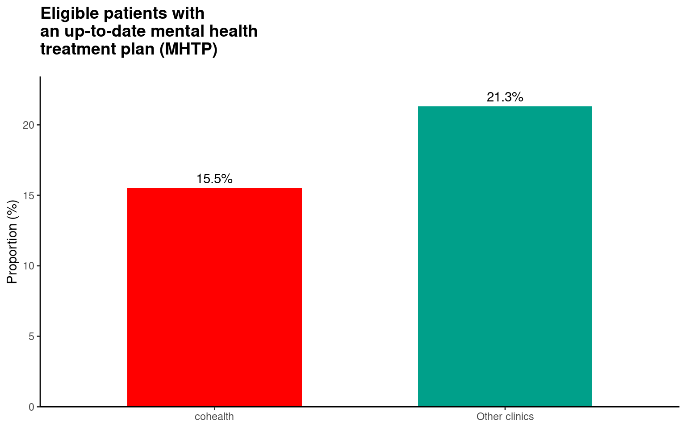
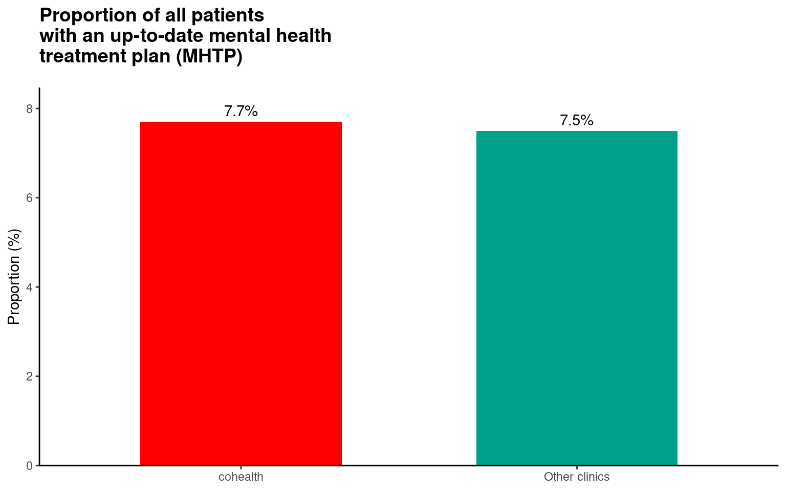
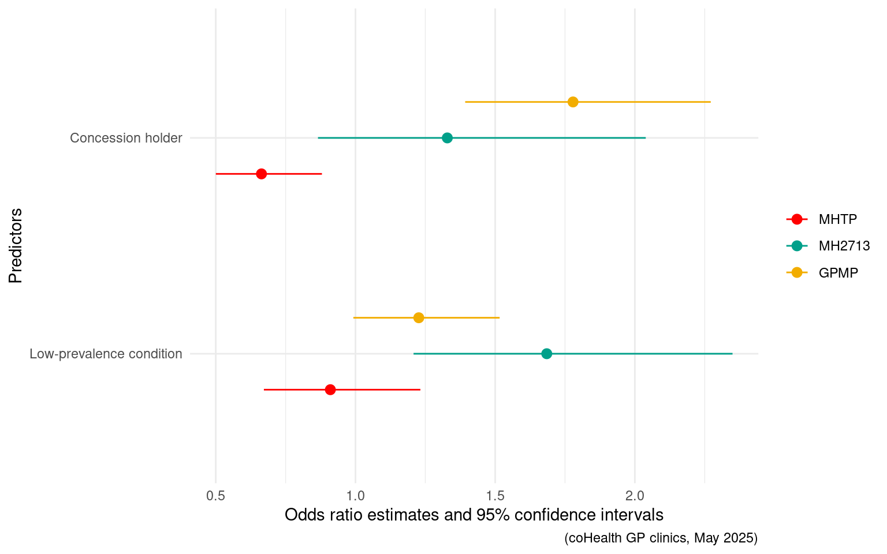
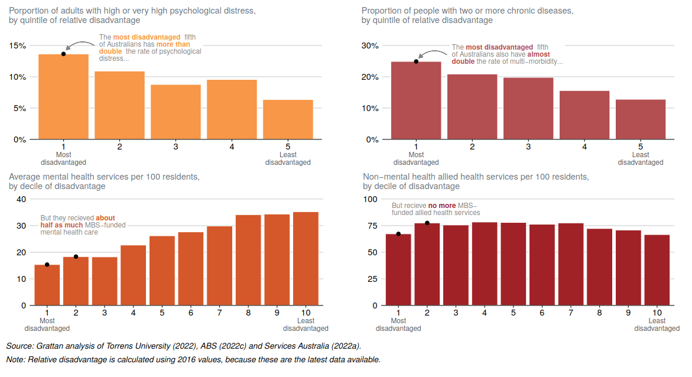
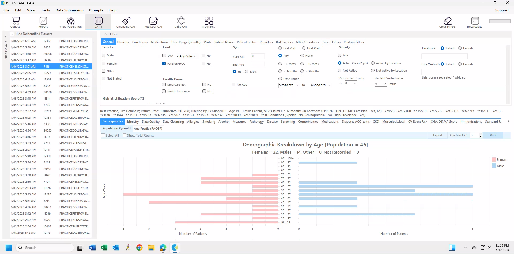
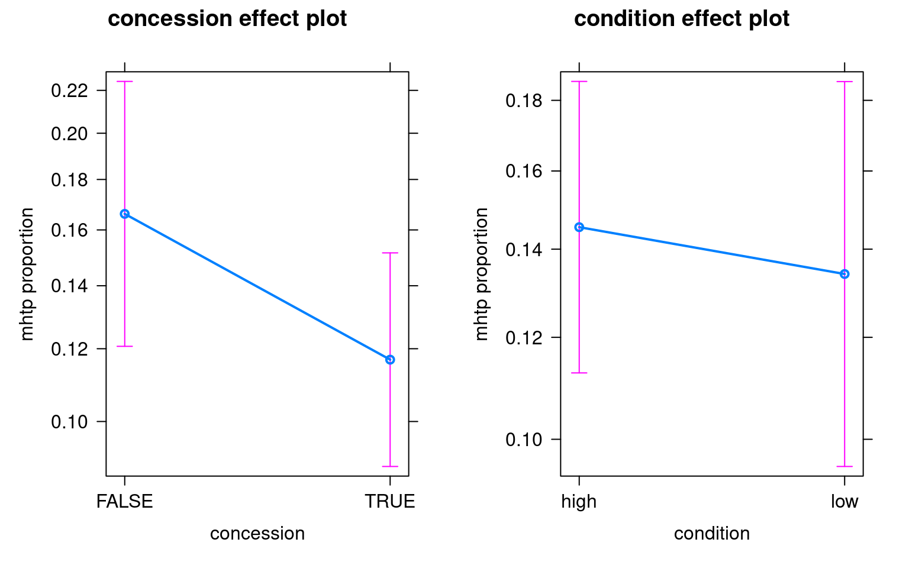
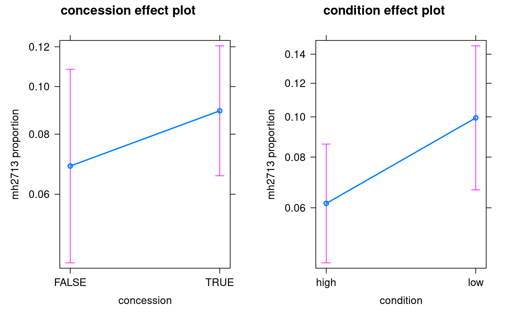
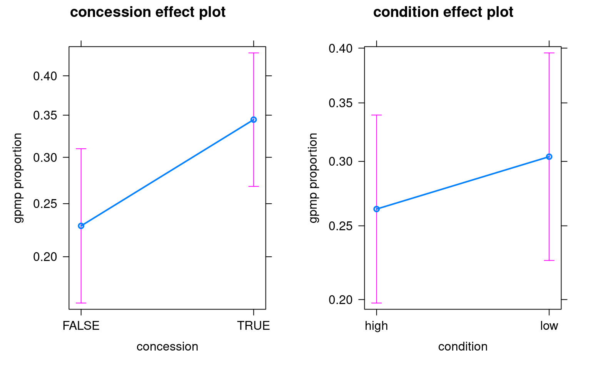

<link href="index_files/libs/tabwid-1.1.3/tabwid.css" rel="stylesheet" />
<script src="index_files/libs/tabwid-1.1.3/tabwid.js"></script>


-   [<span class="toc-section-number">1</span> Abstract](#abstract)
-   [<span class="toc-section-number">2</span> Introduction](#introduction)
-   [<span class="toc-section-number">3</span> The problem with Mental Health Treatment Plans (MHTP)](#the-problem-with-mental-health-treatment-plans-mhtp)
-   [<span class="toc-section-number">4</span> Method](#method)
    -   [<span class="toc-section-number">4.1</span> Mental health treatment plans](#mental-health-treatment-plans)
    -   [<span class="toc-section-number">4.2</span> Mental health consultation (MBS item '2713')](#mental-health-consultation-mbs-item-2713)
    -   [<span class="toc-section-number">4.3</span> Chronic disease management plans (MBS item '721')](#chronic-disease-management-plans-mbs-item-721)
    -   [<span class="toc-section-number">4.4</span> Data gathering and analysis](#data-gathering-and-analysis)
-   [<span class="toc-section-number">5</span> Results](#results)
-   [<span class="toc-section-number">6</span> Discussion](#discussion)
-   [<span class="toc-section-number">7</span> Appendices](#appendices)
    -   [<span class="toc-section-number">7.1</span> Proportion of patients eligible and who have a mental health treatment plan](#sec-appendix-mhtpeligible)
    -   [<span class="toc-section-number">7.2</span> Patients eligible and who have a mental health treatment plan according to concession card status, mental health condition and clinic attended](#sec-appendix-mhtpgroups)
    -   [<span class="toc-section-number">7.3</span> Supplementary tables](#supplementary-tables)
    -   [<span class="toc-section-number">7.4</span> Supplementary plots](#supplementary-plots)

Why does a community health service in Victoria bill relatively few mental health treatment plans (MHTPs), although the practice consults and treats a disproportionately high number of patients with mental health conditions (both high- and low-prevalence, such as schizophrenia and bipolar affective disorder)? Are there barriers to access to mental health care due to socio-economic situation? Is mental health need at times unrelated to provision of mental health care in primary care?

This analysis explores questions of inequity and complexity within a general practice population. It explores the question of what drives the writing and billing MHTPs and whether Medicare (health insurance) billing for mental health care can be distorted reflection of mental health care needs and provision.

## Abstract

Cohealth, a community health organisation serving inner-urban Melbourne, provides primary care to a population with a markedly higher prevalence of both high- and low- prevalence mental health conditions. Despite the high burden of mental illness, only 15.5% of eligible cohealth patients had an up-to-date general practitioner Mental Health Treatment Plan (MHTP), compared to 21.3% nationally. This contradiction --- high clinical need but low service uptake --- prompted an investigation into potential barriers to MHTP provision in this setting.

Using clinical and billing data, this study explores factors affecting the delivery of MHTPs, including socioeconomic disadvantage (proxied by concession card status), illness severity (low- vs high-prevalence mental health disorders). Logistic regression analysis reveals that patients with a mental health condition and a concession card are less likely to be billed an MHTP than patients with a mental health condition and without a concession card. Patients with low-prevalence (and typically more severe or lifelong) mental health conditions were no more likely to be billed an MHTP than patients with a high-prevalence mental health conditions.

By contrast, patients with a mental health condition and concession card were more likely to be billed a chronic disease management plan and tended to have higher rates of mental health consultations than a patient with a mental health condition and without a concession card. Patients with a low-prevalence condition were more likely to be billed a mental health consultation and tended to have rates of chronic disease management plan billing than patients with a high-prevalence condition.

General practitioners may perceive limited utility in preparing MHTPs for patients unable to afford private psychological care due to high out-of-pocket costs. Patients with severe and persistent mental illness may instead access mental health care through alternative funding pathways that do not depend on an MHTP as a mechanism for care access.

The findings raise questions about equity, access, and the appropriateness of MHTP billing as a proxy for mental health service provision in community health settings or other settings with high levels of patient complexity.

------------------------------------------------------------------------

<details class="code-fold">
<summary>Show the code</summary>

``` r
library(dplyr)
library(tidyr)
library(lme4)
library(table1)
library(flextable)
library(officer)
library(ggplot2)
library(highcharter)
library(effects)
library(modelsummary)
library(wesanderson)
```

</details>
<details class="code-fold">
<summary>Show the code</summary>

``` r
# Statistics derived from Doctor's Control Panel
# for the four weeks starting from 28th April 2025
# see Appendix "Proportion of patients eligible and who have a mental health treatment plan

# number of mental health treatment plans, cohealth and 'other'
n_mhtp_cohealth <- 43+441 
n_mhtp_other <- 2455 + 16839

# number of patients with mental health conditions
n_mentalhealth_cohealth <- 43+441+1201+1441
n_mentalhealth_other <- 2455+16839+34885+36287

# total number of patients
n_total_cohealth <- 5557+720
n_total_other <- 245991+12826
```

</details>

## Introduction

cohealth, a community health service in inner-west urban Melbourne, has a relatively high proportion of patients with mental health conditions. According to statistics derived from a clinical decision support tool ([Doctor's Control Panel](https://www.doctorscontrolpanel.com.au/), 49.8% of patients consulted by cohealth clinics in the four weeks from 28th April 2025 are eligible for a mental health treatment plan (i.e. have a recorded mental health condition), compared to a national average of 35.0% nationally among practices which use Doctor's Control Panel (see <a href="#sec-appendix-mhtpeligible" class="quarto-xref">Section 7.1</a>).

That cohealth medical clinic patients have a relatively high proportion of mental health conditions is consistent with other available statistics. At one of the cohealth general practice sites, Kensington, approximately 6.7% of consultations (52 of 774, see <a href="#sec-appendix-mhtpgroups" class="quarto-xref">Section 7.2</a> for details on how 'active' patient numbers were determined using PenCS) are with patients who have a recorded low-prevalence mental health condition (schizophrenia or bipolar affective disorder) compared to the Australian general practice average of 0.5%[^1]. To help meet the needs of cohealth patients with mental health conditions, cohealth medical clinics work closely and co-operatively with area mental health services (e.g. [Inner West Area Mental Health Service](https://vahi.vic.gov.au/mental-health-services/inner-west-adult-area-mental-health-service)) and cohealth clinics also employ mental health nurses through the Primary Health Network [CAREinMIND](https://nwmphn.org.au/our-work/mental-health/careinmind-mental-health-services/) program.

<details class="code-fold">
<summary>Show the code</summary>

``` r
# Data for the first plot
# patients with a recorded mental health condition
df1 <- data.frame(
  Clinic = c("cohealth", "Other clinics"),
  Percentage = c(
    round(n_mentalhealth_cohealth/n_total_cohealth * 100, 1),
    round(n_mentalhealth_other/n_total_other * 100, 1)
  )
)

# Data for the second plot
# consults with patients who have a low-prevalence mental health condition
df2 <- data.frame(
  Clinic = c("cohealth, Kensington", "Other clinics"),
  Percentage = c(round(52/774*100, 1), 0.5)
)

# Choose a Wes Anderson palette (e.g., 'Rushmore')
palette <- wes_palette("Darjeeling1", 2, type = "discrete")

hc1 <- highchart() |>
  hc_chart(type = "column") |>
  hc_title(text = "Patients with Recorded Mental Health Condition") |>
  hc_xAxis(categories = df1$Clinic) |>
  hc_yAxis(title = list(text = "Proportion (%)")) |>
  hc_add_series(
    name = "Proportion",
    data = df1$Percentage,
    colorByPoint = TRUE,
    colors = palette
  ) |>
  hc_tooltip(pointFormat = "<b>{point.y}%</b>") |>
  hc_legend(enabled = FALSE) |>
  hc_exporting(enabled = TRUE)

# Second highcharter plot
hc2 <- highchart() |>
  hc_chart(type = "column") |>
  hc_title(text = "Proportion of consultations with patients with recorded Low-Prevalence Mental Health Disorder") |>
  hc_xAxis(categories = df2$Clinic) |>
  hc_yAxis(title = list(text = "Proportion (%)")) |>
  hc_add_series(
    name = "Proportion",
    data = df2$Percentage,
    colorByPoint = TRUE,
    colors = palette
  ) |>
  hc_tooltip(pointFormat = "<b>{point.y}%</b>") |>
  hc_legend(enabled = FALSE) |>
  hc_exporting(enabled = TRUE)
```

</details>
<details class="code-fold">
<summary>Show the code</summary>

``` r
# Data for the first plot
# patients eligible for MHTP who have an up-to-date MHTP
df1 <- data.frame(
  Clinic = c("cohealth", "Other clinics"),
  Percentage = c(
    round(n_mhtp_cohealth/n_mentalhealth_cohealth * 100, 1),
    round(n_mhtp_other/n_mentalhealth_other * 100, 1)
  )
)

# Data for the second plot
# all patients, proportion who have an up-to-date MHTP
df2 <- data.frame(
  Clinic = c("cohealth", "Other clinics"),
  Percentage = c(
    round(n_mhtp_cohealth/n_total_cohealth * 100, 1),
    round(n_mhtp_other/n_total_other * 100, 1)
  )
)

# Choose a Wes Anderson palette (e.g., 'Rushmore')
palette <- wes_palette("Darjeeling1", 2, type = "discrete")

# Create the ggplot2 bar plot
ggplot(df1, aes(x = Clinic, y = Percentage, fill = Clinic)) +
  geom_col(width = 0.6) +
  scale_fill_manual(values = palette) +
  labs(
    title = "Eligible patients with\nan up-to-date mental health\ntreatment plan (MHTP)",
    y = "Proportion (%)",
    x = NULL
  ) +
  scale_y_continuous(
    expand = expansion(mult = c(0, 0.1))  # 10% space above the highest value
  ) +
  geom_text(aes(label = paste0(Percentage, "%")), vjust = -0.5) +
  theme_classic() +
  theme(
    legend.position = "none",
    plot.title = element_text(size = 14, face = "bold", margin = margin(b = 15))
  )
```

</details>
<details class="code-fold">
<summary>Show the code</summary>

``` r
ggplot(df2, aes(x = Clinic, y = Percentage, fill = Clinic)) +
  geom_col(width = 0.6) +
  scale_fill_manual(values = palette) +
  labs(
    title = "Proportion of all patients\nwith an up-to-date mental health\ntreatment plan (MHTP)",
    y = "Proportion (%)",
    x = NULL
  ) +
  scale_y_continuous(
    expand = expansion(mult = c(0, 0.1))  # 10% space above the highest value
  ) +
  geom_text(aes(label = paste0(Percentage, "%")), vjust = -0.5) +
  theme_classic() +
  theme(
    legend.position = "none",
    plot.title = element_text(size = 14, face = "bold", margin = margin(b = 15))
  )
```

</details>
<div id="fig-mhtpdcp">




Figure 1: Prevalence of mental health conditions at cohealth general practice clinics
</div>

To encourage general practitioners to provide a structured framework for assessing, managing and coordinating the mental health care of patients with mental health conditions, the Medicare Benefits Schedule (MBS) provides reimbursement for general practitioners to write (and bill) 'GP Mental Health Treatment Plans (MHTPs)'. The preparation and billing of a mental health treatment plan also enables a patient to access Medicare rebates for private psychological services[^2]. A secondary use of MHTP item billing, and billing of the [mental health treatment plan 'review' item 2712](https://www9.health.gov.au/mbs/fullDisplay.cfm?type=item&q=2713), is as a - perhaps misleading - indicator of mental health services delivered in general practice[^3] [^4] [^5].

Although cohealth consults a high proportion of patients with recorded mental health conditions and are potentially eligible for mental health treatment plans (MHTP), a relatively small proportion of those patients have had - and been billed - an 'up-to-date' treatment plan i.e. within the past twelve months. At cohealth, 15.5% of eligible patients have an up-to-date treatment plan, compared to 21.3% nationally (see <a href="#sec-appendix-mhtpeligible" class="quarto-xref">Section 7.1</a>). The proportion of all patients at cohealth who have an up-to-date mental health treatment plan (7.7%) is almost indistinguishable from the proportion of other clinics (7.5%).

<details class="code-fold">
<summary>Show the code</summary>

``` r
# Data for the first plot
# patients eligible for MHTP who have an up-to-date MHTP
df1 <- data.frame(
  Clinic = c("cohealth", "Other clinics"),
  Percentage = c(
    round(n_mhtp_cohealth/n_mentalhealth_cohealth * 100, 1),
    round(n_mhtp_other/n_mentalhealth_other * 100, 1)
  )
)

# Data for the second plot
# all patients, proportion who have an up-to-date MHTP
df2 <- data.frame(
  Clinic = c("cohealth", "Other clinics"),
  Percentage = c(
    round(n_mhtp_cohealth/n_total_cohealth * 100, 1),
    round(n_mhtp_other/n_total_other * 100, 1)
  )
)

# Choose a Wes Anderson palette (e.g., 'Rushmore')
palette <- wes_palette("Darjeeling1", 2, type = "discrete")

hc1 <- highchart() |>
  hc_chart(type = "bar") |>
  hc_title(text = "Eligible patients with an up-to-date mental health treatment plan (MHTP)") |>
  hc_xAxis(categories = df1$Clinic) |>
  hc_yAxis(title = list(text = "Proportion (%)")) |>
  hc_add_series(
    name = "Proportion",
    data = df1$Percentage,
    colorByPoint = TRUE,
    colors = palette
  ) |>
  hc_tooltip(pointFormat = "<b>{point.y}%</b>") |>
  hc_legend(enabled = FALSE) |>
  hc_exporting(enabled = TRUE)

# Second highcharter plot
hc2 <- highchart() |>
  hc_chart(type = "bar") |>
  hc_title(text = "Proportion of all patients with an up-to-date mental health treatment plan (MHTP)") |>
  hc_xAxis(categories = df2$Clinic) |>
  hc_yAxis(title = list(text = "Proportion (%)")) |>
  hc_add_series(
    name = "Proportion",
    data = df2$Percentage,
    colorByPoint = TRUE,
    colors = palette
  ) |>
  hc_tooltip(pointFormat = "<b>{point.y}%</b>") |>
  hc_legend(enabled = FALSE) |>
  hc_exporting(enabled = TRUE)
```

</details>
<details class="code-fold">
<summary>Show the code</summary>

``` r
# Data for the first plot
# patients eligible for MHTP who have an up-to-date MHTP
df1 <- data.frame(
  Clinic = c("cohealth", "Other clinics"),
  Percentage = c(
    round(n_mhtp_cohealth/n_mentalhealth_cohealth * 100, 1),
    round(n_mhtp_other/n_mentalhealth_other * 100, 1)
  )
)

# Data for the second plot
# all patients, proportion who have an up-to-date MHTP
df2 <- data.frame(
  Clinic = c("cohealth", "Other clinics"),
  Percentage = c(
    round(n_mhtp_cohealth/n_total_cohealth * 100, 1),
    round(n_mhtp_other/n_total_other * 100, 1)
  )
)

# Choose a Wes Anderson palette (e.g., 'Rushmore')
palette <- wes_palette("Darjeeling1", 2, type = "discrete")

# Create the ggplot2 bar plot
ggplot(df1, aes(x = Clinic, y = Percentage, fill = Clinic)) +
  geom_col(width = 0.6) +
  scale_fill_manual(values = palette) +
  labs(
    title = "Eligible patients with\nan up-to-date mental health\ntreatment plan (MHTP)",
    y = "Proportion (%)",
    x = NULL
  ) +
  scale_y_continuous(
    expand = expansion(mult = c(0, 0.1))  # 10% space above the highest value
  ) +
  geom_text(aes(label = paste0(Percentage, "%")), vjust = -0.5) +
  theme_classic() +
  theme(
    legend.position = "none",
    plot.title = element_text(size = 14, face = "bold", margin = margin(b = 15))
  )
```

</details>
<details class="code-fold">
<summary>Show the code</summary>

``` r
ggplot(df2, aes(x = Clinic, y = Percentage, fill = Clinic)) +
  geom_col(width = 0.6) +
  scale_fill_manual(values = palette) +
  labs(
    title = "Proportion of all patients\nwith an up-to-date mental health\ntreatment plan (MHTP)",
    y = "Proportion (%)",
    x = NULL
  ) +
  scale_y_continuous(
    expand = expansion(mult = c(0, 0.1))  # 10% space above the highest value
  ) +
  geom_text(aes(label = paste0(Percentage, "%")), vjust = -0.5) +
  theme_classic() +
  theme(
    legend.position = "none",
    plot.title = element_text(size = 14, face = "bold", margin = margin(b = 15))
  )
```

</details>
<div id="fig-mhtp_dcp">




Figure 2: cohealth general practice clinics usage of mental health treatment plans (MHTPs)
</div>

## The problem with Mental Health Treatment Plans (MHTP)

Why, despite the high prevalence of mental health conditions among cohealth clinic patients, do cohealth general practice clinics do - and bill - relatively few mental health treatment plans (MHTPs)?

cohealth general practitioners suggested the following reasons, broadly summarised as:

-   Some patients benefit more from mental health treatment plans than others.
-   Patients at cohealth, particularly those with lower socio-economic resources, might not benefit from mental health treatment plans as much as patients with financial resources to pay for private psychological services.
-   Mental health treatment plans are cumbersome to prepare, particularly if the patient does not particularly benefit the preparation of a mental health treatment plan.
-   Patients with lower socio-economic resources or more severe mental health illness might have generally lower access to care. This includes access to third-party services, and might even include access to cohealth general practice (primary care) and other services.

In detail:

1.  Mental health treatment plans are done principally for patients to access private psychological services.

    1.  Some patients with mental health conditions can access at least some psychological and psychiatric services through mechanisms which do not require a mental health treatment plan. Examples of services which are accessible without a mental health treatment plan are:
        1.  The area mental health service (e.g. patients living with schizophrenia and being prescribed clozapine)
        2.  The [National Disability Insurance Scheme (NDIS)](https://www.ndis.gov.au/), for [patients living with long-term disability resulting from their mental health condition](https://www.ndis.gov.au/media/112/download).
        3.  Through the Primary Health Network's [CAREinMIND](https://nwmphn.org.au/our-work/mental-health/careinmind-mental-health-services/), which does not currently require a mental health treatment plan for purposes of referral.
        4.  Through cohealth's other counselling services (e.g. provided by social workers).
    2.  Paradoxically, patients who can have considerable disability as the result of a mental health condition (e.g. schizophrenia, or qualifying for NDIS) may have less benefit from a mental health treatment plan, if the mental health treatment plan is primarily being used to help fund private psychological services.

2.  As a result, mental health treatment plans are not equivalent to referral to psychological care for patients, as at least some patients with mental health conditions can receive psychological care through other funding sources.

3.  A general-practitioner prepared (and billed) mental health care/treatment plan does [provide access to Medicare funding for private psychological services](https://www.servicesaustralia.gov.au/mental-health-care-and-medicare?context=60092). However, many private psychologists charge fees in excess of the Medicare rebate for psychological services, resulting in a large 'gap' fee for patients[^6].

    The size of the 'gap fee' is a potential barrier for some patients to access psychological services, particularly those from low socio-economic backgrounds. For patients who do not have the financial resources to pay the 'gap fees' of private psychological care, the preparation of a general-practitioner mental health treatment plan could be of less value compared to a patient who is not deterred by the 'gap fee' and is seeking Medicare subsidies for private psychological treatment.

4.  The general practitioner may view the preparation of a mental health treatment plan to be of little use to the patient, particularly those who cannot afford to pay the 'gap fee' of private psychological services. Although there is some financial return for the general practitioner to prepare a mental health treatment plan, the patient may have more pressing concerns e.g. immediate counselling provided by the general practitioner, housing issues or addressing 'physical' health needs.

5.  Although universal health insurance in Australia and the frequent use of bulk-billing at cohealth clinics might reduce inequity in access[^7] for cohealth patients living with mental health illness and low socio-economic resources, there may still be inequity in services provided in relation to need.

Some of the reasons listed can be tested through examination of practice billing compared to patient characteristics:

-   Are patients with mental health conditions and with fewer financial resources more or less likely to have a mental health treatment plan billed?
    -   The patient's possession of a [health concession or pension card](https://www.servicesaustralia.gov.au/concession-and-health-care-cards?context=60091) is potential proxy for less financial resources[^8] [^9].
-   Are patients with higher-need mental health conditions, e.g. low-prevalence disorders (schizophrenia and bipolar affective disorder) more or less likely to have a mental health treatment plan billed?
-   MHTPs may be perceived to have burdensome time and documentation requirements. Other mental health-related MBS service items may not have as burdensome time and documentation requirements as MHTPs. Are mental health MBS service items with less burdensome requirements more or less commonly used for patients with limited financial resources or those with low-prevalence mental health disorders?
    -   One mental health-related MBS service item number is "Professional attendance by a general practitioner in relation to a mental disorder and of at least 20 minutes in duration" (MBS item 2713, full details can be found on [MBS Online](https://www9.health.gov.au/mbs/fullDisplay.cfm?type=item&q=2713))
    -   Another group of relevant mental health-related MBS services are the focused psychological strategies (FPS) MBS service items (items 2721, 2723, 2725 and 2727. More details can be found on the [General Practice Mental Health Standards Collaboration](https://gpmhsc.org.au/info/detail/56bb2adf-75b6-4d2e-97c0-85b6d0f295fd/level-2-focussed-psychological-strategies) website). However, none of the practice sites (Kensington, Paisley St, Laverton, Fitzroy and Collingwood) had claimed any of the FPS MBS items in the year prior to 1 May 2025.
-   If patients living with mental health conditions and low socio-economic resources or low-prevalence mental conditions have difficulty with access or provision of co-ordinated care from cohealth general practitioners, they might also receive less care planning for other (e.g. physical) conditions.
    -   People living with a mental health condition are, compared to the general population, more likely to to live with other co-existing physical conditions, including chronic and life-changing conditions such as cardiovascular disease, airways disease and diabetes. People living with mental health illness are also more likely to struggle with regular activities[^10]. Patient living with a mental health condition are more likely to require planning and coordination for health care needs (e.g. diabetes) in addition to their mental health needs.
    -   To encourage general practitioners to plan and coordinate the health care of patients with ongoing chronic health conditions, the Medicare Benefits Schedule (MBS) provides reimbursement for general practitioners to write (and bill) 'GP Chronic Disease and Management Plan (GPMP, [MBS item 721](https://www9.health.gov.au/mbs/fullDisplay.cfm?type=item&q=721))[^11]'.

## Method

### Mental health treatment plans

-   It is postulated that concession card holders have lower financial resources and are less able to utilise the government subsidies unlocked by MHTP plans for private psychology. This is because private psychology fees are often far greater than the government subsidy to use private psychology.

-   Mental health conditions can be broadly divided into low- and high- prevalence mental health conditions. High-prevalence mental health conditions are the common mental health conditions such as anxiety and depression. Low-prevalence mental health conditions are the less common, and often lifelong conditions, of schizophrenia and bipolar affective disorder. Low-prevalence mental health conditions often have a substantial impact on individuals and their family, requiring extensive support[^12]. Patients with schizophrenia and bipolar affective disorder can benefit from psychological therapies. If mental health treatment plans were done on the basis of need, it would be expected that more patients with low-prevalence conditions would have mental health treatment plans compared to patients with high-prevalence mental health conditions.

*Are concession card holders, or patients living with low-prevalence mental health disorders, billed the mental health treatment plans (MHTP) the same, more, or less than patients without concession card holders at cohealth clinics?*

### Mental health consultation (MBS item '2713')

If patients with mental health conditions *and* a health concession card have less mental health treatment plans billed at cohealth general practices, perhaps those patients *also* have less mental health care delivered by those general practitioners.

There other potential ways to measure mental health care delivery in general practice.

Potential measurements:

1.  Examination of 'reasons for consult' in general practice electronic medical record (EMR) notes
    1.  Relatively easy to do, as reasons for consult are part of 'structured data' within the EMR
2.  Examination of the electronic medical record (EMR) consultation notes
    1.  More difficult to do than option (1), but can be done with basic natural language processing (NLP)
3.  Examination of other billing items associated with mental health care

Options (1) and (2) are relatively easy to perform with a basic database search and simple application of data science. However, at the time of writing, only option (3) is currently available to use at cohealth.

There *is* another billing item associated with mental health care, which is the [general practitioner attendance in relation to a mental health disorder, Medicare Benefit Schedule - Item 2713](https://www9.health.gov.au/mbs/fullDisplay.cfm?type=item&q=2713). Unfortunately, MBS item 2713 is little used, because there are alternative item numbers - not specific to mental health - which are easy to use and bill[^13].

Nevertheless, occasionally general practitioners *do* claim an item 2713[^14].

*Are concession card holders, or patients living with low-prevalence mental health disorders, billed the general practice mental health item 'MBS Item 2713' the same, more, or less than patients without concession card holders at cohealth clinics?*

### Chronic disease management plans (MBS item '721')

Another indicator of care provision is the billing of [general practitioner chronic disease management plans, Medicare Benefit Schedule item 721](https://www9.health.gov.au/mbs/fullDisplay.cfm?type=item&q=721). Chronic disease management plans are for the purpose of planning, setting goals, coordinating and reviewing an ongoing chronic condition (present for more than six months or expected to be present for more than six months). People living with mental health conditions, particularly low-prevalence mental health conditions and those living with socio-economic disadvantage are more likely to live with chronic health conditions and experience disability as the result of those conditions.

*Are concession card holders, or patients living with low-prevalence mental health disorders, billed chronic disease management plans 'MBS item 721' the same, more, or less than patients without concession card holders at cohealth clinics?*

### Data gathering and analysis

The number of active patients at coHealth living with mental health conditions, who were billed MHTPs, mental health consult items (MBS item 2713) or chronic disease management plans (MBS item 721) in the previous twelve months (up to 1st May 2025) were counted using PenCS (for details of the extraction procedure using PenCS, see <a href="#sec-appendix-mhtpgroups" class="quarto-xref">Section 7.2</a>). The patients were divided into groups according to concession card holder patients (either health care card 'HCC' or pension card), high-prevalence and low-prevalence mental health disorders and the cohealth clinic site attended.

The results are analysed using [R version 4.3.1](https://www.r-project.org/). Logistic regression was used, with clinic location as a random effect[^15]. Clinic location was used as a random effect because clinicians, support staff (e.g. mental health nurses) availability, and potentially workplace cultures are expected to be different at each clinic site. Some clinic sites are relatively close together geographically, but other sites are located in geographically distinct communities.

Source code can be viewed on www.github.com/DavidPatShuiFong[^16] and davidfong.org[^17].

## Results

<details class="code-fold">
<summary>Show the code</summary>

``` r
# outcome
#   counts of patients who have had, in the past year:
#     mhtp- mental health treatment plan e.g. MBS item 2715, 2717
#     mh2713 - general practitioner mental health consult i.e. MBS item 2713
#     gpmp - general practitioenr chronic disease treatment plan i.e. MBS item 721
# 
# predictors
#   concession - false = no, true = yes
#   mental health condition - "high" = high-prevalence, "low" = low-prevalence
# 
# random effects
#   (not considered to be a predictor of interest)
#   clinic - the clinic's name, a categorical variable

# the initial data was created as counts (i.e. aggregated data)
# the original patient data can be recreated from the counts

summary_df <- tibble(
  concession = logical(),
  condition = factor(),
  clinic = character(),
  total = integer(), # number in this patient category (concession, condition, clinic) occurs
  mhtp = integer(), # number who had a mental health treatment plan (MHTP e.g. 2715/2717)
  mh2713 = integer(), # number who had a billed GP mental health consult (MBS item 2713)
  gpmp = integer() # number who had a chronic disease management plan (MBS item 721)
  # later we will also add...
  #   mhtp_no, mh2713_no, gpmp_no - then number in the group who did *not* have the service/item
)

summary_df <- summary_df |>
  add_row(concession = TRUE, condition = "high", clinic = "Kensington", total = 285, mhtp = 42, mh2713 = 13, gpmp = 109) |>
  add_row(concession = TRUE, condition = "low", clinic = "Kensington", total = 73, mhtp = 7, mh2713 = 7, gpmp = 33) |>
  add_row(concession = FALSE, condition = "high", clinic = "Kensington", total = 84, mhtp = 9, mh2713 = 4, gpmp = 19) |>
  add_row(concession = FALSE, condition = "low", clinic = "Kensington", total = 8, mhtp = 2, mh2713 = 0, gpmp = 3) |>
  add_row(concession = TRUE, condition = "high", clinic = "Paisley", total = 430, mhtp = 26, mh2713 = 42, gpmp = 164) |>
  add_row(concession = TRUE, condition = "low", clinic = "Paisley", total = 123, mhtp = 13, mh2713 = 10, gpmp = 58) |>
  add_row(concession = FALSE, condition = "high", clinic = "Paisley", total = 131, mhtp = 21, mh2713 = 14, gpmp = 26) |>
  add_row(concession = FALSE, condition = "low", clinic = "Paisley", total = 8, mhtp = 1, mh2713 = 0, gpmp = 4) |>
  add_row(concession = TRUE, condition = "high", clinic = "Laverton", total = 79, mhtp = 14, mh2713 = 6, gpmp = 32) |>
  add_row(concession = TRUE, condition = "low", clinic = "Laverton", total = 38, mhtp = 10, mh2713 = 15, gpmp = 18) |>
  add_row(concession = FALSE, condition = "high", clinic = "Laverton", total = 43, mhtp = 7, mh2713 = 1, gpmp = 16) |>
  add_row(concession = FALSE, condition = "low", clinic = "Laverton", total = 4, mhtp = 1, mh2713 = 1, gpmp = 1) |>
  add_row(concession = TRUE, condition = "high", clinic = "Collingwood", total = 346, mhtp = 35, mh2713 = 17, gpmp = 88) |>
  add_row(concession = TRUE, condition = "low", clinic = "Collingwood", total = 87, mhtp = 5, mh2713 = 10, gpmp = 20) |>
  add_row(concession = FALSE, condition = "high", clinic = "Collingwood", total = 88, mhtp = 14, mh2713 = 4, gpmp = 17) |>
  add_row(concession = FALSE, condition = "low", clinic = "Collingwood", total = 6, mhtp = 1, mh2713 = 0, gpmp = 1) |>
  add_row(concession = TRUE, condition = "high", clinic = "Fitzroy", total = 445, mhtp = 74, mh2713 = 29, gpmp = 94) |>
  add_row(concession = TRUE, condition = "low", clinic = "Fitzroy", total = 165, mhtp = 18, mh2713 = 13, gpmp = 38) |>
  add_row(concession = FALSE, condition = "high", clinic = "Fitzroy", total = 91, mhtp = 20, mh2713 = 2, gpmp = 14) |>
  add_row(concession = FALSE, condition = "low", clinic = "Fitzroy", total = 10, mhtp = 3, mh2713 = 1, gpmp = 1) |>
  mutate(
    # create an 'absent' outcome column for each outcome
    mhtp_no = total - mhtp,
    mh2713_no = total - mh2713,
    gpmp_no = total - gpmp
  )
```

</details>
<details class="code-fold">
<summary>Show the code</summary>

``` r
# duplicate rows according to the weighting 'mhtp',
# hence "re-creating" the original patient-level data from the counts
mhtp <- summary_df |>
  # duplicate rows by number of mental health treatment plans (mhtp)
  uncount(mhtp) |>
  # add back mhtp column to a logical
  mutate(mhtp = TRUE) |> 
  # don't need 'total' column any more
  select(concession, condition, clinic, mhtp) |>
  bind_rows(
    # do the same, except
    # now duplicate rows by number who do not have mental health treatment plans
    summary_df |>
      mutate(no_mhtp = total - mhtp) |>
      uncount(no_mhtp) |>
      mutate(mhtp = FALSE) |>
      select(concession, condition, clinic, mhtp)
  ) |>
  arrange(clinic, concession, condition)

label(mhtp$mhtp) = "Mental Health Plan"
label(mhtp$concession) = "Concession card"
label(mhtp$condition) = "condition"

label(summary_df$mhtp) = "Mental Health Plan"
label(summary_df$concession) = "Concession card"
label(summary_df$condition) = "condition"

# the basic model
model_mhtp <- glm(
  mhtp ~ concession + condition,
  family = binomial(link = "logit"),
  data = mhtp
)

# add clinic as a random effect
model_mhtp_effects <- glmer(
  mhtp ~ concession + condition + (1|clinic),
  family = binomial(link = "logit"),
  data = mhtp
)

# using 'clinic' as a random effect makes little difference to the model, but does 'explain' variance in the R squared calculation

# a grouped model
model_mhtp_grouped <- glmer(
  cbind(mhtp, mhtp_no) ~ concession + condition + (1|clinic),
  family = "binomial",
  data = summary_df
)
# perhaps more valid, as we are modeling a population, rather than predicting an individual
# note that this makes no difference to the actual estimated effect of 'concession' or 'condition'
# but does make a difference to (Nakagawa) R squared calculation
#   R squared in logistic regression
#   https://thestatsgeek.com/2014/02/08/r-squared-in-logistic-regression/
#   "The explanation for the large difference is (I believe) that for the grouped binomial data setup, the model can accurately predict the number of successes in a binomial observation with n=1,000 with good accuracy. In contrast, for the individual binary data model, the observed outcomes are 0 or 1, while the predicted outcomes are 0.7 and 0.3 for x=0 and x=1 groups. The low R squared for the individual binary data model reflects the fact that the covariate x does not enable accurate prediction of the individual binary outcomes. In contrast, x can give a good prediction for the number of successes in a large group of individuals."
#   also "A note on R2 measures for Poisson and logistic regression models when both models are applicable"
#   (Mittlböck, Martina et al., Journal of Clinical Epidemiology, Volume 54, Issue 1, 99 - 103 )
```

</details>
<details class="code-fold">
<summary>Show the code</summary>

``` r
# duplicate rows according to the weighting 'mh2713',
# hence "re-creating" the original patient-level data from the counts
mh2713 <- summary_df |>
  # duplicate rows by number of mental health GP consults (mh2713)
  uncount(mh2713) |>
  # add back mhtp column to a logical
  mutate(mh2713 = TRUE) |> 
  # don't need 'total' column any more
  select(concession, condition, clinic, mh2713) |>
  bind_rows(
    # do the same, except
    # now duplicate rows by number who do not have mental health treatment plans
    summary_df |>
      mutate(no_mh2713 = total - mh2713) |>
      uncount(no_mh2713) |>
      mutate(mh2713 = FALSE) |>
      select(concession, condition, clinic, mh2713)
  ) |>
  arrange(clinic, concession, condition)

label(mh2713$mh2713) = "Mental Health GP Consult"
label(mh2713$concession) = "Concession card"
label(mh2713$condition) = "condition"

label(summary_df$mh2713) = "Mental Health GP Consult"

# the basic model
model_mh2713 <- glm(
  mh2713 ~ concession + condition,
  family = binomial(link = "logit"),
  data = mh2713
)

# add clinic as a random effect
model_mh2713_effects <- glmer(
  mh2713 ~ concession + condition + (1|clinic),
  family = binomial(link = "logit"),
  data = mh2713
)

# a grouped model
model_mh2713_grouped <- glmer(
  cbind(mh2713, mh2713_no) ~ concession + condition + (1|clinic),
  family = "binomial",
  data = summary_df
)
```

</details>
<details class="code-fold">
<summary>Show the code</summary>

``` r
# duplicate rows according to the weighting 'gpmp',
# hence "re-creating" the original patient-level data from the counts
gpmp <- summary_df |>
  # duplicate rows by number of GP chronic disease management plans (gpmp)
  uncount(gpmp) |>
  # add back mhtp column to a logical
  mutate(gpmp = TRUE) |> 
  # don't need 'total' column any more
  select(concession, condition, clinic, gpmp) |>
  bind_rows(
    # do the same, except
    # now duplicate rows by number who do not have mental health treatment plans
    summary_df |>
      mutate(no_gpmp = total - gpmp) |>
      uncount(no_gpmp) |>
      mutate(gpmp = FALSE) |>
      select(concession, condition, clinic, gpmp)
  ) |>
  arrange(clinic, concession, condition)
  
label(gpmp$gpmp) = "Chronic Disease Management Plan"
label(gpmp$concession) = "Concession card"
label(gpmp$condition) = "condition"

label(summary_df$gpmp) = "Chronic Disease Management Plan"

# the basic model
model_gpmp <- glm(
  gpmp ~ concession + condition,
  family = binomial(link = "logit"),
  data = gpmp
)

# add clinic as a random effect
model_gpmp_effects <- glmer(
  gpmp ~ concession + condition + (1|clinic),
  family = binomial(link = "logit"),
  data = gpmp
)

# a grouped model
model_gpmp_grouped <- glmer(
  cbind(gpmp, gpmp_no) ~ concession + condition + (1|clinic),
  family = "binomial",
  data = summary_df
)
```

</details>
<details class="code-fold">
<summary>Show the code</summary>

``` r
table1(
  x = ~ mhtp + concession + Condition | clinic,
  data = mhtp |>
    mutate(Condition = factor(condition, label = c("High-prevalence", "Low-prevalence"))),
  overall = c(left = "Total")
  ) |>
  t1flex(tablefn = "flextable", cwidth = 0.85) |>
  fontsize(size = 9, part = "all") |>
  add_footer_lines(value = as_paragraph("coHealth clinics, May 2025, 'active' patients"))
```

</details>

<div id="tbl-tableone">

<table>
<colgroup>
<col style="width: 100%" />
</colgroup>
<tbody>
<tr>
<td style="text-align: left;"><div width="100.0%" data-layout-align="left">
<div class="tabwid"><style>.cl-bf80d580{}.cl-bf472f9c{font-family:'DejaVu Sans';font-size:9pt;font-weight:normal;font-style:normal;text-decoration:none;color:rgba(0, 0, 0, 1.00);background-color:transparent;}.cl-bf472ff6{font-family:'DejaVu Sans';font-size:9pt;font-weight:bold;font-style:normal;text-decoration:none;color:rgba(0, 0, 0, 1.00);background-color:transparent;}.cl-bf473000{font-family:'DejaVu Sans';font-size:11pt;font-weight:normal;font-style:normal;text-decoration:none;color:rgba(0, 0, 0, 1.00);background-color:transparent;}.cl-bf64a784{margin:0;text-align:left;border-bottom: 0 solid rgba(0, 0, 0, 1.00);border-top: 0 solid rgba(0, 0, 0, 1.00);border-left: 0 solid rgba(0, 0, 0, 1.00);border-right: 0 solid rgba(0, 0, 0, 1.00);padding-bottom:5pt;padding-top:5pt;padding-left:5pt;padding-right:5pt;line-height: 1;background-color:transparent;}.cl-bf64a7c0{margin:0;text-align:center;border-bottom: 0 solid rgba(0, 0, 0, 1.00);border-top: 0 solid rgba(0, 0, 0, 1.00);border-left: 0 solid rgba(0, 0, 0, 1.00);border-right: 0 solid rgba(0, 0, 0, 1.00);padding-bottom:5pt;padding-top:5pt;padding-left:5pt;padding-right:5pt;line-height: 1;background-color:transparent;}.cl-bf65522e{width:0.85in;background-color:transparent;vertical-align: middle;border-bottom: 1.5pt solid rgba(102, 102, 102, 1.00);border-top: 1.5pt solid rgba(102, 102, 102, 1.00);border-left: 0 solid rgba(0, 0, 0, 1.00);border-right: 0 solid rgba(0, 0, 0, 1.00);margin-bottom:0;margin-top:0;margin-left:0;margin-right:0;}.cl-bf65526a{width:0.85in;background-color:transparent;vertical-align: middle;border-bottom: 1.5pt solid rgba(102, 102, 102, 1.00);border-top: 1.5pt solid rgba(102, 102, 102, 1.00);border-left: 0 solid rgba(0, 0, 0, 1.00);border-right: 0 solid rgba(0, 0, 0, 1.00);margin-bottom:0;margin-top:0;margin-left:0;margin-right:0;}.cl-bf65527e{width:0.85in;background-color:transparent;vertical-align: middle;border-bottom: 0 solid rgba(0, 0, 0, 1.00);border-top: 0 solid rgba(0, 0, 0, 1.00);border-left: 0 solid rgba(0, 0, 0, 1.00);border-right: 0 solid rgba(0, 0, 0, 1.00);margin-bottom:0;margin-top:0;margin-left:0;margin-right:0;}.cl-bf655288{width:0.85in;background-color:transparent;vertical-align: middle;border-bottom: 0 solid rgba(0, 0, 0, 1.00);border-top: 0 solid rgba(0, 0, 0, 1.00);border-left: 0 solid rgba(0, 0, 0, 1.00);border-right: 0 solid rgba(0, 0, 0, 1.00);margin-bottom:0;margin-top:0;margin-left:0;margin-right:0;}.cl-bf65529c{width:0.85in;background-color:transparent;vertical-align: middle;border-bottom: 1.5pt solid rgba(102, 102, 102, 1.00);border-top: 0 solid rgba(0, 0, 0, 1.00);border-left: 0 solid rgba(0, 0, 0, 1.00);border-right: 0 solid rgba(0, 0, 0, 1.00);margin-bottom:0;margin-top:0;margin-left:0;margin-right:0;}.cl-bf6552b0{width:0.85in;background-color:transparent;vertical-align: middle;border-bottom: 1.5pt solid rgba(102, 102, 102, 1.00);border-top: 0 solid rgba(0, 0, 0, 1.00);border-left: 0 solid rgba(0, 0, 0, 1.00);border-right: 0 solid rgba(0, 0, 0, 1.00);margin-bottom:0;margin-top:0;margin-left:0;margin-right:0;}.cl-bf6552c4{width:0.85in;background-color:transparent;vertical-align: middle;border-bottom: 0 solid rgba(255, 255, 255, 0.00);border-top: 0 solid rgba(255, 255, 255, 0.00);border-left: 0 solid rgba(255, 255, 255, 0.00);border-right: 0 solid rgba(255, 255, 255, 0.00);margin-bottom:0;margin-top:0;margin-left:0;margin-right:0;}</style><table data-quarto-disable-processing='true' class='cl-bf80d580'><thead><tr style="overflow-wrap:break-word;"><th class="cl-bf65522e"><p class="cl-bf64a784"><span class="cl-bf472f9c"> </span></p></th><th class="cl-bf65526a"><p class="cl-bf64a7c0"><span class="cl-bf472f9c">Total</span><br><span class="cl-bf472f9c">(N=2544)</span></p></th><th class="cl-bf65526a"><p class="cl-bf64a7c0"><span class="cl-bf472f9c">Collingwood</span><br><span class="cl-bf472f9c">(N=527)</span></p></th><th class="cl-bf65526a"><p class="cl-bf64a7c0"><span class="cl-bf472f9c">Fitzroy</span><br><span class="cl-bf472f9c">(N=711)</span></p></th><th class="cl-bf65526a"><p class="cl-bf64a7c0"><span class="cl-bf472f9c">Kensington</span><br><span class="cl-bf472f9c">(N=450)</span></p></th><th class="cl-bf65526a"><p class="cl-bf64a7c0"><span class="cl-bf472f9c">Laverton</span><br><span class="cl-bf472f9c">(N=164)</span></p></th><th class="cl-bf65526a"><p class="cl-bf64a7c0"><span class="cl-bf472f9c">Paisley</span><br><span class="cl-bf472f9c">(N=692)</span></p></th></tr></thead><tbody><tr style="overflow-wrap:break-word;"><td class="cl-bf65527e"><p class="cl-bf64a784"><span class="cl-bf472ff6">Mental Health Plan</span></p></td><td class="cl-bf655288"><p class="cl-bf64a7c0"><span class="cl-bf472f9c"></span></p></td><td class="cl-bf655288"><p class="cl-bf64a7c0"><span class="cl-bf472f9c"></span></p></td><td class="cl-bf655288"><p class="cl-bf64a7c0"><span class="cl-bf472f9c"></span></p></td><td class="cl-bf655288"><p class="cl-bf64a7c0"><span class="cl-bf472f9c"></span></p></td><td class="cl-bf655288"><p class="cl-bf64a7c0"><span class="cl-bf472f9c"></span></p></td><td class="cl-bf655288"><p class="cl-bf64a7c0"><span class="cl-bf472f9c"></span></p></td></tr><tr style="overflow-wrap:break-word;"><td class="cl-bf65527e"><p class="cl-bf64a784"><span class="cl-bf472f9c">  Yes</span></p></td><td class="cl-bf655288"><p class="cl-bf64a7c0"><span class="cl-bf472f9c">323 (12.7%)</span></p></td><td class="cl-bf655288"><p class="cl-bf64a7c0"><span class="cl-bf472f9c">55 (10.4%)</span></p></td><td class="cl-bf655288"><p class="cl-bf64a7c0"><span class="cl-bf472f9c">115 (16.2%)</span></p></td><td class="cl-bf655288"><p class="cl-bf64a7c0"><span class="cl-bf472f9c">60 (13.3%)</span></p></td><td class="cl-bf655288"><p class="cl-bf64a7c0"><span class="cl-bf472f9c">32 (19.5%)</span></p></td><td class="cl-bf655288"><p class="cl-bf64a7c0"><span class="cl-bf472f9c">61 (8.8%)</span></p></td></tr><tr style="overflow-wrap:break-word;"><td class="cl-bf65527e"><p class="cl-bf64a784"><span class="cl-bf472f9c">  No</span></p></td><td class="cl-bf655288"><p class="cl-bf64a7c0"><span class="cl-bf472f9c">2221 (87.3%)</span></p></td><td class="cl-bf655288"><p class="cl-bf64a7c0"><span class="cl-bf472f9c">472 (89.6%)</span></p></td><td class="cl-bf655288"><p class="cl-bf64a7c0"><span class="cl-bf472f9c">596 (83.8%)</span></p></td><td class="cl-bf655288"><p class="cl-bf64a7c0"><span class="cl-bf472f9c">390 (86.7%)</span></p></td><td class="cl-bf655288"><p class="cl-bf64a7c0"><span class="cl-bf472f9c">132 (80.5%)</span></p></td><td class="cl-bf655288"><p class="cl-bf64a7c0"><span class="cl-bf472f9c">631 (91.2%)</span></p></td></tr><tr style="overflow-wrap:break-word;"><td class="cl-bf65527e"><p class="cl-bf64a784"><span class="cl-bf472ff6">Concession card</span></p></td><td class="cl-bf655288"><p class="cl-bf64a7c0"><span class="cl-bf472f9c"></span></p></td><td class="cl-bf655288"><p class="cl-bf64a7c0"><span class="cl-bf472f9c"></span></p></td><td class="cl-bf655288"><p class="cl-bf64a7c0"><span class="cl-bf472f9c"></span></p></td><td class="cl-bf655288"><p class="cl-bf64a7c0"><span class="cl-bf472f9c"></span></p></td><td class="cl-bf655288"><p class="cl-bf64a7c0"><span class="cl-bf472f9c"></span></p></td><td class="cl-bf655288"><p class="cl-bf64a7c0"><span class="cl-bf472f9c"></span></p></td></tr><tr style="overflow-wrap:break-word;"><td class="cl-bf65527e"><p class="cl-bf64a784"><span class="cl-bf472f9c">  Yes</span></p></td><td class="cl-bf655288"><p class="cl-bf64a7c0"><span class="cl-bf472f9c">2071 (81.4%)</span></p></td><td class="cl-bf655288"><p class="cl-bf64a7c0"><span class="cl-bf472f9c">433 (82.2%)</span></p></td><td class="cl-bf655288"><p class="cl-bf64a7c0"><span class="cl-bf472f9c">610 (85.8%)</span></p></td><td class="cl-bf655288"><p class="cl-bf64a7c0"><span class="cl-bf472f9c">358 (79.6%)</span></p></td><td class="cl-bf655288"><p class="cl-bf64a7c0"><span class="cl-bf472f9c">117 (71.3%)</span></p></td><td class="cl-bf655288"><p class="cl-bf64a7c0"><span class="cl-bf472f9c">553 (79.9%)</span></p></td></tr><tr style="overflow-wrap:break-word;"><td class="cl-bf65527e"><p class="cl-bf64a784"><span class="cl-bf472f9c">  No</span></p></td><td class="cl-bf655288"><p class="cl-bf64a7c0"><span class="cl-bf472f9c">473 (18.6%)</span></p></td><td class="cl-bf655288"><p class="cl-bf64a7c0"><span class="cl-bf472f9c">94 (17.8%)</span></p></td><td class="cl-bf655288"><p class="cl-bf64a7c0"><span class="cl-bf472f9c">101 (14.2%)</span></p></td><td class="cl-bf655288"><p class="cl-bf64a7c0"><span class="cl-bf472f9c">92 (20.4%)</span></p></td><td class="cl-bf655288"><p class="cl-bf64a7c0"><span class="cl-bf472f9c">47 (28.7%)</span></p></td><td class="cl-bf655288"><p class="cl-bf64a7c0"><span class="cl-bf472f9c">139 (20.1%)</span></p></td></tr><tr style="overflow-wrap:break-word;"><td class="cl-bf65527e"><p class="cl-bf64a784"><span class="cl-bf472ff6">Condition</span></p></td><td class="cl-bf655288"><p class="cl-bf64a7c0"><span class="cl-bf472f9c"></span></p></td><td class="cl-bf655288"><p class="cl-bf64a7c0"><span class="cl-bf472f9c"></span></p></td><td class="cl-bf655288"><p class="cl-bf64a7c0"><span class="cl-bf472f9c"></span></p></td><td class="cl-bf655288"><p class="cl-bf64a7c0"><span class="cl-bf472f9c"></span></p></td><td class="cl-bf655288"><p class="cl-bf64a7c0"><span class="cl-bf472f9c"></span></p></td><td class="cl-bf655288"><p class="cl-bf64a7c0"><span class="cl-bf472f9c"></span></p></td></tr><tr style="overflow-wrap:break-word;"><td class="cl-bf65527e"><p class="cl-bf64a784"><span class="cl-bf472f9c">  High-prevalence</span></p></td><td class="cl-bf655288"><p class="cl-bf64a7c0"><span class="cl-bf472f9c">2022 (79.5%)</span></p></td><td class="cl-bf655288"><p class="cl-bf64a7c0"><span class="cl-bf472f9c">434 (82.4%)</span></p></td><td class="cl-bf655288"><p class="cl-bf64a7c0"><span class="cl-bf472f9c">536 (75.4%)</span></p></td><td class="cl-bf655288"><p class="cl-bf64a7c0"><span class="cl-bf472f9c">369 (82.0%)</span></p></td><td class="cl-bf655288"><p class="cl-bf64a7c0"><span class="cl-bf472f9c">122 (74.4%)</span></p></td><td class="cl-bf655288"><p class="cl-bf64a7c0"><span class="cl-bf472f9c">561 (81.1%)</span></p></td></tr><tr style="overflow-wrap:break-word;"><td class="cl-bf65529c"><p class="cl-bf64a784"><span class="cl-bf472f9c">  Low-prevalence</span></p></td><td class="cl-bf6552b0"><p class="cl-bf64a7c0"><span class="cl-bf472f9c">522 (20.5%)</span></p></td><td class="cl-bf6552b0"><p class="cl-bf64a7c0"><span class="cl-bf472f9c">93 (17.6%)</span></p></td><td class="cl-bf6552b0"><p class="cl-bf64a7c0"><span class="cl-bf472f9c">175 (24.6%)</span></p></td><td class="cl-bf6552b0"><p class="cl-bf64a7c0"><span class="cl-bf472f9c">81 (18.0%)</span></p></td><td class="cl-bf6552b0"><p class="cl-bf64a7c0"><span class="cl-bf472f9c">42 (25.6%)</span></p></td><td class="cl-bf6552b0"><p class="cl-bf64a7c0"><span class="cl-bf472f9c">131 (18.9%)</span></p></td></tr></tbody><tfoot><tr style="overflow-wrap:break-word;"><td  colspan="7"class="cl-bf6552c4"><p class="cl-bf64a784"><span class="cl-bf473000">coHealth clinics, May 2025, 'active' patients</span></p></td></tr></tfoot></table></div>
</div></td>
</tr>
</tbody>
</table>

Table 1: Mental health treatment plans (claimed in the previous twelve months), concession card status and High- vs Low- prevalence mental health conditions.

</div>

A lower proportion of concession card holders (with either high-prevalence or low-prevalence mental health conditions) were billed a mental health treatment plans in the previous year compared to those without a concession card (11.8% vs 16.7%, Odds ratio 0.664, p = 0.004). The proportion of people with low-prevalence mental health conditions were billed a mental health treatment plans in the previous year was similar, if lower, to those with high-prevalence conditions (11.7% vs 13.0%, Odds ratio 0.910, p = 0.543).

Relatively few patients are billed mental health GP consults (item 2713), far fewer than those who are billed for mental health treatment plans. A higher proportion of concession cards holders were billed a mental health GP consult (item 2713) in the previous year more than those without a concession card (5.7% vs 6.5%, Odds ratio 1.329, p = 0.193), though the difference is not statistically significant. A higher proportion of people with low-prevalence conditions were billed a mental health GP consult (item 2713) in the previous year than those with a high-prevalence condition (10.9% vs 6.5%, Odds ratio 1.685, p = 0.002)

A higher proportion of concession card holders were billed with a chronic disease management plan (item 721) in the previous year than those without a concession card (31.6% vs 21.6%, Odds ratio 1.779, p\<0.001). A higher proportion of patients with patients with low-prevalence mental health conditions were billed a chronic disease management plan in the previous year than those with a high-prevalence mental health condition (33.9% vs 28.6%, Odds ratio = 1.227, p=0.059), though the result is not statistically significant at the 5% level.

<details class="code-fold">
<summary>Show the code</summary>

``` r
# create a combined dataframe which has the correct number of mhtp, mh2713 and gpmp
# in each clinic/concession/condition category
# note that the relationship *between* mhtp, mh2713 and gpmp in this dataframe is not correct
combined_synthetic <- mhtp |>
  mutate(mh2713 = mh2713$mh2713) |>
  mutate(gpmp = gpmp$gpmp)

table1(
  x = ~ mhtp + mh2713 + gpmp | concession,
  data = combined_synthetic |>
    mutate(concession = factor(concession, levels = c(FALSE, TRUE), label = c("No Concession", "Concession"))),
  overall = FALSE
) |>
  t1flex(tablefn = "flextable") |>
  width(width = 2) |>
  fontsize(size = 9, part = "all") |>
  add_footer_lines("coHealth clinics, May 2025, 'active' patients")
```

</details>

<div id="tbl-mbs_concession">

<table>
<colgroup>
<col style="width: 100%" />
</colgroup>
<tbody>
<tr>
<td style="text-align: left;"><div width="100.0%" data-layout-align="left">
<div class="tabwid"><style>.cl-c041194e{}.cl-bff43962{font-family:'DejaVu Sans';font-size:9pt;font-weight:normal;font-style:normal;text-decoration:none;color:rgba(0, 0, 0, 1.00);background-color:transparent;}.cl-bff43994{font-family:'DejaVu Sans';font-size:9pt;font-weight:bold;font-style:normal;text-decoration:none;color:rgba(0, 0, 0, 1.00);background-color:transparent;}.cl-bff4399e{font-family:'DejaVu Sans';font-size:11pt;font-weight:normal;font-style:normal;text-decoration:none;color:rgba(0, 0, 0, 1.00);background-color:transparent;}.cl-c01990f4{margin:0;text-align:left;border-bottom: 0 solid rgba(0, 0, 0, 1.00);border-top: 0 solid rgba(0, 0, 0, 1.00);border-left: 0 solid rgba(0, 0, 0, 1.00);border-right: 0 solid rgba(0, 0, 0, 1.00);padding-bottom:5pt;padding-top:5pt;padding-left:5pt;padding-right:5pt;line-height: 1;background-color:transparent;}.cl-c019913a{margin:0;text-align:center;border-bottom: 0 solid rgba(0, 0, 0, 1.00);border-top: 0 solid rgba(0, 0, 0, 1.00);border-left: 0 solid rgba(0, 0, 0, 1.00);border-right: 0 solid rgba(0, 0, 0, 1.00);padding-bottom:5pt;padding-top:5pt;padding-left:5pt;padding-right:5pt;line-height: 1;background-color:transparent;}.cl-c01a6d12{width:2in;background-color:transparent;vertical-align: middle;border-bottom: 1.5pt solid rgba(102, 102, 102, 1.00);border-top: 1.5pt solid rgba(102, 102, 102, 1.00);border-left: 0 solid rgba(0, 0, 0, 1.00);border-right: 0 solid rgba(0, 0, 0, 1.00);margin-bottom:0;margin-top:0;margin-left:0;margin-right:0;}.cl-c01a6d3a{width:2in;background-color:transparent;vertical-align: middle;border-bottom: 1.5pt solid rgba(102, 102, 102, 1.00);border-top: 1.5pt solid rgba(102, 102, 102, 1.00);border-left: 0 solid rgba(0, 0, 0, 1.00);border-right: 0 solid rgba(0, 0, 0, 1.00);margin-bottom:0;margin-top:0;margin-left:0;margin-right:0;}.cl-c01a6d62{width:2in;background-color:transparent;vertical-align: middle;border-bottom: 0 solid rgba(0, 0, 0, 1.00);border-top: 0 solid rgba(0, 0, 0, 1.00);border-left: 0 solid rgba(0, 0, 0, 1.00);border-right: 0 solid rgba(0, 0, 0, 1.00);margin-bottom:0;margin-top:0;margin-left:0;margin-right:0;}.cl-c01a6d76{width:2in;background-color:transparent;vertical-align: middle;border-bottom: 0 solid rgba(0, 0, 0, 1.00);border-top: 0 solid rgba(0, 0, 0, 1.00);border-left: 0 solid rgba(0, 0, 0, 1.00);border-right: 0 solid rgba(0, 0, 0, 1.00);margin-bottom:0;margin-top:0;margin-left:0;margin-right:0;}.cl-c01a6d8a{width:2in;background-color:transparent;vertical-align: middle;border-bottom: 1.5pt solid rgba(102, 102, 102, 1.00);border-top: 0 solid rgba(0, 0, 0, 1.00);border-left: 0 solid rgba(0, 0, 0, 1.00);border-right: 0 solid rgba(0, 0, 0, 1.00);margin-bottom:0;margin-top:0;margin-left:0;margin-right:0;}.cl-c01a6d9e{width:2in;background-color:transparent;vertical-align: middle;border-bottom: 1.5pt solid rgba(102, 102, 102, 1.00);border-top: 0 solid rgba(0, 0, 0, 1.00);border-left: 0 solid rgba(0, 0, 0, 1.00);border-right: 0 solid rgba(0, 0, 0, 1.00);margin-bottom:0;margin-top:0;margin-left:0;margin-right:0;}.cl-c01a6dc6{width:2in;background-color:transparent;vertical-align: middle;border-bottom: 0 solid rgba(255, 255, 255, 0.00);border-top: 0 solid rgba(255, 255, 255, 0.00);border-left: 0 solid rgba(255, 255, 255, 0.00);border-right: 0 solid rgba(255, 255, 255, 0.00);margin-bottom:0;margin-top:0;margin-left:0;margin-right:0;}</style><table data-quarto-disable-processing='true' class='cl-c041194e'><thead><tr style="overflow-wrap:break-word;"><th class="cl-c01a6d12"><p class="cl-c01990f4"><span class="cl-bff43962"> </span></p></th><th class="cl-c01a6d3a"><p class="cl-c019913a"><span class="cl-bff43962">No Concession</span><br><span class="cl-bff43962">(N=473)</span></p></th><th class="cl-c01a6d3a"><p class="cl-c019913a"><span class="cl-bff43962">Concession</span><br><span class="cl-bff43962">(N=2071)</span></p></th></tr></thead><tbody><tr style="overflow-wrap:break-word;"><td class="cl-c01a6d62"><p class="cl-c01990f4"><span class="cl-bff43994">Mental Health Plan</span></p></td><td class="cl-c01a6d76"><p class="cl-c019913a"><span class="cl-bff43962"></span></p></td><td class="cl-c01a6d76"><p class="cl-c019913a"><span class="cl-bff43962"></span></p></td></tr><tr style="overflow-wrap:break-word;"><td class="cl-c01a6d62"><p class="cl-c01990f4"><span class="cl-bff43962">  Yes</span></p></td><td class="cl-c01a6d76"><p class="cl-c019913a"><span class="cl-bff43962">79 (16.7%)</span></p></td><td class="cl-c01a6d76"><p class="cl-c019913a"><span class="cl-bff43962">244 (11.8%)</span></p></td></tr><tr style="overflow-wrap:break-word;"><td class="cl-c01a6d62"><p class="cl-c01990f4"><span class="cl-bff43962">  No</span></p></td><td class="cl-c01a6d76"><p class="cl-c019913a"><span class="cl-bff43962">394 (83.3%)</span></p></td><td class="cl-c01a6d76"><p class="cl-c019913a"><span class="cl-bff43962">1827 (88.2%)</span></p></td></tr><tr style="overflow-wrap:break-word;"><td class="cl-c01a6d62"><p class="cl-c01990f4"><span class="cl-bff43994">Mental Health GP Consult</span></p></td><td class="cl-c01a6d76"><p class="cl-c019913a"><span class="cl-bff43962"></span></p></td><td class="cl-c01a6d76"><p class="cl-c019913a"><span class="cl-bff43962"></span></p></td></tr><tr style="overflow-wrap:break-word;"><td class="cl-c01a6d62"><p class="cl-c01990f4"><span class="cl-bff43962">  Yes</span></p></td><td class="cl-c01a6d76"><p class="cl-c019913a"><span class="cl-bff43962">27 (5.7%)</span></p></td><td class="cl-c01a6d76"><p class="cl-c019913a"><span class="cl-bff43962">162 (7.8%)</span></p></td></tr><tr style="overflow-wrap:break-word;"><td class="cl-c01a6d62"><p class="cl-c01990f4"><span class="cl-bff43962">  No</span></p></td><td class="cl-c01a6d76"><p class="cl-c019913a"><span class="cl-bff43962">446 (94.3%)</span></p></td><td class="cl-c01a6d76"><p class="cl-c019913a"><span class="cl-bff43962">1909 (92.2%)</span></p></td></tr><tr style="overflow-wrap:break-word;"><td class="cl-c01a6d62"><p class="cl-c01990f4"><span class="cl-bff43994">Chronic Disease Management Plan</span></p></td><td class="cl-c01a6d76"><p class="cl-c019913a"><span class="cl-bff43962"></span></p></td><td class="cl-c01a6d76"><p class="cl-c019913a"><span class="cl-bff43962"></span></p></td></tr><tr style="overflow-wrap:break-word;"><td class="cl-c01a6d62"><p class="cl-c01990f4"><span class="cl-bff43962">  Yes</span></p></td><td class="cl-c01a6d76"><p class="cl-c019913a"><span class="cl-bff43962">102 (21.6%)</span></p></td><td class="cl-c01a6d76"><p class="cl-c019913a"><span class="cl-bff43962">654 (31.6%)</span></p></td></tr><tr style="overflow-wrap:break-word;"><td class="cl-c01a6d8a"><p class="cl-c01990f4"><span class="cl-bff43962">  No</span></p></td><td class="cl-c01a6d9e"><p class="cl-c019913a"><span class="cl-bff43962">371 (78.4%)</span></p></td><td class="cl-c01a6d9e"><p class="cl-c019913a"><span class="cl-bff43962">1417 (68.4%)</span></p></td></tr></tbody><tfoot><tr style="overflow-wrap:break-word;"><td  colspan="3"class="cl-c01a6dc6"><p class="cl-c01990f4"><span class="cl-bff4399e">coHealth clinics, May 2025, 'active' patients</span></p></td></tr></tfoot></table></div>
</div></td>
</tr>
</tbody>
</table>

Table 2: MBS items by concession card status

</div>

<details class="code-fold">
<summary>Show the code</summary>

``` r
table1(
  x = ~ mhtp + mh2713 + gpmp | condition,
  data = combined_synthetic |>
    mutate(condition = factor(condition, label = c("High-prevalence", "Low-prevalence"))),
  overall = FALSE
) |>
  t1flex(tablefn = "flextable") |>
  width(width = 2) |>
  fontsize(size = 9, part = "all") |>
  add_footer_lines("coHealth clinics, May 2025, 'active' patients")
```

</details>

<div id="tbl-mbs_condition">

<table>
<colgroup>
<col style="width: 100%" />
</colgroup>
<tbody>
<tr>
<td style="text-align: left;"><div width="100.0%" data-layout-align="left">
<div class="tabwid"><style>.cl-c0eec0da{}.cl-c0cdb692{font-family:'DejaVu Sans';font-size:9pt;font-weight:normal;font-style:normal;text-decoration:none;color:rgba(0, 0, 0, 1.00);background-color:transparent;}.cl-c0cdb6ba{font-family:'DejaVu Sans';font-size:9pt;font-weight:bold;font-style:normal;text-decoration:none;color:rgba(0, 0, 0, 1.00);background-color:transparent;}.cl-c0cdb6ce{font-family:'DejaVu Sans';font-size:11pt;font-weight:normal;font-style:normal;text-decoration:none;color:rgba(0, 0, 0, 1.00);background-color:transparent;}.cl-c0db3132{margin:0;text-align:left;border-bottom: 0 solid rgba(0, 0, 0, 1.00);border-top: 0 solid rgba(0, 0, 0, 1.00);border-left: 0 solid rgba(0, 0, 0, 1.00);border-right: 0 solid rgba(0, 0, 0, 1.00);padding-bottom:5pt;padding-top:5pt;padding-left:5pt;padding-right:5pt;line-height: 1;background-color:transparent;}.cl-c0db316e{margin:0;text-align:center;border-bottom: 0 solid rgba(0, 0, 0, 1.00);border-top: 0 solid rgba(0, 0, 0, 1.00);border-left: 0 solid rgba(0, 0, 0, 1.00);border-right: 0 solid rgba(0, 0, 0, 1.00);padding-bottom:5pt;padding-top:5pt;padding-left:5pt;padding-right:5pt;line-height: 1;background-color:transparent;}.cl-c0dbb09e{width:2in;background-color:transparent;vertical-align: middle;border-bottom: 1.5pt solid rgba(102, 102, 102, 1.00);border-top: 1.5pt solid rgba(102, 102, 102, 1.00);border-left: 0 solid rgba(0, 0, 0, 1.00);border-right: 0 solid rgba(0, 0, 0, 1.00);margin-bottom:0;margin-top:0;margin-left:0;margin-right:0;}.cl-c0dbb0c6{width:2in;background-color:transparent;vertical-align: middle;border-bottom: 1.5pt solid rgba(102, 102, 102, 1.00);border-top: 1.5pt solid rgba(102, 102, 102, 1.00);border-left: 0 solid rgba(0, 0, 0, 1.00);border-right: 0 solid rgba(0, 0, 0, 1.00);margin-bottom:0;margin-top:0;margin-left:0;margin-right:0;}.cl-c0dbb0d0{width:2in;background-color:transparent;vertical-align: middle;border-bottom: 0 solid rgba(0, 0, 0, 1.00);border-top: 0 solid rgba(0, 0, 0, 1.00);border-left: 0 solid rgba(0, 0, 0, 1.00);border-right: 0 solid rgba(0, 0, 0, 1.00);margin-bottom:0;margin-top:0;margin-left:0;margin-right:0;}.cl-c0dbb0e4{width:2in;background-color:transparent;vertical-align: middle;border-bottom: 0 solid rgba(0, 0, 0, 1.00);border-top: 0 solid rgba(0, 0, 0, 1.00);border-left: 0 solid rgba(0, 0, 0, 1.00);border-right: 0 solid rgba(0, 0, 0, 1.00);margin-bottom:0;margin-top:0;margin-left:0;margin-right:0;}.cl-c0dbb0f8{width:2in;background-color:transparent;vertical-align: middle;border-bottom: 1.5pt solid rgba(102, 102, 102, 1.00);border-top: 0 solid rgba(0, 0, 0, 1.00);border-left: 0 solid rgba(0, 0, 0, 1.00);border-right: 0 solid rgba(0, 0, 0, 1.00);margin-bottom:0;margin-top:0;margin-left:0;margin-right:0;}.cl-c0dbb10c{width:2in;background-color:transparent;vertical-align: middle;border-bottom: 1.5pt solid rgba(102, 102, 102, 1.00);border-top: 0 solid rgba(0, 0, 0, 1.00);border-left: 0 solid rgba(0, 0, 0, 1.00);border-right: 0 solid rgba(0, 0, 0, 1.00);margin-bottom:0;margin-top:0;margin-left:0;margin-right:0;}.cl-c0dbb116{width:2in;background-color:transparent;vertical-align: middle;border-bottom: 0 solid rgba(255, 255, 255, 0.00);border-top: 0 solid rgba(255, 255, 255, 0.00);border-left: 0 solid rgba(255, 255, 255, 0.00);border-right: 0 solid rgba(255, 255, 255, 0.00);margin-bottom:0;margin-top:0;margin-left:0;margin-right:0;}</style><table data-quarto-disable-processing='true' class='cl-c0eec0da'><thead><tr style="overflow-wrap:break-word;"><th class="cl-c0dbb09e"><p class="cl-c0db3132"><span class="cl-c0cdb692"> </span></p></th><th class="cl-c0dbb0c6"><p class="cl-c0db316e"><span class="cl-c0cdb692">High-prevalence</span><br><span class="cl-c0cdb692">(N=2022)</span></p></th><th class="cl-c0dbb0c6"><p class="cl-c0db316e"><span class="cl-c0cdb692">Low-prevalence</span><br><span class="cl-c0cdb692">(N=522)</span></p></th></tr></thead><tbody><tr style="overflow-wrap:break-word;"><td class="cl-c0dbb0d0"><p class="cl-c0db3132"><span class="cl-c0cdb6ba">Mental Health Plan</span></p></td><td class="cl-c0dbb0e4"><p class="cl-c0db316e"><span class="cl-c0cdb692"></span></p></td><td class="cl-c0dbb0e4"><p class="cl-c0db316e"><span class="cl-c0cdb692"></span></p></td></tr><tr style="overflow-wrap:break-word;"><td class="cl-c0dbb0d0"><p class="cl-c0db3132"><span class="cl-c0cdb692">  Yes</span></p></td><td class="cl-c0dbb0e4"><p class="cl-c0db316e"><span class="cl-c0cdb692">262 (13.0%)</span></p></td><td class="cl-c0dbb0e4"><p class="cl-c0db316e"><span class="cl-c0cdb692">61 (11.7%)</span></p></td></tr><tr style="overflow-wrap:break-word;"><td class="cl-c0dbb0d0"><p class="cl-c0db3132"><span class="cl-c0cdb692">  No</span></p></td><td class="cl-c0dbb0e4"><p class="cl-c0db316e"><span class="cl-c0cdb692">1760 (87.0%)</span></p></td><td class="cl-c0dbb0e4"><p class="cl-c0db316e"><span class="cl-c0cdb692">461 (88.3%)</span></p></td></tr><tr style="overflow-wrap:break-word;"><td class="cl-c0dbb0d0"><p class="cl-c0db3132"><span class="cl-c0cdb6ba">Mental Health GP Consult</span></p></td><td class="cl-c0dbb0e4"><p class="cl-c0db316e"><span class="cl-c0cdb692"></span></p></td><td class="cl-c0dbb0e4"><p class="cl-c0db316e"><span class="cl-c0cdb692"></span></p></td></tr><tr style="overflow-wrap:break-word;"><td class="cl-c0dbb0d0"><p class="cl-c0db3132"><span class="cl-c0cdb692">  Yes</span></p></td><td class="cl-c0dbb0e4"><p class="cl-c0db316e"><span class="cl-c0cdb692">132 (6.5%)</span></p></td><td class="cl-c0dbb0e4"><p class="cl-c0db316e"><span class="cl-c0cdb692">57 (10.9%)</span></p></td></tr><tr style="overflow-wrap:break-word;"><td class="cl-c0dbb0d0"><p class="cl-c0db3132"><span class="cl-c0cdb692">  No</span></p></td><td class="cl-c0dbb0e4"><p class="cl-c0db316e"><span class="cl-c0cdb692">1890 (93.5%)</span></p></td><td class="cl-c0dbb0e4"><p class="cl-c0db316e"><span class="cl-c0cdb692">465 (89.1%)</span></p></td></tr><tr style="overflow-wrap:break-word;"><td class="cl-c0dbb0d0"><p class="cl-c0db3132"><span class="cl-c0cdb6ba">Chronic Disease Management Plan</span></p></td><td class="cl-c0dbb0e4"><p class="cl-c0db316e"><span class="cl-c0cdb692"></span></p></td><td class="cl-c0dbb0e4"><p class="cl-c0db316e"><span class="cl-c0cdb692"></span></p></td></tr><tr style="overflow-wrap:break-word;"><td class="cl-c0dbb0d0"><p class="cl-c0db3132"><span class="cl-c0cdb692">  Yes</span></p></td><td class="cl-c0dbb0e4"><p class="cl-c0db316e"><span class="cl-c0cdb692">579 (28.6%)</span></p></td><td class="cl-c0dbb0e4"><p class="cl-c0db316e"><span class="cl-c0cdb692">177 (33.9%)</span></p></td></tr><tr style="overflow-wrap:break-word;"><td class="cl-c0dbb0f8"><p class="cl-c0db3132"><span class="cl-c0cdb692">  No</span></p></td><td class="cl-c0dbb10c"><p class="cl-c0db316e"><span class="cl-c0cdb692">1443 (71.4%)</span></p></td><td class="cl-c0dbb10c"><p class="cl-c0db316e"><span class="cl-c0cdb692">345 (66.1%)</span></p></td></tr></tbody><tfoot><tr style="overflow-wrap:break-word;"><td  colspan="3"class="cl-c0dbb116"><p class="cl-c0db3132"><span class="cl-c0cdb6ce">coHealth clinics, May 2025, 'active' patients</span></p></td></tr></tfoot></table></div>
</div></td>
</tr>
</tbody>
</table>

Table 3: MBS items by high- and low- prevalence mental health conditions

</div>

<details class="code-fold">
<summary>Show the code</summary>

``` r
# personalised flextable theme
my_flextable_theme <- function(x, ...) {
    if (!inherits(x, "flextable")) {
        stop(sprintf("Function `%s` supports only flextable objects.", 
            "theme_alafoli()"))
    }
    #fp_bdr <- officer::fp_border(width = flextable_global$defaults$border.width, 
    #  color = flextable_global$defaults$border.color)
    x <- border_remove(x) |>
      bg(bg = "transparent", part = "all") |>
      color(color = "#000000", part = "all") |>
      # the header text bold
      bold(bold = TRUE, part = "header") |>
      italic(italic = FALSE, part = "all") |>
      padding(padding = 3, part = "all") |>
      align_text_col(align = "left", header = TRUE) |>
      # the first header row is centered text
      align(i = 1, align = "center", part = "header") |>
      align_nottext_col(align = "right", header = TRUE) |>
      # make first column wider
      width(j = 1, width = 1.5) |>
      # thin horizontal line between models and other column headers
      hline(i = 1, j = 2:10, border = officer::fp_border(color = "grey", width = 0.5), part = "header") |>
      hline_bottom(part = "header") |>
      hline_top(part = "body") |>
      # place horizontal line below fourth row
      hline(i = 4, border = officer::fp_border(color = "grey", width = 0.5), part = "body") |>
      hline_bottom(part = "body") |>
      fix_border_issues()
}
```

</details>
<details class="code-fold">
<summary>Show the code</summary>

``` r
table_mbs_model <- modelsummary(
  models = list(
    "MHTP" = model_mhtp_grouped,
    "MH2713" = model_mh2713_grouped,
    "GPMP" = model_gpmp_grouped
  ),
  estimate = c("Odds ratio" = "{estimate}"),
  coef_rename = c(
    "concessionTRUE" = "Concession holder",
    "conditionlow" = "Low-prevalence condition"
  ),
  shape = term ~ model + statistic,
  exponentiate = TRUE,
  statistic = c("CI (95%)" = "[{conf.low}, {conf.high}]", "p" = "{p.value}"),
  output = "flextable"
  ) |>
  my_flextable_theme() |>
  fontsize(size = 8, part = "all") |>
  add_footer_lines(
    paste(
      "The odds ratio of having been billed a GP mental health treatment plan 'MPTP', GP mental health consultation 'MH2713'",
      "or GP chronic disease management plan 'GPMP',",
      "according to concession card status and low-vs-high prevalence mental health condition",
      "(coHealth GP clinics, May 2025)"
    )
  )

# column width adjustment for Word (.docx) output
# from https://stackoverflow.com/questions/70355001/how-to-fit-flextable-to-the-width-of-the-side-borders-in-the-word-document-outpu
w = 6 # page width, in inches
auto_widths <- dim(table_mbs_model)$widths/sum(dim(table_mbs_model)$widths)
table_mbs_model |>
  width(width = w * auto_widths)
```

</details>

<div id="tbl-logistic">

<table>
<colgroup>
<col style="width: 100%" />
</colgroup>
<tbody>
<tr>
<td style="text-align: left;"><div width="100.0%" data-layout-align="left">
<div class="tabwid"><style>.cl-c4eb372c{}.cl-c4d1277e{font-family:'DejaVu Sans';font-size:8pt;font-weight:bold;font-style:normal;text-decoration:none;color:rgba(0, 0, 0, 1.00);background-color:transparent;}.cl-c4d127a6{font-family:'DejaVu Sans';font-size:8pt;font-weight:normal;font-style:normal;text-decoration:none;color:rgba(0, 0, 0, 1.00);background-color:transparent;}.cl-c4d127b0{font-family:'DejaVu Sans';font-size:11pt;font-weight:normal;font-style:normal;text-decoration:none;color:rgba(0, 0, 0, 1.00);background-color:transparent;}.cl-c4da6a6e{margin:0;text-align:center;border-bottom: 0 solid rgba(0, 0, 0, 1.00);border-top: 0 solid rgba(0, 0, 0, 1.00);border-left: 0 solid rgba(0, 0, 0, 1.00);border-right: 0 solid rgba(0, 0, 0, 1.00);padding-bottom:3pt;padding-top:3pt;padding-left:3pt;padding-right:3pt;line-height: 1;background-color:transparent;}.cl-c4da6a96{margin:0;text-align:left;border-bottom: 0 solid rgba(0, 0, 0, 1.00);border-top: 0 solid rgba(0, 0, 0, 1.00);border-left: 0 solid rgba(0, 0, 0, 1.00);border-right: 0 solid rgba(0, 0, 0, 1.00);padding-bottom:3pt;padding-top:3pt;padding-left:3pt;padding-right:3pt;line-height: 1;background-color:transparent;}.cl-c4da6aa0{margin:0;text-align:left;border-bottom: 0 solid rgba(0, 0, 0, 1.00);border-top: 0 solid rgba(0, 0, 0, 1.00);border-left: 0 solid rgba(0, 0, 0, 1.00);border-right: 0 solid rgba(0, 0, 0, 1.00);padding-bottom:5pt;padding-top:5pt;padding-left:5pt;padding-right:5pt;line-height: 1;background-color:transparent;}.cl-c4dac5a4{width:1.091in;background-color:transparent;vertical-align: middle;border-bottom: 0 solid rgba(0, 0, 0, 1.00);border-top: 0 solid rgba(0, 0, 0, 1.00);border-left: 0 solid rgba(0, 0, 0, 1.00);border-right: 0 solid rgba(0, 0, 0, 1.00);margin-bottom:0;margin-top:0;margin-left:0;margin-right:0;}.cl-c4dac5c2{width:0.545in;background-color:transparent;vertical-align: middle;border-bottom: 0.5pt solid rgba(190, 190, 190, 1.00);border-top: 0 solid rgba(0, 0, 0, 1.00);border-left: 0 solid rgba(0, 0, 0, 1.00);border-right: 0 solid rgba(0, 0, 0, 1.00);margin-bottom:0;margin-top:0;margin-left:0;margin-right:0;}.cl-c4dac5cc{width:1.091in;background-color:transparent;vertical-align: middle;border-bottom: 1pt solid rgba(102, 102, 102, 1.00);border-top: 0 solid rgba(0, 0, 0, 1.00);border-left: 0 solid rgba(0, 0, 0, 1.00);border-right: 0 solid rgba(0, 0, 0, 1.00);margin-bottom:0;margin-top:0;margin-left:0;margin-right:0;}.cl-c4dac5e0{width:0.545in;background-color:transparent;vertical-align: middle;border-bottom: 1pt solid rgba(102, 102, 102, 1.00);border-top: 0.5pt solid rgba(190, 190, 190, 1.00);border-left: 0 solid rgba(0, 0, 0, 1.00);border-right: 0 solid rgba(0, 0, 0, 1.00);margin-bottom:0;margin-top:0;margin-left:0;margin-right:0;}.cl-c4dac5f4{width:1.091in;background-color:transparent;vertical-align: middle;border-bottom: 0 solid rgba(0, 0, 0, 1.00);border-top: 0 solid rgba(0, 0, 0, 1.00);border-left: 0 solid rgba(0, 0, 0, 1.00);border-right: 0 solid rgba(0, 0, 0, 1.00);margin-bottom:0;margin-top:0;margin-left:0;margin-right:0;}.cl-c4dac5fe{width:0.545in;background-color:transparent;vertical-align: middle;border-bottom: 0 solid rgba(0, 0, 0, 1.00);border-top: 0 solid rgba(0, 0, 0, 1.00);border-left: 0 solid rgba(0, 0, 0, 1.00);border-right: 0 solid rgba(0, 0, 0, 1.00);margin-bottom:0;margin-top:0;margin-left:0;margin-right:0;}.cl-c4dac608{width:1.091in;background-color:transparent;vertical-align: middle;border-bottom: 0.5pt solid rgba(190, 190, 190, 1.00);border-top: 0 solid rgba(0, 0, 0, 1.00);border-left: 0 solid rgba(0, 0, 0, 1.00);border-right: 0 solid rgba(0, 0, 0, 1.00);margin-bottom:0;margin-top:0;margin-left:0;margin-right:0;}.cl-c4dac612{width:0.545in;background-color:transparent;vertical-align: middle;border-bottom: 0.5pt solid rgba(190, 190, 190, 1.00);border-top: 0 solid rgba(0, 0, 0, 1.00);border-left: 0 solid rgba(0, 0, 0, 1.00);border-right: 0 solid rgba(0, 0, 0, 1.00);margin-bottom:0;margin-top:0;margin-left:0;margin-right:0;}.cl-c4dac613{width:1.091in;background-color:transparent;vertical-align: middle;border-bottom: 0 solid rgba(0, 0, 0, 1.00);border-top: 0.5pt solid rgba(190, 190, 190, 1.00);border-left: 0 solid rgba(0, 0, 0, 1.00);border-right: 0 solid rgba(0, 0, 0, 1.00);margin-bottom:0;margin-top:0;margin-left:0;margin-right:0;}.cl-c4dac61c{width:0.545in;background-color:transparent;vertical-align: middle;border-bottom: 0 solid rgba(0, 0, 0, 1.00);border-top: 0.5pt solid rgba(190, 190, 190, 1.00);border-left: 0 solid rgba(0, 0, 0, 1.00);border-right: 0 solid rgba(0, 0, 0, 1.00);margin-bottom:0;margin-top:0;margin-left:0;margin-right:0;}.cl-c4dac626{width:0.545in;background-color:transparent;vertical-align: middle;border-bottom: 1pt solid rgba(102, 102, 102, 1.00);border-top: 0 solid rgba(0, 0, 0, 1.00);border-left: 0 solid rgba(0, 0, 0, 1.00);border-right: 0 solid rgba(0, 0, 0, 1.00);margin-bottom:0;margin-top:0;margin-left:0;margin-right:0;}.cl-c4dac630{width:1.091in;background-color:transparent;vertical-align: middle;border-bottom: 0 solid rgba(255, 255, 255, 0.00);border-top: 0 solid rgba(255, 255, 255, 0.00);border-left: 0 solid rgba(255, 255, 255, 0.00);border-right: 0 solid rgba(255, 255, 255, 0.00);margin-bottom:0;margin-top:0;margin-left:0;margin-right:0;}.cl-c4dac63a{width:0.545in;background-color:transparent;vertical-align: middle;border-bottom: 0 solid rgba(255, 255, 255, 0.00);border-top: 0 solid rgba(255, 255, 255, 0.00);border-left: 0 solid rgba(255, 255, 255, 0.00);border-right: 0 solid rgba(255, 255, 255, 0.00);margin-bottom:0;margin-top:0;margin-left:0;margin-right:0;}</style><table data-quarto-disable-processing='true' class='cl-c4eb372c'><thead><tr style="overflow-wrap:break-word;"><th class="cl-c4dac5a4"><p class="cl-c4da6a6e"><span class="cl-c4d1277e"> </span></p></th><th  colspan="3"class="cl-c4dac5c2"><p class="cl-c4da6a6e"><span class="cl-c4d1277e">MHTP</span></p></th><th  colspan="3"class="cl-c4dac5c2"><p class="cl-c4da6a6e"><span class="cl-c4d1277e">MH2713</span></p></th><th  colspan="3"class="cl-c4dac5c2"><p class="cl-c4da6a6e"><span class="cl-c4d1277e">GPMP</span></p></th></tr><tr style="overflow-wrap:break-word;"><th class="cl-c4dac5cc"><p class="cl-c4da6a96"><span class="cl-c4d1277e"> </span></p></th><th class="cl-c4dac5e0"><p class="cl-c4da6a96"><span class="cl-c4d1277e">Odds ratio</span></p></th><th class="cl-c4dac5e0"><p class="cl-c4da6a96"><span class="cl-c4d1277e">CI (95%)</span></p></th><th class="cl-c4dac5e0"><p class="cl-c4da6a96"><span class="cl-c4d1277e">p</span></p></th><th class="cl-c4dac5e0"><p class="cl-c4da6a96"><span class="cl-c4d1277e">Odds ratio </span></p></th><th class="cl-c4dac5e0"><p class="cl-c4da6a96"><span class="cl-c4d1277e">CI (95%) </span></p></th><th class="cl-c4dac5e0"><p class="cl-c4da6a96"><span class="cl-c4d1277e">p </span></p></th><th class="cl-c4dac5e0"><p class="cl-c4da6a96"><span class="cl-c4d1277e">Odds ratio  </span></p></th><th class="cl-c4dac5e0"><p class="cl-c4da6a96"><span class="cl-c4d1277e">CI (95%)  </span></p></th><th class="cl-c4dac5e0"><p class="cl-c4da6a96"><span class="cl-c4d1277e">p  </span></p></th></tr></thead><tbody><tr style="overflow-wrap:break-word;"><td class="cl-c4dac5f4"><p class="cl-c4da6a96"><span class="cl-c4d127a6">(Intercept)</span></p></td><td class="cl-c4dac5fe"><p class="cl-c4da6a96"><span class="cl-c4d127a6">0.209</span></p></td><td class="cl-c4dac5fe"><p class="cl-c4da6a96"><span class="cl-c4d127a6">[0.147, 0.297]</span></p></td><td class="cl-c4dac5fe"><p class="cl-c4da6a96"><span class="cl-c4d127a6">&lt;0.001</span></p></td><td class="cl-c4dac5fe"><p class="cl-c4da6a96"><span class="cl-c4d127a6">0.057</span></p></td><td class="cl-c4dac5fe"><p class="cl-c4da6a96"><span class="cl-c4d127a6">[0.035, 0.092]</span></p></td><td class="cl-c4dac5fe"><p class="cl-c4da6a96"><span class="cl-c4d127a6">&lt;0.001</span></p></td><td class="cl-c4dac5fe"><p class="cl-c4da6a96"><span class="cl-c4d127a6">0.267</span></p></td><td class="cl-c4dac5fe"><p class="cl-c4da6a96"><span class="cl-c4d127a6">[0.177, 0.402]</span></p></td><td class="cl-c4dac5fe"><p class="cl-c4da6a96"><span class="cl-c4d127a6">&lt;0.001</span></p></td></tr><tr style="overflow-wrap:break-word;"><td class="cl-c4dac5f4"><p class="cl-c4da6a96"><span class="cl-c4d127a6">Concession holder</span></p></td><td class="cl-c4dac5fe"><p class="cl-c4da6a96"><span class="cl-c4d127a6">0.664</span></p></td><td class="cl-c4dac5fe"><p class="cl-c4da6a96"><span class="cl-c4d127a6">[0.500, 0.880]</span></p></td><td class="cl-c4dac5fe"><p class="cl-c4da6a96"><span class="cl-c4d127a6">0.004</span></p></td><td class="cl-c4dac5fe"><p class="cl-c4da6a96"><span class="cl-c4d127a6">1.329</span></p></td><td class="cl-c4dac5fe"><p class="cl-c4da6a96"><span class="cl-c4d127a6">[0.866, 2.039]</span></p></td><td class="cl-c4dac5fe"><p class="cl-c4da6a96"><span class="cl-c4d127a6">0.193</span></p></td><td class="cl-c4dac5fe"><p class="cl-c4da6a96"><span class="cl-c4d127a6">1.779</span></p></td><td class="cl-c4dac5fe"><p class="cl-c4da6a96"><span class="cl-c4d127a6">[1.393, 2.272]</span></p></td><td class="cl-c4dac5fe"><p class="cl-c4da6a96"><span class="cl-c4d127a6">&lt;0.001</span></p></td></tr><tr style="overflow-wrap:break-word;"><td class="cl-c4dac5f4"><p class="cl-c4da6a96"><span class="cl-c4d127a6">Low-prevalence condition</span></p></td><td class="cl-c4dac5fe"><p class="cl-c4da6a96"><span class="cl-c4d127a6">0.910</span></p></td><td class="cl-c4dac5fe"><p class="cl-c4da6a96"><span class="cl-c4d127a6">[0.672, 1.232]</span></p></td><td class="cl-c4dac5fe"><p class="cl-c4da6a96"><span class="cl-c4d127a6">0.543</span></p></td><td class="cl-c4dac5fe"><p class="cl-c4da6a96"><span class="cl-c4d127a6">1.685</span></p></td><td class="cl-c4dac5fe"><p class="cl-c4da6a96"><span class="cl-c4d127a6">[1.208, 2.350]</span></p></td><td class="cl-c4dac5fe"><p class="cl-c4da6a96"><span class="cl-c4d127a6">0.002</span></p></td><td class="cl-c4dac5fe"><p class="cl-c4da6a96"><span class="cl-c4d127a6">1.227</span></p></td><td class="cl-c4dac5fe"><p class="cl-c4da6a96"><span class="cl-c4d127a6">[0.992, 1.516]</span></p></td><td class="cl-c4dac5fe"><p class="cl-c4da6a96"><span class="cl-c4d127a6">0.059</span></p></td></tr><tr style="overflow-wrap:break-word;"><td class="cl-c4dac608"><p class="cl-c4da6a96"><span class="cl-c4d127a6">SD (Intercept clinic)</span></p></td><td class="cl-c4dac612"><p class="cl-c4da6a96"><span class="cl-c4d127a6">0.285</span></p></td><td class="cl-c4dac612"><p class="cl-c4da6a96"><span class="cl-c4d127a6"></span></p></td><td class="cl-c4dac612"><p class="cl-c4da6a96"><span class="cl-c4d127a6"></span></p></td><td class="cl-c4dac612"><p class="cl-c4da6a96"><span class="cl-c4d127a6">0.320</span></p></td><td class="cl-c4dac612"><p class="cl-c4da6a96"><span class="cl-c4d127a6"></span></p></td><td class="cl-c4dac612"><p class="cl-c4da6a96"><span class="cl-c4d127a6"></span></p></td><td class="cl-c4dac612"><p class="cl-c4da6a96"><span class="cl-c4d127a6">0.391</span></p></td><td class="cl-c4dac612"><p class="cl-c4da6a96"><span class="cl-c4d127a6"></span></p></td><td class="cl-c4dac612"><p class="cl-c4da6a96"><span class="cl-c4d127a6"></span></p></td></tr><tr style="overflow-wrap:break-word;"><td class="cl-c4dac613"><p class="cl-c4da6a96"><span class="cl-c4d127a6">Num.Obs.</span></p></td><td class="cl-c4dac61c"><p class="cl-c4da6a96"><span class="cl-c4d127a6">20</span></p></td><td class="cl-c4dac61c"><p class="cl-c4da6a96"><span class="cl-c4d127a6"></span></p></td><td class="cl-c4dac61c"><p class="cl-c4da6a96"><span class="cl-c4d127a6"></span></p></td><td class="cl-c4dac61c"><p class="cl-c4da6a96"><span class="cl-c4d127a6">20</span></p></td><td class="cl-c4dac61c"><p class="cl-c4da6a96"><span class="cl-c4d127a6"></span></p></td><td class="cl-c4dac61c"><p class="cl-c4da6a96"><span class="cl-c4d127a6"></span></p></td><td class="cl-c4dac61c"><p class="cl-c4da6a96"><span class="cl-c4d127a6">20</span></p></td><td class="cl-c4dac61c"><p class="cl-c4da6a96"><span class="cl-c4d127a6"></span></p></td><td class="cl-c4dac61c"><p class="cl-c4da6a96"><span class="cl-c4d127a6"></span></p></td></tr><tr style="overflow-wrap:break-word;"><td class="cl-c4dac5f4"><p class="cl-c4da6a96"><span class="cl-c4d127a6">R2 Marg.</span></p></td><td class="cl-c4dac5fe"><p class="cl-c4da6a96"><span class="cl-c4d127a6">0.303</span></p></td><td class="cl-c4dac5fe"><p class="cl-c4da6a96"><span class="cl-c4d127a6"></span></p></td><td class="cl-c4dac5fe"><p class="cl-c4da6a96"><span class="cl-c4d127a6"></span></p></td><td class="cl-c4dac5fe"><p class="cl-c4da6a96"><span class="cl-c4d127a6">0.420</span></p></td><td class="cl-c4dac5fe"><p class="cl-c4da6a96"><span class="cl-c4d127a6"></span></p></td><td class="cl-c4dac5fe"><p class="cl-c4da6a96"><span class="cl-c4d127a6"></span></p></td><td class="cl-c4dac5fe"><p class="cl-c4da6a96"><span class="cl-c4d127a6">0.355</span></p></td><td class="cl-c4dac5fe"><p class="cl-c4da6a96"><span class="cl-c4d127a6"></span></p></td><td class="cl-c4dac5fe"><p class="cl-c4da6a96"><span class="cl-c4d127a6"></span></p></td></tr><tr style="overflow-wrap:break-word;"><td class="cl-c4dac5f4"><p class="cl-c4da6a96"><span class="cl-c4d127a6">R2 Cond.</span></p></td><td class="cl-c4dac5fe"><p class="cl-c4da6a96"><span class="cl-c4d127a6">0.832</span></p></td><td class="cl-c4dac5fe"><p class="cl-c4da6a96"><span class="cl-c4d127a6"></span></p></td><td class="cl-c4dac5fe"><p class="cl-c4da6a96"><span class="cl-c4d127a6"></span></p></td><td class="cl-c4dac5fe"><p class="cl-c4da6a96"><span class="cl-c4d127a6">0.883</span></p></td><td class="cl-c4dac5fe"><p class="cl-c4da6a96"><span class="cl-c4d127a6"></span></p></td><td class="cl-c4dac5fe"><p class="cl-c4da6a96"><span class="cl-c4d127a6"></span></p></td><td class="cl-c4dac5fe"><p class="cl-c4da6a96"><span class="cl-c4d127a6">0.907</span></p></td><td class="cl-c4dac5fe"><p class="cl-c4da6a96"><span class="cl-c4d127a6"></span></p></td><td class="cl-c4dac5fe"><p class="cl-c4da6a96"><span class="cl-c4d127a6"></span></p></td></tr><tr style="overflow-wrap:break-word;"><td class="cl-c4dac5f4"><p class="cl-c4da6a96"><span class="cl-c4d127a6">AIC</span></p></td><td class="cl-c4dac5fe"><p class="cl-c4da6a96"><span class="cl-c4d127a6">118.7</span></p></td><td class="cl-c4dac5fe"><p class="cl-c4da6a96"><span class="cl-c4d127a6"></span></p></td><td class="cl-c4dac5fe"><p class="cl-c4da6a96"><span class="cl-c4d127a6"></span></p></td><td class="cl-c4dac5fe"><p class="cl-c4da6a96"><span class="cl-c4d127a6">111.8</span></p></td><td class="cl-c4dac5fe"><p class="cl-c4da6a96"><span class="cl-c4d127a6"></span></p></td><td class="cl-c4dac5fe"><p class="cl-c4da6a96"><span class="cl-c4d127a6"></span></p></td><td class="cl-c4dac5fe"><p class="cl-c4da6a96"><span class="cl-c4d127a6">123.3</span></p></td><td class="cl-c4dac5fe"><p class="cl-c4da6a96"><span class="cl-c4d127a6"></span></p></td><td class="cl-c4dac5fe"><p class="cl-c4da6a96"><span class="cl-c4d127a6"></span></p></td></tr><tr style="overflow-wrap:break-word;"><td class="cl-c4dac5f4"><p class="cl-c4da6a96"><span class="cl-c4d127a6">BIC</span></p></td><td class="cl-c4dac5fe"><p class="cl-c4da6a96"><span class="cl-c4d127a6">122.7</span></p></td><td class="cl-c4dac5fe"><p class="cl-c4da6a96"><span class="cl-c4d127a6"></span></p></td><td class="cl-c4dac5fe"><p class="cl-c4da6a96"><span class="cl-c4d127a6"></span></p></td><td class="cl-c4dac5fe"><p class="cl-c4da6a96"><span class="cl-c4d127a6">115.8</span></p></td><td class="cl-c4dac5fe"><p class="cl-c4da6a96"><span class="cl-c4d127a6"></span></p></td><td class="cl-c4dac5fe"><p class="cl-c4da6a96"><span class="cl-c4d127a6"></span></p></td><td class="cl-c4dac5fe"><p class="cl-c4da6a96"><span class="cl-c4d127a6">127.3</span></p></td><td class="cl-c4dac5fe"><p class="cl-c4da6a96"><span class="cl-c4d127a6"></span></p></td><td class="cl-c4dac5fe"><p class="cl-c4da6a96"><span class="cl-c4d127a6"></span></p></td></tr><tr style="overflow-wrap:break-word;"><td class="cl-c4dac5f4"><p class="cl-c4da6a96"><span class="cl-c4d127a6">ICC</span></p></td><td class="cl-c4dac5fe"><p class="cl-c4da6a96"><span class="cl-c4d127a6">0.8</span></p></td><td class="cl-c4dac5fe"><p class="cl-c4da6a96"><span class="cl-c4d127a6"></span></p></td><td class="cl-c4dac5fe"><p class="cl-c4da6a96"><span class="cl-c4d127a6"></span></p></td><td class="cl-c4dac5fe"><p class="cl-c4da6a96"><span class="cl-c4d127a6">0.8</span></p></td><td class="cl-c4dac5fe"><p class="cl-c4da6a96"><span class="cl-c4d127a6"></span></p></td><td class="cl-c4dac5fe"><p class="cl-c4da6a96"><span class="cl-c4d127a6"></span></p></td><td class="cl-c4dac5fe"><p class="cl-c4da6a96"><span class="cl-c4d127a6">0.9</span></p></td><td class="cl-c4dac5fe"><p class="cl-c4da6a96"><span class="cl-c4d127a6"></span></p></td><td class="cl-c4dac5fe"><p class="cl-c4da6a96"><span class="cl-c4d127a6"></span></p></td></tr><tr style="overflow-wrap:break-word;"><td class="cl-c4dac5cc"><p class="cl-c4da6a96"><span class="cl-c4d127a6">RMSE</span></p></td><td class="cl-c4dac626"><p class="cl-c4da6a96"><span class="cl-c4d127a6">0.05</span></p></td><td class="cl-c4dac626"><p class="cl-c4da6a96"><span class="cl-c4d127a6"></span></p></td><td class="cl-c4dac626"><p class="cl-c4da6a96"><span class="cl-c4d127a6"></span></p></td><td class="cl-c4dac626"><p class="cl-c4da6a96"><span class="cl-c4d127a6">0.07</span></p></td><td class="cl-c4dac626"><p class="cl-c4da6a96"><span class="cl-c4d127a6"></span></p></td><td class="cl-c4dac626"><p class="cl-c4da6a96"><span class="cl-c4d127a6"></span></p></td><td class="cl-c4dac626"><p class="cl-c4da6a96"><span class="cl-c4d127a6">0.06</span></p></td><td class="cl-c4dac626"><p class="cl-c4da6a96"><span class="cl-c4d127a6"></span></p></td><td class="cl-c4dac626"><p class="cl-c4da6a96"><span class="cl-c4d127a6"></span></p></td></tr></tbody><tfoot><tr style="overflow-wrap:break-word;"><td  colspan="10"class="cl-c4dac630"><p class="cl-c4da6aa0"><span class="cl-c4d127b0">The odds ratio of having been billed a GP mental health treatment plan 'MPTP', GP mental health consultation 'MH2713' or GP chronic disease management plan 'GPMP', according to concession card status and low-vs-high prevalence mental health condition (coHealth GP clinics, May 2025)</span></p></td></tr></tfoot></table></div>
</div></td>
</tr>
</tbody>
</table>

Table 4: Logistic model, MBS items by concession status and mental health condition

</div>

<details class="code-fold">
<summary>Show the code</summary>

``` r
model_list <- list(
  "MHTP" = model_mhtp_grouped,
  "MH2713" = model_mh2713_grouped,
  "GPMP" = model_gpmp_grouped
)

modelplot(
  models = model_list,
  coef_map = c(
    'conditionlow' = "Low-prevalence condition",
    'concessionTRUE' = "Concession holder"
  ),
  exponentiate = TRUE
) +
  labs(
    x = "Odds ratio estimates and 95% confidence intervals",
    y = "Predictors",
    caption = "(coHealth GP clinics, May 2025)"
  ) +
  scale_color_manual(values = wes_palette('Darjeeling1'))
```

</details>
<div id="fig-oddsratio">



Figure 3: MHTP, MH2713 and GPMP billed in previous twelve months compared to concession and low- vs high- prevalence mental health condition status. Odds ratio estimates.
</div>

## Discussion

A relatively high proportion of coHealth patients have high-prevalence and low-prevalence mental health conditions, but relatively few patients at coHealth with mental health conditions have had a recent billed mental health care plan (MHTP). Significantly fewer patients living with a mental health condition and who have a health concession card have had a MHTP compared to patients living with a mental health condition and who do not have a concession card. This suggests that socio-economic factors have a role in determining MHTP creation and billing. Patients with low-prevalence conditions are no more likely to have an MHTP than patients with high-prevalence conditions, although it is expected that low-prevalence conditions are often more severe and lifelong.

Low MHTP billing may reflect low patient demand or need or awareness of mental health treatment plans and/or access to private psychology services. However, patients with mental health conditions and concession cards were no less likely to have mental health consultations with the general practitioner or chronic disease management plans compared to patients without concession cards. Likewise, patients with low-prevalence mental health disorders were no less likely to have mental health consultations with the general practitioner or chronic disease management plans than patients with high-prevalence disorders. This suggests that identified needs exist and are catered for patients with concession cards or low-prevalence conditions, just not with an MHTP.

Barriers to doing an using an MHTP for patients with concession cards or low-prevalence mental health conditions may be due to the cost of accessing psychological services through an MHTP and the burden of creating an MHTP.

Low access to psychology services via MHTP may be related to patients having relatively few resources ('inverse care law'[^18]) e.g. pensioners and health care card holders. Barriers to access for those with the least resources but greater needs applies not only to mental health services, but also to other Medicare-funded allied health services[^19].



If mental health care plans offer an opportunity to plan for and review mental health care, including for patients with reduced resources, deliberate actions may need to be considered to improve uptake of mental health care plans among patients who already have reduced access to healthcare.

General practitioners at cohealth have suggested:

-   It could be possible to document a mental health treatment plan (MHTP) that is worthwhile for the patient and meet the criteria for a mental health treatment plan. If this could be done, then an MHTP could be prepared for many more patients, regardless of need for rebated private psychology.

-   Mental health treatment plan (MHTP) preparation can be done over several consults. Maybe preparation and 'co-billing' a mental health care plan could be done after taking care to appropriately document the time and plan. Nevertheless, the effort required would still be considerably more than, for example, general practitioner chronic disease management plans. There may be a role for large-language-model (LLM 'AI') assisted plan generation to help reduce the manual workload of MHTP creation.

-   Currently, clinic mental health nurses can help prepare mental health treatment plans. However, due to funding arrangements, clinic mental health nurse involvement is often limited to patients who are *already* referred (or at least, will be referred) to the clinic mental health nurse program.

## Appendices

### Proportion of patients eligible and who have a mental health treatment plan

Figures derived from [Doctor's Control Panel](https://www.doctorscontrolpanel.com.au/) 'Performance' charts, for the four weeks starting from 28th April 2025. The charts are included below.

The total number of unique patients seen during that time period can be calculated from the numbers who are expected to have 'Allergies Documented', which is all patients seen. For cohealth, the figure is 5557+720 = 6277. For all practices which use Doctor's Control Panel ('national'), the figure is 245991+12826 = 258817.

The total number of unique patients seen during that time period considered eligible for a mental health treatment plan (because they have a recorded and coded mental health condition) can be calculated from the 'MHTP' (Mental Health Treatment Plan) bar. For cohealth, the figure is 43+441+1201+1441 = 3126, which is 49.8% of the total. For 'national' practices, the figure is 2455+16839+34885+36287 = 90466, which is 35.0% of the total.

The total number of unique patients seen during that time period who had an 'up-to-date' (i.e. within the previous twelve months) mental health treatment plan can be calculated from the 'up-to-date' and 'updated' sections of the MHTP bar. For cohealth, the figure is 43+441 = 484, which is 15.5% of patients with recorded mental health conditions. For 'national' practices, the figure is 2455 + 16839 = 19294, which is 21.3% of patients with mental health conditions.


### Patients eligible and who have a mental health treatment plan according to concession card status, mental health condition and clinic attended

[PenCS](https://www.pencs.com.au/) was used to identify patients with recorded mental health conditions, whether the condition was high- or low- prevalence, concession card status, patient 'activity', MBS item numbers billed (mental health care plans, other mental health items or chronic disease management plans) and site of attendance. The Electronic Health Record (EHR) used was [Best Practice](https://bestpracticesoftware.com/), the data extract was done on 1st May 2025, a separate extract for each of five clinic sites (Kensington, Paisley Street, Laverton, Fitzroy and Collingwood). The period of interest is the one year from 1st May 2024 to 30th April 2025.

Patient activity:

-   Using Filter 'General'
    -   Set 'Start age' to '18 years' - only interested in adults
    -   Set 'Activity' to 'Active (3x in 2 yrs)' - the [standard RACGP definition for 'active patient'](https://www.racgp.org.au/running-a-practice/practice-standards/standards-5th-edition/standards-for-general-practices-5th-ed/glossary) is "A patient who has attended the practice/service three or more times in the past two years".
        -   Unfortunately, PenCS has a longstanding problem of often counting 'activity' as including items such as recording third-party telephone calls, writing letters without seeing the patient etc.. Some patients identified as 'active' using that criteria were never consulted at all during the two year period! For this reason, an additional filter is added based on Medicare Benefit Schedule (MBS) billing.
-   Using Filter 'MBS Attendance'
    -   Filtering to patients who have had an MBS billing helps reduce the number of patients identified as 'active' who had no meaningful contact (a billable consult) with the clinic.
        -   There are *some* patients who are seen without being billed e.g. asylum seekers. However, in that case, those patients would also not be eligible to be billed mental health care plans, mental health consult items, care plans etc..
    -   Set location to "My Locations Only" - This restrict the MBS filter to billing done at the site of interest.
    -   Set 'Claim Date Range' to '\<= 12 months'
    -   Set 'MBS Item Numbers' to 'Any of selected', and choose item numbers "3, 23, 36, 44, 123, 2713, 91890, 91891, 721, 723, 732, 701, 703, 705, 707, 2700, 2701, 2712, 2715, 2717". These item number include most of the common item numbers.
        -   Choosing the most common item numbers was not actually necessary. By not selecting any item numbers in this panel, the default search appears to be 'any item number'.



Patient high- or low- prevalence mental health condition status

-   Using Filter 'Conditions', sub-filter 'Mental Health'
    -   For patients with high-prevalence conditions
        -   Set 'High Prevalence' to yes (ticked).
        -   In this case, we are interested in patients with recorded low-prevalence conditions *without* high-prevalence conditions. Set both the low-prevalence conditions (schizophrenia and bipolar) to 'No' by ticking the 'No' box for those two conditions.
    -   For patients with low-prevalence conditions
        -   Set 'Low Prevalence' to yes (ticked).
        -   Many patients with low-prevalence conditions will also have high-prevalence mental health conditions. For this search, we are interested in the presence or absence of a low-prevalence mental health condition, regardless of the presence or absence of a high-prevalence condition.

Patient concession card status

-   Using Filter 'General'
    -   Set 'Card' to 'Pension/HCC' or 'No'

Patient mental health treatment plan or other item numbers

-   Using Filter 'MBS Attendance'
    -   For Mental health treatment plan (MHTP)
        -   Set 'GP MH Care Plan' to yes (ticked)
    -   For Mental health consultation (MBS item '2713')
        -   In 'MBS Item Numbers' tick only item '2713'
    -   For Chronic Disease management plans (MBS item '721')
        -   In 'MBS Item Numbers' tick only item '721'

### Supplementary tables

<details class="code-fold">
<summary>Show the code</summary>

``` r
table1(
  x = ~ mh2713 | clinic,
  data = mh2713 |>
    mutate(condition = factor(condition, label = c("High-prevalence", "Low-prevalence"))),
  overall = c(left = "Total")
) |>
  t1flex(tablefn = "flextable", cwidth = 0.85) |>
  fontsize(size = 9, part = "all") |>
  add_footer_lines(value = as_paragraph("coHealth clinics, May 2025, 'active' patients"))
```

</details>

<div id="tbl-mh2713_by_clinic">

<table>
<colgroup>
<col style="width: 100%" />
</colgroup>
<tbody>
<tr>
<td style="text-align: left;"><div width="100.0%" data-layout-align="left">
<div class="tabwid"><style>.cl-c8f1b5f8{}.cl-c8daa872{font-family:'DejaVu Sans';font-size:9pt;font-weight:normal;font-style:normal;text-decoration:none;color:rgba(0, 0, 0, 1.00);background-color:transparent;}.cl-c8daa89a{font-family:'DejaVu Sans';font-size:9pt;font-weight:bold;font-style:normal;text-decoration:none;color:rgba(0, 0, 0, 1.00);background-color:transparent;}.cl-c8daa8a4{font-family:'DejaVu Sans';font-size:11pt;font-weight:normal;font-style:normal;text-decoration:none;color:rgba(0, 0, 0, 1.00);background-color:transparent;}.cl-c8e256c6{margin:0;text-align:left;border-bottom: 0 solid rgba(0, 0, 0, 1.00);border-top: 0 solid rgba(0, 0, 0, 1.00);border-left: 0 solid rgba(0, 0, 0, 1.00);border-right: 0 solid rgba(0, 0, 0, 1.00);padding-bottom:5pt;padding-top:5pt;padding-left:5pt;padding-right:5pt;line-height: 1;background-color:transparent;}.cl-c8e256ee{margin:0;text-align:center;border-bottom: 0 solid rgba(0, 0, 0, 1.00);border-top: 0 solid rgba(0, 0, 0, 1.00);border-left: 0 solid rgba(0, 0, 0, 1.00);border-right: 0 solid rgba(0, 0, 0, 1.00);padding-bottom:5pt;padding-top:5pt;padding-left:5pt;padding-right:5pt;line-height: 1;background-color:transparent;}.cl-c8e29dca{width:0.85in;background-color:transparent;vertical-align: middle;border-bottom: 1.5pt solid rgba(102, 102, 102, 1.00);border-top: 1.5pt solid rgba(102, 102, 102, 1.00);border-left: 0 solid rgba(0, 0, 0, 1.00);border-right: 0 solid rgba(0, 0, 0, 1.00);margin-bottom:0;margin-top:0;margin-left:0;margin-right:0;}.cl-c8e29de8{width:0.85in;background-color:transparent;vertical-align: middle;border-bottom: 1.5pt solid rgba(102, 102, 102, 1.00);border-top: 1.5pt solid rgba(102, 102, 102, 1.00);border-left: 0 solid rgba(0, 0, 0, 1.00);border-right: 0 solid rgba(0, 0, 0, 1.00);margin-bottom:0;margin-top:0;margin-left:0;margin-right:0;}.cl-c8e29df2{width:0.85in;background-color:transparent;vertical-align: middle;border-bottom: 0 solid rgba(0, 0, 0, 1.00);border-top: 0 solid rgba(0, 0, 0, 1.00);border-left: 0 solid rgba(0, 0, 0, 1.00);border-right: 0 solid rgba(0, 0, 0, 1.00);margin-bottom:0;margin-top:0;margin-left:0;margin-right:0;}.cl-c8e29dfc{width:0.85in;background-color:transparent;vertical-align: middle;border-bottom: 0 solid rgba(0, 0, 0, 1.00);border-top: 0 solid rgba(0, 0, 0, 1.00);border-left: 0 solid rgba(0, 0, 0, 1.00);border-right: 0 solid rgba(0, 0, 0, 1.00);margin-bottom:0;margin-top:0;margin-left:0;margin-right:0;}.cl-c8e29e06{width:0.85in;background-color:transparent;vertical-align: middle;border-bottom: 1.5pt solid rgba(102, 102, 102, 1.00);border-top: 0 solid rgba(0, 0, 0, 1.00);border-left: 0 solid rgba(0, 0, 0, 1.00);border-right: 0 solid rgba(0, 0, 0, 1.00);margin-bottom:0;margin-top:0;margin-left:0;margin-right:0;}.cl-c8e29e10{width:0.85in;background-color:transparent;vertical-align: middle;border-bottom: 1.5pt solid rgba(102, 102, 102, 1.00);border-top: 0 solid rgba(0, 0, 0, 1.00);border-left: 0 solid rgba(0, 0, 0, 1.00);border-right: 0 solid rgba(0, 0, 0, 1.00);margin-bottom:0;margin-top:0;margin-left:0;margin-right:0;}.cl-c8e29e1a{width:0.85in;background-color:transparent;vertical-align: middle;border-bottom: 0 solid rgba(255, 255, 255, 0.00);border-top: 0 solid rgba(255, 255, 255, 0.00);border-left: 0 solid rgba(255, 255, 255, 0.00);border-right: 0 solid rgba(255, 255, 255, 0.00);margin-bottom:0;margin-top:0;margin-left:0;margin-right:0;}</style><table data-quarto-disable-processing='true' class='cl-c8f1b5f8'><thead><tr style="overflow-wrap:break-word;"><th class="cl-c8e29dca"><p class="cl-c8e256c6"><span class="cl-c8daa872"> </span></p></th><th class="cl-c8e29de8"><p class="cl-c8e256ee"><span class="cl-c8daa872">Total</span><br><span class="cl-c8daa872">(N=2544)</span></p></th><th class="cl-c8e29de8"><p class="cl-c8e256ee"><span class="cl-c8daa872">Collingwood</span><br><span class="cl-c8daa872">(N=527)</span></p></th><th class="cl-c8e29de8"><p class="cl-c8e256ee"><span class="cl-c8daa872">Fitzroy</span><br><span class="cl-c8daa872">(N=711)</span></p></th><th class="cl-c8e29de8"><p class="cl-c8e256ee"><span class="cl-c8daa872">Kensington</span><br><span class="cl-c8daa872">(N=450)</span></p></th><th class="cl-c8e29de8"><p class="cl-c8e256ee"><span class="cl-c8daa872">Laverton</span><br><span class="cl-c8daa872">(N=164)</span></p></th><th class="cl-c8e29de8"><p class="cl-c8e256ee"><span class="cl-c8daa872">Paisley</span><br><span class="cl-c8daa872">(N=692)</span></p></th></tr></thead><tbody><tr style="overflow-wrap:break-word;"><td class="cl-c8e29df2"><p class="cl-c8e256c6"><span class="cl-c8daa89a">Mental Health GP Consult</span></p></td><td class="cl-c8e29dfc"><p class="cl-c8e256ee"><span class="cl-c8daa872"></span></p></td><td class="cl-c8e29dfc"><p class="cl-c8e256ee"><span class="cl-c8daa872"></span></p></td><td class="cl-c8e29dfc"><p class="cl-c8e256ee"><span class="cl-c8daa872"></span></p></td><td class="cl-c8e29dfc"><p class="cl-c8e256ee"><span class="cl-c8daa872"></span></p></td><td class="cl-c8e29dfc"><p class="cl-c8e256ee"><span class="cl-c8daa872"></span></p></td><td class="cl-c8e29dfc"><p class="cl-c8e256ee"><span class="cl-c8daa872"></span></p></td></tr><tr style="overflow-wrap:break-word;"><td class="cl-c8e29df2"><p class="cl-c8e256c6"><span class="cl-c8daa872">  Yes</span></p></td><td class="cl-c8e29dfc"><p class="cl-c8e256ee"><span class="cl-c8daa872">189 (7.4%)</span></p></td><td class="cl-c8e29dfc"><p class="cl-c8e256ee"><span class="cl-c8daa872">31 (5.9%)</span></p></td><td class="cl-c8e29dfc"><p class="cl-c8e256ee"><span class="cl-c8daa872">45 (6.3%)</span></p></td><td class="cl-c8e29dfc"><p class="cl-c8e256ee"><span class="cl-c8daa872">24 (5.3%)</span></p></td><td class="cl-c8e29dfc"><p class="cl-c8e256ee"><span class="cl-c8daa872">23 (14.0%)</span></p></td><td class="cl-c8e29dfc"><p class="cl-c8e256ee"><span class="cl-c8daa872">66 (9.5%)</span></p></td></tr><tr style="overflow-wrap:break-word;"><td class="cl-c8e29e06"><p class="cl-c8e256c6"><span class="cl-c8daa872">  No</span></p></td><td class="cl-c8e29e10"><p class="cl-c8e256ee"><span class="cl-c8daa872">2355 (92.6%)</span></p></td><td class="cl-c8e29e10"><p class="cl-c8e256ee"><span class="cl-c8daa872">496 (94.1%)</span></p></td><td class="cl-c8e29e10"><p class="cl-c8e256ee"><span class="cl-c8daa872">666 (93.7%)</span></p></td><td class="cl-c8e29e10"><p class="cl-c8e256ee"><span class="cl-c8daa872">426 (94.7%)</span></p></td><td class="cl-c8e29e10"><p class="cl-c8e256ee"><span class="cl-c8daa872">141 (86.0%)</span></p></td><td class="cl-c8e29e10"><p class="cl-c8e256ee"><span class="cl-c8daa872">626 (90.5%)</span></p></td></tr></tbody><tfoot><tr style="overflow-wrap:break-word;"><td  colspan="7"class="cl-c8e29e1a"><p class="cl-c8e256c6"><span class="cl-c8daa8a4">coHealth clinics, May 2025, 'active' patients</span></p></td></tr></tfoot></table></div>
</div></td>
</tr>
</tbody>
</table>

Table 5: Mental health GP consultations (MBS 2713) claimed in the previous twelve months, by clinic site.

</div>

<details class="code-fold">
<summary>Show the code</summary>

``` r
table1(
  x = ~ gpmp | clinic,
  data = gpmp |>
    mutate(condition = factor(condition, label = c("High-prevalence", "Low-prevalence"))),
  overall = c(left = "Total"),
) |>
  t1flex(tablefn = "flextable", cwidth = 0.85) |>
  fontsize(size = 9, part = "all") |>
  add_footer_lines(value = as_paragraph("coHealth clinics, May 2025, 'active' patients"))
```

</details>

<div id="tbl-gpmp_by_clinic">

<table>
<colgroup>
<col style="width: 100%" />
</colgroup>
<tbody>
<tr>
<td style="text-align: left;"><div width="100.0%" data-layout-align="left">
<div class="tabwid"><style>.cl-c94bb5a8{}.cl-c9365064{font-family:'DejaVu Sans';font-size:9pt;font-weight:normal;font-style:normal;text-decoration:none;color:rgba(0, 0, 0, 1.00);background-color:transparent;}.cl-c93650a0{font-family:'DejaVu Sans';font-size:9pt;font-weight:bold;font-style:normal;text-decoration:none;color:rgba(0, 0, 0, 1.00);background-color:transparent;}.cl-c93650b4{font-family:'DejaVu Sans';font-size:11pt;font-weight:normal;font-style:normal;text-decoration:none;color:rgba(0, 0, 0, 1.00);background-color:transparent;}.cl-c94115d0{margin:0;text-align:left;border-bottom: 0 solid rgba(0, 0, 0, 1.00);border-top: 0 solid rgba(0, 0, 0, 1.00);border-left: 0 solid rgba(0, 0, 0, 1.00);border-right: 0 solid rgba(0, 0, 0, 1.00);padding-bottom:5pt;padding-top:5pt;padding-left:5pt;padding-right:5pt;line-height: 1;background-color:transparent;}.cl-c94116f2{margin:0;text-align:center;border-bottom: 0 solid rgba(0, 0, 0, 1.00);border-top: 0 solid rgba(0, 0, 0, 1.00);border-left: 0 solid rgba(0, 0, 0, 1.00);border-right: 0 solid rgba(0, 0, 0, 1.00);padding-bottom:5pt;padding-top:5pt;padding-left:5pt;padding-right:5pt;line-height: 1;background-color:transparent;}.cl-c9415bf8{width:0.85in;background-color:transparent;vertical-align: middle;border-bottom: 1.5pt solid rgba(102, 102, 102, 1.00);border-top: 1.5pt solid rgba(102, 102, 102, 1.00);border-left: 0 solid rgba(0, 0, 0, 1.00);border-right: 0 solid rgba(0, 0, 0, 1.00);margin-bottom:0;margin-top:0;margin-left:0;margin-right:0;}.cl-c9415c0c{width:0.85in;background-color:transparent;vertical-align: middle;border-bottom: 1.5pt solid rgba(102, 102, 102, 1.00);border-top: 1.5pt solid rgba(102, 102, 102, 1.00);border-left: 0 solid rgba(0, 0, 0, 1.00);border-right: 0 solid rgba(0, 0, 0, 1.00);margin-bottom:0;margin-top:0;margin-left:0;margin-right:0;}.cl-c9415c16{width:0.85in;background-color:transparent;vertical-align: middle;border-bottom: 0 solid rgba(0, 0, 0, 1.00);border-top: 0 solid rgba(0, 0, 0, 1.00);border-left: 0 solid rgba(0, 0, 0, 1.00);border-right: 0 solid rgba(0, 0, 0, 1.00);margin-bottom:0;margin-top:0;margin-left:0;margin-right:0;}.cl-c9415c2a{width:0.85in;background-color:transparent;vertical-align: middle;border-bottom: 0 solid rgba(0, 0, 0, 1.00);border-top: 0 solid rgba(0, 0, 0, 1.00);border-left: 0 solid rgba(0, 0, 0, 1.00);border-right: 0 solid rgba(0, 0, 0, 1.00);margin-bottom:0;margin-top:0;margin-left:0;margin-right:0;}.cl-c9415c34{width:0.85in;background-color:transparent;vertical-align: middle;border-bottom: 1.5pt solid rgba(102, 102, 102, 1.00);border-top: 0 solid rgba(0, 0, 0, 1.00);border-left: 0 solid rgba(0, 0, 0, 1.00);border-right: 0 solid rgba(0, 0, 0, 1.00);margin-bottom:0;margin-top:0;margin-left:0;margin-right:0;}.cl-c9415c48{width:0.85in;background-color:transparent;vertical-align: middle;border-bottom: 1.5pt solid rgba(102, 102, 102, 1.00);border-top: 0 solid rgba(0, 0, 0, 1.00);border-left: 0 solid rgba(0, 0, 0, 1.00);border-right: 0 solid rgba(0, 0, 0, 1.00);margin-bottom:0;margin-top:0;margin-left:0;margin-right:0;}.cl-c9415c52{width:0.85in;background-color:transparent;vertical-align: middle;border-bottom: 0 solid rgba(255, 255, 255, 0.00);border-top: 0 solid rgba(255, 255, 255, 0.00);border-left: 0 solid rgba(255, 255, 255, 0.00);border-right: 0 solid rgba(255, 255, 255, 0.00);margin-bottom:0;margin-top:0;margin-left:0;margin-right:0;}</style><table data-quarto-disable-processing='true' class='cl-c94bb5a8'><thead><tr style="overflow-wrap:break-word;"><th class="cl-c9415bf8"><p class="cl-c94115d0"><span class="cl-c9365064"> </span></p></th><th class="cl-c9415c0c"><p class="cl-c94116f2"><span class="cl-c9365064">Total</span><br><span class="cl-c9365064">(N=2544)</span></p></th><th class="cl-c9415c0c"><p class="cl-c94116f2"><span class="cl-c9365064">Collingwood</span><br><span class="cl-c9365064">(N=527)</span></p></th><th class="cl-c9415c0c"><p class="cl-c94116f2"><span class="cl-c9365064">Fitzroy</span><br><span class="cl-c9365064">(N=711)</span></p></th><th class="cl-c9415c0c"><p class="cl-c94116f2"><span class="cl-c9365064">Kensington</span><br><span class="cl-c9365064">(N=450)</span></p></th><th class="cl-c9415c0c"><p class="cl-c94116f2"><span class="cl-c9365064">Laverton</span><br><span class="cl-c9365064">(N=164)</span></p></th><th class="cl-c9415c0c"><p class="cl-c94116f2"><span class="cl-c9365064">Paisley</span><br><span class="cl-c9365064">(N=692)</span></p></th></tr></thead><tbody><tr style="overflow-wrap:break-word;"><td class="cl-c9415c16"><p class="cl-c94115d0"><span class="cl-c93650a0">Chronic Disease Management Plan</span></p></td><td class="cl-c9415c2a"><p class="cl-c94116f2"><span class="cl-c9365064"></span></p></td><td class="cl-c9415c2a"><p class="cl-c94116f2"><span class="cl-c9365064"></span></p></td><td class="cl-c9415c2a"><p class="cl-c94116f2"><span class="cl-c9365064"></span></p></td><td class="cl-c9415c2a"><p class="cl-c94116f2"><span class="cl-c9365064"></span></p></td><td class="cl-c9415c2a"><p class="cl-c94116f2"><span class="cl-c9365064"></span></p></td><td class="cl-c9415c2a"><p class="cl-c94116f2"><span class="cl-c9365064"></span></p></td></tr><tr style="overflow-wrap:break-word;"><td class="cl-c9415c16"><p class="cl-c94115d0"><span class="cl-c9365064">  Yes</span></p></td><td class="cl-c9415c2a"><p class="cl-c94116f2"><span class="cl-c9365064">756 (29.7%)</span></p></td><td class="cl-c9415c2a"><p class="cl-c94116f2"><span class="cl-c9365064">126 (23.9%)</span></p></td><td class="cl-c9415c2a"><p class="cl-c94116f2"><span class="cl-c9365064">147 (20.7%)</span></p></td><td class="cl-c9415c2a"><p class="cl-c94116f2"><span class="cl-c9365064">164 (36.4%)</span></p></td><td class="cl-c9415c2a"><p class="cl-c94116f2"><span class="cl-c9365064">67 (40.9%)</span></p></td><td class="cl-c9415c2a"><p class="cl-c94116f2"><span class="cl-c9365064">252 (36.4%)</span></p></td></tr><tr style="overflow-wrap:break-word;"><td class="cl-c9415c34"><p class="cl-c94115d0"><span class="cl-c9365064">  No</span></p></td><td class="cl-c9415c48"><p class="cl-c94116f2"><span class="cl-c9365064">1788 (70.3%)</span></p></td><td class="cl-c9415c48"><p class="cl-c94116f2"><span class="cl-c9365064">401 (76.1%)</span></p></td><td class="cl-c9415c48"><p class="cl-c94116f2"><span class="cl-c9365064">564 (79.3%)</span></p></td><td class="cl-c9415c48"><p class="cl-c94116f2"><span class="cl-c9365064">286 (63.6%)</span></p></td><td class="cl-c9415c48"><p class="cl-c94116f2"><span class="cl-c9365064">97 (59.1%)</span></p></td><td class="cl-c9415c48"><p class="cl-c94116f2"><span class="cl-c9365064">440 (63.6%)</span></p></td></tr></tbody><tfoot><tr style="overflow-wrap:break-word;"><td  colspan="7"class="cl-c9415c52"><p class="cl-c94115d0"><span class="cl-c93650b4">coHealth clinics, May 2025, 'active' patients</span></p></td></tr></tfoot></table></div>
</div></td>
</tr>
</tbody>
</table>

Table 6: GP chronic disease management plans (MBS item 721) claimed in the previous twelve months, by clinic site.

</div>

### Supplementary plots

<details class="code-fold">
<summary>Show the code</summary>

``` r
plot(effects::allEffects(model_mhtp_grouped), ylab = "mhtp proportion")
```

</details>
<div id="fig-mhtp_effects">



Figure 8: Relationship between Mental Health Treatment Plan (MHTP) billing and concession card status or low- vs high- prevalence mental health condition
</div>
<details class="code-fold">
<summary>Show the code</summary>

``` r
plot(effects::allEffects(model_mh2713_grouped), ylab = "mh2713 proportion")
```

</details>
<div id="fig-mh2713_effects">



Figure 9: Relationship between GP mental health consultation (MBS item 2713) billing and concession card status or low- vs high- prevalence mental health condition
</div>
<details class="code-fold">
<summary>Show the code</summary>

``` r
plot(effects::allEffects(model_gpmp_grouped), ylab = "gpmp proportion")
```

</details>
<div id="fig-gpmp-effects">



Figure 10: Relationship between GP chronic disease management plan (MBS item 721) billing and concession card status or low- vs high- prevalence mental health condition
</div>

Article in Quarto format ["Use of mental health treatment plans and disadvantage"](./MHTP.html)

*Photo by <a href="https://unsplash.com/@tex450?utm_content=creditCopyText&utm_medium=referral&utm_source=unsplash">Matthew Ball</a> on <a href="https://unsplash.com/photos/woman-in-black-and-white-long-sleeve-shirt-OJQFlWvUb2E?utm_content=creditCopyText&utm_medium=referral&utm_source=unsplash">Unsplash</a>*

[^1]: "[General practice activity in Australia 2015-2016](https://www.sydney.edu.au/medicine-health/our-research/research-centres/bettering-the-evaluation-and-care-of-health/publication.html)", Sydney University Press, 2016.

[^2]: [General Practitioner Mental Health Standards Collaboration - 'What is a mental health treatment plan?'](https://gpmhsc.org.au/info/detail/11920366-5b75-449e-9503-e8143478817b/why-do-mental-health-treatment-plans)

[^3]: "[GPs rebut criticism of mental health care plan oversight](https://www1.racgp.org.au/newsgp/professional/gps-rebut-criticism-of-mental-health-care-plan-ove)". Joyon Attwooll, RACGP newsGP, 8 August 2022.

[^4]: "[Myth-busting: role of the GP in primary mental health care](https://insightplus.mja.com.au/2022/30/myth-busting-role-of-the-gp-in-primary-mental-health-care/)". Louise Stone, Karen Spielman, Michael Tam, Johanna Lynch, May Su, Tim Senior, Karen Price, Sarah Chalmers, Gwendoline Burton. MJA Insight+, 8 August 2022.

[^5]: "[Access to primary mental health care remains critical](https://insightplus.mja.com.au/2022/28/access-to-primary-mental-health-care-remains-critical/)". Sebastian Rosenberg, Ian Hickie. MJA Insight+, 25 July 2022.

[^6]: "[Long wait times \$90 gap fees preventing access to psychology services"](https://psychology.org.au/about-us/news-and-media/aps-in-the-media/2023/long-wait-times-$90-gap-fees-preventing-access-to)" Australian Psychological Society, 30 January 2023.

[^7]: "[Socioeconomic status and accessibility to health care services in Australia](https://fac.flinders.edu.au/dspace/api/core/bitstreams/15a05634-bc77-4107-8582-69820927b6b5/content)". R Katteri, Research Roundup, Primary Health Care Research and Information Services (PHCRIS), Issue 22, December 2011.

[^8]: "[GP visits by health care card holders (A secondary analysis of data from Bettering the Evaluation and Care of Health (BEACH), a national study of general practice activity in Australia)](https://www.racgp.org.au/getattachment/65163663-b9c2-4989-91b0-99bf3b317e6b/attachment.aspx#:~:text=A%20proxy%20for%20socioeconomic%20status%20is%20entitlement,free%20after%20a%20cost%20threshold%20is%20reached.&text=Health%20care%20card%20holders%20were%20more%20likely,nomic%20status%20than%20nonhealth%20care%20card%20holders.)". Janice Charles, Lisa Valenti, Helena Britt. *Australian Family Physician*, Vol 32: No. 1/2, pp 85-89. January/February 2003.

[^9]: "[The impact of low socioeconomic status and primary health care access on emergency department presentations in young children in regional Queensland](https://doi.org/10.1111/jpc.16450)". Catherine McCosker, Gavin Beccaria, Lisa Beccaria, Tanya Machin. *Journal of Paediatric and Child Health*, Vol 59:9, pp 1035-1038. September 2023.

[^10]: "[Improving the physical health and wellbeing of people living with mental illness in Australia](https://www.equallywell.org.au/wp-content/uploads/2018/12/Equally-Well-National-Consensus-Booklet-47537.pdf)", National Mental Health Commission (NHMC), 2016.

[^11]: "[General practice and the management of chronic conditions, Where to now?](https://www.racgp.org.au/getattachment/b85620ff-5aa3-489a-b423-c667d142bca6/attachment.aspx)" (Jan Newland, Nicholas Zwar. *Australian Family Physician*, Jan/Feb/2006, Vol 36:No 1-2, pp 16-19). Note that the [chronic disease management item numbers in use as of May 2025 are scheduled to be changed on July 2025](https://www1.racgp.org.au/newsgp/professional/full-details-of-incoming-cdm-changes-revealed).

[^12]: "[Australia's health 2018](https://www.aihw.gov.au/getmedia/1838295a-5588-4747-9515-b826a5ab3d5a/aihw-aus-221-chapter-3-12.pdf)", Chapter 3.12, Mental Health. Australian Institute of Health and Welfare (AIHW), 2018.

[^13]: [MBS item 2713](https://www9.health.gov.au/mbs/fullDisplay.cfm?type=item&q=2713) has a requirement for minimum consultation length of 20 minutes, and has a rebate value of \$81.70.

    There is an alternative item number which can also be claimed if a consult is between 20 to 40 minutes in length, the level 'C' consult, [MBS item 36](https://www9.health.gov.au/mbs/fullDisplay.cfm?type=item&q=36&qt=item), which has a rebate value of \$82.90. Where an item 2713 could be claimed, an item 36 could be claimed instead, with greater revenue than an item 2713.

    This is even more the case when a patient has a concession card. In that case, the bulk-billing incentive payment for item 36 is \$14 or more (depending on the practice's country-rural 'MMM' location) than the bulk-biling incentive payment for an item 2713.

[^14]: One possible reason a 2713 is billed, despite the relatively low financial return compared to an 'item C', is because item 2713 - depending on the duration and content of the consult - can sometimes be 'co-billed' together with a standard consult item (such as level B or C consult).

[^15]: It is to be noted that using clinic location as a random effect added little information to the model.

[^16]: [R source code on Github](https://github.com/DavidPatShuiFong/vkelimHomepage/tree/master/static/post/mhtpdisadvantage)

[^17]: [R source code 'inline' on davidfong.org](https://www.davidfong.org/post/mhtpdisadvantage/)

[^18]: "[The Inverse Care Law](https://doi.org/10.1016/S0140-6736(71)92410-X)", Julian Tudor Hart. The Lancet, Vol 297:7696 pp 405-412, 27 February 1971.

[^19]: "[A new Medicare: Strengthening general practice](https://grattan.edu.au/wp-content/uploads/2022/12/A-new-Medicare-strengthening-general-practice-Grattan-Report.pdf)" Breadon, P., Romanes, D., Fox, L., Bolton, J., and Richardson, L. Grattan Institute, 2022
