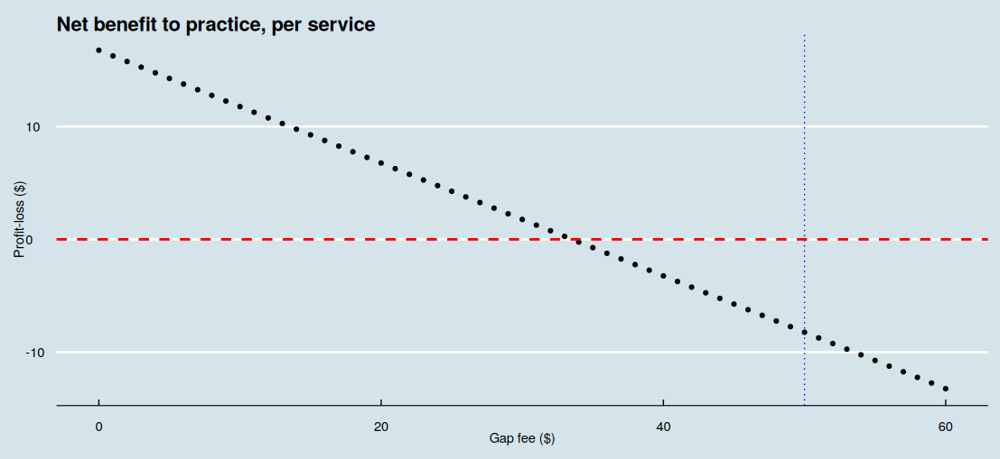
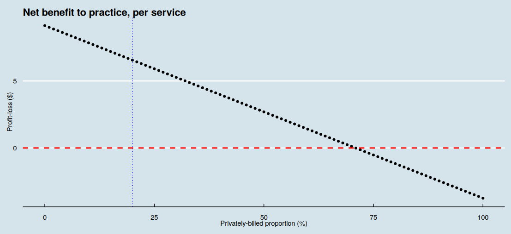
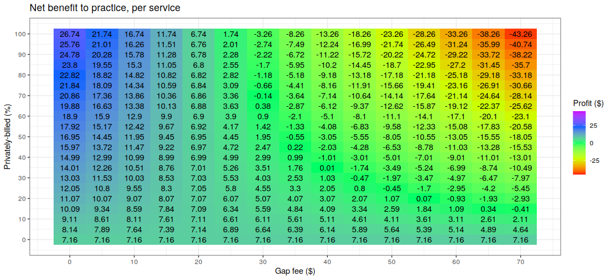
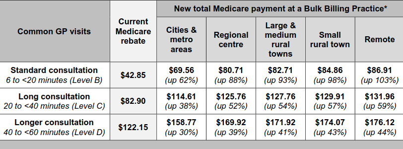
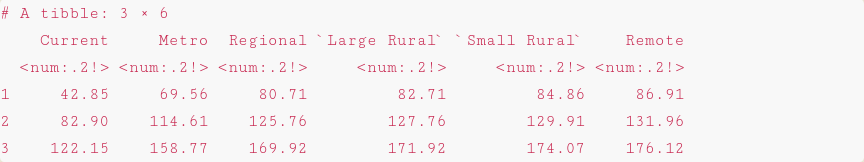

<link href="index_files/libs/htmltools-fill-0.5.8.1/fill.css" rel="stylesheet" />
<script src="index_files/libs/htmlwidgets-1.6.4/htmlwidgets.js"></script>
<script src="index_files/libs/plotly-binding-4.10.4/plotly.js"></script>
<script src="index_files/libs/typedarray-0.1/typedarray.min.js"></script>
<script src="index_files/libs/jquery-3.5.1/jquery.min.js"></script>
<link href="index_files/libs/crosstalk-1.2.1/css/crosstalk.min.css" rel="stylesheet" />
<script src="index_files/libs/crosstalk-1.2.1/js/crosstalk.min.js"></script>
<link href="index_files/libs/plotly-htmlwidgets-css-2.11.1/plotly-htmlwidgets.css" rel="stylesheet" />
<script src="index_files/libs/plotly-main-2.11.1/plotly-latest.min.js"></script>


  <link rel="stylesheet" href="https://cdn.jsdelivr.net/npm/monaco-editor@0.47.0/min/vs/editor/editor.main.css" />
  <link rel="stylesheet" href="https://cdnjs.cloudflare.com/ajax/libs/font-awesome/6.5.2/css/all.min.css" />
  

<style type="text/css">
.monaco-editor pre {
  background-color: unset !important;
}

.qwebr-editor-toolbar {
  width: 100%;
  display: flex;
  justify-content: space-between;
  box-sizing: border-box;
}

.qwebr-editor-toolbar-left-buttons, .qwebr-editor-toolbar-right-buttons {
  display: flex;
}

.qwebr-non-interactive-loading-container.qwebr-cell-needs-evaluation, .qwebr-non-interactive-loading-container.qwebr-cell-evaluated {
  justify-content: center;
  display: flex;
  background-color: rgba(250, 250, 250, 0.65);
  border: 1px solid rgba(233, 236, 239, 0.65);
  border-radius: 0.5rem;
  margin-top: 15px;
  margin-bottom: 15px;
}

.qwebr-r-project-logo {
  color: #2767B0; /* R Project's blue color */
}

.qwebr-icon-status-spinner {
  color: #7894c4;
}

.qwebr-icon-run-code {
  color: #0d9c29
}

body.quarto-light .qwebr-output-code-stdout {
  color: #111;
}

body.quarto-dark .qwebr-output-code-stdout {
  color: #EEE;
}

.qwebr-output-code-stderr {
  color: #db4133;
}

body.quarto-light .qwebr-editor {
  border: 1px solid #EEEEEE;
}

body.quarto-light .qwebr-editor-toolbar {
  background-color: #EEEEEE;
  padding: 0.2rem 0.5rem;
}

body.quarto-dark .qwebr-editor {
  border: 1px solid #111;
}

body.quarto-dark .qwebr-editor-toolbar {
  background-color: #111;
  padding: 0.2rem 0.5rem;
}

.qwebr-button {
  display: inline-block;
  font-weight: 400;
  line-height: 1;
  text-decoration: none;
  text-align: center;
  padding: 0.375rem 0.75rem;
  font-size: .9rem;
  border-radius: 0.25rem;
  transition: color .15s ease-in-out,background-color .15s ease-in-out,border-color .15s ease-in-out,box-shadow .15s ease-in-out;
}

body.quarto-light .qwebr-button {
  background-color: #EEEEEE;
  color: #000;
  border-color: #dee2e6;
  border: 1px solid rgba(0,0,0,0);
}

body.quarto-dark .qwebr-button {
  background-color: #111;
  color: #EEE;
  border-color: #dee2e6;
  border: 1px solid rgba(0,0,0,0);
}

body.quarto-light .qwebr-button:hover {
  color: #000;
  background-color: #d9dce0;
  border-color: #c8ccd0;
}

body.quarto-dark .qwebr-button:hover {
  color: #d9dce0;
  background-color: #323232;
  border-color: #d9dce0;
}

.qwebr-button:disabled,.qwebr-button.disabled,fieldset:disabled .qwebr-button {
  pointer-events: none;
  opacity: .65
}

.qwebr-button-reset {
  color: #696969; /*#4682b4;*/
}

.qwebr-button-copy {
  color: #696969;
}

/* Style the code highlight lines */
body.quarto-light .qwebr-editor-highlight-line {
  background-color: lightblue;
}

body.quarto-dark .qwebr-editor-highlight-line {
  background-color: darkblue;
}

/* Style the modal pop-up */

/* The Modal (background) */
.qwebr-modal {
  display: none; /* Hidden by default */
  position: fixed; /* Stay in place */
  z-index: 1; /* Sit on top */
  left: 0;
  top: 0;
  width: 100%; /* Full width */
  height: 100%; /* Full height */
  overflow: auto; /* Enable scroll if needed */
  background-color: rgb(0,0,0); /* Fallback color */
  background-color: rgba(0,0,0,0.4); /* Black w/ opacity */
  padding-top: 60px;
}

/* Modal Content */
.qwebr-modal-content {
  background-color: #fefefe;
  margin: 5% auto; /* 15% from the top and centered */
  padding: 20px;
  border: 1px solid #888;
  width: 80%; /* Could be more or less, depending on screen size */
}

.qwebr-modal-content-code {
  max-height: 50vh;
  min-height: 5vh;
  overflow: scroll;
  border: 1px solid #888;
}

/* The Close Button */
.qwebr-modal-close {
  color: #aaa;
  float: right;
  font-size: 28px;
  font-weight: bold;
}

.qwebr-modal-close:hover,
.qwebr-modal-close:focus {
  color: black;
  text-decoration: none;
  cursor: pointer;
}

.qwebr-download-btn {
  margin-top: 10px;
  text-decoration: none !important;
}

/* Styling to download image that is created */

.qwebr-canvas-image {
  position: relative;
  display: inline-block;
  margin: 10px;
}

.qwebr-canvas-image-download-btn {
  position: absolute;
  top: 10px;
  right: 10px;
  padding: 5px 10px;
  background-color: #007BFF;
  color: white;
  border: none;
  cursor: pointer;
  display: none;
}

figure:hover .qwebr-canvas-image-download-btn {
  display: block;
}

/* Custom styling for RevealJS Presentations*/

/* Reset the style of the interactive area */
.reveal div.qwebr-interactive-area {
  display: block;
  box-shadow: none;
  max-width: 100%;
  max-height: 100%;
  margin: 0;
  padding: 0;
}

/* Provide space to entries */
.reveal div.qwebr-output-code-area pre div {
  margin: 1px 2px 1px 10px;
}

/* Collapse the inside code tags to avoid extra space between line outputs */
.reveal pre div code.qwebr-output-code-stdout, .reveal pre div code.qwebr-output-code-stderr {
  padding: 0;
  display: contents;
}

body.reveal.quarto-light pre div code.qwebr-output-code-stdout {
  color: #111;
}

body.reveal.quarto-dark pre div code.qwebr-output-code-stdout {
  color: #EEEEEE;
}

.reveal pre div code.qwebr-output-code-stderr {
  color: #db4133;
}


/* Create a border around console and output (does not effect graphs) */
body.reveal.quarto-light div.qwebr-console-area {
  border: 1px solid #EEEEEE;
  box-shadow: 2px 2px 10px #EEEEEE;
}

body.reveal.quarto-dark div.qwebr-console-area {
  border: 1px solid #111;
  box-shadow: 2px 2px 10px #111;
}


/* Cap output height and allow text to scroll */
/* TODO: Is there a better way to fit contents/max it parallel to the monaco editor size? */
.reveal div.qwebr-output-code-area pre {
  max-height: 400px;
  overflow: scroll;
}

iframe.qwebr-output-code-browse {
  width: 100%;

  /*
    TODO: How to make the height automatic according to the widget size,
    or respect the quarto code block options?
  */
  min-height: 500px;
}

</style>

<script type="module">
// Document level settings ----

// Determine if we need to install R packages
globalThis.qwebrInstallRPackagesList = [''];

// Specify possible locations to search for the repository
globalThis.qwebrPackageRepoURLS = ['https://repo.r-wasm.org/'];

// Check to see if we have an empty array, if we do set to skip the installation.
globalThis.qwebrSetupRPackages = !(qwebrInstallRPackagesList.indexOf("") !== -1);
globalThis.qwebrAutoloadRPackages = true;

// Display a startup message?
globalThis.qwebrShowStartupMessage = true;
globalThis.qwebrShowHeaderMessage = false;

// Describe the webR settings that should be used
globalThis.qwebrCustomizedWebROptions = {
  "baseURL": "https://webr.r-wasm.org/v0.4.0/",
  "serviceWorkerUrl": "",
  "homedir": "/home/web_user", 
  "channelType": "ChannelType.Automatic"
};

// Store cell data
globalThis.qwebrCellDetails = [{"code":"# Service fees for the most common fee-for-service consultation items\n# which attract a bulk-billing incentive\n\n# All source code on this page is subject to the terms of the\n# Mozilla Public License, v. 2.0. A copy of the MPL can be obtained \n# from https://mozilla.org/MPL/2.0/.\n\n# government-set price for service items A, B, C, D and E\n# Medicare items 3, 23, 36, 44, and 123\n# in AUD (Australian dollars)\nfee_names <- c(\"a\", \"b\", \"c\", \"d\", \"e\")\nservice_fees <- array(\n  data = c(19.6, 42.85, 82.90, 122.15, 197.9),\n  dim = c(length(fee_names), 1),\n  dimnames = list(fee_names, \"fee\")\n)\n\n# the proportion which each item is billed\n\n# raw figures are derived for calendar year 2024 Australia-wide\n# http://medicarestatistics.humanservices.gov.au/statistics/mbs_item.jsp\nservice_proportion_raw <- array(\n  data = c(4037130, 81240293, 19899953, 1609147, 174664),\n  dim = c(length(fee_names), 1),\n  dimnames = list(fee_names, \"n\")\n)\n\n# calculate the proportions\n# for simplicity, assume the same proportions for bulk-billed patients\n# and privately-billed patients\nservice_proportion_bulk <- service_proportion_raw/sum(service_proportion_raw)\ncolnames(service_proportion_bulk) <- c(\"proportion\")\nservice_proportion_private <- service_proportion_bulk\n\n# display the proportions\nservice_proportion_bulk","options":{"fig-width":7,"editor-max-height":"","editor-word-wrap":"true","read-only":"false","autorun":"false","output":"true","comment":"","fig-height":5,"out-height":"","context":"interactive","out-width":"700px","editor-font-scale":"0.65","results":"markup","dpi":72,"warning":"true","fig-cap":"","classes":"","label":"unnamed-chunk-1","editor-quick-suggestions":"false","message":"true"},"id":1},{"code":"# note, please 'run' the previous code block! \n\n# Set the gap fee for the individual service items A, B, C, D and E\n# for patients who were privately billed\n# for simplicity, set to the same fee of $50\ngap_fee <- array(\n  data = rep(50, length(fee_names)),\n  dim = c(length(fee_names), 1),\n  dimnames = list(fee_names, \"gap\")\n)\n\n# the proportion of patients who are charge the gap fee\n# i.e. privately billed\n# set to 50%\nprivately_billed <-  0.5\n\n# the bulk billing incentive, in dollars\n# varies by location\n# Modified Monash areas 1, 2, 3+4, 5, 6, 7\n# we will index the above to 1, 2, 3, 4, 5 and 6 (merging areas 3+4)\n\n# see https://www9.health.gov.au/mbs/search.cfm\nn_monash <- 6 # six different Monash areas\n\nindividual_bulkbill_incentive <- array(\n  # there are two different individual bulk-billing incentive fees,\n  # 'standard' and 'triple'\n  data = c(\n    # standard bulk-billing incentive applies to service items like item A/'3'\n    # items 10990, 10991, 75855, 75856, 75857, 75858\n    c(7.15, 10.80, 11.45, 12.20, 12.85, 13.70),\n    # triple bulk-billing incentive applies to service items like item B, C and D\n    # items 75870, 75871, 75873, 75874, 75875, 75876\n    c(21.35, 32.50, 34.50, 36.65, 38.70, 41.10)\n  ),\n  dim = c(n_monash, 2),\n  dimnames = list(c(\"1\", \"2\", \"3+4\", \"5\", \"6\", \"7\"), c(\"single\", \"triple\"))\n)\n\n# does the single- or triple- incentive apply to the fee item?\nindividual_bulkbill_incentive_by_fee <- \n  c(\"single\", \"triple\", \"triple\", \"triple\", \"triple\")\n\n# set the Monash area to the city\nmonash_area <- \"1\"\n\n# universal bulk billing incentive\n# over the service fee\n# set to 12.5%\nuniversal_bulkbill_incentive <- 0.125\n\n# show individual bulk-bill incentive applicable to defined Monash area\nfee_bulkbill_incentive <- individual_bulkbill_incentive[monash_area, individual_bulkbill_incentive_by_fee]\n# redefine dimensions of the array\ndim(fee_bulkbill_incentive) <- c(length(fee_names), 1)\n# change rownames to the fee names\nrownames(fee_bulkbill_incentive) <- fee_names\nfee_bulkbill_incentive","options":{"fig-width":7,"editor-max-height":"","editor-word-wrap":"true","read-only":"false","autorun":"false","output":"true","comment":"","fig-height":5,"out-height":"","context":"interactive","out-width":"700px","editor-font-scale":"0.65","results":"markup","dpi":72,"warning":"true","fig-cap":"","classes":"","label":"unnamed-chunk-2","editor-quick-suggestions":"false","message":"true"},"id":2},{"code":"# note, depends on the previous code blocks already having been 'run'! \n\n# Benefit per 'average' patient charged service item A, B, C, D or E\n\nnet_benefit <- function(\n  # calculate the average net benefit revenue\n  # to the practice per patient\n  \n  # the variable names used in this function\n  # are the same as used in previous code chunks\n  # but will be 'local' to this function\n  service_fees,\n  fee_names,\n  service_proportion_bulk,\n  service_proportion_private,\n  gap_fee,\n  privately_billed,\n  individual_bulkbill_incentive,\n  individual_bulkbill_incentive_by_fee,\n  monash_area,\n  universal_bulkbill_incentive) {\n  # calculate individual bulk-bill incentive applicable to defined Monash area\n  fee_bulkbill_incentive <- individual_bulkbill_incentive[monash_area, individual_bulkbill_incentive_by_fee]\n  # re-define dimensions of the 'x' array\n  dim(fee_bulkbill_incentive) <- c(length(fee_names), 1)\n  # change row name to the fee names\n  rownames(fee_bulkbill_incentive) <- fee_names\n  \n  # calculate the universal bulk-bill incentive\n  # for patients formerly privately-billed\n  privately_billed *\n    sum(service_fees * service_proportion_private) *\n    universal_bulkbill_incentive +\n    # calculate (and add) benefit for patients already bulk-billed\n    (1 - privately_billed) *\n    sum(service_fees * service_proportion_bulk) *\n    universal_bulkbill_incentive +\n    \n    # calculate (and add) the individual service bulk-billing incentive applied\n    # to patients formerly privately-billed\n    privately_billed * sum(service_proportion_private * fee_bulkbill_incentive) -\n    \n    # calculate (and subtract) the loss from not charging a private 'gap' fee\n    privately_billed * sum(service_proportion_private * gap_fee)\n}\n\nprofit_loss <- net_benefit(\n  service_fees,\n  fee_names,\n  service_proportion_bulk,\n  service_proportion_private,\n  gap_fee,\n  privately_billed,\n  individual_bulkbill_incentive,\n  individual_bulkbill_incentive_by_fee,\n  monash_area,\n  universal_bulkbill_incentive\n)\n\n# Show the value of average net_benefit\nformatC(profit_loss, digits = 2, format = \"f\")","options":{"fig-width":7,"editor-max-height":"","editor-word-wrap":"true","read-only":"false","autorun":"false","output":"true","comment":"","fig-height":5,"out-height":"","context":"interactive","out-width":"700px","editor-font-scale":"0.65","results":"markup","dpi":72,"warning":"true","fig-cap":"","classes":"","label":"unnamed-chunk-3","editor-quick-suggestions":"false","message":"true"},"id":3},{"code":"# note, depends on the previous code blocks already having been 'run'! \n\n# Set the privately-billed proportion to 0.2 (20%), the gap fee to $35\n# and new service proportions\n\nnew_practice_service_raw <- \n  # new A, B, C, D, E numbers\n  # with much longer average consults\n  #  the consult time is progressively longer from A->B->C->D->E\n  c(950, 3956, 4171, 1146, 75)\nnew_practice_service_proportions <- \n  new_practice_service_raw/sum(new_practice_service_raw)\n\nprofit_loss <- net_benefit(\n  service_fees,\n  fee_names,\n  service_proportion_bulk = new_practice_service_proportions,\n  service_proportion_private = new_practice_service_proportions,\n  # replace the gap fee for every possible service fee\n  # we could also use 'gap_fee = c(35, 35, 35, 35, 35)'\n  gap_fee = rep(35, length(fee_names)),\n  # reduce the privately billed proportion to 20%\n  privately_billed = 0.2,\n  individual_bulkbill_incentive,\n  individual_bulkbill_incentive_by_fee,\n  monash_area,\n  universal_bulkbill_incentive\n)\n\n# Show the value of average net_benefit\nformatC(profit_loss, digits = 2, format = \"f\")","options":{"fig-width":7,"editor-max-height":"","editor-word-wrap":"true","read-only":"false","autorun":"false","output":"true","comment":"","fig-height":5,"out-height":"","context":"interactive","out-width":"700px","editor-font-scale":"0.65","results":"markup","dpi":72,"warning":"true","fig-cap":"","classes":"","label":"unnamed-chunk-4","editor-quick-suggestions":"false","message":"true"},"id":4},{"code":"# note, depends on the previous code blocks already having been 'run'! \n\n# this model is based on the second practice model described above\n# add new service fee descriptions\nnew_fee_names <- c(\n  fee_names,\n  # append items 721, 723 and 732\n  c(\"GPMP\", \"TCA\", \"CDM RV\")\n)\nnew_service_fees <- array(\n  # append fees for 721, 723 and 732\n  data = c(service_fees, 164.35, 130.25, 82.10),\n  dim = c(length(new_fee_names), 1),\n  dimnames = list(new_fee_names, \"fee\")\n)\nnew_gap_fee <- c(\n  rep(35, 5),\n  # no gap fees were charged for thes GPMP/TCA/GPMPRV items,\n  # even 'private' patients\n  rep(0, 3)\n)\nnew_individual_bulkbill_incentive_by_fee <- c(\n  individual_bulkbill_incentive_by_fee,\n  rep(\"single\", 3)\n)\n# Set the privately-billed proportion to 0.2 (20%), the gap fee to $35\n# and new service proportions\nnew_practice_service_raw <- \n  # new A, B, C, D, E numbers\n  # (long average consults)\n  # and GPMP/TCA/reviews\n  c(950, 3956, 4171, 1146, 75, 416, 402, 255)\nnew_practice_service_proportions <- \n  new_practice_service_raw/sum(new_practice_service_raw)\n\nprofit_loss <- net_benefit(\n  service_fees = new_service_fees,\n  fee_names = new_fee_names,\n  service_proportion_bulk = new_practice_service_proportions,\n  service_proportion_private = new_practice_service_proportions,\n  # replace the gap fees\n  gap_fee = new_gap_fee,\n  # reduce the privately billed proportion to 20%\n  privately_billed = 0.2,\n  individual_bulkbill_incentive,\n  individual_bulkbill_incentive_by_fee = new_individual_bulkbill_incentive_by_fee,\n  monash_area,\n  universal_bulkbill_incentive\n)\n\n# Show the value of average net_benefit\nformatC(profit_loss, digits = 2, format = \"f\")","options":{"fig-width":7,"editor-max-height":"","editor-word-wrap":"true","read-only":"false","autorun":"false","output":"true","comment":"","fig-height":5,"out-height":"","context":"interactive","out-width":"700px","editor-font-scale":"0.65","results":"markup","dpi":72,"warning":"true","fig-cap":"","classes":"","label":"unnamed-chunk-5","editor-quick-suggestions":"false","message":"true"},"id":5},{"code":"# note, depends on the previous code blocks already having been 'run'! \n\n# This code chunk requires a few extra code packages\n# It will take a few seconds to make these packages available\ninstall.packages(\"tibble\", quiet = TRUE)\ninstall.packages(\"ggplot2\", quiet = TRUE)\ninstall.packages(\"ggthemes\", quiet = TRUE)\nlibrary(tibble)\nlibrary(ggplot2)\nlibrary(ggthemes)\n\n# gap fees from $0 to $60\ngap_fee_range <- seq(from = 0, to = 60, by = 1)\n\nprofit_loss <- sapply(\n  X = gap_fee_range,\n  function(x) {\n    net_benefit(\n      service_fees,\n      fee_names,\n      service_proportion_bulk,\n      service_proportion_private,\n      # set the gap fee to 'x'\n      gap_fee = rep(x, length(fee_names)),\n      privately_billed,\n      individual_bulkbill_incentive,\n      individual_bulkbill_incentive_by_fee,\n      monash_area,\n      universal_bulkbill_incentive\n    )\n  }\n)\n\ngap_vs_profit <- tibble(\n  gap = gap_fee_range,\n  profit_loss = profit_loss\n)\n\nggplot(\n  data = gap_vs_profit, \n  mapping = aes(x = gap, y = profit_loss)\n  ) +\n  geom_point() +\n  labs(\n    x = \"Gap fee ($)\",\n    y = \"Profit-loss ($)\"\n  ) +\n  ggtitle(\"Net benefit to practice, per service\") +\n  geom_vline(\n    # our current gap-fee\n    xintercept = gap_fee,\n    linetype = \"dotted\",\n    color = \"blue\"\n  ) +\n  geom_hline(\n    # zero profit-loss line\n    yintercept = 0,\n    linetype = \"dashed\",\n    color = \"red\",\n    linewidth = 1\n  ) +\n  theme_economist()","options":{"fig-width":7,"editor-max-height":"","editor-word-wrap":"true","read-only":"false","autorun":"false","output":"true","comment":"","fig-height":5,"out-height":"","context":"interactive","out-width":"700px","editor-font-scale":"0.65","results":"markup","dpi":72,"warning":"true","fig-cap":"","classes":"","label":"unnamed-chunk-6","editor-quick-suggestions":"false","message":"true"},"id":6},{"code":"# note, depends on the previous code blocks already having been 'run'! \nlibrary(tibble)\nlibrary(ggplot2)\nlibrary(ggthemes)\n\n# privately billed range from 0 to 100%\nprivately_billed_range <- seq(from = 0, to = 100, by = 1)\n\n# this model is based on the second practice model described above\n# together with care plan item numbers\n# add new service fee descriptions\nnew_fee_names <- c(\n  fee_names,\n  # append items 721, 723 and 732\n  c(\"GPMP\", \"TCA\", \"CDM RV\")\n)\nnew_service_fees <- array(\n  # append fees for 721, 723 and 732\n  data = c(service_fees, 164.35, 130.25, 82.10),\n  dim = c(length(new_fee_names), 1),\n  dimnames = list(new_fee_names, \"fee\")\n)\nnew_individual_bulkbill_incentive_by_fee <- c(\n  individual_bulkbill_incentive_by_fee,\n  rep(\"single\", 3)\n)\nnew_gap_fee <- c(\n  rep(35, 5),\n  # no gap fees were charged for these GPMP/TCA/GPMPRV items,\n  # even 'private' patients\n  rep(0, 3)\n)\n\n# Set the privately-billed proportion to 0.2 (20%), the gap fee to $35\n# and new service proportions\nnew_practice_service_raw <- \n  # new A, B, C, D, E numbers\n  # (long average consults)\n  # and GPMP/TCA/reviews\n  c(950, 3956, 4171, 1146, 75, 416, 402, 255)\nnew_practice_service_proportions <- \n  new_practice_service_raw/sum(new_practice_service_raw)\n\nprofit_loss <- sapply(\n  X = privately_billed_range,\n  function(x) {\n    net_benefit(\n      service_fees = new_service_fees,\n      fee_names = new_fee_names,\n      # set service proportions to longer consults\n      service_proportion_bulk = new_practice_service_proportions,\n      service_proportion_private = new_practice_service_proportions,\n      # set the gap fee to $35\n      gap_fee = new_gap_fee,\n      # set privately billed proportion to 'x'\n      # divide by 100 to convert from\n      # percentage to proportion\n      privately_billed = x/100,\n      individual_bulkbill_incentive,\n      individual_bulkbill_incentive_by_fee = new_individual_bulkbill_incentive_by_fee,\n      monash_area,\n      universal_bulkbill_incentive\n    )\n  }\n)\n\ngap_vs_profit <- tibble(\n  gap = privately_billed_range,\n  profit_loss = profit_loss\n)\n\nggplot(\n  data = gap_vs_profit, \n  mapping = aes(x = gap, y = profit_loss)\n  ) +\n  geom_point() +\n  labs(\n    x = \"Privately-billed proportion (%)\",\n    y = \"Profit-loss ($)\"\n  ) +\n  ggtitle(\"Net benefit to practice, per service\") +\n  geom_vline(\n    # our current proportion\n    xintercept = 20,\n    linetype = \"dotted\",\n    color = \"blue\"\n  ) +\n  geom_hline(\n    # zero profit-loss line\n    yintercept = 0,\n    linetype = \"dashed\",\n    color = \"red\",\n    linewidth = 1\n  ) +\n  theme_economist()","options":{"fig-width":7,"editor-max-height":"","editor-word-wrap":"true","read-only":"false","autorun":"false","output":"true","comment":"","fig-height":5,"out-height":"","context":"interactive","out-width":"700px","editor-font-scale":"0.65","results":"markup","dpi":72,"warning":"true","fig-cap":"","classes":"","label":"unnamed-chunk-7","editor-quick-suggestions":"false","message":"true"},"id":7},{"code":"# note, depends on the previous code blocks already having been 'run'! \nlibrary(tibble)\nlibrary(plotly)\nlibrary(ggplot2)\nlibrary(dplyr)\n\n# gap fees from $0 to $60\ngap_fee_range <- seq(from = 0, to = 70, by = 1)\n# privately billed range from 0 to 100%\nprivately_billed_range <- seq(from = 0, to = 100, by = 1)\n\n# this model is based on the first practice model described above\n# together with care plan item numbers\n# add new service fee descriptions\nnew_fee_names <- c(\n  fee_names,\n  # append items 721, 723 and 732\n  c(\"GPMP\", \"TCA\", \"CDM RV\")\n)\nnew_service_fees <- array(\n  # append fees for 721, 723 and 732\n  data = c(service_fees, 164.35, 130.25, 82.10),\n  dim = c(length(new_fee_names), 1),\n  dimnames = list(new_fee_names, \"fee\")\n)\nnew_individual_bulkbill_incentive_by_fee <- c(\n  individual_bulkbill_incentive_by_fee,\n  rep(\"single\", 3)\n)\n\n# and new service proportions\n# from http://medicarestatistics.humanservices.gov.au/statistics/mbs_item.jsp (2024)\nnew_practice_service_raw <- \n  # A, B, C, D, E service items\n  # and GPMP/TCA/reviews\n  c(4037130, 81240293, 19899953, 1609147, 174664, 3357364, 2954994, 4319542)\nnew_practice_service_proportions <- \n  new_practice_service_raw/sum(new_practice_service_raw)\n\nprofit_loss <- tibble(\n  gap = numeric(), \n  private_billed = numeric(), \n  profit = numeric()\n)\n\nfor (x in gap_fee_range) {\n  for (y in privately_billed_range) {\n    new_gap_fee <- c(\n      rep(x, length((new_fee_names)))\n      # the same gap fee charged for every item, including GPMP/TCA/GPMPRV items\n      # a simplified approach would use the 'average' gap fee charged\n      # for all relevant items\n    )\n    profit <- net_benefit(\n      service_fees = new_service_fees,\n      fee_names = new_fee_names,\n      # set service proportions to longer consults\n      service_proportion_bulk = new_practice_service_proportions,\n      service_proportion_private = new_practice_service_proportions,\n      # set the gap fee to $35\n      gap_fee = new_gap_fee,\n      # set privately billed proportion to 'x'\n      # divide by 100 to convert from\n      # percentage to proportion\n      privately_billed = y/100,\n      individual_bulkbill_incentive,\n      individual_bulkbill_incentive_by_fee = new_individual_bulkbill_incentive_by_fee,\n      monash_area,\n      universal_bulkbill_incentive\n    )\n    profit_loss <- add_row(profit_loss, gap = x, private_billed = y, profit = profit)\n  }\n}\n\n# this plot cannot be shown in the web-browser using this code block!\n# you will need to copy this code (and all the pre-requisites)\n# into a 'R/RStudio' and run it yourself :)\nfig_plotly_3d <- plot_ly(\n  data = profit_loss, x = ~gap, y = ~private_billed, z = ~profit,\n  type = \"scatter3d\", mode = \"markers\",\n  hovertemplate = paste(\n    \"Gap fee: <b>%{x}</b><br>\",\n    \"Private: <b>%{y}</b>%<br>\",\n    \"Profit: <b>%{z:$.2f}</b>\",\n    \"<extra></extra>\"\n  ),\n  marker = list(\n    color = ~profit,\n    colorscale = \"Rainbow\",\n    showscale = TRUE,\n    line = list(width = 1, color = \"DarkSlateGrey\")) \n  ) |>\n  layout(\n    title = \"Profit-loss according to gap fee and proportion privately-billed\",\n    scene = list(\n      xaxis = list(title = list(text = \"Gap fee ($)\")),\n      yaxis = list(title = list(text = \"Privately-billed (%)\")),\n      zaxis = list(title = list(text = \"Net benefit per service ($)\"))\n    )\n  )\n\n# this plot cannot be shown in the web-browser using this code block!\n# you will need to copy this code (and all the pre-requisites)\n# into a 'R/RStudio' and run it yourself :)\nfig_ggplotly <- ggplot(\n  data = profit_loss,\n  aes(x = gap, y = private_billed))+\n  geom_point(\n    aes(fill = profit),\n    size = 4, shape = 22, stroke = 0\n  ) +\n  scale_fill_viridis_c(option = \"turbo\")\n# to look at this plot, either 'fig_ggplotly' in R/RStudio or\n# 'ggplotly(fig_ggplotly)'\n\nfig_ggplot <- ggplot(\n  data = profit_loss |> \n    dplyr::filter(gap == (gap %/% 5 * 5), private_billed == (private_billed %/% 5 * 5)),\n  aes(x = gap, y = private_billed, fill = profit)) +\n  theme_bw() + geom_tile() + \n  geom_text(aes(label=round(profit, 2)), size = 8/.pt) +\n  labs(\n    x = \"Gap fee ($)\",\n    y = \"Privately-billed (%)\",\n    fill = \"Profit ($)\"\n  ) +\n  scale_x_continuous(breaks = seq(from = 0, to = 70, by = 10)) +\n  scale_y_continuous(breaks = seq(from = 0, to = 100, by = 10)) +\n  ggtitle(\"Net benefit to practice, per service\") +\n  scale_fill_gradientn(colors = rainbow(5), limits = c(-45, 45))\n\nfig_ggplot","options":{"fig-width":7,"editor-max-height":"300","editor-word-wrap":"true","read-only":"false","autorun":"false","output":"true","comment":"","fig-height":5,"out-height":"","context":"interactive","out-width":"700px","editor-font-scale":"0.65","results":"asis","dpi":72,"warning":"false","fig-cap":"","classes":"","label":"unnamed-chunk-8","editor-quick-suggestions":"false","message":"false"},"id":8},{"code":"install.packages(\"knitr\", quiet = TRUE)\nlibrary(tibble)\nlibrary(knitr)\n\n# just include service items B, C and D\nshort_service_list <- service_fees[c(\"b\", \"c\", \"d\"),]\n\nnew_payments <- \n  tibble(\n    Current = num(\n      short_service_list,\n      digits = 2\n    ),\n    Metro = num(\n      short_service_list*(1+universal_bulkbill_incentive)+\n        individual_bulkbill_incentive[1, 2],\n      digits = 2\n    ),\n    Regional = num(\n      short_service_list*(1+universal_bulkbill_incentive)+\n        individual_bulkbill_incentive[2, 2],\n      digits = 2\n    ),\n    `Large Rural` = num(\n      short_service_list*(1+universal_bulkbill_incentive)+\n        individual_bulkbill_incentive[3, 2],\n      digits = 2\n    ),\n    `Small Rural` = num(\n      short_service_list*(1+universal_bulkbill_incentive)+\n        individual_bulkbill_incentive[4, 2],\n      digits = 2\n    ),\n    Remote = num(\n      short_service_list*(1+universal_bulkbill_incentive)+\n        individual_bulkbill_incentive[5, 2],\n      digits = 2\n    ),\n  )\n\nkable(new_payments, format = \"html\")","options":{"fig-width":7,"editor-max-height":"","editor-word-wrap":"true","read-only":"false","autorun":"false","output":"true","comment":"","fig-height":5,"out-height":"","context":"interactive","out-width":"700px","editor-font-scale":"0.65","results":"asis","dpi":72,"warning":"true","fig-cap":"","classes":"","label":"unnamed-chunk-9","editor-quick-suggestions":"false","message":"true"},"id":9}];

</script>

<script type="module">
// Declare startupMessageQWebR globally
globalThis.qwebrStartupMessage = document.createElement("p");

// Verify if OffScreenCanvas is supported
globalThis.qwebrOffScreenCanvasSupport = function() {
  return typeof OffscreenCanvas !== 'undefined'
}

// Function to set the button text
globalThis.qwebrSetInteractiveButtonState = function(buttonText, enableCodeButton = true) {
  document.querySelectorAll(".qwebr-button-run").forEach((btn) => {
    btn.innerHTML = buttonText;
    btn.disabled = !enableCodeButton;
  });
}

// Function to update the status message in non-interactive cells
globalThis.qwebrUpdateStatusMessage = function(message) {
  document.querySelectorAll(".qwebr-status-text.qwebr-cell-needs-evaluation").forEach((elem) => {
    elem.innerText = message;
  });
}

// Function to update the status message
globalThis.qwebrUpdateStatusHeader = function(message) {
  qwebrStartupMessage.innerHTML = `
    <i class="fa-solid fa-spinner fa-spin qwebr-icon-status-spinner"></i>
    <span>${message}</span>`;
}

// Function to return true if element is found, false if not
globalThis.qwebrCheckHTMLElementExists = function(selector) {
  const element = document.querySelector(selector);
  return !!element;
}

// Function that detects whether reveal.js slides are present
globalThis.qwebrIsRevealJS = function() {
  // If the '.reveal .slides' selector exists, RevealJS is likely present
  return qwebrCheckHTMLElementExists('.reveal .slides');
}

// Initialize the Quarto sidebar element
function qwebrSetupQuartoSidebar() {
  var newSideBarDiv = document.createElement('div');
  newSideBarDiv.id = 'quarto-margin-sidebar';
  newSideBarDiv.className = 'sidebar margin-sidebar';
  newSideBarDiv.style.top = '0px';
  newSideBarDiv.style.maxHeight = 'calc(0px + 100vh)';

  return newSideBarDiv;
}

// Position the sidebar in the document
function qwebrPlaceQuartoSidebar() {
  // Get the reference to the element with id 'quarto-document-content'
  var referenceNode = document.getElementById('quarto-document-content');

  // Create the new div element
  var newSideBarDiv = qwebrSetupQuartoSidebar();

  // Insert the new div before the 'quarto-document-content' element
  referenceNode.parentNode.insertBefore(newSideBarDiv, referenceNode);
}

function qwebrPlaceMessageContents(content, html_location = "title-block-header", revealjs_location = "title-slide") {

  // Get references to header elements
  const headerHTML = document.getElementById(html_location);
  const headerRevealJS = document.getElementById(revealjs_location);

  // Determine where to insert the quartoTitleMeta element
  if (headerHTML || headerRevealJS) {
    // Append to the existing "title-block-header" element or "title-slide" div
    (headerHTML || headerRevealJS).appendChild(content);
  } else {
    // If neither headerHTML nor headerRevealJS is found, insert after "webr-monaco-editor-init" script
    const monacoScript = document.getElementById("qwebr-monaco-editor-init");
    const header = document.createElement("header");
    header.setAttribute("id", "title-block-header");
    header.appendChild(content);
    monacoScript.after(header);
  }
}


function qwebrOffScreenCanvasSupportWarningMessage() {
  
  // Verify canvas is supported.
  if(qwebrOffScreenCanvasSupport()) return;

  // Create the main container div
  var calloutContainer = document.createElement('div');
  calloutContainer.classList.add('callout', 'callout-style-default', 'callout-warning', 'callout-titled');

  // Create the header div
  var headerDiv = document.createElement('div');
  headerDiv.classList.add('callout-header', 'd-flex', 'align-content-center');

  // Create the icon container div
  var iconContainer = document.createElement('div');
  iconContainer.classList.add('callout-icon-container');

  // Create the icon element
  var iconElement = document.createElement('i');
  iconElement.classList.add('callout-icon');

  // Append the icon element to the icon container
  iconContainer.appendChild(iconElement);

  // Create the title container div
  var titleContainer = document.createElement('div');
  titleContainer.classList.add('callout-title-container', 'flex-fill');
  titleContainer.innerText = 'Warning: Web Browser Does Not Support Graphing!';

  // Append the icon container and title container to the header div
  headerDiv.appendChild(iconContainer);
  headerDiv.appendChild(titleContainer);

  // Create the body container div
  var bodyContainer = document.createElement('div');
  bodyContainer.classList.add('callout-body-container', 'callout-body');

  // Create the paragraph element for the body content
  var paragraphElement = document.createElement('p');
  paragraphElement.innerHTML = 'This web browser does not have support for displaying graphs through the <code>quarto-webr</code> extension since it lacks an <code>OffScreenCanvas</code>. Please upgrade your web browser to one that supports <code>OffScreenCanvas</code>.';

  // Append the paragraph element to the body container
  bodyContainer.appendChild(paragraphElement);

  // Append the header div and body container to the main container div
  calloutContainer.appendChild(headerDiv);
  calloutContainer.appendChild(bodyContainer);

  // Append the main container div to the document depending on format
  qwebrPlaceMessageContents(calloutContainer, "title-block-header"); 

}


// Function that attaches the document status message and diagnostics
function displayStartupMessage(showStartupMessage, showHeaderMessage) {
  if (!showStartupMessage) {
    return;
  }

  // Create the outermost div element for metadata
  const quartoTitleMeta = document.createElement("div");
  quartoTitleMeta.classList.add("quarto-title-meta");

  // Create the first inner div element
  const firstInnerDiv = document.createElement("div");
  firstInnerDiv.setAttribute("id", "qwebr-status-message-area");

  // Create the second inner div element for "WebR Status" heading and contents
  const secondInnerDiv = document.createElement("div");
  secondInnerDiv.setAttribute("id", "qwebr-status-message-title");
  secondInnerDiv.classList.add("quarto-title-meta-heading");
  secondInnerDiv.innerText = "WebR Status";

  // Create another inner div for contents
  const secondInnerDivContents = document.createElement("div");
  secondInnerDivContents.setAttribute("id", "qwebr-status-message-body");
  secondInnerDivContents.classList.add("quarto-title-meta-contents");

  // Describe the WebR state
  qwebrStartupMessage.innerText = "🟡 Loading...";
  qwebrStartupMessage.setAttribute("id", "qwebr-status-message-text");
  // Add `aria-live` to auto-announce the startup status to screen readers
  qwebrStartupMessage.setAttribute("aria-live", "assertive");

  // Append the startup message to the contents
  secondInnerDivContents.appendChild(qwebrStartupMessage);

  // Add a status indicator for COOP and COEP Headers if needed
  if (showHeaderMessage) {
    const crossOriginMessage = document.createElement("p");
    crossOriginMessage.innerText = `${crossOriginIsolated ? '🟢' : '🟡'} COOP & COEP Headers`;
    crossOriginMessage.setAttribute("id", "qwebr-coop-coep-header");
    secondInnerDivContents.appendChild(crossOriginMessage);
  }

  // Combine the inner divs and contents
  firstInnerDiv.appendChild(secondInnerDiv);
  firstInnerDiv.appendChild(secondInnerDivContents);
  quartoTitleMeta.appendChild(firstInnerDiv);

  // Place message on webpage
  qwebrPlaceMessageContents(quartoTitleMeta); 
}

function qwebrAddCommandHistoryModal() {
  // Create the modal div
  var modalDiv = document.createElement('div');
  modalDiv.id = 'qwebr-history-modal';
  modalDiv.className = 'qwebr-modal';

  // Create the modal content div
  var modalContentDiv = document.createElement('div');
  modalContentDiv.className = 'qwebr-modal-content';

  // Create the span for closing the modal
  var closeSpan = document.createElement('span');
  closeSpan.id = 'qwebr-command-history-close-btn';
  closeSpan.className = 'qwebr-modal-close';
  closeSpan.innerHTML = '&times;';

  // Create the h1 element for the modal
  var modalH1 = document.createElement('h1');
  modalH1.textContent = 'R History Command Contents';

  // Create an anchor element for downloading the Rhistory file 
  var downloadLink = document.createElement('a');
  downloadLink.href = '#';
  downloadLink.id = 'qwebr-download-history-btn';
  downloadLink.className = 'qwebr-download-btn';

  // Create an 'i' element for the icon
  var icon = document.createElement('i');
  icon.className = 'bi bi-file-code';

  // Append the icon to the anchor element
  downloadLink.appendChild(icon);

  // Add the text 'Download R History' to the anchor element
  downloadLink.appendChild(document.createTextNode(' Download R History File'));

  // Create the pre for command history contents
  var commandContentsPre = document.createElement('pre');
  commandContentsPre.id = 'qwebr-command-history-contents';
  commandContentsPre.className = 'qwebr-modal-content-code';

  // Append the close span, h1, and history contents pre to the modal content div
  modalContentDiv.appendChild(closeSpan);
  modalContentDiv.appendChild(modalH1);
  modalContentDiv.appendChild(downloadLink);
  modalContentDiv.appendChild(commandContentsPre);

  // Append the modal content div to the modal div
  modalDiv.appendChild(modalContentDiv);

  // Append the modal div to the body
  document.body.appendChild(modalDiv);
}

function qwebrRegisterRevealJSCommandHistoryModal() {
  // Select the <ul> element inside the <div> with data-panel="Custom0"
  let ulElement = document.querySelector('div[data-panel="Custom0"] > ul.slide-menu-items');

  // Find the last <li> element with class slide-tool-item
  let lastItem = ulElement.querySelector('li.slide-tool-item:last-child');

  // Calculate the next data-item value
  let nextItemValue = 0;
  if (lastItem) {
      nextItemValue = parseInt(lastItem.dataset.item) + 1;
  }

  // Create a new <li> element
  let newListItem = document.createElement('li');
  newListItem.className = 'slide-tool-item';
  newListItem.dataset.item = nextItemValue.toString(); // Set the next available data-item value

  // Create the <a> element inside the <li>
  let newLink = document.createElement('a');
  newLink.href = '#';
  newLink.id = 'qwebrRHistoryButton'; // Set the ID for the new link
  
  // Create the <kbd> element inside the <a>
  let newKbd = document.createElement('kbd');
  newKbd.textContent = ' '; // Set to empty as we are not registering a keyboard shortcut

  // Create text node for the link text
  let newText = document.createTextNode(' View R History');

  // Append <kbd> and text node to <a>
  newLink.appendChild(newKbd);
  newLink.appendChild(newText);

  // Append <a> to <li>
  newListItem.appendChild(newLink);

  // Append <li> to <ul>
  ulElement.appendChild(newListItem);
}

// Handle setting up the R history modal
function qwebrCodeLinks() {

  if (qwebrIsRevealJS()) {
    qwebrRegisterRevealJSCommandHistoryModal();
    return;
  }

  // Create the container div
  var containerDiv = document.createElement('div');
  containerDiv.className = 'quarto-code-links';

  // Create the h2 element
  var h2 = document.createElement('h2');
  h2.textContent = 'webR Code Links';

  // Create the ul element
  var ul = document.createElement('ul');

  // Create the li element
  var li = document.createElement('li');

  // Create the a_history_btn element
  var a_history_btn = document.createElement('a');
  a_history_btn.href = 'javascript:void(0)';
  a_history_btn.setAttribute('id', 'qwebrRHistoryButton');

  // Create the i_history_btn element
  var i_history_btn = document.createElement('i');
  i_history_btn.className = 'bi bi-file-code';

  // Create the text node for the link text
  var text_history_btn = document.createTextNode('View R History');

  // Append the icon element and link text to the a element
  a_history_btn.appendChild(i_history_btn);
  a_history_btn.appendChild(text_history_btn);

  // Append the a element to the li element
  li.appendChild(a_history_btn);

  // Append the li element to the ul element
  ul.appendChild(li);

  // Append the h2 and ul elements to the container div
  containerDiv.appendChild(h2);
  containerDiv.appendChild(ul);

  // Append the container div to the element with the ID 'quarto-margin-sidebar'
  var sidebar = document.getElementById('quarto-margin-sidebar');
    
  // If the sidebar element is not found, create it
  if(!sidebar) {
    qwebrPlaceQuartoSidebar();
  }
  
  // Re-select the sidebar element (if it was just created)
  sidebar = document.getElementById('quarto-margin-sidebar');   


  // If the sidebar element exists, append the container div to it
  if(sidebar) {
    // Append the container div to the sidebar
    sidebar.appendChild(containerDiv);
    // Force the sidebar to be clickable by removing the 'zindex-bottom' class
    // added in pre-release: https://github.com/quarto-dev/quarto-cli/commit/f0c53a1ffcaa1de4eccbf07803b096898248adcc
    sidebar.className = 'sidebar margin-sidebar';
  } else {
    // Get a debugger ...
    console.warn('Element with ID "quarto-margin-sidebar" not found.');
  }
}

// Call the function to append the code links for qwebR into the right sidebar
qwebrCodeLinks();

// Add the command history modal
qwebrAddCommandHistoryModal();

displayStartupMessage(qwebrShowStartupMessage, qwebrShowHeaderMessage);
qwebrOffScreenCanvasSupportWarningMessage();
</script>

<script type="module">
// Define a global storage and retrieval solution ----

// Store commands executed in R
globalThis.qwebrRCommandHistory = [];

// Function to retrieve the command history
globalThis.qwebrFormatRHistory = function() {
   return qwebrRCommandHistory.join("\n\n");
}

// Retrieve HTML Elements ----

// Get the command modal
const command_history_modal = document.getElementById("qwebr-history-modal");

// Get the button that opens the command modal
const command_history_btn = document.getElementById("qwebrRHistoryButton");

// Get the <span> element that closes the command modal
const command_history_close_span = document.getElementById("qwebr-command-history-close-btn");

// Get the download button for r history information
const command_history_download_btn = document.getElementById("qwebr-download-history-btn");

// Plug in command history into modal/download button ----

// Function to populate the modal with command history
function populateCommandHistoryModal() {
    document.getElementById("qwebr-command-history-contents").innerHTML = qwebrFormatRHistory() || "No commands have been executed yet.";
}

// Function to format the current date and time to
// a string with the format YYYY-MM-DD-HH-MM-SS
function formatDateTime() {
    const now = new Date();

    const year = now.getFullYear();
    const day = String(now.getDate()).padStart(2, '0');
    const month = String(now.getMonth() + 1).padStart(2, '0'); // Months are zero-based
    const hours = String(now.getHours()).padStart(2, '0');
    const minutes = String(now.getMinutes()).padStart(2, '0');
    const seconds = String(now.getSeconds()).padStart(2, '0');

    return `${year}-${month}-${day}-${hours}-${minutes}-${seconds}`;
}


// Function to convert document title with datetime to a safe filename
function safeFileName() {
    // Get the current page title
    let pageTitle = document.title;

    // Combine the current page title with the current date and time
    let pageNameWithDateTime = `Rhistory-${pageTitle}-${formatDateTime()}`;

    // Replace unsafe characters with safe alternatives
    let safeFilename = pageNameWithDateTime.replace(/[\\/:\*\?! "<>\|]/g, '-');

    return safeFilename;
}


// Function to download list contents as text file
function downloadRHistory() {
    // Get the current page title + datetime and use it as the filename
    const filename = `${safeFileName()}.R`;

    // Get the text contents of the R History list
    const text = qwebrFormatRHistory();

    // Create a new Blob object with the text contents
    const blob = new Blob([text], { type: 'text/plain' });
  
    // Create a new anchor element for the download
    const a = document.createElement('a');
    a.style.display = 'none';
    a.href = URL.createObjectURL(blob);
    a.download = filename;

    // Append the anchor to the body, click it, and remove it
    document.body.appendChild(a);
    a.click();
    document.body.removeChild(a);
}

// Register event handlers ----

// When the user clicks the View R History button, open the command modal
command_history_btn.onclick = function() {
    populateCommandHistoryModal();
    command_history_modal.style.display = "block";
}

// When the user clicks on <span> (x), close the command modal
command_history_close_span.onclick = function() {
    command_history_modal.style.display = "none";
}

// When the user clicks anywhere outside of the command modal, close it
window.onclick = function(event) {
    if (event.target == command_history_modal) {
        command_history_modal.style.display = "none";
    }
}

// Add an onclick event listener to the download button so that
// the user can download the R history as a text file
command_history_download_btn.onclick = function() {
    downloadRHistory();
};
</script>

<script type="module">
// Supported Evaluation Types for Context
globalThis.EvalTypes = Object.freeze({
  Interactive: 'interactive',
  Setup: 'setup',
  Output: 'output',
});

// Function that obtains the font size for a given element 
globalThis.qwebrCurrentFontSizeOnElement = function(element, cssProperty = 'font-size') {

  const currentFontSize = parseFloat(
    window
    .getComputedStyle(element)
    .getPropertyValue(cssProperty)
  );
  
  return currentFontSize;
}

// Function to determine font scaling
globalThis.qwebrScaledFontSize = function(div, qwebrOptions) {
  // Determine if we should compute font-size using RevealJS's `--r-main-font-size` 
  // or if we can directly use the document's `font-size`.
  const cssProperty = document.body.classList.contains('reveal') ? 
    "--r-main-font-size" : "font-size";
  
  // Get the current font size on the div element
  const elementFontSize = qwebrCurrentFontSizeOnElement(div, cssProperty);

  // Determine the scaled font size value
  const scaledFontSize = ((qwebrOptions['editor-font-scale'] ?? 1) * elementFontSize) ?? 17.5;

  return scaledFontSize;
}


// Function that dispatches the creation request
globalThis.qwebrCreateHTMLElement = function (
  cellData
) {

  // Extract key components
  const evalType = cellData.options.context;
  const qwebrCounter = cellData.id;

  // We make an assumption that insertion points are defined by the Lua filter as:
  // qwebr-insertion-location-{qwebrCounter} 
  const elementLocator = document.getElementById(`qwebr-insertion-location-${qwebrCounter}`);

  // Figure out the routine to use to insert the element.
  let qwebrElement;
  switch ( evalType ) {
    case EvalTypes.Interactive:
      qwebrElement = qwebrCreateInteractiveElement(qwebrCounter, cellData.options);
      break;
    case EvalTypes.Output: 
      qwebrElement = qwebrCreateNonInteractiveOutputElement(qwebrCounter, cellData.options);
      break;
    case EvalTypes.Setup: 
      qwebrElement = qwebrCreateNonInteractiveSetupElement(qwebrCounter, cellData.options);
      break;
    default: 
      qwebrElement = document.createElement('div');
      qwebrElement.textContent = 'Error creating `quarto-webr` element';
  }

  // Insert the dynamically generated object at the document location.
  elementLocator.appendChild(qwebrElement);
};

// Function that setups the interactive element creation
globalThis.qwebrCreateInteractiveElement = function (qwebrCounter, qwebrOptions) {

  // Create main div element
  var mainDiv = document.createElement('div');
  mainDiv.id = 'qwebr-interactive-area-' + qwebrCounter;
  mainDiv.className = `qwebr-interactive-area`;
  if (qwebrOptions.classes) {
    mainDiv.className += " " + qwebrOptions.classes
  }

  // Add a unique cell identifier that users can customize
  if (qwebrOptions.label) {
    mainDiv.setAttribute('data-id', qwebrOptions.label);
  }

  // Create toolbar div
  var toolbarDiv = document.createElement('div');
  toolbarDiv.className = 'qwebr-editor-toolbar';
  toolbarDiv.id = 'qwebr-editor-toolbar-' + qwebrCounter;

  // Create a div to hold the left buttons
  var leftButtonsDiv = document.createElement('div');
  leftButtonsDiv.className = 'qwebr-editor-toolbar-left-buttons';

  // Create a div to hold the right buttons
  var rightButtonsDiv = document.createElement('div');
  rightButtonsDiv.className = 'qwebr-editor-toolbar-right-buttons';

  // Create Run Code button
  var runCodeButton = document.createElement('button');
  runCodeButton.className = 'btn btn-default qwebr-button qwebr-button-run';
  runCodeButton.disabled = true;
  runCodeButton.type = 'button';
  runCodeButton.id = 'qwebr-button-run-' + qwebrCounter;
  runCodeButton.textContent = '🟡 Loading webR...';
  runCodeButton.title = `Run code (Shift + Enter)`;

  // Append buttons to the leftButtonsDiv
  leftButtonsDiv.appendChild(runCodeButton);

  // Create Reset button
  var resetButton = document.createElement('button');
  resetButton.className = 'btn btn-light btn-xs qwebr-button qwebr-button-reset';
  resetButton.type = 'button';
  resetButton.id = 'qwebr-button-reset-' + qwebrCounter;
  resetButton.title = 'Start over';
  resetButton.innerHTML = '<i class="fa-solid fa-arrows-rotate"></i>';

  // Create Copy button
  var copyButton = document.createElement('button');
  copyButton.className = 'btn btn-light btn-xs qwebr-button qwebr-button-copy';
  copyButton.type = 'button';
  copyButton.id = 'qwebr-button-copy-' + qwebrCounter;
  copyButton.title = 'Copy code';
  copyButton.innerHTML = '<i class="fa-regular fa-copy"></i>';

  // Append buttons to the rightButtonsDiv
  rightButtonsDiv.appendChild(resetButton);
  rightButtonsDiv.appendChild(copyButton);

  // Create console area div
  var consoleAreaDiv = document.createElement('div');
  consoleAreaDiv.id = 'qwebr-console-area-' + qwebrCounter;
  consoleAreaDiv.className = 'qwebr-console-area';

  // Create editor div
  var editorDiv = document.createElement('div');
  editorDiv.id = 'qwebr-editor-' + qwebrCounter;
  editorDiv.className = 'qwebr-editor';

  // Create output code area div
  var outputCodeAreaDiv = document.createElement('div');
  outputCodeAreaDiv.id = 'qwebr-output-code-area-' + qwebrCounter;
  outputCodeAreaDiv.className = 'qwebr-output-code-area';
  outputCodeAreaDiv.setAttribute('aria-live', 'assertive');

  // Create pre element inside output code area
  var preElement = document.createElement('pre');
  preElement.style.visibility = 'hidden';
  outputCodeAreaDiv.appendChild(preElement);

  // Create output graph area div
  var outputGraphAreaDiv = document.createElement('div');
  outputGraphAreaDiv.id = 'qwebr-output-graph-area-' + qwebrCounter;
  outputGraphAreaDiv.className = 'qwebr-output-graph-area';

  // Append buttons to the toolbar
  toolbarDiv.appendChild(leftButtonsDiv);
  toolbarDiv.appendChild(rightButtonsDiv);

  // Append all elements to the main div
  mainDiv.appendChild(toolbarDiv);
  consoleAreaDiv.appendChild(editorDiv);
  consoleAreaDiv.appendChild(outputCodeAreaDiv);
  mainDiv.appendChild(consoleAreaDiv);
  mainDiv.appendChild(outputGraphAreaDiv);

  return mainDiv;
}

// Function that adds output structure for non-interactive output
globalThis.qwebrCreateNonInteractiveOutputElement = function(qwebrCounter, qwebrOptions) {
  // Create main div element
  var mainDiv = document.createElement('div');
  mainDiv.id = 'qwebr-noninteractive-area-' + qwebrCounter;
  mainDiv.className = `qwebr-noninteractive-area`;
  if (qwebrOptions.classes) {
    mainDiv.className += " " + qwebrOptions.classes
  }
  
  // Add a unique cell identifier that users can customize
  if (qwebrOptions.label) {
    mainDiv.setAttribute('data-id', qwebrOptions.label);
  }
  
  // Create a status container div
  var statusContainer = createLoadingContainer(qwebrCounter);

  // Create output code area div
  var outputCodeAreaDiv = document.createElement('div');
  outputCodeAreaDiv.id = 'qwebr-output-code-area-' + qwebrCounter;
  outputCodeAreaDiv.className = 'qwebr-output-code-area';
  outputCodeAreaDiv.setAttribute('aria-live', 'assertive');

  // Create pre element inside output code area
  var preElement = document.createElement('pre');
  preElement.style.visibility = 'hidden';
  outputCodeAreaDiv.appendChild(preElement);

  // Create output graph area div
  var outputGraphAreaDiv = document.createElement('div');
  outputGraphAreaDiv.id = 'qwebr-output-graph-area-' + qwebrCounter;
  outputGraphAreaDiv.className = 'qwebr-output-graph-area';

  // Append all elements to the main div
  mainDiv.appendChild(statusContainer);
  mainDiv.appendChild(outputCodeAreaDiv);
  mainDiv.appendChild(outputGraphAreaDiv);

  return mainDiv;
};

// Function that adds a stub in the page to indicate a setup cell was used.
globalThis.qwebrCreateNonInteractiveSetupElement = function(qwebrCounter, qwebrOptions) {
  // Create main div element
  var mainDiv = document.createElement('div');
  mainDiv.id = `qwebr-noninteractive-setup-area-${qwebrCounter}`;
  mainDiv.className = `qwebr-noninteractive-setup-area`;
  if (qwebrOptions.classes) {
    mainDiv.className += " " + qwebrOptions.classes
  }


  // Add a unique cell identifier that users can customize
  if (qwebrOptions.label) {
    mainDiv.setAttribute('data-id', qwebrOptions.label);
  }

  // Create a status container div
  var statusContainer = createLoadingContainer(qwebrCounter);

  // Append status onto the main div
  mainDiv.appendChild(statusContainer);

  return mainDiv;
}


// Function to create loading container with specified ID
globalThis.createLoadingContainer = function(qwebrCounter) {

  // Create a status container
  const container = document.createElement('div');
  container.id = `qwebr-non-interactive-loading-container-${qwebrCounter}`;
  container.className = 'qwebr-non-interactive-loading-container qwebr-cell-needs-evaluation';

  // Create an R project logo to indicate its a code space
  const rProjectIcon = document.createElement('i');
  rProjectIcon.className = 'fa-brands fa-r-project fa-3x qwebr-r-project-logo';

  // Setup a loading icon from font awesome
  const spinnerIcon = document.createElement('i');
  spinnerIcon.className = 'fa-solid fa-spinner fa-spin fa-1x qwebr-icon-status-spinner';

  // Add a section for status text
  const statusText = document.createElement('p');
  statusText.id = `qwebr-status-text-${qwebrCounter}`;
  statusText.className = `qwebr-status-text qwebr-cell-needs-evaluation`;
  statusText.innerText = 'Loading webR...';

  // Incorporate an inner container
  const innerContainer = document.createElement('div');

  // Append elements to the inner container
  innerContainer.appendChild(spinnerIcon);
  innerContainer.appendChild(statusText);

  // Append elements to the main container
  container.appendChild(rProjectIcon);
  container.appendChild(innerContainer);

  return container;
}
</script>

<script type="module">
// Function to install a single package
async function qwebrInstallRPackage(packageName) {
  await mainWebR.evalRVoid(`webr::install('${packageName}');`);
}

// Function to load a single package
async function qwebrLoadRPackage(packageName) {
  await mainWebR.evalRVoid(`require('${packageName}', quietly = TRUE)`);
}

// Generic function to process R packages
async function qwebrProcessRPackagesWithStatus(packages, processType, displayStatusMessageUpdate = true) {
  // Switch between contexts
  const messagePrefix = processType === 'install' ? 'Installing' : 'Loading';

  // Modify button state
  qwebrSetInteractiveButtonState(`🟡 ${messagePrefix} package ...`, false);

  // Iterate over packages
  for (let i = 0; i < packages.length; i++) {
    const activePackage = packages[i];
    const formattedMessage = `${messagePrefix} package ${i + 1} out of ${packages.length}: ${activePackage}`;

    // Display the update in header
    if (displayStatusMessageUpdate) {
      qwebrUpdateStatusHeader(formattedMessage);
    }

    // Display the update in non-active areas
    qwebrUpdateStatusMessage(formattedMessage);

    // Run package installation
    if (processType === 'install') {
      await qwebrInstallRPackage(activePackage);
    } else {
      await qwebrLoadRPackage(activePackage);
    }
  }

  // Clean slate
  if (processType === 'load') {
    await mainWebR.flush();
  }
}

// Start a timer
const initializeWebRTimerStart = performance.now();

// Encase with a dynamic import statement
globalThis.qwebrInstance = import(qwebrCustomizedWebROptions.baseURL + "webr.mjs").then(
  async ({ WebR, ChannelType }) => {
    // Populate WebR options with defaults or new values based on `webr` meta
    globalThis.mainWebR = new WebR(qwebrCustomizedWebROptions);

    // Initialization WebR
    await mainWebR.init();

    // Setup a shelter
    globalThis.mainWebRCodeShelter = await new mainWebR.Shelter();

    // Setup a pager to allow processing help documentation
    await mainWebR.evalRVoid('webr::pager_install()');

    // Setup a viewer to allow processing htmlwidgets.
    // This might not be available in old webr version
    await mainWebR.evalRVoid('try({ webr::viewer_install() })');

    // Override the existing install.packages() to use webr::install()
    await mainWebR.evalRVoid('webr::shim_install()');

    // Specify the repositories to pull from
    // Note: webR does not use the `repos` option, but instead uses `webr_pkg_repos`
    // inside of `install()`. However, other R functions still pull from `repos`.
    await mainWebR.evalRVoid(`
      options(
        webr_pkg_repos = c(${qwebrPackageRepoURLS.map(repoURL => `'${repoURL}'`).join(',')}),
        repos = c(${qwebrPackageRepoURLS.map(repoURL => `'${repoURL}'`).join(',')})
      )
    `);

    // Check to see if any packages need to be installed
    if (qwebrSetupRPackages) {
      // Obtain only a unique list of packages
      const uniqueRPackageList = Array.from(new Set(qwebrInstallRPackagesList));

      // Install R packages one at a time (either silently or with a status update)
      await qwebrProcessRPackagesWithStatus(uniqueRPackageList, 'install', qwebrShowStartupMessage);

      if (qwebrAutoloadRPackages) {
        // Load R packages one at a time (either silently or with a status update)
        await qwebrProcessRPackagesWithStatus(uniqueRPackageList, 'load', qwebrShowStartupMessage);
      }
    }
  }
);

// Stop timer
const initializeWebRTimerEnd = performance.now();

</script>

<script type="module">
// Function to verify a given JavaScript Object is empty
globalThis.qwebrIsObjectEmpty = function (arr) {
    return Object.keys(arr).length === 0;
}

// Global version of the Escape HTML function that converts HTML
// characters to their HTML entities.
globalThis.qwebrEscapeHTMLCharacters = function(unsafe) {
    return unsafe
      .replace(/&/g, "&amp;")
      .replace(/</g, "&lt;")
      .replace(/>/g, "&gt;")
      .replace(/"/g, "&quot;")
      .replace(/'/g, "&#039;");
};

// Passthrough results
globalThis.qwebrIdentity = function(x) {
    return x;
};

// Append a comment
globalThis.qwebrPrefixComment = function(x, comment) {
    return `${comment}${x}`;
};

// Function to store the code in the history
globalThis.qwebrLogCodeToHistory = function(codeToRun, options) {
    qwebrRCommandHistory.push(
        `# Ran code in ${options.label} at ${new Date().toLocaleString()} ----\n${codeToRun}`
    );
};

// Function to attach a download button onto the canvas
// allowing the user to download the image.
function qwebrImageCanvasDownloadButton(canvas, canvasContainer) {

    // Create the download button
    const downloadButton = document.createElement('button');
    downloadButton.className = 'qwebr-canvas-image-download-btn';
    downloadButton.textContent = 'Download Image';
    canvasContainer.appendChild(downloadButton);

    // Trigger a download of the image when the button is clicked
    downloadButton.addEventListener('click', function() {
        const image = canvas.toDataURL('image/png');
        const link = document.createElement('a');
        link.href = image;
        link.download = 'qwebr-canvas-image.png';
        link.click();
    });
}


// Function to parse the pager results
globalThis.qwebrParseTypePager = async function (msg) {

    // Split out the event data
    const { path, title, deleteFile } = msg.data;

    // Process the pager data by reading the information from disk
    const paged_data = await mainWebR.FS.readFile(path).then((data) => {
        // Obtain the file content
        let content = new TextDecoder().decode(data);

        // Remove excessive backspace characters until none remain
        while(content.match(/.[\b]/)){
            content = content.replace(/.[\b]/g, '');
        }

        // Returned cleaned data
        return content;
    });

    // Unlink file if needed
    if (deleteFile) {
        await mainWebR.FS.unlink(path);
    }

    // Return extracted data with spaces
    return paged_data;
};


// Function to parse the browse results
globalThis.qwebrParseTypeBrowse = async function (msg) {

    // msg.type === "browse"
    const path = msg.data.url;

    // Process the browse data by reading the information from disk
    const browse_data = await mainWebR.FS.readFile(path).then((data) => {
        // Obtain the file content
        let content = new TextDecoder().decode(data);

        return content;
    });

    // Return extracted data as-is
    return browse_data;
};

// Function to run the code using webR and parse the output
globalThis.qwebrComputeEngine = async function(
    codeToRun,
    elements,
    options) {

    // Call into the R compute engine that persists within the document scope.
    // To be prepared for all scenarios, the following happens:
    // 1. We setup a canvas device to write to by making a namespace call into the {webr} package
    // 2. We use values inside of the options array to set the figure size.
    // 3. We capture the output stream information (STDOUT and STERR)
    // 4. We disable the current device's image creation.
    // 5. Piece-wise parse the results into the different output areas

    // Create a pager variable for help/file contents
    let pager = [];

    // Handle how output is processed
    let showMarkup = options.results === "markup" && options.output !== "asis";
    let processOutput;

    if (showMarkup) {
        processOutput = qwebrEscapeHTMLCharacters;
    } else {
        processOutput = qwebrIdentity;
    }

    // ----
    // Convert from Inches to Pixels by using DPI (dots per inch)
    // for bitmap devices (dpi * inches = pixels)
    let fig_width = options["fig-width"] * options["dpi"];
    let fig_height = options["fig-height"] * options["dpi"];

    // Initialize webR
    await mainWebR.init();

    // Configure capture output
    let captureOutputOptions = {
        withAutoprint: true,
        captureStreams: true,
        captureConditions: false,
        // env: webR.objs.emptyEnv, // maintain a global environment for webR v0.2.0
    };

    // Determine if the browser supports OffScreen
    if (qwebrOffScreenCanvasSupport()) {
        // Mirror default options of webr::canvas()
        // with changes to figure height and width.
        captureOutputOptions.captureGraphics = {
            width: fig_width,
            height: fig_height,
            bg: "white", // default: transparent
            pointsize: 12,
            capture: true
        };
    }  else {
        // Disable generating graphics
        captureOutputOptions.captureGraphics = false;
    }

    // Store the code to run in history
    qwebrLogCodeToHistory(codeToRun, options);

    // Setup a webR canvas by making a namespace call into the {webr} package
    // Evaluate the R code
    // Remove the active canvas silently
    const result = await mainWebRCodeShelter.captureR(
        `${codeToRun}`,
        captureOutputOptions
    );

    // -----

    // Start attempting to parse the result data
    processResultOutput:try {

        // Avoid running through output processing
        if (options.results === "hide" || options.output === "false") {
            break processResultOutput;
        }

        // Merge output streams of STDOUT and STDErr (messages and errors are combined.)
        // Require both `warning` and `message` to be true to display `STDErr`.
        const out = result.output
        .filter(
            evt => evt.type === "stdout" ||
            ( evt.type === "stderr" && (options.warning === "true" && options.message === "true"))
        )
        .map((evt, index) => {
            const className = `qwebr-output-code-${evt.type}`;
            const outputResult = qwebrPrefixComment(processOutput(evt.data), options.comment);
            return `<code id="${className}-editor-${elements.id}-result-${index + 1}" class="${className}">${outputResult}</code>`;
        })
        .join("\n");


        // Clean the state
        // We're now able to process pager events.
        // As a result, we cannot maintain a true 1-to-1 output order
        // without individually feeding each line
        const msgs = await mainWebR.flush();

        // Use `map` to process the filtered "pager" events asynchronously
        const pager = [];
        const browse = [];

        await Promise.all(
            msgs.map(
                async (msg) => {

                    const msgType = msg.type || "unknown";

                    switch(msgType) {
                        case 'pager':
                            const pager_data = await qwebrParseTypePager(msg);
                            pager.push(pager_data);
                            break;
                        case 'browse':
                            const browse_data = await qwebrParseTypeBrowse(msg);
                            browse.push(browse_data);
                            break;
                    }
                    return;
                }
            )
        );

        // Nullify the output area of content
        elements.outputCodeDiv.innerHTML = "";
        elements.outputGraphDiv.innerHTML = "";

        // Design an output object for messages
        const pre = document.createElement("pre");
        if (/\S/.test(out)) {
            // Display results as HTML elements to retain output styling
            const div = document.createElement("div");
            div.innerHTML = out;

            // Calculate a scaled font-size value
            const scaledFontSize = qwebrScaledFontSize(
                elements.outputCodeDiv, options);

            // Override output code cell size
            pre.style.fontSize = `${scaledFontSize}px`;
            pre.appendChild(div);
        } else {
            // If nothing is present, hide the element.
            pre.style.visibility = "hidden";
        }

        elements.outputCodeDiv.appendChild(pre);

        // Determine if we have graphs to display
        if (result.images.length > 0) {

            // Create figure element
            const figureElement = document.createElement("figure");
            figureElement.className = "qwebr-canvas-image";

            // Place each rendered graphic onto a canvas element
            result.images.forEach((img) => {

                // Construct canvas for object
                const canvas = document.createElement("canvas");

                // Add an image download button
                qwebrImageCanvasDownloadButton(canvas, figureElement);

                // Set canvas size to image
                canvas.width = img.width;
                canvas.height = img.height;

                // Apply output truncations
                canvas.style.width = options["out-width"] ? options["out-width"] : `${fig_width}px`;
                if (options["out-height"]) {
                    canvas.style.height = options["out-height"];
                }

                // Apply styling
                canvas.style.display = "block";
                canvas.style.margin = "auto";

                // Draw image onto Canvas
                const ctx = canvas.getContext("2d");
                ctx.drawImage(img, 0, 0, img.width, img.height);

                // Append canvas to figure output area
                figureElement.appendChild(canvas);

            });

            if (options['fig-cap']) {
                // Create figcaption element
                const figcaptionElement = document.createElement('figcaption');
                figcaptionElement.innerText = options['fig-cap'];
                // Append figcaption to figure
                figureElement.appendChild(figcaptionElement);
            }

            elements.outputGraphDiv.appendChild(figureElement);

        }

        // Display the pager data
        if (pager.length > 0) {
            // Use the `pre` element to preserve whitespace.
            pager.forEach((paged_data, index) => {
                const pre_pager = document.createElement("pre");
                pre_pager.innerText = paged_data;
                pre_pager.classList.add("qwebr-output-code-pager");
                pre_pager.setAttribute("id", `qwebr-output-code-pager-editor-${elements.id}-result-${index + 1}`);
                elements.outputCodeDiv.appendChild(pre_pager);
            });
        }

        // Display the browse data
        if (browse.length > 0) {
            // Use the `pre` element to preserve whitespace.
            browse.forEach((browse_data, index) => {
                const iframe_browse = document.createElement('iframe');
                iframe_browse.classList.add("qwebr-output-code-browse");
                iframe_browse.setAttribute("id", `qwebr-output-code-browse-editor-${elements.id}-result-${index + 1}`);
                iframe_browse.style.width = "100%";
                iframe_browse.style.minHeight = "500px";
                elements.outputCodeDiv.appendChild(iframe_browse);

                iframe_browse.contentWindow.document.open();
                iframe_browse.contentWindow.document.write(browse_data);
                iframe_browse.contentWindow.document.close();
            });
        }
    } finally {
        // Clean up the remaining code
        mainWebRCodeShelter.purge();
    }
};

// Function to execute the code (accepts code as an argument)
globalThis.qwebrExecuteCode = async function (
    codeToRun,
    id,
    options = {}) {

    // If options are not passed, we fall back on the bare minimum to handle the computation
    if (qwebrIsObjectEmpty(options)) {
        options = {
            "context": "interactive",
            "fig-width": 7, "fig-height": 5,
            "out-width": "700px", "out-height": "",
            "dpi": 72,
            "results": "markup",
            "warning": "true", "message": "true",
        };
    }

    // Next, we access the compute areas values
    const elements = {
        runButton: document.getElementById(`qwebr-button-run-${id}`),
        outputCodeDiv: document.getElementById(`qwebr-output-code-area-${id}`),
        outputGraphDiv: document.getElementById(`qwebr-output-graph-area-${id}`),
        id: id,
    }

    // Disallowing execution of other code cells
    document.querySelectorAll(".qwebr-button-run").forEach((btn) => {
        btn.disabled = true;
    });

    if (options.context == EvalTypes.Interactive) {
        // Emphasize the active code cell
        elements.runButton.innerHTML = '<i class="fa-solid fa-spinner fa-spin qwebr-icon-status-spinner"></i> <span>Run Code</span>';
    }

    // Evaluate the code and parse the output into the document
    await qwebrComputeEngine(codeToRun, elements, options);

    // Switch to allowing execution of code
    document.querySelectorAll(".qwebr-button-run").forEach((btn) => {
        btn.disabled = false;
    });

    if (options.context == EvalTypes.Interactive) {
        // Revert to the initial code cell state
        elements.runButton.innerHTML = '<i class="fa-solid fa-play qwebr-icon-run-code"></i> <span>Run Code</span>';
    }
}

</script>

<script src="https://cdn.jsdelivr.net/npm/monaco-editor@0.47.0/min/vs/loader.js"></script>
<script type="module" id="qwebr-monaco-editor-init">

  // Configure the Monaco Editor's loader
  require.config({
    paths: {
      'vs': 'https://cdn.jsdelivr.net/npm/monaco-editor@0.47.0/min/vs'
    }
  });
</script>

<script type="module">
// Function to update Monaco Editors when body class changes
function updateMonacoEditorsOnBodyClassChange() {
    // Select the body element
    const body = document.querySelector('body');

    // Options for the observer (which mutations to observe)
    const observerOptions = {
        attributes: true,  // Observe changes to attributes
        attributeFilter: ['class'] // Only observe changes to the 'class' attribute
    };

    // Callback function to execute when mutations are observed
    const bodyClassChangeCallback = function(mutationsList, observer) {
        for(let mutation of mutationsList) {
            if (mutation.type === 'attributes' && mutation.attributeName === 'class') {
                // Class attribute has changed
                // Update all Monaco Editors on the page
                updateMonacoEditorTheme();
            }
        }
    };

    // Create an observer instance linked to the callback function
    const observer = new MutationObserver(bodyClassChangeCallback);

    // Start observing the target node for configured mutations
    observer.observe(body, observerOptions);
}

// Function to update all instances of Monaco Editors on the page
function updateMonacoEditorTheme() {
    // Determine what VS Theme to use
    const vsThemeToUse = document.body.classList.contains("quarto-dark") ? 'vs-dark' : 'vs' ;

    // Iterate through all initialized Monaco Editors
    qwebrEditorInstances.forEach( function(editorInstance) { 
        editorInstance.updateOptions({ theme: vsThemeToUse }); 
    });
}

// Call the function to start observing changes to body class
updateMonacoEditorsOnBodyClassChange();
</script>

<script type="module">
// Global array to store Monaco Editor instances
globalThis.qwebrEditorInstances = [];

function isValidCodeLineNumbers(stringCodeLineNumbers) {
  // Regular expression to match valid input strings
  const regex = /^(\d+(-\d+)?)(,\d+(-\d+)?)*$/;
  return regex.test(stringCodeLineNumbers);
}

// Function that builds and registers a Monaco Editor instance    
globalThis.qwebrCreateMonacoEditorInstance = function (cellData) {

  const initialCode = cellData.code;
  const qwebrCounter = cellData.id;
  const qwebrOptions = cellData.options;

  // Retrieve the previously created document elements
  let runButton = document.getElementById(`qwebr-button-run-${qwebrCounter}`);
  let resetButton = document.getElementById(`qwebr-button-reset-${qwebrCounter}`);
  let copyButton = document.getElementById(`qwebr-button-copy-${qwebrCounter}`);
  let editorDiv = document.getElementById(`qwebr-editor-${qwebrCounter}`);

  // Load the Monaco Editor and create an instance
  let editor;
  require(['vs/editor/editor.main'], function () {
    editor = monaco.editor.create(editorDiv, {
      value: initialCode,
      language: 'r',
      theme: 'vs-light',
      automaticLayout: true,           // Works wonderfully with RevealJS
      scrollBeyondLastLine: false,
      minimap: {
        enabled: false
      },
      fontSize: qwebrScaledFontSize(editorDiv, qwebrOptions),         
      renderLineHighlight: "none",      // Disable current line highlighting
      hideCursorInOverviewRuler: true,  // Remove cursor indictor in right hand side scroll bar
      readOnly: qwebrOptions['read-only'] ?? false,
      quickSuggestions: qwebrOptions['editor-quick-suggestions'] ?? false,
      wordWrap: (qwebrOptions['editor-word-wrap'] == 'true' ? "on" : "off")
    });

    // Store the official counter ID to be used in keyboard shortcuts
    editor.__qwebrCounter = qwebrCounter;

    // Store the official div container ID
    editor.__qwebrEditorId = `qwebr-editor-${qwebrCounter}`;

    // Store the initial code value and options
    editor.__qwebrinitialCode = initialCode;
    editor.__qwebrOptions = qwebrOptions;

    // Set at the model level the preferred end of line (EOL) character to LF.
    // This prevent `\r\n` from being given to the webR engine if the user is on Windows.
    // See details in: https://github.com/coatless/quarto-webr/issues/94
    // Associated error text: 
    // Error: <text>:1:7 unexpected input

    // Retrieve the underlying model
    const model = editor.getModel();
    // Set EOL for the model
    model.setEOL(monaco.editor.EndOfLineSequence.LF);
    
    // Dynamically modify the height of the editor window if new lines are added.
    let ignoreEvent = false;
    const updateHeight = () => {
      // Increment editor height by 2 to prevent vertical scroll bar from appearing
      const contentHeight = editor.getContentHeight() + 2;

      // Retrieve editor-max-height option
      const maxEditorHeight = qwebrOptions['editor-max-height'];

      // If editor-max-height is missing, allow infinite growth. Otherwise, threshold.
      const editorHeight = !maxEditorHeight ?  contentHeight : Math.min(contentHeight, maxEditorHeight);

      // We're avoiding a width change
      //editorDiv.style.width = `${width}px`;
      editorDiv.style.height = `${editorHeight}px`;
      try {
        ignoreEvent = true;

        // The key to resizing is this call
        editor.layout();
      } finally {
        ignoreEvent = false;
      }
    };

    // Function to generate decorations to highlight lines
    // in the editor based on input string.
    function decoratorHighlightLines(codeLineNumbers) {
      // Store the lines to be lighlight
      let linesToHighlight = [];
      
      // Parse the codeLineNumbers string to get the line numbers to highlight
      // First, split the string by commas
      codeLineNumbers.split(',').forEach(part => {
        // Check if we have a range of lines
        if (part.includes('-')) {
            // Handle range of lines (e.g., "6-8")
            const [start, end] = part.split('-').map(Number);
            for (let i = start; i <= end; i++) {
                linesToHighlight.push(i);
            }
        } else {
            // Handle single line (e.g., "7")
            linesToHighlight.push(Number(part));
        }
      });
  
      // Create monaco decorations for the lines to highlight
      const decorations = linesToHighlight.map(lineNumber => ({
          range: new monaco.Range(lineNumber, 1, lineNumber, 1),
          options: {
              isWholeLine: true,
              className: 'qwebr-editor-highlight-line'
          }
      }));
  
      // Return decorations to be applied to the editor
      return decorations;
    }

    // Ensure that the editor-code-line-numbers option is set and valid
    // then apply styling
    if (qwebrOptions['editor-code-line-numbers']) {
      // Remove all whitespace from the string
      const codeLineNumbers = qwebrOptions['editor-code-line-numbers'].replace(/\s/g,'');
      // Check if the string is valid for line numbers, e.g., "1,3-5,7"
      if (isValidCodeLineNumbers(codeLineNumbers)) {
        // Apply the decorations to the editor
        editor.createDecorationsCollection(decoratorHighlightLines(codeLineNumbers));
      } else {
        // Warn the user that the input is invalid
        console.warn(`Invalid "editor-code-line-numbers" value in code cell ${qwebrOptions['label']}: ${codeLineNumbers}`);
      }
    }

    // Helper function to check if selected text is empty
    function isEmptyCodeText(selectedCodeText) {
      return (selectedCodeText === null || selectedCodeText === undefined || selectedCodeText === "");
    }

    // Registry of keyboard shortcuts that should be re-added to each editor window
    // when focus changes.
    const addWebRKeyboardShortCutCommands = () => {
      // Add a keydown event listener for Shift+Enter to run all code in cell
      editor.addCommand(monaco.KeyMod.Shift | monaco.KeyCode.Enter, () => {

        // Retrieve all text inside the editor
        qwebrExecuteCode(editor.getValue(), editor.__qwebrCounter, editor.__qwebrOptions);
      });

      // Add a keydown event listener for CMD/Ctrl+Enter to run selected code
      editor.addCommand(monaco.KeyMod.CtrlCmd | monaco.KeyCode.Enter, () => {

        // Get the selected text from the editor
        const selectedText = editor.getModel().getValueInRange(editor.getSelection());
        // Check if no code is selected
        if (isEmptyCodeText(selectedText)) {
          // Obtain the current cursor position
          let currentPosition = editor.getPosition();
          // Retrieve the current line content
          let currentLine = editor.getModel().getLineContent(currentPosition.lineNumber);

          // Propose a new position to move the cursor to
          let newPosition = new monaco.Position(currentPosition.lineNumber + 1, 1);

          // Check if the new position is beyond the last line of the editor
          if (newPosition.lineNumber > editor.getModel().getLineCount()) {
            // Add a new line at the end of the editor
            editor.executeEdits("addNewLine", [{
            range: new monaco.Range(newPosition.lineNumber, 1, newPosition.lineNumber, 1),
            text: "\n", 
            forceMoveMarkers: true,
            }]);
          }
          
          // Run the entire line of code.
          qwebrExecuteCode(currentLine, editor.__qwebrCounter, editor.__qwebrOptions);

          // Move cursor to new position
          editor.setPosition(newPosition);
        } else {
          // Code to run when Ctrl+Enter is pressed with selected code
          qwebrExecuteCode(selectedText, editor.__qwebrCounter, editor.__qwebrOptions);
        }
      });
    }

    // Register an on focus event handler for when a code cell is selected to update
    // what keyboard shortcut commands should work.
    // This is a workaround to fix a regression that happened with multiple
    // editor windows since Monaco 0.32.0 
    // https://github.com/microsoft/monaco-editor/issues/2947
    editor.onDidFocusEditorText(addWebRKeyboardShortCutCommands);

    // Register an on change event for when new code is added to the editor window
    editor.onDidContentSizeChange(updateHeight);

    // Manually re-update height to account for the content we inserted into the call
    updateHeight();

    // Store the editor instance in the global dictionary
    qwebrEditorInstances[editor.__qwebrCounter] = editor;

  });

  // Add a click event listener to the run button
  runButton.onclick = function () {
    qwebrExecuteCode(editor.getValue(), editor.__qwebrCounter, editor.__qwebrOptions);
  };

  // Add a click event listener to the reset button
  copyButton.onclick = function () {
    // Retrieve current code data
    const data = editor.getValue();
    
    // Write code data onto the clipboard.
    navigator.clipboard.writeText(data || "");
  };
  
  // Add a click event listener to the copy button
  resetButton.onclick = function () {
    editor.setValue(editor.__qwebrinitialCode);
  };
  
}
</script>

-   [<span class="toc-section-number">1</span> Universal bulk-billing incentive](#universal-bulk-billing-incentive)
-   [<span class="toc-section-number">2</span> Will the proposed universal bulk-billing incentives be financially worthwhile for general practices?](#will-the-proposed-universal-bulk-billing-incentives-be-financially-worthwhile-for-general-practices)
    -   [<span class="toc-section-number">2.1</span> Practice 1, limited item number inclusion](#practice-1-limited-item-number-inclusion)
    -   [<span class="toc-section-number">2.2</span> Practice 2, low gap-fee, care-plan item numbers included](#practice-2-low-gap-fee-care-plan-item-numbers-included)
    -   [<span class="toc-section-number">2.3</span> Net benefit to practice 'heatmap' table](#net-benefit-to-practice-heatmap-table)
-   [<span class="toc-section-number">3</span> Modelling the benefits to individual practices](#modelling-the-benefits-to-individual-practices)
    -   [<span class="toc-section-number">3.1</span> Services](#services)
    -   [<span class="toc-section-number">3.2</span> Gap fees and bulk-billing incentive](#gap-fees-and-bulk-billing-incentive)
    -   [<span class="toc-section-number">3.3</span> Calculating the benefit](#calculating-the-benefit)
    -   [<span class="toc-section-number">3.4</span> Graphing the benefit](#graphing-the-benefit)
    -   [<span class="toc-section-number">3.5</span> Reproducing the universal bulk-billing fact sheet table](#reproducing-the-universal-bulk-billing-fact-sheet-table)
    -   [<span class="toc-section-number">3.6</span> Technical credits](#technical-credits)

<!-- All source Code on this page is subject to the terms of the Mozilla Public
   - License, v. 2.0. If a copy of the MPL was not distributed with this
   - file, You can obtain one at https://mozilla.org/MPL/2.0/. -->

*Updated from [Calculating the practice benefit of universal bulk-billing](../UniversalBulkBilling). Updated model includes MBS Service Level A and, optionally, care plans (721/723/732)*

## Universal bulk-billing incentive

As part of an election promise, the Australian Government as of February 2025 released a [proposal](https://www.health.gov.au/ministers/the-hon-mark-butler-mp/media/strengthening-medicare-more-bulk-billing-more-doctors-more-nurses) to increase the incentives for private general practices (sometimes known as 'family medicine' or 'primary care' practices) to *bulk-bill* patients. 'Bulk-billing' essentially allows a patient consultation with medical clinician to be 'free' (no out-of-pocket expense), if-and-only-if the clinician agrees to charge the patient no more than the government-set insurance price for the consultation.

The alternative to 'bulk-billing' is that the clinician charges the patient a price greater than the government-set insurance price, sometimes called *private billing*. In this case the patient pays the full price of the consultation and the government health insurance will repay the government-set insurance price to the patient.

The proposal to encourage general practices to 'bulk-bill' consisted of two parts:

-   Broadening the current bulk-billing incentive for individual consultations/services to all patients.
    -   Previously the bulk-billing incentive payment for individual consultations was only available to people, usually with less income or assets, who are [pensioners, recipients of a government-issued 'concession card' and children under the age of 16](https://www.ama.com.au/tas/bulk-billing-incentive-facts).
    -   This bulk-billing incentive is paid with each individual consult
-   If the general practice agrees to bulk-bill all patients, i.e. universal bulk-billing, the government will pay the practice an additional 12.5% over and above the government-set price for each fee-for-service item.
    -   The definition of which service items need to be 'bulk-billed', and which service items will attract the 15% bonus is not yet fully defined. The government-provided [fact sheet](https://mcusercontent.com/8a3d58d1cfb663c4dcefbc00d/files/bd321db2-d98f-0c87-efb9-1456a6053389/More_bulk_billing_fact_sheet.pdf) and [RACGP FAQ](https://www.racgp.org.au/advocacy/advocacy-resources/medicare-announcement-member-faqs) suggests that consultation items A/B/C/D, mental health care plan and other GP non-referred attendances will attract the 12.5% bonus.
    -   The 12.5% bonus is paid quarterly, together with the current quarterly practice incentive program (PIP) payments.

## Will the proposed universal bulk-billing incentives be financially worthwhile for general practices?

The government has released [case examples](https://www.health.gov.au/sites/default/files/2025-02/strengthening-medicare-with-more-bulk-billing.pdf) of practices which would all financially benefit from the universal bulk-billing incentives proposal. [Not all real general practices have considered the incentives proposed to be attractive](https://www.medicalrepublic.com.au/tell-dohac-theyre-dreaming-re-bulk-billing-calculations-estimates/114770), however. The [benefit to real practices may be more nuanced](https://www.medicalrepublic.com.au/how-the-new-bulk-billing-offer-is-okay-bad-and-ugly/114856), depending on current private billing levels and current fees charged over the government-set price.

This model demonstrates the effect of pre-existing gap-fees, the proportion of patients which would normally be privately-billed and the inclusion of different non-referred general practice service items into the estimated profitability of adopting the proposed bulk-bill incentive program.

Two examples are presented, followed by detailed description of the model and model variations.

### Practice 1, limited item number inclusion

The first example practice privately-bills 50% of its patients. The profit-loss calculation is based on just a few item numbers ('A', 'B', 'C', 'D' and 'E'). The graph below demonstrates the effect on net-profitability of adopting the bulk-billing incentives, depending on the private 'gap-fee' charged by the practice prior to adopting the bulk-billing incentives. The light-blue vertical dotted line represents the net-profitability (-8.23 per service) if the practice charged an average gap-fee of \$50.



### Practice 2, low gap-fee, care-plan item numbers included

The first example practice charges a low private gap-fee of \$35. The profit-loss calculation is based on both standard numbers ('A', 'B', 'C', 'D' and 'E') and care-plan item numbers. This practice did not charge a gap-fee for care-plan item numbers, even for 'private' patients. The graph below demonstrates the effect on net-profitability of the adopting the bulk-billing incentives, depending on the pre-existing proportion of patients who were charged privately before adopting the bulk-billing incentives.

The light-blue vertical dotted line represents the net-profitability (6.55 per service) if only 20% of the practice population was privately-billed.



### Net benefit to practice 'heatmap' table

An estimate of net benefit per service for a range of practices, assuming 'average' distribution of ABCDE/care plan items, depending on a range of gap fees and proportion of patients who were privately-billed.



The 'heatmap' table above helps demonstrate some of the definitions and assumptions in the presented model.

-   All patients currently being 'bulk-billed' also qualify for the bulk-bill incentive rebate e.g. are healthcare card holders, pensioners or children and qualify for Medicare incentive items such as 10990 and 75870. In the 'privately-billed 0%' row in the table above is demonstrated the effect of the universal-bulk-billing incentive scheme on a practice whose practice population all have health care cards etc., and the practice bulk-bills them all. In this case, no additional patients will qualify for the individual service item bulk-bill incentives, but the practice qualifies for the 12.5% bulk-billing incentive paid quarterly.
-   All patients who do *not* qualify the current bulk-bill incentive rebates are 'privately' billed, even if the 'gap fee' is zero dollars (i.e. no gap fee charged above the government rebate for the service item). In the heatmap table above, this is shown most starkly by the item in the top-left corner, where the practice 'privately' bills 100% of patients, with a gap fee of zero dollars. In this case, the practice can agree to receive the 12.5% bulk-billing incentive paid quarterly AND all patients will now potentially qualify for the individual service item bulk-bill incentive.
-   In practical terms, 'gap fee' in the heatmap table shown above is not the necessarily the 'nominal' gap fee for service items, but the average gap fee charged when current individual service bulk-billing incentives do not apply. Which may be lower than the nominal gap fee, if lower gap fees are charged for certain services e.g. review appointments, care plans etc..

Following sections will describe how the models were created.

## Modelling the benefits to individual practices

This model demonstrates the potential financial benefit (or loss) of taking up the universal bulk-billing proposal.

The proposition to test is:

$$
\small
\text{Benefit} \ge \text{Loss}
$$
Where *Benefit* is the benefit from universal bulk-billing and *Loss* is the revenue foregone from not charging a fee over and above the government-set price for the services.

Both the 'Benefit' and 'Loss' side of the equation can be broken down into several individual components.

$$
\small
\text{Loss} = \text{ Private services } \times {\text{Gap fee}} 
$$
*Private services* are the services which would have been privately billed before a practice agrees to universal bulk-billing. The *Gap fee* is the amount the clinician charges the patient over and above the government-set price for each service.

<!--# Note that each line in the following LaTeX equations ends with six backslashes instead of two. The reason is explained in https://github.com/HugoBlox/hugo-blox-builder/issues/1480 -->

$$
\small
\begin{align}
\text{Benefit } = &\text{ Total fee-for-service billing } \times \text{universal bulk-billing incentive}\\\\\\
&+ \text{Private Services } \times \text{ Individual service bulk-billing incentive}
\end{align}
$$

Services which would have been previously privately billed are billed at the lower government-set price for the service, but now attract an individual service bulk-billing incentive, at least partly offsetting the *Loss* from not charging a *Gap fee*.

$$
\small
\begin{align}
\text{Total fee-for-service billing } = &\text{ Billing for bulk-billed services}\\\\\\
&+ \text{Billing for private services}
\end{align}
$$

If the practice agrees to universal bulk-billing, then all services which were previously 'bulk-billed' and previously 'private-billed' will benefit from the 12.5% universal bulk-billing incentive.

### Services

*All the 'code' below is fully modifiable, and can be changed to reflect individual practice circumstances! If you wish to 'run' the code, it is recommended that you 'run' the code blocks sequentially, from top to bottom. After you have 'run' a code block, you can modify the code and 'run' it again without running the previous code blocks.*

*If you 'Run Code' the code block below, a list of numbers in red will appear below the code block, showing the proportion of patients billed Medicare service items A, B, C, D and E.*

<div id="qwebr-insertion-location-1"></div>
<noscript>Please enable JavaScript to experience the dynamic code cell content on this page.</noscript>

A limitation of this model is that explicit details are not known regarding which service items are required to be bulk-billed under the proposal, and which services items will attract the universal bulk-billing incentive.

Released documents show that standard fee-for-service items, particularly items 'A', 'B', 'C' and 'D', will attract both bulk-billing incentives (individual service and universal bulk-billing incentive) and are required to be bulk-billed under the universal bulk-billing agreement. These are the most common service items to be charged in Australian general practice, and contribute the vast majority of practice revenue. There are other service item numbers, such as care-plan related service items ('GPMP/721', 'TCA/723' and 'GPMP RV/732'), which contribute significantly to the practice income of many practices. Care-plan item numbers will be added to an [example model described later]().

<!--# Note normal Quarto cross-references to sections don't seem to work. Hugo shortcodes require 'escaping' as described in https://quarto.org/docs/output-formats/hugo.html#shortcodes -->

### Gap fees and bulk-billing incentive

Different practices and different clinicians charge different gap fees. The same clinician or practice may charge different gap fees for different services.

The government bulk-billing incentive for individual services [varies by the location of the practice](https://www.mbsonline.gov.au/internet/mbsonline/publishing.nsf/Content/D204B38ED29B5FC8CA258A3E000EE282/$File/PDF%20Vers%20-%201%20November%202023%20Bulk%20billing%20incentive%20items%20GP%20tables.pdf). The incentive typically increasing the less urban and more remote the location of the practice.

<div id="qwebr-insertion-location-2"></div>
<noscript>Please enable JavaScript to experience the dynamic code cell content on this page.</noscript>

### Calculating the benefit

We can now calculate the average benefit per patient if the practice adopts universal bulk-billing.

If you 'Run Code' the block below With the default settings of 50% of patients privately-billed and a gap fee of 50, the profit-per-patient is shown as `-8.23`, i.e. a loss of 8.23.

**Note that 'Run Code' below will not work unless the previous code blocks have already been 'Run'!!**

<div id="qwebr-insertion-location-3"></div>
<noscript>Please enable JavaScript to experience the dynamic code cell content on this page.</noscript>

#### Modifying the model for a different practice

What happens if we change some of the parameters? In this example, only 20% of services were privately-billed, the gap-fee for each privately-billed service item is \$35 and the service items charged is biased towards the longer consult items.

<div id="qwebr-insertion-location-4"></div>
<noscript>Please enable JavaScript to experience the dynamic code cell content on this page.</noscript>

If the gap fee is set to 35, the average consult length is longer and only 20% of patients are privately-billed, the practice can expect an average profit of `5.37` per service.

#### Including care plan item numbers

The ['Strengthening Medicare with more bulk billing' information for GP providers](https://www.health.gov.au/resources/publications/strengthening-medicare-with-more-bulk-billing?language=en) and [RACGP FAQ](https://www.racgp.org.au/advocacy/advocacy-resources/medicare-announcement-member-faqs) state that non-referred general practice service items such as care-plans and health assessments will also qualify for the new bulk-bill incentive payments. We can add these service items to our model. We will base this model on the [second practice model]().

*Model limitation - It is expected that the service item numbers and descriptors for general practice care-plans (721, 723 and 732) will change late in 2025. This model assumes that the fee-for-service revenue for the practice through care-plans will remain similar after the change in care-plan services items occurs.*

Compared to the [second practice model]() described above, adding care plan item numbers increases the average profit from `5.37` to `6.55` per service.

<div id="qwebr-insertion-location-5"></div>
<noscript>Please enable JavaScript to experience the dynamic code cell content on this page.</noscript>

### Graphing the benefit

#### Different gap fees

We can look at the effect on profit-loss by looking at a range of different gap fees. This graph is based on the first, original, example.

<div id="qwebr-insertion-location-6"></div>
<noscript>Please enable JavaScript to experience the dynamic code cell content on this page.</noscript>

The above code chunk creates a plot like this, with a dashed red line at 'zero' profit and a dotted blue line representing the current gap fee:


#### Different previous gap-billing proportion

Likewise, we can examine the effect on net benefit through a range of different proportion of patients being privately billed prior to adopting universal bulk-billing. This graph is based on the second example.

<div id="qwebr-insertion-location-7"></div>
<noscript>Please enable JavaScript to experience the dynamic code cell content on this page.</noscript>

The above code block will produce a graph as below.


#### Heatmaps of profit vs gap-fee and proportion privately-billed

We can draw a heatmap of profit vs gap-fee and proportion privately-billed.

The data in these plots are based on ABCDE/care plan item proportions as found on Medicare statistics for 2024 i.e. the 'mythical average' general practice. As usual, you can modify the proportion yourself in the code below.

The code-block below also has code to generate 3D and interactive plots. Unfortunately, these 3D and interactive plots cannot be created 'on-the-fly' from the code-block on your web-browser, but can only be fully modified by copying into R/RStudio.

<div id="qwebr-insertion-location-8"></div>
<noscript>Please enable JavaScript to experience the dynamic code cell content on this page.</noscript>

Below is an example 3D plot which is generated with the above code block. Note that the 3D plot below will *not* change if you manually change the values in the above code-block. To generate and modify this plot yourself, you will need to copy the code into RStudio/R and run the code yourself.

<details class="code-fold">
<summary>Code</summary>

``` r
library(tibble)
library(plotly)
library(ggplot2)
library(dplyr)

fee_names <- c("a", "b", "c", "d", "e")
service_fees <- array(
  data = c(19.6, 42.85, 82.90, 122.15, 197.9),
  dim = c(length(fee_names), 1),
  dimnames = list(fee_names, "fee")
)

# the proportion which each item is billed

# raw figures are derived for calendar year 2024 Australia-wide
# http://medicarestatistics.humanservices.gov.au/statistics/mbs_item.jsp
service_proportion_raw <- array(
  data = c(4037130, 81240293, 19899953, 1609147, 174664),
  dim = c(length(fee_names), 1),
  dimnames = list(fee_names, "n")
)

# calculate the proportions
# for simplicity, assume the same proportions for bulk-billed patients
# and privately-billed patients
service_proportion_bulk <- service_proportion_raw/sum(service_proportion_raw)
colnames(service_proportion_bulk) <- c("proportion")
service_proportion_private <- service_proportion_bulk

# Set the gap fee for the individual service items A, B, C, D and E
# for patients who were privately billed
# for simplicity, set to the same fee of $50
gap_fee <- array(
  data = rep(50, length(fee_names)),
  dim = c(length(fee_names), 1),
  dimnames = list(fee_names, "gap")
)

# the proportion of patients who are charge the gap fee
# i.e. privately billed
# set to 50%
privately_billed <-  0.5

# the bulk billing incentive, in dollars
# varies by location
# Modified Monash areas 1, 2, 3+4, 5, 6, 7
# we will index the above to 1, 2, 3, 4, 5 and 6 (merging areas 3+4)

# see https://www9.health.gov.au/mbs/search.cfm
n_monash <- 6 # six different Monash areas

individual_bulkbill_incentive <- array(
  # there are two different individual bulk-billing incentive fees,
  # 'standard' and 'triple'
  data = c(
    # standard bulk-billing incentive applies to service items like item A/'3'
    # items 10990, 10991, 75855, 75856, 75857, 75858
    c(7.15, 10.80, 11.45, 12.20, 12.85, 13.70),
    # triple bulk-billing incentive applies to service items like item B, C and D
    # items 75870, 75871, 75873, 75874, 75875, 75876
    c(21.35, 32.50, 34.50, 36.65, 38.70, 41.10)
  ),
  dim = c(n_monash, 2),
  dimnames = list(c("1", "2", "3+4", "5", "6", "7"), c("single", "triple"))
)

# does the single- or triple- incentive apply to the fee item?
individual_bulkbill_incentive_by_fee <- 
  c("single", "triple", "triple", "triple", "triple")

# set the Monash area to the city
monash_area <- "1"

# universal bulk billing incentive
# over the service fee
# set to 12.5%
universal_bulkbill_incentive <- 0.125

# show individual bulk-bill incentive applicable to defined Monash area
fee_bulkbill_incentive <- individual_bulkbill_incentive[monash_area, individual_bulkbill_incentive_by_fee]
# redefine dimensions of the array
dim(fee_bulkbill_incentive) <- c(length(fee_names), 1)
# change rownames to the fee names
rownames(fee_bulkbill_incentive) <- fee_names

net_benefit <- function(
  # calculate the average net benefit revenue
  # to the practice per patient
  
  # the variable names used in this function
  # are the same as used in previous code chunks
  # but will be 'local' to this function
  service_fees,
  fee_names,
  service_proportion_bulk,
  service_proportion_private,
  gap_fee,
  privately_billed,
  individual_bulkbill_incentive,
  individual_bulkbill_incentive_by_fee,
  monash_area,
  universal_bulkbill_incentive) {
  # calculate individual bulk-bill incentive applicable to defined Monash area
  fee_bulkbill_incentive <- individual_bulkbill_incentive[monash_area, individual_bulkbill_incentive_by_fee]
  # re-define dimensions of the 'x' array
  dim(fee_bulkbill_incentive) <- c(length(fee_names), 1)
  # change row name to the fee names
  rownames(fee_bulkbill_incentive) <- fee_names
  
  # calculate the universal bulk-bill incentive
  # for patients formerly privately-billed
  privately_billed *
    sum(service_fees * service_proportion_private) *
    universal_bulkbill_incentive +
    # calculate (and add) benefit for patients already bulk-billed
    (1 - privately_billed) *
    sum(service_fees * service_proportion_bulk) *
    universal_bulkbill_incentive +
    
    # calculate (and add) the individual service bulk-billing incentive applied
    # to patients formerly privately-billed
    privately_billed * sum(service_proportion_private * fee_bulkbill_incentive) -
    
    # calculate (and subtract) the loss from not charging a private 'gap' fee
    privately_billed * sum(service_proportion_private * gap_fee)
}

# gap fees from $0 to $60
gap_fee_range <- seq(from = 0, to = 70, by = 1)
# privately billed range from 0 to 100%
privately_billed_range <- seq(from = 0, to = 100, by = 1)

# this model is based on the first practice model described above
# together with care plan item numbers
# add new service fee descriptions
new_fee_names <- c(
  fee_names,
  # append items 721, 723 and 732
  c("GPMP", "TCA", "CDM RV")
)
new_service_fees <- array(
  # append fees for 721, 723 and 732
  data = c(service_fees, 164.35, 130.25, 82.10),
  dim = c(length(new_fee_names), 1),
  dimnames = list(new_fee_names, "fee")
)
new_individual_bulkbill_incentive_by_fee <- c(
  individual_bulkbill_incentive_by_fee,
  rep("single", 3)
)

# and new service proportions
# from http://medicarestatistics.humanservices.gov.au/statistics/mbs_item.jsp (2024)
new_practice_service_raw <- 
  # A, B, C, D, E service items
  # and GPMP/TCA/reviews
  c(4037130, 81240293, 19899953, 1609147, 174664, 3357364, 2954994, 4319542)
new_practice_service_proportions <- 
  new_practice_service_raw/sum(new_practice_service_raw)

profit_loss <- tibble(
  gap = numeric(), 
  private_billed = numeric(), 
  profit = numeric()
)

for (x in gap_fee_range) {
  for (y in privately_billed_range) {
    new_gap_fee <- c(
      rep(x, length((new_fee_names)))
      # the same gap fee charged for every item, including GPMP/TCA/GPMPRV items
      # a simplified approach would use the 'average' gap fee charged
      # for all relevant items
    )
    profit <- net_benefit(
      service_fees = new_service_fees,
      fee_names = new_fee_names,
      # set service proportions to longer consults
      service_proportion_bulk = new_practice_service_proportions,
      service_proportion_private = new_practice_service_proportions,
      # set the gap fee to $35
      gap_fee = new_gap_fee,
      # set privately billed proportion to 'x'
      # divide by 100 to convert from
      # percentage to proportion
      privately_billed = y/100,
      individual_bulkbill_incentive,
      individual_bulkbill_incentive_by_fee = new_individual_bulkbill_incentive_by_fee,
      monash_area,
      universal_bulkbill_incentive
    )
    profit_loss <- add_row(profit_loss, gap = x, private_billed = y, profit = profit)
  }
}

# this plot cannot be shown in the web-browser using this code block!
# you will need to copy this code (and all the pre-requisites)
# into a 'R/RStudio' and run it yourself :)
fig_plotly_3d <- plot_ly(
  data = profit_loss, x = ~gap, y = ~private_billed, z = ~profit,
  type = "scatter3d", mode = "markers",
  hovertemplate = paste(
    "Gap fee: <b>%{x}</b><br>",
    "Private: <b>%{y}</b>%<br>",
    "Profit: <b>%{z:$.2f}</b>",
    "<extra></extra>"
  ),
  marker = list(
    color = ~profit,
    colorscale = "Rainbow",
    showscale = TRUE,
    line = list(width = 1, color = "DarkSlateGrey")) 
  ) |>
  layout(
    title = "Profit-loss according to gap fee and proportion privately-billed",
    scene = list(
      xaxis = list(title = list(text = "Gap fee ($)")),
      yaxis = list(title = list(text = "Privately-billed (%)")),
      zaxis = list(title = list(text = "Net benefit per service ($)"))
    ),
    margin = list(r = 150)
    # coloraxis = list(colorbar = list(x = 0.6))
    # move the color legend to the left a little
  )

# this plot cannot be shown in the web-browser using this code block!
# you will need to copy this code (and all the pre-requisites)
# into a 'R/RStudio' and run it yourself :)
fig_ggplotly <- ggplot(
  data = profit_loss,
  aes(x = gap, y = private_billed))+
  geom_point(
    aes(fill = profit),
    size = 4, shape = 22, stroke = 0
  ) +
  scale_fill_viridis_c(option = "turbo")
# to look at this plot, either 'fig_ggplotly' in R/RStudio or
# 'ggplotly(fig_ggplotly)'

fig_plotly_3d # show the 3D Plotly
```

</details>
<div class="plotly html-widget html-fill-item" id="htmlwidget-ecd5cc74a977764fa392" style="width:768px;height:480px;"></div>
<script type="application/json" data-for="htmlwidget-ecd5cc74a977764fa392">{"x":{"visdat":{"7b16290e576":["function () ","plotlyVisDat"]},"cur_data":"7b16290e576","attrs":{"7b16290e576":{"x":{},"y":{},"z":{},"mode":"markers","hovertemplate":"Gap fee: <b>%{x}<\/b><br> Private: <b>%{y}<\/b>%<br> Profit: <b>%{z:$.2f}<\/b> <extra><\/extra>","marker":{"color":{},"colorscale":"Rainbow","showscale":true,"line":{"width":1,"color":"DarkSlateGrey"}},"alpha_stroke":1,"sizes":[10,100],"spans":[1,20],"type":"scatter3d"}},"layout":{"margin":{"b":40,"l":60,"t":25,"r":150},"title":"Profit-loss according to gap fee and proportion privately-billed","scene":{"xaxis":{"title":{"text":"Gap fee ($)"}},"yaxis":{"title":{"text":"Privately-billed (%)"}},"zaxis":{"title":{"text":"Net benefit per service ($)"}}},"hovermode":"closest","showlegend":false},"source":"A","config":{"modeBarButtonsToAdd":["hoverclosest","hovercompare"],"showSendToCloud":false},"data":[{"x":[0,0,0,0,0,0,0,0,0,0,0,0,0,0,0,0,0,0,0,0,0,0,0,0,0,0,0,0,0,0,0,0,0,0,0,0,0,0,0,0,0,0,0,0,0,0,0,0,0,0,0,0,0,0,0,0,0,0,0,0,0,0,0,0,0,0,0,0,0,0,0,0,0,0,0,0,0,0,0,0,0,0,0,0,0,0,0,0,0,0,0,0,0,0,0,0,0,0,0,0,0,1,1,1,1,1,1,1,1,1,1,1,1,1,1,1,1,1,1,1,1,1,1,1,1,1,1,1,1,1,1,1,1,1,1,1,1,1,1,1,1,1,1,1,1,1,1,1,1,1,1,1,1,1,1,1,1,1,1,1,1,1,1,1,1,1,1,1,1,1,1,1,1,1,1,1,1,1,1,1,1,1,1,1,1,1,1,1,1,1,1,1,1,1,1,1,1,1,1,1,1,1,2,2,2,2,2,2,2,2,2,2,2,2,2,2,2,2,2,2,2,2,2,2,2,2,2,2,2,2,2,2,2,2,2,2,2,2,2,2,2,2,2,2,2,2,2,2,2,2,2,2,2,2,2,2,2,2,2,2,2,2,2,2,2,2,2,2,2,2,2,2,2,2,2,2,2,2,2,2,2,2,2,2,2,2,2,2,2,2,2,2,2,2,2,2,2,2,2,2,2,2,2,3,3,3,3,3,3,3,3,3,3,3,3,3,3,3,3,3,3,3,3,3,3,3,3,3,3,3,3,3,3,3,3,3,3,3,3,3,3,3,3,3,3,3,3,3,3,3,3,3,3,3,3,3,3,3,3,3,3,3,3,3,3,3,3,3,3,3,3,3,3,3,3,3,3,3,3,3,3,3,3,3,3,3,3,3,3,3,3,3,3,3,3,3,3,3,3,3,3,3,3,3,4,4,4,4,4,4,4,4,4,4,4,4,4,4,4,4,4,4,4,4,4,4,4,4,4,4,4,4,4,4,4,4,4,4,4,4,4,4,4,4,4,4,4,4,4,4,4,4,4,4,4,4,4,4,4,4,4,4,4,4,4,4,4,4,4,4,4,4,4,4,4,4,4,4,4,4,4,4,4,4,4,4,4,4,4,4,4,4,4,4,4,4,4,4,4,4,4,4,4,4,4,5,5,5,5,5,5,5,5,5,5,5,5,5,5,5,5,5,5,5,5,5,5,5,5,5,5,5,5,5,5,5,5,5,5,5,5,5,5,5,5,5,5,5,5,5,5,5,5,5,5,5,5,5,5,5,5,5,5,5,5,5,5,5,5,5,5,5,5,5,5,5,5,5,5,5,5,5,5,5,5,5,5,5,5,5,5,5,5,5,5,5,5,5,5,5,5,5,5,5,5,5,6,6,6,6,6,6,6,6,6,6,6,6,6,6,6,6,6,6,6,6,6,6,6,6,6,6,6,6,6,6,6,6,6,6,6,6,6,6,6,6,6,6,6,6,6,6,6,6,6,6,6,6,6,6,6,6,6,6,6,6,6,6,6,6,6,6,6,6,6,6,6,6,6,6,6,6,6,6,6,6,6,6,6,6,6,6,6,6,6,6,6,6,6,6,6,6,6,6,6,6,6,7,7,7,7,7,7,7,7,7,7,7,7,7,7,7,7,7,7,7,7,7,7,7,7,7,7,7,7,7,7,7,7,7,7,7,7,7,7,7,7,7,7,7,7,7,7,7,7,7,7,7,7,7,7,7,7,7,7,7,7,7,7,7,7,7,7,7,7,7,7,7,7,7,7,7,7,7,7,7,7,7,7,7,7,7,7,7,7,7,7,7,7,7,7,7,7,7,7,7,7,7,8,8,8,8,8,8,8,8,8,8,8,8,8,8,8,8,8,8,8,8,8,8,8,8,8,8,8,8,8,8,8,8,8,8,8,8,8,8,8,8,8,8,8,8,8,8,8,8,8,8,8,8,8,8,8,8,8,8,8,8,8,8,8,8,8,8,8,8,8,8,8,8,8,8,8,8,8,8,8,8,8,8,8,8,8,8,8,8,8,8,8,8,8,8,8,8,8,8,8,8,8,9,9,9,9,9,9,9,9,9,9,9,9,9,9,9,9,9,9,9,9,9,9,9,9,9,9,9,9,9,9,9,9,9,9,9,9,9,9,9,9,9,9,9,9,9,9,9,9,9,9,9,9,9,9,9,9,9,9,9,9,9,9,9,9,9,9,9,9,9,9,9,9,9,9,9,9,9,9,9,9,9,9,9,9,9,9,9,9,9,9,9,9,9,9,9,9,9,9,9,9,9,10,10,10,10,10,10,10,10,10,10,10,10,10,10,10,10,10,10,10,10,10,10,10,10,10,10,10,10,10,10,10,10,10,10,10,10,10,10,10,10,10,10,10,10,10,10,10,10,10,10,10,10,10,10,10,10,10,10,10,10,10,10,10,10,10,10,10,10,10,10,10,10,10,10,10,10,10,10,10,10,10,10,10,10,10,10,10,10,10,10,10,10,10,10,10,10,10,10,10,10,10,11,11,11,11,11,11,11,11,11,11,11,11,11,11,11,11,11,11,11,11,11,11,11,11,11,11,11,11,11,11,11,11,11,11,11,11,11,11,11,11,11,11,11,11,11,11,11,11,11,11,11,11,11,11,11,11,11,11,11,11,11,11,11,11,11,11,11,11,11,11,11,11,11,11,11,11,11,11,11,11,11,11,11,11,11,11,11,11,11,11,11,11,11,11,11,11,11,11,11,11,11,12,12,12,12,12,12,12,12,12,12,12,12,12,12,12,12,12,12,12,12,12,12,12,12,12,12,12,12,12,12,12,12,12,12,12,12,12,12,12,12,12,12,12,12,12,12,12,12,12,12,12,12,12,12,12,12,12,12,12,12,12,12,12,12,12,12,12,12,12,12,12,12,12,12,12,12,12,12,12,12,12,12,12,12,12,12,12,12,12,12,12,12,12,12,12,12,12,12,12,12,12,13,13,13,13,13,13,13,13,13,13,13,13,13,13,13,13,13,13,13,13,13,13,13,13,13,13,13,13,13,13,13,13,13,13,13,13,13,13,13,13,13,13,13,13,13,13,13,13,13,13,13,13,13,13,13,13,13,13,13,13,13,13,13,13,13,13,13,13,13,13,13,13,13,13,13,13,13,13,13,13,13,13,13,13,13,13,13,13,13,13,13,13,13,13,13,13,13,13,13,13,13,14,14,14,14,14,14,14,14,14,14,14,14,14,14,14,14,14,14,14,14,14,14,14,14,14,14,14,14,14,14,14,14,14,14,14,14,14,14,14,14,14,14,14,14,14,14,14,14,14,14,14,14,14,14,14,14,14,14,14,14,14,14,14,14,14,14,14,14,14,14,14,14,14,14,14,14,14,14,14,14,14,14,14,14,14,14,14,14,14,14,14,14,14,14,14,14,14,14,14,14,14,15,15,15,15,15,15,15,15,15,15,15,15,15,15,15,15,15,15,15,15,15,15,15,15,15,15,15,15,15,15,15,15,15,15,15,15,15,15,15,15,15,15,15,15,15,15,15,15,15,15,15,15,15,15,15,15,15,15,15,15,15,15,15,15,15,15,15,15,15,15,15,15,15,15,15,15,15,15,15,15,15,15,15,15,15,15,15,15,15,15,15,15,15,15,15,15,15,15,15,15,15,16,16,16,16,16,16,16,16,16,16,16,16,16,16,16,16,16,16,16,16,16,16,16,16,16,16,16,16,16,16,16,16,16,16,16,16,16,16,16,16,16,16,16,16,16,16,16,16,16,16,16,16,16,16,16,16,16,16,16,16,16,16,16,16,16,16,16,16,16,16,16,16,16,16,16,16,16,16,16,16,16,16,16,16,16,16,16,16,16,16,16,16,16,16,16,16,16,16,16,16,16,17,17,17,17,17,17,17,17,17,17,17,17,17,17,17,17,17,17,17,17,17,17,17,17,17,17,17,17,17,17,17,17,17,17,17,17,17,17,17,17,17,17,17,17,17,17,17,17,17,17,17,17,17,17,17,17,17,17,17,17,17,17,17,17,17,17,17,17,17,17,17,17,17,17,17,17,17,17,17,17,17,17,17,17,17,17,17,17,17,17,17,17,17,17,17,17,17,17,17,17,17,18,18,18,18,18,18,18,18,18,18,18,18,18,18,18,18,18,18,18,18,18,18,18,18,18,18,18,18,18,18,18,18,18,18,18,18,18,18,18,18,18,18,18,18,18,18,18,18,18,18,18,18,18,18,18,18,18,18,18,18,18,18,18,18,18,18,18,18,18,18,18,18,18,18,18,18,18,18,18,18,18,18,18,18,18,18,18,18,18,18,18,18,18,18,18,18,18,18,18,18,18,19,19,19,19,19,19,19,19,19,19,19,19,19,19,19,19,19,19,19,19,19,19,19,19,19,19,19,19,19,19,19,19,19,19,19,19,19,19,19,19,19,19,19,19,19,19,19,19,19,19,19,19,19,19,19,19,19,19,19,19,19,19,19,19,19,19,19,19,19,19,19,19,19,19,19,19,19,19,19,19,19,19,19,19,19,19,19,19,19,19,19,19,19,19,19,19,19,19,19,19,19,20,20,20,20,20,20,20,20,20,20,20,20,20,20,20,20,20,20,20,20,20,20,20,20,20,20,20,20,20,20,20,20,20,20,20,20,20,20,20,20,20,20,20,20,20,20,20,20,20,20,20,20,20,20,20,20,20,20,20,20,20,20,20,20,20,20,20,20,20,20,20,20,20,20,20,20,20,20,20,20,20,20,20,20,20,20,20,20,20,20,20,20,20,20,20,20,20,20,20,20,20,21,21,21,21,21,21,21,21,21,21,21,21,21,21,21,21,21,21,21,21,21,21,21,21,21,21,21,21,21,21,21,21,21,21,21,21,21,21,21,21,21,21,21,21,21,21,21,21,21,21,21,21,21,21,21,21,21,21,21,21,21,21,21,21,21,21,21,21,21,21,21,21,21,21,21,21,21,21,21,21,21,21,21,21,21,21,21,21,21,21,21,21,21,21,21,21,21,21,21,21,21,22,22,22,22,22,22,22,22,22,22,22,22,22,22,22,22,22,22,22,22,22,22,22,22,22,22,22,22,22,22,22,22,22,22,22,22,22,22,22,22,22,22,22,22,22,22,22,22,22,22,22,22,22,22,22,22,22,22,22,22,22,22,22,22,22,22,22,22,22,22,22,22,22,22,22,22,22,22,22,22,22,22,22,22,22,22,22,22,22,22,22,22,22,22,22,22,22,22,22,22,22,23,23,23,23,23,23,23,23,23,23,23,23,23,23,23,23,23,23,23,23,23,23,23,23,23,23,23,23,23,23,23,23,23,23,23,23,23,23,23,23,23,23,23,23,23,23,23,23,23,23,23,23,23,23,23,23,23,23,23,23,23,23,23,23,23,23,23,23,23,23,23,23,23,23,23,23,23,23,23,23,23,23,23,23,23,23,23,23,23,23,23,23,23,23,23,23,23,23,23,23,23,24,24,24,24,24,24,24,24,24,24,24,24,24,24,24,24,24,24,24,24,24,24,24,24,24,24,24,24,24,24,24,24,24,24,24,24,24,24,24,24,24,24,24,24,24,24,24,24,24,24,24,24,24,24,24,24,24,24,24,24,24,24,24,24,24,24,24,24,24,24,24,24,24,24,24,24,24,24,24,24,24,24,24,24,24,24,24,24,24,24,24,24,24,24,24,24,24,24,24,24,24,25,25,25,25,25,25,25,25,25,25,25,25,25,25,25,25,25,25,25,25,25,25,25,25,25,25,25,25,25,25,25,25,25,25,25,25,25,25,25,25,25,25,25,25,25,25,25,25,25,25,25,25,25,25,25,25,25,25,25,25,25,25,25,25,25,25,25,25,25,25,25,25,25,25,25,25,25,25,25,25,25,25,25,25,25,25,25,25,25,25,25,25,25,25,25,25,25,25,25,25,25,26,26,26,26,26,26,26,26,26,26,26,26,26,26,26,26,26,26,26,26,26,26,26,26,26,26,26,26,26,26,26,26,26,26,26,26,26,26,26,26,26,26,26,26,26,26,26,26,26,26,26,26,26,26,26,26,26,26,26,26,26,26,26,26,26,26,26,26,26,26,26,26,26,26,26,26,26,26,26,26,26,26,26,26,26,26,26,26,26,26,26,26,26,26,26,26,26,26,26,26,26,27,27,27,27,27,27,27,27,27,27,27,27,27,27,27,27,27,27,27,27,27,27,27,27,27,27,27,27,27,27,27,27,27,27,27,27,27,27,27,27,27,27,27,27,27,27,27,27,27,27,27,27,27,27,27,27,27,27,27,27,27,27,27,27,27,27,27,27,27,27,27,27,27,27,27,27,27,27,27,27,27,27,27,27,27,27,27,27,27,27,27,27,27,27,27,27,27,27,27,27,27,28,28,28,28,28,28,28,28,28,28,28,28,28,28,28,28,28,28,28,28,28,28,28,28,28,28,28,28,28,28,28,28,28,28,28,28,28,28,28,28,28,28,28,28,28,28,28,28,28,28,28,28,28,28,28,28,28,28,28,28,28,28,28,28,28,28,28,28,28,28,28,28,28,28,28,28,28,28,28,28,28,28,28,28,28,28,28,28,28,28,28,28,28,28,28,28,28,28,28,28,28,29,29,29,29,29,29,29,29,29,29,29,29,29,29,29,29,29,29,29,29,29,29,29,29,29,29,29,29,29,29,29,29,29,29,29,29,29,29,29,29,29,29,29,29,29,29,29,29,29,29,29,29,29,29,29,29,29,29,29,29,29,29,29,29,29,29,29,29,29,29,29,29,29,29,29,29,29,29,29,29,29,29,29,29,29,29,29,29,29,29,29,29,29,29,29,29,29,29,29,29,29,30,30,30,30,30,30,30,30,30,30,30,30,30,30,30,30,30,30,30,30,30,30,30,30,30,30,30,30,30,30,30,30,30,30,30,30,30,30,30,30,30,30,30,30,30,30,30,30,30,30,30,30,30,30,30,30,30,30,30,30,30,30,30,30,30,30,30,30,30,30,30,30,30,30,30,30,30,30,30,30,30,30,30,30,30,30,30,30,30,30,30,30,30,30,30,30,30,30,30,30,30,31,31,31,31,31,31,31,31,31,31,31,31,31,31,31,31,31,31,31,31,31,31,31,31,31,31,31,31,31,31,31,31,31,31,31,31,31,31,31,31,31,31,31,31,31,31,31,31,31,31,31,31,31,31,31,31,31,31,31,31,31,31,31,31,31,31,31,31,31,31,31,31,31,31,31,31,31,31,31,31,31,31,31,31,31,31,31,31,31,31,31,31,31,31,31,31,31,31,31,31,31,32,32,32,32,32,32,32,32,32,32,32,32,32,32,32,32,32,32,32,32,32,32,32,32,32,32,32,32,32,32,32,32,32,32,32,32,32,32,32,32,32,32,32,32,32,32,32,32,32,32,32,32,32,32,32,32,32,32,32,32,32,32,32,32,32,32,32,32,32,32,32,32,32,32,32,32,32,32,32,32,32,32,32,32,32,32,32,32,32,32,32,32,32,32,32,32,32,32,32,32,32,33,33,33,33,33,33,33,33,33,33,33,33,33,33,33,33,33,33,33,33,33,33,33,33,33,33,33,33,33,33,33,33,33,33,33,33,33,33,33,33,33,33,33,33,33,33,33,33,33,33,33,33,33,33,33,33,33,33,33,33,33,33,33,33,33,33,33,33,33,33,33,33,33,33,33,33,33,33,33,33,33,33,33,33,33,33,33,33,33,33,33,33,33,33,33,33,33,33,33,33,33,34,34,34,34,34,34,34,34,34,34,34,34,34,34,34,34,34,34,34,34,34,34,34,34,34,34,34,34,34,34,34,34,34,34,34,34,34,34,34,34,34,34,34,34,34,34,34,34,34,34,34,34,34,34,34,34,34,34,34,34,34,34,34,34,34,34,34,34,34,34,34,34,34,34,34,34,34,34,34,34,34,34,34,34,34,34,34,34,34,34,34,34,34,34,34,34,34,34,34,34,34,35,35,35,35,35,35,35,35,35,35,35,35,35,35,35,35,35,35,35,35,35,35,35,35,35,35,35,35,35,35,35,35,35,35,35,35,35,35,35,35,35,35,35,35,35,35,35,35,35,35,35,35,35,35,35,35,35,35,35,35,35,35,35,35,35,35,35,35,35,35,35,35,35,35,35,35,35,35,35,35,35,35,35,35,35,35,35,35,35,35,35,35,35,35,35,35,35,35,35,35,35,36,36,36,36,36,36,36,36,36,36,36,36,36,36,36,36,36,36,36,36,36,36,36,36,36,36,36,36,36,36,36,36,36,36,36,36,36,36,36,36,36,36,36,36,36,36,36,36,36,36,36,36,36,36,36,36,36,36,36,36,36,36,36,36,36,36,36,36,36,36,36,36,36,36,36,36,36,36,36,36,36,36,36,36,36,36,36,36,36,36,36,36,36,36,36,36,36,36,36,36,36,37,37,37,37,37,37,37,37,37,37,37,37,37,37,37,37,37,37,37,37,37,37,37,37,37,37,37,37,37,37,37,37,37,37,37,37,37,37,37,37,37,37,37,37,37,37,37,37,37,37,37,37,37,37,37,37,37,37,37,37,37,37,37,37,37,37,37,37,37,37,37,37,37,37,37,37,37,37,37,37,37,37,37,37,37,37,37,37,37,37,37,37,37,37,37,37,37,37,37,37,37,38,38,38,38,38,38,38,38,38,38,38,38,38,38,38,38,38,38,38,38,38,38,38,38,38,38,38,38,38,38,38,38,38,38,38,38,38,38,38,38,38,38,38,38,38,38,38,38,38,38,38,38,38,38,38,38,38,38,38,38,38,38,38,38,38,38,38,38,38,38,38,38,38,38,38,38,38,38,38,38,38,38,38,38,38,38,38,38,38,38,38,38,38,38,38,38,38,38,38,38,38,39,39,39,39,39,39,39,39,39,39,39,39,39,39,39,39,39,39,39,39,39,39,39,39,39,39,39,39,39,39,39,39,39,39,39,39,39,39,39,39,39,39,39,39,39,39,39,39,39,39,39,39,39,39,39,39,39,39,39,39,39,39,39,39,39,39,39,39,39,39,39,39,39,39,39,39,39,39,39,39,39,39,39,39,39,39,39,39,39,39,39,39,39,39,39,39,39,39,39,39,39,40,40,40,40,40,40,40,40,40,40,40,40,40,40,40,40,40,40,40,40,40,40,40,40,40,40,40,40,40,40,40,40,40,40,40,40,40,40,40,40,40,40,40,40,40,40,40,40,40,40,40,40,40,40,40,40,40,40,40,40,40,40,40,40,40,40,40,40,40,40,40,40,40,40,40,40,40,40,40,40,40,40,40,40,40,40,40,40,40,40,40,40,40,40,40,40,40,40,40,40,40,41,41,41,41,41,41,41,41,41,41,41,41,41,41,41,41,41,41,41,41,41,41,41,41,41,41,41,41,41,41,41,41,41,41,41,41,41,41,41,41,41,41,41,41,41,41,41,41,41,41,41,41,41,41,41,41,41,41,41,41,41,41,41,41,41,41,41,41,41,41,41,41,41,41,41,41,41,41,41,41,41,41,41,41,41,41,41,41,41,41,41,41,41,41,41,41,41,41,41,41,41,42,42,42,42,42,42,42,42,42,42,42,42,42,42,42,42,42,42,42,42,42,42,42,42,42,42,42,42,42,42,42,42,42,42,42,42,42,42,42,42,42,42,42,42,42,42,42,42,42,42,42,42,42,42,42,42,42,42,42,42,42,42,42,42,42,42,42,42,42,42,42,42,42,42,42,42,42,42,42,42,42,42,42,42,42,42,42,42,42,42,42,42,42,42,42,42,42,42,42,42,42,43,43,43,43,43,43,43,43,43,43,43,43,43,43,43,43,43,43,43,43,43,43,43,43,43,43,43,43,43,43,43,43,43,43,43,43,43,43,43,43,43,43,43,43,43,43,43,43,43,43,43,43,43,43,43,43,43,43,43,43,43,43,43,43,43,43,43,43,43,43,43,43,43,43,43,43,43,43,43,43,43,43,43,43,43,43,43,43,43,43,43,43,43,43,43,43,43,43,43,43,43,44,44,44,44,44,44,44,44,44,44,44,44,44,44,44,44,44,44,44,44,44,44,44,44,44,44,44,44,44,44,44,44,44,44,44,44,44,44,44,44,44,44,44,44,44,44,44,44,44,44,44,44,44,44,44,44,44,44,44,44,44,44,44,44,44,44,44,44,44,44,44,44,44,44,44,44,44,44,44,44,44,44,44,44,44,44,44,44,44,44,44,44,44,44,44,44,44,44,44,44,44,45,45,45,45,45,45,45,45,45,45,45,45,45,45,45,45,45,45,45,45,45,45,45,45,45,45,45,45,45,45,45,45,45,45,45,45,45,45,45,45,45,45,45,45,45,45,45,45,45,45,45,45,45,45,45,45,45,45,45,45,45,45,45,45,45,45,45,45,45,45,45,45,45,45,45,45,45,45,45,45,45,45,45,45,45,45,45,45,45,45,45,45,45,45,45,45,45,45,45,45,45,46,46,46,46,46,46,46,46,46,46,46,46,46,46,46,46,46,46,46,46,46,46,46,46,46,46,46,46,46,46,46,46,46,46,46,46,46,46,46,46,46,46,46,46,46,46,46,46,46,46,46,46,46,46,46,46,46,46,46,46,46,46,46,46,46,46,46,46,46,46,46,46,46,46,46,46,46,46,46,46,46,46,46,46,46,46,46,46,46,46,46,46,46,46,46,46,46,46,46,46,46,47,47,47,47,47,47,47,47,47,47,47,47,47,47,47,47,47,47,47,47,47,47,47,47,47,47,47,47,47,47,47,47,47,47,47,47,47,47,47,47,47,47,47,47,47,47,47,47,47,47,47,47,47,47,47,47,47,47,47,47,47,47,47,47,47,47,47,47,47,47,47,47,47,47,47,47,47,47,47,47,47,47,47,47,47,47,47,47,47,47,47,47,47,47,47,47,47,47,47,47,47,48,48,48,48,48,48,48,48,48,48,48,48,48,48,48,48,48,48,48,48,48,48,48,48,48,48,48,48,48,48,48,48,48,48,48,48,48,48,48,48,48,48,48,48,48,48,48,48,48,48,48,48,48,48,48,48,48,48,48,48,48,48,48,48,48,48,48,48,48,48,48,48,48,48,48,48,48,48,48,48,48,48,48,48,48,48,48,48,48,48,48,48,48,48,48,48,48,48,48,48,48,49,49,49,49,49,49,49,49,49,49,49,49,49,49,49,49,49,49,49,49,49,49,49,49,49,49,49,49,49,49,49,49,49,49,49,49,49,49,49,49,49,49,49,49,49,49,49,49,49,49,49,49,49,49,49,49,49,49,49,49,49,49,49,49,49,49,49,49,49,49,49,49,49,49,49,49,49,49,49,49,49,49,49,49,49,49,49,49,49,49,49,49,49,49,49,49,49,49,49,49,49,50,50,50,50,50,50,50,50,50,50,50,50,50,50,50,50,50,50,50,50,50,50,50,50,50,50,50,50,50,50,50,50,50,50,50,50,50,50,50,50,50,50,50,50,50,50,50,50,50,50,50,50,50,50,50,50,50,50,50,50,50,50,50,50,50,50,50,50,50,50,50,50,50,50,50,50,50,50,50,50,50,50,50,50,50,50,50,50,50,50,50,50,50,50,50,50,50,50,50,50,50,51,51,51,51,51,51,51,51,51,51,51,51,51,51,51,51,51,51,51,51,51,51,51,51,51,51,51,51,51,51,51,51,51,51,51,51,51,51,51,51,51,51,51,51,51,51,51,51,51,51,51,51,51,51,51,51,51,51,51,51,51,51,51,51,51,51,51,51,51,51,51,51,51,51,51,51,51,51,51,51,51,51,51,51,51,51,51,51,51,51,51,51,51,51,51,51,51,51,51,51,51,52,52,52,52,52,52,52,52,52,52,52,52,52,52,52,52,52,52,52,52,52,52,52,52,52,52,52,52,52,52,52,52,52,52,52,52,52,52,52,52,52,52,52,52,52,52,52,52,52,52,52,52,52,52,52,52,52,52,52,52,52,52,52,52,52,52,52,52,52,52,52,52,52,52,52,52,52,52,52,52,52,52,52,52,52,52,52,52,52,52,52,52,52,52,52,52,52,52,52,52,52,53,53,53,53,53,53,53,53,53,53,53,53,53,53,53,53,53,53,53,53,53,53,53,53,53,53,53,53,53,53,53,53,53,53,53,53,53,53,53,53,53,53,53,53,53,53,53,53,53,53,53,53,53,53,53,53,53,53,53,53,53,53,53,53,53,53,53,53,53,53,53,53,53,53,53,53,53,53,53,53,53,53,53,53,53,53,53,53,53,53,53,53,53,53,53,53,53,53,53,53,53,54,54,54,54,54,54,54,54,54,54,54,54,54,54,54,54,54,54,54,54,54,54,54,54,54,54,54,54,54,54,54,54,54,54,54,54,54,54,54,54,54,54,54,54,54,54,54,54,54,54,54,54,54,54,54,54,54,54,54,54,54,54,54,54,54,54,54,54,54,54,54,54,54,54,54,54,54,54,54,54,54,54,54,54,54,54,54,54,54,54,54,54,54,54,54,54,54,54,54,54,54,55,55,55,55,55,55,55,55,55,55,55,55,55,55,55,55,55,55,55,55,55,55,55,55,55,55,55,55,55,55,55,55,55,55,55,55,55,55,55,55,55,55,55,55,55,55,55,55,55,55,55,55,55,55,55,55,55,55,55,55,55,55,55,55,55,55,55,55,55,55,55,55,55,55,55,55,55,55,55,55,55,55,55,55,55,55,55,55,55,55,55,55,55,55,55,55,55,55,55,55,55,56,56,56,56,56,56,56,56,56,56,56,56,56,56,56,56,56,56,56,56,56,56,56,56,56,56,56,56,56,56,56,56,56,56,56,56,56,56,56,56,56,56,56,56,56,56,56,56,56,56,56,56,56,56,56,56,56,56,56,56,56,56,56,56,56,56,56,56,56,56,56,56,56,56,56,56,56,56,56,56,56,56,56,56,56,56,56,56,56,56,56,56,56,56,56,56,56,56,56,56,56,57,57,57,57,57,57,57,57,57,57,57,57,57,57,57,57,57,57,57,57,57,57,57,57,57,57,57,57,57,57,57,57,57,57,57,57,57,57,57,57,57,57,57,57,57,57,57,57,57,57,57,57,57,57,57,57,57,57,57,57,57,57,57,57,57,57,57,57,57,57,57,57,57,57,57,57,57,57,57,57,57,57,57,57,57,57,57,57,57,57,57,57,57,57,57,57,57,57,57,57,57,58,58,58,58,58,58,58,58,58,58,58,58,58,58,58,58,58,58,58,58,58,58,58,58,58,58,58,58,58,58,58,58,58,58,58,58,58,58,58,58,58,58,58,58,58,58,58,58,58,58,58,58,58,58,58,58,58,58,58,58,58,58,58,58,58,58,58,58,58,58,58,58,58,58,58,58,58,58,58,58,58,58,58,58,58,58,58,58,58,58,58,58,58,58,58,58,58,58,58,58,58,59,59,59,59,59,59,59,59,59,59,59,59,59,59,59,59,59,59,59,59,59,59,59,59,59,59,59,59,59,59,59,59,59,59,59,59,59,59,59,59,59,59,59,59,59,59,59,59,59,59,59,59,59,59,59,59,59,59,59,59,59,59,59,59,59,59,59,59,59,59,59,59,59,59,59,59,59,59,59,59,59,59,59,59,59,59,59,59,59,59,59,59,59,59,59,59,59,59,59,59,59,60,60,60,60,60,60,60,60,60,60,60,60,60,60,60,60,60,60,60,60,60,60,60,60,60,60,60,60,60,60,60,60,60,60,60,60,60,60,60,60,60,60,60,60,60,60,60,60,60,60,60,60,60,60,60,60,60,60,60,60,60,60,60,60,60,60,60,60,60,60,60,60,60,60,60,60,60,60,60,60,60,60,60,60,60,60,60,60,60,60,60,60,60,60,60,60,60,60,60,60,60,61,61,61,61,61,61,61,61,61,61,61,61,61,61,61,61,61,61,61,61,61,61,61,61,61,61,61,61,61,61,61,61,61,61,61,61,61,61,61,61,61,61,61,61,61,61,61,61,61,61,61,61,61,61,61,61,61,61,61,61,61,61,61,61,61,61,61,61,61,61,61,61,61,61,61,61,61,61,61,61,61,61,61,61,61,61,61,61,61,61,61,61,61,61,61,61,61,61,61,61,61,62,62,62,62,62,62,62,62,62,62,62,62,62,62,62,62,62,62,62,62,62,62,62,62,62,62,62,62,62,62,62,62,62,62,62,62,62,62,62,62,62,62,62,62,62,62,62,62,62,62,62,62,62,62,62,62,62,62,62,62,62,62,62,62,62,62,62,62,62,62,62,62,62,62,62,62,62,62,62,62,62,62,62,62,62,62,62,62,62,62,62,62,62,62,62,62,62,62,62,62,62,63,63,63,63,63,63,63,63,63,63,63,63,63,63,63,63,63,63,63,63,63,63,63,63,63,63,63,63,63,63,63,63,63,63,63,63,63,63,63,63,63,63,63,63,63,63,63,63,63,63,63,63,63,63,63,63,63,63,63,63,63,63,63,63,63,63,63,63,63,63,63,63,63,63,63,63,63,63,63,63,63,63,63,63,63,63,63,63,63,63,63,63,63,63,63,63,63,63,63,63,63,64,64,64,64,64,64,64,64,64,64,64,64,64,64,64,64,64,64,64,64,64,64,64,64,64,64,64,64,64,64,64,64,64,64,64,64,64,64,64,64,64,64,64,64,64,64,64,64,64,64,64,64,64,64,64,64,64,64,64,64,64,64,64,64,64,64,64,64,64,64,64,64,64,64,64,64,64,64,64,64,64,64,64,64,64,64,64,64,64,64,64,64,64,64,64,64,64,64,64,64,64,65,65,65,65,65,65,65,65,65,65,65,65,65,65,65,65,65,65,65,65,65,65,65,65,65,65,65,65,65,65,65,65,65,65,65,65,65,65,65,65,65,65,65,65,65,65,65,65,65,65,65,65,65,65,65,65,65,65,65,65,65,65,65,65,65,65,65,65,65,65,65,65,65,65,65,65,65,65,65,65,65,65,65,65,65,65,65,65,65,65,65,65,65,65,65,65,65,65,65,65,65,66,66,66,66,66,66,66,66,66,66,66,66,66,66,66,66,66,66,66,66,66,66,66,66,66,66,66,66,66,66,66,66,66,66,66,66,66,66,66,66,66,66,66,66,66,66,66,66,66,66,66,66,66,66,66,66,66,66,66,66,66,66,66,66,66,66,66,66,66,66,66,66,66,66,66,66,66,66,66,66,66,66,66,66,66,66,66,66,66,66,66,66,66,66,66,66,66,66,66,66,66,67,67,67,67,67,67,67,67,67,67,67,67,67,67,67,67,67,67,67,67,67,67,67,67,67,67,67,67,67,67,67,67,67,67,67,67,67,67,67,67,67,67,67,67,67,67,67,67,67,67,67,67,67,67,67,67,67,67,67,67,67,67,67,67,67,67,67,67,67,67,67,67,67,67,67,67,67,67,67,67,67,67,67,67,67,67,67,67,67,67,67,67,67,67,67,67,67,67,67,67,67,68,68,68,68,68,68,68,68,68,68,68,68,68,68,68,68,68,68,68,68,68,68,68,68,68,68,68,68,68,68,68,68,68,68,68,68,68,68,68,68,68,68,68,68,68,68,68,68,68,68,68,68,68,68,68,68,68,68,68,68,68,68,68,68,68,68,68,68,68,68,68,68,68,68,68,68,68,68,68,68,68,68,68,68,68,68,68,68,68,68,68,68,68,68,68,68,68,68,68,68,68,69,69,69,69,69,69,69,69,69,69,69,69,69,69,69,69,69,69,69,69,69,69,69,69,69,69,69,69,69,69,69,69,69,69,69,69,69,69,69,69,69,69,69,69,69,69,69,69,69,69,69,69,69,69,69,69,69,69,69,69,69,69,69,69,69,69,69,69,69,69,69,69,69,69,69,69,69,69,69,69,69,69,69,69,69,69,69,69,69,69,69,69,69,69,69,69,69,69,69,69,69,70,70,70,70,70,70,70,70,70,70,70,70,70,70,70,70,70,70,70,70,70,70,70,70,70,70,70,70,70,70,70,70,70,70,70,70,70,70,70,70,70,70,70,70,70,70,70,70,70,70,70,70,70,70,70,70,70,70,70,70,70,70,70,70,70,70,70,70,70,70,70,70,70,70,70,70,70,70,70,70,70,70,70,70,70,70,70,70,70,70,70,70,70,70,70,70,70,70,70,70,70],"y":[0,1,2,3,4,5,6,7,8,9,10,11,12,13,14,15,16,17,18,19,20,21,22,23,24,25,26,27,28,29,30,31,32,33,34,35,36,37,38,39,40,41,42,43,44,45,46,47,48,49,50,51,52,53,54,55,56,57,58,59,60,61,62,63,64,65,66,67,68,69,70,71,72,73,74,75,76,77,78,79,80,81,82,83,84,85,86,87,88,89,90,91,92,93,94,95,96,97,98,99,100,0,1,2,3,4,5,6,7,8,9,10,11,12,13,14,15,16,17,18,19,20,21,22,23,24,25,26,27,28,29,30,31,32,33,34,35,36,37,38,39,40,41,42,43,44,45,46,47,48,49,50,51,52,53,54,55,56,57,58,59,60,61,62,63,64,65,66,67,68,69,70,71,72,73,74,75,76,77,78,79,80,81,82,83,84,85,86,87,88,89,90,91,92,93,94,95,96,97,98,99,100,0,1,2,3,4,5,6,7,8,9,10,11,12,13,14,15,16,17,18,19,20,21,22,23,24,25,26,27,28,29,30,31,32,33,34,35,36,37,38,39,40,41,42,43,44,45,46,47,48,49,50,51,52,53,54,55,56,57,58,59,60,61,62,63,64,65,66,67,68,69,70,71,72,73,74,75,76,77,78,79,80,81,82,83,84,85,86,87,88,89,90,91,92,93,94,95,96,97,98,99,100,0,1,2,3,4,5,6,7,8,9,10,11,12,13,14,15,16,17,18,19,20,21,22,23,24,25,26,27,28,29,30,31,32,33,34,35,36,37,38,39,40,41,42,43,44,45,46,47,48,49,50,51,52,53,54,55,56,57,58,59,60,61,62,63,64,65,66,67,68,69,70,71,72,73,74,75,76,77,78,79,80,81,82,83,84,85,86,87,88,89,90,91,92,93,94,95,96,97,98,99,100,0,1,2,3,4,5,6,7,8,9,10,11,12,13,14,15,16,17,18,19,20,21,22,23,24,25,26,27,28,29,30,31,32,33,34,35,36,37,38,39,40,41,42,43,44,45,46,47,48,49,50,51,52,53,54,55,56,57,58,59,60,61,62,63,64,65,66,67,68,69,70,71,72,73,74,75,76,77,78,79,80,81,82,83,84,85,86,87,88,89,90,91,92,93,94,95,96,97,98,99,100,0,1,2,3,4,5,6,7,8,9,10,11,12,13,14,15,16,17,18,19,20,21,22,23,24,25,26,27,28,29,30,31,32,33,34,35,36,37,38,39,40,41,42,43,44,45,46,47,48,49,50,51,52,53,54,55,56,57,58,59,60,61,62,63,64,65,66,67,68,69,70,71,72,73,74,75,76,77,78,79,80,81,82,83,84,85,86,87,88,89,90,91,92,93,94,95,96,97,98,99,100,0,1,2,3,4,5,6,7,8,9,10,11,12,13,14,15,16,17,18,19,20,21,22,23,24,25,26,27,28,29,30,31,32,33,34,35,36,37,38,39,40,41,42,43,44,45,46,47,48,49,50,51,52,53,54,55,56,57,58,59,60,61,62,63,64,65,66,67,68,69,70,71,72,73,74,75,76,77,78,79,80,81,82,83,84,85,86,87,88,89,90,91,92,93,94,95,96,97,98,99,100,0,1,2,3,4,5,6,7,8,9,10,11,12,13,14,15,16,17,18,19,20,21,22,23,24,25,26,27,28,29,30,31,32,33,34,35,36,37,38,39,40,41,42,43,44,45,46,47,48,49,50,51,52,53,54,55,56,57,58,59,60,61,62,63,64,65,66,67,68,69,70,71,72,73,74,75,76,77,78,79,80,81,82,83,84,85,86,87,88,89,90,91,92,93,94,95,96,97,98,99,100,0,1,2,3,4,5,6,7,8,9,10,11,12,13,14,15,16,17,18,19,20,21,22,23,24,25,26,27,28,29,30,31,32,33,34,35,36,37,38,39,40,41,42,43,44,45,46,47,48,49,50,51,52,53,54,55,56,57,58,59,60,61,62,63,64,65,66,67,68,69,70,71,72,73,74,75,76,77,78,79,80,81,82,83,84,85,86,87,88,89,90,91,92,93,94,95,96,97,98,99,100,0,1,2,3,4,5,6,7,8,9,10,11,12,13,14,15,16,17,18,19,20,21,22,23,24,25,26,27,28,29,30,31,32,33,34,35,36,37,38,39,40,41,42,43,44,45,46,47,48,49,50,51,52,53,54,55,56,57,58,59,60,61,62,63,64,65,66,67,68,69,70,71,72,73,74,75,76,77,78,79,80,81,82,83,84,85,86,87,88,89,90,91,92,93,94,95,96,97,98,99,100,0,1,2,3,4,5,6,7,8,9,10,11,12,13,14,15,16,17,18,19,20,21,22,23,24,25,26,27,28,29,30,31,32,33,34,35,36,37,38,39,40,41,42,43,44,45,46,47,48,49,50,51,52,53,54,55,56,57,58,59,60,61,62,63,64,65,66,67,68,69,70,71,72,73,74,75,76,77,78,79,80,81,82,83,84,85,86,87,88,89,90,91,92,93,94,95,96,97,98,99,100,0,1,2,3,4,5,6,7,8,9,10,11,12,13,14,15,16,17,18,19,20,21,22,23,24,25,26,27,28,29,30,31,32,33,34,35,36,37,38,39,40,41,42,43,44,45,46,47,48,49,50,51,52,53,54,55,56,57,58,59,60,61,62,63,64,65,66,67,68,69,70,71,72,73,74,75,76,77,78,79,80,81,82,83,84,85,86,87,88,89,90,91,92,93,94,95,96,97,98,99,100,0,1,2,3,4,5,6,7,8,9,10,11,12,13,14,15,16,17,18,19,20,21,22,23,24,25,26,27,28,29,30,31,32,33,34,35,36,37,38,39,40,41,42,43,44,45,46,47,48,49,50,51,52,53,54,55,56,57,58,59,60,61,62,63,64,65,66,67,68,69,70,71,72,73,74,75,76,77,78,79,80,81,82,83,84,85,86,87,88,89,90,91,92,93,94,95,96,97,98,99,100,0,1,2,3,4,5,6,7,8,9,10,11,12,13,14,15,16,17,18,19,20,21,22,23,24,25,26,27,28,29,30,31,32,33,34,35,36,37,38,39,40,41,42,43,44,45,46,47,48,49,50,51,52,53,54,55,56,57,58,59,60,61,62,63,64,65,66,67,68,69,70,71,72,73,74,75,76,77,78,79,80,81,82,83,84,85,86,87,88,89,90,91,92,93,94,95,96,97,98,99,100,0,1,2,3,4,5,6,7,8,9,10,11,12,13,14,15,16,17,18,19,20,21,22,23,24,25,26,27,28,29,30,31,32,33,34,35,36,37,38,39,40,41,42,43,44,45,46,47,48,49,50,51,52,53,54,55,56,57,58,59,60,61,62,63,64,65,66,67,68,69,70,71,72,73,74,75,76,77,78,79,80,81,82,83,84,85,86,87,88,89,90,91,92,93,94,95,96,97,98,99,100,0,1,2,3,4,5,6,7,8,9,10,11,12,13,14,15,16,17,18,19,20,21,22,23,24,25,26,27,28,29,30,31,32,33,34,35,36,37,38,39,40,41,42,43,44,45,46,47,48,49,50,51,52,53,54,55,56,57,58,59,60,61,62,63,64,65,66,67,68,69,70,71,72,73,74,75,76,77,78,79,80,81,82,83,84,85,86,87,88,89,90,91,92,93,94,95,96,97,98,99,100,0,1,2,3,4,5,6,7,8,9,10,11,12,13,14,15,16,17,18,19,20,21,22,23,24,25,26,27,28,29,30,31,32,33,34,35,36,37,38,39,40,41,42,43,44,45,46,47,48,49,50,51,52,53,54,55,56,57,58,59,60,61,62,63,64,65,66,67,68,69,70,71,72,73,74,75,76,77,78,79,80,81,82,83,84,85,86,87,88,89,90,91,92,93,94,95,96,97,98,99,100,0,1,2,3,4,5,6,7,8,9,10,11,12,13,14,15,16,17,18,19,20,21,22,23,24,25,26,27,28,29,30,31,32,33,34,35,36,37,38,39,40,41,42,43,44,45,46,47,48,49,50,51,52,53,54,55,56,57,58,59,60,61,62,63,64,65,66,67,68,69,70,71,72,73,74,75,76,77,78,79,80,81,82,83,84,85,86,87,88,89,90,91,92,93,94,95,96,97,98,99,100,0,1,2,3,4,5,6,7,8,9,10,11,12,13,14,15,16,17,18,19,20,21,22,23,24,25,26,27,28,29,30,31,32,33,34,35,36,37,38,39,40,41,42,43,44,45,46,47,48,49,50,51,52,53,54,55,56,57,58,59,60,61,62,63,64,65,66,67,68,69,70,71,72,73,74,75,76,77,78,79,80,81,82,83,84,85,86,87,88,89,90,91,92,93,94,95,96,97,98,99,100,0,1,2,3,4,5,6,7,8,9,10,11,12,13,14,15,16,17,18,19,20,21,22,23,24,25,26,27,28,29,30,31,32,33,34,35,36,37,38,39,40,41,42,43,44,45,46,47,48,49,50,51,52,53,54,55,56,57,58,59,60,61,62,63,64,65,66,67,68,69,70,71,72,73,74,75,76,77,78,79,80,81,82,83,84,85,86,87,88,89,90,91,92,93,94,95,96,97,98,99,100,0,1,2,3,4,5,6,7,8,9,10,11,12,13,14,15,16,17,18,19,20,21,22,23,24,25,26,27,28,29,30,31,32,33,34,35,36,37,38,39,40,41,42,43,44,45,46,47,48,49,50,51,52,53,54,55,56,57,58,59,60,61,62,63,64,65,66,67,68,69,70,71,72,73,74,75,76,77,78,79,80,81,82,83,84,85,86,87,88,89,90,91,92,93,94,95,96,97,98,99,100,0,1,2,3,4,5,6,7,8,9,10,11,12,13,14,15,16,17,18,19,20,21,22,23,24,25,26,27,28,29,30,31,32,33,34,35,36,37,38,39,40,41,42,43,44,45,46,47,48,49,50,51,52,53,54,55,56,57,58,59,60,61,62,63,64,65,66,67,68,69,70,71,72,73,74,75,76,77,78,79,80,81,82,83,84,85,86,87,88,89,90,91,92,93,94,95,96,97,98,99,100,0,1,2,3,4,5,6,7,8,9,10,11,12,13,14,15,16,17,18,19,20,21,22,23,24,25,26,27,28,29,30,31,32,33,34,35,36,37,38,39,40,41,42,43,44,45,46,47,48,49,50,51,52,53,54,55,56,57,58,59,60,61,62,63,64,65,66,67,68,69,70,71,72,73,74,75,76,77,78,79,80,81,82,83,84,85,86,87,88,89,90,91,92,93,94,95,96,97,98,99,100,0,1,2,3,4,5,6,7,8,9,10,11,12,13,14,15,16,17,18,19,20,21,22,23,24,25,26,27,28,29,30,31,32,33,34,35,36,37,38,39,40,41,42,43,44,45,46,47,48,49,50,51,52,53,54,55,56,57,58,59,60,61,62,63,64,65,66,67,68,69,70,71,72,73,74,75,76,77,78,79,80,81,82,83,84,85,86,87,88,89,90,91,92,93,94,95,96,97,98,99,100,0,1,2,3,4,5,6,7,8,9,10,11,12,13,14,15,16,17,18,19,20,21,22,23,24,25,26,27,28,29,30,31,32,33,34,35,36,37,38,39,40,41,42,43,44,45,46,47,48,49,50,51,52,53,54,55,56,57,58,59,60,61,62,63,64,65,66,67,68,69,70,71,72,73,74,75,76,77,78,79,80,81,82,83,84,85,86,87,88,89,90,91,92,93,94,95,96,97,98,99,100,0,1,2,3,4,5,6,7,8,9,10,11,12,13,14,15,16,17,18,19,20,21,22,23,24,25,26,27,28,29,30,31,32,33,34,35,36,37,38,39,40,41,42,43,44,45,46,47,48,49,50,51,52,53,54,55,56,57,58,59,60,61,62,63,64,65,66,67,68,69,70,71,72,73,74,75,76,77,78,79,80,81,82,83,84,85,86,87,88,89,90,91,92,93,94,95,96,97,98,99,100,0,1,2,3,4,5,6,7,8,9,10,11,12,13,14,15,16,17,18,19,20,21,22,23,24,25,26,27,28,29,30,31,32,33,34,35,36,37,38,39,40,41,42,43,44,45,46,47,48,49,50,51,52,53,54,55,56,57,58,59,60,61,62,63,64,65,66,67,68,69,70,71,72,73,74,75,76,77,78,79,80,81,82,83,84,85,86,87,88,89,90,91,92,93,94,95,96,97,98,99,100,0,1,2,3,4,5,6,7,8,9,10,11,12,13,14,15,16,17,18,19,20,21,22,23,24,25,26,27,28,29,30,31,32,33,34,35,36,37,38,39,40,41,42,43,44,45,46,47,48,49,50,51,52,53,54,55,56,57,58,59,60,61,62,63,64,65,66,67,68,69,70,71,72,73,74,75,76,77,78,79,80,81,82,83,84,85,86,87,88,89,90,91,92,93,94,95,96,97,98,99,100,0,1,2,3,4,5,6,7,8,9,10,11,12,13,14,15,16,17,18,19,20,21,22,23,24,25,26,27,28,29,30,31,32,33,34,35,36,37,38,39,40,41,42,43,44,45,46,47,48,49,50,51,52,53,54,55,56,57,58,59,60,61,62,63,64,65,66,67,68,69,70,71,72,73,74,75,76,77,78,79,80,81,82,83,84,85,86,87,88,89,90,91,92,93,94,95,96,97,98,99,100,0,1,2,3,4,5,6,7,8,9,10,11,12,13,14,15,16,17,18,19,20,21,22,23,24,25,26,27,28,29,30,31,32,33,34,35,36,37,38,39,40,41,42,43,44,45,46,47,48,49,50,51,52,53,54,55,56,57,58,59,60,61,62,63,64,65,66,67,68,69,70,71,72,73,74,75,76,77,78,79,80,81,82,83,84,85,86,87,88,89,90,91,92,93,94,95,96,97,98,99,100,0,1,2,3,4,5,6,7,8,9,10,11,12,13,14,15,16,17,18,19,20,21,22,23,24,25,26,27,28,29,30,31,32,33,34,35,36,37,38,39,40,41,42,43,44,45,46,47,48,49,50,51,52,53,54,55,56,57,58,59,60,61,62,63,64,65,66,67,68,69,70,71,72,73,74,75,76,77,78,79,80,81,82,83,84,85,86,87,88,89,90,91,92,93,94,95,96,97,98,99,100,0,1,2,3,4,5,6,7,8,9,10,11,12,13,14,15,16,17,18,19,20,21,22,23,24,25,26,27,28,29,30,31,32,33,34,35,36,37,38,39,40,41,42,43,44,45,46,47,48,49,50,51,52,53,54,55,56,57,58,59,60,61,62,63,64,65,66,67,68,69,70,71,72,73,74,75,76,77,78,79,80,81,82,83,84,85,86,87,88,89,90,91,92,93,94,95,96,97,98,99,100,0,1,2,3,4,5,6,7,8,9,10,11,12,13,14,15,16,17,18,19,20,21,22,23,24,25,26,27,28,29,30,31,32,33,34,35,36,37,38,39,40,41,42,43,44,45,46,47,48,49,50,51,52,53,54,55,56,57,58,59,60,61,62,63,64,65,66,67,68,69,70,71,72,73,74,75,76,77,78,79,80,81,82,83,84,85,86,87,88,89,90,91,92,93,94,95,96,97,98,99,100,0,1,2,3,4,5,6,7,8,9,10,11,12,13,14,15,16,17,18,19,20,21,22,23,24,25,26,27,28,29,30,31,32,33,34,35,36,37,38,39,40,41,42,43,44,45,46,47,48,49,50,51,52,53,54,55,56,57,58,59,60,61,62,63,64,65,66,67,68,69,70,71,72,73,74,75,76,77,78,79,80,81,82,83,84,85,86,87,88,89,90,91,92,93,94,95,96,97,98,99,100,0,1,2,3,4,5,6,7,8,9,10,11,12,13,14,15,16,17,18,19,20,21,22,23,24,25,26,27,28,29,30,31,32,33,34,35,36,37,38,39,40,41,42,43,44,45,46,47,48,49,50,51,52,53,54,55,56,57,58,59,60,61,62,63,64,65,66,67,68,69,70,71,72,73,74,75,76,77,78,79,80,81,82,83,84,85,86,87,88,89,90,91,92,93,94,95,96,97,98,99,100,0,1,2,3,4,5,6,7,8,9,10,11,12,13,14,15,16,17,18,19,20,21,22,23,24,25,26,27,28,29,30,31,32,33,34,35,36,37,38,39,40,41,42,43,44,45,46,47,48,49,50,51,52,53,54,55,56,57,58,59,60,61,62,63,64,65,66,67,68,69,70,71,72,73,74,75,76,77,78,79,80,81,82,83,84,85,86,87,88,89,90,91,92,93,94,95,96,97,98,99,100,0,1,2,3,4,5,6,7,8,9,10,11,12,13,14,15,16,17,18,19,20,21,22,23,24,25,26,27,28,29,30,31,32,33,34,35,36,37,38,39,40,41,42,43,44,45,46,47,48,49,50,51,52,53,54,55,56,57,58,59,60,61,62,63,64,65,66,67,68,69,70,71,72,73,74,75,76,77,78,79,80,81,82,83,84,85,86,87,88,89,90,91,92,93,94,95,96,97,98,99,100,0,1,2,3,4,5,6,7,8,9,10,11,12,13,14,15,16,17,18,19,20,21,22,23,24,25,26,27,28,29,30,31,32,33,34,35,36,37,38,39,40,41,42,43,44,45,46,47,48,49,50,51,52,53,54,55,56,57,58,59,60,61,62,63,64,65,66,67,68,69,70,71,72,73,74,75,76,77,78,79,80,81,82,83,84,85,86,87,88,89,90,91,92,93,94,95,96,97,98,99,100,0,1,2,3,4,5,6,7,8,9,10,11,12,13,14,15,16,17,18,19,20,21,22,23,24,25,26,27,28,29,30,31,32,33,34,35,36,37,38,39,40,41,42,43,44,45,46,47,48,49,50,51,52,53,54,55,56,57,58,59,60,61,62,63,64,65,66,67,68,69,70,71,72,73,74,75,76,77,78,79,80,81,82,83,84,85,86,87,88,89,90,91,92,93,94,95,96,97,98,99,100,0,1,2,3,4,5,6,7,8,9,10,11,12,13,14,15,16,17,18,19,20,21,22,23,24,25,26,27,28,29,30,31,32,33,34,35,36,37,38,39,40,41,42,43,44,45,46,47,48,49,50,51,52,53,54,55,56,57,58,59,60,61,62,63,64,65,66,67,68,69,70,71,72,73,74,75,76,77,78,79,80,81,82,83,84,85,86,87,88,89,90,91,92,93,94,95,96,97,98,99,100,0,1,2,3,4,5,6,7,8,9,10,11,12,13,14,15,16,17,18,19,20,21,22,23,24,25,26,27,28,29,30,31,32,33,34,35,36,37,38,39,40,41,42,43,44,45,46,47,48,49,50,51,52,53,54,55,56,57,58,59,60,61,62,63,64,65,66,67,68,69,70,71,72,73,74,75,76,77,78,79,80,81,82,83,84,85,86,87,88,89,90,91,92,93,94,95,96,97,98,99,100,0,1,2,3,4,5,6,7,8,9,10,11,12,13,14,15,16,17,18,19,20,21,22,23,24,25,26,27,28,29,30,31,32,33,34,35,36,37,38,39,40,41,42,43,44,45,46,47,48,49,50,51,52,53,54,55,56,57,58,59,60,61,62,63,64,65,66,67,68,69,70,71,72,73,74,75,76,77,78,79,80,81,82,83,84,85,86,87,88,89,90,91,92,93,94,95,96,97,98,99,100,0,1,2,3,4,5,6,7,8,9,10,11,12,13,14,15,16,17,18,19,20,21,22,23,24,25,26,27,28,29,30,31,32,33,34,35,36,37,38,39,40,41,42,43,44,45,46,47,48,49,50,51,52,53,54,55,56,57,58,59,60,61,62,63,64,65,66,67,68,69,70,71,72,73,74,75,76,77,78,79,80,81,82,83,84,85,86,87,88,89,90,91,92,93,94,95,96,97,98,99,100,0,1,2,3,4,5,6,7,8,9,10,11,12,13,14,15,16,17,18,19,20,21,22,23,24,25,26,27,28,29,30,31,32,33,34,35,36,37,38,39,40,41,42,43,44,45,46,47,48,49,50,51,52,53,54,55,56,57,58,59,60,61,62,63,64,65,66,67,68,69,70,71,72,73,74,75,76,77,78,79,80,81,82,83,84,85,86,87,88,89,90,91,92,93,94,95,96,97,98,99,100,0,1,2,3,4,5,6,7,8,9,10,11,12,13,14,15,16,17,18,19,20,21,22,23,24,25,26,27,28,29,30,31,32,33,34,35,36,37,38,39,40,41,42,43,44,45,46,47,48,49,50,51,52,53,54,55,56,57,58,59,60,61,62,63,64,65,66,67,68,69,70,71,72,73,74,75,76,77,78,79,80,81,82,83,84,85,86,87,88,89,90,91,92,93,94,95,96,97,98,99,100,0,1,2,3,4,5,6,7,8,9,10,11,12,13,14,15,16,17,18,19,20,21,22,23,24,25,26,27,28,29,30,31,32,33,34,35,36,37,38,39,40,41,42,43,44,45,46,47,48,49,50,51,52,53,54,55,56,57,58,59,60,61,62,63,64,65,66,67,68,69,70,71,72,73,74,75,76,77,78,79,80,81,82,83,84,85,86,87,88,89,90,91,92,93,94,95,96,97,98,99,100,0,1,2,3,4,5,6,7,8,9,10,11,12,13,14,15,16,17,18,19,20,21,22,23,24,25,26,27,28,29,30,31,32,33,34,35,36,37,38,39,40,41,42,43,44,45,46,47,48,49,50,51,52,53,54,55,56,57,58,59,60,61,62,63,64,65,66,67,68,69,70,71,72,73,74,75,76,77,78,79,80,81,82,83,84,85,86,87,88,89,90,91,92,93,94,95,96,97,98,99,100,0,1,2,3,4,5,6,7,8,9,10,11,12,13,14,15,16,17,18,19,20,21,22,23,24,25,26,27,28,29,30,31,32,33,34,35,36,37,38,39,40,41,42,43,44,45,46,47,48,49,50,51,52,53,54,55,56,57,58,59,60,61,62,63,64,65,66,67,68,69,70,71,72,73,74,75,76,77,78,79,80,81,82,83,84,85,86,87,88,89,90,91,92,93,94,95,96,97,98,99,100,0,1,2,3,4,5,6,7,8,9,10,11,12,13,14,15,16,17,18,19,20,21,22,23,24,25,26,27,28,29,30,31,32,33,34,35,36,37,38,39,40,41,42,43,44,45,46,47,48,49,50,51,52,53,54,55,56,57,58,59,60,61,62,63,64,65,66,67,68,69,70,71,72,73,74,75,76,77,78,79,80,81,82,83,84,85,86,87,88,89,90,91,92,93,94,95,96,97,98,99,100,0,1,2,3,4,5,6,7,8,9,10,11,12,13,14,15,16,17,18,19,20,21,22,23,24,25,26,27,28,29,30,31,32,33,34,35,36,37,38,39,40,41,42,43,44,45,46,47,48,49,50,51,52,53,54,55,56,57,58,59,60,61,62,63,64,65,66,67,68,69,70,71,72,73,74,75,76,77,78,79,80,81,82,83,84,85,86,87,88,89,90,91,92,93,94,95,96,97,98,99,100,0,1,2,3,4,5,6,7,8,9,10,11,12,13,14,15,16,17,18,19,20,21,22,23,24,25,26,27,28,29,30,31,32,33,34,35,36,37,38,39,40,41,42,43,44,45,46,47,48,49,50,51,52,53,54,55,56,57,58,59,60,61,62,63,64,65,66,67,68,69,70,71,72,73,74,75,76,77,78,79,80,81,82,83,84,85,86,87,88,89,90,91,92,93,94,95,96,97,98,99,100,0,1,2,3,4,5,6,7,8,9,10,11,12,13,14,15,16,17,18,19,20,21,22,23,24,25,26,27,28,29,30,31,32,33,34,35,36,37,38,39,40,41,42,43,44,45,46,47,48,49,50,51,52,53,54,55,56,57,58,59,60,61,62,63,64,65,66,67,68,69,70,71,72,73,74,75,76,77,78,79,80,81,82,83,84,85,86,87,88,89,90,91,92,93,94,95,96,97,98,99,100,0,1,2,3,4,5,6,7,8,9,10,11,12,13,14,15,16,17,18,19,20,21,22,23,24,25,26,27,28,29,30,31,32,33,34,35,36,37,38,39,40,41,42,43,44,45,46,47,48,49,50,51,52,53,54,55,56,57,58,59,60,61,62,63,64,65,66,67,68,69,70,71,72,73,74,75,76,77,78,79,80,81,82,83,84,85,86,87,88,89,90,91,92,93,94,95,96,97,98,99,100,0,1,2,3,4,5,6,7,8,9,10,11,12,13,14,15,16,17,18,19,20,21,22,23,24,25,26,27,28,29,30,31,32,33,34,35,36,37,38,39,40,41,42,43,44,45,46,47,48,49,50,51,52,53,54,55,56,57,58,59,60,61,62,63,64,65,66,67,68,69,70,71,72,73,74,75,76,77,78,79,80,81,82,83,84,85,86,87,88,89,90,91,92,93,94,95,96,97,98,99,100,0,1,2,3,4,5,6,7,8,9,10,11,12,13,14,15,16,17,18,19,20,21,22,23,24,25,26,27,28,29,30,31,32,33,34,35,36,37,38,39,40,41,42,43,44,45,46,47,48,49,50,51,52,53,54,55,56,57,58,59,60,61,62,63,64,65,66,67,68,69,70,71,72,73,74,75,76,77,78,79,80,81,82,83,84,85,86,87,88,89,90,91,92,93,94,95,96,97,98,99,100,0,1,2,3,4,5,6,7,8,9,10,11,12,13,14,15,16,17,18,19,20,21,22,23,24,25,26,27,28,29,30,31,32,33,34,35,36,37,38,39,40,41,42,43,44,45,46,47,48,49,50,51,52,53,54,55,56,57,58,59,60,61,62,63,64,65,66,67,68,69,70,71,72,73,74,75,76,77,78,79,80,81,82,83,84,85,86,87,88,89,90,91,92,93,94,95,96,97,98,99,100,0,1,2,3,4,5,6,7,8,9,10,11,12,13,14,15,16,17,18,19,20,21,22,23,24,25,26,27,28,29,30,31,32,33,34,35,36,37,38,39,40,41,42,43,44,45,46,47,48,49,50,51,52,53,54,55,56,57,58,59,60,61,62,63,64,65,66,67,68,69,70,71,72,73,74,75,76,77,78,79,80,81,82,83,84,85,86,87,88,89,90,91,92,93,94,95,96,97,98,99,100,0,1,2,3,4,5,6,7,8,9,10,11,12,13,14,15,16,17,18,19,20,21,22,23,24,25,26,27,28,29,30,31,32,33,34,35,36,37,38,39,40,41,42,43,44,45,46,47,48,49,50,51,52,53,54,55,56,57,58,59,60,61,62,63,64,65,66,67,68,69,70,71,72,73,74,75,76,77,78,79,80,81,82,83,84,85,86,87,88,89,90,91,92,93,94,95,96,97,98,99,100,0,1,2,3,4,5,6,7,8,9,10,11,12,13,14,15,16,17,18,19,20,21,22,23,24,25,26,27,28,29,30,31,32,33,34,35,36,37,38,39,40,41,42,43,44,45,46,47,48,49,50,51,52,53,54,55,56,57,58,59,60,61,62,63,64,65,66,67,68,69,70,71,72,73,74,75,76,77,78,79,80,81,82,83,84,85,86,87,88,89,90,91,92,93,94,95,96,97,98,99,100,0,1,2,3,4,5,6,7,8,9,10,11,12,13,14,15,16,17,18,19,20,21,22,23,24,25,26,27,28,29,30,31,32,33,34,35,36,37,38,39,40,41,42,43,44,45,46,47,48,49,50,51,52,53,54,55,56,57,58,59,60,61,62,63,64,65,66,67,68,69,70,71,72,73,74,75,76,77,78,79,80,81,82,83,84,85,86,87,88,89,90,91,92,93,94,95,96,97,98,99,100,0,1,2,3,4,5,6,7,8,9,10,11,12,13,14,15,16,17,18,19,20,21,22,23,24,25,26,27,28,29,30,31,32,33,34,35,36,37,38,39,40,41,42,43,44,45,46,47,48,49,50,51,52,53,54,55,56,57,58,59,60,61,62,63,64,65,66,67,68,69,70,71,72,73,74,75,76,77,78,79,80,81,82,83,84,85,86,87,88,89,90,91,92,93,94,95,96,97,98,99,100,0,1,2,3,4,5,6,7,8,9,10,11,12,13,14,15,16,17,18,19,20,21,22,23,24,25,26,27,28,29,30,31,32,33,34,35,36,37,38,39,40,41,42,43,44,45,46,47,48,49,50,51,52,53,54,55,56,57,58,59,60,61,62,63,64,65,66,67,68,69,70,71,72,73,74,75,76,77,78,79,80,81,82,83,84,85,86,87,88,89,90,91,92,93,94,95,96,97,98,99,100,0,1,2,3,4,5,6,7,8,9,10,11,12,13,14,15,16,17,18,19,20,21,22,23,24,25,26,27,28,29,30,31,32,33,34,35,36,37,38,39,40,41,42,43,44,45,46,47,48,49,50,51,52,53,54,55,56,57,58,59,60,61,62,63,64,65,66,67,68,69,70,71,72,73,74,75,76,77,78,79,80,81,82,83,84,85,86,87,88,89,90,91,92,93,94,95,96,97,98,99,100,0,1,2,3,4,5,6,7,8,9,10,11,12,13,14,15,16,17,18,19,20,21,22,23,24,25,26,27,28,29,30,31,32,33,34,35,36,37,38,39,40,41,42,43,44,45,46,47,48,49,50,51,52,53,54,55,56,57,58,59,60,61,62,63,64,65,66,67,68,69,70,71,72,73,74,75,76,77,78,79,80,81,82,83,84,85,86,87,88,89,90,91,92,93,94,95,96,97,98,99,100,0,1,2,3,4,5,6,7,8,9,10,11,12,13,14,15,16,17,18,19,20,21,22,23,24,25,26,27,28,29,30,31,32,33,34,35,36,37,38,39,40,41,42,43,44,45,46,47,48,49,50,51,52,53,54,55,56,57,58,59,60,61,62,63,64,65,66,67,68,69,70,71,72,73,74,75,76,77,78,79,80,81,82,83,84,85,86,87,88,89,90,91,92,93,94,95,96,97,98,99,100,0,1,2,3,4,5,6,7,8,9,10,11,12,13,14,15,16,17,18,19,20,21,22,23,24,25,26,27,28,29,30,31,32,33,34,35,36,37,38,39,40,41,42,43,44,45,46,47,48,49,50,51,52,53,54,55,56,57,58,59,60,61,62,63,64,65,66,67,68,69,70,71,72,73,74,75,76,77,78,79,80,81,82,83,84,85,86,87,88,89,90,91,92,93,94,95,96,97,98,99,100,0,1,2,3,4,5,6,7,8,9,10,11,12,13,14,15,16,17,18,19,20,21,22,23,24,25,26,27,28,29,30,31,32,33,34,35,36,37,38,39,40,41,42,43,44,45,46,47,48,49,50,51,52,53,54,55,56,57,58,59,60,61,62,63,64,65,66,67,68,69,70,71,72,73,74,75,76,77,78,79,80,81,82,83,84,85,86,87,88,89,90,91,92,93,94,95,96,97,98,99,100,0,1,2,3,4,5,6,7,8,9,10,11,12,13,14,15,16,17,18,19,20,21,22,23,24,25,26,27,28,29,30,31,32,33,34,35,36,37,38,39,40,41,42,43,44,45,46,47,48,49,50,51,52,53,54,55,56,57,58,59,60,61,62,63,64,65,66,67,68,69,70,71,72,73,74,75,76,77,78,79,80,81,82,83,84,85,86,87,88,89,90,91,92,93,94,95,96,97,98,99,100,0,1,2,3,4,5,6,7,8,9,10,11,12,13,14,15,16,17,18,19,20,21,22,23,24,25,26,27,28,29,30,31,32,33,34,35,36,37,38,39,40,41,42,43,44,45,46,47,48,49,50,51,52,53,54,55,56,57,58,59,60,61,62,63,64,65,66,67,68,69,70,71,72,73,74,75,76,77,78,79,80,81,82,83,84,85,86,87,88,89,90,91,92,93,94,95,96,97,98,99,100,0,1,2,3,4,5,6,7,8,9,10,11,12,13,14,15,16,17,18,19,20,21,22,23,24,25,26,27,28,29,30,31,32,33,34,35,36,37,38,39,40,41,42,43,44,45,46,47,48,49,50,51,52,53,54,55,56,57,58,59,60,61,62,63,64,65,66,67,68,69,70,71,72,73,74,75,76,77,78,79,80,81,82,83,84,85,86,87,88,89,90,91,92,93,94,95,96,97,98,99,100,0,1,2,3,4,5,6,7,8,9,10,11,12,13,14,15,16,17,18,19,20,21,22,23,24,25,26,27,28,29,30,31,32,33,34,35,36,37,38,39,40,41,42,43,44,45,46,47,48,49,50,51,52,53,54,55,56,57,58,59,60,61,62,63,64,65,66,67,68,69,70,71,72,73,74,75,76,77,78,79,80,81,82,83,84,85,86,87,88,89,90,91,92,93,94,95,96,97,98,99,100],"z":[7.1564675167724783,7.3522538712415981,7.5480402257107171,7.7438265801798369,7.9396129346489559,8.1353992891180749,8.3311856435871938,8.5269719980563146,8.7227583525254335,8.9185447069945525,9.1143310614636732,9.3101174159327922,9.5059037704019111,9.7016901248710319,9.8974764793401508,10.09326283380927,10.289049188278389,10.484835542747508,10.680621897216628,10.876408251685749,11.072194606154868,11.267980960623987,11.463767315093104,11.659553669562225,11.855340024031344,12.051126378500463,12.246912732969584,12.442699087438703,12.638485441907822,12.834271796376942,13.03005815084606,13.22584450531518,13.421630859784301,13.61741721425342,13.813203568722539,14.008989923191658,14.204776277660777,14.400562632129898,14.596348986599017,14.792135341068136,14.987921695537256,15.183708050006373,15.379494404475494,15.575280758944613,15.771067113413732,15.966853467882853,16.16263982235197,16.358426176821091,16.554212531290212,16.749998885759332,16.945785240228449,17.141571594697567,17.337357949166687,17.533144303635808,17.728930658104929,17.92471701257405,18.120503367043167,18.316289721512284,18.512076075981405,18.707862430450525,18.903648784919643,19.099435139388763,19.295221493857881,19.491007848327001,19.686794202796122,19.882580557265243,20.078366911734363,20.274153266203481,20.469939620672598,20.665725975141719,20.861512329610839,21.057298684079957,21.253085038549074,21.448871393018194,21.644657747487315,21.840444101956436,22.036230456425557,22.232016810894674,22.427803165363795,22.623589519832912,22.819375874302033,23.015162228771153,23.210948583240267,23.406734937709388,23.602521292178508,23.798307646647629,23.99409400111675,24.189880355585871,24.385666710054984,24.581453064524105,24.777239418993226,24.973025773462346,25.168812127931467,25.364598482400588,25.560384836869702,25.756171191338822,25.951957545807943,26.147743900277064,26.343530254746184,26.539316609215298,26.735102963684419,7.1564675167724783,7.3422538712415983,7.5280402257107175,7.7138265801798367,7.8996129346489559,8.0853992891180742,8.2711856435871933,8.4569719980563143,8.6427583525254335,8.8285447069945526,9.0143310614636736,9.2001174159327928,9.3859037704019119,9.5716901248710311,9.7574764793401503,9.9432628338092695,10.129049188278389,10.314835542747508,10.500621897216629,10.68640825168575,10.872194606154869,11.057980960623986,11.243767315093104,11.429553669562225,11.615340024031344,11.801126378500463,11.986912732969584,12.172699087438703,12.358485441907822,12.544271796376943,12.730058150846059,12.91584450531518,13.101630859784301,13.28741721425342,13.473203568722539,13.658989923191658,13.844776277660777,14.030562632129898,14.216348986599016,14.402135341068135,14.587921695537256,14.773708050006373,14.959494404475494,15.145280758944613,15.331067113413733,15.516853467882854,15.702639822351969,15.88842617682109,16.074212531290211,16.259998885759334,16.445785240228449,16.631571594697565,16.817357949166688,17.003144303635807,17.18893065810493,17.374717012574049,17.560503367043168,17.746289721512284,17.932076075981406,18.117862430450526,18.303648784919641,18.489435139388764,18.67522149385788,18.861007848327002,19.046794202796121,19.232580557265244,19.418366911734363,19.604153266203479,19.789939620672598,19.975725975141717,20.16151232961084,20.347298684079956,20.533085038549075,20.718871393018194,20.904657747487317,21.090444101956436,21.276230456425555,21.462016810894674,21.647803165363793,21.833589519832913,22.019375874302032,22.205162228771155,22.390948583240267,22.576734937709389,22.762521292178509,22.948307646647628,23.13409400111675,23.31988035558587,23.505666710054985,23.691453064524104,23.877239418993227,24.063025773462346,24.248812127931465,24.434598482400588,24.6203848368697,24.806171191338823,24.991957545807942,25.177743900277065,25.363530254746184,25.5493166092153,25.735102963684419,7.1564675167724783,7.3322538712415986,7.5080402257107171,7.6838265801798373,7.8596129346489558,8.0353992891180752,8.2111856435871946,8.386971998056314,8.5627583525254334,8.7385447069945528,8.9143310614636739,9.0901174159327915,9.2659037704019109,9.4416901248710321,9.6174764793401515,9.7932628338092691,9.9690491882783885,10.144835542747508,10.320621897216629,10.496408251685748,10.672194606154868,10.847980960623987,11.023767315093105,11.199553669562224,11.375340024031344,11.551126378500463,11.726912732969584,11.902699087438702,12.078485441907821,12.254271796376942,12.43005815084606,12.605844505315181,12.7816308597843,12.95741721425342,13.133203568722539,13.308989923191659,13.484776277660776,13.660562632129897,13.836348986599017,14.012135341068136,14.187921695537256,14.363708050006373,14.539494404475494,14.715280758944614,14.891067113413731,15.066853467882853,15.24263982235197,15.418426176821091,15.594212531290211,15.769998885759332,15.945785240228449,16.121571594697567,16.297357949166688,16.473144303635809,16.648930658104931,16.824717012574048,17.000503367043166,17.176289721512283,17.352076075981405,17.527862430450526,17.703648784919643,17.879435139388764,18.055221493857882,18.231007848327,18.406794202796121,18.582580557265242,18.758366911734363,18.934153266203481,19.109939620672598,19.28572597514172,19.461512329610841,19.637298684079958,19.813085038549072,19.988871393018194,20.164657747487315,20.340444101956436,20.516230456425557,20.692016810894675,20.867803165363796,21.043589519832913,21.219375874302031,21.395162228771152,21.570948583240266,21.746734937709387,21.922521292178509,22.09830764664763,22.274094001116751,22.449880355585872,22.625666710054983,22.801453064524104,22.977239418993225,23.153025773462346,23.328812127931467,23.504598482400588,23.680384836869703,23.856171191338824,24.031957545807941,24.207743900277062,24.383530254746184,24.559316609215298,24.735102963684419,7.1564675167724783,7.3222538712415979,7.4880402257107175,7.6538265801798371,7.8196129346489558,7.9853992891180745,8.1511856435871941,8.3169719980563137,8.4827583525254333,8.6485447069945529,8.8143310614636725,8.9801174159327921,9.1459037704019117,9.3116901248710313,9.4774764793401509,9.6432628338092705,9.8090491882783883,9.9748355427475079,10.140621897216629,10.306408251685749,10.472194606154869,10.637980960623988,10.803767315093104,10.969553669562226,11.135340024031343,11.301126378500463,11.466912732969584,11.632699087438702,11.798485441907822,11.964271796376943,12.130058150846059,12.295844505315181,12.461630859784302,12.62741721425342,12.793203568722539,12.958989923191659,13.124776277660777,13.290562632129898,13.456348986599016,13.622135341068136,13.787921695537257,13.953708050006373,14.119494404475494,14.285280758944614,14.451067113413732,14.616853467882853,14.782639822351971,14.948426176821091,15.114212531290212,15.279998885759333,15.445785240228449,15.611571594697567,15.777357949166687,15.943144303635808,16.108930658104928,16.274717012574051,16.440503367043167,16.606289721512283,16.772076075981406,16.937862430450526,17.103648784919642,17.269435139388765,17.435221493857881,17.601007848327001,17.766794202796124,17.932580557265243,18.098366911734363,18.264153266203479,18.429939620672599,18.595725975141718,18.761512329610838,18.927298684079958,19.093085038549074,19.258871393018197,19.424657747487316,19.590444101956436,19.756230456425556,19.922016810894675,20.087803165363795,20.253589519832911,20.419375874302034,20.585162228771154,20.750948583240266,20.916734937709389,21.082521292178509,21.248307646647628,21.414094001116752,21.579880355585871,21.745666710054984,21.911453064524107,22.077239418993226,22.243025773462346,22.408812127931469,22.574598482400589,22.740384836869701,22.906171191338821,23.071957545807944,23.237743900277064,23.403530254746187,23.569316609215299,23.735102963684419,7.1564675167724783,7.3122538712415981,7.468040225710717,7.6238265801798368,7.7796129346489558,7.9353992891180747,8.0911856435871936,8.2469719980563152,8.4027583525254332,8.5585447069945531,8.7143310614636729,8.8701174159327927,9.0259037704019107,9.1816901248710323,9.3374764793401503,9.4932628338092702,9.6490491882783882,9.804835542747508,9.9606218972166278,10.116408251685749,10.272194606154867,10.427980960623987,10.583767315093104,10.739553669562225,10.895340024031345,11.051126378500463,11.206912732969585,11.362699087438703,11.518485441907821,11.674271796376942,11.83005815084606,11.98584450531518,12.141630859784302,12.29741721425342,12.45320356872254,12.608989923191658,12.764776277660777,12.920562632129897,13.076348986599017,13.232135341068135,13.387921695537257,13.543708050006373,13.699494404475494,13.855280758944613,14.011067113413732,14.166853467882852,14.32263982235197,14.478426176821092,14.634212531290212,14.789998885759331,14.945785240228449,15.101571594697567,15.257357949166687,15.413144303635807,15.568930658104929,15.72471701257405,15.880503367043167,16.036289721512283,16.192076075981404,16.347862430450526,16.503648784919644,16.659435139388762,16.81522149385788,16.971007848327002,17.126794202796123,17.282580557265241,17.438366911734363,17.594153266203481,17.749939620672599,17.905725975141721,18.061512329610839,18.217298684079957,18.373085038549075,18.528871393018193,18.684657747487314,18.840444101956436,18.996230456425558,19.152016810894672,19.307803165363794,19.463589519832912,19.619375874302033,19.775162228771151,19.930948583240266,20.086734937709387,20.242521292178509,20.398307646647631,20.554094001116749,20.70988035558587,20.865666710054985,21.021453064524106,21.177239418993224,21.333025773462346,21.488812127931467,21.644598482400589,21.800384836869704,21.956171191338822,22.111957545807943,22.267743900277065,22.423530254746183,22.579316609215297,22.735102963684419,7.1564675167724783,7.3022538712415983,7.4480402257107174,7.5938265801798366,7.7396129346489557,7.8853992891180749,8.0311856435871931,8.1769719980563149,8.3227583525254332,8.4685447069945532,8.6143310614636732,8.7601174159327915,8.9059037704019115,9.0516901248710315,9.1974764793401516,9.3432628338092698,9.4890491882783881,9.6348355427475081,9.7806218972166281,9.9264082516857499,10.072194606154868,10.217980960623986,10.363767315093105,10.509553669562225,10.655340024031345,10.801126378500463,10.946912732969583,11.092699087438703,11.238485441907821,11.384271796376943,11.53005815084606,11.67584450531518,11.821630859784301,11.96741721425342,12.11320356872254,12.258989923191658,12.404776277660776,12.550562632129898,12.696348986599016,12.842135341068136,12.987921695537256,13.133708050006373,13.279494404475495,13.425280758944613,13.571067113413733,13.716853467882853,13.862639822351969,14.008426176821091,14.154212531290211,14.299998885759333,14.445785240228449,14.591571594697566,14.737357949166688,14.883144303635808,15.02893065810493,15.17471701257405,15.320503367043166,15.466289721512284,15.612076075981404,15.757862430450526,15.903648784919643,16.049435139388763,16.195221493857879,16.341007848327003,16.486794202796123,16.632580557265243,16.778366911734363,16.924153266203479,17.069939620672599,17.215725975141719,17.361512329610839,17.507298684079956,17.653085038549072,17.798871393018196,17.944657747487316,18.090444101956436,18.236230456425556,18.382016810894672,18.527803165363792,18.673589519832912,18.819375874302033,18.965162228771153,19.110948583240265,19.256734937709389,19.402521292178509,19.548307646647629,19.694094001116749,19.839880355585869,19.985666710054986,20.131453064524106,20.277239418993226,20.423025773462346,20.568812127931466,20.714598482400589,20.860384836869702,21.006171191338822,21.151957545807942,21.297743900277062,21.443530254746186,21.589316609215299,21.735102963684419,7.1564675167724783,7.2922538712415985,7.428040225710717,7.5638265801798372,7.6996129346489557,7.835399289118075,7.9711856435871935,8.1069719980563146,8.2427583525254331,8.3785447069945533,8.5143310614636736,8.650117415932792,8.7859037704019105,8.9216901248710325,9.057476479340151,9.1932628338092695,9.3290491882783897,9.4648355427475082,9.6006218972166284,9.7364082516857486,9.8721946061548689,10.007980960623987,10.143767315093104,10.279553669562226,10.415340024031345,10.551126378500463,10.686912732969583,10.822699087438703,10.958485441907822,11.094271796376942,11.230058150846061,11.365844505315181,11.501630859784301,11.63741721425342,11.77320356872254,11.908989923191658,12.044776277660777,12.180562632129899,12.316348986599017,12.452135341068136,12.587921695537256,12.723708050006374,12.859494404475495,12.995280758944613,13.131067113413732,13.266853467882854,13.40263982235197,13.538426176821091,13.674212531290213,13.809998885759333,13.945785240228449,14.081571594697568,14.217357949166688,14.353144303635808,14.488930658104929,14.624717012574049,14.760503367043167,14.896289721512286,15.032076075981406,15.167862430450526,15.303648784919643,15.439435139388763,15.575221493857882,15.711007848327002,15.846794202796122,15.982580557265244,16.118366911734363,16.254153266203481,16.3899396206726,16.525725975141718,16.66151232961084,16.797298684079959,16.933085038549073,17.068871393018195,17.204657747487317,17.340444101956436,17.476230456425558,17.612016810894673,17.747803165363795,17.883589519832913,18.019375874302032,18.155162228771154,18.290948583240269,18.426734937709391,18.562521292178509,18.698307646647631,18.83409400111675,18.969880355585872,19.105666710054983,19.241453064524105,19.377239418993227,19.513025773462346,19.648812127931468,19.78459848240059,19.920384836869701,20.056171191338823,20.191957545807945,20.327743900277063,20.463530254746185,20.5993166092153,20.735102963684419,7.1564675167724783,7.2822538712415978,7.4080402257107174,7.533826580179837,7.6596129346489557,7.7853992891180752,7.9111856435871939,8.0369719980563143,8.162758352525433,8.2885447069945517,8.4143310614636739,8.5401174159327926,8.6659037704019113,8.7916901248710317,8.9174764793401504,9.0432628338092691,9.1690491882783896,9.2948355427475082,9.4206218972166287,9.5464082516857491,9.6721946061548678,9.7979809606239865,9.9237673150931052,10.049553669562226,10.175340024031344,10.301126378500463,10.426912732969583,10.552699087438702,10.678485441907821,10.804271796376943,10.93005815084606,11.05584450531518,11.181630859784301,11.30741721425342,11.433203568722538,11.558989923191659,11.684776277660777,11.810562632129898,11.936348986599016,12.062135341068135,12.187921695537256,12.313708050006374,12.439494404475495,12.565280758944613,12.691067113413732,12.816853467882853,12.942639822351969,13.068426176821092,13.194212531290212,13.319998885759333,13.445785240228449,13.571571594697566,13.697357949166687,13.823144303635807,13.948930658104928,14.074717012574048,14.200503367043167,14.326289721512284,14.452076075981406,14.577862430450526,14.703648784919643,14.829435139388764,14.955221493857881,15.081007848327001,15.206794202796122,15.332580557265242,15.458366911734363,15.584153266203479,15.709939620672596,15.835725975141719,15.961512329610841,16.087298684079958,16.213085038549075,16.338871393018195,16.464657747487315,16.590444101956436,16.716230456425556,16.842016810894673,16.967803165363794,17.093589519832911,17.219375874302031,17.345162228771152,17.470948583240268,17.596734937709389,17.722521292178509,17.84830764664763,17.97409400111675,18.099880355585871,18.225666710054984,18.351453064524105,18.477239418993225,18.603025773462345,18.728812127931466,18.854598482400586,18.980384836869703,19.106171191338824,19.231957545807944,19.357743900277065,19.483530254746185,19.609316609215298,19.735102963684419,7.1564675167724783,7.2722538712415981,7.3880402257107169,7.5038265801798367,7.6196129346489556,7.7353992891180745,7.8511856435871934,7.9669719980563141,8.082758352525433,8.1985447069945518,8.3143310614636725,8.4301174159327914,8.5459037704019103,8.6616901248710327,8.7774764793401516,8.8932628338092705,9.0090491882783894,9.1248355427475083,9.240621897216629,9.3564082516857496,9.4721946061548685,9.5879809606239874,9.7037673150931045,9.8195536695622252,9.9353400240313441,10.051126378500463,10.166912732969584,10.282699087438703,10.398485441907821,10.514271796376942,10.630058150846059,10.74584450531518,10.861630859784301,10.977417214253419,11.093203568722538,11.208989923191659,11.324776277660778,11.440562632129897,11.556348986599016,11.672135341068135,11.787921695537257,11.903708050006374,12.019494404475495,12.135280758944614,12.251067113413733,12.366853467882853,12.48263982235197,12.598426176821091,12.714212531290212,12.829998885759332,12.945785240228449,13.061571594697567,13.177357949166687,13.293144303635808,13.408930658104929,13.524717012574049,13.640503367043166,13.756289721512285,13.872076075981404,13.987862430450527,14.103648784919642,14.219435139388764,14.33522149385788,14.451007848327002,14.566794202796121,14.682580557265243,14.798366911734362,14.914153266203481,15.029939620672597,15.145725975141719,15.26151232961084,15.377298684079957,15.493085038549074,15.608871393018195,15.724657747487315,15.840444101956436,15.956230456425557,16.072016810894674,16.187803165363796,16.303589519832911,16.419375874302034,16.535162228771153,16.650948583240268,16.766734937709387,16.882521292178509,16.998307646647628,17.114094001116751,17.22988035558587,17.345666710054985,17.461453064524104,17.577239418993226,17.693025773462345,17.808812127931468,17.924598482400587,18.040384836869702,18.156171191338821,18.271957545807943,18.387743900277066,18.503530254746185,18.619316609215296,18.735102963684419,7.1564675167724783,7.2622538712415983,7.3680402257107174,7.4738265801798374,7.5796129346489556,7.6853992891180747,7.7911856435871938,7.8969719980563147,8.0027583525254329,8.108544706994552,8.2143310614636729,8.320117415932792,8.4259037704019111,8.531690124871032,8.6374764793401511,8.7432628338092702,8.8490491882783893,8.9548355427475084,9.0606218972166293,9.1664082516857484,9.2721946061548675,9.3779809606239866,9.4837673150931039,9.5895536695622248,9.6953400240313439,9.801126378500463,9.9069127329695839,10.012699087438703,10.118485441907822,10.224271796376943,10.33005815084606,10.435844505315181,10.541630859784302,10.647417214253419,10.753203568722538,10.858989923191658,10.964776277660777,11.070562632129898,11.176348986599017,11.282135341068136,11.387921695537257,11.493708050006374,11.599494404475495,11.705280758944614,11.811067113413731,11.916853467882852,12.022639822351969,12.12842617682109,12.234212531290211,12.339998885759332,12.445785240228449,12.551571594697567,12.657357949166688,12.763144303635809,12.868930658104929,12.97471701257405,13.080503367043166,13.186289721512285,13.292076075981406,13.397862430450527,13.503648784919644,13.609435139388763,13.71522149385788,13.821007848327001,13.926794202796122,14.032580557265241,14.138366911734362,14.24415326620348,14.349939620672597,14.45572597514172,14.561512329610839,14.667298684079956,14.773085038549073,14.878871393018194,14.984657747487315,15.090444101956436,15.196230456425557,15.302016810894674,15.407803165363795,15.513589519832912,15.619375874302033,15.725162228771152,15.830948583240268,15.936734937709389,16.04252129217851,16.148307646647631,16.254094001116748,16.359880355585872,16.465666710054983,16.571453064524107,16.677239418993224,16.783025773462349,16.888812127931466,16.994598482400587,17.100384836869701,17.206171191338825,17.311957545807942,17.417743900277063,17.523530254746184,17.629316609215298,17.735102963684419,7.1564675167724783,7.2522538712415985,7.3480402257107169,7.4438265801798371,7.5396129346489555,7.6353992891180749,7.7311856435871942,7.8269719980563144,7.9227583525254337,8.0185447069945521,8.1143310614636732,8.2101174159327925,8.3059037704019119,8.4016901248710312,8.4974764793401505,8.5932628338092698,8.6890491882783891,8.7848355427475084,8.8806218972166278,8.9764082516857489,9.0721946061548682,9.1679809606239875,9.263767315093105,9.3595536695622243,9.4553400240313437,9.551126378500463,9.6469127329695841,9.7426990874387016,9.8384854419078209,9.934271796376942,10.03005815084606,10.125844505315181,10.221630859784302,10.317417214253419,10.413203568722539,10.508989923191658,10.604776277660777,10.700562632129898,10.796348986599018,10.892135341068135,10.987921695537256,11.083708050006374,11.179494404475495,11.275280758944614,11.371067113413732,11.466853467882853,11.562639822351969,11.658426176821092,11.754212531290211,11.849998885759332,11.945785240228449,12.041571594697567,12.137357949166688,12.233144303635807,12.328930658104928,12.42471701257405,12.520503367043165,12.616289721512285,12.712076075981404,12.807862430450527,12.903648784919643,12.999435139388764,13.095221493857881,13.191007848327001,13.286794202796122,13.382580557265243,13.478366911734362,13.574153266203481,13.669939620672597,13.76572597514172,13.861512329610839,13.957298684079957,14.053085038549074,14.148871393018194,14.244657747487315,14.340444101956436,14.436230456425557,14.532016810894675,14.627803165363794,14.723589519832911,14.819375874302033,14.915162228771152,15.010948583240268,15.106734937709389,15.202521292178508,15.298307646647629,15.39409400111675,15.489880355585871,15.585666710054983,15.681453064524105,15.777239418993226,15.873025773462347,15.968812127931466,16.064598482400587,16.160384836869703,16.256171191338822,16.351957545807942,16.447743900277064,16.543530254746184,16.6393166092153,16.735102963684419,7.1564675167724783,7.2422538712415978,7.3280402257107173,7.4138265801798369,7.4996129346489555,7.585399289118075,7.6711856435871937,7.756971998056315,7.8427583525254336,7.9285447069945523,8.0143310614636736,8.1001174159327931,8.1859037704019109,8.2716901248710322,8.3574764793401499,8.4432628338092695,8.529049188278389,8.6148355427475067,8.700621897216628,8.7864082516857493,8.8721946061548671,8.9579809606239866,9.0437673150931044,9.1295536695622239,9.2153400240313452,9.301126378500463,9.3869127329695843,9.472699087438702,9.5584854419078216,9.6442717963769429,9.7300581508460589,9.8158445053151802,9.9016308597843015,9.9874172142534192,10.073203568722539,10.158989923191658,10.244776277660776,10.330562632129897,10.416348986599017,10.502135341068136,10.587921695537256,10.673708050006374,10.759494404475493,10.845280758944615,10.931067113413732,11.016853467882854,11.10263982235197,11.188426176821091,11.274212531290212,11.359998885759332,11.445785240228449,11.531571594697567,11.617357949166687,11.703144303635808,11.788930658104928,11.874717012574049,11.960503367043167,12.046289721512284,12.132076075981406,12.217862430450527,12.303648784919643,12.389435139388763,12.47522149385788,12.561007848327002,12.646794202796123,12.732580557265242,12.818366911734362,12.90415326620348,12.989939620672597,13.075725975141719,13.16151232961084,13.247298684079958,13.333085038549074,13.418871393018195,13.504657747487315,13.590444101956436,13.676230456425557,13.762016810894673,13.847803165363795,13.93358951983291,14.019375874302032,14.105162228771153,14.190948583240267,14.276734937709389,14.362521292178508,14.448307646647629,14.534094001116751,14.61988035558587,14.705666710054984,14.791453064524104,14.877239418993225,14.963025773462347,15.048812127931466,15.134598482400587,15.220384836869702,15.306171191338823,15.391957545807944,15.477743900277064,15.563530254746185,15.649316609215298,15.735102963684419,7.1564675167724783,7.232253871241598,7.3080402257107169,7.3838265801798366,7.4596129346489564,7.5353992891180752,7.6111856435871941,7.6869719980563147,7.7627583525254336,7.8385447069945524,7.914331061463673,7.9901174159327919,8.0659037704019116,8.1416901248710314,8.2174764793401511,8.2932628338092709,8.3690491882783888,8.4448355427475086,8.5206218972166283,8.5964082516857498,8.6721946061548678,8.7479809606239876,8.8237673150931037,8.8995536695622253,8.975340024031345,9.051126378500463,9.1269127329695845,9.2026990874387025,9.2784854419078222,9.3542717963769437,9.4300581508460599,9.5058445053151814,9.5816308597843012,9.6574172142534209,9.7332035687225389,9.8089899231916586,9.8847762776607766,9.9605626321298981,10.036348986599016,10.112135341068136,10.187921695537256,10.263708050006375,10.339494404475495,10.415280758944615,10.491067113413733,10.566853467882854,10.64263982235197,10.718426176821092,10.794212531290214,10.869998885759333,10.945785240228449,11.021571594697567,11.097357949166689,11.173144303635809,11.248930658104928,11.32471701257405,11.400503367043168,11.476289721512286,11.552076075981407,11.627862430450527,11.703648784919643,11.779435139388765,11.855221493857883,11.931007848327003,12.006794202796122,12.082580557265244,12.158366911734365,12.234153266203482,12.309939620672598,12.385725975141721,12.461512329610841,12.537298684079959,12.613085038549075,12.688871393018196,12.764657747487316,12.840444101956438,12.916230456425557,12.992016810894675,13.067803165363795,13.143589519832913,13.219375874302033,13.295162228771154,13.370948583240269,13.44673493770939,13.52252129217851,13.598307646647632,13.674094001116751,13.749880355585873,13.825666710054985,13.901453064524107,13.977239418993227,14.053025773462348,14.128812127931468,14.20459848240059,14.280384836869704,14.356171191338824,14.431957545807945,14.507743900277065,14.583530254746186,14.659316609215299,14.735102963684421,7.1564675167724783,7.2222538712415982,7.2880402257107173,7.3538265801798373,7.4196129346489563,7.4853992891180745,7.5511856435871936,7.6169719980563144,7.6827583525254335,7.7485447069945526,7.8143310614636734,7.8801174159327925,7.9459037704019106,8.0116901248710324,8.0774764793401506,8.1432628338092705,8.2090491882783887,8.2748355427475069,8.3406218972166286,8.4064082516857486,8.4721946061548685,8.5379809606239867,8.6037673150931049,8.6695536695622248,8.7353400240313448,8.801126378500463,8.8669127329695847,8.9326990874387029,8.9984854419078211,9.0642717963769428,9.1300581508460592,9.1958445053151792,9.2616308597843009,9.3274172142534191,9.393203568722539,9.458989923191659,9.5247762776607772,9.5905626321298989,9.6563489865990171,9.7221353410681353,9.787921695537257,9.8537080500063734,9.9194944044754934,9.9852807589446133,10.051067113413733,10.116853467882851,10.18263982235197,10.248426176821091,10.314212531290211,10.379998885759331,10.445785240228449,10.511571594697568,10.577357949166688,10.643144303635808,10.708930658104929,10.774717012574049,10.840503367043166,10.906289721512284,10.972076075981406,11.037862430450526,11.103648784919642,11.169435139388764,11.23522149385788,11.301007848327002,11.366794202796122,11.432580557265242,11.498366911734363,11.56415326620348,11.629939620672598,11.69572597514172,11.76151232961084,11.827298684079956,11.893085038549074,11.958871393018194,12.024657747487316,12.090444101956436,12.156230456425556,12.222016810894674,12.287803165363794,12.353589519832912,12.419375874302032,12.485162228771152,12.550948583240267,12.616734937709388,12.682521292178508,12.74830764664763,12.81409400111675,12.87988035558587,12.945666710054985,13.011453064524105,13.077239418993225,13.143025773462346,13.208812127931466,13.274598482400588,13.340384836869703,13.406171191338823,13.471957545807943,13.537743900277064,13.603530254746184,13.669316609215299,13.735102963684419,7.1564675167724783,7.2122538712415984,7.2680402257107168,7.323826580179837,7.3796129346489554,7.4353992891180747,7.491185643587194,7.5469719980563141,7.6027583525254334,7.6585447069945527,7.7143310614636729,7.7701174159327921,7.8259037704019114,7.8816901248710316,7.9374764793401509,7.9932628338092702,8.0490491882783886,8.1048355427475069,8.1606218972166289,8.2164082516857491,8.2721946061548675,8.3279809606239876,8.3837673150931042,8.4395536695622244,8.4953400240313446,8.551126378500463,8.6069127329695831,8.6626990874387033,8.7184854419078217,8.7742717963769437,8.8300581508460603,8.8858445053151804,8.9416308597843006,8.9974172142534208,9.0532035687225374,9.1089899231916576,9.1647762776607777,9.2205626321298979,9.2763489865990163,9.3321353410681347,9.3879216955372549,9.443708050006375,9.4994944044754952,9.5552807589446136,9.611067113413732,9.6668534678828522,9.7226398223519688,9.7784261768210907,9.8342125312902127,9.8899988857593328,9.9457852402284495,10.001571594697566,10.057357949166686,10.113144303635808,10.168930658104928,10.224717012574049,10.280503367043167,10.336289721512284,10.392076075981405,10.447862430450526,10.503648784919642,10.559435139388764,10.615221493857881,10.671007848327001,10.726794202796121,10.782580557265243,10.838366911734363,10.89415326620348,10.949939620672597,11.005725975141718,11.06151232961084,11.117298684079957,11.173085038549074,11.228871393018196,11.284657747487316,11.340444101956436,11.396230456425556,11.452016810894673,11.507803165363795,11.563589519832911,11.619375874302031,11.675162228771153,11.730948583240268,11.786734937709388,11.842521292178509,11.898307646647629,11.954094001116751,12.009880355585871,12.065666710054984,12.121453064524104,12.177239418993226,12.233025773462346,12.288812127931466,12.344598482400587,12.400384836869701,12.456171191338823,12.511957545807944,12.567743900277064,12.623530254746186,12.679316609215299,12.735102963684419,7.1564675167724783,7.2022538712415978,7.2480402257107173,7.2938265801798368,7.3396129346489563,7.3853992891180749,7.4311856435871935,7.4769719980563147,7.5227583525254333,7.5685447069945528,7.6143310614636732,7.6601174159327918,7.7059037704019113,7.7516901248710326,7.7974764793401512,7.8432628338092698,7.8890491882783884,7.9348355427475079,7.9806218972166292,8.0264082516857496,8.0721946061548682,8.1179809606239886,8.1637673150931036,8.2095536695622258,8.2553400240313444,8.301126378500463,8.3469127329695851,8.3926990874387037,8.4384854419078223,8.4842717963769445,8.5300581508460596,8.5758445053151817,8.6216308597843003,8.6674172142534207,8.7132035687225393,8.7589899231916597,8.8047762776607783,8.8505626321298987,8.8963489865990173,8.9421353410681359,8.9879216955372563,9.0337080500063749,9.0794944044754953,9.1252807589446139,9.1710671134137325,9.2168534678828529,9.2626398223519715,9.3084261768210919,9.3542125312902122,9.3999988857593344,9.4457852402284495,9.4915715946975681,9.5373579491666884,9.5831443036358088,9.6289306581049292,9.6747170125740496,9.7205033670431664,9.766289721512285,9.8120760759814072,9.8578624304505276,9.9036487849196444,9.9494351393887648,9.9952214938578816,10.041007848327002,10.086794202796122,10.132580557265243,10.178366911734365,10.224153266203482,10.269939620672599,10.315725975141721,10.361512329610841,10.407298684079958,10.453085038549075,10.498871393018195,10.544657747487317,10.590444101956438,10.636230456425558,10.682016810894675,10.727803165363795,10.773589519832912,10.819375874302033,10.865162228771155,10.91094858324027,10.95673493770939,11.00252129217851,11.048307646647631,11.094094001116751,11.139880355585872,11.185666710054985,11.231453064524107,11.277239418993227,11.323025773462348,11.368812127931468,11.414598482400589,11.460384836869704,11.506171191338824,11.551957545807944,11.597743900277067,11.643530254746187,11.6893166092153,11.735102963684421,7.1564675167724783,7.192253871241598,7.2280402257107168,7.2638265801798365,7.2996129346489562,7.335399289118075,7.3711856435871939,7.4069719980563145,7.4427583525254333,7.478544706994553,7.5143310614636736,7.5501174159327924,7.5859037704019112,7.6216901248710318,7.6574764793401506,7.6932628338092695,7.7290491882783883,7.7648355427475071,7.8006218972166286,7.8364082516857492,7.872194606154868,7.9079809606239877,7.9437673150931047,7.9795536695622253,8.0153400240313442,8.051126378500463,8.0869127329695836,8.1226990874387024,8.1584854419078212,8.1942717963769418,8.2300581508460589,8.2658445053151794,8.3016308597843,8.3374172142534206,8.3732035687225377,8.4089899231916583,8.4447762776607771,8.4805626321298977,8.5163489865990165,8.5521353410681353,8.5879216955372559,8.6237080500063747,8.6594944044754953,8.6952807589446124,8.731067113413733,8.7668534678828536,8.8026398223519706,8.8384261768210912,8.8742125312902118,8.9099988857593324,8.9457852402284495,8.9815715946975665,9.0173579491666871,9.0531443036358077,9.0889306581049283,9.1247170125740489,9.1605033670431659,9.1962897215122847,9.2320760759814053,9.2678624304505259,9.303648784919643,9.3394351393887636,9.3752214938578806,9.4110078483270012,9.4467942027961218,9.4825805572652424,9.518366911734363,9.55415326620348,9.5899396206725971,9.6257259751417195,9.6615123296108401,9.6972986840799571,9.7330850385490741,9.7688713930181947,9.8046577474873153,9.8404441019564359,9.8762304564255565,9.9120168108946736,9.9478031653637942,9.9835895198329112,10.019375874302032,10.055162228771152,10.090948583240268,10.126734937709388,10.162521292178509,10.198307646647629,10.23409400111675,10.269880355585871,10.305666710054984,10.341453064524105,10.377239418993225,10.413025773462346,10.448812127931467,10.484598482400587,10.520384836869702,10.556171191338823,10.591957545807944,10.627743900277064,10.663530254746185,10.699316609215298,10.735102963684419,7.1564675167724783,7.1822538712415982,7.2080402257107172,7.2338265801798372,7.2596129346489562,7.2853992891180752,7.3111856435871942,7.3369719980563142,7.3627583525254332,7.3885447069945522,7.414331061463673,7.4401174159327921,7.4659037704019111,7.4916901248710319,7.5174764793401501,7.54326283380927,7.5690491882783881,7.5948355427475072,7.620621897216628,7.6464082516857488,7.6721946061548678,7.6979809606239868,7.7237673150931041,7.7495536695622249,7.7753400240313439,7.801126378500463,7.8269127329695838,7.8526990874387028,7.878485441907821,7.9042717963769427,7.9300581508460599,7.9558445053151807,7.9816308597843006,8.0074172142534188,8.0332035687225378,8.0589899231916586,8.0847762776607759,8.1105626321298985,8.1363489865990175,8.1621353410681365,8.1879216955372556,8.2137080500063746,8.2394944044754936,8.2652807589446127,8.2910671134137317,8.3168534678828525,8.3426398223519698,8.3684261768210924,8.3942125312902114,8.4199988857593322,8.4457852402284495,8.4715715946975667,8.4973579491666875,8.5231443036358083,8.5489306581049291,8.5747170125740482,8.6005033670431654,8.6262897215122845,8.6520760759814053,8.6778624304505261,8.7036487849196433,8.7294351393887641,8.7552214938578814,8.7810078483270004,8.8067942027961212,8.832580557265242,8.8583669117343629,8.8841532662034801,8.9099396206725974,8.93572597514172,8.9615123296108408,8.9872986840799562,9.0130850385490735,9.0388713930181943,9.0646577474873151,9.0904441019564359,9.1162304564255567,9.142016810894674,9.1678031653637948,9.1935895198329121,9.2193758743020311,9.2451622287711519,9.2709485832402674,9.2967349377093882,9.322521292178509,9.3483076466476298,9.3740940011167506,9.3998803555858714,9.4256667100549834,9.4514530645241042,9.477239418993225,9.5030257734623458,9.5288121279314666,9.5545984824005874,9.5803848368697029,9.6061711913388237,9.6319575458079427,9.6577439002770653,9.6835302547461843,9.7093166092152998,9.7351029636844189,7.1564675167724783,7.1722538712415984,7.1880402257107168,7.2038265801798369,7.2196129346489561,7.2353992891180745,7.2511856435871938,7.2669719980563148,7.282758352525434,7.2985447069945524,7.3143310614636734,7.3301174159327918,7.345903770401911,7.361690124871032,7.3774764793401504,7.3932628338092705,7.4090491882783889,7.4248355427475072,7.4406218972166283,7.4564082516857493,7.4721946061548685,7.4879809606239878,7.5037673150931044,7.5195536695622245,7.5353400240313437,7.551126378500463,7.566912732969584,7.5826990874387024,7.5984854419078207,7.6142717963769426,7.6300581508460601,7.6458445053151802,7.6616308597843013,7.6774172142534196,7.6932035687225389,7.7089899231916581,7.7247762776607773,7.7405626321298975,7.7563489865990167,7.7721353410681351,7.7879216955372561,7.8037080500063736,7.8194944044754946,7.835280758944613,7.8510671134137322,7.8668534678828532,7.8826398223519689,7.8984261768210917,7.914212531290211,7.929998885759332,7.9457852402284495,7.9615715946975669,7.9773579491666879,7.9931443036358072,8.0089306581049282,8.0247170125740492,8.0405033670431649,8.0562897215122842,8.0720760759814052,8.0878624304505262,8.1036487849196437,8.1194351393887629,8.1352214938578804,8.1510078483270014,8.1667942027961224,8.1825805572652417,8.1983669117343627,8.2141532662034802,8.2299396206725977,8.2457259751417205,8.2615123296108397,8.2772986840799572,8.2930850385490746,8.3088713930181939,8.3246577474873149,8.3404441019564359,8.356230456425557,8.3720168108946744,8.3878031653637937,8.4035895198329111,8.4193758743020322,8.4351622287711514,8.4509485832402671,8.4667349377093881,8.4825212921785091,8.4983076466476302,8.5140940011167494,8.5298803555858704,8.5456667100549843,8.5614530645241054,8.5772394189932264,8.5930257734623474,8.6088121279314649,8.6245984824005859,8.6403848368697034,8.6561711913388244,8.6719575458079419,8.6877439002770629,8.7035302547461839,8.7193166092152978,8.7351029636844189,7.1564675167724783,7.1622538712415977,7.1680402257107172,7.1738265801798367,7.1796129346489561,7.1853992891180747,7.1911856435871941,7.1969719980563145,7.2027583525254339,7.2085447069945525,7.2143310614636729,7.2201174159327923,7.2259037704019118,7.2316901248710312,7.2374764793401507,7.2432628338092702,7.2490491882783887,7.2548355427475073,7.2606218972166285,7.2664082516857498,7.2721946061548675,7.2779809606239869,7.2837673150931046,7.2895536695622249,7.2953400240313444,7.301126378500463,7.3069127329695833,7.3126990874387019,7.3184854419078214,7.3242717963769426,7.3300581508460594,7.3358445053151806,7.341630859784301,7.3474172142534195,7.3532035687225381,7.3589899231916585,7.364776277660777,7.3705626321298974,7.3763489865990168,7.3821353410681354,7.3879216955372558,7.3937080500063743,7.3994944044754947,7.4052807589446132,7.4110671134137327,7.4168534678828522,7.4226398223519698,7.4284261768210911,7.4342125312902123,7.4399988857593318,7.4457852402284495,7.4515715946975671,7.4573579491666866,7.4631443036358078,7.4689306581049273,7.4747170125740485,7.4805033670431662,7.4862897215122857,7.4920760759814051,7.4978624304505264,7.5036487849196423,7.5094351393887635,7.5152214938578812,7.5210078483270006,7.5267942027961219,7.5325805572652431,7.5383669117343626,7.5441532662034803,7.5499396206725962,7.5557259751417192,7.5615123296108404,7.5672986840799581,7.573085038549074,7.5788713930181952,7.5846577474873147,7.5904441019564359,7.5962304564255572,7.6020168108946731,7.6078031653637943,7.6135895198329102,7.6193758743020314,7.6251622287711527,7.6309485832402686,7.636734937709388,7.6425212921785093,7.6483076466476305,7.65409400111675,7.6598803555858694,7.6656667100549853,7.6714530645241048,7.6772394189932243,7.6830257734623473,7.6888121279314667,7.6945984824005862,7.7003848368697021,7.7061711913388216,7.7119575458079446,7.717743900277064,7.7235302547461835,7.7293166092152994,7.7351029636844189,7.1564675167724783,7.1522538712415979,7.1480402257107167,7.1438265801798373,7.1396129346489561,7.1353992891180749,7.1311856435871936,7.1269719980563142,7.1227583525254339,7.1185447069945527,7.1143310614636732,7.110117415932792,7.1059037704019108,7.1016901248710322,7.0974764793401501,7.0932628338092698,7.0890491882783886,7.0848355427475074,7.0806218972166288,7.0764082516857494,7.0721946061548682,7.067980960623987,7.063767315093104,7.0595536695622245,7.0553400240313442,7.051126378500463,7.0469127329695835,7.0426990874387023,7.0384854419078211,7.0342717963769426,7.0300581508460596,7.0258445053151801,7.0216308597843007,7.0174172142534195,7.0132035687225383,7.0089899231916579,7.0047762776607776,7.0005626321298973,6.9963489865990169,6.9921353410681348,6.9879216955372563,6.9837080500063742,6.9794944044754939,6.9752807589446135,6.9710671134137314,6.9668534678828529,6.962639822351969,6.9584261768210922,6.9542125312902119,6.9499988857593316,6.9457852402284495,6.9415715946975673,6.937357949166687,6.9331443036358067,6.9289306581049281,6.9247170125740496,6.9205033670431657,6.9162897215122854,6.9120760759814051,6.9078624304505265,6.9036487849196426,6.8994351393887641,6.8952214938578802,6.8910078483270016,6.8867942027961213,6.8825805572652428,6.8783669117343624,6.8741532662034803,6.8699396206725964,6.8657259751417197,6.8615123296108393,6.8572986840799572,6.8530850385490751,6.8488713930181948,6.8446577474873145,6.8404441019564359,6.8362304564255574,6.8320168108946735,6.8278031653637932,6.8235895198329111,6.8193758743020325,6.8151622287711504,6.8109485832402683,6.8067349377093898,6.8025212921785077,6.7983076466476291,6.7940940011167505,6.789880355585872,6.7856667100549828,6.7814530645241042,6.7772394189932257,6.7730257734623471,6.768812127931465,6.7645984824005865,6.7603848368697044,6.7561711913388223,6.7519575458079437,6.7477439002770652,6.7435302547461831,6.7393166092152974,6.7351029636844189,7.1564675167724783,7.1422538712415982,7.1280402257107172,7.113826580179837,7.099612934648956,7.085399289118075,7.071185643587194,7.0569719980563139,7.0427583525254338,7.0285447069945528,7.0143310614636736,7.0001174159327917,6.9859037704019116,6.9716901248710315,6.9574764793401505,6.9432628338092695,6.9290491882783893,6.9148355427475074,6.9006218972166291,6.886408251685749,6.872194606154868,6.857980960623987,6.8437673150931042,6.829553669562225,6.815340024031344,6.801126378500463,6.7869127329695838,6.7726990874387027,6.7584854419078209,6.7442717963769425,6.7300581508460597,6.7158445053151805,6.7016308597843013,6.6874172142534194,6.6732035687225384,6.6589899231916583,6.6447762776607773,6.630562632129898,6.6163489865990162,6.602135341068136,6.5879216955372559,6.573708050006374,6.5594944044754939,6.5452807589446138,6.5310671134137319,6.5168534678828518,6.5026398223519699,6.4884261768210916,6.4742125312902115,6.4599988857593331,6.4457852402284495,6.4315715946975658,6.4173579491666874,6.4031443036358073,6.388930658104929,6.3747170125740489,6.3605033670431652,6.3462897215122851,6.332076075981405,6.3178624304505266,6.303648784919643,6.2894351393887629,6.275221493857881,6.2610078483270009,6.2467942027961225,6.2325805572652424,6.2183669117343623,6.2041532662034804,6.1899396206725967,6.1757259751417202,6.1615123296108401,6.1472986840799564,6.1330850385490745,6.1188713930181944,6.104657747487316,6.0904441019564359,6.0762304564255558,6.0620168108946721,6.0478031653637956,6.0335895198329119,6.0193758743020318,6.0051622287711517,5.990948583240268,5.9767349377093879,5.9625212921785078,5.9483076466476312,5.9340940011167511,5.919880355585871,5.9056667100549838,5.8914530645241037,5.8772394189932236,5.863025773462347,5.8488121279314669,5.8345984824005868,5.8203848368697031,5.806171191338823,5.7919575458079429,5.7777439002770627,5.7635302547461862,5.749316609215299,5.7351029636844189,7.1564675167724783,7.1322538712415984,7.1080402257107167,7.0838265801798368,7.059612934648956,7.0353992891180752,7.0111856435871935,6.9869719980563145,6.9627583525254337,6.9385447069945521,6.914331061463673,6.8901174159327923,6.8659037704019115,6.8416901248710316,6.8174764793401508,6.79326283380927,6.7690491882783892,6.7448355427475075,6.7206218972166285,6.6964082516857495,6.6721946061548678,6.647980960623987,6.6237673150931045,6.5995536695622246,6.5753400240313447,6.551126378500463,6.5269127329695831,6.5026990874387023,6.4784854419078215,6.4542717963769425,6.4300581508460599,6.40584450531518,6.381630859784301,6.3574172142534193,6.3332035687225385,6.3089899231916586,6.284776277660777,6.2605626321298971,6.2363489865990172,6.2121353410681355,6.1879216955372556,6.1637080500063739,6.139494404475494,6.1152807589446141,6.0910671134137324,6.0668534678828525,6.0426398223519691,6.0184261768210909,5.9942125312902128,5.9699988857593329,5.9457852402284495,5.921571594697566,5.8973579491666861,5.873144303635808,5.8489306581049281,5.8247170125740482,5.8005033670431665,5.7762897215122848,5.7520760759814049,5.7278624304505268,5.7036487849196433,5.6794351393887634,5.65522149385788,5.6310078483270019,5.606794202796122,5.582580557265242,5.5583669117343621,5.5341532662034805,5.509939620672597,5.4857259751417189,5.4615123296108408,5.4372986840799573,5.4130850385490739,5.3888713930181957,5.3646577474873141,5.3404441019564359,5.3162304564255578,5.2920168108946726,5.2678031653637944,5.2435895198329092,5.2193758743020311,5.195162228771153,5.1709485832402677,5.1467349377093896,5.1225212921785079,5.0983076466476298,5.0740940011167517,5.04988035558587,5.0256667100549848,5.0014530645241031,4.977239418993225,4.9530257734623468,4.9288121279314652,4.904598482400587,4.8803848368697018,4.8561711913388237,4.8319575458079456,4.8077439002770639,4.7835302547461858,4.759316609215297,4.7351029636844189,7.1564675167724783,7.1222538712415977,7.0880402257107171,7.0538265801798374,7.019612934648956,6.9853992891180745,6.9511856435871939,6.9169719980563142,6.8827583525254337,6.8485447069945522,6.8143310614636725,6.7801174159327928,6.7459037704019114,6.7116901248710317,6.6774764793401502,6.6432628338092705,6.6090491882783891,6.5748355427475076,6.5406218972166288,6.5064082516857491,6.4721946061548676,6.4379809606239871,6.4037673150931047,6.369553669562225,6.3353400240313444,6.301126378500463,6.2669127329695833,6.2326990874387018,6.1984854419078212,6.1642717963769424,6.1300581508460601,6.0958445053151804,6.0616308597843007,6.0274172142534193,5.9932035687225387,5.958989923191659,5.9247762776607775,5.8905626321298978,5.8563489865990164,5.8221353410681349,5.7879216955372552,5.7537080500063738,5.7194944044754941,5.6852807589446126,5.6510671134137329,5.6168534678828532,5.58263982235197,5.5484261768210921,5.5142125312902124,5.4799988857593327,5.4457852402284495,5.4115715946975662,5.3773579491666865,5.3431443036358068,5.3089306581049271,5.2747170125740492,5.240503367043166,5.2062897215122845,5.1720760759814048,5.1378624304505269,5.1036487849196437,5.069435139388764,5.0352214938578808,5.0010078483270011,4.9667942027961214,4.9325805572652417,4.898366911734362,4.8641532662034805,4.8299396206725973,4.7957259751417194,4.7615123296108415,4.7272986840799582,4.693085038549075,4.6588713930181953,4.6246577474873156,4.5904441019564359,4.5562304564255562,4.522016810894673,4.4878031653637933,4.4535895198329101,4.4193758743020304,4.3851622287711507,4.3509485832402675,4.3167349377093878,4.2825212921785081,4.2483076466476284,4.2140940011167487,4.179880355585869,4.1456667100549858,4.1114530645241061,4.0772394189932264,4.0430257734623467,4.008812127931467,3.9745984824005873,3.9403848368697041,3.9061711913388244,3.8719575458079447,3.837743900277065,3.8035302547461853,3.7693166092152985,3.7351029636844189,7.1564675167724783,7.1122538712415979,7.0680402257107176,7.0238265801798372,6.9796129346489559,6.9353992891180747,6.8911856435871943,6.8469719980563148,6.8027583525254336,6.7585447069945523,6.7143310614636729,6.6701174159327925,6.6259037704019121,6.5816901248710327,6.5374764793401514,6.4932628338092702,6.4490491882783889,6.4048355427475077,6.3606218972166291,6.3164082516857496,6.2721946061548683,6.227980960623988,6.183767315093105,6.1395536695622255,6.0953400240313451,6.0511263785004639,6.0069127329695844,5.9626990874387031,5.9184854419078219,5.8742717963769442,5.8300581508460612,5.7858445053151817,5.7416308597843022,5.697417214253421,5.6532035687225388,5.6089899231916593,5.5647762776607781,5.5205626321298986,5.4763489865990174,5.4321353410681361,5.3879216955372566,5.3437080500063754,5.2994944044754959,5.2552807589446147,5.2110671134137334,5.1668534678828539,5.1226398223519709,5.0784261768210932,5.0342125312902137,4.9899988857593343,4.9457852402284512,4.9015715946975682,4.8573579491666887,4.8131443036358093,4.7689306581049298,4.7247170125740503,4.6805033670431673,4.6362897215122878,4.5920760759814083,4.5478624304505288,4.5036487849196458,4.4594351393887663,4.4152214938578833,4.3710078483270038,4.3267942027961244,4.2825805572652449,4.2383669117343654,4.1941532662034824,4.1499396206725976,4.1057259751417234,4.0615123296108422,4.0172986840799609,3.9730850385490761,3.9288713930181984,3.8846577474873172,3.8404441019564395,3.7962304564255582,3.752016810894677,3.7078031653637957,3.6635895198329145,3.6193758743020332,3.5751622287711555,3.5309485832402707,3.486734937709393,3.4425212921785118,3.3983076466476341,3.3540940011167528,3.3098803555858751,3.2656667100549868,3.2214530645241091,3.1772394189932278,3.1330257734623501,3.0888121279314689,3.0445984824005912,3.0003848368697064,2.9561711913388251,2.9119575458079474,2.8677439002770662,2.8235302547461885,2.7793166092153001,2.7351029636844224,7.1564675167724783,7.1022538712415981,7.0480402257107171,6.9938265801798369,6.9396129346489559,6.8853992891180749,6.8311856435871938,6.7769719980563146,6.7227583525254335,6.6685447069945525,6.6143310614636732,6.5601174159327922,6.5059037704019111,6.4516901248710319,6.3974764793401508,6.3432628338092698,6.2890491882783888,6.2348355427475077,6.1806218972166285,6.1264082516857492,6.0721946061548682,6.0179809606239871,5.9637673150931043,5.9095536695622251,5.855340024031344,5.801126378500463,5.7469127329695837,5.6926990874387027,5.6384854419078207,5.5842717963769433,5.5300581508460596,5.4758445053151803,5.421630859784301,5.36741721425342,5.313203568722539,5.2589899231916579,5.2047762776607769,5.1505626321298976,5.0963489865990166,5.0421353410681355,4.9879216955372563,4.9337080500063735,4.8794944044754942,4.8252807589446132,4.7710671134137321,4.7168534678828529,4.6626398223519701,4.6084261768210908,4.5542125312902115,4.4999988857593323,4.4457852402284495,4.3915715946975666,4.3373579491666874,4.2831443036358081,4.2289306581049289,4.1747170125740478,4.120503367043165,4.0662897215122857,4.0120760759814065,3.9578624304505254,3.9036487849196426,3.8494351393887634,3.7952214938578805,3.7410078483270013,3.686794202796122,3.6325805572652428,3.5783669117343635,3.5241532662034807,3.4699396206725979,3.4157259751417186,3.3615123296108393,3.3072986840799565,3.2530850385490737,3.1988713930181945,3.1446577474873152,3.0904441019564359,3.0362304564255567,2.9820168108946739,2.9278031653637946,2.8735895198329118,2.8193758743020325,2.7651622287711533,2.7109485832402669,2.6567349377093876,2.6025212921785084,2.5483076466476291,2.4940940011167498,2.4398803555858706,2.3856667100549842,2.3314530645241049,2.2772394189932257,2.2230257734623464,2.1688121279314672,2.1145984824005879,2.0603848368697015,2.0061711913388223,1.951957545807943,1.8977439002770637,1.8435302547461845,1.7893166092152981,1.7351029636844189,7.1564675167724783,7.0922538712415983,7.0280402257107166,6.9638265801798367,6.8996129346489559,6.835399289118075,6.7711856435871933,6.7069719980563143,6.6427583525254335,6.5785447069945526,6.5143310614636736,6.4501174159327928,6.385903770401911,6.321690124871032,6.2574764793401503,6.1932628338092695,6.1290491882783886,6.0648355427475078,6.0006218972166288,5.9364082516857488,5.872194606154868,5.8079809606239872,5.7437673150931046,5.6795536695622246,5.6153400240313438,5.551126378500463,5.4869127329695839,5.4226990874387022,5.3584854419078205,5.2942717963769432,5.2300581508460597,5.1658445053151798,5.1016308597843008,5.0374172142534199,4.9732035687225391,4.9089899231916583,4.8447762776607775,4.7805626321298984,4.7163489865990158,4.652135341068135,4.5879216955372559,4.5237080500063733,4.4594944044754943,4.3952807589446135,4.3310671134137326,4.2668534678828518,4.2026398223519692,4.1384261768210919,4.0742125312902111,4.0099988857593321,3.9457852402284495,3.8815715946975669,3.8173579491666878,3.753144303635807,3.6889306581049279,3.6247170125740489,3.5605033670431645,3.4962897215122855,3.4320760759814064,3.3678624304505256,3.303648784919643,3.2394351393887639,3.1752214938578796,3.1110078483270023,3.0467942027961215,2.9825805572652406,2.9183669117343634,2.854153266203479,2.7899396206725982,2.7257259751417209,2.6615123296108401,2.5972986840799557,2.5330850385490749,2.468871393018194,2.4046577474873168,2.3404441019564359,2.2762304564255551,2.2120168108946743,2.1478031653637935,2.0835895198329126,2.0193758743020318,1.955162228771151,1.8909485832402666,1.8267349377093893,1.7625212921785085,1.6983076466476312,1.6340940011167504,1.5698803555858696,1.5056667100549852,1.4414530645241044,1.3772394189932236,1.3130257734623463,1.2488121279314655,1.1845984824005882,1.1203848368697038,1.056171191338823,0.99195754580794215,0.92774390027706488,0.86353025474618406,0.79931660921529968,0.73510296368441885,7.1564675167724783,7.0822538712415977,7.0080402257107171,6.9338265801798373,6.8596129346489558,6.7853992891180752,6.7111856435871937,6.636971998056314,6.5627583525254334,6.4885447069945528,6.414331061463673,6.3401174159327915,6.2659037704019109,6.1916901248710321,6.1174764793401506,6.04326283380927,5.9690491882783885,5.894835542747507,5.820621897216629,5.7464082516857493,5.6721946061548678,5.5979809606239872,5.5237673150931039,5.4495536695622251,5.3753400240313445,5.301126378500463,5.2269127329695833,5.1526990874387018,5.0784854419078211,5.0042717963769432,4.9300581508460599,4.8558445053151811,4.7816308597843005,4.7074172142534199,4.6332035687225375,4.5589899231916586,4.484776277660778,4.4105626321298974,4.3363489865990168,4.2621353410681344,4.1879216955372556,4.113708050006375,4.0394944044754943,3.9652807589446137,3.8910671134137313,3.8168534678828525,3.7426398223519701,3.6684261768210913,3.5942125312902125,3.5199988857593318,3.4457852402284495,3.3715715946975671,3.2973579491666865,3.2231443036358076,3.148930658104927,3.0747170125740482,3.0005033670431658,2.9262897215122852,2.8520760759814063,2.7778624304505257,2.7036487849196433,2.6294351393887645,2.5552214938578821,2.4810078483269997,2.4067942027961209,2.332580557265242,2.2583669117343632,2.1841532662034808,2.1099396206725949,2.0357259751417196,1.9615123296108408,1.8872986840799584,1.813085038549076,1.7388713930181936,1.6646577474873148,1.5904441019564359,1.5162304564255571,1.4420168108946747,1.3678031653637923,1.2935895198329099,1.2193758743020311,1.1451622287711523,1.0709485832402699,0.99673493770938748,0.92252129217850865,0.84830764664762981,0.77409400111675097,0.69988035558587214,0.62566671005498264,0.55145306452410381,0.47723941899322497,0.40302577346234614,0.3288121279314673,0.25459848240058491,0.18038483686970253,0.10617119133882369,0.031957545807944854,-0.042256099722933982,-0.11646974525381637,-0.19068339078470231,-0.26489703631558115,7.1564675167724783,7.0722538712415979,6.9880402257107175,6.9038265801798371,6.8196129346489558,6.7353992891180745,6.6511856435871941,6.5669719980563146,6.4827583525254333,6.3985447069945529,6.3143310614636725,6.2301174159327921,6.1459037704019117,6.0616901248710313,5.9774764793401509,5.8932628338092696,5.8090491882783883,5.7248355427475071,5.6406218972166284,5.5564082516857489,5.4721946061548676,5.3879809606239872,5.3037673150931042,5.2195536695622247,5.1353400240313443,5.051126378500463,4.9669127329695835,4.8826990874387022,4.7984854419078209,4.7142717963769432,4.6300581508460592,4.5458445053151806,4.4616308597843002,4.3774172142534198,4.2932035687225376,4.208989923191659,4.1247762776607768,4.0405626321298982,3.956348986599016,3.8721353410681356,3.7879216955372552,3.7037080500063748,3.6194944044754944,3.535280758944614,3.4510671134137318,3.3668534678828532,3.2826398223519693,3.1984261768210906,3.114212531290212,3.0299988857593334,2.9457852402284495,2.8615715946975655,2.7773579491666869,2.6931443036358083,2.6089306581049279,2.5247170125740475,2.4405033670431653,2.3562897215122849,2.2720760759814063,2.1878624304505259,2.1036487849196419,2.0194351393887651,1.9352214938578811,1.8510078483270007,1.7667942027961203,1.6825805572652435,1.5983669117343631,1.5141532662034791,1.4299396206725952,1.3457259751417183,1.2615123296108415,1.1772986840799575,1.0930850385490736,1.0088713930181967,0.92465774748731633,0.84044410195643593,0.75623045642555553,0.67201681089467158,0.58780316536379473,0.50358951983291078,0.41937587430203038,0.33516222877115354,0.25094858324026958,0.16673493770938919,0.082521292178508787,-0.0016923533523716117,-0.085905998883248458,-0.17011964441412886,-0.25433328994501636,-0.33854693547589676,-0.42276058100677361,-0.506974226537654,-0.5911878720685344,-0.6754015175994148,-0.75961516313029875,-0.8438288086611756,-0.928042454192056,-1.0122560997229364,-1.0964697452538132,-1.1806833907847007,-1.2648970363155811,7.1564675167724783,7.0622538712415981,6.968040225710717,6.8738265801798368,6.7796129346489558,6.6853992891180747,6.5911856435871936,6.4969719980563143,6.4027583525254332,6.3085447069945531,6.2143310614636729,6.1201174159327927,6.0259037704019107,5.9316901248710323,5.8374764793401503,5.7432628338092702,5.6490491882783891,5.5548355427475071,5.4606218972166287,5.3664082516857494,5.2721946061548675,5.1779809606239873,5.0837673150931044,4.9895536695622251,4.8953400240313441,4.801126378500463,4.7069127329695837,4.6126990874387026,4.5184854419078206,4.4242717963769422,4.3300581508460603,4.2358445053151801,4.1416308597843017,4.0474172142534197,3.9532035687225378,3.8589899231916593,3.7647762776607774,3.6705626321298972,3.576348986599017,3.482135341068135,3.3879216955372549,3.2937080500063747,3.1994944044754945,3.1052807589446125,3.0110671134137323,2.9168534678828522,2.8226398223519702,2.7284261768210918,2.6342125312902116,2.5399988857593332,2.4457852402284495,2.3515715946975657,2.2573579491666873,2.1631443036358071,2.0689306581049287,1.9747170125740485,1.8805033670431648,1.7862897215122864,1.6920760759814044,1.597862430450526,1.503648784919644,1.4094351393887621,1.3152214938578801,1.2210078483270017,1.1267942027961233,1.0325805572652413,0.93836691173436293,0.84415326620348097,0.74993962067259545,0.6557259751417206,0.56151232961084219,0.46729868407995667,0.37308503854907471,0.2788713930181963,0.18465774748731434,0.090444101956435929,-0.0037695435744424799,-0.097983189105327995,-0.1921968346362064,-0.28641048016708837,-0.38062412569797033,-0.47483777122884874,-0.5690514167597307,-0.66326506229061266,-0.75747870782149107,-0.85169235335236948,-0.94590599888325144,-1.0401196444141299,-1.1343332899450154,-1.2285469354758938,-1.3227605810067757,-1.4169742265376541,-1.5111878720685326,-1.6054015175994145,-1.6996151631302965,-1.7938288086611749,-1.8880424541920569,-1.9822560997229353,-2.0764697452538137,-2.1706833907847027,-2.2648970363155811,7.1564675167724783,7.0522538712415983,6.9480402257107174,6.8438265801798366,6.7396129346489557,6.6353992891180749,6.531185643587194,6.4269719980563149,6.3227583525254332,6.2185447069945532,6.1143310614636732,6.0101174159327924,5.9059037704019115,5.8016901248710324,5.6974764793401507,5.5932628338092707,5.4890491882783889,5.3848355427475081,5.280621897216629,5.1764082516857499,5.0721946061548682,4.9679809606239882,4.8637673150931047,4.7595536695622256,4.6553400240313447,4.5511263785004639,4.4469127329695848,4.342699087438703,4.2384854419078213,4.1342717963769449,4.0300581508460613,3.9258445053151814,3.8216308597843014,3.7174172142534214,3.6132035687225397,3.5089899231916597,3.404776277660778,3.3005626321298998,3.196348986599018,3.0921353410681363,2.9879216955372563,2.8837080500063763,2.7794944044754963,2.6752807589446146,2.5710671134137328,2.4668534678828546,2.3626398223519711,2.2584261768210929,2.154212531290213,2.0499988857593348,1.9457852402284512,1.8415715946975677,1.7373579491666895,1.6331443036358095,1.5289306581049296,1.4247170125740496,1.3205033670431661,1.2162897215122861,1.1120760759814097,1.0078624304505297,0.90364878491964618,0.7994351393887662,0.69522149385788268,0.5910078483270027,0.48679420279612273,0.38258055726524276,0.27836691173436634,0.17415326620348281,0.06993962067259929,-0.03427402485827713,-0.1384876703891571,-0.24270131592004063,-0.34691496145092415,-0.45112860698180413,-0.55534225251268055,-0.65955589804356052,-0.76376954357444049,-0.86798318910532402,-0.97219683463620399,-1.0764104801670875,-1.1806241256979675,-1.2848377712288439,-1.3890514167597274,-1.4932650622906074,-1.5974787078214874,-1.7016923533523673,-1.8059059988832473,-1.9101196444141273,-2.0143332899450144,-2.1185469354758908,-2.2227605810067708,-2.3269742265376507,-2.4311878720685307,-2.5354015175994107,-2.6396151631302942,-2.7438288086611742,-2.8480424541920542,-2.9522560997229306,-3.0564697452538105,-3.1606833907846976,-3.2648970363155776,7.1564675167724783,7.0422538712415985,6.928040225710717,6.8138265801798372,6.6996129346489557,6.585399289118075,6.4711856435871944,6.3569719980563146,6.2427583525254331,6.1285447069945524,6.0143310614636736,5.900117415932792,5.7859037704019114,5.6716901248710316,5.5574764793401501,5.4432628338092703,5.3290491882783888,5.2148355427475073,5.1006218972166284,4.9864082516857495,4.872194606154868,4.7579809606239873,4.643767315093104,4.5295536695622252,4.4153400240313445,4.301126378500463,4.1869127329695832,4.0726990874387017,3.9584854419078201,3.8442717963769422,3.7300581508460606,3.6158445053151809,3.5016308597843011,3.3874172142534196,3.273203568722538,3.1589899231916583,3.0447762776607767,2.930562632129897,2.8163489865990172,2.7021353410681357,2.5879216955372559,2.4737080500063744,2.3594944044754946,2.2452807589446131,2.1310671134137316,2.0168534678828518,1.9026398223519703,1.7884261768210923,1.6742125312902125,1.5599988857593328,1.4457852402284495,1.3315715946975661,1.2173579491666864,1.1031443036358084,0.98893065810492686,0.87471701257404888,0.76050336704316379,0.64628972151228581,0.53207607598140427,0.41786243045052629,0.30364878491964475,0.18943513938876322,0.075221493857881683,-0.038992151672999853,-0.15320579720387784,-0.26741944273475937,-0.38163308826563735,-0.49584673379651889,-0.61006037932740398,-0.72427402485827841,-0.83848767038915994,-0.95270131592004148,-1.0669149614509266,-1.1811286069818046,-1.2953422525126861,-1.4095558980435641,-1.5237695435744421,-1.6379831891053271,-1.7521968346362051,-1.8664104801670902,-1.9806241256979682,-2.0948377712288497,-2.2090514167597313,-2.3232650622906128,-2.4374787078214908,-2.5516923533523688,-2.6659059988832503,-2.7801196444141283,-2.8943332899450169,-3.0085469354758949,-3.1227605810067764,-3.2369742265376544,-3.3511878720685324,-3.4654015175994139,-3.5796151631302955,-3.693828808661177,-3.808042454192055,-3.9222560997229365,-4.0364697452538145,-4.1506833907847032,-4.2648970363155811,7.1564675167724783,7.0322538712415978,6.9080402257107174,6.783826580179837,6.6596129346489557,6.5353992891180752,6.4111856435871939,6.2869719980563143,6.162758352525433,6.0385447069945526,5.914331061463673,5.7901174159327926,5.6659037704019113,5.5416901248710317,5.4174764793401504,5.29326283380927,5.1690491882783887,5.0448355427475073,4.9206218972166287,4.7964082516857491,4.6721946061548678,4.5479809606239874,4.4237673150931043,4.2995536695622247,4.1753400240313443,4.051126378500463,3.9269127329695834,3.8026990874387021,3.6784854419078208,3.554271796376943,3.4300581508460599,3.3058445053151804,3.1816308597843008,3.0574172142534195,2.9332035687225382,2.8089899231916586,2.6847762776607773,2.5605626321298978,2.4363489865990164,2.3121353410681351,2.1879216955372556,2.0637080500063743,1.9394944044754947,1.8152807589446134,1.6910671134137321,1.5668534678828525,1.4426398223519694,1.3184261768210916,1.1942125312902121,1.0699988857593326,0.94578524022844945,0.82157159469756635,0.69735794916668681,0.57314430363580726,0.44893065810492772,0.32471701257404817,0.20050336704316507,0.076289721512285524,-0.047923924018594022,-0.17213756954947357,-0.29635121508035667,-0.42056486061123621,-0.54477850614211931,-0.66899215167299886,-0.7932057972038784,-0.91741944273475795,-1.0416330882656375,-1.1658467337965206,-1.2900603793274037,-1.4142740248582797,-1.5384876703891592,-1.6627013159200423,-1.7869149614509254,-1.911128606981805,-2.0353422525126845,-2.1595558980435641,-2.2837695435744436,-2.4079831891053267,-2.5321968346362063,-2.6564104801670894,-2.7806241256979689,-2.9048377712288485,-3.0290514167597316,-3.1532650622906111,-3.2774787078214906,-3.4016923533523702,-3.5259059988832497,-3.6501196444141293,-3.7743332899450159,-3.8985469354758955,-4.022760581006775,-4.1469742265376546,-4.2711878720685341,-4.3954015175994137,-4.5196151631302968,-4.6438288086611763,-4.7680424541920559,-4.8922560997229354,-5.0164697452538149,-5.1406833907847016,-5.2648970363155811,7.1564675167724783,7.0222538712415981,6.8880402257107169,6.7538265801798367,6.6196129346489556,6.4853992891180745,6.3511856435871934,6.2169719980563141,6.082758352525433,5.9485447069945527,5.8143310614636725,5.6801174159327923,5.5459037704019112,5.4116901248710318,5.2774764793401507,5.1432628338092696,5.0090491882783885,4.8748355427475074,4.740621897216629,4.6064082516857487,4.4721946061548676,4.3379809606239874,4.2037673150931045,4.0695536695622243,3.9353400240313441,3.801126378500463,3.6669127329695836,3.5326990874387025,3.3984854419078214,3.2642717963769439,3.1300581508460592,2.9958445053151799,2.8616308597843005,2.7274172142534194,2.5932035687225383,2.458989923191659,2.3247762776607779,2.1905626321298985,2.0563489865990157,1.9221353410681346,1.7879216955372552,1.6537080500063741,1.5194944044754948,1.3852807589446137,1.2510671134137326,1.1168534678828532,0.98263982235196856,0.848426176821091,0.71421253129021167,0.57999888575933412,0.44578524022844945,0.31157159469756479,0.17735794916668723,0.043144303635806125,-0.091069341895071432,-0.22528298742595254,-0.35949663295683365,-0.49371027848771476,-0.62792392401859232,-0.76213756954947343,-0.89635121508035809,-1.0305648606112356,-1.1647785061421203,-1.2989921516729979,-1.433205797203879,-1.5674194427347565,-1.7016330882656376,-1.8358467337965223,-1.9700603793274034,-2.104274024858281,-2.2384876703891585,-2.3727013159200432,-2.5069149614509243,-2.6411286069818054,-2.775342252512683,-2.9095558980435641,-3.0437695435744452,-3.1779831891053263,-3.3121968346362074,-3.4464104801670885,-3.5806241256979696,-3.7148377712288472,-3.8490514167597318,-3.9832650622906094,-4.1174787078214905,-4.2516923533523716,-4.3859059988832492,-4.5201196444141303,-4.6543332899450149,-4.788546935475896,-4.9227605810067736,-5.0569742265376547,-5.1911878720685358,-5.3254015175994134,-5.459615163130298,-5.5938288086611756,-5.7280424541920567,-5.8622560997229343,-5.9964697452538118,-6.1306833907847036,-6.2648970363155811,7.1564675167724783,7.0122538712415983,6.8680402257107174,6.7238265801798374,6.5796129346489556,6.4353992891180747,6.2911856435871938,6.1469719980563138,6.0027583525254329,5.858544706994552,5.7143310614636729,5.570117415932792,5.4259037704019111,5.281690124871032,5.1374764793401502,4.9932628338092702,4.8490491882783884,4.7048355427475075,4.5606218972166284,4.4164082516857492,4.2721946061548675,4.1279809606239874,3.9837673150931039,3.8395536695622248,3.6953400240313439,3.551126378500463,3.4069127329695839,3.262699087438703,3.1184854419078203,2.9742717963769429,2.8300581508460603,2.6858445053151812,2.5416308597843003,2.3974172142534194,2.2532035687225385,2.1089899231916593,1.9647762776607767,1.8205626321298976,1.6763489865990167,1.5321353410681358,1.3879216955372549,1.243708050006374,1.0994944044754948,0.95528075894461395,0.81106711341373128,0.66685346788285216,0.52263982235196949,0.37842617682109214,0.23421253129021125,0.089998885759332126,-0.054214759771550547,-0.19842840530243322,-0.34264205083331234,-0.48685569636419146,-0.63106934189507058,-0.77528298742595325,-0.91949663295683592,-1.063710278487715,-1.2079239240185942,-1.3521375695494733,-1.496351215080356,-1.6405648606112351,-1.7847785061421177,-1.9289921516730004,-2.0732057972038795,-2.2174194427347587,-2.3616330882656378,-2.5058467337965205,-2.6500603793274031,-2.7942740248582787,-2.9384876703891578,-3.082701315920044,-3.2269149614509267,-3.3711286069818058,-3.515342252512685,-3.6595558980435641,-3.8037695435744432,-3.9479831891053259,-4.092196834636205,-4.2364104801670877,-4.3806241256979703,-4.5248377712288494,-4.6690514167597321,-4.8132650622906112,-4.9574787078214904,-5.1016923533523695,-5.2459059988832486,-5.3901196444141277,-5.5343332899450175,-5.6785469354758966,-5.8227605810067757,-5.9669742265376549,-6.111187872068534,-6.2554015175994131,-6.3996151631302958,-6.5438288086611749,-6.6880424541920576,-6.8322560997229331,-6.9764697452538158,-7.1206833907846985,-7.2648970363155811,7.1564675167724783,7.0022538712415985,6.8480402257107169,6.6938265801798371,6.5396129346489555,6.3853992891180749,6.2311856435871942,6.0769719980563144,5.9227583525254328,5.7685447069945521,5.6143310614636732,5.4601174159327925,5.305903770401911,5.1516901248710321,4.9974764793401505,4.8432628338092698,4.6890491882783882,4.5348355427475076,4.3806218972166286,4.2264082516857489,4.0721946061548682,3.9179809606239875,3.7637673150931041,3.6095536695622243,3.4553400240313437,3.301126378500463,3.1469127329695841,2.9926990874387016,2.8384854419078209,2.6842717963769438,2.5300581508460596,2.3758445053151807,2.2216308597843,2.0674172142534193,1.9132035687225386,1.7589899231916579,1.6047762776607772,1.4505626321298983,1.2963489865990159,1.1421353410681352,0.98792169553725628,0.83370805000637382,0.67949440447549492,0.52528075894461423,0.37106711341373178,0.21685346788285287,0.062639822351968633,-0.091573823178908498,-0.24578746870978918,-0.40000111424066631,-0.55421475977155055,-0.70842840530243478,-0.86264205083331191,-1.0168556963641926,-1.1710693418950733,-1.3252829874259504,-1.4794966329568346,-1.6337102784877153,-1.7879239240185925,-1.9421375695494731,-2.0963512150803574,-2.2505648606112345,-2.4047785061421187,-2.5589921516729994,-2.7132057972038801,-2.8674194427347572,-3.0216330882656379,-3.1758467337965222,-3.3300603793274028,-3.48427402485828,-3.6384876703891607,-3.7927013159200413,-3.9469149614509256,-4.1011286069818063,-4.2553422525126834,-4.4095558980435641,-4.5637695435744448,-4.7179831891053254,-4.8721968346362061,-5.0264104801670904,-5.1806241256979675,-5.3348377712288482,-5.4890514167597324,-5.6432650622906095,-5.7974787078214902,-5.9516923533523709,-6.105905998883248,-6.2601196444141287,-6.4143332899450165,-6.5685469354758972,-6.7227605810067743,-6.876974226537655,-7.0311878720685357,-7.1854015175994164,-7.339615163130297,-7.4938288086611777,-7.6480424541920584,-7.802256099722932,-7.9564697452538127,-8.1106833907847005,-8.2648970363155811,7.1564675167724783,6.9922538712415978,6.8280402257107173,6.6638265801798369,6.4996129346489564,6.335399289118075,6.1711856435871937,6.0069719980563141,5.8427583525254336,5.6785447069945523,5.5143310614636736,5.3501174159327922,5.1859037704019109,5.0216901248710322,4.8574764793401499,4.6932628338092703,4.529049188278389,4.3648355427475076,4.2006218972166289,4.0364082516857493,3.872194606154868,3.7079809606239875,3.5437673150931044,3.3795536695622239,3.2153400240313434,3.051126378500463,2.8869127329695843,2.722699087438702,2.5584854419078198,2.3942717963769429,2.2300581508460606,2.0658445053151802,1.9016308597843015,1.7374172142534192,1.5732035687225387,1.4089899231916583,1.2447762776607778,1.0805626321298973,0.91634898659901687,0.75213534106813462,0.58792169553725593,0.42370805000637368,0.25949440447549499,0.095280758944612742,-0.068932886586267728,-0.23314653211714642,-0.39736017764803222,-0.56157382317890736,-0.72578746870978961,-0.8900011142406683,-1.0542147597715505,-1.2184284053024328,-1.3826420508333115,-1.5468556963641937,-1.7110693418950724,-1.8752829874259511,-2.0394966329568369,-2.2037102784877156,-2.3679239240185943,-2.532137569549473,-2.6963512150803552,-2.8605648606112375,-3.0247785061421197,-3.1889921516729984,-3.3532057972038771,-3.5174194427347594,-3.6816330882656381,-3.8458467337965203,-4.0100603793274026,-4.1742740248582777,-4.3384876703891599,-4.5027013159200422,-4.6669149614509244,-4.8311286069818067,-4.9953422525126854,-5.1595558980435641,-5.3237695435744428,-5.487983189105325,-5.6521968346362073,-5.8164104801670895,-5.9806241256979682,-6.1448377712288504,-6.3090514167597327,-6.4732650622906114,-6.6374787078214901,-6.8016923533523688,-6.965905998883251,-7.1301196444141297,-7.2943332899450155,-7.4585469354758942,-7.6227605810067729,-7.7869742265376516,-7.9511878720685374,-8.1154015175994161,-8.2796151631302948,-8.4438288086611735,-8.6080424541920593,-8.772256099722938,-8.9364697452538167,-9.1006833907847025,-9.2648970363155811,7.1564675167724783,6.982253871241598,6.8080402257107169,6.6338265801798375,6.4596129346489555,6.2853992891180752,6.1111856435871941,5.9369719980563147,5.7627583525254336,5.5885447069945524,5.414331061463673,5.2401174159327919,5.0659037704019116,4.8916901248710314,4.7174764793401502,4.54326283380927,4.3690491882783888,4.1948355427475077,4.0206218972166283,3.846408251685749,3.6721946061548678,3.4979809606239876,3.3237673150931037,3.1495536695622253,2.975340024031345,2.801126378500463,2.6269127329695827,2.4526990874387025,2.2784854419078204,2.1042717963769437,1.9300581508460599,1.7558445053151797,1.5816308597843012,1.4074172142534191,1.2332035687225389,1.0589899231916586,0.8847762776607766,0.71056263212989812,0.53634898659901609,0.36213534106813583,0.18792169553725557,0.01370805000637354,-0.16050559552450494,-0.33471924105538697,-0.50893288658626901,-0.68314653211714926,-0.85736017764802952,-1.0315738231789098,-1.2057874687097865,-1.3800011142406667,-1.5542147597715505,-1.7284284053024344,-1.9026420508333146,-2.0768556963641913,-2.2510693418950716,-2.4252829874259518,-2.5994966329568356,-2.7737102784877159,-2.9479239240185926,-3.1221375695494729,-3.2963512150803567,-3.4705648606112369,-3.6447785061421207,-3.8189921516729974,-3.9932057972038777,-4.167419442734758,-4.3416330882656382,-4.515846733796522,-4.6900603793274023,-4.864274024858279,-5.0384876703891592,-5.212701315920043,-5.3869149614509269,-5.5611286069818036,-5.7353422525126838,-5.9095558980435641,-6.0837695435744443,-6.2579831891053281,-6.4321968346362048,-6.6064104801670887,-6.7806241256979689,-6.9548377712288492,-7.129051416759733,-7.3032650622906097,-7.4774787078214899,-7.6516923533523702,-7.8259059988832504,-8.0001196444141272,-8.1743332899450181,-8.3485469354758948,-8.5227605810067786,-8.6969742265376553,-8.871187872068532,-9.0454015175994158,-9.2196151631302996,-9.3938288086611763,-9.568042454192053,-9.7422560997229368,-9.9164697452538135,-10.090683390784704,-10.264897036315581,7.1564675167724783,6.9722538712415982,6.7880402257107173,6.6038265801798373,6.4196129346489563,6.2353992891180745,6.0511856435871945,5.8669719980563144,5.6827583525254335,5.4985447069945526,5.3143310614636725,5.1301174159327925,4.9459037704019115,4.7616901248710315,4.5774764793401506,4.3932628338092696,4.2090491882783887,4.0248355427475069,3.8406218972166286,3.6564082516857495,3.4721946061548676,3.2879809606239876,3.1037673150931049,2.9195536695622248,2.7353400240313448,2.551126378500463,2.3669127329695829,2.1826990874387011,1.9984854419078211,1.8142717963769428,1.6300581508460592,1.4458445053151809,1.2616308597843009,1.0774172142534191,0.89320356872253726,0.70898992319165899,0.52477627766077717,0.34056263212989712,0.15634898659901708,-0.027864658931864739,-0.21207830446274478,-0.39629194999362483,-0.58050559552450487,-0.76471924105538669,-0.94893288658626673,-1.1331465321171486,-1.3173601776480304,-1.5015738231789086,-1.6857874687097869,-1.8700011142406687,-2.0542147597715505,-2.2384284053024324,-2.4226420508333142,-2.6068556963641925,-2.7910693418950743,-2.9752829874259525,-3.1594966329568344,-3.3437102784877126,-3.5279239240185944,-3.7121375695494727,-3.8963512150803581,-4.0805648606112364,-4.2647785061421182,-4.448992151673,-4.6332057972038783,-4.8174194427347565,-5.0016330882656383,-5.1858467337965202,-5.3700603793274055,-5.5542740248582803,-5.7384876703891585,-5.9227013159200403,-6.1069149614509257,-6.291128606981804,-6.4753422525126858,-6.6595558980435641,-6.8437695435744423,-7.0279831891053277,-7.212196834636206,-7.3964104801670914,-7.5806241256979696,-7.7648377712288479,-7.9490514167597297,-8.1332650622906115,-8.3174787078214898,-8.5016923533523681,-8.6859059988832499,-8.8701196444141317,-9.0543332899450135,-9.2385469354758953,-9.4227605810067772,-9.6069742265376519,-9.7911878720685337,-9.9754015175994155,-10.159615163130297,-10.343828808661179,-10.528042454192054,-10.712256099722936,-10.896469745253818,-11.080683390784699,-11.264897036315581,7.1564675167724783,6.9622538712415984,6.7680402257107168,6.573826580179837,6.3796129346489554,6.1853992891180747,5.991185643587194,5.7969719980563141,5.6027583525254334,5.4085447069945527,5.2143310614636729,5.0201174159327921,4.8259037704019114,4.6316901248710316,4.43747647934015,4.2432628338092702,4.0490491882783886,3.8548355427475069,3.6606218972166289,3.4664082516857491,3.2721946061548675,3.0779809606239876,2.8837673150931042,2.6895536695622244,2.4953400240313446,2.301126378500463,2.1069127329695831,1.9126990874387015,1.7184854419078199,1.5242717963769437,1.3300581508460603,1.1358445053151804,0.94163085978430061,0.747417214253419,0.5532035687225374,0.35898992319165934,0.16477627766077774,-0.029437367870102094,-0.2236510134009837,-0.41786465893186531,-0.61207830446274514,-0.80629194999362497,-1.0005055955245048,-1.1947192410553864,-1.388932886586268,-1.5831465321171478,-1.7773601776480312,-1.9715738231789075,-2.1657874687097873,-2.3600011142406672,-2.5542147597715505,-2.7484284053024339,-2.9426420508333138,-3.1368556963641936,-3.3310693418950734,-3.5252829874259533,-3.7194966329568366,-3.9137102784877129,-4.1079239240185927,-4.3021375695494726,-4.496351215080356,-4.6905648606112358,-4.8847785061421192,-5.078992151672999,-5.2732057972038788,-5.4674194427347587,-5.6616330882656385,-5.8558467337965219,-6.0500603793274053,-6.244274024858278,-6.4384876703891578,-6.6327013159200412,-6.8269149614509246,-7.0211286069818044,-7.2153422525126842,-7.4095558980435641,-7.6037695435744439,-7.7979831891053273,-7.9921968346362071,-8.1864104801670905,-8.3806241256979703,-8.5748377712288502,-8.76905141675973,-8.9632650622906098,-9.1574787078214896,-9.3516923533523695,-9.5459059988832493,-9.7401196444141291,-9.9343332899450161,-10.128546935475896,-10.322760581006776,-10.516974226537656,-10.711187872068535,-10.905401517599415,-11.099615163130295,-11.293828808661175,-11.488042454192055,-11.682256099722935,-11.876469745253814,-12.070683390784701,-12.264897036315581,7.1564675167724783,6.9522538712415978,6.7480402257107173,6.5438265801798368,6.3396129346489563,6.1353992891180749,5.9311856435871935,5.7269719980563139,5.5227583525254333,5.3185447069945528,5.1143310614636732,4.9101174159327918,4.7059037704019113,4.5016901248710317,4.2974764793401503,4.0932628338092698,3.8890491882783884,3.684835542747507,3.4806218972166292,3.2764082516857496,3.0721946061548682,2.8679809606239868,2.6637673150931036,2.459553669562224,2.2553400240313444,2.051126378500463,1.8469127329695834,1.642699087438702,1.4384854419078206,1.2342717963769427,1.0300581508460596,0.82584450531517994,0.62163085978430033,0.41741721425341893,0.21320356872253754,0.0089899231916579225,-0.19522372233922169,-0.39943736787010309,-0.60365101340098271,-0.80786465893186588,-1.0120783044627437,-1.2162919499936251,-1.4205055955245065,-1.6247192410553861,-1.8289328865862693,-2.0331465321171471,-2.2373601776480321,-2.4415738231789064,-2.6457874687097878,-2.8500011142406692,-3.0542147597715505,-3.2584284053024319,-3.4626420508333133,-3.6668556963641947,-3.8710693418950726,-4.0752829874259504,-4.2794966329568354,-4.4837102784877132,-4.6879239240185946,-4.8921375695494724,-5.0963512150803574,-5.3005648606112352,-5.5047785061421202,-5.708992151672998,-5.9132057972038794,-6.1174194427347572,-6.3216330882656386,-6.52584673379652,-6.730060379327405,-6.9342740248582793,-7.1384876703891607,-7.342701315920042,-7.5469149614509234,-7.7511286069818048,-7.9553422525126862,-8.1595558980435641,-8.3637695435744419,-8.5679831891053269,-8.7721968346362083,-8.9764104801670896,-9.1806241256979675,-9.3848377712288524,-9.5890514167597303,-9.7932650622906081,-9.9974787078214931,-10.201692353352371,-10.405905998883249,-10.610119644414127,-10.814333289945019,-11.018546935475896,-11.222760581006774,-11.426974226537652,-11.631187872068537,-11.835401517599415,-12.039615163130293,-12.243828808661178,-12.448042454192056,-12.652256099722933,-12.856469745253818,-13.060683390784703,-13.264897036315581,7.1564675167724783,6.942253871241598,6.7280402257107168,6.5138265801798365,6.2996129346489553,6.0853992891180742,5.8711856435871939,5.6569719980563145,5.4427583525254333,5.228544706994553,5.0143310614636727,4.8001174159327924,4.5859037704019112,4.3716901248710318,4.1574764793401506,3.9432628338092703,3.7290491882783883,3.5148355427475071,3.3006218972166286,3.0864082516857492,2.8721946061548671,2.6579809606239877,2.4437673150931047,2.2295536695622253,2.0153400240313442,1.801126378500463,1.5869127329695836,1.3726990874387024,1.1584854419078212,0.94427179637694358,0.73005815084606063,0.51584450531518122,0.30163085978430004,0.087417214253418862,-0.12679643127746232,-0.34101007680834172,-0.5552237223392229,-0.76943736787010231,-0.98365101340098349,-1.1978646589318647,-1.4120783044627458,-1.6262919499936253,-1.8405055955245047,-2.0547192410553858,-2.268932886586267,-2.4831465321171464,-2.6973601776480294,-2.9115738231789088,-3.1257874687097882,-3.3400011142406676,-3.5542147597715505,-3.7684284053024335,-3.9826420508333129,-4.1968556963641923,-4.4110693418950717,-4.6252829874259511,-4.8394966329568341,-5.0537102784877135,-5.2679239240185929,-5.4821375695494723,-5.6963512150803552,-5.9105648606112346,-6.1247785061421176,-6.3389921516730006,-6.55320579720388,-6.7674194427347594,-6.9816330882656388,-7.1958467337965217,-7.4100603793274047,-7.6242740248582805,-7.8384876703891599,-8.0527013159200429,-8.2669149614509259,-8.4811286069818053,-8.6953422525126847,-8.9095558980435641,-9.1237695435744435,-9.3379831891053264,-9.5521968346362058,-9.7664104801670888,-9.9806241256979717,-10.194837771228848,-10.409051416759731,-10.623265062290614,-10.837478707821489,-11.051692353352372,-11.265905998883248,-11.480119644414131,-11.694333289945014,-11.908546935475897,-12.122760581006773,-12.336974226537656,-12.551187872068532,-12.765401517599415,-12.979615163130298,-13.193828808661173,-13.408042454192056,-13.622256099722932,-13.836469745253815,-14.050683390784698,-14.264897036315581,7.1564675167724783,6.9322538712415982,6.7080402257107172,6.4838265801798372,6.2596129346489562,6.0353992891180752,5.8111856435871942,5.5869719980563142,5.3627583525254341,5.1385447069945531,4.914331061463673,4.6901174159327921,4.4659037704019111,4.2416901248710319,4.0174764793401501,3.79326283380927,3.569049188278389,3.3448355427475072,3.1206218972166289,2.8964082516857488,2.6721946061548678,2.4479809606239868,2.2237673150931041,1.9995536695622249,1.7753400240313439,1.551126378500463,1.3269127329695838,1.1026990874387028,0.87848544190782007,0.65427179637694266,0.43005815084605992,0.20584450531518073,-0.018369140215698465,-0.24258278574658121,-0.46679643127746218,-0.69101007680834137,-0.91522372233922233,-1.1394373678701015,-1.3636510134009843,-1.5878646589318635,-1.8120783044627444,-2.0362919499936254,-2.2605055955245064,-2.4847192410553856,-2.7089328865862683,-2.9331465321171493,-3.1573601776480302,-3.3815738231789076,-3.6057874687097886,-3.830001114240666,-4.0542147597715505,-4.2784284053024351,-4.5026420508333125,-4.7268556963641934,-4.9510693418950709,-5.1752829874259518,-5.3994966329568364,-5.6237102784877138,-5.8479239240185947,-6.0721375695494721,-6.2963512150803567,-6.5205648606112376,-6.7447785061421186,-6.9689921516729996,-7.193205797203877,-7.417419442734758,-7.6416330882656389,-7.8658467337965199,-8.0900603793274044,-8.3142740248582783,-8.5384876703891592,-8.7627013159200438,-8.9869149614509247,-9.2111286069818057,-9.4353422525126831,-9.6595558980435641,-9.883769543574445,-10.10798318910533,-10.332196834636203,-10.556410480167088,-10.780624125697969,-11.00483777122885,-11.229051416759731,-11.453265062290612,-11.677478707821493,-11.901692353352367,-12.125905998883248,-12.350119644414129,-12.574333289945017,-12.798546935475898,-13.022760581006779,-13.246974226537652,-13.471187872068533,-13.695401517599414,-13.919615163130295,-14.143828808661176,-14.368042454192057,-14.592256099722938,-14.816469745253812,-15.0406833907847,-15.264897036315581,7.1564675167724783,6.9222538712415984,6.6880402257107168,6.4538265801798369,6.2196129346489561,5.9853992891180745,5.7511856435871938,5.5169719980563148,5.282758352525434,5.0485447069945533,4.8143310614636734,4.5801174159327918,4.345903770401911,4.111690124871032,3.8774764793401504,3.6432628338092696,3.4090491882783889,3.1748355427475072,2.9406218972166291,2.7064082516857493,2.4721946061548685,2.2379809606239878,2.0037673150931035,1.7695536695622245,1.5353400240313437,1.301126378500463,1.066912732969584,0.83269908743870147,0.59848544190782071,0.36427179637694351,0.13005815084605921,-0.10415549468481977,-0.33836914021569875,-0.57258278574658128,-0.80679643127746203,-1.041010076808341,-1.2752237223392218,-1.5094373678701025,-1.7436510134009833,-1.977864658931864,-2.212078304462743,-2.4462919499936255,-2.6805055955245045,-2.9147192410553853,-3.1489328865862696,-3.3831465321171486,-3.6173601776480311,-3.8515738231789065,-4.085787468709789,-4.320001114240668,-4.5542147597715505,-4.7884284053024331,-5.0226420508333121,-5.2568556963641946,-5.4910693418950736,-5.7252829874259525,-5.9594966329568351,-6.193710278487714,-6.427923924018593,-6.662137569549472,-6.8963512150803581,-7.1305648606112371,-7.3647785061421196,-7.5989921516729986,-7.8332057972038776,-8.0674194427347565,-8.3016330882656391,-8.5358467337965216,-8.7700603793274041,-9.0042740248582795,-9.2384876703891585,-9.4727013159200411,-9.7069149614509236,-9.9411286069818061,-10.175342252512685,-10.409555898043564,-10.643769543574443,-10.877983189105326,-11.112196834636205,-11.346410480167087,-11.580624125697966,-11.814837771228852,-12.049051416759731,-12.28326506229061,-12.517478707821489,-12.751692353352368,-12.985905998883247,-13.220119644414126,-13.454333289945019,-13.688546935475898,-13.922760581006777,-14.156974226537656,-14.391187872068535,-14.625401517599414,-14.859615163130293,-15.093828808661179,-15.328042454192058,-15.562256099722937,-15.796469745253816,-16.030683390784702,-16.264897036315581,7.1564675167724783,6.9122538712415977,6.6680402257107172,6.4238265801798367,6.1796129346489561,5.9353992891180747,5.6911856435871941,5.4469719980563145,5.2027583525254339,4.9585447069945525,4.7143310614636729,4.4701174159327923,4.2259037704019118,3.9816901248710312,3.7374764793401507,3.4932628338092702,3.2490491882783887,3.0048355427475073,2.7606218972166285,2.5164082516857498,2.2721946061548675,2.0279809606239869,1.7837673150931046,1.5395536695622241,1.2953400240313453,1.051126378500463,0.80691273296958244,0.56269908743870189,0.31848544190782135,0.074271796376942589,-0.16994184915393973,-0.41415549468482027,-0.65836914021569903,-0.90258278574658135,-1.1467964312774619,-1.3910100768083407,-1.635223722339223,-1.8794373678701035,-2.1236510134009823,-2.3678646589318646,-2.6120783044627451,-2.8562919499936257,-3.1005055955245062,-3.344719241055385,-3.5889328865862673,-3.8331465321171478,-4.0773601776480319,-4.3215738231789089,-4.5657874687097859,-4.8100011142406665,-5.0542147597715505,-5.2984284053024346,-5.5426420508333152,-5.7868556963641922,-6.0310693418950727,-6.2752829874259533,-6.5194966329568338,-6.7637102784877143,-7.0079239240185949,-7.2521375695494719,-7.496351215080356,-7.7405648606112365,-7.9847785061421206,-8.2289921516729976,-8.4732057972038781,-8.7174194427347587,-8.9616330882656392,-9.2058467337965197,-9.4500603793274038,-9.6942740248582808,-9.9384876703891578,-10.182701315920042,-10.426914961450926,-10.671128606981803,-10.915342252512687,-11.159555898043564,-11.403769543574441,-11.647983189105329,-11.892196834636206,-12.136410480167093,-12.38062412569797,-12.624837771228847,-12.869051416759731,-13.113265062290608,-13.357478707821492,-13.601692353352369,-13.845905998883246,-14.090119644414131,-14.334333289945015,-14.578546935475899,-14.822760581006776,-15.066974226537653,-15.311187872068537,-15.555401517599414,-15.799615163130298,-16.043828808661175,-16.288042454192052,-16.532256099722936,-16.776469745253813,-17.020683390784704,-17.264897036315581,7.1564675167724783,6.9022538712415979,6.6480402257107167,6.3938265801798373,6.1396129346489561,5.8853992891180749,5.6311856435871945,5.3769719980563142,5.1227583525254339,4.8685447069945527,4.6143310614636732,4.360117415932792,4.1059037704019117,3.8516901248710314,3.5974764793401501,3.3432628338092698,3.0890491882783886,2.8348355427475074,2.5806218972166288,2.3264082516857485,2.0721946061548682,1.8179809606239878,1.563767315093104,1.3095536695622254,1.0553400240313451,0.80112637850046298,0.54691273296958265,0.29269908743870232,0.038485441907820217,-0.21572820362305656,-0.46994184915394044,-0.72415549468481899,-0.97836914021569932,-1.2325827857465814,-1.4867964312774617,-1.7410100768083403,-1.9952237223392224,-2.249437367870101,-2.5036510134009848,-2.7578646589318652,-3.0120783044627437,-3.2662919499936258,-3.5205055955245044,-3.7747192410553883,-4.0289328865862686,-4.2831465321171471,-4.5373601776480292,-4.7915738231789078,-5.0457874687097863,-5.3000011142406684,-5.5542147597715505,-5.8084284053024327,-6.0626420508333148,-6.3168556963641933,-6.5710693418950719,-6.825282987425954,-7.0794966329568361,-7.3337102784877146,-7.5879239240185932,-7.8421375695494717,-8.0963512150803574,-8.3505648606112359,-8.604778506142118,-8.8589921516730001,-9.1132057972038787,-9.3674194427347572,-9.6216330882656393,-9.8758467337965214,-10.130060379327404,-10.384274024858279,-10.638487670389157,-10.892701315920043,-11.146914961450925,-11.401128606981807,-11.655342252512682,-11.909555898043564,-12.163769543574446,-12.417983189105325,-12.672196834636207,-12.926410480167092,-13.180624125697967,-13.43483777122885,-13.689051416759732,-13.943265062290614,-14.197478707821489,-14.451692353352371,-14.705905998883253,-14.960119644414128,-15.214333289945017,-15.468546935475892,-15.722760581006774,-15.976974226537656,-16.231187872068531,-16.485401517599414,-16.739615163130296,-16.993828808661178,-17.248042454192053,-17.502256099722935,-17.756469745253817,-18.010683390784699,-18.264897036315581,7.1564675167724783,6.8922538712415982,6.6280402257107172,6.363826580179837,6.099612934648956,5.8353992891180742,5.571185643587194,5.3069719980563139,5.0427583525254338,4.7785447069945528,4.5143310614636727,4.2501174159327926,3.9859037704019116,3.7216901248710315,3.4574764793401505,3.1932628338092703,2.9290491882783884,2.6648355427475074,2.4006218972166291,2.136408251685749,1.8721946061548671,1.607980960623987,1.3437673150931051,1.079553669562225,0.81534002403134487,0.55112637850046298,0.28691273296958286,0.022699087438700971,-0.24151455809217914,-0.50572820362305748,-0.76994184915393937,-1.0341554946848195,-1.2983691402156996,-1.5625827857465815,-1.8267964312774616,-2.0910100768083399,-2.3552237223392218,-2.619437367870102,-2.8836510134009838,-3.1478646589318657,-3.4120783044627458,-3.676291949993626,-3.9405055955245061,-4.204719241055388,-4.4689328865862663,-4.7331465321171464,-4.9973601776480301,-5.2615738231789067,-5.5257874687097868,-5.7900011142406669,-6.0542147597715505,-6.3184284053024342,-6.5826420508333143,-6.8468556963641944,-7.1110693418950746,-7.3752829874259511,-7.6394966329568348,-7.9037102784877149,-8.167923924018595,-8.4321375695494716,-8.6963512150803552,-8.9605648606112354,-9.224778506142119,-9.4889921516729991,-9.7532057972038793,-10.017419442734759,-10.281633088265639,-10.54584673379652,-10.810060379327403,-11.07427402485828,-11.338487670389156,-11.60270131592004,-11.866914961450924,-12.131128606981804,-12.395342252512684,-12.659555898043564,-12.923769543574444,-13.187983189105328,-13.452196834636208,-13.716410480167092,-13.980624125697972,-14.244837771228852,-14.509051416759732,-14.773265062290612,-15.037478707821492,-15.301692353352372,-15.565905998883252,-15.830119644414133,-16.094333289945013,-16.358546935475893,-16.622760581006773,-16.886974226537653,-17.151187872068533,-17.415401517599413,-17.679615163130293,-17.943828808661173,-18.208042454192054,-18.472256099722934,-18.736469745253814,-19.000683390784701,-19.264897036315581,7.1564675167724783,6.8822538712415984,6.6080402257107167,6.3338265801798368,6.059612934648956,5.7853992891180752,5.5111856435871935,5.2369719980563136,4.9627583525254337,4.6885447069945529,4.414331061463673,4.1401174159327923,3.8659037704019115,3.5916901248710316,3.3174764793401499,3.04326283380927,2.7690491882783883,2.4948355427475075,2.2206218972166294,1.9464082516857495,1.6721946061548678,1.3979809606239879,1.1237673150931045,0.84955366956222456,0.57534002403134465,0.30112637850046298,0.026912732969583075,-0.2473009125612986,-0.52151455809218028,-0.79572820362305663,-1.0699418491539401,-1.34415549468482,-1.6183691402156999,-1.8925827857465816,-2.1667964312774615,-2.4410100768083414,-2.7152237223392213,-2.9894373678701029,-3.2636510134009828,-3.5378646589318663,-3.8120783044627444,-4.0862919499936261,-4.3605055955245042,-4.6347192410553877,-4.9089328865862676,-5.1831465321171493,-5.4573601776480309,-5.7315738231789091,-6.0057874687097872,-6.2800011142406689,-6.5542147597715505,-6.8284284053024322,-7.1026420508333139,-7.376855696364192,-7.6510693418950737,-7.9252829874259518,-8.1994966329568371,-8.4737102784877152,-8.7479239240185933,-9.0221375695494714,-9.2963512150803567,-9.5705648606112348,-9.84477850614212,-10.118992151672998,-10.39320579720388,-10.667419442734758,-10.94163308826564,-11.215846733796521,-11.490060379327403,-11.764274024858281,-12.038487670389159,-12.312701315920041,-12.586914961450923,-12.861128606981808,-13.135342252512686,-13.409555898043564,-13.683769543574442,-13.957983189105324,-14.232196834636209,-14.506410480167091,-14.780624125697969,-15.054837771228847,-15.329051416759732,-15.60326506229061,-15.877478707821489,-16.151692353352367,-16.425905998883252,-16.70011964441413,-16.974333289945015,-17.248546935475893,-17.522760581006779,-17.796974226537657,-18.071187872068535,-18.345401517599413,-18.619615163130298,-18.893828808661176,-19.168042454192054,-19.442256099722933,-19.716469745253818,-19.990683390784703,-20.264897036315581,7.1564675167724783,6.8722538712415986,6.5880402257107171,6.3038265801798374,6.019612934648956,5.7353992891180745,5.4511856435871948,5.1669719980563151,4.8827583525254337,4.5985447069945531,4.3143310614636734,4.0301174159327928,3.7459037704019122,3.4616901248710326,3.1774764793401511,2.8932628338092714,2.6090491882783899,2.3248355427475076,2.0406218972166297,1.75640825168575,1.4721946061548685,1.1879809606239888,0.90376731509310559,0.61955366956222591,0.33534002403134622,0.051126378500464753,-0.23308726703041494,-0.5173009125612964,-0.80151455809217786,-1.085728203623054,-1.3699418491539372,-1.6541554946848169,-1.9383691402156966,-2.2225827857465781,-2.5067964312774613,-2.7910100768083392,-3.0752237223392207,-3.3594373678701004,-3.6436510134009819,-3.9278646589318633,-4.212078304462743,-4.4962919499936227,-4.7805055955245024,-5.0647192410553838,-5.3489328865862653,-5.633146532117145,-5.9173601776480282,-6.2015738231789044,-6.4857874687097841,-6.7700011142406638,-7.054214759771547,-7.3384284053024302,-7.6226420508333099,-7.9068556963641896,-8.1910693418950693,-8.475282987425949,-8.7594966329568322,-9.0437102784877084,-9.3279239240185881,-9.6121375695494677,-9.896351215080351,-10.180564860611231,-10.464778506142114,-10.748992151672994,-11.033205797203873,-11.317419442734753,-11.601633088265633,-11.885846733796516,-12.170060379327403,-12.454274024858272,-12.738487670389155,-13.022701315920035,-13.306914961450921,-13.591128606981798,-13.875342252512681,-14.159555898043557,-14.44376954357444,-14.72798318910532,-15.012196834636203,-15.296410480167083,-15.580624125697966,-15.864837771228842,-16.149051416759725,-16.433265062290602,-16.717478707821485,-17.001692353352361,-17.285905998883244,-17.57011964441412,-17.854333289945011,-18.138546935475887,-18.42276058100677,-18.706974226537646,-18.991187872068529,-19.275401517599406,-19.559615163130289,-19.843828808661172,-20.128042454192048,-20.412256099722931,-20.696469745253808,-20.980683390784698,-21.264897036315574,7.1564675167724783,6.8622538712415979,6.5680402257107176,6.2738265801798372,5.9796129346489559,5.6853992891180747,5.3911856435871943,5.0969719980563148,4.8027583525254336,4.5085447069945523,4.2143310614636729,3.9201174159327925,3.6259037704019113,3.3316901248710318,3.0374764793401505,2.7432628338092702,2.4490491882783889,2.1548355427475077,1.8606218972166282,1.5664082516857487,1.2721946061548675,0.97798096062398798,0.68376731509310495,0.3895536695622237,0.095340024031344228,-0.19887362149953702,-0.4930872670304165,-0.78730091256129775,-1.081514558092179,-1.3757282036230567,-1.6699418491539397,-1.9641554946848192,-2.2583691402156987,-2.5525827857465817,-2.8467964312774612,-3.1410100768083407,-3.4352237223392237,-3.7294373678701014,-4.0236510134009844,-4.3178646589318639,-4.6120783044627451,-4.9062919499936264,-5.2005055955245041,-5.4947192410553871,-5.7889328865862666,-6.0831465321171478,-6.3773601776480326,-6.6715738231789068,-6.965787468709788,-7.2600011142406657,-7.5542147597715505,-7.8484284053024354,-8.142642050833313,-8.4368556963641943,-8.731069341895072,-9.0252829874259533,-9.3194966329568345,-9.6137102784877122,-9.9079239240185935,-10.202137569549475,-10.496351215080356,-10.790564860611237,-11.084778506142118,-11.378992151673,-11.673205797203877,-11.967419442734759,-12.26163308826564,-12.555846733796525,-12.850060379327402,-13.144274024858277,-13.438487670389158,-13.732701315920043,-14.026914961450927,-14.321128606981802,-14.615342252512683,-14.909555898043564,-15.203769543574445,-15.49798318910533,-15.792196834636204,-16.086410480167089,-16.38062412569797,-16.674837771228852,-16.969051416759733,-17.263265062290607,-17.557478707821488,-17.851692353352369,-18.145905998883251,-18.440119644414132,-18.734333289945013,-19.028546935475894,-19.322760581006776,-19.616974226537657,-19.911187872068538,-20.205401517599412,-20.499615163130294,-20.793828808661175,-21.088042454192056,-21.382256099722937,-21.676469745253812,-21.9706833907847,-22.264897036315581,7.1564675167724783,6.8522538712415981,6.5480402257107171,6.2438265801798369,5.9396129346489559,5.6353992891180749,5.3311856435871938,5.0269719980563146,4.7227583525254335,4.4185447069945525,4.1143310614636732,3.8101174159327922,3.5059037704019111,3.2016901248710319,2.89747647934015,2.5932628338092698,2.2890491882783888,1.9848355427475077,1.6806218972166285,1.3764082516857492,1.0721946061548682,0.76798096062398713,0.46376731509310432,0.15955366956222505,-0.14465997596865598,-0.44887362149953702,-0.75308726703041629,-1.0573009125612973,-1.3615145580921801,-1.6657282036230558,-1.9699418491539404,-2.2741554946848197,-2.578369140215699,-2.88258278574658,-3.186796431277461,-3.4910100768083421,-3.7952237223392231,-4.0994373678701024,-4.4036510134009834,-4.7078646589318645,-5.0120783044627437,-5.3162919499936265,-5.6205055955245058,-5.9247192410553868,-6.2289328865862679,-6.5331465321171471,-6.8373601776480299,-7.1415738231789092,-7.4457874687097885,-7.7500011142406677,-8.0542147597715505,-8.3584284053024334,-8.6626420508333126,-8.9668556963641919,-9.2710693418950711,-9.575282987425954,-9.8794966329568368,-10.183710278487712,-10.487923924018592,-10.792137569549475,-11.096351215080357,-11.400564860611237,-11.704778506142119,-12.008992151672999,-12.313205797203878,-12.617419442734757,-12.921633088265637,-13.225846733796519,-13.530060379327402,-13.834274024858281,-14.138487670389161,-14.442701315920043,-14.746914961450926,-15.051128606981806,-15.355342252512685,-15.659555898043564,-15.963769543574443,-16.267983189105326,-16.572196834636205,-16.876410480167088,-17.180624125697967,-17.484837771228847,-17.789051416759733,-18.093265062290612,-18.397478707821492,-18.701692353352371,-19.00590599888325,-19.310119644414129,-19.614333289945016,-19.918546935475895,-20.222760581006774,-20.526974226537654,-20.831187872068533,-21.135401517599412,-21.439615163130298,-21.743828808661178,-22.048042454192057,-22.352256099722936,-22.656469745253816,-22.960683390784702,-23.264897036315581,7.1564675167724783,6.8422538712415983,6.5280402257107166,6.2138265801798367,5.8996129346489559,5.5853992891180742,5.2711856435871933,4.9569719980563143,4.6427583525254335,4.3285447069945526,4.0143310614636727,3.7001174159327919,3.385903770401911,3.071690124871032,2.7574764793401503,2.4432628338092703,2.1290491882783886,1.8148355427475078,1.5006218972166288,1.1864082516857497,0.8721946061548671,0.55798096062398805,0.24376731509310368,-0.070446330437775373,-0.3846599759686562,-0.69887362149953702,-1.0130872670304161,-1.3273009125612987,-1.6415145580921795,-1.9557282036230568,-2.2699418491539394,-2.5841554946848202,-2.8983691402156992,-3.2125827857465818,-3.5267964312774609,-3.8410100768083399,-4.1552237223392225,-4.4694373678701034,-4.7836510134009824,-5.097864658931865,-5.4120783044627458,-5.7262919499936267,-6.0405055955245039,-6.3547192410553865,-6.6689328865862691,-6.9831465321171464,-7.2973601776480308,-7.6115738231789081,-7.9257874687097889,-8.2400011142406662,-8.5542147597715505,-8.8684284053024349,-9.1826420508333122,-9.496855696364193,-9.8110693418950738,-10.125282987425951,-10.439496632956835,-10.753710278487713,-11.067923924018594,-11.382137569549474,-11.696351215080355,-12.010564860611236,-12.32477850614212,-12.638992151673001,-12.953205797203879,-13.267419442734756,-13.58163308826564,-13.895846733796521,-14.210060379327402,-14.524274024858279,-14.838487670389156,-15.152701315920044,-15.466914961450925,-15.781128606981802,-16.095342252512687,-16.409555898043564,-16.723769543574441,-17.037983189105329,-17.352196834636207,-17.666410480167087,-17.980624125697972,-18.294837771228849,-18.609051416759733,-18.923265062290611,-19.237478707821488,-19.551692353352372,-19.86590599888325,-20.180119644414127,-20.494333289945018,-20.808546935475896,-21.122760581006773,-21.436974226537657,-21.751187872068535,-22.065401517599412,-22.379615163130296,-22.693828808661173,-23.008042454192058,-23.322256099722935,-23.636469745253812,-23.950683390784704,-24.264897036315581,7.1564675167724783,6.8322538712415977,6.5080402257107171,6.1838265801798364,5.8596129346489558,5.5353992891180752,5.2111856435871937,4.886971998056314,4.5627583525254334,4.2385447069945528,3.914331061463673,3.5901174159327924,3.2659037704019109,2.9416901248710321,2.6174764793401497,2.29326283380927,1.9690491882783885,1.6448355427475079,1.320621897216629,0.99640825168574843,0.67219460615486781,0.3479809606239872,0.023767315093104813,-0.3004463304377758,-0.62465997596865641,-0.94887362149953702,-1.2730872670304159,-1.5973009125612982,-1.9215145580921806,-2.2457282036230559,-2.5699418491539401,-2.8941554946848207,-3.2183691402156995,-3.5425827857465801,-3.8667964312774608,-4.1910100768083414,-4.515223722339222,-4.8394373678701008,-5.163651013400985,-5.4878646589318656,-5.8120783044627444,-6.1362919499936268,-6.4605055955245057,-6.7847192410553863,-7.1089328865862669,-7.4331465321171493,-7.7573601776480317,-8.0815738231789069,-8.4057874687097893,-8.7300011142406682,-9.0542147597715505,-9.3784284053024329,-9.7026420508333118,-10.026855696364194,-10.351069341895073,-10.675282987425952,-10.999496632956838,-11.323710278487713,-11.647923924018592,-11.972137569549474,-12.296351215080357,-12.620564860611236,-12.944778506142121,-13.268992151672997,-13.593205797203879,-13.917419442734762,-14.241633088265637,-14.565846733796523,-14.890060379327402,-15.214274024858277,-15.538487670389159,-15.862701315920045,-16.186914961450924,-16.511128606981806,-16.835342252512682,-17.159555898043564,-17.483769543574446,-17.807983189105325,-18.132196834636208,-18.456410480167087,-18.780624125697969,-19.104837771228851,-19.429051416759734,-19.753265062290609,-20.077478707821491,-20.401692353352367,-20.725905998883249,-21.050119644414131,-21.374333289945014,-21.698546935475896,-22.022760581006779,-22.346974226537654,-22.671187872068536,-22.995401517599412,-23.319615163130294,-23.643828808661176,-23.968042454192059,-24.292256099722934,-24.616469745253816,-24.940683390784699,-25.264897036315581,7.1564675167724783,6.8222538712415979,6.4880402257107175,6.1538265801798371,5.8196129346489558,5.4853992891180745,5.1511856435871941,4.8169719980563137,4.4827583525254333,4.1485447069945529,3.8143310614636725,3.4801174159327921,3.1459037704019117,2.8116901248710313,2.47747647934015,2.1432628338092705,1.8090491882783883,1.4748355427475079,1.1406218972166293,0.80640825168574892,0.47219460615486675,0.13798096062398812,-0.19623268490689583,-0.53044633043777623,-0.86465997596865485,-1.198873621499537,-1.5330872670304174,-1.8673009125612978,-2.20151455809218,-2.5357282036230568,-2.869941849153939,-3.2041554946848194,-3.5383691402156998,-3.872582785746582,-4.2067964312774606,-4.5410100768083392,-4.8752237223392214,-5.2094373678701018,-5.543651013400984,-5.8778646589318662,-6.2120783044627466,-6.546291949993627,-6.8805055955245038,-7.214719241055386,-7.5489328865862682,-7.8831465321171486,-8.2173601776480325,-8.5515738231789094,-8.8857874687097862,-9.2200011142406666,-9.5542147597715505,-9.8884284053024345,-10.222642050833315,-10.556855696364192,-10.891069341895072,-11.225282987425953,-11.559496632956836,-11.893710278487713,-12.227923924018594,-12.562137569549474,-12.896351215080355,-13.230564860611235,-13.564778506142119,-13.898992151672999,-14.23320579720388,-14.56741944273476,-14.90163308826564,-15.235846733796524,-15.570060379327401,-15.904274024858282,-16.238487670389155,-16.572701315920039,-16.906914961450923,-17.241128606981803,-17.575342252512684,-17.909555898043564,-18.243769543574444,-18.577983189105328,-18.912196834636209,-19.246410480167093,-19.580624125697973,-19.914837771228846,-20.249051416759734,-20.583265062290607,-20.917478707821488,-21.251692353352368,-21.585905998883248,-21.920119644414129,-22.254333289945016,-22.588546935475897,-22.922760581006777,-23.256974226537658,-23.591187872068538,-23.925401517599411,-24.259615163130299,-24.593828808661172,-24.928042454192052,-25.262256099722933,-25.596469745253813,-25.930683390784701,-26.264897036315581,7.1564675167724783,6.8122538712415981,6.468040225710717,6.1238265801798368,5.7796129346489558,5.4353992891180747,5.0911856435871936,4.7469719980563143,4.4027583525254332,4.0585447069945531,3.7143310614636729,3.3701174159327918,3.0259037704019116,2.6816901248710314,2.3374764793401503,1.9932628338092702,1.6490491882783882,1.3048355427475062,0.96062189721662961,0.61640825168574942,0.27219460615486746,-0.072019039376012728,-0.41623268490689647,-0.76044633043777488,-1.1046599759686551,-1.448873621499537,-1.7930872670304172,-2.1373009125612992,-2.4815145580921794,-2.825728203623056,-3.1699418491539397,-3.5141554946848181,-3.8583691402157001,-4.2025827857465803,-4.546796431277464,-4.8910100768083407,-5.2352237223392208,-5.5794373678701028,-5.923651013400983,-6.2678646589318667,-6.6120783044627451,-6.9562919499936235,-7.3005055955245055,-7.6447192410553857,-7.9889328865862694,-8.3331465321171478,-8.6773601776480298,-9.0215738231789082,-9.3657874687097866,-9.7100011142406686,-10.054214759771551,-10.398428405302433,-10.742642050833314,-11.086855696364193,-11.431069341895075,-11.775282987425953,-12.119496632956835,-12.463710278487714,-12.807923924018592,-13.152137569549474,-13.496351215080356,-13.840564860611234,-14.184778506142116,-14.528992151673002,-14.87320579720388,-15.217419442734759,-15.561633088265637,-15.905846733796519,-16.250060379327408,-16.594274024858279,-16.938487670389158,-17.28270131592004,-17.626914961450922,-17.971128606981807,-18.315342252512686,-18.659555898043564,-19.003769543574442,-19.347983189105324,-19.69219683463621,-20.036410480167092,-20.38062412569797,-20.724837771228849,-21.069051416759727,-21.413265062290613,-21.757478707821491,-22.101692353352369,-22.445905998883248,-22.790119644414126,-23.134333289945019,-23.478546935475897,-23.822760581006776,-24.166974226537654,-24.511187872068533,-24.855401517599418,-25.199615163130296,-25.543828808661175,-25.888042454192053,-26.232256099722932,-26.576469745253817,-26.920683390784703,-27.264897036315581,7.1564675167724783,6.8022538712415983,6.4480402257107166,6.0938265801798366,5.7396129346489557,5.3853992891180749,5.031185643587194,4.676971998056314,4.3227583525254332,3.9685447069945523,3.6143310614636732,3.2601174159327924,2.9059037704019115,2.5516901248710315,2.1974764793401498,1.8432628338092698,1.4890491882783881,1.1348355427475063,0.78062189721662811,0.42640825168574992,0.072194606154868168,-0.2820190393760118,-0.63623268490689533,-0.9904463304377753,-1.3446599759686553,-1.698873621499537,-2.053087267030417,-2.4073009125612987,-2.7615145580921805,-3.1157282036230569,-3.4699418491539404,-3.8241554946848204,-4.1783691402157004,-4.5325827857465821,-4.8867964312774639,-5.2410100768083421,-5.5952237223392238,-5.9494373678701038,-6.303651013400982,-6.6578646589318637,-7.0120783044627437,-7.3662919499936237,-7.7205055955245037,-8.0747192410553854,-8.4289328865862672,-8.7831465321171471,-9.1373601776480307,-9.4915738231789071,-9.845787468709787,-10.200001114240667,-10.554214759771551,-10.908428405302434,-11.262642050833314,-11.616855696364194,-11.971069341895074,-12.325282987425954,-12.679496632956837,-13.033710278487714,-13.387923924018594,-13.74213756954947,-14.096351215080357,-14.450564860611234,-14.804778506142121,-15.158992151672997,-15.513205797203881,-15.867419442734757,-16.221633088265641,-16.575846733796521,-16.930060379327408,-17.284274024858277,-17.638487670389161,-17.992701315920041,-18.346914961450928,-18.701128606981804,-19.055342252512688,-19.409555898043564,-19.76376954357444,-20.117983189105328,-20.472196834636204,-20.826410480167091,-21.180624125697967,-21.534837771228851,-21.889051416759727,-22.243265062290611,-22.597478707821487,-22.951692353352371,-23.305905998883247,-23.660119644414131,-24.014333289945014,-24.368546935475898,-24.722760581006774,-25.076974226537658,-25.431187872068534,-25.785401517599418,-26.139615163130294,-26.493828808661178,-26.848042454192054,-27.202256099722938,-27.556469745253814,-27.910683390784705,-28.264897036315581,7.1564675167724783,6.7922538712415985,6.428040225710717,6.0638265801798372,5.6996129346489557,5.3353992891180742,4.9711856435871944,4.6069719980563146,4.2427583525254331,3.8785447069945524,3.5143310614636727,3.150117415932792,2.7859037704019114,2.4216901248710316,2.0574764793401501,1.6932628338092695,1.3290491882783879,0.96483554274750638,0.6006218972166284,0.23640825168574864,-0.1278053938451329,-0.49201903937601266,-0.85623268490689597,-1.2204463304377757,-1.5846599759686555,-1.948873621499537,-2.3130872670304168,-2.6773009125612983,-3.0415145580921799,-3.4057282036230561,-3.7699418491539411,-4.1341554946848191,-4.4983691402157007,-4.8625827857465804,-5.2267964312774637,-5.5910100768083399,-5.9552237223392233,-6.3194373678701012,-6.6836510134009846,-7.0478646589318643,-7.4120783044627458,-7.7762919499936238,-8.1405055955245054,-8.5047192410553851,-8.8689328865862684,-9.2331465321171464,-9.5973601776480315,-9.9615738231789095,-10.325787468709787,-10.690001114240665,-11.054214759771551,-11.418428405302436,-11.782642050833314,-12.146855696364192,-12.511069341895073,-12.875282987425955,-13.239496632956836,-13.603710278487714,-13.967923924018592,-14.332137569549474,-14.696351215080359,-15.060564860611233,-15.424778506142118,-15.788992151673,-16.153205797203881,-16.517419442734756,-16.881633088265637,-17.245846733796522,-17.610060379327408,-17.974274024858282,-18.338487670389156,-18.702701315920041,-19.066914961450927,-19.431128606981801,-19.795342252512683,-20.159555898043564,-20.523769543574446,-20.887983189105331,-21.252196834636205,-21.61641048016709,-21.980624125697972,-22.344837771228846,-22.709051416759728,-23.073265062290609,-23.437478707821491,-23.801692353352372,-24.165905998883247,-24.530119644414128,-24.894333289945017,-25.258546935475898,-25.622760581006773,-25.986974226537654,-26.351187872068536,-26.715401517599418,-27.079615163130299,-27.443828808661173,-27.808042454192055,-28.172256099722937,-28.536469745253811,-28.9006833907847,-29.264897036315581,7.1564675167724783,6.7822538712415978,6.4080402257107174,6.033826580179837,5.6596129346489565,5.2853992891180752,4.9111856435871939,4.5369719980563143,4.1627583525254339,3.7885447069945535,3.4143310614636739,3.0401174159327926,2.6659037704019122,2.2916901248710326,1.9174764793401513,1.5432628338092709,1.1690491882783896,0.79483554274750823,0.42062189721663046,0.046408251685750912,-0.32780539384513041,-0.70201903937601173,-1.0762326849068948,-1.4504463304377744,-1.8246599759686539,-2.1988736214995352,-2.5730872670304148,-2.9473009125612961,-3.3215145580921774,-3.6957282036230552,-4.0699418491539383,-4.4441554946848179,-4.8183691402156974,-5.1925827857465787,-5.56679643127746,-5.9410100768083378,-6.3152237223392191,-6.6894373678700987,-7.06365101340098,-7.4378646589318613,-7.8120783044627409,-8.186291949993624,-8.5605055955245035,-8.9347192410553848,-9.3089328865862662,-9.6831465321171457,-10.057360177648029,-10.431573823178905,-10.805787468709784,-11.180001114240664,-11.554214759771547,-11.92842840530243,-12.30264205083331,-12.676855696364189,-13.051069341895069,-13.425282987425948,-13.799496632956831,-14.173710278487711,-14.54792392401859,-14.92213756954947,-15.296351215080353,-15.670564860611233,-16.044778506142116,-16.418992151672995,-16.793205797203875,-17.167419442734754,-17.541633088265634,-17.915846733796517,-18.2900603793274,-18.664274024858273,-19.038487670389152,-19.412701315920035,-19.786914961450918,-20.161128606981798,-20.535342252512677,-20.909555898043557,-21.283769543574437,-21.65798318910532,-22.032196834636199,-22.406410480167082,-22.780624125697962,-23.154837771228841,-23.529051416759728,-23.903265062290608,-24.277478707821487,-24.651692353352367,-25.025905998883246,-25.400119644414126,-25.774333289945012,-26.148546935475892,-26.522760581006771,-26.896974226537651,-27.271187872068531,-27.64540151759941,-28.01961516313029,-28.393828808661169,-28.768042454192049,-29.142256099722928,-29.516469745253808,-29.890683390784694,-30.264897036315574,7.1564675167724783,6.7722538712415981,6.3880402257107169,6.0038265801798367,5.6196129346489556,5.2353992891180745,4.8511856435871934,4.4669719980563141,4.0827583525254338,3.6985447069945527,3.3143310614636725,2.9301174159327923,2.5459037704019112,2.1616901248710318,1.7774764793401499,1.3932628338092705,1.0090491882783894,0.62483554274750652,0.24062189721662897,-0.14359174831425037,-0.52780539384513325,-0.91201903937601259,-1.2962326849068955,-1.6804463304377748,-2.0646599759686559,-2.448873621499537,-2.8330872670304164,-3.2173009125612975,-3.6015145580921804,-3.9857282036230579,-4.369941849153939,-4.7541554946848201,-5.1383691402156977,-5.5225827857465806,-5.9067964312774635,-6.2910100768083392,-6.6752237223392221,-7.0594373678701032,-7.4436510134009826,-7.8278646589318654,-8.2120783044627466,-8.5962919499936241,-8.9805055955245052,-9.3647192410553881,-9.7489328865862674,-10.133146532117149,-10.51736017764803,-10.901573823178907,-11.285787468709788,-11.670001114240666,-12.054214759771551,-12.438428405302435,-12.822642050833313,-13.206855696364194,-13.591069341895071,-13.975282987425953,-14.359496632956837,-14.743710278487711,-15.127923924018596,-15.512137569549473,-15.896351215080355,-16.280564860611239,-16.66477850614212,-17.048992151672998,-17.433205797203875,-17.81741944273476,-18.201633088265638,-18.585846733796519,-18.970060379327407,-19.354274024858277,-19.738487670389155,-20.122701315920043,-20.506914961450924,-20.891128606981802,-21.275342252512687,-21.659555898043564,-22.043769543574442,-22.42798318910533,-22.812196834636207,-23.196410480167089,-23.580624125697973,-23.964837771228851,-24.349051416759728,-24.733265062290613,-25.117478707821491,-25.501692353352368,-25.885905998883253,-26.27011964441413,-26.654333289945015,-27.038546935475892,-27.422760581006777,-27.806974226537655,-28.191187872068532,-28.575401517599417,-28.959615163130294,-29.343828808661172,-29.728042454192057,-30.112256099722934,-30.496469745253812,-30.880683390784704,-31.264897036315581,7.1564675167724783,6.7622538712415983,6.3680402257107174,5.9738265801798374,5.5796129346489565,5.1853992891180747,4.7911856435871938,4.3969719980563138,4.0027583525254338,3.6085447069945529,3.2143310614636729,2.820117415932792,2.4259037704019111,2.031690124871032,1.6374764793401493,1.2432628338092702,0.84904918827838927,0.45483554274750659,0.06062189721662925,-0.33359174831425165,-0.72780539384513254,-1.1220190393760117,-1.5162326849068961,-1.9104463304377752,-2.3046599759686561,-2.698873621499537,-3.0930872670304161,-3.4873009125612988,-3.8815145580921815,-4.2757282036230571,-4.6699418491539397,-5.0641554946848188,-5.458369140215698,-5.8525827857465824,-6.2467964312774633,-6.6410100768083407,-7.0352237223392216,-7.4294373678701007,-7.8236510134009851,-8.217864658931866,-8.6120783044627451,-9.0062919499936243,-9.4005055955245034,-9.7947192410553878,-10.188932886586269,-10.583146532117148,-10.977360177648031,-11.371573823178906,-11.765787468709789,-12.160001114240668,-12.554214759771551,-12.948428405302433,-13.342642050833312,-13.736855696364195,-14.131069341895074,-14.525282987425953,-14.919496632956839,-15.313710278487711,-15.707923924018594,-16.10213756954947,-16.496351215080356,-16.890564860611239,-17.284778506142118,-17.678992151673,-18.073205797203876,-18.467419442734759,-18.861633088265641,-19.25584673379652,-19.650060379327407,-20.044274024858275,-20.438487670389158,-20.832701315920044,-21.226914961450923,-21.621128606981806,-22.015342252512681,-22.409555898043564,-22.803769543574447,-23.197983189105326,-23.592196834636209,-23.986410480167088,-24.38062412569797,-24.774837771228853,-25.169051416759729,-25.563265062290611,-25.957478707821487,-26.351692353352369,-26.745905998883252,-27.140119644414128,-27.534333289945017,-27.928546935475893,-28.322760581006776,-28.716974226537658,-29.111187872068534,-29.505401517599417,-29.899615163130292,-30.293828808661175,-30.688042454192058,-31.082256099722933,-31.476469745253816,-31.870683390784698,-32.264897036315581,7.1564675167724783,6.7522538712415985,6.3480402257107169,5.9438265801798371,5.5396129346489555,5.1353992891180749,4.7311856435871942,4.3269719980563144,3.9227583525254337,3.518544706994553,3.1143310614636732,2.7101174159327925,2.3059037704019119,1.9016901248710329,1.4974764793401505,1.0932628338092716,0.68904918827838912,0.28483554274750844,-0.11937810278337047,-0.52359174831424937,-0.92780539384513183,-1.3320190393760107,-1.736232684906895,-2.1404463304377739,-2.5446599759686546,-2.9488736214995352,-3.3530872670304142,-3.7573009125612966,-4.1615145580921791,-4.5657282036230527,-4.9699418491539369,-5.3741554946848176,-5.7783691402156983,-6.1825827857465772,-6.5867964312774596,-6.9910100768083385,-7.395223722339221,-7.7994373678700981,-8.2036510134009806,-8.607864658931863,-9.0120783044627437,-9.4162919499936208,-9.8205055955245015,-10.224719241055384,-10.628932886586266,-11.033146532117144,-11.437360177648028,-11.841573823178905,-12.245787468709786,-12.650001114240663,-13.054214759771547,-13.458428405302431,-13.862642050833308,-14.266855696364189,-14.67106934189507,-15.07528298742595,-15.479496632956835,-15.883710278487712,-16.287923924018585,-16.692137569549466,-17.09635121508035,-17.500564860611231,-17.904778506142115,-18.308992151672996,-18.713205797203877,-19.117419442734757,-19.521633088265631,-19.925846733796515,-20.330060379327399,-20.734274024858273,-21.138487670389154,-21.542701315920038,-21.946914961450922,-22.351128606981803,-22.755342252512676,-23.159555898043557,-23.563769543574438,-23.967983189105322,-24.372196834636203,-24.776410480167087,-25.180624125697967,-25.584837771228841,-25.989051416759722,-26.393265062290602,-26.797478707821483,-27.201692353352364,-27.605905998883244,-28.010119644414125,-28.414333289945013,-28.818546935475887,-29.222760581006767,-29.626974226537648,-30.031187872068529,-30.435401517599409,-30.83961516313029,-31.243828808661171,-31.648042454192051,-32.052256099722925,-32.456469745253806,-32.860683390784693,-33.264897036315574,7.1564675167724783,6.7422538712415978,6.3280402257107173,5.9138265801798369,5.4996129346489564,5.0853992891180742,4.6711856435871937,4.2569719980563141,3.8427583525254336,3.4285447069945523,3.0143310614636727,2.6001174159327922,2.1859037704019117,1.7716901248710313,1.3574764793401499,0.94326283380926945,0.52904918827838898,0.11483554274750674,-0.29937810278337196,-0.71359174831425065,-1.1278053938451329,-1.5420190393760116,-1.9562326849068956,-2.3704463304377761,-2.7846599759686548,-3.198873621499537,-3.6130872670304175,-4.0273009125612997,-4.4415145580921802,-4.8557282036230554,-5.2699418491539411,-5.6841554946848198,-6.0983691402156985,-6.5125827857465826,-6.926796431277463,-7.3410100768083399,-7.755223722339224,-8.1694373678701027,-8.5836510134009831,-8.9978646589318636,-9.4120783044627458,-9.8262919499936245,-10.240505595524503,-10.654719241055387,-11.068932886586268,-11.483146532117146,-11.897360177648032,-12.311573823178907,-12.725787468709786,-13.140001114240668,-13.554214759771551,-13.968428405302433,-14.382642050833315,-14.79685569636419,-15.211069341895076,-15.625282987425955,-16.039496632956837,-16.453710278487712,-16.867923924018591,-17.282137569549469,-17.696351215080359,-18.110564860611237,-18.52477850614212,-18.938992151672998,-19.353205797203877,-19.767419442734756,-20.181633088265642,-20.595846733796524,-21.010060379327406,-21.424274024858278,-21.838487670389156,-22.252701315920039,-22.666914961450928,-23.081128606981807,-23.495342252512685,-23.909555898043564,-24.323769543574443,-24.737983189105325,-25.152196834636204,-25.566410480167093,-25.980624125697972,-26.39483777122885,-26.809051416759729,-27.223265062290608,-27.637478707821487,-28.051692353352372,-28.465905998883251,-28.88011964441413,-29.294333289945016,-29.708546935475894,-30.122760581006773,-30.536974226537659,-30.951187872068537,-31.365401517599416,-31.779615163130295,-32.193828808661173,-32.608042454192052,-33.022256099722938,-33.436469745253817,-33.850683390784702,-34.264897036315581,7.1564675167724783,6.732253871241598,6.3080402257107169,5.8838265801798375,5.4596129346489555,5.0353992891180752,4.6111856435871941,4.1869719980563138,3.7627583525254336,3.3385447069945524,2.914331061463673,2.4901174159327919,2.0659037704019116,1.6416901248710314,1.2174764793401494,0.79326283380927087,0.36904918827838884,-0.055164457252493193,-0.47937810278337167,-0.90359174831425015,-1.3278053938451322,-1.7520190393760124,-2.1762326849068963,-2.6004463304377747,-3.024659975968655,-3.448873621499537,-3.8730872670304173,-4.2973009125612993,-4.7215145580921813,-5.1457282036230581,-5.5699418491539383,-5.9941554946848186,-6.4183691402156988,-6.8425827857465809,-7.2667964312774629,-7.6910100768083414,-8.1152237223392234,-8.5394373678701037,-8.9636510134009821,-9.3878646589318642,-9.8120783044627444,-10.236291949993625,-10.660505595524505,-11.084719241055387,-11.508932886586269,-11.933146532117149,-12.35736017764803,-12.781573823178906,-13.205787468709786,-13.630001114240667,-14.054214759771551,-14.478428405302434,-14.902642050833315,-15.326855696364191,-15.751069341895075,-16.175282987425952,-16.599496632956839,-17.023710278487712,-17.447923924018596,-17.872137569549473,-18.296351215080353,-18.720564860611237,-19.144778506142117,-19.568992151673001,-19.993205797203878,-20.417419442734762,-20.841633088265638,-21.265846733796518,-21.690060379327406,-22.114274024858275,-22.538487670389159,-22.962701315920039,-23.386914961450927,-23.811128606981804,-24.235342252512687,-24.659555898043564,-25.083769543574441,-25.507983189105328,-25.932196834636205,-26.356410480167092,-26.780624125697969,-27.204837771228853,-27.629051416759729,-28.053265062290613,-28.47747870782149,-28.901692353352367,-29.32590599888325,-29.750119644414127,-30.174333289945018,-30.598546935475895,-31.022760581006779,-31.446974226537655,-31.871187872068532,-32.295401517599416,-32.719615163130293,-33.143828808661176,-33.568042454192053,-33.992256099722937,-34.416469745253814,-34.840683390784704,-35.264897036315581,7.1564675167724783,6.7222538712415982,6.2880402257107173,5.8538265801798373,5.4196129346489563,4.9853992891180745,4.5511856435871945,4.1169719980563144,3.6827583525254344,3.2485447069945534,2.8143310614636734,2.3801174159327934,1.9459037704019124,1.5116901248710324,1.0774764793401506,0.64326283380927052,0.20904918827839047,-0.22516445725249135,-0.65937810278336961,-1.0935917483142497,-1.5278053938451315,-1.9620190393760115,-2.3962326849068933,-2.8304463304377734,-3.2646599759686534,-3.6988736214995352,-4.1330872670304153,-4.5673009125612953,-5.0015145580921789,-5.4357282036230536,-5.869941849153939,-6.3041554946848173,-6.7383691402156956,-7.1725827857465791,-7.6067964312774592,-8.0410100768083392,-8.4752237223392193,-8.9094373678701011,-9.3436510134009811,-9.7778646589318612,-10.212078304462743,-10.646291949993621,-11.080505595524503,-11.514719241055383,-11.948932886586263,-12.383146532117145,-12.817360177648027,-13.251573823178905,-13.685787468709783,-14.120001114240665,-14.554214759771547,-14.988428405302429,-15.422642050833311,-15.856855696364192,-16.291069341895067,-16.725282987425949,-17.159496632956834,-17.593710278487706,-18.027923924018587,-18.462137569549469,-18.896351215080355,-19.330564860611229,-19.764778506142115,-20.198992151672996,-20.633205797203871,-21.067419442734753,-21.501633088265635,-21.93584673379652,-22.370060379327398,-22.804274024858273,-23.238487670389155,-23.672701315920033,-24.106914961450919,-24.5411286069818,-24.975342252512682,-25.409555898043557,-25.843769543574439,-26.277983189105324,-26.712196834636199,-27.146410480167084,-27.580624125697966,-28.014837771228848,-28.449051416759723,-28.883265062290604,-29.317478707821486,-29.751692353352361,-30.185905998883243,-30.620119644414125,-31.054333289945006,-31.488546935475888,-31.92276058100677,-32.356974226537652,-32.791187872068527,-33.225401517599408,-33.65961516313029,-34.093828808661165,-34.528042454192047,-34.962256099722929,-35.39646974525381,-35.830683390784692,-36.264897036315574,7.1564675167724783,6.7122538712415984,6.2680402257107168,5.823826580179837,5.3796129346489554,4.9353992891180747,4.491185643587194,4.0469719980563141,3.6027583525254334,3.1585447069945527,2.7143310614636729,2.2701174159327921,1.8259037704019114,1.3816901248710316,0.93747647934014999,0.49326283380927016,0.049049188278388556,-0.39516445725249305,-0.83937810278337111,-1.2835917483142509,-1.7278053938451325,-2.1720190393760124,-2.6162326849068958,-3.0604463304377756,-3.5046599759686554,-3.948873621499537,-4.3930872670304169,-4.8373009125612985,-5.2815145580921801,-5.7257282036230563,-6.1699418491539397,-6.6141554946848196,-7.0583691402156994,-7.502582785746581,-7.9467964312774626,-8.3910100768083407,-8.8352237223392223,-9.2794373678701021,-9.7236510134009837,-10.167864658931865,-10.612078304462745,-11.056291949993625,-11.500505595524505,-11.944719241055386,-12.388932886586268,-12.833146532117148,-13.277360177648031,-13.721573823178908,-14.165787468709787,-14.610001114240667,-15.054214759771551,-15.498428405302434,-15.942642050833314,-16.386855696364194,-16.831069341895073,-17.275282987425953,-17.719496632956837,-18.163710278487713,-18.607923924018593,-19.052137569549473,-19.496351215080356,-19.940564860611236,-20.384778506142119,-20.828992151672999,-21.273205797203879,-21.717419442734759,-22.161633088265638,-22.605846733796522,-23.050060379327405,-23.494274024858278,-23.938487670389158,-24.382701315920041,-24.826914961450925,-25.271128606981804,-25.715342252512684,-26.159555898043564,-26.603769543574444,-27.047983189105327,-27.492196834636207,-27.93641048016709,-28.38062412569797,-28.82483777122885,-29.26905141675973,-29.71326506229061,-30.15747870782149,-30.601692353352369,-31.045905998883249,-31.490119644414129,-31.934333289945016,-32.378546935475896,-32.822760581006776,-33.266974226537656,-33.711187872068535,-34.155401517599415,-34.599615163130295,-35.043828808661175,-35.488042454192055,-35.932256099722935,-36.376469745253814,-36.820683390784701,-37.264897036315581,7.1564675167724783,6.7022538712415978,6.2480402257107173,5.7938265801798368,5.3396129346489563,4.8853992891180749,4.4311856435871935,3.9769719980563139,3.5227583525254333,3.0685447069945528,2.6143310614636732,2.1601174159327918,1.7059037704019113,1.2516901248710308,0.79747647934014942,0.34326283380926981,-0.11095081172161159,-0.56516445725249298,-1.0193781027833708,-1.4735917483142504,-1.9278053938451318,-2.3820190393760132,-2.8362326849068964,-3.290446330437776,-3.7446599759686556,-4.198873621499537,-4.6530872670304184,-5.107300912561298,-5.5615145580921812,-6.0157282036230555,-6.4699418491539404,-6.9241554946848183,-7.3783691402156997,-7.8325827857465793,-8.2867964312774625,-8.7410100768083421,-9.1952237223392217,-9.6494373678701031,-10.103651013400983,-10.557864658931866,-11.012078304462744,-11.466291949993625,-11.920505595524507,-12.374719241055386,-12.828932886586269,-13.283146532117147,-13.737360177648032,-14.191573823178906,-14.645787468709788,-15.100001114240666,-15.554214759771551,-16.008428405302432,-16.462642050833317,-16.916855696364195,-17.371069341895073,-17.82528298742595,-18.279496632956839,-18.733710278487713,-19.187923924018591,-19.642137569549476,-20.096351215080357,-20.550564860611235,-21.004778506142117,-21.458992151673002,-21.913205797203879,-22.367419442734757,-22.821633088265635,-23.275846733796524,-23.730060379327405,-24.184274024858276,-24.638487670389161,-25.092701315920042,-25.546914961450923,-26.001128606981801,-26.455342252512686,-26.909555898043564,-27.363769543574442,-27.81798318910533,-28.272196834636208,-28.72641048016709,-29.180624125697967,-29.634837771228852,-30.08905141675973,-30.543265062290608,-30.997478707821493,-31.451692353352371,-31.905905998883249,-32.360119644414127,-32.814333289945019,-33.268546935475896,-33.722760581006774,-34.176974226537652,-34.631187872068537,-35.085401517599415,-35.539615163130293,-35.993828808661178,-36.448042454192056,-36.902256099722933,-37.356469745253811,-37.810683390784696,-38.264897036315581,7.1564675167724783,6.692253871241598,6.2280402257107168,5.7638265801798365,5.2996129346489553,4.8353992891180742,4.3711856435871939,3.9069719980563145,3.4427583525254333,2.978544706994553,2.5143310614636727,2.0501174159327924,1.5859037704019112,1.1216901248710318,0.65747647934015063,0.19326283380926945,-0.27095081172161173,-0.73516445725249291,-1.1993781027833705,-1.6635917483142517,-2.1278053938451329,-2.5920190393760123,-3.0562326849068953,-3.5204463304377764,-3.9846599759686558,-4.448873621499537,-4.9130872670304164,-5.3773009125612976,-5.8415145580921788,-6.3057282036230546,-6.7699418491539411,-7.2341554946848206,-7.6983691402157,-8.1625827857465811,-8.6267964312774623,-9.0910100768083399,-9.5552237223392211,-10.019437367870101,-10.483651013400985,-10.947864658931866,-11.412078304462746,-11.876291949993625,-12.340505595524505,-12.804719241055386,-13.268932886586267,-13.733146532117146,-14.197360177648033,-14.661573823178909,-15.125787468709788,-15.590001114240664,-16.054214759771551,-16.518428405302437,-16.982642050833313,-17.446855696364196,-17.911069341895072,-18.375282987425955,-18.839496632956834,-19.303710278487713,-19.767923924018589,-20.232137569549472,-20.696351215080359,-21.160564860611235,-21.624778506142121,-22.088992151672997,-22.55320579720388,-23.017419442734756,-23.481633088265639,-23.945846733796525,-24.410060379327405,-24.874274024858281,-25.338487670389156,-25.802701315920043,-26.266914961450922,-26.731128606981805,-27.195342252512681,-27.659555898043564,-28.123769543574447,-28.587983189105326,-29.052196834636209,-29.516410480167089,-29.980624125697972,-30.444837771228848,-30.909051416759731,-31.373265062290606,-31.837478707821489,-32.301692353352372,-32.765905998883248,-33.230119644414131,-33.694333289945014,-34.158546935475897,-34.622760581006773,-35.086974226537656,-35.551187872068539,-36.015401517599415,-36.479615163130298,-36.943828808661173,-37.408042454192056,-37.872256099722932,-38.336469745253808,-38.800683390784705,-39.264897036315581,7.1564675167724783,6.6822538712415982,6.2080402257107172,5.7338265801798372,5.2596129346489562,4.7853992891180752,4.3111856435871942,3.8369719980563142,3.3627583525254332,2.8885447069945531,2.414331061463673,1.9401174159327921,1.465903770401912,0.99169012487103103,0.51747647934015006,0.043262833809270873,-0.43095081172161187,-0.90516445725249284,-1.3793781027833703,-1.8535917483142512,-2.3278053938451322,-2.8020190393760132,-3.2762326849068959,-3.7504463304377751,-4.2246599759686543,-4.698873621499537,-5.173087267030418,-5.6473009125612972,-6.1215145580921799,-6.5957282036230573,-7.0699418491539383,-7.5441554946848193,-8.0183691402157002,-8.4925827857465794,-8.9667964312774622,-9.4410100768083414,-9.9152237223392206,-10.389437367870102,-10.863651013400984,-11.337864658931867,-11.812078304462744,-12.286291949993625,-12.760505595524506,-13.234719241055386,-13.708932886586268,-14.183146532117149,-14.65736017764803,-15.131573823178908,-15.605787468709785,-16.080001114240666,-16.554214759771551,-17.028428405302435,-17.502642050833316,-17.976855696364197,-18.451069341895071,-18.925282987425952,-19.399496632956836,-19.873710278487714,-20.347923924018595,-20.822137569549476,-21.296351215080353,-21.770564860611234,-22.244778506142119,-22.718992151673,-23.193205797203881,-23.667419442734762,-24.141633088265635,-24.61584673379652,-25.090060379327404,-25.564274024858278,-26.038487670389159,-26.512701315920044,-26.986914961450921,-27.461128606981802,-27.935342252512683,-28.409555898043564,-28.883769543574445,-29.35798318910533,-29.832196834636211,-30.306410480167088,-30.780624125697969,-31.25483777122885,-31.729051416759731,-32.203265062290612,-32.677478707821493,-33.151692353352367,-33.625905998883248,-34.100119644414129,-34.574333289945017,-35.048546935475898,-35.522760581006779,-35.996974226537652,-36.471187872068533,-36.945401517599414,-37.419615163130295,-37.893828808661176,-38.36804245419205,-38.842256099722931,-39.316469745253812,-39.7906833907847,-40.264897036315581,7.1564675167724783,6.6722538712415984,6.1880402257107168,5.7038265801798369,5.2196129346489553,4.7353992891180745,4.2511856435871938,3.7669719980563139,3.2827583525254331,2.7985447069945524,2.3143310614636725,1.8301174159327918,1.345903770401911,0.86169012487103203,0.3774764793401495,-0.10673716619072948,-0.59095081172161201,-1.0751644572524928,-1.5593781027833717,-2.0435917483142507,-2.5278053938451333,-3.0120190393760122,-3.4962326849068965,-3.9804463304377755,-4.4646599759686563,-4.948873621499537,-5.433087267030416,-5.9173009125612968,-6.4015145580921811,-6.8857282036230565,-7.369941849153939,-7.854155494684818,-8.3383691402157005,-8.8225827857465813,-9.306796431277462,-9.7910100768083392,-10.275223722339224,-10.759437367870103,-11.243651013400983,-11.727864658931864,-12.212078304462747,-12.696291949993626,-13.180505595524505,-13.664719241055385,-14.14893288658627,-14.633146532117149,-15.117360177648031,-15.601573823178907,-16.085787468709789,-16.570001114240668,-17.054214759771551,-17.538428405302433,-18.022642050833312,-18.506855696364191,-18.99106934189507,-19.475282987425956,-19.959496632956839,-20.443710278487714,-20.927923924018593,-21.412137569549472,-21.896351215080355,-22.380564860611234,-22.864778506142116,-23.348992151673002,-23.833205797203881,-24.31741944273476,-24.801633088265639,-25.285846733796522,-25.770060379327404,-26.254274024858276,-26.738487670389155,-27.222701315920045,-27.706914961450927,-28.191128606981806,-28.675342252512685,-29.159555898043564,-29.643769543574443,-30.127983189105326,-30.612196834636205,-31.096410480167087,-31.580624125697973,-32.064837771228852,-32.549051416759731,-33.03326506229061,-33.517478707821489,-34.001692353352368,-34.485905998883247,-34.970119644414126,-35.454333289945019,-35.938546935475898,-36.422760581006777,-36.906974226537656,-37.391187872068535,-37.875401517599414,-38.359615163130293,-38.843828808661172,-39.328042454192058,-39.81225609972293,-40.296469745253816,-40.780683390784695,-41.264897036315581,7.1564675167724783,6.6622538712415977,6.1680402257107172,5.6738265801798367,5.1796129346489561,4.6853992891180747,4.1911856435871941,3.6969719980563145,3.2027583525254331,2.7085447069945525,2.2143310614636729,1.7201174159327923,1.2259037704019118,0.73169012487103124,0.2374764793401507,-0.25673716619072984,-0.75095081172161215,-1.2451644572524927,-1.7393781027833715,-2.2335917483142502,-2.7278053938451325,-3.2220190393760131,-3.7162326849068954,-4.2104463304377759,-4.7046599759686547,-5.198873621499537,-5.6930872670304176,-6.1873009125612999,-6.6815145580921786,-7.1757282036230556,-7.6699418491539397,-8.1641554946848203,-8.6583691402157008,-9.1525827857465796,-9.6467964312774619,-10.141010076808341,-10.635223722339223,-11.129437367870104,-11.623651013400982,-12.117864658931865,-12.612078304462745,-13.106291949993626,-13.600505595524506,-14.094719241055385,-14.588932886586267,-15.083146532117148,-15.577360177648032,-16.071573823178909,-16.565787468709786,-17.06000111424067,-17.554214759771551,-18.048428405302431,-18.542642050833315,-19.036855696364192,-19.531069341895076,-20.025282987425953,-20.519496632956834,-21.013710278487714,-21.507923924018591,-22.002137569549475,-22.496351215080356,-22.990564860611233,-23.484778506142121,-23.978992151672998,-24.473205797203882,-24.967419442734759,-25.461633088265636,-25.955846733796523,-26.450060379327404,-26.944274024858281,-27.438487670389158,-27.932701315920038,-28.426914961450926,-28.921128606981803,-29.415342252512687,-29.909555898043564,-30.403769543574441,-30.897983189105329,-31.392196834636206,-31.886410480167093,-32.38062412569797,-32.874837771228847,-33.369051416759731,-33.863265062290608,-34.357478707821492,-34.851692353352369,-35.345905998883246,-35.840119644414131,-36.334333289945015,-36.828546935475899,-37.322760581006776,-37.816974226537653,-38.311187872068537,-38.805401517599414,-39.299615163130298,-39.793828808661175,-40.288042454192052,-40.782256099722929,-41.27646974525382,-41.770683390784704,-42.264897036315581,7.1564675167724783,6.6522538712415979,6.1480402257107167,5.6438265801798373,5.1396129346489552,4.6353992891180749,4.1311856435871936,3.6269719980563142,3.122758352525433,2.6185447069945527,2.1143310614636732,1.610117415932792,1.1059037704019108,0.60169012487103224,0.097476479340150135,-0.40673716619073019,-0.9109508117216123,-1.4151644572524926,-1.9193781027833712,-2.4235917483142515,-2.9278053938451318,-3.4320190393760122,-3.936232684906896,-4.4404463304377764,-4.9446599759686567,-5.448873621499537,-5.9530872670304156,-6.4573009125612995,-6.9615145580921798,-7.4657282036230548,-7.9699418491539404,-8.474155494684819,-8.9783691402157011,-9.4825827857465814,-9.9867964312774617,-10.491010076808342,-10.995223722339222,-11.499437367870101,-12.003651013400985,-12.507864658931865,-13.012078304462744,-13.516291949993626,-14.020505595524504,-14.524719241055385,-15.028932886586269,-15.533146532117147,-16.037360177648033,-16.541573823178908,-17.04578746870979,-17.550001114240665,-18.054214759771551,-18.558428405302436,-19.062642050833311,-19.566855696364193,-20.071069341895075,-20.57528298742595,-21.079496632956836,-21.583710278487715,-22.08792392401859,-22.592137569549472,-23.096351215080357,-23.600564860611232,-24.104778506142118,-24.608992151673,-25.113205797203882,-25.617419442734757,-26.121633088265639,-26.625846733796525,-27.130060379327404,-27.634274024858279,-28.138487670389161,-28.642701315920039,-29.146914961450925,-29.651128606981807,-30.155342252512682,-30.659555898043564,-31.163769543574446,-31.667983189105325,-32.17219683463621,-32.676410480167092,-33.180624125697967,-33.68483777122885,-34.189051416759732,-34.693265062290607,-35.197478707821489,-35.701692353352371,-36.205905998883246,-36.710119644414128,-37.214333289945017,-37.718546935475899,-38.222760581006774,-38.726974226537656,-39.231187872068539,-39.735401517599421,-40.239615163130296,-40.743828808661178,-41.24804245419206,-41.752256099722928,-42.25646974525381,-42.760683390784699,-43.264897036315581],"mode":"markers","hovertemplate":["Gap fee: <b>%{x}<\/b><br> Private: <b>%{y}<\/b>%<br> Profit: <b>%{z:$.2f}<\/b> <extra><\/extra>","Gap fee: <b>%{x}<\/b><br> Private: <b>%{y}<\/b>%<br> Profit: <b>%{z:$.2f}<\/b> <extra><\/extra>","Gap fee: <b>%{x}<\/b><br> Private: <b>%{y}<\/b>%<br> Profit: <b>%{z:$.2f}<\/b> <extra><\/extra>","Gap fee: <b>%{x}<\/b><br> Private: <b>%{y}<\/b>%<br> Profit: <b>%{z:$.2f}<\/b> <extra><\/extra>","Gap fee: <b>%{x}<\/b><br> Private: <b>%{y}<\/b>%<br> Profit: <b>%{z:$.2f}<\/b> <extra><\/extra>","Gap fee: <b>%{x}<\/b><br> Private: <b>%{y}<\/b>%<br> Profit: <b>%{z:$.2f}<\/b> <extra><\/extra>","Gap fee: <b>%{x}<\/b><br> Private: <b>%{y}<\/b>%<br> Profit: <b>%{z:$.2f}<\/b> <extra><\/extra>","Gap fee: <b>%{x}<\/b><br> Private: <b>%{y}<\/b>%<br> Profit: <b>%{z:$.2f}<\/b> <extra><\/extra>","Gap fee: <b>%{x}<\/b><br> Private: <b>%{y}<\/b>%<br> Profit: <b>%{z:$.2f}<\/b> <extra><\/extra>","Gap fee: <b>%{x}<\/b><br> Private: <b>%{y}<\/b>%<br> Profit: <b>%{z:$.2f}<\/b> <extra><\/extra>","Gap fee: <b>%{x}<\/b><br> Private: <b>%{y}<\/b>%<br> Profit: <b>%{z:$.2f}<\/b> <extra><\/extra>","Gap fee: <b>%{x}<\/b><br> Private: <b>%{y}<\/b>%<br> Profit: <b>%{z:$.2f}<\/b> <extra><\/extra>","Gap fee: <b>%{x}<\/b><br> Private: <b>%{y}<\/b>%<br> Profit: <b>%{z:$.2f}<\/b> <extra><\/extra>","Gap fee: <b>%{x}<\/b><br> Private: <b>%{y}<\/b>%<br> Profit: <b>%{z:$.2f}<\/b> <extra><\/extra>","Gap fee: <b>%{x}<\/b><br> Private: <b>%{y}<\/b>%<br> Profit: <b>%{z:$.2f}<\/b> <extra><\/extra>","Gap fee: <b>%{x}<\/b><br> Private: <b>%{y}<\/b>%<br> Profit: <b>%{z:$.2f}<\/b> <extra><\/extra>","Gap fee: <b>%{x}<\/b><br> Private: <b>%{y}<\/b>%<br> Profit: <b>%{z:$.2f}<\/b> <extra><\/extra>","Gap fee: <b>%{x}<\/b><br> Private: <b>%{y}<\/b>%<br> Profit: <b>%{z:$.2f}<\/b> <extra><\/extra>","Gap fee: <b>%{x}<\/b><br> Private: <b>%{y}<\/b>%<br> Profit: <b>%{z:$.2f}<\/b> <extra><\/extra>","Gap fee: <b>%{x}<\/b><br> Private: <b>%{y}<\/b>%<br> Profit: <b>%{z:$.2f}<\/b> <extra><\/extra>","Gap fee: <b>%{x}<\/b><br> Private: <b>%{y}<\/b>%<br> Profit: <b>%{z:$.2f}<\/b> <extra><\/extra>","Gap fee: <b>%{x}<\/b><br> Private: <b>%{y}<\/b>%<br> Profit: <b>%{z:$.2f}<\/b> <extra><\/extra>","Gap fee: <b>%{x}<\/b><br> Private: <b>%{y}<\/b>%<br> Profit: <b>%{z:$.2f}<\/b> <extra><\/extra>","Gap fee: <b>%{x}<\/b><br> Private: <b>%{y}<\/b>%<br> Profit: <b>%{z:$.2f}<\/b> <extra><\/extra>","Gap fee: <b>%{x}<\/b><br> Private: <b>%{y}<\/b>%<br> Profit: <b>%{z:$.2f}<\/b> <extra><\/extra>","Gap fee: <b>%{x}<\/b><br> Private: <b>%{y}<\/b>%<br> Profit: <b>%{z:$.2f}<\/b> <extra><\/extra>","Gap fee: <b>%{x}<\/b><br> Private: <b>%{y}<\/b>%<br> Profit: <b>%{z:$.2f}<\/b> <extra><\/extra>","Gap fee: <b>%{x}<\/b><br> Private: <b>%{y}<\/b>%<br> Profit: <b>%{z:$.2f}<\/b> <extra><\/extra>","Gap fee: <b>%{x}<\/b><br> Private: <b>%{y}<\/b>%<br> Profit: <b>%{z:$.2f}<\/b> <extra><\/extra>","Gap fee: <b>%{x}<\/b><br> Private: <b>%{y}<\/b>%<br> Profit: <b>%{z:$.2f}<\/b> <extra><\/extra>","Gap fee: <b>%{x}<\/b><br> Private: <b>%{y}<\/b>%<br> Profit: <b>%{z:$.2f}<\/b> <extra><\/extra>","Gap fee: <b>%{x}<\/b><br> Private: <b>%{y}<\/b>%<br> Profit: <b>%{z:$.2f}<\/b> <extra><\/extra>","Gap fee: <b>%{x}<\/b><br> Private: <b>%{y}<\/b>%<br> Profit: <b>%{z:$.2f}<\/b> <extra><\/extra>","Gap fee: <b>%{x}<\/b><br> Private: <b>%{y}<\/b>%<br> Profit: <b>%{z:$.2f}<\/b> <extra><\/extra>","Gap fee: <b>%{x}<\/b><br> Private: <b>%{y}<\/b>%<br> Profit: <b>%{z:$.2f}<\/b> <extra><\/extra>","Gap fee: <b>%{x}<\/b><br> Private: <b>%{y}<\/b>%<br> Profit: <b>%{z:$.2f}<\/b> <extra><\/extra>","Gap fee: <b>%{x}<\/b><br> Private: <b>%{y}<\/b>%<br> Profit: <b>%{z:$.2f}<\/b> <extra><\/extra>","Gap fee: <b>%{x}<\/b><br> Private: <b>%{y}<\/b>%<br> Profit: <b>%{z:$.2f}<\/b> <extra><\/extra>","Gap fee: <b>%{x}<\/b><br> Private: <b>%{y}<\/b>%<br> Profit: <b>%{z:$.2f}<\/b> <extra><\/extra>","Gap fee: <b>%{x}<\/b><br> Private: <b>%{y}<\/b>%<br> Profit: <b>%{z:$.2f}<\/b> <extra><\/extra>","Gap fee: <b>%{x}<\/b><br> Private: <b>%{y}<\/b>%<br> Profit: <b>%{z:$.2f}<\/b> <extra><\/extra>","Gap fee: <b>%{x}<\/b><br> Private: <b>%{y}<\/b>%<br> Profit: <b>%{z:$.2f}<\/b> <extra><\/extra>","Gap fee: <b>%{x}<\/b><br> Private: <b>%{y}<\/b>%<br> Profit: <b>%{z:$.2f}<\/b> <extra><\/extra>","Gap fee: <b>%{x}<\/b><br> Private: <b>%{y}<\/b>%<br> Profit: <b>%{z:$.2f}<\/b> <extra><\/extra>","Gap fee: <b>%{x}<\/b><br> Private: <b>%{y}<\/b>%<br> Profit: <b>%{z:$.2f}<\/b> <extra><\/extra>","Gap fee: <b>%{x}<\/b><br> Private: <b>%{y}<\/b>%<br> Profit: <b>%{z:$.2f}<\/b> <extra><\/extra>","Gap fee: <b>%{x}<\/b><br> Private: <b>%{y}<\/b>%<br> Profit: <b>%{z:$.2f}<\/b> <extra><\/extra>","Gap fee: <b>%{x}<\/b><br> Private: <b>%{y}<\/b>%<br> Profit: <b>%{z:$.2f}<\/b> <extra><\/extra>","Gap fee: <b>%{x}<\/b><br> Private: <b>%{y}<\/b>%<br> Profit: <b>%{z:$.2f}<\/b> <extra><\/extra>","Gap fee: <b>%{x}<\/b><br> Private: <b>%{y}<\/b>%<br> Profit: <b>%{z:$.2f}<\/b> <extra><\/extra>","Gap fee: <b>%{x}<\/b><br> Private: <b>%{y}<\/b>%<br> Profit: <b>%{z:$.2f}<\/b> <extra><\/extra>","Gap fee: <b>%{x}<\/b><br> Private: <b>%{y}<\/b>%<br> Profit: <b>%{z:$.2f}<\/b> <extra><\/extra>","Gap fee: <b>%{x}<\/b><br> Private: <b>%{y}<\/b>%<br> Profit: <b>%{z:$.2f}<\/b> <extra><\/extra>","Gap fee: <b>%{x}<\/b><br> Private: <b>%{y}<\/b>%<br> Profit: <b>%{z:$.2f}<\/b> <extra><\/extra>","Gap fee: <b>%{x}<\/b><br> Private: <b>%{y}<\/b>%<br> Profit: <b>%{z:$.2f}<\/b> <extra><\/extra>","Gap fee: <b>%{x}<\/b><br> Private: <b>%{y}<\/b>%<br> Profit: <b>%{z:$.2f}<\/b> <extra><\/extra>","Gap fee: <b>%{x}<\/b><br> Private: <b>%{y}<\/b>%<br> Profit: <b>%{z:$.2f}<\/b> <extra><\/extra>","Gap fee: <b>%{x}<\/b><br> Private: <b>%{y}<\/b>%<br> Profit: <b>%{z:$.2f}<\/b> <extra><\/extra>","Gap fee: <b>%{x}<\/b><br> Private: <b>%{y}<\/b>%<br> Profit: <b>%{z:$.2f}<\/b> <extra><\/extra>","Gap fee: <b>%{x}<\/b><br> Private: <b>%{y}<\/b>%<br> Profit: <b>%{z:$.2f}<\/b> <extra><\/extra>","Gap fee: <b>%{x}<\/b><br> Private: <b>%{y}<\/b>%<br> Profit: <b>%{z:$.2f}<\/b> <extra><\/extra>","Gap fee: <b>%{x}<\/b><br> Private: <b>%{y}<\/b>%<br> Profit: <b>%{z:$.2f}<\/b> <extra><\/extra>","Gap fee: <b>%{x}<\/b><br> Private: <b>%{y}<\/b>%<br> Profit: <b>%{z:$.2f}<\/b> <extra><\/extra>","Gap fee: <b>%{x}<\/b><br> Private: <b>%{y}<\/b>%<br> Profit: <b>%{z:$.2f}<\/b> <extra><\/extra>","Gap fee: <b>%{x}<\/b><br> Private: <b>%{y}<\/b>%<br> Profit: <b>%{z:$.2f}<\/b> <extra><\/extra>","Gap fee: <b>%{x}<\/b><br> Private: <b>%{y}<\/b>%<br> Profit: <b>%{z:$.2f}<\/b> <extra><\/extra>","Gap fee: <b>%{x}<\/b><br> Private: <b>%{y}<\/b>%<br> Profit: <b>%{z:$.2f}<\/b> <extra><\/extra>","Gap fee: <b>%{x}<\/b><br> Private: <b>%{y}<\/b>%<br> Profit: <b>%{z:$.2f}<\/b> <extra><\/extra>","Gap fee: <b>%{x}<\/b><br> Private: <b>%{y}<\/b>%<br> Profit: <b>%{z:$.2f}<\/b> <extra><\/extra>","Gap fee: <b>%{x}<\/b><br> Private: <b>%{y}<\/b>%<br> Profit: <b>%{z:$.2f}<\/b> <extra><\/extra>","Gap fee: <b>%{x}<\/b><br> Private: <b>%{y}<\/b>%<br> Profit: <b>%{z:$.2f}<\/b> <extra><\/extra>","Gap fee: <b>%{x}<\/b><br> Private: <b>%{y}<\/b>%<br> Profit: <b>%{z:$.2f}<\/b> <extra><\/extra>","Gap fee: <b>%{x}<\/b><br> Private: <b>%{y}<\/b>%<br> Profit: <b>%{z:$.2f}<\/b> <extra><\/extra>","Gap fee: <b>%{x}<\/b><br> Private: <b>%{y}<\/b>%<br> Profit: <b>%{z:$.2f}<\/b> <extra><\/extra>","Gap fee: <b>%{x}<\/b><br> Private: <b>%{y}<\/b>%<br> Profit: <b>%{z:$.2f}<\/b> <extra><\/extra>","Gap fee: <b>%{x}<\/b><br> Private: <b>%{y}<\/b>%<br> Profit: <b>%{z:$.2f}<\/b> <extra><\/extra>","Gap fee: <b>%{x}<\/b><br> Private: <b>%{y}<\/b>%<br> Profit: <b>%{z:$.2f}<\/b> <extra><\/extra>","Gap fee: <b>%{x}<\/b><br> Private: <b>%{y}<\/b>%<br> Profit: <b>%{z:$.2f}<\/b> <extra><\/extra>","Gap fee: <b>%{x}<\/b><br> Private: <b>%{y}<\/b>%<br> Profit: <b>%{z:$.2f}<\/b> <extra><\/extra>","Gap fee: <b>%{x}<\/b><br> Private: <b>%{y}<\/b>%<br> Profit: <b>%{z:$.2f}<\/b> <extra><\/extra>","Gap fee: <b>%{x}<\/b><br> Private: <b>%{y}<\/b>%<br> Profit: <b>%{z:$.2f}<\/b> <extra><\/extra>","Gap fee: <b>%{x}<\/b><br> Private: <b>%{y}<\/b>%<br> Profit: <b>%{z:$.2f}<\/b> <extra><\/extra>","Gap fee: <b>%{x}<\/b><br> Private: <b>%{y}<\/b>%<br> Profit: <b>%{z:$.2f}<\/b> <extra><\/extra>","Gap fee: <b>%{x}<\/b><br> Private: <b>%{y}<\/b>%<br> Profit: <b>%{z:$.2f}<\/b> <extra><\/extra>","Gap fee: <b>%{x}<\/b><br> Private: <b>%{y}<\/b>%<br> Profit: <b>%{z:$.2f}<\/b> <extra><\/extra>","Gap fee: <b>%{x}<\/b><br> Private: <b>%{y}<\/b>%<br> Profit: <b>%{z:$.2f}<\/b> <extra><\/extra>","Gap fee: <b>%{x}<\/b><br> Private: <b>%{y}<\/b>%<br> Profit: <b>%{z:$.2f}<\/b> <extra><\/extra>","Gap fee: <b>%{x}<\/b><br> Private: <b>%{y}<\/b>%<br> Profit: <b>%{z:$.2f}<\/b> <extra><\/extra>","Gap fee: <b>%{x}<\/b><br> Private: <b>%{y}<\/b>%<br> Profit: <b>%{z:$.2f}<\/b> <extra><\/extra>","Gap fee: <b>%{x}<\/b><br> Private: <b>%{y}<\/b>%<br> Profit: <b>%{z:$.2f}<\/b> <extra><\/extra>","Gap fee: <b>%{x}<\/b><br> Private: <b>%{y}<\/b>%<br> Profit: <b>%{z:$.2f}<\/b> <extra><\/extra>","Gap fee: <b>%{x}<\/b><br> Private: <b>%{y}<\/b>%<br> Profit: <b>%{z:$.2f}<\/b> <extra><\/extra>","Gap fee: <b>%{x}<\/b><br> Private: <b>%{y}<\/b>%<br> Profit: <b>%{z:$.2f}<\/b> <extra><\/extra>","Gap fee: <b>%{x}<\/b><br> Private: <b>%{y}<\/b>%<br> Profit: <b>%{z:$.2f}<\/b> <extra><\/extra>","Gap fee: <b>%{x}<\/b><br> Private: <b>%{y}<\/b>%<br> Profit: <b>%{z:$.2f}<\/b> <extra><\/extra>","Gap fee: <b>%{x}<\/b><br> Private: <b>%{y}<\/b>%<br> Profit: <b>%{z:$.2f}<\/b> <extra><\/extra>","Gap fee: <b>%{x}<\/b><br> Private: <b>%{y}<\/b>%<br> Profit: <b>%{z:$.2f}<\/b> <extra><\/extra>","Gap fee: <b>%{x}<\/b><br> Private: <b>%{y}<\/b>%<br> Profit: <b>%{z:$.2f}<\/b> <extra><\/extra>","Gap fee: <b>%{x}<\/b><br> Private: <b>%{y}<\/b>%<br> Profit: <b>%{z:$.2f}<\/b> <extra><\/extra>","Gap fee: <b>%{x}<\/b><br> Private: <b>%{y}<\/b>%<br> Profit: <b>%{z:$.2f}<\/b> <extra><\/extra>","Gap fee: <b>%{x}<\/b><br> Private: <b>%{y}<\/b>%<br> Profit: <b>%{z:$.2f}<\/b> <extra><\/extra>","Gap fee: <b>%{x}<\/b><br> Private: <b>%{y}<\/b>%<br> Profit: <b>%{z:$.2f}<\/b> <extra><\/extra>","Gap fee: <b>%{x}<\/b><br> Private: <b>%{y}<\/b>%<br> Profit: <b>%{z:$.2f}<\/b> <extra><\/extra>","Gap fee: <b>%{x}<\/b><br> Private: <b>%{y}<\/b>%<br> Profit: <b>%{z:$.2f}<\/b> <extra><\/extra>","Gap fee: <b>%{x}<\/b><br> Private: <b>%{y}<\/b>%<br> Profit: <b>%{z:$.2f}<\/b> <extra><\/extra>","Gap fee: <b>%{x}<\/b><br> Private: <b>%{y}<\/b>%<br> Profit: <b>%{z:$.2f}<\/b> <extra><\/extra>","Gap fee: <b>%{x}<\/b><br> Private: <b>%{y}<\/b>%<br> Profit: <b>%{z:$.2f}<\/b> <extra><\/extra>","Gap fee: <b>%{x}<\/b><br> Private: <b>%{y}<\/b>%<br> Profit: <b>%{z:$.2f}<\/b> <extra><\/extra>","Gap fee: <b>%{x}<\/b><br> Private: <b>%{y}<\/b>%<br> Profit: <b>%{z:$.2f}<\/b> <extra><\/extra>","Gap fee: <b>%{x}<\/b><br> Private: <b>%{y}<\/b>%<br> Profit: <b>%{z:$.2f}<\/b> <extra><\/extra>","Gap fee: <b>%{x}<\/b><br> Private: <b>%{y}<\/b>%<br> Profit: <b>%{z:$.2f}<\/b> <extra><\/extra>","Gap fee: <b>%{x}<\/b><br> Private: <b>%{y}<\/b>%<br> Profit: <b>%{z:$.2f}<\/b> <extra><\/extra>","Gap fee: <b>%{x}<\/b><br> Private: <b>%{y}<\/b>%<br> Profit: <b>%{z:$.2f}<\/b> <extra><\/extra>","Gap fee: <b>%{x}<\/b><br> Private: <b>%{y}<\/b>%<br> Profit: <b>%{z:$.2f}<\/b> <extra><\/extra>","Gap fee: <b>%{x}<\/b><br> Private: <b>%{y}<\/b>%<br> Profit: <b>%{z:$.2f}<\/b> <extra><\/extra>","Gap fee: <b>%{x}<\/b><br> Private: <b>%{y}<\/b>%<br> Profit: <b>%{z:$.2f}<\/b> <extra><\/extra>","Gap fee: <b>%{x}<\/b><br> Private: <b>%{y}<\/b>%<br> Profit: <b>%{z:$.2f}<\/b> <extra><\/extra>","Gap fee: <b>%{x}<\/b><br> Private: <b>%{y}<\/b>%<br> Profit: <b>%{z:$.2f}<\/b> <extra><\/extra>","Gap fee: <b>%{x}<\/b><br> Private: <b>%{y}<\/b>%<br> Profit: <b>%{z:$.2f}<\/b> <extra><\/extra>","Gap fee: <b>%{x}<\/b><br> Private: <b>%{y}<\/b>%<br> Profit: <b>%{z:$.2f}<\/b> <extra><\/extra>","Gap fee: <b>%{x}<\/b><br> Private: <b>%{y}<\/b>%<br> Profit: <b>%{z:$.2f}<\/b> <extra><\/extra>","Gap fee: <b>%{x}<\/b><br> Private: <b>%{y}<\/b>%<br> Profit: <b>%{z:$.2f}<\/b> <extra><\/extra>","Gap fee: <b>%{x}<\/b><br> Private: <b>%{y}<\/b>%<br> Profit: <b>%{z:$.2f}<\/b> <extra><\/extra>","Gap fee: <b>%{x}<\/b><br> Private: <b>%{y}<\/b>%<br> Profit: <b>%{z:$.2f}<\/b> <extra><\/extra>","Gap fee: <b>%{x}<\/b><br> Private: <b>%{y}<\/b>%<br> Profit: <b>%{z:$.2f}<\/b> <extra><\/extra>","Gap fee: <b>%{x}<\/b><br> Private: <b>%{y}<\/b>%<br> Profit: <b>%{z:$.2f}<\/b> <extra><\/extra>","Gap fee: <b>%{x}<\/b><br> Private: <b>%{y}<\/b>%<br> Profit: <b>%{z:$.2f}<\/b> <extra><\/extra>","Gap fee: <b>%{x}<\/b><br> Private: <b>%{y}<\/b>%<br> Profit: <b>%{z:$.2f}<\/b> <extra><\/extra>","Gap fee: <b>%{x}<\/b><br> Private: <b>%{y}<\/b>%<br> Profit: <b>%{z:$.2f}<\/b> <extra><\/extra>","Gap fee: <b>%{x}<\/b><br> Private: <b>%{y}<\/b>%<br> Profit: <b>%{z:$.2f}<\/b> <extra><\/extra>","Gap fee: <b>%{x}<\/b><br> Private: <b>%{y}<\/b>%<br> Profit: <b>%{z:$.2f}<\/b> <extra><\/extra>","Gap fee: <b>%{x}<\/b><br> Private: <b>%{y}<\/b>%<br> Profit: <b>%{z:$.2f}<\/b> <extra><\/extra>","Gap fee: <b>%{x}<\/b><br> Private: <b>%{y}<\/b>%<br> Profit: <b>%{z:$.2f}<\/b> <extra><\/extra>","Gap fee: <b>%{x}<\/b><br> Private: <b>%{y}<\/b>%<br> Profit: <b>%{z:$.2f}<\/b> <extra><\/extra>","Gap fee: <b>%{x}<\/b><br> Private: <b>%{y}<\/b>%<br> Profit: <b>%{z:$.2f}<\/b> <extra><\/extra>","Gap fee: <b>%{x}<\/b><br> Private: <b>%{y}<\/b>%<br> Profit: <b>%{z:$.2f}<\/b> <extra><\/extra>","Gap fee: <b>%{x}<\/b><br> Private: <b>%{y}<\/b>%<br> Profit: <b>%{z:$.2f}<\/b> <extra><\/extra>","Gap fee: <b>%{x}<\/b><br> Private: <b>%{y}<\/b>%<br> Profit: <b>%{z:$.2f}<\/b> <extra><\/extra>","Gap fee: <b>%{x}<\/b><br> Private: <b>%{y}<\/b>%<br> Profit: <b>%{z:$.2f}<\/b> <extra><\/extra>","Gap fee: <b>%{x}<\/b><br> Private: <b>%{y}<\/b>%<br> Profit: <b>%{z:$.2f}<\/b> <extra><\/extra>","Gap fee: <b>%{x}<\/b><br> Private: <b>%{y}<\/b>%<br> Profit: <b>%{z:$.2f}<\/b> <extra><\/extra>","Gap fee: <b>%{x}<\/b><br> Private: <b>%{y}<\/b>%<br> Profit: <b>%{z:$.2f}<\/b> <extra><\/extra>","Gap fee: <b>%{x}<\/b><br> Private: <b>%{y}<\/b>%<br> Profit: <b>%{z:$.2f}<\/b> <extra><\/extra>","Gap fee: <b>%{x}<\/b><br> Private: <b>%{y}<\/b>%<br> Profit: <b>%{z:$.2f}<\/b> <extra><\/extra>","Gap fee: <b>%{x}<\/b><br> Private: <b>%{y}<\/b>%<br> Profit: <b>%{z:$.2f}<\/b> <extra><\/extra>","Gap fee: <b>%{x}<\/b><br> Private: <b>%{y}<\/b>%<br> Profit: <b>%{z:$.2f}<\/b> <extra><\/extra>","Gap fee: <b>%{x}<\/b><br> Private: <b>%{y}<\/b>%<br> Profit: <b>%{z:$.2f}<\/b> <extra><\/extra>","Gap fee: <b>%{x}<\/b><br> Private: <b>%{y}<\/b>%<br> Profit: <b>%{z:$.2f}<\/b> <extra><\/extra>","Gap fee: <b>%{x}<\/b><br> Private: <b>%{y}<\/b>%<br> Profit: <b>%{z:$.2f}<\/b> <extra><\/extra>","Gap fee: <b>%{x}<\/b><br> Private: <b>%{y}<\/b>%<br> Profit: <b>%{z:$.2f}<\/b> <extra><\/extra>","Gap fee: <b>%{x}<\/b><br> Private: <b>%{y}<\/b>%<br> Profit: <b>%{z:$.2f}<\/b> <extra><\/extra>","Gap fee: <b>%{x}<\/b><br> Private: <b>%{y}<\/b>%<br> Profit: <b>%{z:$.2f}<\/b> <extra><\/extra>","Gap fee: <b>%{x}<\/b><br> Private: <b>%{y}<\/b>%<br> Profit: <b>%{z:$.2f}<\/b> <extra><\/extra>","Gap fee: <b>%{x}<\/b><br> Private: <b>%{y}<\/b>%<br> Profit: <b>%{z:$.2f}<\/b> <extra><\/extra>","Gap fee: <b>%{x}<\/b><br> Private: <b>%{y}<\/b>%<br> Profit: <b>%{z:$.2f}<\/b> <extra><\/extra>","Gap fee: <b>%{x}<\/b><br> Private: <b>%{y}<\/b>%<br> Profit: <b>%{z:$.2f}<\/b> <extra><\/extra>","Gap fee: <b>%{x}<\/b><br> Private: <b>%{y}<\/b>%<br> Profit: <b>%{z:$.2f}<\/b> <extra><\/extra>","Gap fee: <b>%{x}<\/b><br> Private: <b>%{y}<\/b>%<br> Profit: <b>%{z:$.2f}<\/b> <extra><\/extra>","Gap fee: <b>%{x}<\/b><br> Private: <b>%{y}<\/b>%<br> Profit: <b>%{z:$.2f}<\/b> <extra><\/extra>","Gap fee: <b>%{x}<\/b><br> Private: <b>%{y}<\/b>%<br> Profit: <b>%{z:$.2f}<\/b> <extra><\/extra>","Gap fee: <b>%{x}<\/b><br> Private: <b>%{y}<\/b>%<br> Profit: <b>%{z:$.2f}<\/b> <extra><\/extra>","Gap fee: <b>%{x}<\/b><br> Private: <b>%{y}<\/b>%<br> Profit: <b>%{z:$.2f}<\/b> <extra><\/extra>","Gap fee: <b>%{x}<\/b><br> Private: <b>%{y}<\/b>%<br> Profit: <b>%{z:$.2f}<\/b> <extra><\/extra>","Gap fee: <b>%{x}<\/b><br> Private: <b>%{y}<\/b>%<br> Profit: <b>%{z:$.2f}<\/b> <extra><\/extra>","Gap fee: <b>%{x}<\/b><br> Private: <b>%{y}<\/b>%<br> Profit: <b>%{z:$.2f}<\/b> <extra><\/extra>","Gap fee: <b>%{x}<\/b><br> Private: <b>%{y}<\/b>%<br> Profit: <b>%{z:$.2f}<\/b> <extra><\/extra>","Gap fee: <b>%{x}<\/b><br> Private: <b>%{y}<\/b>%<br> Profit: <b>%{z:$.2f}<\/b> <extra><\/extra>","Gap fee: <b>%{x}<\/b><br> Private: <b>%{y}<\/b>%<br> Profit: <b>%{z:$.2f}<\/b> <extra><\/extra>","Gap fee: <b>%{x}<\/b><br> Private: <b>%{y}<\/b>%<br> Profit: <b>%{z:$.2f}<\/b> <extra><\/extra>","Gap fee: <b>%{x}<\/b><br> Private: <b>%{y}<\/b>%<br> Profit: <b>%{z:$.2f}<\/b> <extra><\/extra>","Gap fee: <b>%{x}<\/b><br> Private: <b>%{y}<\/b>%<br> Profit: <b>%{z:$.2f}<\/b> <extra><\/extra>","Gap fee: <b>%{x}<\/b><br> Private: <b>%{y}<\/b>%<br> Profit: <b>%{z:$.2f}<\/b> <extra><\/extra>","Gap fee: <b>%{x}<\/b><br> Private: <b>%{y}<\/b>%<br> Profit: <b>%{z:$.2f}<\/b> <extra><\/extra>","Gap fee: <b>%{x}<\/b><br> Private: <b>%{y}<\/b>%<br> Profit: <b>%{z:$.2f}<\/b> <extra><\/extra>","Gap fee: <b>%{x}<\/b><br> Private: <b>%{y}<\/b>%<br> Profit: <b>%{z:$.2f}<\/b> <extra><\/extra>","Gap fee: <b>%{x}<\/b><br> Private: <b>%{y}<\/b>%<br> Profit: <b>%{z:$.2f}<\/b> <extra><\/extra>","Gap fee: <b>%{x}<\/b><br> Private: <b>%{y}<\/b>%<br> Profit: <b>%{z:$.2f}<\/b> <extra><\/extra>","Gap fee: <b>%{x}<\/b><br> Private: <b>%{y}<\/b>%<br> Profit: <b>%{z:$.2f}<\/b> <extra><\/extra>","Gap fee: <b>%{x}<\/b><br> Private: <b>%{y}<\/b>%<br> Profit: <b>%{z:$.2f}<\/b> <extra><\/extra>","Gap fee: <b>%{x}<\/b><br> Private: <b>%{y}<\/b>%<br> Profit: <b>%{z:$.2f}<\/b> <extra><\/extra>","Gap fee: <b>%{x}<\/b><br> Private: <b>%{y}<\/b>%<br> Profit: <b>%{z:$.2f}<\/b> <extra><\/extra>","Gap fee: <b>%{x}<\/b><br> Private: <b>%{y}<\/b>%<br> Profit: <b>%{z:$.2f}<\/b> <extra><\/extra>","Gap fee: <b>%{x}<\/b><br> Private: <b>%{y}<\/b>%<br> Profit: <b>%{z:$.2f}<\/b> <extra><\/extra>","Gap fee: <b>%{x}<\/b><br> Private: <b>%{y}<\/b>%<br> Profit: <b>%{z:$.2f}<\/b> <extra><\/extra>","Gap fee: <b>%{x}<\/b><br> Private: <b>%{y}<\/b>%<br> Profit: <b>%{z:$.2f}<\/b> <extra><\/extra>","Gap fee: <b>%{x}<\/b><br> Private: <b>%{y}<\/b>%<br> Profit: <b>%{z:$.2f}<\/b> <extra><\/extra>","Gap fee: <b>%{x}<\/b><br> Private: <b>%{y}<\/b>%<br> Profit: <b>%{z:$.2f}<\/b> <extra><\/extra>","Gap fee: <b>%{x}<\/b><br> Private: <b>%{y}<\/b>%<br> Profit: <b>%{z:$.2f}<\/b> <extra><\/extra>","Gap fee: <b>%{x}<\/b><br> Private: <b>%{y}<\/b>%<br> Profit: <b>%{z:$.2f}<\/b> <extra><\/extra>","Gap fee: <b>%{x}<\/b><br> Private: <b>%{y}<\/b>%<br> Profit: <b>%{z:$.2f}<\/b> <extra><\/extra>","Gap fee: <b>%{x}<\/b><br> Private: <b>%{y}<\/b>%<br> Profit: <b>%{z:$.2f}<\/b> <extra><\/extra>","Gap fee: <b>%{x}<\/b><br> Private: <b>%{y}<\/b>%<br> Profit: <b>%{z:$.2f}<\/b> <extra><\/extra>","Gap fee: <b>%{x}<\/b><br> Private: <b>%{y}<\/b>%<br> Profit: <b>%{z:$.2f}<\/b> <extra><\/extra>","Gap fee: <b>%{x}<\/b><br> Private: <b>%{y}<\/b>%<br> Profit: <b>%{z:$.2f}<\/b> <extra><\/extra>","Gap fee: <b>%{x}<\/b><br> Private: <b>%{y}<\/b>%<br> Profit: <b>%{z:$.2f}<\/b> <extra><\/extra>","Gap fee: <b>%{x}<\/b><br> Private: <b>%{y}<\/b>%<br> Profit: <b>%{z:$.2f}<\/b> <extra><\/extra>","Gap fee: <b>%{x}<\/b><br> Private: <b>%{y}<\/b>%<br> Profit: <b>%{z:$.2f}<\/b> <extra><\/extra>","Gap fee: <b>%{x}<\/b><br> Private: <b>%{y}<\/b>%<br> Profit: <b>%{z:$.2f}<\/b> <extra><\/extra>","Gap fee: <b>%{x}<\/b><br> Private: <b>%{y}<\/b>%<br> Profit: <b>%{z:$.2f}<\/b> <extra><\/extra>","Gap fee: <b>%{x}<\/b><br> Private: <b>%{y}<\/b>%<br> Profit: <b>%{z:$.2f}<\/b> <extra><\/extra>","Gap fee: <b>%{x}<\/b><br> Private: <b>%{y}<\/b>%<br> Profit: <b>%{z:$.2f}<\/b> <extra><\/extra>","Gap fee: <b>%{x}<\/b><br> Private: <b>%{y}<\/b>%<br> Profit: <b>%{z:$.2f}<\/b> <extra><\/extra>","Gap fee: <b>%{x}<\/b><br> Private: <b>%{y}<\/b>%<br> Profit: <b>%{z:$.2f}<\/b> <extra><\/extra>","Gap fee: <b>%{x}<\/b><br> Private: <b>%{y}<\/b>%<br> Profit: <b>%{z:$.2f}<\/b> <extra><\/extra>","Gap fee: <b>%{x}<\/b><br> Private: <b>%{y}<\/b>%<br> Profit: <b>%{z:$.2f}<\/b> <extra><\/extra>","Gap fee: <b>%{x}<\/b><br> Private: <b>%{y}<\/b>%<br> Profit: <b>%{z:$.2f}<\/b> <extra><\/extra>","Gap fee: <b>%{x}<\/b><br> Private: <b>%{y}<\/b>%<br> Profit: <b>%{z:$.2f}<\/b> <extra><\/extra>","Gap fee: <b>%{x}<\/b><br> Private: <b>%{y}<\/b>%<br> Profit: <b>%{z:$.2f}<\/b> <extra><\/extra>","Gap fee: <b>%{x}<\/b><br> Private: <b>%{y}<\/b>%<br> Profit: <b>%{z:$.2f}<\/b> <extra><\/extra>","Gap fee: <b>%{x}<\/b><br> Private: <b>%{y}<\/b>%<br> Profit: <b>%{z:$.2f}<\/b> <extra><\/extra>","Gap fee: <b>%{x}<\/b><br> Private: <b>%{y}<\/b>%<br> Profit: <b>%{z:$.2f}<\/b> <extra><\/extra>","Gap fee: <b>%{x}<\/b><br> Private: <b>%{y}<\/b>%<br> Profit: <b>%{z:$.2f}<\/b> <extra><\/extra>","Gap fee: <b>%{x}<\/b><br> Private: <b>%{y}<\/b>%<br> Profit: <b>%{z:$.2f}<\/b> <extra><\/extra>","Gap fee: <b>%{x}<\/b><br> Private: <b>%{y}<\/b>%<br> Profit: <b>%{z:$.2f}<\/b> <extra><\/extra>","Gap fee: <b>%{x}<\/b><br> Private: <b>%{y}<\/b>%<br> Profit: <b>%{z:$.2f}<\/b> <extra><\/extra>","Gap fee: <b>%{x}<\/b><br> Private: <b>%{y}<\/b>%<br> Profit: <b>%{z:$.2f}<\/b> <extra><\/extra>","Gap fee: <b>%{x}<\/b><br> Private: <b>%{y}<\/b>%<br> Profit: <b>%{z:$.2f}<\/b> <extra><\/extra>","Gap fee: <b>%{x}<\/b><br> Private: <b>%{y}<\/b>%<br> Profit: <b>%{z:$.2f}<\/b> <extra><\/extra>","Gap fee: <b>%{x}<\/b><br> Private: <b>%{y}<\/b>%<br> Profit: <b>%{z:$.2f}<\/b> <extra><\/extra>","Gap fee: <b>%{x}<\/b><br> Private: <b>%{y}<\/b>%<br> Profit: <b>%{z:$.2f}<\/b> <extra><\/extra>","Gap fee: <b>%{x}<\/b><br> Private: <b>%{y}<\/b>%<br> Profit: <b>%{z:$.2f}<\/b> <extra><\/extra>","Gap fee: <b>%{x}<\/b><br> Private: <b>%{y}<\/b>%<br> Profit: <b>%{z:$.2f}<\/b> <extra><\/extra>","Gap fee: <b>%{x}<\/b><br> Private: <b>%{y}<\/b>%<br> Profit: <b>%{z:$.2f}<\/b> <extra><\/extra>","Gap fee: <b>%{x}<\/b><br> Private: <b>%{y}<\/b>%<br> Profit: <b>%{z:$.2f}<\/b> <extra><\/extra>","Gap fee: <b>%{x}<\/b><br> Private: <b>%{y}<\/b>%<br> Profit: <b>%{z:$.2f}<\/b> <extra><\/extra>","Gap fee: <b>%{x}<\/b><br> Private: <b>%{y}<\/b>%<br> Profit: <b>%{z:$.2f}<\/b> <extra><\/extra>","Gap fee: <b>%{x}<\/b><br> Private: <b>%{y}<\/b>%<br> Profit: <b>%{z:$.2f}<\/b> <extra><\/extra>","Gap fee: <b>%{x}<\/b><br> Private: <b>%{y}<\/b>%<br> Profit: <b>%{z:$.2f}<\/b> <extra><\/extra>","Gap fee: <b>%{x}<\/b><br> Private: <b>%{y}<\/b>%<br> Profit: <b>%{z:$.2f}<\/b> <extra><\/extra>","Gap fee: <b>%{x}<\/b><br> Private: <b>%{y}<\/b>%<br> Profit: <b>%{z:$.2f}<\/b> <extra><\/extra>","Gap fee: <b>%{x}<\/b><br> Private: <b>%{y}<\/b>%<br> Profit: <b>%{z:$.2f}<\/b> <extra><\/extra>","Gap fee: <b>%{x}<\/b><br> Private: <b>%{y}<\/b>%<br> Profit: <b>%{z:$.2f}<\/b> <extra><\/extra>","Gap fee: <b>%{x}<\/b><br> Private: <b>%{y}<\/b>%<br> Profit: <b>%{z:$.2f}<\/b> <extra><\/extra>","Gap fee: <b>%{x}<\/b><br> Private: <b>%{y}<\/b>%<br> Profit: <b>%{z:$.2f}<\/b> <extra><\/extra>","Gap fee: <b>%{x}<\/b><br> Private: <b>%{y}<\/b>%<br> Profit: <b>%{z:$.2f}<\/b> <extra><\/extra>","Gap fee: <b>%{x}<\/b><br> Private: <b>%{y}<\/b>%<br> Profit: <b>%{z:$.2f}<\/b> <extra><\/extra>","Gap fee: <b>%{x}<\/b><br> Private: <b>%{y}<\/b>%<br> Profit: <b>%{z:$.2f}<\/b> <extra><\/extra>","Gap fee: <b>%{x}<\/b><br> Private: <b>%{y}<\/b>%<br> Profit: <b>%{z:$.2f}<\/b> <extra><\/extra>","Gap fee: <b>%{x}<\/b><br> Private: <b>%{y}<\/b>%<br> Profit: <b>%{z:$.2f}<\/b> <extra><\/extra>","Gap fee: <b>%{x}<\/b><br> Private: <b>%{y}<\/b>%<br> Profit: <b>%{z:$.2f}<\/b> <extra><\/extra>","Gap fee: <b>%{x}<\/b><br> Private: <b>%{y}<\/b>%<br> Profit: <b>%{z:$.2f}<\/b> <extra><\/extra>","Gap fee: <b>%{x}<\/b><br> Private: <b>%{y}<\/b>%<br> Profit: <b>%{z:$.2f}<\/b> <extra><\/extra>","Gap fee: <b>%{x}<\/b><br> Private: <b>%{y}<\/b>%<br> Profit: <b>%{z:$.2f}<\/b> <extra><\/extra>","Gap fee: <b>%{x}<\/b><br> Private: <b>%{y}<\/b>%<br> Profit: <b>%{z:$.2f}<\/b> <extra><\/extra>","Gap fee: <b>%{x}<\/b><br> Private: <b>%{y}<\/b>%<br> Profit: <b>%{z:$.2f}<\/b> <extra><\/extra>","Gap fee: <b>%{x}<\/b><br> Private: <b>%{y}<\/b>%<br> Profit: <b>%{z:$.2f}<\/b> <extra><\/extra>","Gap fee: <b>%{x}<\/b><br> Private: <b>%{y}<\/b>%<br> Profit: <b>%{z:$.2f}<\/b> <extra><\/extra>","Gap fee: <b>%{x}<\/b><br> Private: <b>%{y}<\/b>%<br> Profit: <b>%{z:$.2f}<\/b> <extra><\/extra>","Gap fee: <b>%{x}<\/b><br> Private: <b>%{y}<\/b>%<br> Profit: <b>%{z:$.2f}<\/b> <extra><\/extra>","Gap fee: <b>%{x}<\/b><br> Private: <b>%{y}<\/b>%<br> Profit: <b>%{z:$.2f}<\/b> <extra><\/extra>","Gap fee: <b>%{x}<\/b><br> Private: <b>%{y}<\/b>%<br> Profit: <b>%{z:$.2f}<\/b> <extra><\/extra>","Gap fee: <b>%{x}<\/b><br> Private: <b>%{y}<\/b>%<br> Profit: <b>%{z:$.2f}<\/b> <extra><\/extra>","Gap fee: <b>%{x}<\/b><br> Private: <b>%{y}<\/b>%<br> Profit: <b>%{z:$.2f}<\/b> <extra><\/extra>","Gap fee: <b>%{x}<\/b><br> Private: <b>%{y}<\/b>%<br> Profit: <b>%{z:$.2f}<\/b> <extra><\/extra>","Gap fee: <b>%{x}<\/b><br> Private: <b>%{y}<\/b>%<br> Profit: <b>%{z:$.2f}<\/b> <extra><\/extra>","Gap fee: <b>%{x}<\/b><br> Private: <b>%{y}<\/b>%<br> Profit: <b>%{z:$.2f}<\/b> <extra><\/extra>","Gap fee: <b>%{x}<\/b><br> Private: <b>%{y}<\/b>%<br> Profit: <b>%{z:$.2f}<\/b> <extra><\/extra>","Gap fee: <b>%{x}<\/b><br> Private: <b>%{y}<\/b>%<br> Profit: <b>%{z:$.2f}<\/b> <extra><\/extra>","Gap fee: <b>%{x}<\/b><br> Private: <b>%{y}<\/b>%<br> Profit: <b>%{z:$.2f}<\/b> <extra><\/extra>","Gap fee: <b>%{x}<\/b><br> Private: <b>%{y}<\/b>%<br> Profit: <b>%{z:$.2f}<\/b> <extra><\/extra>","Gap fee: <b>%{x}<\/b><br> Private: <b>%{y}<\/b>%<br> Profit: <b>%{z:$.2f}<\/b> <extra><\/extra>","Gap fee: <b>%{x}<\/b><br> Private: <b>%{y}<\/b>%<br> Profit: <b>%{z:$.2f}<\/b> <extra><\/extra>","Gap fee: <b>%{x}<\/b><br> Private: <b>%{y}<\/b>%<br> Profit: <b>%{z:$.2f}<\/b> <extra><\/extra>","Gap fee: <b>%{x}<\/b><br> Private: <b>%{y}<\/b>%<br> Profit: <b>%{z:$.2f}<\/b> <extra><\/extra>","Gap fee: <b>%{x}<\/b><br> Private: <b>%{y}<\/b>%<br> Profit: <b>%{z:$.2f}<\/b> <extra><\/extra>","Gap fee: <b>%{x}<\/b><br> Private: <b>%{y}<\/b>%<br> Profit: <b>%{z:$.2f}<\/b> <extra><\/extra>","Gap fee: <b>%{x}<\/b><br> Private: <b>%{y}<\/b>%<br> Profit: <b>%{z:$.2f}<\/b> <extra><\/extra>","Gap fee: <b>%{x}<\/b><br> Private: <b>%{y}<\/b>%<br> Profit: <b>%{z:$.2f}<\/b> <extra><\/extra>","Gap fee: <b>%{x}<\/b><br> Private: <b>%{y}<\/b>%<br> Profit: <b>%{z:$.2f}<\/b> <extra><\/extra>","Gap fee: <b>%{x}<\/b><br> Private: <b>%{y}<\/b>%<br> Profit: <b>%{z:$.2f}<\/b> <extra><\/extra>","Gap fee: <b>%{x}<\/b><br> Private: <b>%{y}<\/b>%<br> Profit: <b>%{z:$.2f}<\/b> <extra><\/extra>","Gap fee: <b>%{x}<\/b><br> Private: <b>%{y}<\/b>%<br> Profit: <b>%{z:$.2f}<\/b> <extra><\/extra>","Gap fee: <b>%{x}<\/b><br> Private: <b>%{y}<\/b>%<br> Profit: <b>%{z:$.2f}<\/b> <extra><\/extra>","Gap fee: <b>%{x}<\/b><br> Private: <b>%{y}<\/b>%<br> Profit: <b>%{z:$.2f}<\/b> <extra><\/extra>","Gap fee: <b>%{x}<\/b><br> Private: <b>%{y}<\/b>%<br> Profit: <b>%{z:$.2f}<\/b> <extra><\/extra>","Gap fee: <b>%{x}<\/b><br> Private: <b>%{y}<\/b>%<br> Profit: <b>%{z:$.2f}<\/b> <extra><\/extra>","Gap fee: <b>%{x}<\/b><br> Private: <b>%{y}<\/b>%<br> Profit: <b>%{z:$.2f}<\/b> <extra><\/extra>","Gap fee: <b>%{x}<\/b><br> Private: <b>%{y}<\/b>%<br> Profit: <b>%{z:$.2f}<\/b> <extra><\/extra>","Gap fee: <b>%{x}<\/b><br> Private: <b>%{y}<\/b>%<br> Profit: <b>%{z:$.2f}<\/b> <extra><\/extra>","Gap fee: <b>%{x}<\/b><br> Private: <b>%{y}<\/b>%<br> Profit: <b>%{z:$.2f}<\/b> <extra><\/extra>","Gap fee: <b>%{x}<\/b><br> Private: <b>%{y}<\/b>%<br> Profit: <b>%{z:$.2f}<\/b> <extra><\/extra>","Gap fee: <b>%{x}<\/b><br> Private: <b>%{y}<\/b>%<br> Profit: <b>%{z:$.2f}<\/b> <extra><\/extra>","Gap fee: <b>%{x}<\/b><br> Private: <b>%{y}<\/b>%<br> Profit: <b>%{z:$.2f}<\/b> <extra><\/extra>","Gap fee: <b>%{x}<\/b><br> Private: <b>%{y}<\/b>%<br> Profit: <b>%{z:$.2f}<\/b> <extra><\/extra>","Gap fee: <b>%{x}<\/b><br> Private: <b>%{y}<\/b>%<br> Profit: <b>%{z:$.2f}<\/b> <extra><\/extra>","Gap fee: <b>%{x}<\/b><br> Private: <b>%{y}<\/b>%<br> Profit: <b>%{z:$.2f}<\/b> <extra><\/extra>","Gap fee: <b>%{x}<\/b><br> Private: <b>%{y}<\/b>%<br> Profit: <b>%{z:$.2f}<\/b> <extra><\/extra>","Gap fee: <b>%{x}<\/b><br> Private: <b>%{y}<\/b>%<br> Profit: <b>%{z:$.2f}<\/b> <extra><\/extra>","Gap fee: <b>%{x}<\/b><br> Private: <b>%{y}<\/b>%<br> Profit: <b>%{z:$.2f}<\/b> <extra><\/extra>","Gap fee: <b>%{x}<\/b><br> Private: <b>%{y}<\/b>%<br> Profit: <b>%{z:$.2f}<\/b> <extra><\/extra>","Gap fee: <b>%{x}<\/b><br> Private: <b>%{y}<\/b>%<br> Profit: <b>%{z:$.2f}<\/b> <extra><\/extra>","Gap fee: <b>%{x}<\/b><br> Private: <b>%{y}<\/b>%<br> Profit: <b>%{z:$.2f}<\/b> <extra><\/extra>","Gap fee: <b>%{x}<\/b><br> Private: <b>%{y}<\/b>%<br> Profit: <b>%{z:$.2f}<\/b> <extra><\/extra>","Gap fee: <b>%{x}<\/b><br> Private: <b>%{y}<\/b>%<br> Profit: <b>%{z:$.2f}<\/b> <extra><\/extra>","Gap fee: <b>%{x}<\/b><br> Private: <b>%{y}<\/b>%<br> Profit: <b>%{z:$.2f}<\/b> <extra><\/extra>","Gap fee: <b>%{x}<\/b><br> Private: <b>%{y}<\/b>%<br> Profit: <b>%{z:$.2f}<\/b> <extra><\/extra>","Gap fee: <b>%{x}<\/b><br> Private: <b>%{y}<\/b>%<br> Profit: <b>%{z:$.2f}<\/b> <extra><\/extra>","Gap fee: <b>%{x}<\/b><br> Private: <b>%{y}<\/b>%<br> Profit: <b>%{z:$.2f}<\/b> <extra><\/extra>","Gap fee: <b>%{x}<\/b><br> Private: <b>%{y}<\/b>%<br> Profit: <b>%{z:$.2f}<\/b> <extra><\/extra>","Gap fee: <b>%{x}<\/b><br> Private: <b>%{y}<\/b>%<br> Profit: <b>%{z:$.2f}<\/b> <extra><\/extra>","Gap fee: <b>%{x}<\/b><br> Private: <b>%{y}<\/b>%<br> Profit: <b>%{z:$.2f}<\/b> <extra><\/extra>","Gap fee: <b>%{x}<\/b><br> Private: <b>%{y}<\/b>%<br> Profit: <b>%{z:$.2f}<\/b> <extra><\/extra>","Gap fee: <b>%{x}<\/b><br> Private: <b>%{y}<\/b>%<br> Profit: <b>%{z:$.2f}<\/b> <extra><\/extra>","Gap fee: <b>%{x}<\/b><br> Private: <b>%{y}<\/b>%<br> Profit: <b>%{z:$.2f}<\/b> <extra><\/extra>","Gap fee: <b>%{x}<\/b><br> Private: <b>%{y}<\/b>%<br> Profit: <b>%{z:$.2f}<\/b> <extra><\/extra>","Gap fee: <b>%{x}<\/b><br> Private: <b>%{y}<\/b>%<br> Profit: <b>%{z:$.2f}<\/b> <extra><\/extra>","Gap fee: <b>%{x}<\/b><br> Private: <b>%{y}<\/b>%<br> Profit: <b>%{z:$.2f}<\/b> <extra><\/extra>","Gap fee: <b>%{x}<\/b><br> Private: <b>%{y}<\/b>%<br> Profit: <b>%{z:$.2f}<\/b> <extra><\/extra>","Gap fee: <b>%{x}<\/b><br> Private: <b>%{y}<\/b>%<br> Profit: <b>%{z:$.2f}<\/b> <extra><\/extra>","Gap fee: <b>%{x}<\/b><br> Private: <b>%{y}<\/b>%<br> Profit: <b>%{z:$.2f}<\/b> <extra><\/extra>","Gap fee: <b>%{x}<\/b><br> Private: <b>%{y}<\/b>%<br> Profit: <b>%{z:$.2f}<\/b> <extra><\/extra>","Gap fee: <b>%{x}<\/b><br> Private: <b>%{y}<\/b>%<br> Profit: <b>%{z:$.2f}<\/b> <extra><\/extra>","Gap fee: <b>%{x}<\/b><br> Private: <b>%{y}<\/b>%<br> Profit: <b>%{z:$.2f}<\/b> <extra><\/extra>","Gap fee: <b>%{x}<\/b><br> Private: <b>%{y}<\/b>%<br> Profit: <b>%{z:$.2f}<\/b> <extra><\/extra>","Gap fee: <b>%{x}<\/b><br> Private: <b>%{y}<\/b>%<br> Profit: <b>%{z:$.2f}<\/b> <extra><\/extra>","Gap fee: <b>%{x}<\/b><br> Private: <b>%{y}<\/b>%<br> Profit: <b>%{z:$.2f}<\/b> <extra><\/extra>","Gap fee: <b>%{x}<\/b><br> Private: <b>%{y}<\/b>%<br> Profit: <b>%{z:$.2f}<\/b> <extra><\/extra>","Gap fee: <b>%{x}<\/b><br> Private: <b>%{y}<\/b>%<br> Profit: <b>%{z:$.2f}<\/b> <extra><\/extra>","Gap fee: <b>%{x}<\/b><br> Private: <b>%{y}<\/b>%<br> Profit: <b>%{z:$.2f}<\/b> <extra><\/extra>","Gap fee: <b>%{x}<\/b><br> Private: <b>%{y}<\/b>%<br> Profit: <b>%{z:$.2f}<\/b> <extra><\/extra>","Gap fee: <b>%{x}<\/b><br> Private: <b>%{y}<\/b>%<br> Profit: <b>%{z:$.2f}<\/b> <extra><\/extra>","Gap fee: <b>%{x}<\/b><br> Private: <b>%{y}<\/b>%<br> Profit: <b>%{z:$.2f}<\/b> <extra><\/extra>","Gap fee: <b>%{x}<\/b><br> Private: <b>%{y}<\/b>%<br> Profit: <b>%{z:$.2f}<\/b> <extra><\/extra>","Gap fee: <b>%{x}<\/b><br> Private: <b>%{y}<\/b>%<br> Profit: <b>%{z:$.2f}<\/b> <extra><\/extra>","Gap fee: <b>%{x}<\/b><br> Private: <b>%{y}<\/b>%<br> Profit: <b>%{z:$.2f}<\/b> <extra><\/extra>","Gap fee: <b>%{x}<\/b><br> Private: <b>%{y}<\/b>%<br> Profit: <b>%{z:$.2f}<\/b> <extra><\/extra>","Gap fee: <b>%{x}<\/b><br> Private: <b>%{y}<\/b>%<br> Profit: <b>%{z:$.2f}<\/b> <extra><\/extra>","Gap fee: <b>%{x}<\/b><br> Private: <b>%{y}<\/b>%<br> Profit: <b>%{z:$.2f}<\/b> <extra><\/extra>","Gap fee: <b>%{x}<\/b><br> Private: <b>%{y}<\/b>%<br> Profit: <b>%{z:$.2f}<\/b> <extra><\/extra>","Gap fee: <b>%{x}<\/b><br> Private: <b>%{y}<\/b>%<br> Profit: <b>%{z:$.2f}<\/b> <extra><\/extra>","Gap fee: <b>%{x}<\/b><br> Private: <b>%{y}<\/b>%<br> Profit: <b>%{z:$.2f}<\/b> <extra><\/extra>","Gap fee: <b>%{x}<\/b><br> Private: <b>%{y}<\/b>%<br> Profit: <b>%{z:$.2f}<\/b> <extra><\/extra>","Gap fee: <b>%{x}<\/b><br> Private: <b>%{y}<\/b>%<br> Profit: <b>%{z:$.2f}<\/b> <extra><\/extra>","Gap fee: <b>%{x}<\/b><br> Private: <b>%{y}<\/b>%<br> Profit: <b>%{z:$.2f}<\/b> <extra><\/extra>","Gap fee: <b>%{x}<\/b><br> Private: <b>%{y}<\/b>%<br> Profit: <b>%{z:$.2f}<\/b> <extra><\/extra>","Gap fee: <b>%{x}<\/b><br> Private: <b>%{y}<\/b>%<br> Profit: <b>%{z:$.2f}<\/b> <extra><\/extra>","Gap fee: <b>%{x}<\/b><br> Private: <b>%{y}<\/b>%<br> Profit: <b>%{z:$.2f}<\/b> <extra><\/extra>","Gap fee: <b>%{x}<\/b><br> Private: <b>%{y}<\/b>%<br> Profit: <b>%{z:$.2f}<\/b> <extra><\/extra>","Gap fee: <b>%{x}<\/b><br> Private: <b>%{y}<\/b>%<br> Profit: <b>%{z:$.2f}<\/b> <extra><\/extra>","Gap fee: <b>%{x}<\/b><br> Private: <b>%{y}<\/b>%<br> Profit: <b>%{z:$.2f}<\/b> <extra><\/extra>","Gap fee: <b>%{x}<\/b><br> Private: <b>%{y}<\/b>%<br> Profit: <b>%{z:$.2f}<\/b> <extra><\/extra>","Gap fee: <b>%{x}<\/b><br> Private: <b>%{y}<\/b>%<br> Profit: <b>%{z:$.2f}<\/b> <extra><\/extra>","Gap fee: <b>%{x}<\/b><br> Private: <b>%{y}<\/b>%<br> Profit: <b>%{z:$.2f}<\/b> <extra><\/extra>","Gap fee: <b>%{x}<\/b><br> Private: <b>%{y}<\/b>%<br> Profit: <b>%{z:$.2f}<\/b> <extra><\/extra>","Gap fee: <b>%{x}<\/b><br> Private: <b>%{y}<\/b>%<br> Profit: <b>%{z:$.2f}<\/b> <extra><\/extra>","Gap fee: <b>%{x}<\/b><br> Private: <b>%{y}<\/b>%<br> Profit: <b>%{z:$.2f}<\/b> <extra><\/extra>","Gap fee: <b>%{x}<\/b><br> Private: <b>%{y}<\/b>%<br> Profit: <b>%{z:$.2f}<\/b> <extra><\/extra>","Gap fee: <b>%{x}<\/b><br> Private: <b>%{y}<\/b>%<br> Profit: <b>%{z:$.2f}<\/b> <extra><\/extra>","Gap fee: <b>%{x}<\/b><br> Private: <b>%{y}<\/b>%<br> Profit: <b>%{z:$.2f}<\/b> <extra><\/extra>","Gap fee: <b>%{x}<\/b><br> Private: <b>%{y}<\/b>%<br> Profit: <b>%{z:$.2f}<\/b> <extra><\/extra>","Gap fee: <b>%{x}<\/b><br> Private: <b>%{y}<\/b>%<br> Profit: <b>%{z:$.2f}<\/b> <extra><\/extra>","Gap fee: <b>%{x}<\/b><br> Private: <b>%{y}<\/b>%<br> Profit: <b>%{z:$.2f}<\/b> <extra><\/extra>","Gap fee: <b>%{x}<\/b><br> Private: <b>%{y}<\/b>%<br> Profit: <b>%{z:$.2f}<\/b> <extra><\/extra>","Gap fee: <b>%{x}<\/b><br> Private: <b>%{y}<\/b>%<br> Profit: <b>%{z:$.2f}<\/b> <extra><\/extra>","Gap fee: <b>%{x}<\/b><br> Private: <b>%{y}<\/b>%<br> Profit: <b>%{z:$.2f}<\/b> <extra><\/extra>","Gap fee: <b>%{x}<\/b><br> Private: <b>%{y}<\/b>%<br> Profit: <b>%{z:$.2f}<\/b> <extra><\/extra>","Gap fee: <b>%{x}<\/b><br> Private: <b>%{y}<\/b>%<br> Profit: <b>%{z:$.2f}<\/b> <extra><\/extra>","Gap fee: <b>%{x}<\/b><br> Private: <b>%{y}<\/b>%<br> Profit: <b>%{z:$.2f}<\/b> <extra><\/extra>","Gap fee: <b>%{x}<\/b><br> Private: <b>%{y}<\/b>%<br> Profit: <b>%{z:$.2f}<\/b> <extra><\/extra>","Gap fee: <b>%{x}<\/b><br> Private: <b>%{y}<\/b>%<br> Profit: <b>%{z:$.2f}<\/b> <extra><\/extra>","Gap fee: <b>%{x}<\/b><br> Private: <b>%{y}<\/b>%<br> Profit: <b>%{z:$.2f}<\/b> <extra><\/extra>","Gap fee: <b>%{x}<\/b><br> Private: <b>%{y}<\/b>%<br> Profit: <b>%{z:$.2f}<\/b> <extra><\/extra>","Gap fee: <b>%{x}<\/b><br> Private: <b>%{y}<\/b>%<br> Profit: <b>%{z:$.2f}<\/b> <extra><\/extra>","Gap fee: <b>%{x}<\/b><br> Private: <b>%{y}<\/b>%<br> Profit: <b>%{z:$.2f}<\/b> <extra><\/extra>","Gap fee: <b>%{x}<\/b><br> Private: <b>%{y}<\/b>%<br> Profit: <b>%{z:$.2f}<\/b> <extra><\/extra>","Gap fee: <b>%{x}<\/b><br> Private: <b>%{y}<\/b>%<br> Profit: <b>%{z:$.2f}<\/b> <extra><\/extra>","Gap fee: <b>%{x}<\/b><br> Private: <b>%{y}<\/b>%<br> Profit: <b>%{z:$.2f}<\/b> <extra><\/extra>","Gap fee: <b>%{x}<\/b><br> Private: <b>%{y}<\/b>%<br> Profit: <b>%{z:$.2f}<\/b> <extra><\/extra>","Gap fee: <b>%{x}<\/b><br> Private: <b>%{y}<\/b>%<br> Profit: <b>%{z:$.2f}<\/b> <extra><\/extra>","Gap fee: <b>%{x}<\/b><br> Private: <b>%{y}<\/b>%<br> Profit: <b>%{z:$.2f}<\/b> <extra><\/extra>","Gap fee: <b>%{x}<\/b><br> Private: <b>%{y}<\/b>%<br> Profit: <b>%{z:$.2f}<\/b> <extra><\/extra>","Gap fee: <b>%{x}<\/b><br> Private: <b>%{y}<\/b>%<br> Profit: <b>%{z:$.2f}<\/b> <extra><\/extra>","Gap fee: <b>%{x}<\/b><br> Private: <b>%{y}<\/b>%<br> Profit: <b>%{z:$.2f}<\/b> <extra><\/extra>","Gap fee: <b>%{x}<\/b><br> Private: <b>%{y}<\/b>%<br> Profit: <b>%{z:$.2f}<\/b> <extra><\/extra>","Gap fee: <b>%{x}<\/b><br> Private: <b>%{y}<\/b>%<br> Profit: <b>%{z:$.2f}<\/b> <extra><\/extra>","Gap fee: <b>%{x}<\/b><br> Private: <b>%{y}<\/b>%<br> Profit: <b>%{z:$.2f}<\/b> <extra><\/extra>","Gap fee: <b>%{x}<\/b><br> Private: <b>%{y}<\/b>%<br> Profit: <b>%{z:$.2f}<\/b> <extra><\/extra>","Gap fee: <b>%{x}<\/b><br> Private: <b>%{y}<\/b>%<br> Profit: <b>%{z:$.2f}<\/b> <extra><\/extra>","Gap fee: <b>%{x}<\/b><br> Private: <b>%{y}<\/b>%<br> Profit: <b>%{z:$.2f}<\/b> <extra><\/extra>","Gap fee: <b>%{x}<\/b><br> Private: <b>%{y}<\/b>%<br> Profit: <b>%{z:$.2f}<\/b> <extra><\/extra>","Gap fee: <b>%{x}<\/b><br> Private: <b>%{y}<\/b>%<br> Profit: <b>%{z:$.2f}<\/b> <extra><\/extra>","Gap fee: <b>%{x}<\/b><br> Private: <b>%{y}<\/b>%<br> Profit: <b>%{z:$.2f}<\/b> <extra><\/extra>","Gap fee: <b>%{x}<\/b><br> Private: <b>%{y}<\/b>%<br> Profit: <b>%{z:$.2f}<\/b> <extra><\/extra>","Gap fee: <b>%{x}<\/b><br> Private: <b>%{y}<\/b>%<br> Profit: <b>%{z:$.2f}<\/b> <extra><\/extra>","Gap fee: <b>%{x}<\/b><br> Private: <b>%{y}<\/b>%<br> Profit: <b>%{z:$.2f}<\/b> <extra><\/extra>","Gap fee: <b>%{x}<\/b><br> Private: <b>%{y}<\/b>%<br> Profit: <b>%{z:$.2f}<\/b> <extra><\/extra>","Gap fee: <b>%{x}<\/b><br> Private: <b>%{y}<\/b>%<br> Profit: <b>%{z:$.2f}<\/b> <extra><\/extra>","Gap fee: <b>%{x}<\/b><br> Private: <b>%{y}<\/b>%<br> Profit: <b>%{z:$.2f}<\/b> <extra><\/extra>","Gap fee: <b>%{x}<\/b><br> Private: <b>%{y}<\/b>%<br> Profit: <b>%{z:$.2f}<\/b> <extra><\/extra>","Gap fee: <b>%{x}<\/b><br> Private: <b>%{y}<\/b>%<br> Profit: <b>%{z:$.2f}<\/b> <extra><\/extra>","Gap fee: <b>%{x}<\/b><br> Private: <b>%{y}<\/b>%<br> Profit: <b>%{z:$.2f}<\/b> <extra><\/extra>","Gap fee: <b>%{x}<\/b><br> Private: <b>%{y}<\/b>%<br> Profit: <b>%{z:$.2f}<\/b> <extra><\/extra>","Gap fee: <b>%{x}<\/b><br> Private: <b>%{y}<\/b>%<br> Profit: <b>%{z:$.2f}<\/b> <extra><\/extra>","Gap fee: <b>%{x}<\/b><br> Private: <b>%{y}<\/b>%<br> Profit: <b>%{z:$.2f}<\/b> <extra><\/extra>","Gap fee: <b>%{x}<\/b><br> Private: <b>%{y}<\/b>%<br> Profit: <b>%{z:$.2f}<\/b> <extra><\/extra>","Gap fee: <b>%{x}<\/b><br> Private: <b>%{y}<\/b>%<br> Profit: <b>%{z:$.2f}<\/b> <extra><\/extra>","Gap fee: <b>%{x}<\/b><br> Private: <b>%{y}<\/b>%<br> Profit: <b>%{z:$.2f}<\/b> <extra><\/extra>","Gap fee: <b>%{x}<\/b><br> Private: <b>%{y}<\/b>%<br> Profit: <b>%{z:$.2f}<\/b> <extra><\/extra>","Gap fee: <b>%{x}<\/b><br> Private: <b>%{y}<\/b>%<br> Profit: <b>%{z:$.2f}<\/b> <extra><\/extra>","Gap fee: <b>%{x}<\/b><br> Private: <b>%{y}<\/b>%<br> Profit: <b>%{z:$.2f}<\/b> <extra><\/extra>","Gap fee: <b>%{x}<\/b><br> Private: <b>%{y}<\/b>%<br> Profit: <b>%{z:$.2f}<\/b> <extra><\/extra>","Gap fee: <b>%{x}<\/b><br> Private: <b>%{y}<\/b>%<br> Profit: <b>%{z:$.2f}<\/b> <extra><\/extra>","Gap fee: <b>%{x}<\/b><br> Private: <b>%{y}<\/b>%<br> Profit: <b>%{z:$.2f}<\/b> <extra><\/extra>","Gap fee: <b>%{x}<\/b><br> Private: <b>%{y}<\/b>%<br> Profit: <b>%{z:$.2f}<\/b> <extra><\/extra>","Gap fee: <b>%{x}<\/b><br> Private: <b>%{y}<\/b>%<br> Profit: <b>%{z:$.2f}<\/b> <extra><\/extra>","Gap fee: <b>%{x}<\/b><br> Private: <b>%{y}<\/b>%<br> Profit: <b>%{z:$.2f}<\/b> <extra><\/extra>","Gap fee: <b>%{x}<\/b><br> Private: <b>%{y}<\/b>%<br> Profit: <b>%{z:$.2f}<\/b> <extra><\/extra>","Gap fee: <b>%{x}<\/b><br> Private: <b>%{y}<\/b>%<br> Profit: <b>%{z:$.2f}<\/b> <extra><\/extra>","Gap fee: <b>%{x}<\/b><br> Private: <b>%{y}<\/b>%<br> Profit: <b>%{z:$.2f}<\/b> <extra><\/extra>","Gap fee: <b>%{x}<\/b><br> Private: <b>%{y}<\/b>%<br> Profit: <b>%{z:$.2f}<\/b> <extra><\/extra>","Gap fee: <b>%{x}<\/b><br> Private: <b>%{y}<\/b>%<br> Profit: <b>%{z:$.2f}<\/b> <extra><\/extra>","Gap fee: <b>%{x}<\/b><br> Private: <b>%{y}<\/b>%<br> Profit: <b>%{z:$.2f}<\/b> <extra><\/extra>","Gap fee: <b>%{x}<\/b><br> Private: <b>%{y}<\/b>%<br> Profit: <b>%{z:$.2f}<\/b> <extra><\/extra>","Gap fee: <b>%{x}<\/b><br> Private: <b>%{y}<\/b>%<br> Profit: <b>%{z:$.2f}<\/b> <extra><\/extra>","Gap fee: <b>%{x}<\/b><br> Private: <b>%{y}<\/b>%<br> Profit: <b>%{z:$.2f}<\/b> <extra><\/extra>","Gap fee: <b>%{x}<\/b><br> Private: <b>%{y}<\/b>%<br> Profit: <b>%{z:$.2f}<\/b> <extra><\/extra>","Gap fee: <b>%{x}<\/b><br> Private: <b>%{y}<\/b>%<br> Profit: <b>%{z:$.2f}<\/b> <extra><\/extra>","Gap fee: <b>%{x}<\/b><br> Private: <b>%{y}<\/b>%<br> Profit: <b>%{z:$.2f}<\/b> <extra><\/extra>","Gap fee: <b>%{x}<\/b><br> Private: <b>%{y}<\/b>%<br> Profit: <b>%{z:$.2f}<\/b> <extra><\/extra>","Gap fee: <b>%{x}<\/b><br> Private: <b>%{y}<\/b>%<br> Profit: <b>%{z:$.2f}<\/b> <extra><\/extra>","Gap fee: <b>%{x}<\/b><br> Private: <b>%{y}<\/b>%<br> Profit: <b>%{z:$.2f}<\/b> <extra><\/extra>","Gap fee: <b>%{x}<\/b><br> Private: <b>%{y}<\/b>%<br> Profit: <b>%{z:$.2f}<\/b> <extra><\/extra>","Gap fee: <b>%{x}<\/b><br> Private: <b>%{y}<\/b>%<br> Profit: <b>%{z:$.2f}<\/b> <extra><\/extra>","Gap fee: <b>%{x}<\/b><br> Private: <b>%{y}<\/b>%<br> Profit: <b>%{z:$.2f}<\/b> <extra><\/extra>","Gap fee: <b>%{x}<\/b><br> Private: <b>%{y}<\/b>%<br> Profit: <b>%{z:$.2f}<\/b> <extra><\/extra>","Gap fee: <b>%{x}<\/b><br> Private: <b>%{y}<\/b>%<br> Profit: <b>%{z:$.2f}<\/b> <extra><\/extra>","Gap fee: <b>%{x}<\/b><br> Private: <b>%{y}<\/b>%<br> Profit: <b>%{z:$.2f}<\/b> <extra><\/extra>","Gap fee: <b>%{x}<\/b><br> Private: <b>%{y}<\/b>%<br> Profit: <b>%{z:$.2f}<\/b> <extra><\/extra>","Gap fee: <b>%{x}<\/b><br> Private: <b>%{y}<\/b>%<br> Profit: <b>%{z:$.2f}<\/b> <extra><\/extra>","Gap fee: <b>%{x}<\/b><br> Private: <b>%{y}<\/b>%<br> Profit: <b>%{z:$.2f}<\/b> <extra><\/extra>","Gap fee: <b>%{x}<\/b><br> Private: <b>%{y}<\/b>%<br> Profit: <b>%{z:$.2f}<\/b> <extra><\/extra>","Gap fee: <b>%{x}<\/b><br> Private: <b>%{y}<\/b>%<br> Profit: <b>%{z:$.2f}<\/b> <extra><\/extra>","Gap fee: <b>%{x}<\/b><br> Private: <b>%{y}<\/b>%<br> Profit: <b>%{z:$.2f}<\/b> <extra><\/extra>","Gap fee: <b>%{x}<\/b><br> Private: <b>%{y}<\/b>%<br> Profit: <b>%{z:$.2f}<\/b> <extra><\/extra>","Gap fee: <b>%{x}<\/b><br> Private: <b>%{y}<\/b>%<br> Profit: <b>%{z:$.2f}<\/b> <extra><\/extra>","Gap fee: <b>%{x}<\/b><br> Private: <b>%{y}<\/b>%<br> Profit: <b>%{z:$.2f}<\/b> <extra><\/extra>","Gap fee: <b>%{x}<\/b><br> Private: <b>%{y}<\/b>%<br> Profit: <b>%{z:$.2f}<\/b> <extra><\/extra>","Gap fee: <b>%{x}<\/b><br> Private: <b>%{y}<\/b>%<br> Profit: <b>%{z:$.2f}<\/b> <extra><\/extra>","Gap fee: <b>%{x}<\/b><br> Private: <b>%{y}<\/b>%<br> Profit: <b>%{z:$.2f}<\/b> <extra><\/extra>","Gap fee: <b>%{x}<\/b><br> Private: <b>%{y}<\/b>%<br> Profit: <b>%{z:$.2f}<\/b> <extra><\/extra>","Gap fee: <b>%{x}<\/b><br> Private: <b>%{y}<\/b>%<br> Profit: <b>%{z:$.2f}<\/b> <extra><\/extra>","Gap fee: <b>%{x}<\/b><br> Private: <b>%{y}<\/b>%<br> Profit: <b>%{z:$.2f}<\/b> <extra><\/extra>","Gap fee: <b>%{x}<\/b><br> Private: <b>%{y}<\/b>%<br> Profit: <b>%{z:$.2f}<\/b> <extra><\/extra>","Gap fee: <b>%{x}<\/b><br> Private: <b>%{y}<\/b>%<br> Profit: <b>%{z:$.2f}<\/b> <extra><\/extra>","Gap fee: <b>%{x}<\/b><br> Private: <b>%{y}<\/b>%<br> Profit: <b>%{z:$.2f}<\/b> <extra><\/extra>","Gap fee: <b>%{x}<\/b><br> Private: <b>%{y}<\/b>%<br> Profit: <b>%{z:$.2f}<\/b> <extra><\/extra>","Gap fee: <b>%{x}<\/b><br> Private: <b>%{y}<\/b>%<br> Profit: <b>%{z:$.2f}<\/b> <extra><\/extra>","Gap fee: <b>%{x}<\/b><br> Private: <b>%{y}<\/b>%<br> Profit: <b>%{z:$.2f}<\/b> <extra><\/extra>","Gap fee: <b>%{x}<\/b><br> Private: <b>%{y}<\/b>%<br> Profit: <b>%{z:$.2f}<\/b> <extra><\/extra>","Gap fee: <b>%{x}<\/b><br> Private: <b>%{y}<\/b>%<br> Profit: <b>%{z:$.2f}<\/b> <extra><\/extra>","Gap fee: <b>%{x}<\/b><br> Private: <b>%{y}<\/b>%<br> Profit: <b>%{z:$.2f}<\/b> <extra><\/extra>","Gap fee: <b>%{x}<\/b><br> Private: <b>%{y}<\/b>%<br> Profit: <b>%{z:$.2f}<\/b> <extra><\/extra>","Gap fee: <b>%{x}<\/b><br> Private: <b>%{y}<\/b>%<br> Profit: <b>%{z:$.2f}<\/b> <extra><\/extra>","Gap fee: <b>%{x}<\/b><br> Private: <b>%{y}<\/b>%<br> Profit: <b>%{z:$.2f}<\/b> <extra><\/extra>","Gap fee: <b>%{x}<\/b><br> Private: <b>%{y}<\/b>%<br> Profit: <b>%{z:$.2f}<\/b> <extra><\/extra>","Gap fee: <b>%{x}<\/b><br> Private: <b>%{y}<\/b>%<br> Profit: <b>%{z:$.2f}<\/b> <extra><\/extra>","Gap fee: <b>%{x}<\/b><br> Private: <b>%{y}<\/b>%<br> Profit: <b>%{z:$.2f}<\/b> <extra><\/extra>","Gap fee: <b>%{x}<\/b><br> Private: <b>%{y}<\/b>%<br> Profit: <b>%{z:$.2f}<\/b> <extra><\/extra>","Gap fee: <b>%{x}<\/b><br> Private: <b>%{y}<\/b>%<br> Profit: <b>%{z:$.2f}<\/b> <extra><\/extra>","Gap fee: <b>%{x}<\/b><br> Private: <b>%{y}<\/b>%<br> Profit: <b>%{z:$.2f}<\/b> <extra><\/extra>","Gap fee: <b>%{x}<\/b><br> Private: <b>%{y}<\/b>%<br> Profit: <b>%{z:$.2f}<\/b> <extra><\/extra>","Gap fee: <b>%{x}<\/b><br> Private: <b>%{y}<\/b>%<br> Profit: <b>%{z:$.2f}<\/b> <extra><\/extra>","Gap fee: <b>%{x}<\/b><br> Private: <b>%{y}<\/b>%<br> Profit: <b>%{z:$.2f}<\/b> <extra><\/extra>","Gap fee: <b>%{x}<\/b><br> Private: <b>%{y}<\/b>%<br> Profit: <b>%{z:$.2f}<\/b> <extra><\/extra>","Gap fee: <b>%{x}<\/b><br> Private: <b>%{y}<\/b>%<br> Profit: <b>%{z:$.2f}<\/b> <extra><\/extra>","Gap fee: <b>%{x}<\/b><br> Private: <b>%{y}<\/b>%<br> Profit: <b>%{z:$.2f}<\/b> <extra><\/extra>","Gap fee: <b>%{x}<\/b><br> Private: <b>%{y}<\/b>%<br> Profit: <b>%{z:$.2f}<\/b> <extra><\/extra>","Gap fee: <b>%{x}<\/b><br> Private: <b>%{y}<\/b>%<br> Profit: <b>%{z:$.2f}<\/b> <extra><\/extra>","Gap fee: <b>%{x}<\/b><br> Private: <b>%{y}<\/b>%<br> Profit: <b>%{z:$.2f}<\/b> <extra><\/extra>","Gap fee: <b>%{x}<\/b><br> Private: <b>%{y}<\/b>%<br> Profit: <b>%{z:$.2f}<\/b> <extra><\/extra>","Gap fee: <b>%{x}<\/b><br> Private: <b>%{y}<\/b>%<br> Profit: <b>%{z:$.2f}<\/b> <extra><\/extra>","Gap fee: <b>%{x}<\/b><br> Private: <b>%{y}<\/b>%<br> Profit: <b>%{z:$.2f}<\/b> <extra><\/extra>","Gap fee: <b>%{x}<\/b><br> Private: <b>%{y}<\/b>%<br> Profit: <b>%{z:$.2f}<\/b> <extra><\/extra>","Gap fee: <b>%{x}<\/b><br> Private: <b>%{y}<\/b>%<br> Profit: <b>%{z:$.2f}<\/b> <extra><\/extra>","Gap fee: <b>%{x}<\/b><br> Private: <b>%{y}<\/b>%<br> Profit: <b>%{z:$.2f}<\/b> <extra><\/extra>","Gap fee: <b>%{x}<\/b><br> Private: <b>%{y}<\/b>%<br> Profit: <b>%{z:$.2f}<\/b> <extra><\/extra>","Gap fee: <b>%{x}<\/b><br> Private: <b>%{y}<\/b>%<br> Profit: <b>%{z:$.2f}<\/b> <extra><\/extra>","Gap fee: <b>%{x}<\/b><br> Private: <b>%{y}<\/b>%<br> Profit: <b>%{z:$.2f}<\/b> <extra><\/extra>","Gap fee: <b>%{x}<\/b><br> Private: <b>%{y}<\/b>%<br> Profit: <b>%{z:$.2f}<\/b> <extra><\/extra>","Gap fee: <b>%{x}<\/b><br> Private: <b>%{y}<\/b>%<br> Profit: <b>%{z:$.2f}<\/b> <extra><\/extra>","Gap fee: <b>%{x}<\/b><br> Private: <b>%{y}<\/b>%<br> Profit: <b>%{z:$.2f}<\/b> <extra><\/extra>","Gap fee: <b>%{x}<\/b><br> Private: <b>%{y}<\/b>%<br> Profit: <b>%{z:$.2f}<\/b> <extra><\/extra>","Gap fee: <b>%{x}<\/b><br> Private: <b>%{y}<\/b>%<br> Profit: <b>%{z:$.2f}<\/b> <extra><\/extra>","Gap fee: <b>%{x}<\/b><br> Private: <b>%{y}<\/b>%<br> Profit: <b>%{z:$.2f}<\/b> <extra><\/extra>","Gap fee: <b>%{x}<\/b><br> Private: <b>%{y}<\/b>%<br> Profit: <b>%{z:$.2f}<\/b> <extra><\/extra>","Gap fee: <b>%{x}<\/b><br> Private: <b>%{y}<\/b>%<br> Profit: <b>%{z:$.2f}<\/b> <extra><\/extra>","Gap fee: <b>%{x}<\/b><br> Private: <b>%{y}<\/b>%<br> Profit: <b>%{z:$.2f}<\/b> <extra><\/extra>","Gap fee: <b>%{x}<\/b><br> Private: <b>%{y}<\/b>%<br> Profit: <b>%{z:$.2f}<\/b> <extra><\/extra>","Gap fee: <b>%{x}<\/b><br> Private: <b>%{y}<\/b>%<br> Profit: <b>%{z:$.2f}<\/b> <extra><\/extra>","Gap fee: <b>%{x}<\/b><br> Private: <b>%{y}<\/b>%<br> Profit: <b>%{z:$.2f}<\/b> <extra><\/extra>","Gap fee: <b>%{x}<\/b><br> Private: <b>%{y}<\/b>%<br> Profit: <b>%{z:$.2f}<\/b> <extra><\/extra>","Gap fee: <b>%{x}<\/b><br> Private: <b>%{y}<\/b>%<br> Profit: <b>%{z:$.2f}<\/b> <extra><\/extra>","Gap fee: <b>%{x}<\/b><br> Private: <b>%{y}<\/b>%<br> Profit: <b>%{z:$.2f}<\/b> <extra><\/extra>","Gap fee: <b>%{x}<\/b><br> Private: <b>%{y}<\/b>%<br> Profit: <b>%{z:$.2f}<\/b> <extra><\/extra>","Gap fee: <b>%{x}<\/b><br> Private: <b>%{y}<\/b>%<br> Profit: <b>%{z:$.2f}<\/b> <extra><\/extra>","Gap fee: <b>%{x}<\/b><br> Private: <b>%{y}<\/b>%<br> Profit: <b>%{z:$.2f}<\/b> <extra><\/extra>","Gap fee: <b>%{x}<\/b><br> Private: <b>%{y}<\/b>%<br> Profit: <b>%{z:$.2f}<\/b> <extra><\/extra>","Gap fee: <b>%{x}<\/b><br> Private: <b>%{y}<\/b>%<br> Profit: <b>%{z:$.2f}<\/b> <extra><\/extra>","Gap fee: <b>%{x}<\/b><br> Private: <b>%{y}<\/b>%<br> Profit: <b>%{z:$.2f}<\/b> <extra><\/extra>","Gap fee: <b>%{x}<\/b><br> Private: <b>%{y}<\/b>%<br> Profit: <b>%{z:$.2f}<\/b> <extra><\/extra>","Gap fee: <b>%{x}<\/b><br> Private: <b>%{y}<\/b>%<br> Profit: <b>%{z:$.2f}<\/b> <extra><\/extra>","Gap fee: <b>%{x}<\/b><br> Private: <b>%{y}<\/b>%<br> Profit: <b>%{z:$.2f}<\/b> <extra><\/extra>","Gap fee: <b>%{x}<\/b><br> Private: <b>%{y}<\/b>%<br> Profit: <b>%{z:$.2f}<\/b> <extra><\/extra>","Gap fee: <b>%{x}<\/b><br> Private: <b>%{y}<\/b>%<br> Profit: <b>%{z:$.2f}<\/b> <extra><\/extra>","Gap fee: <b>%{x}<\/b><br> Private: <b>%{y}<\/b>%<br> Profit: <b>%{z:$.2f}<\/b> <extra><\/extra>","Gap fee: <b>%{x}<\/b><br> Private: <b>%{y}<\/b>%<br> Profit: <b>%{z:$.2f}<\/b> <extra><\/extra>","Gap fee: <b>%{x}<\/b><br> Private: <b>%{y}<\/b>%<br> Profit: <b>%{z:$.2f}<\/b> <extra><\/extra>","Gap fee: <b>%{x}<\/b><br> Private: <b>%{y}<\/b>%<br> Profit: <b>%{z:$.2f}<\/b> <extra><\/extra>","Gap fee: <b>%{x}<\/b><br> Private: <b>%{y}<\/b>%<br> Profit: <b>%{z:$.2f}<\/b> <extra><\/extra>","Gap fee: <b>%{x}<\/b><br> Private: <b>%{y}<\/b>%<br> Profit: <b>%{z:$.2f}<\/b> <extra><\/extra>","Gap fee: <b>%{x}<\/b><br> Private: <b>%{y}<\/b>%<br> Profit: <b>%{z:$.2f}<\/b> <extra><\/extra>","Gap fee: <b>%{x}<\/b><br> Private: <b>%{y}<\/b>%<br> Profit: <b>%{z:$.2f}<\/b> <extra><\/extra>","Gap fee: <b>%{x}<\/b><br> Private: <b>%{y}<\/b>%<br> Profit: <b>%{z:$.2f}<\/b> <extra><\/extra>","Gap fee: <b>%{x}<\/b><br> Private: <b>%{y}<\/b>%<br> Profit: <b>%{z:$.2f}<\/b> <extra><\/extra>","Gap fee: <b>%{x}<\/b><br> Private: <b>%{y}<\/b>%<br> Profit: <b>%{z:$.2f}<\/b> <extra><\/extra>","Gap fee: <b>%{x}<\/b><br> Private: <b>%{y}<\/b>%<br> Profit: <b>%{z:$.2f}<\/b> <extra><\/extra>","Gap fee: <b>%{x}<\/b><br> Private: <b>%{y}<\/b>%<br> Profit: <b>%{z:$.2f}<\/b> <extra><\/extra>","Gap fee: <b>%{x}<\/b><br> Private: <b>%{y}<\/b>%<br> Profit: <b>%{z:$.2f}<\/b> <extra><\/extra>","Gap fee: <b>%{x}<\/b><br> Private: <b>%{y}<\/b>%<br> Profit: <b>%{z:$.2f}<\/b> <extra><\/extra>","Gap fee: <b>%{x}<\/b><br> Private: <b>%{y}<\/b>%<br> Profit: <b>%{z:$.2f}<\/b> <extra><\/extra>","Gap fee: <b>%{x}<\/b><br> Private: <b>%{y}<\/b>%<br> Profit: <b>%{z:$.2f}<\/b> <extra><\/extra>","Gap fee: <b>%{x}<\/b><br> Private: <b>%{y}<\/b>%<br> Profit: <b>%{z:$.2f}<\/b> <extra><\/extra>","Gap fee: <b>%{x}<\/b><br> Private: <b>%{y}<\/b>%<br> Profit: <b>%{z:$.2f}<\/b> <extra><\/extra>","Gap fee: <b>%{x}<\/b><br> Private: <b>%{y}<\/b>%<br> Profit: <b>%{z:$.2f}<\/b> <extra><\/extra>","Gap fee: <b>%{x}<\/b><br> Private: <b>%{y}<\/b>%<br> Profit: <b>%{z:$.2f}<\/b> <extra><\/extra>","Gap fee: <b>%{x}<\/b><br> Private: <b>%{y}<\/b>%<br> Profit: <b>%{z:$.2f}<\/b> <extra><\/extra>","Gap fee: <b>%{x}<\/b><br> Private: <b>%{y}<\/b>%<br> Profit: <b>%{z:$.2f}<\/b> <extra><\/extra>","Gap fee: <b>%{x}<\/b><br> Private: <b>%{y}<\/b>%<br> Profit: <b>%{z:$.2f}<\/b> <extra><\/extra>","Gap fee: <b>%{x}<\/b><br> Private: <b>%{y}<\/b>%<br> Profit: <b>%{z:$.2f}<\/b> <extra><\/extra>","Gap fee: <b>%{x}<\/b><br> Private: <b>%{y}<\/b>%<br> Profit: <b>%{z:$.2f}<\/b> <extra><\/extra>","Gap fee: <b>%{x}<\/b><br> Private: <b>%{y}<\/b>%<br> Profit: <b>%{z:$.2f}<\/b> <extra><\/extra>","Gap fee: <b>%{x}<\/b><br> Private: <b>%{y}<\/b>%<br> Profit: <b>%{z:$.2f}<\/b> <extra><\/extra>","Gap fee: <b>%{x}<\/b><br> Private: <b>%{y}<\/b>%<br> Profit: <b>%{z:$.2f}<\/b> <extra><\/extra>","Gap fee: <b>%{x}<\/b><br> Private: <b>%{y}<\/b>%<br> Profit: <b>%{z:$.2f}<\/b> <extra><\/extra>","Gap fee: <b>%{x}<\/b><br> Private: <b>%{y}<\/b>%<br> Profit: <b>%{z:$.2f}<\/b> <extra><\/extra>","Gap fee: <b>%{x}<\/b><br> Private: <b>%{y}<\/b>%<br> Profit: <b>%{z:$.2f}<\/b> <extra><\/extra>","Gap fee: <b>%{x}<\/b><br> Private: <b>%{y}<\/b>%<br> Profit: <b>%{z:$.2f}<\/b> <extra><\/extra>","Gap fee: <b>%{x}<\/b><br> Private: <b>%{y}<\/b>%<br> Profit: <b>%{z:$.2f}<\/b> <extra><\/extra>","Gap fee: <b>%{x}<\/b><br> Private: <b>%{y}<\/b>%<br> Profit: <b>%{z:$.2f}<\/b> <extra><\/extra>","Gap fee: <b>%{x}<\/b><br> Private: <b>%{y}<\/b>%<br> Profit: <b>%{z:$.2f}<\/b> <extra><\/extra>","Gap fee: <b>%{x}<\/b><br> Private: <b>%{y}<\/b>%<br> Profit: <b>%{z:$.2f}<\/b> <extra><\/extra>","Gap fee: <b>%{x}<\/b><br> Private: <b>%{y}<\/b>%<br> Profit: <b>%{z:$.2f}<\/b> <extra><\/extra>","Gap fee: <b>%{x}<\/b><br> Private: <b>%{y}<\/b>%<br> Profit: <b>%{z:$.2f}<\/b> <extra><\/extra>","Gap fee: <b>%{x}<\/b><br> Private: <b>%{y}<\/b>%<br> Profit: <b>%{z:$.2f}<\/b> <extra><\/extra>","Gap fee: <b>%{x}<\/b><br> Private: <b>%{y}<\/b>%<br> Profit: <b>%{z:$.2f}<\/b> <extra><\/extra>","Gap fee: <b>%{x}<\/b><br> Private: <b>%{y}<\/b>%<br> Profit: <b>%{z:$.2f}<\/b> <extra><\/extra>","Gap fee: <b>%{x}<\/b><br> Private: <b>%{y}<\/b>%<br> Profit: <b>%{z:$.2f}<\/b> <extra><\/extra>","Gap fee: <b>%{x}<\/b><br> Private: <b>%{y}<\/b>%<br> Profit: <b>%{z:$.2f}<\/b> <extra><\/extra>","Gap fee: <b>%{x}<\/b><br> Private: <b>%{y}<\/b>%<br> Profit: <b>%{z:$.2f}<\/b> <extra><\/extra>","Gap fee: <b>%{x}<\/b><br> Private: <b>%{y}<\/b>%<br> Profit: <b>%{z:$.2f}<\/b> <extra><\/extra>","Gap fee: <b>%{x}<\/b><br> Private: <b>%{y}<\/b>%<br> Profit: <b>%{z:$.2f}<\/b> <extra><\/extra>","Gap fee: <b>%{x}<\/b><br> Private: <b>%{y}<\/b>%<br> Profit: <b>%{z:$.2f}<\/b> <extra><\/extra>","Gap fee: <b>%{x}<\/b><br> Private: <b>%{y}<\/b>%<br> Profit: <b>%{z:$.2f}<\/b> <extra><\/extra>","Gap fee: <b>%{x}<\/b><br> Private: <b>%{y}<\/b>%<br> Profit: <b>%{z:$.2f}<\/b> <extra><\/extra>","Gap fee: <b>%{x}<\/b><br> Private: <b>%{y}<\/b>%<br> Profit: <b>%{z:$.2f}<\/b> <extra><\/extra>","Gap fee: <b>%{x}<\/b><br> Private: <b>%{y}<\/b>%<br> Profit: <b>%{z:$.2f}<\/b> <extra><\/extra>","Gap fee: <b>%{x}<\/b><br> Private: <b>%{y}<\/b>%<br> Profit: <b>%{z:$.2f}<\/b> <extra><\/extra>","Gap fee: <b>%{x}<\/b><br> Private: <b>%{y}<\/b>%<br> Profit: <b>%{z:$.2f}<\/b> <extra><\/extra>","Gap fee: <b>%{x}<\/b><br> Private: <b>%{y}<\/b>%<br> Profit: <b>%{z:$.2f}<\/b> <extra><\/extra>","Gap fee: <b>%{x}<\/b><br> Private: <b>%{y}<\/b>%<br> Profit: <b>%{z:$.2f}<\/b> <extra><\/extra>","Gap fee: <b>%{x}<\/b><br> Private: <b>%{y}<\/b>%<br> Profit: <b>%{z:$.2f}<\/b> <extra><\/extra>","Gap fee: <b>%{x}<\/b><br> Private: <b>%{y}<\/b>%<br> Profit: <b>%{z:$.2f}<\/b> <extra><\/extra>","Gap fee: <b>%{x}<\/b><br> Private: <b>%{y}<\/b>%<br> Profit: <b>%{z:$.2f}<\/b> <extra><\/extra>","Gap fee: <b>%{x}<\/b><br> Private: <b>%{y}<\/b>%<br> Profit: <b>%{z:$.2f}<\/b> <extra><\/extra>","Gap fee: <b>%{x}<\/b><br> Private: <b>%{y}<\/b>%<br> Profit: <b>%{z:$.2f}<\/b> <extra><\/extra>","Gap fee: <b>%{x}<\/b><br> Private: <b>%{y}<\/b>%<br> Profit: <b>%{z:$.2f}<\/b> <extra><\/extra>","Gap fee: <b>%{x}<\/b><br> Private: <b>%{y}<\/b>%<br> Profit: <b>%{z:$.2f}<\/b> <extra><\/extra>","Gap fee: <b>%{x}<\/b><br> Private: <b>%{y}<\/b>%<br> Profit: <b>%{z:$.2f}<\/b> <extra><\/extra>","Gap fee: <b>%{x}<\/b><br> Private: <b>%{y}<\/b>%<br> Profit: <b>%{z:$.2f}<\/b> <extra><\/extra>","Gap fee: <b>%{x}<\/b><br> Private: <b>%{y}<\/b>%<br> Profit: <b>%{z:$.2f}<\/b> <extra><\/extra>","Gap fee: <b>%{x}<\/b><br> Private: <b>%{y}<\/b>%<br> Profit: <b>%{z:$.2f}<\/b> <extra><\/extra>","Gap fee: <b>%{x}<\/b><br> Private: <b>%{y}<\/b>%<br> Profit: <b>%{z:$.2f}<\/b> <extra><\/extra>","Gap fee: <b>%{x}<\/b><br> Private: <b>%{y}<\/b>%<br> Profit: <b>%{z:$.2f}<\/b> <extra><\/extra>","Gap fee: <b>%{x}<\/b><br> Private: <b>%{y}<\/b>%<br> Profit: <b>%{z:$.2f}<\/b> <extra><\/extra>","Gap fee: <b>%{x}<\/b><br> Private: <b>%{y}<\/b>%<br> Profit: <b>%{z:$.2f}<\/b> <extra><\/extra>","Gap fee: <b>%{x}<\/b><br> Private: <b>%{y}<\/b>%<br> Profit: <b>%{z:$.2f}<\/b> <extra><\/extra>","Gap fee: <b>%{x}<\/b><br> Private: <b>%{y}<\/b>%<br> Profit: <b>%{z:$.2f}<\/b> <extra><\/extra>","Gap fee: <b>%{x}<\/b><br> Private: <b>%{y}<\/b>%<br> Profit: <b>%{z:$.2f}<\/b> <extra><\/extra>","Gap fee: <b>%{x}<\/b><br> Private: <b>%{y}<\/b>%<br> Profit: <b>%{z:$.2f}<\/b> <extra><\/extra>","Gap fee: <b>%{x}<\/b><br> Private: <b>%{y}<\/b>%<br> Profit: <b>%{z:$.2f}<\/b> <extra><\/extra>","Gap fee: <b>%{x}<\/b><br> Private: <b>%{y}<\/b>%<br> Profit: <b>%{z:$.2f}<\/b> <extra><\/extra>","Gap fee: <b>%{x}<\/b><br> Private: <b>%{y}<\/b>%<br> Profit: <b>%{z:$.2f}<\/b> <extra><\/extra>","Gap fee: <b>%{x}<\/b><br> Private: <b>%{y}<\/b>%<br> Profit: <b>%{z:$.2f}<\/b> <extra><\/extra>","Gap fee: <b>%{x}<\/b><br> Private: <b>%{y}<\/b>%<br> Profit: <b>%{z:$.2f}<\/b> <extra><\/extra>","Gap fee: <b>%{x}<\/b><br> Private: <b>%{y}<\/b>%<br> Profit: <b>%{z:$.2f}<\/b> <extra><\/extra>","Gap fee: <b>%{x}<\/b><br> Private: <b>%{y}<\/b>%<br> Profit: <b>%{z:$.2f}<\/b> <extra><\/extra>","Gap fee: <b>%{x}<\/b><br> Private: <b>%{y}<\/b>%<br> Profit: <b>%{z:$.2f}<\/b> <extra><\/extra>","Gap fee: <b>%{x}<\/b><br> Private: <b>%{y}<\/b>%<br> Profit: <b>%{z:$.2f}<\/b> <extra><\/extra>","Gap fee: <b>%{x}<\/b><br> Private: <b>%{y}<\/b>%<br> Profit: <b>%{z:$.2f}<\/b> <extra><\/extra>","Gap fee: <b>%{x}<\/b><br> Private: <b>%{y}<\/b>%<br> Profit: <b>%{z:$.2f}<\/b> <extra><\/extra>","Gap fee: <b>%{x}<\/b><br> Private: <b>%{y}<\/b>%<br> Profit: <b>%{z:$.2f}<\/b> <extra><\/extra>","Gap fee: <b>%{x}<\/b><br> Private: <b>%{y}<\/b>%<br> Profit: <b>%{z:$.2f}<\/b> <extra><\/extra>","Gap fee: <b>%{x}<\/b><br> Private: <b>%{y}<\/b>%<br> Profit: <b>%{z:$.2f}<\/b> <extra><\/extra>","Gap fee: <b>%{x}<\/b><br> Private: <b>%{y}<\/b>%<br> Profit: <b>%{z:$.2f}<\/b> <extra><\/extra>","Gap fee: <b>%{x}<\/b><br> Private: <b>%{y}<\/b>%<br> Profit: <b>%{z:$.2f}<\/b> <extra><\/extra>","Gap fee: <b>%{x}<\/b><br> Private: <b>%{y}<\/b>%<br> Profit: <b>%{z:$.2f}<\/b> <extra><\/extra>","Gap fee: <b>%{x}<\/b><br> Private: <b>%{y}<\/b>%<br> Profit: <b>%{z:$.2f}<\/b> <extra><\/extra>","Gap fee: <b>%{x}<\/b><br> Private: <b>%{y}<\/b>%<br> Profit: <b>%{z:$.2f}<\/b> <extra><\/extra>","Gap fee: <b>%{x}<\/b><br> Private: <b>%{y}<\/b>%<br> Profit: <b>%{z:$.2f}<\/b> <extra><\/extra>","Gap fee: <b>%{x}<\/b><br> Private: <b>%{y}<\/b>%<br> Profit: <b>%{z:$.2f}<\/b> <extra><\/extra>","Gap fee: <b>%{x}<\/b><br> Private: <b>%{y}<\/b>%<br> Profit: <b>%{z:$.2f}<\/b> <extra><\/extra>","Gap fee: <b>%{x}<\/b><br> Private: <b>%{y}<\/b>%<br> Profit: <b>%{z:$.2f}<\/b> <extra><\/extra>","Gap fee: <b>%{x}<\/b><br> Private: <b>%{y}<\/b>%<br> Profit: <b>%{z:$.2f}<\/b> <extra><\/extra>","Gap fee: <b>%{x}<\/b><br> Private: <b>%{y}<\/b>%<br> Profit: <b>%{z:$.2f}<\/b> <extra><\/extra>","Gap fee: <b>%{x}<\/b><br> Private: <b>%{y}<\/b>%<br> Profit: <b>%{z:$.2f}<\/b> <extra><\/extra>","Gap fee: <b>%{x}<\/b><br> Private: <b>%{y}<\/b>%<br> Profit: <b>%{z:$.2f}<\/b> <extra><\/extra>","Gap fee: <b>%{x}<\/b><br> Private: <b>%{y}<\/b>%<br> Profit: <b>%{z:$.2f}<\/b> <extra><\/extra>","Gap fee: <b>%{x}<\/b><br> Private: <b>%{y}<\/b>%<br> Profit: <b>%{z:$.2f}<\/b> <extra><\/extra>","Gap fee: <b>%{x}<\/b><br> Private: <b>%{y}<\/b>%<br> Profit: <b>%{z:$.2f}<\/b> <extra><\/extra>","Gap fee: <b>%{x}<\/b><br> Private: <b>%{y}<\/b>%<br> Profit: <b>%{z:$.2f}<\/b> <extra><\/extra>","Gap fee: <b>%{x}<\/b><br> Private: <b>%{y}<\/b>%<br> Profit: <b>%{z:$.2f}<\/b> <extra><\/extra>","Gap fee: <b>%{x}<\/b><br> Private: <b>%{y}<\/b>%<br> Profit: <b>%{z:$.2f}<\/b> <extra><\/extra>","Gap fee: <b>%{x}<\/b><br> Private: <b>%{y}<\/b>%<br> Profit: <b>%{z:$.2f}<\/b> <extra><\/extra>","Gap fee: <b>%{x}<\/b><br> Private: <b>%{y}<\/b>%<br> Profit: <b>%{z:$.2f}<\/b> <extra><\/extra>","Gap fee: <b>%{x}<\/b><br> Private: <b>%{y}<\/b>%<br> Profit: <b>%{z:$.2f}<\/b> <extra><\/extra>","Gap fee: <b>%{x}<\/b><br> Private: <b>%{y}<\/b>%<br> Profit: <b>%{z:$.2f}<\/b> <extra><\/extra>","Gap fee: <b>%{x}<\/b><br> Private: <b>%{y}<\/b>%<br> Profit: <b>%{z:$.2f}<\/b> <extra><\/extra>","Gap fee: <b>%{x}<\/b><br> Private: <b>%{y}<\/b>%<br> Profit: <b>%{z:$.2f}<\/b> <extra><\/extra>","Gap fee: <b>%{x}<\/b><br> Private: <b>%{y}<\/b>%<br> Profit: <b>%{z:$.2f}<\/b> <extra><\/extra>","Gap fee: <b>%{x}<\/b><br> Private: <b>%{y}<\/b>%<br> Profit: <b>%{z:$.2f}<\/b> <extra><\/extra>","Gap fee: <b>%{x}<\/b><br> Private: <b>%{y}<\/b>%<br> Profit: <b>%{z:$.2f}<\/b> <extra><\/extra>","Gap fee: <b>%{x}<\/b><br> Private: <b>%{y}<\/b>%<br> Profit: <b>%{z:$.2f}<\/b> <extra><\/extra>","Gap fee: <b>%{x}<\/b><br> Private: <b>%{y}<\/b>%<br> Profit: <b>%{z:$.2f}<\/b> <extra><\/extra>","Gap fee: <b>%{x}<\/b><br> Private: <b>%{y}<\/b>%<br> Profit: <b>%{z:$.2f}<\/b> <extra><\/extra>","Gap fee: <b>%{x}<\/b><br> Private: <b>%{y}<\/b>%<br> Profit: <b>%{z:$.2f}<\/b> <extra><\/extra>","Gap fee: <b>%{x}<\/b><br> Private: <b>%{y}<\/b>%<br> Profit: <b>%{z:$.2f}<\/b> <extra><\/extra>","Gap fee: <b>%{x}<\/b><br> Private: <b>%{y}<\/b>%<br> Profit: <b>%{z:$.2f}<\/b> <extra><\/extra>","Gap fee: <b>%{x}<\/b><br> Private: <b>%{y}<\/b>%<br> Profit: <b>%{z:$.2f}<\/b> <extra><\/extra>","Gap fee: <b>%{x}<\/b><br> Private: <b>%{y}<\/b>%<br> Profit: <b>%{z:$.2f}<\/b> <extra><\/extra>","Gap fee: <b>%{x}<\/b><br> Private: <b>%{y}<\/b>%<br> Profit: <b>%{z:$.2f}<\/b> <extra><\/extra>","Gap fee: <b>%{x}<\/b><br> Private: <b>%{y}<\/b>%<br> Profit: <b>%{z:$.2f}<\/b> <extra><\/extra>","Gap fee: <b>%{x}<\/b><br> Private: <b>%{y}<\/b>%<br> Profit: <b>%{z:$.2f}<\/b> <extra><\/extra>","Gap fee: <b>%{x}<\/b><br> Private: <b>%{y}<\/b>%<br> Profit: <b>%{z:$.2f}<\/b> <extra><\/extra>","Gap fee: <b>%{x}<\/b><br> Private: <b>%{y}<\/b>%<br> Profit: <b>%{z:$.2f}<\/b> <extra><\/extra>","Gap fee: <b>%{x}<\/b><br> Private: <b>%{y}<\/b>%<br> Profit: <b>%{z:$.2f}<\/b> <extra><\/extra>","Gap fee: <b>%{x}<\/b><br> Private: <b>%{y}<\/b>%<br> Profit: <b>%{z:$.2f}<\/b> <extra><\/extra>","Gap fee: <b>%{x}<\/b><br> Private: <b>%{y}<\/b>%<br> Profit: <b>%{z:$.2f}<\/b> <extra><\/extra>","Gap fee: <b>%{x}<\/b><br> Private: <b>%{y}<\/b>%<br> Profit: <b>%{z:$.2f}<\/b> <extra><\/extra>","Gap fee: <b>%{x}<\/b><br> Private: <b>%{y}<\/b>%<br> Profit: <b>%{z:$.2f}<\/b> <extra><\/extra>","Gap fee: <b>%{x}<\/b><br> Private: <b>%{y}<\/b>%<br> Profit: <b>%{z:$.2f}<\/b> <extra><\/extra>","Gap fee: <b>%{x}<\/b><br> Private: <b>%{y}<\/b>%<br> Profit: <b>%{z:$.2f}<\/b> <extra><\/extra>","Gap fee: <b>%{x}<\/b><br> Private: <b>%{y}<\/b>%<br> Profit: <b>%{z:$.2f}<\/b> <extra><\/extra>","Gap fee: <b>%{x}<\/b><br> Private: <b>%{y}<\/b>%<br> Profit: <b>%{z:$.2f}<\/b> <extra><\/extra>","Gap fee: <b>%{x}<\/b><br> Private: <b>%{y}<\/b>%<br> Profit: <b>%{z:$.2f}<\/b> <extra><\/extra>","Gap fee: <b>%{x}<\/b><br> Private: <b>%{y}<\/b>%<br> Profit: <b>%{z:$.2f}<\/b> <extra><\/extra>","Gap fee: <b>%{x}<\/b><br> Private: <b>%{y}<\/b>%<br> Profit: <b>%{z:$.2f}<\/b> <extra><\/extra>","Gap fee: <b>%{x}<\/b><br> Private: <b>%{y}<\/b>%<br> Profit: <b>%{z:$.2f}<\/b> <extra><\/extra>","Gap fee: <b>%{x}<\/b><br> Private: <b>%{y}<\/b>%<br> Profit: <b>%{z:$.2f}<\/b> <extra><\/extra>","Gap fee: <b>%{x}<\/b><br> Private: <b>%{y}<\/b>%<br> Profit: <b>%{z:$.2f}<\/b> <extra><\/extra>","Gap fee: <b>%{x}<\/b><br> Private: <b>%{y}<\/b>%<br> Profit: <b>%{z:$.2f}<\/b> <extra><\/extra>","Gap fee: <b>%{x}<\/b><br> Private: <b>%{y}<\/b>%<br> Profit: <b>%{z:$.2f}<\/b> <extra><\/extra>","Gap fee: <b>%{x}<\/b><br> Private: <b>%{y}<\/b>%<br> Profit: <b>%{z:$.2f}<\/b> <extra><\/extra>","Gap fee: <b>%{x}<\/b><br> Private: <b>%{y}<\/b>%<br> Profit: <b>%{z:$.2f}<\/b> <extra><\/extra>","Gap fee: <b>%{x}<\/b><br> Private: <b>%{y}<\/b>%<br> Profit: <b>%{z:$.2f}<\/b> <extra><\/extra>","Gap fee: <b>%{x}<\/b><br> Private: <b>%{y}<\/b>%<br> Profit: <b>%{z:$.2f}<\/b> <extra><\/extra>","Gap fee: <b>%{x}<\/b><br> Private: <b>%{y}<\/b>%<br> Profit: <b>%{z:$.2f}<\/b> <extra><\/extra>","Gap fee: <b>%{x}<\/b><br> Private: <b>%{y}<\/b>%<br> Profit: <b>%{z:$.2f}<\/b> <extra><\/extra>","Gap fee: <b>%{x}<\/b><br> Private: <b>%{y}<\/b>%<br> Profit: <b>%{z:$.2f}<\/b> <extra><\/extra>","Gap fee: <b>%{x}<\/b><br> Private: <b>%{y}<\/b>%<br> Profit: <b>%{z:$.2f}<\/b> <extra><\/extra>","Gap fee: <b>%{x}<\/b><br> Private: <b>%{y}<\/b>%<br> Profit: <b>%{z:$.2f}<\/b> <extra><\/extra>","Gap fee: <b>%{x}<\/b><br> Private: <b>%{y}<\/b>%<br> Profit: <b>%{z:$.2f}<\/b> <extra><\/extra>","Gap fee: <b>%{x}<\/b><br> Private: <b>%{y}<\/b>%<br> Profit: <b>%{z:$.2f}<\/b> <extra><\/extra>","Gap fee: <b>%{x}<\/b><br> Private: <b>%{y}<\/b>%<br> Profit: <b>%{z:$.2f}<\/b> <extra><\/extra>","Gap fee: <b>%{x}<\/b><br> Private: <b>%{y}<\/b>%<br> Profit: <b>%{z:$.2f}<\/b> <extra><\/extra>","Gap fee: <b>%{x}<\/b><br> Private: <b>%{y}<\/b>%<br> Profit: <b>%{z:$.2f}<\/b> <extra><\/extra>","Gap fee: <b>%{x}<\/b><br> Private: <b>%{y}<\/b>%<br> Profit: <b>%{z:$.2f}<\/b> <extra><\/extra>","Gap fee: <b>%{x}<\/b><br> Private: <b>%{y}<\/b>%<br> Profit: <b>%{z:$.2f}<\/b> <extra><\/extra>","Gap fee: <b>%{x}<\/b><br> Private: <b>%{y}<\/b>%<br> Profit: <b>%{z:$.2f}<\/b> <extra><\/extra>","Gap fee: <b>%{x}<\/b><br> Private: <b>%{y}<\/b>%<br> Profit: <b>%{z:$.2f}<\/b> <extra><\/extra>","Gap fee: <b>%{x}<\/b><br> Private: <b>%{y}<\/b>%<br> Profit: <b>%{z:$.2f}<\/b> <extra><\/extra>","Gap fee: <b>%{x}<\/b><br> Private: <b>%{y}<\/b>%<br> Profit: <b>%{z:$.2f}<\/b> <extra><\/extra>","Gap fee: <b>%{x}<\/b><br> Private: <b>%{y}<\/b>%<br> Profit: <b>%{z:$.2f}<\/b> <extra><\/extra>","Gap fee: <b>%{x}<\/b><br> Private: <b>%{y}<\/b>%<br> Profit: <b>%{z:$.2f}<\/b> <extra><\/extra>","Gap fee: <b>%{x}<\/b><br> Private: <b>%{y}<\/b>%<br> Profit: <b>%{z:$.2f}<\/b> <extra><\/extra>","Gap fee: <b>%{x}<\/b><br> Private: <b>%{y}<\/b>%<br> Profit: <b>%{z:$.2f}<\/b> <extra><\/extra>","Gap fee: <b>%{x}<\/b><br> Private: <b>%{y}<\/b>%<br> Profit: <b>%{z:$.2f}<\/b> <extra><\/extra>","Gap fee: <b>%{x}<\/b><br> Private: <b>%{y}<\/b>%<br> Profit: <b>%{z:$.2f}<\/b> <extra><\/extra>","Gap fee: <b>%{x}<\/b><br> Private: <b>%{y}<\/b>%<br> Profit: <b>%{z:$.2f}<\/b> <extra><\/extra>","Gap fee: <b>%{x}<\/b><br> Private: <b>%{y}<\/b>%<br> Profit: <b>%{z:$.2f}<\/b> <extra><\/extra>","Gap fee: <b>%{x}<\/b><br> Private: <b>%{y}<\/b>%<br> Profit: <b>%{z:$.2f}<\/b> <extra><\/extra>","Gap fee: <b>%{x}<\/b><br> Private: <b>%{y}<\/b>%<br> Profit: <b>%{z:$.2f}<\/b> <extra><\/extra>","Gap fee: <b>%{x}<\/b><br> Private: <b>%{y}<\/b>%<br> Profit: <b>%{z:$.2f}<\/b> <extra><\/extra>","Gap fee: <b>%{x}<\/b><br> Private: <b>%{y}<\/b>%<br> Profit: <b>%{z:$.2f}<\/b> <extra><\/extra>","Gap fee: <b>%{x}<\/b><br> Private: <b>%{y}<\/b>%<br> Profit: <b>%{z:$.2f}<\/b> <extra><\/extra>","Gap fee: <b>%{x}<\/b><br> Private: <b>%{y}<\/b>%<br> Profit: <b>%{z:$.2f}<\/b> <extra><\/extra>","Gap fee: <b>%{x}<\/b><br> Private: <b>%{y}<\/b>%<br> Profit: <b>%{z:$.2f}<\/b> <extra><\/extra>","Gap fee: <b>%{x}<\/b><br> Private: <b>%{y}<\/b>%<br> Profit: <b>%{z:$.2f}<\/b> <extra><\/extra>","Gap fee: <b>%{x}<\/b><br> Private: <b>%{y}<\/b>%<br> Profit: <b>%{z:$.2f}<\/b> <extra><\/extra>","Gap fee: <b>%{x}<\/b><br> Private: <b>%{y}<\/b>%<br> Profit: <b>%{z:$.2f}<\/b> <extra><\/extra>","Gap fee: <b>%{x}<\/b><br> Private: <b>%{y}<\/b>%<br> Profit: <b>%{z:$.2f}<\/b> <extra><\/extra>","Gap fee: <b>%{x}<\/b><br> Private: <b>%{y}<\/b>%<br> Profit: <b>%{z:$.2f}<\/b> <extra><\/extra>","Gap fee: <b>%{x}<\/b><br> Private: <b>%{y}<\/b>%<br> Profit: <b>%{z:$.2f}<\/b> <extra><\/extra>","Gap fee: <b>%{x}<\/b><br> Private: <b>%{y}<\/b>%<br> Profit: <b>%{z:$.2f}<\/b> <extra><\/extra>","Gap fee: <b>%{x}<\/b><br> Private: <b>%{y}<\/b>%<br> Profit: <b>%{z:$.2f}<\/b> <extra><\/extra>","Gap fee: <b>%{x}<\/b><br> Private: <b>%{y}<\/b>%<br> Profit: <b>%{z:$.2f}<\/b> <extra><\/extra>","Gap fee: <b>%{x}<\/b><br> Private: <b>%{y}<\/b>%<br> Profit: <b>%{z:$.2f}<\/b> <extra><\/extra>","Gap fee: <b>%{x}<\/b><br> Private: <b>%{y}<\/b>%<br> Profit: <b>%{z:$.2f}<\/b> <extra><\/extra>","Gap fee: <b>%{x}<\/b><br> Private: <b>%{y}<\/b>%<br> Profit: <b>%{z:$.2f}<\/b> <extra><\/extra>","Gap fee: <b>%{x}<\/b><br> Private: <b>%{y}<\/b>%<br> Profit: <b>%{z:$.2f}<\/b> <extra><\/extra>","Gap fee: <b>%{x}<\/b><br> Private: <b>%{y}<\/b>%<br> Profit: <b>%{z:$.2f}<\/b> <extra><\/extra>","Gap fee: <b>%{x}<\/b><br> Private: <b>%{y}<\/b>%<br> Profit: <b>%{z:$.2f}<\/b> <extra><\/extra>","Gap fee: <b>%{x}<\/b><br> Private: <b>%{y}<\/b>%<br> Profit: <b>%{z:$.2f}<\/b> <extra><\/extra>","Gap fee: <b>%{x}<\/b><br> Private: <b>%{y}<\/b>%<br> Profit: <b>%{z:$.2f}<\/b> <extra><\/extra>","Gap fee: <b>%{x}<\/b><br> Private: <b>%{y}<\/b>%<br> Profit: <b>%{z:$.2f}<\/b> <extra><\/extra>","Gap fee: <b>%{x}<\/b><br> Private: <b>%{y}<\/b>%<br> Profit: <b>%{z:$.2f}<\/b> <extra><\/extra>","Gap fee: <b>%{x}<\/b><br> Private: <b>%{y}<\/b>%<br> Profit: <b>%{z:$.2f}<\/b> <extra><\/extra>","Gap fee: <b>%{x}<\/b><br> Private: <b>%{y}<\/b>%<br> Profit: <b>%{z:$.2f}<\/b> <extra><\/extra>","Gap fee: <b>%{x}<\/b><br> Private: <b>%{y}<\/b>%<br> Profit: <b>%{z:$.2f}<\/b> <extra><\/extra>","Gap fee: <b>%{x}<\/b><br> Private: <b>%{y}<\/b>%<br> Profit: <b>%{z:$.2f}<\/b> <extra><\/extra>","Gap fee: <b>%{x}<\/b><br> Private: <b>%{y}<\/b>%<br> Profit: <b>%{z:$.2f}<\/b> <extra><\/extra>","Gap fee: <b>%{x}<\/b><br> Private: <b>%{y}<\/b>%<br> Profit: <b>%{z:$.2f}<\/b> <extra><\/extra>","Gap fee: <b>%{x}<\/b><br> Private: <b>%{y}<\/b>%<br> Profit: <b>%{z:$.2f}<\/b> <extra><\/extra>","Gap fee: <b>%{x}<\/b><br> Private: <b>%{y}<\/b>%<br> Profit: <b>%{z:$.2f}<\/b> <extra><\/extra>","Gap fee: <b>%{x}<\/b><br> Private: <b>%{y}<\/b>%<br> Profit: <b>%{z:$.2f}<\/b> <extra><\/extra>","Gap fee: <b>%{x}<\/b><br> Private: <b>%{y}<\/b>%<br> Profit: <b>%{z:$.2f}<\/b> <extra><\/extra>","Gap fee: <b>%{x}<\/b><br> Private: <b>%{y}<\/b>%<br> Profit: <b>%{z:$.2f}<\/b> <extra><\/extra>","Gap fee: <b>%{x}<\/b><br> Private: <b>%{y}<\/b>%<br> Profit: <b>%{z:$.2f}<\/b> <extra><\/extra>","Gap fee: <b>%{x}<\/b><br> Private: <b>%{y}<\/b>%<br> Profit: <b>%{z:$.2f}<\/b> <extra><\/extra>","Gap fee: <b>%{x}<\/b><br> Private: <b>%{y}<\/b>%<br> Profit: <b>%{z:$.2f}<\/b> <extra><\/extra>","Gap fee: <b>%{x}<\/b><br> Private: <b>%{y}<\/b>%<br> Profit: <b>%{z:$.2f}<\/b> <extra><\/extra>","Gap fee: <b>%{x}<\/b><br> Private: <b>%{y}<\/b>%<br> Profit: <b>%{z:$.2f}<\/b> <extra><\/extra>","Gap fee: <b>%{x}<\/b><br> Private: <b>%{y}<\/b>%<br> Profit: <b>%{z:$.2f}<\/b> <extra><\/extra>","Gap fee: <b>%{x}<\/b><br> Private: <b>%{y}<\/b>%<br> Profit: <b>%{z:$.2f}<\/b> <extra><\/extra>","Gap fee: <b>%{x}<\/b><br> Private: <b>%{y}<\/b>%<br> Profit: <b>%{z:$.2f}<\/b> <extra><\/extra>","Gap fee: <b>%{x}<\/b><br> Private: <b>%{y}<\/b>%<br> Profit: <b>%{z:$.2f}<\/b> <extra><\/extra>","Gap fee: <b>%{x}<\/b><br> Private: <b>%{y}<\/b>%<br> Profit: <b>%{z:$.2f}<\/b> <extra><\/extra>","Gap fee: <b>%{x}<\/b><br> Private: <b>%{y}<\/b>%<br> Profit: <b>%{z:$.2f}<\/b> <extra><\/extra>","Gap fee: <b>%{x}<\/b><br> Private: <b>%{y}<\/b>%<br> Profit: <b>%{z:$.2f}<\/b> <extra><\/extra>","Gap fee: <b>%{x}<\/b><br> Private: <b>%{y}<\/b>%<br> Profit: <b>%{z:$.2f}<\/b> <extra><\/extra>","Gap fee: <b>%{x}<\/b><br> Private: <b>%{y}<\/b>%<br> Profit: <b>%{z:$.2f}<\/b> <extra><\/extra>","Gap fee: <b>%{x}<\/b><br> Private: <b>%{y}<\/b>%<br> Profit: <b>%{z:$.2f}<\/b> <extra><\/extra>","Gap fee: <b>%{x}<\/b><br> Private: <b>%{y}<\/b>%<br> Profit: <b>%{z:$.2f}<\/b> <extra><\/extra>","Gap fee: <b>%{x}<\/b><br> Private: <b>%{y}<\/b>%<br> Profit: <b>%{z:$.2f}<\/b> <extra><\/extra>","Gap fee: <b>%{x}<\/b><br> Private: <b>%{y}<\/b>%<br> Profit: <b>%{z:$.2f}<\/b> <extra><\/extra>","Gap fee: <b>%{x}<\/b><br> Private: <b>%{y}<\/b>%<br> Profit: <b>%{z:$.2f}<\/b> <extra><\/extra>","Gap fee: <b>%{x}<\/b><br> Private: <b>%{y}<\/b>%<br> Profit: <b>%{z:$.2f}<\/b> <extra><\/extra>","Gap fee: <b>%{x}<\/b><br> Private: <b>%{y}<\/b>%<br> Profit: <b>%{z:$.2f}<\/b> <extra><\/extra>","Gap fee: <b>%{x}<\/b><br> Private: <b>%{y}<\/b>%<br> Profit: <b>%{z:$.2f}<\/b> <extra><\/extra>","Gap fee: <b>%{x}<\/b><br> Private: <b>%{y}<\/b>%<br> Profit: <b>%{z:$.2f}<\/b> <extra><\/extra>","Gap fee: <b>%{x}<\/b><br> Private: <b>%{y}<\/b>%<br> Profit: <b>%{z:$.2f}<\/b> <extra><\/extra>","Gap fee: <b>%{x}<\/b><br> Private: <b>%{y}<\/b>%<br> Profit: <b>%{z:$.2f}<\/b> <extra><\/extra>","Gap fee: <b>%{x}<\/b><br> Private: <b>%{y}<\/b>%<br> Profit: <b>%{z:$.2f}<\/b> <extra><\/extra>","Gap fee: <b>%{x}<\/b><br> Private: <b>%{y}<\/b>%<br> Profit: <b>%{z:$.2f}<\/b> <extra><\/extra>","Gap fee: <b>%{x}<\/b><br> Private: <b>%{y}<\/b>%<br> Profit: <b>%{z:$.2f}<\/b> <extra><\/extra>","Gap fee: <b>%{x}<\/b><br> Private: <b>%{y}<\/b>%<br> Profit: <b>%{z:$.2f}<\/b> <extra><\/extra>","Gap fee: <b>%{x}<\/b><br> Private: <b>%{y}<\/b>%<br> Profit: <b>%{z:$.2f}<\/b> <extra><\/extra>","Gap fee: <b>%{x}<\/b><br> Private: <b>%{y}<\/b>%<br> Profit: <b>%{z:$.2f}<\/b> <extra><\/extra>","Gap fee: <b>%{x}<\/b><br> Private: <b>%{y}<\/b>%<br> Profit: <b>%{z:$.2f}<\/b> <extra><\/extra>","Gap fee: <b>%{x}<\/b><br> Private: <b>%{y}<\/b>%<br> Profit: <b>%{z:$.2f}<\/b> <extra><\/extra>","Gap fee: <b>%{x}<\/b><br> Private: <b>%{y}<\/b>%<br> Profit: <b>%{z:$.2f}<\/b> <extra><\/extra>","Gap fee: <b>%{x}<\/b><br> Private: <b>%{y}<\/b>%<br> Profit: <b>%{z:$.2f}<\/b> <extra><\/extra>","Gap fee: <b>%{x}<\/b><br> Private: <b>%{y}<\/b>%<br> Profit: <b>%{z:$.2f}<\/b> <extra><\/extra>","Gap fee: <b>%{x}<\/b><br> Private: <b>%{y}<\/b>%<br> Profit: <b>%{z:$.2f}<\/b> <extra><\/extra>","Gap fee: <b>%{x}<\/b><br> Private: <b>%{y}<\/b>%<br> Profit: <b>%{z:$.2f}<\/b> <extra><\/extra>","Gap fee: <b>%{x}<\/b><br> Private: <b>%{y}<\/b>%<br> Profit: <b>%{z:$.2f}<\/b> <extra><\/extra>","Gap fee: <b>%{x}<\/b><br> Private: <b>%{y}<\/b>%<br> Profit: <b>%{z:$.2f}<\/b> <extra><\/extra>","Gap fee: <b>%{x}<\/b><br> Private: <b>%{y}<\/b>%<br> Profit: <b>%{z:$.2f}<\/b> <extra><\/extra>","Gap fee: <b>%{x}<\/b><br> Private: <b>%{y}<\/b>%<br> Profit: <b>%{z:$.2f}<\/b> <extra><\/extra>","Gap fee: <b>%{x}<\/b><br> Private: <b>%{y}<\/b>%<br> Profit: <b>%{z:$.2f}<\/b> <extra><\/extra>","Gap fee: <b>%{x}<\/b><br> Private: <b>%{y}<\/b>%<br> Profit: <b>%{z:$.2f}<\/b> <extra><\/extra>","Gap fee: <b>%{x}<\/b><br> Private: <b>%{y}<\/b>%<br> Profit: <b>%{z:$.2f}<\/b> <extra><\/extra>","Gap fee: <b>%{x}<\/b><br> Private: <b>%{y}<\/b>%<br> Profit: <b>%{z:$.2f}<\/b> <extra><\/extra>","Gap fee: <b>%{x}<\/b><br> Private: <b>%{y}<\/b>%<br> Profit: <b>%{z:$.2f}<\/b> <extra><\/extra>","Gap fee: <b>%{x}<\/b><br> Private: <b>%{y}<\/b>%<br> Profit: <b>%{z:$.2f}<\/b> <extra><\/extra>","Gap fee: <b>%{x}<\/b><br> Private: <b>%{y}<\/b>%<br> Profit: <b>%{z:$.2f}<\/b> <extra><\/extra>","Gap fee: <b>%{x}<\/b><br> Private: <b>%{y}<\/b>%<br> Profit: <b>%{z:$.2f}<\/b> <extra><\/extra>","Gap fee: <b>%{x}<\/b><br> Private: <b>%{y}<\/b>%<br> Profit: <b>%{z:$.2f}<\/b> <extra><\/extra>","Gap fee: <b>%{x}<\/b><br> Private: <b>%{y}<\/b>%<br> Profit: <b>%{z:$.2f}<\/b> <extra><\/extra>","Gap fee: <b>%{x}<\/b><br> Private: <b>%{y}<\/b>%<br> Profit: <b>%{z:$.2f}<\/b> <extra><\/extra>","Gap fee: <b>%{x}<\/b><br> Private: <b>%{y}<\/b>%<br> Profit: <b>%{z:$.2f}<\/b> <extra><\/extra>","Gap fee: <b>%{x}<\/b><br> Private: <b>%{y}<\/b>%<br> Profit: <b>%{z:$.2f}<\/b> <extra><\/extra>","Gap fee: <b>%{x}<\/b><br> Private: <b>%{y}<\/b>%<br> Profit: <b>%{z:$.2f}<\/b> <extra><\/extra>","Gap fee: <b>%{x}<\/b><br> Private: <b>%{y}<\/b>%<br> Profit: <b>%{z:$.2f}<\/b> <extra><\/extra>","Gap fee: <b>%{x}<\/b><br> Private: <b>%{y}<\/b>%<br> Profit: <b>%{z:$.2f}<\/b> <extra><\/extra>","Gap fee: <b>%{x}<\/b><br> Private: <b>%{y}<\/b>%<br> Profit: <b>%{z:$.2f}<\/b> <extra><\/extra>","Gap fee: <b>%{x}<\/b><br> Private: <b>%{y}<\/b>%<br> Profit: <b>%{z:$.2f}<\/b> <extra><\/extra>","Gap fee: <b>%{x}<\/b><br> Private: <b>%{y}<\/b>%<br> Profit: <b>%{z:$.2f}<\/b> <extra><\/extra>","Gap fee: <b>%{x}<\/b><br> Private: <b>%{y}<\/b>%<br> Profit: <b>%{z:$.2f}<\/b> <extra><\/extra>","Gap fee: <b>%{x}<\/b><br> Private: <b>%{y}<\/b>%<br> Profit: <b>%{z:$.2f}<\/b> <extra><\/extra>","Gap fee: <b>%{x}<\/b><br> Private: <b>%{y}<\/b>%<br> Profit: <b>%{z:$.2f}<\/b> <extra><\/extra>","Gap fee: <b>%{x}<\/b><br> Private: <b>%{y}<\/b>%<br> Profit: <b>%{z:$.2f}<\/b> <extra><\/extra>","Gap fee: <b>%{x}<\/b><br> Private: <b>%{y}<\/b>%<br> Profit: <b>%{z:$.2f}<\/b> <extra><\/extra>","Gap fee: <b>%{x}<\/b><br> Private: <b>%{y}<\/b>%<br> Profit: <b>%{z:$.2f}<\/b> <extra><\/extra>","Gap fee: <b>%{x}<\/b><br> Private: <b>%{y}<\/b>%<br> Profit: <b>%{z:$.2f}<\/b> <extra><\/extra>","Gap fee: <b>%{x}<\/b><br> Private: <b>%{y}<\/b>%<br> Profit: <b>%{z:$.2f}<\/b> <extra><\/extra>","Gap fee: <b>%{x}<\/b><br> Private: <b>%{y}<\/b>%<br> Profit: <b>%{z:$.2f}<\/b> <extra><\/extra>","Gap fee: <b>%{x}<\/b><br> Private: <b>%{y}<\/b>%<br> Profit: <b>%{z:$.2f}<\/b> <extra><\/extra>","Gap fee: <b>%{x}<\/b><br> Private: <b>%{y}<\/b>%<br> Profit: <b>%{z:$.2f}<\/b> <extra><\/extra>","Gap fee: <b>%{x}<\/b><br> Private: <b>%{y}<\/b>%<br> Profit: <b>%{z:$.2f}<\/b> <extra><\/extra>","Gap fee: <b>%{x}<\/b><br> Private: <b>%{y}<\/b>%<br> Profit: <b>%{z:$.2f}<\/b> <extra><\/extra>","Gap fee: <b>%{x}<\/b><br> Private: <b>%{y}<\/b>%<br> Profit: <b>%{z:$.2f}<\/b> <extra><\/extra>","Gap fee: <b>%{x}<\/b><br> Private: <b>%{y}<\/b>%<br> Profit: <b>%{z:$.2f}<\/b> <extra><\/extra>","Gap fee: <b>%{x}<\/b><br> Private: <b>%{y}<\/b>%<br> Profit: <b>%{z:$.2f}<\/b> <extra><\/extra>","Gap fee: <b>%{x}<\/b><br> Private: <b>%{y}<\/b>%<br> Profit: <b>%{z:$.2f}<\/b> <extra><\/extra>","Gap fee: <b>%{x}<\/b><br> Private: <b>%{y}<\/b>%<br> Profit: <b>%{z:$.2f}<\/b> <extra><\/extra>","Gap fee: <b>%{x}<\/b><br> Private: <b>%{y}<\/b>%<br> Profit: <b>%{z:$.2f}<\/b> <extra><\/extra>","Gap fee: <b>%{x}<\/b><br> Private: <b>%{y}<\/b>%<br> Profit: <b>%{z:$.2f}<\/b> <extra><\/extra>","Gap fee: <b>%{x}<\/b><br> Private: <b>%{y}<\/b>%<br> Profit: <b>%{z:$.2f}<\/b> <extra><\/extra>","Gap fee: <b>%{x}<\/b><br> Private: <b>%{y}<\/b>%<br> Profit: <b>%{z:$.2f}<\/b> <extra><\/extra>","Gap fee: <b>%{x}<\/b><br> Private: <b>%{y}<\/b>%<br> Profit: <b>%{z:$.2f}<\/b> <extra><\/extra>","Gap fee: <b>%{x}<\/b><br> Private: <b>%{y}<\/b>%<br> Profit: <b>%{z:$.2f}<\/b> <extra><\/extra>","Gap fee: <b>%{x}<\/b><br> Private: <b>%{y}<\/b>%<br> Profit: <b>%{z:$.2f}<\/b> <extra><\/extra>","Gap fee: <b>%{x}<\/b><br> Private: <b>%{y}<\/b>%<br> Profit: <b>%{z:$.2f}<\/b> <extra><\/extra>","Gap fee: <b>%{x}<\/b><br> Private: <b>%{y}<\/b>%<br> Profit: <b>%{z:$.2f}<\/b> <extra><\/extra>","Gap fee: <b>%{x}<\/b><br> Private: <b>%{y}<\/b>%<br> Profit: <b>%{z:$.2f}<\/b> <extra><\/extra>","Gap fee: <b>%{x}<\/b><br> Private: <b>%{y}<\/b>%<br> Profit: <b>%{z:$.2f}<\/b> <extra><\/extra>","Gap fee: <b>%{x}<\/b><br> Private: <b>%{y}<\/b>%<br> Profit: <b>%{z:$.2f}<\/b> <extra><\/extra>","Gap fee: <b>%{x}<\/b><br> Private: <b>%{y}<\/b>%<br> Profit: <b>%{z:$.2f}<\/b> <extra><\/extra>","Gap fee: <b>%{x}<\/b><br> Private: <b>%{y}<\/b>%<br> Profit: <b>%{z:$.2f}<\/b> <extra><\/extra>","Gap fee: <b>%{x}<\/b><br> Private: <b>%{y}<\/b>%<br> Profit: <b>%{z:$.2f}<\/b> <extra><\/extra>","Gap fee: <b>%{x}<\/b><br> Private: <b>%{y}<\/b>%<br> Profit: <b>%{z:$.2f}<\/b> <extra><\/extra>","Gap fee: <b>%{x}<\/b><br> Private: <b>%{y}<\/b>%<br> Profit: <b>%{z:$.2f}<\/b> <extra><\/extra>","Gap fee: <b>%{x}<\/b><br> Private: <b>%{y}<\/b>%<br> Profit: <b>%{z:$.2f}<\/b> <extra><\/extra>","Gap fee: <b>%{x}<\/b><br> Private: <b>%{y}<\/b>%<br> Profit: <b>%{z:$.2f}<\/b> <extra><\/extra>","Gap fee: <b>%{x}<\/b><br> Private: <b>%{y}<\/b>%<br> Profit: <b>%{z:$.2f}<\/b> <extra><\/extra>","Gap fee: <b>%{x}<\/b><br> Private: <b>%{y}<\/b>%<br> Profit: <b>%{z:$.2f}<\/b> <extra><\/extra>","Gap fee: <b>%{x}<\/b><br> Private: <b>%{y}<\/b>%<br> Profit: <b>%{z:$.2f}<\/b> <extra><\/extra>","Gap fee: <b>%{x}<\/b><br> Private: <b>%{y}<\/b>%<br> Profit: <b>%{z:$.2f}<\/b> <extra><\/extra>","Gap fee: <b>%{x}<\/b><br> Private: <b>%{y}<\/b>%<br> Profit: <b>%{z:$.2f}<\/b> <extra><\/extra>","Gap fee: <b>%{x}<\/b><br> Private: <b>%{y}<\/b>%<br> Profit: <b>%{z:$.2f}<\/b> <extra><\/extra>","Gap fee: <b>%{x}<\/b><br> Private: <b>%{y}<\/b>%<br> Profit: <b>%{z:$.2f}<\/b> <extra><\/extra>","Gap fee: <b>%{x}<\/b><br> Private: <b>%{y}<\/b>%<br> Profit: <b>%{z:$.2f}<\/b> <extra><\/extra>","Gap fee: <b>%{x}<\/b><br> Private: <b>%{y}<\/b>%<br> Profit: <b>%{z:$.2f}<\/b> <extra><\/extra>","Gap fee: <b>%{x}<\/b><br> Private: <b>%{y}<\/b>%<br> Profit: <b>%{z:$.2f}<\/b> <extra><\/extra>","Gap fee: <b>%{x}<\/b><br> Private: <b>%{y}<\/b>%<br> Profit: <b>%{z:$.2f}<\/b> <extra><\/extra>","Gap fee: <b>%{x}<\/b><br> Private: <b>%{y}<\/b>%<br> Profit: <b>%{z:$.2f}<\/b> <extra><\/extra>","Gap fee: <b>%{x}<\/b><br> Private: <b>%{y}<\/b>%<br> Profit: <b>%{z:$.2f}<\/b> <extra><\/extra>","Gap fee: <b>%{x}<\/b><br> Private: <b>%{y}<\/b>%<br> Profit: <b>%{z:$.2f}<\/b> <extra><\/extra>","Gap fee: <b>%{x}<\/b><br> Private: <b>%{y}<\/b>%<br> Profit: <b>%{z:$.2f}<\/b> <extra><\/extra>","Gap fee: <b>%{x}<\/b><br> Private: <b>%{y}<\/b>%<br> Profit: <b>%{z:$.2f}<\/b> <extra><\/extra>","Gap fee: <b>%{x}<\/b><br> Private: <b>%{y}<\/b>%<br> Profit: <b>%{z:$.2f}<\/b> <extra><\/extra>","Gap fee: <b>%{x}<\/b><br> Private: <b>%{y}<\/b>%<br> Profit: <b>%{z:$.2f}<\/b> <extra><\/extra>","Gap fee: <b>%{x}<\/b><br> Private: <b>%{y}<\/b>%<br> Profit: <b>%{z:$.2f}<\/b> <extra><\/extra>","Gap fee: <b>%{x}<\/b><br> Private: <b>%{y}<\/b>%<br> Profit: <b>%{z:$.2f}<\/b> <extra><\/extra>","Gap fee: <b>%{x}<\/b><br> Private: <b>%{y}<\/b>%<br> Profit: <b>%{z:$.2f}<\/b> <extra><\/extra>","Gap fee: <b>%{x}<\/b><br> Private: <b>%{y}<\/b>%<br> Profit: <b>%{z:$.2f}<\/b> <extra><\/extra>","Gap fee: <b>%{x}<\/b><br> Private: <b>%{y}<\/b>%<br> Profit: <b>%{z:$.2f}<\/b> <extra><\/extra>","Gap fee: <b>%{x}<\/b><br> Private: <b>%{y}<\/b>%<br> Profit: <b>%{z:$.2f}<\/b> <extra><\/extra>","Gap fee: <b>%{x}<\/b><br> Private: <b>%{y}<\/b>%<br> Profit: <b>%{z:$.2f}<\/b> <extra><\/extra>","Gap fee: <b>%{x}<\/b><br> Private: <b>%{y}<\/b>%<br> Profit: <b>%{z:$.2f}<\/b> <extra><\/extra>","Gap fee: <b>%{x}<\/b><br> Private: <b>%{y}<\/b>%<br> Profit: <b>%{z:$.2f}<\/b> <extra><\/extra>","Gap fee: <b>%{x}<\/b><br> Private: <b>%{y}<\/b>%<br> Profit: <b>%{z:$.2f}<\/b> <extra><\/extra>","Gap fee: <b>%{x}<\/b><br> Private: <b>%{y}<\/b>%<br> Profit: <b>%{z:$.2f}<\/b> <extra><\/extra>","Gap fee: <b>%{x}<\/b><br> Private: <b>%{y}<\/b>%<br> Profit: <b>%{z:$.2f}<\/b> <extra><\/extra>","Gap fee: <b>%{x}<\/b><br> Private: <b>%{y}<\/b>%<br> Profit: <b>%{z:$.2f}<\/b> <extra><\/extra>","Gap fee: <b>%{x}<\/b><br> Private: <b>%{y}<\/b>%<br> Profit: <b>%{z:$.2f}<\/b> <extra><\/extra>","Gap fee: <b>%{x}<\/b><br> Private: <b>%{y}<\/b>%<br> Profit: <b>%{z:$.2f}<\/b> <extra><\/extra>","Gap fee: <b>%{x}<\/b><br> Private: <b>%{y}<\/b>%<br> Profit: <b>%{z:$.2f}<\/b> <extra><\/extra>","Gap fee: <b>%{x}<\/b><br> Private: <b>%{y}<\/b>%<br> Profit: <b>%{z:$.2f}<\/b> <extra><\/extra>","Gap fee: <b>%{x}<\/b><br> Private: <b>%{y}<\/b>%<br> Profit: <b>%{z:$.2f}<\/b> <extra><\/extra>","Gap fee: <b>%{x}<\/b><br> Private: <b>%{y}<\/b>%<br> Profit: <b>%{z:$.2f}<\/b> <extra><\/extra>","Gap fee: <b>%{x}<\/b><br> Private: <b>%{y}<\/b>%<br> Profit: <b>%{z:$.2f}<\/b> <extra><\/extra>","Gap fee: <b>%{x}<\/b><br> Private: <b>%{y}<\/b>%<br> Profit: <b>%{z:$.2f}<\/b> <extra><\/extra>","Gap fee: <b>%{x}<\/b><br> Private: <b>%{y}<\/b>%<br> Profit: <b>%{z:$.2f}<\/b> <extra><\/extra>","Gap fee: <b>%{x}<\/b><br> Private: <b>%{y}<\/b>%<br> Profit: <b>%{z:$.2f}<\/b> <extra><\/extra>","Gap fee: <b>%{x}<\/b><br> Private: <b>%{y}<\/b>%<br> Profit: <b>%{z:$.2f}<\/b> <extra><\/extra>","Gap fee: <b>%{x}<\/b><br> Private: <b>%{y}<\/b>%<br> Profit: <b>%{z:$.2f}<\/b> <extra><\/extra>","Gap fee: <b>%{x}<\/b><br> Private: <b>%{y}<\/b>%<br> Profit: <b>%{z:$.2f}<\/b> <extra><\/extra>","Gap fee: <b>%{x}<\/b><br> Private: <b>%{y}<\/b>%<br> Profit: <b>%{z:$.2f}<\/b> <extra><\/extra>","Gap fee: <b>%{x}<\/b><br> Private: <b>%{y}<\/b>%<br> Profit: <b>%{z:$.2f}<\/b> <extra><\/extra>","Gap fee: <b>%{x}<\/b><br> Private: <b>%{y}<\/b>%<br> Profit: <b>%{z:$.2f}<\/b> <extra><\/extra>","Gap fee: <b>%{x}<\/b><br> Private: <b>%{y}<\/b>%<br> Profit: <b>%{z:$.2f}<\/b> <extra><\/extra>","Gap fee: <b>%{x}<\/b><br> Private: <b>%{y}<\/b>%<br> Profit: <b>%{z:$.2f}<\/b> <extra><\/extra>","Gap fee: <b>%{x}<\/b><br> Private: <b>%{y}<\/b>%<br> Profit: <b>%{z:$.2f}<\/b> <extra><\/extra>","Gap fee: <b>%{x}<\/b><br> Private: <b>%{y}<\/b>%<br> Profit: <b>%{z:$.2f}<\/b> <extra><\/extra>","Gap fee: <b>%{x}<\/b><br> Private: <b>%{y}<\/b>%<br> Profit: <b>%{z:$.2f}<\/b> <extra><\/extra>","Gap fee: <b>%{x}<\/b><br> Private: <b>%{y}<\/b>%<br> Profit: <b>%{z:$.2f}<\/b> <extra><\/extra>","Gap fee: <b>%{x}<\/b><br> Private: <b>%{y}<\/b>%<br> Profit: <b>%{z:$.2f}<\/b> <extra><\/extra>","Gap fee: <b>%{x}<\/b><br> Private: <b>%{y}<\/b>%<br> Profit: <b>%{z:$.2f}<\/b> <extra><\/extra>","Gap fee: <b>%{x}<\/b><br> Private: <b>%{y}<\/b>%<br> Profit: <b>%{z:$.2f}<\/b> <extra><\/extra>","Gap fee: <b>%{x}<\/b><br> Private: <b>%{y}<\/b>%<br> Profit: <b>%{z:$.2f}<\/b> <extra><\/extra>","Gap fee: <b>%{x}<\/b><br> Private: <b>%{y}<\/b>%<br> Profit: <b>%{z:$.2f}<\/b> <extra><\/extra>","Gap fee: <b>%{x}<\/b><br> Private: <b>%{y}<\/b>%<br> Profit: <b>%{z:$.2f}<\/b> <extra><\/extra>","Gap fee: <b>%{x}<\/b><br> Private: <b>%{y}<\/b>%<br> Profit: <b>%{z:$.2f}<\/b> <extra><\/extra>","Gap fee: <b>%{x}<\/b><br> Private: <b>%{y}<\/b>%<br> Profit: <b>%{z:$.2f}<\/b> <extra><\/extra>","Gap fee: <b>%{x}<\/b><br> Private: <b>%{y}<\/b>%<br> Profit: <b>%{z:$.2f}<\/b> <extra><\/extra>","Gap fee: <b>%{x}<\/b><br> Private: <b>%{y}<\/b>%<br> Profit: <b>%{z:$.2f}<\/b> <extra><\/extra>","Gap fee: <b>%{x}<\/b><br> Private: <b>%{y}<\/b>%<br> Profit: <b>%{z:$.2f}<\/b> <extra><\/extra>","Gap fee: <b>%{x}<\/b><br> Private: <b>%{y}<\/b>%<br> Profit: <b>%{z:$.2f}<\/b> <extra><\/extra>","Gap fee: <b>%{x}<\/b><br> Private: <b>%{y}<\/b>%<br> Profit: <b>%{z:$.2f}<\/b> <extra><\/extra>","Gap fee: <b>%{x}<\/b><br> Private: <b>%{y}<\/b>%<br> Profit: <b>%{z:$.2f}<\/b> <extra><\/extra>","Gap fee: <b>%{x}<\/b><br> Private: <b>%{y}<\/b>%<br> Profit: <b>%{z:$.2f}<\/b> <extra><\/extra>","Gap fee: <b>%{x}<\/b><br> Private: <b>%{y}<\/b>%<br> Profit: <b>%{z:$.2f}<\/b> <extra><\/extra>","Gap fee: <b>%{x}<\/b><br> Private: <b>%{y}<\/b>%<br> Profit: <b>%{z:$.2f}<\/b> <extra><\/extra>","Gap fee: <b>%{x}<\/b><br> Private: <b>%{y}<\/b>%<br> Profit: <b>%{z:$.2f}<\/b> <extra><\/extra>","Gap fee: <b>%{x}<\/b><br> Private: <b>%{y}<\/b>%<br> Profit: <b>%{z:$.2f}<\/b> <extra><\/extra>","Gap fee: <b>%{x}<\/b><br> Private: <b>%{y}<\/b>%<br> Profit: <b>%{z:$.2f}<\/b> <extra><\/extra>","Gap fee: <b>%{x}<\/b><br> Private: <b>%{y}<\/b>%<br> Profit: <b>%{z:$.2f}<\/b> <extra><\/extra>","Gap fee: <b>%{x}<\/b><br> Private: <b>%{y}<\/b>%<br> Profit: <b>%{z:$.2f}<\/b> <extra><\/extra>","Gap fee: <b>%{x}<\/b><br> Private: <b>%{y}<\/b>%<br> Profit: <b>%{z:$.2f}<\/b> <extra><\/extra>","Gap fee: <b>%{x}<\/b><br> Private: <b>%{y}<\/b>%<br> Profit: <b>%{z:$.2f}<\/b> <extra><\/extra>","Gap fee: <b>%{x}<\/b><br> Private: <b>%{y}<\/b>%<br> Profit: <b>%{z:$.2f}<\/b> <extra><\/extra>","Gap fee: <b>%{x}<\/b><br> Private: <b>%{y}<\/b>%<br> Profit: <b>%{z:$.2f}<\/b> <extra><\/extra>","Gap fee: <b>%{x}<\/b><br> Private: <b>%{y}<\/b>%<br> Profit: <b>%{z:$.2f}<\/b> <extra><\/extra>","Gap fee: <b>%{x}<\/b><br> Private: <b>%{y}<\/b>%<br> Profit: <b>%{z:$.2f}<\/b> <extra><\/extra>","Gap fee: <b>%{x}<\/b><br> Private: <b>%{y}<\/b>%<br> Profit: <b>%{z:$.2f}<\/b> <extra><\/extra>","Gap fee: <b>%{x}<\/b><br> Private: <b>%{y}<\/b>%<br> Profit: <b>%{z:$.2f}<\/b> <extra><\/extra>","Gap fee: <b>%{x}<\/b><br> Private: <b>%{y}<\/b>%<br> Profit: <b>%{z:$.2f}<\/b> <extra><\/extra>","Gap fee: <b>%{x}<\/b><br> Private: <b>%{y}<\/b>%<br> Profit: <b>%{z:$.2f}<\/b> <extra><\/extra>","Gap fee: <b>%{x}<\/b><br> Private: <b>%{y}<\/b>%<br> Profit: <b>%{z:$.2f}<\/b> <extra><\/extra>","Gap fee: <b>%{x}<\/b><br> Private: <b>%{y}<\/b>%<br> Profit: <b>%{z:$.2f}<\/b> <extra><\/extra>","Gap fee: <b>%{x}<\/b><br> Private: <b>%{y}<\/b>%<br> Profit: <b>%{z:$.2f}<\/b> <extra><\/extra>","Gap fee: <b>%{x}<\/b><br> Private: <b>%{y}<\/b>%<br> Profit: <b>%{z:$.2f}<\/b> <extra><\/extra>","Gap fee: <b>%{x}<\/b><br> Private: <b>%{y}<\/b>%<br> Profit: <b>%{z:$.2f}<\/b> <extra><\/extra>","Gap fee: <b>%{x}<\/b><br> Private: <b>%{y}<\/b>%<br> Profit: <b>%{z:$.2f}<\/b> <extra><\/extra>","Gap fee: <b>%{x}<\/b><br> Private: <b>%{y}<\/b>%<br> Profit: <b>%{z:$.2f}<\/b> <extra><\/extra>","Gap fee: <b>%{x}<\/b><br> Private: <b>%{y}<\/b>%<br> Profit: <b>%{z:$.2f}<\/b> <extra><\/extra>","Gap fee: <b>%{x}<\/b><br> Private: <b>%{y}<\/b>%<br> Profit: <b>%{z:$.2f}<\/b> <extra><\/extra>","Gap fee: <b>%{x}<\/b><br> Private: <b>%{y}<\/b>%<br> Profit: <b>%{z:$.2f}<\/b> <extra><\/extra>","Gap fee: <b>%{x}<\/b><br> Private: <b>%{y}<\/b>%<br> Profit: <b>%{z:$.2f}<\/b> <extra><\/extra>","Gap fee: <b>%{x}<\/b><br> Private: <b>%{y}<\/b>%<br> Profit: <b>%{z:$.2f}<\/b> <extra><\/extra>","Gap fee: <b>%{x}<\/b><br> Private: <b>%{y}<\/b>%<br> Profit: <b>%{z:$.2f}<\/b> <extra><\/extra>","Gap fee: <b>%{x}<\/b><br> Private: <b>%{y}<\/b>%<br> Profit: <b>%{z:$.2f}<\/b> <extra><\/extra>","Gap fee: <b>%{x}<\/b><br> Private: <b>%{y}<\/b>%<br> Profit: <b>%{z:$.2f}<\/b> <extra><\/extra>","Gap fee: <b>%{x}<\/b><br> Private: <b>%{y}<\/b>%<br> Profit: <b>%{z:$.2f}<\/b> <extra><\/extra>","Gap fee: <b>%{x}<\/b><br> Private: <b>%{y}<\/b>%<br> Profit: <b>%{z:$.2f}<\/b> <extra><\/extra>","Gap fee: <b>%{x}<\/b><br> Private: <b>%{y}<\/b>%<br> Profit: <b>%{z:$.2f}<\/b> <extra><\/extra>","Gap fee: <b>%{x}<\/b><br> Private: <b>%{y}<\/b>%<br> Profit: <b>%{z:$.2f}<\/b> <extra><\/extra>","Gap fee: <b>%{x}<\/b><br> Private: <b>%{y}<\/b>%<br> Profit: <b>%{z:$.2f}<\/b> <extra><\/extra>","Gap fee: <b>%{x}<\/b><br> Private: <b>%{y}<\/b>%<br> Profit: <b>%{z:$.2f}<\/b> <extra><\/extra>","Gap fee: <b>%{x}<\/b><br> Private: <b>%{y}<\/b>%<br> Profit: <b>%{z:$.2f}<\/b> <extra><\/extra>","Gap fee: <b>%{x}<\/b><br> Private: <b>%{y}<\/b>%<br> Profit: <b>%{z:$.2f}<\/b> <extra><\/extra>","Gap fee: <b>%{x}<\/b><br> Private: <b>%{y}<\/b>%<br> Profit: <b>%{z:$.2f}<\/b> <extra><\/extra>","Gap fee: <b>%{x}<\/b><br> Private: <b>%{y}<\/b>%<br> Profit: <b>%{z:$.2f}<\/b> <extra><\/extra>","Gap fee: <b>%{x}<\/b><br> Private: <b>%{y}<\/b>%<br> Profit: <b>%{z:$.2f}<\/b> <extra><\/extra>","Gap fee: <b>%{x}<\/b><br> Private: <b>%{y}<\/b>%<br> Profit: <b>%{z:$.2f}<\/b> <extra><\/extra>","Gap fee: <b>%{x}<\/b><br> Private: <b>%{y}<\/b>%<br> Profit: <b>%{z:$.2f}<\/b> <extra><\/extra>","Gap fee: <b>%{x}<\/b><br> Private: <b>%{y}<\/b>%<br> Profit: <b>%{z:$.2f}<\/b> <extra><\/extra>","Gap fee: <b>%{x}<\/b><br> Private: <b>%{y}<\/b>%<br> Profit: <b>%{z:$.2f}<\/b> <extra><\/extra>","Gap fee: <b>%{x}<\/b><br> Private: <b>%{y}<\/b>%<br> Profit: <b>%{z:$.2f}<\/b> <extra><\/extra>","Gap fee: <b>%{x}<\/b><br> Private: <b>%{y}<\/b>%<br> Profit: <b>%{z:$.2f}<\/b> <extra><\/extra>","Gap fee: <b>%{x}<\/b><br> Private: <b>%{y}<\/b>%<br> Profit: <b>%{z:$.2f}<\/b> <extra><\/extra>","Gap fee: <b>%{x}<\/b><br> Private: <b>%{y}<\/b>%<br> Profit: <b>%{z:$.2f}<\/b> <extra><\/extra>","Gap fee: <b>%{x}<\/b><br> Private: <b>%{y}<\/b>%<br> Profit: <b>%{z:$.2f}<\/b> <extra><\/extra>","Gap fee: <b>%{x}<\/b><br> Private: <b>%{y}<\/b>%<br> Profit: <b>%{z:$.2f}<\/b> <extra><\/extra>","Gap fee: <b>%{x}<\/b><br> Private: <b>%{y}<\/b>%<br> Profit: <b>%{z:$.2f}<\/b> <extra><\/extra>","Gap fee: <b>%{x}<\/b><br> Private: <b>%{y}<\/b>%<br> Profit: <b>%{z:$.2f}<\/b> <extra><\/extra>","Gap fee: <b>%{x}<\/b><br> Private: <b>%{y}<\/b>%<br> Profit: <b>%{z:$.2f}<\/b> <extra><\/extra>","Gap fee: <b>%{x}<\/b><br> Private: <b>%{y}<\/b>%<br> Profit: <b>%{z:$.2f}<\/b> <extra><\/extra>","Gap fee: <b>%{x}<\/b><br> Private: <b>%{y}<\/b>%<br> Profit: <b>%{z:$.2f}<\/b> <extra><\/extra>","Gap fee: <b>%{x}<\/b><br> Private: <b>%{y}<\/b>%<br> Profit: <b>%{z:$.2f}<\/b> <extra><\/extra>","Gap fee: <b>%{x}<\/b><br> Private: <b>%{y}<\/b>%<br> Profit: <b>%{z:$.2f}<\/b> <extra><\/extra>","Gap fee: <b>%{x}<\/b><br> Private: <b>%{y}<\/b>%<br> Profit: <b>%{z:$.2f}<\/b> <extra><\/extra>","Gap fee: <b>%{x}<\/b><br> Private: <b>%{y}<\/b>%<br> Profit: <b>%{z:$.2f}<\/b> <extra><\/extra>","Gap fee: <b>%{x}<\/b><br> Private: <b>%{y}<\/b>%<br> Profit: <b>%{z:$.2f}<\/b> <extra><\/extra>","Gap fee: <b>%{x}<\/b><br> Private: <b>%{y}<\/b>%<br> Profit: <b>%{z:$.2f}<\/b> <extra><\/extra>","Gap fee: <b>%{x}<\/b><br> Private: <b>%{y}<\/b>%<br> Profit: <b>%{z:$.2f}<\/b> <extra><\/extra>","Gap fee: <b>%{x}<\/b><br> Private: <b>%{y}<\/b>%<br> Profit: <b>%{z:$.2f}<\/b> <extra><\/extra>","Gap fee: <b>%{x}<\/b><br> Private: <b>%{y}<\/b>%<br> Profit: <b>%{z:$.2f}<\/b> <extra><\/extra>","Gap fee: <b>%{x}<\/b><br> Private: <b>%{y}<\/b>%<br> Profit: <b>%{z:$.2f}<\/b> <extra><\/extra>","Gap fee: <b>%{x}<\/b><br> Private: <b>%{y}<\/b>%<br> Profit: <b>%{z:$.2f}<\/b> <extra><\/extra>","Gap fee: <b>%{x}<\/b><br> Private: <b>%{y}<\/b>%<br> Profit: <b>%{z:$.2f}<\/b> <extra><\/extra>","Gap fee: <b>%{x}<\/b><br> Private: <b>%{y}<\/b>%<br> Profit: <b>%{z:$.2f}<\/b> <extra><\/extra>","Gap fee: <b>%{x}<\/b><br> Private: <b>%{y}<\/b>%<br> Profit: <b>%{z:$.2f}<\/b> <extra><\/extra>","Gap fee: <b>%{x}<\/b><br> Private: <b>%{y}<\/b>%<br> Profit: <b>%{z:$.2f}<\/b> <extra><\/extra>","Gap fee: <b>%{x}<\/b><br> Private: <b>%{y}<\/b>%<br> Profit: <b>%{z:$.2f}<\/b> <extra><\/extra>","Gap fee: <b>%{x}<\/b><br> Private: <b>%{y}<\/b>%<br> Profit: <b>%{z:$.2f}<\/b> <extra><\/extra>","Gap fee: <b>%{x}<\/b><br> Private: <b>%{y}<\/b>%<br> Profit: <b>%{z:$.2f}<\/b> <extra><\/extra>","Gap fee: <b>%{x}<\/b><br> Private: <b>%{y}<\/b>%<br> Profit: <b>%{z:$.2f}<\/b> <extra><\/extra>","Gap fee: <b>%{x}<\/b><br> Private: <b>%{y}<\/b>%<br> Profit: <b>%{z:$.2f}<\/b> <extra><\/extra>","Gap fee: <b>%{x}<\/b><br> Private: <b>%{y}<\/b>%<br> Profit: <b>%{z:$.2f}<\/b> <extra><\/extra>","Gap fee: <b>%{x}<\/b><br> Private: <b>%{y}<\/b>%<br> Profit: <b>%{z:$.2f}<\/b> <extra><\/extra>","Gap fee: <b>%{x}<\/b><br> Private: <b>%{y}<\/b>%<br> Profit: <b>%{z:$.2f}<\/b> <extra><\/extra>","Gap fee: <b>%{x}<\/b><br> Private: <b>%{y}<\/b>%<br> Profit: <b>%{z:$.2f}<\/b> <extra><\/extra>","Gap fee: <b>%{x}<\/b><br> Private: <b>%{y}<\/b>%<br> Profit: <b>%{z:$.2f}<\/b> <extra><\/extra>","Gap fee: <b>%{x}<\/b><br> Private: <b>%{y}<\/b>%<br> Profit: <b>%{z:$.2f}<\/b> <extra><\/extra>","Gap fee: <b>%{x}<\/b><br> Private: <b>%{y}<\/b>%<br> Profit: <b>%{z:$.2f}<\/b> <extra><\/extra>","Gap fee: <b>%{x}<\/b><br> Private: <b>%{y}<\/b>%<br> Profit: <b>%{z:$.2f}<\/b> <extra><\/extra>","Gap fee: <b>%{x}<\/b><br> Private: <b>%{y}<\/b>%<br> Profit: <b>%{z:$.2f}<\/b> <extra><\/extra>","Gap fee: <b>%{x}<\/b><br> Private: <b>%{y}<\/b>%<br> Profit: <b>%{z:$.2f}<\/b> <extra><\/extra>","Gap fee: <b>%{x}<\/b><br> Private: <b>%{y}<\/b>%<br> Profit: <b>%{z:$.2f}<\/b> <extra><\/extra>","Gap fee: <b>%{x}<\/b><br> Private: <b>%{y}<\/b>%<br> Profit: <b>%{z:$.2f}<\/b> <extra><\/extra>","Gap fee: <b>%{x}<\/b><br> Private: <b>%{y}<\/b>%<br> Profit: <b>%{z:$.2f}<\/b> <extra><\/extra>","Gap fee: <b>%{x}<\/b><br> Private: <b>%{y}<\/b>%<br> Profit: <b>%{z:$.2f}<\/b> <extra><\/extra>","Gap fee: <b>%{x}<\/b><br> Private: <b>%{y}<\/b>%<br> Profit: <b>%{z:$.2f}<\/b> <extra><\/extra>","Gap fee: <b>%{x}<\/b><br> Private: <b>%{y}<\/b>%<br> Profit: <b>%{z:$.2f}<\/b> <extra><\/extra>","Gap fee: <b>%{x}<\/b><br> Private: <b>%{y}<\/b>%<br> Profit: <b>%{z:$.2f}<\/b> <extra><\/extra>","Gap fee: <b>%{x}<\/b><br> Private: <b>%{y}<\/b>%<br> Profit: <b>%{z:$.2f}<\/b> <extra><\/extra>","Gap fee: <b>%{x}<\/b><br> Private: <b>%{y}<\/b>%<br> Profit: <b>%{z:$.2f}<\/b> <extra><\/extra>","Gap fee: <b>%{x}<\/b><br> Private: <b>%{y}<\/b>%<br> Profit: <b>%{z:$.2f}<\/b> <extra><\/extra>","Gap fee: <b>%{x}<\/b><br> Private: <b>%{y}<\/b>%<br> Profit: <b>%{z:$.2f}<\/b> <extra><\/extra>","Gap fee: <b>%{x}<\/b><br> Private: <b>%{y}<\/b>%<br> Profit: <b>%{z:$.2f}<\/b> <extra><\/extra>","Gap fee: <b>%{x}<\/b><br> Private: <b>%{y}<\/b>%<br> Profit: <b>%{z:$.2f}<\/b> <extra><\/extra>","Gap fee: <b>%{x}<\/b><br> Private: <b>%{y}<\/b>%<br> Profit: <b>%{z:$.2f}<\/b> <extra><\/extra>","Gap fee: <b>%{x}<\/b><br> Private: <b>%{y}<\/b>%<br> Profit: <b>%{z:$.2f}<\/b> <extra><\/extra>","Gap fee: <b>%{x}<\/b><br> Private: <b>%{y}<\/b>%<br> Profit: <b>%{z:$.2f}<\/b> <extra><\/extra>","Gap fee: <b>%{x}<\/b><br> Private: <b>%{y}<\/b>%<br> Profit: <b>%{z:$.2f}<\/b> <extra><\/extra>","Gap fee: <b>%{x}<\/b><br> Private: <b>%{y}<\/b>%<br> Profit: <b>%{z:$.2f}<\/b> <extra><\/extra>","Gap fee: <b>%{x}<\/b><br> Private: <b>%{y}<\/b>%<br> Profit: <b>%{z:$.2f}<\/b> <extra><\/extra>","Gap fee: <b>%{x}<\/b><br> Private: <b>%{y}<\/b>%<br> Profit: <b>%{z:$.2f}<\/b> <extra><\/extra>","Gap fee: <b>%{x}<\/b><br> Private: <b>%{y}<\/b>%<br> Profit: <b>%{z:$.2f}<\/b> <extra><\/extra>","Gap fee: <b>%{x}<\/b><br> Private: <b>%{y}<\/b>%<br> Profit: <b>%{z:$.2f}<\/b> <extra><\/extra>","Gap fee: <b>%{x}<\/b><br> Private: <b>%{y}<\/b>%<br> Profit: <b>%{z:$.2f}<\/b> <extra><\/extra>","Gap fee: <b>%{x}<\/b><br> Private: <b>%{y}<\/b>%<br> Profit: <b>%{z:$.2f}<\/b> <extra><\/extra>","Gap fee: <b>%{x}<\/b><br> Private: <b>%{y}<\/b>%<br> Profit: <b>%{z:$.2f}<\/b> <extra><\/extra>","Gap fee: <b>%{x}<\/b><br> Private: <b>%{y}<\/b>%<br> Profit: <b>%{z:$.2f}<\/b> <extra><\/extra>","Gap fee: <b>%{x}<\/b><br> Private: <b>%{y}<\/b>%<br> Profit: <b>%{z:$.2f}<\/b> <extra><\/extra>","Gap fee: <b>%{x}<\/b><br> Private: <b>%{y}<\/b>%<br> Profit: <b>%{z:$.2f}<\/b> <extra><\/extra>","Gap fee: <b>%{x}<\/b><br> Private: <b>%{y}<\/b>%<br> Profit: <b>%{z:$.2f}<\/b> <extra><\/extra>","Gap fee: <b>%{x}<\/b><br> Private: <b>%{y}<\/b>%<br> Profit: <b>%{z:$.2f}<\/b> <extra><\/extra>","Gap fee: <b>%{x}<\/b><br> Private: <b>%{y}<\/b>%<br> Profit: <b>%{z:$.2f}<\/b> <extra><\/extra>","Gap fee: <b>%{x}<\/b><br> Private: <b>%{y}<\/b>%<br> Profit: <b>%{z:$.2f}<\/b> <extra><\/extra>","Gap fee: <b>%{x}<\/b><br> Private: <b>%{y}<\/b>%<br> Profit: <b>%{z:$.2f}<\/b> <extra><\/extra>","Gap fee: <b>%{x}<\/b><br> Private: <b>%{y}<\/b>%<br> Profit: <b>%{z:$.2f}<\/b> <extra><\/extra>","Gap fee: <b>%{x}<\/b><br> Private: <b>%{y}<\/b>%<br> Profit: <b>%{z:$.2f}<\/b> <extra><\/extra>","Gap fee: <b>%{x}<\/b><br> Private: <b>%{y}<\/b>%<br> Profit: <b>%{z:$.2f}<\/b> <extra><\/extra>","Gap fee: <b>%{x}<\/b><br> Private: <b>%{y}<\/b>%<br> Profit: <b>%{z:$.2f}<\/b> <extra><\/extra>","Gap fee: <b>%{x}<\/b><br> Private: <b>%{y}<\/b>%<br> Profit: <b>%{z:$.2f}<\/b> <extra><\/extra>","Gap fee: <b>%{x}<\/b><br> Private: <b>%{y}<\/b>%<br> Profit: <b>%{z:$.2f}<\/b> <extra><\/extra>","Gap fee: <b>%{x}<\/b><br> Private: <b>%{y}<\/b>%<br> Profit: <b>%{z:$.2f}<\/b> <extra><\/extra>","Gap fee: <b>%{x}<\/b><br> Private: <b>%{y}<\/b>%<br> Profit: <b>%{z:$.2f}<\/b> <extra><\/extra>","Gap fee: <b>%{x}<\/b><br> Private: <b>%{y}<\/b>%<br> Profit: <b>%{z:$.2f}<\/b> <extra><\/extra>","Gap fee: <b>%{x}<\/b><br> Private: <b>%{y}<\/b>%<br> Profit: <b>%{z:$.2f}<\/b> <extra><\/extra>","Gap fee: <b>%{x}<\/b><br> Private: <b>%{y}<\/b>%<br> Profit: <b>%{z:$.2f}<\/b> <extra><\/extra>","Gap fee: <b>%{x}<\/b><br> Private: <b>%{y}<\/b>%<br> Profit: <b>%{z:$.2f}<\/b> <extra><\/extra>","Gap fee: <b>%{x}<\/b><br> Private: <b>%{y}<\/b>%<br> Profit: <b>%{z:$.2f}<\/b> <extra><\/extra>","Gap fee: <b>%{x}<\/b><br> Private: <b>%{y}<\/b>%<br> Profit: <b>%{z:$.2f}<\/b> <extra><\/extra>","Gap fee: <b>%{x}<\/b><br> Private: <b>%{y}<\/b>%<br> Profit: <b>%{z:$.2f}<\/b> <extra><\/extra>","Gap fee: <b>%{x}<\/b><br> Private: <b>%{y}<\/b>%<br> Profit: <b>%{z:$.2f}<\/b> <extra><\/extra>","Gap fee: <b>%{x}<\/b><br> Private: <b>%{y}<\/b>%<br> Profit: <b>%{z:$.2f}<\/b> <extra><\/extra>","Gap fee: <b>%{x}<\/b><br> Private: <b>%{y}<\/b>%<br> Profit: <b>%{z:$.2f}<\/b> <extra><\/extra>","Gap fee: <b>%{x}<\/b><br> Private: <b>%{y}<\/b>%<br> Profit: <b>%{z:$.2f}<\/b> <extra><\/extra>","Gap fee: <b>%{x}<\/b><br> Private: <b>%{y}<\/b>%<br> Profit: <b>%{z:$.2f}<\/b> <extra><\/extra>","Gap fee: <b>%{x}<\/b><br> Private: <b>%{y}<\/b>%<br> Profit: <b>%{z:$.2f}<\/b> <extra><\/extra>","Gap fee: <b>%{x}<\/b><br> Private: <b>%{y}<\/b>%<br> Profit: <b>%{z:$.2f}<\/b> <extra><\/extra>","Gap fee: <b>%{x}<\/b><br> Private: <b>%{y}<\/b>%<br> Profit: <b>%{z:$.2f}<\/b> <extra><\/extra>","Gap fee: <b>%{x}<\/b><br> Private: <b>%{y}<\/b>%<br> Profit: <b>%{z:$.2f}<\/b> <extra><\/extra>","Gap fee: <b>%{x}<\/b><br> Private: <b>%{y}<\/b>%<br> Profit: <b>%{z:$.2f}<\/b> <extra><\/extra>","Gap fee: <b>%{x}<\/b><br> Private: <b>%{y}<\/b>%<br> Profit: <b>%{z:$.2f}<\/b> <extra><\/extra>","Gap fee: <b>%{x}<\/b><br> Private: <b>%{y}<\/b>%<br> Profit: <b>%{z:$.2f}<\/b> <extra><\/extra>","Gap fee: <b>%{x}<\/b><br> Private: <b>%{y}<\/b>%<br> Profit: <b>%{z:$.2f}<\/b> <extra><\/extra>","Gap fee: <b>%{x}<\/b><br> Private: <b>%{y}<\/b>%<br> Profit: <b>%{z:$.2f}<\/b> <extra><\/extra>","Gap fee: <b>%{x}<\/b><br> Private: <b>%{y}<\/b>%<br> Profit: <b>%{z:$.2f}<\/b> <extra><\/extra>","Gap fee: <b>%{x}<\/b><br> Private: <b>%{y}<\/b>%<br> Profit: <b>%{z:$.2f}<\/b> <extra><\/extra>","Gap fee: <b>%{x}<\/b><br> Private: <b>%{y}<\/b>%<br> Profit: <b>%{z:$.2f}<\/b> <extra><\/extra>","Gap fee: <b>%{x}<\/b><br> Private: <b>%{y}<\/b>%<br> Profit: <b>%{z:$.2f}<\/b> <extra><\/extra>","Gap fee: <b>%{x}<\/b><br> Private: <b>%{y}<\/b>%<br> Profit: <b>%{z:$.2f}<\/b> <extra><\/extra>","Gap fee: <b>%{x}<\/b><br> Private: <b>%{y}<\/b>%<br> Profit: <b>%{z:$.2f}<\/b> <extra><\/extra>","Gap fee: <b>%{x}<\/b><br> Private: <b>%{y}<\/b>%<br> Profit: <b>%{z:$.2f}<\/b> <extra><\/extra>","Gap fee: <b>%{x}<\/b><br> Private: <b>%{y}<\/b>%<br> Profit: <b>%{z:$.2f}<\/b> <extra><\/extra>","Gap fee: <b>%{x}<\/b><br> Private: <b>%{y}<\/b>%<br> Profit: <b>%{z:$.2f}<\/b> <extra><\/extra>","Gap fee: <b>%{x}<\/b><br> Private: <b>%{y}<\/b>%<br> Profit: <b>%{z:$.2f}<\/b> <extra><\/extra>","Gap fee: <b>%{x}<\/b><br> Private: <b>%{y}<\/b>%<br> Profit: <b>%{z:$.2f}<\/b> <extra><\/extra>","Gap fee: <b>%{x}<\/b><br> Private: <b>%{y}<\/b>%<br> Profit: <b>%{z:$.2f}<\/b> <extra><\/extra>","Gap fee: <b>%{x}<\/b><br> Private: <b>%{y}<\/b>%<br> Profit: <b>%{z:$.2f}<\/b> <extra><\/extra>","Gap fee: <b>%{x}<\/b><br> Private: <b>%{y}<\/b>%<br> Profit: <b>%{z:$.2f}<\/b> <extra><\/extra>","Gap fee: <b>%{x}<\/b><br> Private: <b>%{y}<\/b>%<br> Profit: <b>%{z:$.2f}<\/b> <extra><\/extra>","Gap fee: <b>%{x}<\/b><br> Private: <b>%{y}<\/b>%<br> Profit: <b>%{z:$.2f}<\/b> <extra><\/extra>","Gap fee: <b>%{x}<\/b><br> Private: <b>%{y}<\/b>%<br> Profit: <b>%{z:$.2f}<\/b> <extra><\/extra>","Gap fee: <b>%{x}<\/b><br> Private: <b>%{y}<\/b>%<br> Profit: <b>%{z:$.2f}<\/b> <extra><\/extra>","Gap fee: <b>%{x}<\/b><br> Private: <b>%{y}<\/b>%<br> Profit: <b>%{z:$.2f}<\/b> <extra><\/extra>","Gap fee: <b>%{x}<\/b><br> Private: <b>%{y}<\/b>%<br> Profit: <b>%{z:$.2f}<\/b> <extra><\/extra>","Gap fee: <b>%{x}<\/b><br> Private: <b>%{y}<\/b>%<br> Profit: <b>%{z:$.2f}<\/b> <extra><\/extra>","Gap fee: <b>%{x}<\/b><br> Private: <b>%{y}<\/b>%<br> Profit: <b>%{z:$.2f}<\/b> <extra><\/extra>","Gap fee: <b>%{x}<\/b><br> Private: <b>%{y}<\/b>%<br> Profit: <b>%{z:$.2f}<\/b> <extra><\/extra>","Gap fee: <b>%{x}<\/b><br> Private: <b>%{y}<\/b>%<br> Profit: <b>%{z:$.2f}<\/b> <extra><\/extra>","Gap fee: <b>%{x}<\/b><br> Private: <b>%{y}<\/b>%<br> Profit: <b>%{z:$.2f}<\/b> <extra><\/extra>","Gap fee: <b>%{x}<\/b><br> Private: <b>%{y}<\/b>%<br> Profit: <b>%{z:$.2f}<\/b> <extra><\/extra>","Gap fee: <b>%{x}<\/b><br> Private: <b>%{y}<\/b>%<br> Profit: <b>%{z:$.2f}<\/b> <extra><\/extra>","Gap fee: <b>%{x}<\/b><br> Private: <b>%{y}<\/b>%<br> Profit: <b>%{z:$.2f}<\/b> <extra><\/extra>","Gap fee: <b>%{x}<\/b><br> Private: <b>%{y}<\/b>%<br> Profit: <b>%{z:$.2f}<\/b> <extra><\/extra>","Gap fee: <b>%{x}<\/b><br> Private: <b>%{y}<\/b>%<br> Profit: <b>%{z:$.2f}<\/b> <extra><\/extra>","Gap fee: <b>%{x}<\/b><br> Private: <b>%{y}<\/b>%<br> Profit: <b>%{z:$.2f}<\/b> <extra><\/extra>","Gap fee: <b>%{x}<\/b><br> Private: <b>%{y}<\/b>%<br> Profit: <b>%{z:$.2f}<\/b> <extra><\/extra>","Gap fee: <b>%{x}<\/b><br> Private: <b>%{y}<\/b>%<br> Profit: <b>%{z:$.2f}<\/b> <extra><\/extra>","Gap fee: <b>%{x}<\/b><br> Private: <b>%{y}<\/b>%<br> Profit: <b>%{z:$.2f}<\/b> <extra><\/extra>","Gap fee: <b>%{x}<\/b><br> Private: <b>%{y}<\/b>%<br> Profit: <b>%{z:$.2f}<\/b> <extra><\/extra>","Gap fee: <b>%{x}<\/b><br> Private: <b>%{y}<\/b>%<br> Profit: <b>%{z:$.2f}<\/b> <extra><\/extra>","Gap fee: <b>%{x}<\/b><br> Private: <b>%{y}<\/b>%<br> Profit: <b>%{z:$.2f}<\/b> <extra><\/extra>","Gap fee: <b>%{x}<\/b><br> Private: <b>%{y}<\/b>%<br> Profit: <b>%{z:$.2f}<\/b> <extra><\/extra>","Gap fee: <b>%{x}<\/b><br> Private: <b>%{y}<\/b>%<br> Profit: <b>%{z:$.2f}<\/b> <extra><\/extra>","Gap fee: <b>%{x}<\/b><br> Private: <b>%{y}<\/b>%<br> Profit: <b>%{z:$.2f}<\/b> <extra><\/extra>","Gap fee: <b>%{x}<\/b><br> Private: <b>%{y}<\/b>%<br> Profit: <b>%{z:$.2f}<\/b> <extra><\/extra>","Gap fee: <b>%{x}<\/b><br> Private: <b>%{y}<\/b>%<br> Profit: <b>%{z:$.2f}<\/b> <extra><\/extra>","Gap fee: <b>%{x}<\/b><br> Private: <b>%{y}<\/b>%<br> Profit: <b>%{z:$.2f}<\/b> <extra><\/extra>","Gap fee: <b>%{x}<\/b><br> Private: <b>%{y}<\/b>%<br> Profit: <b>%{z:$.2f}<\/b> <extra><\/extra>","Gap fee: <b>%{x}<\/b><br> Private: <b>%{y}<\/b>%<br> Profit: <b>%{z:$.2f}<\/b> <extra><\/extra>","Gap fee: <b>%{x}<\/b><br> Private: <b>%{y}<\/b>%<br> Profit: <b>%{z:$.2f}<\/b> <extra><\/extra>","Gap fee: <b>%{x}<\/b><br> Private: <b>%{y}<\/b>%<br> Profit: <b>%{z:$.2f}<\/b> <extra><\/extra>","Gap fee: <b>%{x}<\/b><br> Private: <b>%{y}<\/b>%<br> Profit: <b>%{z:$.2f}<\/b> <extra><\/extra>","Gap fee: <b>%{x}<\/b><br> Private: <b>%{y}<\/b>%<br> Profit: <b>%{z:$.2f}<\/b> <extra><\/extra>","Gap fee: <b>%{x}<\/b><br> Private: <b>%{y}<\/b>%<br> Profit: <b>%{z:$.2f}<\/b> <extra><\/extra>","Gap fee: <b>%{x}<\/b><br> Private: <b>%{y}<\/b>%<br> Profit: <b>%{z:$.2f}<\/b> <extra><\/extra>","Gap fee: <b>%{x}<\/b><br> Private: <b>%{y}<\/b>%<br> Profit: <b>%{z:$.2f}<\/b> <extra><\/extra>","Gap fee: <b>%{x}<\/b><br> Private: <b>%{y}<\/b>%<br> Profit: <b>%{z:$.2f}<\/b> <extra><\/extra>","Gap fee: <b>%{x}<\/b><br> Private: <b>%{y}<\/b>%<br> Profit: <b>%{z:$.2f}<\/b> <extra><\/extra>","Gap fee: <b>%{x}<\/b><br> Private: <b>%{y}<\/b>%<br> Profit: <b>%{z:$.2f}<\/b> <extra><\/extra>","Gap fee: <b>%{x}<\/b><br> Private: <b>%{y}<\/b>%<br> Profit: <b>%{z:$.2f}<\/b> <extra><\/extra>","Gap fee: <b>%{x}<\/b><br> Private: <b>%{y}<\/b>%<br> Profit: <b>%{z:$.2f}<\/b> <extra><\/extra>","Gap fee: <b>%{x}<\/b><br> Private: <b>%{y}<\/b>%<br> Profit: <b>%{z:$.2f}<\/b> <extra><\/extra>","Gap fee: <b>%{x}<\/b><br> Private: <b>%{y}<\/b>%<br> Profit: <b>%{z:$.2f}<\/b> <extra><\/extra>","Gap fee: <b>%{x}<\/b><br> Private: <b>%{y}<\/b>%<br> Profit: <b>%{z:$.2f}<\/b> <extra><\/extra>","Gap fee: <b>%{x}<\/b><br> Private: <b>%{y}<\/b>%<br> Profit: <b>%{z:$.2f}<\/b> <extra><\/extra>","Gap fee: <b>%{x}<\/b><br> Private: <b>%{y}<\/b>%<br> Profit: <b>%{z:$.2f}<\/b> <extra><\/extra>","Gap fee: <b>%{x}<\/b><br> Private: <b>%{y}<\/b>%<br> Profit: <b>%{z:$.2f}<\/b> <extra><\/extra>","Gap fee: <b>%{x}<\/b><br> Private: <b>%{y}<\/b>%<br> Profit: <b>%{z:$.2f}<\/b> <extra><\/extra>","Gap fee: <b>%{x}<\/b><br> Private: <b>%{y}<\/b>%<br> Profit: <b>%{z:$.2f}<\/b> <extra><\/extra>","Gap fee: <b>%{x}<\/b><br> Private: <b>%{y}<\/b>%<br> Profit: <b>%{z:$.2f}<\/b> <extra><\/extra>","Gap fee: <b>%{x}<\/b><br> Private: <b>%{y}<\/b>%<br> Profit: <b>%{z:$.2f}<\/b> <extra><\/extra>","Gap fee: <b>%{x}<\/b><br> Private: <b>%{y}<\/b>%<br> Profit: <b>%{z:$.2f}<\/b> <extra><\/extra>","Gap fee: <b>%{x}<\/b><br> Private: <b>%{y}<\/b>%<br> Profit: <b>%{z:$.2f}<\/b> <extra><\/extra>","Gap fee: <b>%{x}<\/b><br> Private: <b>%{y}<\/b>%<br> Profit: <b>%{z:$.2f}<\/b> <extra><\/extra>","Gap fee: <b>%{x}<\/b><br> Private: <b>%{y}<\/b>%<br> Profit: <b>%{z:$.2f}<\/b> <extra><\/extra>","Gap fee: <b>%{x}<\/b><br> Private: <b>%{y}<\/b>%<br> Profit: <b>%{z:$.2f}<\/b> <extra><\/extra>","Gap fee: <b>%{x}<\/b><br> Private: <b>%{y}<\/b>%<br> Profit: <b>%{z:$.2f}<\/b> <extra><\/extra>","Gap fee: <b>%{x}<\/b><br> Private: <b>%{y}<\/b>%<br> Profit: <b>%{z:$.2f}<\/b> <extra><\/extra>","Gap fee: <b>%{x}<\/b><br> Private: <b>%{y}<\/b>%<br> Profit: <b>%{z:$.2f}<\/b> <extra><\/extra>","Gap fee: <b>%{x}<\/b><br> Private: <b>%{y}<\/b>%<br> Profit: <b>%{z:$.2f}<\/b> <extra><\/extra>","Gap fee: <b>%{x}<\/b><br> Private: <b>%{y}<\/b>%<br> Profit: <b>%{z:$.2f}<\/b> <extra><\/extra>","Gap fee: <b>%{x}<\/b><br> Private: <b>%{y}<\/b>%<br> Profit: <b>%{z:$.2f}<\/b> <extra><\/extra>","Gap fee: <b>%{x}<\/b><br> Private: <b>%{y}<\/b>%<br> Profit: <b>%{z:$.2f}<\/b> <extra><\/extra>","Gap fee: <b>%{x}<\/b><br> Private: <b>%{y}<\/b>%<br> Profit: <b>%{z:$.2f}<\/b> <extra><\/extra>","Gap fee: <b>%{x}<\/b><br> Private: <b>%{y}<\/b>%<br> Profit: <b>%{z:$.2f}<\/b> <extra><\/extra>","Gap fee: <b>%{x}<\/b><br> Private: <b>%{y}<\/b>%<br> Profit: <b>%{z:$.2f}<\/b> <extra><\/extra>","Gap fee: <b>%{x}<\/b><br> Private: <b>%{y}<\/b>%<br> Profit: <b>%{z:$.2f}<\/b> <extra><\/extra>","Gap fee: <b>%{x}<\/b><br> Private: <b>%{y}<\/b>%<br> Profit: <b>%{z:$.2f}<\/b> <extra><\/extra>","Gap fee: <b>%{x}<\/b><br> Private: <b>%{y}<\/b>%<br> Profit: <b>%{z:$.2f}<\/b> <extra><\/extra>","Gap fee: <b>%{x}<\/b><br> Private: <b>%{y}<\/b>%<br> Profit: <b>%{z:$.2f}<\/b> <extra><\/extra>","Gap fee: <b>%{x}<\/b><br> Private: <b>%{y}<\/b>%<br> Profit: <b>%{z:$.2f}<\/b> <extra><\/extra>","Gap fee: <b>%{x}<\/b><br> Private: <b>%{y}<\/b>%<br> Profit: <b>%{z:$.2f}<\/b> <extra><\/extra>","Gap fee: <b>%{x}<\/b><br> Private: <b>%{y}<\/b>%<br> Profit: <b>%{z:$.2f}<\/b> <extra><\/extra>","Gap fee: <b>%{x}<\/b><br> Private: <b>%{y}<\/b>%<br> Profit: <b>%{z:$.2f}<\/b> <extra><\/extra>","Gap fee: <b>%{x}<\/b><br> Private: <b>%{y}<\/b>%<br> Profit: <b>%{z:$.2f}<\/b> <extra><\/extra>","Gap fee: <b>%{x}<\/b><br> Private: <b>%{y}<\/b>%<br> Profit: <b>%{z:$.2f}<\/b> <extra><\/extra>","Gap fee: <b>%{x}<\/b><br> Private: <b>%{y}<\/b>%<br> Profit: <b>%{z:$.2f}<\/b> <extra><\/extra>","Gap fee: <b>%{x}<\/b><br> Private: <b>%{y}<\/b>%<br> Profit: <b>%{z:$.2f}<\/b> <extra><\/extra>","Gap fee: <b>%{x}<\/b><br> Private: <b>%{y}<\/b>%<br> Profit: <b>%{z:$.2f}<\/b> <extra><\/extra>","Gap fee: <b>%{x}<\/b><br> Private: <b>%{y}<\/b>%<br> Profit: <b>%{z:$.2f}<\/b> <extra><\/extra>","Gap fee: <b>%{x}<\/b><br> Private: <b>%{y}<\/b>%<br> Profit: <b>%{z:$.2f}<\/b> <extra><\/extra>","Gap fee: <b>%{x}<\/b><br> Private: <b>%{y}<\/b>%<br> Profit: <b>%{z:$.2f}<\/b> <extra><\/extra>","Gap fee: <b>%{x}<\/b><br> Private: <b>%{y}<\/b>%<br> Profit: <b>%{z:$.2f}<\/b> <extra><\/extra>","Gap fee: <b>%{x}<\/b><br> Private: <b>%{y}<\/b>%<br> Profit: <b>%{z:$.2f}<\/b> <extra><\/extra>","Gap fee: <b>%{x}<\/b><br> Private: <b>%{y}<\/b>%<br> Profit: <b>%{z:$.2f}<\/b> <extra><\/extra>","Gap fee: <b>%{x}<\/b><br> Private: <b>%{y}<\/b>%<br> Profit: <b>%{z:$.2f}<\/b> <extra><\/extra>","Gap fee: <b>%{x}<\/b><br> Private: <b>%{y}<\/b>%<br> Profit: <b>%{z:$.2f}<\/b> <extra><\/extra>","Gap fee: <b>%{x}<\/b><br> Private: <b>%{y}<\/b>%<br> Profit: <b>%{z:$.2f}<\/b> <extra><\/extra>","Gap fee: <b>%{x}<\/b><br> Private: <b>%{y}<\/b>%<br> Profit: <b>%{z:$.2f}<\/b> <extra><\/extra>","Gap fee: <b>%{x}<\/b><br> Private: <b>%{y}<\/b>%<br> Profit: <b>%{z:$.2f}<\/b> <extra><\/extra>","Gap fee: <b>%{x}<\/b><br> Private: <b>%{y}<\/b>%<br> Profit: <b>%{z:$.2f}<\/b> <extra><\/extra>","Gap fee: <b>%{x}<\/b><br> Private: <b>%{y}<\/b>%<br> Profit: <b>%{z:$.2f}<\/b> <extra><\/extra>","Gap fee: <b>%{x}<\/b><br> Private: <b>%{y}<\/b>%<br> Profit: <b>%{z:$.2f}<\/b> <extra><\/extra>","Gap fee: <b>%{x}<\/b><br> Private: <b>%{y}<\/b>%<br> Profit: <b>%{z:$.2f}<\/b> <extra><\/extra>","Gap fee: <b>%{x}<\/b><br> Private: <b>%{y}<\/b>%<br> Profit: <b>%{z:$.2f}<\/b> <extra><\/extra>","Gap fee: <b>%{x}<\/b><br> Private: <b>%{y}<\/b>%<br> Profit: <b>%{z:$.2f}<\/b> <extra><\/extra>","Gap fee: <b>%{x}<\/b><br> Private: <b>%{y}<\/b>%<br> Profit: <b>%{z:$.2f}<\/b> <extra><\/extra>","Gap fee: <b>%{x}<\/b><br> Private: <b>%{y}<\/b>%<br> Profit: <b>%{z:$.2f}<\/b> <extra><\/extra>","Gap fee: <b>%{x}<\/b><br> Private: <b>%{y}<\/b>%<br> Profit: <b>%{z:$.2f}<\/b> <extra><\/extra>","Gap fee: <b>%{x}<\/b><br> Private: <b>%{y}<\/b>%<br> Profit: <b>%{z:$.2f}<\/b> <extra><\/extra>","Gap fee: <b>%{x}<\/b><br> Private: <b>%{y}<\/b>%<br> Profit: <b>%{z:$.2f}<\/b> <extra><\/extra>","Gap fee: <b>%{x}<\/b><br> Private: <b>%{y}<\/b>%<br> Profit: <b>%{z:$.2f}<\/b> <extra><\/extra>","Gap fee: <b>%{x}<\/b><br> Private: <b>%{y}<\/b>%<br> Profit: <b>%{z:$.2f}<\/b> <extra><\/extra>","Gap fee: <b>%{x}<\/b><br> Private: <b>%{y}<\/b>%<br> Profit: <b>%{z:$.2f}<\/b> <extra><\/extra>","Gap fee: <b>%{x}<\/b><br> Private: <b>%{y}<\/b>%<br> Profit: <b>%{z:$.2f}<\/b> <extra><\/extra>","Gap fee: <b>%{x}<\/b><br> Private: <b>%{y}<\/b>%<br> Profit: <b>%{z:$.2f}<\/b> <extra><\/extra>","Gap fee: <b>%{x}<\/b><br> Private: <b>%{y}<\/b>%<br> Profit: <b>%{z:$.2f}<\/b> <extra><\/extra>","Gap fee: <b>%{x}<\/b><br> Private: <b>%{y}<\/b>%<br> Profit: <b>%{z:$.2f}<\/b> <extra><\/extra>","Gap fee: <b>%{x}<\/b><br> Private: <b>%{y}<\/b>%<br> Profit: <b>%{z:$.2f}<\/b> <extra><\/extra>","Gap fee: <b>%{x}<\/b><br> Private: <b>%{y}<\/b>%<br> Profit: <b>%{z:$.2f}<\/b> <extra><\/extra>","Gap fee: <b>%{x}<\/b><br> Private: <b>%{y}<\/b>%<br> Profit: <b>%{z:$.2f}<\/b> <extra><\/extra>","Gap fee: <b>%{x}<\/b><br> Private: <b>%{y}<\/b>%<br> Profit: <b>%{z:$.2f}<\/b> <extra><\/extra>","Gap fee: <b>%{x}<\/b><br> Private: <b>%{y}<\/b>%<br> Profit: <b>%{z:$.2f}<\/b> <extra><\/extra>","Gap fee: <b>%{x}<\/b><br> Private: <b>%{y}<\/b>%<br> Profit: <b>%{z:$.2f}<\/b> <extra><\/extra>","Gap fee: <b>%{x}<\/b><br> Private: <b>%{y}<\/b>%<br> Profit: <b>%{z:$.2f}<\/b> <extra><\/extra>","Gap fee: <b>%{x}<\/b><br> Private: <b>%{y}<\/b>%<br> Profit: <b>%{z:$.2f}<\/b> <extra><\/extra>","Gap fee: <b>%{x}<\/b><br> Private: <b>%{y}<\/b>%<br> Profit: <b>%{z:$.2f}<\/b> <extra><\/extra>","Gap fee: <b>%{x}<\/b><br> Private: <b>%{y}<\/b>%<br> Profit: <b>%{z:$.2f}<\/b> <extra><\/extra>","Gap fee: <b>%{x}<\/b><br> Private: <b>%{y}<\/b>%<br> Profit: <b>%{z:$.2f}<\/b> <extra><\/extra>","Gap fee: <b>%{x}<\/b><br> Private: <b>%{y}<\/b>%<br> Profit: <b>%{z:$.2f}<\/b> <extra><\/extra>","Gap fee: <b>%{x}<\/b><br> Private: <b>%{y}<\/b>%<br> Profit: <b>%{z:$.2f}<\/b> <extra><\/extra>","Gap fee: <b>%{x}<\/b><br> Private: <b>%{y}<\/b>%<br> Profit: <b>%{z:$.2f}<\/b> <extra><\/extra>","Gap fee: <b>%{x}<\/b><br> Private: <b>%{y}<\/b>%<br> Profit: <b>%{z:$.2f}<\/b> <extra><\/extra>","Gap fee: <b>%{x}<\/b><br> Private: <b>%{y}<\/b>%<br> Profit: <b>%{z:$.2f}<\/b> <extra><\/extra>","Gap fee: <b>%{x}<\/b><br> Private: <b>%{y}<\/b>%<br> Profit: <b>%{z:$.2f}<\/b> <extra><\/extra>","Gap fee: <b>%{x}<\/b><br> Private: <b>%{y}<\/b>%<br> Profit: <b>%{z:$.2f}<\/b> <extra><\/extra>","Gap fee: <b>%{x}<\/b><br> Private: <b>%{y}<\/b>%<br> Profit: <b>%{z:$.2f}<\/b> <extra><\/extra>","Gap fee: <b>%{x}<\/b><br> Private: <b>%{y}<\/b>%<br> Profit: <b>%{z:$.2f}<\/b> <extra><\/extra>","Gap fee: <b>%{x}<\/b><br> Private: <b>%{y}<\/b>%<br> Profit: <b>%{z:$.2f}<\/b> <extra><\/extra>","Gap fee: <b>%{x}<\/b><br> Private: <b>%{y}<\/b>%<br> Profit: <b>%{z:$.2f}<\/b> <extra><\/extra>","Gap fee: <b>%{x}<\/b><br> Private: <b>%{y}<\/b>%<br> Profit: <b>%{z:$.2f}<\/b> <extra><\/extra>","Gap fee: <b>%{x}<\/b><br> Private: <b>%{y}<\/b>%<br> Profit: <b>%{z:$.2f}<\/b> <extra><\/extra>","Gap fee: <b>%{x}<\/b><br> Private: <b>%{y}<\/b>%<br> Profit: <b>%{z:$.2f}<\/b> <extra><\/extra>","Gap fee: <b>%{x}<\/b><br> Private: <b>%{y}<\/b>%<br> Profit: <b>%{z:$.2f}<\/b> <extra><\/extra>","Gap fee: <b>%{x}<\/b><br> Private: <b>%{y}<\/b>%<br> Profit: <b>%{z:$.2f}<\/b> <extra><\/extra>","Gap fee: <b>%{x}<\/b><br> Private: <b>%{y}<\/b>%<br> Profit: <b>%{z:$.2f}<\/b> <extra><\/extra>","Gap fee: <b>%{x}<\/b><br> Private: <b>%{y}<\/b>%<br> Profit: <b>%{z:$.2f}<\/b> <extra><\/extra>","Gap fee: <b>%{x}<\/b><br> Private: <b>%{y}<\/b>%<br> Profit: <b>%{z:$.2f}<\/b> <extra><\/extra>","Gap fee: <b>%{x}<\/b><br> Private: <b>%{y}<\/b>%<br> Profit: <b>%{z:$.2f}<\/b> <extra><\/extra>","Gap fee: <b>%{x}<\/b><br> Private: <b>%{y}<\/b>%<br> Profit: <b>%{z:$.2f}<\/b> <extra><\/extra>","Gap fee: <b>%{x}<\/b><br> Private: <b>%{y}<\/b>%<br> Profit: <b>%{z:$.2f}<\/b> <extra><\/extra>","Gap fee: <b>%{x}<\/b><br> Private: <b>%{y}<\/b>%<br> Profit: <b>%{z:$.2f}<\/b> <extra><\/extra>","Gap fee: <b>%{x}<\/b><br> Private: <b>%{y}<\/b>%<br> Profit: <b>%{z:$.2f}<\/b> <extra><\/extra>","Gap fee: <b>%{x}<\/b><br> Private: <b>%{y}<\/b>%<br> Profit: <b>%{z:$.2f}<\/b> <extra><\/extra>","Gap fee: <b>%{x}<\/b><br> Private: <b>%{y}<\/b>%<br> Profit: <b>%{z:$.2f}<\/b> <extra><\/extra>","Gap fee: <b>%{x}<\/b><br> Private: <b>%{y}<\/b>%<br> Profit: <b>%{z:$.2f}<\/b> <extra><\/extra>","Gap fee: <b>%{x}<\/b><br> Private: <b>%{y}<\/b>%<br> Profit: <b>%{z:$.2f}<\/b> <extra><\/extra>","Gap fee: <b>%{x}<\/b><br> Private: <b>%{y}<\/b>%<br> Profit: <b>%{z:$.2f}<\/b> <extra><\/extra>","Gap fee: <b>%{x}<\/b><br> Private: <b>%{y}<\/b>%<br> Profit: <b>%{z:$.2f}<\/b> <extra><\/extra>","Gap fee: <b>%{x}<\/b><br> Private: <b>%{y}<\/b>%<br> Profit: <b>%{z:$.2f}<\/b> <extra><\/extra>","Gap fee: <b>%{x}<\/b><br> Private: <b>%{y}<\/b>%<br> Profit: <b>%{z:$.2f}<\/b> <extra><\/extra>","Gap fee: <b>%{x}<\/b><br> Private: <b>%{y}<\/b>%<br> Profit: <b>%{z:$.2f}<\/b> <extra><\/extra>","Gap fee: <b>%{x}<\/b><br> Private: <b>%{y}<\/b>%<br> Profit: <b>%{z:$.2f}<\/b> <extra><\/extra>","Gap fee: <b>%{x}<\/b><br> Private: <b>%{y}<\/b>%<br> Profit: <b>%{z:$.2f}<\/b> <extra><\/extra>","Gap fee: <b>%{x}<\/b><br> Private: <b>%{y}<\/b>%<br> Profit: <b>%{z:$.2f}<\/b> <extra><\/extra>","Gap fee: <b>%{x}<\/b><br> Private: <b>%{y}<\/b>%<br> Profit: <b>%{z:$.2f}<\/b> <extra><\/extra>","Gap fee: <b>%{x}<\/b><br> Private: <b>%{y}<\/b>%<br> Profit: <b>%{z:$.2f}<\/b> <extra><\/extra>","Gap fee: <b>%{x}<\/b><br> Private: <b>%{y}<\/b>%<br> Profit: <b>%{z:$.2f}<\/b> <extra><\/extra>","Gap fee: <b>%{x}<\/b><br> Private: <b>%{y}<\/b>%<br> Profit: <b>%{z:$.2f}<\/b> <extra><\/extra>","Gap fee: <b>%{x}<\/b><br> Private: <b>%{y}<\/b>%<br> Profit: <b>%{z:$.2f}<\/b> <extra><\/extra>","Gap fee: <b>%{x}<\/b><br> Private: <b>%{y}<\/b>%<br> Profit: <b>%{z:$.2f}<\/b> <extra><\/extra>","Gap fee: <b>%{x}<\/b><br> Private: <b>%{y}<\/b>%<br> Profit: <b>%{z:$.2f}<\/b> <extra><\/extra>","Gap fee: <b>%{x}<\/b><br> Private: <b>%{y}<\/b>%<br> Profit: <b>%{z:$.2f}<\/b> <extra><\/extra>","Gap fee: <b>%{x}<\/b><br> Private: <b>%{y}<\/b>%<br> Profit: <b>%{z:$.2f}<\/b> <extra><\/extra>","Gap fee: <b>%{x}<\/b><br> Private: <b>%{y}<\/b>%<br> Profit: <b>%{z:$.2f}<\/b> <extra><\/extra>","Gap fee: <b>%{x}<\/b><br> Private: <b>%{y}<\/b>%<br> Profit: <b>%{z:$.2f}<\/b> <extra><\/extra>","Gap fee: <b>%{x}<\/b><br> Private: <b>%{y}<\/b>%<br> Profit: <b>%{z:$.2f}<\/b> <extra><\/extra>","Gap fee: <b>%{x}<\/b><br> Private: <b>%{y}<\/b>%<br> Profit: <b>%{z:$.2f}<\/b> <extra><\/extra>","Gap fee: <b>%{x}<\/b><br> Private: <b>%{y}<\/b>%<br> Profit: <b>%{z:$.2f}<\/b> <extra><\/extra>","Gap fee: <b>%{x}<\/b><br> Private: <b>%{y}<\/b>%<br> Profit: <b>%{z:$.2f}<\/b> <extra><\/extra>","Gap fee: <b>%{x}<\/b><br> Private: <b>%{y}<\/b>%<br> Profit: <b>%{z:$.2f}<\/b> <extra><\/extra>","Gap fee: <b>%{x}<\/b><br> Private: <b>%{y}<\/b>%<br> Profit: <b>%{z:$.2f}<\/b> <extra><\/extra>","Gap fee: <b>%{x}<\/b><br> Private: <b>%{y}<\/b>%<br> Profit: <b>%{z:$.2f}<\/b> <extra><\/extra>","Gap fee: <b>%{x}<\/b><br> Private: <b>%{y}<\/b>%<br> Profit: <b>%{z:$.2f}<\/b> <extra><\/extra>","Gap fee: <b>%{x}<\/b><br> Private: <b>%{y}<\/b>%<br> Profit: <b>%{z:$.2f}<\/b> <extra><\/extra>","Gap fee: <b>%{x}<\/b><br> Private: <b>%{y}<\/b>%<br> Profit: <b>%{z:$.2f}<\/b> <extra><\/extra>","Gap fee: <b>%{x}<\/b><br> Private: <b>%{y}<\/b>%<br> Profit: <b>%{z:$.2f}<\/b> <extra><\/extra>","Gap fee: <b>%{x}<\/b><br> Private: <b>%{y}<\/b>%<br> Profit: <b>%{z:$.2f}<\/b> <extra><\/extra>","Gap fee: <b>%{x}<\/b><br> Private: <b>%{y}<\/b>%<br> Profit: <b>%{z:$.2f}<\/b> <extra><\/extra>","Gap fee: <b>%{x}<\/b><br> Private: <b>%{y}<\/b>%<br> Profit: <b>%{z:$.2f}<\/b> <extra><\/extra>","Gap fee: <b>%{x}<\/b><br> Private: <b>%{y}<\/b>%<br> Profit: <b>%{z:$.2f}<\/b> <extra><\/extra>","Gap fee: <b>%{x}<\/b><br> Private: <b>%{y}<\/b>%<br> Profit: <b>%{z:$.2f}<\/b> <extra><\/extra>","Gap fee: <b>%{x}<\/b><br> Private: <b>%{y}<\/b>%<br> Profit: <b>%{z:$.2f}<\/b> <extra><\/extra>","Gap fee: <b>%{x}<\/b><br> Private: <b>%{y}<\/b>%<br> Profit: <b>%{z:$.2f}<\/b> <extra><\/extra>","Gap fee: <b>%{x}<\/b><br> Private: <b>%{y}<\/b>%<br> Profit: <b>%{z:$.2f}<\/b> <extra><\/extra>","Gap fee: <b>%{x}<\/b><br> Private: <b>%{y}<\/b>%<br> Profit: <b>%{z:$.2f}<\/b> <extra><\/extra>","Gap fee: <b>%{x}<\/b><br> Private: <b>%{y}<\/b>%<br> Profit: <b>%{z:$.2f}<\/b> <extra><\/extra>","Gap fee: <b>%{x}<\/b><br> Private: <b>%{y}<\/b>%<br> Profit: <b>%{z:$.2f}<\/b> <extra><\/extra>","Gap fee: <b>%{x}<\/b><br> Private: <b>%{y}<\/b>%<br> Profit: <b>%{z:$.2f}<\/b> <extra><\/extra>","Gap fee: <b>%{x}<\/b><br> Private: <b>%{y}<\/b>%<br> Profit: <b>%{z:$.2f}<\/b> <extra><\/extra>","Gap fee: <b>%{x}<\/b><br> Private: <b>%{y}<\/b>%<br> Profit: <b>%{z:$.2f}<\/b> <extra><\/extra>","Gap fee: <b>%{x}<\/b><br> Private: <b>%{y}<\/b>%<br> Profit: <b>%{z:$.2f}<\/b> <extra><\/extra>","Gap fee: <b>%{x}<\/b><br> Private: <b>%{y}<\/b>%<br> Profit: <b>%{z:$.2f}<\/b> <extra><\/extra>","Gap fee: <b>%{x}<\/b><br> Private: <b>%{y}<\/b>%<br> Profit: <b>%{z:$.2f}<\/b> <extra><\/extra>","Gap fee: <b>%{x}<\/b><br> Private: <b>%{y}<\/b>%<br> Profit: <b>%{z:$.2f}<\/b> <extra><\/extra>","Gap fee: <b>%{x}<\/b><br> Private: <b>%{y}<\/b>%<br> Profit: <b>%{z:$.2f}<\/b> <extra><\/extra>","Gap fee: <b>%{x}<\/b><br> Private: <b>%{y}<\/b>%<br> Profit: <b>%{z:$.2f}<\/b> <extra><\/extra>","Gap fee: <b>%{x}<\/b><br> Private: <b>%{y}<\/b>%<br> Profit: <b>%{z:$.2f}<\/b> <extra><\/extra>","Gap fee: <b>%{x}<\/b><br> Private: <b>%{y}<\/b>%<br> Profit: <b>%{z:$.2f}<\/b> <extra><\/extra>","Gap fee: <b>%{x}<\/b><br> Private: <b>%{y}<\/b>%<br> Profit: <b>%{z:$.2f}<\/b> <extra><\/extra>","Gap fee: <b>%{x}<\/b><br> Private: <b>%{y}<\/b>%<br> Profit: <b>%{z:$.2f}<\/b> <extra><\/extra>","Gap fee: <b>%{x}<\/b><br> Private: <b>%{y}<\/b>%<br> Profit: <b>%{z:$.2f}<\/b> <extra><\/extra>","Gap fee: <b>%{x}<\/b><br> Private: <b>%{y}<\/b>%<br> Profit: <b>%{z:$.2f}<\/b> <extra><\/extra>","Gap fee: <b>%{x}<\/b><br> Private: <b>%{y}<\/b>%<br> Profit: <b>%{z:$.2f}<\/b> <extra><\/extra>","Gap fee: <b>%{x}<\/b><br> Private: <b>%{y}<\/b>%<br> Profit: <b>%{z:$.2f}<\/b> <extra><\/extra>","Gap fee: <b>%{x}<\/b><br> Private: <b>%{y}<\/b>%<br> Profit: <b>%{z:$.2f}<\/b> <extra><\/extra>","Gap fee: <b>%{x}<\/b><br> Private: <b>%{y}<\/b>%<br> Profit: <b>%{z:$.2f}<\/b> <extra><\/extra>","Gap fee: <b>%{x}<\/b><br> Private: <b>%{y}<\/b>%<br> Profit: <b>%{z:$.2f}<\/b> <extra><\/extra>","Gap fee: <b>%{x}<\/b><br> Private: <b>%{y}<\/b>%<br> Profit: <b>%{z:$.2f}<\/b> <extra><\/extra>","Gap fee: <b>%{x}<\/b><br> Private: <b>%{y}<\/b>%<br> Profit: <b>%{z:$.2f}<\/b> <extra><\/extra>","Gap fee: <b>%{x}<\/b><br> Private: <b>%{y}<\/b>%<br> Profit: <b>%{z:$.2f}<\/b> <extra><\/extra>","Gap fee: <b>%{x}<\/b><br> Private: <b>%{y}<\/b>%<br> Profit: <b>%{z:$.2f}<\/b> <extra><\/extra>","Gap fee: <b>%{x}<\/b><br> Private: <b>%{y}<\/b>%<br> Profit: <b>%{z:$.2f}<\/b> <extra><\/extra>","Gap fee: <b>%{x}<\/b><br> Private: <b>%{y}<\/b>%<br> Profit: <b>%{z:$.2f}<\/b> <extra><\/extra>","Gap fee: <b>%{x}<\/b><br> Private: <b>%{y}<\/b>%<br> Profit: <b>%{z:$.2f}<\/b> <extra><\/extra>","Gap fee: <b>%{x}<\/b><br> Private: <b>%{y}<\/b>%<br> Profit: <b>%{z:$.2f}<\/b> <extra><\/extra>","Gap fee: <b>%{x}<\/b><br> Private: <b>%{y}<\/b>%<br> Profit: <b>%{z:$.2f}<\/b> <extra><\/extra>","Gap fee: <b>%{x}<\/b><br> Private: <b>%{y}<\/b>%<br> Profit: <b>%{z:$.2f}<\/b> <extra><\/extra>","Gap fee: <b>%{x}<\/b><br> Private: <b>%{y}<\/b>%<br> Profit: <b>%{z:$.2f}<\/b> <extra><\/extra>","Gap fee: <b>%{x}<\/b><br> Private: <b>%{y}<\/b>%<br> Profit: <b>%{z:$.2f}<\/b> <extra><\/extra>","Gap fee: <b>%{x}<\/b><br> Private: <b>%{y}<\/b>%<br> Profit: <b>%{z:$.2f}<\/b> <extra><\/extra>","Gap fee: <b>%{x}<\/b><br> Private: <b>%{y}<\/b>%<br> Profit: <b>%{z:$.2f}<\/b> <extra><\/extra>","Gap fee: <b>%{x}<\/b><br> Private: <b>%{y}<\/b>%<br> Profit: <b>%{z:$.2f}<\/b> <extra><\/extra>","Gap fee: <b>%{x}<\/b><br> Private: <b>%{y}<\/b>%<br> Profit: <b>%{z:$.2f}<\/b> <extra><\/extra>","Gap fee: <b>%{x}<\/b><br> Private: <b>%{y}<\/b>%<br> Profit: <b>%{z:$.2f}<\/b> <extra><\/extra>","Gap fee: <b>%{x}<\/b><br> Private: <b>%{y}<\/b>%<br> Profit: <b>%{z:$.2f}<\/b> <extra><\/extra>","Gap fee: <b>%{x}<\/b><br> Private: <b>%{y}<\/b>%<br> Profit: <b>%{z:$.2f}<\/b> <extra><\/extra>","Gap fee: <b>%{x}<\/b><br> Private: <b>%{y}<\/b>%<br> Profit: <b>%{z:$.2f}<\/b> <extra><\/extra>","Gap fee: <b>%{x}<\/b><br> Private: <b>%{y}<\/b>%<br> Profit: <b>%{z:$.2f}<\/b> <extra><\/extra>","Gap fee: <b>%{x}<\/b><br> Private: <b>%{y}<\/b>%<br> Profit: <b>%{z:$.2f}<\/b> <extra><\/extra>","Gap fee: <b>%{x}<\/b><br> Private: <b>%{y}<\/b>%<br> Profit: <b>%{z:$.2f}<\/b> <extra><\/extra>","Gap fee: <b>%{x}<\/b><br> Private: <b>%{y}<\/b>%<br> Profit: <b>%{z:$.2f}<\/b> <extra><\/extra>","Gap fee: <b>%{x}<\/b><br> Private: <b>%{y}<\/b>%<br> Profit: <b>%{z:$.2f}<\/b> <extra><\/extra>","Gap fee: <b>%{x}<\/b><br> Private: <b>%{y}<\/b>%<br> Profit: <b>%{z:$.2f}<\/b> <extra><\/extra>","Gap fee: <b>%{x}<\/b><br> Private: <b>%{y}<\/b>%<br> Profit: <b>%{z:$.2f}<\/b> <extra><\/extra>","Gap fee: <b>%{x}<\/b><br> Private: <b>%{y}<\/b>%<br> Profit: <b>%{z:$.2f}<\/b> <extra><\/extra>","Gap fee: <b>%{x}<\/b><br> Private: <b>%{y}<\/b>%<br> Profit: <b>%{z:$.2f}<\/b> <extra><\/extra>","Gap fee: <b>%{x}<\/b><br> Private: <b>%{y}<\/b>%<br> Profit: <b>%{z:$.2f}<\/b> <extra><\/extra>","Gap fee: <b>%{x}<\/b><br> Private: <b>%{y}<\/b>%<br> Profit: <b>%{z:$.2f}<\/b> <extra><\/extra>","Gap fee: <b>%{x}<\/b><br> Private: <b>%{y}<\/b>%<br> Profit: <b>%{z:$.2f}<\/b> <extra><\/extra>","Gap fee: <b>%{x}<\/b><br> Private: <b>%{y}<\/b>%<br> Profit: <b>%{z:$.2f}<\/b> <extra><\/extra>","Gap fee: <b>%{x}<\/b><br> Private: <b>%{y}<\/b>%<br> Profit: <b>%{z:$.2f}<\/b> <extra><\/extra>","Gap fee: <b>%{x}<\/b><br> Private: <b>%{y}<\/b>%<br> Profit: <b>%{z:$.2f}<\/b> <extra><\/extra>","Gap fee: <b>%{x}<\/b><br> Private: <b>%{y}<\/b>%<br> Profit: <b>%{z:$.2f}<\/b> <extra><\/extra>","Gap fee: <b>%{x}<\/b><br> Private: <b>%{y}<\/b>%<br> Profit: <b>%{z:$.2f}<\/b> <extra><\/extra>","Gap fee: <b>%{x}<\/b><br> Private: <b>%{y}<\/b>%<br> Profit: <b>%{z:$.2f}<\/b> <extra><\/extra>","Gap fee: <b>%{x}<\/b><br> Private: <b>%{y}<\/b>%<br> Profit: <b>%{z:$.2f}<\/b> <extra><\/extra>","Gap fee: <b>%{x}<\/b><br> Private: <b>%{y}<\/b>%<br> Profit: <b>%{z:$.2f}<\/b> <extra><\/extra>","Gap fee: <b>%{x}<\/b><br> Private: <b>%{y}<\/b>%<br> Profit: <b>%{z:$.2f}<\/b> <extra><\/extra>","Gap fee: <b>%{x}<\/b><br> Private: <b>%{y}<\/b>%<br> Profit: <b>%{z:$.2f}<\/b> <extra><\/extra>","Gap fee: <b>%{x}<\/b><br> Private: <b>%{y}<\/b>%<br> Profit: <b>%{z:$.2f}<\/b> <extra><\/extra>","Gap fee: <b>%{x}<\/b><br> Private: <b>%{y}<\/b>%<br> Profit: <b>%{z:$.2f}<\/b> <extra><\/extra>","Gap fee: <b>%{x}<\/b><br> Private: <b>%{y}<\/b>%<br> Profit: <b>%{z:$.2f}<\/b> <extra><\/extra>","Gap fee: <b>%{x}<\/b><br> Private: <b>%{y}<\/b>%<br> Profit: <b>%{z:$.2f}<\/b> <extra><\/extra>","Gap fee: <b>%{x}<\/b><br> Private: <b>%{y}<\/b>%<br> Profit: <b>%{z:$.2f}<\/b> <extra><\/extra>","Gap fee: <b>%{x}<\/b><br> Private: <b>%{y}<\/b>%<br> Profit: <b>%{z:$.2f}<\/b> <extra><\/extra>","Gap fee: <b>%{x}<\/b><br> Private: <b>%{y}<\/b>%<br> Profit: <b>%{z:$.2f}<\/b> <extra><\/extra>","Gap fee: <b>%{x}<\/b><br> Private: <b>%{y}<\/b>%<br> Profit: <b>%{z:$.2f}<\/b> <extra><\/extra>","Gap fee: <b>%{x}<\/b><br> Private: <b>%{y}<\/b>%<br> Profit: <b>%{z:$.2f}<\/b> <extra><\/extra>","Gap fee: <b>%{x}<\/b><br> Private: <b>%{y}<\/b>%<br> Profit: <b>%{z:$.2f}<\/b> <extra><\/extra>","Gap fee: <b>%{x}<\/b><br> Private: <b>%{y}<\/b>%<br> Profit: <b>%{z:$.2f}<\/b> <extra><\/extra>","Gap fee: <b>%{x}<\/b><br> Private: <b>%{y}<\/b>%<br> Profit: <b>%{z:$.2f}<\/b> <extra><\/extra>","Gap fee: <b>%{x}<\/b><br> Private: <b>%{y}<\/b>%<br> Profit: <b>%{z:$.2f}<\/b> <extra><\/extra>","Gap fee: <b>%{x}<\/b><br> Private: <b>%{y}<\/b>%<br> Profit: <b>%{z:$.2f}<\/b> <extra><\/extra>","Gap fee: <b>%{x}<\/b><br> Private: <b>%{y}<\/b>%<br> Profit: <b>%{z:$.2f}<\/b> <extra><\/extra>","Gap fee: <b>%{x}<\/b><br> Private: <b>%{y}<\/b>%<br> Profit: <b>%{z:$.2f}<\/b> <extra><\/extra>","Gap fee: <b>%{x}<\/b><br> Private: <b>%{y}<\/b>%<br> Profit: <b>%{z:$.2f}<\/b> <extra><\/extra>","Gap fee: <b>%{x}<\/b><br> Private: <b>%{y}<\/b>%<br> Profit: <b>%{z:$.2f}<\/b> <extra><\/extra>","Gap fee: <b>%{x}<\/b><br> Private: <b>%{y}<\/b>%<br> Profit: <b>%{z:$.2f}<\/b> <extra><\/extra>","Gap fee: <b>%{x}<\/b><br> Private: <b>%{y}<\/b>%<br> Profit: <b>%{z:$.2f}<\/b> <extra><\/extra>","Gap fee: <b>%{x}<\/b><br> Private: <b>%{y}<\/b>%<br> Profit: <b>%{z:$.2f}<\/b> <extra><\/extra>","Gap fee: <b>%{x}<\/b><br> Private: <b>%{y}<\/b>%<br> Profit: <b>%{z:$.2f}<\/b> <extra><\/extra>","Gap fee: <b>%{x}<\/b><br> Private: <b>%{y}<\/b>%<br> Profit: <b>%{z:$.2f}<\/b> <extra><\/extra>","Gap fee: <b>%{x}<\/b><br> Private: <b>%{y}<\/b>%<br> Profit: <b>%{z:$.2f}<\/b> <extra><\/extra>","Gap fee: <b>%{x}<\/b><br> Private: <b>%{y}<\/b>%<br> Profit: <b>%{z:$.2f}<\/b> <extra><\/extra>","Gap fee: <b>%{x}<\/b><br> Private: <b>%{y}<\/b>%<br> Profit: <b>%{z:$.2f}<\/b> <extra><\/extra>","Gap fee: <b>%{x}<\/b><br> Private: <b>%{y}<\/b>%<br> Profit: <b>%{z:$.2f}<\/b> <extra><\/extra>","Gap fee: <b>%{x}<\/b><br> Private: <b>%{y}<\/b>%<br> Profit: <b>%{z:$.2f}<\/b> <extra><\/extra>","Gap fee: <b>%{x}<\/b><br> Private: <b>%{y}<\/b>%<br> Profit: <b>%{z:$.2f}<\/b> <extra><\/extra>","Gap fee: <b>%{x}<\/b><br> Private: <b>%{y}<\/b>%<br> Profit: <b>%{z:$.2f}<\/b> <extra><\/extra>","Gap fee: <b>%{x}<\/b><br> Private: <b>%{y}<\/b>%<br> Profit: <b>%{z:$.2f}<\/b> <extra><\/extra>","Gap fee: <b>%{x}<\/b><br> Private: <b>%{y}<\/b>%<br> Profit: <b>%{z:$.2f}<\/b> <extra><\/extra>","Gap fee: <b>%{x}<\/b><br> Private: <b>%{y}<\/b>%<br> Profit: <b>%{z:$.2f}<\/b> <extra><\/extra>","Gap fee: <b>%{x}<\/b><br> Private: <b>%{y}<\/b>%<br> Profit: <b>%{z:$.2f}<\/b> <extra><\/extra>","Gap fee: <b>%{x}<\/b><br> Private: <b>%{y}<\/b>%<br> Profit: <b>%{z:$.2f}<\/b> <extra><\/extra>","Gap fee: <b>%{x}<\/b><br> Private: <b>%{y}<\/b>%<br> Profit: <b>%{z:$.2f}<\/b> <extra><\/extra>","Gap fee: <b>%{x}<\/b><br> Private: <b>%{y}<\/b>%<br> Profit: <b>%{z:$.2f}<\/b> <extra><\/extra>","Gap fee: <b>%{x}<\/b><br> Private: <b>%{y}<\/b>%<br> Profit: <b>%{z:$.2f}<\/b> <extra><\/extra>","Gap fee: <b>%{x}<\/b><br> Private: <b>%{y}<\/b>%<br> Profit: <b>%{z:$.2f}<\/b> <extra><\/extra>","Gap fee: <b>%{x}<\/b><br> Private: <b>%{y}<\/b>%<br> Profit: <b>%{z:$.2f}<\/b> <extra><\/extra>","Gap fee: <b>%{x}<\/b><br> Private: <b>%{y}<\/b>%<br> Profit: <b>%{z:$.2f}<\/b> <extra><\/extra>","Gap fee: <b>%{x}<\/b><br> Private: <b>%{y}<\/b>%<br> Profit: <b>%{z:$.2f}<\/b> <extra><\/extra>","Gap fee: <b>%{x}<\/b><br> Private: <b>%{y}<\/b>%<br> Profit: <b>%{z:$.2f}<\/b> <extra><\/extra>","Gap fee: <b>%{x}<\/b><br> Private: <b>%{y}<\/b>%<br> Profit: <b>%{z:$.2f}<\/b> <extra><\/extra>","Gap fee: <b>%{x}<\/b><br> Private: <b>%{y}<\/b>%<br> Profit: <b>%{z:$.2f}<\/b> <extra><\/extra>","Gap fee: <b>%{x}<\/b><br> Private: <b>%{y}<\/b>%<br> Profit: <b>%{z:$.2f}<\/b> <extra><\/extra>","Gap fee: <b>%{x}<\/b><br> Private: <b>%{y}<\/b>%<br> Profit: <b>%{z:$.2f}<\/b> <extra><\/extra>","Gap fee: <b>%{x}<\/b><br> Private: <b>%{y}<\/b>%<br> Profit: <b>%{z:$.2f}<\/b> <extra><\/extra>","Gap fee: <b>%{x}<\/b><br> Private: <b>%{y}<\/b>%<br> Profit: <b>%{z:$.2f}<\/b> <extra><\/extra>","Gap fee: <b>%{x}<\/b><br> Private: <b>%{y}<\/b>%<br> Profit: <b>%{z:$.2f}<\/b> <extra><\/extra>","Gap fee: <b>%{x}<\/b><br> Private: <b>%{y}<\/b>%<br> Profit: <b>%{z:$.2f}<\/b> <extra><\/extra>","Gap fee: <b>%{x}<\/b><br> Private: <b>%{y}<\/b>%<br> Profit: <b>%{z:$.2f}<\/b> <extra><\/extra>","Gap fee: <b>%{x}<\/b><br> Private: <b>%{y}<\/b>%<br> Profit: <b>%{z:$.2f}<\/b> <extra><\/extra>","Gap fee: <b>%{x}<\/b><br> Private: <b>%{y}<\/b>%<br> Profit: <b>%{z:$.2f}<\/b> <extra><\/extra>","Gap fee: <b>%{x}<\/b><br> Private: <b>%{y}<\/b>%<br> Profit: <b>%{z:$.2f}<\/b> <extra><\/extra>","Gap fee: <b>%{x}<\/b><br> Private: <b>%{y}<\/b>%<br> Profit: <b>%{z:$.2f}<\/b> <extra><\/extra>","Gap fee: <b>%{x}<\/b><br> Private: <b>%{y}<\/b>%<br> Profit: <b>%{z:$.2f}<\/b> <extra><\/extra>","Gap fee: <b>%{x}<\/b><br> Private: <b>%{y}<\/b>%<br> Profit: <b>%{z:$.2f}<\/b> <extra><\/extra>","Gap fee: <b>%{x}<\/b><br> Private: <b>%{y}<\/b>%<br> Profit: <b>%{z:$.2f}<\/b> <extra><\/extra>","Gap fee: <b>%{x}<\/b><br> Private: <b>%{y}<\/b>%<br> Profit: <b>%{z:$.2f}<\/b> <extra><\/extra>","Gap fee: <b>%{x}<\/b><br> Private: <b>%{y}<\/b>%<br> Profit: <b>%{z:$.2f}<\/b> <extra><\/extra>","Gap fee: <b>%{x}<\/b><br> Private: <b>%{y}<\/b>%<br> Profit: <b>%{z:$.2f}<\/b> <extra><\/extra>","Gap fee: <b>%{x}<\/b><br> Private: <b>%{y}<\/b>%<br> Profit: <b>%{z:$.2f}<\/b> <extra><\/extra>","Gap fee: <b>%{x}<\/b><br> Private: <b>%{y}<\/b>%<br> Profit: <b>%{z:$.2f}<\/b> <extra><\/extra>","Gap fee: <b>%{x}<\/b><br> Private: <b>%{y}<\/b>%<br> Profit: <b>%{z:$.2f}<\/b> <extra><\/extra>","Gap fee: <b>%{x}<\/b><br> Private: <b>%{y}<\/b>%<br> Profit: <b>%{z:$.2f}<\/b> <extra><\/extra>","Gap fee: <b>%{x}<\/b><br> Private: <b>%{y}<\/b>%<br> Profit: <b>%{z:$.2f}<\/b> <extra><\/extra>","Gap fee: <b>%{x}<\/b><br> Private: <b>%{y}<\/b>%<br> Profit: <b>%{z:$.2f}<\/b> <extra><\/extra>","Gap fee: <b>%{x}<\/b><br> Private: <b>%{y}<\/b>%<br> Profit: <b>%{z:$.2f}<\/b> <extra><\/extra>","Gap fee: <b>%{x}<\/b><br> Private: <b>%{y}<\/b>%<br> Profit: <b>%{z:$.2f}<\/b> <extra><\/extra>","Gap fee: <b>%{x}<\/b><br> Private: <b>%{y}<\/b>%<br> Profit: <b>%{z:$.2f}<\/b> <extra><\/extra>","Gap fee: <b>%{x}<\/b><br> Private: <b>%{y}<\/b>%<br> Profit: <b>%{z:$.2f}<\/b> <extra><\/extra>","Gap fee: <b>%{x}<\/b><br> Private: <b>%{y}<\/b>%<br> Profit: <b>%{z:$.2f}<\/b> <extra><\/extra>","Gap fee: <b>%{x}<\/b><br> Private: <b>%{y}<\/b>%<br> Profit: <b>%{z:$.2f}<\/b> <extra><\/extra>","Gap fee: <b>%{x}<\/b><br> Private: <b>%{y}<\/b>%<br> Profit: <b>%{z:$.2f}<\/b> <extra><\/extra>","Gap fee: <b>%{x}<\/b><br> Private: <b>%{y}<\/b>%<br> Profit: <b>%{z:$.2f}<\/b> <extra><\/extra>","Gap fee: <b>%{x}<\/b><br> Private: <b>%{y}<\/b>%<br> Profit: <b>%{z:$.2f}<\/b> <extra><\/extra>","Gap fee: <b>%{x}<\/b><br> Private: <b>%{y}<\/b>%<br> Profit: <b>%{z:$.2f}<\/b> <extra><\/extra>","Gap fee: <b>%{x}<\/b><br> Private: <b>%{y}<\/b>%<br> Profit: <b>%{z:$.2f}<\/b> <extra><\/extra>","Gap fee: <b>%{x}<\/b><br> Private: <b>%{y}<\/b>%<br> Profit: <b>%{z:$.2f}<\/b> <extra><\/extra>","Gap fee: <b>%{x}<\/b><br> Private: <b>%{y}<\/b>%<br> Profit: <b>%{z:$.2f}<\/b> <extra><\/extra>","Gap fee: <b>%{x}<\/b><br> Private: <b>%{y}<\/b>%<br> Profit: <b>%{z:$.2f}<\/b> <extra><\/extra>","Gap fee: <b>%{x}<\/b><br> Private: <b>%{y}<\/b>%<br> Profit: <b>%{z:$.2f}<\/b> <extra><\/extra>","Gap fee: <b>%{x}<\/b><br> Private: <b>%{y}<\/b>%<br> Profit: <b>%{z:$.2f}<\/b> <extra><\/extra>","Gap fee: <b>%{x}<\/b><br> Private: <b>%{y}<\/b>%<br> Profit: <b>%{z:$.2f}<\/b> <extra><\/extra>","Gap fee: <b>%{x}<\/b><br> Private: <b>%{y}<\/b>%<br> Profit: <b>%{z:$.2f}<\/b> <extra><\/extra>","Gap fee: <b>%{x}<\/b><br> Private: <b>%{y}<\/b>%<br> Profit: <b>%{z:$.2f}<\/b> <extra><\/extra>","Gap fee: <b>%{x}<\/b><br> Private: <b>%{y}<\/b>%<br> Profit: <b>%{z:$.2f}<\/b> <extra><\/extra>","Gap fee: <b>%{x}<\/b><br> Private: <b>%{y}<\/b>%<br> Profit: <b>%{z:$.2f}<\/b> <extra><\/extra>","Gap fee: <b>%{x}<\/b><br> Private: <b>%{y}<\/b>%<br> Profit: <b>%{z:$.2f}<\/b> <extra><\/extra>","Gap fee: <b>%{x}<\/b><br> Private: <b>%{y}<\/b>%<br> Profit: <b>%{z:$.2f}<\/b> <extra><\/extra>","Gap fee: <b>%{x}<\/b><br> Private: <b>%{y}<\/b>%<br> Profit: <b>%{z:$.2f}<\/b> <extra><\/extra>","Gap fee: <b>%{x}<\/b><br> Private: <b>%{y}<\/b>%<br> Profit: <b>%{z:$.2f}<\/b> <extra><\/extra>","Gap fee: <b>%{x}<\/b><br> Private: <b>%{y}<\/b>%<br> Profit: <b>%{z:$.2f}<\/b> <extra><\/extra>","Gap fee: <b>%{x}<\/b><br> Private: <b>%{y}<\/b>%<br> Profit: <b>%{z:$.2f}<\/b> <extra><\/extra>","Gap fee: <b>%{x}<\/b><br> Private: <b>%{y}<\/b>%<br> Profit: <b>%{z:$.2f}<\/b> <extra><\/extra>","Gap fee: <b>%{x}<\/b><br> Private: <b>%{y}<\/b>%<br> Profit: <b>%{z:$.2f}<\/b> <extra><\/extra>","Gap fee: <b>%{x}<\/b><br> Private: <b>%{y}<\/b>%<br> Profit: <b>%{z:$.2f}<\/b> <extra><\/extra>","Gap fee: <b>%{x}<\/b><br> Private: <b>%{y}<\/b>%<br> Profit: <b>%{z:$.2f}<\/b> <extra><\/extra>","Gap fee: <b>%{x}<\/b><br> Private: <b>%{y}<\/b>%<br> Profit: <b>%{z:$.2f}<\/b> <extra><\/extra>","Gap fee: <b>%{x}<\/b><br> Private: <b>%{y}<\/b>%<br> Profit: <b>%{z:$.2f}<\/b> <extra><\/extra>","Gap fee: <b>%{x}<\/b><br> Private: <b>%{y}<\/b>%<br> Profit: <b>%{z:$.2f}<\/b> <extra><\/extra>","Gap fee: <b>%{x}<\/b><br> Private: <b>%{y}<\/b>%<br> Profit: <b>%{z:$.2f}<\/b> <extra><\/extra>","Gap fee: <b>%{x}<\/b><br> Private: <b>%{y}<\/b>%<br> Profit: <b>%{z:$.2f}<\/b> <extra><\/extra>","Gap fee: <b>%{x}<\/b><br> Private: <b>%{y}<\/b>%<br> Profit: <b>%{z:$.2f}<\/b> <extra><\/extra>","Gap fee: <b>%{x}<\/b><br> Private: <b>%{y}<\/b>%<br> Profit: <b>%{z:$.2f}<\/b> <extra><\/extra>","Gap fee: <b>%{x}<\/b><br> Private: <b>%{y}<\/b>%<br> Profit: <b>%{z:$.2f}<\/b> <extra><\/extra>","Gap fee: <b>%{x}<\/b><br> Private: <b>%{y}<\/b>%<br> Profit: <b>%{z:$.2f}<\/b> <extra><\/extra>","Gap fee: <b>%{x}<\/b><br> Private: <b>%{y}<\/b>%<br> Profit: <b>%{z:$.2f}<\/b> <extra><\/extra>","Gap fee: <b>%{x}<\/b><br> Private: <b>%{y}<\/b>%<br> Profit: <b>%{z:$.2f}<\/b> <extra><\/extra>","Gap fee: <b>%{x}<\/b><br> Private: <b>%{y}<\/b>%<br> Profit: <b>%{z:$.2f}<\/b> <extra><\/extra>","Gap fee: <b>%{x}<\/b><br> Private: <b>%{y}<\/b>%<br> Profit: <b>%{z:$.2f}<\/b> <extra><\/extra>","Gap fee: <b>%{x}<\/b><br> Private: <b>%{y}<\/b>%<br> Profit: <b>%{z:$.2f}<\/b> <extra><\/extra>","Gap fee: <b>%{x}<\/b><br> Private: <b>%{y}<\/b>%<br> Profit: <b>%{z:$.2f}<\/b> <extra><\/extra>","Gap fee: <b>%{x}<\/b><br> Private: <b>%{y}<\/b>%<br> Profit: <b>%{z:$.2f}<\/b> <extra><\/extra>","Gap fee: <b>%{x}<\/b><br> Private: <b>%{y}<\/b>%<br> Profit: <b>%{z:$.2f}<\/b> <extra><\/extra>","Gap fee: <b>%{x}<\/b><br> Private: <b>%{y}<\/b>%<br> Profit: <b>%{z:$.2f}<\/b> <extra><\/extra>","Gap fee: <b>%{x}<\/b><br> Private: <b>%{y}<\/b>%<br> Profit: <b>%{z:$.2f}<\/b> <extra><\/extra>","Gap fee: <b>%{x}<\/b><br> Private: <b>%{y}<\/b>%<br> Profit: <b>%{z:$.2f}<\/b> <extra><\/extra>","Gap fee: <b>%{x}<\/b><br> Private: <b>%{y}<\/b>%<br> Profit: <b>%{z:$.2f}<\/b> <extra><\/extra>","Gap fee: <b>%{x}<\/b><br> Private: <b>%{y}<\/b>%<br> Profit: <b>%{z:$.2f}<\/b> <extra><\/extra>","Gap fee: <b>%{x}<\/b><br> Private: <b>%{y}<\/b>%<br> Profit: <b>%{z:$.2f}<\/b> <extra><\/extra>","Gap fee: <b>%{x}<\/b><br> Private: <b>%{y}<\/b>%<br> Profit: <b>%{z:$.2f}<\/b> <extra><\/extra>","Gap fee: <b>%{x}<\/b><br> Private: <b>%{y}<\/b>%<br> Profit: <b>%{z:$.2f}<\/b> <extra><\/extra>","Gap fee: <b>%{x}<\/b><br> Private: <b>%{y}<\/b>%<br> Profit: <b>%{z:$.2f}<\/b> <extra><\/extra>","Gap fee: <b>%{x}<\/b><br> Private: <b>%{y}<\/b>%<br> Profit: <b>%{z:$.2f}<\/b> <extra><\/extra>","Gap fee: <b>%{x}<\/b><br> Private: <b>%{y}<\/b>%<br> Profit: <b>%{z:$.2f}<\/b> <extra><\/extra>","Gap fee: <b>%{x}<\/b><br> Private: <b>%{y}<\/b>%<br> Profit: <b>%{z:$.2f}<\/b> <extra><\/extra>","Gap fee: <b>%{x}<\/b><br> Private: <b>%{y}<\/b>%<br> Profit: <b>%{z:$.2f}<\/b> <extra><\/extra>","Gap fee: <b>%{x}<\/b><br> Private: <b>%{y}<\/b>%<br> Profit: <b>%{z:$.2f}<\/b> <extra><\/extra>","Gap fee: <b>%{x}<\/b><br> Private: <b>%{y}<\/b>%<br> Profit: <b>%{z:$.2f}<\/b> <extra><\/extra>","Gap fee: <b>%{x}<\/b><br> Private: <b>%{y}<\/b>%<br> Profit: <b>%{z:$.2f}<\/b> <extra><\/extra>","Gap fee: <b>%{x}<\/b><br> Private: <b>%{y}<\/b>%<br> Profit: <b>%{z:$.2f}<\/b> <extra><\/extra>","Gap fee: <b>%{x}<\/b><br> Private: <b>%{y}<\/b>%<br> Profit: <b>%{z:$.2f}<\/b> <extra><\/extra>","Gap fee: <b>%{x}<\/b><br> Private: <b>%{y}<\/b>%<br> Profit: <b>%{z:$.2f}<\/b> <extra><\/extra>","Gap fee: <b>%{x}<\/b><br> Private: <b>%{y}<\/b>%<br> Profit: <b>%{z:$.2f}<\/b> <extra><\/extra>","Gap fee: <b>%{x}<\/b><br> Private: <b>%{y}<\/b>%<br> Profit: <b>%{z:$.2f}<\/b> <extra><\/extra>","Gap fee: <b>%{x}<\/b><br> Private: <b>%{y}<\/b>%<br> Profit: <b>%{z:$.2f}<\/b> <extra><\/extra>","Gap fee: <b>%{x}<\/b><br> Private: <b>%{y}<\/b>%<br> Profit: <b>%{z:$.2f}<\/b> <extra><\/extra>","Gap fee: <b>%{x}<\/b><br> Private: <b>%{y}<\/b>%<br> Profit: <b>%{z:$.2f}<\/b> <extra><\/extra>","Gap fee: <b>%{x}<\/b><br> Private: <b>%{y}<\/b>%<br> Profit: <b>%{z:$.2f}<\/b> <extra><\/extra>","Gap fee: <b>%{x}<\/b><br> Private: <b>%{y}<\/b>%<br> Profit: <b>%{z:$.2f}<\/b> <extra><\/extra>","Gap fee: <b>%{x}<\/b><br> Private: <b>%{y}<\/b>%<br> Profit: <b>%{z:$.2f}<\/b> <extra><\/extra>","Gap fee: <b>%{x}<\/b><br> Private: <b>%{y}<\/b>%<br> Profit: <b>%{z:$.2f}<\/b> <extra><\/extra>","Gap fee: <b>%{x}<\/b><br> Private: <b>%{y}<\/b>%<br> Profit: <b>%{z:$.2f}<\/b> <extra><\/extra>","Gap fee: <b>%{x}<\/b><br> Private: <b>%{y}<\/b>%<br> Profit: <b>%{z:$.2f}<\/b> <extra><\/extra>","Gap fee: <b>%{x}<\/b><br> Private: <b>%{y}<\/b>%<br> Profit: <b>%{z:$.2f}<\/b> <extra><\/extra>","Gap fee: <b>%{x}<\/b><br> Private: <b>%{y}<\/b>%<br> Profit: <b>%{z:$.2f}<\/b> <extra><\/extra>","Gap fee: <b>%{x}<\/b><br> Private: <b>%{y}<\/b>%<br> Profit: <b>%{z:$.2f}<\/b> <extra><\/extra>","Gap fee: <b>%{x}<\/b><br> Private: <b>%{y}<\/b>%<br> Profit: <b>%{z:$.2f}<\/b> <extra><\/extra>","Gap fee: <b>%{x}<\/b><br> Private: <b>%{y}<\/b>%<br> Profit: <b>%{z:$.2f}<\/b> <extra><\/extra>","Gap fee: <b>%{x}<\/b><br> Private: <b>%{y}<\/b>%<br> Profit: <b>%{z:$.2f}<\/b> <extra><\/extra>","Gap fee: <b>%{x}<\/b><br> Private: <b>%{y}<\/b>%<br> Profit: <b>%{z:$.2f}<\/b> <extra><\/extra>","Gap fee: <b>%{x}<\/b><br> Private: <b>%{y}<\/b>%<br> Profit: <b>%{z:$.2f}<\/b> <extra><\/extra>","Gap fee: <b>%{x}<\/b><br> Private: <b>%{y}<\/b>%<br> Profit: <b>%{z:$.2f}<\/b> <extra><\/extra>","Gap fee: <b>%{x}<\/b><br> Private: <b>%{y}<\/b>%<br> Profit: <b>%{z:$.2f}<\/b> <extra><\/extra>","Gap fee: <b>%{x}<\/b><br> Private: <b>%{y}<\/b>%<br> Profit: <b>%{z:$.2f}<\/b> <extra><\/extra>","Gap fee: <b>%{x}<\/b><br> Private: <b>%{y}<\/b>%<br> Profit: <b>%{z:$.2f}<\/b> <extra><\/extra>","Gap fee: <b>%{x}<\/b><br> Private: <b>%{y}<\/b>%<br> Profit: <b>%{z:$.2f}<\/b> <extra><\/extra>","Gap fee: <b>%{x}<\/b><br> Private: <b>%{y}<\/b>%<br> Profit: <b>%{z:$.2f}<\/b> <extra><\/extra>","Gap fee: <b>%{x}<\/b><br> Private: <b>%{y}<\/b>%<br> Profit: <b>%{z:$.2f}<\/b> <extra><\/extra>","Gap fee: <b>%{x}<\/b><br> Private: <b>%{y}<\/b>%<br> Profit: <b>%{z:$.2f}<\/b> <extra><\/extra>","Gap fee: <b>%{x}<\/b><br> Private: <b>%{y}<\/b>%<br> Profit: <b>%{z:$.2f}<\/b> <extra><\/extra>","Gap fee: <b>%{x}<\/b><br> Private: <b>%{y}<\/b>%<br> Profit: <b>%{z:$.2f}<\/b> <extra><\/extra>","Gap fee: <b>%{x}<\/b><br> Private: <b>%{y}<\/b>%<br> Profit: <b>%{z:$.2f}<\/b> <extra><\/extra>","Gap fee: <b>%{x}<\/b><br> Private: <b>%{y}<\/b>%<br> Profit: <b>%{z:$.2f}<\/b> <extra><\/extra>","Gap fee: <b>%{x}<\/b><br> Private: <b>%{y}<\/b>%<br> Profit: <b>%{z:$.2f}<\/b> <extra><\/extra>","Gap fee: <b>%{x}<\/b><br> Private: <b>%{y}<\/b>%<br> Profit: <b>%{z:$.2f}<\/b> <extra><\/extra>","Gap fee: <b>%{x}<\/b><br> Private: <b>%{y}<\/b>%<br> Profit: <b>%{z:$.2f}<\/b> <extra><\/extra>","Gap fee: <b>%{x}<\/b><br> Private: <b>%{y}<\/b>%<br> Profit: <b>%{z:$.2f}<\/b> <extra><\/extra>","Gap fee: <b>%{x}<\/b><br> Private: <b>%{y}<\/b>%<br> Profit: <b>%{z:$.2f}<\/b> <extra><\/extra>","Gap fee: <b>%{x}<\/b><br> Private: <b>%{y}<\/b>%<br> Profit: <b>%{z:$.2f}<\/b> <extra><\/extra>","Gap fee: <b>%{x}<\/b><br> Private: <b>%{y}<\/b>%<br> Profit: <b>%{z:$.2f}<\/b> <extra><\/extra>","Gap fee: <b>%{x}<\/b><br> Private: <b>%{y}<\/b>%<br> Profit: <b>%{z:$.2f}<\/b> <extra><\/extra>","Gap fee: <b>%{x}<\/b><br> Private: <b>%{y}<\/b>%<br> Profit: <b>%{z:$.2f}<\/b> <extra><\/extra>","Gap fee: <b>%{x}<\/b><br> Private: <b>%{y}<\/b>%<br> Profit: <b>%{z:$.2f}<\/b> <extra><\/extra>","Gap fee: <b>%{x}<\/b><br> Private: <b>%{y}<\/b>%<br> Profit: <b>%{z:$.2f}<\/b> <extra><\/extra>","Gap fee: <b>%{x}<\/b><br> Private: <b>%{y}<\/b>%<br> Profit: <b>%{z:$.2f}<\/b> <extra><\/extra>","Gap fee: <b>%{x}<\/b><br> Private: <b>%{y}<\/b>%<br> Profit: <b>%{z:$.2f}<\/b> <extra><\/extra>","Gap fee: <b>%{x}<\/b><br> Private: <b>%{y}<\/b>%<br> Profit: <b>%{z:$.2f}<\/b> <extra><\/extra>","Gap fee: <b>%{x}<\/b><br> Private: <b>%{y}<\/b>%<br> Profit: <b>%{z:$.2f}<\/b> <extra><\/extra>","Gap fee: <b>%{x}<\/b><br> Private: <b>%{y}<\/b>%<br> Profit: <b>%{z:$.2f}<\/b> <extra><\/extra>","Gap fee: <b>%{x}<\/b><br> Private: <b>%{y}<\/b>%<br> Profit: <b>%{z:$.2f}<\/b> <extra><\/extra>","Gap fee: <b>%{x}<\/b><br> Private: <b>%{y}<\/b>%<br> Profit: <b>%{z:$.2f}<\/b> <extra><\/extra>","Gap fee: <b>%{x}<\/b><br> Private: <b>%{y}<\/b>%<br> Profit: <b>%{z:$.2f}<\/b> <extra><\/extra>","Gap fee: <b>%{x}<\/b><br> Private: <b>%{y}<\/b>%<br> Profit: <b>%{z:$.2f}<\/b> <extra><\/extra>","Gap fee: <b>%{x}<\/b><br> Private: <b>%{y}<\/b>%<br> Profit: <b>%{z:$.2f}<\/b> <extra><\/extra>","Gap fee: <b>%{x}<\/b><br> Private: <b>%{y}<\/b>%<br> Profit: <b>%{z:$.2f}<\/b> <extra><\/extra>","Gap fee: <b>%{x}<\/b><br> Private: <b>%{y}<\/b>%<br> Profit: <b>%{z:$.2f}<\/b> <extra><\/extra>","Gap fee: <b>%{x}<\/b><br> Private: <b>%{y}<\/b>%<br> Profit: <b>%{z:$.2f}<\/b> <extra><\/extra>","Gap fee: <b>%{x}<\/b><br> Private: <b>%{y}<\/b>%<br> Profit: <b>%{z:$.2f}<\/b> <extra><\/extra>","Gap fee: <b>%{x}<\/b><br> Private: <b>%{y}<\/b>%<br> Profit: <b>%{z:$.2f}<\/b> <extra><\/extra>","Gap fee: <b>%{x}<\/b><br> Private: <b>%{y}<\/b>%<br> Profit: <b>%{z:$.2f}<\/b> <extra><\/extra>","Gap fee: <b>%{x}<\/b><br> Private: <b>%{y}<\/b>%<br> Profit: <b>%{z:$.2f}<\/b> <extra><\/extra>","Gap fee: <b>%{x}<\/b><br> Private: <b>%{y}<\/b>%<br> Profit: <b>%{z:$.2f}<\/b> <extra><\/extra>","Gap fee: <b>%{x}<\/b><br> Private: <b>%{y}<\/b>%<br> Profit: <b>%{z:$.2f}<\/b> <extra><\/extra>","Gap fee: <b>%{x}<\/b><br> Private: <b>%{y}<\/b>%<br> Profit: <b>%{z:$.2f}<\/b> <extra><\/extra>","Gap fee: <b>%{x}<\/b><br> Private: <b>%{y}<\/b>%<br> Profit: <b>%{z:$.2f}<\/b> <extra><\/extra>","Gap fee: <b>%{x}<\/b><br> Private: <b>%{y}<\/b>%<br> Profit: <b>%{z:$.2f}<\/b> <extra><\/extra>","Gap fee: <b>%{x}<\/b><br> Private: <b>%{y}<\/b>%<br> Profit: <b>%{z:$.2f}<\/b> <extra><\/extra>","Gap fee: <b>%{x}<\/b><br> Private: <b>%{y}<\/b>%<br> Profit: <b>%{z:$.2f}<\/b> <extra><\/extra>","Gap fee: <b>%{x}<\/b><br> Private: <b>%{y}<\/b>%<br> Profit: <b>%{z:$.2f}<\/b> <extra><\/extra>","Gap fee: <b>%{x}<\/b><br> Private: <b>%{y}<\/b>%<br> Profit: <b>%{z:$.2f}<\/b> <extra><\/extra>","Gap fee: <b>%{x}<\/b><br> Private: <b>%{y}<\/b>%<br> Profit: <b>%{z:$.2f}<\/b> <extra><\/extra>","Gap fee: <b>%{x}<\/b><br> Private: <b>%{y}<\/b>%<br> Profit: <b>%{z:$.2f}<\/b> <extra><\/extra>","Gap fee: <b>%{x}<\/b><br> Private: <b>%{y}<\/b>%<br> Profit: <b>%{z:$.2f}<\/b> <extra><\/extra>","Gap fee: <b>%{x}<\/b><br> Private: <b>%{y}<\/b>%<br> Profit: <b>%{z:$.2f}<\/b> <extra><\/extra>","Gap fee: <b>%{x}<\/b><br> Private: <b>%{y}<\/b>%<br> Profit: <b>%{z:$.2f}<\/b> <extra><\/extra>","Gap fee: <b>%{x}<\/b><br> Private: <b>%{y}<\/b>%<br> Profit: <b>%{z:$.2f}<\/b> <extra><\/extra>","Gap fee: <b>%{x}<\/b><br> Private: <b>%{y}<\/b>%<br> Profit: <b>%{z:$.2f}<\/b> <extra><\/extra>","Gap fee: <b>%{x}<\/b><br> Private: <b>%{y}<\/b>%<br> Profit: <b>%{z:$.2f}<\/b> <extra><\/extra>","Gap fee: <b>%{x}<\/b><br> Private: <b>%{y}<\/b>%<br> Profit: <b>%{z:$.2f}<\/b> <extra><\/extra>","Gap fee: <b>%{x}<\/b><br> Private: <b>%{y}<\/b>%<br> Profit: <b>%{z:$.2f}<\/b> <extra><\/extra>","Gap fee: <b>%{x}<\/b><br> Private: <b>%{y}<\/b>%<br> Profit: <b>%{z:$.2f}<\/b> <extra><\/extra>","Gap fee: <b>%{x}<\/b><br> Private: <b>%{y}<\/b>%<br> Profit: <b>%{z:$.2f}<\/b> <extra><\/extra>","Gap fee: <b>%{x}<\/b><br> Private: <b>%{y}<\/b>%<br> Profit: <b>%{z:$.2f}<\/b> <extra><\/extra>","Gap fee: <b>%{x}<\/b><br> Private: <b>%{y}<\/b>%<br> Profit: <b>%{z:$.2f}<\/b> <extra><\/extra>","Gap fee: <b>%{x}<\/b><br> Private: <b>%{y}<\/b>%<br> Profit: <b>%{z:$.2f}<\/b> <extra><\/extra>","Gap fee: <b>%{x}<\/b><br> Private: <b>%{y}<\/b>%<br> Profit: <b>%{z:$.2f}<\/b> <extra><\/extra>","Gap fee: <b>%{x}<\/b><br> Private: <b>%{y}<\/b>%<br> Profit: <b>%{z:$.2f}<\/b> <extra><\/extra>","Gap fee: <b>%{x}<\/b><br> Private: <b>%{y}<\/b>%<br> Profit: <b>%{z:$.2f}<\/b> <extra><\/extra>","Gap fee: <b>%{x}<\/b><br> Private: <b>%{y}<\/b>%<br> Profit: <b>%{z:$.2f}<\/b> <extra><\/extra>","Gap fee: <b>%{x}<\/b><br> Private: <b>%{y}<\/b>%<br> Profit: <b>%{z:$.2f}<\/b> <extra><\/extra>","Gap fee: <b>%{x}<\/b><br> Private: <b>%{y}<\/b>%<br> Profit: <b>%{z:$.2f}<\/b> <extra><\/extra>","Gap fee: <b>%{x}<\/b><br> Private: <b>%{y}<\/b>%<br> Profit: <b>%{z:$.2f}<\/b> <extra><\/extra>","Gap fee: <b>%{x}<\/b><br> Private: <b>%{y}<\/b>%<br> Profit: <b>%{z:$.2f}<\/b> <extra><\/extra>","Gap fee: <b>%{x}<\/b><br> Private: <b>%{y}<\/b>%<br> Profit: <b>%{z:$.2f}<\/b> <extra><\/extra>","Gap fee: <b>%{x}<\/b><br> Private: <b>%{y}<\/b>%<br> Profit: <b>%{z:$.2f}<\/b> <extra><\/extra>","Gap fee: <b>%{x}<\/b><br> Private: <b>%{y}<\/b>%<br> Profit: <b>%{z:$.2f}<\/b> <extra><\/extra>","Gap fee: <b>%{x}<\/b><br> Private: <b>%{y}<\/b>%<br> Profit: <b>%{z:$.2f}<\/b> <extra><\/extra>","Gap fee: <b>%{x}<\/b><br> Private: <b>%{y}<\/b>%<br> Profit: <b>%{z:$.2f}<\/b> <extra><\/extra>","Gap fee: <b>%{x}<\/b><br> Private: <b>%{y}<\/b>%<br> Profit: <b>%{z:$.2f}<\/b> <extra><\/extra>","Gap fee: <b>%{x}<\/b><br> Private: <b>%{y}<\/b>%<br> Profit: <b>%{z:$.2f}<\/b> <extra><\/extra>","Gap fee: <b>%{x}<\/b><br> Private: <b>%{y}<\/b>%<br> Profit: <b>%{z:$.2f}<\/b> <extra><\/extra>","Gap fee: <b>%{x}<\/b><br> Private: <b>%{y}<\/b>%<br> Profit: <b>%{z:$.2f}<\/b> <extra><\/extra>","Gap fee: <b>%{x}<\/b><br> Private: <b>%{y}<\/b>%<br> Profit: <b>%{z:$.2f}<\/b> <extra><\/extra>","Gap fee: <b>%{x}<\/b><br> Private: <b>%{y}<\/b>%<br> Profit: <b>%{z:$.2f}<\/b> <extra><\/extra>","Gap fee: <b>%{x}<\/b><br> Private: <b>%{y}<\/b>%<br> Profit: <b>%{z:$.2f}<\/b> <extra><\/extra>","Gap fee: <b>%{x}<\/b><br> Private: <b>%{y}<\/b>%<br> Profit: <b>%{z:$.2f}<\/b> <extra><\/extra>","Gap fee: <b>%{x}<\/b><br> Private: <b>%{y}<\/b>%<br> Profit: <b>%{z:$.2f}<\/b> <extra><\/extra>","Gap fee: <b>%{x}<\/b><br> Private: <b>%{y}<\/b>%<br> Profit: <b>%{z:$.2f}<\/b> <extra><\/extra>","Gap fee: <b>%{x}<\/b><br> Private: <b>%{y}<\/b>%<br> Profit: <b>%{z:$.2f}<\/b> <extra><\/extra>","Gap fee: <b>%{x}<\/b><br> Private: <b>%{y}<\/b>%<br> Profit: <b>%{z:$.2f}<\/b> <extra><\/extra>","Gap fee: <b>%{x}<\/b><br> Private: <b>%{y}<\/b>%<br> Profit: <b>%{z:$.2f}<\/b> <extra><\/extra>","Gap fee: <b>%{x}<\/b><br> Private: <b>%{y}<\/b>%<br> Profit: <b>%{z:$.2f}<\/b> <extra><\/extra>","Gap fee: <b>%{x}<\/b><br> Private: <b>%{y}<\/b>%<br> Profit: <b>%{z:$.2f}<\/b> <extra><\/extra>","Gap fee: <b>%{x}<\/b><br> Private: <b>%{y}<\/b>%<br> Profit: <b>%{z:$.2f}<\/b> <extra><\/extra>","Gap fee: <b>%{x}<\/b><br> Private: <b>%{y}<\/b>%<br> Profit: <b>%{z:$.2f}<\/b> <extra><\/extra>","Gap fee: <b>%{x}<\/b><br> Private: <b>%{y}<\/b>%<br> Profit: <b>%{z:$.2f}<\/b> <extra><\/extra>","Gap fee: <b>%{x}<\/b><br> Private: <b>%{y}<\/b>%<br> Profit: <b>%{z:$.2f}<\/b> <extra><\/extra>","Gap fee: <b>%{x}<\/b><br> Private: <b>%{y}<\/b>%<br> Profit: <b>%{z:$.2f}<\/b> <extra><\/extra>","Gap fee: <b>%{x}<\/b><br> Private: <b>%{y}<\/b>%<br> Profit: <b>%{z:$.2f}<\/b> <extra><\/extra>","Gap fee: <b>%{x}<\/b><br> Private: <b>%{y}<\/b>%<br> Profit: <b>%{z:$.2f}<\/b> <extra><\/extra>","Gap fee: <b>%{x}<\/b><br> Private: <b>%{y}<\/b>%<br> Profit: <b>%{z:$.2f}<\/b> <extra><\/extra>","Gap fee: <b>%{x}<\/b><br> Private: <b>%{y}<\/b>%<br> Profit: <b>%{z:$.2f}<\/b> <extra><\/extra>","Gap fee: <b>%{x}<\/b><br> Private: <b>%{y}<\/b>%<br> Profit: <b>%{z:$.2f}<\/b> <extra><\/extra>","Gap fee: <b>%{x}<\/b><br> Private: <b>%{y}<\/b>%<br> Profit: <b>%{z:$.2f}<\/b> <extra><\/extra>","Gap fee: <b>%{x}<\/b><br> Private: <b>%{y}<\/b>%<br> Profit: <b>%{z:$.2f}<\/b> <extra><\/extra>","Gap fee: <b>%{x}<\/b><br> Private: <b>%{y}<\/b>%<br> Profit: <b>%{z:$.2f}<\/b> <extra><\/extra>","Gap fee: <b>%{x}<\/b><br> Private: <b>%{y}<\/b>%<br> Profit: <b>%{z:$.2f}<\/b> <extra><\/extra>","Gap fee: <b>%{x}<\/b><br> Private: <b>%{y}<\/b>%<br> Profit: <b>%{z:$.2f}<\/b> <extra><\/extra>","Gap fee: <b>%{x}<\/b><br> Private: <b>%{y}<\/b>%<br> Profit: <b>%{z:$.2f}<\/b> <extra><\/extra>","Gap fee: <b>%{x}<\/b><br> Private: <b>%{y}<\/b>%<br> Profit: <b>%{z:$.2f}<\/b> <extra><\/extra>","Gap fee: <b>%{x}<\/b><br> Private: <b>%{y}<\/b>%<br> Profit: <b>%{z:$.2f}<\/b> <extra><\/extra>","Gap fee: <b>%{x}<\/b><br> Private: <b>%{y}<\/b>%<br> Profit: <b>%{z:$.2f}<\/b> <extra><\/extra>","Gap fee: <b>%{x}<\/b><br> Private: <b>%{y}<\/b>%<br> Profit: <b>%{z:$.2f}<\/b> <extra><\/extra>","Gap fee: <b>%{x}<\/b><br> Private: <b>%{y}<\/b>%<br> Profit: <b>%{z:$.2f}<\/b> <extra><\/extra>","Gap fee: <b>%{x}<\/b><br> Private: <b>%{y}<\/b>%<br> Profit: <b>%{z:$.2f}<\/b> <extra><\/extra>","Gap fee: <b>%{x}<\/b><br> Private: <b>%{y}<\/b>%<br> Profit: <b>%{z:$.2f}<\/b> <extra><\/extra>","Gap fee: <b>%{x}<\/b><br> Private: <b>%{y}<\/b>%<br> Profit: <b>%{z:$.2f}<\/b> <extra><\/extra>","Gap fee: <b>%{x}<\/b><br> Private: <b>%{y}<\/b>%<br> Profit: <b>%{z:$.2f}<\/b> <extra><\/extra>","Gap fee: <b>%{x}<\/b><br> Private: <b>%{y}<\/b>%<br> Profit: <b>%{z:$.2f}<\/b> <extra><\/extra>","Gap fee: <b>%{x}<\/b><br> Private: <b>%{y}<\/b>%<br> Profit: <b>%{z:$.2f}<\/b> <extra><\/extra>","Gap fee: <b>%{x}<\/b><br> Private: <b>%{y}<\/b>%<br> Profit: <b>%{z:$.2f}<\/b> <extra><\/extra>","Gap fee: <b>%{x}<\/b><br> Private: <b>%{y}<\/b>%<br> Profit: <b>%{z:$.2f}<\/b> <extra><\/extra>","Gap fee: <b>%{x}<\/b><br> Private: <b>%{y}<\/b>%<br> Profit: <b>%{z:$.2f}<\/b> <extra><\/extra>","Gap fee: <b>%{x}<\/b><br> Private: <b>%{y}<\/b>%<br> Profit: <b>%{z:$.2f}<\/b> <extra><\/extra>","Gap fee: <b>%{x}<\/b><br> Private: <b>%{y}<\/b>%<br> Profit: <b>%{z:$.2f}<\/b> <extra><\/extra>","Gap fee: <b>%{x}<\/b><br> Private: <b>%{y}<\/b>%<br> Profit: <b>%{z:$.2f}<\/b> <extra><\/extra>","Gap fee: <b>%{x}<\/b><br> Private: <b>%{y}<\/b>%<br> Profit: <b>%{z:$.2f}<\/b> <extra><\/extra>","Gap fee: <b>%{x}<\/b><br> Private: <b>%{y}<\/b>%<br> Profit: <b>%{z:$.2f}<\/b> <extra><\/extra>","Gap fee: <b>%{x}<\/b><br> Private: <b>%{y}<\/b>%<br> Profit: <b>%{z:$.2f}<\/b> <extra><\/extra>","Gap fee: <b>%{x}<\/b><br> Private: <b>%{y}<\/b>%<br> Profit: <b>%{z:$.2f}<\/b> <extra><\/extra>","Gap fee: <b>%{x}<\/b><br> Private: <b>%{y}<\/b>%<br> Profit: <b>%{z:$.2f}<\/b> <extra><\/extra>","Gap fee: <b>%{x}<\/b><br> Private: <b>%{y}<\/b>%<br> Profit: <b>%{z:$.2f}<\/b> <extra><\/extra>","Gap fee: <b>%{x}<\/b><br> Private: <b>%{y}<\/b>%<br> Profit: <b>%{z:$.2f}<\/b> <extra><\/extra>","Gap fee: <b>%{x}<\/b><br> Private: <b>%{y}<\/b>%<br> Profit: <b>%{z:$.2f}<\/b> <extra><\/extra>","Gap fee: <b>%{x}<\/b><br> Private: <b>%{y}<\/b>%<br> Profit: <b>%{z:$.2f}<\/b> <extra><\/extra>","Gap fee: <b>%{x}<\/b><br> Private: <b>%{y}<\/b>%<br> Profit: <b>%{z:$.2f}<\/b> <extra><\/extra>","Gap fee: <b>%{x}<\/b><br> Private: <b>%{y}<\/b>%<br> Profit: <b>%{z:$.2f}<\/b> <extra><\/extra>","Gap fee: <b>%{x}<\/b><br> Private: <b>%{y}<\/b>%<br> Profit: <b>%{z:$.2f}<\/b> <extra><\/extra>","Gap fee: <b>%{x}<\/b><br> Private: <b>%{y}<\/b>%<br> Profit: <b>%{z:$.2f}<\/b> <extra><\/extra>","Gap fee: <b>%{x}<\/b><br> Private: <b>%{y}<\/b>%<br> Profit: <b>%{z:$.2f}<\/b> <extra><\/extra>","Gap fee: <b>%{x}<\/b><br> Private: <b>%{y}<\/b>%<br> Profit: <b>%{z:$.2f}<\/b> <extra><\/extra>","Gap fee: <b>%{x}<\/b><br> Private: <b>%{y}<\/b>%<br> Profit: <b>%{z:$.2f}<\/b> <extra><\/extra>","Gap fee: <b>%{x}<\/b><br> Private: <b>%{y}<\/b>%<br> Profit: <b>%{z:$.2f}<\/b> <extra><\/extra>","Gap fee: <b>%{x}<\/b><br> Private: <b>%{y}<\/b>%<br> Profit: <b>%{z:$.2f}<\/b> <extra><\/extra>","Gap fee: <b>%{x}<\/b><br> Private: <b>%{y}<\/b>%<br> Profit: <b>%{z:$.2f}<\/b> <extra><\/extra>","Gap fee: <b>%{x}<\/b><br> Private: <b>%{y}<\/b>%<br> Profit: <b>%{z:$.2f}<\/b> <extra><\/extra>","Gap fee: <b>%{x}<\/b><br> Private: <b>%{y}<\/b>%<br> Profit: <b>%{z:$.2f}<\/b> <extra><\/extra>","Gap fee: <b>%{x}<\/b><br> Private: <b>%{y}<\/b>%<br> Profit: <b>%{z:$.2f}<\/b> <extra><\/extra>","Gap fee: <b>%{x}<\/b><br> Private: <b>%{y}<\/b>%<br> Profit: <b>%{z:$.2f}<\/b> <extra><\/extra>","Gap fee: <b>%{x}<\/b><br> Private: <b>%{y}<\/b>%<br> Profit: <b>%{z:$.2f}<\/b> <extra><\/extra>","Gap fee: <b>%{x}<\/b><br> Private: <b>%{y}<\/b>%<br> Profit: <b>%{z:$.2f}<\/b> <extra><\/extra>","Gap fee: <b>%{x}<\/b><br> Private: <b>%{y}<\/b>%<br> Profit: <b>%{z:$.2f}<\/b> <extra><\/extra>","Gap fee: <b>%{x}<\/b><br> Private: <b>%{y}<\/b>%<br> Profit: <b>%{z:$.2f}<\/b> <extra><\/extra>","Gap fee: <b>%{x}<\/b><br> Private: <b>%{y}<\/b>%<br> Profit: <b>%{z:$.2f}<\/b> <extra><\/extra>","Gap fee: <b>%{x}<\/b><br> Private: <b>%{y}<\/b>%<br> Profit: <b>%{z:$.2f}<\/b> <extra><\/extra>","Gap fee: <b>%{x}<\/b><br> Private: <b>%{y}<\/b>%<br> Profit: <b>%{z:$.2f}<\/b> <extra><\/extra>","Gap fee: <b>%{x}<\/b><br> Private: <b>%{y}<\/b>%<br> Profit: <b>%{z:$.2f}<\/b> <extra><\/extra>","Gap fee: <b>%{x}<\/b><br> Private: <b>%{y}<\/b>%<br> Profit: <b>%{z:$.2f}<\/b> <extra><\/extra>","Gap fee: <b>%{x}<\/b><br> Private: <b>%{y}<\/b>%<br> Profit: <b>%{z:$.2f}<\/b> <extra><\/extra>","Gap fee: <b>%{x}<\/b><br> Private: <b>%{y}<\/b>%<br> Profit: <b>%{z:$.2f}<\/b> <extra><\/extra>","Gap fee: <b>%{x}<\/b><br> Private: <b>%{y}<\/b>%<br> Profit: <b>%{z:$.2f}<\/b> <extra><\/extra>","Gap fee: <b>%{x}<\/b><br> Private: <b>%{y}<\/b>%<br> Profit: <b>%{z:$.2f}<\/b> <extra><\/extra>","Gap fee: <b>%{x}<\/b><br> Private: <b>%{y}<\/b>%<br> Profit: <b>%{z:$.2f}<\/b> <extra><\/extra>","Gap fee: <b>%{x}<\/b><br> Private: <b>%{y}<\/b>%<br> Profit: <b>%{z:$.2f}<\/b> <extra><\/extra>","Gap fee: <b>%{x}<\/b><br> Private: <b>%{y}<\/b>%<br> Profit: <b>%{z:$.2f}<\/b> <extra><\/extra>","Gap fee: <b>%{x}<\/b><br> Private: <b>%{y}<\/b>%<br> Profit: <b>%{z:$.2f}<\/b> <extra><\/extra>","Gap fee: <b>%{x}<\/b><br> Private: <b>%{y}<\/b>%<br> Profit: <b>%{z:$.2f}<\/b> <extra><\/extra>","Gap fee: <b>%{x}<\/b><br> Private: <b>%{y}<\/b>%<br> Profit: <b>%{z:$.2f}<\/b> <extra><\/extra>","Gap fee: <b>%{x}<\/b><br> Private: <b>%{y}<\/b>%<br> Profit: <b>%{z:$.2f}<\/b> <extra><\/extra>","Gap fee: <b>%{x}<\/b><br> Private: <b>%{y}<\/b>%<br> Profit: <b>%{z:$.2f}<\/b> <extra><\/extra>","Gap fee: <b>%{x}<\/b><br> Private: <b>%{y}<\/b>%<br> Profit: <b>%{z:$.2f}<\/b> <extra><\/extra>","Gap fee: <b>%{x}<\/b><br> Private: <b>%{y}<\/b>%<br> Profit: <b>%{z:$.2f}<\/b> <extra><\/extra>","Gap fee: <b>%{x}<\/b><br> Private: <b>%{y}<\/b>%<br> Profit: <b>%{z:$.2f}<\/b> <extra><\/extra>","Gap fee: <b>%{x}<\/b><br> Private: <b>%{y}<\/b>%<br> Profit: <b>%{z:$.2f}<\/b> <extra><\/extra>","Gap fee: <b>%{x}<\/b><br> Private: <b>%{y}<\/b>%<br> Profit: <b>%{z:$.2f}<\/b> <extra><\/extra>","Gap fee: <b>%{x}<\/b><br> Private: <b>%{y}<\/b>%<br> Profit: <b>%{z:$.2f}<\/b> <extra><\/extra>","Gap fee: <b>%{x}<\/b><br> Private: <b>%{y}<\/b>%<br> Profit: <b>%{z:$.2f}<\/b> <extra><\/extra>","Gap fee: <b>%{x}<\/b><br> Private: <b>%{y}<\/b>%<br> Profit: <b>%{z:$.2f}<\/b> <extra><\/extra>","Gap fee: <b>%{x}<\/b><br> Private: <b>%{y}<\/b>%<br> Profit: <b>%{z:$.2f}<\/b> <extra><\/extra>","Gap fee: <b>%{x}<\/b><br> Private: <b>%{y}<\/b>%<br> Profit: <b>%{z:$.2f}<\/b> <extra><\/extra>","Gap fee: <b>%{x}<\/b><br> Private: <b>%{y}<\/b>%<br> Profit: <b>%{z:$.2f}<\/b> <extra><\/extra>","Gap fee: <b>%{x}<\/b><br> Private: <b>%{y}<\/b>%<br> Profit: <b>%{z:$.2f}<\/b> <extra><\/extra>","Gap fee: <b>%{x}<\/b><br> Private: <b>%{y}<\/b>%<br> Profit: <b>%{z:$.2f}<\/b> <extra><\/extra>","Gap fee: <b>%{x}<\/b><br> Private: <b>%{y}<\/b>%<br> Profit: <b>%{z:$.2f}<\/b> <extra><\/extra>","Gap fee: <b>%{x}<\/b><br> Private: <b>%{y}<\/b>%<br> Profit: <b>%{z:$.2f}<\/b> <extra><\/extra>","Gap fee: <b>%{x}<\/b><br> Private: <b>%{y}<\/b>%<br> Profit: <b>%{z:$.2f}<\/b> <extra><\/extra>","Gap fee: <b>%{x}<\/b><br> Private: <b>%{y}<\/b>%<br> Profit: <b>%{z:$.2f}<\/b> <extra><\/extra>","Gap fee: <b>%{x}<\/b><br> Private: <b>%{y}<\/b>%<br> Profit: <b>%{z:$.2f}<\/b> <extra><\/extra>","Gap fee: <b>%{x}<\/b><br> Private: <b>%{y}<\/b>%<br> Profit: <b>%{z:$.2f}<\/b> <extra><\/extra>","Gap fee: <b>%{x}<\/b><br> Private: <b>%{y}<\/b>%<br> Profit: <b>%{z:$.2f}<\/b> <extra><\/extra>","Gap fee: <b>%{x}<\/b><br> Private: <b>%{y}<\/b>%<br> Profit: <b>%{z:$.2f}<\/b> <extra><\/extra>","Gap fee: <b>%{x}<\/b><br> Private: <b>%{y}<\/b>%<br> Profit: <b>%{z:$.2f}<\/b> <extra><\/extra>","Gap fee: <b>%{x}<\/b><br> Private: <b>%{y}<\/b>%<br> Profit: <b>%{z:$.2f}<\/b> <extra><\/extra>","Gap fee: <b>%{x}<\/b><br> Private: <b>%{y}<\/b>%<br> Profit: <b>%{z:$.2f}<\/b> <extra><\/extra>","Gap fee: <b>%{x}<\/b><br> Private: <b>%{y}<\/b>%<br> Profit: <b>%{z:$.2f}<\/b> <extra><\/extra>","Gap fee: <b>%{x}<\/b><br> Private: <b>%{y}<\/b>%<br> Profit: <b>%{z:$.2f}<\/b> <extra><\/extra>","Gap fee: <b>%{x}<\/b><br> Private: <b>%{y}<\/b>%<br> Profit: <b>%{z:$.2f}<\/b> <extra><\/extra>","Gap fee: <b>%{x}<\/b><br> Private: <b>%{y}<\/b>%<br> Profit: <b>%{z:$.2f}<\/b> <extra><\/extra>","Gap fee: <b>%{x}<\/b><br> Private: <b>%{y}<\/b>%<br> Profit: <b>%{z:$.2f}<\/b> <extra><\/extra>","Gap fee: <b>%{x}<\/b><br> Private: <b>%{y}<\/b>%<br> Profit: <b>%{z:$.2f}<\/b> <extra><\/extra>","Gap fee: <b>%{x}<\/b><br> Private: <b>%{y}<\/b>%<br> Profit: <b>%{z:$.2f}<\/b> <extra><\/extra>","Gap fee: <b>%{x}<\/b><br> Private: <b>%{y}<\/b>%<br> Profit: <b>%{z:$.2f}<\/b> <extra><\/extra>","Gap fee: <b>%{x}<\/b><br> Private: <b>%{y}<\/b>%<br> Profit: <b>%{z:$.2f}<\/b> <extra><\/extra>","Gap fee: <b>%{x}<\/b><br> Private: <b>%{y}<\/b>%<br> Profit: <b>%{z:$.2f}<\/b> <extra><\/extra>","Gap fee: <b>%{x}<\/b><br> Private: <b>%{y}<\/b>%<br> Profit: <b>%{z:$.2f}<\/b> <extra><\/extra>","Gap fee: <b>%{x}<\/b><br> Private: <b>%{y}<\/b>%<br> Profit: <b>%{z:$.2f}<\/b> <extra><\/extra>","Gap fee: <b>%{x}<\/b><br> Private: <b>%{y}<\/b>%<br> Profit: <b>%{z:$.2f}<\/b> <extra><\/extra>","Gap fee: <b>%{x}<\/b><br> Private: <b>%{y}<\/b>%<br> Profit: <b>%{z:$.2f}<\/b> <extra><\/extra>","Gap fee: <b>%{x}<\/b><br> Private: <b>%{y}<\/b>%<br> Profit: <b>%{z:$.2f}<\/b> <extra><\/extra>","Gap fee: <b>%{x}<\/b><br> Private: <b>%{y}<\/b>%<br> Profit: <b>%{z:$.2f}<\/b> <extra><\/extra>","Gap fee: <b>%{x}<\/b><br> Private: <b>%{y}<\/b>%<br> Profit: <b>%{z:$.2f}<\/b> <extra><\/extra>","Gap fee: <b>%{x}<\/b><br> Private: <b>%{y}<\/b>%<br> Profit: <b>%{z:$.2f}<\/b> <extra><\/extra>","Gap fee: <b>%{x}<\/b><br> Private: <b>%{y}<\/b>%<br> Profit: <b>%{z:$.2f}<\/b> <extra><\/extra>","Gap fee: <b>%{x}<\/b><br> Private: <b>%{y}<\/b>%<br> Profit: <b>%{z:$.2f}<\/b> <extra><\/extra>","Gap fee: <b>%{x}<\/b><br> Private: <b>%{y}<\/b>%<br> Profit: <b>%{z:$.2f}<\/b> <extra><\/extra>","Gap fee: <b>%{x}<\/b><br> Private: <b>%{y}<\/b>%<br> Profit: <b>%{z:$.2f}<\/b> <extra><\/extra>","Gap fee: <b>%{x}<\/b><br> Private: <b>%{y}<\/b>%<br> Profit: <b>%{z:$.2f}<\/b> <extra><\/extra>","Gap fee: <b>%{x}<\/b><br> Private: <b>%{y}<\/b>%<br> Profit: <b>%{z:$.2f}<\/b> <extra><\/extra>","Gap fee: <b>%{x}<\/b><br> Private: <b>%{y}<\/b>%<br> Profit: <b>%{z:$.2f}<\/b> <extra><\/extra>","Gap fee: <b>%{x}<\/b><br> Private: <b>%{y}<\/b>%<br> Profit: <b>%{z:$.2f}<\/b> <extra><\/extra>","Gap fee: <b>%{x}<\/b><br> Private: <b>%{y}<\/b>%<br> Profit: <b>%{z:$.2f}<\/b> <extra><\/extra>","Gap fee: <b>%{x}<\/b><br> Private: <b>%{y}<\/b>%<br> Profit: <b>%{z:$.2f}<\/b> <extra><\/extra>","Gap fee: <b>%{x}<\/b><br> Private: <b>%{y}<\/b>%<br> Profit: <b>%{z:$.2f}<\/b> <extra><\/extra>","Gap fee: <b>%{x}<\/b><br> Private: <b>%{y}<\/b>%<br> Profit: <b>%{z:$.2f}<\/b> <extra><\/extra>","Gap fee: <b>%{x}<\/b><br> Private: <b>%{y}<\/b>%<br> Profit: <b>%{z:$.2f}<\/b> <extra><\/extra>","Gap fee: <b>%{x}<\/b><br> Private: <b>%{y}<\/b>%<br> Profit: <b>%{z:$.2f}<\/b> <extra><\/extra>","Gap fee: <b>%{x}<\/b><br> Private: <b>%{y}<\/b>%<br> Profit: <b>%{z:$.2f}<\/b> <extra><\/extra>","Gap fee: <b>%{x}<\/b><br> Private: <b>%{y}<\/b>%<br> Profit: <b>%{z:$.2f}<\/b> <extra><\/extra>","Gap fee: <b>%{x}<\/b><br> Private: <b>%{y}<\/b>%<br> Profit: <b>%{z:$.2f}<\/b> <extra><\/extra>","Gap fee: <b>%{x}<\/b><br> Private: <b>%{y}<\/b>%<br> Profit: <b>%{z:$.2f}<\/b> <extra><\/extra>","Gap fee: <b>%{x}<\/b><br> Private: <b>%{y}<\/b>%<br> Profit: <b>%{z:$.2f}<\/b> <extra><\/extra>","Gap fee: <b>%{x}<\/b><br> Private: <b>%{y}<\/b>%<br> Profit: <b>%{z:$.2f}<\/b> <extra><\/extra>","Gap fee: <b>%{x}<\/b><br> Private: <b>%{y}<\/b>%<br> Profit: <b>%{z:$.2f}<\/b> <extra><\/extra>","Gap fee: <b>%{x}<\/b><br> Private: <b>%{y}<\/b>%<br> Profit: <b>%{z:$.2f}<\/b> <extra><\/extra>","Gap fee: <b>%{x}<\/b><br> Private: <b>%{y}<\/b>%<br> Profit: <b>%{z:$.2f}<\/b> <extra><\/extra>","Gap fee: <b>%{x}<\/b><br> Private: <b>%{y}<\/b>%<br> Profit: <b>%{z:$.2f}<\/b> <extra><\/extra>","Gap fee: <b>%{x}<\/b><br> Private: <b>%{y}<\/b>%<br> Profit: <b>%{z:$.2f}<\/b> <extra><\/extra>","Gap fee: <b>%{x}<\/b><br> Private: <b>%{y}<\/b>%<br> Profit: <b>%{z:$.2f}<\/b> <extra><\/extra>","Gap fee: <b>%{x}<\/b><br> Private: <b>%{y}<\/b>%<br> Profit: <b>%{z:$.2f}<\/b> <extra><\/extra>","Gap fee: <b>%{x}<\/b><br> Private: <b>%{y}<\/b>%<br> Profit: <b>%{z:$.2f}<\/b> <extra><\/extra>","Gap fee: <b>%{x}<\/b><br> Private: <b>%{y}<\/b>%<br> Profit: <b>%{z:$.2f}<\/b> <extra><\/extra>","Gap fee: <b>%{x}<\/b><br> Private: <b>%{y}<\/b>%<br> Profit: <b>%{z:$.2f}<\/b> <extra><\/extra>","Gap fee: <b>%{x}<\/b><br> Private: <b>%{y}<\/b>%<br> Profit: <b>%{z:$.2f}<\/b> <extra><\/extra>","Gap fee: <b>%{x}<\/b><br> Private: <b>%{y}<\/b>%<br> Profit: <b>%{z:$.2f}<\/b> <extra><\/extra>","Gap fee: <b>%{x}<\/b><br> Private: <b>%{y}<\/b>%<br> Profit: <b>%{z:$.2f}<\/b> <extra><\/extra>","Gap fee: <b>%{x}<\/b><br> Private: <b>%{y}<\/b>%<br> Profit: <b>%{z:$.2f}<\/b> <extra><\/extra>","Gap fee: <b>%{x}<\/b><br> Private: <b>%{y}<\/b>%<br> Profit: <b>%{z:$.2f}<\/b> <extra><\/extra>","Gap fee: <b>%{x}<\/b><br> Private: <b>%{y}<\/b>%<br> Profit: <b>%{z:$.2f}<\/b> <extra><\/extra>","Gap fee: <b>%{x}<\/b><br> Private: <b>%{y}<\/b>%<br> Profit: <b>%{z:$.2f}<\/b> <extra><\/extra>","Gap fee: <b>%{x}<\/b><br> Private: <b>%{y}<\/b>%<br> Profit: <b>%{z:$.2f}<\/b> <extra><\/extra>","Gap fee: <b>%{x}<\/b><br> Private: <b>%{y}<\/b>%<br> Profit: <b>%{z:$.2f}<\/b> <extra><\/extra>","Gap fee: <b>%{x}<\/b><br> Private: <b>%{y}<\/b>%<br> Profit: <b>%{z:$.2f}<\/b> <extra><\/extra>","Gap fee: <b>%{x}<\/b><br> Private: <b>%{y}<\/b>%<br> Profit: <b>%{z:$.2f}<\/b> <extra><\/extra>","Gap fee: <b>%{x}<\/b><br> Private: <b>%{y}<\/b>%<br> Profit: <b>%{z:$.2f}<\/b> <extra><\/extra>","Gap fee: <b>%{x}<\/b><br> Private: <b>%{y}<\/b>%<br> Profit: <b>%{z:$.2f}<\/b> <extra><\/extra>","Gap fee: <b>%{x}<\/b><br> Private: <b>%{y}<\/b>%<br> Profit: <b>%{z:$.2f}<\/b> <extra><\/extra>","Gap fee: <b>%{x}<\/b><br> Private: <b>%{y}<\/b>%<br> Profit: <b>%{z:$.2f}<\/b> <extra><\/extra>","Gap fee: <b>%{x}<\/b><br> Private: <b>%{y}<\/b>%<br> Profit: <b>%{z:$.2f}<\/b> <extra><\/extra>","Gap fee: <b>%{x}<\/b><br> Private: <b>%{y}<\/b>%<br> Profit: <b>%{z:$.2f}<\/b> <extra><\/extra>","Gap fee: <b>%{x}<\/b><br> Private: <b>%{y}<\/b>%<br> Profit: <b>%{z:$.2f}<\/b> <extra><\/extra>","Gap fee: <b>%{x}<\/b><br> Private: <b>%{y}<\/b>%<br> Profit: <b>%{z:$.2f}<\/b> <extra><\/extra>","Gap fee: <b>%{x}<\/b><br> Private: <b>%{y}<\/b>%<br> Profit: <b>%{z:$.2f}<\/b> <extra><\/extra>","Gap fee: <b>%{x}<\/b><br> Private: <b>%{y}<\/b>%<br> Profit: <b>%{z:$.2f}<\/b> <extra><\/extra>","Gap fee: <b>%{x}<\/b><br> Private: <b>%{y}<\/b>%<br> Profit: <b>%{z:$.2f}<\/b> <extra><\/extra>","Gap fee: <b>%{x}<\/b><br> Private: <b>%{y}<\/b>%<br> Profit: <b>%{z:$.2f}<\/b> <extra><\/extra>","Gap fee: <b>%{x}<\/b><br> Private: <b>%{y}<\/b>%<br> Profit: <b>%{z:$.2f}<\/b> <extra><\/extra>","Gap fee: <b>%{x}<\/b><br> Private: <b>%{y}<\/b>%<br> Profit: <b>%{z:$.2f}<\/b> <extra><\/extra>","Gap fee: <b>%{x}<\/b><br> Private: <b>%{y}<\/b>%<br> Profit: <b>%{z:$.2f}<\/b> <extra><\/extra>","Gap fee: <b>%{x}<\/b><br> Private: <b>%{y}<\/b>%<br> Profit: <b>%{z:$.2f}<\/b> <extra><\/extra>","Gap fee: <b>%{x}<\/b><br> Private: <b>%{y}<\/b>%<br> Profit: <b>%{z:$.2f}<\/b> <extra><\/extra>","Gap fee: <b>%{x}<\/b><br> Private: <b>%{y}<\/b>%<br> Profit: <b>%{z:$.2f}<\/b> <extra><\/extra>","Gap fee: <b>%{x}<\/b><br> Private: <b>%{y}<\/b>%<br> Profit: <b>%{z:$.2f}<\/b> <extra><\/extra>","Gap fee: <b>%{x}<\/b><br> Private: <b>%{y}<\/b>%<br> Profit: <b>%{z:$.2f}<\/b> <extra><\/extra>","Gap fee: <b>%{x}<\/b><br> Private: <b>%{y}<\/b>%<br> Profit: <b>%{z:$.2f}<\/b> <extra><\/extra>","Gap fee: <b>%{x}<\/b><br> Private: <b>%{y}<\/b>%<br> Profit: <b>%{z:$.2f}<\/b> <extra><\/extra>","Gap fee: <b>%{x}<\/b><br> Private: <b>%{y}<\/b>%<br> Profit: <b>%{z:$.2f}<\/b> <extra><\/extra>","Gap fee: <b>%{x}<\/b><br> Private: <b>%{y}<\/b>%<br> Profit: <b>%{z:$.2f}<\/b> <extra><\/extra>","Gap fee: <b>%{x}<\/b><br> Private: <b>%{y}<\/b>%<br> Profit: <b>%{z:$.2f}<\/b> <extra><\/extra>","Gap fee: <b>%{x}<\/b><br> Private: <b>%{y}<\/b>%<br> Profit: <b>%{z:$.2f}<\/b> <extra><\/extra>","Gap fee: <b>%{x}<\/b><br> Private: <b>%{y}<\/b>%<br> Profit: <b>%{z:$.2f}<\/b> <extra><\/extra>","Gap fee: <b>%{x}<\/b><br> Private: <b>%{y}<\/b>%<br> Profit: <b>%{z:$.2f}<\/b> <extra><\/extra>","Gap fee: <b>%{x}<\/b><br> Private: <b>%{y}<\/b>%<br> Profit: <b>%{z:$.2f}<\/b> <extra><\/extra>","Gap fee: <b>%{x}<\/b><br> Private: <b>%{y}<\/b>%<br> Profit: <b>%{z:$.2f}<\/b> <extra><\/extra>","Gap fee: <b>%{x}<\/b><br> Private: <b>%{y}<\/b>%<br> Profit: <b>%{z:$.2f}<\/b> <extra><\/extra>","Gap fee: <b>%{x}<\/b><br> Private: <b>%{y}<\/b>%<br> Profit: <b>%{z:$.2f}<\/b> <extra><\/extra>","Gap fee: <b>%{x}<\/b><br> Private: <b>%{y}<\/b>%<br> Profit: <b>%{z:$.2f}<\/b> <extra><\/extra>","Gap fee: <b>%{x}<\/b><br> Private: <b>%{y}<\/b>%<br> Profit: <b>%{z:$.2f}<\/b> <extra><\/extra>","Gap fee: <b>%{x}<\/b><br> Private: <b>%{y}<\/b>%<br> Profit: <b>%{z:$.2f}<\/b> <extra><\/extra>","Gap fee: <b>%{x}<\/b><br> Private: <b>%{y}<\/b>%<br> Profit: <b>%{z:$.2f}<\/b> <extra><\/extra>","Gap fee: <b>%{x}<\/b><br> Private: <b>%{y}<\/b>%<br> Profit: <b>%{z:$.2f}<\/b> <extra><\/extra>","Gap fee: <b>%{x}<\/b><br> Private: <b>%{y}<\/b>%<br> Profit: <b>%{z:$.2f}<\/b> <extra><\/extra>","Gap fee: <b>%{x}<\/b><br> Private: <b>%{y}<\/b>%<br> Profit: <b>%{z:$.2f}<\/b> <extra><\/extra>","Gap fee: <b>%{x}<\/b><br> Private: <b>%{y}<\/b>%<br> Profit: <b>%{z:$.2f}<\/b> <extra><\/extra>","Gap fee: <b>%{x}<\/b><br> Private: <b>%{y}<\/b>%<br> Profit: <b>%{z:$.2f}<\/b> <extra><\/extra>","Gap fee: <b>%{x}<\/b><br> Private: <b>%{y}<\/b>%<br> Profit: <b>%{z:$.2f}<\/b> <extra><\/extra>","Gap fee: <b>%{x}<\/b><br> Private: <b>%{y}<\/b>%<br> Profit: <b>%{z:$.2f}<\/b> <extra><\/extra>","Gap fee: <b>%{x}<\/b><br> Private: <b>%{y}<\/b>%<br> Profit: <b>%{z:$.2f}<\/b> <extra><\/extra>","Gap fee: <b>%{x}<\/b><br> Private: <b>%{y}<\/b>%<br> Profit: <b>%{z:$.2f}<\/b> <extra><\/extra>","Gap fee: <b>%{x}<\/b><br> Private: <b>%{y}<\/b>%<br> Profit: <b>%{z:$.2f}<\/b> <extra><\/extra>","Gap fee: <b>%{x}<\/b><br> Private: <b>%{y}<\/b>%<br> Profit: <b>%{z:$.2f}<\/b> <extra><\/extra>","Gap fee: <b>%{x}<\/b><br> Private: <b>%{y}<\/b>%<br> Profit: <b>%{z:$.2f}<\/b> <extra><\/extra>","Gap fee: <b>%{x}<\/b><br> Private: <b>%{y}<\/b>%<br> Profit: <b>%{z:$.2f}<\/b> <extra><\/extra>","Gap fee: <b>%{x}<\/b><br> Private: <b>%{y}<\/b>%<br> Profit: <b>%{z:$.2f}<\/b> <extra><\/extra>","Gap fee: <b>%{x}<\/b><br> Private: <b>%{y}<\/b>%<br> Profit: <b>%{z:$.2f}<\/b> <extra><\/extra>","Gap fee: <b>%{x}<\/b><br> Private: <b>%{y}<\/b>%<br> Profit: <b>%{z:$.2f}<\/b> <extra><\/extra>","Gap fee: <b>%{x}<\/b><br> Private: <b>%{y}<\/b>%<br> Profit: <b>%{z:$.2f}<\/b> <extra><\/extra>","Gap fee: <b>%{x}<\/b><br> Private: <b>%{y}<\/b>%<br> Profit: <b>%{z:$.2f}<\/b> <extra><\/extra>","Gap fee: <b>%{x}<\/b><br> Private: <b>%{y}<\/b>%<br> Profit: <b>%{z:$.2f}<\/b> <extra><\/extra>","Gap fee: <b>%{x}<\/b><br> Private: <b>%{y}<\/b>%<br> Profit: <b>%{z:$.2f}<\/b> <extra><\/extra>","Gap fee: <b>%{x}<\/b><br> Private: <b>%{y}<\/b>%<br> Profit: <b>%{z:$.2f}<\/b> <extra><\/extra>","Gap fee: <b>%{x}<\/b><br> Private: <b>%{y}<\/b>%<br> Profit: <b>%{z:$.2f}<\/b> <extra><\/extra>","Gap fee: <b>%{x}<\/b><br> Private: <b>%{y}<\/b>%<br> Profit: <b>%{z:$.2f}<\/b> <extra><\/extra>","Gap fee: <b>%{x}<\/b><br> Private: <b>%{y}<\/b>%<br> Profit: <b>%{z:$.2f}<\/b> <extra><\/extra>","Gap fee: <b>%{x}<\/b><br> Private: <b>%{y}<\/b>%<br> Profit: <b>%{z:$.2f}<\/b> <extra><\/extra>","Gap fee: <b>%{x}<\/b><br> Private: <b>%{y}<\/b>%<br> Profit: <b>%{z:$.2f}<\/b> <extra><\/extra>","Gap fee: <b>%{x}<\/b><br> Private: <b>%{y}<\/b>%<br> Profit: <b>%{z:$.2f}<\/b> <extra><\/extra>","Gap fee: <b>%{x}<\/b><br> Private: <b>%{y}<\/b>%<br> Profit: <b>%{z:$.2f}<\/b> <extra><\/extra>","Gap fee: <b>%{x}<\/b><br> Private: <b>%{y}<\/b>%<br> Profit: <b>%{z:$.2f}<\/b> <extra><\/extra>","Gap fee: <b>%{x}<\/b><br> Private: <b>%{y}<\/b>%<br> Profit: <b>%{z:$.2f}<\/b> <extra><\/extra>","Gap fee: <b>%{x}<\/b><br> Private: <b>%{y}<\/b>%<br> Profit: <b>%{z:$.2f}<\/b> <extra><\/extra>","Gap fee: <b>%{x}<\/b><br> Private: <b>%{y}<\/b>%<br> Profit: <b>%{z:$.2f}<\/b> <extra><\/extra>","Gap fee: <b>%{x}<\/b><br> Private: <b>%{y}<\/b>%<br> Profit: <b>%{z:$.2f}<\/b> <extra><\/extra>","Gap fee: <b>%{x}<\/b><br> Private: <b>%{y}<\/b>%<br> Profit: <b>%{z:$.2f}<\/b> <extra><\/extra>","Gap fee: <b>%{x}<\/b><br> Private: <b>%{y}<\/b>%<br> Profit: <b>%{z:$.2f}<\/b> <extra><\/extra>","Gap fee: <b>%{x}<\/b><br> Private: <b>%{y}<\/b>%<br> Profit: <b>%{z:$.2f}<\/b> <extra><\/extra>","Gap fee: <b>%{x}<\/b><br> Private: <b>%{y}<\/b>%<br> Profit: <b>%{z:$.2f}<\/b> <extra><\/extra>","Gap fee: <b>%{x}<\/b><br> Private: <b>%{y}<\/b>%<br> Profit: <b>%{z:$.2f}<\/b> <extra><\/extra>","Gap fee: <b>%{x}<\/b><br> Private: <b>%{y}<\/b>%<br> Profit: <b>%{z:$.2f}<\/b> <extra><\/extra>","Gap fee: <b>%{x}<\/b><br> Private: <b>%{y}<\/b>%<br> Profit: <b>%{z:$.2f}<\/b> <extra><\/extra>","Gap fee: <b>%{x}<\/b><br> Private: <b>%{y}<\/b>%<br> Profit: <b>%{z:$.2f}<\/b> <extra><\/extra>","Gap fee: <b>%{x}<\/b><br> Private: <b>%{y}<\/b>%<br> Profit: <b>%{z:$.2f}<\/b> <extra><\/extra>","Gap fee: <b>%{x}<\/b><br> Private: <b>%{y}<\/b>%<br> Profit: <b>%{z:$.2f}<\/b> <extra><\/extra>","Gap fee: <b>%{x}<\/b><br> Private: <b>%{y}<\/b>%<br> Profit: <b>%{z:$.2f}<\/b> <extra><\/extra>","Gap fee: <b>%{x}<\/b><br> Private: <b>%{y}<\/b>%<br> Profit: <b>%{z:$.2f}<\/b> <extra><\/extra>","Gap fee: <b>%{x}<\/b><br> Private: <b>%{y}<\/b>%<br> Profit: <b>%{z:$.2f}<\/b> <extra><\/extra>","Gap fee: <b>%{x}<\/b><br> Private: <b>%{y}<\/b>%<br> Profit: <b>%{z:$.2f}<\/b> <extra><\/extra>","Gap fee: <b>%{x}<\/b><br> Private: <b>%{y}<\/b>%<br> Profit: <b>%{z:$.2f}<\/b> <extra><\/extra>","Gap fee: <b>%{x}<\/b><br> Private: <b>%{y}<\/b>%<br> Profit: <b>%{z:$.2f}<\/b> <extra><\/extra>","Gap fee: <b>%{x}<\/b><br> Private: <b>%{y}<\/b>%<br> Profit: <b>%{z:$.2f}<\/b> <extra><\/extra>","Gap fee: <b>%{x}<\/b><br> Private: <b>%{y}<\/b>%<br> Profit: <b>%{z:$.2f}<\/b> <extra><\/extra>","Gap fee: <b>%{x}<\/b><br> Private: <b>%{y}<\/b>%<br> Profit: <b>%{z:$.2f}<\/b> <extra><\/extra>","Gap fee: <b>%{x}<\/b><br> Private: <b>%{y}<\/b>%<br> Profit: <b>%{z:$.2f}<\/b> <extra><\/extra>","Gap fee: <b>%{x}<\/b><br> Private: <b>%{y}<\/b>%<br> Profit: <b>%{z:$.2f}<\/b> <extra><\/extra>","Gap fee: <b>%{x}<\/b><br> Private: <b>%{y}<\/b>%<br> Profit: <b>%{z:$.2f}<\/b> <extra><\/extra>","Gap fee: <b>%{x}<\/b><br> Private: <b>%{y}<\/b>%<br> Profit: <b>%{z:$.2f}<\/b> <extra><\/extra>","Gap fee: <b>%{x}<\/b><br> Private: <b>%{y}<\/b>%<br> Profit: <b>%{z:$.2f}<\/b> <extra><\/extra>","Gap fee: <b>%{x}<\/b><br> Private: <b>%{y}<\/b>%<br> Profit: <b>%{z:$.2f}<\/b> <extra><\/extra>","Gap fee: <b>%{x}<\/b><br> Private: <b>%{y}<\/b>%<br> Profit: <b>%{z:$.2f}<\/b> <extra><\/extra>","Gap fee: <b>%{x}<\/b><br> Private: <b>%{y}<\/b>%<br> Profit: <b>%{z:$.2f}<\/b> <extra><\/extra>","Gap fee: <b>%{x}<\/b><br> Private: <b>%{y}<\/b>%<br> Profit: <b>%{z:$.2f}<\/b> <extra><\/extra>","Gap fee: <b>%{x}<\/b><br> Private: <b>%{y}<\/b>%<br> Profit: <b>%{z:$.2f}<\/b> <extra><\/extra>","Gap fee: <b>%{x}<\/b><br> Private: <b>%{y}<\/b>%<br> Profit: <b>%{z:$.2f}<\/b> <extra><\/extra>","Gap fee: <b>%{x}<\/b><br> Private: <b>%{y}<\/b>%<br> Profit: <b>%{z:$.2f}<\/b> <extra><\/extra>","Gap fee: <b>%{x}<\/b><br> Private: <b>%{y}<\/b>%<br> Profit: <b>%{z:$.2f}<\/b> <extra><\/extra>","Gap fee: <b>%{x}<\/b><br> Private: <b>%{y}<\/b>%<br> Profit: <b>%{z:$.2f}<\/b> <extra><\/extra>","Gap fee: <b>%{x}<\/b><br> Private: <b>%{y}<\/b>%<br> Profit: <b>%{z:$.2f}<\/b> <extra><\/extra>","Gap fee: <b>%{x}<\/b><br> Private: <b>%{y}<\/b>%<br> Profit: <b>%{z:$.2f}<\/b> <extra><\/extra>","Gap fee: <b>%{x}<\/b><br> Private: <b>%{y}<\/b>%<br> Profit: <b>%{z:$.2f}<\/b> <extra><\/extra>","Gap fee: <b>%{x}<\/b><br> Private: <b>%{y}<\/b>%<br> Profit: <b>%{z:$.2f}<\/b> <extra><\/extra>","Gap fee: <b>%{x}<\/b><br> Private: <b>%{y}<\/b>%<br> Profit: <b>%{z:$.2f}<\/b> <extra><\/extra>","Gap fee: <b>%{x}<\/b><br> Private: <b>%{y}<\/b>%<br> Profit: <b>%{z:$.2f}<\/b> <extra><\/extra>","Gap fee: <b>%{x}<\/b><br> Private: <b>%{y}<\/b>%<br> Profit: <b>%{z:$.2f}<\/b> <extra><\/extra>","Gap fee: <b>%{x}<\/b><br> Private: <b>%{y}<\/b>%<br> Profit: <b>%{z:$.2f}<\/b> <extra><\/extra>","Gap fee: <b>%{x}<\/b><br> Private: <b>%{y}<\/b>%<br> Profit: <b>%{z:$.2f}<\/b> <extra><\/extra>","Gap fee: <b>%{x}<\/b><br> Private: <b>%{y}<\/b>%<br> Profit: <b>%{z:$.2f}<\/b> <extra><\/extra>","Gap fee: <b>%{x}<\/b><br> Private: <b>%{y}<\/b>%<br> Profit: <b>%{z:$.2f}<\/b> <extra><\/extra>","Gap fee: <b>%{x}<\/b><br> Private: <b>%{y}<\/b>%<br> Profit: <b>%{z:$.2f}<\/b> <extra><\/extra>","Gap fee: <b>%{x}<\/b><br> Private: <b>%{y}<\/b>%<br> Profit: <b>%{z:$.2f}<\/b> <extra><\/extra>","Gap fee: <b>%{x}<\/b><br> Private: <b>%{y}<\/b>%<br> Profit: <b>%{z:$.2f}<\/b> <extra><\/extra>","Gap fee: <b>%{x}<\/b><br> Private: <b>%{y}<\/b>%<br> Profit: <b>%{z:$.2f}<\/b> <extra><\/extra>","Gap fee: <b>%{x}<\/b><br> Private: <b>%{y}<\/b>%<br> Profit: <b>%{z:$.2f}<\/b> <extra><\/extra>","Gap fee: <b>%{x}<\/b><br> Private: <b>%{y}<\/b>%<br> Profit: <b>%{z:$.2f}<\/b> <extra><\/extra>","Gap fee: <b>%{x}<\/b><br> Private: <b>%{y}<\/b>%<br> Profit: <b>%{z:$.2f}<\/b> <extra><\/extra>","Gap fee: <b>%{x}<\/b><br> Private: <b>%{y}<\/b>%<br> Profit: <b>%{z:$.2f}<\/b> <extra><\/extra>","Gap fee: <b>%{x}<\/b><br> Private: <b>%{y}<\/b>%<br> Profit: <b>%{z:$.2f}<\/b> <extra><\/extra>","Gap fee: <b>%{x}<\/b><br> Private: <b>%{y}<\/b>%<br> Profit: <b>%{z:$.2f}<\/b> <extra><\/extra>","Gap fee: <b>%{x}<\/b><br> Private: <b>%{y}<\/b>%<br> Profit: <b>%{z:$.2f}<\/b> <extra><\/extra>","Gap fee: <b>%{x}<\/b><br> Private: <b>%{y}<\/b>%<br> Profit: <b>%{z:$.2f}<\/b> <extra><\/extra>","Gap fee: <b>%{x}<\/b><br> Private: <b>%{y}<\/b>%<br> Profit: <b>%{z:$.2f}<\/b> <extra><\/extra>","Gap fee: <b>%{x}<\/b><br> Private: <b>%{y}<\/b>%<br> Profit: <b>%{z:$.2f}<\/b> <extra><\/extra>","Gap fee: <b>%{x}<\/b><br> Private: <b>%{y}<\/b>%<br> Profit: <b>%{z:$.2f}<\/b> <extra><\/extra>","Gap fee: <b>%{x}<\/b><br> Private: <b>%{y}<\/b>%<br> Profit: <b>%{z:$.2f}<\/b> <extra><\/extra>","Gap fee: <b>%{x}<\/b><br> Private: <b>%{y}<\/b>%<br> Profit: <b>%{z:$.2f}<\/b> <extra><\/extra>","Gap fee: <b>%{x}<\/b><br> Private: <b>%{y}<\/b>%<br> Profit: <b>%{z:$.2f}<\/b> <extra><\/extra>","Gap fee: <b>%{x}<\/b><br> Private: <b>%{y}<\/b>%<br> Profit: <b>%{z:$.2f}<\/b> <extra><\/extra>","Gap fee: <b>%{x}<\/b><br> Private: <b>%{y}<\/b>%<br> Profit: <b>%{z:$.2f}<\/b> <extra><\/extra>","Gap fee: <b>%{x}<\/b><br> Private: <b>%{y}<\/b>%<br> Profit: <b>%{z:$.2f}<\/b> <extra><\/extra>","Gap fee: <b>%{x}<\/b><br> Private: <b>%{y}<\/b>%<br> Profit: <b>%{z:$.2f}<\/b> <extra><\/extra>","Gap fee: <b>%{x}<\/b><br> Private: <b>%{y}<\/b>%<br> Profit: <b>%{z:$.2f}<\/b> <extra><\/extra>","Gap fee: <b>%{x}<\/b><br> Private: <b>%{y}<\/b>%<br> Profit: <b>%{z:$.2f}<\/b> <extra><\/extra>","Gap fee: <b>%{x}<\/b><br> Private: <b>%{y}<\/b>%<br> Profit: <b>%{z:$.2f}<\/b> <extra><\/extra>","Gap fee: <b>%{x}<\/b><br> Private: <b>%{y}<\/b>%<br> Profit: <b>%{z:$.2f}<\/b> <extra><\/extra>","Gap fee: <b>%{x}<\/b><br> Private: <b>%{y}<\/b>%<br> Profit: <b>%{z:$.2f}<\/b> <extra><\/extra>","Gap fee: <b>%{x}<\/b><br> Private: <b>%{y}<\/b>%<br> Profit: <b>%{z:$.2f}<\/b> <extra><\/extra>","Gap fee: <b>%{x}<\/b><br> Private: <b>%{y}<\/b>%<br> Profit: <b>%{z:$.2f}<\/b> <extra><\/extra>","Gap fee: <b>%{x}<\/b><br> Private: <b>%{y}<\/b>%<br> Profit: <b>%{z:$.2f}<\/b> <extra><\/extra>","Gap fee: <b>%{x}<\/b><br> Private: <b>%{y}<\/b>%<br> Profit: <b>%{z:$.2f}<\/b> <extra><\/extra>","Gap fee: <b>%{x}<\/b><br> Private: <b>%{y}<\/b>%<br> Profit: <b>%{z:$.2f}<\/b> <extra><\/extra>","Gap fee: <b>%{x}<\/b><br> Private: <b>%{y}<\/b>%<br> Profit: <b>%{z:$.2f}<\/b> <extra><\/extra>","Gap fee: <b>%{x}<\/b><br> Private: <b>%{y}<\/b>%<br> Profit: <b>%{z:$.2f}<\/b> <extra><\/extra>","Gap fee: <b>%{x}<\/b><br> Private: <b>%{y}<\/b>%<br> Profit: <b>%{z:$.2f}<\/b> <extra><\/extra>","Gap fee: <b>%{x}<\/b><br> Private: <b>%{y}<\/b>%<br> Profit: <b>%{z:$.2f}<\/b> <extra><\/extra>","Gap fee: <b>%{x}<\/b><br> Private: <b>%{y}<\/b>%<br> Profit: <b>%{z:$.2f}<\/b> <extra><\/extra>","Gap fee: <b>%{x}<\/b><br> Private: <b>%{y}<\/b>%<br> Profit: <b>%{z:$.2f}<\/b> <extra><\/extra>","Gap fee: <b>%{x}<\/b><br> Private: <b>%{y}<\/b>%<br> Profit: <b>%{z:$.2f}<\/b> <extra><\/extra>","Gap fee: <b>%{x}<\/b><br> Private: <b>%{y}<\/b>%<br> Profit: <b>%{z:$.2f}<\/b> <extra><\/extra>","Gap fee: <b>%{x}<\/b><br> Private: <b>%{y}<\/b>%<br> Profit: <b>%{z:$.2f}<\/b> <extra><\/extra>","Gap fee: <b>%{x}<\/b><br> Private: <b>%{y}<\/b>%<br> Profit: <b>%{z:$.2f}<\/b> <extra><\/extra>","Gap fee: <b>%{x}<\/b><br> Private: <b>%{y}<\/b>%<br> Profit: <b>%{z:$.2f}<\/b> <extra><\/extra>","Gap fee: <b>%{x}<\/b><br> Private: <b>%{y}<\/b>%<br> Profit: <b>%{z:$.2f}<\/b> <extra><\/extra>","Gap fee: <b>%{x}<\/b><br> Private: <b>%{y}<\/b>%<br> Profit: <b>%{z:$.2f}<\/b> <extra><\/extra>","Gap fee: <b>%{x}<\/b><br> Private: <b>%{y}<\/b>%<br> Profit: <b>%{z:$.2f}<\/b> <extra><\/extra>","Gap fee: <b>%{x}<\/b><br> Private: <b>%{y}<\/b>%<br> Profit: <b>%{z:$.2f}<\/b> <extra><\/extra>","Gap fee: <b>%{x}<\/b><br> Private: <b>%{y}<\/b>%<br> Profit: <b>%{z:$.2f}<\/b> <extra><\/extra>","Gap fee: <b>%{x}<\/b><br> Private: <b>%{y}<\/b>%<br> Profit: <b>%{z:$.2f}<\/b> <extra><\/extra>","Gap fee: <b>%{x}<\/b><br> Private: <b>%{y}<\/b>%<br> Profit: <b>%{z:$.2f}<\/b> <extra><\/extra>","Gap fee: <b>%{x}<\/b><br> Private: <b>%{y}<\/b>%<br> Profit: <b>%{z:$.2f}<\/b> <extra><\/extra>","Gap fee: <b>%{x}<\/b><br> Private: <b>%{y}<\/b>%<br> Profit: <b>%{z:$.2f}<\/b> <extra><\/extra>","Gap fee: <b>%{x}<\/b><br> Private: <b>%{y}<\/b>%<br> Profit: <b>%{z:$.2f}<\/b> <extra><\/extra>","Gap fee: <b>%{x}<\/b><br> Private: <b>%{y}<\/b>%<br> Profit: <b>%{z:$.2f}<\/b> <extra><\/extra>","Gap fee: <b>%{x}<\/b><br> Private: <b>%{y}<\/b>%<br> Profit: <b>%{z:$.2f}<\/b> <extra><\/extra>","Gap fee: <b>%{x}<\/b><br> Private: <b>%{y}<\/b>%<br> Profit: <b>%{z:$.2f}<\/b> <extra><\/extra>","Gap fee: <b>%{x}<\/b><br> Private: <b>%{y}<\/b>%<br> Profit: <b>%{z:$.2f}<\/b> <extra><\/extra>","Gap fee: <b>%{x}<\/b><br> Private: <b>%{y}<\/b>%<br> Profit: <b>%{z:$.2f}<\/b> <extra><\/extra>","Gap fee: <b>%{x}<\/b><br> Private: <b>%{y}<\/b>%<br> Profit: <b>%{z:$.2f}<\/b> <extra><\/extra>","Gap fee: <b>%{x}<\/b><br> Private: <b>%{y}<\/b>%<br> Profit: <b>%{z:$.2f}<\/b> <extra><\/extra>","Gap fee: <b>%{x}<\/b><br> Private: <b>%{y}<\/b>%<br> Profit: <b>%{z:$.2f}<\/b> <extra><\/extra>","Gap fee: <b>%{x}<\/b><br> Private: <b>%{y}<\/b>%<br> Profit: <b>%{z:$.2f}<\/b> <extra><\/extra>","Gap fee: <b>%{x}<\/b><br> Private: <b>%{y}<\/b>%<br> Profit: <b>%{z:$.2f}<\/b> <extra><\/extra>","Gap fee: <b>%{x}<\/b><br> Private: <b>%{y}<\/b>%<br> Profit: <b>%{z:$.2f}<\/b> <extra><\/extra>","Gap fee: <b>%{x}<\/b><br> Private: <b>%{y}<\/b>%<br> Profit: <b>%{z:$.2f}<\/b> <extra><\/extra>","Gap fee: <b>%{x}<\/b><br> Private: <b>%{y}<\/b>%<br> Profit: <b>%{z:$.2f}<\/b> <extra><\/extra>","Gap fee: <b>%{x}<\/b><br> Private: <b>%{y}<\/b>%<br> Profit: <b>%{z:$.2f}<\/b> <extra><\/extra>","Gap fee: <b>%{x}<\/b><br> Private: <b>%{y}<\/b>%<br> Profit: <b>%{z:$.2f}<\/b> <extra><\/extra>","Gap fee: <b>%{x}<\/b><br> Private: <b>%{y}<\/b>%<br> Profit: <b>%{z:$.2f}<\/b> <extra><\/extra>","Gap fee: <b>%{x}<\/b><br> Private: <b>%{y}<\/b>%<br> Profit: <b>%{z:$.2f}<\/b> <extra><\/extra>","Gap fee: <b>%{x}<\/b><br> Private: <b>%{y}<\/b>%<br> Profit: <b>%{z:$.2f}<\/b> <extra><\/extra>","Gap fee: <b>%{x}<\/b><br> Private: <b>%{y}<\/b>%<br> Profit: <b>%{z:$.2f}<\/b> <extra><\/extra>","Gap fee: <b>%{x}<\/b><br> Private: <b>%{y}<\/b>%<br> Profit: <b>%{z:$.2f}<\/b> <extra><\/extra>","Gap fee: <b>%{x}<\/b><br> Private: <b>%{y}<\/b>%<br> Profit: <b>%{z:$.2f}<\/b> <extra><\/extra>","Gap fee: <b>%{x}<\/b><br> Private: <b>%{y}<\/b>%<br> Profit: <b>%{z:$.2f}<\/b> <extra><\/extra>","Gap fee: <b>%{x}<\/b><br> Private: <b>%{y}<\/b>%<br> Profit: <b>%{z:$.2f}<\/b> <extra><\/extra>","Gap fee: <b>%{x}<\/b><br> Private: <b>%{y}<\/b>%<br> Profit: <b>%{z:$.2f}<\/b> <extra><\/extra>","Gap fee: <b>%{x}<\/b><br> Private: <b>%{y}<\/b>%<br> Profit: <b>%{z:$.2f}<\/b> <extra><\/extra>","Gap fee: <b>%{x}<\/b><br> Private: <b>%{y}<\/b>%<br> Profit: <b>%{z:$.2f}<\/b> <extra><\/extra>","Gap fee: <b>%{x}<\/b><br> Private: <b>%{y}<\/b>%<br> Profit: <b>%{z:$.2f}<\/b> <extra><\/extra>","Gap fee: <b>%{x}<\/b><br> Private: <b>%{y}<\/b>%<br> Profit: <b>%{z:$.2f}<\/b> <extra><\/extra>","Gap fee: <b>%{x}<\/b><br> Private: <b>%{y}<\/b>%<br> Profit: <b>%{z:$.2f}<\/b> <extra><\/extra>","Gap fee: <b>%{x}<\/b><br> Private: <b>%{y}<\/b>%<br> Profit: <b>%{z:$.2f}<\/b> <extra><\/extra>","Gap fee: <b>%{x}<\/b><br> Private: <b>%{y}<\/b>%<br> Profit: <b>%{z:$.2f}<\/b> <extra><\/extra>","Gap fee: <b>%{x}<\/b><br> Private: <b>%{y}<\/b>%<br> Profit: <b>%{z:$.2f}<\/b> <extra><\/extra>","Gap fee: <b>%{x}<\/b><br> Private: <b>%{y}<\/b>%<br> Profit: <b>%{z:$.2f}<\/b> <extra><\/extra>","Gap fee: <b>%{x}<\/b><br> Private: <b>%{y}<\/b>%<br> Profit: <b>%{z:$.2f}<\/b> <extra><\/extra>","Gap fee: <b>%{x}<\/b><br> Private: <b>%{y}<\/b>%<br> Profit: <b>%{z:$.2f}<\/b> <extra><\/extra>","Gap fee: <b>%{x}<\/b><br> Private: <b>%{y}<\/b>%<br> Profit: <b>%{z:$.2f}<\/b> <extra><\/extra>","Gap fee: <b>%{x}<\/b><br> Private: <b>%{y}<\/b>%<br> Profit: <b>%{z:$.2f}<\/b> <extra><\/extra>","Gap fee: <b>%{x}<\/b><br> Private: <b>%{y}<\/b>%<br> Profit: <b>%{z:$.2f}<\/b> <extra><\/extra>","Gap fee: <b>%{x}<\/b><br> Private: <b>%{y}<\/b>%<br> Profit: <b>%{z:$.2f}<\/b> <extra><\/extra>","Gap fee: <b>%{x}<\/b><br> Private: <b>%{y}<\/b>%<br> Profit: <b>%{z:$.2f}<\/b> <extra><\/extra>","Gap fee: <b>%{x}<\/b><br> Private: <b>%{y}<\/b>%<br> Profit: <b>%{z:$.2f}<\/b> <extra><\/extra>","Gap fee: <b>%{x}<\/b><br> Private: <b>%{y}<\/b>%<br> Profit: <b>%{z:$.2f}<\/b> <extra><\/extra>","Gap fee: <b>%{x}<\/b><br> Private: <b>%{y}<\/b>%<br> Profit: <b>%{z:$.2f}<\/b> <extra><\/extra>","Gap fee: <b>%{x}<\/b><br> Private: <b>%{y}<\/b>%<br> Profit: <b>%{z:$.2f}<\/b> <extra><\/extra>","Gap fee: <b>%{x}<\/b><br> Private: <b>%{y}<\/b>%<br> Profit: <b>%{z:$.2f}<\/b> <extra><\/extra>","Gap fee: <b>%{x}<\/b><br> Private: <b>%{y}<\/b>%<br> Profit: <b>%{z:$.2f}<\/b> <extra><\/extra>","Gap fee: <b>%{x}<\/b><br> Private: <b>%{y}<\/b>%<br> Profit: <b>%{z:$.2f}<\/b> <extra><\/extra>","Gap fee: <b>%{x}<\/b><br> Private: <b>%{y}<\/b>%<br> Profit: <b>%{z:$.2f}<\/b> <extra><\/extra>","Gap fee: <b>%{x}<\/b><br> Private: <b>%{y}<\/b>%<br> Profit: <b>%{z:$.2f}<\/b> <extra><\/extra>","Gap fee: <b>%{x}<\/b><br> Private: <b>%{y}<\/b>%<br> Profit: <b>%{z:$.2f}<\/b> <extra><\/extra>","Gap fee: <b>%{x}<\/b><br> Private: <b>%{y}<\/b>%<br> Profit: <b>%{z:$.2f}<\/b> <extra><\/extra>","Gap fee: <b>%{x}<\/b><br> Private: <b>%{y}<\/b>%<br> Profit: <b>%{z:$.2f}<\/b> <extra><\/extra>","Gap fee: <b>%{x}<\/b><br> Private: <b>%{y}<\/b>%<br> Profit: <b>%{z:$.2f}<\/b> <extra><\/extra>","Gap fee: <b>%{x}<\/b><br> Private: <b>%{y}<\/b>%<br> Profit: <b>%{z:$.2f}<\/b> <extra><\/extra>","Gap fee: <b>%{x}<\/b><br> Private: <b>%{y}<\/b>%<br> Profit: <b>%{z:$.2f}<\/b> <extra><\/extra>","Gap fee: <b>%{x}<\/b><br> Private: <b>%{y}<\/b>%<br> Profit: <b>%{z:$.2f}<\/b> <extra><\/extra>","Gap fee: <b>%{x}<\/b><br> Private: <b>%{y}<\/b>%<br> Profit: <b>%{z:$.2f}<\/b> <extra><\/extra>","Gap fee: <b>%{x}<\/b><br> Private: <b>%{y}<\/b>%<br> Profit: <b>%{z:$.2f}<\/b> <extra><\/extra>","Gap fee: <b>%{x}<\/b><br> Private: <b>%{y}<\/b>%<br> Profit: <b>%{z:$.2f}<\/b> <extra><\/extra>","Gap fee: <b>%{x}<\/b><br> Private: <b>%{y}<\/b>%<br> Profit: <b>%{z:$.2f}<\/b> <extra><\/extra>","Gap fee: <b>%{x}<\/b><br> Private: <b>%{y}<\/b>%<br> Profit: <b>%{z:$.2f}<\/b> <extra><\/extra>","Gap fee: <b>%{x}<\/b><br> Private: <b>%{y}<\/b>%<br> Profit: <b>%{z:$.2f}<\/b> <extra><\/extra>","Gap fee: <b>%{x}<\/b><br> Private: <b>%{y}<\/b>%<br> Profit: <b>%{z:$.2f}<\/b> <extra><\/extra>","Gap fee: <b>%{x}<\/b><br> Private: <b>%{y}<\/b>%<br> Profit: <b>%{z:$.2f}<\/b> <extra><\/extra>","Gap fee: <b>%{x}<\/b><br> Private: <b>%{y}<\/b>%<br> Profit: <b>%{z:$.2f}<\/b> <extra><\/extra>","Gap fee: <b>%{x}<\/b><br> Private: <b>%{y}<\/b>%<br> Profit: <b>%{z:$.2f}<\/b> <extra><\/extra>","Gap fee: <b>%{x}<\/b><br> Private: <b>%{y}<\/b>%<br> Profit: <b>%{z:$.2f}<\/b> <extra><\/extra>","Gap fee: <b>%{x}<\/b><br> Private: <b>%{y}<\/b>%<br> Profit: <b>%{z:$.2f}<\/b> <extra><\/extra>","Gap fee: <b>%{x}<\/b><br> Private: <b>%{y}<\/b>%<br> Profit: <b>%{z:$.2f}<\/b> <extra><\/extra>","Gap fee: <b>%{x}<\/b><br> Private: <b>%{y}<\/b>%<br> Profit: <b>%{z:$.2f}<\/b> <extra><\/extra>","Gap fee: <b>%{x}<\/b><br> Private: <b>%{y}<\/b>%<br> Profit: <b>%{z:$.2f}<\/b> <extra><\/extra>","Gap fee: <b>%{x}<\/b><br> Private: <b>%{y}<\/b>%<br> Profit: <b>%{z:$.2f}<\/b> <extra><\/extra>","Gap fee: <b>%{x}<\/b><br> Private: <b>%{y}<\/b>%<br> Profit: <b>%{z:$.2f}<\/b> <extra><\/extra>","Gap fee: <b>%{x}<\/b><br> Private: <b>%{y}<\/b>%<br> Profit: <b>%{z:$.2f}<\/b> <extra><\/extra>","Gap fee: <b>%{x}<\/b><br> Private: <b>%{y}<\/b>%<br> Profit: <b>%{z:$.2f}<\/b> <extra><\/extra>","Gap fee: <b>%{x}<\/b><br> Private: <b>%{y}<\/b>%<br> Profit: <b>%{z:$.2f}<\/b> <extra><\/extra>","Gap fee: <b>%{x}<\/b><br> Private: <b>%{y}<\/b>%<br> Profit: <b>%{z:$.2f}<\/b> <extra><\/extra>","Gap fee: <b>%{x}<\/b><br> Private: <b>%{y}<\/b>%<br> Profit: <b>%{z:$.2f}<\/b> <extra><\/extra>","Gap fee: <b>%{x}<\/b><br> Private: <b>%{y}<\/b>%<br> Profit: <b>%{z:$.2f}<\/b> <extra><\/extra>","Gap fee: <b>%{x}<\/b><br> Private: <b>%{y}<\/b>%<br> Profit: <b>%{z:$.2f}<\/b> <extra><\/extra>","Gap fee: <b>%{x}<\/b><br> Private: <b>%{y}<\/b>%<br> Profit: <b>%{z:$.2f}<\/b> <extra><\/extra>","Gap fee: <b>%{x}<\/b><br> Private: <b>%{y}<\/b>%<br> Profit: <b>%{z:$.2f}<\/b> <extra><\/extra>","Gap fee: <b>%{x}<\/b><br> Private: <b>%{y}<\/b>%<br> Profit: <b>%{z:$.2f}<\/b> <extra><\/extra>","Gap fee: <b>%{x}<\/b><br> Private: <b>%{y}<\/b>%<br> Profit: <b>%{z:$.2f}<\/b> <extra><\/extra>","Gap fee: <b>%{x}<\/b><br> Private: <b>%{y}<\/b>%<br> Profit: <b>%{z:$.2f}<\/b> <extra><\/extra>","Gap fee: <b>%{x}<\/b><br> Private: <b>%{y}<\/b>%<br> Profit: <b>%{z:$.2f}<\/b> <extra><\/extra>","Gap fee: <b>%{x}<\/b><br> Private: <b>%{y}<\/b>%<br> Profit: <b>%{z:$.2f}<\/b> <extra><\/extra>","Gap fee: <b>%{x}<\/b><br> Private: <b>%{y}<\/b>%<br> Profit: <b>%{z:$.2f}<\/b> <extra><\/extra>","Gap fee: <b>%{x}<\/b><br> Private: <b>%{y}<\/b>%<br> Profit: <b>%{z:$.2f}<\/b> <extra><\/extra>","Gap fee: <b>%{x}<\/b><br> Private: <b>%{y}<\/b>%<br> Profit: <b>%{z:$.2f}<\/b> <extra><\/extra>","Gap fee: <b>%{x}<\/b><br> Private: <b>%{y}<\/b>%<br> Profit: <b>%{z:$.2f}<\/b> <extra><\/extra>","Gap fee: <b>%{x}<\/b><br> Private: <b>%{y}<\/b>%<br> Profit: <b>%{z:$.2f}<\/b> <extra><\/extra>","Gap fee: <b>%{x}<\/b><br> Private: <b>%{y}<\/b>%<br> Profit: <b>%{z:$.2f}<\/b> <extra><\/extra>","Gap fee: <b>%{x}<\/b><br> Private: <b>%{y}<\/b>%<br> Profit: <b>%{z:$.2f}<\/b> <extra><\/extra>","Gap fee: <b>%{x}<\/b><br> Private: <b>%{y}<\/b>%<br> Profit: <b>%{z:$.2f}<\/b> <extra><\/extra>","Gap fee: <b>%{x}<\/b><br> Private: <b>%{y}<\/b>%<br> Profit: <b>%{z:$.2f}<\/b> <extra><\/extra>","Gap fee: <b>%{x}<\/b><br> Private: <b>%{y}<\/b>%<br> Profit: <b>%{z:$.2f}<\/b> <extra><\/extra>","Gap fee: <b>%{x}<\/b><br> Private: <b>%{y}<\/b>%<br> Profit: <b>%{z:$.2f}<\/b> <extra><\/extra>","Gap fee: <b>%{x}<\/b><br> Private: <b>%{y}<\/b>%<br> Profit: <b>%{z:$.2f}<\/b> <extra><\/extra>","Gap fee: <b>%{x}<\/b><br> Private: <b>%{y}<\/b>%<br> Profit: <b>%{z:$.2f}<\/b> <extra><\/extra>","Gap fee: <b>%{x}<\/b><br> Private: <b>%{y}<\/b>%<br> Profit: <b>%{z:$.2f}<\/b> <extra><\/extra>","Gap fee: <b>%{x}<\/b><br> Private: <b>%{y}<\/b>%<br> Profit: <b>%{z:$.2f}<\/b> <extra><\/extra>","Gap fee: <b>%{x}<\/b><br> Private: <b>%{y}<\/b>%<br> Profit: <b>%{z:$.2f}<\/b> <extra><\/extra>","Gap fee: <b>%{x}<\/b><br> Private: <b>%{y}<\/b>%<br> Profit: <b>%{z:$.2f}<\/b> <extra><\/extra>","Gap fee: <b>%{x}<\/b><br> Private: <b>%{y}<\/b>%<br> Profit: <b>%{z:$.2f}<\/b> <extra><\/extra>","Gap fee: <b>%{x}<\/b><br> Private: <b>%{y}<\/b>%<br> Profit: <b>%{z:$.2f}<\/b> <extra><\/extra>","Gap fee: <b>%{x}<\/b><br> Private: <b>%{y}<\/b>%<br> Profit: <b>%{z:$.2f}<\/b> <extra><\/extra>","Gap fee: <b>%{x}<\/b><br> Private: <b>%{y}<\/b>%<br> Profit: <b>%{z:$.2f}<\/b> <extra><\/extra>","Gap fee: <b>%{x}<\/b><br> Private: <b>%{y}<\/b>%<br> Profit: <b>%{z:$.2f}<\/b> <extra><\/extra>","Gap fee: <b>%{x}<\/b><br> Private: <b>%{y}<\/b>%<br> Profit: <b>%{z:$.2f}<\/b> <extra><\/extra>","Gap fee: <b>%{x}<\/b><br> Private: <b>%{y}<\/b>%<br> Profit: <b>%{z:$.2f}<\/b> <extra><\/extra>","Gap fee: <b>%{x}<\/b><br> Private: <b>%{y}<\/b>%<br> Profit: <b>%{z:$.2f}<\/b> <extra><\/extra>","Gap fee: <b>%{x}<\/b><br> Private: <b>%{y}<\/b>%<br> Profit: <b>%{z:$.2f}<\/b> <extra><\/extra>","Gap fee: <b>%{x}<\/b><br> Private: <b>%{y}<\/b>%<br> Profit: <b>%{z:$.2f}<\/b> <extra><\/extra>","Gap fee: <b>%{x}<\/b><br> Private: <b>%{y}<\/b>%<br> Profit: <b>%{z:$.2f}<\/b> <extra><\/extra>","Gap fee: <b>%{x}<\/b><br> Private: <b>%{y}<\/b>%<br> Profit: <b>%{z:$.2f}<\/b> <extra><\/extra>","Gap fee: <b>%{x}<\/b><br> Private: <b>%{y}<\/b>%<br> Profit: <b>%{z:$.2f}<\/b> <extra><\/extra>","Gap fee: <b>%{x}<\/b><br> Private: <b>%{y}<\/b>%<br> Profit: <b>%{z:$.2f}<\/b> <extra><\/extra>","Gap fee: <b>%{x}<\/b><br> Private: <b>%{y}<\/b>%<br> Profit: <b>%{z:$.2f}<\/b> <extra><\/extra>","Gap fee: <b>%{x}<\/b><br> Private: <b>%{y}<\/b>%<br> Profit: <b>%{z:$.2f}<\/b> <extra><\/extra>","Gap fee: <b>%{x}<\/b><br> Private: <b>%{y}<\/b>%<br> Profit: <b>%{z:$.2f}<\/b> <extra><\/extra>","Gap fee: <b>%{x}<\/b><br> Private: <b>%{y}<\/b>%<br> Profit: <b>%{z:$.2f}<\/b> <extra><\/extra>","Gap fee: <b>%{x}<\/b><br> Private: <b>%{y}<\/b>%<br> Profit: <b>%{z:$.2f}<\/b> <extra><\/extra>","Gap fee: <b>%{x}<\/b><br> Private: <b>%{y}<\/b>%<br> Profit: <b>%{z:$.2f}<\/b> <extra><\/extra>","Gap fee: <b>%{x}<\/b><br> Private: <b>%{y}<\/b>%<br> Profit: <b>%{z:$.2f}<\/b> <extra><\/extra>","Gap fee: <b>%{x}<\/b><br> Private: <b>%{y}<\/b>%<br> Profit: <b>%{z:$.2f}<\/b> <extra><\/extra>","Gap fee: <b>%{x}<\/b><br> Private: <b>%{y}<\/b>%<br> Profit: <b>%{z:$.2f}<\/b> <extra><\/extra>","Gap fee: <b>%{x}<\/b><br> Private: <b>%{y}<\/b>%<br> Profit: <b>%{z:$.2f}<\/b> <extra><\/extra>","Gap fee: <b>%{x}<\/b><br> Private: <b>%{y}<\/b>%<br> Profit: <b>%{z:$.2f}<\/b> <extra><\/extra>","Gap fee: <b>%{x}<\/b><br> Private: <b>%{y}<\/b>%<br> Profit: <b>%{z:$.2f}<\/b> <extra><\/extra>","Gap fee: <b>%{x}<\/b><br> Private: <b>%{y}<\/b>%<br> Profit: <b>%{z:$.2f}<\/b> <extra><\/extra>","Gap fee: <b>%{x}<\/b><br> Private: <b>%{y}<\/b>%<br> Profit: <b>%{z:$.2f}<\/b> <extra><\/extra>","Gap fee: <b>%{x}<\/b><br> Private: <b>%{y}<\/b>%<br> Profit: <b>%{z:$.2f}<\/b> <extra><\/extra>","Gap fee: <b>%{x}<\/b><br> Private: <b>%{y}<\/b>%<br> Profit: <b>%{z:$.2f}<\/b> <extra><\/extra>","Gap fee: <b>%{x}<\/b><br> Private: <b>%{y}<\/b>%<br> Profit: <b>%{z:$.2f}<\/b> <extra><\/extra>","Gap fee: <b>%{x}<\/b><br> Private: <b>%{y}<\/b>%<br> Profit: <b>%{z:$.2f}<\/b> <extra><\/extra>","Gap fee: <b>%{x}<\/b><br> Private: <b>%{y}<\/b>%<br> Profit: <b>%{z:$.2f}<\/b> <extra><\/extra>","Gap fee: <b>%{x}<\/b><br> Private: <b>%{y}<\/b>%<br> Profit: <b>%{z:$.2f}<\/b> <extra><\/extra>","Gap fee: <b>%{x}<\/b><br> Private: <b>%{y}<\/b>%<br> Profit: <b>%{z:$.2f}<\/b> <extra><\/extra>","Gap fee: <b>%{x}<\/b><br> Private: <b>%{y}<\/b>%<br> Profit: <b>%{z:$.2f}<\/b> <extra><\/extra>","Gap fee: <b>%{x}<\/b><br> Private: <b>%{y}<\/b>%<br> Profit: <b>%{z:$.2f}<\/b> <extra><\/extra>","Gap fee: <b>%{x}<\/b><br> Private: <b>%{y}<\/b>%<br> Profit: <b>%{z:$.2f}<\/b> <extra><\/extra>","Gap fee: <b>%{x}<\/b><br> Private: <b>%{y}<\/b>%<br> Profit: <b>%{z:$.2f}<\/b> <extra><\/extra>","Gap fee: <b>%{x}<\/b><br> Private: <b>%{y}<\/b>%<br> Profit: <b>%{z:$.2f}<\/b> <extra><\/extra>","Gap fee: <b>%{x}<\/b><br> Private: <b>%{y}<\/b>%<br> Profit: <b>%{z:$.2f}<\/b> <extra><\/extra>","Gap fee: <b>%{x}<\/b><br> Private: <b>%{y}<\/b>%<br> Profit: <b>%{z:$.2f}<\/b> <extra><\/extra>","Gap fee: <b>%{x}<\/b><br> Private: <b>%{y}<\/b>%<br> Profit: <b>%{z:$.2f}<\/b> <extra><\/extra>","Gap fee: <b>%{x}<\/b><br> Private: <b>%{y}<\/b>%<br> Profit: <b>%{z:$.2f}<\/b> <extra><\/extra>","Gap fee: <b>%{x}<\/b><br> Private: <b>%{y}<\/b>%<br> Profit: <b>%{z:$.2f}<\/b> <extra><\/extra>","Gap fee: <b>%{x}<\/b><br> Private: <b>%{y}<\/b>%<br> Profit: <b>%{z:$.2f}<\/b> <extra><\/extra>","Gap fee: <b>%{x}<\/b><br> Private: <b>%{y}<\/b>%<br> Profit: <b>%{z:$.2f}<\/b> <extra><\/extra>","Gap fee: <b>%{x}<\/b><br> Private: <b>%{y}<\/b>%<br> Profit: <b>%{z:$.2f}<\/b> <extra><\/extra>","Gap fee: <b>%{x}<\/b><br> Private: <b>%{y}<\/b>%<br> Profit: <b>%{z:$.2f}<\/b> <extra><\/extra>","Gap fee: <b>%{x}<\/b><br> Private: <b>%{y}<\/b>%<br> Profit: <b>%{z:$.2f}<\/b> <extra><\/extra>","Gap fee: <b>%{x}<\/b><br> Private: <b>%{y}<\/b>%<br> Profit: <b>%{z:$.2f}<\/b> <extra><\/extra>","Gap fee: <b>%{x}<\/b><br> Private: <b>%{y}<\/b>%<br> Profit: <b>%{z:$.2f}<\/b> <extra><\/extra>","Gap fee: <b>%{x}<\/b><br> Private: <b>%{y}<\/b>%<br> Profit: <b>%{z:$.2f}<\/b> <extra><\/extra>","Gap fee: <b>%{x}<\/b><br> Private: <b>%{y}<\/b>%<br> Profit: <b>%{z:$.2f}<\/b> <extra><\/extra>","Gap fee: <b>%{x}<\/b><br> Private: <b>%{y}<\/b>%<br> Profit: <b>%{z:$.2f}<\/b> <extra><\/extra>","Gap fee: <b>%{x}<\/b><br> Private: <b>%{y}<\/b>%<br> Profit: <b>%{z:$.2f}<\/b> <extra><\/extra>","Gap fee: <b>%{x}<\/b><br> Private: <b>%{y}<\/b>%<br> Profit: <b>%{z:$.2f}<\/b> <extra><\/extra>","Gap fee: <b>%{x}<\/b><br> Private: <b>%{y}<\/b>%<br> Profit: <b>%{z:$.2f}<\/b> <extra><\/extra>","Gap fee: <b>%{x}<\/b><br> Private: <b>%{y}<\/b>%<br> Profit: <b>%{z:$.2f}<\/b> <extra><\/extra>","Gap fee: <b>%{x}<\/b><br> Private: <b>%{y}<\/b>%<br> Profit: <b>%{z:$.2f}<\/b> <extra><\/extra>","Gap fee: <b>%{x}<\/b><br> Private: <b>%{y}<\/b>%<br> Profit: <b>%{z:$.2f}<\/b> <extra><\/extra>","Gap fee: <b>%{x}<\/b><br> Private: <b>%{y}<\/b>%<br> Profit: <b>%{z:$.2f}<\/b> <extra><\/extra>","Gap fee: <b>%{x}<\/b><br> Private: <b>%{y}<\/b>%<br> Profit: <b>%{z:$.2f}<\/b> <extra><\/extra>","Gap fee: <b>%{x}<\/b><br> Private: <b>%{y}<\/b>%<br> Profit: <b>%{z:$.2f}<\/b> <extra><\/extra>","Gap fee: <b>%{x}<\/b><br> Private: <b>%{y}<\/b>%<br> Profit: <b>%{z:$.2f}<\/b> <extra><\/extra>","Gap fee: <b>%{x}<\/b><br> Private: <b>%{y}<\/b>%<br> Profit: <b>%{z:$.2f}<\/b> <extra><\/extra>","Gap fee: <b>%{x}<\/b><br> Private: <b>%{y}<\/b>%<br> Profit: <b>%{z:$.2f}<\/b> <extra><\/extra>","Gap fee: <b>%{x}<\/b><br> Private: <b>%{y}<\/b>%<br> Profit: <b>%{z:$.2f}<\/b> <extra><\/extra>","Gap fee: <b>%{x}<\/b><br> Private: <b>%{y}<\/b>%<br> Profit: <b>%{z:$.2f}<\/b> <extra><\/extra>","Gap fee: <b>%{x}<\/b><br> Private: <b>%{y}<\/b>%<br> Profit: <b>%{z:$.2f}<\/b> <extra><\/extra>","Gap fee: <b>%{x}<\/b><br> Private: <b>%{y}<\/b>%<br> Profit: <b>%{z:$.2f}<\/b> <extra><\/extra>","Gap fee: <b>%{x}<\/b><br> Private: <b>%{y}<\/b>%<br> Profit: <b>%{z:$.2f}<\/b> <extra><\/extra>","Gap fee: <b>%{x}<\/b><br> Private: <b>%{y}<\/b>%<br> Profit: <b>%{z:$.2f}<\/b> <extra><\/extra>","Gap fee: <b>%{x}<\/b><br> Private: <b>%{y}<\/b>%<br> Profit: <b>%{z:$.2f}<\/b> <extra><\/extra>","Gap fee: <b>%{x}<\/b><br> Private: <b>%{y}<\/b>%<br> Profit: <b>%{z:$.2f}<\/b> <extra><\/extra>","Gap fee: <b>%{x}<\/b><br> Private: <b>%{y}<\/b>%<br> Profit: <b>%{z:$.2f}<\/b> <extra><\/extra>","Gap fee: <b>%{x}<\/b><br> Private: <b>%{y}<\/b>%<br> Profit: <b>%{z:$.2f}<\/b> <extra><\/extra>","Gap fee: <b>%{x}<\/b><br> Private: <b>%{y}<\/b>%<br> Profit: <b>%{z:$.2f}<\/b> <extra><\/extra>","Gap fee: <b>%{x}<\/b><br> Private: <b>%{y}<\/b>%<br> Profit: <b>%{z:$.2f}<\/b> <extra><\/extra>","Gap fee: <b>%{x}<\/b><br> Private: <b>%{y}<\/b>%<br> Profit: <b>%{z:$.2f}<\/b> <extra><\/extra>","Gap fee: <b>%{x}<\/b><br> Private: <b>%{y}<\/b>%<br> Profit: <b>%{z:$.2f}<\/b> <extra><\/extra>","Gap fee: <b>%{x}<\/b><br> Private: <b>%{y}<\/b>%<br> Profit: <b>%{z:$.2f}<\/b> <extra><\/extra>","Gap fee: <b>%{x}<\/b><br> Private: <b>%{y}<\/b>%<br> Profit: <b>%{z:$.2f}<\/b> <extra><\/extra>","Gap fee: <b>%{x}<\/b><br> Private: <b>%{y}<\/b>%<br> Profit: <b>%{z:$.2f}<\/b> <extra><\/extra>","Gap fee: <b>%{x}<\/b><br> Private: <b>%{y}<\/b>%<br> Profit: <b>%{z:$.2f}<\/b> <extra><\/extra>","Gap fee: <b>%{x}<\/b><br> Private: <b>%{y}<\/b>%<br> Profit: <b>%{z:$.2f}<\/b> <extra><\/extra>","Gap fee: <b>%{x}<\/b><br> Private: <b>%{y}<\/b>%<br> Profit: <b>%{z:$.2f}<\/b> <extra><\/extra>","Gap fee: <b>%{x}<\/b><br> Private: <b>%{y}<\/b>%<br> Profit: <b>%{z:$.2f}<\/b> <extra><\/extra>","Gap fee: <b>%{x}<\/b><br> Private: <b>%{y}<\/b>%<br> Profit: <b>%{z:$.2f}<\/b> <extra><\/extra>","Gap fee: <b>%{x}<\/b><br> Private: <b>%{y}<\/b>%<br> Profit: <b>%{z:$.2f}<\/b> <extra><\/extra>","Gap fee: <b>%{x}<\/b><br> Private: <b>%{y}<\/b>%<br> Profit: <b>%{z:$.2f}<\/b> <extra><\/extra>","Gap fee: <b>%{x}<\/b><br> Private: <b>%{y}<\/b>%<br> Profit: <b>%{z:$.2f}<\/b> <extra><\/extra>","Gap fee: <b>%{x}<\/b><br> Private: <b>%{y}<\/b>%<br> Profit: <b>%{z:$.2f}<\/b> <extra><\/extra>","Gap fee: <b>%{x}<\/b><br> Private: <b>%{y}<\/b>%<br> Profit: <b>%{z:$.2f}<\/b> <extra><\/extra>","Gap fee: <b>%{x}<\/b><br> Private: <b>%{y}<\/b>%<br> Profit: <b>%{z:$.2f}<\/b> <extra><\/extra>","Gap fee: <b>%{x}<\/b><br> Private: <b>%{y}<\/b>%<br> Profit: <b>%{z:$.2f}<\/b> <extra><\/extra>","Gap fee: <b>%{x}<\/b><br> Private: <b>%{y}<\/b>%<br> Profit: <b>%{z:$.2f}<\/b> <extra><\/extra>","Gap fee: <b>%{x}<\/b><br> Private: <b>%{y}<\/b>%<br> Profit: <b>%{z:$.2f}<\/b> <extra><\/extra>","Gap fee: <b>%{x}<\/b><br> Private: <b>%{y}<\/b>%<br> Profit: <b>%{z:$.2f}<\/b> <extra><\/extra>","Gap fee: <b>%{x}<\/b><br> Private: <b>%{y}<\/b>%<br> Profit: <b>%{z:$.2f}<\/b> <extra><\/extra>","Gap fee: <b>%{x}<\/b><br> Private: <b>%{y}<\/b>%<br> Profit: <b>%{z:$.2f}<\/b> <extra><\/extra>","Gap fee: <b>%{x}<\/b><br> Private: <b>%{y}<\/b>%<br> Profit: <b>%{z:$.2f}<\/b> <extra><\/extra>","Gap fee: <b>%{x}<\/b><br> Private: <b>%{y}<\/b>%<br> Profit: <b>%{z:$.2f}<\/b> <extra><\/extra>","Gap fee: <b>%{x}<\/b><br> Private: <b>%{y}<\/b>%<br> Profit: <b>%{z:$.2f}<\/b> <extra><\/extra>","Gap fee: <b>%{x}<\/b><br> Private: <b>%{y}<\/b>%<br> Profit: <b>%{z:$.2f}<\/b> <extra><\/extra>","Gap fee: <b>%{x}<\/b><br> Private: <b>%{y}<\/b>%<br> Profit: <b>%{z:$.2f}<\/b> <extra><\/extra>","Gap fee: <b>%{x}<\/b><br> Private: <b>%{y}<\/b>%<br> Profit: <b>%{z:$.2f}<\/b> <extra><\/extra>","Gap fee: <b>%{x}<\/b><br> Private: <b>%{y}<\/b>%<br> Profit: <b>%{z:$.2f}<\/b> <extra><\/extra>","Gap fee: <b>%{x}<\/b><br> Private: <b>%{y}<\/b>%<br> Profit: <b>%{z:$.2f}<\/b> <extra><\/extra>","Gap fee: <b>%{x}<\/b><br> Private: <b>%{y}<\/b>%<br> Profit: <b>%{z:$.2f}<\/b> <extra><\/extra>","Gap fee: <b>%{x}<\/b><br> Private: <b>%{y}<\/b>%<br> Profit: <b>%{z:$.2f}<\/b> <extra><\/extra>","Gap fee: <b>%{x}<\/b><br> Private: <b>%{y}<\/b>%<br> Profit: <b>%{z:$.2f}<\/b> <extra><\/extra>","Gap fee: <b>%{x}<\/b><br> Private: <b>%{y}<\/b>%<br> Profit: <b>%{z:$.2f}<\/b> <extra><\/extra>","Gap fee: <b>%{x}<\/b><br> Private: <b>%{y}<\/b>%<br> Profit: <b>%{z:$.2f}<\/b> <extra><\/extra>","Gap fee: <b>%{x}<\/b><br> Private: <b>%{y}<\/b>%<br> Profit: <b>%{z:$.2f}<\/b> <extra><\/extra>","Gap fee: <b>%{x}<\/b><br> Private: <b>%{y}<\/b>%<br> Profit: <b>%{z:$.2f}<\/b> <extra><\/extra>","Gap fee: <b>%{x}<\/b><br> Private: <b>%{y}<\/b>%<br> Profit: <b>%{z:$.2f}<\/b> <extra><\/extra>","Gap fee: <b>%{x}<\/b><br> Private: <b>%{y}<\/b>%<br> Profit: <b>%{z:$.2f}<\/b> <extra><\/extra>","Gap fee: <b>%{x}<\/b><br> Private: <b>%{y}<\/b>%<br> Profit: <b>%{z:$.2f}<\/b> <extra><\/extra>","Gap fee: <b>%{x}<\/b><br> Private: <b>%{y}<\/b>%<br> Profit: <b>%{z:$.2f}<\/b> <extra><\/extra>","Gap fee: <b>%{x}<\/b><br> Private: <b>%{y}<\/b>%<br> Profit: <b>%{z:$.2f}<\/b> <extra><\/extra>","Gap fee: <b>%{x}<\/b><br> Private: <b>%{y}<\/b>%<br> Profit: <b>%{z:$.2f}<\/b> <extra><\/extra>","Gap fee: <b>%{x}<\/b><br> Private: <b>%{y}<\/b>%<br> Profit: <b>%{z:$.2f}<\/b> <extra><\/extra>","Gap fee: <b>%{x}<\/b><br> Private: <b>%{y}<\/b>%<br> Profit: <b>%{z:$.2f}<\/b> <extra><\/extra>","Gap fee: <b>%{x}<\/b><br> Private: <b>%{y}<\/b>%<br> Profit: <b>%{z:$.2f}<\/b> <extra><\/extra>","Gap fee: <b>%{x}<\/b><br> Private: <b>%{y}<\/b>%<br> Profit: <b>%{z:$.2f}<\/b> <extra><\/extra>","Gap fee: <b>%{x}<\/b><br> Private: <b>%{y}<\/b>%<br> Profit: <b>%{z:$.2f}<\/b> <extra><\/extra>","Gap fee: <b>%{x}<\/b><br> Private: <b>%{y}<\/b>%<br> Profit: <b>%{z:$.2f}<\/b> <extra><\/extra>","Gap fee: <b>%{x}<\/b><br> Private: <b>%{y}<\/b>%<br> Profit: <b>%{z:$.2f}<\/b> <extra><\/extra>","Gap fee: <b>%{x}<\/b><br> Private: <b>%{y}<\/b>%<br> Profit: <b>%{z:$.2f}<\/b> <extra><\/extra>","Gap fee: <b>%{x}<\/b><br> Private: <b>%{y}<\/b>%<br> Profit: <b>%{z:$.2f}<\/b> <extra><\/extra>","Gap fee: <b>%{x}<\/b><br> Private: <b>%{y}<\/b>%<br> Profit: <b>%{z:$.2f}<\/b> <extra><\/extra>","Gap fee: <b>%{x}<\/b><br> Private: <b>%{y}<\/b>%<br> Profit: <b>%{z:$.2f}<\/b> <extra><\/extra>","Gap fee: <b>%{x}<\/b><br> Private: <b>%{y}<\/b>%<br> Profit: <b>%{z:$.2f}<\/b> <extra><\/extra>","Gap fee: <b>%{x}<\/b><br> Private: <b>%{y}<\/b>%<br> Profit: <b>%{z:$.2f}<\/b> <extra><\/extra>","Gap fee: <b>%{x}<\/b><br> Private: <b>%{y}<\/b>%<br> Profit: <b>%{z:$.2f}<\/b> <extra><\/extra>","Gap fee: <b>%{x}<\/b><br> Private: <b>%{y}<\/b>%<br> Profit: <b>%{z:$.2f}<\/b> <extra><\/extra>","Gap fee: <b>%{x}<\/b><br> Private: <b>%{y}<\/b>%<br> Profit: <b>%{z:$.2f}<\/b> <extra><\/extra>","Gap fee: <b>%{x}<\/b><br> Private: <b>%{y}<\/b>%<br> Profit: <b>%{z:$.2f}<\/b> <extra><\/extra>","Gap fee: <b>%{x}<\/b><br> Private: <b>%{y}<\/b>%<br> Profit: <b>%{z:$.2f}<\/b> <extra><\/extra>","Gap fee: <b>%{x}<\/b><br> Private: <b>%{y}<\/b>%<br> Profit: <b>%{z:$.2f}<\/b> <extra><\/extra>","Gap fee: <b>%{x}<\/b><br> Private: <b>%{y}<\/b>%<br> Profit: <b>%{z:$.2f}<\/b> <extra><\/extra>","Gap fee: <b>%{x}<\/b><br> Private: <b>%{y}<\/b>%<br> Profit: <b>%{z:$.2f}<\/b> <extra><\/extra>","Gap fee: <b>%{x}<\/b><br> Private: <b>%{y}<\/b>%<br> Profit: <b>%{z:$.2f}<\/b> <extra><\/extra>","Gap fee: <b>%{x}<\/b><br> Private: <b>%{y}<\/b>%<br> Profit: <b>%{z:$.2f}<\/b> <extra><\/extra>","Gap fee: <b>%{x}<\/b><br> Private: <b>%{y}<\/b>%<br> Profit: <b>%{z:$.2f}<\/b> <extra><\/extra>","Gap fee: <b>%{x}<\/b><br> Private: <b>%{y}<\/b>%<br> Profit: <b>%{z:$.2f}<\/b> <extra><\/extra>","Gap fee: <b>%{x}<\/b><br> Private: <b>%{y}<\/b>%<br> Profit: <b>%{z:$.2f}<\/b> <extra><\/extra>","Gap fee: <b>%{x}<\/b><br> Private: <b>%{y}<\/b>%<br> Profit: <b>%{z:$.2f}<\/b> <extra><\/extra>","Gap fee: <b>%{x}<\/b><br> Private: <b>%{y}<\/b>%<br> Profit: <b>%{z:$.2f}<\/b> <extra><\/extra>","Gap fee: <b>%{x}<\/b><br> Private: <b>%{y}<\/b>%<br> Profit: <b>%{z:$.2f}<\/b> <extra><\/extra>","Gap fee: <b>%{x}<\/b><br> Private: <b>%{y}<\/b>%<br> Profit: <b>%{z:$.2f}<\/b> <extra><\/extra>","Gap fee: <b>%{x}<\/b><br> Private: <b>%{y}<\/b>%<br> Profit: <b>%{z:$.2f}<\/b> <extra><\/extra>","Gap fee: <b>%{x}<\/b><br> Private: <b>%{y}<\/b>%<br> Profit: <b>%{z:$.2f}<\/b> <extra><\/extra>","Gap fee: <b>%{x}<\/b><br> Private: <b>%{y}<\/b>%<br> Profit: <b>%{z:$.2f}<\/b> <extra><\/extra>","Gap fee: <b>%{x}<\/b><br> Private: <b>%{y}<\/b>%<br> Profit: <b>%{z:$.2f}<\/b> <extra><\/extra>","Gap fee: <b>%{x}<\/b><br> Private: <b>%{y}<\/b>%<br> Profit: <b>%{z:$.2f}<\/b> <extra><\/extra>","Gap fee: <b>%{x}<\/b><br> Private: <b>%{y}<\/b>%<br> Profit: <b>%{z:$.2f}<\/b> <extra><\/extra>","Gap fee: <b>%{x}<\/b><br> Private: <b>%{y}<\/b>%<br> Profit: <b>%{z:$.2f}<\/b> <extra><\/extra>","Gap fee: <b>%{x}<\/b><br> Private: <b>%{y}<\/b>%<br> Profit: <b>%{z:$.2f}<\/b> <extra><\/extra>","Gap fee: <b>%{x}<\/b><br> Private: <b>%{y}<\/b>%<br> Profit: <b>%{z:$.2f}<\/b> <extra><\/extra>","Gap fee: <b>%{x}<\/b><br> Private: <b>%{y}<\/b>%<br> Profit: <b>%{z:$.2f}<\/b> <extra><\/extra>","Gap fee: <b>%{x}<\/b><br> Private: <b>%{y}<\/b>%<br> Profit: <b>%{z:$.2f}<\/b> <extra><\/extra>","Gap fee: <b>%{x}<\/b><br> Private: <b>%{y}<\/b>%<br> Profit: <b>%{z:$.2f}<\/b> <extra><\/extra>","Gap fee: <b>%{x}<\/b><br> Private: <b>%{y}<\/b>%<br> Profit: <b>%{z:$.2f}<\/b> <extra><\/extra>","Gap fee: <b>%{x}<\/b><br> Private: <b>%{y}<\/b>%<br> Profit: <b>%{z:$.2f}<\/b> <extra><\/extra>","Gap fee: <b>%{x}<\/b><br> Private: <b>%{y}<\/b>%<br> Profit: <b>%{z:$.2f}<\/b> <extra><\/extra>","Gap fee: <b>%{x}<\/b><br> Private: <b>%{y}<\/b>%<br> Profit: <b>%{z:$.2f}<\/b> <extra><\/extra>","Gap fee: <b>%{x}<\/b><br> Private: <b>%{y}<\/b>%<br> Profit: <b>%{z:$.2f}<\/b> <extra><\/extra>","Gap fee: <b>%{x}<\/b><br> Private: <b>%{y}<\/b>%<br> Profit: <b>%{z:$.2f}<\/b> <extra><\/extra>","Gap fee: <b>%{x}<\/b><br> Private: <b>%{y}<\/b>%<br> Profit: <b>%{z:$.2f}<\/b> <extra><\/extra>","Gap fee: <b>%{x}<\/b><br> Private: <b>%{y}<\/b>%<br> Profit: <b>%{z:$.2f}<\/b> <extra><\/extra>","Gap fee: <b>%{x}<\/b><br> Private: <b>%{y}<\/b>%<br> Profit: <b>%{z:$.2f}<\/b> <extra><\/extra>","Gap fee: <b>%{x}<\/b><br> Private: <b>%{y}<\/b>%<br> Profit: <b>%{z:$.2f}<\/b> <extra><\/extra>","Gap fee: <b>%{x}<\/b><br> Private: <b>%{y}<\/b>%<br> Profit: <b>%{z:$.2f}<\/b> <extra><\/extra>","Gap fee: <b>%{x}<\/b><br> Private: <b>%{y}<\/b>%<br> Profit: <b>%{z:$.2f}<\/b> <extra><\/extra>","Gap fee: <b>%{x}<\/b><br> Private: <b>%{y}<\/b>%<br> Profit: <b>%{z:$.2f}<\/b> <extra><\/extra>","Gap fee: <b>%{x}<\/b><br> Private: <b>%{y}<\/b>%<br> Profit: <b>%{z:$.2f}<\/b> <extra><\/extra>","Gap fee: <b>%{x}<\/b><br> Private: <b>%{y}<\/b>%<br> Profit: <b>%{z:$.2f}<\/b> <extra><\/extra>","Gap fee: <b>%{x}<\/b><br> Private: <b>%{y}<\/b>%<br> Profit: <b>%{z:$.2f}<\/b> <extra><\/extra>","Gap fee: <b>%{x}<\/b><br> Private: <b>%{y}<\/b>%<br> Profit: <b>%{z:$.2f}<\/b> <extra><\/extra>","Gap fee: <b>%{x}<\/b><br> Private: <b>%{y}<\/b>%<br> Profit: <b>%{z:$.2f}<\/b> <extra><\/extra>","Gap fee: <b>%{x}<\/b><br> Private: <b>%{y}<\/b>%<br> Profit: <b>%{z:$.2f}<\/b> <extra><\/extra>","Gap fee: <b>%{x}<\/b><br> Private: <b>%{y}<\/b>%<br> Profit: <b>%{z:$.2f}<\/b> <extra><\/extra>","Gap fee: <b>%{x}<\/b><br> Private: <b>%{y}<\/b>%<br> Profit: <b>%{z:$.2f}<\/b> <extra><\/extra>","Gap fee: <b>%{x}<\/b><br> Private: <b>%{y}<\/b>%<br> Profit: <b>%{z:$.2f}<\/b> <extra><\/extra>","Gap fee: <b>%{x}<\/b><br> Private: <b>%{y}<\/b>%<br> Profit: <b>%{z:$.2f}<\/b> <extra><\/extra>","Gap fee: <b>%{x}<\/b><br> Private: <b>%{y}<\/b>%<br> Profit: <b>%{z:$.2f}<\/b> <extra><\/extra>","Gap fee: <b>%{x}<\/b><br> Private: <b>%{y}<\/b>%<br> Profit: <b>%{z:$.2f}<\/b> <extra><\/extra>","Gap fee: <b>%{x}<\/b><br> Private: <b>%{y}<\/b>%<br> Profit: <b>%{z:$.2f}<\/b> <extra><\/extra>","Gap fee: <b>%{x}<\/b><br> Private: <b>%{y}<\/b>%<br> Profit: <b>%{z:$.2f}<\/b> <extra><\/extra>","Gap fee: <b>%{x}<\/b><br> Private: <b>%{y}<\/b>%<br> Profit: <b>%{z:$.2f}<\/b> <extra><\/extra>","Gap fee: <b>%{x}<\/b><br> Private: <b>%{y}<\/b>%<br> Profit: <b>%{z:$.2f}<\/b> <extra><\/extra>","Gap fee: <b>%{x}<\/b><br> Private: <b>%{y}<\/b>%<br> Profit: <b>%{z:$.2f}<\/b> <extra><\/extra>","Gap fee: <b>%{x}<\/b><br> Private: <b>%{y}<\/b>%<br> Profit: <b>%{z:$.2f}<\/b> <extra><\/extra>","Gap fee: <b>%{x}<\/b><br> Private: <b>%{y}<\/b>%<br> Profit: <b>%{z:$.2f}<\/b> <extra><\/extra>","Gap fee: <b>%{x}<\/b><br> Private: <b>%{y}<\/b>%<br> Profit: <b>%{z:$.2f}<\/b> <extra><\/extra>","Gap fee: <b>%{x}<\/b><br> Private: <b>%{y}<\/b>%<br> Profit: <b>%{z:$.2f}<\/b> <extra><\/extra>","Gap fee: <b>%{x}<\/b><br> Private: <b>%{y}<\/b>%<br> Profit: <b>%{z:$.2f}<\/b> <extra><\/extra>","Gap fee: <b>%{x}<\/b><br> Private: <b>%{y}<\/b>%<br> Profit: <b>%{z:$.2f}<\/b> <extra><\/extra>","Gap fee: <b>%{x}<\/b><br> Private: <b>%{y}<\/b>%<br> Profit: <b>%{z:$.2f}<\/b> <extra><\/extra>","Gap fee: <b>%{x}<\/b><br> Private: <b>%{y}<\/b>%<br> Profit: <b>%{z:$.2f}<\/b> <extra><\/extra>","Gap fee: <b>%{x}<\/b><br> Private: <b>%{y}<\/b>%<br> Profit: <b>%{z:$.2f}<\/b> <extra><\/extra>","Gap fee: <b>%{x}<\/b><br> Private: <b>%{y}<\/b>%<br> Profit: <b>%{z:$.2f}<\/b> <extra><\/extra>","Gap fee: <b>%{x}<\/b><br> Private: <b>%{y}<\/b>%<br> Profit: <b>%{z:$.2f}<\/b> <extra><\/extra>","Gap fee: <b>%{x}<\/b><br> Private: <b>%{y}<\/b>%<br> Profit: <b>%{z:$.2f}<\/b> <extra><\/extra>","Gap fee: <b>%{x}<\/b><br> Private: <b>%{y}<\/b>%<br> Profit: <b>%{z:$.2f}<\/b> <extra><\/extra>","Gap fee: <b>%{x}<\/b><br> Private: <b>%{y}<\/b>%<br> Profit: <b>%{z:$.2f}<\/b> <extra><\/extra>","Gap fee: <b>%{x}<\/b><br> Private: <b>%{y}<\/b>%<br> Profit: <b>%{z:$.2f}<\/b> <extra><\/extra>","Gap fee: <b>%{x}<\/b><br> Private: <b>%{y}<\/b>%<br> Profit: <b>%{z:$.2f}<\/b> <extra><\/extra>","Gap fee: <b>%{x}<\/b><br> Private: <b>%{y}<\/b>%<br> Profit: <b>%{z:$.2f}<\/b> <extra><\/extra>","Gap fee: <b>%{x}<\/b><br> Private: <b>%{y}<\/b>%<br> Profit: <b>%{z:$.2f}<\/b> <extra><\/extra>","Gap fee: <b>%{x}<\/b><br> Private: <b>%{y}<\/b>%<br> Profit: <b>%{z:$.2f}<\/b> <extra><\/extra>","Gap fee: <b>%{x}<\/b><br> Private: <b>%{y}<\/b>%<br> Profit: <b>%{z:$.2f}<\/b> <extra><\/extra>","Gap fee: <b>%{x}<\/b><br> Private: <b>%{y}<\/b>%<br> Profit: <b>%{z:$.2f}<\/b> <extra><\/extra>","Gap fee: <b>%{x}<\/b><br> Private: <b>%{y}<\/b>%<br> Profit: <b>%{z:$.2f}<\/b> <extra><\/extra>","Gap fee: <b>%{x}<\/b><br> Private: <b>%{y}<\/b>%<br> Profit: <b>%{z:$.2f}<\/b> <extra><\/extra>","Gap fee: <b>%{x}<\/b><br> Private: <b>%{y}<\/b>%<br> Profit: <b>%{z:$.2f}<\/b> <extra><\/extra>","Gap fee: <b>%{x}<\/b><br> Private: <b>%{y}<\/b>%<br> Profit: <b>%{z:$.2f}<\/b> <extra><\/extra>","Gap fee: <b>%{x}<\/b><br> Private: <b>%{y}<\/b>%<br> Profit: <b>%{z:$.2f}<\/b> <extra><\/extra>","Gap fee: <b>%{x}<\/b><br> Private: <b>%{y}<\/b>%<br> Profit: <b>%{z:$.2f}<\/b> <extra><\/extra>","Gap fee: <b>%{x}<\/b><br> Private: <b>%{y}<\/b>%<br> Profit: <b>%{z:$.2f}<\/b> <extra><\/extra>","Gap fee: <b>%{x}<\/b><br> Private: <b>%{y}<\/b>%<br> Profit: <b>%{z:$.2f}<\/b> <extra><\/extra>","Gap fee: <b>%{x}<\/b><br> Private: <b>%{y}<\/b>%<br> Profit: <b>%{z:$.2f}<\/b> <extra><\/extra>","Gap fee: <b>%{x}<\/b><br> Private: <b>%{y}<\/b>%<br> Profit: <b>%{z:$.2f}<\/b> <extra><\/extra>","Gap fee: <b>%{x}<\/b><br> Private: <b>%{y}<\/b>%<br> Profit: <b>%{z:$.2f}<\/b> <extra><\/extra>","Gap fee: <b>%{x}<\/b><br> Private: <b>%{y}<\/b>%<br> Profit: <b>%{z:$.2f}<\/b> <extra><\/extra>","Gap fee: <b>%{x}<\/b><br> Private: <b>%{y}<\/b>%<br> Profit: <b>%{z:$.2f}<\/b> <extra><\/extra>","Gap fee: <b>%{x}<\/b><br> Private: <b>%{y}<\/b>%<br> Profit: <b>%{z:$.2f}<\/b> <extra><\/extra>","Gap fee: <b>%{x}<\/b><br> Private: <b>%{y}<\/b>%<br> Profit: <b>%{z:$.2f}<\/b> <extra><\/extra>","Gap fee: <b>%{x}<\/b><br> Private: <b>%{y}<\/b>%<br> Profit: <b>%{z:$.2f}<\/b> <extra><\/extra>","Gap fee: <b>%{x}<\/b><br> Private: <b>%{y}<\/b>%<br> Profit: <b>%{z:$.2f}<\/b> <extra><\/extra>","Gap fee: <b>%{x}<\/b><br> Private: <b>%{y}<\/b>%<br> Profit: <b>%{z:$.2f}<\/b> <extra><\/extra>","Gap fee: <b>%{x}<\/b><br> Private: <b>%{y}<\/b>%<br> Profit: <b>%{z:$.2f}<\/b> <extra><\/extra>","Gap fee: <b>%{x}<\/b><br> Private: <b>%{y}<\/b>%<br> Profit: <b>%{z:$.2f}<\/b> <extra><\/extra>","Gap fee: <b>%{x}<\/b><br> Private: <b>%{y}<\/b>%<br> Profit: <b>%{z:$.2f}<\/b> <extra><\/extra>","Gap fee: <b>%{x}<\/b><br> Private: <b>%{y}<\/b>%<br> Profit: <b>%{z:$.2f}<\/b> <extra><\/extra>","Gap fee: <b>%{x}<\/b><br> Private: <b>%{y}<\/b>%<br> Profit: <b>%{z:$.2f}<\/b> <extra><\/extra>","Gap fee: <b>%{x}<\/b><br> Private: <b>%{y}<\/b>%<br> Profit: <b>%{z:$.2f}<\/b> <extra><\/extra>","Gap fee: <b>%{x}<\/b><br> Private: <b>%{y}<\/b>%<br> Profit: <b>%{z:$.2f}<\/b> <extra><\/extra>","Gap fee: <b>%{x}<\/b><br> Private: <b>%{y}<\/b>%<br> Profit: <b>%{z:$.2f}<\/b> <extra><\/extra>","Gap fee: <b>%{x}<\/b><br> Private: <b>%{y}<\/b>%<br> Profit: <b>%{z:$.2f}<\/b> <extra><\/extra>","Gap fee: <b>%{x}<\/b><br> Private: <b>%{y}<\/b>%<br> Profit: <b>%{z:$.2f}<\/b> <extra><\/extra>","Gap fee: <b>%{x}<\/b><br> Private: <b>%{y}<\/b>%<br> Profit: <b>%{z:$.2f}<\/b> <extra><\/extra>","Gap fee: <b>%{x}<\/b><br> Private: <b>%{y}<\/b>%<br> Profit: <b>%{z:$.2f}<\/b> <extra><\/extra>","Gap fee: <b>%{x}<\/b><br> Private: <b>%{y}<\/b>%<br> Profit: <b>%{z:$.2f}<\/b> <extra><\/extra>","Gap fee: <b>%{x}<\/b><br> Private: <b>%{y}<\/b>%<br> Profit: <b>%{z:$.2f}<\/b> <extra><\/extra>","Gap fee: <b>%{x}<\/b><br> Private: <b>%{y}<\/b>%<br> Profit: <b>%{z:$.2f}<\/b> <extra><\/extra>","Gap fee: <b>%{x}<\/b><br> Private: <b>%{y}<\/b>%<br> Profit: <b>%{z:$.2f}<\/b> <extra><\/extra>","Gap fee: <b>%{x}<\/b><br> Private: <b>%{y}<\/b>%<br> Profit: <b>%{z:$.2f}<\/b> <extra><\/extra>","Gap fee: <b>%{x}<\/b><br> Private: <b>%{y}<\/b>%<br> Profit: <b>%{z:$.2f}<\/b> <extra><\/extra>","Gap fee: <b>%{x}<\/b><br> Private: <b>%{y}<\/b>%<br> Profit: <b>%{z:$.2f}<\/b> <extra><\/extra>","Gap fee: <b>%{x}<\/b><br> Private: <b>%{y}<\/b>%<br> Profit: <b>%{z:$.2f}<\/b> <extra><\/extra>","Gap fee: <b>%{x}<\/b><br> Private: <b>%{y}<\/b>%<br> Profit: <b>%{z:$.2f}<\/b> <extra><\/extra>","Gap fee: <b>%{x}<\/b><br> Private: <b>%{y}<\/b>%<br> Profit: <b>%{z:$.2f}<\/b> <extra><\/extra>","Gap fee: <b>%{x}<\/b><br> Private: <b>%{y}<\/b>%<br> Profit: <b>%{z:$.2f}<\/b> <extra><\/extra>","Gap fee: <b>%{x}<\/b><br> Private: <b>%{y}<\/b>%<br> Profit: <b>%{z:$.2f}<\/b> <extra><\/extra>","Gap fee: <b>%{x}<\/b><br> Private: <b>%{y}<\/b>%<br> Profit: <b>%{z:$.2f}<\/b> <extra><\/extra>","Gap fee: <b>%{x}<\/b><br> Private: <b>%{y}<\/b>%<br> Profit: <b>%{z:$.2f}<\/b> <extra><\/extra>","Gap fee: <b>%{x}<\/b><br> Private: <b>%{y}<\/b>%<br> Profit: <b>%{z:$.2f}<\/b> <extra><\/extra>","Gap fee: <b>%{x}<\/b><br> Private: <b>%{y}<\/b>%<br> Profit: <b>%{z:$.2f}<\/b> <extra><\/extra>","Gap fee: <b>%{x}<\/b><br> Private: <b>%{y}<\/b>%<br> Profit: <b>%{z:$.2f}<\/b> <extra><\/extra>","Gap fee: <b>%{x}<\/b><br> Private: <b>%{y}<\/b>%<br> Profit: <b>%{z:$.2f}<\/b> <extra><\/extra>","Gap fee: <b>%{x}<\/b><br> Private: <b>%{y}<\/b>%<br> Profit: <b>%{z:$.2f}<\/b> <extra><\/extra>","Gap fee: <b>%{x}<\/b><br> Private: <b>%{y}<\/b>%<br> Profit: <b>%{z:$.2f}<\/b> <extra><\/extra>","Gap fee: <b>%{x}<\/b><br> Private: <b>%{y}<\/b>%<br> Profit: <b>%{z:$.2f}<\/b> <extra><\/extra>","Gap fee: <b>%{x}<\/b><br> Private: <b>%{y}<\/b>%<br> Profit: <b>%{z:$.2f}<\/b> <extra><\/extra>","Gap fee: <b>%{x}<\/b><br> Private: <b>%{y}<\/b>%<br> Profit: <b>%{z:$.2f}<\/b> <extra><\/extra>","Gap fee: <b>%{x}<\/b><br> Private: <b>%{y}<\/b>%<br> Profit: <b>%{z:$.2f}<\/b> <extra><\/extra>","Gap fee: <b>%{x}<\/b><br> Private: <b>%{y}<\/b>%<br> Profit: <b>%{z:$.2f}<\/b> <extra><\/extra>","Gap fee: <b>%{x}<\/b><br> Private: <b>%{y}<\/b>%<br> Profit: <b>%{z:$.2f}<\/b> <extra><\/extra>","Gap fee: <b>%{x}<\/b><br> Private: <b>%{y}<\/b>%<br> Profit: <b>%{z:$.2f}<\/b> <extra><\/extra>","Gap fee: <b>%{x}<\/b><br> Private: <b>%{y}<\/b>%<br> Profit: <b>%{z:$.2f}<\/b> <extra><\/extra>","Gap fee: <b>%{x}<\/b><br> Private: <b>%{y}<\/b>%<br> Profit: <b>%{z:$.2f}<\/b> <extra><\/extra>","Gap fee: <b>%{x}<\/b><br> Private: <b>%{y}<\/b>%<br> Profit: <b>%{z:$.2f}<\/b> <extra><\/extra>","Gap fee: <b>%{x}<\/b><br> Private: <b>%{y}<\/b>%<br> Profit: <b>%{z:$.2f}<\/b> <extra><\/extra>","Gap fee: <b>%{x}<\/b><br> Private: <b>%{y}<\/b>%<br> Profit: <b>%{z:$.2f}<\/b> <extra><\/extra>","Gap fee: <b>%{x}<\/b><br> Private: <b>%{y}<\/b>%<br> Profit: <b>%{z:$.2f}<\/b> <extra><\/extra>","Gap fee: <b>%{x}<\/b><br> Private: <b>%{y}<\/b>%<br> Profit: <b>%{z:$.2f}<\/b> <extra><\/extra>","Gap fee: <b>%{x}<\/b><br> Private: <b>%{y}<\/b>%<br> Profit: <b>%{z:$.2f}<\/b> <extra><\/extra>","Gap fee: <b>%{x}<\/b><br> Private: <b>%{y}<\/b>%<br> Profit: <b>%{z:$.2f}<\/b> <extra><\/extra>","Gap fee: <b>%{x}<\/b><br> Private: <b>%{y}<\/b>%<br> Profit: <b>%{z:$.2f}<\/b> <extra><\/extra>","Gap fee: <b>%{x}<\/b><br> Private: <b>%{y}<\/b>%<br> Profit: <b>%{z:$.2f}<\/b> <extra><\/extra>","Gap fee: <b>%{x}<\/b><br> Private: <b>%{y}<\/b>%<br> Profit: <b>%{z:$.2f}<\/b> <extra><\/extra>","Gap fee: <b>%{x}<\/b><br> Private: <b>%{y}<\/b>%<br> Profit: <b>%{z:$.2f}<\/b> <extra><\/extra>","Gap fee: <b>%{x}<\/b><br> Private: <b>%{y}<\/b>%<br> Profit: <b>%{z:$.2f}<\/b> <extra><\/extra>","Gap fee: <b>%{x}<\/b><br> Private: <b>%{y}<\/b>%<br> Profit: <b>%{z:$.2f}<\/b> <extra><\/extra>","Gap fee: <b>%{x}<\/b><br> Private: <b>%{y}<\/b>%<br> Profit: <b>%{z:$.2f}<\/b> <extra><\/extra>","Gap fee: <b>%{x}<\/b><br> Private: <b>%{y}<\/b>%<br> Profit: <b>%{z:$.2f}<\/b> <extra><\/extra>","Gap fee: <b>%{x}<\/b><br> Private: <b>%{y}<\/b>%<br> Profit: <b>%{z:$.2f}<\/b> <extra><\/extra>","Gap fee: <b>%{x}<\/b><br> Private: <b>%{y}<\/b>%<br> Profit: <b>%{z:$.2f}<\/b> <extra><\/extra>","Gap fee: <b>%{x}<\/b><br> Private: <b>%{y}<\/b>%<br> Profit: <b>%{z:$.2f}<\/b> <extra><\/extra>","Gap fee: <b>%{x}<\/b><br> Private: <b>%{y}<\/b>%<br> Profit: <b>%{z:$.2f}<\/b> <extra><\/extra>","Gap fee: <b>%{x}<\/b><br> Private: <b>%{y}<\/b>%<br> Profit: <b>%{z:$.2f}<\/b> <extra><\/extra>","Gap fee: <b>%{x}<\/b><br> Private: <b>%{y}<\/b>%<br> Profit: <b>%{z:$.2f}<\/b> <extra><\/extra>","Gap fee: <b>%{x}<\/b><br> Private: <b>%{y}<\/b>%<br> Profit: <b>%{z:$.2f}<\/b> <extra><\/extra>","Gap fee: <b>%{x}<\/b><br> Private: <b>%{y}<\/b>%<br> Profit: <b>%{z:$.2f}<\/b> <extra><\/extra>","Gap fee: <b>%{x}<\/b><br> Private: <b>%{y}<\/b>%<br> Profit: <b>%{z:$.2f}<\/b> <extra><\/extra>","Gap fee: <b>%{x}<\/b><br> Private: <b>%{y}<\/b>%<br> Profit: <b>%{z:$.2f}<\/b> <extra><\/extra>","Gap fee: <b>%{x}<\/b><br> Private: <b>%{y}<\/b>%<br> Profit: <b>%{z:$.2f}<\/b> <extra><\/extra>","Gap fee: <b>%{x}<\/b><br> Private: <b>%{y}<\/b>%<br> Profit: <b>%{z:$.2f}<\/b> <extra><\/extra>","Gap fee: <b>%{x}<\/b><br> Private: <b>%{y}<\/b>%<br> Profit: <b>%{z:$.2f}<\/b> <extra><\/extra>","Gap fee: <b>%{x}<\/b><br> Private: <b>%{y}<\/b>%<br> Profit: <b>%{z:$.2f}<\/b> <extra><\/extra>","Gap fee: <b>%{x}<\/b><br> Private: <b>%{y}<\/b>%<br> Profit: <b>%{z:$.2f}<\/b> <extra><\/extra>","Gap fee: <b>%{x}<\/b><br> Private: <b>%{y}<\/b>%<br> Profit: <b>%{z:$.2f}<\/b> <extra><\/extra>","Gap fee: <b>%{x}<\/b><br> Private: <b>%{y}<\/b>%<br> Profit: <b>%{z:$.2f}<\/b> <extra><\/extra>","Gap fee: <b>%{x}<\/b><br> Private: <b>%{y}<\/b>%<br> Profit: <b>%{z:$.2f}<\/b> <extra><\/extra>","Gap fee: <b>%{x}<\/b><br> Private: <b>%{y}<\/b>%<br> Profit: <b>%{z:$.2f}<\/b> <extra><\/extra>","Gap fee: <b>%{x}<\/b><br> Private: <b>%{y}<\/b>%<br> Profit: <b>%{z:$.2f}<\/b> <extra><\/extra>","Gap fee: <b>%{x}<\/b><br> Private: <b>%{y}<\/b>%<br> Profit: <b>%{z:$.2f}<\/b> <extra><\/extra>","Gap fee: <b>%{x}<\/b><br> Private: <b>%{y}<\/b>%<br> Profit: <b>%{z:$.2f}<\/b> <extra><\/extra>","Gap fee: <b>%{x}<\/b><br> Private: <b>%{y}<\/b>%<br> Profit: <b>%{z:$.2f}<\/b> <extra><\/extra>","Gap fee: <b>%{x}<\/b><br> Private: <b>%{y}<\/b>%<br> Profit: <b>%{z:$.2f}<\/b> <extra><\/extra>","Gap fee: <b>%{x}<\/b><br> Private: <b>%{y}<\/b>%<br> Profit: <b>%{z:$.2f}<\/b> <extra><\/extra>","Gap fee: <b>%{x}<\/b><br> Private: <b>%{y}<\/b>%<br> Profit: <b>%{z:$.2f}<\/b> <extra><\/extra>","Gap fee: <b>%{x}<\/b><br> Private: <b>%{y}<\/b>%<br> Profit: <b>%{z:$.2f}<\/b> <extra><\/extra>","Gap fee: <b>%{x}<\/b><br> Private: <b>%{y}<\/b>%<br> Profit: <b>%{z:$.2f}<\/b> <extra><\/extra>","Gap fee: <b>%{x}<\/b><br> Private: <b>%{y}<\/b>%<br> Profit: <b>%{z:$.2f}<\/b> <extra><\/extra>","Gap fee: <b>%{x}<\/b><br> Private: <b>%{y}<\/b>%<br> Profit: <b>%{z:$.2f}<\/b> <extra><\/extra>","Gap fee: <b>%{x}<\/b><br> Private: <b>%{y}<\/b>%<br> Profit: <b>%{z:$.2f}<\/b> <extra><\/extra>","Gap fee: <b>%{x}<\/b><br> Private: <b>%{y}<\/b>%<br> Profit: <b>%{z:$.2f}<\/b> <extra><\/extra>","Gap fee: <b>%{x}<\/b><br> Private: <b>%{y}<\/b>%<br> Profit: <b>%{z:$.2f}<\/b> <extra><\/extra>","Gap fee: <b>%{x}<\/b><br> Private: <b>%{y}<\/b>%<br> Profit: <b>%{z:$.2f}<\/b> <extra><\/extra>","Gap fee: <b>%{x}<\/b><br> Private: <b>%{y}<\/b>%<br> Profit: <b>%{z:$.2f}<\/b> <extra><\/extra>","Gap fee: <b>%{x}<\/b><br> Private: <b>%{y}<\/b>%<br> Profit: <b>%{z:$.2f}<\/b> <extra><\/extra>","Gap fee: <b>%{x}<\/b><br> Private: <b>%{y}<\/b>%<br> Profit: <b>%{z:$.2f}<\/b> <extra><\/extra>","Gap fee: <b>%{x}<\/b><br> Private: <b>%{y}<\/b>%<br> Profit: <b>%{z:$.2f}<\/b> <extra><\/extra>","Gap fee: <b>%{x}<\/b><br> Private: <b>%{y}<\/b>%<br> Profit: <b>%{z:$.2f}<\/b> <extra><\/extra>","Gap fee: <b>%{x}<\/b><br> Private: <b>%{y}<\/b>%<br> Profit: <b>%{z:$.2f}<\/b> <extra><\/extra>","Gap fee: <b>%{x}<\/b><br> Private: <b>%{y}<\/b>%<br> Profit: <b>%{z:$.2f}<\/b> <extra><\/extra>","Gap fee: <b>%{x}<\/b><br> Private: <b>%{y}<\/b>%<br> Profit: <b>%{z:$.2f}<\/b> <extra><\/extra>","Gap fee: <b>%{x}<\/b><br> Private: <b>%{y}<\/b>%<br> Profit: <b>%{z:$.2f}<\/b> <extra><\/extra>","Gap fee: <b>%{x}<\/b><br> Private: <b>%{y}<\/b>%<br> Profit: <b>%{z:$.2f}<\/b> <extra><\/extra>","Gap fee: <b>%{x}<\/b><br> Private: <b>%{y}<\/b>%<br> Profit: <b>%{z:$.2f}<\/b> <extra><\/extra>","Gap fee: <b>%{x}<\/b><br> Private: <b>%{y}<\/b>%<br> Profit: <b>%{z:$.2f}<\/b> <extra><\/extra>","Gap fee: <b>%{x}<\/b><br> Private: <b>%{y}<\/b>%<br> Profit: <b>%{z:$.2f}<\/b> <extra><\/extra>","Gap fee: <b>%{x}<\/b><br> Private: <b>%{y}<\/b>%<br> Profit: <b>%{z:$.2f}<\/b> <extra><\/extra>","Gap fee: <b>%{x}<\/b><br> Private: <b>%{y}<\/b>%<br> Profit: <b>%{z:$.2f}<\/b> <extra><\/extra>","Gap fee: <b>%{x}<\/b><br> Private: <b>%{y}<\/b>%<br> Profit: <b>%{z:$.2f}<\/b> <extra><\/extra>","Gap fee: <b>%{x}<\/b><br> Private: <b>%{y}<\/b>%<br> Profit: <b>%{z:$.2f}<\/b> <extra><\/extra>","Gap fee: <b>%{x}<\/b><br> Private: <b>%{y}<\/b>%<br> Profit: <b>%{z:$.2f}<\/b> <extra><\/extra>","Gap fee: <b>%{x}<\/b><br> Private: <b>%{y}<\/b>%<br> Profit: <b>%{z:$.2f}<\/b> <extra><\/extra>","Gap fee: <b>%{x}<\/b><br> Private: <b>%{y}<\/b>%<br> Profit: <b>%{z:$.2f}<\/b> <extra><\/extra>","Gap fee: <b>%{x}<\/b><br> Private: <b>%{y}<\/b>%<br> Profit: <b>%{z:$.2f}<\/b> <extra><\/extra>","Gap fee: <b>%{x}<\/b><br> Private: <b>%{y}<\/b>%<br> Profit: <b>%{z:$.2f}<\/b> <extra><\/extra>","Gap fee: <b>%{x}<\/b><br> Private: <b>%{y}<\/b>%<br> Profit: <b>%{z:$.2f}<\/b> <extra><\/extra>","Gap fee: <b>%{x}<\/b><br> Private: <b>%{y}<\/b>%<br> Profit: <b>%{z:$.2f}<\/b> <extra><\/extra>","Gap fee: <b>%{x}<\/b><br> Private: <b>%{y}<\/b>%<br> Profit: <b>%{z:$.2f}<\/b> <extra><\/extra>","Gap fee: <b>%{x}<\/b><br> Private: <b>%{y}<\/b>%<br> Profit: <b>%{z:$.2f}<\/b> <extra><\/extra>","Gap fee: <b>%{x}<\/b><br> Private: <b>%{y}<\/b>%<br> Profit: <b>%{z:$.2f}<\/b> <extra><\/extra>","Gap fee: <b>%{x}<\/b><br> Private: <b>%{y}<\/b>%<br> Profit: <b>%{z:$.2f}<\/b> <extra><\/extra>","Gap fee: <b>%{x}<\/b><br> Private: <b>%{y}<\/b>%<br> Profit: <b>%{z:$.2f}<\/b> <extra><\/extra>","Gap fee: <b>%{x}<\/b><br> Private: <b>%{y}<\/b>%<br> Profit: <b>%{z:$.2f}<\/b> <extra><\/extra>","Gap fee: <b>%{x}<\/b><br> Private: <b>%{y}<\/b>%<br> Profit: <b>%{z:$.2f}<\/b> <extra><\/extra>","Gap fee: <b>%{x}<\/b><br> Private: <b>%{y}<\/b>%<br> Profit: <b>%{z:$.2f}<\/b> <extra><\/extra>","Gap fee: <b>%{x}<\/b><br> Private: <b>%{y}<\/b>%<br> Profit: <b>%{z:$.2f}<\/b> <extra><\/extra>","Gap fee: <b>%{x}<\/b><br> Private: <b>%{y}<\/b>%<br> Profit: <b>%{z:$.2f}<\/b> <extra><\/extra>","Gap fee: <b>%{x}<\/b><br> Private: <b>%{y}<\/b>%<br> Profit: <b>%{z:$.2f}<\/b> <extra><\/extra>","Gap fee: <b>%{x}<\/b><br> Private: <b>%{y}<\/b>%<br> Profit: <b>%{z:$.2f}<\/b> <extra><\/extra>","Gap fee: <b>%{x}<\/b><br> Private: <b>%{y}<\/b>%<br> Profit: <b>%{z:$.2f}<\/b> <extra><\/extra>","Gap fee: <b>%{x}<\/b><br> Private: <b>%{y}<\/b>%<br> Profit: <b>%{z:$.2f}<\/b> <extra><\/extra>","Gap fee: <b>%{x}<\/b><br> Private: <b>%{y}<\/b>%<br> Profit: <b>%{z:$.2f}<\/b> <extra><\/extra>","Gap fee: <b>%{x}<\/b><br> Private: <b>%{y}<\/b>%<br> Profit: <b>%{z:$.2f}<\/b> <extra><\/extra>","Gap fee: <b>%{x}<\/b><br> Private: <b>%{y}<\/b>%<br> Profit: <b>%{z:$.2f}<\/b> <extra><\/extra>","Gap fee: <b>%{x}<\/b><br> Private: <b>%{y}<\/b>%<br> Profit: <b>%{z:$.2f}<\/b> <extra><\/extra>","Gap fee: <b>%{x}<\/b><br> Private: <b>%{y}<\/b>%<br> Profit: <b>%{z:$.2f}<\/b> <extra><\/extra>","Gap fee: <b>%{x}<\/b><br> Private: <b>%{y}<\/b>%<br> Profit: <b>%{z:$.2f}<\/b> <extra><\/extra>","Gap fee: <b>%{x}<\/b><br> Private: <b>%{y}<\/b>%<br> Profit: <b>%{z:$.2f}<\/b> <extra><\/extra>","Gap fee: <b>%{x}<\/b><br> Private: <b>%{y}<\/b>%<br> Profit: <b>%{z:$.2f}<\/b> <extra><\/extra>","Gap fee: <b>%{x}<\/b><br> Private: <b>%{y}<\/b>%<br> Profit: <b>%{z:$.2f}<\/b> <extra><\/extra>","Gap fee: <b>%{x}<\/b><br> Private: <b>%{y}<\/b>%<br> Profit: <b>%{z:$.2f}<\/b> <extra><\/extra>","Gap fee: <b>%{x}<\/b><br> Private: <b>%{y}<\/b>%<br> Profit: <b>%{z:$.2f}<\/b> <extra><\/extra>","Gap fee: <b>%{x}<\/b><br> Private: <b>%{y}<\/b>%<br> Profit: <b>%{z:$.2f}<\/b> <extra><\/extra>","Gap fee: <b>%{x}<\/b><br> Private: <b>%{y}<\/b>%<br> Profit: <b>%{z:$.2f}<\/b> <extra><\/extra>","Gap fee: <b>%{x}<\/b><br> Private: <b>%{y}<\/b>%<br> Profit: <b>%{z:$.2f}<\/b> <extra><\/extra>","Gap fee: <b>%{x}<\/b><br> Private: <b>%{y}<\/b>%<br> Profit: <b>%{z:$.2f}<\/b> <extra><\/extra>","Gap fee: <b>%{x}<\/b><br> Private: <b>%{y}<\/b>%<br> Profit: <b>%{z:$.2f}<\/b> <extra><\/extra>","Gap fee: <b>%{x}<\/b><br> Private: <b>%{y}<\/b>%<br> Profit: <b>%{z:$.2f}<\/b> <extra><\/extra>","Gap fee: <b>%{x}<\/b><br> Private: <b>%{y}<\/b>%<br> Profit: <b>%{z:$.2f}<\/b> <extra><\/extra>","Gap fee: <b>%{x}<\/b><br> Private: <b>%{y}<\/b>%<br> Profit: <b>%{z:$.2f}<\/b> <extra><\/extra>","Gap fee: <b>%{x}<\/b><br> Private: <b>%{y}<\/b>%<br> Profit: <b>%{z:$.2f}<\/b> <extra><\/extra>","Gap fee: <b>%{x}<\/b><br> Private: <b>%{y}<\/b>%<br> Profit: <b>%{z:$.2f}<\/b> <extra><\/extra>","Gap fee: <b>%{x}<\/b><br> Private: <b>%{y}<\/b>%<br> Profit: <b>%{z:$.2f}<\/b> <extra><\/extra>","Gap fee: <b>%{x}<\/b><br> Private: <b>%{y}<\/b>%<br> Profit: <b>%{z:$.2f}<\/b> <extra><\/extra>","Gap fee: <b>%{x}<\/b><br> Private: <b>%{y}<\/b>%<br> Profit: <b>%{z:$.2f}<\/b> <extra><\/extra>","Gap fee: <b>%{x}<\/b><br> Private: <b>%{y}<\/b>%<br> Profit: <b>%{z:$.2f}<\/b> <extra><\/extra>","Gap fee: <b>%{x}<\/b><br> Private: <b>%{y}<\/b>%<br> Profit: <b>%{z:$.2f}<\/b> <extra><\/extra>","Gap fee: <b>%{x}<\/b><br> Private: <b>%{y}<\/b>%<br> Profit: <b>%{z:$.2f}<\/b> <extra><\/extra>","Gap fee: <b>%{x}<\/b><br> Private: <b>%{y}<\/b>%<br> Profit: <b>%{z:$.2f}<\/b> <extra><\/extra>","Gap fee: <b>%{x}<\/b><br> Private: <b>%{y}<\/b>%<br> Profit: <b>%{z:$.2f}<\/b> <extra><\/extra>","Gap fee: <b>%{x}<\/b><br> Private: <b>%{y}<\/b>%<br> Profit: <b>%{z:$.2f}<\/b> <extra><\/extra>","Gap fee: <b>%{x}<\/b><br> Private: <b>%{y}<\/b>%<br> Profit: <b>%{z:$.2f}<\/b> <extra><\/extra>","Gap fee: <b>%{x}<\/b><br> Private: <b>%{y}<\/b>%<br> Profit: <b>%{z:$.2f}<\/b> <extra><\/extra>","Gap fee: <b>%{x}<\/b><br> Private: <b>%{y}<\/b>%<br> Profit: <b>%{z:$.2f}<\/b> <extra><\/extra>","Gap fee: <b>%{x}<\/b><br> Private: <b>%{y}<\/b>%<br> Profit: <b>%{z:$.2f}<\/b> <extra><\/extra>","Gap fee: <b>%{x}<\/b><br> Private: <b>%{y}<\/b>%<br> Profit: <b>%{z:$.2f}<\/b> <extra><\/extra>","Gap fee: <b>%{x}<\/b><br> Private: <b>%{y}<\/b>%<br> Profit: <b>%{z:$.2f}<\/b> <extra><\/extra>","Gap fee: <b>%{x}<\/b><br> Private: <b>%{y}<\/b>%<br> Profit: <b>%{z:$.2f}<\/b> <extra><\/extra>","Gap fee: <b>%{x}<\/b><br> Private: <b>%{y}<\/b>%<br> Profit: <b>%{z:$.2f}<\/b> <extra><\/extra>","Gap fee: <b>%{x}<\/b><br> Private: <b>%{y}<\/b>%<br> Profit: <b>%{z:$.2f}<\/b> <extra><\/extra>","Gap fee: <b>%{x}<\/b><br> Private: <b>%{y}<\/b>%<br> Profit: <b>%{z:$.2f}<\/b> <extra><\/extra>","Gap fee: <b>%{x}<\/b><br> Private: <b>%{y}<\/b>%<br> Profit: <b>%{z:$.2f}<\/b> <extra><\/extra>","Gap fee: <b>%{x}<\/b><br> Private: <b>%{y}<\/b>%<br> Profit: <b>%{z:$.2f}<\/b> <extra><\/extra>","Gap fee: <b>%{x}<\/b><br> Private: <b>%{y}<\/b>%<br> Profit: <b>%{z:$.2f}<\/b> <extra><\/extra>","Gap fee: <b>%{x}<\/b><br> Private: <b>%{y}<\/b>%<br> Profit: <b>%{z:$.2f}<\/b> <extra><\/extra>","Gap fee: <b>%{x}<\/b><br> Private: <b>%{y}<\/b>%<br> Profit: <b>%{z:$.2f}<\/b> <extra><\/extra>","Gap fee: <b>%{x}<\/b><br> Private: <b>%{y}<\/b>%<br> Profit: <b>%{z:$.2f}<\/b> <extra><\/extra>","Gap fee: <b>%{x}<\/b><br> Private: <b>%{y}<\/b>%<br> Profit: <b>%{z:$.2f}<\/b> <extra><\/extra>","Gap fee: <b>%{x}<\/b><br> Private: <b>%{y}<\/b>%<br> Profit: <b>%{z:$.2f}<\/b> <extra><\/extra>","Gap fee: <b>%{x}<\/b><br> Private: <b>%{y}<\/b>%<br> Profit: <b>%{z:$.2f}<\/b> <extra><\/extra>","Gap fee: <b>%{x}<\/b><br> Private: <b>%{y}<\/b>%<br> Profit: <b>%{z:$.2f}<\/b> <extra><\/extra>","Gap fee: <b>%{x}<\/b><br> Private: <b>%{y}<\/b>%<br> Profit: <b>%{z:$.2f}<\/b> <extra><\/extra>","Gap fee: <b>%{x}<\/b><br> Private: <b>%{y}<\/b>%<br> Profit: <b>%{z:$.2f}<\/b> <extra><\/extra>","Gap fee: <b>%{x}<\/b><br> Private: <b>%{y}<\/b>%<br> Profit: <b>%{z:$.2f}<\/b> <extra><\/extra>","Gap fee: <b>%{x}<\/b><br> Private: <b>%{y}<\/b>%<br> Profit: <b>%{z:$.2f}<\/b> <extra><\/extra>","Gap fee: <b>%{x}<\/b><br> Private: <b>%{y}<\/b>%<br> Profit: <b>%{z:$.2f}<\/b> <extra><\/extra>","Gap fee: <b>%{x}<\/b><br> Private: <b>%{y}<\/b>%<br> Profit: <b>%{z:$.2f}<\/b> <extra><\/extra>","Gap fee: <b>%{x}<\/b><br> Private: <b>%{y}<\/b>%<br> Profit: <b>%{z:$.2f}<\/b> <extra><\/extra>","Gap fee: <b>%{x}<\/b><br> Private: <b>%{y}<\/b>%<br> Profit: <b>%{z:$.2f}<\/b> <extra><\/extra>","Gap fee: <b>%{x}<\/b><br> Private: <b>%{y}<\/b>%<br> Profit: <b>%{z:$.2f}<\/b> <extra><\/extra>","Gap fee: <b>%{x}<\/b><br> Private: <b>%{y}<\/b>%<br> Profit: <b>%{z:$.2f}<\/b> <extra><\/extra>","Gap fee: <b>%{x}<\/b><br> Private: <b>%{y}<\/b>%<br> Profit: <b>%{z:$.2f}<\/b> <extra><\/extra>","Gap fee: <b>%{x}<\/b><br> Private: <b>%{y}<\/b>%<br> Profit: <b>%{z:$.2f}<\/b> <extra><\/extra>","Gap fee: <b>%{x}<\/b><br> Private: <b>%{y}<\/b>%<br> Profit: <b>%{z:$.2f}<\/b> <extra><\/extra>","Gap fee: <b>%{x}<\/b><br> Private: <b>%{y}<\/b>%<br> Profit: <b>%{z:$.2f}<\/b> <extra><\/extra>","Gap fee: <b>%{x}<\/b><br> Private: <b>%{y}<\/b>%<br> Profit: <b>%{z:$.2f}<\/b> <extra><\/extra>","Gap fee: <b>%{x}<\/b><br> Private: <b>%{y}<\/b>%<br> Profit: <b>%{z:$.2f}<\/b> <extra><\/extra>","Gap fee: <b>%{x}<\/b><br> Private: <b>%{y}<\/b>%<br> Profit: <b>%{z:$.2f}<\/b> <extra><\/extra>","Gap fee: <b>%{x}<\/b><br> Private: <b>%{y}<\/b>%<br> Profit: <b>%{z:$.2f}<\/b> <extra><\/extra>","Gap fee: <b>%{x}<\/b><br> Private: <b>%{y}<\/b>%<br> Profit: <b>%{z:$.2f}<\/b> <extra><\/extra>","Gap fee: <b>%{x}<\/b><br> Private: <b>%{y}<\/b>%<br> Profit: <b>%{z:$.2f}<\/b> <extra><\/extra>","Gap fee: <b>%{x}<\/b><br> Private: <b>%{y}<\/b>%<br> Profit: <b>%{z:$.2f}<\/b> <extra><\/extra>","Gap fee: <b>%{x}<\/b><br> Private: <b>%{y}<\/b>%<br> Profit: <b>%{z:$.2f}<\/b> <extra><\/extra>","Gap fee: <b>%{x}<\/b><br> Private: <b>%{y}<\/b>%<br> Profit: <b>%{z:$.2f}<\/b> <extra><\/extra>","Gap fee: <b>%{x}<\/b><br> Private: <b>%{y}<\/b>%<br> Profit: <b>%{z:$.2f}<\/b> <extra><\/extra>","Gap fee: <b>%{x}<\/b><br> Private: <b>%{y}<\/b>%<br> Profit: <b>%{z:$.2f}<\/b> <extra><\/extra>","Gap fee: <b>%{x}<\/b><br> Private: <b>%{y}<\/b>%<br> Profit: <b>%{z:$.2f}<\/b> <extra><\/extra>","Gap fee: <b>%{x}<\/b><br> Private: <b>%{y}<\/b>%<br> Profit: <b>%{z:$.2f}<\/b> <extra><\/extra>","Gap fee: <b>%{x}<\/b><br> Private: <b>%{y}<\/b>%<br> Profit: <b>%{z:$.2f}<\/b> <extra><\/extra>","Gap fee: <b>%{x}<\/b><br> Private: <b>%{y}<\/b>%<br> Profit: <b>%{z:$.2f}<\/b> <extra><\/extra>","Gap fee: <b>%{x}<\/b><br> Private: <b>%{y}<\/b>%<br> Profit: <b>%{z:$.2f}<\/b> <extra><\/extra>","Gap fee: <b>%{x}<\/b><br> Private: <b>%{y}<\/b>%<br> Profit: <b>%{z:$.2f}<\/b> <extra><\/extra>","Gap fee: <b>%{x}<\/b><br> Private: <b>%{y}<\/b>%<br> Profit: <b>%{z:$.2f}<\/b> <extra><\/extra>","Gap fee: <b>%{x}<\/b><br> Private: <b>%{y}<\/b>%<br> Profit: <b>%{z:$.2f}<\/b> <extra><\/extra>","Gap fee: <b>%{x}<\/b><br> Private: <b>%{y}<\/b>%<br> Profit: <b>%{z:$.2f}<\/b> <extra><\/extra>","Gap fee: <b>%{x}<\/b><br> Private: <b>%{y}<\/b>%<br> Profit: <b>%{z:$.2f}<\/b> <extra><\/extra>","Gap fee: <b>%{x}<\/b><br> Private: <b>%{y}<\/b>%<br> Profit: <b>%{z:$.2f}<\/b> <extra><\/extra>","Gap fee: <b>%{x}<\/b><br> Private: <b>%{y}<\/b>%<br> Profit: <b>%{z:$.2f}<\/b> <extra><\/extra>","Gap fee: <b>%{x}<\/b><br> Private: <b>%{y}<\/b>%<br> Profit: <b>%{z:$.2f}<\/b> <extra><\/extra>","Gap fee: <b>%{x}<\/b><br> Private: <b>%{y}<\/b>%<br> Profit: <b>%{z:$.2f}<\/b> <extra><\/extra>","Gap fee: <b>%{x}<\/b><br> Private: <b>%{y}<\/b>%<br> Profit: <b>%{z:$.2f}<\/b> <extra><\/extra>","Gap fee: <b>%{x}<\/b><br> Private: <b>%{y}<\/b>%<br> Profit: <b>%{z:$.2f}<\/b> <extra><\/extra>","Gap fee: <b>%{x}<\/b><br> Private: <b>%{y}<\/b>%<br> Profit: <b>%{z:$.2f}<\/b> <extra><\/extra>","Gap fee: <b>%{x}<\/b><br> Private: <b>%{y}<\/b>%<br> Profit: <b>%{z:$.2f}<\/b> <extra><\/extra>","Gap fee: <b>%{x}<\/b><br> Private: <b>%{y}<\/b>%<br> Profit: <b>%{z:$.2f}<\/b> <extra><\/extra>","Gap fee: <b>%{x}<\/b><br> Private: <b>%{y}<\/b>%<br> Profit: <b>%{z:$.2f}<\/b> <extra><\/extra>","Gap fee: <b>%{x}<\/b><br> Private: <b>%{y}<\/b>%<br> Profit: <b>%{z:$.2f}<\/b> <extra><\/extra>","Gap fee: <b>%{x}<\/b><br> Private: <b>%{y}<\/b>%<br> Profit: <b>%{z:$.2f}<\/b> <extra><\/extra>","Gap fee: <b>%{x}<\/b><br> Private: <b>%{y}<\/b>%<br> Profit: <b>%{z:$.2f}<\/b> <extra><\/extra>","Gap fee: <b>%{x}<\/b><br> Private: <b>%{y}<\/b>%<br> Profit: <b>%{z:$.2f}<\/b> <extra><\/extra>","Gap fee: <b>%{x}<\/b><br> Private: <b>%{y}<\/b>%<br> Profit: <b>%{z:$.2f}<\/b> <extra><\/extra>","Gap fee: <b>%{x}<\/b><br> Private: <b>%{y}<\/b>%<br> Profit: <b>%{z:$.2f}<\/b> <extra><\/extra>","Gap fee: <b>%{x}<\/b><br> Private: <b>%{y}<\/b>%<br> Profit: <b>%{z:$.2f}<\/b> <extra><\/extra>","Gap fee: <b>%{x}<\/b><br> Private: <b>%{y}<\/b>%<br> Profit: <b>%{z:$.2f}<\/b> <extra><\/extra>","Gap fee: <b>%{x}<\/b><br> Private: <b>%{y}<\/b>%<br> Profit: <b>%{z:$.2f}<\/b> <extra><\/extra>","Gap fee: <b>%{x}<\/b><br> Private: <b>%{y}<\/b>%<br> Profit: <b>%{z:$.2f}<\/b> <extra><\/extra>","Gap fee: <b>%{x}<\/b><br> Private: <b>%{y}<\/b>%<br> Profit: <b>%{z:$.2f}<\/b> <extra><\/extra>","Gap fee: <b>%{x}<\/b><br> Private: <b>%{y}<\/b>%<br> Profit: <b>%{z:$.2f}<\/b> <extra><\/extra>","Gap fee: <b>%{x}<\/b><br> Private: <b>%{y}<\/b>%<br> Profit: <b>%{z:$.2f}<\/b> <extra><\/extra>","Gap fee: <b>%{x}<\/b><br> Private: <b>%{y}<\/b>%<br> Profit: <b>%{z:$.2f}<\/b> <extra><\/extra>","Gap fee: <b>%{x}<\/b><br> Private: <b>%{y}<\/b>%<br> Profit: <b>%{z:$.2f}<\/b> <extra><\/extra>","Gap fee: <b>%{x}<\/b><br> Private: <b>%{y}<\/b>%<br> Profit: <b>%{z:$.2f}<\/b> <extra><\/extra>","Gap fee: <b>%{x}<\/b><br> Private: <b>%{y}<\/b>%<br> Profit: <b>%{z:$.2f}<\/b> <extra><\/extra>","Gap fee: <b>%{x}<\/b><br> Private: <b>%{y}<\/b>%<br> Profit: <b>%{z:$.2f}<\/b> <extra><\/extra>","Gap fee: <b>%{x}<\/b><br> Private: <b>%{y}<\/b>%<br> Profit: <b>%{z:$.2f}<\/b> <extra><\/extra>","Gap fee: <b>%{x}<\/b><br> Private: <b>%{y}<\/b>%<br> Profit: <b>%{z:$.2f}<\/b> <extra><\/extra>","Gap fee: <b>%{x}<\/b><br> Private: <b>%{y}<\/b>%<br> Profit: <b>%{z:$.2f}<\/b> <extra><\/extra>","Gap fee: <b>%{x}<\/b><br> Private: <b>%{y}<\/b>%<br> Profit: <b>%{z:$.2f}<\/b> <extra><\/extra>","Gap fee: <b>%{x}<\/b><br> Private: <b>%{y}<\/b>%<br> Profit: <b>%{z:$.2f}<\/b> <extra><\/extra>","Gap fee: <b>%{x}<\/b><br> Private: <b>%{y}<\/b>%<br> Profit: <b>%{z:$.2f}<\/b> <extra><\/extra>","Gap fee: <b>%{x}<\/b><br> Private: <b>%{y}<\/b>%<br> Profit: <b>%{z:$.2f}<\/b> <extra><\/extra>","Gap fee: <b>%{x}<\/b><br> Private: <b>%{y}<\/b>%<br> Profit: <b>%{z:$.2f}<\/b> <extra><\/extra>","Gap fee: <b>%{x}<\/b><br> Private: <b>%{y}<\/b>%<br> Profit: <b>%{z:$.2f}<\/b> <extra><\/extra>","Gap fee: <b>%{x}<\/b><br> Private: <b>%{y}<\/b>%<br> Profit: <b>%{z:$.2f}<\/b> <extra><\/extra>","Gap fee: <b>%{x}<\/b><br> Private: <b>%{y}<\/b>%<br> Profit: <b>%{z:$.2f}<\/b> <extra><\/extra>","Gap fee: <b>%{x}<\/b><br> Private: <b>%{y}<\/b>%<br> Profit: <b>%{z:$.2f}<\/b> <extra><\/extra>","Gap fee: <b>%{x}<\/b><br> Private: <b>%{y}<\/b>%<br> Profit: <b>%{z:$.2f}<\/b> <extra><\/extra>","Gap fee: <b>%{x}<\/b><br> Private: <b>%{y}<\/b>%<br> Profit: <b>%{z:$.2f}<\/b> <extra><\/extra>","Gap fee: <b>%{x}<\/b><br> Private: <b>%{y}<\/b>%<br> Profit: <b>%{z:$.2f}<\/b> <extra><\/extra>","Gap fee: <b>%{x}<\/b><br> Private: <b>%{y}<\/b>%<br> Profit: <b>%{z:$.2f}<\/b> <extra><\/extra>","Gap fee: <b>%{x}<\/b><br> Private: <b>%{y}<\/b>%<br> Profit: <b>%{z:$.2f}<\/b> <extra><\/extra>","Gap fee: <b>%{x}<\/b><br> Private: <b>%{y}<\/b>%<br> Profit: <b>%{z:$.2f}<\/b> <extra><\/extra>","Gap fee: <b>%{x}<\/b><br> Private: <b>%{y}<\/b>%<br> Profit: <b>%{z:$.2f}<\/b> <extra><\/extra>","Gap fee: <b>%{x}<\/b><br> Private: <b>%{y}<\/b>%<br> Profit: <b>%{z:$.2f}<\/b> <extra><\/extra>","Gap fee: <b>%{x}<\/b><br> Private: <b>%{y}<\/b>%<br> Profit: <b>%{z:$.2f}<\/b> <extra><\/extra>","Gap fee: <b>%{x}<\/b><br> Private: <b>%{y}<\/b>%<br> Profit: <b>%{z:$.2f}<\/b> <extra><\/extra>","Gap fee: <b>%{x}<\/b><br> Private: <b>%{y}<\/b>%<br> Profit: <b>%{z:$.2f}<\/b> <extra><\/extra>","Gap fee: <b>%{x}<\/b><br> Private: <b>%{y}<\/b>%<br> Profit: <b>%{z:$.2f}<\/b> <extra><\/extra>","Gap fee: <b>%{x}<\/b><br> Private: <b>%{y}<\/b>%<br> Profit: <b>%{z:$.2f}<\/b> <extra><\/extra>","Gap fee: <b>%{x}<\/b><br> Private: <b>%{y}<\/b>%<br> Profit: <b>%{z:$.2f}<\/b> <extra><\/extra>","Gap fee: <b>%{x}<\/b><br> Private: <b>%{y}<\/b>%<br> Profit: <b>%{z:$.2f}<\/b> <extra><\/extra>","Gap fee: <b>%{x}<\/b><br> Private: <b>%{y}<\/b>%<br> Profit: <b>%{z:$.2f}<\/b> <extra><\/extra>","Gap fee: <b>%{x}<\/b><br> Private: <b>%{y}<\/b>%<br> Profit: <b>%{z:$.2f}<\/b> <extra><\/extra>","Gap fee: <b>%{x}<\/b><br> Private: <b>%{y}<\/b>%<br> Profit: <b>%{z:$.2f}<\/b> <extra><\/extra>","Gap fee: <b>%{x}<\/b><br> Private: <b>%{y}<\/b>%<br> Profit: <b>%{z:$.2f}<\/b> <extra><\/extra>","Gap fee: <b>%{x}<\/b><br> Private: <b>%{y}<\/b>%<br> Profit: <b>%{z:$.2f}<\/b> <extra><\/extra>","Gap fee: <b>%{x}<\/b><br> Private: <b>%{y}<\/b>%<br> Profit: <b>%{z:$.2f}<\/b> <extra><\/extra>","Gap fee: <b>%{x}<\/b><br> Private: <b>%{y}<\/b>%<br> Profit: <b>%{z:$.2f}<\/b> <extra><\/extra>","Gap fee: <b>%{x}<\/b><br> Private: <b>%{y}<\/b>%<br> Profit: <b>%{z:$.2f}<\/b> <extra><\/extra>","Gap fee: <b>%{x}<\/b><br> Private: <b>%{y}<\/b>%<br> Profit: <b>%{z:$.2f}<\/b> <extra><\/extra>","Gap fee: <b>%{x}<\/b><br> Private: <b>%{y}<\/b>%<br> Profit: <b>%{z:$.2f}<\/b> <extra><\/extra>","Gap fee: <b>%{x}<\/b><br> Private: <b>%{y}<\/b>%<br> Profit: <b>%{z:$.2f}<\/b> <extra><\/extra>","Gap fee: <b>%{x}<\/b><br> Private: <b>%{y}<\/b>%<br> Profit: <b>%{z:$.2f}<\/b> <extra><\/extra>","Gap fee: <b>%{x}<\/b><br> Private: <b>%{y}<\/b>%<br> Profit: <b>%{z:$.2f}<\/b> <extra><\/extra>","Gap fee: <b>%{x}<\/b><br> Private: <b>%{y}<\/b>%<br> Profit: <b>%{z:$.2f}<\/b> <extra><\/extra>","Gap fee: <b>%{x}<\/b><br> Private: <b>%{y}<\/b>%<br> Profit: <b>%{z:$.2f}<\/b> <extra><\/extra>","Gap fee: <b>%{x}<\/b><br> Private: <b>%{y}<\/b>%<br> Profit: <b>%{z:$.2f}<\/b> <extra><\/extra>","Gap fee: <b>%{x}<\/b><br> Private: <b>%{y}<\/b>%<br> Profit: <b>%{z:$.2f}<\/b> <extra><\/extra>","Gap fee: <b>%{x}<\/b><br> Private: <b>%{y}<\/b>%<br> Profit: <b>%{z:$.2f}<\/b> <extra><\/extra>","Gap fee: <b>%{x}<\/b><br> Private: <b>%{y}<\/b>%<br> Profit: <b>%{z:$.2f}<\/b> <extra><\/extra>","Gap fee: <b>%{x}<\/b><br> Private: <b>%{y}<\/b>%<br> Profit: <b>%{z:$.2f}<\/b> <extra><\/extra>","Gap fee: <b>%{x}<\/b><br> Private: <b>%{y}<\/b>%<br> Profit: <b>%{z:$.2f}<\/b> <extra><\/extra>","Gap fee: <b>%{x}<\/b><br> Private: <b>%{y}<\/b>%<br> Profit: <b>%{z:$.2f}<\/b> <extra><\/extra>","Gap fee: <b>%{x}<\/b><br> Private: <b>%{y}<\/b>%<br> Profit: <b>%{z:$.2f}<\/b> <extra><\/extra>","Gap fee: <b>%{x}<\/b><br> Private: <b>%{y}<\/b>%<br> Profit: <b>%{z:$.2f}<\/b> <extra><\/extra>","Gap fee: <b>%{x}<\/b><br> Private: <b>%{y}<\/b>%<br> Profit: <b>%{z:$.2f}<\/b> <extra><\/extra>","Gap fee: <b>%{x}<\/b><br> Private: <b>%{y}<\/b>%<br> Profit: <b>%{z:$.2f}<\/b> <extra><\/extra>","Gap fee: <b>%{x}<\/b><br> Private: <b>%{y}<\/b>%<br> Profit: <b>%{z:$.2f}<\/b> <extra><\/extra>","Gap fee: <b>%{x}<\/b><br> Private: <b>%{y}<\/b>%<br> Profit: <b>%{z:$.2f}<\/b> <extra><\/extra>","Gap fee: <b>%{x}<\/b><br> Private: <b>%{y}<\/b>%<br> Profit: <b>%{z:$.2f}<\/b> <extra><\/extra>","Gap fee: <b>%{x}<\/b><br> Private: <b>%{y}<\/b>%<br> Profit: <b>%{z:$.2f}<\/b> <extra><\/extra>","Gap fee: <b>%{x}<\/b><br> Private: <b>%{y}<\/b>%<br> Profit: <b>%{z:$.2f}<\/b> <extra><\/extra>","Gap fee: <b>%{x}<\/b><br> Private: <b>%{y}<\/b>%<br> Profit: <b>%{z:$.2f}<\/b> <extra><\/extra>","Gap fee: <b>%{x}<\/b><br> Private: <b>%{y}<\/b>%<br> Profit: <b>%{z:$.2f}<\/b> <extra><\/extra>","Gap fee: <b>%{x}<\/b><br> Private: <b>%{y}<\/b>%<br> Profit: <b>%{z:$.2f}<\/b> <extra><\/extra>","Gap fee: <b>%{x}<\/b><br> Private: <b>%{y}<\/b>%<br> Profit: <b>%{z:$.2f}<\/b> <extra><\/extra>","Gap fee: <b>%{x}<\/b><br> Private: <b>%{y}<\/b>%<br> Profit: <b>%{z:$.2f}<\/b> <extra><\/extra>","Gap fee: <b>%{x}<\/b><br> Private: <b>%{y}<\/b>%<br> Profit: <b>%{z:$.2f}<\/b> <extra><\/extra>","Gap fee: <b>%{x}<\/b><br> Private: <b>%{y}<\/b>%<br> Profit: <b>%{z:$.2f}<\/b> <extra><\/extra>","Gap fee: <b>%{x}<\/b><br> Private: <b>%{y}<\/b>%<br> Profit: <b>%{z:$.2f}<\/b> <extra><\/extra>","Gap fee: <b>%{x}<\/b><br> Private: <b>%{y}<\/b>%<br> Profit: <b>%{z:$.2f}<\/b> <extra><\/extra>","Gap fee: <b>%{x}<\/b><br> Private: <b>%{y}<\/b>%<br> Profit: <b>%{z:$.2f}<\/b> <extra><\/extra>","Gap fee: <b>%{x}<\/b><br> Private: <b>%{y}<\/b>%<br> Profit: <b>%{z:$.2f}<\/b> <extra><\/extra>","Gap fee: <b>%{x}<\/b><br> Private: <b>%{y}<\/b>%<br> Profit: <b>%{z:$.2f}<\/b> <extra><\/extra>","Gap fee: <b>%{x}<\/b><br> Private: <b>%{y}<\/b>%<br> Profit: <b>%{z:$.2f}<\/b> <extra><\/extra>","Gap fee: <b>%{x}<\/b><br> Private: <b>%{y}<\/b>%<br> Profit: <b>%{z:$.2f}<\/b> <extra><\/extra>","Gap fee: <b>%{x}<\/b><br> Private: <b>%{y}<\/b>%<br> Profit: <b>%{z:$.2f}<\/b> <extra><\/extra>","Gap fee: <b>%{x}<\/b><br> Private: <b>%{y}<\/b>%<br> Profit: <b>%{z:$.2f}<\/b> <extra><\/extra>","Gap fee: <b>%{x}<\/b><br> Private: <b>%{y}<\/b>%<br> Profit: <b>%{z:$.2f}<\/b> <extra><\/extra>","Gap fee: <b>%{x}<\/b><br> Private: <b>%{y}<\/b>%<br> Profit: <b>%{z:$.2f}<\/b> <extra><\/extra>","Gap fee: <b>%{x}<\/b><br> Private: <b>%{y}<\/b>%<br> Profit: <b>%{z:$.2f}<\/b> <extra><\/extra>","Gap fee: <b>%{x}<\/b><br> Private: <b>%{y}<\/b>%<br> Profit: <b>%{z:$.2f}<\/b> <extra><\/extra>","Gap fee: <b>%{x}<\/b><br> Private: <b>%{y}<\/b>%<br> Profit: <b>%{z:$.2f}<\/b> <extra><\/extra>","Gap fee: <b>%{x}<\/b><br> Private: <b>%{y}<\/b>%<br> Profit: <b>%{z:$.2f}<\/b> <extra><\/extra>","Gap fee: <b>%{x}<\/b><br> Private: <b>%{y}<\/b>%<br> Profit: <b>%{z:$.2f}<\/b> <extra><\/extra>","Gap fee: <b>%{x}<\/b><br> Private: <b>%{y}<\/b>%<br> Profit: <b>%{z:$.2f}<\/b> <extra><\/extra>","Gap fee: <b>%{x}<\/b><br> Private: <b>%{y}<\/b>%<br> Profit: <b>%{z:$.2f}<\/b> <extra><\/extra>","Gap fee: <b>%{x}<\/b><br> Private: <b>%{y}<\/b>%<br> Profit: <b>%{z:$.2f}<\/b> <extra><\/extra>","Gap fee: <b>%{x}<\/b><br> Private: <b>%{y}<\/b>%<br> Profit: <b>%{z:$.2f}<\/b> <extra><\/extra>","Gap fee: <b>%{x}<\/b><br> Private: <b>%{y}<\/b>%<br> Profit: <b>%{z:$.2f}<\/b> <extra><\/extra>","Gap fee: <b>%{x}<\/b><br> Private: <b>%{y}<\/b>%<br> Profit: <b>%{z:$.2f}<\/b> <extra><\/extra>","Gap fee: <b>%{x}<\/b><br> Private: <b>%{y}<\/b>%<br> Profit: <b>%{z:$.2f}<\/b> <extra><\/extra>","Gap fee: <b>%{x}<\/b><br> Private: <b>%{y}<\/b>%<br> Profit: <b>%{z:$.2f}<\/b> <extra><\/extra>","Gap fee: <b>%{x}<\/b><br> Private: <b>%{y}<\/b>%<br> Profit: <b>%{z:$.2f}<\/b> <extra><\/extra>","Gap fee: <b>%{x}<\/b><br> Private: <b>%{y}<\/b>%<br> Profit: <b>%{z:$.2f}<\/b> <extra><\/extra>","Gap fee: <b>%{x}<\/b><br> Private: <b>%{y}<\/b>%<br> Profit: <b>%{z:$.2f}<\/b> <extra><\/extra>","Gap fee: <b>%{x}<\/b><br> Private: <b>%{y}<\/b>%<br> Profit: <b>%{z:$.2f}<\/b> <extra><\/extra>","Gap fee: <b>%{x}<\/b><br> Private: <b>%{y}<\/b>%<br> Profit: <b>%{z:$.2f}<\/b> <extra><\/extra>","Gap fee: <b>%{x}<\/b><br> Private: <b>%{y}<\/b>%<br> Profit: <b>%{z:$.2f}<\/b> <extra><\/extra>","Gap fee: <b>%{x}<\/b><br> Private: <b>%{y}<\/b>%<br> Profit: <b>%{z:$.2f}<\/b> <extra><\/extra>","Gap fee: <b>%{x}<\/b><br> Private: <b>%{y}<\/b>%<br> Profit: <b>%{z:$.2f}<\/b> <extra><\/extra>","Gap fee: <b>%{x}<\/b><br> Private: <b>%{y}<\/b>%<br> Profit: <b>%{z:$.2f}<\/b> <extra><\/extra>","Gap fee: <b>%{x}<\/b><br> Private: <b>%{y}<\/b>%<br> Profit: <b>%{z:$.2f}<\/b> <extra><\/extra>","Gap fee: <b>%{x}<\/b><br> Private: <b>%{y}<\/b>%<br> Profit: <b>%{z:$.2f}<\/b> <extra><\/extra>","Gap fee: <b>%{x}<\/b><br> Private: <b>%{y}<\/b>%<br> Profit: <b>%{z:$.2f}<\/b> <extra><\/extra>","Gap fee: <b>%{x}<\/b><br> Private: <b>%{y}<\/b>%<br> Profit: <b>%{z:$.2f}<\/b> <extra><\/extra>","Gap fee: <b>%{x}<\/b><br> Private: <b>%{y}<\/b>%<br> Profit: <b>%{z:$.2f}<\/b> <extra><\/extra>","Gap fee: <b>%{x}<\/b><br> Private: <b>%{y}<\/b>%<br> Profit: <b>%{z:$.2f}<\/b> <extra><\/extra>","Gap fee: <b>%{x}<\/b><br> Private: <b>%{y}<\/b>%<br> Profit: <b>%{z:$.2f}<\/b> <extra><\/extra>","Gap fee: <b>%{x}<\/b><br> Private: <b>%{y}<\/b>%<br> Profit: <b>%{z:$.2f}<\/b> <extra><\/extra>","Gap fee: <b>%{x}<\/b><br> Private: <b>%{y}<\/b>%<br> Profit: <b>%{z:$.2f}<\/b> <extra><\/extra>","Gap fee: <b>%{x}<\/b><br> Private: <b>%{y}<\/b>%<br> Profit: <b>%{z:$.2f}<\/b> <extra><\/extra>","Gap fee: <b>%{x}<\/b><br> Private: <b>%{y}<\/b>%<br> Profit: <b>%{z:$.2f}<\/b> <extra><\/extra>","Gap fee: <b>%{x}<\/b><br> Private: <b>%{y}<\/b>%<br> Profit: <b>%{z:$.2f}<\/b> <extra><\/extra>","Gap fee: <b>%{x}<\/b><br> Private: <b>%{y}<\/b>%<br> Profit: <b>%{z:$.2f}<\/b> <extra><\/extra>","Gap fee: <b>%{x}<\/b><br> Private: <b>%{y}<\/b>%<br> Profit: <b>%{z:$.2f}<\/b> <extra><\/extra>","Gap fee: <b>%{x}<\/b><br> Private: <b>%{y}<\/b>%<br> Profit: <b>%{z:$.2f}<\/b> <extra><\/extra>","Gap fee: <b>%{x}<\/b><br> Private: <b>%{y}<\/b>%<br> Profit: <b>%{z:$.2f}<\/b> <extra><\/extra>","Gap fee: <b>%{x}<\/b><br> Private: <b>%{y}<\/b>%<br> Profit: <b>%{z:$.2f}<\/b> <extra><\/extra>","Gap fee: <b>%{x}<\/b><br> Private: <b>%{y}<\/b>%<br> Profit: <b>%{z:$.2f}<\/b> <extra><\/extra>","Gap fee: <b>%{x}<\/b><br> Private: <b>%{y}<\/b>%<br> Profit: <b>%{z:$.2f}<\/b> <extra><\/extra>","Gap fee: <b>%{x}<\/b><br> Private: <b>%{y}<\/b>%<br> Profit: <b>%{z:$.2f}<\/b> <extra><\/extra>","Gap fee: <b>%{x}<\/b><br> Private: <b>%{y}<\/b>%<br> Profit: <b>%{z:$.2f}<\/b> <extra><\/extra>","Gap fee: <b>%{x}<\/b><br> Private: <b>%{y}<\/b>%<br> Profit: <b>%{z:$.2f}<\/b> <extra><\/extra>","Gap fee: <b>%{x}<\/b><br> Private: <b>%{y}<\/b>%<br> Profit: <b>%{z:$.2f}<\/b> <extra><\/extra>","Gap fee: <b>%{x}<\/b><br> Private: <b>%{y}<\/b>%<br> Profit: <b>%{z:$.2f}<\/b> <extra><\/extra>","Gap fee: <b>%{x}<\/b><br> Private: <b>%{y}<\/b>%<br> Profit: <b>%{z:$.2f}<\/b> <extra><\/extra>","Gap fee: <b>%{x}<\/b><br> Private: <b>%{y}<\/b>%<br> Profit: <b>%{z:$.2f}<\/b> <extra><\/extra>","Gap fee: <b>%{x}<\/b><br> Private: <b>%{y}<\/b>%<br> Profit: <b>%{z:$.2f}<\/b> <extra><\/extra>","Gap fee: <b>%{x}<\/b><br> Private: <b>%{y}<\/b>%<br> Profit: <b>%{z:$.2f}<\/b> <extra><\/extra>","Gap fee: <b>%{x}<\/b><br> Private: <b>%{y}<\/b>%<br> Profit: <b>%{z:$.2f}<\/b> <extra><\/extra>","Gap fee: <b>%{x}<\/b><br> Private: <b>%{y}<\/b>%<br> Profit: <b>%{z:$.2f}<\/b> <extra><\/extra>","Gap fee: <b>%{x}<\/b><br> Private: <b>%{y}<\/b>%<br> Profit: <b>%{z:$.2f}<\/b> <extra><\/extra>","Gap fee: <b>%{x}<\/b><br> Private: <b>%{y}<\/b>%<br> Profit: <b>%{z:$.2f}<\/b> <extra><\/extra>","Gap fee: <b>%{x}<\/b><br> Private: <b>%{y}<\/b>%<br> Profit: <b>%{z:$.2f}<\/b> <extra><\/extra>","Gap fee: <b>%{x}<\/b><br> Private: <b>%{y}<\/b>%<br> Profit: <b>%{z:$.2f}<\/b> <extra><\/extra>","Gap fee: <b>%{x}<\/b><br> Private: <b>%{y}<\/b>%<br> Profit: <b>%{z:$.2f}<\/b> <extra><\/extra>","Gap fee: <b>%{x}<\/b><br> Private: <b>%{y}<\/b>%<br> Profit: <b>%{z:$.2f}<\/b> <extra><\/extra>","Gap fee: <b>%{x}<\/b><br> Private: <b>%{y}<\/b>%<br> Profit: <b>%{z:$.2f}<\/b> <extra><\/extra>","Gap fee: <b>%{x}<\/b><br> Private: <b>%{y}<\/b>%<br> Profit: <b>%{z:$.2f}<\/b> <extra><\/extra>","Gap fee: <b>%{x}<\/b><br> Private: <b>%{y}<\/b>%<br> Profit: <b>%{z:$.2f}<\/b> <extra><\/extra>","Gap fee: <b>%{x}<\/b><br> Private: <b>%{y}<\/b>%<br> Profit: <b>%{z:$.2f}<\/b> <extra><\/extra>","Gap fee: <b>%{x}<\/b><br> Private: <b>%{y}<\/b>%<br> Profit: <b>%{z:$.2f}<\/b> <extra><\/extra>","Gap fee: <b>%{x}<\/b><br> Private: <b>%{y}<\/b>%<br> Profit: <b>%{z:$.2f}<\/b> <extra><\/extra>","Gap fee: <b>%{x}<\/b><br> Private: <b>%{y}<\/b>%<br> Profit: <b>%{z:$.2f}<\/b> <extra><\/extra>","Gap fee: <b>%{x}<\/b><br> Private: <b>%{y}<\/b>%<br> Profit: <b>%{z:$.2f}<\/b> <extra><\/extra>","Gap fee: <b>%{x}<\/b><br> Private: <b>%{y}<\/b>%<br> Profit: <b>%{z:$.2f}<\/b> <extra><\/extra>","Gap fee: <b>%{x}<\/b><br> Private: <b>%{y}<\/b>%<br> Profit: <b>%{z:$.2f}<\/b> <extra><\/extra>","Gap fee: <b>%{x}<\/b><br> Private: <b>%{y}<\/b>%<br> Profit: <b>%{z:$.2f}<\/b> <extra><\/extra>","Gap fee: <b>%{x}<\/b><br> Private: <b>%{y}<\/b>%<br> Profit: <b>%{z:$.2f}<\/b> <extra><\/extra>","Gap fee: <b>%{x}<\/b><br> Private: <b>%{y}<\/b>%<br> Profit: <b>%{z:$.2f}<\/b> <extra><\/extra>","Gap fee: <b>%{x}<\/b><br> Private: <b>%{y}<\/b>%<br> Profit: <b>%{z:$.2f}<\/b> <extra><\/extra>","Gap fee: <b>%{x}<\/b><br> Private: <b>%{y}<\/b>%<br> Profit: <b>%{z:$.2f}<\/b> <extra><\/extra>","Gap fee: <b>%{x}<\/b><br> Private: <b>%{y}<\/b>%<br> Profit: <b>%{z:$.2f}<\/b> <extra><\/extra>","Gap fee: <b>%{x}<\/b><br> Private: <b>%{y}<\/b>%<br> Profit: <b>%{z:$.2f}<\/b> <extra><\/extra>","Gap fee: <b>%{x}<\/b><br> Private: <b>%{y}<\/b>%<br> Profit: <b>%{z:$.2f}<\/b> <extra><\/extra>","Gap fee: <b>%{x}<\/b><br> Private: <b>%{y}<\/b>%<br> Profit: <b>%{z:$.2f}<\/b> <extra><\/extra>","Gap fee: <b>%{x}<\/b><br> Private: <b>%{y}<\/b>%<br> Profit: <b>%{z:$.2f}<\/b> <extra><\/extra>","Gap fee: <b>%{x}<\/b><br> Private: <b>%{y}<\/b>%<br> Profit: <b>%{z:$.2f}<\/b> <extra><\/extra>","Gap fee: <b>%{x}<\/b><br> Private: <b>%{y}<\/b>%<br> Profit: <b>%{z:$.2f}<\/b> <extra><\/extra>","Gap fee: <b>%{x}<\/b><br> Private: <b>%{y}<\/b>%<br> Profit: <b>%{z:$.2f}<\/b> <extra><\/extra>","Gap fee: <b>%{x}<\/b><br> Private: <b>%{y}<\/b>%<br> Profit: <b>%{z:$.2f}<\/b> <extra><\/extra>","Gap fee: <b>%{x}<\/b><br> Private: <b>%{y}<\/b>%<br> Profit: <b>%{z:$.2f}<\/b> <extra><\/extra>","Gap fee: <b>%{x}<\/b><br> Private: <b>%{y}<\/b>%<br> Profit: <b>%{z:$.2f}<\/b> <extra><\/extra>","Gap fee: <b>%{x}<\/b><br> Private: <b>%{y}<\/b>%<br> Profit: <b>%{z:$.2f}<\/b> <extra><\/extra>","Gap fee: <b>%{x}<\/b><br> Private: <b>%{y}<\/b>%<br> Profit: <b>%{z:$.2f}<\/b> <extra><\/extra>","Gap fee: <b>%{x}<\/b><br> Private: <b>%{y}<\/b>%<br> Profit: <b>%{z:$.2f}<\/b> <extra><\/extra>","Gap fee: <b>%{x}<\/b><br> Private: <b>%{y}<\/b>%<br> Profit: <b>%{z:$.2f}<\/b> <extra><\/extra>","Gap fee: <b>%{x}<\/b><br> Private: <b>%{y}<\/b>%<br> Profit: <b>%{z:$.2f}<\/b> <extra><\/extra>","Gap fee: <b>%{x}<\/b><br> Private: <b>%{y}<\/b>%<br> Profit: <b>%{z:$.2f}<\/b> <extra><\/extra>","Gap fee: <b>%{x}<\/b><br> Private: <b>%{y}<\/b>%<br> Profit: <b>%{z:$.2f}<\/b> <extra><\/extra>","Gap fee: <b>%{x}<\/b><br> Private: <b>%{y}<\/b>%<br> Profit: <b>%{z:$.2f}<\/b> <extra><\/extra>","Gap fee: <b>%{x}<\/b><br> Private: <b>%{y}<\/b>%<br> Profit: <b>%{z:$.2f}<\/b> <extra><\/extra>","Gap fee: <b>%{x}<\/b><br> Private: <b>%{y}<\/b>%<br> Profit: <b>%{z:$.2f}<\/b> <extra><\/extra>","Gap fee: <b>%{x}<\/b><br> Private: <b>%{y}<\/b>%<br> Profit: <b>%{z:$.2f}<\/b> <extra><\/extra>","Gap fee: <b>%{x}<\/b><br> Private: <b>%{y}<\/b>%<br> Profit: <b>%{z:$.2f}<\/b> <extra><\/extra>","Gap fee: <b>%{x}<\/b><br> Private: <b>%{y}<\/b>%<br> Profit: <b>%{z:$.2f}<\/b> <extra><\/extra>","Gap fee: <b>%{x}<\/b><br> Private: <b>%{y}<\/b>%<br> Profit: <b>%{z:$.2f}<\/b> <extra><\/extra>","Gap fee: <b>%{x}<\/b><br> Private: <b>%{y}<\/b>%<br> Profit: <b>%{z:$.2f}<\/b> <extra><\/extra>","Gap fee: <b>%{x}<\/b><br> Private: <b>%{y}<\/b>%<br> Profit: <b>%{z:$.2f}<\/b> <extra><\/extra>","Gap fee: <b>%{x}<\/b><br> Private: <b>%{y}<\/b>%<br> Profit: <b>%{z:$.2f}<\/b> <extra><\/extra>","Gap fee: <b>%{x}<\/b><br> Private: <b>%{y}<\/b>%<br> Profit: <b>%{z:$.2f}<\/b> <extra><\/extra>","Gap fee: <b>%{x}<\/b><br> Private: <b>%{y}<\/b>%<br> Profit: <b>%{z:$.2f}<\/b> <extra><\/extra>","Gap fee: <b>%{x}<\/b><br> Private: <b>%{y}<\/b>%<br> Profit: <b>%{z:$.2f}<\/b> <extra><\/extra>","Gap fee: <b>%{x}<\/b><br> Private: <b>%{y}<\/b>%<br> Profit: <b>%{z:$.2f}<\/b> <extra><\/extra>","Gap fee: <b>%{x}<\/b><br> Private: <b>%{y}<\/b>%<br> Profit: <b>%{z:$.2f}<\/b> <extra><\/extra>","Gap fee: <b>%{x}<\/b><br> Private: <b>%{y}<\/b>%<br> Profit: <b>%{z:$.2f}<\/b> <extra><\/extra>","Gap fee: <b>%{x}<\/b><br> Private: <b>%{y}<\/b>%<br> Profit: <b>%{z:$.2f}<\/b> <extra><\/extra>","Gap fee: <b>%{x}<\/b><br> Private: <b>%{y}<\/b>%<br> Profit: <b>%{z:$.2f}<\/b> <extra><\/extra>","Gap fee: <b>%{x}<\/b><br> Private: <b>%{y}<\/b>%<br> Profit: <b>%{z:$.2f}<\/b> <extra><\/extra>","Gap fee: <b>%{x}<\/b><br> Private: <b>%{y}<\/b>%<br> Profit: <b>%{z:$.2f}<\/b> <extra><\/extra>","Gap fee: <b>%{x}<\/b><br> Private: <b>%{y}<\/b>%<br> Profit: <b>%{z:$.2f}<\/b> <extra><\/extra>","Gap fee: <b>%{x}<\/b><br> Private: <b>%{y}<\/b>%<br> Profit: <b>%{z:$.2f}<\/b> <extra><\/extra>","Gap fee: <b>%{x}<\/b><br> Private: <b>%{y}<\/b>%<br> Profit: <b>%{z:$.2f}<\/b> <extra><\/extra>","Gap fee: <b>%{x}<\/b><br> Private: <b>%{y}<\/b>%<br> Profit: <b>%{z:$.2f}<\/b> <extra><\/extra>","Gap fee: <b>%{x}<\/b><br> Private: <b>%{y}<\/b>%<br> Profit: <b>%{z:$.2f}<\/b> <extra><\/extra>","Gap fee: <b>%{x}<\/b><br> Private: <b>%{y}<\/b>%<br> Profit: <b>%{z:$.2f}<\/b> <extra><\/extra>","Gap fee: <b>%{x}<\/b><br> Private: <b>%{y}<\/b>%<br> Profit: <b>%{z:$.2f}<\/b> <extra><\/extra>","Gap fee: <b>%{x}<\/b><br> Private: <b>%{y}<\/b>%<br> Profit: <b>%{z:$.2f}<\/b> <extra><\/extra>","Gap fee: <b>%{x}<\/b><br> Private: <b>%{y}<\/b>%<br> Profit: <b>%{z:$.2f}<\/b> <extra><\/extra>","Gap fee: <b>%{x}<\/b><br> Private: <b>%{y}<\/b>%<br> Profit: <b>%{z:$.2f}<\/b> <extra><\/extra>","Gap fee: <b>%{x}<\/b><br> Private: <b>%{y}<\/b>%<br> Profit: <b>%{z:$.2f}<\/b> <extra><\/extra>","Gap fee: <b>%{x}<\/b><br> Private: <b>%{y}<\/b>%<br> Profit: <b>%{z:$.2f}<\/b> <extra><\/extra>","Gap fee: <b>%{x}<\/b><br> Private: <b>%{y}<\/b>%<br> Profit: <b>%{z:$.2f}<\/b> <extra><\/extra>","Gap fee: <b>%{x}<\/b><br> Private: <b>%{y}<\/b>%<br> Profit: <b>%{z:$.2f}<\/b> <extra><\/extra>","Gap fee: <b>%{x}<\/b><br> Private: <b>%{y}<\/b>%<br> Profit: <b>%{z:$.2f}<\/b> <extra><\/extra>","Gap fee: <b>%{x}<\/b><br> Private: <b>%{y}<\/b>%<br> Profit: <b>%{z:$.2f}<\/b> <extra><\/extra>","Gap fee: <b>%{x}<\/b><br> Private: <b>%{y}<\/b>%<br> Profit: <b>%{z:$.2f}<\/b> <extra><\/extra>","Gap fee: <b>%{x}<\/b><br> Private: <b>%{y}<\/b>%<br> Profit: <b>%{z:$.2f}<\/b> <extra><\/extra>","Gap fee: <b>%{x}<\/b><br> Private: <b>%{y}<\/b>%<br> Profit: <b>%{z:$.2f}<\/b> <extra><\/extra>","Gap fee: <b>%{x}<\/b><br> Private: <b>%{y}<\/b>%<br> Profit: <b>%{z:$.2f}<\/b> <extra><\/extra>","Gap fee: <b>%{x}<\/b><br> Private: <b>%{y}<\/b>%<br> Profit: <b>%{z:$.2f}<\/b> <extra><\/extra>","Gap fee: <b>%{x}<\/b><br> Private: <b>%{y}<\/b>%<br> Profit: <b>%{z:$.2f}<\/b> <extra><\/extra>","Gap fee: <b>%{x}<\/b><br> Private: <b>%{y}<\/b>%<br> Profit: <b>%{z:$.2f}<\/b> <extra><\/extra>","Gap fee: <b>%{x}<\/b><br> Private: <b>%{y}<\/b>%<br> Profit: <b>%{z:$.2f}<\/b> <extra><\/extra>","Gap fee: <b>%{x}<\/b><br> Private: <b>%{y}<\/b>%<br> Profit: <b>%{z:$.2f}<\/b> <extra><\/extra>","Gap fee: <b>%{x}<\/b><br> Private: <b>%{y}<\/b>%<br> Profit: <b>%{z:$.2f}<\/b> <extra><\/extra>","Gap fee: <b>%{x}<\/b><br> Private: <b>%{y}<\/b>%<br> Profit: <b>%{z:$.2f}<\/b> <extra><\/extra>","Gap fee: <b>%{x}<\/b><br> Private: <b>%{y}<\/b>%<br> Profit: <b>%{z:$.2f}<\/b> <extra><\/extra>","Gap fee: <b>%{x}<\/b><br> Private: <b>%{y}<\/b>%<br> Profit: <b>%{z:$.2f}<\/b> <extra><\/extra>","Gap fee: <b>%{x}<\/b><br> Private: <b>%{y}<\/b>%<br> Profit: <b>%{z:$.2f}<\/b> <extra><\/extra>","Gap fee: <b>%{x}<\/b><br> Private: <b>%{y}<\/b>%<br> Profit: <b>%{z:$.2f}<\/b> <extra><\/extra>","Gap fee: <b>%{x}<\/b><br> Private: <b>%{y}<\/b>%<br> Profit: <b>%{z:$.2f}<\/b> <extra><\/extra>","Gap fee: <b>%{x}<\/b><br> Private: <b>%{y}<\/b>%<br> Profit: <b>%{z:$.2f}<\/b> <extra><\/extra>","Gap fee: <b>%{x}<\/b><br> Private: <b>%{y}<\/b>%<br> Profit: <b>%{z:$.2f}<\/b> <extra><\/extra>","Gap fee: <b>%{x}<\/b><br> Private: <b>%{y}<\/b>%<br> Profit: <b>%{z:$.2f}<\/b> <extra><\/extra>","Gap fee: <b>%{x}<\/b><br> Private: <b>%{y}<\/b>%<br> Profit: <b>%{z:$.2f}<\/b> <extra><\/extra>","Gap fee: <b>%{x}<\/b><br> Private: <b>%{y}<\/b>%<br> Profit: <b>%{z:$.2f}<\/b> <extra><\/extra>","Gap fee: <b>%{x}<\/b><br> Private: <b>%{y}<\/b>%<br> Profit: <b>%{z:$.2f}<\/b> <extra><\/extra>","Gap fee: <b>%{x}<\/b><br> Private: <b>%{y}<\/b>%<br> Profit: <b>%{z:$.2f}<\/b> <extra><\/extra>","Gap fee: <b>%{x}<\/b><br> Private: <b>%{y}<\/b>%<br> Profit: <b>%{z:$.2f}<\/b> <extra><\/extra>","Gap fee: <b>%{x}<\/b><br> Private: <b>%{y}<\/b>%<br> Profit: <b>%{z:$.2f}<\/b> <extra><\/extra>","Gap fee: <b>%{x}<\/b><br> Private: <b>%{y}<\/b>%<br> Profit: <b>%{z:$.2f}<\/b> <extra><\/extra>","Gap fee: <b>%{x}<\/b><br> Private: <b>%{y}<\/b>%<br> Profit: <b>%{z:$.2f}<\/b> <extra><\/extra>","Gap fee: <b>%{x}<\/b><br> Private: <b>%{y}<\/b>%<br> Profit: <b>%{z:$.2f}<\/b> <extra><\/extra>","Gap fee: <b>%{x}<\/b><br> Private: <b>%{y}<\/b>%<br> Profit: <b>%{z:$.2f}<\/b> <extra><\/extra>","Gap fee: <b>%{x}<\/b><br> Private: <b>%{y}<\/b>%<br> Profit: <b>%{z:$.2f}<\/b> <extra><\/extra>","Gap fee: <b>%{x}<\/b><br> Private: <b>%{y}<\/b>%<br> Profit: <b>%{z:$.2f}<\/b> <extra><\/extra>","Gap fee: <b>%{x}<\/b><br> Private: <b>%{y}<\/b>%<br> Profit: <b>%{z:$.2f}<\/b> <extra><\/extra>","Gap fee: <b>%{x}<\/b><br> Private: <b>%{y}<\/b>%<br> Profit: <b>%{z:$.2f}<\/b> <extra><\/extra>","Gap fee: <b>%{x}<\/b><br> Private: <b>%{y}<\/b>%<br> Profit: <b>%{z:$.2f}<\/b> <extra><\/extra>","Gap fee: <b>%{x}<\/b><br> Private: <b>%{y}<\/b>%<br> Profit: <b>%{z:$.2f}<\/b> <extra><\/extra>","Gap fee: <b>%{x}<\/b><br> Private: <b>%{y}<\/b>%<br> Profit: <b>%{z:$.2f}<\/b> <extra><\/extra>","Gap fee: <b>%{x}<\/b><br> Private: <b>%{y}<\/b>%<br> Profit: <b>%{z:$.2f}<\/b> <extra><\/extra>","Gap fee: <b>%{x}<\/b><br> Private: <b>%{y}<\/b>%<br> Profit: <b>%{z:$.2f}<\/b> <extra><\/extra>","Gap fee: <b>%{x}<\/b><br> Private: <b>%{y}<\/b>%<br> Profit: <b>%{z:$.2f}<\/b> <extra><\/extra>","Gap fee: <b>%{x}<\/b><br> Private: <b>%{y}<\/b>%<br> Profit: <b>%{z:$.2f}<\/b> <extra><\/extra>","Gap fee: <b>%{x}<\/b><br> Private: <b>%{y}<\/b>%<br> Profit: <b>%{z:$.2f}<\/b> <extra><\/extra>","Gap fee: <b>%{x}<\/b><br> Private: <b>%{y}<\/b>%<br> Profit: <b>%{z:$.2f}<\/b> <extra><\/extra>","Gap fee: <b>%{x}<\/b><br> Private: <b>%{y}<\/b>%<br> Profit: <b>%{z:$.2f}<\/b> <extra><\/extra>","Gap fee: <b>%{x}<\/b><br> Private: <b>%{y}<\/b>%<br> Profit: <b>%{z:$.2f}<\/b> <extra><\/extra>","Gap fee: <b>%{x}<\/b><br> Private: <b>%{y}<\/b>%<br> Profit: <b>%{z:$.2f}<\/b> <extra><\/extra>","Gap fee: <b>%{x}<\/b><br> Private: <b>%{y}<\/b>%<br> Profit: <b>%{z:$.2f}<\/b> <extra><\/extra>","Gap fee: <b>%{x}<\/b><br> Private: <b>%{y}<\/b>%<br> Profit: <b>%{z:$.2f}<\/b> <extra><\/extra>","Gap fee: <b>%{x}<\/b><br> Private: <b>%{y}<\/b>%<br> Profit: <b>%{z:$.2f}<\/b> <extra><\/extra>","Gap fee: <b>%{x}<\/b><br> Private: <b>%{y}<\/b>%<br> Profit: <b>%{z:$.2f}<\/b> <extra><\/extra>","Gap fee: <b>%{x}<\/b><br> Private: <b>%{y}<\/b>%<br> Profit: <b>%{z:$.2f}<\/b> <extra><\/extra>","Gap fee: <b>%{x}<\/b><br> Private: <b>%{y}<\/b>%<br> Profit: <b>%{z:$.2f}<\/b> <extra><\/extra>","Gap fee: <b>%{x}<\/b><br> Private: <b>%{y}<\/b>%<br> Profit: <b>%{z:$.2f}<\/b> <extra><\/extra>","Gap fee: <b>%{x}<\/b><br> Private: <b>%{y}<\/b>%<br> Profit: <b>%{z:$.2f}<\/b> <extra><\/extra>","Gap fee: <b>%{x}<\/b><br> Private: <b>%{y}<\/b>%<br> Profit: <b>%{z:$.2f}<\/b> <extra><\/extra>","Gap fee: <b>%{x}<\/b><br> Private: <b>%{y}<\/b>%<br> Profit: <b>%{z:$.2f}<\/b> <extra><\/extra>","Gap fee: <b>%{x}<\/b><br> Private: <b>%{y}<\/b>%<br> Profit: <b>%{z:$.2f}<\/b> <extra><\/extra>","Gap fee: <b>%{x}<\/b><br> Private: <b>%{y}<\/b>%<br> Profit: <b>%{z:$.2f}<\/b> <extra><\/extra>","Gap fee: <b>%{x}<\/b><br> Private: <b>%{y}<\/b>%<br> Profit: <b>%{z:$.2f}<\/b> <extra><\/extra>","Gap fee: <b>%{x}<\/b><br> Private: <b>%{y}<\/b>%<br> Profit: <b>%{z:$.2f}<\/b> <extra><\/extra>","Gap fee: <b>%{x}<\/b><br> Private: <b>%{y}<\/b>%<br> Profit: <b>%{z:$.2f}<\/b> <extra><\/extra>","Gap fee: <b>%{x}<\/b><br> Private: <b>%{y}<\/b>%<br> Profit: <b>%{z:$.2f}<\/b> <extra><\/extra>","Gap fee: <b>%{x}<\/b><br> Private: <b>%{y}<\/b>%<br> Profit: <b>%{z:$.2f}<\/b> <extra><\/extra>","Gap fee: <b>%{x}<\/b><br> Private: <b>%{y}<\/b>%<br> Profit: <b>%{z:$.2f}<\/b> <extra><\/extra>","Gap fee: <b>%{x}<\/b><br> Private: <b>%{y}<\/b>%<br> Profit: <b>%{z:$.2f}<\/b> <extra><\/extra>","Gap fee: <b>%{x}<\/b><br> Private: <b>%{y}<\/b>%<br> Profit: <b>%{z:$.2f}<\/b> <extra><\/extra>","Gap fee: <b>%{x}<\/b><br> Private: <b>%{y}<\/b>%<br> Profit: <b>%{z:$.2f}<\/b> <extra><\/extra>","Gap fee: <b>%{x}<\/b><br> Private: <b>%{y}<\/b>%<br> Profit: <b>%{z:$.2f}<\/b> <extra><\/extra>","Gap fee: <b>%{x}<\/b><br> Private: <b>%{y}<\/b>%<br> Profit: <b>%{z:$.2f}<\/b> <extra><\/extra>","Gap fee: <b>%{x}<\/b><br> Private: <b>%{y}<\/b>%<br> Profit: <b>%{z:$.2f}<\/b> <extra><\/extra>","Gap fee: <b>%{x}<\/b><br> Private: <b>%{y}<\/b>%<br> Profit: <b>%{z:$.2f}<\/b> <extra><\/extra>","Gap fee: <b>%{x}<\/b><br> Private: <b>%{y}<\/b>%<br> Profit: <b>%{z:$.2f}<\/b> <extra><\/extra>","Gap fee: <b>%{x}<\/b><br> Private: <b>%{y}<\/b>%<br> Profit: <b>%{z:$.2f}<\/b> <extra><\/extra>","Gap fee: <b>%{x}<\/b><br> Private: <b>%{y}<\/b>%<br> Profit: <b>%{z:$.2f}<\/b> <extra><\/extra>","Gap fee: <b>%{x}<\/b><br> Private: <b>%{y}<\/b>%<br> Profit: <b>%{z:$.2f}<\/b> <extra><\/extra>","Gap fee: <b>%{x}<\/b><br> Private: <b>%{y}<\/b>%<br> Profit: <b>%{z:$.2f}<\/b> <extra><\/extra>","Gap fee: <b>%{x}<\/b><br> Private: <b>%{y}<\/b>%<br> Profit: <b>%{z:$.2f}<\/b> <extra><\/extra>","Gap fee: <b>%{x}<\/b><br> Private: <b>%{y}<\/b>%<br> Profit: <b>%{z:$.2f}<\/b> <extra><\/extra>","Gap fee: <b>%{x}<\/b><br> Private: <b>%{y}<\/b>%<br> Profit: <b>%{z:$.2f}<\/b> <extra><\/extra>","Gap fee: <b>%{x}<\/b><br> Private: <b>%{y}<\/b>%<br> Profit: <b>%{z:$.2f}<\/b> <extra><\/extra>","Gap fee: <b>%{x}<\/b><br> Private: <b>%{y}<\/b>%<br> Profit: <b>%{z:$.2f}<\/b> <extra><\/extra>","Gap fee: <b>%{x}<\/b><br> Private: <b>%{y}<\/b>%<br> Profit: <b>%{z:$.2f}<\/b> <extra><\/extra>","Gap fee: <b>%{x}<\/b><br> Private: <b>%{y}<\/b>%<br> Profit: <b>%{z:$.2f}<\/b> <extra><\/extra>","Gap fee: <b>%{x}<\/b><br> Private: <b>%{y}<\/b>%<br> Profit: <b>%{z:$.2f}<\/b> <extra><\/extra>","Gap fee: <b>%{x}<\/b><br> Private: <b>%{y}<\/b>%<br> Profit: <b>%{z:$.2f}<\/b> <extra><\/extra>","Gap fee: <b>%{x}<\/b><br> Private: <b>%{y}<\/b>%<br> Profit: <b>%{z:$.2f}<\/b> <extra><\/extra>","Gap fee: <b>%{x}<\/b><br> Private: <b>%{y}<\/b>%<br> Profit: <b>%{z:$.2f}<\/b> <extra><\/extra>","Gap fee: <b>%{x}<\/b><br> Private: <b>%{y}<\/b>%<br> Profit: <b>%{z:$.2f}<\/b> <extra><\/extra>","Gap fee: <b>%{x}<\/b><br> Private: <b>%{y}<\/b>%<br> Profit: <b>%{z:$.2f}<\/b> <extra><\/extra>","Gap fee: <b>%{x}<\/b><br> Private: <b>%{y}<\/b>%<br> Profit: <b>%{z:$.2f}<\/b> <extra><\/extra>","Gap fee: <b>%{x}<\/b><br> Private: <b>%{y}<\/b>%<br> Profit: <b>%{z:$.2f}<\/b> <extra><\/extra>","Gap fee: <b>%{x}<\/b><br> Private: <b>%{y}<\/b>%<br> Profit: <b>%{z:$.2f}<\/b> <extra><\/extra>","Gap fee: <b>%{x}<\/b><br> Private: <b>%{y}<\/b>%<br> Profit: <b>%{z:$.2f}<\/b> <extra><\/extra>","Gap fee: <b>%{x}<\/b><br> Private: <b>%{y}<\/b>%<br> Profit: <b>%{z:$.2f}<\/b> <extra><\/extra>","Gap fee: <b>%{x}<\/b><br> Private: <b>%{y}<\/b>%<br> Profit: <b>%{z:$.2f}<\/b> <extra><\/extra>","Gap fee: <b>%{x}<\/b><br> Private: <b>%{y}<\/b>%<br> Profit: <b>%{z:$.2f}<\/b> <extra><\/extra>","Gap fee: <b>%{x}<\/b><br> Private: <b>%{y}<\/b>%<br> Profit: <b>%{z:$.2f}<\/b> <extra><\/extra>","Gap fee: <b>%{x}<\/b><br> Private: <b>%{y}<\/b>%<br> Profit: <b>%{z:$.2f}<\/b> <extra><\/extra>","Gap fee: <b>%{x}<\/b><br> Private: <b>%{y}<\/b>%<br> Profit: <b>%{z:$.2f}<\/b> <extra><\/extra>","Gap fee: <b>%{x}<\/b><br> Private: <b>%{y}<\/b>%<br> Profit: <b>%{z:$.2f}<\/b> <extra><\/extra>","Gap fee: <b>%{x}<\/b><br> Private: <b>%{y}<\/b>%<br> Profit: <b>%{z:$.2f}<\/b> <extra><\/extra>","Gap fee: <b>%{x}<\/b><br> Private: <b>%{y}<\/b>%<br> Profit: <b>%{z:$.2f}<\/b> <extra><\/extra>","Gap fee: <b>%{x}<\/b><br> Private: <b>%{y}<\/b>%<br> Profit: <b>%{z:$.2f}<\/b> <extra><\/extra>","Gap fee: <b>%{x}<\/b><br> Private: <b>%{y}<\/b>%<br> Profit: <b>%{z:$.2f}<\/b> <extra><\/extra>","Gap fee: <b>%{x}<\/b><br> Private: <b>%{y}<\/b>%<br> Profit: <b>%{z:$.2f}<\/b> <extra><\/extra>","Gap fee: <b>%{x}<\/b><br> Private: <b>%{y}<\/b>%<br> Profit: <b>%{z:$.2f}<\/b> <extra><\/extra>","Gap fee: <b>%{x}<\/b><br> Private: <b>%{y}<\/b>%<br> Profit: <b>%{z:$.2f}<\/b> <extra><\/extra>","Gap fee: <b>%{x}<\/b><br> Private: <b>%{y}<\/b>%<br> Profit: <b>%{z:$.2f}<\/b> <extra><\/extra>","Gap fee: <b>%{x}<\/b><br> Private: <b>%{y}<\/b>%<br> Profit: <b>%{z:$.2f}<\/b> <extra><\/extra>","Gap fee: <b>%{x}<\/b><br> Private: <b>%{y}<\/b>%<br> Profit: <b>%{z:$.2f}<\/b> <extra><\/extra>","Gap fee: <b>%{x}<\/b><br> Private: <b>%{y}<\/b>%<br> Profit: <b>%{z:$.2f}<\/b> <extra><\/extra>","Gap fee: <b>%{x}<\/b><br> Private: <b>%{y}<\/b>%<br> Profit: <b>%{z:$.2f}<\/b> <extra><\/extra>","Gap fee: <b>%{x}<\/b><br> Private: <b>%{y}<\/b>%<br> Profit: <b>%{z:$.2f}<\/b> <extra><\/extra>","Gap fee: <b>%{x}<\/b><br> Private: <b>%{y}<\/b>%<br> Profit: <b>%{z:$.2f}<\/b> <extra><\/extra>","Gap fee: <b>%{x}<\/b><br> Private: <b>%{y}<\/b>%<br> Profit: <b>%{z:$.2f}<\/b> <extra><\/extra>","Gap fee: <b>%{x}<\/b><br> Private: <b>%{y}<\/b>%<br> Profit: <b>%{z:$.2f}<\/b> <extra><\/extra>","Gap fee: <b>%{x}<\/b><br> Private: <b>%{y}<\/b>%<br> Profit: <b>%{z:$.2f}<\/b> <extra><\/extra>","Gap fee: <b>%{x}<\/b><br> Private: <b>%{y}<\/b>%<br> Profit: <b>%{z:$.2f}<\/b> <extra><\/extra>","Gap fee: <b>%{x}<\/b><br> Private: <b>%{y}<\/b>%<br> Profit: <b>%{z:$.2f}<\/b> <extra><\/extra>","Gap fee: <b>%{x}<\/b><br> Private: <b>%{y}<\/b>%<br> Profit: <b>%{z:$.2f}<\/b> <extra><\/extra>","Gap fee: <b>%{x}<\/b><br> Private: <b>%{y}<\/b>%<br> Profit: <b>%{z:$.2f}<\/b> <extra><\/extra>","Gap fee: <b>%{x}<\/b><br> Private: <b>%{y}<\/b>%<br> Profit: <b>%{z:$.2f}<\/b> <extra><\/extra>","Gap fee: <b>%{x}<\/b><br> Private: <b>%{y}<\/b>%<br> Profit: <b>%{z:$.2f}<\/b> <extra><\/extra>","Gap fee: <b>%{x}<\/b><br> Private: <b>%{y}<\/b>%<br> Profit: <b>%{z:$.2f}<\/b> <extra><\/extra>","Gap fee: <b>%{x}<\/b><br> Private: <b>%{y}<\/b>%<br> Profit: <b>%{z:$.2f}<\/b> <extra><\/extra>","Gap fee: <b>%{x}<\/b><br> Private: <b>%{y}<\/b>%<br> Profit: <b>%{z:$.2f}<\/b> <extra><\/extra>","Gap fee: <b>%{x}<\/b><br> Private: <b>%{y}<\/b>%<br> Profit: <b>%{z:$.2f}<\/b> <extra><\/extra>","Gap fee: <b>%{x}<\/b><br> Private: <b>%{y}<\/b>%<br> Profit: <b>%{z:$.2f}<\/b> <extra><\/extra>","Gap fee: <b>%{x}<\/b><br> Private: <b>%{y}<\/b>%<br> Profit: <b>%{z:$.2f}<\/b> <extra><\/extra>","Gap fee: <b>%{x}<\/b><br> Private: <b>%{y}<\/b>%<br> Profit: <b>%{z:$.2f}<\/b> <extra><\/extra>","Gap fee: <b>%{x}<\/b><br> Private: <b>%{y}<\/b>%<br> Profit: <b>%{z:$.2f}<\/b> <extra><\/extra>","Gap fee: <b>%{x}<\/b><br> Private: <b>%{y}<\/b>%<br> Profit: <b>%{z:$.2f}<\/b> <extra><\/extra>","Gap fee: <b>%{x}<\/b><br> Private: <b>%{y}<\/b>%<br> Profit: <b>%{z:$.2f}<\/b> <extra><\/extra>","Gap fee: <b>%{x}<\/b><br> Private: <b>%{y}<\/b>%<br> Profit: <b>%{z:$.2f}<\/b> <extra><\/extra>","Gap fee: <b>%{x}<\/b><br> Private: <b>%{y}<\/b>%<br> Profit: <b>%{z:$.2f}<\/b> <extra><\/extra>","Gap fee: <b>%{x}<\/b><br> Private: <b>%{y}<\/b>%<br> Profit: <b>%{z:$.2f}<\/b> <extra><\/extra>","Gap fee: <b>%{x}<\/b><br> Private: <b>%{y}<\/b>%<br> Profit: <b>%{z:$.2f}<\/b> <extra><\/extra>","Gap fee: <b>%{x}<\/b><br> Private: <b>%{y}<\/b>%<br> Profit: <b>%{z:$.2f}<\/b> <extra><\/extra>","Gap fee: <b>%{x}<\/b><br> Private: <b>%{y}<\/b>%<br> Profit: <b>%{z:$.2f}<\/b> <extra><\/extra>","Gap fee: <b>%{x}<\/b><br> Private: <b>%{y}<\/b>%<br> Profit: <b>%{z:$.2f}<\/b> <extra><\/extra>","Gap fee: <b>%{x}<\/b><br> Private: <b>%{y}<\/b>%<br> Profit: <b>%{z:$.2f}<\/b> <extra><\/extra>","Gap fee: <b>%{x}<\/b><br> Private: <b>%{y}<\/b>%<br> Profit: <b>%{z:$.2f}<\/b> <extra><\/extra>","Gap fee: <b>%{x}<\/b><br> Private: <b>%{y}<\/b>%<br> Profit: <b>%{z:$.2f}<\/b> <extra><\/extra>","Gap fee: <b>%{x}<\/b><br> Private: <b>%{y}<\/b>%<br> Profit: <b>%{z:$.2f}<\/b> <extra><\/extra>","Gap fee: <b>%{x}<\/b><br> Private: <b>%{y}<\/b>%<br> Profit: <b>%{z:$.2f}<\/b> <extra><\/extra>","Gap fee: <b>%{x}<\/b><br> Private: <b>%{y}<\/b>%<br> Profit: <b>%{z:$.2f}<\/b> <extra><\/extra>","Gap fee: <b>%{x}<\/b><br> Private: <b>%{y}<\/b>%<br> Profit: <b>%{z:$.2f}<\/b> <extra><\/extra>","Gap fee: <b>%{x}<\/b><br> Private: <b>%{y}<\/b>%<br> Profit: <b>%{z:$.2f}<\/b> <extra><\/extra>","Gap fee: <b>%{x}<\/b><br> Private: <b>%{y}<\/b>%<br> Profit: <b>%{z:$.2f}<\/b> <extra><\/extra>","Gap fee: <b>%{x}<\/b><br> Private: <b>%{y}<\/b>%<br> Profit: <b>%{z:$.2f}<\/b> <extra><\/extra>","Gap fee: <b>%{x}<\/b><br> Private: <b>%{y}<\/b>%<br> Profit: <b>%{z:$.2f}<\/b> <extra><\/extra>","Gap fee: <b>%{x}<\/b><br> Private: <b>%{y}<\/b>%<br> Profit: <b>%{z:$.2f}<\/b> <extra><\/extra>","Gap fee: <b>%{x}<\/b><br> Private: <b>%{y}<\/b>%<br> Profit: <b>%{z:$.2f}<\/b> <extra><\/extra>","Gap fee: <b>%{x}<\/b><br> Private: <b>%{y}<\/b>%<br> Profit: <b>%{z:$.2f}<\/b> <extra><\/extra>","Gap fee: <b>%{x}<\/b><br> Private: <b>%{y}<\/b>%<br> Profit: <b>%{z:$.2f}<\/b> <extra><\/extra>","Gap fee: <b>%{x}<\/b><br> Private: <b>%{y}<\/b>%<br> Profit: <b>%{z:$.2f}<\/b> <extra><\/extra>","Gap fee: <b>%{x}<\/b><br> Private: <b>%{y}<\/b>%<br> Profit: <b>%{z:$.2f}<\/b> <extra><\/extra>","Gap fee: <b>%{x}<\/b><br> Private: <b>%{y}<\/b>%<br> Profit: <b>%{z:$.2f}<\/b> <extra><\/extra>","Gap fee: <b>%{x}<\/b><br> Private: <b>%{y}<\/b>%<br> Profit: <b>%{z:$.2f}<\/b> <extra><\/extra>","Gap fee: <b>%{x}<\/b><br> Private: <b>%{y}<\/b>%<br> Profit: <b>%{z:$.2f}<\/b> <extra><\/extra>","Gap fee: <b>%{x}<\/b><br> Private: <b>%{y}<\/b>%<br> Profit: <b>%{z:$.2f}<\/b> <extra><\/extra>","Gap fee: <b>%{x}<\/b><br> Private: <b>%{y}<\/b>%<br> Profit: <b>%{z:$.2f}<\/b> <extra><\/extra>","Gap fee: <b>%{x}<\/b><br> Private: <b>%{y}<\/b>%<br> Profit: <b>%{z:$.2f}<\/b> <extra><\/extra>","Gap fee: <b>%{x}<\/b><br> Private: <b>%{y}<\/b>%<br> Profit: <b>%{z:$.2f}<\/b> <extra><\/extra>","Gap fee: <b>%{x}<\/b><br> Private: <b>%{y}<\/b>%<br> Profit: <b>%{z:$.2f}<\/b> <extra><\/extra>","Gap fee: <b>%{x}<\/b><br> Private: <b>%{y}<\/b>%<br> Profit: <b>%{z:$.2f}<\/b> <extra><\/extra>","Gap fee: <b>%{x}<\/b><br> Private: <b>%{y}<\/b>%<br> Profit: <b>%{z:$.2f}<\/b> <extra><\/extra>","Gap fee: <b>%{x}<\/b><br> Private: <b>%{y}<\/b>%<br> Profit: <b>%{z:$.2f}<\/b> <extra><\/extra>","Gap fee: <b>%{x}<\/b><br> Private: <b>%{y}<\/b>%<br> Profit: <b>%{z:$.2f}<\/b> <extra><\/extra>","Gap fee: <b>%{x}<\/b><br> Private: <b>%{y}<\/b>%<br> Profit: <b>%{z:$.2f}<\/b> <extra><\/extra>","Gap fee: <b>%{x}<\/b><br> Private: <b>%{y}<\/b>%<br> Profit: <b>%{z:$.2f}<\/b> <extra><\/extra>","Gap fee: <b>%{x}<\/b><br> Private: <b>%{y}<\/b>%<br> Profit: <b>%{z:$.2f}<\/b> <extra><\/extra>","Gap fee: <b>%{x}<\/b><br> Private: <b>%{y}<\/b>%<br> Profit: <b>%{z:$.2f}<\/b> <extra><\/extra>","Gap fee: <b>%{x}<\/b><br> Private: <b>%{y}<\/b>%<br> Profit: <b>%{z:$.2f}<\/b> <extra><\/extra>","Gap fee: <b>%{x}<\/b><br> Private: <b>%{y}<\/b>%<br> Profit: <b>%{z:$.2f}<\/b> <extra><\/extra>","Gap fee: <b>%{x}<\/b><br> Private: <b>%{y}<\/b>%<br> Profit: <b>%{z:$.2f}<\/b> <extra><\/extra>","Gap fee: <b>%{x}<\/b><br> Private: <b>%{y}<\/b>%<br> Profit: <b>%{z:$.2f}<\/b> <extra><\/extra>","Gap fee: <b>%{x}<\/b><br> Private: <b>%{y}<\/b>%<br> Profit: <b>%{z:$.2f}<\/b> <extra><\/extra>","Gap fee: <b>%{x}<\/b><br> Private: <b>%{y}<\/b>%<br> Profit: <b>%{z:$.2f}<\/b> <extra><\/extra>","Gap fee: <b>%{x}<\/b><br> Private: <b>%{y}<\/b>%<br> Profit: <b>%{z:$.2f}<\/b> <extra><\/extra>","Gap fee: <b>%{x}<\/b><br> Private: <b>%{y}<\/b>%<br> Profit: <b>%{z:$.2f}<\/b> <extra><\/extra>","Gap fee: <b>%{x}<\/b><br> Private: <b>%{y}<\/b>%<br> Profit: <b>%{z:$.2f}<\/b> <extra><\/extra>","Gap fee: <b>%{x}<\/b><br> Private: <b>%{y}<\/b>%<br> Profit: <b>%{z:$.2f}<\/b> <extra><\/extra>","Gap fee: <b>%{x}<\/b><br> Private: <b>%{y}<\/b>%<br> Profit: <b>%{z:$.2f}<\/b> <extra><\/extra>","Gap fee: <b>%{x}<\/b><br> Private: <b>%{y}<\/b>%<br> Profit: <b>%{z:$.2f}<\/b> <extra><\/extra>","Gap fee: <b>%{x}<\/b><br> Private: <b>%{y}<\/b>%<br> Profit: <b>%{z:$.2f}<\/b> <extra><\/extra>","Gap fee: <b>%{x}<\/b><br> Private: <b>%{y}<\/b>%<br> Profit: <b>%{z:$.2f}<\/b> <extra><\/extra>","Gap fee: <b>%{x}<\/b><br> Private: <b>%{y}<\/b>%<br> Profit: <b>%{z:$.2f}<\/b> <extra><\/extra>","Gap fee: <b>%{x}<\/b><br> Private: <b>%{y}<\/b>%<br> Profit: <b>%{z:$.2f}<\/b> <extra><\/extra>","Gap fee: <b>%{x}<\/b><br> Private: <b>%{y}<\/b>%<br> Profit: <b>%{z:$.2f}<\/b> <extra><\/extra>","Gap fee: <b>%{x}<\/b><br> Private: <b>%{y}<\/b>%<br> Profit: <b>%{z:$.2f}<\/b> <extra><\/extra>","Gap fee: <b>%{x}<\/b><br> Private: <b>%{y}<\/b>%<br> Profit: <b>%{z:$.2f}<\/b> <extra><\/extra>","Gap fee: <b>%{x}<\/b><br> Private: <b>%{y}<\/b>%<br> Profit: <b>%{z:$.2f}<\/b> <extra><\/extra>","Gap fee: <b>%{x}<\/b><br> Private: <b>%{y}<\/b>%<br> Profit: <b>%{z:$.2f}<\/b> <extra><\/extra>","Gap fee: <b>%{x}<\/b><br> Private: <b>%{y}<\/b>%<br> Profit: <b>%{z:$.2f}<\/b> <extra><\/extra>","Gap fee: <b>%{x}<\/b><br> Private: <b>%{y}<\/b>%<br> Profit: <b>%{z:$.2f}<\/b> <extra><\/extra>","Gap fee: <b>%{x}<\/b><br> Private: <b>%{y}<\/b>%<br> Profit: <b>%{z:$.2f}<\/b> <extra><\/extra>","Gap fee: <b>%{x}<\/b><br> Private: <b>%{y}<\/b>%<br> Profit: <b>%{z:$.2f}<\/b> <extra><\/extra>","Gap fee: <b>%{x}<\/b><br> Private: <b>%{y}<\/b>%<br> Profit: <b>%{z:$.2f}<\/b> <extra><\/extra>","Gap fee: <b>%{x}<\/b><br> Private: <b>%{y}<\/b>%<br> Profit: <b>%{z:$.2f}<\/b> <extra><\/extra>","Gap fee: <b>%{x}<\/b><br> Private: <b>%{y}<\/b>%<br> Profit: <b>%{z:$.2f}<\/b> <extra><\/extra>","Gap fee: <b>%{x}<\/b><br> Private: <b>%{y}<\/b>%<br> Profit: <b>%{z:$.2f}<\/b> <extra><\/extra>","Gap fee: <b>%{x}<\/b><br> Private: <b>%{y}<\/b>%<br> Profit: <b>%{z:$.2f}<\/b> <extra><\/extra>","Gap fee: <b>%{x}<\/b><br> Private: <b>%{y}<\/b>%<br> Profit: <b>%{z:$.2f}<\/b> <extra><\/extra>","Gap fee: <b>%{x}<\/b><br> Private: <b>%{y}<\/b>%<br> Profit: <b>%{z:$.2f}<\/b> <extra><\/extra>","Gap fee: <b>%{x}<\/b><br> Private: <b>%{y}<\/b>%<br> Profit: <b>%{z:$.2f}<\/b> <extra><\/extra>","Gap fee: <b>%{x}<\/b><br> Private: <b>%{y}<\/b>%<br> Profit: <b>%{z:$.2f}<\/b> <extra><\/extra>","Gap fee: <b>%{x}<\/b><br> Private: <b>%{y}<\/b>%<br> Profit: <b>%{z:$.2f}<\/b> <extra><\/extra>","Gap fee: <b>%{x}<\/b><br> Private: <b>%{y}<\/b>%<br> Profit: <b>%{z:$.2f}<\/b> <extra><\/extra>","Gap fee: <b>%{x}<\/b><br> Private: <b>%{y}<\/b>%<br> Profit: <b>%{z:$.2f}<\/b> <extra><\/extra>","Gap fee: <b>%{x}<\/b><br> Private: <b>%{y}<\/b>%<br> Profit: <b>%{z:$.2f}<\/b> <extra><\/extra>","Gap fee: <b>%{x}<\/b><br> Private: <b>%{y}<\/b>%<br> Profit: <b>%{z:$.2f}<\/b> <extra><\/extra>","Gap fee: <b>%{x}<\/b><br> Private: <b>%{y}<\/b>%<br> Profit: <b>%{z:$.2f}<\/b> <extra><\/extra>","Gap fee: <b>%{x}<\/b><br> Private: <b>%{y}<\/b>%<br> Profit: <b>%{z:$.2f}<\/b> <extra><\/extra>","Gap fee: <b>%{x}<\/b><br> Private: <b>%{y}<\/b>%<br> Profit: <b>%{z:$.2f}<\/b> <extra><\/extra>","Gap fee: <b>%{x}<\/b><br> Private: <b>%{y}<\/b>%<br> Profit: <b>%{z:$.2f}<\/b> <extra><\/extra>","Gap fee: <b>%{x}<\/b><br> Private: <b>%{y}<\/b>%<br> Profit: <b>%{z:$.2f}<\/b> <extra><\/extra>","Gap fee: <b>%{x}<\/b><br> Private: <b>%{y}<\/b>%<br> Profit: <b>%{z:$.2f}<\/b> <extra><\/extra>","Gap fee: <b>%{x}<\/b><br> Private: <b>%{y}<\/b>%<br> Profit: <b>%{z:$.2f}<\/b> <extra><\/extra>","Gap fee: <b>%{x}<\/b><br> Private: <b>%{y}<\/b>%<br> Profit: <b>%{z:$.2f}<\/b> <extra><\/extra>","Gap fee: <b>%{x}<\/b><br> Private: <b>%{y}<\/b>%<br> Profit: <b>%{z:$.2f}<\/b> <extra><\/extra>","Gap fee: <b>%{x}<\/b><br> Private: <b>%{y}<\/b>%<br> Profit: <b>%{z:$.2f}<\/b> <extra><\/extra>","Gap fee: <b>%{x}<\/b><br> Private: <b>%{y}<\/b>%<br> Profit: <b>%{z:$.2f}<\/b> <extra><\/extra>","Gap fee: <b>%{x}<\/b><br> Private: <b>%{y}<\/b>%<br> Profit: <b>%{z:$.2f}<\/b> <extra><\/extra>","Gap fee: <b>%{x}<\/b><br> Private: <b>%{y}<\/b>%<br> Profit: <b>%{z:$.2f}<\/b> <extra><\/extra>","Gap fee: <b>%{x}<\/b><br> Private: <b>%{y}<\/b>%<br> Profit: <b>%{z:$.2f}<\/b> <extra><\/extra>","Gap fee: <b>%{x}<\/b><br> Private: <b>%{y}<\/b>%<br> Profit: <b>%{z:$.2f}<\/b> <extra><\/extra>","Gap fee: <b>%{x}<\/b><br> Private: <b>%{y}<\/b>%<br> Profit: <b>%{z:$.2f}<\/b> <extra><\/extra>","Gap fee: <b>%{x}<\/b><br> Private: <b>%{y}<\/b>%<br> Profit: <b>%{z:$.2f}<\/b> <extra><\/extra>","Gap fee: <b>%{x}<\/b><br> Private: <b>%{y}<\/b>%<br> Profit: <b>%{z:$.2f}<\/b> <extra><\/extra>","Gap fee: <b>%{x}<\/b><br> Private: <b>%{y}<\/b>%<br> Profit: <b>%{z:$.2f}<\/b> <extra><\/extra>","Gap fee: <b>%{x}<\/b><br> Private: <b>%{y}<\/b>%<br> Profit: <b>%{z:$.2f}<\/b> <extra><\/extra>","Gap fee: <b>%{x}<\/b><br> Private: <b>%{y}<\/b>%<br> Profit: <b>%{z:$.2f}<\/b> <extra><\/extra>","Gap fee: <b>%{x}<\/b><br> Private: <b>%{y}<\/b>%<br> Profit: <b>%{z:$.2f}<\/b> <extra><\/extra>","Gap fee: <b>%{x}<\/b><br> Private: <b>%{y}<\/b>%<br> Profit: <b>%{z:$.2f}<\/b> <extra><\/extra>","Gap fee: <b>%{x}<\/b><br> Private: <b>%{y}<\/b>%<br> Profit: <b>%{z:$.2f}<\/b> <extra><\/extra>","Gap fee: <b>%{x}<\/b><br> Private: <b>%{y}<\/b>%<br> Profit: <b>%{z:$.2f}<\/b> <extra><\/extra>","Gap fee: <b>%{x}<\/b><br> Private: <b>%{y}<\/b>%<br> Profit: <b>%{z:$.2f}<\/b> <extra><\/extra>","Gap fee: <b>%{x}<\/b><br> Private: <b>%{y}<\/b>%<br> Profit: <b>%{z:$.2f}<\/b> <extra><\/extra>","Gap fee: <b>%{x}<\/b><br> Private: <b>%{y}<\/b>%<br> Profit: <b>%{z:$.2f}<\/b> <extra><\/extra>","Gap fee: <b>%{x}<\/b><br> Private: <b>%{y}<\/b>%<br> Profit: <b>%{z:$.2f}<\/b> <extra><\/extra>","Gap fee: <b>%{x}<\/b><br> Private: <b>%{y}<\/b>%<br> Profit: <b>%{z:$.2f}<\/b> <extra><\/extra>","Gap fee: <b>%{x}<\/b><br> Private: <b>%{y}<\/b>%<br> Profit: <b>%{z:$.2f}<\/b> <extra><\/extra>","Gap fee: <b>%{x}<\/b><br> Private: <b>%{y}<\/b>%<br> Profit: <b>%{z:$.2f}<\/b> <extra><\/extra>","Gap fee: <b>%{x}<\/b><br> Private: <b>%{y}<\/b>%<br> Profit: <b>%{z:$.2f}<\/b> <extra><\/extra>","Gap fee: <b>%{x}<\/b><br> Private: <b>%{y}<\/b>%<br> Profit: <b>%{z:$.2f}<\/b> <extra><\/extra>","Gap fee: <b>%{x}<\/b><br> Private: <b>%{y}<\/b>%<br> Profit: <b>%{z:$.2f}<\/b> <extra><\/extra>","Gap fee: <b>%{x}<\/b><br> Private: <b>%{y}<\/b>%<br> Profit: <b>%{z:$.2f}<\/b> <extra><\/extra>","Gap fee: <b>%{x}<\/b><br> Private: <b>%{y}<\/b>%<br> Profit: <b>%{z:$.2f}<\/b> <extra><\/extra>","Gap fee: <b>%{x}<\/b><br> Private: <b>%{y}<\/b>%<br> Profit: <b>%{z:$.2f}<\/b> <extra><\/extra>","Gap fee: <b>%{x}<\/b><br> Private: <b>%{y}<\/b>%<br> Profit: <b>%{z:$.2f}<\/b> <extra><\/extra>","Gap fee: <b>%{x}<\/b><br> Private: <b>%{y}<\/b>%<br> Profit: <b>%{z:$.2f}<\/b> <extra><\/extra>","Gap fee: <b>%{x}<\/b><br> Private: <b>%{y}<\/b>%<br> Profit: <b>%{z:$.2f}<\/b> <extra><\/extra>","Gap fee: <b>%{x}<\/b><br> Private: <b>%{y}<\/b>%<br> Profit: <b>%{z:$.2f}<\/b> <extra><\/extra>","Gap fee: <b>%{x}<\/b><br> Private: <b>%{y}<\/b>%<br> Profit: <b>%{z:$.2f}<\/b> <extra><\/extra>","Gap fee: <b>%{x}<\/b><br> Private: <b>%{y}<\/b>%<br> Profit: <b>%{z:$.2f}<\/b> <extra><\/extra>","Gap fee: <b>%{x}<\/b><br> Private: <b>%{y}<\/b>%<br> Profit: <b>%{z:$.2f}<\/b> <extra><\/extra>","Gap fee: <b>%{x}<\/b><br> Private: <b>%{y}<\/b>%<br> Profit: <b>%{z:$.2f}<\/b> <extra><\/extra>","Gap fee: <b>%{x}<\/b><br> Private: <b>%{y}<\/b>%<br> Profit: <b>%{z:$.2f}<\/b> <extra><\/extra>","Gap fee: <b>%{x}<\/b><br> Private: <b>%{y}<\/b>%<br> Profit: <b>%{z:$.2f}<\/b> <extra><\/extra>","Gap fee: <b>%{x}<\/b><br> Private: <b>%{y}<\/b>%<br> Profit: <b>%{z:$.2f}<\/b> <extra><\/extra>","Gap fee: <b>%{x}<\/b><br> Private: <b>%{y}<\/b>%<br> Profit: <b>%{z:$.2f}<\/b> <extra><\/extra>","Gap fee: <b>%{x}<\/b><br> Private: <b>%{y}<\/b>%<br> Profit: <b>%{z:$.2f}<\/b> <extra><\/extra>","Gap fee: <b>%{x}<\/b><br> Private: <b>%{y}<\/b>%<br> Profit: <b>%{z:$.2f}<\/b> <extra><\/extra>","Gap fee: <b>%{x}<\/b><br> Private: <b>%{y}<\/b>%<br> Profit: <b>%{z:$.2f}<\/b> <extra><\/extra>","Gap fee: <b>%{x}<\/b><br> Private: <b>%{y}<\/b>%<br> Profit: <b>%{z:$.2f}<\/b> <extra><\/extra>","Gap fee: <b>%{x}<\/b><br> Private: <b>%{y}<\/b>%<br> Profit: <b>%{z:$.2f}<\/b> <extra><\/extra>","Gap fee: <b>%{x}<\/b><br> Private: <b>%{y}<\/b>%<br> Profit: <b>%{z:$.2f}<\/b> <extra><\/extra>","Gap fee: <b>%{x}<\/b><br> Private: <b>%{y}<\/b>%<br> Profit: <b>%{z:$.2f}<\/b> <extra><\/extra>","Gap fee: <b>%{x}<\/b><br> Private: <b>%{y}<\/b>%<br> Profit: <b>%{z:$.2f}<\/b> <extra><\/extra>","Gap fee: <b>%{x}<\/b><br> Private: <b>%{y}<\/b>%<br> Profit: <b>%{z:$.2f}<\/b> <extra><\/extra>","Gap fee: <b>%{x}<\/b><br> Private: <b>%{y}<\/b>%<br> Profit: <b>%{z:$.2f}<\/b> <extra><\/extra>","Gap fee: <b>%{x}<\/b><br> Private: <b>%{y}<\/b>%<br> Profit: <b>%{z:$.2f}<\/b> <extra><\/extra>","Gap fee: <b>%{x}<\/b><br> Private: <b>%{y}<\/b>%<br> Profit: <b>%{z:$.2f}<\/b> <extra><\/extra>","Gap fee: <b>%{x}<\/b><br> Private: <b>%{y}<\/b>%<br> Profit: <b>%{z:$.2f}<\/b> <extra><\/extra>","Gap fee: <b>%{x}<\/b><br> Private: <b>%{y}<\/b>%<br> Profit: <b>%{z:$.2f}<\/b> <extra><\/extra>","Gap fee: <b>%{x}<\/b><br> Private: <b>%{y}<\/b>%<br> Profit: <b>%{z:$.2f}<\/b> <extra><\/extra>","Gap fee: <b>%{x}<\/b><br> Private: <b>%{y}<\/b>%<br> Profit: <b>%{z:$.2f}<\/b> <extra><\/extra>","Gap fee: <b>%{x}<\/b><br> Private: <b>%{y}<\/b>%<br> Profit: <b>%{z:$.2f}<\/b> <extra><\/extra>","Gap fee: <b>%{x}<\/b><br> Private: <b>%{y}<\/b>%<br> Profit: <b>%{z:$.2f}<\/b> <extra><\/extra>","Gap fee: <b>%{x}<\/b><br> Private: <b>%{y}<\/b>%<br> Profit: <b>%{z:$.2f}<\/b> <extra><\/extra>","Gap fee: <b>%{x}<\/b><br> Private: <b>%{y}<\/b>%<br> Profit: <b>%{z:$.2f}<\/b> <extra><\/extra>","Gap fee: <b>%{x}<\/b><br> Private: <b>%{y}<\/b>%<br> Profit: <b>%{z:$.2f}<\/b> <extra><\/extra>","Gap fee: <b>%{x}<\/b><br> Private: <b>%{y}<\/b>%<br> Profit: <b>%{z:$.2f}<\/b> <extra><\/extra>","Gap fee: <b>%{x}<\/b><br> Private: <b>%{y}<\/b>%<br> Profit: <b>%{z:$.2f}<\/b> <extra><\/extra>","Gap fee: <b>%{x}<\/b><br> Private: <b>%{y}<\/b>%<br> Profit: <b>%{z:$.2f}<\/b> <extra><\/extra>","Gap fee: <b>%{x}<\/b><br> Private: <b>%{y}<\/b>%<br> Profit: <b>%{z:$.2f}<\/b> <extra><\/extra>","Gap fee: <b>%{x}<\/b><br> Private: <b>%{y}<\/b>%<br> Profit: <b>%{z:$.2f}<\/b> <extra><\/extra>","Gap fee: <b>%{x}<\/b><br> Private: <b>%{y}<\/b>%<br> Profit: <b>%{z:$.2f}<\/b> <extra><\/extra>","Gap fee: <b>%{x}<\/b><br> Private: <b>%{y}<\/b>%<br> Profit: <b>%{z:$.2f}<\/b> <extra><\/extra>","Gap fee: <b>%{x}<\/b><br> Private: <b>%{y}<\/b>%<br> Profit: <b>%{z:$.2f}<\/b> <extra><\/extra>","Gap fee: <b>%{x}<\/b><br> Private: <b>%{y}<\/b>%<br> Profit: <b>%{z:$.2f}<\/b> <extra><\/extra>","Gap fee: <b>%{x}<\/b><br> Private: <b>%{y}<\/b>%<br> Profit: <b>%{z:$.2f}<\/b> <extra><\/extra>","Gap fee: <b>%{x}<\/b><br> Private: <b>%{y}<\/b>%<br> Profit: <b>%{z:$.2f}<\/b> <extra><\/extra>","Gap fee: <b>%{x}<\/b><br> Private: <b>%{y}<\/b>%<br> Profit: <b>%{z:$.2f}<\/b> <extra><\/extra>","Gap fee: <b>%{x}<\/b><br> Private: <b>%{y}<\/b>%<br> Profit: <b>%{z:$.2f}<\/b> <extra><\/extra>","Gap fee: <b>%{x}<\/b><br> Private: <b>%{y}<\/b>%<br> Profit: <b>%{z:$.2f}<\/b> <extra><\/extra>","Gap fee: <b>%{x}<\/b><br> Private: <b>%{y}<\/b>%<br> Profit: <b>%{z:$.2f}<\/b> <extra><\/extra>","Gap fee: <b>%{x}<\/b><br> Private: <b>%{y}<\/b>%<br> Profit: <b>%{z:$.2f}<\/b> <extra><\/extra>","Gap fee: <b>%{x}<\/b><br> Private: <b>%{y}<\/b>%<br> Profit: <b>%{z:$.2f}<\/b> <extra><\/extra>","Gap fee: <b>%{x}<\/b><br> Private: <b>%{y}<\/b>%<br> Profit: <b>%{z:$.2f}<\/b> <extra><\/extra>","Gap fee: <b>%{x}<\/b><br> Private: <b>%{y}<\/b>%<br> Profit: <b>%{z:$.2f}<\/b> <extra><\/extra>","Gap fee: <b>%{x}<\/b><br> Private: <b>%{y}<\/b>%<br> Profit: <b>%{z:$.2f}<\/b> <extra><\/extra>","Gap fee: <b>%{x}<\/b><br> Private: <b>%{y}<\/b>%<br> Profit: <b>%{z:$.2f}<\/b> <extra><\/extra>","Gap fee: <b>%{x}<\/b><br> Private: <b>%{y}<\/b>%<br> Profit: <b>%{z:$.2f}<\/b> <extra><\/extra>","Gap fee: <b>%{x}<\/b><br> Private: <b>%{y}<\/b>%<br> Profit: <b>%{z:$.2f}<\/b> <extra><\/extra>","Gap fee: <b>%{x}<\/b><br> Private: <b>%{y}<\/b>%<br> Profit: <b>%{z:$.2f}<\/b> <extra><\/extra>","Gap fee: <b>%{x}<\/b><br> Private: <b>%{y}<\/b>%<br> Profit: <b>%{z:$.2f}<\/b> <extra><\/extra>","Gap fee: <b>%{x}<\/b><br> Private: <b>%{y}<\/b>%<br> Profit: <b>%{z:$.2f}<\/b> <extra><\/extra>","Gap fee: <b>%{x}<\/b><br> Private: <b>%{y}<\/b>%<br> Profit: <b>%{z:$.2f}<\/b> <extra><\/extra>","Gap fee: <b>%{x}<\/b><br> Private: <b>%{y}<\/b>%<br> Profit: <b>%{z:$.2f}<\/b> <extra><\/extra>","Gap fee: <b>%{x}<\/b><br> Private: <b>%{y}<\/b>%<br> Profit: <b>%{z:$.2f}<\/b> <extra><\/extra>","Gap fee: <b>%{x}<\/b><br> Private: <b>%{y}<\/b>%<br> Profit: <b>%{z:$.2f}<\/b> <extra><\/extra>","Gap fee: <b>%{x}<\/b><br> Private: <b>%{y}<\/b>%<br> Profit: <b>%{z:$.2f}<\/b> <extra><\/extra>","Gap fee: <b>%{x}<\/b><br> Private: <b>%{y}<\/b>%<br> Profit: <b>%{z:$.2f}<\/b> <extra><\/extra>","Gap fee: <b>%{x}<\/b><br> Private: <b>%{y}<\/b>%<br> Profit: <b>%{z:$.2f}<\/b> <extra><\/extra>","Gap fee: <b>%{x}<\/b><br> Private: <b>%{y}<\/b>%<br> Profit: <b>%{z:$.2f}<\/b> <extra><\/extra>","Gap fee: <b>%{x}<\/b><br> Private: <b>%{y}<\/b>%<br> Profit: <b>%{z:$.2f}<\/b> <extra><\/extra>","Gap fee: <b>%{x}<\/b><br> Private: <b>%{y}<\/b>%<br> Profit: <b>%{z:$.2f}<\/b> <extra><\/extra>","Gap fee: <b>%{x}<\/b><br> Private: <b>%{y}<\/b>%<br> Profit: <b>%{z:$.2f}<\/b> <extra><\/extra>","Gap fee: <b>%{x}<\/b><br> Private: <b>%{y}<\/b>%<br> Profit: <b>%{z:$.2f}<\/b> <extra><\/extra>","Gap fee: <b>%{x}<\/b><br> Private: <b>%{y}<\/b>%<br> Profit: <b>%{z:$.2f}<\/b> <extra><\/extra>","Gap fee: <b>%{x}<\/b><br> Private: <b>%{y}<\/b>%<br> Profit: <b>%{z:$.2f}<\/b> <extra><\/extra>","Gap fee: <b>%{x}<\/b><br> Private: <b>%{y}<\/b>%<br> Profit: <b>%{z:$.2f}<\/b> <extra><\/extra>","Gap fee: <b>%{x}<\/b><br> Private: <b>%{y}<\/b>%<br> Profit: <b>%{z:$.2f}<\/b> <extra><\/extra>","Gap fee: <b>%{x}<\/b><br> Private: <b>%{y}<\/b>%<br> Profit: <b>%{z:$.2f}<\/b> <extra><\/extra>","Gap fee: <b>%{x}<\/b><br> Private: <b>%{y}<\/b>%<br> Profit: <b>%{z:$.2f}<\/b> <extra><\/extra>","Gap fee: <b>%{x}<\/b><br> Private: <b>%{y}<\/b>%<br> Profit: <b>%{z:$.2f}<\/b> <extra><\/extra>","Gap fee: <b>%{x}<\/b><br> Private: <b>%{y}<\/b>%<br> Profit: <b>%{z:$.2f}<\/b> <extra><\/extra>","Gap fee: <b>%{x}<\/b><br> Private: <b>%{y}<\/b>%<br> Profit: <b>%{z:$.2f}<\/b> <extra><\/extra>","Gap fee: <b>%{x}<\/b><br> Private: <b>%{y}<\/b>%<br> Profit: <b>%{z:$.2f}<\/b> <extra><\/extra>","Gap fee: <b>%{x}<\/b><br> Private: <b>%{y}<\/b>%<br> Profit: <b>%{z:$.2f}<\/b> <extra><\/extra>","Gap fee: <b>%{x}<\/b><br> Private: <b>%{y}<\/b>%<br> Profit: <b>%{z:$.2f}<\/b> <extra><\/extra>","Gap fee: <b>%{x}<\/b><br> Private: <b>%{y}<\/b>%<br> Profit: <b>%{z:$.2f}<\/b> <extra><\/extra>","Gap fee: <b>%{x}<\/b><br> Private: <b>%{y}<\/b>%<br> Profit: <b>%{z:$.2f}<\/b> <extra><\/extra>","Gap fee: <b>%{x}<\/b><br> Private: <b>%{y}<\/b>%<br> Profit: <b>%{z:$.2f}<\/b> <extra><\/extra>","Gap fee: <b>%{x}<\/b><br> Private: <b>%{y}<\/b>%<br> Profit: <b>%{z:$.2f}<\/b> <extra><\/extra>","Gap fee: <b>%{x}<\/b><br> Private: <b>%{y}<\/b>%<br> Profit: <b>%{z:$.2f}<\/b> <extra><\/extra>","Gap fee: <b>%{x}<\/b><br> Private: <b>%{y}<\/b>%<br> Profit: <b>%{z:$.2f}<\/b> <extra><\/extra>","Gap fee: <b>%{x}<\/b><br> Private: <b>%{y}<\/b>%<br> Profit: <b>%{z:$.2f}<\/b> <extra><\/extra>","Gap fee: <b>%{x}<\/b><br> Private: <b>%{y}<\/b>%<br> Profit: <b>%{z:$.2f}<\/b> <extra><\/extra>","Gap fee: <b>%{x}<\/b><br> Private: <b>%{y}<\/b>%<br> Profit: <b>%{z:$.2f}<\/b> <extra><\/extra>","Gap fee: <b>%{x}<\/b><br> Private: <b>%{y}<\/b>%<br> Profit: <b>%{z:$.2f}<\/b> <extra><\/extra>","Gap fee: <b>%{x}<\/b><br> Private: <b>%{y}<\/b>%<br> Profit: <b>%{z:$.2f}<\/b> <extra><\/extra>","Gap fee: <b>%{x}<\/b><br> Private: <b>%{y}<\/b>%<br> Profit: <b>%{z:$.2f}<\/b> <extra><\/extra>","Gap fee: <b>%{x}<\/b><br> Private: <b>%{y}<\/b>%<br> Profit: <b>%{z:$.2f}<\/b> <extra><\/extra>","Gap fee: <b>%{x}<\/b><br> Private: <b>%{y}<\/b>%<br> Profit: <b>%{z:$.2f}<\/b> <extra><\/extra>","Gap fee: <b>%{x}<\/b><br> Private: <b>%{y}<\/b>%<br> Profit: <b>%{z:$.2f}<\/b> <extra><\/extra>","Gap fee: <b>%{x}<\/b><br> Private: <b>%{y}<\/b>%<br> Profit: <b>%{z:$.2f}<\/b> <extra><\/extra>","Gap fee: <b>%{x}<\/b><br> Private: <b>%{y}<\/b>%<br> Profit: <b>%{z:$.2f}<\/b> <extra><\/extra>","Gap fee: <b>%{x}<\/b><br> Private: <b>%{y}<\/b>%<br> Profit: <b>%{z:$.2f}<\/b> <extra><\/extra>","Gap fee: <b>%{x}<\/b><br> Private: <b>%{y}<\/b>%<br> Profit: <b>%{z:$.2f}<\/b> <extra><\/extra>","Gap fee: <b>%{x}<\/b><br> Private: <b>%{y}<\/b>%<br> Profit: <b>%{z:$.2f}<\/b> <extra><\/extra>","Gap fee: <b>%{x}<\/b><br> Private: <b>%{y}<\/b>%<br> Profit: <b>%{z:$.2f}<\/b> <extra><\/extra>","Gap fee: <b>%{x}<\/b><br> Private: <b>%{y}<\/b>%<br> Profit: <b>%{z:$.2f}<\/b> <extra><\/extra>","Gap fee: <b>%{x}<\/b><br> Private: <b>%{y}<\/b>%<br> Profit: <b>%{z:$.2f}<\/b> <extra><\/extra>","Gap fee: <b>%{x}<\/b><br> Private: <b>%{y}<\/b>%<br> Profit: <b>%{z:$.2f}<\/b> <extra><\/extra>","Gap fee: <b>%{x}<\/b><br> Private: <b>%{y}<\/b>%<br> Profit: <b>%{z:$.2f}<\/b> <extra><\/extra>","Gap fee: <b>%{x}<\/b><br> Private: <b>%{y}<\/b>%<br> Profit: <b>%{z:$.2f}<\/b> <extra><\/extra>","Gap fee: <b>%{x}<\/b><br> Private: <b>%{y}<\/b>%<br> Profit: <b>%{z:$.2f}<\/b> <extra><\/extra>","Gap fee: <b>%{x}<\/b><br> Private: <b>%{y}<\/b>%<br> Profit: <b>%{z:$.2f}<\/b> <extra><\/extra>","Gap fee: <b>%{x}<\/b><br> Private: <b>%{y}<\/b>%<br> Profit: <b>%{z:$.2f}<\/b> <extra><\/extra>","Gap fee: <b>%{x}<\/b><br> Private: <b>%{y}<\/b>%<br> Profit: <b>%{z:$.2f}<\/b> <extra><\/extra>","Gap fee: <b>%{x}<\/b><br> Private: <b>%{y}<\/b>%<br> Profit: <b>%{z:$.2f}<\/b> <extra><\/extra>","Gap fee: <b>%{x}<\/b><br> Private: <b>%{y}<\/b>%<br> Profit: <b>%{z:$.2f}<\/b> <extra><\/extra>","Gap fee: <b>%{x}<\/b><br> Private: <b>%{y}<\/b>%<br> Profit: <b>%{z:$.2f}<\/b> <extra><\/extra>","Gap fee: <b>%{x}<\/b><br> Private: <b>%{y}<\/b>%<br> Profit: <b>%{z:$.2f}<\/b> <extra><\/extra>","Gap fee: <b>%{x}<\/b><br> Private: <b>%{y}<\/b>%<br> Profit: <b>%{z:$.2f}<\/b> <extra><\/extra>","Gap fee: <b>%{x}<\/b><br> Private: <b>%{y}<\/b>%<br> Profit: <b>%{z:$.2f}<\/b> <extra><\/extra>","Gap fee: <b>%{x}<\/b><br> Private: <b>%{y}<\/b>%<br> Profit: <b>%{z:$.2f}<\/b> <extra><\/extra>","Gap fee: <b>%{x}<\/b><br> Private: <b>%{y}<\/b>%<br> Profit: <b>%{z:$.2f}<\/b> <extra><\/extra>","Gap fee: <b>%{x}<\/b><br> Private: <b>%{y}<\/b>%<br> Profit: <b>%{z:$.2f}<\/b> <extra><\/extra>","Gap fee: <b>%{x}<\/b><br> Private: <b>%{y}<\/b>%<br> Profit: <b>%{z:$.2f}<\/b> <extra><\/extra>","Gap fee: <b>%{x}<\/b><br> Private: <b>%{y}<\/b>%<br> Profit: <b>%{z:$.2f}<\/b> <extra><\/extra>","Gap fee: <b>%{x}<\/b><br> Private: <b>%{y}<\/b>%<br> Profit: <b>%{z:$.2f}<\/b> <extra><\/extra>","Gap fee: <b>%{x}<\/b><br> Private: <b>%{y}<\/b>%<br> Profit: <b>%{z:$.2f}<\/b> <extra><\/extra>","Gap fee: <b>%{x}<\/b><br> Private: <b>%{y}<\/b>%<br> Profit: <b>%{z:$.2f}<\/b> <extra><\/extra>","Gap fee: <b>%{x}<\/b><br> Private: <b>%{y}<\/b>%<br> Profit: <b>%{z:$.2f}<\/b> <extra><\/extra>","Gap fee: <b>%{x}<\/b><br> Private: <b>%{y}<\/b>%<br> Profit: <b>%{z:$.2f}<\/b> <extra><\/extra>","Gap fee: <b>%{x}<\/b><br> Private: <b>%{y}<\/b>%<br> Profit: <b>%{z:$.2f}<\/b> <extra><\/extra>","Gap fee: <b>%{x}<\/b><br> Private: <b>%{y}<\/b>%<br> Profit: <b>%{z:$.2f}<\/b> <extra><\/extra>","Gap fee: <b>%{x}<\/b><br> Private: <b>%{y}<\/b>%<br> Profit: <b>%{z:$.2f}<\/b> <extra><\/extra>","Gap fee: <b>%{x}<\/b><br> Private: <b>%{y}<\/b>%<br> Profit: <b>%{z:$.2f}<\/b> <extra><\/extra>","Gap fee: <b>%{x}<\/b><br> Private: <b>%{y}<\/b>%<br> Profit: <b>%{z:$.2f}<\/b> <extra><\/extra>","Gap fee: <b>%{x}<\/b><br> Private: <b>%{y}<\/b>%<br> Profit: <b>%{z:$.2f}<\/b> <extra><\/extra>","Gap fee: <b>%{x}<\/b><br> Private: <b>%{y}<\/b>%<br> Profit: <b>%{z:$.2f}<\/b> <extra><\/extra>","Gap fee: <b>%{x}<\/b><br> Private: <b>%{y}<\/b>%<br> Profit: <b>%{z:$.2f}<\/b> <extra><\/extra>","Gap fee: <b>%{x}<\/b><br> Private: <b>%{y}<\/b>%<br> Profit: <b>%{z:$.2f}<\/b> <extra><\/extra>","Gap fee: <b>%{x}<\/b><br> Private: <b>%{y}<\/b>%<br> Profit: <b>%{z:$.2f}<\/b> <extra><\/extra>","Gap fee: <b>%{x}<\/b><br> Private: <b>%{y}<\/b>%<br> Profit: <b>%{z:$.2f}<\/b> <extra><\/extra>","Gap fee: <b>%{x}<\/b><br> Private: <b>%{y}<\/b>%<br> Profit: <b>%{z:$.2f}<\/b> <extra><\/extra>","Gap fee: <b>%{x}<\/b><br> Private: <b>%{y}<\/b>%<br> Profit: <b>%{z:$.2f}<\/b> <extra><\/extra>","Gap fee: <b>%{x}<\/b><br> Private: <b>%{y}<\/b>%<br> Profit: <b>%{z:$.2f}<\/b> <extra><\/extra>","Gap fee: <b>%{x}<\/b><br> Private: <b>%{y}<\/b>%<br> Profit: <b>%{z:$.2f}<\/b> <extra><\/extra>","Gap fee: <b>%{x}<\/b><br> Private: <b>%{y}<\/b>%<br> Profit: <b>%{z:$.2f}<\/b> <extra><\/extra>","Gap fee: <b>%{x}<\/b><br> Private: <b>%{y}<\/b>%<br> Profit: <b>%{z:$.2f}<\/b> <extra><\/extra>","Gap fee: <b>%{x}<\/b><br> Private: <b>%{y}<\/b>%<br> Profit: <b>%{z:$.2f}<\/b> <extra><\/extra>","Gap fee: <b>%{x}<\/b><br> Private: <b>%{y}<\/b>%<br> Profit: <b>%{z:$.2f}<\/b> <extra><\/extra>","Gap fee: <b>%{x}<\/b><br> Private: <b>%{y}<\/b>%<br> Profit: <b>%{z:$.2f}<\/b> <extra><\/extra>","Gap fee: <b>%{x}<\/b><br> Private: <b>%{y}<\/b>%<br> Profit: <b>%{z:$.2f}<\/b> <extra><\/extra>","Gap fee: <b>%{x}<\/b><br> Private: <b>%{y}<\/b>%<br> Profit: <b>%{z:$.2f}<\/b> <extra><\/extra>","Gap fee: <b>%{x}<\/b><br> Private: <b>%{y}<\/b>%<br> Profit: <b>%{z:$.2f}<\/b> <extra><\/extra>","Gap fee: <b>%{x}<\/b><br> Private: <b>%{y}<\/b>%<br> Profit: <b>%{z:$.2f}<\/b> <extra><\/extra>","Gap fee: <b>%{x}<\/b><br> Private: <b>%{y}<\/b>%<br> Profit: <b>%{z:$.2f}<\/b> <extra><\/extra>","Gap fee: <b>%{x}<\/b><br> Private: <b>%{y}<\/b>%<br> Profit: <b>%{z:$.2f}<\/b> <extra><\/extra>","Gap fee: <b>%{x}<\/b><br> Private: <b>%{y}<\/b>%<br> Profit: <b>%{z:$.2f}<\/b> <extra><\/extra>","Gap fee: <b>%{x}<\/b><br> Private: <b>%{y}<\/b>%<br> Profit: <b>%{z:$.2f}<\/b> <extra><\/extra>","Gap fee: <b>%{x}<\/b><br> Private: <b>%{y}<\/b>%<br> Profit: <b>%{z:$.2f}<\/b> <extra><\/extra>","Gap fee: <b>%{x}<\/b><br> Private: <b>%{y}<\/b>%<br> Profit: <b>%{z:$.2f}<\/b> <extra><\/extra>","Gap fee: <b>%{x}<\/b><br> Private: <b>%{y}<\/b>%<br> Profit: <b>%{z:$.2f}<\/b> <extra><\/extra>","Gap fee: <b>%{x}<\/b><br> Private: <b>%{y}<\/b>%<br> Profit: <b>%{z:$.2f}<\/b> <extra><\/extra>","Gap fee: <b>%{x}<\/b><br> Private: <b>%{y}<\/b>%<br> Profit: <b>%{z:$.2f}<\/b> <extra><\/extra>","Gap fee: <b>%{x}<\/b><br> Private: <b>%{y}<\/b>%<br> Profit: <b>%{z:$.2f}<\/b> <extra><\/extra>","Gap fee: <b>%{x}<\/b><br> Private: <b>%{y}<\/b>%<br> Profit: <b>%{z:$.2f}<\/b> <extra><\/extra>","Gap fee: <b>%{x}<\/b><br> Private: <b>%{y}<\/b>%<br> Profit: <b>%{z:$.2f}<\/b> <extra><\/extra>","Gap fee: <b>%{x}<\/b><br> Private: <b>%{y}<\/b>%<br> Profit: <b>%{z:$.2f}<\/b> <extra><\/extra>","Gap fee: <b>%{x}<\/b><br> Private: <b>%{y}<\/b>%<br> Profit: <b>%{z:$.2f}<\/b> <extra><\/extra>","Gap fee: <b>%{x}<\/b><br> Private: <b>%{y}<\/b>%<br> Profit: <b>%{z:$.2f}<\/b> <extra><\/extra>","Gap fee: <b>%{x}<\/b><br> Private: <b>%{y}<\/b>%<br> Profit: <b>%{z:$.2f}<\/b> <extra><\/extra>","Gap fee: <b>%{x}<\/b><br> Private: <b>%{y}<\/b>%<br> Profit: <b>%{z:$.2f}<\/b> <extra><\/extra>","Gap fee: <b>%{x}<\/b><br> Private: <b>%{y}<\/b>%<br> Profit: <b>%{z:$.2f}<\/b> <extra><\/extra>","Gap fee: <b>%{x}<\/b><br> Private: <b>%{y}<\/b>%<br> Profit: <b>%{z:$.2f}<\/b> <extra><\/extra>","Gap fee: <b>%{x}<\/b><br> Private: <b>%{y}<\/b>%<br> Profit: <b>%{z:$.2f}<\/b> <extra><\/extra>","Gap fee: <b>%{x}<\/b><br> Private: <b>%{y}<\/b>%<br> Profit: <b>%{z:$.2f}<\/b> <extra><\/extra>","Gap fee: <b>%{x}<\/b><br> Private: <b>%{y}<\/b>%<br> Profit: <b>%{z:$.2f}<\/b> <extra><\/extra>","Gap fee: <b>%{x}<\/b><br> Private: <b>%{y}<\/b>%<br> Profit: <b>%{z:$.2f}<\/b> <extra><\/extra>","Gap fee: <b>%{x}<\/b><br> Private: <b>%{y}<\/b>%<br> Profit: <b>%{z:$.2f}<\/b> <extra><\/extra>","Gap fee: <b>%{x}<\/b><br> Private: <b>%{y}<\/b>%<br> Profit: <b>%{z:$.2f}<\/b> <extra><\/extra>","Gap fee: <b>%{x}<\/b><br> Private: <b>%{y}<\/b>%<br> Profit: <b>%{z:$.2f}<\/b> <extra><\/extra>","Gap fee: <b>%{x}<\/b><br> Private: <b>%{y}<\/b>%<br> Profit: <b>%{z:$.2f}<\/b> <extra><\/extra>","Gap fee: <b>%{x}<\/b><br> Private: <b>%{y}<\/b>%<br> Profit: <b>%{z:$.2f}<\/b> <extra><\/extra>","Gap fee: <b>%{x}<\/b><br> Private: <b>%{y}<\/b>%<br> Profit: <b>%{z:$.2f}<\/b> <extra><\/extra>","Gap fee: <b>%{x}<\/b><br> Private: <b>%{y}<\/b>%<br> Profit: <b>%{z:$.2f}<\/b> <extra><\/extra>","Gap fee: <b>%{x}<\/b><br> Private: <b>%{y}<\/b>%<br> Profit: <b>%{z:$.2f}<\/b> <extra><\/extra>","Gap fee: <b>%{x}<\/b><br> Private: <b>%{y}<\/b>%<br> Profit: <b>%{z:$.2f}<\/b> <extra><\/extra>","Gap fee: <b>%{x}<\/b><br> Private: <b>%{y}<\/b>%<br> Profit: <b>%{z:$.2f}<\/b> <extra><\/extra>","Gap fee: <b>%{x}<\/b><br> Private: <b>%{y}<\/b>%<br> Profit: <b>%{z:$.2f}<\/b> <extra><\/extra>","Gap fee: <b>%{x}<\/b><br> Private: <b>%{y}<\/b>%<br> Profit: <b>%{z:$.2f}<\/b> <extra><\/extra>","Gap fee: <b>%{x}<\/b><br> Private: <b>%{y}<\/b>%<br> Profit: <b>%{z:$.2f}<\/b> <extra><\/extra>","Gap fee: <b>%{x}<\/b><br> Private: <b>%{y}<\/b>%<br> Profit: <b>%{z:$.2f}<\/b> <extra><\/extra>","Gap fee: <b>%{x}<\/b><br> Private: <b>%{y}<\/b>%<br> Profit: <b>%{z:$.2f}<\/b> <extra><\/extra>","Gap fee: <b>%{x}<\/b><br> Private: <b>%{y}<\/b>%<br> Profit: <b>%{z:$.2f}<\/b> <extra><\/extra>","Gap fee: <b>%{x}<\/b><br> Private: <b>%{y}<\/b>%<br> Profit: <b>%{z:$.2f}<\/b> <extra><\/extra>","Gap fee: <b>%{x}<\/b><br> Private: <b>%{y}<\/b>%<br> Profit: <b>%{z:$.2f}<\/b> <extra><\/extra>","Gap fee: <b>%{x}<\/b><br> Private: <b>%{y}<\/b>%<br> Profit: <b>%{z:$.2f}<\/b> <extra><\/extra>","Gap fee: <b>%{x}<\/b><br> Private: <b>%{y}<\/b>%<br> Profit: <b>%{z:$.2f}<\/b> <extra><\/extra>","Gap fee: <b>%{x}<\/b><br> Private: <b>%{y}<\/b>%<br> Profit: <b>%{z:$.2f}<\/b> <extra><\/extra>","Gap fee: <b>%{x}<\/b><br> Private: <b>%{y}<\/b>%<br> Profit: <b>%{z:$.2f}<\/b> <extra><\/extra>","Gap fee: <b>%{x}<\/b><br> Private: <b>%{y}<\/b>%<br> Profit: <b>%{z:$.2f}<\/b> <extra><\/extra>","Gap fee: <b>%{x}<\/b><br> Private: <b>%{y}<\/b>%<br> Profit: <b>%{z:$.2f}<\/b> <extra><\/extra>","Gap fee: <b>%{x}<\/b><br> Private: <b>%{y}<\/b>%<br> Profit: <b>%{z:$.2f}<\/b> <extra><\/extra>","Gap fee: <b>%{x}<\/b><br> Private: <b>%{y}<\/b>%<br> Profit: <b>%{z:$.2f}<\/b> <extra><\/extra>","Gap fee: <b>%{x}<\/b><br> Private: <b>%{y}<\/b>%<br> Profit: <b>%{z:$.2f}<\/b> <extra><\/extra>","Gap fee: <b>%{x}<\/b><br> Private: <b>%{y}<\/b>%<br> Profit: <b>%{z:$.2f}<\/b> <extra><\/extra>","Gap fee: <b>%{x}<\/b><br> Private: <b>%{y}<\/b>%<br> Profit: <b>%{z:$.2f}<\/b> <extra><\/extra>","Gap fee: <b>%{x}<\/b><br> Private: <b>%{y}<\/b>%<br> Profit: <b>%{z:$.2f}<\/b> <extra><\/extra>","Gap fee: <b>%{x}<\/b><br> Private: <b>%{y}<\/b>%<br> Profit: <b>%{z:$.2f}<\/b> <extra><\/extra>","Gap fee: <b>%{x}<\/b><br> Private: <b>%{y}<\/b>%<br> Profit: <b>%{z:$.2f}<\/b> <extra><\/extra>","Gap fee: <b>%{x}<\/b><br> Private: <b>%{y}<\/b>%<br> Profit: <b>%{z:$.2f}<\/b> <extra><\/extra>","Gap fee: <b>%{x}<\/b><br> Private: <b>%{y}<\/b>%<br> Profit: <b>%{z:$.2f}<\/b> <extra><\/extra>","Gap fee: <b>%{x}<\/b><br> Private: <b>%{y}<\/b>%<br> Profit: <b>%{z:$.2f}<\/b> <extra><\/extra>","Gap fee: <b>%{x}<\/b><br> Private: <b>%{y}<\/b>%<br> Profit: <b>%{z:$.2f}<\/b> <extra><\/extra>","Gap fee: <b>%{x}<\/b><br> Private: <b>%{y}<\/b>%<br> Profit: <b>%{z:$.2f}<\/b> <extra><\/extra>","Gap fee: <b>%{x}<\/b><br> Private: <b>%{y}<\/b>%<br> Profit: <b>%{z:$.2f}<\/b> <extra><\/extra>","Gap fee: <b>%{x}<\/b><br> Private: <b>%{y}<\/b>%<br> Profit: <b>%{z:$.2f}<\/b> <extra><\/extra>","Gap fee: <b>%{x}<\/b><br> Private: <b>%{y}<\/b>%<br> Profit: <b>%{z:$.2f}<\/b> <extra><\/extra>","Gap fee: <b>%{x}<\/b><br> Private: <b>%{y}<\/b>%<br> Profit: <b>%{z:$.2f}<\/b> <extra><\/extra>","Gap fee: <b>%{x}<\/b><br> Private: <b>%{y}<\/b>%<br> Profit: <b>%{z:$.2f}<\/b> <extra><\/extra>","Gap fee: <b>%{x}<\/b><br> Private: <b>%{y}<\/b>%<br> Profit: <b>%{z:$.2f}<\/b> <extra><\/extra>","Gap fee: <b>%{x}<\/b><br> Private: <b>%{y}<\/b>%<br> Profit: <b>%{z:$.2f}<\/b> <extra><\/extra>","Gap fee: <b>%{x}<\/b><br> Private: <b>%{y}<\/b>%<br> Profit: <b>%{z:$.2f}<\/b> <extra><\/extra>","Gap fee: <b>%{x}<\/b><br> Private: <b>%{y}<\/b>%<br> Profit: <b>%{z:$.2f}<\/b> <extra><\/extra>","Gap fee: <b>%{x}<\/b><br> Private: <b>%{y}<\/b>%<br> Profit: <b>%{z:$.2f}<\/b> <extra><\/extra>","Gap fee: <b>%{x}<\/b><br> Private: <b>%{y}<\/b>%<br> Profit: <b>%{z:$.2f}<\/b> <extra><\/extra>","Gap fee: <b>%{x}<\/b><br> Private: <b>%{y}<\/b>%<br> Profit: <b>%{z:$.2f}<\/b> <extra><\/extra>","Gap fee: <b>%{x}<\/b><br> Private: <b>%{y}<\/b>%<br> Profit: <b>%{z:$.2f}<\/b> <extra><\/extra>","Gap fee: <b>%{x}<\/b><br> Private: <b>%{y}<\/b>%<br> Profit: <b>%{z:$.2f}<\/b> <extra><\/extra>","Gap fee: <b>%{x}<\/b><br> Private: <b>%{y}<\/b>%<br> Profit: <b>%{z:$.2f}<\/b> <extra><\/extra>","Gap fee: <b>%{x}<\/b><br> Private: <b>%{y}<\/b>%<br> Profit: <b>%{z:$.2f}<\/b> <extra><\/extra>","Gap fee: <b>%{x}<\/b><br> Private: <b>%{y}<\/b>%<br> Profit: <b>%{z:$.2f}<\/b> <extra><\/extra>","Gap fee: <b>%{x}<\/b><br> Private: <b>%{y}<\/b>%<br> Profit: <b>%{z:$.2f}<\/b> <extra><\/extra>","Gap fee: <b>%{x}<\/b><br> Private: <b>%{y}<\/b>%<br> Profit: <b>%{z:$.2f}<\/b> <extra><\/extra>","Gap fee: <b>%{x}<\/b><br> Private: <b>%{y}<\/b>%<br> Profit: <b>%{z:$.2f}<\/b> <extra><\/extra>","Gap fee: <b>%{x}<\/b><br> Private: <b>%{y}<\/b>%<br> Profit: <b>%{z:$.2f}<\/b> <extra><\/extra>","Gap fee: <b>%{x}<\/b><br> Private: <b>%{y}<\/b>%<br> Profit: <b>%{z:$.2f}<\/b> <extra><\/extra>","Gap fee: <b>%{x}<\/b><br> Private: <b>%{y}<\/b>%<br> Profit: <b>%{z:$.2f}<\/b> <extra><\/extra>","Gap fee: <b>%{x}<\/b><br> Private: <b>%{y}<\/b>%<br> Profit: <b>%{z:$.2f}<\/b> <extra><\/extra>","Gap fee: <b>%{x}<\/b><br> Private: <b>%{y}<\/b>%<br> Profit: <b>%{z:$.2f}<\/b> <extra><\/extra>","Gap fee: <b>%{x}<\/b><br> Private: <b>%{y}<\/b>%<br> Profit: <b>%{z:$.2f}<\/b> <extra><\/extra>","Gap fee: <b>%{x}<\/b><br> Private: <b>%{y}<\/b>%<br> Profit: <b>%{z:$.2f}<\/b> <extra><\/extra>","Gap fee: <b>%{x}<\/b><br> Private: <b>%{y}<\/b>%<br> Profit: <b>%{z:$.2f}<\/b> <extra><\/extra>","Gap fee: <b>%{x}<\/b><br> Private: <b>%{y}<\/b>%<br> Profit: <b>%{z:$.2f}<\/b> <extra><\/extra>","Gap fee: <b>%{x}<\/b><br> Private: <b>%{y}<\/b>%<br> Profit: <b>%{z:$.2f}<\/b> <extra><\/extra>","Gap fee: <b>%{x}<\/b><br> Private: <b>%{y}<\/b>%<br> Profit: <b>%{z:$.2f}<\/b> <extra><\/extra>","Gap fee: <b>%{x}<\/b><br> Private: <b>%{y}<\/b>%<br> Profit: <b>%{z:$.2f}<\/b> <extra><\/extra>","Gap fee: <b>%{x}<\/b><br> Private: <b>%{y}<\/b>%<br> Profit: <b>%{z:$.2f}<\/b> <extra><\/extra>","Gap fee: <b>%{x}<\/b><br> Private: <b>%{y}<\/b>%<br> Profit: <b>%{z:$.2f}<\/b> <extra><\/extra>","Gap fee: <b>%{x}<\/b><br> Private: <b>%{y}<\/b>%<br> Profit: <b>%{z:$.2f}<\/b> <extra><\/extra>","Gap fee: <b>%{x}<\/b><br> Private: <b>%{y}<\/b>%<br> Profit: <b>%{z:$.2f}<\/b> <extra><\/extra>","Gap fee: <b>%{x}<\/b><br> Private: <b>%{y}<\/b>%<br> Profit: <b>%{z:$.2f}<\/b> <extra><\/extra>","Gap fee: <b>%{x}<\/b><br> Private: <b>%{y}<\/b>%<br> Profit: <b>%{z:$.2f}<\/b> <extra><\/extra>","Gap fee: <b>%{x}<\/b><br> Private: <b>%{y}<\/b>%<br> Profit: <b>%{z:$.2f}<\/b> <extra><\/extra>","Gap fee: <b>%{x}<\/b><br> Private: <b>%{y}<\/b>%<br> Profit: <b>%{z:$.2f}<\/b> <extra><\/extra>","Gap fee: <b>%{x}<\/b><br> Private: <b>%{y}<\/b>%<br> Profit: <b>%{z:$.2f}<\/b> <extra><\/extra>","Gap fee: <b>%{x}<\/b><br> Private: <b>%{y}<\/b>%<br> Profit: <b>%{z:$.2f}<\/b> <extra><\/extra>","Gap fee: <b>%{x}<\/b><br> Private: <b>%{y}<\/b>%<br> Profit: <b>%{z:$.2f}<\/b> <extra><\/extra>","Gap fee: <b>%{x}<\/b><br> Private: <b>%{y}<\/b>%<br> Profit: <b>%{z:$.2f}<\/b> <extra><\/extra>","Gap fee: <b>%{x}<\/b><br> Private: <b>%{y}<\/b>%<br> Profit: <b>%{z:$.2f}<\/b> <extra><\/extra>","Gap fee: <b>%{x}<\/b><br> Private: <b>%{y}<\/b>%<br> Profit: <b>%{z:$.2f}<\/b> <extra><\/extra>","Gap fee: <b>%{x}<\/b><br> Private: <b>%{y}<\/b>%<br> Profit: <b>%{z:$.2f}<\/b> <extra><\/extra>","Gap fee: <b>%{x}<\/b><br> Private: <b>%{y}<\/b>%<br> Profit: <b>%{z:$.2f}<\/b> <extra><\/extra>","Gap fee: <b>%{x}<\/b><br> Private: <b>%{y}<\/b>%<br> Profit: <b>%{z:$.2f}<\/b> <extra><\/extra>","Gap fee: <b>%{x}<\/b><br> Private: <b>%{y}<\/b>%<br> Profit: <b>%{z:$.2f}<\/b> <extra><\/extra>","Gap fee: <b>%{x}<\/b><br> Private: <b>%{y}<\/b>%<br> Profit: <b>%{z:$.2f}<\/b> <extra><\/extra>","Gap fee: <b>%{x}<\/b><br> Private: <b>%{y}<\/b>%<br> Profit: <b>%{z:$.2f}<\/b> <extra><\/extra>","Gap fee: <b>%{x}<\/b><br> Private: <b>%{y}<\/b>%<br> Profit: <b>%{z:$.2f}<\/b> <extra><\/extra>","Gap fee: <b>%{x}<\/b><br> Private: <b>%{y}<\/b>%<br> Profit: <b>%{z:$.2f}<\/b> <extra><\/extra>","Gap fee: <b>%{x}<\/b><br> Private: <b>%{y}<\/b>%<br> Profit: <b>%{z:$.2f}<\/b> <extra><\/extra>","Gap fee: <b>%{x}<\/b><br> Private: <b>%{y}<\/b>%<br> Profit: <b>%{z:$.2f}<\/b> <extra><\/extra>","Gap fee: <b>%{x}<\/b><br> Private: <b>%{y}<\/b>%<br> Profit: <b>%{z:$.2f}<\/b> <extra><\/extra>","Gap fee: <b>%{x}<\/b><br> Private: <b>%{y}<\/b>%<br> Profit: <b>%{z:$.2f}<\/b> <extra><\/extra>","Gap fee: <b>%{x}<\/b><br> Private: <b>%{y}<\/b>%<br> Profit: <b>%{z:$.2f}<\/b> <extra><\/extra>","Gap fee: <b>%{x}<\/b><br> Private: <b>%{y}<\/b>%<br> Profit: <b>%{z:$.2f}<\/b> <extra><\/extra>","Gap fee: <b>%{x}<\/b><br> Private: <b>%{y}<\/b>%<br> Profit: <b>%{z:$.2f}<\/b> <extra><\/extra>","Gap fee: <b>%{x}<\/b><br> Private: <b>%{y}<\/b>%<br> Profit: <b>%{z:$.2f}<\/b> <extra><\/extra>","Gap fee: <b>%{x}<\/b><br> Private: <b>%{y}<\/b>%<br> Profit: <b>%{z:$.2f}<\/b> <extra><\/extra>","Gap fee: <b>%{x}<\/b><br> Private: <b>%{y}<\/b>%<br> Profit: <b>%{z:$.2f}<\/b> <extra><\/extra>","Gap fee: <b>%{x}<\/b><br> Private: <b>%{y}<\/b>%<br> Profit: <b>%{z:$.2f}<\/b> <extra><\/extra>","Gap fee: <b>%{x}<\/b><br> Private: <b>%{y}<\/b>%<br> Profit: <b>%{z:$.2f}<\/b> <extra><\/extra>","Gap fee: <b>%{x}<\/b><br> Private: <b>%{y}<\/b>%<br> Profit: <b>%{z:$.2f}<\/b> <extra><\/extra>","Gap fee: <b>%{x}<\/b><br> Private: <b>%{y}<\/b>%<br> Profit: <b>%{z:$.2f}<\/b> <extra><\/extra>","Gap fee: <b>%{x}<\/b><br> Private: <b>%{y}<\/b>%<br> Profit: <b>%{z:$.2f}<\/b> <extra><\/extra>","Gap fee: <b>%{x}<\/b><br> Private: <b>%{y}<\/b>%<br> Profit: <b>%{z:$.2f}<\/b> <extra><\/extra>","Gap fee: <b>%{x}<\/b><br> Private: <b>%{y}<\/b>%<br> Profit: <b>%{z:$.2f}<\/b> <extra><\/extra>","Gap fee: <b>%{x}<\/b><br> Private: <b>%{y}<\/b>%<br> Profit: <b>%{z:$.2f}<\/b> <extra><\/extra>","Gap fee: <b>%{x}<\/b><br> Private: <b>%{y}<\/b>%<br> Profit: <b>%{z:$.2f}<\/b> <extra><\/extra>","Gap fee: <b>%{x}<\/b><br> Private: <b>%{y}<\/b>%<br> Profit: <b>%{z:$.2f}<\/b> <extra><\/extra>","Gap fee: <b>%{x}<\/b><br> Private: <b>%{y}<\/b>%<br> Profit: <b>%{z:$.2f}<\/b> <extra><\/extra>","Gap fee: <b>%{x}<\/b><br> Private: <b>%{y}<\/b>%<br> Profit: <b>%{z:$.2f}<\/b> <extra><\/extra>","Gap fee: <b>%{x}<\/b><br> Private: <b>%{y}<\/b>%<br> Profit: <b>%{z:$.2f}<\/b> <extra><\/extra>","Gap fee: <b>%{x}<\/b><br> Private: <b>%{y}<\/b>%<br> Profit: <b>%{z:$.2f}<\/b> <extra><\/extra>","Gap fee: <b>%{x}<\/b><br> Private: <b>%{y}<\/b>%<br> Profit: <b>%{z:$.2f}<\/b> <extra><\/extra>","Gap fee: <b>%{x}<\/b><br> Private: <b>%{y}<\/b>%<br> Profit: <b>%{z:$.2f}<\/b> <extra><\/extra>","Gap fee: <b>%{x}<\/b><br> Private: <b>%{y}<\/b>%<br> Profit: <b>%{z:$.2f}<\/b> <extra><\/extra>","Gap fee: <b>%{x}<\/b><br> Private: <b>%{y}<\/b>%<br> Profit: <b>%{z:$.2f}<\/b> <extra><\/extra>","Gap fee: <b>%{x}<\/b><br> Private: <b>%{y}<\/b>%<br> Profit: <b>%{z:$.2f}<\/b> <extra><\/extra>","Gap fee: <b>%{x}<\/b><br> Private: <b>%{y}<\/b>%<br> Profit: <b>%{z:$.2f}<\/b> <extra><\/extra>","Gap fee: <b>%{x}<\/b><br> Private: <b>%{y}<\/b>%<br> Profit: <b>%{z:$.2f}<\/b> <extra><\/extra>","Gap fee: <b>%{x}<\/b><br> Private: <b>%{y}<\/b>%<br> Profit: <b>%{z:$.2f}<\/b> <extra><\/extra>","Gap fee: <b>%{x}<\/b><br> Private: <b>%{y}<\/b>%<br> Profit: <b>%{z:$.2f}<\/b> <extra><\/extra>","Gap fee: <b>%{x}<\/b><br> Private: <b>%{y}<\/b>%<br> Profit: <b>%{z:$.2f}<\/b> <extra><\/extra>","Gap fee: <b>%{x}<\/b><br> Private: <b>%{y}<\/b>%<br> Profit: <b>%{z:$.2f}<\/b> <extra><\/extra>","Gap fee: <b>%{x}<\/b><br> Private: <b>%{y}<\/b>%<br> Profit: <b>%{z:$.2f}<\/b> <extra><\/extra>","Gap fee: <b>%{x}<\/b><br> Private: <b>%{y}<\/b>%<br> Profit: <b>%{z:$.2f}<\/b> <extra><\/extra>","Gap fee: <b>%{x}<\/b><br> Private: <b>%{y}<\/b>%<br> Profit: <b>%{z:$.2f}<\/b> <extra><\/extra>","Gap fee: <b>%{x}<\/b><br> Private: <b>%{y}<\/b>%<br> Profit: <b>%{z:$.2f}<\/b> <extra><\/extra>","Gap fee: <b>%{x}<\/b><br> Private: <b>%{y}<\/b>%<br> Profit: <b>%{z:$.2f}<\/b> <extra><\/extra>","Gap fee: <b>%{x}<\/b><br> Private: <b>%{y}<\/b>%<br> Profit: <b>%{z:$.2f}<\/b> <extra><\/extra>","Gap fee: <b>%{x}<\/b><br> Private: <b>%{y}<\/b>%<br> Profit: <b>%{z:$.2f}<\/b> <extra><\/extra>","Gap fee: <b>%{x}<\/b><br> Private: <b>%{y}<\/b>%<br> Profit: <b>%{z:$.2f}<\/b> <extra><\/extra>","Gap fee: <b>%{x}<\/b><br> Private: <b>%{y}<\/b>%<br> Profit: <b>%{z:$.2f}<\/b> <extra><\/extra>","Gap fee: <b>%{x}<\/b><br> Private: <b>%{y}<\/b>%<br> Profit: <b>%{z:$.2f}<\/b> <extra><\/extra>","Gap fee: <b>%{x}<\/b><br> Private: <b>%{y}<\/b>%<br> Profit: <b>%{z:$.2f}<\/b> <extra><\/extra>","Gap fee: <b>%{x}<\/b><br> Private: <b>%{y}<\/b>%<br> Profit: <b>%{z:$.2f}<\/b> <extra><\/extra>","Gap fee: <b>%{x}<\/b><br> Private: <b>%{y}<\/b>%<br> Profit: <b>%{z:$.2f}<\/b> <extra><\/extra>","Gap fee: <b>%{x}<\/b><br> Private: <b>%{y}<\/b>%<br> Profit: <b>%{z:$.2f}<\/b> <extra><\/extra>","Gap fee: <b>%{x}<\/b><br> Private: <b>%{y}<\/b>%<br> Profit: <b>%{z:$.2f}<\/b> <extra><\/extra>","Gap fee: <b>%{x}<\/b><br> Private: <b>%{y}<\/b>%<br> Profit: <b>%{z:$.2f}<\/b> <extra><\/extra>","Gap fee: <b>%{x}<\/b><br> Private: <b>%{y}<\/b>%<br> Profit: <b>%{z:$.2f}<\/b> <extra><\/extra>","Gap fee: <b>%{x}<\/b><br> Private: <b>%{y}<\/b>%<br> Profit: <b>%{z:$.2f}<\/b> <extra><\/extra>","Gap fee: <b>%{x}<\/b><br> Private: <b>%{y}<\/b>%<br> Profit: <b>%{z:$.2f}<\/b> <extra><\/extra>","Gap fee: <b>%{x}<\/b><br> Private: <b>%{y}<\/b>%<br> Profit: <b>%{z:$.2f}<\/b> <extra><\/extra>","Gap fee: <b>%{x}<\/b><br> Private: <b>%{y}<\/b>%<br> Profit: <b>%{z:$.2f}<\/b> <extra><\/extra>","Gap fee: <b>%{x}<\/b><br> Private: <b>%{y}<\/b>%<br> Profit: <b>%{z:$.2f}<\/b> <extra><\/extra>","Gap fee: <b>%{x}<\/b><br> Private: <b>%{y}<\/b>%<br> Profit: <b>%{z:$.2f}<\/b> <extra><\/extra>","Gap fee: <b>%{x}<\/b><br> Private: <b>%{y}<\/b>%<br> Profit: <b>%{z:$.2f}<\/b> <extra><\/extra>","Gap fee: <b>%{x}<\/b><br> Private: <b>%{y}<\/b>%<br> Profit: <b>%{z:$.2f}<\/b> <extra><\/extra>","Gap fee: <b>%{x}<\/b><br> Private: <b>%{y}<\/b>%<br> Profit: <b>%{z:$.2f}<\/b> <extra><\/extra>","Gap fee: <b>%{x}<\/b><br> Private: <b>%{y}<\/b>%<br> Profit: <b>%{z:$.2f}<\/b> <extra><\/extra>","Gap fee: <b>%{x}<\/b><br> Private: <b>%{y}<\/b>%<br> Profit: <b>%{z:$.2f}<\/b> <extra><\/extra>","Gap fee: <b>%{x}<\/b><br> Private: <b>%{y}<\/b>%<br> Profit: <b>%{z:$.2f}<\/b> <extra><\/extra>","Gap fee: <b>%{x}<\/b><br> Private: <b>%{y}<\/b>%<br> Profit: <b>%{z:$.2f}<\/b> <extra><\/extra>","Gap fee: <b>%{x}<\/b><br> Private: <b>%{y}<\/b>%<br> Profit: <b>%{z:$.2f}<\/b> <extra><\/extra>","Gap fee: <b>%{x}<\/b><br> Private: <b>%{y}<\/b>%<br> Profit: <b>%{z:$.2f}<\/b> <extra><\/extra>","Gap fee: <b>%{x}<\/b><br> Private: <b>%{y}<\/b>%<br> Profit: <b>%{z:$.2f}<\/b> <extra><\/extra>","Gap fee: <b>%{x}<\/b><br> Private: <b>%{y}<\/b>%<br> Profit: <b>%{z:$.2f}<\/b> <extra><\/extra>","Gap fee: <b>%{x}<\/b><br> Private: <b>%{y}<\/b>%<br> Profit: <b>%{z:$.2f}<\/b> <extra><\/extra>","Gap fee: <b>%{x}<\/b><br> Private: <b>%{y}<\/b>%<br> Profit: <b>%{z:$.2f}<\/b> <extra><\/extra>","Gap fee: <b>%{x}<\/b><br> Private: <b>%{y}<\/b>%<br> Profit: <b>%{z:$.2f}<\/b> <extra><\/extra>","Gap fee: <b>%{x}<\/b><br> Private: <b>%{y}<\/b>%<br> Profit: <b>%{z:$.2f}<\/b> <extra><\/extra>","Gap fee: <b>%{x}<\/b><br> Private: <b>%{y}<\/b>%<br> Profit: <b>%{z:$.2f}<\/b> <extra><\/extra>","Gap fee: <b>%{x}<\/b><br> Private: <b>%{y}<\/b>%<br> Profit: <b>%{z:$.2f}<\/b> <extra><\/extra>","Gap fee: <b>%{x}<\/b><br> Private: <b>%{y}<\/b>%<br> Profit: <b>%{z:$.2f}<\/b> <extra><\/extra>","Gap fee: <b>%{x}<\/b><br> Private: <b>%{y}<\/b>%<br> Profit: <b>%{z:$.2f}<\/b> <extra><\/extra>","Gap fee: <b>%{x}<\/b><br> Private: <b>%{y}<\/b>%<br> Profit: <b>%{z:$.2f}<\/b> <extra><\/extra>","Gap fee: <b>%{x}<\/b><br> Private: <b>%{y}<\/b>%<br> Profit: <b>%{z:$.2f}<\/b> <extra><\/extra>","Gap fee: <b>%{x}<\/b><br> Private: <b>%{y}<\/b>%<br> Profit: <b>%{z:$.2f}<\/b> <extra><\/extra>","Gap fee: <b>%{x}<\/b><br> Private: <b>%{y}<\/b>%<br> Profit: <b>%{z:$.2f}<\/b> <extra><\/extra>","Gap fee: <b>%{x}<\/b><br> Private: <b>%{y}<\/b>%<br> Profit: <b>%{z:$.2f}<\/b> <extra><\/extra>","Gap fee: <b>%{x}<\/b><br> Private: <b>%{y}<\/b>%<br> Profit: <b>%{z:$.2f}<\/b> <extra><\/extra>","Gap fee: <b>%{x}<\/b><br> Private: <b>%{y}<\/b>%<br> Profit: <b>%{z:$.2f}<\/b> <extra><\/extra>","Gap fee: <b>%{x}<\/b><br> Private: <b>%{y}<\/b>%<br> Profit: <b>%{z:$.2f}<\/b> <extra><\/extra>","Gap fee: <b>%{x}<\/b><br> Private: <b>%{y}<\/b>%<br> Profit: <b>%{z:$.2f}<\/b> <extra><\/extra>","Gap fee: <b>%{x}<\/b><br> Private: <b>%{y}<\/b>%<br> Profit: <b>%{z:$.2f}<\/b> <extra><\/extra>","Gap fee: <b>%{x}<\/b><br> Private: <b>%{y}<\/b>%<br> Profit: <b>%{z:$.2f}<\/b> <extra><\/extra>","Gap fee: <b>%{x}<\/b><br> Private: <b>%{y}<\/b>%<br> Profit: <b>%{z:$.2f}<\/b> <extra><\/extra>","Gap fee: <b>%{x}<\/b><br> Private: <b>%{y}<\/b>%<br> Profit: <b>%{z:$.2f}<\/b> <extra><\/extra>","Gap fee: <b>%{x}<\/b><br> Private: <b>%{y}<\/b>%<br> Profit: <b>%{z:$.2f}<\/b> <extra><\/extra>","Gap fee: <b>%{x}<\/b><br> Private: <b>%{y}<\/b>%<br> Profit: <b>%{z:$.2f}<\/b> <extra><\/extra>","Gap fee: <b>%{x}<\/b><br> Private: <b>%{y}<\/b>%<br> Profit: <b>%{z:$.2f}<\/b> <extra><\/extra>","Gap fee: <b>%{x}<\/b><br> Private: <b>%{y}<\/b>%<br> Profit: <b>%{z:$.2f}<\/b> <extra><\/extra>","Gap fee: <b>%{x}<\/b><br> Private: <b>%{y}<\/b>%<br> Profit: <b>%{z:$.2f}<\/b> <extra><\/extra>","Gap fee: <b>%{x}<\/b><br> Private: <b>%{y}<\/b>%<br> Profit: <b>%{z:$.2f}<\/b> <extra><\/extra>","Gap fee: <b>%{x}<\/b><br> Private: <b>%{y}<\/b>%<br> Profit: <b>%{z:$.2f}<\/b> <extra><\/extra>","Gap fee: <b>%{x}<\/b><br> Private: <b>%{y}<\/b>%<br> Profit: <b>%{z:$.2f}<\/b> <extra><\/extra>","Gap fee: <b>%{x}<\/b><br> Private: <b>%{y}<\/b>%<br> Profit: <b>%{z:$.2f}<\/b> <extra><\/extra>","Gap fee: <b>%{x}<\/b><br> Private: <b>%{y}<\/b>%<br> Profit: <b>%{z:$.2f}<\/b> <extra><\/extra>","Gap fee: <b>%{x}<\/b><br> Private: <b>%{y}<\/b>%<br> Profit: <b>%{z:$.2f}<\/b> <extra><\/extra>","Gap fee: <b>%{x}<\/b><br> Private: <b>%{y}<\/b>%<br> Profit: <b>%{z:$.2f}<\/b> <extra><\/extra>","Gap fee: <b>%{x}<\/b><br> Private: <b>%{y}<\/b>%<br> Profit: <b>%{z:$.2f}<\/b> <extra><\/extra>","Gap fee: <b>%{x}<\/b><br> Private: <b>%{y}<\/b>%<br> Profit: <b>%{z:$.2f}<\/b> <extra><\/extra>","Gap fee: <b>%{x}<\/b><br> Private: <b>%{y}<\/b>%<br> Profit: <b>%{z:$.2f}<\/b> <extra><\/extra>","Gap fee: <b>%{x}<\/b><br> Private: <b>%{y}<\/b>%<br> Profit: <b>%{z:$.2f}<\/b> <extra><\/extra>","Gap fee: <b>%{x}<\/b><br> Private: <b>%{y}<\/b>%<br> Profit: <b>%{z:$.2f}<\/b> <extra><\/extra>","Gap fee: <b>%{x}<\/b><br> Private: <b>%{y}<\/b>%<br> Profit: <b>%{z:$.2f}<\/b> <extra><\/extra>","Gap fee: <b>%{x}<\/b><br> Private: <b>%{y}<\/b>%<br> Profit: <b>%{z:$.2f}<\/b> <extra><\/extra>","Gap fee: <b>%{x}<\/b><br> Private: <b>%{y}<\/b>%<br> Profit: <b>%{z:$.2f}<\/b> <extra><\/extra>","Gap fee: <b>%{x}<\/b><br> Private: <b>%{y}<\/b>%<br> Profit: <b>%{z:$.2f}<\/b> <extra><\/extra>","Gap fee: <b>%{x}<\/b><br> Private: <b>%{y}<\/b>%<br> Profit: <b>%{z:$.2f}<\/b> <extra><\/extra>","Gap fee: <b>%{x}<\/b><br> Private: <b>%{y}<\/b>%<br> Profit: <b>%{z:$.2f}<\/b> <extra><\/extra>","Gap fee: <b>%{x}<\/b><br> Private: <b>%{y}<\/b>%<br> Profit: <b>%{z:$.2f}<\/b> <extra><\/extra>","Gap fee: <b>%{x}<\/b><br> Private: <b>%{y}<\/b>%<br> Profit: <b>%{z:$.2f}<\/b> <extra><\/extra>","Gap fee: <b>%{x}<\/b><br> Private: <b>%{y}<\/b>%<br> Profit: <b>%{z:$.2f}<\/b> <extra><\/extra>","Gap fee: <b>%{x}<\/b><br> Private: <b>%{y}<\/b>%<br> Profit: <b>%{z:$.2f}<\/b> <extra><\/extra>","Gap fee: <b>%{x}<\/b><br> Private: <b>%{y}<\/b>%<br> Profit: <b>%{z:$.2f}<\/b> <extra><\/extra>","Gap fee: <b>%{x}<\/b><br> Private: <b>%{y}<\/b>%<br> Profit: <b>%{z:$.2f}<\/b> <extra><\/extra>","Gap fee: <b>%{x}<\/b><br> Private: <b>%{y}<\/b>%<br> Profit: <b>%{z:$.2f}<\/b> <extra><\/extra>","Gap fee: <b>%{x}<\/b><br> Private: <b>%{y}<\/b>%<br> Profit: <b>%{z:$.2f}<\/b> <extra><\/extra>","Gap fee: <b>%{x}<\/b><br> Private: <b>%{y}<\/b>%<br> Profit: <b>%{z:$.2f}<\/b> <extra><\/extra>","Gap fee: <b>%{x}<\/b><br> Private: <b>%{y}<\/b>%<br> Profit: <b>%{z:$.2f}<\/b> <extra><\/extra>","Gap fee: <b>%{x}<\/b><br> Private: <b>%{y}<\/b>%<br> Profit: <b>%{z:$.2f}<\/b> <extra><\/extra>","Gap fee: <b>%{x}<\/b><br> Private: <b>%{y}<\/b>%<br> Profit: <b>%{z:$.2f}<\/b> <extra><\/extra>","Gap fee: <b>%{x}<\/b><br> Private: <b>%{y}<\/b>%<br> Profit: <b>%{z:$.2f}<\/b> <extra><\/extra>","Gap fee: <b>%{x}<\/b><br> Private: <b>%{y}<\/b>%<br> Profit: <b>%{z:$.2f}<\/b> <extra><\/extra>","Gap fee: <b>%{x}<\/b><br> Private: <b>%{y}<\/b>%<br> Profit: <b>%{z:$.2f}<\/b> <extra><\/extra>","Gap fee: <b>%{x}<\/b><br> Private: <b>%{y}<\/b>%<br> Profit: <b>%{z:$.2f}<\/b> <extra><\/extra>","Gap fee: <b>%{x}<\/b><br> Private: <b>%{y}<\/b>%<br> Profit: <b>%{z:$.2f}<\/b> <extra><\/extra>","Gap fee: <b>%{x}<\/b><br> Private: <b>%{y}<\/b>%<br> Profit: <b>%{z:$.2f}<\/b> <extra><\/extra>","Gap fee: <b>%{x}<\/b><br> Private: <b>%{y}<\/b>%<br> Profit: <b>%{z:$.2f}<\/b> <extra><\/extra>","Gap fee: <b>%{x}<\/b><br> Private: <b>%{y}<\/b>%<br> Profit: <b>%{z:$.2f}<\/b> <extra><\/extra>","Gap fee: <b>%{x}<\/b><br> Private: <b>%{y}<\/b>%<br> Profit: <b>%{z:$.2f}<\/b> <extra><\/extra>","Gap fee: <b>%{x}<\/b><br> Private: <b>%{y}<\/b>%<br> Profit: <b>%{z:$.2f}<\/b> <extra><\/extra>","Gap fee: <b>%{x}<\/b><br> Private: <b>%{y}<\/b>%<br> Profit: <b>%{z:$.2f}<\/b> <extra><\/extra>","Gap fee: <b>%{x}<\/b><br> Private: <b>%{y}<\/b>%<br> Profit: <b>%{z:$.2f}<\/b> <extra><\/extra>","Gap fee: <b>%{x}<\/b><br> Private: <b>%{y}<\/b>%<br> Profit: <b>%{z:$.2f}<\/b> <extra><\/extra>","Gap fee: <b>%{x}<\/b><br> Private: <b>%{y}<\/b>%<br> Profit: <b>%{z:$.2f}<\/b> <extra><\/extra>","Gap fee: <b>%{x}<\/b><br> Private: <b>%{y}<\/b>%<br> Profit: <b>%{z:$.2f}<\/b> <extra><\/extra>","Gap fee: <b>%{x}<\/b><br> Private: <b>%{y}<\/b>%<br> Profit: <b>%{z:$.2f}<\/b> <extra><\/extra>","Gap fee: <b>%{x}<\/b><br> Private: <b>%{y}<\/b>%<br> Profit: <b>%{z:$.2f}<\/b> <extra><\/extra>","Gap fee: <b>%{x}<\/b><br> Private: <b>%{y}<\/b>%<br> Profit: <b>%{z:$.2f}<\/b> <extra><\/extra>","Gap fee: <b>%{x}<\/b><br> Private: <b>%{y}<\/b>%<br> Profit: <b>%{z:$.2f}<\/b> <extra><\/extra>","Gap fee: <b>%{x}<\/b><br> Private: <b>%{y}<\/b>%<br> Profit: <b>%{z:$.2f}<\/b> <extra><\/extra>","Gap fee: <b>%{x}<\/b><br> Private: <b>%{y}<\/b>%<br> Profit: <b>%{z:$.2f}<\/b> <extra><\/extra>","Gap fee: <b>%{x}<\/b><br> Private: <b>%{y}<\/b>%<br> Profit: <b>%{z:$.2f}<\/b> <extra><\/extra>","Gap fee: <b>%{x}<\/b><br> Private: <b>%{y}<\/b>%<br> Profit: <b>%{z:$.2f}<\/b> <extra><\/extra>","Gap fee: <b>%{x}<\/b><br> Private: <b>%{y}<\/b>%<br> Profit: <b>%{z:$.2f}<\/b> <extra><\/extra>","Gap fee: <b>%{x}<\/b><br> Private: <b>%{y}<\/b>%<br> Profit: <b>%{z:$.2f}<\/b> <extra><\/extra>","Gap fee: <b>%{x}<\/b><br> Private: <b>%{y}<\/b>%<br> Profit: <b>%{z:$.2f}<\/b> <extra><\/extra>","Gap fee: <b>%{x}<\/b><br> Private: <b>%{y}<\/b>%<br> Profit: <b>%{z:$.2f}<\/b> <extra><\/extra>","Gap fee: <b>%{x}<\/b><br> Private: <b>%{y}<\/b>%<br> Profit: <b>%{z:$.2f}<\/b> <extra><\/extra>","Gap fee: <b>%{x}<\/b><br> Private: <b>%{y}<\/b>%<br> Profit: <b>%{z:$.2f}<\/b> <extra><\/extra>","Gap fee: <b>%{x}<\/b><br> Private: <b>%{y}<\/b>%<br> Profit: <b>%{z:$.2f}<\/b> <extra><\/extra>","Gap fee: <b>%{x}<\/b><br> Private: <b>%{y}<\/b>%<br> Profit: <b>%{z:$.2f}<\/b> <extra><\/extra>","Gap fee: <b>%{x}<\/b><br> Private: <b>%{y}<\/b>%<br> Profit: <b>%{z:$.2f}<\/b> <extra><\/extra>","Gap fee: <b>%{x}<\/b><br> Private: <b>%{y}<\/b>%<br> Profit: <b>%{z:$.2f}<\/b> <extra><\/extra>","Gap fee: <b>%{x}<\/b><br> Private: <b>%{y}<\/b>%<br> Profit: <b>%{z:$.2f}<\/b> <extra><\/extra>","Gap fee: <b>%{x}<\/b><br> Private: <b>%{y}<\/b>%<br> Profit: <b>%{z:$.2f}<\/b> <extra><\/extra>","Gap fee: <b>%{x}<\/b><br> Private: <b>%{y}<\/b>%<br> Profit: <b>%{z:$.2f}<\/b> <extra><\/extra>","Gap fee: <b>%{x}<\/b><br> Private: <b>%{y}<\/b>%<br> Profit: <b>%{z:$.2f}<\/b> <extra><\/extra>","Gap fee: <b>%{x}<\/b><br> Private: <b>%{y}<\/b>%<br> Profit: <b>%{z:$.2f}<\/b> <extra><\/extra>","Gap fee: <b>%{x}<\/b><br> Private: <b>%{y}<\/b>%<br> Profit: <b>%{z:$.2f}<\/b> <extra><\/extra>","Gap fee: <b>%{x}<\/b><br> Private: <b>%{y}<\/b>%<br> Profit: <b>%{z:$.2f}<\/b> <extra><\/extra>","Gap fee: <b>%{x}<\/b><br> Private: <b>%{y}<\/b>%<br> Profit: <b>%{z:$.2f}<\/b> <extra><\/extra>","Gap fee: <b>%{x}<\/b><br> Private: <b>%{y}<\/b>%<br> Profit: <b>%{z:$.2f}<\/b> <extra><\/extra>","Gap fee: <b>%{x}<\/b><br> Private: <b>%{y}<\/b>%<br> Profit: <b>%{z:$.2f}<\/b> <extra><\/extra>","Gap fee: <b>%{x}<\/b><br> Private: <b>%{y}<\/b>%<br> Profit: <b>%{z:$.2f}<\/b> <extra><\/extra>","Gap fee: <b>%{x}<\/b><br> Private: <b>%{y}<\/b>%<br> Profit: <b>%{z:$.2f}<\/b> <extra><\/extra>","Gap fee: <b>%{x}<\/b><br> Private: <b>%{y}<\/b>%<br> Profit: <b>%{z:$.2f}<\/b> <extra><\/extra>","Gap fee: <b>%{x}<\/b><br> Private: <b>%{y}<\/b>%<br> Profit: <b>%{z:$.2f}<\/b> <extra><\/extra>","Gap fee: <b>%{x}<\/b><br> Private: <b>%{y}<\/b>%<br> Profit: <b>%{z:$.2f}<\/b> <extra><\/extra>","Gap fee: <b>%{x}<\/b><br> Private: <b>%{y}<\/b>%<br> Profit: <b>%{z:$.2f}<\/b> <extra><\/extra>","Gap fee: <b>%{x}<\/b><br> Private: <b>%{y}<\/b>%<br> Profit: <b>%{z:$.2f}<\/b> <extra><\/extra>","Gap fee: <b>%{x}<\/b><br> Private: <b>%{y}<\/b>%<br> Profit: <b>%{z:$.2f}<\/b> <extra><\/extra>","Gap fee: <b>%{x}<\/b><br> Private: <b>%{y}<\/b>%<br> Profit: <b>%{z:$.2f}<\/b> <extra><\/extra>","Gap fee: <b>%{x}<\/b><br> Private: <b>%{y}<\/b>%<br> Profit: <b>%{z:$.2f}<\/b> <extra><\/extra>","Gap fee: <b>%{x}<\/b><br> Private: <b>%{y}<\/b>%<br> Profit: <b>%{z:$.2f}<\/b> <extra><\/extra>","Gap fee: <b>%{x}<\/b><br> Private: <b>%{y}<\/b>%<br> Profit: <b>%{z:$.2f}<\/b> <extra><\/extra>","Gap fee: <b>%{x}<\/b><br> Private: <b>%{y}<\/b>%<br> Profit: <b>%{z:$.2f}<\/b> <extra><\/extra>","Gap fee: <b>%{x}<\/b><br> Private: <b>%{y}<\/b>%<br> Profit: <b>%{z:$.2f}<\/b> <extra><\/extra>","Gap fee: <b>%{x}<\/b><br> Private: <b>%{y}<\/b>%<br> Profit: <b>%{z:$.2f}<\/b> <extra><\/extra>","Gap fee: <b>%{x}<\/b><br> Private: <b>%{y}<\/b>%<br> Profit: <b>%{z:$.2f}<\/b> <extra><\/extra>","Gap fee: <b>%{x}<\/b><br> Private: <b>%{y}<\/b>%<br> Profit: <b>%{z:$.2f}<\/b> <extra><\/extra>","Gap fee: <b>%{x}<\/b><br> Private: <b>%{y}<\/b>%<br> Profit: <b>%{z:$.2f}<\/b> <extra><\/extra>","Gap fee: <b>%{x}<\/b><br> Private: <b>%{y}<\/b>%<br> Profit: <b>%{z:$.2f}<\/b> <extra><\/extra>","Gap fee: <b>%{x}<\/b><br> Private: <b>%{y}<\/b>%<br> Profit: <b>%{z:$.2f}<\/b> <extra><\/extra>","Gap fee: <b>%{x}<\/b><br> Private: <b>%{y}<\/b>%<br> Profit: <b>%{z:$.2f}<\/b> <extra><\/extra>","Gap fee: <b>%{x}<\/b><br> Private: <b>%{y}<\/b>%<br> Profit: <b>%{z:$.2f}<\/b> <extra><\/extra>","Gap fee: <b>%{x}<\/b><br> Private: <b>%{y}<\/b>%<br> Profit: <b>%{z:$.2f}<\/b> <extra><\/extra>","Gap fee: <b>%{x}<\/b><br> Private: <b>%{y}<\/b>%<br> Profit: <b>%{z:$.2f}<\/b> <extra><\/extra>","Gap fee: <b>%{x}<\/b><br> Private: <b>%{y}<\/b>%<br> Profit: <b>%{z:$.2f}<\/b> <extra><\/extra>","Gap fee: <b>%{x}<\/b><br> Private: <b>%{y}<\/b>%<br> Profit: <b>%{z:$.2f}<\/b> <extra><\/extra>","Gap fee: <b>%{x}<\/b><br> Private: <b>%{y}<\/b>%<br> Profit: <b>%{z:$.2f}<\/b> <extra><\/extra>","Gap fee: <b>%{x}<\/b><br> Private: <b>%{y}<\/b>%<br> Profit: <b>%{z:$.2f}<\/b> <extra><\/extra>","Gap fee: <b>%{x}<\/b><br> Private: <b>%{y}<\/b>%<br> Profit: <b>%{z:$.2f}<\/b> <extra><\/extra>","Gap fee: <b>%{x}<\/b><br> Private: <b>%{y}<\/b>%<br> Profit: <b>%{z:$.2f}<\/b> <extra><\/extra>","Gap fee: <b>%{x}<\/b><br> Private: <b>%{y}<\/b>%<br> Profit: <b>%{z:$.2f}<\/b> <extra><\/extra>","Gap fee: <b>%{x}<\/b><br> Private: <b>%{y}<\/b>%<br> Profit: <b>%{z:$.2f}<\/b> <extra><\/extra>","Gap fee: <b>%{x}<\/b><br> Private: <b>%{y}<\/b>%<br> Profit: <b>%{z:$.2f}<\/b> <extra><\/extra>","Gap fee: <b>%{x}<\/b><br> Private: <b>%{y}<\/b>%<br> Profit: <b>%{z:$.2f}<\/b> <extra><\/extra>","Gap fee: <b>%{x}<\/b><br> Private: <b>%{y}<\/b>%<br> Profit: <b>%{z:$.2f}<\/b> <extra><\/extra>","Gap fee: <b>%{x}<\/b><br> Private: <b>%{y}<\/b>%<br> Profit: <b>%{z:$.2f}<\/b> <extra><\/extra>","Gap fee: <b>%{x}<\/b><br> Private: <b>%{y}<\/b>%<br> Profit: <b>%{z:$.2f}<\/b> <extra><\/extra>","Gap fee: <b>%{x}<\/b><br> Private: <b>%{y}<\/b>%<br> Profit: <b>%{z:$.2f}<\/b> <extra><\/extra>","Gap fee: <b>%{x}<\/b><br> Private: <b>%{y}<\/b>%<br> Profit: <b>%{z:$.2f}<\/b> <extra><\/extra>","Gap fee: <b>%{x}<\/b><br> Private: <b>%{y}<\/b>%<br> Profit: <b>%{z:$.2f}<\/b> <extra><\/extra>","Gap fee: <b>%{x}<\/b><br> Private: <b>%{y}<\/b>%<br> Profit: <b>%{z:$.2f}<\/b> <extra><\/extra>","Gap fee: <b>%{x}<\/b><br> Private: <b>%{y}<\/b>%<br> Profit: <b>%{z:$.2f}<\/b> <extra><\/extra>","Gap fee: <b>%{x}<\/b><br> Private: <b>%{y}<\/b>%<br> Profit: <b>%{z:$.2f}<\/b> <extra><\/extra>","Gap fee: <b>%{x}<\/b><br> Private: <b>%{y}<\/b>%<br> Profit: <b>%{z:$.2f}<\/b> <extra><\/extra>","Gap fee: <b>%{x}<\/b><br> Private: <b>%{y}<\/b>%<br> Profit: <b>%{z:$.2f}<\/b> <extra><\/extra>","Gap fee: <b>%{x}<\/b><br> Private: <b>%{y}<\/b>%<br> Profit: <b>%{z:$.2f}<\/b> <extra><\/extra>","Gap fee: <b>%{x}<\/b><br> Private: <b>%{y}<\/b>%<br> Profit: <b>%{z:$.2f}<\/b> <extra><\/extra>","Gap fee: <b>%{x}<\/b><br> Private: <b>%{y}<\/b>%<br> Profit: <b>%{z:$.2f}<\/b> <extra><\/extra>","Gap fee: <b>%{x}<\/b><br> Private: <b>%{y}<\/b>%<br> Profit: <b>%{z:$.2f}<\/b> <extra><\/extra>","Gap fee: <b>%{x}<\/b><br> Private: <b>%{y}<\/b>%<br> Profit: <b>%{z:$.2f}<\/b> <extra><\/extra>","Gap fee: <b>%{x}<\/b><br> Private: <b>%{y}<\/b>%<br> Profit: <b>%{z:$.2f}<\/b> <extra><\/extra>","Gap fee: <b>%{x}<\/b><br> Private: <b>%{y}<\/b>%<br> Profit: <b>%{z:$.2f}<\/b> <extra><\/extra>","Gap fee: <b>%{x}<\/b><br> Private: <b>%{y}<\/b>%<br> Profit: <b>%{z:$.2f}<\/b> <extra><\/extra>","Gap fee: <b>%{x}<\/b><br> Private: <b>%{y}<\/b>%<br> Profit: <b>%{z:$.2f}<\/b> <extra><\/extra>","Gap fee: <b>%{x}<\/b><br> Private: <b>%{y}<\/b>%<br> Profit: <b>%{z:$.2f}<\/b> <extra><\/extra>","Gap fee: <b>%{x}<\/b><br> Private: <b>%{y}<\/b>%<br> Profit: <b>%{z:$.2f}<\/b> <extra><\/extra>","Gap fee: <b>%{x}<\/b><br> Private: <b>%{y}<\/b>%<br> Profit: <b>%{z:$.2f}<\/b> <extra><\/extra>","Gap fee: <b>%{x}<\/b><br> Private: <b>%{y}<\/b>%<br> Profit: <b>%{z:$.2f}<\/b> <extra><\/extra>","Gap fee: <b>%{x}<\/b><br> Private: <b>%{y}<\/b>%<br> Profit: <b>%{z:$.2f}<\/b> <extra><\/extra>","Gap fee: <b>%{x}<\/b><br> Private: <b>%{y}<\/b>%<br> Profit: <b>%{z:$.2f}<\/b> <extra><\/extra>","Gap fee: <b>%{x}<\/b><br> Private: <b>%{y}<\/b>%<br> Profit: <b>%{z:$.2f}<\/b> <extra><\/extra>","Gap fee: <b>%{x}<\/b><br> Private: <b>%{y}<\/b>%<br> Profit: <b>%{z:$.2f}<\/b> <extra><\/extra>","Gap fee: <b>%{x}<\/b><br> Private: <b>%{y}<\/b>%<br> Profit: <b>%{z:$.2f}<\/b> <extra><\/extra>","Gap fee: <b>%{x}<\/b><br> Private: <b>%{y}<\/b>%<br> Profit: <b>%{z:$.2f}<\/b> <extra><\/extra>","Gap fee: <b>%{x}<\/b><br> Private: <b>%{y}<\/b>%<br> Profit: <b>%{z:$.2f}<\/b> <extra><\/extra>","Gap fee: <b>%{x}<\/b><br> Private: <b>%{y}<\/b>%<br> Profit: <b>%{z:$.2f}<\/b> <extra><\/extra>","Gap fee: <b>%{x}<\/b><br> Private: <b>%{y}<\/b>%<br> Profit: <b>%{z:$.2f}<\/b> <extra><\/extra>","Gap fee: <b>%{x}<\/b><br> Private: <b>%{y}<\/b>%<br> Profit: <b>%{z:$.2f}<\/b> <extra><\/extra>","Gap fee: <b>%{x}<\/b><br> Private: <b>%{y}<\/b>%<br> Profit: <b>%{z:$.2f}<\/b> <extra><\/extra>","Gap fee: <b>%{x}<\/b><br> Private: <b>%{y}<\/b>%<br> Profit: <b>%{z:$.2f}<\/b> <extra><\/extra>","Gap fee: <b>%{x}<\/b><br> Private: <b>%{y}<\/b>%<br> Profit: <b>%{z:$.2f}<\/b> <extra><\/extra>","Gap fee: <b>%{x}<\/b><br> Private: <b>%{y}<\/b>%<br> Profit: <b>%{z:$.2f}<\/b> <extra><\/extra>","Gap fee: <b>%{x}<\/b><br> Private: <b>%{y}<\/b>%<br> Profit: <b>%{z:$.2f}<\/b> <extra><\/extra>","Gap fee: <b>%{x}<\/b><br> Private: <b>%{y}<\/b>%<br> Profit: <b>%{z:$.2f}<\/b> <extra><\/extra>","Gap fee: <b>%{x}<\/b><br> Private: <b>%{y}<\/b>%<br> Profit: <b>%{z:$.2f}<\/b> <extra><\/extra>","Gap fee: <b>%{x}<\/b><br> Private: <b>%{y}<\/b>%<br> Profit: <b>%{z:$.2f}<\/b> <extra><\/extra>","Gap fee: <b>%{x}<\/b><br> Private: <b>%{y}<\/b>%<br> Profit: <b>%{z:$.2f}<\/b> <extra><\/extra>","Gap fee: <b>%{x}<\/b><br> Private: <b>%{y}<\/b>%<br> Profit: <b>%{z:$.2f}<\/b> <extra><\/extra>","Gap fee: <b>%{x}<\/b><br> Private: <b>%{y}<\/b>%<br> Profit: <b>%{z:$.2f}<\/b> <extra><\/extra>","Gap fee: <b>%{x}<\/b><br> Private: <b>%{y}<\/b>%<br> Profit: <b>%{z:$.2f}<\/b> <extra><\/extra>","Gap fee: <b>%{x}<\/b><br> Private: <b>%{y}<\/b>%<br> Profit: <b>%{z:$.2f}<\/b> <extra><\/extra>","Gap fee: <b>%{x}<\/b><br> Private: <b>%{y}<\/b>%<br> Profit: <b>%{z:$.2f}<\/b> <extra><\/extra>","Gap fee: <b>%{x}<\/b><br> Private: <b>%{y}<\/b>%<br> Profit: <b>%{z:$.2f}<\/b> <extra><\/extra>","Gap fee: <b>%{x}<\/b><br> Private: <b>%{y}<\/b>%<br> Profit: <b>%{z:$.2f}<\/b> <extra><\/extra>","Gap fee: <b>%{x}<\/b><br> Private: <b>%{y}<\/b>%<br> Profit: <b>%{z:$.2f}<\/b> <extra><\/extra>","Gap fee: <b>%{x}<\/b><br> Private: <b>%{y}<\/b>%<br> Profit: <b>%{z:$.2f}<\/b> <extra><\/extra>","Gap fee: <b>%{x}<\/b><br> Private: <b>%{y}<\/b>%<br> Profit: <b>%{z:$.2f}<\/b> <extra><\/extra>","Gap fee: <b>%{x}<\/b><br> Private: <b>%{y}<\/b>%<br> Profit: <b>%{z:$.2f}<\/b> <extra><\/extra>","Gap fee: <b>%{x}<\/b><br> Private: <b>%{y}<\/b>%<br> Profit: <b>%{z:$.2f}<\/b> <extra><\/extra>","Gap fee: <b>%{x}<\/b><br> Private: <b>%{y}<\/b>%<br> Profit: <b>%{z:$.2f}<\/b> <extra><\/extra>","Gap fee: <b>%{x}<\/b><br> Private: <b>%{y}<\/b>%<br> Profit: <b>%{z:$.2f}<\/b> <extra><\/extra>","Gap fee: <b>%{x}<\/b><br> Private: <b>%{y}<\/b>%<br> Profit: <b>%{z:$.2f}<\/b> <extra><\/extra>","Gap fee: <b>%{x}<\/b><br> Private: <b>%{y}<\/b>%<br> Profit: <b>%{z:$.2f}<\/b> <extra><\/extra>","Gap fee: <b>%{x}<\/b><br> Private: <b>%{y}<\/b>%<br> Profit: <b>%{z:$.2f}<\/b> <extra><\/extra>","Gap fee: <b>%{x}<\/b><br> Private: <b>%{y}<\/b>%<br> Profit: <b>%{z:$.2f}<\/b> <extra><\/extra>","Gap fee: <b>%{x}<\/b><br> Private: <b>%{y}<\/b>%<br> Profit: <b>%{z:$.2f}<\/b> <extra><\/extra>","Gap fee: <b>%{x}<\/b><br> Private: <b>%{y}<\/b>%<br> Profit: <b>%{z:$.2f}<\/b> <extra><\/extra>","Gap fee: <b>%{x}<\/b><br> Private: <b>%{y}<\/b>%<br> Profit: <b>%{z:$.2f}<\/b> <extra><\/extra>","Gap fee: <b>%{x}<\/b><br> Private: <b>%{y}<\/b>%<br> Profit: <b>%{z:$.2f}<\/b> <extra><\/extra>","Gap fee: <b>%{x}<\/b><br> Private: <b>%{y}<\/b>%<br> Profit: <b>%{z:$.2f}<\/b> <extra><\/extra>","Gap fee: <b>%{x}<\/b><br> Private: <b>%{y}<\/b>%<br> Profit: <b>%{z:$.2f}<\/b> <extra><\/extra>","Gap fee: <b>%{x}<\/b><br> Private: <b>%{y}<\/b>%<br> Profit: <b>%{z:$.2f}<\/b> <extra><\/extra>","Gap fee: <b>%{x}<\/b><br> Private: <b>%{y}<\/b>%<br> Profit: <b>%{z:$.2f}<\/b> <extra><\/extra>","Gap fee: <b>%{x}<\/b><br> Private: <b>%{y}<\/b>%<br> Profit: <b>%{z:$.2f}<\/b> <extra><\/extra>","Gap fee: <b>%{x}<\/b><br> Private: <b>%{y}<\/b>%<br> Profit: <b>%{z:$.2f}<\/b> <extra><\/extra>","Gap fee: <b>%{x}<\/b><br> Private: <b>%{y}<\/b>%<br> Profit: <b>%{z:$.2f}<\/b> <extra><\/extra>","Gap fee: <b>%{x}<\/b><br> Private: <b>%{y}<\/b>%<br> Profit: <b>%{z:$.2f}<\/b> <extra><\/extra>","Gap fee: <b>%{x}<\/b><br> Private: <b>%{y}<\/b>%<br> Profit: <b>%{z:$.2f}<\/b> <extra><\/extra>","Gap fee: <b>%{x}<\/b><br> Private: <b>%{y}<\/b>%<br> Profit: <b>%{z:$.2f}<\/b> <extra><\/extra>","Gap fee: <b>%{x}<\/b><br> Private: <b>%{y}<\/b>%<br> Profit: <b>%{z:$.2f}<\/b> <extra><\/extra>","Gap fee: <b>%{x}<\/b><br> Private: <b>%{y}<\/b>%<br> Profit: <b>%{z:$.2f}<\/b> <extra><\/extra>","Gap fee: <b>%{x}<\/b><br> Private: <b>%{y}<\/b>%<br> Profit: <b>%{z:$.2f}<\/b> <extra><\/extra>","Gap fee: <b>%{x}<\/b><br> Private: <b>%{y}<\/b>%<br> Profit: <b>%{z:$.2f}<\/b> <extra><\/extra>","Gap fee: <b>%{x}<\/b><br> Private: <b>%{y}<\/b>%<br> Profit: <b>%{z:$.2f}<\/b> <extra><\/extra>","Gap fee: <b>%{x}<\/b><br> Private: <b>%{y}<\/b>%<br> Profit: <b>%{z:$.2f}<\/b> <extra><\/extra>","Gap fee: <b>%{x}<\/b><br> Private: <b>%{y}<\/b>%<br> Profit: <b>%{z:$.2f}<\/b> <extra><\/extra>","Gap fee: <b>%{x}<\/b><br> Private: <b>%{y}<\/b>%<br> Profit: <b>%{z:$.2f}<\/b> <extra><\/extra>","Gap fee: <b>%{x}<\/b><br> Private: <b>%{y}<\/b>%<br> Profit: <b>%{z:$.2f}<\/b> <extra><\/extra>","Gap fee: <b>%{x}<\/b><br> Private: <b>%{y}<\/b>%<br> Profit: <b>%{z:$.2f}<\/b> <extra><\/extra>","Gap fee: <b>%{x}<\/b><br> Private: <b>%{y}<\/b>%<br> Profit: <b>%{z:$.2f}<\/b> <extra><\/extra>","Gap fee: <b>%{x}<\/b><br> Private: <b>%{y}<\/b>%<br> Profit: <b>%{z:$.2f}<\/b> <extra><\/extra>","Gap fee: <b>%{x}<\/b><br> Private: <b>%{y}<\/b>%<br> Profit: <b>%{z:$.2f}<\/b> <extra><\/extra>","Gap fee: <b>%{x}<\/b><br> Private: <b>%{y}<\/b>%<br> Profit: <b>%{z:$.2f}<\/b> <extra><\/extra>","Gap fee: <b>%{x}<\/b><br> Private: <b>%{y}<\/b>%<br> Profit: <b>%{z:$.2f}<\/b> <extra><\/extra>","Gap fee: <b>%{x}<\/b><br> Private: <b>%{y}<\/b>%<br> Profit: <b>%{z:$.2f}<\/b> <extra><\/extra>","Gap fee: <b>%{x}<\/b><br> Private: <b>%{y}<\/b>%<br> Profit: <b>%{z:$.2f}<\/b> <extra><\/extra>","Gap fee: <b>%{x}<\/b><br> Private: <b>%{y}<\/b>%<br> Profit: <b>%{z:$.2f}<\/b> <extra><\/extra>","Gap fee: <b>%{x}<\/b><br> Private: <b>%{y}<\/b>%<br> Profit: <b>%{z:$.2f}<\/b> <extra><\/extra>","Gap fee: <b>%{x}<\/b><br> Private: <b>%{y}<\/b>%<br> Profit: <b>%{z:$.2f}<\/b> <extra><\/extra>","Gap fee: <b>%{x}<\/b><br> Private: <b>%{y}<\/b>%<br> Profit: <b>%{z:$.2f}<\/b> <extra><\/extra>","Gap fee: <b>%{x}<\/b><br> Private: <b>%{y}<\/b>%<br> Profit: <b>%{z:$.2f}<\/b> <extra><\/extra>","Gap fee: <b>%{x}<\/b><br> Private: <b>%{y}<\/b>%<br> Profit: <b>%{z:$.2f}<\/b> <extra><\/extra>","Gap fee: <b>%{x}<\/b><br> Private: <b>%{y}<\/b>%<br> Profit: <b>%{z:$.2f}<\/b> <extra><\/extra>","Gap fee: <b>%{x}<\/b><br> Private: <b>%{y}<\/b>%<br> Profit: <b>%{z:$.2f}<\/b> <extra><\/extra>","Gap fee: <b>%{x}<\/b><br> Private: <b>%{y}<\/b>%<br> Profit: <b>%{z:$.2f}<\/b> <extra><\/extra>","Gap fee: <b>%{x}<\/b><br> Private: <b>%{y}<\/b>%<br> Profit: <b>%{z:$.2f}<\/b> <extra><\/extra>","Gap fee: <b>%{x}<\/b><br> Private: <b>%{y}<\/b>%<br> Profit: <b>%{z:$.2f}<\/b> <extra><\/extra>","Gap fee: <b>%{x}<\/b><br> Private: <b>%{y}<\/b>%<br> Profit: <b>%{z:$.2f}<\/b> <extra><\/extra>","Gap fee: <b>%{x}<\/b><br> Private: <b>%{y}<\/b>%<br> Profit: <b>%{z:$.2f}<\/b> <extra><\/extra>","Gap fee: <b>%{x}<\/b><br> Private: <b>%{y}<\/b>%<br> Profit: <b>%{z:$.2f}<\/b> <extra><\/extra>","Gap fee: <b>%{x}<\/b><br> Private: <b>%{y}<\/b>%<br> Profit: <b>%{z:$.2f}<\/b> <extra><\/extra>","Gap fee: <b>%{x}<\/b><br> Private: <b>%{y}<\/b>%<br> Profit: <b>%{z:$.2f}<\/b> <extra><\/extra>","Gap fee: <b>%{x}<\/b><br> Private: <b>%{y}<\/b>%<br> Profit: <b>%{z:$.2f}<\/b> <extra><\/extra>","Gap fee: <b>%{x}<\/b><br> Private: <b>%{y}<\/b>%<br> Profit: <b>%{z:$.2f}<\/b> <extra><\/extra>","Gap fee: <b>%{x}<\/b><br> Private: <b>%{y}<\/b>%<br> Profit: <b>%{z:$.2f}<\/b> <extra><\/extra>","Gap fee: <b>%{x}<\/b><br> Private: <b>%{y}<\/b>%<br> Profit: <b>%{z:$.2f}<\/b> <extra><\/extra>","Gap fee: <b>%{x}<\/b><br> Private: <b>%{y}<\/b>%<br> Profit: <b>%{z:$.2f}<\/b> <extra><\/extra>","Gap fee: <b>%{x}<\/b><br> Private: <b>%{y}<\/b>%<br> Profit: <b>%{z:$.2f}<\/b> <extra><\/extra>","Gap fee: <b>%{x}<\/b><br> Private: <b>%{y}<\/b>%<br> Profit: <b>%{z:$.2f}<\/b> <extra><\/extra>","Gap fee: <b>%{x}<\/b><br> Private: <b>%{y}<\/b>%<br> Profit: <b>%{z:$.2f}<\/b> <extra><\/extra>","Gap fee: <b>%{x}<\/b><br> Private: <b>%{y}<\/b>%<br> Profit: <b>%{z:$.2f}<\/b> <extra><\/extra>","Gap fee: <b>%{x}<\/b><br> Private: <b>%{y}<\/b>%<br> Profit: <b>%{z:$.2f}<\/b> <extra><\/extra>","Gap fee: <b>%{x}<\/b><br> Private: <b>%{y}<\/b>%<br> Profit: <b>%{z:$.2f}<\/b> <extra><\/extra>","Gap fee: <b>%{x}<\/b><br> Private: <b>%{y}<\/b>%<br> Profit: <b>%{z:$.2f}<\/b> <extra><\/extra>","Gap fee: <b>%{x}<\/b><br> Private: <b>%{y}<\/b>%<br> Profit: <b>%{z:$.2f}<\/b> <extra><\/extra>","Gap fee: <b>%{x}<\/b><br> Private: <b>%{y}<\/b>%<br> Profit: <b>%{z:$.2f}<\/b> <extra><\/extra>","Gap fee: <b>%{x}<\/b><br> Private: <b>%{y}<\/b>%<br> Profit: <b>%{z:$.2f}<\/b> <extra><\/extra>","Gap fee: <b>%{x}<\/b><br> Private: <b>%{y}<\/b>%<br> Profit: <b>%{z:$.2f}<\/b> <extra><\/extra>","Gap fee: <b>%{x}<\/b><br> Private: <b>%{y}<\/b>%<br> Profit: <b>%{z:$.2f}<\/b> <extra><\/extra>","Gap fee: <b>%{x}<\/b><br> Private: <b>%{y}<\/b>%<br> Profit: <b>%{z:$.2f}<\/b> <extra><\/extra>","Gap fee: <b>%{x}<\/b><br> Private: <b>%{y}<\/b>%<br> Profit: <b>%{z:$.2f}<\/b> <extra><\/extra>","Gap fee: <b>%{x}<\/b><br> Private: <b>%{y}<\/b>%<br> Profit: <b>%{z:$.2f}<\/b> <extra><\/extra>","Gap fee: <b>%{x}<\/b><br> Private: <b>%{y}<\/b>%<br> Profit: <b>%{z:$.2f}<\/b> <extra><\/extra>","Gap fee: <b>%{x}<\/b><br> Private: <b>%{y}<\/b>%<br> Profit: <b>%{z:$.2f}<\/b> <extra><\/extra>","Gap fee: <b>%{x}<\/b><br> Private: <b>%{y}<\/b>%<br> Profit: <b>%{z:$.2f}<\/b> <extra><\/extra>","Gap fee: <b>%{x}<\/b><br> Private: <b>%{y}<\/b>%<br> Profit: <b>%{z:$.2f}<\/b> <extra><\/extra>","Gap fee: <b>%{x}<\/b><br> Private: <b>%{y}<\/b>%<br> Profit: <b>%{z:$.2f}<\/b> <extra><\/extra>","Gap fee: <b>%{x}<\/b><br> Private: <b>%{y}<\/b>%<br> Profit: <b>%{z:$.2f}<\/b> <extra><\/extra>","Gap fee: <b>%{x}<\/b><br> Private: <b>%{y}<\/b>%<br> Profit: <b>%{z:$.2f}<\/b> <extra><\/extra>","Gap fee: <b>%{x}<\/b><br> Private: <b>%{y}<\/b>%<br> Profit: <b>%{z:$.2f}<\/b> <extra><\/extra>","Gap fee: <b>%{x}<\/b><br> Private: <b>%{y}<\/b>%<br> Profit: <b>%{z:$.2f}<\/b> <extra><\/extra>","Gap fee: <b>%{x}<\/b><br> Private: <b>%{y}<\/b>%<br> Profit: <b>%{z:$.2f}<\/b> <extra><\/extra>","Gap fee: <b>%{x}<\/b><br> Private: <b>%{y}<\/b>%<br> Profit: <b>%{z:$.2f}<\/b> <extra><\/extra>","Gap fee: <b>%{x}<\/b><br> Private: <b>%{y}<\/b>%<br> Profit: <b>%{z:$.2f}<\/b> <extra><\/extra>","Gap fee: <b>%{x}<\/b><br> Private: <b>%{y}<\/b>%<br> Profit: <b>%{z:$.2f}<\/b> <extra><\/extra>","Gap fee: <b>%{x}<\/b><br> Private: <b>%{y}<\/b>%<br> Profit: <b>%{z:$.2f}<\/b> <extra><\/extra>","Gap fee: <b>%{x}<\/b><br> Private: <b>%{y}<\/b>%<br> Profit: <b>%{z:$.2f}<\/b> <extra><\/extra>","Gap fee: <b>%{x}<\/b><br> Private: <b>%{y}<\/b>%<br> Profit: <b>%{z:$.2f}<\/b> <extra><\/extra>","Gap fee: <b>%{x}<\/b><br> Private: <b>%{y}<\/b>%<br> Profit: <b>%{z:$.2f}<\/b> <extra><\/extra>","Gap fee: <b>%{x}<\/b><br> Private: <b>%{y}<\/b>%<br> Profit: <b>%{z:$.2f}<\/b> <extra><\/extra>","Gap fee: <b>%{x}<\/b><br> Private: <b>%{y}<\/b>%<br> Profit: <b>%{z:$.2f}<\/b> <extra><\/extra>","Gap fee: <b>%{x}<\/b><br> Private: <b>%{y}<\/b>%<br> Profit: <b>%{z:$.2f}<\/b> <extra><\/extra>","Gap fee: <b>%{x}<\/b><br> Private: <b>%{y}<\/b>%<br> Profit: <b>%{z:$.2f}<\/b> <extra><\/extra>","Gap fee: <b>%{x}<\/b><br> Private: <b>%{y}<\/b>%<br> Profit: <b>%{z:$.2f}<\/b> <extra><\/extra>","Gap fee: <b>%{x}<\/b><br> Private: <b>%{y}<\/b>%<br> Profit: <b>%{z:$.2f}<\/b> <extra><\/extra>","Gap fee: <b>%{x}<\/b><br> Private: <b>%{y}<\/b>%<br> Profit: <b>%{z:$.2f}<\/b> <extra><\/extra>","Gap fee: <b>%{x}<\/b><br> Private: <b>%{y}<\/b>%<br> Profit: <b>%{z:$.2f}<\/b> <extra><\/extra>","Gap fee: <b>%{x}<\/b><br> Private: <b>%{y}<\/b>%<br> Profit: <b>%{z:$.2f}<\/b> <extra><\/extra>","Gap fee: <b>%{x}<\/b><br> Private: <b>%{y}<\/b>%<br> Profit: <b>%{z:$.2f}<\/b> <extra><\/extra>","Gap fee: <b>%{x}<\/b><br> Private: <b>%{y}<\/b>%<br> Profit: <b>%{z:$.2f}<\/b> <extra><\/extra>","Gap fee: <b>%{x}<\/b><br> Private: <b>%{y}<\/b>%<br> Profit: <b>%{z:$.2f}<\/b> <extra><\/extra>","Gap fee: <b>%{x}<\/b><br> Private: <b>%{y}<\/b>%<br> Profit: <b>%{z:$.2f}<\/b> <extra><\/extra>","Gap fee: <b>%{x}<\/b><br> Private: <b>%{y}<\/b>%<br> Profit: <b>%{z:$.2f}<\/b> <extra><\/extra>","Gap fee: <b>%{x}<\/b><br> Private: <b>%{y}<\/b>%<br> Profit: <b>%{z:$.2f}<\/b> <extra><\/extra>","Gap fee: <b>%{x}<\/b><br> Private: <b>%{y}<\/b>%<br> Profit: <b>%{z:$.2f}<\/b> <extra><\/extra>","Gap fee: <b>%{x}<\/b><br> Private: <b>%{y}<\/b>%<br> Profit: <b>%{z:$.2f}<\/b> <extra><\/extra>","Gap fee: <b>%{x}<\/b><br> Private: <b>%{y}<\/b>%<br> Profit: <b>%{z:$.2f}<\/b> <extra><\/extra>","Gap fee: <b>%{x}<\/b><br> Private: <b>%{y}<\/b>%<br> Profit: <b>%{z:$.2f}<\/b> <extra><\/extra>","Gap fee: <b>%{x}<\/b><br> Private: <b>%{y}<\/b>%<br> Profit: <b>%{z:$.2f}<\/b> <extra><\/extra>","Gap fee: <b>%{x}<\/b><br> Private: <b>%{y}<\/b>%<br> Profit: <b>%{z:$.2f}<\/b> <extra><\/extra>","Gap fee: <b>%{x}<\/b><br> Private: <b>%{y}<\/b>%<br> Profit: <b>%{z:$.2f}<\/b> <extra><\/extra>","Gap fee: <b>%{x}<\/b><br> Private: <b>%{y}<\/b>%<br> Profit: <b>%{z:$.2f}<\/b> <extra><\/extra>","Gap fee: <b>%{x}<\/b><br> Private: <b>%{y}<\/b>%<br> Profit: <b>%{z:$.2f}<\/b> <extra><\/extra>","Gap fee: <b>%{x}<\/b><br> Private: <b>%{y}<\/b>%<br> Profit: <b>%{z:$.2f}<\/b> <extra><\/extra>","Gap fee: <b>%{x}<\/b><br> Private: <b>%{y}<\/b>%<br> Profit: <b>%{z:$.2f}<\/b> <extra><\/extra>","Gap fee: <b>%{x}<\/b><br> Private: <b>%{y}<\/b>%<br> Profit: <b>%{z:$.2f}<\/b> <extra><\/extra>","Gap fee: <b>%{x}<\/b><br> Private: <b>%{y}<\/b>%<br> Profit: <b>%{z:$.2f}<\/b> <extra><\/extra>","Gap fee: <b>%{x}<\/b><br> Private: <b>%{y}<\/b>%<br> Profit: <b>%{z:$.2f}<\/b> <extra><\/extra>","Gap fee: <b>%{x}<\/b><br> Private: <b>%{y}<\/b>%<br> Profit: <b>%{z:$.2f}<\/b> <extra><\/extra>","Gap fee: <b>%{x}<\/b><br> Private: <b>%{y}<\/b>%<br> Profit: <b>%{z:$.2f}<\/b> <extra><\/extra>","Gap fee: <b>%{x}<\/b><br> Private: <b>%{y}<\/b>%<br> Profit: <b>%{z:$.2f}<\/b> <extra><\/extra>","Gap fee: <b>%{x}<\/b><br> Private: <b>%{y}<\/b>%<br> Profit: <b>%{z:$.2f}<\/b> <extra><\/extra>","Gap fee: <b>%{x}<\/b><br> Private: <b>%{y}<\/b>%<br> Profit: <b>%{z:$.2f}<\/b> <extra><\/extra>","Gap fee: <b>%{x}<\/b><br> Private: <b>%{y}<\/b>%<br> Profit: <b>%{z:$.2f}<\/b> <extra><\/extra>","Gap fee: <b>%{x}<\/b><br> Private: <b>%{y}<\/b>%<br> Profit: <b>%{z:$.2f}<\/b> <extra><\/extra>","Gap fee: <b>%{x}<\/b><br> Private: <b>%{y}<\/b>%<br> Profit: <b>%{z:$.2f}<\/b> <extra><\/extra>","Gap fee: <b>%{x}<\/b><br> Private: <b>%{y}<\/b>%<br> Profit: <b>%{z:$.2f}<\/b> <extra><\/extra>","Gap fee: <b>%{x}<\/b><br> Private: <b>%{y}<\/b>%<br> Profit: <b>%{z:$.2f}<\/b> <extra><\/extra>","Gap fee: <b>%{x}<\/b><br> Private: <b>%{y}<\/b>%<br> Profit: <b>%{z:$.2f}<\/b> <extra><\/extra>","Gap fee: <b>%{x}<\/b><br> Private: <b>%{y}<\/b>%<br> Profit: <b>%{z:$.2f}<\/b> <extra><\/extra>","Gap fee: <b>%{x}<\/b><br> Private: <b>%{y}<\/b>%<br> Profit: <b>%{z:$.2f}<\/b> <extra><\/extra>","Gap fee: <b>%{x}<\/b><br> Private: <b>%{y}<\/b>%<br> Profit: <b>%{z:$.2f}<\/b> <extra><\/extra>","Gap fee: <b>%{x}<\/b><br> Private: <b>%{y}<\/b>%<br> Profit: <b>%{z:$.2f}<\/b> <extra><\/extra>","Gap fee: <b>%{x}<\/b><br> Private: <b>%{y}<\/b>%<br> Profit: <b>%{z:$.2f}<\/b> <extra><\/extra>","Gap fee: <b>%{x}<\/b><br> Private: <b>%{y}<\/b>%<br> Profit: <b>%{z:$.2f}<\/b> <extra><\/extra>","Gap fee: <b>%{x}<\/b><br> Private: <b>%{y}<\/b>%<br> Profit: <b>%{z:$.2f}<\/b> <extra><\/extra>","Gap fee: <b>%{x}<\/b><br> Private: <b>%{y}<\/b>%<br> Profit: <b>%{z:$.2f}<\/b> <extra><\/extra>","Gap fee: <b>%{x}<\/b><br> Private: <b>%{y}<\/b>%<br> Profit: <b>%{z:$.2f}<\/b> <extra><\/extra>","Gap fee: <b>%{x}<\/b><br> Private: <b>%{y}<\/b>%<br> Profit: <b>%{z:$.2f}<\/b> <extra><\/extra>","Gap fee: <b>%{x}<\/b><br> Private: <b>%{y}<\/b>%<br> Profit: <b>%{z:$.2f}<\/b> <extra><\/extra>","Gap fee: <b>%{x}<\/b><br> Private: <b>%{y}<\/b>%<br> Profit: <b>%{z:$.2f}<\/b> <extra><\/extra>","Gap fee: <b>%{x}<\/b><br> Private: <b>%{y}<\/b>%<br> Profit: <b>%{z:$.2f}<\/b> <extra><\/extra>","Gap fee: <b>%{x}<\/b><br> Private: <b>%{y}<\/b>%<br> Profit: <b>%{z:$.2f}<\/b> <extra><\/extra>","Gap fee: <b>%{x}<\/b><br> Private: <b>%{y}<\/b>%<br> Profit: <b>%{z:$.2f}<\/b> <extra><\/extra>","Gap fee: <b>%{x}<\/b><br> Private: <b>%{y}<\/b>%<br> Profit: <b>%{z:$.2f}<\/b> <extra><\/extra>","Gap fee: <b>%{x}<\/b><br> Private: <b>%{y}<\/b>%<br> Profit: <b>%{z:$.2f}<\/b> <extra><\/extra>","Gap fee: <b>%{x}<\/b><br> Private: <b>%{y}<\/b>%<br> Profit: <b>%{z:$.2f}<\/b> <extra><\/extra>","Gap fee: <b>%{x}<\/b><br> Private: <b>%{y}<\/b>%<br> Profit: <b>%{z:$.2f}<\/b> <extra><\/extra>","Gap fee: <b>%{x}<\/b><br> Private: <b>%{y}<\/b>%<br> Profit: <b>%{z:$.2f}<\/b> <extra><\/extra>","Gap fee: <b>%{x}<\/b><br> Private: <b>%{y}<\/b>%<br> Profit: <b>%{z:$.2f}<\/b> <extra><\/extra>","Gap fee: <b>%{x}<\/b><br> Private: <b>%{y}<\/b>%<br> Profit: <b>%{z:$.2f}<\/b> <extra><\/extra>","Gap fee: <b>%{x}<\/b><br> Private: <b>%{y}<\/b>%<br> Profit: <b>%{z:$.2f}<\/b> <extra><\/extra>","Gap fee: <b>%{x}<\/b><br> Private: <b>%{y}<\/b>%<br> Profit: <b>%{z:$.2f}<\/b> <extra><\/extra>","Gap fee: <b>%{x}<\/b><br> Private: <b>%{y}<\/b>%<br> Profit: <b>%{z:$.2f}<\/b> <extra><\/extra>","Gap fee: <b>%{x}<\/b><br> Private: <b>%{y}<\/b>%<br> Profit: <b>%{z:$.2f}<\/b> <extra><\/extra>","Gap fee: <b>%{x}<\/b><br> Private: <b>%{y}<\/b>%<br> Profit: <b>%{z:$.2f}<\/b> <extra><\/extra>","Gap fee: <b>%{x}<\/b><br> Private: <b>%{y}<\/b>%<br> Profit: <b>%{z:$.2f}<\/b> <extra><\/extra>","Gap fee: <b>%{x}<\/b><br> Private: <b>%{y}<\/b>%<br> Profit: <b>%{z:$.2f}<\/b> <extra><\/extra>","Gap fee: <b>%{x}<\/b><br> Private: <b>%{y}<\/b>%<br> Profit: <b>%{z:$.2f}<\/b> <extra><\/extra>","Gap fee: <b>%{x}<\/b><br> Private: <b>%{y}<\/b>%<br> Profit: <b>%{z:$.2f}<\/b> <extra><\/extra>","Gap fee: <b>%{x}<\/b><br> Private: <b>%{y}<\/b>%<br> Profit: <b>%{z:$.2f}<\/b> <extra><\/extra>","Gap fee: <b>%{x}<\/b><br> Private: <b>%{y}<\/b>%<br> Profit: <b>%{z:$.2f}<\/b> <extra><\/extra>","Gap fee: <b>%{x}<\/b><br> Private: <b>%{y}<\/b>%<br> Profit: <b>%{z:$.2f}<\/b> <extra><\/extra>","Gap fee: <b>%{x}<\/b><br> Private: <b>%{y}<\/b>%<br> Profit: <b>%{z:$.2f}<\/b> <extra><\/extra>","Gap fee: <b>%{x}<\/b><br> Private: <b>%{y}<\/b>%<br> Profit: <b>%{z:$.2f}<\/b> <extra><\/extra>","Gap fee: <b>%{x}<\/b><br> Private: <b>%{y}<\/b>%<br> Profit: <b>%{z:$.2f}<\/b> <extra><\/extra>","Gap fee: <b>%{x}<\/b><br> Private: <b>%{y}<\/b>%<br> Profit: <b>%{z:$.2f}<\/b> <extra><\/extra>","Gap fee: <b>%{x}<\/b><br> Private: <b>%{y}<\/b>%<br> Profit: <b>%{z:$.2f}<\/b> <extra><\/extra>","Gap fee: <b>%{x}<\/b><br> Private: <b>%{y}<\/b>%<br> Profit: <b>%{z:$.2f}<\/b> <extra><\/extra>","Gap fee: <b>%{x}<\/b><br> Private: <b>%{y}<\/b>%<br> Profit: <b>%{z:$.2f}<\/b> <extra><\/extra>","Gap fee: <b>%{x}<\/b><br> Private: <b>%{y}<\/b>%<br> Profit: <b>%{z:$.2f}<\/b> <extra><\/extra>","Gap fee: <b>%{x}<\/b><br> Private: <b>%{y}<\/b>%<br> Profit: <b>%{z:$.2f}<\/b> <extra><\/extra>","Gap fee: <b>%{x}<\/b><br> Private: <b>%{y}<\/b>%<br> Profit: <b>%{z:$.2f}<\/b> <extra><\/extra>","Gap fee: <b>%{x}<\/b><br> Private: <b>%{y}<\/b>%<br> Profit: <b>%{z:$.2f}<\/b> <extra><\/extra>","Gap fee: <b>%{x}<\/b><br> Private: <b>%{y}<\/b>%<br> Profit: <b>%{z:$.2f}<\/b> <extra><\/extra>","Gap fee: <b>%{x}<\/b><br> Private: <b>%{y}<\/b>%<br> Profit: <b>%{z:$.2f}<\/b> <extra><\/extra>","Gap fee: <b>%{x}<\/b><br> Private: <b>%{y}<\/b>%<br> Profit: <b>%{z:$.2f}<\/b> <extra><\/extra>","Gap fee: <b>%{x}<\/b><br> Private: <b>%{y}<\/b>%<br> Profit: <b>%{z:$.2f}<\/b> <extra><\/extra>","Gap fee: <b>%{x}<\/b><br> Private: <b>%{y}<\/b>%<br> Profit: <b>%{z:$.2f}<\/b> <extra><\/extra>","Gap fee: <b>%{x}<\/b><br> Private: <b>%{y}<\/b>%<br> Profit: <b>%{z:$.2f}<\/b> <extra><\/extra>","Gap fee: <b>%{x}<\/b><br> Private: <b>%{y}<\/b>%<br> Profit: <b>%{z:$.2f}<\/b> <extra><\/extra>","Gap fee: <b>%{x}<\/b><br> Private: <b>%{y}<\/b>%<br> Profit: <b>%{z:$.2f}<\/b> <extra><\/extra>","Gap fee: <b>%{x}<\/b><br> Private: <b>%{y}<\/b>%<br> Profit: <b>%{z:$.2f}<\/b> <extra><\/extra>","Gap fee: <b>%{x}<\/b><br> Private: <b>%{y}<\/b>%<br> Profit: <b>%{z:$.2f}<\/b> <extra><\/extra>","Gap fee: <b>%{x}<\/b><br> Private: <b>%{y}<\/b>%<br> Profit: <b>%{z:$.2f}<\/b> <extra><\/extra>","Gap fee: <b>%{x}<\/b><br> Private: <b>%{y}<\/b>%<br> Profit: <b>%{z:$.2f}<\/b> <extra><\/extra>","Gap fee: <b>%{x}<\/b><br> Private: <b>%{y}<\/b>%<br> Profit: <b>%{z:$.2f}<\/b> <extra><\/extra>","Gap fee: <b>%{x}<\/b><br> Private: <b>%{y}<\/b>%<br> Profit: <b>%{z:$.2f}<\/b> <extra><\/extra>","Gap fee: <b>%{x}<\/b><br> Private: <b>%{y}<\/b>%<br> Profit: <b>%{z:$.2f}<\/b> <extra><\/extra>","Gap fee: <b>%{x}<\/b><br> Private: <b>%{y}<\/b>%<br> Profit: <b>%{z:$.2f}<\/b> <extra><\/extra>","Gap fee: <b>%{x}<\/b><br> Private: <b>%{y}<\/b>%<br> Profit: <b>%{z:$.2f}<\/b> <extra><\/extra>","Gap fee: <b>%{x}<\/b><br> Private: <b>%{y}<\/b>%<br> Profit: <b>%{z:$.2f}<\/b> <extra><\/extra>","Gap fee: <b>%{x}<\/b><br> Private: <b>%{y}<\/b>%<br> Profit: <b>%{z:$.2f}<\/b> <extra><\/extra>","Gap fee: <b>%{x}<\/b><br> Private: <b>%{y}<\/b>%<br> Profit: <b>%{z:$.2f}<\/b> <extra><\/extra>","Gap fee: <b>%{x}<\/b><br> Private: <b>%{y}<\/b>%<br> Profit: <b>%{z:$.2f}<\/b> <extra><\/extra>","Gap fee: <b>%{x}<\/b><br> Private: <b>%{y}<\/b>%<br> Profit: <b>%{z:$.2f}<\/b> <extra><\/extra>","Gap fee: <b>%{x}<\/b><br> Private: <b>%{y}<\/b>%<br> Profit: <b>%{z:$.2f}<\/b> <extra><\/extra>","Gap fee: <b>%{x}<\/b><br> Private: <b>%{y}<\/b>%<br> Profit: <b>%{z:$.2f}<\/b> <extra><\/extra>","Gap fee: <b>%{x}<\/b><br> Private: <b>%{y}<\/b>%<br> Profit: <b>%{z:$.2f}<\/b> <extra><\/extra>","Gap fee: <b>%{x}<\/b><br> Private: <b>%{y}<\/b>%<br> Profit: <b>%{z:$.2f}<\/b> <extra><\/extra>","Gap fee: <b>%{x}<\/b><br> Private: <b>%{y}<\/b>%<br> Profit: <b>%{z:$.2f}<\/b> <extra><\/extra>","Gap fee: <b>%{x}<\/b><br> Private: <b>%{y}<\/b>%<br> Profit: <b>%{z:$.2f}<\/b> <extra><\/extra>","Gap fee: <b>%{x}<\/b><br> Private: <b>%{y}<\/b>%<br> Profit: <b>%{z:$.2f}<\/b> <extra><\/extra>","Gap fee: <b>%{x}<\/b><br> Private: <b>%{y}<\/b>%<br> Profit: <b>%{z:$.2f}<\/b> <extra><\/extra>","Gap fee: <b>%{x}<\/b><br> Private: <b>%{y}<\/b>%<br> Profit: <b>%{z:$.2f}<\/b> <extra><\/extra>","Gap fee: <b>%{x}<\/b><br> Private: <b>%{y}<\/b>%<br> Profit: <b>%{z:$.2f}<\/b> <extra><\/extra>","Gap fee: <b>%{x}<\/b><br> Private: <b>%{y}<\/b>%<br> Profit: <b>%{z:$.2f}<\/b> <extra><\/extra>","Gap fee: <b>%{x}<\/b><br> Private: <b>%{y}<\/b>%<br> Profit: <b>%{z:$.2f}<\/b> <extra><\/extra>","Gap fee: <b>%{x}<\/b><br> Private: <b>%{y}<\/b>%<br> Profit: <b>%{z:$.2f}<\/b> <extra><\/extra>","Gap fee: <b>%{x}<\/b><br> Private: <b>%{y}<\/b>%<br> Profit: <b>%{z:$.2f}<\/b> <extra><\/extra>","Gap fee: <b>%{x}<\/b><br> Private: <b>%{y}<\/b>%<br> Profit: <b>%{z:$.2f}<\/b> <extra><\/extra>","Gap fee: <b>%{x}<\/b><br> Private: <b>%{y}<\/b>%<br> Profit: <b>%{z:$.2f}<\/b> <extra><\/extra>","Gap fee: <b>%{x}<\/b><br> Private: <b>%{y}<\/b>%<br> Profit: <b>%{z:$.2f}<\/b> <extra><\/extra>","Gap fee: <b>%{x}<\/b><br> Private: <b>%{y}<\/b>%<br> Profit: <b>%{z:$.2f}<\/b> <extra><\/extra>","Gap fee: <b>%{x}<\/b><br> Private: <b>%{y}<\/b>%<br> Profit: <b>%{z:$.2f}<\/b> <extra><\/extra>","Gap fee: <b>%{x}<\/b><br> Private: <b>%{y}<\/b>%<br> Profit: <b>%{z:$.2f}<\/b> <extra><\/extra>","Gap fee: <b>%{x}<\/b><br> Private: <b>%{y}<\/b>%<br> Profit: <b>%{z:$.2f}<\/b> <extra><\/extra>","Gap fee: <b>%{x}<\/b><br> Private: <b>%{y}<\/b>%<br> Profit: <b>%{z:$.2f}<\/b> <extra><\/extra>","Gap fee: <b>%{x}<\/b><br> Private: <b>%{y}<\/b>%<br> Profit: <b>%{z:$.2f}<\/b> <extra><\/extra>","Gap fee: <b>%{x}<\/b><br> Private: <b>%{y}<\/b>%<br> Profit: <b>%{z:$.2f}<\/b> <extra><\/extra>","Gap fee: <b>%{x}<\/b><br> Private: <b>%{y}<\/b>%<br> Profit: <b>%{z:$.2f}<\/b> <extra><\/extra>","Gap fee: <b>%{x}<\/b><br> Private: <b>%{y}<\/b>%<br> Profit: <b>%{z:$.2f}<\/b> <extra><\/extra>","Gap fee: <b>%{x}<\/b><br> Private: <b>%{y}<\/b>%<br> Profit: <b>%{z:$.2f}<\/b> <extra><\/extra>","Gap fee: <b>%{x}<\/b><br> Private: <b>%{y}<\/b>%<br> Profit: <b>%{z:$.2f}<\/b> <extra><\/extra>","Gap fee: <b>%{x}<\/b><br> Private: <b>%{y}<\/b>%<br> Profit: <b>%{z:$.2f}<\/b> <extra><\/extra>","Gap fee: <b>%{x}<\/b><br> Private: <b>%{y}<\/b>%<br> Profit: <b>%{z:$.2f}<\/b> <extra><\/extra>","Gap fee: <b>%{x}<\/b><br> Private: <b>%{y}<\/b>%<br> Profit: <b>%{z:$.2f}<\/b> <extra><\/extra>","Gap fee: <b>%{x}<\/b><br> Private: <b>%{y}<\/b>%<br> Profit: <b>%{z:$.2f}<\/b> <extra><\/extra>","Gap fee: <b>%{x}<\/b><br> Private: <b>%{y}<\/b>%<br> Profit: <b>%{z:$.2f}<\/b> <extra><\/extra>","Gap fee: <b>%{x}<\/b><br> Private: <b>%{y}<\/b>%<br> Profit: <b>%{z:$.2f}<\/b> <extra><\/extra>","Gap fee: <b>%{x}<\/b><br> Private: <b>%{y}<\/b>%<br> Profit: <b>%{z:$.2f}<\/b> <extra><\/extra>","Gap fee: <b>%{x}<\/b><br> Private: <b>%{y}<\/b>%<br> Profit: <b>%{z:$.2f}<\/b> <extra><\/extra>","Gap fee: <b>%{x}<\/b><br> Private: <b>%{y}<\/b>%<br> Profit: <b>%{z:$.2f}<\/b> <extra><\/extra>","Gap fee: <b>%{x}<\/b><br> Private: <b>%{y}<\/b>%<br> Profit: <b>%{z:$.2f}<\/b> <extra><\/extra>","Gap fee: <b>%{x}<\/b><br> Private: <b>%{y}<\/b>%<br> Profit: <b>%{z:$.2f}<\/b> <extra><\/extra>","Gap fee: <b>%{x}<\/b><br> Private: <b>%{y}<\/b>%<br> Profit: <b>%{z:$.2f}<\/b> <extra><\/extra>","Gap fee: <b>%{x}<\/b><br> Private: <b>%{y}<\/b>%<br> Profit: <b>%{z:$.2f}<\/b> <extra><\/extra>","Gap fee: <b>%{x}<\/b><br> Private: <b>%{y}<\/b>%<br> Profit: <b>%{z:$.2f}<\/b> <extra><\/extra>","Gap fee: <b>%{x}<\/b><br> Private: <b>%{y}<\/b>%<br> Profit: <b>%{z:$.2f}<\/b> <extra><\/extra>","Gap fee: <b>%{x}<\/b><br> Private: <b>%{y}<\/b>%<br> Profit: <b>%{z:$.2f}<\/b> <extra><\/extra>","Gap fee: <b>%{x}<\/b><br> Private: <b>%{y}<\/b>%<br> Profit: <b>%{z:$.2f}<\/b> <extra><\/extra>","Gap fee: <b>%{x}<\/b><br> Private: <b>%{y}<\/b>%<br> Profit: <b>%{z:$.2f}<\/b> <extra><\/extra>","Gap fee: <b>%{x}<\/b><br> Private: <b>%{y}<\/b>%<br> Profit: <b>%{z:$.2f}<\/b> <extra><\/extra>","Gap fee: <b>%{x}<\/b><br> Private: <b>%{y}<\/b>%<br> Profit: <b>%{z:$.2f}<\/b> <extra><\/extra>","Gap fee: <b>%{x}<\/b><br> Private: <b>%{y}<\/b>%<br> Profit: <b>%{z:$.2f}<\/b> <extra><\/extra>","Gap fee: <b>%{x}<\/b><br> Private: <b>%{y}<\/b>%<br> Profit: <b>%{z:$.2f}<\/b> <extra><\/extra>","Gap fee: <b>%{x}<\/b><br> Private: <b>%{y}<\/b>%<br> Profit: <b>%{z:$.2f}<\/b> <extra><\/extra>","Gap fee: <b>%{x}<\/b><br> Private: <b>%{y}<\/b>%<br> Profit: <b>%{z:$.2f}<\/b> <extra><\/extra>","Gap fee: <b>%{x}<\/b><br> Private: <b>%{y}<\/b>%<br> Profit: <b>%{z:$.2f}<\/b> <extra><\/extra>","Gap fee: <b>%{x}<\/b><br> Private: <b>%{y}<\/b>%<br> Profit: <b>%{z:$.2f}<\/b> <extra><\/extra>","Gap fee: <b>%{x}<\/b><br> Private: <b>%{y}<\/b>%<br> Profit: <b>%{z:$.2f}<\/b> <extra><\/extra>","Gap fee: <b>%{x}<\/b><br> Private: <b>%{y}<\/b>%<br> Profit: <b>%{z:$.2f}<\/b> <extra><\/extra>","Gap fee: <b>%{x}<\/b><br> Private: <b>%{y}<\/b>%<br> Profit: <b>%{z:$.2f}<\/b> <extra><\/extra>","Gap fee: <b>%{x}<\/b><br> Private: <b>%{y}<\/b>%<br> Profit: <b>%{z:$.2f}<\/b> <extra><\/extra>","Gap fee: <b>%{x}<\/b><br> Private: <b>%{y}<\/b>%<br> Profit: <b>%{z:$.2f}<\/b> <extra><\/extra>","Gap fee: <b>%{x}<\/b><br> Private: <b>%{y}<\/b>%<br> Profit: <b>%{z:$.2f}<\/b> <extra><\/extra>","Gap fee: <b>%{x}<\/b><br> Private: <b>%{y}<\/b>%<br> Profit: <b>%{z:$.2f}<\/b> <extra><\/extra>","Gap fee: <b>%{x}<\/b><br> Private: <b>%{y}<\/b>%<br> Profit: <b>%{z:$.2f}<\/b> <extra><\/extra>","Gap fee: <b>%{x}<\/b><br> Private: <b>%{y}<\/b>%<br> Profit: <b>%{z:$.2f}<\/b> <extra><\/extra>","Gap fee: <b>%{x}<\/b><br> Private: <b>%{y}<\/b>%<br> Profit: <b>%{z:$.2f}<\/b> <extra><\/extra>","Gap fee: <b>%{x}<\/b><br> Private: <b>%{y}<\/b>%<br> Profit: <b>%{z:$.2f}<\/b> <extra><\/extra>","Gap fee: <b>%{x}<\/b><br> Private: <b>%{y}<\/b>%<br> Profit: <b>%{z:$.2f}<\/b> <extra><\/extra>","Gap fee: <b>%{x}<\/b><br> Private: <b>%{y}<\/b>%<br> Profit: <b>%{z:$.2f}<\/b> <extra><\/extra>","Gap fee: <b>%{x}<\/b><br> Private: <b>%{y}<\/b>%<br> Profit: <b>%{z:$.2f}<\/b> <extra><\/extra>","Gap fee: <b>%{x}<\/b><br> Private: <b>%{y}<\/b>%<br> Profit: <b>%{z:$.2f}<\/b> <extra><\/extra>","Gap fee: <b>%{x}<\/b><br> Private: <b>%{y}<\/b>%<br> Profit: <b>%{z:$.2f}<\/b> <extra><\/extra>","Gap fee: <b>%{x}<\/b><br> Private: <b>%{y}<\/b>%<br> Profit: <b>%{z:$.2f}<\/b> <extra><\/extra>","Gap fee: <b>%{x}<\/b><br> Private: <b>%{y}<\/b>%<br> Profit: <b>%{z:$.2f}<\/b> <extra><\/extra>","Gap fee: <b>%{x}<\/b><br> Private: <b>%{y}<\/b>%<br> Profit: <b>%{z:$.2f}<\/b> <extra><\/extra>","Gap fee: <b>%{x}<\/b><br> Private: <b>%{y}<\/b>%<br> Profit: <b>%{z:$.2f}<\/b> <extra><\/extra>","Gap fee: <b>%{x}<\/b><br> Private: <b>%{y}<\/b>%<br> Profit: <b>%{z:$.2f}<\/b> <extra><\/extra>","Gap fee: <b>%{x}<\/b><br> Private: <b>%{y}<\/b>%<br> Profit: <b>%{z:$.2f}<\/b> <extra><\/extra>","Gap fee: <b>%{x}<\/b><br> Private: <b>%{y}<\/b>%<br> Profit: <b>%{z:$.2f}<\/b> <extra><\/extra>","Gap fee: <b>%{x}<\/b><br> Private: <b>%{y}<\/b>%<br> Profit: <b>%{z:$.2f}<\/b> <extra><\/extra>","Gap fee: <b>%{x}<\/b><br> Private: <b>%{y}<\/b>%<br> Profit: <b>%{z:$.2f}<\/b> <extra><\/extra>","Gap fee: <b>%{x}<\/b><br> Private: <b>%{y}<\/b>%<br> Profit: <b>%{z:$.2f}<\/b> <extra><\/extra>","Gap fee: <b>%{x}<\/b><br> Private: <b>%{y}<\/b>%<br> Profit: <b>%{z:$.2f}<\/b> <extra><\/extra>","Gap fee: <b>%{x}<\/b><br> Private: <b>%{y}<\/b>%<br> Profit: <b>%{z:$.2f}<\/b> <extra><\/extra>","Gap fee: <b>%{x}<\/b><br> Private: <b>%{y}<\/b>%<br> Profit: <b>%{z:$.2f}<\/b> <extra><\/extra>","Gap fee: <b>%{x}<\/b><br> Private: <b>%{y}<\/b>%<br> Profit: <b>%{z:$.2f}<\/b> <extra><\/extra>","Gap fee: <b>%{x}<\/b><br> Private: <b>%{y}<\/b>%<br> Profit: <b>%{z:$.2f}<\/b> <extra><\/extra>","Gap fee: <b>%{x}<\/b><br> Private: <b>%{y}<\/b>%<br> Profit: <b>%{z:$.2f}<\/b> <extra><\/extra>","Gap fee: <b>%{x}<\/b><br> Private: <b>%{y}<\/b>%<br> Profit: <b>%{z:$.2f}<\/b> <extra><\/extra>","Gap fee: <b>%{x}<\/b><br> Private: <b>%{y}<\/b>%<br> Profit: <b>%{z:$.2f}<\/b> <extra><\/extra>","Gap fee: <b>%{x}<\/b><br> Private: <b>%{y}<\/b>%<br> Profit: <b>%{z:$.2f}<\/b> <extra><\/extra>","Gap fee: <b>%{x}<\/b><br> Private: <b>%{y}<\/b>%<br> Profit: <b>%{z:$.2f}<\/b> <extra><\/extra>","Gap fee: <b>%{x}<\/b><br> Private: <b>%{y}<\/b>%<br> Profit: <b>%{z:$.2f}<\/b> <extra><\/extra>","Gap fee: <b>%{x}<\/b><br> Private: <b>%{y}<\/b>%<br> Profit: <b>%{z:$.2f}<\/b> <extra><\/extra>","Gap fee: <b>%{x}<\/b><br> Private: <b>%{y}<\/b>%<br> Profit: <b>%{z:$.2f}<\/b> <extra><\/extra>","Gap fee: <b>%{x}<\/b><br> Private: <b>%{y}<\/b>%<br> Profit: <b>%{z:$.2f}<\/b> <extra><\/extra>","Gap fee: <b>%{x}<\/b><br> Private: <b>%{y}<\/b>%<br> Profit: <b>%{z:$.2f}<\/b> <extra><\/extra>","Gap fee: <b>%{x}<\/b><br> Private: <b>%{y}<\/b>%<br> Profit: <b>%{z:$.2f}<\/b> <extra><\/extra>","Gap fee: <b>%{x}<\/b><br> Private: <b>%{y}<\/b>%<br> Profit: <b>%{z:$.2f}<\/b> <extra><\/extra>","Gap fee: <b>%{x}<\/b><br> Private: <b>%{y}<\/b>%<br> Profit: <b>%{z:$.2f}<\/b> <extra><\/extra>","Gap fee: <b>%{x}<\/b><br> Private: <b>%{y}<\/b>%<br> Profit: <b>%{z:$.2f}<\/b> <extra><\/extra>","Gap fee: <b>%{x}<\/b><br> Private: <b>%{y}<\/b>%<br> Profit: <b>%{z:$.2f}<\/b> <extra><\/extra>","Gap fee: <b>%{x}<\/b><br> Private: <b>%{y}<\/b>%<br> Profit: <b>%{z:$.2f}<\/b> <extra><\/extra>","Gap fee: <b>%{x}<\/b><br> Private: <b>%{y}<\/b>%<br> Profit: <b>%{z:$.2f}<\/b> <extra><\/extra>","Gap fee: <b>%{x}<\/b><br> Private: <b>%{y}<\/b>%<br> Profit: <b>%{z:$.2f}<\/b> <extra><\/extra>","Gap fee: <b>%{x}<\/b><br> Private: <b>%{y}<\/b>%<br> Profit: <b>%{z:$.2f}<\/b> <extra><\/extra>","Gap fee: <b>%{x}<\/b><br> Private: <b>%{y}<\/b>%<br> Profit: <b>%{z:$.2f}<\/b> <extra><\/extra>","Gap fee: <b>%{x}<\/b><br> Private: <b>%{y}<\/b>%<br> Profit: <b>%{z:$.2f}<\/b> <extra><\/extra>","Gap fee: <b>%{x}<\/b><br> Private: <b>%{y}<\/b>%<br> Profit: <b>%{z:$.2f}<\/b> <extra><\/extra>","Gap fee: <b>%{x}<\/b><br> Private: <b>%{y}<\/b>%<br> Profit: <b>%{z:$.2f}<\/b> <extra><\/extra>","Gap fee: <b>%{x}<\/b><br> Private: <b>%{y}<\/b>%<br> Profit: <b>%{z:$.2f}<\/b> <extra><\/extra>","Gap fee: <b>%{x}<\/b><br> Private: <b>%{y}<\/b>%<br> Profit: <b>%{z:$.2f}<\/b> <extra><\/extra>","Gap fee: <b>%{x}<\/b><br> Private: <b>%{y}<\/b>%<br> Profit: <b>%{z:$.2f}<\/b> <extra><\/extra>","Gap fee: <b>%{x}<\/b><br> Private: <b>%{y}<\/b>%<br> Profit: <b>%{z:$.2f}<\/b> <extra><\/extra>","Gap fee: <b>%{x}<\/b><br> Private: <b>%{y}<\/b>%<br> Profit: <b>%{z:$.2f}<\/b> <extra><\/extra>","Gap fee: <b>%{x}<\/b><br> Private: <b>%{y}<\/b>%<br> Profit: <b>%{z:$.2f}<\/b> <extra><\/extra>","Gap fee: <b>%{x}<\/b><br> Private: <b>%{y}<\/b>%<br> Profit: <b>%{z:$.2f}<\/b> <extra><\/extra>","Gap fee: <b>%{x}<\/b><br> Private: <b>%{y}<\/b>%<br> Profit: <b>%{z:$.2f}<\/b> <extra><\/extra>","Gap fee: <b>%{x}<\/b><br> Private: <b>%{y}<\/b>%<br> Profit: <b>%{z:$.2f}<\/b> <extra><\/extra>","Gap fee: <b>%{x}<\/b><br> Private: <b>%{y}<\/b>%<br> Profit: <b>%{z:$.2f}<\/b> <extra><\/extra>","Gap fee: <b>%{x}<\/b><br> Private: <b>%{y}<\/b>%<br> Profit: <b>%{z:$.2f}<\/b> <extra><\/extra>","Gap fee: <b>%{x}<\/b><br> Private: <b>%{y}<\/b>%<br> Profit: <b>%{z:$.2f}<\/b> <extra><\/extra>","Gap fee: <b>%{x}<\/b><br> Private: <b>%{y}<\/b>%<br> Profit: <b>%{z:$.2f}<\/b> <extra><\/extra>","Gap fee: <b>%{x}<\/b><br> Private: <b>%{y}<\/b>%<br> Profit: <b>%{z:$.2f}<\/b> <extra><\/extra>","Gap fee: <b>%{x}<\/b><br> Private: <b>%{y}<\/b>%<br> Profit: <b>%{z:$.2f}<\/b> <extra><\/extra>","Gap fee: <b>%{x}<\/b><br> Private: <b>%{y}<\/b>%<br> Profit: <b>%{z:$.2f}<\/b> <extra><\/extra>","Gap fee: <b>%{x}<\/b><br> Private: <b>%{y}<\/b>%<br> Profit: <b>%{z:$.2f}<\/b> <extra><\/extra>","Gap fee: <b>%{x}<\/b><br> Private: <b>%{y}<\/b>%<br> Profit: <b>%{z:$.2f}<\/b> <extra><\/extra>","Gap fee: <b>%{x}<\/b><br> Private: <b>%{y}<\/b>%<br> Profit: <b>%{z:$.2f}<\/b> <extra><\/extra>","Gap fee: <b>%{x}<\/b><br> Private: <b>%{y}<\/b>%<br> Profit: <b>%{z:$.2f}<\/b> <extra><\/extra>","Gap fee: <b>%{x}<\/b><br> Private: <b>%{y}<\/b>%<br> Profit: <b>%{z:$.2f}<\/b> <extra><\/extra>","Gap fee: <b>%{x}<\/b><br> Private: <b>%{y}<\/b>%<br> Profit: <b>%{z:$.2f}<\/b> <extra><\/extra>","Gap fee: <b>%{x}<\/b><br> Private: <b>%{y}<\/b>%<br> Profit: <b>%{z:$.2f}<\/b> <extra><\/extra>","Gap fee: <b>%{x}<\/b><br> Private: <b>%{y}<\/b>%<br> Profit: <b>%{z:$.2f}<\/b> <extra><\/extra>","Gap fee: <b>%{x}<\/b><br> Private: <b>%{y}<\/b>%<br> Profit: <b>%{z:$.2f}<\/b> <extra><\/extra>","Gap fee: <b>%{x}<\/b><br> Private: <b>%{y}<\/b>%<br> Profit: <b>%{z:$.2f}<\/b> <extra><\/extra>","Gap fee: <b>%{x}<\/b><br> Private: <b>%{y}<\/b>%<br> Profit: <b>%{z:$.2f}<\/b> <extra><\/extra>","Gap fee: <b>%{x}<\/b><br> Private: <b>%{y}<\/b>%<br> Profit: <b>%{z:$.2f}<\/b> <extra><\/extra>","Gap fee: <b>%{x}<\/b><br> Private: <b>%{y}<\/b>%<br> Profit: <b>%{z:$.2f}<\/b> <extra><\/extra>","Gap fee: <b>%{x}<\/b><br> Private: <b>%{y}<\/b>%<br> Profit: <b>%{z:$.2f}<\/b> <extra><\/extra>","Gap fee: <b>%{x}<\/b><br> Private: <b>%{y}<\/b>%<br> Profit: <b>%{z:$.2f}<\/b> <extra><\/extra>","Gap fee: <b>%{x}<\/b><br> Private: <b>%{y}<\/b>%<br> Profit: <b>%{z:$.2f}<\/b> <extra><\/extra>","Gap fee: <b>%{x}<\/b><br> Private: <b>%{y}<\/b>%<br> Profit: <b>%{z:$.2f}<\/b> <extra><\/extra>","Gap fee: <b>%{x}<\/b><br> Private: <b>%{y}<\/b>%<br> Profit: <b>%{z:$.2f}<\/b> <extra><\/extra>","Gap fee: <b>%{x}<\/b><br> Private: <b>%{y}<\/b>%<br> Profit: <b>%{z:$.2f}<\/b> <extra><\/extra>","Gap fee: <b>%{x}<\/b><br> Private: <b>%{y}<\/b>%<br> Profit: <b>%{z:$.2f}<\/b> <extra><\/extra>","Gap fee: <b>%{x}<\/b><br> Private: <b>%{y}<\/b>%<br> Profit: <b>%{z:$.2f}<\/b> <extra><\/extra>","Gap fee: <b>%{x}<\/b><br> Private: <b>%{y}<\/b>%<br> Profit: <b>%{z:$.2f}<\/b> <extra><\/extra>","Gap fee: <b>%{x}<\/b><br> Private: <b>%{y}<\/b>%<br> Profit: <b>%{z:$.2f}<\/b> <extra><\/extra>","Gap fee: <b>%{x}<\/b><br> Private: <b>%{y}<\/b>%<br> Profit: <b>%{z:$.2f}<\/b> <extra><\/extra>","Gap fee: <b>%{x}<\/b><br> Private: <b>%{y}<\/b>%<br> Profit: <b>%{z:$.2f}<\/b> <extra><\/extra>","Gap fee: <b>%{x}<\/b><br> Private: <b>%{y}<\/b>%<br> Profit: <b>%{z:$.2f}<\/b> <extra><\/extra>","Gap fee: <b>%{x}<\/b><br> Private: <b>%{y}<\/b>%<br> Profit: <b>%{z:$.2f}<\/b> <extra><\/extra>","Gap fee: <b>%{x}<\/b><br> Private: <b>%{y}<\/b>%<br> Profit: <b>%{z:$.2f}<\/b> <extra><\/extra>","Gap fee: <b>%{x}<\/b><br> Private: <b>%{y}<\/b>%<br> Profit: <b>%{z:$.2f}<\/b> <extra><\/extra>","Gap fee: <b>%{x}<\/b><br> Private: <b>%{y}<\/b>%<br> Profit: <b>%{z:$.2f}<\/b> <extra><\/extra>","Gap fee: <b>%{x}<\/b><br> Private: <b>%{y}<\/b>%<br> Profit: <b>%{z:$.2f}<\/b> <extra><\/extra>","Gap fee: <b>%{x}<\/b><br> Private: <b>%{y}<\/b>%<br> Profit: <b>%{z:$.2f}<\/b> <extra><\/extra>","Gap fee: <b>%{x}<\/b><br> Private: <b>%{y}<\/b>%<br> Profit: <b>%{z:$.2f}<\/b> <extra><\/extra>","Gap fee: <b>%{x}<\/b><br> Private: <b>%{y}<\/b>%<br> Profit: <b>%{z:$.2f}<\/b> <extra><\/extra>","Gap fee: <b>%{x}<\/b><br> Private: <b>%{y}<\/b>%<br> Profit: <b>%{z:$.2f}<\/b> <extra><\/extra>","Gap fee: <b>%{x}<\/b><br> Private: <b>%{y}<\/b>%<br> Profit: <b>%{z:$.2f}<\/b> <extra><\/extra>","Gap fee: <b>%{x}<\/b><br> Private: <b>%{y}<\/b>%<br> Profit: <b>%{z:$.2f}<\/b> <extra><\/extra>","Gap fee: <b>%{x}<\/b><br> Private: <b>%{y}<\/b>%<br> Profit: <b>%{z:$.2f}<\/b> <extra><\/extra>","Gap fee: <b>%{x}<\/b><br> Private: <b>%{y}<\/b>%<br> Profit: <b>%{z:$.2f}<\/b> <extra><\/extra>","Gap fee: <b>%{x}<\/b><br> Private: <b>%{y}<\/b>%<br> Profit: <b>%{z:$.2f}<\/b> <extra><\/extra>","Gap fee: <b>%{x}<\/b><br> Private: <b>%{y}<\/b>%<br> Profit: <b>%{z:$.2f}<\/b> <extra><\/extra>","Gap fee: <b>%{x}<\/b><br> Private: <b>%{y}<\/b>%<br> Profit: <b>%{z:$.2f}<\/b> <extra><\/extra>","Gap fee: <b>%{x}<\/b><br> Private: <b>%{y}<\/b>%<br> Profit: <b>%{z:$.2f}<\/b> <extra><\/extra>","Gap fee: <b>%{x}<\/b><br> Private: <b>%{y}<\/b>%<br> Profit: <b>%{z:$.2f}<\/b> <extra><\/extra>","Gap fee: <b>%{x}<\/b><br> Private: <b>%{y}<\/b>%<br> Profit: <b>%{z:$.2f}<\/b> <extra><\/extra>","Gap fee: <b>%{x}<\/b><br> Private: <b>%{y}<\/b>%<br> Profit: <b>%{z:$.2f}<\/b> <extra><\/extra>","Gap fee: <b>%{x}<\/b><br> Private: <b>%{y}<\/b>%<br> Profit: <b>%{z:$.2f}<\/b> <extra><\/extra>","Gap fee: <b>%{x}<\/b><br> Private: <b>%{y}<\/b>%<br> Profit: <b>%{z:$.2f}<\/b> <extra><\/extra>","Gap fee: <b>%{x}<\/b><br> Private: <b>%{y}<\/b>%<br> Profit: <b>%{z:$.2f}<\/b> <extra><\/extra>","Gap fee: <b>%{x}<\/b><br> Private: <b>%{y}<\/b>%<br> Profit: <b>%{z:$.2f}<\/b> <extra><\/extra>","Gap fee: <b>%{x}<\/b><br> Private: <b>%{y}<\/b>%<br> Profit: <b>%{z:$.2f}<\/b> <extra><\/extra>","Gap fee: <b>%{x}<\/b><br> Private: <b>%{y}<\/b>%<br> Profit: <b>%{z:$.2f}<\/b> <extra><\/extra>","Gap fee: <b>%{x}<\/b><br> Private: <b>%{y}<\/b>%<br> Profit: <b>%{z:$.2f}<\/b> <extra><\/extra>","Gap fee: <b>%{x}<\/b><br> Private: <b>%{y}<\/b>%<br> Profit: <b>%{z:$.2f}<\/b> <extra><\/extra>","Gap fee: <b>%{x}<\/b><br> Private: <b>%{y}<\/b>%<br> Profit: <b>%{z:$.2f}<\/b> <extra><\/extra>","Gap fee: <b>%{x}<\/b><br> Private: <b>%{y}<\/b>%<br> Profit: <b>%{z:$.2f}<\/b> <extra><\/extra>","Gap fee: <b>%{x}<\/b><br> Private: <b>%{y}<\/b>%<br> Profit: <b>%{z:$.2f}<\/b> <extra><\/extra>","Gap fee: <b>%{x}<\/b><br> Private: <b>%{y}<\/b>%<br> Profit: <b>%{z:$.2f}<\/b> <extra><\/extra>","Gap fee: <b>%{x}<\/b><br> Private: <b>%{y}<\/b>%<br> Profit: <b>%{z:$.2f}<\/b> <extra><\/extra>","Gap fee: <b>%{x}<\/b><br> Private: <b>%{y}<\/b>%<br> Profit: <b>%{z:$.2f}<\/b> <extra><\/extra>","Gap fee: <b>%{x}<\/b><br> Private: <b>%{y}<\/b>%<br> Profit: <b>%{z:$.2f}<\/b> <extra><\/extra>","Gap fee: <b>%{x}<\/b><br> Private: <b>%{y}<\/b>%<br> Profit: <b>%{z:$.2f}<\/b> <extra><\/extra>","Gap fee: <b>%{x}<\/b><br> Private: <b>%{y}<\/b>%<br> Profit: <b>%{z:$.2f}<\/b> <extra><\/extra>","Gap fee: <b>%{x}<\/b><br> Private: <b>%{y}<\/b>%<br> Profit: <b>%{z:$.2f}<\/b> <extra><\/extra>","Gap fee: <b>%{x}<\/b><br> Private: <b>%{y}<\/b>%<br> Profit: <b>%{z:$.2f}<\/b> <extra><\/extra>","Gap fee: <b>%{x}<\/b><br> Private: <b>%{y}<\/b>%<br> Profit: <b>%{z:$.2f}<\/b> <extra><\/extra>","Gap fee: <b>%{x}<\/b><br> Private: <b>%{y}<\/b>%<br> Profit: <b>%{z:$.2f}<\/b> <extra><\/extra>","Gap fee: <b>%{x}<\/b><br> Private: <b>%{y}<\/b>%<br> Profit: <b>%{z:$.2f}<\/b> <extra><\/extra>","Gap fee: <b>%{x}<\/b><br> Private: <b>%{y}<\/b>%<br> Profit: <b>%{z:$.2f}<\/b> <extra><\/extra>","Gap fee: <b>%{x}<\/b><br> Private: <b>%{y}<\/b>%<br> Profit: <b>%{z:$.2f}<\/b> <extra><\/extra>","Gap fee: <b>%{x}<\/b><br> Private: <b>%{y}<\/b>%<br> Profit: <b>%{z:$.2f}<\/b> <extra><\/extra>","Gap fee: <b>%{x}<\/b><br> Private: <b>%{y}<\/b>%<br> Profit: <b>%{z:$.2f}<\/b> <extra><\/extra>","Gap fee: <b>%{x}<\/b><br> Private: <b>%{y}<\/b>%<br> Profit: <b>%{z:$.2f}<\/b> <extra><\/extra>","Gap fee: <b>%{x}<\/b><br> Private: <b>%{y}<\/b>%<br> Profit: <b>%{z:$.2f}<\/b> <extra><\/extra>","Gap fee: <b>%{x}<\/b><br> Private: <b>%{y}<\/b>%<br> Profit: <b>%{z:$.2f}<\/b> <extra><\/extra>","Gap fee: <b>%{x}<\/b><br> Private: <b>%{y}<\/b>%<br> Profit: <b>%{z:$.2f}<\/b> <extra><\/extra>","Gap fee: <b>%{x}<\/b><br> Private: <b>%{y}<\/b>%<br> Profit: <b>%{z:$.2f}<\/b> <extra><\/extra>","Gap fee: <b>%{x}<\/b><br> Private: <b>%{y}<\/b>%<br> Profit: <b>%{z:$.2f}<\/b> <extra><\/extra>","Gap fee: <b>%{x}<\/b><br> Private: <b>%{y}<\/b>%<br> Profit: <b>%{z:$.2f}<\/b> <extra><\/extra>","Gap fee: <b>%{x}<\/b><br> Private: <b>%{y}<\/b>%<br> Profit: <b>%{z:$.2f}<\/b> <extra><\/extra>","Gap fee: <b>%{x}<\/b><br> Private: <b>%{y}<\/b>%<br> Profit: <b>%{z:$.2f}<\/b> <extra><\/extra>","Gap fee: <b>%{x}<\/b><br> Private: <b>%{y}<\/b>%<br> Profit: <b>%{z:$.2f}<\/b> <extra><\/extra>","Gap fee: <b>%{x}<\/b><br> Private: <b>%{y}<\/b>%<br> Profit: <b>%{z:$.2f}<\/b> <extra><\/extra>","Gap fee: <b>%{x}<\/b><br> Private: <b>%{y}<\/b>%<br> Profit: <b>%{z:$.2f}<\/b> <extra><\/extra>","Gap fee: <b>%{x}<\/b><br> Private: <b>%{y}<\/b>%<br> Profit: <b>%{z:$.2f}<\/b> <extra><\/extra>","Gap fee: <b>%{x}<\/b><br> Private: <b>%{y}<\/b>%<br> Profit: <b>%{z:$.2f}<\/b> <extra><\/extra>","Gap fee: <b>%{x}<\/b><br> Private: <b>%{y}<\/b>%<br> Profit: <b>%{z:$.2f}<\/b> <extra><\/extra>","Gap fee: <b>%{x}<\/b><br> Private: <b>%{y}<\/b>%<br> Profit: <b>%{z:$.2f}<\/b> <extra><\/extra>","Gap fee: <b>%{x}<\/b><br> Private: <b>%{y}<\/b>%<br> Profit: <b>%{z:$.2f}<\/b> <extra><\/extra>","Gap fee: <b>%{x}<\/b><br> Private: <b>%{y}<\/b>%<br> Profit: <b>%{z:$.2f}<\/b> <extra><\/extra>","Gap fee: <b>%{x}<\/b><br> Private: <b>%{y}<\/b>%<br> Profit: <b>%{z:$.2f}<\/b> <extra><\/extra>","Gap fee: <b>%{x}<\/b><br> Private: <b>%{y}<\/b>%<br> Profit: <b>%{z:$.2f}<\/b> <extra><\/extra>","Gap fee: <b>%{x}<\/b><br> Private: <b>%{y}<\/b>%<br> Profit: <b>%{z:$.2f}<\/b> <extra><\/extra>","Gap fee: <b>%{x}<\/b><br> Private: <b>%{y}<\/b>%<br> Profit: <b>%{z:$.2f}<\/b> <extra><\/extra>","Gap fee: <b>%{x}<\/b><br> Private: <b>%{y}<\/b>%<br> Profit: <b>%{z:$.2f}<\/b> <extra><\/extra>","Gap fee: <b>%{x}<\/b><br> Private: <b>%{y}<\/b>%<br> Profit: <b>%{z:$.2f}<\/b> <extra><\/extra>","Gap fee: <b>%{x}<\/b><br> Private: <b>%{y}<\/b>%<br> Profit: <b>%{z:$.2f}<\/b> <extra><\/extra>","Gap fee: <b>%{x}<\/b><br> Private: <b>%{y}<\/b>%<br> Profit: <b>%{z:$.2f}<\/b> <extra><\/extra>","Gap fee: <b>%{x}<\/b><br> Private: <b>%{y}<\/b>%<br> Profit: <b>%{z:$.2f}<\/b> <extra><\/extra>","Gap fee: <b>%{x}<\/b><br> Private: <b>%{y}<\/b>%<br> Profit: <b>%{z:$.2f}<\/b> <extra><\/extra>","Gap fee: <b>%{x}<\/b><br> Private: <b>%{y}<\/b>%<br> Profit: <b>%{z:$.2f}<\/b> <extra><\/extra>","Gap fee: <b>%{x}<\/b><br> Private: <b>%{y}<\/b>%<br> Profit: <b>%{z:$.2f}<\/b> <extra><\/extra>","Gap fee: <b>%{x}<\/b><br> Private: <b>%{y}<\/b>%<br> Profit: <b>%{z:$.2f}<\/b> <extra><\/extra>","Gap fee: <b>%{x}<\/b><br> Private: <b>%{y}<\/b>%<br> Profit: <b>%{z:$.2f}<\/b> <extra><\/extra>","Gap fee: <b>%{x}<\/b><br> Private: <b>%{y}<\/b>%<br> Profit: <b>%{z:$.2f}<\/b> <extra><\/extra>","Gap fee: <b>%{x}<\/b><br> Private: <b>%{y}<\/b>%<br> Profit: <b>%{z:$.2f}<\/b> <extra><\/extra>","Gap fee: <b>%{x}<\/b><br> Private: <b>%{y}<\/b>%<br> Profit: <b>%{z:$.2f}<\/b> <extra><\/extra>","Gap fee: <b>%{x}<\/b><br> Private: <b>%{y}<\/b>%<br> Profit: <b>%{z:$.2f}<\/b> <extra><\/extra>","Gap fee: <b>%{x}<\/b><br> Private: <b>%{y}<\/b>%<br> Profit: <b>%{z:$.2f}<\/b> <extra><\/extra>","Gap fee: <b>%{x}<\/b><br> Private: <b>%{y}<\/b>%<br> Profit: <b>%{z:$.2f}<\/b> <extra><\/extra>","Gap fee: <b>%{x}<\/b><br> Private: <b>%{y}<\/b>%<br> Profit: <b>%{z:$.2f}<\/b> <extra><\/extra>","Gap fee: <b>%{x}<\/b><br> Private: <b>%{y}<\/b>%<br> Profit: <b>%{z:$.2f}<\/b> <extra><\/extra>","Gap fee: <b>%{x}<\/b><br> Private: <b>%{y}<\/b>%<br> Profit: <b>%{z:$.2f}<\/b> <extra><\/extra>","Gap fee: <b>%{x}<\/b><br> Private: <b>%{y}<\/b>%<br> Profit: <b>%{z:$.2f}<\/b> <extra><\/extra>","Gap fee: <b>%{x}<\/b><br> Private: <b>%{y}<\/b>%<br> Profit: <b>%{z:$.2f}<\/b> <extra><\/extra>","Gap fee: <b>%{x}<\/b><br> Private: <b>%{y}<\/b>%<br> Profit: <b>%{z:$.2f}<\/b> <extra><\/extra>","Gap fee: <b>%{x}<\/b><br> Private: <b>%{y}<\/b>%<br> Profit: <b>%{z:$.2f}<\/b> <extra><\/extra>","Gap fee: <b>%{x}<\/b><br> Private: <b>%{y}<\/b>%<br> Profit: <b>%{z:$.2f}<\/b> <extra><\/extra>","Gap fee: <b>%{x}<\/b><br> Private: <b>%{y}<\/b>%<br> Profit: <b>%{z:$.2f}<\/b> <extra><\/extra>","Gap fee: <b>%{x}<\/b><br> Private: <b>%{y}<\/b>%<br> Profit: <b>%{z:$.2f}<\/b> <extra><\/extra>","Gap fee: <b>%{x}<\/b><br> Private: <b>%{y}<\/b>%<br> Profit: <b>%{z:$.2f}<\/b> <extra><\/extra>","Gap fee: <b>%{x}<\/b><br> Private: <b>%{y}<\/b>%<br> Profit: <b>%{z:$.2f}<\/b> <extra><\/extra>","Gap fee: <b>%{x}<\/b><br> Private: <b>%{y}<\/b>%<br> Profit: <b>%{z:$.2f}<\/b> <extra><\/extra>","Gap fee: <b>%{x}<\/b><br> Private: <b>%{y}<\/b>%<br> Profit: <b>%{z:$.2f}<\/b> <extra><\/extra>","Gap fee: <b>%{x}<\/b><br> Private: <b>%{y}<\/b>%<br> Profit: <b>%{z:$.2f}<\/b> <extra><\/extra>","Gap fee: <b>%{x}<\/b><br> Private: <b>%{y}<\/b>%<br> Profit: <b>%{z:$.2f}<\/b> <extra><\/extra>","Gap fee: <b>%{x}<\/b><br> Private: <b>%{y}<\/b>%<br> Profit: <b>%{z:$.2f}<\/b> <extra><\/extra>","Gap fee: <b>%{x}<\/b><br> Private: <b>%{y}<\/b>%<br> Profit: <b>%{z:$.2f}<\/b> <extra><\/extra>","Gap fee: <b>%{x}<\/b><br> Private: <b>%{y}<\/b>%<br> Profit: <b>%{z:$.2f}<\/b> <extra><\/extra>","Gap fee: <b>%{x}<\/b><br> Private: <b>%{y}<\/b>%<br> Profit: <b>%{z:$.2f}<\/b> <extra><\/extra>","Gap fee: <b>%{x}<\/b><br> Private: <b>%{y}<\/b>%<br> Profit: <b>%{z:$.2f}<\/b> <extra><\/extra>","Gap fee: <b>%{x}<\/b><br> Private: <b>%{y}<\/b>%<br> Profit: <b>%{z:$.2f}<\/b> <extra><\/extra>","Gap fee: <b>%{x}<\/b><br> Private: <b>%{y}<\/b>%<br> Profit: <b>%{z:$.2f}<\/b> <extra><\/extra>","Gap fee: <b>%{x}<\/b><br> Private: <b>%{y}<\/b>%<br> Profit: <b>%{z:$.2f}<\/b> <extra><\/extra>","Gap fee: <b>%{x}<\/b><br> Private: <b>%{y}<\/b>%<br> Profit: <b>%{z:$.2f}<\/b> <extra><\/extra>","Gap fee: <b>%{x}<\/b><br> Private: <b>%{y}<\/b>%<br> Profit: <b>%{z:$.2f}<\/b> <extra><\/extra>","Gap fee: <b>%{x}<\/b><br> Private: <b>%{y}<\/b>%<br> Profit: <b>%{z:$.2f}<\/b> <extra><\/extra>","Gap fee: <b>%{x}<\/b><br> Private: <b>%{y}<\/b>%<br> Profit: <b>%{z:$.2f}<\/b> <extra><\/extra>","Gap fee: <b>%{x}<\/b><br> Private: <b>%{y}<\/b>%<br> Profit: <b>%{z:$.2f}<\/b> <extra><\/extra>","Gap fee: <b>%{x}<\/b><br> Private: <b>%{y}<\/b>%<br> Profit: <b>%{z:$.2f}<\/b> <extra><\/extra>","Gap fee: <b>%{x}<\/b><br> Private: <b>%{y}<\/b>%<br> Profit: <b>%{z:$.2f}<\/b> <extra><\/extra>","Gap fee: <b>%{x}<\/b><br> Private: <b>%{y}<\/b>%<br> Profit: <b>%{z:$.2f}<\/b> <extra><\/extra>","Gap fee: <b>%{x}<\/b><br> Private: <b>%{y}<\/b>%<br> Profit: <b>%{z:$.2f}<\/b> <extra><\/extra>","Gap fee: <b>%{x}<\/b><br> Private: <b>%{y}<\/b>%<br> Profit: <b>%{z:$.2f}<\/b> <extra><\/extra>","Gap fee: <b>%{x}<\/b><br> Private: <b>%{y}<\/b>%<br> Profit: <b>%{z:$.2f}<\/b> <extra><\/extra>","Gap fee: <b>%{x}<\/b><br> Private: <b>%{y}<\/b>%<br> Profit: <b>%{z:$.2f}<\/b> <extra><\/extra>","Gap fee: <b>%{x}<\/b><br> Private: <b>%{y}<\/b>%<br> Profit: <b>%{z:$.2f}<\/b> <extra><\/extra>","Gap fee: <b>%{x}<\/b><br> Private: <b>%{y}<\/b>%<br> Profit: <b>%{z:$.2f}<\/b> <extra><\/extra>","Gap fee: <b>%{x}<\/b><br> Private: <b>%{y}<\/b>%<br> Profit: <b>%{z:$.2f}<\/b> <extra><\/extra>","Gap fee: <b>%{x}<\/b><br> Private: <b>%{y}<\/b>%<br> Profit: <b>%{z:$.2f}<\/b> <extra><\/extra>","Gap fee: <b>%{x}<\/b><br> Private: <b>%{y}<\/b>%<br> Profit: <b>%{z:$.2f}<\/b> <extra><\/extra>","Gap fee: <b>%{x}<\/b><br> Private: <b>%{y}<\/b>%<br> Profit: <b>%{z:$.2f}<\/b> <extra><\/extra>","Gap fee: <b>%{x}<\/b><br> Private: <b>%{y}<\/b>%<br> Profit: <b>%{z:$.2f}<\/b> <extra><\/extra>","Gap fee: <b>%{x}<\/b><br> Private: <b>%{y}<\/b>%<br> Profit: <b>%{z:$.2f}<\/b> <extra><\/extra>","Gap fee: <b>%{x}<\/b><br> Private: <b>%{y}<\/b>%<br> Profit: <b>%{z:$.2f}<\/b> <extra><\/extra>","Gap fee: <b>%{x}<\/b><br> Private: <b>%{y}<\/b>%<br> Profit: <b>%{z:$.2f}<\/b> <extra><\/extra>","Gap fee: <b>%{x}<\/b><br> Private: <b>%{y}<\/b>%<br> Profit: <b>%{z:$.2f}<\/b> <extra><\/extra>","Gap fee: <b>%{x}<\/b><br> Private: <b>%{y}<\/b>%<br> Profit: <b>%{z:$.2f}<\/b> <extra><\/extra>","Gap fee: <b>%{x}<\/b><br> Private: <b>%{y}<\/b>%<br> Profit: <b>%{z:$.2f}<\/b> <extra><\/extra>","Gap fee: <b>%{x}<\/b><br> Private: <b>%{y}<\/b>%<br> Profit: <b>%{z:$.2f}<\/b> <extra><\/extra>","Gap fee: <b>%{x}<\/b><br> Private: <b>%{y}<\/b>%<br> Profit: <b>%{z:$.2f}<\/b> <extra><\/extra>","Gap fee: <b>%{x}<\/b><br> Private: <b>%{y}<\/b>%<br> Profit: <b>%{z:$.2f}<\/b> <extra><\/extra>","Gap fee: <b>%{x}<\/b><br> Private: <b>%{y}<\/b>%<br> Profit: <b>%{z:$.2f}<\/b> <extra><\/extra>","Gap fee: <b>%{x}<\/b><br> Private: <b>%{y}<\/b>%<br> Profit: <b>%{z:$.2f}<\/b> <extra><\/extra>","Gap fee: <b>%{x}<\/b><br> Private: <b>%{y}<\/b>%<br> Profit: <b>%{z:$.2f}<\/b> <extra><\/extra>","Gap fee: <b>%{x}<\/b><br> Private: <b>%{y}<\/b>%<br> Profit: <b>%{z:$.2f}<\/b> <extra><\/extra>","Gap fee: <b>%{x}<\/b><br> Private: <b>%{y}<\/b>%<br> Profit: <b>%{z:$.2f}<\/b> <extra><\/extra>","Gap fee: <b>%{x}<\/b><br> Private: <b>%{y}<\/b>%<br> Profit: <b>%{z:$.2f}<\/b> <extra><\/extra>","Gap fee: <b>%{x}<\/b><br> Private: <b>%{y}<\/b>%<br> Profit: <b>%{z:$.2f}<\/b> <extra><\/extra>","Gap fee: <b>%{x}<\/b><br> Private: <b>%{y}<\/b>%<br> Profit: <b>%{z:$.2f}<\/b> <extra><\/extra>","Gap fee: <b>%{x}<\/b><br> Private: <b>%{y}<\/b>%<br> Profit: <b>%{z:$.2f}<\/b> <extra><\/extra>","Gap fee: <b>%{x}<\/b><br> Private: <b>%{y}<\/b>%<br> Profit: <b>%{z:$.2f}<\/b> <extra><\/extra>","Gap fee: <b>%{x}<\/b><br> Private: <b>%{y}<\/b>%<br> Profit: <b>%{z:$.2f}<\/b> <extra><\/extra>","Gap fee: <b>%{x}<\/b><br> Private: <b>%{y}<\/b>%<br> Profit: <b>%{z:$.2f}<\/b> <extra><\/extra>","Gap fee: <b>%{x}<\/b><br> Private: <b>%{y}<\/b>%<br> Profit: <b>%{z:$.2f}<\/b> <extra><\/extra>","Gap fee: <b>%{x}<\/b><br> Private: <b>%{y}<\/b>%<br> Profit: <b>%{z:$.2f}<\/b> <extra><\/extra>","Gap fee: <b>%{x}<\/b><br> Private: <b>%{y}<\/b>%<br> Profit: <b>%{z:$.2f}<\/b> <extra><\/extra>","Gap fee: <b>%{x}<\/b><br> Private: <b>%{y}<\/b>%<br> Profit: <b>%{z:$.2f}<\/b> <extra><\/extra>","Gap fee: <b>%{x}<\/b><br> Private: <b>%{y}<\/b>%<br> Profit: <b>%{z:$.2f}<\/b> <extra><\/extra>","Gap fee: <b>%{x}<\/b><br> Private: <b>%{y}<\/b>%<br> Profit: <b>%{z:$.2f}<\/b> <extra><\/extra>","Gap fee: <b>%{x}<\/b><br> Private: <b>%{y}<\/b>%<br> Profit: <b>%{z:$.2f}<\/b> <extra><\/extra>","Gap fee: <b>%{x}<\/b><br> Private: <b>%{y}<\/b>%<br> Profit: <b>%{z:$.2f}<\/b> <extra><\/extra>","Gap fee: <b>%{x}<\/b><br> Private: <b>%{y}<\/b>%<br> Profit: <b>%{z:$.2f}<\/b> <extra><\/extra>","Gap fee: <b>%{x}<\/b><br> Private: <b>%{y}<\/b>%<br> Profit: <b>%{z:$.2f}<\/b> <extra><\/extra>","Gap fee: <b>%{x}<\/b><br> Private: <b>%{y}<\/b>%<br> Profit: <b>%{z:$.2f}<\/b> <extra><\/extra>","Gap fee: <b>%{x}<\/b><br> Private: <b>%{y}<\/b>%<br> Profit: <b>%{z:$.2f}<\/b> <extra><\/extra>","Gap fee: <b>%{x}<\/b><br> Private: <b>%{y}<\/b>%<br> Profit: <b>%{z:$.2f}<\/b> <extra><\/extra>","Gap fee: <b>%{x}<\/b><br> Private: <b>%{y}<\/b>%<br> Profit: <b>%{z:$.2f}<\/b> <extra><\/extra>","Gap fee: <b>%{x}<\/b><br> Private: <b>%{y}<\/b>%<br> Profit: <b>%{z:$.2f}<\/b> <extra><\/extra>","Gap fee: <b>%{x}<\/b><br> Private: <b>%{y}<\/b>%<br> Profit: <b>%{z:$.2f}<\/b> <extra><\/extra>","Gap fee: <b>%{x}<\/b><br> Private: <b>%{y}<\/b>%<br> Profit: <b>%{z:$.2f}<\/b> <extra><\/extra>","Gap fee: <b>%{x}<\/b><br> Private: <b>%{y}<\/b>%<br> Profit: <b>%{z:$.2f}<\/b> <extra><\/extra>","Gap fee: <b>%{x}<\/b><br> Private: <b>%{y}<\/b>%<br> Profit: <b>%{z:$.2f}<\/b> <extra><\/extra>","Gap fee: <b>%{x}<\/b><br> Private: <b>%{y}<\/b>%<br> Profit: <b>%{z:$.2f}<\/b> <extra><\/extra>","Gap fee: <b>%{x}<\/b><br> Private: <b>%{y}<\/b>%<br> Profit: <b>%{z:$.2f}<\/b> <extra><\/extra>","Gap fee: <b>%{x}<\/b><br> Private: <b>%{y}<\/b>%<br> Profit: <b>%{z:$.2f}<\/b> <extra><\/extra>","Gap fee: <b>%{x}<\/b><br> Private: <b>%{y}<\/b>%<br> Profit: <b>%{z:$.2f}<\/b> <extra><\/extra>","Gap fee: <b>%{x}<\/b><br> Private: <b>%{y}<\/b>%<br> Profit: <b>%{z:$.2f}<\/b> <extra><\/extra>","Gap fee: <b>%{x}<\/b><br> Private: <b>%{y}<\/b>%<br> Profit: <b>%{z:$.2f}<\/b> <extra><\/extra>","Gap fee: <b>%{x}<\/b><br> Private: <b>%{y}<\/b>%<br> Profit: <b>%{z:$.2f}<\/b> <extra><\/extra>","Gap fee: <b>%{x}<\/b><br> Private: <b>%{y}<\/b>%<br> Profit: <b>%{z:$.2f}<\/b> <extra><\/extra>","Gap fee: <b>%{x}<\/b><br> Private: <b>%{y}<\/b>%<br> Profit: <b>%{z:$.2f}<\/b> <extra><\/extra>","Gap fee: <b>%{x}<\/b><br> Private: <b>%{y}<\/b>%<br> Profit: <b>%{z:$.2f}<\/b> <extra><\/extra>","Gap fee: <b>%{x}<\/b><br> Private: <b>%{y}<\/b>%<br> Profit: <b>%{z:$.2f}<\/b> <extra><\/extra>","Gap fee: <b>%{x}<\/b><br> Private: <b>%{y}<\/b>%<br> Profit: <b>%{z:$.2f}<\/b> <extra><\/extra>","Gap fee: <b>%{x}<\/b><br> Private: <b>%{y}<\/b>%<br> Profit: <b>%{z:$.2f}<\/b> <extra><\/extra>","Gap fee: <b>%{x}<\/b><br> Private: <b>%{y}<\/b>%<br> Profit: <b>%{z:$.2f}<\/b> <extra><\/extra>","Gap fee: <b>%{x}<\/b><br> Private: <b>%{y}<\/b>%<br> Profit: <b>%{z:$.2f}<\/b> <extra><\/extra>","Gap fee: <b>%{x}<\/b><br> Private: <b>%{y}<\/b>%<br> Profit: <b>%{z:$.2f}<\/b> <extra><\/extra>","Gap fee: <b>%{x}<\/b><br> Private: <b>%{y}<\/b>%<br> Profit: <b>%{z:$.2f}<\/b> <extra><\/extra>","Gap fee: <b>%{x}<\/b><br> Private: <b>%{y}<\/b>%<br> Profit: <b>%{z:$.2f}<\/b> <extra><\/extra>","Gap fee: <b>%{x}<\/b><br> Private: <b>%{y}<\/b>%<br> Profit: <b>%{z:$.2f}<\/b> <extra><\/extra>","Gap fee: <b>%{x}<\/b><br> Private: <b>%{y}<\/b>%<br> Profit: <b>%{z:$.2f}<\/b> <extra><\/extra>","Gap fee: <b>%{x}<\/b><br> Private: <b>%{y}<\/b>%<br> Profit: <b>%{z:$.2f}<\/b> <extra><\/extra>","Gap fee: <b>%{x}<\/b><br> Private: <b>%{y}<\/b>%<br> Profit: <b>%{z:$.2f}<\/b> <extra><\/extra>","Gap fee: <b>%{x}<\/b><br> Private: <b>%{y}<\/b>%<br> Profit: <b>%{z:$.2f}<\/b> <extra><\/extra>","Gap fee: <b>%{x}<\/b><br> Private: <b>%{y}<\/b>%<br> Profit: <b>%{z:$.2f}<\/b> <extra><\/extra>","Gap fee: <b>%{x}<\/b><br> Private: <b>%{y}<\/b>%<br> Profit: <b>%{z:$.2f}<\/b> <extra><\/extra>","Gap fee: <b>%{x}<\/b><br> Private: <b>%{y}<\/b>%<br> Profit: <b>%{z:$.2f}<\/b> <extra><\/extra>","Gap fee: <b>%{x}<\/b><br> Private: <b>%{y}<\/b>%<br> Profit: <b>%{z:$.2f}<\/b> <extra><\/extra>","Gap fee: <b>%{x}<\/b><br> Private: <b>%{y}<\/b>%<br> Profit: <b>%{z:$.2f}<\/b> <extra><\/extra>","Gap fee: <b>%{x}<\/b><br> Private: <b>%{y}<\/b>%<br> Profit: <b>%{z:$.2f}<\/b> <extra><\/extra>","Gap fee: <b>%{x}<\/b><br> Private: <b>%{y}<\/b>%<br> Profit: <b>%{z:$.2f}<\/b> <extra><\/extra>","Gap fee: <b>%{x}<\/b><br> Private: <b>%{y}<\/b>%<br> Profit: <b>%{z:$.2f}<\/b> <extra><\/extra>","Gap fee: <b>%{x}<\/b><br> Private: <b>%{y}<\/b>%<br> Profit: <b>%{z:$.2f}<\/b> <extra><\/extra>","Gap fee: <b>%{x}<\/b><br> Private: <b>%{y}<\/b>%<br> Profit: <b>%{z:$.2f}<\/b> <extra><\/extra>","Gap fee: <b>%{x}<\/b><br> Private: <b>%{y}<\/b>%<br> Profit: <b>%{z:$.2f}<\/b> <extra><\/extra>","Gap fee: <b>%{x}<\/b><br> Private: <b>%{y}<\/b>%<br> Profit: <b>%{z:$.2f}<\/b> <extra><\/extra>","Gap fee: <b>%{x}<\/b><br> Private: <b>%{y}<\/b>%<br> Profit: <b>%{z:$.2f}<\/b> <extra><\/extra>","Gap fee: <b>%{x}<\/b><br> Private: <b>%{y}<\/b>%<br> Profit: <b>%{z:$.2f}<\/b> <extra><\/extra>","Gap fee: <b>%{x}<\/b><br> Private: <b>%{y}<\/b>%<br> Profit: <b>%{z:$.2f}<\/b> <extra><\/extra>","Gap fee: <b>%{x}<\/b><br> Private: <b>%{y}<\/b>%<br> Profit: <b>%{z:$.2f}<\/b> <extra><\/extra>","Gap fee: <b>%{x}<\/b><br> Private: <b>%{y}<\/b>%<br> Profit: <b>%{z:$.2f}<\/b> <extra><\/extra>","Gap fee: <b>%{x}<\/b><br> Private: <b>%{y}<\/b>%<br> Profit: <b>%{z:$.2f}<\/b> <extra><\/extra>","Gap fee: <b>%{x}<\/b><br> Private: <b>%{y}<\/b>%<br> Profit: <b>%{z:$.2f}<\/b> <extra><\/extra>","Gap fee: <b>%{x}<\/b><br> Private: <b>%{y}<\/b>%<br> Profit: <b>%{z:$.2f}<\/b> <extra><\/extra>","Gap fee: <b>%{x}<\/b><br> Private: <b>%{y}<\/b>%<br> Profit: <b>%{z:$.2f}<\/b> <extra><\/extra>","Gap fee: <b>%{x}<\/b><br> Private: <b>%{y}<\/b>%<br> Profit: <b>%{z:$.2f}<\/b> <extra><\/extra>","Gap fee: <b>%{x}<\/b><br> Private: <b>%{y}<\/b>%<br> Profit: <b>%{z:$.2f}<\/b> <extra><\/extra>","Gap fee: <b>%{x}<\/b><br> Private: <b>%{y}<\/b>%<br> Profit: <b>%{z:$.2f}<\/b> <extra><\/extra>","Gap fee: <b>%{x}<\/b><br> Private: <b>%{y}<\/b>%<br> Profit: <b>%{z:$.2f}<\/b> <extra><\/extra>","Gap fee: <b>%{x}<\/b><br> Private: <b>%{y}<\/b>%<br> Profit: <b>%{z:$.2f}<\/b> <extra><\/extra>","Gap fee: <b>%{x}<\/b><br> Private: <b>%{y}<\/b>%<br> Profit: <b>%{z:$.2f}<\/b> <extra><\/extra>","Gap fee: <b>%{x}<\/b><br> Private: <b>%{y}<\/b>%<br> Profit: <b>%{z:$.2f}<\/b> <extra><\/extra>","Gap fee: <b>%{x}<\/b><br> Private: <b>%{y}<\/b>%<br> Profit: <b>%{z:$.2f}<\/b> <extra><\/extra>","Gap fee: <b>%{x}<\/b><br> Private: <b>%{y}<\/b>%<br> Profit: <b>%{z:$.2f}<\/b> <extra><\/extra>","Gap fee: <b>%{x}<\/b><br> Private: <b>%{y}<\/b>%<br> Profit: <b>%{z:$.2f}<\/b> <extra><\/extra>","Gap fee: <b>%{x}<\/b><br> Private: <b>%{y}<\/b>%<br> Profit: <b>%{z:$.2f}<\/b> <extra><\/extra>","Gap fee: <b>%{x}<\/b><br> Private: <b>%{y}<\/b>%<br> Profit: <b>%{z:$.2f}<\/b> <extra><\/extra>","Gap fee: <b>%{x}<\/b><br> Private: <b>%{y}<\/b>%<br> Profit: <b>%{z:$.2f}<\/b> <extra><\/extra>","Gap fee: <b>%{x}<\/b><br> Private: <b>%{y}<\/b>%<br> Profit: <b>%{z:$.2f}<\/b> <extra><\/extra>","Gap fee: <b>%{x}<\/b><br> Private: <b>%{y}<\/b>%<br> Profit: <b>%{z:$.2f}<\/b> <extra><\/extra>","Gap fee: <b>%{x}<\/b><br> Private: <b>%{y}<\/b>%<br> Profit: <b>%{z:$.2f}<\/b> <extra><\/extra>","Gap fee: <b>%{x}<\/b><br> Private: <b>%{y}<\/b>%<br> Profit: <b>%{z:$.2f}<\/b> <extra><\/extra>","Gap fee: <b>%{x}<\/b><br> Private: <b>%{y}<\/b>%<br> Profit: <b>%{z:$.2f}<\/b> <extra><\/extra>","Gap fee: <b>%{x}<\/b><br> Private: <b>%{y}<\/b>%<br> Profit: <b>%{z:$.2f}<\/b> <extra><\/extra>","Gap fee: <b>%{x}<\/b><br> Private: <b>%{y}<\/b>%<br> Profit: <b>%{z:$.2f}<\/b> <extra><\/extra>","Gap fee: <b>%{x}<\/b><br> Private: <b>%{y}<\/b>%<br> Profit: <b>%{z:$.2f}<\/b> <extra><\/extra>","Gap fee: <b>%{x}<\/b><br> Private: <b>%{y}<\/b>%<br> Profit: <b>%{z:$.2f}<\/b> <extra><\/extra>","Gap fee: <b>%{x}<\/b><br> Private: <b>%{y}<\/b>%<br> Profit: <b>%{z:$.2f}<\/b> <extra><\/extra>","Gap fee: <b>%{x}<\/b><br> Private: <b>%{y}<\/b>%<br> Profit: <b>%{z:$.2f}<\/b> <extra><\/extra>","Gap fee: <b>%{x}<\/b><br> Private: <b>%{y}<\/b>%<br> Profit: <b>%{z:$.2f}<\/b> <extra><\/extra>","Gap fee: <b>%{x}<\/b><br> Private: <b>%{y}<\/b>%<br> Profit: <b>%{z:$.2f}<\/b> <extra><\/extra>","Gap fee: <b>%{x}<\/b><br> Private: <b>%{y}<\/b>%<br> Profit: <b>%{z:$.2f}<\/b> <extra><\/extra>","Gap fee: <b>%{x}<\/b><br> Private: <b>%{y}<\/b>%<br> Profit: <b>%{z:$.2f}<\/b> <extra><\/extra>","Gap fee: <b>%{x}<\/b><br> Private: <b>%{y}<\/b>%<br> Profit: <b>%{z:$.2f}<\/b> <extra><\/extra>","Gap fee: <b>%{x}<\/b><br> Private: <b>%{y}<\/b>%<br> Profit: <b>%{z:$.2f}<\/b> <extra><\/extra>","Gap fee: <b>%{x}<\/b><br> Private: <b>%{y}<\/b>%<br> Profit: <b>%{z:$.2f}<\/b> <extra><\/extra>","Gap fee: <b>%{x}<\/b><br> Private: <b>%{y}<\/b>%<br> Profit: <b>%{z:$.2f}<\/b> <extra><\/extra>","Gap fee: <b>%{x}<\/b><br> Private: <b>%{y}<\/b>%<br> Profit: <b>%{z:$.2f}<\/b> <extra><\/extra>","Gap fee: <b>%{x}<\/b><br> Private: <b>%{y}<\/b>%<br> Profit: <b>%{z:$.2f}<\/b> <extra><\/extra>","Gap fee: <b>%{x}<\/b><br> Private: <b>%{y}<\/b>%<br> Profit: <b>%{z:$.2f}<\/b> <extra><\/extra>","Gap fee: <b>%{x}<\/b><br> Private: <b>%{y}<\/b>%<br> Profit: <b>%{z:$.2f}<\/b> <extra><\/extra>","Gap fee: <b>%{x}<\/b><br> Private: <b>%{y}<\/b>%<br> Profit: <b>%{z:$.2f}<\/b> <extra><\/extra>","Gap fee: <b>%{x}<\/b><br> Private: <b>%{y}<\/b>%<br> Profit: <b>%{z:$.2f}<\/b> <extra><\/extra>","Gap fee: <b>%{x}<\/b><br> Private: <b>%{y}<\/b>%<br> Profit: <b>%{z:$.2f}<\/b> <extra><\/extra>","Gap fee: <b>%{x}<\/b><br> Private: <b>%{y}<\/b>%<br> Profit: <b>%{z:$.2f}<\/b> <extra><\/extra>","Gap fee: <b>%{x}<\/b><br> Private: <b>%{y}<\/b>%<br> Profit: <b>%{z:$.2f}<\/b> <extra><\/extra>","Gap fee: <b>%{x}<\/b><br> Private: <b>%{y}<\/b>%<br> Profit: <b>%{z:$.2f}<\/b> <extra><\/extra>","Gap fee: <b>%{x}<\/b><br> Private: <b>%{y}<\/b>%<br> Profit: <b>%{z:$.2f}<\/b> <extra><\/extra>","Gap fee: <b>%{x}<\/b><br> Private: <b>%{y}<\/b>%<br> Profit: <b>%{z:$.2f}<\/b> <extra><\/extra>","Gap fee: <b>%{x}<\/b><br> Private: <b>%{y}<\/b>%<br> Profit: <b>%{z:$.2f}<\/b> <extra><\/extra>","Gap fee: <b>%{x}<\/b><br> Private: <b>%{y}<\/b>%<br> Profit: <b>%{z:$.2f}<\/b> <extra><\/extra>","Gap fee: <b>%{x}<\/b><br> Private: <b>%{y}<\/b>%<br> Profit: <b>%{z:$.2f}<\/b> <extra><\/extra>","Gap fee: <b>%{x}<\/b><br> Private: <b>%{y}<\/b>%<br> Profit: <b>%{z:$.2f}<\/b> <extra><\/extra>","Gap fee: <b>%{x}<\/b><br> Private: <b>%{y}<\/b>%<br> Profit: <b>%{z:$.2f}<\/b> <extra><\/extra>","Gap fee: <b>%{x}<\/b><br> Private: <b>%{y}<\/b>%<br> Profit: <b>%{z:$.2f}<\/b> <extra><\/extra>","Gap fee: <b>%{x}<\/b><br> Private: <b>%{y}<\/b>%<br> Profit: <b>%{z:$.2f}<\/b> <extra><\/extra>","Gap fee: <b>%{x}<\/b><br> Private: <b>%{y}<\/b>%<br> Profit: <b>%{z:$.2f}<\/b> <extra><\/extra>","Gap fee: <b>%{x}<\/b><br> Private: <b>%{y}<\/b>%<br> Profit: <b>%{z:$.2f}<\/b> <extra><\/extra>","Gap fee: <b>%{x}<\/b><br> Private: <b>%{y}<\/b>%<br> Profit: <b>%{z:$.2f}<\/b> <extra><\/extra>","Gap fee: <b>%{x}<\/b><br> Private: <b>%{y}<\/b>%<br> Profit: <b>%{z:$.2f}<\/b> <extra><\/extra>","Gap fee: <b>%{x}<\/b><br> Private: <b>%{y}<\/b>%<br> Profit: <b>%{z:$.2f}<\/b> <extra><\/extra>","Gap fee: <b>%{x}<\/b><br> Private: <b>%{y}<\/b>%<br> Profit: <b>%{z:$.2f}<\/b> <extra><\/extra>","Gap fee: <b>%{x}<\/b><br> Private: <b>%{y}<\/b>%<br> Profit: <b>%{z:$.2f}<\/b> <extra><\/extra>","Gap fee: <b>%{x}<\/b><br> Private: <b>%{y}<\/b>%<br> Profit: <b>%{z:$.2f}<\/b> <extra><\/extra>","Gap fee: <b>%{x}<\/b><br> Private: <b>%{y}<\/b>%<br> Profit: <b>%{z:$.2f}<\/b> <extra><\/extra>","Gap fee: <b>%{x}<\/b><br> Private: <b>%{y}<\/b>%<br> Profit: <b>%{z:$.2f}<\/b> <extra><\/extra>","Gap fee: <b>%{x}<\/b><br> Private: <b>%{y}<\/b>%<br> Profit: <b>%{z:$.2f}<\/b> <extra><\/extra>","Gap fee: <b>%{x}<\/b><br> Private: <b>%{y}<\/b>%<br> Profit: <b>%{z:$.2f}<\/b> <extra><\/extra>","Gap fee: <b>%{x}<\/b><br> Private: <b>%{y}<\/b>%<br> Profit: <b>%{z:$.2f}<\/b> <extra><\/extra>","Gap fee: <b>%{x}<\/b><br> Private: <b>%{y}<\/b>%<br> Profit: <b>%{z:$.2f}<\/b> <extra><\/extra>","Gap fee: <b>%{x}<\/b><br> Private: <b>%{y}<\/b>%<br> Profit: <b>%{z:$.2f}<\/b> <extra><\/extra>","Gap fee: <b>%{x}<\/b><br> Private: <b>%{y}<\/b>%<br> Profit: <b>%{z:$.2f}<\/b> <extra><\/extra>","Gap fee: <b>%{x}<\/b><br> Private: <b>%{y}<\/b>%<br> Profit: <b>%{z:$.2f}<\/b> <extra><\/extra>","Gap fee: <b>%{x}<\/b><br> Private: <b>%{y}<\/b>%<br> Profit: <b>%{z:$.2f}<\/b> <extra><\/extra>","Gap fee: <b>%{x}<\/b><br> Private: <b>%{y}<\/b>%<br> Profit: <b>%{z:$.2f}<\/b> <extra><\/extra>","Gap fee: <b>%{x}<\/b><br> Private: <b>%{y}<\/b>%<br> Profit: <b>%{z:$.2f}<\/b> <extra><\/extra>","Gap fee: <b>%{x}<\/b><br> Private: <b>%{y}<\/b>%<br> Profit: <b>%{z:$.2f}<\/b> <extra><\/extra>","Gap fee: <b>%{x}<\/b><br> Private: <b>%{y}<\/b>%<br> Profit: <b>%{z:$.2f}<\/b> <extra><\/extra>","Gap fee: <b>%{x}<\/b><br> Private: <b>%{y}<\/b>%<br> Profit: <b>%{z:$.2f}<\/b> <extra><\/extra>","Gap fee: <b>%{x}<\/b><br> Private: <b>%{y}<\/b>%<br> Profit: <b>%{z:$.2f}<\/b> <extra><\/extra>","Gap fee: <b>%{x}<\/b><br> Private: <b>%{y}<\/b>%<br> Profit: <b>%{z:$.2f}<\/b> <extra><\/extra>","Gap fee: <b>%{x}<\/b><br> Private: <b>%{y}<\/b>%<br> Profit: <b>%{z:$.2f}<\/b> <extra><\/extra>","Gap fee: <b>%{x}<\/b><br> Private: <b>%{y}<\/b>%<br> Profit: <b>%{z:$.2f}<\/b> <extra><\/extra>","Gap fee: <b>%{x}<\/b><br> Private: <b>%{y}<\/b>%<br> Profit: <b>%{z:$.2f}<\/b> <extra><\/extra>","Gap fee: <b>%{x}<\/b><br> Private: <b>%{y}<\/b>%<br> Profit: <b>%{z:$.2f}<\/b> <extra><\/extra>","Gap fee: <b>%{x}<\/b><br> Private: <b>%{y}<\/b>%<br> Profit: <b>%{z:$.2f}<\/b> <extra><\/extra>","Gap fee: <b>%{x}<\/b><br> Private: <b>%{y}<\/b>%<br> Profit: <b>%{z:$.2f}<\/b> <extra><\/extra>","Gap fee: <b>%{x}<\/b><br> Private: <b>%{y}<\/b>%<br> Profit: <b>%{z:$.2f}<\/b> <extra><\/extra>","Gap fee: <b>%{x}<\/b><br> Private: <b>%{y}<\/b>%<br> Profit: <b>%{z:$.2f}<\/b> <extra><\/extra>","Gap fee: <b>%{x}<\/b><br> Private: <b>%{y}<\/b>%<br> Profit: <b>%{z:$.2f}<\/b> <extra><\/extra>","Gap fee: <b>%{x}<\/b><br> Private: <b>%{y}<\/b>%<br> Profit: <b>%{z:$.2f}<\/b> <extra><\/extra>","Gap fee: <b>%{x}<\/b><br> Private: <b>%{y}<\/b>%<br> Profit: <b>%{z:$.2f}<\/b> <extra><\/extra>","Gap fee: <b>%{x}<\/b><br> Private: <b>%{y}<\/b>%<br> Profit: <b>%{z:$.2f}<\/b> <extra><\/extra>","Gap fee: <b>%{x}<\/b><br> Private: <b>%{y}<\/b>%<br> Profit: <b>%{z:$.2f}<\/b> <extra><\/extra>","Gap fee: <b>%{x}<\/b><br> Private: <b>%{y}<\/b>%<br> Profit: <b>%{z:$.2f}<\/b> <extra><\/extra>","Gap fee: <b>%{x}<\/b><br> Private: <b>%{y}<\/b>%<br> Profit: <b>%{z:$.2f}<\/b> <extra><\/extra>","Gap fee: <b>%{x}<\/b><br> Private: <b>%{y}<\/b>%<br> Profit: <b>%{z:$.2f}<\/b> <extra><\/extra>","Gap fee: <b>%{x}<\/b><br> Private: <b>%{y}<\/b>%<br> Profit: <b>%{z:$.2f}<\/b> <extra><\/extra>","Gap fee: <b>%{x}<\/b><br> Private: <b>%{y}<\/b>%<br> Profit: <b>%{z:$.2f}<\/b> <extra><\/extra>","Gap fee: <b>%{x}<\/b><br> Private: <b>%{y}<\/b>%<br> Profit: <b>%{z:$.2f}<\/b> <extra><\/extra>","Gap fee: <b>%{x}<\/b><br> Private: <b>%{y}<\/b>%<br> Profit: <b>%{z:$.2f}<\/b> <extra><\/extra>","Gap fee: <b>%{x}<\/b><br> Private: <b>%{y}<\/b>%<br> Profit: <b>%{z:$.2f}<\/b> <extra><\/extra>","Gap fee: <b>%{x}<\/b><br> Private: <b>%{y}<\/b>%<br> Profit: <b>%{z:$.2f}<\/b> <extra><\/extra>","Gap fee: <b>%{x}<\/b><br> Private: <b>%{y}<\/b>%<br> Profit: <b>%{z:$.2f}<\/b> <extra><\/extra>","Gap fee: <b>%{x}<\/b><br> Private: <b>%{y}<\/b>%<br> Profit: <b>%{z:$.2f}<\/b> <extra><\/extra>","Gap fee: <b>%{x}<\/b><br> Private: <b>%{y}<\/b>%<br> Profit: <b>%{z:$.2f}<\/b> <extra><\/extra>","Gap fee: <b>%{x}<\/b><br> Private: <b>%{y}<\/b>%<br> Profit: <b>%{z:$.2f}<\/b> <extra><\/extra>","Gap fee: <b>%{x}<\/b><br> Private: <b>%{y}<\/b>%<br> Profit: <b>%{z:$.2f}<\/b> <extra><\/extra>","Gap fee: <b>%{x}<\/b><br> Private: <b>%{y}<\/b>%<br> Profit: <b>%{z:$.2f}<\/b> <extra><\/extra>","Gap fee: <b>%{x}<\/b><br> Private: <b>%{y}<\/b>%<br> Profit: <b>%{z:$.2f}<\/b> <extra><\/extra>","Gap fee: <b>%{x}<\/b><br> Private: <b>%{y}<\/b>%<br> Profit: <b>%{z:$.2f}<\/b> <extra><\/extra>","Gap fee: <b>%{x}<\/b><br> Private: <b>%{y}<\/b>%<br> Profit: <b>%{z:$.2f}<\/b> <extra><\/extra>","Gap fee: <b>%{x}<\/b><br> Private: <b>%{y}<\/b>%<br> Profit: <b>%{z:$.2f}<\/b> <extra><\/extra>","Gap fee: <b>%{x}<\/b><br> Private: <b>%{y}<\/b>%<br> Profit: <b>%{z:$.2f}<\/b> <extra><\/extra>","Gap fee: <b>%{x}<\/b><br> Private: <b>%{y}<\/b>%<br> Profit: <b>%{z:$.2f}<\/b> <extra><\/extra>","Gap fee: <b>%{x}<\/b><br> Private: <b>%{y}<\/b>%<br> Profit: <b>%{z:$.2f}<\/b> <extra><\/extra>","Gap fee: <b>%{x}<\/b><br> Private: <b>%{y}<\/b>%<br> Profit: <b>%{z:$.2f}<\/b> <extra><\/extra>","Gap fee: <b>%{x}<\/b><br> Private: <b>%{y}<\/b>%<br> Profit: <b>%{z:$.2f}<\/b> <extra><\/extra>","Gap fee: <b>%{x}<\/b><br> Private: <b>%{y}<\/b>%<br> Profit: <b>%{z:$.2f}<\/b> <extra><\/extra>","Gap fee: <b>%{x}<\/b><br> Private: <b>%{y}<\/b>%<br> Profit: <b>%{z:$.2f}<\/b> <extra><\/extra>","Gap fee: <b>%{x}<\/b><br> Private: <b>%{y}<\/b>%<br> Profit: <b>%{z:$.2f}<\/b> <extra><\/extra>","Gap fee: <b>%{x}<\/b><br> Private: <b>%{y}<\/b>%<br> Profit: <b>%{z:$.2f}<\/b> <extra><\/extra>","Gap fee: <b>%{x}<\/b><br> Private: <b>%{y}<\/b>%<br> Profit: <b>%{z:$.2f}<\/b> <extra><\/extra>","Gap fee: <b>%{x}<\/b><br> Private: <b>%{y}<\/b>%<br> Profit: <b>%{z:$.2f}<\/b> <extra><\/extra>","Gap fee: <b>%{x}<\/b><br> Private: <b>%{y}<\/b>%<br> Profit: <b>%{z:$.2f}<\/b> <extra><\/extra>","Gap fee: <b>%{x}<\/b><br> Private: <b>%{y}<\/b>%<br> Profit: <b>%{z:$.2f}<\/b> <extra><\/extra>","Gap fee: <b>%{x}<\/b><br> Private: <b>%{y}<\/b>%<br> Profit: <b>%{z:$.2f}<\/b> <extra><\/extra>","Gap fee: <b>%{x}<\/b><br> Private: <b>%{y}<\/b>%<br> Profit: <b>%{z:$.2f}<\/b> <extra><\/extra>","Gap fee: <b>%{x}<\/b><br> Private: <b>%{y}<\/b>%<br> Profit: <b>%{z:$.2f}<\/b> <extra><\/extra>","Gap fee: <b>%{x}<\/b><br> Private: <b>%{y}<\/b>%<br> Profit: <b>%{z:$.2f}<\/b> <extra><\/extra>","Gap fee: <b>%{x}<\/b><br> Private: <b>%{y}<\/b>%<br> Profit: <b>%{z:$.2f}<\/b> <extra><\/extra>","Gap fee: <b>%{x}<\/b><br> Private: <b>%{y}<\/b>%<br> Profit: <b>%{z:$.2f}<\/b> <extra><\/extra>","Gap fee: <b>%{x}<\/b><br> Private: <b>%{y}<\/b>%<br> Profit: <b>%{z:$.2f}<\/b> <extra><\/extra>","Gap fee: <b>%{x}<\/b><br> Private: <b>%{y}<\/b>%<br> Profit: <b>%{z:$.2f}<\/b> <extra><\/extra>","Gap fee: <b>%{x}<\/b><br> Private: <b>%{y}<\/b>%<br> Profit: <b>%{z:$.2f}<\/b> <extra><\/extra>","Gap fee: <b>%{x}<\/b><br> Private: <b>%{y}<\/b>%<br> Profit: <b>%{z:$.2f}<\/b> <extra><\/extra>","Gap fee: <b>%{x}<\/b><br> Private: <b>%{y}<\/b>%<br> Profit: <b>%{z:$.2f}<\/b> <extra><\/extra>","Gap fee: <b>%{x}<\/b><br> Private: <b>%{y}<\/b>%<br> Profit: <b>%{z:$.2f}<\/b> <extra><\/extra>","Gap fee: <b>%{x}<\/b><br> Private: <b>%{y}<\/b>%<br> Profit: <b>%{z:$.2f}<\/b> <extra><\/extra>","Gap fee: <b>%{x}<\/b><br> Private: <b>%{y}<\/b>%<br> Profit: <b>%{z:$.2f}<\/b> <extra><\/extra>","Gap fee: <b>%{x}<\/b><br> Private: <b>%{y}<\/b>%<br> Profit: <b>%{z:$.2f}<\/b> <extra><\/extra>","Gap fee: <b>%{x}<\/b><br> Private: <b>%{y}<\/b>%<br> Profit: <b>%{z:$.2f}<\/b> <extra><\/extra>","Gap fee: <b>%{x}<\/b><br> Private: <b>%{y}<\/b>%<br> Profit: <b>%{z:$.2f}<\/b> <extra><\/extra>","Gap fee: <b>%{x}<\/b><br> Private: <b>%{y}<\/b>%<br> Profit: <b>%{z:$.2f}<\/b> <extra><\/extra>","Gap fee: <b>%{x}<\/b><br> Private: <b>%{y}<\/b>%<br> Profit: <b>%{z:$.2f}<\/b> <extra><\/extra>","Gap fee: <b>%{x}<\/b><br> Private: <b>%{y}<\/b>%<br> Profit: <b>%{z:$.2f}<\/b> <extra><\/extra>","Gap fee: <b>%{x}<\/b><br> Private: <b>%{y}<\/b>%<br> Profit: <b>%{z:$.2f}<\/b> <extra><\/extra>","Gap fee: <b>%{x}<\/b><br> Private: <b>%{y}<\/b>%<br> Profit: <b>%{z:$.2f}<\/b> <extra><\/extra>","Gap fee: <b>%{x}<\/b><br> Private: <b>%{y}<\/b>%<br> Profit: <b>%{z:$.2f}<\/b> <extra><\/extra>","Gap fee: <b>%{x}<\/b><br> Private: <b>%{y}<\/b>%<br> Profit: <b>%{z:$.2f}<\/b> <extra><\/extra>","Gap fee: <b>%{x}<\/b><br> Private: <b>%{y}<\/b>%<br> Profit: <b>%{z:$.2f}<\/b> <extra><\/extra>","Gap fee: <b>%{x}<\/b><br> Private: <b>%{y}<\/b>%<br> Profit: <b>%{z:$.2f}<\/b> <extra><\/extra>","Gap fee: <b>%{x}<\/b><br> Private: <b>%{y}<\/b>%<br> Profit: <b>%{z:$.2f}<\/b> <extra><\/extra>","Gap fee: <b>%{x}<\/b><br> Private: <b>%{y}<\/b>%<br> Profit: <b>%{z:$.2f}<\/b> <extra><\/extra>","Gap fee: <b>%{x}<\/b><br> Private: <b>%{y}<\/b>%<br> Profit: <b>%{z:$.2f}<\/b> <extra><\/extra>","Gap fee: <b>%{x}<\/b><br> Private: <b>%{y}<\/b>%<br> Profit: <b>%{z:$.2f}<\/b> <extra><\/extra>","Gap fee: <b>%{x}<\/b><br> Private: <b>%{y}<\/b>%<br> Profit: <b>%{z:$.2f}<\/b> <extra><\/extra>","Gap fee: <b>%{x}<\/b><br> Private: <b>%{y}<\/b>%<br> Profit: <b>%{z:$.2f}<\/b> <extra><\/extra>","Gap fee: <b>%{x}<\/b><br> Private: <b>%{y}<\/b>%<br> Profit: <b>%{z:$.2f}<\/b> <extra><\/extra>","Gap fee: <b>%{x}<\/b><br> Private: <b>%{y}<\/b>%<br> Profit: <b>%{z:$.2f}<\/b> <extra><\/extra>","Gap fee: <b>%{x}<\/b><br> Private: <b>%{y}<\/b>%<br> Profit: <b>%{z:$.2f}<\/b> <extra><\/extra>","Gap fee: <b>%{x}<\/b><br> Private: <b>%{y}<\/b>%<br> Profit: <b>%{z:$.2f}<\/b> <extra><\/extra>","Gap fee: <b>%{x}<\/b><br> Private: <b>%{y}<\/b>%<br> Profit: <b>%{z:$.2f}<\/b> <extra><\/extra>","Gap fee: <b>%{x}<\/b><br> Private: <b>%{y}<\/b>%<br> Profit: <b>%{z:$.2f}<\/b> <extra><\/extra>","Gap fee: <b>%{x}<\/b><br> Private: <b>%{y}<\/b>%<br> Profit: <b>%{z:$.2f}<\/b> <extra><\/extra>","Gap fee: <b>%{x}<\/b><br> Private: <b>%{y}<\/b>%<br> Profit: <b>%{z:$.2f}<\/b> <extra><\/extra>","Gap fee: <b>%{x}<\/b><br> Private: <b>%{y}<\/b>%<br> Profit: <b>%{z:$.2f}<\/b> <extra><\/extra>","Gap fee: <b>%{x}<\/b><br> Private: <b>%{y}<\/b>%<br> Profit: <b>%{z:$.2f}<\/b> <extra><\/extra>","Gap fee: <b>%{x}<\/b><br> Private: <b>%{y}<\/b>%<br> Profit: <b>%{z:$.2f}<\/b> <extra><\/extra>","Gap fee: <b>%{x}<\/b><br> Private: <b>%{y}<\/b>%<br> Profit: <b>%{z:$.2f}<\/b> <extra><\/extra>","Gap fee: <b>%{x}<\/b><br> Private: <b>%{y}<\/b>%<br> Profit: <b>%{z:$.2f}<\/b> <extra><\/extra>","Gap fee: <b>%{x}<\/b><br> Private: <b>%{y}<\/b>%<br> Profit: <b>%{z:$.2f}<\/b> <extra><\/extra>","Gap fee: <b>%{x}<\/b><br> Private: <b>%{y}<\/b>%<br> Profit: <b>%{z:$.2f}<\/b> <extra><\/extra>","Gap fee: <b>%{x}<\/b><br> Private: <b>%{y}<\/b>%<br> Profit: <b>%{z:$.2f}<\/b> <extra><\/extra>","Gap fee: <b>%{x}<\/b><br> Private: <b>%{y}<\/b>%<br> Profit: <b>%{z:$.2f}<\/b> <extra><\/extra>","Gap fee: <b>%{x}<\/b><br> Private: <b>%{y}<\/b>%<br> Profit: <b>%{z:$.2f}<\/b> <extra><\/extra>","Gap fee: <b>%{x}<\/b><br> Private: <b>%{y}<\/b>%<br> Profit: <b>%{z:$.2f}<\/b> <extra><\/extra>","Gap fee: <b>%{x}<\/b><br> Private: <b>%{y}<\/b>%<br> Profit: <b>%{z:$.2f}<\/b> <extra><\/extra>","Gap fee: <b>%{x}<\/b><br> Private: <b>%{y}<\/b>%<br> Profit: <b>%{z:$.2f}<\/b> <extra><\/extra>","Gap fee: <b>%{x}<\/b><br> Private: <b>%{y}<\/b>%<br> Profit: <b>%{z:$.2f}<\/b> <extra><\/extra>","Gap fee: <b>%{x}<\/b><br> Private: <b>%{y}<\/b>%<br> Profit: <b>%{z:$.2f}<\/b> <extra><\/extra>","Gap fee: <b>%{x}<\/b><br> Private: <b>%{y}<\/b>%<br> Profit: <b>%{z:$.2f}<\/b> <extra><\/extra>","Gap fee: <b>%{x}<\/b><br> Private: <b>%{y}<\/b>%<br> Profit: <b>%{z:$.2f}<\/b> <extra><\/extra>","Gap fee: <b>%{x}<\/b><br> Private: <b>%{y}<\/b>%<br> Profit: <b>%{z:$.2f}<\/b> <extra><\/extra>","Gap fee: <b>%{x}<\/b><br> Private: <b>%{y}<\/b>%<br> Profit: <b>%{z:$.2f}<\/b> <extra><\/extra>","Gap fee: <b>%{x}<\/b><br> Private: <b>%{y}<\/b>%<br> Profit: <b>%{z:$.2f}<\/b> <extra><\/extra>","Gap fee: <b>%{x}<\/b><br> Private: <b>%{y}<\/b>%<br> Profit: <b>%{z:$.2f}<\/b> <extra><\/extra>","Gap fee: <b>%{x}<\/b><br> Private: <b>%{y}<\/b>%<br> Profit: <b>%{z:$.2f}<\/b> <extra><\/extra>","Gap fee: <b>%{x}<\/b><br> Private: <b>%{y}<\/b>%<br> Profit: <b>%{z:$.2f}<\/b> <extra><\/extra>","Gap fee: <b>%{x}<\/b><br> Private: <b>%{y}<\/b>%<br> Profit: <b>%{z:$.2f}<\/b> <extra><\/extra>","Gap fee: <b>%{x}<\/b><br> Private: <b>%{y}<\/b>%<br> Profit: <b>%{z:$.2f}<\/b> <extra><\/extra>","Gap fee: <b>%{x}<\/b><br> Private: <b>%{y}<\/b>%<br> Profit: <b>%{z:$.2f}<\/b> <extra><\/extra>","Gap fee: <b>%{x}<\/b><br> Private: <b>%{y}<\/b>%<br> Profit: <b>%{z:$.2f}<\/b> <extra><\/extra>","Gap fee: <b>%{x}<\/b><br> Private: <b>%{y}<\/b>%<br> Profit: <b>%{z:$.2f}<\/b> <extra><\/extra>","Gap fee: <b>%{x}<\/b><br> Private: <b>%{y}<\/b>%<br> Profit: <b>%{z:$.2f}<\/b> <extra><\/extra>","Gap fee: <b>%{x}<\/b><br> Private: <b>%{y}<\/b>%<br> Profit: <b>%{z:$.2f}<\/b> <extra><\/extra>","Gap fee: <b>%{x}<\/b><br> Private: <b>%{y}<\/b>%<br> Profit: <b>%{z:$.2f}<\/b> <extra><\/extra>","Gap fee: <b>%{x}<\/b><br> Private: <b>%{y}<\/b>%<br> Profit: <b>%{z:$.2f}<\/b> <extra><\/extra>","Gap fee: <b>%{x}<\/b><br> Private: <b>%{y}<\/b>%<br> Profit: <b>%{z:$.2f}<\/b> <extra><\/extra>","Gap fee: <b>%{x}<\/b><br> Private: <b>%{y}<\/b>%<br> Profit: <b>%{z:$.2f}<\/b> <extra><\/extra>","Gap fee: <b>%{x}<\/b><br> Private: <b>%{y}<\/b>%<br> Profit: <b>%{z:$.2f}<\/b> <extra><\/extra>","Gap fee: <b>%{x}<\/b><br> Private: <b>%{y}<\/b>%<br> Profit: <b>%{z:$.2f}<\/b> <extra><\/extra>","Gap fee: <b>%{x}<\/b><br> Private: <b>%{y}<\/b>%<br> Profit: <b>%{z:$.2f}<\/b> <extra><\/extra>","Gap fee: <b>%{x}<\/b><br> Private: <b>%{y}<\/b>%<br> Profit: <b>%{z:$.2f}<\/b> <extra><\/extra>","Gap fee: <b>%{x}<\/b><br> Private: <b>%{y}<\/b>%<br> Profit: <b>%{z:$.2f}<\/b> <extra><\/extra>","Gap fee: <b>%{x}<\/b><br> Private: <b>%{y}<\/b>%<br> Profit: <b>%{z:$.2f}<\/b> <extra><\/extra>","Gap fee: <b>%{x}<\/b><br> Private: <b>%{y}<\/b>%<br> Profit: <b>%{z:$.2f}<\/b> <extra><\/extra>","Gap fee: <b>%{x}<\/b><br> Private: <b>%{y}<\/b>%<br> Profit: <b>%{z:$.2f}<\/b> <extra><\/extra>","Gap fee: <b>%{x}<\/b><br> Private: <b>%{y}<\/b>%<br> Profit: <b>%{z:$.2f}<\/b> <extra><\/extra>","Gap fee: <b>%{x}<\/b><br> Private: <b>%{y}<\/b>%<br> Profit: <b>%{z:$.2f}<\/b> <extra><\/extra>","Gap fee: <b>%{x}<\/b><br> Private: <b>%{y}<\/b>%<br> Profit: <b>%{z:$.2f}<\/b> <extra><\/extra>","Gap fee: <b>%{x}<\/b><br> Private: <b>%{y}<\/b>%<br> Profit: <b>%{z:$.2f}<\/b> <extra><\/extra>","Gap fee: <b>%{x}<\/b><br> Private: <b>%{y}<\/b>%<br> Profit: <b>%{z:$.2f}<\/b> <extra><\/extra>","Gap fee: <b>%{x}<\/b><br> Private: <b>%{y}<\/b>%<br> Profit: <b>%{z:$.2f}<\/b> <extra><\/extra>","Gap fee: <b>%{x}<\/b><br> Private: <b>%{y}<\/b>%<br> Profit: <b>%{z:$.2f}<\/b> <extra><\/extra>","Gap fee: <b>%{x}<\/b><br> Private: <b>%{y}<\/b>%<br> Profit: <b>%{z:$.2f}<\/b> <extra><\/extra>","Gap fee: <b>%{x}<\/b><br> Private: <b>%{y}<\/b>%<br> Profit: <b>%{z:$.2f}<\/b> <extra><\/extra>","Gap fee: <b>%{x}<\/b><br> Private: <b>%{y}<\/b>%<br> Profit: <b>%{z:$.2f}<\/b> <extra><\/extra>","Gap fee: <b>%{x}<\/b><br> Private: <b>%{y}<\/b>%<br> Profit: <b>%{z:$.2f}<\/b> <extra><\/extra>","Gap fee: <b>%{x}<\/b><br> Private: <b>%{y}<\/b>%<br> Profit: <b>%{z:$.2f}<\/b> <extra><\/extra>","Gap fee: <b>%{x}<\/b><br> Private: <b>%{y}<\/b>%<br> Profit: <b>%{z:$.2f}<\/b> <extra><\/extra>","Gap fee: <b>%{x}<\/b><br> Private: <b>%{y}<\/b>%<br> Profit: <b>%{z:$.2f}<\/b> <extra><\/extra>","Gap fee: <b>%{x}<\/b><br> Private: <b>%{y}<\/b>%<br> Profit: <b>%{z:$.2f}<\/b> <extra><\/extra>","Gap fee: <b>%{x}<\/b><br> Private: <b>%{y}<\/b>%<br> Profit: <b>%{z:$.2f}<\/b> <extra><\/extra>","Gap fee: <b>%{x}<\/b><br> Private: <b>%{y}<\/b>%<br> Profit: <b>%{z:$.2f}<\/b> <extra><\/extra>","Gap fee: <b>%{x}<\/b><br> Private: <b>%{y}<\/b>%<br> Profit: <b>%{z:$.2f}<\/b> <extra><\/extra>","Gap fee: <b>%{x}<\/b><br> Private: <b>%{y}<\/b>%<br> Profit: <b>%{z:$.2f}<\/b> <extra><\/extra>","Gap fee: <b>%{x}<\/b><br> Private: <b>%{y}<\/b>%<br> Profit: <b>%{z:$.2f}<\/b> <extra><\/extra>","Gap fee: <b>%{x}<\/b><br> Private: <b>%{y}<\/b>%<br> Profit: <b>%{z:$.2f}<\/b> <extra><\/extra>","Gap fee: <b>%{x}<\/b><br> Private: <b>%{y}<\/b>%<br> Profit: <b>%{z:$.2f}<\/b> <extra><\/extra>","Gap fee: <b>%{x}<\/b><br> Private: <b>%{y}<\/b>%<br> Profit: <b>%{z:$.2f}<\/b> <extra><\/extra>","Gap fee: <b>%{x}<\/b><br> Private: <b>%{y}<\/b>%<br> Profit: <b>%{z:$.2f}<\/b> <extra><\/extra>","Gap fee: <b>%{x}<\/b><br> Private: <b>%{y}<\/b>%<br> Profit: <b>%{z:$.2f}<\/b> <extra><\/extra>","Gap fee: <b>%{x}<\/b><br> Private: <b>%{y}<\/b>%<br> Profit: <b>%{z:$.2f}<\/b> <extra><\/extra>","Gap fee: <b>%{x}<\/b><br> Private: <b>%{y}<\/b>%<br> Profit: <b>%{z:$.2f}<\/b> <extra><\/extra>","Gap fee: <b>%{x}<\/b><br> Private: <b>%{y}<\/b>%<br> Profit: <b>%{z:$.2f}<\/b> <extra><\/extra>","Gap fee: <b>%{x}<\/b><br> Private: <b>%{y}<\/b>%<br> Profit: <b>%{z:$.2f}<\/b> <extra><\/extra>","Gap fee: <b>%{x}<\/b><br> Private: <b>%{y}<\/b>%<br> Profit: <b>%{z:$.2f}<\/b> <extra><\/extra>","Gap fee: <b>%{x}<\/b><br> Private: <b>%{y}<\/b>%<br> Profit: <b>%{z:$.2f}<\/b> <extra><\/extra>","Gap fee: <b>%{x}<\/b><br> Private: <b>%{y}<\/b>%<br> Profit: <b>%{z:$.2f}<\/b> <extra><\/extra>","Gap fee: <b>%{x}<\/b><br> Private: <b>%{y}<\/b>%<br> Profit: <b>%{z:$.2f}<\/b> <extra><\/extra>","Gap fee: <b>%{x}<\/b><br> Private: <b>%{y}<\/b>%<br> Profit: <b>%{z:$.2f}<\/b> <extra><\/extra>","Gap fee: <b>%{x}<\/b><br> Private: <b>%{y}<\/b>%<br> Profit: <b>%{z:$.2f}<\/b> <extra><\/extra>","Gap fee: <b>%{x}<\/b><br> Private: <b>%{y}<\/b>%<br> Profit: <b>%{z:$.2f}<\/b> <extra><\/extra>","Gap fee: <b>%{x}<\/b><br> Private: <b>%{y}<\/b>%<br> Profit: <b>%{z:$.2f}<\/b> <extra><\/extra>","Gap fee: <b>%{x}<\/b><br> Private: <b>%{y}<\/b>%<br> Profit: <b>%{z:$.2f}<\/b> <extra><\/extra>","Gap fee: <b>%{x}<\/b><br> Private: <b>%{y}<\/b>%<br> Profit: <b>%{z:$.2f}<\/b> <extra><\/extra>","Gap fee: <b>%{x}<\/b><br> Private: <b>%{y}<\/b>%<br> Profit: <b>%{z:$.2f}<\/b> <extra><\/extra>","Gap fee: <b>%{x}<\/b><br> Private: <b>%{y}<\/b>%<br> Profit: <b>%{z:$.2f}<\/b> <extra><\/extra>","Gap fee: <b>%{x}<\/b><br> Private: <b>%{y}<\/b>%<br> Profit: <b>%{z:$.2f}<\/b> <extra><\/extra>","Gap fee: <b>%{x}<\/b><br> Private: <b>%{y}<\/b>%<br> Profit: <b>%{z:$.2f}<\/b> <extra><\/extra>","Gap fee: <b>%{x}<\/b><br> Private: <b>%{y}<\/b>%<br> Profit: <b>%{z:$.2f}<\/b> <extra><\/extra>","Gap fee: <b>%{x}<\/b><br> Private: <b>%{y}<\/b>%<br> Profit: <b>%{z:$.2f}<\/b> <extra><\/extra>","Gap fee: <b>%{x}<\/b><br> Private: <b>%{y}<\/b>%<br> Profit: <b>%{z:$.2f}<\/b> <extra><\/extra>","Gap fee: <b>%{x}<\/b><br> Private: <b>%{y}<\/b>%<br> Profit: <b>%{z:$.2f}<\/b> <extra><\/extra>","Gap fee: <b>%{x}<\/b><br> Private: <b>%{y}<\/b>%<br> Profit: <b>%{z:$.2f}<\/b> <extra><\/extra>","Gap fee: <b>%{x}<\/b><br> Private: <b>%{y}<\/b>%<br> Profit: <b>%{z:$.2f}<\/b> <extra><\/extra>","Gap fee: <b>%{x}<\/b><br> Private: <b>%{y}<\/b>%<br> Profit: <b>%{z:$.2f}<\/b> <extra><\/extra>","Gap fee: <b>%{x}<\/b><br> Private: <b>%{y}<\/b>%<br> Profit: <b>%{z:$.2f}<\/b> <extra><\/extra>","Gap fee: <b>%{x}<\/b><br> Private: <b>%{y}<\/b>%<br> Profit: <b>%{z:$.2f}<\/b> <extra><\/extra>","Gap fee: <b>%{x}<\/b><br> Private: <b>%{y}<\/b>%<br> Profit: <b>%{z:$.2f}<\/b> <extra><\/extra>","Gap fee: <b>%{x}<\/b><br> Private: <b>%{y}<\/b>%<br> Profit: <b>%{z:$.2f}<\/b> <extra><\/extra>","Gap fee: <b>%{x}<\/b><br> Private: <b>%{y}<\/b>%<br> Profit: <b>%{z:$.2f}<\/b> <extra><\/extra>","Gap fee: <b>%{x}<\/b><br> Private: <b>%{y}<\/b>%<br> Profit: <b>%{z:$.2f}<\/b> <extra><\/extra>","Gap fee: <b>%{x}<\/b><br> Private: <b>%{y}<\/b>%<br> Profit: <b>%{z:$.2f}<\/b> <extra><\/extra>","Gap fee: <b>%{x}<\/b><br> Private: <b>%{y}<\/b>%<br> Profit: <b>%{z:$.2f}<\/b> <extra><\/extra>","Gap fee: <b>%{x}<\/b><br> Private: <b>%{y}<\/b>%<br> Profit: <b>%{z:$.2f}<\/b> <extra><\/extra>","Gap fee: <b>%{x}<\/b><br> Private: <b>%{y}<\/b>%<br> Profit: <b>%{z:$.2f}<\/b> <extra><\/extra>","Gap fee: <b>%{x}<\/b><br> Private: <b>%{y}<\/b>%<br> Profit: <b>%{z:$.2f}<\/b> <extra><\/extra>","Gap fee: <b>%{x}<\/b><br> Private: <b>%{y}<\/b>%<br> Profit: <b>%{z:$.2f}<\/b> <extra><\/extra>","Gap fee: <b>%{x}<\/b><br> Private: <b>%{y}<\/b>%<br> Profit: <b>%{z:$.2f}<\/b> <extra><\/extra>","Gap fee: <b>%{x}<\/b><br> Private: <b>%{y}<\/b>%<br> Profit: <b>%{z:$.2f}<\/b> <extra><\/extra>","Gap fee: <b>%{x}<\/b><br> Private: <b>%{y}<\/b>%<br> Profit: <b>%{z:$.2f}<\/b> <extra><\/extra>","Gap fee: <b>%{x}<\/b><br> Private: <b>%{y}<\/b>%<br> Profit: <b>%{z:$.2f}<\/b> <extra><\/extra>","Gap fee: <b>%{x}<\/b><br> Private: <b>%{y}<\/b>%<br> Profit: <b>%{z:$.2f}<\/b> <extra><\/extra>","Gap fee: <b>%{x}<\/b><br> Private: <b>%{y}<\/b>%<br> Profit: <b>%{z:$.2f}<\/b> <extra><\/extra>","Gap fee: <b>%{x}<\/b><br> Private: <b>%{y}<\/b>%<br> Profit: <b>%{z:$.2f}<\/b> <extra><\/extra>","Gap fee: <b>%{x}<\/b><br> Private: <b>%{y}<\/b>%<br> Profit: <b>%{z:$.2f}<\/b> <extra><\/extra>","Gap fee: <b>%{x}<\/b><br> Private: <b>%{y}<\/b>%<br> Profit: <b>%{z:$.2f}<\/b> <extra><\/extra>","Gap fee: <b>%{x}<\/b><br> Private: <b>%{y}<\/b>%<br> Profit: <b>%{z:$.2f}<\/b> <extra><\/extra>","Gap fee: <b>%{x}<\/b><br> Private: <b>%{y}<\/b>%<br> Profit: <b>%{z:$.2f}<\/b> <extra><\/extra>","Gap fee: <b>%{x}<\/b><br> Private: <b>%{y}<\/b>%<br> Profit: <b>%{z:$.2f}<\/b> <extra><\/extra>","Gap fee: <b>%{x}<\/b><br> Private: <b>%{y}<\/b>%<br> Profit: <b>%{z:$.2f}<\/b> <extra><\/extra>","Gap fee: <b>%{x}<\/b><br> Private: <b>%{y}<\/b>%<br> Profit: <b>%{z:$.2f}<\/b> <extra><\/extra>","Gap fee: <b>%{x}<\/b><br> Private: <b>%{y}<\/b>%<br> Profit: <b>%{z:$.2f}<\/b> <extra><\/extra>","Gap fee: <b>%{x}<\/b><br> Private: <b>%{y}<\/b>%<br> Profit: <b>%{z:$.2f}<\/b> <extra><\/extra>","Gap fee: <b>%{x}<\/b><br> Private: <b>%{y}<\/b>%<br> Profit: <b>%{z:$.2f}<\/b> <extra><\/extra>","Gap fee: <b>%{x}<\/b><br> Private: <b>%{y}<\/b>%<br> Profit: <b>%{z:$.2f}<\/b> <extra><\/extra>","Gap fee: <b>%{x}<\/b><br> Private: <b>%{y}<\/b>%<br> Profit: <b>%{z:$.2f}<\/b> <extra><\/extra>","Gap fee: <b>%{x}<\/b><br> Private: <b>%{y}<\/b>%<br> Profit: <b>%{z:$.2f}<\/b> <extra><\/extra>","Gap fee: <b>%{x}<\/b><br> Private: <b>%{y}<\/b>%<br> Profit: <b>%{z:$.2f}<\/b> <extra><\/extra>","Gap fee: <b>%{x}<\/b><br> Private: <b>%{y}<\/b>%<br> Profit: <b>%{z:$.2f}<\/b> <extra><\/extra>","Gap fee: <b>%{x}<\/b><br> Private: <b>%{y}<\/b>%<br> Profit: <b>%{z:$.2f}<\/b> <extra><\/extra>","Gap fee: <b>%{x}<\/b><br> Private: <b>%{y}<\/b>%<br> Profit: <b>%{z:$.2f}<\/b> <extra><\/extra>","Gap fee: <b>%{x}<\/b><br> Private: <b>%{y}<\/b>%<br> Profit: <b>%{z:$.2f}<\/b> <extra><\/extra>","Gap fee: <b>%{x}<\/b><br> Private: <b>%{y}<\/b>%<br> Profit: <b>%{z:$.2f}<\/b> <extra><\/extra>","Gap fee: <b>%{x}<\/b><br> Private: <b>%{y}<\/b>%<br> Profit: <b>%{z:$.2f}<\/b> <extra><\/extra>","Gap fee: <b>%{x}<\/b><br> Private: <b>%{y}<\/b>%<br> Profit: <b>%{z:$.2f}<\/b> <extra><\/extra>","Gap fee: <b>%{x}<\/b><br> Private: <b>%{y}<\/b>%<br> Profit: <b>%{z:$.2f}<\/b> <extra><\/extra>","Gap fee: <b>%{x}<\/b><br> Private: <b>%{y}<\/b>%<br> Profit: <b>%{z:$.2f}<\/b> <extra><\/extra>","Gap fee: <b>%{x}<\/b><br> Private: <b>%{y}<\/b>%<br> Profit: <b>%{z:$.2f}<\/b> <extra><\/extra>","Gap fee: <b>%{x}<\/b><br> Private: <b>%{y}<\/b>%<br> Profit: <b>%{z:$.2f}<\/b> <extra><\/extra>","Gap fee: <b>%{x}<\/b><br> Private: <b>%{y}<\/b>%<br> Profit: <b>%{z:$.2f}<\/b> <extra><\/extra>","Gap fee: <b>%{x}<\/b><br> Private: <b>%{y}<\/b>%<br> Profit: <b>%{z:$.2f}<\/b> <extra><\/extra>","Gap fee: <b>%{x}<\/b><br> Private: <b>%{y}<\/b>%<br> Profit: <b>%{z:$.2f}<\/b> <extra><\/extra>","Gap fee: <b>%{x}<\/b><br> Private: <b>%{y}<\/b>%<br> Profit: <b>%{z:$.2f}<\/b> <extra><\/extra>","Gap fee: <b>%{x}<\/b><br> Private: <b>%{y}<\/b>%<br> Profit: <b>%{z:$.2f}<\/b> <extra><\/extra>","Gap fee: <b>%{x}<\/b><br> Private: <b>%{y}<\/b>%<br> Profit: <b>%{z:$.2f}<\/b> <extra><\/extra>","Gap fee: <b>%{x}<\/b><br> Private: <b>%{y}<\/b>%<br> Profit: <b>%{z:$.2f}<\/b> <extra><\/extra>","Gap fee: <b>%{x}<\/b><br> Private: <b>%{y}<\/b>%<br> Profit: <b>%{z:$.2f}<\/b> <extra><\/extra>","Gap fee: <b>%{x}<\/b><br> Private: <b>%{y}<\/b>%<br> Profit: <b>%{z:$.2f}<\/b> <extra><\/extra>","Gap fee: <b>%{x}<\/b><br> Private: <b>%{y}<\/b>%<br> Profit: <b>%{z:$.2f}<\/b> <extra><\/extra>","Gap fee: <b>%{x}<\/b><br> Private: <b>%{y}<\/b>%<br> Profit: <b>%{z:$.2f}<\/b> <extra><\/extra>","Gap fee: <b>%{x}<\/b><br> Private: <b>%{y}<\/b>%<br> Profit: <b>%{z:$.2f}<\/b> <extra><\/extra>","Gap fee: <b>%{x}<\/b><br> Private: <b>%{y}<\/b>%<br> Profit: <b>%{z:$.2f}<\/b> <extra><\/extra>","Gap fee: <b>%{x}<\/b><br> Private: <b>%{y}<\/b>%<br> Profit: <b>%{z:$.2f}<\/b> <extra><\/extra>","Gap fee: <b>%{x}<\/b><br> Private: <b>%{y}<\/b>%<br> Profit: <b>%{z:$.2f}<\/b> <extra><\/extra>","Gap fee: <b>%{x}<\/b><br> Private: <b>%{y}<\/b>%<br> Profit: <b>%{z:$.2f}<\/b> <extra><\/extra>","Gap fee: <b>%{x}<\/b><br> Private: <b>%{y}<\/b>%<br> Profit: <b>%{z:$.2f}<\/b> <extra><\/extra>","Gap fee: <b>%{x}<\/b><br> Private: <b>%{y}<\/b>%<br> Profit: <b>%{z:$.2f}<\/b> <extra><\/extra>","Gap fee: <b>%{x}<\/b><br> Private: <b>%{y}<\/b>%<br> Profit: <b>%{z:$.2f}<\/b> <extra><\/extra>","Gap fee: <b>%{x}<\/b><br> Private: <b>%{y}<\/b>%<br> Profit: <b>%{z:$.2f}<\/b> <extra><\/extra>","Gap fee: <b>%{x}<\/b><br> Private: <b>%{y}<\/b>%<br> Profit: <b>%{z:$.2f}<\/b> <extra><\/extra>","Gap fee: <b>%{x}<\/b><br> Private: <b>%{y}<\/b>%<br> Profit: <b>%{z:$.2f}<\/b> <extra><\/extra>","Gap fee: <b>%{x}<\/b><br> Private: <b>%{y}<\/b>%<br> Profit: <b>%{z:$.2f}<\/b> <extra><\/extra>","Gap fee: <b>%{x}<\/b><br> Private: <b>%{y}<\/b>%<br> Profit: <b>%{z:$.2f}<\/b> <extra><\/extra>","Gap fee: <b>%{x}<\/b><br> Private: <b>%{y}<\/b>%<br> Profit: <b>%{z:$.2f}<\/b> <extra><\/extra>","Gap fee: <b>%{x}<\/b><br> Private: <b>%{y}<\/b>%<br> Profit: <b>%{z:$.2f}<\/b> <extra><\/extra>","Gap fee: <b>%{x}<\/b><br> Private: <b>%{y}<\/b>%<br> Profit: <b>%{z:$.2f}<\/b> <extra><\/extra>","Gap fee: <b>%{x}<\/b><br> Private: <b>%{y}<\/b>%<br> Profit: <b>%{z:$.2f}<\/b> <extra><\/extra>","Gap fee: <b>%{x}<\/b><br> Private: <b>%{y}<\/b>%<br> Profit: <b>%{z:$.2f}<\/b> <extra><\/extra>","Gap fee: <b>%{x}<\/b><br> Private: <b>%{y}<\/b>%<br> Profit: <b>%{z:$.2f}<\/b> <extra><\/extra>","Gap fee: <b>%{x}<\/b><br> Private: <b>%{y}<\/b>%<br> Profit: <b>%{z:$.2f}<\/b> <extra><\/extra>","Gap fee: <b>%{x}<\/b><br> Private: <b>%{y}<\/b>%<br> Profit: <b>%{z:$.2f}<\/b> <extra><\/extra>","Gap fee: <b>%{x}<\/b><br> Private: <b>%{y}<\/b>%<br> Profit: <b>%{z:$.2f}<\/b> <extra><\/extra>","Gap fee: <b>%{x}<\/b><br> Private: <b>%{y}<\/b>%<br> Profit: <b>%{z:$.2f}<\/b> <extra><\/extra>","Gap fee: <b>%{x}<\/b><br> Private: <b>%{y}<\/b>%<br> Profit: <b>%{z:$.2f}<\/b> <extra><\/extra>","Gap fee: <b>%{x}<\/b><br> Private: <b>%{y}<\/b>%<br> Profit: <b>%{z:$.2f}<\/b> <extra><\/extra>","Gap fee: <b>%{x}<\/b><br> Private: <b>%{y}<\/b>%<br> Profit: <b>%{z:$.2f}<\/b> <extra><\/extra>","Gap fee: <b>%{x}<\/b><br> Private: <b>%{y}<\/b>%<br> Profit: <b>%{z:$.2f}<\/b> <extra><\/extra>","Gap fee: <b>%{x}<\/b><br> Private: <b>%{y}<\/b>%<br> Profit: <b>%{z:$.2f}<\/b> <extra><\/extra>","Gap fee: <b>%{x}<\/b><br> Private: <b>%{y}<\/b>%<br> Profit: <b>%{z:$.2f}<\/b> <extra><\/extra>","Gap fee: <b>%{x}<\/b><br> Private: <b>%{y}<\/b>%<br> Profit: <b>%{z:$.2f}<\/b> <extra><\/extra>","Gap fee: <b>%{x}<\/b><br> Private: <b>%{y}<\/b>%<br> Profit: <b>%{z:$.2f}<\/b> <extra><\/extra>","Gap fee: <b>%{x}<\/b><br> Private: <b>%{y}<\/b>%<br> Profit: <b>%{z:$.2f}<\/b> <extra><\/extra>","Gap fee: <b>%{x}<\/b><br> Private: <b>%{y}<\/b>%<br> Profit: <b>%{z:$.2f}<\/b> <extra><\/extra>","Gap fee: <b>%{x}<\/b><br> Private: <b>%{y}<\/b>%<br> Profit: <b>%{z:$.2f}<\/b> <extra><\/extra>","Gap fee: <b>%{x}<\/b><br> Private: <b>%{y}<\/b>%<br> Profit: <b>%{z:$.2f}<\/b> <extra><\/extra>","Gap fee: <b>%{x}<\/b><br> Private: <b>%{y}<\/b>%<br> Profit: <b>%{z:$.2f}<\/b> <extra><\/extra>","Gap fee: <b>%{x}<\/b><br> Private: <b>%{y}<\/b>%<br> Profit: <b>%{z:$.2f}<\/b> <extra><\/extra>","Gap fee: <b>%{x}<\/b><br> Private: <b>%{y}<\/b>%<br> Profit: <b>%{z:$.2f}<\/b> <extra><\/extra>","Gap fee: <b>%{x}<\/b><br> Private: <b>%{y}<\/b>%<br> Profit: <b>%{z:$.2f}<\/b> <extra><\/extra>","Gap fee: <b>%{x}<\/b><br> Private: <b>%{y}<\/b>%<br> Profit: <b>%{z:$.2f}<\/b> <extra><\/extra>","Gap fee: <b>%{x}<\/b><br> Private: <b>%{y}<\/b>%<br> Profit: <b>%{z:$.2f}<\/b> <extra><\/extra>","Gap fee: <b>%{x}<\/b><br> Private: <b>%{y}<\/b>%<br> Profit: <b>%{z:$.2f}<\/b> <extra><\/extra>","Gap fee: <b>%{x}<\/b><br> Private: <b>%{y}<\/b>%<br> Profit: <b>%{z:$.2f}<\/b> <extra><\/extra>","Gap fee: <b>%{x}<\/b><br> Private: <b>%{y}<\/b>%<br> Profit: <b>%{z:$.2f}<\/b> <extra><\/extra>","Gap fee: <b>%{x}<\/b><br> Private: <b>%{y}<\/b>%<br> Profit: <b>%{z:$.2f}<\/b> <extra><\/extra>","Gap fee: <b>%{x}<\/b><br> Private: <b>%{y}<\/b>%<br> Profit: <b>%{z:$.2f}<\/b> <extra><\/extra>","Gap fee: <b>%{x}<\/b><br> Private: <b>%{y}<\/b>%<br> Profit: <b>%{z:$.2f}<\/b> <extra><\/extra>","Gap fee: <b>%{x}<\/b><br> Private: <b>%{y}<\/b>%<br> Profit: <b>%{z:$.2f}<\/b> <extra><\/extra>","Gap fee: <b>%{x}<\/b><br> Private: <b>%{y}<\/b>%<br> Profit: <b>%{z:$.2f}<\/b> <extra><\/extra>","Gap fee: <b>%{x}<\/b><br> Private: <b>%{y}<\/b>%<br> Profit: <b>%{z:$.2f}<\/b> <extra><\/extra>","Gap fee: <b>%{x}<\/b><br> Private: <b>%{y}<\/b>%<br> Profit: <b>%{z:$.2f}<\/b> <extra><\/extra>","Gap fee: <b>%{x}<\/b><br> Private: <b>%{y}<\/b>%<br> Profit: <b>%{z:$.2f}<\/b> <extra><\/extra>","Gap fee: <b>%{x}<\/b><br> Private: <b>%{y}<\/b>%<br> Profit: <b>%{z:$.2f}<\/b> <extra><\/extra>","Gap fee: <b>%{x}<\/b><br> Private: <b>%{y}<\/b>%<br> Profit: <b>%{z:$.2f}<\/b> <extra><\/extra>","Gap fee: <b>%{x}<\/b><br> Private: <b>%{y}<\/b>%<br> Profit: <b>%{z:$.2f}<\/b> <extra><\/extra>","Gap fee: <b>%{x}<\/b><br> Private: <b>%{y}<\/b>%<br> Profit: <b>%{z:$.2f}<\/b> <extra><\/extra>","Gap fee: <b>%{x}<\/b><br> Private: <b>%{y}<\/b>%<br> Profit: <b>%{z:$.2f}<\/b> <extra><\/extra>","Gap fee: <b>%{x}<\/b><br> Private: <b>%{y}<\/b>%<br> Profit: <b>%{z:$.2f}<\/b> <extra><\/extra>","Gap fee: <b>%{x}<\/b><br> Private: <b>%{y}<\/b>%<br> Profit: <b>%{z:$.2f}<\/b> <extra><\/extra>","Gap fee: <b>%{x}<\/b><br> Private: <b>%{y}<\/b>%<br> Profit: <b>%{z:$.2f}<\/b> <extra><\/extra>","Gap fee: <b>%{x}<\/b><br> Private: <b>%{y}<\/b>%<br> Profit: <b>%{z:$.2f}<\/b> <extra><\/extra>","Gap fee: <b>%{x}<\/b><br> Private: <b>%{y}<\/b>%<br> Profit: <b>%{z:$.2f}<\/b> <extra><\/extra>","Gap fee: <b>%{x}<\/b><br> Private: <b>%{y}<\/b>%<br> Profit: <b>%{z:$.2f}<\/b> <extra><\/extra>","Gap fee: <b>%{x}<\/b><br> Private: <b>%{y}<\/b>%<br> Profit: <b>%{z:$.2f}<\/b> <extra><\/extra>","Gap fee: <b>%{x}<\/b><br> Private: <b>%{y}<\/b>%<br> Profit: <b>%{z:$.2f}<\/b> <extra><\/extra>","Gap fee: <b>%{x}<\/b><br> Private: <b>%{y}<\/b>%<br> Profit: <b>%{z:$.2f}<\/b> <extra><\/extra>","Gap fee: <b>%{x}<\/b><br> Private: <b>%{y}<\/b>%<br> Profit: <b>%{z:$.2f}<\/b> <extra><\/extra>","Gap fee: <b>%{x}<\/b><br> Private: <b>%{y}<\/b>%<br> Profit: <b>%{z:$.2f}<\/b> <extra><\/extra>","Gap fee: <b>%{x}<\/b><br> Private: <b>%{y}<\/b>%<br> Profit: <b>%{z:$.2f}<\/b> <extra><\/extra>","Gap fee: <b>%{x}<\/b><br> Private: <b>%{y}<\/b>%<br> Profit: <b>%{z:$.2f}<\/b> <extra><\/extra>","Gap fee: <b>%{x}<\/b><br> Private: <b>%{y}<\/b>%<br> Profit: <b>%{z:$.2f}<\/b> <extra><\/extra>","Gap fee: <b>%{x}<\/b><br> Private: <b>%{y}<\/b>%<br> Profit: <b>%{z:$.2f}<\/b> <extra><\/extra>","Gap fee: <b>%{x}<\/b><br> Private: <b>%{y}<\/b>%<br> Profit: <b>%{z:$.2f}<\/b> <extra><\/extra>","Gap fee: <b>%{x}<\/b><br> Private: <b>%{y}<\/b>%<br> Profit: <b>%{z:$.2f}<\/b> <extra><\/extra>","Gap fee: <b>%{x}<\/b><br> Private: <b>%{y}<\/b>%<br> Profit: <b>%{z:$.2f}<\/b> <extra><\/extra>","Gap fee: <b>%{x}<\/b><br> Private: <b>%{y}<\/b>%<br> Profit: <b>%{z:$.2f}<\/b> <extra><\/extra>","Gap fee: <b>%{x}<\/b><br> Private: <b>%{y}<\/b>%<br> Profit: <b>%{z:$.2f}<\/b> <extra><\/extra>","Gap fee: <b>%{x}<\/b><br> Private: <b>%{y}<\/b>%<br> Profit: <b>%{z:$.2f}<\/b> <extra><\/extra>","Gap fee: <b>%{x}<\/b><br> Private: <b>%{y}<\/b>%<br> Profit: <b>%{z:$.2f}<\/b> <extra><\/extra>","Gap fee: <b>%{x}<\/b><br> Private: <b>%{y}<\/b>%<br> Profit: <b>%{z:$.2f}<\/b> <extra><\/extra>","Gap fee: <b>%{x}<\/b><br> Private: <b>%{y}<\/b>%<br> Profit: <b>%{z:$.2f}<\/b> <extra><\/extra>","Gap fee: <b>%{x}<\/b><br> Private: <b>%{y}<\/b>%<br> Profit: <b>%{z:$.2f}<\/b> <extra><\/extra>","Gap fee: <b>%{x}<\/b><br> Private: <b>%{y}<\/b>%<br> Profit: <b>%{z:$.2f}<\/b> <extra><\/extra>","Gap fee: <b>%{x}<\/b><br> Private: <b>%{y}<\/b>%<br> Profit: <b>%{z:$.2f}<\/b> <extra><\/extra>","Gap fee: <b>%{x}<\/b><br> Private: <b>%{y}<\/b>%<br> Profit: <b>%{z:$.2f}<\/b> <extra><\/extra>","Gap fee: <b>%{x}<\/b><br> Private: <b>%{y}<\/b>%<br> Profit: <b>%{z:$.2f}<\/b> <extra><\/extra>","Gap fee: <b>%{x}<\/b><br> Private: <b>%{y}<\/b>%<br> Profit: <b>%{z:$.2f}<\/b> <extra><\/extra>","Gap fee: <b>%{x}<\/b><br> Private: <b>%{y}<\/b>%<br> Profit: <b>%{z:$.2f}<\/b> <extra><\/extra>","Gap fee: <b>%{x}<\/b><br> Private: <b>%{y}<\/b>%<br> Profit: <b>%{z:$.2f}<\/b> <extra><\/extra>","Gap fee: <b>%{x}<\/b><br> Private: <b>%{y}<\/b>%<br> Profit: <b>%{z:$.2f}<\/b> <extra><\/extra>","Gap fee: <b>%{x}<\/b><br> Private: <b>%{y}<\/b>%<br> Profit: <b>%{z:$.2f}<\/b> <extra><\/extra>","Gap fee: <b>%{x}<\/b><br> Private: <b>%{y}<\/b>%<br> Profit: <b>%{z:$.2f}<\/b> <extra><\/extra>","Gap fee: <b>%{x}<\/b><br> Private: <b>%{y}<\/b>%<br> Profit: <b>%{z:$.2f}<\/b> <extra><\/extra>","Gap fee: <b>%{x}<\/b><br> Private: <b>%{y}<\/b>%<br> Profit: <b>%{z:$.2f}<\/b> <extra><\/extra>","Gap fee: <b>%{x}<\/b><br> Private: <b>%{y}<\/b>%<br> Profit: <b>%{z:$.2f}<\/b> <extra><\/extra>","Gap fee: <b>%{x}<\/b><br> Private: <b>%{y}<\/b>%<br> Profit: <b>%{z:$.2f}<\/b> <extra><\/extra>","Gap fee: <b>%{x}<\/b><br> Private: <b>%{y}<\/b>%<br> Profit: <b>%{z:$.2f}<\/b> <extra><\/extra>","Gap fee: <b>%{x}<\/b><br> Private: <b>%{y}<\/b>%<br> Profit: <b>%{z:$.2f}<\/b> <extra><\/extra>","Gap fee: <b>%{x}<\/b><br> Private: <b>%{y}<\/b>%<br> Profit: <b>%{z:$.2f}<\/b> <extra><\/extra>","Gap fee: <b>%{x}<\/b><br> Private: <b>%{y}<\/b>%<br> Profit: <b>%{z:$.2f}<\/b> <extra><\/extra>","Gap fee: <b>%{x}<\/b><br> Private: <b>%{y}<\/b>%<br> Profit: <b>%{z:$.2f}<\/b> <extra><\/extra>","Gap fee: <b>%{x}<\/b><br> Private: <b>%{y}<\/b>%<br> Profit: <b>%{z:$.2f}<\/b> <extra><\/extra>","Gap fee: <b>%{x}<\/b><br> Private: <b>%{y}<\/b>%<br> Profit: <b>%{z:$.2f}<\/b> <extra><\/extra>","Gap fee: <b>%{x}<\/b><br> Private: <b>%{y}<\/b>%<br> Profit: <b>%{z:$.2f}<\/b> <extra><\/extra>","Gap fee: <b>%{x}<\/b><br> Private: <b>%{y}<\/b>%<br> Profit: <b>%{z:$.2f}<\/b> <extra><\/extra>","Gap fee: <b>%{x}<\/b><br> Private: <b>%{y}<\/b>%<br> Profit: <b>%{z:$.2f}<\/b> <extra><\/extra>","Gap fee: <b>%{x}<\/b><br> Private: <b>%{y}<\/b>%<br> Profit: <b>%{z:$.2f}<\/b> <extra><\/extra>","Gap fee: <b>%{x}<\/b><br> Private: <b>%{y}<\/b>%<br> Profit: <b>%{z:$.2f}<\/b> <extra><\/extra>","Gap fee: <b>%{x}<\/b><br> Private: <b>%{y}<\/b>%<br> Profit: <b>%{z:$.2f}<\/b> <extra><\/extra>","Gap fee: <b>%{x}<\/b><br> Private: <b>%{y}<\/b>%<br> Profit: <b>%{z:$.2f}<\/b> <extra><\/extra>","Gap fee: <b>%{x}<\/b><br> Private: <b>%{y}<\/b>%<br> Profit: <b>%{z:$.2f}<\/b> <extra><\/extra>","Gap fee: <b>%{x}<\/b><br> Private: <b>%{y}<\/b>%<br> Profit: <b>%{z:$.2f}<\/b> <extra><\/extra>","Gap fee: <b>%{x}<\/b><br> Private: <b>%{y}<\/b>%<br> Profit: <b>%{z:$.2f}<\/b> <extra><\/extra>","Gap fee: <b>%{x}<\/b><br> Private: <b>%{y}<\/b>%<br> Profit: <b>%{z:$.2f}<\/b> <extra><\/extra>","Gap fee: <b>%{x}<\/b><br> Private: <b>%{y}<\/b>%<br> Profit: <b>%{z:$.2f}<\/b> <extra><\/extra>","Gap fee: <b>%{x}<\/b><br> Private: <b>%{y}<\/b>%<br> Profit: <b>%{z:$.2f}<\/b> <extra><\/extra>","Gap fee: <b>%{x}<\/b><br> Private: <b>%{y}<\/b>%<br> Profit: <b>%{z:$.2f}<\/b> <extra><\/extra>","Gap fee: <b>%{x}<\/b><br> Private: <b>%{y}<\/b>%<br> Profit: <b>%{z:$.2f}<\/b> <extra><\/extra>","Gap fee: <b>%{x}<\/b><br> Private: <b>%{y}<\/b>%<br> Profit: <b>%{z:$.2f}<\/b> <extra><\/extra>","Gap fee: <b>%{x}<\/b><br> Private: <b>%{y}<\/b>%<br> Profit: <b>%{z:$.2f}<\/b> <extra><\/extra>","Gap fee: <b>%{x}<\/b><br> Private: <b>%{y}<\/b>%<br> Profit: <b>%{z:$.2f}<\/b> <extra><\/extra>","Gap fee: <b>%{x}<\/b><br> Private: <b>%{y}<\/b>%<br> Profit: <b>%{z:$.2f}<\/b> <extra><\/extra>","Gap fee: <b>%{x}<\/b><br> Private: <b>%{y}<\/b>%<br> Profit: <b>%{z:$.2f}<\/b> <extra><\/extra>","Gap fee: <b>%{x}<\/b><br> Private: <b>%{y}<\/b>%<br> Profit: <b>%{z:$.2f}<\/b> <extra><\/extra>","Gap fee: <b>%{x}<\/b><br> Private: <b>%{y}<\/b>%<br> Profit: <b>%{z:$.2f}<\/b> <extra><\/extra>","Gap fee: <b>%{x}<\/b><br> Private: <b>%{y}<\/b>%<br> Profit: <b>%{z:$.2f}<\/b> <extra><\/extra>","Gap fee: <b>%{x}<\/b><br> Private: <b>%{y}<\/b>%<br> Profit: <b>%{z:$.2f}<\/b> <extra><\/extra>","Gap fee: <b>%{x}<\/b><br> Private: <b>%{y}<\/b>%<br> Profit: <b>%{z:$.2f}<\/b> <extra><\/extra>","Gap fee: <b>%{x}<\/b><br> Private: <b>%{y}<\/b>%<br> Profit: <b>%{z:$.2f}<\/b> <extra><\/extra>","Gap fee: <b>%{x}<\/b><br> Private: <b>%{y}<\/b>%<br> Profit: <b>%{z:$.2f}<\/b> <extra><\/extra>","Gap fee: <b>%{x}<\/b><br> Private: <b>%{y}<\/b>%<br> Profit: <b>%{z:$.2f}<\/b> <extra><\/extra>","Gap fee: <b>%{x}<\/b><br> Private: <b>%{y}<\/b>%<br> Profit: <b>%{z:$.2f}<\/b> <extra><\/extra>","Gap fee: <b>%{x}<\/b><br> Private: <b>%{y}<\/b>%<br> Profit: <b>%{z:$.2f}<\/b> <extra><\/extra>","Gap fee: <b>%{x}<\/b><br> Private: <b>%{y}<\/b>%<br> Profit: <b>%{z:$.2f}<\/b> <extra><\/extra>","Gap fee: <b>%{x}<\/b><br> Private: <b>%{y}<\/b>%<br> Profit: <b>%{z:$.2f}<\/b> <extra><\/extra>","Gap fee: <b>%{x}<\/b><br> Private: <b>%{y}<\/b>%<br> Profit: <b>%{z:$.2f}<\/b> <extra><\/extra>","Gap fee: <b>%{x}<\/b><br> Private: <b>%{y}<\/b>%<br> Profit: <b>%{z:$.2f}<\/b> <extra><\/extra>","Gap fee: <b>%{x}<\/b><br> Private: <b>%{y}<\/b>%<br> Profit: <b>%{z:$.2f}<\/b> <extra><\/extra>","Gap fee: <b>%{x}<\/b><br> Private: <b>%{y}<\/b>%<br> Profit: <b>%{z:$.2f}<\/b> <extra><\/extra>","Gap fee: <b>%{x}<\/b><br> Private: <b>%{y}<\/b>%<br> Profit: <b>%{z:$.2f}<\/b> <extra><\/extra>","Gap fee: <b>%{x}<\/b><br> Private: <b>%{y}<\/b>%<br> Profit: <b>%{z:$.2f}<\/b> <extra><\/extra>","Gap fee: <b>%{x}<\/b><br> Private: <b>%{y}<\/b>%<br> Profit: <b>%{z:$.2f}<\/b> <extra><\/extra>","Gap fee: <b>%{x}<\/b><br> Private: <b>%{y}<\/b>%<br> Profit: <b>%{z:$.2f}<\/b> <extra><\/extra>","Gap fee: <b>%{x}<\/b><br> Private: <b>%{y}<\/b>%<br> Profit: <b>%{z:$.2f}<\/b> <extra><\/extra>","Gap fee: <b>%{x}<\/b><br> Private: <b>%{y}<\/b>%<br> Profit: <b>%{z:$.2f}<\/b> <extra><\/extra>","Gap fee: <b>%{x}<\/b><br> Private: <b>%{y}<\/b>%<br> Profit: <b>%{z:$.2f}<\/b> <extra><\/extra>","Gap fee: <b>%{x}<\/b><br> Private: <b>%{y}<\/b>%<br> Profit: <b>%{z:$.2f}<\/b> <extra><\/extra>","Gap fee: <b>%{x}<\/b><br> Private: <b>%{y}<\/b>%<br> Profit: <b>%{z:$.2f}<\/b> <extra><\/extra>","Gap fee: <b>%{x}<\/b><br> Private: <b>%{y}<\/b>%<br> Profit: <b>%{z:$.2f}<\/b> <extra><\/extra>","Gap fee: <b>%{x}<\/b><br> Private: <b>%{y}<\/b>%<br> Profit: <b>%{z:$.2f}<\/b> <extra><\/extra>","Gap fee: <b>%{x}<\/b><br> Private: <b>%{y}<\/b>%<br> Profit: <b>%{z:$.2f}<\/b> <extra><\/extra>","Gap fee: <b>%{x}<\/b><br> Private: <b>%{y}<\/b>%<br> Profit: <b>%{z:$.2f}<\/b> <extra><\/extra>","Gap fee: <b>%{x}<\/b><br> Private: <b>%{y}<\/b>%<br> Profit: <b>%{z:$.2f}<\/b> <extra><\/extra>","Gap fee: <b>%{x}<\/b><br> Private: <b>%{y}<\/b>%<br> Profit: <b>%{z:$.2f}<\/b> <extra><\/extra>","Gap fee: <b>%{x}<\/b><br> Private: <b>%{y}<\/b>%<br> Profit: <b>%{z:$.2f}<\/b> <extra><\/extra>","Gap fee: <b>%{x}<\/b><br> Private: <b>%{y}<\/b>%<br> Profit: <b>%{z:$.2f}<\/b> <extra><\/extra>","Gap fee: <b>%{x}<\/b><br> Private: <b>%{y}<\/b>%<br> Profit: <b>%{z:$.2f}<\/b> <extra><\/extra>","Gap fee: <b>%{x}<\/b><br> Private: <b>%{y}<\/b>%<br> Profit: <b>%{z:$.2f}<\/b> <extra><\/extra>","Gap fee: <b>%{x}<\/b><br> Private: <b>%{y}<\/b>%<br> Profit: <b>%{z:$.2f}<\/b> <extra><\/extra>","Gap fee: <b>%{x}<\/b><br> Private: <b>%{y}<\/b>%<br> Profit: <b>%{z:$.2f}<\/b> <extra><\/extra>","Gap fee: <b>%{x}<\/b><br> Private: <b>%{y}<\/b>%<br> Profit: <b>%{z:$.2f}<\/b> <extra><\/extra>","Gap fee: <b>%{x}<\/b><br> Private: <b>%{y}<\/b>%<br> Profit: <b>%{z:$.2f}<\/b> <extra><\/extra>","Gap fee: <b>%{x}<\/b><br> Private: <b>%{y}<\/b>%<br> Profit: <b>%{z:$.2f}<\/b> <extra><\/extra>","Gap fee: <b>%{x}<\/b><br> Private: <b>%{y}<\/b>%<br> Profit: <b>%{z:$.2f}<\/b> <extra><\/extra>","Gap fee: <b>%{x}<\/b><br> Private: <b>%{y}<\/b>%<br> Profit: <b>%{z:$.2f}<\/b> <extra><\/extra>","Gap fee: <b>%{x}<\/b><br> Private: <b>%{y}<\/b>%<br> Profit: <b>%{z:$.2f}<\/b> <extra><\/extra>","Gap fee: <b>%{x}<\/b><br> Private: <b>%{y}<\/b>%<br> Profit: <b>%{z:$.2f}<\/b> <extra><\/extra>","Gap fee: <b>%{x}<\/b><br> Private: <b>%{y}<\/b>%<br> Profit: <b>%{z:$.2f}<\/b> <extra><\/extra>","Gap fee: <b>%{x}<\/b><br> Private: <b>%{y}<\/b>%<br> Profit: <b>%{z:$.2f}<\/b> <extra><\/extra>","Gap fee: <b>%{x}<\/b><br> Private: <b>%{y}<\/b>%<br> Profit: <b>%{z:$.2f}<\/b> <extra><\/extra>","Gap fee: <b>%{x}<\/b><br> Private: <b>%{y}<\/b>%<br> Profit: <b>%{z:$.2f}<\/b> <extra><\/extra>","Gap fee: <b>%{x}<\/b><br> Private: <b>%{y}<\/b>%<br> Profit: <b>%{z:$.2f}<\/b> <extra><\/extra>","Gap fee: <b>%{x}<\/b><br> Private: <b>%{y}<\/b>%<br> Profit: <b>%{z:$.2f}<\/b> <extra><\/extra>","Gap fee: <b>%{x}<\/b><br> Private: <b>%{y}<\/b>%<br> Profit: <b>%{z:$.2f}<\/b> <extra><\/extra>","Gap fee: <b>%{x}<\/b><br> Private: <b>%{y}<\/b>%<br> Profit: <b>%{z:$.2f}<\/b> <extra><\/extra>","Gap fee: <b>%{x}<\/b><br> Private: <b>%{y}<\/b>%<br> Profit: <b>%{z:$.2f}<\/b> <extra><\/extra>","Gap fee: <b>%{x}<\/b><br> Private: <b>%{y}<\/b>%<br> Profit: <b>%{z:$.2f}<\/b> <extra><\/extra>","Gap fee: <b>%{x}<\/b><br> Private: <b>%{y}<\/b>%<br> Profit: <b>%{z:$.2f}<\/b> <extra><\/extra>","Gap fee: <b>%{x}<\/b><br> Private: <b>%{y}<\/b>%<br> Profit: <b>%{z:$.2f}<\/b> <extra><\/extra>","Gap fee: <b>%{x}<\/b><br> Private: <b>%{y}<\/b>%<br> Profit: <b>%{z:$.2f}<\/b> <extra><\/extra>","Gap fee: <b>%{x}<\/b><br> Private: <b>%{y}<\/b>%<br> Profit: <b>%{z:$.2f}<\/b> <extra><\/extra>","Gap fee: <b>%{x}<\/b><br> Private: <b>%{y}<\/b>%<br> Profit: <b>%{z:$.2f}<\/b> <extra><\/extra>","Gap fee: <b>%{x}<\/b><br> Private: <b>%{y}<\/b>%<br> Profit: <b>%{z:$.2f}<\/b> <extra><\/extra>","Gap fee: <b>%{x}<\/b><br> Private: <b>%{y}<\/b>%<br> Profit: <b>%{z:$.2f}<\/b> <extra><\/extra>","Gap fee: <b>%{x}<\/b><br> Private: <b>%{y}<\/b>%<br> Profit: <b>%{z:$.2f}<\/b> <extra><\/extra>","Gap fee: <b>%{x}<\/b><br> Private: <b>%{y}<\/b>%<br> Profit: <b>%{z:$.2f}<\/b> <extra><\/extra>","Gap fee: <b>%{x}<\/b><br> Private: <b>%{y}<\/b>%<br> Profit: <b>%{z:$.2f}<\/b> <extra><\/extra>","Gap fee: <b>%{x}<\/b><br> Private: <b>%{y}<\/b>%<br> Profit: <b>%{z:$.2f}<\/b> <extra><\/extra>","Gap fee: <b>%{x}<\/b><br> Private: <b>%{y}<\/b>%<br> Profit: <b>%{z:$.2f}<\/b> <extra><\/extra>","Gap fee: <b>%{x}<\/b><br> Private: <b>%{y}<\/b>%<br> Profit: <b>%{z:$.2f}<\/b> <extra><\/extra>","Gap fee: <b>%{x}<\/b><br> Private: <b>%{y}<\/b>%<br> Profit: <b>%{z:$.2f}<\/b> <extra><\/extra>","Gap fee: <b>%{x}<\/b><br> Private: <b>%{y}<\/b>%<br> Profit: <b>%{z:$.2f}<\/b> <extra><\/extra>","Gap fee: <b>%{x}<\/b><br> Private: <b>%{y}<\/b>%<br> Profit: <b>%{z:$.2f}<\/b> <extra><\/extra>","Gap fee: <b>%{x}<\/b><br> Private: <b>%{y}<\/b>%<br> Profit: <b>%{z:$.2f}<\/b> <extra><\/extra>","Gap fee: <b>%{x}<\/b><br> Private: <b>%{y}<\/b>%<br> Profit: <b>%{z:$.2f}<\/b> <extra><\/extra>","Gap fee: <b>%{x}<\/b><br> Private: <b>%{y}<\/b>%<br> Profit: <b>%{z:$.2f}<\/b> <extra><\/extra>","Gap fee: <b>%{x}<\/b><br> Private: <b>%{y}<\/b>%<br> Profit: <b>%{z:$.2f}<\/b> <extra><\/extra>","Gap fee: <b>%{x}<\/b><br> Private: <b>%{y}<\/b>%<br> Profit: <b>%{z:$.2f}<\/b> <extra><\/extra>","Gap fee: <b>%{x}<\/b><br> Private: <b>%{y}<\/b>%<br> Profit: <b>%{z:$.2f}<\/b> <extra><\/extra>","Gap fee: <b>%{x}<\/b><br> Private: <b>%{y}<\/b>%<br> Profit: <b>%{z:$.2f}<\/b> <extra><\/extra>","Gap fee: <b>%{x}<\/b><br> Private: <b>%{y}<\/b>%<br> Profit: <b>%{z:$.2f}<\/b> <extra><\/extra>","Gap fee: <b>%{x}<\/b><br> Private: <b>%{y}<\/b>%<br> Profit: <b>%{z:$.2f}<\/b> <extra><\/extra>","Gap fee: <b>%{x}<\/b><br> Private: <b>%{y}<\/b>%<br> Profit: <b>%{z:$.2f}<\/b> <extra><\/extra>","Gap fee: <b>%{x}<\/b><br> Private: <b>%{y}<\/b>%<br> Profit: <b>%{z:$.2f}<\/b> <extra><\/extra>","Gap fee: <b>%{x}<\/b><br> Private: <b>%{y}<\/b>%<br> Profit: <b>%{z:$.2f}<\/b> <extra><\/extra>","Gap fee: <b>%{x}<\/b><br> Private: <b>%{y}<\/b>%<br> Profit: <b>%{z:$.2f}<\/b> <extra><\/extra>","Gap fee: <b>%{x}<\/b><br> Private: <b>%{y}<\/b>%<br> Profit: <b>%{z:$.2f}<\/b> <extra><\/extra>","Gap fee: <b>%{x}<\/b><br> Private: <b>%{y}<\/b>%<br> Profit: <b>%{z:$.2f}<\/b> <extra><\/extra>","Gap fee: <b>%{x}<\/b><br> Private: <b>%{y}<\/b>%<br> Profit: <b>%{z:$.2f}<\/b> <extra><\/extra>","Gap fee: <b>%{x}<\/b><br> Private: <b>%{y}<\/b>%<br> Profit: <b>%{z:$.2f}<\/b> <extra><\/extra>","Gap fee: <b>%{x}<\/b><br> Private: <b>%{y}<\/b>%<br> Profit: <b>%{z:$.2f}<\/b> <extra><\/extra>","Gap fee: <b>%{x}<\/b><br> Private: <b>%{y}<\/b>%<br> Profit: <b>%{z:$.2f}<\/b> <extra><\/extra>","Gap fee: <b>%{x}<\/b><br> Private: <b>%{y}<\/b>%<br> Profit: <b>%{z:$.2f}<\/b> <extra><\/extra>","Gap fee: <b>%{x}<\/b><br> Private: <b>%{y}<\/b>%<br> Profit: <b>%{z:$.2f}<\/b> <extra><\/extra>","Gap fee: <b>%{x}<\/b><br> Private: <b>%{y}<\/b>%<br> Profit: <b>%{z:$.2f}<\/b> <extra><\/extra>","Gap fee: <b>%{x}<\/b><br> Private: <b>%{y}<\/b>%<br> Profit: <b>%{z:$.2f}<\/b> <extra><\/extra>","Gap fee: <b>%{x}<\/b><br> Private: <b>%{y}<\/b>%<br> Profit: <b>%{z:$.2f}<\/b> <extra><\/extra>","Gap fee: <b>%{x}<\/b><br> Private: <b>%{y}<\/b>%<br> Profit: <b>%{z:$.2f}<\/b> <extra><\/extra>","Gap fee: <b>%{x}<\/b><br> Private: <b>%{y}<\/b>%<br> Profit: <b>%{z:$.2f}<\/b> <extra><\/extra>","Gap fee: <b>%{x}<\/b><br> Private: <b>%{y}<\/b>%<br> Profit: <b>%{z:$.2f}<\/b> <extra><\/extra>","Gap fee: <b>%{x}<\/b><br> Private: <b>%{y}<\/b>%<br> Profit: <b>%{z:$.2f}<\/b> <extra><\/extra>","Gap fee: <b>%{x}<\/b><br> Private: <b>%{y}<\/b>%<br> Profit: <b>%{z:$.2f}<\/b> <extra><\/extra>","Gap fee: <b>%{x}<\/b><br> Private: <b>%{y}<\/b>%<br> Profit: <b>%{z:$.2f}<\/b> <extra><\/extra>","Gap fee: <b>%{x}<\/b><br> Private: <b>%{y}<\/b>%<br> Profit: <b>%{z:$.2f}<\/b> <extra><\/extra>","Gap fee: <b>%{x}<\/b><br> Private: <b>%{y}<\/b>%<br> Profit: <b>%{z:$.2f}<\/b> <extra><\/extra>","Gap fee: <b>%{x}<\/b><br> Private: <b>%{y}<\/b>%<br> Profit: <b>%{z:$.2f}<\/b> <extra><\/extra>","Gap fee: <b>%{x}<\/b><br> Private: <b>%{y}<\/b>%<br> Profit: <b>%{z:$.2f}<\/b> <extra><\/extra>","Gap fee: <b>%{x}<\/b><br> Private: <b>%{y}<\/b>%<br> Profit: <b>%{z:$.2f}<\/b> <extra><\/extra>","Gap fee: <b>%{x}<\/b><br> Private: <b>%{y}<\/b>%<br> Profit: <b>%{z:$.2f}<\/b> <extra><\/extra>","Gap fee: <b>%{x}<\/b><br> Private: <b>%{y}<\/b>%<br> Profit: <b>%{z:$.2f}<\/b> <extra><\/extra>","Gap fee: <b>%{x}<\/b><br> Private: <b>%{y}<\/b>%<br> Profit: <b>%{z:$.2f}<\/b> <extra><\/extra>","Gap fee: <b>%{x}<\/b><br> Private: <b>%{y}<\/b>%<br> Profit: <b>%{z:$.2f}<\/b> <extra><\/extra>","Gap fee: <b>%{x}<\/b><br> Private: <b>%{y}<\/b>%<br> Profit: <b>%{z:$.2f}<\/b> <extra><\/extra>","Gap fee: <b>%{x}<\/b><br> Private: <b>%{y}<\/b>%<br> Profit: <b>%{z:$.2f}<\/b> <extra><\/extra>","Gap fee: <b>%{x}<\/b><br> Private: <b>%{y}<\/b>%<br> Profit: <b>%{z:$.2f}<\/b> <extra><\/extra>","Gap fee: <b>%{x}<\/b><br> Private: <b>%{y}<\/b>%<br> Profit: <b>%{z:$.2f}<\/b> <extra><\/extra>","Gap fee: <b>%{x}<\/b><br> Private: <b>%{y}<\/b>%<br> Profit: <b>%{z:$.2f}<\/b> <extra><\/extra>","Gap fee: <b>%{x}<\/b><br> Private: <b>%{y}<\/b>%<br> Profit: <b>%{z:$.2f}<\/b> <extra><\/extra>","Gap fee: <b>%{x}<\/b><br> Private: <b>%{y}<\/b>%<br> Profit: <b>%{z:$.2f}<\/b> <extra><\/extra>","Gap fee: <b>%{x}<\/b><br> Private: <b>%{y}<\/b>%<br> Profit: <b>%{z:$.2f}<\/b> <extra><\/extra>","Gap fee: <b>%{x}<\/b><br> Private: <b>%{y}<\/b>%<br> Profit: <b>%{z:$.2f}<\/b> <extra><\/extra>","Gap fee: <b>%{x}<\/b><br> Private: <b>%{y}<\/b>%<br> Profit: <b>%{z:$.2f}<\/b> <extra><\/extra>","Gap fee: <b>%{x}<\/b><br> Private: <b>%{y}<\/b>%<br> Profit: <b>%{z:$.2f}<\/b> <extra><\/extra>","Gap fee: <b>%{x}<\/b><br> Private: <b>%{y}<\/b>%<br> Profit: <b>%{z:$.2f}<\/b> <extra><\/extra>","Gap fee: <b>%{x}<\/b><br> Private: <b>%{y}<\/b>%<br> Profit: <b>%{z:$.2f}<\/b> <extra><\/extra>","Gap fee: <b>%{x}<\/b><br> Private: <b>%{y}<\/b>%<br> Profit: <b>%{z:$.2f}<\/b> <extra><\/extra>","Gap fee: <b>%{x}<\/b><br> Private: <b>%{y}<\/b>%<br> Profit: <b>%{z:$.2f}<\/b> <extra><\/extra>","Gap fee: <b>%{x}<\/b><br> Private: <b>%{y}<\/b>%<br> Profit: <b>%{z:$.2f}<\/b> <extra><\/extra>","Gap fee: <b>%{x}<\/b><br> Private: <b>%{y}<\/b>%<br> Profit: <b>%{z:$.2f}<\/b> <extra><\/extra>","Gap fee: <b>%{x}<\/b><br> Private: <b>%{y}<\/b>%<br> Profit: <b>%{z:$.2f}<\/b> <extra><\/extra>","Gap fee: <b>%{x}<\/b><br> Private: <b>%{y}<\/b>%<br> Profit: <b>%{z:$.2f}<\/b> <extra><\/extra>","Gap fee: <b>%{x}<\/b><br> Private: <b>%{y}<\/b>%<br> Profit: <b>%{z:$.2f}<\/b> <extra><\/extra>","Gap fee: <b>%{x}<\/b><br> Private: <b>%{y}<\/b>%<br> Profit: <b>%{z:$.2f}<\/b> <extra><\/extra>","Gap fee: <b>%{x}<\/b><br> Private: <b>%{y}<\/b>%<br> Profit: <b>%{z:$.2f}<\/b> <extra><\/extra>","Gap fee: <b>%{x}<\/b><br> Private: <b>%{y}<\/b>%<br> Profit: <b>%{z:$.2f}<\/b> <extra><\/extra>","Gap fee: <b>%{x}<\/b><br> Private: <b>%{y}<\/b>%<br> Profit: <b>%{z:$.2f}<\/b> <extra><\/extra>","Gap fee: <b>%{x}<\/b><br> Private: <b>%{y}<\/b>%<br> Profit: <b>%{z:$.2f}<\/b> <extra><\/extra>","Gap fee: <b>%{x}<\/b><br> Private: <b>%{y}<\/b>%<br> Profit: <b>%{z:$.2f}<\/b> <extra><\/extra>","Gap fee: <b>%{x}<\/b><br> Private: <b>%{y}<\/b>%<br> Profit: <b>%{z:$.2f}<\/b> <extra><\/extra>","Gap fee: <b>%{x}<\/b><br> Private: <b>%{y}<\/b>%<br> Profit: <b>%{z:$.2f}<\/b> <extra><\/extra>","Gap fee: <b>%{x}<\/b><br> Private: <b>%{y}<\/b>%<br> Profit: <b>%{z:$.2f}<\/b> <extra><\/extra>","Gap fee: <b>%{x}<\/b><br> Private: <b>%{y}<\/b>%<br> Profit: <b>%{z:$.2f}<\/b> <extra><\/extra>","Gap fee: <b>%{x}<\/b><br> Private: <b>%{y}<\/b>%<br> Profit: <b>%{z:$.2f}<\/b> <extra><\/extra>","Gap fee: <b>%{x}<\/b><br> Private: <b>%{y}<\/b>%<br> Profit: <b>%{z:$.2f}<\/b> <extra><\/extra>","Gap fee: <b>%{x}<\/b><br> Private: <b>%{y}<\/b>%<br> Profit: <b>%{z:$.2f}<\/b> <extra><\/extra>","Gap fee: <b>%{x}<\/b><br> Private: <b>%{y}<\/b>%<br> Profit: <b>%{z:$.2f}<\/b> <extra><\/extra>","Gap fee: <b>%{x}<\/b><br> Private: <b>%{y}<\/b>%<br> Profit: <b>%{z:$.2f}<\/b> <extra><\/extra>","Gap fee: <b>%{x}<\/b><br> Private: <b>%{y}<\/b>%<br> Profit: <b>%{z:$.2f}<\/b> <extra><\/extra>","Gap fee: <b>%{x}<\/b><br> Private: <b>%{y}<\/b>%<br> Profit: <b>%{z:$.2f}<\/b> <extra><\/extra>","Gap fee: <b>%{x}<\/b><br> Private: <b>%{y}<\/b>%<br> Profit: <b>%{z:$.2f}<\/b> <extra><\/extra>","Gap fee: <b>%{x}<\/b><br> Private: <b>%{y}<\/b>%<br> Profit: <b>%{z:$.2f}<\/b> <extra><\/extra>","Gap fee: <b>%{x}<\/b><br> Private: <b>%{y}<\/b>%<br> Profit: <b>%{z:$.2f}<\/b> <extra><\/extra>","Gap fee: <b>%{x}<\/b><br> Private: <b>%{y}<\/b>%<br> Profit: <b>%{z:$.2f}<\/b> <extra><\/extra>","Gap fee: <b>%{x}<\/b><br> Private: <b>%{y}<\/b>%<br> Profit: <b>%{z:$.2f}<\/b> <extra><\/extra>","Gap fee: <b>%{x}<\/b><br> Private: <b>%{y}<\/b>%<br> Profit: <b>%{z:$.2f}<\/b> <extra><\/extra>","Gap fee: <b>%{x}<\/b><br> Private: <b>%{y}<\/b>%<br> Profit: <b>%{z:$.2f}<\/b> <extra><\/extra>","Gap fee: <b>%{x}<\/b><br> Private: <b>%{y}<\/b>%<br> Profit: <b>%{z:$.2f}<\/b> <extra><\/extra>","Gap fee: <b>%{x}<\/b><br> Private: <b>%{y}<\/b>%<br> Profit: <b>%{z:$.2f}<\/b> <extra><\/extra>","Gap fee: <b>%{x}<\/b><br> Private: <b>%{y}<\/b>%<br> Profit: <b>%{z:$.2f}<\/b> <extra><\/extra>","Gap fee: <b>%{x}<\/b><br> Private: <b>%{y}<\/b>%<br> Profit: <b>%{z:$.2f}<\/b> <extra><\/extra>","Gap fee: <b>%{x}<\/b><br> Private: <b>%{y}<\/b>%<br> Profit: <b>%{z:$.2f}<\/b> <extra><\/extra>","Gap fee: <b>%{x}<\/b><br> Private: <b>%{y}<\/b>%<br> Profit: <b>%{z:$.2f}<\/b> <extra><\/extra>","Gap fee: <b>%{x}<\/b><br> Private: <b>%{y}<\/b>%<br> Profit: <b>%{z:$.2f}<\/b> <extra><\/extra>","Gap fee: <b>%{x}<\/b><br> Private: <b>%{y}<\/b>%<br> Profit: <b>%{z:$.2f}<\/b> <extra><\/extra>","Gap fee: <b>%{x}<\/b><br> Private: <b>%{y}<\/b>%<br> Profit: <b>%{z:$.2f}<\/b> <extra><\/extra>","Gap fee: <b>%{x}<\/b><br> Private: <b>%{y}<\/b>%<br> Profit: <b>%{z:$.2f}<\/b> <extra><\/extra>","Gap fee: <b>%{x}<\/b><br> Private: <b>%{y}<\/b>%<br> Profit: <b>%{z:$.2f}<\/b> <extra><\/extra>","Gap fee: <b>%{x}<\/b><br> Private: <b>%{y}<\/b>%<br> Profit: <b>%{z:$.2f}<\/b> <extra><\/extra>","Gap fee: <b>%{x}<\/b><br> Private: <b>%{y}<\/b>%<br> Profit: <b>%{z:$.2f}<\/b> <extra><\/extra>","Gap fee: <b>%{x}<\/b><br> Private: <b>%{y}<\/b>%<br> Profit: <b>%{z:$.2f}<\/b> <extra><\/extra>","Gap fee: <b>%{x}<\/b><br> Private: <b>%{y}<\/b>%<br> Profit: <b>%{z:$.2f}<\/b> <extra><\/extra>","Gap fee: <b>%{x}<\/b><br> Private: <b>%{y}<\/b>%<br> Profit: <b>%{z:$.2f}<\/b> <extra><\/extra>","Gap fee: <b>%{x}<\/b><br> Private: <b>%{y}<\/b>%<br> Profit: <b>%{z:$.2f}<\/b> <extra><\/extra>","Gap fee: <b>%{x}<\/b><br> Private: <b>%{y}<\/b>%<br> Profit: <b>%{z:$.2f}<\/b> <extra><\/extra>","Gap fee: <b>%{x}<\/b><br> Private: <b>%{y}<\/b>%<br> Profit: <b>%{z:$.2f}<\/b> <extra><\/extra>","Gap fee: <b>%{x}<\/b><br> Private: <b>%{y}<\/b>%<br> Profit: <b>%{z:$.2f}<\/b> <extra><\/extra>","Gap fee: <b>%{x}<\/b><br> Private: <b>%{y}<\/b>%<br> Profit: <b>%{z:$.2f}<\/b> <extra><\/extra>","Gap fee: <b>%{x}<\/b><br> Private: <b>%{y}<\/b>%<br> Profit: <b>%{z:$.2f}<\/b> <extra><\/extra>","Gap fee: <b>%{x}<\/b><br> Private: <b>%{y}<\/b>%<br> Profit: <b>%{z:$.2f}<\/b> <extra><\/extra>","Gap fee: <b>%{x}<\/b><br> Private: <b>%{y}<\/b>%<br> Profit: <b>%{z:$.2f}<\/b> <extra><\/extra>","Gap fee: <b>%{x}<\/b><br> Private: <b>%{y}<\/b>%<br> Profit: <b>%{z:$.2f}<\/b> <extra><\/extra>","Gap fee: <b>%{x}<\/b><br> Private: <b>%{y}<\/b>%<br> Profit: <b>%{z:$.2f}<\/b> <extra><\/extra>","Gap fee: <b>%{x}<\/b><br> Private: <b>%{y}<\/b>%<br> Profit: <b>%{z:$.2f}<\/b> <extra><\/extra>","Gap fee: <b>%{x}<\/b><br> Private: <b>%{y}<\/b>%<br> Profit: <b>%{z:$.2f}<\/b> <extra><\/extra>","Gap fee: <b>%{x}<\/b><br> Private: <b>%{y}<\/b>%<br> Profit: <b>%{z:$.2f}<\/b> <extra><\/extra>","Gap fee: <b>%{x}<\/b><br> Private: <b>%{y}<\/b>%<br> Profit: <b>%{z:$.2f}<\/b> <extra><\/extra>","Gap fee: <b>%{x}<\/b><br> Private: <b>%{y}<\/b>%<br> Profit: <b>%{z:$.2f}<\/b> <extra><\/extra>","Gap fee: <b>%{x}<\/b><br> Private: <b>%{y}<\/b>%<br> Profit: <b>%{z:$.2f}<\/b> <extra><\/extra>","Gap fee: <b>%{x}<\/b><br> Private: <b>%{y}<\/b>%<br> Profit: <b>%{z:$.2f}<\/b> <extra><\/extra>","Gap fee: <b>%{x}<\/b><br> Private: <b>%{y}<\/b>%<br> Profit: <b>%{z:$.2f}<\/b> <extra><\/extra>","Gap fee: <b>%{x}<\/b><br> Private: <b>%{y}<\/b>%<br> Profit: <b>%{z:$.2f}<\/b> <extra><\/extra>","Gap fee: <b>%{x}<\/b><br> Private: <b>%{y}<\/b>%<br> Profit: <b>%{z:$.2f}<\/b> <extra><\/extra>","Gap fee: <b>%{x}<\/b><br> Private: <b>%{y}<\/b>%<br> Profit: <b>%{z:$.2f}<\/b> <extra><\/extra>","Gap fee: <b>%{x}<\/b><br> Private: <b>%{y}<\/b>%<br> Profit: <b>%{z:$.2f}<\/b> <extra><\/extra>","Gap fee: <b>%{x}<\/b><br> Private: <b>%{y}<\/b>%<br> Profit: <b>%{z:$.2f}<\/b> <extra><\/extra>","Gap fee: <b>%{x}<\/b><br> Private: <b>%{y}<\/b>%<br> Profit: <b>%{z:$.2f}<\/b> <extra><\/extra>","Gap fee: <b>%{x}<\/b><br> Private: <b>%{y}<\/b>%<br> Profit: <b>%{z:$.2f}<\/b> <extra><\/extra>","Gap fee: <b>%{x}<\/b><br> Private: <b>%{y}<\/b>%<br> Profit: <b>%{z:$.2f}<\/b> <extra><\/extra>","Gap fee: <b>%{x}<\/b><br> Private: <b>%{y}<\/b>%<br> Profit: <b>%{z:$.2f}<\/b> <extra><\/extra>","Gap fee: <b>%{x}<\/b><br> Private: <b>%{y}<\/b>%<br> Profit: <b>%{z:$.2f}<\/b> <extra><\/extra>","Gap fee: <b>%{x}<\/b><br> Private: <b>%{y}<\/b>%<br> Profit: <b>%{z:$.2f}<\/b> <extra><\/extra>","Gap fee: <b>%{x}<\/b><br> Private: <b>%{y}<\/b>%<br> Profit: <b>%{z:$.2f}<\/b> <extra><\/extra>","Gap fee: <b>%{x}<\/b><br> Private: <b>%{y}<\/b>%<br> Profit: <b>%{z:$.2f}<\/b> <extra><\/extra>","Gap fee: <b>%{x}<\/b><br> Private: <b>%{y}<\/b>%<br> Profit: <b>%{z:$.2f}<\/b> <extra><\/extra>","Gap fee: <b>%{x}<\/b><br> Private: <b>%{y}<\/b>%<br> Profit: <b>%{z:$.2f}<\/b> <extra><\/extra>","Gap fee: <b>%{x}<\/b><br> Private: <b>%{y}<\/b>%<br> Profit: <b>%{z:$.2f}<\/b> <extra><\/extra>","Gap fee: <b>%{x}<\/b><br> Private: <b>%{y}<\/b>%<br> Profit: <b>%{z:$.2f}<\/b> <extra><\/extra>","Gap fee: <b>%{x}<\/b><br> Private: <b>%{y}<\/b>%<br> Profit: <b>%{z:$.2f}<\/b> <extra><\/extra>","Gap fee: <b>%{x}<\/b><br> Private: <b>%{y}<\/b>%<br> Profit: <b>%{z:$.2f}<\/b> <extra><\/extra>","Gap fee: <b>%{x}<\/b><br> Private: <b>%{y}<\/b>%<br> Profit: <b>%{z:$.2f}<\/b> <extra><\/extra>","Gap fee: <b>%{x}<\/b><br> Private: <b>%{y}<\/b>%<br> Profit: <b>%{z:$.2f}<\/b> <extra><\/extra>","Gap fee: <b>%{x}<\/b><br> Private: <b>%{y}<\/b>%<br> Profit: <b>%{z:$.2f}<\/b> <extra><\/extra>","Gap fee: <b>%{x}<\/b><br> Private: <b>%{y}<\/b>%<br> Profit: <b>%{z:$.2f}<\/b> <extra><\/extra>","Gap fee: <b>%{x}<\/b><br> Private: <b>%{y}<\/b>%<br> Profit: <b>%{z:$.2f}<\/b> <extra><\/extra>","Gap fee: <b>%{x}<\/b><br> Private: <b>%{y}<\/b>%<br> Profit: <b>%{z:$.2f}<\/b> <extra><\/extra>","Gap fee: <b>%{x}<\/b><br> Private: <b>%{y}<\/b>%<br> Profit: <b>%{z:$.2f}<\/b> <extra><\/extra>","Gap fee: <b>%{x}<\/b><br> Private: <b>%{y}<\/b>%<br> Profit: <b>%{z:$.2f}<\/b> <extra><\/extra>","Gap fee: <b>%{x}<\/b><br> Private: <b>%{y}<\/b>%<br> Profit: <b>%{z:$.2f}<\/b> <extra><\/extra>","Gap fee: <b>%{x}<\/b><br> Private: <b>%{y}<\/b>%<br> Profit: <b>%{z:$.2f}<\/b> <extra><\/extra>","Gap fee: <b>%{x}<\/b><br> Private: <b>%{y}<\/b>%<br> Profit: <b>%{z:$.2f}<\/b> <extra><\/extra>","Gap fee: <b>%{x}<\/b><br> Private: <b>%{y}<\/b>%<br> Profit: <b>%{z:$.2f}<\/b> <extra><\/extra>","Gap fee: <b>%{x}<\/b><br> Private: <b>%{y}<\/b>%<br> Profit: <b>%{z:$.2f}<\/b> <extra><\/extra>","Gap fee: <b>%{x}<\/b><br> Private: <b>%{y}<\/b>%<br> Profit: <b>%{z:$.2f}<\/b> <extra><\/extra>","Gap fee: <b>%{x}<\/b><br> Private: <b>%{y}<\/b>%<br> Profit: <b>%{z:$.2f}<\/b> <extra><\/extra>","Gap fee: <b>%{x}<\/b><br> Private: <b>%{y}<\/b>%<br> Profit: <b>%{z:$.2f}<\/b> <extra><\/extra>","Gap fee: <b>%{x}<\/b><br> Private: <b>%{y}<\/b>%<br> Profit: <b>%{z:$.2f}<\/b> <extra><\/extra>","Gap fee: <b>%{x}<\/b><br> Private: <b>%{y}<\/b>%<br> Profit: <b>%{z:$.2f}<\/b> <extra><\/extra>","Gap fee: <b>%{x}<\/b><br> Private: <b>%{y}<\/b>%<br> Profit: <b>%{z:$.2f}<\/b> <extra><\/extra>","Gap fee: <b>%{x}<\/b><br> Private: <b>%{y}<\/b>%<br> Profit: <b>%{z:$.2f}<\/b> <extra><\/extra>","Gap fee: <b>%{x}<\/b><br> Private: <b>%{y}<\/b>%<br> Profit: <b>%{z:$.2f}<\/b> <extra><\/extra>","Gap fee: <b>%{x}<\/b><br> Private: <b>%{y}<\/b>%<br> Profit: <b>%{z:$.2f}<\/b> <extra><\/extra>","Gap fee: <b>%{x}<\/b><br> Private: <b>%{y}<\/b>%<br> Profit: <b>%{z:$.2f}<\/b> <extra><\/extra>","Gap fee: <b>%{x}<\/b><br> Private: <b>%{y}<\/b>%<br> Profit: <b>%{z:$.2f}<\/b> <extra><\/extra>","Gap fee: <b>%{x}<\/b><br> Private: <b>%{y}<\/b>%<br> Profit: <b>%{z:$.2f}<\/b> <extra><\/extra>","Gap fee: <b>%{x}<\/b><br> Private: <b>%{y}<\/b>%<br> Profit: <b>%{z:$.2f}<\/b> <extra><\/extra>","Gap fee: <b>%{x}<\/b><br> Private: <b>%{y}<\/b>%<br> Profit: <b>%{z:$.2f}<\/b> <extra><\/extra>","Gap fee: <b>%{x}<\/b><br> Private: <b>%{y}<\/b>%<br> Profit: <b>%{z:$.2f}<\/b> <extra><\/extra>","Gap fee: <b>%{x}<\/b><br> Private: <b>%{y}<\/b>%<br> Profit: <b>%{z:$.2f}<\/b> <extra><\/extra>","Gap fee: <b>%{x}<\/b><br> Private: <b>%{y}<\/b>%<br> Profit: <b>%{z:$.2f}<\/b> <extra><\/extra>","Gap fee: <b>%{x}<\/b><br> Private: <b>%{y}<\/b>%<br> Profit: <b>%{z:$.2f}<\/b> <extra><\/extra>","Gap fee: <b>%{x}<\/b><br> Private: <b>%{y}<\/b>%<br> Profit: <b>%{z:$.2f}<\/b> <extra><\/extra>","Gap fee: <b>%{x}<\/b><br> Private: <b>%{y}<\/b>%<br> Profit: <b>%{z:$.2f}<\/b> <extra><\/extra>","Gap fee: <b>%{x}<\/b><br> Private: <b>%{y}<\/b>%<br> Profit: <b>%{z:$.2f}<\/b> <extra><\/extra>","Gap fee: <b>%{x}<\/b><br> Private: <b>%{y}<\/b>%<br> Profit: <b>%{z:$.2f}<\/b> <extra><\/extra>","Gap fee: <b>%{x}<\/b><br> Private: <b>%{y}<\/b>%<br> Profit: <b>%{z:$.2f}<\/b> <extra><\/extra>","Gap fee: <b>%{x}<\/b><br> Private: <b>%{y}<\/b>%<br> Profit: <b>%{z:$.2f}<\/b> <extra><\/extra>","Gap fee: <b>%{x}<\/b><br> Private: <b>%{y}<\/b>%<br> Profit: <b>%{z:$.2f}<\/b> <extra><\/extra>","Gap fee: <b>%{x}<\/b><br> Private: <b>%{y}<\/b>%<br> Profit: <b>%{z:$.2f}<\/b> <extra><\/extra>","Gap fee: <b>%{x}<\/b><br> Private: <b>%{y}<\/b>%<br> Profit: <b>%{z:$.2f}<\/b> <extra><\/extra>","Gap fee: <b>%{x}<\/b><br> Private: <b>%{y}<\/b>%<br> Profit: <b>%{z:$.2f}<\/b> <extra><\/extra>","Gap fee: <b>%{x}<\/b><br> Private: <b>%{y}<\/b>%<br> Profit: <b>%{z:$.2f}<\/b> <extra><\/extra>","Gap fee: <b>%{x}<\/b><br> Private: <b>%{y}<\/b>%<br> Profit: <b>%{z:$.2f}<\/b> <extra><\/extra>","Gap fee: <b>%{x}<\/b><br> Private: <b>%{y}<\/b>%<br> Profit: <b>%{z:$.2f}<\/b> <extra><\/extra>","Gap fee: <b>%{x}<\/b><br> Private: <b>%{y}<\/b>%<br> Profit: <b>%{z:$.2f}<\/b> <extra><\/extra>","Gap fee: <b>%{x}<\/b><br> Private: <b>%{y}<\/b>%<br> Profit: <b>%{z:$.2f}<\/b> <extra><\/extra>","Gap fee: <b>%{x}<\/b><br> Private: <b>%{y}<\/b>%<br> Profit: <b>%{z:$.2f}<\/b> <extra><\/extra>","Gap fee: <b>%{x}<\/b><br> Private: <b>%{y}<\/b>%<br> Profit: <b>%{z:$.2f}<\/b> <extra><\/extra>","Gap fee: <b>%{x}<\/b><br> Private: <b>%{y}<\/b>%<br> Profit: <b>%{z:$.2f}<\/b> <extra><\/extra>","Gap fee: <b>%{x}<\/b><br> Private: <b>%{y}<\/b>%<br> Profit: <b>%{z:$.2f}<\/b> <extra><\/extra>","Gap fee: <b>%{x}<\/b><br> Private: <b>%{y}<\/b>%<br> Profit: <b>%{z:$.2f}<\/b> <extra><\/extra>","Gap fee: <b>%{x}<\/b><br> Private: <b>%{y}<\/b>%<br> Profit: <b>%{z:$.2f}<\/b> <extra><\/extra>","Gap fee: <b>%{x}<\/b><br> Private: <b>%{y}<\/b>%<br> Profit: <b>%{z:$.2f}<\/b> <extra><\/extra>","Gap fee: <b>%{x}<\/b><br> Private: <b>%{y}<\/b>%<br> Profit: <b>%{z:$.2f}<\/b> <extra><\/extra>","Gap fee: <b>%{x}<\/b><br> Private: <b>%{y}<\/b>%<br> Profit: <b>%{z:$.2f}<\/b> <extra><\/extra>","Gap fee: <b>%{x}<\/b><br> Private: <b>%{y}<\/b>%<br> Profit: <b>%{z:$.2f}<\/b> <extra><\/extra>","Gap fee: <b>%{x}<\/b><br> Private: <b>%{y}<\/b>%<br> Profit: <b>%{z:$.2f}<\/b> <extra><\/extra>","Gap fee: <b>%{x}<\/b><br> Private: <b>%{y}<\/b>%<br> Profit: <b>%{z:$.2f}<\/b> <extra><\/extra>","Gap fee: <b>%{x}<\/b><br> Private: <b>%{y}<\/b>%<br> Profit: <b>%{z:$.2f}<\/b> <extra><\/extra>","Gap fee: <b>%{x}<\/b><br> Private: <b>%{y}<\/b>%<br> Profit: <b>%{z:$.2f}<\/b> <extra><\/extra>","Gap fee: <b>%{x}<\/b><br> Private: <b>%{y}<\/b>%<br> Profit: <b>%{z:$.2f}<\/b> <extra><\/extra>","Gap fee: <b>%{x}<\/b><br> Private: <b>%{y}<\/b>%<br> Profit: <b>%{z:$.2f}<\/b> <extra><\/extra>","Gap fee: <b>%{x}<\/b><br> Private: <b>%{y}<\/b>%<br> Profit: <b>%{z:$.2f}<\/b> <extra><\/extra>","Gap fee: <b>%{x}<\/b><br> Private: <b>%{y}<\/b>%<br> Profit: <b>%{z:$.2f}<\/b> <extra><\/extra>","Gap fee: <b>%{x}<\/b><br> Private: <b>%{y}<\/b>%<br> Profit: <b>%{z:$.2f}<\/b> <extra><\/extra>","Gap fee: <b>%{x}<\/b><br> Private: <b>%{y}<\/b>%<br> Profit: <b>%{z:$.2f}<\/b> <extra><\/extra>","Gap fee: <b>%{x}<\/b><br> Private: <b>%{y}<\/b>%<br> Profit: <b>%{z:$.2f}<\/b> <extra><\/extra>","Gap fee: <b>%{x}<\/b><br> Private: <b>%{y}<\/b>%<br> Profit: <b>%{z:$.2f}<\/b> <extra><\/extra>","Gap fee: <b>%{x}<\/b><br> Private: <b>%{y}<\/b>%<br> Profit: <b>%{z:$.2f}<\/b> <extra><\/extra>","Gap fee: <b>%{x}<\/b><br> Private: <b>%{y}<\/b>%<br> Profit: <b>%{z:$.2f}<\/b> <extra><\/extra>","Gap fee: <b>%{x}<\/b><br> Private: <b>%{y}<\/b>%<br> Profit: <b>%{z:$.2f}<\/b> <extra><\/extra>","Gap fee: <b>%{x}<\/b><br> Private: <b>%{y}<\/b>%<br> Profit: <b>%{z:$.2f}<\/b> <extra><\/extra>","Gap fee: <b>%{x}<\/b><br> Private: <b>%{y}<\/b>%<br> Profit: <b>%{z:$.2f}<\/b> <extra><\/extra>","Gap fee: <b>%{x}<\/b><br> Private: <b>%{y}<\/b>%<br> Profit: <b>%{z:$.2f}<\/b> <extra><\/extra>","Gap fee: <b>%{x}<\/b><br> Private: <b>%{y}<\/b>%<br> Profit: <b>%{z:$.2f}<\/b> <extra><\/extra>","Gap fee: <b>%{x}<\/b><br> Private: <b>%{y}<\/b>%<br> Profit: <b>%{z:$.2f}<\/b> <extra><\/extra>","Gap fee: <b>%{x}<\/b><br> Private: <b>%{y}<\/b>%<br> Profit: <b>%{z:$.2f}<\/b> <extra><\/extra>","Gap fee: <b>%{x}<\/b><br> Private: <b>%{y}<\/b>%<br> Profit: <b>%{z:$.2f}<\/b> <extra><\/extra>","Gap fee: <b>%{x}<\/b><br> Private: <b>%{y}<\/b>%<br> Profit: <b>%{z:$.2f}<\/b> <extra><\/extra>","Gap fee: <b>%{x}<\/b><br> Private: <b>%{y}<\/b>%<br> Profit: <b>%{z:$.2f}<\/b> <extra><\/extra>","Gap fee: <b>%{x}<\/b><br> Private: <b>%{y}<\/b>%<br> Profit: <b>%{z:$.2f}<\/b> <extra><\/extra>","Gap fee: <b>%{x}<\/b><br> Private: <b>%{y}<\/b>%<br> Profit: <b>%{z:$.2f}<\/b> <extra><\/extra>","Gap fee: <b>%{x}<\/b><br> Private: <b>%{y}<\/b>%<br> Profit: <b>%{z:$.2f}<\/b> <extra><\/extra>","Gap fee: <b>%{x}<\/b><br> Private: <b>%{y}<\/b>%<br> Profit: <b>%{z:$.2f}<\/b> <extra><\/extra>","Gap fee: <b>%{x}<\/b><br> Private: <b>%{y}<\/b>%<br> Profit: <b>%{z:$.2f}<\/b> <extra><\/extra>","Gap fee: <b>%{x}<\/b><br> Private: <b>%{y}<\/b>%<br> Profit: <b>%{z:$.2f}<\/b> <extra><\/extra>","Gap fee: <b>%{x}<\/b><br> Private: <b>%{y}<\/b>%<br> Profit: <b>%{z:$.2f}<\/b> <extra><\/extra>","Gap fee: <b>%{x}<\/b><br> Private: <b>%{y}<\/b>%<br> Profit: <b>%{z:$.2f}<\/b> <extra><\/extra>","Gap fee: <b>%{x}<\/b><br> Private: <b>%{y}<\/b>%<br> Profit: <b>%{z:$.2f}<\/b> <extra><\/extra>","Gap fee: <b>%{x}<\/b><br> Private: <b>%{y}<\/b>%<br> Profit: <b>%{z:$.2f}<\/b> <extra><\/extra>","Gap fee: <b>%{x}<\/b><br> Private: <b>%{y}<\/b>%<br> Profit: <b>%{z:$.2f}<\/b> <extra><\/extra>","Gap fee: <b>%{x}<\/b><br> Private: <b>%{y}<\/b>%<br> Profit: <b>%{z:$.2f}<\/b> <extra><\/extra>","Gap fee: <b>%{x}<\/b><br> Private: <b>%{y}<\/b>%<br> Profit: <b>%{z:$.2f}<\/b> <extra><\/extra>","Gap fee: <b>%{x}<\/b><br> Private: <b>%{y}<\/b>%<br> Profit: <b>%{z:$.2f}<\/b> <extra><\/extra>","Gap fee: <b>%{x}<\/b><br> Private: <b>%{y}<\/b>%<br> Profit: <b>%{z:$.2f}<\/b> <extra><\/extra>","Gap fee: <b>%{x}<\/b><br> Private: <b>%{y}<\/b>%<br> Profit: <b>%{z:$.2f}<\/b> <extra><\/extra>","Gap fee: <b>%{x}<\/b><br> Private: <b>%{y}<\/b>%<br> Profit: <b>%{z:$.2f}<\/b> <extra><\/extra>","Gap fee: <b>%{x}<\/b><br> Private: <b>%{y}<\/b>%<br> Profit: <b>%{z:$.2f}<\/b> <extra><\/extra>","Gap fee: <b>%{x}<\/b><br> Private: <b>%{y}<\/b>%<br> Profit: <b>%{z:$.2f}<\/b> <extra><\/extra>","Gap fee: <b>%{x}<\/b><br> Private: <b>%{y}<\/b>%<br> Profit: <b>%{z:$.2f}<\/b> <extra><\/extra>","Gap fee: <b>%{x}<\/b><br> Private: <b>%{y}<\/b>%<br> Profit: <b>%{z:$.2f}<\/b> <extra><\/extra>","Gap fee: <b>%{x}<\/b><br> Private: <b>%{y}<\/b>%<br> Profit: <b>%{z:$.2f}<\/b> <extra><\/extra>","Gap fee: <b>%{x}<\/b><br> Private: <b>%{y}<\/b>%<br> Profit: <b>%{z:$.2f}<\/b> <extra><\/extra>","Gap fee: <b>%{x}<\/b><br> Private: <b>%{y}<\/b>%<br> Profit: <b>%{z:$.2f}<\/b> <extra><\/extra>","Gap fee: <b>%{x}<\/b><br> Private: <b>%{y}<\/b>%<br> Profit: <b>%{z:$.2f}<\/b> <extra><\/extra>","Gap fee: <b>%{x}<\/b><br> Private: <b>%{y}<\/b>%<br> Profit: <b>%{z:$.2f}<\/b> <extra><\/extra>","Gap fee: <b>%{x}<\/b><br> Private: <b>%{y}<\/b>%<br> Profit: <b>%{z:$.2f}<\/b> <extra><\/extra>","Gap fee: <b>%{x}<\/b><br> Private: <b>%{y}<\/b>%<br> Profit: <b>%{z:$.2f}<\/b> <extra><\/extra>","Gap fee: <b>%{x}<\/b><br> Private: <b>%{y}<\/b>%<br> Profit: <b>%{z:$.2f}<\/b> <extra><\/extra>","Gap fee: <b>%{x}<\/b><br> Private: <b>%{y}<\/b>%<br> Profit: <b>%{z:$.2f}<\/b> <extra><\/extra>","Gap fee: <b>%{x}<\/b><br> Private: <b>%{y}<\/b>%<br> Profit: <b>%{z:$.2f}<\/b> <extra><\/extra>","Gap fee: <b>%{x}<\/b><br> Private: <b>%{y}<\/b>%<br> Profit: <b>%{z:$.2f}<\/b> <extra><\/extra>","Gap fee: <b>%{x}<\/b><br> Private: <b>%{y}<\/b>%<br> Profit: <b>%{z:$.2f}<\/b> <extra><\/extra>","Gap fee: <b>%{x}<\/b><br> Private: <b>%{y}<\/b>%<br> Profit: <b>%{z:$.2f}<\/b> <extra><\/extra>","Gap fee: <b>%{x}<\/b><br> Private: <b>%{y}<\/b>%<br> Profit: <b>%{z:$.2f}<\/b> <extra><\/extra>","Gap fee: <b>%{x}<\/b><br> Private: <b>%{y}<\/b>%<br> Profit: <b>%{z:$.2f}<\/b> <extra><\/extra>","Gap fee: <b>%{x}<\/b><br> Private: <b>%{y}<\/b>%<br> Profit: <b>%{z:$.2f}<\/b> <extra><\/extra>","Gap fee: <b>%{x}<\/b><br> Private: <b>%{y}<\/b>%<br> Profit: <b>%{z:$.2f}<\/b> <extra><\/extra>","Gap fee: <b>%{x}<\/b><br> Private: <b>%{y}<\/b>%<br> Profit: <b>%{z:$.2f}<\/b> <extra><\/extra>","Gap fee: <b>%{x}<\/b><br> Private: <b>%{y}<\/b>%<br> Profit: <b>%{z:$.2f}<\/b> <extra><\/extra>","Gap fee: <b>%{x}<\/b><br> Private: <b>%{y}<\/b>%<br> Profit: <b>%{z:$.2f}<\/b> <extra><\/extra>","Gap fee: <b>%{x}<\/b><br> Private: <b>%{y}<\/b>%<br> Profit: <b>%{z:$.2f}<\/b> <extra><\/extra>","Gap fee: <b>%{x}<\/b><br> Private: <b>%{y}<\/b>%<br> Profit: <b>%{z:$.2f}<\/b> <extra><\/extra>","Gap fee: <b>%{x}<\/b><br> Private: <b>%{y}<\/b>%<br> Profit: <b>%{z:$.2f}<\/b> <extra><\/extra>","Gap fee: <b>%{x}<\/b><br> Private: <b>%{y}<\/b>%<br> Profit: <b>%{z:$.2f}<\/b> <extra><\/extra>","Gap fee: <b>%{x}<\/b><br> Private: <b>%{y}<\/b>%<br> Profit: <b>%{z:$.2f}<\/b> <extra><\/extra>","Gap fee: <b>%{x}<\/b><br> Private: <b>%{y}<\/b>%<br> Profit: <b>%{z:$.2f}<\/b> <extra><\/extra>","Gap fee: <b>%{x}<\/b><br> Private: <b>%{y}<\/b>%<br> Profit: <b>%{z:$.2f}<\/b> <extra><\/extra>","Gap fee: <b>%{x}<\/b><br> Private: <b>%{y}<\/b>%<br> Profit: <b>%{z:$.2f}<\/b> <extra><\/extra>","Gap fee: <b>%{x}<\/b><br> Private: <b>%{y}<\/b>%<br> Profit: <b>%{z:$.2f}<\/b> <extra><\/extra>","Gap fee: <b>%{x}<\/b><br> Private: <b>%{y}<\/b>%<br> Profit: <b>%{z:$.2f}<\/b> <extra><\/extra>","Gap fee: <b>%{x}<\/b><br> Private: <b>%{y}<\/b>%<br> Profit: <b>%{z:$.2f}<\/b> <extra><\/extra>","Gap fee: <b>%{x}<\/b><br> Private: <b>%{y}<\/b>%<br> Profit: <b>%{z:$.2f}<\/b> <extra><\/extra>","Gap fee: <b>%{x}<\/b><br> Private: <b>%{y}<\/b>%<br> Profit: <b>%{z:$.2f}<\/b> <extra><\/extra>","Gap fee: <b>%{x}<\/b><br> Private: <b>%{y}<\/b>%<br> Profit: <b>%{z:$.2f}<\/b> <extra><\/extra>","Gap fee: <b>%{x}<\/b><br> Private: <b>%{y}<\/b>%<br> Profit: <b>%{z:$.2f}<\/b> <extra><\/extra>","Gap fee: <b>%{x}<\/b><br> Private: <b>%{y}<\/b>%<br> Profit: <b>%{z:$.2f}<\/b> <extra><\/extra>","Gap fee: <b>%{x}<\/b><br> Private: <b>%{y}<\/b>%<br> Profit: <b>%{z:$.2f}<\/b> <extra><\/extra>","Gap fee: <b>%{x}<\/b><br> Private: <b>%{y}<\/b>%<br> Profit: <b>%{z:$.2f}<\/b> <extra><\/extra>","Gap fee: <b>%{x}<\/b><br> Private: <b>%{y}<\/b>%<br> Profit: <b>%{z:$.2f}<\/b> <extra><\/extra>","Gap fee: <b>%{x}<\/b><br> Private: <b>%{y}<\/b>%<br> Profit: <b>%{z:$.2f}<\/b> <extra><\/extra>","Gap fee: <b>%{x}<\/b><br> Private: <b>%{y}<\/b>%<br> Profit: <b>%{z:$.2f}<\/b> <extra><\/extra>","Gap fee: <b>%{x}<\/b><br> Private: <b>%{y}<\/b>%<br> Profit: <b>%{z:$.2f}<\/b> <extra><\/extra>","Gap fee: <b>%{x}<\/b><br> Private: <b>%{y}<\/b>%<br> Profit: <b>%{z:$.2f}<\/b> <extra><\/extra>","Gap fee: <b>%{x}<\/b><br> Private: <b>%{y}<\/b>%<br> Profit: <b>%{z:$.2f}<\/b> <extra><\/extra>","Gap fee: <b>%{x}<\/b><br> Private: <b>%{y}<\/b>%<br> Profit: <b>%{z:$.2f}<\/b> <extra><\/extra>","Gap fee: <b>%{x}<\/b><br> Private: <b>%{y}<\/b>%<br> Profit: <b>%{z:$.2f}<\/b> <extra><\/extra>","Gap fee: <b>%{x}<\/b><br> Private: <b>%{y}<\/b>%<br> Profit: <b>%{z:$.2f}<\/b> <extra><\/extra>","Gap fee: <b>%{x}<\/b><br> Private: <b>%{y}<\/b>%<br> Profit: <b>%{z:$.2f}<\/b> <extra><\/extra>","Gap fee: <b>%{x}<\/b><br> Private: <b>%{y}<\/b>%<br> Profit: <b>%{z:$.2f}<\/b> <extra><\/extra>","Gap fee: <b>%{x}<\/b><br> Private: <b>%{y}<\/b>%<br> Profit: <b>%{z:$.2f}<\/b> <extra><\/extra>","Gap fee: <b>%{x}<\/b><br> Private: <b>%{y}<\/b>%<br> Profit: <b>%{z:$.2f}<\/b> <extra><\/extra>","Gap fee: <b>%{x}<\/b><br> Private: <b>%{y}<\/b>%<br> Profit: <b>%{z:$.2f}<\/b> <extra><\/extra>","Gap fee: <b>%{x}<\/b><br> Private: <b>%{y}<\/b>%<br> Profit: <b>%{z:$.2f}<\/b> <extra><\/extra>","Gap fee: <b>%{x}<\/b><br> Private: <b>%{y}<\/b>%<br> Profit: <b>%{z:$.2f}<\/b> <extra><\/extra>","Gap fee: <b>%{x}<\/b><br> Private: <b>%{y}<\/b>%<br> Profit: <b>%{z:$.2f}<\/b> <extra><\/extra>","Gap fee: <b>%{x}<\/b><br> Private: <b>%{y}<\/b>%<br> Profit: <b>%{z:$.2f}<\/b> <extra><\/extra>","Gap fee: <b>%{x}<\/b><br> Private: <b>%{y}<\/b>%<br> Profit: <b>%{z:$.2f}<\/b> <extra><\/extra>","Gap fee: <b>%{x}<\/b><br> Private: <b>%{y}<\/b>%<br> Profit: <b>%{z:$.2f}<\/b> <extra><\/extra>","Gap fee: <b>%{x}<\/b><br> Private: <b>%{y}<\/b>%<br> Profit: <b>%{z:$.2f}<\/b> <extra><\/extra>","Gap fee: <b>%{x}<\/b><br> Private: <b>%{y}<\/b>%<br> Profit: <b>%{z:$.2f}<\/b> <extra><\/extra>","Gap fee: <b>%{x}<\/b><br> Private: <b>%{y}<\/b>%<br> Profit: <b>%{z:$.2f}<\/b> <extra><\/extra>","Gap fee: <b>%{x}<\/b><br> Private: <b>%{y}<\/b>%<br> Profit: <b>%{z:$.2f}<\/b> <extra><\/extra>","Gap fee: <b>%{x}<\/b><br> Private: <b>%{y}<\/b>%<br> Profit: <b>%{z:$.2f}<\/b> <extra><\/extra>","Gap fee: <b>%{x}<\/b><br> Private: <b>%{y}<\/b>%<br> Profit: <b>%{z:$.2f}<\/b> <extra><\/extra>","Gap fee: <b>%{x}<\/b><br> Private: <b>%{y}<\/b>%<br> Profit: <b>%{z:$.2f}<\/b> <extra><\/extra>","Gap fee: <b>%{x}<\/b><br> Private: <b>%{y}<\/b>%<br> Profit: <b>%{z:$.2f}<\/b> <extra><\/extra>","Gap fee: <b>%{x}<\/b><br> Private: <b>%{y}<\/b>%<br> Profit: <b>%{z:$.2f}<\/b> <extra><\/extra>","Gap fee: <b>%{x}<\/b><br> Private: <b>%{y}<\/b>%<br> Profit: <b>%{z:$.2f}<\/b> <extra><\/extra>","Gap fee: <b>%{x}<\/b><br> Private: <b>%{y}<\/b>%<br> Profit: <b>%{z:$.2f}<\/b> <extra><\/extra>","Gap fee: <b>%{x}<\/b><br> Private: <b>%{y}<\/b>%<br> Profit: <b>%{z:$.2f}<\/b> <extra><\/extra>","Gap fee: <b>%{x}<\/b><br> Private: <b>%{y}<\/b>%<br> Profit: <b>%{z:$.2f}<\/b> <extra><\/extra>","Gap fee: <b>%{x}<\/b><br> Private: <b>%{y}<\/b>%<br> Profit: <b>%{z:$.2f}<\/b> <extra><\/extra>","Gap fee: <b>%{x}<\/b><br> Private: <b>%{y}<\/b>%<br> Profit: <b>%{z:$.2f}<\/b> <extra><\/extra>","Gap fee: <b>%{x}<\/b><br> Private: <b>%{y}<\/b>%<br> Profit: <b>%{z:$.2f}<\/b> <extra><\/extra>","Gap fee: <b>%{x}<\/b><br> Private: <b>%{y}<\/b>%<br> Profit: <b>%{z:$.2f}<\/b> <extra><\/extra>","Gap fee: <b>%{x}<\/b><br> Private: <b>%{y}<\/b>%<br> Profit: <b>%{z:$.2f}<\/b> <extra><\/extra>","Gap fee: <b>%{x}<\/b><br> Private: <b>%{y}<\/b>%<br> Profit: <b>%{z:$.2f}<\/b> <extra><\/extra>","Gap fee: <b>%{x}<\/b><br> Private: <b>%{y}<\/b>%<br> Profit: <b>%{z:$.2f}<\/b> <extra><\/extra>","Gap fee: <b>%{x}<\/b><br> Private: <b>%{y}<\/b>%<br> Profit: <b>%{z:$.2f}<\/b> <extra><\/extra>","Gap fee: <b>%{x}<\/b><br> Private: <b>%{y}<\/b>%<br> Profit: <b>%{z:$.2f}<\/b> <extra><\/extra>","Gap fee: <b>%{x}<\/b><br> Private: <b>%{y}<\/b>%<br> Profit: <b>%{z:$.2f}<\/b> <extra><\/extra>","Gap fee: <b>%{x}<\/b><br> Private: <b>%{y}<\/b>%<br> Profit: <b>%{z:$.2f}<\/b> <extra><\/extra>","Gap fee: <b>%{x}<\/b><br> Private: <b>%{y}<\/b>%<br> Profit: <b>%{z:$.2f}<\/b> <extra><\/extra>","Gap fee: <b>%{x}<\/b><br> Private: <b>%{y}<\/b>%<br> Profit: <b>%{z:$.2f}<\/b> <extra><\/extra>","Gap fee: <b>%{x}<\/b><br> Private: <b>%{y}<\/b>%<br> Profit: <b>%{z:$.2f}<\/b> <extra><\/extra>","Gap fee: <b>%{x}<\/b><br> Private: <b>%{y}<\/b>%<br> Profit: <b>%{z:$.2f}<\/b> <extra><\/extra>","Gap fee: <b>%{x}<\/b><br> Private: <b>%{y}<\/b>%<br> Profit: <b>%{z:$.2f}<\/b> <extra><\/extra>","Gap fee: <b>%{x}<\/b><br> Private: <b>%{y}<\/b>%<br> Profit: <b>%{z:$.2f}<\/b> <extra><\/extra>","Gap fee: <b>%{x}<\/b><br> Private: <b>%{y}<\/b>%<br> Profit: <b>%{z:$.2f}<\/b> <extra><\/extra>","Gap fee: <b>%{x}<\/b><br> Private: <b>%{y}<\/b>%<br> Profit: <b>%{z:$.2f}<\/b> <extra><\/extra>","Gap fee: <b>%{x}<\/b><br> Private: <b>%{y}<\/b>%<br> Profit: <b>%{z:$.2f}<\/b> <extra><\/extra>","Gap fee: <b>%{x}<\/b><br> Private: <b>%{y}<\/b>%<br> Profit: <b>%{z:$.2f}<\/b> <extra><\/extra>","Gap fee: <b>%{x}<\/b><br> Private: <b>%{y}<\/b>%<br> Profit: <b>%{z:$.2f}<\/b> <extra><\/extra>","Gap fee: <b>%{x}<\/b><br> Private: <b>%{y}<\/b>%<br> Profit: <b>%{z:$.2f}<\/b> <extra><\/extra>","Gap fee: <b>%{x}<\/b><br> Private: <b>%{y}<\/b>%<br> Profit: <b>%{z:$.2f}<\/b> <extra><\/extra>","Gap fee: <b>%{x}<\/b><br> Private: <b>%{y}<\/b>%<br> Profit: <b>%{z:$.2f}<\/b> <extra><\/extra>","Gap fee: <b>%{x}<\/b><br> Private: <b>%{y}<\/b>%<br> Profit: <b>%{z:$.2f}<\/b> <extra><\/extra>","Gap fee: <b>%{x}<\/b><br> Private: <b>%{y}<\/b>%<br> Profit: <b>%{z:$.2f}<\/b> <extra><\/extra>","Gap fee: <b>%{x}<\/b><br> Private: <b>%{y}<\/b>%<br> Profit: <b>%{z:$.2f}<\/b> <extra><\/extra>","Gap fee: <b>%{x}<\/b><br> Private: <b>%{y}<\/b>%<br> Profit: <b>%{z:$.2f}<\/b> <extra><\/extra>","Gap fee: <b>%{x}<\/b><br> Private: <b>%{y}<\/b>%<br> Profit: <b>%{z:$.2f}<\/b> <extra><\/extra>","Gap fee: <b>%{x}<\/b><br> Private: <b>%{y}<\/b>%<br> Profit: <b>%{z:$.2f}<\/b> <extra><\/extra>","Gap fee: <b>%{x}<\/b><br> Private: <b>%{y}<\/b>%<br> Profit: <b>%{z:$.2f}<\/b> <extra><\/extra>","Gap fee: <b>%{x}<\/b><br> Private: <b>%{y}<\/b>%<br> Profit: <b>%{z:$.2f}<\/b> <extra><\/extra>","Gap fee: <b>%{x}<\/b><br> Private: <b>%{y}<\/b>%<br> Profit: <b>%{z:$.2f}<\/b> <extra><\/extra>","Gap fee: <b>%{x}<\/b><br> Private: <b>%{y}<\/b>%<br> Profit: <b>%{z:$.2f}<\/b> <extra><\/extra>","Gap fee: <b>%{x}<\/b><br> Private: <b>%{y}<\/b>%<br> Profit: <b>%{z:$.2f}<\/b> <extra><\/extra>","Gap fee: <b>%{x}<\/b><br> Private: <b>%{y}<\/b>%<br> Profit: <b>%{z:$.2f}<\/b> <extra><\/extra>","Gap fee: <b>%{x}<\/b><br> Private: <b>%{y}<\/b>%<br> Profit: <b>%{z:$.2f}<\/b> <extra><\/extra>","Gap fee: <b>%{x}<\/b><br> Private: <b>%{y}<\/b>%<br> Profit: <b>%{z:$.2f}<\/b> <extra><\/extra>","Gap fee: <b>%{x}<\/b><br> Private: <b>%{y}<\/b>%<br> Profit: <b>%{z:$.2f}<\/b> <extra><\/extra>","Gap fee: <b>%{x}<\/b><br> Private: <b>%{y}<\/b>%<br> Profit: <b>%{z:$.2f}<\/b> <extra><\/extra>","Gap fee: <b>%{x}<\/b><br> Private: <b>%{y}<\/b>%<br> Profit: <b>%{z:$.2f}<\/b> <extra><\/extra>","Gap fee: <b>%{x}<\/b><br> Private: <b>%{y}<\/b>%<br> Profit: <b>%{z:$.2f}<\/b> <extra><\/extra>","Gap fee: <b>%{x}<\/b><br> Private: <b>%{y}<\/b>%<br> Profit: <b>%{z:$.2f}<\/b> <extra><\/extra>","Gap fee: <b>%{x}<\/b><br> Private: <b>%{y}<\/b>%<br> Profit: <b>%{z:$.2f}<\/b> <extra><\/extra>","Gap fee: <b>%{x}<\/b><br> Private: <b>%{y}<\/b>%<br> Profit: <b>%{z:$.2f}<\/b> <extra><\/extra>","Gap fee: <b>%{x}<\/b><br> Private: <b>%{y}<\/b>%<br> Profit: <b>%{z:$.2f}<\/b> <extra><\/extra>","Gap fee: <b>%{x}<\/b><br> Private: <b>%{y}<\/b>%<br> Profit: <b>%{z:$.2f}<\/b> <extra><\/extra>","Gap fee: <b>%{x}<\/b><br> Private: <b>%{y}<\/b>%<br> Profit: <b>%{z:$.2f}<\/b> <extra><\/extra>","Gap fee: <b>%{x}<\/b><br> Private: <b>%{y}<\/b>%<br> Profit: <b>%{z:$.2f}<\/b> <extra><\/extra>","Gap fee: <b>%{x}<\/b><br> Private: <b>%{y}<\/b>%<br> Profit: <b>%{z:$.2f}<\/b> <extra><\/extra>","Gap fee: <b>%{x}<\/b><br> Private: <b>%{y}<\/b>%<br> Profit: <b>%{z:$.2f}<\/b> <extra><\/extra>","Gap fee: <b>%{x}<\/b><br> Private: <b>%{y}<\/b>%<br> Profit: <b>%{z:$.2f}<\/b> <extra><\/extra>","Gap fee: <b>%{x}<\/b><br> Private: <b>%{y}<\/b>%<br> Profit: <b>%{z:$.2f}<\/b> <extra><\/extra>","Gap fee: <b>%{x}<\/b><br> Private: <b>%{y}<\/b>%<br> Profit: <b>%{z:$.2f}<\/b> <extra><\/extra>","Gap fee: <b>%{x}<\/b><br> Private: <b>%{y}<\/b>%<br> Profit: <b>%{z:$.2f}<\/b> <extra><\/extra>","Gap fee: <b>%{x}<\/b><br> Private: <b>%{y}<\/b>%<br> Profit: <b>%{z:$.2f}<\/b> <extra><\/extra>","Gap fee: <b>%{x}<\/b><br> Private: <b>%{y}<\/b>%<br> Profit: <b>%{z:$.2f}<\/b> <extra><\/extra>","Gap fee: <b>%{x}<\/b><br> Private: <b>%{y}<\/b>%<br> Profit: <b>%{z:$.2f}<\/b> <extra><\/extra>","Gap fee: <b>%{x}<\/b><br> Private: <b>%{y}<\/b>%<br> Profit: <b>%{z:$.2f}<\/b> <extra><\/extra>","Gap fee: <b>%{x}<\/b><br> Private: <b>%{y}<\/b>%<br> Profit: <b>%{z:$.2f}<\/b> <extra><\/extra>","Gap fee: <b>%{x}<\/b><br> Private: <b>%{y}<\/b>%<br> Profit: <b>%{z:$.2f}<\/b> <extra><\/extra>","Gap fee: <b>%{x}<\/b><br> Private: <b>%{y}<\/b>%<br> Profit: <b>%{z:$.2f}<\/b> <extra><\/extra>","Gap fee: <b>%{x}<\/b><br> Private: <b>%{y}<\/b>%<br> Profit: <b>%{z:$.2f}<\/b> <extra><\/extra>","Gap fee: <b>%{x}<\/b><br> Private: <b>%{y}<\/b>%<br> Profit: <b>%{z:$.2f}<\/b> <extra><\/extra>","Gap fee: <b>%{x}<\/b><br> Private: <b>%{y}<\/b>%<br> Profit: <b>%{z:$.2f}<\/b> <extra><\/extra>","Gap fee: <b>%{x}<\/b><br> Private: <b>%{y}<\/b>%<br> Profit: <b>%{z:$.2f}<\/b> <extra><\/extra>","Gap fee: <b>%{x}<\/b><br> Private: <b>%{y}<\/b>%<br> Profit: <b>%{z:$.2f}<\/b> <extra><\/extra>","Gap fee: <b>%{x}<\/b><br> Private: <b>%{y}<\/b>%<br> Profit: <b>%{z:$.2f}<\/b> <extra><\/extra>","Gap fee: <b>%{x}<\/b><br> Private: <b>%{y}<\/b>%<br> Profit: <b>%{z:$.2f}<\/b> <extra><\/extra>","Gap fee: <b>%{x}<\/b><br> Private: <b>%{y}<\/b>%<br> Profit: <b>%{z:$.2f}<\/b> <extra><\/extra>","Gap fee: <b>%{x}<\/b><br> Private: <b>%{y}<\/b>%<br> Profit: <b>%{z:$.2f}<\/b> <extra><\/extra>","Gap fee: <b>%{x}<\/b><br> Private: <b>%{y}<\/b>%<br> Profit: <b>%{z:$.2f}<\/b> <extra><\/extra>","Gap fee: <b>%{x}<\/b><br> Private: <b>%{y}<\/b>%<br> Profit: <b>%{z:$.2f}<\/b> <extra><\/extra>","Gap fee: <b>%{x}<\/b><br> Private: <b>%{y}<\/b>%<br> Profit: <b>%{z:$.2f}<\/b> <extra><\/extra>","Gap fee: <b>%{x}<\/b><br> Private: <b>%{y}<\/b>%<br> Profit: <b>%{z:$.2f}<\/b> <extra><\/extra>","Gap fee: <b>%{x}<\/b><br> Private: <b>%{y}<\/b>%<br> Profit: <b>%{z:$.2f}<\/b> <extra><\/extra>","Gap fee: <b>%{x}<\/b><br> Private: <b>%{y}<\/b>%<br> Profit: <b>%{z:$.2f}<\/b> <extra><\/extra>","Gap fee: <b>%{x}<\/b><br> Private: <b>%{y}<\/b>%<br> Profit: <b>%{z:$.2f}<\/b> <extra><\/extra>","Gap fee: <b>%{x}<\/b><br> Private: <b>%{y}<\/b>%<br> Profit: <b>%{z:$.2f}<\/b> <extra><\/extra>","Gap fee: <b>%{x}<\/b><br> Private: <b>%{y}<\/b>%<br> Profit: <b>%{z:$.2f}<\/b> <extra><\/extra>","Gap fee: <b>%{x}<\/b><br> Private: <b>%{y}<\/b>%<br> Profit: <b>%{z:$.2f}<\/b> <extra><\/extra>","Gap fee: <b>%{x}<\/b><br> Private: <b>%{y}<\/b>%<br> Profit: <b>%{z:$.2f}<\/b> <extra><\/extra>","Gap fee: <b>%{x}<\/b><br> Private: <b>%{y}<\/b>%<br> Profit: <b>%{z:$.2f}<\/b> <extra><\/extra>","Gap fee: <b>%{x}<\/b><br> Private: <b>%{y}<\/b>%<br> Profit: <b>%{z:$.2f}<\/b> <extra><\/extra>","Gap fee: <b>%{x}<\/b><br> Private: <b>%{y}<\/b>%<br> Profit: <b>%{z:$.2f}<\/b> <extra><\/extra>","Gap fee: <b>%{x}<\/b><br> Private: <b>%{y}<\/b>%<br> Profit: <b>%{z:$.2f}<\/b> <extra><\/extra>","Gap fee: <b>%{x}<\/b><br> Private: <b>%{y}<\/b>%<br> Profit: <b>%{z:$.2f}<\/b> <extra><\/extra>","Gap fee: <b>%{x}<\/b><br> Private: <b>%{y}<\/b>%<br> Profit: <b>%{z:$.2f}<\/b> <extra><\/extra>","Gap fee: <b>%{x}<\/b><br> Private: <b>%{y}<\/b>%<br> Profit: <b>%{z:$.2f}<\/b> <extra><\/extra>","Gap fee: <b>%{x}<\/b><br> Private: <b>%{y}<\/b>%<br> Profit: <b>%{z:$.2f}<\/b> <extra><\/extra>","Gap fee: <b>%{x}<\/b><br> Private: <b>%{y}<\/b>%<br> Profit: <b>%{z:$.2f}<\/b> <extra><\/extra>","Gap fee: <b>%{x}<\/b><br> Private: <b>%{y}<\/b>%<br> Profit: <b>%{z:$.2f}<\/b> <extra><\/extra>","Gap fee: <b>%{x}<\/b><br> Private: <b>%{y}<\/b>%<br> Profit: <b>%{z:$.2f}<\/b> <extra><\/extra>","Gap fee: <b>%{x}<\/b><br> Private: <b>%{y}<\/b>%<br> Profit: <b>%{z:$.2f}<\/b> <extra><\/extra>","Gap fee: <b>%{x}<\/b><br> Private: <b>%{y}<\/b>%<br> Profit: <b>%{z:$.2f}<\/b> <extra><\/extra>","Gap fee: <b>%{x}<\/b><br> Private: <b>%{y}<\/b>%<br> Profit: <b>%{z:$.2f}<\/b> <extra><\/extra>","Gap fee: <b>%{x}<\/b><br> Private: <b>%{y}<\/b>%<br> Profit: <b>%{z:$.2f}<\/b> <extra><\/extra>","Gap fee: <b>%{x}<\/b><br> Private: <b>%{y}<\/b>%<br> Profit: <b>%{z:$.2f}<\/b> <extra><\/extra>","Gap fee: <b>%{x}<\/b><br> Private: <b>%{y}<\/b>%<br> Profit: <b>%{z:$.2f}<\/b> <extra><\/extra>","Gap fee: <b>%{x}<\/b><br> Private: <b>%{y}<\/b>%<br> Profit: <b>%{z:$.2f}<\/b> <extra><\/extra>","Gap fee: <b>%{x}<\/b><br> Private: <b>%{y}<\/b>%<br> Profit: <b>%{z:$.2f}<\/b> <extra><\/extra>","Gap fee: <b>%{x}<\/b><br> Private: <b>%{y}<\/b>%<br> Profit: <b>%{z:$.2f}<\/b> <extra><\/extra>","Gap fee: <b>%{x}<\/b><br> Private: <b>%{y}<\/b>%<br> Profit: <b>%{z:$.2f}<\/b> <extra><\/extra>","Gap fee: <b>%{x}<\/b><br> Private: <b>%{y}<\/b>%<br> Profit: <b>%{z:$.2f}<\/b> <extra><\/extra>","Gap fee: <b>%{x}<\/b><br> Private: <b>%{y}<\/b>%<br> Profit: <b>%{z:$.2f}<\/b> <extra><\/extra>","Gap fee: <b>%{x}<\/b><br> Private: <b>%{y}<\/b>%<br> Profit: <b>%{z:$.2f}<\/b> <extra><\/extra>","Gap fee: <b>%{x}<\/b><br> Private: <b>%{y}<\/b>%<br> Profit: <b>%{z:$.2f}<\/b> <extra><\/extra>","Gap fee: <b>%{x}<\/b><br> Private: <b>%{y}<\/b>%<br> Profit: <b>%{z:$.2f}<\/b> <extra><\/extra>","Gap fee: <b>%{x}<\/b><br> Private: <b>%{y}<\/b>%<br> Profit: <b>%{z:$.2f}<\/b> <extra><\/extra>","Gap fee: <b>%{x}<\/b><br> Private: <b>%{y}<\/b>%<br> Profit: <b>%{z:$.2f}<\/b> <extra><\/extra>","Gap fee: <b>%{x}<\/b><br> Private: <b>%{y}<\/b>%<br> Profit: <b>%{z:$.2f}<\/b> <extra><\/extra>","Gap fee: <b>%{x}<\/b><br> Private: <b>%{y}<\/b>%<br> Profit: <b>%{z:$.2f}<\/b> <extra><\/extra>","Gap fee: <b>%{x}<\/b><br> Private: <b>%{y}<\/b>%<br> Profit: <b>%{z:$.2f}<\/b> <extra><\/extra>","Gap fee: <b>%{x}<\/b><br> Private: <b>%{y}<\/b>%<br> Profit: <b>%{z:$.2f}<\/b> <extra><\/extra>","Gap fee: <b>%{x}<\/b><br> Private: <b>%{y}<\/b>%<br> Profit: <b>%{z:$.2f}<\/b> <extra><\/extra>","Gap fee: <b>%{x}<\/b><br> Private: <b>%{y}<\/b>%<br> Profit: <b>%{z:$.2f}<\/b> <extra><\/extra>","Gap fee: <b>%{x}<\/b><br> Private: <b>%{y}<\/b>%<br> Profit: <b>%{z:$.2f}<\/b> <extra><\/extra>","Gap fee: <b>%{x}<\/b><br> Private: <b>%{y}<\/b>%<br> Profit: <b>%{z:$.2f}<\/b> <extra><\/extra>","Gap fee: <b>%{x}<\/b><br> Private: <b>%{y}<\/b>%<br> Profit: <b>%{z:$.2f}<\/b> <extra><\/extra>","Gap fee: <b>%{x}<\/b><br> Private: <b>%{y}<\/b>%<br> Profit: <b>%{z:$.2f}<\/b> <extra><\/extra>","Gap fee: <b>%{x}<\/b><br> Private: <b>%{y}<\/b>%<br> Profit: <b>%{z:$.2f}<\/b> <extra><\/extra>","Gap fee: <b>%{x}<\/b><br> Private: <b>%{y}<\/b>%<br> Profit: <b>%{z:$.2f}<\/b> <extra><\/extra>","Gap fee: <b>%{x}<\/b><br> Private: <b>%{y}<\/b>%<br> Profit: <b>%{z:$.2f}<\/b> <extra><\/extra>","Gap fee: <b>%{x}<\/b><br> Private: <b>%{y}<\/b>%<br> Profit: <b>%{z:$.2f}<\/b> <extra><\/extra>","Gap fee: <b>%{x}<\/b><br> Private: <b>%{y}<\/b>%<br> Profit: <b>%{z:$.2f}<\/b> <extra><\/extra>","Gap fee: <b>%{x}<\/b><br> Private: <b>%{y}<\/b>%<br> Profit: <b>%{z:$.2f}<\/b> <extra><\/extra>","Gap fee: <b>%{x}<\/b><br> Private: <b>%{y}<\/b>%<br> Profit: <b>%{z:$.2f}<\/b> <extra><\/extra>","Gap fee: <b>%{x}<\/b><br> Private: <b>%{y}<\/b>%<br> Profit: <b>%{z:$.2f}<\/b> <extra><\/extra>","Gap fee: <b>%{x}<\/b><br> Private: <b>%{y}<\/b>%<br> Profit: <b>%{z:$.2f}<\/b> <extra><\/extra>","Gap fee: <b>%{x}<\/b><br> Private: <b>%{y}<\/b>%<br> Profit: <b>%{z:$.2f}<\/b> <extra><\/extra>","Gap fee: <b>%{x}<\/b><br> Private: <b>%{y}<\/b>%<br> Profit: <b>%{z:$.2f}<\/b> <extra><\/extra>","Gap fee: <b>%{x}<\/b><br> Private: <b>%{y}<\/b>%<br> Profit: <b>%{z:$.2f}<\/b> <extra><\/extra>","Gap fee: <b>%{x}<\/b><br> Private: <b>%{y}<\/b>%<br> Profit: <b>%{z:$.2f}<\/b> <extra><\/extra>","Gap fee: <b>%{x}<\/b><br> Private: <b>%{y}<\/b>%<br> Profit: <b>%{z:$.2f}<\/b> <extra><\/extra>","Gap fee: <b>%{x}<\/b><br> Private: <b>%{y}<\/b>%<br> Profit: <b>%{z:$.2f}<\/b> <extra><\/extra>","Gap fee: <b>%{x}<\/b><br> Private: <b>%{y}<\/b>%<br> Profit: <b>%{z:$.2f}<\/b> <extra><\/extra>","Gap fee: <b>%{x}<\/b><br> Private: <b>%{y}<\/b>%<br> Profit: <b>%{z:$.2f}<\/b> <extra><\/extra>","Gap fee: <b>%{x}<\/b><br> Private: <b>%{y}<\/b>%<br> Profit: <b>%{z:$.2f}<\/b> <extra><\/extra>","Gap fee: <b>%{x}<\/b><br> Private: <b>%{y}<\/b>%<br> Profit: <b>%{z:$.2f}<\/b> <extra><\/extra>","Gap fee: <b>%{x}<\/b><br> Private: <b>%{y}<\/b>%<br> Profit: <b>%{z:$.2f}<\/b> <extra><\/extra>","Gap fee: <b>%{x}<\/b><br> Private: <b>%{y}<\/b>%<br> Profit: <b>%{z:$.2f}<\/b> <extra><\/extra>","Gap fee: <b>%{x}<\/b><br> Private: <b>%{y}<\/b>%<br> Profit: <b>%{z:$.2f}<\/b> <extra><\/extra>","Gap fee: <b>%{x}<\/b><br> Private: <b>%{y}<\/b>%<br> Profit: <b>%{z:$.2f}<\/b> <extra><\/extra>","Gap fee: <b>%{x}<\/b><br> Private: <b>%{y}<\/b>%<br> Profit: <b>%{z:$.2f}<\/b> <extra><\/extra>","Gap fee: <b>%{x}<\/b><br> Private: <b>%{y}<\/b>%<br> Profit: <b>%{z:$.2f}<\/b> <extra><\/extra>","Gap fee: <b>%{x}<\/b><br> Private: <b>%{y}<\/b>%<br> Profit: <b>%{z:$.2f}<\/b> <extra><\/extra>","Gap fee: <b>%{x}<\/b><br> Private: <b>%{y}<\/b>%<br> Profit: <b>%{z:$.2f}<\/b> <extra><\/extra>","Gap fee: <b>%{x}<\/b><br> Private: <b>%{y}<\/b>%<br> Profit: <b>%{z:$.2f}<\/b> <extra><\/extra>","Gap fee: <b>%{x}<\/b><br> Private: <b>%{y}<\/b>%<br> Profit: <b>%{z:$.2f}<\/b> <extra><\/extra>","Gap fee: <b>%{x}<\/b><br> Private: <b>%{y}<\/b>%<br> Profit: <b>%{z:$.2f}<\/b> <extra><\/extra>","Gap fee: <b>%{x}<\/b><br> Private: <b>%{y}<\/b>%<br> Profit: <b>%{z:$.2f}<\/b> <extra><\/extra>","Gap fee: <b>%{x}<\/b><br> Private: <b>%{y}<\/b>%<br> Profit: <b>%{z:$.2f}<\/b> <extra><\/extra>","Gap fee: <b>%{x}<\/b><br> Private: <b>%{y}<\/b>%<br> Profit: <b>%{z:$.2f}<\/b> <extra><\/extra>","Gap fee: <b>%{x}<\/b><br> Private: <b>%{y}<\/b>%<br> Profit: <b>%{z:$.2f}<\/b> <extra><\/extra>","Gap fee: <b>%{x}<\/b><br> Private: <b>%{y}<\/b>%<br> Profit: <b>%{z:$.2f}<\/b> <extra><\/extra>","Gap fee: <b>%{x}<\/b><br> Private: <b>%{y}<\/b>%<br> Profit: <b>%{z:$.2f}<\/b> <extra><\/extra>","Gap fee: <b>%{x}<\/b><br> Private: <b>%{y}<\/b>%<br> Profit: <b>%{z:$.2f}<\/b> <extra><\/extra>","Gap fee: <b>%{x}<\/b><br> Private: <b>%{y}<\/b>%<br> Profit: <b>%{z:$.2f}<\/b> <extra><\/extra>","Gap fee: <b>%{x}<\/b><br> Private: <b>%{y}<\/b>%<br> Profit: <b>%{z:$.2f}<\/b> <extra><\/extra>","Gap fee: <b>%{x}<\/b><br> Private: <b>%{y}<\/b>%<br> Profit: <b>%{z:$.2f}<\/b> <extra><\/extra>","Gap fee: <b>%{x}<\/b><br> Private: <b>%{y}<\/b>%<br> Profit: <b>%{z:$.2f}<\/b> <extra><\/extra>","Gap fee: <b>%{x}<\/b><br> Private: <b>%{y}<\/b>%<br> Profit: <b>%{z:$.2f}<\/b> <extra><\/extra>","Gap fee: <b>%{x}<\/b><br> Private: <b>%{y}<\/b>%<br> Profit: <b>%{z:$.2f}<\/b> <extra><\/extra>","Gap fee: <b>%{x}<\/b><br> Private: <b>%{y}<\/b>%<br> Profit: <b>%{z:$.2f}<\/b> <extra><\/extra>","Gap fee: <b>%{x}<\/b><br> Private: <b>%{y}<\/b>%<br> Profit: <b>%{z:$.2f}<\/b> <extra><\/extra>","Gap fee: <b>%{x}<\/b><br> Private: <b>%{y}<\/b>%<br> Profit: <b>%{z:$.2f}<\/b> <extra><\/extra>","Gap fee: <b>%{x}<\/b><br> Private: <b>%{y}<\/b>%<br> Profit: <b>%{z:$.2f}<\/b> <extra><\/extra>","Gap fee: <b>%{x}<\/b><br> Private: <b>%{y}<\/b>%<br> Profit: <b>%{z:$.2f}<\/b> <extra><\/extra>","Gap fee: <b>%{x}<\/b><br> Private: <b>%{y}<\/b>%<br> Profit: <b>%{z:$.2f}<\/b> <extra><\/extra>","Gap fee: <b>%{x}<\/b><br> Private: <b>%{y}<\/b>%<br> Profit: <b>%{z:$.2f}<\/b> <extra><\/extra>","Gap fee: <b>%{x}<\/b><br> Private: <b>%{y}<\/b>%<br> Profit: <b>%{z:$.2f}<\/b> <extra><\/extra>","Gap fee: <b>%{x}<\/b><br> Private: <b>%{y}<\/b>%<br> Profit: <b>%{z:$.2f}<\/b> <extra><\/extra>","Gap fee: <b>%{x}<\/b><br> Private: <b>%{y}<\/b>%<br> Profit: <b>%{z:$.2f}<\/b> <extra><\/extra>","Gap fee: <b>%{x}<\/b><br> Private: <b>%{y}<\/b>%<br> Profit: <b>%{z:$.2f}<\/b> <extra><\/extra>","Gap fee: <b>%{x}<\/b><br> Private: <b>%{y}<\/b>%<br> Profit: <b>%{z:$.2f}<\/b> <extra><\/extra>","Gap fee: <b>%{x}<\/b><br> Private: <b>%{y}<\/b>%<br> Profit: <b>%{z:$.2f}<\/b> <extra><\/extra>","Gap fee: <b>%{x}<\/b><br> Private: <b>%{y}<\/b>%<br> Profit: <b>%{z:$.2f}<\/b> <extra><\/extra>","Gap fee: <b>%{x}<\/b><br> Private: <b>%{y}<\/b>%<br> Profit: <b>%{z:$.2f}<\/b> <extra><\/extra>","Gap fee: <b>%{x}<\/b><br> Private: <b>%{y}<\/b>%<br> Profit: <b>%{z:$.2f}<\/b> <extra><\/extra>","Gap fee: <b>%{x}<\/b><br> Private: <b>%{y}<\/b>%<br> Profit: <b>%{z:$.2f}<\/b> <extra><\/extra>","Gap fee: <b>%{x}<\/b><br> Private: <b>%{y}<\/b>%<br> Profit: <b>%{z:$.2f}<\/b> <extra><\/extra>","Gap fee: <b>%{x}<\/b><br> Private: <b>%{y}<\/b>%<br> Profit: <b>%{z:$.2f}<\/b> <extra><\/extra>","Gap fee: <b>%{x}<\/b><br> Private: <b>%{y}<\/b>%<br> Profit: <b>%{z:$.2f}<\/b> <extra><\/extra>","Gap fee: <b>%{x}<\/b><br> Private: <b>%{y}<\/b>%<br> Profit: <b>%{z:$.2f}<\/b> <extra><\/extra>","Gap fee: <b>%{x}<\/b><br> Private: <b>%{y}<\/b>%<br> Profit: <b>%{z:$.2f}<\/b> <extra><\/extra>","Gap fee: <b>%{x}<\/b><br> Private: <b>%{y}<\/b>%<br> Profit: <b>%{z:$.2f}<\/b> <extra><\/extra>","Gap fee: <b>%{x}<\/b><br> Private: <b>%{y}<\/b>%<br> Profit: <b>%{z:$.2f}<\/b> <extra><\/extra>","Gap fee: <b>%{x}<\/b><br> Private: <b>%{y}<\/b>%<br> Profit: <b>%{z:$.2f}<\/b> <extra><\/extra>","Gap fee: <b>%{x}<\/b><br> Private: <b>%{y}<\/b>%<br> Profit: <b>%{z:$.2f}<\/b> <extra><\/extra>","Gap fee: <b>%{x}<\/b><br> Private: <b>%{y}<\/b>%<br> Profit: <b>%{z:$.2f}<\/b> <extra><\/extra>","Gap fee: <b>%{x}<\/b><br> Private: <b>%{y}<\/b>%<br> Profit: <b>%{z:$.2f}<\/b> <extra><\/extra>","Gap fee: <b>%{x}<\/b><br> Private: <b>%{y}<\/b>%<br> Profit: <b>%{z:$.2f}<\/b> <extra><\/extra>","Gap fee: <b>%{x}<\/b><br> Private: <b>%{y}<\/b>%<br> Profit: <b>%{z:$.2f}<\/b> <extra><\/extra>","Gap fee: <b>%{x}<\/b><br> Private: <b>%{y}<\/b>%<br> Profit: <b>%{z:$.2f}<\/b> <extra><\/extra>","Gap fee: <b>%{x}<\/b><br> Private: <b>%{y}<\/b>%<br> Profit: <b>%{z:$.2f}<\/b> <extra><\/extra>","Gap fee: <b>%{x}<\/b><br> Private: <b>%{y}<\/b>%<br> Profit: <b>%{z:$.2f}<\/b> <extra><\/extra>","Gap fee: <b>%{x}<\/b><br> Private: <b>%{y}<\/b>%<br> Profit: <b>%{z:$.2f}<\/b> <extra><\/extra>","Gap fee: <b>%{x}<\/b><br> Private: <b>%{y}<\/b>%<br> Profit: <b>%{z:$.2f}<\/b> <extra><\/extra>","Gap fee: <b>%{x}<\/b><br> Private: <b>%{y}<\/b>%<br> Profit: <b>%{z:$.2f}<\/b> <extra><\/extra>","Gap fee: <b>%{x}<\/b><br> Private: <b>%{y}<\/b>%<br> Profit: <b>%{z:$.2f}<\/b> <extra><\/extra>","Gap fee: <b>%{x}<\/b><br> Private: <b>%{y}<\/b>%<br> Profit: <b>%{z:$.2f}<\/b> <extra><\/extra>","Gap fee: <b>%{x}<\/b><br> Private: <b>%{y}<\/b>%<br> Profit: <b>%{z:$.2f}<\/b> <extra><\/extra>","Gap fee: <b>%{x}<\/b><br> Private: <b>%{y}<\/b>%<br> Profit: <b>%{z:$.2f}<\/b> <extra><\/extra>","Gap fee: <b>%{x}<\/b><br> Private: <b>%{y}<\/b>%<br> Profit: <b>%{z:$.2f}<\/b> <extra><\/extra>","Gap fee: <b>%{x}<\/b><br> Private: <b>%{y}<\/b>%<br> Profit: <b>%{z:$.2f}<\/b> <extra><\/extra>","Gap fee: <b>%{x}<\/b><br> Private: <b>%{y}<\/b>%<br> Profit: <b>%{z:$.2f}<\/b> <extra><\/extra>","Gap fee: <b>%{x}<\/b><br> Private: <b>%{y}<\/b>%<br> Profit: <b>%{z:$.2f}<\/b> <extra><\/extra>","Gap fee: <b>%{x}<\/b><br> Private: <b>%{y}<\/b>%<br> Profit: <b>%{z:$.2f}<\/b> <extra><\/extra>","Gap fee: <b>%{x}<\/b><br> Private: <b>%{y}<\/b>%<br> Profit: <b>%{z:$.2f}<\/b> <extra><\/extra>","Gap fee: <b>%{x}<\/b><br> Private: <b>%{y}<\/b>%<br> Profit: <b>%{z:$.2f}<\/b> <extra><\/extra>","Gap fee: <b>%{x}<\/b><br> Private: <b>%{y}<\/b>%<br> Profit: <b>%{z:$.2f}<\/b> <extra><\/extra>","Gap fee: <b>%{x}<\/b><br> Private: <b>%{y}<\/b>%<br> Profit: <b>%{z:$.2f}<\/b> <extra><\/extra>","Gap fee: <b>%{x}<\/b><br> Private: <b>%{y}<\/b>%<br> Profit: <b>%{z:$.2f}<\/b> <extra><\/extra>","Gap fee: <b>%{x}<\/b><br> Private: <b>%{y}<\/b>%<br> Profit: <b>%{z:$.2f}<\/b> <extra><\/extra>","Gap fee: <b>%{x}<\/b><br> Private: <b>%{y}<\/b>%<br> Profit: <b>%{z:$.2f}<\/b> <extra><\/extra>","Gap fee: <b>%{x}<\/b><br> Private: <b>%{y}<\/b>%<br> Profit: <b>%{z:$.2f}<\/b> <extra><\/extra>","Gap fee: <b>%{x}<\/b><br> Private: <b>%{y}<\/b>%<br> Profit: <b>%{z:$.2f}<\/b> <extra><\/extra>","Gap fee: <b>%{x}<\/b><br> Private: <b>%{y}<\/b>%<br> Profit: <b>%{z:$.2f}<\/b> <extra><\/extra>","Gap fee: <b>%{x}<\/b><br> Private: <b>%{y}<\/b>%<br> Profit: <b>%{z:$.2f}<\/b> <extra><\/extra>","Gap fee: <b>%{x}<\/b><br> Private: <b>%{y}<\/b>%<br> Profit: <b>%{z:$.2f}<\/b> <extra><\/extra>","Gap fee: <b>%{x}<\/b><br> Private: <b>%{y}<\/b>%<br> Profit: <b>%{z:$.2f}<\/b> <extra><\/extra>","Gap fee: <b>%{x}<\/b><br> Private: <b>%{y}<\/b>%<br> Profit: <b>%{z:$.2f}<\/b> <extra><\/extra>","Gap fee: <b>%{x}<\/b><br> Private: <b>%{y}<\/b>%<br> Profit: <b>%{z:$.2f}<\/b> <extra><\/extra>","Gap fee: <b>%{x}<\/b><br> Private: <b>%{y}<\/b>%<br> Profit: <b>%{z:$.2f}<\/b> <extra><\/extra>","Gap fee: <b>%{x}<\/b><br> Private: <b>%{y}<\/b>%<br> Profit: <b>%{z:$.2f}<\/b> <extra><\/extra>","Gap fee: <b>%{x}<\/b><br> Private: <b>%{y}<\/b>%<br> Profit: <b>%{z:$.2f}<\/b> <extra><\/extra>","Gap fee: <b>%{x}<\/b><br> Private: <b>%{y}<\/b>%<br> Profit: <b>%{z:$.2f}<\/b> <extra><\/extra>","Gap fee: <b>%{x}<\/b><br> Private: <b>%{y}<\/b>%<br> Profit: <b>%{z:$.2f}<\/b> <extra><\/extra>","Gap fee: <b>%{x}<\/b><br> Private: <b>%{y}<\/b>%<br> Profit: <b>%{z:$.2f}<\/b> <extra><\/extra>","Gap fee: <b>%{x}<\/b><br> Private: <b>%{y}<\/b>%<br> Profit: <b>%{z:$.2f}<\/b> <extra><\/extra>","Gap fee: <b>%{x}<\/b><br> Private: <b>%{y}<\/b>%<br> Profit: <b>%{z:$.2f}<\/b> <extra><\/extra>","Gap fee: <b>%{x}<\/b><br> Private: <b>%{y}<\/b>%<br> Profit: <b>%{z:$.2f}<\/b> <extra><\/extra>","Gap fee: <b>%{x}<\/b><br> Private: <b>%{y}<\/b>%<br> Profit: <b>%{z:$.2f}<\/b> <extra><\/extra>","Gap fee: <b>%{x}<\/b><br> Private: <b>%{y}<\/b>%<br> Profit: <b>%{z:$.2f}<\/b> <extra><\/extra>","Gap fee: <b>%{x}<\/b><br> Private: <b>%{y}<\/b>%<br> Profit: <b>%{z:$.2f}<\/b> <extra><\/extra>","Gap fee: <b>%{x}<\/b><br> Private: <b>%{y}<\/b>%<br> Profit: <b>%{z:$.2f}<\/b> <extra><\/extra>","Gap fee: <b>%{x}<\/b><br> Private: <b>%{y}<\/b>%<br> Profit: <b>%{z:$.2f}<\/b> <extra><\/extra>","Gap fee: <b>%{x}<\/b><br> Private: <b>%{y}<\/b>%<br> Profit: <b>%{z:$.2f}<\/b> <extra><\/extra>","Gap fee: <b>%{x}<\/b><br> Private: <b>%{y}<\/b>%<br> Profit: <b>%{z:$.2f}<\/b> <extra><\/extra>","Gap fee: <b>%{x}<\/b><br> Private: <b>%{y}<\/b>%<br> Profit: <b>%{z:$.2f}<\/b> <extra><\/extra>","Gap fee: <b>%{x}<\/b><br> Private: <b>%{y}<\/b>%<br> Profit: <b>%{z:$.2f}<\/b> <extra><\/extra>","Gap fee: <b>%{x}<\/b><br> Private: <b>%{y}<\/b>%<br> Profit: <b>%{z:$.2f}<\/b> <extra><\/extra>","Gap fee: <b>%{x}<\/b><br> Private: <b>%{y}<\/b>%<br> Profit: <b>%{z:$.2f}<\/b> <extra><\/extra>","Gap fee: <b>%{x}<\/b><br> Private: <b>%{y}<\/b>%<br> Profit: <b>%{z:$.2f}<\/b> <extra><\/extra>","Gap fee: <b>%{x}<\/b><br> Private: <b>%{y}<\/b>%<br> Profit: <b>%{z:$.2f}<\/b> <extra><\/extra>","Gap fee: <b>%{x}<\/b><br> Private: <b>%{y}<\/b>%<br> Profit: <b>%{z:$.2f}<\/b> <extra><\/extra>","Gap fee: <b>%{x}<\/b><br> Private: <b>%{y}<\/b>%<br> Profit: <b>%{z:$.2f}<\/b> <extra><\/extra>","Gap fee: <b>%{x}<\/b><br> Private: <b>%{y}<\/b>%<br> Profit: <b>%{z:$.2f}<\/b> <extra><\/extra>","Gap fee: <b>%{x}<\/b><br> Private: <b>%{y}<\/b>%<br> Profit: <b>%{z:$.2f}<\/b> <extra><\/extra>","Gap fee: <b>%{x}<\/b><br> Private: <b>%{y}<\/b>%<br> Profit: <b>%{z:$.2f}<\/b> <extra><\/extra>","Gap fee: <b>%{x}<\/b><br> Private: <b>%{y}<\/b>%<br> Profit: <b>%{z:$.2f}<\/b> <extra><\/extra>","Gap fee: <b>%{x}<\/b><br> Private: <b>%{y}<\/b>%<br> Profit: <b>%{z:$.2f}<\/b> <extra><\/extra>","Gap fee: <b>%{x}<\/b><br> Private: <b>%{y}<\/b>%<br> Profit: <b>%{z:$.2f}<\/b> <extra><\/extra>","Gap fee: <b>%{x}<\/b><br> Private: <b>%{y}<\/b>%<br> Profit: <b>%{z:$.2f}<\/b> <extra><\/extra>","Gap fee: <b>%{x}<\/b><br> Private: <b>%{y}<\/b>%<br> Profit: <b>%{z:$.2f}<\/b> <extra><\/extra>","Gap fee: <b>%{x}<\/b><br> Private: <b>%{y}<\/b>%<br> Profit: <b>%{z:$.2f}<\/b> <extra><\/extra>","Gap fee: <b>%{x}<\/b><br> Private: <b>%{y}<\/b>%<br> Profit: <b>%{z:$.2f}<\/b> <extra><\/extra>","Gap fee: <b>%{x}<\/b><br> Private: <b>%{y}<\/b>%<br> Profit: <b>%{z:$.2f}<\/b> <extra><\/extra>","Gap fee: <b>%{x}<\/b><br> Private: <b>%{y}<\/b>%<br> Profit: <b>%{z:$.2f}<\/b> <extra><\/extra>","Gap fee: <b>%{x}<\/b><br> Private: <b>%{y}<\/b>%<br> Profit: <b>%{z:$.2f}<\/b> <extra><\/extra>","Gap fee: <b>%{x}<\/b><br> Private: <b>%{y}<\/b>%<br> Profit: <b>%{z:$.2f}<\/b> <extra><\/extra>","Gap fee: <b>%{x}<\/b><br> Private: <b>%{y}<\/b>%<br> Profit: <b>%{z:$.2f}<\/b> <extra><\/extra>","Gap fee: <b>%{x}<\/b><br> Private: <b>%{y}<\/b>%<br> Profit: <b>%{z:$.2f}<\/b> <extra><\/extra>","Gap fee: <b>%{x}<\/b><br> Private: <b>%{y}<\/b>%<br> Profit: <b>%{z:$.2f}<\/b> <extra><\/extra>","Gap fee: <b>%{x}<\/b><br> Private: <b>%{y}<\/b>%<br> Profit: <b>%{z:$.2f}<\/b> <extra><\/extra>","Gap fee: <b>%{x}<\/b><br> Private: <b>%{y}<\/b>%<br> Profit: <b>%{z:$.2f}<\/b> <extra><\/extra>","Gap fee: <b>%{x}<\/b><br> Private: <b>%{y}<\/b>%<br> Profit: <b>%{z:$.2f}<\/b> <extra><\/extra>","Gap fee: <b>%{x}<\/b><br> Private: <b>%{y}<\/b>%<br> Profit: <b>%{z:$.2f}<\/b> <extra><\/extra>","Gap fee: <b>%{x}<\/b><br> Private: <b>%{y}<\/b>%<br> Profit: <b>%{z:$.2f}<\/b> <extra><\/extra>","Gap fee: <b>%{x}<\/b><br> Private: <b>%{y}<\/b>%<br> Profit: <b>%{z:$.2f}<\/b> <extra><\/extra>","Gap fee: <b>%{x}<\/b><br> Private: <b>%{y}<\/b>%<br> Profit: <b>%{z:$.2f}<\/b> <extra><\/extra>","Gap fee: <b>%{x}<\/b><br> Private: <b>%{y}<\/b>%<br> Profit: <b>%{z:$.2f}<\/b> <extra><\/extra>","Gap fee: <b>%{x}<\/b><br> Private: <b>%{y}<\/b>%<br> Profit: <b>%{z:$.2f}<\/b> <extra><\/extra>","Gap fee: <b>%{x}<\/b><br> Private: <b>%{y}<\/b>%<br> Profit: <b>%{z:$.2f}<\/b> <extra><\/extra>","Gap fee: <b>%{x}<\/b><br> Private: <b>%{y}<\/b>%<br> Profit: <b>%{z:$.2f}<\/b> <extra><\/extra>","Gap fee: <b>%{x}<\/b><br> Private: <b>%{y}<\/b>%<br> Profit: <b>%{z:$.2f}<\/b> <extra><\/extra>","Gap fee: <b>%{x}<\/b><br> Private: <b>%{y}<\/b>%<br> Profit: <b>%{z:$.2f}<\/b> <extra><\/extra>","Gap fee: <b>%{x}<\/b><br> Private: <b>%{y}<\/b>%<br> Profit: <b>%{z:$.2f}<\/b> <extra><\/extra>","Gap fee: <b>%{x}<\/b><br> Private: <b>%{y}<\/b>%<br> Profit: <b>%{z:$.2f}<\/b> <extra><\/extra>","Gap fee: <b>%{x}<\/b><br> Private: <b>%{y}<\/b>%<br> Profit: <b>%{z:$.2f}<\/b> <extra><\/extra>","Gap fee: <b>%{x}<\/b><br> Private: <b>%{y}<\/b>%<br> Profit: <b>%{z:$.2f}<\/b> <extra><\/extra>","Gap fee: <b>%{x}<\/b><br> Private: <b>%{y}<\/b>%<br> Profit: <b>%{z:$.2f}<\/b> <extra><\/extra>","Gap fee: <b>%{x}<\/b><br> Private: <b>%{y}<\/b>%<br> Profit: <b>%{z:$.2f}<\/b> <extra><\/extra>","Gap fee: <b>%{x}<\/b><br> Private: <b>%{y}<\/b>%<br> Profit: <b>%{z:$.2f}<\/b> <extra><\/extra>","Gap fee: <b>%{x}<\/b><br> Private: <b>%{y}<\/b>%<br> Profit: <b>%{z:$.2f}<\/b> <extra><\/extra>","Gap fee: <b>%{x}<\/b><br> Private: <b>%{y}<\/b>%<br> Profit: <b>%{z:$.2f}<\/b> <extra><\/extra>","Gap fee: <b>%{x}<\/b><br> Private: <b>%{y}<\/b>%<br> Profit: <b>%{z:$.2f}<\/b> <extra><\/extra>","Gap fee: <b>%{x}<\/b><br> Private: <b>%{y}<\/b>%<br> Profit: <b>%{z:$.2f}<\/b> <extra><\/extra>","Gap fee: <b>%{x}<\/b><br> Private: <b>%{y}<\/b>%<br> Profit: <b>%{z:$.2f}<\/b> <extra><\/extra>","Gap fee: <b>%{x}<\/b><br> Private: <b>%{y}<\/b>%<br> Profit: <b>%{z:$.2f}<\/b> <extra><\/extra>","Gap fee: <b>%{x}<\/b><br> Private: <b>%{y}<\/b>%<br> Profit: <b>%{z:$.2f}<\/b> <extra><\/extra>","Gap fee: <b>%{x}<\/b><br> Private: <b>%{y}<\/b>%<br> Profit: <b>%{z:$.2f}<\/b> <extra><\/extra>","Gap fee: <b>%{x}<\/b><br> Private: <b>%{y}<\/b>%<br> Profit: <b>%{z:$.2f}<\/b> <extra><\/extra>","Gap fee: <b>%{x}<\/b><br> Private: <b>%{y}<\/b>%<br> Profit: <b>%{z:$.2f}<\/b> <extra><\/extra>","Gap fee: <b>%{x}<\/b><br> Private: <b>%{y}<\/b>%<br> Profit: <b>%{z:$.2f}<\/b> <extra><\/extra>","Gap fee: <b>%{x}<\/b><br> Private: <b>%{y}<\/b>%<br> Profit: <b>%{z:$.2f}<\/b> <extra><\/extra>","Gap fee: <b>%{x}<\/b><br> Private: <b>%{y}<\/b>%<br> Profit: <b>%{z:$.2f}<\/b> <extra><\/extra>","Gap fee: <b>%{x}<\/b><br> Private: <b>%{y}<\/b>%<br> Profit: <b>%{z:$.2f}<\/b> <extra><\/extra>","Gap fee: <b>%{x}<\/b><br> Private: <b>%{y}<\/b>%<br> Profit: <b>%{z:$.2f}<\/b> <extra><\/extra>","Gap fee: <b>%{x}<\/b><br> Private: <b>%{y}<\/b>%<br> Profit: <b>%{z:$.2f}<\/b> <extra><\/extra>","Gap fee: <b>%{x}<\/b><br> Private: <b>%{y}<\/b>%<br> Profit: <b>%{z:$.2f}<\/b> <extra><\/extra>","Gap fee: <b>%{x}<\/b><br> Private: <b>%{y}<\/b>%<br> Profit: <b>%{z:$.2f}<\/b> <extra><\/extra>","Gap fee: <b>%{x}<\/b><br> Private: <b>%{y}<\/b>%<br> Profit: <b>%{z:$.2f}<\/b> <extra><\/extra>","Gap fee: <b>%{x}<\/b><br> Private: <b>%{y}<\/b>%<br> Profit: <b>%{z:$.2f}<\/b> <extra><\/extra>","Gap fee: <b>%{x}<\/b><br> Private: <b>%{y}<\/b>%<br> Profit: <b>%{z:$.2f}<\/b> <extra><\/extra>","Gap fee: <b>%{x}<\/b><br> Private: <b>%{y}<\/b>%<br> Profit: <b>%{z:$.2f}<\/b> <extra><\/extra>","Gap fee: <b>%{x}<\/b><br> Private: <b>%{y}<\/b>%<br> Profit: <b>%{z:$.2f}<\/b> <extra><\/extra>","Gap fee: <b>%{x}<\/b><br> Private: <b>%{y}<\/b>%<br> Profit: <b>%{z:$.2f}<\/b> <extra><\/extra>","Gap fee: <b>%{x}<\/b><br> Private: <b>%{y}<\/b>%<br> Profit: <b>%{z:$.2f}<\/b> <extra><\/extra>","Gap fee: <b>%{x}<\/b><br> Private: <b>%{y}<\/b>%<br> Profit: <b>%{z:$.2f}<\/b> <extra><\/extra>","Gap fee: <b>%{x}<\/b><br> Private: <b>%{y}<\/b>%<br> Profit: <b>%{z:$.2f}<\/b> <extra><\/extra>","Gap fee: <b>%{x}<\/b><br> Private: <b>%{y}<\/b>%<br> Profit: <b>%{z:$.2f}<\/b> <extra><\/extra>","Gap fee: <b>%{x}<\/b><br> Private: <b>%{y}<\/b>%<br> Profit: <b>%{z:$.2f}<\/b> <extra><\/extra>","Gap fee: <b>%{x}<\/b><br> Private: <b>%{y}<\/b>%<br> Profit: <b>%{z:$.2f}<\/b> <extra><\/extra>","Gap fee: <b>%{x}<\/b><br> Private: <b>%{y}<\/b>%<br> Profit: <b>%{z:$.2f}<\/b> <extra><\/extra>","Gap fee: <b>%{x}<\/b><br> Private: <b>%{y}<\/b>%<br> Profit: <b>%{z:$.2f}<\/b> <extra><\/extra>","Gap fee: <b>%{x}<\/b><br> Private: <b>%{y}<\/b>%<br> Profit: <b>%{z:$.2f}<\/b> <extra><\/extra>","Gap fee: <b>%{x}<\/b><br> Private: <b>%{y}<\/b>%<br> Profit: <b>%{z:$.2f}<\/b> <extra><\/extra>","Gap fee: <b>%{x}<\/b><br> Private: <b>%{y}<\/b>%<br> Profit: <b>%{z:$.2f}<\/b> <extra><\/extra>","Gap fee: <b>%{x}<\/b><br> Private: <b>%{y}<\/b>%<br> Profit: <b>%{z:$.2f}<\/b> <extra><\/extra>","Gap fee: <b>%{x}<\/b><br> Private: <b>%{y}<\/b>%<br> Profit: <b>%{z:$.2f}<\/b> <extra><\/extra>","Gap fee: <b>%{x}<\/b><br> Private: <b>%{y}<\/b>%<br> Profit: <b>%{z:$.2f}<\/b> <extra><\/extra>","Gap fee: <b>%{x}<\/b><br> Private: <b>%{y}<\/b>%<br> Profit: <b>%{z:$.2f}<\/b> <extra><\/extra>","Gap fee: <b>%{x}<\/b><br> Private: <b>%{y}<\/b>%<br> Profit: <b>%{z:$.2f}<\/b> <extra><\/extra>","Gap fee: <b>%{x}<\/b><br> Private: <b>%{y}<\/b>%<br> Profit: <b>%{z:$.2f}<\/b> <extra><\/extra>","Gap fee: <b>%{x}<\/b><br> Private: <b>%{y}<\/b>%<br> Profit: <b>%{z:$.2f}<\/b> <extra><\/extra>","Gap fee: <b>%{x}<\/b><br> Private: <b>%{y}<\/b>%<br> Profit: <b>%{z:$.2f}<\/b> <extra><\/extra>","Gap fee: <b>%{x}<\/b><br> Private: <b>%{y}<\/b>%<br> Profit: <b>%{z:$.2f}<\/b> <extra><\/extra>","Gap fee: <b>%{x}<\/b><br> Private: <b>%{y}<\/b>%<br> Profit: <b>%{z:$.2f}<\/b> <extra><\/extra>","Gap fee: <b>%{x}<\/b><br> Private: <b>%{y}<\/b>%<br> Profit: <b>%{z:$.2f}<\/b> <extra><\/extra>","Gap fee: <b>%{x}<\/b><br> Private: <b>%{y}<\/b>%<br> Profit: <b>%{z:$.2f}<\/b> <extra><\/extra>","Gap fee: <b>%{x}<\/b><br> Private: <b>%{y}<\/b>%<br> Profit: <b>%{z:$.2f}<\/b> <extra><\/extra>","Gap fee: <b>%{x}<\/b><br> Private: <b>%{y}<\/b>%<br> Profit: <b>%{z:$.2f}<\/b> <extra><\/extra>","Gap fee: <b>%{x}<\/b><br> Private: <b>%{y}<\/b>%<br> Profit: <b>%{z:$.2f}<\/b> <extra><\/extra>","Gap fee: <b>%{x}<\/b><br> Private: <b>%{y}<\/b>%<br> Profit: <b>%{z:$.2f}<\/b> <extra><\/extra>","Gap fee: <b>%{x}<\/b><br> Private: <b>%{y}<\/b>%<br> Profit: <b>%{z:$.2f}<\/b> <extra><\/extra>","Gap fee: <b>%{x}<\/b><br> Private: <b>%{y}<\/b>%<br> Profit: <b>%{z:$.2f}<\/b> <extra><\/extra>","Gap fee: <b>%{x}<\/b><br> Private: <b>%{y}<\/b>%<br> Profit: <b>%{z:$.2f}<\/b> <extra><\/extra>","Gap fee: <b>%{x}<\/b><br> Private: <b>%{y}<\/b>%<br> Profit: <b>%{z:$.2f}<\/b> <extra><\/extra>","Gap fee: <b>%{x}<\/b><br> Private: <b>%{y}<\/b>%<br> Profit: <b>%{z:$.2f}<\/b> <extra><\/extra>","Gap fee: <b>%{x}<\/b><br> Private: <b>%{y}<\/b>%<br> Profit: <b>%{z:$.2f}<\/b> <extra><\/extra>","Gap fee: <b>%{x}<\/b><br> Private: <b>%{y}<\/b>%<br> Profit: <b>%{z:$.2f}<\/b> <extra><\/extra>","Gap fee: <b>%{x}<\/b><br> Private: <b>%{y}<\/b>%<br> Profit: <b>%{z:$.2f}<\/b> <extra><\/extra>","Gap fee: <b>%{x}<\/b><br> Private: <b>%{y}<\/b>%<br> Profit: <b>%{z:$.2f}<\/b> <extra><\/extra>","Gap fee: <b>%{x}<\/b><br> Private: <b>%{y}<\/b>%<br> Profit: <b>%{z:$.2f}<\/b> <extra><\/extra>","Gap fee: <b>%{x}<\/b><br> Private: <b>%{y}<\/b>%<br> Profit: <b>%{z:$.2f}<\/b> <extra><\/extra>","Gap fee: <b>%{x}<\/b><br> Private: <b>%{y}<\/b>%<br> Profit: <b>%{z:$.2f}<\/b> <extra><\/extra>","Gap fee: <b>%{x}<\/b><br> Private: <b>%{y}<\/b>%<br> Profit: <b>%{z:$.2f}<\/b> <extra><\/extra>","Gap fee: <b>%{x}<\/b><br> Private: <b>%{y}<\/b>%<br> Profit: <b>%{z:$.2f}<\/b> <extra><\/extra>","Gap fee: <b>%{x}<\/b><br> Private: <b>%{y}<\/b>%<br> Profit: <b>%{z:$.2f}<\/b> <extra><\/extra>","Gap fee: <b>%{x}<\/b><br> Private: <b>%{y}<\/b>%<br> Profit: <b>%{z:$.2f}<\/b> <extra><\/extra>","Gap fee: <b>%{x}<\/b><br> Private: <b>%{y}<\/b>%<br> Profit: <b>%{z:$.2f}<\/b> <extra><\/extra>","Gap fee: <b>%{x}<\/b><br> Private: <b>%{y}<\/b>%<br> Profit: <b>%{z:$.2f}<\/b> <extra><\/extra>","Gap fee: <b>%{x}<\/b><br> Private: <b>%{y}<\/b>%<br> Profit: <b>%{z:$.2f}<\/b> <extra><\/extra>","Gap fee: <b>%{x}<\/b><br> Private: <b>%{y}<\/b>%<br> Profit: <b>%{z:$.2f}<\/b> <extra><\/extra>","Gap fee: <b>%{x}<\/b><br> Private: <b>%{y}<\/b>%<br> Profit: <b>%{z:$.2f}<\/b> <extra><\/extra>","Gap fee: <b>%{x}<\/b><br> Private: <b>%{y}<\/b>%<br> Profit: <b>%{z:$.2f}<\/b> <extra><\/extra>","Gap fee: <b>%{x}<\/b><br> Private: <b>%{y}<\/b>%<br> Profit: <b>%{z:$.2f}<\/b> <extra><\/extra>","Gap fee: <b>%{x}<\/b><br> Private: <b>%{y}<\/b>%<br> Profit: <b>%{z:$.2f}<\/b> <extra><\/extra>","Gap fee: <b>%{x}<\/b><br> Private: <b>%{y}<\/b>%<br> Profit: <b>%{z:$.2f}<\/b> <extra><\/extra>","Gap fee: <b>%{x}<\/b><br> Private: <b>%{y}<\/b>%<br> Profit: <b>%{z:$.2f}<\/b> <extra><\/extra>","Gap fee: <b>%{x}<\/b><br> Private: <b>%{y}<\/b>%<br> Profit: <b>%{z:$.2f}<\/b> <extra><\/extra>","Gap fee: <b>%{x}<\/b><br> Private: <b>%{y}<\/b>%<br> Profit: <b>%{z:$.2f}<\/b> <extra><\/extra>","Gap fee: <b>%{x}<\/b><br> Private: <b>%{y}<\/b>%<br> Profit: <b>%{z:$.2f}<\/b> <extra><\/extra>","Gap fee: <b>%{x}<\/b><br> Private: <b>%{y}<\/b>%<br> Profit: <b>%{z:$.2f}<\/b> <extra><\/extra>","Gap fee: <b>%{x}<\/b><br> Private: <b>%{y}<\/b>%<br> Profit: <b>%{z:$.2f}<\/b> <extra><\/extra>","Gap fee: <b>%{x}<\/b><br> Private: <b>%{y}<\/b>%<br> Profit: <b>%{z:$.2f}<\/b> <extra><\/extra>","Gap fee: <b>%{x}<\/b><br> Private: <b>%{y}<\/b>%<br> Profit: <b>%{z:$.2f}<\/b> <extra><\/extra>","Gap fee: <b>%{x}<\/b><br> Private: <b>%{y}<\/b>%<br> Profit: <b>%{z:$.2f}<\/b> <extra><\/extra>","Gap fee: <b>%{x}<\/b><br> Private: <b>%{y}<\/b>%<br> Profit: <b>%{z:$.2f}<\/b> <extra><\/extra>","Gap fee: <b>%{x}<\/b><br> Private: <b>%{y}<\/b>%<br> Profit: <b>%{z:$.2f}<\/b> <extra><\/extra>","Gap fee: <b>%{x}<\/b><br> Private: <b>%{y}<\/b>%<br> Profit: <b>%{z:$.2f}<\/b> <extra><\/extra>","Gap fee: <b>%{x}<\/b><br> Private: <b>%{y}<\/b>%<br> Profit: <b>%{z:$.2f}<\/b> <extra><\/extra>","Gap fee: <b>%{x}<\/b><br> Private: <b>%{y}<\/b>%<br> Profit: <b>%{z:$.2f}<\/b> <extra><\/extra>","Gap fee: <b>%{x}<\/b><br> Private: <b>%{y}<\/b>%<br> Profit: <b>%{z:$.2f}<\/b> <extra><\/extra>","Gap fee: <b>%{x}<\/b><br> Private: <b>%{y}<\/b>%<br> Profit: <b>%{z:$.2f}<\/b> <extra><\/extra>","Gap fee: <b>%{x}<\/b><br> Private: <b>%{y}<\/b>%<br> Profit: <b>%{z:$.2f}<\/b> <extra><\/extra>","Gap fee: <b>%{x}<\/b><br> Private: <b>%{y}<\/b>%<br> Profit: <b>%{z:$.2f}<\/b> <extra><\/extra>","Gap fee: <b>%{x}<\/b><br> Private: <b>%{y}<\/b>%<br> Profit: <b>%{z:$.2f}<\/b> <extra><\/extra>","Gap fee: <b>%{x}<\/b><br> Private: <b>%{y}<\/b>%<br> Profit: <b>%{z:$.2f}<\/b> <extra><\/extra>","Gap fee: <b>%{x}<\/b><br> Private: <b>%{y}<\/b>%<br> Profit: <b>%{z:$.2f}<\/b> <extra><\/extra>","Gap fee: <b>%{x}<\/b><br> Private: <b>%{y}<\/b>%<br> Profit: <b>%{z:$.2f}<\/b> <extra><\/extra>","Gap fee: <b>%{x}<\/b><br> Private: <b>%{y}<\/b>%<br> Profit: <b>%{z:$.2f}<\/b> <extra><\/extra>","Gap fee: <b>%{x}<\/b><br> Private: <b>%{y}<\/b>%<br> Profit: <b>%{z:$.2f}<\/b> <extra><\/extra>","Gap fee: <b>%{x}<\/b><br> Private: <b>%{y}<\/b>%<br> Profit: <b>%{z:$.2f}<\/b> <extra><\/extra>","Gap fee: <b>%{x}<\/b><br> Private: <b>%{y}<\/b>%<br> Profit: <b>%{z:$.2f}<\/b> <extra><\/extra>","Gap fee: <b>%{x}<\/b><br> Private: <b>%{y}<\/b>%<br> Profit: <b>%{z:$.2f}<\/b> <extra><\/extra>","Gap fee: <b>%{x}<\/b><br> Private: <b>%{y}<\/b>%<br> Profit: <b>%{z:$.2f}<\/b> <extra><\/extra>","Gap fee: <b>%{x}<\/b><br> Private: <b>%{y}<\/b>%<br> Profit: <b>%{z:$.2f}<\/b> <extra><\/extra>","Gap fee: <b>%{x}<\/b><br> Private: <b>%{y}<\/b>%<br> Profit: <b>%{z:$.2f}<\/b> <extra><\/extra>","Gap fee: <b>%{x}<\/b><br> Private: <b>%{y}<\/b>%<br> Profit: <b>%{z:$.2f}<\/b> <extra><\/extra>","Gap fee: <b>%{x}<\/b><br> Private: <b>%{y}<\/b>%<br> Profit: <b>%{z:$.2f}<\/b> <extra><\/extra>","Gap fee: <b>%{x}<\/b><br> Private: <b>%{y}<\/b>%<br> Profit: <b>%{z:$.2f}<\/b> <extra><\/extra>","Gap fee: <b>%{x}<\/b><br> Private: <b>%{y}<\/b>%<br> Profit: <b>%{z:$.2f}<\/b> <extra><\/extra>","Gap fee: <b>%{x}<\/b><br> Private: <b>%{y}<\/b>%<br> Profit: <b>%{z:$.2f}<\/b> <extra><\/extra>","Gap fee: <b>%{x}<\/b><br> Private: <b>%{y}<\/b>%<br> Profit: <b>%{z:$.2f}<\/b> <extra><\/extra>","Gap fee: <b>%{x}<\/b><br> Private: <b>%{y}<\/b>%<br> Profit: <b>%{z:$.2f}<\/b> <extra><\/extra>","Gap fee: <b>%{x}<\/b><br> Private: <b>%{y}<\/b>%<br> Profit: <b>%{z:$.2f}<\/b> <extra><\/extra>","Gap fee: <b>%{x}<\/b><br> Private: <b>%{y}<\/b>%<br> Profit: <b>%{z:$.2f}<\/b> <extra><\/extra>","Gap fee: <b>%{x}<\/b><br> Private: <b>%{y}<\/b>%<br> Profit: <b>%{z:$.2f}<\/b> <extra><\/extra>","Gap fee: <b>%{x}<\/b><br> Private: <b>%{y}<\/b>%<br> Profit: <b>%{z:$.2f}<\/b> <extra><\/extra>","Gap fee: <b>%{x}<\/b><br> Private: <b>%{y}<\/b>%<br> Profit: <b>%{z:$.2f}<\/b> <extra><\/extra>","Gap fee: <b>%{x}<\/b><br> Private: <b>%{y}<\/b>%<br> Profit: <b>%{z:$.2f}<\/b> <extra><\/extra>","Gap fee: <b>%{x}<\/b><br> Private: <b>%{y}<\/b>%<br> Profit: <b>%{z:$.2f}<\/b> <extra><\/extra>","Gap fee: <b>%{x}<\/b><br> Private: <b>%{y}<\/b>%<br> Profit: <b>%{z:$.2f}<\/b> <extra><\/extra>","Gap fee: <b>%{x}<\/b><br> Private: <b>%{y}<\/b>%<br> Profit: <b>%{z:$.2f}<\/b> <extra><\/extra>","Gap fee: <b>%{x}<\/b><br> Private: <b>%{y}<\/b>%<br> Profit: <b>%{z:$.2f}<\/b> <extra><\/extra>","Gap fee: <b>%{x}<\/b><br> Private: <b>%{y}<\/b>%<br> Profit: <b>%{z:$.2f}<\/b> <extra><\/extra>","Gap fee: <b>%{x}<\/b><br> Private: <b>%{y}<\/b>%<br> Profit: <b>%{z:$.2f}<\/b> <extra><\/extra>","Gap fee: <b>%{x}<\/b><br> Private: <b>%{y}<\/b>%<br> Profit: <b>%{z:$.2f}<\/b> <extra><\/extra>","Gap fee: <b>%{x}<\/b><br> Private: <b>%{y}<\/b>%<br> Profit: <b>%{z:$.2f}<\/b> <extra><\/extra>","Gap fee: <b>%{x}<\/b><br> Private: <b>%{y}<\/b>%<br> Profit: <b>%{z:$.2f}<\/b> <extra><\/extra>","Gap fee: <b>%{x}<\/b><br> Private: <b>%{y}<\/b>%<br> Profit: <b>%{z:$.2f}<\/b> <extra><\/extra>","Gap fee: <b>%{x}<\/b><br> Private: <b>%{y}<\/b>%<br> Profit: <b>%{z:$.2f}<\/b> <extra><\/extra>","Gap fee: <b>%{x}<\/b><br> Private: <b>%{y}<\/b>%<br> Profit: <b>%{z:$.2f}<\/b> <extra><\/extra>","Gap fee: <b>%{x}<\/b><br> Private: <b>%{y}<\/b>%<br> Profit: <b>%{z:$.2f}<\/b> <extra><\/extra>","Gap fee: <b>%{x}<\/b><br> Private: <b>%{y}<\/b>%<br> Profit: <b>%{z:$.2f}<\/b> <extra><\/extra>","Gap fee: <b>%{x}<\/b><br> Private: <b>%{y}<\/b>%<br> Profit: <b>%{z:$.2f}<\/b> <extra><\/extra>","Gap fee: <b>%{x}<\/b><br> Private: <b>%{y}<\/b>%<br> Profit: <b>%{z:$.2f}<\/b> <extra><\/extra>","Gap fee: <b>%{x}<\/b><br> Private: <b>%{y}<\/b>%<br> Profit: <b>%{z:$.2f}<\/b> <extra><\/extra>","Gap fee: <b>%{x}<\/b><br> Private: <b>%{y}<\/b>%<br> Profit: <b>%{z:$.2f}<\/b> <extra><\/extra>","Gap fee: <b>%{x}<\/b><br> Private: <b>%{y}<\/b>%<br> Profit: <b>%{z:$.2f}<\/b> <extra><\/extra>","Gap fee: <b>%{x}<\/b><br> Private: <b>%{y}<\/b>%<br> Profit: <b>%{z:$.2f}<\/b> <extra><\/extra>","Gap fee: <b>%{x}<\/b><br> Private: <b>%{y}<\/b>%<br> Profit: <b>%{z:$.2f}<\/b> <extra><\/extra>","Gap fee: <b>%{x}<\/b><br> Private: <b>%{y}<\/b>%<br> Profit: <b>%{z:$.2f}<\/b> <extra><\/extra>","Gap fee: <b>%{x}<\/b><br> Private: <b>%{y}<\/b>%<br> Profit: <b>%{z:$.2f}<\/b> <extra><\/extra>","Gap fee: <b>%{x}<\/b><br> Private: <b>%{y}<\/b>%<br> Profit: <b>%{z:$.2f}<\/b> <extra><\/extra>","Gap fee: <b>%{x}<\/b><br> Private: <b>%{y}<\/b>%<br> Profit: <b>%{z:$.2f}<\/b> <extra><\/extra>","Gap fee: <b>%{x}<\/b><br> Private: <b>%{y}<\/b>%<br> Profit: <b>%{z:$.2f}<\/b> <extra><\/extra>","Gap fee: <b>%{x}<\/b><br> Private: <b>%{y}<\/b>%<br> Profit: <b>%{z:$.2f}<\/b> <extra><\/extra>","Gap fee: <b>%{x}<\/b><br> Private: <b>%{y}<\/b>%<br> Profit: <b>%{z:$.2f}<\/b> <extra><\/extra>","Gap fee: <b>%{x}<\/b><br> Private: <b>%{y}<\/b>%<br> Profit: <b>%{z:$.2f}<\/b> <extra><\/extra>","Gap fee: <b>%{x}<\/b><br> Private: <b>%{y}<\/b>%<br> Profit: <b>%{z:$.2f}<\/b> <extra><\/extra>","Gap fee: <b>%{x}<\/b><br> Private: <b>%{y}<\/b>%<br> Profit: <b>%{z:$.2f}<\/b> <extra><\/extra>","Gap fee: <b>%{x}<\/b><br> Private: <b>%{y}<\/b>%<br> Profit: <b>%{z:$.2f}<\/b> <extra><\/extra>","Gap fee: <b>%{x}<\/b><br> Private: <b>%{y}<\/b>%<br> Profit: <b>%{z:$.2f}<\/b> <extra><\/extra>","Gap fee: <b>%{x}<\/b><br> Private: <b>%{y}<\/b>%<br> Profit: <b>%{z:$.2f}<\/b> <extra><\/extra>","Gap fee: <b>%{x}<\/b><br> Private: <b>%{y}<\/b>%<br> Profit: <b>%{z:$.2f}<\/b> <extra><\/extra>","Gap fee: <b>%{x}<\/b><br> Private: <b>%{y}<\/b>%<br> Profit: <b>%{z:$.2f}<\/b> <extra><\/extra>","Gap fee: <b>%{x}<\/b><br> Private: <b>%{y}<\/b>%<br> Profit: <b>%{z:$.2f}<\/b> <extra><\/extra>","Gap fee: <b>%{x}<\/b><br> Private: <b>%{y}<\/b>%<br> Profit: <b>%{z:$.2f}<\/b> <extra><\/extra>","Gap fee: <b>%{x}<\/b><br> Private: <b>%{y}<\/b>%<br> Profit: <b>%{z:$.2f}<\/b> <extra><\/extra>","Gap fee: <b>%{x}<\/b><br> Private: <b>%{y}<\/b>%<br> Profit: <b>%{z:$.2f}<\/b> <extra><\/extra>","Gap fee: <b>%{x}<\/b><br> Private: <b>%{y}<\/b>%<br> Profit: <b>%{z:$.2f}<\/b> <extra><\/extra>","Gap fee: <b>%{x}<\/b><br> Private: <b>%{y}<\/b>%<br> Profit: <b>%{z:$.2f}<\/b> <extra><\/extra>","Gap fee: <b>%{x}<\/b><br> Private: <b>%{y}<\/b>%<br> Profit: <b>%{z:$.2f}<\/b> <extra><\/extra>","Gap fee: <b>%{x}<\/b><br> Private: <b>%{y}<\/b>%<br> Profit: <b>%{z:$.2f}<\/b> <extra><\/extra>","Gap fee: <b>%{x}<\/b><br> Private: <b>%{y}<\/b>%<br> Profit: <b>%{z:$.2f}<\/b> <extra><\/extra>","Gap fee: <b>%{x}<\/b><br> Private: <b>%{y}<\/b>%<br> Profit: <b>%{z:$.2f}<\/b> <extra><\/extra>","Gap fee: <b>%{x}<\/b><br> Private: <b>%{y}<\/b>%<br> Profit: <b>%{z:$.2f}<\/b> <extra><\/extra>","Gap fee: <b>%{x}<\/b><br> Private: <b>%{y}<\/b>%<br> Profit: <b>%{z:$.2f}<\/b> <extra><\/extra>","Gap fee: <b>%{x}<\/b><br> Private: <b>%{y}<\/b>%<br> Profit: <b>%{z:$.2f}<\/b> <extra><\/extra>","Gap fee: <b>%{x}<\/b><br> Private: <b>%{y}<\/b>%<br> Profit: <b>%{z:$.2f}<\/b> <extra><\/extra>","Gap fee: <b>%{x}<\/b><br> Private: <b>%{y}<\/b>%<br> Profit: <b>%{z:$.2f}<\/b> <extra><\/extra>","Gap fee: <b>%{x}<\/b><br> Private: <b>%{y}<\/b>%<br> Profit: <b>%{z:$.2f}<\/b> <extra><\/extra>","Gap fee: <b>%{x}<\/b><br> Private: <b>%{y}<\/b>%<br> Profit: <b>%{z:$.2f}<\/b> <extra><\/extra>","Gap fee: <b>%{x}<\/b><br> Private: <b>%{y}<\/b>%<br> Profit: <b>%{z:$.2f}<\/b> <extra><\/extra>","Gap fee: <b>%{x}<\/b><br> Private: <b>%{y}<\/b>%<br> Profit: <b>%{z:$.2f}<\/b> <extra><\/extra>","Gap fee: <b>%{x}<\/b><br> Private: <b>%{y}<\/b>%<br> Profit: <b>%{z:$.2f}<\/b> <extra><\/extra>","Gap fee: <b>%{x}<\/b><br> Private: <b>%{y}<\/b>%<br> Profit: <b>%{z:$.2f}<\/b> <extra><\/extra>","Gap fee: <b>%{x}<\/b><br> Private: <b>%{y}<\/b>%<br> Profit: <b>%{z:$.2f}<\/b> <extra><\/extra>","Gap fee: <b>%{x}<\/b><br> Private: <b>%{y}<\/b>%<br> Profit: <b>%{z:$.2f}<\/b> <extra><\/extra>","Gap fee: <b>%{x}<\/b><br> Private: <b>%{y}<\/b>%<br> Profit: <b>%{z:$.2f}<\/b> <extra><\/extra>","Gap fee: <b>%{x}<\/b><br> Private: <b>%{y}<\/b>%<br> Profit: <b>%{z:$.2f}<\/b> <extra><\/extra>","Gap fee: <b>%{x}<\/b><br> Private: <b>%{y}<\/b>%<br> Profit: <b>%{z:$.2f}<\/b> <extra><\/extra>","Gap fee: <b>%{x}<\/b><br> Private: <b>%{y}<\/b>%<br> Profit: <b>%{z:$.2f}<\/b> <extra><\/extra>","Gap fee: <b>%{x}<\/b><br> Private: <b>%{y}<\/b>%<br> Profit: <b>%{z:$.2f}<\/b> <extra><\/extra>","Gap fee: <b>%{x}<\/b><br> Private: <b>%{y}<\/b>%<br> Profit: <b>%{z:$.2f}<\/b> <extra><\/extra>","Gap fee: <b>%{x}<\/b><br> Private: <b>%{y}<\/b>%<br> Profit: <b>%{z:$.2f}<\/b> <extra><\/extra>","Gap fee: <b>%{x}<\/b><br> Private: <b>%{y}<\/b>%<br> Profit: <b>%{z:$.2f}<\/b> <extra><\/extra>","Gap fee: <b>%{x}<\/b><br> Private: <b>%{y}<\/b>%<br> Profit: <b>%{z:$.2f}<\/b> <extra><\/extra>","Gap fee: <b>%{x}<\/b><br> Private: <b>%{y}<\/b>%<br> Profit: <b>%{z:$.2f}<\/b> <extra><\/extra>","Gap fee: <b>%{x}<\/b><br> Private: <b>%{y}<\/b>%<br> Profit: <b>%{z:$.2f}<\/b> <extra><\/extra>","Gap fee: <b>%{x}<\/b><br> Private: <b>%{y}<\/b>%<br> Profit: <b>%{z:$.2f}<\/b> <extra><\/extra>","Gap fee: <b>%{x}<\/b><br> Private: <b>%{y}<\/b>%<br> Profit: <b>%{z:$.2f}<\/b> <extra><\/extra>","Gap fee: <b>%{x}<\/b><br> Private: <b>%{y}<\/b>%<br> Profit: <b>%{z:$.2f}<\/b> <extra><\/extra>","Gap fee: <b>%{x}<\/b><br> Private: <b>%{y}<\/b>%<br> Profit: <b>%{z:$.2f}<\/b> <extra><\/extra>","Gap fee: <b>%{x}<\/b><br> Private: <b>%{y}<\/b>%<br> Profit: <b>%{z:$.2f}<\/b> <extra><\/extra>","Gap fee: <b>%{x}<\/b><br> Private: <b>%{y}<\/b>%<br> Profit: <b>%{z:$.2f}<\/b> <extra><\/extra>","Gap fee: <b>%{x}<\/b><br> Private: <b>%{y}<\/b>%<br> Profit: <b>%{z:$.2f}<\/b> <extra><\/extra>","Gap fee: <b>%{x}<\/b><br> Private: <b>%{y}<\/b>%<br> Profit: <b>%{z:$.2f}<\/b> <extra><\/extra>","Gap fee: <b>%{x}<\/b><br> Private: <b>%{y}<\/b>%<br> Profit: <b>%{z:$.2f}<\/b> <extra><\/extra>","Gap fee: <b>%{x}<\/b><br> Private: <b>%{y}<\/b>%<br> Profit: <b>%{z:$.2f}<\/b> <extra><\/extra>","Gap fee: <b>%{x}<\/b><br> Private: <b>%{y}<\/b>%<br> Profit: <b>%{z:$.2f}<\/b> <extra><\/extra>","Gap fee: <b>%{x}<\/b><br> Private: <b>%{y}<\/b>%<br> Profit: <b>%{z:$.2f}<\/b> <extra><\/extra>","Gap fee: <b>%{x}<\/b><br> Private: <b>%{y}<\/b>%<br> Profit: <b>%{z:$.2f}<\/b> <extra><\/extra>","Gap fee: <b>%{x}<\/b><br> Private: <b>%{y}<\/b>%<br> Profit: <b>%{z:$.2f}<\/b> <extra><\/extra>","Gap fee: <b>%{x}<\/b><br> Private: <b>%{y}<\/b>%<br> Profit: <b>%{z:$.2f}<\/b> <extra><\/extra>","Gap fee: <b>%{x}<\/b><br> Private: <b>%{y}<\/b>%<br> Profit: <b>%{z:$.2f}<\/b> <extra><\/extra>","Gap fee: <b>%{x}<\/b><br> Private: <b>%{y}<\/b>%<br> Profit: <b>%{z:$.2f}<\/b> <extra><\/extra>","Gap fee: <b>%{x}<\/b><br> Private: <b>%{y}<\/b>%<br> Profit: <b>%{z:$.2f}<\/b> <extra><\/extra>","Gap fee: <b>%{x}<\/b><br> Private: <b>%{y}<\/b>%<br> Profit: <b>%{z:$.2f}<\/b> <extra><\/extra>","Gap fee: <b>%{x}<\/b><br> Private: <b>%{y}<\/b>%<br> Profit: <b>%{z:$.2f}<\/b> <extra><\/extra>","Gap fee: <b>%{x}<\/b><br> Private: <b>%{y}<\/b>%<br> Profit: <b>%{z:$.2f}<\/b> <extra><\/extra>","Gap fee: <b>%{x}<\/b><br> Private: <b>%{y}<\/b>%<br> Profit: <b>%{z:$.2f}<\/b> <extra><\/extra>","Gap fee: <b>%{x}<\/b><br> Private: <b>%{y}<\/b>%<br> Profit: <b>%{z:$.2f}<\/b> <extra><\/extra>","Gap fee: <b>%{x}<\/b><br> Private: <b>%{y}<\/b>%<br> Profit: <b>%{z:$.2f}<\/b> <extra><\/extra>","Gap fee: <b>%{x}<\/b><br> Private: <b>%{y}<\/b>%<br> Profit: <b>%{z:$.2f}<\/b> <extra><\/extra>","Gap fee: <b>%{x}<\/b><br> Private: <b>%{y}<\/b>%<br> Profit: <b>%{z:$.2f}<\/b> <extra><\/extra>","Gap fee: <b>%{x}<\/b><br> Private: <b>%{y}<\/b>%<br> Profit: <b>%{z:$.2f}<\/b> <extra><\/extra>","Gap fee: <b>%{x}<\/b><br> Private: <b>%{y}<\/b>%<br> Profit: <b>%{z:$.2f}<\/b> <extra><\/extra>","Gap fee: <b>%{x}<\/b><br> Private: <b>%{y}<\/b>%<br> Profit: <b>%{z:$.2f}<\/b> <extra><\/extra>","Gap fee: <b>%{x}<\/b><br> Private: <b>%{y}<\/b>%<br> Profit: <b>%{z:$.2f}<\/b> <extra><\/extra>","Gap fee: <b>%{x}<\/b><br> Private: <b>%{y}<\/b>%<br> Profit: <b>%{z:$.2f}<\/b> <extra><\/extra>","Gap fee: <b>%{x}<\/b><br> Private: <b>%{y}<\/b>%<br> Profit: <b>%{z:$.2f}<\/b> <extra><\/extra>","Gap fee: <b>%{x}<\/b><br> Private: <b>%{y}<\/b>%<br> Profit: <b>%{z:$.2f}<\/b> <extra><\/extra>","Gap fee: <b>%{x}<\/b><br> Private: <b>%{y}<\/b>%<br> Profit: <b>%{z:$.2f}<\/b> <extra><\/extra>","Gap fee: <b>%{x}<\/b><br> Private: <b>%{y}<\/b>%<br> Profit: <b>%{z:$.2f}<\/b> <extra><\/extra>","Gap fee: <b>%{x}<\/b><br> Private: <b>%{y}<\/b>%<br> Profit: <b>%{z:$.2f}<\/b> <extra><\/extra>","Gap fee: <b>%{x}<\/b><br> Private: <b>%{y}<\/b>%<br> Profit: <b>%{z:$.2f}<\/b> <extra><\/extra>","Gap fee: <b>%{x}<\/b><br> Private: <b>%{y}<\/b>%<br> Profit: <b>%{z:$.2f}<\/b> <extra><\/extra>","Gap fee: <b>%{x}<\/b><br> Private: <b>%{y}<\/b>%<br> Profit: <b>%{z:$.2f}<\/b> <extra><\/extra>","Gap fee: <b>%{x}<\/b><br> Private: <b>%{y}<\/b>%<br> Profit: <b>%{z:$.2f}<\/b> <extra><\/extra>","Gap fee: <b>%{x}<\/b><br> Private: <b>%{y}<\/b>%<br> Profit: <b>%{z:$.2f}<\/b> <extra><\/extra>","Gap fee: <b>%{x}<\/b><br> Private: <b>%{y}<\/b>%<br> Profit: <b>%{z:$.2f}<\/b> <extra><\/extra>","Gap fee: <b>%{x}<\/b><br> Private: <b>%{y}<\/b>%<br> Profit: <b>%{z:$.2f}<\/b> <extra><\/extra>","Gap fee: <b>%{x}<\/b><br> Private: <b>%{y}<\/b>%<br> Profit: <b>%{z:$.2f}<\/b> <extra><\/extra>","Gap fee: <b>%{x}<\/b><br> Private: <b>%{y}<\/b>%<br> Profit: <b>%{z:$.2f}<\/b> <extra><\/extra>","Gap fee: <b>%{x}<\/b><br> Private: <b>%{y}<\/b>%<br> Profit: <b>%{z:$.2f}<\/b> <extra><\/extra>","Gap fee: <b>%{x}<\/b><br> Private: <b>%{y}<\/b>%<br> Profit: <b>%{z:$.2f}<\/b> <extra><\/extra>","Gap fee: <b>%{x}<\/b><br> Private: <b>%{y}<\/b>%<br> Profit: <b>%{z:$.2f}<\/b> <extra><\/extra>","Gap fee: <b>%{x}<\/b><br> Private: <b>%{y}<\/b>%<br> Profit: <b>%{z:$.2f}<\/b> <extra><\/extra>","Gap fee: <b>%{x}<\/b><br> Private: <b>%{y}<\/b>%<br> Profit: <b>%{z:$.2f}<\/b> <extra><\/extra>","Gap fee: <b>%{x}<\/b><br> Private: <b>%{y}<\/b>%<br> Profit: <b>%{z:$.2f}<\/b> <extra><\/extra>","Gap fee: <b>%{x}<\/b><br> Private: <b>%{y}<\/b>%<br> Profit: <b>%{z:$.2f}<\/b> <extra><\/extra>","Gap fee: <b>%{x}<\/b><br> Private: <b>%{y}<\/b>%<br> Profit: <b>%{z:$.2f}<\/b> <extra><\/extra>","Gap fee: <b>%{x}<\/b><br> Private: <b>%{y}<\/b>%<br> Profit: <b>%{z:$.2f}<\/b> <extra><\/extra>","Gap fee: <b>%{x}<\/b><br> Private: <b>%{y}<\/b>%<br> Profit: <b>%{z:$.2f}<\/b> <extra><\/extra>","Gap fee: <b>%{x}<\/b><br> Private: <b>%{y}<\/b>%<br> Profit: <b>%{z:$.2f}<\/b> <extra><\/extra>","Gap fee: <b>%{x}<\/b><br> Private: <b>%{y}<\/b>%<br> Profit: <b>%{z:$.2f}<\/b> <extra><\/extra>","Gap fee: <b>%{x}<\/b><br> Private: <b>%{y}<\/b>%<br> Profit: <b>%{z:$.2f}<\/b> <extra><\/extra>","Gap fee: <b>%{x}<\/b><br> Private: <b>%{y}<\/b>%<br> Profit: <b>%{z:$.2f}<\/b> <extra><\/extra>","Gap fee: <b>%{x}<\/b><br> Private: <b>%{y}<\/b>%<br> Profit: <b>%{z:$.2f}<\/b> <extra><\/extra>","Gap fee: <b>%{x}<\/b><br> Private: <b>%{y}<\/b>%<br> Profit: <b>%{z:$.2f}<\/b> <extra><\/extra>","Gap fee: <b>%{x}<\/b><br> Private: <b>%{y}<\/b>%<br> Profit: <b>%{z:$.2f}<\/b> <extra><\/extra>","Gap fee: <b>%{x}<\/b><br> Private: <b>%{y}<\/b>%<br> Profit: <b>%{z:$.2f}<\/b> <extra><\/extra>","Gap fee: <b>%{x}<\/b><br> Private: <b>%{y}<\/b>%<br> Profit: <b>%{z:$.2f}<\/b> <extra><\/extra>","Gap fee: <b>%{x}<\/b><br> Private: <b>%{y}<\/b>%<br> Profit: <b>%{z:$.2f}<\/b> <extra><\/extra>","Gap fee: <b>%{x}<\/b><br> Private: <b>%{y}<\/b>%<br> Profit: <b>%{z:$.2f}<\/b> <extra><\/extra>","Gap fee: <b>%{x}<\/b><br> Private: <b>%{y}<\/b>%<br> Profit: <b>%{z:$.2f}<\/b> <extra><\/extra>","Gap fee: <b>%{x}<\/b><br> Private: <b>%{y}<\/b>%<br> Profit: <b>%{z:$.2f}<\/b> <extra><\/extra>","Gap fee: <b>%{x}<\/b><br> Private: <b>%{y}<\/b>%<br> Profit: <b>%{z:$.2f}<\/b> <extra><\/extra>","Gap fee: <b>%{x}<\/b><br> Private: <b>%{y}<\/b>%<br> Profit: <b>%{z:$.2f}<\/b> <extra><\/extra>","Gap fee: <b>%{x}<\/b><br> Private: <b>%{y}<\/b>%<br> Profit: <b>%{z:$.2f}<\/b> <extra><\/extra>","Gap fee: <b>%{x}<\/b><br> Private: <b>%{y}<\/b>%<br> Profit: <b>%{z:$.2f}<\/b> <extra><\/extra>","Gap fee: <b>%{x}<\/b><br> Private: <b>%{y}<\/b>%<br> Profit: <b>%{z:$.2f}<\/b> <extra><\/extra>","Gap fee: <b>%{x}<\/b><br> Private: <b>%{y}<\/b>%<br> Profit: <b>%{z:$.2f}<\/b> <extra><\/extra>","Gap fee: <b>%{x}<\/b><br> Private: <b>%{y}<\/b>%<br> Profit: <b>%{z:$.2f}<\/b> <extra><\/extra>","Gap fee: <b>%{x}<\/b><br> Private: <b>%{y}<\/b>%<br> Profit: <b>%{z:$.2f}<\/b> <extra><\/extra>","Gap fee: <b>%{x}<\/b><br> Private: <b>%{y}<\/b>%<br> Profit: <b>%{z:$.2f}<\/b> <extra><\/extra>","Gap fee: <b>%{x}<\/b><br> Private: <b>%{y}<\/b>%<br> Profit: <b>%{z:$.2f}<\/b> <extra><\/extra>","Gap fee: <b>%{x}<\/b><br> Private: <b>%{y}<\/b>%<br> Profit: <b>%{z:$.2f}<\/b> <extra><\/extra>","Gap fee: <b>%{x}<\/b><br> Private: <b>%{y}<\/b>%<br> Profit: <b>%{z:$.2f}<\/b> <extra><\/extra>","Gap fee: <b>%{x}<\/b><br> Private: <b>%{y}<\/b>%<br> Profit: <b>%{z:$.2f}<\/b> <extra><\/extra>","Gap fee: <b>%{x}<\/b><br> Private: <b>%{y}<\/b>%<br> Profit: <b>%{z:$.2f}<\/b> <extra><\/extra>","Gap fee: <b>%{x}<\/b><br> Private: <b>%{y}<\/b>%<br> Profit: <b>%{z:$.2f}<\/b> <extra><\/extra>","Gap fee: <b>%{x}<\/b><br> Private: <b>%{y}<\/b>%<br> Profit: <b>%{z:$.2f}<\/b> <extra><\/extra>","Gap fee: <b>%{x}<\/b><br> Private: <b>%{y}<\/b>%<br> Profit: <b>%{z:$.2f}<\/b> <extra><\/extra>","Gap fee: <b>%{x}<\/b><br> Private: <b>%{y}<\/b>%<br> Profit: <b>%{z:$.2f}<\/b> <extra><\/extra>","Gap fee: <b>%{x}<\/b><br> Private: <b>%{y}<\/b>%<br> Profit: <b>%{z:$.2f}<\/b> <extra><\/extra>","Gap fee: <b>%{x}<\/b><br> Private: <b>%{y}<\/b>%<br> Profit: <b>%{z:$.2f}<\/b> <extra><\/extra>","Gap fee: <b>%{x}<\/b><br> Private: <b>%{y}<\/b>%<br> Profit: <b>%{z:$.2f}<\/b> <extra><\/extra>","Gap fee: <b>%{x}<\/b><br> Private: <b>%{y}<\/b>%<br> Profit: <b>%{z:$.2f}<\/b> <extra><\/extra>","Gap fee: <b>%{x}<\/b><br> Private: <b>%{y}<\/b>%<br> Profit: <b>%{z:$.2f}<\/b> <extra><\/extra>","Gap fee: <b>%{x}<\/b><br> Private: <b>%{y}<\/b>%<br> Profit: <b>%{z:$.2f}<\/b> <extra><\/extra>","Gap fee: <b>%{x}<\/b><br> Private: <b>%{y}<\/b>%<br> Profit: <b>%{z:$.2f}<\/b> <extra><\/extra>","Gap fee: <b>%{x}<\/b><br> Private: <b>%{y}<\/b>%<br> Profit: <b>%{z:$.2f}<\/b> <extra><\/extra>","Gap fee: <b>%{x}<\/b><br> Private: <b>%{y}<\/b>%<br> Profit: <b>%{z:$.2f}<\/b> <extra><\/extra>","Gap fee: <b>%{x}<\/b><br> Private: <b>%{y}<\/b>%<br> Profit: <b>%{z:$.2f}<\/b> <extra><\/extra>","Gap fee: <b>%{x}<\/b><br> Private: <b>%{y}<\/b>%<br> Profit: <b>%{z:$.2f}<\/b> <extra><\/extra>","Gap fee: <b>%{x}<\/b><br> Private: <b>%{y}<\/b>%<br> Profit: <b>%{z:$.2f}<\/b> <extra><\/extra>","Gap fee: <b>%{x}<\/b><br> Private: <b>%{y}<\/b>%<br> Profit: <b>%{z:$.2f}<\/b> <extra><\/extra>","Gap fee: <b>%{x}<\/b><br> Private: <b>%{y}<\/b>%<br> Profit: <b>%{z:$.2f}<\/b> <extra><\/extra>","Gap fee: <b>%{x}<\/b><br> Private: <b>%{y}<\/b>%<br> Profit: <b>%{z:$.2f}<\/b> <extra><\/extra>","Gap fee: <b>%{x}<\/b><br> Private: <b>%{y}<\/b>%<br> Profit: <b>%{z:$.2f}<\/b> <extra><\/extra>","Gap fee: <b>%{x}<\/b><br> Private: <b>%{y}<\/b>%<br> Profit: <b>%{z:$.2f}<\/b> <extra><\/extra>","Gap fee: <b>%{x}<\/b><br> Private: <b>%{y}<\/b>%<br> Profit: <b>%{z:$.2f}<\/b> <extra><\/extra>","Gap fee: <b>%{x}<\/b><br> Private: <b>%{y}<\/b>%<br> Profit: <b>%{z:$.2f}<\/b> <extra><\/extra>","Gap fee: <b>%{x}<\/b><br> Private: <b>%{y}<\/b>%<br> Profit: <b>%{z:$.2f}<\/b> <extra><\/extra>","Gap fee: <b>%{x}<\/b><br> Private: <b>%{y}<\/b>%<br> Profit: <b>%{z:$.2f}<\/b> <extra><\/extra>","Gap fee: <b>%{x}<\/b><br> Private: <b>%{y}<\/b>%<br> Profit: <b>%{z:$.2f}<\/b> <extra><\/extra>","Gap fee: <b>%{x}<\/b><br> Private: <b>%{y}<\/b>%<br> Profit: <b>%{z:$.2f}<\/b> <extra><\/extra>","Gap fee: <b>%{x}<\/b><br> Private: <b>%{y}<\/b>%<br> Profit: <b>%{z:$.2f}<\/b> <extra><\/extra>","Gap fee: <b>%{x}<\/b><br> Private: <b>%{y}<\/b>%<br> Profit: <b>%{z:$.2f}<\/b> <extra><\/extra>","Gap fee: <b>%{x}<\/b><br> Private: <b>%{y}<\/b>%<br> Profit: <b>%{z:$.2f}<\/b> <extra><\/extra>","Gap fee: <b>%{x}<\/b><br> Private: <b>%{y}<\/b>%<br> Profit: <b>%{z:$.2f}<\/b> <extra><\/extra>","Gap fee: <b>%{x}<\/b><br> Private: <b>%{y}<\/b>%<br> Profit: <b>%{z:$.2f}<\/b> <extra><\/extra>","Gap fee: <b>%{x}<\/b><br> Private: <b>%{y}<\/b>%<br> Profit: <b>%{z:$.2f}<\/b> <extra><\/extra>","Gap fee: <b>%{x}<\/b><br> Private: <b>%{y}<\/b>%<br> Profit: <b>%{z:$.2f}<\/b> <extra><\/extra>","Gap fee: <b>%{x}<\/b><br> Private: <b>%{y}<\/b>%<br> Profit: <b>%{z:$.2f}<\/b> <extra><\/extra>","Gap fee: <b>%{x}<\/b><br> Private: <b>%{y}<\/b>%<br> Profit: <b>%{z:$.2f}<\/b> <extra><\/extra>","Gap fee: <b>%{x}<\/b><br> Private: <b>%{y}<\/b>%<br> Profit: <b>%{z:$.2f}<\/b> <extra><\/extra>","Gap fee: <b>%{x}<\/b><br> Private: <b>%{y}<\/b>%<br> Profit: <b>%{z:$.2f}<\/b> <extra><\/extra>","Gap fee: <b>%{x}<\/b><br> Private: <b>%{y}<\/b>%<br> Profit: <b>%{z:$.2f}<\/b> <extra><\/extra>","Gap fee: <b>%{x}<\/b><br> Private: <b>%{y}<\/b>%<br> Profit: <b>%{z:$.2f}<\/b> <extra><\/extra>","Gap fee: <b>%{x}<\/b><br> Private: <b>%{y}<\/b>%<br> Profit: <b>%{z:$.2f}<\/b> <extra><\/extra>","Gap fee: <b>%{x}<\/b><br> Private: <b>%{y}<\/b>%<br> Profit: <b>%{z:$.2f}<\/b> <extra><\/extra>","Gap fee: <b>%{x}<\/b><br> Private: <b>%{y}<\/b>%<br> Profit: <b>%{z:$.2f}<\/b> <extra><\/extra>","Gap fee: <b>%{x}<\/b><br> Private: <b>%{y}<\/b>%<br> Profit: <b>%{z:$.2f}<\/b> <extra><\/extra>","Gap fee: <b>%{x}<\/b><br> Private: <b>%{y}<\/b>%<br> Profit: <b>%{z:$.2f}<\/b> <extra><\/extra>","Gap fee: <b>%{x}<\/b><br> Private: <b>%{y}<\/b>%<br> Profit: <b>%{z:$.2f}<\/b> <extra><\/extra>","Gap fee: <b>%{x}<\/b><br> Private: <b>%{y}<\/b>%<br> Profit: <b>%{z:$.2f}<\/b> <extra><\/extra>","Gap fee: <b>%{x}<\/b><br> Private: <b>%{y}<\/b>%<br> Profit: <b>%{z:$.2f}<\/b> <extra><\/extra>","Gap fee: <b>%{x}<\/b><br> Private: <b>%{y}<\/b>%<br> Profit: <b>%{z:$.2f}<\/b> <extra><\/extra>","Gap fee: <b>%{x}<\/b><br> Private: <b>%{y}<\/b>%<br> Profit: <b>%{z:$.2f}<\/b> <extra><\/extra>","Gap fee: <b>%{x}<\/b><br> Private: <b>%{y}<\/b>%<br> Profit: <b>%{z:$.2f}<\/b> <extra><\/extra>","Gap fee: <b>%{x}<\/b><br> Private: <b>%{y}<\/b>%<br> Profit: <b>%{z:$.2f}<\/b> <extra><\/extra>","Gap fee: <b>%{x}<\/b><br> Private: <b>%{y}<\/b>%<br> Profit: <b>%{z:$.2f}<\/b> <extra><\/extra>","Gap fee: <b>%{x}<\/b><br> Private: <b>%{y}<\/b>%<br> Profit: <b>%{z:$.2f}<\/b> <extra><\/extra>","Gap fee: <b>%{x}<\/b><br> Private: <b>%{y}<\/b>%<br> Profit: <b>%{z:$.2f}<\/b> <extra><\/extra>","Gap fee: <b>%{x}<\/b><br> Private: <b>%{y}<\/b>%<br> Profit: <b>%{z:$.2f}<\/b> <extra><\/extra>","Gap fee: <b>%{x}<\/b><br> Private: <b>%{y}<\/b>%<br> Profit: <b>%{z:$.2f}<\/b> <extra><\/extra>","Gap fee: <b>%{x}<\/b><br> Private: <b>%{y}<\/b>%<br> Profit: <b>%{z:$.2f}<\/b> <extra><\/extra>","Gap fee: <b>%{x}<\/b><br> Private: <b>%{y}<\/b>%<br> Profit: <b>%{z:$.2f}<\/b> <extra><\/extra>","Gap fee: <b>%{x}<\/b><br> Private: <b>%{y}<\/b>%<br> Profit: <b>%{z:$.2f}<\/b> <extra><\/extra>","Gap fee: <b>%{x}<\/b><br> Private: <b>%{y}<\/b>%<br> Profit: <b>%{z:$.2f}<\/b> <extra><\/extra>","Gap fee: <b>%{x}<\/b><br> Private: <b>%{y}<\/b>%<br> Profit: <b>%{z:$.2f}<\/b> <extra><\/extra>","Gap fee: <b>%{x}<\/b><br> Private: <b>%{y}<\/b>%<br> Profit: <b>%{z:$.2f}<\/b> <extra><\/extra>","Gap fee: <b>%{x}<\/b><br> Private: <b>%{y}<\/b>%<br> Profit: <b>%{z:$.2f}<\/b> <extra><\/extra>","Gap fee: <b>%{x}<\/b><br> Private: <b>%{y}<\/b>%<br> Profit: <b>%{z:$.2f}<\/b> <extra><\/extra>","Gap fee: <b>%{x}<\/b><br> Private: <b>%{y}<\/b>%<br> Profit: <b>%{z:$.2f}<\/b> <extra><\/extra>","Gap fee: <b>%{x}<\/b><br> Private: <b>%{y}<\/b>%<br> Profit: <b>%{z:$.2f}<\/b> <extra><\/extra>","Gap fee: <b>%{x}<\/b><br> Private: <b>%{y}<\/b>%<br> Profit: <b>%{z:$.2f}<\/b> <extra><\/extra>","Gap fee: <b>%{x}<\/b><br> Private: <b>%{y}<\/b>%<br> Profit: <b>%{z:$.2f}<\/b> <extra><\/extra>","Gap fee: <b>%{x}<\/b><br> Private: <b>%{y}<\/b>%<br> Profit: <b>%{z:$.2f}<\/b> <extra><\/extra>","Gap fee: <b>%{x}<\/b><br> Private: <b>%{y}<\/b>%<br> Profit: <b>%{z:$.2f}<\/b> <extra><\/extra>","Gap fee: <b>%{x}<\/b><br> Private: <b>%{y}<\/b>%<br> Profit: <b>%{z:$.2f}<\/b> <extra><\/extra>","Gap fee: <b>%{x}<\/b><br> Private: <b>%{y}<\/b>%<br> Profit: <b>%{z:$.2f}<\/b> <extra><\/extra>","Gap fee: <b>%{x}<\/b><br> Private: <b>%{y}<\/b>%<br> Profit: <b>%{z:$.2f}<\/b> <extra><\/extra>","Gap fee: <b>%{x}<\/b><br> Private: <b>%{y}<\/b>%<br> Profit: <b>%{z:$.2f}<\/b> <extra><\/extra>","Gap fee: <b>%{x}<\/b><br> Private: <b>%{y}<\/b>%<br> Profit: <b>%{z:$.2f}<\/b> <extra><\/extra>","Gap fee: <b>%{x}<\/b><br> Private: <b>%{y}<\/b>%<br> Profit: <b>%{z:$.2f}<\/b> <extra><\/extra>","Gap fee: <b>%{x}<\/b><br> Private: <b>%{y}<\/b>%<br> Profit: <b>%{z:$.2f}<\/b> <extra><\/extra>","Gap fee: <b>%{x}<\/b><br> Private: <b>%{y}<\/b>%<br> Profit: <b>%{z:$.2f}<\/b> <extra><\/extra>","Gap fee: <b>%{x}<\/b><br> Private: <b>%{y}<\/b>%<br> Profit: <b>%{z:$.2f}<\/b> <extra><\/extra>","Gap fee: <b>%{x}<\/b><br> Private: <b>%{y}<\/b>%<br> Profit: <b>%{z:$.2f}<\/b> <extra><\/extra>","Gap fee: <b>%{x}<\/b><br> Private: <b>%{y}<\/b>%<br> Profit: <b>%{z:$.2f}<\/b> <extra><\/extra>","Gap fee: <b>%{x}<\/b><br> Private: <b>%{y}<\/b>%<br> Profit: <b>%{z:$.2f}<\/b> <extra><\/extra>","Gap fee: <b>%{x}<\/b><br> Private: <b>%{y}<\/b>%<br> Profit: <b>%{z:$.2f}<\/b> <extra><\/extra>","Gap fee: <b>%{x}<\/b><br> Private: <b>%{y}<\/b>%<br> Profit: <b>%{z:$.2f}<\/b> <extra><\/extra>","Gap fee: <b>%{x}<\/b><br> Private: <b>%{y}<\/b>%<br> Profit: <b>%{z:$.2f}<\/b> <extra><\/extra>","Gap fee: <b>%{x}<\/b><br> Private: <b>%{y}<\/b>%<br> Profit: <b>%{z:$.2f}<\/b> <extra><\/extra>","Gap fee: <b>%{x}<\/b><br> Private: <b>%{y}<\/b>%<br> Profit: <b>%{z:$.2f}<\/b> <extra><\/extra>","Gap fee: <b>%{x}<\/b><br> Private: <b>%{y}<\/b>%<br> Profit: <b>%{z:$.2f}<\/b> <extra><\/extra>","Gap fee: <b>%{x}<\/b><br> Private: <b>%{y}<\/b>%<br> Profit: <b>%{z:$.2f}<\/b> <extra><\/extra>","Gap fee: <b>%{x}<\/b><br> Private: <b>%{y}<\/b>%<br> Profit: <b>%{z:$.2f}<\/b> <extra><\/extra>","Gap fee: <b>%{x}<\/b><br> Private: <b>%{y}<\/b>%<br> Profit: <b>%{z:$.2f}<\/b> <extra><\/extra>","Gap fee: <b>%{x}<\/b><br> Private: <b>%{y}<\/b>%<br> Profit: <b>%{z:$.2f}<\/b> <extra><\/extra>","Gap fee: <b>%{x}<\/b><br> Private: <b>%{y}<\/b>%<br> Profit: <b>%{z:$.2f}<\/b> <extra><\/extra>","Gap fee: <b>%{x}<\/b><br> Private: <b>%{y}<\/b>%<br> Profit: <b>%{z:$.2f}<\/b> <extra><\/extra>","Gap fee: <b>%{x}<\/b><br> Private: <b>%{y}<\/b>%<br> Profit: <b>%{z:$.2f}<\/b> <extra><\/extra>","Gap fee: <b>%{x}<\/b><br> Private: <b>%{y}<\/b>%<br> Profit: <b>%{z:$.2f}<\/b> <extra><\/extra>","Gap fee: <b>%{x}<\/b><br> Private: <b>%{y}<\/b>%<br> Profit: <b>%{z:$.2f}<\/b> <extra><\/extra>","Gap fee: <b>%{x}<\/b><br> Private: <b>%{y}<\/b>%<br> Profit: <b>%{z:$.2f}<\/b> <extra><\/extra>","Gap fee: <b>%{x}<\/b><br> Private: <b>%{y}<\/b>%<br> Profit: <b>%{z:$.2f}<\/b> <extra><\/extra>","Gap fee: <b>%{x}<\/b><br> Private: <b>%{y}<\/b>%<br> Profit: <b>%{z:$.2f}<\/b> <extra><\/extra>","Gap fee: <b>%{x}<\/b><br> Private: <b>%{y}<\/b>%<br> Profit: <b>%{z:$.2f}<\/b> <extra><\/extra>","Gap fee: <b>%{x}<\/b><br> Private: <b>%{y}<\/b>%<br> Profit: <b>%{z:$.2f}<\/b> <extra><\/extra>","Gap fee: <b>%{x}<\/b><br> Private: <b>%{y}<\/b>%<br> Profit: <b>%{z:$.2f}<\/b> <extra><\/extra>","Gap fee: <b>%{x}<\/b><br> Private: <b>%{y}<\/b>%<br> Profit: <b>%{z:$.2f}<\/b> <extra><\/extra>","Gap fee: <b>%{x}<\/b><br> Private: <b>%{y}<\/b>%<br> Profit: <b>%{z:$.2f}<\/b> <extra><\/extra>","Gap fee: <b>%{x}<\/b><br> Private: <b>%{y}<\/b>%<br> Profit: <b>%{z:$.2f}<\/b> <extra><\/extra>","Gap fee: <b>%{x}<\/b><br> Private: <b>%{y}<\/b>%<br> Profit: <b>%{z:$.2f}<\/b> <extra><\/extra>","Gap fee: <b>%{x}<\/b><br> Private: <b>%{y}<\/b>%<br> Profit: <b>%{z:$.2f}<\/b> <extra><\/extra>","Gap fee: <b>%{x}<\/b><br> Private: <b>%{y}<\/b>%<br> Profit: <b>%{z:$.2f}<\/b> <extra><\/extra>","Gap fee: <b>%{x}<\/b><br> Private: <b>%{y}<\/b>%<br> Profit: <b>%{z:$.2f}<\/b> <extra><\/extra>","Gap fee: <b>%{x}<\/b><br> Private: <b>%{y}<\/b>%<br> Profit: <b>%{z:$.2f}<\/b> <extra><\/extra>","Gap fee: <b>%{x}<\/b><br> Private: <b>%{y}<\/b>%<br> Profit: <b>%{z:$.2f}<\/b> <extra><\/extra>","Gap fee: <b>%{x}<\/b><br> Private: <b>%{y}<\/b>%<br> Profit: <b>%{z:$.2f}<\/b> <extra><\/extra>","Gap fee: <b>%{x}<\/b><br> Private: <b>%{y}<\/b>%<br> Profit: <b>%{z:$.2f}<\/b> <extra><\/extra>","Gap fee: <b>%{x}<\/b><br> Private: <b>%{y}<\/b>%<br> Profit: <b>%{z:$.2f}<\/b> <extra><\/extra>","Gap fee: <b>%{x}<\/b><br> Private: <b>%{y}<\/b>%<br> Profit: <b>%{z:$.2f}<\/b> <extra><\/extra>","Gap fee: <b>%{x}<\/b><br> Private: <b>%{y}<\/b>%<br> Profit: <b>%{z:$.2f}<\/b> <extra><\/extra>","Gap fee: <b>%{x}<\/b><br> Private: <b>%{y}<\/b>%<br> Profit: <b>%{z:$.2f}<\/b> <extra><\/extra>","Gap fee: <b>%{x}<\/b><br> Private: <b>%{y}<\/b>%<br> Profit: <b>%{z:$.2f}<\/b> <extra><\/extra>","Gap fee: <b>%{x}<\/b><br> Private: <b>%{y}<\/b>%<br> Profit: <b>%{z:$.2f}<\/b> <extra><\/extra>","Gap fee: <b>%{x}<\/b><br> Private: <b>%{y}<\/b>%<br> Profit: <b>%{z:$.2f}<\/b> <extra><\/extra>","Gap fee: <b>%{x}<\/b><br> Private: <b>%{y}<\/b>%<br> Profit: <b>%{z:$.2f}<\/b> <extra><\/extra>","Gap fee: <b>%{x}<\/b><br> Private: <b>%{y}<\/b>%<br> Profit: <b>%{z:$.2f}<\/b> <extra><\/extra>","Gap fee: <b>%{x}<\/b><br> Private: <b>%{y}<\/b>%<br> Profit: <b>%{z:$.2f}<\/b> <extra><\/extra>","Gap fee: <b>%{x}<\/b><br> Private: <b>%{y}<\/b>%<br> Profit: <b>%{z:$.2f}<\/b> <extra><\/extra>","Gap fee: <b>%{x}<\/b><br> Private: <b>%{y}<\/b>%<br> Profit: <b>%{z:$.2f}<\/b> <extra><\/extra>","Gap fee: <b>%{x}<\/b><br> Private: <b>%{y}<\/b>%<br> Profit: <b>%{z:$.2f}<\/b> <extra><\/extra>","Gap fee: <b>%{x}<\/b><br> Private: <b>%{y}<\/b>%<br> Profit: <b>%{z:$.2f}<\/b> <extra><\/extra>","Gap fee: <b>%{x}<\/b><br> Private: <b>%{y}<\/b>%<br> Profit: <b>%{z:$.2f}<\/b> <extra><\/extra>","Gap fee: <b>%{x}<\/b><br> Private: <b>%{y}<\/b>%<br> Profit: <b>%{z:$.2f}<\/b> <extra><\/extra>","Gap fee: <b>%{x}<\/b><br> Private: <b>%{y}<\/b>%<br> Profit: <b>%{z:$.2f}<\/b> <extra><\/extra>","Gap fee: <b>%{x}<\/b><br> Private: <b>%{y}<\/b>%<br> Profit: <b>%{z:$.2f}<\/b> <extra><\/extra>","Gap fee: <b>%{x}<\/b><br> Private: <b>%{y}<\/b>%<br> Profit: <b>%{z:$.2f}<\/b> <extra><\/extra>","Gap fee: <b>%{x}<\/b><br> Private: <b>%{y}<\/b>%<br> Profit: <b>%{z:$.2f}<\/b> <extra><\/extra>","Gap fee: <b>%{x}<\/b><br> Private: <b>%{y}<\/b>%<br> Profit: <b>%{z:$.2f}<\/b> <extra><\/extra>","Gap fee: <b>%{x}<\/b><br> Private: <b>%{y}<\/b>%<br> Profit: <b>%{z:$.2f}<\/b> <extra><\/extra>","Gap fee: <b>%{x}<\/b><br> Private: <b>%{y}<\/b>%<br> Profit: <b>%{z:$.2f}<\/b> <extra><\/extra>","Gap fee: <b>%{x}<\/b><br> Private: <b>%{y}<\/b>%<br> Profit: <b>%{z:$.2f}<\/b> <extra><\/extra>","Gap fee: <b>%{x}<\/b><br> Private: <b>%{y}<\/b>%<br> Profit: <b>%{z:$.2f}<\/b> <extra><\/extra>","Gap fee: <b>%{x}<\/b><br> Private: <b>%{y}<\/b>%<br> Profit: <b>%{z:$.2f}<\/b> <extra><\/extra>","Gap fee: <b>%{x}<\/b><br> Private: <b>%{y}<\/b>%<br> Profit: <b>%{z:$.2f}<\/b> <extra><\/extra>","Gap fee: <b>%{x}<\/b><br> Private: <b>%{y}<\/b>%<br> Profit: <b>%{z:$.2f}<\/b> <extra><\/extra>","Gap fee: <b>%{x}<\/b><br> Private: <b>%{y}<\/b>%<br> Profit: <b>%{z:$.2f}<\/b> <extra><\/extra>","Gap fee: <b>%{x}<\/b><br> Private: <b>%{y}<\/b>%<br> Profit: <b>%{z:$.2f}<\/b> <extra><\/extra>","Gap fee: <b>%{x}<\/b><br> Private: <b>%{y}<\/b>%<br> Profit: <b>%{z:$.2f}<\/b> <extra><\/extra>","Gap fee: <b>%{x}<\/b><br> Private: <b>%{y}<\/b>%<br> Profit: <b>%{z:$.2f}<\/b> <extra><\/extra>","Gap fee: <b>%{x}<\/b><br> Private: <b>%{y}<\/b>%<br> Profit: <b>%{z:$.2f}<\/b> <extra><\/extra>","Gap fee: <b>%{x}<\/b><br> Private: <b>%{y}<\/b>%<br> Profit: <b>%{z:$.2f}<\/b> <extra><\/extra>","Gap fee: <b>%{x}<\/b><br> Private: <b>%{y}<\/b>%<br> Profit: <b>%{z:$.2f}<\/b> <extra><\/extra>","Gap fee: <b>%{x}<\/b><br> Private: <b>%{y}<\/b>%<br> Profit: <b>%{z:$.2f}<\/b> <extra><\/extra>","Gap fee: <b>%{x}<\/b><br> Private: <b>%{y}<\/b>%<br> Profit: <b>%{z:$.2f}<\/b> <extra><\/extra>","Gap fee: <b>%{x}<\/b><br> Private: <b>%{y}<\/b>%<br> Profit: <b>%{z:$.2f}<\/b> <extra><\/extra>","Gap fee: <b>%{x}<\/b><br> Private: <b>%{y}<\/b>%<br> Profit: <b>%{z:$.2f}<\/b> <extra><\/extra>","Gap fee: <b>%{x}<\/b><br> Private: <b>%{y}<\/b>%<br> Profit: <b>%{z:$.2f}<\/b> <extra><\/extra>","Gap fee: <b>%{x}<\/b><br> Private: <b>%{y}<\/b>%<br> Profit: <b>%{z:$.2f}<\/b> <extra><\/extra>","Gap fee: <b>%{x}<\/b><br> Private: <b>%{y}<\/b>%<br> Profit: <b>%{z:$.2f}<\/b> <extra><\/extra>","Gap fee: <b>%{x}<\/b><br> Private: <b>%{y}<\/b>%<br> Profit: <b>%{z:$.2f}<\/b> <extra><\/extra>","Gap fee: <b>%{x}<\/b><br> Private: <b>%{y}<\/b>%<br> Profit: <b>%{z:$.2f}<\/b> <extra><\/extra>","Gap fee: <b>%{x}<\/b><br> Private: <b>%{y}<\/b>%<br> Profit: <b>%{z:$.2f}<\/b> <extra><\/extra>","Gap fee: <b>%{x}<\/b><br> Private: <b>%{y}<\/b>%<br> Profit: <b>%{z:$.2f}<\/b> <extra><\/extra>","Gap fee: <b>%{x}<\/b><br> Private: <b>%{y}<\/b>%<br> Profit: <b>%{z:$.2f}<\/b> <extra><\/extra>","Gap fee: <b>%{x}<\/b><br> Private: <b>%{y}<\/b>%<br> Profit: <b>%{z:$.2f}<\/b> <extra><\/extra>","Gap fee: <b>%{x}<\/b><br> Private: <b>%{y}<\/b>%<br> Profit: <b>%{z:$.2f}<\/b> <extra><\/extra>","Gap fee: <b>%{x}<\/b><br> Private: <b>%{y}<\/b>%<br> Profit: <b>%{z:$.2f}<\/b> <extra><\/extra>","Gap fee: <b>%{x}<\/b><br> Private: <b>%{y}<\/b>%<br> Profit: <b>%{z:$.2f}<\/b> <extra><\/extra>","Gap fee: <b>%{x}<\/b><br> Private: <b>%{y}<\/b>%<br> Profit: <b>%{z:$.2f}<\/b> <extra><\/extra>","Gap fee: <b>%{x}<\/b><br> Private: <b>%{y}<\/b>%<br> Profit: <b>%{z:$.2f}<\/b> <extra><\/extra>","Gap fee: <b>%{x}<\/b><br> Private: <b>%{y}<\/b>%<br> Profit: <b>%{z:$.2f}<\/b> <extra><\/extra>","Gap fee: <b>%{x}<\/b><br> Private: <b>%{y}<\/b>%<br> Profit: <b>%{z:$.2f}<\/b> <extra><\/extra>","Gap fee: <b>%{x}<\/b><br> Private: <b>%{y}<\/b>%<br> Profit: <b>%{z:$.2f}<\/b> <extra><\/extra>","Gap fee: <b>%{x}<\/b><br> Private: <b>%{y}<\/b>%<br> Profit: <b>%{z:$.2f}<\/b> <extra><\/extra>","Gap fee: <b>%{x}<\/b><br> Private: <b>%{y}<\/b>%<br> Profit: <b>%{z:$.2f}<\/b> <extra><\/extra>","Gap fee: <b>%{x}<\/b><br> Private: <b>%{y}<\/b>%<br> Profit: <b>%{z:$.2f}<\/b> <extra><\/extra>","Gap fee: <b>%{x}<\/b><br> Private: <b>%{y}<\/b>%<br> Profit: <b>%{z:$.2f}<\/b> <extra><\/extra>","Gap fee: <b>%{x}<\/b><br> Private: <b>%{y}<\/b>%<br> Profit: <b>%{z:$.2f}<\/b> <extra><\/extra>","Gap fee: <b>%{x}<\/b><br> Private: <b>%{y}<\/b>%<br> Profit: <b>%{z:$.2f}<\/b> <extra><\/extra>","Gap fee: <b>%{x}<\/b><br> Private: <b>%{y}<\/b>%<br> Profit: <b>%{z:$.2f}<\/b> <extra><\/extra>","Gap fee: <b>%{x}<\/b><br> Private: <b>%{y}<\/b>%<br> Profit: <b>%{z:$.2f}<\/b> <extra><\/extra>","Gap fee: <b>%{x}<\/b><br> Private: <b>%{y}<\/b>%<br> Profit: <b>%{z:$.2f}<\/b> <extra><\/extra>","Gap fee: <b>%{x}<\/b><br> Private: <b>%{y}<\/b>%<br> Profit: <b>%{z:$.2f}<\/b> <extra><\/extra>","Gap fee: <b>%{x}<\/b><br> Private: <b>%{y}<\/b>%<br> Profit: <b>%{z:$.2f}<\/b> <extra><\/extra>","Gap fee: <b>%{x}<\/b><br> Private: <b>%{y}<\/b>%<br> Profit: <b>%{z:$.2f}<\/b> <extra><\/extra>","Gap fee: <b>%{x}<\/b><br> Private: <b>%{y}<\/b>%<br> Profit: <b>%{z:$.2f}<\/b> <extra><\/extra>","Gap fee: <b>%{x}<\/b><br> Private: <b>%{y}<\/b>%<br> Profit: <b>%{z:$.2f}<\/b> <extra><\/extra>","Gap fee: <b>%{x}<\/b><br> Private: <b>%{y}<\/b>%<br> Profit: <b>%{z:$.2f}<\/b> <extra><\/extra>","Gap fee: <b>%{x}<\/b><br> Private: <b>%{y}<\/b>%<br> Profit: <b>%{z:$.2f}<\/b> <extra><\/extra>","Gap fee: <b>%{x}<\/b><br> Private: <b>%{y}<\/b>%<br> Profit: <b>%{z:$.2f}<\/b> <extra><\/extra>","Gap fee: <b>%{x}<\/b><br> Private: <b>%{y}<\/b>%<br> Profit: <b>%{z:$.2f}<\/b> <extra><\/extra>","Gap fee: <b>%{x}<\/b><br> Private: <b>%{y}<\/b>%<br> Profit: <b>%{z:$.2f}<\/b> <extra><\/extra>","Gap fee: <b>%{x}<\/b><br> Private: <b>%{y}<\/b>%<br> Profit: <b>%{z:$.2f}<\/b> <extra><\/extra>","Gap fee: <b>%{x}<\/b><br> Private: <b>%{y}<\/b>%<br> Profit: <b>%{z:$.2f}<\/b> <extra><\/extra>","Gap fee: <b>%{x}<\/b><br> Private: <b>%{y}<\/b>%<br> Profit: <b>%{z:$.2f}<\/b> <extra><\/extra>","Gap fee: <b>%{x}<\/b><br> Private: <b>%{y}<\/b>%<br> Profit: <b>%{z:$.2f}<\/b> <extra><\/extra>","Gap fee: <b>%{x}<\/b><br> Private: <b>%{y}<\/b>%<br> Profit: <b>%{z:$.2f}<\/b> <extra><\/extra>","Gap fee: <b>%{x}<\/b><br> Private: <b>%{y}<\/b>%<br> Profit: <b>%{z:$.2f}<\/b> <extra><\/extra>","Gap fee: <b>%{x}<\/b><br> Private: <b>%{y}<\/b>%<br> Profit: <b>%{z:$.2f}<\/b> <extra><\/extra>","Gap fee: <b>%{x}<\/b><br> Private: <b>%{y}<\/b>%<br> Profit: <b>%{z:$.2f}<\/b> <extra><\/extra>","Gap fee: <b>%{x}<\/b><br> Private: <b>%{y}<\/b>%<br> Profit: <b>%{z:$.2f}<\/b> <extra><\/extra>","Gap fee: <b>%{x}<\/b><br> Private: <b>%{y}<\/b>%<br> Profit: <b>%{z:$.2f}<\/b> <extra><\/extra>","Gap fee: <b>%{x}<\/b><br> Private: <b>%{y}<\/b>%<br> Profit: <b>%{z:$.2f}<\/b> <extra><\/extra>","Gap fee: <b>%{x}<\/b><br> Private: <b>%{y}<\/b>%<br> Profit: <b>%{z:$.2f}<\/b> <extra><\/extra>","Gap fee: <b>%{x}<\/b><br> Private: <b>%{y}<\/b>%<br> Profit: <b>%{z:$.2f}<\/b> <extra><\/extra>","Gap fee: <b>%{x}<\/b><br> Private: <b>%{y}<\/b>%<br> Profit: <b>%{z:$.2f}<\/b> <extra><\/extra>","Gap fee: <b>%{x}<\/b><br> Private: <b>%{y}<\/b>%<br> Profit: <b>%{z:$.2f}<\/b> <extra><\/extra>","Gap fee: <b>%{x}<\/b><br> Private: <b>%{y}<\/b>%<br> Profit: <b>%{z:$.2f}<\/b> <extra><\/extra>","Gap fee: <b>%{x}<\/b><br> Private: <b>%{y}<\/b>%<br> Profit: <b>%{z:$.2f}<\/b> <extra><\/extra>","Gap fee: <b>%{x}<\/b><br> Private: <b>%{y}<\/b>%<br> Profit: <b>%{z:$.2f}<\/b> <extra><\/extra>","Gap fee: <b>%{x}<\/b><br> Private: <b>%{y}<\/b>%<br> Profit: <b>%{z:$.2f}<\/b> <extra><\/extra>","Gap fee: <b>%{x}<\/b><br> Private: <b>%{y}<\/b>%<br> Profit: <b>%{z:$.2f}<\/b> <extra><\/extra>","Gap fee: <b>%{x}<\/b><br> Private: <b>%{y}<\/b>%<br> Profit: <b>%{z:$.2f}<\/b> <extra><\/extra>","Gap fee: <b>%{x}<\/b><br> Private: <b>%{y}<\/b>%<br> Profit: <b>%{z:$.2f}<\/b> <extra><\/extra>","Gap fee: <b>%{x}<\/b><br> Private: <b>%{y}<\/b>%<br> Profit: <b>%{z:$.2f}<\/b> <extra><\/extra>","Gap fee: <b>%{x}<\/b><br> Private: <b>%{y}<\/b>%<br> Profit: <b>%{z:$.2f}<\/b> <extra><\/extra>","Gap fee: <b>%{x}<\/b><br> Private: <b>%{y}<\/b>%<br> Profit: <b>%{z:$.2f}<\/b> <extra><\/extra>","Gap fee: <b>%{x}<\/b><br> Private: <b>%{y}<\/b>%<br> Profit: <b>%{z:$.2f}<\/b> <extra><\/extra>","Gap fee: <b>%{x}<\/b><br> Private: <b>%{y}<\/b>%<br> Profit: <b>%{z:$.2f}<\/b> <extra><\/extra>","Gap fee: <b>%{x}<\/b><br> Private: <b>%{y}<\/b>%<br> Profit: <b>%{z:$.2f}<\/b> <extra><\/extra>","Gap fee: <b>%{x}<\/b><br> Private: <b>%{y}<\/b>%<br> Profit: <b>%{z:$.2f}<\/b> <extra><\/extra>","Gap fee: <b>%{x}<\/b><br> Private: <b>%{y}<\/b>%<br> Profit: <b>%{z:$.2f}<\/b> <extra><\/extra>","Gap fee: <b>%{x}<\/b><br> Private: <b>%{y}<\/b>%<br> Profit: <b>%{z:$.2f}<\/b> <extra><\/extra>","Gap fee: <b>%{x}<\/b><br> Private: <b>%{y}<\/b>%<br> Profit: <b>%{z:$.2f}<\/b> <extra><\/extra>","Gap fee: <b>%{x}<\/b><br> Private: <b>%{y}<\/b>%<br> Profit: <b>%{z:$.2f}<\/b> <extra><\/extra>","Gap fee: <b>%{x}<\/b><br> Private: <b>%{y}<\/b>%<br> Profit: <b>%{z:$.2f}<\/b> <extra><\/extra>","Gap fee: <b>%{x}<\/b><br> Private: <b>%{y}<\/b>%<br> Profit: <b>%{z:$.2f}<\/b> <extra><\/extra>","Gap fee: <b>%{x}<\/b><br> Private: <b>%{y}<\/b>%<br> Profit: <b>%{z:$.2f}<\/b> <extra><\/extra>","Gap fee: <b>%{x}<\/b><br> Private: <b>%{y}<\/b>%<br> Profit: <b>%{z:$.2f}<\/b> <extra><\/extra>","Gap fee: <b>%{x}<\/b><br> Private: <b>%{y}<\/b>%<br> Profit: <b>%{z:$.2f}<\/b> <extra><\/extra>","Gap fee: <b>%{x}<\/b><br> Private: <b>%{y}<\/b>%<br> Profit: <b>%{z:$.2f}<\/b> <extra><\/extra>","Gap fee: <b>%{x}<\/b><br> Private: <b>%{y}<\/b>%<br> Profit: <b>%{z:$.2f}<\/b> <extra><\/extra>","Gap fee: <b>%{x}<\/b><br> Private: <b>%{y}<\/b>%<br> Profit: <b>%{z:$.2f}<\/b> <extra><\/extra>","Gap fee: <b>%{x}<\/b><br> Private: <b>%{y}<\/b>%<br> Profit: <b>%{z:$.2f}<\/b> <extra><\/extra>","Gap fee: <b>%{x}<\/b><br> Private: <b>%{y}<\/b>%<br> Profit: <b>%{z:$.2f}<\/b> <extra><\/extra>","Gap fee: <b>%{x}<\/b><br> Private: <b>%{y}<\/b>%<br> Profit: <b>%{z:$.2f}<\/b> <extra><\/extra>","Gap fee: <b>%{x}<\/b><br> Private: <b>%{y}<\/b>%<br> Profit: <b>%{z:$.2f}<\/b> <extra><\/extra>","Gap fee: <b>%{x}<\/b><br> Private: <b>%{y}<\/b>%<br> Profit: <b>%{z:$.2f}<\/b> <extra><\/extra>","Gap fee: <b>%{x}<\/b><br> Private: <b>%{y}<\/b>%<br> Profit: <b>%{z:$.2f}<\/b> <extra><\/extra>","Gap fee: <b>%{x}<\/b><br> Private: <b>%{y}<\/b>%<br> Profit: <b>%{z:$.2f}<\/b> <extra><\/extra>","Gap fee: <b>%{x}<\/b><br> Private: <b>%{y}<\/b>%<br> Profit: <b>%{z:$.2f}<\/b> <extra><\/extra>","Gap fee: <b>%{x}<\/b><br> Private: <b>%{y}<\/b>%<br> Profit: <b>%{z:$.2f}<\/b> <extra><\/extra>","Gap fee: <b>%{x}<\/b><br> Private: <b>%{y}<\/b>%<br> Profit: <b>%{z:$.2f}<\/b> <extra><\/extra>","Gap fee: <b>%{x}<\/b><br> Private: <b>%{y}<\/b>%<br> Profit: <b>%{z:$.2f}<\/b> <extra><\/extra>","Gap fee: <b>%{x}<\/b><br> Private: <b>%{y}<\/b>%<br> Profit: <b>%{z:$.2f}<\/b> <extra><\/extra>","Gap fee: <b>%{x}<\/b><br> Private: <b>%{y}<\/b>%<br> Profit: <b>%{z:$.2f}<\/b> <extra><\/extra>","Gap fee: <b>%{x}<\/b><br> Private: <b>%{y}<\/b>%<br> Profit: <b>%{z:$.2f}<\/b> <extra><\/extra>","Gap fee: <b>%{x}<\/b><br> Private: <b>%{y}<\/b>%<br> Profit: <b>%{z:$.2f}<\/b> <extra><\/extra>","Gap fee: <b>%{x}<\/b><br> Private: <b>%{y}<\/b>%<br> Profit: <b>%{z:$.2f}<\/b> <extra><\/extra>","Gap fee: <b>%{x}<\/b><br> Private: <b>%{y}<\/b>%<br> Profit: <b>%{z:$.2f}<\/b> <extra><\/extra>","Gap fee: <b>%{x}<\/b><br> Private: <b>%{y}<\/b>%<br> Profit: <b>%{z:$.2f}<\/b> <extra><\/extra>","Gap fee: <b>%{x}<\/b><br> Private: <b>%{y}<\/b>%<br> Profit: <b>%{z:$.2f}<\/b> <extra><\/extra>","Gap fee: <b>%{x}<\/b><br> Private: <b>%{y}<\/b>%<br> Profit: <b>%{z:$.2f}<\/b> <extra><\/extra>","Gap fee: <b>%{x}<\/b><br> Private: <b>%{y}<\/b>%<br> Profit: <b>%{z:$.2f}<\/b> <extra><\/extra>","Gap fee: <b>%{x}<\/b><br> Private: <b>%{y}<\/b>%<br> Profit: <b>%{z:$.2f}<\/b> <extra><\/extra>","Gap fee: <b>%{x}<\/b><br> Private: <b>%{y}<\/b>%<br> Profit: <b>%{z:$.2f}<\/b> <extra><\/extra>","Gap fee: <b>%{x}<\/b><br> Private: <b>%{y}<\/b>%<br> Profit: <b>%{z:$.2f}<\/b> <extra><\/extra>","Gap fee: <b>%{x}<\/b><br> Private: <b>%{y}<\/b>%<br> Profit: <b>%{z:$.2f}<\/b> <extra><\/extra>","Gap fee: <b>%{x}<\/b><br> Private: <b>%{y}<\/b>%<br> Profit: <b>%{z:$.2f}<\/b> <extra><\/extra>","Gap fee: <b>%{x}<\/b><br> Private: <b>%{y}<\/b>%<br> Profit: <b>%{z:$.2f}<\/b> <extra><\/extra>","Gap fee: <b>%{x}<\/b><br> Private: <b>%{y}<\/b>%<br> Profit: <b>%{z:$.2f}<\/b> <extra><\/extra>","Gap fee: <b>%{x}<\/b><br> Private: <b>%{y}<\/b>%<br> Profit: <b>%{z:$.2f}<\/b> <extra><\/extra>","Gap fee: <b>%{x}<\/b><br> Private: <b>%{y}<\/b>%<br> Profit: <b>%{z:$.2f}<\/b> <extra><\/extra>","Gap fee: <b>%{x}<\/b><br> Private: <b>%{y}<\/b>%<br> Profit: <b>%{z:$.2f}<\/b> <extra><\/extra>","Gap fee: <b>%{x}<\/b><br> Private: <b>%{y}<\/b>%<br> Profit: <b>%{z:$.2f}<\/b> <extra><\/extra>","Gap fee: <b>%{x}<\/b><br> Private: <b>%{y}<\/b>%<br> Profit: <b>%{z:$.2f}<\/b> <extra><\/extra>","Gap fee: <b>%{x}<\/b><br> Private: <b>%{y}<\/b>%<br> Profit: <b>%{z:$.2f}<\/b> <extra><\/extra>","Gap fee: <b>%{x}<\/b><br> Private: <b>%{y}<\/b>%<br> Profit: <b>%{z:$.2f}<\/b> <extra><\/extra>","Gap fee: <b>%{x}<\/b><br> Private: <b>%{y}<\/b>%<br> Profit: <b>%{z:$.2f}<\/b> <extra><\/extra>","Gap fee: <b>%{x}<\/b><br> Private: <b>%{y}<\/b>%<br> Profit: <b>%{z:$.2f}<\/b> <extra><\/extra>","Gap fee: <b>%{x}<\/b><br> Private: <b>%{y}<\/b>%<br> Profit: <b>%{z:$.2f}<\/b> <extra><\/extra>","Gap fee: <b>%{x}<\/b><br> Private: <b>%{y}<\/b>%<br> Profit: <b>%{z:$.2f}<\/b> <extra><\/extra>","Gap fee: <b>%{x}<\/b><br> Private: <b>%{y}<\/b>%<br> Profit: <b>%{z:$.2f}<\/b> <extra><\/extra>","Gap fee: <b>%{x}<\/b><br> Private: <b>%{y}<\/b>%<br> Profit: <b>%{z:$.2f}<\/b> <extra><\/extra>","Gap fee: <b>%{x}<\/b><br> Private: <b>%{y}<\/b>%<br> Profit: <b>%{z:$.2f}<\/b> <extra><\/extra>","Gap fee: <b>%{x}<\/b><br> Private: <b>%{y}<\/b>%<br> Profit: <b>%{z:$.2f}<\/b> <extra><\/extra>","Gap fee: <b>%{x}<\/b><br> Private: <b>%{y}<\/b>%<br> Profit: <b>%{z:$.2f}<\/b> <extra><\/extra>","Gap fee: <b>%{x}<\/b><br> Private: <b>%{y}<\/b>%<br> Profit: <b>%{z:$.2f}<\/b> <extra><\/extra>","Gap fee: <b>%{x}<\/b><br> Private: <b>%{y}<\/b>%<br> Profit: <b>%{z:$.2f}<\/b> <extra><\/extra>","Gap fee: <b>%{x}<\/b><br> Private: <b>%{y}<\/b>%<br> Profit: <b>%{z:$.2f}<\/b> <extra><\/extra>","Gap fee: <b>%{x}<\/b><br> Private: <b>%{y}<\/b>%<br> Profit: <b>%{z:$.2f}<\/b> <extra><\/extra>","Gap fee: <b>%{x}<\/b><br> Private: <b>%{y}<\/b>%<br> Profit: <b>%{z:$.2f}<\/b> <extra><\/extra>","Gap fee: <b>%{x}<\/b><br> Private: <b>%{y}<\/b>%<br> Profit: <b>%{z:$.2f}<\/b> <extra><\/extra>","Gap fee: <b>%{x}<\/b><br> Private: <b>%{y}<\/b>%<br> Profit: <b>%{z:$.2f}<\/b> <extra><\/extra>","Gap fee: <b>%{x}<\/b><br> Private: <b>%{y}<\/b>%<br> Profit: <b>%{z:$.2f}<\/b> <extra><\/extra>","Gap fee: <b>%{x}<\/b><br> Private: <b>%{y}<\/b>%<br> Profit: <b>%{z:$.2f}<\/b> <extra><\/extra>","Gap fee: <b>%{x}<\/b><br> Private: <b>%{y}<\/b>%<br> Profit: <b>%{z:$.2f}<\/b> <extra><\/extra>","Gap fee: <b>%{x}<\/b><br> Private: <b>%{y}<\/b>%<br> Profit: <b>%{z:$.2f}<\/b> <extra><\/extra>","Gap fee: <b>%{x}<\/b><br> Private: <b>%{y}<\/b>%<br> Profit: <b>%{z:$.2f}<\/b> <extra><\/extra>","Gap fee: <b>%{x}<\/b><br> Private: <b>%{y}<\/b>%<br> Profit: <b>%{z:$.2f}<\/b> <extra><\/extra>","Gap fee: <b>%{x}<\/b><br> Private: <b>%{y}<\/b>%<br> Profit: <b>%{z:$.2f}<\/b> <extra><\/extra>","Gap fee: <b>%{x}<\/b><br> Private: <b>%{y}<\/b>%<br> Profit: <b>%{z:$.2f}<\/b> <extra><\/extra>","Gap fee: <b>%{x}<\/b><br> Private: <b>%{y}<\/b>%<br> Profit: <b>%{z:$.2f}<\/b> <extra><\/extra>","Gap fee: <b>%{x}<\/b><br> Private: <b>%{y}<\/b>%<br> Profit: <b>%{z:$.2f}<\/b> <extra><\/extra>","Gap fee: <b>%{x}<\/b><br> Private: <b>%{y}<\/b>%<br> Profit: <b>%{z:$.2f}<\/b> <extra><\/extra>","Gap fee: <b>%{x}<\/b><br> Private: <b>%{y}<\/b>%<br> Profit: <b>%{z:$.2f}<\/b> <extra><\/extra>","Gap fee: <b>%{x}<\/b><br> Private: <b>%{y}<\/b>%<br> Profit: <b>%{z:$.2f}<\/b> <extra><\/extra>","Gap fee: <b>%{x}<\/b><br> Private: <b>%{y}<\/b>%<br> Profit: <b>%{z:$.2f}<\/b> <extra><\/extra>","Gap fee: <b>%{x}<\/b><br> Private: <b>%{y}<\/b>%<br> Profit: <b>%{z:$.2f}<\/b> <extra><\/extra>","Gap fee: <b>%{x}<\/b><br> Private: <b>%{y}<\/b>%<br> Profit: <b>%{z:$.2f}<\/b> <extra><\/extra>","Gap fee: <b>%{x}<\/b><br> Private: <b>%{y}<\/b>%<br> Profit: <b>%{z:$.2f}<\/b> <extra><\/extra>","Gap fee: <b>%{x}<\/b><br> Private: <b>%{y}<\/b>%<br> Profit: <b>%{z:$.2f}<\/b> <extra><\/extra>","Gap fee: <b>%{x}<\/b><br> Private: <b>%{y}<\/b>%<br> Profit: <b>%{z:$.2f}<\/b> <extra><\/extra>","Gap fee: <b>%{x}<\/b><br> Private: <b>%{y}<\/b>%<br> Profit: <b>%{z:$.2f}<\/b> <extra><\/extra>","Gap fee: <b>%{x}<\/b><br> Private: <b>%{y}<\/b>%<br> Profit: <b>%{z:$.2f}<\/b> <extra><\/extra>","Gap fee: <b>%{x}<\/b><br> Private: <b>%{y}<\/b>%<br> Profit: <b>%{z:$.2f}<\/b> <extra><\/extra>","Gap fee: <b>%{x}<\/b><br> Private: <b>%{y}<\/b>%<br> Profit: <b>%{z:$.2f}<\/b> <extra><\/extra>","Gap fee: <b>%{x}<\/b><br> Private: <b>%{y}<\/b>%<br> Profit: <b>%{z:$.2f}<\/b> <extra><\/extra>","Gap fee: <b>%{x}<\/b><br> Private: <b>%{y}<\/b>%<br> Profit: <b>%{z:$.2f}<\/b> <extra><\/extra>","Gap fee: <b>%{x}<\/b><br> Private: <b>%{y}<\/b>%<br> Profit: <b>%{z:$.2f}<\/b> <extra><\/extra>","Gap fee: <b>%{x}<\/b><br> Private: <b>%{y}<\/b>%<br> Profit: <b>%{z:$.2f}<\/b> <extra><\/extra>","Gap fee: <b>%{x}<\/b><br> Private: <b>%{y}<\/b>%<br> Profit: <b>%{z:$.2f}<\/b> <extra><\/extra>","Gap fee: <b>%{x}<\/b><br> Private: <b>%{y}<\/b>%<br> Profit: <b>%{z:$.2f}<\/b> <extra><\/extra>","Gap fee: <b>%{x}<\/b><br> Private: <b>%{y}<\/b>%<br> Profit: <b>%{z:$.2f}<\/b> <extra><\/extra>","Gap fee: <b>%{x}<\/b><br> Private: <b>%{y}<\/b>%<br> Profit: <b>%{z:$.2f}<\/b> <extra><\/extra>","Gap fee: <b>%{x}<\/b><br> Private: <b>%{y}<\/b>%<br> Profit: <b>%{z:$.2f}<\/b> <extra><\/extra>","Gap fee: <b>%{x}<\/b><br> Private: <b>%{y}<\/b>%<br> Profit: <b>%{z:$.2f}<\/b> <extra><\/extra>","Gap fee: <b>%{x}<\/b><br> Private: <b>%{y}<\/b>%<br> Profit: <b>%{z:$.2f}<\/b> <extra><\/extra>","Gap fee: <b>%{x}<\/b><br> Private: <b>%{y}<\/b>%<br> Profit: <b>%{z:$.2f}<\/b> <extra><\/extra>","Gap fee: <b>%{x}<\/b><br> Private: <b>%{y}<\/b>%<br> Profit: <b>%{z:$.2f}<\/b> <extra><\/extra>","Gap fee: <b>%{x}<\/b><br> Private: <b>%{y}<\/b>%<br> Profit: <b>%{z:$.2f}<\/b> <extra><\/extra>","Gap fee: <b>%{x}<\/b><br> Private: <b>%{y}<\/b>%<br> Profit: <b>%{z:$.2f}<\/b> <extra><\/extra>","Gap fee: <b>%{x}<\/b><br> Private: <b>%{y}<\/b>%<br> Profit: <b>%{z:$.2f}<\/b> <extra><\/extra>","Gap fee: <b>%{x}<\/b><br> Private: <b>%{y}<\/b>%<br> Profit: <b>%{z:$.2f}<\/b> <extra><\/extra>","Gap fee: <b>%{x}<\/b><br> Private: <b>%{y}<\/b>%<br> Profit: <b>%{z:$.2f}<\/b> <extra><\/extra>","Gap fee: <b>%{x}<\/b><br> Private: <b>%{y}<\/b>%<br> Profit: <b>%{z:$.2f}<\/b> <extra><\/extra>","Gap fee: <b>%{x}<\/b><br> Private: <b>%{y}<\/b>%<br> Profit: <b>%{z:$.2f}<\/b> <extra><\/extra>","Gap fee: <b>%{x}<\/b><br> Private: <b>%{y}<\/b>%<br> Profit: <b>%{z:$.2f}<\/b> <extra><\/extra>","Gap fee: <b>%{x}<\/b><br> Private: <b>%{y}<\/b>%<br> Profit: <b>%{z:$.2f}<\/b> <extra><\/extra>","Gap fee: <b>%{x}<\/b><br> Private: <b>%{y}<\/b>%<br> Profit: <b>%{z:$.2f}<\/b> <extra><\/extra>","Gap fee: <b>%{x}<\/b><br> Private: <b>%{y}<\/b>%<br> Profit: <b>%{z:$.2f}<\/b> <extra><\/extra>","Gap fee: <b>%{x}<\/b><br> Private: <b>%{y}<\/b>%<br> Profit: <b>%{z:$.2f}<\/b> <extra><\/extra>","Gap fee: <b>%{x}<\/b><br> Private: <b>%{y}<\/b>%<br> Profit: <b>%{z:$.2f}<\/b> <extra><\/extra>","Gap fee: <b>%{x}<\/b><br> Private: <b>%{y}<\/b>%<br> Profit: <b>%{z:$.2f}<\/b> <extra><\/extra>","Gap fee: <b>%{x}<\/b><br> Private: <b>%{y}<\/b>%<br> Profit: <b>%{z:$.2f}<\/b> <extra><\/extra>","Gap fee: <b>%{x}<\/b><br> Private: <b>%{y}<\/b>%<br> Profit: <b>%{z:$.2f}<\/b> <extra><\/extra>","Gap fee: <b>%{x}<\/b><br> Private: <b>%{y}<\/b>%<br> Profit: <b>%{z:$.2f}<\/b> <extra><\/extra>","Gap fee: <b>%{x}<\/b><br> Private: <b>%{y}<\/b>%<br> Profit: <b>%{z:$.2f}<\/b> <extra><\/extra>","Gap fee: <b>%{x}<\/b><br> Private: <b>%{y}<\/b>%<br> Profit: <b>%{z:$.2f}<\/b> <extra><\/extra>","Gap fee: <b>%{x}<\/b><br> Private: <b>%{y}<\/b>%<br> Profit: <b>%{z:$.2f}<\/b> <extra><\/extra>","Gap fee: <b>%{x}<\/b><br> Private: <b>%{y}<\/b>%<br> Profit: <b>%{z:$.2f}<\/b> <extra><\/extra>","Gap fee: <b>%{x}<\/b><br> Private: <b>%{y}<\/b>%<br> Profit: <b>%{z:$.2f}<\/b> <extra><\/extra>","Gap fee: <b>%{x}<\/b><br> Private: <b>%{y}<\/b>%<br> Profit: <b>%{z:$.2f}<\/b> <extra><\/extra>","Gap fee: <b>%{x}<\/b><br> Private: <b>%{y}<\/b>%<br> Profit: <b>%{z:$.2f}<\/b> <extra><\/extra>","Gap fee: <b>%{x}<\/b><br> Private: <b>%{y}<\/b>%<br> Profit: <b>%{z:$.2f}<\/b> <extra><\/extra>","Gap fee: <b>%{x}<\/b><br> Private: <b>%{y}<\/b>%<br> Profit: <b>%{z:$.2f}<\/b> <extra><\/extra>","Gap fee: <b>%{x}<\/b><br> Private: <b>%{y}<\/b>%<br> Profit: <b>%{z:$.2f}<\/b> <extra><\/extra>","Gap fee: <b>%{x}<\/b><br> Private: <b>%{y}<\/b>%<br> Profit: <b>%{z:$.2f}<\/b> <extra><\/extra>","Gap fee: <b>%{x}<\/b><br> Private: <b>%{y}<\/b>%<br> Profit: <b>%{z:$.2f}<\/b> <extra><\/extra>","Gap fee: <b>%{x}<\/b><br> Private: <b>%{y}<\/b>%<br> Profit: <b>%{z:$.2f}<\/b> <extra><\/extra>","Gap fee: <b>%{x}<\/b><br> Private: <b>%{y}<\/b>%<br> Profit: <b>%{z:$.2f}<\/b> <extra><\/extra>","Gap fee: <b>%{x}<\/b><br> Private: <b>%{y}<\/b>%<br> Profit: <b>%{z:$.2f}<\/b> <extra><\/extra>","Gap fee: <b>%{x}<\/b><br> Private: <b>%{y}<\/b>%<br> Profit: <b>%{z:$.2f}<\/b> <extra><\/extra>","Gap fee: <b>%{x}<\/b><br> Private: <b>%{y}<\/b>%<br> Profit: <b>%{z:$.2f}<\/b> <extra><\/extra>","Gap fee: <b>%{x}<\/b><br> Private: <b>%{y}<\/b>%<br> Profit: <b>%{z:$.2f}<\/b> <extra><\/extra>","Gap fee: <b>%{x}<\/b><br> Private: <b>%{y}<\/b>%<br> Profit: <b>%{z:$.2f}<\/b> <extra><\/extra>","Gap fee: <b>%{x}<\/b><br> Private: <b>%{y}<\/b>%<br> Profit: <b>%{z:$.2f}<\/b> <extra><\/extra>","Gap fee: <b>%{x}<\/b><br> Private: <b>%{y}<\/b>%<br> Profit: <b>%{z:$.2f}<\/b> <extra><\/extra>","Gap fee: <b>%{x}<\/b><br> Private: <b>%{y}<\/b>%<br> Profit: <b>%{z:$.2f}<\/b> <extra><\/extra>","Gap fee: <b>%{x}<\/b><br> Private: <b>%{y}<\/b>%<br> Profit: <b>%{z:$.2f}<\/b> <extra><\/extra>","Gap fee: <b>%{x}<\/b><br> Private: <b>%{y}<\/b>%<br> Profit: <b>%{z:$.2f}<\/b> <extra><\/extra>","Gap fee: <b>%{x}<\/b><br> Private: <b>%{y}<\/b>%<br> Profit: <b>%{z:$.2f}<\/b> <extra><\/extra>","Gap fee: <b>%{x}<\/b><br> Private: <b>%{y}<\/b>%<br> Profit: <b>%{z:$.2f}<\/b> <extra><\/extra>","Gap fee: <b>%{x}<\/b><br> Private: <b>%{y}<\/b>%<br> Profit: <b>%{z:$.2f}<\/b> <extra><\/extra>","Gap fee: <b>%{x}<\/b><br> Private: <b>%{y}<\/b>%<br> Profit: <b>%{z:$.2f}<\/b> <extra><\/extra>","Gap fee: <b>%{x}<\/b><br> Private: <b>%{y}<\/b>%<br> Profit: <b>%{z:$.2f}<\/b> <extra><\/extra>","Gap fee: <b>%{x}<\/b><br> Private: <b>%{y}<\/b>%<br> Profit: <b>%{z:$.2f}<\/b> <extra><\/extra>","Gap fee: <b>%{x}<\/b><br> Private: <b>%{y}<\/b>%<br> Profit: <b>%{z:$.2f}<\/b> <extra><\/extra>","Gap fee: <b>%{x}<\/b><br> Private: <b>%{y}<\/b>%<br> Profit: <b>%{z:$.2f}<\/b> <extra><\/extra>","Gap fee: <b>%{x}<\/b><br> Private: <b>%{y}<\/b>%<br> Profit: <b>%{z:$.2f}<\/b> <extra><\/extra>","Gap fee: <b>%{x}<\/b><br> Private: <b>%{y}<\/b>%<br> Profit: <b>%{z:$.2f}<\/b> <extra><\/extra>","Gap fee: <b>%{x}<\/b><br> Private: <b>%{y}<\/b>%<br> Profit: <b>%{z:$.2f}<\/b> <extra><\/extra>","Gap fee: <b>%{x}<\/b><br> Private: <b>%{y}<\/b>%<br> Profit: <b>%{z:$.2f}<\/b> <extra><\/extra>","Gap fee: <b>%{x}<\/b><br> Private: <b>%{y}<\/b>%<br> Profit: <b>%{z:$.2f}<\/b> <extra><\/extra>","Gap fee: <b>%{x}<\/b><br> Private: <b>%{y}<\/b>%<br> Profit: <b>%{z:$.2f}<\/b> <extra><\/extra>","Gap fee: <b>%{x}<\/b><br> Private: <b>%{y}<\/b>%<br> Profit: <b>%{z:$.2f}<\/b> <extra><\/extra>","Gap fee: <b>%{x}<\/b><br> Private: <b>%{y}<\/b>%<br> Profit: <b>%{z:$.2f}<\/b> <extra><\/extra>","Gap fee: <b>%{x}<\/b><br> Private: <b>%{y}<\/b>%<br> Profit: <b>%{z:$.2f}<\/b> <extra><\/extra>","Gap fee: <b>%{x}<\/b><br> Private: <b>%{y}<\/b>%<br> Profit: <b>%{z:$.2f}<\/b> <extra><\/extra>","Gap fee: <b>%{x}<\/b><br> Private: <b>%{y}<\/b>%<br> Profit: <b>%{z:$.2f}<\/b> <extra><\/extra>","Gap fee: <b>%{x}<\/b><br> Private: <b>%{y}<\/b>%<br> Profit: <b>%{z:$.2f}<\/b> <extra><\/extra>","Gap fee: <b>%{x}<\/b><br> Private: <b>%{y}<\/b>%<br> Profit: <b>%{z:$.2f}<\/b> <extra><\/extra>","Gap fee: <b>%{x}<\/b><br> Private: <b>%{y}<\/b>%<br> Profit: <b>%{z:$.2f}<\/b> <extra><\/extra>","Gap fee: <b>%{x}<\/b><br> Private: <b>%{y}<\/b>%<br> Profit: <b>%{z:$.2f}<\/b> <extra><\/extra>","Gap fee: <b>%{x}<\/b><br> Private: <b>%{y}<\/b>%<br> Profit: <b>%{z:$.2f}<\/b> <extra><\/extra>","Gap fee: <b>%{x}<\/b><br> Private: <b>%{y}<\/b>%<br> Profit: <b>%{z:$.2f}<\/b> <extra><\/extra>","Gap fee: <b>%{x}<\/b><br> Private: <b>%{y}<\/b>%<br> Profit: <b>%{z:$.2f}<\/b> <extra><\/extra>","Gap fee: <b>%{x}<\/b><br> Private: <b>%{y}<\/b>%<br> Profit: <b>%{z:$.2f}<\/b> <extra><\/extra>","Gap fee: <b>%{x}<\/b><br> Private: <b>%{y}<\/b>%<br> Profit: <b>%{z:$.2f}<\/b> <extra><\/extra>","Gap fee: <b>%{x}<\/b><br> Private: <b>%{y}<\/b>%<br> Profit: <b>%{z:$.2f}<\/b> <extra><\/extra>","Gap fee: <b>%{x}<\/b><br> Private: <b>%{y}<\/b>%<br> Profit: <b>%{z:$.2f}<\/b> <extra><\/extra>","Gap fee: <b>%{x}<\/b><br> Private: <b>%{y}<\/b>%<br> Profit: <b>%{z:$.2f}<\/b> <extra><\/extra>","Gap fee: <b>%{x}<\/b><br> Private: <b>%{y}<\/b>%<br> Profit: <b>%{z:$.2f}<\/b> <extra><\/extra>","Gap fee: <b>%{x}<\/b><br> Private: <b>%{y}<\/b>%<br> Profit: <b>%{z:$.2f}<\/b> <extra><\/extra>","Gap fee: <b>%{x}<\/b><br> Private: <b>%{y}<\/b>%<br> Profit: <b>%{z:$.2f}<\/b> <extra><\/extra>","Gap fee: <b>%{x}<\/b><br> Private: <b>%{y}<\/b>%<br> Profit: <b>%{z:$.2f}<\/b> <extra><\/extra>","Gap fee: <b>%{x}<\/b><br> Private: <b>%{y}<\/b>%<br> Profit: <b>%{z:$.2f}<\/b> <extra><\/extra>","Gap fee: <b>%{x}<\/b><br> Private: <b>%{y}<\/b>%<br> Profit: <b>%{z:$.2f}<\/b> <extra><\/extra>","Gap fee: <b>%{x}<\/b><br> Private: <b>%{y}<\/b>%<br> Profit: <b>%{z:$.2f}<\/b> <extra><\/extra>","Gap fee: <b>%{x}<\/b><br> Private: <b>%{y}<\/b>%<br> Profit: <b>%{z:$.2f}<\/b> <extra><\/extra>","Gap fee: <b>%{x}<\/b><br> Private: <b>%{y}<\/b>%<br> Profit: <b>%{z:$.2f}<\/b> <extra><\/extra>","Gap fee: <b>%{x}<\/b><br> Private: <b>%{y}<\/b>%<br> Profit: <b>%{z:$.2f}<\/b> <extra><\/extra>","Gap fee: <b>%{x}<\/b><br> Private: <b>%{y}<\/b>%<br> Profit: <b>%{z:$.2f}<\/b> <extra><\/extra>","Gap fee: <b>%{x}<\/b><br> Private: <b>%{y}<\/b>%<br> Profit: <b>%{z:$.2f}<\/b> <extra><\/extra>","Gap fee: <b>%{x}<\/b><br> Private: <b>%{y}<\/b>%<br> Profit: <b>%{z:$.2f}<\/b> <extra><\/extra>","Gap fee: <b>%{x}<\/b><br> Private: <b>%{y}<\/b>%<br> Profit: <b>%{z:$.2f}<\/b> <extra><\/extra>","Gap fee: <b>%{x}<\/b><br> Private: <b>%{y}<\/b>%<br> Profit: <b>%{z:$.2f}<\/b> <extra><\/extra>","Gap fee: <b>%{x}<\/b><br> Private: <b>%{y}<\/b>%<br> Profit: <b>%{z:$.2f}<\/b> <extra><\/extra>","Gap fee: <b>%{x}<\/b><br> Private: <b>%{y}<\/b>%<br> Profit: <b>%{z:$.2f}<\/b> <extra><\/extra>","Gap fee: <b>%{x}<\/b><br> Private: <b>%{y}<\/b>%<br> Profit: <b>%{z:$.2f}<\/b> <extra><\/extra>","Gap fee: <b>%{x}<\/b><br> Private: <b>%{y}<\/b>%<br> Profit: <b>%{z:$.2f}<\/b> <extra><\/extra>","Gap fee: <b>%{x}<\/b><br> Private: <b>%{y}<\/b>%<br> Profit: <b>%{z:$.2f}<\/b> <extra><\/extra>","Gap fee: <b>%{x}<\/b><br> Private: <b>%{y}<\/b>%<br> Profit: <b>%{z:$.2f}<\/b> <extra><\/extra>","Gap fee: <b>%{x}<\/b><br> Private: <b>%{y}<\/b>%<br> Profit: <b>%{z:$.2f}<\/b> <extra><\/extra>","Gap fee: <b>%{x}<\/b><br> Private: <b>%{y}<\/b>%<br> Profit: <b>%{z:$.2f}<\/b> <extra><\/extra>","Gap fee: <b>%{x}<\/b><br> Private: <b>%{y}<\/b>%<br> Profit: <b>%{z:$.2f}<\/b> <extra><\/extra>","Gap fee: <b>%{x}<\/b><br> Private: <b>%{y}<\/b>%<br> Profit: <b>%{z:$.2f}<\/b> <extra><\/extra>","Gap fee: <b>%{x}<\/b><br> Private: <b>%{y}<\/b>%<br> Profit: <b>%{z:$.2f}<\/b> <extra><\/extra>","Gap fee: <b>%{x}<\/b><br> Private: <b>%{y}<\/b>%<br> Profit: <b>%{z:$.2f}<\/b> <extra><\/extra>","Gap fee: <b>%{x}<\/b><br> Private: <b>%{y}<\/b>%<br> Profit: <b>%{z:$.2f}<\/b> <extra><\/extra>","Gap fee: <b>%{x}<\/b><br> Private: <b>%{y}<\/b>%<br> Profit: <b>%{z:$.2f}<\/b> <extra><\/extra>","Gap fee: <b>%{x}<\/b><br> Private: <b>%{y}<\/b>%<br> Profit: <b>%{z:$.2f}<\/b> <extra><\/extra>","Gap fee: <b>%{x}<\/b><br> Private: <b>%{y}<\/b>%<br> Profit: <b>%{z:$.2f}<\/b> <extra><\/extra>","Gap fee: <b>%{x}<\/b><br> Private: <b>%{y}<\/b>%<br> Profit: <b>%{z:$.2f}<\/b> <extra><\/extra>","Gap fee: <b>%{x}<\/b><br> Private: <b>%{y}<\/b>%<br> Profit: <b>%{z:$.2f}<\/b> <extra><\/extra>","Gap fee: <b>%{x}<\/b><br> Private: <b>%{y}<\/b>%<br> Profit: <b>%{z:$.2f}<\/b> <extra><\/extra>","Gap fee: <b>%{x}<\/b><br> Private: <b>%{y}<\/b>%<br> Profit: <b>%{z:$.2f}<\/b> <extra><\/extra>","Gap fee: <b>%{x}<\/b><br> Private: <b>%{y}<\/b>%<br> Profit: <b>%{z:$.2f}<\/b> <extra><\/extra>","Gap fee: <b>%{x}<\/b><br> Private: <b>%{y}<\/b>%<br> Profit: <b>%{z:$.2f}<\/b> <extra><\/extra>","Gap fee: <b>%{x}<\/b><br> Private: <b>%{y}<\/b>%<br> Profit: <b>%{z:$.2f}<\/b> <extra><\/extra>","Gap fee: <b>%{x}<\/b><br> Private: <b>%{y}<\/b>%<br> Profit: <b>%{z:$.2f}<\/b> <extra><\/extra>","Gap fee: <b>%{x}<\/b><br> Private: <b>%{y}<\/b>%<br> Profit: <b>%{z:$.2f}<\/b> <extra><\/extra>","Gap fee: <b>%{x}<\/b><br> Private: <b>%{y}<\/b>%<br> Profit: <b>%{z:$.2f}<\/b> <extra><\/extra>","Gap fee: <b>%{x}<\/b><br> Private: <b>%{y}<\/b>%<br> Profit: <b>%{z:$.2f}<\/b> <extra><\/extra>","Gap fee: <b>%{x}<\/b><br> Private: <b>%{y}<\/b>%<br> Profit: <b>%{z:$.2f}<\/b> <extra><\/extra>","Gap fee: <b>%{x}<\/b><br> Private: <b>%{y}<\/b>%<br> Profit: <b>%{z:$.2f}<\/b> <extra><\/extra>","Gap fee: <b>%{x}<\/b><br> Private: <b>%{y}<\/b>%<br> Profit: <b>%{z:$.2f}<\/b> <extra><\/extra>","Gap fee: <b>%{x}<\/b><br> Private: <b>%{y}<\/b>%<br> Profit: <b>%{z:$.2f}<\/b> <extra><\/extra>","Gap fee: <b>%{x}<\/b><br> Private: <b>%{y}<\/b>%<br> Profit: <b>%{z:$.2f}<\/b> <extra><\/extra>","Gap fee: <b>%{x}<\/b><br> Private: <b>%{y}<\/b>%<br> Profit: <b>%{z:$.2f}<\/b> <extra><\/extra>","Gap fee: <b>%{x}<\/b><br> Private: <b>%{y}<\/b>%<br> Profit: <b>%{z:$.2f}<\/b> <extra><\/extra>","Gap fee: <b>%{x}<\/b><br> Private: <b>%{y}<\/b>%<br> Profit: <b>%{z:$.2f}<\/b> <extra><\/extra>","Gap fee: <b>%{x}<\/b><br> Private: <b>%{y}<\/b>%<br> Profit: <b>%{z:$.2f}<\/b> <extra><\/extra>","Gap fee: <b>%{x}<\/b><br> Private: <b>%{y}<\/b>%<br> Profit: <b>%{z:$.2f}<\/b> <extra><\/extra>","Gap fee: <b>%{x}<\/b><br> Private: <b>%{y}<\/b>%<br> Profit: <b>%{z:$.2f}<\/b> <extra><\/extra>","Gap fee: <b>%{x}<\/b><br> Private: <b>%{y}<\/b>%<br> Profit: <b>%{z:$.2f}<\/b> <extra><\/extra>","Gap fee: <b>%{x}<\/b><br> Private: <b>%{y}<\/b>%<br> Profit: <b>%{z:$.2f}<\/b> <extra><\/extra>","Gap fee: <b>%{x}<\/b><br> Private: <b>%{y}<\/b>%<br> Profit: <b>%{z:$.2f}<\/b> <extra><\/extra>","Gap fee: <b>%{x}<\/b><br> Private: <b>%{y}<\/b>%<br> Profit: <b>%{z:$.2f}<\/b> <extra><\/extra>","Gap fee: <b>%{x}<\/b><br> Private: <b>%{y}<\/b>%<br> Profit: <b>%{z:$.2f}<\/b> <extra><\/extra>","Gap fee: <b>%{x}<\/b><br> Private: <b>%{y}<\/b>%<br> Profit: <b>%{z:$.2f}<\/b> <extra><\/extra>","Gap fee: <b>%{x}<\/b><br> Private: <b>%{y}<\/b>%<br> Profit: <b>%{z:$.2f}<\/b> <extra><\/extra>","Gap fee: <b>%{x}<\/b><br> Private: <b>%{y}<\/b>%<br> Profit: <b>%{z:$.2f}<\/b> <extra><\/extra>","Gap fee: <b>%{x}<\/b><br> Private: <b>%{y}<\/b>%<br> Profit: <b>%{z:$.2f}<\/b> <extra><\/extra>","Gap fee: <b>%{x}<\/b><br> Private: <b>%{y}<\/b>%<br> Profit: <b>%{z:$.2f}<\/b> <extra><\/extra>","Gap fee: <b>%{x}<\/b><br> Private: <b>%{y}<\/b>%<br> Profit: <b>%{z:$.2f}<\/b> <extra><\/extra>","Gap fee: <b>%{x}<\/b><br> Private: <b>%{y}<\/b>%<br> Profit: <b>%{z:$.2f}<\/b> <extra><\/extra>","Gap fee: <b>%{x}<\/b><br> Private: <b>%{y}<\/b>%<br> Profit: <b>%{z:$.2f}<\/b> <extra><\/extra>","Gap fee: <b>%{x}<\/b><br> Private: <b>%{y}<\/b>%<br> Profit: <b>%{z:$.2f}<\/b> <extra><\/extra>","Gap fee: <b>%{x}<\/b><br> Private: <b>%{y}<\/b>%<br> Profit: <b>%{z:$.2f}<\/b> <extra><\/extra>","Gap fee: <b>%{x}<\/b><br> Private: <b>%{y}<\/b>%<br> Profit: <b>%{z:$.2f}<\/b> <extra><\/extra>","Gap fee: <b>%{x}<\/b><br> Private: <b>%{y}<\/b>%<br> Profit: <b>%{z:$.2f}<\/b> <extra><\/extra>","Gap fee: <b>%{x}<\/b><br> Private: <b>%{y}<\/b>%<br> Profit: <b>%{z:$.2f}<\/b> <extra><\/extra>","Gap fee: <b>%{x}<\/b><br> Private: <b>%{y}<\/b>%<br> Profit: <b>%{z:$.2f}<\/b> <extra><\/extra>","Gap fee: <b>%{x}<\/b><br> Private: <b>%{y}<\/b>%<br> Profit: <b>%{z:$.2f}<\/b> <extra><\/extra>","Gap fee: <b>%{x}<\/b><br> Private: <b>%{y}<\/b>%<br> Profit: <b>%{z:$.2f}<\/b> <extra><\/extra>","Gap fee: <b>%{x}<\/b><br> Private: <b>%{y}<\/b>%<br> Profit: <b>%{z:$.2f}<\/b> <extra><\/extra>","Gap fee: <b>%{x}<\/b><br> Private: <b>%{y}<\/b>%<br> Profit: <b>%{z:$.2f}<\/b> <extra><\/extra>","Gap fee: <b>%{x}<\/b><br> Private: <b>%{y}<\/b>%<br> Profit: <b>%{z:$.2f}<\/b> <extra><\/extra>","Gap fee: <b>%{x}<\/b><br> Private: <b>%{y}<\/b>%<br> Profit: <b>%{z:$.2f}<\/b> <extra><\/extra>","Gap fee: <b>%{x}<\/b><br> Private: <b>%{y}<\/b>%<br> Profit: <b>%{z:$.2f}<\/b> <extra><\/extra>","Gap fee: <b>%{x}<\/b><br> Private: <b>%{y}<\/b>%<br> Profit: <b>%{z:$.2f}<\/b> <extra><\/extra>","Gap fee: <b>%{x}<\/b><br> Private: <b>%{y}<\/b>%<br> Profit: <b>%{z:$.2f}<\/b> <extra><\/extra>","Gap fee: <b>%{x}<\/b><br> Private: <b>%{y}<\/b>%<br> Profit: <b>%{z:$.2f}<\/b> <extra><\/extra>","Gap fee: <b>%{x}<\/b><br> Private: <b>%{y}<\/b>%<br> Profit: <b>%{z:$.2f}<\/b> <extra><\/extra>","Gap fee: <b>%{x}<\/b><br> Private: <b>%{y}<\/b>%<br> Profit: <b>%{z:$.2f}<\/b> <extra><\/extra>","Gap fee: <b>%{x}<\/b><br> Private: <b>%{y}<\/b>%<br> Profit: <b>%{z:$.2f}<\/b> <extra><\/extra>","Gap fee: <b>%{x}<\/b><br> Private: <b>%{y}<\/b>%<br> Profit: <b>%{z:$.2f}<\/b> <extra><\/extra>","Gap fee: <b>%{x}<\/b><br> Private: <b>%{y}<\/b>%<br> Profit: <b>%{z:$.2f}<\/b> <extra><\/extra>","Gap fee: <b>%{x}<\/b><br> Private: <b>%{y}<\/b>%<br> Profit: <b>%{z:$.2f}<\/b> <extra><\/extra>","Gap fee: <b>%{x}<\/b><br> Private: <b>%{y}<\/b>%<br> Profit: <b>%{z:$.2f}<\/b> <extra><\/extra>","Gap fee: <b>%{x}<\/b><br> Private: <b>%{y}<\/b>%<br> Profit: <b>%{z:$.2f}<\/b> <extra><\/extra>","Gap fee: <b>%{x}<\/b><br> Private: <b>%{y}<\/b>%<br> Profit: <b>%{z:$.2f}<\/b> <extra><\/extra>","Gap fee: <b>%{x}<\/b><br> Private: <b>%{y}<\/b>%<br> Profit: <b>%{z:$.2f}<\/b> <extra><\/extra>","Gap fee: <b>%{x}<\/b><br> Private: <b>%{y}<\/b>%<br> Profit: <b>%{z:$.2f}<\/b> <extra><\/extra>","Gap fee: <b>%{x}<\/b><br> Private: <b>%{y}<\/b>%<br> Profit: <b>%{z:$.2f}<\/b> <extra><\/extra>","Gap fee: <b>%{x}<\/b><br> Private: <b>%{y}<\/b>%<br> Profit: <b>%{z:$.2f}<\/b> <extra><\/extra>","Gap fee: <b>%{x}<\/b><br> Private: <b>%{y}<\/b>%<br> Profit: <b>%{z:$.2f}<\/b> <extra><\/extra>","Gap fee: <b>%{x}<\/b><br> Private: <b>%{y}<\/b>%<br> Profit: <b>%{z:$.2f}<\/b> <extra><\/extra>","Gap fee: <b>%{x}<\/b><br> Private: <b>%{y}<\/b>%<br> Profit: <b>%{z:$.2f}<\/b> <extra><\/extra>","Gap fee: <b>%{x}<\/b><br> Private: <b>%{y}<\/b>%<br> Profit: <b>%{z:$.2f}<\/b> <extra><\/extra>","Gap fee: <b>%{x}<\/b><br> Private: <b>%{y}<\/b>%<br> Profit: <b>%{z:$.2f}<\/b> <extra><\/extra>","Gap fee: <b>%{x}<\/b><br> Private: <b>%{y}<\/b>%<br> Profit: <b>%{z:$.2f}<\/b> <extra><\/extra>","Gap fee: <b>%{x}<\/b><br> Private: <b>%{y}<\/b>%<br> Profit: <b>%{z:$.2f}<\/b> <extra><\/extra>","Gap fee: <b>%{x}<\/b><br> Private: <b>%{y}<\/b>%<br> Profit: <b>%{z:$.2f}<\/b> <extra><\/extra>","Gap fee: <b>%{x}<\/b><br> Private: <b>%{y}<\/b>%<br> Profit: <b>%{z:$.2f}<\/b> <extra><\/extra>","Gap fee: <b>%{x}<\/b><br> Private: <b>%{y}<\/b>%<br> Profit: <b>%{z:$.2f}<\/b> <extra><\/extra>","Gap fee: <b>%{x}<\/b><br> Private: <b>%{y}<\/b>%<br> Profit: <b>%{z:$.2f}<\/b> <extra><\/extra>","Gap fee: <b>%{x}<\/b><br> Private: <b>%{y}<\/b>%<br> Profit: <b>%{z:$.2f}<\/b> <extra><\/extra>","Gap fee: <b>%{x}<\/b><br> Private: <b>%{y}<\/b>%<br> Profit: <b>%{z:$.2f}<\/b> <extra><\/extra>","Gap fee: <b>%{x}<\/b><br> Private: <b>%{y}<\/b>%<br> Profit: <b>%{z:$.2f}<\/b> <extra><\/extra>","Gap fee: <b>%{x}<\/b><br> Private: <b>%{y}<\/b>%<br> Profit: <b>%{z:$.2f}<\/b> <extra><\/extra>","Gap fee: <b>%{x}<\/b><br> Private: <b>%{y}<\/b>%<br> Profit: <b>%{z:$.2f}<\/b> <extra><\/extra>","Gap fee: <b>%{x}<\/b><br> Private: <b>%{y}<\/b>%<br> Profit: <b>%{z:$.2f}<\/b> <extra><\/extra>","Gap fee: <b>%{x}<\/b><br> Private: <b>%{y}<\/b>%<br> Profit: <b>%{z:$.2f}<\/b> <extra><\/extra>","Gap fee: <b>%{x}<\/b><br> Private: <b>%{y}<\/b>%<br> Profit: <b>%{z:$.2f}<\/b> <extra><\/extra>","Gap fee: <b>%{x}<\/b><br> Private: <b>%{y}<\/b>%<br> Profit: <b>%{z:$.2f}<\/b> <extra><\/extra>","Gap fee: <b>%{x}<\/b><br> Private: <b>%{y}<\/b>%<br> Profit: <b>%{z:$.2f}<\/b> <extra><\/extra>","Gap fee: <b>%{x}<\/b><br> Private: <b>%{y}<\/b>%<br> Profit: <b>%{z:$.2f}<\/b> <extra><\/extra>","Gap fee: <b>%{x}<\/b><br> Private: <b>%{y}<\/b>%<br> Profit: <b>%{z:$.2f}<\/b> <extra><\/extra>","Gap fee: <b>%{x}<\/b><br> Private: <b>%{y}<\/b>%<br> Profit: <b>%{z:$.2f}<\/b> <extra><\/extra>","Gap fee: <b>%{x}<\/b><br> Private: <b>%{y}<\/b>%<br> Profit: <b>%{z:$.2f}<\/b> <extra><\/extra>","Gap fee: <b>%{x}<\/b><br> Private: <b>%{y}<\/b>%<br> Profit: <b>%{z:$.2f}<\/b> <extra><\/extra>","Gap fee: <b>%{x}<\/b><br> Private: <b>%{y}<\/b>%<br> Profit: <b>%{z:$.2f}<\/b> <extra><\/extra>","Gap fee: <b>%{x}<\/b><br> Private: <b>%{y}<\/b>%<br> Profit: <b>%{z:$.2f}<\/b> <extra><\/extra>","Gap fee: <b>%{x}<\/b><br> Private: <b>%{y}<\/b>%<br> Profit: <b>%{z:$.2f}<\/b> <extra><\/extra>","Gap fee: <b>%{x}<\/b><br> Private: <b>%{y}<\/b>%<br> Profit: <b>%{z:$.2f}<\/b> <extra><\/extra>","Gap fee: <b>%{x}<\/b><br> Private: <b>%{y}<\/b>%<br> Profit: <b>%{z:$.2f}<\/b> <extra><\/extra>","Gap fee: <b>%{x}<\/b><br> Private: <b>%{y}<\/b>%<br> Profit: <b>%{z:$.2f}<\/b> <extra><\/extra>","Gap fee: <b>%{x}<\/b><br> Private: <b>%{y}<\/b>%<br> Profit: <b>%{z:$.2f}<\/b> <extra><\/extra>","Gap fee: <b>%{x}<\/b><br> Private: <b>%{y}<\/b>%<br> Profit: <b>%{z:$.2f}<\/b> <extra><\/extra>","Gap fee: <b>%{x}<\/b><br> Private: <b>%{y}<\/b>%<br> Profit: <b>%{z:$.2f}<\/b> <extra><\/extra>","Gap fee: <b>%{x}<\/b><br> Private: <b>%{y}<\/b>%<br> Profit: <b>%{z:$.2f}<\/b> <extra><\/extra>","Gap fee: <b>%{x}<\/b><br> Private: <b>%{y}<\/b>%<br> Profit: <b>%{z:$.2f}<\/b> <extra><\/extra>","Gap fee: <b>%{x}<\/b><br> Private: <b>%{y}<\/b>%<br> Profit: <b>%{z:$.2f}<\/b> <extra><\/extra>","Gap fee: <b>%{x}<\/b><br> Private: <b>%{y}<\/b>%<br> Profit: <b>%{z:$.2f}<\/b> <extra><\/extra>","Gap fee: <b>%{x}<\/b><br> Private: <b>%{y}<\/b>%<br> Profit: <b>%{z:$.2f}<\/b> <extra><\/extra>","Gap fee: <b>%{x}<\/b><br> Private: <b>%{y}<\/b>%<br> Profit: <b>%{z:$.2f}<\/b> <extra><\/extra>","Gap fee: <b>%{x}<\/b><br> Private: <b>%{y}<\/b>%<br> Profit: <b>%{z:$.2f}<\/b> <extra><\/extra>","Gap fee: <b>%{x}<\/b><br> Private: <b>%{y}<\/b>%<br> Profit: <b>%{z:$.2f}<\/b> <extra><\/extra>","Gap fee: <b>%{x}<\/b><br> Private: <b>%{y}<\/b>%<br> Profit: <b>%{z:$.2f}<\/b> <extra><\/extra>","Gap fee: <b>%{x}<\/b><br> Private: <b>%{y}<\/b>%<br> Profit: <b>%{z:$.2f}<\/b> <extra><\/extra>","Gap fee: <b>%{x}<\/b><br> Private: <b>%{y}<\/b>%<br> Profit: <b>%{z:$.2f}<\/b> <extra><\/extra>","Gap fee: <b>%{x}<\/b><br> Private: <b>%{y}<\/b>%<br> Profit: <b>%{z:$.2f}<\/b> <extra><\/extra>","Gap fee: <b>%{x}<\/b><br> Private: <b>%{y}<\/b>%<br> Profit: <b>%{z:$.2f}<\/b> <extra><\/extra>","Gap fee: <b>%{x}<\/b><br> Private: <b>%{y}<\/b>%<br> Profit: <b>%{z:$.2f}<\/b> <extra><\/extra>","Gap fee: <b>%{x}<\/b><br> Private: <b>%{y}<\/b>%<br> Profit: <b>%{z:$.2f}<\/b> <extra><\/extra>","Gap fee: <b>%{x}<\/b><br> Private: <b>%{y}<\/b>%<br> Profit: <b>%{z:$.2f}<\/b> <extra><\/extra>","Gap fee: <b>%{x}<\/b><br> Private: <b>%{y}<\/b>%<br> Profit: <b>%{z:$.2f}<\/b> <extra><\/extra>","Gap fee: <b>%{x}<\/b><br> Private: <b>%{y}<\/b>%<br> Profit: <b>%{z:$.2f}<\/b> <extra><\/extra>","Gap fee: <b>%{x}<\/b><br> Private: <b>%{y}<\/b>%<br> Profit: <b>%{z:$.2f}<\/b> <extra><\/extra>","Gap fee: <b>%{x}<\/b><br> Private: <b>%{y}<\/b>%<br> Profit: <b>%{z:$.2f}<\/b> <extra><\/extra>","Gap fee: <b>%{x}<\/b><br> Private: <b>%{y}<\/b>%<br> Profit: <b>%{z:$.2f}<\/b> <extra><\/extra>","Gap fee: <b>%{x}<\/b><br> Private: <b>%{y}<\/b>%<br> Profit: <b>%{z:$.2f}<\/b> <extra><\/extra>","Gap fee: <b>%{x}<\/b><br> Private: <b>%{y}<\/b>%<br> Profit: <b>%{z:$.2f}<\/b> <extra><\/extra>","Gap fee: <b>%{x}<\/b><br> Private: <b>%{y}<\/b>%<br> Profit: <b>%{z:$.2f}<\/b> <extra><\/extra>","Gap fee: <b>%{x}<\/b><br> Private: <b>%{y}<\/b>%<br> Profit: <b>%{z:$.2f}<\/b> <extra><\/extra>","Gap fee: <b>%{x}<\/b><br> Private: <b>%{y}<\/b>%<br> Profit: <b>%{z:$.2f}<\/b> <extra><\/extra>","Gap fee: <b>%{x}<\/b><br> Private: <b>%{y}<\/b>%<br> Profit: <b>%{z:$.2f}<\/b> <extra><\/extra>","Gap fee: <b>%{x}<\/b><br> Private: <b>%{y}<\/b>%<br> Profit: <b>%{z:$.2f}<\/b> <extra><\/extra>","Gap fee: <b>%{x}<\/b><br> Private: <b>%{y}<\/b>%<br> Profit: <b>%{z:$.2f}<\/b> <extra><\/extra>","Gap fee: <b>%{x}<\/b><br> Private: <b>%{y}<\/b>%<br> Profit: <b>%{z:$.2f}<\/b> <extra><\/extra>","Gap fee: <b>%{x}<\/b><br> Private: <b>%{y}<\/b>%<br> Profit: <b>%{z:$.2f}<\/b> <extra><\/extra>","Gap fee: <b>%{x}<\/b><br> Private: <b>%{y}<\/b>%<br> Profit: <b>%{z:$.2f}<\/b> <extra><\/extra>","Gap fee: <b>%{x}<\/b><br> Private: <b>%{y}<\/b>%<br> Profit: <b>%{z:$.2f}<\/b> <extra><\/extra>","Gap fee: <b>%{x}<\/b><br> Private: <b>%{y}<\/b>%<br> Profit: <b>%{z:$.2f}<\/b> <extra><\/extra>","Gap fee: <b>%{x}<\/b><br> Private: <b>%{y}<\/b>%<br> Profit: <b>%{z:$.2f}<\/b> <extra><\/extra>","Gap fee: <b>%{x}<\/b><br> Private: <b>%{y}<\/b>%<br> Profit: <b>%{z:$.2f}<\/b> <extra><\/extra>","Gap fee: <b>%{x}<\/b><br> Private: <b>%{y}<\/b>%<br> Profit: <b>%{z:$.2f}<\/b> <extra><\/extra>","Gap fee: <b>%{x}<\/b><br> Private: <b>%{y}<\/b>%<br> Profit: <b>%{z:$.2f}<\/b> <extra><\/extra>","Gap fee: <b>%{x}<\/b><br> Private: <b>%{y}<\/b>%<br> Profit: <b>%{z:$.2f}<\/b> <extra><\/extra>","Gap fee: <b>%{x}<\/b><br> Private: <b>%{y}<\/b>%<br> Profit: <b>%{z:$.2f}<\/b> <extra><\/extra>","Gap fee: <b>%{x}<\/b><br> Private: <b>%{y}<\/b>%<br> Profit: <b>%{z:$.2f}<\/b> <extra><\/extra>","Gap fee: <b>%{x}<\/b><br> Private: <b>%{y}<\/b>%<br> Profit: <b>%{z:$.2f}<\/b> <extra><\/extra>","Gap fee: <b>%{x}<\/b><br> Private: <b>%{y}<\/b>%<br> Profit: <b>%{z:$.2f}<\/b> <extra><\/extra>","Gap fee: <b>%{x}<\/b><br> Private: <b>%{y}<\/b>%<br> Profit: <b>%{z:$.2f}<\/b> <extra><\/extra>","Gap fee: <b>%{x}<\/b><br> Private: <b>%{y}<\/b>%<br> Profit: <b>%{z:$.2f}<\/b> <extra><\/extra>","Gap fee: <b>%{x}<\/b><br> Private: <b>%{y}<\/b>%<br> Profit: <b>%{z:$.2f}<\/b> <extra><\/extra>","Gap fee: <b>%{x}<\/b><br> Private: <b>%{y}<\/b>%<br> Profit: <b>%{z:$.2f}<\/b> <extra><\/extra>","Gap fee: <b>%{x}<\/b><br> Private: <b>%{y}<\/b>%<br> Profit: <b>%{z:$.2f}<\/b> <extra><\/extra>","Gap fee: <b>%{x}<\/b><br> Private: <b>%{y}<\/b>%<br> Profit: <b>%{z:$.2f}<\/b> <extra><\/extra>","Gap fee: <b>%{x}<\/b><br> Private: <b>%{y}<\/b>%<br> Profit: <b>%{z:$.2f}<\/b> <extra><\/extra>","Gap fee: <b>%{x}<\/b><br> Private: <b>%{y}<\/b>%<br> Profit: <b>%{z:$.2f}<\/b> <extra><\/extra>","Gap fee: <b>%{x}<\/b><br> Private: <b>%{y}<\/b>%<br> Profit: <b>%{z:$.2f}<\/b> <extra><\/extra>","Gap fee: <b>%{x}<\/b><br> Private: <b>%{y}<\/b>%<br> Profit: <b>%{z:$.2f}<\/b> <extra><\/extra>","Gap fee: <b>%{x}<\/b><br> Private: <b>%{y}<\/b>%<br> Profit: <b>%{z:$.2f}<\/b> <extra><\/extra>","Gap fee: <b>%{x}<\/b><br> Private: <b>%{y}<\/b>%<br> Profit: <b>%{z:$.2f}<\/b> <extra><\/extra>","Gap fee: <b>%{x}<\/b><br> Private: <b>%{y}<\/b>%<br> Profit: <b>%{z:$.2f}<\/b> <extra><\/extra>","Gap fee: <b>%{x}<\/b><br> Private: <b>%{y}<\/b>%<br> Profit: <b>%{z:$.2f}<\/b> <extra><\/extra>","Gap fee: <b>%{x}<\/b><br> Private: <b>%{y}<\/b>%<br> Profit: <b>%{z:$.2f}<\/b> <extra><\/extra>","Gap fee: <b>%{x}<\/b><br> Private: <b>%{y}<\/b>%<br> Profit: <b>%{z:$.2f}<\/b> <extra><\/extra>","Gap fee: <b>%{x}<\/b><br> Private: <b>%{y}<\/b>%<br> Profit: <b>%{z:$.2f}<\/b> <extra><\/extra>","Gap fee: <b>%{x}<\/b><br> Private: <b>%{y}<\/b>%<br> Profit: <b>%{z:$.2f}<\/b> <extra><\/extra>","Gap fee: <b>%{x}<\/b><br> Private: <b>%{y}<\/b>%<br> Profit: <b>%{z:$.2f}<\/b> <extra><\/extra>","Gap fee: <b>%{x}<\/b><br> Private: <b>%{y}<\/b>%<br> Profit: <b>%{z:$.2f}<\/b> <extra><\/extra>","Gap fee: <b>%{x}<\/b><br> Private: <b>%{y}<\/b>%<br> Profit: <b>%{z:$.2f}<\/b> <extra><\/extra>","Gap fee: <b>%{x}<\/b><br> Private: <b>%{y}<\/b>%<br> Profit: <b>%{z:$.2f}<\/b> <extra><\/extra>","Gap fee: <b>%{x}<\/b><br> Private: <b>%{y}<\/b>%<br> Profit: <b>%{z:$.2f}<\/b> <extra><\/extra>","Gap fee: <b>%{x}<\/b><br> Private: <b>%{y}<\/b>%<br> Profit: <b>%{z:$.2f}<\/b> <extra><\/extra>","Gap fee: <b>%{x}<\/b><br> Private: <b>%{y}<\/b>%<br> Profit: <b>%{z:$.2f}<\/b> <extra><\/extra>","Gap fee: <b>%{x}<\/b><br> Private: <b>%{y}<\/b>%<br> Profit: <b>%{z:$.2f}<\/b> <extra><\/extra>","Gap fee: <b>%{x}<\/b><br> Private: <b>%{y}<\/b>%<br> Profit: <b>%{z:$.2f}<\/b> <extra><\/extra>","Gap fee: <b>%{x}<\/b><br> Private: <b>%{y}<\/b>%<br> Profit: <b>%{z:$.2f}<\/b> <extra><\/extra>","Gap fee: <b>%{x}<\/b><br> Private: <b>%{y}<\/b>%<br> Profit: <b>%{z:$.2f}<\/b> <extra><\/extra>","Gap fee: <b>%{x}<\/b><br> Private: <b>%{y}<\/b>%<br> Profit: <b>%{z:$.2f}<\/b> <extra><\/extra>","Gap fee: <b>%{x}<\/b><br> Private: <b>%{y}<\/b>%<br> Profit: <b>%{z:$.2f}<\/b> <extra><\/extra>","Gap fee: <b>%{x}<\/b><br> Private: <b>%{y}<\/b>%<br> Profit: <b>%{z:$.2f}<\/b> <extra><\/extra>","Gap fee: <b>%{x}<\/b><br> Private: <b>%{y}<\/b>%<br> Profit: <b>%{z:$.2f}<\/b> <extra><\/extra>","Gap fee: <b>%{x}<\/b><br> Private: <b>%{y}<\/b>%<br> Profit: <b>%{z:$.2f}<\/b> <extra><\/extra>","Gap fee: <b>%{x}<\/b><br> Private: <b>%{y}<\/b>%<br> Profit: <b>%{z:$.2f}<\/b> <extra><\/extra>","Gap fee: <b>%{x}<\/b><br> Private: <b>%{y}<\/b>%<br> Profit: <b>%{z:$.2f}<\/b> <extra><\/extra>","Gap fee: <b>%{x}<\/b><br> Private: <b>%{y}<\/b>%<br> Profit: <b>%{z:$.2f}<\/b> <extra><\/extra>","Gap fee: <b>%{x}<\/b><br> Private: <b>%{y}<\/b>%<br> Profit: <b>%{z:$.2f}<\/b> <extra><\/extra>","Gap fee: <b>%{x}<\/b><br> Private: <b>%{y}<\/b>%<br> Profit: <b>%{z:$.2f}<\/b> <extra><\/extra>","Gap fee: <b>%{x}<\/b><br> Private: <b>%{y}<\/b>%<br> Profit: <b>%{z:$.2f}<\/b> <extra><\/extra>","Gap fee: <b>%{x}<\/b><br> Private: <b>%{y}<\/b>%<br> Profit: <b>%{z:$.2f}<\/b> <extra><\/extra>","Gap fee: <b>%{x}<\/b><br> Private: <b>%{y}<\/b>%<br> Profit: <b>%{z:$.2f}<\/b> <extra><\/extra>","Gap fee: <b>%{x}<\/b><br> Private: <b>%{y}<\/b>%<br> Profit: <b>%{z:$.2f}<\/b> <extra><\/extra>","Gap fee: <b>%{x}<\/b><br> Private: <b>%{y}<\/b>%<br> Profit: <b>%{z:$.2f}<\/b> <extra><\/extra>","Gap fee: <b>%{x}<\/b><br> Private: <b>%{y}<\/b>%<br> Profit: <b>%{z:$.2f}<\/b> <extra><\/extra>","Gap fee: <b>%{x}<\/b><br> Private: <b>%{y}<\/b>%<br> Profit: <b>%{z:$.2f}<\/b> <extra><\/extra>","Gap fee: <b>%{x}<\/b><br> Private: <b>%{y}<\/b>%<br> Profit: <b>%{z:$.2f}<\/b> <extra><\/extra>","Gap fee: <b>%{x}<\/b><br> Private: <b>%{y}<\/b>%<br> Profit: <b>%{z:$.2f}<\/b> <extra><\/extra>","Gap fee: <b>%{x}<\/b><br> Private: <b>%{y}<\/b>%<br> Profit: <b>%{z:$.2f}<\/b> <extra><\/extra>","Gap fee: <b>%{x}<\/b><br> Private: <b>%{y}<\/b>%<br> Profit: <b>%{z:$.2f}<\/b> <extra><\/extra>","Gap fee: <b>%{x}<\/b><br> Private: <b>%{y}<\/b>%<br> Profit: <b>%{z:$.2f}<\/b> <extra><\/extra>","Gap fee: <b>%{x}<\/b><br> Private: <b>%{y}<\/b>%<br> Profit: <b>%{z:$.2f}<\/b> <extra><\/extra>","Gap fee: <b>%{x}<\/b><br> Private: <b>%{y}<\/b>%<br> Profit: <b>%{z:$.2f}<\/b> <extra><\/extra>","Gap fee: <b>%{x}<\/b><br> Private: <b>%{y}<\/b>%<br> Profit: <b>%{z:$.2f}<\/b> <extra><\/extra>","Gap fee: <b>%{x}<\/b><br> Private: <b>%{y}<\/b>%<br> Profit: <b>%{z:$.2f}<\/b> <extra><\/extra>","Gap fee: <b>%{x}<\/b><br> Private: <b>%{y}<\/b>%<br> Profit: <b>%{z:$.2f}<\/b> <extra><\/extra>","Gap fee: <b>%{x}<\/b><br> Private: <b>%{y}<\/b>%<br> Profit: <b>%{z:$.2f}<\/b> <extra><\/extra>","Gap fee: <b>%{x}<\/b><br> Private: <b>%{y}<\/b>%<br> Profit: <b>%{z:$.2f}<\/b> <extra><\/extra>","Gap fee: <b>%{x}<\/b><br> Private: <b>%{y}<\/b>%<br> Profit: <b>%{z:$.2f}<\/b> <extra><\/extra>","Gap fee: <b>%{x}<\/b><br> Private: <b>%{y}<\/b>%<br> Profit: <b>%{z:$.2f}<\/b> <extra><\/extra>","Gap fee: <b>%{x}<\/b><br> Private: <b>%{y}<\/b>%<br> Profit: <b>%{z:$.2f}<\/b> <extra><\/extra>","Gap fee: <b>%{x}<\/b><br> Private: <b>%{y}<\/b>%<br> Profit: <b>%{z:$.2f}<\/b> <extra><\/extra>","Gap fee: <b>%{x}<\/b><br> Private: <b>%{y}<\/b>%<br> Profit: <b>%{z:$.2f}<\/b> <extra><\/extra>","Gap fee: <b>%{x}<\/b><br> Private: <b>%{y}<\/b>%<br> Profit: <b>%{z:$.2f}<\/b> <extra><\/extra>","Gap fee: <b>%{x}<\/b><br> Private: <b>%{y}<\/b>%<br> Profit: <b>%{z:$.2f}<\/b> <extra><\/extra>","Gap fee: <b>%{x}<\/b><br> Private: <b>%{y}<\/b>%<br> Profit: <b>%{z:$.2f}<\/b> <extra><\/extra>","Gap fee: <b>%{x}<\/b><br> Private: <b>%{y}<\/b>%<br> Profit: <b>%{z:$.2f}<\/b> <extra><\/extra>","Gap fee: <b>%{x}<\/b><br> Private: <b>%{y}<\/b>%<br> Profit: <b>%{z:$.2f}<\/b> <extra><\/extra>","Gap fee: <b>%{x}<\/b><br> Private: <b>%{y}<\/b>%<br> Profit: <b>%{z:$.2f}<\/b> <extra><\/extra>","Gap fee: <b>%{x}<\/b><br> Private: <b>%{y}<\/b>%<br> Profit: <b>%{z:$.2f}<\/b> <extra><\/extra>","Gap fee: <b>%{x}<\/b><br> Private: <b>%{y}<\/b>%<br> Profit: <b>%{z:$.2f}<\/b> <extra><\/extra>","Gap fee: <b>%{x}<\/b><br> Private: <b>%{y}<\/b>%<br> Profit: <b>%{z:$.2f}<\/b> <extra><\/extra>","Gap fee: <b>%{x}<\/b><br> Private: <b>%{y}<\/b>%<br> Profit: <b>%{z:$.2f}<\/b> <extra><\/extra>","Gap fee: <b>%{x}<\/b><br> Private: <b>%{y}<\/b>%<br> Profit: <b>%{z:$.2f}<\/b> <extra><\/extra>","Gap fee: <b>%{x}<\/b><br> Private: <b>%{y}<\/b>%<br> Profit: <b>%{z:$.2f}<\/b> <extra><\/extra>","Gap fee: <b>%{x}<\/b><br> Private: <b>%{y}<\/b>%<br> Profit: <b>%{z:$.2f}<\/b> <extra><\/extra>","Gap fee: <b>%{x}<\/b><br> Private: <b>%{y}<\/b>%<br> Profit: <b>%{z:$.2f}<\/b> <extra><\/extra>","Gap fee: <b>%{x}<\/b><br> Private: <b>%{y}<\/b>%<br> Profit: <b>%{z:$.2f}<\/b> <extra><\/extra>","Gap fee: <b>%{x}<\/b><br> Private: <b>%{y}<\/b>%<br> Profit: <b>%{z:$.2f}<\/b> <extra><\/extra>","Gap fee: <b>%{x}<\/b><br> Private: <b>%{y}<\/b>%<br> Profit: <b>%{z:$.2f}<\/b> <extra><\/extra>","Gap fee: <b>%{x}<\/b><br> Private: <b>%{y}<\/b>%<br> Profit: <b>%{z:$.2f}<\/b> <extra><\/extra>","Gap fee: <b>%{x}<\/b><br> Private: <b>%{y}<\/b>%<br> Profit: <b>%{z:$.2f}<\/b> <extra><\/extra>","Gap fee: <b>%{x}<\/b><br> Private: <b>%{y}<\/b>%<br> Profit: <b>%{z:$.2f}<\/b> <extra><\/extra>","Gap fee: <b>%{x}<\/b><br> Private: <b>%{y}<\/b>%<br> Profit: <b>%{z:$.2f}<\/b> <extra><\/extra>","Gap fee: <b>%{x}<\/b><br> Private: <b>%{y}<\/b>%<br> Profit: <b>%{z:$.2f}<\/b> <extra><\/extra>","Gap fee: <b>%{x}<\/b><br> Private: <b>%{y}<\/b>%<br> Profit: <b>%{z:$.2f}<\/b> <extra><\/extra>","Gap fee: <b>%{x}<\/b><br> Private: <b>%{y}<\/b>%<br> Profit: <b>%{z:$.2f}<\/b> <extra><\/extra>","Gap fee: <b>%{x}<\/b><br> Private: <b>%{y}<\/b>%<br> Profit: <b>%{z:$.2f}<\/b> <extra><\/extra>","Gap fee: <b>%{x}<\/b><br> Private: <b>%{y}<\/b>%<br> Profit: <b>%{z:$.2f}<\/b> <extra><\/extra>","Gap fee: <b>%{x}<\/b><br> Private: <b>%{y}<\/b>%<br> Profit: <b>%{z:$.2f}<\/b> <extra><\/extra>","Gap fee: <b>%{x}<\/b><br> Private: <b>%{y}<\/b>%<br> Profit: <b>%{z:$.2f}<\/b> <extra><\/extra>","Gap fee: <b>%{x}<\/b><br> Private: <b>%{y}<\/b>%<br> Profit: <b>%{z:$.2f}<\/b> <extra><\/extra>","Gap fee: <b>%{x}<\/b><br> Private: <b>%{y}<\/b>%<br> Profit: <b>%{z:$.2f}<\/b> <extra><\/extra>","Gap fee: <b>%{x}<\/b><br> Private: <b>%{y}<\/b>%<br> Profit: <b>%{z:$.2f}<\/b> <extra><\/extra>","Gap fee: <b>%{x}<\/b><br> Private: <b>%{y}<\/b>%<br> Profit: <b>%{z:$.2f}<\/b> <extra><\/extra>","Gap fee: <b>%{x}<\/b><br> Private: <b>%{y}<\/b>%<br> Profit: <b>%{z:$.2f}<\/b> <extra><\/extra>","Gap fee: <b>%{x}<\/b><br> Private: <b>%{y}<\/b>%<br> Profit: <b>%{z:$.2f}<\/b> <extra><\/extra>","Gap fee: <b>%{x}<\/b><br> Private: <b>%{y}<\/b>%<br> Profit: <b>%{z:$.2f}<\/b> <extra><\/extra>","Gap fee: <b>%{x}<\/b><br> Private: <b>%{y}<\/b>%<br> Profit: <b>%{z:$.2f}<\/b> <extra><\/extra>","Gap fee: <b>%{x}<\/b><br> Private: <b>%{y}<\/b>%<br> Profit: <b>%{z:$.2f}<\/b> <extra><\/extra>","Gap fee: <b>%{x}<\/b><br> Private: <b>%{y}<\/b>%<br> Profit: <b>%{z:$.2f}<\/b> <extra><\/extra>","Gap fee: <b>%{x}<\/b><br> Private: <b>%{y}<\/b>%<br> Profit: <b>%{z:$.2f}<\/b> <extra><\/extra>","Gap fee: <b>%{x}<\/b><br> Private: <b>%{y}<\/b>%<br> Profit: <b>%{z:$.2f}<\/b> <extra><\/extra>","Gap fee: <b>%{x}<\/b><br> Private: <b>%{y}<\/b>%<br> Profit: <b>%{z:$.2f}<\/b> <extra><\/extra>","Gap fee: <b>%{x}<\/b><br> Private: <b>%{y}<\/b>%<br> Profit: <b>%{z:$.2f}<\/b> <extra><\/extra>","Gap fee: <b>%{x}<\/b><br> Private: <b>%{y}<\/b>%<br> Profit: <b>%{z:$.2f}<\/b> <extra><\/extra>","Gap fee: <b>%{x}<\/b><br> Private: <b>%{y}<\/b>%<br> Profit: <b>%{z:$.2f}<\/b> <extra><\/extra>","Gap fee: <b>%{x}<\/b><br> Private: <b>%{y}<\/b>%<br> Profit: <b>%{z:$.2f}<\/b> <extra><\/extra>","Gap fee: <b>%{x}<\/b><br> Private: <b>%{y}<\/b>%<br> Profit: <b>%{z:$.2f}<\/b> <extra><\/extra>","Gap fee: <b>%{x}<\/b><br> Private: <b>%{y}<\/b>%<br> Profit: <b>%{z:$.2f}<\/b> <extra><\/extra>","Gap fee: <b>%{x}<\/b><br> Private: <b>%{y}<\/b>%<br> Profit: <b>%{z:$.2f}<\/b> <extra><\/extra>","Gap fee: <b>%{x}<\/b><br> Private: <b>%{y}<\/b>%<br> Profit: <b>%{z:$.2f}<\/b> <extra><\/extra>","Gap fee: <b>%{x}<\/b><br> Private: <b>%{y}<\/b>%<br> Profit: <b>%{z:$.2f}<\/b> <extra><\/extra>","Gap fee: <b>%{x}<\/b><br> Private: <b>%{y}<\/b>%<br> Profit: <b>%{z:$.2f}<\/b> <extra><\/extra>","Gap fee: <b>%{x}<\/b><br> Private: <b>%{y}<\/b>%<br> Profit: <b>%{z:$.2f}<\/b> <extra><\/extra>","Gap fee: <b>%{x}<\/b><br> Private: <b>%{y}<\/b>%<br> Profit: <b>%{z:$.2f}<\/b> <extra><\/extra>","Gap fee: <b>%{x}<\/b><br> Private: <b>%{y}<\/b>%<br> Profit: <b>%{z:$.2f}<\/b> <extra><\/extra>","Gap fee: <b>%{x}<\/b><br> Private: <b>%{y}<\/b>%<br> Profit: <b>%{z:$.2f}<\/b> <extra><\/extra>","Gap fee: <b>%{x}<\/b><br> Private: <b>%{y}<\/b>%<br> Profit: <b>%{z:$.2f}<\/b> <extra><\/extra>","Gap fee: <b>%{x}<\/b><br> Private: <b>%{y}<\/b>%<br> Profit: <b>%{z:$.2f}<\/b> <extra><\/extra>","Gap fee: <b>%{x}<\/b><br> Private: <b>%{y}<\/b>%<br> Profit: <b>%{z:$.2f}<\/b> <extra><\/extra>","Gap fee: <b>%{x}<\/b><br> Private: <b>%{y}<\/b>%<br> Profit: <b>%{z:$.2f}<\/b> <extra><\/extra>","Gap fee: <b>%{x}<\/b><br> Private: <b>%{y}<\/b>%<br> Profit: <b>%{z:$.2f}<\/b> <extra><\/extra>","Gap fee: <b>%{x}<\/b><br> Private: <b>%{y}<\/b>%<br> Profit: <b>%{z:$.2f}<\/b> <extra><\/extra>","Gap fee: <b>%{x}<\/b><br> Private: <b>%{y}<\/b>%<br> Profit: <b>%{z:$.2f}<\/b> <extra><\/extra>","Gap fee: <b>%{x}<\/b><br> Private: <b>%{y}<\/b>%<br> Profit: <b>%{z:$.2f}<\/b> <extra><\/extra>","Gap fee: <b>%{x}<\/b><br> Private: <b>%{y}<\/b>%<br> Profit: <b>%{z:$.2f}<\/b> <extra><\/extra>","Gap fee: <b>%{x}<\/b><br> Private: <b>%{y}<\/b>%<br> Profit: <b>%{z:$.2f}<\/b> <extra><\/extra>","Gap fee: <b>%{x}<\/b><br> Private: <b>%{y}<\/b>%<br> Profit: <b>%{z:$.2f}<\/b> <extra><\/extra>","Gap fee: <b>%{x}<\/b><br> Private: <b>%{y}<\/b>%<br> Profit: <b>%{z:$.2f}<\/b> <extra><\/extra>","Gap fee: <b>%{x}<\/b><br> Private: <b>%{y}<\/b>%<br> Profit: <b>%{z:$.2f}<\/b> <extra><\/extra>","Gap fee: <b>%{x}<\/b><br> Private: <b>%{y}<\/b>%<br> Profit: <b>%{z:$.2f}<\/b> <extra><\/extra>","Gap fee: <b>%{x}<\/b><br> Private: <b>%{y}<\/b>%<br> Profit: <b>%{z:$.2f}<\/b> <extra><\/extra>","Gap fee: <b>%{x}<\/b><br> Private: <b>%{y}<\/b>%<br> Profit: <b>%{z:$.2f}<\/b> <extra><\/extra>","Gap fee: <b>%{x}<\/b><br> Private: <b>%{y}<\/b>%<br> Profit: <b>%{z:$.2f}<\/b> <extra><\/extra>","Gap fee: <b>%{x}<\/b><br> Private: <b>%{y}<\/b>%<br> Profit: <b>%{z:$.2f}<\/b> <extra><\/extra>","Gap fee: <b>%{x}<\/b><br> Private: <b>%{y}<\/b>%<br> Profit: <b>%{z:$.2f}<\/b> <extra><\/extra>","Gap fee: <b>%{x}<\/b><br> Private: <b>%{y}<\/b>%<br> Profit: <b>%{z:$.2f}<\/b> <extra><\/extra>","Gap fee: <b>%{x}<\/b><br> Private: <b>%{y}<\/b>%<br> Profit: <b>%{z:$.2f}<\/b> <extra><\/extra>","Gap fee: <b>%{x}<\/b><br> Private: <b>%{y}<\/b>%<br> Profit: <b>%{z:$.2f}<\/b> <extra><\/extra>","Gap fee: <b>%{x}<\/b><br> Private: <b>%{y}<\/b>%<br> Profit: <b>%{z:$.2f}<\/b> <extra><\/extra>","Gap fee: <b>%{x}<\/b><br> Private: <b>%{y}<\/b>%<br> Profit: <b>%{z:$.2f}<\/b> <extra><\/extra>","Gap fee: <b>%{x}<\/b><br> Private: <b>%{y}<\/b>%<br> Profit: <b>%{z:$.2f}<\/b> <extra><\/extra>","Gap fee: <b>%{x}<\/b><br> Private: <b>%{y}<\/b>%<br> Profit: <b>%{z:$.2f}<\/b> <extra><\/extra>","Gap fee: <b>%{x}<\/b><br> Private: <b>%{y}<\/b>%<br> Profit: <b>%{z:$.2f}<\/b> <extra><\/extra>","Gap fee: <b>%{x}<\/b><br> Private: <b>%{y}<\/b>%<br> Profit: <b>%{z:$.2f}<\/b> <extra><\/extra>","Gap fee: <b>%{x}<\/b><br> Private: <b>%{y}<\/b>%<br> Profit: <b>%{z:$.2f}<\/b> <extra><\/extra>","Gap fee: <b>%{x}<\/b><br> Private: <b>%{y}<\/b>%<br> Profit: <b>%{z:$.2f}<\/b> <extra><\/extra>","Gap fee: <b>%{x}<\/b><br> Private: <b>%{y}<\/b>%<br> Profit: <b>%{z:$.2f}<\/b> <extra><\/extra>","Gap fee: <b>%{x}<\/b><br> Private: <b>%{y}<\/b>%<br> Profit: <b>%{z:$.2f}<\/b> <extra><\/extra>","Gap fee: <b>%{x}<\/b><br> Private: <b>%{y}<\/b>%<br> Profit: <b>%{z:$.2f}<\/b> <extra><\/extra>","Gap fee: <b>%{x}<\/b><br> Private: <b>%{y}<\/b>%<br> Profit: <b>%{z:$.2f}<\/b> <extra><\/extra>","Gap fee: <b>%{x}<\/b><br> Private: <b>%{y}<\/b>%<br> Profit: <b>%{z:$.2f}<\/b> <extra><\/extra>","Gap fee: <b>%{x}<\/b><br> Private: <b>%{y}<\/b>%<br> Profit: <b>%{z:$.2f}<\/b> <extra><\/extra>","Gap fee: <b>%{x}<\/b><br> Private: <b>%{y}<\/b>%<br> Profit: <b>%{z:$.2f}<\/b> <extra><\/extra>","Gap fee: <b>%{x}<\/b><br> Private: <b>%{y}<\/b>%<br> Profit: <b>%{z:$.2f}<\/b> <extra><\/extra>","Gap fee: <b>%{x}<\/b><br> Private: <b>%{y}<\/b>%<br> Profit: <b>%{z:$.2f}<\/b> <extra><\/extra>","Gap fee: <b>%{x}<\/b><br> Private: <b>%{y}<\/b>%<br> Profit: <b>%{z:$.2f}<\/b> <extra><\/extra>","Gap fee: <b>%{x}<\/b><br> Private: <b>%{y}<\/b>%<br> Profit: <b>%{z:$.2f}<\/b> <extra><\/extra>","Gap fee: <b>%{x}<\/b><br> Private: <b>%{y}<\/b>%<br> Profit: <b>%{z:$.2f}<\/b> <extra><\/extra>","Gap fee: <b>%{x}<\/b><br> Private: <b>%{y}<\/b>%<br> Profit: <b>%{z:$.2f}<\/b> <extra><\/extra>","Gap fee: <b>%{x}<\/b><br> Private: <b>%{y}<\/b>%<br> Profit: <b>%{z:$.2f}<\/b> <extra><\/extra>","Gap fee: <b>%{x}<\/b><br> Private: <b>%{y}<\/b>%<br> Profit: <b>%{z:$.2f}<\/b> <extra><\/extra>","Gap fee: <b>%{x}<\/b><br> Private: <b>%{y}<\/b>%<br> Profit: <b>%{z:$.2f}<\/b> <extra><\/extra>","Gap fee: <b>%{x}<\/b><br> Private: <b>%{y}<\/b>%<br> Profit: <b>%{z:$.2f}<\/b> <extra><\/extra>","Gap fee: <b>%{x}<\/b><br> Private: <b>%{y}<\/b>%<br> Profit: <b>%{z:$.2f}<\/b> <extra><\/extra>","Gap fee: <b>%{x}<\/b><br> Private: <b>%{y}<\/b>%<br> Profit: <b>%{z:$.2f}<\/b> <extra><\/extra>","Gap fee: <b>%{x}<\/b><br> Private: <b>%{y}<\/b>%<br> Profit: <b>%{z:$.2f}<\/b> <extra><\/extra>","Gap fee: <b>%{x}<\/b><br> Private: <b>%{y}<\/b>%<br> Profit: <b>%{z:$.2f}<\/b> <extra><\/extra>","Gap fee: <b>%{x}<\/b><br> Private: <b>%{y}<\/b>%<br> Profit: <b>%{z:$.2f}<\/b> <extra><\/extra>","Gap fee: <b>%{x}<\/b><br> Private: <b>%{y}<\/b>%<br> Profit: <b>%{z:$.2f}<\/b> <extra><\/extra>","Gap fee: <b>%{x}<\/b><br> Private: <b>%{y}<\/b>%<br> Profit: <b>%{z:$.2f}<\/b> <extra><\/extra>","Gap fee: <b>%{x}<\/b><br> Private: <b>%{y}<\/b>%<br> Profit: <b>%{z:$.2f}<\/b> <extra><\/extra>","Gap fee: <b>%{x}<\/b><br> Private: <b>%{y}<\/b>%<br> Profit: <b>%{z:$.2f}<\/b> <extra><\/extra>","Gap fee: <b>%{x}<\/b><br> Private: <b>%{y}<\/b>%<br> Profit: <b>%{z:$.2f}<\/b> <extra><\/extra>","Gap fee: <b>%{x}<\/b><br> Private: <b>%{y}<\/b>%<br> Profit: <b>%{z:$.2f}<\/b> <extra><\/extra>","Gap fee: <b>%{x}<\/b><br> Private: <b>%{y}<\/b>%<br> Profit: <b>%{z:$.2f}<\/b> <extra><\/extra>","Gap fee: <b>%{x}<\/b><br> Private: <b>%{y}<\/b>%<br> Profit: <b>%{z:$.2f}<\/b> <extra><\/extra>","Gap fee: <b>%{x}<\/b><br> Private: <b>%{y}<\/b>%<br> Profit: <b>%{z:$.2f}<\/b> <extra><\/extra>","Gap fee: <b>%{x}<\/b><br> Private: <b>%{y}<\/b>%<br> Profit: <b>%{z:$.2f}<\/b> <extra><\/extra>","Gap fee: <b>%{x}<\/b><br> Private: <b>%{y}<\/b>%<br> Profit: <b>%{z:$.2f}<\/b> <extra><\/extra>","Gap fee: <b>%{x}<\/b><br> Private: <b>%{y}<\/b>%<br> Profit: <b>%{z:$.2f}<\/b> <extra><\/extra>","Gap fee: <b>%{x}<\/b><br> Private: <b>%{y}<\/b>%<br> Profit: <b>%{z:$.2f}<\/b> <extra><\/extra>","Gap fee: <b>%{x}<\/b><br> Private: <b>%{y}<\/b>%<br> Profit: <b>%{z:$.2f}<\/b> <extra><\/extra>","Gap fee: <b>%{x}<\/b><br> Private: <b>%{y}<\/b>%<br> Profit: <b>%{z:$.2f}<\/b> <extra><\/extra>","Gap fee: <b>%{x}<\/b><br> Private: <b>%{y}<\/b>%<br> Profit: <b>%{z:$.2f}<\/b> <extra><\/extra>","Gap fee: <b>%{x}<\/b><br> Private: <b>%{y}<\/b>%<br> Profit: <b>%{z:$.2f}<\/b> <extra><\/extra>","Gap fee: <b>%{x}<\/b><br> Private: <b>%{y}<\/b>%<br> Profit: <b>%{z:$.2f}<\/b> <extra><\/extra>","Gap fee: <b>%{x}<\/b><br> Private: <b>%{y}<\/b>%<br> Profit: <b>%{z:$.2f}<\/b> <extra><\/extra>","Gap fee: <b>%{x}<\/b><br> Private: <b>%{y}<\/b>%<br> Profit: <b>%{z:$.2f}<\/b> <extra><\/extra>","Gap fee: <b>%{x}<\/b><br> Private: <b>%{y}<\/b>%<br> Profit: <b>%{z:$.2f}<\/b> <extra><\/extra>","Gap fee: <b>%{x}<\/b><br> Private: <b>%{y}<\/b>%<br> Profit: <b>%{z:$.2f}<\/b> <extra><\/extra>","Gap fee: <b>%{x}<\/b><br> Private: <b>%{y}<\/b>%<br> Profit: <b>%{z:$.2f}<\/b> <extra><\/extra>","Gap fee: <b>%{x}<\/b><br> Private: <b>%{y}<\/b>%<br> Profit: <b>%{z:$.2f}<\/b> <extra><\/extra>","Gap fee: <b>%{x}<\/b><br> Private: <b>%{y}<\/b>%<br> Profit: <b>%{z:$.2f}<\/b> <extra><\/extra>","Gap fee: <b>%{x}<\/b><br> Private: <b>%{y}<\/b>%<br> Profit: <b>%{z:$.2f}<\/b> <extra><\/extra>","Gap fee: <b>%{x}<\/b><br> Private: <b>%{y}<\/b>%<br> Profit: <b>%{z:$.2f}<\/b> <extra><\/extra>","Gap fee: <b>%{x}<\/b><br> Private: <b>%{y}<\/b>%<br> Profit: <b>%{z:$.2f}<\/b> <extra><\/extra>","Gap fee: <b>%{x}<\/b><br> Private: <b>%{y}<\/b>%<br> Profit: <b>%{z:$.2f}<\/b> <extra><\/extra>","Gap fee: <b>%{x}<\/b><br> Private: <b>%{y}<\/b>%<br> Profit: <b>%{z:$.2f}<\/b> <extra><\/extra>","Gap fee: <b>%{x}<\/b><br> Private: <b>%{y}<\/b>%<br> Profit: <b>%{z:$.2f}<\/b> <extra><\/extra>","Gap fee: <b>%{x}<\/b><br> Private: <b>%{y}<\/b>%<br> Profit: <b>%{z:$.2f}<\/b> <extra><\/extra>","Gap fee: <b>%{x}<\/b><br> Private: <b>%{y}<\/b>%<br> Profit: <b>%{z:$.2f}<\/b> <extra><\/extra>","Gap fee: <b>%{x}<\/b><br> Private: <b>%{y}<\/b>%<br> Profit: <b>%{z:$.2f}<\/b> <extra><\/extra>","Gap fee: <b>%{x}<\/b><br> Private: <b>%{y}<\/b>%<br> Profit: <b>%{z:$.2f}<\/b> <extra><\/extra>","Gap fee: <b>%{x}<\/b><br> Private: <b>%{y}<\/b>%<br> Profit: <b>%{z:$.2f}<\/b> <extra><\/extra>","Gap fee: <b>%{x}<\/b><br> Private: <b>%{y}<\/b>%<br> Profit: <b>%{z:$.2f}<\/b> <extra><\/extra>","Gap fee: <b>%{x}<\/b><br> Private: <b>%{y}<\/b>%<br> Profit: <b>%{z:$.2f}<\/b> <extra><\/extra>","Gap fee: <b>%{x}<\/b><br> Private: <b>%{y}<\/b>%<br> Profit: <b>%{z:$.2f}<\/b> <extra><\/extra>","Gap fee: <b>%{x}<\/b><br> Private: <b>%{y}<\/b>%<br> Profit: <b>%{z:$.2f}<\/b> <extra><\/extra>","Gap fee: <b>%{x}<\/b><br> Private: <b>%{y}<\/b>%<br> Profit: <b>%{z:$.2f}<\/b> <extra><\/extra>","Gap fee: <b>%{x}<\/b><br> Private: <b>%{y}<\/b>%<br> Profit: <b>%{z:$.2f}<\/b> <extra><\/extra>","Gap fee: <b>%{x}<\/b><br> Private: <b>%{y}<\/b>%<br> Profit: <b>%{z:$.2f}<\/b> <extra><\/extra>","Gap fee: <b>%{x}<\/b><br> Private: <b>%{y}<\/b>%<br> Profit: <b>%{z:$.2f}<\/b> <extra><\/extra>","Gap fee: <b>%{x}<\/b><br> Private: <b>%{y}<\/b>%<br> Profit: <b>%{z:$.2f}<\/b> <extra><\/extra>","Gap fee: <b>%{x}<\/b><br> Private: <b>%{y}<\/b>%<br> Profit: <b>%{z:$.2f}<\/b> <extra><\/extra>","Gap fee: <b>%{x}<\/b><br> Private: <b>%{y}<\/b>%<br> Profit: <b>%{z:$.2f}<\/b> <extra><\/extra>","Gap fee: <b>%{x}<\/b><br> Private: <b>%{y}<\/b>%<br> Profit: <b>%{z:$.2f}<\/b> <extra><\/extra>","Gap fee: <b>%{x}<\/b><br> Private: <b>%{y}<\/b>%<br> Profit: <b>%{z:$.2f}<\/b> <extra><\/extra>","Gap fee: <b>%{x}<\/b><br> Private: <b>%{y}<\/b>%<br> Profit: <b>%{z:$.2f}<\/b> <extra><\/extra>","Gap fee: <b>%{x}<\/b><br> Private: <b>%{y}<\/b>%<br> Profit: <b>%{z:$.2f}<\/b> <extra><\/extra>","Gap fee: <b>%{x}<\/b><br> Private: <b>%{y}<\/b>%<br> Profit: <b>%{z:$.2f}<\/b> <extra><\/extra>","Gap fee: <b>%{x}<\/b><br> Private: <b>%{y}<\/b>%<br> Profit: <b>%{z:$.2f}<\/b> <extra><\/extra>","Gap fee: <b>%{x}<\/b><br> Private: <b>%{y}<\/b>%<br> Profit: <b>%{z:$.2f}<\/b> <extra><\/extra>","Gap fee: <b>%{x}<\/b><br> Private: <b>%{y}<\/b>%<br> Profit: <b>%{z:$.2f}<\/b> <extra><\/extra>","Gap fee: <b>%{x}<\/b><br> Private: <b>%{y}<\/b>%<br> Profit: <b>%{z:$.2f}<\/b> <extra><\/extra>","Gap fee: <b>%{x}<\/b><br> Private: <b>%{y}<\/b>%<br> Profit: <b>%{z:$.2f}<\/b> <extra><\/extra>","Gap fee: <b>%{x}<\/b><br> Private: <b>%{y}<\/b>%<br> Profit: <b>%{z:$.2f}<\/b> <extra><\/extra>","Gap fee: <b>%{x}<\/b><br> Private: <b>%{y}<\/b>%<br> Profit: <b>%{z:$.2f}<\/b> <extra><\/extra>","Gap fee: <b>%{x}<\/b><br> Private: <b>%{y}<\/b>%<br> Profit: <b>%{z:$.2f}<\/b> <extra><\/extra>","Gap fee: <b>%{x}<\/b><br> Private: <b>%{y}<\/b>%<br> Profit: <b>%{z:$.2f}<\/b> <extra><\/extra>","Gap fee: <b>%{x}<\/b><br> Private: <b>%{y}<\/b>%<br> Profit: <b>%{z:$.2f}<\/b> <extra><\/extra>","Gap fee: <b>%{x}<\/b><br> Private: <b>%{y}<\/b>%<br> Profit: <b>%{z:$.2f}<\/b> <extra><\/extra>","Gap fee: <b>%{x}<\/b><br> Private: <b>%{y}<\/b>%<br> Profit: <b>%{z:$.2f}<\/b> <extra><\/extra>","Gap fee: <b>%{x}<\/b><br> Private: <b>%{y}<\/b>%<br> Profit: <b>%{z:$.2f}<\/b> <extra><\/extra>","Gap fee: <b>%{x}<\/b><br> Private: <b>%{y}<\/b>%<br> Profit: <b>%{z:$.2f}<\/b> <extra><\/extra>","Gap fee: <b>%{x}<\/b><br> Private: <b>%{y}<\/b>%<br> Profit: <b>%{z:$.2f}<\/b> <extra><\/extra>","Gap fee: <b>%{x}<\/b><br> Private: <b>%{y}<\/b>%<br> Profit: <b>%{z:$.2f}<\/b> <extra><\/extra>","Gap fee: <b>%{x}<\/b><br> Private: <b>%{y}<\/b>%<br> Profit: <b>%{z:$.2f}<\/b> <extra><\/extra>","Gap fee: <b>%{x}<\/b><br> Private: <b>%{y}<\/b>%<br> Profit: <b>%{z:$.2f}<\/b> <extra><\/extra>","Gap fee: <b>%{x}<\/b><br> Private: <b>%{y}<\/b>%<br> Profit: <b>%{z:$.2f}<\/b> <extra><\/extra>","Gap fee: <b>%{x}<\/b><br> Private: <b>%{y}<\/b>%<br> Profit: <b>%{z:$.2f}<\/b> <extra><\/extra>","Gap fee: <b>%{x}<\/b><br> Private: <b>%{y}<\/b>%<br> Profit: <b>%{z:$.2f}<\/b> <extra><\/extra>","Gap fee: <b>%{x}<\/b><br> Private: <b>%{y}<\/b>%<br> Profit: <b>%{z:$.2f}<\/b> <extra><\/extra>","Gap fee: <b>%{x}<\/b><br> Private: <b>%{y}<\/b>%<br> Profit: <b>%{z:$.2f}<\/b> <extra><\/extra>","Gap fee: <b>%{x}<\/b><br> Private: <b>%{y}<\/b>%<br> Profit: <b>%{z:$.2f}<\/b> <extra><\/extra>","Gap fee: <b>%{x}<\/b><br> Private: <b>%{y}<\/b>%<br> Profit: <b>%{z:$.2f}<\/b> <extra><\/extra>","Gap fee: <b>%{x}<\/b><br> Private: <b>%{y}<\/b>%<br> Profit: <b>%{z:$.2f}<\/b> <extra><\/extra>","Gap fee: <b>%{x}<\/b><br> Private: <b>%{y}<\/b>%<br> Profit: <b>%{z:$.2f}<\/b> <extra><\/extra>","Gap fee: <b>%{x}<\/b><br> Private: <b>%{y}<\/b>%<br> Profit: <b>%{z:$.2f}<\/b> <extra><\/extra>","Gap fee: <b>%{x}<\/b><br> Private: <b>%{y}<\/b>%<br> Profit: <b>%{z:$.2f}<\/b> <extra><\/extra>","Gap fee: <b>%{x}<\/b><br> Private: <b>%{y}<\/b>%<br> Profit: <b>%{z:$.2f}<\/b> <extra><\/extra>","Gap fee: <b>%{x}<\/b><br> Private: <b>%{y}<\/b>%<br> Profit: <b>%{z:$.2f}<\/b> <extra><\/extra>","Gap fee: <b>%{x}<\/b><br> Private: <b>%{y}<\/b>%<br> Profit: <b>%{z:$.2f}<\/b> <extra><\/extra>","Gap fee: <b>%{x}<\/b><br> Private: <b>%{y}<\/b>%<br> Profit: <b>%{z:$.2f}<\/b> <extra><\/extra>","Gap fee: <b>%{x}<\/b><br> Private: <b>%{y}<\/b>%<br> Profit: <b>%{z:$.2f}<\/b> <extra><\/extra>","Gap fee: <b>%{x}<\/b><br> Private: <b>%{y}<\/b>%<br> Profit: <b>%{z:$.2f}<\/b> <extra><\/extra>","Gap fee: <b>%{x}<\/b><br> Private: <b>%{y}<\/b>%<br> Profit: <b>%{z:$.2f}<\/b> <extra><\/extra>","Gap fee: <b>%{x}<\/b><br> Private: <b>%{y}<\/b>%<br> Profit: <b>%{z:$.2f}<\/b> <extra><\/extra>","Gap fee: <b>%{x}<\/b><br> Private: <b>%{y}<\/b>%<br> Profit: <b>%{z:$.2f}<\/b> <extra><\/extra>","Gap fee: <b>%{x}<\/b><br> Private: <b>%{y}<\/b>%<br> Profit: <b>%{z:$.2f}<\/b> <extra><\/extra>","Gap fee: <b>%{x}<\/b><br> Private: <b>%{y}<\/b>%<br> Profit: <b>%{z:$.2f}<\/b> <extra><\/extra>","Gap fee: <b>%{x}<\/b><br> Private: <b>%{y}<\/b>%<br> Profit: <b>%{z:$.2f}<\/b> <extra><\/extra>","Gap fee: <b>%{x}<\/b><br> Private: <b>%{y}<\/b>%<br> Profit: <b>%{z:$.2f}<\/b> <extra><\/extra>","Gap fee: <b>%{x}<\/b><br> Private: <b>%{y}<\/b>%<br> Profit: <b>%{z:$.2f}<\/b> <extra><\/extra>","Gap fee: <b>%{x}<\/b><br> Private: <b>%{y}<\/b>%<br> Profit: <b>%{z:$.2f}<\/b> <extra><\/extra>","Gap fee: <b>%{x}<\/b><br> Private: <b>%{y}<\/b>%<br> Profit: <b>%{z:$.2f}<\/b> <extra><\/extra>","Gap fee: <b>%{x}<\/b><br> Private: <b>%{y}<\/b>%<br> Profit: <b>%{z:$.2f}<\/b> <extra><\/extra>","Gap fee: <b>%{x}<\/b><br> Private: <b>%{y}<\/b>%<br> Profit: <b>%{z:$.2f}<\/b> <extra><\/extra>","Gap fee: <b>%{x}<\/b><br> Private: <b>%{y}<\/b>%<br> Profit: <b>%{z:$.2f}<\/b> <extra><\/extra>","Gap fee: <b>%{x}<\/b><br> Private: <b>%{y}<\/b>%<br> Profit: <b>%{z:$.2f}<\/b> <extra><\/extra>","Gap fee: <b>%{x}<\/b><br> Private: <b>%{y}<\/b>%<br> Profit: <b>%{z:$.2f}<\/b> <extra><\/extra>","Gap fee: <b>%{x}<\/b><br> Private: <b>%{y}<\/b>%<br> Profit: <b>%{z:$.2f}<\/b> <extra><\/extra>","Gap fee: <b>%{x}<\/b><br> Private: <b>%{y}<\/b>%<br> Profit: <b>%{z:$.2f}<\/b> <extra><\/extra>","Gap fee: <b>%{x}<\/b><br> Private: <b>%{y}<\/b>%<br> Profit: <b>%{z:$.2f}<\/b> <extra><\/extra>","Gap fee: <b>%{x}<\/b><br> Private: <b>%{y}<\/b>%<br> Profit: <b>%{z:$.2f}<\/b> <extra><\/extra>","Gap fee: <b>%{x}<\/b><br> Private: <b>%{y}<\/b>%<br> Profit: <b>%{z:$.2f}<\/b> <extra><\/extra>","Gap fee: <b>%{x}<\/b><br> Private: <b>%{y}<\/b>%<br> Profit: <b>%{z:$.2f}<\/b> <extra><\/extra>","Gap fee: <b>%{x}<\/b><br> Private: <b>%{y}<\/b>%<br> Profit: <b>%{z:$.2f}<\/b> <extra><\/extra>","Gap fee: <b>%{x}<\/b><br> Private: <b>%{y}<\/b>%<br> Profit: <b>%{z:$.2f}<\/b> <extra><\/extra>","Gap fee: <b>%{x}<\/b><br> Private: <b>%{y}<\/b>%<br> Profit: <b>%{z:$.2f}<\/b> <extra><\/extra>","Gap fee: <b>%{x}<\/b><br> Private: <b>%{y}<\/b>%<br> Profit: <b>%{z:$.2f}<\/b> <extra><\/extra>","Gap fee: <b>%{x}<\/b><br> Private: <b>%{y}<\/b>%<br> Profit: <b>%{z:$.2f}<\/b> <extra><\/extra>","Gap fee: <b>%{x}<\/b><br> Private: <b>%{y}<\/b>%<br> Profit: <b>%{z:$.2f}<\/b> <extra><\/extra>","Gap fee: <b>%{x}<\/b><br> Private: <b>%{y}<\/b>%<br> Profit: <b>%{z:$.2f}<\/b> <extra><\/extra>","Gap fee: <b>%{x}<\/b><br> Private: <b>%{y}<\/b>%<br> Profit: <b>%{z:$.2f}<\/b> <extra><\/extra>","Gap fee: <b>%{x}<\/b><br> Private: <b>%{y}<\/b>%<br> Profit: <b>%{z:$.2f}<\/b> <extra><\/extra>","Gap fee: <b>%{x}<\/b><br> Private: <b>%{y}<\/b>%<br> Profit: <b>%{z:$.2f}<\/b> <extra><\/extra>","Gap fee: <b>%{x}<\/b><br> Private: <b>%{y}<\/b>%<br> Profit: <b>%{z:$.2f}<\/b> <extra><\/extra>","Gap fee: <b>%{x}<\/b><br> Private: <b>%{y}<\/b>%<br> Profit: <b>%{z:$.2f}<\/b> <extra><\/extra>","Gap fee: <b>%{x}<\/b><br> Private: <b>%{y}<\/b>%<br> Profit: <b>%{z:$.2f}<\/b> <extra><\/extra>","Gap fee: <b>%{x}<\/b><br> Private: <b>%{y}<\/b>%<br> Profit: <b>%{z:$.2f}<\/b> <extra><\/extra>","Gap fee: <b>%{x}<\/b><br> Private: <b>%{y}<\/b>%<br> Profit: <b>%{z:$.2f}<\/b> <extra><\/extra>","Gap fee: <b>%{x}<\/b><br> Private: <b>%{y}<\/b>%<br> Profit: <b>%{z:$.2f}<\/b> <extra><\/extra>","Gap fee: <b>%{x}<\/b><br> Private: <b>%{y}<\/b>%<br> Profit: <b>%{z:$.2f}<\/b> <extra><\/extra>","Gap fee: <b>%{x}<\/b><br> Private: <b>%{y}<\/b>%<br> Profit: <b>%{z:$.2f}<\/b> <extra><\/extra>","Gap fee: <b>%{x}<\/b><br> Private: <b>%{y}<\/b>%<br> Profit: <b>%{z:$.2f}<\/b> <extra><\/extra>","Gap fee: <b>%{x}<\/b><br> Private: <b>%{y}<\/b>%<br> Profit: <b>%{z:$.2f}<\/b> <extra><\/extra>","Gap fee: <b>%{x}<\/b><br> Private: <b>%{y}<\/b>%<br> Profit: <b>%{z:$.2f}<\/b> <extra><\/extra>","Gap fee: <b>%{x}<\/b><br> Private: <b>%{y}<\/b>%<br> Profit: <b>%{z:$.2f}<\/b> <extra><\/extra>","Gap fee: <b>%{x}<\/b><br> Private: <b>%{y}<\/b>%<br> Profit: <b>%{z:$.2f}<\/b> <extra><\/extra>","Gap fee: <b>%{x}<\/b><br> Private: <b>%{y}<\/b>%<br> Profit: <b>%{z:$.2f}<\/b> <extra><\/extra>","Gap fee: <b>%{x}<\/b><br> Private: <b>%{y}<\/b>%<br> Profit: <b>%{z:$.2f}<\/b> <extra><\/extra>","Gap fee: <b>%{x}<\/b><br> Private: <b>%{y}<\/b>%<br> Profit: <b>%{z:$.2f}<\/b> <extra><\/extra>","Gap fee: <b>%{x}<\/b><br> Private: <b>%{y}<\/b>%<br> Profit: <b>%{z:$.2f}<\/b> <extra><\/extra>","Gap fee: <b>%{x}<\/b><br> Private: <b>%{y}<\/b>%<br> Profit: <b>%{z:$.2f}<\/b> <extra><\/extra>","Gap fee: <b>%{x}<\/b><br> Private: <b>%{y}<\/b>%<br> Profit: <b>%{z:$.2f}<\/b> <extra><\/extra>","Gap fee: <b>%{x}<\/b><br> Private: <b>%{y}<\/b>%<br> Profit: <b>%{z:$.2f}<\/b> <extra><\/extra>","Gap fee: <b>%{x}<\/b><br> Private: <b>%{y}<\/b>%<br> Profit: <b>%{z:$.2f}<\/b> <extra><\/extra>","Gap fee: <b>%{x}<\/b><br> Private: <b>%{y}<\/b>%<br> Profit: <b>%{z:$.2f}<\/b> <extra><\/extra>","Gap fee: <b>%{x}<\/b><br> Private: <b>%{y}<\/b>%<br> Profit: <b>%{z:$.2f}<\/b> <extra><\/extra>","Gap fee: <b>%{x}<\/b><br> Private: <b>%{y}<\/b>%<br> Profit: <b>%{z:$.2f}<\/b> <extra><\/extra>","Gap fee: <b>%{x}<\/b><br> Private: <b>%{y}<\/b>%<br> Profit: <b>%{z:$.2f}<\/b> <extra><\/extra>","Gap fee: <b>%{x}<\/b><br> Private: <b>%{y}<\/b>%<br> Profit: <b>%{z:$.2f}<\/b> <extra><\/extra>","Gap fee: <b>%{x}<\/b><br> Private: <b>%{y}<\/b>%<br> Profit: <b>%{z:$.2f}<\/b> <extra><\/extra>","Gap fee: <b>%{x}<\/b><br> Private: <b>%{y}<\/b>%<br> Profit: <b>%{z:$.2f}<\/b> <extra><\/extra>","Gap fee: <b>%{x}<\/b><br> Private: <b>%{y}<\/b>%<br> Profit: <b>%{z:$.2f}<\/b> <extra><\/extra>","Gap fee: <b>%{x}<\/b><br> Private: <b>%{y}<\/b>%<br> Profit: <b>%{z:$.2f}<\/b> <extra><\/extra>","Gap fee: <b>%{x}<\/b><br> Private: <b>%{y}<\/b>%<br> Profit: <b>%{z:$.2f}<\/b> <extra><\/extra>","Gap fee: <b>%{x}<\/b><br> Private: <b>%{y}<\/b>%<br> Profit: <b>%{z:$.2f}<\/b> <extra><\/extra>","Gap fee: <b>%{x}<\/b><br> Private: <b>%{y}<\/b>%<br> Profit: <b>%{z:$.2f}<\/b> <extra><\/extra>","Gap fee: <b>%{x}<\/b><br> Private: <b>%{y}<\/b>%<br> Profit: <b>%{z:$.2f}<\/b> <extra><\/extra>","Gap fee: <b>%{x}<\/b><br> Private: <b>%{y}<\/b>%<br> Profit: <b>%{z:$.2f}<\/b> <extra><\/extra>","Gap fee: <b>%{x}<\/b><br> Private: <b>%{y}<\/b>%<br> Profit: <b>%{z:$.2f}<\/b> <extra><\/extra>","Gap fee: <b>%{x}<\/b><br> Private: <b>%{y}<\/b>%<br> Profit: <b>%{z:$.2f}<\/b> <extra><\/extra>","Gap fee: <b>%{x}<\/b><br> Private: <b>%{y}<\/b>%<br> Profit: <b>%{z:$.2f}<\/b> <extra><\/extra>","Gap fee: <b>%{x}<\/b><br> Private: <b>%{y}<\/b>%<br> Profit: <b>%{z:$.2f}<\/b> <extra><\/extra>","Gap fee: <b>%{x}<\/b><br> Private: <b>%{y}<\/b>%<br> Profit: <b>%{z:$.2f}<\/b> <extra><\/extra>","Gap fee: <b>%{x}<\/b><br> Private: <b>%{y}<\/b>%<br> Profit: <b>%{z:$.2f}<\/b> <extra><\/extra>","Gap fee: <b>%{x}<\/b><br> Private: <b>%{y}<\/b>%<br> Profit: <b>%{z:$.2f}<\/b> <extra><\/extra>","Gap fee: <b>%{x}<\/b><br> Private: <b>%{y}<\/b>%<br> Profit: <b>%{z:$.2f}<\/b> <extra><\/extra>","Gap fee: <b>%{x}<\/b><br> Private: <b>%{y}<\/b>%<br> Profit: <b>%{z:$.2f}<\/b> <extra><\/extra>","Gap fee: <b>%{x}<\/b><br> Private: <b>%{y}<\/b>%<br> Profit: <b>%{z:$.2f}<\/b> <extra><\/extra>","Gap fee: <b>%{x}<\/b><br> Private: <b>%{y}<\/b>%<br> Profit: <b>%{z:$.2f}<\/b> <extra><\/extra>","Gap fee: <b>%{x}<\/b><br> Private: <b>%{y}<\/b>%<br> Profit: <b>%{z:$.2f}<\/b> <extra><\/extra>","Gap fee: <b>%{x}<\/b><br> Private: <b>%{y}<\/b>%<br> Profit: <b>%{z:$.2f}<\/b> <extra><\/extra>","Gap fee: <b>%{x}<\/b><br> Private: <b>%{y}<\/b>%<br> Profit: <b>%{z:$.2f}<\/b> <extra><\/extra>","Gap fee: <b>%{x}<\/b><br> Private: <b>%{y}<\/b>%<br> Profit: <b>%{z:$.2f}<\/b> <extra><\/extra>","Gap fee: <b>%{x}<\/b><br> Private: <b>%{y}<\/b>%<br> Profit: <b>%{z:$.2f}<\/b> <extra><\/extra>","Gap fee: <b>%{x}<\/b><br> Private: <b>%{y}<\/b>%<br> Profit: <b>%{z:$.2f}<\/b> <extra><\/extra>","Gap fee: <b>%{x}<\/b><br> Private: <b>%{y}<\/b>%<br> Profit: <b>%{z:$.2f}<\/b> <extra><\/extra>","Gap fee: <b>%{x}<\/b><br> Private: <b>%{y}<\/b>%<br> Profit: <b>%{z:$.2f}<\/b> <extra><\/extra>","Gap fee: <b>%{x}<\/b><br> Private: <b>%{y}<\/b>%<br> Profit: <b>%{z:$.2f}<\/b> <extra><\/extra>","Gap fee: <b>%{x}<\/b><br> Private: <b>%{y}<\/b>%<br> Profit: <b>%{z:$.2f}<\/b> <extra><\/extra>","Gap fee: <b>%{x}<\/b><br> Private: <b>%{y}<\/b>%<br> Profit: <b>%{z:$.2f}<\/b> <extra><\/extra>","Gap fee: <b>%{x}<\/b><br> Private: <b>%{y}<\/b>%<br> Profit: <b>%{z:$.2f}<\/b> <extra><\/extra>","Gap fee: <b>%{x}<\/b><br> Private: <b>%{y}<\/b>%<br> Profit: <b>%{z:$.2f}<\/b> <extra><\/extra>","Gap fee: <b>%{x}<\/b><br> Private: <b>%{y}<\/b>%<br> Profit: <b>%{z:$.2f}<\/b> <extra><\/extra>","Gap fee: <b>%{x}<\/b><br> Private: <b>%{y}<\/b>%<br> Profit: <b>%{z:$.2f}<\/b> <extra><\/extra>","Gap fee: <b>%{x}<\/b><br> Private: <b>%{y}<\/b>%<br> Profit: <b>%{z:$.2f}<\/b> <extra><\/extra>","Gap fee: <b>%{x}<\/b><br> Private: <b>%{y}<\/b>%<br> Profit: <b>%{z:$.2f}<\/b> <extra><\/extra>","Gap fee: <b>%{x}<\/b><br> Private: <b>%{y}<\/b>%<br> Profit: <b>%{z:$.2f}<\/b> <extra><\/extra>","Gap fee: <b>%{x}<\/b><br> Private: <b>%{y}<\/b>%<br> Profit: <b>%{z:$.2f}<\/b> <extra><\/extra>","Gap fee: <b>%{x}<\/b><br> Private: <b>%{y}<\/b>%<br> Profit: <b>%{z:$.2f}<\/b> <extra><\/extra>","Gap fee: <b>%{x}<\/b><br> Private: <b>%{y}<\/b>%<br> Profit: <b>%{z:$.2f}<\/b> <extra><\/extra>","Gap fee: <b>%{x}<\/b><br> Private: <b>%{y}<\/b>%<br> Profit: <b>%{z:$.2f}<\/b> <extra><\/extra>","Gap fee: <b>%{x}<\/b><br> Private: <b>%{y}<\/b>%<br> Profit: <b>%{z:$.2f}<\/b> <extra><\/extra>","Gap fee: <b>%{x}<\/b><br> Private: <b>%{y}<\/b>%<br> Profit: <b>%{z:$.2f}<\/b> <extra><\/extra>","Gap fee: <b>%{x}<\/b><br> Private: <b>%{y}<\/b>%<br> Profit: <b>%{z:$.2f}<\/b> <extra><\/extra>","Gap fee: <b>%{x}<\/b><br> Private: <b>%{y}<\/b>%<br> Profit: <b>%{z:$.2f}<\/b> <extra><\/extra>","Gap fee: <b>%{x}<\/b><br> Private: <b>%{y}<\/b>%<br> Profit: <b>%{z:$.2f}<\/b> <extra><\/extra>","Gap fee: <b>%{x}<\/b><br> Private: <b>%{y}<\/b>%<br> Profit: <b>%{z:$.2f}<\/b> <extra><\/extra>","Gap fee: <b>%{x}<\/b><br> Private: <b>%{y}<\/b>%<br> Profit: <b>%{z:$.2f}<\/b> <extra><\/extra>","Gap fee: <b>%{x}<\/b><br> Private: <b>%{y}<\/b>%<br> Profit: <b>%{z:$.2f}<\/b> <extra><\/extra>","Gap fee: <b>%{x}<\/b><br> Private: <b>%{y}<\/b>%<br> Profit: <b>%{z:$.2f}<\/b> <extra><\/extra>","Gap fee: <b>%{x}<\/b><br> Private: <b>%{y}<\/b>%<br> Profit: <b>%{z:$.2f}<\/b> <extra><\/extra>","Gap fee: <b>%{x}<\/b><br> Private: <b>%{y}<\/b>%<br> Profit: <b>%{z:$.2f}<\/b> <extra><\/extra>","Gap fee: <b>%{x}<\/b><br> Private: <b>%{y}<\/b>%<br> Profit: <b>%{z:$.2f}<\/b> <extra><\/extra>","Gap fee: <b>%{x}<\/b><br> Private: <b>%{y}<\/b>%<br> Profit: <b>%{z:$.2f}<\/b> <extra><\/extra>","Gap fee: <b>%{x}<\/b><br> Private: <b>%{y}<\/b>%<br> Profit: <b>%{z:$.2f}<\/b> <extra><\/extra>","Gap fee: <b>%{x}<\/b><br> Private: <b>%{y}<\/b>%<br> Profit: <b>%{z:$.2f}<\/b> <extra><\/extra>","Gap fee: <b>%{x}<\/b><br> Private: <b>%{y}<\/b>%<br> Profit: <b>%{z:$.2f}<\/b> <extra><\/extra>","Gap fee: <b>%{x}<\/b><br> Private: <b>%{y}<\/b>%<br> Profit: <b>%{z:$.2f}<\/b> <extra><\/extra>","Gap fee: <b>%{x}<\/b><br> Private: <b>%{y}<\/b>%<br> Profit: <b>%{z:$.2f}<\/b> <extra><\/extra>","Gap fee: <b>%{x}<\/b><br> Private: <b>%{y}<\/b>%<br> Profit: <b>%{z:$.2f}<\/b> <extra><\/extra>","Gap fee: <b>%{x}<\/b><br> Private: <b>%{y}<\/b>%<br> Profit: <b>%{z:$.2f}<\/b> <extra><\/extra>","Gap fee: <b>%{x}<\/b><br> Private: <b>%{y}<\/b>%<br> Profit: <b>%{z:$.2f}<\/b> <extra><\/extra>","Gap fee: <b>%{x}<\/b><br> Private: <b>%{y}<\/b>%<br> Profit: <b>%{z:$.2f}<\/b> <extra><\/extra>","Gap fee: <b>%{x}<\/b><br> Private: <b>%{y}<\/b>%<br> Profit: <b>%{z:$.2f}<\/b> <extra><\/extra>","Gap fee: <b>%{x}<\/b><br> Private: <b>%{y}<\/b>%<br> Profit: <b>%{z:$.2f}<\/b> <extra><\/extra>","Gap fee: <b>%{x}<\/b><br> Private: <b>%{y}<\/b>%<br> Profit: <b>%{z:$.2f}<\/b> <extra><\/extra>","Gap fee: <b>%{x}<\/b><br> Private: <b>%{y}<\/b>%<br> Profit: <b>%{z:$.2f}<\/b> <extra><\/extra>","Gap fee: <b>%{x}<\/b><br> Private: <b>%{y}<\/b>%<br> Profit: <b>%{z:$.2f}<\/b> <extra><\/extra>","Gap fee: <b>%{x}<\/b><br> Private: <b>%{y}<\/b>%<br> Profit: <b>%{z:$.2f}<\/b> <extra><\/extra>","Gap fee: <b>%{x}<\/b><br> Private: <b>%{y}<\/b>%<br> Profit: <b>%{z:$.2f}<\/b> <extra><\/extra>","Gap fee: <b>%{x}<\/b><br> Private: <b>%{y}<\/b>%<br> Profit: <b>%{z:$.2f}<\/b> <extra><\/extra>","Gap fee: <b>%{x}<\/b><br> Private: <b>%{y}<\/b>%<br> Profit: <b>%{z:$.2f}<\/b> <extra><\/extra>","Gap fee: <b>%{x}<\/b><br> Private: <b>%{y}<\/b>%<br> Profit: <b>%{z:$.2f}<\/b> <extra><\/extra>","Gap fee: <b>%{x}<\/b><br> Private: <b>%{y}<\/b>%<br> Profit: <b>%{z:$.2f}<\/b> <extra><\/extra>","Gap fee: <b>%{x}<\/b><br> Private: <b>%{y}<\/b>%<br> Profit: <b>%{z:$.2f}<\/b> <extra><\/extra>","Gap fee: <b>%{x}<\/b><br> Private: <b>%{y}<\/b>%<br> Profit: <b>%{z:$.2f}<\/b> <extra><\/extra>","Gap fee: <b>%{x}<\/b><br> Private: <b>%{y}<\/b>%<br> Profit: <b>%{z:$.2f}<\/b> <extra><\/extra>","Gap fee: <b>%{x}<\/b><br> Private: <b>%{y}<\/b>%<br> Profit: <b>%{z:$.2f}<\/b> <extra><\/extra>","Gap fee: <b>%{x}<\/b><br> Private: <b>%{y}<\/b>%<br> Profit: <b>%{z:$.2f}<\/b> <extra><\/extra>","Gap fee: <b>%{x}<\/b><br> Private: <b>%{y}<\/b>%<br> Profit: <b>%{z:$.2f}<\/b> <extra><\/extra>","Gap fee: <b>%{x}<\/b><br> Private: <b>%{y}<\/b>%<br> Profit: <b>%{z:$.2f}<\/b> <extra><\/extra>","Gap fee: <b>%{x}<\/b><br> Private: <b>%{y}<\/b>%<br> Profit: <b>%{z:$.2f}<\/b> <extra><\/extra>","Gap fee: <b>%{x}<\/b><br> Private: <b>%{y}<\/b>%<br> Profit: <b>%{z:$.2f}<\/b> <extra><\/extra>","Gap fee: <b>%{x}<\/b><br> Private: <b>%{y}<\/b>%<br> Profit: <b>%{z:$.2f}<\/b> <extra><\/extra>","Gap fee: <b>%{x}<\/b><br> Private: <b>%{y}<\/b>%<br> Profit: <b>%{z:$.2f}<\/b> <extra><\/extra>","Gap fee: <b>%{x}<\/b><br> Private: <b>%{y}<\/b>%<br> Profit: <b>%{z:$.2f}<\/b> <extra><\/extra>","Gap fee: <b>%{x}<\/b><br> Private: <b>%{y}<\/b>%<br> Profit: <b>%{z:$.2f}<\/b> <extra><\/extra>","Gap fee: <b>%{x}<\/b><br> Private: <b>%{y}<\/b>%<br> Profit: <b>%{z:$.2f}<\/b> <extra><\/extra>","Gap fee: <b>%{x}<\/b><br> Private: <b>%{y}<\/b>%<br> Profit: <b>%{z:$.2f}<\/b> <extra><\/extra>","Gap fee: <b>%{x}<\/b><br> Private: <b>%{y}<\/b>%<br> Profit: <b>%{z:$.2f}<\/b> <extra><\/extra>","Gap fee: <b>%{x}<\/b><br> Private: <b>%{y}<\/b>%<br> Profit: <b>%{z:$.2f}<\/b> <extra><\/extra>","Gap fee: <b>%{x}<\/b><br> Private: <b>%{y}<\/b>%<br> Profit: <b>%{z:$.2f}<\/b> <extra><\/extra>","Gap fee: <b>%{x}<\/b><br> Private: <b>%{y}<\/b>%<br> Profit: <b>%{z:$.2f}<\/b> <extra><\/extra>","Gap fee: <b>%{x}<\/b><br> Private: <b>%{y}<\/b>%<br> Profit: <b>%{z:$.2f}<\/b> <extra><\/extra>","Gap fee: <b>%{x}<\/b><br> Private: <b>%{y}<\/b>%<br> Profit: <b>%{z:$.2f}<\/b> <extra><\/extra>","Gap fee: <b>%{x}<\/b><br> Private: <b>%{y}<\/b>%<br> Profit: <b>%{z:$.2f}<\/b> <extra><\/extra>","Gap fee: <b>%{x}<\/b><br> Private: <b>%{y}<\/b>%<br> Profit: <b>%{z:$.2f}<\/b> <extra><\/extra>","Gap fee: <b>%{x}<\/b><br> Private: <b>%{y}<\/b>%<br> Profit: <b>%{z:$.2f}<\/b> <extra><\/extra>","Gap fee: <b>%{x}<\/b><br> Private: <b>%{y}<\/b>%<br> Profit: <b>%{z:$.2f}<\/b> <extra><\/extra>","Gap fee: <b>%{x}<\/b><br> Private: <b>%{y}<\/b>%<br> Profit: <b>%{z:$.2f}<\/b> <extra><\/extra>","Gap fee: <b>%{x}<\/b><br> Private: <b>%{y}<\/b>%<br> Profit: <b>%{z:$.2f}<\/b> <extra><\/extra>","Gap fee: <b>%{x}<\/b><br> Private: <b>%{y}<\/b>%<br> Profit: <b>%{z:$.2f}<\/b> <extra><\/extra>","Gap fee: <b>%{x}<\/b><br> Private: <b>%{y}<\/b>%<br> Profit: <b>%{z:$.2f}<\/b> <extra><\/extra>","Gap fee: <b>%{x}<\/b><br> Private: <b>%{y}<\/b>%<br> Profit: <b>%{z:$.2f}<\/b> <extra><\/extra>","Gap fee: <b>%{x}<\/b><br> Private: <b>%{y}<\/b>%<br> Profit: <b>%{z:$.2f}<\/b> <extra><\/extra>","Gap fee: <b>%{x}<\/b><br> Private: <b>%{y}<\/b>%<br> Profit: <b>%{z:$.2f}<\/b> <extra><\/extra>","Gap fee: <b>%{x}<\/b><br> Private: <b>%{y}<\/b>%<br> Profit: <b>%{z:$.2f}<\/b> <extra><\/extra>","Gap fee: <b>%{x}<\/b><br> Private: <b>%{y}<\/b>%<br> Profit: <b>%{z:$.2f}<\/b> <extra><\/extra>","Gap fee: <b>%{x}<\/b><br> Private: <b>%{y}<\/b>%<br> Profit: <b>%{z:$.2f}<\/b> <extra><\/extra>","Gap fee: <b>%{x}<\/b><br> Private: <b>%{y}<\/b>%<br> Profit: <b>%{z:$.2f}<\/b> <extra><\/extra>","Gap fee: <b>%{x}<\/b><br> Private: <b>%{y}<\/b>%<br> Profit: <b>%{z:$.2f}<\/b> <extra><\/extra>","Gap fee: <b>%{x}<\/b><br> Private: <b>%{y}<\/b>%<br> Profit: <b>%{z:$.2f}<\/b> <extra><\/extra>","Gap fee: <b>%{x}<\/b><br> Private: <b>%{y}<\/b>%<br> Profit: <b>%{z:$.2f}<\/b> <extra><\/extra>","Gap fee: <b>%{x}<\/b><br> Private: <b>%{y}<\/b>%<br> Profit: <b>%{z:$.2f}<\/b> <extra><\/extra>","Gap fee: <b>%{x}<\/b><br> Private: <b>%{y}<\/b>%<br> Profit: <b>%{z:$.2f}<\/b> <extra><\/extra>","Gap fee: <b>%{x}<\/b><br> Private: <b>%{y}<\/b>%<br> Profit: <b>%{z:$.2f}<\/b> <extra><\/extra>","Gap fee: <b>%{x}<\/b><br> Private: <b>%{y}<\/b>%<br> Profit: <b>%{z:$.2f}<\/b> <extra><\/extra>","Gap fee: <b>%{x}<\/b><br> Private: <b>%{y}<\/b>%<br> Profit: <b>%{z:$.2f}<\/b> <extra><\/extra>","Gap fee: <b>%{x}<\/b><br> Private: <b>%{y}<\/b>%<br> Profit: <b>%{z:$.2f}<\/b> <extra><\/extra>","Gap fee: <b>%{x}<\/b><br> Private: <b>%{y}<\/b>%<br> Profit: <b>%{z:$.2f}<\/b> <extra><\/extra>","Gap fee: <b>%{x}<\/b><br> Private: <b>%{y}<\/b>%<br> Profit: <b>%{z:$.2f}<\/b> <extra><\/extra>","Gap fee: <b>%{x}<\/b><br> Private: <b>%{y}<\/b>%<br> Profit: <b>%{z:$.2f}<\/b> <extra><\/extra>","Gap fee: <b>%{x}<\/b><br> Private: <b>%{y}<\/b>%<br> Profit: <b>%{z:$.2f}<\/b> <extra><\/extra>","Gap fee: <b>%{x}<\/b><br> Private: <b>%{y}<\/b>%<br> Profit: <b>%{z:$.2f}<\/b> <extra><\/extra>","Gap fee: <b>%{x}<\/b><br> Private: <b>%{y}<\/b>%<br> Profit: <b>%{z:$.2f}<\/b> <extra><\/extra>","Gap fee: <b>%{x}<\/b><br> Private: <b>%{y}<\/b>%<br> Profit: <b>%{z:$.2f}<\/b> <extra><\/extra>","Gap fee: <b>%{x}<\/b><br> Private: <b>%{y}<\/b>%<br> Profit: <b>%{z:$.2f}<\/b> <extra><\/extra>","Gap fee: <b>%{x}<\/b><br> Private: <b>%{y}<\/b>%<br> Profit: <b>%{z:$.2f}<\/b> <extra><\/extra>","Gap fee: <b>%{x}<\/b><br> Private: <b>%{y}<\/b>%<br> Profit: <b>%{z:$.2f}<\/b> <extra><\/extra>","Gap fee: <b>%{x}<\/b><br> Private: <b>%{y}<\/b>%<br> Profit: <b>%{z:$.2f}<\/b> <extra><\/extra>","Gap fee: <b>%{x}<\/b><br> Private: <b>%{y}<\/b>%<br> Profit: <b>%{z:$.2f}<\/b> <extra><\/extra>","Gap fee: <b>%{x}<\/b><br> Private: <b>%{y}<\/b>%<br> Profit: <b>%{z:$.2f}<\/b> <extra><\/extra>","Gap fee: <b>%{x}<\/b><br> Private: <b>%{y}<\/b>%<br> Profit: <b>%{z:$.2f}<\/b> <extra><\/extra>","Gap fee: <b>%{x}<\/b><br> Private: <b>%{y}<\/b>%<br> Profit: <b>%{z:$.2f}<\/b> <extra><\/extra>","Gap fee: <b>%{x}<\/b><br> Private: <b>%{y}<\/b>%<br> Profit: <b>%{z:$.2f}<\/b> <extra><\/extra>","Gap fee: <b>%{x}<\/b><br> Private: <b>%{y}<\/b>%<br> Profit: <b>%{z:$.2f}<\/b> <extra><\/extra>","Gap fee: <b>%{x}<\/b><br> Private: <b>%{y}<\/b>%<br> Profit: <b>%{z:$.2f}<\/b> <extra><\/extra>","Gap fee: <b>%{x}<\/b><br> Private: <b>%{y}<\/b>%<br> Profit: <b>%{z:$.2f}<\/b> <extra><\/extra>","Gap fee: <b>%{x}<\/b><br> Private: <b>%{y}<\/b>%<br> Profit: <b>%{z:$.2f}<\/b> <extra><\/extra>","Gap fee: <b>%{x}<\/b><br> Private: <b>%{y}<\/b>%<br> Profit: <b>%{z:$.2f}<\/b> <extra><\/extra>","Gap fee: <b>%{x}<\/b><br> Private: <b>%{y}<\/b>%<br> Profit: <b>%{z:$.2f}<\/b> <extra><\/extra>","Gap fee: <b>%{x}<\/b><br> Private: <b>%{y}<\/b>%<br> Profit: <b>%{z:$.2f}<\/b> <extra><\/extra>","Gap fee: <b>%{x}<\/b><br> Private: <b>%{y}<\/b>%<br> Profit: <b>%{z:$.2f}<\/b> <extra><\/extra>","Gap fee: <b>%{x}<\/b><br> Private: <b>%{y}<\/b>%<br> Profit: <b>%{z:$.2f}<\/b> <extra><\/extra>","Gap fee: <b>%{x}<\/b><br> Private: <b>%{y}<\/b>%<br> Profit: <b>%{z:$.2f}<\/b> <extra><\/extra>","Gap fee: <b>%{x}<\/b><br> Private: <b>%{y}<\/b>%<br> Profit: <b>%{z:$.2f}<\/b> <extra><\/extra>","Gap fee: <b>%{x}<\/b><br> Private: <b>%{y}<\/b>%<br> Profit: <b>%{z:$.2f}<\/b> <extra><\/extra>","Gap fee: <b>%{x}<\/b><br> Private: <b>%{y}<\/b>%<br> Profit: <b>%{z:$.2f}<\/b> <extra><\/extra>","Gap fee: <b>%{x}<\/b><br> Private: <b>%{y}<\/b>%<br> Profit: <b>%{z:$.2f}<\/b> <extra><\/extra>","Gap fee: <b>%{x}<\/b><br> Private: <b>%{y}<\/b>%<br> Profit: <b>%{z:$.2f}<\/b> <extra><\/extra>","Gap fee: <b>%{x}<\/b><br> Private: <b>%{y}<\/b>%<br> Profit: <b>%{z:$.2f}<\/b> <extra><\/extra>","Gap fee: <b>%{x}<\/b><br> Private: <b>%{y}<\/b>%<br> Profit: <b>%{z:$.2f}<\/b> <extra><\/extra>","Gap fee: <b>%{x}<\/b><br> Private: <b>%{y}<\/b>%<br> Profit: <b>%{z:$.2f}<\/b> <extra><\/extra>","Gap fee: <b>%{x}<\/b><br> Private: <b>%{y}<\/b>%<br> Profit: <b>%{z:$.2f}<\/b> <extra><\/extra>","Gap fee: <b>%{x}<\/b><br> Private: <b>%{y}<\/b>%<br> Profit: <b>%{z:$.2f}<\/b> <extra><\/extra>","Gap fee: <b>%{x}<\/b><br> Private: <b>%{y}<\/b>%<br> Profit: <b>%{z:$.2f}<\/b> <extra><\/extra>","Gap fee: <b>%{x}<\/b><br> Private: <b>%{y}<\/b>%<br> Profit: <b>%{z:$.2f}<\/b> <extra><\/extra>","Gap fee: <b>%{x}<\/b><br> Private: <b>%{y}<\/b>%<br> Profit: <b>%{z:$.2f}<\/b> <extra><\/extra>","Gap fee: <b>%{x}<\/b><br> Private: <b>%{y}<\/b>%<br> Profit: <b>%{z:$.2f}<\/b> <extra><\/extra>","Gap fee: <b>%{x}<\/b><br> Private: <b>%{y}<\/b>%<br> Profit: <b>%{z:$.2f}<\/b> <extra><\/extra>","Gap fee: <b>%{x}<\/b><br> Private: <b>%{y}<\/b>%<br> Profit: <b>%{z:$.2f}<\/b> <extra><\/extra>","Gap fee: <b>%{x}<\/b><br> Private: <b>%{y}<\/b>%<br> Profit: <b>%{z:$.2f}<\/b> <extra><\/extra>","Gap fee: <b>%{x}<\/b><br> Private: <b>%{y}<\/b>%<br> Profit: <b>%{z:$.2f}<\/b> <extra><\/extra>","Gap fee: <b>%{x}<\/b><br> Private: <b>%{y}<\/b>%<br> Profit: <b>%{z:$.2f}<\/b> <extra><\/extra>","Gap fee: <b>%{x}<\/b><br> Private: <b>%{y}<\/b>%<br> Profit: <b>%{z:$.2f}<\/b> <extra><\/extra>","Gap fee: <b>%{x}<\/b><br> Private: <b>%{y}<\/b>%<br> Profit: <b>%{z:$.2f}<\/b> <extra><\/extra>","Gap fee: <b>%{x}<\/b><br> Private: <b>%{y}<\/b>%<br> Profit: <b>%{z:$.2f}<\/b> <extra><\/extra>","Gap fee: <b>%{x}<\/b><br> Private: <b>%{y}<\/b>%<br> Profit: <b>%{z:$.2f}<\/b> <extra><\/extra>","Gap fee: <b>%{x}<\/b><br> Private: <b>%{y}<\/b>%<br> Profit: <b>%{z:$.2f}<\/b> <extra><\/extra>","Gap fee: <b>%{x}<\/b><br> Private: <b>%{y}<\/b>%<br> Profit: <b>%{z:$.2f}<\/b> <extra><\/extra>","Gap fee: <b>%{x}<\/b><br> Private: <b>%{y}<\/b>%<br> Profit: <b>%{z:$.2f}<\/b> <extra><\/extra>","Gap fee: <b>%{x}<\/b><br> Private: <b>%{y}<\/b>%<br> Profit: <b>%{z:$.2f}<\/b> <extra><\/extra>","Gap fee: <b>%{x}<\/b><br> Private: <b>%{y}<\/b>%<br> Profit: <b>%{z:$.2f}<\/b> <extra><\/extra>","Gap fee: <b>%{x}<\/b><br> Private: <b>%{y}<\/b>%<br> Profit: <b>%{z:$.2f}<\/b> <extra><\/extra>","Gap fee: <b>%{x}<\/b><br> Private: <b>%{y}<\/b>%<br> Profit: <b>%{z:$.2f}<\/b> <extra><\/extra>","Gap fee: <b>%{x}<\/b><br> Private: <b>%{y}<\/b>%<br> Profit: <b>%{z:$.2f}<\/b> <extra><\/extra>","Gap fee: <b>%{x}<\/b><br> Private: <b>%{y}<\/b>%<br> Profit: <b>%{z:$.2f}<\/b> <extra><\/extra>","Gap fee: <b>%{x}<\/b><br> Private: <b>%{y}<\/b>%<br> Profit: <b>%{z:$.2f}<\/b> <extra><\/extra>","Gap fee: <b>%{x}<\/b><br> Private: <b>%{y}<\/b>%<br> Profit: <b>%{z:$.2f}<\/b> <extra><\/extra>","Gap fee: <b>%{x}<\/b><br> Private: <b>%{y}<\/b>%<br> Profit: <b>%{z:$.2f}<\/b> <extra><\/extra>","Gap fee: <b>%{x}<\/b><br> Private: <b>%{y}<\/b>%<br> Profit: <b>%{z:$.2f}<\/b> <extra><\/extra>","Gap fee: <b>%{x}<\/b><br> Private: <b>%{y}<\/b>%<br> Profit: <b>%{z:$.2f}<\/b> <extra><\/extra>","Gap fee: <b>%{x}<\/b><br> Private: <b>%{y}<\/b>%<br> Profit: <b>%{z:$.2f}<\/b> <extra><\/extra>","Gap fee: <b>%{x}<\/b><br> Private: <b>%{y}<\/b>%<br> Profit: <b>%{z:$.2f}<\/b> <extra><\/extra>","Gap fee: <b>%{x}<\/b><br> Private: <b>%{y}<\/b>%<br> Profit: <b>%{z:$.2f}<\/b> <extra><\/extra>","Gap fee: <b>%{x}<\/b><br> Private: <b>%{y}<\/b>%<br> Profit: <b>%{z:$.2f}<\/b> <extra><\/extra>","Gap fee: <b>%{x}<\/b><br> Private: <b>%{y}<\/b>%<br> Profit: <b>%{z:$.2f}<\/b> <extra><\/extra>","Gap fee: <b>%{x}<\/b><br> Private: <b>%{y}<\/b>%<br> Profit: <b>%{z:$.2f}<\/b> <extra><\/extra>","Gap fee: <b>%{x}<\/b><br> Private: <b>%{y}<\/b>%<br> Profit: <b>%{z:$.2f}<\/b> <extra><\/extra>","Gap fee: <b>%{x}<\/b><br> Private: <b>%{y}<\/b>%<br> Profit: <b>%{z:$.2f}<\/b> <extra><\/extra>","Gap fee: <b>%{x}<\/b><br> Private: <b>%{y}<\/b>%<br> Profit: <b>%{z:$.2f}<\/b> <extra><\/extra>","Gap fee: <b>%{x}<\/b><br> Private: <b>%{y}<\/b>%<br> Profit: <b>%{z:$.2f}<\/b> <extra><\/extra>","Gap fee: <b>%{x}<\/b><br> Private: <b>%{y}<\/b>%<br> Profit: <b>%{z:$.2f}<\/b> <extra><\/extra>","Gap fee: <b>%{x}<\/b><br> Private: <b>%{y}<\/b>%<br> Profit: <b>%{z:$.2f}<\/b> <extra><\/extra>","Gap fee: <b>%{x}<\/b><br> Private: <b>%{y}<\/b>%<br> Profit: <b>%{z:$.2f}<\/b> <extra><\/extra>","Gap fee: <b>%{x}<\/b><br> Private: <b>%{y}<\/b>%<br> Profit: <b>%{z:$.2f}<\/b> <extra><\/extra>","Gap fee: <b>%{x}<\/b><br> Private: <b>%{y}<\/b>%<br> Profit: <b>%{z:$.2f}<\/b> <extra><\/extra>","Gap fee: <b>%{x}<\/b><br> Private: <b>%{y}<\/b>%<br> Profit: <b>%{z:$.2f}<\/b> <extra><\/extra>","Gap fee: <b>%{x}<\/b><br> Private: <b>%{y}<\/b>%<br> Profit: <b>%{z:$.2f}<\/b> <extra><\/extra>","Gap fee: <b>%{x}<\/b><br> Private: <b>%{y}<\/b>%<br> Profit: <b>%{z:$.2f}<\/b> <extra><\/extra>","Gap fee: <b>%{x}<\/b><br> Private: <b>%{y}<\/b>%<br> Profit: <b>%{z:$.2f}<\/b> <extra><\/extra>","Gap fee: <b>%{x}<\/b><br> Private: <b>%{y}<\/b>%<br> Profit: <b>%{z:$.2f}<\/b> <extra><\/extra>","Gap fee: <b>%{x}<\/b><br> Private: <b>%{y}<\/b>%<br> Profit: <b>%{z:$.2f}<\/b> <extra><\/extra>","Gap fee: <b>%{x}<\/b><br> Private: <b>%{y}<\/b>%<br> Profit: <b>%{z:$.2f}<\/b> <extra><\/extra>","Gap fee: <b>%{x}<\/b><br> Private: <b>%{y}<\/b>%<br> Profit: <b>%{z:$.2f}<\/b> <extra><\/extra>","Gap fee: <b>%{x}<\/b><br> Private: <b>%{y}<\/b>%<br> Profit: <b>%{z:$.2f}<\/b> <extra><\/extra>","Gap fee: <b>%{x}<\/b><br> Private: <b>%{y}<\/b>%<br> Profit: <b>%{z:$.2f}<\/b> <extra><\/extra>","Gap fee: <b>%{x}<\/b><br> Private: <b>%{y}<\/b>%<br> Profit: <b>%{z:$.2f}<\/b> <extra><\/extra>","Gap fee: <b>%{x}<\/b><br> Private: <b>%{y}<\/b>%<br> Profit: <b>%{z:$.2f}<\/b> <extra><\/extra>","Gap fee: <b>%{x}<\/b><br> Private: <b>%{y}<\/b>%<br> Profit: <b>%{z:$.2f}<\/b> <extra><\/extra>","Gap fee: <b>%{x}<\/b><br> Private: <b>%{y}<\/b>%<br> Profit: <b>%{z:$.2f}<\/b> <extra><\/extra>","Gap fee: <b>%{x}<\/b><br> Private: <b>%{y}<\/b>%<br> Profit: <b>%{z:$.2f}<\/b> <extra><\/extra>","Gap fee: <b>%{x}<\/b><br> Private: <b>%{y}<\/b>%<br> Profit: <b>%{z:$.2f}<\/b> <extra><\/extra>","Gap fee: <b>%{x}<\/b><br> Private: <b>%{y}<\/b>%<br> Profit: <b>%{z:$.2f}<\/b> <extra><\/extra>","Gap fee: <b>%{x}<\/b><br> Private: <b>%{y}<\/b>%<br> Profit: <b>%{z:$.2f}<\/b> <extra><\/extra>","Gap fee: <b>%{x}<\/b><br> Private: <b>%{y}<\/b>%<br> Profit: <b>%{z:$.2f}<\/b> <extra><\/extra>","Gap fee: <b>%{x}<\/b><br> Private: <b>%{y}<\/b>%<br> Profit: <b>%{z:$.2f}<\/b> <extra><\/extra>","Gap fee: <b>%{x}<\/b><br> Private: <b>%{y}<\/b>%<br> Profit: <b>%{z:$.2f}<\/b> <extra><\/extra>","Gap fee: <b>%{x}<\/b><br> Private: <b>%{y}<\/b>%<br> Profit: <b>%{z:$.2f}<\/b> <extra><\/extra>","Gap fee: <b>%{x}<\/b><br> Private: <b>%{y}<\/b>%<br> Profit: <b>%{z:$.2f}<\/b> <extra><\/extra>","Gap fee: <b>%{x}<\/b><br> Private: <b>%{y}<\/b>%<br> Profit: <b>%{z:$.2f}<\/b> <extra><\/extra>","Gap fee: <b>%{x}<\/b><br> Private: <b>%{y}<\/b>%<br> Profit: <b>%{z:$.2f}<\/b> <extra><\/extra>","Gap fee: <b>%{x}<\/b><br> Private: <b>%{y}<\/b>%<br> Profit: <b>%{z:$.2f}<\/b> <extra><\/extra>","Gap fee: <b>%{x}<\/b><br> Private: <b>%{y}<\/b>%<br> Profit: <b>%{z:$.2f}<\/b> <extra><\/extra>","Gap fee: <b>%{x}<\/b><br> Private: <b>%{y}<\/b>%<br> Profit: <b>%{z:$.2f}<\/b> <extra><\/extra>","Gap fee: <b>%{x}<\/b><br> Private: <b>%{y}<\/b>%<br> Profit: <b>%{z:$.2f}<\/b> <extra><\/extra>","Gap fee: <b>%{x}<\/b><br> Private: <b>%{y}<\/b>%<br> Profit: <b>%{z:$.2f}<\/b> <extra><\/extra>","Gap fee: <b>%{x}<\/b><br> Private: <b>%{y}<\/b>%<br> Profit: <b>%{z:$.2f}<\/b> <extra><\/extra>","Gap fee: <b>%{x}<\/b><br> Private: <b>%{y}<\/b>%<br> Profit: <b>%{z:$.2f}<\/b> <extra><\/extra>","Gap fee: <b>%{x}<\/b><br> Private: <b>%{y}<\/b>%<br> Profit: <b>%{z:$.2f}<\/b> <extra><\/extra>","Gap fee: <b>%{x}<\/b><br> Private: <b>%{y}<\/b>%<br> Profit: <b>%{z:$.2f}<\/b> <extra><\/extra>","Gap fee: <b>%{x}<\/b><br> Private: <b>%{y}<\/b>%<br> Profit: <b>%{z:$.2f}<\/b> <extra><\/extra>","Gap fee: <b>%{x}<\/b><br> Private: <b>%{y}<\/b>%<br> Profit: <b>%{z:$.2f}<\/b> <extra><\/extra>","Gap fee: <b>%{x}<\/b><br> Private: <b>%{y}<\/b>%<br> Profit: <b>%{z:$.2f}<\/b> <extra><\/extra>","Gap fee: <b>%{x}<\/b><br> Private: <b>%{y}<\/b>%<br> Profit: <b>%{z:$.2f}<\/b> <extra><\/extra>","Gap fee: <b>%{x}<\/b><br> Private: <b>%{y}<\/b>%<br> Profit: <b>%{z:$.2f}<\/b> <extra><\/extra>","Gap fee: <b>%{x}<\/b><br> Private: <b>%{y}<\/b>%<br> Profit: <b>%{z:$.2f}<\/b> <extra><\/extra>","Gap fee: <b>%{x}<\/b><br> Private: <b>%{y}<\/b>%<br> Profit: <b>%{z:$.2f}<\/b> <extra><\/extra>","Gap fee: <b>%{x}<\/b><br> Private: <b>%{y}<\/b>%<br> Profit: <b>%{z:$.2f}<\/b> <extra><\/extra>","Gap fee: <b>%{x}<\/b><br> Private: <b>%{y}<\/b>%<br> Profit: <b>%{z:$.2f}<\/b> <extra><\/extra>","Gap fee: <b>%{x}<\/b><br> Private: <b>%{y}<\/b>%<br> Profit: <b>%{z:$.2f}<\/b> <extra><\/extra>","Gap fee: <b>%{x}<\/b><br> Private: <b>%{y}<\/b>%<br> Profit: <b>%{z:$.2f}<\/b> <extra><\/extra>","Gap fee: <b>%{x}<\/b><br> Private: <b>%{y}<\/b>%<br> Profit: <b>%{z:$.2f}<\/b> <extra><\/extra>","Gap fee: <b>%{x}<\/b><br> Private: <b>%{y}<\/b>%<br> Profit: <b>%{z:$.2f}<\/b> <extra><\/extra>","Gap fee: <b>%{x}<\/b><br> Private: <b>%{y}<\/b>%<br> Profit: <b>%{z:$.2f}<\/b> <extra><\/extra>","Gap fee: <b>%{x}<\/b><br> Private: <b>%{y}<\/b>%<br> Profit: <b>%{z:$.2f}<\/b> <extra><\/extra>","Gap fee: <b>%{x}<\/b><br> Private: <b>%{y}<\/b>%<br> Profit: <b>%{z:$.2f}<\/b> <extra><\/extra>","Gap fee: <b>%{x}<\/b><br> Private: <b>%{y}<\/b>%<br> Profit: <b>%{z:$.2f}<\/b> <extra><\/extra>","Gap fee: <b>%{x}<\/b><br> Private: <b>%{y}<\/b>%<br> Profit: <b>%{z:$.2f}<\/b> <extra><\/extra>","Gap fee: <b>%{x}<\/b><br> Private: <b>%{y}<\/b>%<br> Profit: <b>%{z:$.2f}<\/b> <extra><\/extra>","Gap fee: <b>%{x}<\/b><br> Private: <b>%{y}<\/b>%<br> Profit: <b>%{z:$.2f}<\/b> <extra><\/extra>","Gap fee: <b>%{x}<\/b><br> Private: <b>%{y}<\/b>%<br> Profit: <b>%{z:$.2f}<\/b> <extra><\/extra>","Gap fee: <b>%{x}<\/b><br> Private: <b>%{y}<\/b>%<br> Profit: <b>%{z:$.2f}<\/b> <extra><\/extra>","Gap fee: <b>%{x}<\/b><br> Private: <b>%{y}<\/b>%<br> Profit: <b>%{z:$.2f}<\/b> <extra><\/extra>","Gap fee: <b>%{x}<\/b><br> Private: <b>%{y}<\/b>%<br> Profit: <b>%{z:$.2f}<\/b> <extra><\/extra>","Gap fee: <b>%{x}<\/b><br> Private: <b>%{y}<\/b>%<br> Profit: <b>%{z:$.2f}<\/b> <extra><\/extra>","Gap fee: <b>%{x}<\/b><br> Private: <b>%{y}<\/b>%<br> Profit: <b>%{z:$.2f}<\/b> <extra><\/extra>","Gap fee: <b>%{x}<\/b><br> Private: <b>%{y}<\/b>%<br> Profit: <b>%{z:$.2f}<\/b> <extra><\/extra>","Gap fee: <b>%{x}<\/b><br> Private: <b>%{y}<\/b>%<br> Profit: <b>%{z:$.2f}<\/b> <extra><\/extra>","Gap fee: <b>%{x}<\/b><br> Private: <b>%{y}<\/b>%<br> Profit: <b>%{z:$.2f}<\/b> <extra><\/extra>","Gap fee: <b>%{x}<\/b><br> Private: <b>%{y}<\/b>%<br> Profit: <b>%{z:$.2f}<\/b> <extra><\/extra>","Gap fee: <b>%{x}<\/b><br> Private: <b>%{y}<\/b>%<br> Profit: <b>%{z:$.2f}<\/b> <extra><\/extra>","Gap fee: <b>%{x}<\/b><br> Private: <b>%{y}<\/b>%<br> Profit: <b>%{z:$.2f}<\/b> <extra><\/extra>","Gap fee: <b>%{x}<\/b><br> Private: <b>%{y}<\/b>%<br> Profit: <b>%{z:$.2f}<\/b> <extra><\/extra>","Gap fee: <b>%{x}<\/b><br> Private: <b>%{y}<\/b>%<br> Profit: <b>%{z:$.2f}<\/b> <extra><\/extra>","Gap fee: <b>%{x}<\/b><br> Private: <b>%{y}<\/b>%<br> Profit: <b>%{z:$.2f}<\/b> <extra><\/extra>","Gap fee: <b>%{x}<\/b><br> Private: <b>%{y}<\/b>%<br> Profit: <b>%{z:$.2f}<\/b> <extra><\/extra>","Gap fee: <b>%{x}<\/b><br> Private: <b>%{y}<\/b>%<br> Profit: <b>%{z:$.2f}<\/b> <extra><\/extra>","Gap fee: <b>%{x}<\/b><br> Private: <b>%{y}<\/b>%<br> Profit: <b>%{z:$.2f}<\/b> <extra><\/extra>","Gap fee: <b>%{x}<\/b><br> Private: <b>%{y}<\/b>%<br> Profit: <b>%{z:$.2f}<\/b> <extra><\/extra>","Gap fee: <b>%{x}<\/b><br> Private: <b>%{y}<\/b>%<br> Profit: <b>%{z:$.2f}<\/b> <extra><\/extra>","Gap fee: <b>%{x}<\/b><br> Private: <b>%{y}<\/b>%<br> Profit: <b>%{z:$.2f}<\/b> <extra><\/extra>","Gap fee: <b>%{x}<\/b><br> Private: <b>%{y}<\/b>%<br> Profit: <b>%{z:$.2f}<\/b> <extra><\/extra>","Gap fee: <b>%{x}<\/b><br> Private: <b>%{y}<\/b>%<br> Profit: <b>%{z:$.2f}<\/b> <extra><\/extra>","Gap fee: <b>%{x}<\/b><br> Private: <b>%{y}<\/b>%<br> Profit: <b>%{z:$.2f}<\/b> <extra><\/extra>","Gap fee: <b>%{x}<\/b><br> Private: <b>%{y}<\/b>%<br> Profit: <b>%{z:$.2f}<\/b> <extra><\/extra>","Gap fee: <b>%{x}<\/b><br> Private: <b>%{y}<\/b>%<br> Profit: <b>%{z:$.2f}<\/b> <extra><\/extra>","Gap fee: <b>%{x}<\/b><br> Private: <b>%{y}<\/b>%<br> Profit: <b>%{z:$.2f}<\/b> <extra><\/extra>","Gap fee: <b>%{x}<\/b><br> Private: <b>%{y}<\/b>%<br> Profit: <b>%{z:$.2f}<\/b> <extra><\/extra>","Gap fee: <b>%{x}<\/b><br> Private: <b>%{y}<\/b>%<br> Profit: <b>%{z:$.2f}<\/b> <extra><\/extra>","Gap fee: <b>%{x}<\/b><br> Private: <b>%{y}<\/b>%<br> Profit: <b>%{z:$.2f}<\/b> <extra><\/extra>","Gap fee: <b>%{x}<\/b><br> Private: <b>%{y}<\/b>%<br> Profit: <b>%{z:$.2f}<\/b> <extra><\/extra>","Gap fee: <b>%{x}<\/b><br> Private: <b>%{y}<\/b>%<br> Profit: <b>%{z:$.2f}<\/b> <extra><\/extra>","Gap fee: <b>%{x}<\/b><br> Private: <b>%{y}<\/b>%<br> Profit: <b>%{z:$.2f}<\/b> <extra><\/extra>","Gap fee: <b>%{x}<\/b><br> Private: <b>%{y}<\/b>%<br> Profit: <b>%{z:$.2f}<\/b> <extra><\/extra>","Gap fee: <b>%{x}<\/b><br> Private: <b>%{y}<\/b>%<br> Profit: <b>%{z:$.2f}<\/b> <extra><\/extra>","Gap fee: <b>%{x}<\/b><br> Private: <b>%{y}<\/b>%<br> Profit: <b>%{z:$.2f}<\/b> <extra><\/extra>","Gap fee: <b>%{x}<\/b><br> Private: <b>%{y}<\/b>%<br> Profit: <b>%{z:$.2f}<\/b> <extra><\/extra>","Gap fee: <b>%{x}<\/b><br> Private: <b>%{y}<\/b>%<br> Profit: <b>%{z:$.2f}<\/b> <extra><\/extra>","Gap fee: <b>%{x}<\/b><br> Private: <b>%{y}<\/b>%<br> Profit: <b>%{z:$.2f}<\/b> <extra><\/extra>","Gap fee: <b>%{x}<\/b><br> Private: <b>%{y}<\/b>%<br> Profit: <b>%{z:$.2f}<\/b> <extra><\/extra>","Gap fee: <b>%{x}<\/b><br> Private: <b>%{y}<\/b>%<br> Profit: <b>%{z:$.2f}<\/b> <extra><\/extra>","Gap fee: <b>%{x}<\/b><br> Private: <b>%{y}<\/b>%<br> Profit: <b>%{z:$.2f}<\/b> <extra><\/extra>","Gap fee: <b>%{x}<\/b><br> Private: <b>%{y}<\/b>%<br> Profit: <b>%{z:$.2f}<\/b> <extra><\/extra>","Gap fee: <b>%{x}<\/b><br> Private: <b>%{y}<\/b>%<br> Profit: <b>%{z:$.2f}<\/b> <extra><\/extra>","Gap fee: <b>%{x}<\/b><br> Private: <b>%{y}<\/b>%<br> Profit: <b>%{z:$.2f}<\/b> <extra><\/extra>","Gap fee: <b>%{x}<\/b><br> Private: <b>%{y}<\/b>%<br> Profit: <b>%{z:$.2f}<\/b> <extra><\/extra>","Gap fee: <b>%{x}<\/b><br> Private: <b>%{y}<\/b>%<br> Profit: <b>%{z:$.2f}<\/b> <extra><\/extra>","Gap fee: <b>%{x}<\/b><br> Private: <b>%{y}<\/b>%<br> Profit: <b>%{z:$.2f}<\/b> <extra><\/extra>","Gap fee: <b>%{x}<\/b><br> Private: <b>%{y}<\/b>%<br> Profit: <b>%{z:$.2f}<\/b> <extra><\/extra>","Gap fee: <b>%{x}<\/b><br> Private: <b>%{y}<\/b>%<br> Profit: <b>%{z:$.2f}<\/b> <extra><\/extra>","Gap fee: <b>%{x}<\/b><br> Private: <b>%{y}<\/b>%<br> Profit: <b>%{z:$.2f}<\/b> <extra><\/extra>","Gap fee: <b>%{x}<\/b><br> Private: <b>%{y}<\/b>%<br> Profit: <b>%{z:$.2f}<\/b> <extra><\/extra>","Gap fee: <b>%{x}<\/b><br> Private: <b>%{y}<\/b>%<br> Profit: <b>%{z:$.2f}<\/b> <extra><\/extra>","Gap fee: <b>%{x}<\/b><br> Private: <b>%{y}<\/b>%<br> Profit: <b>%{z:$.2f}<\/b> <extra><\/extra>","Gap fee: <b>%{x}<\/b><br> Private: <b>%{y}<\/b>%<br> Profit: <b>%{z:$.2f}<\/b> <extra><\/extra>","Gap fee: <b>%{x}<\/b><br> Private: <b>%{y}<\/b>%<br> Profit: <b>%{z:$.2f}<\/b> <extra><\/extra>","Gap fee: <b>%{x}<\/b><br> Private: <b>%{y}<\/b>%<br> Profit: <b>%{z:$.2f}<\/b> <extra><\/extra>","Gap fee: <b>%{x}<\/b><br> Private: <b>%{y}<\/b>%<br> Profit: <b>%{z:$.2f}<\/b> <extra><\/extra>","Gap fee: <b>%{x}<\/b><br> Private: <b>%{y}<\/b>%<br> Profit: <b>%{z:$.2f}<\/b> <extra><\/extra>","Gap fee: <b>%{x}<\/b><br> Private: <b>%{y}<\/b>%<br> Profit: <b>%{z:$.2f}<\/b> <extra><\/extra>","Gap fee: <b>%{x}<\/b><br> Private: <b>%{y}<\/b>%<br> Profit: <b>%{z:$.2f}<\/b> <extra><\/extra>","Gap fee: <b>%{x}<\/b><br> Private: <b>%{y}<\/b>%<br> Profit: <b>%{z:$.2f}<\/b> <extra><\/extra>","Gap fee: <b>%{x}<\/b><br> Private: <b>%{y}<\/b>%<br> Profit: <b>%{z:$.2f}<\/b> <extra><\/extra>","Gap fee: <b>%{x}<\/b><br> Private: <b>%{y}<\/b>%<br> Profit: <b>%{z:$.2f}<\/b> <extra><\/extra>","Gap fee: <b>%{x}<\/b><br> Private: <b>%{y}<\/b>%<br> Profit: <b>%{z:$.2f}<\/b> <extra><\/extra>","Gap fee: <b>%{x}<\/b><br> Private: <b>%{y}<\/b>%<br> Profit: <b>%{z:$.2f}<\/b> <extra><\/extra>","Gap fee: <b>%{x}<\/b><br> Private: <b>%{y}<\/b>%<br> Profit: <b>%{z:$.2f}<\/b> <extra><\/extra>","Gap fee: <b>%{x}<\/b><br> Private: <b>%{y}<\/b>%<br> Profit: <b>%{z:$.2f}<\/b> <extra><\/extra>","Gap fee: <b>%{x}<\/b><br> Private: <b>%{y}<\/b>%<br> Profit: <b>%{z:$.2f}<\/b> <extra><\/extra>","Gap fee: <b>%{x}<\/b><br> Private: <b>%{y}<\/b>%<br> Profit: <b>%{z:$.2f}<\/b> <extra><\/extra>","Gap fee: <b>%{x}<\/b><br> Private: <b>%{y}<\/b>%<br> Profit: <b>%{z:$.2f}<\/b> <extra><\/extra>","Gap fee: <b>%{x}<\/b><br> Private: <b>%{y}<\/b>%<br> Profit: <b>%{z:$.2f}<\/b> <extra><\/extra>","Gap fee: <b>%{x}<\/b><br> Private: <b>%{y}<\/b>%<br> Profit: <b>%{z:$.2f}<\/b> <extra><\/extra>","Gap fee: <b>%{x}<\/b><br> Private: <b>%{y}<\/b>%<br> Profit: <b>%{z:$.2f}<\/b> <extra><\/extra>","Gap fee: <b>%{x}<\/b><br> Private: <b>%{y}<\/b>%<br> Profit: <b>%{z:$.2f}<\/b> <extra><\/extra>","Gap fee: <b>%{x}<\/b><br> Private: <b>%{y}<\/b>%<br> Profit: <b>%{z:$.2f}<\/b> <extra><\/extra>","Gap fee: <b>%{x}<\/b><br> Private: <b>%{y}<\/b>%<br> Profit: <b>%{z:$.2f}<\/b> <extra><\/extra>","Gap fee: <b>%{x}<\/b><br> Private: <b>%{y}<\/b>%<br> Profit: <b>%{z:$.2f}<\/b> <extra><\/extra>","Gap fee: <b>%{x}<\/b><br> Private: <b>%{y}<\/b>%<br> Profit: <b>%{z:$.2f}<\/b> <extra><\/extra>","Gap fee: <b>%{x}<\/b><br> Private: <b>%{y}<\/b>%<br> Profit: <b>%{z:$.2f}<\/b> <extra><\/extra>","Gap fee: <b>%{x}<\/b><br> Private: <b>%{y}<\/b>%<br> Profit: <b>%{z:$.2f}<\/b> <extra><\/extra>","Gap fee: <b>%{x}<\/b><br> Private: <b>%{y}<\/b>%<br> Profit: <b>%{z:$.2f}<\/b> <extra><\/extra>","Gap fee: <b>%{x}<\/b><br> Private: <b>%{y}<\/b>%<br> Profit: <b>%{z:$.2f}<\/b> <extra><\/extra>","Gap fee: <b>%{x}<\/b><br> Private: <b>%{y}<\/b>%<br> Profit: <b>%{z:$.2f}<\/b> <extra><\/extra>","Gap fee: <b>%{x}<\/b><br> Private: <b>%{y}<\/b>%<br> Profit: <b>%{z:$.2f}<\/b> <extra><\/extra>","Gap fee: <b>%{x}<\/b><br> Private: <b>%{y}<\/b>%<br> Profit: <b>%{z:$.2f}<\/b> <extra><\/extra>","Gap fee: <b>%{x}<\/b><br> Private: <b>%{y}<\/b>%<br> Profit: <b>%{z:$.2f}<\/b> <extra><\/extra>","Gap fee: <b>%{x}<\/b><br> Private: <b>%{y}<\/b>%<br> Profit: <b>%{z:$.2f}<\/b> <extra><\/extra>","Gap fee: <b>%{x}<\/b><br> Private: <b>%{y}<\/b>%<br> Profit: <b>%{z:$.2f}<\/b> <extra><\/extra>","Gap fee: <b>%{x}<\/b><br> Private: <b>%{y}<\/b>%<br> Profit: <b>%{z:$.2f}<\/b> <extra><\/extra>","Gap fee: <b>%{x}<\/b><br> Private: <b>%{y}<\/b>%<br> Profit: <b>%{z:$.2f}<\/b> <extra><\/extra>","Gap fee: <b>%{x}<\/b><br> Private: <b>%{y}<\/b>%<br> Profit: <b>%{z:$.2f}<\/b> <extra><\/extra>","Gap fee: <b>%{x}<\/b><br> Private: <b>%{y}<\/b>%<br> Profit: <b>%{z:$.2f}<\/b> <extra><\/extra>","Gap fee: <b>%{x}<\/b><br> Private: <b>%{y}<\/b>%<br> Profit: <b>%{z:$.2f}<\/b> <extra><\/extra>","Gap fee: <b>%{x}<\/b><br> Private: <b>%{y}<\/b>%<br> Profit: <b>%{z:$.2f}<\/b> <extra><\/extra>","Gap fee: <b>%{x}<\/b><br> Private: <b>%{y}<\/b>%<br> Profit: <b>%{z:$.2f}<\/b> <extra><\/extra>","Gap fee: <b>%{x}<\/b><br> Private: <b>%{y}<\/b>%<br> Profit: <b>%{z:$.2f}<\/b> <extra><\/extra>","Gap fee: <b>%{x}<\/b><br> Private: <b>%{y}<\/b>%<br> Profit: <b>%{z:$.2f}<\/b> <extra><\/extra>","Gap fee: <b>%{x}<\/b><br> Private: <b>%{y}<\/b>%<br> Profit: <b>%{z:$.2f}<\/b> <extra><\/extra>","Gap fee: <b>%{x}<\/b><br> Private: <b>%{y}<\/b>%<br> Profit: <b>%{z:$.2f}<\/b> <extra><\/extra>","Gap fee: <b>%{x}<\/b><br> Private: <b>%{y}<\/b>%<br> Profit: <b>%{z:$.2f}<\/b> <extra><\/extra>","Gap fee: <b>%{x}<\/b><br> Private: <b>%{y}<\/b>%<br> Profit: <b>%{z:$.2f}<\/b> <extra><\/extra>","Gap fee: <b>%{x}<\/b><br> Private: <b>%{y}<\/b>%<br> Profit: <b>%{z:$.2f}<\/b> <extra><\/extra>","Gap fee: <b>%{x}<\/b><br> Private: <b>%{y}<\/b>%<br> Profit: <b>%{z:$.2f}<\/b> <extra><\/extra>","Gap fee: <b>%{x}<\/b><br> Private: <b>%{y}<\/b>%<br> Profit: <b>%{z:$.2f}<\/b> <extra><\/extra>","Gap fee: <b>%{x}<\/b><br> Private: <b>%{y}<\/b>%<br> Profit: <b>%{z:$.2f}<\/b> <extra><\/extra>","Gap fee: <b>%{x}<\/b><br> Private: <b>%{y}<\/b>%<br> Profit: <b>%{z:$.2f}<\/b> <extra><\/extra>","Gap fee: <b>%{x}<\/b><br> Private: <b>%{y}<\/b>%<br> Profit: <b>%{z:$.2f}<\/b> <extra><\/extra>","Gap fee: <b>%{x}<\/b><br> Private: <b>%{y}<\/b>%<br> Profit: <b>%{z:$.2f}<\/b> <extra><\/extra>","Gap fee: <b>%{x}<\/b><br> Private: <b>%{y}<\/b>%<br> Profit: <b>%{z:$.2f}<\/b> <extra><\/extra>","Gap fee: <b>%{x}<\/b><br> Private: <b>%{y}<\/b>%<br> Profit: <b>%{z:$.2f}<\/b> <extra><\/extra>","Gap fee: <b>%{x}<\/b><br> Private: <b>%{y}<\/b>%<br> Profit: <b>%{z:$.2f}<\/b> <extra><\/extra>","Gap fee: <b>%{x}<\/b><br> Private: <b>%{y}<\/b>%<br> Profit: <b>%{z:$.2f}<\/b> <extra><\/extra>","Gap fee: <b>%{x}<\/b><br> Private: <b>%{y}<\/b>%<br> Profit: <b>%{z:$.2f}<\/b> <extra><\/extra>","Gap fee: <b>%{x}<\/b><br> Private: <b>%{y}<\/b>%<br> Profit: <b>%{z:$.2f}<\/b> <extra><\/extra>","Gap fee: <b>%{x}<\/b><br> Private: <b>%{y}<\/b>%<br> Profit: <b>%{z:$.2f}<\/b> <extra><\/extra>","Gap fee: <b>%{x}<\/b><br> Private: <b>%{y}<\/b>%<br> Profit: <b>%{z:$.2f}<\/b> <extra><\/extra>","Gap fee: <b>%{x}<\/b><br> Private: <b>%{y}<\/b>%<br> Profit: <b>%{z:$.2f}<\/b> <extra><\/extra>","Gap fee: <b>%{x}<\/b><br> Private: <b>%{y}<\/b>%<br> Profit: <b>%{z:$.2f}<\/b> <extra><\/extra>","Gap fee: <b>%{x}<\/b><br> Private: <b>%{y}<\/b>%<br> Profit: <b>%{z:$.2f}<\/b> <extra><\/extra>","Gap fee: <b>%{x}<\/b><br> Private: <b>%{y}<\/b>%<br> Profit: <b>%{z:$.2f}<\/b> <extra><\/extra>","Gap fee: <b>%{x}<\/b><br> Private: <b>%{y}<\/b>%<br> Profit: <b>%{z:$.2f}<\/b> <extra><\/extra>","Gap fee: <b>%{x}<\/b><br> Private: <b>%{y}<\/b>%<br> Profit: <b>%{z:$.2f}<\/b> <extra><\/extra>","Gap fee: <b>%{x}<\/b><br> Private: <b>%{y}<\/b>%<br> Profit: <b>%{z:$.2f}<\/b> <extra><\/extra>","Gap fee: <b>%{x}<\/b><br> Private: <b>%{y}<\/b>%<br> Profit: <b>%{z:$.2f}<\/b> <extra><\/extra>","Gap fee: <b>%{x}<\/b><br> Private: <b>%{y}<\/b>%<br> Profit: <b>%{z:$.2f}<\/b> <extra><\/extra>","Gap fee: <b>%{x}<\/b><br> Private: <b>%{y}<\/b>%<br> Profit: <b>%{z:$.2f}<\/b> <extra><\/extra>","Gap fee: <b>%{x}<\/b><br> Private: <b>%{y}<\/b>%<br> Profit: <b>%{z:$.2f}<\/b> <extra><\/extra>","Gap fee: <b>%{x}<\/b><br> Private: <b>%{y}<\/b>%<br> Profit: <b>%{z:$.2f}<\/b> <extra><\/extra>","Gap fee: <b>%{x}<\/b><br> Private: <b>%{y}<\/b>%<br> Profit: <b>%{z:$.2f}<\/b> <extra><\/extra>","Gap fee: <b>%{x}<\/b><br> Private: <b>%{y}<\/b>%<br> Profit: <b>%{z:$.2f}<\/b> <extra><\/extra>","Gap fee: <b>%{x}<\/b><br> Private: <b>%{y}<\/b>%<br> Profit: <b>%{z:$.2f}<\/b> <extra><\/extra>","Gap fee: <b>%{x}<\/b><br> Private: <b>%{y}<\/b>%<br> Profit: <b>%{z:$.2f}<\/b> <extra><\/extra>","Gap fee: <b>%{x}<\/b><br> Private: <b>%{y}<\/b>%<br> Profit: <b>%{z:$.2f}<\/b> <extra><\/extra>","Gap fee: <b>%{x}<\/b><br> Private: <b>%{y}<\/b>%<br> Profit: <b>%{z:$.2f}<\/b> <extra><\/extra>","Gap fee: <b>%{x}<\/b><br> Private: <b>%{y}<\/b>%<br> Profit: <b>%{z:$.2f}<\/b> <extra><\/extra>","Gap fee: <b>%{x}<\/b><br> Private: <b>%{y}<\/b>%<br> Profit: <b>%{z:$.2f}<\/b> <extra><\/extra>","Gap fee: <b>%{x}<\/b><br> Private: <b>%{y}<\/b>%<br> Profit: <b>%{z:$.2f}<\/b> <extra><\/extra>","Gap fee: <b>%{x}<\/b><br> Private: <b>%{y}<\/b>%<br> Profit: <b>%{z:$.2f}<\/b> <extra><\/extra>","Gap fee: <b>%{x}<\/b><br> Private: <b>%{y}<\/b>%<br> Profit: <b>%{z:$.2f}<\/b> <extra><\/extra>","Gap fee: <b>%{x}<\/b><br> Private: <b>%{y}<\/b>%<br> Profit: <b>%{z:$.2f}<\/b> <extra><\/extra>","Gap fee: <b>%{x}<\/b><br> Private: <b>%{y}<\/b>%<br> Profit: <b>%{z:$.2f}<\/b> <extra><\/extra>","Gap fee: <b>%{x}<\/b><br> Private: <b>%{y}<\/b>%<br> Profit: <b>%{z:$.2f}<\/b> <extra><\/extra>","Gap fee: <b>%{x}<\/b><br> Private: <b>%{y}<\/b>%<br> Profit: <b>%{z:$.2f}<\/b> <extra><\/extra>","Gap fee: <b>%{x}<\/b><br> Private: <b>%{y}<\/b>%<br> Profit: <b>%{z:$.2f}<\/b> <extra><\/extra>","Gap fee: <b>%{x}<\/b><br> Private: <b>%{y}<\/b>%<br> Profit: <b>%{z:$.2f}<\/b> <extra><\/extra>","Gap fee: <b>%{x}<\/b><br> Private: <b>%{y}<\/b>%<br> Profit: <b>%{z:$.2f}<\/b> <extra><\/extra>","Gap fee: <b>%{x}<\/b><br> Private: <b>%{y}<\/b>%<br> Profit: <b>%{z:$.2f}<\/b> <extra><\/extra>","Gap fee: <b>%{x}<\/b><br> Private: <b>%{y}<\/b>%<br> Profit: <b>%{z:$.2f}<\/b> <extra><\/extra>","Gap fee: <b>%{x}<\/b><br> Private: <b>%{y}<\/b>%<br> Profit: <b>%{z:$.2f}<\/b> <extra><\/extra>","Gap fee: <b>%{x}<\/b><br> Private: <b>%{y}<\/b>%<br> Profit: <b>%{z:$.2f}<\/b> <extra><\/extra>","Gap fee: <b>%{x}<\/b><br> Private: <b>%{y}<\/b>%<br> Profit: <b>%{z:$.2f}<\/b> <extra><\/extra>","Gap fee: <b>%{x}<\/b><br> Private: <b>%{y}<\/b>%<br> Profit: <b>%{z:$.2f}<\/b> <extra><\/extra>","Gap fee: <b>%{x}<\/b><br> Private: <b>%{y}<\/b>%<br> Profit: <b>%{z:$.2f}<\/b> <extra><\/extra>","Gap fee: <b>%{x}<\/b><br> Private: <b>%{y}<\/b>%<br> Profit: <b>%{z:$.2f}<\/b> <extra><\/extra>","Gap fee: <b>%{x}<\/b><br> Private: <b>%{y}<\/b>%<br> Profit: <b>%{z:$.2f}<\/b> <extra><\/extra>","Gap fee: <b>%{x}<\/b><br> Private: <b>%{y}<\/b>%<br> Profit: <b>%{z:$.2f}<\/b> <extra><\/extra>","Gap fee: <b>%{x}<\/b><br> Private: <b>%{y}<\/b>%<br> Profit: <b>%{z:$.2f}<\/b> <extra><\/extra>","Gap fee: <b>%{x}<\/b><br> Private: <b>%{y}<\/b>%<br> Profit: <b>%{z:$.2f}<\/b> <extra><\/extra>","Gap fee: <b>%{x}<\/b><br> Private: <b>%{y}<\/b>%<br> Profit: <b>%{z:$.2f}<\/b> <extra><\/extra>","Gap fee: <b>%{x}<\/b><br> Private: <b>%{y}<\/b>%<br> Profit: <b>%{z:$.2f}<\/b> <extra><\/extra>","Gap fee: <b>%{x}<\/b><br> Private: <b>%{y}<\/b>%<br> Profit: <b>%{z:$.2f}<\/b> <extra><\/extra>","Gap fee: <b>%{x}<\/b><br> Private: <b>%{y}<\/b>%<br> Profit: <b>%{z:$.2f}<\/b> <extra><\/extra>","Gap fee: <b>%{x}<\/b><br> Private: <b>%{y}<\/b>%<br> Profit: <b>%{z:$.2f}<\/b> <extra><\/extra>","Gap fee: <b>%{x}<\/b><br> Private: <b>%{y}<\/b>%<br> Profit: <b>%{z:$.2f}<\/b> <extra><\/extra>","Gap fee: <b>%{x}<\/b><br> Private: <b>%{y}<\/b>%<br> Profit: <b>%{z:$.2f}<\/b> <extra><\/extra>","Gap fee: <b>%{x}<\/b><br> Private: <b>%{y}<\/b>%<br> Profit: <b>%{z:$.2f}<\/b> <extra><\/extra>","Gap fee: <b>%{x}<\/b><br> Private: <b>%{y}<\/b>%<br> Profit: <b>%{z:$.2f}<\/b> <extra><\/extra>","Gap fee: <b>%{x}<\/b><br> Private: <b>%{y}<\/b>%<br> Profit: <b>%{z:$.2f}<\/b> <extra><\/extra>","Gap fee: <b>%{x}<\/b><br> Private: <b>%{y}<\/b>%<br> Profit: <b>%{z:$.2f}<\/b> <extra><\/extra>","Gap fee: <b>%{x}<\/b><br> Private: <b>%{y}<\/b>%<br> Profit: <b>%{z:$.2f}<\/b> <extra><\/extra>","Gap fee: <b>%{x}<\/b><br> Private: <b>%{y}<\/b>%<br> Profit: <b>%{z:$.2f}<\/b> <extra><\/extra>","Gap fee: <b>%{x}<\/b><br> Private: <b>%{y}<\/b>%<br> Profit: <b>%{z:$.2f}<\/b> <extra><\/extra>","Gap fee: <b>%{x}<\/b><br> Private: <b>%{y}<\/b>%<br> Profit: <b>%{z:$.2f}<\/b> <extra><\/extra>","Gap fee: <b>%{x}<\/b><br> Private: <b>%{y}<\/b>%<br> Profit: <b>%{z:$.2f}<\/b> <extra><\/extra>","Gap fee: <b>%{x}<\/b><br> Private: <b>%{y}<\/b>%<br> Profit: <b>%{z:$.2f}<\/b> <extra><\/extra>","Gap fee: <b>%{x}<\/b><br> Private: <b>%{y}<\/b>%<br> Profit: <b>%{z:$.2f}<\/b> <extra><\/extra>","Gap fee: <b>%{x}<\/b><br> Private: <b>%{y}<\/b>%<br> Profit: <b>%{z:$.2f}<\/b> <extra><\/extra>","Gap fee: <b>%{x}<\/b><br> Private: <b>%{y}<\/b>%<br> Profit: <b>%{z:$.2f}<\/b> <extra><\/extra>","Gap fee: <b>%{x}<\/b><br> Private: <b>%{y}<\/b>%<br> Profit: <b>%{z:$.2f}<\/b> <extra><\/extra>","Gap fee: <b>%{x}<\/b><br> Private: <b>%{y}<\/b>%<br> Profit: <b>%{z:$.2f}<\/b> <extra><\/extra>","Gap fee: <b>%{x}<\/b><br> Private: <b>%{y}<\/b>%<br> Profit: <b>%{z:$.2f}<\/b> <extra><\/extra>","Gap fee: <b>%{x}<\/b><br> Private: <b>%{y}<\/b>%<br> Profit: <b>%{z:$.2f}<\/b> <extra><\/extra>","Gap fee: <b>%{x}<\/b><br> Private: <b>%{y}<\/b>%<br> Profit: <b>%{z:$.2f}<\/b> <extra><\/extra>","Gap fee: <b>%{x}<\/b><br> Private: <b>%{y}<\/b>%<br> Profit: <b>%{z:$.2f}<\/b> <extra><\/extra>","Gap fee: <b>%{x}<\/b><br> Private: <b>%{y}<\/b>%<br> Profit: <b>%{z:$.2f}<\/b> <extra><\/extra>","Gap fee: <b>%{x}<\/b><br> Private: <b>%{y}<\/b>%<br> Profit: <b>%{z:$.2f}<\/b> <extra><\/extra>","Gap fee: <b>%{x}<\/b><br> Private: <b>%{y}<\/b>%<br> Profit: <b>%{z:$.2f}<\/b> <extra><\/extra>","Gap fee: <b>%{x}<\/b><br> Private: <b>%{y}<\/b>%<br> Profit: <b>%{z:$.2f}<\/b> <extra><\/extra>","Gap fee: <b>%{x}<\/b><br> Private: <b>%{y}<\/b>%<br> Profit: <b>%{z:$.2f}<\/b> <extra><\/extra>","Gap fee: <b>%{x}<\/b><br> Private: <b>%{y}<\/b>%<br> Profit: <b>%{z:$.2f}<\/b> <extra><\/extra>","Gap fee: <b>%{x}<\/b><br> Private: <b>%{y}<\/b>%<br> Profit: <b>%{z:$.2f}<\/b> <extra><\/extra>","Gap fee: <b>%{x}<\/b><br> Private: <b>%{y}<\/b>%<br> Profit: <b>%{z:$.2f}<\/b> <extra><\/extra>","Gap fee: <b>%{x}<\/b><br> Private: <b>%{y}<\/b>%<br> Profit: <b>%{z:$.2f}<\/b> <extra><\/extra>","Gap fee: <b>%{x}<\/b><br> Private: <b>%{y}<\/b>%<br> Profit: <b>%{z:$.2f}<\/b> <extra><\/extra>","Gap fee: <b>%{x}<\/b><br> Private: <b>%{y}<\/b>%<br> Profit: <b>%{z:$.2f}<\/b> <extra><\/extra>","Gap fee: <b>%{x}<\/b><br> Private: <b>%{y}<\/b>%<br> Profit: <b>%{z:$.2f}<\/b> <extra><\/extra>","Gap fee: <b>%{x}<\/b><br> Private: <b>%{y}<\/b>%<br> Profit: <b>%{z:$.2f}<\/b> <extra><\/extra>","Gap fee: <b>%{x}<\/b><br> Private: <b>%{y}<\/b>%<br> Profit: <b>%{z:$.2f}<\/b> <extra><\/extra>","Gap fee: <b>%{x}<\/b><br> Private: <b>%{y}<\/b>%<br> Profit: <b>%{z:$.2f}<\/b> <extra><\/extra>","Gap fee: <b>%{x}<\/b><br> Private: <b>%{y}<\/b>%<br> Profit: <b>%{z:$.2f}<\/b> <extra><\/extra>","Gap fee: <b>%{x}<\/b><br> Private: <b>%{y}<\/b>%<br> Profit: <b>%{z:$.2f}<\/b> <extra><\/extra>","Gap fee: <b>%{x}<\/b><br> Private: <b>%{y}<\/b>%<br> Profit: <b>%{z:$.2f}<\/b> <extra><\/extra>","Gap fee: <b>%{x}<\/b><br> Private: <b>%{y}<\/b>%<br> Profit: <b>%{z:$.2f}<\/b> <extra><\/extra>","Gap fee: <b>%{x}<\/b><br> Private: <b>%{y}<\/b>%<br> Profit: <b>%{z:$.2f}<\/b> <extra><\/extra>","Gap fee: <b>%{x}<\/b><br> Private: <b>%{y}<\/b>%<br> Profit: <b>%{z:$.2f}<\/b> <extra><\/extra>","Gap fee: <b>%{x}<\/b><br> Private: <b>%{y}<\/b>%<br> Profit: <b>%{z:$.2f}<\/b> <extra><\/extra>","Gap fee: <b>%{x}<\/b><br> Private: <b>%{y}<\/b>%<br> Profit: <b>%{z:$.2f}<\/b> <extra><\/extra>","Gap fee: <b>%{x}<\/b><br> Private: <b>%{y}<\/b>%<br> Profit: <b>%{z:$.2f}<\/b> <extra><\/extra>","Gap fee: <b>%{x}<\/b><br> Private: <b>%{y}<\/b>%<br> Profit: <b>%{z:$.2f}<\/b> <extra><\/extra>","Gap fee: <b>%{x}<\/b><br> Private: <b>%{y}<\/b>%<br> Profit: <b>%{z:$.2f}<\/b> <extra><\/extra>","Gap fee: <b>%{x}<\/b><br> Private: <b>%{y}<\/b>%<br> Profit: <b>%{z:$.2f}<\/b> <extra><\/extra>","Gap fee: <b>%{x}<\/b><br> Private: <b>%{y}<\/b>%<br> Profit: <b>%{z:$.2f}<\/b> <extra><\/extra>","Gap fee: <b>%{x}<\/b><br> Private: <b>%{y}<\/b>%<br> Profit: <b>%{z:$.2f}<\/b> <extra><\/extra>","Gap fee: <b>%{x}<\/b><br> Private: <b>%{y}<\/b>%<br> Profit: <b>%{z:$.2f}<\/b> <extra><\/extra>","Gap fee: <b>%{x}<\/b><br> Private: <b>%{y}<\/b>%<br> Profit: <b>%{z:$.2f}<\/b> <extra><\/extra>","Gap fee: <b>%{x}<\/b><br> Private: <b>%{y}<\/b>%<br> Profit: <b>%{z:$.2f}<\/b> <extra><\/extra>","Gap fee: <b>%{x}<\/b><br> Private: <b>%{y}<\/b>%<br> Profit: <b>%{z:$.2f}<\/b> <extra><\/extra>","Gap fee: <b>%{x}<\/b><br> Private: <b>%{y}<\/b>%<br> Profit: <b>%{z:$.2f}<\/b> <extra><\/extra>","Gap fee: <b>%{x}<\/b><br> Private: <b>%{y}<\/b>%<br> Profit: <b>%{z:$.2f}<\/b> <extra><\/extra>","Gap fee: <b>%{x}<\/b><br> Private: <b>%{y}<\/b>%<br> Profit: <b>%{z:$.2f}<\/b> <extra><\/extra>","Gap fee: <b>%{x}<\/b><br> Private: <b>%{y}<\/b>%<br> Profit: <b>%{z:$.2f}<\/b> <extra><\/extra>","Gap fee: <b>%{x}<\/b><br> Private: <b>%{y}<\/b>%<br> Profit: <b>%{z:$.2f}<\/b> <extra><\/extra>","Gap fee: <b>%{x}<\/b><br> Private: <b>%{y}<\/b>%<br> Profit: <b>%{z:$.2f}<\/b> <extra><\/extra>","Gap fee: <b>%{x}<\/b><br> Private: <b>%{y}<\/b>%<br> Profit: <b>%{z:$.2f}<\/b> <extra><\/extra>","Gap fee: <b>%{x}<\/b><br> Private: <b>%{y}<\/b>%<br> Profit: <b>%{z:$.2f}<\/b> <extra><\/extra>","Gap fee: <b>%{x}<\/b><br> Private: <b>%{y}<\/b>%<br> Profit: <b>%{z:$.2f}<\/b> <extra><\/extra>","Gap fee: <b>%{x}<\/b><br> Private: <b>%{y}<\/b>%<br> Profit: <b>%{z:$.2f}<\/b> <extra><\/extra>","Gap fee: <b>%{x}<\/b><br> Private: <b>%{y}<\/b>%<br> Profit: <b>%{z:$.2f}<\/b> <extra><\/extra>","Gap fee: <b>%{x}<\/b><br> Private: <b>%{y}<\/b>%<br> Profit: <b>%{z:$.2f}<\/b> <extra><\/extra>","Gap fee: <b>%{x}<\/b><br> Private: <b>%{y}<\/b>%<br> Profit: <b>%{z:$.2f}<\/b> <extra><\/extra>","Gap fee: <b>%{x}<\/b><br> Private: <b>%{y}<\/b>%<br> Profit: <b>%{z:$.2f}<\/b> <extra><\/extra>","Gap fee: <b>%{x}<\/b><br> Private: <b>%{y}<\/b>%<br> Profit: <b>%{z:$.2f}<\/b> <extra><\/extra>","Gap fee: <b>%{x}<\/b><br> Private: <b>%{y}<\/b>%<br> Profit: <b>%{z:$.2f}<\/b> <extra><\/extra>","Gap fee: <b>%{x}<\/b><br> Private: <b>%{y}<\/b>%<br> Profit: <b>%{z:$.2f}<\/b> <extra><\/extra>","Gap fee: <b>%{x}<\/b><br> Private: <b>%{y}<\/b>%<br> Profit: <b>%{z:$.2f}<\/b> <extra><\/extra>","Gap fee: <b>%{x}<\/b><br> Private: <b>%{y}<\/b>%<br> Profit: <b>%{z:$.2f}<\/b> <extra><\/extra>","Gap fee: <b>%{x}<\/b><br> Private: <b>%{y}<\/b>%<br> Profit: <b>%{z:$.2f}<\/b> <extra><\/extra>","Gap fee: <b>%{x}<\/b><br> Private: <b>%{y}<\/b>%<br> Profit: <b>%{z:$.2f}<\/b> <extra><\/extra>","Gap fee: <b>%{x}<\/b><br> Private: <b>%{y}<\/b>%<br> Profit: <b>%{z:$.2f}<\/b> <extra><\/extra>","Gap fee: <b>%{x}<\/b><br> Private: <b>%{y}<\/b>%<br> Profit: <b>%{z:$.2f}<\/b> <extra><\/extra>","Gap fee: <b>%{x}<\/b><br> Private: <b>%{y}<\/b>%<br> Profit: <b>%{z:$.2f}<\/b> <extra><\/extra>","Gap fee: <b>%{x}<\/b><br> Private: <b>%{y}<\/b>%<br> Profit: <b>%{z:$.2f}<\/b> <extra><\/extra>","Gap fee: <b>%{x}<\/b><br> Private: <b>%{y}<\/b>%<br> Profit: <b>%{z:$.2f}<\/b> <extra><\/extra>","Gap fee: <b>%{x}<\/b><br> Private: <b>%{y}<\/b>%<br> Profit: <b>%{z:$.2f}<\/b> <extra><\/extra>","Gap fee: <b>%{x}<\/b><br> Private: <b>%{y}<\/b>%<br> Profit: <b>%{z:$.2f}<\/b> <extra><\/extra>","Gap fee: <b>%{x}<\/b><br> Private: <b>%{y}<\/b>%<br> Profit: <b>%{z:$.2f}<\/b> <extra><\/extra>","Gap fee: <b>%{x}<\/b><br> Private: <b>%{y}<\/b>%<br> Profit: <b>%{z:$.2f}<\/b> <extra><\/extra>","Gap fee: <b>%{x}<\/b><br> Private: <b>%{y}<\/b>%<br> Profit: <b>%{z:$.2f}<\/b> <extra><\/extra>","Gap fee: <b>%{x}<\/b><br> Private: <b>%{y}<\/b>%<br> Profit: <b>%{z:$.2f}<\/b> <extra><\/extra>","Gap fee: <b>%{x}<\/b><br> Private: <b>%{y}<\/b>%<br> Profit: <b>%{z:$.2f}<\/b> <extra><\/extra>","Gap fee: <b>%{x}<\/b><br> Private: <b>%{y}<\/b>%<br> Profit: <b>%{z:$.2f}<\/b> <extra><\/extra>","Gap fee: <b>%{x}<\/b><br> Private: <b>%{y}<\/b>%<br> Profit: <b>%{z:$.2f}<\/b> <extra><\/extra>","Gap fee: <b>%{x}<\/b><br> Private: <b>%{y}<\/b>%<br> Profit: <b>%{z:$.2f}<\/b> <extra><\/extra>","Gap fee: <b>%{x}<\/b><br> Private: <b>%{y}<\/b>%<br> Profit: <b>%{z:$.2f}<\/b> <extra><\/extra>","Gap fee: <b>%{x}<\/b><br> Private: <b>%{y}<\/b>%<br> Profit: <b>%{z:$.2f}<\/b> <extra><\/extra>","Gap fee: <b>%{x}<\/b><br> Private: <b>%{y}<\/b>%<br> Profit: <b>%{z:$.2f}<\/b> <extra><\/extra>","Gap fee: <b>%{x}<\/b><br> Private: <b>%{y}<\/b>%<br> Profit: <b>%{z:$.2f}<\/b> <extra><\/extra>","Gap fee: <b>%{x}<\/b><br> Private: <b>%{y}<\/b>%<br> Profit: <b>%{z:$.2f}<\/b> <extra><\/extra>","Gap fee: <b>%{x}<\/b><br> Private: <b>%{y}<\/b>%<br> Profit: <b>%{z:$.2f}<\/b> <extra><\/extra>","Gap fee: <b>%{x}<\/b><br> Private: <b>%{y}<\/b>%<br> Profit: <b>%{z:$.2f}<\/b> <extra><\/extra>","Gap fee: <b>%{x}<\/b><br> Private: <b>%{y}<\/b>%<br> Profit: <b>%{z:$.2f}<\/b> <extra><\/extra>","Gap fee: <b>%{x}<\/b><br> Private: <b>%{y}<\/b>%<br> Profit: <b>%{z:$.2f}<\/b> <extra><\/extra>","Gap fee: <b>%{x}<\/b><br> Private: <b>%{y}<\/b>%<br> Profit: <b>%{z:$.2f}<\/b> <extra><\/extra>","Gap fee: <b>%{x}<\/b><br> Private: <b>%{y}<\/b>%<br> Profit: <b>%{z:$.2f}<\/b> <extra><\/extra>","Gap fee: <b>%{x}<\/b><br> Private: <b>%{y}<\/b>%<br> Profit: <b>%{z:$.2f}<\/b> <extra><\/extra>","Gap fee: <b>%{x}<\/b><br> Private: <b>%{y}<\/b>%<br> Profit: <b>%{z:$.2f}<\/b> <extra><\/extra>","Gap fee: <b>%{x}<\/b><br> Private: <b>%{y}<\/b>%<br> Profit: <b>%{z:$.2f}<\/b> <extra><\/extra>","Gap fee: <b>%{x}<\/b><br> Private: <b>%{y}<\/b>%<br> Profit: <b>%{z:$.2f}<\/b> <extra><\/extra>","Gap fee: <b>%{x}<\/b><br> Private: <b>%{y}<\/b>%<br> Profit: <b>%{z:$.2f}<\/b> <extra><\/extra>","Gap fee: <b>%{x}<\/b><br> Private: <b>%{y}<\/b>%<br> Profit: <b>%{z:$.2f}<\/b> <extra><\/extra>","Gap fee: <b>%{x}<\/b><br> Private: <b>%{y}<\/b>%<br> Profit: <b>%{z:$.2f}<\/b> <extra><\/extra>","Gap fee: <b>%{x}<\/b><br> Private: <b>%{y}<\/b>%<br> Profit: <b>%{z:$.2f}<\/b> <extra><\/extra>","Gap fee: <b>%{x}<\/b><br> Private: <b>%{y}<\/b>%<br> Profit: <b>%{z:$.2f}<\/b> <extra><\/extra>","Gap fee: <b>%{x}<\/b><br> Private: <b>%{y}<\/b>%<br> Profit: <b>%{z:$.2f}<\/b> <extra><\/extra>","Gap fee: <b>%{x}<\/b><br> Private: <b>%{y}<\/b>%<br> Profit: <b>%{z:$.2f}<\/b> <extra><\/extra>","Gap fee: <b>%{x}<\/b><br> Private: <b>%{y}<\/b>%<br> Profit: <b>%{z:$.2f}<\/b> <extra><\/extra>","Gap fee: <b>%{x}<\/b><br> Private: <b>%{y}<\/b>%<br> Profit: <b>%{z:$.2f}<\/b> <extra><\/extra>","Gap fee: <b>%{x}<\/b><br> Private: <b>%{y}<\/b>%<br> Profit: <b>%{z:$.2f}<\/b> <extra><\/extra>","Gap fee: <b>%{x}<\/b><br> Private: <b>%{y}<\/b>%<br> Profit: <b>%{z:$.2f}<\/b> <extra><\/extra>","Gap fee: <b>%{x}<\/b><br> Private: <b>%{y}<\/b>%<br> Profit: <b>%{z:$.2f}<\/b> <extra><\/extra>","Gap fee: <b>%{x}<\/b><br> Private: <b>%{y}<\/b>%<br> Profit: <b>%{z:$.2f}<\/b> <extra><\/extra>","Gap fee: <b>%{x}<\/b><br> Private: <b>%{y}<\/b>%<br> Profit: <b>%{z:$.2f}<\/b> <extra><\/extra>","Gap fee: <b>%{x}<\/b><br> Private: <b>%{y}<\/b>%<br> Profit: <b>%{z:$.2f}<\/b> <extra><\/extra>","Gap fee: <b>%{x}<\/b><br> Private: <b>%{y}<\/b>%<br> Profit: <b>%{z:$.2f}<\/b> <extra><\/extra>","Gap fee: <b>%{x}<\/b><br> Private: <b>%{y}<\/b>%<br> Profit: <b>%{z:$.2f}<\/b> <extra><\/extra>","Gap fee: <b>%{x}<\/b><br> Private: <b>%{y}<\/b>%<br> Profit: <b>%{z:$.2f}<\/b> <extra><\/extra>","Gap fee: <b>%{x}<\/b><br> Private: <b>%{y}<\/b>%<br> Profit: <b>%{z:$.2f}<\/b> <extra><\/extra>","Gap fee: <b>%{x}<\/b><br> Private: <b>%{y}<\/b>%<br> Profit: <b>%{z:$.2f}<\/b> <extra><\/extra>","Gap fee: <b>%{x}<\/b><br> Private: <b>%{y}<\/b>%<br> Profit: <b>%{z:$.2f}<\/b> <extra><\/extra>","Gap fee: <b>%{x}<\/b><br> Private: <b>%{y}<\/b>%<br> Profit: <b>%{z:$.2f}<\/b> <extra><\/extra>","Gap fee: <b>%{x}<\/b><br> Private: <b>%{y}<\/b>%<br> Profit: <b>%{z:$.2f}<\/b> <extra><\/extra>","Gap fee: <b>%{x}<\/b><br> Private: <b>%{y}<\/b>%<br> Profit: <b>%{z:$.2f}<\/b> <extra><\/extra>","Gap fee: <b>%{x}<\/b><br> Private: <b>%{y}<\/b>%<br> Profit: <b>%{z:$.2f}<\/b> <extra><\/extra>","Gap fee: <b>%{x}<\/b><br> Private: <b>%{y}<\/b>%<br> Profit: <b>%{z:$.2f}<\/b> <extra><\/extra>","Gap fee: <b>%{x}<\/b><br> Private: <b>%{y}<\/b>%<br> Profit: <b>%{z:$.2f}<\/b> <extra><\/extra>","Gap fee: <b>%{x}<\/b><br> Private: <b>%{y}<\/b>%<br> Profit: <b>%{z:$.2f}<\/b> <extra><\/extra>","Gap fee: <b>%{x}<\/b><br> Private: <b>%{y}<\/b>%<br> Profit: <b>%{z:$.2f}<\/b> <extra><\/extra>","Gap fee: <b>%{x}<\/b><br> Private: <b>%{y}<\/b>%<br> Profit: <b>%{z:$.2f}<\/b> <extra><\/extra>","Gap fee: <b>%{x}<\/b><br> Private: <b>%{y}<\/b>%<br> Profit: <b>%{z:$.2f}<\/b> <extra><\/extra>","Gap fee: <b>%{x}<\/b><br> Private: <b>%{y}<\/b>%<br> Profit: <b>%{z:$.2f}<\/b> <extra><\/extra>","Gap fee: <b>%{x}<\/b><br> Private: <b>%{y}<\/b>%<br> Profit: <b>%{z:$.2f}<\/b> <extra><\/extra>","Gap fee: <b>%{x}<\/b><br> Private: <b>%{y}<\/b>%<br> Profit: <b>%{z:$.2f}<\/b> <extra><\/extra>","Gap fee: <b>%{x}<\/b><br> Private: <b>%{y}<\/b>%<br> Profit: <b>%{z:$.2f}<\/b> <extra><\/extra>","Gap fee: <b>%{x}<\/b><br> Private: <b>%{y}<\/b>%<br> Profit: <b>%{z:$.2f}<\/b> <extra><\/extra>","Gap fee: <b>%{x}<\/b><br> Private: <b>%{y}<\/b>%<br> Profit: <b>%{z:$.2f}<\/b> <extra><\/extra>","Gap fee: <b>%{x}<\/b><br> Private: <b>%{y}<\/b>%<br> Profit: <b>%{z:$.2f}<\/b> <extra><\/extra>","Gap fee: <b>%{x}<\/b><br> Private: <b>%{y}<\/b>%<br> Profit: <b>%{z:$.2f}<\/b> <extra><\/extra>","Gap fee: <b>%{x}<\/b><br> Private: <b>%{y}<\/b>%<br> Profit: <b>%{z:$.2f}<\/b> <extra><\/extra>","Gap fee: <b>%{x}<\/b><br> Private: <b>%{y}<\/b>%<br> Profit: <b>%{z:$.2f}<\/b> <extra><\/extra>","Gap fee: <b>%{x}<\/b><br> Private: <b>%{y}<\/b>%<br> Profit: <b>%{z:$.2f}<\/b> <extra><\/extra>","Gap fee: <b>%{x}<\/b><br> Private: <b>%{y}<\/b>%<br> Profit: <b>%{z:$.2f}<\/b> <extra><\/extra>","Gap fee: <b>%{x}<\/b><br> Private: <b>%{y}<\/b>%<br> Profit: <b>%{z:$.2f}<\/b> <extra><\/extra>","Gap fee: <b>%{x}<\/b><br> Private: <b>%{y}<\/b>%<br> Profit: <b>%{z:$.2f}<\/b> <extra><\/extra>","Gap fee: <b>%{x}<\/b><br> Private: <b>%{y}<\/b>%<br> Profit: <b>%{z:$.2f}<\/b> <extra><\/extra>","Gap fee: <b>%{x}<\/b><br> Private: <b>%{y}<\/b>%<br> Profit: <b>%{z:$.2f}<\/b> <extra><\/extra>","Gap fee: <b>%{x}<\/b><br> Private: <b>%{y}<\/b>%<br> Profit: <b>%{z:$.2f}<\/b> <extra><\/extra>","Gap fee: <b>%{x}<\/b><br> Private: <b>%{y}<\/b>%<br> Profit: <b>%{z:$.2f}<\/b> <extra><\/extra>","Gap fee: <b>%{x}<\/b><br> Private: <b>%{y}<\/b>%<br> Profit: <b>%{z:$.2f}<\/b> <extra><\/extra>","Gap fee: <b>%{x}<\/b><br> Private: <b>%{y}<\/b>%<br> Profit: <b>%{z:$.2f}<\/b> <extra><\/extra>","Gap fee: <b>%{x}<\/b><br> Private: <b>%{y}<\/b>%<br> Profit: <b>%{z:$.2f}<\/b> <extra><\/extra>","Gap fee: <b>%{x}<\/b><br> Private: <b>%{y}<\/b>%<br> Profit: <b>%{z:$.2f}<\/b> <extra><\/extra>","Gap fee: <b>%{x}<\/b><br> Private: <b>%{y}<\/b>%<br> Profit: <b>%{z:$.2f}<\/b> <extra><\/extra>","Gap fee: <b>%{x}<\/b><br> Private: <b>%{y}<\/b>%<br> Profit: <b>%{z:$.2f}<\/b> <extra><\/extra>","Gap fee: <b>%{x}<\/b><br> Private: <b>%{y}<\/b>%<br> Profit: <b>%{z:$.2f}<\/b> <extra><\/extra>","Gap fee: <b>%{x}<\/b><br> Private: <b>%{y}<\/b>%<br> Profit: <b>%{z:$.2f}<\/b> <extra><\/extra>","Gap fee: <b>%{x}<\/b><br> Private: <b>%{y}<\/b>%<br> Profit: <b>%{z:$.2f}<\/b> <extra><\/extra>","Gap fee: <b>%{x}<\/b><br> Private: <b>%{y}<\/b>%<br> Profit: <b>%{z:$.2f}<\/b> <extra><\/extra>","Gap fee: <b>%{x}<\/b><br> Private: <b>%{y}<\/b>%<br> Profit: <b>%{z:$.2f}<\/b> <extra><\/extra>","Gap fee: <b>%{x}<\/b><br> Private: <b>%{y}<\/b>%<br> Profit: <b>%{z:$.2f}<\/b> <extra><\/extra>","Gap fee: <b>%{x}<\/b><br> Private: <b>%{y}<\/b>%<br> Profit: <b>%{z:$.2f}<\/b> <extra><\/extra>","Gap fee: <b>%{x}<\/b><br> Private: <b>%{y}<\/b>%<br> Profit: <b>%{z:$.2f}<\/b> <extra><\/extra>","Gap fee: <b>%{x}<\/b><br> Private: <b>%{y}<\/b>%<br> Profit: <b>%{z:$.2f}<\/b> <extra><\/extra>","Gap fee: <b>%{x}<\/b><br> Private: <b>%{y}<\/b>%<br> Profit: <b>%{z:$.2f}<\/b> <extra><\/extra>","Gap fee: <b>%{x}<\/b><br> Private: <b>%{y}<\/b>%<br> Profit: <b>%{z:$.2f}<\/b> <extra><\/extra>","Gap fee: <b>%{x}<\/b><br> Private: <b>%{y}<\/b>%<br> Profit: <b>%{z:$.2f}<\/b> <extra><\/extra>","Gap fee: <b>%{x}<\/b><br> Private: <b>%{y}<\/b>%<br> Profit: <b>%{z:$.2f}<\/b> <extra><\/extra>","Gap fee: <b>%{x}<\/b><br> Private: <b>%{y}<\/b>%<br> Profit: <b>%{z:$.2f}<\/b> <extra><\/extra>","Gap fee: <b>%{x}<\/b><br> Private: <b>%{y}<\/b>%<br> Profit: <b>%{z:$.2f}<\/b> <extra><\/extra>","Gap fee: <b>%{x}<\/b><br> Private: <b>%{y}<\/b>%<br> Profit: <b>%{z:$.2f}<\/b> <extra><\/extra>","Gap fee: <b>%{x}<\/b><br> Private: <b>%{y}<\/b>%<br> Profit: <b>%{z:$.2f}<\/b> <extra><\/extra>","Gap fee: <b>%{x}<\/b><br> Private: <b>%{y}<\/b>%<br> Profit: <b>%{z:$.2f}<\/b> <extra><\/extra>","Gap fee: <b>%{x}<\/b><br> Private: <b>%{y}<\/b>%<br> Profit: <b>%{z:$.2f}<\/b> <extra><\/extra>","Gap fee: <b>%{x}<\/b><br> Private: <b>%{y}<\/b>%<br> Profit: <b>%{z:$.2f}<\/b> <extra><\/extra>","Gap fee: <b>%{x}<\/b><br> Private: <b>%{y}<\/b>%<br> Profit: <b>%{z:$.2f}<\/b> <extra><\/extra>","Gap fee: <b>%{x}<\/b><br> Private: <b>%{y}<\/b>%<br> Profit: <b>%{z:$.2f}<\/b> <extra><\/extra>","Gap fee: <b>%{x}<\/b><br> Private: <b>%{y}<\/b>%<br> Profit: <b>%{z:$.2f}<\/b> <extra><\/extra>","Gap fee: <b>%{x}<\/b><br> Private: <b>%{y}<\/b>%<br> Profit: <b>%{z:$.2f}<\/b> <extra><\/extra>","Gap fee: <b>%{x}<\/b><br> Private: <b>%{y}<\/b>%<br> Profit: <b>%{z:$.2f}<\/b> <extra><\/extra>","Gap fee: <b>%{x}<\/b><br> Private: <b>%{y}<\/b>%<br> Profit: <b>%{z:$.2f}<\/b> <extra><\/extra>","Gap fee: <b>%{x}<\/b><br> Private: <b>%{y}<\/b>%<br> Profit: <b>%{z:$.2f}<\/b> <extra><\/extra>","Gap fee: <b>%{x}<\/b><br> Private: <b>%{y}<\/b>%<br> Profit: <b>%{z:$.2f}<\/b> <extra><\/extra>","Gap fee: <b>%{x}<\/b><br> Private: <b>%{y}<\/b>%<br> Profit: <b>%{z:$.2f}<\/b> <extra><\/extra>","Gap fee: <b>%{x}<\/b><br> Private: <b>%{y}<\/b>%<br> Profit: <b>%{z:$.2f}<\/b> <extra><\/extra>","Gap fee: <b>%{x}<\/b><br> Private: <b>%{y}<\/b>%<br> Profit: <b>%{z:$.2f}<\/b> <extra><\/extra>","Gap fee: <b>%{x}<\/b><br> Private: <b>%{y}<\/b>%<br> Profit: <b>%{z:$.2f}<\/b> <extra><\/extra>","Gap fee: <b>%{x}<\/b><br> Private: <b>%{y}<\/b>%<br> Profit: <b>%{z:$.2f}<\/b> <extra><\/extra>","Gap fee: <b>%{x}<\/b><br> Private: <b>%{y}<\/b>%<br> Profit: <b>%{z:$.2f}<\/b> <extra><\/extra>","Gap fee: <b>%{x}<\/b><br> Private: <b>%{y}<\/b>%<br> Profit: <b>%{z:$.2f}<\/b> <extra><\/extra>","Gap fee: <b>%{x}<\/b><br> Private: <b>%{y}<\/b>%<br> Profit: <b>%{z:$.2f}<\/b> <extra><\/extra>","Gap fee: <b>%{x}<\/b><br> Private: <b>%{y}<\/b>%<br> Profit: <b>%{z:$.2f}<\/b> <extra><\/extra>","Gap fee: <b>%{x}<\/b><br> Private: <b>%{y}<\/b>%<br> Profit: <b>%{z:$.2f}<\/b> <extra><\/extra>","Gap fee: <b>%{x}<\/b><br> Private: <b>%{y}<\/b>%<br> Profit: <b>%{z:$.2f}<\/b> <extra><\/extra>","Gap fee: <b>%{x}<\/b><br> Private: <b>%{y}<\/b>%<br> Profit: <b>%{z:$.2f}<\/b> <extra><\/extra>","Gap fee: <b>%{x}<\/b><br> Private: <b>%{y}<\/b>%<br> Profit: <b>%{z:$.2f}<\/b> <extra><\/extra>","Gap fee: <b>%{x}<\/b><br> Private: <b>%{y}<\/b>%<br> Profit: <b>%{z:$.2f}<\/b> <extra><\/extra>","Gap fee: <b>%{x}<\/b><br> Private: <b>%{y}<\/b>%<br> Profit: <b>%{z:$.2f}<\/b> <extra><\/extra>","Gap fee: <b>%{x}<\/b><br> Private: <b>%{y}<\/b>%<br> Profit: <b>%{z:$.2f}<\/b> <extra><\/extra>","Gap fee: <b>%{x}<\/b><br> Private: <b>%{y}<\/b>%<br> Profit: <b>%{z:$.2f}<\/b> <extra><\/extra>","Gap fee: <b>%{x}<\/b><br> Private: <b>%{y}<\/b>%<br> Profit: <b>%{z:$.2f}<\/b> <extra><\/extra>","Gap fee: <b>%{x}<\/b><br> Private: <b>%{y}<\/b>%<br> Profit: <b>%{z:$.2f}<\/b> <extra><\/extra>","Gap fee: <b>%{x}<\/b><br> Private: <b>%{y}<\/b>%<br> Profit: <b>%{z:$.2f}<\/b> <extra><\/extra>","Gap fee: <b>%{x}<\/b><br> Private: <b>%{y}<\/b>%<br> Profit: <b>%{z:$.2f}<\/b> <extra><\/extra>","Gap fee: <b>%{x}<\/b><br> Private: <b>%{y}<\/b>%<br> Profit: <b>%{z:$.2f}<\/b> <extra><\/extra>","Gap fee: <b>%{x}<\/b><br> Private: <b>%{y}<\/b>%<br> Profit: <b>%{z:$.2f}<\/b> <extra><\/extra>","Gap fee: <b>%{x}<\/b><br> Private: <b>%{y}<\/b>%<br> Profit: <b>%{z:$.2f}<\/b> <extra><\/extra>","Gap fee: <b>%{x}<\/b><br> Private: <b>%{y}<\/b>%<br> Profit: <b>%{z:$.2f}<\/b> <extra><\/extra>","Gap fee: <b>%{x}<\/b><br> Private: <b>%{y}<\/b>%<br> Profit: <b>%{z:$.2f}<\/b> <extra><\/extra>","Gap fee: <b>%{x}<\/b><br> Private: <b>%{y}<\/b>%<br> Profit: <b>%{z:$.2f}<\/b> <extra><\/extra>","Gap fee: <b>%{x}<\/b><br> Private: <b>%{y}<\/b>%<br> Profit: <b>%{z:$.2f}<\/b> <extra><\/extra>","Gap fee: <b>%{x}<\/b><br> Private: <b>%{y}<\/b>%<br> Profit: <b>%{z:$.2f}<\/b> <extra><\/extra>","Gap fee: <b>%{x}<\/b><br> Private: <b>%{y}<\/b>%<br> Profit: <b>%{z:$.2f}<\/b> <extra><\/extra>","Gap fee: <b>%{x}<\/b><br> Private: <b>%{y}<\/b>%<br> Profit: <b>%{z:$.2f}<\/b> <extra><\/extra>","Gap fee: <b>%{x}<\/b><br> Private: <b>%{y}<\/b>%<br> Profit: <b>%{z:$.2f}<\/b> <extra><\/extra>","Gap fee: <b>%{x}<\/b><br> Private: <b>%{y}<\/b>%<br> Profit: <b>%{z:$.2f}<\/b> <extra><\/extra>","Gap fee: <b>%{x}<\/b><br> Private: <b>%{y}<\/b>%<br> Profit: <b>%{z:$.2f}<\/b> <extra><\/extra>","Gap fee: <b>%{x}<\/b><br> Private: <b>%{y}<\/b>%<br> Profit: <b>%{z:$.2f}<\/b> <extra><\/extra>","Gap fee: <b>%{x}<\/b><br> Private: <b>%{y}<\/b>%<br> Profit: <b>%{z:$.2f}<\/b> <extra><\/extra>","Gap fee: <b>%{x}<\/b><br> Private: <b>%{y}<\/b>%<br> Profit: <b>%{z:$.2f}<\/b> <extra><\/extra>","Gap fee: <b>%{x}<\/b><br> Private: <b>%{y}<\/b>%<br> Profit: <b>%{z:$.2f}<\/b> <extra><\/extra>","Gap fee: <b>%{x}<\/b><br> Private: <b>%{y}<\/b>%<br> Profit: <b>%{z:$.2f}<\/b> <extra><\/extra>","Gap fee: <b>%{x}<\/b><br> Private: <b>%{y}<\/b>%<br> Profit: <b>%{z:$.2f}<\/b> <extra><\/extra>","Gap fee: <b>%{x}<\/b><br> Private: <b>%{y}<\/b>%<br> Profit: <b>%{z:$.2f}<\/b> <extra><\/extra>","Gap fee: <b>%{x}<\/b><br> Private: <b>%{y}<\/b>%<br> Profit: <b>%{z:$.2f}<\/b> <extra><\/extra>","Gap fee: <b>%{x}<\/b><br> Private: <b>%{y}<\/b>%<br> Profit: <b>%{z:$.2f}<\/b> <extra><\/extra>","Gap fee: <b>%{x}<\/b><br> Private: <b>%{y}<\/b>%<br> Profit: <b>%{z:$.2f}<\/b> <extra><\/extra>","Gap fee: <b>%{x}<\/b><br> Private: <b>%{y}<\/b>%<br> Profit: <b>%{z:$.2f}<\/b> <extra><\/extra>","Gap fee: <b>%{x}<\/b><br> Private: <b>%{y}<\/b>%<br> Profit: <b>%{z:$.2f}<\/b> <extra><\/extra>","Gap fee: <b>%{x}<\/b><br> Private: <b>%{y}<\/b>%<br> Profit: <b>%{z:$.2f}<\/b> <extra><\/extra>","Gap fee: <b>%{x}<\/b><br> Private: <b>%{y}<\/b>%<br> Profit: <b>%{z:$.2f}<\/b> <extra><\/extra>","Gap fee: <b>%{x}<\/b><br> Private: <b>%{y}<\/b>%<br> Profit: <b>%{z:$.2f}<\/b> <extra><\/extra>","Gap fee: <b>%{x}<\/b><br> Private: <b>%{y}<\/b>%<br> Profit: <b>%{z:$.2f}<\/b> <extra><\/extra>","Gap fee: <b>%{x}<\/b><br> Private: <b>%{y}<\/b>%<br> Profit: <b>%{z:$.2f}<\/b> <extra><\/extra>","Gap fee: <b>%{x}<\/b><br> Private: <b>%{y}<\/b>%<br> Profit: <b>%{z:$.2f}<\/b> <extra><\/extra>","Gap fee: <b>%{x}<\/b><br> Private: <b>%{y}<\/b>%<br> Profit: <b>%{z:$.2f}<\/b> <extra><\/extra>","Gap fee: <b>%{x}<\/b><br> Private: <b>%{y}<\/b>%<br> Profit: <b>%{z:$.2f}<\/b> <extra><\/extra>","Gap fee: <b>%{x}<\/b><br> Private: <b>%{y}<\/b>%<br> Profit: <b>%{z:$.2f}<\/b> <extra><\/extra>","Gap fee: <b>%{x}<\/b><br> Private: <b>%{y}<\/b>%<br> Profit: <b>%{z:$.2f}<\/b> <extra><\/extra>","Gap fee: <b>%{x}<\/b><br> Private: <b>%{y}<\/b>%<br> Profit: <b>%{z:$.2f}<\/b> <extra><\/extra>","Gap fee: <b>%{x}<\/b><br> Private: <b>%{y}<\/b>%<br> Profit: <b>%{z:$.2f}<\/b> <extra><\/extra>","Gap fee: <b>%{x}<\/b><br> Private: <b>%{y}<\/b>%<br> Profit: <b>%{z:$.2f}<\/b> <extra><\/extra>","Gap fee: <b>%{x}<\/b><br> Private: <b>%{y}<\/b>%<br> Profit: <b>%{z:$.2f}<\/b> <extra><\/extra>","Gap fee: <b>%{x}<\/b><br> Private: <b>%{y}<\/b>%<br> Profit: <b>%{z:$.2f}<\/b> <extra><\/extra>","Gap fee: <b>%{x}<\/b><br> Private: <b>%{y}<\/b>%<br> Profit: <b>%{z:$.2f}<\/b> <extra><\/extra>","Gap fee: <b>%{x}<\/b><br> Private: <b>%{y}<\/b>%<br> Profit: <b>%{z:$.2f}<\/b> <extra><\/extra>","Gap fee: <b>%{x}<\/b><br> Private: <b>%{y}<\/b>%<br> Profit: <b>%{z:$.2f}<\/b> <extra><\/extra>","Gap fee: <b>%{x}<\/b><br> Private: <b>%{y}<\/b>%<br> Profit: <b>%{z:$.2f}<\/b> <extra><\/extra>","Gap fee: <b>%{x}<\/b><br> Private: <b>%{y}<\/b>%<br> Profit: <b>%{z:$.2f}<\/b> <extra><\/extra>","Gap fee: <b>%{x}<\/b><br> Private: <b>%{y}<\/b>%<br> Profit: <b>%{z:$.2f}<\/b> <extra><\/extra>","Gap fee: <b>%{x}<\/b><br> Private: <b>%{y}<\/b>%<br> Profit: <b>%{z:$.2f}<\/b> <extra><\/extra>","Gap fee: <b>%{x}<\/b><br> Private: <b>%{y}<\/b>%<br> Profit: <b>%{z:$.2f}<\/b> <extra><\/extra>","Gap fee: <b>%{x}<\/b><br> Private: <b>%{y}<\/b>%<br> Profit: <b>%{z:$.2f}<\/b> <extra><\/extra>","Gap fee: <b>%{x}<\/b><br> Private: <b>%{y}<\/b>%<br> Profit: <b>%{z:$.2f}<\/b> <extra><\/extra>","Gap fee: <b>%{x}<\/b><br> Private: <b>%{y}<\/b>%<br> Profit: <b>%{z:$.2f}<\/b> <extra><\/extra>","Gap fee: <b>%{x}<\/b><br> Private: <b>%{y}<\/b>%<br> Profit: <b>%{z:$.2f}<\/b> <extra><\/extra>","Gap fee: <b>%{x}<\/b><br> Private: <b>%{y}<\/b>%<br> Profit: <b>%{z:$.2f}<\/b> <extra><\/extra>","Gap fee: <b>%{x}<\/b><br> Private: <b>%{y}<\/b>%<br> Profit: <b>%{z:$.2f}<\/b> <extra><\/extra>","Gap fee: <b>%{x}<\/b><br> Private: <b>%{y}<\/b>%<br> Profit: <b>%{z:$.2f}<\/b> <extra><\/extra>","Gap fee: <b>%{x}<\/b><br> Private: <b>%{y}<\/b>%<br> Profit: <b>%{z:$.2f}<\/b> <extra><\/extra>","Gap fee: <b>%{x}<\/b><br> Private: <b>%{y}<\/b>%<br> Profit: <b>%{z:$.2f}<\/b> <extra><\/extra>","Gap fee: <b>%{x}<\/b><br> Private: <b>%{y}<\/b>%<br> Profit: <b>%{z:$.2f}<\/b> <extra><\/extra>","Gap fee: <b>%{x}<\/b><br> Private: <b>%{y}<\/b>%<br> Profit: <b>%{z:$.2f}<\/b> <extra><\/extra>","Gap fee: <b>%{x}<\/b><br> Private: <b>%{y}<\/b>%<br> Profit: <b>%{z:$.2f}<\/b> <extra><\/extra>","Gap fee: <b>%{x}<\/b><br> Private: <b>%{y}<\/b>%<br> Profit: <b>%{z:$.2f}<\/b> <extra><\/extra>","Gap fee: <b>%{x}<\/b><br> Private: <b>%{y}<\/b>%<br> Profit: <b>%{z:$.2f}<\/b> <extra><\/extra>","Gap fee: <b>%{x}<\/b><br> Private: <b>%{y}<\/b>%<br> Profit: <b>%{z:$.2f}<\/b> <extra><\/extra>","Gap fee: <b>%{x}<\/b><br> Private: <b>%{y}<\/b>%<br> Profit: <b>%{z:$.2f}<\/b> <extra><\/extra>","Gap fee: <b>%{x}<\/b><br> Private: <b>%{y}<\/b>%<br> Profit: <b>%{z:$.2f}<\/b> <extra><\/extra>","Gap fee: <b>%{x}<\/b><br> Private: <b>%{y}<\/b>%<br> Profit: <b>%{z:$.2f}<\/b> <extra><\/extra>","Gap fee: <b>%{x}<\/b><br> Private: <b>%{y}<\/b>%<br> Profit: <b>%{z:$.2f}<\/b> <extra><\/extra>","Gap fee: <b>%{x}<\/b><br> Private: <b>%{y}<\/b>%<br> Profit: <b>%{z:$.2f}<\/b> <extra><\/extra>","Gap fee: <b>%{x}<\/b><br> Private: <b>%{y}<\/b>%<br> Profit: <b>%{z:$.2f}<\/b> <extra><\/extra>","Gap fee: <b>%{x}<\/b><br> Private: <b>%{y}<\/b>%<br> Profit: <b>%{z:$.2f}<\/b> <extra><\/extra>","Gap fee: <b>%{x}<\/b><br> Private: <b>%{y}<\/b>%<br> Profit: <b>%{z:$.2f}<\/b> <extra><\/extra>","Gap fee: <b>%{x}<\/b><br> Private: <b>%{y}<\/b>%<br> Profit: <b>%{z:$.2f}<\/b> <extra><\/extra>","Gap fee: <b>%{x}<\/b><br> Private: <b>%{y}<\/b>%<br> Profit: <b>%{z:$.2f}<\/b> <extra><\/extra>","Gap fee: <b>%{x}<\/b><br> Private: <b>%{y}<\/b>%<br> Profit: <b>%{z:$.2f}<\/b> <extra><\/extra>","Gap fee: <b>%{x}<\/b><br> Private: <b>%{y}<\/b>%<br> Profit: <b>%{z:$.2f}<\/b> <extra><\/extra>","Gap fee: <b>%{x}<\/b><br> Private: <b>%{y}<\/b>%<br> Profit: <b>%{z:$.2f}<\/b> <extra><\/extra>","Gap fee: <b>%{x}<\/b><br> Private: <b>%{y}<\/b>%<br> Profit: <b>%{z:$.2f}<\/b> <extra><\/extra>","Gap fee: <b>%{x}<\/b><br> Private: <b>%{y}<\/b>%<br> Profit: <b>%{z:$.2f}<\/b> <extra><\/extra>","Gap fee: <b>%{x}<\/b><br> Private: <b>%{y}<\/b>%<br> Profit: <b>%{z:$.2f}<\/b> <extra><\/extra>","Gap fee: <b>%{x}<\/b><br> Private: <b>%{y}<\/b>%<br> Profit: <b>%{z:$.2f}<\/b> <extra><\/extra>","Gap fee: <b>%{x}<\/b><br> Private: <b>%{y}<\/b>%<br> Profit: <b>%{z:$.2f}<\/b> <extra><\/extra>","Gap fee: <b>%{x}<\/b><br> Private: <b>%{y}<\/b>%<br> Profit: <b>%{z:$.2f}<\/b> <extra><\/extra>","Gap fee: <b>%{x}<\/b><br> Private: <b>%{y}<\/b>%<br> Profit: <b>%{z:$.2f}<\/b> <extra><\/extra>","Gap fee: <b>%{x}<\/b><br> Private: <b>%{y}<\/b>%<br> Profit: <b>%{z:$.2f}<\/b> <extra><\/extra>","Gap fee: <b>%{x}<\/b><br> Private: <b>%{y}<\/b>%<br> Profit: <b>%{z:$.2f}<\/b> <extra><\/extra>","Gap fee: <b>%{x}<\/b><br> Private: <b>%{y}<\/b>%<br> Profit: <b>%{z:$.2f}<\/b> <extra><\/extra>","Gap fee: <b>%{x}<\/b><br> Private: <b>%{y}<\/b>%<br> Profit: <b>%{z:$.2f}<\/b> <extra><\/extra>","Gap fee: <b>%{x}<\/b><br> Private: <b>%{y}<\/b>%<br> Profit: <b>%{z:$.2f}<\/b> <extra><\/extra>","Gap fee: <b>%{x}<\/b><br> Private: <b>%{y}<\/b>%<br> Profit: <b>%{z:$.2f}<\/b> <extra><\/extra>","Gap fee: <b>%{x}<\/b><br> Private: <b>%{y}<\/b>%<br> Profit: <b>%{z:$.2f}<\/b> <extra><\/extra>","Gap fee: <b>%{x}<\/b><br> Private: <b>%{y}<\/b>%<br> Profit: <b>%{z:$.2f}<\/b> <extra><\/extra>","Gap fee: <b>%{x}<\/b><br> Private: <b>%{y}<\/b>%<br> Profit: <b>%{z:$.2f}<\/b> <extra><\/extra>","Gap fee: <b>%{x}<\/b><br> Private: <b>%{y}<\/b>%<br> Profit: <b>%{z:$.2f}<\/b> <extra><\/extra>","Gap fee: <b>%{x}<\/b><br> Private: <b>%{y}<\/b>%<br> Profit: <b>%{z:$.2f}<\/b> <extra><\/extra>","Gap fee: <b>%{x}<\/b><br> Private: <b>%{y}<\/b>%<br> Profit: <b>%{z:$.2f}<\/b> <extra><\/extra>","Gap fee: <b>%{x}<\/b><br> Private: <b>%{y}<\/b>%<br> Profit: <b>%{z:$.2f}<\/b> <extra><\/extra>","Gap fee: <b>%{x}<\/b><br> Private: <b>%{y}<\/b>%<br> Profit: <b>%{z:$.2f}<\/b> <extra><\/extra>","Gap fee: <b>%{x}<\/b><br> Private: <b>%{y}<\/b>%<br> Profit: <b>%{z:$.2f}<\/b> <extra><\/extra>","Gap fee: <b>%{x}<\/b><br> Private: <b>%{y}<\/b>%<br> Profit: <b>%{z:$.2f}<\/b> <extra><\/extra>","Gap fee: <b>%{x}<\/b><br> Private: <b>%{y}<\/b>%<br> Profit: <b>%{z:$.2f}<\/b> <extra><\/extra>","Gap fee: <b>%{x}<\/b><br> Private: <b>%{y}<\/b>%<br> Profit: <b>%{z:$.2f}<\/b> <extra><\/extra>","Gap fee: <b>%{x}<\/b><br> Private: <b>%{y}<\/b>%<br> Profit: <b>%{z:$.2f}<\/b> <extra><\/extra>","Gap fee: <b>%{x}<\/b><br> Private: <b>%{y}<\/b>%<br> Profit: <b>%{z:$.2f}<\/b> <extra><\/extra>","Gap fee: <b>%{x}<\/b><br> Private: <b>%{y}<\/b>%<br> Profit: <b>%{z:$.2f}<\/b> <extra><\/extra>","Gap fee: <b>%{x}<\/b><br> Private: <b>%{y}<\/b>%<br> Profit: <b>%{z:$.2f}<\/b> <extra><\/extra>","Gap fee: <b>%{x}<\/b><br> Private: <b>%{y}<\/b>%<br> Profit: <b>%{z:$.2f}<\/b> <extra><\/extra>","Gap fee: <b>%{x}<\/b><br> Private: <b>%{y}<\/b>%<br> Profit: <b>%{z:$.2f}<\/b> <extra><\/extra>","Gap fee: <b>%{x}<\/b><br> Private: <b>%{y}<\/b>%<br> Profit: <b>%{z:$.2f}<\/b> <extra><\/extra>","Gap fee: <b>%{x}<\/b><br> Private: <b>%{y}<\/b>%<br> Profit: <b>%{z:$.2f}<\/b> <extra><\/extra>","Gap fee: <b>%{x}<\/b><br> Private: <b>%{y}<\/b>%<br> Profit: <b>%{z:$.2f}<\/b> <extra><\/extra>","Gap fee: <b>%{x}<\/b><br> Private: <b>%{y}<\/b>%<br> Profit: <b>%{z:$.2f}<\/b> <extra><\/extra>","Gap fee: <b>%{x}<\/b><br> Private: <b>%{y}<\/b>%<br> Profit: <b>%{z:$.2f}<\/b> <extra><\/extra>","Gap fee: <b>%{x}<\/b><br> Private: <b>%{y}<\/b>%<br> Profit: <b>%{z:$.2f}<\/b> <extra><\/extra>","Gap fee: <b>%{x}<\/b><br> Private: <b>%{y}<\/b>%<br> Profit: <b>%{z:$.2f}<\/b> <extra><\/extra>","Gap fee: <b>%{x}<\/b><br> Private: <b>%{y}<\/b>%<br> Profit: <b>%{z:$.2f}<\/b> <extra><\/extra>","Gap fee: <b>%{x}<\/b><br> Private: <b>%{y}<\/b>%<br> Profit: <b>%{z:$.2f}<\/b> <extra><\/extra>","Gap fee: <b>%{x}<\/b><br> Private: <b>%{y}<\/b>%<br> Profit: <b>%{z:$.2f}<\/b> <extra><\/extra>","Gap fee: <b>%{x}<\/b><br> Private: <b>%{y}<\/b>%<br> Profit: <b>%{z:$.2f}<\/b> <extra><\/extra>","Gap fee: <b>%{x}<\/b><br> Private: <b>%{y}<\/b>%<br> Profit: <b>%{z:$.2f}<\/b> <extra><\/extra>","Gap fee: <b>%{x}<\/b><br> Private: <b>%{y}<\/b>%<br> Profit: <b>%{z:$.2f}<\/b> <extra><\/extra>","Gap fee: <b>%{x}<\/b><br> Private: <b>%{y}<\/b>%<br> Profit: <b>%{z:$.2f}<\/b> <extra><\/extra>","Gap fee: <b>%{x}<\/b><br> Private: <b>%{y}<\/b>%<br> Profit: <b>%{z:$.2f}<\/b> <extra><\/extra>","Gap fee: <b>%{x}<\/b><br> Private: <b>%{y}<\/b>%<br> Profit: <b>%{z:$.2f}<\/b> <extra><\/extra>","Gap fee: <b>%{x}<\/b><br> Private: <b>%{y}<\/b>%<br> Profit: <b>%{z:$.2f}<\/b> <extra><\/extra>","Gap fee: <b>%{x}<\/b><br> Private: <b>%{y}<\/b>%<br> Profit: <b>%{z:$.2f}<\/b> <extra><\/extra>","Gap fee: <b>%{x}<\/b><br> Private: <b>%{y}<\/b>%<br> Profit: <b>%{z:$.2f}<\/b> <extra><\/extra>","Gap fee: <b>%{x}<\/b><br> Private: <b>%{y}<\/b>%<br> Profit: <b>%{z:$.2f}<\/b> <extra><\/extra>","Gap fee: <b>%{x}<\/b><br> Private: <b>%{y}<\/b>%<br> Profit: <b>%{z:$.2f}<\/b> <extra><\/extra>","Gap fee: <b>%{x}<\/b><br> Private: <b>%{y}<\/b>%<br> Profit: <b>%{z:$.2f}<\/b> <extra><\/extra>","Gap fee: <b>%{x}<\/b><br> Private: <b>%{y}<\/b>%<br> Profit: <b>%{z:$.2f}<\/b> <extra><\/extra>","Gap fee: <b>%{x}<\/b><br> Private: <b>%{y}<\/b>%<br> Profit: <b>%{z:$.2f}<\/b> <extra><\/extra>","Gap fee: <b>%{x}<\/b><br> Private: <b>%{y}<\/b>%<br> Profit: <b>%{z:$.2f}<\/b> <extra><\/extra>","Gap fee: <b>%{x}<\/b><br> Private: <b>%{y}<\/b>%<br> Profit: <b>%{z:$.2f}<\/b> <extra><\/extra>","Gap fee: <b>%{x}<\/b><br> Private: <b>%{y}<\/b>%<br> Profit: <b>%{z:$.2f}<\/b> <extra><\/extra>","Gap fee: <b>%{x}<\/b><br> Private: <b>%{y}<\/b>%<br> Profit: <b>%{z:$.2f}<\/b> <extra><\/extra>","Gap fee: <b>%{x}<\/b><br> Private: <b>%{y}<\/b>%<br> Profit: <b>%{z:$.2f}<\/b> <extra><\/extra>","Gap fee: <b>%{x}<\/b><br> Private: <b>%{y}<\/b>%<br> Profit: <b>%{z:$.2f}<\/b> <extra><\/extra>","Gap fee: <b>%{x}<\/b><br> Private: <b>%{y}<\/b>%<br> Profit: <b>%{z:$.2f}<\/b> <extra><\/extra>","Gap fee: <b>%{x}<\/b><br> Private: <b>%{y}<\/b>%<br> Profit: <b>%{z:$.2f}<\/b> <extra><\/extra>","Gap fee: <b>%{x}<\/b><br> Private: <b>%{y}<\/b>%<br> Profit: <b>%{z:$.2f}<\/b> <extra><\/extra>","Gap fee: <b>%{x}<\/b><br> Private: <b>%{y}<\/b>%<br> Profit: <b>%{z:$.2f}<\/b> <extra><\/extra>","Gap fee: <b>%{x}<\/b><br> Private: <b>%{y}<\/b>%<br> Profit: <b>%{z:$.2f}<\/b> <extra><\/extra>","Gap fee: <b>%{x}<\/b><br> Private: <b>%{y}<\/b>%<br> Profit: <b>%{z:$.2f}<\/b> <extra><\/extra>","Gap fee: <b>%{x}<\/b><br> Private: <b>%{y}<\/b>%<br> Profit: <b>%{z:$.2f}<\/b> <extra><\/extra>","Gap fee: <b>%{x}<\/b><br> Private: <b>%{y}<\/b>%<br> Profit: <b>%{z:$.2f}<\/b> <extra><\/extra>","Gap fee: <b>%{x}<\/b><br> Private: <b>%{y}<\/b>%<br> Profit: <b>%{z:$.2f}<\/b> <extra><\/extra>","Gap fee: <b>%{x}<\/b><br> Private: <b>%{y}<\/b>%<br> Profit: <b>%{z:$.2f}<\/b> <extra><\/extra>","Gap fee: <b>%{x}<\/b><br> Private: <b>%{y}<\/b>%<br> Profit: <b>%{z:$.2f}<\/b> <extra><\/extra>","Gap fee: <b>%{x}<\/b><br> Private: <b>%{y}<\/b>%<br> Profit: <b>%{z:$.2f}<\/b> <extra><\/extra>","Gap fee: <b>%{x}<\/b><br> Private: <b>%{y}<\/b>%<br> Profit: <b>%{z:$.2f}<\/b> <extra><\/extra>","Gap fee: <b>%{x}<\/b><br> Private: <b>%{y}<\/b>%<br> Profit: <b>%{z:$.2f}<\/b> <extra><\/extra>","Gap fee: <b>%{x}<\/b><br> Private: <b>%{y}<\/b>%<br> Profit: <b>%{z:$.2f}<\/b> <extra><\/extra>","Gap fee: <b>%{x}<\/b><br> Private: <b>%{y}<\/b>%<br> Profit: <b>%{z:$.2f}<\/b> <extra><\/extra>","Gap fee: <b>%{x}<\/b><br> Private: <b>%{y}<\/b>%<br> Profit: <b>%{z:$.2f}<\/b> <extra><\/extra>","Gap fee: <b>%{x}<\/b><br> Private: <b>%{y}<\/b>%<br> Profit: <b>%{z:$.2f}<\/b> <extra><\/extra>","Gap fee: <b>%{x}<\/b><br> Private: <b>%{y}<\/b>%<br> Profit: <b>%{z:$.2f}<\/b> <extra><\/extra>","Gap fee: <b>%{x}<\/b><br> Private: <b>%{y}<\/b>%<br> Profit: <b>%{z:$.2f}<\/b> <extra><\/extra>","Gap fee: <b>%{x}<\/b><br> Private: <b>%{y}<\/b>%<br> Profit: <b>%{z:$.2f}<\/b> <extra><\/extra>","Gap fee: <b>%{x}<\/b><br> Private: <b>%{y}<\/b>%<br> Profit: <b>%{z:$.2f}<\/b> <extra><\/extra>","Gap fee: <b>%{x}<\/b><br> Private: <b>%{y}<\/b>%<br> Profit: <b>%{z:$.2f}<\/b> <extra><\/extra>","Gap fee: <b>%{x}<\/b><br> Private: <b>%{y}<\/b>%<br> Profit: <b>%{z:$.2f}<\/b> <extra><\/extra>","Gap fee: <b>%{x}<\/b><br> Private: <b>%{y}<\/b>%<br> Profit: <b>%{z:$.2f}<\/b> <extra><\/extra>","Gap fee: <b>%{x}<\/b><br> Private: <b>%{y}<\/b>%<br> Profit: <b>%{z:$.2f}<\/b> <extra><\/extra>","Gap fee: <b>%{x}<\/b><br> Private: <b>%{y}<\/b>%<br> Profit: <b>%{z:$.2f}<\/b> <extra><\/extra>","Gap fee: <b>%{x}<\/b><br> Private: <b>%{y}<\/b>%<br> Profit: <b>%{z:$.2f}<\/b> <extra><\/extra>","Gap fee: <b>%{x}<\/b><br> Private: <b>%{y}<\/b>%<br> Profit: <b>%{z:$.2f}<\/b> <extra><\/extra>","Gap fee: <b>%{x}<\/b><br> Private: <b>%{y}<\/b>%<br> Profit: <b>%{z:$.2f}<\/b> <extra><\/extra>","Gap fee: <b>%{x}<\/b><br> Private: <b>%{y}<\/b>%<br> Profit: <b>%{z:$.2f}<\/b> <extra><\/extra>","Gap fee: <b>%{x}<\/b><br> Private: <b>%{y}<\/b>%<br> Profit: <b>%{z:$.2f}<\/b> <extra><\/extra>","Gap fee: <b>%{x}<\/b><br> Private: <b>%{y}<\/b>%<br> Profit: <b>%{z:$.2f}<\/b> <extra><\/extra>","Gap fee: <b>%{x}<\/b><br> Private: <b>%{y}<\/b>%<br> Profit: <b>%{z:$.2f}<\/b> <extra><\/extra>","Gap fee: <b>%{x}<\/b><br> Private: <b>%{y}<\/b>%<br> Profit: <b>%{z:$.2f}<\/b> <extra><\/extra>","Gap fee: <b>%{x}<\/b><br> Private: <b>%{y}<\/b>%<br> Profit: <b>%{z:$.2f}<\/b> <extra><\/extra>","Gap fee: <b>%{x}<\/b><br> Private: <b>%{y}<\/b>%<br> Profit: <b>%{z:$.2f}<\/b> <extra><\/extra>","Gap fee: <b>%{x}<\/b><br> Private: <b>%{y}<\/b>%<br> Profit: <b>%{z:$.2f}<\/b> <extra><\/extra>","Gap fee: <b>%{x}<\/b><br> Private: <b>%{y}<\/b>%<br> Profit: <b>%{z:$.2f}<\/b> <extra><\/extra>","Gap fee: <b>%{x}<\/b><br> Private: <b>%{y}<\/b>%<br> Profit: <b>%{z:$.2f}<\/b> <extra><\/extra>","Gap fee: <b>%{x}<\/b><br> Private: <b>%{y}<\/b>%<br> Profit: <b>%{z:$.2f}<\/b> <extra><\/extra>","Gap fee: <b>%{x}<\/b><br> Private: <b>%{y}<\/b>%<br> Profit: <b>%{z:$.2f}<\/b> <extra><\/extra>","Gap fee: <b>%{x}<\/b><br> Private: <b>%{y}<\/b>%<br> Profit: <b>%{z:$.2f}<\/b> <extra><\/extra>","Gap fee: <b>%{x}<\/b><br> Private: <b>%{y}<\/b>%<br> Profit: <b>%{z:$.2f}<\/b> <extra><\/extra>","Gap fee: <b>%{x}<\/b><br> Private: <b>%{y}<\/b>%<br> Profit: <b>%{z:$.2f}<\/b> <extra><\/extra>","Gap fee: <b>%{x}<\/b><br> Private: <b>%{y}<\/b>%<br> Profit: <b>%{z:$.2f}<\/b> <extra><\/extra>","Gap fee: <b>%{x}<\/b><br> Private: <b>%{y}<\/b>%<br> Profit: <b>%{z:$.2f}<\/b> <extra><\/extra>","Gap fee: <b>%{x}<\/b><br> Private: <b>%{y}<\/b>%<br> Profit: <b>%{z:$.2f}<\/b> <extra><\/extra>","Gap fee: <b>%{x}<\/b><br> Private: <b>%{y}<\/b>%<br> Profit: <b>%{z:$.2f}<\/b> <extra><\/extra>","Gap fee: <b>%{x}<\/b><br> Private: <b>%{y}<\/b>%<br> Profit: <b>%{z:$.2f}<\/b> <extra><\/extra>","Gap fee: <b>%{x}<\/b><br> Private: <b>%{y}<\/b>%<br> Profit: <b>%{z:$.2f}<\/b> <extra><\/extra>","Gap fee: <b>%{x}<\/b><br> Private: <b>%{y}<\/b>%<br> Profit: <b>%{z:$.2f}<\/b> <extra><\/extra>","Gap fee: <b>%{x}<\/b><br> Private: <b>%{y}<\/b>%<br> Profit: <b>%{z:$.2f}<\/b> <extra><\/extra>","Gap fee: <b>%{x}<\/b><br> Private: <b>%{y}<\/b>%<br> Profit: <b>%{z:$.2f}<\/b> <extra><\/extra>","Gap fee: <b>%{x}<\/b><br> Private: <b>%{y}<\/b>%<br> Profit: <b>%{z:$.2f}<\/b> <extra><\/extra>","Gap fee: <b>%{x}<\/b><br> Private: <b>%{y}<\/b>%<br> Profit: <b>%{z:$.2f}<\/b> <extra><\/extra>","Gap fee: <b>%{x}<\/b><br> Private: <b>%{y}<\/b>%<br> Profit: <b>%{z:$.2f}<\/b> <extra><\/extra>","Gap fee: <b>%{x}<\/b><br> Private: <b>%{y}<\/b>%<br> Profit: <b>%{z:$.2f}<\/b> <extra><\/extra>","Gap fee: <b>%{x}<\/b><br> Private: <b>%{y}<\/b>%<br> Profit: <b>%{z:$.2f}<\/b> <extra><\/extra>","Gap fee: <b>%{x}<\/b><br> Private: <b>%{y}<\/b>%<br> Profit: <b>%{z:$.2f}<\/b> <extra><\/extra>","Gap fee: <b>%{x}<\/b><br> Private: <b>%{y}<\/b>%<br> Profit: <b>%{z:$.2f}<\/b> <extra><\/extra>","Gap fee: <b>%{x}<\/b><br> Private: <b>%{y}<\/b>%<br> Profit: <b>%{z:$.2f}<\/b> <extra><\/extra>","Gap fee: <b>%{x}<\/b><br> Private: <b>%{y}<\/b>%<br> Profit: <b>%{z:$.2f}<\/b> <extra><\/extra>","Gap fee: <b>%{x}<\/b><br> Private: <b>%{y}<\/b>%<br> Profit: <b>%{z:$.2f}<\/b> <extra><\/extra>","Gap fee: <b>%{x}<\/b><br> Private: <b>%{y}<\/b>%<br> Profit: <b>%{z:$.2f}<\/b> <extra><\/extra>","Gap fee: <b>%{x}<\/b><br> Private: <b>%{y}<\/b>%<br> Profit: <b>%{z:$.2f}<\/b> <extra><\/extra>","Gap fee: <b>%{x}<\/b><br> Private: <b>%{y}<\/b>%<br> Profit: <b>%{z:$.2f}<\/b> <extra><\/extra>","Gap fee: <b>%{x}<\/b><br> Private: <b>%{y}<\/b>%<br> Profit: <b>%{z:$.2f}<\/b> <extra><\/extra>","Gap fee: <b>%{x}<\/b><br> Private: <b>%{y}<\/b>%<br> Profit: <b>%{z:$.2f}<\/b> <extra><\/extra>","Gap fee: <b>%{x}<\/b><br> Private: <b>%{y}<\/b>%<br> Profit: <b>%{z:$.2f}<\/b> <extra><\/extra>","Gap fee: <b>%{x}<\/b><br> Private: <b>%{y}<\/b>%<br> Profit: <b>%{z:$.2f}<\/b> <extra><\/extra>","Gap fee: <b>%{x}<\/b><br> Private: <b>%{y}<\/b>%<br> Profit: <b>%{z:$.2f}<\/b> <extra><\/extra>","Gap fee: <b>%{x}<\/b><br> Private: <b>%{y}<\/b>%<br> Profit: <b>%{z:$.2f}<\/b> <extra><\/extra>","Gap fee: <b>%{x}<\/b><br> Private: <b>%{y}<\/b>%<br> Profit: <b>%{z:$.2f}<\/b> <extra><\/extra>","Gap fee: <b>%{x}<\/b><br> Private: <b>%{y}<\/b>%<br> Profit: <b>%{z:$.2f}<\/b> <extra><\/extra>","Gap fee: <b>%{x}<\/b><br> Private: <b>%{y}<\/b>%<br> Profit: <b>%{z:$.2f}<\/b> <extra><\/extra>","Gap fee: <b>%{x}<\/b><br> Private: <b>%{y}<\/b>%<br> Profit: <b>%{z:$.2f}<\/b> <extra><\/extra>","Gap fee: <b>%{x}<\/b><br> Private: <b>%{y}<\/b>%<br> Profit: <b>%{z:$.2f}<\/b> <extra><\/extra>","Gap fee: <b>%{x}<\/b><br> Private: <b>%{y}<\/b>%<br> Profit: <b>%{z:$.2f}<\/b> <extra><\/extra>","Gap fee: <b>%{x}<\/b><br> Private: <b>%{y}<\/b>%<br> Profit: <b>%{z:$.2f}<\/b> <extra><\/extra>","Gap fee: <b>%{x}<\/b><br> Private: <b>%{y}<\/b>%<br> Profit: <b>%{z:$.2f}<\/b> <extra><\/extra>","Gap fee: <b>%{x}<\/b><br> Private: <b>%{y}<\/b>%<br> Profit: <b>%{z:$.2f}<\/b> <extra><\/extra>","Gap fee: <b>%{x}<\/b><br> Private: <b>%{y}<\/b>%<br> Profit: <b>%{z:$.2f}<\/b> <extra><\/extra>","Gap fee: <b>%{x}<\/b><br> Private: <b>%{y}<\/b>%<br> Profit: <b>%{z:$.2f}<\/b> <extra><\/extra>","Gap fee: <b>%{x}<\/b><br> Private: <b>%{y}<\/b>%<br> Profit: <b>%{z:$.2f}<\/b> <extra><\/extra>","Gap fee: <b>%{x}<\/b><br> Private: <b>%{y}<\/b>%<br> Profit: <b>%{z:$.2f}<\/b> <extra><\/extra>","Gap fee: <b>%{x}<\/b><br> Private: <b>%{y}<\/b>%<br> Profit: <b>%{z:$.2f}<\/b> <extra><\/extra>","Gap fee: <b>%{x}<\/b><br> Private: <b>%{y}<\/b>%<br> Profit: <b>%{z:$.2f}<\/b> <extra><\/extra>","Gap fee: <b>%{x}<\/b><br> Private: <b>%{y}<\/b>%<br> Profit: <b>%{z:$.2f}<\/b> <extra><\/extra>","Gap fee: <b>%{x}<\/b><br> Private: <b>%{y}<\/b>%<br> Profit: <b>%{z:$.2f}<\/b> <extra><\/extra>","Gap fee: <b>%{x}<\/b><br> Private: <b>%{y}<\/b>%<br> Profit: <b>%{z:$.2f}<\/b> <extra><\/extra>","Gap fee: <b>%{x}<\/b><br> Private: <b>%{y}<\/b>%<br> Profit: <b>%{z:$.2f}<\/b> <extra><\/extra>","Gap fee: <b>%{x}<\/b><br> Private: <b>%{y}<\/b>%<br> Profit: <b>%{z:$.2f}<\/b> <extra><\/extra>","Gap fee: <b>%{x}<\/b><br> Private: <b>%{y}<\/b>%<br> Profit: <b>%{z:$.2f}<\/b> <extra><\/extra>","Gap fee: <b>%{x}<\/b><br> Private: <b>%{y}<\/b>%<br> Profit: <b>%{z:$.2f}<\/b> <extra><\/extra>","Gap fee: <b>%{x}<\/b><br> Private: <b>%{y}<\/b>%<br> Profit: <b>%{z:$.2f}<\/b> <extra><\/extra>","Gap fee: <b>%{x}<\/b><br> Private: <b>%{y}<\/b>%<br> Profit: <b>%{z:$.2f}<\/b> <extra><\/extra>","Gap fee: <b>%{x}<\/b><br> Private: <b>%{y}<\/b>%<br> Profit: <b>%{z:$.2f}<\/b> <extra><\/extra>","Gap fee: <b>%{x}<\/b><br> Private: <b>%{y}<\/b>%<br> Profit: <b>%{z:$.2f}<\/b> <extra><\/extra>","Gap fee: <b>%{x}<\/b><br> Private: <b>%{y}<\/b>%<br> Profit: <b>%{z:$.2f}<\/b> <extra><\/extra>","Gap fee: <b>%{x}<\/b><br> Private: <b>%{y}<\/b>%<br> Profit: <b>%{z:$.2f}<\/b> <extra><\/extra>","Gap fee: <b>%{x}<\/b><br> Private: <b>%{y}<\/b>%<br> Profit: <b>%{z:$.2f}<\/b> <extra><\/extra>","Gap fee: <b>%{x}<\/b><br> Private: <b>%{y}<\/b>%<br> Profit: <b>%{z:$.2f}<\/b> <extra><\/extra>","Gap fee: <b>%{x}<\/b><br> Private: <b>%{y}<\/b>%<br> Profit: <b>%{z:$.2f}<\/b> <extra><\/extra>","Gap fee: <b>%{x}<\/b><br> Private: <b>%{y}<\/b>%<br> Profit: <b>%{z:$.2f}<\/b> <extra><\/extra>","Gap fee: <b>%{x}<\/b><br> Private: <b>%{y}<\/b>%<br> Profit: <b>%{z:$.2f}<\/b> <extra><\/extra>","Gap fee: <b>%{x}<\/b><br> Private: <b>%{y}<\/b>%<br> Profit: <b>%{z:$.2f}<\/b> <extra><\/extra>","Gap fee: <b>%{x}<\/b><br> Private: <b>%{y}<\/b>%<br> Profit: <b>%{z:$.2f}<\/b> <extra><\/extra>","Gap fee: <b>%{x}<\/b><br> Private: <b>%{y}<\/b>%<br> Profit: <b>%{z:$.2f}<\/b> <extra><\/extra>","Gap fee: <b>%{x}<\/b><br> Private: <b>%{y}<\/b>%<br> Profit: <b>%{z:$.2f}<\/b> <extra><\/extra>","Gap fee: <b>%{x}<\/b><br> Private: <b>%{y}<\/b>%<br> Profit: <b>%{z:$.2f}<\/b> <extra><\/extra>","Gap fee: <b>%{x}<\/b><br> Private: <b>%{y}<\/b>%<br> Profit: <b>%{z:$.2f}<\/b> <extra><\/extra>","Gap fee: <b>%{x}<\/b><br> Private: <b>%{y}<\/b>%<br> Profit: <b>%{z:$.2f}<\/b> <extra><\/extra>","Gap fee: <b>%{x}<\/b><br> Private: <b>%{y}<\/b>%<br> Profit: <b>%{z:$.2f}<\/b> <extra><\/extra>","Gap fee: <b>%{x}<\/b><br> Private: <b>%{y}<\/b>%<br> Profit: <b>%{z:$.2f}<\/b> <extra><\/extra>","Gap fee: <b>%{x}<\/b><br> Private: <b>%{y}<\/b>%<br> Profit: <b>%{z:$.2f}<\/b> <extra><\/extra>","Gap fee: <b>%{x}<\/b><br> Private: <b>%{y}<\/b>%<br> Profit: <b>%{z:$.2f}<\/b> <extra><\/extra>","Gap fee: <b>%{x}<\/b><br> Private: <b>%{y}<\/b>%<br> Profit: <b>%{z:$.2f}<\/b> <extra><\/extra>","Gap fee: <b>%{x}<\/b><br> Private: <b>%{y}<\/b>%<br> Profit: <b>%{z:$.2f}<\/b> <extra><\/extra>","Gap fee: <b>%{x}<\/b><br> Private: <b>%{y}<\/b>%<br> Profit: <b>%{z:$.2f}<\/b> <extra><\/extra>","Gap fee: <b>%{x}<\/b><br> Private: <b>%{y}<\/b>%<br> Profit: <b>%{z:$.2f}<\/b> <extra><\/extra>","Gap fee: <b>%{x}<\/b><br> Private: <b>%{y}<\/b>%<br> Profit: <b>%{z:$.2f}<\/b> <extra><\/extra>","Gap fee: <b>%{x}<\/b><br> Private: <b>%{y}<\/b>%<br> Profit: <b>%{z:$.2f}<\/b> <extra><\/extra>","Gap fee: <b>%{x}<\/b><br> Private: <b>%{y}<\/b>%<br> Profit: <b>%{z:$.2f}<\/b> <extra><\/extra>","Gap fee: <b>%{x}<\/b><br> Private: <b>%{y}<\/b>%<br> Profit: <b>%{z:$.2f}<\/b> <extra><\/extra>","Gap fee: <b>%{x}<\/b><br> Private: <b>%{y}<\/b>%<br> Profit: <b>%{z:$.2f}<\/b> <extra><\/extra>","Gap fee: <b>%{x}<\/b><br> Private: <b>%{y}<\/b>%<br> Profit: <b>%{z:$.2f}<\/b> <extra><\/extra>","Gap fee: <b>%{x}<\/b><br> Private: <b>%{y}<\/b>%<br> Profit: <b>%{z:$.2f}<\/b> <extra><\/extra>","Gap fee: <b>%{x}<\/b><br> Private: <b>%{y}<\/b>%<br> Profit: <b>%{z:$.2f}<\/b> <extra><\/extra>","Gap fee: <b>%{x}<\/b><br> Private: <b>%{y}<\/b>%<br> Profit: <b>%{z:$.2f}<\/b> <extra><\/extra>","Gap fee: <b>%{x}<\/b><br> Private: <b>%{y}<\/b>%<br> Profit: <b>%{z:$.2f}<\/b> <extra><\/extra>","Gap fee: <b>%{x}<\/b><br> Private: <b>%{y}<\/b>%<br> Profit: <b>%{z:$.2f}<\/b> <extra><\/extra>","Gap fee: <b>%{x}<\/b><br> Private: <b>%{y}<\/b>%<br> Profit: <b>%{z:$.2f}<\/b> <extra><\/extra>","Gap fee: <b>%{x}<\/b><br> Private: <b>%{y}<\/b>%<br> Profit: <b>%{z:$.2f}<\/b> <extra><\/extra>","Gap fee: <b>%{x}<\/b><br> Private: <b>%{y}<\/b>%<br> Profit: <b>%{z:$.2f}<\/b> <extra><\/extra>","Gap fee: <b>%{x}<\/b><br> Private: <b>%{y}<\/b>%<br> Profit: <b>%{z:$.2f}<\/b> <extra><\/extra>","Gap fee: <b>%{x}<\/b><br> Private: <b>%{y}<\/b>%<br> Profit: <b>%{z:$.2f}<\/b> <extra><\/extra>","Gap fee: <b>%{x}<\/b><br> Private: <b>%{y}<\/b>%<br> Profit: <b>%{z:$.2f}<\/b> <extra><\/extra>","Gap fee: <b>%{x}<\/b><br> Private: <b>%{y}<\/b>%<br> Profit: <b>%{z:$.2f}<\/b> <extra><\/extra>","Gap fee: <b>%{x}<\/b><br> Private: <b>%{y}<\/b>%<br> Profit: <b>%{z:$.2f}<\/b> <extra><\/extra>","Gap fee: <b>%{x}<\/b><br> Private: <b>%{y}<\/b>%<br> Profit: <b>%{z:$.2f}<\/b> <extra><\/extra>","Gap fee: <b>%{x}<\/b><br> Private: <b>%{y}<\/b>%<br> Profit: <b>%{z:$.2f}<\/b> <extra><\/extra>","Gap fee: <b>%{x}<\/b><br> Private: <b>%{y}<\/b>%<br> Profit: <b>%{z:$.2f}<\/b> <extra><\/extra>","Gap fee: <b>%{x}<\/b><br> Private: <b>%{y}<\/b>%<br> Profit: <b>%{z:$.2f}<\/b> <extra><\/extra>","Gap fee: <b>%{x}<\/b><br> Private: <b>%{y}<\/b>%<br> Profit: <b>%{z:$.2f}<\/b> <extra><\/extra>","Gap fee: <b>%{x}<\/b><br> Private: <b>%{y}<\/b>%<br> Profit: <b>%{z:$.2f}<\/b> <extra><\/extra>","Gap fee: <b>%{x}<\/b><br> Private: <b>%{y}<\/b>%<br> Profit: <b>%{z:$.2f}<\/b> <extra><\/extra>","Gap fee: <b>%{x}<\/b><br> Private: <b>%{y}<\/b>%<br> Profit: <b>%{z:$.2f}<\/b> <extra><\/extra>","Gap fee: <b>%{x}<\/b><br> Private: <b>%{y}<\/b>%<br> Profit: <b>%{z:$.2f}<\/b> <extra><\/extra>","Gap fee: <b>%{x}<\/b><br> Private: <b>%{y}<\/b>%<br> Profit: <b>%{z:$.2f}<\/b> <extra><\/extra>","Gap fee: <b>%{x}<\/b><br> Private: <b>%{y}<\/b>%<br> Profit: <b>%{z:$.2f}<\/b> <extra><\/extra>","Gap fee: <b>%{x}<\/b><br> Private: <b>%{y}<\/b>%<br> Profit: <b>%{z:$.2f}<\/b> <extra><\/extra>","Gap fee: <b>%{x}<\/b><br> Private: <b>%{y}<\/b>%<br> Profit: <b>%{z:$.2f}<\/b> <extra><\/extra>","Gap fee: <b>%{x}<\/b><br> Private: <b>%{y}<\/b>%<br> Profit: <b>%{z:$.2f}<\/b> <extra><\/extra>","Gap fee: <b>%{x}<\/b><br> Private: <b>%{y}<\/b>%<br> Profit: <b>%{z:$.2f}<\/b> <extra><\/extra>","Gap fee: <b>%{x}<\/b><br> Private: <b>%{y}<\/b>%<br> Profit: <b>%{z:$.2f}<\/b> <extra><\/extra>","Gap fee: <b>%{x}<\/b><br> Private: <b>%{y}<\/b>%<br> Profit: <b>%{z:$.2f}<\/b> <extra><\/extra>","Gap fee: <b>%{x}<\/b><br> Private: <b>%{y}<\/b>%<br> Profit: <b>%{z:$.2f}<\/b> <extra><\/extra>","Gap fee: <b>%{x}<\/b><br> Private: <b>%{y}<\/b>%<br> Profit: <b>%{z:$.2f}<\/b> <extra><\/extra>","Gap fee: <b>%{x}<\/b><br> Private: <b>%{y}<\/b>%<br> Profit: <b>%{z:$.2f}<\/b> <extra><\/extra>","Gap fee: <b>%{x}<\/b><br> Private: <b>%{y}<\/b>%<br> Profit: <b>%{z:$.2f}<\/b> <extra><\/extra>","Gap fee: <b>%{x}<\/b><br> Private: <b>%{y}<\/b>%<br> Profit: <b>%{z:$.2f}<\/b> <extra><\/extra>","Gap fee: <b>%{x}<\/b><br> Private: <b>%{y}<\/b>%<br> Profit: <b>%{z:$.2f}<\/b> <extra><\/extra>","Gap fee: <b>%{x}<\/b><br> Private: <b>%{y}<\/b>%<br> Profit: <b>%{z:$.2f}<\/b> <extra><\/extra>","Gap fee: <b>%{x}<\/b><br> Private: <b>%{y}<\/b>%<br> Profit: <b>%{z:$.2f}<\/b> <extra><\/extra>","Gap fee: <b>%{x}<\/b><br> Private: <b>%{y}<\/b>%<br> Profit: <b>%{z:$.2f}<\/b> <extra><\/extra>","Gap fee: <b>%{x}<\/b><br> Private: <b>%{y}<\/b>%<br> Profit: <b>%{z:$.2f}<\/b> <extra><\/extra>","Gap fee: <b>%{x}<\/b><br> Private: <b>%{y}<\/b>%<br> Profit: <b>%{z:$.2f}<\/b> <extra><\/extra>","Gap fee: <b>%{x}<\/b><br> Private: <b>%{y}<\/b>%<br> Profit: <b>%{z:$.2f}<\/b> <extra><\/extra>","Gap fee: <b>%{x}<\/b><br> Private: <b>%{y}<\/b>%<br> Profit: <b>%{z:$.2f}<\/b> <extra><\/extra>","Gap fee: <b>%{x}<\/b><br> Private: <b>%{y}<\/b>%<br> Profit: <b>%{z:$.2f}<\/b> <extra><\/extra>","Gap fee: <b>%{x}<\/b><br> Private: <b>%{y}<\/b>%<br> Profit: <b>%{z:$.2f}<\/b> <extra><\/extra>","Gap fee: <b>%{x}<\/b><br> Private: <b>%{y}<\/b>%<br> Profit: <b>%{z:$.2f}<\/b> <extra><\/extra>","Gap fee: <b>%{x}<\/b><br> Private: <b>%{y}<\/b>%<br> Profit: <b>%{z:$.2f}<\/b> <extra><\/extra>","Gap fee: <b>%{x}<\/b><br> Private: <b>%{y}<\/b>%<br> Profit: <b>%{z:$.2f}<\/b> <extra><\/extra>","Gap fee: <b>%{x}<\/b><br> Private: <b>%{y}<\/b>%<br> Profit: <b>%{z:$.2f}<\/b> <extra><\/extra>","Gap fee: <b>%{x}<\/b><br> Private: <b>%{y}<\/b>%<br> Profit: <b>%{z:$.2f}<\/b> <extra><\/extra>","Gap fee: <b>%{x}<\/b><br> Private: <b>%{y}<\/b>%<br> Profit: <b>%{z:$.2f}<\/b> <extra><\/extra>","Gap fee: <b>%{x}<\/b><br> Private: <b>%{y}<\/b>%<br> Profit: <b>%{z:$.2f}<\/b> <extra><\/extra>","Gap fee: <b>%{x}<\/b><br> Private: <b>%{y}<\/b>%<br> Profit: <b>%{z:$.2f}<\/b> <extra><\/extra>","Gap fee: <b>%{x}<\/b><br> Private: <b>%{y}<\/b>%<br> Profit: <b>%{z:$.2f}<\/b> <extra><\/extra>","Gap fee: <b>%{x}<\/b><br> Private: <b>%{y}<\/b>%<br> Profit: <b>%{z:$.2f}<\/b> <extra><\/extra>","Gap fee: <b>%{x}<\/b><br> Private: <b>%{y}<\/b>%<br> Profit: <b>%{z:$.2f}<\/b> <extra><\/extra>","Gap fee: <b>%{x}<\/b><br> Private: <b>%{y}<\/b>%<br> Profit: <b>%{z:$.2f}<\/b> <extra><\/extra>","Gap fee: <b>%{x}<\/b><br> Private: <b>%{y}<\/b>%<br> Profit: <b>%{z:$.2f}<\/b> <extra><\/extra>"],"marker":{"color":[7.1564675167724783,7.3522538712415981,7.5480402257107171,7.7438265801798369,7.9396129346489559,8.1353992891180749,8.3311856435871938,8.5269719980563146,8.7227583525254335,8.9185447069945525,9.1143310614636732,9.3101174159327922,9.5059037704019111,9.7016901248710319,9.8974764793401508,10.09326283380927,10.289049188278389,10.484835542747508,10.680621897216628,10.876408251685749,11.072194606154868,11.267980960623987,11.463767315093104,11.659553669562225,11.855340024031344,12.051126378500463,12.246912732969584,12.442699087438703,12.638485441907822,12.834271796376942,13.03005815084606,13.22584450531518,13.421630859784301,13.61741721425342,13.813203568722539,14.008989923191658,14.204776277660777,14.400562632129898,14.596348986599017,14.792135341068136,14.987921695537256,15.183708050006373,15.379494404475494,15.575280758944613,15.771067113413732,15.966853467882853,16.16263982235197,16.358426176821091,16.554212531290212,16.749998885759332,16.945785240228449,17.141571594697567,17.337357949166687,17.533144303635808,17.728930658104929,17.92471701257405,18.120503367043167,18.316289721512284,18.512076075981405,18.707862430450525,18.903648784919643,19.099435139388763,19.295221493857881,19.491007848327001,19.686794202796122,19.882580557265243,20.078366911734363,20.274153266203481,20.469939620672598,20.665725975141719,20.861512329610839,21.057298684079957,21.253085038549074,21.448871393018194,21.644657747487315,21.840444101956436,22.036230456425557,22.232016810894674,22.427803165363795,22.623589519832912,22.819375874302033,23.015162228771153,23.210948583240267,23.406734937709388,23.602521292178508,23.798307646647629,23.99409400111675,24.189880355585871,24.385666710054984,24.581453064524105,24.777239418993226,24.973025773462346,25.168812127931467,25.364598482400588,25.560384836869702,25.756171191338822,25.951957545807943,26.147743900277064,26.343530254746184,26.539316609215298,26.735102963684419,7.1564675167724783,7.3422538712415983,7.5280402257107175,7.7138265801798367,7.8996129346489559,8.0853992891180742,8.2711856435871933,8.4569719980563143,8.6427583525254335,8.8285447069945526,9.0143310614636736,9.2001174159327928,9.3859037704019119,9.5716901248710311,9.7574764793401503,9.9432628338092695,10.129049188278389,10.314835542747508,10.500621897216629,10.68640825168575,10.872194606154869,11.057980960623986,11.243767315093104,11.429553669562225,11.615340024031344,11.801126378500463,11.986912732969584,12.172699087438703,12.358485441907822,12.544271796376943,12.730058150846059,12.91584450531518,13.101630859784301,13.28741721425342,13.473203568722539,13.658989923191658,13.844776277660777,14.030562632129898,14.216348986599016,14.402135341068135,14.587921695537256,14.773708050006373,14.959494404475494,15.145280758944613,15.331067113413733,15.516853467882854,15.702639822351969,15.88842617682109,16.074212531290211,16.259998885759334,16.445785240228449,16.631571594697565,16.817357949166688,17.003144303635807,17.18893065810493,17.374717012574049,17.560503367043168,17.746289721512284,17.932076075981406,18.117862430450526,18.303648784919641,18.489435139388764,18.67522149385788,18.861007848327002,19.046794202796121,19.232580557265244,19.418366911734363,19.604153266203479,19.789939620672598,19.975725975141717,20.16151232961084,20.347298684079956,20.533085038549075,20.718871393018194,20.904657747487317,21.090444101956436,21.276230456425555,21.462016810894674,21.647803165363793,21.833589519832913,22.019375874302032,22.205162228771155,22.390948583240267,22.576734937709389,22.762521292178509,22.948307646647628,23.13409400111675,23.31988035558587,23.505666710054985,23.691453064524104,23.877239418993227,24.063025773462346,24.248812127931465,24.434598482400588,24.6203848368697,24.806171191338823,24.991957545807942,25.177743900277065,25.363530254746184,25.5493166092153,25.735102963684419,7.1564675167724783,7.3322538712415986,7.5080402257107171,7.6838265801798373,7.8596129346489558,8.0353992891180752,8.2111856435871946,8.386971998056314,8.5627583525254334,8.7385447069945528,8.9143310614636739,9.0901174159327915,9.2659037704019109,9.4416901248710321,9.6174764793401515,9.7932628338092691,9.9690491882783885,10.144835542747508,10.320621897216629,10.496408251685748,10.672194606154868,10.847980960623987,11.023767315093105,11.199553669562224,11.375340024031344,11.551126378500463,11.726912732969584,11.902699087438702,12.078485441907821,12.254271796376942,12.43005815084606,12.605844505315181,12.7816308597843,12.95741721425342,13.133203568722539,13.308989923191659,13.484776277660776,13.660562632129897,13.836348986599017,14.012135341068136,14.187921695537256,14.363708050006373,14.539494404475494,14.715280758944614,14.891067113413731,15.066853467882853,15.24263982235197,15.418426176821091,15.594212531290211,15.769998885759332,15.945785240228449,16.121571594697567,16.297357949166688,16.473144303635809,16.648930658104931,16.824717012574048,17.000503367043166,17.176289721512283,17.352076075981405,17.527862430450526,17.703648784919643,17.879435139388764,18.055221493857882,18.231007848327,18.406794202796121,18.582580557265242,18.758366911734363,18.934153266203481,19.109939620672598,19.28572597514172,19.461512329610841,19.637298684079958,19.813085038549072,19.988871393018194,20.164657747487315,20.340444101956436,20.516230456425557,20.692016810894675,20.867803165363796,21.043589519832913,21.219375874302031,21.395162228771152,21.570948583240266,21.746734937709387,21.922521292178509,22.09830764664763,22.274094001116751,22.449880355585872,22.625666710054983,22.801453064524104,22.977239418993225,23.153025773462346,23.328812127931467,23.504598482400588,23.680384836869703,23.856171191338824,24.031957545807941,24.207743900277062,24.383530254746184,24.559316609215298,24.735102963684419,7.1564675167724783,7.3222538712415979,7.4880402257107175,7.6538265801798371,7.8196129346489558,7.9853992891180745,8.1511856435871941,8.3169719980563137,8.4827583525254333,8.6485447069945529,8.8143310614636725,8.9801174159327921,9.1459037704019117,9.3116901248710313,9.4774764793401509,9.6432628338092705,9.8090491882783883,9.9748355427475079,10.140621897216629,10.306408251685749,10.472194606154869,10.637980960623988,10.803767315093104,10.969553669562226,11.135340024031343,11.301126378500463,11.466912732969584,11.632699087438702,11.798485441907822,11.964271796376943,12.130058150846059,12.295844505315181,12.461630859784302,12.62741721425342,12.793203568722539,12.958989923191659,13.124776277660777,13.290562632129898,13.456348986599016,13.622135341068136,13.787921695537257,13.953708050006373,14.119494404475494,14.285280758944614,14.451067113413732,14.616853467882853,14.782639822351971,14.948426176821091,15.114212531290212,15.279998885759333,15.445785240228449,15.611571594697567,15.777357949166687,15.943144303635808,16.108930658104928,16.274717012574051,16.440503367043167,16.606289721512283,16.772076075981406,16.937862430450526,17.103648784919642,17.269435139388765,17.435221493857881,17.601007848327001,17.766794202796124,17.932580557265243,18.098366911734363,18.264153266203479,18.429939620672599,18.595725975141718,18.761512329610838,18.927298684079958,19.093085038549074,19.258871393018197,19.424657747487316,19.590444101956436,19.756230456425556,19.922016810894675,20.087803165363795,20.253589519832911,20.419375874302034,20.585162228771154,20.750948583240266,20.916734937709389,21.082521292178509,21.248307646647628,21.414094001116752,21.579880355585871,21.745666710054984,21.911453064524107,22.077239418993226,22.243025773462346,22.408812127931469,22.574598482400589,22.740384836869701,22.906171191338821,23.071957545807944,23.237743900277064,23.403530254746187,23.569316609215299,23.735102963684419,7.1564675167724783,7.3122538712415981,7.468040225710717,7.6238265801798368,7.7796129346489558,7.9353992891180747,8.0911856435871936,8.2469719980563152,8.4027583525254332,8.5585447069945531,8.7143310614636729,8.8701174159327927,9.0259037704019107,9.1816901248710323,9.3374764793401503,9.4932628338092702,9.6490491882783882,9.804835542747508,9.9606218972166278,10.116408251685749,10.272194606154867,10.427980960623987,10.583767315093104,10.739553669562225,10.895340024031345,11.051126378500463,11.206912732969585,11.362699087438703,11.518485441907821,11.674271796376942,11.83005815084606,11.98584450531518,12.141630859784302,12.29741721425342,12.45320356872254,12.608989923191658,12.764776277660777,12.920562632129897,13.076348986599017,13.232135341068135,13.387921695537257,13.543708050006373,13.699494404475494,13.855280758944613,14.011067113413732,14.166853467882852,14.32263982235197,14.478426176821092,14.634212531290212,14.789998885759331,14.945785240228449,15.101571594697567,15.257357949166687,15.413144303635807,15.568930658104929,15.72471701257405,15.880503367043167,16.036289721512283,16.192076075981404,16.347862430450526,16.503648784919644,16.659435139388762,16.81522149385788,16.971007848327002,17.126794202796123,17.282580557265241,17.438366911734363,17.594153266203481,17.749939620672599,17.905725975141721,18.061512329610839,18.217298684079957,18.373085038549075,18.528871393018193,18.684657747487314,18.840444101956436,18.996230456425558,19.152016810894672,19.307803165363794,19.463589519832912,19.619375874302033,19.775162228771151,19.930948583240266,20.086734937709387,20.242521292178509,20.398307646647631,20.554094001116749,20.70988035558587,20.865666710054985,21.021453064524106,21.177239418993224,21.333025773462346,21.488812127931467,21.644598482400589,21.800384836869704,21.956171191338822,22.111957545807943,22.267743900277065,22.423530254746183,22.579316609215297,22.735102963684419,7.1564675167724783,7.3022538712415983,7.4480402257107174,7.5938265801798366,7.7396129346489557,7.8853992891180749,8.0311856435871931,8.1769719980563149,8.3227583525254332,8.4685447069945532,8.6143310614636732,8.7601174159327915,8.9059037704019115,9.0516901248710315,9.1974764793401516,9.3432628338092698,9.4890491882783881,9.6348355427475081,9.7806218972166281,9.9264082516857499,10.072194606154868,10.217980960623986,10.363767315093105,10.509553669562225,10.655340024031345,10.801126378500463,10.946912732969583,11.092699087438703,11.238485441907821,11.384271796376943,11.53005815084606,11.67584450531518,11.821630859784301,11.96741721425342,12.11320356872254,12.258989923191658,12.404776277660776,12.550562632129898,12.696348986599016,12.842135341068136,12.987921695537256,13.133708050006373,13.279494404475495,13.425280758944613,13.571067113413733,13.716853467882853,13.862639822351969,14.008426176821091,14.154212531290211,14.299998885759333,14.445785240228449,14.591571594697566,14.737357949166688,14.883144303635808,15.02893065810493,15.17471701257405,15.320503367043166,15.466289721512284,15.612076075981404,15.757862430450526,15.903648784919643,16.049435139388763,16.195221493857879,16.341007848327003,16.486794202796123,16.632580557265243,16.778366911734363,16.924153266203479,17.069939620672599,17.215725975141719,17.361512329610839,17.507298684079956,17.653085038549072,17.798871393018196,17.944657747487316,18.090444101956436,18.236230456425556,18.382016810894672,18.527803165363792,18.673589519832912,18.819375874302033,18.965162228771153,19.110948583240265,19.256734937709389,19.402521292178509,19.548307646647629,19.694094001116749,19.839880355585869,19.985666710054986,20.131453064524106,20.277239418993226,20.423025773462346,20.568812127931466,20.714598482400589,20.860384836869702,21.006171191338822,21.151957545807942,21.297743900277062,21.443530254746186,21.589316609215299,21.735102963684419,7.1564675167724783,7.2922538712415985,7.428040225710717,7.5638265801798372,7.6996129346489557,7.835399289118075,7.9711856435871935,8.1069719980563146,8.2427583525254331,8.3785447069945533,8.5143310614636736,8.650117415932792,8.7859037704019105,8.9216901248710325,9.057476479340151,9.1932628338092695,9.3290491882783897,9.4648355427475082,9.6006218972166284,9.7364082516857486,9.8721946061548689,10.007980960623987,10.143767315093104,10.279553669562226,10.415340024031345,10.551126378500463,10.686912732969583,10.822699087438703,10.958485441907822,11.094271796376942,11.230058150846061,11.365844505315181,11.501630859784301,11.63741721425342,11.77320356872254,11.908989923191658,12.044776277660777,12.180562632129899,12.316348986599017,12.452135341068136,12.587921695537256,12.723708050006374,12.859494404475495,12.995280758944613,13.131067113413732,13.266853467882854,13.40263982235197,13.538426176821091,13.674212531290213,13.809998885759333,13.945785240228449,14.081571594697568,14.217357949166688,14.353144303635808,14.488930658104929,14.624717012574049,14.760503367043167,14.896289721512286,15.032076075981406,15.167862430450526,15.303648784919643,15.439435139388763,15.575221493857882,15.711007848327002,15.846794202796122,15.982580557265244,16.118366911734363,16.254153266203481,16.3899396206726,16.525725975141718,16.66151232961084,16.797298684079959,16.933085038549073,17.068871393018195,17.204657747487317,17.340444101956436,17.476230456425558,17.612016810894673,17.747803165363795,17.883589519832913,18.019375874302032,18.155162228771154,18.290948583240269,18.426734937709391,18.562521292178509,18.698307646647631,18.83409400111675,18.969880355585872,19.105666710054983,19.241453064524105,19.377239418993227,19.513025773462346,19.648812127931468,19.78459848240059,19.920384836869701,20.056171191338823,20.191957545807945,20.327743900277063,20.463530254746185,20.5993166092153,20.735102963684419,7.1564675167724783,7.2822538712415978,7.4080402257107174,7.533826580179837,7.6596129346489557,7.7853992891180752,7.9111856435871939,8.0369719980563143,8.162758352525433,8.2885447069945517,8.4143310614636739,8.5401174159327926,8.6659037704019113,8.7916901248710317,8.9174764793401504,9.0432628338092691,9.1690491882783896,9.2948355427475082,9.4206218972166287,9.5464082516857491,9.6721946061548678,9.7979809606239865,9.9237673150931052,10.049553669562226,10.175340024031344,10.301126378500463,10.426912732969583,10.552699087438702,10.678485441907821,10.804271796376943,10.93005815084606,11.05584450531518,11.181630859784301,11.30741721425342,11.433203568722538,11.558989923191659,11.684776277660777,11.810562632129898,11.936348986599016,12.062135341068135,12.187921695537256,12.313708050006374,12.439494404475495,12.565280758944613,12.691067113413732,12.816853467882853,12.942639822351969,13.068426176821092,13.194212531290212,13.319998885759333,13.445785240228449,13.571571594697566,13.697357949166687,13.823144303635807,13.948930658104928,14.074717012574048,14.200503367043167,14.326289721512284,14.452076075981406,14.577862430450526,14.703648784919643,14.829435139388764,14.955221493857881,15.081007848327001,15.206794202796122,15.332580557265242,15.458366911734363,15.584153266203479,15.709939620672596,15.835725975141719,15.961512329610841,16.087298684079958,16.213085038549075,16.338871393018195,16.464657747487315,16.590444101956436,16.716230456425556,16.842016810894673,16.967803165363794,17.093589519832911,17.219375874302031,17.345162228771152,17.470948583240268,17.596734937709389,17.722521292178509,17.84830764664763,17.97409400111675,18.099880355585871,18.225666710054984,18.351453064524105,18.477239418993225,18.603025773462345,18.728812127931466,18.854598482400586,18.980384836869703,19.106171191338824,19.231957545807944,19.357743900277065,19.483530254746185,19.609316609215298,19.735102963684419,7.1564675167724783,7.2722538712415981,7.3880402257107169,7.5038265801798367,7.6196129346489556,7.7353992891180745,7.8511856435871934,7.9669719980563141,8.082758352525433,8.1985447069945518,8.3143310614636725,8.4301174159327914,8.5459037704019103,8.6616901248710327,8.7774764793401516,8.8932628338092705,9.0090491882783894,9.1248355427475083,9.240621897216629,9.3564082516857496,9.4721946061548685,9.5879809606239874,9.7037673150931045,9.8195536695622252,9.9353400240313441,10.051126378500463,10.166912732969584,10.282699087438703,10.398485441907821,10.514271796376942,10.630058150846059,10.74584450531518,10.861630859784301,10.977417214253419,11.093203568722538,11.208989923191659,11.324776277660778,11.440562632129897,11.556348986599016,11.672135341068135,11.787921695537257,11.903708050006374,12.019494404475495,12.135280758944614,12.251067113413733,12.366853467882853,12.48263982235197,12.598426176821091,12.714212531290212,12.829998885759332,12.945785240228449,13.061571594697567,13.177357949166687,13.293144303635808,13.408930658104929,13.524717012574049,13.640503367043166,13.756289721512285,13.872076075981404,13.987862430450527,14.103648784919642,14.219435139388764,14.33522149385788,14.451007848327002,14.566794202796121,14.682580557265243,14.798366911734362,14.914153266203481,15.029939620672597,15.145725975141719,15.26151232961084,15.377298684079957,15.493085038549074,15.608871393018195,15.724657747487315,15.840444101956436,15.956230456425557,16.072016810894674,16.187803165363796,16.303589519832911,16.419375874302034,16.535162228771153,16.650948583240268,16.766734937709387,16.882521292178509,16.998307646647628,17.114094001116751,17.22988035558587,17.345666710054985,17.461453064524104,17.577239418993226,17.693025773462345,17.808812127931468,17.924598482400587,18.040384836869702,18.156171191338821,18.271957545807943,18.387743900277066,18.503530254746185,18.619316609215296,18.735102963684419,7.1564675167724783,7.2622538712415983,7.3680402257107174,7.4738265801798374,7.5796129346489556,7.6853992891180747,7.7911856435871938,7.8969719980563147,8.0027583525254329,8.108544706994552,8.2143310614636729,8.320117415932792,8.4259037704019111,8.531690124871032,8.6374764793401511,8.7432628338092702,8.8490491882783893,8.9548355427475084,9.0606218972166293,9.1664082516857484,9.2721946061548675,9.3779809606239866,9.4837673150931039,9.5895536695622248,9.6953400240313439,9.801126378500463,9.9069127329695839,10.012699087438703,10.118485441907822,10.224271796376943,10.33005815084606,10.435844505315181,10.541630859784302,10.647417214253419,10.753203568722538,10.858989923191658,10.964776277660777,11.070562632129898,11.176348986599017,11.282135341068136,11.387921695537257,11.493708050006374,11.599494404475495,11.705280758944614,11.811067113413731,11.916853467882852,12.022639822351969,12.12842617682109,12.234212531290211,12.339998885759332,12.445785240228449,12.551571594697567,12.657357949166688,12.763144303635809,12.868930658104929,12.97471701257405,13.080503367043166,13.186289721512285,13.292076075981406,13.397862430450527,13.503648784919644,13.609435139388763,13.71522149385788,13.821007848327001,13.926794202796122,14.032580557265241,14.138366911734362,14.24415326620348,14.349939620672597,14.45572597514172,14.561512329610839,14.667298684079956,14.773085038549073,14.878871393018194,14.984657747487315,15.090444101956436,15.196230456425557,15.302016810894674,15.407803165363795,15.513589519832912,15.619375874302033,15.725162228771152,15.830948583240268,15.936734937709389,16.04252129217851,16.148307646647631,16.254094001116748,16.359880355585872,16.465666710054983,16.571453064524107,16.677239418993224,16.783025773462349,16.888812127931466,16.994598482400587,17.100384836869701,17.206171191338825,17.311957545807942,17.417743900277063,17.523530254746184,17.629316609215298,17.735102963684419,7.1564675167724783,7.2522538712415985,7.3480402257107169,7.4438265801798371,7.5396129346489555,7.6353992891180749,7.7311856435871942,7.8269719980563144,7.9227583525254337,8.0185447069945521,8.1143310614636732,8.2101174159327925,8.3059037704019119,8.4016901248710312,8.4974764793401505,8.5932628338092698,8.6890491882783891,8.7848355427475084,8.8806218972166278,8.9764082516857489,9.0721946061548682,9.1679809606239875,9.263767315093105,9.3595536695622243,9.4553400240313437,9.551126378500463,9.6469127329695841,9.7426990874387016,9.8384854419078209,9.934271796376942,10.03005815084606,10.125844505315181,10.221630859784302,10.317417214253419,10.413203568722539,10.508989923191658,10.604776277660777,10.700562632129898,10.796348986599018,10.892135341068135,10.987921695537256,11.083708050006374,11.179494404475495,11.275280758944614,11.371067113413732,11.466853467882853,11.562639822351969,11.658426176821092,11.754212531290211,11.849998885759332,11.945785240228449,12.041571594697567,12.137357949166688,12.233144303635807,12.328930658104928,12.42471701257405,12.520503367043165,12.616289721512285,12.712076075981404,12.807862430450527,12.903648784919643,12.999435139388764,13.095221493857881,13.191007848327001,13.286794202796122,13.382580557265243,13.478366911734362,13.574153266203481,13.669939620672597,13.76572597514172,13.861512329610839,13.957298684079957,14.053085038549074,14.148871393018194,14.244657747487315,14.340444101956436,14.436230456425557,14.532016810894675,14.627803165363794,14.723589519832911,14.819375874302033,14.915162228771152,15.010948583240268,15.106734937709389,15.202521292178508,15.298307646647629,15.39409400111675,15.489880355585871,15.585666710054983,15.681453064524105,15.777239418993226,15.873025773462347,15.968812127931466,16.064598482400587,16.160384836869703,16.256171191338822,16.351957545807942,16.447743900277064,16.543530254746184,16.6393166092153,16.735102963684419,7.1564675167724783,7.2422538712415978,7.3280402257107173,7.4138265801798369,7.4996129346489555,7.585399289118075,7.6711856435871937,7.756971998056315,7.8427583525254336,7.9285447069945523,8.0143310614636736,8.1001174159327931,8.1859037704019109,8.2716901248710322,8.3574764793401499,8.4432628338092695,8.529049188278389,8.6148355427475067,8.700621897216628,8.7864082516857493,8.8721946061548671,8.9579809606239866,9.0437673150931044,9.1295536695622239,9.2153400240313452,9.301126378500463,9.3869127329695843,9.472699087438702,9.5584854419078216,9.6442717963769429,9.7300581508460589,9.8158445053151802,9.9016308597843015,9.9874172142534192,10.073203568722539,10.158989923191658,10.244776277660776,10.330562632129897,10.416348986599017,10.502135341068136,10.587921695537256,10.673708050006374,10.759494404475493,10.845280758944615,10.931067113413732,11.016853467882854,11.10263982235197,11.188426176821091,11.274212531290212,11.359998885759332,11.445785240228449,11.531571594697567,11.617357949166687,11.703144303635808,11.788930658104928,11.874717012574049,11.960503367043167,12.046289721512284,12.132076075981406,12.217862430450527,12.303648784919643,12.389435139388763,12.47522149385788,12.561007848327002,12.646794202796123,12.732580557265242,12.818366911734362,12.90415326620348,12.989939620672597,13.075725975141719,13.16151232961084,13.247298684079958,13.333085038549074,13.418871393018195,13.504657747487315,13.590444101956436,13.676230456425557,13.762016810894673,13.847803165363795,13.93358951983291,14.019375874302032,14.105162228771153,14.190948583240267,14.276734937709389,14.362521292178508,14.448307646647629,14.534094001116751,14.61988035558587,14.705666710054984,14.791453064524104,14.877239418993225,14.963025773462347,15.048812127931466,15.134598482400587,15.220384836869702,15.306171191338823,15.391957545807944,15.477743900277064,15.563530254746185,15.649316609215298,15.735102963684419,7.1564675167724783,7.232253871241598,7.3080402257107169,7.3838265801798366,7.4596129346489564,7.5353992891180752,7.6111856435871941,7.6869719980563147,7.7627583525254336,7.8385447069945524,7.914331061463673,7.9901174159327919,8.0659037704019116,8.1416901248710314,8.2174764793401511,8.2932628338092709,8.3690491882783888,8.4448355427475086,8.5206218972166283,8.5964082516857498,8.6721946061548678,8.7479809606239876,8.8237673150931037,8.8995536695622253,8.975340024031345,9.051126378500463,9.1269127329695845,9.2026990874387025,9.2784854419078222,9.3542717963769437,9.4300581508460599,9.5058445053151814,9.5816308597843012,9.6574172142534209,9.7332035687225389,9.8089899231916586,9.8847762776607766,9.9605626321298981,10.036348986599016,10.112135341068136,10.187921695537256,10.263708050006375,10.339494404475495,10.415280758944615,10.491067113413733,10.566853467882854,10.64263982235197,10.718426176821092,10.794212531290214,10.869998885759333,10.945785240228449,11.021571594697567,11.097357949166689,11.173144303635809,11.248930658104928,11.32471701257405,11.400503367043168,11.476289721512286,11.552076075981407,11.627862430450527,11.703648784919643,11.779435139388765,11.855221493857883,11.931007848327003,12.006794202796122,12.082580557265244,12.158366911734365,12.234153266203482,12.309939620672598,12.385725975141721,12.461512329610841,12.537298684079959,12.613085038549075,12.688871393018196,12.764657747487316,12.840444101956438,12.916230456425557,12.992016810894675,13.067803165363795,13.143589519832913,13.219375874302033,13.295162228771154,13.370948583240269,13.44673493770939,13.52252129217851,13.598307646647632,13.674094001116751,13.749880355585873,13.825666710054985,13.901453064524107,13.977239418993227,14.053025773462348,14.128812127931468,14.20459848240059,14.280384836869704,14.356171191338824,14.431957545807945,14.507743900277065,14.583530254746186,14.659316609215299,14.735102963684421,7.1564675167724783,7.2222538712415982,7.2880402257107173,7.3538265801798373,7.4196129346489563,7.4853992891180745,7.5511856435871936,7.6169719980563144,7.6827583525254335,7.7485447069945526,7.8143310614636734,7.8801174159327925,7.9459037704019106,8.0116901248710324,8.0774764793401506,8.1432628338092705,8.2090491882783887,8.2748355427475069,8.3406218972166286,8.4064082516857486,8.4721946061548685,8.5379809606239867,8.6037673150931049,8.6695536695622248,8.7353400240313448,8.801126378500463,8.8669127329695847,8.9326990874387029,8.9984854419078211,9.0642717963769428,9.1300581508460592,9.1958445053151792,9.2616308597843009,9.3274172142534191,9.393203568722539,9.458989923191659,9.5247762776607772,9.5905626321298989,9.6563489865990171,9.7221353410681353,9.787921695537257,9.8537080500063734,9.9194944044754934,9.9852807589446133,10.051067113413733,10.116853467882851,10.18263982235197,10.248426176821091,10.314212531290211,10.379998885759331,10.445785240228449,10.511571594697568,10.577357949166688,10.643144303635808,10.708930658104929,10.774717012574049,10.840503367043166,10.906289721512284,10.972076075981406,11.037862430450526,11.103648784919642,11.169435139388764,11.23522149385788,11.301007848327002,11.366794202796122,11.432580557265242,11.498366911734363,11.56415326620348,11.629939620672598,11.69572597514172,11.76151232961084,11.827298684079956,11.893085038549074,11.958871393018194,12.024657747487316,12.090444101956436,12.156230456425556,12.222016810894674,12.287803165363794,12.353589519832912,12.419375874302032,12.485162228771152,12.550948583240267,12.616734937709388,12.682521292178508,12.74830764664763,12.81409400111675,12.87988035558587,12.945666710054985,13.011453064524105,13.077239418993225,13.143025773462346,13.208812127931466,13.274598482400588,13.340384836869703,13.406171191338823,13.471957545807943,13.537743900277064,13.603530254746184,13.669316609215299,13.735102963684419,7.1564675167724783,7.2122538712415984,7.2680402257107168,7.323826580179837,7.3796129346489554,7.4353992891180747,7.491185643587194,7.5469719980563141,7.6027583525254334,7.6585447069945527,7.7143310614636729,7.7701174159327921,7.8259037704019114,7.8816901248710316,7.9374764793401509,7.9932628338092702,8.0490491882783886,8.1048355427475069,8.1606218972166289,8.2164082516857491,8.2721946061548675,8.3279809606239876,8.3837673150931042,8.4395536695622244,8.4953400240313446,8.551126378500463,8.6069127329695831,8.6626990874387033,8.7184854419078217,8.7742717963769437,8.8300581508460603,8.8858445053151804,8.9416308597843006,8.9974172142534208,9.0532035687225374,9.1089899231916576,9.1647762776607777,9.2205626321298979,9.2763489865990163,9.3321353410681347,9.3879216955372549,9.443708050006375,9.4994944044754952,9.5552807589446136,9.611067113413732,9.6668534678828522,9.7226398223519688,9.7784261768210907,9.8342125312902127,9.8899988857593328,9.9457852402284495,10.001571594697566,10.057357949166686,10.113144303635808,10.168930658104928,10.224717012574049,10.280503367043167,10.336289721512284,10.392076075981405,10.447862430450526,10.503648784919642,10.559435139388764,10.615221493857881,10.671007848327001,10.726794202796121,10.782580557265243,10.838366911734363,10.89415326620348,10.949939620672597,11.005725975141718,11.06151232961084,11.117298684079957,11.173085038549074,11.228871393018196,11.284657747487316,11.340444101956436,11.396230456425556,11.452016810894673,11.507803165363795,11.563589519832911,11.619375874302031,11.675162228771153,11.730948583240268,11.786734937709388,11.842521292178509,11.898307646647629,11.954094001116751,12.009880355585871,12.065666710054984,12.121453064524104,12.177239418993226,12.233025773462346,12.288812127931466,12.344598482400587,12.400384836869701,12.456171191338823,12.511957545807944,12.567743900277064,12.623530254746186,12.679316609215299,12.735102963684419,7.1564675167724783,7.2022538712415978,7.2480402257107173,7.2938265801798368,7.3396129346489563,7.3853992891180749,7.4311856435871935,7.4769719980563147,7.5227583525254333,7.5685447069945528,7.6143310614636732,7.6601174159327918,7.7059037704019113,7.7516901248710326,7.7974764793401512,7.8432628338092698,7.8890491882783884,7.9348355427475079,7.9806218972166292,8.0264082516857496,8.0721946061548682,8.1179809606239886,8.1637673150931036,8.2095536695622258,8.2553400240313444,8.301126378500463,8.3469127329695851,8.3926990874387037,8.4384854419078223,8.4842717963769445,8.5300581508460596,8.5758445053151817,8.6216308597843003,8.6674172142534207,8.7132035687225393,8.7589899231916597,8.8047762776607783,8.8505626321298987,8.8963489865990173,8.9421353410681359,8.9879216955372563,9.0337080500063749,9.0794944044754953,9.1252807589446139,9.1710671134137325,9.2168534678828529,9.2626398223519715,9.3084261768210919,9.3542125312902122,9.3999988857593344,9.4457852402284495,9.4915715946975681,9.5373579491666884,9.5831443036358088,9.6289306581049292,9.6747170125740496,9.7205033670431664,9.766289721512285,9.8120760759814072,9.8578624304505276,9.9036487849196444,9.9494351393887648,9.9952214938578816,10.041007848327002,10.086794202796122,10.132580557265243,10.178366911734365,10.224153266203482,10.269939620672599,10.315725975141721,10.361512329610841,10.407298684079958,10.453085038549075,10.498871393018195,10.544657747487317,10.590444101956438,10.636230456425558,10.682016810894675,10.727803165363795,10.773589519832912,10.819375874302033,10.865162228771155,10.91094858324027,10.95673493770939,11.00252129217851,11.048307646647631,11.094094001116751,11.139880355585872,11.185666710054985,11.231453064524107,11.277239418993227,11.323025773462348,11.368812127931468,11.414598482400589,11.460384836869704,11.506171191338824,11.551957545807944,11.597743900277067,11.643530254746187,11.6893166092153,11.735102963684421,7.1564675167724783,7.192253871241598,7.2280402257107168,7.2638265801798365,7.2996129346489562,7.335399289118075,7.3711856435871939,7.4069719980563145,7.4427583525254333,7.478544706994553,7.5143310614636736,7.5501174159327924,7.5859037704019112,7.6216901248710318,7.6574764793401506,7.6932628338092695,7.7290491882783883,7.7648355427475071,7.8006218972166286,7.8364082516857492,7.872194606154868,7.9079809606239877,7.9437673150931047,7.9795536695622253,8.0153400240313442,8.051126378500463,8.0869127329695836,8.1226990874387024,8.1584854419078212,8.1942717963769418,8.2300581508460589,8.2658445053151794,8.3016308597843,8.3374172142534206,8.3732035687225377,8.4089899231916583,8.4447762776607771,8.4805626321298977,8.5163489865990165,8.5521353410681353,8.5879216955372559,8.6237080500063747,8.6594944044754953,8.6952807589446124,8.731067113413733,8.7668534678828536,8.8026398223519706,8.8384261768210912,8.8742125312902118,8.9099988857593324,8.9457852402284495,8.9815715946975665,9.0173579491666871,9.0531443036358077,9.0889306581049283,9.1247170125740489,9.1605033670431659,9.1962897215122847,9.2320760759814053,9.2678624304505259,9.303648784919643,9.3394351393887636,9.3752214938578806,9.4110078483270012,9.4467942027961218,9.4825805572652424,9.518366911734363,9.55415326620348,9.5899396206725971,9.6257259751417195,9.6615123296108401,9.6972986840799571,9.7330850385490741,9.7688713930181947,9.8046577474873153,9.8404441019564359,9.8762304564255565,9.9120168108946736,9.9478031653637942,9.9835895198329112,10.019375874302032,10.055162228771152,10.090948583240268,10.126734937709388,10.162521292178509,10.198307646647629,10.23409400111675,10.269880355585871,10.305666710054984,10.341453064524105,10.377239418993225,10.413025773462346,10.448812127931467,10.484598482400587,10.520384836869702,10.556171191338823,10.591957545807944,10.627743900277064,10.663530254746185,10.699316609215298,10.735102963684419,7.1564675167724783,7.1822538712415982,7.2080402257107172,7.2338265801798372,7.2596129346489562,7.2853992891180752,7.3111856435871942,7.3369719980563142,7.3627583525254332,7.3885447069945522,7.414331061463673,7.4401174159327921,7.4659037704019111,7.4916901248710319,7.5174764793401501,7.54326283380927,7.5690491882783881,7.5948355427475072,7.620621897216628,7.6464082516857488,7.6721946061548678,7.6979809606239868,7.7237673150931041,7.7495536695622249,7.7753400240313439,7.801126378500463,7.8269127329695838,7.8526990874387028,7.878485441907821,7.9042717963769427,7.9300581508460599,7.9558445053151807,7.9816308597843006,8.0074172142534188,8.0332035687225378,8.0589899231916586,8.0847762776607759,8.1105626321298985,8.1363489865990175,8.1621353410681365,8.1879216955372556,8.2137080500063746,8.2394944044754936,8.2652807589446127,8.2910671134137317,8.3168534678828525,8.3426398223519698,8.3684261768210924,8.3942125312902114,8.4199988857593322,8.4457852402284495,8.4715715946975667,8.4973579491666875,8.5231443036358083,8.5489306581049291,8.5747170125740482,8.6005033670431654,8.6262897215122845,8.6520760759814053,8.6778624304505261,8.7036487849196433,8.7294351393887641,8.7552214938578814,8.7810078483270004,8.8067942027961212,8.832580557265242,8.8583669117343629,8.8841532662034801,8.9099396206725974,8.93572597514172,8.9615123296108408,8.9872986840799562,9.0130850385490735,9.0388713930181943,9.0646577474873151,9.0904441019564359,9.1162304564255567,9.142016810894674,9.1678031653637948,9.1935895198329121,9.2193758743020311,9.2451622287711519,9.2709485832402674,9.2967349377093882,9.322521292178509,9.3483076466476298,9.3740940011167506,9.3998803555858714,9.4256667100549834,9.4514530645241042,9.477239418993225,9.5030257734623458,9.5288121279314666,9.5545984824005874,9.5803848368697029,9.6061711913388237,9.6319575458079427,9.6577439002770653,9.6835302547461843,9.7093166092152998,9.7351029636844189,7.1564675167724783,7.1722538712415984,7.1880402257107168,7.2038265801798369,7.2196129346489561,7.2353992891180745,7.2511856435871938,7.2669719980563148,7.282758352525434,7.2985447069945524,7.3143310614636734,7.3301174159327918,7.345903770401911,7.361690124871032,7.3774764793401504,7.3932628338092705,7.4090491882783889,7.4248355427475072,7.4406218972166283,7.4564082516857493,7.4721946061548685,7.4879809606239878,7.5037673150931044,7.5195536695622245,7.5353400240313437,7.551126378500463,7.566912732969584,7.5826990874387024,7.5984854419078207,7.6142717963769426,7.6300581508460601,7.6458445053151802,7.6616308597843013,7.6774172142534196,7.6932035687225389,7.7089899231916581,7.7247762776607773,7.7405626321298975,7.7563489865990167,7.7721353410681351,7.7879216955372561,7.8037080500063736,7.8194944044754946,7.835280758944613,7.8510671134137322,7.8668534678828532,7.8826398223519689,7.8984261768210917,7.914212531290211,7.929998885759332,7.9457852402284495,7.9615715946975669,7.9773579491666879,7.9931443036358072,8.0089306581049282,8.0247170125740492,8.0405033670431649,8.0562897215122842,8.0720760759814052,8.0878624304505262,8.1036487849196437,8.1194351393887629,8.1352214938578804,8.1510078483270014,8.1667942027961224,8.1825805572652417,8.1983669117343627,8.2141532662034802,8.2299396206725977,8.2457259751417205,8.2615123296108397,8.2772986840799572,8.2930850385490746,8.3088713930181939,8.3246577474873149,8.3404441019564359,8.356230456425557,8.3720168108946744,8.3878031653637937,8.4035895198329111,8.4193758743020322,8.4351622287711514,8.4509485832402671,8.4667349377093881,8.4825212921785091,8.4983076466476302,8.5140940011167494,8.5298803555858704,8.5456667100549843,8.5614530645241054,8.5772394189932264,8.5930257734623474,8.6088121279314649,8.6245984824005859,8.6403848368697034,8.6561711913388244,8.6719575458079419,8.6877439002770629,8.7035302547461839,8.7193166092152978,8.7351029636844189,7.1564675167724783,7.1622538712415977,7.1680402257107172,7.1738265801798367,7.1796129346489561,7.1853992891180747,7.1911856435871941,7.1969719980563145,7.2027583525254339,7.2085447069945525,7.2143310614636729,7.2201174159327923,7.2259037704019118,7.2316901248710312,7.2374764793401507,7.2432628338092702,7.2490491882783887,7.2548355427475073,7.2606218972166285,7.2664082516857498,7.2721946061548675,7.2779809606239869,7.2837673150931046,7.2895536695622249,7.2953400240313444,7.301126378500463,7.3069127329695833,7.3126990874387019,7.3184854419078214,7.3242717963769426,7.3300581508460594,7.3358445053151806,7.341630859784301,7.3474172142534195,7.3532035687225381,7.3589899231916585,7.364776277660777,7.3705626321298974,7.3763489865990168,7.3821353410681354,7.3879216955372558,7.3937080500063743,7.3994944044754947,7.4052807589446132,7.4110671134137327,7.4168534678828522,7.4226398223519698,7.4284261768210911,7.4342125312902123,7.4399988857593318,7.4457852402284495,7.4515715946975671,7.4573579491666866,7.4631443036358078,7.4689306581049273,7.4747170125740485,7.4805033670431662,7.4862897215122857,7.4920760759814051,7.4978624304505264,7.5036487849196423,7.5094351393887635,7.5152214938578812,7.5210078483270006,7.5267942027961219,7.5325805572652431,7.5383669117343626,7.5441532662034803,7.5499396206725962,7.5557259751417192,7.5615123296108404,7.5672986840799581,7.573085038549074,7.5788713930181952,7.5846577474873147,7.5904441019564359,7.5962304564255572,7.6020168108946731,7.6078031653637943,7.6135895198329102,7.6193758743020314,7.6251622287711527,7.6309485832402686,7.636734937709388,7.6425212921785093,7.6483076466476305,7.65409400111675,7.6598803555858694,7.6656667100549853,7.6714530645241048,7.6772394189932243,7.6830257734623473,7.6888121279314667,7.6945984824005862,7.7003848368697021,7.7061711913388216,7.7119575458079446,7.717743900277064,7.7235302547461835,7.7293166092152994,7.7351029636844189,7.1564675167724783,7.1522538712415979,7.1480402257107167,7.1438265801798373,7.1396129346489561,7.1353992891180749,7.1311856435871936,7.1269719980563142,7.1227583525254339,7.1185447069945527,7.1143310614636732,7.110117415932792,7.1059037704019108,7.1016901248710322,7.0974764793401501,7.0932628338092698,7.0890491882783886,7.0848355427475074,7.0806218972166288,7.0764082516857494,7.0721946061548682,7.067980960623987,7.063767315093104,7.0595536695622245,7.0553400240313442,7.051126378500463,7.0469127329695835,7.0426990874387023,7.0384854419078211,7.0342717963769426,7.0300581508460596,7.0258445053151801,7.0216308597843007,7.0174172142534195,7.0132035687225383,7.0089899231916579,7.0047762776607776,7.0005626321298973,6.9963489865990169,6.9921353410681348,6.9879216955372563,6.9837080500063742,6.9794944044754939,6.9752807589446135,6.9710671134137314,6.9668534678828529,6.962639822351969,6.9584261768210922,6.9542125312902119,6.9499988857593316,6.9457852402284495,6.9415715946975673,6.937357949166687,6.9331443036358067,6.9289306581049281,6.9247170125740496,6.9205033670431657,6.9162897215122854,6.9120760759814051,6.9078624304505265,6.9036487849196426,6.8994351393887641,6.8952214938578802,6.8910078483270016,6.8867942027961213,6.8825805572652428,6.8783669117343624,6.8741532662034803,6.8699396206725964,6.8657259751417197,6.8615123296108393,6.8572986840799572,6.8530850385490751,6.8488713930181948,6.8446577474873145,6.8404441019564359,6.8362304564255574,6.8320168108946735,6.8278031653637932,6.8235895198329111,6.8193758743020325,6.8151622287711504,6.8109485832402683,6.8067349377093898,6.8025212921785077,6.7983076466476291,6.7940940011167505,6.789880355585872,6.7856667100549828,6.7814530645241042,6.7772394189932257,6.7730257734623471,6.768812127931465,6.7645984824005865,6.7603848368697044,6.7561711913388223,6.7519575458079437,6.7477439002770652,6.7435302547461831,6.7393166092152974,6.7351029636844189,7.1564675167724783,7.1422538712415982,7.1280402257107172,7.113826580179837,7.099612934648956,7.085399289118075,7.071185643587194,7.0569719980563139,7.0427583525254338,7.0285447069945528,7.0143310614636736,7.0001174159327917,6.9859037704019116,6.9716901248710315,6.9574764793401505,6.9432628338092695,6.9290491882783893,6.9148355427475074,6.9006218972166291,6.886408251685749,6.872194606154868,6.857980960623987,6.8437673150931042,6.829553669562225,6.815340024031344,6.801126378500463,6.7869127329695838,6.7726990874387027,6.7584854419078209,6.7442717963769425,6.7300581508460597,6.7158445053151805,6.7016308597843013,6.6874172142534194,6.6732035687225384,6.6589899231916583,6.6447762776607773,6.630562632129898,6.6163489865990162,6.602135341068136,6.5879216955372559,6.573708050006374,6.5594944044754939,6.5452807589446138,6.5310671134137319,6.5168534678828518,6.5026398223519699,6.4884261768210916,6.4742125312902115,6.4599988857593331,6.4457852402284495,6.4315715946975658,6.4173579491666874,6.4031443036358073,6.388930658104929,6.3747170125740489,6.3605033670431652,6.3462897215122851,6.332076075981405,6.3178624304505266,6.303648784919643,6.2894351393887629,6.275221493857881,6.2610078483270009,6.2467942027961225,6.2325805572652424,6.2183669117343623,6.2041532662034804,6.1899396206725967,6.1757259751417202,6.1615123296108401,6.1472986840799564,6.1330850385490745,6.1188713930181944,6.104657747487316,6.0904441019564359,6.0762304564255558,6.0620168108946721,6.0478031653637956,6.0335895198329119,6.0193758743020318,6.0051622287711517,5.990948583240268,5.9767349377093879,5.9625212921785078,5.9483076466476312,5.9340940011167511,5.919880355585871,5.9056667100549838,5.8914530645241037,5.8772394189932236,5.863025773462347,5.8488121279314669,5.8345984824005868,5.8203848368697031,5.806171191338823,5.7919575458079429,5.7777439002770627,5.7635302547461862,5.749316609215299,5.7351029636844189,7.1564675167724783,7.1322538712415984,7.1080402257107167,7.0838265801798368,7.059612934648956,7.0353992891180752,7.0111856435871935,6.9869719980563145,6.9627583525254337,6.9385447069945521,6.914331061463673,6.8901174159327923,6.8659037704019115,6.8416901248710316,6.8174764793401508,6.79326283380927,6.7690491882783892,6.7448355427475075,6.7206218972166285,6.6964082516857495,6.6721946061548678,6.647980960623987,6.6237673150931045,6.5995536695622246,6.5753400240313447,6.551126378500463,6.5269127329695831,6.5026990874387023,6.4784854419078215,6.4542717963769425,6.4300581508460599,6.40584450531518,6.381630859784301,6.3574172142534193,6.3332035687225385,6.3089899231916586,6.284776277660777,6.2605626321298971,6.2363489865990172,6.2121353410681355,6.1879216955372556,6.1637080500063739,6.139494404475494,6.1152807589446141,6.0910671134137324,6.0668534678828525,6.0426398223519691,6.0184261768210909,5.9942125312902128,5.9699988857593329,5.9457852402284495,5.921571594697566,5.8973579491666861,5.873144303635808,5.8489306581049281,5.8247170125740482,5.8005033670431665,5.7762897215122848,5.7520760759814049,5.7278624304505268,5.7036487849196433,5.6794351393887634,5.65522149385788,5.6310078483270019,5.606794202796122,5.582580557265242,5.5583669117343621,5.5341532662034805,5.509939620672597,5.4857259751417189,5.4615123296108408,5.4372986840799573,5.4130850385490739,5.3888713930181957,5.3646577474873141,5.3404441019564359,5.3162304564255578,5.2920168108946726,5.2678031653637944,5.2435895198329092,5.2193758743020311,5.195162228771153,5.1709485832402677,5.1467349377093896,5.1225212921785079,5.0983076466476298,5.0740940011167517,5.04988035558587,5.0256667100549848,5.0014530645241031,4.977239418993225,4.9530257734623468,4.9288121279314652,4.904598482400587,4.8803848368697018,4.8561711913388237,4.8319575458079456,4.8077439002770639,4.7835302547461858,4.759316609215297,4.7351029636844189,7.1564675167724783,7.1222538712415977,7.0880402257107171,7.0538265801798374,7.019612934648956,6.9853992891180745,6.9511856435871939,6.9169719980563142,6.8827583525254337,6.8485447069945522,6.8143310614636725,6.7801174159327928,6.7459037704019114,6.7116901248710317,6.6774764793401502,6.6432628338092705,6.6090491882783891,6.5748355427475076,6.5406218972166288,6.5064082516857491,6.4721946061548676,6.4379809606239871,6.4037673150931047,6.369553669562225,6.3353400240313444,6.301126378500463,6.2669127329695833,6.2326990874387018,6.1984854419078212,6.1642717963769424,6.1300581508460601,6.0958445053151804,6.0616308597843007,6.0274172142534193,5.9932035687225387,5.958989923191659,5.9247762776607775,5.8905626321298978,5.8563489865990164,5.8221353410681349,5.7879216955372552,5.7537080500063738,5.7194944044754941,5.6852807589446126,5.6510671134137329,5.6168534678828532,5.58263982235197,5.5484261768210921,5.5142125312902124,5.4799988857593327,5.4457852402284495,5.4115715946975662,5.3773579491666865,5.3431443036358068,5.3089306581049271,5.2747170125740492,5.240503367043166,5.2062897215122845,5.1720760759814048,5.1378624304505269,5.1036487849196437,5.069435139388764,5.0352214938578808,5.0010078483270011,4.9667942027961214,4.9325805572652417,4.898366911734362,4.8641532662034805,4.8299396206725973,4.7957259751417194,4.7615123296108415,4.7272986840799582,4.693085038549075,4.6588713930181953,4.6246577474873156,4.5904441019564359,4.5562304564255562,4.522016810894673,4.4878031653637933,4.4535895198329101,4.4193758743020304,4.3851622287711507,4.3509485832402675,4.3167349377093878,4.2825212921785081,4.2483076466476284,4.2140940011167487,4.179880355585869,4.1456667100549858,4.1114530645241061,4.0772394189932264,4.0430257734623467,4.008812127931467,3.9745984824005873,3.9403848368697041,3.9061711913388244,3.8719575458079447,3.837743900277065,3.8035302547461853,3.7693166092152985,3.7351029636844189,7.1564675167724783,7.1122538712415979,7.0680402257107176,7.0238265801798372,6.9796129346489559,6.9353992891180747,6.8911856435871943,6.8469719980563148,6.8027583525254336,6.7585447069945523,6.7143310614636729,6.6701174159327925,6.6259037704019121,6.5816901248710327,6.5374764793401514,6.4932628338092702,6.4490491882783889,6.4048355427475077,6.3606218972166291,6.3164082516857496,6.2721946061548683,6.227980960623988,6.183767315093105,6.1395536695622255,6.0953400240313451,6.0511263785004639,6.0069127329695844,5.9626990874387031,5.9184854419078219,5.8742717963769442,5.8300581508460612,5.7858445053151817,5.7416308597843022,5.697417214253421,5.6532035687225388,5.6089899231916593,5.5647762776607781,5.5205626321298986,5.4763489865990174,5.4321353410681361,5.3879216955372566,5.3437080500063754,5.2994944044754959,5.2552807589446147,5.2110671134137334,5.1668534678828539,5.1226398223519709,5.0784261768210932,5.0342125312902137,4.9899988857593343,4.9457852402284512,4.9015715946975682,4.8573579491666887,4.8131443036358093,4.7689306581049298,4.7247170125740503,4.6805033670431673,4.6362897215122878,4.5920760759814083,4.5478624304505288,4.5036487849196458,4.4594351393887663,4.4152214938578833,4.3710078483270038,4.3267942027961244,4.2825805572652449,4.2383669117343654,4.1941532662034824,4.1499396206725976,4.1057259751417234,4.0615123296108422,4.0172986840799609,3.9730850385490761,3.9288713930181984,3.8846577474873172,3.8404441019564395,3.7962304564255582,3.752016810894677,3.7078031653637957,3.6635895198329145,3.6193758743020332,3.5751622287711555,3.5309485832402707,3.486734937709393,3.4425212921785118,3.3983076466476341,3.3540940011167528,3.3098803555858751,3.2656667100549868,3.2214530645241091,3.1772394189932278,3.1330257734623501,3.0888121279314689,3.0445984824005912,3.0003848368697064,2.9561711913388251,2.9119575458079474,2.8677439002770662,2.8235302547461885,2.7793166092153001,2.7351029636844224,7.1564675167724783,7.1022538712415981,7.0480402257107171,6.9938265801798369,6.9396129346489559,6.8853992891180749,6.8311856435871938,6.7769719980563146,6.7227583525254335,6.6685447069945525,6.6143310614636732,6.5601174159327922,6.5059037704019111,6.4516901248710319,6.3974764793401508,6.3432628338092698,6.2890491882783888,6.2348355427475077,6.1806218972166285,6.1264082516857492,6.0721946061548682,6.0179809606239871,5.9637673150931043,5.9095536695622251,5.855340024031344,5.801126378500463,5.7469127329695837,5.6926990874387027,5.6384854419078207,5.5842717963769433,5.5300581508460596,5.4758445053151803,5.421630859784301,5.36741721425342,5.313203568722539,5.2589899231916579,5.2047762776607769,5.1505626321298976,5.0963489865990166,5.0421353410681355,4.9879216955372563,4.9337080500063735,4.8794944044754942,4.8252807589446132,4.7710671134137321,4.7168534678828529,4.6626398223519701,4.6084261768210908,4.5542125312902115,4.4999988857593323,4.4457852402284495,4.3915715946975666,4.3373579491666874,4.2831443036358081,4.2289306581049289,4.1747170125740478,4.120503367043165,4.0662897215122857,4.0120760759814065,3.9578624304505254,3.9036487849196426,3.8494351393887634,3.7952214938578805,3.7410078483270013,3.686794202796122,3.6325805572652428,3.5783669117343635,3.5241532662034807,3.4699396206725979,3.4157259751417186,3.3615123296108393,3.3072986840799565,3.2530850385490737,3.1988713930181945,3.1446577474873152,3.0904441019564359,3.0362304564255567,2.9820168108946739,2.9278031653637946,2.8735895198329118,2.8193758743020325,2.7651622287711533,2.7109485832402669,2.6567349377093876,2.6025212921785084,2.5483076466476291,2.4940940011167498,2.4398803555858706,2.3856667100549842,2.3314530645241049,2.2772394189932257,2.2230257734623464,2.1688121279314672,2.1145984824005879,2.0603848368697015,2.0061711913388223,1.951957545807943,1.8977439002770637,1.8435302547461845,1.7893166092152981,1.7351029636844189,7.1564675167724783,7.0922538712415983,7.0280402257107166,6.9638265801798367,6.8996129346489559,6.835399289118075,6.7711856435871933,6.7069719980563143,6.6427583525254335,6.5785447069945526,6.5143310614636736,6.4501174159327928,6.385903770401911,6.321690124871032,6.2574764793401503,6.1932628338092695,6.1290491882783886,6.0648355427475078,6.0006218972166288,5.9364082516857488,5.872194606154868,5.8079809606239872,5.7437673150931046,5.6795536695622246,5.6153400240313438,5.551126378500463,5.4869127329695839,5.4226990874387022,5.3584854419078205,5.2942717963769432,5.2300581508460597,5.1658445053151798,5.1016308597843008,5.0374172142534199,4.9732035687225391,4.9089899231916583,4.8447762776607775,4.7805626321298984,4.7163489865990158,4.652135341068135,4.5879216955372559,4.5237080500063733,4.4594944044754943,4.3952807589446135,4.3310671134137326,4.2668534678828518,4.2026398223519692,4.1384261768210919,4.0742125312902111,4.0099988857593321,3.9457852402284495,3.8815715946975669,3.8173579491666878,3.753144303635807,3.6889306581049279,3.6247170125740489,3.5605033670431645,3.4962897215122855,3.4320760759814064,3.3678624304505256,3.303648784919643,3.2394351393887639,3.1752214938578796,3.1110078483270023,3.0467942027961215,2.9825805572652406,2.9183669117343634,2.854153266203479,2.7899396206725982,2.7257259751417209,2.6615123296108401,2.5972986840799557,2.5330850385490749,2.468871393018194,2.4046577474873168,2.3404441019564359,2.2762304564255551,2.2120168108946743,2.1478031653637935,2.0835895198329126,2.0193758743020318,1.955162228771151,1.8909485832402666,1.8267349377093893,1.7625212921785085,1.6983076466476312,1.6340940011167504,1.5698803555858696,1.5056667100549852,1.4414530645241044,1.3772394189932236,1.3130257734623463,1.2488121279314655,1.1845984824005882,1.1203848368697038,1.056171191338823,0.99195754580794215,0.92774390027706488,0.86353025474618406,0.79931660921529968,0.73510296368441885,7.1564675167724783,7.0822538712415977,7.0080402257107171,6.9338265801798373,6.8596129346489558,6.7853992891180752,6.7111856435871937,6.636971998056314,6.5627583525254334,6.4885447069945528,6.414331061463673,6.3401174159327915,6.2659037704019109,6.1916901248710321,6.1174764793401506,6.04326283380927,5.9690491882783885,5.894835542747507,5.820621897216629,5.7464082516857493,5.6721946061548678,5.5979809606239872,5.5237673150931039,5.4495536695622251,5.3753400240313445,5.301126378500463,5.2269127329695833,5.1526990874387018,5.0784854419078211,5.0042717963769432,4.9300581508460599,4.8558445053151811,4.7816308597843005,4.7074172142534199,4.6332035687225375,4.5589899231916586,4.484776277660778,4.4105626321298974,4.3363489865990168,4.2621353410681344,4.1879216955372556,4.113708050006375,4.0394944044754943,3.9652807589446137,3.8910671134137313,3.8168534678828525,3.7426398223519701,3.6684261768210913,3.5942125312902125,3.5199988857593318,3.4457852402284495,3.3715715946975671,3.2973579491666865,3.2231443036358076,3.148930658104927,3.0747170125740482,3.0005033670431658,2.9262897215122852,2.8520760759814063,2.7778624304505257,2.7036487849196433,2.6294351393887645,2.5552214938578821,2.4810078483269997,2.4067942027961209,2.332580557265242,2.2583669117343632,2.1841532662034808,2.1099396206725949,2.0357259751417196,1.9615123296108408,1.8872986840799584,1.813085038549076,1.7388713930181936,1.6646577474873148,1.5904441019564359,1.5162304564255571,1.4420168108946747,1.3678031653637923,1.2935895198329099,1.2193758743020311,1.1451622287711523,1.0709485832402699,0.99673493770938748,0.92252129217850865,0.84830764664762981,0.77409400111675097,0.69988035558587214,0.62566671005498264,0.55145306452410381,0.47723941899322497,0.40302577346234614,0.3288121279314673,0.25459848240058491,0.18038483686970253,0.10617119133882369,0.031957545807944854,-0.042256099722933982,-0.11646974525381637,-0.19068339078470231,-0.26489703631558115,7.1564675167724783,7.0722538712415979,6.9880402257107175,6.9038265801798371,6.8196129346489558,6.7353992891180745,6.6511856435871941,6.5669719980563146,6.4827583525254333,6.3985447069945529,6.3143310614636725,6.2301174159327921,6.1459037704019117,6.0616901248710313,5.9774764793401509,5.8932628338092696,5.8090491882783883,5.7248355427475071,5.6406218972166284,5.5564082516857489,5.4721946061548676,5.3879809606239872,5.3037673150931042,5.2195536695622247,5.1353400240313443,5.051126378500463,4.9669127329695835,4.8826990874387022,4.7984854419078209,4.7142717963769432,4.6300581508460592,4.5458445053151806,4.4616308597843002,4.3774172142534198,4.2932035687225376,4.208989923191659,4.1247762776607768,4.0405626321298982,3.956348986599016,3.8721353410681356,3.7879216955372552,3.7037080500063748,3.6194944044754944,3.535280758944614,3.4510671134137318,3.3668534678828532,3.2826398223519693,3.1984261768210906,3.114212531290212,3.0299988857593334,2.9457852402284495,2.8615715946975655,2.7773579491666869,2.6931443036358083,2.6089306581049279,2.5247170125740475,2.4405033670431653,2.3562897215122849,2.2720760759814063,2.1878624304505259,2.1036487849196419,2.0194351393887651,1.9352214938578811,1.8510078483270007,1.7667942027961203,1.6825805572652435,1.5983669117343631,1.5141532662034791,1.4299396206725952,1.3457259751417183,1.2615123296108415,1.1772986840799575,1.0930850385490736,1.0088713930181967,0.92465774748731633,0.84044410195643593,0.75623045642555553,0.67201681089467158,0.58780316536379473,0.50358951983291078,0.41937587430203038,0.33516222877115354,0.25094858324026958,0.16673493770938919,0.082521292178508787,-0.0016923533523716117,-0.085905998883248458,-0.17011964441412886,-0.25433328994501636,-0.33854693547589676,-0.42276058100677361,-0.506974226537654,-0.5911878720685344,-0.6754015175994148,-0.75961516313029875,-0.8438288086611756,-0.928042454192056,-1.0122560997229364,-1.0964697452538132,-1.1806833907847007,-1.2648970363155811,7.1564675167724783,7.0622538712415981,6.968040225710717,6.8738265801798368,6.7796129346489558,6.6853992891180747,6.5911856435871936,6.4969719980563143,6.4027583525254332,6.3085447069945531,6.2143310614636729,6.1201174159327927,6.0259037704019107,5.9316901248710323,5.8374764793401503,5.7432628338092702,5.6490491882783891,5.5548355427475071,5.4606218972166287,5.3664082516857494,5.2721946061548675,5.1779809606239873,5.0837673150931044,4.9895536695622251,4.8953400240313441,4.801126378500463,4.7069127329695837,4.6126990874387026,4.5184854419078206,4.4242717963769422,4.3300581508460603,4.2358445053151801,4.1416308597843017,4.0474172142534197,3.9532035687225378,3.8589899231916593,3.7647762776607774,3.6705626321298972,3.576348986599017,3.482135341068135,3.3879216955372549,3.2937080500063747,3.1994944044754945,3.1052807589446125,3.0110671134137323,2.9168534678828522,2.8226398223519702,2.7284261768210918,2.6342125312902116,2.5399988857593332,2.4457852402284495,2.3515715946975657,2.2573579491666873,2.1631443036358071,2.0689306581049287,1.9747170125740485,1.8805033670431648,1.7862897215122864,1.6920760759814044,1.597862430450526,1.503648784919644,1.4094351393887621,1.3152214938578801,1.2210078483270017,1.1267942027961233,1.0325805572652413,0.93836691173436293,0.84415326620348097,0.74993962067259545,0.6557259751417206,0.56151232961084219,0.46729868407995667,0.37308503854907471,0.2788713930181963,0.18465774748731434,0.090444101956435929,-0.0037695435744424799,-0.097983189105327995,-0.1921968346362064,-0.28641048016708837,-0.38062412569797033,-0.47483777122884874,-0.5690514167597307,-0.66326506229061266,-0.75747870782149107,-0.85169235335236948,-0.94590599888325144,-1.0401196444141299,-1.1343332899450154,-1.2285469354758938,-1.3227605810067757,-1.4169742265376541,-1.5111878720685326,-1.6054015175994145,-1.6996151631302965,-1.7938288086611749,-1.8880424541920569,-1.9822560997229353,-2.0764697452538137,-2.1706833907847027,-2.2648970363155811,7.1564675167724783,7.0522538712415983,6.9480402257107174,6.8438265801798366,6.7396129346489557,6.6353992891180749,6.531185643587194,6.4269719980563149,6.3227583525254332,6.2185447069945532,6.1143310614636732,6.0101174159327924,5.9059037704019115,5.8016901248710324,5.6974764793401507,5.5932628338092707,5.4890491882783889,5.3848355427475081,5.280621897216629,5.1764082516857499,5.0721946061548682,4.9679809606239882,4.8637673150931047,4.7595536695622256,4.6553400240313447,4.5511263785004639,4.4469127329695848,4.342699087438703,4.2384854419078213,4.1342717963769449,4.0300581508460613,3.9258445053151814,3.8216308597843014,3.7174172142534214,3.6132035687225397,3.5089899231916597,3.404776277660778,3.3005626321298998,3.196348986599018,3.0921353410681363,2.9879216955372563,2.8837080500063763,2.7794944044754963,2.6752807589446146,2.5710671134137328,2.4668534678828546,2.3626398223519711,2.2584261768210929,2.154212531290213,2.0499988857593348,1.9457852402284512,1.8415715946975677,1.7373579491666895,1.6331443036358095,1.5289306581049296,1.4247170125740496,1.3205033670431661,1.2162897215122861,1.1120760759814097,1.0078624304505297,0.90364878491964618,0.7994351393887662,0.69522149385788268,0.5910078483270027,0.48679420279612273,0.38258055726524276,0.27836691173436634,0.17415326620348281,0.06993962067259929,-0.03427402485827713,-0.1384876703891571,-0.24270131592004063,-0.34691496145092415,-0.45112860698180413,-0.55534225251268055,-0.65955589804356052,-0.76376954357444049,-0.86798318910532402,-0.97219683463620399,-1.0764104801670875,-1.1806241256979675,-1.2848377712288439,-1.3890514167597274,-1.4932650622906074,-1.5974787078214874,-1.7016923533523673,-1.8059059988832473,-1.9101196444141273,-2.0143332899450144,-2.1185469354758908,-2.2227605810067708,-2.3269742265376507,-2.4311878720685307,-2.5354015175994107,-2.6396151631302942,-2.7438288086611742,-2.8480424541920542,-2.9522560997229306,-3.0564697452538105,-3.1606833907846976,-3.2648970363155776,7.1564675167724783,7.0422538712415985,6.928040225710717,6.8138265801798372,6.6996129346489557,6.585399289118075,6.4711856435871944,6.3569719980563146,6.2427583525254331,6.1285447069945524,6.0143310614636736,5.900117415932792,5.7859037704019114,5.6716901248710316,5.5574764793401501,5.4432628338092703,5.3290491882783888,5.2148355427475073,5.1006218972166284,4.9864082516857495,4.872194606154868,4.7579809606239873,4.643767315093104,4.5295536695622252,4.4153400240313445,4.301126378500463,4.1869127329695832,4.0726990874387017,3.9584854419078201,3.8442717963769422,3.7300581508460606,3.6158445053151809,3.5016308597843011,3.3874172142534196,3.273203568722538,3.1589899231916583,3.0447762776607767,2.930562632129897,2.8163489865990172,2.7021353410681357,2.5879216955372559,2.4737080500063744,2.3594944044754946,2.2452807589446131,2.1310671134137316,2.0168534678828518,1.9026398223519703,1.7884261768210923,1.6742125312902125,1.5599988857593328,1.4457852402284495,1.3315715946975661,1.2173579491666864,1.1031443036358084,0.98893065810492686,0.87471701257404888,0.76050336704316379,0.64628972151228581,0.53207607598140427,0.41786243045052629,0.30364878491964475,0.18943513938876322,0.075221493857881683,-0.038992151672999853,-0.15320579720387784,-0.26741944273475937,-0.38163308826563735,-0.49584673379651889,-0.61006037932740398,-0.72427402485827841,-0.83848767038915994,-0.95270131592004148,-1.0669149614509266,-1.1811286069818046,-1.2953422525126861,-1.4095558980435641,-1.5237695435744421,-1.6379831891053271,-1.7521968346362051,-1.8664104801670902,-1.9806241256979682,-2.0948377712288497,-2.2090514167597313,-2.3232650622906128,-2.4374787078214908,-2.5516923533523688,-2.6659059988832503,-2.7801196444141283,-2.8943332899450169,-3.0085469354758949,-3.1227605810067764,-3.2369742265376544,-3.3511878720685324,-3.4654015175994139,-3.5796151631302955,-3.693828808661177,-3.808042454192055,-3.9222560997229365,-4.0364697452538145,-4.1506833907847032,-4.2648970363155811,7.1564675167724783,7.0322538712415978,6.9080402257107174,6.783826580179837,6.6596129346489557,6.5353992891180752,6.4111856435871939,6.2869719980563143,6.162758352525433,6.0385447069945526,5.914331061463673,5.7901174159327926,5.6659037704019113,5.5416901248710317,5.4174764793401504,5.29326283380927,5.1690491882783887,5.0448355427475073,4.9206218972166287,4.7964082516857491,4.6721946061548678,4.5479809606239874,4.4237673150931043,4.2995536695622247,4.1753400240313443,4.051126378500463,3.9269127329695834,3.8026990874387021,3.6784854419078208,3.554271796376943,3.4300581508460599,3.3058445053151804,3.1816308597843008,3.0574172142534195,2.9332035687225382,2.8089899231916586,2.6847762776607773,2.5605626321298978,2.4363489865990164,2.3121353410681351,2.1879216955372556,2.0637080500063743,1.9394944044754947,1.8152807589446134,1.6910671134137321,1.5668534678828525,1.4426398223519694,1.3184261768210916,1.1942125312902121,1.0699988857593326,0.94578524022844945,0.82157159469756635,0.69735794916668681,0.57314430363580726,0.44893065810492772,0.32471701257404817,0.20050336704316507,0.076289721512285524,-0.047923924018594022,-0.17213756954947357,-0.29635121508035667,-0.42056486061123621,-0.54477850614211931,-0.66899215167299886,-0.7932057972038784,-0.91741944273475795,-1.0416330882656375,-1.1658467337965206,-1.2900603793274037,-1.4142740248582797,-1.5384876703891592,-1.6627013159200423,-1.7869149614509254,-1.911128606981805,-2.0353422525126845,-2.1595558980435641,-2.2837695435744436,-2.4079831891053267,-2.5321968346362063,-2.6564104801670894,-2.7806241256979689,-2.9048377712288485,-3.0290514167597316,-3.1532650622906111,-3.2774787078214906,-3.4016923533523702,-3.5259059988832497,-3.6501196444141293,-3.7743332899450159,-3.8985469354758955,-4.022760581006775,-4.1469742265376546,-4.2711878720685341,-4.3954015175994137,-4.5196151631302968,-4.6438288086611763,-4.7680424541920559,-4.8922560997229354,-5.0164697452538149,-5.1406833907847016,-5.2648970363155811,7.1564675167724783,7.0222538712415981,6.8880402257107169,6.7538265801798367,6.6196129346489556,6.4853992891180745,6.3511856435871934,6.2169719980563141,6.082758352525433,5.9485447069945527,5.8143310614636725,5.6801174159327923,5.5459037704019112,5.4116901248710318,5.2774764793401507,5.1432628338092696,5.0090491882783885,4.8748355427475074,4.740621897216629,4.6064082516857487,4.4721946061548676,4.3379809606239874,4.2037673150931045,4.0695536695622243,3.9353400240313441,3.801126378500463,3.6669127329695836,3.5326990874387025,3.3984854419078214,3.2642717963769439,3.1300581508460592,2.9958445053151799,2.8616308597843005,2.7274172142534194,2.5932035687225383,2.458989923191659,2.3247762776607779,2.1905626321298985,2.0563489865990157,1.9221353410681346,1.7879216955372552,1.6537080500063741,1.5194944044754948,1.3852807589446137,1.2510671134137326,1.1168534678828532,0.98263982235196856,0.848426176821091,0.71421253129021167,0.57999888575933412,0.44578524022844945,0.31157159469756479,0.17735794916668723,0.043144303635806125,-0.091069341895071432,-0.22528298742595254,-0.35949663295683365,-0.49371027848771476,-0.62792392401859232,-0.76213756954947343,-0.89635121508035809,-1.0305648606112356,-1.1647785061421203,-1.2989921516729979,-1.433205797203879,-1.5674194427347565,-1.7016330882656376,-1.8358467337965223,-1.9700603793274034,-2.104274024858281,-2.2384876703891585,-2.3727013159200432,-2.5069149614509243,-2.6411286069818054,-2.775342252512683,-2.9095558980435641,-3.0437695435744452,-3.1779831891053263,-3.3121968346362074,-3.4464104801670885,-3.5806241256979696,-3.7148377712288472,-3.8490514167597318,-3.9832650622906094,-4.1174787078214905,-4.2516923533523716,-4.3859059988832492,-4.5201196444141303,-4.6543332899450149,-4.788546935475896,-4.9227605810067736,-5.0569742265376547,-5.1911878720685358,-5.3254015175994134,-5.459615163130298,-5.5938288086611756,-5.7280424541920567,-5.8622560997229343,-5.9964697452538118,-6.1306833907847036,-6.2648970363155811,7.1564675167724783,7.0122538712415983,6.8680402257107174,6.7238265801798374,6.5796129346489556,6.4353992891180747,6.2911856435871938,6.1469719980563138,6.0027583525254329,5.858544706994552,5.7143310614636729,5.570117415932792,5.4259037704019111,5.281690124871032,5.1374764793401502,4.9932628338092702,4.8490491882783884,4.7048355427475075,4.5606218972166284,4.4164082516857492,4.2721946061548675,4.1279809606239874,3.9837673150931039,3.8395536695622248,3.6953400240313439,3.551126378500463,3.4069127329695839,3.262699087438703,3.1184854419078203,2.9742717963769429,2.8300581508460603,2.6858445053151812,2.5416308597843003,2.3974172142534194,2.2532035687225385,2.1089899231916593,1.9647762776607767,1.8205626321298976,1.6763489865990167,1.5321353410681358,1.3879216955372549,1.243708050006374,1.0994944044754948,0.95528075894461395,0.81106711341373128,0.66685346788285216,0.52263982235196949,0.37842617682109214,0.23421253129021125,0.089998885759332126,-0.054214759771550547,-0.19842840530243322,-0.34264205083331234,-0.48685569636419146,-0.63106934189507058,-0.77528298742595325,-0.91949663295683592,-1.063710278487715,-1.2079239240185942,-1.3521375695494733,-1.496351215080356,-1.6405648606112351,-1.7847785061421177,-1.9289921516730004,-2.0732057972038795,-2.2174194427347587,-2.3616330882656378,-2.5058467337965205,-2.6500603793274031,-2.7942740248582787,-2.9384876703891578,-3.082701315920044,-3.2269149614509267,-3.3711286069818058,-3.515342252512685,-3.6595558980435641,-3.8037695435744432,-3.9479831891053259,-4.092196834636205,-4.2364104801670877,-4.3806241256979703,-4.5248377712288494,-4.6690514167597321,-4.8132650622906112,-4.9574787078214904,-5.1016923533523695,-5.2459059988832486,-5.3901196444141277,-5.5343332899450175,-5.6785469354758966,-5.8227605810067757,-5.9669742265376549,-6.111187872068534,-6.2554015175994131,-6.3996151631302958,-6.5438288086611749,-6.6880424541920576,-6.8322560997229331,-6.9764697452538158,-7.1206833907846985,-7.2648970363155811,7.1564675167724783,7.0022538712415985,6.8480402257107169,6.6938265801798371,6.5396129346489555,6.3853992891180749,6.2311856435871942,6.0769719980563144,5.9227583525254328,5.7685447069945521,5.6143310614636732,5.4601174159327925,5.305903770401911,5.1516901248710321,4.9974764793401505,4.8432628338092698,4.6890491882783882,4.5348355427475076,4.3806218972166286,4.2264082516857489,4.0721946061548682,3.9179809606239875,3.7637673150931041,3.6095536695622243,3.4553400240313437,3.301126378500463,3.1469127329695841,2.9926990874387016,2.8384854419078209,2.6842717963769438,2.5300581508460596,2.3758445053151807,2.2216308597843,2.0674172142534193,1.9132035687225386,1.7589899231916579,1.6047762776607772,1.4505626321298983,1.2963489865990159,1.1421353410681352,0.98792169553725628,0.83370805000637382,0.67949440447549492,0.52528075894461423,0.37106711341373178,0.21685346788285287,0.062639822351968633,-0.091573823178908498,-0.24578746870978918,-0.40000111424066631,-0.55421475977155055,-0.70842840530243478,-0.86264205083331191,-1.0168556963641926,-1.1710693418950733,-1.3252829874259504,-1.4794966329568346,-1.6337102784877153,-1.7879239240185925,-1.9421375695494731,-2.0963512150803574,-2.2505648606112345,-2.4047785061421187,-2.5589921516729994,-2.7132057972038801,-2.8674194427347572,-3.0216330882656379,-3.1758467337965222,-3.3300603793274028,-3.48427402485828,-3.6384876703891607,-3.7927013159200413,-3.9469149614509256,-4.1011286069818063,-4.2553422525126834,-4.4095558980435641,-4.5637695435744448,-4.7179831891053254,-4.8721968346362061,-5.0264104801670904,-5.1806241256979675,-5.3348377712288482,-5.4890514167597324,-5.6432650622906095,-5.7974787078214902,-5.9516923533523709,-6.105905998883248,-6.2601196444141287,-6.4143332899450165,-6.5685469354758972,-6.7227605810067743,-6.876974226537655,-7.0311878720685357,-7.1854015175994164,-7.339615163130297,-7.4938288086611777,-7.6480424541920584,-7.802256099722932,-7.9564697452538127,-8.1106833907847005,-8.2648970363155811,7.1564675167724783,6.9922538712415978,6.8280402257107173,6.6638265801798369,6.4996129346489564,6.335399289118075,6.1711856435871937,6.0069719980563141,5.8427583525254336,5.6785447069945523,5.5143310614636736,5.3501174159327922,5.1859037704019109,5.0216901248710322,4.8574764793401499,4.6932628338092703,4.529049188278389,4.3648355427475076,4.2006218972166289,4.0364082516857493,3.872194606154868,3.7079809606239875,3.5437673150931044,3.3795536695622239,3.2153400240313434,3.051126378500463,2.8869127329695843,2.722699087438702,2.5584854419078198,2.3942717963769429,2.2300581508460606,2.0658445053151802,1.9016308597843015,1.7374172142534192,1.5732035687225387,1.4089899231916583,1.2447762776607778,1.0805626321298973,0.91634898659901687,0.75213534106813462,0.58792169553725593,0.42370805000637368,0.25949440447549499,0.095280758944612742,-0.068932886586267728,-0.23314653211714642,-0.39736017764803222,-0.56157382317890736,-0.72578746870978961,-0.8900011142406683,-1.0542147597715505,-1.2184284053024328,-1.3826420508333115,-1.5468556963641937,-1.7110693418950724,-1.8752829874259511,-2.0394966329568369,-2.2037102784877156,-2.3679239240185943,-2.532137569549473,-2.6963512150803552,-2.8605648606112375,-3.0247785061421197,-3.1889921516729984,-3.3532057972038771,-3.5174194427347594,-3.6816330882656381,-3.8458467337965203,-4.0100603793274026,-4.1742740248582777,-4.3384876703891599,-4.5027013159200422,-4.6669149614509244,-4.8311286069818067,-4.9953422525126854,-5.1595558980435641,-5.3237695435744428,-5.487983189105325,-5.6521968346362073,-5.8164104801670895,-5.9806241256979682,-6.1448377712288504,-6.3090514167597327,-6.4732650622906114,-6.6374787078214901,-6.8016923533523688,-6.965905998883251,-7.1301196444141297,-7.2943332899450155,-7.4585469354758942,-7.6227605810067729,-7.7869742265376516,-7.9511878720685374,-8.1154015175994161,-8.2796151631302948,-8.4438288086611735,-8.6080424541920593,-8.772256099722938,-8.9364697452538167,-9.1006833907847025,-9.2648970363155811,7.1564675167724783,6.982253871241598,6.8080402257107169,6.6338265801798375,6.4596129346489555,6.2853992891180752,6.1111856435871941,5.9369719980563147,5.7627583525254336,5.5885447069945524,5.414331061463673,5.2401174159327919,5.0659037704019116,4.8916901248710314,4.7174764793401502,4.54326283380927,4.3690491882783888,4.1948355427475077,4.0206218972166283,3.846408251685749,3.6721946061548678,3.4979809606239876,3.3237673150931037,3.1495536695622253,2.975340024031345,2.801126378500463,2.6269127329695827,2.4526990874387025,2.2784854419078204,2.1042717963769437,1.9300581508460599,1.7558445053151797,1.5816308597843012,1.4074172142534191,1.2332035687225389,1.0589899231916586,0.8847762776607766,0.71056263212989812,0.53634898659901609,0.36213534106813583,0.18792169553725557,0.01370805000637354,-0.16050559552450494,-0.33471924105538697,-0.50893288658626901,-0.68314653211714926,-0.85736017764802952,-1.0315738231789098,-1.2057874687097865,-1.3800011142406667,-1.5542147597715505,-1.7284284053024344,-1.9026420508333146,-2.0768556963641913,-2.2510693418950716,-2.4252829874259518,-2.5994966329568356,-2.7737102784877159,-2.9479239240185926,-3.1221375695494729,-3.2963512150803567,-3.4705648606112369,-3.6447785061421207,-3.8189921516729974,-3.9932057972038777,-4.167419442734758,-4.3416330882656382,-4.515846733796522,-4.6900603793274023,-4.864274024858279,-5.0384876703891592,-5.212701315920043,-5.3869149614509269,-5.5611286069818036,-5.7353422525126838,-5.9095558980435641,-6.0837695435744443,-6.2579831891053281,-6.4321968346362048,-6.6064104801670887,-6.7806241256979689,-6.9548377712288492,-7.129051416759733,-7.3032650622906097,-7.4774787078214899,-7.6516923533523702,-7.8259059988832504,-8.0001196444141272,-8.1743332899450181,-8.3485469354758948,-8.5227605810067786,-8.6969742265376553,-8.871187872068532,-9.0454015175994158,-9.2196151631302996,-9.3938288086611763,-9.568042454192053,-9.7422560997229368,-9.9164697452538135,-10.090683390784704,-10.264897036315581,7.1564675167724783,6.9722538712415982,6.7880402257107173,6.6038265801798373,6.4196129346489563,6.2353992891180745,6.0511856435871945,5.8669719980563144,5.6827583525254335,5.4985447069945526,5.3143310614636725,5.1301174159327925,4.9459037704019115,4.7616901248710315,4.5774764793401506,4.3932628338092696,4.2090491882783887,4.0248355427475069,3.8406218972166286,3.6564082516857495,3.4721946061548676,3.2879809606239876,3.1037673150931049,2.9195536695622248,2.7353400240313448,2.551126378500463,2.3669127329695829,2.1826990874387011,1.9984854419078211,1.8142717963769428,1.6300581508460592,1.4458445053151809,1.2616308597843009,1.0774172142534191,0.89320356872253726,0.70898992319165899,0.52477627766077717,0.34056263212989712,0.15634898659901708,-0.027864658931864739,-0.21207830446274478,-0.39629194999362483,-0.58050559552450487,-0.76471924105538669,-0.94893288658626673,-1.1331465321171486,-1.3173601776480304,-1.5015738231789086,-1.6857874687097869,-1.8700011142406687,-2.0542147597715505,-2.2384284053024324,-2.4226420508333142,-2.6068556963641925,-2.7910693418950743,-2.9752829874259525,-3.1594966329568344,-3.3437102784877126,-3.5279239240185944,-3.7121375695494727,-3.8963512150803581,-4.0805648606112364,-4.2647785061421182,-4.448992151673,-4.6332057972038783,-4.8174194427347565,-5.0016330882656383,-5.1858467337965202,-5.3700603793274055,-5.5542740248582803,-5.7384876703891585,-5.9227013159200403,-6.1069149614509257,-6.291128606981804,-6.4753422525126858,-6.6595558980435641,-6.8437695435744423,-7.0279831891053277,-7.212196834636206,-7.3964104801670914,-7.5806241256979696,-7.7648377712288479,-7.9490514167597297,-8.1332650622906115,-8.3174787078214898,-8.5016923533523681,-8.6859059988832499,-8.8701196444141317,-9.0543332899450135,-9.2385469354758953,-9.4227605810067772,-9.6069742265376519,-9.7911878720685337,-9.9754015175994155,-10.159615163130297,-10.343828808661179,-10.528042454192054,-10.712256099722936,-10.896469745253818,-11.080683390784699,-11.264897036315581,7.1564675167724783,6.9622538712415984,6.7680402257107168,6.573826580179837,6.3796129346489554,6.1853992891180747,5.991185643587194,5.7969719980563141,5.6027583525254334,5.4085447069945527,5.2143310614636729,5.0201174159327921,4.8259037704019114,4.6316901248710316,4.43747647934015,4.2432628338092702,4.0490491882783886,3.8548355427475069,3.6606218972166289,3.4664082516857491,3.2721946061548675,3.0779809606239876,2.8837673150931042,2.6895536695622244,2.4953400240313446,2.301126378500463,2.1069127329695831,1.9126990874387015,1.7184854419078199,1.5242717963769437,1.3300581508460603,1.1358445053151804,0.94163085978430061,0.747417214253419,0.5532035687225374,0.35898992319165934,0.16477627766077774,-0.029437367870102094,-0.2236510134009837,-0.41786465893186531,-0.61207830446274514,-0.80629194999362497,-1.0005055955245048,-1.1947192410553864,-1.388932886586268,-1.5831465321171478,-1.7773601776480312,-1.9715738231789075,-2.1657874687097873,-2.3600011142406672,-2.5542147597715505,-2.7484284053024339,-2.9426420508333138,-3.1368556963641936,-3.3310693418950734,-3.5252829874259533,-3.7194966329568366,-3.9137102784877129,-4.1079239240185927,-4.3021375695494726,-4.496351215080356,-4.6905648606112358,-4.8847785061421192,-5.078992151672999,-5.2732057972038788,-5.4674194427347587,-5.6616330882656385,-5.8558467337965219,-6.0500603793274053,-6.244274024858278,-6.4384876703891578,-6.6327013159200412,-6.8269149614509246,-7.0211286069818044,-7.2153422525126842,-7.4095558980435641,-7.6037695435744439,-7.7979831891053273,-7.9921968346362071,-8.1864104801670905,-8.3806241256979703,-8.5748377712288502,-8.76905141675973,-8.9632650622906098,-9.1574787078214896,-9.3516923533523695,-9.5459059988832493,-9.7401196444141291,-9.9343332899450161,-10.128546935475896,-10.322760581006776,-10.516974226537656,-10.711187872068535,-10.905401517599415,-11.099615163130295,-11.293828808661175,-11.488042454192055,-11.682256099722935,-11.876469745253814,-12.070683390784701,-12.264897036315581,7.1564675167724783,6.9522538712415978,6.7480402257107173,6.5438265801798368,6.3396129346489563,6.1353992891180749,5.9311856435871935,5.7269719980563139,5.5227583525254333,5.3185447069945528,5.1143310614636732,4.9101174159327918,4.7059037704019113,4.5016901248710317,4.2974764793401503,4.0932628338092698,3.8890491882783884,3.684835542747507,3.4806218972166292,3.2764082516857496,3.0721946061548682,2.8679809606239868,2.6637673150931036,2.459553669562224,2.2553400240313444,2.051126378500463,1.8469127329695834,1.642699087438702,1.4384854419078206,1.2342717963769427,1.0300581508460596,0.82584450531517994,0.62163085978430033,0.41741721425341893,0.21320356872253754,0.0089899231916579225,-0.19522372233922169,-0.39943736787010309,-0.60365101340098271,-0.80786465893186588,-1.0120783044627437,-1.2162919499936251,-1.4205055955245065,-1.6247192410553861,-1.8289328865862693,-2.0331465321171471,-2.2373601776480321,-2.4415738231789064,-2.6457874687097878,-2.8500011142406692,-3.0542147597715505,-3.2584284053024319,-3.4626420508333133,-3.6668556963641947,-3.8710693418950726,-4.0752829874259504,-4.2794966329568354,-4.4837102784877132,-4.6879239240185946,-4.8921375695494724,-5.0963512150803574,-5.3005648606112352,-5.5047785061421202,-5.708992151672998,-5.9132057972038794,-6.1174194427347572,-6.3216330882656386,-6.52584673379652,-6.730060379327405,-6.9342740248582793,-7.1384876703891607,-7.342701315920042,-7.5469149614509234,-7.7511286069818048,-7.9553422525126862,-8.1595558980435641,-8.3637695435744419,-8.5679831891053269,-8.7721968346362083,-8.9764104801670896,-9.1806241256979675,-9.3848377712288524,-9.5890514167597303,-9.7932650622906081,-9.9974787078214931,-10.201692353352371,-10.405905998883249,-10.610119644414127,-10.814333289945019,-11.018546935475896,-11.222760581006774,-11.426974226537652,-11.631187872068537,-11.835401517599415,-12.039615163130293,-12.243828808661178,-12.448042454192056,-12.652256099722933,-12.856469745253818,-13.060683390784703,-13.264897036315581,7.1564675167724783,6.942253871241598,6.7280402257107168,6.5138265801798365,6.2996129346489553,6.0853992891180742,5.8711856435871939,5.6569719980563145,5.4427583525254333,5.228544706994553,5.0143310614636727,4.8001174159327924,4.5859037704019112,4.3716901248710318,4.1574764793401506,3.9432628338092703,3.7290491882783883,3.5148355427475071,3.3006218972166286,3.0864082516857492,2.8721946061548671,2.6579809606239877,2.4437673150931047,2.2295536695622253,2.0153400240313442,1.801126378500463,1.5869127329695836,1.3726990874387024,1.1584854419078212,0.94427179637694358,0.73005815084606063,0.51584450531518122,0.30163085978430004,0.087417214253418862,-0.12679643127746232,-0.34101007680834172,-0.5552237223392229,-0.76943736787010231,-0.98365101340098349,-1.1978646589318647,-1.4120783044627458,-1.6262919499936253,-1.8405055955245047,-2.0547192410553858,-2.268932886586267,-2.4831465321171464,-2.6973601776480294,-2.9115738231789088,-3.1257874687097882,-3.3400011142406676,-3.5542147597715505,-3.7684284053024335,-3.9826420508333129,-4.1968556963641923,-4.4110693418950717,-4.6252829874259511,-4.8394966329568341,-5.0537102784877135,-5.2679239240185929,-5.4821375695494723,-5.6963512150803552,-5.9105648606112346,-6.1247785061421176,-6.3389921516730006,-6.55320579720388,-6.7674194427347594,-6.9816330882656388,-7.1958467337965217,-7.4100603793274047,-7.6242740248582805,-7.8384876703891599,-8.0527013159200429,-8.2669149614509259,-8.4811286069818053,-8.6953422525126847,-8.9095558980435641,-9.1237695435744435,-9.3379831891053264,-9.5521968346362058,-9.7664104801670888,-9.9806241256979717,-10.194837771228848,-10.409051416759731,-10.623265062290614,-10.837478707821489,-11.051692353352372,-11.265905998883248,-11.480119644414131,-11.694333289945014,-11.908546935475897,-12.122760581006773,-12.336974226537656,-12.551187872068532,-12.765401517599415,-12.979615163130298,-13.193828808661173,-13.408042454192056,-13.622256099722932,-13.836469745253815,-14.050683390784698,-14.264897036315581,7.1564675167724783,6.9322538712415982,6.7080402257107172,6.4838265801798372,6.2596129346489562,6.0353992891180752,5.8111856435871942,5.5869719980563142,5.3627583525254341,5.1385447069945531,4.914331061463673,4.6901174159327921,4.4659037704019111,4.2416901248710319,4.0174764793401501,3.79326283380927,3.569049188278389,3.3448355427475072,3.1206218972166289,2.8964082516857488,2.6721946061548678,2.4479809606239868,2.2237673150931041,1.9995536695622249,1.7753400240313439,1.551126378500463,1.3269127329695838,1.1026990874387028,0.87848544190782007,0.65427179637694266,0.43005815084605992,0.20584450531518073,-0.018369140215698465,-0.24258278574658121,-0.46679643127746218,-0.69101007680834137,-0.91522372233922233,-1.1394373678701015,-1.3636510134009843,-1.5878646589318635,-1.8120783044627444,-2.0362919499936254,-2.2605055955245064,-2.4847192410553856,-2.7089328865862683,-2.9331465321171493,-3.1573601776480302,-3.3815738231789076,-3.6057874687097886,-3.830001114240666,-4.0542147597715505,-4.2784284053024351,-4.5026420508333125,-4.7268556963641934,-4.9510693418950709,-5.1752829874259518,-5.3994966329568364,-5.6237102784877138,-5.8479239240185947,-6.0721375695494721,-6.2963512150803567,-6.5205648606112376,-6.7447785061421186,-6.9689921516729996,-7.193205797203877,-7.417419442734758,-7.6416330882656389,-7.8658467337965199,-8.0900603793274044,-8.3142740248582783,-8.5384876703891592,-8.7627013159200438,-8.9869149614509247,-9.2111286069818057,-9.4353422525126831,-9.6595558980435641,-9.883769543574445,-10.10798318910533,-10.332196834636203,-10.556410480167088,-10.780624125697969,-11.00483777122885,-11.229051416759731,-11.453265062290612,-11.677478707821493,-11.901692353352367,-12.125905998883248,-12.350119644414129,-12.574333289945017,-12.798546935475898,-13.022760581006779,-13.246974226537652,-13.471187872068533,-13.695401517599414,-13.919615163130295,-14.143828808661176,-14.368042454192057,-14.592256099722938,-14.816469745253812,-15.0406833907847,-15.264897036315581,7.1564675167724783,6.9222538712415984,6.6880402257107168,6.4538265801798369,6.2196129346489561,5.9853992891180745,5.7511856435871938,5.5169719980563148,5.282758352525434,5.0485447069945533,4.8143310614636734,4.5801174159327918,4.345903770401911,4.111690124871032,3.8774764793401504,3.6432628338092696,3.4090491882783889,3.1748355427475072,2.9406218972166291,2.7064082516857493,2.4721946061548685,2.2379809606239878,2.0037673150931035,1.7695536695622245,1.5353400240313437,1.301126378500463,1.066912732969584,0.83269908743870147,0.59848544190782071,0.36427179637694351,0.13005815084605921,-0.10415549468481977,-0.33836914021569875,-0.57258278574658128,-0.80679643127746203,-1.041010076808341,-1.2752237223392218,-1.5094373678701025,-1.7436510134009833,-1.977864658931864,-2.212078304462743,-2.4462919499936255,-2.6805055955245045,-2.9147192410553853,-3.1489328865862696,-3.3831465321171486,-3.6173601776480311,-3.8515738231789065,-4.085787468709789,-4.320001114240668,-4.5542147597715505,-4.7884284053024331,-5.0226420508333121,-5.2568556963641946,-5.4910693418950736,-5.7252829874259525,-5.9594966329568351,-6.193710278487714,-6.427923924018593,-6.662137569549472,-6.8963512150803581,-7.1305648606112371,-7.3647785061421196,-7.5989921516729986,-7.8332057972038776,-8.0674194427347565,-8.3016330882656391,-8.5358467337965216,-8.7700603793274041,-9.0042740248582795,-9.2384876703891585,-9.4727013159200411,-9.7069149614509236,-9.9411286069818061,-10.175342252512685,-10.409555898043564,-10.643769543574443,-10.877983189105326,-11.112196834636205,-11.346410480167087,-11.580624125697966,-11.814837771228852,-12.049051416759731,-12.28326506229061,-12.517478707821489,-12.751692353352368,-12.985905998883247,-13.220119644414126,-13.454333289945019,-13.688546935475898,-13.922760581006777,-14.156974226537656,-14.391187872068535,-14.625401517599414,-14.859615163130293,-15.093828808661179,-15.328042454192058,-15.562256099722937,-15.796469745253816,-16.030683390784702,-16.264897036315581,7.1564675167724783,6.9122538712415977,6.6680402257107172,6.4238265801798367,6.1796129346489561,5.9353992891180747,5.6911856435871941,5.4469719980563145,5.2027583525254339,4.9585447069945525,4.7143310614636729,4.4701174159327923,4.2259037704019118,3.9816901248710312,3.7374764793401507,3.4932628338092702,3.2490491882783887,3.0048355427475073,2.7606218972166285,2.5164082516857498,2.2721946061548675,2.0279809606239869,1.7837673150931046,1.5395536695622241,1.2953400240313453,1.051126378500463,0.80691273296958244,0.56269908743870189,0.31848544190782135,0.074271796376942589,-0.16994184915393973,-0.41415549468482027,-0.65836914021569903,-0.90258278574658135,-1.1467964312774619,-1.3910100768083407,-1.635223722339223,-1.8794373678701035,-2.1236510134009823,-2.3678646589318646,-2.6120783044627451,-2.8562919499936257,-3.1005055955245062,-3.344719241055385,-3.5889328865862673,-3.8331465321171478,-4.0773601776480319,-4.3215738231789089,-4.5657874687097859,-4.8100011142406665,-5.0542147597715505,-5.2984284053024346,-5.5426420508333152,-5.7868556963641922,-6.0310693418950727,-6.2752829874259533,-6.5194966329568338,-6.7637102784877143,-7.0079239240185949,-7.2521375695494719,-7.496351215080356,-7.7405648606112365,-7.9847785061421206,-8.2289921516729976,-8.4732057972038781,-8.7174194427347587,-8.9616330882656392,-9.2058467337965197,-9.4500603793274038,-9.6942740248582808,-9.9384876703891578,-10.182701315920042,-10.426914961450926,-10.671128606981803,-10.915342252512687,-11.159555898043564,-11.403769543574441,-11.647983189105329,-11.892196834636206,-12.136410480167093,-12.38062412569797,-12.624837771228847,-12.869051416759731,-13.113265062290608,-13.357478707821492,-13.601692353352369,-13.845905998883246,-14.090119644414131,-14.334333289945015,-14.578546935475899,-14.822760581006776,-15.066974226537653,-15.311187872068537,-15.555401517599414,-15.799615163130298,-16.043828808661175,-16.288042454192052,-16.532256099722936,-16.776469745253813,-17.020683390784704,-17.264897036315581,7.1564675167724783,6.9022538712415979,6.6480402257107167,6.3938265801798373,6.1396129346489561,5.8853992891180749,5.6311856435871945,5.3769719980563142,5.1227583525254339,4.8685447069945527,4.6143310614636732,4.360117415932792,4.1059037704019117,3.8516901248710314,3.5974764793401501,3.3432628338092698,3.0890491882783886,2.8348355427475074,2.5806218972166288,2.3264082516857485,2.0721946061548682,1.8179809606239878,1.563767315093104,1.3095536695622254,1.0553400240313451,0.80112637850046298,0.54691273296958265,0.29269908743870232,0.038485441907820217,-0.21572820362305656,-0.46994184915394044,-0.72415549468481899,-0.97836914021569932,-1.2325827857465814,-1.4867964312774617,-1.7410100768083403,-1.9952237223392224,-2.249437367870101,-2.5036510134009848,-2.7578646589318652,-3.0120783044627437,-3.2662919499936258,-3.5205055955245044,-3.7747192410553883,-4.0289328865862686,-4.2831465321171471,-4.5373601776480292,-4.7915738231789078,-5.0457874687097863,-5.3000011142406684,-5.5542147597715505,-5.8084284053024327,-6.0626420508333148,-6.3168556963641933,-6.5710693418950719,-6.825282987425954,-7.0794966329568361,-7.3337102784877146,-7.5879239240185932,-7.8421375695494717,-8.0963512150803574,-8.3505648606112359,-8.604778506142118,-8.8589921516730001,-9.1132057972038787,-9.3674194427347572,-9.6216330882656393,-9.8758467337965214,-10.130060379327404,-10.384274024858279,-10.638487670389157,-10.892701315920043,-11.146914961450925,-11.401128606981807,-11.655342252512682,-11.909555898043564,-12.163769543574446,-12.417983189105325,-12.672196834636207,-12.926410480167092,-13.180624125697967,-13.43483777122885,-13.689051416759732,-13.943265062290614,-14.197478707821489,-14.451692353352371,-14.705905998883253,-14.960119644414128,-15.214333289945017,-15.468546935475892,-15.722760581006774,-15.976974226537656,-16.231187872068531,-16.485401517599414,-16.739615163130296,-16.993828808661178,-17.248042454192053,-17.502256099722935,-17.756469745253817,-18.010683390784699,-18.264897036315581,7.1564675167724783,6.8922538712415982,6.6280402257107172,6.363826580179837,6.099612934648956,5.8353992891180742,5.571185643587194,5.3069719980563139,5.0427583525254338,4.7785447069945528,4.5143310614636727,4.2501174159327926,3.9859037704019116,3.7216901248710315,3.4574764793401505,3.1932628338092703,2.9290491882783884,2.6648355427475074,2.4006218972166291,2.136408251685749,1.8721946061548671,1.607980960623987,1.3437673150931051,1.079553669562225,0.81534002403134487,0.55112637850046298,0.28691273296958286,0.022699087438700971,-0.24151455809217914,-0.50572820362305748,-0.76994184915393937,-1.0341554946848195,-1.2983691402156996,-1.5625827857465815,-1.8267964312774616,-2.0910100768083399,-2.3552237223392218,-2.619437367870102,-2.8836510134009838,-3.1478646589318657,-3.4120783044627458,-3.676291949993626,-3.9405055955245061,-4.204719241055388,-4.4689328865862663,-4.7331465321171464,-4.9973601776480301,-5.2615738231789067,-5.5257874687097868,-5.7900011142406669,-6.0542147597715505,-6.3184284053024342,-6.5826420508333143,-6.8468556963641944,-7.1110693418950746,-7.3752829874259511,-7.6394966329568348,-7.9037102784877149,-8.167923924018595,-8.4321375695494716,-8.6963512150803552,-8.9605648606112354,-9.224778506142119,-9.4889921516729991,-9.7532057972038793,-10.017419442734759,-10.281633088265639,-10.54584673379652,-10.810060379327403,-11.07427402485828,-11.338487670389156,-11.60270131592004,-11.866914961450924,-12.131128606981804,-12.395342252512684,-12.659555898043564,-12.923769543574444,-13.187983189105328,-13.452196834636208,-13.716410480167092,-13.980624125697972,-14.244837771228852,-14.509051416759732,-14.773265062290612,-15.037478707821492,-15.301692353352372,-15.565905998883252,-15.830119644414133,-16.094333289945013,-16.358546935475893,-16.622760581006773,-16.886974226537653,-17.151187872068533,-17.415401517599413,-17.679615163130293,-17.943828808661173,-18.208042454192054,-18.472256099722934,-18.736469745253814,-19.000683390784701,-19.264897036315581,7.1564675167724783,6.8822538712415984,6.6080402257107167,6.3338265801798368,6.059612934648956,5.7853992891180752,5.5111856435871935,5.2369719980563136,4.9627583525254337,4.6885447069945529,4.414331061463673,4.1401174159327923,3.8659037704019115,3.5916901248710316,3.3174764793401499,3.04326283380927,2.7690491882783883,2.4948355427475075,2.2206218972166294,1.9464082516857495,1.6721946061548678,1.3979809606239879,1.1237673150931045,0.84955366956222456,0.57534002403134465,0.30112637850046298,0.026912732969583075,-0.2473009125612986,-0.52151455809218028,-0.79572820362305663,-1.0699418491539401,-1.34415549468482,-1.6183691402156999,-1.8925827857465816,-2.1667964312774615,-2.4410100768083414,-2.7152237223392213,-2.9894373678701029,-3.2636510134009828,-3.5378646589318663,-3.8120783044627444,-4.0862919499936261,-4.3605055955245042,-4.6347192410553877,-4.9089328865862676,-5.1831465321171493,-5.4573601776480309,-5.7315738231789091,-6.0057874687097872,-6.2800011142406689,-6.5542147597715505,-6.8284284053024322,-7.1026420508333139,-7.376855696364192,-7.6510693418950737,-7.9252829874259518,-8.1994966329568371,-8.4737102784877152,-8.7479239240185933,-9.0221375695494714,-9.2963512150803567,-9.5705648606112348,-9.84477850614212,-10.118992151672998,-10.39320579720388,-10.667419442734758,-10.94163308826564,-11.215846733796521,-11.490060379327403,-11.764274024858281,-12.038487670389159,-12.312701315920041,-12.586914961450923,-12.861128606981808,-13.135342252512686,-13.409555898043564,-13.683769543574442,-13.957983189105324,-14.232196834636209,-14.506410480167091,-14.780624125697969,-15.054837771228847,-15.329051416759732,-15.60326506229061,-15.877478707821489,-16.151692353352367,-16.425905998883252,-16.70011964441413,-16.974333289945015,-17.248546935475893,-17.522760581006779,-17.796974226537657,-18.071187872068535,-18.345401517599413,-18.619615163130298,-18.893828808661176,-19.168042454192054,-19.442256099722933,-19.716469745253818,-19.990683390784703,-20.264897036315581,7.1564675167724783,6.8722538712415986,6.5880402257107171,6.3038265801798374,6.019612934648956,5.7353992891180745,5.4511856435871948,5.1669719980563151,4.8827583525254337,4.5985447069945531,4.3143310614636734,4.0301174159327928,3.7459037704019122,3.4616901248710326,3.1774764793401511,2.8932628338092714,2.6090491882783899,2.3248355427475076,2.0406218972166297,1.75640825168575,1.4721946061548685,1.1879809606239888,0.90376731509310559,0.61955366956222591,0.33534002403134622,0.051126378500464753,-0.23308726703041494,-0.5173009125612964,-0.80151455809217786,-1.085728203623054,-1.3699418491539372,-1.6541554946848169,-1.9383691402156966,-2.2225827857465781,-2.5067964312774613,-2.7910100768083392,-3.0752237223392207,-3.3594373678701004,-3.6436510134009819,-3.9278646589318633,-4.212078304462743,-4.4962919499936227,-4.7805055955245024,-5.0647192410553838,-5.3489328865862653,-5.633146532117145,-5.9173601776480282,-6.2015738231789044,-6.4857874687097841,-6.7700011142406638,-7.054214759771547,-7.3384284053024302,-7.6226420508333099,-7.9068556963641896,-8.1910693418950693,-8.475282987425949,-8.7594966329568322,-9.0437102784877084,-9.3279239240185881,-9.6121375695494677,-9.896351215080351,-10.180564860611231,-10.464778506142114,-10.748992151672994,-11.033205797203873,-11.317419442734753,-11.601633088265633,-11.885846733796516,-12.170060379327403,-12.454274024858272,-12.738487670389155,-13.022701315920035,-13.306914961450921,-13.591128606981798,-13.875342252512681,-14.159555898043557,-14.44376954357444,-14.72798318910532,-15.012196834636203,-15.296410480167083,-15.580624125697966,-15.864837771228842,-16.149051416759725,-16.433265062290602,-16.717478707821485,-17.001692353352361,-17.285905998883244,-17.57011964441412,-17.854333289945011,-18.138546935475887,-18.42276058100677,-18.706974226537646,-18.991187872068529,-19.275401517599406,-19.559615163130289,-19.843828808661172,-20.128042454192048,-20.412256099722931,-20.696469745253808,-20.980683390784698,-21.264897036315574,7.1564675167724783,6.8622538712415979,6.5680402257107176,6.2738265801798372,5.9796129346489559,5.6853992891180747,5.3911856435871943,5.0969719980563148,4.8027583525254336,4.5085447069945523,4.2143310614636729,3.9201174159327925,3.6259037704019113,3.3316901248710318,3.0374764793401505,2.7432628338092702,2.4490491882783889,2.1548355427475077,1.8606218972166282,1.5664082516857487,1.2721946061548675,0.97798096062398798,0.68376731509310495,0.3895536695622237,0.095340024031344228,-0.19887362149953702,-0.4930872670304165,-0.78730091256129775,-1.081514558092179,-1.3757282036230567,-1.6699418491539397,-1.9641554946848192,-2.2583691402156987,-2.5525827857465817,-2.8467964312774612,-3.1410100768083407,-3.4352237223392237,-3.7294373678701014,-4.0236510134009844,-4.3178646589318639,-4.6120783044627451,-4.9062919499936264,-5.2005055955245041,-5.4947192410553871,-5.7889328865862666,-6.0831465321171478,-6.3773601776480326,-6.6715738231789068,-6.965787468709788,-7.2600011142406657,-7.5542147597715505,-7.8484284053024354,-8.142642050833313,-8.4368556963641943,-8.731069341895072,-9.0252829874259533,-9.3194966329568345,-9.6137102784877122,-9.9079239240185935,-10.202137569549475,-10.496351215080356,-10.790564860611237,-11.084778506142118,-11.378992151673,-11.673205797203877,-11.967419442734759,-12.26163308826564,-12.555846733796525,-12.850060379327402,-13.144274024858277,-13.438487670389158,-13.732701315920043,-14.026914961450927,-14.321128606981802,-14.615342252512683,-14.909555898043564,-15.203769543574445,-15.49798318910533,-15.792196834636204,-16.086410480167089,-16.38062412569797,-16.674837771228852,-16.969051416759733,-17.263265062290607,-17.557478707821488,-17.851692353352369,-18.145905998883251,-18.440119644414132,-18.734333289945013,-19.028546935475894,-19.322760581006776,-19.616974226537657,-19.911187872068538,-20.205401517599412,-20.499615163130294,-20.793828808661175,-21.088042454192056,-21.382256099722937,-21.676469745253812,-21.9706833907847,-22.264897036315581,7.1564675167724783,6.8522538712415981,6.5480402257107171,6.2438265801798369,5.9396129346489559,5.6353992891180749,5.3311856435871938,5.0269719980563146,4.7227583525254335,4.4185447069945525,4.1143310614636732,3.8101174159327922,3.5059037704019111,3.2016901248710319,2.89747647934015,2.5932628338092698,2.2890491882783888,1.9848355427475077,1.6806218972166285,1.3764082516857492,1.0721946061548682,0.76798096062398713,0.46376731509310432,0.15955366956222505,-0.14465997596865598,-0.44887362149953702,-0.75308726703041629,-1.0573009125612973,-1.3615145580921801,-1.6657282036230558,-1.9699418491539404,-2.2741554946848197,-2.578369140215699,-2.88258278574658,-3.186796431277461,-3.4910100768083421,-3.7952237223392231,-4.0994373678701024,-4.4036510134009834,-4.7078646589318645,-5.0120783044627437,-5.3162919499936265,-5.6205055955245058,-5.9247192410553868,-6.2289328865862679,-6.5331465321171471,-6.8373601776480299,-7.1415738231789092,-7.4457874687097885,-7.7500011142406677,-8.0542147597715505,-8.3584284053024334,-8.6626420508333126,-8.9668556963641919,-9.2710693418950711,-9.575282987425954,-9.8794966329568368,-10.183710278487712,-10.487923924018592,-10.792137569549475,-11.096351215080357,-11.400564860611237,-11.704778506142119,-12.008992151672999,-12.313205797203878,-12.617419442734757,-12.921633088265637,-13.225846733796519,-13.530060379327402,-13.834274024858281,-14.138487670389161,-14.442701315920043,-14.746914961450926,-15.051128606981806,-15.355342252512685,-15.659555898043564,-15.963769543574443,-16.267983189105326,-16.572196834636205,-16.876410480167088,-17.180624125697967,-17.484837771228847,-17.789051416759733,-18.093265062290612,-18.397478707821492,-18.701692353352371,-19.00590599888325,-19.310119644414129,-19.614333289945016,-19.918546935475895,-20.222760581006774,-20.526974226537654,-20.831187872068533,-21.135401517599412,-21.439615163130298,-21.743828808661178,-22.048042454192057,-22.352256099722936,-22.656469745253816,-22.960683390784702,-23.264897036315581,7.1564675167724783,6.8422538712415983,6.5280402257107166,6.2138265801798367,5.8996129346489559,5.5853992891180742,5.2711856435871933,4.9569719980563143,4.6427583525254335,4.3285447069945526,4.0143310614636727,3.7001174159327919,3.385903770401911,3.071690124871032,2.7574764793401503,2.4432628338092703,2.1290491882783886,1.8148355427475078,1.5006218972166288,1.1864082516857497,0.8721946061548671,0.55798096062398805,0.24376731509310368,-0.070446330437775373,-0.3846599759686562,-0.69887362149953702,-1.0130872670304161,-1.3273009125612987,-1.6415145580921795,-1.9557282036230568,-2.2699418491539394,-2.5841554946848202,-2.8983691402156992,-3.2125827857465818,-3.5267964312774609,-3.8410100768083399,-4.1552237223392225,-4.4694373678701034,-4.7836510134009824,-5.097864658931865,-5.4120783044627458,-5.7262919499936267,-6.0405055955245039,-6.3547192410553865,-6.6689328865862691,-6.9831465321171464,-7.2973601776480308,-7.6115738231789081,-7.9257874687097889,-8.2400011142406662,-8.5542147597715505,-8.8684284053024349,-9.1826420508333122,-9.496855696364193,-9.8110693418950738,-10.125282987425951,-10.439496632956835,-10.753710278487713,-11.067923924018594,-11.382137569549474,-11.696351215080355,-12.010564860611236,-12.32477850614212,-12.638992151673001,-12.953205797203879,-13.267419442734756,-13.58163308826564,-13.895846733796521,-14.210060379327402,-14.524274024858279,-14.838487670389156,-15.152701315920044,-15.466914961450925,-15.781128606981802,-16.095342252512687,-16.409555898043564,-16.723769543574441,-17.037983189105329,-17.352196834636207,-17.666410480167087,-17.980624125697972,-18.294837771228849,-18.609051416759733,-18.923265062290611,-19.237478707821488,-19.551692353352372,-19.86590599888325,-20.180119644414127,-20.494333289945018,-20.808546935475896,-21.122760581006773,-21.436974226537657,-21.751187872068535,-22.065401517599412,-22.379615163130296,-22.693828808661173,-23.008042454192058,-23.322256099722935,-23.636469745253812,-23.950683390784704,-24.264897036315581,7.1564675167724783,6.8322538712415977,6.5080402257107171,6.1838265801798364,5.8596129346489558,5.5353992891180752,5.2111856435871937,4.886971998056314,4.5627583525254334,4.2385447069945528,3.914331061463673,3.5901174159327924,3.2659037704019109,2.9416901248710321,2.6174764793401497,2.29326283380927,1.9690491882783885,1.6448355427475079,1.320621897216629,0.99640825168574843,0.67219460615486781,0.3479809606239872,0.023767315093104813,-0.3004463304377758,-0.62465997596865641,-0.94887362149953702,-1.2730872670304159,-1.5973009125612982,-1.9215145580921806,-2.2457282036230559,-2.5699418491539401,-2.8941554946848207,-3.2183691402156995,-3.5425827857465801,-3.8667964312774608,-4.1910100768083414,-4.515223722339222,-4.8394373678701008,-5.163651013400985,-5.4878646589318656,-5.8120783044627444,-6.1362919499936268,-6.4605055955245057,-6.7847192410553863,-7.1089328865862669,-7.4331465321171493,-7.7573601776480317,-8.0815738231789069,-8.4057874687097893,-8.7300011142406682,-9.0542147597715505,-9.3784284053024329,-9.7026420508333118,-10.026855696364194,-10.351069341895073,-10.675282987425952,-10.999496632956838,-11.323710278487713,-11.647923924018592,-11.972137569549474,-12.296351215080357,-12.620564860611236,-12.944778506142121,-13.268992151672997,-13.593205797203879,-13.917419442734762,-14.241633088265637,-14.565846733796523,-14.890060379327402,-15.214274024858277,-15.538487670389159,-15.862701315920045,-16.186914961450924,-16.511128606981806,-16.835342252512682,-17.159555898043564,-17.483769543574446,-17.807983189105325,-18.132196834636208,-18.456410480167087,-18.780624125697969,-19.104837771228851,-19.429051416759734,-19.753265062290609,-20.077478707821491,-20.401692353352367,-20.725905998883249,-21.050119644414131,-21.374333289945014,-21.698546935475896,-22.022760581006779,-22.346974226537654,-22.671187872068536,-22.995401517599412,-23.319615163130294,-23.643828808661176,-23.968042454192059,-24.292256099722934,-24.616469745253816,-24.940683390784699,-25.264897036315581,7.1564675167724783,6.8222538712415979,6.4880402257107175,6.1538265801798371,5.8196129346489558,5.4853992891180745,5.1511856435871941,4.8169719980563137,4.4827583525254333,4.1485447069945529,3.8143310614636725,3.4801174159327921,3.1459037704019117,2.8116901248710313,2.47747647934015,2.1432628338092705,1.8090491882783883,1.4748355427475079,1.1406218972166293,0.80640825168574892,0.47219460615486675,0.13798096062398812,-0.19623268490689583,-0.53044633043777623,-0.86465997596865485,-1.198873621499537,-1.5330872670304174,-1.8673009125612978,-2.20151455809218,-2.5357282036230568,-2.869941849153939,-3.2041554946848194,-3.5383691402156998,-3.872582785746582,-4.2067964312774606,-4.5410100768083392,-4.8752237223392214,-5.2094373678701018,-5.543651013400984,-5.8778646589318662,-6.2120783044627466,-6.546291949993627,-6.8805055955245038,-7.214719241055386,-7.5489328865862682,-7.8831465321171486,-8.2173601776480325,-8.5515738231789094,-8.8857874687097862,-9.2200011142406666,-9.5542147597715505,-9.8884284053024345,-10.222642050833315,-10.556855696364192,-10.891069341895072,-11.225282987425953,-11.559496632956836,-11.893710278487713,-12.227923924018594,-12.562137569549474,-12.896351215080355,-13.230564860611235,-13.564778506142119,-13.898992151672999,-14.23320579720388,-14.56741944273476,-14.90163308826564,-15.235846733796524,-15.570060379327401,-15.904274024858282,-16.238487670389155,-16.572701315920039,-16.906914961450923,-17.241128606981803,-17.575342252512684,-17.909555898043564,-18.243769543574444,-18.577983189105328,-18.912196834636209,-19.246410480167093,-19.580624125697973,-19.914837771228846,-20.249051416759734,-20.583265062290607,-20.917478707821488,-21.251692353352368,-21.585905998883248,-21.920119644414129,-22.254333289945016,-22.588546935475897,-22.922760581006777,-23.256974226537658,-23.591187872068538,-23.925401517599411,-24.259615163130299,-24.593828808661172,-24.928042454192052,-25.262256099722933,-25.596469745253813,-25.930683390784701,-26.264897036315581,7.1564675167724783,6.8122538712415981,6.468040225710717,6.1238265801798368,5.7796129346489558,5.4353992891180747,5.0911856435871936,4.7469719980563143,4.4027583525254332,4.0585447069945531,3.7143310614636729,3.3701174159327918,3.0259037704019116,2.6816901248710314,2.3374764793401503,1.9932628338092702,1.6490491882783882,1.3048355427475062,0.96062189721662961,0.61640825168574942,0.27219460615486746,-0.072019039376012728,-0.41623268490689647,-0.76044633043777488,-1.1046599759686551,-1.448873621499537,-1.7930872670304172,-2.1373009125612992,-2.4815145580921794,-2.825728203623056,-3.1699418491539397,-3.5141554946848181,-3.8583691402157001,-4.2025827857465803,-4.546796431277464,-4.8910100768083407,-5.2352237223392208,-5.5794373678701028,-5.923651013400983,-6.2678646589318667,-6.6120783044627451,-6.9562919499936235,-7.3005055955245055,-7.6447192410553857,-7.9889328865862694,-8.3331465321171478,-8.6773601776480298,-9.0215738231789082,-9.3657874687097866,-9.7100011142406686,-10.054214759771551,-10.398428405302433,-10.742642050833314,-11.086855696364193,-11.431069341895075,-11.775282987425953,-12.119496632956835,-12.463710278487714,-12.807923924018592,-13.152137569549474,-13.496351215080356,-13.840564860611234,-14.184778506142116,-14.528992151673002,-14.87320579720388,-15.217419442734759,-15.561633088265637,-15.905846733796519,-16.250060379327408,-16.594274024858279,-16.938487670389158,-17.28270131592004,-17.626914961450922,-17.971128606981807,-18.315342252512686,-18.659555898043564,-19.003769543574442,-19.347983189105324,-19.69219683463621,-20.036410480167092,-20.38062412569797,-20.724837771228849,-21.069051416759727,-21.413265062290613,-21.757478707821491,-22.101692353352369,-22.445905998883248,-22.790119644414126,-23.134333289945019,-23.478546935475897,-23.822760581006776,-24.166974226537654,-24.511187872068533,-24.855401517599418,-25.199615163130296,-25.543828808661175,-25.888042454192053,-26.232256099722932,-26.576469745253817,-26.920683390784703,-27.264897036315581,7.1564675167724783,6.8022538712415983,6.4480402257107166,6.0938265801798366,5.7396129346489557,5.3853992891180749,5.031185643587194,4.676971998056314,4.3227583525254332,3.9685447069945523,3.6143310614636732,3.2601174159327924,2.9059037704019115,2.5516901248710315,2.1974764793401498,1.8432628338092698,1.4890491882783881,1.1348355427475063,0.78062189721662811,0.42640825168574992,0.072194606154868168,-0.2820190393760118,-0.63623268490689533,-0.9904463304377753,-1.3446599759686553,-1.698873621499537,-2.053087267030417,-2.4073009125612987,-2.7615145580921805,-3.1157282036230569,-3.4699418491539404,-3.8241554946848204,-4.1783691402157004,-4.5325827857465821,-4.8867964312774639,-5.2410100768083421,-5.5952237223392238,-5.9494373678701038,-6.303651013400982,-6.6578646589318637,-7.0120783044627437,-7.3662919499936237,-7.7205055955245037,-8.0747192410553854,-8.4289328865862672,-8.7831465321171471,-9.1373601776480307,-9.4915738231789071,-9.845787468709787,-10.200001114240667,-10.554214759771551,-10.908428405302434,-11.262642050833314,-11.616855696364194,-11.971069341895074,-12.325282987425954,-12.679496632956837,-13.033710278487714,-13.387923924018594,-13.74213756954947,-14.096351215080357,-14.450564860611234,-14.804778506142121,-15.158992151672997,-15.513205797203881,-15.867419442734757,-16.221633088265641,-16.575846733796521,-16.930060379327408,-17.284274024858277,-17.638487670389161,-17.992701315920041,-18.346914961450928,-18.701128606981804,-19.055342252512688,-19.409555898043564,-19.76376954357444,-20.117983189105328,-20.472196834636204,-20.826410480167091,-21.180624125697967,-21.534837771228851,-21.889051416759727,-22.243265062290611,-22.597478707821487,-22.951692353352371,-23.305905998883247,-23.660119644414131,-24.014333289945014,-24.368546935475898,-24.722760581006774,-25.076974226537658,-25.431187872068534,-25.785401517599418,-26.139615163130294,-26.493828808661178,-26.848042454192054,-27.202256099722938,-27.556469745253814,-27.910683390784705,-28.264897036315581,7.1564675167724783,6.7922538712415985,6.428040225710717,6.0638265801798372,5.6996129346489557,5.3353992891180742,4.9711856435871944,4.6069719980563146,4.2427583525254331,3.8785447069945524,3.5143310614636727,3.150117415932792,2.7859037704019114,2.4216901248710316,2.0574764793401501,1.6932628338092695,1.3290491882783879,0.96483554274750638,0.6006218972166284,0.23640825168574864,-0.1278053938451329,-0.49201903937601266,-0.85623268490689597,-1.2204463304377757,-1.5846599759686555,-1.948873621499537,-2.3130872670304168,-2.6773009125612983,-3.0415145580921799,-3.4057282036230561,-3.7699418491539411,-4.1341554946848191,-4.4983691402157007,-4.8625827857465804,-5.2267964312774637,-5.5910100768083399,-5.9552237223392233,-6.3194373678701012,-6.6836510134009846,-7.0478646589318643,-7.4120783044627458,-7.7762919499936238,-8.1405055955245054,-8.5047192410553851,-8.8689328865862684,-9.2331465321171464,-9.5973601776480315,-9.9615738231789095,-10.325787468709787,-10.690001114240665,-11.054214759771551,-11.418428405302436,-11.782642050833314,-12.146855696364192,-12.511069341895073,-12.875282987425955,-13.239496632956836,-13.603710278487714,-13.967923924018592,-14.332137569549474,-14.696351215080359,-15.060564860611233,-15.424778506142118,-15.788992151673,-16.153205797203881,-16.517419442734756,-16.881633088265637,-17.245846733796522,-17.610060379327408,-17.974274024858282,-18.338487670389156,-18.702701315920041,-19.066914961450927,-19.431128606981801,-19.795342252512683,-20.159555898043564,-20.523769543574446,-20.887983189105331,-21.252196834636205,-21.61641048016709,-21.980624125697972,-22.344837771228846,-22.709051416759728,-23.073265062290609,-23.437478707821491,-23.801692353352372,-24.165905998883247,-24.530119644414128,-24.894333289945017,-25.258546935475898,-25.622760581006773,-25.986974226537654,-26.351187872068536,-26.715401517599418,-27.079615163130299,-27.443828808661173,-27.808042454192055,-28.172256099722937,-28.536469745253811,-28.9006833907847,-29.264897036315581,7.1564675167724783,6.7822538712415978,6.4080402257107174,6.033826580179837,5.6596129346489565,5.2853992891180752,4.9111856435871939,4.5369719980563143,4.1627583525254339,3.7885447069945535,3.4143310614636739,3.0401174159327926,2.6659037704019122,2.2916901248710326,1.9174764793401513,1.5432628338092709,1.1690491882783896,0.79483554274750823,0.42062189721663046,0.046408251685750912,-0.32780539384513041,-0.70201903937601173,-1.0762326849068948,-1.4504463304377744,-1.8246599759686539,-2.1988736214995352,-2.5730872670304148,-2.9473009125612961,-3.3215145580921774,-3.6957282036230552,-4.0699418491539383,-4.4441554946848179,-4.8183691402156974,-5.1925827857465787,-5.56679643127746,-5.9410100768083378,-6.3152237223392191,-6.6894373678700987,-7.06365101340098,-7.4378646589318613,-7.8120783044627409,-8.186291949993624,-8.5605055955245035,-8.9347192410553848,-9.3089328865862662,-9.6831465321171457,-10.057360177648029,-10.431573823178905,-10.805787468709784,-11.180001114240664,-11.554214759771547,-11.92842840530243,-12.30264205083331,-12.676855696364189,-13.051069341895069,-13.425282987425948,-13.799496632956831,-14.173710278487711,-14.54792392401859,-14.92213756954947,-15.296351215080353,-15.670564860611233,-16.044778506142116,-16.418992151672995,-16.793205797203875,-17.167419442734754,-17.541633088265634,-17.915846733796517,-18.2900603793274,-18.664274024858273,-19.038487670389152,-19.412701315920035,-19.786914961450918,-20.161128606981798,-20.535342252512677,-20.909555898043557,-21.283769543574437,-21.65798318910532,-22.032196834636199,-22.406410480167082,-22.780624125697962,-23.154837771228841,-23.529051416759728,-23.903265062290608,-24.277478707821487,-24.651692353352367,-25.025905998883246,-25.400119644414126,-25.774333289945012,-26.148546935475892,-26.522760581006771,-26.896974226537651,-27.271187872068531,-27.64540151759941,-28.01961516313029,-28.393828808661169,-28.768042454192049,-29.142256099722928,-29.516469745253808,-29.890683390784694,-30.264897036315574,7.1564675167724783,6.7722538712415981,6.3880402257107169,6.0038265801798367,5.6196129346489556,5.2353992891180745,4.8511856435871934,4.4669719980563141,4.0827583525254338,3.6985447069945527,3.3143310614636725,2.9301174159327923,2.5459037704019112,2.1616901248710318,1.7774764793401499,1.3932628338092705,1.0090491882783894,0.62483554274750652,0.24062189721662897,-0.14359174831425037,-0.52780539384513325,-0.91201903937601259,-1.2962326849068955,-1.6804463304377748,-2.0646599759686559,-2.448873621499537,-2.8330872670304164,-3.2173009125612975,-3.6015145580921804,-3.9857282036230579,-4.369941849153939,-4.7541554946848201,-5.1383691402156977,-5.5225827857465806,-5.9067964312774635,-6.2910100768083392,-6.6752237223392221,-7.0594373678701032,-7.4436510134009826,-7.8278646589318654,-8.2120783044627466,-8.5962919499936241,-8.9805055955245052,-9.3647192410553881,-9.7489328865862674,-10.133146532117149,-10.51736017764803,-10.901573823178907,-11.285787468709788,-11.670001114240666,-12.054214759771551,-12.438428405302435,-12.822642050833313,-13.206855696364194,-13.591069341895071,-13.975282987425953,-14.359496632956837,-14.743710278487711,-15.127923924018596,-15.512137569549473,-15.896351215080355,-16.280564860611239,-16.66477850614212,-17.048992151672998,-17.433205797203875,-17.81741944273476,-18.201633088265638,-18.585846733796519,-18.970060379327407,-19.354274024858277,-19.738487670389155,-20.122701315920043,-20.506914961450924,-20.891128606981802,-21.275342252512687,-21.659555898043564,-22.043769543574442,-22.42798318910533,-22.812196834636207,-23.196410480167089,-23.580624125697973,-23.964837771228851,-24.349051416759728,-24.733265062290613,-25.117478707821491,-25.501692353352368,-25.885905998883253,-26.27011964441413,-26.654333289945015,-27.038546935475892,-27.422760581006777,-27.806974226537655,-28.191187872068532,-28.575401517599417,-28.959615163130294,-29.343828808661172,-29.728042454192057,-30.112256099722934,-30.496469745253812,-30.880683390784704,-31.264897036315581,7.1564675167724783,6.7622538712415983,6.3680402257107174,5.9738265801798374,5.5796129346489565,5.1853992891180747,4.7911856435871938,4.3969719980563138,4.0027583525254338,3.6085447069945529,3.2143310614636729,2.820117415932792,2.4259037704019111,2.031690124871032,1.6374764793401493,1.2432628338092702,0.84904918827838927,0.45483554274750659,0.06062189721662925,-0.33359174831425165,-0.72780539384513254,-1.1220190393760117,-1.5162326849068961,-1.9104463304377752,-2.3046599759686561,-2.698873621499537,-3.0930872670304161,-3.4873009125612988,-3.8815145580921815,-4.2757282036230571,-4.6699418491539397,-5.0641554946848188,-5.458369140215698,-5.8525827857465824,-6.2467964312774633,-6.6410100768083407,-7.0352237223392216,-7.4294373678701007,-7.8236510134009851,-8.217864658931866,-8.6120783044627451,-9.0062919499936243,-9.4005055955245034,-9.7947192410553878,-10.188932886586269,-10.583146532117148,-10.977360177648031,-11.371573823178906,-11.765787468709789,-12.160001114240668,-12.554214759771551,-12.948428405302433,-13.342642050833312,-13.736855696364195,-14.131069341895074,-14.525282987425953,-14.919496632956839,-15.313710278487711,-15.707923924018594,-16.10213756954947,-16.496351215080356,-16.890564860611239,-17.284778506142118,-17.678992151673,-18.073205797203876,-18.467419442734759,-18.861633088265641,-19.25584673379652,-19.650060379327407,-20.044274024858275,-20.438487670389158,-20.832701315920044,-21.226914961450923,-21.621128606981806,-22.015342252512681,-22.409555898043564,-22.803769543574447,-23.197983189105326,-23.592196834636209,-23.986410480167088,-24.38062412569797,-24.774837771228853,-25.169051416759729,-25.563265062290611,-25.957478707821487,-26.351692353352369,-26.745905998883252,-27.140119644414128,-27.534333289945017,-27.928546935475893,-28.322760581006776,-28.716974226537658,-29.111187872068534,-29.505401517599417,-29.899615163130292,-30.293828808661175,-30.688042454192058,-31.082256099722933,-31.476469745253816,-31.870683390784698,-32.264897036315581,7.1564675167724783,6.7522538712415985,6.3480402257107169,5.9438265801798371,5.5396129346489555,5.1353992891180749,4.7311856435871942,4.3269719980563144,3.9227583525254337,3.518544706994553,3.1143310614636732,2.7101174159327925,2.3059037704019119,1.9016901248710329,1.4974764793401505,1.0932628338092716,0.68904918827838912,0.28483554274750844,-0.11937810278337047,-0.52359174831424937,-0.92780539384513183,-1.3320190393760107,-1.736232684906895,-2.1404463304377739,-2.5446599759686546,-2.9488736214995352,-3.3530872670304142,-3.7573009125612966,-4.1615145580921791,-4.5657282036230527,-4.9699418491539369,-5.3741554946848176,-5.7783691402156983,-6.1825827857465772,-6.5867964312774596,-6.9910100768083385,-7.395223722339221,-7.7994373678700981,-8.2036510134009806,-8.607864658931863,-9.0120783044627437,-9.4162919499936208,-9.8205055955245015,-10.224719241055384,-10.628932886586266,-11.033146532117144,-11.437360177648028,-11.841573823178905,-12.245787468709786,-12.650001114240663,-13.054214759771547,-13.458428405302431,-13.862642050833308,-14.266855696364189,-14.67106934189507,-15.07528298742595,-15.479496632956835,-15.883710278487712,-16.287923924018585,-16.692137569549466,-17.09635121508035,-17.500564860611231,-17.904778506142115,-18.308992151672996,-18.713205797203877,-19.117419442734757,-19.521633088265631,-19.925846733796515,-20.330060379327399,-20.734274024858273,-21.138487670389154,-21.542701315920038,-21.946914961450922,-22.351128606981803,-22.755342252512676,-23.159555898043557,-23.563769543574438,-23.967983189105322,-24.372196834636203,-24.776410480167087,-25.180624125697967,-25.584837771228841,-25.989051416759722,-26.393265062290602,-26.797478707821483,-27.201692353352364,-27.605905998883244,-28.010119644414125,-28.414333289945013,-28.818546935475887,-29.222760581006767,-29.626974226537648,-30.031187872068529,-30.435401517599409,-30.83961516313029,-31.243828808661171,-31.648042454192051,-32.052256099722925,-32.456469745253806,-32.860683390784693,-33.264897036315574,7.1564675167724783,6.7422538712415978,6.3280402257107173,5.9138265801798369,5.4996129346489564,5.0853992891180742,4.6711856435871937,4.2569719980563141,3.8427583525254336,3.4285447069945523,3.0143310614636727,2.6001174159327922,2.1859037704019117,1.7716901248710313,1.3574764793401499,0.94326283380926945,0.52904918827838898,0.11483554274750674,-0.29937810278337196,-0.71359174831425065,-1.1278053938451329,-1.5420190393760116,-1.9562326849068956,-2.3704463304377761,-2.7846599759686548,-3.198873621499537,-3.6130872670304175,-4.0273009125612997,-4.4415145580921802,-4.8557282036230554,-5.2699418491539411,-5.6841554946848198,-6.0983691402156985,-6.5125827857465826,-6.926796431277463,-7.3410100768083399,-7.755223722339224,-8.1694373678701027,-8.5836510134009831,-8.9978646589318636,-9.4120783044627458,-9.8262919499936245,-10.240505595524503,-10.654719241055387,-11.068932886586268,-11.483146532117146,-11.897360177648032,-12.311573823178907,-12.725787468709786,-13.140001114240668,-13.554214759771551,-13.968428405302433,-14.382642050833315,-14.79685569636419,-15.211069341895076,-15.625282987425955,-16.039496632956837,-16.453710278487712,-16.867923924018591,-17.282137569549469,-17.696351215080359,-18.110564860611237,-18.52477850614212,-18.938992151672998,-19.353205797203877,-19.767419442734756,-20.181633088265642,-20.595846733796524,-21.010060379327406,-21.424274024858278,-21.838487670389156,-22.252701315920039,-22.666914961450928,-23.081128606981807,-23.495342252512685,-23.909555898043564,-24.323769543574443,-24.737983189105325,-25.152196834636204,-25.566410480167093,-25.980624125697972,-26.39483777122885,-26.809051416759729,-27.223265062290608,-27.637478707821487,-28.051692353352372,-28.465905998883251,-28.88011964441413,-29.294333289945016,-29.708546935475894,-30.122760581006773,-30.536974226537659,-30.951187872068537,-31.365401517599416,-31.779615163130295,-32.193828808661173,-32.608042454192052,-33.022256099722938,-33.436469745253817,-33.850683390784702,-34.264897036315581,7.1564675167724783,6.732253871241598,6.3080402257107169,5.8838265801798375,5.4596129346489555,5.0353992891180752,4.6111856435871941,4.1869719980563138,3.7627583525254336,3.3385447069945524,2.914331061463673,2.4901174159327919,2.0659037704019116,1.6416901248710314,1.2174764793401494,0.79326283380927087,0.36904918827838884,-0.055164457252493193,-0.47937810278337167,-0.90359174831425015,-1.3278053938451322,-1.7520190393760124,-2.1762326849068963,-2.6004463304377747,-3.024659975968655,-3.448873621499537,-3.8730872670304173,-4.2973009125612993,-4.7215145580921813,-5.1457282036230581,-5.5699418491539383,-5.9941554946848186,-6.4183691402156988,-6.8425827857465809,-7.2667964312774629,-7.6910100768083414,-8.1152237223392234,-8.5394373678701037,-8.9636510134009821,-9.3878646589318642,-9.8120783044627444,-10.236291949993625,-10.660505595524505,-11.084719241055387,-11.508932886586269,-11.933146532117149,-12.35736017764803,-12.781573823178906,-13.205787468709786,-13.630001114240667,-14.054214759771551,-14.478428405302434,-14.902642050833315,-15.326855696364191,-15.751069341895075,-16.175282987425952,-16.599496632956839,-17.023710278487712,-17.447923924018596,-17.872137569549473,-18.296351215080353,-18.720564860611237,-19.144778506142117,-19.568992151673001,-19.993205797203878,-20.417419442734762,-20.841633088265638,-21.265846733796518,-21.690060379327406,-22.114274024858275,-22.538487670389159,-22.962701315920039,-23.386914961450927,-23.811128606981804,-24.235342252512687,-24.659555898043564,-25.083769543574441,-25.507983189105328,-25.932196834636205,-26.356410480167092,-26.780624125697969,-27.204837771228853,-27.629051416759729,-28.053265062290613,-28.47747870782149,-28.901692353352367,-29.32590599888325,-29.750119644414127,-30.174333289945018,-30.598546935475895,-31.022760581006779,-31.446974226537655,-31.871187872068532,-32.295401517599416,-32.719615163130293,-33.143828808661176,-33.568042454192053,-33.992256099722937,-34.416469745253814,-34.840683390784704,-35.264897036315581,7.1564675167724783,6.7222538712415982,6.2880402257107173,5.8538265801798373,5.4196129346489563,4.9853992891180745,4.5511856435871945,4.1169719980563144,3.6827583525254344,3.2485447069945534,2.8143310614636734,2.3801174159327934,1.9459037704019124,1.5116901248710324,1.0774764793401506,0.64326283380927052,0.20904918827839047,-0.22516445725249135,-0.65937810278336961,-1.0935917483142497,-1.5278053938451315,-1.9620190393760115,-2.3962326849068933,-2.8304463304377734,-3.2646599759686534,-3.6988736214995352,-4.1330872670304153,-4.5673009125612953,-5.0015145580921789,-5.4357282036230536,-5.869941849153939,-6.3041554946848173,-6.7383691402156956,-7.1725827857465791,-7.6067964312774592,-8.0410100768083392,-8.4752237223392193,-8.9094373678701011,-9.3436510134009811,-9.7778646589318612,-10.212078304462743,-10.646291949993621,-11.080505595524503,-11.514719241055383,-11.948932886586263,-12.383146532117145,-12.817360177648027,-13.251573823178905,-13.685787468709783,-14.120001114240665,-14.554214759771547,-14.988428405302429,-15.422642050833311,-15.856855696364192,-16.291069341895067,-16.725282987425949,-17.159496632956834,-17.593710278487706,-18.027923924018587,-18.462137569549469,-18.896351215080355,-19.330564860611229,-19.764778506142115,-20.198992151672996,-20.633205797203871,-21.067419442734753,-21.501633088265635,-21.93584673379652,-22.370060379327398,-22.804274024858273,-23.238487670389155,-23.672701315920033,-24.106914961450919,-24.5411286069818,-24.975342252512682,-25.409555898043557,-25.843769543574439,-26.277983189105324,-26.712196834636199,-27.146410480167084,-27.580624125697966,-28.014837771228848,-28.449051416759723,-28.883265062290604,-29.317478707821486,-29.751692353352361,-30.185905998883243,-30.620119644414125,-31.054333289945006,-31.488546935475888,-31.92276058100677,-32.356974226537652,-32.791187872068527,-33.225401517599408,-33.65961516313029,-34.093828808661165,-34.528042454192047,-34.962256099722929,-35.39646974525381,-35.830683390784692,-36.264897036315574,7.1564675167724783,6.7122538712415984,6.2680402257107168,5.823826580179837,5.3796129346489554,4.9353992891180747,4.491185643587194,4.0469719980563141,3.6027583525254334,3.1585447069945527,2.7143310614636729,2.2701174159327921,1.8259037704019114,1.3816901248710316,0.93747647934014999,0.49326283380927016,0.049049188278388556,-0.39516445725249305,-0.83937810278337111,-1.2835917483142509,-1.7278053938451325,-2.1720190393760124,-2.6162326849068958,-3.0604463304377756,-3.5046599759686554,-3.948873621499537,-4.3930872670304169,-4.8373009125612985,-5.2815145580921801,-5.7257282036230563,-6.1699418491539397,-6.6141554946848196,-7.0583691402156994,-7.502582785746581,-7.9467964312774626,-8.3910100768083407,-8.8352237223392223,-9.2794373678701021,-9.7236510134009837,-10.167864658931865,-10.612078304462745,-11.056291949993625,-11.500505595524505,-11.944719241055386,-12.388932886586268,-12.833146532117148,-13.277360177648031,-13.721573823178908,-14.165787468709787,-14.610001114240667,-15.054214759771551,-15.498428405302434,-15.942642050833314,-16.386855696364194,-16.831069341895073,-17.275282987425953,-17.719496632956837,-18.163710278487713,-18.607923924018593,-19.052137569549473,-19.496351215080356,-19.940564860611236,-20.384778506142119,-20.828992151672999,-21.273205797203879,-21.717419442734759,-22.161633088265638,-22.605846733796522,-23.050060379327405,-23.494274024858278,-23.938487670389158,-24.382701315920041,-24.826914961450925,-25.271128606981804,-25.715342252512684,-26.159555898043564,-26.603769543574444,-27.047983189105327,-27.492196834636207,-27.93641048016709,-28.38062412569797,-28.82483777122885,-29.26905141675973,-29.71326506229061,-30.15747870782149,-30.601692353352369,-31.045905998883249,-31.490119644414129,-31.934333289945016,-32.378546935475896,-32.822760581006776,-33.266974226537656,-33.711187872068535,-34.155401517599415,-34.599615163130295,-35.043828808661175,-35.488042454192055,-35.932256099722935,-36.376469745253814,-36.820683390784701,-37.264897036315581,7.1564675167724783,6.7022538712415978,6.2480402257107173,5.7938265801798368,5.3396129346489563,4.8853992891180749,4.4311856435871935,3.9769719980563139,3.5227583525254333,3.0685447069945528,2.6143310614636732,2.1601174159327918,1.7059037704019113,1.2516901248710308,0.79747647934014942,0.34326283380926981,-0.11095081172161159,-0.56516445725249298,-1.0193781027833708,-1.4735917483142504,-1.9278053938451318,-2.3820190393760132,-2.8362326849068964,-3.290446330437776,-3.7446599759686556,-4.198873621499537,-4.6530872670304184,-5.107300912561298,-5.5615145580921812,-6.0157282036230555,-6.4699418491539404,-6.9241554946848183,-7.3783691402156997,-7.8325827857465793,-8.2867964312774625,-8.7410100768083421,-9.1952237223392217,-9.6494373678701031,-10.103651013400983,-10.557864658931866,-11.012078304462744,-11.466291949993625,-11.920505595524507,-12.374719241055386,-12.828932886586269,-13.283146532117147,-13.737360177648032,-14.191573823178906,-14.645787468709788,-15.100001114240666,-15.554214759771551,-16.008428405302432,-16.462642050833317,-16.916855696364195,-17.371069341895073,-17.82528298742595,-18.279496632956839,-18.733710278487713,-19.187923924018591,-19.642137569549476,-20.096351215080357,-20.550564860611235,-21.004778506142117,-21.458992151673002,-21.913205797203879,-22.367419442734757,-22.821633088265635,-23.275846733796524,-23.730060379327405,-24.184274024858276,-24.638487670389161,-25.092701315920042,-25.546914961450923,-26.001128606981801,-26.455342252512686,-26.909555898043564,-27.363769543574442,-27.81798318910533,-28.272196834636208,-28.72641048016709,-29.180624125697967,-29.634837771228852,-30.08905141675973,-30.543265062290608,-30.997478707821493,-31.451692353352371,-31.905905998883249,-32.360119644414127,-32.814333289945019,-33.268546935475896,-33.722760581006774,-34.176974226537652,-34.631187872068537,-35.085401517599415,-35.539615163130293,-35.993828808661178,-36.448042454192056,-36.902256099722933,-37.356469745253811,-37.810683390784696,-38.264897036315581,7.1564675167724783,6.692253871241598,6.2280402257107168,5.7638265801798365,5.2996129346489553,4.8353992891180742,4.3711856435871939,3.9069719980563145,3.4427583525254333,2.978544706994553,2.5143310614636727,2.0501174159327924,1.5859037704019112,1.1216901248710318,0.65747647934015063,0.19326283380926945,-0.27095081172161173,-0.73516445725249291,-1.1993781027833705,-1.6635917483142517,-2.1278053938451329,-2.5920190393760123,-3.0562326849068953,-3.5204463304377764,-3.9846599759686558,-4.448873621499537,-4.9130872670304164,-5.3773009125612976,-5.8415145580921788,-6.3057282036230546,-6.7699418491539411,-7.2341554946848206,-7.6983691402157,-8.1625827857465811,-8.6267964312774623,-9.0910100768083399,-9.5552237223392211,-10.019437367870101,-10.483651013400985,-10.947864658931866,-11.412078304462746,-11.876291949993625,-12.340505595524505,-12.804719241055386,-13.268932886586267,-13.733146532117146,-14.197360177648033,-14.661573823178909,-15.125787468709788,-15.590001114240664,-16.054214759771551,-16.518428405302437,-16.982642050833313,-17.446855696364196,-17.911069341895072,-18.375282987425955,-18.839496632956834,-19.303710278487713,-19.767923924018589,-20.232137569549472,-20.696351215080359,-21.160564860611235,-21.624778506142121,-22.088992151672997,-22.55320579720388,-23.017419442734756,-23.481633088265639,-23.945846733796525,-24.410060379327405,-24.874274024858281,-25.338487670389156,-25.802701315920043,-26.266914961450922,-26.731128606981805,-27.195342252512681,-27.659555898043564,-28.123769543574447,-28.587983189105326,-29.052196834636209,-29.516410480167089,-29.980624125697972,-30.444837771228848,-30.909051416759731,-31.373265062290606,-31.837478707821489,-32.301692353352372,-32.765905998883248,-33.230119644414131,-33.694333289945014,-34.158546935475897,-34.622760581006773,-35.086974226537656,-35.551187872068539,-36.015401517599415,-36.479615163130298,-36.943828808661173,-37.408042454192056,-37.872256099722932,-38.336469745253808,-38.800683390784705,-39.264897036315581,7.1564675167724783,6.6822538712415982,6.2080402257107172,5.7338265801798372,5.2596129346489562,4.7853992891180752,4.3111856435871942,3.8369719980563142,3.3627583525254332,2.8885447069945531,2.414331061463673,1.9401174159327921,1.465903770401912,0.99169012487103103,0.51747647934015006,0.043262833809270873,-0.43095081172161187,-0.90516445725249284,-1.3793781027833703,-1.8535917483142512,-2.3278053938451322,-2.8020190393760132,-3.2762326849068959,-3.7504463304377751,-4.2246599759686543,-4.698873621499537,-5.173087267030418,-5.6473009125612972,-6.1215145580921799,-6.5957282036230573,-7.0699418491539383,-7.5441554946848193,-8.0183691402157002,-8.4925827857465794,-8.9667964312774622,-9.4410100768083414,-9.9152237223392206,-10.389437367870102,-10.863651013400984,-11.337864658931867,-11.812078304462744,-12.286291949993625,-12.760505595524506,-13.234719241055386,-13.708932886586268,-14.183146532117149,-14.65736017764803,-15.131573823178908,-15.605787468709785,-16.080001114240666,-16.554214759771551,-17.028428405302435,-17.502642050833316,-17.976855696364197,-18.451069341895071,-18.925282987425952,-19.399496632956836,-19.873710278487714,-20.347923924018595,-20.822137569549476,-21.296351215080353,-21.770564860611234,-22.244778506142119,-22.718992151673,-23.193205797203881,-23.667419442734762,-24.141633088265635,-24.61584673379652,-25.090060379327404,-25.564274024858278,-26.038487670389159,-26.512701315920044,-26.986914961450921,-27.461128606981802,-27.935342252512683,-28.409555898043564,-28.883769543574445,-29.35798318910533,-29.832196834636211,-30.306410480167088,-30.780624125697969,-31.25483777122885,-31.729051416759731,-32.203265062290612,-32.677478707821493,-33.151692353352367,-33.625905998883248,-34.100119644414129,-34.574333289945017,-35.048546935475898,-35.522760581006779,-35.996974226537652,-36.471187872068533,-36.945401517599414,-37.419615163130295,-37.893828808661176,-38.36804245419205,-38.842256099722931,-39.316469745253812,-39.7906833907847,-40.264897036315581,7.1564675167724783,6.6722538712415984,6.1880402257107168,5.7038265801798369,5.2196129346489553,4.7353992891180745,4.2511856435871938,3.7669719980563139,3.2827583525254331,2.7985447069945524,2.3143310614636725,1.8301174159327918,1.345903770401911,0.86169012487103203,0.3774764793401495,-0.10673716619072948,-0.59095081172161201,-1.0751644572524928,-1.5593781027833717,-2.0435917483142507,-2.5278053938451333,-3.0120190393760122,-3.4962326849068965,-3.9804463304377755,-4.4646599759686563,-4.948873621499537,-5.433087267030416,-5.9173009125612968,-6.4015145580921811,-6.8857282036230565,-7.369941849153939,-7.854155494684818,-8.3383691402157005,-8.8225827857465813,-9.306796431277462,-9.7910100768083392,-10.275223722339224,-10.759437367870103,-11.243651013400983,-11.727864658931864,-12.212078304462747,-12.696291949993626,-13.180505595524505,-13.664719241055385,-14.14893288658627,-14.633146532117149,-15.117360177648031,-15.601573823178907,-16.085787468709789,-16.570001114240668,-17.054214759771551,-17.538428405302433,-18.022642050833312,-18.506855696364191,-18.99106934189507,-19.475282987425956,-19.959496632956839,-20.443710278487714,-20.927923924018593,-21.412137569549472,-21.896351215080355,-22.380564860611234,-22.864778506142116,-23.348992151673002,-23.833205797203881,-24.31741944273476,-24.801633088265639,-25.285846733796522,-25.770060379327404,-26.254274024858276,-26.738487670389155,-27.222701315920045,-27.706914961450927,-28.191128606981806,-28.675342252512685,-29.159555898043564,-29.643769543574443,-30.127983189105326,-30.612196834636205,-31.096410480167087,-31.580624125697973,-32.064837771228852,-32.549051416759731,-33.03326506229061,-33.517478707821489,-34.001692353352368,-34.485905998883247,-34.970119644414126,-35.454333289945019,-35.938546935475898,-36.422760581006777,-36.906974226537656,-37.391187872068535,-37.875401517599414,-38.359615163130293,-38.843828808661172,-39.328042454192058,-39.81225609972293,-40.296469745253816,-40.780683390784695,-41.264897036315581,7.1564675167724783,6.6622538712415977,6.1680402257107172,5.6738265801798367,5.1796129346489561,4.6853992891180747,4.1911856435871941,3.6969719980563145,3.2027583525254331,2.7085447069945525,2.2143310614636729,1.7201174159327923,1.2259037704019118,0.73169012487103124,0.2374764793401507,-0.25673716619072984,-0.75095081172161215,-1.2451644572524927,-1.7393781027833715,-2.2335917483142502,-2.7278053938451325,-3.2220190393760131,-3.7162326849068954,-4.2104463304377759,-4.7046599759686547,-5.198873621499537,-5.6930872670304176,-6.1873009125612999,-6.6815145580921786,-7.1757282036230556,-7.6699418491539397,-8.1641554946848203,-8.6583691402157008,-9.1525827857465796,-9.6467964312774619,-10.141010076808341,-10.635223722339223,-11.129437367870104,-11.623651013400982,-12.117864658931865,-12.612078304462745,-13.106291949993626,-13.600505595524506,-14.094719241055385,-14.588932886586267,-15.083146532117148,-15.577360177648032,-16.071573823178909,-16.565787468709786,-17.06000111424067,-17.554214759771551,-18.048428405302431,-18.542642050833315,-19.036855696364192,-19.531069341895076,-20.025282987425953,-20.519496632956834,-21.013710278487714,-21.507923924018591,-22.002137569549475,-22.496351215080356,-22.990564860611233,-23.484778506142121,-23.978992151672998,-24.473205797203882,-24.967419442734759,-25.461633088265636,-25.955846733796523,-26.450060379327404,-26.944274024858281,-27.438487670389158,-27.932701315920038,-28.426914961450926,-28.921128606981803,-29.415342252512687,-29.909555898043564,-30.403769543574441,-30.897983189105329,-31.392196834636206,-31.886410480167093,-32.38062412569797,-32.874837771228847,-33.369051416759731,-33.863265062290608,-34.357478707821492,-34.851692353352369,-35.345905998883246,-35.840119644414131,-36.334333289945015,-36.828546935475899,-37.322760581006776,-37.816974226537653,-38.311187872068537,-38.805401517599414,-39.299615163130298,-39.793828808661175,-40.288042454192052,-40.782256099722929,-41.27646974525382,-41.770683390784704,-42.264897036315581,7.1564675167724783,6.6522538712415979,6.1480402257107167,5.6438265801798373,5.1396129346489552,4.6353992891180749,4.1311856435871936,3.6269719980563142,3.122758352525433,2.6185447069945527,2.1143310614636732,1.610117415932792,1.1059037704019108,0.60169012487103224,0.097476479340150135,-0.40673716619073019,-0.9109508117216123,-1.4151644572524926,-1.9193781027833712,-2.4235917483142515,-2.9278053938451318,-3.4320190393760122,-3.936232684906896,-4.4404463304377764,-4.9446599759686567,-5.448873621499537,-5.9530872670304156,-6.4573009125612995,-6.9615145580921798,-7.4657282036230548,-7.9699418491539404,-8.474155494684819,-8.9783691402157011,-9.4825827857465814,-9.9867964312774617,-10.491010076808342,-10.995223722339222,-11.499437367870101,-12.003651013400985,-12.507864658931865,-13.012078304462744,-13.516291949993626,-14.020505595524504,-14.524719241055385,-15.028932886586269,-15.533146532117147,-16.037360177648033,-16.541573823178908,-17.04578746870979,-17.550001114240665,-18.054214759771551,-18.558428405302436,-19.062642050833311,-19.566855696364193,-20.071069341895075,-20.57528298742595,-21.079496632956836,-21.583710278487715,-22.08792392401859,-22.592137569549472,-23.096351215080357,-23.600564860611232,-24.104778506142118,-24.608992151673,-25.113205797203882,-25.617419442734757,-26.121633088265639,-26.625846733796525,-27.130060379327404,-27.634274024858279,-28.138487670389161,-28.642701315920039,-29.146914961450925,-29.651128606981807,-30.155342252512682,-30.659555898043564,-31.163769543574446,-31.667983189105325,-32.17219683463621,-32.676410480167092,-33.180624125697967,-33.68483777122885,-34.189051416759732,-34.693265062290607,-35.197478707821489,-35.701692353352371,-36.205905998883246,-36.710119644414128,-37.214333289945017,-37.718546935475899,-38.222760581006774,-38.726974226537656,-39.231187872068539,-39.735401517599421,-40.239615163130296,-40.743828808661178,-41.24804245419206,-41.752256099722928,-42.25646974525381,-42.760683390784699,-43.264897036315581],"colorscale":"Rainbow","showscale":true,"line":{"color":"DarkSlateGrey","width":1}},"type":"scatter3d","error_y":{"color":"rgba(31,119,180,1)"},"error_x":{"color":"rgba(31,119,180,1)"},"line":{"color":"rgba(31,119,180,1)"},"frame":null}],"highlight":{"on":"plotly_click","persistent":false,"dynamic":false,"selectize":false,"opacityDim":0.20000000000000001,"selected":{"opacity":1},"debounce":0},"shinyEvents":["plotly_hover","plotly_click","plotly_selected","plotly_relayout","plotly_brushed","plotly_brushing","plotly_clickannotation","plotly_doubleclick","plotly_deselect","plotly_afterplot","plotly_sunburstclick"],"base_url":"https://plot.ly"},"evals":[],"jsHooks":[]}</script>

### Reproducing the universal bulk-billing fact sheet table

(Supplement)

We can reproduce part of the table shown in the [government-provided fact sheet](https://mcusercontent.com/8a3d58d1cfb663c4dcefbc00d/files/bd321db2-d98f-0c87-efb9-1456a6053389/More_bulk_billing_fact_sheet.pdf) representing the total payments received (both individual bulk-billing incentive and universal bulk-billing incentive) for each service for those practices which agree to universally bulk-bill. The original table is shown below:



**Note that 'Run Code' below will not work unless the previous code blocks have already been 'Run'!!**

<div id="qwebr-insertion-location-9"></div>
<noscript>Please enable JavaScript to experience the dynamic code cell content on this page.</noscript>

The above code block output is shown below, matching the table in the [fact sheet](https://mcusercontent.com/8a3d58d1cfb663c4dcefbc00d/files/bd321db2-d98f-0c87-efb9-1456a6053389/More_bulk_billing_fact_sheet.pdf).



### Technical credits

Thanks to the [quarto-webr extension](https://quarto-webr.thecoatlessprofessor.com/), [Claudiu-Cristian's post on using webR in hugo websites](https://claudiu.psychlab.eu/post/hugo-blogdown-interactive-code-chunk-webr-quarto/) and [WebR](https://docs.r-wasm.org/webr/latest/) itself for the ability to run modifiable R models on 'static' web-pages!

<script type="module">
// Handle cell initialization initialization
qwebrCellDetails.map(
  (entry) => {
    // Handle the creation of the element
    qwebrCreateHTMLElement(entry);
    // In the event of interactive, initialize the monaco editor
    if (entry.options.context == EvalTypes.Interactive) {
      qwebrCreateMonacoEditorInstance(entry);
    }
  }
);

// Identify non-interactive cells (in order)
const filteredEntries = qwebrCellDetails.filter(entry => {
  const contextOption = entry.options && entry.options.context;
  return ['output', 'setup'].includes(contextOption) || (contextOption == "interactive" && entry.options && entry.options.autorun === 'true');
});

// Condition non-interactive cells to only be run after webR finishes its initialization.
qwebrInstance.then(
  async () => {
    const nHiddenCells = filteredEntries.length;
    var currentHiddenCell = 0;


    // Modify button state
    qwebrSetInteractiveButtonState(`🟡 Running hidden code cells ...`, false);

    // Begin processing non-interactive sections
    // Due to the iteration policy, we must use a for() loop.
    // Otherwise, we would need to switch to using reduce with an empty
    // starting promise
    for (const entry of filteredEntries) {

      // Determine cell being examined
      currentHiddenCell = currentHiddenCell + 1;
      const formattedMessage = `Evaluating hidden cell ${currentHiddenCell} out of ${nHiddenCells}`;

      // Update the document status header
      if (qwebrShowStartupMessage) {
        qwebrUpdateStatusHeader(formattedMessage);
      }

      // Display the update in non-active areas
      qwebrUpdateStatusMessage(formattedMessage);

      // Extract details on the active cell
      const evalType = entry.options.context;
      const cellCode = entry.code;
      const qwebrCounter = entry.id;

      if (['output', 'setup'].includes(evalType)) {
        // Disable further global status updates
        const activeContainer = document.getElementById(`qwebr-non-interactive-loading-container-${qwebrCounter}`);
        activeContainer.classList.remove('qwebr-cell-needs-evaluation');
        activeContainer.classList.add('qwebr-cell-evaluated');

        // Update status on the code cell
        const activeStatus = document.getElementById(`qwebr-status-text-${qwebrCounter}`);
        activeStatus.innerText = " Evaluating hidden code cell...";
        activeStatus.classList.remove('qwebr-cell-needs-evaluation');
        activeStatus.classList.add('qwebr-cell-evaluated');
      }

      switch (evalType) {
        case 'interactive':
          // TODO: Make this more standardized.
          // At the moment, we're overriding the interactive status update by pretending its
          // output-like. 
          const tempOptions = entry.options;
          tempOptions["context"] = "output"
          // Run the code in a non-interactive state that is geared to displaying output
          await qwebrExecuteCode(`${cellCode}`, qwebrCounter, tempOptions);
          break;
        case 'output':
          // Run the code in a non-interactive state that is geared to displaying output
          await qwebrExecuteCode(`${cellCode}`, qwebrCounter, entry.options);
          break;
        case 'setup':
          const activeDiv = document.getElementById(`qwebr-noninteractive-setup-area-${qwebrCounter}`);

          // Store code in history
          qwebrLogCodeToHistory(cellCode, entry.options);

          // Run the code in a non-interactive state with all output thrown away
          await mainWebR.evalRVoid(`${cellCode}`);
          break;
        default: 
          break; 
      }

      if (['output', 'setup'].includes(evalType)) {
        // Disable further global status updates
        const activeContainer = document.getElementById(`qwebr-non-interactive-loading-container-${qwebrCounter}`);
        // Disable visibility
        activeContainer.style.visibility = 'hidden';
        activeContainer.style.display = 'none';
      }
    }
  }
).then(
  () => {
    // Release document status as ready

    if (qwebrShowStartupMessage) {
      qwebrStartupMessage.innerText = "🟢 Ready!"
    }
  
    qwebrSetInteractiveButtonState(
      `<i class="fa-solid fa-play qwebr-icon-run-code"></i> <span>Run Code</span>`, 
      true
    );  
  }
);
</script>
