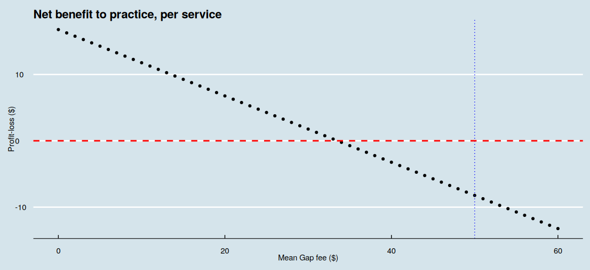
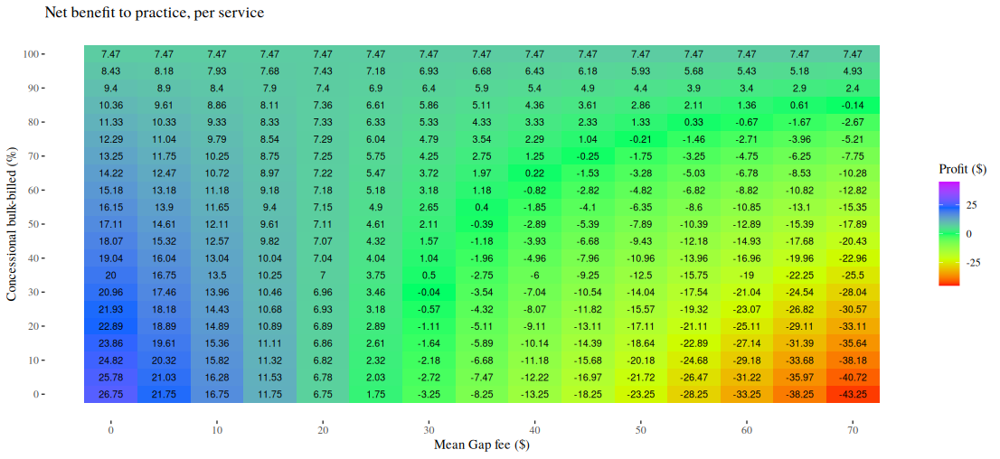

<link href="index_files/libs/htmltools-fill-0.5.8.1/fill.css" rel="stylesheet" />
<script src="index_files/libs/htmlwidgets-1.6.4/htmlwidgets.js"></script>
<script src="index_files/libs/plotly-binding-4.10.4/plotly.js"></script>
<script src="index_files/libs/typedarray-0.1/typedarray.min.js"></script>
<script src="index_files/libs/jquery-3.5.1/jquery.min.js"></script>
<link href="index_files/libs/crosstalk-1.2.1/css/crosstalk.min.css" rel="stylesheet" />
<script src="index_files/libs/crosstalk-1.2.1/js/crosstalk.min.js"></script>
<link href="index_files/libs/plotly-htmlwidgets-css-2.11.1/plotly-htmlwidgets.css" rel="stylesheet" />
<script src="index_files/libs/plotly-main-2.11.1/plotly-latest.min.js"></script>


  <link rel="stylesheet" href="https://cdn.jsdelivr.net/npm/monaco-editor@0.47.0/min/vs/editor/editor.main.css" />
  <link rel="stylesheet" href="https://cdnjs.cloudflare.com/ajax/libs/font-awesome/6.5.2/css/all.min.css" />
  

<style type="text/css">
.monaco-editor pre {
  background-color: unset !important;
}

.qwebr-editor-toolbar {
  width: 100%;
  display: flex;
  justify-content: space-between;
  box-sizing: border-box;
}

.qwebr-editor-toolbar-left-buttons, .qwebr-editor-toolbar-right-buttons {
  display: flex;
}

.qwebr-non-interactive-loading-container.qwebr-cell-needs-evaluation, .qwebr-non-interactive-loading-container.qwebr-cell-evaluated {
  justify-content: center;
  display: flex;
  background-color: rgba(250, 250, 250, 0.65);
  border: 1px solid rgba(233, 236, 239, 0.65);
  border-radius: 0.5rem;
  margin-top: 15px;
  margin-bottom: 15px;
}

.qwebr-r-project-logo {
  color: #2767B0; /* R Project's blue color */
}

.qwebr-icon-status-spinner {
  color: #7894c4;
}

.qwebr-icon-run-code {
  color: #0d9c29
}

body.quarto-light .qwebr-output-code-stdout {
  color: #111;
}

body.quarto-dark .qwebr-output-code-stdout {
  color: #EEE;
}

.qwebr-output-code-stderr {
  color: #db4133;
}

body.quarto-light .qwebr-editor {
  border: 1px solid #EEEEEE;
}

body.quarto-light .qwebr-editor-toolbar {
  background-color: #EEEEEE;
  padding: 0.2rem 0.5rem;
}

body.quarto-dark .qwebr-editor {
  border: 1px solid #111;
}

body.quarto-dark .qwebr-editor-toolbar {
  background-color: #111;
  padding: 0.2rem 0.5rem;
}

.qwebr-button {
  display: inline-block;
  font-weight: 400;
  line-height: 1;
  text-decoration: none;
  text-align: center;
  padding: 0.375rem 0.75rem;
  font-size: .9rem;
  border-radius: 0.25rem;
  transition: color .15s ease-in-out,background-color .15s ease-in-out,border-color .15s ease-in-out,box-shadow .15s ease-in-out;
}

body.quarto-light .qwebr-button {
  background-color: #EEEEEE;
  color: #000;
  border-color: #dee2e6;
  border: 1px solid rgba(0,0,0,0);
}

body.quarto-dark .qwebr-button {
  background-color: #111;
  color: #EEE;
  border-color: #dee2e6;
  border: 1px solid rgba(0,0,0,0);
}

body.quarto-light .qwebr-button:hover {
  color: #000;
  background-color: #d9dce0;
  border-color: #c8ccd0;
}

body.quarto-dark .qwebr-button:hover {
  color: #d9dce0;
  background-color: #323232;
  border-color: #d9dce0;
}

.qwebr-button:disabled,.qwebr-button.disabled,fieldset:disabled .qwebr-button {
  pointer-events: none;
  opacity: .65
}

.qwebr-button-reset {
  color: #696969; /*#4682b4;*/
}

.qwebr-button-copy {
  color: #696969;
}

/* Style the code highlight lines */
body.quarto-light .qwebr-editor-highlight-line {
  background-color: lightblue;
}

body.quarto-dark .qwebr-editor-highlight-line {
  background-color: darkblue;
}

/* Style the modal pop-up */

/* The Modal (background) */
.qwebr-modal {
  display: none; /* Hidden by default */
  position: fixed; /* Stay in place */
  z-index: 1; /* Sit on top */
  left: 0;
  top: 0;
  width: 100%; /* Full width */
  height: 100%; /* Full height */
  overflow: auto; /* Enable scroll if needed */
  background-color: rgb(0,0,0); /* Fallback color */
  background-color: rgba(0,0,0,0.4); /* Black w/ opacity */
  padding-top: 60px;
}

/* Modal Content */
.qwebr-modal-content {
  background-color: #fefefe;
  margin: 5% auto; /* 15% from the top and centered */
  padding: 20px;
  border: 1px solid #888;
  width: 80%; /* Could be more or less, depending on screen size */
}

.qwebr-modal-content-code {
  max-height: 50vh;
  min-height: 5vh;
  overflow: scroll;
  border: 1px solid #888;
}

/* The Close Button */
.qwebr-modal-close {
  color: #aaa;
  float: right;
  font-size: 28px;
  font-weight: bold;
}

.qwebr-modal-close:hover,
.qwebr-modal-close:focus {
  color: black;
  text-decoration: none;
  cursor: pointer;
}

.qwebr-download-btn {
  margin-top: 10px;
  text-decoration: none !important;
}

/* Styling to download image that is created */

.qwebr-canvas-image {
  position: relative;
  display: inline-block;
  margin: 10px;
}

.qwebr-canvas-image-download-btn {
  position: absolute;
  top: 10px;
  right: 10px;
  padding: 5px 10px;
  background-color: #007BFF;
  color: white;
  border: none;
  cursor: pointer;
  display: none;
}

figure:hover .qwebr-canvas-image-download-btn {
  display: block;
}

/* Custom styling for RevealJS Presentations*/

/* Reset the style of the interactive area */
.reveal div.qwebr-interactive-area {
  display: block;
  box-shadow: none;
  max-width: 100%;
  max-height: 100%;
  margin: 0;
  padding: 0;
}

/* Provide space to entries */
.reveal div.qwebr-output-code-area pre div {
  margin: 1px 2px 1px 10px;
}

/* Collapse the inside code tags to avoid extra space between line outputs */
.reveal pre div code.qwebr-output-code-stdout, .reveal pre div code.qwebr-output-code-stderr {
  padding: 0;
  display: contents;
}

body.reveal.quarto-light pre div code.qwebr-output-code-stdout {
  color: #111;
}

body.reveal.quarto-dark pre div code.qwebr-output-code-stdout {
  color: #EEEEEE;
}

.reveal pre div code.qwebr-output-code-stderr {
  color: #db4133;
}


/* Create a border around console and output (does not effect graphs) */
body.reveal.quarto-light div.qwebr-console-area {
  border: 1px solid #EEEEEE;
  box-shadow: 2px 2px 10px #EEEEEE;
}

body.reveal.quarto-dark div.qwebr-console-area {
  border: 1px solid #111;
  box-shadow: 2px 2px 10px #111;
}


/* Cap output height and allow text to scroll */
/* TODO: Is there a better way to fit contents/max it parallel to the monaco editor size? */
.reveal div.qwebr-output-code-area pre {
  max-height: 400px;
  overflow: scroll;
}

iframe.qwebr-output-code-browse {
  width: 100%;

  /*
    TODO: How to make the height automatic according to the widget size,
    or respect the quarto code block options?
  */
  min-height: 500px;
}

</style>

<script type="module">
// Document level settings ----

// Determine if we need to install R packages
globalThis.qwebrInstallRPackagesList = [''];

// Specify possible locations to search for the repository
globalThis.qwebrPackageRepoURLS = ['https://repo.r-wasm.org/'];

// Check to see if we have an empty array, if we do set to skip the installation.
globalThis.qwebrSetupRPackages = !(qwebrInstallRPackagesList.indexOf("") !== -1);
globalThis.qwebrAutoloadRPackages = true;

// Display a startup message?
globalThis.qwebrShowStartupMessage = true;
globalThis.qwebrShowHeaderMessage = false;

// Describe the webR settings that should be used
globalThis.qwebrCustomizedWebROptions = {
  "baseURL": "https://webr.r-wasm.org/v0.4.0/",
  "serviceWorkerUrl": "",
  "homedir": "/home/web_user", 
  "channelType": "ChannelType.Automatic"
};

// Store cell data
globalThis.qwebrCellDetails = [{"code":"# Service fees for the most common fee-for-service consultation items\n# which attract a bulk-billing incentive\n\n# All source code on this page is subject to the terms of the\n# Mozilla Public License, v. 2.0. A copy of the MPL can be obtained \n# from https://mozilla.org/MPL/2.0/.\n\n# government-set price for service items A, B, C, D and E\n# Medicare items 3, 23, 36, 44, and 123\n# in AUD (Australian dollars)\nfee_names <- c(\"a\", \"b\", \"c\", \"d\", \"e\")\nservice_fees <- array(\n  data = c(19.6, 42.85, 82.90, 122.15, 197.9),\n  dim = c(length(fee_names), 1),\n  dimnames = list(fee_names, \"fee\")\n)\n\n# the proportion which each item is billed\n\n# raw figures are derived for calendar year 2024 Australia-wide\n# http://medicarestatistics.humanservices.gov.au/statistics/mbs_item.jsp\nservice_proportion_raw <- array(\n  data = c(4037130, 81240293, 19899953, 1609147, 174664),\n  dim = c(length(fee_names), 1),\n  dimnames = list(fee_names, \"n\")\n)\n\n# calculate the proportions\n# for simplicity, assume the same proportions for bulk-billed patients\n# and privately-billed patients\nservice_proportion_bulk <- service_proportion_raw/sum(service_proportion_raw)\ncolnames(service_proportion_bulk) <- c(\"proportion\")\nservice_proportion_private <- service_proportion_bulk\n\n# display the proportions\nservice_proportion_bulk","id":1,"options":{"autorun":"false","classes":"","comment":"","context":"interactive","dpi":72,"editor-font-scale":"0.65","editor-max-height":"","editor-quick-suggestions":"false","editor-word-wrap":"true","fig-cap":"","fig-height":5,"fig-width":7,"label":"unnamed-chunk-1","message":"true","out-height":"","out-width":"700px","output":"true","read-only":"false","results":"markup","warning":"true"}},{"code":"# note, please 'run' the previous code block! \n\n# Set the gap fee for the individual service items A, B, C, D and E\n# for patients who were privately billed\n# for simplicity, set to the same fee of $50\ngap_fee <- array(\n  data = rep(50, length(fee_names)),\n  dim = c(length(fee_names), 1),\n  dimnames = list(fee_names, \"gap\")\n)\n\n# the proportion of patients who are charge the gap fee\n# i.e. privately billed\n# set to 50%\nprivately_billed <-  0.5\n\n# the bulk billing incentive, in dollars\n# varies by location\n# Modified Monash areas 1, 2, 3+4, 5, 6, 7\n# we will index the above to 1, 2, 3, 4, 5 and 6 (merging areas 3+4)\n\n# see https://www9.health.gov.au/mbs/search.cfm\nn_monash <- 6 # six different Monash areas\n\nindividual_bulkbill_incentive <- array(\n  # there are two different individual bulk-billing incentive fees,\n  # 'standard' and 'triple'\n  data = c(\n    # standard bulk-billing incentive applies to service items like item A/'3'\n    # items 10990, 10991, 75855, 75856, 75857, 75858\n    c(7.15, 10.80, 11.45, 12.20, 12.85, 13.70),\n    # triple bulk-billing incentive applies to service items like item B, C and D\n    # items 75870, 75871, 75873, 75874, 75875, 75876\n    c(21.35, 32.50, 34.50, 36.65, 38.70, 41.10)\n  ),\n  dim = c(n_monash, 2),\n  dimnames = list(c(\"1\", \"2\", \"3+4\", \"5\", \"6\", \"7\"), c(\"single\", \"triple\"))\n)\n\n# does the single- or triple- incentive apply to the fee item?\nindividual_bulkbill_incentive_by_fee <- \n  c(\"single\", \"triple\", \"triple\", \"triple\", \"triple\")\n\n# set the Monash area to the city\nmonash_area <- \"1\"\n\n# universal bulk billing incentive\n# over the service fee\n# set to 12.5%\nuniversal_bulkbill_incentive <- 0.125\n\n# show individual bulk-bill incentive applicable to defined Monash area\nfee_bulkbill_incentive <- individual_bulkbill_incentive[monash_area, individual_bulkbill_incentive_by_fee]\n# redefine dimensions of the array\ndim(fee_bulkbill_incentive) <- c(length(fee_names), 1)\n# change rownames to the fee names\nrownames(fee_bulkbill_incentive) <- fee_names\nfee_bulkbill_incentive","id":2,"options":{"autorun":"false","classes":"","comment":"","context":"interactive","dpi":72,"editor-font-scale":"0.65","editor-max-height":"","editor-quick-suggestions":"false","editor-word-wrap":"true","fig-cap":"","fig-height":5,"fig-width":7,"label":"unnamed-chunk-2","message":"true","out-height":"","out-width":"700px","output":"true","read-only":"false","results":"markup","warning":"true"}},{"code":"# note, depends on the previous code blocks already having been 'run'! \n\n# Benefit per 'average' patient charged service item A, B, C, D or E\n\nnet_benefit <- function(\n  # calculate the average net benefit revenue\n  # to the practice per patient\n  \n  # the variable names used in this function\n  # are the same as used in previous code chunks\n  # but will be 'local' to this function\n  service_fees,\n  fee_names,\n  service_proportion_bulk,\n  service_proportion_private,\n  gap_fee,\n  privately_billed,\n  individual_bulkbill_incentive,\n  individual_bulkbill_incentive_by_fee,\n  monash_area,\n  universal_bulkbill_incentive) {\n  # calculate individual bulk-bill incentive applicable to defined Monash area\n  fee_bulkbill_incentive <- individual_bulkbill_incentive[monash_area, individual_bulkbill_incentive_by_fee]\n  # re-define dimensions of the 'x' array\n  dim(fee_bulkbill_incentive) <- c(length(fee_names), 1)\n  # change row name to the fee names\n  rownames(fee_bulkbill_incentive) <- fee_names\n  \n  # calculate the universal bulk-bill incentive\n  # for patients formerly privately-billed\n  privately_billed *\n    sum(service_fees * service_proportion_private) *\n    universal_bulkbill_incentive +\n    # calculate (and add) benefit for patients already bulk-billed\n    (1 - privately_billed) *\n    sum(service_fees * service_proportion_bulk) *\n    universal_bulkbill_incentive +\n    \n    # calculate (and add) the individual service bulk-billing incentive applied\n    # to patients formerly privately-billed\n    privately_billed * sum(service_proportion_private * fee_bulkbill_incentive) -\n    \n    # calculate (and subtract) the loss from not charging a private 'gap' fee\n    privately_billed * sum(service_proportion_private * gap_fee)\n}\n\nprofit_loss <- net_benefit(\n  service_fees,\n  fee_names,\n  service_proportion_bulk,\n  service_proportion_private,\n  gap_fee,\n  privately_billed,\n  individual_bulkbill_incentive,\n  individual_bulkbill_incentive_by_fee,\n  monash_area,\n  universal_bulkbill_incentive\n)\n\n# Show the value of average net_benefit\nformatC(profit_loss, digits = 2, format = \"f\")","id":3,"options":{"autorun":"false","classes":"","comment":"","context":"interactive","dpi":72,"editor-font-scale":"0.65","editor-max-height":"","editor-quick-suggestions":"false","editor-word-wrap":"true","fig-cap":"","fig-height":5,"fig-width":7,"label":"unnamed-chunk-3","message":"true","out-height":"","out-width":"700px","output":"true","read-only":"false","results":"markup","warning":"true"}},{"code":"# note, depends on the previous code blocks already having been 'run'! \n\n# Set the privately-billed proportion to 0.2 (20%), the gap fee to $35\n# and new service proportions\n\nnew_practice_service_raw <- \n  # new A, B, C, D, E numbers\n  # with much longer average consults\n  #  the consult time is progressively longer from A->B->C->D->E\n  c(950, 3956, 4171, 1146, 75)\nnew_practice_service_proportions <- \n  new_practice_service_raw/sum(new_practice_service_raw)\n\nprofit_loss <- net_benefit(\n  service_fees,\n  fee_names,\n  service_proportion_bulk = new_practice_service_proportions,\n  service_proportion_private = new_practice_service_proportions,\n  # replace the gap fee for every possible service fee\n  # we could also use 'gap_fee = c(35, 35, 35, 35, 35)'\n  gap_fee = rep(35, length(fee_names)),\n  # reduce the privately billed proportion to 20%\n  privately_billed = 0.2,\n  individual_bulkbill_incentive,\n  individual_bulkbill_incentive_by_fee,\n  monash_area,\n  universal_bulkbill_incentive\n)\n\n# Show the value of average net_benefit\nformatC(profit_loss, digits = 2, format = \"f\")","id":4,"options":{"autorun":"false","classes":"","comment":"","context":"interactive","dpi":72,"editor-font-scale":"0.65","editor-max-height":"","editor-quick-suggestions":"false","editor-word-wrap":"true","fig-cap":"","fig-height":5,"fig-width":7,"label":"unnamed-chunk-4","message":"true","out-height":"","out-width":"700px","output":"true","read-only":"false","results":"markup","warning":"true"}},{"code":"# note, depends on the previous code blocks already having been 'run'! \n\n# this model is based on the second practice model described above\n# add new service fee descriptions\nnew_fee_names <- c(\n  fee_names,\n  # append items 721, 723 and 732\n  c(\"GPMP\", \"TCA\", \"CDM RV\")\n)\nnew_service_fees <- array(\n  # append fees for 721, 723 and 732\n  data = c(service_fees, 164.35, 130.25, 82.10),\n  dim = c(length(new_fee_names), 1),\n  dimnames = list(new_fee_names, \"fee\")\n)\nnew_gap_fee <- c(\n  rep(35, 5),\n  # no gap fees were charged for thes GPMP/TCA/GPMPRV items,\n  # even 'private' patients\n  rep(0, 3)\n)\nnew_individual_bulkbill_incentive_by_fee <- c(\n  individual_bulkbill_incentive_by_fee,\n  rep(\"single\", 3)\n)\n# Set the privately-billed proportion to 0.2 (20%), the gap fee to $35\n# and new service proportions\nnew_practice_service_raw <- \n  # new A, B, C, D, E numbers\n  # (long average consults)\n  # and GPMP/TCA/reviews\n  c(950, 3956, 4171, 1146, 75, 416, 402, 255)\nnew_practice_service_proportions <- \n  new_practice_service_raw/sum(new_practice_service_raw)\n\nprofit_loss <- net_benefit(\n  service_fees = new_service_fees,\n  fee_names = new_fee_names,\n  service_proportion_bulk = new_practice_service_proportions,\n  service_proportion_private = new_practice_service_proportions,\n  # replace the gap fees\n  gap_fee = new_gap_fee,\n  # reduce the privately billed proportion to 20%\n  privately_billed = 0.2,\n  individual_bulkbill_incentive,\n  individual_bulkbill_incentive_by_fee = new_individual_bulkbill_incentive_by_fee,\n  monash_area,\n  universal_bulkbill_incentive\n)\n\n# Show the value of average net_benefit\nformatC(profit_loss, digits = 2, format = \"f\")","id":5,"options":{"autorun":"false","classes":"","comment":"","context":"interactive","dpi":72,"editor-font-scale":"0.65","editor-max-height":"","editor-quick-suggestions":"false","editor-word-wrap":"true","fig-cap":"","fig-height":5,"fig-width":7,"label":"unnamed-chunk-5","message":"true","out-height":"","out-width":"700px","output":"true","read-only":"false","results":"markup","warning":"true"}},{"code":"# note, depends on the previous code blocks already having been 'run'! \n\n# This code chunk requires a few extra code packages\n# It will take a few seconds to make these packages available\ninstall.packages(\"tibble\", quiet = TRUE)\ninstall.packages(\"ggplot2\", quiet = TRUE)\ninstall.packages(\"ggthemes\", quiet = TRUE)\nlibrary(tibble)\nlibrary(ggplot2)\nlibrary(ggthemes)\n\n# gap fees from $0 to $60\ngap_fee_range <- seq(from = 0, to = 60, by = 1)\n\nprofit_loss <- sapply(\n  X = gap_fee_range,\n  function(x) {\n    net_benefit(\n      service_fees,\n      fee_names,\n      service_proportion_bulk,\n      service_proportion_private,\n      # set the gap fee to 'x'\n      gap_fee = rep(x, length(fee_names)),\n      privately_billed,\n      individual_bulkbill_incentive,\n      individual_bulkbill_incentive_by_fee,\n      monash_area,\n      universal_bulkbill_incentive\n    )\n  }\n)\n\ngap_vs_profit <- tibble(\n  gap = gap_fee_range,\n  profit_loss = profit_loss\n)\n\nggplot(\n  data = gap_vs_profit, \n  mapping = aes(x = gap, y = profit_loss)\n  ) +\n  geom_point() +\n  labs(\n    x = \"Gap fee ($)\",\n    y = \"Profit-loss ($)\"\n  ) +\n  ggtitle(\"Net benefit to practice, per service\") +\n  geom_vline(\n    # our current gap-fee\n    xintercept = gap_fee,\n    linetype = \"dotted\",\n    color = \"blue\"\n  ) +\n  geom_hline(\n    # zero profit-loss line\n    yintercept = 0,\n    linetype = \"dashed\",\n    color = \"red\",\n    linewidth = 1\n  ) +\n  theme_economist()","id":6,"options":{"autorun":"false","classes":"","comment":"","context":"interactive","dpi":72,"editor-font-scale":"0.65","editor-max-height":"","editor-quick-suggestions":"false","editor-word-wrap":"true","fig-cap":"","fig-height":5,"fig-width":7,"label":"unnamed-chunk-6","message":"true","out-height":"","out-width":"700px","output":"true","read-only":"false","results":"markup","warning":"true"}},{"code":"# note, depends on the previous code blocks already having been 'run'! \nlibrary(tibble)\nlibrary(ggplot2)\nlibrary(ggthemes)\n\n# privately billed range from 0 to 100%\nprivately_billed_range <- seq(from = 0, to = 100, by = 1)\n\n# this model is based on the second practice model described above\n# together with care plan item numbers\n# add new service fee descriptions\nnew_fee_names <- c(\n  fee_names,\n  # append items 721, 723 and 732\n  c(\"GPMP\", \"TCA\", \"CDM RV\")\n)\nnew_service_fees <- array(\n  # append fees for 721, 723 and 732\n  data = c(service_fees, 164.35, 130.25, 82.10),\n  dim = c(length(new_fee_names), 1),\n  dimnames = list(new_fee_names, \"fee\")\n)\nnew_individual_bulkbill_incentive_by_fee <- c(\n  individual_bulkbill_incentive_by_fee,\n  rep(\"single\", 3)\n)\nnew_gap_fee <- c(\n  rep(35, 5),\n  # no gap fees were charged for these GPMP/TCA/GPMPRV items,\n  # even 'private' patients\n  rep(0, 3)\n)\n\n# Set the privately-billed proportion to 0.2 (20%), the gap fee to $35\n# and new service proportions\nnew_practice_service_raw <- \n  # new A, B, C, D, E numbers\n  # (long average consults)\n  # and GPMP/TCA/reviews\n  c(950, 3956, 4171, 1146, 75, 416, 402, 255)\nnew_practice_service_proportions <- \n  new_practice_service_raw/sum(new_practice_service_raw)\n\nprofit_loss <- sapply(\n  X = privately_billed_range,\n  function(x) {\n    net_benefit(\n      service_fees = new_service_fees,\n      fee_names = new_fee_names,\n      # set service proportions to longer consults\n      service_proportion_bulk = new_practice_service_proportions,\n      service_proportion_private = new_practice_service_proportions,\n      # set the gap fee to $35\n      gap_fee = new_gap_fee,\n      # set privately billed proportion to 'x'\n      # divide by 100 to convert from\n      # percentage to proportion\n      privately_billed = x/100,\n      individual_bulkbill_incentive,\n      individual_bulkbill_incentive_by_fee = new_individual_bulkbill_incentive_by_fee,\n      monash_area,\n      universal_bulkbill_incentive\n    )\n  }\n)\n\ngap_vs_profit <- tibble(\n  gap = privately_billed_range,\n  profit_loss = profit_loss\n)\n\nggplot(\n  data = gap_vs_profit, \n  mapping = aes(x = gap, y = profit_loss)\n  ) +\n  geom_point() +\n  labs(\n    x = \"Privately-billed proportion (%)\",\n    y = \"Profit-loss ($)\"\n  ) +\n  ggtitle(\"Net benefit to practice, per service\") +\n  geom_vline(\n    # our current proportion\n    xintercept = 20,\n    linetype = \"dotted\",\n    color = \"blue\"\n  ) +\n  geom_hline(\n    # zero profit-loss line\n    yintercept = 0,\n    linetype = \"dashed\",\n    color = \"red\",\n    linewidth = 1\n  ) +\n  theme_economist()","id":7,"options":{"autorun":"false","classes":"","comment":"","context":"interactive","dpi":72,"editor-font-scale":"0.65","editor-max-height":"","editor-quick-suggestions":"false","editor-word-wrap":"true","fig-cap":"","fig-height":5,"fig-width":7,"label":"unnamed-chunk-7","message":"true","out-height":"","out-width":"700px","output":"true","read-only":"false","results":"markup","warning":"true"}},{"code":"# note, depends on the previous code blocks already having been 'run'! \nlibrary(tibble)\nlibrary(plotly)\nlibrary(ggplot2)\nlibrary(dplyr)\n\n# gap fees from $0 to $60\ngap_fee_range <- seq(from = 0, to = 70, by = 1)\n# privately billed range from 0 to 100%\nprivately_billed_range <- seq(from = 0, to = 100, by = 1)\n\n# this model is based on the first practice model described above\n# together with care plan item numbers\n# add new service fee descriptions\nnew_fee_names <- c(\n  fee_names,\n  # append chronic disease item numbers (721, 723, 732)\n  # health assessment item numbers (701 -- 715)\n  # and mental health care plan item numbers (2700 -- 271)\n  c(\"GPMP\", \"TCA\", \"CDM RV\",\n    \"HA701\", \"HA703\", \"HA705\", \"HA707\", \"HA715\",\n    \"MHCP2700\", \"MHCP2701\", \"MHCP2715\", \"MHCP2717\", \"MHCP RV\")\n)\nnew_service_fees <- array(\n  # append fees for 721, 723 and 732\n  data = c(service_fees,\n           164.35, 130.25, 82.10,\n           67.60, 157.10, 216.80, 306.25, 241.85,\n           81.70, 120.25, 103.70, 152.80, 81.70\n           ),\n  dim = c(length(new_fee_names), 1),\n  dimnames = list(new_fee_names, \"fee\")\n)\nnew_individual_bulkbill_incentive_by_fee <- c(\n  individual_bulkbill_incentive_by_fee,\n  rep(\"single\", 3+5+5)\n)\n# and new service proportions\n# from http://medicarestatistics.humanservices.gov.au/statistics/mbs_item.jsp (2024)\nnew_practice_service_raw <- \n  # A, B, C, D, E service items\n  # and GPMP/TCA/reviews (CDM), health assessment and mental health plan items\n  c(4037130, 81240293, 19899953, 1609147, 174664,\n    3357364, 2954994, 4319542,\n    21383, 165878, 273690, 463237, 263931,\n    97733, 31550, 904320, 211540, 504901)\nnew_practice_service_proportions <- \n  new_practice_service_raw/sum(new_practice_service_raw)\n\nprofit_loss <- tibble(\n  gap = numeric(), \n  private_billed = numeric(), \n  profit = numeric()\n)\n\nfor (x in gap_fee_range) {\n  for (y in privately_billed_range) {\n    new_gap_fee <- c(\n      rep(x, length((new_fee_names)))\n      # the same gap fee charged for every item, including GPMP/TCA/GPMPRV items\n      # a simplified approach would use the 'average' gap fee charged\n      # for all relevant items\n    )\n    profit <- net_benefit(\n      service_fees = new_service_fees,\n      fee_names = new_fee_names,\n      # set service proportions to longer consults\n      service_proportion_bulk = new_practice_service_proportions,\n      service_proportion_private = new_practice_service_proportions,\n      # set the gap fee to $35\n      gap_fee = new_gap_fee,\n      # set privately billed proportion to 'x'\n      # divide by 100 to convert from\n      # percentage to proportion\n      privately_billed = y/100,\n      individual_bulkbill_incentive,\n      individual_bulkbill_incentive_by_fee = new_individual_bulkbill_incentive_by_fee,\n      monash_area,\n      universal_bulkbill_incentive\n    )\n    profit_loss <- add_row(profit_loss, gap = x, private_billed = y, profit = profit)\n  }\n}\n\n# this plot cannot be shown in the web-browser using this code block!\n# you will need to copy this code (and all the pre-requisites)\n# into a 'R/RStudio' and run it yourself :)\nfig_plotly_3d <- plot_ly(\n  data = profit_loss, x = ~gap, y = ~private_billed, z = ~profit,\n  type = \"scatter3d\", mode = \"markers\",\n  hovertemplate = paste(\n    \"Gap fee: <b>%{x}</b><br>\",\n    \"Private: <b>%{y}</b>%<br>\",\n    \"Profit: <b>%{z:$.2f}</b>\",\n    \"<extra></extra>\"\n  ),\n  marker = list(\n    color = ~profit,\n    colorscale = \"Rainbow\",\n    showscale = TRUE,\n    line = list(width = 1, color = \"DarkSlateGrey\")) \n  ) |>\n  layout(\n    title = \"Profit-loss according to gap fee and proportion privately-billed\",\n    scene = list(\n      xaxis = list(title = list(text = \"Gap fee ($)\")),\n      yaxis = list(title = list(text = \"Privately-billed (%)\")),\n      zaxis = list(title = list(text = \"Net benefit per service ($)\"))\n    )\n  )\n\n# this plot cannot be shown in the web-browser using this code block!\n# you will need to copy this code (and all the pre-requisites)\n# into a 'R/RStudio' and run it yourself :)\nfig_ggplotly <- ggplot(\n  data = profit_loss,\n  aes(x = gap, y = private_billed))+\n  geom_point(\n    aes(fill = profit),\n    size = 4, shape = 22, stroke = 0\n  ) +\n  scale_fill_viridis_c(option = \"turbo\", direction = -1)\n# to look at this plot, either 'fig_ggplotly' in R/RStudio or\n# 'ggplotly(fig_ggplotly)'\n\nfig_ggplot <- ggplot(\n  data = profit_loss |> \n    dplyr::filter(gap == (gap %/% 5 * 5), private_billed == (private_billed %/% 5 * 5)),\n  aes(x = gap, y = private_billed, fill = profit)) +\n  theme_bw() + geom_tile() + \n  geom_text(aes(label=round(profit, 2)), size = 8/.pt) +\n  labs(\n    x = \"Gap fee ($)\",\n    y = \"Privately-billed (%)\",\n    fill = \"Profit ($)\"\n  ) +\n  scale_x_continuous(breaks = seq(from = 0, to = 70, by = 10)) +\n  scale_y_continuous(breaks = seq(from = 0, to = 100, by = 10)) +\n  ggtitle(\"Net benefit to practice, per service\") +\n  scale_fill_gradientn(colors = rainbow(5), limits = c(-45, 45))\n\nfig_ggplot","id":8,"options":{"autorun":"false","classes":"","comment":"","context":"interactive","dpi":72,"editor-font-scale":"0.65","editor-max-height":"300","editor-quick-suggestions":"false","editor-word-wrap":"true","fig-cap":"","fig-height":5,"fig-width":7,"label":"unnamed-chunk-8","message":"false","out-height":"","out-width":"700px","output":"true","read-only":"false","results":"asis","warning":"false"}},{"code":"install.packages(\"knitr\", quiet = TRUE)\nlibrary(tibble)\nlibrary(knitr)\n\n# just include service items B, C and D\nshort_service_list <- service_fees[c(\"b\", \"c\", \"d\"),]\n\nnew_payments <- \n  tibble(\n    Current = num(\n      short_service_list,\n      digits = 2\n    ),\n    Metro = num(\n      short_service_list*(1+universal_bulkbill_incentive)+\n        individual_bulkbill_incentive[1, 2],\n      digits = 2\n    ),\n    Regional = num(\n      short_service_list*(1+universal_bulkbill_incentive)+\n        individual_bulkbill_incentive[2, 2],\n      digits = 2\n    ),\n    `Large Rural` = num(\n      short_service_list*(1+universal_bulkbill_incentive)+\n        individual_bulkbill_incentive[3, 2],\n      digits = 2\n    ),\n    `Small Rural` = num(\n      short_service_list*(1+universal_bulkbill_incentive)+\n        individual_bulkbill_incentive[4, 2],\n      digits = 2\n    ),\n    Remote = num(\n      short_service_list*(1+universal_bulkbill_incentive)+\n        individual_bulkbill_incentive[5, 2],\n      digits = 2\n    ),\n  )\n\nkable(new_payments, format = \"html\")","id":9,"options":{"autorun":"false","classes":"","comment":"","context":"interactive","dpi":72,"editor-font-scale":"0.65","editor-max-height":"","editor-quick-suggestions":"false","editor-word-wrap":"true","fig-cap":"","fig-height":5,"fig-width":7,"label":"unnamed-chunk-9","message":"true","out-height":"","out-width":"700px","output":"true","read-only":"false","results":"asis","warning":"true"}}];

</script>

<script type="module">
// Declare startupMessageQWebR globally
globalThis.qwebrStartupMessage = document.createElement("p");

// Verify if OffScreenCanvas is supported
globalThis.qwebrOffScreenCanvasSupport = function() {
  return typeof OffscreenCanvas !== 'undefined'
}

// Function to set the button text
globalThis.qwebrSetInteractiveButtonState = function(buttonText, enableCodeButton = true) {
  document.querySelectorAll(".qwebr-button-run").forEach((btn) => {
    btn.innerHTML = buttonText;
    btn.disabled = !enableCodeButton;
  });
}

// Function to update the status message in non-interactive cells
globalThis.qwebrUpdateStatusMessage = function(message) {
  document.querySelectorAll(".qwebr-status-text.qwebr-cell-needs-evaluation").forEach((elem) => {
    elem.innerText = message;
  });
}

// Function to update the status message
globalThis.qwebrUpdateStatusHeader = function(message) {
  qwebrStartupMessage.innerHTML = `
    <i class="fa-solid fa-spinner fa-spin qwebr-icon-status-spinner"></i>
    <span>${message}</span>`;
}

// Function to return true if element is found, false if not
globalThis.qwebrCheckHTMLElementExists = function(selector) {
  const element = document.querySelector(selector);
  return !!element;
}

// Function that detects whether reveal.js slides are present
globalThis.qwebrIsRevealJS = function() {
  // If the '.reveal .slides' selector exists, RevealJS is likely present
  return qwebrCheckHTMLElementExists('.reveal .slides');
}

// Initialize the Quarto sidebar element
function qwebrSetupQuartoSidebar() {
  var newSideBarDiv = document.createElement('div');
  newSideBarDiv.id = 'quarto-margin-sidebar';
  newSideBarDiv.className = 'sidebar margin-sidebar';
  newSideBarDiv.style.top = '0px';
  newSideBarDiv.style.maxHeight = 'calc(0px + 100vh)';

  return newSideBarDiv;
}

// Position the sidebar in the document
function qwebrPlaceQuartoSidebar() {
  // Get the reference to the element with id 'quarto-document-content'
  var referenceNode = document.getElementById('quarto-document-content');

  // Create the new div element
  var newSideBarDiv = qwebrSetupQuartoSidebar();

  // Insert the new div before the 'quarto-document-content' element
  referenceNode.parentNode.insertBefore(newSideBarDiv, referenceNode);
}

function qwebrPlaceMessageContents(content, html_location = "title-block-header", revealjs_location = "title-slide") {

  // Get references to header elements
  const headerHTML = document.getElementById(html_location);
  const headerRevealJS = document.getElementById(revealjs_location);

  // Determine where to insert the quartoTitleMeta element
  if (headerHTML || headerRevealJS) {
    // Append to the existing "title-block-header" element or "title-slide" div
    (headerHTML || headerRevealJS).appendChild(content);
  } else {
    // If neither headerHTML nor headerRevealJS is found, insert after "webr-monaco-editor-init" script
    const monacoScript = document.getElementById("qwebr-monaco-editor-init");
    const header = document.createElement("header");
    header.setAttribute("id", "title-block-header");
    header.appendChild(content);
    monacoScript.after(header);
  }
}


function qwebrOffScreenCanvasSupportWarningMessage() {
  
  // Verify canvas is supported.
  if(qwebrOffScreenCanvasSupport()) return;

  // Create the main container div
  var calloutContainer = document.createElement('div');
  calloutContainer.classList.add('callout', 'callout-style-default', 'callout-warning', 'callout-titled');

  // Create the header div
  var headerDiv = document.createElement('div');
  headerDiv.classList.add('callout-header', 'd-flex', 'align-content-center');

  // Create the icon container div
  var iconContainer = document.createElement('div');
  iconContainer.classList.add('callout-icon-container');

  // Create the icon element
  var iconElement = document.createElement('i');
  iconElement.classList.add('callout-icon');

  // Append the icon element to the icon container
  iconContainer.appendChild(iconElement);

  // Create the title container div
  var titleContainer = document.createElement('div');
  titleContainer.classList.add('callout-title-container', 'flex-fill');
  titleContainer.innerText = 'Warning: Web Browser Does Not Support Graphing!';

  // Append the icon container and title container to the header div
  headerDiv.appendChild(iconContainer);
  headerDiv.appendChild(titleContainer);

  // Create the body container div
  var bodyContainer = document.createElement('div');
  bodyContainer.classList.add('callout-body-container', 'callout-body');

  // Create the paragraph element for the body content
  var paragraphElement = document.createElement('p');
  paragraphElement.innerHTML = 'This web browser does not have support for displaying graphs through the <code>quarto-webr</code> extension since it lacks an <code>OffScreenCanvas</code>. Please upgrade your web browser to one that supports <code>OffScreenCanvas</code>.';

  // Append the paragraph element to the body container
  bodyContainer.appendChild(paragraphElement);

  // Append the header div and body container to the main container div
  calloutContainer.appendChild(headerDiv);
  calloutContainer.appendChild(bodyContainer);

  // Append the main container div to the document depending on format
  qwebrPlaceMessageContents(calloutContainer, "title-block-header"); 

}


// Function that attaches the document status message and diagnostics
function displayStartupMessage(showStartupMessage, showHeaderMessage) {
  if (!showStartupMessage) {
    return;
  }

  // Create the outermost div element for metadata
  const quartoTitleMeta = document.createElement("div");
  quartoTitleMeta.classList.add("quarto-title-meta");

  // Create the first inner div element
  const firstInnerDiv = document.createElement("div");
  firstInnerDiv.setAttribute("id", "qwebr-status-message-area");

  // Create the second inner div element for "WebR Status" heading and contents
  const secondInnerDiv = document.createElement("div");
  secondInnerDiv.setAttribute("id", "qwebr-status-message-title");
  secondInnerDiv.classList.add("quarto-title-meta-heading");
  secondInnerDiv.innerText = "WebR Status";

  // Create another inner div for contents
  const secondInnerDivContents = document.createElement("div");
  secondInnerDivContents.setAttribute("id", "qwebr-status-message-body");
  secondInnerDivContents.classList.add("quarto-title-meta-contents");

  // Describe the WebR state
  qwebrStartupMessage.innerText = "🟡 Loading...";
  qwebrStartupMessage.setAttribute("id", "qwebr-status-message-text");
  // Add `aria-live` to auto-announce the startup status to screen readers
  qwebrStartupMessage.setAttribute("aria-live", "assertive");

  // Append the startup message to the contents
  secondInnerDivContents.appendChild(qwebrStartupMessage);

  // Add a status indicator for COOP and COEP Headers if needed
  if (showHeaderMessage) {
    const crossOriginMessage = document.createElement("p");
    crossOriginMessage.innerText = `${crossOriginIsolated ? '🟢' : '🟡'} COOP & COEP Headers`;
    crossOriginMessage.setAttribute("id", "qwebr-coop-coep-header");
    secondInnerDivContents.appendChild(crossOriginMessage);
  }

  // Combine the inner divs and contents
  firstInnerDiv.appendChild(secondInnerDiv);
  firstInnerDiv.appendChild(secondInnerDivContents);
  quartoTitleMeta.appendChild(firstInnerDiv);

  // Place message on webpage
  qwebrPlaceMessageContents(quartoTitleMeta); 
}

function qwebrAddCommandHistoryModal() {
  // Create the modal div
  var modalDiv = document.createElement('div');
  modalDiv.id = 'qwebr-history-modal';
  modalDiv.className = 'qwebr-modal';

  // Create the modal content div
  var modalContentDiv = document.createElement('div');
  modalContentDiv.className = 'qwebr-modal-content';

  // Create the span for closing the modal
  var closeSpan = document.createElement('span');
  closeSpan.id = 'qwebr-command-history-close-btn';
  closeSpan.className = 'qwebr-modal-close';
  closeSpan.innerHTML = '&times;';

  // Create the h1 element for the modal
  var modalH1 = document.createElement('h1');
  modalH1.textContent = 'R History Command Contents';

  // Create an anchor element for downloading the Rhistory file 
  var downloadLink = document.createElement('a');
  downloadLink.href = '#';
  downloadLink.id = 'qwebr-download-history-btn';
  downloadLink.className = 'qwebr-download-btn';

  // Create an 'i' element for the icon
  var icon = document.createElement('i');
  icon.className = 'bi bi-file-code';

  // Append the icon to the anchor element
  downloadLink.appendChild(icon);

  // Add the text 'Download R History' to the anchor element
  downloadLink.appendChild(document.createTextNode(' Download R History File'));

  // Create the pre for command history contents
  var commandContentsPre = document.createElement('pre');
  commandContentsPre.id = 'qwebr-command-history-contents';
  commandContentsPre.className = 'qwebr-modal-content-code';

  // Append the close span, h1, and history contents pre to the modal content div
  modalContentDiv.appendChild(closeSpan);
  modalContentDiv.appendChild(modalH1);
  modalContentDiv.appendChild(downloadLink);
  modalContentDiv.appendChild(commandContentsPre);

  // Append the modal content div to the modal div
  modalDiv.appendChild(modalContentDiv);

  // Append the modal div to the body
  document.body.appendChild(modalDiv);
}

function qwebrRegisterRevealJSCommandHistoryModal() {
  // Select the <ul> element inside the <div> with data-panel="Custom0"
  let ulElement = document.querySelector('div[data-panel="Custom0"] > ul.slide-menu-items');

  // Find the last <li> element with class slide-tool-item
  let lastItem = ulElement.querySelector('li.slide-tool-item:last-child');

  // Calculate the next data-item value
  let nextItemValue = 0;
  if (lastItem) {
      nextItemValue = parseInt(lastItem.dataset.item) + 1;
  }

  // Create a new <li> element
  let newListItem = document.createElement('li');
  newListItem.className = 'slide-tool-item';
  newListItem.dataset.item = nextItemValue.toString(); // Set the next available data-item value

  // Create the <a> element inside the <li>
  let newLink = document.createElement('a');
  newLink.href = '#';
  newLink.id = 'qwebrRHistoryButton'; // Set the ID for the new link
  
  // Create the <kbd> element inside the <a>
  let newKbd = document.createElement('kbd');
  newKbd.textContent = ' '; // Set to empty as we are not registering a keyboard shortcut

  // Create text node for the link text
  let newText = document.createTextNode(' View R History');

  // Append <kbd> and text node to <a>
  newLink.appendChild(newKbd);
  newLink.appendChild(newText);

  // Append <a> to <li>
  newListItem.appendChild(newLink);

  // Append <li> to <ul>
  ulElement.appendChild(newListItem);
}

// Handle setting up the R history modal
function qwebrCodeLinks() {

  if (qwebrIsRevealJS()) {
    qwebrRegisterRevealJSCommandHistoryModal();
    return;
  }

  // Create the container div
  var containerDiv = document.createElement('div');
  containerDiv.className = 'quarto-code-links';

  // Create the h2 element
  var h2 = document.createElement('h2');
  h2.textContent = 'webR Code Links';

  // Create the ul element
  var ul = document.createElement('ul');

  // Create the li element
  var li = document.createElement('li');

  // Create the a_history_btn element
  var a_history_btn = document.createElement('a');
  a_history_btn.href = 'javascript:void(0)';
  a_history_btn.setAttribute('id', 'qwebrRHistoryButton');

  // Create the i_history_btn element
  var i_history_btn = document.createElement('i');
  i_history_btn.className = 'bi bi-file-code';

  // Create the text node for the link text
  var text_history_btn = document.createTextNode('View R History');

  // Append the icon element and link text to the a element
  a_history_btn.appendChild(i_history_btn);
  a_history_btn.appendChild(text_history_btn);

  // Append the a element to the li element
  li.appendChild(a_history_btn);

  // Append the li element to the ul element
  ul.appendChild(li);

  // Append the h2 and ul elements to the container div
  containerDiv.appendChild(h2);
  containerDiv.appendChild(ul);

  // Append the container div to the element with the ID 'quarto-margin-sidebar'
  var sidebar = document.getElementById('quarto-margin-sidebar');
    
  // If the sidebar element is not found, create it
  if(!sidebar) {
    qwebrPlaceQuartoSidebar();
  }
  
  // Re-select the sidebar element (if it was just created)
  sidebar = document.getElementById('quarto-margin-sidebar');   


  // If the sidebar element exists, append the container div to it
  if(sidebar) {
    // Append the container div to the sidebar
    sidebar.appendChild(containerDiv);
    // Force the sidebar to be clickable by removing the 'zindex-bottom' class
    // added in pre-release: https://github.com/quarto-dev/quarto-cli/commit/f0c53a1ffcaa1de4eccbf07803b096898248adcc
    sidebar.className = 'sidebar margin-sidebar';
  } else {
    // Get a debugger ...
    console.warn('Element with ID "quarto-margin-sidebar" not found.');
  }
}

// Call the function to append the code links for qwebR into the right sidebar
qwebrCodeLinks();

// Add the command history modal
qwebrAddCommandHistoryModal();

displayStartupMessage(qwebrShowStartupMessage, qwebrShowHeaderMessage);
qwebrOffScreenCanvasSupportWarningMessage();
</script>

<script type="module">
// Define a global storage and retrieval solution ----

// Store commands executed in R
globalThis.qwebrRCommandHistory = [];

// Function to retrieve the command history
globalThis.qwebrFormatRHistory = function() {
   return qwebrRCommandHistory.join("\n\n");
}

// Retrieve HTML Elements ----

// Get the command modal
const command_history_modal = document.getElementById("qwebr-history-modal");

// Get the button that opens the command modal
const command_history_btn = document.getElementById("qwebrRHistoryButton");

// Get the <span> element that closes the command modal
const command_history_close_span = document.getElementById("qwebr-command-history-close-btn");

// Get the download button for r history information
const command_history_download_btn = document.getElementById("qwebr-download-history-btn");

// Plug in command history into modal/download button ----

// Function to populate the modal with command history
function populateCommandHistoryModal() {
    document.getElementById("qwebr-command-history-contents").innerHTML = qwebrFormatRHistory() || "No commands have been executed yet.";
}

// Function to format the current date and time to
// a string with the format YYYY-MM-DD-HH-MM-SS
function formatDateTime() {
    const now = new Date();

    const year = now.getFullYear();
    const day = String(now.getDate()).padStart(2, '0');
    const month = String(now.getMonth() + 1).padStart(2, '0'); // Months are zero-based
    const hours = String(now.getHours()).padStart(2, '0');
    const minutes = String(now.getMinutes()).padStart(2, '0');
    const seconds = String(now.getSeconds()).padStart(2, '0');

    return `${year}-${month}-${day}-${hours}-${minutes}-${seconds}`;
}


// Function to convert document title with datetime to a safe filename
function safeFileName() {
    // Get the current page title
    let pageTitle = document.title;

    // Combine the current page title with the current date and time
    let pageNameWithDateTime = `Rhistory-${pageTitle}-${formatDateTime()}`;

    // Replace unsafe characters with safe alternatives
    let safeFilename = pageNameWithDateTime.replace(/[\\/:\*\?! "<>\|]/g, '-');

    return safeFilename;
}


// Function to download list contents as text file
function downloadRHistory() {
    // Get the current page title + datetime and use it as the filename
    const filename = `${safeFileName()}.R`;

    // Get the text contents of the R History list
    const text = qwebrFormatRHistory();

    // Create a new Blob object with the text contents
    const blob = new Blob([text], { type: 'text/plain' });
  
    // Create a new anchor element for the download
    const a = document.createElement('a');
    a.style.display = 'none';
    a.href = URL.createObjectURL(blob);
    a.download = filename;

    // Append the anchor to the body, click it, and remove it
    document.body.appendChild(a);
    a.click();
    document.body.removeChild(a);
}

// Register event handlers ----

// When the user clicks the View R History button, open the command modal
command_history_btn.onclick = function() {
    populateCommandHistoryModal();
    command_history_modal.style.display = "block";
}

// When the user clicks on <span> (x), close the command modal
command_history_close_span.onclick = function() {
    command_history_modal.style.display = "none";
}

// When the user clicks anywhere outside of the command modal, close it
window.onclick = function(event) {
    if (event.target == command_history_modal) {
        command_history_modal.style.display = "none";
    }
}

// Add an onclick event listener to the download button so that
// the user can download the R history as a text file
command_history_download_btn.onclick = function() {
    downloadRHistory();
};
</script>

<script type="module">
// Supported Evaluation Types for Context
globalThis.EvalTypes = Object.freeze({
  Interactive: 'interactive',
  Setup: 'setup',
  Output: 'output',
});

// Function that obtains the font size for a given element 
globalThis.qwebrCurrentFontSizeOnElement = function(element, cssProperty = 'font-size') {

  const currentFontSize = parseFloat(
    window
    .getComputedStyle(element)
    .getPropertyValue(cssProperty)
  );
  
  return currentFontSize;
}

// Function to determine font scaling
globalThis.qwebrScaledFontSize = function(div, qwebrOptions) {
  // Determine if we should compute font-size using RevealJS's `--r-main-font-size` 
  // or if we can directly use the document's `font-size`.
  const cssProperty = document.body.classList.contains('reveal') ? 
    "--r-main-font-size" : "font-size";
  
  // Get the current font size on the div element
  const elementFontSize = qwebrCurrentFontSizeOnElement(div, cssProperty);

  // Determine the scaled font size value
  const scaledFontSize = ((qwebrOptions['editor-font-scale'] ?? 1) * elementFontSize) ?? 17.5;

  return scaledFontSize;
}


// Function that dispatches the creation request
globalThis.qwebrCreateHTMLElement = function (
  cellData
) {

  // Extract key components
  const evalType = cellData.options.context;
  const qwebrCounter = cellData.id;

  // We make an assumption that insertion points are defined by the Lua filter as:
  // qwebr-insertion-location-{qwebrCounter} 
  const elementLocator = document.getElementById(`qwebr-insertion-location-${qwebrCounter}`);

  // Figure out the routine to use to insert the element.
  let qwebrElement;
  switch ( evalType ) {
    case EvalTypes.Interactive:
      qwebrElement = qwebrCreateInteractiveElement(qwebrCounter, cellData.options);
      break;
    case EvalTypes.Output: 
      qwebrElement = qwebrCreateNonInteractiveOutputElement(qwebrCounter, cellData.options);
      break;
    case EvalTypes.Setup: 
      qwebrElement = qwebrCreateNonInteractiveSetupElement(qwebrCounter, cellData.options);
      break;
    default: 
      qwebrElement = document.createElement('div');
      qwebrElement.textContent = 'Error creating `quarto-webr` element';
  }

  // Insert the dynamically generated object at the document location.
  elementLocator.appendChild(qwebrElement);
};

// Function that setups the interactive element creation
globalThis.qwebrCreateInteractiveElement = function (qwebrCounter, qwebrOptions) {

  // Create main div element
  var mainDiv = document.createElement('div');
  mainDiv.id = 'qwebr-interactive-area-' + qwebrCounter;
  mainDiv.className = `qwebr-interactive-area`;
  if (qwebrOptions.classes) {
    mainDiv.className += " " + qwebrOptions.classes
  }

  // Add a unique cell identifier that users can customize
  if (qwebrOptions.label) {
    mainDiv.setAttribute('data-id', qwebrOptions.label);
  }

  // Create toolbar div
  var toolbarDiv = document.createElement('div');
  toolbarDiv.className = 'qwebr-editor-toolbar';
  toolbarDiv.id = 'qwebr-editor-toolbar-' + qwebrCounter;

  // Create a div to hold the left buttons
  var leftButtonsDiv = document.createElement('div');
  leftButtonsDiv.className = 'qwebr-editor-toolbar-left-buttons';

  // Create a div to hold the right buttons
  var rightButtonsDiv = document.createElement('div');
  rightButtonsDiv.className = 'qwebr-editor-toolbar-right-buttons';

  // Create Run Code button
  var runCodeButton = document.createElement('button');
  runCodeButton.className = 'btn btn-default qwebr-button qwebr-button-run';
  runCodeButton.disabled = true;
  runCodeButton.type = 'button';
  runCodeButton.id = 'qwebr-button-run-' + qwebrCounter;
  runCodeButton.textContent = '🟡 Loading webR...';
  runCodeButton.title = `Run code (Shift + Enter)`;

  // Append buttons to the leftButtonsDiv
  leftButtonsDiv.appendChild(runCodeButton);

  // Create Reset button
  var resetButton = document.createElement('button');
  resetButton.className = 'btn btn-light btn-xs qwebr-button qwebr-button-reset';
  resetButton.type = 'button';
  resetButton.id = 'qwebr-button-reset-' + qwebrCounter;
  resetButton.title = 'Start over';
  resetButton.innerHTML = '<i class="fa-solid fa-arrows-rotate"></i>';

  // Create Copy button
  var copyButton = document.createElement('button');
  copyButton.className = 'btn btn-light btn-xs qwebr-button qwebr-button-copy';
  copyButton.type = 'button';
  copyButton.id = 'qwebr-button-copy-' + qwebrCounter;
  copyButton.title = 'Copy code';
  copyButton.innerHTML = '<i class="fa-regular fa-copy"></i>';

  // Append buttons to the rightButtonsDiv
  rightButtonsDiv.appendChild(resetButton);
  rightButtonsDiv.appendChild(copyButton);

  // Create console area div
  var consoleAreaDiv = document.createElement('div');
  consoleAreaDiv.id = 'qwebr-console-area-' + qwebrCounter;
  consoleAreaDiv.className = 'qwebr-console-area';

  // Create editor div
  var editorDiv = document.createElement('div');
  editorDiv.id = 'qwebr-editor-' + qwebrCounter;
  editorDiv.className = 'qwebr-editor';

  // Create output code area div
  var outputCodeAreaDiv = document.createElement('div');
  outputCodeAreaDiv.id = 'qwebr-output-code-area-' + qwebrCounter;
  outputCodeAreaDiv.className = 'qwebr-output-code-area';
  outputCodeAreaDiv.setAttribute('aria-live', 'assertive');

  // Create pre element inside output code area
  var preElement = document.createElement('pre');
  preElement.style.visibility = 'hidden';
  outputCodeAreaDiv.appendChild(preElement);

  // Create output graph area div
  var outputGraphAreaDiv = document.createElement('div');
  outputGraphAreaDiv.id = 'qwebr-output-graph-area-' + qwebrCounter;
  outputGraphAreaDiv.className = 'qwebr-output-graph-area';

  // Append buttons to the toolbar
  toolbarDiv.appendChild(leftButtonsDiv);
  toolbarDiv.appendChild(rightButtonsDiv);

  // Append all elements to the main div
  mainDiv.appendChild(toolbarDiv);
  consoleAreaDiv.appendChild(editorDiv);
  consoleAreaDiv.appendChild(outputCodeAreaDiv);
  mainDiv.appendChild(consoleAreaDiv);
  mainDiv.appendChild(outputGraphAreaDiv);

  return mainDiv;
}

// Function that adds output structure for non-interactive output
globalThis.qwebrCreateNonInteractiveOutputElement = function(qwebrCounter, qwebrOptions) {
  // Create main div element
  var mainDiv = document.createElement('div');
  mainDiv.id = 'qwebr-noninteractive-area-' + qwebrCounter;
  mainDiv.className = `qwebr-noninteractive-area`;
  if (qwebrOptions.classes) {
    mainDiv.className += " " + qwebrOptions.classes
  }
  
  // Add a unique cell identifier that users can customize
  if (qwebrOptions.label) {
    mainDiv.setAttribute('data-id', qwebrOptions.label);
  }
  
  // Create a status container div
  var statusContainer = createLoadingContainer(qwebrCounter);

  // Create output code area div
  var outputCodeAreaDiv = document.createElement('div');
  outputCodeAreaDiv.id = 'qwebr-output-code-area-' + qwebrCounter;
  outputCodeAreaDiv.className = 'qwebr-output-code-area';
  outputCodeAreaDiv.setAttribute('aria-live', 'assertive');

  // Create pre element inside output code area
  var preElement = document.createElement('pre');
  preElement.style.visibility = 'hidden';
  outputCodeAreaDiv.appendChild(preElement);

  // Create output graph area div
  var outputGraphAreaDiv = document.createElement('div');
  outputGraphAreaDiv.id = 'qwebr-output-graph-area-' + qwebrCounter;
  outputGraphAreaDiv.className = 'qwebr-output-graph-area';

  // Append all elements to the main div
  mainDiv.appendChild(statusContainer);
  mainDiv.appendChild(outputCodeAreaDiv);
  mainDiv.appendChild(outputGraphAreaDiv);

  return mainDiv;
};

// Function that adds a stub in the page to indicate a setup cell was used.
globalThis.qwebrCreateNonInteractiveSetupElement = function(qwebrCounter, qwebrOptions) {
  // Create main div element
  var mainDiv = document.createElement('div');
  mainDiv.id = `qwebr-noninteractive-setup-area-${qwebrCounter}`;
  mainDiv.className = `qwebr-noninteractive-setup-area`;
  if (qwebrOptions.classes) {
    mainDiv.className += " " + qwebrOptions.classes
  }


  // Add a unique cell identifier that users can customize
  if (qwebrOptions.label) {
    mainDiv.setAttribute('data-id', qwebrOptions.label);
  }

  // Create a status container div
  var statusContainer = createLoadingContainer(qwebrCounter);

  // Append status onto the main div
  mainDiv.appendChild(statusContainer);

  return mainDiv;
}


// Function to create loading container with specified ID
globalThis.createLoadingContainer = function(qwebrCounter) {

  // Create a status container
  const container = document.createElement('div');
  container.id = `qwebr-non-interactive-loading-container-${qwebrCounter}`;
  container.className = 'qwebr-non-interactive-loading-container qwebr-cell-needs-evaluation';

  // Create an R project logo to indicate its a code space
  const rProjectIcon = document.createElement('i');
  rProjectIcon.className = 'fa-brands fa-r-project fa-3x qwebr-r-project-logo';

  // Setup a loading icon from font awesome
  const spinnerIcon = document.createElement('i');
  spinnerIcon.className = 'fa-solid fa-spinner fa-spin fa-1x qwebr-icon-status-spinner';

  // Add a section for status text
  const statusText = document.createElement('p');
  statusText.id = `qwebr-status-text-${qwebrCounter}`;
  statusText.className = `qwebr-status-text qwebr-cell-needs-evaluation`;
  statusText.innerText = 'Loading webR...';

  // Incorporate an inner container
  const innerContainer = document.createElement('div');

  // Append elements to the inner container
  innerContainer.appendChild(spinnerIcon);
  innerContainer.appendChild(statusText);

  // Append elements to the main container
  container.appendChild(rProjectIcon);
  container.appendChild(innerContainer);

  return container;
}
</script>

<script type="module">
// Function to install a single package
async function qwebrInstallRPackage(packageName) {
  await mainWebR.evalRVoid(`webr::install('${packageName}');`);
}

// Function to load a single package
async function qwebrLoadRPackage(packageName) {
  await mainWebR.evalRVoid(`require('${packageName}', quietly = TRUE)`);
}

// Generic function to process R packages
async function qwebrProcessRPackagesWithStatus(packages, processType, displayStatusMessageUpdate = true) {
  // Switch between contexts
  const messagePrefix = processType === 'install' ? 'Installing' : 'Loading';

  // Modify button state
  qwebrSetInteractiveButtonState(`🟡 ${messagePrefix} package ...`, false);

  // Iterate over packages
  for (let i = 0; i < packages.length; i++) {
    const activePackage = packages[i];
    const formattedMessage = `${messagePrefix} package ${i + 1} out of ${packages.length}: ${activePackage}`;

    // Display the update in header
    if (displayStatusMessageUpdate) {
      qwebrUpdateStatusHeader(formattedMessage);
    }

    // Display the update in non-active areas
    qwebrUpdateStatusMessage(formattedMessage);

    // Run package installation
    if (processType === 'install') {
      await qwebrInstallRPackage(activePackage);
    } else {
      await qwebrLoadRPackage(activePackage);
    }
  }

  // Clean slate
  if (processType === 'load') {
    await mainWebR.flush();
  }
}

// Start a timer
const initializeWebRTimerStart = performance.now();

// Encase with a dynamic import statement
globalThis.qwebrInstance = import(qwebrCustomizedWebROptions.baseURL + "webr.mjs").then(
  async ({ WebR, ChannelType }) => {
    // Populate WebR options with defaults or new values based on `webr` meta
    globalThis.mainWebR = new WebR(qwebrCustomizedWebROptions);

    // Initialization WebR
    await mainWebR.init();

    // Setup a shelter
    globalThis.mainWebRCodeShelter = await new mainWebR.Shelter();

    // Setup a pager to allow processing help documentation
    await mainWebR.evalRVoid('webr::pager_install()');

    // Setup a viewer to allow processing htmlwidgets.
    // This might not be available in old webr version
    await mainWebR.evalRVoid('try({ webr::viewer_install() })');

    // Override the existing install.packages() to use webr::install()
    await mainWebR.evalRVoid('webr::shim_install()');

    // Specify the repositories to pull from
    // Note: webR does not use the `repos` option, but instead uses `webr_pkg_repos`
    // inside of `install()`. However, other R functions still pull from `repos`.
    await mainWebR.evalRVoid(`
      options(
        webr_pkg_repos = c(${qwebrPackageRepoURLS.map(repoURL => `'${repoURL}'`).join(',')}),
        repos = c(${qwebrPackageRepoURLS.map(repoURL => `'${repoURL}'`).join(',')})
      )
    `);

    // Check to see if any packages need to be installed
    if (qwebrSetupRPackages) {
      // Obtain only a unique list of packages
      const uniqueRPackageList = Array.from(new Set(qwebrInstallRPackagesList));

      // Install R packages one at a time (either silently or with a status update)
      await qwebrProcessRPackagesWithStatus(uniqueRPackageList, 'install', qwebrShowStartupMessage);

      if (qwebrAutoloadRPackages) {
        // Load R packages one at a time (either silently or with a status update)
        await qwebrProcessRPackagesWithStatus(uniqueRPackageList, 'load', qwebrShowStartupMessage);
      }
    }
  }
);

// Stop timer
const initializeWebRTimerEnd = performance.now();

</script>

<script type="module">
// Function to verify a given JavaScript Object is empty
globalThis.qwebrIsObjectEmpty = function (arr) {
    return Object.keys(arr).length === 0;
}

// Global version of the Escape HTML function that converts HTML
// characters to their HTML entities.
globalThis.qwebrEscapeHTMLCharacters = function(unsafe) {
    return unsafe
      .replace(/&/g, "&amp;")
      .replace(/</g, "&lt;")
      .replace(/>/g, "&gt;")
      .replace(/"/g, "&quot;")
      .replace(/'/g, "&#039;");
};

// Passthrough results
globalThis.qwebrIdentity = function(x) {
    return x;
};

// Append a comment
globalThis.qwebrPrefixComment = function(x, comment) {
    return `${comment}${x}`;
};

// Function to store the code in the history
globalThis.qwebrLogCodeToHistory = function(codeToRun, options) {
    qwebrRCommandHistory.push(
        `# Ran code in ${options.label} at ${new Date().toLocaleString()} ----\n${codeToRun}`
    );
};

// Function to attach a download button onto the canvas
// allowing the user to download the image.
function qwebrImageCanvasDownloadButton(canvas, canvasContainer) {

    // Create the download button
    const downloadButton = document.createElement('button');
    downloadButton.className = 'qwebr-canvas-image-download-btn';
    downloadButton.textContent = 'Download Image';
    canvasContainer.appendChild(downloadButton);

    // Trigger a download of the image when the button is clicked
    downloadButton.addEventListener('click', function() {
        const image = canvas.toDataURL('image/png');
        const link = document.createElement('a');
        link.href = image;
        link.download = 'qwebr-canvas-image.png';
        link.click();
    });
}


// Function to parse the pager results
globalThis.qwebrParseTypePager = async function (msg) {

    // Split out the event data
    const { path, title, deleteFile } = msg.data;

    // Process the pager data by reading the information from disk
    const paged_data = await mainWebR.FS.readFile(path).then((data) => {
        // Obtain the file content
        let content = new TextDecoder().decode(data);

        // Remove excessive backspace characters until none remain
        while(content.match(/.[\b]/)){
            content = content.replace(/.[\b]/g, '');
        }

        // Returned cleaned data
        return content;
    });

    // Unlink file if needed
    if (deleteFile) {
        await mainWebR.FS.unlink(path);
    }

    // Return extracted data with spaces
    return paged_data;
};


// Function to parse the browse results
globalThis.qwebrParseTypeBrowse = async function (msg) {

    // msg.type === "browse"
    const path = msg.data.url;

    // Process the browse data by reading the information from disk
    const browse_data = await mainWebR.FS.readFile(path).then((data) => {
        // Obtain the file content
        let content = new TextDecoder().decode(data);

        return content;
    });

    // Return extracted data as-is
    return browse_data;
};

// Function to run the code using webR and parse the output
globalThis.qwebrComputeEngine = async function(
    codeToRun,
    elements,
    options) {

    // Call into the R compute engine that persists within the document scope.
    // To be prepared for all scenarios, the following happens:
    // 1. We setup a canvas device to write to by making a namespace call into the {webr} package
    // 2. We use values inside of the options array to set the figure size.
    // 3. We capture the output stream information (STDOUT and STERR)
    // 4. We disable the current device's image creation.
    // 5. Piece-wise parse the results into the different output areas

    // Create a pager variable for help/file contents
    let pager = [];

    // Handle how output is processed
    let showMarkup = options.results === "markup" && options.output !== "asis";
    let processOutput;

    if (showMarkup) {
        processOutput = qwebrEscapeHTMLCharacters;
    } else {
        processOutput = qwebrIdentity;
    }

    // ----
    // Convert from Inches to Pixels by using DPI (dots per inch)
    // for bitmap devices (dpi * inches = pixels)
    let fig_width = options["fig-width"] * options["dpi"];
    let fig_height = options["fig-height"] * options["dpi"];

    // Initialize webR
    await mainWebR.init();

    // Configure capture output
    let captureOutputOptions = {
        withAutoprint: true,
        captureStreams: true,
        captureConditions: false,
        // env: webR.objs.emptyEnv, // maintain a global environment for webR v0.2.0
    };

    // Determine if the browser supports OffScreen
    if (qwebrOffScreenCanvasSupport()) {
        // Mirror default options of webr::canvas()
        // with changes to figure height and width.
        captureOutputOptions.captureGraphics = {
            width: fig_width,
            height: fig_height,
            bg: "white", // default: transparent
            pointsize: 12,
            capture: true
        };
    }  else {
        // Disable generating graphics
        captureOutputOptions.captureGraphics = false;
    }

    // Store the code to run in history
    qwebrLogCodeToHistory(codeToRun, options);

    // Setup a webR canvas by making a namespace call into the {webr} package
    // Evaluate the R code
    // Remove the active canvas silently
    const result = await mainWebRCodeShelter.captureR(
        `${codeToRun}`,
        captureOutputOptions
    );

    // -----

    // Start attempting to parse the result data
    processResultOutput:try {

        // Avoid running through output processing
        if (options.results === "hide" || options.output === "false") {
            break processResultOutput;
        }

        // Merge output streams of STDOUT and STDErr (messages and errors are combined.)
        // Require both `warning` and `message` to be true to display `STDErr`.
        const out = result.output
        .filter(
            evt => evt.type === "stdout" ||
            ( evt.type === "stderr" && (options.warning === "true" && options.message === "true"))
        )
        .map((evt, index) => {
            const className = `qwebr-output-code-${evt.type}`;
            const outputResult = qwebrPrefixComment(processOutput(evt.data), options.comment);
            return `<code id="${className}-editor-${elements.id}-result-${index + 1}" class="${className}">${outputResult}</code>`;
        })
        .join("\n");


        // Clean the state
        // We're now able to process pager events.
        // As a result, we cannot maintain a true 1-to-1 output order
        // without individually feeding each line
        const msgs = await mainWebR.flush();

        // Use `map` to process the filtered "pager" events asynchronously
        const pager = [];
        const browse = [];

        await Promise.all(
            msgs.map(
                async (msg) => {

                    const msgType = msg.type || "unknown";

                    switch(msgType) {
                        case 'pager':
                            const pager_data = await qwebrParseTypePager(msg);
                            pager.push(pager_data);
                            break;
                        case 'browse':
                            const browse_data = await qwebrParseTypeBrowse(msg);
                            browse.push(browse_data);
                            break;
                    }
                    return;
                }
            )
        );

        // Nullify the output area of content
        elements.outputCodeDiv.innerHTML = "";
        elements.outputGraphDiv.innerHTML = "";

        // Design an output object for messages
        const pre = document.createElement("pre");
        if (/\S/.test(out)) {
            // Display results as HTML elements to retain output styling
            const div = document.createElement("div");
            div.innerHTML = out;

            // Calculate a scaled font-size value
            const scaledFontSize = qwebrScaledFontSize(
                elements.outputCodeDiv, options);

            // Override output code cell size
            pre.style.fontSize = `${scaledFontSize}px`;
            pre.appendChild(div);
        } else {
            // If nothing is present, hide the element.
            pre.style.visibility = "hidden";
        }

        elements.outputCodeDiv.appendChild(pre);

        // Determine if we have graphs to display
        if (result.images.length > 0) {

            // Create figure element
            const figureElement = document.createElement("figure");
            figureElement.className = "qwebr-canvas-image";

            // Place each rendered graphic onto a canvas element
            result.images.forEach((img) => {

                // Construct canvas for object
                const canvas = document.createElement("canvas");

                // Add an image download button
                qwebrImageCanvasDownloadButton(canvas, figureElement);

                // Set canvas size to image
                canvas.width = img.width;
                canvas.height = img.height;

                // Apply output truncations
                canvas.style.width = options["out-width"] ? options["out-width"] : `${fig_width}px`;
                if (options["out-height"]) {
                    canvas.style.height = options["out-height"];
                }

                // Apply styling
                canvas.style.display = "block";
                canvas.style.margin = "auto";

                // Draw image onto Canvas
                const ctx = canvas.getContext("2d");
                ctx.drawImage(img, 0, 0, img.width, img.height);

                // Append canvas to figure output area
                figureElement.appendChild(canvas);

            });

            if (options['fig-cap']) {
                // Create figcaption element
                const figcaptionElement = document.createElement('figcaption');
                figcaptionElement.innerText = options['fig-cap'];
                // Append figcaption to figure
                figureElement.appendChild(figcaptionElement);
            }

            elements.outputGraphDiv.appendChild(figureElement);

        }

        // Display the pager data
        if (pager.length > 0) {
            // Use the `pre` element to preserve whitespace.
            pager.forEach((paged_data, index) => {
                const pre_pager = document.createElement("pre");
                pre_pager.innerText = paged_data;
                pre_pager.classList.add("qwebr-output-code-pager");
                pre_pager.setAttribute("id", `qwebr-output-code-pager-editor-${elements.id}-result-${index + 1}`);
                elements.outputCodeDiv.appendChild(pre_pager);
            });
        }

        // Display the browse data
        if (browse.length > 0) {
            // Use the `pre` element to preserve whitespace.
            browse.forEach((browse_data, index) => {
                const iframe_browse = document.createElement('iframe');
                iframe_browse.classList.add("qwebr-output-code-browse");
                iframe_browse.setAttribute("id", `qwebr-output-code-browse-editor-${elements.id}-result-${index + 1}`);
                iframe_browse.style.width = "100%";
                iframe_browse.style.minHeight = "500px";
                elements.outputCodeDiv.appendChild(iframe_browse);

                iframe_browse.contentWindow.document.open();
                iframe_browse.contentWindow.document.write(browse_data);
                iframe_browse.contentWindow.document.close();
            });
        }
    } finally {
        // Clean up the remaining code
        mainWebRCodeShelter.purge();
    }
};

// Function to execute the code (accepts code as an argument)
globalThis.qwebrExecuteCode = async function (
    codeToRun,
    id,
    options = {}) {

    // If options are not passed, we fall back on the bare minimum to handle the computation
    if (qwebrIsObjectEmpty(options)) {
        options = {
            "context": "interactive",
            "fig-width": 7, "fig-height": 5,
            "out-width": "700px", "out-height": "",
            "dpi": 72,
            "results": "markup",
            "warning": "true", "message": "true",
        };
    }

    // Next, we access the compute areas values
    const elements = {
        runButton: document.getElementById(`qwebr-button-run-${id}`),
        outputCodeDiv: document.getElementById(`qwebr-output-code-area-${id}`),
        outputGraphDiv: document.getElementById(`qwebr-output-graph-area-${id}`),
        id: id,
    }

    // Disallowing execution of other code cells
    document.querySelectorAll(".qwebr-button-run").forEach((btn) => {
        btn.disabled = true;
    });

    if (options.context == EvalTypes.Interactive) {
        // Emphasize the active code cell
        elements.runButton.innerHTML = '<i class="fa-solid fa-spinner fa-spin qwebr-icon-status-spinner"></i> <span>Run Code</span>';
    }

    // Evaluate the code and parse the output into the document
    await qwebrComputeEngine(codeToRun, elements, options);

    // Switch to allowing execution of code
    document.querySelectorAll(".qwebr-button-run").forEach((btn) => {
        btn.disabled = false;
    });

    if (options.context == EvalTypes.Interactive) {
        // Revert to the initial code cell state
        elements.runButton.innerHTML = '<i class="fa-solid fa-play qwebr-icon-run-code"></i> <span>Run Code</span>';
    }
}

</script>

<script src="https://cdn.jsdelivr.net/npm/monaco-editor@0.47.0/min/vs/loader.js"></script>
<script type="module" id="qwebr-monaco-editor-init">

  // Configure the Monaco Editor's loader
  require.config({
    paths: {
      'vs': 'https://cdn.jsdelivr.net/npm/monaco-editor@0.47.0/min/vs'
    }
  });
</script>

<script type="module">
// Function to update Monaco Editors when body class changes
function updateMonacoEditorsOnBodyClassChange() {
    // Select the body element
    const body = document.querySelector('body');

    // Options for the observer (which mutations to observe)
    const observerOptions = {
        attributes: true,  // Observe changes to attributes
        attributeFilter: ['class'] // Only observe changes to the 'class' attribute
    };

    // Callback function to execute when mutations are observed
    const bodyClassChangeCallback = function(mutationsList, observer) {
        for(let mutation of mutationsList) {
            if (mutation.type === 'attributes' && mutation.attributeName === 'class') {
                // Class attribute has changed
                // Update all Monaco Editors on the page
                updateMonacoEditorTheme();
            }
        }
    };

    // Create an observer instance linked to the callback function
    const observer = new MutationObserver(bodyClassChangeCallback);

    // Start observing the target node for configured mutations
    observer.observe(body, observerOptions);
}

// Function to update all instances of Monaco Editors on the page
function updateMonacoEditorTheme() {
    // Determine what VS Theme to use
    const vsThemeToUse = document.body.classList.contains("quarto-dark") ? 'vs-dark' : 'vs' ;

    // Iterate through all initialized Monaco Editors
    qwebrEditorInstances.forEach( function(editorInstance) { 
        editorInstance.updateOptions({ theme: vsThemeToUse }); 
    });
}

// Call the function to start observing changes to body class
updateMonacoEditorsOnBodyClassChange();
</script>

<script type="module">
// Global array to store Monaco Editor instances
globalThis.qwebrEditorInstances = [];

function isValidCodeLineNumbers(stringCodeLineNumbers) {
  // Regular expression to match valid input strings
  const regex = /^(\d+(-\d+)?)(,\d+(-\d+)?)*$/;
  return regex.test(stringCodeLineNumbers);
}

// Function that builds and registers a Monaco Editor instance    
globalThis.qwebrCreateMonacoEditorInstance = function (cellData) {

  const initialCode = cellData.code;
  const qwebrCounter = cellData.id;
  const qwebrOptions = cellData.options;

  // Retrieve the previously created document elements
  let runButton = document.getElementById(`qwebr-button-run-${qwebrCounter}`);
  let resetButton = document.getElementById(`qwebr-button-reset-${qwebrCounter}`);
  let copyButton = document.getElementById(`qwebr-button-copy-${qwebrCounter}`);
  let editorDiv = document.getElementById(`qwebr-editor-${qwebrCounter}`);

  // Load the Monaco Editor and create an instance
  let editor;
  require(['vs/editor/editor.main'], function () {
    editor = monaco.editor.create(editorDiv, {
      value: initialCode,
      language: 'r',
      theme: 'vs-light',
      automaticLayout: true,           // Works wonderfully with RevealJS
      scrollBeyondLastLine: false,
      minimap: {
        enabled: false
      },
      fontSize: qwebrScaledFontSize(editorDiv, qwebrOptions),         
      renderLineHighlight: "none",      // Disable current line highlighting
      hideCursorInOverviewRuler: true,  // Remove cursor indictor in right hand side scroll bar
      readOnly: qwebrOptions['read-only'] ?? false,
      quickSuggestions: qwebrOptions['editor-quick-suggestions'] ?? false,
      wordWrap: (qwebrOptions['editor-word-wrap'] == 'true' ? "on" : "off")
    });

    // Store the official counter ID to be used in keyboard shortcuts
    editor.__qwebrCounter = qwebrCounter;

    // Store the official div container ID
    editor.__qwebrEditorId = `qwebr-editor-${qwebrCounter}`;

    // Store the initial code value and options
    editor.__qwebrinitialCode = initialCode;
    editor.__qwebrOptions = qwebrOptions;

    // Set at the model level the preferred end of line (EOL) character to LF.
    // This prevent `\r\n` from being given to the webR engine if the user is on Windows.
    // See details in: https://github.com/coatless/quarto-webr/issues/94
    // Associated error text: 
    // Error: <text>:1:7 unexpected input

    // Retrieve the underlying model
    const model = editor.getModel();
    // Set EOL for the model
    model.setEOL(monaco.editor.EndOfLineSequence.LF);
    
    // Dynamically modify the height of the editor window if new lines are added.
    let ignoreEvent = false;
    const updateHeight = () => {
      // Increment editor height by 2 to prevent vertical scroll bar from appearing
      const contentHeight = editor.getContentHeight() + 2;

      // Retrieve editor-max-height option
      const maxEditorHeight = qwebrOptions['editor-max-height'];

      // If editor-max-height is missing, allow infinite growth. Otherwise, threshold.
      const editorHeight = !maxEditorHeight ?  contentHeight : Math.min(contentHeight, maxEditorHeight);

      // We're avoiding a width change
      //editorDiv.style.width = `${width}px`;
      editorDiv.style.height = `${editorHeight}px`;
      try {
        ignoreEvent = true;

        // The key to resizing is this call
        editor.layout();
      } finally {
        ignoreEvent = false;
      }
    };

    // Function to generate decorations to highlight lines
    // in the editor based on input string.
    function decoratorHighlightLines(codeLineNumbers) {
      // Store the lines to be lighlight
      let linesToHighlight = [];
      
      // Parse the codeLineNumbers string to get the line numbers to highlight
      // First, split the string by commas
      codeLineNumbers.split(',').forEach(part => {
        // Check if we have a range of lines
        if (part.includes('-')) {
            // Handle range of lines (e.g., "6-8")
            const [start, end] = part.split('-').map(Number);
            for (let i = start; i <= end; i++) {
                linesToHighlight.push(i);
            }
        } else {
            // Handle single line (e.g., "7")
            linesToHighlight.push(Number(part));
        }
      });
  
      // Create monaco decorations for the lines to highlight
      const decorations = linesToHighlight.map(lineNumber => ({
          range: new monaco.Range(lineNumber, 1, lineNumber, 1),
          options: {
              isWholeLine: true,
              className: 'qwebr-editor-highlight-line'
          }
      }));
  
      // Return decorations to be applied to the editor
      return decorations;
    }

    // Ensure that the editor-code-line-numbers option is set and valid
    // then apply styling
    if (qwebrOptions['editor-code-line-numbers']) {
      // Remove all whitespace from the string
      const codeLineNumbers = qwebrOptions['editor-code-line-numbers'].replace(/\s/g,'');
      // Check if the string is valid for line numbers, e.g., "1,3-5,7"
      if (isValidCodeLineNumbers(codeLineNumbers)) {
        // Apply the decorations to the editor
        editor.createDecorationsCollection(decoratorHighlightLines(codeLineNumbers));
      } else {
        // Warn the user that the input is invalid
        console.warn(`Invalid "editor-code-line-numbers" value in code cell ${qwebrOptions['label']}: ${codeLineNumbers}`);
      }
    }

    // Helper function to check if selected text is empty
    function isEmptyCodeText(selectedCodeText) {
      return (selectedCodeText === null || selectedCodeText === undefined || selectedCodeText === "");
    }

    // Registry of keyboard shortcuts that should be re-added to each editor window
    // when focus changes.
    const addWebRKeyboardShortCutCommands = () => {
      // Add a keydown event listener for Shift+Enter to run all code in cell
      editor.addCommand(monaco.KeyMod.Shift | monaco.KeyCode.Enter, () => {

        // Retrieve all text inside the editor
        qwebrExecuteCode(editor.getValue(), editor.__qwebrCounter, editor.__qwebrOptions);
      });

      // Add a keydown event listener for CMD/Ctrl+Enter to run selected code
      editor.addCommand(monaco.KeyMod.CtrlCmd | monaco.KeyCode.Enter, () => {

        // Get the selected text from the editor
        const selectedText = editor.getModel().getValueInRange(editor.getSelection());
        // Check if no code is selected
        if (isEmptyCodeText(selectedText)) {
          // Obtain the current cursor position
          let currentPosition = editor.getPosition();
          // Retrieve the current line content
          let currentLine = editor.getModel().getLineContent(currentPosition.lineNumber);

          // Propose a new position to move the cursor to
          let newPosition = new monaco.Position(currentPosition.lineNumber + 1, 1);

          // Check if the new position is beyond the last line of the editor
          if (newPosition.lineNumber > editor.getModel().getLineCount()) {
            // Add a new line at the end of the editor
            editor.executeEdits("addNewLine", [{
            range: new monaco.Range(newPosition.lineNumber, 1, newPosition.lineNumber, 1),
            text: "\n", 
            forceMoveMarkers: true,
            }]);
          }
          
          // Run the entire line of code.
          qwebrExecuteCode(currentLine, editor.__qwebrCounter, editor.__qwebrOptions);

          // Move cursor to new position
          editor.setPosition(newPosition);
        } else {
          // Code to run when Ctrl+Enter is pressed with selected code
          qwebrExecuteCode(selectedText, editor.__qwebrCounter, editor.__qwebrOptions);
        }
      });
    }

    // Register an on focus event handler for when a code cell is selected to update
    // what keyboard shortcut commands should work.
    // This is a workaround to fix a regression that happened with multiple
    // editor windows since Monaco 0.32.0 
    // https://github.com/microsoft/monaco-editor/issues/2947
    editor.onDidFocusEditorText(addWebRKeyboardShortCutCommands);

    // Register an on change event for when new code is added to the editor window
    editor.onDidContentSizeChange(updateHeight);

    // Manually re-update height to account for the content we inserted into the call
    updateHeight();

    // Store the editor instance in the global dictionary
    qwebrEditorInstances[editor.__qwebrCounter] = editor;

  });

  // Add a click event listener to the run button
  runButton.onclick = function () {
    qwebrExecuteCode(editor.getValue(), editor.__qwebrCounter, editor.__qwebrOptions);
  };

  // Add a click event listener to the reset button
  copyButton.onclick = function () {
    // Retrieve current code data
    const data = editor.getValue();
    
    // Write code data onto the clipboard.
    navigator.clipboard.writeText(data || "");
  };
  
  // Add a click event listener to the copy button
  resetButton.onclick = function () {
    editor.setValue(editor.__qwebrinitialCode);
  };
  
}
</script>

-   [<span class="toc-section-number">1</span> Universal bulk-billing incentive](#universal-bulk-billing-incentive)
-   [<span class="toc-section-number">2</span> Will the proposed universal bulk-billing incentives be financially worthwhile for general practices?](#will-the-proposed-universal-bulk-billing-incentives-be-financially-worthwhile-for-general-practices)
    -   [<span class="toc-section-number">2.1</span> Practice 1, limited item number inclusion](#practice-1-limited-item-number-inclusion)
    -   [<span class="toc-section-number">2.2</span> Practice 2, low gap-fee, care-plan item numbers included](#practice-2-low-gap-fee-care-plan-item-numbers-included)
    -   [<span class="toc-section-number">2.3</span> Net benefit to practice heatmap table](#net-benefit-to-practice-heatmap-table)
-   [<span class="toc-section-number">3</span> Modelling the benefits to individual practices](#modelling-the-benefits-to-individual-practices)
    -   [<span class="toc-section-number">3.1</span> Services](#services)
    -   [<span class="toc-section-number">3.2</span> Gap fees and bulk-billing incentive](#gap-fees-and-bulk-billing-incentive)
    -   [<span class="toc-section-number">3.3</span> Calculating the benefit](#calculating-the-benefit)
    -   [<span class="toc-section-number">3.4</span> Graphing the benefit](#graphing-the-benefit)
    -   [<span class="toc-section-number">3.5</span> Reproducing the universal bulk-billing fact sheet table](#reproducing-the-universal-bulk-billing-fact-sheet-table)
    -   [<span class="toc-section-number">3.6</span> Technical credits](#technical-credits)
    -   [<span class="toc-section-number">3.7</span> External commentary and other models](#external-commentary-and-other-models)

<!-- All source Code on this page is subject to the terms of the Mozilla Public
   - License, v. 2.0. If a copy of the MPL was not distributed with this
   - file, You can obtain one at https://mozilla.org/MPL/2.0/. -->

*Updated from [Calculating the practice benefit of universal bulk-billing](../UniversalBulkBilling). Updated model includes MBS Service Level A and, optionally, care plans (721/723/732)*

## Universal bulk-billing incentive

As part of an election promise, the Australian Government as of February 2025 released a [proposal](https://www.health.gov.au/ministers/the-hon-mark-butler-mp/media/strengthening-medicare-more-bulk-billing-more-doctors-more-nurses) to increase the incentives for private general practices (sometimes known as 'family medicine' or 'primary care' practices) to *bulk-bill* patients. 'Bulk-billing' essentially allows a patient consultation with medical clinician to be 'free' (no out-of-pocket expense), if-and-only-if the clinician agrees to charge the patient no more than the government-set insurance price for the consultation.

The alternative to 'bulk-billing' is that the clinician charges the patient a price greater than the government-set insurance price, sometimes called *private billing*. In this case the patient pays the full price of the consultation and the government health insurance will repay the government-set insurance price to the patient.

The proposal to encourage general practices to 'bulk-bill' consisted of two parts:

-   Broadening the current bulk-billing incentive for individual consultations/services to all patients.
    -   Previously the bulk-billing incentive payment for individual consultations was only available to people, usually with less income or assets, who are [pensioners, recipients of a government-issued 'concession card' and children under the age of 16](https://www.ama.com.au/tas/bulk-billing-incentive-facts).
    -   This bulk-billing incentive is paid with each individual consult
-   If the general practice agrees to bulk-bill all patients, i.e. universal bulk-billing, the government will pay the practice an additional 12.5% over and above the government-set price for each fee-for-service item.
    -   The definition of which service items need to be 'bulk-billed', and which service items will attract the 15% bonus is not yet fully defined. The government-provided [fact sheet](https://mcusercontent.com/8a3d58d1cfb663c4dcefbc00d/files/bd321db2-d98f-0c87-efb9-1456a6053389/More_bulk_billing_fact_sheet.pdf) and [RACGP FAQ](https://www.racgp.org.au/advocacy/advocacy-resources/medicare-announcement-member-faqs) suggests that consultation items A/B/C/D, mental health care plan and other GP non-referred attendances will attract the 12.5% bonus.
    -   The 12.5% bonus is paid quarterly, together with the current quarterly practice incentive program (PIP) payments.

## Will the proposed universal bulk-billing incentives be financially worthwhile for general practices?

The government has released [case examples](https://www.health.gov.au/sites/default/files/2025-02/strengthening-medicare-with-more-bulk-billing.pdf) of practices which would all financially benefit from the universal bulk-billing incentives proposal. [Not all real general practices have considered the incentives proposed to be attractive](https://www.medicalrepublic.com.au/tell-dohac-theyre-dreaming-re-bulk-billing-calculations-estimates/114770), however. The [benefit to real practices may be more nuanced](https://www.medicalrepublic.com.au/how-the-new-bulk-billing-offer-is-okay-bad-and-ugly/114856), depending on current private billing levels and current fees charged over the government-set price.

This model demonstrates the effect of pre-existing gap-fees, the proportion of patients which would normally be privately-billed and the inclusion of different non-referred general practice service items into the estimated profitability of adopting the proposed bulk-bill incentive program.

Two examples are presented, followed by detailed description of the model and model variations.

### Practice 1, limited item number inclusion

The first example practice privately-bills 50% of its patients. The profit-loss calculation is based on just a few item numbers ('A', 'B', 'C', 'D' and 'E'). The graph below demonstrates the effect on net-profitability of adopting the bulk-billing incentives, depending on the private 'gap-fee' charged by the practice prior to adopting the bulk-billing incentives. The light-blue vertical dotted line represents the net-profitability (-8.23 per service) if the practice charged an average gap-fee of \$50.



### Practice 2, low gap-fee, care-plan item numbers included

The first example practice charges a low private gap-fee of \$35. The profit-loss calculation is based on both standard numbers ('A', 'B', 'C', 'D' and 'E') and care-plan item numbers. This practice did not charge a gap-fee for care-plan item numbers, even for 'private' patients. The graph below demonstrates the effect on net-profitability of the adopting the bulk-billing incentives, depending on the pre-existing proportion of patients who were charged privately before adopting the bulk-billing incentives.

The light-blue vertical dotted line represents the net-profitability (6.55 per service) if only 20% of the practice population was privately-billed.


### Net benefit to practice heatmap table

An estimate of net benefit per service for a range of practices, assuming 'average' distribution of ABCDE, care plan, health assessment and mental health care plan items, depending on a range of gap fees and proportion of patients who were privately-billed.



The heatmap table above helps demonstrate some of the definitions and assumptions in the presented model.

-   All patients currently being 'bulk-billed' also qualify for the bulk-bill incentive rebate e.g. are healthcare card holders, pensioners or children and qualify for Medicare incentive items such as 10990 and 75870. In the 'privately-billed 0%' row in the table above is demonstrated the effect of the universal-bulk-billing incentive scheme on a practice whose practice population all have health care cards etc., and the practice bulk-bills them all. In this case, no additional patients will qualify for the individual service item bulk-bill incentives, but the practice qualifies for the 12.5% bulk-billing incentive paid quarterly.
-   All patients who do *not* qualify the current bulk-bill incentive rebates are 'privately' billed, even if the 'gap fee' is zero dollars (i.e. no gap fee charged above the government rebate for the service item). In the heatmap table above, this is shown most starkly by the item in the top-left corner, where the practice 'privately' bills 100% of patients, with a gap fee of zero dollars. In this case, the practice can agree to receive the 12.5% bulk-billing incentive paid quarterly AND all patients will now potentially qualify for the individual service item bulk-bill incentive.
-   In practical terms, 'gap fee' in the heatmap table shown above is not the necessarily the 'nominal' gap fee for service items, but the average gap fee charged when current individual service bulk-billing incentives do not apply. Which may be lower than the nominal gap fee, if lower gap fees are charged for certain services e.g. review appointments, care plans etc..

Following sections will describe how the models were created.

## Modelling the benefits to individual practices

This model demonstrates the potential financial benefit (or loss) of taking up the universal bulk-billing proposal.

The proposition to test is:

$$
\small
\text{Benefit} \ge \text{Loss}
$$
Where *Benefit* is the benefit from universal bulk-billing and *Loss* is the revenue foregone from not charging a fee over and above the government-set price for the services.

Both the 'Benefit' and 'Loss' side of the equation can be broken down into several individual components.

$$
\small
\text{Loss} = \text{ Private services } \times {\text{Gap fee}} 
$$
*Private services* are the services which would have been privately billed before a practice agrees to universal bulk-billing. The *Gap fee* is the amount the clinician charges the patient over and above the government-set price for each service.

<!--# Note that each line in the following LaTeX equations ends with six backslashes instead of two. The reason is explained in https://github.com/HugoBlox/hugo-blox-builder/issues/1480 -->

$$
\small
\begin{align}
\text{Benefit } = &\text{ Total fee-for-service billing } \times \text{universal bulk-billing incentive}\\\\\\
&+ \text{Private Services } \times \text{ Individual service bulk-billing incentive}
\end{align}
$$

Services which would have been previously privately billed are billed at the lower government-set price for the service, but now attract an individual service bulk-billing incentive, at least partly offsetting the *Loss* from not charging a *Gap fee*.

$$
\small
\begin{align}
\text{Total fee-for-service billing } = &\text{ Billing for bulk-billed services}\\\\\\
&+ \text{Billing for private services}
\end{align}
$$

If the practice agrees to universal bulk-billing, then all services which were previously 'bulk-billed' and previously 'private-billed' will benefit from the 12.5% universal bulk-billing incentive.

### Services

*All the 'code' below is fully modifiable, and can be changed to reflect individual practice circumstances! If you wish to 'run' the code, it is recommended that you 'run' the code blocks sequentially, from top to bottom. After you have 'run' a code block, you can modify the code and 'run' it again without running the previous code blocks.*

*If you 'Run Code' the code block below, a list of numbers in red will appear below the code block, showing the proportion of patients billed Medicare service items A, B, C, D and E.*

<div id="qwebr-insertion-location-1"></div>
<noscript>Please enable JavaScript to experience the dynamic code cell content on this page.</noscript>

A limitation of this model is that explicit details are not known regarding which service items are required to be bulk-billed under the proposal, and which services items will attract the universal bulk-billing incentive.

Released documents show that standard fee-for-service items, particularly items 'A', 'B', 'C' and 'D', will attract both bulk-billing incentives (individual service and universal bulk-billing incentive) and are required to be bulk-billed under the universal bulk-billing agreement. These are the most common service items to be charged in Australian general practice, and contribute the vast majority of practice revenue. There are other service item numbers, such as care-plan related service items ('GPMP/721', 'TCA/723' and 'GPMP RV/732'), which contribute significantly to the practice income of many practices. Care-plan item numbers will be added to an [example model described later]().

<!--# Note normal Quarto cross-references to sections don't seem to work. Hugo shortcodes require 'escaping' as described in https://quarto.org/docs/output-formats/hugo.html#shortcodes -->

### Gap fees and bulk-billing incentive

Different practices and different clinicians charge different gap fees. The same clinician or practice may charge different gap fees for different services.

The government bulk-billing incentive for individual services [varies by the location of the practice](https://www.mbsonline.gov.au/internet/mbsonline/publishing.nsf/Content/D204B38ED29B5FC8CA258A3E000EE282/$File/PDF%20Vers%20-%201%20November%202023%20Bulk%20billing%20incentive%20items%20GP%20tables.pdf). The incentive typically increasing the less urban and more remote the location of the practice.

<div id="qwebr-insertion-location-2"></div>
<noscript>Please enable JavaScript to experience the dynamic code cell content on this page.</noscript>

### Calculating the benefit

We can now calculate the average benefit per patient if the practice adopts universal bulk-billing.

If you 'Run Code' the block below With the default settings of 50% of patients privately-billed and a gap fee of 50, the profit-per-patient is shown as `-8.23`, i.e. a loss of 8.23.

**Note that 'Run Code' below will not work unless the previous code blocks have already been 'Run'!!**

<div id="qwebr-insertion-location-3"></div>
<noscript>Please enable JavaScript to experience the dynamic code cell content on this page.</noscript>

#### Modifying the model for a different practice

What happens if we change some of the parameters? In this example, only 20% of services were privately-billed, the gap-fee for each privately-billed service item is \$35 and the service items charged is biased towards the longer consult items.

<div id="qwebr-insertion-location-4"></div>
<noscript>Please enable JavaScript to experience the dynamic code cell content on this page.</noscript>

If the gap fee is set to 35, the average consult length is longer and only 20% of patients are privately-billed, the practice can expect an average profit of `5.37` per service.

#### Including care plan item numbers

The ['Strengthening Medicare with more bulk billing' information for GP providers](https://www.health.gov.au/resources/publications/strengthening-medicare-with-more-bulk-billing?language=en) and [RACGP FAQ](https://www.racgp.org.au/advocacy/advocacy-resources/medicare-announcement-member-faqs) state that non-referred general practice service items such as care-plans and health assessments will also qualify for the new bulk-bill incentive payments. We can add these service items to our model. We will base this model on the [second practice model]().

*Model limitation - It is expected that the service item numbers and descriptors for general practice care-plans (721, 723 and 732) will change late in 2025. This model assumes that the fee-for-service revenue for the practice through care-plans will remain similar after the change in care-plan services items occurs.*

Compared to the [second practice model]() described above, adding care plan item numbers increases the average profit from `5.37` to `6.55` per service.

<div id="qwebr-insertion-location-5"></div>
<noscript>Please enable JavaScript to experience the dynamic code cell content on this page.</noscript>

### Graphing the benefit

#### Different gap fees

We can look at the effect on profit-loss by looking at a range of different gap fees. This graph is based on the first, original, example.

<div id="qwebr-insertion-location-6"></div>
<noscript>Please enable JavaScript to experience the dynamic code cell content on this page.</noscript>

The above code chunk creates a plot like this, with a dashed red line at 'zero' profit and a dotted blue line representing the current gap fee:


#### Different previous gap-billing proportion

Likewise, we can examine the effect on net benefit through a range of different proportion of patients being privately billed prior to adopting universal bulk-billing. This graph is based on the second example.

<div id="qwebr-insertion-location-7"></div>
<noscript>Please enable JavaScript to experience the dynamic code cell content on this page.</noscript>

The above code block will produce a graph as below.


#### Heatmaps of profit vs gap-fee and proportion privately-billed

We can draw a heatmap of profit vs gap-fee and proportion privately-billed.

The data in these plots are based on ABCDE/care plan/health assessment and mental health care plan item proportions as found on Medicare statistics for 2024 i.e. the 'mythical average' general practice. As usual, you can modify the proportion yourself in the code below.

The code-block below also has code to generate 3D and interactive plots. Unfortunately, these 3D and interactive plots cannot be created 'on-the-fly' from the code-block on your web-browser, but can only be fully modified by copying into R/RStudio.

<div id="qwebr-insertion-location-8"></div>
<noscript>Please enable JavaScript to experience the dynamic code cell content on this page.</noscript>

Below is an example 3D plot which is generated with the above code block. Note that the 3D plot below will *not* change if you manually change the values in the above code-block. To generate and modify this plot yourself, you will need to copy the code into RStudio/R and run the code yourself.

<details class="code-fold">
<summary>Code</summary>

``` r
library(tibble)
library(plotly)
library(ggplot2)
library(dplyr)

fee_names <- c("a", "b", "c", "d", "e")
service_fees <- array(
  data = c(19.6, 42.85, 82.90, 122.15, 197.9),
  dim = c(length(fee_names), 1),
  dimnames = list(fee_names, "fee")
)

# the proportion which each item is billed

# raw figures are derived for calendar year 2024 Australia-wide
# http://medicarestatistics.humanservices.gov.au/statistics/mbs_item.jsp
service_proportion_raw <- array(
  data = c(4037130, 81240293, 19899953, 1609147, 174664),
  dim = c(length(fee_names), 1),
  dimnames = list(fee_names, "n")
)

# calculate the proportions
# for simplicity, assume the same proportions for bulk-billed patients
# and privately-billed patients
service_proportion_bulk <- service_proportion_raw/sum(service_proportion_raw)
colnames(service_proportion_bulk) <- c("proportion")
service_proportion_private <- service_proportion_bulk

# Set the gap fee for the individual service items A, B, C, D and E
# for patients who were privately billed
# for simplicity, set to the same fee of $50
gap_fee <- array(
  data = rep(50, length(fee_names)),
  dim = c(length(fee_names), 1),
  dimnames = list(fee_names, "gap")
)

# the proportion of patients who are charge the gap fee
# i.e. privately billed
# set to 50%
privately_billed <-  0.5

# the bulk billing incentive, in dollars
# varies by location
# Modified Monash areas 1, 2, 3+4, 5, 6, 7
# we will index the above to 1, 2, 3, 4, 5 and 6 (merging areas 3+4)

# see https://www9.health.gov.au/mbs/search.cfm
n_monash <- 6 # six different Monash areas

individual_bulkbill_incentive <- array(
  # there are two different individual bulk-billing incentive fees,
  # 'standard' and 'triple'
  data = c(
    # standard bulk-billing incentive applies to service items like item A/'3'
    # items 10990, 10991, 75855, 75856, 75857, 75858
    c(7.15, 10.80, 11.45, 12.20, 12.85, 13.70),
    # triple bulk-billing incentive applies to service items like item B, C and D
    # items 75870, 75871, 75873, 75874, 75875, 75876
    c(21.35, 32.50, 34.50, 36.65, 38.70, 41.10)
  ),
  dim = c(n_monash, 2),
  dimnames = list(c("1", "2", "3+4", "5", "6", "7"), c("single", "triple"))
)

# does the single- or triple- incentive apply to the fee item?
individual_bulkbill_incentive_by_fee <- 
  c("single", "triple", "triple", "triple", "triple")

# set the Monash area to the city
monash_area <- "1"

# universal bulk billing incentive
# over the service fee
# set to 12.5%
universal_bulkbill_incentive <- 0.125

# show individual bulk-bill incentive applicable to defined Monash area
fee_bulkbill_incentive <- individual_bulkbill_incentive[monash_area, individual_bulkbill_incentive_by_fee]
# redefine dimensions of the array
dim(fee_bulkbill_incentive) <- c(length(fee_names), 1)
# change rownames to the fee names
rownames(fee_bulkbill_incentive) <- fee_names

net_benefit <- function(
  # calculate the average net benefit revenue
  # to the practice per patient
  
  # the variable names used in this function
  # are the same as used in previous code chunks
  # but will be 'local' to this function
  service_fees,
  fee_names,
  service_proportion_bulk,
  service_proportion_private,
  gap_fee,
  privately_billed,
  individual_bulkbill_incentive,
  individual_bulkbill_incentive_by_fee,
  monash_area,
  universal_bulkbill_incentive) {
  # calculate individual bulk-bill incentive applicable to defined Monash area
  fee_bulkbill_incentive <- individual_bulkbill_incentive[monash_area, individual_bulkbill_incentive_by_fee]
  # re-define dimensions of the 'x' array
  dim(fee_bulkbill_incentive) <- c(length(fee_names), 1)
  # change row name to the fee names
  rownames(fee_bulkbill_incentive) <- fee_names
  
  # calculate the universal bulk-bill incentive
  # for patients formerly privately-billed
  privately_billed *
    sum(service_fees * service_proportion_private) *
    universal_bulkbill_incentive +
    # calculate (and add) benefit for patients already bulk-billed
    (1 - privately_billed) *
    sum(service_fees * service_proportion_bulk) *
    universal_bulkbill_incentive +
    
    # calculate (and add) the individual service bulk-billing incentive applied
    # to patients formerly privately-billed
    privately_billed * sum(service_proportion_private * fee_bulkbill_incentive) -
    
    # calculate (and subtract) the loss from not charging a private 'gap' fee
    privately_billed * sum(service_proportion_private * gap_fee)
}

# gap fees from $0 to $60
gap_fee_range <- seq(from = 0, to = 70, by = 1)
# privately billed range from 0 to 100%
privately_billed_range <- seq(from = 0, to = 100, by = 1)

# this model is based on the first practice model described above
# together with care plan item numbers
# add new service fee descriptions
new_fee_names <- c(
  fee_names,
  # append chronic disease item numbers (721, 723, 732)
  # health assessment item numbers (701 -- 715)
  # and mental health care plan item numbers (2700 -- 271)
  c("GPMP", "TCA", "CDM RV",
    "HA701", "HA703", "HA705", "HA707", "HA715",
    "MHCP2700", "MHCP2701", "MHCP2715", "MHCP2717", "MHCP RV")
)
new_service_fees <- array(
  # append fees for 721, 723 and 732
  data = c(service_fees,
           164.35, 130.25, 82.10,
           67.60, 157.10, 216.80, 306.25, 241.85,
           81.70, 120.25, 103.70, 152.80, 81.70
           ),
  dim = c(length(new_fee_names), 1),
  dimnames = list(new_fee_names, "fee")
)
new_individual_bulkbill_incentive_by_fee <- c(
  individual_bulkbill_incentive_by_fee,
  rep("single", 3+5+5)
)
# and new service proportions
# from http://medicarestatistics.humanservices.gov.au/statistics/mbs_item.jsp (2024)
new_practice_service_raw <- 
  # A, B, C, D, E service items
  # and GPMP/TCA/reviews (CDM), health assessment and mental health plan items
  c(4037130, 81240293, 19899953, 1609147, 174664,
    3357364, 2954994, 4319542,
    21383, 165878, 273690, 463237, 263931,
    97733, 31550, 904320, 211540, 504901)
new_practice_service_proportions <- 
  new_practice_service_raw/sum(new_practice_service_raw)

profit_loss <- tibble(
  gap = numeric(), 
  private_billed = numeric(), 
  profit = numeric()
)

for (x in gap_fee_range) {
  for (y in privately_billed_range) {
    new_gap_fee <- c(
      rep(x, 5),
      rep(x, length((new_fee_names))-5)
      # gap fee charged for ABCDE, $0 for all others
    )
    profit <- net_benefit(
      service_fees = new_service_fees,
      fee_names = new_fee_names,
      # set service proportions to longer consults
      service_proportion_bulk = new_practice_service_proportions,
      service_proportion_private = new_practice_service_proportions,
      # set the gap fee to $35
      gap_fee = new_gap_fee,
      # set privately billed proportion to 'x'
      # divide by 100 to convert from
      # percentage to proportion
      privately_billed = y/100,
      individual_bulkbill_incentive,
      individual_bulkbill_incentive_by_fee = new_individual_bulkbill_incentive_by_fee,
      monash_area,
      universal_bulkbill_incentive
    )
    profit_loss <- add_row(profit_loss, gap = x, private_billed = y, profit = profit)
  }
}

# this plot cannot be shown in the web-browser using this code block!
# you will need to copy this code (and all the pre-requisites)
# into a 'R/RStudio' and run it yourself :)
fig_plotly_3d <- plot_ly(
  data = profit_loss, x = ~gap, y = ~private_billed, z = ~profit,
  type = "scatter3d", mode = "markers",
  hovertemplate = paste(
    "Gap fee: <b>%{x}</b><br>",
    "Private: <b>%{y}</b>%<br>",
    "Profit: <b>%{z:$.2f}</b>",
    "<extra></extra>"
  ),
  marker = list(
    color = ~profit,
    colorscale = "Rainbow",
    showscale = TRUE,
    line = list(width = 1, color = "DarkSlateGrey")) 
  ) |>
  layout(
    title = "Profit-loss according to gap fee and proportion privately-billed",
    scene = list(
      xaxis = list(title = list(text = "Gap fee ($)")),
      yaxis = list(title = list(text = "Privately-billed (%)")),
      zaxis = list(title = list(text = "Net benefit per service ($)"))
    ),
    margin = list(r = 150)
    # coloraxis = list(colorbar = list(x = 0.6))
    # move the color legend to the left a little
  )

# this plot cannot be shown in the web-browser using this code block!
# you will need to copy this code (and all the pre-requisites)
# into a 'R/RStudio' and run it yourself :)
fig_ggplotly <- ggplot(
  data = profit_loss,
  aes(x = gap, y = private_billed))+
  geom_point(
    aes(fill = profit),
    size = 4, shape = 22, stroke = 0
  ) +
  scale_fill_viridis_c(option = "turbo", direction = -1)
# to look at this plot, either 'fig_ggplotly' in R/RStudio or
# 'ggplotly(fig_ggplotly)'

fig_plotly_3d # show the 3D Plotly
```

</details>
<div class="plotly html-widget html-fill-item" id="htmlwidget-6ec825c9032916c80620" style="width:768px;height:480px;"></div>
<script type="application/json" data-for="htmlwidget-6ec825c9032916c80620">{"x":{"visdat":{"c597bd80816":["function () ","plotlyVisDat"]},"cur_data":"c597bd80816","attrs":{"c597bd80816":{"x":{},"y":{},"z":{},"mode":"markers","hovertemplate":"Gap fee: <b>%{x}<\/b><br> Private: <b>%{y}<\/b>%<br> Profit: <b>%{z:$.2f}<\/b> <extra><\/extra>","marker":{"color":{},"colorscale":"Rainbow","showscale":true,"line":{"width":1,"color":"DarkSlateGrey"}},"alpha_stroke":1,"sizes":[10,100],"spans":[1,20],"type":"scatter3d"}},"layout":{"margin":{"b":40,"l":60,"t":25,"r":150},"title":"Profit-loss according to gap fee and proportion privately-billed","scene":{"xaxis":{"title":{"text":"Gap fee ($)"}},"yaxis":{"title":{"text":"Privately-billed (%)"}},"zaxis":{"title":{"text":"Net benefit per service ($)"}}},"hovermode":"closest","showlegend":false},"source":"A","config":{"modeBarButtonsToAdd":["hoverclosest","hovercompare"],"showSendToCloud":false},"data":[{"x":[0,0,0,0,0,0,0,0,0,0,0,0,0,0,0,0,0,0,0,0,0,0,0,0,0,0,0,0,0,0,0,0,0,0,0,0,0,0,0,0,0,0,0,0,0,0,0,0,0,0,0,0,0,0,0,0,0,0,0,0,0,0,0,0,0,0,0,0,0,0,0,0,0,0,0,0,0,0,0,0,0,0,0,0,0,0,0,0,0,0,0,0,0,0,0,0,0,0,0,0,0,1,1,1,1,1,1,1,1,1,1,1,1,1,1,1,1,1,1,1,1,1,1,1,1,1,1,1,1,1,1,1,1,1,1,1,1,1,1,1,1,1,1,1,1,1,1,1,1,1,1,1,1,1,1,1,1,1,1,1,1,1,1,1,1,1,1,1,1,1,1,1,1,1,1,1,1,1,1,1,1,1,1,1,1,1,1,1,1,1,1,1,1,1,1,1,1,1,1,1,1,1,2,2,2,2,2,2,2,2,2,2,2,2,2,2,2,2,2,2,2,2,2,2,2,2,2,2,2,2,2,2,2,2,2,2,2,2,2,2,2,2,2,2,2,2,2,2,2,2,2,2,2,2,2,2,2,2,2,2,2,2,2,2,2,2,2,2,2,2,2,2,2,2,2,2,2,2,2,2,2,2,2,2,2,2,2,2,2,2,2,2,2,2,2,2,2,2,2,2,2,2,2,3,3,3,3,3,3,3,3,3,3,3,3,3,3,3,3,3,3,3,3,3,3,3,3,3,3,3,3,3,3,3,3,3,3,3,3,3,3,3,3,3,3,3,3,3,3,3,3,3,3,3,3,3,3,3,3,3,3,3,3,3,3,3,3,3,3,3,3,3,3,3,3,3,3,3,3,3,3,3,3,3,3,3,3,3,3,3,3,3,3,3,3,3,3,3,3,3,3,3,3,3,4,4,4,4,4,4,4,4,4,4,4,4,4,4,4,4,4,4,4,4,4,4,4,4,4,4,4,4,4,4,4,4,4,4,4,4,4,4,4,4,4,4,4,4,4,4,4,4,4,4,4,4,4,4,4,4,4,4,4,4,4,4,4,4,4,4,4,4,4,4,4,4,4,4,4,4,4,4,4,4,4,4,4,4,4,4,4,4,4,4,4,4,4,4,4,4,4,4,4,4,4,5,5,5,5,5,5,5,5,5,5,5,5,5,5,5,5,5,5,5,5,5,5,5,5,5,5,5,5,5,5,5,5,5,5,5,5,5,5,5,5,5,5,5,5,5,5,5,5,5,5,5,5,5,5,5,5,5,5,5,5,5,5,5,5,5,5,5,5,5,5,5,5,5,5,5,5,5,5,5,5,5,5,5,5,5,5,5,5,5,5,5,5,5,5,5,5,5,5,5,5,5,6,6,6,6,6,6,6,6,6,6,6,6,6,6,6,6,6,6,6,6,6,6,6,6,6,6,6,6,6,6,6,6,6,6,6,6,6,6,6,6,6,6,6,6,6,6,6,6,6,6,6,6,6,6,6,6,6,6,6,6,6,6,6,6,6,6,6,6,6,6,6,6,6,6,6,6,6,6,6,6,6,6,6,6,6,6,6,6,6,6,6,6,6,6,6,6,6,6,6,6,6,7,7,7,7,7,7,7,7,7,7,7,7,7,7,7,7,7,7,7,7,7,7,7,7,7,7,7,7,7,7,7,7,7,7,7,7,7,7,7,7,7,7,7,7,7,7,7,7,7,7,7,7,7,7,7,7,7,7,7,7,7,7,7,7,7,7,7,7,7,7,7,7,7,7,7,7,7,7,7,7,7,7,7,7,7,7,7,7,7,7,7,7,7,7,7,7,7,7,7,7,7,8,8,8,8,8,8,8,8,8,8,8,8,8,8,8,8,8,8,8,8,8,8,8,8,8,8,8,8,8,8,8,8,8,8,8,8,8,8,8,8,8,8,8,8,8,8,8,8,8,8,8,8,8,8,8,8,8,8,8,8,8,8,8,8,8,8,8,8,8,8,8,8,8,8,8,8,8,8,8,8,8,8,8,8,8,8,8,8,8,8,8,8,8,8,8,8,8,8,8,8,8,9,9,9,9,9,9,9,9,9,9,9,9,9,9,9,9,9,9,9,9,9,9,9,9,9,9,9,9,9,9,9,9,9,9,9,9,9,9,9,9,9,9,9,9,9,9,9,9,9,9,9,9,9,9,9,9,9,9,9,9,9,9,9,9,9,9,9,9,9,9,9,9,9,9,9,9,9,9,9,9,9,9,9,9,9,9,9,9,9,9,9,9,9,9,9,9,9,9,9,9,9,10,10,10,10,10,10,10,10,10,10,10,10,10,10,10,10,10,10,10,10,10,10,10,10,10,10,10,10,10,10,10,10,10,10,10,10,10,10,10,10,10,10,10,10,10,10,10,10,10,10,10,10,10,10,10,10,10,10,10,10,10,10,10,10,10,10,10,10,10,10,10,10,10,10,10,10,10,10,10,10,10,10,10,10,10,10,10,10,10,10,10,10,10,10,10,10,10,10,10,10,10,11,11,11,11,11,11,11,11,11,11,11,11,11,11,11,11,11,11,11,11,11,11,11,11,11,11,11,11,11,11,11,11,11,11,11,11,11,11,11,11,11,11,11,11,11,11,11,11,11,11,11,11,11,11,11,11,11,11,11,11,11,11,11,11,11,11,11,11,11,11,11,11,11,11,11,11,11,11,11,11,11,11,11,11,11,11,11,11,11,11,11,11,11,11,11,11,11,11,11,11,11,12,12,12,12,12,12,12,12,12,12,12,12,12,12,12,12,12,12,12,12,12,12,12,12,12,12,12,12,12,12,12,12,12,12,12,12,12,12,12,12,12,12,12,12,12,12,12,12,12,12,12,12,12,12,12,12,12,12,12,12,12,12,12,12,12,12,12,12,12,12,12,12,12,12,12,12,12,12,12,12,12,12,12,12,12,12,12,12,12,12,12,12,12,12,12,12,12,12,12,12,12,13,13,13,13,13,13,13,13,13,13,13,13,13,13,13,13,13,13,13,13,13,13,13,13,13,13,13,13,13,13,13,13,13,13,13,13,13,13,13,13,13,13,13,13,13,13,13,13,13,13,13,13,13,13,13,13,13,13,13,13,13,13,13,13,13,13,13,13,13,13,13,13,13,13,13,13,13,13,13,13,13,13,13,13,13,13,13,13,13,13,13,13,13,13,13,13,13,13,13,13,13,14,14,14,14,14,14,14,14,14,14,14,14,14,14,14,14,14,14,14,14,14,14,14,14,14,14,14,14,14,14,14,14,14,14,14,14,14,14,14,14,14,14,14,14,14,14,14,14,14,14,14,14,14,14,14,14,14,14,14,14,14,14,14,14,14,14,14,14,14,14,14,14,14,14,14,14,14,14,14,14,14,14,14,14,14,14,14,14,14,14,14,14,14,14,14,14,14,14,14,14,14,15,15,15,15,15,15,15,15,15,15,15,15,15,15,15,15,15,15,15,15,15,15,15,15,15,15,15,15,15,15,15,15,15,15,15,15,15,15,15,15,15,15,15,15,15,15,15,15,15,15,15,15,15,15,15,15,15,15,15,15,15,15,15,15,15,15,15,15,15,15,15,15,15,15,15,15,15,15,15,15,15,15,15,15,15,15,15,15,15,15,15,15,15,15,15,15,15,15,15,15,15,16,16,16,16,16,16,16,16,16,16,16,16,16,16,16,16,16,16,16,16,16,16,16,16,16,16,16,16,16,16,16,16,16,16,16,16,16,16,16,16,16,16,16,16,16,16,16,16,16,16,16,16,16,16,16,16,16,16,16,16,16,16,16,16,16,16,16,16,16,16,16,16,16,16,16,16,16,16,16,16,16,16,16,16,16,16,16,16,16,16,16,16,16,16,16,16,16,16,16,16,16,17,17,17,17,17,17,17,17,17,17,17,17,17,17,17,17,17,17,17,17,17,17,17,17,17,17,17,17,17,17,17,17,17,17,17,17,17,17,17,17,17,17,17,17,17,17,17,17,17,17,17,17,17,17,17,17,17,17,17,17,17,17,17,17,17,17,17,17,17,17,17,17,17,17,17,17,17,17,17,17,17,17,17,17,17,17,17,17,17,17,17,17,17,17,17,17,17,17,17,17,17,18,18,18,18,18,18,18,18,18,18,18,18,18,18,18,18,18,18,18,18,18,18,18,18,18,18,18,18,18,18,18,18,18,18,18,18,18,18,18,18,18,18,18,18,18,18,18,18,18,18,18,18,18,18,18,18,18,18,18,18,18,18,18,18,18,18,18,18,18,18,18,18,18,18,18,18,18,18,18,18,18,18,18,18,18,18,18,18,18,18,18,18,18,18,18,18,18,18,18,18,18,19,19,19,19,19,19,19,19,19,19,19,19,19,19,19,19,19,19,19,19,19,19,19,19,19,19,19,19,19,19,19,19,19,19,19,19,19,19,19,19,19,19,19,19,19,19,19,19,19,19,19,19,19,19,19,19,19,19,19,19,19,19,19,19,19,19,19,19,19,19,19,19,19,19,19,19,19,19,19,19,19,19,19,19,19,19,19,19,19,19,19,19,19,19,19,19,19,19,19,19,19,20,20,20,20,20,20,20,20,20,20,20,20,20,20,20,20,20,20,20,20,20,20,20,20,20,20,20,20,20,20,20,20,20,20,20,20,20,20,20,20,20,20,20,20,20,20,20,20,20,20,20,20,20,20,20,20,20,20,20,20,20,20,20,20,20,20,20,20,20,20,20,20,20,20,20,20,20,20,20,20,20,20,20,20,20,20,20,20,20,20,20,20,20,20,20,20,20,20,20,20,20,21,21,21,21,21,21,21,21,21,21,21,21,21,21,21,21,21,21,21,21,21,21,21,21,21,21,21,21,21,21,21,21,21,21,21,21,21,21,21,21,21,21,21,21,21,21,21,21,21,21,21,21,21,21,21,21,21,21,21,21,21,21,21,21,21,21,21,21,21,21,21,21,21,21,21,21,21,21,21,21,21,21,21,21,21,21,21,21,21,21,21,21,21,21,21,21,21,21,21,21,21,22,22,22,22,22,22,22,22,22,22,22,22,22,22,22,22,22,22,22,22,22,22,22,22,22,22,22,22,22,22,22,22,22,22,22,22,22,22,22,22,22,22,22,22,22,22,22,22,22,22,22,22,22,22,22,22,22,22,22,22,22,22,22,22,22,22,22,22,22,22,22,22,22,22,22,22,22,22,22,22,22,22,22,22,22,22,22,22,22,22,22,22,22,22,22,22,22,22,22,22,22,23,23,23,23,23,23,23,23,23,23,23,23,23,23,23,23,23,23,23,23,23,23,23,23,23,23,23,23,23,23,23,23,23,23,23,23,23,23,23,23,23,23,23,23,23,23,23,23,23,23,23,23,23,23,23,23,23,23,23,23,23,23,23,23,23,23,23,23,23,23,23,23,23,23,23,23,23,23,23,23,23,23,23,23,23,23,23,23,23,23,23,23,23,23,23,23,23,23,23,23,23,24,24,24,24,24,24,24,24,24,24,24,24,24,24,24,24,24,24,24,24,24,24,24,24,24,24,24,24,24,24,24,24,24,24,24,24,24,24,24,24,24,24,24,24,24,24,24,24,24,24,24,24,24,24,24,24,24,24,24,24,24,24,24,24,24,24,24,24,24,24,24,24,24,24,24,24,24,24,24,24,24,24,24,24,24,24,24,24,24,24,24,24,24,24,24,24,24,24,24,24,24,25,25,25,25,25,25,25,25,25,25,25,25,25,25,25,25,25,25,25,25,25,25,25,25,25,25,25,25,25,25,25,25,25,25,25,25,25,25,25,25,25,25,25,25,25,25,25,25,25,25,25,25,25,25,25,25,25,25,25,25,25,25,25,25,25,25,25,25,25,25,25,25,25,25,25,25,25,25,25,25,25,25,25,25,25,25,25,25,25,25,25,25,25,25,25,25,25,25,25,25,25,26,26,26,26,26,26,26,26,26,26,26,26,26,26,26,26,26,26,26,26,26,26,26,26,26,26,26,26,26,26,26,26,26,26,26,26,26,26,26,26,26,26,26,26,26,26,26,26,26,26,26,26,26,26,26,26,26,26,26,26,26,26,26,26,26,26,26,26,26,26,26,26,26,26,26,26,26,26,26,26,26,26,26,26,26,26,26,26,26,26,26,26,26,26,26,26,26,26,26,26,26,27,27,27,27,27,27,27,27,27,27,27,27,27,27,27,27,27,27,27,27,27,27,27,27,27,27,27,27,27,27,27,27,27,27,27,27,27,27,27,27,27,27,27,27,27,27,27,27,27,27,27,27,27,27,27,27,27,27,27,27,27,27,27,27,27,27,27,27,27,27,27,27,27,27,27,27,27,27,27,27,27,27,27,27,27,27,27,27,27,27,27,27,27,27,27,27,27,27,27,27,27,28,28,28,28,28,28,28,28,28,28,28,28,28,28,28,28,28,28,28,28,28,28,28,28,28,28,28,28,28,28,28,28,28,28,28,28,28,28,28,28,28,28,28,28,28,28,28,28,28,28,28,28,28,28,28,28,28,28,28,28,28,28,28,28,28,28,28,28,28,28,28,28,28,28,28,28,28,28,28,28,28,28,28,28,28,28,28,28,28,28,28,28,28,28,28,28,28,28,28,28,28,29,29,29,29,29,29,29,29,29,29,29,29,29,29,29,29,29,29,29,29,29,29,29,29,29,29,29,29,29,29,29,29,29,29,29,29,29,29,29,29,29,29,29,29,29,29,29,29,29,29,29,29,29,29,29,29,29,29,29,29,29,29,29,29,29,29,29,29,29,29,29,29,29,29,29,29,29,29,29,29,29,29,29,29,29,29,29,29,29,29,29,29,29,29,29,29,29,29,29,29,29,30,30,30,30,30,30,30,30,30,30,30,30,30,30,30,30,30,30,30,30,30,30,30,30,30,30,30,30,30,30,30,30,30,30,30,30,30,30,30,30,30,30,30,30,30,30,30,30,30,30,30,30,30,30,30,30,30,30,30,30,30,30,30,30,30,30,30,30,30,30,30,30,30,30,30,30,30,30,30,30,30,30,30,30,30,30,30,30,30,30,30,30,30,30,30,30,30,30,30,30,30,31,31,31,31,31,31,31,31,31,31,31,31,31,31,31,31,31,31,31,31,31,31,31,31,31,31,31,31,31,31,31,31,31,31,31,31,31,31,31,31,31,31,31,31,31,31,31,31,31,31,31,31,31,31,31,31,31,31,31,31,31,31,31,31,31,31,31,31,31,31,31,31,31,31,31,31,31,31,31,31,31,31,31,31,31,31,31,31,31,31,31,31,31,31,31,31,31,31,31,31,31,32,32,32,32,32,32,32,32,32,32,32,32,32,32,32,32,32,32,32,32,32,32,32,32,32,32,32,32,32,32,32,32,32,32,32,32,32,32,32,32,32,32,32,32,32,32,32,32,32,32,32,32,32,32,32,32,32,32,32,32,32,32,32,32,32,32,32,32,32,32,32,32,32,32,32,32,32,32,32,32,32,32,32,32,32,32,32,32,32,32,32,32,32,32,32,32,32,32,32,32,32,33,33,33,33,33,33,33,33,33,33,33,33,33,33,33,33,33,33,33,33,33,33,33,33,33,33,33,33,33,33,33,33,33,33,33,33,33,33,33,33,33,33,33,33,33,33,33,33,33,33,33,33,33,33,33,33,33,33,33,33,33,33,33,33,33,33,33,33,33,33,33,33,33,33,33,33,33,33,33,33,33,33,33,33,33,33,33,33,33,33,33,33,33,33,33,33,33,33,33,33,33,34,34,34,34,34,34,34,34,34,34,34,34,34,34,34,34,34,34,34,34,34,34,34,34,34,34,34,34,34,34,34,34,34,34,34,34,34,34,34,34,34,34,34,34,34,34,34,34,34,34,34,34,34,34,34,34,34,34,34,34,34,34,34,34,34,34,34,34,34,34,34,34,34,34,34,34,34,34,34,34,34,34,34,34,34,34,34,34,34,34,34,34,34,34,34,34,34,34,34,34,34,35,35,35,35,35,35,35,35,35,35,35,35,35,35,35,35,35,35,35,35,35,35,35,35,35,35,35,35,35,35,35,35,35,35,35,35,35,35,35,35,35,35,35,35,35,35,35,35,35,35,35,35,35,35,35,35,35,35,35,35,35,35,35,35,35,35,35,35,35,35,35,35,35,35,35,35,35,35,35,35,35,35,35,35,35,35,35,35,35,35,35,35,35,35,35,35,35,35,35,35,35,36,36,36,36,36,36,36,36,36,36,36,36,36,36,36,36,36,36,36,36,36,36,36,36,36,36,36,36,36,36,36,36,36,36,36,36,36,36,36,36,36,36,36,36,36,36,36,36,36,36,36,36,36,36,36,36,36,36,36,36,36,36,36,36,36,36,36,36,36,36,36,36,36,36,36,36,36,36,36,36,36,36,36,36,36,36,36,36,36,36,36,36,36,36,36,36,36,36,36,36,36,37,37,37,37,37,37,37,37,37,37,37,37,37,37,37,37,37,37,37,37,37,37,37,37,37,37,37,37,37,37,37,37,37,37,37,37,37,37,37,37,37,37,37,37,37,37,37,37,37,37,37,37,37,37,37,37,37,37,37,37,37,37,37,37,37,37,37,37,37,37,37,37,37,37,37,37,37,37,37,37,37,37,37,37,37,37,37,37,37,37,37,37,37,37,37,37,37,37,37,37,37,38,38,38,38,38,38,38,38,38,38,38,38,38,38,38,38,38,38,38,38,38,38,38,38,38,38,38,38,38,38,38,38,38,38,38,38,38,38,38,38,38,38,38,38,38,38,38,38,38,38,38,38,38,38,38,38,38,38,38,38,38,38,38,38,38,38,38,38,38,38,38,38,38,38,38,38,38,38,38,38,38,38,38,38,38,38,38,38,38,38,38,38,38,38,38,38,38,38,38,38,38,39,39,39,39,39,39,39,39,39,39,39,39,39,39,39,39,39,39,39,39,39,39,39,39,39,39,39,39,39,39,39,39,39,39,39,39,39,39,39,39,39,39,39,39,39,39,39,39,39,39,39,39,39,39,39,39,39,39,39,39,39,39,39,39,39,39,39,39,39,39,39,39,39,39,39,39,39,39,39,39,39,39,39,39,39,39,39,39,39,39,39,39,39,39,39,39,39,39,39,39,39,40,40,40,40,40,40,40,40,40,40,40,40,40,40,40,40,40,40,40,40,40,40,40,40,40,40,40,40,40,40,40,40,40,40,40,40,40,40,40,40,40,40,40,40,40,40,40,40,40,40,40,40,40,40,40,40,40,40,40,40,40,40,40,40,40,40,40,40,40,40,40,40,40,40,40,40,40,40,40,40,40,40,40,40,40,40,40,40,40,40,40,40,40,40,40,40,40,40,40,40,40,41,41,41,41,41,41,41,41,41,41,41,41,41,41,41,41,41,41,41,41,41,41,41,41,41,41,41,41,41,41,41,41,41,41,41,41,41,41,41,41,41,41,41,41,41,41,41,41,41,41,41,41,41,41,41,41,41,41,41,41,41,41,41,41,41,41,41,41,41,41,41,41,41,41,41,41,41,41,41,41,41,41,41,41,41,41,41,41,41,41,41,41,41,41,41,41,41,41,41,41,41,42,42,42,42,42,42,42,42,42,42,42,42,42,42,42,42,42,42,42,42,42,42,42,42,42,42,42,42,42,42,42,42,42,42,42,42,42,42,42,42,42,42,42,42,42,42,42,42,42,42,42,42,42,42,42,42,42,42,42,42,42,42,42,42,42,42,42,42,42,42,42,42,42,42,42,42,42,42,42,42,42,42,42,42,42,42,42,42,42,42,42,42,42,42,42,42,42,42,42,42,42,43,43,43,43,43,43,43,43,43,43,43,43,43,43,43,43,43,43,43,43,43,43,43,43,43,43,43,43,43,43,43,43,43,43,43,43,43,43,43,43,43,43,43,43,43,43,43,43,43,43,43,43,43,43,43,43,43,43,43,43,43,43,43,43,43,43,43,43,43,43,43,43,43,43,43,43,43,43,43,43,43,43,43,43,43,43,43,43,43,43,43,43,43,43,43,43,43,43,43,43,43,44,44,44,44,44,44,44,44,44,44,44,44,44,44,44,44,44,44,44,44,44,44,44,44,44,44,44,44,44,44,44,44,44,44,44,44,44,44,44,44,44,44,44,44,44,44,44,44,44,44,44,44,44,44,44,44,44,44,44,44,44,44,44,44,44,44,44,44,44,44,44,44,44,44,44,44,44,44,44,44,44,44,44,44,44,44,44,44,44,44,44,44,44,44,44,44,44,44,44,44,44,45,45,45,45,45,45,45,45,45,45,45,45,45,45,45,45,45,45,45,45,45,45,45,45,45,45,45,45,45,45,45,45,45,45,45,45,45,45,45,45,45,45,45,45,45,45,45,45,45,45,45,45,45,45,45,45,45,45,45,45,45,45,45,45,45,45,45,45,45,45,45,45,45,45,45,45,45,45,45,45,45,45,45,45,45,45,45,45,45,45,45,45,45,45,45,45,45,45,45,45,45,46,46,46,46,46,46,46,46,46,46,46,46,46,46,46,46,46,46,46,46,46,46,46,46,46,46,46,46,46,46,46,46,46,46,46,46,46,46,46,46,46,46,46,46,46,46,46,46,46,46,46,46,46,46,46,46,46,46,46,46,46,46,46,46,46,46,46,46,46,46,46,46,46,46,46,46,46,46,46,46,46,46,46,46,46,46,46,46,46,46,46,46,46,46,46,46,46,46,46,46,46,47,47,47,47,47,47,47,47,47,47,47,47,47,47,47,47,47,47,47,47,47,47,47,47,47,47,47,47,47,47,47,47,47,47,47,47,47,47,47,47,47,47,47,47,47,47,47,47,47,47,47,47,47,47,47,47,47,47,47,47,47,47,47,47,47,47,47,47,47,47,47,47,47,47,47,47,47,47,47,47,47,47,47,47,47,47,47,47,47,47,47,47,47,47,47,47,47,47,47,47,47,48,48,48,48,48,48,48,48,48,48,48,48,48,48,48,48,48,48,48,48,48,48,48,48,48,48,48,48,48,48,48,48,48,48,48,48,48,48,48,48,48,48,48,48,48,48,48,48,48,48,48,48,48,48,48,48,48,48,48,48,48,48,48,48,48,48,48,48,48,48,48,48,48,48,48,48,48,48,48,48,48,48,48,48,48,48,48,48,48,48,48,48,48,48,48,48,48,48,48,48,48,49,49,49,49,49,49,49,49,49,49,49,49,49,49,49,49,49,49,49,49,49,49,49,49,49,49,49,49,49,49,49,49,49,49,49,49,49,49,49,49,49,49,49,49,49,49,49,49,49,49,49,49,49,49,49,49,49,49,49,49,49,49,49,49,49,49,49,49,49,49,49,49,49,49,49,49,49,49,49,49,49,49,49,49,49,49,49,49,49,49,49,49,49,49,49,49,49,49,49,49,49,50,50,50,50,50,50,50,50,50,50,50,50,50,50,50,50,50,50,50,50,50,50,50,50,50,50,50,50,50,50,50,50,50,50,50,50,50,50,50,50,50,50,50,50,50,50,50,50,50,50,50,50,50,50,50,50,50,50,50,50,50,50,50,50,50,50,50,50,50,50,50,50,50,50,50,50,50,50,50,50,50,50,50,50,50,50,50,50,50,50,50,50,50,50,50,50,50,50,50,50,50,51,51,51,51,51,51,51,51,51,51,51,51,51,51,51,51,51,51,51,51,51,51,51,51,51,51,51,51,51,51,51,51,51,51,51,51,51,51,51,51,51,51,51,51,51,51,51,51,51,51,51,51,51,51,51,51,51,51,51,51,51,51,51,51,51,51,51,51,51,51,51,51,51,51,51,51,51,51,51,51,51,51,51,51,51,51,51,51,51,51,51,51,51,51,51,51,51,51,51,51,51,52,52,52,52,52,52,52,52,52,52,52,52,52,52,52,52,52,52,52,52,52,52,52,52,52,52,52,52,52,52,52,52,52,52,52,52,52,52,52,52,52,52,52,52,52,52,52,52,52,52,52,52,52,52,52,52,52,52,52,52,52,52,52,52,52,52,52,52,52,52,52,52,52,52,52,52,52,52,52,52,52,52,52,52,52,52,52,52,52,52,52,52,52,52,52,52,52,52,52,52,52,53,53,53,53,53,53,53,53,53,53,53,53,53,53,53,53,53,53,53,53,53,53,53,53,53,53,53,53,53,53,53,53,53,53,53,53,53,53,53,53,53,53,53,53,53,53,53,53,53,53,53,53,53,53,53,53,53,53,53,53,53,53,53,53,53,53,53,53,53,53,53,53,53,53,53,53,53,53,53,53,53,53,53,53,53,53,53,53,53,53,53,53,53,53,53,53,53,53,53,53,53,54,54,54,54,54,54,54,54,54,54,54,54,54,54,54,54,54,54,54,54,54,54,54,54,54,54,54,54,54,54,54,54,54,54,54,54,54,54,54,54,54,54,54,54,54,54,54,54,54,54,54,54,54,54,54,54,54,54,54,54,54,54,54,54,54,54,54,54,54,54,54,54,54,54,54,54,54,54,54,54,54,54,54,54,54,54,54,54,54,54,54,54,54,54,54,54,54,54,54,54,54,55,55,55,55,55,55,55,55,55,55,55,55,55,55,55,55,55,55,55,55,55,55,55,55,55,55,55,55,55,55,55,55,55,55,55,55,55,55,55,55,55,55,55,55,55,55,55,55,55,55,55,55,55,55,55,55,55,55,55,55,55,55,55,55,55,55,55,55,55,55,55,55,55,55,55,55,55,55,55,55,55,55,55,55,55,55,55,55,55,55,55,55,55,55,55,55,55,55,55,55,55,56,56,56,56,56,56,56,56,56,56,56,56,56,56,56,56,56,56,56,56,56,56,56,56,56,56,56,56,56,56,56,56,56,56,56,56,56,56,56,56,56,56,56,56,56,56,56,56,56,56,56,56,56,56,56,56,56,56,56,56,56,56,56,56,56,56,56,56,56,56,56,56,56,56,56,56,56,56,56,56,56,56,56,56,56,56,56,56,56,56,56,56,56,56,56,56,56,56,56,56,56,57,57,57,57,57,57,57,57,57,57,57,57,57,57,57,57,57,57,57,57,57,57,57,57,57,57,57,57,57,57,57,57,57,57,57,57,57,57,57,57,57,57,57,57,57,57,57,57,57,57,57,57,57,57,57,57,57,57,57,57,57,57,57,57,57,57,57,57,57,57,57,57,57,57,57,57,57,57,57,57,57,57,57,57,57,57,57,57,57,57,57,57,57,57,57,57,57,57,57,57,57,58,58,58,58,58,58,58,58,58,58,58,58,58,58,58,58,58,58,58,58,58,58,58,58,58,58,58,58,58,58,58,58,58,58,58,58,58,58,58,58,58,58,58,58,58,58,58,58,58,58,58,58,58,58,58,58,58,58,58,58,58,58,58,58,58,58,58,58,58,58,58,58,58,58,58,58,58,58,58,58,58,58,58,58,58,58,58,58,58,58,58,58,58,58,58,58,58,58,58,58,58,59,59,59,59,59,59,59,59,59,59,59,59,59,59,59,59,59,59,59,59,59,59,59,59,59,59,59,59,59,59,59,59,59,59,59,59,59,59,59,59,59,59,59,59,59,59,59,59,59,59,59,59,59,59,59,59,59,59,59,59,59,59,59,59,59,59,59,59,59,59,59,59,59,59,59,59,59,59,59,59,59,59,59,59,59,59,59,59,59,59,59,59,59,59,59,59,59,59,59,59,59,60,60,60,60,60,60,60,60,60,60,60,60,60,60,60,60,60,60,60,60,60,60,60,60,60,60,60,60,60,60,60,60,60,60,60,60,60,60,60,60,60,60,60,60,60,60,60,60,60,60,60,60,60,60,60,60,60,60,60,60,60,60,60,60,60,60,60,60,60,60,60,60,60,60,60,60,60,60,60,60,60,60,60,60,60,60,60,60,60,60,60,60,60,60,60,60,60,60,60,60,60,61,61,61,61,61,61,61,61,61,61,61,61,61,61,61,61,61,61,61,61,61,61,61,61,61,61,61,61,61,61,61,61,61,61,61,61,61,61,61,61,61,61,61,61,61,61,61,61,61,61,61,61,61,61,61,61,61,61,61,61,61,61,61,61,61,61,61,61,61,61,61,61,61,61,61,61,61,61,61,61,61,61,61,61,61,61,61,61,61,61,61,61,61,61,61,61,61,61,61,61,61,62,62,62,62,62,62,62,62,62,62,62,62,62,62,62,62,62,62,62,62,62,62,62,62,62,62,62,62,62,62,62,62,62,62,62,62,62,62,62,62,62,62,62,62,62,62,62,62,62,62,62,62,62,62,62,62,62,62,62,62,62,62,62,62,62,62,62,62,62,62,62,62,62,62,62,62,62,62,62,62,62,62,62,62,62,62,62,62,62,62,62,62,62,62,62,62,62,62,62,62,62,63,63,63,63,63,63,63,63,63,63,63,63,63,63,63,63,63,63,63,63,63,63,63,63,63,63,63,63,63,63,63,63,63,63,63,63,63,63,63,63,63,63,63,63,63,63,63,63,63,63,63,63,63,63,63,63,63,63,63,63,63,63,63,63,63,63,63,63,63,63,63,63,63,63,63,63,63,63,63,63,63,63,63,63,63,63,63,63,63,63,63,63,63,63,63,63,63,63,63,63,63,64,64,64,64,64,64,64,64,64,64,64,64,64,64,64,64,64,64,64,64,64,64,64,64,64,64,64,64,64,64,64,64,64,64,64,64,64,64,64,64,64,64,64,64,64,64,64,64,64,64,64,64,64,64,64,64,64,64,64,64,64,64,64,64,64,64,64,64,64,64,64,64,64,64,64,64,64,64,64,64,64,64,64,64,64,64,64,64,64,64,64,64,64,64,64,64,64,64,64,64,64,65,65,65,65,65,65,65,65,65,65,65,65,65,65,65,65,65,65,65,65,65,65,65,65,65,65,65,65,65,65,65,65,65,65,65,65,65,65,65,65,65,65,65,65,65,65,65,65,65,65,65,65,65,65,65,65,65,65,65,65,65,65,65,65,65,65,65,65,65,65,65,65,65,65,65,65,65,65,65,65,65,65,65,65,65,65,65,65,65,65,65,65,65,65,65,65,65,65,65,65,65,66,66,66,66,66,66,66,66,66,66,66,66,66,66,66,66,66,66,66,66,66,66,66,66,66,66,66,66,66,66,66,66,66,66,66,66,66,66,66,66,66,66,66,66,66,66,66,66,66,66,66,66,66,66,66,66,66,66,66,66,66,66,66,66,66,66,66,66,66,66,66,66,66,66,66,66,66,66,66,66,66,66,66,66,66,66,66,66,66,66,66,66,66,66,66,66,66,66,66,66,66,67,67,67,67,67,67,67,67,67,67,67,67,67,67,67,67,67,67,67,67,67,67,67,67,67,67,67,67,67,67,67,67,67,67,67,67,67,67,67,67,67,67,67,67,67,67,67,67,67,67,67,67,67,67,67,67,67,67,67,67,67,67,67,67,67,67,67,67,67,67,67,67,67,67,67,67,67,67,67,67,67,67,67,67,67,67,67,67,67,67,67,67,67,67,67,67,67,67,67,67,67,68,68,68,68,68,68,68,68,68,68,68,68,68,68,68,68,68,68,68,68,68,68,68,68,68,68,68,68,68,68,68,68,68,68,68,68,68,68,68,68,68,68,68,68,68,68,68,68,68,68,68,68,68,68,68,68,68,68,68,68,68,68,68,68,68,68,68,68,68,68,68,68,68,68,68,68,68,68,68,68,68,68,68,68,68,68,68,68,68,68,68,68,68,68,68,68,68,68,68,68,68,69,69,69,69,69,69,69,69,69,69,69,69,69,69,69,69,69,69,69,69,69,69,69,69,69,69,69,69,69,69,69,69,69,69,69,69,69,69,69,69,69,69,69,69,69,69,69,69,69,69,69,69,69,69,69,69,69,69,69,69,69,69,69,69,69,69,69,69,69,69,69,69,69,69,69,69,69,69,69,69,69,69,69,69,69,69,69,69,69,69,69,69,69,69,69,69,69,69,69,69,69,70,70,70,70,70,70,70,70,70,70,70,70,70,70,70,70,70,70,70,70,70,70,70,70,70,70,70,70,70,70,70,70,70,70,70,70,70,70,70,70,70,70,70,70,70,70,70,70,70,70,70,70,70,70,70,70,70,70,70,70,70,70,70,70,70,70,70,70,70,70,70,70,70,70,70,70,70,70,70,70,70,70,70,70,70,70,70,70,70,70,70,70,70,70,70,70,70,70,70,70,70],"y":[0,1,2,3,4,5,6,7,8,9,10,11,12,13,14,15,16,17,18,19,20,21,22,23,24,25,26,27,28,29,30,31,32,33,34,35,36,37,38,39,40,41,42,43,44,45,46,47,48,49,50,51,52,53,54,55,56,57,58,59,60,61,62,63,64,65,66,67,68,69,70,71,72,73,74,75,76,77,78,79,80,81,82,83,84,85,86,87,88,89,90,91,92,93,94,95,96,97,98,99,100,0,1,2,3,4,5,6,7,8,9,10,11,12,13,14,15,16,17,18,19,20,21,22,23,24,25,26,27,28,29,30,31,32,33,34,35,36,37,38,39,40,41,42,43,44,45,46,47,48,49,50,51,52,53,54,55,56,57,58,59,60,61,62,63,64,65,66,67,68,69,70,71,72,73,74,75,76,77,78,79,80,81,82,83,84,85,86,87,88,89,90,91,92,93,94,95,96,97,98,99,100,0,1,2,3,4,5,6,7,8,9,10,11,12,13,14,15,16,17,18,19,20,21,22,23,24,25,26,27,28,29,30,31,32,33,34,35,36,37,38,39,40,41,42,43,44,45,46,47,48,49,50,51,52,53,54,55,56,57,58,59,60,61,62,63,64,65,66,67,68,69,70,71,72,73,74,75,76,77,78,79,80,81,82,83,84,85,86,87,88,89,90,91,92,93,94,95,96,97,98,99,100,0,1,2,3,4,5,6,7,8,9,10,11,12,13,14,15,16,17,18,19,20,21,22,23,24,25,26,27,28,29,30,31,32,33,34,35,36,37,38,39,40,41,42,43,44,45,46,47,48,49,50,51,52,53,54,55,56,57,58,59,60,61,62,63,64,65,66,67,68,69,70,71,72,73,74,75,76,77,78,79,80,81,82,83,84,85,86,87,88,89,90,91,92,93,94,95,96,97,98,99,100,0,1,2,3,4,5,6,7,8,9,10,11,12,13,14,15,16,17,18,19,20,21,22,23,24,25,26,27,28,29,30,31,32,33,34,35,36,37,38,39,40,41,42,43,44,45,46,47,48,49,50,51,52,53,54,55,56,57,58,59,60,61,62,63,64,65,66,67,68,69,70,71,72,73,74,75,76,77,78,79,80,81,82,83,84,85,86,87,88,89,90,91,92,93,94,95,96,97,98,99,100,0,1,2,3,4,5,6,7,8,9,10,11,12,13,14,15,16,17,18,19,20,21,22,23,24,25,26,27,28,29,30,31,32,33,34,35,36,37,38,39,40,41,42,43,44,45,46,47,48,49,50,51,52,53,54,55,56,57,58,59,60,61,62,63,64,65,66,67,68,69,70,71,72,73,74,75,76,77,78,79,80,81,82,83,84,85,86,87,88,89,90,91,92,93,94,95,96,97,98,99,100,0,1,2,3,4,5,6,7,8,9,10,11,12,13,14,15,16,17,18,19,20,21,22,23,24,25,26,27,28,29,30,31,32,33,34,35,36,37,38,39,40,41,42,43,44,45,46,47,48,49,50,51,52,53,54,55,56,57,58,59,60,61,62,63,64,65,66,67,68,69,70,71,72,73,74,75,76,77,78,79,80,81,82,83,84,85,86,87,88,89,90,91,92,93,94,95,96,97,98,99,100,0,1,2,3,4,5,6,7,8,9,10,11,12,13,14,15,16,17,18,19,20,21,22,23,24,25,26,27,28,29,30,31,32,33,34,35,36,37,38,39,40,41,42,43,44,45,46,47,48,49,50,51,52,53,54,55,56,57,58,59,60,61,62,63,64,65,66,67,68,69,70,71,72,73,74,75,76,77,78,79,80,81,82,83,84,85,86,87,88,89,90,91,92,93,94,95,96,97,98,99,100,0,1,2,3,4,5,6,7,8,9,10,11,12,13,14,15,16,17,18,19,20,21,22,23,24,25,26,27,28,29,30,31,32,33,34,35,36,37,38,39,40,41,42,43,44,45,46,47,48,49,50,51,52,53,54,55,56,57,58,59,60,61,62,63,64,65,66,67,68,69,70,71,72,73,74,75,76,77,78,79,80,81,82,83,84,85,86,87,88,89,90,91,92,93,94,95,96,97,98,99,100,0,1,2,3,4,5,6,7,8,9,10,11,12,13,14,15,16,17,18,19,20,21,22,23,24,25,26,27,28,29,30,31,32,33,34,35,36,37,38,39,40,41,42,43,44,45,46,47,48,49,50,51,52,53,54,55,56,57,58,59,60,61,62,63,64,65,66,67,68,69,70,71,72,73,74,75,76,77,78,79,80,81,82,83,84,85,86,87,88,89,90,91,92,93,94,95,96,97,98,99,100,0,1,2,3,4,5,6,7,8,9,10,11,12,13,14,15,16,17,18,19,20,21,22,23,24,25,26,27,28,29,30,31,32,33,34,35,36,37,38,39,40,41,42,43,44,45,46,47,48,49,50,51,52,53,54,55,56,57,58,59,60,61,62,63,64,65,66,67,68,69,70,71,72,73,74,75,76,77,78,79,80,81,82,83,84,85,86,87,88,89,90,91,92,93,94,95,96,97,98,99,100,0,1,2,3,4,5,6,7,8,9,10,11,12,13,14,15,16,17,18,19,20,21,22,23,24,25,26,27,28,29,30,31,32,33,34,35,36,37,38,39,40,41,42,43,44,45,46,47,48,49,50,51,52,53,54,55,56,57,58,59,60,61,62,63,64,65,66,67,68,69,70,71,72,73,74,75,76,77,78,79,80,81,82,83,84,85,86,87,88,89,90,91,92,93,94,95,96,97,98,99,100,0,1,2,3,4,5,6,7,8,9,10,11,12,13,14,15,16,17,18,19,20,21,22,23,24,25,26,27,28,29,30,31,32,33,34,35,36,37,38,39,40,41,42,43,44,45,46,47,48,49,50,51,52,53,54,55,56,57,58,59,60,61,62,63,64,65,66,67,68,69,70,71,72,73,74,75,76,77,78,79,80,81,82,83,84,85,86,87,88,89,90,91,92,93,94,95,96,97,98,99,100,0,1,2,3,4,5,6,7,8,9,10,11,12,13,14,15,16,17,18,19,20,21,22,23,24,25,26,27,28,29,30,31,32,33,34,35,36,37,38,39,40,41,42,43,44,45,46,47,48,49,50,51,52,53,54,55,56,57,58,59,60,61,62,63,64,65,66,67,68,69,70,71,72,73,74,75,76,77,78,79,80,81,82,83,84,85,86,87,88,89,90,91,92,93,94,95,96,97,98,99,100,0,1,2,3,4,5,6,7,8,9,10,11,12,13,14,15,16,17,18,19,20,21,22,23,24,25,26,27,28,29,30,31,32,33,34,35,36,37,38,39,40,41,42,43,44,45,46,47,48,49,50,51,52,53,54,55,56,57,58,59,60,61,62,63,64,65,66,67,68,69,70,71,72,73,74,75,76,77,78,79,80,81,82,83,84,85,86,87,88,89,90,91,92,93,94,95,96,97,98,99,100,0,1,2,3,4,5,6,7,8,9,10,11,12,13,14,15,16,17,18,19,20,21,22,23,24,25,26,27,28,29,30,31,32,33,34,35,36,37,38,39,40,41,42,43,44,45,46,47,48,49,50,51,52,53,54,55,56,57,58,59,60,61,62,63,64,65,66,67,68,69,70,71,72,73,74,75,76,77,78,79,80,81,82,83,84,85,86,87,88,89,90,91,92,93,94,95,96,97,98,99,100,0,1,2,3,4,5,6,7,8,9,10,11,12,13,14,15,16,17,18,19,20,21,22,23,24,25,26,27,28,29,30,31,32,33,34,35,36,37,38,39,40,41,42,43,44,45,46,47,48,49,50,51,52,53,54,55,56,57,58,59,60,61,62,63,64,65,66,67,68,69,70,71,72,73,74,75,76,77,78,79,80,81,82,83,84,85,86,87,88,89,90,91,92,93,94,95,96,97,98,99,100,0,1,2,3,4,5,6,7,8,9,10,11,12,13,14,15,16,17,18,19,20,21,22,23,24,25,26,27,28,29,30,31,32,33,34,35,36,37,38,39,40,41,42,43,44,45,46,47,48,49,50,51,52,53,54,55,56,57,58,59,60,61,62,63,64,65,66,67,68,69,70,71,72,73,74,75,76,77,78,79,80,81,82,83,84,85,86,87,88,89,90,91,92,93,94,95,96,97,98,99,100,0,1,2,3,4,5,6,7,8,9,10,11,12,13,14,15,16,17,18,19,20,21,22,23,24,25,26,27,28,29,30,31,32,33,34,35,36,37,38,39,40,41,42,43,44,45,46,47,48,49,50,51,52,53,54,55,56,57,58,59,60,61,62,63,64,65,66,67,68,69,70,71,72,73,74,75,76,77,78,79,80,81,82,83,84,85,86,87,88,89,90,91,92,93,94,95,96,97,98,99,100,0,1,2,3,4,5,6,7,8,9,10,11,12,13,14,15,16,17,18,19,20,21,22,23,24,25,26,27,28,29,30,31,32,33,34,35,36,37,38,39,40,41,42,43,44,45,46,47,48,49,50,51,52,53,54,55,56,57,58,59,60,61,62,63,64,65,66,67,68,69,70,71,72,73,74,75,76,77,78,79,80,81,82,83,84,85,86,87,88,89,90,91,92,93,94,95,96,97,98,99,100,0,1,2,3,4,5,6,7,8,9,10,11,12,13,14,15,16,17,18,19,20,21,22,23,24,25,26,27,28,29,30,31,32,33,34,35,36,37,38,39,40,41,42,43,44,45,46,47,48,49,50,51,52,53,54,55,56,57,58,59,60,61,62,63,64,65,66,67,68,69,70,71,72,73,74,75,76,77,78,79,80,81,82,83,84,85,86,87,88,89,90,91,92,93,94,95,96,97,98,99,100,0,1,2,3,4,5,6,7,8,9,10,11,12,13,14,15,16,17,18,19,20,21,22,23,24,25,26,27,28,29,30,31,32,33,34,35,36,37,38,39,40,41,42,43,44,45,46,47,48,49,50,51,52,53,54,55,56,57,58,59,60,61,62,63,64,65,66,67,68,69,70,71,72,73,74,75,76,77,78,79,80,81,82,83,84,85,86,87,88,89,90,91,92,93,94,95,96,97,98,99,100,0,1,2,3,4,5,6,7,8,9,10,11,12,13,14,15,16,17,18,19,20,21,22,23,24,25,26,27,28,29,30,31,32,33,34,35,36,37,38,39,40,41,42,43,44,45,46,47,48,49,50,51,52,53,54,55,56,57,58,59,60,61,62,63,64,65,66,67,68,69,70,71,72,73,74,75,76,77,78,79,80,81,82,83,84,85,86,87,88,89,90,91,92,93,94,95,96,97,98,99,100,0,1,2,3,4,5,6,7,8,9,10,11,12,13,14,15,16,17,18,19,20,21,22,23,24,25,26,27,28,29,30,31,32,33,34,35,36,37,38,39,40,41,42,43,44,45,46,47,48,49,50,51,52,53,54,55,56,57,58,59,60,61,62,63,64,65,66,67,68,69,70,71,72,73,74,75,76,77,78,79,80,81,82,83,84,85,86,87,88,89,90,91,92,93,94,95,96,97,98,99,100,0,1,2,3,4,5,6,7,8,9,10,11,12,13,14,15,16,17,18,19,20,21,22,23,24,25,26,27,28,29,30,31,32,33,34,35,36,37,38,39,40,41,42,43,44,45,46,47,48,49,50,51,52,53,54,55,56,57,58,59,60,61,62,63,64,65,66,67,68,69,70,71,72,73,74,75,76,77,78,79,80,81,82,83,84,85,86,87,88,89,90,91,92,93,94,95,96,97,98,99,100,0,1,2,3,4,5,6,7,8,9,10,11,12,13,14,15,16,17,18,19,20,21,22,23,24,25,26,27,28,29,30,31,32,33,34,35,36,37,38,39,40,41,42,43,44,45,46,47,48,49,50,51,52,53,54,55,56,57,58,59,60,61,62,63,64,65,66,67,68,69,70,71,72,73,74,75,76,77,78,79,80,81,82,83,84,85,86,87,88,89,90,91,92,93,94,95,96,97,98,99,100,0,1,2,3,4,5,6,7,8,9,10,11,12,13,14,15,16,17,18,19,20,21,22,23,24,25,26,27,28,29,30,31,32,33,34,35,36,37,38,39,40,41,42,43,44,45,46,47,48,49,50,51,52,53,54,55,56,57,58,59,60,61,62,63,64,65,66,67,68,69,70,71,72,73,74,75,76,77,78,79,80,81,82,83,84,85,86,87,88,89,90,91,92,93,94,95,96,97,98,99,100,0,1,2,3,4,5,6,7,8,9,10,11,12,13,14,15,16,17,18,19,20,21,22,23,24,25,26,27,28,29,30,31,32,33,34,35,36,37,38,39,40,41,42,43,44,45,46,47,48,49,50,51,52,53,54,55,56,57,58,59,60,61,62,63,64,65,66,67,68,69,70,71,72,73,74,75,76,77,78,79,80,81,82,83,84,85,86,87,88,89,90,91,92,93,94,95,96,97,98,99,100,0,1,2,3,4,5,6,7,8,9,10,11,12,13,14,15,16,17,18,19,20,21,22,23,24,25,26,27,28,29,30,31,32,33,34,35,36,37,38,39,40,41,42,43,44,45,46,47,48,49,50,51,52,53,54,55,56,57,58,59,60,61,62,63,64,65,66,67,68,69,70,71,72,73,74,75,76,77,78,79,80,81,82,83,84,85,86,87,88,89,90,91,92,93,94,95,96,97,98,99,100,0,1,2,3,4,5,6,7,8,9,10,11,12,13,14,15,16,17,18,19,20,21,22,23,24,25,26,27,28,29,30,31,32,33,34,35,36,37,38,39,40,41,42,43,44,45,46,47,48,49,50,51,52,53,54,55,56,57,58,59,60,61,62,63,64,65,66,67,68,69,70,71,72,73,74,75,76,77,78,79,80,81,82,83,84,85,86,87,88,89,90,91,92,93,94,95,96,97,98,99,100,0,1,2,3,4,5,6,7,8,9,10,11,12,13,14,15,16,17,18,19,20,21,22,23,24,25,26,27,28,29,30,31,32,33,34,35,36,37,38,39,40,41,42,43,44,45,46,47,48,49,50,51,52,53,54,55,56,57,58,59,60,61,62,63,64,65,66,67,68,69,70,71,72,73,74,75,76,77,78,79,80,81,82,83,84,85,86,87,88,89,90,91,92,93,94,95,96,97,98,99,100,0,1,2,3,4,5,6,7,8,9,10,11,12,13,14,15,16,17,18,19,20,21,22,23,24,25,26,27,28,29,30,31,32,33,34,35,36,37,38,39,40,41,42,43,44,45,46,47,48,49,50,51,52,53,54,55,56,57,58,59,60,61,62,63,64,65,66,67,68,69,70,71,72,73,74,75,76,77,78,79,80,81,82,83,84,85,86,87,88,89,90,91,92,93,94,95,96,97,98,99,100,0,1,2,3,4,5,6,7,8,9,10,11,12,13,14,15,16,17,18,19,20,21,22,23,24,25,26,27,28,29,30,31,32,33,34,35,36,37,38,39,40,41,42,43,44,45,46,47,48,49,50,51,52,53,54,55,56,57,58,59,60,61,62,63,64,65,66,67,68,69,70,71,72,73,74,75,76,77,78,79,80,81,82,83,84,85,86,87,88,89,90,91,92,93,94,95,96,97,98,99,100,0,1,2,3,4,5,6,7,8,9,10,11,12,13,14,15,16,17,18,19,20,21,22,23,24,25,26,27,28,29,30,31,32,33,34,35,36,37,38,39,40,41,42,43,44,45,46,47,48,49,50,51,52,53,54,55,56,57,58,59,60,61,62,63,64,65,66,67,68,69,70,71,72,73,74,75,76,77,78,79,80,81,82,83,84,85,86,87,88,89,90,91,92,93,94,95,96,97,98,99,100,0,1,2,3,4,5,6,7,8,9,10,11,12,13,14,15,16,17,18,19,20,21,22,23,24,25,26,27,28,29,30,31,32,33,34,35,36,37,38,39,40,41,42,43,44,45,46,47,48,49,50,51,52,53,54,55,56,57,58,59,60,61,62,63,64,65,66,67,68,69,70,71,72,73,74,75,76,77,78,79,80,81,82,83,84,85,86,87,88,89,90,91,92,93,94,95,96,97,98,99,100,0,1,2,3,4,5,6,7,8,9,10,11,12,13,14,15,16,17,18,19,20,21,22,23,24,25,26,27,28,29,30,31,32,33,34,35,36,37,38,39,40,41,42,43,44,45,46,47,48,49,50,51,52,53,54,55,56,57,58,59,60,61,62,63,64,65,66,67,68,69,70,71,72,73,74,75,76,77,78,79,80,81,82,83,84,85,86,87,88,89,90,91,92,93,94,95,96,97,98,99,100,0,1,2,3,4,5,6,7,8,9,10,11,12,13,14,15,16,17,18,19,20,21,22,23,24,25,26,27,28,29,30,31,32,33,34,35,36,37,38,39,40,41,42,43,44,45,46,47,48,49,50,51,52,53,54,55,56,57,58,59,60,61,62,63,64,65,66,67,68,69,70,71,72,73,74,75,76,77,78,79,80,81,82,83,84,85,86,87,88,89,90,91,92,93,94,95,96,97,98,99,100,0,1,2,3,4,5,6,7,8,9,10,11,12,13,14,15,16,17,18,19,20,21,22,23,24,25,26,27,28,29,30,31,32,33,34,35,36,37,38,39,40,41,42,43,44,45,46,47,48,49,50,51,52,53,54,55,56,57,58,59,60,61,62,63,64,65,66,67,68,69,70,71,72,73,74,75,76,77,78,79,80,81,82,83,84,85,86,87,88,89,90,91,92,93,94,95,96,97,98,99,100,0,1,2,3,4,5,6,7,8,9,10,11,12,13,14,15,16,17,18,19,20,21,22,23,24,25,26,27,28,29,30,31,32,33,34,35,36,37,38,39,40,41,42,43,44,45,46,47,48,49,50,51,52,53,54,55,56,57,58,59,60,61,62,63,64,65,66,67,68,69,70,71,72,73,74,75,76,77,78,79,80,81,82,83,84,85,86,87,88,89,90,91,92,93,94,95,96,97,98,99,100,0,1,2,3,4,5,6,7,8,9,10,11,12,13,14,15,16,17,18,19,20,21,22,23,24,25,26,27,28,29,30,31,32,33,34,35,36,37,38,39,40,41,42,43,44,45,46,47,48,49,50,51,52,53,54,55,56,57,58,59,60,61,62,63,64,65,66,67,68,69,70,71,72,73,74,75,76,77,78,79,80,81,82,83,84,85,86,87,88,89,90,91,92,93,94,95,96,97,98,99,100,0,1,2,3,4,5,6,7,8,9,10,11,12,13,14,15,16,17,18,19,20,21,22,23,24,25,26,27,28,29,30,31,32,33,34,35,36,37,38,39,40,41,42,43,44,45,46,47,48,49,50,51,52,53,54,55,56,57,58,59,60,61,62,63,64,65,66,67,68,69,70,71,72,73,74,75,76,77,78,79,80,81,82,83,84,85,86,87,88,89,90,91,92,93,94,95,96,97,98,99,100,0,1,2,3,4,5,6,7,8,9,10,11,12,13,14,15,16,17,18,19,20,21,22,23,24,25,26,27,28,29,30,31,32,33,34,35,36,37,38,39,40,41,42,43,44,45,46,47,48,49,50,51,52,53,54,55,56,57,58,59,60,61,62,63,64,65,66,67,68,69,70,71,72,73,74,75,76,77,78,79,80,81,82,83,84,85,86,87,88,89,90,91,92,93,94,95,96,97,98,99,100,0,1,2,3,4,5,6,7,8,9,10,11,12,13,14,15,16,17,18,19,20,21,22,23,24,25,26,27,28,29,30,31,32,33,34,35,36,37,38,39,40,41,42,43,44,45,46,47,48,49,50,51,52,53,54,55,56,57,58,59,60,61,62,63,64,65,66,67,68,69,70,71,72,73,74,75,76,77,78,79,80,81,82,83,84,85,86,87,88,89,90,91,92,93,94,95,96,97,98,99,100,0,1,2,3,4,5,6,7,8,9,10,11,12,13,14,15,16,17,18,19,20,21,22,23,24,25,26,27,28,29,30,31,32,33,34,35,36,37,38,39,40,41,42,43,44,45,46,47,48,49,50,51,52,53,54,55,56,57,58,59,60,61,62,63,64,65,66,67,68,69,70,71,72,73,74,75,76,77,78,79,80,81,82,83,84,85,86,87,88,89,90,91,92,93,94,95,96,97,98,99,100,0,1,2,3,4,5,6,7,8,9,10,11,12,13,14,15,16,17,18,19,20,21,22,23,24,25,26,27,28,29,30,31,32,33,34,35,36,37,38,39,40,41,42,43,44,45,46,47,48,49,50,51,52,53,54,55,56,57,58,59,60,61,62,63,64,65,66,67,68,69,70,71,72,73,74,75,76,77,78,79,80,81,82,83,84,85,86,87,88,89,90,91,92,93,94,95,96,97,98,99,100,0,1,2,3,4,5,6,7,8,9,10,11,12,13,14,15,16,17,18,19,20,21,22,23,24,25,26,27,28,29,30,31,32,33,34,35,36,37,38,39,40,41,42,43,44,45,46,47,48,49,50,51,52,53,54,55,56,57,58,59,60,61,62,63,64,65,66,67,68,69,70,71,72,73,74,75,76,77,78,79,80,81,82,83,84,85,86,87,88,89,90,91,92,93,94,95,96,97,98,99,100,0,1,2,3,4,5,6,7,8,9,10,11,12,13,14,15,16,17,18,19,20,21,22,23,24,25,26,27,28,29,30,31,32,33,34,35,36,37,38,39,40,41,42,43,44,45,46,47,48,49,50,51,52,53,54,55,56,57,58,59,60,61,62,63,64,65,66,67,68,69,70,71,72,73,74,75,76,77,78,79,80,81,82,83,84,85,86,87,88,89,90,91,92,93,94,95,96,97,98,99,100,0,1,2,3,4,5,6,7,8,9,10,11,12,13,14,15,16,17,18,19,20,21,22,23,24,25,26,27,28,29,30,31,32,33,34,35,36,37,38,39,40,41,42,43,44,45,46,47,48,49,50,51,52,53,54,55,56,57,58,59,60,61,62,63,64,65,66,67,68,69,70,71,72,73,74,75,76,77,78,79,80,81,82,83,84,85,86,87,88,89,90,91,92,93,94,95,96,97,98,99,100,0,1,2,3,4,5,6,7,8,9,10,11,12,13,14,15,16,17,18,19,20,21,22,23,24,25,26,27,28,29,30,31,32,33,34,35,36,37,38,39,40,41,42,43,44,45,46,47,48,49,50,51,52,53,54,55,56,57,58,59,60,61,62,63,64,65,66,67,68,69,70,71,72,73,74,75,76,77,78,79,80,81,82,83,84,85,86,87,88,89,90,91,92,93,94,95,96,97,98,99,100,0,1,2,3,4,5,6,7,8,9,10,11,12,13,14,15,16,17,18,19,20,21,22,23,24,25,26,27,28,29,30,31,32,33,34,35,36,37,38,39,40,41,42,43,44,45,46,47,48,49,50,51,52,53,54,55,56,57,58,59,60,61,62,63,64,65,66,67,68,69,70,71,72,73,74,75,76,77,78,79,80,81,82,83,84,85,86,87,88,89,90,91,92,93,94,95,96,97,98,99,100,0,1,2,3,4,5,6,7,8,9,10,11,12,13,14,15,16,17,18,19,20,21,22,23,24,25,26,27,28,29,30,31,32,33,34,35,36,37,38,39,40,41,42,43,44,45,46,47,48,49,50,51,52,53,54,55,56,57,58,59,60,61,62,63,64,65,66,67,68,69,70,71,72,73,74,75,76,77,78,79,80,81,82,83,84,85,86,87,88,89,90,91,92,93,94,95,96,97,98,99,100,0,1,2,3,4,5,6,7,8,9,10,11,12,13,14,15,16,17,18,19,20,21,22,23,24,25,26,27,28,29,30,31,32,33,34,35,36,37,38,39,40,41,42,43,44,45,46,47,48,49,50,51,52,53,54,55,56,57,58,59,60,61,62,63,64,65,66,67,68,69,70,71,72,73,74,75,76,77,78,79,80,81,82,83,84,85,86,87,88,89,90,91,92,93,94,95,96,97,98,99,100,0,1,2,3,4,5,6,7,8,9,10,11,12,13,14,15,16,17,18,19,20,21,22,23,24,25,26,27,28,29,30,31,32,33,34,35,36,37,38,39,40,41,42,43,44,45,46,47,48,49,50,51,52,53,54,55,56,57,58,59,60,61,62,63,64,65,66,67,68,69,70,71,72,73,74,75,76,77,78,79,80,81,82,83,84,85,86,87,88,89,90,91,92,93,94,95,96,97,98,99,100,0,1,2,3,4,5,6,7,8,9,10,11,12,13,14,15,16,17,18,19,20,21,22,23,24,25,26,27,28,29,30,31,32,33,34,35,36,37,38,39,40,41,42,43,44,45,46,47,48,49,50,51,52,53,54,55,56,57,58,59,60,61,62,63,64,65,66,67,68,69,70,71,72,73,74,75,76,77,78,79,80,81,82,83,84,85,86,87,88,89,90,91,92,93,94,95,96,97,98,99,100,0,1,2,3,4,5,6,7,8,9,10,11,12,13,14,15,16,17,18,19,20,21,22,23,24,25,26,27,28,29,30,31,32,33,34,35,36,37,38,39,40,41,42,43,44,45,46,47,48,49,50,51,52,53,54,55,56,57,58,59,60,61,62,63,64,65,66,67,68,69,70,71,72,73,74,75,76,77,78,79,80,81,82,83,84,85,86,87,88,89,90,91,92,93,94,95,96,97,98,99,100,0,1,2,3,4,5,6,7,8,9,10,11,12,13,14,15,16,17,18,19,20,21,22,23,24,25,26,27,28,29,30,31,32,33,34,35,36,37,38,39,40,41,42,43,44,45,46,47,48,49,50,51,52,53,54,55,56,57,58,59,60,61,62,63,64,65,66,67,68,69,70,71,72,73,74,75,76,77,78,79,80,81,82,83,84,85,86,87,88,89,90,91,92,93,94,95,96,97,98,99,100,0,1,2,3,4,5,6,7,8,9,10,11,12,13,14,15,16,17,18,19,20,21,22,23,24,25,26,27,28,29,30,31,32,33,34,35,36,37,38,39,40,41,42,43,44,45,46,47,48,49,50,51,52,53,54,55,56,57,58,59,60,61,62,63,64,65,66,67,68,69,70,71,72,73,74,75,76,77,78,79,80,81,82,83,84,85,86,87,88,89,90,91,92,93,94,95,96,97,98,99,100,0,1,2,3,4,5,6,7,8,9,10,11,12,13,14,15,16,17,18,19,20,21,22,23,24,25,26,27,28,29,30,31,32,33,34,35,36,37,38,39,40,41,42,43,44,45,46,47,48,49,50,51,52,53,54,55,56,57,58,59,60,61,62,63,64,65,66,67,68,69,70,71,72,73,74,75,76,77,78,79,80,81,82,83,84,85,86,87,88,89,90,91,92,93,94,95,96,97,98,99,100,0,1,2,3,4,5,6,7,8,9,10,11,12,13,14,15,16,17,18,19,20,21,22,23,24,25,26,27,28,29,30,31,32,33,34,35,36,37,38,39,40,41,42,43,44,45,46,47,48,49,50,51,52,53,54,55,56,57,58,59,60,61,62,63,64,65,66,67,68,69,70,71,72,73,74,75,76,77,78,79,80,81,82,83,84,85,86,87,88,89,90,91,92,93,94,95,96,97,98,99,100,0,1,2,3,4,5,6,7,8,9,10,11,12,13,14,15,16,17,18,19,20,21,22,23,24,25,26,27,28,29,30,31,32,33,34,35,36,37,38,39,40,41,42,43,44,45,46,47,48,49,50,51,52,53,54,55,56,57,58,59,60,61,62,63,64,65,66,67,68,69,70,71,72,73,74,75,76,77,78,79,80,81,82,83,84,85,86,87,88,89,90,91,92,93,94,95,96,97,98,99,100,0,1,2,3,4,5,6,7,8,9,10,11,12,13,14,15,16,17,18,19,20,21,22,23,24,25,26,27,28,29,30,31,32,33,34,35,36,37,38,39,40,41,42,43,44,45,46,47,48,49,50,51,52,53,54,55,56,57,58,59,60,61,62,63,64,65,66,67,68,69,70,71,72,73,74,75,76,77,78,79,80,81,82,83,84,85,86,87,88,89,90,91,92,93,94,95,96,97,98,99,100,0,1,2,3,4,5,6,7,8,9,10,11,12,13,14,15,16,17,18,19,20,21,22,23,24,25,26,27,28,29,30,31,32,33,34,35,36,37,38,39,40,41,42,43,44,45,46,47,48,49,50,51,52,53,54,55,56,57,58,59,60,61,62,63,64,65,66,67,68,69,70,71,72,73,74,75,76,77,78,79,80,81,82,83,84,85,86,87,88,89,90,91,92,93,94,95,96,97,98,99,100,0,1,2,3,4,5,6,7,8,9,10,11,12,13,14,15,16,17,18,19,20,21,22,23,24,25,26,27,28,29,30,31,32,33,34,35,36,37,38,39,40,41,42,43,44,45,46,47,48,49,50,51,52,53,54,55,56,57,58,59,60,61,62,63,64,65,66,67,68,69,70,71,72,73,74,75,76,77,78,79,80,81,82,83,84,85,86,87,88,89,90,91,92,93,94,95,96,97,98,99,100,0,1,2,3,4,5,6,7,8,9,10,11,12,13,14,15,16,17,18,19,20,21,22,23,24,25,26,27,28,29,30,31,32,33,34,35,36,37,38,39,40,41,42,43,44,45,46,47,48,49,50,51,52,53,54,55,56,57,58,59,60,61,62,63,64,65,66,67,68,69,70,71,72,73,74,75,76,77,78,79,80,81,82,83,84,85,86,87,88,89,90,91,92,93,94,95,96,97,98,99,100,0,1,2,3,4,5,6,7,8,9,10,11,12,13,14,15,16,17,18,19,20,21,22,23,24,25,26,27,28,29,30,31,32,33,34,35,36,37,38,39,40,41,42,43,44,45,46,47,48,49,50,51,52,53,54,55,56,57,58,59,60,61,62,63,64,65,66,67,68,69,70,71,72,73,74,75,76,77,78,79,80,81,82,83,84,85,86,87,88,89,90,91,92,93,94,95,96,97,98,99,100,0,1,2,3,4,5,6,7,8,9,10,11,12,13,14,15,16,17,18,19,20,21,22,23,24,25,26,27,28,29,30,31,32,33,34,35,36,37,38,39,40,41,42,43,44,45,46,47,48,49,50,51,52,53,54,55,56,57,58,59,60,61,62,63,64,65,66,67,68,69,70,71,72,73,74,75,76,77,78,79,80,81,82,83,84,85,86,87,88,89,90,91,92,93,94,95,96,97,98,99,100,0,1,2,3,4,5,6,7,8,9,10,11,12,13,14,15,16,17,18,19,20,21,22,23,24,25,26,27,28,29,30,31,32,33,34,35,36,37,38,39,40,41,42,43,44,45,46,47,48,49,50,51,52,53,54,55,56,57,58,59,60,61,62,63,64,65,66,67,68,69,70,71,72,73,74,75,76,77,78,79,80,81,82,83,84,85,86,87,88,89,90,91,92,93,94,95,96,97,98,99,100,0,1,2,3,4,5,6,7,8,9,10,11,12,13,14,15,16,17,18,19,20,21,22,23,24,25,26,27,28,29,30,31,32,33,34,35,36,37,38,39,40,41,42,43,44,45,46,47,48,49,50,51,52,53,54,55,56,57,58,59,60,61,62,63,64,65,66,67,68,69,70,71,72,73,74,75,76,77,78,79,80,81,82,83,84,85,86,87,88,89,90,91,92,93,94,95,96,97,98,99,100,0,1,2,3,4,5,6,7,8,9,10,11,12,13,14,15,16,17,18,19,20,21,22,23,24,25,26,27,28,29,30,31,32,33,34,35,36,37,38,39,40,41,42,43,44,45,46,47,48,49,50,51,52,53,54,55,56,57,58,59,60,61,62,63,64,65,66,67,68,69,70,71,72,73,74,75,76,77,78,79,80,81,82,83,84,85,86,87,88,89,90,91,92,93,94,95,96,97,98,99,100,0,1,2,3,4,5,6,7,8,9,10,11,12,13,14,15,16,17,18,19,20,21,22,23,24,25,26,27,28,29,30,31,32,33,34,35,36,37,38,39,40,41,42,43,44,45,46,47,48,49,50,51,52,53,54,55,56,57,58,59,60,61,62,63,64,65,66,67,68,69,70,71,72,73,74,75,76,77,78,79,80,81,82,83,84,85,86,87,88,89,90,91,92,93,94,95,96,97,98,99,100,0,1,2,3,4,5,6,7,8,9,10,11,12,13,14,15,16,17,18,19,20,21,22,23,24,25,26,27,28,29,30,31,32,33,34,35,36,37,38,39,40,41,42,43,44,45,46,47,48,49,50,51,52,53,54,55,56,57,58,59,60,61,62,63,64,65,66,67,68,69,70,71,72,73,74,75,76,77,78,79,80,81,82,83,84,85,86,87,88,89,90,91,92,93,94,95,96,97,98,99,100],"z":[7.4711726212081935,7.6639292753456063,7.8566859294830174,8.0494425836204311,8.242199237757843,8.434955891895255,8.6277125460326669,8.8204692001700806,9.0132258543074943,9.2059825084449063,9.3987391625823182,9.5914958167197319,9.7842524708571439,9.9770091249945558,10.169765779131968,10.362522433269381,10.555279087406793,10.748035741544207,10.940792395681619,11.133549049819031,11.326305703956445,11.519062358093855,11.711819012231269,11.904575666368682,12.097332320506094,12.290088974643506,12.482845628780918,12.675602282918332,12.868358937055744,13.061115591193156,13.25387224533057,13.446628899467981,13.639385553605393,13.832142207742805,14.024898861880219,14.217655516017631,14.410412170155045,14.603168824292457,14.795925478429869,14.988682132567281,15.181438786704694,15.374195440842106,15.566952094979518,15.759708749116932,15.952465403254344,16.145222057391756,16.337978711529168,16.53073536566658,16.723492019803992,16.916248673941407,17.109005328078819,17.301761982216231,17.494518636353646,17.687275290491058,17.88003194462847,18.072788598765882,18.265545252903294,18.458301907040706,18.651058561178118,18.84381521531553,19.036571869452942,19.229328523590354,19.422085177727769,19.614841831865181,19.807598486002597,20.000355140140009,20.193111794277421,20.385868448414833,20.578625102552245,20.771381756689657,20.964138410827069,21.15689506496448,21.349651719101892,21.542408373239304,21.73516502737672,21.927921681514132,22.120678335651544,22.313434989788959,22.506191643926371,22.698948298063783,22.891704952201195,23.084461606338607,23.277218260476019,23.469974914613431,23.662731568750843,23.855488222888255,24.04824487702567,24.241001531163082,24.433758185300494,24.626514839437906,24.819271493575322,25.012028147712734,25.204784801850145,25.397541455987557,25.590298110124969,25.783054764262381,25.975811418399793,26.168568072537205,26.361324726674621,26.554081380812033,26.746838034949445,7.4711726212081935,7.6539292753456065,7.8366859294830178,8.0194425836204317,8.2021992377578439,8.3849558918952543,8.5677125460326664,8.7504692001700803,8.9332258543074943,9.1159825084449064,9.2987391625823186,9.4814958167197325,9.6642524708571447,9.8470091249945551,10.029765779131967,10.212522433269381,10.395279087406793,10.578035741544207,10.760792395681619,10.943549049819032,11.126305703956445,11.309062358093854,11.491819012231268,11.674575666368682,11.857332320506094,12.040088974643506,12.222845628780918,12.405602282918332,12.588358937055744,12.771115591193157,12.953872245330569,13.136628899467981,13.319385553605393,13.502142207742805,13.684898861880219,13.867655516017631,14.050412170155045,14.233168824292457,14.415925478429868,14.59868213256728,14.781438786704694,14.964195440842106,15.146952094979518,15.329708749116932,15.512465403254344,15.695222057391756,15.877978711529167,16.060735365666581,16.243492019803991,16.426248673941409,16.609005328078819,16.791761982216229,16.974518636353647,17.157275290491057,17.340031944628471,17.522788598765882,17.705545252903296,17.888301907040706,18.07105856117812,18.25381521531553,18.436571869452941,18.619328523590355,18.802085177727768,18.984841831865182,19.167598486002596,19.35035514014001,19.533111794277421,19.715868448414831,19.898625102552245,20.081381756689655,20.264138410827069,20.44689506496448,20.629651719101894,20.812408373239304,20.995165027376721,21.177921681514132,21.360678335651542,21.54343498978896,21.72619164392637,21.908948298063784,22.091704952201194,22.274461606338608,22.457218260476019,22.639974914613433,22.822731568750843,23.005488222888253,23.188244877025671,23.371001531163081,23.553758185300495,23.736514839437906,23.919271493575323,24.102028147712733,24.284784801850144,24.467541455987558,24.650298110124968,24.833054764262382,25.015811418399792,25.198568072537206,25.38132472667462,25.564081380812034,25.746838034949445,7.4711726212081935,7.6439292753456067,7.8166859294830173,7.9894425836204315,8.162199237757843,8.3349558918952553,8.5077125460326677,8.6804692001700801,8.8532258543074942,9.0259825084449066,9.1987391625823189,9.3714958167197313,9.5442524708571437,9.717009124994556,9.8897657791319684,10.062522433269381,10.235279087406793,10.408035741544207,10.58079239568162,10.75354904981903,10.926305703956444,11.099062358093855,11.271819012231269,11.444575666368682,11.617332320506094,11.790088974643506,11.962845628780919,12.135602282918331,12.308358937055743,12.481115591193156,12.65387224533057,12.826628899467982,12.999385553605393,13.172142207742805,13.344898861880219,13.517655516017632,13.690412170155044,13.863168824292456,14.035925478429869,14.208682132567281,14.381438786704694,14.554195440842106,14.726952094979518,14.899708749116932,15.072465403254343,15.245222057391755,15.417978711529168,15.59073536566658,15.763492019803991,15.936248673941407,16.109005328078819,16.281761982216231,16.454518636353647,16.62727529049106,16.800031944628472,16.972788598765881,17.145545252903293,17.318301907040706,17.491058561178118,17.66381521531553,17.836571869452943,18.009328523590355,18.182085177727771,18.35484183186518,18.527598486002596,18.700355140140008,18.87311179427742,19.045868448414833,19.218625102552245,19.391381756689658,19.56413841082707,19.736895064964479,19.909651719101891,20.082408373239304,20.255165027376719,20.427921681514132,20.600678335651544,20.77343498978896,20.946191643926372,21.118948298063785,21.291704952201194,21.464461606338606,21.637218260476018,21.809974914613431,21.982731568750843,22.155488222888255,22.328244877025671,22.501001531163084,22.673758185300493,22.846514839437905,23.019271493575321,23.192028147712733,23.364784801850146,23.537541455987558,23.71029811012497,23.883054764262383,24.055811418399792,24.228568072537204,24.40132472667462,24.574081380812032,24.746838034949445,7.4711726212081935,7.6339292753456061,7.7966859294830178,7.9594425836204312,8.1221992377578438,8.2849558918952546,8.4477125460326672,8.6104692001700798,8.7732258543074941,8.9359825084449067,9.0987391625823175,9.2614958167197319,9.4242524708571445,9.5870091249945553,9.7497657791319678,9.9125224332693822,10.075279087406793,10.238035741544207,10.40079239568162,10.563549049819031,10.726305703956445,10.889062358093854,11.051819012231269,11.214575666368683,11.377332320506094,11.540088974643506,11.702845628780919,11.865602282918331,12.028358937055744,12.191115591193157,12.353872245330569,12.516628899467982,12.679385553605393,12.842142207742805,13.004898861880219,13.167655516017632,13.330412170155045,13.493168824292457,13.655925478429868,13.818682132567281,13.981438786704693,14.144195440842106,14.306952094979518,14.469708749116933,14.632465403254344,14.795222057391756,14.957978711529167,15.120735365666579,15.283492019803992,15.446248673941406,15.609005328078819,15.771761982216232,15.934518636353646,16.097275290491059,16.260031944628469,16.422788598765884,16.585545252903295,16.748301907040705,16.91105856117812,17.07381521531553,17.236571869452941,17.399328523590356,17.56208517772777,17.724841831865181,17.887598486002595,18.05035514014001,18.21311179427742,18.375868448414831,18.538625102552245,18.701381756689656,18.864138410827067,19.026895064964481,19.189651719101892,19.352408373239303,19.515165027376721,19.677921681514132,19.840678335651543,20.003434989788961,20.166191643926371,20.328948298063782,20.491704952201196,20.654461606338607,20.817218260476018,20.979974914613432,21.142731568750843,21.305488222888254,21.468244877025668,21.631001531163083,21.793758185300494,21.956514839437908,22.119271493575322,22.282028147712733,22.444784801850144,22.607541455987558,22.770298110124969,22.93305476426238,23.095811418399794,23.258568072537205,23.421324726674619,23.584081380812034,23.746838034949445,7.4711726212081935,7.6239292753456063,7.7766859294830173,7.929442583620431,8.0821992377578429,8.2349558918952557,8.3877125460326667,8.5404692001700813,8.6932258543074941,8.8459825084449069,8.9987391625823179,9.1514958167197324,9.3042524708571435,9.4570091249945563,9.6097657791319673,9.7625224332693818,9.9152790874067929,10.068035741544207,10.220792395681618,10.373549049819031,10.526305703956444,10.679062358093855,10.831819012231268,10.984575666368682,11.137332320506093,11.290088974643506,11.442845628780919,11.595602282918332,11.748358937055745,11.901115591193156,12.05387224533057,12.206628899467981,12.359385553605394,12.512142207742805,12.66489886188022,12.817655516017631,12.970412170155045,13.123168824292456,13.275925478429869,13.42868213256728,13.581438786704695,13.734195440842106,13.886952094979518,14.039708749116931,14.192465403254344,14.345222057391755,14.497978711529168,14.650735365666581,14.803492019803992,14.956248673941406,15.109005328078819,15.261761982216232,15.414518636353646,15.567275290491057,15.72003194462847,15.872788598765883,16.025545252903292,16.178301907040705,16.331058561178118,16.483815215315531,16.636571869452943,16.789328523590353,16.942085177727769,17.094841831865182,17.247598486002598,17.400355140140007,17.55311179427742,17.705868448414833,17.858625102552246,18.011381756689659,18.164138410827068,18.316895064964481,18.469651719101893,18.622408373239303,18.775165027376719,18.927921681514132,19.080678335651545,19.233434989788961,19.38619164392637,19.538948298063783,19.691704952201196,19.844461606338605,19.997218260476018,20.149974914613431,20.302731568750843,20.455488222888256,20.608244877025669,20.761001531163082,20.913758185300495,21.066514839437907,21.21927149357532,21.372028147712733,21.524784801850146,21.677541455987559,21.830298110124971,21.983054764262381,22.135811418399793,22.288568072537206,22.441324726674623,22.594081380812032,22.746838034949445,7.4711726212081935,7.6139292753456065,7.7566859294830177,7.8994425836204307,8.0421992377578437,8.184955891895255,8.3277125460326662,8.470469200170081,8.613225854307494,8.755982508444907,8.8987391625823182,9.0414958167197312,9.1842524708571442,9.3270091249945555,9.4697657791319685,9.6125224332693815,9.7552790874067927,9.8980357415442075,10.040792395681619,10.183549049819032,10.326305703956445,10.469062358093854,10.611819012231269,10.754575666368682,10.897332320506095,11.040088974643506,11.182845628780917,11.325602282918332,11.468358937055743,11.611115591193157,11.75387224533057,11.896628899467981,12.039385553605394,12.182142207742805,12.324898861880218,12.467655516017631,12.610412170155044,12.753168824292457,12.895925478429868,13.038682132567281,13.181438786704694,13.324195440842107,13.466952094979519,13.609708749116932,13.752465403254345,13.895222057391756,14.037978711529167,14.18073536566658,14.323492019803991,14.466248673941408,14.609005328078819,14.75176198221623,14.894518636353647,15.037275290491058,15.180031944628471,15.322788598765882,15.465545252903294,15.608301907040707,15.751058561178118,15.893815215315531,16.036571869452942,16.179328523590353,16.322085177727768,16.464841831865183,16.607598486002598,16.750355140140009,16.89311179427742,17.035868448414831,17.178625102552246,17.321381756689657,17.464138410827069,17.60689506496448,17.749651719101891,17.892408373239306,18.035165027376721,18.177921681514132,18.320678335651543,18.463434989788958,18.606191643926373,18.748948298063784,18.891704952201195,19.034461606338606,19.177218260476018,19.319974914613432,19.462731568750844,19.605488222888255,19.74824487702567,19.891001531163084,20.033758185300492,20.176514839437907,20.319271493575322,20.462028147712733,20.604784801850144,20.747541455987559,20.89029811012497,21.033054764262381,21.175811418399793,21.318568072537204,21.461324726674619,21.604081380812033,21.746838034949445,7.4711726212081935,7.6039292753456067,7.7366859294830173,7.8694425836204314,8.0021992377578428,8.1349558918952543,8.2677125460326675,8.4004692001700807,8.5332258543074939,8.6659825084449054,8.7987391625823186,8.9314958167197318,9.0642524708571433,9.1970091249945565,9.3297657791319679,9.4625224332693811,9.5952790874067944,9.7280357415442076,9.860792395681619,9.9935490498190305,10.126305703956444,10.259062358093855,10.391819012231268,10.524575666368682,10.657332320506095,10.790088974643506,10.922845628780918,11.055602282918333,11.188358937055744,11.321115591193156,11.453872245330569,11.586628899467982,11.719385553605393,11.852142207742805,11.984898861880218,12.117655516017631,12.250412170155045,12.383168824292458,12.515925478429867,12.648682132567281,12.781438786704694,12.914195440842107,13.046952094979519,13.179708749116932,13.312465403254343,13.445222057391756,13.577978711529168,13.710735365666579,13.843492019803993,13.976248673941408,14.109005328078819,14.24176198221623,14.374518636353645,14.507275290491059,14.64003194462847,14.772788598765882,14.905545252903295,15.038301907040706,15.171058561178118,15.303815215315531,15.436571869452942,15.569328523590354,15.702085177727771,15.83484183186518,15.967598486002597,16.10035514014001,16.23311179427742,16.365868448414833,16.498625102552246,16.631381756689656,16.764138410827069,16.896895064964482,17.029651719101892,17.162408373239305,17.295165027376719,17.427921681514132,17.560678335651545,17.693434989788958,17.826191643926371,17.958948298063781,18.091704952201194,18.224461606338608,18.357218260476017,18.48997491461343,18.622731568750844,18.755488222888253,18.88824487702567,19.021001531163083,19.153758185300493,19.286514839437906,19.419271493575323,19.552028147712733,19.684784801850146,19.817541455987559,19.950298110124969,20.083054764262382,20.215811418399795,20.348568072537205,20.481324726674622,20.614081380812031,20.746838034949445,7.4711726212081935,7.593929275345606,7.7166859294830177,7.8394425836204311,7.9621992377578428,8.0849558918952553,8.207712546032667,8.3304692001700804,8.4532258543074938,8.5759825084449055,8.6987391625823189,8.8214958167197324,8.944252470857144,9.0670091249945557,9.1897657791319673,9.3125224332693808,9.4352790874067942,9.5580357415442077,9.6807923956816193,9.803549049819031,9.9263057039564444,10.049062358093854,10.171819012231268,10.294575666368683,10.417332320506095,10.540088974643506,10.662845628780918,10.785602282918331,10.908358937055743,11.031115591193156,11.15387224533057,11.276628899467982,11.399385553605393,11.522142207742805,11.644898861880218,11.767655516017632,11.890412170155045,12.013168824292457,12.135925478429868,12.25868213256728,12.381438786704694,12.504195440842107,12.626952094979519,12.749708749116932,12.872465403254344,12.995222057391755,13.117978711529167,13.24073536566658,13.363492019803992,13.486248673941407,13.609005328078819,13.731761982216231,13.854518636353646,13.977275290491058,14.100031944628469,14.222788598765881,14.345545252903294,14.468301907040706,14.591058561178119,14.713815215315531,14.836571869452943,14.959328523590354,15.08208517772777,15.204841831865181,15.327598486002596,15.450355140140008,15.57311179427742,15.695868448414831,15.818625102552243,15.941381756689657,16.06413841082707,16.186895064964482,16.309651719101893,16.432408373239305,16.55516502737672,16.677921681514132,16.800678335651543,16.923434989788959,17.04619164392637,17.168948298063782,17.291704952201194,17.414461606338605,17.537218260476021,17.659974914613432,17.782731568750844,17.905488222888255,18.028244877025671,18.151001531163082,18.273758185300494,18.396514839437906,18.519271493575321,18.642028147712733,18.764784801850144,18.887541455987556,19.010298110124971,19.133054764262383,19.255811418399794,19.378568072537206,19.501324726674621,19.624081380812033,19.746838034949445,7.4711726212081935,7.5839292753456062,7.6966859294830172,7.8094425836204309,7.9221992377578427,8.0349558918952546,8.1477125460326665,8.2604692001700801,8.3732258543074938,8.4859825084449056,8.5987391625823175,8.7114958167197312,8.824252470857143,8.9370091249945567,9.0497657791319668,9.1625224332693822,9.2752790874067941,9.3880357415442077,9.5007923956816196,9.6135490498190315,9.7263057039564451,9.8390623580938552,9.9518190122312689,10.064575666368683,10.177332320506094,10.290088974643506,10.402845628780918,10.515602282918332,10.628358937055744,10.741115591193156,10.853872245330569,10.966628899467981,11.079385553605393,11.192142207742805,11.304898861880218,11.417655516017632,11.530412170155046,11.643168824292456,11.755925478429869,11.86868213256728,11.981438786704693,12.094195440842107,12.206952094979519,12.319708749116932,12.432465403254344,12.545222057391756,12.657978711529168,12.77073536566658,12.883492019803992,12.996248673941407,13.109005328078819,13.221761982216231,13.334518636353646,13.447275290491058,13.56003194462847,13.672788598765882,13.785545252903294,13.898301907040707,14.011058561178118,14.123815215315531,14.236571869452941,14.349328523590355,14.462085177727769,14.574841831865182,14.687598486002596,14.80035514014001,14.91311179427742,15.025868448414833,15.138625102552243,15.251381756689657,15.364138410827069,15.476895064964481,15.589651719101893,15.702408373239304,15.81516502737672,15.927921681514132,16.040678335651542,16.153434989788959,16.266191643926369,16.378948298063783,16.491704952201196,16.604461606338607,16.71721826047602,16.82997491461343,16.942731568750844,17.055488222888254,17.168244877025671,17.281001531163081,17.393758185300495,17.506514839437905,17.619271493575322,17.732028147712732,17.844784801850146,17.957541455987556,18.07029811012497,18.18305476426238,18.295811418399794,18.408568072537207,18.521324726674621,18.634081380812034,18.746838034949445,7.4711726212081935,7.5739292753456064,7.6766859294830176,7.7794425836204315,7.8821992377578427,7.9849558918952548,8.087712546032666,8.1904692001700798,8.2932258543074937,8.3959825084449058,8.4987391625823179,8.6014958167197317,8.7042524708571438,8.8070091249945559,8.909765779131968,9.0125224332693818,9.1152790874067939,9.2180357415442078,9.3207923956816199,9.4235490498190302,9.526305703956444,9.6290623580938544,9.7318190122312682,9.8345756663686821,9.9373323205060942,10.040088974643506,10.142845628780918,10.245602282918332,10.348358937055743,10.451115591193156,10.55387224533057,10.656628899467982,10.759385553605394,10.862142207742805,10.964898861880219,11.067655516017631,11.170412170155045,11.273168824292457,11.375925478429869,11.478682132567281,11.581438786704695,11.684195440842107,11.786952094979519,11.889708749116931,11.992465403254343,12.095222057391755,12.197978711529167,12.300735365666579,12.403492019803991,12.506248673941407,12.609005328078819,12.711761982216231,12.814518636353647,12.917275290491059,13.020031944628471,13.122788598765883,13.225545252903293,13.328301907040707,13.431058561178119,13.533815215315531,13.636571869452943,13.739328523590354,13.842085177727769,13.944841831865181,14.047598486002597,14.150355140140007,14.253111794277419,14.355868448414832,14.458625102552244,14.561381756689658,14.664138410827068,14.76689506496448,14.869651719101892,14.972408373239304,15.07516502737672,15.177921681514132,15.280678335651544,15.38343498978896,15.486191643926372,15.588948298063784,15.691704952201196,15.794461606338606,15.89721826047602,15.999974914613432,16.102731568750844,16.205488222888256,16.308244877025672,16.41100153116308,16.513758185300496,16.616514839437905,16.71927149357532,16.822028147712736,16.924784801850144,17.027541455987556,17.130298110124969,17.233054764262384,17.335811418399793,17.438568072537205,17.54132472667462,17.644081380812032,17.746838034949445,7.4711726212081935,7.5639292753456067,7.6566859294830172,7.7494425836204313,7.8421992377578427,7.934955891895255,8.0277125460326673,8.1204692001700813,8.2132258543074936,8.3059825084449059,8.3987391625823182,8.4914958167197323,8.5842524708571446,8.6770091249945551,8.7697657791319674,8.8625224332693815,8.9552790874067938,9.0480357415442079,9.1407923956816184,9.2335490498190307,9.3263057039564448,9.4190623580938553,9.5118190122312676,9.6045756663686817,9.697332320506094,9.7900889746435062,9.8828456287809185,9.9756022829183308,10.068358937055743,10.161115591193155,10.25387224533057,10.346628899467982,10.439385553605394,10.532142207742805,10.624898861880219,10.717655516017631,10.810412170155045,10.903168824292457,10.995925478429868,11.08868213256728,11.181438786704694,11.274195440842107,11.366952094979517,11.459708749116931,11.552465403254343,11.645222057391756,11.737978711529166,11.83073536566658,11.923492019803991,12.016248673941407,12.109005328078819,12.201761982216231,12.294518636353647,12.387275290491058,12.48003194462847,12.572788598765882,12.665545252903293,12.758301907040707,12.851058561178117,12.943815215315531,13.036571869452942,13.129328523590354,13.22208517772777,13.314841831865181,13.407598486002597,13.500355140140009,13.593111794277419,13.685868448414833,13.778625102552244,13.871381756689658,13.964138410827069,14.056895064964481,14.149651719101893,14.242408373239304,14.335165027376719,14.427921681514132,14.520678335651544,14.61343498978896,14.70619164392637,14.798948298063783,14.891704952201195,14.984461606338606,15.07721826047602,15.169974914613432,15.262731568750842,15.355488222888255,15.448244877025671,15.541001531163083,15.633758185300493,15.726514839437906,15.819271493575322,15.912028147712734,16.004784801850143,16.097541455987557,16.190298110124971,16.283054764262381,16.375811418399792,16.468568072537206,16.56132472667462,16.65408138081203,16.746838034949445,7.4711726212081935,7.553929275345606,7.6366859294830176,7.719442583620431,7.8021992377578426,7.8849558918952551,7.9677125460326668,8.0504692001700811,8.1332258543074936,8.2159825084449061,8.2987391625823186,8.3814958167197311,8.4642524708571436,8.5470091249945561,8.6297657791319686,8.7125224332693811,8.7952790874067936,8.8780357415442062,8.9607923956816187,9.0435490498190312,9.1263057039564437,9.2090623580938544,9.2918190122312687,9.3745756663686812,9.4573323205060937,9.5400889746435062,9.6228456287809188,9.7056022829183313,9.7883589370557438,9.8711155911931563,9.9538722453305688,10.036628899467981,10.119385553605394,10.202142207742805,10.284898861880219,10.367655516017631,10.450412170155044,10.533168824292456,10.615925478429869,10.698682132567281,10.781438786704694,10.864195440842106,10.946952094979519,11.029708749116931,11.112465403254344,11.195222057391756,11.277978711529167,11.36073536566658,11.443492019803992,11.526248673941407,11.609005328078819,11.691761982216232,11.774518636353646,11.857275290491058,11.940031944628469,12.022788598765882,12.105545252903294,12.188301907040707,12.271058561178119,12.353815215315532,12.436571869452942,12.519328523590353,12.602085177727769,12.684841831865182,12.767598486002598,12.850355140140008,12.933111794277419,13.015868448414832,13.098625102552244,13.181381756689657,13.264138410827069,13.346895064964482,13.429651719101892,13.512408373239305,13.595165027376719,13.677921681514132,13.760678335651544,13.843434989788959,13.926191643926371,14.008948298063782,14.091704952201194,14.174461606338607,14.257218260476019,14.339974914613432,14.422731568750843,14.505488222888255,14.588244877025671,14.671001531163082,14.753758185300494,14.836514839437905,14.919271493575321,15.002028147712734,15.084784801850144,15.167541455987557,15.250298110124969,15.333054764262382,15.415811418399795,15.498568072537205,15.581324726674621,15.664081380812032,15.746838034949445,7.4711726212081935,7.5439292753456062,7.6166859294830171,7.6894425836204308,7.7621992377578426,7.8349558918952553,7.9077125460326672,7.9804692001700808,8.0532258543074953,8.1259825084449062,8.1987391625823172,8.2714958167197317,8.3442524708571444,8.4170091249945553,8.4897657791319681,8.5625224332693826,8.6352790874067935,8.708035741544208,8.780792395681619,8.8535490498190299,8.9263057039564444,8.9990623580938554,9.0718190122312681,9.1445756663686826,9.2173323205060953,9.2900889746435062,9.3628456287809172,9.4356022829183317,9.5083589370557426,9.5811155911931571,9.6538722453305699,9.7266288994679826,9.7993855536053935,9.8721422077428045,9.944898861880219,10.017655516017632,10.090412170155044,10.163168824292457,10.235925478429868,10.308682132567281,10.381438786704694,10.454195440842106,10.526952094979517,10.599708749116932,10.672465403254343,10.745222057391755,10.817978711529168,10.890735365666579,10.963492019803992,11.036248673941408,11.109005328078819,11.18176198221623,11.254518636353646,11.327275290491059,11.40003194462847,11.472788598765881,11.545545252903294,11.618301907040706,11.691058561178119,11.76381521531553,11.836571869452943,11.909328523590354,11.98208517772777,12.054841831865181,12.127598486002597,12.200355140140008,12.273111794277421,12.345868448414832,12.418625102552244,12.491381756689657,12.56413841082707,12.636895064964481,12.709651719101892,12.782408373239305,12.855165027376721,12.927921681514132,13.000678335651543,13.073434989788959,13.146191643926372,13.218948298063783,13.291704952201194,13.364461606338606,13.437218260476019,13.509974914613432,13.582731568750843,13.655488222888255,13.72824487702567,13.801001531163083,13.873758185300494,13.946514839437906,14.019271493575321,14.092028147712734,14.164784801850145,14.237541455987557,14.31029811012497,14.383054764262383,14.455811418399794,14.528568072537205,14.601324726674621,14.674081380812034,14.746838034949445,7.4711726212081935,7.5339292753456064,7.5966859294830176,7.6594425836204314,7.7221992377578434,7.7849558918952546,7.8477125460326667,7.9104692001700805,7.9732258543074943,8.0359825084449064,8.0987391625823175,8.1614958167197322,8.2242524708571434,8.2870091249945563,8.3497657791319675,8.4125224332693822,8.4752790874067934,8.5380357415442063,8.6007923956816192,8.6635490498190304,8.7263057039564451,8.7890623580938545,8.8518190122312692,8.9145756663686821,8.9773323205060933,9.0400889746435062,9.1028456287809192,9.1656022829183321,9.2283589370557433,9.2911155911931562,9.3538722453305692,9.4166288994679803,9.4793855536053933,9.5421422077428062,9.6048988618802191,9.6676555160176321,9.730412170155045,9.7931688242924579,9.8559254784298673,9.9186821325672803,9.9814387867046932,10.044195440842106,10.106952094979519,10.169708749116932,10.232465403254345,10.295222057391754,10.357978711529167,10.42073536566658,10.483492019803991,10.546248673941406,10.609005328078819,10.671761982216232,10.734518636353647,10.797275290491058,10.860031944628471,10.922788598765882,10.985545252903293,11.048301907040706,11.111058561178119,11.17381521531553,11.236571869452941,11.299328523590354,11.362085177727769,11.424841831865182,11.487598486002597,11.550355140140008,11.613111794277421,11.675868448414832,11.738625102552245,11.801381756689658,11.864138410827069,11.92689506496448,11.989651719101893,12.052408373239304,12.115165027376721,12.177921681514132,12.240678335651543,12.303434989788959,12.366191643926371,12.428948298063784,12.491704952201195,12.554461606338606,12.617218260476019,12.679974914613432,12.742731568750843,12.805488222888256,12.868244877025671,12.931001531163082,12.993758185300495,13.056514839437906,13.119271493575321,13.182028147712733,13.244784801850145,13.307541455987558,13.37029811012497,13.433054764262382,13.495811418399793,13.558568072537206,13.62132472667462,13.684081380812033,13.746838034949445,7.4711726212081935,7.5239292753456066,7.5766859294830171,7.6294425836204312,7.6821992377578425,7.7349558918952548,7.787712546032667,7.8404692001700802,7.8932258543074942,7.9459825084449065,7.9987391625823179,8.0514958167197328,8.1042524708571442,8.1570091249945555,8.2097657791319669,8.2625224332693818,8.3152790874067932,8.3680357415442064,8.4207923956816195,8.4735490498190309,8.526305703956444,8.5790623580938554,8.6318190122312686,8.6845756663686817,8.7373323205060949,8.7900889746435062,8.8428456287809176,8.8956022829183325,8.9483589370557439,9.0011155911931553,9.0538722453305702,9.1066288994679816,9.159385553605393,9.2121422077428043,9.2648988618802193,9.3176555160176306,9.3704121701550456,9.4231688242924569,9.4759254784298683,9.5286821325672797,9.5814387867046946,9.634195440842106,9.6869520949795174,9.7397087491169323,9.7924654032543437,9.845222057391755,9.8979787115291664,9.9507353656665796,10.003492019803993,10.056248673941408,10.109005328078819,10.16176198221623,10.214518636353645,10.267275290491058,10.32003194462847,10.372788598765881,10.425545252903294,10.478301907040706,10.531058561178119,10.58381521531553,10.636571869452942,10.689328523590355,10.74208517772777,10.794841831865181,10.847598486002596,10.900355140140009,10.953111794277421,11.005868448414832,11.058625102552243,11.111381756689656,11.16413841082707,11.216895064964481,11.269651719101892,11.322408373239305,11.37516502737672,11.427921681514132,11.480678335651543,11.533434989788958,11.586191643926371,11.638948298063783,11.691704952201194,11.744461606338607,11.79721826047602,11.849974914613432,11.902731568750843,11.955488222888254,12.008244877025671,12.061001531163082,12.113758185300494,12.166514839437905,12.219271493575322,12.272028147712733,12.324784801850145,12.377541455987556,12.430298110124969,12.483054764262382,12.535811418399794,12.588568072537205,12.641324726674622,12.694081380812033,12.746838034949445,7.4711726212081935,7.513929275345606,7.5566859294830175,7.5994425836204309,7.6421992377578434,7.684955891895255,7.7277125460326666,7.7704692001700808,7.8132258543074942,7.8559825084449066,7.8987391625823182,7.9414958167197316,7.9842524708571441,8.0270091249945565,8.0697657791319681,8.1125224332693815,8.1552790874067931,8.1980357415442064,8.2407923956816198,8.2835490498190314,8.3263057039564448,8.3690623580938546,8.4118190122312697,8.4545756663686831,8.4973323205060947,8.5400889746435062,8.5828456287809178,8.6256022829183312,8.6683589370557428,8.7111155911931561,8.7538722453305695,8.7966288994679811,8.8393855536053927,8.8821422077428061,8.9248988618802194,8.967655516017631,9.0104121701550461,9.053168824292456,9.0959254784298693,9.1386821325672791,9.1814387867046943,9.2241954408421059,9.2669520949795192,9.3097087491169326,9.3524654032543442,9.3952220573917558,9.4379787115291673,9.4807353656665789,9.5234920198039923,9.5662486739414074,9.609005328078819,9.6517619822162306,9.6945186363536457,9.7372752904910591,9.7800319446284689,9.8227885987658823,9.8655452529032939,9.9083019070407072,9.9510585611781188,9.9938152153155304,10.036571869452942,10.079328523590354,10.122085177727769,10.164841831865182,10.207598486002597,10.250355140140009,10.29311179427742,10.335868448414832,10.378625102552244,10.421381756689657,10.464138410827069,10.506895064964482,10.549651719101893,10.592408373239305,10.63516502737672,10.677921681514132,10.720678335651543,10.763434989788959,10.80619164392637,10.848948298063782,10.891704952201195,10.934461606338607,10.97721826047602,11.019974914613432,11.062731568750843,11.105488222888255,11.14824487702567,11.191001531163081,11.233758185300495,11.276514839437906,11.319271493575322,11.362028147712733,11.404784801850145,11.447541455987556,11.49029811012497,11.533054764262381,11.575811418399795,11.618568072537206,11.661324726674621,11.704081380812033,11.746838034949445,7.4711726212081935,7.5039292753456062,7.5366859294830171,7.5694425836204307,7.6021992377578433,7.6349558918952551,7.6677125460326669,7.7004692001700805,7.7332258543074941,7.7659825084449068,7.7987391625823186,7.8314958167197322,7.864252470857144,7.8970091249945558,7.9297657791319676,7.9625224332693811,7.9952790874067929,8.0280357415442065,8.0607923956816201,8.0935490498190319,8.1263057039564437,8.1590623580938555,8.1918190122312691,8.2245756663686826,8.2573323205060944,8.2900889746435062,8.322845628780918,8.3556022829183316,8.3883589370557434,8.421115591193157,8.4538722453305688,8.4866288994679806,8.5193855536053924,8.5521422077428042,8.5848988618802196,8.6176555160176314,8.6504121701550449,8.6831688242924567,8.7159254784298685,8.7486821325672803,8.7814387867046939,8.8141954408421057,8.8469520949795175,8.8797087491169329,8.9124654032543447,8.9452220573917565,8.9779787115291683,9.0107353656665801,9.0434920198039919,9.0762486739414072,9.109005328078819,9.1417619822162308,9.1745186363536462,9.207275290491058,9.2400319446284698,9.2727885987658816,9.3055452529032934,9.338301907040707,9.3710585611781188,9.4038152153155306,9.4365718694529424,9.4693285235903542,9.5020851777277695,9.5348418318651813,9.5675984860025967,9.6003551401400085,9.6331117942774203,9.6658684484148321,9.6986251025522439,9.7313817566896574,9.7641384108270692,9.796895064964481,9.8296517191018928,9.8624083732393046,9.89516502737672,9.9279216815141318,9.9606783356515436,9.9934349897889589,10.026191643926371,10.058948298063783,10.091704952201194,10.124461606338606,10.15721826047602,10.189974914613432,10.222731568750843,10.255488222888255,10.28824487702567,10.321001531163082,10.353758185300494,10.386514839437906,10.419271493575321,10.452028147712733,10.484784801850145,10.517541455987557,10.55029811012497,10.583054764262382,10.615811418399794,10.648568072537206,10.681324726674621,10.714081380812033,10.746838034949445,7.4711726212081935,7.4939292753456064,7.5166859294830175,7.5394425836204313,7.5621992377578433,7.5849558918952553,7.6077125460326673,7.6304692001700802,7.653225854307494,7.675982508444906,7.6987391625823181,7.7214958167197318,7.7442524708571439,7.7670091249945559,7.789765779131967,7.8125224332693817,7.8352790874067928,7.8580357415442066,7.8807923956816186,7.9035490498190306,7.9263057039564444,7.9490623580938546,7.9718190122312684,7.9945756663686822,8.0173323205060942,8.0400889746435062,8.0628456287809183,8.0856022829183321,8.1083589370557441,8.1311155911931561,8.1538722453305699,8.1766288994679819,8.1993855536053921,8.2221422077428059,8.2448988618802197,8.2676555160176317,8.2904121701550437,8.3131688242924575,8.3359254784298678,8.3586821325672815,8.3814387867046936,8.4041954408421056,8.4269520949795194,8.4497087491169331,8.4724654032543434,8.4952220573917554,8.5179787115291674,8.5407353656665812,8.5634920198039914,8.586248673941407,8.609005328078819,8.631761982216231,8.6545186363536466,8.6772752904910586,8.7000319446284706,8.7227885987658809,8.7455452529032929,8.7683019070407067,8.7910585611781187,8.8138152153155307,8.8365718694529427,8.8593285235903547,8.8820851777277703,8.9048418318651805,8.9275984860025961,8.9503551401400081,8.9731117942774201,8.9958684484148321,9.0186251025522441,9.0413817566896579,9.0641384108270699,9.0868950649644802,9.1096517191018922,9.1324083732393042,9.1551650273767198,9.1779216815141318,9.2006783356515438,9.2234349897889594,9.2461916439263714,9.2689482980637834,9.2917049522011936,9.3144616063386056,9.3372182604760194,9.3599749146134315,9.3827315687508435,9.4054882228882555,9.428244877025671,9.4510015311630831,9.4737581853004933,9.4965148394379053,9.5192714935753209,9.5420281477127329,9.5647848018501449,9.5875414559875569,9.6102981101249707,9.6330547642623827,9.655811418399793,9.6785680725372067,9.7013247266746205,9.7240813808120343,9.7468380349494446,7.4711726212081935,7.4839292753456066,7.496685929483017,7.509442583620431,7.5221992377578433,7.5349558918952546,7.5477125460326668,7.5604692001700808,7.5732258543074948,7.5859825084449062,7.5987391625823184,7.6114958167197315,7.6242524708571437,7.637009124994556,7.6497657791319673,7.6625224332693822,7.6752790874067935,7.6880357415442067,7.7007923956816189,7.7135490498190311,7.7263057039564451,7.7390623580938556,7.7518190122312687,7.7645756663686818,7.777332320506094,7.7900889746435062,7.8028456287809185,7.8156022829183316,7.8283589370557429,7.841115591193156,7.85387224533057,7.8666288994679814,7.8793855536053936,7.8921422077428049,7.904898861880219,7.9176555160176312,7.9304121701550452,7.9431688242924565,7.9559254784298687,7.9686821325672801,7.9814387867046941,7.9941954408421063,8.0069520949795177,8.0197087491169317,8.0324654032543439,8.0452220573917561,8.0579787115291666,8.0707353656665806,8.083492019803991,8.0962486739414068,8.109005328078819,8.1217619822162312,8.134518636353647,8.1472752904910575,8.1600319446284697,8.1727885987658819,8.1855452529032924,8.1983019070407064,8.2110585611781186,8.2238152153155308,8.2365718694529431,8.2493285235903535,8.2620851777277693,8.2748418318651815,8.2875984860025973,8.3003551401400077,8.31311179427742,8.3258684484148322,8.3386251025522444,8.3513817566896584,8.3641384108270689,8.3768950649644811,8.3896517191018933,8.4024083732393038,8.4151650273767196,8.4279216815141318,8.440678335651544,8.4534349897889598,8.4661916439263702,8.4789482980637825,8.4917049522011947,8.5044616063386052,8.5172182604760192,8.5299749146134314,8.5427315687508436,8.5554882228882558,8.5682448770256698,8.5810015311630821,8.5937581853004943,8.6065148394379065,8.6192714935753223,8.6320281477127345,8.6447848018501432,8.6575414559875554,8.6702981101249712,8.6830547642623834,8.6958114183997921,8.7085680725372043,8.7213247266746201,8.7340813808120323,8.7468380349494446,7.4711726212081935,7.4739292753456059,7.4766859294830175,7.4794425836204308,7.4821992377578432,7.4849558918952548,7.4877125460326672,7.4904692001700806,7.4932258543074948,7.4959825084449063,7.4987391625823179,7.5014958167197321,7.5042524708571445,7.5070091249945552,7.5097657791319676,7.5125224332693818,7.5152790874067934,7.5180357415442067,7.5207923956816192,7.5235490498190316,7.526305703956444,7.5290623580938547,7.5318190122312689,7.5345756663686823,7.5373323205060947,7.5400889746435062,7.5428456287809178,7.5456022829183311,7.5483589370557436,7.551115591193156,7.5538722453305693,7.5566288994679818,7.5593855536053933,7.5621422077428049,7.5648988618802182,7.5676555160176315,7.5704121701550449,7.5731688242924564,7.5759254784298689,7.5786821325672804,7.5814387867046937,7.5841954408421071,7.5869520949795186,7.5897087491169319,7.5924654032543444,7.595222057391755,7.5979787115291675,7.6007353656665799,7.6034920198039924,7.6062486739414066,7.609005328078819,7.6117619822162315,7.6145186363536457,7.6172752904910581,7.6200319446284688,7.6227885987658812,7.6255452529032937,7.6283019070407079,7.6310585611781185,7.633815215315531,7.6365718694529416,7.6393285235903541,7.6420851777277701,7.6448418318651807,7.6475984860025967,7.6503551401400092,7.6531117942774198,7.6558684484148323,7.6586251025522429,7.6613817566896572,7.6641384108270696,7.666895064964482,7.6696517191018927,7.6724083732393051,7.6751650273767194,7.6779216815141318,7.6806783356515442,7.6834349897889584,7.6861916439263709,7.6889482980637816,7.691704952201194,7.6944616063386064,7.6972182604760206,7.6999749146134313,7.7027315687508437,7.7054882228882562,7.7082448770256704,7.7110015311630811,7.7137581853004953,7.7165148394379059,7.7192714935753202,7.7220281477127344,7.724784801850145,7.7275414559875557,7.7302981101249699,7.7330547642623806,7.7358114183997948,7.7385680725372055,7.7413247266746197,7.7440813808120339,7.7468380349494446,7.4711726212081935,7.4639292753456061,7.456685929483017,7.4494425836204314,7.4421992377578432,7.434955891895255,7.4277125460326667,7.4204692001700803,7.4132258543074947,7.4059825084449065,7.3987391625823182,7.3914958167197318,7.3842524708571435,7.3770091249945562,7.3697657791319671,7.3625224332693815,7.3552790874067933,7.3480357415442068,7.3407923956816195,7.3335490498190312,7.3263057039564448,7.3190623580938547,7.3118190122312683,7.3045756663686818,7.2973323205060945,7.2900889746435062,7.282845628780918,7.2756022829183316,7.2683589370557433,7.261115591193156,7.2538722453305695,7.2466288994679813,7.239385553605393,7.2321422077428048,7.2248988618802183,7.217655516017631,7.2104121701550454,7.2031688242924563,7.195925478429869,7.1886821325672798,7.1814387867046943,7.1741954408421069,7.1669520949795178,7.1597087491169322,7.1524654032543431,7.1452220573917558,7.1379787115291666,7.1307353656665811,7.1234920198039919,7.1162486739414064,7.109005328078819,7.1017619822162317,7.0945186363536461,7.087275290491057,7.0800319446284696,7.0727885987658823,7.0655452529032932,7.0583019070407076,7.0510585611781185,7.0438152153155311,7.036571869452942,7.0293285235903546,7.0220851777277691,7.0148418318651817,7.0075984860025962,7.0003551401400088,6.9931117942774197,6.9858684484148323,6.9786251025522432,6.9713817566896576,6.9641384108270685,6.9568950649644812,6.9496517191018938,6.9424083732393047,6.9351650273767191,6.9279216815141318,6.9206783356515444,6.9134349897889589,6.9061916439263697,6.8989482980637824,6.8917049522011951,6.8844616063386042,6.8772182604760204,6.869974914613433,6.8627315687508421,6.8554882228882548,6.848244877025671,6.8410015311630836,6.8337581853004927,6.8265148394379054,6.8192714935753216,6.8120281477127342,6.8047848018501433,6.797541455987556,6.7902981101249722,6.7830547642623813,6.775811418399794,6.7685680725372066,6.7613247266746193,6.7540813808120319,6.7468380349494446,7.4711726212081935,7.4539292753456063,7.4366859294830174,7.4194425836204312,7.4021992377578432,7.3849558918952551,7.3677125460326671,7.35046920017008,7.3332258543074946,7.3159825084449066,7.2987391625823186,7.2814958167197315,7.2642524708571443,7.2470091249945554,7.2297657791319674,7.2125224332693811,7.195279087406794,7.1780357415442069,7.1607923956816197,7.1435490498190308,7.1263057039564446,7.1090623580938548,7.0918190122312685,7.0745756663686823,7.0573323205060943,7.0400889746435062,7.0228456287809182,7.005602282918332,6.9883589370557431,6.9711155911931559,6.9538722453305697,6.9366288994679817,6.9193855536053936,6.9021422077428047,6.8848988618802185,6.8676555160176314,6.8504121701550451,6.8331688242924571,6.8159254784298682,6.798682132567281,6.7814387867046939,6.7641954408421068,6.7469520949795179,6.7297087491169325,6.7124654032543436,6.6952220573917547,6.6779787115291676,6.6607353656665804,6.6434920198039915,6.6262486739414079,6.609005328078819,6.5917619822162301,6.5745186363536465,6.5572752904910576,6.5400319446284705,6.5227885987658816,6.5055452529032927,6.4883019070407073,6.4710585611781184,6.4538152153155313,6.4365718694529424,6.4193285235903534,6.4020851777277699,6.3848418318651809,6.3675984860025974,6.3503551401400085,6.3331117942774195,6.3158684484148324,6.2986251025522435,6.2813817566896581,6.2641384108270692,6.2468950649644803,6.2296517191018932,6.2124083732393043,6.1951650273767207,6.1779216815141318,6.1606783356515429,6.1434349897889575,6.1261916439263722,6.1089482980637833,6.0917049522011943,6.0744616063386054,6.0572182604760201,6.0399749146134312,6.0227315687508423,6.0054882228882569,5.9882448770256715,5.9710015311630826,5.9537581853004937,5.9365148394379048,5.9192714935753195,5.9020281477127341,5.8847848018501452,5.8675414559875563,5.8502981101249709,5.833054764262382,5.8158114183997931,5.7985680725372042,5.7813247266746224,5.7640813808120335,5.7468380349494446,7.4711726212081935,7.4439292753456066,7.416685929483017,7.3894425836204309,7.3621992377578431,7.3349558918952553,7.3077125460326666,7.2804692001700806,7.2532258543074946,7.2259825084449059,7.1987391625823181,7.171495816719732,7.1442524708571442,7.1170091249945555,7.0897657791319677,7.0625224332693817,7.0352790874067939,7.0080357415442069,6.9807923956816191,6.9535490498190313,6.9263057039564444,6.8990623580938548,6.8718190122312688,6.8445756663686819,6.8173323205060949,6.7900889746435062,6.7628456287809176,6.7356022829183315,6.7083589370557437,6.6811155911931559,6.6538722453305699,6.6266288994679812,6.5993855536053934,6.5721422077428047,6.5448988618802186,6.5176555160176317,6.4904121701550448,6.4631688242924561,6.4359254784298692,6.4086821325672805,6.3814387867046936,6.3541954408421066,6.3269520949795179,6.2997087491169328,6.2724654032543441,6.2452220573917554,6.2179787115291667,6.1907353656665798,6.1634920198039929,6.1362486739414077,6.109005328078819,6.0817619822162303,6.0545186363536452,6.0272752904910583,6.0000319446284696,5.9727885987658809,5.9455452529032939,5.918301907040707,5.8910585611781183,5.8638152153155314,5.8365718694529427,5.809328523590354,5.7820851777277689,5.7548418318651819,5.7275984860025968,5.7003551401400081,5.6731117942774194,5.6458684484148325,5.6186251025522438,5.5913817566896569,5.5641384108270699,5.5368950649644813,5.5096517191018926,5.4824083732393056,5.4551650273767187,5.4279216815141318,5.4006783356515449,5.3734349897889579,5.346191643926371,5.3189482980637806,5.2917049522011936,5.2644616063386067,5.2372182604760198,5.2099749146134329,5.1827315687508424,5.1554882228882555,5.1282448770256721,5.1010015311630816,5.0737581853004947,5.0465148394379042,5.0192714935753209,4.992028147712734,4.9647848018501435,4.9375414559875566,4.9102981101249696,4.8830547642623827,4.8558114183997958,4.8285680725372053,4.801324726674622,4.7740813808120315,4.7468380349494446,7.4711726212081935,7.4339292753456059,7.3966859294830174,7.3594425836204316,7.3221992377578431,7.2849558918952546,7.247712546032667,7.2104692001700803,7.1732258543074945,7.135982508444906,7.0987391625823175,7.0614958167197326,7.0242524708571441,6.9870091249945556,6.9497657791319671,6.9125224332693822,6.8752790874067937,6.838035741544207,6.8007923956816194,6.7635490498190309,6.7263057039564442,6.6890623580938549,6.651819012231269,6.6145756663686823,6.5773323205060947,6.5400889746435062,6.5028456287809178,6.4656022829183311,6.4283589370557435,6.3911155911931559,6.35387224533057,6.3166288994679816,6.2793855536053931,6.2421422077428046,6.2048988618802188,6.1676555160176321,6.1304121701550454,6.0931688242924569,6.0559254784298684,6.0186821325672799,5.9814387867046932,5.9441954408421065,5.906952094979518,5.8697087491169313,5.8324654032543446,5.7952220573917561,5.7579787115291676,5.7207353656665809,5.6834920198039924,5.6462486739414075,5.609005328078819,5.5717619822162305,5.5345186363536456,5.4972752904910571,5.4600319446284686,5.4227885987658819,5.3855452529032934,5.3483019070407067,5.3110585611781183,5.2738152153155315,5.2365718694529431,5.1993285235903546,5.1620851777277696,5.1248418318651812,5.0875984860025962,5.0503551401400077,5.0131117942774193,4.9758684484148326,4.9386251025522441,4.9013817566896574,4.8641384108270707,4.8268950649644822,4.7896517191018937,4.7524083732393052,4.7151650273767203,4.6779216815141318,4.6406783356515433,4.6034349897889584,4.5661916439263699,4.5289482980637814,4.4917049522011929,4.4544616063386044,4.4172182604760195,4.379974914613431,4.3427315687508425,4.3054882228882541,4.2682448770256691,4.2310015311630806,4.1937581853004957,4.1565148394379072,4.1192714935753223,4.0820281477127338,4.0447848018501453,4.0075414559875568,3.9702981101249719,3.9330547642623834,3.8958114183997949,3.8585680725372065,3.8213247266746215,3.784081380812033,3.7468380349494446,7.4711726212081935,7.4239292753456061,7.3766859294830169,7.3294425836204313,7.2821992377578431,7.2349558918952548,7.1877125460326674,7.1404692001700809,7.0932258543074944,7.0459825084449061,6.9987391625823179,6.9514958167197314,6.904252470857144,6.8570091249945557,6.8097657791319675,6.7625224332693818,6.7152790874067936,6.6680357415442071,6.6207923956816188,6.5735490498190305,6.526305703956444,6.4790623580938549,6.4318190122312684,6.3845756663686819,6.3373323205060945,6.2900889746435062,6.242845628780918,6.1956022829183315,6.1483589370557432,6.1011155911931567,6.0538722453305702,6.006628899467982,5.9593855536053937,5.9121422077428054,5.8648988618802189,5.8176555160176324,5.7704121701550442,5.7231688242924577,5.6759254784298676,5.6286821325672811,5.5814387867046928,5.5341954408421064,5.4869520949795181,5.4397087491169316,5.3924654032543433,5.345222057391755,5.2979787115291668,5.2507353656665803,5.203492019803992,5.1562486739414073,5.109005328078819,5.0617619822162307,5.014518636353646,4.9672752904910578,4.9200319446284695,4.8727885987658812,4.8255452529032929,4.7783019070407065,4.73105856117812,4.6838152153155299,4.6365718694529434,4.5893285235903534,4.5420851777277704,4.4948418318651804,4.4475984860025974,4.4003551401400074,4.3531117942774209,4.3058684484148309,4.2586251025522444,4.2113817566896579,4.1641384108270714,4.1168950649644813,4.0696517191018913,4.0224083732393048,3.9751650273767218,3.9279216815141318,3.8806783356515417,3.8334349897889588,3.7861916439263723,3.7389482980637823,3.6917049522011922,3.6444616063386057,3.5972182604760192,3.5499749146134327,3.5027315687508427,3.4554882228882562,3.4082448770256697,3.3610015311630832,3.3137581853004932,3.2665148394379067,3.2192714935753202,3.1720281477127337,3.1247848018501436,3.0775414559875571,3.0302981101249706,2.9830547642623841,2.9358114183997941,2.888568072537204,2.8413247266746211,2.7940813808120346,2.7468380349494446,7.4711726212081935,7.4139292753456063,7.3566859294830174,7.2994425836204311,7.242199237757843,7.184955891895255,7.1277125460326669,7.0704692001700806,7.0132258543074943,6.9559825084449063,6.8987391625823182,6.8414958167197319,6.7842524708571439,6.7270091249945558,6.6697657791319669,6.6125224332693815,6.5552790874067925,6.4980357415442063,6.4407923956816182,6.3835490498190302,6.3263057039564439,6.269062358093854,6.2118190122312678,6.1545756663686815,6.0973323205060934,6.0400889746435054,5.9828456287809173,5.9256022829183301,5.8683589370557421,5.8111155911931549,5.7538722453305686,5.6966288994679806,5.6393855536053916,5.5821422077428036,5.5248988618802173,5.467655516017631,5.4104121701550429,5.3531688242924549,5.2959254784298668,5.2386821325672788,5.1814387867046925,5.1241954408421062,5.0669520949795164,5.0097087491169301,4.952465403254342,4.895222057391754,4.8379787115291659,4.7807353656665779,4.7234920198039898,4.6662486739414053,4.6090053280788172,4.5517619822162292,4.4945186363536447,4.4372752904910566,4.3800319446284668,4.3227885987658787,4.2655452529032907,4.2083019070407062,4.1510585611781163,4.0938152153155283,4.0365718694529402,3.9793285235903522,3.9220851777277677,3.8648418318651796,3.8075984860025933,3.7503551401400053,3.6931117942774172,3.6358684484148291,3.5786251025522411,3.5213817566896566,3.4641384108270685,3.4068950649644805,3.3496517191018889,3.2924083732393008,3.2351650273767163,3.1779216815141282,3.1206783356515402,3.0634349897889557,3.0061916439263676,2.9489482980637796,2.8917049522011915,2.8344616063386034,2.7772182604760189,2.7199749146134273,2.6627315687508393,2.6054882228882512,2.5482448770256667,2.4910015311630787,2.4337581853004906,2.3765148394379025,2.319271493575318,2.26202814771273,2.2047848018501419,2.1475414559875539,2.0902981101249658,2.0330547642623777,1.9758114183997897,1.9185680725372016,1.8613247266746171,1.8040813808120291,1.746838034949441,7.4711726212081935,7.4039292753456065,7.3366859294830178,7.2694425836204308,7.202199237757843,7.1349558918952551,7.0677125460326664,7.0004692001700803,6.9332258543074943,6.8659825084449064,6.7987391625823186,6.7314958167197325,6.6642524708571438,6.5970091249945559,6.5297657791319672,6.4625224332693811,6.3952790874067933,6.3280357415442072,6.2607923956816194,6.1935490498190306,6.1263057039564446,6.059062358093855,5.9918190122312689,5.9245756663686819,5.8573323205060941,5.7900889746435062,5.7228456287809184,5.6556022829183314,5.5883589370557427,5.5211155911931566,5.4538722453305697,5.386628899467981,5.3193855536053931,5.2521422077428053,5.1848988618802192,5.1176555160176314,5.0504121701550453,4.9831688242924574,4.9159254784298678,4.84868213256728,4.7814387867046939,4.7141954408421061,4.6469520949795182,4.5797087491169322,4.5124654032543443,4.4452220573917547,4.3779787115291668,4.3107353656665808,4.2434920198039912,4.1762486739414069,4.109005328078819,4.0417619822162312,3.9745186363536469,3.9072752904910573,3.8400319446284694,3.7727885987658816,3.705545252903292,3.6383019070407077,3.5710585611781198,3.5038152153155302,3.4365718694529424,3.3693285235903545,3.3020851777277684,3.2348418318651824,3.1675984860025963,3.1003551401400067,3.0331117942774206,2.965868448414831,2.8986251025522449,2.8313817566896589,2.7641384108270692,2.6968950649644796,2.6296517191018935,2.5624083732393039,2.4951650273767214,2.4279216815141318,2.3606783356515422,2.2934349897889597,2.22619164392637,2.158948298063784,2.0917049522011943,2.0244616063386047,1.9572182604760187,1.8899749146134326,1.822731568750843,1.7554882228882569,1.6882448770256708,1.6210015311630812,1.5537581853004951,1.4865148394379055,1.4192714935753195,1.3520281477127334,1.2847848018501438,1.2175414559875577,1.1502981101249716,1.083054764262382,1.0158114183997924,0.94856807253720632,0.88132472667462025,0.81408138081203418,0.74683803494944456,7.4711726212081935,7.3939292753456058,7.3166859294830173,7.2394425836204315,7.162199237757843,7.0849558918952553,7.0077125460326668,6.9304692001700801,6.8532258543074942,6.7759825084449066,6.6987391625823181,6.6214958167197313,6.5442524708571437,6.467009124994556,6.3897657791319675,6.3125224332693817,6.2352790874067932,6.1580357415442064,6.0807923956816197,6.0035490498190311,5.9263057039564444,5.849062358093855,5.7718190122312683,5.6945756663686824,5.6173323205060948,5.5400889746435062,5.4628456287809177,5.385602282918331,5.3083589370557434,5.2311155911931566,5.1538722453305699,5.0766288994679822,4.9993855536053928,4.9221422077428052,4.8448988618802176,4.7676555160176317,4.6904121701550459,4.6131688242924564,4.5359254784298688,4.4586821325672794,4.3814387867046936,4.3041954408421077,4.2269520949795183,4.1497087491169324,4.072465403254343,3.9952220573917554,3.9179787115291678,3.8407353656665801,3.7634920198039925,3.6862486739414067,3.609005328078819,3.5317619822162314,3.4545186363536455,3.3772752904910579,3.3000319446284685,3.2227885987658809,3.1455452529032932,3.0683019070407074,2.9910585611781197,2.9138152153155303,2.8365718694529427,2.7593285235903551,2.682085177727771,2.6048418318651798,2.5275984860025957,2.4503551401400081,2.3731117942774205,2.2958684484148328,2.2186251025522417,2.1413817566896576,2.0641384108270699,1.9868950649644823,1.9096517191018947,1.8324083732393035,1.7551650273767194,1.6779216815141318,1.6006783356515442,1.5234349897889601,1.4461916439263689,1.3689482980637813,1.2917049522011936,1.214461606338606,1.1372182604760219,1.0599749146134307,0.98273156875084311,0.90548822288825548,0.8282448770256714,0.75100153116308377,0.67375818530049258,0.59651483943790495,0.51927149357532087,0.44202814771273324,0.36478480185014561,0.28754145598755443,0.21029811012497035,0.13305476426238272,0.055811418399795087,-0.021431927462792544,-0.098675273325380175,-0.17591861918796781,-0.25316196505055544,7.4711726212081935,7.3839292753456061,7.2966859294830169,7.2094425836204312,7.1221992377578429,7.0349558918952546,6.9477125460326672,6.8604692001700807,6.7732258543074941,6.6859825084449067,6.5987391625823175,6.5114958167197319,6.4242524708571445,6.3370091249945553,6.2497657791319678,6.1625224332693813,6.075279087406793,5.9880357415442065,5.9007923956816191,5.8135490498190308,5.7263057039564442,5.639062358093855,5.5518190122312685,5.464575666368682,5.3773323205060946,5.2900889746435062,5.2028456287809179,5.1156022829183314,5.0283589370557431,4.9411155911931566,4.8538722453305692,4.7666288994679817,4.6793855536053925,4.5921422077428051,4.5048988618802177,4.4176555160176321,4.3304121701550446,4.2431688242924572,4.155925478429868,4.0686821325672806,3.9814387867046932,3.8941954408421076,3.8069520949795184,3.7197087491169327,3.6324654032543435,3.5452220573917561,3.4579787115291669,3.3707353656665795,3.2834920198039921,3.1962486739414082,3.109005328078819,3.0217619822162298,2.934518636353646,2.8472752904910585,2.7600319446284693,2.6727885987658802,2.5855452529032927,2.4983019070407071,2.4110585611781197,2.3238152153155305,2.2365718694529413,2.1493285235903556,2.06208517772777,1.9748418318651808,1.8875984860025952,1.8003551401400095,1.7131117942774203,1.6258684484148311,1.5386251025522419,1.4513817566896563,1.3641384108270707,1.2768950649644815,1.1896517191018923,1.1024083732393066,1.015165027376721,0.92792168151413179,0.8406783356515426,0.75343498978895695,0.66619164392637131,0.57894829806378212,0.49170495220119292,0.40446160633860728,0.31721826047602164,0.22997491461343245,0.14273156875084325,0.055488222888254057,-0.031755122974328032,-0.11899846883691723,-0.20624181469950642,-0.29348516056209561,-0.3807285064246777,-0.4679718522872669,-0.55521519814985609,-0.64245854401244529,-0.72970188987503093,-0.81694523573761657,-0.90418858160020577,-0.99143192746279496,-1.078675273325377,-1.1659186191879662,-1.2531619650505554,7.4711726212081935,7.3739292753456063,7.2766859294830173,7.179442583620431,7.0821992377578429,6.9849558918952548,6.8877125460326667,6.7904692001700804,6.6932258543074941,6.595982508444906,6.4987391625823179,6.4014958167197316,6.3042524708571435,6.2070091249945554,6.1097657791319673,6.012522433269381,5.9152790874067929,5.8180357415442066,5.7207923956816185,5.6235490498190304,5.526305703956444,5.4290623580938542,5.3318190122312679,5.2345756663686815,5.1373323205060935,5.0400889746435054,4.9428456287809173,4.8456022829183301,4.7483589370557429,4.6511155911931557,4.5538722453305684,4.4566288994679812,4.3593855536053923,4.2621422077428033,4.1648988618802179,4.0676555160176306,3.9704121701550434,3.8731688242924562,3.7759254784298673,3.6786821325672783,3.5814387867046928,3.4841954408421056,3.3869520949795167,3.2897087491169312,3.1924654032543422,3.0952220573917533,2.9979787115291661,2.9007353656665789,2.8034920198039899,2.7062486739414062,2.6090053280788172,2.5117619822162283,2.4145186363536446,2.3172752904910556,2.2200319446284666,2.1227885987658794,2.0255452529032922,1.928301907040705,1.8310585611781178,1.7338152153155306,1.6365718694529399,1.5393285235903527,1.442085177727769,1.3448418318651782,1.2475984860025946,1.1503551401400074,1.0531117942774166,0.95586844841482943,0.85862510255224223,0.76138175668965502,0.66413841082706782,0.56689506496448061,0.46965171910188985,0.37240837323930265,0.275165027376719,0.17792168151412824,0.080678335651541033,-0.016565010211042619,-0.11380835607363338,-0.21105170193622058,-0.30829504779880779,-0.40553839366139854,-0.5027817395239822,-0.6000250853865694,-0.69726843124916016,-0.79451177711174736,-0.89175512297433102,-0.98899846883692177,-1.086241814699509,-1.1834851605620962,-1.2807285064246834,-1.3779718522872706,-1.4752151981498578,-1.5724585440124486,-1.6697018898750322,-1.7669452357376194,-1.8641885816002102,-1.9614319274627974,-2.058675273325381,-2.1559186191879718,-2.253161965050559,7.4711726212081935,7.3639292753456065,7.2566859294830177,7.1494425836204307,7.0421992377578428,6.934955891895255,6.8277125460326671,6.720469200170081,6.613225854307494,6.505982508444907,6.3987391625823182,6.2914958167197321,6.1842524708571442,6.0770091249945555,5.9697657791319676,5.8625224332693815,5.7552790874067936,5.6480357415442066,5.5407923956816196,5.4335490498190309,5.3263057039564448,5.2190623580938551,5.111819012231269,5.004575666368682,4.897332320506095,4.7900889746435062,4.6828456287809175,4.5756022829183305,4.4683589370557435,4.3611155911931565,4.2538722453305695,4.1466288994679807,4.0393855536053938,3.932142207742805,3.824898861880218,3.717655516017631,3.6104121701550458,3.503168824292457,3.3959254784298682,3.2886821325672795,3.1814387867046943,3.0741954408421073,2.9669520949795185,2.8597087491169315,2.7524654032543445,2.6452220573917558,2.537978711529167,2.43073536566658,2.323492019803993,2.2162486739414078,2.109005328078819,2.0017619822162303,1.894518636353645,1.787275290491058,1.6800319446284675,1.5727885987658823,1.4655452529032935,1.3583019070407083,1.2510585611781195,1.1438152153155308,1.036571869452942,0.92932852359035323,0.82208517772776801,0.7148418318651828,0.60759848600259758,0.50035514014000881,0.39311179427742005,0.28586844841483128,0.17862510255224251,0.071381756689657294,-0.035861589172931474,-0.14310493503551669,-0.25034828089810546,-0.35759162676069423,-0.46483497262327944,-0.57207831848586821,-0.67932166434845698,-0.78656501021104219,-0.89380835607363096,-1.0010517019362197,-1.1082950477988049,-1.2155383936613937,-1.3227817395239789,-1.4300250853865677,-1.5372684312491565,-1.6445117771117452,-1.7517551229743304,-1.8589984688369192,-1.9662418146995044,-2.0734851605620932,-2.1807285064246784,-2.2879718522872672,-2.395215198149856,-2.5024585440124447,-2.6097018898750299,-2.7169452357376187,-2.8241885816002039,-2.9314319274627927,-3.0386752733253779,-3.1459186191879667,-3.2531619650505554,7.4711726212081935,7.3539292753456067,7.2366859294830173,7.1194425836204314,7.0021992377578428,6.8849558918952551,6.7677125460326675,6.6504692001700807,6.5332258543074939,6.4159825084449063,6.2987391625823186,6.1814958167197318,6.0642524708571441,5.9470091249945556,5.829765779131967,5.712522433269382,5.5952790874067935,5.4780357415442067,5.360792395681619,5.2435490498190314,5.1263057039564446,5.0090623580938551,4.8918190122312684,4.7745756663686825,4.6573323205060948,4.5400889746435062,4.4228456287809177,4.3056022829183309,4.1883589370557424,4.0711155911931556,3.9538722453305706,3.836628899467982,3.7193855536053935,3.6021422077428049,3.4848988618802181,3.3676555160176314,3.2504121701550446,3.133168824292456,3.0159254784298692,2.8986821325672807,2.7814387867046939,2.6641954408421071,2.5469520949795186,2.4297087491169318,2.3124654032543432,2.1952220573917547,2.0779787115291679,1.9607353656665811,1.8434920198039926,1.7262486739414076,1.609005328078819,1.4917619822162305,1.3745186363536455,1.2572752904910587,1.1400319446284684,1.0227885987658816,0.90554525290329124,0.78830190704070802,0.67105856117811769,0.55381521531553091,0.43657186945294413,0.3193285235903538,0.20208517772777057,0.084841831865180239,-0.032401513997402986,-0.14964485985999332,-0.2668882057225801,-0.38413155158516687,-0.50137489744775721,-0.61861824331034043,-0.73586158917293076,-0.85310493503551754,-0.97034828089810787,-1.0875916267606947,-1.2048349726232814,-1.3220783184858682,-1.439321664348455,-1.5565650102110418,-1.6738083560736285,-1.7910517019362189,-1.9082950477988057,-2.025538393661396,-2.1427817395239792,-2.2600250853865695,-2.3772684312491563,-2.4945117771117431,-2.6117551229743299,-2.7289984688369167,-2.846241814699507,-2.9634851605620938,-3.0807285064246805,-3.1979718522872673,-3.3152151981498541,-3.4324585440124444,-3.5497018898750277,-3.666945235737618,-3.7841885816002048,-3.9014319274627951,-4.0186752733253783,-4.1359186191879687,-4.2531619650505554,7.4711726212081935,7.343929275345606,7.2166859294830177,7.0894425836204311,6.9621992377578428,6.8349558918952553,6.707712546032667,6.5804692001700804,6.4532258543074938,6.3259825084449064,6.1987391625823181,6.0714958167197324,5.944252470857144,5.8170091249945557,5.6897657791319673,5.5625224332693817,5.4352790874067933,5.3080357415442068,5.1807923956816193,5.053549049819031,4.9263057039564444,4.7990623580938552,4.6718190122312686,4.544575666368682,4.4173323205060946,4.2900889746435062,4.1628456287809179,4.0356022829183313,3.908358937055743,3.7811155911931564,3.6538722453305699,3.5266288994679815,3.3993855536053932,3.2721422077428048,3.1448988618802183,3.0176555160176317,2.8904121701550451,2.7631688242924568,2.6359254784298685,2.5086821325672801,2.3814387867046936,2.254195440842107,2.1269520949795186,1.9997087491169321,1.8724654032543437,1.7452220573917554,1.6179787115291671,1.4907353656665805,1.3634920198039922,1.2362486739414074,1.109005328078819,0.98176198221623068,0.85451863635364589,0.72727529049105755,0.6000319446284692,0.47278859876588086,0.34554525290329252,0.21830190704070773,0.09105856117811939,-0.036184784684468951,-0.16342813054705729,-0.29067147640964563,-0.41791482227223042,-0.54515816813481877,-0.67240151399740355,-0.7996448598599919,-0.92688820572258024,-1.0541315515851686,-1.1813748974477569,-1.3086182433103417,-1.4358615891729301,-1.5631049350355184,-1.6903482808981067,-1.8175916267606951,-1.9448349726232799,-2.0720783184858682,-2.1993216643484566,-2.3265650102110413,-2.4538083560736297,-2.581051701936218,-2.7082950477988064,-2.8355383936613947,-2.9627817395239795,-3.0900250853865678,-3.2172684312491562,-3.3445117771117445,-3.4717551229743293,-3.5989984688369177,-3.726241814699506,-3.8534851605620943,-3.9807285064246791,-4.1079718522872675,-4.2352151981498558,-4.3624585440124442,-4.4897018898750289,-4.6169452357376173,-4.7441885816002056,-4.871431927462794,-4.9986752733253788,-5.1259186191879671,-5.2531619650505554,7.4711726212081935,7.3339292753456062,7.1966859294830172,7.0594425836204309,6.9221992377578427,6.7849558918952546,6.6477125460326665,6.5104692001700801,6.3732258543074938,6.2359825084449065,6.0987391625823175,5.9614958167197321,5.8242524708571439,5.6870091249945558,5.5497657791319677,5.4125224332693813,5.2752790874067932,5.1380357415442068,5.0007923956816196,4.8635490498190306,4.7263057039564442,4.5890623580938552,4.4518190122312689,4.3145756663686816,4.1773323205060944,4.0400889746435062,3.9028456287809181,3.7656022829183318,3.6283589370557436,3.4911155911931573,3.3538722453305692,3.216628899467981,3.0793855536053929,2.9421422077428048,2.8048988618802184,2.6676555160176321,2.5304121701550457,2.3931688242924576,2.2559254784298677,2.1186821325672796,1.9814387867046932,1.8441954408421068,1.7069520949795187,1.5697087491169324,1.4324654032543442,1.2952220573917561,1.1579787115291662,1.0207353656665799,0.88349201980399172,0.74624867394140892,0.60900532807881902,0.47176198221622911,0.33451863635364631,0.19727529049105641,0.060031944628470058,-0.077211401234119847,-0.2144547470967062,-0.35169809295929255,-0.4889414388218789,-0.62618478468446881,-0.76342813054705871,-0.90067147640964507,-1.0379148222722314,-1.1751581681348178,-1.3124015139974041,-1.4496448598599905,-1.5868882057225804,-1.7241315515851703,-1.8613748974477566,-1.998618243310343,-2.1358615891729293,-2.2731049350355192,-2.4103482808981056,-2.5475916267606955,-2.6848349726232783,-2.8220783184858682,-2.9593216643484581,-3.0965650102110409,-3.2338083560736308,-3.3710517019362172,-3.5082950477988071,-3.6455383936613934,-3.7827817395239798,-3.9200250853865661,-4.057268431249156,-4.1945117771117459,-4.3317551229743287,-4.4689984688369186,-4.606241814699505,-4.7434851605620949,-4.8807285064246777,-5.0179718522872676,-5.1552151981498575,-5.2924585440124439,-5.4297018898750302,-5.5669452357376166,-5.7041885816002065,-5.8414319274627928,-5.9786752733253756,-6.1159186191879691,-6.2531619650505554,7.4711726212081935,7.3239292753456064,7.1766859294830176,7.0294425836204315,6.8821992377578427,6.7349558918952548,6.5877125460326669,6.4404692001700798,6.2932258543074937,6.1459825084449058,5.9987391625823179,5.8514958167197317,5.7042524708571438,5.5570091249945559,5.4097657791319671,5.2625224332693818,5.115279087406793,4.9680357415442069,4.820792395681619,4.6735490498190311,4.526305703956444,4.3790623580938552,4.2318190122312682,4.0845756663686821,3.9373323205060942,3.7900889746435062,3.6428456287809183,3.4956022829183322,3.3483589370557425,3.2011155911931564,3.0538722453305702,2.9066288994679823,2.7593855536053926,2.6121422077428047,2.4648988618802186,2.3176555160176324,2.1704121701550445,2.0231688242924566,1.8759254784298687,1.7286821325672808,1.5814387867046928,1.4341954408421067,1.2869520949795188,1.1397087491169327,0.99246540325434296,0.84522205739175504,0.69797871152916713,0.55073536566658099,0.4034920198039913,0.25624867394140693,0.10900532807881902,-0.038238017783768896,-0.18548136364635326,-0.33272470950894117,-0.47996805537152909,-0.62721140123412056,-0.77445474709670847,-0.92169809295929284,-1.0689414388218808,-1.2161847846844687,-1.3634281305470566,-1.5106714764096445,-1.6579148222722289,-1.8051581681348203,-1.9524015139974047,-2.0996448598599926,-2.2468882057225805,-2.3941315515851684,-2.5413748974477564,-2.6886182433103407,-2.8358615891729286,-2.9831049350355201,-3.130348280898108,-3.2775916267606959,-3.4248349726232803,-3.5720783184858682,-3.7193216643484561,-3.8665650102110405,-4.0138083560736284,-4.1610517019362163,-4.3082950477988078,-4.4555383936613957,-4.6027817395239801,-4.750025085386568,-4.8972684312491559,-5.0445117771117438,-5.1917551229743282,-5.3389984688369161,-5.4862418146995076,-5.6334851605620955,-5.7807285064246798,-5.9279718522872678,-6.0752151981498557,-6.2224585440124436,-6.3697018898750279,-6.5169452357376159,-6.6641885816002073,-6.8114319274627917,-6.9586752733253796,-7.105918619187964,-7.2531619650505554,7.4711726212081935,7.3139292753456067,7.1566859294830172,6.9994425836204313,6.8421992377578427,6.684955891895255,6.5277125460326673,6.3704692001700804,6.2132258543074936,6.0559825084449059,5.8987391625823182,5.7414958167197323,5.5842524708571437,5.427009124994556,5.2697657791319674,5.1125224332693815,4.9552790874067929,4.798035741544207,4.6407923956816193,4.4835490498190307,4.3263057039564448,4.1690623580938553,4.0118190122312685,3.8545756663686817,3.697332320506094,3.5400889746435062,3.3828456287809185,3.2256022829183308,3.0683589370557431,2.9111155911931572,2.7538722453305695,2.5966288994679818,2.4393855536053923,2.2821422077428046,2.1248988618802187,1.967655516017631,1.8104121701550451,1.6531688242924574,1.4959254784298679,1.3386821325672802,1.1814387867046943,1.0241954408421066,0.86695209497951886,0.70970874911693294,0.55246540325434346,0.39522205739175575,0.23797871152916628,0.08073536566658035,-0.076507980196009129,-0.2337513260585915,-0.39099467192118098,-0.54823801778377046,-0.70548136364635283,-0.86272470950894231,-1.0199680553715318,-1.1772114012341177,-1.3344547470967072,-1.4916980929592931,-1.648941438821879,-1.8061847846844685,-1.963428130547058,-2.1206714764096439,-2.2779148222722299,-2.4351581681348193,-2.5924015139974053,-2.7496448598599912,-2.9068882057225807,-3.0641315515851701,-3.2213748974477561,-3.378618243310342,-3.5358615891729315,-3.6931049350355174,-3.8503482808981069,-4.0075916267606964,-4.1648349726232787,-4.3220783184858682,-4.4793216643484577,-4.6365650102110401,-4.7938083560736295,-4.951051701936219,-5.1082950477988049,-5.2655383936613944,-5.4227817395239803,-5.5800250853865663,-5.7372684312491558,-5.8945117771117452,-6.0517551229743276,-6.2089984688369171,-6.3662418146995066,-6.523485160562096,-6.6807285064246784,-6.8379718522872679,-6.9952151981498574,-7.1524585440124469,-7.3097018898750292,-7.4669452357376187,-7.6241885816002082,-7.7814319274627906,-7.9386752733253765,-8.095918619187966,-8.2531619650505554,7.4711726212081935,7.303929275345606,7.1366859294830176,6.969442583620431,6.8021992377578435,6.6349558918952551,6.4677125460326668,6.3004692001700802,6.1332258543074945,5.9659825084449061,5.7987391625823186,5.631495816719732,5.4642524708571436,5.2970091249945561,5.1297657791319669,4.962522433269382,4.7952790874067936,4.628035741544207,4.4607923956816196,4.2935490498190312,4.1263057039564446,3.9590623580938553,3.7918190122312687,3.6245756663686812,3.4573323205060937,3.2900889746435062,3.1228456287809188,2.9556022829183313,2.788358937055742,2.6211155911931563,2.4538722453305706,2.2866288994679813,2.1193855536053938,1.9521422077428046,1.7848988618802188,1.6176555160176314,1.4504121701550456,1.2831688242924564,1.1159254784298689,0.94868213256727962,0.78143878670469391,0.61419544084210642,0.44695209497951893,0.27970874911693144,0.11246540325434395,-0.054777942608243535,-0.22202128847083458,-0.38926463433341851,-0.55650798019600956,-0.72375132605859349,-0.89099467192118098,-1.0582380177837685,-1.2254813636463524,-1.3927247095089434,-1.5599680553715309,-1.7272114012341184,-1.8944547470967095,-2.0616980929592934,-2.2289414388218809,-2.3961847846844684,-2.5634281305470559,-2.7306714764096469,-2.8979148222722309,-3.0651581681348183,-3.2324015139974023,-3.3996448598599933,-3.5668882057225808,-3.7341315515851683,-3.9013748974477558,-4.0686182433103397,-4.2358615891729308,-4.4031049350355183,-4.5703482808981057,-4.7375916267606968,-4.9048349726232807,-5.0720783184858682,-5.2393216643484557,-5.4065650102110396,-5.5738083560736307,-5.7410517019362182,-5.9082950477988057,-6.0755383936613967,-6.2427817395239806,-6.4100250853865681,-6.5772684312491556,-6.7445117771117431,-6.9117551229743306,-7.0789984688369181,-7.2462418146995056,-7.4134851605620931,-7.580728506424677,-7.7479718522872645,-7.9152151981498591,-8.0824585440124466,-8.2497018898750269,-8.4169452357376144,-8.584188581600209,-8.7514319274627965,-8.9186752733253805,-9.0859186191879679,-9.2531619650505554,7.4711726212081935,7.2939292753456062,7.1166859294830171,6.9394425836204316,6.7621992377578426,6.5849558918952553,6.4077125460326672,6.2304692001700808,6.0532258543074944,5.8759825084449062,5.6987391625823181,5.5214958167197317,5.3442524708571444,5.1670091249945553,4.9897657791319672,4.8125224332693817,4.6352790874067935,4.4580357415442071,4.280792395681619,4.1035490498190308,3.9263057039564444,3.7490623580938554,3.5718190122312681,3.3945756663686826,3.2173323205060953,3.0400889746435062,2.8628456287809172,2.6856022829183317,2.5083589370557426,2.3311155911931571,2.1538722453305699,1.9766288994679808,1.7993855536053935,1.6221422077428045,1.444898861880219,1.2676555160176317,1.0904121701550444,0.91316882429245716,0.73592547842986811,0.55868213256728083,0.38143878670469356,0.20419544084210628,0.026952094979519003,-0.15029125088306827,-0.32753459674565732,-0.50477794260824638,-0.68202128847083188,-0.85926463433342093,-1.0365079801960064,-1.2137513260585919,-1.390994671921181,-1.56823801778377,-1.7454813636463555,-1.922724709508941,-2.0999680553715301,-2.2772114012341191,-2.4544547470967082,-2.6316980929592937,-2.8089414388218792,-2.9861847846844682,-3.1634281305470573,-3.3406714764096463,-3.5179148222722318,-3.6951581681348173,-3.8724015139974028,-4.0496448598599919,-4.2268882057225809,-4.40413155158517,-4.5813748974477555,-4.758618243310341,-4.9358615891729301,-5.1131049350355191,-5.2903482808981082,-5.4675916267606937,-5.6448349726232792,-5.8220783184858682,-5.9993216643484573,-6.1765650102110428,-6.3538083560736283,-6.5310517019362173,-6.7082950477988064,-6.8855383936613954,-7.0627817395239809,-7.2400250853865664,-7.4172684312491555,-7.5945117771117445,-7.77175512297433,-7.9489984688369155,-8.1262418146995081,-8.3034851605620936,-8.4807285064246827,-8.6579718522872682,-8.8352151981498537,-9.0124585440124463,-9.1897018898750318,-9.3669452357376173,-9.5441885816002028,-9.7214319274627954,-9.8986752733253773,-10.07591861918797,-10.253161965050555,7.4711726212081935,7.2839292753456064,7.0966859294830176,6.9094425836204314,6.7221992377578434,6.5349558918952546,6.3477125460326675,6.1604692001700805,5.9732258543074943,5.7859825084449064,5.5987391625823175,5.4114958167197322,5.2242524708571443,5.0370091249945554,4.8497657791319675,4.6625224332693813,4.4752790874067934,4.2880357415442063,4.1007923956816192,3.9135490498190313,3.7263057039564442,3.5390623580938554,3.3518190122312692,3.1645756663686821,2.9773323205060951,2.7900889746435062,2.6028456287809174,2.4156022829183303,2.2283589370557433,2.0411155911931562,1.8538722453305692,1.6666288994679821,1.4793855536053933,1.2921422077428044,1.1048988618802174,0.91765551601763207,0.730412170155045,0.54316882429245616,0.3559254784298691,0.16868213256728026,-0.0185612132953068,-0.20580455915789209,-0.39304790502048093,-0.58029125088306799,-0.76753459674565505,-0.95477794260824567,-1.1420212884708327,-1.3292646343334198,-1.5165079801960069,-1.7037513260585939,-1.890994671921181,-2.078238017783768,-2.2654813636463551,-2.4527247095089422,-2.6399680553715328,-2.8272114012341198,-3.0144547470967069,-3.2016980929592904,-3.388941438821881,-3.5761847846844681,-3.7634281305470587,-3.9506714764096458,-4.1379148222722293,-4.3251581681348199,-4.5124015139974034,-4.6996448598599905,-4.8868882057225811,-5.0741315515851682,-5.2613748974477588,-5.4486182433103423,-5.6358615891729293,-5.8231049350355164,-6.010348280898107,-6.1975916267606941,-6.3848349726232811,-6.5720783184858682,-6.7593216643484553,-6.9465650102110423,-7.1338083560736294,-7.32105170193622,-7.5082950477988071,-7.6955383936613941,-7.8827817395239776,-8.0700250853865683,-8.2572684312491553,-8.4445117771117424,-8.6317551229743295,-8.8189984688369201,-9.0062418146995036,-9.1934851605620942,-9.3807285064246813,-9.5679718522872648,-9.7552151981498554,-9.942458544012446,-10.12970188987503,-10.31694523573762,-10.504188581600204,-10.691431927462794,-10.878675273325381,-11.065918619187965,-11.253161965050555,7.4711726212081935,7.2739292753456066,7.0766859294830171,6.8794425836204312,6.6821992377578425,6.4849558918952548,6.287712546032667,6.0904692001700802,5.8932258543074942,5.6959825084449065,5.4987391625823179,5.3014958167197319,5.1042524708571442,4.9070091249945555,4.7097657791319669,4.5125224332693818,4.3152790874067932,4.1180357415442064,3.9207923956816195,3.7235490498190309,3.526305703956444,3.3290623580938554,3.1318190122312686,2.9345756663686817,2.7373323205060949,2.5400889746435062,2.3428456287809176,2.1456022829183308,1.9483589370557421,1.7511155911931571,1.5538722453305702,1.3566288994679816,1.159385553605393,0.96214220774280435,0.7648988618802175,0.56765551601763242,0.37041217015504557,0.17316882429245695,-0.024074521570131679,-0.22131786743272031,-0.41856121329530716,-0.61580455915789223,-0.81304790502048085,-1.0102912508830677,-1.2075345967456563,-1.404777942608245,-1.6020212884708336,-1.7992646343334187,-1.9965079801960073,-2.1937513260585924,-2.390994671921181,-2.5882380177837696,-2.7854813636463547,-2.9827247095089433,-3.1799680553715319,-3.3772114012341206,-3.5744547470967092,-3.7716980929592907,-3.9689414388218793,-4.166184784684468,-4.3634281305470566,-4.5606714764096452,-4.7579148222722303,-4.9551581681348189,-5.152401513997404,-5.3496448598599926,-5.5468882057225812,-5.7441315515851699,-5.9413748974477585,-6.13861824331034,-6.3358615891729286,-6.5331049350355173,-6.7303482808981059,-6.9275916267606945,-7.1248349726232796,-7.3220783184858682,-7.5193216643484568,-7.7165650102110419,-7.9138083560736305,-8.1110517019362192,-8.3082950477988078,-8.5055383936613964,-8.7027817395239779,-8.9000250853865666,-9.0972684312491552,-9.2945117771117438,-9.4917551229743289,-9.6889984688369175,-9.8862418146995061,-10.083485160562095,-10.28072850642468,-10.477971852287268,-10.675215198149857,-10.872458544012446,-11.069701889875027,-11.266945235737616,-11.464188581600204,-11.661431927462793,-11.858675273325378,-12.055918619187967,-12.253161965050555,7.4711726212081935,7.263929275345606,7.0566859294830175,6.8494425836204309,6.6421992377578434,6.434955891895255,6.2277125460326666,6.0204692001700799,5.8132258543074942,5.6059825084449066,5.3987391625823182,5.1914958167197316,4.9842524708571441,4.7770091249945557,4.5697657791319672,4.3625224332693815,4.1552790874067931,3.9480357415442064,3.7407923956816198,3.5335490498190314,3.3263057039564448,3.1190623580938546,2.9118190122312679,2.7045756663686813,2.4973323205060947,2.2900889746435062,2.0828456287809178,1.8756022829183312,1.6683589370557428,1.4611155911931561,1.2538722453305695,1.0466288994679811,0.83938555360539269,0.63214220774280427,0.42489886188021764,0.217655516017631,0.010412170155046141,-0.19683117570754405,-0.40407452157013068,-0.61131786743272087,-0.81856121329530573,-1.0258045591578924,-1.2330479050204826,-1.4402912508830674,-1.6475345967456576,-1.8547779426082442,-2.0620212884708344,-2.2692646343334175,-2.4765079801960077,-2.6837513260585943,-2.890994671921181,-3.0982380177837676,-3.3054813636463543,-3.5127247095089444,-3.7199680553715311,-3.9272114012341177,-4.1344547470967079,-4.341698092959291,-4.5489414388218812,-4.7561847846844678,-4.963428130547058,-5.1706714764096446,-5.3779148222722313,-5.5851581681348179,-5.7924015139974045,-5.9996448598599912,-6.2068882057225814,-6.414131551585168,-6.6213748974477582,-6.8286182433103413,-7.0358615891729315,-7.2431049350355181,-7.4503482808981047,-7.6575916267606949,-7.8648349726232816,-8.0720783184858682,-8.2793216643484548,-8.4865650102110415,-8.6938083560736317,-8.9010517019362183,-9.1082950477988049,-9.3155383936613987,-9.5227817395239782,-9.7300250853865649,-9.9372684312491586,-10.144511777111745,-10.351755122974328,-10.558998468836915,-10.766241814699509,-10.973485160562095,-11.180728506424678,-11.387971852287265,-11.595215198149859,-11.802458544012445,-12.009701889875025,-12.216945235737619,-12.424188581600205,-12.631431927462792,-12.838675273325382,-13.045918619187969,-13.253161965050555,7.4711726212081935,7.2539292753456062,7.0366859294830171,6.8194425836204307,6.6021992377578425,6.3849558918952543,6.1677125460326669,5.9504692001700805,5.7332258543074941,5.5159825084449068,5.2987391625823177,5.0814958167197322,4.864252470857144,4.6470091249945558,4.4297657791319676,4.212522433269382,3.9952790874067929,3.7780357415442065,3.5607923956816192,3.343549049819031,3.1263057039564437,2.9090623580938555,2.6918190122312691,2.4745756663686826,2.2573323205060944,2.0400889746435062,1.822845628780918,1.6056022829183316,1.3883589370557434,1.171115591193157,0.95387224533057058,0.73662889946798238,0.5193855536053924,0.3021422077428042,0.08489886188021778,-0.13234448398236864,-0.34958782984495507,-0.56683117570754327,-0.78407452157013147,-1.0013178674327197,-1.2185612132953079,-1.4358045591578925,-1.6530479050204807,-1.8702912508830671,-2.0875345967456553,-2.3047779426082435,-2.5220212884708317,-2.7392646343334199,-2.9565079801960081,-3.1737513260585928,-3.390994671921181,-3.6082380177837692,-3.8254813636463538,-4.042724709508942,-4.2599680553715302,-4.4772114012341184,-4.6944547470967066,-4.9116980929592913,-5.1289414388218795,-5.3461847846844677,-5.5634281305470559,-5.7806714764096441,-5.9979148222722287,-6.2151581681348205,-6.4324015139974051,-6.6496448598599933,-6.8668882057225815,-7.0841315515851697,-7.3013748974477579,-7.5186182433103426,-7.7358615891729308,-7.953104935035519,-8.1703482808981072,-8.3875916267606954,-8.60483497262328,-8.8220783184858682,-9.0393216643484564,-9.2565650102110411,-9.4738083560736293,-9.6910517019362175,-9.9082950477988092,-10.125538393661394,-10.342781739523979,-10.56002508538657,-10.777268431249155,-10.994511777111747,-11.211755122974328,-11.428998468836919,-11.646241814699504,-11.863485160562096,-12.080728506424677,-12.297971852287269,-12.515215198149853,-12.732458544012445,-12.94970188987503,-13.166945235737614,-13.384188581600206,-13.601431927462791,-13.818675273325379,-14.035918619187964,-14.253161965050555,7.4711726212081935,7.2439292753456064,7.0166859294830175,6.7894425836204313,6.5621992377578433,6.3349558918952553,6.1077125460326673,5.8804692001700802,5.6532258543074949,5.4259825084449069,5.1987391625823181,4.9714958167197318,4.7442524708571439,4.5170091249945559,4.289765779131967,4.0625224332693817,3.8352790874067937,3.6080357415442066,3.3807923956816195,3.1535490498190306,2.9263057039564444,2.6990623580938546,2.4718190122312684,2.2445756663686822,2.0173323205060942,1.7900889746435062,1.5628456287809183,1.3356022829183321,1.1083589370557423,0.88111559119315608,0.65387224533056987,0.42662889946798188,0.19938555360539389,-0.027857792257195868,-0.25510113811978208,-0.48234448398236829,-0.7095878298449545,-0.93683117570754249,-1.1640745215701322,-1.3913178674327185,-1.6185612132953064,-1.8458045591578927,-2.0730479050204824,-2.3002912508830669,-2.5275345967456566,-2.7547779426082464,-2.9820212884708326,-3.2092646343334188,-3.4365079801960086,-3.6637513260585912,-3.890994671921181,-4.1182380177837707,-4.3454813636463534,-4.5727247095089432,-4.7999680553715294,-5.0272114012341191,-5.2544547470967089,-5.4816980929592916,-5.7089414388218813,-5.9361847846844675,-6.1634281305470573,-6.3906714764096471,-6.6179148222722297,-6.8451581681348195,-7.0724015139974021,-7.2996448598599919,-7.5268882057225817,-7.7541315515851679,-7.9813748974477576,-8.2086182433103403,-8.4358615891729301,-8.6631049350355198,-8.890348280898106,-9.1175916267606958,-9.3448349726232784,-9.5720783184858682,-9.799321664348458,-10.026565010211044,-10.253808356073627,-10.481051701936217,-10.708295047798806,-10.935538393661396,-11.162781739523979,-11.390025085386569,-11.617268431249158,-11.844511777111741,-12.071755122974327,-12.298998468836917,-12.526241814699507,-12.753485160562096,-12.980728506424683,-13.207971852287265,-13.435215198149855,-13.662458544012445,-13.889701889875028,-14.116945235737617,-14.344188581600207,-14.571431927462797,-14.798675273325376,-15.025918619187966,-15.253161965050555,7.4711726212081935,7.2339292753456066,6.996685929483017,6.759442583620431,6.5221992377578433,6.2849558918952546,6.0477125460326668,5.8104692001700808,5.5732258543074948,5.3359825084449071,5.0987391625823184,4.8614958167197315,4.6242524708571437,4.387009124994556,4.1497657791319673,3.9125224332693813,3.6752790874067935,3.4380357415442067,3.2007923956816198,2.9635490498190311,2.7263057039564451,2.4890623580938556,2.2518190122312678,2.0145756663686818,1.777332320506094,1.5400889746435062,1.3028456287809185,1.0656022829183307,0.82835893705574293,0.59111559119315693,0.35387224533056916,0.11662889946798138,-0.12061444639460639,-0.35785779225719594,-0.59510113811978194,-0.83234448398236793,-1.0695878298449539,-1.3068311757075435,-1.5440745215701313,-1.781317867432719,-2.018561213295305,-2.2558045591578928,-2.4930479050204806,-2.7302912508830666,-2.9675345967456579,-3.2047779426082457,-3.4420212884708334,-3.6792646343334177,-3.916507980196009,-4.1537513260585932,-4.390994671921181,-4.6282380177837688,-4.865481363646353,-5.1027247095089443,-5.3399680553715321,-5.5772114012341198,-5.8144547470967076,-6.0516980929592918,-6.2889414388218796,-6.5261847846844674,-6.7634281305470587,-7.0006714764096465,-7.2379148222722307,-7.4751581681348185,-7.7124015139974027,-7.9496448598599905,-8.1868882057225818,-8.4241315515851696,-8.6613748974477573,-8.8986182433103416,-9.1358615891729293,-9.3731049350355171,-9.6103482808981049,-9.8475916267606962,-10.08483497262328,-10.322078318485868,-10.559321664348456,-10.79656501021104,-11.033808356073628,-11.271051701936216,-11.508295047798804,-11.745538393661398,-11.982781739523979,-12.220025085386567,-12.457268431249155,-12.694511777111742,-12.931755122974327,-13.168998468836914,-13.406241814699509,-13.643485160562097,-13.880728506424681,-14.117971852287269,-14.355215198149857,-14.592458544012445,-14.829701889875025,-15.06694523573762,-15.304188581600208,-15.541431927462796,-15.77867527332538,-16.015918619187968,-16.253161965050555,7.4711726212081935,7.2239292753456059,6.9766859294830175,6.7294425836204308,6.4821992377578432,6.2349558918952548,5.9877125460326672,5.7404692001700806,5.4932258543074948,5.2459825084449063,4.9987391625823179,4.7514958167197321,4.5042524708571445,4.2570091249945552,4.0097657791319676,3.7625224332693818,3.5152790874067934,3.2680357415442067,3.0207923956816192,2.7735490498190316,2.526305703956444,2.2790623580938547,2.0318190122312689,1.7845756663686814,1.5373323205060956,1.2900889746435062,1.0428456287809169,0.79560228291833113,0.54835893705574357,0.30111559119315601,0.053872245330570223,-0.19337110053201911,-0.44061444639460667,-0.68785779225719601,-0.93510113811978179,-1.1823444839823676,-1.4295878298449551,-1.6768311757075445,-1.9240745215701303,-2.1713178674327196,-2.4185612132953072,-2.6658045591578929,-2.9130479050204823,-3.1602912508830663,-3.4075345967456556,-3.654777942608245,-3.9020212884708343,-4.1492646343334201,-4.3965079801960059,-4.6437513260585916,-4.890994671921181,-5.1382380177837703,-5.3854813636463561,-5.6327247095089419,-5.8799680553715312,-6.1272114012341206,-6.3744547470967063,-6.6216980929592921,-6.8689414388218815,-7.1161847846844672,-7.3634281305470566,-7.6106714764096459,-7.8579148222722317,-8.1051581681348175,-8.3524015139974033,-8.5996448598599926,-8.8468882057225819,-9.0941315515851677,-9.3413748974477571,-9.5886182433103428,-9.8358615891729286,-10.083104935035518,-10.330348280898107,-10.577591626760693,-10.824834972623282,-11.072078318485868,-11.319321664348454,-11.566565010211043,-11.813808356073629,-12.061051701936222,-12.308295047798808,-12.555538393661394,-12.802781739523979,-13.050025085386565,-13.297268431249158,-13.544511777111744,-13.791755122974326,-14.038998468836919,-14.286241814699505,-14.533485160562098,-14.78072850642468,-15.027971852287266,-15.275215198149859,-15.522458544012444,-15.76970188987503,-16.016945235737616,-16.264188581600202,-16.511431927462795,-16.758675273325377,-17.00591861918797,-17.253161965050555,7.4711726212081935,7.2139292753456061,6.956685929483017,6.6994425836204314,6.4421992377578432,6.184955891895255,5.9277125460326676,5.6704692001700803,5.4132258543074947,5.1559825084449065,4.8987391625823182,4.6414958167197318,4.3842524708571444,4.1270091249945553,3.8697657791319671,3.6125224332693815,3.3552790874067933,3.0980357415442068,2.8407923956816195,2.5835490498190303,2.3263057039564448,2.0690623580938556,1.8118190122312683,1.5545756663686827,1.2973323205060954,1.0400889746435062,0.78284562878091712,0.52560228291833155,0.26835893705574243,0.01111559119315686,-0.24612775466943049,-0.50337110053201783,-0.76061444639460696,-1.0178577922571961,-1.2751011381197817,-1.5323444839823672,-1.7895878298449546,-2.0468311757075419,-2.3040745215701328,-2.5613178674327202,-2.8185612132953057,-3.0758045591578931,-3.3330479050204804,-3.5902912508830696,-3.8475345967456569,-4.1047779426082442,-4.3620212884708316,-4.6192646343334189,-4.8765079801960063,-5.1337513260585936,-5.390994671921181,-5.6482380177837683,-5.9054813636463557,-6.162724709508943,-6.4199680553715304,-6.6772114012341213,-6.9344547470967086,-7.1916980929592924,-7.4489414388218798,-7.7061847846844671,-7.963428130547058,-8.2206714764096454,-8.4779148222722291,-8.73515816813482,-8.9924015139974038,-9.2496448598599912,-9.5068882057225821,-9.7641315515851694,-10.021374897447757,-10.278618243310341,-10.535861589172928,-10.793104935035519,-11.050348280898106,-11.307591626760697,-11.564834972623277,-11.822078318485868,-12.079321664348459,-12.336565010211039,-12.59380835607363,-12.851051701936221,-13.108295047798805,-13.365538393661396,-13.62278173952398,-13.880025085386571,-14.137268431249154,-14.394511777111745,-14.651755122974333,-14.908998468836916,-15.166241814699507,-15.423485160562091,-15.680728506424678,-15.937971852287269,-16.195215198149853,-16.452458544012444,-16.709701889875028,-16.966945235737619,-17.224188581600202,-17.481431927462793,-17.738675273325381,-17.995918619187965,-18.253161965050555,7.4711726212081935,7.2039292753456063,6.9366859294830174,6.6694425836204312,6.4021992377578432,6.1349558918952543,5.8677125460326671,5.60046920017008,5.3332258543074946,5.0659825084449066,4.7987391625823177,4.5314958167197323,4.2642524708571443,3.9970091249945554,3.7297657791319674,3.462522433269382,3.1952790874067931,2.9280357415442069,2.6607923956816197,2.3935490498190308,2.1263057039564437,1.8590623580938548,1.5918190122312694,1.3245756663686823,1.0573323205060952,0.79008897464350625,0.52284562878091734,0.2556022829183302,-0.01164106294425693,-0.27888440880684406,-0.54612775466942942,-0.81337110053201833,-1.0806144463946072,-1.3478577922571962,-1.6151011381197815,-1.8823444839823669,-2.149587829844954,-2.4168311757075429,-2.6840745215701318,-2.9513178674327207,-3.2185612132953079,-3.4858045591578932,-3.7530479050204821,-4.0202912508830693,-4.2875345967456546,-4.5547779426082435,-4.8220212884708324,-5.0892646343334178,-5.3565079801960067,-5.6237513260585921,-5.890994671921181,-6.1582380177837699,-6.4254813636463552,-6.6927247095089442,-6.9599680553715331,-7.2272114012341184,-7.4944547470967073,-7.7616980929592927,-8.0289414388218816,-8.296184784684467,-8.5634281305470559,-8.8306714764096448,-9.0979148222722301,-9.3651581681348191,-9.6324015139974044,-9.8996448598599933,-10.166888205722582,-10.434131551585168,-10.701374897447756,-10.968618243310342,-11.235861589172927,-11.503104935035516,-11.770348280898105,-12.037591626760694,-12.304834972623279,-12.572078318485868,-12.839321664348457,-13.106565010211042,-13.373808356073631,-13.64105170193622,-13.908295047798809,-14.175538393661398,-14.44278173952398,-14.710025085386569,-14.977268431249158,-15.244511777111747,-15.511755122974332,-15.778998468836921,-16.046241814699503,-16.313485160562092,-16.580728506424677,-16.847971852287266,-17.115215198149855,-17.382458544012444,-17.649701889875026,-17.916945235737614,-18.184188581600203,-18.451431927462792,-18.718675273325378,-18.985918619187967,-19.253161965050555,7.4711726212081935,7.1939292753456066,6.916685929483017,6.6394425836204309,6.3621992377578431,6.0849558918952553,5.8077125460326666,5.5304692001700797,5.2532258543074946,4.9759825084449067,4.6987391625823181,4.421495816719732,4.1442524708571442,3.8670091249945555,3.5897657791319668,3.3125224332693817,3.035279087406793,2.7580357415442069,2.48079239568162,2.2035490498190313,1.9263057039564444,1.6490623580938557,1.3718190122312688,1.0945756663686819,0.81733232050609494,0.54008897464350625,0.26284562878091755,-0.01439771708166937,-0.29164106294425807,-0.56888440880684321,-0.84612775466943013,-1.1233711005320188,-1.4006144463946075,-1.6778577922571962,-1.9551011381197814,-2.2323444839823683,-2.5095878298449534,-2.7868311757075439,-3.0640745215701308,-3.3413178674327213,-3.6185612132953064,-3.8958045591578934,-4.1730479050204803,-4.450291250883069,-4.7275345967456559,-5.0047779426082464,-5.2820212884708333,-5.5592646343334202,-5.8365079801960071,-6.1137513260585941,-6.390994671921181,-6.6682380177837679,-6.9454813636463548,-7.2227247095089417,-7.4999680553715322,-7.7772114012341191,-8.0544547470967096,-8.331698092959293,-8.6089414388218799,-8.8861847846844668,-9.1634281305470573,-9.4406714764096442,-9.7179148222722311,-9.9951581681348181,-10.272401513997405,-10.549644859859992,-10.826888205722582,-11.104131551585169,-11.381374897447756,-11.658618243310343,-11.93586158917293,-12.213104935035517,-12.490348280898104,-12.767591626760698,-13.044834972623281,-13.322078318485868,-13.599321664348455,-13.876565010211038,-14.153808356073633,-14.431051701936219,-14.708295047798806,-14.985538393661393,-15.26278173952398,-15.540025085386567,-15.817268431249154,-16.094511777111741,-16.371755122974331,-16.648998468836918,-16.926241814699505,-17.203485160562092,-17.480728506424683,-17.75797185228727,-18.035215198149857,-18.312458544012443,-18.58970188987503,-18.866945235737617,-19.144188581600204,-19.421431927462791,-19.698675273325382,-19.975918619187969,-20.253161965050555,7.4711726212081935,7.1839292753456068,6.8966859294830174,6.6094425836204316,6.3221992377578431,6.0349558918952546,5.747712546032667,5.4604692001700803,5.1732258543074945,4.885982508444906,4.5987391625823175,4.3114958167197317,4.0242524708571441,3.7370091249945556,3.4497657791319671,3.1625224332693822,2.8752790874067937,2.588035741544207,2.3007923956816185,2.01354904981903,1.7263057039564433,1.4390623580938549,1.1518190122312681,0.86457566636868144,0.57733232050609473,0.29008897464350625,0.0028456287809177638,-0.28439771708166894,-0.57164106294425743,-0.85888440880684236,-1.1461277546694291,-1.4333711005320176,-1.720614446394606,-2.0078577922571945,-2.2951011381197812,-2.5823444839823662,-2.8695878298449564,-3.1568311757075413,-3.4440745215701334,-3.7313178674327183,-4.0185612132953086,-4.3058045591578935,-4.593047905020482,-4.8802912508830687,-5.1675345967456572,-5.4547779426082457,-5.7420212884708342,-6.0292646343334191,-6.3165079801960076,-6.6037513260585925,-6.890994671921181,-7.1782380177837695,-7.4654813636463544,-7.7527247095089429,-8.0399680553715314,-8.3272114012341198,-8.6144547470967083,-8.9016980929592933,-9.1889414388218782,-9.4761847846844702,-9.7634281305470552,-10.050671476409647,-10.337914822272229,-10.625158168134821,-10.912401513997402,-11.199644859859994,-11.486888205722579,-11.774131551585171,-12.061374897447756,-12.348618243310341,-12.635861589172926,-12.923104935035518,-13.21034828089811,-13.497591626760695,-13.784834972623276,-14.072078318485868,-14.35932166434846,-14.646565010211042,-14.933808356073627,-15.221051701936219,-15.508295047798811,-15.795538393661396,-16.08278173952398,-16.370025085386565,-16.657268431249157,-16.944511777111742,-17.231755122974331,-17.518998468836916,-17.806241814699508,-18.093485160562093,-18.380728506424681,-18.667971852287266,-18.955215198149858,-19.242458544012443,-19.529701889875028,-19.816945235737613,-20.104188581600205,-20.391431927462797,-20.678675273325378,-20.965918619187963,-21.253161965050555,7.4711726212081935,7.1739292753456061,6.8766859294830169,6.5794425836204304,6.2821992377578422,5.9849558918952539,5.6877125460326665,5.39046920017008,5.0932258543074935,4.7959825084449061,4.498739162582317,4.2014958167197314,3.9042524708571431,3.6070091249945548,3.3097657791319666,3.012522433269381,2.7152790874067918,2.4180357415442053,2.1207923956816188,1.8235490498190288,1.5263057039564423,1.229062358093854,0.93181901223126751,0.63457566636868101,0.33733232050609274,0.040088974643504471,-0.2571543712190838,-0.55439771708167029,-0.85164106294425856,-1.1488844088068451,-1.4461277546694316,-1.7433711005320198,-2.0406144463946099,-2.3378577922571964,-2.6351011381197846,-2.9323444839823711,-3.2295878298449558,-3.5268311757075459,-3.8240745215701359,-4.1213178674327224,-4.4185612132953107,-4.7158045591578972,-5.0130479050204837,-5.310291250883072,-5.6075345967456585,-5.9047779426082485,-6.202021288470835,-6.4992646343334215,-6.7965079801960115,-7.0937513260585945,-7.3909946719211845,-7.6882380177837746,-7.9854813636463575,-8.2827247095089476,-8.5799680553715341,-8.8772114012341241,-9.1744547470967106,-9.4716980929592971,-9.7689414388218836,-10.066184784684474,-10.36342813054706,-10.66067147640965,-10.957914822272233,-11.255158168134823,-11.55240151399741,-11.849644859859996,-12.146888205722583,-12.444131551585173,-12.741374897447763,-13.038618243310346,-13.335861589172936,-13.633104935035526,-13.930348280898109,-14.227591626760699,-14.524834972623285,-14.822078318485875,-15.119321664348465,-15.416565010211045,-15.713808356073635,-16.011051701936225,-16.308295047798815,-16.605538393661398,-16.902781739523988,-17.200025085386571,-17.497268431249161,-17.794511777111751,-18.091755122974337,-18.38899846883692,-18.68624181469951,-18.9834851605621,-19.280728506424687,-19.577971852287277,-19.87521519814986,-20.17245854401245,-20.469701889875033,-20.766945235737623,-21.064188581600213,-21.361431927462803,-21.658675273325382,-21.955918619187972,-22.253161965050563,7.4711726212081935,7.1639292753456063,6.8566859294830174,6.5494425836204311,6.242199237757843,5.934955891895255,5.6277125460326669,5.3204692001700797,5.0132258543074935,4.7059825084449054,4.3987391625823173,4.0914958167197311,3.784252470857143,3.4770091249945549,3.169765779131966,2.8625224332693806,2.5552790874067917,2.2480357415442054,1.9407923956816173,1.6335490498190293,1.326305703956443,1.0190623580938531,0.71181901223126687,0.40457566636868059,0.097332320506092529,-0.20991102535649553,-0.51715437121908359,-0.82439771708167164,-1.1316410629442597,-1.438884408806846,-1.7461277546694323,-2.0533711005320203,-2.3606144463946102,-2.6678577922571982,-2.9751011381197845,-3.282344483982369,-3.5895878298449588,-3.8968311757075469,-4.2040745215701349,-4.511317867432723,-4.8185612132953093,-5.1258045591578938,-5.4330479050204854,-5.7402912508830717,-6.0475345967456597,-6.3547779426082478,-6.6620212884708359,-6.9692646343334239,-7.276507980196012,-7.5837513260585965,-7.8909946719211845,-8.1982380177837726,-8.5054813636463571,-8.8127247095089452,-9.1199680553715368,-9.4272114012341248,-9.7344547470967129,-10.041698092959294,-10.348941438821885,-10.656184784684473,-10.963428130547062,-11.27067147640965,-11.577914822272234,-11.885158168134822,-12.19240151399741,-12.499644859859998,-12.806888205722586,-13.114131551585174,-13.421374897447762,-13.728618243310343,-14.035861589172931,-14.34310493503552,-14.650348280898115,-14.957591626760703,-15.264834972623287,-15.572078318485875,-15.879321664348463,-16.186565010211048,-16.493808356073636,-16.801051701936224,-17.108295047798812,-17.4155383936614,-17.722781739523981,-18.030025085386576,-18.337268431249164,-18.644511777111752,-18.951755122974337,-19.258998468836925,-19.566241814699513,-19.873485160562101,-20.180728506424686,-20.487971852287274,-20.795215198149862,-21.10245854401245,-21.409701889875038,-21.716945235737626,-22.024188581600214,-22.331431927462802,-22.638675273325386,-22.945918619187974,-23.253161965050563,7.4711726212081935,7.1539292753456065,6.8366859294830178,6.5194425836204308,6.202199237757843,5.8849558918952543,5.5677125460326664,5.2504692001700803,4.9332258543074943,4.6159825084449064,4.2987391625823177,3.9814958167197316,3.6642524708571438,3.3470091249945559,3.0297657791319672,2.712522433269382,2.3952790874067933,2.0780357415442072,1.7607923956816194,1.4435490498190315,1.1263057039564437,0.80906235809385585,0.491819012231268,0.17457566636868194,-0.14266767949390591,-0.45991102535649375,-0.7771543712190816,-1.0943977170816694,-1.4116410629442573,-1.7288844088068434,-2.0461277546694294,-2.363371100532019,-2.6806144463946069,-2.9978577922571965,-3.3151011381197808,-3.6323444839823669,-3.9495878298449547,-4.2668311757075443,-4.5840745215701304,-4.90131786743272,-5.2185612132953079,-5.5358045591578939,-5.85304790502048,-6.1702912508830678,-6.4875345967456575,-6.8047779426082435,-7.1220212884708332,-7.4392646343334192,-7.7565079801960088,-8.0737513260585914,-8.390994671921181,-8.7082380177837706,-9.0254813636463531,-9.3427247095089427,-9.6599680553715324,-9.9772114012341184,-10.294454747096708,-10.611698092959291,-10.92894143882188,-11.24618478468447,-11.563428130547056,-11.880671476409645,-12.197914822272232,-12.515158168134821,-12.832401513997404,-13.14964485985999,-13.466888205722583,-13.784131551585169,-14.101374897447755,-14.418618243310341,-14.735861589172927,-15.05310493503552,-15.370348280898106,-15.687591626760693,-16.004834972623282,-16.322078318485868,-16.639321664348454,-16.956565010211044,-17.27380835607363,-17.591051701936216,-17.908295047798809,-18.225538393661395,-18.542781739523981,-18.860025085386567,-19.177268431249153,-19.494511777111747,-19.811755122974329,-20.128998468836915,-20.446241814699508,-20.763485160562094,-21.080728506424677,-21.39797185228727,-21.715215198149856,-22.032458544012442,-22.349701889875028,-22.666945235737614,-22.984188581600208,-23.301431927462794,-23.618675273325376,-23.935918619187969,-24.253161965050555,7.4711726212081935,7.1439292753456058,6.8166859294830173,6.4894425836204306,6.162199237757843,5.8349558918952553,5.5077125460326668,5.1804692001700801,4.8532258543074942,4.5259825084449066,4.1987391625823181,3.8714958167197322,3.5442524708571437,3.217009124994556,2.8897657791319666,2.5625224332693817,2.2352790874067932,1.9080357415442073,1.5807923956816197,1.2535490498190303,0.9263057039564444,0.599062358093855,0.27181901223126914,-0.05542433363131849,-0.38266767949390612,-0.70991102535649375,-1.0371543712190814,-1.364397717081669,-1.6916410629442584,-2.0188844088068425,-2.3461277546694301,-2.6733711005320195,-3.0006144463946072,-3.3278577922571948,-3.6551011381197807,-3.9823444839823683,-4.3095878298449541,-4.6368311757075418,-4.964074521570133,-5.2913178674327206,-5.6185612132953064,-5.9458045591578941,-6.2730479050204817,-6.6002912508830676,-6.9275345967456552,-7.2547779426082464,-7.582021288470834,-7.9092646343334181,-8.2365079801960093,-8.5637513260585933,-8.890994671921181,-9.2182380177837686,-9.5454813636463527,-9.8727247095089439,-10.199968055371532,-10.527211401234119,-10.85445474709671,-11.181698092959291,-11.508941438821878,-11.83618478468447,-12.163428130547057,-12.490671476409645,-12.817914822272233,-13.145158168134817,-13.472401513997404,-13.799644859859995,-14.12688820572258,-14.454131551585171,-14.781374897447755,-15.108618243310339,-15.43586158917293,-15.763104935035521,-16.090348280898105,-16.417591626760696,-16.744834972623277,-17.072078318485868,-17.399321664348459,-17.72656501021104,-18.053808356073631,-18.381051701936215,-18.708295047798806,-19.035538393661398,-19.362781739523982,-19.690025085386566,-20.017268431249157,-20.344511777111741,-20.671755122974329,-20.99899846883692,-21.326241814699504,-21.653485160562095,-21.980728506424683,-22.307971852287267,-22.635215198149858,-22.962458544012442,-23.289701889875026,-23.616945235737617,-23.944188581600208,-24.271431927462793,-24.59867527332538,-24.925918619187964,-25.253161965050555,7.4711726212081935,7.1339292753456061,6.7966859294830169,6.4594425836204312,6.1221992377578429,5.7849558918952546,5.4477125460326672,5.1104692001700798,4.7732258543074941,4.4359825084449067,4.0987391625823175,3.7614958167197319,3.4242524708571445,3.0870091249945553,2.749765779131967,2.4125224332693822,2.075279087406793,1.7380357415442074,1.40079239568162,1.0635490498190308,0.72630570395644334,0.38906235809385592,0.051819012231268502,-0.28542433363131892,-0.62266767949390456,-0.95991102535649375,-1.2971543712190829,-1.6343977170816686,-1.9716410629442578,-2.3088844088068434,-2.6461277546694291,-2.9833711005320183,-3.3206144463946075,-3.6578577922571966,-3.9951011381197805,-4.3323444839823662,-4.6695878298449536,-5.0068311757075428,-5.344074521570132,-5.6813178674327212,-6.0185612132953086,-6.3558045591578942,-6.6930479050204799,-7.0302912508830673,-7.3675345967456565,-7.7047779426082457,-8.0420212884708349,-8.3792646343334205,-8.7165079801960061,-9.0537513260585918,-9.390994671921181,-9.7282380177837702,-10.065481363646356,-10.402724709508941,-10.739968055371531,-11.07721140123412,-11.414454747096709,-11.751698092959291,-12.08894143882188,-12.42618478468447,-12.763428130547055,-13.100671476409644,-13.43791482227223,-13.775158168134819,-14.112401513997405,-14.449644859859994,-14.786888205722583,-15.124131551585172,-15.461374897447755,-15.798618243310344,-16.135861589172926,-16.473104935035515,-16.810348280898104,-17.147591626760693,-17.484834972623279,-17.822078318485868,-18.159321664348457,-18.496565010211043,-18.833808356073632,-19.171051701936221,-19.508295047798811,-19.845538393661393,-20.182781739523982,-20.520025085386564,-20.857268431249153,-21.194511777111742,-21.531755122974328,-21.868998468836917,-22.206241814699506,-22.543485160562096,-22.880728506424681,-23.21797185228727,-23.55521519814986,-23.892458544012442,-24.229701889875031,-24.566945235737613,-24.904188581600202,-25.241431927462791,-25.578675273325377,-25.915918619187966,-26.253161965050555,7.4711726212081935,7.1239292753456063,6.7766859294830173,6.429442583620431,6.0821992377578429,5.7349558918952548,5.3877125460326667,5.0404692001700804,4.6932258543074941,4.3459825084449069,3.9987391625823179,3.6514958167197316,3.3042524708571444,2.9570091249945554,2.6097657791319673,2.2625224332693818,1.9152790874067929,1.5680357415442057,1.2207923956816202,0.87354904981903125,0.52630570395644405,0.17906235809385507,-0.16818098776873214,-0.51542433363131757,-0.86266767949390477,-1.2099110253564938,-1.5571543712190827,-1.9043977170816699,-2.2516410629442571,-2.5988844088068426,-2.9461277546694298,-3.293371100532017,-3.6406144463946077,-3.9878577922571949,-4.3351011381197839,-4.6823444839823676,-5.029587829844953,-5.3768311757075438,-5.724074521570131,-6.0713178674327217,-6.4185612132953072,-6.7658045591578908,-7.1130479050204816,-7.460291250883067,-7.8075345967456578,-8.154777942608245,-8.5020212884708322,-8.8492646343334194,-9.1965079801960066,-9.5437513260585938,-9.890994671921181,-10.238238017783768,-10.585481363646355,-10.932724709508943,-11.279968055371533,-11.627211401234121,-11.974454747096708,-12.321698092959291,-12.668941438821879,-13.016184784684469,-13.363428130547057,-13.710671476409644,-14.057914822272227,-14.405158168134822,-14.752401513997405,-15.099644859859993,-15.44688820572258,-15.794131551585167,-16.141374897447761,-16.488618243310341,-16.835861589172929,-17.183104935035516,-17.530348280898103,-17.877591626760697,-18.224834972623281,-18.572078318485868,-18.919321664348455,-19.266565010211039,-19.613808356073633,-19.961051701936221,-20.308295047798808,-20.655538393661395,-21.002781739523975,-21.350025085386569,-21.697268431249157,-22.044511777111744,-22.391755122974327,-22.738998468836915,-23.086241814699509,-23.433485160562096,-23.78072850642468,-24.127971852287267,-24.475215198149854,-24.822458544012449,-25.169701889875029,-25.516945235737616,-25.864188581600203,-26.21143192746279,-26.558675273325381,-26.905918619187968,-27.253161965050555,7.4711726212081935,7.1139292753456065,6.7566859294830177,6.3994425836204307,6.0421992377578428,5.684955891895255,5.3277125460326671,4.9704692001700801,4.613225854307494,4.2559825084449061,3.8987391625823182,3.5414958167197321,3.1842524708571442,2.8270091249945555,2.4697657791319667,2.1125224332693815,1.7552790874067927,1.3980357415442057,1.0407923956816187,0.68354904981903175,0.32630570395644476,-0.030937641906144009,-0.388180987768731,-0.74542433363131799,-1.102667679493905,-1.4599110253564938,-1.8171543712190825,-2.1743977170816695,-2.5316410629442583,-2.8888844088068435,-3.2461277546694305,-3.6033711005320193,-3.960614446394608,-4.3178577922571968,-4.6751011381197838,-5.032344483982369,-5.389587829844956,-5.7468311757075448,-6.10407452157013,-6.4613178674327187,-6.8185612132953057,-7.1758045591578909,-7.5330479050204797,-7.8902912508830667,-8.2475345967456555,-8.6047779426082442,-8.962021288470833,-9.3192646343334182,-9.676507980196007,-10.033751326058592,-10.390994671921181,-10.74823801778377,-11.105481363646355,-11.462724709508944,-11.819968055371533,-12.177211401234121,-12.53445474709671,-12.891698092959292,-13.24894143882188,-13.606184784684466,-13.963428130547058,-14.320671476409643,-14.677914822272232,-15.035158168134817,-15.392401513997406,-15.749644859859991,-16.106888205722584,-16.464131551585169,-16.821374897447761,-17.178618243310339,-17.535861589172931,-17.893104935035517,-18.250348280898109,-18.607591626760694,-18.964834972623283,-19.322078318485868,-19.679321664348453,-20.036565010211042,-20.393808356073627,-20.75105170193622,-21.108295047798805,-21.465538393661397,-21.822781739523975,-22.180025085386568,-22.537268431249153,-22.894511777111745,-23.251755122974327,-23.608998468836919,-23.966241814699504,-24.323485160562097,-24.680728506424678,-25.037971852287271,-25.395215198149856,-25.752458544012448,-26.109701889875026,-26.466945235737619,-26.824188581600204,-27.181431927462796,-27.538675273325378,-27.89591861918797,-28.253161965050555,7.4711726212081935,7.1039292753456067,6.7366859294830173,6.3694425836204314,6.0021992377578428,5.6349558918952543,5.2677125460326675,4.9004692001700807,4.5332258543074939,4.1659825084449063,3.7987391625823177,3.4314958167197318,3.0642524708571441,2.6970091249945556,2.329765779131967,1.9625224332693811,1.5952790874067926,1.2280357415442058,0.86079239568161903,0.49354904981903047,0.12630570395644369,-0.24093764190614486,-0.60818098776873164,-0.97542433363131842,-1.3426676794939052,-1.7099110253564938,-2.0771543712190823,-2.4443977170816691,-2.8116410629442576,-3.1788844088068426,-3.5461277546694312,-3.913371100532018,-4.2806144463946083,-4.6478577922571951,-5.0151011381197836,-5.3823444839823669,-5.7495878298449554,-6.1168311757075422,-6.4840745215701325,-6.8513178674327193,-7.2185612132953079,-7.5858045591578911,-7.9530479050204814,-8.3202912508830664,-8.6875345967456568,-9.0547779426082435,-9.4220212884708339,-9.7892646343334206,-10.156507980196007,-10.523751326058591,-10.890994671921181,-11.258238017783771,-11.625481363646355,-11.992724709508941,-12.359968055371532,-12.727211401234122,-13.094454747096709,-13.461698092959292,-13.828941438821879,-14.196184784684469,-14.563428130547059,-14.930671476409643,-15.297914822272229,-15.66515816813482,-16.032401513997407,-16.39964485985999,-16.76688820572258,-17.13413155158517,-17.501374897447761,-17.868618243310344,-18.235861589172927,-18.603104935035518,-18.970348280898108,-19.337591626760691,-19.704834972623278,-20.072078318485868,-20.439321664348459,-20.806565010211045,-21.173808356073629,-21.541051701936219,-21.908295047798809,-22.275538393661392,-22.642781739523976,-23.010025085386566,-23.377268431249156,-23.744511777111747,-24.111755122974326,-24.478998468836917,-24.846241814699507,-25.213485160562097,-25.580728506424677,-25.947971852287267,-26.315215198149858,-26.682458544012448,-27.049701889875031,-27.416945235737614,-27.784188581600205,-28.151431927462795,-28.518675273325375,-28.885918619187965,-29.253161965050555,7.4711726212081935,7.093929275345606,6.7166859294830168,6.3394425836204311,5.9621992377578428,5.5849558918952544,5.207712546032667,4.8304692001700804,4.4532258543074938,4.0759825084449055,3.6987391625823172,3.3214958167197315,2.9442524708571431,2.5670091249945548,2.1897657791319665,1.8125224332693808,1.4352790874067924,1.0580357415442059,0.68079239568161753,0.30354904981902919,-0.073694296043557372,-0.45093764190614571,-0.82818098776873228,-1.2054243336313206,-1.5826676794939072,-1.9599110253564955,-2.3371543712190839,-2.7143977170816704,-3.0916410629442588,-3.4688844088068453,-3.8461277546694319,-4.2233711005320203,-4.6006144463946086,-4.9778577922571969,-5.3551011381197835,-5.7323444839823718,-6.1095878298449584,-6.4868311757075467,-6.8640745215701351,-7.2413178674327234,-7.61856121329531,-7.9958045591578948,-8.3730479050204831,-8.7502912508830697,-9.127534596745658,-9.5047779426082464,-9.8820212884708383,-10.259264634333423,-10.636507980196011,-11.013751326058596,-11.390994671921185,-11.768238017783773,-12.145481363646358,-12.522724709508946,-12.899968055371534,-13.277211401234123,-13.654454747096711,-14.031698092959296,-14.408941438821884,-14.786184784684473,-15.163428130547061,-15.540671476409649,-15.917914822272234,-16.295158168134822,-16.672401513997407,-17.049644859859995,-17.426888205722584,-17.804131551585172,-18.18137489744776,-18.558618243310349,-18.935861589172937,-19.313104935035526,-19.690348280898114,-20.067591626760702,-20.444834972623287,-20.822078318485875,-21.199321664348464,-21.576565010211048,-21.953808356073637,-22.331051701936225,-22.708295047798813,-23.085538393661402,-23.462781739523983,-23.840025085386571,-24.21726843124916,-24.594511777111748,-24.971755122974333,-25.348998468836921,-25.72624181469951,-26.103485160562098,-26.480728506424683,-26.857971852287278,-27.235215198149866,-27.612458544012455,-27.989701889875036,-28.366945235737624,-28.744188581600213,-29.121431927462801,-29.498675273325386,-29.875918619187974,-30.253161965050563,7.4711726212081935,7.0839292753456062,6.6966859294830172,6.3094425836204309,5.9221992377578427,5.5349558918952546,5.1477125460326665,4.7604692001700801,4.3732258543074938,3.9859825084449056,3.5987391625823175,3.2114958167197312,2.824252470857143,2.4370091249945549,2.0497657791319668,1.6625224332693804,1.2752790874067923,0.88803574154420595,0.50079239568161782,0.11354904981902969,-0.27369429604355666,-0.66093764190614657,-1.0481809877687329,-1.4354243336313193,-1.8226676794939074,-2.2099110253564955,-2.5971543712190837,-2.9843977170816718,-3.3716410629442581,-3.7588844088068445,-4.1461277546694326,-4.533371100532019,-4.9206144463946089,-5.3078577922571988,-5.6951011381197834,-6.0823444839823697,-6.4695878298449578,-6.8568311757075442,-7.2440745215701341,-7.631317867432724,-8.0185612132953086,-8.4058045591578949,-8.7930479050204848,-9.1802912508830694,-9.5675345967456593,-9.9547779426082492,-10.342021288470836,-10.729264634333422,-11.116507980196012,-11.503751326058595,-11.890994671921185,-12.278238017783774,-12.665481363646357,-13.052724709508947,-13.439968055371537,-13.827211401234123,-14.21445474709671,-14.601698092959296,-14.988941438821882,-15.376184784684469,-15.763428130547062,-16.150671476409649,-16.537914822272231,-16.925158168134825,-17.312401513997408,-17.699644859859994,-18.086888205722587,-18.474131551585174,-18.86137489744776,-19.248618243310347,-19.635861589172933,-20.023104935035519,-20.410348280898113,-20.797591626760699,-21.184834972623282,-21.572078318485875,-21.959321664348462,-22.346565010211044,-22.733808356073638,-23.121051701936224,-23.508295047798811,-23.895538393661404,-24.282781739523983,-24.67002508538657,-25.057268431249163,-25.444511777111749,-25.831755122974332,-26.218998468836926,-26.606241814699512,-26.993485160562098,-27.380728506424688,-27.767971852287275,-28.155215198149861,-28.542458544012455,-28.929701889875034,-29.31694523573762,-29.704188581600214,-30.0914319274628,-30.478675273325383,-30.865918619187976,-31.253161965050563,7.4711726212081935,7.0739292753456064,6.6766859294830176,6.2794425836204306,5.8821992377578427,5.4849558918952539,5.087712546032666,4.6904692001700798,4.2932258543074937,3.8959825084449058,3.498739162582317,3.1014958167197308,2.7042524708571429,2.307009124994555,1.9097657791319662,1.5125224332693801,1.1152790874067922,0.71803574154420602,0.3207923956816181,-0.076450950180969812,-0.47369429604355773,-0.87093764190614564,-1.2681809877687336,-1.6654243336313197,-2.0626676794939076,-2.4599110253564955,-2.8571543712190834,-3.2543977170816714,-3.6516410629442593,-4.0488844088068436,-4.4461277546694333,-4.8433711005320212,-5.2406144463946092,-5.6378577922571971,-6.0351011381197832,-6.4323444839823711,-6.8295878298449573,-7.2268311757075452,-7.6240745215701331,-8.0213178674327246,-8.4185612132953107,-8.8158045591578951,-9.213047905020483,-9.6102912508830691,-10.007534596745661,-10.404777942608249,-10.802021288470836,-11.199264634333421,-11.596507980196012,-11.993751326058597,-12.390994671921185,-12.788238017783772,-13.185481363646357,-13.582724709508948,-13.979968055371536,-14.377211401234128,-14.774454747096712,-15.171698092959296,-15.568941438821881,-15.966184784684472,-16.363428130547064,-16.760671476409648,-17.157914822272236,-17.55515816813482,-17.952401513997408,-18.34964485986,-18.746888205722584,-19.144131551585176,-19.54137489744776,-19.938618243310344,-20.335861589172936,-20.73310493503552,-21.130348280898112,-21.527591626760703,-21.924834972623284,-22.322078318485875,-22.71932166434846,-23.116565010211048,-23.513808356073639,-23.911051701936223,-24.308295047798815,-24.705538393661399,-25.102781739523984,-25.500025085386575,-25.897268431249159,-26.294511777111751,-26.691755122974332,-27.088998468836923,-27.486241814699515,-27.883485160562099,-28.280728506424687,-28.677971852287271,-29.075215198149863,-29.472458544012454,-29.869701889875031,-30.266945235737623,-30.664188581600214,-31.061431927462799,-31.458675273325387,-31.855918619187971,-32.253161965050566,7.4711726212081935,7.0639292753456067,6.6566859294830172,6.2494425836204313,5.8421992377578427,5.434955891895255,5.0277125460326673,4.6204692001700804,4.2132258543074945,3.8059825084449068,3.3987391625823182,2.9914958167197323,2.5842524708571446,2.1770091249945551,1.7697657791319674,1.3625224332693815,0.95527908740679379,0.54803574154420609,0.14079239568162016,-0.26645095018096931,-0.67369429604355524,-1.0809376419061447,-1.4881809877687306,-1.8954243336313183,-2.3026676794939043,-2.7099110253564938,-3.1171543712190832,-3.5243977170816709,-3.9316410629442569,-4.3388844088068428,-4.7461277546694305,-5.15337110053202,-5.5606144463946059,-5.9678577922571954,-6.3751011381197831,-6.782344483982369,-7.1895878298449531,-7.5968311757075426,-8.0040745215701321,-8.4113178674327216,-8.8185612132953057,-9.2258045591578917,-9.6330479050204811,-10.040291250883069,-10.447534596745655,-10.854777942608244,-11.262021288470834,-11.66926463433342,-12.076507980196006,-12.483751326058592,-12.890994671921181,-13.29823801778377,-13.705481363646356,-14.112724709508942,-14.519968055371535,-14.927211401234118,-15.334454747096707,-15.74169809295929,-16.148941438821879,-16.556184784684469,-16.963428130547058,-17.370671476409647,-17.777914822272233,-18.185158168134816,-18.592401513997402,-18.999644859859991,-19.406888205722581,-19.81413155158517,-20.22137489744776,-20.628618243310342,-21.035861589172931,-21.443104935035514,-21.850348280898103,-22.257591626760693,-22.664834972623279,-23.072078318485868,-23.479321664348458,-23.886565010211044,-24.293808356073633,-24.701051701936223,-25.108295047798805,-25.515538393661394,-25.922781739523977,-26.330025085386566,-26.737268431249156,-27.144511777111745,-27.551755122974331,-27.958998468836921,-28.366241814699503,-28.773485160562092,-29.180728506424678,-29.587971852287268,-29.995215198149857,-30.402458544012447,-30.809701889875029,-31.216945235737619,-31.624188581600201,-32.031431927462791,-32.438675273325373,-32.84591861918797,-33.253161965050552,7.4711726212081935,7.053929275345606,6.6366859294830176,6.219442583620431,5.8021992377578435,5.3849558918952543,4.9677125460326668,4.5504692001700802,4.1332258543074945,3.7159825084449061,3.2987391625823177,2.881495816719732,2.4642524708571445,2.0470091249945552,1.6297657791319669,1.2125224332693811,0.79527908740679365,0.37803574154420616,-0.039207604318381328,-0.45645095018096882,-0.87369429604355631,-1.2909376419061438,-1.7081809877687313,-2.1254243336313188,-2.5426676794939045,-2.9599110253564938,-3.377154371219083,-3.7943977170816705,-4.211641062944258,-4.6288844088068419,-5.0461277546694312,-5.4633711005320187,-5.8806144463946062,-6.2978577922571972,-6.7151011381197829,-7.1323444839823669,-7.5495878298449561,-7.9668311757075436,-8.3840745215701311,-8.8013178674327186,-9.2185612132953079,-9.6358045591578918,-10.053047905020479,-10.470291250883069,-10.887534596745656,-11.304777942608244,-11.722021288470835,-12.139264634333419,-12.556507980196006,-12.973751326058593,-13.390994671921181,-13.808238017783768,-14.225481363646356,-14.64272470950894,-15.059968055371534,-15.477211401234122,-15.894454747096709,-16.31169809295929,-16.728941438821877,-17.146184784684465,-17.563428130547059,-17.980671476409647,-18.397914822272231,-18.815158168134818,-19.232401513997402,-19.64964485985999,-20.066888205722584,-20.484131551585172,-20.901374897447759,-21.31861824331034,-21.735861589172927,-22.153104935035515,-22.570348280898109,-22.987591626760697,-23.404834972623281,-23.822078318485868,-24.239321664348456,-24.65656501021104,-25.073808356073627,-25.491051701936222,-25.908295047798809,-26.325538393661397,-26.742781739523977,-27.160025085386565,-27.577268431249152,-27.994511777111747,-28.411755122974331,-28.828998468836918,-29.246241814699506,-29.663485160562093,-30.080728506424677,-30.497971852287272,-30.915215198149859,-31.332458544012447,-31.749701889875027,-32.166945235737614,-32.584188581600202,-33.001431927462797,-33.418675273325377,-33.835918619187964,-34.253161965050552,7.4711726212081935,7.0439292753456062,6.6166859294830171,6.1894425836204316,5.7621992377578426,5.3349558918952553,4.9077125460326672,4.4804692001700799,4.0532258543074944,3.6259825084449062,3.1987391625823181,2.7714958167197317,2.3442524708571444,1.9170091249945553,1.4897657791319663,1.0625224332693826,0.63527908740679351,0.20803574154420623,-0.21920760431838104,-0.64645095018096832,-1.0736942960435556,-1.5009376419061446,-1.9281809877687319,-2.3554243336313174,-2.7826676794939047,-3.2099110253564938,-3.6371543712190828,-4.0643977170816701,-4.4916410629442591,-4.9188844088068446,-5.3461277546694284,-5.7733711005320174,-6.2006144463946065,-6.6278577922571955,-7.0551011381197828,-7.4823444839823683,-7.9095878298449556,-8.3368311757075446,-8.7640745215701301,-9.1913178674327192,-9.6185612132953064,-10.045804559157892,-10.473047905020481,-10.900291250883068,-11.327534596745657,-11.754777942608246,-12.182021288470832,-12.609264634333417,-13.036507980196006,-13.463751326058592,-13.890994671921181,-14.31823801778377,-14.745481363646356,-15.172724709508941,-15.599968055371534,-16.027211401234119,-16.454454747096712,-16.88169809295929,-17.308941438821883,-17.736184784684468,-18.163428130547054,-18.590671476409646,-19.017914822272228,-19.445158168134821,-19.872401513997403,-20.299644859859995,-20.726888205722581,-21.154131551585166,-21.581374897447759,-22.008618243310337,-22.43586158917293,-22.863104935035516,-23.290348280898108,-23.717591626760694,-24.144834972623283,-24.572078318485868,-24.999321664348454,-25.426565010211043,-25.853808356073628,-26.281051701936221,-26.708295047798806,-27.135538393661399,-27.562781739523977,-27.99002508538657,-28.417268431249155,-28.844511777111741,-29.27175512297433,-29.698998468836916,-30.126241814699508,-30.553485160562094,-30.980728506424683,-31.407971852287268,-31.835215198149854,-32.262458544012446,-32.689701889875025,-33.116945235737617,-33.544188581600203,-33.971431927462795,-34.398675273325381,-34.825918619187973,-35.253161965050552,7.4711726212081935,7.0339292753456064,6.5966859294830176,6.1594425836204314,5.7221992377578434,5.2849558918952546,4.8477125460326675,4.4104692001700805,3.9732258543074943,3.5359825084449064,3.0987391625823175,2.6614958167197322,2.2242524708571443,1.7870091249945563,1.3497657791319675,0.9125224332693822,0.47527908740679337,0.038035741544206303,-0.39920760431838076,-0.8364509501809696,-1.2736942960435567,-1.7109376419061437,-2.1481809877687308,-2.5854243336313179,-3.0226676794939049,-3.4599110253564938,-3.8971543712190808,-4.3343977170816697,-4.7716410629442567,-5.2088844088068438,-5.6461277546694291,-6.0833711005320197,-6.5206144463946067,-6.9578577922571974,-7.3951011381197826,-7.8323444839823662,-8.269587829844955,-8.7068311757075421,-9.1440745215701327,-9.5813178674327197,-10.018561213295309,-10.455804559157892,-10.893047905020479,-11.330291250883068,-11.767534596745655,-12.204777942608246,-12.642021288470833,-13.07926463433342,-13.516507980196007,-13.953751326058594,-14.390994671921181,-14.828238017783772,-15.265481363646352,-15.702724709508942,-16.139968055371533,-16.577211401234123,-17.014454747096707,-17.45169809295929,-17.888941438821881,-18.326184784684465,-18.763428130547055,-19.200671476409646,-19.637914822272233,-20.075158168134816,-20.512401513997403,-20.949644859859994,-21.386888205722585,-21.824131551585168,-22.261374897447759,-22.698618243310342,-23.135861589172926,-23.573104935035516,-24.010348280898107,-24.447591626760698,-24.884834972623278,-25.322078318485868,-25.759321664348459,-26.196565010211039,-26.633808356073629,-27.07105170193622,-27.508295047798811,-27.945538393661394,-28.382781739523978,-28.820025085386568,-29.257268431249152,-29.694511777111742,-30.131755122974329,-30.56899846883692,-31.006241814699504,-31.443485160562094,-31.880728506424681,-32.317971852287272,-32.755215198149855,-33.192458544012446,-33.62970188987503,-34.066945235737613,-34.504188581600204,-34.941431927462794,-35.378675273325385,-35.815918619187968,-36.253161965050552,7.4711726212081935,7.0239292753456066,6.5766859294830171,6.1294425836204312,5.6821992377578425,5.2349558918952548,4.787712546032667,4.3404692001700802,3.8932258543074942,3.4459825084449065,2.9987391625823179,2.5514958167197319,2.1042524708571442,1.6570091249945555,1.2097657791319669,0.76252243326938185,0.31527908740679322,-0.13196425845579363,-0.57920760431838048,-1.0264509501809691,-1.473694296043556,-1.9209376419061446,-2.3681809877687314,-2.8154243336313183,-3.2626676794939051,-3.7099110253564938,-4.1571543712190824,-4.6043977170816692,-5.0516410629442579,-5.4988844088068429,-5.9461277546694298,-6.3933711005320184,-6.840614446394607,-7.2878577922571957,-7.7351011381197825,-8.1823444839823676,-8.6295878298449544,-9.0768311757075431,-9.5240745215701317,-9.9713178674327203,-10.418561213295307,-10.865804559157892,-11.313047905020481,-11.760291250883068,-12.207534596745656,-12.654777942608245,-13.102021288470834,-13.549264634333419,-13.996507980196007,-14.443751326058592,-14.890994671921181,-15.33823801778377,-15.785481363646355,-16.232724709508943,-16.679968055371532,-17.127211401234121,-17.574454747096709,-18.021698092959291,-18.468941438821879,-18.916184784684468,-19.363428130547057,-19.810671476409645,-20.25791482227223,-20.705158168134819,-21.152401513997404,-21.599644859859993,-22.046888205722581,-22.49413155158517,-22.941374897447758,-23.38861824331034,-23.835861589172929,-24.283104935035517,-24.730348280898106,-25.177591626760695,-25.62483497262328,-26.072078318485868,-26.519321664348457,-26.966565010211042,-27.413808356073631,-27.861051701936219,-28.308295047798808,-28.755538393661396,-29.202781739523978,-29.650025085386567,-30.097268431249155,-30.544511777111744,-30.991755122974329,-31.438998468836918,-31.886241814699506,-32.333485160562091,-32.78072850642468,-33.227971852287268,-33.675215198149857,-34.122458544012446,-34.569701889875027,-35.016945235737616,-35.464188581600204,-35.911431927462793,-36.358675273325375,-36.805918619187963,-37.253161965050552,7.4711726212081935,7.013929275345606,6.5566859294830175,6.0994425836204309,5.6421992377578434,5.184955891895255,4.7277125460326666,4.2704692001700799,3.8132258543074942,3.3559825084449066,2.8987391625823182,2.4414958167197316,1.9842524708571441,1.5270091249945548,1.0697657791319664,0.61252243326938149,0.15527908740679308,-0.30196425845579355,-0.75920760431838019,-1.2164509501809686,-1.6736942960435552,-2.1309376419061454,-2.5881809877687321,-3.0454243336313187,-3.5026676794939053,-3.9599110253564938,-4.4171543712190839,-4.8743977170816688,-5.331641062944259,-5.7888844088068421,-6.2461277546694305,-6.7033711005320171,-7.1606144463946073,-7.6178577922571939,-8.0751011381197824,-8.532344483982369,-8.9895878298449539,-9.446831175707544,-9.9040745215701307,-10.361317867432721,-10.818561213295306,-11.275804559157892,-11.733047905020483,-12.190291250883067,-12.647534596745658,-13.104777942608244,-13.562021288470834,-14.019264634333418,-14.476507980196008,-14.933751326058591,-15.390994671921181,-15.848238017783768,-16.305481363646358,-16.762724709508944,-17.219968055371531,-17.677211401234118,-18.134454747096711,-18.591698092959291,-19.048941438821878,-19.506184784684471,-19.963428130547058,-20.420671476409645,-20.877914822272228,-21.335158168134821,-21.792401513997405,-22.249644859859991,-22.706888205722578,-23.164131551585172,-23.621374897447758,-24.078618243310338,-24.535861589172931,-24.993104935035518,-25.450348280898105,-25.907591626760691,-26.364834972623282,-26.822078318485868,-27.279321664348455,-27.736565010211045,-28.193808356073632,-28.651051701936218,-29.108295047798805,-29.565538393661399,-30.022781739523978,-30.480025085386565,-30.937268431249159,-31.394511777111745,-31.851755122974328,-32.308998468836919,-32.766241814699512,-33.223485160562092,-33.680728506424678,-34.137971852287265,-34.595215198149859,-35.052458544012445,-35.509701889875025,-35.966945235737619,-36.424188581600205,-36.881431927462792,-37.338675273325379,-37.795918619187958,-38.253161965050552,7.4711726212081935,7.0039292753456062,6.5366859294830171,6.0694425836204307,5.6021992377578425,5.1349558918952543,4.6677125460326669,4.2004692001700805,3.7332258543074941,3.2659825084449068,2.7987391625823177,2.3314958167197322,1.864252470857144,1.3970091249945558,0.92976577913196756,0.46252243326938114,-0.0047209125932070606,-0.47196425845579348,-0.93920760431837991,-1.4064509501809699,-1.8736942960435563,-2.3409376419061445,-2.8081809877687309,-3.2754243336313191,-3.7426676794939056,-4.2099110253564938,-4.677154371219082,-5.1443977170816684,-5.6116410629442566,-6.0788844088068412,-6.5461277546694312,-7.0133711005320194,-7.4806144463946076,-7.9478577922571958,-8.4151011381197822,-8.8823444839823669,-9.3495878298449533,-9.8168311757075415,-10.284074521570133,-10.751317867432721,-11.218561213295308,-11.685804559157893,-12.153047905020481,-12.620291250883067,-13.087534596745655,-13.554777942608244,-14.022021288470835,-14.48926463433342,-14.956507980196008,-15.423751326058589,-15.890994671921181,-16.358238017783773,-16.825481363646354,-17.292724709508946,-17.75996805537153,-18.227211401234122,-18.694454747096707,-19.161698092959291,-19.628941438821876,-20.096184784684468,-20.563428130547059,-21.030671476409644,-21.497914822272232,-21.965158168134817,-22.432401513997405,-22.89964485985999,-23.366888205722582,-23.834131551585173,-24.301374897447758,-24.768618243310343,-25.235861589172927,-25.703104935035519,-26.170348280898104,-26.637591626760695,-27.104834972623276,-27.572078318485868,-28.03932166434846,-28.506565010211041,-28.973808356073633,-29.441051701936217,-29.908295047798809,-30.375538393661394,-30.842781739523979,-31.310025085386563,-31.777268431249155,-32.244511777111747,-32.711755122974324,-33.178998468836923,-33.646241814699508,-34.113485160562092,-34.580728506424677,-35.047971852287269,-35.51521519814986,-35.982458544012445,-36.44970188987503,-36.916945235737614,-37.384188581600206,-37.851431927462791,-38.318675273325368,-38.785918619187967,-39.253161965050552,7.4711726212081935,6.9939292753456064,6.5166859294830175,6.0394425836204313,5.5621992377578433,5.0849558918952553,4.6077125460326673,4.1304692001700802,3.653225854307494,3.1759825084449069,2.6987391625823181,2.2214958167197318,1.7442524708571447,1.267009124994555,0.78976577913196699,0.31252243326938256,-0.1647209125932072,-0.64196425845579341,-1.1192076043183796,-1.5964509501809694,-2.0736942960435556,-2.5509376419061454,-3.0281809877687316,-3.5054243336313178,-3.982667679493904,-4.4599110253564938,-4.9371543712190835,-5.4143977170816679,-5.8916410629442577,-6.3688844088068439,-6.8461277546694284,-7.3233711005320181,-7.8006144463946079,-8.2778577922571941,-8.7551011381197821,-9.2323444839823683,-9.7095878298449527,-10.186831175707542,-10.664074521570132,-11.141317867432722,-11.618561213295306,-12.095804559157893,-12.573047905020482,-13.050291250883067,-13.527534596745657,-14.004777942608246,-14.482021288470833,-14.959264634333419,-15.436507980196005,-15.913751326058591,-16.390994671921181,-16.868238017783771,-17.345481363646357,-17.822724709508947,-18.299968055371529,-18.777211401234119,-19.254454747096709,-19.731698092959292,-20.208941438821881,-20.686184784684471,-21.163428130547054,-21.640671476409644,-22.11791482227223,-22.595158168134819,-23.072401513997406,-23.549644859859995,-24.026888205722578,-24.504131551585168,-24.981374897447758,-25.45861824331034,-25.93586158917293,-26.41310493503552,-26.890348280898102,-27.367591626760692,-27.844834972623278,-28.322078318485868,-28.799321664348458,-29.276565010211044,-29.753808356073634,-30.231051701936217,-30.708295047798806,-31.185538393661396,-31.662781739523979,-32.140025085386569,-32.617268431249158,-33.094511777111741,-33.571755122974324,-34.048998468836913,-34.526241814699503,-35.003485160562093,-35.480728506424683,-35.957971852287265,-36.435215198149855,-36.912458544012445,-37.389701889875028,-37.866945235737617,-38.3441885816002,-38.82143192746279,-39.298675273325372,-39.775918619187962,-40.253161965050552,7.4711726212081935,6.9839292753456066,6.496685929483017,6.009442583620431,5.5221992377578424,5.0349558918952546,4.5477125460326668,4.06046920017008,3.573225854307494,3.0859825084449062,2.5987391625823175,2.1114958167197315,1.6242524708571437,1.137009124994556,0.64976577913196643,0.1625224332693822,-0.32472091259320734,-0.81196425845579334,-1.2992076043183811,-1.7864509501809689,-2.2736942960435567,-2.7609376419061444,-3.2481809877687322,-3.7354243336313182,-4.222667679493906,-4.7099110253564938,-5.1971543712190815,-5.6843977170816675,-6.1716410629442588,-6.6588844088068431,-7.1461277546694291,-7.6333711005320168,-8.1206144463946082,-8.6078577922571959,-9.0951011381197819,-9.5823444839823662,-10.069587829844956,-10.556831175707543,-11.044074521570131,-11.531317867432719,-12.018561213295309,-12.505804559157893,-12.993047905020481,-13.480291250883067,-13.967534596745658,-14.454777942608246,-14.942021288470833,-15.429264634333418,-15.916507980196009,-16.403751326058593,-16.890994671921181,-17.378238017783769,-17.865481363646353,-18.352724709508941,-18.839968055371529,-19.327211401234123,-19.814454747096711,-20.301698092959292,-20.78894143882188,-21.276184784684467,-21.763428130547055,-22.250671476409643,-22.737914822272227,-23.225158168134822,-23.712401513997406,-24.199644859859994,-24.686888205722582,-25.17413155158517,-25.661374897447757,-26.148618243310338,-26.635861589172926,-27.123104935035521,-27.610348280898108,-28.097591626760696,-28.58483497262328,-29.072078318485868,-29.559321664348456,-30.04656501021104,-30.533808356073628,-31.021051701936216,-31.508295047798811,-31.995538393661398,-32.482781739523979,-32.970025085386567,-33.457268431249155,-33.944511777111742,-34.431755122974323,-34.918998468836918,-35.406241814699513,-35.893485160562093,-36.380728506424681,-36.867971852287269,-37.355215198149857,-37.842458544012445,-38.329701889875025,-38.816945235737613,-39.304188581600208,-39.791431927462789,-40.278675273325376,-40.765918619187957,-41.253161965050552,7.4711726212081935,6.9739292753456059,6.4766859294830175,5.9794425836204308,5.4821992377578432,4.9849558918952548,4.4877125460326672,3.9904692001700806,3.4932258543074939,2.9959825084449063,2.4987391625823179,2.0014958167197321,1.5042524708571445,1.0070091249945552,0.50976577913196763,0.01252243326938185,-0.48472091259320749,-0.98196425845579327,-1.4792076043183808,-1.9764509501809684,-2.473694296043556,-2.9709376419061453,-3.4681809877687311,-3.9654243336313186,-4.4626676794939044,-4.9599110253564938,-5.4571543712190831,-5.9543977170816706,-6.4516410629442564,-6.9488844088068422,-7.4461277546694298,-7.9433711005320191,-8.4406144463946084,-8.9378577922571942,-9.4351011381197818,-9.9323444839823676,-10.429587829844955,-10.926831175707544,-11.42407452157013,-11.92131786743272,-12.418561213295307,-12.915804559157893,-13.413047905020482,-13.910291250883066,-14.407534596745656,-14.904777942608245,-15.402021288470834,-15.89926463433342,-16.396507980196006,-16.893751326058595,-17.390994671921181,-17.888238017783767,-18.385481363646356,-18.882724709508942,-19.379968055371535,-19.877211401234121,-20.374454747096706,-20.871698092959292,-21.368941438821878,-21.866184784684471,-22.363428130547057,-22.860671476409642,-23.357914822272232,-23.855158168134817,-24.352401513997407,-24.849644859859993,-25.346888205722578,-25.844131551585171,-26.341374897447757,-26.838618243310343,-27.335861589172929,-27.833104935035514,-28.330348280898107,-28.827591626760693,-29.324834972623282,-29.822078318485868,-30.319321664348454,-30.816565010211043,-31.313808356073629,-31.811051701936222,-32.308295047798808,-32.805538393661394,-33.302781739523979,-33.800025085386565,-34.297268431249158,-34.794511777111744,-35.291755122974322,-35.788998468836922,-36.286241814699508,-36.783485160562094,-37.28072850642468,-37.777971852287266,-38.275215198149859,-38.772458544012444,-39.26970188987503,-39.766945235737616,-40.264188581600202,-40.761431927462787,-41.25867527332538,-41.755918619187966,-42.253161965050552,7.4711726212081935,6.9639292753456061,6.456685929483017,5.9494425836204314,5.4421992377578423,4.934955891895255,4.4277125460326667,3.9204692001700803,3.4132258543074938,2.9059825084449065,2.3987391625823182,1.8914958167197318,1.3842524708571435,0.87700912499455619,0.36976577913196707,-0.13747756673061851,-0.64472091259320763,-1.1519642584557932,-1.6592076043183805,-2.1664509501809697,-2.6736942960435552,-3.1809376419061444,-3.6881809877687317,-4.1954243336313191,-4.7026676794939064,-5.2099110253564938,-5.7171543712190811,-6.2243977170816702,-6.7316410629442576,-7.2388844088068414,-7.7461277546694305,-8.2533711005320178,-8.7606144463946087,-9.2678577922571961,-9.7751011381197817,-10.282344483982369,-10.789587829844955,-11.296831175707542,-11.804074521570133,-12.31131786743272,-12.818561213295306,-13.325804559157893,-13.83304790502048,-14.340291250883066,-14.847534596745657,-15.354777942608244,-15.862021288470835,-16.369264634333419,-16.87650798019601,-17.38375132605859,-17.890994671921181,-18.398238017783772,-18.905481363646352,-19.412724709508943,-19.919968055371534,-20.427211401234118,-20.934454747096709,-21.441698092959292,-21.948941438821876,-22.456184784684467,-22.963428130547058,-23.470671476409642,-23.977914822272229,-24.48515816813482,-24.992401513997407,-25.499644859859991,-26.006888205722582,-26.514131551585173,-27.021374897447757,-27.528618243310341,-28.035861589172931,-28.543104935035515,-29.050348280898106,-29.557591626760697,-30.064834972623277,-30.572078318485868,-31.079321664348459,-31.586565010211039,-32.09380835607363,-32.601051701936221,-33.108295047798805,-33.615538393661396,-34.12278173952398,-34.630025085386563,-35.137268431249154,-35.644511777111745,-36.151755122974322,-36.658998468836913,-37.166241814699504,-37.673485160562095,-38.180728506424678,-38.687971852287269,-39.19521519814986,-39.702458544012451,-40.209701889875028,-40.716945235737619,-41.22418858160021,-41.731431927462786,-42.23867527332537,-42.745918619187961,-43.253161965050552],"mode":"markers","hovertemplate":["Gap fee: <b>%{x}<\/b><br> Private: <b>%{y}<\/b>%<br> Profit: <b>%{z:$.2f}<\/b> <extra><\/extra>","Gap fee: <b>%{x}<\/b><br> Private: <b>%{y}<\/b>%<br> Profit: <b>%{z:$.2f}<\/b> <extra><\/extra>","Gap fee: <b>%{x}<\/b><br> Private: <b>%{y}<\/b>%<br> Profit: <b>%{z:$.2f}<\/b> <extra><\/extra>","Gap fee: <b>%{x}<\/b><br> Private: <b>%{y}<\/b>%<br> Profit: <b>%{z:$.2f}<\/b> <extra><\/extra>","Gap fee: <b>%{x}<\/b><br> Private: <b>%{y}<\/b>%<br> Profit: <b>%{z:$.2f}<\/b> <extra><\/extra>","Gap fee: <b>%{x}<\/b><br> Private: <b>%{y}<\/b>%<br> Profit: <b>%{z:$.2f}<\/b> <extra><\/extra>","Gap fee: <b>%{x}<\/b><br> Private: <b>%{y}<\/b>%<br> Profit: <b>%{z:$.2f}<\/b> <extra><\/extra>","Gap fee: <b>%{x}<\/b><br> Private: <b>%{y}<\/b>%<br> Profit: <b>%{z:$.2f}<\/b> <extra><\/extra>","Gap fee: <b>%{x}<\/b><br> Private: <b>%{y}<\/b>%<br> Profit: <b>%{z:$.2f}<\/b> <extra><\/extra>","Gap fee: <b>%{x}<\/b><br> Private: <b>%{y}<\/b>%<br> Profit: <b>%{z:$.2f}<\/b> <extra><\/extra>","Gap fee: <b>%{x}<\/b><br> Private: <b>%{y}<\/b>%<br> Profit: <b>%{z:$.2f}<\/b> <extra><\/extra>","Gap fee: <b>%{x}<\/b><br> Private: <b>%{y}<\/b>%<br> Profit: <b>%{z:$.2f}<\/b> <extra><\/extra>","Gap fee: <b>%{x}<\/b><br> Private: <b>%{y}<\/b>%<br> Profit: <b>%{z:$.2f}<\/b> <extra><\/extra>","Gap fee: <b>%{x}<\/b><br> Private: <b>%{y}<\/b>%<br> Profit: <b>%{z:$.2f}<\/b> <extra><\/extra>","Gap fee: <b>%{x}<\/b><br> Private: <b>%{y}<\/b>%<br> Profit: <b>%{z:$.2f}<\/b> <extra><\/extra>","Gap fee: <b>%{x}<\/b><br> Private: <b>%{y}<\/b>%<br> Profit: <b>%{z:$.2f}<\/b> <extra><\/extra>","Gap fee: <b>%{x}<\/b><br> Private: <b>%{y}<\/b>%<br> Profit: <b>%{z:$.2f}<\/b> <extra><\/extra>","Gap fee: <b>%{x}<\/b><br> Private: <b>%{y}<\/b>%<br> Profit: <b>%{z:$.2f}<\/b> <extra><\/extra>","Gap fee: <b>%{x}<\/b><br> Private: <b>%{y}<\/b>%<br> Profit: <b>%{z:$.2f}<\/b> <extra><\/extra>","Gap fee: <b>%{x}<\/b><br> Private: <b>%{y}<\/b>%<br> Profit: <b>%{z:$.2f}<\/b> <extra><\/extra>","Gap fee: <b>%{x}<\/b><br> Private: <b>%{y}<\/b>%<br> Profit: <b>%{z:$.2f}<\/b> <extra><\/extra>","Gap fee: <b>%{x}<\/b><br> Private: <b>%{y}<\/b>%<br> Profit: <b>%{z:$.2f}<\/b> <extra><\/extra>","Gap fee: <b>%{x}<\/b><br> Private: <b>%{y}<\/b>%<br> Profit: <b>%{z:$.2f}<\/b> <extra><\/extra>","Gap fee: <b>%{x}<\/b><br> Private: <b>%{y}<\/b>%<br> Profit: <b>%{z:$.2f}<\/b> <extra><\/extra>","Gap fee: <b>%{x}<\/b><br> Private: <b>%{y}<\/b>%<br> Profit: <b>%{z:$.2f}<\/b> <extra><\/extra>","Gap fee: <b>%{x}<\/b><br> Private: <b>%{y}<\/b>%<br> Profit: <b>%{z:$.2f}<\/b> <extra><\/extra>","Gap fee: <b>%{x}<\/b><br> Private: <b>%{y}<\/b>%<br> Profit: <b>%{z:$.2f}<\/b> <extra><\/extra>","Gap fee: <b>%{x}<\/b><br> Private: <b>%{y}<\/b>%<br> Profit: <b>%{z:$.2f}<\/b> <extra><\/extra>","Gap fee: <b>%{x}<\/b><br> Private: <b>%{y}<\/b>%<br> Profit: <b>%{z:$.2f}<\/b> <extra><\/extra>","Gap fee: <b>%{x}<\/b><br> Private: <b>%{y}<\/b>%<br> Profit: <b>%{z:$.2f}<\/b> <extra><\/extra>","Gap fee: <b>%{x}<\/b><br> Private: <b>%{y}<\/b>%<br> Profit: <b>%{z:$.2f}<\/b> <extra><\/extra>","Gap fee: <b>%{x}<\/b><br> Private: <b>%{y}<\/b>%<br> Profit: <b>%{z:$.2f}<\/b> <extra><\/extra>","Gap fee: <b>%{x}<\/b><br> Private: <b>%{y}<\/b>%<br> Profit: <b>%{z:$.2f}<\/b> <extra><\/extra>","Gap fee: <b>%{x}<\/b><br> Private: <b>%{y}<\/b>%<br> Profit: <b>%{z:$.2f}<\/b> <extra><\/extra>","Gap fee: <b>%{x}<\/b><br> Private: <b>%{y}<\/b>%<br> Profit: <b>%{z:$.2f}<\/b> <extra><\/extra>","Gap fee: <b>%{x}<\/b><br> Private: <b>%{y}<\/b>%<br> Profit: <b>%{z:$.2f}<\/b> <extra><\/extra>","Gap fee: <b>%{x}<\/b><br> Private: <b>%{y}<\/b>%<br> Profit: <b>%{z:$.2f}<\/b> <extra><\/extra>","Gap fee: <b>%{x}<\/b><br> Private: <b>%{y}<\/b>%<br> Profit: <b>%{z:$.2f}<\/b> <extra><\/extra>","Gap fee: <b>%{x}<\/b><br> Private: <b>%{y}<\/b>%<br> Profit: <b>%{z:$.2f}<\/b> <extra><\/extra>","Gap fee: <b>%{x}<\/b><br> Private: <b>%{y}<\/b>%<br> Profit: <b>%{z:$.2f}<\/b> <extra><\/extra>","Gap fee: <b>%{x}<\/b><br> Private: <b>%{y}<\/b>%<br> Profit: <b>%{z:$.2f}<\/b> <extra><\/extra>","Gap fee: <b>%{x}<\/b><br> Private: <b>%{y}<\/b>%<br> Profit: <b>%{z:$.2f}<\/b> <extra><\/extra>","Gap fee: <b>%{x}<\/b><br> Private: <b>%{y}<\/b>%<br> Profit: <b>%{z:$.2f}<\/b> <extra><\/extra>","Gap fee: <b>%{x}<\/b><br> Private: <b>%{y}<\/b>%<br> Profit: <b>%{z:$.2f}<\/b> <extra><\/extra>","Gap fee: <b>%{x}<\/b><br> Private: <b>%{y}<\/b>%<br> Profit: <b>%{z:$.2f}<\/b> <extra><\/extra>","Gap fee: <b>%{x}<\/b><br> Private: <b>%{y}<\/b>%<br> Profit: <b>%{z:$.2f}<\/b> <extra><\/extra>","Gap fee: <b>%{x}<\/b><br> Private: <b>%{y}<\/b>%<br> Profit: <b>%{z:$.2f}<\/b> <extra><\/extra>","Gap fee: <b>%{x}<\/b><br> Private: <b>%{y}<\/b>%<br> Profit: <b>%{z:$.2f}<\/b> <extra><\/extra>","Gap fee: <b>%{x}<\/b><br> Private: <b>%{y}<\/b>%<br> Profit: <b>%{z:$.2f}<\/b> <extra><\/extra>","Gap fee: <b>%{x}<\/b><br> Private: <b>%{y}<\/b>%<br> Profit: <b>%{z:$.2f}<\/b> <extra><\/extra>","Gap fee: <b>%{x}<\/b><br> Private: <b>%{y}<\/b>%<br> Profit: <b>%{z:$.2f}<\/b> <extra><\/extra>","Gap fee: <b>%{x}<\/b><br> Private: <b>%{y}<\/b>%<br> Profit: <b>%{z:$.2f}<\/b> <extra><\/extra>","Gap fee: <b>%{x}<\/b><br> Private: <b>%{y}<\/b>%<br> Profit: <b>%{z:$.2f}<\/b> <extra><\/extra>","Gap fee: <b>%{x}<\/b><br> Private: <b>%{y}<\/b>%<br> Profit: <b>%{z:$.2f}<\/b> <extra><\/extra>","Gap fee: <b>%{x}<\/b><br> Private: <b>%{y}<\/b>%<br> Profit: <b>%{z:$.2f}<\/b> <extra><\/extra>","Gap fee: <b>%{x}<\/b><br> Private: <b>%{y}<\/b>%<br> Profit: <b>%{z:$.2f}<\/b> <extra><\/extra>","Gap fee: <b>%{x}<\/b><br> Private: <b>%{y}<\/b>%<br> Profit: <b>%{z:$.2f}<\/b> <extra><\/extra>","Gap fee: <b>%{x}<\/b><br> Private: <b>%{y}<\/b>%<br> Profit: <b>%{z:$.2f}<\/b> <extra><\/extra>","Gap fee: <b>%{x}<\/b><br> Private: <b>%{y}<\/b>%<br> Profit: <b>%{z:$.2f}<\/b> <extra><\/extra>","Gap fee: <b>%{x}<\/b><br> Private: <b>%{y}<\/b>%<br> Profit: <b>%{z:$.2f}<\/b> <extra><\/extra>","Gap fee: <b>%{x}<\/b><br> Private: <b>%{y}<\/b>%<br> Profit: <b>%{z:$.2f}<\/b> <extra><\/extra>","Gap fee: <b>%{x}<\/b><br> Private: <b>%{y}<\/b>%<br> Profit: <b>%{z:$.2f}<\/b> <extra><\/extra>","Gap fee: <b>%{x}<\/b><br> Private: <b>%{y}<\/b>%<br> Profit: <b>%{z:$.2f}<\/b> <extra><\/extra>","Gap fee: <b>%{x}<\/b><br> Private: <b>%{y}<\/b>%<br> Profit: <b>%{z:$.2f}<\/b> <extra><\/extra>","Gap fee: <b>%{x}<\/b><br> Private: <b>%{y}<\/b>%<br> Profit: <b>%{z:$.2f}<\/b> <extra><\/extra>","Gap fee: <b>%{x}<\/b><br> Private: <b>%{y}<\/b>%<br> Profit: <b>%{z:$.2f}<\/b> <extra><\/extra>","Gap fee: <b>%{x}<\/b><br> Private: <b>%{y}<\/b>%<br> Profit: <b>%{z:$.2f}<\/b> <extra><\/extra>","Gap fee: <b>%{x}<\/b><br> Private: <b>%{y}<\/b>%<br> Profit: <b>%{z:$.2f}<\/b> <extra><\/extra>","Gap fee: <b>%{x}<\/b><br> Private: <b>%{y}<\/b>%<br> Profit: <b>%{z:$.2f}<\/b> <extra><\/extra>","Gap fee: <b>%{x}<\/b><br> Private: <b>%{y}<\/b>%<br> Profit: <b>%{z:$.2f}<\/b> <extra><\/extra>","Gap fee: <b>%{x}<\/b><br> Private: <b>%{y}<\/b>%<br> Profit: <b>%{z:$.2f}<\/b> <extra><\/extra>","Gap fee: <b>%{x}<\/b><br> Private: <b>%{y}<\/b>%<br> Profit: <b>%{z:$.2f}<\/b> <extra><\/extra>","Gap fee: <b>%{x}<\/b><br> Private: <b>%{y}<\/b>%<br> Profit: <b>%{z:$.2f}<\/b> <extra><\/extra>","Gap fee: <b>%{x}<\/b><br> Private: <b>%{y}<\/b>%<br> Profit: <b>%{z:$.2f}<\/b> <extra><\/extra>","Gap fee: <b>%{x}<\/b><br> Private: <b>%{y}<\/b>%<br> Profit: <b>%{z:$.2f}<\/b> <extra><\/extra>","Gap fee: <b>%{x}<\/b><br> Private: <b>%{y}<\/b>%<br> Profit: <b>%{z:$.2f}<\/b> <extra><\/extra>","Gap fee: <b>%{x}<\/b><br> Private: <b>%{y}<\/b>%<br> Profit: <b>%{z:$.2f}<\/b> <extra><\/extra>","Gap fee: <b>%{x}<\/b><br> Private: <b>%{y}<\/b>%<br> Profit: <b>%{z:$.2f}<\/b> <extra><\/extra>","Gap fee: <b>%{x}<\/b><br> Private: <b>%{y}<\/b>%<br> Profit: <b>%{z:$.2f}<\/b> <extra><\/extra>","Gap fee: <b>%{x}<\/b><br> Private: <b>%{y}<\/b>%<br> Profit: <b>%{z:$.2f}<\/b> <extra><\/extra>","Gap fee: <b>%{x}<\/b><br> Private: <b>%{y}<\/b>%<br> Profit: <b>%{z:$.2f}<\/b> <extra><\/extra>","Gap fee: <b>%{x}<\/b><br> Private: <b>%{y}<\/b>%<br> Profit: <b>%{z:$.2f}<\/b> <extra><\/extra>","Gap fee: <b>%{x}<\/b><br> Private: <b>%{y}<\/b>%<br> Profit: <b>%{z:$.2f}<\/b> <extra><\/extra>","Gap fee: <b>%{x}<\/b><br> Private: <b>%{y}<\/b>%<br> Profit: <b>%{z:$.2f}<\/b> <extra><\/extra>","Gap fee: <b>%{x}<\/b><br> Private: <b>%{y}<\/b>%<br> Profit: <b>%{z:$.2f}<\/b> <extra><\/extra>","Gap fee: <b>%{x}<\/b><br> Private: <b>%{y}<\/b>%<br> Profit: <b>%{z:$.2f}<\/b> <extra><\/extra>","Gap fee: <b>%{x}<\/b><br> Private: <b>%{y}<\/b>%<br> Profit: <b>%{z:$.2f}<\/b> <extra><\/extra>","Gap fee: <b>%{x}<\/b><br> Private: <b>%{y}<\/b>%<br> Profit: <b>%{z:$.2f}<\/b> <extra><\/extra>","Gap fee: <b>%{x}<\/b><br> Private: <b>%{y}<\/b>%<br> Profit: <b>%{z:$.2f}<\/b> <extra><\/extra>","Gap fee: <b>%{x}<\/b><br> Private: <b>%{y}<\/b>%<br> Profit: <b>%{z:$.2f}<\/b> <extra><\/extra>","Gap fee: <b>%{x}<\/b><br> Private: <b>%{y}<\/b>%<br> Profit: <b>%{z:$.2f}<\/b> <extra><\/extra>","Gap fee: <b>%{x}<\/b><br> Private: <b>%{y}<\/b>%<br> Profit: <b>%{z:$.2f}<\/b> <extra><\/extra>","Gap fee: <b>%{x}<\/b><br> Private: <b>%{y}<\/b>%<br> Profit: <b>%{z:$.2f}<\/b> <extra><\/extra>","Gap fee: <b>%{x}<\/b><br> Private: <b>%{y}<\/b>%<br> Profit: <b>%{z:$.2f}<\/b> <extra><\/extra>","Gap fee: <b>%{x}<\/b><br> Private: <b>%{y}<\/b>%<br> Profit: <b>%{z:$.2f}<\/b> <extra><\/extra>","Gap fee: <b>%{x}<\/b><br> Private: <b>%{y}<\/b>%<br> Profit: <b>%{z:$.2f}<\/b> <extra><\/extra>","Gap fee: <b>%{x}<\/b><br> Private: <b>%{y}<\/b>%<br> Profit: <b>%{z:$.2f}<\/b> <extra><\/extra>","Gap fee: <b>%{x}<\/b><br> Private: <b>%{y}<\/b>%<br> Profit: <b>%{z:$.2f}<\/b> <extra><\/extra>","Gap fee: <b>%{x}<\/b><br> Private: <b>%{y}<\/b>%<br> Profit: <b>%{z:$.2f}<\/b> <extra><\/extra>","Gap fee: <b>%{x}<\/b><br> Private: <b>%{y}<\/b>%<br> Profit: <b>%{z:$.2f}<\/b> <extra><\/extra>","Gap fee: <b>%{x}<\/b><br> Private: <b>%{y}<\/b>%<br> Profit: <b>%{z:$.2f}<\/b> <extra><\/extra>","Gap fee: <b>%{x}<\/b><br> Private: <b>%{y}<\/b>%<br> Profit: <b>%{z:$.2f}<\/b> <extra><\/extra>","Gap fee: <b>%{x}<\/b><br> Private: <b>%{y}<\/b>%<br> Profit: <b>%{z:$.2f}<\/b> <extra><\/extra>","Gap fee: <b>%{x}<\/b><br> Private: <b>%{y}<\/b>%<br> Profit: <b>%{z:$.2f}<\/b> <extra><\/extra>","Gap fee: <b>%{x}<\/b><br> Private: <b>%{y}<\/b>%<br> Profit: <b>%{z:$.2f}<\/b> <extra><\/extra>","Gap fee: <b>%{x}<\/b><br> Private: <b>%{y}<\/b>%<br> Profit: <b>%{z:$.2f}<\/b> <extra><\/extra>","Gap fee: <b>%{x}<\/b><br> Private: <b>%{y}<\/b>%<br> Profit: <b>%{z:$.2f}<\/b> <extra><\/extra>","Gap fee: <b>%{x}<\/b><br> Private: <b>%{y}<\/b>%<br> Profit: <b>%{z:$.2f}<\/b> <extra><\/extra>","Gap fee: <b>%{x}<\/b><br> Private: <b>%{y}<\/b>%<br> Profit: <b>%{z:$.2f}<\/b> <extra><\/extra>","Gap fee: <b>%{x}<\/b><br> Private: <b>%{y}<\/b>%<br> Profit: <b>%{z:$.2f}<\/b> <extra><\/extra>","Gap fee: <b>%{x}<\/b><br> Private: <b>%{y}<\/b>%<br> Profit: <b>%{z:$.2f}<\/b> <extra><\/extra>","Gap fee: <b>%{x}<\/b><br> Private: <b>%{y}<\/b>%<br> Profit: <b>%{z:$.2f}<\/b> <extra><\/extra>","Gap fee: <b>%{x}<\/b><br> Private: <b>%{y}<\/b>%<br> Profit: <b>%{z:$.2f}<\/b> <extra><\/extra>","Gap fee: <b>%{x}<\/b><br> Private: <b>%{y}<\/b>%<br> Profit: <b>%{z:$.2f}<\/b> <extra><\/extra>","Gap fee: <b>%{x}<\/b><br> Private: <b>%{y}<\/b>%<br> Profit: <b>%{z:$.2f}<\/b> <extra><\/extra>","Gap fee: <b>%{x}<\/b><br> Private: <b>%{y}<\/b>%<br> Profit: <b>%{z:$.2f}<\/b> <extra><\/extra>","Gap fee: <b>%{x}<\/b><br> Private: <b>%{y}<\/b>%<br> Profit: <b>%{z:$.2f}<\/b> <extra><\/extra>","Gap fee: <b>%{x}<\/b><br> Private: <b>%{y}<\/b>%<br> Profit: <b>%{z:$.2f}<\/b> <extra><\/extra>","Gap fee: <b>%{x}<\/b><br> Private: <b>%{y}<\/b>%<br> Profit: <b>%{z:$.2f}<\/b> <extra><\/extra>","Gap fee: <b>%{x}<\/b><br> Private: <b>%{y}<\/b>%<br> Profit: <b>%{z:$.2f}<\/b> <extra><\/extra>","Gap fee: <b>%{x}<\/b><br> Private: <b>%{y}<\/b>%<br> Profit: <b>%{z:$.2f}<\/b> <extra><\/extra>","Gap fee: <b>%{x}<\/b><br> Private: <b>%{y}<\/b>%<br> Profit: <b>%{z:$.2f}<\/b> <extra><\/extra>","Gap fee: <b>%{x}<\/b><br> Private: <b>%{y}<\/b>%<br> Profit: <b>%{z:$.2f}<\/b> <extra><\/extra>","Gap fee: <b>%{x}<\/b><br> Private: <b>%{y}<\/b>%<br> Profit: <b>%{z:$.2f}<\/b> <extra><\/extra>","Gap fee: <b>%{x}<\/b><br> Private: <b>%{y}<\/b>%<br> Profit: <b>%{z:$.2f}<\/b> <extra><\/extra>","Gap fee: <b>%{x}<\/b><br> Private: <b>%{y}<\/b>%<br> Profit: <b>%{z:$.2f}<\/b> <extra><\/extra>","Gap fee: <b>%{x}<\/b><br> Private: <b>%{y}<\/b>%<br> Profit: <b>%{z:$.2f}<\/b> <extra><\/extra>","Gap fee: <b>%{x}<\/b><br> Private: <b>%{y}<\/b>%<br> Profit: <b>%{z:$.2f}<\/b> <extra><\/extra>","Gap fee: <b>%{x}<\/b><br> Private: <b>%{y}<\/b>%<br> Profit: <b>%{z:$.2f}<\/b> <extra><\/extra>","Gap fee: <b>%{x}<\/b><br> Private: <b>%{y}<\/b>%<br> Profit: <b>%{z:$.2f}<\/b> <extra><\/extra>","Gap fee: <b>%{x}<\/b><br> Private: <b>%{y}<\/b>%<br> Profit: <b>%{z:$.2f}<\/b> <extra><\/extra>","Gap fee: <b>%{x}<\/b><br> Private: <b>%{y}<\/b>%<br> Profit: <b>%{z:$.2f}<\/b> <extra><\/extra>","Gap fee: <b>%{x}<\/b><br> Private: <b>%{y}<\/b>%<br> Profit: <b>%{z:$.2f}<\/b> <extra><\/extra>","Gap fee: <b>%{x}<\/b><br> Private: <b>%{y}<\/b>%<br> Profit: <b>%{z:$.2f}<\/b> <extra><\/extra>","Gap fee: <b>%{x}<\/b><br> Private: <b>%{y}<\/b>%<br> Profit: <b>%{z:$.2f}<\/b> <extra><\/extra>","Gap fee: <b>%{x}<\/b><br> Private: <b>%{y}<\/b>%<br> Profit: <b>%{z:$.2f}<\/b> <extra><\/extra>","Gap fee: <b>%{x}<\/b><br> Private: <b>%{y}<\/b>%<br> Profit: <b>%{z:$.2f}<\/b> <extra><\/extra>","Gap fee: <b>%{x}<\/b><br> Private: <b>%{y}<\/b>%<br> Profit: <b>%{z:$.2f}<\/b> <extra><\/extra>","Gap fee: <b>%{x}<\/b><br> Private: <b>%{y}<\/b>%<br> Profit: <b>%{z:$.2f}<\/b> <extra><\/extra>","Gap fee: <b>%{x}<\/b><br> Private: <b>%{y}<\/b>%<br> Profit: <b>%{z:$.2f}<\/b> <extra><\/extra>","Gap fee: <b>%{x}<\/b><br> Private: <b>%{y}<\/b>%<br> Profit: <b>%{z:$.2f}<\/b> <extra><\/extra>","Gap fee: <b>%{x}<\/b><br> Private: <b>%{y}<\/b>%<br> Profit: <b>%{z:$.2f}<\/b> <extra><\/extra>","Gap fee: <b>%{x}<\/b><br> Private: <b>%{y}<\/b>%<br> Profit: <b>%{z:$.2f}<\/b> <extra><\/extra>","Gap fee: <b>%{x}<\/b><br> Private: <b>%{y}<\/b>%<br> Profit: <b>%{z:$.2f}<\/b> <extra><\/extra>","Gap fee: <b>%{x}<\/b><br> Private: <b>%{y}<\/b>%<br> Profit: <b>%{z:$.2f}<\/b> <extra><\/extra>","Gap fee: <b>%{x}<\/b><br> Private: <b>%{y}<\/b>%<br> Profit: <b>%{z:$.2f}<\/b> <extra><\/extra>","Gap fee: <b>%{x}<\/b><br> Private: <b>%{y}<\/b>%<br> Profit: <b>%{z:$.2f}<\/b> <extra><\/extra>","Gap fee: <b>%{x}<\/b><br> Private: <b>%{y}<\/b>%<br> Profit: <b>%{z:$.2f}<\/b> <extra><\/extra>","Gap fee: <b>%{x}<\/b><br> Private: <b>%{y}<\/b>%<br> Profit: <b>%{z:$.2f}<\/b> <extra><\/extra>","Gap fee: <b>%{x}<\/b><br> Private: <b>%{y}<\/b>%<br> Profit: <b>%{z:$.2f}<\/b> <extra><\/extra>","Gap fee: <b>%{x}<\/b><br> Private: <b>%{y}<\/b>%<br> Profit: <b>%{z:$.2f}<\/b> <extra><\/extra>","Gap fee: <b>%{x}<\/b><br> Private: <b>%{y}<\/b>%<br> Profit: <b>%{z:$.2f}<\/b> <extra><\/extra>","Gap fee: <b>%{x}<\/b><br> Private: <b>%{y}<\/b>%<br> Profit: <b>%{z:$.2f}<\/b> <extra><\/extra>","Gap fee: <b>%{x}<\/b><br> Private: <b>%{y}<\/b>%<br> Profit: <b>%{z:$.2f}<\/b> <extra><\/extra>","Gap fee: <b>%{x}<\/b><br> Private: <b>%{y}<\/b>%<br> Profit: <b>%{z:$.2f}<\/b> <extra><\/extra>","Gap fee: <b>%{x}<\/b><br> Private: <b>%{y}<\/b>%<br> Profit: <b>%{z:$.2f}<\/b> <extra><\/extra>","Gap fee: <b>%{x}<\/b><br> Private: <b>%{y}<\/b>%<br> Profit: <b>%{z:$.2f}<\/b> <extra><\/extra>","Gap fee: <b>%{x}<\/b><br> Private: <b>%{y}<\/b>%<br> Profit: <b>%{z:$.2f}<\/b> <extra><\/extra>","Gap fee: <b>%{x}<\/b><br> Private: <b>%{y}<\/b>%<br> Profit: <b>%{z:$.2f}<\/b> <extra><\/extra>","Gap fee: <b>%{x}<\/b><br> Private: <b>%{y}<\/b>%<br> Profit: <b>%{z:$.2f}<\/b> <extra><\/extra>","Gap fee: <b>%{x}<\/b><br> Private: <b>%{y}<\/b>%<br> Profit: <b>%{z:$.2f}<\/b> <extra><\/extra>","Gap fee: <b>%{x}<\/b><br> Private: <b>%{y}<\/b>%<br> Profit: <b>%{z:$.2f}<\/b> <extra><\/extra>","Gap fee: <b>%{x}<\/b><br> Private: <b>%{y}<\/b>%<br> Profit: <b>%{z:$.2f}<\/b> <extra><\/extra>","Gap fee: <b>%{x}<\/b><br> Private: <b>%{y}<\/b>%<br> Profit: <b>%{z:$.2f}<\/b> <extra><\/extra>","Gap fee: <b>%{x}<\/b><br> Private: <b>%{y}<\/b>%<br> Profit: <b>%{z:$.2f}<\/b> <extra><\/extra>","Gap fee: <b>%{x}<\/b><br> Private: <b>%{y}<\/b>%<br> Profit: <b>%{z:$.2f}<\/b> <extra><\/extra>","Gap fee: <b>%{x}<\/b><br> Private: <b>%{y}<\/b>%<br> Profit: <b>%{z:$.2f}<\/b> <extra><\/extra>","Gap fee: <b>%{x}<\/b><br> Private: <b>%{y}<\/b>%<br> Profit: <b>%{z:$.2f}<\/b> <extra><\/extra>","Gap fee: <b>%{x}<\/b><br> Private: <b>%{y}<\/b>%<br> Profit: <b>%{z:$.2f}<\/b> <extra><\/extra>","Gap fee: <b>%{x}<\/b><br> Private: <b>%{y}<\/b>%<br> Profit: <b>%{z:$.2f}<\/b> <extra><\/extra>","Gap fee: <b>%{x}<\/b><br> Private: <b>%{y}<\/b>%<br> Profit: <b>%{z:$.2f}<\/b> <extra><\/extra>","Gap fee: <b>%{x}<\/b><br> Private: <b>%{y}<\/b>%<br> Profit: <b>%{z:$.2f}<\/b> <extra><\/extra>","Gap fee: <b>%{x}<\/b><br> Private: <b>%{y}<\/b>%<br> Profit: <b>%{z:$.2f}<\/b> <extra><\/extra>","Gap fee: <b>%{x}<\/b><br> Private: <b>%{y}<\/b>%<br> Profit: <b>%{z:$.2f}<\/b> <extra><\/extra>","Gap fee: <b>%{x}<\/b><br> Private: <b>%{y}<\/b>%<br> Profit: <b>%{z:$.2f}<\/b> <extra><\/extra>","Gap fee: <b>%{x}<\/b><br> Private: <b>%{y}<\/b>%<br> Profit: <b>%{z:$.2f}<\/b> <extra><\/extra>","Gap fee: <b>%{x}<\/b><br> Private: <b>%{y}<\/b>%<br> Profit: <b>%{z:$.2f}<\/b> <extra><\/extra>","Gap fee: <b>%{x}<\/b><br> Private: <b>%{y}<\/b>%<br> Profit: <b>%{z:$.2f}<\/b> <extra><\/extra>","Gap fee: <b>%{x}<\/b><br> Private: <b>%{y}<\/b>%<br> Profit: <b>%{z:$.2f}<\/b> <extra><\/extra>","Gap fee: <b>%{x}<\/b><br> Private: <b>%{y}<\/b>%<br> Profit: <b>%{z:$.2f}<\/b> <extra><\/extra>","Gap fee: <b>%{x}<\/b><br> Private: <b>%{y}<\/b>%<br> Profit: <b>%{z:$.2f}<\/b> <extra><\/extra>","Gap fee: <b>%{x}<\/b><br> Private: <b>%{y}<\/b>%<br> Profit: <b>%{z:$.2f}<\/b> <extra><\/extra>","Gap fee: <b>%{x}<\/b><br> Private: <b>%{y}<\/b>%<br> Profit: <b>%{z:$.2f}<\/b> <extra><\/extra>","Gap fee: <b>%{x}<\/b><br> Private: <b>%{y}<\/b>%<br> Profit: <b>%{z:$.2f}<\/b> <extra><\/extra>","Gap fee: <b>%{x}<\/b><br> Private: <b>%{y}<\/b>%<br> Profit: <b>%{z:$.2f}<\/b> <extra><\/extra>","Gap fee: <b>%{x}<\/b><br> Private: <b>%{y}<\/b>%<br> Profit: <b>%{z:$.2f}<\/b> <extra><\/extra>","Gap fee: <b>%{x}<\/b><br> Private: <b>%{y}<\/b>%<br> Profit: <b>%{z:$.2f}<\/b> <extra><\/extra>","Gap fee: <b>%{x}<\/b><br> Private: <b>%{y}<\/b>%<br> Profit: <b>%{z:$.2f}<\/b> <extra><\/extra>","Gap fee: <b>%{x}<\/b><br> Private: <b>%{y}<\/b>%<br> Profit: <b>%{z:$.2f}<\/b> <extra><\/extra>","Gap fee: <b>%{x}<\/b><br> Private: <b>%{y}<\/b>%<br> Profit: <b>%{z:$.2f}<\/b> <extra><\/extra>","Gap fee: <b>%{x}<\/b><br> Private: <b>%{y}<\/b>%<br> Profit: <b>%{z:$.2f}<\/b> <extra><\/extra>","Gap fee: <b>%{x}<\/b><br> Private: <b>%{y}<\/b>%<br> Profit: <b>%{z:$.2f}<\/b> <extra><\/extra>","Gap fee: <b>%{x}<\/b><br> Private: <b>%{y}<\/b>%<br> Profit: <b>%{z:$.2f}<\/b> <extra><\/extra>","Gap fee: <b>%{x}<\/b><br> Private: <b>%{y}<\/b>%<br> Profit: <b>%{z:$.2f}<\/b> <extra><\/extra>","Gap fee: <b>%{x}<\/b><br> Private: <b>%{y}<\/b>%<br> Profit: <b>%{z:$.2f}<\/b> <extra><\/extra>","Gap fee: <b>%{x}<\/b><br> Private: <b>%{y}<\/b>%<br> Profit: <b>%{z:$.2f}<\/b> <extra><\/extra>","Gap fee: <b>%{x}<\/b><br> Private: <b>%{y}<\/b>%<br> Profit: <b>%{z:$.2f}<\/b> <extra><\/extra>","Gap fee: <b>%{x}<\/b><br> Private: <b>%{y}<\/b>%<br> Profit: <b>%{z:$.2f}<\/b> <extra><\/extra>","Gap fee: <b>%{x}<\/b><br> Private: <b>%{y}<\/b>%<br> Profit: <b>%{z:$.2f}<\/b> <extra><\/extra>","Gap fee: <b>%{x}<\/b><br> Private: <b>%{y}<\/b>%<br> Profit: <b>%{z:$.2f}<\/b> <extra><\/extra>","Gap fee: <b>%{x}<\/b><br> Private: <b>%{y}<\/b>%<br> Profit: <b>%{z:$.2f}<\/b> <extra><\/extra>","Gap fee: <b>%{x}<\/b><br> Private: <b>%{y}<\/b>%<br> Profit: <b>%{z:$.2f}<\/b> <extra><\/extra>","Gap fee: <b>%{x}<\/b><br> Private: <b>%{y}<\/b>%<br> Profit: <b>%{z:$.2f}<\/b> <extra><\/extra>","Gap fee: <b>%{x}<\/b><br> Private: <b>%{y}<\/b>%<br> Profit: <b>%{z:$.2f}<\/b> <extra><\/extra>","Gap fee: <b>%{x}<\/b><br> Private: <b>%{y}<\/b>%<br> Profit: <b>%{z:$.2f}<\/b> <extra><\/extra>","Gap fee: <b>%{x}<\/b><br> Private: <b>%{y}<\/b>%<br> Profit: <b>%{z:$.2f}<\/b> <extra><\/extra>","Gap fee: <b>%{x}<\/b><br> Private: <b>%{y}<\/b>%<br> Profit: <b>%{z:$.2f}<\/b> <extra><\/extra>","Gap fee: <b>%{x}<\/b><br> Private: <b>%{y}<\/b>%<br> Profit: <b>%{z:$.2f}<\/b> <extra><\/extra>","Gap fee: <b>%{x}<\/b><br> Private: <b>%{y}<\/b>%<br> Profit: <b>%{z:$.2f}<\/b> <extra><\/extra>","Gap fee: <b>%{x}<\/b><br> Private: <b>%{y}<\/b>%<br> Profit: <b>%{z:$.2f}<\/b> <extra><\/extra>","Gap fee: <b>%{x}<\/b><br> Private: <b>%{y}<\/b>%<br> Profit: <b>%{z:$.2f}<\/b> <extra><\/extra>","Gap fee: <b>%{x}<\/b><br> Private: <b>%{y}<\/b>%<br> Profit: <b>%{z:$.2f}<\/b> <extra><\/extra>","Gap fee: <b>%{x}<\/b><br> Private: <b>%{y}<\/b>%<br> Profit: <b>%{z:$.2f}<\/b> <extra><\/extra>","Gap fee: <b>%{x}<\/b><br> Private: <b>%{y}<\/b>%<br> Profit: <b>%{z:$.2f}<\/b> <extra><\/extra>","Gap fee: <b>%{x}<\/b><br> Private: <b>%{y}<\/b>%<br> Profit: <b>%{z:$.2f}<\/b> <extra><\/extra>","Gap fee: <b>%{x}<\/b><br> Private: <b>%{y}<\/b>%<br> Profit: <b>%{z:$.2f}<\/b> <extra><\/extra>","Gap fee: <b>%{x}<\/b><br> Private: <b>%{y}<\/b>%<br> Profit: <b>%{z:$.2f}<\/b> <extra><\/extra>","Gap fee: <b>%{x}<\/b><br> Private: <b>%{y}<\/b>%<br> Profit: <b>%{z:$.2f}<\/b> <extra><\/extra>","Gap fee: <b>%{x}<\/b><br> Private: <b>%{y}<\/b>%<br> Profit: <b>%{z:$.2f}<\/b> <extra><\/extra>","Gap fee: <b>%{x}<\/b><br> Private: <b>%{y}<\/b>%<br> Profit: <b>%{z:$.2f}<\/b> <extra><\/extra>","Gap fee: <b>%{x}<\/b><br> Private: <b>%{y}<\/b>%<br> Profit: <b>%{z:$.2f}<\/b> <extra><\/extra>","Gap fee: <b>%{x}<\/b><br> Private: <b>%{y}<\/b>%<br> Profit: <b>%{z:$.2f}<\/b> <extra><\/extra>","Gap fee: <b>%{x}<\/b><br> Private: <b>%{y}<\/b>%<br> Profit: <b>%{z:$.2f}<\/b> <extra><\/extra>","Gap fee: <b>%{x}<\/b><br> Private: <b>%{y}<\/b>%<br> Profit: <b>%{z:$.2f}<\/b> <extra><\/extra>","Gap fee: <b>%{x}<\/b><br> Private: <b>%{y}<\/b>%<br> Profit: <b>%{z:$.2f}<\/b> <extra><\/extra>","Gap fee: <b>%{x}<\/b><br> Private: <b>%{y}<\/b>%<br> Profit: <b>%{z:$.2f}<\/b> <extra><\/extra>","Gap fee: <b>%{x}<\/b><br> Private: <b>%{y}<\/b>%<br> Profit: <b>%{z:$.2f}<\/b> <extra><\/extra>","Gap fee: <b>%{x}<\/b><br> Private: <b>%{y}<\/b>%<br> Profit: <b>%{z:$.2f}<\/b> <extra><\/extra>","Gap fee: <b>%{x}<\/b><br> Private: <b>%{y}<\/b>%<br> Profit: <b>%{z:$.2f}<\/b> <extra><\/extra>","Gap fee: <b>%{x}<\/b><br> Private: <b>%{y}<\/b>%<br> Profit: <b>%{z:$.2f}<\/b> <extra><\/extra>","Gap fee: <b>%{x}<\/b><br> Private: <b>%{y}<\/b>%<br> Profit: <b>%{z:$.2f}<\/b> <extra><\/extra>","Gap fee: <b>%{x}<\/b><br> Private: <b>%{y}<\/b>%<br> Profit: <b>%{z:$.2f}<\/b> <extra><\/extra>","Gap fee: <b>%{x}<\/b><br> Private: <b>%{y}<\/b>%<br> Profit: <b>%{z:$.2f}<\/b> <extra><\/extra>","Gap fee: <b>%{x}<\/b><br> Private: <b>%{y}<\/b>%<br> Profit: <b>%{z:$.2f}<\/b> <extra><\/extra>","Gap fee: <b>%{x}<\/b><br> Private: <b>%{y}<\/b>%<br> Profit: <b>%{z:$.2f}<\/b> <extra><\/extra>","Gap fee: <b>%{x}<\/b><br> Private: <b>%{y}<\/b>%<br> Profit: <b>%{z:$.2f}<\/b> <extra><\/extra>","Gap fee: <b>%{x}<\/b><br> Private: <b>%{y}<\/b>%<br> Profit: <b>%{z:$.2f}<\/b> <extra><\/extra>","Gap fee: <b>%{x}<\/b><br> Private: <b>%{y}<\/b>%<br> Profit: <b>%{z:$.2f}<\/b> <extra><\/extra>","Gap fee: <b>%{x}<\/b><br> Private: <b>%{y}<\/b>%<br> Profit: <b>%{z:$.2f}<\/b> <extra><\/extra>","Gap fee: <b>%{x}<\/b><br> Private: <b>%{y}<\/b>%<br> Profit: <b>%{z:$.2f}<\/b> <extra><\/extra>","Gap fee: <b>%{x}<\/b><br> Private: <b>%{y}<\/b>%<br> Profit: <b>%{z:$.2f}<\/b> <extra><\/extra>","Gap fee: <b>%{x}<\/b><br> Private: <b>%{y}<\/b>%<br> Profit: <b>%{z:$.2f}<\/b> <extra><\/extra>","Gap fee: <b>%{x}<\/b><br> Private: <b>%{y}<\/b>%<br> Profit: <b>%{z:$.2f}<\/b> <extra><\/extra>","Gap fee: <b>%{x}<\/b><br> Private: <b>%{y}<\/b>%<br> Profit: <b>%{z:$.2f}<\/b> <extra><\/extra>","Gap fee: <b>%{x}<\/b><br> Private: <b>%{y}<\/b>%<br> Profit: <b>%{z:$.2f}<\/b> <extra><\/extra>","Gap fee: <b>%{x}<\/b><br> Private: <b>%{y}<\/b>%<br> Profit: <b>%{z:$.2f}<\/b> <extra><\/extra>","Gap fee: <b>%{x}<\/b><br> Private: <b>%{y}<\/b>%<br> Profit: <b>%{z:$.2f}<\/b> <extra><\/extra>","Gap fee: <b>%{x}<\/b><br> Private: <b>%{y}<\/b>%<br> Profit: <b>%{z:$.2f}<\/b> <extra><\/extra>","Gap fee: <b>%{x}<\/b><br> Private: <b>%{y}<\/b>%<br> Profit: <b>%{z:$.2f}<\/b> <extra><\/extra>","Gap fee: <b>%{x}<\/b><br> Private: <b>%{y}<\/b>%<br> Profit: <b>%{z:$.2f}<\/b> <extra><\/extra>","Gap fee: <b>%{x}<\/b><br> Private: <b>%{y}<\/b>%<br> Profit: <b>%{z:$.2f}<\/b> <extra><\/extra>","Gap fee: <b>%{x}<\/b><br> Private: <b>%{y}<\/b>%<br> Profit: <b>%{z:$.2f}<\/b> <extra><\/extra>","Gap fee: <b>%{x}<\/b><br> Private: <b>%{y}<\/b>%<br> Profit: <b>%{z:$.2f}<\/b> <extra><\/extra>","Gap fee: <b>%{x}<\/b><br> Private: <b>%{y}<\/b>%<br> Profit: <b>%{z:$.2f}<\/b> <extra><\/extra>","Gap fee: <b>%{x}<\/b><br> Private: <b>%{y}<\/b>%<br> Profit: <b>%{z:$.2f}<\/b> <extra><\/extra>","Gap fee: <b>%{x}<\/b><br> Private: <b>%{y}<\/b>%<br> Profit: <b>%{z:$.2f}<\/b> <extra><\/extra>","Gap fee: <b>%{x}<\/b><br> Private: <b>%{y}<\/b>%<br> Profit: <b>%{z:$.2f}<\/b> <extra><\/extra>","Gap fee: <b>%{x}<\/b><br> Private: <b>%{y}<\/b>%<br> Profit: <b>%{z:$.2f}<\/b> <extra><\/extra>","Gap fee: <b>%{x}<\/b><br> Private: <b>%{y}<\/b>%<br> Profit: <b>%{z:$.2f}<\/b> <extra><\/extra>","Gap fee: <b>%{x}<\/b><br> Private: <b>%{y}<\/b>%<br> Profit: <b>%{z:$.2f}<\/b> <extra><\/extra>","Gap fee: <b>%{x}<\/b><br> Private: <b>%{y}<\/b>%<br> Profit: <b>%{z:$.2f}<\/b> <extra><\/extra>","Gap fee: <b>%{x}<\/b><br> Private: <b>%{y}<\/b>%<br> Profit: <b>%{z:$.2f}<\/b> <extra><\/extra>","Gap fee: <b>%{x}<\/b><br> Private: <b>%{y}<\/b>%<br> Profit: <b>%{z:$.2f}<\/b> <extra><\/extra>","Gap fee: <b>%{x}<\/b><br> Private: <b>%{y}<\/b>%<br> Profit: <b>%{z:$.2f}<\/b> <extra><\/extra>","Gap fee: <b>%{x}<\/b><br> Private: <b>%{y}<\/b>%<br> Profit: <b>%{z:$.2f}<\/b> <extra><\/extra>","Gap fee: <b>%{x}<\/b><br> Private: <b>%{y}<\/b>%<br> Profit: <b>%{z:$.2f}<\/b> <extra><\/extra>","Gap fee: <b>%{x}<\/b><br> Private: <b>%{y}<\/b>%<br> Profit: <b>%{z:$.2f}<\/b> <extra><\/extra>","Gap fee: <b>%{x}<\/b><br> Private: <b>%{y}<\/b>%<br> Profit: <b>%{z:$.2f}<\/b> <extra><\/extra>","Gap fee: <b>%{x}<\/b><br> Private: <b>%{y}<\/b>%<br> Profit: <b>%{z:$.2f}<\/b> <extra><\/extra>","Gap fee: <b>%{x}<\/b><br> Private: <b>%{y}<\/b>%<br> Profit: <b>%{z:$.2f}<\/b> <extra><\/extra>","Gap fee: <b>%{x}<\/b><br> Private: <b>%{y}<\/b>%<br> Profit: <b>%{z:$.2f}<\/b> <extra><\/extra>","Gap fee: <b>%{x}<\/b><br> Private: <b>%{y}<\/b>%<br> Profit: <b>%{z:$.2f}<\/b> <extra><\/extra>","Gap fee: <b>%{x}<\/b><br> Private: <b>%{y}<\/b>%<br> Profit: <b>%{z:$.2f}<\/b> <extra><\/extra>","Gap fee: <b>%{x}<\/b><br> Private: <b>%{y}<\/b>%<br> Profit: <b>%{z:$.2f}<\/b> <extra><\/extra>","Gap fee: <b>%{x}<\/b><br> Private: <b>%{y}<\/b>%<br> Profit: <b>%{z:$.2f}<\/b> <extra><\/extra>","Gap fee: <b>%{x}<\/b><br> Private: <b>%{y}<\/b>%<br> Profit: <b>%{z:$.2f}<\/b> <extra><\/extra>","Gap fee: <b>%{x}<\/b><br> Private: <b>%{y}<\/b>%<br> Profit: <b>%{z:$.2f}<\/b> <extra><\/extra>","Gap fee: <b>%{x}<\/b><br> Private: <b>%{y}<\/b>%<br> Profit: <b>%{z:$.2f}<\/b> <extra><\/extra>","Gap fee: <b>%{x}<\/b><br> Private: <b>%{y}<\/b>%<br> Profit: <b>%{z:$.2f}<\/b> <extra><\/extra>","Gap fee: <b>%{x}<\/b><br> Private: <b>%{y}<\/b>%<br> Profit: <b>%{z:$.2f}<\/b> <extra><\/extra>","Gap fee: <b>%{x}<\/b><br> Private: <b>%{y}<\/b>%<br> Profit: <b>%{z:$.2f}<\/b> <extra><\/extra>","Gap fee: <b>%{x}<\/b><br> Private: <b>%{y}<\/b>%<br> Profit: <b>%{z:$.2f}<\/b> <extra><\/extra>","Gap fee: <b>%{x}<\/b><br> Private: <b>%{y}<\/b>%<br> Profit: <b>%{z:$.2f}<\/b> <extra><\/extra>","Gap fee: <b>%{x}<\/b><br> Private: <b>%{y}<\/b>%<br> Profit: <b>%{z:$.2f}<\/b> <extra><\/extra>","Gap fee: <b>%{x}<\/b><br> Private: <b>%{y}<\/b>%<br> Profit: <b>%{z:$.2f}<\/b> <extra><\/extra>","Gap fee: <b>%{x}<\/b><br> Private: <b>%{y}<\/b>%<br> Profit: <b>%{z:$.2f}<\/b> <extra><\/extra>","Gap fee: <b>%{x}<\/b><br> Private: <b>%{y}<\/b>%<br> Profit: <b>%{z:$.2f}<\/b> <extra><\/extra>","Gap fee: <b>%{x}<\/b><br> Private: <b>%{y}<\/b>%<br> Profit: <b>%{z:$.2f}<\/b> <extra><\/extra>","Gap fee: <b>%{x}<\/b><br> Private: <b>%{y}<\/b>%<br> Profit: <b>%{z:$.2f}<\/b> <extra><\/extra>","Gap fee: <b>%{x}<\/b><br> Private: <b>%{y}<\/b>%<br> Profit: <b>%{z:$.2f}<\/b> <extra><\/extra>","Gap fee: <b>%{x}<\/b><br> Private: <b>%{y}<\/b>%<br> Profit: <b>%{z:$.2f}<\/b> <extra><\/extra>","Gap fee: <b>%{x}<\/b><br> Private: <b>%{y}<\/b>%<br> Profit: <b>%{z:$.2f}<\/b> <extra><\/extra>","Gap fee: <b>%{x}<\/b><br> Private: <b>%{y}<\/b>%<br> Profit: <b>%{z:$.2f}<\/b> <extra><\/extra>","Gap fee: <b>%{x}<\/b><br> Private: <b>%{y}<\/b>%<br> Profit: <b>%{z:$.2f}<\/b> <extra><\/extra>","Gap fee: <b>%{x}<\/b><br> Private: <b>%{y}<\/b>%<br> Profit: <b>%{z:$.2f}<\/b> <extra><\/extra>","Gap fee: <b>%{x}<\/b><br> Private: <b>%{y}<\/b>%<br> Profit: <b>%{z:$.2f}<\/b> <extra><\/extra>","Gap fee: <b>%{x}<\/b><br> Private: <b>%{y}<\/b>%<br> Profit: <b>%{z:$.2f}<\/b> <extra><\/extra>","Gap fee: <b>%{x}<\/b><br> Private: <b>%{y}<\/b>%<br> Profit: <b>%{z:$.2f}<\/b> <extra><\/extra>","Gap fee: <b>%{x}<\/b><br> Private: <b>%{y}<\/b>%<br> Profit: <b>%{z:$.2f}<\/b> <extra><\/extra>","Gap fee: <b>%{x}<\/b><br> Private: <b>%{y}<\/b>%<br> Profit: <b>%{z:$.2f}<\/b> <extra><\/extra>","Gap fee: <b>%{x}<\/b><br> Private: <b>%{y}<\/b>%<br> Profit: <b>%{z:$.2f}<\/b> <extra><\/extra>","Gap fee: <b>%{x}<\/b><br> Private: <b>%{y}<\/b>%<br> Profit: <b>%{z:$.2f}<\/b> <extra><\/extra>","Gap fee: <b>%{x}<\/b><br> Private: <b>%{y}<\/b>%<br> Profit: <b>%{z:$.2f}<\/b> <extra><\/extra>","Gap fee: <b>%{x}<\/b><br> Private: <b>%{y}<\/b>%<br> Profit: <b>%{z:$.2f}<\/b> <extra><\/extra>","Gap fee: <b>%{x}<\/b><br> Private: <b>%{y}<\/b>%<br> Profit: <b>%{z:$.2f}<\/b> <extra><\/extra>","Gap fee: <b>%{x}<\/b><br> Private: <b>%{y}<\/b>%<br> Profit: <b>%{z:$.2f}<\/b> <extra><\/extra>","Gap fee: <b>%{x}<\/b><br> Private: <b>%{y}<\/b>%<br> Profit: <b>%{z:$.2f}<\/b> <extra><\/extra>","Gap fee: <b>%{x}<\/b><br> Private: <b>%{y}<\/b>%<br> Profit: <b>%{z:$.2f}<\/b> <extra><\/extra>","Gap fee: <b>%{x}<\/b><br> Private: <b>%{y}<\/b>%<br> Profit: <b>%{z:$.2f}<\/b> <extra><\/extra>","Gap fee: <b>%{x}<\/b><br> Private: <b>%{y}<\/b>%<br> Profit: <b>%{z:$.2f}<\/b> <extra><\/extra>","Gap fee: <b>%{x}<\/b><br> Private: <b>%{y}<\/b>%<br> Profit: <b>%{z:$.2f}<\/b> <extra><\/extra>","Gap fee: <b>%{x}<\/b><br> Private: <b>%{y}<\/b>%<br> Profit: <b>%{z:$.2f}<\/b> <extra><\/extra>","Gap fee: <b>%{x}<\/b><br> Private: <b>%{y}<\/b>%<br> Profit: <b>%{z:$.2f}<\/b> <extra><\/extra>","Gap fee: <b>%{x}<\/b><br> Private: <b>%{y}<\/b>%<br> Profit: <b>%{z:$.2f}<\/b> <extra><\/extra>","Gap fee: <b>%{x}<\/b><br> Private: <b>%{y}<\/b>%<br> Profit: <b>%{z:$.2f}<\/b> <extra><\/extra>","Gap fee: <b>%{x}<\/b><br> Private: <b>%{y}<\/b>%<br> Profit: <b>%{z:$.2f}<\/b> <extra><\/extra>","Gap fee: <b>%{x}<\/b><br> Private: <b>%{y}<\/b>%<br> Profit: <b>%{z:$.2f}<\/b> <extra><\/extra>","Gap fee: <b>%{x}<\/b><br> Private: <b>%{y}<\/b>%<br> Profit: <b>%{z:$.2f}<\/b> <extra><\/extra>","Gap fee: <b>%{x}<\/b><br> Private: <b>%{y}<\/b>%<br> Profit: <b>%{z:$.2f}<\/b> <extra><\/extra>","Gap fee: <b>%{x}<\/b><br> Private: <b>%{y}<\/b>%<br> Profit: <b>%{z:$.2f}<\/b> <extra><\/extra>","Gap fee: <b>%{x}<\/b><br> Private: <b>%{y}<\/b>%<br> Profit: <b>%{z:$.2f}<\/b> <extra><\/extra>","Gap fee: <b>%{x}<\/b><br> Private: <b>%{y}<\/b>%<br> Profit: <b>%{z:$.2f}<\/b> <extra><\/extra>","Gap fee: <b>%{x}<\/b><br> Private: <b>%{y}<\/b>%<br> Profit: <b>%{z:$.2f}<\/b> <extra><\/extra>","Gap fee: <b>%{x}<\/b><br> Private: <b>%{y}<\/b>%<br> Profit: <b>%{z:$.2f}<\/b> <extra><\/extra>","Gap fee: <b>%{x}<\/b><br> Private: <b>%{y}<\/b>%<br> Profit: <b>%{z:$.2f}<\/b> <extra><\/extra>","Gap fee: <b>%{x}<\/b><br> Private: <b>%{y}<\/b>%<br> Profit: <b>%{z:$.2f}<\/b> <extra><\/extra>","Gap fee: <b>%{x}<\/b><br> Private: <b>%{y}<\/b>%<br> Profit: <b>%{z:$.2f}<\/b> <extra><\/extra>","Gap fee: <b>%{x}<\/b><br> Private: <b>%{y}<\/b>%<br> Profit: <b>%{z:$.2f}<\/b> <extra><\/extra>","Gap fee: <b>%{x}<\/b><br> Private: <b>%{y}<\/b>%<br> Profit: <b>%{z:$.2f}<\/b> <extra><\/extra>","Gap fee: <b>%{x}<\/b><br> Private: <b>%{y}<\/b>%<br> Profit: <b>%{z:$.2f}<\/b> <extra><\/extra>","Gap fee: <b>%{x}<\/b><br> Private: <b>%{y}<\/b>%<br> Profit: <b>%{z:$.2f}<\/b> <extra><\/extra>","Gap fee: <b>%{x}<\/b><br> Private: <b>%{y}<\/b>%<br> Profit: <b>%{z:$.2f}<\/b> <extra><\/extra>","Gap fee: <b>%{x}<\/b><br> Private: <b>%{y}<\/b>%<br> Profit: <b>%{z:$.2f}<\/b> <extra><\/extra>","Gap fee: <b>%{x}<\/b><br> Private: <b>%{y}<\/b>%<br> Profit: <b>%{z:$.2f}<\/b> <extra><\/extra>","Gap fee: <b>%{x}<\/b><br> Private: <b>%{y}<\/b>%<br> Profit: <b>%{z:$.2f}<\/b> <extra><\/extra>","Gap fee: <b>%{x}<\/b><br> Private: <b>%{y}<\/b>%<br> Profit: <b>%{z:$.2f}<\/b> <extra><\/extra>","Gap fee: <b>%{x}<\/b><br> Private: <b>%{y}<\/b>%<br> Profit: <b>%{z:$.2f}<\/b> <extra><\/extra>","Gap fee: <b>%{x}<\/b><br> Private: <b>%{y}<\/b>%<br> Profit: <b>%{z:$.2f}<\/b> <extra><\/extra>","Gap fee: <b>%{x}<\/b><br> Private: <b>%{y}<\/b>%<br> Profit: <b>%{z:$.2f}<\/b> <extra><\/extra>","Gap fee: <b>%{x}<\/b><br> Private: <b>%{y}<\/b>%<br> Profit: <b>%{z:$.2f}<\/b> <extra><\/extra>","Gap fee: <b>%{x}<\/b><br> Private: <b>%{y}<\/b>%<br> Profit: <b>%{z:$.2f}<\/b> <extra><\/extra>","Gap fee: <b>%{x}<\/b><br> Private: <b>%{y}<\/b>%<br> Profit: <b>%{z:$.2f}<\/b> <extra><\/extra>","Gap fee: <b>%{x}<\/b><br> Private: <b>%{y}<\/b>%<br> Profit: <b>%{z:$.2f}<\/b> <extra><\/extra>","Gap fee: <b>%{x}<\/b><br> Private: <b>%{y}<\/b>%<br> Profit: <b>%{z:$.2f}<\/b> <extra><\/extra>","Gap fee: <b>%{x}<\/b><br> Private: <b>%{y}<\/b>%<br> Profit: <b>%{z:$.2f}<\/b> <extra><\/extra>","Gap fee: <b>%{x}<\/b><br> Private: <b>%{y}<\/b>%<br> Profit: <b>%{z:$.2f}<\/b> <extra><\/extra>","Gap fee: <b>%{x}<\/b><br> Private: <b>%{y}<\/b>%<br> Profit: <b>%{z:$.2f}<\/b> <extra><\/extra>","Gap fee: <b>%{x}<\/b><br> Private: <b>%{y}<\/b>%<br> Profit: <b>%{z:$.2f}<\/b> <extra><\/extra>","Gap fee: <b>%{x}<\/b><br> Private: <b>%{y}<\/b>%<br> Profit: <b>%{z:$.2f}<\/b> <extra><\/extra>","Gap fee: <b>%{x}<\/b><br> Private: <b>%{y}<\/b>%<br> Profit: <b>%{z:$.2f}<\/b> <extra><\/extra>","Gap fee: <b>%{x}<\/b><br> Private: <b>%{y}<\/b>%<br> Profit: <b>%{z:$.2f}<\/b> <extra><\/extra>","Gap fee: <b>%{x}<\/b><br> Private: <b>%{y}<\/b>%<br> Profit: <b>%{z:$.2f}<\/b> <extra><\/extra>","Gap fee: <b>%{x}<\/b><br> Private: <b>%{y}<\/b>%<br> Profit: <b>%{z:$.2f}<\/b> <extra><\/extra>","Gap fee: <b>%{x}<\/b><br> Private: <b>%{y}<\/b>%<br> Profit: <b>%{z:$.2f}<\/b> <extra><\/extra>","Gap fee: <b>%{x}<\/b><br> Private: <b>%{y}<\/b>%<br> Profit: <b>%{z:$.2f}<\/b> <extra><\/extra>","Gap fee: <b>%{x}<\/b><br> Private: <b>%{y}<\/b>%<br> Profit: <b>%{z:$.2f}<\/b> <extra><\/extra>","Gap fee: <b>%{x}<\/b><br> Private: <b>%{y}<\/b>%<br> Profit: <b>%{z:$.2f}<\/b> <extra><\/extra>","Gap fee: <b>%{x}<\/b><br> Private: <b>%{y}<\/b>%<br> Profit: <b>%{z:$.2f}<\/b> <extra><\/extra>","Gap fee: <b>%{x}<\/b><br> Private: <b>%{y}<\/b>%<br> Profit: <b>%{z:$.2f}<\/b> <extra><\/extra>","Gap fee: <b>%{x}<\/b><br> Private: <b>%{y}<\/b>%<br> Profit: <b>%{z:$.2f}<\/b> <extra><\/extra>","Gap fee: <b>%{x}<\/b><br> Private: <b>%{y}<\/b>%<br> Profit: <b>%{z:$.2f}<\/b> <extra><\/extra>","Gap fee: <b>%{x}<\/b><br> Private: <b>%{y}<\/b>%<br> Profit: <b>%{z:$.2f}<\/b> <extra><\/extra>","Gap fee: <b>%{x}<\/b><br> Private: <b>%{y}<\/b>%<br> Profit: <b>%{z:$.2f}<\/b> <extra><\/extra>","Gap fee: <b>%{x}<\/b><br> Private: <b>%{y}<\/b>%<br> Profit: <b>%{z:$.2f}<\/b> <extra><\/extra>","Gap fee: <b>%{x}<\/b><br> Private: <b>%{y}<\/b>%<br> Profit: <b>%{z:$.2f}<\/b> <extra><\/extra>","Gap fee: <b>%{x}<\/b><br> Private: <b>%{y}<\/b>%<br> Profit: <b>%{z:$.2f}<\/b> <extra><\/extra>","Gap fee: <b>%{x}<\/b><br> Private: <b>%{y}<\/b>%<br> Profit: <b>%{z:$.2f}<\/b> <extra><\/extra>","Gap fee: <b>%{x}<\/b><br> Private: <b>%{y}<\/b>%<br> Profit: <b>%{z:$.2f}<\/b> <extra><\/extra>","Gap fee: <b>%{x}<\/b><br> Private: <b>%{y}<\/b>%<br> Profit: <b>%{z:$.2f}<\/b> <extra><\/extra>","Gap fee: <b>%{x}<\/b><br> Private: <b>%{y}<\/b>%<br> Profit: <b>%{z:$.2f}<\/b> <extra><\/extra>","Gap fee: <b>%{x}<\/b><br> Private: <b>%{y}<\/b>%<br> Profit: <b>%{z:$.2f}<\/b> <extra><\/extra>","Gap fee: <b>%{x}<\/b><br> Private: <b>%{y}<\/b>%<br> Profit: <b>%{z:$.2f}<\/b> <extra><\/extra>","Gap fee: <b>%{x}<\/b><br> Private: <b>%{y}<\/b>%<br> Profit: <b>%{z:$.2f}<\/b> <extra><\/extra>","Gap fee: <b>%{x}<\/b><br> Private: <b>%{y}<\/b>%<br> Profit: <b>%{z:$.2f}<\/b> <extra><\/extra>","Gap fee: <b>%{x}<\/b><br> Private: <b>%{y}<\/b>%<br> Profit: <b>%{z:$.2f}<\/b> <extra><\/extra>","Gap fee: <b>%{x}<\/b><br> Private: <b>%{y}<\/b>%<br> Profit: <b>%{z:$.2f}<\/b> <extra><\/extra>","Gap fee: <b>%{x}<\/b><br> Private: <b>%{y}<\/b>%<br> Profit: <b>%{z:$.2f}<\/b> <extra><\/extra>","Gap fee: <b>%{x}<\/b><br> Private: <b>%{y}<\/b>%<br> Profit: <b>%{z:$.2f}<\/b> <extra><\/extra>","Gap fee: <b>%{x}<\/b><br> Private: <b>%{y}<\/b>%<br> Profit: <b>%{z:$.2f}<\/b> <extra><\/extra>","Gap fee: <b>%{x}<\/b><br> Private: <b>%{y}<\/b>%<br> Profit: <b>%{z:$.2f}<\/b> <extra><\/extra>","Gap fee: <b>%{x}<\/b><br> Private: <b>%{y}<\/b>%<br> Profit: <b>%{z:$.2f}<\/b> <extra><\/extra>","Gap fee: <b>%{x}<\/b><br> Private: <b>%{y}<\/b>%<br> Profit: <b>%{z:$.2f}<\/b> <extra><\/extra>","Gap fee: <b>%{x}<\/b><br> Private: <b>%{y}<\/b>%<br> Profit: <b>%{z:$.2f}<\/b> <extra><\/extra>","Gap fee: <b>%{x}<\/b><br> Private: <b>%{y}<\/b>%<br> Profit: <b>%{z:$.2f}<\/b> <extra><\/extra>","Gap fee: <b>%{x}<\/b><br> Private: <b>%{y}<\/b>%<br> Profit: <b>%{z:$.2f}<\/b> <extra><\/extra>","Gap fee: <b>%{x}<\/b><br> Private: <b>%{y}<\/b>%<br> Profit: <b>%{z:$.2f}<\/b> <extra><\/extra>","Gap fee: <b>%{x}<\/b><br> Private: <b>%{y}<\/b>%<br> Profit: <b>%{z:$.2f}<\/b> <extra><\/extra>","Gap fee: <b>%{x}<\/b><br> Private: <b>%{y}<\/b>%<br> Profit: <b>%{z:$.2f}<\/b> <extra><\/extra>","Gap fee: <b>%{x}<\/b><br> Private: <b>%{y}<\/b>%<br> Profit: <b>%{z:$.2f}<\/b> <extra><\/extra>","Gap fee: <b>%{x}<\/b><br> Private: <b>%{y}<\/b>%<br> Profit: <b>%{z:$.2f}<\/b> <extra><\/extra>","Gap fee: <b>%{x}<\/b><br> Private: <b>%{y}<\/b>%<br> Profit: <b>%{z:$.2f}<\/b> <extra><\/extra>","Gap fee: <b>%{x}<\/b><br> Private: <b>%{y}<\/b>%<br> Profit: <b>%{z:$.2f}<\/b> <extra><\/extra>","Gap fee: <b>%{x}<\/b><br> Private: <b>%{y}<\/b>%<br> Profit: <b>%{z:$.2f}<\/b> <extra><\/extra>","Gap fee: <b>%{x}<\/b><br> Private: <b>%{y}<\/b>%<br> Profit: <b>%{z:$.2f}<\/b> <extra><\/extra>","Gap fee: <b>%{x}<\/b><br> Private: <b>%{y}<\/b>%<br> Profit: <b>%{z:$.2f}<\/b> <extra><\/extra>","Gap fee: <b>%{x}<\/b><br> Private: <b>%{y}<\/b>%<br> Profit: <b>%{z:$.2f}<\/b> <extra><\/extra>","Gap fee: <b>%{x}<\/b><br> Private: <b>%{y}<\/b>%<br> Profit: <b>%{z:$.2f}<\/b> <extra><\/extra>","Gap fee: <b>%{x}<\/b><br> Private: <b>%{y}<\/b>%<br> Profit: <b>%{z:$.2f}<\/b> <extra><\/extra>","Gap fee: <b>%{x}<\/b><br> Private: <b>%{y}<\/b>%<br> Profit: <b>%{z:$.2f}<\/b> <extra><\/extra>","Gap fee: <b>%{x}<\/b><br> Private: <b>%{y}<\/b>%<br> Profit: <b>%{z:$.2f}<\/b> <extra><\/extra>","Gap fee: <b>%{x}<\/b><br> Private: <b>%{y}<\/b>%<br> Profit: <b>%{z:$.2f}<\/b> <extra><\/extra>","Gap fee: <b>%{x}<\/b><br> Private: <b>%{y}<\/b>%<br> Profit: <b>%{z:$.2f}<\/b> <extra><\/extra>","Gap fee: <b>%{x}<\/b><br> Private: <b>%{y}<\/b>%<br> Profit: <b>%{z:$.2f}<\/b> <extra><\/extra>","Gap fee: <b>%{x}<\/b><br> Private: <b>%{y}<\/b>%<br> Profit: <b>%{z:$.2f}<\/b> <extra><\/extra>","Gap fee: <b>%{x}<\/b><br> Private: <b>%{y}<\/b>%<br> Profit: <b>%{z:$.2f}<\/b> <extra><\/extra>","Gap fee: <b>%{x}<\/b><br> Private: <b>%{y}<\/b>%<br> Profit: <b>%{z:$.2f}<\/b> <extra><\/extra>","Gap fee: <b>%{x}<\/b><br> Private: <b>%{y}<\/b>%<br> Profit: <b>%{z:$.2f}<\/b> <extra><\/extra>","Gap fee: <b>%{x}<\/b><br> Private: <b>%{y}<\/b>%<br> Profit: <b>%{z:$.2f}<\/b> <extra><\/extra>","Gap fee: <b>%{x}<\/b><br> Private: <b>%{y}<\/b>%<br> Profit: <b>%{z:$.2f}<\/b> <extra><\/extra>","Gap fee: <b>%{x}<\/b><br> Private: <b>%{y}<\/b>%<br> Profit: <b>%{z:$.2f}<\/b> <extra><\/extra>","Gap fee: <b>%{x}<\/b><br> Private: <b>%{y}<\/b>%<br> Profit: <b>%{z:$.2f}<\/b> <extra><\/extra>","Gap fee: <b>%{x}<\/b><br> Private: <b>%{y}<\/b>%<br> Profit: <b>%{z:$.2f}<\/b> <extra><\/extra>","Gap fee: <b>%{x}<\/b><br> Private: <b>%{y}<\/b>%<br> Profit: <b>%{z:$.2f}<\/b> <extra><\/extra>","Gap fee: <b>%{x}<\/b><br> Private: <b>%{y}<\/b>%<br> Profit: <b>%{z:$.2f}<\/b> <extra><\/extra>","Gap fee: <b>%{x}<\/b><br> Private: <b>%{y}<\/b>%<br> Profit: <b>%{z:$.2f}<\/b> <extra><\/extra>","Gap fee: <b>%{x}<\/b><br> Private: <b>%{y}<\/b>%<br> Profit: <b>%{z:$.2f}<\/b> <extra><\/extra>","Gap fee: <b>%{x}<\/b><br> Private: <b>%{y}<\/b>%<br> Profit: <b>%{z:$.2f}<\/b> <extra><\/extra>","Gap fee: <b>%{x}<\/b><br> Private: <b>%{y}<\/b>%<br> Profit: <b>%{z:$.2f}<\/b> <extra><\/extra>","Gap fee: <b>%{x}<\/b><br> Private: <b>%{y}<\/b>%<br> Profit: <b>%{z:$.2f}<\/b> <extra><\/extra>","Gap fee: <b>%{x}<\/b><br> Private: <b>%{y}<\/b>%<br> Profit: <b>%{z:$.2f}<\/b> <extra><\/extra>","Gap fee: <b>%{x}<\/b><br> Private: <b>%{y}<\/b>%<br> Profit: <b>%{z:$.2f}<\/b> <extra><\/extra>","Gap fee: <b>%{x}<\/b><br> Private: <b>%{y}<\/b>%<br> Profit: <b>%{z:$.2f}<\/b> <extra><\/extra>","Gap fee: <b>%{x}<\/b><br> Private: <b>%{y}<\/b>%<br> Profit: <b>%{z:$.2f}<\/b> <extra><\/extra>","Gap fee: <b>%{x}<\/b><br> Private: <b>%{y}<\/b>%<br> Profit: <b>%{z:$.2f}<\/b> <extra><\/extra>","Gap fee: <b>%{x}<\/b><br> Private: <b>%{y}<\/b>%<br> Profit: <b>%{z:$.2f}<\/b> <extra><\/extra>","Gap fee: <b>%{x}<\/b><br> Private: <b>%{y}<\/b>%<br> Profit: <b>%{z:$.2f}<\/b> <extra><\/extra>","Gap fee: <b>%{x}<\/b><br> Private: <b>%{y}<\/b>%<br> Profit: <b>%{z:$.2f}<\/b> <extra><\/extra>","Gap fee: <b>%{x}<\/b><br> Private: <b>%{y}<\/b>%<br> Profit: <b>%{z:$.2f}<\/b> <extra><\/extra>","Gap fee: <b>%{x}<\/b><br> Private: <b>%{y}<\/b>%<br> Profit: <b>%{z:$.2f}<\/b> <extra><\/extra>","Gap fee: <b>%{x}<\/b><br> Private: <b>%{y}<\/b>%<br> Profit: <b>%{z:$.2f}<\/b> <extra><\/extra>","Gap fee: <b>%{x}<\/b><br> Private: <b>%{y}<\/b>%<br> Profit: <b>%{z:$.2f}<\/b> <extra><\/extra>","Gap fee: <b>%{x}<\/b><br> Private: <b>%{y}<\/b>%<br> Profit: <b>%{z:$.2f}<\/b> <extra><\/extra>","Gap fee: <b>%{x}<\/b><br> Private: <b>%{y}<\/b>%<br> Profit: <b>%{z:$.2f}<\/b> <extra><\/extra>","Gap fee: <b>%{x}<\/b><br> Private: <b>%{y}<\/b>%<br> Profit: <b>%{z:$.2f}<\/b> <extra><\/extra>","Gap fee: <b>%{x}<\/b><br> Private: <b>%{y}<\/b>%<br> Profit: <b>%{z:$.2f}<\/b> <extra><\/extra>","Gap fee: <b>%{x}<\/b><br> Private: <b>%{y}<\/b>%<br> Profit: <b>%{z:$.2f}<\/b> <extra><\/extra>","Gap fee: <b>%{x}<\/b><br> Private: <b>%{y}<\/b>%<br> Profit: <b>%{z:$.2f}<\/b> <extra><\/extra>","Gap fee: <b>%{x}<\/b><br> Private: <b>%{y}<\/b>%<br> Profit: <b>%{z:$.2f}<\/b> <extra><\/extra>","Gap fee: <b>%{x}<\/b><br> Private: <b>%{y}<\/b>%<br> Profit: <b>%{z:$.2f}<\/b> <extra><\/extra>","Gap fee: <b>%{x}<\/b><br> Private: <b>%{y}<\/b>%<br> Profit: <b>%{z:$.2f}<\/b> <extra><\/extra>","Gap fee: <b>%{x}<\/b><br> Private: <b>%{y}<\/b>%<br> Profit: <b>%{z:$.2f}<\/b> <extra><\/extra>","Gap fee: <b>%{x}<\/b><br> Private: <b>%{y}<\/b>%<br> Profit: <b>%{z:$.2f}<\/b> <extra><\/extra>","Gap fee: <b>%{x}<\/b><br> Private: <b>%{y}<\/b>%<br> Profit: <b>%{z:$.2f}<\/b> <extra><\/extra>","Gap fee: <b>%{x}<\/b><br> Private: <b>%{y}<\/b>%<br> Profit: <b>%{z:$.2f}<\/b> <extra><\/extra>","Gap fee: <b>%{x}<\/b><br> Private: <b>%{y}<\/b>%<br> Profit: <b>%{z:$.2f}<\/b> <extra><\/extra>","Gap fee: <b>%{x}<\/b><br> Private: <b>%{y}<\/b>%<br> Profit: <b>%{z:$.2f}<\/b> <extra><\/extra>","Gap fee: <b>%{x}<\/b><br> Private: <b>%{y}<\/b>%<br> Profit: <b>%{z:$.2f}<\/b> <extra><\/extra>","Gap fee: <b>%{x}<\/b><br> Private: <b>%{y}<\/b>%<br> Profit: <b>%{z:$.2f}<\/b> <extra><\/extra>","Gap fee: <b>%{x}<\/b><br> Private: <b>%{y}<\/b>%<br> Profit: <b>%{z:$.2f}<\/b> <extra><\/extra>","Gap fee: <b>%{x}<\/b><br> Private: <b>%{y}<\/b>%<br> Profit: <b>%{z:$.2f}<\/b> <extra><\/extra>","Gap fee: <b>%{x}<\/b><br> Private: <b>%{y}<\/b>%<br> Profit: <b>%{z:$.2f}<\/b> <extra><\/extra>","Gap fee: <b>%{x}<\/b><br> Private: <b>%{y}<\/b>%<br> Profit: <b>%{z:$.2f}<\/b> <extra><\/extra>","Gap fee: <b>%{x}<\/b><br> Private: <b>%{y}<\/b>%<br> Profit: <b>%{z:$.2f}<\/b> <extra><\/extra>","Gap fee: <b>%{x}<\/b><br> Private: <b>%{y}<\/b>%<br> Profit: <b>%{z:$.2f}<\/b> <extra><\/extra>","Gap fee: <b>%{x}<\/b><br> Private: <b>%{y}<\/b>%<br> Profit: <b>%{z:$.2f}<\/b> <extra><\/extra>","Gap fee: <b>%{x}<\/b><br> Private: <b>%{y}<\/b>%<br> Profit: <b>%{z:$.2f}<\/b> <extra><\/extra>","Gap fee: <b>%{x}<\/b><br> Private: <b>%{y}<\/b>%<br> Profit: <b>%{z:$.2f}<\/b> <extra><\/extra>","Gap fee: <b>%{x}<\/b><br> Private: <b>%{y}<\/b>%<br> Profit: <b>%{z:$.2f}<\/b> <extra><\/extra>","Gap fee: <b>%{x}<\/b><br> Private: <b>%{y}<\/b>%<br> Profit: <b>%{z:$.2f}<\/b> <extra><\/extra>","Gap fee: <b>%{x}<\/b><br> Private: <b>%{y}<\/b>%<br> Profit: <b>%{z:$.2f}<\/b> <extra><\/extra>","Gap fee: <b>%{x}<\/b><br> Private: <b>%{y}<\/b>%<br> Profit: <b>%{z:$.2f}<\/b> <extra><\/extra>","Gap fee: <b>%{x}<\/b><br> Private: <b>%{y}<\/b>%<br> Profit: <b>%{z:$.2f}<\/b> <extra><\/extra>","Gap fee: <b>%{x}<\/b><br> Private: <b>%{y}<\/b>%<br> Profit: <b>%{z:$.2f}<\/b> <extra><\/extra>","Gap fee: <b>%{x}<\/b><br> Private: <b>%{y}<\/b>%<br> Profit: <b>%{z:$.2f}<\/b> <extra><\/extra>","Gap fee: <b>%{x}<\/b><br> Private: <b>%{y}<\/b>%<br> Profit: <b>%{z:$.2f}<\/b> <extra><\/extra>","Gap fee: <b>%{x}<\/b><br> Private: <b>%{y}<\/b>%<br> Profit: <b>%{z:$.2f}<\/b> <extra><\/extra>","Gap fee: <b>%{x}<\/b><br> Private: <b>%{y}<\/b>%<br> Profit: <b>%{z:$.2f}<\/b> <extra><\/extra>","Gap fee: <b>%{x}<\/b><br> Private: <b>%{y}<\/b>%<br> Profit: <b>%{z:$.2f}<\/b> <extra><\/extra>","Gap fee: <b>%{x}<\/b><br> Private: <b>%{y}<\/b>%<br> Profit: <b>%{z:$.2f}<\/b> <extra><\/extra>","Gap fee: <b>%{x}<\/b><br> Private: <b>%{y}<\/b>%<br> Profit: <b>%{z:$.2f}<\/b> <extra><\/extra>","Gap fee: <b>%{x}<\/b><br> Private: <b>%{y}<\/b>%<br> Profit: <b>%{z:$.2f}<\/b> <extra><\/extra>","Gap fee: <b>%{x}<\/b><br> Private: <b>%{y}<\/b>%<br> Profit: <b>%{z:$.2f}<\/b> <extra><\/extra>","Gap fee: <b>%{x}<\/b><br> Private: <b>%{y}<\/b>%<br> Profit: <b>%{z:$.2f}<\/b> <extra><\/extra>","Gap fee: <b>%{x}<\/b><br> Private: <b>%{y}<\/b>%<br> Profit: <b>%{z:$.2f}<\/b> <extra><\/extra>","Gap fee: <b>%{x}<\/b><br> Private: <b>%{y}<\/b>%<br> Profit: <b>%{z:$.2f}<\/b> <extra><\/extra>","Gap fee: <b>%{x}<\/b><br> Private: <b>%{y}<\/b>%<br> Profit: <b>%{z:$.2f}<\/b> <extra><\/extra>","Gap fee: <b>%{x}<\/b><br> Private: <b>%{y}<\/b>%<br> Profit: <b>%{z:$.2f}<\/b> <extra><\/extra>","Gap fee: <b>%{x}<\/b><br> Private: <b>%{y}<\/b>%<br> Profit: <b>%{z:$.2f}<\/b> <extra><\/extra>","Gap fee: <b>%{x}<\/b><br> Private: <b>%{y}<\/b>%<br> Profit: <b>%{z:$.2f}<\/b> <extra><\/extra>","Gap fee: <b>%{x}<\/b><br> Private: <b>%{y}<\/b>%<br> Profit: <b>%{z:$.2f}<\/b> <extra><\/extra>","Gap fee: <b>%{x}<\/b><br> Private: <b>%{y}<\/b>%<br> Profit: <b>%{z:$.2f}<\/b> <extra><\/extra>","Gap fee: <b>%{x}<\/b><br> Private: <b>%{y}<\/b>%<br> Profit: <b>%{z:$.2f}<\/b> <extra><\/extra>","Gap fee: <b>%{x}<\/b><br> Private: <b>%{y}<\/b>%<br> Profit: <b>%{z:$.2f}<\/b> <extra><\/extra>","Gap fee: <b>%{x}<\/b><br> Private: <b>%{y}<\/b>%<br> Profit: <b>%{z:$.2f}<\/b> <extra><\/extra>","Gap fee: <b>%{x}<\/b><br> Private: <b>%{y}<\/b>%<br> Profit: <b>%{z:$.2f}<\/b> <extra><\/extra>","Gap fee: <b>%{x}<\/b><br> Private: <b>%{y}<\/b>%<br> Profit: <b>%{z:$.2f}<\/b> <extra><\/extra>","Gap fee: <b>%{x}<\/b><br> Private: <b>%{y}<\/b>%<br> Profit: <b>%{z:$.2f}<\/b> <extra><\/extra>","Gap fee: <b>%{x}<\/b><br> Private: <b>%{y}<\/b>%<br> Profit: <b>%{z:$.2f}<\/b> <extra><\/extra>","Gap fee: <b>%{x}<\/b><br> Private: <b>%{y}<\/b>%<br> Profit: <b>%{z:$.2f}<\/b> <extra><\/extra>","Gap fee: <b>%{x}<\/b><br> Private: <b>%{y}<\/b>%<br> Profit: <b>%{z:$.2f}<\/b> <extra><\/extra>","Gap fee: <b>%{x}<\/b><br> Private: <b>%{y}<\/b>%<br> Profit: <b>%{z:$.2f}<\/b> <extra><\/extra>","Gap fee: <b>%{x}<\/b><br> Private: <b>%{y}<\/b>%<br> Profit: <b>%{z:$.2f}<\/b> <extra><\/extra>","Gap fee: <b>%{x}<\/b><br> Private: <b>%{y}<\/b>%<br> Profit: <b>%{z:$.2f}<\/b> <extra><\/extra>","Gap fee: <b>%{x}<\/b><br> Private: <b>%{y}<\/b>%<br> Profit: <b>%{z:$.2f}<\/b> <extra><\/extra>","Gap fee: <b>%{x}<\/b><br> Private: <b>%{y}<\/b>%<br> Profit: <b>%{z:$.2f}<\/b> <extra><\/extra>","Gap fee: <b>%{x}<\/b><br> Private: <b>%{y}<\/b>%<br> Profit: <b>%{z:$.2f}<\/b> <extra><\/extra>","Gap fee: <b>%{x}<\/b><br> Private: <b>%{y}<\/b>%<br> Profit: <b>%{z:$.2f}<\/b> <extra><\/extra>","Gap fee: <b>%{x}<\/b><br> Private: <b>%{y}<\/b>%<br> Profit: <b>%{z:$.2f}<\/b> <extra><\/extra>","Gap fee: <b>%{x}<\/b><br> Private: <b>%{y}<\/b>%<br> Profit: <b>%{z:$.2f}<\/b> <extra><\/extra>","Gap fee: <b>%{x}<\/b><br> Private: <b>%{y}<\/b>%<br> Profit: <b>%{z:$.2f}<\/b> <extra><\/extra>","Gap fee: <b>%{x}<\/b><br> Private: <b>%{y}<\/b>%<br> Profit: <b>%{z:$.2f}<\/b> <extra><\/extra>","Gap fee: <b>%{x}<\/b><br> Private: <b>%{y}<\/b>%<br> Profit: <b>%{z:$.2f}<\/b> <extra><\/extra>","Gap fee: <b>%{x}<\/b><br> Private: <b>%{y}<\/b>%<br> Profit: <b>%{z:$.2f}<\/b> <extra><\/extra>","Gap fee: <b>%{x}<\/b><br> Private: <b>%{y}<\/b>%<br> Profit: <b>%{z:$.2f}<\/b> <extra><\/extra>","Gap fee: <b>%{x}<\/b><br> Private: <b>%{y}<\/b>%<br> Profit: <b>%{z:$.2f}<\/b> <extra><\/extra>","Gap fee: <b>%{x}<\/b><br> Private: <b>%{y}<\/b>%<br> Profit: <b>%{z:$.2f}<\/b> <extra><\/extra>","Gap fee: <b>%{x}<\/b><br> Private: <b>%{y}<\/b>%<br> Profit: <b>%{z:$.2f}<\/b> <extra><\/extra>","Gap fee: <b>%{x}<\/b><br> Private: <b>%{y}<\/b>%<br> Profit: <b>%{z:$.2f}<\/b> <extra><\/extra>","Gap fee: <b>%{x}<\/b><br> Private: <b>%{y}<\/b>%<br> Profit: <b>%{z:$.2f}<\/b> <extra><\/extra>","Gap fee: <b>%{x}<\/b><br> Private: <b>%{y}<\/b>%<br> Profit: <b>%{z:$.2f}<\/b> <extra><\/extra>","Gap fee: <b>%{x}<\/b><br> Private: <b>%{y}<\/b>%<br> Profit: <b>%{z:$.2f}<\/b> <extra><\/extra>","Gap fee: <b>%{x}<\/b><br> Private: <b>%{y}<\/b>%<br> Profit: <b>%{z:$.2f}<\/b> <extra><\/extra>","Gap fee: <b>%{x}<\/b><br> Private: <b>%{y}<\/b>%<br> Profit: <b>%{z:$.2f}<\/b> <extra><\/extra>","Gap fee: <b>%{x}<\/b><br> Private: <b>%{y}<\/b>%<br> Profit: <b>%{z:$.2f}<\/b> <extra><\/extra>","Gap fee: <b>%{x}<\/b><br> Private: <b>%{y}<\/b>%<br> Profit: <b>%{z:$.2f}<\/b> <extra><\/extra>","Gap fee: <b>%{x}<\/b><br> Private: <b>%{y}<\/b>%<br> Profit: <b>%{z:$.2f}<\/b> <extra><\/extra>","Gap fee: <b>%{x}<\/b><br> Private: <b>%{y}<\/b>%<br> Profit: <b>%{z:$.2f}<\/b> <extra><\/extra>","Gap fee: <b>%{x}<\/b><br> Private: <b>%{y}<\/b>%<br> Profit: <b>%{z:$.2f}<\/b> <extra><\/extra>","Gap fee: <b>%{x}<\/b><br> Private: <b>%{y}<\/b>%<br> Profit: <b>%{z:$.2f}<\/b> <extra><\/extra>","Gap fee: <b>%{x}<\/b><br> Private: <b>%{y}<\/b>%<br> Profit: <b>%{z:$.2f}<\/b> <extra><\/extra>","Gap fee: <b>%{x}<\/b><br> Private: <b>%{y}<\/b>%<br> Profit: <b>%{z:$.2f}<\/b> <extra><\/extra>","Gap fee: <b>%{x}<\/b><br> Private: <b>%{y}<\/b>%<br> Profit: <b>%{z:$.2f}<\/b> <extra><\/extra>","Gap fee: <b>%{x}<\/b><br> Private: <b>%{y}<\/b>%<br> Profit: <b>%{z:$.2f}<\/b> <extra><\/extra>","Gap fee: <b>%{x}<\/b><br> Private: <b>%{y}<\/b>%<br> Profit: <b>%{z:$.2f}<\/b> <extra><\/extra>","Gap fee: <b>%{x}<\/b><br> Private: <b>%{y}<\/b>%<br> Profit: <b>%{z:$.2f}<\/b> <extra><\/extra>","Gap fee: <b>%{x}<\/b><br> Private: <b>%{y}<\/b>%<br> Profit: <b>%{z:$.2f}<\/b> <extra><\/extra>","Gap fee: <b>%{x}<\/b><br> Private: <b>%{y}<\/b>%<br> Profit: <b>%{z:$.2f}<\/b> <extra><\/extra>","Gap fee: <b>%{x}<\/b><br> Private: <b>%{y}<\/b>%<br> Profit: <b>%{z:$.2f}<\/b> <extra><\/extra>","Gap fee: <b>%{x}<\/b><br> Private: <b>%{y}<\/b>%<br> Profit: <b>%{z:$.2f}<\/b> <extra><\/extra>","Gap fee: <b>%{x}<\/b><br> Private: <b>%{y}<\/b>%<br> Profit: <b>%{z:$.2f}<\/b> <extra><\/extra>","Gap fee: <b>%{x}<\/b><br> Private: <b>%{y}<\/b>%<br> Profit: <b>%{z:$.2f}<\/b> <extra><\/extra>","Gap fee: <b>%{x}<\/b><br> Private: <b>%{y}<\/b>%<br> Profit: <b>%{z:$.2f}<\/b> <extra><\/extra>","Gap fee: <b>%{x}<\/b><br> Private: <b>%{y}<\/b>%<br> Profit: <b>%{z:$.2f}<\/b> <extra><\/extra>","Gap fee: <b>%{x}<\/b><br> Private: <b>%{y}<\/b>%<br> Profit: <b>%{z:$.2f}<\/b> <extra><\/extra>","Gap fee: <b>%{x}<\/b><br> Private: <b>%{y}<\/b>%<br> Profit: <b>%{z:$.2f}<\/b> <extra><\/extra>","Gap fee: <b>%{x}<\/b><br> Private: <b>%{y}<\/b>%<br> Profit: <b>%{z:$.2f}<\/b> <extra><\/extra>","Gap fee: <b>%{x}<\/b><br> Private: <b>%{y}<\/b>%<br> Profit: <b>%{z:$.2f}<\/b> <extra><\/extra>","Gap fee: <b>%{x}<\/b><br> Private: <b>%{y}<\/b>%<br> Profit: <b>%{z:$.2f}<\/b> <extra><\/extra>","Gap fee: <b>%{x}<\/b><br> Private: <b>%{y}<\/b>%<br> Profit: <b>%{z:$.2f}<\/b> <extra><\/extra>","Gap fee: <b>%{x}<\/b><br> Private: <b>%{y}<\/b>%<br> Profit: <b>%{z:$.2f}<\/b> <extra><\/extra>","Gap fee: <b>%{x}<\/b><br> Private: <b>%{y}<\/b>%<br> Profit: <b>%{z:$.2f}<\/b> <extra><\/extra>","Gap fee: <b>%{x}<\/b><br> Private: <b>%{y}<\/b>%<br> Profit: <b>%{z:$.2f}<\/b> <extra><\/extra>","Gap fee: <b>%{x}<\/b><br> Private: <b>%{y}<\/b>%<br> Profit: <b>%{z:$.2f}<\/b> <extra><\/extra>","Gap fee: <b>%{x}<\/b><br> Private: <b>%{y}<\/b>%<br> Profit: <b>%{z:$.2f}<\/b> <extra><\/extra>","Gap fee: <b>%{x}<\/b><br> Private: <b>%{y}<\/b>%<br> Profit: <b>%{z:$.2f}<\/b> <extra><\/extra>","Gap fee: <b>%{x}<\/b><br> Private: <b>%{y}<\/b>%<br> Profit: <b>%{z:$.2f}<\/b> <extra><\/extra>","Gap fee: <b>%{x}<\/b><br> Private: <b>%{y}<\/b>%<br> Profit: <b>%{z:$.2f}<\/b> <extra><\/extra>","Gap fee: <b>%{x}<\/b><br> Private: <b>%{y}<\/b>%<br> Profit: <b>%{z:$.2f}<\/b> <extra><\/extra>","Gap fee: <b>%{x}<\/b><br> Private: <b>%{y}<\/b>%<br> Profit: <b>%{z:$.2f}<\/b> <extra><\/extra>","Gap fee: <b>%{x}<\/b><br> Private: <b>%{y}<\/b>%<br> Profit: <b>%{z:$.2f}<\/b> <extra><\/extra>","Gap fee: <b>%{x}<\/b><br> Private: <b>%{y}<\/b>%<br> Profit: <b>%{z:$.2f}<\/b> <extra><\/extra>","Gap fee: <b>%{x}<\/b><br> Private: <b>%{y}<\/b>%<br> Profit: <b>%{z:$.2f}<\/b> <extra><\/extra>","Gap fee: <b>%{x}<\/b><br> Private: <b>%{y}<\/b>%<br> Profit: <b>%{z:$.2f}<\/b> <extra><\/extra>","Gap fee: <b>%{x}<\/b><br> Private: <b>%{y}<\/b>%<br> Profit: <b>%{z:$.2f}<\/b> <extra><\/extra>","Gap fee: <b>%{x}<\/b><br> Private: <b>%{y}<\/b>%<br> Profit: <b>%{z:$.2f}<\/b> <extra><\/extra>","Gap fee: <b>%{x}<\/b><br> Private: <b>%{y}<\/b>%<br> Profit: <b>%{z:$.2f}<\/b> <extra><\/extra>","Gap fee: <b>%{x}<\/b><br> Private: <b>%{y}<\/b>%<br> Profit: <b>%{z:$.2f}<\/b> <extra><\/extra>","Gap fee: <b>%{x}<\/b><br> Private: <b>%{y}<\/b>%<br> Profit: <b>%{z:$.2f}<\/b> <extra><\/extra>","Gap fee: <b>%{x}<\/b><br> Private: <b>%{y}<\/b>%<br> Profit: <b>%{z:$.2f}<\/b> <extra><\/extra>","Gap fee: <b>%{x}<\/b><br> Private: <b>%{y}<\/b>%<br> Profit: <b>%{z:$.2f}<\/b> <extra><\/extra>","Gap fee: <b>%{x}<\/b><br> Private: <b>%{y}<\/b>%<br> Profit: <b>%{z:$.2f}<\/b> <extra><\/extra>","Gap fee: <b>%{x}<\/b><br> Private: <b>%{y}<\/b>%<br> Profit: <b>%{z:$.2f}<\/b> <extra><\/extra>","Gap fee: <b>%{x}<\/b><br> Private: <b>%{y}<\/b>%<br> Profit: <b>%{z:$.2f}<\/b> <extra><\/extra>","Gap fee: <b>%{x}<\/b><br> Private: <b>%{y}<\/b>%<br> Profit: <b>%{z:$.2f}<\/b> <extra><\/extra>","Gap fee: <b>%{x}<\/b><br> Private: <b>%{y}<\/b>%<br> Profit: <b>%{z:$.2f}<\/b> <extra><\/extra>","Gap fee: <b>%{x}<\/b><br> Private: <b>%{y}<\/b>%<br> Profit: <b>%{z:$.2f}<\/b> <extra><\/extra>","Gap fee: <b>%{x}<\/b><br> Private: <b>%{y}<\/b>%<br> Profit: <b>%{z:$.2f}<\/b> <extra><\/extra>","Gap fee: <b>%{x}<\/b><br> Private: <b>%{y}<\/b>%<br> Profit: <b>%{z:$.2f}<\/b> <extra><\/extra>","Gap fee: <b>%{x}<\/b><br> Private: <b>%{y}<\/b>%<br> Profit: <b>%{z:$.2f}<\/b> <extra><\/extra>","Gap fee: <b>%{x}<\/b><br> Private: <b>%{y}<\/b>%<br> Profit: <b>%{z:$.2f}<\/b> <extra><\/extra>","Gap fee: <b>%{x}<\/b><br> Private: <b>%{y}<\/b>%<br> Profit: <b>%{z:$.2f}<\/b> <extra><\/extra>","Gap fee: <b>%{x}<\/b><br> Private: <b>%{y}<\/b>%<br> Profit: <b>%{z:$.2f}<\/b> <extra><\/extra>","Gap fee: <b>%{x}<\/b><br> Private: <b>%{y}<\/b>%<br> Profit: <b>%{z:$.2f}<\/b> <extra><\/extra>","Gap fee: <b>%{x}<\/b><br> Private: <b>%{y}<\/b>%<br> Profit: <b>%{z:$.2f}<\/b> <extra><\/extra>","Gap fee: <b>%{x}<\/b><br> Private: <b>%{y}<\/b>%<br> Profit: <b>%{z:$.2f}<\/b> <extra><\/extra>","Gap fee: <b>%{x}<\/b><br> Private: <b>%{y}<\/b>%<br> Profit: <b>%{z:$.2f}<\/b> <extra><\/extra>","Gap fee: <b>%{x}<\/b><br> Private: <b>%{y}<\/b>%<br> Profit: <b>%{z:$.2f}<\/b> <extra><\/extra>","Gap fee: <b>%{x}<\/b><br> Private: <b>%{y}<\/b>%<br> Profit: <b>%{z:$.2f}<\/b> <extra><\/extra>","Gap fee: <b>%{x}<\/b><br> Private: <b>%{y}<\/b>%<br> Profit: <b>%{z:$.2f}<\/b> <extra><\/extra>","Gap fee: <b>%{x}<\/b><br> Private: <b>%{y}<\/b>%<br> Profit: <b>%{z:$.2f}<\/b> <extra><\/extra>","Gap fee: <b>%{x}<\/b><br> Private: <b>%{y}<\/b>%<br> Profit: <b>%{z:$.2f}<\/b> <extra><\/extra>","Gap fee: <b>%{x}<\/b><br> Private: <b>%{y}<\/b>%<br> Profit: <b>%{z:$.2f}<\/b> <extra><\/extra>","Gap fee: <b>%{x}<\/b><br> Private: <b>%{y}<\/b>%<br> Profit: <b>%{z:$.2f}<\/b> <extra><\/extra>","Gap fee: <b>%{x}<\/b><br> Private: <b>%{y}<\/b>%<br> Profit: <b>%{z:$.2f}<\/b> <extra><\/extra>","Gap fee: <b>%{x}<\/b><br> Private: <b>%{y}<\/b>%<br> Profit: <b>%{z:$.2f}<\/b> <extra><\/extra>","Gap fee: <b>%{x}<\/b><br> Private: <b>%{y}<\/b>%<br> Profit: <b>%{z:$.2f}<\/b> <extra><\/extra>","Gap fee: <b>%{x}<\/b><br> Private: <b>%{y}<\/b>%<br> Profit: <b>%{z:$.2f}<\/b> <extra><\/extra>","Gap fee: <b>%{x}<\/b><br> Private: <b>%{y}<\/b>%<br> Profit: <b>%{z:$.2f}<\/b> <extra><\/extra>","Gap fee: <b>%{x}<\/b><br> Private: <b>%{y}<\/b>%<br> Profit: <b>%{z:$.2f}<\/b> <extra><\/extra>","Gap fee: <b>%{x}<\/b><br> Private: <b>%{y}<\/b>%<br> Profit: <b>%{z:$.2f}<\/b> <extra><\/extra>","Gap fee: <b>%{x}<\/b><br> Private: <b>%{y}<\/b>%<br> Profit: <b>%{z:$.2f}<\/b> <extra><\/extra>","Gap fee: <b>%{x}<\/b><br> Private: <b>%{y}<\/b>%<br> Profit: <b>%{z:$.2f}<\/b> <extra><\/extra>","Gap fee: <b>%{x}<\/b><br> Private: <b>%{y}<\/b>%<br> Profit: <b>%{z:$.2f}<\/b> <extra><\/extra>","Gap fee: <b>%{x}<\/b><br> Private: <b>%{y}<\/b>%<br> Profit: <b>%{z:$.2f}<\/b> <extra><\/extra>","Gap fee: <b>%{x}<\/b><br> Private: <b>%{y}<\/b>%<br> Profit: <b>%{z:$.2f}<\/b> <extra><\/extra>","Gap fee: <b>%{x}<\/b><br> Private: <b>%{y}<\/b>%<br> Profit: <b>%{z:$.2f}<\/b> <extra><\/extra>","Gap fee: <b>%{x}<\/b><br> Private: <b>%{y}<\/b>%<br> Profit: <b>%{z:$.2f}<\/b> <extra><\/extra>","Gap fee: <b>%{x}<\/b><br> Private: <b>%{y}<\/b>%<br> Profit: <b>%{z:$.2f}<\/b> <extra><\/extra>","Gap fee: <b>%{x}<\/b><br> Private: <b>%{y}<\/b>%<br> Profit: <b>%{z:$.2f}<\/b> <extra><\/extra>","Gap fee: <b>%{x}<\/b><br> Private: <b>%{y}<\/b>%<br> Profit: <b>%{z:$.2f}<\/b> <extra><\/extra>","Gap fee: <b>%{x}<\/b><br> Private: <b>%{y}<\/b>%<br> Profit: <b>%{z:$.2f}<\/b> <extra><\/extra>","Gap fee: <b>%{x}<\/b><br> Private: <b>%{y}<\/b>%<br> Profit: <b>%{z:$.2f}<\/b> <extra><\/extra>","Gap fee: <b>%{x}<\/b><br> Private: <b>%{y}<\/b>%<br> Profit: <b>%{z:$.2f}<\/b> <extra><\/extra>","Gap fee: <b>%{x}<\/b><br> Private: <b>%{y}<\/b>%<br> Profit: <b>%{z:$.2f}<\/b> <extra><\/extra>","Gap fee: <b>%{x}<\/b><br> Private: <b>%{y}<\/b>%<br> Profit: <b>%{z:$.2f}<\/b> <extra><\/extra>","Gap fee: <b>%{x}<\/b><br> Private: <b>%{y}<\/b>%<br> Profit: <b>%{z:$.2f}<\/b> <extra><\/extra>","Gap fee: <b>%{x}<\/b><br> Private: <b>%{y}<\/b>%<br> Profit: <b>%{z:$.2f}<\/b> <extra><\/extra>","Gap fee: <b>%{x}<\/b><br> Private: <b>%{y}<\/b>%<br> Profit: <b>%{z:$.2f}<\/b> <extra><\/extra>","Gap fee: <b>%{x}<\/b><br> Private: <b>%{y}<\/b>%<br> Profit: <b>%{z:$.2f}<\/b> <extra><\/extra>","Gap fee: <b>%{x}<\/b><br> Private: <b>%{y}<\/b>%<br> Profit: <b>%{z:$.2f}<\/b> <extra><\/extra>","Gap fee: <b>%{x}<\/b><br> Private: <b>%{y}<\/b>%<br> Profit: <b>%{z:$.2f}<\/b> <extra><\/extra>","Gap fee: <b>%{x}<\/b><br> Private: <b>%{y}<\/b>%<br> Profit: <b>%{z:$.2f}<\/b> <extra><\/extra>","Gap fee: <b>%{x}<\/b><br> Private: <b>%{y}<\/b>%<br> Profit: <b>%{z:$.2f}<\/b> <extra><\/extra>","Gap fee: <b>%{x}<\/b><br> Private: <b>%{y}<\/b>%<br> Profit: <b>%{z:$.2f}<\/b> <extra><\/extra>","Gap fee: <b>%{x}<\/b><br> Private: <b>%{y}<\/b>%<br> Profit: <b>%{z:$.2f}<\/b> <extra><\/extra>","Gap fee: <b>%{x}<\/b><br> Private: <b>%{y}<\/b>%<br> Profit: <b>%{z:$.2f}<\/b> <extra><\/extra>","Gap fee: <b>%{x}<\/b><br> Private: <b>%{y}<\/b>%<br> Profit: <b>%{z:$.2f}<\/b> <extra><\/extra>","Gap fee: <b>%{x}<\/b><br> Private: <b>%{y}<\/b>%<br> Profit: <b>%{z:$.2f}<\/b> <extra><\/extra>","Gap fee: <b>%{x}<\/b><br> Private: <b>%{y}<\/b>%<br> Profit: <b>%{z:$.2f}<\/b> <extra><\/extra>","Gap fee: <b>%{x}<\/b><br> Private: <b>%{y}<\/b>%<br> Profit: <b>%{z:$.2f}<\/b> <extra><\/extra>","Gap fee: <b>%{x}<\/b><br> Private: <b>%{y}<\/b>%<br> Profit: <b>%{z:$.2f}<\/b> <extra><\/extra>","Gap fee: <b>%{x}<\/b><br> Private: <b>%{y}<\/b>%<br> Profit: <b>%{z:$.2f}<\/b> <extra><\/extra>","Gap fee: <b>%{x}<\/b><br> Private: <b>%{y}<\/b>%<br> Profit: <b>%{z:$.2f}<\/b> <extra><\/extra>","Gap fee: <b>%{x}<\/b><br> Private: <b>%{y}<\/b>%<br> Profit: <b>%{z:$.2f}<\/b> <extra><\/extra>","Gap fee: <b>%{x}<\/b><br> Private: <b>%{y}<\/b>%<br> Profit: <b>%{z:$.2f}<\/b> <extra><\/extra>","Gap fee: <b>%{x}<\/b><br> Private: <b>%{y}<\/b>%<br> Profit: <b>%{z:$.2f}<\/b> <extra><\/extra>","Gap fee: <b>%{x}<\/b><br> Private: <b>%{y}<\/b>%<br> Profit: <b>%{z:$.2f}<\/b> <extra><\/extra>","Gap fee: <b>%{x}<\/b><br> Private: <b>%{y}<\/b>%<br> Profit: <b>%{z:$.2f}<\/b> <extra><\/extra>","Gap fee: <b>%{x}<\/b><br> Private: <b>%{y}<\/b>%<br> Profit: <b>%{z:$.2f}<\/b> <extra><\/extra>","Gap fee: <b>%{x}<\/b><br> Private: <b>%{y}<\/b>%<br> Profit: <b>%{z:$.2f}<\/b> <extra><\/extra>","Gap fee: <b>%{x}<\/b><br> Private: <b>%{y}<\/b>%<br> Profit: <b>%{z:$.2f}<\/b> <extra><\/extra>","Gap fee: <b>%{x}<\/b><br> Private: <b>%{y}<\/b>%<br> Profit: <b>%{z:$.2f}<\/b> <extra><\/extra>","Gap fee: <b>%{x}<\/b><br> Private: <b>%{y}<\/b>%<br> Profit: <b>%{z:$.2f}<\/b> <extra><\/extra>","Gap fee: <b>%{x}<\/b><br> Private: <b>%{y}<\/b>%<br> Profit: <b>%{z:$.2f}<\/b> <extra><\/extra>","Gap fee: <b>%{x}<\/b><br> Private: <b>%{y}<\/b>%<br> Profit: <b>%{z:$.2f}<\/b> <extra><\/extra>","Gap fee: <b>%{x}<\/b><br> Private: <b>%{y}<\/b>%<br> Profit: <b>%{z:$.2f}<\/b> <extra><\/extra>","Gap fee: <b>%{x}<\/b><br> Private: <b>%{y}<\/b>%<br> Profit: <b>%{z:$.2f}<\/b> <extra><\/extra>","Gap fee: <b>%{x}<\/b><br> Private: <b>%{y}<\/b>%<br> Profit: <b>%{z:$.2f}<\/b> <extra><\/extra>","Gap fee: <b>%{x}<\/b><br> Private: <b>%{y}<\/b>%<br> Profit: <b>%{z:$.2f}<\/b> <extra><\/extra>","Gap fee: <b>%{x}<\/b><br> Private: <b>%{y}<\/b>%<br> Profit: <b>%{z:$.2f}<\/b> <extra><\/extra>","Gap fee: <b>%{x}<\/b><br> Private: <b>%{y}<\/b>%<br> Profit: <b>%{z:$.2f}<\/b> <extra><\/extra>","Gap fee: <b>%{x}<\/b><br> Private: <b>%{y}<\/b>%<br> Profit: <b>%{z:$.2f}<\/b> <extra><\/extra>","Gap fee: <b>%{x}<\/b><br> Private: <b>%{y}<\/b>%<br> Profit: <b>%{z:$.2f}<\/b> <extra><\/extra>","Gap fee: <b>%{x}<\/b><br> Private: <b>%{y}<\/b>%<br> Profit: <b>%{z:$.2f}<\/b> <extra><\/extra>","Gap fee: <b>%{x}<\/b><br> Private: <b>%{y}<\/b>%<br> Profit: <b>%{z:$.2f}<\/b> <extra><\/extra>","Gap fee: <b>%{x}<\/b><br> Private: <b>%{y}<\/b>%<br> Profit: <b>%{z:$.2f}<\/b> <extra><\/extra>","Gap fee: <b>%{x}<\/b><br> Private: <b>%{y}<\/b>%<br> Profit: <b>%{z:$.2f}<\/b> <extra><\/extra>","Gap fee: <b>%{x}<\/b><br> Private: <b>%{y}<\/b>%<br> Profit: <b>%{z:$.2f}<\/b> <extra><\/extra>","Gap fee: <b>%{x}<\/b><br> Private: <b>%{y}<\/b>%<br> Profit: <b>%{z:$.2f}<\/b> <extra><\/extra>","Gap fee: <b>%{x}<\/b><br> Private: <b>%{y}<\/b>%<br> Profit: <b>%{z:$.2f}<\/b> <extra><\/extra>","Gap fee: <b>%{x}<\/b><br> Private: <b>%{y}<\/b>%<br> Profit: <b>%{z:$.2f}<\/b> <extra><\/extra>","Gap fee: <b>%{x}<\/b><br> Private: <b>%{y}<\/b>%<br> Profit: <b>%{z:$.2f}<\/b> <extra><\/extra>","Gap fee: <b>%{x}<\/b><br> Private: <b>%{y}<\/b>%<br> Profit: <b>%{z:$.2f}<\/b> <extra><\/extra>","Gap fee: <b>%{x}<\/b><br> Private: <b>%{y}<\/b>%<br> Profit: <b>%{z:$.2f}<\/b> <extra><\/extra>","Gap fee: <b>%{x}<\/b><br> Private: <b>%{y}<\/b>%<br> Profit: <b>%{z:$.2f}<\/b> <extra><\/extra>","Gap fee: <b>%{x}<\/b><br> Private: <b>%{y}<\/b>%<br> Profit: <b>%{z:$.2f}<\/b> <extra><\/extra>","Gap fee: <b>%{x}<\/b><br> Private: <b>%{y}<\/b>%<br> Profit: <b>%{z:$.2f}<\/b> <extra><\/extra>","Gap fee: <b>%{x}<\/b><br> Private: <b>%{y}<\/b>%<br> Profit: <b>%{z:$.2f}<\/b> <extra><\/extra>","Gap fee: <b>%{x}<\/b><br> Private: <b>%{y}<\/b>%<br> Profit: <b>%{z:$.2f}<\/b> <extra><\/extra>","Gap fee: <b>%{x}<\/b><br> Private: <b>%{y}<\/b>%<br> Profit: <b>%{z:$.2f}<\/b> <extra><\/extra>","Gap fee: <b>%{x}<\/b><br> Private: <b>%{y}<\/b>%<br> Profit: <b>%{z:$.2f}<\/b> <extra><\/extra>","Gap fee: <b>%{x}<\/b><br> Private: <b>%{y}<\/b>%<br> Profit: <b>%{z:$.2f}<\/b> <extra><\/extra>","Gap fee: <b>%{x}<\/b><br> Private: <b>%{y}<\/b>%<br> Profit: <b>%{z:$.2f}<\/b> <extra><\/extra>","Gap fee: <b>%{x}<\/b><br> Private: <b>%{y}<\/b>%<br> Profit: <b>%{z:$.2f}<\/b> <extra><\/extra>","Gap fee: <b>%{x}<\/b><br> Private: <b>%{y}<\/b>%<br> Profit: <b>%{z:$.2f}<\/b> <extra><\/extra>","Gap fee: <b>%{x}<\/b><br> Private: <b>%{y}<\/b>%<br> Profit: <b>%{z:$.2f}<\/b> <extra><\/extra>","Gap fee: <b>%{x}<\/b><br> Private: <b>%{y}<\/b>%<br> Profit: <b>%{z:$.2f}<\/b> <extra><\/extra>","Gap fee: <b>%{x}<\/b><br> Private: <b>%{y}<\/b>%<br> Profit: <b>%{z:$.2f}<\/b> <extra><\/extra>","Gap fee: <b>%{x}<\/b><br> Private: <b>%{y}<\/b>%<br> Profit: <b>%{z:$.2f}<\/b> <extra><\/extra>","Gap fee: <b>%{x}<\/b><br> Private: <b>%{y}<\/b>%<br> Profit: <b>%{z:$.2f}<\/b> <extra><\/extra>","Gap fee: <b>%{x}<\/b><br> Private: <b>%{y}<\/b>%<br> Profit: <b>%{z:$.2f}<\/b> <extra><\/extra>","Gap fee: <b>%{x}<\/b><br> Private: <b>%{y}<\/b>%<br> Profit: <b>%{z:$.2f}<\/b> <extra><\/extra>","Gap fee: <b>%{x}<\/b><br> Private: <b>%{y}<\/b>%<br> Profit: <b>%{z:$.2f}<\/b> <extra><\/extra>","Gap fee: <b>%{x}<\/b><br> Private: <b>%{y}<\/b>%<br> Profit: <b>%{z:$.2f}<\/b> <extra><\/extra>","Gap fee: <b>%{x}<\/b><br> Private: <b>%{y}<\/b>%<br> Profit: <b>%{z:$.2f}<\/b> <extra><\/extra>","Gap fee: <b>%{x}<\/b><br> Private: <b>%{y}<\/b>%<br> Profit: <b>%{z:$.2f}<\/b> <extra><\/extra>","Gap fee: <b>%{x}<\/b><br> Private: <b>%{y}<\/b>%<br> Profit: <b>%{z:$.2f}<\/b> <extra><\/extra>","Gap fee: <b>%{x}<\/b><br> Private: <b>%{y}<\/b>%<br> Profit: <b>%{z:$.2f}<\/b> <extra><\/extra>","Gap fee: <b>%{x}<\/b><br> Private: <b>%{y}<\/b>%<br> Profit: <b>%{z:$.2f}<\/b> <extra><\/extra>","Gap fee: <b>%{x}<\/b><br> Private: <b>%{y}<\/b>%<br> Profit: <b>%{z:$.2f}<\/b> <extra><\/extra>","Gap fee: <b>%{x}<\/b><br> Private: <b>%{y}<\/b>%<br> Profit: <b>%{z:$.2f}<\/b> <extra><\/extra>","Gap fee: <b>%{x}<\/b><br> Private: <b>%{y}<\/b>%<br> Profit: <b>%{z:$.2f}<\/b> <extra><\/extra>","Gap fee: <b>%{x}<\/b><br> Private: <b>%{y}<\/b>%<br> Profit: <b>%{z:$.2f}<\/b> <extra><\/extra>","Gap fee: <b>%{x}<\/b><br> Private: <b>%{y}<\/b>%<br> Profit: <b>%{z:$.2f}<\/b> <extra><\/extra>","Gap fee: <b>%{x}<\/b><br> Private: <b>%{y}<\/b>%<br> Profit: <b>%{z:$.2f}<\/b> <extra><\/extra>","Gap fee: <b>%{x}<\/b><br> Private: <b>%{y}<\/b>%<br> Profit: <b>%{z:$.2f}<\/b> <extra><\/extra>","Gap fee: <b>%{x}<\/b><br> Private: <b>%{y}<\/b>%<br> Profit: <b>%{z:$.2f}<\/b> <extra><\/extra>","Gap fee: <b>%{x}<\/b><br> Private: <b>%{y}<\/b>%<br> Profit: <b>%{z:$.2f}<\/b> <extra><\/extra>","Gap fee: <b>%{x}<\/b><br> Private: <b>%{y}<\/b>%<br> Profit: <b>%{z:$.2f}<\/b> <extra><\/extra>","Gap fee: <b>%{x}<\/b><br> Private: <b>%{y}<\/b>%<br> Profit: <b>%{z:$.2f}<\/b> <extra><\/extra>","Gap fee: <b>%{x}<\/b><br> Private: <b>%{y}<\/b>%<br> Profit: <b>%{z:$.2f}<\/b> <extra><\/extra>","Gap fee: <b>%{x}<\/b><br> Private: <b>%{y}<\/b>%<br> Profit: <b>%{z:$.2f}<\/b> <extra><\/extra>","Gap fee: <b>%{x}<\/b><br> Private: <b>%{y}<\/b>%<br> Profit: <b>%{z:$.2f}<\/b> <extra><\/extra>","Gap fee: <b>%{x}<\/b><br> Private: <b>%{y}<\/b>%<br> Profit: <b>%{z:$.2f}<\/b> <extra><\/extra>","Gap fee: <b>%{x}<\/b><br> Private: <b>%{y}<\/b>%<br> Profit: <b>%{z:$.2f}<\/b> <extra><\/extra>","Gap fee: <b>%{x}<\/b><br> Private: <b>%{y}<\/b>%<br> Profit: <b>%{z:$.2f}<\/b> <extra><\/extra>","Gap fee: <b>%{x}<\/b><br> Private: <b>%{y}<\/b>%<br> Profit: <b>%{z:$.2f}<\/b> <extra><\/extra>","Gap fee: <b>%{x}<\/b><br> Private: <b>%{y}<\/b>%<br> Profit: <b>%{z:$.2f}<\/b> <extra><\/extra>","Gap fee: <b>%{x}<\/b><br> Private: <b>%{y}<\/b>%<br> Profit: <b>%{z:$.2f}<\/b> <extra><\/extra>","Gap fee: <b>%{x}<\/b><br> Private: <b>%{y}<\/b>%<br> Profit: <b>%{z:$.2f}<\/b> <extra><\/extra>","Gap fee: <b>%{x}<\/b><br> Private: <b>%{y}<\/b>%<br> Profit: <b>%{z:$.2f}<\/b> <extra><\/extra>","Gap fee: <b>%{x}<\/b><br> Private: <b>%{y}<\/b>%<br> Profit: <b>%{z:$.2f}<\/b> <extra><\/extra>","Gap fee: <b>%{x}<\/b><br> Private: <b>%{y}<\/b>%<br> Profit: <b>%{z:$.2f}<\/b> <extra><\/extra>","Gap fee: <b>%{x}<\/b><br> Private: <b>%{y}<\/b>%<br> Profit: <b>%{z:$.2f}<\/b> <extra><\/extra>","Gap fee: <b>%{x}<\/b><br> Private: <b>%{y}<\/b>%<br> Profit: <b>%{z:$.2f}<\/b> <extra><\/extra>","Gap fee: <b>%{x}<\/b><br> Private: <b>%{y}<\/b>%<br> Profit: <b>%{z:$.2f}<\/b> <extra><\/extra>","Gap fee: <b>%{x}<\/b><br> Private: <b>%{y}<\/b>%<br> Profit: <b>%{z:$.2f}<\/b> <extra><\/extra>","Gap fee: <b>%{x}<\/b><br> Private: <b>%{y}<\/b>%<br> Profit: <b>%{z:$.2f}<\/b> <extra><\/extra>","Gap fee: <b>%{x}<\/b><br> Private: <b>%{y}<\/b>%<br> Profit: <b>%{z:$.2f}<\/b> <extra><\/extra>","Gap fee: <b>%{x}<\/b><br> Private: <b>%{y}<\/b>%<br> Profit: <b>%{z:$.2f}<\/b> <extra><\/extra>","Gap fee: <b>%{x}<\/b><br> Private: <b>%{y}<\/b>%<br> Profit: <b>%{z:$.2f}<\/b> <extra><\/extra>","Gap fee: <b>%{x}<\/b><br> Private: <b>%{y}<\/b>%<br> Profit: <b>%{z:$.2f}<\/b> <extra><\/extra>","Gap fee: <b>%{x}<\/b><br> Private: <b>%{y}<\/b>%<br> Profit: <b>%{z:$.2f}<\/b> <extra><\/extra>","Gap fee: <b>%{x}<\/b><br> Private: <b>%{y}<\/b>%<br> Profit: <b>%{z:$.2f}<\/b> <extra><\/extra>","Gap fee: <b>%{x}<\/b><br> Private: <b>%{y}<\/b>%<br> Profit: <b>%{z:$.2f}<\/b> <extra><\/extra>","Gap fee: <b>%{x}<\/b><br> Private: <b>%{y}<\/b>%<br> Profit: <b>%{z:$.2f}<\/b> <extra><\/extra>","Gap fee: <b>%{x}<\/b><br> Private: <b>%{y}<\/b>%<br> Profit: <b>%{z:$.2f}<\/b> <extra><\/extra>","Gap fee: <b>%{x}<\/b><br> Private: <b>%{y}<\/b>%<br> Profit: <b>%{z:$.2f}<\/b> <extra><\/extra>","Gap fee: <b>%{x}<\/b><br> Private: <b>%{y}<\/b>%<br> Profit: <b>%{z:$.2f}<\/b> <extra><\/extra>","Gap fee: <b>%{x}<\/b><br> Private: <b>%{y}<\/b>%<br> Profit: <b>%{z:$.2f}<\/b> <extra><\/extra>","Gap fee: <b>%{x}<\/b><br> Private: <b>%{y}<\/b>%<br> Profit: <b>%{z:$.2f}<\/b> <extra><\/extra>","Gap fee: <b>%{x}<\/b><br> Private: <b>%{y}<\/b>%<br> Profit: <b>%{z:$.2f}<\/b> <extra><\/extra>","Gap fee: <b>%{x}<\/b><br> Private: <b>%{y}<\/b>%<br> Profit: <b>%{z:$.2f}<\/b> <extra><\/extra>","Gap fee: <b>%{x}<\/b><br> Private: <b>%{y}<\/b>%<br> Profit: <b>%{z:$.2f}<\/b> <extra><\/extra>","Gap fee: <b>%{x}<\/b><br> Private: <b>%{y}<\/b>%<br> Profit: <b>%{z:$.2f}<\/b> <extra><\/extra>","Gap fee: <b>%{x}<\/b><br> Private: <b>%{y}<\/b>%<br> Profit: <b>%{z:$.2f}<\/b> <extra><\/extra>","Gap fee: <b>%{x}<\/b><br> Private: <b>%{y}<\/b>%<br> Profit: <b>%{z:$.2f}<\/b> <extra><\/extra>","Gap fee: <b>%{x}<\/b><br> Private: <b>%{y}<\/b>%<br> Profit: <b>%{z:$.2f}<\/b> <extra><\/extra>","Gap fee: <b>%{x}<\/b><br> Private: <b>%{y}<\/b>%<br> Profit: <b>%{z:$.2f}<\/b> <extra><\/extra>","Gap fee: <b>%{x}<\/b><br> Private: <b>%{y}<\/b>%<br> Profit: <b>%{z:$.2f}<\/b> <extra><\/extra>","Gap fee: <b>%{x}<\/b><br> Private: <b>%{y}<\/b>%<br> Profit: <b>%{z:$.2f}<\/b> <extra><\/extra>","Gap fee: <b>%{x}<\/b><br> Private: <b>%{y}<\/b>%<br> Profit: <b>%{z:$.2f}<\/b> <extra><\/extra>","Gap fee: <b>%{x}<\/b><br> Private: <b>%{y}<\/b>%<br> Profit: <b>%{z:$.2f}<\/b> <extra><\/extra>","Gap fee: <b>%{x}<\/b><br> Private: <b>%{y}<\/b>%<br> Profit: <b>%{z:$.2f}<\/b> <extra><\/extra>","Gap fee: <b>%{x}<\/b><br> Private: <b>%{y}<\/b>%<br> Profit: <b>%{z:$.2f}<\/b> <extra><\/extra>","Gap fee: <b>%{x}<\/b><br> Private: <b>%{y}<\/b>%<br> Profit: <b>%{z:$.2f}<\/b> <extra><\/extra>","Gap fee: <b>%{x}<\/b><br> Private: <b>%{y}<\/b>%<br> Profit: <b>%{z:$.2f}<\/b> <extra><\/extra>","Gap fee: <b>%{x}<\/b><br> Private: <b>%{y}<\/b>%<br> Profit: <b>%{z:$.2f}<\/b> <extra><\/extra>","Gap fee: <b>%{x}<\/b><br> Private: <b>%{y}<\/b>%<br> Profit: <b>%{z:$.2f}<\/b> <extra><\/extra>","Gap fee: <b>%{x}<\/b><br> Private: <b>%{y}<\/b>%<br> Profit: <b>%{z:$.2f}<\/b> <extra><\/extra>","Gap fee: <b>%{x}<\/b><br> Private: <b>%{y}<\/b>%<br> Profit: <b>%{z:$.2f}<\/b> <extra><\/extra>","Gap fee: <b>%{x}<\/b><br> Private: <b>%{y}<\/b>%<br> Profit: <b>%{z:$.2f}<\/b> <extra><\/extra>","Gap fee: <b>%{x}<\/b><br> Private: <b>%{y}<\/b>%<br> Profit: <b>%{z:$.2f}<\/b> <extra><\/extra>","Gap fee: <b>%{x}<\/b><br> Private: <b>%{y}<\/b>%<br> Profit: <b>%{z:$.2f}<\/b> <extra><\/extra>","Gap fee: <b>%{x}<\/b><br> Private: <b>%{y}<\/b>%<br> Profit: <b>%{z:$.2f}<\/b> <extra><\/extra>","Gap fee: <b>%{x}<\/b><br> Private: <b>%{y}<\/b>%<br> Profit: <b>%{z:$.2f}<\/b> <extra><\/extra>","Gap fee: <b>%{x}<\/b><br> Private: <b>%{y}<\/b>%<br> Profit: <b>%{z:$.2f}<\/b> <extra><\/extra>","Gap fee: <b>%{x}<\/b><br> Private: <b>%{y}<\/b>%<br> Profit: <b>%{z:$.2f}<\/b> <extra><\/extra>","Gap fee: <b>%{x}<\/b><br> Private: <b>%{y}<\/b>%<br> Profit: <b>%{z:$.2f}<\/b> <extra><\/extra>","Gap fee: <b>%{x}<\/b><br> Private: <b>%{y}<\/b>%<br> Profit: <b>%{z:$.2f}<\/b> <extra><\/extra>","Gap fee: <b>%{x}<\/b><br> Private: <b>%{y}<\/b>%<br> Profit: <b>%{z:$.2f}<\/b> <extra><\/extra>","Gap fee: <b>%{x}<\/b><br> Private: <b>%{y}<\/b>%<br> Profit: <b>%{z:$.2f}<\/b> <extra><\/extra>","Gap fee: <b>%{x}<\/b><br> Private: <b>%{y}<\/b>%<br> Profit: <b>%{z:$.2f}<\/b> <extra><\/extra>","Gap fee: <b>%{x}<\/b><br> Private: <b>%{y}<\/b>%<br> Profit: <b>%{z:$.2f}<\/b> <extra><\/extra>","Gap fee: <b>%{x}<\/b><br> Private: <b>%{y}<\/b>%<br> Profit: <b>%{z:$.2f}<\/b> <extra><\/extra>","Gap fee: <b>%{x}<\/b><br> Private: <b>%{y}<\/b>%<br> Profit: <b>%{z:$.2f}<\/b> <extra><\/extra>","Gap fee: <b>%{x}<\/b><br> Private: <b>%{y}<\/b>%<br> Profit: <b>%{z:$.2f}<\/b> <extra><\/extra>","Gap fee: <b>%{x}<\/b><br> Private: <b>%{y}<\/b>%<br> Profit: <b>%{z:$.2f}<\/b> <extra><\/extra>","Gap fee: <b>%{x}<\/b><br> Private: <b>%{y}<\/b>%<br> Profit: <b>%{z:$.2f}<\/b> <extra><\/extra>","Gap fee: <b>%{x}<\/b><br> Private: <b>%{y}<\/b>%<br> Profit: <b>%{z:$.2f}<\/b> <extra><\/extra>","Gap fee: <b>%{x}<\/b><br> Private: <b>%{y}<\/b>%<br> Profit: <b>%{z:$.2f}<\/b> <extra><\/extra>","Gap fee: <b>%{x}<\/b><br> Private: <b>%{y}<\/b>%<br> Profit: <b>%{z:$.2f}<\/b> <extra><\/extra>","Gap fee: <b>%{x}<\/b><br> Private: <b>%{y}<\/b>%<br> Profit: <b>%{z:$.2f}<\/b> <extra><\/extra>","Gap fee: <b>%{x}<\/b><br> Private: <b>%{y}<\/b>%<br> Profit: <b>%{z:$.2f}<\/b> <extra><\/extra>","Gap fee: <b>%{x}<\/b><br> Private: <b>%{y}<\/b>%<br> Profit: <b>%{z:$.2f}<\/b> <extra><\/extra>","Gap fee: <b>%{x}<\/b><br> Private: <b>%{y}<\/b>%<br> Profit: <b>%{z:$.2f}<\/b> <extra><\/extra>","Gap fee: <b>%{x}<\/b><br> Private: <b>%{y}<\/b>%<br> Profit: <b>%{z:$.2f}<\/b> <extra><\/extra>","Gap fee: <b>%{x}<\/b><br> Private: <b>%{y}<\/b>%<br> Profit: <b>%{z:$.2f}<\/b> <extra><\/extra>","Gap fee: <b>%{x}<\/b><br> Private: <b>%{y}<\/b>%<br> Profit: <b>%{z:$.2f}<\/b> <extra><\/extra>","Gap fee: <b>%{x}<\/b><br> Private: <b>%{y}<\/b>%<br> Profit: <b>%{z:$.2f}<\/b> <extra><\/extra>","Gap fee: <b>%{x}<\/b><br> Private: <b>%{y}<\/b>%<br> Profit: <b>%{z:$.2f}<\/b> <extra><\/extra>","Gap fee: <b>%{x}<\/b><br> Private: <b>%{y}<\/b>%<br> Profit: <b>%{z:$.2f}<\/b> <extra><\/extra>","Gap fee: <b>%{x}<\/b><br> Private: <b>%{y}<\/b>%<br> Profit: <b>%{z:$.2f}<\/b> <extra><\/extra>","Gap fee: <b>%{x}<\/b><br> Private: <b>%{y}<\/b>%<br> Profit: <b>%{z:$.2f}<\/b> <extra><\/extra>","Gap fee: <b>%{x}<\/b><br> Private: <b>%{y}<\/b>%<br> Profit: <b>%{z:$.2f}<\/b> <extra><\/extra>","Gap fee: <b>%{x}<\/b><br> Private: <b>%{y}<\/b>%<br> Profit: <b>%{z:$.2f}<\/b> <extra><\/extra>","Gap fee: <b>%{x}<\/b><br> Private: <b>%{y}<\/b>%<br> Profit: <b>%{z:$.2f}<\/b> <extra><\/extra>","Gap fee: <b>%{x}<\/b><br> Private: <b>%{y}<\/b>%<br> Profit: <b>%{z:$.2f}<\/b> <extra><\/extra>","Gap fee: <b>%{x}<\/b><br> Private: <b>%{y}<\/b>%<br> Profit: <b>%{z:$.2f}<\/b> <extra><\/extra>","Gap fee: <b>%{x}<\/b><br> Private: <b>%{y}<\/b>%<br> Profit: <b>%{z:$.2f}<\/b> <extra><\/extra>","Gap fee: <b>%{x}<\/b><br> Private: <b>%{y}<\/b>%<br> Profit: <b>%{z:$.2f}<\/b> <extra><\/extra>","Gap fee: <b>%{x}<\/b><br> Private: <b>%{y}<\/b>%<br> Profit: <b>%{z:$.2f}<\/b> <extra><\/extra>","Gap fee: <b>%{x}<\/b><br> Private: <b>%{y}<\/b>%<br> Profit: <b>%{z:$.2f}<\/b> <extra><\/extra>","Gap fee: <b>%{x}<\/b><br> Private: <b>%{y}<\/b>%<br> Profit: <b>%{z:$.2f}<\/b> <extra><\/extra>","Gap fee: <b>%{x}<\/b><br> Private: <b>%{y}<\/b>%<br> Profit: <b>%{z:$.2f}<\/b> <extra><\/extra>","Gap fee: <b>%{x}<\/b><br> Private: <b>%{y}<\/b>%<br> Profit: <b>%{z:$.2f}<\/b> <extra><\/extra>","Gap fee: <b>%{x}<\/b><br> Private: <b>%{y}<\/b>%<br> Profit: <b>%{z:$.2f}<\/b> <extra><\/extra>","Gap fee: <b>%{x}<\/b><br> Private: <b>%{y}<\/b>%<br> Profit: <b>%{z:$.2f}<\/b> <extra><\/extra>","Gap fee: <b>%{x}<\/b><br> Private: <b>%{y}<\/b>%<br> Profit: <b>%{z:$.2f}<\/b> <extra><\/extra>","Gap fee: <b>%{x}<\/b><br> Private: <b>%{y}<\/b>%<br> Profit: <b>%{z:$.2f}<\/b> <extra><\/extra>","Gap fee: <b>%{x}<\/b><br> Private: <b>%{y}<\/b>%<br> Profit: <b>%{z:$.2f}<\/b> <extra><\/extra>","Gap fee: <b>%{x}<\/b><br> Private: <b>%{y}<\/b>%<br> Profit: <b>%{z:$.2f}<\/b> <extra><\/extra>","Gap fee: <b>%{x}<\/b><br> Private: <b>%{y}<\/b>%<br> Profit: <b>%{z:$.2f}<\/b> <extra><\/extra>","Gap fee: <b>%{x}<\/b><br> Private: <b>%{y}<\/b>%<br> Profit: <b>%{z:$.2f}<\/b> <extra><\/extra>","Gap fee: <b>%{x}<\/b><br> Private: <b>%{y}<\/b>%<br> Profit: <b>%{z:$.2f}<\/b> <extra><\/extra>","Gap fee: <b>%{x}<\/b><br> Private: <b>%{y}<\/b>%<br> Profit: <b>%{z:$.2f}<\/b> <extra><\/extra>","Gap fee: <b>%{x}<\/b><br> Private: <b>%{y}<\/b>%<br> Profit: <b>%{z:$.2f}<\/b> <extra><\/extra>","Gap fee: <b>%{x}<\/b><br> Private: <b>%{y}<\/b>%<br> Profit: <b>%{z:$.2f}<\/b> <extra><\/extra>","Gap fee: <b>%{x}<\/b><br> Private: <b>%{y}<\/b>%<br> Profit: <b>%{z:$.2f}<\/b> <extra><\/extra>","Gap fee: <b>%{x}<\/b><br> Private: <b>%{y}<\/b>%<br> Profit: <b>%{z:$.2f}<\/b> <extra><\/extra>","Gap fee: <b>%{x}<\/b><br> Private: <b>%{y}<\/b>%<br> Profit: <b>%{z:$.2f}<\/b> <extra><\/extra>","Gap fee: <b>%{x}<\/b><br> Private: <b>%{y}<\/b>%<br> Profit: <b>%{z:$.2f}<\/b> <extra><\/extra>","Gap fee: <b>%{x}<\/b><br> Private: <b>%{y}<\/b>%<br> Profit: <b>%{z:$.2f}<\/b> <extra><\/extra>","Gap fee: <b>%{x}<\/b><br> Private: <b>%{y}<\/b>%<br> Profit: <b>%{z:$.2f}<\/b> <extra><\/extra>","Gap fee: <b>%{x}<\/b><br> Private: <b>%{y}<\/b>%<br> Profit: <b>%{z:$.2f}<\/b> <extra><\/extra>","Gap fee: <b>%{x}<\/b><br> Private: <b>%{y}<\/b>%<br> Profit: <b>%{z:$.2f}<\/b> <extra><\/extra>","Gap fee: <b>%{x}<\/b><br> Private: <b>%{y}<\/b>%<br> Profit: <b>%{z:$.2f}<\/b> <extra><\/extra>","Gap fee: <b>%{x}<\/b><br> Private: <b>%{y}<\/b>%<br> Profit: <b>%{z:$.2f}<\/b> <extra><\/extra>","Gap fee: <b>%{x}<\/b><br> Private: <b>%{y}<\/b>%<br> Profit: <b>%{z:$.2f}<\/b> <extra><\/extra>","Gap fee: <b>%{x}<\/b><br> Private: <b>%{y}<\/b>%<br> Profit: <b>%{z:$.2f}<\/b> <extra><\/extra>","Gap fee: <b>%{x}<\/b><br> Private: <b>%{y}<\/b>%<br> Profit: <b>%{z:$.2f}<\/b> <extra><\/extra>","Gap fee: <b>%{x}<\/b><br> Private: <b>%{y}<\/b>%<br> Profit: <b>%{z:$.2f}<\/b> <extra><\/extra>","Gap fee: <b>%{x}<\/b><br> Private: <b>%{y}<\/b>%<br> Profit: <b>%{z:$.2f}<\/b> <extra><\/extra>","Gap fee: <b>%{x}<\/b><br> Private: <b>%{y}<\/b>%<br> Profit: <b>%{z:$.2f}<\/b> <extra><\/extra>","Gap fee: <b>%{x}<\/b><br> Private: <b>%{y}<\/b>%<br> Profit: <b>%{z:$.2f}<\/b> <extra><\/extra>","Gap fee: <b>%{x}<\/b><br> Private: <b>%{y}<\/b>%<br> Profit: <b>%{z:$.2f}<\/b> <extra><\/extra>","Gap fee: <b>%{x}<\/b><br> Private: <b>%{y}<\/b>%<br> Profit: <b>%{z:$.2f}<\/b> <extra><\/extra>","Gap fee: <b>%{x}<\/b><br> Private: <b>%{y}<\/b>%<br> Profit: <b>%{z:$.2f}<\/b> <extra><\/extra>","Gap fee: <b>%{x}<\/b><br> Private: <b>%{y}<\/b>%<br> Profit: <b>%{z:$.2f}<\/b> <extra><\/extra>","Gap fee: <b>%{x}<\/b><br> Private: <b>%{y}<\/b>%<br> Profit: <b>%{z:$.2f}<\/b> <extra><\/extra>","Gap fee: <b>%{x}<\/b><br> Private: <b>%{y}<\/b>%<br> Profit: <b>%{z:$.2f}<\/b> <extra><\/extra>","Gap fee: <b>%{x}<\/b><br> Private: <b>%{y}<\/b>%<br> Profit: <b>%{z:$.2f}<\/b> <extra><\/extra>","Gap fee: <b>%{x}<\/b><br> Private: <b>%{y}<\/b>%<br> Profit: <b>%{z:$.2f}<\/b> <extra><\/extra>","Gap fee: <b>%{x}<\/b><br> Private: <b>%{y}<\/b>%<br> Profit: <b>%{z:$.2f}<\/b> <extra><\/extra>","Gap fee: <b>%{x}<\/b><br> Private: <b>%{y}<\/b>%<br> Profit: <b>%{z:$.2f}<\/b> <extra><\/extra>","Gap fee: <b>%{x}<\/b><br> Private: <b>%{y}<\/b>%<br> Profit: <b>%{z:$.2f}<\/b> <extra><\/extra>","Gap fee: <b>%{x}<\/b><br> Private: <b>%{y}<\/b>%<br> Profit: <b>%{z:$.2f}<\/b> <extra><\/extra>","Gap fee: <b>%{x}<\/b><br> Private: <b>%{y}<\/b>%<br> Profit: <b>%{z:$.2f}<\/b> <extra><\/extra>","Gap fee: <b>%{x}<\/b><br> Private: <b>%{y}<\/b>%<br> Profit: <b>%{z:$.2f}<\/b> <extra><\/extra>","Gap fee: <b>%{x}<\/b><br> Private: <b>%{y}<\/b>%<br> Profit: <b>%{z:$.2f}<\/b> <extra><\/extra>","Gap fee: <b>%{x}<\/b><br> Private: <b>%{y}<\/b>%<br> Profit: <b>%{z:$.2f}<\/b> <extra><\/extra>","Gap fee: <b>%{x}<\/b><br> Private: <b>%{y}<\/b>%<br> Profit: <b>%{z:$.2f}<\/b> <extra><\/extra>","Gap fee: <b>%{x}<\/b><br> Private: <b>%{y}<\/b>%<br> Profit: <b>%{z:$.2f}<\/b> <extra><\/extra>","Gap fee: <b>%{x}<\/b><br> Private: <b>%{y}<\/b>%<br> Profit: <b>%{z:$.2f}<\/b> <extra><\/extra>","Gap fee: <b>%{x}<\/b><br> Private: <b>%{y}<\/b>%<br> Profit: <b>%{z:$.2f}<\/b> <extra><\/extra>","Gap fee: <b>%{x}<\/b><br> Private: <b>%{y}<\/b>%<br> Profit: <b>%{z:$.2f}<\/b> <extra><\/extra>","Gap fee: <b>%{x}<\/b><br> Private: <b>%{y}<\/b>%<br> Profit: <b>%{z:$.2f}<\/b> <extra><\/extra>","Gap fee: <b>%{x}<\/b><br> Private: <b>%{y}<\/b>%<br> Profit: <b>%{z:$.2f}<\/b> <extra><\/extra>","Gap fee: <b>%{x}<\/b><br> Private: <b>%{y}<\/b>%<br> Profit: <b>%{z:$.2f}<\/b> <extra><\/extra>","Gap fee: <b>%{x}<\/b><br> Private: <b>%{y}<\/b>%<br> Profit: <b>%{z:$.2f}<\/b> <extra><\/extra>","Gap fee: <b>%{x}<\/b><br> Private: <b>%{y}<\/b>%<br> Profit: <b>%{z:$.2f}<\/b> <extra><\/extra>","Gap fee: <b>%{x}<\/b><br> Private: <b>%{y}<\/b>%<br> Profit: <b>%{z:$.2f}<\/b> <extra><\/extra>","Gap fee: <b>%{x}<\/b><br> Private: <b>%{y}<\/b>%<br> Profit: <b>%{z:$.2f}<\/b> <extra><\/extra>","Gap fee: <b>%{x}<\/b><br> Private: <b>%{y}<\/b>%<br> Profit: <b>%{z:$.2f}<\/b> <extra><\/extra>","Gap fee: <b>%{x}<\/b><br> Private: <b>%{y}<\/b>%<br> Profit: <b>%{z:$.2f}<\/b> <extra><\/extra>","Gap fee: <b>%{x}<\/b><br> Private: <b>%{y}<\/b>%<br> Profit: <b>%{z:$.2f}<\/b> <extra><\/extra>","Gap fee: <b>%{x}<\/b><br> Private: <b>%{y}<\/b>%<br> Profit: <b>%{z:$.2f}<\/b> <extra><\/extra>","Gap fee: <b>%{x}<\/b><br> Private: <b>%{y}<\/b>%<br> Profit: <b>%{z:$.2f}<\/b> <extra><\/extra>","Gap fee: <b>%{x}<\/b><br> Private: <b>%{y}<\/b>%<br> Profit: <b>%{z:$.2f}<\/b> <extra><\/extra>","Gap fee: <b>%{x}<\/b><br> Private: <b>%{y}<\/b>%<br> Profit: <b>%{z:$.2f}<\/b> <extra><\/extra>","Gap fee: <b>%{x}<\/b><br> Private: <b>%{y}<\/b>%<br> Profit: <b>%{z:$.2f}<\/b> <extra><\/extra>","Gap fee: <b>%{x}<\/b><br> Private: <b>%{y}<\/b>%<br> Profit: <b>%{z:$.2f}<\/b> <extra><\/extra>","Gap fee: <b>%{x}<\/b><br> Private: <b>%{y}<\/b>%<br> Profit: <b>%{z:$.2f}<\/b> <extra><\/extra>","Gap fee: <b>%{x}<\/b><br> Private: <b>%{y}<\/b>%<br> Profit: <b>%{z:$.2f}<\/b> <extra><\/extra>","Gap fee: <b>%{x}<\/b><br> Private: <b>%{y}<\/b>%<br> Profit: <b>%{z:$.2f}<\/b> <extra><\/extra>","Gap fee: <b>%{x}<\/b><br> Private: <b>%{y}<\/b>%<br> Profit: <b>%{z:$.2f}<\/b> <extra><\/extra>","Gap fee: <b>%{x}<\/b><br> Private: <b>%{y}<\/b>%<br> Profit: <b>%{z:$.2f}<\/b> <extra><\/extra>","Gap fee: <b>%{x}<\/b><br> Private: <b>%{y}<\/b>%<br> Profit: <b>%{z:$.2f}<\/b> <extra><\/extra>","Gap fee: <b>%{x}<\/b><br> Private: <b>%{y}<\/b>%<br> Profit: <b>%{z:$.2f}<\/b> <extra><\/extra>","Gap fee: <b>%{x}<\/b><br> Private: <b>%{y}<\/b>%<br> Profit: <b>%{z:$.2f}<\/b> <extra><\/extra>","Gap fee: <b>%{x}<\/b><br> Private: <b>%{y}<\/b>%<br> Profit: <b>%{z:$.2f}<\/b> <extra><\/extra>","Gap fee: <b>%{x}<\/b><br> Private: <b>%{y}<\/b>%<br> Profit: <b>%{z:$.2f}<\/b> <extra><\/extra>","Gap fee: <b>%{x}<\/b><br> Private: <b>%{y}<\/b>%<br> Profit: <b>%{z:$.2f}<\/b> <extra><\/extra>","Gap fee: <b>%{x}<\/b><br> Private: <b>%{y}<\/b>%<br> Profit: <b>%{z:$.2f}<\/b> <extra><\/extra>","Gap fee: <b>%{x}<\/b><br> Private: <b>%{y}<\/b>%<br> Profit: <b>%{z:$.2f}<\/b> <extra><\/extra>","Gap fee: <b>%{x}<\/b><br> Private: <b>%{y}<\/b>%<br> Profit: <b>%{z:$.2f}<\/b> <extra><\/extra>","Gap fee: <b>%{x}<\/b><br> Private: <b>%{y}<\/b>%<br> Profit: <b>%{z:$.2f}<\/b> <extra><\/extra>","Gap fee: <b>%{x}<\/b><br> Private: <b>%{y}<\/b>%<br> Profit: <b>%{z:$.2f}<\/b> <extra><\/extra>","Gap fee: <b>%{x}<\/b><br> Private: <b>%{y}<\/b>%<br> Profit: <b>%{z:$.2f}<\/b> <extra><\/extra>","Gap fee: <b>%{x}<\/b><br> Private: <b>%{y}<\/b>%<br> Profit: <b>%{z:$.2f}<\/b> <extra><\/extra>","Gap fee: <b>%{x}<\/b><br> Private: <b>%{y}<\/b>%<br> Profit: <b>%{z:$.2f}<\/b> <extra><\/extra>","Gap fee: <b>%{x}<\/b><br> Private: <b>%{y}<\/b>%<br> Profit: <b>%{z:$.2f}<\/b> <extra><\/extra>","Gap fee: <b>%{x}<\/b><br> Private: <b>%{y}<\/b>%<br> Profit: <b>%{z:$.2f}<\/b> <extra><\/extra>","Gap fee: <b>%{x}<\/b><br> Private: <b>%{y}<\/b>%<br> Profit: <b>%{z:$.2f}<\/b> <extra><\/extra>","Gap fee: <b>%{x}<\/b><br> Private: <b>%{y}<\/b>%<br> Profit: <b>%{z:$.2f}<\/b> <extra><\/extra>","Gap fee: <b>%{x}<\/b><br> Private: <b>%{y}<\/b>%<br> Profit: <b>%{z:$.2f}<\/b> <extra><\/extra>","Gap fee: <b>%{x}<\/b><br> Private: <b>%{y}<\/b>%<br> Profit: <b>%{z:$.2f}<\/b> <extra><\/extra>","Gap fee: <b>%{x}<\/b><br> Private: <b>%{y}<\/b>%<br> Profit: <b>%{z:$.2f}<\/b> <extra><\/extra>","Gap fee: <b>%{x}<\/b><br> Private: <b>%{y}<\/b>%<br> Profit: <b>%{z:$.2f}<\/b> <extra><\/extra>","Gap fee: <b>%{x}<\/b><br> Private: <b>%{y}<\/b>%<br> Profit: <b>%{z:$.2f}<\/b> <extra><\/extra>","Gap fee: <b>%{x}<\/b><br> Private: <b>%{y}<\/b>%<br> Profit: <b>%{z:$.2f}<\/b> <extra><\/extra>","Gap fee: <b>%{x}<\/b><br> Private: <b>%{y}<\/b>%<br> Profit: <b>%{z:$.2f}<\/b> <extra><\/extra>","Gap fee: <b>%{x}<\/b><br> Private: <b>%{y}<\/b>%<br> Profit: <b>%{z:$.2f}<\/b> <extra><\/extra>","Gap fee: <b>%{x}<\/b><br> Private: <b>%{y}<\/b>%<br> Profit: <b>%{z:$.2f}<\/b> <extra><\/extra>","Gap fee: <b>%{x}<\/b><br> Private: <b>%{y}<\/b>%<br> Profit: <b>%{z:$.2f}<\/b> <extra><\/extra>","Gap fee: <b>%{x}<\/b><br> Private: <b>%{y}<\/b>%<br> Profit: <b>%{z:$.2f}<\/b> <extra><\/extra>","Gap fee: <b>%{x}<\/b><br> Private: <b>%{y}<\/b>%<br> Profit: <b>%{z:$.2f}<\/b> <extra><\/extra>","Gap fee: <b>%{x}<\/b><br> Private: <b>%{y}<\/b>%<br> Profit: <b>%{z:$.2f}<\/b> <extra><\/extra>","Gap fee: <b>%{x}<\/b><br> Private: <b>%{y}<\/b>%<br> Profit: <b>%{z:$.2f}<\/b> <extra><\/extra>","Gap fee: <b>%{x}<\/b><br> Private: <b>%{y}<\/b>%<br> Profit: <b>%{z:$.2f}<\/b> <extra><\/extra>","Gap fee: <b>%{x}<\/b><br> Private: <b>%{y}<\/b>%<br> Profit: <b>%{z:$.2f}<\/b> <extra><\/extra>","Gap fee: <b>%{x}<\/b><br> Private: <b>%{y}<\/b>%<br> Profit: <b>%{z:$.2f}<\/b> <extra><\/extra>","Gap fee: <b>%{x}<\/b><br> Private: <b>%{y}<\/b>%<br> Profit: <b>%{z:$.2f}<\/b> <extra><\/extra>","Gap fee: <b>%{x}<\/b><br> Private: <b>%{y}<\/b>%<br> Profit: <b>%{z:$.2f}<\/b> <extra><\/extra>","Gap fee: <b>%{x}<\/b><br> Private: <b>%{y}<\/b>%<br> Profit: <b>%{z:$.2f}<\/b> <extra><\/extra>","Gap fee: <b>%{x}<\/b><br> Private: <b>%{y}<\/b>%<br> Profit: <b>%{z:$.2f}<\/b> <extra><\/extra>","Gap fee: <b>%{x}<\/b><br> Private: <b>%{y}<\/b>%<br> Profit: <b>%{z:$.2f}<\/b> <extra><\/extra>","Gap fee: <b>%{x}<\/b><br> Private: <b>%{y}<\/b>%<br> Profit: <b>%{z:$.2f}<\/b> <extra><\/extra>","Gap fee: <b>%{x}<\/b><br> Private: <b>%{y}<\/b>%<br> Profit: <b>%{z:$.2f}<\/b> <extra><\/extra>","Gap fee: <b>%{x}<\/b><br> Private: <b>%{y}<\/b>%<br> Profit: <b>%{z:$.2f}<\/b> <extra><\/extra>","Gap fee: <b>%{x}<\/b><br> Private: <b>%{y}<\/b>%<br> Profit: <b>%{z:$.2f}<\/b> <extra><\/extra>","Gap fee: <b>%{x}<\/b><br> Private: <b>%{y}<\/b>%<br> Profit: <b>%{z:$.2f}<\/b> <extra><\/extra>","Gap fee: <b>%{x}<\/b><br> Private: <b>%{y}<\/b>%<br> Profit: <b>%{z:$.2f}<\/b> <extra><\/extra>","Gap fee: <b>%{x}<\/b><br> Private: <b>%{y}<\/b>%<br> Profit: <b>%{z:$.2f}<\/b> <extra><\/extra>","Gap fee: <b>%{x}<\/b><br> Private: <b>%{y}<\/b>%<br> Profit: <b>%{z:$.2f}<\/b> <extra><\/extra>","Gap fee: <b>%{x}<\/b><br> Private: <b>%{y}<\/b>%<br> Profit: <b>%{z:$.2f}<\/b> <extra><\/extra>","Gap fee: <b>%{x}<\/b><br> Private: <b>%{y}<\/b>%<br> Profit: <b>%{z:$.2f}<\/b> <extra><\/extra>","Gap fee: <b>%{x}<\/b><br> Private: <b>%{y}<\/b>%<br> Profit: <b>%{z:$.2f}<\/b> <extra><\/extra>","Gap fee: <b>%{x}<\/b><br> Private: <b>%{y}<\/b>%<br> Profit: <b>%{z:$.2f}<\/b> <extra><\/extra>","Gap fee: <b>%{x}<\/b><br> Private: <b>%{y}<\/b>%<br> Profit: <b>%{z:$.2f}<\/b> <extra><\/extra>","Gap fee: <b>%{x}<\/b><br> Private: <b>%{y}<\/b>%<br> Profit: <b>%{z:$.2f}<\/b> <extra><\/extra>","Gap fee: <b>%{x}<\/b><br> Private: <b>%{y}<\/b>%<br> Profit: <b>%{z:$.2f}<\/b> <extra><\/extra>","Gap fee: <b>%{x}<\/b><br> Private: <b>%{y}<\/b>%<br> Profit: <b>%{z:$.2f}<\/b> <extra><\/extra>","Gap fee: <b>%{x}<\/b><br> Private: <b>%{y}<\/b>%<br> Profit: <b>%{z:$.2f}<\/b> <extra><\/extra>","Gap fee: <b>%{x}<\/b><br> Private: <b>%{y}<\/b>%<br> Profit: <b>%{z:$.2f}<\/b> <extra><\/extra>","Gap fee: <b>%{x}<\/b><br> Private: <b>%{y}<\/b>%<br> Profit: <b>%{z:$.2f}<\/b> <extra><\/extra>","Gap fee: <b>%{x}<\/b><br> Private: <b>%{y}<\/b>%<br> Profit: <b>%{z:$.2f}<\/b> <extra><\/extra>","Gap fee: <b>%{x}<\/b><br> Private: <b>%{y}<\/b>%<br> Profit: <b>%{z:$.2f}<\/b> <extra><\/extra>","Gap fee: <b>%{x}<\/b><br> Private: <b>%{y}<\/b>%<br> Profit: <b>%{z:$.2f}<\/b> <extra><\/extra>","Gap fee: <b>%{x}<\/b><br> Private: <b>%{y}<\/b>%<br> Profit: <b>%{z:$.2f}<\/b> <extra><\/extra>","Gap fee: <b>%{x}<\/b><br> Private: <b>%{y}<\/b>%<br> Profit: <b>%{z:$.2f}<\/b> <extra><\/extra>","Gap fee: <b>%{x}<\/b><br> Private: <b>%{y}<\/b>%<br> Profit: <b>%{z:$.2f}<\/b> <extra><\/extra>","Gap fee: <b>%{x}<\/b><br> Private: <b>%{y}<\/b>%<br> Profit: <b>%{z:$.2f}<\/b> <extra><\/extra>","Gap fee: <b>%{x}<\/b><br> Private: <b>%{y}<\/b>%<br> Profit: <b>%{z:$.2f}<\/b> <extra><\/extra>","Gap fee: <b>%{x}<\/b><br> Private: <b>%{y}<\/b>%<br> Profit: <b>%{z:$.2f}<\/b> <extra><\/extra>","Gap fee: <b>%{x}<\/b><br> Private: <b>%{y}<\/b>%<br> Profit: <b>%{z:$.2f}<\/b> <extra><\/extra>","Gap fee: <b>%{x}<\/b><br> Private: <b>%{y}<\/b>%<br> Profit: <b>%{z:$.2f}<\/b> <extra><\/extra>","Gap fee: <b>%{x}<\/b><br> Private: <b>%{y}<\/b>%<br> Profit: <b>%{z:$.2f}<\/b> <extra><\/extra>","Gap fee: <b>%{x}<\/b><br> Private: <b>%{y}<\/b>%<br> Profit: <b>%{z:$.2f}<\/b> <extra><\/extra>","Gap fee: <b>%{x}<\/b><br> Private: <b>%{y}<\/b>%<br> Profit: <b>%{z:$.2f}<\/b> <extra><\/extra>","Gap fee: <b>%{x}<\/b><br> Private: <b>%{y}<\/b>%<br> Profit: <b>%{z:$.2f}<\/b> <extra><\/extra>","Gap fee: <b>%{x}<\/b><br> Private: <b>%{y}<\/b>%<br> Profit: <b>%{z:$.2f}<\/b> <extra><\/extra>","Gap fee: <b>%{x}<\/b><br> Private: <b>%{y}<\/b>%<br> Profit: <b>%{z:$.2f}<\/b> <extra><\/extra>","Gap fee: <b>%{x}<\/b><br> Private: <b>%{y}<\/b>%<br> Profit: <b>%{z:$.2f}<\/b> <extra><\/extra>","Gap fee: <b>%{x}<\/b><br> Private: <b>%{y}<\/b>%<br> Profit: <b>%{z:$.2f}<\/b> <extra><\/extra>","Gap fee: <b>%{x}<\/b><br> Private: <b>%{y}<\/b>%<br> Profit: <b>%{z:$.2f}<\/b> <extra><\/extra>","Gap fee: <b>%{x}<\/b><br> Private: <b>%{y}<\/b>%<br> Profit: <b>%{z:$.2f}<\/b> <extra><\/extra>","Gap fee: <b>%{x}<\/b><br> Private: <b>%{y}<\/b>%<br> Profit: <b>%{z:$.2f}<\/b> <extra><\/extra>","Gap fee: <b>%{x}<\/b><br> Private: <b>%{y}<\/b>%<br> Profit: <b>%{z:$.2f}<\/b> <extra><\/extra>","Gap fee: <b>%{x}<\/b><br> Private: <b>%{y}<\/b>%<br> Profit: <b>%{z:$.2f}<\/b> <extra><\/extra>","Gap fee: <b>%{x}<\/b><br> Private: <b>%{y}<\/b>%<br> Profit: <b>%{z:$.2f}<\/b> <extra><\/extra>","Gap fee: <b>%{x}<\/b><br> Private: <b>%{y}<\/b>%<br> Profit: <b>%{z:$.2f}<\/b> <extra><\/extra>","Gap fee: <b>%{x}<\/b><br> Private: <b>%{y}<\/b>%<br> Profit: <b>%{z:$.2f}<\/b> <extra><\/extra>","Gap fee: <b>%{x}<\/b><br> Private: <b>%{y}<\/b>%<br> Profit: <b>%{z:$.2f}<\/b> <extra><\/extra>","Gap fee: <b>%{x}<\/b><br> Private: <b>%{y}<\/b>%<br> Profit: <b>%{z:$.2f}<\/b> <extra><\/extra>","Gap fee: <b>%{x}<\/b><br> Private: <b>%{y}<\/b>%<br> Profit: <b>%{z:$.2f}<\/b> <extra><\/extra>","Gap fee: <b>%{x}<\/b><br> Private: <b>%{y}<\/b>%<br> Profit: <b>%{z:$.2f}<\/b> <extra><\/extra>","Gap fee: <b>%{x}<\/b><br> Private: <b>%{y}<\/b>%<br> Profit: <b>%{z:$.2f}<\/b> <extra><\/extra>","Gap fee: <b>%{x}<\/b><br> Private: <b>%{y}<\/b>%<br> Profit: <b>%{z:$.2f}<\/b> <extra><\/extra>","Gap fee: <b>%{x}<\/b><br> Private: <b>%{y}<\/b>%<br> Profit: <b>%{z:$.2f}<\/b> <extra><\/extra>","Gap fee: <b>%{x}<\/b><br> Private: <b>%{y}<\/b>%<br> Profit: <b>%{z:$.2f}<\/b> <extra><\/extra>","Gap fee: <b>%{x}<\/b><br> Private: <b>%{y}<\/b>%<br> Profit: <b>%{z:$.2f}<\/b> <extra><\/extra>","Gap fee: <b>%{x}<\/b><br> Private: <b>%{y}<\/b>%<br> Profit: <b>%{z:$.2f}<\/b> <extra><\/extra>","Gap fee: <b>%{x}<\/b><br> Private: <b>%{y}<\/b>%<br> Profit: <b>%{z:$.2f}<\/b> <extra><\/extra>","Gap fee: <b>%{x}<\/b><br> Private: <b>%{y}<\/b>%<br> Profit: <b>%{z:$.2f}<\/b> <extra><\/extra>","Gap fee: <b>%{x}<\/b><br> Private: <b>%{y}<\/b>%<br> Profit: <b>%{z:$.2f}<\/b> <extra><\/extra>","Gap fee: <b>%{x}<\/b><br> Private: <b>%{y}<\/b>%<br> Profit: <b>%{z:$.2f}<\/b> <extra><\/extra>","Gap fee: <b>%{x}<\/b><br> Private: <b>%{y}<\/b>%<br> Profit: <b>%{z:$.2f}<\/b> <extra><\/extra>","Gap fee: <b>%{x}<\/b><br> Private: <b>%{y}<\/b>%<br> Profit: <b>%{z:$.2f}<\/b> <extra><\/extra>","Gap fee: <b>%{x}<\/b><br> Private: <b>%{y}<\/b>%<br> Profit: <b>%{z:$.2f}<\/b> <extra><\/extra>","Gap fee: <b>%{x}<\/b><br> Private: <b>%{y}<\/b>%<br> Profit: <b>%{z:$.2f}<\/b> <extra><\/extra>","Gap fee: <b>%{x}<\/b><br> Private: <b>%{y}<\/b>%<br> Profit: <b>%{z:$.2f}<\/b> <extra><\/extra>","Gap fee: <b>%{x}<\/b><br> Private: <b>%{y}<\/b>%<br> Profit: <b>%{z:$.2f}<\/b> <extra><\/extra>","Gap fee: <b>%{x}<\/b><br> Private: <b>%{y}<\/b>%<br> Profit: <b>%{z:$.2f}<\/b> <extra><\/extra>","Gap fee: <b>%{x}<\/b><br> Private: <b>%{y}<\/b>%<br> Profit: <b>%{z:$.2f}<\/b> <extra><\/extra>","Gap fee: <b>%{x}<\/b><br> Private: <b>%{y}<\/b>%<br> Profit: <b>%{z:$.2f}<\/b> <extra><\/extra>","Gap fee: <b>%{x}<\/b><br> Private: <b>%{y}<\/b>%<br> Profit: <b>%{z:$.2f}<\/b> <extra><\/extra>","Gap fee: <b>%{x}<\/b><br> Private: <b>%{y}<\/b>%<br> Profit: <b>%{z:$.2f}<\/b> <extra><\/extra>","Gap fee: <b>%{x}<\/b><br> Private: <b>%{y}<\/b>%<br> Profit: <b>%{z:$.2f}<\/b> <extra><\/extra>","Gap fee: <b>%{x}<\/b><br> Private: <b>%{y}<\/b>%<br> Profit: <b>%{z:$.2f}<\/b> <extra><\/extra>","Gap fee: <b>%{x}<\/b><br> Private: <b>%{y}<\/b>%<br> Profit: <b>%{z:$.2f}<\/b> <extra><\/extra>","Gap fee: <b>%{x}<\/b><br> Private: <b>%{y}<\/b>%<br> Profit: <b>%{z:$.2f}<\/b> <extra><\/extra>","Gap fee: <b>%{x}<\/b><br> Private: <b>%{y}<\/b>%<br> Profit: <b>%{z:$.2f}<\/b> <extra><\/extra>","Gap fee: <b>%{x}<\/b><br> Private: <b>%{y}<\/b>%<br> Profit: <b>%{z:$.2f}<\/b> <extra><\/extra>","Gap fee: <b>%{x}<\/b><br> Private: <b>%{y}<\/b>%<br> Profit: <b>%{z:$.2f}<\/b> <extra><\/extra>","Gap fee: <b>%{x}<\/b><br> Private: <b>%{y}<\/b>%<br> Profit: <b>%{z:$.2f}<\/b> <extra><\/extra>","Gap fee: <b>%{x}<\/b><br> Private: <b>%{y}<\/b>%<br> Profit: <b>%{z:$.2f}<\/b> <extra><\/extra>","Gap fee: <b>%{x}<\/b><br> Private: <b>%{y}<\/b>%<br> Profit: <b>%{z:$.2f}<\/b> <extra><\/extra>","Gap fee: <b>%{x}<\/b><br> Private: <b>%{y}<\/b>%<br> Profit: <b>%{z:$.2f}<\/b> <extra><\/extra>","Gap fee: <b>%{x}<\/b><br> Private: <b>%{y}<\/b>%<br> Profit: <b>%{z:$.2f}<\/b> <extra><\/extra>","Gap fee: <b>%{x}<\/b><br> Private: <b>%{y}<\/b>%<br> Profit: <b>%{z:$.2f}<\/b> <extra><\/extra>","Gap fee: <b>%{x}<\/b><br> Private: <b>%{y}<\/b>%<br> Profit: <b>%{z:$.2f}<\/b> <extra><\/extra>","Gap fee: <b>%{x}<\/b><br> Private: <b>%{y}<\/b>%<br> Profit: <b>%{z:$.2f}<\/b> <extra><\/extra>","Gap fee: <b>%{x}<\/b><br> Private: <b>%{y}<\/b>%<br> Profit: <b>%{z:$.2f}<\/b> <extra><\/extra>","Gap fee: <b>%{x}<\/b><br> Private: <b>%{y}<\/b>%<br> Profit: <b>%{z:$.2f}<\/b> <extra><\/extra>","Gap fee: <b>%{x}<\/b><br> Private: <b>%{y}<\/b>%<br> Profit: <b>%{z:$.2f}<\/b> <extra><\/extra>","Gap fee: <b>%{x}<\/b><br> Private: <b>%{y}<\/b>%<br> Profit: <b>%{z:$.2f}<\/b> <extra><\/extra>","Gap fee: <b>%{x}<\/b><br> Private: <b>%{y}<\/b>%<br> Profit: <b>%{z:$.2f}<\/b> <extra><\/extra>","Gap fee: <b>%{x}<\/b><br> Private: <b>%{y}<\/b>%<br> Profit: <b>%{z:$.2f}<\/b> <extra><\/extra>","Gap fee: <b>%{x}<\/b><br> Private: <b>%{y}<\/b>%<br> Profit: <b>%{z:$.2f}<\/b> <extra><\/extra>","Gap fee: <b>%{x}<\/b><br> Private: <b>%{y}<\/b>%<br> Profit: <b>%{z:$.2f}<\/b> <extra><\/extra>","Gap fee: <b>%{x}<\/b><br> Private: <b>%{y}<\/b>%<br> Profit: <b>%{z:$.2f}<\/b> <extra><\/extra>","Gap fee: <b>%{x}<\/b><br> Private: <b>%{y}<\/b>%<br> Profit: <b>%{z:$.2f}<\/b> <extra><\/extra>","Gap fee: <b>%{x}<\/b><br> Private: <b>%{y}<\/b>%<br> Profit: <b>%{z:$.2f}<\/b> <extra><\/extra>","Gap fee: <b>%{x}<\/b><br> Private: <b>%{y}<\/b>%<br> Profit: <b>%{z:$.2f}<\/b> <extra><\/extra>","Gap fee: <b>%{x}<\/b><br> Private: <b>%{y}<\/b>%<br> Profit: <b>%{z:$.2f}<\/b> <extra><\/extra>","Gap fee: <b>%{x}<\/b><br> Private: <b>%{y}<\/b>%<br> Profit: <b>%{z:$.2f}<\/b> <extra><\/extra>","Gap fee: <b>%{x}<\/b><br> Private: <b>%{y}<\/b>%<br> Profit: <b>%{z:$.2f}<\/b> <extra><\/extra>","Gap fee: <b>%{x}<\/b><br> Private: <b>%{y}<\/b>%<br> Profit: <b>%{z:$.2f}<\/b> <extra><\/extra>","Gap fee: <b>%{x}<\/b><br> Private: <b>%{y}<\/b>%<br> Profit: <b>%{z:$.2f}<\/b> <extra><\/extra>","Gap fee: <b>%{x}<\/b><br> Private: <b>%{y}<\/b>%<br> Profit: <b>%{z:$.2f}<\/b> <extra><\/extra>","Gap fee: <b>%{x}<\/b><br> Private: <b>%{y}<\/b>%<br> Profit: <b>%{z:$.2f}<\/b> <extra><\/extra>","Gap fee: <b>%{x}<\/b><br> Private: <b>%{y}<\/b>%<br> Profit: <b>%{z:$.2f}<\/b> <extra><\/extra>","Gap fee: <b>%{x}<\/b><br> Private: <b>%{y}<\/b>%<br> Profit: <b>%{z:$.2f}<\/b> <extra><\/extra>","Gap fee: <b>%{x}<\/b><br> Private: <b>%{y}<\/b>%<br> Profit: <b>%{z:$.2f}<\/b> <extra><\/extra>","Gap fee: <b>%{x}<\/b><br> Private: <b>%{y}<\/b>%<br> Profit: <b>%{z:$.2f}<\/b> <extra><\/extra>","Gap fee: <b>%{x}<\/b><br> Private: <b>%{y}<\/b>%<br> Profit: <b>%{z:$.2f}<\/b> <extra><\/extra>","Gap fee: <b>%{x}<\/b><br> Private: <b>%{y}<\/b>%<br> Profit: <b>%{z:$.2f}<\/b> <extra><\/extra>","Gap fee: <b>%{x}<\/b><br> Private: <b>%{y}<\/b>%<br> Profit: <b>%{z:$.2f}<\/b> <extra><\/extra>","Gap fee: <b>%{x}<\/b><br> Private: <b>%{y}<\/b>%<br> Profit: <b>%{z:$.2f}<\/b> <extra><\/extra>","Gap fee: <b>%{x}<\/b><br> Private: <b>%{y}<\/b>%<br> Profit: <b>%{z:$.2f}<\/b> <extra><\/extra>","Gap fee: <b>%{x}<\/b><br> Private: <b>%{y}<\/b>%<br> Profit: <b>%{z:$.2f}<\/b> <extra><\/extra>","Gap fee: <b>%{x}<\/b><br> Private: <b>%{y}<\/b>%<br> Profit: <b>%{z:$.2f}<\/b> <extra><\/extra>","Gap fee: <b>%{x}<\/b><br> Private: <b>%{y}<\/b>%<br> Profit: <b>%{z:$.2f}<\/b> <extra><\/extra>","Gap fee: <b>%{x}<\/b><br> Private: <b>%{y}<\/b>%<br> Profit: <b>%{z:$.2f}<\/b> <extra><\/extra>","Gap fee: <b>%{x}<\/b><br> Private: <b>%{y}<\/b>%<br> Profit: <b>%{z:$.2f}<\/b> <extra><\/extra>","Gap fee: <b>%{x}<\/b><br> Private: <b>%{y}<\/b>%<br> Profit: <b>%{z:$.2f}<\/b> <extra><\/extra>","Gap fee: <b>%{x}<\/b><br> Private: <b>%{y}<\/b>%<br> Profit: <b>%{z:$.2f}<\/b> <extra><\/extra>","Gap fee: <b>%{x}<\/b><br> Private: <b>%{y}<\/b>%<br> Profit: <b>%{z:$.2f}<\/b> <extra><\/extra>","Gap fee: <b>%{x}<\/b><br> Private: <b>%{y}<\/b>%<br> Profit: <b>%{z:$.2f}<\/b> <extra><\/extra>","Gap fee: <b>%{x}<\/b><br> Private: <b>%{y}<\/b>%<br> Profit: <b>%{z:$.2f}<\/b> <extra><\/extra>","Gap fee: <b>%{x}<\/b><br> Private: <b>%{y}<\/b>%<br> Profit: <b>%{z:$.2f}<\/b> <extra><\/extra>","Gap fee: <b>%{x}<\/b><br> Private: <b>%{y}<\/b>%<br> Profit: <b>%{z:$.2f}<\/b> <extra><\/extra>","Gap fee: <b>%{x}<\/b><br> Private: <b>%{y}<\/b>%<br> Profit: <b>%{z:$.2f}<\/b> <extra><\/extra>","Gap fee: <b>%{x}<\/b><br> Private: <b>%{y}<\/b>%<br> Profit: <b>%{z:$.2f}<\/b> <extra><\/extra>","Gap fee: <b>%{x}<\/b><br> Private: <b>%{y}<\/b>%<br> Profit: <b>%{z:$.2f}<\/b> <extra><\/extra>","Gap fee: <b>%{x}<\/b><br> Private: <b>%{y}<\/b>%<br> Profit: <b>%{z:$.2f}<\/b> <extra><\/extra>","Gap fee: <b>%{x}<\/b><br> Private: <b>%{y}<\/b>%<br> Profit: <b>%{z:$.2f}<\/b> <extra><\/extra>","Gap fee: <b>%{x}<\/b><br> Private: <b>%{y}<\/b>%<br> Profit: <b>%{z:$.2f}<\/b> <extra><\/extra>","Gap fee: <b>%{x}<\/b><br> Private: <b>%{y}<\/b>%<br> Profit: <b>%{z:$.2f}<\/b> <extra><\/extra>","Gap fee: <b>%{x}<\/b><br> Private: <b>%{y}<\/b>%<br> Profit: <b>%{z:$.2f}<\/b> <extra><\/extra>","Gap fee: <b>%{x}<\/b><br> Private: <b>%{y}<\/b>%<br> Profit: <b>%{z:$.2f}<\/b> <extra><\/extra>","Gap fee: <b>%{x}<\/b><br> Private: <b>%{y}<\/b>%<br> Profit: <b>%{z:$.2f}<\/b> <extra><\/extra>","Gap fee: <b>%{x}<\/b><br> Private: <b>%{y}<\/b>%<br> Profit: <b>%{z:$.2f}<\/b> <extra><\/extra>","Gap fee: <b>%{x}<\/b><br> Private: <b>%{y}<\/b>%<br> Profit: <b>%{z:$.2f}<\/b> <extra><\/extra>","Gap fee: <b>%{x}<\/b><br> Private: <b>%{y}<\/b>%<br> Profit: <b>%{z:$.2f}<\/b> <extra><\/extra>","Gap fee: <b>%{x}<\/b><br> Private: <b>%{y}<\/b>%<br> Profit: <b>%{z:$.2f}<\/b> <extra><\/extra>","Gap fee: <b>%{x}<\/b><br> Private: <b>%{y}<\/b>%<br> Profit: <b>%{z:$.2f}<\/b> <extra><\/extra>","Gap fee: <b>%{x}<\/b><br> Private: <b>%{y}<\/b>%<br> Profit: <b>%{z:$.2f}<\/b> <extra><\/extra>","Gap fee: <b>%{x}<\/b><br> Private: <b>%{y}<\/b>%<br> Profit: <b>%{z:$.2f}<\/b> <extra><\/extra>","Gap fee: <b>%{x}<\/b><br> Private: <b>%{y}<\/b>%<br> Profit: <b>%{z:$.2f}<\/b> <extra><\/extra>","Gap fee: <b>%{x}<\/b><br> Private: <b>%{y}<\/b>%<br> Profit: <b>%{z:$.2f}<\/b> <extra><\/extra>","Gap fee: <b>%{x}<\/b><br> Private: <b>%{y}<\/b>%<br> Profit: <b>%{z:$.2f}<\/b> <extra><\/extra>","Gap fee: <b>%{x}<\/b><br> Private: <b>%{y}<\/b>%<br> Profit: <b>%{z:$.2f}<\/b> <extra><\/extra>","Gap fee: <b>%{x}<\/b><br> Private: <b>%{y}<\/b>%<br> Profit: <b>%{z:$.2f}<\/b> <extra><\/extra>","Gap fee: <b>%{x}<\/b><br> Private: <b>%{y}<\/b>%<br> Profit: <b>%{z:$.2f}<\/b> <extra><\/extra>","Gap fee: <b>%{x}<\/b><br> Private: <b>%{y}<\/b>%<br> Profit: <b>%{z:$.2f}<\/b> <extra><\/extra>","Gap fee: <b>%{x}<\/b><br> Private: <b>%{y}<\/b>%<br> Profit: <b>%{z:$.2f}<\/b> <extra><\/extra>","Gap fee: <b>%{x}<\/b><br> Private: <b>%{y}<\/b>%<br> Profit: <b>%{z:$.2f}<\/b> <extra><\/extra>","Gap fee: <b>%{x}<\/b><br> Private: <b>%{y}<\/b>%<br> Profit: <b>%{z:$.2f}<\/b> <extra><\/extra>","Gap fee: <b>%{x}<\/b><br> Private: <b>%{y}<\/b>%<br> Profit: <b>%{z:$.2f}<\/b> <extra><\/extra>","Gap fee: <b>%{x}<\/b><br> Private: <b>%{y}<\/b>%<br> Profit: <b>%{z:$.2f}<\/b> <extra><\/extra>","Gap fee: <b>%{x}<\/b><br> Private: <b>%{y}<\/b>%<br> Profit: <b>%{z:$.2f}<\/b> <extra><\/extra>","Gap fee: <b>%{x}<\/b><br> Private: <b>%{y}<\/b>%<br> Profit: <b>%{z:$.2f}<\/b> <extra><\/extra>","Gap fee: <b>%{x}<\/b><br> Private: <b>%{y}<\/b>%<br> Profit: <b>%{z:$.2f}<\/b> <extra><\/extra>","Gap fee: <b>%{x}<\/b><br> Private: <b>%{y}<\/b>%<br> Profit: <b>%{z:$.2f}<\/b> <extra><\/extra>","Gap fee: <b>%{x}<\/b><br> Private: <b>%{y}<\/b>%<br> Profit: <b>%{z:$.2f}<\/b> <extra><\/extra>","Gap fee: <b>%{x}<\/b><br> Private: <b>%{y}<\/b>%<br> Profit: <b>%{z:$.2f}<\/b> <extra><\/extra>","Gap fee: <b>%{x}<\/b><br> Private: <b>%{y}<\/b>%<br> Profit: <b>%{z:$.2f}<\/b> <extra><\/extra>","Gap fee: <b>%{x}<\/b><br> Private: <b>%{y}<\/b>%<br> Profit: <b>%{z:$.2f}<\/b> <extra><\/extra>","Gap fee: <b>%{x}<\/b><br> Private: <b>%{y}<\/b>%<br> Profit: <b>%{z:$.2f}<\/b> <extra><\/extra>","Gap fee: <b>%{x}<\/b><br> Private: <b>%{y}<\/b>%<br> Profit: <b>%{z:$.2f}<\/b> <extra><\/extra>","Gap fee: <b>%{x}<\/b><br> Private: <b>%{y}<\/b>%<br> Profit: <b>%{z:$.2f}<\/b> <extra><\/extra>","Gap fee: <b>%{x}<\/b><br> Private: <b>%{y}<\/b>%<br> Profit: <b>%{z:$.2f}<\/b> <extra><\/extra>","Gap fee: <b>%{x}<\/b><br> Private: <b>%{y}<\/b>%<br> Profit: <b>%{z:$.2f}<\/b> <extra><\/extra>","Gap fee: <b>%{x}<\/b><br> Private: <b>%{y}<\/b>%<br> Profit: <b>%{z:$.2f}<\/b> <extra><\/extra>","Gap fee: <b>%{x}<\/b><br> Private: <b>%{y}<\/b>%<br> Profit: <b>%{z:$.2f}<\/b> <extra><\/extra>","Gap fee: <b>%{x}<\/b><br> Private: <b>%{y}<\/b>%<br> Profit: <b>%{z:$.2f}<\/b> <extra><\/extra>","Gap fee: <b>%{x}<\/b><br> Private: <b>%{y}<\/b>%<br> Profit: <b>%{z:$.2f}<\/b> <extra><\/extra>","Gap fee: <b>%{x}<\/b><br> Private: <b>%{y}<\/b>%<br> Profit: <b>%{z:$.2f}<\/b> <extra><\/extra>","Gap fee: <b>%{x}<\/b><br> Private: <b>%{y}<\/b>%<br> Profit: <b>%{z:$.2f}<\/b> <extra><\/extra>","Gap fee: <b>%{x}<\/b><br> Private: <b>%{y}<\/b>%<br> Profit: <b>%{z:$.2f}<\/b> <extra><\/extra>","Gap fee: <b>%{x}<\/b><br> Private: <b>%{y}<\/b>%<br> Profit: <b>%{z:$.2f}<\/b> <extra><\/extra>","Gap fee: <b>%{x}<\/b><br> Private: <b>%{y}<\/b>%<br> Profit: <b>%{z:$.2f}<\/b> <extra><\/extra>","Gap fee: <b>%{x}<\/b><br> Private: <b>%{y}<\/b>%<br> Profit: <b>%{z:$.2f}<\/b> <extra><\/extra>","Gap fee: <b>%{x}<\/b><br> Private: <b>%{y}<\/b>%<br> Profit: <b>%{z:$.2f}<\/b> <extra><\/extra>","Gap fee: <b>%{x}<\/b><br> Private: <b>%{y}<\/b>%<br> Profit: <b>%{z:$.2f}<\/b> <extra><\/extra>","Gap fee: <b>%{x}<\/b><br> Private: <b>%{y}<\/b>%<br> Profit: <b>%{z:$.2f}<\/b> <extra><\/extra>","Gap fee: <b>%{x}<\/b><br> Private: <b>%{y}<\/b>%<br> Profit: <b>%{z:$.2f}<\/b> <extra><\/extra>","Gap fee: <b>%{x}<\/b><br> Private: <b>%{y}<\/b>%<br> Profit: <b>%{z:$.2f}<\/b> <extra><\/extra>","Gap fee: <b>%{x}<\/b><br> Private: <b>%{y}<\/b>%<br> Profit: <b>%{z:$.2f}<\/b> <extra><\/extra>","Gap fee: <b>%{x}<\/b><br> Private: <b>%{y}<\/b>%<br> Profit: <b>%{z:$.2f}<\/b> <extra><\/extra>","Gap fee: <b>%{x}<\/b><br> Private: <b>%{y}<\/b>%<br> Profit: <b>%{z:$.2f}<\/b> <extra><\/extra>","Gap fee: <b>%{x}<\/b><br> Private: <b>%{y}<\/b>%<br> Profit: <b>%{z:$.2f}<\/b> <extra><\/extra>","Gap fee: <b>%{x}<\/b><br> Private: <b>%{y}<\/b>%<br> Profit: <b>%{z:$.2f}<\/b> <extra><\/extra>","Gap fee: <b>%{x}<\/b><br> Private: <b>%{y}<\/b>%<br> Profit: <b>%{z:$.2f}<\/b> <extra><\/extra>","Gap fee: <b>%{x}<\/b><br> Private: <b>%{y}<\/b>%<br> Profit: <b>%{z:$.2f}<\/b> <extra><\/extra>","Gap fee: <b>%{x}<\/b><br> Private: <b>%{y}<\/b>%<br> Profit: <b>%{z:$.2f}<\/b> <extra><\/extra>","Gap fee: <b>%{x}<\/b><br> Private: <b>%{y}<\/b>%<br> Profit: <b>%{z:$.2f}<\/b> <extra><\/extra>","Gap fee: <b>%{x}<\/b><br> Private: <b>%{y}<\/b>%<br> Profit: <b>%{z:$.2f}<\/b> <extra><\/extra>","Gap fee: <b>%{x}<\/b><br> Private: <b>%{y}<\/b>%<br> Profit: <b>%{z:$.2f}<\/b> <extra><\/extra>","Gap fee: <b>%{x}<\/b><br> Private: <b>%{y}<\/b>%<br> Profit: <b>%{z:$.2f}<\/b> <extra><\/extra>","Gap fee: <b>%{x}<\/b><br> Private: <b>%{y}<\/b>%<br> Profit: <b>%{z:$.2f}<\/b> <extra><\/extra>","Gap fee: <b>%{x}<\/b><br> Private: <b>%{y}<\/b>%<br> Profit: <b>%{z:$.2f}<\/b> <extra><\/extra>","Gap fee: <b>%{x}<\/b><br> Private: <b>%{y}<\/b>%<br> Profit: <b>%{z:$.2f}<\/b> <extra><\/extra>","Gap fee: <b>%{x}<\/b><br> Private: <b>%{y}<\/b>%<br> Profit: <b>%{z:$.2f}<\/b> <extra><\/extra>","Gap fee: <b>%{x}<\/b><br> Private: <b>%{y}<\/b>%<br> Profit: <b>%{z:$.2f}<\/b> <extra><\/extra>","Gap fee: <b>%{x}<\/b><br> Private: <b>%{y}<\/b>%<br> Profit: <b>%{z:$.2f}<\/b> <extra><\/extra>","Gap fee: <b>%{x}<\/b><br> Private: <b>%{y}<\/b>%<br> Profit: <b>%{z:$.2f}<\/b> <extra><\/extra>","Gap fee: <b>%{x}<\/b><br> Private: <b>%{y}<\/b>%<br> Profit: <b>%{z:$.2f}<\/b> <extra><\/extra>","Gap fee: <b>%{x}<\/b><br> Private: <b>%{y}<\/b>%<br> Profit: <b>%{z:$.2f}<\/b> <extra><\/extra>","Gap fee: <b>%{x}<\/b><br> Private: <b>%{y}<\/b>%<br> Profit: <b>%{z:$.2f}<\/b> <extra><\/extra>","Gap fee: <b>%{x}<\/b><br> Private: <b>%{y}<\/b>%<br> Profit: <b>%{z:$.2f}<\/b> <extra><\/extra>","Gap fee: <b>%{x}<\/b><br> Private: <b>%{y}<\/b>%<br> Profit: <b>%{z:$.2f}<\/b> <extra><\/extra>","Gap fee: <b>%{x}<\/b><br> Private: <b>%{y}<\/b>%<br> Profit: <b>%{z:$.2f}<\/b> <extra><\/extra>","Gap fee: <b>%{x}<\/b><br> Private: <b>%{y}<\/b>%<br> Profit: <b>%{z:$.2f}<\/b> <extra><\/extra>","Gap fee: <b>%{x}<\/b><br> Private: <b>%{y}<\/b>%<br> Profit: <b>%{z:$.2f}<\/b> <extra><\/extra>","Gap fee: <b>%{x}<\/b><br> Private: <b>%{y}<\/b>%<br> Profit: <b>%{z:$.2f}<\/b> <extra><\/extra>","Gap fee: <b>%{x}<\/b><br> Private: <b>%{y}<\/b>%<br> Profit: <b>%{z:$.2f}<\/b> <extra><\/extra>","Gap fee: <b>%{x}<\/b><br> Private: <b>%{y}<\/b>%<br> Profit: <b>%{z:$.2f}<\/b> <extra><\/extra>","Gap fee: <b>%{x}<\/b><br> Private: <b>%{y}<\/b>%<br> Profit: <b>%{z:$.2f}<\/b> <extra><\/extra>","Gap fee: <b>%{x}<\/b><br> Private: <b>%{y}<\/b>%<br> Profit: <b>%{z:$.2f}<\/b> <extra><\/extra>","Gap fee: <b>%{x}<\/b><br> Private: <b>%{y}<\/b>%<br> Profit: <b>%{z:$.2f}<\/b> <extra><\/extra>","Gap fee: <b>%{x}<\/b><br> Private: <b>%{y}<\/b>%<br> Profit: <b>%{z:$.2f}<\/b> <extra><\/extra>","Gap fee: <b>%{x}<\/b><br> Private: <b>%{y}<\/b>%<br> Profit: <b>%{z:$.2f}<\/b> <extra><\/extra>","Gap fee: <b>%{x}<\/b><br> Private: <b>%{y}<\/b>%<br> Profit: <b>%{z:$.2f}<\/b> <extra><\/extra>","Gap fee: <b>%{x}<\/b><br> Private: <b>%{y}<\/b>%<br> Profit: <b>%{z:$.2f}<\/b> <extra><\/extra>","Gap fee: <b>%{x}<\/b><br> Private: <b>%{y}<\/b>%<br> Profit: <b>%{z:$.2f}<\/b> <extra><\/extra>","Gap fee: <b>%{x}<\/b><br> Private: <b>%{y}<\/b>%<br> Profit: <b>%{z:$.2f}<\/b> <extra><\/extra>","Gap fee: <b>%{x}<\/b><br> Private: <b>%{y}<\/b>%<br> Profit: <b>%{z:$.2f}<\/b> <extra><\/extra>","Gap fee: <b>%{x}<\/b><br> Private: <b>%{y}<\/b>%<br> Profit: <b>%{z:$.2f}<\/b> <extra><\/extra>","Gap fee: <b>%{x}<\/b><br> Private: <b>%{y}<\/b>%<br> Profit: <b>%{z:$.2f}<\/b> <extra><\/extra>","Gap fee: <b>%{x}<\/b><br> Private: <b>%{y}<\/b>%<br> Profit: <b>%{z:$.2f}<\/b> <extra><\/extra>","Gap fee: <b>%{x}<\/b><br> Private: <b>%{y}<\/b>%<br> Profit: <b>%{z:$.2f}<\/b> <extra><\/extra>","Gap fee: <b>%{x}<\/b><br> Private: <b>%{y}<\/b>%<br> Profit: <b>%{z:$.2f}<\/b> <extra><\/extra>","Gap fee: <b>%{x}<\/b><br> Private: <b>%{y}<\/b>%<br> Profit: <b>%{z:$.2f}<\/b> <extra><\/extra>","Gap fee: <b>%{x}<\/b><br> Private: <b>%{y}<\/b>%<br> Profit: <b>%{z:$.2f}<\/b> <extra><\/extra>","Gap fee: <b>%{x}<\/b><br> Private: <b>%{y}<\/b>%<br> Profit: <b>%{z:$.2f}<\/b> <extra><\/extra>","Gap fee: <b>%{x}<\/b><br> Private: <b>%{y}<\/b>%<br> Profit: <b>%{z:$.2f}<\/b> <extra><\/extra>","Gap fee: <b>%{x}<\/b><br> Private: <b>%{y}<\/b>%<br> Profit: <b>%{z:$.2f}<\/b> <extra><\/extra>","Gap fee: <b>%{x}<\/b><br> Private: <b>%{y}<\/b>%<br> Profit: <b>%{z:$.2f}<\/b> <extra><\/extra>","Gap fee: <b>%{x}<\/b><br> Private: <b>%{y}<\/b>%<br> Profit: <b>%{z:$.2f}<\/b> <extra><\/extra>","Gap fee: <b>%{x}<\/b><br> Private: <b>%{y}<\/b>%<br> Profit: <b>%{z:$.2f}<\/b> <extra><\/extra>","Gap fee: <b>%{x}<\/b><br> Private: <b>%{y}<\/b>%<br> Profit: <b>%{z:$.2f}<\/b> <extra><\/extra>","Gap fee: <b>%{x}<\/b><br> Private: <b>%{y}<\/b>%<br> Profit: <b>%{z:$.2f}<\/b> <extra><\/extra>","Gap fee: <b>%{x}<\/b><br> Private: <b>%{y}<\/b>%<br> Profit: <b>%{z:$.2f}<\/b> <extra><\/extra>","Gap fee: <b>%{x}<\/b><br> Private: <b>%{y}<\/b>%<br> Profit: <b>%{z:$.2f}<\/b> <extra><\/extra>","Gap fee: <b>%{x}<\/b><br> Private: <b>%{y}<\/b>%<br> Profit: <b>%{z:$.2f}<\/b> <extra><\/extra>","Gap fee: <b>%{x}<\/b><br> Private: <b>%{y}<\/b>%<br> Profit: <b>%{z:$.2f}<\/b> <extra><\/extra>","Gap fee: <b>%{x}<\/b><br> Private: <b>%{y}<\/b>%<br> Profit: <b>%{z:$.2f}<\/b> <extra><\/extra>","Gap fee: <b>%{x}<\/b><br> Private: <b>%{y}<\/b>%<br> Profit: <b>%{z:$.2f}<\/b> <extra><\/extra>","Gap fee: <b>%{x}<\/b><br> Private: <b>%{y}<\/b>%<br> Profit: <b>%{z:$.2f}<\/b> <extra><\/extra>","Gap fee: <b>%{x}<\/b><br> Private: <b>%{y}<\/b>%<br> Profit: <b>%{z:$.2f}<\/b> <extra><\/extra>","Gap fee: <b>%{x}<\/b><br> Private: <b>%{y}<\/b>%<br> Profit: <b>%{z:$.2f}<\/b> <extra><\/extra>","Gap fee: <b>%{x}<\/b><br> Private: <b>%{y}<\/b>%<br> Profit: <b>%{z:$.2f}<\/b> <extra><\/extra>","Gap fee: <b>%{x}<\/b><br> Private: <b>%{y}<\/b>%<br> Profit: <b>%{z:$.2f}<\/b> <extra><\/extra>","Gap fee: <b>%{x}<\/b><br> Private: <b>%{y}<\/b>%<br> Profit: <b>%{z:$.2f}<\/b> <extra><\/extra>","Gap fee: <b>%{x}<\/b><br> Private: <b>%{y}<\/b>%<br> Profit: <b>%{z:$.2f}<\/b> <extra><\/extra>","Gap fee: <b>%{x}<\/b><br> Private: <b>%{y}<\/b>%<br> Profit: <b>%{z:$.2f}<\/b> <extra><\/extra>","Gap fee: <b>%{x}<\/b><br> Private: <b>%{y}<\/b>%<br> Profit: <b>%{z:$.2f}<\/b> <extra><\/extra>","Gap fee: <b>%{x}<\/b><br> Private: <b>%{y}<\/b>%<br> Profit: <b>%{z:$.2f}<\/b> <extra><\/extra>","Gap fee: <b>%{x}<\/b><br> Private: <b>%{y}<\/b>%<br> Profit: <b>%{z:$.2f}<\/b> <extra><\/extra>","Gap fee: <b>%{x}<\/b><br> Private: <b>%{y}<\/b>%<br> Profit: <b>%{z:$.2f}<\/b> <extra><\/extra>","Gap fee: <b>%{x}<\/b><br> Private: <b>%{y}<\/b>%<br> Profit: <b>%{z:$.2f}<\/b> <extra><\/extra>","Gap fee: <b>%{x}<\/b><br> Private: <b>%{y}<\/b>%<br> Profit: <b>%{z:$.2f}<\/b> <extra><\/extra>","Gap fee: <b>%{x}<\/b><br> Private: <b>%{y}<\/b>%<br> Profit: <b>%{z:$.2f}<\/b> <extra><\/extra>","Gap fee: <b>%{x}<\/b><br> Private: <b>%{y}<\/b>%<br> Profit: <b>%{z:$.2f}<\/b> <extra><\/extra>","Gap fee: <b>%{x}<\/b><br> Private: <b>%{y}<\/b>%<br> Profit: <b>%{z:$.2f}<\/b> <extra><\/extra>","Gap fee: <b>%{x}<\/b><br> Private: <b>%{y}<\/b>%<br> Profit: <b>%{z:$.2f}<\/b> <extra><\/extra>","Gap fee: <b>%{x}<\/b><br> Private: <b>%{y}<\/b>%<br> Profit: <b>%{z:$.2f}<\/b> <extra><\/extra>","Gap fee: <b>%{x}<\/b><br> Private: <b>%{y}<\/b>%<br> Profit: <b>%{z:$.2f}<\/b> <extra><\/extra>","Gap fee: <b>%{x}<\/b><br> Private: <b>%{y}<\/b>%<br> Profit: <b>%{z:$.2f}<\/b> <extra><\/extra>","Gap fee: <b>%{x}<\/b><br> Private: <b>%{y}<\/b>%<br> Profit: <b>%{z:$.2f}<\/b> <extra><\/extra>","Gap fee: <b>%{x}<\/b><br> Private: <b>%{y}<\/b>%<br> Profit: <b>%{z:$.2f}<\/b> <extra><\/extra>","Gap fee: <b>%{x}<\/b><br> Private: <b>%{y}<\/b>%<br> Profit: <b>%{z:$.2f}<\/b> <extra><\/extra>","Gap fee: <b>%{x}<\/b><br> Private: <b>%{y}<\/b>%<br> Profit: <b>%{z:$.2f}<\/b> <extra><\/extra>","Gap fee: <b>%{x}<\/b><br> Private: <b>%{y}<\/b>%<br> Profit: <b>%{z:$.2f}<\/b> <extra><\/extra>","Gap fee: <b>%{x}<\/b><br> Private: <b>%{y}<\/b>%<br> Profit: <b>%{z:$.2f}<\/b> <extra><\/extra>","Gap fee: <b>%{x}<\/b><br> Private: <b>%{y}<\/b>%<br> Profit: <b>%{z:$.2f}<\/b> <extra><\/extra>","Gap fee: <b>%{x}<\/b><br> Private: <b>%{y}<\/b>%<br> Profit: <b>%{z:$.2f}<\/b> <extra><\/extra>","Gap fee: <b>%{x}<\/b><br> Private: <b>%{y}<\/b>%<br> Profit: <b>%{z:$.2f}<\/b> <extra><\/extra>","Gap fee: <b>%{x}<\/b><br> Private: <b>%{y}<\/b>%<br> Profit: <b>%{z:$.2f}<\/b> <extra><\/extra>","Gap fee: <b>%{x}<\/b><br> Private: <b>%{y}<\/b>%<br> Profit: <b>%{z:$.2f}<\/b> <extra><\/extra>","Gap fee: <b>%{x}<\/b><br> Private: <b>%{y}<\/b>%<br> Profit: <b>%{z:$.2f}<\/b> <extra><\/extra>","Gap fee: <b>%{x}<\/b><br> Private: <b>%{y}<\/b>%<br> Profit: <b>%{z:$.2f}<\/b> <extra><\/extra>","Gap fee: <b>%{x}<\/b><br> Private: <b>%{y}<\/b>%<br> Profit: <b>%{z:$.2f}<\/b> <extra><\/extra>","Gap fee: <b>%{x}<\/b><br> Private: <b>%{y}<\/b>%<br> Profit: <b>%{z:$.2f}<\/b> <extra><\/extra>","Gap fee: <b>%{x}<\/b><br> Private: <b>%{y}<\/b>%<br> Profit: <b>%{z:$.2f}<\/b> <extra><\/extra>","Gap fee: <b>%{x}<\/b><br> Private: <b>%{y}<\/b>%<br> Profit: <b>%{z:$.2f}<\/b> <extra><\/extra>","Gap fee: <b>%{x}<\/b><br> Private: <b>%{y}<\/b>%<br> Profit: <b>%{z:$.2f}<\/b> <extra><\/extra>","Gap fee: <b>%{x}<\/b><br> Private: <b>%{y}<\/b>%<br> Profit: <b>%{z:$.2f}<\/b> <extra><\/extra>","Gap fee: <b>%{x}<\/b><br> Private: <b>%{y}<\/b>%<br> Profit: <b>%{z:$.2f}<\/b> <extra><\/extra>","Gap fee: <b>%{x}<\/b><br> Private: <b>%{y}<\/b>%<br> Profit: <b>%{z:$.2f}<\/b> <extra><\/extra>","Gap fee: <b>%{x}<\/b><br> Private: <b>%{y}<\/b>%<br> Profit: <b>%{z:$.2f}<\/b> <extra><\/extra>","Gap fee: <b>%{x}<\/b><br> Private: <b>%{y}<\/b>%<br> Profit: <b>%{z:$.2f}<\/b> <extra><\/extra>","Gap fee: <b>%{x}<\/b><br> Private: <b>%{y}<\/b>%<br> Profit: <b>%{z:$.2f}<\/b> <extra><\/extra>","Gap fee: <b>%{x}<\/b><br> Private: <b>%{y}<\/b>%<br> Profit: <b>%{z:$.2f}<\/b> <extra><\/extra>","Gap fee: <b>%{x}<\/b><br> Private: <b>%{y}<\/b>%<br> Profit: <b>%{z:$.2f}<\/b> <extra><\/extra>","Gap fee: <b>%{x}<\/b><br> Private: <b>%{y}<\/b>%<br> Profit: <b>%{z:$.2f}<\/b> <extra><\/extra>","Gap fee: <b>%{x}<\/b><br> Private: <b>%{y}<\/b>%<br> Profit: <b>%{z:$.2f}<\/b> <extra><\/extra>","Gap fee: <b>%{x}<\/b><br> Private: <b>%{y}<\/b>%<br> Profit: <b>%{z:$.2f}<\/b> <extra><\/extra>","Gap fee: <b>%{x}<\/b><br> Private: <b>%{y}<\/b>%<br> Profit: <b>%{z:$.2f}<\/b> <extra><\/extra>","Gap fee: <b>%{x}<\/b><br> Private: <b>%{y}<\/b>%<br> Profit: <b>%{z:$.2f}<\/b> <extra><\/extra>","Gap fee: <b>%{x}<\/b><br> Private: <b>%{y}<\/b>%<br> Profit: <b>%{z:$.2f}<\/b> <extra><\/extra>","Gap fee: <b>%{x}<\/b><br> Private: <b>%{y}<\/b>%<br> Profit: <b>%{z:$.2f}<\/b> <extra><\/extra>","Gap fee: <b>%{x}<\/b><br> Private: <b>%{y}<\/b>%<br> Profit: <b>%{z:$.2f}<\/b> <extra><\/extra>","Gap fee: <b>%{x}<\/b><br> Private: <b>%{y}<\/b>%<br> Profit: <b>%{z:$.2f}<\/b> <extra><\/extra>","Gap fee: <b>%{x}<\/b><br> Private: <b>%{y}<\/b>%<br> Profit: <b>%{z:$.2f}<\/b> <extra><\/extra>","Gap fee: <b>%{x}<\/b><br> Private: <b>%{y}<\/b>%<br> Profit: <b>%{z:$.2f}<\/b> <extra><\/extra>","Gap fee: <b>%{x}<\/b><br> Private: <b>%{y}<\/b>%<br> Profit: <b>%{z:$.2f}<\/b> <extra><\/extra>","Gap fee: <b>%{x}<\/b><br> Private: <b>%{y}<\/b>%<br> Profit: <b>%{z:$.2f}<\/b> <extra><\/extra>","Gap fee: <b>%{x}<\/b><br> Private: <b>%{y}<\/b>%<br> Profit: <b>%{z:$.2f}<\/b> <extra><\/extra>","Gap fee: <b>%{x}<\/b><br> Private: <b>%{y}<\/b>%<br> Profit: <b>%{z:$.2f}<\/b> <extra><\/extra>","Gap fee: <b>%{x}<\/b><br> Private: <b>%{y}<\/b>%<br> Profit: <b>%{z:$.2f}<\/b> <extra><\/extra>","Gap fee: <b>%{x}<\/b><br> Private: <b>%{y}<\/b>%<br> Profit: <b>%{z:$.2f}<\/b> <extra><\/extra>","Gap fee: <b>%{x}<\/b><br> Private: <b>%{y}<\/b>%<br> Profit: <b>%{z:$.2f}<\/b> <extra><\/extra>","Gap fee: <b>%{x}<\/b><br> Private: <b>%{y}<\/b>%<br> Profit: <b>%{z:$.2f}<\/b> <extra><\/extra>","Gap fee: <b>%{x}<\/b><br> Private: <b>%{y}<\/b>%<br> Profit: <b>%{z:$.2f}<\/b> <extra><\/extra>","Gap fee: <b>%{x}<\/b><br> Private: <b>%{y}<\/b>%<br> Profit: <b>%{z:$.2f}<\/b> <extra><\/extra>","Gap fee: <b>%{x}<\/b><br> Private: <b>%{y}<\/b>%<br> Profit: <b>%{z:$.2f}<\/b> <extra><\/extra>","Gap fee: <b>%{x}<\/b><br> Private: <b>%{y}<\/b>%<br> Profit: <b>%{z:$.2f}<\/b> <extra><\/extra>","Gap fee: <b>%{x}<\/b><br> Private: <b>%{y}<\/b>%<br> Profit: <b>%{z:$.2f}<\/b> <extra><\/extra>","Gap fee: <b>%{x}<\/b><br> Private: <b>%{y}<\/b>%<br> Profit: <b>%{z:$.2f}<\/b> <extra><\/extra>","Gap fee: <b>%{x}<\/b><br> Private: <b>%{y}<\/b>%<br> Profit: <b>%{z:$.2f}<\/b> <extra><\/extra>","Gap fee: <b>%{x}<\/b><br> Private: <b>%{y}<\/b>%<br> Profit: <b>%{z:$.2f}<\/b> <extra><\/extra>","Gap fee: <b>%{x}<\/b><br> Private: <b>%{y}<\/b>%<br> Profit: <b>%{z:$.2f}<\/b> <extra><\/extra>","Gap fee: <b>%{x}<\/b><br> Private: <b>%{y}<\/b>%<br> Profit: <b>%{z:$.2f}<\/b> <extra><\/extra>","Gap fee: <b>%{x}<\/b><br> Private: <b>%{y}<\/b>%<br> Profit: <b>%{z:$.2f}<\/b> <extra><\/extra>","Gap fee: <b>%{x}<\/b><br> Private: <b>%{y}<\/b>%<br> Profit: <b>%{z:$.2f}<\/b> <extra><\/extra>","Gap fee: <b>%{x}<\/b><br> Private: <b>%{y}<\/b>%<br> Profit: <b>%{z:$.2f}<\/b> <extra><\/extra>","Gap fee: <b>%{x}<\/b><br> Private: <b>%{y}<\/b>%<br> Profit: <b>%{z:$.2f}<\/b> <extra><\/extra>","Gap fee: <b>%{x}<\/b><br> Private: <b>%{y}<\/b>%<br> Profit: <b>%{z:$.2f}<\/b> <extra><\/extra>","Gap fee: <b>%{x}<\/b><br> Private: <b>%{y}<\/b>%<br> Profit: <b>%{z:$.2f}<\/b> <extra><\/extra>","Gap fee: <b>%{x}<\/b><br> Private: <b>%{y}<\/b>%<br> Profit: <b>%{z:$.2f}<\/b> <extra><\/extra>","Gap fee: <b>%{x}<\/b><br> Private: <b>%{y}<\/b>%<br> Profit: <b>%{z:$.2f}<\/b> <extra><\/extra>","Gap fee: <b>%{x}<\/b><br> Private: <b>%{y}<\/b>%<br> Profit: <b>%{z:$.2f}<\/b> <extra><\/extra>","Gap fee: <b>%{x}<\/b><br> Private: <b>%{y}<\/b>%<br> Profit: <b>%{z:$.2f}<\/b> <extra><\/extra>","Gap fee: <b>%{x}<\/b><br> Private: <b>%{y}<\/b>%<br> Profit: <b>%{z:$.2f}<\/b> <extra><\/extra>","Gap fee: <b>%{x}<\/b><br> Private: <b>%{y}<\/b>%<br> Profit: <b>%{z:$.2f}<\/b> <extra><\/extra>","Gap fee: <b>%{x}<\/b><br> Private: <b>%{y}<\/b>%<br> Profit: <b>%{z:$.2f}<\/b> <extra><\/extra>","Gap fee: <b>%{x}<\/b><br> Private: <b>%{y}<\/b>%<br> Profit: <b>%{z:$.2f}<\/b> <extra><\/extra>","Gap fee: <b>%{x}<\/b><br> Private: <b>%{y}<\/b>%<br> Profit: <b>%{z:$.2f}<\/b> <extra><\/extra>","Gap fee: <b>%{x}<\/b><br> Private: <b>%{y}<\/b>%<br> Profit: <b>%{z:$.2f}<\/b> <extra><\/extra>","Gap fee: <b>%{x}<\/b><br> Private: <b>%{y}<\/b>%<br> Profit: <b>%{z:$.2f}<\/b> <extra><\/extra>","Gap fee: <b>%{x}<\/b><br> Private: <b>%{y}<\/b>%<br> Profit: <b>%{z:$.2f}<\/b> <extra><\/extra>","Gap fee: <b>%{x}<\/b><br> Private: <b>%{y}<\/b>%<br> Profit: <b>%{z:$.2f}<\/b> <extra><\/extra>","Gap fee: <b>%{x}<\/b><br> Private: <b>%{y}<\/b>%<br> Profit: <b>%{z:$.2f}<\/b> <extra><\/extra>","Gap fee: <b>%{x}<\/b><br> Private: <b>%{y}<\/b>%<br> Profit: <b>%{z:$.2f}<\/b> <extra><\/extra>","Gap fee: <b>%{x}<\/b><br> Private: <b>%{y}<\/b>%<br> Profit: <b>%{z:$.2f}<\/b> <extra><\/extra>","Gap fee: <b>%{x}<\/b><br> Private: <b>%{y}<\/b>%<br> Profit: <b>%{z:$.2f}<\/b> <extra><\/extra>","Gap fee: <b>%{x}<\/b><br> Private: <b>%{y}<\/b>%<br> Profit: <b>%{z:$.2f}<\/b> <extra><\/extra>","Gap fee: <b>%{x}<\/b><br> Private: <b>%{y}<\/b>%<br> Profit: <b>%{z:$.2f}<\/b> <extra><\/extra>","Gap fee: <b>%{x}<\/b><br> Private: <b>%{y}<\/b>%<br> Profit: <b>%{z:$.2f}<\/b> <extra><\/extra>","Gap fee: <b>%{x}<\/b><br> Private: <b>%{y}<\/b>%<br> Profit: <b>%{z:$.2f}<\/b> <extra><\/extra>","Gap fee: <b>%{x}<\/b><br> Private: <b>%{y}<\/b>%<br> Profit: <b>%{z:$.2f}<\/b> <extra><\/extra>","Gap fee: <b>%{x}<\/b><br> Private: <b>%{y}<\/b>%<br> Profit: <b>%{z:$.2f}<\/b> <extra><\/extra>","Gap fee: <b>%{x}<\/b><br> Private: <b>%{y}<\/b>%<br> Profit: <b>%{z:$.2f}<\/b> <extra><\/extra>","Gap fee: <b>%{x}<\/b><br> Private: <b>%{y}<\/b>%<br> Profit: <b>%{z:$.2f}<\/b> <extra><\/extra>","Gap fee: <b>%{x}<\/b><br> Private: <b>%{y}<\/b>%<br> Profit: <b>%{z:$.2f}<\/b> <extra><\/extra>","Gap fee: <b>%{x}<\/b><br> Private: <b>%{y}<\/b>%<br> Profit: <b>%{z:$.2f}<\/b> <extra><\/extra>","Gap fee: <b>%{x}<\/b><br> Private: <b>%{y}<\/b>%<br> Profit: <b>%{z:$.2f}<\/b> <extra><\/extra>","Gap fee: <b>%{x}<\/b><br> Private: <b>%{y}<\/b>%<br> Profit: <b>%{z:$.2f}<\/b> <extra><\/extra>","Gap fee: <b>%{x}<\/b><br> Private: <b>%{y}<\/b>%<br> Profit: <b>%{z:$.2f}<\/b> <extra><\/extra>","Gap fee: <b>%{x}<\/b><br> Private: <b>%{y}<\/b>%<br> Profit: <b>%{z:$.2f}<\/b> <extra><\/extra>","Gap fee: <b>%{x}<\/b><br> Private: <b>%{y}<\/b>%<br> Profit: <b>%{z:$.2f}<\/b> <extra><\/extra>","Gap fee: <b>%{x}<\/b><br> Private: <b>%{y}<\/b>%<br> Profit: <b>%{z:$.2f}<\/b> <extra><\/extra>","Gap fee: <b>%{x}<\/b><br> Private: <b>%{y}<\/b>%<br> Profit: <b>%{z:$.2f}<\/b> <extra><\/extra>","Gap fee: <b>%{x}<\/b><br> Private: <b>%{y}<\/b>%<br> Profit: <b>%{z:$.2f}<\/b> <extra><\/extra>","Gap fee: <b>%{x}<\/b><br> Private: <b>%{y}<\/b>%<br> Profit: <b>%{z:$.2f}<\/b> <extra><\/extra>","Gap fee: <b>%{x}<\/b><br> Private: <b>%{y}<\/b>%<br> Profit: <b>%{z:$.2f}<\/b> <extra><\/extra>","Gap fee: <b>%{x}<\/b><br> Private: <b>%{y}<\/b>%<br> Profit: <b>%{z:$.2f}<\/b> <extra><\/extra>","Gap fee: <b>%{x}<\/b><br> Private: <b>%{y}<\/b>%<br> Profit: <b>%{z:$.2f}<\/b> <extra><\/extra>","Gap fee: <b>%{x}<\/b><br> Private: <b>%{y}<\/b>%<br> Profit: <b>%{z:$.2f}<\/b> <extra><\/extra>","Gap fee: <b>%{x}<\/b><br> Private: <b>%{y}<\/b>%<br> Profit: <b>%{z:$.2f}<\/b> <extra><\/extra>","Gap fee: <b>%{x}<\/b><br> Private: <b>%{y}<\/b>%<br> Profit: <b>%{z:$.2f}<\/b> <extra><\/extra>","Gap fee: <b>%{x}<\/b><br> Private: <b>%{y}<\/b>%<br> Profit: <b>%{z:$.2f}<\/b> <extra><\/extra>","Gap fee: <b>%{x}<\/b><br> Private: <b>%{y}<\/b>%<br> Profit: <b>%{z:$.2f}<\/b> <extra><\/extra>","Gap fee: <b>%{x}<\/b><br> Private: <b>%{y}<\/b>%<br> Profit: <b>%{z:$.2f}<\/b> <extra><\/extra>","Gap fee: <b>%{x}<\/b><br> Private: <b>%{y}<\/b>%<br> Profit: <b>%{z:$.2f}<\/b> <extra><\/extra>","Gap fee: <b>%{x}<\/b><br> Private: <b>%{y}<\/b>%<br> Profit: <b>%{z:$.2f}<\/b> <extra><\/extra>","Gap fee: <b>%{x}<\/b><br> Private: <b>%{y}<\/b>%<br> Profit: <b>%{z:$.2f}<\/b> <extra><\/extra>","Gap fee: <b>%{x}<\/b><br> Private: <b>%{y}<\/b>%<br> Profit: <b>%{z:$.2f}<\/b> <extra><\/extra>","Gap fee: <b>%{x}<\/b><br> Private: <b>%{y}<\/b>%<br> Profit: <b>%{z:$.2f}<\/b> <extra><\/extra>","Gap fee: <b>%{x}<\/b><br> Private: <b>%{y}<\/b>%<br> Profit: <b>%{z:$.2f}<\/b> <extra><\/extra>","Gap fee: <b>%{x}<\/b><br> Private: <b>%{y}<\/b>%<br> Profit: <b>%{z:$.2f}<\/b> <extra><\/extra>","Gap fee: <b>%{x}<\/b><br> Private: <b>%{y}<\/b>%<br> Profit: <b>%{z:$.2f}<\/b> <extra><\/extra>","Gap fee: <b>%{x}<\/b><br> Private: <b>%{y}<\/b>%<br> Profit: <b>%{z:$.2f}<\/b> <extra><\/extra>","Gap fee: <b>%{x}<\/b><br> Private: <b>%{y}<\/b>%<br> Profit: <b>%{z:$.2f}<\/b> <extra><\/extra>","Gap fee: <b>%{x}<\/b><br> Private: <b>%{y}<\/b>%<br> Profit: <b>%{z:$.2f}<\/b> <extra><\/extra>","Gap fee: <b>%{x}<\/b><br> Private: <b>%{y}<\/b>%<br> Profit: <b>%{z:$.2f}<\/b> <extra><\/extra>","Gap fee: <b>%{x}<\/b><br> Private: <b>%{y}<\/b>%<br> Profit: <b>%{z:$.2f}<\/b> <extra><\/extra>","Gap fee: <b>%{x}<\/b><br> Private: <b>%{y}<\/b>%<br> Profit: <b>%{z:$.2f}<\/b> <extra><\/extra>","Gap fee: <b>%{x}<\/b><br> Private: <b>%{y}<\/b>%<br> Profit: <b>%{z:$.2f}<\/b> <extra><\/extra>","Gap fee: <b>%{x}<\/b><br> Private: <b>%{y}<\/b>%<br> Profit: <b>%{z:$.2f}<\/b> <extra><\/extra>","Gap fee: <b>%{x}<\/b><br> Private: <b>%{y}<\/b>%<br> Profit: <b>%{z:$.2f}<\/b> <extra><\/extra>","Gap fee: <b>%{x}<\/b><br> Private: <b>%{y}<\/b>%<br> Profit: <b>%{z:$.2f}<\/b> <extra><\/extra>","Gap fee: <b>%{x}<\/b><br> Private: <b>%{y}<\/b>%<br> Profit: <b>%{z:$.2f}<\/b> <extra><\/extra>","Gap fee: <b>%{x}<\/b><br> Private: <b>%{y}<\/b>%<br> Profit: <b>%{z:$.2f}<\/b> <extra><\/extra>","Gap fee: <b>%{x}<\/b><br> Private: <b>%{y}<\/b>%<br> Profit: <b>%{z:$.2f}<\/b> <extra><\/extra>","Gap fee: <b>%{x}<\/b><br> Private: <b>%{y}<\/b>%<br> Profit: <b>%{z:$.2f}<\/b> <extra><\/extra>","Gap fee: <b>%{x}<\/b><br> Private: <b>%{y}<\/b>%<br> Profit: <b>%{z:$.2f}<\/b> <extra><\/extra>","Gap fee: <b>%{x}<\/b><br> Private: <b>%{y}<\/b>%<br> Profit: <b>%{z:$.2f}<\/b> <extra><\/extra>","Gap fee: <b>%{x}<\/b><br> Private: <b>%{y}<\/b>%<br> Profit: <b>%{z:$.2f}<\/b> <extra><\/extra>","Gap fee: <b>%{x}<\/b><br> Private: <b>%{y}<\/b>%<br> Profit: <b>%{z:$.2f}<\/b> <extra><\/extra>","Gap fee: <b>%{x}<\/b><br> Private: <b>%{y}<\/b>%<br> Profit: <b>%{z:$.2f}<\/b> <extra><\/extra>","Gap fee: <b>%{x}<\/b><br> Private: <b>%{y}<\/b>%<br> Profit: <b>%{z:$.2f}<\/b> <extra><\/extra>","Gap fee: <b>%{x}<\/b><br> Private: <b>%{y}<\/b>%<br> Profit: <b>%{z:$.2f}<\/b> <extra><\/extra>","Gap fee: <b>%{x}<\/b><br> Private: <b>%{y}<\/b>%<br> Profit: <b>%{z:$.2f}<\/b> <extra><\/extra>","Gap fee: <b>%{x}<\/b><br> Private: <b>%{y}<\/b>%<br> Profit: <b>%{z:$.2f}<\/b> <extra><\/extra>","Gap fee: <b>%{x}<\/b><br> Private: <b>%{y}<\/b>%<br> Profit: <b>%{z:$.2f}<\/b> <extra><\/extra>","Gap fee: <b>%{x}<\/b><br> Private: <b>%{y}<\/b>%<br> Profit: <b>%{z:$.2f}<\/b> <extra><\/extra>","Gap fee: <b>%{x}<\/b><br> Private: <b>%{y}<\/b>%<br> Profit: <b>%{z:$.2f}<\/b> <extra><\/extra>","Gap fee: <b>%{x}<\/b><br> Private: <b>%{y}<\/b>%<br> Profit: <b>%{z:$.2f}<\/b> <extra><\/extra>","Gap fee: <b>%{x}<\/b><br> Private: <b>%{y}<\/b>%<br> Profit: <b>%{z:$.2f}<\/b> <extra><\/extra>","Gap fee: <b>%{x}<\/b><br> Private: <b>%{y}<\/b>%<br> Profit: <b>%{z:$.2f}<\/b> <extra><\/extra>","Gap fee: <b>%{x}<\/b><br> Private: <b>%{y}<\/b>%<br> Profit: <b>%{z:$.2f}<\/b> <extra><\/extra>","Gap fee: <b>%{x}<\/b><br> Private: <b>%{y}<\/b>%<br> Profit: <b>%{z:$.2f}<\/b> <extra><\/extra>","Gap fee: <b>%{x}<\/b><br> Private: <b>%{y}<\/b>%<br> Profit: <b>%{z:$.2f}<\/b> <extra><\/extra>","Gap fee: <b>%{x}<\/b><br> Private: <b>%{y}<\/b>%<br> Profit: <b>%{z:$.2f}<\/b> <extra><\/extra>","Gap fee: <b>%{x}<\/b><br> Private: <b>%{y}<\/b>%<br> Profit: <b>%{z:$.2f}<\/b> <extra><\/extra>","Gap fee: <b>%{x}<\/b><br> Private: <b>%{y}<\/b>%<br> Profit: <b>%{z:$.2f}<\/b> <extra><\/extra>","Gap fee: <b>%{x}<\/b><br> Private: <b>%{y}<\/b>%<br> Profit: <b>%{z:$.2f}<\/b> <extra><\/extra>","Gap fee: <b>%{x}<\/b><br> Private: <b>%{y}<\/b>%<br> Profit: <b>%{z:$.2f}<\/b> <extra><\/extra>","Gap fee: <b>%{x}<\/b><br> Private: <b>%{y}<\/b>%<br> Profit: <b>%{z:$.2f}<\/b> <extra><\/extra>","Gap fee: <b>%{x}<\/b><br> Private: <b>%{y}<\/b>%<br> Profit: <b>%{z:$.2f}<\/b> <extra><\/extra>","Gap fee: <b>%{x}<\/b><br> Private: <b>%{y}<\/b>%<br> Profit: <b>%{z:$.2f}<\/b> <extra><\/extra>","Gap fee: <b>%{x}<\/b><br> Private: <b>%{y}<\/b>%<br> Profit: <b>%{z:$.2f}<\/b> <extra><\/extra>","Gap fee: <b>%{x}<\/b><br> Private: <b>%{y}<\/b>%<br> Profit: <b>%{z:$.2f}<\/b> <extra><\/extra>","Gap fee: <b>%{x}<\/b><br> Private: <b>%{y}<\/b>%<br> Profit: <b>%{z:$.2f}<\/b> <extra><\/extra>","Gap fee: <b>%{x}<\/b><br> Private: <b>%{y}<\/b>%<br> Profit: <b>%{z:$.2f}<\/b> <extra><\/extra>","Gap fee: <b>%{x}<\/b><br> Private: <b>%{y}<\/b>%<br> Profit: <b>%{z:$.2f}<\/b> <extra><\/extra>","Gap fee: <b>%{x}<\/b><br> Private: <b>%{y}<\/b>%<br> Profit: <b>%{z:$.2f}<\/b> <extra><\/extra>","Gap fee: <b>%{x}<\/b><br> Private: <b>%{y}<\/b>%<br> Profit: <b>%{z:$.2f}<\/b> <extra><\/extra>","Gap fee: <b>%{x}<\/b><br> Private: <b>%{y}<\/b>%<br> Profit: <b>%{z:$.2f}<\/b> <extra><\/extra>","Gap fee: <b>%{x}<\/b><br> Private: <b>%{y}<\/b>%<br> Profit: <b>%{z:$.2f}<\/b> <extra><\/extra>","Gap fee: <b>%{x}<\/b><br> Private: <b>%{y}<\/b>%<br> Profit: <b>%{z:$.2f}<\/b> <extra><\/extra>","Gap fee: <b>%{x}<\/b><br> Private: <b>%{y}<\/b>%<br> Profit: <b>%{z:$.2f}<\/b> <extra><\/extra>","Gap fee: <b>%{x}<\/b><br> Private: <b>%{y}<\/b>%<br> Profit: <b>%{z:$.2f}<\/b> <extra><\/extra>","Gap fee: <b>%{x}<\/b><br> Private: <b>%{y}<\/b>%<br> Profit: <b>%{z:$.2f}<\/b> <extra><\/extra>","Gap fee: <b>%{x}<\/b><br> Private: <b>%{y}<\/b>%<br> Profit: <b>%{z:$.2f}<\/b> <extra><\/extra>","Gap fee: <b>%{x}<\/b><br> Private: <b>%{y}<\/b>%<br> Profit: <b>%{z:$.2f}<\/b> <extra><\/extra>","Gap fee: <b>%{x}<\/b><br> Private: <b>%{y}<\/b>%<br> Profit: <b>%{z:$.2f}<\/b> <extra><\/extra>","Gap fee: <b>%{x}<\/b><br> Private: <b>%{y}<\/b>%<br> Profit: <b>%{z:$.2f}<\/b> <extra><\/extra>","Gap fee: <b>%{x}<\/b><br> Private: <b>%{y}<\/b>%<br> Profit: <b>%{z:$.2f}<\/b> <extra><\/extra>","Gap fee: <b>%{x}<\/b><br> Private: <b>%{y}<\/b>%<br> Profit: <b>%{z:$.2f}<\/b> <extra><\/extra>","Gap fee: <b>%{x}<\/b><br> Private: <b>%{y}<\/b>%<br> Profit: <b>%{z:$.2f}<\/b> <extra><\/extra>","Gap fee: <b>%{x}<\/b><br> Private: <b>%{y}<\/b>%<br> Profit: <b>%{z:$.2f}<\/b> <extra><\/extra>","Gap fee: <b>%{x}<\/b><br> Private: <b>%{y}<\/b>%<br> Profit: <b>%{z:$.2f}<\/b> <extra><\/extra>","Gap fee: <b>%{x}<\/b><br> Private: <b>%{y}<\/b>%<br> Profit: <b>%{z:$.2f}<\/b> <extra><\/extra>","Gap fee: <b>%{x}<\/b><br> Private: <b>%{y}<\/b>%<br> Profit: <b>%{z:$.2f}<\/b> <extra><\/extra>","Gap fee: <b>%{x}<\/b><br> Private: <b>%{y}<\/b>%<br> Profit: <b>%{z:$.2f}<\/b> <extra><\/extra>","Gap fee: <b>%{x}<\/b><br> Private: <b>%{y}<\/b>%<br> Profit: <b>%{z:$.2f}<\/b> <extra><\/extra>","Gap fee: <b>%{x}<\/b><br> Private: <b>%{y}<\/b>%<br> Profit: <b>%{z:$.2f}<\/b> <extra><\/extra>","Gap fee: <b>%{x}<\/b><br> Private: <b>%{y}<\/b>%<br> Profit: <b>%{z:$.2f}<\/b> <extra><\/extra>","Gap fee: <b>%{x}<\/b><br> Private: <b>%{y}<\/b>%<br> Profit: <b>%{z:$.2f}<\/b> <extra><\/extra>","Gap fee: <b>%{x}<\/b><br> Private: <b>%{y}<\/b>%<br> Profit: <b>%{z:$.2f}<\/b> <extra><\/extra>","Gap fee: <b>%{x}<\/b><br> Private: <b>%{y}<\/b>%<br> Profit: <b>%{z:$.2f}<\/b> <extra><\/extra>","Gap fee: <b>%{x}<\/b><br> Private: <b>%{y}<\/b>%<br> Profit: <b>%{z:$.2f}<\/b> <extra><\/extra>","Gap fee: <b>%{x}<\/b><br> Private: <b>%{y}<\/b>%<br> Profit: <b>%{z:$.2f}<\/b> <extra><\/extra>","Gap fee: <b>%{x}<\/b><br> Private: <b>%{y}<\/b>%<br> Profit: <b>%{z:$.2f}<\/b> <extra><\/extra>","Gap fee: <b>%{x}<\/b><br> Private: <b>%{y}<\/b>%<br> Profit: <b>%{z:$.2f}<\/b> <extra><\/extra>","Gap fee: <b>%{x}<\/b><br> Private: <b>%{y}<\/b>%<br> Profit: <b>%{z:$.2f}<\/b> <extra><\/extra>","Gap fee: <b>%{x}<\/b><br> Private: <b>%{y}<\/b>%<br> Profit: <b>%{z:$.2f}<\/b> <extra><\/extra>","Gap fee: <b>%{x}<\/b><br> Private: <b>%{y}<\/b>%<br> Profit: <b>%{z:$.2f}<\/b> <extra><\/extra>","Gap fee: <b>%{x}<\/b><br> Private: <b>%{y}<\/b>%<br> Profit: <b>%{z:$.2f}<\/b> <extra><\/extra>","Gap fee: <b>%{x}<\/b><br> Private: <b>%{y}<\/b>%<br> Profit: <b>%{z:$.2f}<\/b> <extra><\/extra>","Gap fee: <b>%{x}<\/b><br> Private: <b>%{y}<\/b>%<br> Profit: <b>%{z:$.2f}<\/b> <extra><\/extra>","Gap fee: <b>%{x}<\/b><br> Private: <b>%{y}<\/b>%<br> Profit: <b>%{z:$.2f}<\/b> <extra><\/extra>","Gap fee: <b>%{x}<\/b><br> Private: <b>%{y}<\/b>%<br> Profit: <b>%{z:$.2f}<\/b> <extra><\/extra>","Gap fee: <b>%{x}<\/b><br> Private: <b>%{y}<\/b>%<br> Profit: <b>%{z:$.2f}<\/b> <extra><\/extra>","Gap fee: <b>%{x}<\/b><br> Private: <b>%{y}<\/b>%<br> Profit: <b>%{z:$.2f}<\/b> <extra><\/extra>","Gap fee: <b>%{x}<\/b><br> Private: <b>%{y}<\/b>%<br> Profit: <b>%{z:$.2f}<\/b> <extra><\/extra>","Gap fee: <b>%{x}<\/b><br> Private: <b>%{y}<\/b>%<br> Profit: <b>%{z:$.2f}<\/b> <extra><\/extra>","Gap fee: <b>%{x}<\/b><br> Private: <b>%{y}<\/b>%<br> Profit: <b>%{z:$.2f}<\/b> <extra><\/extra>","Gap fee: <b>%{x}<\/b><br> Private: <b>%{y}<\/b>%<br> Profit: <b>%{z:$.2f}<\/b> <extra><\/extra>","Gap fee: <b>%{x}<\/b><br> Private: <b>%{y}<\/b>%<br> Profit: <b>%{z:$.2f}<\/b> <extra><\/extra>","Gap fee: <b>%{x}<\/b><br> Private: <b>%{y}<\/b>%<br> Profit: <b>%{z:$.2f}<\/b> <extra><\/extra>","Gap fee: <b>%{x}<\/b><br> Private: <b>%{y}<\/b>%<br> Profit: <b>%{z:$.2f}<\/b> <extra><\/extra>","Gap fee: <b>%{x}<\/b><br> Private: <b>%{y}<\/b>%<br> Profit: <b>%{z:$.2f}<\/b> <extra><\/extra>","Gap fee: <b>%{x}<\/b><br> Private: <b>%{y}<\/b>%<br> Profit: <b>%{z:$.2f}<\/b> <extra><\/extra>","Gap fee: <b>%{x}<\/b><br> Private: <b>%{y}<\/b>%<br> Profit: <b>%{z:$.2f}<\/b> <extra><\/extra>","Gap fee: <b>%{x}<\/b><br> Private: <b>%{y}<\/b>%<br> Profit: <b>%{z:$.2f}<\/b> <extra><\/extra>","Gap fee: <b>%{x}<\/b><br> Private: <b>%{y}<\/b>%<br> Profit: <b>%{z:$.2f}<\/b> <extra><\/extra>","Gap fee: <b>%{x}<\/b><br> Private: <b>%{y}<\/b>%<br> Profit: <b>%{z:$.2f}<\/b> <extra><\/extra>","Gap fee: <b>%{x}<\/b><br> Private: <b>%{y}<\/b>%<br> Profit: <b>%{z:$.2f}<\/b> <extra><\/extra>","Gap fee: <b>%{x}<\/b><br> Private: <b>%{y}<\/b>%<br> Profit: <b>%{z:$.2f}<\/b> <extra><\/extra>","Gap fee: <b>%{x}<\/b><br> Private: <b>%{y}<\/b>%<br> Profit: <b>%{z:$.2f}<\/b> <extra><\/extra>","Gap fee: <b>%{x}<\/b><br> Private: <b>%{y}<\/b>%<br> Profit: <b>%{z:$.2f}<\/b> <extra><\/extra>","Gap fee: <b>%{x}<\/b><br> Private: <b>%{y}<\/b>%<br> Profit: <b>%{z:$.2f}<\/b> <extra><\/extra>","Gap fee: <b>%{x}<\/b><br> Private: <b>%{y}<\/b>%<br> Profit: <b>%{z:$.2f}<\/b> <extra><\/extra>","Gap fee: <b>%{x}<\/b><br> Private: <b>%{y}<\/b>%<br> Profit: <b>%{z:$.2f}<\/b> <extra><\/extra>","Gap fee: <b>%{x}<\/b><br> Private: <b>%{y}<\/b>%<br> Profit: <b>%{z:$.2f}<\/b> <extra><\/extra>","Gap fee: <b>%{x}<\/b><br> Private: <b>%{y}<\/b>%<br> Profit: <b>%{z:$.2f}<\/b> <extra><\/extra>","Gap fee: <b>%{x}<\/b><br> Private: <b>%{y}<\/b>%<br> Profit: <b>%{z:$.2f}<\/b> <extra><\/extra>","Gap fee: <b>%{x}<\/b><br> Private: <b>%{y}<\/b>%<br> Profit: <b>%{z:$.2f}<\/b> <extra><\/extra>","Gap fee: <b>%{x}<\/b><br> Private: <b>%{y}<\/b>%<br> Profit: <b>%{z:$.2f}<\/b> <extra><\/extra>","Gap fee: <b>%{x}<\/b><br> Private: <b>%{y}<\/b>%<br> Profit: <b>%{z:$.2f}<\/b> <extra><\/extra>","Gap fee: <b>%{x}<\/b><br> Private: <b>%{y}<\/b>%<br> Profit: <b>%{z:$.2f}<\/b> <extra><\/extra>","Gap fee: <b>%{x}<\/b><br> Private: <b>%{y}<\/b>%<br> Profit: <b>%{z:$.2f}<\/b> <extra><\/extra>","Gap fee: <b>%{x}<\/b><br> Private: <b>%{y}<\/b>%<br> Profit: <b>%{z:$.2f}<\/b> <extra><\/extra>","Gap fee: <b>%{x}<\/b><br> Private: <b>%{y}<\/b>%<br> Profit: <b>%{z:$.2f}<\/b> <extra><\/extra>","Gap fee: <b>%{x}<\/b><br> Private: <b>%{y}<\/b>%<br> Profit: <b>%{z:$.2f}<\/b> <extra><\/extra>","Gap fee: <b>%{x}<\/b><br> Private: <b>%{y}<\/b>%<br> Profit: <b>%{z:$.2f}<\/b> <extra><\/extra>","Gap fee: <b>%{x}<\/b><br> Private: <b>%{y}<\/b>%<br> Profit: <b>%{z:$.2f}<\/b> <extra><\/extra>","Gap fee: <b>%{x}<\/b><br> Private: <b>%{y}<\/b>%<br> Profit: <b>%{z:$.2f}<\/b> <extra><\/extra>","Gap fee: <b>%{x}<\/b><br> Private: <b>%{y}<\/b>%<br> Profit: <b>%{z:$.2f}<\/b> <extra><\/extra>","Gap fee: <b>%{x}<\/b><br> Private: <b>%{y}<\/b>%<br> Profit: <b>%{z:$.2f}<\/b> <extra><\/extra>","Gap fee: <b>%{x}<\/b><br> Private: <b>%{y}<\/b>%<br> Profit: <b>%{z:$.2f}<\/b> <extra><\/extra>","Gap fee: <b>%{x}<\/b><br> Private: <b>%{y}<\/b>%<br> Profit: <b>%{z:$.2f}<\/b> <extra><\/extra>","Gap fee: <b>%{x}<\/b><br> Private: <b>%{y}<\/b>%<br> Profit: <b>%{z:$.2f}<\/b> <extra><\/extra>","Gap fee: <b>%{x}<\/b><br> Private: <b>%{y}<\/b>%<br> Profit: <b>%{z:$.2f}<\/b> <extra><\/extra>","Gap fee: <b>%{x}<\/b><br> Private: <b>%{y}<\/b>%<br> Profit: <b>%{z:$.2f}<\/b> <extra><\/extra>","Gap fee: <b>%{x}<\/b><br> Private: <b>%{y}<\/b>%<br> Profit: <b>%{z:$.2f}<\/b> <extra><\/extra>","Gap fee: <b>%{x}<\/b><br> Private: <b>%{y}<\/b>%<br> Profit: <b>%{z:$.2f}<\/b> <extra><\/extra>","Gap fee: <b>%{x}<\/b><br> Private: <b>%{y}<\/b>%<br> Profit: <b>%{z:$.2f}<\/b> <extra><\/extra>","Gap fee: <b>%{x}<\/b><br> Private: <b>%{y}<\/b>%<br> Profit: <b>%{z:$.2f}<\/b> <extra><\/extra>","Gap fee: <b>%{x}<\/b><br> Private: <b>%{y}<\/b>%<br> Profit: <b>%{z:$.2f}<\/b> <extra><\/extra>","Gap fee: <b>%{x}<\/b><br> Private: <b>%{y}<\/b>%<br> Profit: <b>%{z:$.2f}<\/b> <extra><\/extra>","Gap fee: <b>%{x}<\/b><br> Private: <b>%{y}<\/b>%<br> Profit: <b>%{z:$.2f}<\/b> <extra><\/extra>","Gap fee: <b>%{x}<\/b><br> Private: <b>%{y}<\/b>%<br> Profit: <b>%{z:$.2f}<\/b> <extra><\/extra>","Gap fee: <b>%{x}<\/b><br> Private: <b>%{y}<\/b>%<br> Profit: <b>%{z:$.2f}<\/b> <extra><\/extra>","Gap fee: <b>%{x}<\/b><br> Private: <b>%{y}<\/b>%<br> Profit: <b>%{z:$.2f}<\/b> <extra><\/extra>","Gap fee: <b>%{x}<\/b><br> Private: <b>%{y}<\/b>%<br> Profit: <b>%{z:$.2f}<\/b> <extra><\/extra>","Gap fee: <b>%{x}<\/b><br> Private: <b>%{y}<\/b>%<br> Profit: <b>%{z:$.2f}<\/b> <extra><\/extra>","Gap fee: <b>%{x}<\/b><br> Private: <b>%{y}<\/b>%<br> Profit: <b>%{z:$.2f}<\/b> <extra><\/extra>","Gap fee: <b>%{x}<\/b><br> Private: <b>%{y}<\/b>%<br> Profit: <b>%{z:$.2f}<\/b> <extra><\/extra>","Gap fee: <b>%{x}<\/b><br> Private: <b>%{y}<\/b>%<br> Profit: <b>%{z:$.2f}<\/b> <extra><\/extra>","Gap fee: <b>%{x}<\/b><br> Private: <b>%{y}<\/b>%<br> Profit: <b>%{z:$.2f}<\/b> <extra><\/extra>","Gap fee: <b>%{x}<\/b><br> Private: <b>%{y}<\/b>%<br> Profit: <b>%{z:$.2f}<\/b> <extra><\/extra>","Gap fee: <b>%{x}<\/b><br> Private: <b>%{y}<\/b>%<br> Profit: <b>%{z:$.2f}<\/b> <extra><\/extra>","Gap fee: <b>%{x}<\/b><br> Private: <b>%{y}<\/b>%<br> Profit: <b>%{z:$.2f}<\/b> <extra><\/extra>","Gap fee: <b>%{x}<\/b><br> Private: <b>%{y}<\/b>%<br> Profit: <b>%{z:$.2f}<\/b> <extra><\/extra>","Gap fee: <b>%{x}<\/b><br> Private: <b>%{y}<\/b>%<br> Profit: <b>%{z:$.2f}<\/b> <extra><\/extra>","Gap fee: <b>%{x}<\/b><br> Private: <b>%{y}<\/b>%<br> Profit: <b>%{z:$.2f}<\/b> <extra><\/extra>","Gap fee: <b>%{x}<\/b><br> Private: <b>%{y}<\/b>%<br> Profit: <b>%{z:$.2f}<\/b> <extra><\/extra>","Gap fee: <b>%{x}<\/b><br> Private: <b>%{y}<\/b>%<br> Profit: <b>%{z:$.2f}<\/b> <extra><\/extra>","Gap fee: <b>%{x}<\/b><br> Private: <b>%{y}<\/b>%<br> Profit: <b>%{z:$.2f}<\/b> <extra><\/extra>","Gap fee: <b>%{x}<\/b><br> Private: <b>%{y}<\/b>%<br> Profit: <b>%{z:$.2f}<\/b> <extra><\/extra>","Gap fee: <b>%{x}<\/b><br> Private: <b>%{y}<\/b>%<br> Profit: <b>%{z:$.2f}<\/b> <extra><\/extra>","Gap fee: <b>%{x}<\/b><br> Private: <b>%{y}<\/b>%<br> Profit: <b>%{z:$.2f}<\/b> <extra><\/extra>","Gap fee: <b>%{x}<\/b><br> Private: <b>%{y}<\/b>%<br> Profit: <b>%{z:$.2f}<\/b> <extra><\/extra>","Gap fee: <b>%{x}<\/b><br> Private: <b>%{y}<\/b>%<br> Profit: <b>%{z:$.2f}<\/b> <extra><\/extra>","Gap fee: <b>%{x}<\/b><br> Private: <b>%{y}<\/b>%<br> Profit: <b>%{z:$.2f}<\/b> <extra><\/extra>","Gap fee: <b>%{x}<\/b><br> Private: <b>%{y}<\/b>%<br> Profit: <b>%{z:$.2f}<\/b> <extra><\/extra>","Gap fee: <b>%{x}<\/b><br> Private: <b>%{y}<\/b>%<br> Profit: <b>%{z:$.2f}<\/b> <extra><\/extra>","Gap fee: <b>%{x}<\/b><br> Private: <b>%{y}<\/b>%<br> Profit: <b>%{z:$.2f}<\/b> <extra><\/extra>","Gap fee: <b>%{x}<\/b><br> Private: <b>%{y}<\/b>%<br> Profit: <b>%{z:$.2f}<\/b> <extra><\/extra>","Gap fee: <b>%{x}<\/b><br> Private: <b>%{y}<\/b>%<br> Profit: <b>%{z:$.2f}<\/b> <extra><\/extra>","Gap fee: <b>%{x}<\/b><br> Private: <b>%{y}<\/b>%<br> Profit: <b>%{z:$.2f}<\/b> <extra><\/extra>","Gap fee: <b>%{x}<\/b><br> Private: <b>%{y}<\/b>%<br> Profit: <b>%{z:$.2f}<\/b> <extra><\/extra>","Gap fee: <b>%{x}<\/b><br> Private: <b>%{y}<\/b>%<br> Profit: <b>%{z:$.2f}<\/b> <extra><\/extra>","Gap fee: <b>%{x}<\/b><br> Private: <b>%{y}<\/b>%<br> Profit: <b>%{z:$.2f}<\/b> <extra><\/extra>","Gap fee: <b>%{x}<\/b><br> Private: <b>%{y}<\/b>%<br> Profit: <b>%{z:$.2f}<\/b> <extra><\/extra>","Gap fee: <b>%{x}<\/b><br> Private: <b>%{y}<\/b>%<br> Profit: <b>%{z:$.2f}<\/b> <extra><\/extra>","Gap fee: <b>%{x}<\/b><br> Private: <b>%{y}<\/b>%<br> Profit: <b>%{z:$.2f}<\/b> <extra><\/extra>","Gap fee: <b>%{x}<\/b><br> Private: <b>%{y}<\/b>%<br> Profit: <b>%{z:$.2f}<\/b> <extra><\/extra>","Gap fee: <b>%{x}<\/b><br> Private: <b>%{y}<\/b>%<br> Profit: <b>%{z:$.2f}<\/b> <extra><\/extra>","Gap fee: <b>%{x}<\/b><br> Private: <b>%{y}<\/b>%<br> Profit: <b>%{z:$.2f}<\/b> <extra><\/extra>","Gap fee: <b>%{x}<\/b><br> Private: <b>%{y}<\/b>%<br> Profit: <b>%{z:$.2f}<\/b> <extra><\/extra>","Gap fee: <b>%{x}<\/b><br> Private: <b>%{y}<\/b>%<br> Profit: <b>%{z:$.2f}<\/b> <extra><\/extra>","Gap fee: <b>%{x}<\/b><br> Private: <b>%{y}<\/b>%<br> Profit: <b>%{z:$.2f}<\/b> <extra><\/extra>","Gap fee: <b>%{x}<\/b><br> Private: <b>%{y}<\/b>%<br> Profit: <b>%{z:$.2f}<\/b> <extra><\/extra>","Gap fee: <b>%{x}<\/b><br> Private: <b>%{y}<\/b>%<br> Profit: <b>%{z:$.2f}<\/b> <extra><\/extra>","Gap fee: <b>%{x}<\/b><br> Private: <b>%{y}<\/b>%<br> Profit: <b>%{z:$.2f}<\/b> <extra><\/extra>","Gap fee: <b>%{x}<\/b><br> Private: <b>%{y}<\/b>%<br> Profit: <b>%{z:$.2f}<\/b> <extra><\/extra>","Gap fee: <b>%{x}<\/b><br> Private: <b>%{y}<\/b>%<br> Profit: <b>%{z:$.2f}<\/b> <extra><\/extra>","Gap fee: <b>%{x}<\/b><br> Private: <b>%{y}<\/b>%<br> Profit: <b>%{z:$.2f}<\/b> <extra><\/extra>","Gap fee: <b>%{x}<\/b><br> Private: <b>%{y}<\/b>%<br> Profit: <b>%{z:$.2f}<\/b> <extra><\/extra>","Gap fee: <b>%{x}<\/b><br> Private: <b>%{y}<\/b>%<br> Profit: <b>%{z:$.2f}<\/b> <extra><\/extra>","Gap fee: <b>%{x}<\/b><br> Private: <b>%{y}<\/b>%<br> Profit: <b>%{z:$.2f}<\/b> <extra><\/extra>","Gap fee: <b>%{x}<\/b><br> Private: <b>%{y}<\/b>%<br> Profit: <b>%{z:$.2f}<\/b> <extra><\/extra>","Gap fee: <b>%{x}<\/b><br> Private: <b>%{y}<\/b>%<br> Profit: <b>%{z:$.2f}<\/b> <extra><\/extra>","Gap fee: <b>%{x}<\/b><br> Private: <b>%{y}<\/b>%<br> Profit: <b>%{z:$.2f}<\/b> <extra><\/extra>","Gap fee: <b>%{x}<\/b><br> Private: <b>%{y}<\/b>%<br> Profit: <b>%{z:$.2f}<\/b> <extra><\/extra>","Gap fee: <b>%{x}<\/b><br> Private: <b>%{y}<\/b>%<br> Profit: <b>%{z:$.2f}<\/b> <extra><\/extra>","Gap fee: <b>%{x}<\/b><br> Private: <b>%{y}<\/b>%<br> Profit: <b>%{z:$.2f}<\/b> <extra><\/extra>","Gap fee: <b>%{x}<\/b><br> Private: <b>%{y}<\/b>%<br> Profit: <b>%{z:$.2f}<\/b> <extra><\/extra>","Gap fee: <b>%{x}<\/b><br> Private: <b>%{y}<\/b>%<br> Profit: <b>%{z:$.2f}<\/b> <extra><\/extra>","Gap fee: <b>%{x}<\/b><br> Private: <b>%{y}<\/b>%<br> Profit: <b>%{z:$.2f}<\/b> <extra><\/extra>","Gap fee: <b>%{x}<\/b><br> Private: <b>%{y}<\/b>%<br> Profit: <b>%{z:$.2f}<\/b> <extra><\/extra>","Gap fee: <b>%{x}<\/b><br> Private: <b>%{y}<\/b>%<br> Profit: <b>%{z:$.2f}<\/b> <extra><\/extra>","Gap fee: <b>%{x}<\/b><br> Private: <b>%{y}<\/b>%<br> Profit: <b>%{z:$.2f}<\/b> <extra><\/extra>","Gap fee: <b>%{x}<\/b><br> Private: <b>%{y}<\/b>%<br> Profit: <b>%{z:$.2f}<\/b> <extra><\/extra>","Gap fee: <b>%{x}<\/b><br> Private: <b>%{y}<\/b>%<br> Profit: <b>%{z:$.2f}<\/b> <extra><\/extra>","Gap fee: <b>%{x}<\/b><br> Private: <b>%{y}<\/b>%<br> Profit: <b>%{z:$.2f}<\/b> <extra><\/extra>","Gap fee: <b>%{x}<\/b><br> Private: <b>%{y}<\/b>%<br> Profit: <b>%{z:$.2f}<\/b> <extra><\/extra>","Gap fee: <b>%{x}<\/b><br> Private: <b>%{y}<\/b>%<br> Profit: <b>%{z:$.2f}<\/b> <extra><\/extra>","Gap fee: <b>%{x}<\/b><br> Private: <b>%{y}<\/b>%<br> Profit: <b>%{z:$.2f}<\/b> <extra><\/extra>","Gap fee: <b>%{x}<\/b><br> Private: <b>%{y}<\/b>%<br> Profit: <b>%{z:$.2f}<\/b> <extra><\/extra>","Gap fee: <b>%{x}<\/b><br> Private: <b>%{y}<\/b>%<br> Profit: <b>%{z:$.2f}<\/b> <extra><\/extra>","Gap fee: <b>%{x}<\/b><br> Private: <b>%{y}<\/b>%<br> Profit: <b>%{z:$.2f}<\/b> <extra><\/extra>","Gap fee: <b>%{x}<\/b><br> Private: <b>%{y}<\/b>%<br> Profit: <b>%{z:$.2f}<\/b> <extra><\/extra>","Gap fee: <b>%{x}<\/b><br> Private: <b>%{y}<\/b>%<br> Profit: <b>%{z:$.2f}<\/b> <extra><\/extra>","Gap fee: <b>%{x}<\/b><br> Private: <b>%{y}<\/b>%<br> Profit: <b>%{z:$.2f}<\/b> <extra><\/extra>","Gap fee: <b>%{x}<\/b><br> Private: <b>%{y}<\/b>%<br> Profit: <b>%{z:$.2f}<\/b> <extra><\/extra>","Gap fee: <b>%{x}<\/b><br> Private: <b>%{y}<\/b>%<br> Profit: <b>%{z:$.2f}<\/b> <extra><\/extra>","Gap fee: <b>%{x}<\/b><br> Private: <b>%{y}<\/b>%<br> Profit: <b>%{z:$.2f}<\/b> <extra><\/extra>","Gap fee: <b>%{x}<\/b><br> Private: <b>%{y}<\/b>%<br> Profit: <b>%{z:$.2f}<\/b> <extra><\/extra>","Gap fee: <b>%{x}<\/b><br> Private: <b>%{y}<\/b>%<br> Profit: <b>%{z:$.2f}<\/b> <extra><\/extra>","Gap fee: <b>%{x}<\/b><br> Private: <b>%{y}<\/b>%<br> Profit: <b>%{z:$.2f}<\/b> <extra><\/extra>","Gap fee: <b>%{x}<\/b><br> Private: <b>%{y}<\/b>%<br> Profit: <b>%{z:$.2f}<\/b> <extra><\/extra>","Gap fee: <b>%{x}<\/b><br> Private: <b>%{y}<\/b>%<br> Profit: <b>%{z:$.2f}<\/b> <extra><\/extra>","Gap fee: <b>%{x}<\/b><br> Private: <b>%{y}<\/b>%<br> Profit: <b>%{z:$.2f}<\/b> <extra><\/extra>","Gap fee: <b>%{x}<\/b><br> Private: <b>%{y}<\/b>%<br> Profit: <b>%{z:$.2f}<\/b> <extra><\/extra>","Gap fee: <b>%{x}<\/b><br> Private: <b>%{y}<\/b>%<br> Profit: <b>%{z:$.2f}<\/b> <extra><\/extra>","Gap fee: <b>%{x}<\/b><br> Private: <b>%{y}<\/b>%<br> Profit: <b>%{z:$.2f}<\/b> <extra><\/extra>","Gap fee: <b>%{x}<\/b><br> Private: <b>%{y}<\/b>%<br> Profit: <b>%{z:$.2f}<\/b> <extra><\/extra>","Gap fee: <b>%{x}<\/b><br> Private: <b>%{y}<\/b>%<br> Profit: <b>%{z:$.2f}<\/b> <extra><\/extra>","Gap fee: <b>%{x}<\/b><br> Private: <b>%{y}<\/b>%<br> Profit: <b>%{z:$.2f}<\/b> <extra><\/extra>","Gap fee: <b>%{x}<\/b><br> Private: <b>%{y}<\/b>%<br> Profit: <b>%{z:$.2f}<\/b> <extra><\/extra>","Gap fee: <b>%{x}<\/b><br> Private: <b>%{y}<\/b>%<br> Profit: <b>%{z:$.2f}<\/b> <extra><\/extra>","Gap fee: <b>%{x}<\/b><br> Private: <b>%{y}<\/b>%<br> Profit: <b>%{z:$.2f}<\/b> <extra><\/extra>","Gap fee: <b>%{x}<\/b><br> Private: <b>%{y}<\/b>%<br> Profit: <b>%{z:$.2f}<\/b> <extra><\/extra>","Gap fee: <b>%{x}<\/b><br> Private: <b>%{y}<\/b>%<br> Profit: <b>%{z:$.2f}<\/b> <extra><\/extra>","Gap fee: <b>%{x}<\/b><br> Private: <b>%{y}<\/b>%<br> Profit: <b>%{z:$.2f}<\/b> <extra><\/extra>","Gap fee: <b>%{x}<\/b><br> Private: <b>%{y}<\/b>%<br> Profit: <b>%{z:$.2f}<\/b> <extra><\/extra>","Gap fee: <b>%{x}<\/b><br> Private: <b>%{y}<\/b>%<br> Profit: <b>%{z:$.2f}<\/b> <extra><\/extra>","Gap fee: <b>%{x}<\/b><br> Private: <b>%{y}<\/b>%<br> Profit: <b>%{z:$.2f}<\/b> <extra><\/extra>","Gap fee: <b>%{x}<\/b><br> Private: <b>%{y}<\/b>%<br> Profit: <b>%{z:$.2f}<\/b> <extra><\/extra>","Gap fee: <b>%{x}<\/b><br> Private: <b>%{y}<\/b>%<br> Profit: <b>%{z:$.2f}<\/b> <extra><\/extra>","Gap fee: <b>%{x}<\/b><br> Private: <b>%{y}<\/b>%<br> Profit: <b>%{z:$.2f}<\/b> <extra><\/extra>","Gap fee: <b>%{x}<\/b><br> Private: <b>%{y}<\/b>%<br> Profit: <b>%{z:$.2f}<\/b> <extra><\/extra>","Gap fee: <b>%{x}<\/b><br> Private: <b>%{y}<\/b>%<br> Profit: <b>%{z:$.2f}<\/b> <extra><\/extra>","Gap fee: <b>%{x}<\/b><br> Private: <b>%{y}<\/b>%<br> Profit: <b>%{z:$.2f}<\/b> <extra><\/extra>","Gap fee: <b>%{x}<\/b><br> Private: <b>%{y}<\/b>%<br> Profit: <b>%{z:$.2f}<\/b> <extra><\/extra>","Gap fee: <b>%{x}<\/b><br> Private: <b>%{y}<\/b>%<br> Profit: <b>%{z:$.2f}<\/b> <extra><\/extra>","Gap fee: <b>%{x}<\/b><br> Private: <b>%{y}<\/b>%<br> Profit: <b>%{z:$.2f}<\/b> <extra><\/extra>","Gap fee: <b>%{x}<\/b><br> Private: <b>%{y}<\/b>%<br> Profit: <b>%{z:$.2f}<\/b> <extra><\/extra>","Gap fee: <b>%{x}<\/b><br> Private: <b>%{y}<\/b>%<br> Profit: <b>%{z:$.2f}<\/b> <extra><\/extra>","Gap fee: <b>%{x}<\/b><br> Private: <b>%{y}<\/b>%<br> Profit: <b>%{z:$.2f}<\/b> <extra><\/extra>","Gap fee: <b>%{x}<\/b><br> Private: <b>%{y}<\/b>%<br> Profit: <b>%{z:$.2f}<\/b> <extra><\/extra>","Gap fee: <b>%{x}<\/b><br> Private: <b>%{y}<\/b>%<br> Profit: <b>%{z:$.2f}<\/b> <extra><\/extra>","Gap fee: <b>%{x}<\/b><br> Private: <b>%{y}<\/b>%<br> Profit: <b>%{z:$.2f}<\/b> <extra><\/extra>","Gap fee: <b>%{x}<\/b><br> Private: <b>%{y}<\/b>%<br> Profit: <b>%{z:$.2f}<\/b> <extra><\/extra>","Gap fee: <b>%{x}<\/b><br> Private: <b>%{y}<\/b>%<br> Profit: <b>%{z:$.2f}<\/b> <extra><\/extra>","Gap fee: <b>%{x}<\/b><br> Private: <b>%{y}<\/b>%<br> Profit: <b>%{z:$.2f}<\/b> <extra><\/extra>","Gap fee: <b>%{x}<\/b><br> Private: <b>%{y}<\/b>%<br> Profit: <b>%{z:$.2f}<\/b> <extra><\/extra>","Gap fee: <b>%{x}<\/b><br> Private: <b>%{y}<\/b>%<br> Profit: <b>%{z:$.2f}<\/b> <extra><\/extra>","Gap fee: <b>%{x}<\/b><br> Private: <b>%{y}<\/b>%<br> Profit: <b>%{z:$.2f}<\/b> <extra><\/extra>","Gap fee: <b>%{x}<\/b><br> Private: <b>%{y}<\/b>%<br> Profit: <b>%{z:$.2f}<\/b> <extra><\/extra>","Gap fee: <b>%{x}<\/b><br> Private: <b>%{y}<\/b>%<br> Profit: <b>%{z:$.2f}<\/b> <extra><\/extra>","Gap fee: <b>%{x}<\/b><br> Private: <b>%{y}<\/b>%<br> Profit: <b>%{z:$.2f}<\/b> <extra><\/extra>","Gap fee: <b>%{x}<\/b><br> Private: <b>%{y}<\/b>%<br> Profit: <b>%{z:$.2f}<\/b> <extra><\/extra>","Gap fee: <b>%{x}<\/b><br> Private: <b>%{y}<\/b>%<br> Profit: <b>%{z:$.2f}<\/b> <extra><\/extra>","Gap fee: <b>%{x}<\/b><br> Private: <b>%{y}<\/b>%<br> Profit: <b>%{z:$.2f}<\/b> <extra><\/extra>","Gap fee: <b>%{x}<\/b><br> Private: <b>%{y}<\/b>%<br> Profit: <b>%{z:$.2f}<\/b> <extra><\/extra>","Gap fee: <b>%{x}<\/b><br> Private: <b>%{y}<\/b>%<br> Profit: <b>%{z:$.2f}<\/b> <extra><\/extra>","Gap fee: <b>%{x}<\/b><br> Private: <b>%{y}<\/b>%<br> Profit: <b>%{z:$.2f}<\/b> <extra><\/extra>","Gap fee: <b>%{x}<\/b><br> Private: <b>%{y}<\/b>%<br> Profit: <b>%{z:$.2f}<\/b> <extra><\/extra>","Gap fee: <b>%{x}<\/b><br> Private: <b>%{y}<\/b>%<br> Profit: <b>%{z:$.2f}<\/b> <extra><\/extra>","Gap fee: <b>%{x}<\/b><br> Private: <b>%{y}<\/b>%<br> Profit: <b>%{z:$.2f}<\/b> <extra><\/extra>","Gap fee: <b>%{x}<\/b><br> Private: <b>%{y}<\/b>%<br> Profit: <b>%{z:$.2f}<\/b> <extra><\/extra>","Gap fee: <b>%{x}<\/b><br> Private: <b>%{y}<\/b>%<br> Profit: <b>%{z:$.2f}<\/b> <extra><\/extra>","Gap fee: <b>%{x}<\/b><br> Private: <b>%{y}<\/b>%<br> Profit: <b>%{z:$.2f}<\/b> <extra><\/extra>","Gap fee: <b>%{x}<\/b><br> Private: <b>%{y}<\/b>%<br> Profit: <b>%{z:$.2f}<\/b> <extra><\/extra>","Gap fee: <b>%{x}<\/b><br> Private: <b>%{y}<\/b>%<br> Profit: <b>%{z:$.2f}<\/b> <extra><\/extra>","Gap fee: <b>%{x}<\/b><br> Private: <b>%{y}<\/b>%<br> Profit: <b>%{z:$.2f}<\/b> <extra><\/extra>","Gap fee: <b>%{x}<\/b><br> Private: <b>%{y}<\/b>%<br> Profit: <b>%{z:$.2f}<\/b> <extra><\/extra>","Gap fee: <b>%{x}<\/b><br> Private: <b>%{y}<\/b>%<br> Profit: <b>%{z:$.2f}<\/b> <extra><\/extra>","Gap fee: <b>%{x}<\/b><br> Private: <b>%{y}<\/b>%<br> Profit: <b>%{z:$.2f}<\/b> <extra><\/extra>","Gap fee: <b>%{x}<\/b><br> Private: <b>%{y}<\/b>%<br> Profit: <b>%{z:$.2f}<\/b> <extra><\/extra>","Gap fee: <b>%{x}<\/b><br> Private: <b>%{y}<\/b>%<br> Profit: <b>%{z:$.2f}<\/b> <extra><\/extra>","Gap fee: <b>%{x}<\/b><br> Private: <b>%{y}<\/b>%<br> Profit: <b>%{z:$.2f}<\/b> <extra><\/extra>","Gap fee: <b>%{x}<\/b><br> Private: <b>%{y}<\/b>%<br> Profit: <b>%{z:$.2f}<\/b> <extra><\/extra>","Gap fee: <b>%{x}<\/b><br> Private: <b>%{y}<\/b>%<br> Profit: <b>%{z:$.2f}<\/b> <extra><\/extra>","Gap fee: <b>%{x}<\/b><br> Private: <b>%{y}<\/b>%<br> Profit: <b>%{z:$.2f}<\/b> <extra><\/extra>","Gap fee: <b>%{x}<\/b><br> Private: <b>%{y}<\/b>%<br> Profit: <b>%{z:$.2f}<\/b> <extra><\/extra>","Gap fee: <b>%{x}<\/b><br> Private: <b>%{y}<\/b>%<br> Profit: <b>%{z:$.2f}<\/b> <extra><\/extra>","Gap fee: <b>%{x}<\/b><br> Private: <b>%{y}<\/b>%<br> Profit: <b>%{z:$.2f}<\/b> <extra><\/extra>","Gap fee: <b>%{x}<\/b><br> Private: <b>%{y}<\/b>%<br> Profit: <b>%{z:$.2f}<\/b> <extra><\/extra>","Gap fee: <b>%{x}<\/b><br> Private: <b>%{y}<\/b>%<br> Profit: <b>%{z:$.2f}<\/b> <extra><\/extra>","Gap fee: <b>%{x}<\/b><br> Private: <b>%{y}<\/b>%<br> Profit: <b>%{z:$.2f}<\/b> <extra><\/extra>","Gap fee: <b>%{x}<\/b><br> Private: <b>%{y}<\/b>%<br> Profit: <b>%{z:$.2f}<\/b> <extra><\/extra>","Gap fee: <b>%{x}<\/b><br> Private: <b>%{y}<\/b>%<br> Profit: <b>%{z:$.2f}<\/b> <extra><\/extra>","Gap fee: <b>%{x}<\/b><br> Private: <b>%{y}<\/b>%<br> Profit: <b>%{z:$.2f}<\/b> <extra><\/extra>","Gap fee: <b>%{x}<\/b><br> Private: <b>%{y}<\/b>%<br> Profit: <b>%{z:$.2f}<\/b> <extra><\/extra>","Gap fee: <b>%{x}<\/b><br> Private: <b>%{y}<\/b>%<br> Profit: <b>%{z:$.2f}<\/b> <extra><\/extra>","Gap fee: <b>%{x}<\/b><br> Private: <b>%{y}<\/b>%<br> Profit: <b>%{z:$.2f}<\/b> <extra><\/extra>","Gap fee: <b>%{x}<\/b><br> Private: <b>%{y}<\/b>%<br> Profit: <b>%{z:$.2f}<\/b> <extra><\/extra>","Gap fee: <b>%{x}<\/b><br> Private: <b>%{y}<\/b>%<br> Profit: <b>%{z:$.2f}<\/b> <extra><\/extra>","Gap fee: <b>%{x}<\/b><br> Private: <b>%{y}<\/b>%<br> Profit: <b>%{z:$.2f}<\/b> <extra><\/extra>","Gap fee: <b>%{x}<\/b><br> Private: <b>%{y}<\/b>%<br> Profit: <b>%{z:$.2f}<\/b> <extra><\/extra>","Gap fee: <b>%{x}<\/b><br> Private: <b>%{y}<\/b>%<br> Profit: <b>%{z:$.2f}<\/b> <extra><\/extra>","Gap fee: <b>%{x}<\/b><br> Private: <b>%{y}<\/b>%<br> Profit: <b>%{z:$.2f}<\/b> <extra><\/extra>","Gap fee: <b>%{x}<\/b><br> Private: <b>%{y}<\/b>%<br> Profit: <b>%{z:$.2f}<\/b> <extra><\/extra>","Gap fee: <b>%{x}<\/b><br> Private: <b>%{y}<\/b>%<br> Profit: <b>%{z:$.2f}<\/b> <extra><\/extra>","Gap fee: <b>%{x}<\/b><br> Private: <b>%{y}<\/b>%<br> Profit: <b>%{z:$.2f}<\/b> <extra><\/extra>","Gap fee: <b>%{x}<\/b><br> Private: <b>%{y}<\/b>%<br> Profit: <b>%{z:$.2f}<\/b> <extra><\/extra>","Gap fee: <b>%{x}<\/b><br> Private: <b>%{y}<\/b>%<br> Profit: <b>%{z:$.2f}<\/b> <extra><\/extra>","Gap fee: <b>%{x}<\/b><br> Private: <b>%{y}<\/b>%<br> Profit: <b>%{z:$.2f}<\/b> <extra><\/extra>","Gap fee: <b>%{x}<\/b><br> Private: <b>%{y}<\/b>%<br> Profit: <b>%{z:$.2f}<\/b> <extra><\/extra>","Gap fee: <b>%{x}<\/b><br> Private: <b>%{y}<\/b>%<br> Profit: <b>%{z:$.2f}<\/b> <extra><\/extra>","Gap fee: <b>%{x}<\/b><br> Private: <b>%{y}<\/b>%<br> Profit: <b>%{z:$.2f}<\/b> <extra><\/extra>","Gap fee: <b>%{x}<\/b><br> Private: <b>%{y}<\/b>%<br> Profit: <b>%{z:$.2f}<\/b> <extra><\/extra>","Gap fee: <b>%{x}<\/b><br> Private: <b>%{y}<\/b>%<br> Profit: <b>%{z:$.2f}<\/b> <extra><\/extra>","Gap fee: <b>%{x}<\/b><br> Private: <b>%{y}<\/b>%<br> Profit: <b>%{z:$.2f}<\/b> <extra><\/extra>","Gap fee: <b>%{x}<\/b><br> Private: <b>%{y}<\/b>%<br> Profit: <b>%{z:$.2f}<\/b> <extra><\/extra>","Gap fee: <b>%{x}<\/b><br> Private: <b>%{y}<\/b>%<br> Profit: <b>%{z:$.2f}<\/b> <extra><\/extra>","Gap fee: <b>%{x}<\/b><br> Private: <b>%{y}<\/b>%<br> Profit: <b>%{z:$.2f}<\/b> <extra><\/extra>","Gap fee: <b>%{x}<\/b><br> Private: <b>%{y}<\/b>%<br> Profit: <b>%{z:$.2f}<\/b> <extra><\/extra>","Gap fee: <b>%{x}<\/b><br> Private: <b>%{y}<\/b>%<br> Profit: <b>%{z:$.2f}<\/b> <extra><\/extra>","Gap fee: <b>%{x}<\/b><br> Private: <b>%{y}<\/b>%<br> Profit: <b>%{z:$.2f}<\/b> <extra><\/extra>","Gap fee: <b>%{x}<\/b><br> Private: <b>%{y}<\/b>%<br> Profit: <b>%{z:$.2f}<\/b> <extra><\/extra>","Gap fee: <b>%{x}<\/b><br> Private: <b>%{y}<\/b>%<br> Profit: <b>%{z:$.2f}<\/b> <extra><\/extra>","Gap fee: <b>%{x}<\/b><br> Private: <b>%{y}<\/b>%<br> Profit: <b>%{z:$.2f}<\/b> <extra><\/extra>","Gap fee: <b>%{x}<\/b><br> Private: <b>%{y}<\/b>%<br> Profit: <b>%{z:$.2f}<\/b> <extra><\/extra>","Gap fee: <b>%{x}<\/b><br> Private: <b>%{y}<\/b>%<br> Profit: <b>%{z:$.2f}<\/b> <extra><\/extra>","Gap fee: <b>%{x}<\/b><br> Private: <b>%{y}<\/b>%<br> Profit: <b>%{z:$.2f}<\/b> <extra><\/extra>","Gap fee: <b>%{x}<\/b><br> Private: <b>%{y}<\/b>%<br> Profit: <b>%{z:$.2f}<\/b> <extra><\/extra>","Gap fee: <b>%{x}<\/b><br> Private: <b>%{y}<\/b>%<br> Profit: <b>%{z:$.2f}<\/b> <extra><\/extra>","Gap fee: <b>%{x}<\/b><br> Private: <b>%{y}<\/b>%<br> Profit: <b>%{z:$.2f}<\/b> <extra><\/extra>","Gap fee: <b>%{x}<\/b><br> Private: <b>%{y}<\/b>%<br> Profit: <b>%{z:$.2f}<\/b> <extra><\/extra>","Gap fee: <b>%{x}<\/b><br> Private: <b>%{y}<\/b>%<br> Profit: <b>%{z:$.2f}<\/b> <extra><\/extra>","Gap fee: <b>%{x}<\/b><br> Private: <b>%{y}<\/b>%<br> Profit: <b>%{z:$.2f}<\/b> <extra><\/extra>","Gap fee: <b>%{x}<\/b><br> Private: <b>%{y}<\/b>%<br> Profit: <b>%{z:$.2f}<\/b> <extra><\/extra>","Gap fee: <b>%{x}<\/b><br> Private: <b>%{y}<\/b>%<br> Profit: <b>%{z:$.2f}<\/b> <extra><\/extra>","Gap fee: <b>%{x}<\/b><br> Private: <b>%{y}<\/b>%<br> Profit: <b>%{z:$.2f}<\/b> <extra><\/extra>","Gap fee: <b>%{x}<\/b><br> Private: <b>%{y}<\/b>%<br> Profit: <b>%{z:$.2f}<\/b> <extra><\/extra>","Gap fee: <b>%{x}<\/b><br> Private: <b>%{y}<\/b>%<br> Profit: <b>%{z:$.2f}<\/b> <extra><\/extra>","Gap fee: <b>%{x}<\/b><br> Private: <b>%{y}<\/b>%<br> Profit: <b>%{z:$.2f}<\/b> <extra><\/extra>","Gap fee: <b>%{x}<\/b><br> Private: <b>%{y}<\/b>%<br> Profit: <b>%{z:$.2f}<\/b> <extra><\/extra>","Gap fee: <b>%{x}<\/b><br> Private: <b>%{y}<\/b>%<br> Profit: <b>%{z:$.2f}<\/b> <extra><\/extra>","Gap fee: <b>%{x}<\/b><br> Private: <b>%{y}<\/b>%<br> Profit: <b>%{z:$.2f}<\/b> <extra><\/extra>","Gap fee: <b>%{x}<\/b><br> Private: <b>%{y}<\/b>%<br> Profit: <b>%{z:$.2f}<\/b> <extra><\/extra>","Gap fee: <b>%{x}<\/b><br> Private: <b>%{y}<\/b>%<br> Profit: <b>%{z:$.2f}<\/b> <extra><\/extra>","Gap fee: <b>%{x}<\/b><br> Private: <b>%{y}<\/b>%<br> Profit: <b>%{z:$.2f}<\/b> <extra><\/extra>","Gap fee: <b>%{x}<\/b><br> Private: <b>%{y}<\/b>%<br> Profit: <b>%{z:$.2f}<\/b> <extra><\/extra>","Gap fee: <b>%{x}<\/b><br> Private: <b>%{y}<\/b>%<br> Profit: <b>%{z:$.2f}<\/b> <extra><\/extra>","Gap fee: <b>%{x}<\/b><br> Private: <b>%{y}<\/b>%<br> Profit: <b>%{z:$.2f}<\/b> <extra><\/extra>","Gap fee: <b>%{x}<\/b><br> Private: <b>%{y}<\/b>%<br> Profit: <b>%{z:$.2f}<\/b> <extra><\/extra>","Gap fee: <b>%{x}<\/b><br> Private: <b>%{y}<\/b>%<br> Profit: <b>%{z:$.2f}<\/b> <extra><\/extra>","Gap fee: <b>%{x}<\/b><br> Private: <b>%{y}<\/b>%<br> Profit: <b>%{z:$.2f}<\/b> <extra><\/extra>","Gap fee: <b>%{x}<\/b><br> Private: <b>%{y}<\/b>%<br> Profit: <b>%{z:$.2f}<\/b> <extra><\/extra>","Gap fee: <b>%{x}<\/b><br> Private: <b>%{y}<\/b>%<br> Profit: <b>%{z:$.2f}<\/b> <extra><\/extra>","Gap fee: <b>%{x}<\/b><br> Private: <b>%{y}<\/b>%<br> Profit: <b>%{z:$.2f}<\/b> <extra><\/extra>","Gap fee: <b>%{x}<\/b><br> Private: <b>%{y}<\/b>%<br> Profit: <b>%{z:$.2f}<\/b> <extra><\/extra>","Gap fee: <b>%{x}<\/b><br> Private: <b>%{y}<\/b>%<br> Profit: <b>%{z:$.2f}<\/b> <extra><\/extra>","Gap fee: <b>%{x}<\/b><br> Private: <b>%{y}<\/b>%<br> Profit: <b>%{z:$.2f}<\/b> <extra><\/extra>","Gap fee: <b>%{x}<\/b><br> Private: <b>%{y}<\/b>%<br> Profit: <b>%{z:$.2f}<\/b> <extra><\/extra>","Gap fee: <b>%{x}<\/b><br> Private: <b>%{y}<\/b>%<br> Profit: <b>%{z:$.2f}<\/b> <extra><\/extra>","Gap fee: <b>%{x}<\/b><br> Private: <b>%{y}<\/b>%<br> Profit: <b>%{z:$.2f}<\/b> <extra><\/extra>","Gap fee: <b>%{x}<\/b><br> Private: <b>%{y}<\/b>%<br> Profit: <b>%{z:$.2f}<\/b> <extra><\/extra>","Gap fee: <b>%{x}<\/b><br> Private: <b>%{y}<\/b>%<br> Profit: <b>%{z:$.2f}<\/b> <extra><\/extra>","Gap fee: <b>%{x}<\/b><br> Private: <b>%{y}<\/b>%<br> Profit: <b>%{z:$.2f}<\/b> <extra><\/extra>","Gap fee: <b>%{x}<\/b><br> Private: <b>%{y}<\/b>%<br> Profit: <b>%{z:$.2f}<\/b> <extra><\/extra>","Gap fee: <b>%{x}<\/b><br> Private: <b>%{y}<\/b>%<br> Profit: <b>%{z:$.2f}<\/b> <extra><\/extra>","Gap fee: <b>%{x}<\/b><br> Private: <b>%{y}<\/b>%<br> Profit: <b>%{z:$.2f}<\/b> <extra><\/extra>","Gap fee: <b>%{x}<\/b><br> Private: <b>%{y}<\/b>%<br> Profit: <b>%{z:$.2f}<\/b> <extra><\/extra>","Gap fee: <b>%{x}<\/b><br> Private: <b>%{y}<\/b>%<br> Profit: <b>%{z:$.2f}<\/b> <extra><\/extra>","Gap fee: <b>%{x}<\/b><br> Private: <b>%{y}<\/b>%<br> Profit: <b>%{z:$.2f}<\/b> <extra><\/extra>","Gap fee: <b>%{x}<\/b><br> Private: <b>%{y}<\/b>%<br> Profit: <b>%{z:$.2f}<\/b> <extra><\/extra>","Gap fee: <b>%{x}<\/b><br> Private: <b>%{y}<\/b>%<br> Profit: <b>%{z:$.2f}<\/b> <extra><\/extra>","Gap fee: <b>%{x}<\/b><br> Private: <b>%{y}<\/b>%<br> Profit: <b>%{z:$.2f}<\/b> <extra><\/extra>","Gap fee: <b>%{x}<\/b><br> Private: <b>%{y}<\/b>%<br> Profit: <b>%{z:$.2f}<\/b> <extra><\/extra>","Gap fee: <b>%{x}<\/b><br> Private: <b>%{y}<\/b>%<br> Profit: <b>%{z:$.2f}<\/b> <extra><\/extra>","Gap fee: <b>%{x}<\/b><br> Private: <b>%{y}<\/b>%<br> Profit: <b>%{z:$.2f}<\/b> <extra><\/extra>","Gap fee: <b>%{x}<\/b><br> Private: <b>%{y}<\/b>%<br> Profit: <b>%{z:$.2f}<\/b> <extra><\/extra>","Gap fee: <b>%{x}<\/b><br> Private: <b>%{y}<\/b>%<br> Profit: <b>%{z:$.2f}<\/b> <extra><\/extra>","Gap fee: <b>%{x}<\/b><br> Private: <b>%{y}<\/b>%<br> Profit: <b>%{z:$.2f}<\/b> <extra><\/extra>","Gap fee: <b>%{x}<\/b><br> Private: <b>%{y}<\/b>%<br> Profit: <b>%{z:$.2f}<\/b> <extra><\/extra>","Gap fee: <b>%{x}<\/b><br> Private: <b>%{y}<\/b>%<br> Profit: <b>%{z:$.2f}<\/b> <extra><\/extra>","Gap fee: <b>%{x}<\/b><br> Private: <b>%{y}<\/b>%<br> Profit: <b>%{z:$.2f}<\/b> <extra><\/extra>","Gap fee: <b>%{x}<\/b><br> Private: <b>%{y}<\/b>%<br> Profit: <b>%{z:$.2f}<\/b> <extra><\/extra>","Gap fee: <b>%{x}<\/b><br> Private: <b>%{y}<\/b>%<br> Profit: <b>%{z:$.2f}<\/b> <extra><\/extra>","Gap fee: <b>%{x}<\/b><br> Private: <b>%{y}<\/b>%<br> Profit: <b>%{z:$.2f}<\/b> <extra><\/extra>","Gap fee: <b>%{x}<\/b><br> Private: <b>%{y}<\/b>%<br> Profit: <b>%{z:$.2f}<\/b> <extra><\/extra>","Gap fee: <b>%{x}<\/b><br> Private: <b>%{y}<\/b>%<br> Profit: <b>%{z:$.2f}<\/b> <extra><\/extra>","Gap fee: <b>%{x}<\/b><br> Private: <b>%{y}<\/b>%<br> Profit: <b>%{z:$.2f}<\/b> <extra><\/extra>","Gap fee: <b>%{x}<\/b><br> Private: <b>%{y}<\/b>%<br> Profit: <b>%{z:$.2f}<\/b> <extra><\/extra>","Gap fee: <b>%{x}<\/b><br> Private: <b>%{y}<\/b>%<br> Profit: <b>%{z:$.2f}<\/b> <extra><\/extra>","Gap fee: <b>%{x}<\/b><br> Private: <b>%{y}<\/b>%<br> Profit: <b>%{z:$.2f}<\/b> <extra><\/extra>","Gap fee: <b>%{x}<\/b><br> Private: <b>%{y}<\/b>%<br> Profit: <b>%{z:$.2f}<\/b> <extra><\/extra>","Gap fee: <b>%{x}<\/b><br> Private: <b>%{y}<\/b>%<br> Profit: <b>%{z:$.2f}<\/b> <extra><\/extra>","Gap fee: <b>%{x}<\/b><br> Private: <b>%{y}<\/b>%<br> Profit: <b>%{z:$.2f}<\/b> <extra><\/extra>","Gap fee: <b>%{x}<\/b><br> Private: <b>%{y}<\/b>%<br> Profit: <b>%{z:$.2f}<\/b> <extra><\/extra>","Gap fee: <b>%{x}<\/b><br> Private: <b>%{y}<\/b>%<br> Profit: <b>%{z:$.2f}<\/b> <extra><\/extra>","Gap fee: <b>%{x}<\/b><br> Private: <b>%{y}<\/b>%<br> Profit: <b>%{z:$.2f}<\/b> <extra><\/extra>","Gap fee: <b>%{x}<\/b><br> Private: <b>%{y}<\/b>%<br> Profit: <b>%{z:$.2f}<\/b> <extra><\/extra>","Gap fee: <b>%{x}<\/b><br> Private: <b>%{y}<\/b>%<br> Profit: <b>%{z:$.2f}<\/b> <extra><\/extra>","Gap fee: <b>%{x}<\/b><br> Private: <b>%{y}<\/b>%<br> Profit: <b>%{z:$.2f}<\/b> <extra><\/extra>","Gap fee: <b>%{x}<\/b><br> Private: <b>%{y}<\/b>%<br> Profit: <b>%{z:$.2f}<\/b> <extra><\/extra>","Gap fee: <b>%{x}<\/b><br> Private: <b>%{y}<\/b>%<br> Profit: <b>%{z:$.2f}<\/b> <extra><\/extra>","Gap fee: <b>%{x}<\/b><br> Private: <b>%{y}<\/b>%<br> Profit: <b>%{z:$.2f}<\/b> <extra><\/extra>","Gap fee: <b>%{x}<\/b><br> Private: <b>%{y}<\/b>%<br> Profit: <b>%{z:$.2f}<\/b> <extra><\/extra>","Gap fee: <b>%{x}<\/b><br> Private: <b>%{y}<\/b>%<br> Profit: <b>%{z:$.2f}<\/b> <extra><\/extra>","Gap fee: <b>%{x}<\/b><br> Private: <b>%{y}<\/b>%<br> Profit: <b>%{z:$.2f}<\/b> <extra><\/extra>","Gap fee: <b>%{x}<\/b><br> Private: <b>%{y}<\/b>%<br> Profit: <b>%{z:$.2f}<\/b> <extra><\/extra>","Gap fee: <b>%{x}<\/b><br> Private: <b>%{y}<\/b>%<br> Profit: <b>%{z:$.2f}<\/b> <extra><\/extra>","Gap fee: <b>%{x}<\/b><br> Private: <b>%{y}<\/b>%<br> Profit: <b>%{z:$.2f}<\/b> <extra><\/extra>","Gap fee: <b>%{x}<\/b><br> Private: <b>%{y}<\/b>%<br> Profit: <b>%{z:$.2f}<\/b> <extra><\/extra>","Gap fee: <b>%{x}<\/b><br> Private: <b>%{y}<\/b>%<br> Profit: <b>%{z:$.2f}<\/b> <extra><\/extra>","Gap fee: <b>%{x}<\/b><br> Private: <b>%{y}<\/b>%<br> Profit: <b>%{z:$.2f}<\/b> <extra><\/extra>","Gap fee: <b>%{x}<\/b><br> Private: <b>%{y}<\/b>%<br> Profit: <b>%{z:$.2f}<\/b> <extra><\/extra>","Gap fee: <b>%{x}<\/b><br> Private: <b>%{y}<\/b>%<br> Profit: <b>%{z:$.2f}<\/b> <extra><\/extra>","Gap fee: <b>%{x}<\/b><br> Private: <b>%{y}<\/b>%<br> Profit: <b>%{z:$.2f}<\/b> <extra><\/extra>","Gap fee: <b>%{x}<\/b><br> Private: <b>%{y}<\/b>%<br> Profit: <b>%{z:$.2f}<\/b> <extra><\/extra>","Gap fee: <b>%{x}<\/b><br> Private: <b>%{y}<\/b>%<br> Profit: <b>%{z:$.2f}<\/b> <extra><\/extra>","Gap fee: <b>%{x}<\/b><br> Private: <b>%{y}<\/b>%<br> Profit: <b>%{z:$.2f}<\/b> <extra><\/extra>","Gap fee: <b>%{x}<\/b><br> Private: <b>%{y}<\/b>%<br> Profit: <b>%{z:$.2f}<\/b> <extra><\/extra>","Gap fee: <b>%{x}<\/b><br> Private: <b>%{y}<\/b>%<br> Profit: <b>%{z:$.2f}<\/b> <extra><\/extra>","Gap fee: <b>%{x}<\/b><br> Private: <b>%{y}<\/b>%<br> Profit: <b>%{z:$.2f}<\/b> <extra><\/extra>","Gap fee: <b>%{x}<\/b><br> Private: <b>%{y}<\/b>%<br> Profit: <b>%{z:$.2f}<\/b> <extra><\/extra>","Gap fee: <b>%{x}<\/b><br> Private: <b>%{y}<\/b>%<br> Profit: <b>%{z:$.2f}<\/b> <extra><\/extra>","Gap fee: <b>%{x}<\/b><br> Private: <b>%{y}<\/b>%<br> Profit: <b>%{z:$.2f}<\/b> <extra><\/extra>","Gap fee: <b>%{x}<\/b><br> Private: <b>%{y}<\/b>%<br> Profit: <b>%{z:$.2f}<\/b> <extra><\/extra>","Gap fee: <b>%{x}<\/b><br> Private: <b>%{y}<\/b>%<br> Profit: <b>%{z:$.2f}<\/b> <extra><\/extra>","Gap fee: <b>%{x}<\/b><br> Private: <b>%{y}<\/b>%<br> Profit: <b>%{z:$.2f}<\/b> <extra><\/extra>","Gap fee: <b>%{x}<\/b><br> Private: <b>%{y}<\/b>%<br> Profit: <b>%{z:$.2f}<\/b> <extra><\/extra>","Gap fee: <b>%{x}<\/b><br> Private: <b>%{y}<\/b>%<br> Profit: <b>%{z:$.2f}<\/b> <extra><\/extra>","Gap fee: <b>%{x}<\/b><br> Private: <b>%{y}<\/b>%<br> Profit: <b>%{z:$.2f}<\/b> <extra><\/extra>","Gap fee: <b>%{x}<\/b><br> Private: <b>%{y}<\/b>%<br> Profit: <b>%{z:$.2f}<\/b> <extra><\/extra>","Gap fee: <b>%{x}<\/b><br> Private: <b>%{y}<\/b>%<br> Profit: <b>%{z:$.2f}<\/b> <extra><\/extra>","Gap fee: <b>%{x}<\/b><br> Private: <b>%{y}<\/b>%<br> Profit: <b>%{z:$.2f}<\/b> <extra><\/extra>","Gap fee: <b>%{x}<\/b><br> Private: <b>%{y}<\/b>%<br> Profit: <b>%{z:$.2f}<\/b> <extra><\/extra>","Gap fee: <b>%{x}<\/b><br> Private: <b>%{y}<\/b>%<br> Profit: <b>%{z:$.2f}<\/b> <extra><\/extra>","Gap fee: <b>%{x}<\/b><br> Private: <b>%{y}<\/b>%<br> Profit: <b>%{z:$.2f}<\/b> <extra><\/extra>","Gap fee: <b>%{x}<\/b><br> Private: <b>%{y}<\/b>%<br> Profit: <b>%{z:$.2f}<\/b> <extra><\/extra>","Gap fee: <b>%{x}<\/b><br> Private: <b>%{y}<\/b>%<br> Profit: <b>%{z:$.2f}<\/b> <extra><\/extra>","Gap fee: <b>%{x}<\/b><br> Private: <b>%{y}<\/b>%<br> Profit: <b>%{z:$.2f}<\/b> <extra><\/extra>","Gap fee: <b>%{x}<\/b><br> Private: <b>%{y}<\/b>%<br> Profit: <b>%{z:$.2f}<\/b> <extra><\/extra>","Gap fee: <b>%{x}<\/b><br> Private: <b>%{y}<\/b>%<br> Profit: <b>%{z:$.2f}<\/b> <extra><\/extra>","Gap fee: <b>%{x}<\/b><br> Private: <b>%{y}<\/b>%<br> Profit: <b>%{z:$.2f}<\/b> <extra><\/extra>","Gap fee: <b>%{x}<\/b><br> Private: <b>%{y}<\/b>%<br> Profit: <b>%{z:$.2f}<\/b> <extra><\/extra>","Gap fee: <b>%{x}<\/b><br> Private: <b>%{y}<\/b>%<br> Profit: <b>%{z:$.2f}<\/b> <extra><\/extra>","Gap fee: <b>%{x}<\/b><br> Private: <b>%{y}<\/b>%<br> Profit: <b>%{z:$.2f}<\/b> <extra><\/extra>","Gap fee: <b>%{x}<\/b><br> Private: <b>%{y}<\/b>%<br> Profit: <b>%{z:$.2f}<\/b> <extra><\/extra>","Gap fee: <b>%{x}<\/b><br> Private: <b>%{y}<\/b>%<br> Profit: <b>%{z:$.2f}<\/b> <extra><\/extra>","Gap fee: <b>%{x}<\/b><br> Private: <b>%{y}<\/b>%<br> Profit: <b>%{z:$.2f}<\/b> <extra><\/extra>","Gap fee: <b>%{x}<\/b><br> Private: <b>%{y}<\/b>%<br> Profit: <b>%{z:$.2f}<\/b> <extra><\/extra>","Gap fee: <b>%{x}<\/b><br> Private: <b>%{y}<\/b>%<br> Profit: <b>%{z:$.2f}<\/b> <extra><\/extra>","Gap fee: <b>%{x}<\/b><br> Private: <b>%{y}<\/b>%<br> Profit: <b>%{z:$.2f}<\/b> <extra><\/extra>","Gap fee: <b>%{x}<\/b><br> Private: <b>%{y}<\/b>%<br> Profit: <b>%{z:$.2f}<\/b> <extra><\/extra>","Gap fee: <b>%{x}<\/b><br> Private: <b>%{y}<\/b>%<br> Profit: <b>%{z:$.2f}<\/b> <extra><\/extra>","Gap fee: <b>%{x}<\/b><br> Private: <b>%{y}<\/b>%<br> Profit: <b>%{z:$.2f}<\/b> <extra><\/extra>","Gap fee: <b>%{x}<\/b><br> Private: <b>%{y}<\/b>%<br> Profit: <b>%{z:$.2f}<\/b> <extra><\/extra>","Gap fee: <b>%{x}<\/b><br> Private: <b>%{y}<\/b>%<br> Profit: <b>%{z:$.2f}<\/b> <extra><\/extra>","Gap fee: <b>%{x}<\/b><br> Private: <b>%{y}<\/b>%<br> Profit: <b>%{z:$.2f}<\/b> <extra><\/extra>","Gap fee: <b>%{x}<\/b><br> Private: <b>%{y}<\/b>%<br> Profit: <b>%{z:$.2f}<\/b> <extra><\/extra>","Gap fee: <b>%{x}<\/b><br> Private: <b>%{y}<\/b>%<br> Profit: <b>%{z:$.2f}<\/b> <extra><\/extra>","Gap fee: <b>%{x}<\/b><br> Private: <b>%{y}<\/b>%<br> Profit: <b>%{z:$.2f}<\/b> <extra><\/extra>","Gap fee: <b>%{x}<\/b><br> Private: <b>%{y}<\/b>%<br> Profit: <b>%{z:$.2f}<\/b> <extra><\/extra>","Gap fee: <b>%{x}<\/b><br> Private: <b>%{y}<\/b>%<br> Profit: <b>%{z:$.2f}<\/b> <extra><\/extra>","Gap fee: <b>%{x}<\/b><br> Private: <b>%{y}<\/b>%<br> Profit: <b>%{z:$.2f}<\/b> <extra><\/extra>","Gap fee: <b>%{x}<\/b><br> Private: <b>%{y}<\/b>%<br> Profit: <b>%{z:$.2f}<\/b> <extra><\/extra>","Gap fee: <b>%{x}<\/b><br> Private: <b>%{y}<\/b>%<br> Profit: <b>%{z:$.2f}<\/b> <extra><\/extra>","Gap fee: <b>%{x}<\/b><br> Private: <b>%{y}<\/b>%<br> Profit: <b>%{z:$.2f}<\/b> <extra><\/extra>","Gap fee: <b>%{x}<\/b><br> Private: <b>%{y}<\/b>%<br> Profit: <b>%{z:$.2f}<\/b> <extra><\/extra>","Gap fee: <b>%{x}<\/b><br> Private: <b>%{y}<\/b>%<br> Profit: <b>%{z:$.2f}<\/b> <extra><\/extra>","Gap fee: <b>%{x}<\/b><br> Private: <b>%{y}<\/b>%<br> Profit: <b>%{z:$.2f}<\/b> <extra><\/extra>","Gap fee: <b>%{x}<\/b><br> Private: <b>%{y}<\/b>%<br> Profit: <b>%{z:$.2f}<\/b> <extra><\/extra>","Gap fee: <b>%{x}<\/b><br> Private: <b>%{y}<\/b>%<br> Profit: <b>%{z:$.2f}<\/b> <extra><\/extra>","Gap fee: <b>%{x}<\/b><br> Private: <b>%{y}<\/b>%<br> Profit: <b>%{z:$.2f}<\/b> <extra><\/extra>","Gap fee: <b>%{x}<\/b><br> Private: <b>%{y}<\/b>%<br> Profit: <b>%{z:$.2f}<\/b> <extra><\/extra>","Gap fee: <b>%{x}<\/b><br> Private: <b>%{y}<\/b>%<br> Profit: <b>%{z:$.2f}<\/b> <extra><\/extra>","Gap fee: <b>%{x}<\/b><br> Private: <b>%{y}<\/b>%<br> Profit: <b>%{z:$.2f}<\/b> <extra><\/extra>","Gap fee: <b>%{x}<\/b><br> Private: <b>%{y}<\/b>%<br> Profit: <b>%{z:$.2f}<\/b> <extra><\/extra>","Gap fee: <b>%{x}<\/b><br> Private: <b>%{y}<\/b>%<br> Profit: <b>%{z:$.2f}<\/b> <extra><\/extra>","Gap fee: <b>%{x}<\/b><br> Private: <b>%{y}<\/b>%<br> Profit: <b>%{z:$.2f}<\/b> <extra><\/extra>","Gap fee: <b>%{x}<\/b><br> Private: <b>%{y}<\/b>%<br> Profit: <b>%{z:$.2f}<\/b> <extra><\/extra>","Gap fee: <b>%{x}<\/b><br> Private: <b>%{y}<\/b>%<br> Profit: <b>%{z:$.2f}<\/b> <extra><\/extra>","Gap fee: <b>%{x}<\/b><br> Private: <b>%{y}<\/b>%<br> Profit: <b>%{z:$.2f}<\/b> <extra><\/extra>","Gap fee: <b>%{x}<\/b><br> Private: <b>%{y}<\/b>%<br> Profit: <b>%{z:$.2f}<\/b> <extra><\/extra>","Gap fee: <b>%{x}<\/b><br> Private: <b>%{y}<\/b>%<br> Profit: <b>%{z:$.2f}<\/b> <extra><\/extra>","Gap fee: <b>%{x}<\/b><br> Private: <b>%{y}<\/b>%<br> Profit: <b>%{z:$.2f}<\/b> <extra><\/extra>","Gap fee: <b>%{x}<\/b><br> Private: <b>%{y}<\/b>%<br> Profit: <b>%{z:$.2f}<\/b> <extra><\/extra>","Gap fee: <b>%{x}<\/b><br> Private: <b>%{y}<\/b>%<br> Profit: <b>%{z:$.2f}<\/b> <extra><\/extra>","Gap fee: <b>%{x}<\/b><br> Private: <b>%{y}<\/b>%<br> Profit: <b>%{z:$.2f}<\/b> <extra><\/extra>","Gap fee: <b>%{x}<\/b><br> Private: <b>%{y}<\/b>%<br> Profit: <b>%{z:$.2f}<\/b> <extra><\/extra>","Gap fee: <b>%{x}<\/b><br> Private: <b>%{y}<\/b>%<br> Profit: <b>%{z:$.2f}<\/b> <extra><\/extra>","Gap fee: <b>%{x}<\/b><br> Private: <b>%{y}<\/b>%<br> Profit: <b>%{z:$.2f}<\/b> <extra><\/extra>","Gap fee: <b>%{x}<\/b><br> Private: <b>%{y}<\/b>%<br> Profit: <b>%{z:$.2f}<\/b> <extra><\/extra>","Gap fee: <b>%{x}<\/b><br> Private: <b>%{y}<\/b>%<br> Profit: <b>%{z:$.2f}<\/b> <extra><\/extra>","Gap fee: <b>%{x}<\/b><br> Private: <b>%{y}<\/b>%<br> Profit: <b>%{z:$.2f}<\/b> <extra><\/extra>","Gap fee: <b>%{x}<\/b><br> Private: <b>%{y}<\/b>%<br> Profit: <b>%{z:$.2f}<\/b> <extra><\/extra>","Gap fee: <b>%{x}<\/b><br> Private: <b>%{y}<\/b>%<br> Profit: <b>%{z:$.2f}<\/b> <extra><\/extra>","Gap fee: <b>%{x}<\/b><br> Private: <b>%{y}<\/b>%<br> Profit: <b>%{z:$.2f}<\/b> <extra><\/extra>","Gap fee: <b>%{x}<\/b><br> Private: <b>%{y}<\/b>%<br> Profit: <b>%{z:$.2f}<\/b> <extra><\/extra>","Gap fee: <b>%{x}<\/b><br> Private: <b>%{y}<\/b>%<br> Profit: <b>%{z:$.2f}<\/b> <extra><\/extra>","Gap fee: <b>%{x}<\/b><br> Private: <b>%{y}<\/b>%<br> Profit: <b>%{z:$.2f}<\/b> <extra><\/extra>","Gap fee: <b>%{x}<\/b><br> Private: <b>%{y}<\/b>%<br> Profit: <b>%{z:$.2f}<\/b> <extra><\/extra>","Gap fee: <b>%{x}<\/b><br> Private: <b>%{y}<\/b>%<br> Profit: <b>%{z:$.2f}<\/b> <extra><\/extra>","Gap fee: <b>%{x}<\/b><br> Private: <b>%{y}<\/b>%<br> Profit: <b>%{z:$.2f}<\/b> <extra><\/extra>","Gap fee: <b>%{x}<\/b><br> Private: <b>%{y}<\/b>%<br> Profit: <b>%{z:$.2f}<\/b> <extra><\/extra>","Gap fee: <b>%{x}<\/b><br> Private: <b>%{y}<\/b>%<br> Profit: <b>%{z:$.2f}<\/b> <extra><\/extra>","Gap fee: <b>%{x}<\/b><br> Private: <b>%{y}<\/b>%<br> Profit: <b>%{z:$.2f}<\/b> <extra><\/extra>","Gap fee: <b>%{x}<\/b><br> Private: <b>%{y}<\/b>%<br> Profit: <b>%{z:$.2f}<\/b> <extra><\/extra>","Gap fee: <b>%{x}<\/b><br> Private: <b>%{y}<\/b>%<br> Profit: <b>%{z:$.2f}<\/b> <extra><\/extra>","Gap fee: <b>%{x}<\/b><br> Private: <b>%{y}<\/b>%<br> Profit: <b>%{z:$.2f}<\/b> <extra><\/extra>","Gap fee: <b>%{x}<\/b><br> Private: <b>%{y}<\/b>%<br> Profit: <b>%{z:$.2f}<\/b> <extra><\/extra>","Gap fee: <b>%{x}<\/b><br> Private: <b>%{y}<\/b>%<br> Profit: <b>%{z:$.2f}<\/b> <extra><\/extra>","Gap fee: <b>%{x}<\/b><br> Private: <b>%{y}<\/b>%<br> Profit: <b>%{z:$.2f}<\/b> <extra><\/extra>","Gap fee: <b>%{x}<\/b><br> Private: <b>%{y}<\/b>%<br> Profit: <b>%{z:$.2f}<\/b> <extra><\/extra>","Gap fee: <b>%{x}<\/b><br> Private: <b>%{y}<\/b>%<br> Profit: <b>%{z:$.2f}<\/b> <extra><\/extra>","Gap fee: <b>%{x}<\/b><br> Private: <b>%{y}<\/b>%<br> Profit: <b>%{z:$.2f}<\/b> <extra><\/extra>","Gap fee: <b>%{x}<\/b><br> Private: <b>%{y}<\/b>%<br> Profit: <b>%{z:$.2f}<\/b> <extra><\/extra>","Gap fee: <b>%{x}<\/b><br> Private: <b>%{y}<\/b>%<br> Profit: <b>%{z:$.2f}<\/b> <extra><\/extra>","Gap fee: <b>%{x}<\/b><br> Private: <b>%{y}<\/b>%<br> Profit: <b>%{z:$.2f}<\/b> <extra><\/extra>","Gap fee: <b>%{x}<\/b><br> Private: <b>%{y}<\/b>%<br> Profit: <b>%{z:$.2f}<\/b> <extra><\/extra>","Gap fee: <b>%{x}<\/b><br> Private: <b>%{y}<\/b>%<br> Profit: <b>%{z:$.2f}<\/b> <extra><\/extra>","Gap fee: <b>%{x}<\/b><br> Private: <b>%{y}<\/b>%<br> Profit: <b>%{z:$.2f}<\/b> <extra><\/extra>","Gap fee: <b>%{x}<\/b><br> Private: <b>%{y}<\/b>%<br> Profit: <b>%{z:$.2f}<\/b> <extra><\/extra>","Gap fee: <b>%{x}<\/b><br> Private: <b>%{y}<\/b>%<br> Profit: <b>%{z:$.2f}<\/b> <extra><\/extra>","Gap fee: <b>%{x}<\/b><br> Private: <b>%{y}<\/b>%<br> Profit: <b>%{z:$.2f}<\/b> <extra><\/extra>","Gap fee: <b>%{x}<\/b><br> Private: <b>%{y}<\/b>%<br> Profit: <b>%{z:$.2f}<\/b> <extra><\/extra>","Gap fee: <b>%{x}<\/b><br> Private: <b>%{y}<\/b>%<br> Profit: <b>%{z:$.2f}<\/b> <extra><\/extra>","Gap fee: <b>%{x}<\/b><br> Private: <b>%{y}<\/b>%<br> Profit: <b>%{z:$.2f}<\/b> <extra><\/extra>","Gap fee: <b>%{x}<\/b><br> Private: <b>%{y}<\/b>%<br> Profit: <b>%{z:$.2f}<\/b> <extra><\/extra>","Gap fee: <b>%{x}<\/b><br> Private: <b>%{y}<\/b>%<br> Profit: <b>%{z:$.2f}<\/b> <extra><\/extra>","Gap fee: <b>%{x}<\/b><br> Private: <b>%{y}<\/b>%<br> Profit: <b>%{z:$.2f}<\/b> <extra><\/extra>","Gap fee: <b>%{x}<\/b><br> Private: <b>%{y}<\/b>%<br> Profit: <b>%{z:$.2f}<\/b> <extra><\/extra>","Gap fee: <b>%{x}<\/b><br> Private: <b>%{y}<\/b>%<br> Profit: <b>%{z:$.2f}<\/b> <extra><\/extra>","Gap fee: <b>%{x}<\/b><br> Private: <b>%{y}<\/b>%<br> Profit: <b>%{z:$.2f}<\/b> <extra><\/extra>","Gap fee: <b>%{x}<\/b><br> Private: <b>%{y}<\/b>%<br> Profit: <b>%{z:$.2f}<\/b> <extra><\/extra>","Gap fee: <b>%{x}<\/b><br> Private: <b>%{y}<\/b>%<br> Profit: <b>%{z:$.2f}<\/b> <extra><\/extra>","Gap fee: <b>%{x}<\/b><br> Private: <b>%{y}<\/b>%<br> Profit: <b>%{z:$.2f}<\/b> <extra><\/extra>","Gap fee: <b>%{x}<\/b><br> Private: <b>%{y}<\/b>%<br> Profit: <b>%{z:$.2f}<\/b> <extra><\/extra>","Gap fee: <b>%{x}<\/b><br> Private: <b>%{y}<\/b>%<br> Profit: <b>%{z:$.2f}<\/b> <extra><\/extra>","Gap fee: <b>%{x}<\/b><br> Private: <b>%{y}<\/b>%<br> Profit: <b>%{z:$.2f}<\/b> <extra><\/extra>","Gap fee: <b>%{x}<\/b><br> Private: <b>%{y}<\/b>%<br> Profit: <b>%{z:$.2f}<\/b> <extra><\/extra>","Gap fee: <b>%{x}<\/b><br> Private: <b>%{y}<\/b>%<br> Profit: <b>%{z:$.2f}<\/b> <extra><\/extra>","Gap fee: <b>%{x}<\/b><br> Private: <b>%{y}<\/b>%<br> Profit: <b>%{z:$.2f}<\/b> <extra><\/extra>","Gap fee: <b>%{x}<\/b><br> Private: <b>%{y}<\/b>%<br> Profit: <b>%{z:$.2f}<\/b> <extra><\/extra>","Gap fee: <b>%{x}<\/b><br> Private: <b>%{y}<\/b>%<br> Profit: <b>%{z:$.2f}<\/b> <extra><\/extra>","Gap fee: <b>%{x}<\/b><br> Private: <b>%{y}<\/b>%<br> Profit: <b>%{z:$.2f}<\/b> <extra><\/extra>","Gap fee: <b>%{x}<\/b><br> Private: <b>%{y}<\/b>%<br> Profit: <b>%{z:$.2f}<\/b> <extra><\/extra>","Gap fee: <b>%{x}<\/b><br> Private: <b>%{y}<\/b>%<br> Profit: <b>%{z:$.2f}<\/b> <extra><\/extra>","Gap fee: <b>%{x}<\/b><br> Private: <b>%{y}<\/b>%<br> Profit: <b>%{z:$.2f}<\/b> <extra><\/extra>","Gap fee: <b>%{x}<\/b><br> Private: <b>%{y}<\/b>%<br> Profit: <b>%{z:$.2f}<\/b> <extra><\/extra>","Gap fee: <b>%{x}<\/b><br> Private: <b>%{y}<\/b>%<br> Profit: <b>%{z:$.2f}<\/b> <extra><\/extra>","Gap fee: <b>%{x}<\/b><br> Private: <b>%{y}<\/b>%<br> Profit: <b>%{z:$.2f}<\/b> <extra><\/extra>","Gap fee: <b>%{x}<\/b><br> Private: <b>%{y}<\/b>%<br> Profit: <b>%{z:$.2f}<\/b> <extra><\/extra>","Gap fee: <b>%{x}<\/b><br> Private: <b>%{y}<\/b>%<br> Profit: <b>%{z:$.2f}<\/b> <extra><\/extra>","Gap fee: <b>%{x}<\/b><br> Private: <b>%{y}<\/b>%<br> Profit: <b>%{z:$.2f}<\/b> <extra><\/extra>","Gap fee: <b>%{x}<\/b><br> Private: <b>%{y}<\/b>%<br> Profit: <b>%{z:$.2f}<\/b> <extra><\/extra>","Gap fee: <b>%{x}<\/b><br> Private: <b>%{y}<\/b>%<br> Profit: <b>%{z:$.2f}<\/b> <extra><\/extra>","Gap fee: <b>%{x}<\/b><br> Private: <b>%{y}<\/b>%<br> Profit: <b>%{z:$.2f}<\/b> <extra><\/extra>","Gap fee: <b>%{x}<\/b><br> Private: <b>%{y}<\/b>%<br> Profit: <b>%{z:$.2f}<\/b> <extra><\/extra>","Gap fee: <b>%{x}<\/b><br> Private: <b>%{y}<\/b>%<br> Profit: <b>%{z:$.2f}<\/b> <extra><\/extra>","Gap fee: <b>%{x}<\/b><br> Private: <b>%{y}<\/b>%<br> Profit: <b>%{z:$.2f}<\/b> <extra><\/extra>","Gap fee: <b>%{x}<\/b><br> Private: <b>%{y}<\/b>%<br> Profit: <b>%{z:$.2f}<\/b> <extra><\/extra>","Gap fee: <b>%{x}<\/b><br> Private: <b>%{y}<\/b>%<br> Profit: <b>%{z:$.2f}<\/b> <extra><\/extra>","Gap fee: <b>%{x}<\/b><br> Private: <b>%{y}<\/b>%<br> Profit: <b>%{z:$.2f}<\/b> <extra><\/extra>","Gap fee: <b>%{x}<\/b><br> Private: <b>%{y}<\/b>%<br> Profit: <b>%{z:$.2f}<\/b> <extra><\/extra>","Gap fee: <b>%{x}<\/b><br> Private: <b>%{y}<\/b>%<br> Profit: <b>%{z:$.2f}<\/b> <extra><\/extra>","Gap fee: <b>%{x}<\/b><br> Private: <b>%{y}<\/b>%<br> Profit: <b>%{z:$.2f}<\/b> <extra><\/extra>","Gap fee: <b>%{x}<\/b><br> Private: <b>%{y}<\/b>%<br> Profit: <b>%{z:$.2f}<\/b> <extra><\/extra>","Gap fee: <b>%{x}<\/b><br> Private: <b>%{y}<\/b>%<br> Profit: <b>%{z:$.2f}<\/b> <extra><\/extra>","Gap fee: <b>%{x}<\/b><br> Private: <b>%{y}<\/b>%<br> Profit: <b>%{z:$.2f}<\/b> <extra><\/extra>","Gap fee: <b>%{x}<\/b><br> Private: <b>%{y}<\/b>%<br> Profit: <b>%{z:$.2f}<\/b> <extra><\/extra>","Gap fee: <b>%{x}<\/b><br> Private: <b>%{y}<\/b>%<br> Profit: <b>%{z:$.2f}<\/b> <extra><\/extra>","Gap fee: <b>%{x}<\/b><br> Private: <b>%{y}<\/b>%<br> Profit: <b>%{z:$.2f}<\/b> <extra><\/extra>","Gap fee: <b>%{x}<\/b><br> Private: <b>%{y}<\/b>%<br> Profit: <b>%{z:$.2f}<\/b> <extra><\/extra>","Gap fee: <b>%{x}<\/b><br> Private: <b>%{y}<\/b>%<br> Profit: <b>%{z:$.2f}<\/b> <extra><\/extra>","Gap fee: <b>%{x}<\/b><br> Private: <b>%{y}<\/b>%<br> Profit: <b>%{z:$.2f}<\/b> <extra><\/extra>","Gap fee: <b>%{x}<\/b><br> Private: <b>%{y}<\/b>%<br> Profit: <b>%{z:$.2f}<\/b> <extra><\/extra>","Gap fee: <b>%{x}<\/b><br> Private: <b>%{y}<\/b>%<br> Profit: <b>%{z:$.2f}<\/b> <extra><\/extra>","Gap fee: <b>%{x}<\/b><br> Private: <b>%{y}<\/b>%<br> Profit: <b>%{z:$.2f}<\/b> <extra><\/extra>","Gap fee: <b>%{x}<\/b><br> Private: <b>%{y}<\/b>%<br> Profit: <b>%{z:$.2f}<\/b> <extra><\/extra>","Gap fee: <b>%{x}<\/b><br> Private: <b>%{y}<\/b>%<br> Profit: <b>%{z:$.2f}<\/b> <extra><\/extra>","Gap fee: <b>%{x}<\/b><br> Private: <b>%{y}<\/b>%<br> Profit: <b>%{z:$.2f}<\/b> <extra><\/extra>","Gap fee: <b>%{x}<\/b><br> Private: <b>%{y}<\/b>%<br> Profit: <b>%{z:$.2f}<\/b> <extra><\/extra>","Gap fee: <b>%{x}<\/b><br> Private: <b>%{y}<\/b>%<br> Profit: <b>%{z:$.2f}<\/b> <extra><\/extra>","Gap fee: <b>%{x}<\/b><br> Private: <b>%{y}<\/b>%<br> Profit: <b>%{z:$.2f}<\/b> <extra><\/extra>","Gap fee: <b>%{x}<\/b><br> Private: <b>%{y}<\/b>%<br> Profit: <b>%{z:$.2f}<\/b> <extra><\/extra>","Gap fee: <b>%{x}<\/b><br> Private: <b>%{y}<\/b>%<br> Profit: <b>%{z:$.2f}<\/b> <extra><\/extra>","Gap fee: <b>%{x}<\/b><br> Private: <b>%{y}<\/b>%<br> Profit: <b>%{z:$.2f}<\/b> <extra><\/extra>","Gap fee: <b>%{x}<\/b><br> Private: <b>%{y}<\/b>%<br> Profit: <b>%{z:$.2f}<\/b> <extra><\/extra>","Gap fee: <b>%{x}<\/b><br> Private: <b>%{y}<\/b>%<br> Profit: <b>%{z:$.2f}<\/b> <extra><\/extra>","Gap fee: <b>%{x}<\/b><br> Private: <b>%{y}<\/b>%<br> Profit: <b>%{z:$.2f}<\/b> <extra><\/extra>","Gap fee: <b>%{x}<\/b><br> Private: <b>%{y}<\/b>%<br> Profit: <b>%{z:$.2f}<\/b> <extra><\/extra>","Gap fee: <b>%{x}<\/b><br> Private: <b>%{y}<\/b>%<br> Profit: <b>%{z:$.2f}<\/b> <extra><\/extra>","Gap fee: <b>%{x}<\/b><br> Private: <b>%{y}<\/b>%<br> Profit: <b>%{z:$.2f}<\/b> <extra><\/extra>","Gap fee: <b>%{x}<\/b><br> Private: <b>%{y}<\/b>%<br> Profit: <b>%{z:$.2f}<\/b> <extra><\/extra>","Gap fee: <b>%{x}<\/b><br> Private: <b>%{y}<\/b>%<br> Profit: <b>%{z:$.2f}<\/b> <extra><\/extra>","Gap fee: <b>%{x}<\/b><br> Private: <b>%{y}<\/b>%<br> Profit: <b>%{z:$.2f}<\/b> <extra><\/extra>","Gap fee: <b>%{x}<\/b><br> Private: <b>%{y}<\/b>%<br> Profit: <b>%{z:$.2f}<\/b> <extra><\/extra>","Gap fee: <b>%{x}<\/b><br> Private: <b>%{y}<\/b>%<br> Profit: <b>%{z:$.2f}<\/b> <extra><\/extra>","Gap fee: <b>%{x}<\/b><br> Private: <b>%{y}<\/b>%<br> Profit: <b>%{z:$.2f}<\/b> <extra><\/extra>","Gap fee: <b>%{x}<\/b><br> Private: <b>%{y}<\/b>%<br> Profit: <b>%{z:$.2f}<\/b> <extra><\/extra>","Gap fee: <b>%{x}<\/b><br> Private: <b>%{y}<\/b>%<br> Profit: <b>%{z:$.2f}<\/b> <extra><\/extra>","Gap fee: <b>%{x}<\/b><br> Private: <b>%{y}<\/b>%<br> Profit: <b>%{z:$.2f}<\/b> <extra><\/extra>","Gap fee: <b>%{x}<\/b><br> Private: <b>%{y}<\/b>%<br> Profit: <b>%{z:$.2f}<\/b> <extra><\/extra>","Gap fee: <b>%{x}<\/b><br> Private: <b>%{y}<\/b>%<br> Profit: <b>%{z:$.2f}<\/b> <extra><\/extra>","Gap fee: <b>%{x}<\/b><br> Private: <b>%{y}<\/b>%<br> Profit: <b>%{z:$.2f}<\/b> <extra><\/extra>","Gap fee: <b>%{x}<\/b><br> Private: <b>%{y}<\/b>%<br> Profit: <b>%{z:$.2f}<\/b> <extra><\/extra>","Gap fee: <b>%{x}<\/b><br> Private: <b>%{y}<\/b>%<br> Profit: <b>%{z:$.2f}<\/b> <extra><\/extra>","Gap fee: <b>%{x}<\/b><br> Private: <b>%{y}<\/b>%<br> Profit: <b>%{z:$.2f}<\/b> <extra><\/extra>","Gap fee: <b>%{x}<\/b><br> Private: <b>%{y}<\/b>%<br> Profit: <b>%{z:$.2f}<\/b> <extra><\/extra>","Gap fee: <b>%{x}<\/b><br> Private: <b>%{y}<\/b>%<br> Profit: <b>%{z:$.2f}<\/b> <extra><\/extra>","Gap fee: <b>%{x}<\/b><br> Private: <b>%{y}<\/b>%<br> Profit: <b>%{z:$.2f}<\/b> <extra><\/extra>","Gap fee: <b>%{x}<\/b><br> Private: <b>%{y}<\/b>%<br> Profit: <b>%{z:$.2f}<\/b> <extra><\/extra>","Gap fee: <b>%{x}<\/b><br> Private: <b>%{y}<\/b>%<br> Profit: <b>%{z:$.2f}<\/b> <extra><\/extra>","Gap fee: <b>%{x}<\/b><br> Private: <b>%{y}<\/b>%<br> Profit: <b>%{z:$.2f}<\/b> <extra><\/extra>","Gap fee: <b>%{x}<\/b><br> Private: <b>%{y}<\/b>%<br> Profit: <b>%{z:$.2f}<\/b> <extra><\/extra>","Gap fee: <b>%{x}<\/b><br> Private: <b>%{y}<\/b>%<br> Profit: <b>%{z:$.2f}<\/b> <extra><\/extra>","Gap fee: <b>%{x}<\/b><br> Private: <b>%{y}<\/b>%<br> Profit: <b>%{z:$.2f}<\/b> <extra><\/extra>","Gap fee: <b>%{x}<\/b><br> Private: <b>%{y}<\/b>%<br> Profit: <b>%{z:$.2f}<\/b> <extra><\/extra>","Gap fee: <b>%{x}<\/b><br> Private: <b>%{y}<\/b>%<br> Profit: <b>%{z:$.2f}<\/b> <extra><\/extra>","Gap fee: <b>%{x}<\/b><br> Private: <b>%{y}<\/b>%<br> Profit: <b>%{z:$.2f}<\/b> <extra><\/extra>","Gap fee: <b>%{x}<\/b><br> Private: <b>%{y}<\/b>%<br> Profit: <b>%{z:$.2f}<\/b> <extra><\/extra>","Gap fee: <b>%{x}<\/b><br> Private: <b>%{y}<\/b>%<br> Profit: <b>%{z:$.2f}<\/b> <extra><\/extra>","Gap fee: <b>%{x}<\/b><br> Private: <b>%{y}<\/b>%<br> Profit: <b>%{z:$.2f}<\/b> <extra><\/extra>","Gap fee: <b>%{x}<\/b><br> Private: <b>%{y}<\/b>%<br> Profit: <b>%{z:$.2f}<\/b> <extra><\/extra>","Gap fee: <b>%{x}<\/b><br> Private: <b>%{y}<\/b>%<br> Profit: <b>%{z:$.2f}<\/b> <extra><\/extra>","Gap fee: <b>%{x}<\/b><br> Private: <b>%{y}<\/b>%<br> Profit: <b>%{z:$.2f}<\/b> <extra><\/extra>","Gap fee: <b>%{x}<\/b><br> Private: <b>%{y}<\/b>%<br> Profit: <b>%{z:$.2f}<\/b> <extra><\/extra>","Gap fee: <b>%{x}<\/b><br> Private: <b>%{y}<\/b>%<br> Profit: <b>%{z:$.2f}<\/b> <extra><\/extra>","Gap fee: <b>%{x}<\/b><br> Private: <b>%{y}<\/b>%<br> Profit: <b>%{z:$.2f}<\/b> <extra><\/extra>","Gap fee: <b>%{x}<\/b><br> Private: <b>%{y}<\/b>%<br> Profit: <b>%{z:$.2f}<\/b> <extra><\/extra>","Gap fee: <b>%{x}<\/b><br> Private: <b>%{y}<\/b>%<br> Profit: <b>%{z:$.2f}<\/b> <extra><\/extra>","Gap fee: <b>%{x}<\/b><br> Private: <b>%{y}<\/b>%<br> Profit: <b>%{z:$.2f}<\/b> <extra><\/extra>","Gap fee: <b>%{x}<\/b><br> Private: <b>%{y}<\/b>%<br> Profit: <b>%{z:$.2f}<\/b> <extra><\/extra>","Gap fee: <b>%{x}<\/b><br> Private: <b>%{y}<\/b>%<br> Profit: <b>%{z:$.2f}<\/b> <extra><\/extra>","Gap fee: <b>%{x}<\/b><br> Private: <b>%{y}<\/b>%<br> Profit: <b>%{z:$.2f}<\/b> <extra><\/extra>","Gap fee: <b>%{x}<\/b><br> Private: <b>%{y}<\/b>%<br> Profit: <b>%{z:$.2f}<\/b> <extra><\/extra>","Gap fee: <b>%{x}<\/b><br> Private: <b>%{y}<\/b>%<br> Profit: <b>%{z:$.2f}<\/b> <extra><\/extra>","Gap fee: <b>%{x}<\/b><br> Private: <b>%{y}<\/b>%<br> Profit: <b>%{z:$.2f}<\/b> <extra><\/extra>","Gap fee: <b>%{x}<\/b><br> Private: <b>%{y}<\/b>%<br> Profit: <b>%{z:$.2f}<\/b> <extra><\/extra>","Gap fee: <b>%{x}<\/b><br> Private: <b>%{y}<\/b>%<br> Profit: <b>%{z:$.2f}<\/b> <extra><\/extra>","Gap fee: <b>%{x}<\/b><br> Private: <b>%{y}<\/b>%<br> Profit: <b>%{z:$.2f}<\/b> <extra><\/extra>","Gap fee: <b>%{x}<\/b><br> Private: <b>%{y}<\/b>%<br> Profit: <b>%{z:$.2f}<\/b> <extra><\/extra>","Gap fee: <b>%{x}<\/b><br> Private: <b>%{y}<\/b>%<br> Profit: <b>%{z:$.2f}<\/b> <extra><\/extra>","Gap fee: <b>%{x}<\/b><br> Private: <b>%{y}<\/b>%<br> Profit: <b>%{z:$.2f}<\/b> <extra><\/extra>","Gap fee: <b>%{x}<\/b><br> Private: <b>%{y}<\/b>%<br> Profit: <b>%{z:$.2f}<\/b> <extra><\/extra>","Gap fee: <b>%{x}<\/b><br> Private: <b>%{y}<\/b>%<br> Profit: <b>%{z:$.2f}<\/b> <extra><\/extra>","Gap fee: <b>%{x}<\/b><br> Private: <b>%{y}<\/b>%<br> Profit: <b>%{z:$.2f}<\/b> <extra><\/extra>","Gap fee: <b>%{x}<\/b><br> Private: <b>%{y}<\/b>%<br> Profit: <b>%{z:$.2f}<\/b> <extra><\/extra>","Gap fee: <b>%{x}<\/b><br> Private: <b>%{y}<\/b>%<br> Profit: <b>%{z:$.2f}<\/b> <extra><\/extra>","Gap fee: <b>%{x}<\/b><br> Private: <b>%{y}<\/b>%<br> Profit: <b>%{z:$.2f}<\/b> <extra><\/extra>","Gap fee: <b>%{x}<\/b><br> Private: <b>%{y}<\/b>%<br> Profit: <b>%{z:$.2f}<\/b> <extra><\/extra>","Gap fee: <b>%{x}<\/b><br> Private: <b>%{y}<\/b>%<br> Profit: <b>%{z:$.2f}<\/b> <extra><\/extra>","Gap fee: <b>%{x}<\/b><br> Private: <b>%{y}<\/b>%<br> Profit: <b>%{z:$.2f}<\/b> <extra><\/extra>","Gap fee: <b>%{x}<\/b><br> Private: <b>%{y}<\/b>%<br> Profit: <b>%{z:$.2f}<\/b> <extra><\/extra>","Gap fee: <b>%{x}<\/b><br> Private: <b>%{y}<\/b>%<br> Profit: <b>%{z:$.2f}<\/b> <extra><\/extra>","Gap fee: <b>%{x}<\/b><br> Private: <b>%{y}<\/b>%<br> Profit: <b>%{z:$.2f}<\/b> <extra><\/extra>","Gap fee: <b>%{x}<\/b><br> Private: <b>%{y}<\/b>%<br> Profit: <b>%{z:$.2f}<\/b> <extra><\/extra>","Gap fee: <b>%{x}<\/b><br> Private: <b>%{y}<\/b>%<br> Profit: <b>%{z:$.2f}<\/b> <extra><\/extra>","Gap fee: <b>%{x}<\/b><br> Private: <b>%{y}<\/b>%<br> Profit: <b>%{z:$.2f}<\/b> <extra><\/extra>","Gap fee: <b>%{x}<\/b><br> Private: <b>%{y}<\/b>%<br> Profit: <b>%{z:$.2f}<\/b> <extra><\/extra>","Gap fee: <b>%{x}<\/b><br> Private: <b>%{y}<\/b>%<br> Profit: <b>%{z:$.2f}<\/b> <extra><\/extra>","Gap fee: <b>%{x}<\/b><br> Private: <b>%{y}<\/b>%<br> Profit: <b>%{z:$.2f}<\/b> <extra><\/extra>","Gap fee: <b>%{x}<\/b><br> Private: <b>%{y}<\/b>%<br> Profit: <b>%{z:$.2f}<\/b> <extra><\/extra>","Gap fee: <b>%{x}<\/b><br> Private: <b>%{y}<\/b>%<br> Profit: <b>%{z:$.2f}<\/b> <extra><\/extra>","Gap fee: <b>%{x}<\/b><br> Private: <b>%{y}<\/b>%<br> Profit: <b>%{z:$.2f}<\/b> <extra><\/extra>","Gap fee: <b>%{x}<\/b><br> Private: <b>%{y}<\/b>%<br> Profit: <b>%{z:$.2f}<\/b> <extra><\/extra>","Gap fee: <b>%{x}<\/b><br> Private: <b>%{y}<\/b>%<br> Profit: <b>%{z:$.2f}<\/b> <extra><\/extra>","Gap fee: <b>%{x}<\/b><br> Private: <b>%{y}<\/b>%<br> Profit: <b>%{z:$.2f}<\/b> <extra><\/extra>","Gap fee: <b>%{x}<\/b><br> Private: <b>%{y}<\/b>%<br> Profit: <b>%{z:$.2f}<\/b> <extra><\/extra>","Gap fee: <b>%{x}<\/b><br> Private: <b>%{y}<\/b>%<br> Profit: <b>%{z:$.2f}<\/b> <extra><\/extra>","Gap fee: <b>%{x}<\/b><br> Private: <b>%{y}<\/b>%<br> Profit: <b>%{z:$.2f}<\/b> <extra><\/extra>","Gap fee: <b>%{x}<\/b><br> Private: <b>%{y}<\/b>%<br> Profit: <b>%{z:$.2f}<\/b> <extra><\/extra>","Gap fee: <b>%{x}<\/b><br> Private: <b>%{y}<\/b>%<br> Profit: <b>%{z:$.2f}<\/b> <extra><\/extra>","Gap fee: <b>%{x}<\/b><br> Private: <b>%{y}<\/b>%<br> Profit: <b>%{z:$.2f}<\/b> <extra><\/extra>","Gap fee: <b>%{x}<\/b><br> Private: <b>%{y}<\/b>%<br> Profit: <b>%{z:$.2f}<\/b> <extra><\/extra>","Gap fee: <b>%{x}<\/b><br> Private: <b>%{y}<\/b>%<br> Profit: <b>%{z:$.2f}<\/b> <extra><\/extra>","Gap fee: <b>%{x}<\/b><br> Private: <b>%{y}<\/b>%<br> Profit: <b>%{z:$.2f}<\/b> <extra><\/extra>","Gap fee: <b>%{x}<\/b><br> Private: <b>%{y}<\/b>%<br> Profit: <b>%{z:$.2f}<\/b> <extra><\/extra>","Gap fee: <b>%{x}<\/b><br> Private: <b>%{y}<\/b>%<br> Profit: <b>%{z:$.2f}<\/b> <extra><\/extra>","Gap fee: <b>%{x}<\/b><br> Private: <b>%{y}<\/b>%<br> Profit: <b>%{z:$.2f}<\/b> <extra><\/extra>","Gap fee: <b>%{x}<\/b><br> Private: <b>%{y}<\/b>%<br> Profit: <b>%{z:$.2f}<\/b> <extra><\/extra>","Gap fee: <b>%{x}<\/b><br> Private: <b>%{y}<\/b>%<br> Profit: <b>%{z:$.2f}<\/b> <extra><\/extra>","Gap fee: <b>%{x}<\/b><br> Private: <b>%{y}<\/b>%<br> Profit: <b>%{z:$.2f}<\/b> <extra><\/extra>","Gap fee: <b>%{x}<\/b><br> Private: <b>%{y}<\/b>%<br> Profit: <b>%{z:$.2f}<\/b> <extra><\/extra>","Gap fee: <b>%{x}<\/b><br> Private: <b>%{y}<\/b>%<br> Profit: <b>%{z:$.2f}<\/b> <extra><\/extra>","Gap fee: <b>%{x}<\/b><br> Private: <b>%{y}<\/b>%<br> Profit: <b>%{z:$.2f}<\/b> <extra><\/extra>","Gap fee: <b>%{x}<\/b><br> Private: <b>%{y}<\/b>%<br> Profit: <b>%{z:$.2f}<\/b> <extra><\/extra>","Gap fee: <b>%{x}<\/b><br> Private: <b>%{y}<\/b>%<br> Profit: <b>%{z:$.2f}<\/b> <extra><\/extra>","Gap fee: <b>%{x}<\/b><br> Private: <b>%{y}<\/b>%<br> Profit: <b>%{z:$.2f}<\/b> <extra><\/extra>","Gap fee: <b>%{x}<\/b><br> Private: <b>%{y}<\/b>%<br> Profit: <b>%{z:$.2f}<\/b> <extra><\/extra>","Gap fee: <b>%{x}<\/b><br> Private: <b>%{y}<\/b>%<br> Profit: <b>%{z:$.2f}<\/b> <extra><\/extra>","Gap fee: <b>%{x}<\/b><br> Private: <b>%{y}<\/b>%<br> Profit: <b>%{z:$.2f}<\/b> <extra><\/extra>","Gap fee: <b>%{x}<\/b><br> Private: <b>%{y}<\/b>%<br> Profit: <b>%{z:$.2f}<\/b> <extra><\/extra>","Gap fee: <b>%{x}<\/b><br> Private: <b>%{y}<\/b>%<br> Profit: <b>%{z:$.2f}<\/b> <extra><\/extra>","Gap fee: <b>%{x}<\/b><br> Private: <b>%{y}<\/b>%<br> Profit: <b>%{z:$.2f}<\/b> <extra><\/extra>","Gap fee: <b>%{x}<\/b><br> Private: <b>%{y}<\/b>%<br> Profit: <b>%{z:$.2f}<\/b> <extra><\/extra>","Gap fee: <b>%{x}<\/b><br> Private: <b>%{y}<\/b>%<br> Profit: <b>%{z:$.2f}<\/b> <extra><\/extra>","Gap fee: <b>%{x}<\/b><br> Private: <b>%{y}<\/b>%<br> Profit: <b>%{z:$.2f}<\/b> <extra><\/extra>","Gap fee: <b>%{x}<\/b><br> Private: <b>%{y}<\/b>%<br> Profit: <b>%{z:$.2f}<\/b> <extra><\/extra>","Gap fee: <b>%{x}<\/b><br> Private: <b>%{y}<\/b>%<br> Profit: <b>%{z:$.2f}<\/b> <extra><\/extra>","Gap fee: <b>%{x}<\/b><br> Private: <b>%{y}<\/b>%<br> Profit: <b>%{z:$.2f}<\/b> <extra><\/extra>","Gap fee: <b>%{x}<\/b><br> Private: <b>%{y}<\/b>%<br> Profit: <b>%{z:$.2f}<\/b> <extra><\/extra>","Gap fee: <b>%{x}<\/b><br> Private: <b>%{y}<\/b>%<br> Profit: <b>%{z:$.2f}<\/b> <extra><\/extra>","Gap fee: <b>%{x}<\/b><br> Private: <b>%{y}<\/b>%<br> Profit: <b>%{z:$.2f}<\/b> <extra><\/extra>","Gap fee: <b>%{x}<\/b><br> Private: <b>%{y}<\/b>%<br> Profit: <b>%{z:$.2f}<\/b> <extra><\/extra>","Gap fee: <b>%{x}<\/b><br> Private: <b>%{y}<\/b>%<br> Profit: <b>%{z:$.2f}<\/b> <extra><\/extra>","Gap fee: <b>%{x}<\/b><br> Private: <b>%{y}<\/b>%<br> Profit: <b>%{z:$.2f}<\/b> <extra><\/extra>","Gap fee: <b>%{x}<\/b><br> Private: <b>%{y}<\/b>%<br> Profit: <b>%{z:$.2f}<\/b> <extra><\/extra>","Gap fee: <b>%{x}<\/b><br> Private: <b>%{y}<\/b>%<br> Profit: <b>%{z:$.2f}<\/b> <extra><\/extra>","Gap fee: <b>%{x}<\/b><br> Private: <b>%{y}<\/b>%<br> Profit: <b>%{z:$.2f}<\/b> <extra><\/extra>","Gap fee: <b>%{x}<\/b><br> Private: <b>%{y}<\/b>%<br> Profit: <b>%{z:$.2f}<\/b> <extra><\/extra>","Gap fee: <b>%{x}<\/b><br> Private: <b>%{y}<\/b>%<br> Profit: <b>%{z:$.2f}<\/b> <extra><\/extra>","Gap fee: <b>%{x}<\/b><br> Private: <b>%{y}<\/b>%<br> Profit: <b>%{z:$.2f}<\/b> <extra><\/extra>","Gap fee: <b>%{x}<\/b><br> Private: <b>%{y}<\/b>%<br> Profit: <b>%{z:$.2f}<\/b> <extra><\/extra>","Gap fee: <b>%{x}<\/b><br> Private: <b>%{y}<\/b>%<br> Profit: <b>%{z:$.2f}<\/b> <extra><\/extra>","Gap fee: <b>%{x}<\/b><br> Private: <b>%{y}<\/b>%<br> Profit: <b>%{z:$.2f}<\/b> <extra><\/extra>","Gap fee: <b>%{x}<\/b><br> Private: <b>%{y}<\/b>%<br> Profit: <b>%{z:$.2f}<\/b> <extra><\/extra>","Gap fee: <b>%{x}<\/b><br> Private: <b>%{y}<\/b>%<br> Profit: <b>%{z:$.2f}<\/b> <extra><\/extra>","Gap fee: <b>%{x}<\/b><br> Private: <b>%{y}<\/b>%<br> Profit: <b>%{z:$.2f}<\/b> <extra><\/extra>","Gap fee: <b>%{x}<\/b><br> Private: <b>%{y}<\/b>%<br> Profit: <b>%{z:$.2f}<\/b> <extra><\/extra>","Gap fee: <b>%{x}<\/b><br> Private: <b>%{y}<\/b>%<br> Profit: <b>%{z:$.2f}<\/b> <extra><\/extra>","Gap fee: <b>%{x}<\/b><br> Private: <b>%{y}<\/b>%<br> Profit: <b>%{z:$.2f}<\/b> <extra><\/extra>","Gap fee: <b>%{x}<\/b><br> Private: <b>%{y}<\/b>%<br> Profit: <b>%{z:$.2f}<\/b> <extra><\/extra>","Gap fee: <b>%{x}<\/b><br> Private: <b>%{y}<\/b>%<br> Profit: <b>%{z:$.2f}<\/b> <extra><\/extra>","Gap fee: <b>%{x}<\/b><br> Private: <b>%{y}<\/b>%<br> Profit: <b>%{z:$.2f}<\/b> <extra><\/extra>","Gap fee: <b>%{x}<\/b><br> Private: <b>%{y}<\/b>%<br> Profit: <b>%{z:$.2f}<\/b> <extra><\/extra>","Gap fee: <b>%{x}<\/b><br> Private: <b>%{y}<\/b>%<br> Profit: <b>%{z:$.2f}<\/b> <extra><\/extra>","Gap fee: <b>%{x}<\/b><br> Private: <b>%{y}<\/b>%<br> Profit: <b>%{z:$.2f}<\/b> <extra><\/extra>","Gap fee: <b>%{x}<\/b><br> Private: <b>%{y}<\/b>%<br> Profit: <b>%{z:$.2f}<\/b> <extra><\/extra>","Gap fee: <b>%{x}<\/b><br> Private: <b>%{y}<\/b>%<br> Profit: <b>%{z:$.2f}<\/b> <extra><\/extra>","Gap fee: <b>%{x}<\/b><br> Private: <b>%{y}<\/b>%<br> Profit: <b>%{z:$.2f}<\/b> <extra><\/extra>","Gap fee: <b>%{x}<\/b><br> Private: <b>%{y}<\/b>%<br> Profit: <b>%{z:$.2f}<\/b> <extra><\/extra>","Gap fee: <b>%{x}<\/b><br> Private: <b>%{y}<\/b>%<br> Profit: <b>%{z:$.2f}<\/b> <extra><\/extra>","Gap fee: <b>%{x}<\/b><br> Private: <b>%{y}<\/b>%<br> Profit: <b>%{z:$.2f}<\/b> <extra><\/extra>","Gap fee: <b>%{x}<\/b><br> Private: <b>%{y}<\/b>%<br> Profit: <b>%{z:$.2f}<\/b> <extra><\/extra>","Gap fee: <b>%{x}<\/b><br> Private: <b>%{y}<\/b>%<br> Profit: <b>%{z:$.2f}<\/b> <extra><\/extra>","Gap fee: <b>%{x}<\/b><br> Private: <b>%{y}<\/b>%<br> Profit: <b>%{z:$.2f}<\/b> <extra><\/extra>","Gap fee: <b>%{x}<\/b><br> Private: <b>%{y}<\/b>%<br> Profit: <b>%{z:$.2f}<\/b> <extra><\/extra>","Gap fee: <b>%{x}<\/b><br> Private: <b>%{y}<\/b>%<br> Profit: <b>%{z:$.2f}<\/b> <extra><\/extra>","Gap fee: <b>%{x}<\/b><br> Private: <b>%{y}<\/b>%<br> Profit: <b>%{z:$.2f}<\/b> <extra><\/extra>","Gap fee: <b>%{x}<\/b><br> Private: <b>%{y}<\/b>%<br> Profit: <b>%{z:$.2f}<\/b> <extra><\/extra>","Gap fee: <b>%{x}<\/b><br> Private: <b>%{y}<\/b>%<br> Profit: <b>%{z:$.2f}<\/b> <extra><\/extra>","Gap fee: <b>%{x}<\/b><br> Private: <b>%{y}<\/b>%<br> Profit: <b>%{z:$.2f}<\/b> <extra><\/extra>","Gap fee: <b>%{x}<\/b><br> Private: <b>%{y}<\/b>%<br> Profit: <b>%{z:$.2f}<\/b> <extra><\/extra>","Gap fee: <b>%{x}<\/b><br> Private: <b>%{y}<\/b>%<br> Profit: <b>%{z:$.2f}<\/b> <extra><\/extra>","Gap fee: <b>%{x}<\/b><br> Private: <b>%{y}<\/b>%<br> Profit: <b>%{z:$.2f}<\/b> <extra><\/extra>","Gap fee: <b>%{x}<\/b><br> Private: <b>%{y}<\/b>%<br> Profit: <b>%{z:$.2f}<\/b> <extra><\/extra>","Gap fee: <b>%{x}<\/b><br> Private: <b>%{y}<\/b>%<br> Profit: <b>%{z:$.2f}<\/b> <extra><\/extra>","Gap fee: <b>%{x}<\/b><br> Private: <b>%{y}<\/b>%<br> Profit: <b>%{z:$.2f}<\/b> <extra><\/extra>","Gap fee: <b>%{x}<\/b><br> Private: <b>%{y}<\/b>%<br> Profit: <b>%{z:$.2f}<\/b> <extra><\/extra>","Gap fee: <b>%{x}<\/b><br> Private: <b>%{y}<\/b>%<br> Profit: <b>%{z:$.2f}<\/b> <extra><\/extra>","Gap fee: <b>%{x}<\/b><br> Private: <b>%{y}<\/b>%<br> Profit: <b>%{z:$.2f}<\/b> <extra><\/extra>","Gap fee: <b>%{x}<\/b><br> Private: <b>%{y}<\/b>%<br> Profit: <b>%{z:$.2f}<\/b> <extra><\/extra>","Gap fee: <b>%{x}<\/b><br> Private: <b>%{y}<\/b>%<br> Profit: <b>%{z:$.2f}<\/b> <extra><\/extra>","Gap fee: <b>%{x}<\/b><br> Private: <b>%{y}<\/b>%<br> Profit: <b>%{z:$.2f}<\/b> <extra><\/extra>","Gap fee: <b>%{x}<\/b><br> Private: <b>%{y}<\/b>%<br> Profit: <b>%{z:$.2f}<\/b> <extra><\/extra>","Gap fee: <b>%{x}<\/b><br> Private: <b>%{y}<\/b>%<br> Profit: <b>%{z:$.2f}<\/b> <extra><\/extra>","Gap fee: <b>%{x}<\/b><br> Private: <b>%{y}<\/b>%<br> Profit: <b>%{z:$.2f}<\/b> <extra><\/extra>","Gap fee: <b>%{x}<\/b><br> Private: <b>%{y}<\/b>%<br> Profit: <b>%{z:$.2f}<\/b> <extra><\/extra>","Gap fee: <b>%{x}<\/b><br> Private: <b>%{y}<\/b>%<br> Profit: <b>%{z:$.2f}<\/b> <extra><\/extra>","Gap fee: <b>%{x}<\/b><br> Private: <b>%{y}<\/b>%<br> Profit: <b>%{z:$.2f}<\/b> <extra><\/extra>","Gap fee: <b>%{x}<\/b><br> Private: <b>%{y}<\/b>%<br> Profit: <b>%{z:$.2f}<\/b> <extra><\/extra>","Gap fee: <b>%{x}<\/b><br> Private: <b>%{y}<\/b>%<br> Profit: <b>%{z:$.2f}<\/b> <extra><\/extra>","Gap fee: <b>%{x}<\/b><br> Private: <b>%{y}<\/b>%<br> Profit: <b>%{z:$.2f}<\/b> <extra><\/extra>","Gap fee: <b>%{x}<\/b><br> Private: <b>%{y}<\/b>%<br> Profit: <b>%{z:$.2f}<\/b> <extra><\/extra>","Gap fee: <b>%{x}<\/b><br> Private: <b>%{y}<\/b>%<br> Profit: <b>%{z:$.2f}<\/b> <extra><\/extra>","Gap fee: <b>%{x}<\/b><br> Private: <b>%{y}<\/b>%<br> Profit: <b>%{z:$.2f}<\/b> <extra><\/extra>","Gap fee: <b>%{x}<\/b><br> Private: <b>%{y}<\/b>%<br> Profit: <b>%{z:$.2f}<\/b> <extra><\/extra>","Gap fee: <b>%{x}<\/b><br> Private: <b>%{y}<\/b>%<br> Profit: <b>%{z:$.2f}<\/b> <extra><\/extra>","Gap fee: <b>%{x}<\/b><br> Private: <b>%{y}<\/b>%<br> Profit: <b>%{z:$.2f}<\/b> <extra><\/extra>","Gap fee: <b>%{x}<\/b><br> Private: <b>%{y}<\/b>%<br> Profit: <b>%{z:$.2f}<\/b> <extra><\/extra>","Gap fee: <b>%{x}<\/b><br> Private: <b>%{y}<\/b>%<br> Profit: <b>%{z:$.2f}<\/b> <extra><\/extra>","Gap fee: <b>%{x}<\/b><br> Private: <b>%{y}<\/b>%<br> Profit: <b>%{z:$.2f}<\/b> <extra><\/extra>","Gap fee: <b>%{x}<\/b><br> Private: <b>%{y}<\/b>%<br> Profit: <b>%{z:$.2f}<\/b> <extra><\/extra>","Gap fee: <b>%{x}<\/b><br> Private: <b>%{y}<\/b>%<br> Profit: <b>%{z:$.2f}<\/b> <extra><\/extra>","Gap fee: <b>%{x}<\/b><br> Private: <b>%{y}<\/b>%<br> Profit: <b>%{z:$.2f}<\/b> <extra><\/extra>","Gap fee: <b>%{x}<\/b><br> Private: <b>%{y}<\/b>%<br> Profit: <b>%{z:$.2f}<\/b> <extra><\/extra>","Gap fee: <b>%{x}<\/b><br> Private: <b>%{y}<\/b>%<br> Profit: <b>%{z:$.2f}<\/b> <extra><\/extra>","Gap fee: <b>%{x}<\/b><br> Private: <b>%{y}<\/b>%<br> Profit: <b>%{z:$.2f}<\/b> <extra><\/extra>","Gap fee: <b>%{x}<\/b><br> Private: <b>%{y}<\/b>%<br> Profit: <b>%{z:$.2f}<\/b> <extra><\/extra>","Gap fee: <b>%{x}<\/b><br> Private: <b>%{y}<\/b>%<br> Profit: <b>%{z:$.2f}<\/b> <extra><\/extra>","Gap fee: <b>%{x}<\/b><br> Private: <b>%{y}<\/b>%<br> Profit: <b>%{z:$.2f}<\/b> <extra><\/extra>","Gap fee: <b>%{x}<\/b><br> Private: <b>%{y}<\/b>%<br> Profit: <b>%{z:$.2f}<\/b> <extra><\/extra>","Gap fee: <b>%{x}<\/b><br> Private: <b>%{y}<\/b>%<br> Profit: <b>%{z:$.2f}<\/b> <extra><\/extra>","Gap fee: <b>%{x}<\/b><br> Private: <b>%{y}<\/b>%<br> Profit: <b>%{z:$.2f}<\/b> <extra><\/extra>","Gap fee: <b>%{x}<\/b><br> Private: <b>%{y}<\/b>%<br> Profit: <b>%{z:$.2f}<\/b> <extra><\/extra>","Gap fee: <b>%{x}<\/b><br> Private: <b>%{y}<\/b>%<br> Profit: <b>%{z:$.2f}<\/b> <extra><\/extra>","Gap fee: <b>%{x}<\/b><br> Private: <b>%{y}<\/b>%<br> Profit: <b>%{z:$.2f}<\/b> <extra><\/extra>","Gap fee: <b>%{x}<\/b><br> Private: <b>%{y}<\/b>%<br> Profit: <b>%{z:$.2f}<\/b> <extra><\/extra>","Gap fee: <b>%{x}<\/b><br> Private: <b>%{y}<\/b>%<br> Profit: <b>%{z:$.2f}<\/b> <extra><\/extra>","Gap fee: <b>%{x}<\/b><br> Private: <b>%{y}<\/b>%<br> Profit: <b>%{z:$.2f}<\/b> <extra><\/extra>","Gap fee: <b>%{x}<\/b><br> Private: <b>%{y}<\/b>%<br> Profit: <b>%{z:$.2f}<\/b> <extra><\/extra>","Gap fee: <b>%{x}<\/b><br> Private: <b>%{y}<\/b>%<br> Profit: <b>%{z:$.2f}<\/b> <extra><\/extra>","Gap fee: <b>%{x}<\/b><br> Private: <b>%{y}<\/b>%<br> Profit: <b>%{z:$.2f}<\/b> <extra><\/extra>","Gap fee: <b>%{x}<\/b><br> Private: <b>%{y}<\/b>%<br> Profit: <b>%{z:$.2f}<\/b> <extra><\/extra>","Gap fee: <b>%{x}<\/b><br> Private: <b>%{y}<\/b>%<br> Profit: <b>%{z:$.2f}<\/b> <extra><\/extra>","Gap fee: <b>%{x}<\/b><br> Private: <b>%{y}<\/b>%<br> Profit: <b>%{z:$.2f}<\/b> <extra><\/extra>","Gap fee: <b>%{x}<\/b><br> Private: <b>%{y}<\/b>%<br> Profit: <b>%{z:$.2f}<\/b> <extra><\/extra>","Gap fee: <b>%{x}<\/b><br> Private: <b>%{y}<\/b>%<br> Profit: <b>%{z:$.2f}<\/b> <extra><\/extra>","Gap fee: <b>%{x}<\/b><br> Private: <b>%{y}<\/b>%<br> Profit: <b>%{z:$.2f}<\/b> <extra><\/extra>","Gap fee: <b>%{x}<\/b><br> Private: <b>%{y}<\/b>%<br> Profit: <b>%{z:$.2f}<\/b> <extra><\/extra>","Gap fee: <b>%{x}<\/b><br> Private: <b>%{y}<\/b>%<br> Profit: <b>%{z:$.2f}<\/b> <extra><\/extra>","Gap fee: <b>%{x}<\/b><br> Private: <b>%{y}<\/b>%<br> Profit: <b>%{z:$.2f}<\/b> <extra><\/extra>","Gap fee: <b>%{x}<\/b><br> Private: <b>%{y}<\/b>%<br> Profit: <b>%{z:$.2f}<\/b> <extra><\/extra>","Gap fee: <b>%{x}<\/b><br> Private: <b>%{y}<\/b>%<br> Profit: <b>%{z:$.2f}<\/b> <extra><\/extra>","Gap fee: <b>%{x}<\/b><br> Private: <b>%{y}<\/b>%<br> Profit: <b>%{z:$.2f}<\/b> <extra><\/extra>","Gap fee: <b>%{x}<\/b><br> Private: <b>%{y}<\/b>%<br> Profit: <b>%{z:$.2f}<\/b> <extra><\/extra>","Gap fee: <b>%{x}<\/b><br> Private: <b>%{y}<\/b>%<br> Profit: <b>%{z:$.2f}<\/b> <extra><\/extra>","Gap fee: <b>%{x}<\/b><br> Private: <b>%{y}<\/b>%<br> Profit: <b>%{z:$.2f}<\/b> <extra><\/extra>","Gap fee: <b>%{x}<\/b><br> Private: <b>%{y}<\/b>%<br> Profit: <b>%{z:$.2f}<\/b> <extra><\/extra>","Gap fee: <b>%{x}<\/b><br> Private: <b>%{y}<\/b>%<br> Profit: <b>%{z:$.2f}<\/b> <extra><\/extra>","Gap fee: <b>%{x}<\/b><br> Private: <b>%{y}<\/b>%<br> Profit: <b>%{z:$.2f}<\/b> <extra><\/extra>","Gap fee: <b>%{x}<\/b><br> Private: <b>%{y}<\/b>%<br> Profit: <b>%{z:$.2f}<\/b> <extra><\/extra>","Gap fee: <b>%{x}<\/b><br> Private: <b>%{y}<\/b>%<br> Profit: <b>%{z:$.2f}<\/b> <extra><\/extra>","Gap fee: <b>%{x}<\/b><br> Private: <b>%{y}<\/b>%<br> Profit: <b>%{z:$.2f}<\/b> <extra><\/extra>","Gap fee: <b>%{x}<\/b><br> Private: <b>%{y}<\/b>%<br> Profit: <b>%{z:$.2f}<\/b> <extra><\/extra>","Gap fee: <b>%{x}<\/b><br> Private: <b>%{y}<\/b>%<br> Profit: <b>%{z:$.2f}<\/b> <extra><\/extra>","Gap fee: <b>%{x}<\/b><br> Private: <b>%{y}<\/b>%<br> Profit: <b>%{z:$.2f}<\/b> <extra><\/extra>","Gap fee: <b>%{x}<\/b><br> Private: <b>%{y}<\/b>%<br> Profit: <b>%{z:$.2f}<\/b> <extra><\/extra>","Gap fee: <b>%{x}<\/b><br> Private: <b>%{y}<\/b>%<br> Profit: <b>%{z:$.2f}<\/b> <extra><\/extra>","Gap fee: <b>%{x}<\/b><br> Private: <b>%{y}<\/b>%<br> Profit: <b>%{z:$.2f}<\/b> <extra><\/extra>","Gap fee: <b>%{x}<\/b><br> Private: <b>%{y}<\/b>%<br> Profit: <b>%{z:$.2f}<\/b> <extra><\/extra>","Gap fee: <b>%{x}<\/b><br> Private: <b>%{y}<\/b>%<br> Profit: <b>%{z:$.2f}<\/b> <extra><\/extra>","Gap fee: <b>%{x}<\/b><br> Private: <b>%{y}<\/b>%<br> Profit: <b>%{z:$.2f}<\/b> <extra><\/extra>","Gap fee: <b>%{x}<\/b><br> Private: <b>%{y}<\/b>%<br> Profit: <b>%{z:$.2f}<\/b> <extra><\/extra>","Gap fee: <b>%{x}<\/b><br> Private: <b>%{y}<\/b>%<br> Profit: <b>%{z:$.2f}<\/b> <extra><\/extra>","Gap fee: <b>%{x}<\/b><br> Private: <b>%{y}<\/b>%<br> Profit: <b>%{z:$.2f}<\/b> <extra><\/extra>","Gap fee: <b>%{x}<\/b><br> Private: <b>%{y}<\/b>%<br> Profit: <b>%{z:$.2f}<\/b> <extra><\/extra>","Gap fee: <b>%{x}<\/b><br> Private: <b>%{y}<\/b>%<br> Profit: <b>%{z:$.2f}<\/b> <extra><\/extra>","Gap fee: <b>%{x}<\/b><br> Private: <b>%{y}<\/b>%<br> Profit: <b>%{z:$.2f}<\/b> <extra><\/extra>","Gap fee: <b>%{x}<\/b><br> Private: <b>%{y}<\/b>%<br> Profit: <b>%{z:$.2f}<\/b> <extra><\/extra>","Gap fee: <b>%{x}<\/b><br> Private: <b>%{y}<\/b>%<br> Profit: <b>%{z:$.2f}<\/b> <extra><\/extra>","Gap fee: <b>%{x}<\/b><br> Private: <b>%{y}<\/b>%<br> Profit: <b>%{z:$.2f}<\/b> <extra><\/extra>","Gap fee: <b>%{x}<\/b><br> Private: <b>%{y}<\/b>%<br> Profit: <b>%{z:$.2f}<\/b> <extra><\/extra>","Gap fee: <b>%{x}<\/b><br> Private: <b>%{y}<\/b>%<br> Profit: <b>%{z:$.2f}<\/b> <extra><\/extra>","Gap fee: <b>%{x}<\/b><br> Private: <b>%{y}<\/b>%<br> Profit: <b>%{z:$.2f}<\/b> <extra><\/extra>","Gap fee: <b>%{x}<\/b><br> Private: <b>%{y}<\/b>%<br> Profit: <b>%{z:$.2f}<\/b> <extra><\/extra>","Gap fee: <b>%{x}<\/b><br> Private: <b>%{y}<\/b>%<br> Profit: <b>%{z:$.2f}<\/b> <extra><\/extra>","Gap fee: <b>%{x}<\/b><br> Private: <b>%{y}<\/b>%<br> Profit: <b>%{z:$.2f}<\/b> <extra><\/extra>","Gap fee: <b>%{x}<\/b><br> Private: <b>%{y}<\/b>%<br> Profit: <b>%{z:$.2f}<\/b> <extra><\/extra>","Gap fee: <b>%{x}<\/b><br> Private: <b>%{y}<\/b>%<br> Profit: <b>%{z:$.2f}<\/b> <extra><\/extra>","Gap fee: <b>%{x}<\/b><br> Private: <b>%{y}<\/b>%<br> Profit: <b>%{z:$.2f}<\/b> <extra><\/extra>","Gap fee: <b>%{x}<\/b><br> Private: <b>%{y}<\/b>%<br> Profit: <b>%{z:$.2f}<\/b> <extra><\/extra>","Gap fee: <b>%{x}<\/b><br> Private: <b>%{y}<\/b>%<br> Profit: <b>%{z:$.2f}<\/b> <extra><\/extra>","Gap fee: <b>%{x}<\/b><br> Private: <b>%{y}<\/b>%<br> Profit: <b>%{z:$.2f}<\/b> <extra><\/extra>","Gap fee: <b>%{x}<\/b><br> Private: <b>%{y}<\/b>%<br> Profit: <b>%{z:$.2f}<\/b> <extra><\/extra>","Gap fee: <b>%{x}<\/b><br> Private: <b>%{y}<\/b>%<br> Profit: <b>%{z:$.2f}<\/b> <extra><\/extra>","Gap fee: <b>%{x}<\/b><br> Private: <b>%{y}<\/b>%<br> Profit: <b>%{z:$.2f}<\/b> <extra><\/extra>","Gap fee: <b>%{x}<\/b><br> Private: <b>%{y}<\/b>%<br> Profit: <b>%{z:$.2f}<\/b> <extra><\/extra>","Gap fee: <b>%{x}<\/b><br> Private: <b>%{y}<\/b>%<br> Profit: <b>%{z:$.2f}<\/b> <extra><\/extra>","Gap fee: <b>%{x}<\/b><br> Private: <b>%{y}<\/b>%<br> Profit: <b>%{z:$.2f}<\/b> <extra><\/extra>","Gap fee: <b>%{x}<\/b><br> Private: <b>%{y}<\/b>%<br> Profit: <b>%{z:$.2f}<\/b> <extra><\/extra>","Gap fee: <b>%{x}<\/b><br> Private: <b>%{y}<\/b>%<br> Profit: <b>%{z:$.2f}<\/b> <extra><\/extra>","Gap fee: <b>%{x}<\/b><br> Private: <b>%{y}<\/b>%<br> Profit: <b>%{z:$.2f}<\/b> <extra><\/extra>","Gap fee: <b>%{x}<\/b><br> Private: <b>%{y}<\/b>%<br> Profit: <b>%{z:$.2f}<\/b> <extra><\/extra>","Gap fee: <b>%{x}<\/b><br> Private: <b>%{y}<\/b>%<br> Profit: <b>%{z:$.2f}<\/b> <extra><\/extra>","Gap fee: <b>%{x}<\/b><br> Private: <b>%{y}<\/b>%<br> Profit: <b>%{z:$.2f}<\/b> <extra><\/extra>","Gap fee: <b>%{x}<\/b><br> Private: <b>%{y}<\/b>%<br> Profit: <b>%{z:$.2f}<\/b> <extra><\/extra>","Gap fee: <b>%{x}<\/b><br> Private: <b>%{y}<\/b>%<br> Profit: <b>%{z:$.2f}<\/b> <extra><\/extra>","Gap fee: <b>%{x}<\/b><br> Private: <b>%{y}<\/b>%<br> Profit: <b>%{z:$.2f}<\/b> <extra><\/extra>","Gap fee: <b>%{x}<\/b><br> Private: <b>%{y}<\/b>%<br> Profit: <b>%{z:$.2f}<\/b> <extra><\/extra>","Gap fee: <b>%{x}<\/b><br> Private: <b>%{y}<\/b>%<br> Profit: <b>%{z:$.2f}<\/b> <extra><\/extra>","Gap fee: <b>%{x}<\/b><br> Private: <b>%{y}<\/b>%<br> Profit: <b>%{z:$.2f}<\/b> <extra><\/extra>","Gap fee: <b>%{x}<\/b><br> Private: <b>%{y}<\/b>%<br> Profit: <b>%{z:$.2f}<\/b> <extra><\/extra>","Gap fee: <b>%{x}<\/b><br> Private: <b>%{y}<\/b>%<br> Profit: <b>%{z:$.2f}<\/b> <extra><\/extra>","Gap fee: <b>%{x}<\/b><br> Private: <b>%{y}<\/b>%<br> Profit: <b>%{z:$.2f}<\/b> <extra><\/extra>","Gap fee: <b>%{x}<\/b><br> Private: <b>%{y}<\/b>%<br> Profit: <b>%{z:$.2f}<\/b> <extra><\/extra>","Gap fee: <b>%{x}<\/b><br> Private: <b>%{y}<\/b>%<br> Profit: <b>%{z:$.2f}<\/b> <extra><\/extra>","Gap fee: <b>%{x}<\/b><br> Private: <b>%{y}<\/b>%<br> Profit: <b>%{z:$.2f}<\/b> <extra><\/extra>","Gap fee: <b>%{x}<\/b><br> Private: <b>%{y}<\/b>%<br> Profit: <b>%{z:$.2f}<\/b> <extra><\/extra>","Gap fee: <b>%{x}<\/b><br> Private: <b>%{y}<\/b>%<br> Profit: <b>%{z:$.2f}<\/b> <extra><\/extra>","Gap fee: <b>%{x}<\/b><br> Private: <b>%{y}<\/b>%<br> Profit: <b>%{z:$.2f}<\/b> <extra><\/extra>","Gap fee: <b>%{x}<\/b><br> Private: <b>%{y}<\/b>%<br> Profit: <b>%{z:$.2f}<\/b> <extra><\/extra>","Gap fee: <b>%{x}<\/b><br> Private: <b>%{y}<\/b>%<br> Profit: <b>%{z:$.2f}<\/b> <extra><\/extra>","Gap fee: <b>%{x}<\/b><br> Private: <b>%{y}<\/b>%<br> Profit: <b>%{z:$.2f}<\/b> <extra><\/extra>","Gap fee: <b>%{x}<\/b><br> Private: <b>%{y}<\/b>%<br> Profit: <b>%{z:$.2f}<\/b> <extra><\/extra>","Gap fee: <b>%{x}<\/b><br> Private: <b>%{y}<\/b>%<br> Profit: <b>%{z:$.2f}<\/b> <extra><\/extra>","Gap fee: <b>%{x}<\/b><br> Private: <b>%{y}<\/b>%<br> Profit: <b>%{z:$.2f}<\/b> <extra><\/extra>","Gap fee: <b>%{x}<\/b><br> Private: <b>%{y}<\/b>%<br> Profit: <b>%{z:$.2f}<\/b> <extra><\/extra>","Gap fee: <b>%{x}<\/b><br> Private: <b>%{y}<\/b>%<br> Profit: <b>%{z:$.2f}<\/b> <extra><\/extra>","Gap fee: <b>%{x}<\/b><br> Private: <b>%{y}<\/b>%<br> Profit: <b>%{z:$.2f}<\/b> <extra><\/extra>","Gap fee: <b>%{x}<\/b><br> Private: <b>%{y}<\/b>%<br> Profit: <b>%{z:$.2f}<\/b> <extra><\/extra>","Gap fee: <b>%{x}<\/b><br> Private: <b>%{y}<\/b>%<br> Profit: <b>%{z:$.2f}<\/b> <extra><\/extra>","Gap fee: <b>%{x}<\/b><br> Private: <b>%{y}<\/b>%<br> Profit: <b>%{z:$.2f}<\/b> <extra><\/extra>","Gap fee: <b>%{x}<\/b><br> Private: <b>%{y}<\/b>%<br> Profit: <b>%{z:$.2f}<\/b> <extra><\/extra>","Gap fee: <b>%{x}<\/b><br> Private: <b>%{y}<\/b>%<br> Profit: <b>%{z:$.2f}<\/b> <extra><\/extra>","Gap fee: <b>%{x}<\/b><br> Private: <b>%{y}<\/b>%<br> Profit: <b>%{z:$.2f}<\/b> <extra><\/extra>","Gap fee: <b>%{x}<\/b><br> Private: <b>%{y}<\/b>%<br> Profit: <b>%{z:$.2f}<\/b> <extra><\/extra>","Gap fee: <b>%{x}<\/b><br> Private: <b>%{y}<\/b>%<br> Profit: <b>%{z:$.2f}<\/b> <extra><\/extra>","Gap fee: <b>%{x}<\/b><br> Private: <b>%{y}<\/b>%<br> Profit: <b>%{z:$.2f}<\/b> <extra><\/extra>","Gap fee: <b>%{x}<\/b><br> Private: <b>%{y}<\/b>%<br> Profit: <b>%{z:$.2f}<\/b> <extra><\/extra>","Gap fee: <b>%{x}<\/b><br> Private: <b>%{y}<\/b>%<br> Profit: <b>%{z:$.2f}<\/b> <extra><\/extra>","Gap fee: <b>%{x}<\/b><br> Private: <b>%{y}<\/b>%<br> Profit: <b>%{z:$.2f}<\/b> <extra><\/extra>","Gap fee: <b>%{x}<\/b><br> Private: <b>%{y}<\/b>%<br> Profit: <b>%{z:$.2f}<\/b> <extra><\/extra>","Gap fee: <b>%{x}<\/b><br> Private: <b>%{y}<\/b>%<br> Profit: <b>%{z:$.2f}<\/b> <extra><\/extra>","Gap fee: <b>%{x}<\/b><br> Private: <b>%{y}<\/b>%<br> Profit: <b>%{z:$.2f}<\/b> <extra><\/extra>","Gap fee: <b>%{x}<\/b><br> Private: <b>%{y}<\/b>%<br> Profit: <b>%{z:$.2f}<\/b> <extra><\/extra>","Gap fee: <b>%{x}<\/b><br> Private: <b>%{y}<\/b>%<br> Profit: <b>%{z:$.2f}<\/b> <extra><\/extra>","Gap fee: <b>%{x}<\/b><br> Private: <b>%{y}<\/b>%<br> Profit: <b>%{z:$.2f}<\/b> <extra><\/extra>","Gap fee: <b>%{x}<\/b><br> Private: <b>%{y}<\/b>%<br> Profit: <b>%{z:$.2f}<\/b> <extra><\/extra>","Gap fee: <b>%{x}<\/b><br> Private: <b>%{y}<\/b>%<br> Profit: <b>%{z:$.2f}<\/b> <extra><\/extra>","Gap fee: <b>%{x}<\/b><br> Private: <b>%{y}<\/b>%<br> Profit: <b>%{z:$.2f}<\/b> <extra><\/extra>","Gap fee: <b>%{x}<\/b><br> Private: <b>%{y}<\/b>%<br> Profit: <b>%{z:$.2f}<\/b> <extra><\/extra>","Gap fee: <b>%{x}<\/b><br> Private: <b>%{y}<\/b>%<br> Profit: <b>%{z:$.2f}<\/b> <extra><\/extra>","Gap fee: <b>%{x}<\/b><br> Private: <b>%{y}<\/b>%<br> Profit: <b>%{z:$.2f}<\/b> <extra><\/extra>","Gap fee: <b>%{x}<\/b><br> Private: <b>%{y}<\/b>%<br> Profit: <b>%{z:$.2f}<\/b> <extra><\/extra>","Gap fee: <b>%{x}<\/b><br> Private: <b>%{y}<\/b>%<br> Profit: <b>%{z:$.2f}<\/b> <extra><\/extra>","Gap fee: <b>%{x}<\/b><br> Private: <b>%{y}<\/b>%<br> Profit: <b>%{z:$.2f}<\/b> <extra><\/extra>","Gap fee: <b>%{x}<\/b><br> Private: <b>%{y}<\/b>%<br> Profit: <b>%{z:$.2f}<\/b> <extra><\/extra>","Gap fee: <b>%{x}<\/b><br> Private: <b>%{y}<\/b>%<br> Profit: <b>%{z:$.2f}<\/b> <extra><\/extra>","Gap fee: <b>%{x}<\/b><br> Private: <b>%{y}<\/b>%<br> Profit: <b>%{z:$.2f}<\/b> <extra><\/extra>","Gap fee: <b>%{x}<\/b><br> Private: <b>%{y}<\/b>%<br> Profit: <b>%{z:$.2f}<\/b> <extra><\/extra>","Gap fee: <b>%{x}<\/b><br> Private: <b>%{y}<\/b>%<br> Profit: <b>%{z:$.2f}<\/b> <extra><\/extra>","Gap fee: <b>%{x}<\/b><br> Private: <b>%{y}<\/b>%<br> Profit: <b>%{z:$.2f}<\/b> <extra><\/extra>","Gap fee: <b>%{x}<\/b><br> Private: <b>%{y}<\/b>%<br> Profit: <b>%{z:$.2f}<\/b> <extra><\/extra>","Gap fee: <b>%{x}<\/b><br> Private: <b>%{y}<\/b>%<br> Profit: <b>%{z:$.2f}<\/b> <extra><\/extra>","Gap fee: <b>%{x}<\/b><br> Private: <b>%{y}<\/b>%<br> Profit: <b>%{z:$.2f}<\/b> <extra><\/extra>","Gap fee: <b>%{x}<\/b><br> Private: <b>%{y}<\/b>%<br> Profit: <b>%{z:$.2f}<\/b> <extra><\/extra>","Gap fee: <b>%{x}<\/b><br> Private: <b>%{y}<\/b>%<br> Profit: <b>%{z:$.2f}<\/b> <extra><\/extra>","Gap fee: <b>%{x}<\/b><br> Private: <b>%{y}<\/b>%<br> Profit: <b>%{z:$.2f}<\/b> <extra><\/extra>","Gap fee: <b>%{x}<\/b><br> Private: <b>%{y}<\/b>%<br> Profit: <b>%{z:$.2f}<\/b> <extra><\/extra>","Gap fee: <b>%{x}<\/b><br> Private: <b>%{y}<\/b>%<br> Profit: <b>%{z:$.2f}<\/b> <extra><\/extra>","Gap fee: <b>%{x}<\/b><br> Private: <b>%{y}<\/b>%<br> Profit: <b>%{z:$.2f}<\/b> <extra><\/extra>","Gap fee: <b>%{x}<\/b><br> Private: <b>%{y}<\/b>%<br> Profit: <b>%{z:$.2f}<\/b> <extra><\/extra>","Gap fee: <b>%{x}<\/b><br> Private: <b>%{y}<\/b>%<br> Profit: <b>%{z:$.2f}<\/b> <extra><\/extra>","Gap fee: <b>%{x}<\/b><br> Private: <b>%{y}<\/b>%<br> Profit: <b>%{z:$.2f}<\/b> <extra><\/extra>","Gap fee: <b>%{x}<\/b><br> Private: <b>%{y}<\/b>%<br> Profit: <b>%{z:$.2f}<\/b> <extra><\/extra>","Gap fee: <b>%{x}<\/b><br> Private: <b>%{y}<\/b>%<br> Profit: <b>%{z:$.2f}<\/b> <extra><\/extra>","Gap fee: <b>%{x}<\/b><br> Private: <b>%{y}<\/b>%<br> Profit: <b>%{z:$.2f}<\/b> <extra><\/extra>","Gap fee: <b>%{x}<\/b><br> Private: <b>%{y}<\/b>%<br> Profit: <b>%{z:$.2f}<\/b> <extra><\/extra>","Gap fee: <b>%{x}<\/b><br> Private: <b>%{y}<\/b>%<br> Profit: <b>%{z:$.2f}<\/b> <extra><\/extra>","Gap fee: <b>%{x}<\/b><br> Private: <b>%{y}<\/b>%<br> Profit: <b>%{z:$.2f}<\/b> <extra><\/extra>","Gap fee: <b>%{x}<\/b><br> Private: <b>%{y}<\/b>%<br> Profit: <b>%{z:$.2f}<\/b> <extra><\/extra>","Gap fee: <b>%{x}<\/b><br> Private: <b>%{y}<\/b>%<br> Profit: <b>%{z:$.2f}<\/b> <extra><\/extra>","Gap fee: <b>%{x}<\/b><br> Private: <b>%{y}<\/b>%<br> Profit: <b>%{z:$.2f}<\/b> <extra><\/extra>","Gap fee: <b>%{x}<\/b><br> Private: <b>%{y}<\/b>%<br> Profit: <b>%{z:$.2f}<\/b> <extra><\/extra>","Gap fee: <b>%{x}<\/b><br> Private: <b>%{y}<\/b>%<br> Profit: <b>%{z:$.2f}<\/b> <extra><\/extra>","Gap fee: <b>%{x}<\/b><br> Private: <b>%{y}<\/b>%<br> Profit: <b>%{z:$.2f}<\/b> <extra><\/extra>","Gap fee: <b>%{x}<\/b><br> Private: <b>%{y}<\/b>%<br> Profit: <b>%{z:$.2f}<\/b> <extra><\/extra>","Gap fee: <b>%{x}<\/b><br> Private: <b>%{y}<\/b>%<br> Profit: <b>%{z:$.2f}<\/b> <extra><\/extra>","Gap fee: <b>%{x}<\/b><br> Private: <b>%{y}<\/b>%<br> Profit: <b>%{z:$.2f}<\/b> <extra><\/extra>","Gap fee: <b>%{x}<\/b><br> Private: <b>%{y}<\/b>%<br> Profit: <b>%{z:$.2f}<\/b> <extra><\/extra>","Gap fee: <b>%{x}<\/b><br> Private: <b>%{y}<\/b>%<br> Profit: <b>%{z:$.2f}<\/b> <extra><\/extra>","Gap fee: <b>%{x}<\/b><br> Private: <b>%{y}<\/b>%<br> Profit: <b>%{z:$.2f}<\/b> <extra><\/extra>","Gap fee: <b>%{x}<\/b><br> Private: <b>%{y}<\/b>%<br> Profit: <b>%{z:$.2f}<\/b> <extra><\/extra>","Gap fee: <b>%{x}<\/b><br> Private: <b>%{y}<\/b>%<br> Profit: <b>%{z:$.2f}<\/b> <extra><\/extra>","Gap fee: <b>%{x}<\/b><br> Private: <b>%{y}<\/b>%<br> Profit: <b>%{z:$.2f}<\/b> <extra><\/extra>","Gap fee: <b>%{x}<\/b><br> Private: <b>%{y}<\/b>%<br> Profit: <b>%{z:$.2f}<\/b> <extra><\/extra>","Gap fee: <b>%{x}<\/b><br> Private: <b>%{y}<\/b>%<br> Profit: <b>%{z:$.2f}<\/b> <extra><\/extra>","Gap fee: <b>%{x}<\/b><br> Private: <b>%{y}<\/b>%<br> Profit: <b>%{z:$.2f}<\/b> <extra><\/extra>","Gap fee: <b>%{x}<\/b><br> Private: <b>%{y}<\/b>%<br> Profit: <b>%{z:$.2f}<\/b> <extra><\/extra>","Gap fee: <b>%{x}<\/b><br> Private: <b>%{y}<\/b>%<br> Profit: <b>%{z:$.2f}<\/b> <extra><\/extra>","Gap fee: <b>%{x}<\/b><br> Private: <b>%{y}<\/b>%<br> Profit: <b>%{z:$.2f}<\/b> <extra><\/extra>","Gap fee: <b>%{x}<\/b><br> Private: <b>%{y}<\/b>%<br> Profit: <b>%{z:$.2f}<\/b> <extra><\/extra>","Gap fee: <b>%{x}<\/b><br> Private: <b>%{y}<\/b>%<br> Profit: <b>%{z:$.2f}<\/b> <extra><\/extra>","Gap fee: <b>%{x}<\/b><br> Private: <b>%{y}<\/b>%<br> Profit: <b>%{z:$.2f}<\/b> <extra><\/extra>","Gap fee: <b>%{x}<\/b><br> Private: <b>%{y}<\/b>%<br> Profit: <b>%{z:$.2f}<\/b> <extra><\/extra>","Gap fee: <b>%{x}<\/b><br> Private: <b>%{y}<\/b>%<br> Profit: <b>%{z:$.2f}<\/b> <extra><\/extra>","Gap fee: <b>%{x}<\/b><br> Private: <b>%{y}<\/b>%<br> Profit: <b>%{z:$.2f}<\/b> <extra><\/extra>","Gap fee: <b>%{x}<\/b><br> Private: <b>%{y}<\/b>%<br> Profit: <b>%{z:$.2f}<\/b> <extra><\/extra>","Gap fee: <b>%{x}<\/b><br> Private: <b>%{y}<\/b>%<br> Profit: <b>%{z:$.2f}<\/b> <extra><\/extra>","Gap fee: <b>%{x}<\/b><br> Private: <b>%{y}<\/b>%<br> Profit: <b>%{z:$.2f}<\/b> <extra><\/extra>","Gap fee: <b>%{x}<\/b><br> Private: <b>%{y}<\/b>%<br> Profit: <b>%{z:$.2f}<\/b> <extra><\/extra>","Gap fee: <b>%{x}<\/b><br> Private: <b>%{y}<\/b>%<br> Profit: <b>%{z:$.2f}<\/b> <extra><\/extra>","Gap fee: <b>%{x}<\/b><br> Private: <b>%{y}<\/b>%<br> Profit: <b>%{z:$.2f}<\/b> <extra><\/extra>","Gap fee: <b>%{x}<\/b><br> Private: <b>%{y}<\/b>%<br> Profit: <b>%{z:$.2f}<\/b> <extra><\/extra>","Gap fee: <b>%{x}<\/b><br> Private: <b>%{y}<\/b>%<br> Profit: <b>%{z:$.2f}<\/b> <extra><\/extra>","Gap fee: <b>%{x}<\/b><br> Private: <b>%{y}<\/b>%<br> Profit: <b>%{z:$.2f}<\/b> <extra><\/extra>","Gap fee: <b>%{x}<\/b><br> Private: <b>%{y}<\/b>%<br> Profit: <b>%{z:$.2f}<\/b> <extra><\/extra>","Gap fee: <b>%{x}<\/b><br> Private: <b>%{y}<\/b>%<br> Profit: <b>%{z:$.2f}<\/b> <extra><\/extra>","Gap fee: <b>%{x}<\/b><br> Private: <b>%{y}<\/b>%<br> Profit: <b>%{z:$.2f}<\/b> <extra><\/extra>","Gap fee: <b>%{x}<\/b><br> Private: <b>%{y}<\/b>%<br> Profit: <b>%{z:$.2f}<\/b> <extra><\/extra>","Gap fee: <b>%{x}<\/b><br> Private: <b>%{y}<\/b>%<br> Profit: <b>%{z:$.2f}<\/b> <extra><\/extra>","Gap fee: <b>%{x}<\/b><br> Private: <b>%{y}<\/b>%<br> Profit: <b>%{z:$.2f}<\/b> <extra><\/extra>","Gap fee: <b>%{x}<\/b><br> Private: <b>%{y}<\/b>%<br> Profit: <b>%{z:$.2f}<\/b> <extra><\/extra>","Gap fee: <b>%{x}<\/b><br> Private: <b>%{y}<\/b>%<br> Profit: <b>%{z:$.2f}<\/b> <extra><\/extra>","Gap fee: <b>%{x}<\/b><br> Private: <b>%{y}<\/b>%<br> Profit: <b>%{z:$.2f}<\/b> <extra><\/extra>","Gap fee: <b>%{x}<\/b><br> Private: <b>%{y}<\/b>%<br> Profit: <b>%{z:$.2f}<\/b> <extra><\/extra>","Gap fee: <b>%{x}<\/b><br> Private: <b>%{y}<\/b>%<br> Profit: <b>%{z:$.2f}<\/b> <extra><\/extra>","Gap fee: <b>%{x}<\/b><br> Private: <b>%{y}<\/b>%<br> Profit: <b>%{z:$.2f}<\/b> <extra><\/extra>","Gap fee: <b>%{x}<\/b><br> Private: <b>%{y}<\/b>%<br> Profit: <b>%{z:$.2f}<\/b> <extra><\/extra>","Gap fee: <b>%{x}<\/b><br> Private: <b>%{y}<\/b>%<br> Profit: <b>%{z:$.2f}<\/b> <extra><\/extra>","Gap fee: <b>%{x}<\/b><br> Private: <b>%{y}<\/b>%<br> Profit: <b>%{z:$.2f}<\/b> <extra><\/extra>","Gap fee: <b>%{x}<\/b><br> Private: <b>%{y}<\/b>%<br> Profit: <b>%{z:$.2f}<\/b> <extra><\/extra>","Gap fee: <b>%{x}<\/b><br> Private: <b>%{y}<\/b>%<br> Profit: <b>%{z:$.2f}<\/b> <extra><\/extra>","Gap fee: <b>%{x}<\/b><br> Private: <b>%{y}<\/b>%<br> Profit: <b>%{z:$.2f}<\/b> <extra><\/extra>","Gap fee: <b>%{x}<\/b><br> Private: <b>%{y}<\/b>%<br> Profit: <b>%{z:$.2f}<\/b> <extra><\/extra>","Gap fee: <b>%{x}<\/b><br> Private: <b>%{y}<\/b>%<br> Profit: <b>%{z:$.2f}<\/b> <extra><\/extra>","Gap fee: <b>%{x}<\/b><br> Private: <b>%{y}<\/b>%<br> Profit: <b>%{z:$.2f}<\/b> <extra><\/extra>","Gap fee: <b>%{x}<\/b><br> Private: <b>%{y}<\/b>%<br> Profit: <b>%{z:$.2f}<\/b> <extra><\/extra>","Gap fee: <b>%{x}<\/b><br> Private: <b>%{y}<\/b>%<br> Profit: <b>%{z:$.2f}<\/b> <extra><\/extra>","Gap fee: <b>%{x}<\/b><br> Private: <b>%{y}<\/b>%<br> Profit: <b>%{z:$.2f}<\/b> <extra><\/extra>","Gap fee: <b>%{x}<\/b><br> Private: <b>%{y}<\/b>%<br> Profit: <b>%{z:$.2f}<\/b> <extra><\/extra>","Gap fee: <b>%{x}<\/b><br> Private: <b>%{y}<\/b>%<br> Profit: <b>%{z:$.2f}<\/b> <extra><\/extra>","Gap fee: <b>%{x}<\/b><br> Private: <b>%{y}<\/b>%<br> Profit: <b>%{z:$.2f}<\/b> <extra><\/extra>","Gap fee: <b>%{x}<\/b><br> Private: <b>%{y}<\/b>%<br> Profit: <b>%{z:$.2f}<\/b> <extra><\/extra>","Gap fee: <b>%{x}<\/b><br> Private: <b>%{y}<\/b>%<br> Profit: <b>%{z:$.2f}<\/b> <extra><\/extra>","Gap fee: <b>%{x}<\/b><br> Private: <b>%{y}<\/b>%<br> Profit: <b>%{z:$.2f}<\/b> <extra><\/extra>","Gap fee: <b>%{x}<\/b><br> Private: <b>%{y}<\/b>%<br> Profit: <b>%{z:$.2f}<\/b> <extra><\/extra>","Gap fee: <b>%{x}<\/b><br> Private: <b>%{y}<\/b>%<br> Profit: <b>%{z:$.2f}<\/b> <extra><\/extra>","Gap fee: <b>%{x}<\/b><br> Private: <b>%{y}<\/b>%<br> Profit: <b>%{z:$.2f}<\/b> <extra><\/extra>","Gap fee: <b>%{x}<\/b><br> Private: <b>%{y}<\/b>%<br> Profit: <b>%{z:$.2f}<\/b> <extra><\/extra>","Gap fee: <b>%{x}<\/b><br> Private: <b>%{y}<\/b>%<br> Profit: <b>%{z:$.2f}<\/b> <extra><\/extra>","Gap fee: <b>%{x}<\/b><br> Private: <b>%{y}<\/b>%<br> Profit: <b>%{z:$.2f}<\/b> <extra><\/extra>","Gap fee: <b>%{x}<\/b><br> Private: <b>%{y}<\/b>%<br> Profit: <b>%{z:$.2f}<\/b> <extra><\/extra>","Gap fee: <b>%{x}<\/b><br> Private: <b>%{y}<\/b>%<br> Profit: <b>%{z:$.2f}<\/b> <extra><\/extra>","Gap fee: <b>%{x}<\/b><br> Private: <b>%{y}<\/b>%<br> Profit: <b>%{z:$.2f}<\/b> <extra><\/extra>","Gap fee: <b>%{x}<\/b><br> Private: <b>%{y}<\/b>%<br> Profit: <b>%{z:$.2f}<\/b> <extra><\/extra>","Gap fee: <b>%{x}<\/b><br> Private: <b>%{y}<\/b>%<br> Profit: <b>%{z:$.2f}<\/b> <extra><\/extra>","Gap fee: <b>%{x}<\/b><br> Private: <b>%{y}<\/b>%<br> Profit: <b>%{z:$.2f}<\/b> <extra><\/extra>","Gap fee: <b>%{x}<\/b><br> Private: <b>%{y}<\/b>%<br> Profit: <b>%{z:$.2f}<\/b> <extra><\/extra>","Gap fee: <b>%{x}<\/b><br> Private: <b>%{y}<\/b>%<br> Profit: <b>%{z:$.2f}<\/b> <extra><\/extra>","Gap fee: <b>%{x}<\/b><br> Private: <b>%{y}<\/b>%<br> Profit: <b>%{z:$.2f}<\/b> <extra><\/extra>","Gap fee: <b>%{x}<\/b><br> Private: <b>%{y}<\/b>%<br> Profit: <b>%{z:$.2f}<\/b> <extra><\/extra>","Gap fee: <b>%{x}<\/b><br> Private: <b>%{y}<\/b>%<br> Profit: <b>%{z:$.2f}<\/b> <extra><\/extra>","Gap fee: <b>%{x}<\/b><br> Private: <b>%{y}<\/b>%<br> Profit: <b>%{z:$.2f}<\/b> <extra><\/extra>","Gap fee: <b>%{x}<\/b><br> Private: <b>%{y}<\/b>%<br> Profit: <b>%{z:$.2f}<\/b> <extra><\/extra>","Gap fee: <b>%{x}<\/b><br> Private: <b>%{y}<\/b>%<br> Profit: <b>%{z:$.2f}<\/b> <extra><\/extra>","Gap fee: <b>%{x}<\/b><br> Private: <b>%{y}<\/b>%<br> Profit: <b>%{z:$.2f}<\/b> <extra><\/extra>","Gap fee: <b>%{x}<\/b><br> Private: <b>%{y}<\/b>%<br> Profit: <b>%{z:$.2f}<\/b> <extra><\/extra>","Gap fee: <b>%{x}<\/b><br> Private: <b>%{y}<\/b>%<br> Profit: <b>%{z:$.2f}<\/b> <extra><\/extra>","Gap fee: <b>%{x}<\/b><br> Private: <b>%{y}<\/b>%<br> Profit: <b>%{z:$.2f}<\/b> <extra><\/extra>","Gap fee: <b>%{x}<\/b><br> Private: <b>%{y}<\/b>%<br> Profit: <b>%{z:$.2f}<\/b> <extra><\/extra>","Gap fee: <b>%{x}<\/b><br> Private: <b>%{y}<\/b>%<br> Profit: <b>%{z:$.2f}<\/b> <extra><\/extra>","Gap fee: <b>%{x}<\/b><br> Private: <b>%{y}<\/b>%<br> Profit: <b>%{z:$.2f}<\/b> <extra><\/extra>","Gap fee: <b>%{x}<\/b><br> Private: <b>%{y}<\/b>%<br> Profit: <b>%{z:$.2f}<\/b> <extra><\/extra>","Gap fee: <b>%{x}<\/b><br> Private: <b>%{y}<\/b>%<br> Profit: <b>%{z:$.2f}<\/b> <extra><\/extra>","Gap fee: <b>%{x}<\/b><br> Private: <b>%{y}<\/b>%<br> Profit: <b>%{z:$.2f}<\/b> <extra><\/extra>","Gap fee: <b>%{x}<\/b><br> Private: <b>%{y}<\/b>%<br> Profit: <b>%{z:$.2f}<\/b> <extra><\/extra>","Gap fee: <b>%{x}<\/b><br> Private: <b>%{y}<\/b>%<br> Profit: <b>%{z:$.2f}<\/b> <extra><\/extra>","Gap fee: <b>%{x}<\/b><br> Private: <b>%{y}<\/b>%<br> Profit: <b>%{z:$.2f}<\/b> <extra><\/extra>","Gap fee: <b>%{x}<\/b><br> Private: <b>%{y}<\/b>%<br> Profit: <b>%{z:$.2f}<\/b> <extra><\/extra>","Gap fee: <b>%{x}<\/b><br> Private: <b>%{y}<\/b>%<br> Profit: <b>%{z:$.2f}<\/b> <extra><\/extra>","Gap fee: <b>%{x}<\/b><br> Private: <b>%{y}<\/b>%<br> Profit: <b>%{z:$.2f}<\/b> <extra><\/extra>","Gap fee: <b>%{x}<\/b><br> Private: <b>%{y}<\/b>%<br> Profit: <b>%{z:$.2f}<\/b> <extra><\/extra>","Gap fee: <b>%{x}<\/b><br> Private: <b>%{y}<\/b>%<br> Profit: <b>%{z:$.2f}<\/b> <extra><\/extra>","Gap fee: <b>%{x}<\/b><br> Private: <b>%{y}<\/b>%<br> Profit: <b>%{z:$.2f}<\/b> <extra><\/extra>","Gap fee: <b>%{x}<\/b><br> Private: <b>%{y}<\/b>%<br> Profit: <b>%{z:$.2f}<\/b> <extra><\/extra>","Gap fee: <b>%{x}<\/b><br> Private: <b>%{y}<\/b>%<br> Profit: <b>%{z:$.2f}<\/b> <extra><\/extra>","Gap fee: <b>%{x}<\/b><br> Private: <b>%{y}<\/b>%<br> Profit: <b>%{z:$.2f}<\/b> <extra><\/extra>","Gap fee: <b>%{x}<\/b><br> Private: <b>%{y}<\/b>%<br> Profit: <b>%{z:$.2f}<\/b> <extra><\/extra>","Gap fee: <b>%{x}<\/b><br> Private: <b>%{y}<\/b>%<br> Profit: <b>%{z:$.2f}<\/b> <extra><\/extra>","Gap fee: <b>%{x}<\/b><br> Private: <b>%{y}<\/b>%<br> Profit: <b>%{z:$.2f}<\/b> <extra><\/extra>","Gap fee: <b>%{x}<\/b><br> Private: <b>%{y}<\/b>%<br> Profit: <b>%{z:$.2f}<\/b> <extra><\/extra>","Gap fee: <b>%{x}<\/b><br> Private: <b>%{y}<\/b>%<br> Profit: <b>%{z:$.2f}<\/b> <extra><\/extra>","Gap fee: <b>%{x}<\/b><br> Private: <b>%{y}<\/b>%<br> Profit: <b>%{z:$.2f}<\/b> <extra><\/extra>","Gap fee: <b>%{x}<\/b><br> Private: <b>%{y}<\/b>%<br> Profit: <b>%{z:$.2f}<\/b> <extra><\/extra>","Gap fee: <b>%{x}<\/b><br> Private: <b>%{y}<\/b>%<br> Profit: <b>%{z:$.2f}<\/b> <extra><\/extra>","Gap fee: <b>%{x}<\/b><br> Private: <b>%{y}<\/b>%<br> Profit: <b>%{z:$.2f}<\/b> <extra><\/extra>","Gap fee: <b>%{x}<\/b><br> Private: <b>%{y}<\/b>%<br> Profit: <b>%{z:$.2f}<\/b> <extra><\/extra>","Gap fee: <b>%{x}<\/b><br> Private: <b>%{y}<\/b>%<br> Profit: <b>%{z:$.2f}<\/b> <extra><\/extra>","Gap fee: <b>%{x}<\/b><br> Private: <b>%{y}<\/b>%<br> Profit: <b>%{z:$.2f}<\/b> <extra><\/extra>","Gap fee: <b>%{x}<\/b><br> Private: <b>%{y}<\/b>%<br> Profit: <b>%{z:$.2f}<\/b> <extra><\/extra>","Gap fee: <b>%{x}<\/b><br> Private: <b>%{y}<\/b>%<br> Profit: <b>%{z:$.2f}<\/b> <extra><\/extra>","Gap fee: <b>%{x}<\/b><br> Private: <b>%{y}<\/b>%<br> Profit: <b>%{z:$.2f}<\/b> <extra><\/extra>","Gap fee: <b>%{x}<\/b><br> Private: <b>%{y}<\/b>%<br> Profit: <b>%{z:$.2f}<\/b> <extra><\/extra>","Gap fee: <b>%{x}<\/b><br> Private: <b>%{y}<\/b>%<br> Profit: <b>%{z:$.2f}<\/b> <extra><\/extra>","Gap fee: <b>%{x}<\/b><br> Private: <b>%{y}<\/b>%<br> Profit: <b>%{z:$.2f}<\/b> <extra><\/extra>","Gap fee: <b>%{x}<\/b><br> Private: <b>%{y}<\/b>%<br> Profit: <b>%{z:$.2f}<\/b> <extra><\/extra>","Gap fee: <b>%{x}<\/b><br> Private: <b>%{y}<\/b>%<br> Profit: <b>%{z:$.2f}<\/b> <extra><\/extra>","Gap fee: <b>%{x}<\/b><br> Private: <b>%{y}<\/b>%<br> Profit: <b>%{z:$.2f}<\/b> <extra><\/extra>","Gap fee: <b>%{x}<\/b><br> Private: <b>%{y}<\/b>%<br> Profit: <b>%{z:$.2f}<\/b> <extra><\/extra>","Gap fee: <b>%{x}<\/b><br> Private: <b>%{y}<\/b>%<br> Profit: <b>%{z:$.2f}<\/b> <extra><\/extra>","Gap fee: <b>%{x}<\/b><br> Private: <b>%{y}<\/b>%<br> Profit: <b>%{z:$.2f}<\/b> <extra><\/extra>","Gap fee: <b>%{x}<\/b><br> Private: <b>%{y}<\/b>%<br> Profit: <b>%{z:$.2f}<\/b> <extra><\/extra>","Gap fee: <b>%{x}<\/b><br> Private: <b>%{y}<\/b>%<br> Profit: <b>%{z:$.2f}<\/b> <extra><\/extra>","Gap fee: <b>%{x}<\/b><br> Private: <b>%{y}<\/b>%<br> Profit: <b>%{z:$.2f}<\/b> <extra><\/extra>","Gap fee: <b>%{x}<\/b><br> Private: <b>%{y}<\/b>%<br> Profit: <b>%{z:$.2f}<\/b> <extra><\/extra>","Gap fee: <b>%{x}<\/b><br> Private: <b>%{y}<\/b>%<br> Profit: <b>%{z:$.2f}<\/b> <extra><\/extra>","Gap fee: <b>%{x}<\/b><br> Private: <b>%{y}<\/b>%<br> Profit: <b>%{z:$.2f}<\/b> <extra><\/extra>","Gap fee: <b>%{x}<\/b><br> Private: <b>%{y}<\/b>%<br> Profit: <b>%{z:$.2f}<\/b> <extra><\/extra>","Gap fee: <b>%{x}<\/b><br> Private: <b>%{y}<\/b>%<br> Profit: <b>%{z:$.2f}<\/b> <extra><\/extra>","Gap fee: <b>%{x}<\/b><br> Private: <b>%{y}<\/b>%<br> Profit: <b>%{z:$.2f}<\/b> <extra><\/extra>","Gap fee: <b>%{x}<\/b><br> Private: <b>%{y}<\/b>%<br> Profit: <b>%{z:$.2f}<\/b> <extra><\/extra>","Gap fee: <b>%{x}<\/b><br> Private: <b>%{y}<\/b>%<br> Profit: <b>%{z:$.2f}<\/b> <extra><\/extra>","Gap fee: <b>%{x}<\/b><br> Private: <b>%{y}<\/b>%<br> Profit: <b>%{z:$.2f}<\/b> <extra><\/extra>","Gap fee: <b>%{x}<\/b><br> Private: <b>%{y}<\/b>%<br> Profit: <b>%{z:$.2f}<\/b> <extra><\/extra>","Gap fee: <b>%{x}<\/b><br> Private: <b>%{y}<\/b>%<br> Profit: <b>%{z:$.2f}<\/b> <extra><\/extra>","Gap fee: <b>%{x}<\/b><br> Private: <b>%{y}<\/b>%<br> Profit: <b>%{z:$.2f}<\/b> <extra><\/extra>","Gap fee: <b>%{x}<\/b><br> Private: <b>%{y}<\/b>%<br> Profit: <b>%{z:$.2f}<\/b> <extra><\/extra>","Gap fee: <b>%{x}<\/b><br> Private: <b>%{y}<\/b>%<br> Profit: <b>%{z:$.2f}<\/b> <extra><\/extra>","Gap fee: <b>%{x}<\/b><br> Private: <b>%{y}<\/b>%<br> Profit: <b>%{z:$.2f}<\/b> <extra><\/extra>","Gap fee: <b>%{x}<\/b><br> Private: <b>%{y}<\/b>%<br> Profit: <b>%{z:$.2f}<\/b> <extra><\/extra>","Gap fee: <b>%{x}<\/b><br> Private: <b>%{y}<\/b>%<br> Profit: <b>%{z:$.2f}<\/b> <extra><\/extra>","Gap fee: <b>%{x}<\/b><br> Private: <b>%{y}<\/b>%<br> Profit: <b>%{z:$.2f}<\/b> <extra><\/extra>","Gap fee: <b>%{x}<\/b><br> Private: <b>%{y}<\/b>%<br> Profit: <b>%{z:$.2f}<\/b> <extra><\/extra>","Gap fee: <b>%{x}<\/b><br> Private: <b>%{y}<\/b>%<br> Profit: <b>%{z:$.2f}<\/b> <extra><\/extra>","Gap fee: <b>%{x}<\/b><br> Private: <b>%{y}<\/b>%<br> Profit: <b>%{z:$.2f}<\/b> <extra><\/extra>","Gap fee: <b>%{x}<\/b><br> Private: <b>%{y}<\/b>%<br> Profit: <b>%{z:$.2f}<\/b> <extra><\/extra>","Gap fee: <b>%{x}<\/b><br> Private: <b>%{y}<\/b>%<br> Profit: <b>%{z:$.2f}<\/b> <extra><\/extra>","Gap fee: <b>%{x}<\/b><br> Private: <b>%{y}<\/b>%<br> Profit: <b>%{z:$.2f}<\/b> <extra><\/extra>","Gap fee: <b>%{x}<\/b><br> Private: <b>%{y}<\/b>%<br> Profit: <b>%{z:$.2f}<\/b> <extra><\/extra>","Gap fee: <b>%{x}<\/b><br> Private: <b>%{y}<\/b>%<br> Profit: <b>%{z:$.2f}<\/b> <extra><\/extra>","Gap fee: <b>%{x}<\/b><br> Private: <b>%{y}<\/b>%<br> Profit: <b>%{z:$.2f}<\/b> <extra><\/extra>","Gap fee: <b>%{x}<\/b><br> Private: <b>%{y}<\/b>%<br> Profit: <b>%{z:$.2f}<\/b> <extra><\/extra>","Gap fee: <b>%{x}<\/b><br> Private: <b>%{y}<\/b>%<br> Profit: <b>%{z:$.2f}<\/b> <extra><\/extra>","Gap fee: <b>%{x}<\/b><br> Private: <b>%{y}<\/b>%<br> Profit: <b>%{z:$.2f}<\/b> <extra><\/extra>","Gap fee: <b>%{x}<\/b><br> Private: <b>%{y}<\/b>%<br> Profit: <b>%{z:$.2f}<\/b> <extra><\/extra>","Gap fee: <b>%{x}<\/b><br> Private: <b>%{y}<\/b>%<br> Profit: <b>%{z:$.2f}<\/b> <extra><\/extra>","Gap fee: <b>%{x}<\/b><br> Private: <b>%{y}<\/b>%<br> Profit: <b>%{z:$.2f}<\/b> <extra><\/extra>","Gap fee: <b>%{x}<\/b><br> Private: <b>%{y}<\/b>%<br> Profit: <b>%{z:$.2f}<\/b> <extra><\/extra>","Gap fee: <b>%{x}<\/b><br> Private: <b>%{y}<\/b>%<br> Profit: <b>%{z:$.2f}<\/b> <extra><\/extra>","Gap fee: <b>%{x}<\/b><br> Private: <b>%{y}<\/b>%<br> Profit: <b>%{z:$.2f}<\/b> <extra><\/extra>","Gap fee: <b>%{x}<\/b><br> Private: <b>%{y}<\/b>%<br> Profit: <b>%{z:$.2f}<\/b> <extra><\/extra>","Gap fee: <b>%{x}<\/b><br> Private: <b>%{y}<\/b>%<br> Profit: <b>%{z:$.2f}<\/b> <extra><\/extra>","Gap fee: <b>%{x}<\/b><br> Private: <b>%{y}<\/b>%<br> Profit: <b>%{z:$.2f}<\/b> <extra><\/extra>","Gap fee: <b>%{x}<\/b><br> Private: <b>%{y}<\/b>%<br> Profit: <b>%{z:$.2f}<\/b> <extra><\/extra>","Gap fee: <b>%{x}<\/b><br> Private: <b>%{y}<\/b>%<br> Profit: <b>%{z:$.2f}<\/b> <extra><\/extra>","Gap fee: <b>%{x}<\/b><br> Private: <b>%{y}<\/b>%<br> Profit: <b>%{z:$.2f}<\/b> <extra><\/extra>","Gap fee: <b>%{x}<\/b><br> Private: <b>%{y}<\/b>%<br> Profit: <b>%{z:$.2f}<\/b> <extra><\/extra>","Gap fee: <b>%{x}<\/b><br> Private: <b>%{y}<\/b>%<br> Profit: <b>%{z:$.2f}<\/b> <extra><\/extra>","Gap fee: <b>%{x}<\/b><br> Private: <b>%{y}<\/b>%<br> Profit: <b>%{z:$.2f}<\/b> <extra><\/extra>","Gap fee: <b>%{x}<\/b><br> Private: <b>%{y}<\/b>%<br> Profit: <b>%{z:$.2f}<\/b> <extra><\/extra>","Gap fee: <b>%{x}<\/b><br> Private: <b>%{y}<\/b>%<br> Profit: <b>%{z:$.2f}<\/b> <extra><\/extra>","Gap fee: <b>%{x}<\/b><br> Private: <b>%{y}<\/b>%<br> Profit: <b>%{z:$.2f}<\/b> <extra><\/extra>","Gap fee: <b>%{x}<\/b><br> Private: <b>%{y}<\/b>%<br> Profit: <b>%{z:$.2f}<\/b> <extra><\/extra>","Gap fee: <b>%{x}<\/b><br> Private: <b>%{y}<\/b>%<br> Profit: <b>%{z:$.2f}<\/b> <extra><\/extra>","Gap fee: <b>%{x}<\/b><br> Private: <b>%{y}<\/b>%<br> Profit: <b>%{z:$.2f}<\/b> <extra><\/extra>","Gap fee: <b>%{x}<\/b><br> Private: <b>%{y}<\/b>%<br> Profit: <b>%{z:$.2f}<\/b> <extra><\/extra>","Gap fee: <b>%{x}<\/b><br> Private: <b>%{y}<\/b>%<br> Profit: <b>%{z:$.2f}<\/b> <extra><\/extra>","Gap fee: <b>%{x}<\/b><br> Private: <b>%{y}<\/b>%<br> Profit: <b>%{z:$.2f}<\/b> <extra><\/extra>","Gap fee: <b>%{x}<\/b><br> Private: <b>%{y}<\/b>%<br> Profit: <b>%{z:$.2f}<\/b> <extra><\/extra>","Gap fee: <b>%{x}<\/b><br> Private: <b>%{y}<\/b>%<br> Profit: <b>%{z:$.2f}<\/b> <extra><\/extra>","Gap fee: <b>%{x}<\/b><br> Private: <b>%{y}<\/b>%<br> Profit: <b>%{z:$.2f}<\/b> <extra><\/extra>","Gap fee: <b>%{x}<\/b><br> Private: <b>%{y}<\/b>%<br> Profit: <b>%{z:$.2f}<\/b> <extra><\/extra>","Gap fee: <b>%{x}<\/b><br> Private: <b>%{y}<\/b>%<br> Profit: <b>%{z:$.2f}<\/b> <extra><\/extra>","Gap fee: <b>%{x}<\/b><br> Private: <b>%{y}<\/b>%<br> Profit: <b>%{z:$.2f}<\/b> <extra><\/extra>","Gap fee: <b>%{x}<\/b><br> Private: <b>%{y}<\/b>%<br> Profit: <b>%{z:$.2f}<\/b> <extra><\/extra>","Gap fee: <b>%{x}<\/b><br> Private: <b>%{y}<\/b>%<br> Profit: <b>%{z:$.2f}<\/b> <extra><\/extra>","Gap fee: <b>%{x}<\/b><br> Private: <b>%{y}<\/b>%<br> Profit: <b>%{z:$.2f}<\/b> <extra><\/extra>","Gap fee: <b>%{x}<\/b><br> Private: <b>%{y}<\/b>%<br> Profit: <b>%{z:$.2f}<\/b> <extra><\/extra>","Gap fee: <b>%{x}<\/b><br> Private: <b>%{y}<\/b>%<br> Profit: <b>%{z:$.2f}<\/b> <extra><\/extra>","Gap fee: <b>%{x}<\/b><br> Private: <b>%{y}<\/b>%<br> Profit: <b>%{z:$.2f}<\/b> <extra><\/extra>","Gap fee: <b>%{x}<\/b><br> Private: <b>%{y}<\/b>%<br> Profit: <b>%{z:$.2f}<\/b> <extra><\/extra>","Gap fee: <b>%{x}<\/b><br> Private: <b>%{y}<\/b>%<br> Profit: <b>%{z:$.2f}<\/b> <extra><\/extra>","Gap fee: <b>%{x}<\/b><br> Private: <b>%{y}<\/b>%<br> Profit: <b>%{z:$.2f}<\/b> <extra><\/extra>","Gap fee: <b>%{x}<\/b><br> Private: <b>%{y}<\/b>%<br> Profit: <b>%{z:$.2f}<\/b> <extra><\/extra>","Gap fee: <b>%{x}<\/b><br> Private: <b>%{y}<\/b>%<br> Profit: <b>%{z:$.2f}<\/b> <extra><\/extra>","Gap fee: <b>%{x}<\/b><br> Private: <b>%{y}<\/b>%<br> Profit: <b>%{z:$.2f}<\/b> <extra><\/extra>","Gap fee: <b>%{x}<\/b><br> Private: <b>%{y}<\/b>%<br> Profit: <b>%{z:$.2f}<\/b> <extra><\/extra>","Gap fee: <b>%{x}<\/b><br> Private: <b>%{y}<\/b>%<br> Profit: <b>%{z:$.2f}<\/b> <extra><\/extra>","Gap fee: <b>%{x}<\/b><br> Private: <b>%{y}<\/b>%<br> Profit: <b>%{z:$.2f}<\/b> <extra><\/extra>","Gap fee: <b>%{x}<\/b><br> Private: <b>%{y}<\/b>%<br> Profit: <b>%{z:$.2f}<\/b> <extra><\/extra>","Gap fee: <b>%{x}<\/b><br> Private: <b>%{y}<\/b>%<br> Profit: <b>%{z:$.2f}<\/b> <extra><\/extra>","Gap fee: <b>%{x}<\/b><br> Private: <b>%{y}<\/b>%<br> Profit: <b>%{z:$.2f}<\/b> <extra><\/extra>","Gap fee: <b>%{x}<\/b><br> Private: <b>%{y}<\/b>%<br> Profit: <b>%{z:$.2f}<\/b> <extra><\/extra>","Gap fee: <b>%{x}<\/b><br> Private: <b>%{y}<\/b>%<br> Profit: <b>%{z:$.2f}<\/b> <extra><\/extra>","Gap fee: <b>%{x}<\/b><br> Private: <b>%{y}<\/b>%<br> Profit: <b>%{z:$.2f}<\/b> <extra><\/extra>","Gap fee: <b>%{x}<\/b><br> Private: <b>%{y}<\/b>%<br> Profit: <b>%{z:$.2f}<\/b> <extra><\/extra>","Gap fee: <b>%{x}<\/b><br> Private: <b>%{y}<\/b>%<br> Profit: <b>%{z:$.2f}<\/b> <extra><\/extra>","Gap fee: <b>%{x}<\/b><br> Private: <b>%{y}<\/b>%<br> Profit: <b>%{z:$.2f}<\/b> <extra><\/extra>","Gap fee: <b>%{x}<\/b><br> Private: <b>%{y}<\/b>%<br> Profit: <b>%{z:$.2f}<\/b> <extra><\/extra>","Gap fee: <b>%{x}<\/b><br> Private: <b>%{y}<\/b>%<br> Profit: <b>%{z:$.2f}<\/b> <extra><\/extra>","Gap fee: <b>%{x}<\/b><br> Private: <b>%{y}<\/b>%<br> Profit: <b>%{z:$.2f}<\/b> <extra><\/extra>","Gap fee: <b>%{x}<\/b><br> Private: <b>%{y}<\/b>%<br> Profit: <b>%{z:$.2f}<\/b> <extra><\/extra>","Gap fee: <b>%{x}<\/b><br> Private: <b>%{y}<\/b>%<br> Profit: <b>%{z:$.2f}<\/b> <extra><\/extra>","Gap fee: <b>%{x}<\/b><br> Private: <b>%{y}<\/b>%<br> Profit: <b>%{z:$.2f}<\/b> <extra><\/extra>","Gap fee: <b>%{x}<\/b><br> Private: <b>%{y}<\/b>%<br> Profit: <b>%{z:$.2f}<\/b> <extra><\/extra>","Gap fee: <b>%{x}<\/b><br> Private: <b>%{y}<\/b>%<br> Profit: <b>%{z:$.2f}<\/b> <extra><\/extra>","Gap fee: <b>%{x}<\/b><br> Private: <b>%{y}<\/b>%<br> Profit: <b>%{z:$.2f}<\/b> <extra><\/extra>","Gap fee: <b>%{x}<\/b><br> Private: <b>%{y}<\/b>%<br> Profit: <b>%{z:$.2f}<\/b> <extra><\/extra>","Gap fee: <b>%{x}<\/b><br> Private: <b>%{y}<\/b>%<br> Profit: <b>%{z:$.2f}<\/b> <extra><\/extra>","Gap fee: <b>%{x}<\/b><br> Private: <b>%{y}<\/b>%<br> Profit: <b>%{z:$.2f}<\/b> <extra><\/extra>","Gap fee: <b>%{x}<\/b><br> Private: <b>%{y}<\/b>%<br> Profit: <b>%{z:$.2f}<\/b> <extra><\/extra>","Gap fee: <b>%{x}<\/b><br> Private: <b>%{y}<\/b>%<br> Profit: <b>%{z:$.2f}<\/b> <extra><\/extra>","Gap fee: <b>%{x}<\/b><br> Private: <b>%{y}<\/b>%<br> Profit: <b>%{z:$.2f}<\/b> <extra><\/extra>","Gap fee: <b>%{x}<\/b><br> Private: <b>%{y}<\/b>%<br> Profit: <b>%{z:$.2f}<\/b> <extra><\/extra>","Gap fee: <b>%{x}<\/b><br> Private: <b>%{y}<\/b>%<br> Profit: <b>%{z:$.2f}<\/b> <extra><\/extra>","Gap fee: <b>%{x}<\/b><br> Private: <b>%{y}<\/b>%<br> Profit: <b>%{z:$.2f}<\/b> <extra><\/extra>","Gap fee: <b>%{x}<\/b><br> Private: <b>%{y}<\/b>%<br> Profit: <b>%{z:$.2f}<\/b> <extra><\/extra>","Gap fee: <b>%{x}<\/b><br> Private: <b>%{y}<\/b>%<br> Profit: <b>%{z:$.2f}<\/b> <extra><\/extra>","Gap fee: <b>%{x}<\/b><br> Private: <b>%{y}<\/b>%<br> Profit: <b>%{z:$.2f}<\/b> <extra><\/extra>","Gap fee: <b>%{x}<\/b><br> Private: <b>%{y}<\/b>%<br> Profit: <b>%{z:$.2f}<\/b> <extra><\/extra>","Gap fee: <b>%{x}<\/b><br> Private: <b>%{y}<\/b>%<br> Profit: <b>%{z:$.2f}<\/b> <extra><\/extra>","Gap fee: <b>%{x}<\/b><br> Private: <b>%{y}<\/b>%<br> Profit: <b>%{z:$.2f}<\/b> <extra><\/extra>","Gap fee: <b>%{x}<\/b><br> Private: <b>%{y}<\/b>%<br> Profit: <b>%{z:$.2f}<\/b> <extra><\/extra>","Gap fee: <b>%{x}<\/b><br> Private: <b>%{y}<\/b>%<br> Profit: <b>%{z:$.2f}<\/b> <extra><\/extra>","Gap fee: <b>%{x}<\/b><br> Private: <b>%{y}<\/b>%<br> Profit: <b>%{z:$.2f}<\/b> <extra><\/extra>","Gap fee: <b>%{x}<\/b><br> Private: <b>%{y}<\/b>%<br> Profit: <b>%{z:$.2f}<\/b> <extra><\/extra>","Gap fee: <b>%{x}<\/b><br> Private: <b>%{y}<\/b>%<br> Profit: <b>%{z:$.2f}<\/b> <extra><\/extra>","Gap fee: <b>%{x}<\/b><br> Private: <b>%{y}<\/b>%<br> Profit: <b>%{z:$.2f}<\/b> <extra><\/extra>","Gap fee: <b>%{x}<\/b><br> Private: <b>%{y}<\/b>%<br> Profit: <b>%{z:$.2f}<\/b> <extra><\/extra>","Gap fee: <b>%{x}<\/b><br> Private: <b>%{y}<\/b>%<br> Profit: <b>%{z:$.2f}<\/b> <extra><\/extra>","Gap fee: <b>%{x}<\/b><br> Private: <b>%{y}<\/b>%<br> Profit: <b>%{z:$.2f}<\/b> <extra><\/extra>","Gap fee: <b>%{x}<\/b><br> Private: <b>%{y}<\/b>%<br> Profit: <b>%{z:$.2f}<\/b> <extra><\/extra>","Gap fee: <b>%{x}<\/b><br> Private: <b>%{y}<\/b>%<br> Profit: <b>%{z:$.2f}<\/b> <extra><\/extra>","Gap fee: <b>%{x}<\/b><br> Private: <b>%{y}<\/b>%<br> Profit: <b>%{z:$.2f}<\/b> <extra><\/extra>","Gap fee: <b>%{x}<\/b><br> Private: <b>%{y}<\/b>%<br> Profit: <b>%{z:$.2f}<\/b> <extra><\/extra>","Gap fee: <b>%{x}<\/b><br> Private: <b>%{y}<\/b>%<br> Profit: <b>%{z:$.2f}<\/b> <extra><\/extra>","Gap fee: <b>%{x}<\/b><br> Private: <b>%{y}<\/b>%<br> Profit: <b>%{z:$.2f}<\/b> <extra><\/extra>","Gap fee: <b>%{x}<\/b><br> Private: <b>%{y}<\/b>%<br> Profit: <b>%{z:$.2f}<\/b> <extra><\/extra>","Gap fee: <b>%{x}<\/b><br> Private: <b>%{y}<\/b>%<br> Profit: <b>%{z:$.2f}<\/b> <extra><\/extra>","Gap fee: <b>%{x}<\/b><br> Private: <b>%{y}<\/b>%<br> Profit: <b>%{z:$.2f}<\/b> <extra><\/extra>","Gap fee: <b>%{x}<\/b><br> Private: <b>%{y}<\/b>%<br> Profit: <b>%{z:$.2f}<\/b> <extra><\/extra>","Gap fee: <b>%{x}<\/b><br> Private: <b>%{y}<\/b>%<br> Profit: <b>%{z:$.2f}<\/b> <extra><\/extra>","Gap fee: <b>%{x}<\/b><br> Private: <b>%{y}<\/b>%<br> Profit: <b>%{z:$.2f}<\/b> <extra><\/extra>","Gap fee: <b>%{x}<\/b><br> Private: <b>%{y}<\/b>%<br> Profit: <b>%{z:$.2f}<\/b> <extra><\/extra>","Gap fee: <b>%{x}<\/b><br> Private: <b>%{y}<\/b>%<br> Profit: <b>%{z:$.2f}<\/b> <extra><\/extra>","Gap fee: <b>%{x}<\/b><br> Private: <b>%{y}<\/b>%<br> Profit: <b>%{z:$.2f}<\/b> <extra><\/extra>","Gap fee: <b>%{x}<\/b><br> Private: <b>%{y}<\/b>%<br> Profit: <b>%{z:$.2f}<\/b> <extra><\/extra>","Gap fee: <b>%{x}<\/b><br> Private: <b>%{y}<\/b>%<br> Profit: <b>%{z:$.2f}<\/b> <extra><\/extra>","Gap fee: <b>%{x}<\/b><br> Private: <b>%{y}<\/b>%<br> Profit: <b>%{z:$.2f}<\/b> <extra><\/extra>","Gap fee: <b>%{x}<\/b><br> Private: <b>%{y}<\/b>%<br> Profit: <b>%{z:$.2f}<\/b> <extra><\/extra>","Gap fee: <b>%{x}<\/b><br> Private: <b>%{y}<\/b>%<br> Profit: <b>%{z:$.2f}<\/b> <extra><\/extra>","Gap fee: <b>%{x}<\/b><br> Private: <b>%{y}<\/b>%<br> Profit: <b>%{z:$.2f}<\/b> <extra><\/extra>","Gap fee: <b>%{x}<\/b><br> Private: <b>%{y}<\/b>%<br> Profit: <b>%{z:$.2f}<\/b> <extra><\/extra>","Gap fee: <b>%{x}<\/b><br> Private: <b>%{y}<\/b>%<br> Profit: <b>%{z:$.2f}<\/b> <extra><\/extra>","Gap fee: <b>%{x}<\/b><br> Private: <b>%{y}<\/b>%<br> Profit: <b>%{z:$.2f}<\/b> <extra><\/extra>","Gap fee: <b>%{x}<\/b><br> Private: <b>%{y}<\/b>%<br> Profit: <b>%{z:$.2f}<\/b> <extra><\/extra>","Gap fee: <b>%{x}<\/b><br> Private: <b>%{y}<\/b>%<br> Profit: <b>%{z:$.2f}<\/b> <extra><\/extra>","Gap fee: <b>%{x}<\/b><br> Private: <b>%{y}<\/b>%<br> Profit: <b>%{z:$.2f}<\/b> <extra><\/extra>","Gap fee: <b>%{x}<\/b><br> Private: <b>%{y}<\/b>%<br> Profit: <b>%{z:$.2f}<\/b> <extra><\/extra>","Gap fee: <b>%{x}<\/b><br> Private: <b>%{y}<\/b>%<br> Profit: <b>%{z:$.2f}<\/b> <extra><\/extra>","Gap fee: <b>%{x}<\/b><br> Private: <b>%{y}<\/b>%<br> Profit: <b>%{z:$.2f}<\/b> <extra><\/extra>","Gap fee: <b>%{x}<\/b><br> Private: <b>%{y}<\/b>%<br> Profit: <b>%{z:$.2f}<\/b> <extra><\/extra>","Gap fee: <b>%{x}<\/b><br> Private: <b>%{y}<\/b>%<br> Profit: <b>%{z:$.2f}<\/b> <extra><\/extra>","Gap fee: <b>%{x}<\/b><br> Private: <b>%{y}<\/b>%<br> Profit: <b>%{z:$.2f}<\/b> <extra><\/extra>","Gap fee: <b>%{x}<\/b><br> Private: <b>%{y}<\/b>%<br> Profit: <b>%{z:$.2f}<\/b> <extra><\/extra>","Gap fee: <b>%{x}<\/b><br> Private: <b>%{y}<\/b>%<br> Profit: <b>%{z:$.2f}<\/b> <extra><\/extra>","Gap fee: <b>%{x}<\/b><br> Private: <b>%{y}<\/b>%<br> Profit: <b>%{z:$.2f}<\/b> <extra><\/extra>","Gap fee: <b>%{x}<\/b><br> Private: <b>%{y}<\/b>%<br> Profit: <b>%{z:$.2f}<\/b> <extra><\/extra>","Gap fee: <b>%{x}<\/b><br> Private: <b>%{y}<\/b>%<br> Profit: <b>%{z:$.2f}<\/b> <extra><\/extra>","Gap fee: <b>%{x}<\/b><br> Private: <b>%{y}<\/b>%<br> Profit: <b>%{z:$.2f}<\/b> <extra><\/extra>","Gap fee: <b>%{x}<\/b><br> Private: <b>%{y}<\/b>%<br> Profit: <b>%{z:$.2f}<\/b> <extra><\/extra>","Gap fee: <b>%{x}<\/b><br> Private: <b>%{y}<\/b>%<br> Profit: <b>%{z:$.2f}<\/b> <extra><\/extra>","Gap fee: <b>%{x}<\/b><br> Private: <b>%{y}<\/b>%<br> Profit: <b>%{z:$.2f}<\/b> <extra><\/extra>","Gap fee: <b>%{x}<\/b><br> Private: <b>%{y}<\/b>%<br> Profit: <b>%{z:$.2f}<\/b> <extra><\/extra>","Gap fee: <b>%{x}<\/b><br> Private: <b>%{y}<\/b>%<br> Profit: <b>%{z:$.2f}<\/b> <extra><\/extra>","Gap fee: <b>%{x}<\/b><br> Private: <b>%{y}<\/b>%<br> Profit: <b>%{z:$.2f}<\/b> <extra><\/extra>","Gap fee: <b>%{x}<\/b><br> Private: <b>%{y}<\/b>%<br> Profit: <b>%{z:$.2f}<\/b> <extra><\/extra>","Gap fee: <b>%{x}<\/b><br> Private: <b>%{y}<\/b>%<br> Profit: <b>%{z:$.2f}<\/b> <extra><\/extra>","Gap fee: <b>%{x}<\/b><br> Private: <b>%{y}<\/b>%<br> Profit: <b>%{z:$.2f}<\/b> <extra><\/extra>","Gap fee: <b>%{x}<\/b><br> Private: <b>%{y}<\/b>%<br> Profit: <b>%{z:$.2f}<\/b> <extra><\/extra>","Gap fee: <b>%{x}<\/b><br> Private: <b>%{y}<\/b>%<br> Profit: <b>%{z:$.2f}<\/b> <extra><\/extra>","Gap fee: <b>%{x}<\/b><br> Private: <b>%{y}<\/b>%<br> Profit: <b>%{z:$.2f}<\/b> <extra><\/extra>","Gap fee: <b>%{x}<\/b><br> Private: <b>%{y}<\/b>%<br> Profit: <b>%{z:$.2f}<\/b> <extra><\/extra>","Gap fee: <b>%{x}<\/b><br> Private: <b>%{y}<\/b>%<br> Profit: <b>%{z:$.2f}<\/b> <extra><\/extra>","Gap fee: <b>%{x}<\/b><br> Private: <b>%{y}<\/b>%<br> Profit: <b>%{z:$.2f}<\/b> <extra><\/extra>","Gap fee: <b>%{x}<\/b><br> Private: <b>%{y}<\/b>%<br> Profit: <b>%{z:$.2f}<\/b> <extra><\/extra>","Gap fee: <b>%{x}<\/b><br> Private: <b>%{y}<\/b>%<br> Profit: <b>%{z:$.2f}<\/b> <extra><\/extra>","Gap fee: <b>%{x}<\/b><br> Private: <b>%{y}<\/b>%<br> Profit: <b>%{z:$.2f}<\/b> <extra><\/extra>","Gap fee: <b>%{x}<\/b><br> Private: <b>%{y}<\/b>%<br> Profit: <b>%{z:$.2f}<\/b> <extra><\/extra>","Gap fee: <b>%{x}<\/b><br> Private: <b>%{y}<\/b>%<br> Profit: <b>%{z:$.2f}<\/b> <extra><\/extra>","Gap fee: <b>%{x}<\/b><br> Private: <b>%{y}<\/b>%<br> Profit: <b>%{z:$.2f}<\/b> <extra><\/extra>","Gap fee: <b>%{x}<\/b><br> Private: <b>%{y}<\/b>%<br> Profit: <b>%{z:$.2f}<\/b> <extra><\/extra>","Gap fee: <b>%{x}<\/b><br> Private: <b>%{y}<\/b>%<br> Profit: <b>%{z:$.2f}<\/b> <extra><\/extra>","Gap fee: <b>%{x}<\/b><br> Private: <b>%{y}<\/b>%<br> Profit: <b>%{z:$.2f}<\/b> <extra><\/extra>","Gap fee: <b>%{x}<\/b><br> Private: <b>%{y}<\/b>%<br> Profit: <b>%{z:$.2f}<\/b> <extra><\/extra>","Gap fee: <b>%{x}<\/b><br> Private: <b>%{y}<\/b>%<br> Profit: <b>%{z:$.2f}<\/b> <extra><\/extra>","Gap fee: <b>%{x}<\/b><br> Private: <b>%{y}<\/b>%<br> Profit: <b>%{z:$.2f}<\/b> <extra><\/extra>","Gap fee: <b>%{x}<\/b><br> Private: <b>%{y}<\/b>%<br> Profit: <b>%{z:$.2f}<\/b> <extra><\/extra>","Gap fee: <b>%{x}<\/b><br> Private: <b>%{y}<\/b>%<br> Profit: <b>%{z:$.2f}<\/b> <extra><\/extra>","Gap fee: <b>%{x}<\/b><br> Private: <b>%{y}<\/b>%<br> Profit: <b>%{z:$.2f}<\/b> <extra><\/extra>","Gap fee: <b>%{x}<\/b><br> Private: <b>%{y}<\/b>%<br> Profit: <b>%{z:$.2f}<\/b> <extra><\/extra>","Gap fee: <b>%{x}<\/b><br> Private: <b>%{y}<\/b>%<br> Profit: <b>%{z:$.2f}<\/b> <extra><\/extra>","Gap fee: <b>%{x}<\/b><br> Private: <b>%{y}<\/b>%<br> Profit: <b>%{z:$.2f}<\/b> <extra><\/extra>","Gap fee: <b>%{x}<\/b><br> Private: <b>%{y}<\/b>%<br> Profit: <b>%{z:$.2f}<\/b> <extra><\/extra>","Gap fee: <b>%{x}<\/b><br> Private: <b>%{y}<\/b>%<br> Profit: <b>%{z:$.2f}<\/b> <extra><\/extra>","Gap fee: <b>%{x}<\/b><br> Private: <b>%{y}<\/b>%<br> Profit: <b>%{z:$.2f}<\/b> <extra><\/extra>","Gap fee: <b>%{x}<\/b><br> Private: <b>%{y}<\/b>%<br> Profit: <b>%{z:$.2f}<\/b> <extra><\/extra>","Gap fee: <b>%{x}<\/b><br> Private: <b>%{y}<\/b>%<br> Profit: <b>%{z:$.2f}<\/b> <extra><\/extra>","Gap fee: <b>%{x}<\/b><br> Private: <b>%{y}<\/b>%<br> Profit: <b>%{z:$.2f}<\/b> <extra><\/extra>","Gap fee: <b>%{x}<\/b><br> Private: <b>%{y}<\/b>%<br> Profit: <b>%{z:$.2f}<\/b> <extra><\/extra>","Gap fee: <b>%{x}<\/b><br> Private: <b>%{y}<\/b>%<br> Profit: <b>%{z:$.2f}<\/b> <extra><\/extra>","Gap fee: <b>%{x}<\/b><br> Private: <b>%{y}<\/b>%<br> Profit: <b>%{z:$.2f}<\/b> <extra><\/extra>","Gap fee: <b>%{x}<\/b><br> Private: <b>%{y}<\/b>%<br> Profit: <b>%{z:$.2f}<\/b> <extra><\/extra>","Gap fee: <b>%{x}<\/b><br> Private: <b>%{y}<\/b>%<br> Profit: <b>%{z:$.2f}<\/b> <extra><\/extra>","Gap fee: <b>%{x}<\/b><br> Private: <b>%{y}<\/b>%<br> Profit: <b>%{z:$.2f}<\/b> <extra><\/extra>","Gap fee: <b>%{x}<\/b><br> Private: <b>%{y}<\/b>%<br> Profit: <b>%{z:$.2f}<\/b> <extra><\/extra>","Gap fee: <b>%{x}<\/b><br> Private: <b>%{y}<\/b>%<br> Profit: <b>%{z:$.2f}<\/b> <extra><\/extra>","Gap fee: <b>%{x}<\/b><br> Private: <b>%{y}<\/b>%<br> Profit: <b>%{z:$.2f}<\/b> <extra><\/extra>","Gap fee: <b>%{x}<\/b><br> Private: <b>%{y}<\/b>%<br> Profit: <b>%{z:$.2f}<\/b> <extra><\/extra>","Gap fee: <b>%{x}<\/b><br> Private: <b>%{y}<\/b>%<br> Profit: <b>%{z:$.2f}<\/b> <extra><\/extra>","Gap fee: <b>%{x}<\/b><br> Private: <b>%{y}<\/b>%<br> Profit: <b>%{z:$.2f}<\/b> <extra><\/extra>","Gap fee: <b>%{x}<\/b><br> Private: <b>%{y}<\/b>%<br> Profit: <b>%{z:$.2f}<\/b> <extra><\/extra>","Gap fee: <b>%{x}<\/b><br> Private: <b>%{y}<\/b>%<br> Profit: <b>%{z:$.2f}<\/b> <extra><\/extra>","Gap fee: <b>%{x}<\/b><br> Private: <b>%{y}<\/b>%<br> Profit: <b>%{z:$.2f}<\/b> <extra><\/extra>","Gap fee: <b>%{x}<\/b><br> Private: <b>%{y}<\/b>%<br> Profit: <b>%{z:$.2f}<\/b> <extra><\/extra>","Gap fee: <b>%{x}<\/b><br> Private: <b>%{y}<\/b>%<br> Profit: <b>%{z:$.2f}<\/b> <extra><\/extra>","Gap fee: <b>%{x}<\/b><br> Private: <b>%{y}<\/b>%<br> Profit: <b>%{z:$.2f}<\/b> <extra><\/extra>","Gap fee: <b>%{x}<\/b><br> Private: <b>%{y}<\/b>%<br> Profit: <b>%{z:$.2f}<\/b> <extra><\/extra>","Gap fee: <b>%{x}<\/b><br> Private: <b>%{y}<\/b>%<br> Profit: <b>%{z:$.2f}<\/b> <extra><\/extra>","Gap fee: <b>%{x}<\/b><br> Private: <b>%{y}<\/b>%<br> Profit: <b>%{z:$.2f}<\/b> <extra><\/extra>","Gap fee: <b>%{x}<\/b><br> Private: <b>%{y}<\/b>%<br> Profit: <b>%{z:$.2f}<\/b> <extra><\/extra>","Gap fee: <b>%{x}<\/b><br> Private: <b>%{y}<\/b>%<br> Profit: <b>%{z:$.2f}<\/b> <extra><\/extra>","Gap fee: <b>%{x}<\/b><br> Private: <b>%{y}<\/b>%<br> Profit: <b>%{z:$.2f}<\/b> <extra><\/extra>","Gap fee: <b>%{x}<\/b><br> Private: <b>%{y}<\/b>%<br> Profit: <b>%{z:$.2f}<\/b> <extra><\/extra>","Gap fee: <b>%{x}<\/b><br> Private: <b>%{y}<\/b>%<br> Profit: <b>%{z:$.2f}<\/b> <extra><\/extra>","Gap fee: <b>%{x}<\/b><br> Private: <b>%{y}<\/b>%<br> Profit: <b>%{z:$.2f}<\/b> <extra><\/extra>","Gap fee: <b>%{x}<\/b><br> Private: <b>%{y}<\/b>%<br> Profit: <b>%{z:$.2f}<\/b> <extra><\/extra>","Gap fee: <b>%{x}<\/b><br> Private: <b>%{y}<\/b>%<br> Profit: <b>%{z:$.2f}<\/b> <extra><\/extra>","Gap fee: <b>%{x}<\/b><br> Private: <b>%{y}<\/b>%<br> Profit: <b>%{z:$.2f}<\/b> <extra><\/extra>","Gap fee: <b>%{x}<\/b><br> Private: <b>%{y}<\/b>%<br> Profit: <b>%{z:$.2f}<\/b> <extra><\/extra>","Gap fee: <b>%{x}<\/b><br> Private: <b>%{y}<\/b>%<br> Profit: <b>%{z:$.2f}<\/b> <extra><\/extra>","Gap fee: <b>%{x}<\/b><br> Private: <b>%{y}<\/b>%<br> Profit: <b>%{z:$.2f}<\/b> <extra><\/extra>","Gap fee: <b>%{x}<\/b><br> Private: <b>%{y}<\/b>%<br> Profit: <b>%{z:$.2f}<\/b> <extra><\/extra>","Gap fee: <b>%{x}<\/b><br> Private: <b>%{y}<\/b>%<br> Profit: <b>%{z:$.2f}<\/b> <extra><\/extra>","Gap fee: <b>%{x}<\/b><br> Private: <b>%{y}<\/b>%<br> Profit: <b>%{z:$.2f}<\/b> <extra><\/extra>","Gap fee: <b>%{x}<\/b><br> Private: <b>%{y}<\/b>%<br> Profit: <b>%{z:$.2f}<\/b> <extra><\/extra>","Gap fee: <b>%{x}<\/b><br> Private: <b>%{y}<\/b>%<br> Profit: <b>%{z:$.2f}<\/b> <extra><\/extra>","Gap fee: <b>%{x}<\/b><br> Private: <b>%{y}<\/b>%<br> Profit: <b>%{z:$.2f}<\/b> <extra><\/extra>","Gap fee: <b>%{x}<\/b><br> Private: <b>%{y}<\/b>%<br> Profit: <b>%{z:$.2f}<\/b> <extra><\/extra>","Gap fee: <b>%{x}<\/b><br> Private: <b>%{y}<\/b>%<br> Profit: <b>%{z:$.2f}<\/b> <extra><\/extra>","Gap fee: <b>%{x}<\/b><br> Private: <b>%{y}<\/b>%<br> Profit: <b>%{z:$.2f}<\/b> <extra><\/extra>","Gap fee: <b>%{x}<\/b><br> Private: <b>%{y}<\/b>%<br> Profit: <b>%{z:$.2f}<\/b> <extra><\/extra>","Gap fee: <b>%{x}<\/b><br> Private: <b>%{y}<\/b>%<br> Profit: <b>%{z:$.2f}<\/b> <extra><\/extra>","Gap fee: <b>%{x}<\/b><br> Private: <b>%{y}<\/b>%<br> Profit: <b>%{z:$.2f}<\/b> <extra><\/extra>","Gap fee: <b>%{x}<\/b><br> Private: <b>%{y}<\/b>%<br> Profit: <b>%{z:$.2f}<\/b> <extra><\/extra>","Gap fee: <b>%{x}<\/b><br> Private: <b>%{y}<\/b>%<br> Profit: <b>%{z:$.2f}<\/b> <extra><\/extra>","Gap fee: <b>%{x}<\/b><br> Private: <b>%{y}<\/b>%<br> Profit: <b>%{z:$.2f}<\/b> <extra><\/extra>","Gap fee: <b>%{x}<\/b><br> Private: <b>%{y}<\/b>%<br> Profit: <b>%{z:$.2f}<\/b> <extra><\/extra>","Gap fee: <b>%{x}<\/b><br> Private: <b>%{y}<\/b>%<br> Profit: <b>%{z:$.2f}<\/b> <extra><\/extra>","Gap fee: <b>%{x}<\/b><br> Private: <b>%{y}<\/b>%<br> Profit: <b>%{z:$.2f}<\/b> <extra><\/extra>","Gap fee: <b>%{x}<\/b><br> Private: <b>%{y}<\/b>%<br> Profit: <b>%{z:$.2f}<\/b> <extra><\/extra>","Gap fee: <b>%{x}<\/b><br> Private: <b>%{y}<\/b>%<br> Profit: <b>%{z:$.2f}<\/b> <extra><\/extra>","Gap fee: <b>%{x}<\/b><br> Private: <b>%{y}<\/b>%<br> Profit: <b>%{z:$.2f}<\/b> <extra><\/extra>","Gap fee: <b>%{x}<\/b><br> Private: <b>%{y}<\/b>%<br> Profit: <b>%{z:$.2f}<\/b> <extra><\/extra>","Gap fee: <b>%{x}<\/b><br> Private: <b>%{y}<\/b>%<br> Profit: <b>%{z:$.2f}<\/b> <extra><\/extra>","Gap fee: <b>%{x}<\/b><br> Private: <b>%{y}<\/b>%<br> Profit: <b>%{z:$.2f}<\/b> <extra><\/extra>","Gap fee: <b>%{x}<\/b><br> Private: <b>%{y}<\/b>%<br> Profit: <b>%{z:$.2f}<\/b> <extra><\/extra>","Gap fee: <b>%{x}<\/b><br> Private: <b>%{y}<\/b>%<br> Profit: <b>%{z:$.2f}<\/b> <extra><\/extra>","Gap fee: <b>%{x}<\/b><br> Private: <b>%{y}<\/b>%<br> Profit: <b>%{z:$.2f}<\/b> <extra><\/extra>","Gap fee: <b>%{x}<\/b><br> Private: <b>%{y}<\/b>%<br> Profit: <b>%{z:$.2f}<\/b> <extra><\/extra>","Gap fee: <b>%{x}<\/b><br> Private: <b>%{y}<\/b>%<br> Profit: <b>%{z:$.2f}<\/b> <extra><\/extra>","Gap fee: <b>%{x}<\/b><br> Private: <b>%{y}<\/b>%<br> Profit: <b>%{z:$.2f}<\/b> <extra><\/extra>","Gap fee: <b>%{x}<\/b><br> Private: <b>%{y}<\/b>%<br> Profit: <b>%{z:$.2f}<\/b> <extra><\/extra>","Gap fee: <b>%{x}<\/b><br> Private: <b>%{y}<\/b>%<br> Profit: <b>%{z:$.2f}<\/b> <extra><\/extra>","Gap fee: <b>%{x}<\/b><br> Private: <b>%{y}<\/b>%<br> Profit: <b>%{z:$.2f}<\/b> <extra><\/extra>","Gap fee: <b>%{x}<\/b><br> Private: <b>%{y}<\/b>%<br> Profit: <b>%{z:$.2f}<\/b> <extra><\/extra>","Gap fee: <b>%{x}<\/b><br> Private: <b>%{y}<\/b>%<br> Profit: <b>%{z:$.2f}<\/b> <extra><\/extra>","Gap fee: <b>%{x}<\/b><br> Private: <b>%{y}<\/b>%<br> Profit: <b>%{z:$.2f}<\/b> <extra><\/extra>","Gap fee: <b>%{x}<\/b><br> Private: <b>%{y}<\/b>%<br> Profit: <b>%{z:$.2f}<\/b> <extra><\/extra>","Gap fee: <b>%{x}<\/b><br> Private: <b>%{y}<\/b>%<br> Profit: <b>%{z:$.2f}<\/b> <extra><\/extra>","Gap fee: <b>%{x}<\/b><br> Private: <b>%{y}<\/b>%<br> Profit: <b>%{z:$.2f}<\/b> <extra><\/extra>","Gap fee: <b>%{x}<\/b><br> Private: <b>%{y}<\/b>%<br> Profit: <b>%{z:$.2f}<\/b> <extra><\/extra>","Gap fee: <b>%{x}<\/b><br> Private: <b>%{y}<\/b>%<br> Profit: <b>%{z:$.2f}<\/b> <extra><\/extra>","Gap fee: <b>%{x}<\/b><br> Private: <b>%{y}<\/b>%<br> Profit: <b>%{z:$.2f}<\/b> <extra><\/extra>","Gap fee: <b>%{x}<\/b><br> Private: <b>%{y}<\/b>%<br> Profit: <b>%{z:$.2f}<\/b> <extra><\/extra>","Gap fee: <b>%{x}<\/b><br> Private: <b>%{y}<\/b>%<br> Profit: <b>%{z:$.2f}<\/b> <extra><\/extra>","Gap fee: <b>%{x}<\/b><br> Private: <b>%{y}<\/b>%<br> Profit: <b>%{z:$.2f}<\/b> <extra><\/extra>","Gap fee: <b>%{x}<\/b><br> Private: <b>%{y}<\/b>%<br> Profit: <b>%{z:$.2f}<\/b> <extra><\/extra>","Gap fee: <b>%{x}<\/b><br> Private: <b>%{y}<\/b>%<br> Profit: <b>%{z:$.2f}<\/b> <extra><\/extra>","Gap fee: <b>%{x}<\/b><br> Private: <b>%{y}<\/b>%<br> Profit: <b>%{z:$.2f}<\/b> <extra><\/extra>","Gap fee: <b>%{x}<\/b><br> Private: <b>%{y}<\/b>%<br> Profit: <b>%{z:$.2f}<\/b> <extra><\/extra>","Gap fee: <b>%{x}<\/b><br> Private: <b>%{y}<\/b>%<br> Profit: <b>%{z:$.2f}<\/b> <extra><\/extra>","Gap fee: <b>%{x}<\/b><br> Private: <b>%{y}<\/b>%<br> Profit: <b>%{z:$.2f}<\/b> <extra><\/extra>","Gap fee: <b>%{x}<\/b><br> Private: <b>%{y}<\/b>%<br> Profit: <b>%{z:$.2f}<\/b> <extra><\/extra>","Gap fee: <b>%{x}<\/b><br> Private: <b>%{y}<\/b>%<br> Profit: <b>%{z:$.2f}<\/b> <extra><\/extra>","Gap fee: <b>%{x}<\/b><br> Private: <b>%{y}<\/b>%<br> Profit: <b>%{z:$.2f}<\/b> <extra><\/extra>","Gap fee: <b>%{x}<\/b><br> Private: <b>%{y}<\/b>%<br> Profit: <b>%{z:$.2f}<\/b> <extra><\/extra>","Gap fee: <b>%{x}<\/b><br> Private: <b>%{y}<\/b>%<br> Profit: <b>%{z:$.2f}<\/b> <extra><\/extra>","Gap fee: <b>%{x}<\/b><br> Private: <b>%{y}<\/b>%<br> Profit: <b>%{z:$.2f}<\/b> <extra><\/extra>","Gap fee: <b>%{x}<\/b><br> Private: <b>%{y}<\/b>%<br> Profit: <b>%{z:$.2f}<\/b> <extra><\/extra>","Gap fee: <b>%{x}<\/b><br> Private: <b>%{y}<\/b>%<br> Profit: <b>%{z:$.2f}<\/b> <extra><\/extra>","Gap fee: <b>%{x}<\/b><br> Private: <b>%{y}<\/b>%<br> Profit: <b>%{z:$.2f}<\/b> <extra><\/extra>","Gap fee: <b>%{x}<\/b><br> Private: <b>%{y}<\/b>%<br> Profit: <b>%{z:$.2f}<\/b> <extra><\/extra>","Gap fee: <b>%{x}<\/b><br> Private: <b>%{y}<\/b>%<br> Profit: <b>%{z:$.2f}<\/b> <extra><\/extra>","Gap fee: <b>%{x}<\/b><br> Private: <b>%{y}<\/b>%<br> Profit: <b>%{z:$.2f}<\/b> <extra><\/extra>","Gap fee: <b>%{x}<\/b><br> Private: <b>%{y}<\/b>%<br> Profit: <b>%{z:$.2f}<\/b> <extra><\/extra>","Gap fee: <b>%{x}<\/b><br> Private: <b>%{y}<\/b>%<br> Profit: <b>%{z:$.2f}<\/b> <extra><\/extra>","Gap fee: <b>%{x}<\/b><br> Private: <b>%{y}<\/b>%<br> Profit: <b>%{z:$.2f}<\/b> <extra><\/extra>","Gap fee: <b>%{x}<\/b><br> Private: <b>%{y}<\/b>%<br> Profit: <b>%{z:$.2f}<\/b> <extra><\/extra>","Gap fee: <b>%{x}<\/b><br> Private: <b>%{y}<\/b>%<br> Profit: <b>%{z:$.2f}<\/b> <extra><\/extra>","Gap fee: <b>%{x}<\/b><br> Private: <b>%{y}<\/b>%<br> Profit: <b>%{z:$.2f}<\/b> <extra><\/extra>","Gap fee: <b>%{x}<\/b><br> Private: <b>%{y}<\/b>%<br> Profit: <b>%{z:$.2f}<\/b> <extra><\/extra>","Gap fee: <b>%{x}<\/b><br> Private: <b>%{y}<\/b>%<br> Profit: <b>%{z:$.2f}<\/b> <extra><\/extra>","Gap fee: <b>%{x}<\/b><br> Private: <b>%{y}<\/b>%<br> Profit: <b>%{z:$.2f}<\/b> <extra><\/extra>","Gap fee: <b>%{x}<\/b><br> Private: <b>%{y}<\/b>%<br> Profit: <b>%{z:$.2f}<\/b> <extra><\/extra>","Gap fee: <b>%{x}<\/b><br> Private: <b>%{y}<\/b>%<br> Profit: <b>%{z:$.2f}<\/b> <extra><\/extra>","Gap fee: <b>%{x}<\/b><br> Private: <b>%{y}<\/b>%<br> Profit: <b>%{z:$.2f}<\/b> <extra><\/extra>","Gap fee: <b>%{x}<\/b><br> Private: <b>%{y}<\/b>%<br> Profit: <b>%{z:$.2f}<\/b> <extra><\/extra>","Gap fee: <b>%{x}<\/b><br> Private: <b>%{y}<\/b>%<br> Profit: <b>%{z:$.2f}<\/b> <extra><\/extra>","Gap fee: <b>%{x}<\/b><br> Private: <b>%{y}<\/b>%<br> Profit: <b>%{z:$.2f}<\/b> <extra><\/extra>","Gap fee: <b>%{x}<\/b><br> Private: <b>%{y}<\/b>%<br> Profit: <b>%{z:$.2f}<\/b> <extra><\/extra>","Gap fee: <b>%{x}<\/b><br> Private: <b>%{y}<\/b>%<br> Profit: <b>%{z:$.2f}<\/b> <extra><\/extra>","Gap fee: <b>%{x}<\/b><br> Private: <b>%{y}<\/b>%<br> Profit: <b>%{z:$.2f}<\/b> <extra><\/extra>","Gap fee: <b>%{x}<\/b><br> Private: <b>%{y}<\/b>%<br> Profit: <b>%{z:$.2f}<\/b> <extra><\/extra>","Gap fee: <b>%{x}<\/b><br> Private: <b>%{y}<\/b>%<br> Profit: <b>%{z:$.2f}<\/b> <extra><\/extra>","Gap fee: <b>%{x}<\/b><br> Private: <b>%{y}<\/b>%<br> Profit: <b>%{z:$.2f}<\/b> <extra><\/extra>","Gap fee: <b>%{x}<\/b><br> Private: <b>%{y}<\/b>%<br> Profit: <b>%{z:$.2f}<\/b> <extra><\/extra>","Gap fee: <b>%{x}<\/b><br> Private: <b>%{y}<\/b>%<br> Profit: <b>%{z:$.2f}<\/b> <extra><\/extra>","Gap fee: <b>%{x}<\/b><br> Private: <b>%{y}<\/b>%<br> Profit: <b>%{z:$.2f}<\/b> <extra><\/extra>","Gap fee: <b>%{x}<\/b><br> Private: <b>%{y}<\/b>%<br> Profit: <b>%{z:$.2f}<\/b> <extra><\/extra>","Gap fee: <b>%{x}<\/b><br> Private: <b>%{y}<\/b>%<br> Profit: <b>%{z:$.2f}<\/b> <extra><\/extra>","Gap fee: <b>%{x}<\/b><br> Private: <b>%{y}<\/b>%<br> Profit: <b>%{z:$.2f}<\/b> <extra><\/extra>","Gap fee: <b>%{x}<\/b><br> Private: <b>%{y}<\/b>%<br> Profit: <b>%{z:$.2f}<\/b> <extra><\/extra>","Gap fee: <b>%{x}<\/b><br> Private: <b>%{y}<\/b>%<br> Profit: <b>%{z:$.2f}<\/b> <extra><\/extra>","Gap fee: <b>%{x}<\/b><br> Private: <b>%{y}<\/b>%<br> Profit: <b>%{z:$.2f}<\/b> <extra><\/extra>","Gap fee: <b>%{x}<\/b><br> Private: <b>%{y}<\/b>%<br> Profit: <b>%{z:$.2f}<\/b> <extra><\/extra>","Gap fee: <b>%{x}<\/b><br> Private: <b>%{y}<\/b>%<br> Profit: <b>%{z:$.2f}<\/b> <extra><\/extra>","Gap fee: <b>%{x}<\/b><br> Private: <b>%{y}<\/b>%<br> Profit: <b>%{z:$.2f}<\/b> <extra><\/extra>","Gap fee: <b>%{x}<\/b><br> Private: <b>%{y}<\/b>%<br> Profit: <b>%{z:$.2f}<\/b> <extra><\/extra>","Gap fee: <b>%{x}<\/b><br> Private: <b>%{y}<\/b>%<br> Profit: <b>%{z:$.2f}<\/b> <extra><\/extra>","Gap fee: <b>%{x}<\/b><br> Private: <b>%{y}<\/b>%<br> Profit: <b>%{z:$.2f}<\/b> <extra><\/extra>","Gap fee: <b>%{x}<\/b><br> Private: <b>%{y}<\/b>%<br> Profit: <b>%{z:$.2f}<\/b> <extra><\/extra>","Gap fee: <b>%{x}<\/b><br> Private: <b>%{y}<\/b>%<br> Profit: <b>%{z:$.2f}<\/b> <extra><\/extra>","Gap fee: <b>%{x}<\/b><br> Private: <b>%{y}<\/b>%<br> Profit: <b>%{z:$.2f}<\/b> <extra><\/extra>","Gap fee: <b>%{x}<\/b><br> Private: <b>%{y}<\/b>%<br> Profit: <b>%{z:$.2f}<\/b> <extra><\/extra>","Gap fee: <b>%{x}<\/b><br> Private: <b>%{y}<\/b>%<br> Profit: <b>%{z:$.2f}<\/b> <extra><\/extra>","Gap fee: <b>%{x}<\/b><br> Private: <b>%{y}<\/b>%<br> Profit: <b>%{z:$.2f}<\/b> <extra><\/extra>","Gap fee: <b>%{x}<\/b><br> Private: <b>%{y}<\/b>%<br> Profit: <b>%{z:$.2f}<\/b> <extra><\/extra>","Gap fee: <b>%{x}<\/b><br> Private: <b>%{y}<\/b>%<br> Profit: <b>%{z:$.2f}<\/b> <extra><\/extra>","Gap fee: <b>%{x}<\/b><br> Private: <b>%{y}<\/b>%<br> Profit: <b>%{z:$.2f}<\/b> <extra><\/extra>","Gap fee: <b>%{x}<\/b><br> Private: <b>%{y}<\/b>%<br> Profit: <b>%{z:$.2f}<\/b> <extra><\/extra>","Gap fee: <b>%{x}<\/b><br> Private: <b>%{y}<\/b>%<br> Profit: <b>%{z:$.2f}<\/b> <extra><\/extra>","Gap fee: <b>%{x}<\/b><br> Private: <b>%{y}<\/b>%<br> Profit: <b>%{z:$.2f}<\/b> <extra><\/extra>","Gap fee: <b>%{x}<\/b><br> Private: <b>%{y}<\/b>%<br> Profit: <b>%{z:$.2f}<\/b> <extra><\/extra>","Gap fee: <b>%{x}<\/b><br> Private: <b>%{y}<\/b>%<br> Profit: <b>%{z:$.2f}<\/b> <extra><\/extra>","Gap fee: <b>%{x}<\/b><br> Private: <b>%{y}<\/b>%<br> Profit: <b>%{z:$.2f}<\/b> <extra><\/extra>","Gap fee: <b>%{x}<\/b><br> Private: <b>%{y}<\/b>%<br> Profit: <b>%{z:$.2f}<\/b> <extra><\/extra>","Gap fee: <b>%{x}<\/b><br> Private: <b>%{y}<\/b>%<br> Profit: <b>%{z:$.2f}<\/b> <extra><\/extra>","Gap fee: <b>%{x}<\/b><br> Private: <b>%{y}<\/b>%<br> Profit: <b>%{z:$.2f}<\/b> <extra><\/extra>","Gap fee: <b>%{x}<\/b><br> Private: <b>%{y}<\/b>%<br> Profit: <b>%{z:$.2f}<\/b> <extra><\/extra>","Gap fee: <b>%{x}<\/b><br> Private: <b>%{y}<\/b>%<br> Profit: <b>%{z:$.2f}<\/b> <extra><\/extra>","Gap fee: <b>%{x}<\/b><br> Private: <b>%{y}<\/b>%<br> Profit: <b>%{z:$.2f}<\/b> <extra><\/extra>","Gap fee: <b>%{x}<\/b><br> Private: <b>%{y}<\/b>%<br> Profit: <b>%{z:$.2f}<\/b> <extra><\/extra>","Gap fee: <b>%{x}<\/b><br> Private: <b>%{y}<\/b>%<br> Profit: <b>%{z:$.2f}<\/b> <extra><\/extra>","Gap fee: <b>%{x}<\/b><br> Private: <b>%{y}<\/b>%<br> Profit: <b>%{z:$.2f}<\/b> <extra><\/extra>","Gap fee: <b>%{x}<\/b><br> Private: <b>%{y}<\/b>%<br> Profit: <b>%{z:$.2f}<\/b> <extra><\/extra>","Gap fee: <b>%{x}<\/b><br> Private: <b>%{y}<\/b>%<br> Profit: <b>%{z:$.2f}<\/b> <extra><\/extra>","Gap fee: <b>%{x}<\/b><br> Private: <b>%{y}<\/b>%<br> Profit: <b>%{z:$.2f}<\/b> <extra><\/extra>","Gap fee: <b>%{x}<\/b><br> Private: <b>%{y}<\/b>%<br> Profit: <b>%{z:$.2f}<\/b> <extra><\/extra>","Gap fee: <b>%{x}<\/b><br> Private: <b>%{y}<\/b>%<br> Profit: <b>%{z:$.2f}<\/b> <extra><\/extra>","Gap fee: <b>%{x}<\/b><br> Private: <b>%{y}<\/b>%<br> Profit: <b>%{z:$.2f}<\/b> <extra><\/extra>","Gap fee: <b>%{x}<\/b><br> Private: <b>%{y}<\/b>%<br> Profit: <b>%{z:$.2f}<\/b> <extra><\/extra>","Gap fee: <b>%{x}<\/b><br> Private: <b>%{y}<\/b>%<br> Profit: <b>%{z:$.2f}<\/b> <extra><\/extra>","Gap fee: <b>%{x}<\/b><br> Private: <b>%{y}<\/b>%<br> Profit: <b>%{z:$.2f}<\/b> <extra><\/extra>","Gap fee: <b>%{x}<\/b><br> Private: <b>%{y}<\/b>%<br> Profit: <b>%{z:$.2f}<\/b> <extra><\/extra>","Gap fee: <b>%{x}<\/b><br> Private: <b>%{y}<\/b>%<br> Profit: <b>%{z:$.2f}<\/b> <extra><\/extra>","Gap fee: <b>%{x}<\/b><br> Private: <b>%{y}<\/b>%<br> Profit: <b>%{z:$.2f}<\/b> <extra><\/extra>","Gap fee: <b>%{x}<\/b><br> Private: <b>%{y}<\/b>%<br> Profit: <b>%{z:$.2f}<\/b> <extra><\/extra>","Gap fee: <b>%{x}<\/b><br> Private: <b>%{y}<\/b>%<br> Profit: <b>%{z:$.2f}<\/b> <extra><\/extra>","Gap fee: <b>%{x}<\/b><br> Private: <b>%{y}<\/b>%<br> Profit: <b>%{z:$.2f}<\/b> <extra><\/extra>","Gap fee: <b>%{x}<\/b><br> Private: <b>%{y}<\/b>%<br> Profit: <b>%{z:$.2f}<\/b> <extra><\/extra>","Gap fee: <b>%{x}<\/b><br> Private: <b>%{y}<\/b>%<br> Profit: <b>%{z:$.2f}<\/b> <extra><\/extra>","Gap fee: <b>%{x}<\/b><br> Private: <b>%{y}<\/b>%<br> Profit: <b>%{z:$.2f}<\/b> <extra><\/extra>","Gap fee: <b>%{x}<\/b><br> Private: <b>%{y}<\/b>%<br> Profit: <b>%{z:$.2f}<\/b> <extra><\/extra>","Gap fee: <b>%{x}<\/b><br> Private: <b>%{y}<\/b>%<br> Profit: <b>%{z:$.2f}<\/b> <extra><\/extra>","Gap fee: <b>%{x}<\/b><br> Private: <b>%{y}<\/b>%<br> Profit: <b>%{z:$.2f}<\/b> <extra><\/extra>","Gap fee: <b>%{x}<\/b><br> Private: <b>%{y}<\/b>%<br> Profit: <b>%{z:$.2f}<\/b> <extra><\/extra>","Gap fee: <b>%{x}<\/b><br> Private: <b>%{y}<\/b>%<br> Profit: <b>%{z:$.2f}<\/b> <extra><\/extra>","Gap fee: <b>%{x}<\/b><br> Private: <b>%{y}<\/b>%<br> Profit: <b>%{z:$.2f}<\/b> <extra><\/extra>","Gap fee: <b>%{x}<\/b><br> Private: <b>%{y}<\/b>%<br> Profit: <b>%{z:$.2f}<\/b> <extra><\/extra>","Gap fee: <b>%{x}<\/b><br> Private: <b>%{y}<\/b>%<br> Profit: <b>%{z:$.2f}<\/b> <extra><\/extra>","Gap fee: <b>%{x}<\/b><br> Private: <b>%{y}<\/b>%<br> Profit: <b>%{z:$.2f}<\/b> <extra><\/extra>","Gap fee: <b>%{x}<\/b><br> Private: <b>%{y}<\/b>%<br> Profit: <b>%{z:$.2f}<\/b> <extra><\/extra>","Gap fee: <b>%{x}<\/b><br> Private: <b>%{y}<\/b>%<br> Profit: <b>%{z:$.2f}<\/b> <extra><\/extra>","Gap fee: <b>%{x}<\/b><br> Private: <b>%{y}<\/b>%<br> Profit: <b>%{z:$.2f}<\/b> <extra><\/extra>","Gap fee: <b>%{x}<\/b><br> Private: <b>%{y}<\/b>%<br> Profit: <b>%{z:$.2f}<\/b> <extra><\/extra>","Gap fee: <b>%{x}<\/b><br> Private: <b>%{y}<\/b>%<br> Profit: <b>%{z:$.2f}<\/b> <extra><\/extra>","Gap fee: <b>%{x}<\/b><br> Private: <b>%{y}<\/b>%<br> Profit: <b>%{z:$.2f}<\/b> <extra><\/extra>","Gap fee: <b>%{x}<\/b><br> Private: <b>%{y}<\/b>%<br> Profit: <b>%{z:$.2f}<\/b> <extra><\/extra>","Gap fee: <b>%{x}<\/b><br> Private: <b>%{y}<\/b>%<br> Profit: <b>%{z:$.2f}<\/b> <extra><\/extra>","Gap fee: <b>%{x}<\/b><br> Private: <b>%{y}<\/b>%<br> Profit: <b>%{z:$.2f}<\/b> <extra><\/extra>","Gap fee: <b>%{x}<\/b><br> Private: <b>%{y}<\/b>%<br> Profit: <b>%{z:$.2f}<\/b> <extra><\/extra>","Gap fee: <b>%{x}<\/b><br> Private: <b>%{y}<\/b>%<br> Profit: <b>%{z:$.2f}<\/b> <extra><\/extra>","Gap fee: <b>%{x}<\/b><br> Private: <b>%{y}<\/b>%<br> Profit: <b>%{z:$.2f}<\/b> <extra><\/extra>","Gap fee: <b>%{x}<\/b><br> Private: <b>%{y}<\/b>%<br> Profit: <b>%{z:$.2f}<\/b> <extra><\/extra>","Gap fee: <b>%{x}<\/b><br> Private: <b>%{y}<\/b>%<br> Profit: <b>%{z:$.2f}<\/b> <extra><\/extra>","Gap fee: <b>%{x}<\/b><br> Private: <b>%{y}<\/b>%<br> Profit: <b>%{z:$.2f}<\/b> <extra><\/extra>","Gap fee: <b>%{x}<\/b><br> Private: <b>%{y}<\/b>%<br> Profit: <b>%{z:$.2f}<\/b> <extra><\/extra>","Gap fee: <b>%{x}<\/b><br> Private: <b>%{y}<\/b>%<br> Profit: <b>%{z:$.2f}<\/b> <extra><\/extra>","Gap fee: <b>%{x}<\/b><br> Private: <b>%{y}<\/b>%<br> Profit: <b>%{z:$.2f}<\/b> <extra><\/extra>","Gap fee: <b>%{x}<\/b><br> Private: <b>%{y}<\/b>%<br> Profit: <b>%{z:$.2f}<\/b> <extra><\/extra>","Gap fee: <b>%{x}<\/b><br> Private: <b>%{y}<\/b>%<br> Profit: <b>%{z:$.2f}<\/b> <extra><\/extra>","Gap fee: <b>%{x}<\/b><br> Private: <b>%{y}<\/b>%<br> Profit: <b>%{z:$.2f}<\/b> <extra><\/extra>","Gap fee: <b>%{x}<\/b><br> Private: <b>%{y}<\/b>%<br> Profit: <b>%{z:$.2f}<\/b> <extra><\/extra>","Gap fee: <b>%{x}<\/b><br> Private: <b>%{y}<\/b>%<br> Profit: <b>%{z:$.2f}<\/b> <extra><\/extra>","Gap fee: <b>%{x}<\/b><br> Private: <b>%{y}<\/b>%<br> Profit: <b>%{z:$.2f}<\/b> <extra><\/extra>","Gap fee: <b>%{x}<\/b><br> Private: <b>%{y}<\/b>%<br> Profit: <b>%{z:$.2f}<\/b> <extra><\/extra>","Gap fee: <b>%{x}<\/b><br> Private: <b>%{y}<\/b>%<br> Profit: <b>%{z:$.2f}<\/b> <extra><\/extra>","Gap fee: <b>%{x}<\/b><br> Private: <b>%{y}<\/b>%<br> Profit: <b>%{z:$.2f}<\/b> <extra><\/extra>","Gap fee: <b>%{x}<\/b><br> Private: <b>%{y}<\/b>%<br> Profit: <b>%{z:$.2f}<\/b> <extra><\/extra>","Gap fee: <b>%{x}<\/b><br> Private: <b>%{y}<\/b>%<br> Profit: <b>%{z:$.2f}<\/b> <extra><\/extra>","Gap fee: <b>%{x}<\/b><br> Private: <b>%{y}<\/b>%<br> Profit: <b>%{z:$.2f}<\/b> <extra><\/extra>","Gap fee: <b>%{x}<\/b><br> Private: <b>%{y}<\/b>%<br> Profit: <b>%{z:$.2f}<\/b> <extra><\/extra>","Gap fee: <b>%{x}<\/b><br> Private: <b>%{y}<\/b>%<br> Profit: <b>%{z:$.2f}<\/b> <extra><\/extra>","Gap fee: <b>%{x}<\/b><br> Private: <b>%{y}<\/b>%<br> Profit: <b>%{z:$.2f}<\/b> <extra><\/extra>","Gap fee: <b>%{x}<\/b><br> Private: <b>%{y}<\/b>%<br> Profit: <b>%{z:$.2f}<\/b> <extra><\/extra>","Gap fee: <b>%{x}<\/b><br> Private: <b>%{y}<\/b>%<br> Profit: <b>%{z:$.2f}<\/b> <extra><\/extra>","Gap fee: <b>%{x}<\/b><br> Private: <b>%{y}<\/b>%<br> Profit: <b>%{z:$.2f}<\/b> <extra><\/extra>","Gap fee: <b>%{x}<\/b><br> Private: <b>%{y}<\/b>%<br> Profit: <b>%{z:$.2f}<\/b> <extra><\/extra>","Gap fee: <b>%{x}<\/b><br> Private: <b>%{y}<\/b>%<br> Profit: <b>%{z:$.2f}<\/b> <extra><\/extra>","Gap fee: <b>%{x}<\/b><br> Private: <b>%{y}<\/b>%<br> Profit: <b>%{z:$.2f}<\/b> <extra><\/extra>","Gap fee: <b>%{x}<\/b><br> Private: <b>%{y}<\/b>%<br> Profit: <b>%{z:$.2f}<\/b> <extra><\/extra>","Gap fee: <b>%{x}<\/b><br> Private: <b>%{y}<\/b>%<br> Profit: <b>%{z:$.2f}<\/b> <extra><\/extra>","Gap fee: <b>%{x}<\/b><br> Private: <b>%{y}<\/b>%<br> Profit: <b>%{z:$.2f}<\/b> <extra><\/extra>","Gap fee: <b>%{x}<\/b><br> Private: <b>%{y}<\/b>%<br> Profit: <b>%{z:$.2f}<\/b> <extra><\/extra>","Gap fee: <b>%{x}<\/b><br> Private: <b>%{y}<\/b>%<br> Profit: <b>%{z:$.2f}<\/b> <extra><\/extra>","Gap fee: <b>%{x}<\/b><br> Private: <b>%{y}<\/b>%<br> Profit: <b>%{z:$.2f}<\/b> <extra><\/extra>","Gap fee: <b>%{x}<\/b><br> Private: <b>%{y}<\/b>%<br> Profit: <b>%{z:$.2f}<\/b> <extra><\/extra>","Gap fee: <b>%{x}<\/b><br> Private: <b>%{y}<\/b>%<br> Profit: <b>%{z:$.2f}<\/b> <extra><\/extra>","Gap fee: <b>%{x}<\/b><br> Private: <b>%{y}<\/b>%<br> Profit: <b>%{z:$.2f}<\/b> <extra><\/extra>","Gap fee: <b>%{x}<\/b><br> Private: <b>%{y}<\/b>%<br> Profit: <b>%{z:$.2f}<\/b> <extra><\/extra>","Gap fee: <b>%{x}<\/b><br> Private: <b>%{y}<\/b>%<br> Profit: <b>%{z:$.2f}<\/b> <extra><\/extra>","Gap fee: <b>%{x}<\/b><br> Private: <b>%{y}<\/b>%<br> Profit: <b>%{z:$.2f}<\/b> <extra><\/extra>","Gap fee: <b>%{x}<\/b><br> Private: <b>%{y}<\/b>%<br> Profit: <b>%{z:$.2f}<\/b> <extra><\/extra>","Gap fee: <b>%{x}<\/b><br> Private: <b>%{y}<\/b>%<br> Profit: <b>%{z:$.2f}<\/b> <extra><\/extra>","Gap fee: <b>%{x}<\/b><br> Private: <b>%{y}<\/b>%<br> Profit: <b>%{z:$.2f}<\/b> <extra><\/extra>","Gap fee: <b>%{x}<\/b><br> Private: <b>%{y}<\/b>%<br> Profit: <b>%{z:$.2f}<\/b> <extra><\/extra>","Gap fee: <b>%{x}<\/b><br> Private: <b>%{y}<\/b>%<br> Profit: <b>%{z:$.2f}<\/b> <extra><\/extra>","Gap fee: <b>%{x}<\/b><br> Private: <b>%{y}<\/b>%<br> Profit: <b>%{z:$.2f}<\/b> <extra><\/extra>","Gap fee: <b>%{x}<\/b><br> Private: <b>%{y}<\/b>%<br> Profit: <b>%{z:$.2f}<\/b> <extra><\/extra>","Gap fee: <b>%{x}<\/b><br> Private: <b>%{y}<\/b>%<br> Profit: <b>%{z:$.2f}<\/b> <extra><\/extra>","Gap fee: <b>%{x}<\/b><br> Private: <b>%{y}<\/b>%<br> Profit: <b>%{z:$.2f}<\/b> <extra><\/extra>","Gap fee: <b>%{x}<\/b><br> Private: <b>%{y}<\/b>%<br> Profit: <b>%{z:$.2f}<\/b> <extra><\/extra>","Gap fee: <b>%{x}<\/b><br> Private: <b>%{y}<\/b>%<br> Profit: <b>%{z:$.2f}<\/b> <extra><\/extra>","Gap fee: <b>%{x}<\/b><br> Private: <b>%{y}<\/b>%<br> Profit: <b>%{z:$.2f}<\/b> <extra><\/extra>","Gap fee: <b>%{x}<\/b><br> Private: <b>%{y}<\/b>%<br> Profit: <b>%{z:$.2f}<\/b> <extra><\/extra>","Gap fee: <b>%{x}<\/b><br> Private: <b>%{y}<\/b>%<br> Profit: <b>%{z:$.2f}<\/b> <extra><\/extra>","Gap fee: <b>%{x}<\/b><br> Private: <b>%{y}<\/b>%<br> Profit: <b>%{z:$.2f}<\/b> <extra><\/extra>","Gap fee: <b>%{x}<\/b><br> Private: <b>%{y}<\/b>%<br> Profit: <b>%{z:$.2f}<\/b> <extra><\/extra>","Gap fee: <b>%{x}<\/b><br> Private: <b>%{y}<\/b>%<br> Profit: <b>%{z:$.2f}<\/b> <extra><\/extra>","Gap fee: <b>%{x}<\/b><br> Private: <b>%{y}<\/b>%<br> Profit: <b>%{z:$.2f}<\/b> <extra><\/extra>","Gap fee: <b>%{x}<\/b><br> Private: <b>%{y}<\/b>%<br> Profit: <b>%{z:$.2f}<\/b> <extra><\/extra>","Gap fee: <b>%{x}<\/b><br> Private: <b>%{y}<\/b>%<br> Profit: <b>%{z:$.2f}<\/b> <extra><\/extra>","Gap fee: <b>%{x}<\/b><br> Private: <b>%{y}<\/b>%<br> Profit: <b>%{z:$.2f}<\/b> <extra><\/extra>","Gap fee: <b>%{x}<\/b><br> Private: <b>%{y}<\/b>%<br> Profit: <b>%{z:$.2f}<\/b> <extra><\/extra>","Gap fee: <b>%{x}<\/b><br> Private: <b>%{y}<\/b>%<br> Profit: <b>%{z:$.2f}<\/b> <extra><\/extra>","Gap fee: <b>%{x}<\/b><br> Private: <b>%{y}<\/b>%<br> Profit: <b>%{z:$.2f}<\/b> <extra><\/extra>","Gap fee: <b>%{x}<\/b><br> Private: <b>%{y}<\/b>%<br> Profit: <b>%{z:$.2f}<\/b> <extra><\/extra>","Gap fee: <b>%{x}<\/b><br> Private: <b>%{y}<\/b>%<br> Profit: <b>%{z:$.2f}<\/b> <extra><\/extra>","Gap fee: <b>%{x}<\/b><br> Private: <b>%{y}<\/b>%<br> Profit: <b>%{z:$.2f}<\/b> <extra><\/extra>","Gap fee: <b>%{x}<\/b><br> Private: <b>%{y}<\/b>%<br> Profit: <b>%{z:$.2f}<\/b> <extra><\/extra>","Gap fee: <b>%{x}<\/b><br> Private: <b>%{y}<\/b>%<br> Profit: <b>%{z:$.2f}<\/b> <extra><\/extra>","Gap fee: <b>%{x}<\/b><br> Private: <b>%{y}<\/b>%<br> Profit: <b>%{z:$.2f}<\/b> <extra><\/extra>","Gap fee: <b>%{x}<\/b><br> Private: <b>%{y}<\/b>%<br> Profit: <b>%{z:$.2f}<\/b> <extra><\/extra>","Gap fee: <b>%{x}<\/b><br> Private: <b>%{y}<\/b>%<br> Profit: <b>%{z:$.2f}<\/b> <extra><\/extra>","Gap fee: <b>%{x}<\/b><br> Private: <b>%{y}<\/b>%<br> Profit: <b>%{z:$.2f}<\/b> <extra><\/extra>","Gap fee: <b>%{x}<\/b><br> Private: <b>%{y}<\/b>%<br> Profit: <b>%{z:$.2f}<\/b> <extra><\/extra>","Gap fee: <b>%{x}<\/b><br> Private: <b>%{y}<\/b>%<br> Profit: <b>%{z:$.2f}<\/b> <extra><\/extra>","Gap fee: <b>%{x}<\/b><br> Private: <b>%{y}<\/b>%<br> Profit: <b>%{z:$.2f}<\/b> <extra><\/extra>","Gap fee: <b>%{x}<\/b><br> Private: <b>%{y}<\/b>%<br> Profit: <b>%{z:$.2f}<\/b> <extra><\/extra>","Gap fee: <b>%{x}<\/b><br> Private: <b>%{y}<\/b>%<br> Profit: <b>%{z:$.2f}<\/b> <extra><\/extra>","Gap fee: <b>%{x}<\/b><br> Private: <b>%{y}<\/b>%<br> Profit: <b>%{z:$.2f}<\/b> <extra><\/extra>","Gap fee: <b>%{x}<\/b><br> Private: <b>%{y}<\/b>%<br> Profit: <b>%{z:$.2f}<\/b> <extra><\/extra>","Gap fee: <b>%{x}<\/b><br> Private: <b>%{y}<\/b>%<br> Profit: <b>%{z:$.2f}<\/b> <extra><\/extra>","Gap fee: <b>%{x}<\/b><br> Private: <b>%{y}<\/b>%<br> Profit: <b>%{z:$.2f}<\/b> <extra><\/extra>","Gap fee: <b>%{x}<\/b><br> Private: <b>%{y}<\/b>%<br> Profit: <b>%{z:$.2f}<\/b> <extra><\/extra>","Gap fee: <b>%{x}<\/b><br> Private: <b>%{y}<\/b>%<br> Profit: <b>%{z:$.2f}<\/b> <extra><\/extra>","Gap fee: <b>%{x}<\/b><br> Private: <b>%{y}<\/b>%<br> Profit: <b>%{z:$.2f}<\/b> <extra><\/extra>","Gap fee: <b>%{x}<\/b><br> Private: <b>%{y}<\/b>%<br> Profit: <b>%{z:$.2f}<\/b> <extra><\/extra>","Gap fee: <b>%{x}<\/b><br> Private: <b>%{y}<\/b>%<br> Profit: <b>%{z:$.2f}<\/b> <extra><\/extra>","Gap fee: <b>%{x}<\/b><br> Private: <b>%{y}<\/b>%<br> Profit: <b>%{z:$.2f}<\/b> <extra><\/extra>","Gap fee: <b>%{x}<\/b><br> Private: <b>%{y}<\/b>%<br> Profit: <b>%{z:$.2f}<\/b> <extra><\/extra>","Gap fee: <b>%{x}<\/b><br> Private: <b>%{y}<\/b>%<br> Profit: <b>%{z:$.2f}<\/b> <extra><\/extra>","Gap fee: <b>%{x}<\/b><br> Private: <b>%{y}<\/b>%<br> Profit: <b>%{z:$.2f}<\/b> <extra><\/extra>","Gap fee: <b>%{x}<\/b><br> Private: <b>%{y}<\/b>%<br> Profit: <b>%{z:$.2f}<\/b> <extra><\/extra>","Gap fee: <b>%{x}<\/b><br> Private: <b>%{y}<\/b>%<br> Profit: <b>%{z:$.2f}<\/b> <extra><\/extra>","Gap fee: <b>%{x}<\/b><br> Private: <b>%{y}<\/b>%<br> Profit: <b>%{z:$.2f}<\/b> <extra><\/extra>","Gap fee: <b>%{x}<\/b><br> Private: <b>%{y}<\/b>%<br> Profit: <b>%{z:$.2f}<\/b> <extra><\/extra>","Gap fee: <b>%{x}<\/b><br> Private: <b>%{y}<\/b>%<br> Profit: <b>%{z:$.2f}<\/b> <extra><\/extra>","Gap fee: <b>%{x}<\/b><br> Private: <b>%{y}<\/b>%<br> Profit: <b>%{z:$.2f}<\/b> <extra><\/extra>","Gap fee: <b>%{x}<\/b><br> Private: <b>%{y}<\/b>%<br> Profit: <b>%{z:$.2f}<\/b> <extra><\/extra>","Gap fee: <b>%{x}<\/b><br> Private: <b>%{y}<\/b>%<br> Profit: <b>%{z:$.2f}<\/b> <extra><\/extra>","Gap fee: <b>%{x}<\/b><br> Private: <b>%{y}<\/b>%<br> Profit: <b>%{z:$.2f}<\/b> <extra><\/extra>","Gap fee: <b>%{x}<\/b><br> Private: <b>%{y}<\/b>%<br> Profit: <b>%{z:$.2f}<\/b> <extra><\/extra>","Gap fee: <b>%{x}<\/b><br> Private: <b>%{y}<\/b>%<br> Profit: <b>%{z:$.2f}<\/b> <extra><\/extra>","Gap fee: <b>%{x}<\/b><br> Private: <b>%{y}<\/b>%<br> Profit: <b>%{z:$.2f}<\/b> <extra><\/extra>","Gap fee: <b>%{x}<\/b><br> Private: <b>%{y}<\/b>%<br> Profit: <b>%{z:$.2f}<\/b> <extra><\/extra>","Gap fee: <b>%{x}<\/b><br> Private: <b>%{y}<\/b>%<br> Profit: <b>%{z:$.2f}<\/b> <extra><\/extra>","Gap fee: <b>%{x}<\/b><br> Private: <b>%{y}<\/b>%<br> Profit: <b>%{z:$.2f}<\/b> <extra><\/extra>","Gap fee: <b>%{x}<\/b><br> Private: <b>%{y}<\/b>%<br> Profit: <b>%{z:$.2f}<\/b> <extra><\/extra>","Gap fee: <b>%{x}<\/b><br> Private: <b>%{y}<\/b>%<br> Profit: <b>%{z:$.2f}<\/b> <extra><\/extra>","Gap fee: <b>%{x}<\/b><br> Private: <b>%{y}<\/b>%<br> Profit: <b>%{z:$.2f}<\/b> <extra><\/extra>","Gap fee: <b>%{x}<\/b><br> Private: <b>%{y}<\/b>%<br> Profit: <b>%{z:$.2f}<\/b> <extra><\/extra>","Gap fee: <b>%{x}<\/b><br> Private: <b>%{y}<\/b>%<br> Profit: <b>%{z:$.2f}<\/b> <extra><\/extra>","Gap fee: <b>%{x}<\/b><br> Private: <b>%{y}<\/b>%<br> Profit: <b>%{z:$.2f}<\/b> <extra><\/extra>","Gap fee: <b>%{x}<\/b><br> Private: <b>%{y}<\/b>%<br> Profit: <b>%{z:$.2f}<\/b> <extra><\/extra>","Gap fee: <b>%{x}<\/b><br> Private: <b>%{y}<\/b>%<br> Profit: <b>%{z:$.2f}<\/b> <extra><\/extra>","Gap fee: <b>%{x}<\/b><br> Private: <b>%{y}<\/b>%<br> Profit: <b>%{z:$.2f}<\/b> <extra><\/extra>","Gap fee: <b>%{x}<\/b><br> Private: <b>%{y}<\/b>%<br> Profit: <b>%{z:$.2f}<\/b> <extra><\/extra>","Gap fee: <b>%{x}<\/b><br> Private: <b>%{y}<\/b>%<br> Profit: <b>%{z:$.2f}<\/b> <extra><\/extra>","Gap fee: <b>%{x}<\/b><br> Private: <b>%{y}<\/b>%<br> Profit: <b>%{z:$.2f}<\/b> <extra><\/extra>","Gap fee: <b>%{x}<\/b><br> Private: <b>%{y}<\/b>%<br> Profit: <b>%{z:$.2f}<\/b> <extra><\/extra>","Gap fee: <b>%{x}<\/b><br> Private: <b>%{y}<\/b>%<br> Profit: <b>%{z:$.2f}<\/b> <extra><\/extra>","Gap fee: <b>%{x}<\/b><br> Private: <b>%{y}<\/b>%<br> Profit: <b>%{z:$.2f}<\/b> <extra><\/extra>","Gap fee: <b>%{x}<\/b><br> Private: <b>%{y}<\/b>%<br> Profit: <b>%{z:$.2f}<\/b> <extra><\/extra>","Gap fee: <b>%{x}<\/b><br> Private: <b>%{y}<\/b>%<br> Profit: <b>%{z:$.2f}<\/b> <extra><\/extra>","Gap fee: <b>%{x}<\/b><br> Private: <b>%{y}<\/b>%<br> Profit: <b>%{z:$.2f}<\/b> <extra><\/extra>","Gap fee: <b>%{x}<\/b><br> Private: <b>%{y}<\/b>%<br> Profit: <b>%{z:$.2f}<\/b> <extra><\/extra>","Gap fee: <b>%{x}<\/b><br> Private: <b>%{y}<\/b>%<br> Profit: <b>%{z:$.2f}<\/b> <extra><\/extra>","Gap fee: <b>%{x}<\/b><br> Private: <b>%{y}<\/b>%<br> Profit: <b>%{z:$.2f}<\/b> <extra><\/extra>","Gap fee: <b>%{x}<\/b><br> Private: <b>%{y}<\/b>%<br> Profit: <b>%{z:$.2f}<\/b> <extra><\/extra>","Gap fee: <b>%{x}<\/b><br> Private: <b>%{y}<\/b>%<br> Profit: <b>%{z:$.2f}<\/b> <extra><\/extra>","Gap fee: <b>%{x}<\/b><br> Private: <b>%{y}<\/b>%<br> Profit: <b>%{z:$.2f}<\/b> <extra><\/extra>","Gap fee: <b>%{x}<\/b><br> Private: <b>%{y}<\/b>%<br> Profit: <b>%{z:$.2f}<\/b> <extra><\/extra>","Gap fee: <b>%{x}<\/b><br> Private: <b>%{y}<\/b>%<br> Profit: <b>%{z:$.2f}<\/b> <extra><\/extra>","Gap fee: <b>%{x}<\/b><br> Private: <b>%{y}<\/b>%<br> Profit: <b>%{z:$.2f}<\/b> <extra><\/extra>","Gap fee: <b>%{x}<\/b><br> Private: <b>%{y}<\/b>%<br> Profit: <b>%{z:$.2f}<\/b> <extra><\/extra>","Gap fee: <b>%{x}<\/b><br> Private: <b>%{y}<\/b>%<br> Profit: <b>%{z:$.2f}<\/b> <extra><\/extra>","Gap fee: <b>%{x}<\/b><br> Private: <b>%{y}<\/b>%<br> Profit: <b>%{z:$.2f}<\/b> <extra><\/extra>","Gap fee: <b>%{x}<\/b><br> Private: <b>%{y}<\/b>%<br> Profit: <b>%{z:$.2f}<\/b> <extra><\/extra>","Gap fee: <b>%{x}<\/b><br> Private: <b>%{y}<\/b>%<br> Profit: <b>%{z:$.2f}<\/b> <extra><\/extra>","Gap fee: <b>%{x}<\/b><br> Private: <b>%{y}<\/b>%<br> Profit: <b>%{z:$.2f}<\/b> <extra><\/extra>","Gap fee: <b>%{x}<\/b><br> Private: <b>%{y}<\/b>%<br> Profit: <b>%{z:$.2f}<\/b> <extra><\/extra>","Gap fee: <b>%{x}<\/b><br> Private: <b>%{y}<\/b>%<br> Profit: <b>%{z:$.2f}<\/b> <extra><\/extra>","Gap fee: <b>%{x}<\/b><br> Private: <b>%{y}<\/b>%<br> Profit: <b>%{z:$.2f}<\/b> <extra><\/extra>","Gap fee: <b>%{x}<\/b><br> Private: <b>%{y}<\/b>%<br> Profit: <b>%{z:$.2f}<\/b> <extra><\/extra>","Gap fee: <b>%{x}<\/b><br> Private: <b>%{y}<\/b>%<br> Profit: <b>%{z:$.2f}<\/b> <extra><\/extra>","Gap fee: <b>%{x}<\/b><br> Private: <b>%{y}<\/b>%<br> Profit: <b>%{z:$.2f}<\/b> <extra><\/extra>","Gap fee: <b>%{x}<\/b><br> Private: <b>%{y}<\/b>%<br> Profit: <b>%{z:$.2f}<\/b> <extra><\/extra>","Gap fee: <b>%{x}<\/b><br> Private: <b>%{y}<\/b>%<br> Profit: <b>%{z:$.2f}<\/b> <extra><\/extra>","Gap fee: <b>%{x}<\/b><br> Private: <b>%{y}<\/b>%<br> Profit: <b>%{z:$.2f}<\/b> <extra><\/extra>","Gap fee: <b>%{x}<\/b><br> Private: <b>%{y}<\/b>%<br> Profit: <b>%{z:$.2f}<\/b> <extra><\/extra>","Gap fee: <b>%{x}<\/b><br> Private: <b>%{y}<\/b>%<br> Profit: <b>%{z:$.2f}<\/b> <extra><\/extra>","Gap fee: <b>%{x}<\/b><br> Private: <b>%{y}<\/b>%<br> Profit: <b>%{z:$.2f}<\/b> <extra><\/extra>","Gap fee: <b>%{x}<\/b><br> Private: <b>%{y}<\/b>%<br> Profit: <b>%{z:$.2f}<\/b> <extra><\/extra>","Gap fee: <b>%{x}<\/b><br> Private: <b>%{y}<\/b>%<br> Profit: <b>%{z:$.2f}<\/b> <extra><\/extra>","Gap fee: <b>%{x}<\/b><br> Private: <b>%{y}<\/b>%<br> Profit: <b>%{z:$.2f}<\/b> <extra><\/extra>","Gap fee: <b>%{x}<\/b><br> Private: <b>%{y}<\/b>%<br> Profit: <b>%{z:$.2f}<\/b> <extra><\/extra>","Gap fee: <b>%{x}<\/b><br> Private: <b>%{y}<\/b>%<br> Profit: <b>%{z:$.2f}<\/b> <extra><\/extra>","Gap fee: <b>%{x}<\/b><br> Private: <b>%{y}<\/b>%<br> Profit: <b>%{z:$.2f}<\/b> <extra><\/extra>","Gap fee: <b>%{x}<\/b><br> Private: <b>%{y}<\/b>%<br> Profit: <b>%{z:$.2f}<\/b> <extra><\/extra>","Gap fee: <b>%{x}<\/b><br> Private: <b>%{y}<\/b>%<br> Profit: <b>%{z:$.2f}<\/b> <extra><\/extra>","Gap fee: <b>%{x}<\/b><br> Private: <b>%{y}<\/b>%<br> Profit: <b>%{z:$.2f}<\/b> <extra><\/extra>","Gap fee: <b>%{x}<\/b><br> Private: <b>%{y}<\/b>%<br> Profit: <b>%{z:$.2f}<\/b> <extra><\/extra>","Gap fee: <b>%{x}<\/b><br> Private: <b>%{y}<\/b>%<br> Profit: <b>%{z:$.2f}<\/b> <extra><\/extra>","Gap fee: <b>%{x}<\/b><br> Private: <b>%{y}<\/b>%<br> Profit: <b>%{z:$.2f}<\/b> <extra><\/extra>","Gap fee: <b>%{x}<\/b><br> Private: <b>%{y}<\/b>%<br> Profit: <b>%{z:$.2f}<\/b> <extra><\/extra>","Gap fee: <b>%{x}<\/b><br> Private: <b>%{y}<\/b>%<br> Profit: <b>%{z:$.2f}<\/b> <extra><\/extra>","Gap fee: <b>%{x}<\/b><br> Private: <b>%{y}<\/b>%<br> Profit: <b>%{z:$.2f}<\/b> <extra><\/extra>","Gap fee: <b>%{x}<\/b><br> Private: <b>%{y}<\/b>%<br> Profit: <b>%{z:$.2f}<\/b> <extra><\/extra>","Gap fee: <b>%{x}<\/b><br> Private: <b>%{y}<\/b>%<br> Profit: <b>%{z:$.2f}<\/b> <extra><\/extra>","Gap fee: <b>%{x}<\/b><br> Private: <b>%{y}<\/b>%<br> Profit: <b>%{z:$.2f}<\/b> <extra><\/extra>","Gap fee: <b>%{x}<\/b><br> Private: <b>%{y}<\/b>%<br> Profit: <b>%{z:$.2f}<\/b> <extra><\/extra>","Gap fee: <b>%{x}<\/b><br> Private: <b>%{y}<\/b>%<br> Profit: <b>%{z:$.2f}<\/b> <extra><\/extra>","Gap fee: <b>%{x}<\/b><br> Private: <b>%{y}<\/b>%<br> Profit: <b>%{z:$.2f}<\/b> <extra><\/extra>","Gap fee: <b>%{x}<\/b><br> Private: <b>%{y}<\/b>%<br> Profit: <b>%{z:$.2f}<\/b> <extra><\/extra>","Gap fee: <b>%{x}<\/b><br> Private: <b>%{y}<\/b>%<br> Profit: <b>%{z:$.2f}<\/b> <extra><\/extra>","Gap fee: <b>%{x}<\/b><br> Private: <b>%{y}<\/b>%<br> Profit: <b>%{z:$.2f}<\/b> <extra><\/extra>","Gap fee: <b>%{x}<\/b><br> Private: <b>%{y}<\/b>%<br> Profit: <b>%{z:$.2f}<\/b> <extra><\/extra>","Gap fee: <b>%{x}<\/b><br> Private: <b>%{y}<\/b>%<br> Profit: <b>%{z:$.2f}<\/b> <extra><\/extra>","Gap fee: <b>%{x}<\/b><br> Private: <b>%{y}<\/b>%<br> Profit: <b>%{z:$.2f}<\/b> <extra><\/extra>","Gap fee: <b>%{x}<\/b><br> Private: <b>%{y}<\/b>%<br> Profit: <b>%{z:$.2f}<\/b> <extra><\/extra>","Gap fee: <b>%{x}<\/b><br> Private: <b>%{y}<\/b>%<br> Profit: <b>%{z:$.2f}<\/b> <extra><\/extra>","Gap fee: <b>%{x}<\/b><br> Private: <b>%{y}<\/b>%<br> Profit: <b>%{z:$.2f}<\/b> <extra><\/extra>","Gap fee: <b>%{x}<\/b><br> Private: <b>%{y}<\/b>%<br> Profit: <b>%{z:$.2f}<\/b> <extra><\/extra>","Gap fee: <b>%{x}<\/b><br> Private: <b>%{y}<\/b>%<br> Profit: <b>%{z:$.2f}<\/b> <extra><\/extra>","Gap fee: <b>%{x}<\/b><br> Private: <b>%{y}<\/b>%<br> Profit: <b>%{z:$.2f}<\/b> <extra><\/extra>","Gap fee: <b>%{x}<\/b><br> Private: <b>%{y}<\/b>%<br> Profit: <b>%{z:$.2f}<\/b> <extra><\/extra>","Gap fee: <b>%{x}<\/b><br> Private: <b>%{y}<\/b>%<br> Profit: <b>%{z:$.2f}<\/b> <extra><\/extra>","Gap fee: <b>%{x}<\/b><br> Private: <b>%{y}<\/b>%<br> Profit: <b>%{z:$.2f}<\/b> <extra><\/extra>","Gap fee: <b>%{x}<\/b><br> Private: <b>%{y}<\/b>%<br> Profit: <b>%{z:$.2f}<\/b> <extra><\/extra>","Gap fee: <b>%{x}<\/b><br> Private: <b>%{y}<\/b>%<br> Profit: <b>%{z:$.2f}<\/b> <extra><\/extra>","Gap fee: <b>%{x}<\/b><br> Private: <b>%{y}<\/b>%<br> Profit: <b>%{z:$.2f}<\/b> <extra><\/extra>","Gap fee: <b>%{x}<\/b><br> Private: <b>%{y}<\/b>%<br> Profit: <b>%{z:$.2f}<\/b> <extra><\/extra>","Gap fee: <b>%{x}<\/b><br> Private: <b>%{y}<\/b>%<br> Profit: <b>%{z:$.2f}<\/b> <extra><\/extra>","Gap fee: <b>%{x}<\/b><br> Private: <b>%{y}<\/b>%<br> Profit: <b>%{z:$.2f}<\/b> <extra><\/extra>","Gap fee: <b>%{x}<\/b><br> Private: <b>%{y}<\/b>%<br> Profit: <b>%{z:$.2f}<\/b> <extra><\/extra>","Gap fee: <b>%{x}<\/b><br> Private: <b>%{y}<\/b>%<br> Profit: <b>%{z:$.2f}<\/b> <extra><\/extra>","Gap fee: <b>%{x}<\/b><br> Private: <b>%{y}<\/b>%<br> Profit: <b>%{z:$.2f}<\/b> <extra><\/extra>","Gap fee: <b>%{x}<\/b><br> Private: <b>%{y}<\/b>%<br> Profit: <b>%{z:$.2f}<\/b> <extra><\/extra>","Gap fee: <b>%{x}<\/b><br> Private: <b>%{y}<\/b>%<br> Profit: <b>%{z:$.2f}<\/b> <extra><\/extra>","Gap fee: <b>%{x}<\/b><br> Private: <b>%{y}<\/b>%<br> Profit: <b>%{z:$.2f}<\/b> <extra><\/extra>","Gap fee: <b>%{x}<\/b><br> Private: <b>%{y}<\/b>%<br> Profit: <b>%{z:$.2f}<\/b> <extra><\/extra>","Gap fee: <b>%{x}<\/b><br> Private: <b>%{y}<\/b>%<br> Profit: <b>%{z:$.2f}<\/b> <extra><\/extra>","Gap fee: <b>%{x}<\/b><br> Private: <b>%{y}<\/b>%<br> Profit: <b>%{z:$.2f}<\/b> <extra><\/extra>","Gap fee: <b>%{x}<\/b><br> Private: <b>%{y}<\/b>%<br> Profit: <b>%{z:$.2f}<\/b> <extra><\/extra>","Gap fee: <b>%{x}<\/b><br> Private: <b>%{y}<\/b>%<br> Profit: <b>%{z:$.2f}<\/b> <extra><\/extra>","Gap fee: <b>%{x}<\/b><br> Private: <b>%{y}<\/b>%<br> Profit: <b>%{z:$.2f}<\/b> <extra><\/extra>","Gap fee: <b>%{x}<\/b><br> Private: <b>%{y}<\/b>%<br> Profit: <b>%{z:$.2f}<\/b> <extra><\/extra>","Gap fee: <b>%{x}<\/b><br> Private: <b>%{y}<\/b>%<br> Profit: <b>%{z:$.2f}<\/b> <extra><\/extra>","Gap fee: <b>%{x}<\/b><br> Private: <b>%{y}<\/b>%<br> Profit: <b>%{z:$.2f}<\/b> <extra><\/extra>","Gap fee: <b>%{x}<\/b><br> Private: <b>%{y}<\/b>%<br> Profit: <b>%{z:$.2f}<\/b> <extra><\/extra>","Gap fee: <b>%{x}<\/b><br> Private: <b>%{y}<\/b>%<br> Profit: <b>%{z:$.2f}<\/b> <extra><\/extra>","Gap fee: <b>%{x}<\/b><br> Private: <b>%{y}<\/b>%<br> Profit: <b>%{z:$.2f}<\/b> <extra><\/extra>","Gap fee: <b>%{x}<\/b><br> Private: <b>%{y}<\/b>%<br> Profit: <b>%{z:$.2f}<\/b> <extra><\/extra>","Gap fee: <b>%{x}<\/b><br> Private: <b>%{y}<\/b>%<br> Profit: <b>%{z:$.2f}<\/b> <extra><\/extra>","Gap fee: <b>%{x}<\/b><br> Private: <b>%{y}<\/b>%<br> Profit: <b>%{z:$.2f}<\/b> <extra><\/extra>","Gap fee: <b>%{x}<\/b><br> Private: <b>%{y}<\/b>%<br> Profit: <b>%{z:$.2f}<\/b> <extra><\/extra>","Gap fee: <b>%{x}<\/b><br> Private: <b>%{y}<\/b>%<br> Profit: <b>%{z:$.2f}<\/b> <extra><\/extra>","Gap fee: <b>%{x}<\/b><br> Private: <b>%{y}<\/b>%<br> Profit: <b>%{z:$.2f}<\/b> <extra><\/extra>","Gap fee: <b>%{x}<\/b><br> Private: <b>%{y}<\/b>%<br> Profit: <b>%{z:$.2f}<\/b> <extra><\/extra>","Gap fee: <b>%{x}<\/b><br> Private: <b>%{y}<\/b>%<br> Profit: <b>%{z:$.2f}<\/b> <extra><\/extra>","Gap fee: <b>%{x}<\/b><br> Private: <b>%{y}<\/b>%<br> Profit: <b>%{z:$.2f}<\/b> <extra><\/extra>","Gap fee: <b>%{x}<\/b><br> Private: <b>%{y}<\/b>%<br> Profit: <b>%{z:$.2f}<\/b> <extra><\/extra>","Gap fee: <b>%{x}<\/b><br> Private: <b>%{y}<\/b>%<br> Profit: <b>%{z:$.2f}<\/b> <extra><\/extra>","Gap fee: <b>%{x}<\/b><br> Private: <b>%{y}<\/b>%<br> Profit: <b>%{z:$.2f}<\/b> <extra><\/extra>","Gap fee: <b>%{x}<\/b><br> Private: <b>%{y}<\/b>%<br> Profit: <b>%{z:$.2f}<\/b> <extra><\/extra>","Gap fee: <b>%{x}<\/b><br> Private: <b>%{y}<\/b>%<br> Profit: <b>%{z:$.2f}<\/b> <extra><\/extra>","Gap fee: <b>%{x}<\/b><br> Private: <b>%{y}<\/b>%<br> Profit: <b>%{z:$.2f}<\/b> <extra><\/extra>","Gap fee: <b>%{x}<\/b><br> Private: <b>%{y}<\/b>%<br> Profit: <b>%{z:$.2f}<\/b> <extra><\/extra>","Gap fee: <b>%{x}<\/b><br> Private: <b>%{y}<\/b>%<br> Profit: <b>%{z:$.2f}<\/b> <extra><\/extra>","Gap fee: <b>%{x}<\/b><br> Private: <b>%{y}<\/b>%<br> Profit: <b>%{z:$.2f}<\/b> <extra><\/extra>","Gap fee: <b>%{x}<\/b><br> Private: <b>%{y}<\/b>%<br> Profit: <b>%{z:$.2f}<\/b> <extra><\/extra>","Gap fee: <b>%{x}<\/b><br> Private: <b>%{y}<\/b>%<br> Profit: <b>%{z:$.2f}<\/b> <extra><\/extra>","Gap fee: <b>%{x}<\/b><br> Private: <b>%{y}<\/b>%<br> Profit: <b>%{z:$.2f}<\/b> <extra><\/extra>","Gap fee: <b>%{x}<\/b><br> Private: <b>%{y}<\/b>%<br> Profit: <b>%{z:$.2f}<\/b> <extra><\/extra>","Gap fee: <b>%{x}<\/b><br> Private: <b>%{y}<\/b>%<br> Profit: <b>%{z:$.2f}<\/b> <extra><\/extra>","Gap fee: <b>%{x}<\/b><br> Private: <b>%{y}<\/b>%<br> Profit: <b>%{z:$.2f}<\/b> <extra><\/extra>","Gap fee: <b>%{x}<\/b><br> Private: <b>%{y}<\/b>%<br> Profit: <b>%{z:$.2f}<\/b> <extra><\/extra>","Gap fee: <b>%{x}<\/b><br> Private: <b>%{y}<\/b>%<br> Profit: <b>%{z:$.2f}<\/b> <extra><\/extra>","Gap fee: <b>%{x}<\/b><br> Private: <b>%{y}<\/b>%<br> Profit: <b>%{z:$.2f}<\/b> <extra><\/extra>","Gap fee: <b>%{x}<\/b><br> Private: <b>%{y}<\/b>%<br> Profit: <b>%{z:$.2f}<\/b> <extra><\/extra>","Gap fee: <b>%{x}<\/b><br> Private: <b>%{y}<\/b>%<br> Profit: <b>%{z:$.2f}<\/b> <extra><\/extra>","Gap fee: <b>%{x}<\/b><br> Private: <b>%{y}<\/b>%<br> Profit: <b>%{z:$.2f}<\/b> <extra><\/extra>","Gap fee: <b>%{x}<\/b><br> Private: <b>%{y}<\/b>%<br> Profit: <b>%{z:$.2f}<\/b> <extra><\/extra>","Gap fee: <b>%{x}<\/b><br> Private: <b>%{y}<\/b>%<br> Profit: <b>%{z:$.2f}<\/b> <extra><\/extra>","Gap fee: <b>%{x}<\/b><br> Private: <b>%{y}<\/b>%<br> Profit: <b>%{z:$.2f}<\/b> <extra><\/extra>","Gap fee: <b>%{x}<\/b><br> Private: <b>%{y}<\/b>%<br> Profit: <b>%{z:$.2f}<\/b> <extra><\/extra>","Gap fee: <b>%{x}<\/b><br> Private: <b>%{y}<\/b>%<br> Profit: <b>%{z:$.2f}<\/b> <extra><\/extra>","Gap fee: <b>%{x}<\/b><br> Private: <b>%{y}<\/b>%<br> Profit: <b>%{z:$.2f}<\/b> <extra><\/extra>","Gap fee: <b>%{x}<\/b><br> Private: <b>%{y}<\/b>%<br> Profit: <b>%{z:$.2f}<\/b> <extra><\/extra>","Gap fee: <b>%{x}<\/b><br> Private: <b>%{y}<\/b>%<br> Profit: <b>%{z:$.2f}<\/b> <extra><\/extra>","Gap fee: <b>%{x}<\/b><br> Private: <b>%{y}<\/b>%<br> Profit: <b>%{z:$.2f}<\/b> <extra><\/extra>","Gap fee: <b>%{x}<\/b><br> Private: <b>%{y}<\/b>%<br> Profit: <b>%{z:$.2f}<\/b> <extra><\/extra>","Gap fee: <b>%{x}<\/b><br> Private: <b>%{y}<\/b>%<br> Profit: <b>%{z:$.2f}<\/b> <extra><\/extra>","Gap fee: <b>%{x}<\/b><br> Private: <b>%{y}<\/b>%<br> Profit: <b>%{z:$.2f}<\/b> <extra><\/extra>","Gap fee: <b>%{x}<\/b><br> Private: <b>%{y}<\/b>%<br> Profit: <b>%{z:$.2f}<\/b> <extra><\/extra>","Gap fee: <b>%{x}<\/b><br> Private: <b>%{y}<\/b>%<br> Profit: <b>%{z:$.2f}<\/b> <extra><\/extra>","Gap fee: <b>%{x}<\/b><br> Private: <b>%{y}<\/b>%<br> Profit: <b>%{z:$.2f}<\/b> <extra><\/extra>","Gap fee: <b>%{x}<\/b><br> Private: <b>%{y}<\/b>%<br> Profit: <b>%{z:$.2f}<\/b> <extra><\/extra>","Gap fee: <b>%{x}<\/b><br> Private: <b>%{y}<\/b>%<br> Profit: <b>%{z:$.2f}<\/b> <extra><\/extra>","Gap fee: <b>%{x}<\/b><br> Private: <b>%{y}<\/b>%<br> Profit: <b>%{z:$.2f}<\/b> <extra><\/extra>","Gap fee: <b>%{x}<\/b><br> Private: <b>%{y}<\/b>%<br> Profit: <b>%{z:$.2f}<\/b> <extra><\/extra>","Gap fee: <b>%{x}<\/b><br> Private: <b>%{y}<\/b>%<br> Profit: <b>%{z:$.2f}<\/b> <extra><\/extra>","Gap fee: <b>%{x}<\/b><br> Private: <b>%{y}<\/b>%<br> Profit: <b>%{z:$.2f}<\/b> <extra><\/extra>","Gap fee: <b>%{x}<\/b><br> Private: <b>%{y}<\/b>%<br> Profit: <b>%{z:$.2f}<\/b> <extra><\/extra>","Gap fee: <b>%{x}<\/b><br> Private: <b>%{y}<\/b>%<br> Profit: <b>%{z:$.2f}<\/b> <extra><\/extra>","Gap fee: <b>%{x}<\/b><br> Private: <b>%{y}<\/b>%<br> Profit: <b>%{z:$.2f}<\/b> <extra><\/extra>","Gap fee: <b>%{x}<\/b><br> Private: <b>%{y}<\/b>%<br> Profit: <b>%{z:$.2f}<\/b> <extra><\/extra>","Gap fee: <b>%{x}<\/b><br> Private: <b>%{y}<\/b>%<br> Profit: <b>%{z:$.2f}<\/b> <extra><\/extra>","Gap fee: <b>%{x}<\/b><br> Private: <b>%{y}<\/b>%<br> Profit: <b>%{z:$.2f}<\/b> <extra><\/extra>","Gap fee: <b>%{x}<\/b><br> Private: <b>%{y}<\/b>%<br> Profit: <b>%{z:$.2f}<\/b> <extra><\/extra>","Gap fee: <b>%{x}<\/b><br> Private: <b>%{y}<\/b>%<br> Profit: <b>%{z:$.2f}<\/b> <extra><\/extra>","Gap fee: <b>%{x}<\/b><br> Private: <b>%{y}<\/b>%<br> Profit: <b>%{z:$.2f}<\/b> <extra><\/extra>","Gap fee: <b>%{x}<\/b><br> Private: <b>%{y}<\/b>%<br> Profit: <b>%{z:$.2f}<\/b> <extra><\/extra>","Gap fee: <b>%{x}<\/b><br> Private: <b>%{y}<\/b>%<br> Profit: <b>%{z:$.2f}<\/b> <extra><\/extra>","Gap fee: <b>%{x}<\/b><br> Private: <b>%{y}<\/b>%<br> Profit: <b>%{z:$.2f}<\/b> <extra><\/extra>","Gap fee: <b>%{x}<\/b><br> Private: <b>%{y}<\/b>%<br> Profit: <b>%{z:$.2f}<\/b> <extra><\/extra>","Gap fee: <b>%{x}<\/b><br> Private: <b>%{y}<\/b>%<br> Profit: <b>%{z:$.2f}<\/b> <extra><\/extra>","Gap fee: <b>%{x}<\/b><br> Private: <b>%{y}<\/b>%<br> Profit: <b>%{z:$.2f}<\/b> <extra><\/extra>","Gap fee: <b>%{x}<\/b><br> Private: <b>%{y}<\/b>%<br> Profit: <b>%{z:$.2f}<\/b> <extra><\/extra>","Gap fee: <b>%{x}<\/b><br> Private: <b>%{y}<\/b>%<br> Profit: <b>%{z:$.2f}<\/b> <extra><\/extra>","Gap fee: <b>%{x}<\/b><br> Private: <b>%{y}<\/b>%<br> Profit: <b>%{z:$.2f}<\/b> <extra><\/extra>","Gap fee: <b>%{x}<\/b><br> Private: <b>%{y}<\/b>%<br> Profit: <b>%{z:$.2f}<\/b> <extra><\/extra>","Gap fee: <b>%{x}<\/b><br> Private: <b>%{y}<\/b>%<br> Profit: <b>%{z:$.2f}<\/b> <extra><\/extra>","Gap fee: <b>%{x}<\/b><br> Private: <b>%{y}<\/b>%<br> Profit: <b>%{z:$.2f}<\/b> <extra><\/extra>","Gap fee: <b>%{x}<\/b><br> Private: <b>%{y}<\/b>%<br> Profit: <b>%{z:$.2f}<\/b> <extra><\/extra>","Gap fee: <b>%{x}<\/b><br> Private: <b>%{y}<\/b>%<br> Profit: <b>%{z:$.2f}<\/b> <extra><\/extra>","Gap fee: <b>%{x}<\/b><br> Private: <b>%{y}<\/b>%<br> Profit: <b>%{z:$.2f}<\/b> <extra><\/extra>","Gap fee: <b>%{x}<\/b><br> Private: <b>%{y}<\/b>%<br> Profit: <b>%{z:$.2f}<\/b> <extra><\/extra>","Gap fee: <b>%{x}<\/b><br> Private: <b>%{y}<\/b>%<br> Profit: <b>%{z:$.2f}<\/b> <extra><\/extra>","Gap fee: <b>%{x}<\/b><br> Private: <b>%{y}<\/b>%<br> Profit: <b>%{z:$.2f}<\/b> <extra><\/extra>","Gap fee: <b>%{x}<\/b><br> Private: <b>%{y}<\/b>%<br> Profit: <b>%{z:$.2f}<\/b> <extra><\/extra>","Gap fee: <b>%{x}<\/b><br> Private: <b>%{y}<\/b>%<br> Profit: <b>%{z:$.2f}<\/b> <extra><\/extra>","Gap fee: <b>%{x}<\/b><br> Private: <b>%{y}<\/b>%<br> Profit: <b>%{z:$.2f}<\/b> <extra><\/extra>","Gap fee: <b>%{x}<\/b><br> Private: <b>%{y}<\/b>%<br> Profit: <b>%{z:$.2f}<\/b> <extra><\/extra>","Gap fee: <b>%{x}<\/b><br> Private: <b>%{y}<\/b>%<br> Profit: <b>%{z:$.2f}<\/b> <extra><\/extra>","Gap fee: <b>%{x}<\/b><br> Private: <b>%{y}<\/b>%<br> Profit: <b>%{z:$.2f}<\/b> <extra><\/extra>","Gap fee: <b>%{x}<\/b><br> Private: <b>%{y}<\/b>%<br> Profit: <b>%{z:$.2f}<\/b> <extra><\/extra>","Gap fee: <b>%{x}<\/b><br> Private: <b>%{y}<\/b>%<br> Profit: <b>%{z:$.2f}<\/b> <extra><\/extra>","Gap fee: <b>%{x}<\/b><br> Private: <b>%{y}<\/b>%<br> Profit: <b>%{z:$.2f}<\/b> <extra><\/extra>","Gap fee: <b>%{x}<\/b><br> Private: <b>%{y}<\/b>%<br> Profit: <b>%{z:$.2f}<\/b> <extra><\/extra>","Gap fee: <b>%{x}<\/b><br> Private: <b>%{y}<\/b>%<br> Profit: <b>%{z:$.2f}<\/b> <extra><\/extra>","Gap fee: <b>%{x}<\/b><br> Private: <b>%{y}<\/b>%<br> Profit: <b>%{z:$.2f}<\/b> <extra><\/extra>","Gap fee: <b>%{x}<\/b><br> Private: <b>%{y}<\/b>%<br> Profit: <b>%{z:$.2f}<\/b> <extra><\/extra>","Gap fee: <b>%{x}<\/b><br> Private: <b>%{y}<\/b>%<br> Profit: <b>%{z:$.2f}<\/b> <extra><\/extra>","Gap fee: <b>%{x}<\/b><br> Private: <b>%{y}<\/b>%<br> Profit: <b>%{z:$.2f}<\/b> <extra><\/extra>","Gap fee: <b>%{x}<\/b><br> Private: <b>%{y}<\/b>%<br> Profit: <b>%{z:$.2f}<\/b> <extra><\/extra>","Gap fee: <b>%{x}<\/b><br> Private: <b>%{y}<\/b>%<br> Profit: <b>%{z:$.2f}<\/b> <extra><\/extra>","Gap fee: <b>%{x}<\/b><br> Private: <b>%{y}<\/b>%<br> Profit: <b>%{z:$.2f}<\/b> <extra><\/extra>","Gap fee: <b>%{x}<\/b><br> Private: <b>%{y}<\/b>%<br> Profit: <b>%{z:$.2f}<\/b> <extra><\/extra>","Gap fee: <b>%{x}<\/b><br> Private: <b>%{y}<\/b>%<br> Profit: <b>%{z:$.2f}<\/b> <extra><\/extra>","Gap fee: <b>%{x}<\/b><br> Private: <b>%{y}<\/b>%<br> Profit: <b>%{z:$.2f}<\/b> <extra><\/extra>","Gap fee: <b>%{x}<\/b><br> Private: <b>%{y}<\/b>%<br> Profit: <b>%{z:$.2f}<\/b> <extra><\/extra>","Gap fee: <b>%{x}<\/b><br> Private: <b>%{y}<\/b>%<br> Profit: <b>%{z:$.2f}<\/b> <extra><\/extra>","Gap fee: <b>%{x}<\/b><br> Private: <b>%{y}<\/b>%<br> Profit: <b>%{z:$.2f}<\/b> <extra><\/extra>","Gap fee: <b>%{x}<\/b><br> Private: <b>%{y}<\/b>%<br> Profit: <b>%{z:$.2f}<\/b> <extra><\/extra>","Gap fee: <b>%{x}<\/b><br> Private: <b>%{y}<\/b>%<br> Profit: <b>%{z:$.2f}<\/b> <extra><\/extra>","Gap fee: <b>%{x}<\/b><br> Private: <b>%{y}<\/b>%<br> Profit: <b>%{z:$.2f}<\/b> <extra><\/extra>","Gap fee: <b>%{x}<\/b><br> Private: <b>%{y}<\/b>%<br> Profit: <b>%{z:$.2f}<\/b> <extra><\/extra>","Gap fee: <b>%{x}<\/b><br> Private: <b>%{y}<\/b>%<br> Profit: <b>%{z:$.2f}<\/b> <extra><\/extra>","Gap fee: <b>%{x}<\/b><br> Private: <b>%{y}<\/b>%<br> Profit: <b>%{z:$.2f}<\/b> <extra><\/extra>","Gap fee: <b>%{x}<\/b><br> Private: <b>%{y}<\/b>%<br> Profit: <b>%{z:$.2f}<\/b> <extra><\/extra>","Gap fee: <b>%{x}<\/b><br> Private: <b>%{y}<\/b>%<br> Profit: <b>%{z:$.2f}<\/b> <extra><\/extra>","Gap fee: <b>%{x}<\/b><br> Private: <b>%{y}<\/b>%<br> Profit: <b>%{z:$.2f}<\/b> <extra><\/extra>","Gap fee: <b>%{x}<\/b><br> Private: <b>%{y}<\/b>%<br> Profit: <b>%{z:$.2f}<\/b> <extra><\/extra>","Gap fee: <b>%{x}<\/b><br> Private: <b>%{y}<\/b>%<br> Profit: <b>%{z:$.2f}<\/b> <extra><\/extra>","Gap fee: <b>%{x}<\/b><br> Private: <b>%{y}<\/b>%<br> Profit: <b>%{z:$.2f}<\/b> <extra><\/extra>","Gap fee: <b>%{x}<\/b><br> Private: <b>%{y}<\/b>%<br> Profit: <b>%{z:$.2f}<\/b> <extra><\/extra>","Gap fee: <b>%{x}<\/b><br> Private: <b>%{y}<\/b>%<br> Profit: <b>%{z:$.2f}<\/b> <extra><\/extra>","Gap fee: <b>%{x}<\/b><br> Private: <b>%{y}<\/b>%<br> Profit: <b>%{z:$.2f}<\/b> <extra><\/extra>","Gap fee: <b>%{x}<\/b><br> Private: <b>%{y}<\/b>%<br> Profit: <b>%{z:$.2f}<\/b> <extra><\/extra>","Gap fee: <b>%{x}<\/b><br> Private: <b>%{y}<\/b>%<br> Profit: <b>%{z:$.2f}<\/b> <extra><\/extra>","Gap fee: <b>%{x}<\/b><br> Private: <b>%{y}<\/b>%<br> Profit: <b>%{z:$.2f}<\/b> <extra><\/extra>","Gap fee: <b>%{x}<\/b><br> Private: <b>%{y}<\/b>%<br> Profit: <b>%{z:$.2f}<\/b> <extra><\/extra>","Gap fee: <b>%{x}<\/b><br> Private: <b>%{y}<\/b>%<br> Profit: <b>%{z:$.2f}<\/b> <extra><\/extra>","Gap fee: <b>%{x}<\/b><br> Private: <b>%{y}<\/b>%<br> Profit: <b>%{z:$.2f}<\/b> <extra><\/extra>","Gap fee: <b>%{x}<\/b><br> Private: <b>%{y}<\/b>%<br> Profit: <b>%{z:$.2f}<\/b> <extra><\/extra>","Gap fee: <b>%{x}<\/b><br> Private: <b>%{y}<\/b>%<br> Profit: <b>%{z:$.2f}<\/b> <extra><\/extra>","Gap fee: <b>%{x}<\/b><br> Private: <b>%{y}<\/b>%<br> Profit: <b>%{z:$.2f}<\/b> <extra><\/extra>","Gap fee: <b>%{x}<\/b><br> Private: <b>%{y}<\/b>%<br> Profit: <b>%{z:$.2f}<\/b> <extra><\/extra>","Gap fee: <b>%{x}<\/b><br> Private: <b>%{y}<\/b>%<br> Profit: <b>%{z:$.2f}<\/b> <extra><\/extra>","Gap fee: <b>%{x}<\/b><br> Private: <b>%{y}<\/b>%<br> Profit: <b>%{z:$.2f}<\/b> <extra><\/extra>","Gap fee: <b>%{x}<\/b><br> Private: <b>%{y}<\/b>%<br> Profit: <b>%{z:$.2f}<\/b> <extra><\/extra>","Gap fee: <b>%{x}<\/b><br> Private: <b>%{y}<\/b>%<br> Profit: <b>%{z:$.2f}<\/b> <extra><\/extra>","Gap fee: <b>%{x}<\/b><br> Private: <b>%{y}<\/b>%<br> Profit: <b>%{z:$.2f}<\/b> <extra><\/extra>","Gap fee: <b>%{x}<\/b><br> Private: <b>%{y}<\/b>%<br> Profit: <b>%{z:$.2f}<\/b> <extra><\/extra>","Gap fee: <b>%{x}<\/b><br> Private: <b>%{y}<\/b>%<br> Profit: <b>%{z:$.2f}<\/b> <extra><\/extra>","Gap fee: <b>%{x}<\/b><br> Private: <b>%{y}<\/b>%<br> Profit: <b>%{z:$.2f}<\/b> <extra><\/extra>","Gap fee: <b>%{x}<\/b><br> Private: <b>%{y}<\/b>%<br> Profit: <b>%{z:$.2f}<\/b> <extra><\/extra>","Gap fee: <b>%{x}<\/b><br> Private: <b>%{y}<\/b>%<br> Profit: <b>%{z:$.2f}<\/b> <extra><\/extra>","Gap fee: <b>%{x}<\/b><br> Private: <b>%{y}<\/b>%<br> Profit: <b>%{z:$.2f}<\/b> <extra><\/extra>","Gap fee: <b>%{x}<\/b><br> Private: <b>%{y}<\/b>%<br> Profit: <b>%{z:$.2f}<\/b> <extra><\/extra>","Gap fee: <b>%{x}<\/b><br> Private: <b>%{y}<\/b>%<br> Profit: <b>%{z:$.2f}<\/b> <extra><\/extra>","Gap fee: <b>%{x}<\/b><br> Private: <b>%{y}<\/b>%<br> Profit: <b>%{z:$.2f}<\/b> <extra><\/extra>","Gap fee: <b>%{x}<\/b><br> Private: <b>%{y}<\/b>%<br> Profit: <b>%{z:$.2f}<\/b> <extra><\/extra>","Gap fee: <b>%{x}<\/b><br> Private: <b>%{y}<\/b>%<br> Profit: <b>%{z:$.2f}<\/b> <extra><\/extra>","Gap fee: <b>%{x}<\/b><br> Private: <b>%{y}<\/b>%<br> Profit: <b>%{z:$.2f}<\/b> <extra><\/extra>","Gap fee: <b>%{x}<\/b><br> Private: <b>%{y}<\/b>%<br> Profit: <b>%{z:$.2f}<\/b> <extra><\/extra>","Gap fee: <b>%{x}<\/b><br> Private: <b>%{y}<\/b>%<br> Profit: <b>%{z:$.2f}<\/b> <extra><\/extra>","Gap fee: <b>%{x}<\/b><br> Private: <b>%{y}<\/b>%<br> Profit: <b>%{z:$.2f}<\/b> <extra><\/extra>","Gap fee: <b>%{x}<\/b><br> Private: <b>%{y}<\/b>%<br> Profit: <b>%{z:$.2f}<\/b> <extra><\/extra>","Gap fee: <b>%{x}<\/b><br> Private: <b>%{y}<\/b>%<br> Profit: <b>%{z:$.2f}<\/b> <extra><\/extra>","Gap fee: <b>%{x}<\/b><br> Private: <b>%{y}<\/b>%<br> Profit: <b>%{z:$.2f}<\/b> <extra><\/extra>","Gap fee: <b>%{x}<\/b><br> Private: <b>%{y}<\/b>%<br> Profit: <b>%{z:$.2f}<\/b> <extra><\/extra>","Gap fee: <b>%{x}<\/b><br> Private: <b>%{y}<\/b>%<br> Profit: <b>%{z:$.2f}<\/b> <extra><\/extra>","Gap fee: <b>%{x}<\/b><br> Private: <b>%{y}<\/b>%<br> Profit: <b>%{z:$.2f}<\/b> <extra><\/extra>","Gap fee: <b>%{x}<\/b><br> Private: <b>%{y}<\/b>%<br> Profit: <b>%{z:$.2f}<\/b> <extra><\/extra>","Gap fee: <b>%{x}<\/b><br> Private: <b>%{y}<\/b>%<br> Profit: <b>%{z:$.2f}<\/b> <extra><\/extra>","Gap fee: <b>%{x}<\/b><br> Private: <b>%{y}<\/b>%<br> Profit: <b>%{z:$.2f}<\/b> <extra><\/extra>","Gap fee: <b>%{x}<\/b><br> Private: <b>%{y}<\/b>%<br> Profit: <b>%{z:$.2f}<\/b> <extra><\/extra>","Gap fee: <b>%{x}<\/b><br> Private: <b>%{y}<\/b>%<br> Profit: <b>%{z:$.2f}<\/b> <extra><\/extra>","Gap fee: <b>%{x}<\/b><br> Private: <b>%{y}<\/b>%<br> Profit: <b>%{z:$.2f}<\/b> <extra><\/extra>","Gap fee: <b>%{x}<\/b><br> Private: <b>%{y}<\/b>%<br> Profit: <b>%{z:$.2f}<\/b> <extra><\/extra>","Gap fee: <b>%{x}<\/b><br> Private: <b>%{y}<\/b>%<br> Profit: <b>%{z:$.2f}<\/b> <extra><\/extra>","Gap fee: <b>%{x}<\/b><br> Private: <b>%{y}<\/b>%<br> Profit: <b>%{z:$.2f}<\/b> <extra><\/extra>","Gap fee: <b>%{x}<\/b><br> Private: <b>%{y}<\/b>%<br> Profit: <b>%{z:$.2f}<\/b> <extra><\/extra>","Gap fee: <b>%{x}<\/b><br> Private: <b>%{y}<\/b>%<br> Profit: <b>%{z:$.2f}<\/b> <extra><\/extra>","Gap fee: <b>%{x}<\/b><br> Private: <b>%{y}<\/b>%<br> Profit: <b>%{z:$.2f}<\/b> <extra><\/extra>","Gap fee: <b>%{x}<\/b><br> Private: <b>%{y}<\/b>%<br> Profit: <b>%{z:$.2f}<\/b> <extra><\/extra>","Gap fee: <b>%{x}<\/b><br> Private: <b>%{y}<\/b>%<br> Profit: <b>%{z:$.2f}<\/b> <extra><\/extra>","Gap fee: <b>%{x}<\/b><br> Private: <b>%{y}<\/b>%<br> Profit: <b>%{z:$.2f}<\/b> <extra><\/extra>","Gap fee: <b>%{x}<\/b><br> Private: <b>%{y}<\/b>%<br> Profit: <b>%{z:$.2f}<\/b> <extra><\/extra>","Gap fee: <b>%{x}<\/b><br> Private: <b>%{y}<\/b>%<br> Profit: <b>%{z:$.2f}<\/b> <extra><\/extra>","Gap fee: <b>%{x}<\/b><br> Private: <b>%{y}<\/b>%<br> Profit: <b>%{z:$.2f}<\/b> <extra><\/extra>","Gap fee: <b>%{x}<\/b><br> Private: <b>%{y}<\/b>%<br> Profit: <b>%{z:$.2f}<\/b> <extra><\/extra>","Gap fee: <b>%{x}<\/b><br> Private: <b>%{y}<\/b>%<br> Profit: <b>%{z:$.2f}<\/b> <extra><\/extra>","Gap fee: <b>%{x}<\/b><br> Private: <b>%{y}<\/b>%<br> Profit: <b>%{z:$.2f}<\/b> <extra><\/extra>","Gap fee: <b>%{x}<\/b><br> Private: <b>%{y}<\/b>%<br> Profit: <b>%{z:$.2f}<\/b> <extra><\/extra>","Gap fee: <b>%{x}<\/b><br> Private: <b>%{y}<\/b>%<br> Profit: <b>%{z:$.2f}<\/b> <extra><\/extra>","Gap fee: <b>%{x}<\/b><br> Private: <b>%{y}<\/b>%<br> Profit: <b>%{z:$.2f}<\/b> <extra><\/extra>","Gap fee: <b>%{x}<\/b><br> Private: <b>%{y}<\/b>%<br> Profit: <b>%{z:$.2f}<\/b> <extra><\/extra>","Gap fee: <b>%{x}<\/b><br> Private: <b>%{y}<\/b>%<br> Profit: <b>%{z:$.2f}<\/b> <extra><\/extra>","Gap fee: <b>%{x}<\/b><br> Private: <b>%{y}<\/b>%<br> Profit: <b>%{z:$.2f}<\/b> <extra><\/extra>","Gap fee: <b>%{x}<\/b><br> Private: <b>%{y}<\/b>%<br> Profit: <b>%{z:$.2f}<\/b> <extra><\/extra>","Gap fee: <b>%{x}<\/b><br> Private: <b>%{y}<\/b>%<br> Profit: <b>%{z:$.2f}<\/b> <extra><\/extra>","Gap fee: <b>%{x}<\/b><br> Private: <b>%{y}<\/b>%<br> Profit: <b>%{z:$.2f}<\/b> <extra><\/extra>","Gap fee: <b>%{x}<\/b><br> Private: <b>%{y}<\/b>%<br> Profit: <b>%{z:$.2f}<\/b> <extra><\/extra>","Gap fee: <b>%{x}<\/b><br> Private: <b>%{y}<\/b>%<br> Profit: <b>%{z:$.2f}<\/b> <extra><\/extra>","Gap fee: <b>%{x}<\/b><br> Private: <b>%{y}<\/b>%<br> Profit: <b>%{z:$.2f}<\/b> <extra><\/extra>","Gap fee: <b>%{x}<\/b><br> Private: <b>%{y}<\/b>%<br> Profit: <b>%{z:$.2f}<\/b> <extra><\/extra>","Gap fee: <b>%{x}<\/b><br> Private: <b>%{y}<\/b>%<br> Profit: <b>%{z:$.2f}<\/b> <extra><\/extra>","Gap fee: <b>%{x}<\/b><br> Private: <b>%{y}<\/b>%<br> Profit: <b>%{z:$.2f}<\/b> <extra><\/extra>","Gap fee: <b>%{x}<\/b><br> Private: <b>%{y}<\/b>%<br> Profit: <b>%{z:$.2f}<\/b> <extra><\/extra>","Gap fee: <b>%{x}<\/b><br> Private: <b>%{y}<\/b>%<br> Profit: <b>%{z:$.2f}<\/b> <extra><\/extra>","Gap fee: <b>%{x}<\/b><br> Private: <b>%{y}<\/b>%<br> Profit: <b>%{z:$.2f}<\/b> <extra><\/extra>","Gap fee: <b>%{x}<\/b><br> Private: <b>%{y}<\/b>%<br> Profit: <b>%{z:$.2f}<\/b> <extra><\/extra>","Gap fee: <b>%{x}<\/b><br> Private: <b>%{y}<\/b>%<br> Profit: <b>%{z:$.2f}<\/b> <extra><\/extra>","Gap fee: <b>%{x}<\/b><br> Private: <b>%{y}<\/b>%<br> Profit: <b>%{z:$.2f}<\/b> <extra><\/extra>","Gap fee: <b>%{x}<\/b><br> Private: <b>%{y}<\/b>%<br> Profit: <b>%{z:$.2f}<\/b> <extra><\/extra>","Gap fee: <b>%{x}<\/b><br> Private: <b>%{y}<\/b>%<br> Profit: <b>%{z:$.2f}<\/b> <extra><\/extra>","Gap fee: <b>%{x}<\/b><br> Private: <b>%{y}<\/b>%<br> Profit: <b>%{z:$.2f}<\/b> <extra><\/extra>","Gap fee: <b>%{x}<\/b><br> Private: <b>%{y}<\/b>%<br> Profit: <b>%{z:$.2f}<\/b> <extra><\/extra>","Gap fee: <b>%{x}<\/b><br> Private: <b>%{y}<\/b>%<br> Profit: <b>%{z:$.2f}<\/b> <extra><\/extra>","Gap fee: <b>%{x}<\/b><br> Private: <b>%{y}<\/b>%<br> Profit: <b>%{z:$.2f}<\/b> <extra><\/extra>","Gap fee: <b>%{x}<\/b><br> Private: <b>%{y}<\/b>%<br> Profit: <b>%{z:$.2f}<\/b> <extra><\/extra>","Gap fee: <b>%{x}<\/b><br> Private: <b>%{y}<\/b>%<br> Profit: <b>%{z:$.2f}<\/b> <extra><\/extra>","Gap fee: <b>%{x}<\/b><br> Private: <b>%{y}<\/b>%<br> Profit: <b>%{z:$.2f}<\/b> <extra><\/extra>","Gap fee: <b>%{x}<\/b><br> Private: <b>%{y}<\/b>%<br> Profit: <b>%{z:$.2f}<\/b> <extra><\/extra>","Gap fee: <b>%{x}<\/b><br> Private: <b>%{y}<\/b>%<br> Profit: <b>%{z:$.2f}<\/b> <extra><\/extra>","Gap fee: <b>%{x}<\/b><br> Private: <b>%{y}<\/b>%<br> Profit: <b>%{z:$.2f}<\/b> <extra><\/extra>","Gap fee: <b>%{x}<\/b><br> Private: <b>%{y}<\/b>%<br> Profit: <b>%{z:$.2f}<\/b> <extra><\/extra>","Gap fee: <b>%{x}<\/b><br> Private: <b>%{y}<\/b>%<br> Profit: <b>%{z:$.2f}<\/b> <extra><\/extra>","Gap fee: <b>%{x}<\/b><br> Private: <b>%{y}<\/b>%<br> Profit: <b>%{z:$.2f}<\/b> <extra><\/extra>","Gap fee: <b>%{x}<\/b><br> Private: <b>%{y}<\/b>%<br> Profit: <b>%{z:$.2f}<\/b> <extra><\/extra>","Gap fee: <b>%{x}<\/b><br> Private: <b>%{y}<\/b>%<br> Profit: <b>%{z:$.2f}<\/b> <extra><\/extra>","Gap fee: <b>%{x}<\/b><br> Private: <b>%{y}<\/b>%<br> Profit: <b>%{z:$.2f}<\/b> <extra><\/extra>","Gap fee: <b>%{x}<\/b><br> Private: <b>%{y}<\/b>%<br> Profit: <b>%{z:$.2f}<\/b> <extra><\/extra>","Gap fee: <b>%{x}<\/b><br> Private: <b>%{y}<\/b>%<br> Profit: <b>%{z:$.2f}<\/b> <extra><\/extra>","Gap fee: <b>%{x}<\/b><br> Private: <b>%{y}<\/b>%<br> Profit: <b>%{z:$.2f}<\/b> <extra><\/extra>","Gap fee: <b>%{x}<\/b><br> Private: <b>%{y}<\/b>%<br> Profit: <b>%{z:$.2f}<\/b> <extra><\/extra>","Gap fee: <b>%{x}<\/b><br> Private: <b>%{y}<\/b>%<br> Profit: <b>%{z:$.2f}<\/b> <extra><\/extra>","Gap fee: <b>%{x}<\/b><br> Private: <b>%{y}<\/b>%<br> Profit: <b>%{z:$.2f}<\/b> <extra><\/extra>","Gap fee: <b>%{x}<\/b><br> Private: <b>%{y}<\/b>%<br> Profit: <b>%{z:$.2f}<\/b> <extra><\/extra>","Gap fee: <b>%{x}<\/b><br> Private: <b>%{y}<\/b>%<br> Profit: <b>%{z:$.2f}<\/b> <extra><\/extra>","Gap fee: <b>%{x}<\/b><br> Private: <b>%{y}<\/b>%<br> Profit: <b>%{z:$.2f}<\/b> <extra><\/extra>","Gap fee: <b>%{x}<\/b><br> Private: <b>%{y}<\/b>%<br> Profit: <b>%{z:$.2f}<\/b> <extra><\/extra>","Gap fee: <b>%{x}<\/b><br> Private: <b>%{y}<\/b>%<br> Profit: <b>%{z:$.2f}<\/b> <extra><\/extra>","Gap fee: <b>%{x}<\/b><br> Private: <b>%{y}<\/b>%<br> Profit: <b>%{z:$.2f}<\/b> <extra><\/extra>","Gap fee: <b>%{x}<\/b><br> Private: <b>%{y}<\/b>%<br> Profit: <b>%{z:$.2f}<\/b> <extra><\/extra>","Gap fee: <b>%{x}<\/b><br> Private: <b>%{y}<\/b>%<br> Profit: <b>%{z:$.2f}<\/b> <extra><\/extra>","Gap fee: <b>%{x}<\/b><br> Private: <b>%{y}<\/b>%<br> Profit: <b>%{z:$.2f}<\/b> <extra><\/extra>","Gap fee: <b>%{x}<\/b><br> Private: <b>%{y}<\/b>%<br> Profit: <b>%{z:$.2f}<\/b> <extra><\/extra>","Gap fee: <b>%{x}<\/b><br> Private: <b>%{y}<\/b>%<br> Profit: <b>%{z:$.2f}<\/b> <extra><\/extra>","Gap fee: <b>%{x}<\/b><br> Private: <b>%{y}<\/b>%<br> Profit: <b>%{z:$.2f}<\/b> <extra><\/extra>","Gap fee: <b>%{x}<\/b><br> Private: <b>%{y}<\/b>%<br> Profit: <b>%{z:$.2f}<\/b> <extra><\/extra>","Gap fee: <b>%{x}<\/b><br> Private: <b>%{y}<\/b>%<br> Profit: <b>%{z:$.2f}<\/b> <extra><\/extra>","Gap fee: <b>%{x}<\/b><br> Private: <b>%{y}<\/b>%<br> Profit: <b>%{z:$.2f}<\/b> <extra><\/extra>","Gap fee: <b>%{x}<\/b><br> Private: <b>%{y}<\/b>%<br> Profit: <b>%{z:$.2f}<\/b> <extra><\/extra>","Gap fee: <b>%{x}<\/b><br> Private: <b>%{y}<\/b>%<br> Profit: <b>%{z:$.2f}<\/b> <extra><\/extra>","Gap fee: <b>%{x}<\/b><br> Private: <b>%{y}<\/b>%<br> Profit: <b>%{z:$.2f}<\/b> <extra><\/extra>","Gap fee: <b>%{x}<\/b><br> Private: <b>%{y}<\/b>%<br> Profit: <b>%{z:$.2f}<\/b> <extra><\/extra>","Gap fee: <b>%{x}<\/b><br> Private: <b>%{y}<\/b>%<br> Profit: <b>%{z:$.2f}<\/b> <extra><\/extra>","Gap fee: <b>%{x}<\/b><br> Private: <b>%{y}<\/b>%<br> Profit: <b>%{z:$.2f}<\/b> <extra><\/extra>","Gap fee: <b>%{x}<\/b><br> Private: <b>%{y}<\/b>%<br> Profit: <b>%{z:$.2f}<\/b> <extra><\/extra>","Gap fee: <b>%{x}<\/b><br> Private: <b>%{y}<\/b>%<br> Profit: <b>%{z:$.2f}<\/b> <extra><\/extra>","Gap fee: <b>%{x}<\/b><br> Private: <b>%{y}<\/b>%<br> Profit: <b>%{z:$.2f}<\/b> <extra><\/extra>","Gap fee: <b>%{x}<\/b><br> Private: <b>%{y}<\/b>%<br> Profit: <b>%{z:$.2f}<\/b> <extra><\/extra>","Gap fee: <b>%{x}<\/b><br> Private: <b>%{y}<\/b>%<br> Profit: <b>%{z:$.2f}<\/b> <extra><\/extra>","Gap fee: <b>%{x}<\/b><br> Private: <b>%{y}<\/b>%<br> Profit: <b>%{z:$.2f}<\/b> <extra><\/extra>","Gap fee: <b>%{x}<\/b><br> Private: <b>%{y}<\/b>%<br> Profit: <b>%{z:$.2f}<\/b> <extra><\/extra>","Gap fee: <b>%{x}<\/b><br> Private: <b>%{y}<\/b>%<br> Profit: <b>%{z:$.2f}<\/b> <extra><\/extra>","Gap fee: <b>%{x}<\/b><br> Private: <b>%{y}<\/b>%<br> Profit: <b>%{z:$.2f}<\/b> <extra><\/extra>","Gap fee: <b>%{x}<\/b><br> Private: <b>%{y}<\/b>%<br> Profit: <b>%{z:$.2f}<\/b> <extra><\/extra>","Gap fee: <b>%{x}<\/b><br> Private: <b>%{y}<\/b>%<br> Profit: <b>%{z:$.2f}<\/b> <extra><\/extra>","Gap fee: <b>%{x}<\/b><br> Private: <b>%{y}<\/b>%<br> Profit: <b>%{z:$.2f}<\/b> <extra><\/extra>","Gap fee: <b>%{x}<\/b><br> Private: <b>%{y}<\/b>%<br> Profit: <b>%{z:$.2f}<\/b> <extra><\/extra>","Gap fee: <b>%{x}<\/b><br> Private: <b>%{y}<\/b>%<br> Profit: <b>%{z:$.2f}<\/b> <extra><\/extra>","Gap fee: <b>%{x}<\/b><br> Private: <b>%{y}<\/b>%<br> Profit: <b>%{z:$.2f}<\/b> <extra><\/extra>","Gap fee: <b>%{x}<\/b><br> Private: <b>%{y}<\/b>%<br> Profit: <b>%{z:$.2f}<\/b> <extra><\/extra>","Gap fee: <b>%{x}<\/b><br> Private: <b>%{y}<\/b>%<br> Profit: <b>%{z:$.2f}<\/b> <extra><\/extra>","Gap fee: <b>%{x}<\/b><br> Private: <b>%{y}<\/b>%<br> Profit: <b>%{z:$.2f}<\/b> <extra><\/extra>","Gap fee: <b>%{x}<\/b><br> Private: <b>%{y}<\/b>%<br> Profit: <b>%{z:$.2f}<\/b> <extra><\/extra>","Gap fee: <b>%{x}<\/b><br> Private: <b>%{y}<\/b>%<br> Profit: <b>%{z:$.2f}<\/b> <extra><\/extra>","Gap fee: <b>%{x}<\/b><br> Private: <b>%{y}<\/b>%<br> Profit: <b>%{z:$.2f}<\/b> <extra><\/extra>","Gap fee: <b>%{x}<\/b><br> Private: <b>%{y}<\/b>%<br> Profit: <b>%{z:$.2f}<\/b> <extra><\/extra>","Gap fee: <b>%{x}<\/b><br> Private: <b>%{y}<\/b>%<br> Profit: <b>%{z:$.2f}<\/b> <extra><\/extra>","Gap fee: <b>%{x}<\/b><br> Private: <b>%{y}<\/b>%<br> Profit: <b>%{z:$.2f}<\/b> <extra><\/extra>","Gap fee: <b>%{x}<\/b><br> Private: <b>%{y}<\/b>%<br> Profit: <b>%{z:$.2f}<\/b> <extra><\/extra>","Gap fee: <b>%{x}<\/b><br> Private: <b>%{y}<\/b>%<br> Profit: <b>%{z:$.2f}<\/b> <extra><\/extra>","Gap fee: <b>%{x}<\/b><br> Private: <b>%{y}<\/b>%<br> Profit: <b>%{z:$.2f}<\/b> <extra><\/extra>","Gap fee: <b>%{x}<\/b><br> Private: <b>%{y}<\/b>%<br> Profit: <b>%{z:$.2f}<\/b> <extra><\/extra>","Gap fee: <b>%{x}<\/b><br> Private: <b>%{y}<\/b>%<br> Profit: <b>%{z:$.2f}<\/b> <extra><\/extra>","Gap fee: <b>%{x}<\/b><br> Private: <b>%{y}<\/b>%<br> Profit: <b>%{z:$.2f}<\/b> <extra><\/extra>","Gap fee: <b>%{x}<\/b><br> Private: <b>%{y}<\/b>%<br> Profit: <b>%{z:$.2f}<\/b> <extra><\/extra>","Gap fee: <b>%{x}<\/b><br> Private: <b>%{y}<\/b>%<br> Profit: <b>%{z:$.2f}<\/b> <extra><\/extra>","Gap fee: <b>%{x}<\/b><br> Private: <b>%{y}<\/b>%<br> Profit: <b>%{z:$.2f}<\/b> <extra><\/extra>","Gap fee: <b>%{x}<\/b><br> Private: <b>%{y}<\/b>%<br> Profit: <b>%{z:$.2f}<\/b> <extra><\/extra>","Gap fee: <b>%{x}<\/b><br> Private: <b>%{y}<\/b>%<br> Profit: <b>%{z:$.2f}<\/b> <extra><\/extra>","Gap fee: <b>%{x}<\/b><br> Private: <b>%{y}<\/b>%<br> Profit: <b>%{z:$.2f}<\/b> <extra><\/extra>","Gap fee: <b>%{x}<\/b><br> Private: <b>%{y}<\/b>%<br> Profit: <b>%{z:$.2f}<\/b> <extra><\/extra>","Gap fee: <b>%{x}<\/b><br> Private: <b>%{y}<\/b>%<br> Profit: <b>%{z:$.2f}<\/b> <extra><\/extra>","Gap fee: <b>%{x}<\/b><br> Private: <b>%{y}<\/b>%<br> Profit: <b>%{z:$.2f}<\/b> <extra><\/extra>","Gap fee: <b>%{x}<\/b><br> Private: <b>%{y}<\/b>%<br> Profit: <b>%{z:$.2f}<\/b> <extra><\/extra>","Gap fee: <b>%{x}<\/b><br> Private: <b>%{y}<\/b>%<br> Profit: <b>%{z:$.2f}<\/b> <extra><\/extra>","Gap fee: <b>%{x}<\/b><br> Private: <b>%{y}<\/b>%<br> Profit: <b>%{z:$.2f}<\/b> <extra><\/extra>","Gap fee: <b>%{x}<\/b><br> Private: <b>%{y}<\/b>%<br> Profit: <b>%{z:$.2f}<\/b> <extra><\/extra>","Gap fee: <b>%{x}<\/b><br> Private: <b>%{y}<\/b>%<br> Profit: <b>%{z:$.2f}<\/b> <extra><\/extra>","Gap fee: <b>%{x}<\/b><br> Private: <b>%{y}<\/b>%<br> Profit: <b>%{z:$.2f}<\/b> <extra><\/extra>","Gap fee: <b>%{x}<\/b><br> Private: <b>%{y}<\/b>%<br> Profit: <b>%{z:$.2f}<\/b> <extra><\/extra>","Gap fee: <b>%{x}<\/b><br> Private: <b>%{y}<\/b>%<br> Profit: <b>%{z:$.2f}<\/b> <extra><\/extra>","Gap fee: <b>%{x}<\/b><br> Private: <b>%{y}<\/b>%<br> Profit: <b>%{z:$.2f}<\/b> <extra><\/extra>","Gap fee: <b>%{x}<\/b><br> Private: <b>%{y}<\/b>%<br> Profit: <b>%{z:$.2f}<\/b> <extra><\/extra>","Gap fee: <b>%{x}<\/b><br> Private: <b>%{y}<\/b>%<br> Profit: <b>%{z:$.2f}<\/b> <extra><\/extra>","Gap fee: <b>%{x}<\/b><br> Private: <b>%{y}<\/b>%<br> Profit: <b>%{z:$.2f}<\/b> <extra><\/extra>","Gap fee: <b>%{x}<\/b><br> Private: <b>%{y}<\/b>%<br> Profit: <b>%{z:$.2f}<\/b> <extra><\/extra>","Gap fee: <b>%{x}<\/b><br> Private: <b>%{y}<\/b>%<br> Profit: <b>%{z:$.2f}<\/b> <extra><\/extra>","Gap fee: <b>%{x}<\/b><br> Private: <b>%{y}<\/b>%<br> Profit: <b>%{z:$.2f}<\/b> <extra><\/extra>","Gap fee: <b>%{x}<\/b><br> Private: <b>%{y}<\/b>%<br> Profit: <b>%{z:$.2f}<\/b> <extra><\/extra>","Gap fee: <b>%{x}<\/b><br> Private: <b>%{y}<\/b>%<br> Profit: <b>%{z:$.2f}<\/b> <extra><\/extra>","Gap fee: <b>%{x}<\/b><br> Private: <b>%{y}<\/b>%<br> Profit: <b>%{z:$.2f}<\/b> <extra><\/extra>","Gap fee: <b>%{x}<\/b><br> Private: <b>%{y}<\/b>%<br> Profit: <b>%{z:$.2f}<\/b> <extra><\/extra>","Gap fee: <b>%{x}<\/b><br> Private: <b>%{y}<\/b>%<br> Profit: <b>%{z:$.2f}<\/b> <extra><\/extra>","Gap fee: <b>%{x}<\/b><br> Private: <b>%{y}<\/b>%<br> Profit: <b>%{z:$.2f}<\/b> <extra><\/extra>","Gap fee: <b>%{x}<\/b><br> Private: <b>%{y}<\/b>%<br> Profit: <b>%{z:$.2f}<\/b> <extra><\/extra>","Gap fee: <b>%{x}<\/b><br> Private: <b>%{y}<\/b>%<br> Profit: <b>%{z:$.2f}<\/b> <extra><\/extra>","Gap fee: <b>%{x}<\/b><br> Private: <b>%{y}<\/b>%<br> Profit: <b>%{z:$.2f}<\/b> <extra><\/extra>","Gap fee: <b>%{x}<\/b><br> Private: <b>%{y}<\/b>%<br> Profit: <b>%{z:$.2f}<\/b> <extra><\/extra>","Gap fee: <b>%{x}<\/b><br> Private: <b>%{y}<\/b>%<br> Profit: <b>%{z:$.2f}<\/b> <extra><\/extra>","Gap fee: <b>%{x}<\/b><br> Private: <b>%{y}<\/b>%<br> Profit: <b>%{z:$.2f}<\/b> <extra><\/extra>","Gap fee: <b>%{x}<\/b><br> Private: <b>%{y}<\/b>%<br> Profit: <b>%{z:$.2f}<\/b> <extra><\/extra>","Gap fee: <b>%{x}<\/b><br> Private: <b>%{y}<\/b>%<br> Profit: <b>%{z:$.2f}<\/b> <extra><\/extra>","Gap fee: <b>%{x}<\/b><br> Private: <b>%{y}<\/b>%<br> Profit: <b>%{z:$.2f}<\/b> <extra><\/extra>","Gap fee: <b>%{x}<\/b><br> Private: <b>%{y}<\/b>%<br> Profit: <b>%{z:$.2f}<\/b> <extra><\/extra>","Gap fee: <b>%{x}<\/b><br> Private: <b>%{y}<\/b>%<br> Profit: <b>%{z:$.2f}<\/b> <extra><\/extra>","Gap fee: <b>%{x}<\/b><br> Private: <b>%{y}<\/b>%<br> Profit: <b>%{z:$.2f}<\/b> <extra><\/extra>","Gap fee: <b>%{x}<\/b><br> Private: <b>%{y}<\/b>%<br> Profit: <b>%{z:$.2f}<\/b> <extra><\/extra>","Gap fee: <b>%{x}<\/b><br> Private: <b>%{y}<\/b>%<br> Profit: <b>%{z:$.2f}<\/b> <extra><\/extra>","Gap fee: <b>%{x}<\/b><br> Private: <b>%{y}<\/b>%<br> Profit: <b>%{z:$.2f}<\/b> <extra><\/extra>","Gap fee: <b>%{x}<\/b><br> Private: <b>%{y}<\/b>%<br> Profit: <b>%{z:$.2f}<\/b> <extra><\/extra>","Gap fee: <b>%{x}<\/b><br> Private: <b>%{y}<\/b>%<br> Profit: <b>%{z:$.2f}<\/b> <extra><\/extra>","Gap fee: <b>%{x}<\/b><br> Private: <b>%{y}<\/b>%<br> Profit: <b>%{z:$.2f}<\/b> <extra><\/extra>","Gap fee: <b>%{x}<\/b><br> Private: <b>%{y}<\/b>%<br> Profit: <b>%{z:$.2f}<\/b> <extra><\/extra>","Gap fee: <b>%{x}<\/b><br> Private: <b>%{y}<\/b>%<br> Profit: <b>%{z:$.2f}<\/b> <extra><\/extra>","Gap fee: <b>%{x}<\/b><br> Private: <b>%{y}<\/b>%<br> Profit: <b>%{z:$.2f}<\/b> <extra><\/extra>","Gap fee: <b>%{x}<\/b><br> Private: <b>%{y}<\/b>%<br> Profit: <b>%{z:$.2f}<\/b> <extra><\/extra>","Gap fee: <b>%{x}<\/b><br> Private: <b>%{y}<\/b>%<br> Profit: <b>%{z:$.2f}<\/b> <extra><\/extra>","Gap fee: <b>%{x}<\/b><br> Private: <b>%{y}<\/b>%<br> Profit: <b>%{z:$.2f}<\/b> <extra><\/extra>","Gap fee: <b>%{x}<\/b><br> Private: <b>%{y}<\/b>%<br> Profit: <b>%{z:$.2f}<\/b> <extra><\/extra>","Gap fee: <b>%{x}<\/b><br> Private: <b>%{y}<\/b>%<br> Profit: <b>%{z:$.2f}<\/b> <extra><\/extra>","Gap fee: <b>%{x}<\/b><br> Private: <b>%{y}<\/b>%<br> Profit: <b>%{z:$.2f}<\/b> <extra><\/extra>","Gap fee: <b>%{x}<\/b><br> Private: <b>%{y}<\/b>%<br> Profit: <b>%{z:$.2f}<\/b> <extra><\/extra>","Gap fee: <b>%{x}<\/b><br> Private: <b>%{y}<\/b>%<br> Profit: <b>%{z:$.2f}<\/b> <extra><\/extra>","Gap fee: <b>%{x}<\/b><br> Private: <b>%{y}<\/b>%<br> Profit: <b>%{z:$.2f}<\/b> <extra><\/extra>","Gap fee: <b>%{x}<\/b><br> Private: <b>%{y}<\/b>%<br> Profit: <b>%{z:$.2f}<\/b> <extra><\/extra>","Gap fee: <b>%{x}<\/b><br> Private: <b>%{y}<\/b>%<br> Profit: <b>%{z:$.2f}<\/b> <extra><\/extra>","Gap fee: <b>%{x}<\/b><br> Private: <b>%{y}<\/b>%<br> Profit: <b>%{z:$.2f}<\/b> <extra><\/extra>","Gap fee: <b>%{x}<\/b><br> Private: <b>%{y}<\/b>%<br> Profit: <b>%{z:$.2f}<\/b> <extra><\/extra>","Gap fee: <b>%{x}<\/b><br> Private: <b>%{y}<\/b>%<br> Profit: <b>%{z:$.2f}<\/b> <extra><\/extra>","Gap fee: <b>%{x}<\/b><br> Private: <b>%{y}<\/b>%<br> Profit: <b>%{z:$.2f}<\/b> <extra><\/extra>","Gap fee: <b>%{x}<\/b><br> Private: <b>%{y}<\/b>%<br> Profit: <b>%{z:$.2f}<\/b> <extra><\/extra>","Gap fee: <b>%{x}<\/b><br> Private: <b>%{y}<\/b>%<br> Profit: <b>%{z:$.2f}<\/b> <extra><\/extra>","Gap fee: <b>%{x}<\/b><br> Private: <b>%{y}<\/b>%<br> Profit: <b>%{z:$.2f}<\/b> <extra><\/extra>","Gap fee: <b>%{x}<\/b><br> Private: <b>%{y}<\/b>%<br> Profit: <b>%{z:$.2f}<\/b> <extra><\/extra>","Gap fee: <b>%{x}<\/b><br> Private: <b>%{y}<\/b>%<br> Profit: <b>%{z:$.2f}<\/b> <extra><\/extra>","Gap fee: <b>%{x}<\/b><br> Private: <b>%{y}<\/b>%<br> Profit: <b>%{z:$.2f}<\/b> <extra><\/extra>","Gap fee: <b>%{x}<\/b><br> Private: <b>%{y}<\/b>%<br> Profit: <b>%{z:$.2f}<\/b> <extra><\/extra>","Gap fee: <b>%{x}<\/b><br> Private: <b>%{y}<\/b>%<br> Profit: <b>%{z:$.2f}<\/b> <extra><\/extra>","Gap fee: <b>%{x}<\/b><br> Private: <b>%{y}<\/b>%<br> Profit: <b>%{z:$.2f}<\/b> <extra><\/extra>","Gap fee: <b>%{x}<\/b><br> Private: <b>%{y}<\/b>%<br> Profit: <b>%{z:$.2f}<\/b> <extra><\/extra>","Gap fee: <b>%{x}<\/b><br> Private: <b>%{y}<\/b>%<br> Profit: <b>%{z:$.2f}<\/b> <extra><\/extra>","Gap fee: <b>%{x}<\/b><br> Private: <b>%{y}<\/b>%<br> Profit: <b>%{z:$.2f}<\/b> <extra><\/extra>","Gap fee: <b>%{x}<\/b><br> Private: <b>%{y}<\/b>%<br> Profit: <b>%{z:$.2f}<\/b> <extra><\/extra>","Gap fee: <b>%{x}<\/b><br> Private: <b>%{y}<\/b>%<br> Profit: <b>%{z:$.2f}<\/b> <extra><\/extra>","Gap fee: <b>%{x}<\/b><br> Private: <b>%{y}<\/b>%<br> Profit: <b>%{z:$.2f}<\/b> <extra><\/extra>","Gap fee: <b>%{x}<\/b><br> Private: <b>%{y}<\/b>%<br> Profit: <b>%{z:$.2f}<\/b> <extra><\/extra>","Gap fee: <b>%{x}<\/b><br> Private: <b>%{y}<\/b>%<br> Profit: <b>%{z:$.2f}<\/b> <extra><\/extra>","Gap fee: <b>%{x}<\/b><br> Private: <b>%{y}<\/b>%<br> Profit: <b>%{z:$.2f}<\/b> <extra><\/extra>","Gap fee: <b>%{x}<\/b><br> Private: <b>%{y}<\/b>%<br> Profit: <b>%{z:$.2f}<\/b> <extra><\/extra>","Gap fee: <b>%{x}<\/b><br> Private: <b>%{y}<\/b>%<br> Profit: <b>%{z:$.2f}<\/b> <extra><\/extra>","Gap fee: <b>%{x}<\/b><br> Private: <b>%{y}<\/b>%<br> Profit: <b>%{z:$.2f}<\/b> <extra><\/extra>","Gap fee: <b>%{x}<\/b><br> Private: <b>%{y}<\/b>%<br> Profit: <b>%{z:$.2f}<\/b> <extra><\/extra>","Gap fee: <b>%{x}<\/b><br> Private: <b>%{y}<\/b>%<br> Profit: <b>%{z:$.2f}<\/b> <extra><\/extra>","Gap fee: <b>%{x}<\/b><br> Private: <b>%{y}<\/b>%<br> Profit: <b>%{z:$.2f}<\/b> <extra><\/extra>","Gap fee: <b>%{x}<\/b><br> Private: <b>%{y}<\/b>%<br> Profit: <b>%{z:$.2f}<\/b> <extra><\/extra>","Gap fee: <b>%{x}<\/b><br> Private: <b>%{y}<\/b>%<br> Profit: <b>%{z:$.2f}<\/b> <extra><\/extra>","Gap fee: <b>%{x}<\/b><br> Private: <b>%{y}<\/b>%<br> Profit: <b>%{z:$.2f}<\/b> <extra><\/extra>","Gap fee: <b>%{x}<\/b><br> Private: <b>%{y}<\/b>%<br> Profit: <b>%{z:$.2f}<\/b> <extra><\/extra>","Gap fee: <b>%{x}<\/b><br> Private: <b>%{y}<\/b>%<br> Profit: <b>%{z:$.2f}<\/b> <extra><\/extra>","Gap fee: <b>%{x}<\/b><br> Private: <b>%{y}<\/b>%<br> Profit: <b>%{z:$.2f}<\/b> <extra><\/extra>","Gap fee: <b>%{x}<\/b><br> Private: <b>%{y}<\/b>%<br> Profit: <b>%{z:$.2f}<\/b> <extra><\/extra>","Gap fee: <b>%{x}<\/b><br> Private: <b>%{y}<\/b>%<br> Profit: <b>%{z:$.2f}<\/b> <extra><\/extra>","Gap fee: <b>%{x}<\/b><br> Private: <b>%{y}<\/b>%<br> Profit: <b>%{z:$.2f}<\/b> <extra><\/extra>","Gap fee: <b>%{x}<\/b><br> Private: <b>%{y}<\/b>%<br> Profit: <b>%{z:$.2f}<\/b> <extra><\/extra>","Gap fee: <b>%{x}<\/b><br> Private: <b>%{y}<\/b>%<br> Profit: <b>%{z:$.2f}<\/b> <extra><\/extra>","Gap fee: <b>%{x}<\/b><br> Private: <b>%{y}<\/b>%<br> Profit: <b>%{z:$.2f}<\/b> <extra><\/extra>","Gap fee: <b>%{x}<\/b><br> Private: <b>%{y}<\/b>%<br> Profit: <b>%{z:$.2f}<\/b> <extra><\/extra>","Gap fee: <b>%{x}<\/b><br> Private: <b>%{y}<\/b>%<br> Profit: <b>%{z:$.2f}<\/b> <extra><\/extra>","Gap fee: <b>%{x}<\/b><br> Private: <b>%{y}<\/b>%<br> Profit: <b>%{z:$.2f}<\/b> <extra><\/extra>","Gap fee: <b>%{x}<\/b><br> Private: <b>%{y}<\/b>%<br> Profit: <b>%{z:$.2f}<\/b> <extra><\/extra>","Gap fee: <b>%{x}<\/b><br> Private: <b>%{y}<\/b>%<br> Profit: <b>%{z:$.2f}<\/b> <extra><\/extra>","Gap fee: <b>%{x}<\/b><br> Private: <b>%{y}<\/b>%<br> Profit: <b>%{z:$.2f}<\/b> <extra><\/extra>","Gap fee: <b>%{x}<\/b><br> Private: <b>%{y}<\/b>%<br> Profit: <b>%{z:$.2f}<\/b> <extra><\/extra>","Gap fee: <b>%{x}<\/b><br> Private: <b>%{y}<\/b>%<br> Profit: <b>%{z:$.2f}<\/b> <extra><\/extra>","Gap fee: <b>%{x}<\/b><br> Private: <b>%{y}<\/b>%<br> Profit: <b>%{z:$.2f}<\/b> <extra><\/extra>","Gap fee: <b>%{x}<\/b><br> Private: <b>%{y}<\/b>%<br> Profit: <b>%{z:$.2f}<\/b> <extra><\/extra>","Gap fee: <b>%{x}<\/b><br> Private: <b>%{y}<\/b>%<br> Profit: <b>%{z:$.2f}<\/b> <extra><\/extra>","Gap fee: <b>%{x}<\/b><br> Private: <b>%{y}<\/b>%<br> Profit: <b>%{z:$.2f}<\/b> <extra><\/extra>","Gap fee: <b>%{x}<\/b><br> Private: <b>%{y}<\/b>%<br> Profit: <b>%{z:$.2f}<\/b> <extra><\/extra>","Gap fee: <b>%{x}<\/b><br> Private: <b>%{y}<\/b>%<br> Profit: <b>%{z:$.2f}<\/b> <extra><\/extra>","Gap fee: <b>%{x}<\/b><br> Private: <b>%{y}<\/b>%<br> Profit: <b>%{z:$.2f}<\/b> <extra><\/extra>","Gap fee: <b>%{x}<\/b><br> Private: <b>%{y}<\/b>%<br> Profit: <b>%{z:$.2f}<\/b> <extra><\/extra>","Gap fee: <b>%{x}<\/b><br> Private: <b>%{y}<\/b>%<br> Profit: <b>%{z:$.2f}<\/b> <extra><\/extra>","Gap fee: <b>%{x}<\/b><br> Private: <b>%{y}<\/b>%<br> Profit: <b>%{z:$.2f}<\/b> <extra><\/extra>","Gap fee: <b>%{x}<\/b><br> Private: <b>%{y}<\/b>%<br> Profit: <b>%{z:$.2f}<\/b> <extra><\/extra>","Gap fee: <b>%{x}<\/b><br> Private: <b>%{y}<\/b>%<br> Profit: <b>%{z:$.2f}<\/b> <extra><\/extra>","Gap fee: <b>%{x}<\/b><br> Private: <b>%{y}<\/b>%<br> Profit: <b>%{z:$.2f}<\/b> <extra><\/extra>","Gap fee: <b>%{x}<\/b><br> Private: <b>%{y}<\/b>%<br> Profit: <b>%{z:$.2f}<\/b> <extra><\/extra>","Gap fee: <b>%{x}<\/b><br> Private: <b>%{y}<\/b>%<br> Profit: <b>%{z:$.2f}<\/b> <extra><\/extra>","Gap fee: <b>%{x}<\/b><br> Private: <b>%{y}<\/b>%<br> Profit: <b>%{z:$.2f}<\/b> <extra><\/extra>","Gap fee: <b>%{x}<\/b><br> Private: <b>%{y}<\/b>%<br> Profit: <b>%{z:$.2f}<\/b> <extra><\/extra>","Gap fee: <b>%{x}<\/b><br> Private: <b>%{y}<\/b>%<br> Profit: <b>%{z:$.2f}<\/b> <extra><\/extra>","Gap fee: <b>%{x}<\/b><br> Private: <b>%{y}<\/b>%<br> Profit: <b>%{z:$.2f}<\/b> <extra><\/extra>","Gap fee: <b>%{x}<\/b><br> Private: <b>%{y}<\/b>%<br> Profit: <b>%{z:$.2f}<\/b> <extra><\/extra>","Gap fee: <b>%{x}<\/b><br> Private: <b>%{y}<\/b>%<br> Profit: <b>%{z:$.2f}<\/b> <extra><\/extra>","Gap fee: <b>%{x}<\/b><br> Private: <b>%{y}<\/b>%<br> Profit: <b>%{z:$.2f}<\/b> <extra><\/extra>","Gap fee: <b>%{x}<\/b><br> Private: <b>%{y}<\/b>%<br> Profit: <b>%{z:$.2f}<\/b> <extra><\/extra>","Gap fee: <b>%{x}<\/b><br> Private: <b>%{y}<\/b>%<br> Profit: <b>%{z:$.2f}<\/b> <extra><\/extra>","Gap fee: <b>%{x}<\/b><br> Private: <b>%{y}<\/b>%<br> Profit: <b>%{z:$.2f}<\/b> <extra><\/extra>","Gap fee: <b>%{x}<\/b><br> Private: <b>%{y}<\/b>%<br> Profit: <b>%{z:$.2f}<\/b> <extra><\/extra>","Gap fee: <b>%{x}<\/b><br> Private: <b>%{y}<\/b>%<br> Profit: <b>%{z:$.2f}<\/b> <extra><\/extra>","Gap fee: <b>%{x}<\/b><br> Private: <b>%{y}<\/b>%<br> Profit: <b>%{z:$.2f}<\/b> <extra><\/extra>","Gap fee: <b>%{x}<\/b><br> Private: <b>%{y}<\/b>%<br> Profit: <b>%{z:$.2f}<\/b> <extra><\/extra>","Gap fee: <b>%{x}<\/b><br> Private: <b>%{y}<\/b>%<br> Profit: <b>%{z:$.2f}<\/b> <extra><\/extra>","Gap fee: <b>%{x}<\/b><br> Private: <b>%{y}<\/b>%<br> Profit: <b>%{z:$.2f}<\/b> <extra><\/extra>","Gap fee: <b>%{x}<\/b><br> Private: <b>%{y}<\/b>%<br> Profit: <b>%{z:$.2f}<\/b> <extra><\/extra>","Gap fee: <b>%{x}<\/b><br> Private: <b>%{y}<\/b>%<br> Profit: <b>%{z:$.2f}<\/b> <extra><\/extra>","Gap fee: <b>%{x}<\/b><br> Private: <b>%{y}<\/b>%<br> Profit: <b>%{z:$.2f}<\/b> <extra><\/extra>","Gap fee: <b>%{x}<\/b><br> Private: <b>%{y}<\/b>%<br> Profit: <b>%{z:$.2f}<\/b> <extra><\/extra>","Gap fee: <b>%{x}<\/b><br> Private: <b>%{y}<\/b>%<br> Profit: <b>%{z:$.2f}<\/b> <extra><\/extra>","Gap fee: <b>%{x}<\/b><br> Private: <b>%{y}<\/b>%<br> Profit: <b>%{z:$.2f}<\/b> <extra><\/extra>","Gap fee: <b>%{x}<\/b><br> Private: <b>%{y}<\/b>%<br> Profit: <b>%{z:$.2f}<\/b> <extra><\/extra>","Gap fee: <b>%{x}<\/b><br> Private: <b>%{y}<\/b>%<br> Profit: <b>%{z:$.2f}<\/b> <extra><\/extra>","Gap fee: <b>%{x}<\/b><br> Private: <b>%{y}<\/b>%<br> Profit: <b>%{z:$.2f}<\/b> <extra><\/extra>","Gap fee: <b>%{x}<\/b><br> Private: <b>%{y}<\/b>%<br> Profit: <b>%{z:$.2f}<\/b> <extra><\/extra>","Gap fee: <b>%{x}<\/b><br> Private: <b>%{y}<\/b>%<br> Profit: <b>%{z:$.2f}<\/b> <extra><\/extra>","Gap fee: <b>%{x}<\/b><br> Private: <b>%{y}<\/b>%<br> Profit: <b>%{z:$.2f}<\/b> <extra><\/extra>","Gap fee: <b>%{x}<\/b><br> Private: <b>%{y}<\/b>%<br> Profit: <b>%{z:$.2f}<\/b> <extra><\/extra>","Gap fee: <b>%{x}<\/b><br> Private: <b>%{y}<\/b>%<br> Profit: <b>%{z:$.2f}<\/b> <extra><\/extra>","Gap fee: <b>%{x}<\/b><br> Private: <b>%{y}<\/b>%<br> Profit: <b>%{z:$.2f}<\/b> <extra><\/extra>","Gap fee: <b>%{x}<\/b><br> Private: <b>%{y}<\/b>%<br> Profit: <b>%{z:$.2f}<\/b> <extra><\/extra>","Gap fee: <b>%{x}<\/b><br> Private: <b>%{y}<\/b>%<br> Profit: <b>%{z:$.2f}<\/b> <extra><\/extra>","Gap fee: <b>%{x}<\/b><br> Private: <b>%{y}<\/b>%<br> Profit: <b>%{z:$.2f}<\/b> <extra><\/extra>","Gap fee: <b>%{x}<\/b><br> Private: <b>%{y}<\/b>%<br> Profit: <b>%{z:$.2f}<\/b> <extra><\/extra>","Gap fee: <b>%{x}<\/b><br> Private: <b>%{y}<\/b>%<br> Profit: <b>%{z:$.2f}<\/b> <extra><\/extra>","Gap fee: <b>%{x}<\/b><br> Private: <b>%{y}<\/b>%<br> Profit: <b>%{z:$.2f}<\/b> <extra><\/extra>","Gap fee: <b>%{x}<\/b><br> Private: <b>%{y}<\/b>%<br> Profit: <b>%{z:$.2f}<\/b> <extra><\/extra>","Gap fee: <b>%{x}<\/b><br> Private: <b>%{y}<\/b>%<br> Profit: <b>%{z:$.2f}<\/b> <extra><\/extra>","Gap fee: <b>%{x}<\/b><br> Private: <b>%{y}<\/b>%<br> Profit: <b>%{z:$.2f}<\/b> <extra><\/extra>","Gap fee: <b>%{x}<\/b><br> Private: <b>%{y}<\/b>%<br> Profit: <b>%{z:$.2f}<\/b> <extra><\/extra>","Gap fee: <b>%{x}<\/b><br> Private: <b>%{y}<\/b>%<br> Profit: <b>%{z:$.2f}<\/b> <extra><\/extra>","Gap fee: <b>%{x}<\/b><br> Private: <b>%{y}<\/b>%<br> Profit: <b>%{z:$.2f}<\/b> <extra><\/extra>","Gap fee: <b>%{x}<\/b><br> Private: <b>%{y}<\/b>%<br> Profit: <b>%{z:$.2f}<\/b> <extra><\/extra>","Gap fee: <b>%{x}<\/b><br> Private: <b>%{y}<\/b>%<br> Profit: <b>%{z:$.2f}<\/b> <extra><\/extra>","Gap fee: <b>%{x}<\/b><br> Private: <b>%{y}<\/b>%<br> Profit: <b>%{z:$.2f}<\/b> <extra><\/extra>","Gap fee: <b>%{x}<\/b><br> Private: <b>%{y}<\/b>%<br> Profit: <b>%{z:$.2f}<\/b> <extra><\/extra>","Gap fee: <b>%{x}<\/b><br> Private: <b>%{y}<\/b>%<br> Profit: <b>%{z:$.2f}<\/b> <extra><\/extra>","Gap fee: <b>%{x}<\/b><br> Private: <b>%{y}<\/b>%<br> Profit: <b>%{z:$.2f}<\/b> <extra><\/extra>","Gap fee: <b>%{x}<\/b><br> Private: <b>%{y}<\/b>%<br> Profit: <b>%{z:$.2f}<\/b> <extra><\/extra>","Gap fee: <b>%{x}<\/b><br> Private: <b>%{y}<\/b>%<br> Profit: <b>%{z:$.2f}<\/b> <extra><\/extra>","Gap fee: <b>%{x}<\/b><br> Private: <b>%{y}<\/b>%<br> Profit: <b>%{z:$.2f}<\/b> <extra><\/extra>","Gap fee: <b>%{x}<\/b><br> Private: <b>%{y}<\/b>%<br> Profit: <b>%{z:$.2f}<\/b> <extra><\/extra>","Gap fee: <b>%{x}<\/b><br> Private: <b>%{y}<\/b>%<br> Profit: <b>%{z:$.2f}<\/b> <extra><\/extra>","Gap fee: <b>%{x}<\/b><br> Private: <b>%{y}<\/b>%<br> Profit: <b>%{z:$.2f}<\/b> <extra><\/extra>","Gap fee: <b>%{x}<\/b><br> Private: <b>%{y}<\/b>%<br> Profit: <b>%{z:$.2f}<\/b> <extra><\/extra>","Gap fee: <b>%{x}<\/b><br> Private: <b>%{y}<\/b>%<br> Profit: <b>%{z:$.2f}<\/b> <extra><\/extra>","Gap fee: <b>%{x}<\/b><br> Private: <b>%{y}<\/b>%<br> Profit: <b>%{z:$.2f}<\/b> <extra><\/extra>","Gap fee: <b>%{x}<\/b><br> Private: <b>%{y}<\/b>%<br> Profit: <b>%{z:$.2f}<\/b> <extra><\/extra>","Gap fee: <b>%{x}<\/b><br> Private: <b>%{y}<\/b>%<br> Profit: <b>%{z:$.2f}<\/b> <extra><\/extra>","Gap fee: <b>%{x}<\/b><br> Private: <b>%{y}<\/b>%<br> Profit: <b>%{z:$.2f}<\/b> <extra><\/extra>","Gap fee: <b>%{x}<\/b><br> Private: <b>%{y}<\/b>%<br> Profit: <b>%{z:$.2f}<\/b> <extra><\/extra>","Gap fee: <b>%{x}<\/b><br> Private: <b>%{y}<\/b>%<br> Profit: <b>%{z:$.2f}<\/b> <extra><\/extra>","Gap fee: <b>%{x}<\/b><br> Private: <b>%{y}<\/b>%<br> Profit: <b>%{z:$.2f}<\/b> <extra><\/extra>","Gap fee: <b>%{x}<\/b><br> Private: <b>%{y}<\/b>%<br> Profit: <b>%{z:$.2f}<\/b> <extra><\/extra>","Gap fee: <b>%{x}<\/b><br> Private: <b>%{y}<\/b>%<br> Profit: <b>%{z:$.2f}<\/b> <extra><\/extra>","Gap fee: <b>%{x}<\/b><br> Private: <b>%{y}<\/b>%<br> Profit: <b>%{z:$.2f}<\/b> <extra><\/extra>","Gap fee: <b>%{x}<\/b><br> Private: <b>%{y}<\/b>%<br> Profit: <b>%{z:$.2f}<\/b> <extra><\/extra>","Gap fee: <b>%{x}<\/b><br> Private: <b>%{y}<\/b>%<br> Profit: <b>%{z:$.2f}<\/b> <extra><\/extra>","Gap fee: <b>%{x}<\/b><br> Private: <b>%{y}<\/b>%<br> Profit: <b>%{z:$.2f}<\/b> <extra><\/extra>","Gap fee: <b>%{x}<\/b><br> Private: <b>%{y}<\/b>%<br> Profit: <b>%{z:$.2f}<\/b> <extra><\/extra>","Gap fee: <b>%{x}<\/b><br> Private: <b>%{y}<\/b>%<br> Profit: <b>%{z:$.2f}<\/b> <extra><\/extra>","Gap fee: <b>%{x}<\/b><br> Private: <b>%{y}<\/b>%<br> Profit: <b>%{z:$.2f}<\/b> <extra><\/extra>","Gap fee: <b>%{x}<\/b><br> Private: <b>%{y}<\/b>%<br> Profit: <b>%{z:$.2f}<\/b> <extra><\/extra>","Gap fee: <b>%{x}<\/b><br> Private: <b>%{y}<\/b>%<br> Profit: <b>%{z:$.2f}<\/b> <extra><\/extra>","Gap fee: <b>%{x}<\/b><br> Private: <b>%{y}<\/b>%<br> Profit: <b>%{z:$.2f}<\/b> <extra><\/extra>","Gap fee: <b>%{x}<\/b><br> Private: <b>%{y}<\/b>%<br> Profit: <b>%{z:$.2f}<\/b> <extra><\/extra>","Gap fee: <b>%{x}<\/b><br> Private: <b>%{y}<\/b>%<br> Profit: <b>%{z:$.2f}<\/b> <extra><\/extra>","Gap fee: <b>%{x}<\/b><br> Private: <b>%{y}<\/b>%<br> Profit: <b>%{z:$.2f}<\/b> <extra><\/extra>","Gap fee: <b>%{x}<\/b><br> Private: <b>%{y}<\/b>%<br> Profit: <b>%{z:$.2f}<\/b> <extra><\/extra>","Gap fee: <b>%{x}<\/b><br> Private: <b>%{y}<\/b>%<br> Profit: <b>%{z:$.2f}<\/b> <extra><\/extra>","Gap fee: <b>%{x}<\/b><br> Private: <b>%{y}<\/b>%<br> Profit: <b>%{z:$.2f}<\/b> <extra><\/extra>","Gap fee: <b>%{x}<\/b><br> Private: <b>%{y}<\/b>%<br> Profit: <b>%{z:$.2f}<\/b> <extra><\/extra>","Gap fee: <b>%{x}<\/b><br> Private: <b>%{y}<\/b>%<br> Profit: <b>%{z:$.2f}<\/b> <extra><\/extra>","Gap fee: <b>%{x}<\/b><br> Private: <b>%{y}<\/b>%<br> Profit: <b>%{z:$.2f}<\/b> <extra><\/extra>","Gap fee: <b>%{x}<\/b><br> Private: <b>%{y}<\/b>%<br> Profit: <b>%{z:$.2f}<\/b> <extra><\/extra>","Gap fee: <b>%{x}<\/b><br> Private: <b>%{y}<\/b>%<br> Profit: <b>%{z:$.2f}<\/b> <extra><\/extra>","Gap fee: <b>%{x}<\/b><br> Private: <b>%{y}<\/b>%<br> Profit: <b>%{z:$.2f}<\/b> <extra><\/extra>","Gap fee: <b>%{x}<\/b><br> Private: <b>%{y}<\/b>%<br> Profit: <b>%{z:$.2f}<\/b> <extra><\/extra>","Gap fee: <b>%{x}<\/b><br> Private: <b>%{y}<\/b>%<br> Profit: <b>%{z:$.2f}<\/b> <extra><\/extra>","Gap fee: <b>%{x}<\/b><br> Private: <b>%{y}<\/b>%<br> Profit: <b>%{z:$.2f}<\/b> <extra><\/extra>","Gap fee: <b>%{x}<\/b><br> Private: <b>%{y}<\/b>%<br> Profit: <b>%{z:$.2f}<\/b> <extra><\/extra>","Gap fee: <b>%{x}<\/b><br> Private: <b>%{y}<\/b>%<br> Profit: <b>%{z:$.2f}<\/b> <extra><\/extra>","Gap fee: <b>%{x}<\/b><br> Private: <b>%{y}<\/b>%<br> Profit: <b>%{z:$.2f}<\/b> <extra><\/extra>","Gap fee: <b>%{x}<\/b><br> Private: <b>%{y}<\/b>%<br> Profit: <b>%{z:$.2f}<\/b> <extra><\/extra>","Gap fee: <b>%{x}<\/b><br> Private: <b>%{y}<\/b>%<br> Profit: <b>%{z:$.2f}<\/b> <extra><\/extra>","Gap fee: <b>%{x}<\/b><br> Private: <b>%{y}<\/b>%<br> Profit: <b>%{z:$.2f}<\/b> <extra><\/extra>","Gap fee: <b>%{x}<\/b><br> Private: <b>%{y}<\/b>%<br> Profit: <b>%{z:$.2f}<\/b> <extra><\/extra>","Gap fee: <b>%{x}<\/b><br> Private: <b>%{y}<\/b>%<br> Profit: <b>%{z:$.2f}<\/b> <extra><\/extra>","Gap fee: <b>%{x}<\/b><br> Private: <b>%{y}<\/b>%<br> Profit: <b>%{z:$.2f}<\/b> <extra><\/extra>","Gap fee: <b>%{x}<\/b><br> Private: <b>%{y}<\/b>%<br> Profit: <b>%{z:$.2f}<\/b> <extra><\/extra>","Gap fee: <b>%{x}<\/b><br> Private: <b>%{y}<\/b>%<br> Profit: <b>%{z:$.2f}<\/b> <extra><\/extra>","Gap fee: <b>%{x}<\/b><br> Private: <b>%{y}<\/b>%<br> Profit: <b>%{z:$.2f}<\/b> <extra><\/extra>","Gap fee: <b>%{x}<\/b><br> Private: <b>%{y}<\/b>%<br> Profit: <b>%{z:$.2f}<\/b> <extra><\/extra>","Gap fee: <b>%{x}<\/b><br> Private: <b>%{y}<\/b>%<br> Profit: <b>%{z:$.2f}<\/b> <extra><\/extra>","Gap fee: <b>%{x}<\/b><br> Private: <b>%{y}<\/b>%<br> Profit: <b>%{z:$.2f}<\/b> <extra><\/extra>","Gap fee: <b>%{x}<\/b><br> Private: <b>%{y}<\/b>%<br> Profit: <b>%{z:$.2f}<\/b> <extra><\/extra>","Gap fee: <b>%{x}<\/b><br> Private: <b>%{y}<\/b>%<br> Profit: <b>%{z:$.2f}<\/b> <extra><\/extra>","Gap fee: <b>%{x}<\/b><br> Private: <b>%{y}<\/b>%<br> Profit: <b>%{z:$.2f}<\/b> <extra><\/extra>","Gap fee: <b>%{x}<\/b><br> Private: <b>%{y}<\/b>%<br> Profit: <b>%{z:$.2f}<\/b> <extra><\/extra>","Gap fee: <b>%{x}<\/b><br> Private: <b>%{y}<\/b>%<br> Profit: <b>%{z:$.2f}<\/b> <extra><\/extra>","Gap fee: <b>%{x}<\/b><br> Private: <b>%{y}<\/b>%<br> Profit: <b>%{z:$.2f}<\/b> <extra><\/extra>","Gap fee: <b>%{x}<\/b><br> Private: <b>%{y}<\/b>%<br> Profit: <b>%{z:$.2f}<\/b> <extra><\/extra>","Gap fee: <b>%{x}<\/b><br> Private: <b>%{y}<\/b>%<br> Profit: <b>%{z:$.2f}<\/b> <extra><\/extra>","Gap fee: <b>%{x}<\/b><br> Private: <b>%{y}<\/b>%<br> Profit: <b>%{z:$.2f}<\/b> <extra><\/extra>","Gap fee: <b>%{x}<\/b><br> Private: <b>%{y}<\/b>%<br> Profit: <b>%{z:$.2f}<\/b> <extra><\/extra>","Gap fee: <b>%{x}<\/b><br> Private: <b>%{y}<\/b>%<br> Profit: <b>%{z:$.2f}<\/b> <extra><\/extra>","Gap fee: <b>%{x}<\/b><br> Private: <b>%{y}<\/b>%<br> Profit: <b>%{z:$.2f}<\/b> <extra><\/extra>","Gap fee: <b>%{x}<\/b><br> Private: <b>%{y}<\/b>%<br> Profit: <b>%{z:$.2f}<\/b> <extra><\/extra>","Gap fee: <b>%{x}<\/b><br> Private: <b>%{y}<\/b>%<br> Profit: <b>%{z:$.2f}<\/b> <extra><\/extra>","Gap fee: <b>%{x}<\/b><br> Private: <b>%{y}<\/b>%<br> Profit: <b>%{z:$.2f}<\/b> <extra><\/extra>","Gap fee: <b>%{x}<\/b><br> Private: <b>%{y}<\/b>%<br> Profit: <b>%{z:$.2f}<\/b> <extra><\/extra>","Gap fee: <b>%{x}<\/b><br> Private: <b>%{y}<\/b>%<br> Profit: <b>%{z:$.2f}<\/b> <extra><\/extra>","Gap fee: <b>%{x}<\/b><br> Private: <b>%{y}<\/b>%<br> Profit: <b>%{z:$.2f}<\/b> <extra><\/extra>","Gap fee: <b>%{x}<\/b><br> Private: <b>%{y}<\/b>%<br> Profit: <b>%{z:$.2f}<\/b> <extra><\/extra>","Gap fee: <b>%{x}<\/b><br> Private: <b>%{y}<\/b>%<br> Profit: <b>%{z:$.2f}<\/b> <extra><\/extra>","Gap fee: <b>%{x}<\/b><br> Private: <b>%{y}<\/b>%<br> Profit: <b>%{z:$.2f}<\/b> <extra><\/extra>","Gap fee: <b>%{x}<\/b><br> Private: <b>%{y}<\/b>%<br> Profit: <b>%{z:$.2f}<\/b> <extra><\/extra>","Gap fee: <b>%{x}<\/b><br> Private: <b>%{y}<\/b>%<br> Profit: <b>%{z:$.2f}<\/b> <extra><\/extra>","Gap fee: <b>%{x}<\/b><br> Private: <b>%{y}<\/b>%<br> Profit: <b>%{z:$.2f}<\/b> <extra><\/extra>","Gap fee: <b>%{x}<\/b><br> Private: <b>%{y}<\/b>%<br> Profit: <b>%{z:$.2f}<\/b> <extra><\/extra>","Gap fee: <b>%{x}<\/b><br> Private: <b>%{y}<\/b>%<br> Profit: <b>%{z:$.2f}<\/b> <extra><\/extra>","Gap fee: <b>%{x}<\/b><br> Private: <b>%{y}<\/b>%<br> Profit: <b>%{z:$.2f}<\/b> <extra><\/extra>","Gap fee: <b>%{x}<\/b><br> Private: <b>%{y}<\/b>%<br> Profit: <b>%{z:$.2f}<\/b> <extra><\/extra>","Gap fee: <b>%{x}<\/b><br> Private: <b>%{y}<\/b>%<br> Profit: <b>%{z:$.2f}<\/b> <extra><\/extra>","Gap fee: <b>%{x}<\/b><br> Private: <b>%{y}<\/b>%<br> Profit: <b>%{z:$.2f}<\/b> <extra><\/extra>","Gap fee: <b>%{x}<\/b><br> Private: <b>%{y}<\/b>%<br> Profit: <b>%{z:$.2f}<\/b> <extra><\/extra>","Gap fee: <b>%{x}<\/b><br> Private: <b>%{y}<\/b>%<br> Profit: <b>%{z:$.2f}<\/b> <extra><\/extra>","Gap fee: <b>%{x}<\/b><br> Private: <b>%{y}<\/b>%<br> Profit: <b>%{z:$.2f}<\/b> <extra><\/extra>","Gap fee: <b>%{x}<\/b><br> Private: <b>%{y}<\/b>%<br> Profit: <b>%{z:$.2f}<\/b> <extra><\/extra>","Gap fee: <b>%{x}<\/b><br> Private: <b>%{y}<\/b>%<br> Profit: <b>%{z:$.2f}<\/b> <extra><\/extra>","Gap fee: <b>%{x}<\/b><br> Private: <b>%{y}<\/b>%<br> Profit: <b>%{z:$.2f}<\/b> <extra><\/extra>","Gap fee: <b>%{x}<\/b><br> Private: <b>%{y}<\/b>%<br> Profit: <b>%{z:$.2f}<\/b> <extra><\/extra>","Gap fee: <b>%{x}<\/b><br> Private: <b>%{y}<\/b>%<br> Profit: <b>%{z:$.2f}<\/b> <extra><\/extra>","Gap fee: <b>%{x}<\/b><br> Private: <b>%{y}<\/b>%<br> Profit: <b>%{z:$.2f}<\/b> <extra><\/extra>","Gap fee: <b>%{x}<\/b><br> Private: <b>%{y}<\/b>%<br> Profit: <b>%{z:$.2f}<\/b> <extra><\/extra>","Gap fee: <b>%{x}<\/b><br> Private: <b>%{y}<\/b>%<br> Profit: <b>%{z:$.2f}<\/b> <extra><\/extra>","Gap fee: <b>%{x}<\/b><br> Private: <b>%{y}<\/b>%<br> Profit: <b>%{z:$.2f}<\/b> <extra><\/extra>","Gap fee: <b>%{x}<\/b><br> Private: <b>%{y}<\/b>%<br> Profit: <b>%{z:$.2f}<\/b> <extra><\/extra>","Gap fee: <b>%{x}<\/b><br> Private: <b>%{y}<\/b>%<br> Profit: <b>%{z:$.2f}<\/b> <extra><\/extra>","Gap fee: <b>%{x}<\/b><br> Private: <b>%{y}<\/b>%<br> Profit: <b>%{z:$.2f}<\/b> <extra><\/extra>","Gap fee: <b>%{x}<\/b><br> Private: <b>%{y}<\/b>%<br> Profit: <b>%{z:$.2f}<\/b> <extra><\/extra>","Gap fee: <b>%{x}<\/b><br> Private: <b>%{y}<\/b>%<br> Profit: <b>%{z:$.2f}<\/b> <extra><\/extra>","Gap fee: <b>%{x}<\/b><br> Private: <b>%{y}<\/b>%<br> Profit: <b>%{z:$.2f}<\/b> <extra><\/extra>","Gap fee: <b>%{x}<\/b><br> Private: <b>%{y}<\/b>%<br> Profit: <b>%{z:$.2f}<\/b> <extra><\/extra>","Gap fee: <b>%{x}<\/b><br> Private: <b>%{y}<\/b>%<br> Profit: <b>%{z:$.2f}<\/b> <extra><\/extra>","Gap fee: <b>%{x}<\/b><br> Private: <b>%{y}<\/b>%<br> Profit: <b>%{z:$.2f}<\/b> <extra><\/extra>","Gap fee: <b>%{x}<\/b><br> Private: <b>%{y}<\/b>%<br> Profit: <b>%{z:$.2f}<\/b> <extra><\/extra>","Gap fee: <b>%{x}<\/b><br> Private: <b>%{y}<\/b>%<br> Profit: <b>%{z:$.2f}<\/b> <extra><\/extra>","Gap fee: <b>%{x}<\/b><br> Private: <b>%{y}<\/b>%<br> Profit: <b>%{z:$.2f}<\/b> <extra><\/extra>","Gap fee: <b>%{x}<\/b><br> Private: <b>%{y}<\/b>%<br> Profit: <b>%{z:$.2f}<\/b> <extra><\/extra>","Gap fee: <b>%{x}<\/b><br> Private: <b>%{y}<\/b>%<br> Profit: <b>%{z:$.2f}<\/b> <extra><\/extra>","Gap fee: <b>%{x}<\/b><br> Private: <b>%{y}<\/b>%<br> Profit: <b>%{z:$.2f}<\/b> <extra><\/extra>","Gap fee: <b>%{x}<\/b><br> Private: <b>%{y}<\/b>%<br> Profit: <b>%{z:$.2f}<\/b> <extra><\/extra>","Gap fee: <b>%{x}<\/b><br> Private: <b>%{y}<\/b>%<br> Profit: <b>%{z:$.2f}<\/b> <extra><\/extra>","Gap fee: <b>%{x}<\/b><br> Private: <b>%{y}<\/b>%<br> Profit: <b>%{z:$.2f}<\/b> <extra><\/extra>","Gap fee: <b>%{x}<\/b><br> Private: <b>%{y}<\/b>%<br> Profit: <b>%{z:$.2f}<\/b> <extra><\/extra>","Gap fee: <b>%{x}<\/b><br> Private: <b>%{y}<\/b>%<br> Profit: <b>%{z:$.2f}<\/b> <extra><\/extra>","Gap fee: <b>%{x}<\/b><br> Private: <b>%{y}<\/b>%<br> Profit: <b>%{z:$.2f}<\/b> <extra><\/extra>","Gap fee: <b>%{x}<\/b><br> Private: <b>%{y}<\/b>%<br> Profit: <b>%{z:$.2f}<\/b> <extra><\/extra>","Gap fee: <b>%{x}<\/b><br> Private: <b>%{y}<\/b>%<br> Profit: <b>%{z:$.2f}<\/b> <extra><\/extra>","Gap fee: <b>%{x}<\/b><br> Private: <b>%{y}<\/b>%<br> Profit: <b>%{z:$.2f}<\/b> <extra><\/extra>","Gap fee: <b>%{x}<\/b><br> Private: <b>%{y}<\/b>%<br> Profit: <b>%{z:$.2f}<\/b> <extra><\/extra>","Gap fee: <b>%{x}<\/b><br> Private: <b>%{y}<\/b>%<br> Profit: <b>%{z:$.2f}<\/b> <extra><\/extra>","Gap fee: <b>%{x}<\/b><br> Private: <b>%{y}<\/b>%<br> Profit: <b>%{z:$.2f}<\/b> <extra><\/extra>","Gap fee: <b>%{x}<\/b><br> Private: <b>%{y}<\/b>%<br> Profit: <b>%{z:$.2f}<\/b> <extra><\/extra>","Gap fee: <b>%{x}<\/b><br> Private: <b>%{y}<\/b>%<br> Profit: <b>%{z:$.2f}<\/b> <extra><\/extra>","Gap fee: <b>%{x}<\/b><br> Private: <b>%{y}<\/b>%<br> Profit: <b>%{z:$.2f}<\/b> <extra><\/extra>","Gap fee: <b>%{x}<\/b><br> Private: <b>%{y}<\/b>%<br> Profit: <b>%{z:$.2f}<\/b> <extra><\/extra>","Gap fee: <b>%{x}<\/b><br> Private: <b>%{y}<\/b>%<br> Profit: <b>%{z:$.2f}<\/b> <extra><\/extra>","Gap fee: <b>%{x}<\/b><br> Private: <b>%{y}<\/b>%<br> Profit: <b>%{z:$.2f}<\/b> <extra><\/extra>","Gap fee: <b>%{x}<\/b><br> Private: <b>%{y}<\/b>%<br> Profit: <b>%{z:$.2f}<\/b> <extra><\/extra>","Gap fee: <b>%{x}<\/b><br> Private: <b>%{y}<\/b>%<br> Profit: <b>%{z:$.2f}<\/b> <extra><\/extra>","Gap fee: <b>%{x}<\/b><br> Private: <b>%{y}<\/b>%<br> Profit: <b>%{z:$.2f}<\/b> <extra><\/extra>","Gap fee: <b>%{x}<\/b><br> Private: <b>%{y}<\/b>%<br> Profit: <b>%{z:$.2f}<\/b> <extra><\/extra>","Gap fee: <b>%{x}<\/b><br> Private: <b>%{y}<\/b>%<br> Profit: <b>%{z:$.2f}<\/b> <extra><\/extra>","Gap fee: <b>%{x}<\/b><br> Private: <b>%{y}<\/b>%<br> Profit: <b>%{z:$.2f}<\/b> <extra><\/extra>","Gap fee: <b>%{x}<\/b><br> Private: <b>%{y}<\/b>%<br> Profit: <b>%{z:$.2f}<\/b> <extra><\/extra>","Gap fee: <b>%{x}<\/b><br> Private: <b>%{y}<\/b>%<br> Profit: <b>%{z:$.2f}<\/b> <extra><\/extra>","Gap fee: <b>%{x}<\/b><br> Private: <b>%{y}<\/b>%<br> Profit: <b>%{z:$.2f}<\/b> <extra><\/extra>","Gap fee: <b>%{x}<\/b><br> Private: <b>%{y}<\/b>%<br> Profit: <b>%{z:$.2f}<\/b> <extra><\/extra>","Gap fee: <b>%{x}<\/b><br> Private: <b>%{y}<\/b>%<br> Profit: <b>%{z:$.2f}<\/b> <extra><\/extra>","Gap fee: <b>%{x}<\/b><br> Private: <b>%{y}<\/b>%<br> Profit: <b>%{z:$.2f}<\/b> <extra><\/extra>","Gap fee: <b>%{x}<\/b><br> Private: <b>%{y}<\/b>%<br> Profit: <b>%{z:$.2f}<\/b> <extra><\/extra>","Gap fee: <b>%{x}<\/b><br> Private: <b>%{y}<\/b>%<br> Profit: <b>%{z:$.2f}<\/b> <extra><\/extra>","Gap fee: <b>%{x}<\/b><br> Private: <b>%{y}<\/b>%<br> Profit: <b>%{z:$.2f}<\/b> <extra><\/extra>","Gap fee: <b>%{x}<\/b><br> Private: <b>%{y}<\/b>%<br> Profit: <b>%{z:$.2f}<\/b> <extra><\/extra>","Gap fee: <b>%{x}<\/b><br> Private: <b>%{y}<\/b>%<br> Profit: <b>%{z:$.2f}<\/b> <extra><\/extra>","Gap fee: <b>%{x}<\/b><br> Private: <b>%{y}<\/b>%<br> Profit: <b>%{z:$.2f}<\/b> <extra><\/extra>","Gap fee: <b>%{x}<\/b><br> Private: <b>%{y}<\/b>%<br> Profit: <b>%{z:$.2f}<\/b> <extra><\/extra>","Gap fee: <b>%{x}<\/b><br> Private: <b>%{y}<\/b>%<br> Profit: <b>%{z:$.2f}<\/b> <extra><\/extra>","Gap fee: <b>%{x}<\/b><br> Private: <b>%{y}<\/b>%<br> Profit: <b>%{z:$.2f}<\/b> <extra><\/extra>","Gap fee: <b>%{x}<\/b><br> Private: <b>%{y}<\/b>%<br> Profit: <b>%{z:$.2f}<\/b> <extra><\/extra>","Gap fee: <b>%{x}<\/b><br> Private: <b>%{y}<\/b>%<br> Profit: <b>%{z:$.2f}<\/b> <extra><\/extra>","Gap fee: <b>%{x}<\/b><br> Private: <b>%{y}<\/b>%<br> Profit: <b>%{z:$.2f}<\/b> <extra><\/extra>","Gap fee: <b>%{x}<\/b><br> Private: <b>%{y}<\/b>%<br> Profit: <b>%{z:$.2f}<\/b> <extra><\/extra>","Gap fee: <b>%{x}<\/b><br> Private: <b>%{y}<\/b>%<br> Profit: <b>%{z:$.2f}<\/b> <extra><\/extra>","Gap fee: <b>%{x}<\/b><br> Private: <b>%{y}<\/b>%<br> Profit: <b>%{z:$.2f}<\/b> <extra><\/extra>","Gap fee: <b>%{x}<\/b><br> Private: <b>%{y}<\/b>%<br> Profit: <b>%{z:$.2f}<\/b> <extra><\/extra>","Gap fee: <b>%{x}<\/b><br> Private: <b>%{y}<\/b>%<br> Profit: <b>%{z:$.2f}<\/b> <extra><\/extra>","Gap fee: <b>%{x}<\/b><br> Private: <b>%{y}<\/b>%<br> Profit: <b>%{z:$.2f}<\/b> <extra><\/extra>","Gap fee: <b>%{x}<\/b><br> Private: <b>%{y}<\/b>%<br> Profit: <b>%{z:$.2f}<\/b> <extra><\/extra>","Gap fee: <b>%{x}<\/b><br> Private: <b>%{y}<\/b>%<br> Profit: <b>%{z:$.2f}<\/b> <extra><\/extra>","Gap fee: <b>%{x}<\/b><br> Private: <b>%{y}<\/b>%<br> Profit: <b>%{z:$.2f}<\/b> <extra><\/extra>","Gap fee: <b>%{x}<\/b><br> Private: <b>%{y}<\/b>%<br> Profit: <b>%{z:$.2f}<\/b> <extra><\/extra>","Gap fee: <b>%{x}<\/b><br> Private: <b>%{y}<\/b>%<br> Profit: <b>%{z:$.2f}<\/b> <extra><\/extra>","Gap fee: <b>%{x}<\/b><br> Private: <b>%{y}<\/b>%<br> Profit: <b>%{z:$.2f}<\/b> <extra><\/extra>","Gap fee: <b>%{x}<\/b><br> Private: <b>%{y}<\/b>%<br> Profit: <b>%{z:$.2f}<\/b> <extra><\/extra>","Gap fee: <b>%{x}<\/b><br> Private: <b>%{y}<\/b>%<br> Profit: <b>%{z:$.2f}<\/b> <extra><\/extra>","Gap fee: <b>%{x}<\/b><br> Private: <b>%{y}<\/b>%<br> Profit: <b>%{z:$.2f}<\/b> <extra><\/extra>","Gap fee: <b>%{x}<\/b><br> Private: <b>%{y}<\/b>%<br> Profit: <b>%{z:$.2f}<\/b> <extra><\/extra>","Gap fee: <b>%{x}<\/b><br> Private: <b>%{y}<\/b>%<br> Profit: <b>%{z:$.2f}<\/b> <extra><\/extra>","Gap fee: <b>%{x}<\/b><br> Private: <b>%{y}<\/b>%<br> Profit: <b>%{z:$.2f}<\/b> <extra><\/extra>","Gap fee: <b>%{x}<\/b><br> Private: <b>%{y}<\/b>%<br> Profit: <b>%{z:$.2f}<\/b> <extra><\/extra>","Gap fee: <b>%{x}<\/b><br> Private: <b>%{y}<\/b>%<br> Profit: <b>%{z:$.2f}<\/b> <extra><\/extra>","Gap fee: <b>%{x}<\/b><br> Private: <b>%{y}<\/b>%<br> Profit: <b>%{z:$.2f}<\/b> <extra><\/extra>","Gap fee: <b>%{x}<\/b><br> Private: <b>%{y}<\/b>%<br> Profit: <b>%{z:$.2f}<\/b> <extra><\/extra>","Gap fee: <b>%{x}<\/b><br> Private: <b>%{y}<\/b>%<br> Profit: <b>%{z:$.2f}<\/b> <extra><\/extra>","Gap fee: <b>%{x}<\/b><br> Private: <b>%{y}<\/b>%<br> Profit: <b>%{z:$.2f}<\/b> <extra><\/extra>","Gap fee: <b>%{x}<\/b><br> Private: <b>%{y}<\/b>%<br> Profit: <b>%{z:$.2f}<\/b> <extra><\/extra>","Gap fee: <b>%{x}<\/b><br> Private: <b>%{y}<\/b>%<br> Profit: <b>%{z:$.2f}<\/b> <extra><\/extra>","Gap fee: <b>%{x}<\/b><br> Private: <b>%{y}<\/b>%<br> Profit: <b>%{z:$.2f}<\/b> <extra><\/extra>","Gap fee: <b>%{x}<\/b><br> Private: <b>%{y}<\/b>%<br> Profit: <b>%{z:$.2f}<\/b> <extra><\/extra>","Gap fee: <b>%{x}<\/b><br> Private: <b>%{y}<\/b>%<br> Profit: <b>%{z:$.2f}<\/b> <extra><\/extra>","Gap fee: <b>%{x}<\/b><br> Private: <b>%{y}<\/b>%<br> Profit: <b>%{z:$.2f}<\/b> <extra><\/extra>","Gap fee: <b>%{x}<\/b><br> Private: <b>%{y}<\/b>%<br> Profit: <b>%{z:$.2f}<\/b> <extra><\/extra>","Gap fee: <b>%{x}<\/b><br> Private: <b>%{y}<\/b>%<br> Profit: <b>%{z:$.2f}<\/b> <extra><\/extra>","Gap fee: <b>%{x}<\/b><br> Private: <b>%{y}<\/b>%<br> Profit: <b>%{z:$.2f}<\/b> <extra><\/extra>","Gap fee: <b>%{x}<\/b><br> Private: <b>%{y}<\/b>%<br> Profit: <b>%{z:$.2f}<\/b> <extra><\/extra>","Gap fee: <b>%{x}<\/b><br> Private: <b>%{y}<\/b>%<br> Profit: <b>%{z:$.2f}<\/b> <extra><\/extra>","Gap fee: <b>%{x}<\/b><br> Private: <b>%{y}<\/b>%<br> Profit: <b>%{z:$.2f}<\/b> <extra><\/extra>","Gap fee: <b>%{x}<\/b><br> Private: <b>%{y}<\/b>%<br> Profit: <b>%{z:$.2f}<\/b> <extra><\/extra>","Gap fee: <b>%{x}<\/b><br> Private: <b>%{y}<\/b>%<br> Profit: <b>%{z:$.2f}<\/b> <extra><\/extra>","Gap fee: <b>%{x}<\/b><br> Private: <b>%{y}<\/b>%<br> Profit: <b>%{z:$.2f}<\/b> <extra><\/extra>","Gap fee: <b>%{x}<\/b><br> Private: <b>%{y}<\/b>%<br> Profit: <b>%{z:$.2f}<\/b> <extra><\/extra>","Gap fee: <b>%{x}<\/b><br> Private: <b>%{y}<\/b>%<br> Profit: <b>%{z:$.2f}<\/b> <extra><\/extra>","Gap fee: <b>%{x}<\/b><br> Private: <b>%{y}<\/b>%<br> Profit: <b>%{z:$.2f}<\/b> <extra><\/extra>","Gap fee: <b>%{x}<\/b><br> Private: <b>%{y}<\/b>%<br> Profit: <b>%{z:$.2f}<\/b> <extra><\/extra>","Gap fee: <b>%{x}<\/b><br> Private: <b>%{y}<\/b>%<br> Profit: <b>%{z:$.2f}<\/b> <extra><\/extra>","Gap fee: <b>%{x}<\/b><br> Private: <b>%{y}<\/b>%<br> Profit: <b>%{z:$.2f}<\/b> <extra><\/extra>","Gap fee: <b>%{x}<\/b><br> Private: <b>%{y}<\/b>%<br> Profit: <b>%{z:$.2f}<\/b> <extra><\/extra>","Gap fee: <b>%{x}<\/b><br> Private: <b>%{y}<\/b>%<br> Profit: <b>%{z:$.2f}<\/b> <extra><\/extra>","Gap fee: <b>%{x}<\/b><br> Private: <b>%{y}<\/b>%<br> Profit: <b>%{z:$.2f}<\/b> <extra><\/extra>","Gap fee: <b>%{x}<\/b><br> Private: <b>%{y}<\/b>%<br> Profit: <b>%{z:$.2f}<\/b> <extra><\/extra>","Gap fee: <b>%{x}<\/b><br> Private: <b>%{y}<\/b>%<br> Profit: <b>%{z:$.2f}<\/b> <extra><\/extra>","Gap fee: <b>%{x}<\/b><br> Private: <b>%{y}<\/b>%<br> Profit: <b>%{z:$.2f}<\/b> <extra><\/extra>","Gap fee: <b>%{x}<\/b><br> Private: <b>%{y}<\/b>%<br> Profit: <b>%{z:$.2f}<\/b> <extra><\/extra>","Gap fee: <b>%{x}<\/b><br> Private: <b>%{y}<\/b>%<br> Profit: <b>%{z:$.2f}<\/b> <extra><\/extra>","Gap fee: <b>%{x}<\/b><br> Private: <b>%{y}<\/b>%<br> Profit: <b>%{z:$.2f}<\/b> <extra><\/extra>","Gap fee: <b>%{x}<\/b><br> Private: <b>%{y}<\/b>%<br> Profit: <b>%{z:$.2f}<\/b> <extra><\/extra>","Gap fee: <b>%{x}<\/b><br> Private: <b>%{y}<\/b>%<br> Profit: <b>%{z:$.2f}<\/b> <extra><\/extra>","Gap fee: <b>%{x}<\/b><br> Private: <b>%{y}<\/b>%<br> Profit: <b>%{z:$.2f}<\/b> <extra><\/extra>","Gap fee: <b>%{x}<\/b><br> Private: <b>%{y}<\/b>%<br> Profit: <b>%{z:$.2f}<\/b> <extra><\/extra>","Gap fee: <b>%{x}<\/b><br> Private: <b>%{y}<\/b>%<br> Profit: <b>%{z:$.2f}<\/b> <extra><\/extra>","Gap fee: <b>%{x}<\/b><br> Private: <b>%{y}<\/b>%<br> Profit: <b>%{z:$.2f}<\/b> <extra><\/extra>","Gap fee: <b>%{x}<\/b><br> Private: <b>%{y}<\/b>%<br> Profit: <b>%{z:$.2f}<\/b> <extra><\/extra>","Gap fee: <b>%{x}<\/b><br> Private: <b>%{y}<\/b>%<br> Profit: <b>%{z:$.2f}<\/b> <extra><\/extra>","Gap fee: <b>%{x}<\/b><br> Private: <b>%{y}<\/b>%<br> Profit: <b>%{z:$.2f}<\/b> <extra><\/extra>","Gap fee: <b>%{x}<\/b><br> Private: <b>%{y}<\/b>%<br> Profit: <b>%{z:$.2f}<\/b> <extra><\/extra>","Gap fee: <b>%{x}<\/b><br> Private: <b>%{y}<\/b>%<br> Profit: <b>%{z:$.2f}<\/b> <extra><\/extra>","Gap fee: <b>%{x}<\/b><br> Private: <b>%{y}<\/b>%<br> Profit: <b>%{z:$.2f}<\/b> <extra><\/extra>","Gap fee: <b>%{x}<\/b><br> Private: <b>%{y}<\/b>%<br> Profit: <b>%{z:$.2f}<\/b> <extra><\/extra>","Gap fee: <b>%{x}<\/b><br> Private: <b>%{y}<\/b>%<br> Profit: <b>%{z:$.2f}<\/b> <extra><\/extra>","Gap fee: <b>%{x}<\/b><br> Private: <b>%{y}<\/b>%<br> Profit: <b>%{z:$.2f}<\/b> <extra><\/extra>","Gap fee: <b>%{x}<\/b><br> Private: <b>%{y}<\/b>%<br> Profit: <b>%{z:$.2f}<\/b> <extra><\/extra>","Gap fee: <b>%{x}<\/b><br> Private: <b>%{y}<\/b>%<br> Profit: <b>%{z:$.2f}<\/b> <extra><\/extra>","Gap fee: <b>%{x}<\/b><br> Private: <b>%{y}<\/b>%<br> Profit: <b>%{z:$.2f}<\/b> <extra><\/extra>","Gap fee: <b>%{x}<\/b><br> Private: <b>%{y}<\/b>%<br> Profit: <b>%{z:$.2f}<\/b> <extra><\/extra>","Gap fee: <b>%{x}<\/b><br> Private: <b>%{y}<\/b>%<br> Profit: <b>%{z:$.2f}<\/b> <extra><\/extra>","Gap fee: <b>%{x}<\/b><br> Private: <b>%{y}<\/b>%<br> Profit: <b>%{z:$.2f}<\/b> <extra><\/extra>","Gap fee: <b>%{x}<\/b><br> Private: <b>%{y}<\/b>%<br> Profit: <b>%{z:$.2f}<\/b> <extra><\/extra>","Gap fee: <b>%{x}<\/b><br> Private: <b>%{y}<\/b>%<br> Profit: <b>%{z:$.2f}<\/b> <extra><\/extra>","Gap fee: <b>%{x}<\/b><br> Private: <b>%{y}<\/b>%<br> Profit: <b>%{z:$.2f}<\/b> <extra><\/extra>","Gap fee: <b>%{x}<\/b><br> Private: <b>%{y}<\/b>%<br> Profit: <b>%{z:$.2f}<\/b> <extra><\/extra>","Gap fee: <b>%{x}<\/b><br> Private: <b>%{y}<\/b>%<br> Profit: <b>%{z:$.2f}<\/b> <extra><\/extra>","Gap fee: <b>%{x}<\/b><br> Private: <b>%{y}<\/b>%<br> Profit: <b>%{z:$.2f}<\/b> <extra><\/extra>","Gap fee: <b>%{x}<\/b><br> Private: <b>%{y}<\/b>%<br> Profit: <b>%{z:$.2f}<\/b> <extra><\/extra>","Gap fee: <b>%{x}<\/b><br> Private: <b>%{y}<\/b>%<br> Profit: <b>%{z:$.2f}<\/b> <extra><\/extra>","Gap fee: <b>%{x}<\/b><br> Private: <b>%{y}<\/b>%<br> Profit: <b>%{z:$.2f}<\/b> <extra><\/extra>","Gap fee: <b>%{x}<\/b><br> Private: <b>%{y}<\/b>%<br> Profit: <b>%{z:$.2f}<\/b> <extra><\/extra>","Gap fee: <b>%{x}<\/b><br> Private: <b>%{y}<\/b>%<br> Profit: <b>%{z:$.2f}<\/b> <extra><\/extra>","Gap fee: <b>%{x}<\/b><br> Private: <b>%{y}<\/b>%<br> Profit: <b>%{z:$.2f}<\/b> <extra><\/extra>","Gap fee: <b>%{x}<\/b><br> Private: <b>%{y}<\/b>%<br> Profit: <b>%{z:$.2f}<\/b> <extra><\/extra>","Gap fee: <b>%{x}<\/b><br> Private: <b>%{y}<\/b>%<br> Profit: <b>%{z:$.2f}<\/b> <extra><\/extra>","Gap fee: <b>%{x}<\/b><br> Private: <b>%{y}<\/b>%<br> Profit: <b>%{z:$.2f}<\/b> <extra><\/extra>","Gap fee: <b>%{x}<\/b><br> Private: <b>%{y}<\/b>%<br> Profit: <b>%{z:$.2f}<\/b> <extra><\/extra>","Gap fee: <b>%{x}<\/b><br> Private: <b>%{y}<\/b>%<br> Profit: <b>%{z:$.2f}<\/b> <extra><\/extra>","Gap fee: <b>%{x}<\/b><br> Private: <b>%{y}<\/b>%<br> Profit: <b>%{z:$.2f}<\/b> <extra><\/extra>","Gap fee: <b>%{x}<\/b><br> Private: <b>%{y}<\/b>%<br> Profit: <b>%{z:$.2f}<\/b> <extra><\/extra>","Gap fee: <b>%{x}<\/b><br> Private: <b>%{y}<\/b>%<br> Profit: <b>%{z:$.2f}<\/b> <extra><\/extra>","Gap fee: <b>%{x}<\/b><br> Private: <b>%{y}<\/b>%<br> Profit: <b>%{z:$.2f}<\/b> <extra><\/extra>","Gap fee: <b>%{x}<\/b><br> Private: <b>%{y}<\/b>%<br> Profit: <b>%{z:$.2f}<\/b> <extra><\/extra>","Gap fee: <b>%{x}<\/b><br> Private: <b>%{y}<\/b>%<br> Profit: <b>%{z:$.2f}<\/b> <extra><\/extra>","Gap fee: <b>%{x}<\/b><br> Private: <b>%{y}<\/b>%<br> Profit: <b>%{z:$.2f}<\/b> <extra><\/extra>","Gap fee: <b>%{x}<\/b><br> Private: <b>%{y}<\/b>%<br> Profit: <b>%{z:$.2f}<\/b> <extra><\/extra>","Gap fee: <b>%{x}<\/b><br> Private: <b>%{y}<\/b>%<br> Profit: <b>%{z:$.2f}<\/b> <extra><\/extra>","Gap fee: <b>%{x}<\/b><br> Private: <b>%{y}<\/b>%<br> Profit: <b>%{z:$.2f}<\/b> <extra><\/extra>","Gap fee: <b>%{x}<\/b><br> Private: <b>%{y}<\/b>%<br> Profit: <b>%{z:$.2f}<\/b> <extra><\/extra>","Gap fee: <b>%{x}<\/b><br> Private: <b>%{y}<\/b>%<br> Profit: <b>%{z:$.2f}<\/b> <extra><\/extra>","Gap fee: <b>%{x}<\/b><br> Private: <b>%{y}<\/b>%<br> Profit: <b>%{z:$.2f}<\/b> <extra><\/extra>","Gap fee: <b>%{x}<\/b><br> Private: <b>%{y}<\/b>%<br> Profit: <b>%{z:$.2f}<\/b> <extra><\/extra>","Gap fee: <b>%{x}<\/b><br> Private: <b>%{y}<\/b>%<br> Profit: <b>%{z:$.2f}<\/b> <extra><\/extra>","Gap fee: <b>%{x}<\/b><br> Private: <b>%{y}<\/b>%<br> Profit: <b>%{z:$.2f}<\/b> <extra><\/extra>","Gap fee: <b>%{x}<\/b><br> Private: <b>%{y}<\/b>%<br> Profit: <b>%{z:$.2f}<\/b> <extra><\/extra>","Gap fee: <b>%{x}<\/b><br> Private: <b>%{y}<\/b>%<br> Profit: <b>%{z:$.2f}<\/b> <extra><\/extra>","Gap fee: <b>%{x}<\/b><br> Private: <b>%{y}<\/b>%<br> Profit: <b>%{z:$.2f}<\/b> <extra><\/extra>","Gap fee: <b>%{x}<\/b><br> Private: <b>%{y}<\/b>%<br> Profit: <b>%{z:$.2f}<\/b> <extra><\/extra>","Gap fee: <b>%{x}<\/b><br> Private: <b>%{y}<\/b>%<br> Profit: <b>%{z:$.2f}<\/b> <extra><\/extra>","Gap fee: <b>%{x}<\/b><br> Private: <b>%{y}<\/b>%<br> Profit: <b>%{z:$.2f}<\/b> <extra><\/extra>","Gap fee: <b>%{x}<\/b><br> Private: <b>%{y}<\/b>%<br> Profit: <b>%{z:$.2f}<\/b> <extra><\/extra>","Gap fee: <b>%{x}<\/b><br> Private: <b>%{y}<\/b>%<br> Profit: <b>%{z:$.2f}<\/b> <extra><\/extra>","Gap fee: <b>%{x}<\/b><br> Private: <b>%{y}<\/b>%<br> Profit: <b>%{z:$.2f}<\/b> <extra><\/extra>","Gap fee: <b>%{x}<\/b><br> Private: <b>%{y}<\/b>%<br> Profit: <b>%{z:$.2f}<\/b> <extra><\/extra>","Gap fee: <b>%{x}<\/b><br> Private: <b>%{y}<\/b>%<br> Profit: <b>%{z:$.2f}<\/b> <extra><\/extra>","Gap fee: <b>%{x}<\/b><br> Private: <b>%{y}<\/b>%<br> Profit: <b>%{z:$.2f}<\/b> <extra><\/extra>","Gap fee: <b>%{x}<\/b><br> Private: <b>%{y}<\/b>%<br> Profit: <b>%{z:$.2f}<\/b> <extra><\/extra>","Gap fee: <b>%{x}<\/b><br> Private: <b>%{y}<\/b>%<br> Profit: <b>%{z:$.2f}<\/b> <extra><\/extra>","Gap fee: <b>%{x}<\/b><br> Private: <b>%{y}<\/b>%<br> Profit: <b>%{z:$.2f}<\/b> <extra><\/extra>","Gap fee: <b>%{x}<\/b><br> Private: <b>%{y}<\/b>%<br> Profit: <b>%{z:$.2f}<\/b> <extra><\/extra>","Gap fee: <b>%{x}<\/b><br> Private: <b>%{y}<\/b>%<br> Profit: <b>%{z:$.2f}<\/b> <extra><\/extra>","Gap fee: <b>%{x}<\/b><br> Private: <b>%{y}<\/b>%<br> Profit: <b>%{z:$.2f}<\/b> <extra><\/extra>","Gap fee: <b>%{x}<\/b><br> Private: <b>%{y}<\/b>%<br> Profit: <b>%{z:$.2f}<\/b> <extra><\/extra>","Gap fee: <b>%{x}<\/b><br> Private: <b>%{y}<\/b>%<br> Profit: <b>%{z:$.2f}<\/b> <extra><\/extra>","Gap fee: <b>%{x}<\/b><br> Private: <b>%{y}<\/b>%<br> Profit: <b>%{z:$.2f}<\/b> <extra><\/extra>","Gap fee: <b>%{x}<\/b><br> Private: <b>%{y}<\/b>%<br> Profit: <b>%{z:$.2f}<\/b> <extra><\/extra>","Gap fee: <b>%{x}<\/b><br> Private: <b>%{y}<\/b>%<br> Profit: <b>%{z:$.2f}<\/b> <extra><\/extra>","Gap fee: <b>%{x}<\/b><br> Private: <b>%{y}<\/b>%<br> Profit: <b>%{z:$.2f}<\/b> <extra><\/extra>","Gap fee: <b>%{x}<\/b><br> Private: <b>%{y}<\/b>%<br> Profit: <b>%{z:$.2f}<\/b> <extra><\/extra>","Gap fee: <b>%{x}<\/b><br> Private: <b>%{y}<\/b>%<br> Profit: <b>%{z:$.2f}<\/b> <extra><\/extra>","Gap fee: <b>%{x}<\/b><br> Private: <b>%{y}<\/b>%<br> Profit: <b>%{z:$.2f}<\/b> <extra><\/extra>","Gap fee: <b>%{x}<\/b><br> Private: <b>%{y}<\/b>%<br> Profit: <b>%{z:$.2f}<\/b> <extra><\/extra>","Gap fee: <b>%{x}<\/b><br> Private: <b>%{y}<\/b>%<br> Profit: <b>%{z:$.2f}<\/b> <extra><\/extra>","Gap fee: <b>%{x}<\/b><br> Private: <b>%{y}<\/b>%<br> Profit: <b>%{z:$.2f}<\/b> <extra><\/extra>","Gap fee: <b>%{x}<\/b><br> Private: <b>%{y}<\/b>%<br> Profit: <b>%{z:$.2f}<\/b> <extra><\/extra>","Gap fee: <b>%{x}<\/b><br> Private: <b>%{y}<\/b>%<br> Profit: <b>%{z:$.2f}<\/b> <extra><\/extra>","Gap fee: <b>%{x}<\/b><br> Private: <b>%{y}<\/b>%<br> Profit: <b>%{z:$.2f}<\/b> <extra><\/extra>","Gap fee: <b>%{x}<\/b><br> Private: <b>%{y}<\/b>%<br> Profit: <b>%{z:$.2f}<\/b> <extra><\/extra>","Gap fee: <b>%{x}<\/b><br> Private: <b>%{y}<\/b>%<br> Profit: <b>%{z:$.2f}<\/b> <extra><\/extra>","Gap fee: <b>%{x}<\/b><br> Private: <b>%{y}<\/b>%<br> Profit: <b>%{z:$.2f}<\/b> <extra><\/extra>","Gap fee: <b>%{x}<\/b><br> Private: <b>%{y}<\/b>%<br> Profit: <b>%{z:$.2f}<\/b> <extra><\/extra>","Gap fee: <b>%{x}<\/b><br> Private: <b>%{y}<\/b>%<br> Profit: <b>%{z:$.2f}<\/b> <extra><\/extra>","Gap fee: <b>%{x}<\/b><br> Private: <b>%{y}<\/b>%<br> Profit: <b>%{z:$.2f}<\/b> <extra><\/extra>","Gap fee: <b>%{x}<\/b><br> Private: <b>%{y}<\/b>%<br> Profit: <b>%{z:$.2f}<\/b> <extra><\/extra>","Gap fee: <b>%{x}<\/b><br> Private: <b>%{y}<\/b>%<br> Profit: <b>%{z:$.2f}<\/b> <extra><\/extra>","Gap fee: <b>%{x}<\/b><br> Private: <b>%{y}<\/b>%<br> Profit: <b>%{z:$.2f}<\/b> <extra><\/extra>","Gap fee: <b>%{x}<\/b><br> Private: <b>%{y}<\/b>%<br> Profit: <b>%{z:$.2f}<\/b> <extra><\/extra>","Gap fee: <b>%{x}<\/b><br> Private: <b>%{y}<\/b>%<br> Profit: <b>%{z:$.2f}<\/b> <extra><\/extra>","Gap fee: <b>%{x}<\/b><br> Private: <b>%{y}<\/b>%<br> Profit: <b>%{z:$.2f}<\/b> <extra><\/extra>","Gap fee: <b>%{x}<\/b><br> Private: <b>%{y}<\/b>%<br> Profit: <b>%{z:$.2f}<\/b> <extra><\/extra>","Gap fee: <b>%{x}<\/b><br> Private: <b>%{y}<\/b>%<br> Profit: <b>%{z:$.2f}<\/b> <extra><\/extra>","Gap fee: <b>%{x}<\/b><br> Private: <b>%{y}<\/b>%<br> Profit: <b>%{z:$.2f}<\/b> <extra><\/extra>","Gap fee: <b>%{x}<\/b><br> Private: <b>%{y}<\/b>%<br> Profit: <b>%{z:$.2f}<\/b> <extra><\/extra>","Gap fee: <b>%{x}<\/b><br> Private: <b>%{y}<\/b>%<br> Profit: <b>%{z:$.2f}<\/b> <extra><\/extra>","Gap fee: <b>%{x}<\/b><br> Private: <b>%{y}<\/b>%<br> Profit: <b>%{z:$.2f}<\/b> <extra><\/extra>","Gap fee: <b>%{x}<\/b><br> Private: <b>%{y}<\/b>%<br> Profit: <b>%{z:$.2f}<\/b> <extra><\/extra>","Gap fee: <b>%{x}<\/b><br> Private: <b>%{y}<\/b>%<br> Profit: <b>%{z:$.2f}<\/b> <extra><\/extra>","Gap fee: <b>%{x}<\/b><br> Private: <b>%{y}<\/b>%<br> Profit: <b>%{z:$.2f}<\/b> <extra><\/extra>","Gap fee: <b>%{x}<\/b><br> Private: <b>%{y}<\/b>%<br> Profit: <b>%{z:$.2f}<\/b> <extra><\/extra>","Gap fee: <b>%{x}<\/b><br> Private: <b>%{y}<\/b>%<br> Profit: <b>%{z:$.2f}<\/b> <extra><\/extra>","Gap fee: <b>%{x}<\/b><br> Private: <b>%{y}<\/b>%<br> Profit: <b>%{z:$.2f}<\/b> <extra><\/extra>","Gap fee: <b>%{x}<\/b><br> Private: <b>%{y}<\/b>%<br> Profit: <b>%{z:$.2f}<\/b> <extra><\/extra>","Gap fee: <b>%{x}<\/b><br> Private: <b>%{y}<\/b>%<br> Profit: <b>%{z:$.2f}<\/b> <extra><\/extra>","Gap fee: <b>%{x}<\/b><br> Private: <b>%{y}<\/b>%<br> Profit: <b>%{z:$.2f}<\/b> <extra><\/extra>","Gap fee: <b>%{x}<\/b><br> Private: <b>%{y}<\/b>%<br> Profit: <b>%{z:$.2f}<\/b> <extra><\/extra>","Gap fee: <b>%{x}<\/b><br> Private: <b>%{y}<\/b>%<br> Profit: <b>%{z:$.2f}<\/b> <extra><\/extra>","Gap fee: <b>%{x}<\/b><br> Private: <b>%{y}<\/b>%<br> Profit: <b>%{z:$.2f}<\/b> <extra><\/extra>","Gap fee: <b>%{x}<\/b><br> Private: <b>%{y}<\/b>%<br> Profit: <b>%{z:$.2f}<\/b> <extra><\/extra>","Gap fee: <b>%{x}<\/b><br> Private: <b>%{y}<\/b>%<br> Profit: <b>%{z:$.2f}<\/b> <extra><\/extra>","Gap fee: <b>%{x}<\/b><br> Private: <b>%{y}<\/b>%<br> Profit: <b>%{z:$.2f}<\/b> <extra><\/extra>","Gap fee: <b>%{x}<\/b><br> Private: <b>%{y}<\/b>%<br> Profit: <b>%{z:$.2f}<\/b> <extra><\/extra>","Gap fee: <b>%{x}<\/b><br> Private: <b>%{y}<\/b>%<br> Profit: <b>%{z:$.2f}<\/b> <extra><\/extra>","Gap fee: <b>%{x}<\/b><br> Private: <b>%{y}<\/b>%<br> Profit: <b>%{z:$.2f}<\/b> <extra><\/extra>","Gap fee: <b>%{x}<\/b><br> Private: <b>%{y}<\/b>%<br> Profit: <b>%{z:$.2f}<\/b> <extra><\/extra>","Gap fee: <b>%{x}<\/b><br> Private: <b>%{y}<\/b>%<br> Profit: <b>%{z:$.2f}<\/b> <extra><\/extra>","Gap fee: <b>%{x}<\/b><br> Private: <b>%{y}<\/b>%<br> Profit: <b>%{z:$.2f}<\/b> <extra><\/extra>","Gap fee: <b>%{x}<\/b><br> Private: <b>%{y}<\/b>%<br> Profit: <b>%{z:$.2f}<\/b> <extra><\/extra>","Gap fee: <b>%{x}<\/b><br> Private: <b>%{y}<\/b>%<br> Profit: <b>%{z:$.2f}<\/b> <extra><\/extra>","Gap fee: <b>%{x}<\/b><br> Private: <b>%{y}<\/b>%<br> Profit: <b>%{z:$.2f}<\/b> <extra><\/extra>","Gap fee: <b>%{x}<\/b><br> Private: <b>%{y}<\/b>%<br> Profit: <b>%{z:$.2f}<\/b> <extra><\/extra>","Gap fee: <b>%{x}<\/b><br> Private: <b>%{y}<\/b>%<br> Profit: <b>%{z:$.2f}<\/b> <extra><\/extra>","Gap fee: <b>%{x}<\/b><br> Private: <b>%{y}<\/b>%<br> Profit: <b>%{z:$.2f}<\/b> <extra><\/extra>","Gap fee: <b>%{x}<\/b><br> Private: <b>%{y}<\/b>%<br> Profit: <b>%{z:$.2f}<\/b> <extra><\/extra>","Gap fee: <b>%{x}<\/b><br> Private: <b>%{y}<\/b>%<br> Profit: <b>%{z:$.2f}<\/b> <extra><\/extra>","Gap fee: <b>%{x}<\/b><br> Private: <b>%{y}<\/b>%<br> Profit: <b>%{z:$.2f}<\/b> <extra><\/extra>","Gap fee: <b>%{x}<\/b><br> Private: <b>%{y}<\/b>%<br> Profit: <b>%{z:$.2f}<\/b> <extra><\/extra>","Gap fee: <b>%{x}<\/b><br> Private: <b>%{y}<\/b>%<br> Profit: <b>%{z:$.2f}<\/b> <extra><\/extra>","Gap fee: <b>%{x}<\/b><br> Private: <b>%{y}<\/b>%<br> Profit: <b>%{z:$.2f}<\/b> <extra><\/extra>","Gap fee: <b>%{x}<\/b><br> Private: <b>%{y}<\/b>%<br> Profit: <b>%{z:$.2f}<\/b> <extra><\/extra>","Gap fee: <b>%{x}<\/b><br> Private: <b>%{y}<\/b>%<br> Profit: <b>%{z:$.2f}<\/b> <extra><\/extra>","Gap fee: <b>%{x}<\/b><br> Private: <b>%{y}<\/b>%<br> Profit: <b>%{z:$.2f}<\/b> <extra><\/extra>","Gap fee: <b>%{x}<\/b><br> Private: <b>%{y}<\/b>%<br> Profit: <b>%{z:$.2f}<\/b> <extra><\/extra>","Gap fee: <b>%{x}<\/b><br> Private: <b>%{y}<\/b>%<br> Profit: <b>%{z:$.2f}<\/b> <extra><\/extra>","Gap fee: <b>%{x}<\/b><br> Private: <b>%{y}<\/b>%<br> Profit: <b>%{z:$.2f}<\/b> <extra><\/extra>","Gap fee: <b>%{x}<\/b><br> Private: <b>%{y}<\/b>%<br> Profit: <b>%{z:$.2f}<\/b> <extra><\/extra>","Gap fee: <b>%{x}<\/b><br> Private: <b>%{y}<\/b>%<br> Profit: <b>%{z:$.2f}<\/b> <extra><\/extra>","Gap fee: <b>%{x}<\/b><br> Private: <b>%{y}<\/b>%<br> Profit: <b>%{z:$.2f}<\/b> <extra><\/extra>","Gap fee: <b>%{x}<\/b><br> Private: <b>%{y}<\/b>%<br> Profit: <b>%{z:$.2f}<\/b> <extra><\/extra>","Gap fee: <b>%{x}<\/b><br> Private: <b>%{y}<\/b>%<br> Profit: <b>%{z:$.2f}<\/b> <extra><\/extra>","Gap fee: <b>%{x}<\/b><br> Private: <b>%{y}<\/b>%<br> Profit: <b>%{z:$.2f}<\/b> <extra><\/extra>","Gap fee: <b>%{x}<\/b><br> Private: <b>%{y}<\/b>%<br> Profit: <b>%{z:$.2f}<\/b> <extra><\/extra>","Gap fee: <b>%{x}<\/b><br> Private: <b>%{y}<\/b>%<br> Profit: <b>%{z:$.2f}<\/b> <extra><\/extra>","Gap fee: <b>%{x}<\/b><br> Private: <b>%{y}<\/b>%<br> Profit: <b>%{z:$.2f}<\/b> <extra><\/extra>","Gap fee: <b>%{x}<\/b><br> Private: <b>%{y}<\/b>%<br> Profit: <b>%{z:$.2f}<\/b> <extra><\/extra>","Gap fee: <b>%{x}<\/b><br> Private: <b>%{y}<\/b>%<br> Profit: <b>%{z:$.2f}<\/b> <extra><\/extra>","Gap fee: <b>%{x}<\/b><br> Private: <b>%{y}<\/b>%<br> Profit: <b>%{z:$.2f}<\/b> <extra><\/extra>","Gap fee: <b>%{x}<\/b><br> Private: <b>%{y}<\/b>%<br> Profit: <b>%{z:$.2f}<\/b> <extra><\/extra>","Gap fee: <b>%{x}<\/b><br> Private: <b>%{y}<\/b>%<br> Profit: <b>%{z:$.2f}<\/b> <extra><\/extra>","Gap fee: <b>%{x}<\/b><br> Private: <b>%{y}<\/b>%<br> Profit: <b>%{z:$.2f}<\/b> <extra><\/extra>","Gap fee: <b>%{x}<\/b><br> Private: <b>%{y}<\/b>%<br> Profit: <b>%{z:$.2f}<\/b> <extra><\/extra>","Gap fee: <b>%{x}<\/b><br> Private: <b>%{y}<\/b>%<br> Profit: <b>%{z:$.2f}<\/b> <extra><\/extra>","Gap fee: <b>%{x}<\/b><br> Private: <b>%{y}<\/b>%<br> Profit: <b>%{z:$.2f}<\/b> <extra><\/extra>","Gap fee: <b>%{x}<\/b><br> Private: <b>%{y}<\/b>%<br> Profit: <b>%{z:$.2f}<\/b> <extra><\/extra>","Gap fee: <b>%{x}<\/b><br> Private: <b>%{y}<\/b>%<br> Profit: <b>%{z:$.2f}<\/b> <extra><\/extra>","Gap fee: <b>%{x}<\/b><br> Private: <b>%{y}<\/b>%<br> Profit: <b>%{z:$.2f}<\/b> <extra><\/extra>","Gap fee: <b>%{x}<\/b><br> Private: <b>%{y}<\/b>%<br> Profit: <b>%{z:$.2f}<\/b> <extra><\/extra>","Gap fee: <b>%{x}<\/b><br> Private: <b>%{y}<\/b>%<br> Profit: <b>%{z:$.2f}<\/b> <extra><\/extra>","Gap fee: <b>%{x}<\/b><br> Private: <b>%{y}<\/b>%<br> Profit: <b>%{z:$.2f}<\/b> <extra><\/extra>","Gap fee: <b>%{x}<\/b><br> Private: <b>%{y}<\/b>%<br> Profit: <b>%{z:$.2f}<\/b> <extra><\/extra>","Gap fee: <b>%{x}<\/b><br> Private: <b>%{y}<\/b>%<br> Profit: <b>%{z:$.2f}<\/b> <extra><\/extra>","Gap fee: <b>%{x}<\/b><br> Private: <b>%{y}<\/b>%<br> Profit: <b>%{z:$.2f}<\/b> <extra><\/extra>","Gap fee: <b>%{x}<\/b><br> Private: <b>%{y}<\/b>%<br> Profit: <b>%{z:$.2f}<\/b> <extra><\/extra>","Gap fee: <b>%{x}<\/b><br> Private: <b>%{y}<\/b>%<br> Profit: <b>%{z:$.2f}<\/b> <extra><\/extra>","Gap fee: <b>%{x}<\/b><br> Private: <b>%{y}<\/b>%<br> Profit: <b>%{z:$.2f}<\/b> <extra><\/extra>","Gap fee: <b>%{x}<\/b><br> Private: <b>%{y}<\/b>%<br> Profit: <b>%{z:$.2f}<\/b> <extra><\/extra>","Gap fee: <b>%{x}<\/b><br> Private: <b>%{y}<\/b>%<br> Profit: <b>%{z:$.2f}<\/b> <extra><\/extra>","Gap fee: <b>%{x}<\/b><br> Private: <b>%{y}<\/b>%<br> Profit: <b>%{z:$.2f}<\/b> <extra><\/extra>","Gap fee: <b>%{x}<\/b><br> Private: <b>%{y}<\/b>%<br> Profit: <b>%{z:$.2f}<\/b> <extra><\/extra>","Gap fee: <b>%{x}<\/b><br> Private: <b>%{y}<\/b>%<br> Profit: <b>%{z:$.2f}<\/b> <extra><\/extra>","Gap fee: <b>%{x}<\/b><br> Private: <b>%{y}<\/b>%<br> Profit: <b>%{z:$.2f}<\/b> <extra><\/extra>","Gap fee: <b>%{x}<\/b><br> Private: <b>%{y}<\/b>%<br> Profit: <b>%{z:$.2f}<\/b> <extra><\/extra>","Gap fee: <b>%{x}<\/b><br> Private: <b>%{y}<\/b>%<br> Profit: <b>%{z:$.2f}<\/b> <extra><\/extra>","Gap fee: <b>%{x}<\/b><br> Private: <b>%{y}<\/b>%<br> Profit: <b>%{z:$.2f}<\/b> <extra><\/extra>","Gap fee: <b>%{x}<\/b><br> Private: <b>%{y}<\/b>%<br> Profit: <b>%{z:$.2f}<\/b> <extra><\/extra>","Gap fee: <b>%{x}<\/b><br> Private: <b>%{y}<\/b>%<br> Profit: <b>%{z:$.2f}<\/b> <extra><\/extra>","Gap fee: <b>%{x}<\/b><br> Private: <b>%{y}<\/b>%<br> Profit: <b>%{z:$.2f}<\/b> <extra><\/extra>","Gap fee: <b>%{x}<\/b><br> Private: <b>%{y}<\/b>%<br> Profit: <b>%{z:$.2f}<\/b> <extra><\/extra>","Gap fee: <b>%{x}<\/b><br> Private: <b>%{y}<\/b>%<br> Profit: <b>%{z:$.2f}<\/b> <extra><\/extra>","Gap fee: <b>%{x}<\/b><br> Private: <b>%{y}<\/b>%<br> Profit: <b>%{z:$.2f}<\/b> <extra><\/extra>","Gap fee: <b>%{x}<\/b><br> Private: <b>%{y}<\/b>%<br> Profit: <b>%{z:$.2f}<\/b> <extra><\/extra>","Gap fee: <b>%{x}<\/b><br> Private: <b>%{y}<\/b>%<br> Profit: <b>%{z:$.2f}<\/b> <extra><\/extra>","Gap fee: <b>%{x}<\/b><br> Private: <b>%{y}<\/b>%<br> Profit: <b>%{z:$.2f}<\/b> <extra><\/extra>","Gap fee: <b>%{x}<\/b><br> Private: <b>%{y}<\/b>%<br> Profit: <b>%{z:$.2f}<\/b> <extra><\/extra>","Gap fee: <b>%{x}<\/b><br> Private: <b>%{y}<\/b>%<br> Profit: <b>%{z:$.2f}<\/b> <extra><\/extra>","Gap fee: <b>%{x}<\/b><br> Private: <b>%{y}<\/b>%<br> Profit: <b>%{z:$.2f}<\/b> <extra><\/extra>","Gap fee: <b>%{x}<\/b><br> Private: <b>%{y}<\/b>%<br> Profit: <b>%{z:$.2f}<\/b> <extra><\/extra>","Gap fee: <b>%{x}<\/b><br> Private: <b>%{y}<\/b>%<br> Profit: <b>%{z:$.2f}<\/b> <extra><\/extra>","Gap fee: <b>%{x}<\/b><br> Private: <b>%{y}<\/b>%<br> Profit: <b>%{z:$.2f}<\/b> <extra><\/extra>","Gap fee: <b>%{x}<\/b><br> Private: <b>%{y}<\/b>%<br> Profit: <b>%{z:$.2f}<\/b> <extra><\/extra>","Gap fee: <b>%{x}<\/b><br> Private: <b>%{y}<\/b>%<br> Profit: <b>%{z:$.2f}<\/b> <extra><\/extra>","Gap fee: <b>%{x}<\/b><br> Private: <b>%{y}<\/b>%<br> Profit: <b>%{z:$.2f}<\/b> <extra><\/extra>","Gap fee: <b>%{x}<\/b><br> Private: <b>%{y}<\/b>%<br> Profit: <b>%{z:$.2f}<\/b> <extra><\/extra>","Gap fee: <b>%{x}<\/b><br> Private: <b>%{y}<\/b>%<br> Profit: <b>%{z:$.2f}<\/b> <extra><\/extra>","Gap fee: <b>%{x}<\/b><br> Private: <b>%{y}<\/b>%<br> Profit: <b>%{z:$.2f}<\/b> <extra><\/extra>","Gap fee: <b>%{x}<\/b><br> Private: <b>%{y}<\/b>%<br> Profit: <b>%{z:$.2f}<\/b> <extra><\/extra>","Gap fee: <b>%{x}<\/b><br> Private: <b>%{y}<\/b>%<br> Profit: <b>%{z:$.2f}<\/b> <extra><\/extra>","Gap fee: <b>%{x}<\/b><br> Private: <b>%{y}<\/b>%<br> Profit: <b>%{z:$.2f}<\/b> <extra><\/extra>","Gap fee: <b>%{x}<\/b><br> Private: <b>%{y}<\/b>%<br> Profit: <b>%{z:$.2f}<\/b> <extra><\/extra>","Gap fee: <b>%{x}<\/b><br> Private: <b>%{y}<\/b>%<br> Profit: <b>%{z:$.2f}<\/b> <extra><\/extra>","Gap fee: <b>%{x}<\/b><br> Private: <b>%{y}<\/b>%<br> Profit: <b>%{z:$.2f}<\/b> <extra><\/extra>","Gap fee: <b>%{x}<\/b><br> Private: <b>%{y}<\/b>%<br> Profit: <b>%{z:$.2f}<\/b> <extra><\/extra>","Gap fee: <b>%{x}<\/b><br> Private: <b>%{y}<\/b>%<br> Profit: <b>%{z:$.2f}<\/b> <extra><\/extra>","Gap fee: <b>%{x}<\/b><br> Private: <b>%{y}<\/b>%<br> Profit: <b>%{z:$.2f}<\/b> <extra><\/extra>","Gap fee: <b>%{x}<\/b><br> Private: <b>%{y}<\/b>%<br> Profit: <b>%{z:$.2f}<\/b> <extra><\/extra>","Gap fee: <b>%{x}<\/b><br> Private: <b>%{y}<\/b>%<br> Profit: <b>%{z:$.2f}<\/b> <extra><\/extra>","Gap fee: <b>%{x}<\/b><br> Private: <b>%{y}<\/b>%<br> Profit: <b>%{z:$.2f}<\/b> <extra><\/extra>","Gap fee: <b>%{x}<\/b><br> Private: <b>%{y}<\/b>%<br> Profit: <b>%{z:$.2f}<\/b> <extra><\/extra>","Gap fee: <b>%{x}<\/b><br> Private: <b>%{y}<\/b>%<br> Profit: <b>%{z:$.2f}<\/b> <extra><\/extra>","Gap fee: <b>%{x}<\/b><br> Private: <b>%{y}<\/b>%<br> Profit: <b>%{z:$.2f}<\/b> <extra><\/extra>","Gap fee: <b>%{x}<\/b><br> Private: <b>%{y}<\/b>%<br> Profit: <b>%{z:$.2f}<\/b> <extra><\/extra>","Gap fee: <b>%{x}<\/b><br> Private: <b>%{y}<\/b>%<br> Profit: <b>%{z:$.2f}<\/b> <extra><\/extra>","Gap fee: <b>%{x}<\/b><br> Private: <b>%{y}<\/b>%<br> Profit: <b>%{z:$.2f}<\/b> <extra><\/extra>","Gap fee: <b>%{x}<\/b><br> Private: <b>%{y}<\/b>%<br> Profit: <b>%{z:$.2f}<\/b> <extra><\/extra>","Gap fee: <b>%{x}<\/b><br> Private: <b>%{y}<\/b>%<br> Profit: <b>%{z:$.2f}<\/b> <extra><\/extra>","Gap fee: <b>%{x}<\/b><br> Private: <b>%{y}<\/b>%<br> Profit: <b>%{z:$.2f}<\/b> <extra><\/extra>","Gap fee: <b>%{x}<\/b><br> Private: <b>%{y}<\/b>%<br> Profit: <b>%{z:$.2f}<\/b> <extra><\/extra>","Gap fee: <b>%{x}<\/b><br> Private: <b>%{y}<\/b>%<br> Profit: <b>%{z:$.2f}<\/b> <extra><\/extra>","Gap fee: <b>%{x}<\/b><br> Private: <b>%{y}<\/b>%<br> Profit: <b>%{z:$.2f}<\/b> <extra><\/extra>","Gap fee: <b>%{x}<\/b><br> Private: <b>%{y}<\/b>%<br> Profit: <b>%{z:$.2f}<\/b> <extra><\/extra>","Gap fee: <b>%{x}<\/b><br> Private: <b>%{y}<\/b>%<br> Profit: <b>%{z:$.2f}<\/b> <extra><\/extra>","Gap fee: <b>%{x}<\/b><br> Private: <b>%{y}<\/b>%<br> Profit: <b>%{z:$.2f}<\/b> <extra><\/extra>","Gap fee: <b>%{x}<\/b><br> Private: <b>%{y}<\/b>%<br> Profit: <b>%{z:$.2f}<\/b> <extra><\/extra>","Gap fee: <b>%{x}<\/b><br> Private: <b>%{y}<\/b>%<br> Profit: <b>%{z:$.2f}<\/b> <extra><\/extra>","Gap fee: <b>%{x}<\/b><br> Private: <b>%{y}<\/b>%<br> Profit: <b>%{z:$.2f}<\/b> <extra><\/extra>","Gap fee: <b>%{x}<\/b><br> Private: <b>%{y}<\/b>%<br> Profit: <b>%{z:$.2f}<\/b> <extra><\/extra>","Gap fee: <b>%{x}<\/b><br> Private: <b>%{y}<\/b>%<br> Profit: <b>%{z:$.2f}<\/b> <extra><\/extra>","Gap fee: <b>%{x}<\/b><br> Private: <b>%{y}<\/b>%<br> Profit: <b>%{z:$.2f}<\/b> <extra><\/extra>","Gap fee: <b>%{x}<\/b><br> Private: <b>%{y}<\/b>%<br> Profit: <b>%{z:$.2f}<\/b> <extra><\/extra>","Gap fee: <b>%{x}<\/b><br> Private: <b>%{y}<\/b>%<br> Profit: <b>%{z:$.2f}<\/b> <extra><\/extra>","Gap fee: <b>%{x}<\/b><br> Private: <b>%{y}<\/b>%<br> Profit: <b>%{z:$.2f}<\/b> <extra><\/extra>","Gap fee: <b>%{x}<\/b><br> Private: <b>%{y}<\/b>%<br> Profit: <b>%{z:$.2f}<\/b> <extra><\/extra>","Gap fee: <b>%{x}<\/b><br> Private: <b>%{y}<\/b>%<br> Profit: <b>%{z:$.2f}<\/b> <extra><\/extra>","Gap fee: <b>%{x}<\/b><br> Private: <b>%{y}<\/b>%<br> Profit: <b>%{z:$.2f}<\/b> <extra><\/extra>","Gap fee: <b>%{x}<\/b><br> Private: <b>%{y}<\/b>%<br> Profit: <b>%{z:$.2f}<\/b> <extra><\/extra>","Gap fee: <b>%{x}<\/b><br> Private: <b>%{y}<\/b>%<br> Profit: <b>%{z:$.2f}<\/b> <extra><\/extra>","Gap fee: <b>%{x}<\/b><br> Private: <b>%{y}<\/b>%<br> Profit: <b>%{z:$.2f}<\/b> <extra><\/extra>","Gap fee: <b>%{x}<\/b><br> Private: <b>%{y}<\/b>%<br> Profit: <b>%{z:$.2f}<\/b> <extra><\/extra>","Gap fee: <b>%{x}<\/b><br> Private: <b>%{y}<\/b>%<br> Profit: <b>%{z:$.2f}<\/b> <extra><\/extra>","Gap fee: <b>%{x}<\/b><br> Private: <b>%{y}<\/b>%<br> Profit: <b>%{z:$.2f}<\/b> <extra><\/extra>","Gap fee: <b>%{x}<\/b><br> Private: <b>%{y}<\/b>%<br> Profit: <b>%{z:$.2f}<\/b> <extra><\/extra>","Gap fee: <b>%{x}<\/b><br> Private: <b>%{y}<\/b>%<br> Profit: <b>%{z:$.2f}<\/b> <extra><\/extra>","Gap fee: <b>%{x}<\/b><br> Private: <b>%{y}<\/b>%<br> Profit: <b>%{z:$.2f}<\/b> <extra><\/extra>","Gap fee: <b>%{x}<\/b><br> Private: <b>%{y}<\/b>%<br> Profit: <b>%{z:$.2f}<\/b> <extra><\/extra>","Gap fee: <b>%{x}<\/b><br> Private: <b>%{y}<\/b>%<br> Profit: <b>%{z:$.2f}<\/b> <extra><\/extra>","Gap fee: <b>%{x}<\/b><br> Private: <b>%{y}<\/b>%<br> Profit: <b>%{z:$.2f}<\/b> <extra><\/extra>","Gap fee: <b>%{x}<\/b><br> Private: <b>%{y}<\/b>%<br> Profit: <b>%{z:$.2f}<\/b> <extra><\/extra>","Gap fee: <b>%{x}<\/b><br> Private: <b>%{y}<\/b>%<br> Profit: <b>%{z:$.2f}<\/b> <extra><\/extra>","Gap fee: <b>%{x}<\/b><br> Private: <b>%{y}<\/b>%<br> Profit: <b>%{z:$.2f}<\/b> <extra><\/extra>","Gap fee: <b>%{x}<\/b><br> Private: <b>%{y}<\/b>%<br> Profit: <b>%{z:$.2f}<\/b> <extra><\/extra>","Gap fee: <b>%{x}<\/b><br> Private: <b>%{y}<\/b>%<br> Profit: <b>%{z:$.2f}<\/b> <extra><\/extra>","Gap fee: <b>%{x}<\/b><br> Private: <b>%{y}<\/b>%<br> Profit: <b>%{z:$.2f}<\/b> <extra><\/extra>","Gap fee: <b>%{x}<\/b><br> Private: <b>%{y}<\/b>%<br> Profit: <b>%{z:$.2f}<\/b> <extra><\/extra>","Gap fee: <b>%{x}<\/b><br> Private: <b>%{y}<\/b>%<br> Profit: <b>%{z:$.2f}<\/b> <extra><\/extra>","Gap fee: <b>%{x}<\/b><br> Private: <b>%{y}<\/b>%<br> Profit: <b>%{z:$.2f}<\/b> <extra><\/extra>","Gap fee: <b>%{x}<\/b><br> Private: <b>%{y}<\/b>%<br> Profit: <b>%{z:$.2f}<\/b> <extra><\/extra>","Gap fee: <b>%{x}<\/b><br> Private: <b>%{y}<\/b>%<br> Profit: <b>%{z:$.2f}<\/b> <extra><\/extra>","Gap fee: <b>%{x}<\/b><br> Private: <b>%{y}<\/b>%<br> Profit: <b>%{z:$.2f}<\/b> <extra><\/extra>","Gap fee: <b>%{x}<\/b><br> Private: <b>%{y}<\/b>%<br> Profit: <b>%{z:$.2f}<\/b> <extra><\/extra>","Gap fee: <b>%{x}<\/b><br> Private: <b>%{y}<\/b>%<br> Profit: <b>%{z:$.2f}<\/b> <extra><\/extra>","Gap fee: <b>%{x}<\/b><br> Private: <b>%{y}<\/b>%<br> Profit: <b>%{z:$.2f}<\/b> <extra><\/extra>","Gap fee: <b>%{x}<\/b><br> Private: <b>%{y}<\/b>%<br> Profit: <b>%{z:$.2f}<\/b> <extra><\/extra>","Gap fee: <b>%{x}<\/b><br> Private: <b>%{y}<\/b>%<br> Profit: <b>%{z:$.2f}<\/b> <extra><\/extra>","Gap fee: <b>%{x}<\/b><br> Private: <b>%{y}<\/b>%<br> Profit: <b>%{z:$.2f}<\/b> <extra><\/extra>","Gap fee: <b>%{x}<\/b><br> Private: <b>%{y}<\/b>%<br> Profit: <b>%{z:$.2f}<\/b> <extra><\/extra>","Gap fee: <b>%{x}<\/b><br> Private: <b>%{y}<\/b>%<br> Profit: <b>%{z:$.2f}<\/b> <extra><\/extra>","Gap fee: <b>%{x}<\/b><br> Private: <b>%{y}<\/b>%<br> Profit: <b>%{z:$.2f}<\/b> <extra><\/extra>","Gap fee: <b>%{x}<\/b><br> Private: <b>%{y}<\/b>%<br> Profit: <b>%{z:$.2f}<\/b> <extra><\/extra>","Gap fee: <b>%{x}<\/b><br> Private: <b>%{y}<\/b>%<br> Profit: <b>%{z:$.2f}<\/b> <extra><\/extra>","Gap fee: <b>%{x}<\/b><br> Private: <b>%{y}<\/b>%<br> Profit: <b>%{z:$.2f}<\/b> <extra><\/extra>","Gap fee: <b>%{x}<\/b><br> Private: <b>%{y}<\/b>%<br> Profit: <b>%{z:$.2f}<\/b> <extra><\/extra>","Gap fee: <b>%{x}<\/b><br> Private: <b>%{y}<\/b>%<br> Profit: <b>%{z:$.2f}<\/b> <extra><\/extra>","Gap fee: <b>%{x}<\/b><br> Private: <b>%{y}<\/b>%<br> Profit: <b>%{z:$.2f}<\/b> <extra><\/extra>","Gap fee: <b>%{x}<\/b><br> Private: <b>%{y}<\/b>%<br> Profit: <b>%{z:$.2f}<\/b> <extra><\/extra>","Gap fee: <b>%{x}<\/b><br> Private: <b>%{y}<\/b>%<br> Profit: <b>%{z:$.2f}<\/b> <extra><\/extra>","Gap fee: <b>%{x}<\/b><br> Private: <b>%{y}<\/b>%<br> Profit: <b>%{z:$.2f}<\/b> <extra><\/extra>","Gap fee: <b>%{x}<\/b><br> Private: <b>%{y}<\/b>%<br> Profit: <b>%{z:$.2f}<\/b> <extra><\/extra>","Gap fee: <b>%{x}<\/b><br> Private: <b>%{y}<\/b>%<br> Profit: <b>%{z:$.2f}<\/b> <extra><\/extra>","Gap fee: <b>%{x}<\/b><br> Private: <b>%{y}<\/b>%<br> Profit: <b>%{z:$.2f}<\/b> <extra><\/extra>","Gap fee: <b>%{x}<\/b><br> Private: <b>%{y}<\/b>%<br> Profit: <b>%{z:$.2f}<\/b> <extra><\/extra>","Gap fee: <b>%{x}<\/b><br> Private: <b>%{y}<\/b>%<br> Profit: <b>%{z:$.2f}<\/b> <extra><\/extra>","Gap fee: <b>%{x}<\/b><br> Private: <b>%{y}<\/b>%<br> Profit: <b>%{z:$.2f}<\/b> <extra><\/extra>","Gap fee: <b>%{x}<\/b><br> Private: <b>%{y}<\/b>%<br> Profit: <b>%{z:$.2f}<\/b> <extra><\/extra>","Gap fee: <b>%{x}<\/b><br> Private: <b>%{y}<\/b>%<br> Profit: <b>%{z:$.2f}<\/b> <extra><\/extra>","Gap fee: <b>%{x}<\/b><br> Private: <b>%{y}<\/b>%<br> Profit: <b>%{z:$.2f}<\/b> <extra><\/extra>","Gap fee: <b>%{x}<\/b><br> Private: <b>%{y}<\/b>%<br> Profit: <b>%{z:$.2f}<\/b> <extra><\/extra>","Gap fee: <b>%{x}<\/b><br> Private: <b>%{y}<\/b>%<br> Profit: <b>%{z:$.2f}<\/b> <extra><\/extra>","Gap fee: <b>%{x}<\/b><br> Private: <b>%{y}<\/b>%<br> Profit: <b>%{z:$.2f}<\/b> <extra><\/extra>","Gap fee: <b>%{x}<\/b><br> Private: <b>%{y}<\/b>%<br> Profit: <b>%{z:$.2f}<\/b> <extra><\/extra>","Gap fee: <b>%{x}<\/b><br> Private: <b>%{y}<\/b>%<br> Profit: <b>%{z:$.2f}<\/b> <extra><\/extra>","Gap fee: <b>%{x}<\/b><br> Private: <b>%{y}<\/b>%<br> Profit: <b>%{z:$.2f}<\/b> <extra><\/extra>","Gap fee: <b>%{x}<\/b><br> Private: <b>%{y}<\/b>%<br> Profit: <b>%{z:$.2f}<\/b> <extra><\/extra>","Gap fee: <b>%{x}<\/b><br> Private: <b>%{y}<\/b>%<br> Profit: <b>%{z:$.2f}<\/b> <extra><\/extra>","Gap fee: <b>%{x}<\/b><br> Private: <b>%{y}<\/b>%<br> Profit: <b>%{z:$.2f}<\/b> <extra><\/extra>","Gap fee: <b>%{x}<\/b><br> Private: <b>%{y}<\/b>%<br> Profit: <b>%{z:$.2f}<\/b> <extra><\/extra>","Gap fee: <b>%{x}<\/b><br> Private: <b>%{y}<\/b>%<br> Profit: <b>%{z:$.2f}<\/b> <extra><\/extra>","Gap fee: <b>%{x}<\/b><br> Private: <b>%{y}<\/b>%<br> Profit: <b>%{z:$.2f}<\/b> <extra><\/extra>","Gap fee: <b>%{x}<\/b><br> Private: <b>%{y}<\/b>%<br> Profit: <b>%{z:$.2f}<\/b> <extra><\/extra>","Gap fee: <b>%{x}<\/b><br> Private: <b>%{y}<\/b>%<br> Profit: <b>%{z:$.2f}<\/b> <extra><\/extra>","Gap fee: <b>%{x}<\/b><br> Private: <b>%{y}<\/b>%<br> Profit: <b>%{z:$.2f}<\/b> <extra><\/extra>","Gap fee: <b>%{x}<\/b><br> Private: <b>%{y}<\/b>%<br> Profit: <b>%{z:$.2f}<\/b> <extra><\/extra>","Gap fee: <b>%{x}<\/b><br> Private: <b>%{y}<\/b>%<br> Profit: <b>%{z:$.2f}<\/b> <extra><\/extra>","Gap fee: <b>%{x}<\/b><br> Private: <b>%{y}<\/b>%<br> Profit: <b>%{z:$.2f}<\/b> <extra><\/extra>","Gap fee: <b>%{x}<\/b><br> Private: <b>%{y}<\/b>%<br> Profit: <b>%{z:$.2f}<\/b> <extra><\/extra>","Gap fee: <b>%{x}<\/b><br> Private: <b>%{y}<\/b>%<br> Profit: <b>%{z:$.2f}<\/b> <extra><\/extra>","Gap fee: <b>%{x}<\/b><br> Private: <b>%{y}<\/b>%<br> Profit: <b>%{z:$.2f}<\/b> <extra><\/extra>","Gap fee: <b>%{x}<\/b><br> Private: <b>%{y}<\/b>%<br> Profit: <b>%{z:$.2f}<\/b> <extra><\/extra>","Gap fee: <b>%{x}<\/b><br> Private: <b>%{y}<\/b>%<br> Profit: <b>%{z:$.2f}<\/b> <extra><\/extra>","Gap fee: <b>%{x}<\/b><br> Private: <b>%{y}<\/b>%<br> Profit: <b>%{z:$.2f}<\/b> <extra><\/extra>","Gap fee: <b>%{x}<\/b><br> Private: <b>%{y}<\/b>%<br> Profit: <b>%{z:$.2f}<\/b> <extra><\/extra>","Gap fee: <b>%{x}<\/b><br> Private: <b>%{y}<\/b>%<br> Profit: <b>%{z:$.2f}<\/b> <extra><\/extra>","Gap fee: <b>%{x}<\/b><br> Private: <b>%{y}<\/b>%<br> Profit: <b>%{z:$.2f}<\/b> <extra><\/extra>","Gap fee: <b>%{x}<\/b><br> Private: <b>%{y}<\/b>%<br> Profit: <b>%{z:$.2f}<\/b> <extra><\/extra>","Gap fee: <b>%{x}<\/b><br> Private: <b>%{y}<\/b>%<br> Profit: <b>%{z:$.2f}<\/b> <extra><\/extra>","Gap fee: <b>%{x}<\/b><br> Private: <b>%{y}<\/b>%<br> Profit: <b>%{z:$.2f}<\/b> <extra><\/extra>","Gap fee: <b>%{x}<\/b><br> Private: <b>%{y}<\/b>%<br> Profit: <b>%{z:$.2f}<\/b> <extra><\/extra>","Gap fee: <b>%{x}<\/b><br> Private: <b>%{y}<\/b>%<br> Profit: <b>%{z:$.2f}<\/b> <extra><\/extra>","Gap fee: <b>%{x}<\/b><br> Private: <b>%{y}<\/b>%<br> Profit: <b>%{z:$.2f}<\/b> <extra><\/extra>","Gap fee: <b>%{x}<\/b><br> Private: <b>%{y}<\/b>%<br> Profit: <b>%{z:$.2f}<\/b> <extra><\/extra>","Gap fee: <b>%{x}<\/b><br> Private: <b>%{y}<\/b>%<br> Profit: <b>%{z:$.2f}<\/b> <extra><\/extra>","Gap fee: <b>%{x}<\/b><br> Private: <b>%{y}<\/b>%<br> Profit: <b>%{z:$.2f}<\/b> <extra><\/extra>","Gap fee: <b>%{x}<\/b><br> Private: <b>%{y}<\/b>%<br> Profit: <b>%{z:$.2f}<\/b> <extra><\/extra>","Gap fee: <b>%{x}<\/b><br> Private: <b>%{y}<\/b>%<br> Profit: <b>%{z:$.2f}<\/b> <extra><\/extra>","Gap fee: <b>%{x}<\/b><br> Private: <b>%{y}<\/b>%<br> Profit: <b>%{z:$.2f}<\/b> <extra><\/extra>","Gap fee: <b>%{x}<\/b><br> Private: <b>%{y}<\/b>%<br> Profit: <b>%{z:$.2f}<\/b> <extra><\/extra>","Gap fee: <b>%{x}<\/b><br> Private: <b>%{y}<\/b>%<br> Profit: <b>%{z:$.2f}<\/b> <extra><\/extra>","Gap fee: <b>%{x}<\/b><br> Private: <b>%{y}<\/b>%<br> Profit: <b>%{z:$.2f}<\/b> <extra><\/extra>","Gap fee: <b>%{x}<\/b><br> Private: <b>%{y}<\/b>%<br> Profit: <b>%{z:$.2f}<\/b> <extra><\/extra>","Gap fee: <b>%{x}<\/b><br> Private: <b>%{y}<\/b>%<br> Profit: <b>%{z:$.2f}<\/b> <extra><\/extra>","Gap fee: <b>%{x}<\/b><br> Private: <b>%{y}<\/b>%<br> Profit: <b>%{z:$.2f}<\/b> <extra><\/extra>","Gap fee: <b>%{x}<\/b><br> Private: <b>%{y}<\/b>%<br> Profit: <b>%{z:$.2f}<\/b> <extra><\/extra>","Gap fee: <b>%{x}<\/b><br> Private: <b>%{y}<\/b>%<br> Profit: <b>%{z:$.2f}<\/b> <extra><\/extra>","Gap fee: <b>%{x}<\/b><br> Private: <b>%{y}<\/b>%<br> Profit: <b>%{z:$.2f}<\/b> <extra><\/extra>","Gap fee: <b>%{x}<\/b><br> Private: <b>%{y}<\/b>%<br> Profit: <b>%{z:$.2f}<\/b> <extra><\/extra>","Gap fee: <b>%{x}<\/b><br> Private: <b>%{y}<\/b>%<br> Profit: <b>%{z:$.2f}<\/b> <extra><\/extra>","Gap fee: <b>%{x}<\/b><br> Private: <b>%{y}<\/b>%<br> Profit: <b>%{z:$.2f}<\/b> <extra><\/extra>","Gap fee: <b>%{x}<\/b><br> Private: <b>%{y}<\/b>%<br> Profit: <b>%{z:$.2f}<\/b> <extra><\/extra>","Gap fee: <b>%{x}<\/b><br> Private: <b>%{y}<\/b>%<br> Profit: <b>%{z:$.2f}<\/b> <extra><\/extra>","Gap fee: <b>%{x}<\/b><br> Private: <b>%{y}<\/b>%<br> Profit: <b>%{z:$.2f}<\/b> <extra><\/extra>","Gap fee: <b>%{x}<\/b><br> Private: <b>%{y}<\/b>%<br> Profit: <b>%{z:$.2f}<\/b> <extra><\/extra>","Gap fee: <b>%{x}<\/b><br> Private: <b>%{y}<\/b>%<br> Profit: <b>%{z:$.2f}<\/b> <extra><\/extra>","Gap fee: <b>%{x}<\/b><br> Private: <b>%{y}<\/b>%<br> Profit: <b>%{z:$.2f}<\/b> <extra><\/extra>","Gap fee: <b>%{x}<\/b><br> Private: <b>%{y}<\/b>%<br> Profit: <b>%{z:$.2f}<\/b> <extra><\/extra>","Gap fee: <b>%{x}<\/b><br> Private: <b>%{y}<\/b>%<br> Profit: <b>%{z:$.2f}<\/b> <extra><\/extra>","Gap fee: <b>%{x}<\/b><br> Private: <b>%{y}<\/b>%<br> Profit: <b>%{z:$.2f}<\/b> <extra><\/extra>","Gap fee: <b>%{x}<\/b><br> Private: <b>%{y}<\/b>%<br> Profit: <b>%{z:$.2f}<\/b> <extra><\/extra>","Gap fee: <b>%{x}<\/b><br> Private: <b>%{y}<\/b>%<br> Profit: <b>%{z:$.2f}<\/b> <extra><\/extra>","Gap fee: <b>%{x}<\/b><br> Private: <b>%{y}<\/b>%<br> Profit: <b>%{z:$.2f}<\/b> <extra><\/extra>","Gap fee: <b>%{x}<\/b><br> Private: <b>%{y}<\/b>%<br> Profit: <b>%{z:$.2f}<\/b> <extra><\/extra>","Gap fee: <b>%{x}<\/b><br> Private: <b>%{y}<\/b>%<br> Profit: <b>%{z:$.2f}<\/b> <extra><\/extra>","Gap fee: <b>%{x}<\/b><br> Private: <b>%{y}<\/b>%<br> Profit: <b>%{z:$.2f}<\/b> <extra><\/extra>","Gap fee: <b>%{x}<\/b><br> Private: <b>%{y}<\/b>%<br> Profit: <b>%{z:$.2f}<\/b> <extra><\/extra>","Gap fee: <b>%{x}<\/b><br> Private: <b>%{y}<\/b>%<br> Profit: <b>%{z:$.2f}<\/b> <extra><\/extra>","Gap fee: <b>%{x}<\/b><br> Private: <b>%{y}<\/b>%<br> Profit: <b>%{z:$.2f}<\/b> <extra><\/extra>","Gap fee: <b>%{x}<\/b><br> Private: <b>%{y}<\/b>%<br> Profit: <b>%{z:$.2f}<\/b> <extra><\/extra>","Gap fee: <b>%{x}<\/b><br> Private: <b>%{y}<\/b>%<br> Profit: <b>%{z:$.2f}<\/b> <extra><\/extra>","Gap fee: <b>%{x}<\/b><br> Private: <b>%{y}<\/b>%<br> Profit: <b>%{z:$.2f}<\/b> <extra><\/extra>","Gap fee: <b>%{x}<\/b><br> Private: <b>%{y}<\/b>%<br> Profit: <b>%{z:$.2f}<\/b> <extra><\/extra>","Gap fee: <b>%{x}<\/b><br> Private: <b>%{y}<\/b>%<br> Profit: <b>%{z:$.2f}<\/b> <extra><\/extra>","Gap fee: <b>%{x}<\/b><br> Private: <b>%{y}<\/b>%<br> Profit: <b>%{z:$.2f}<\/b> <extra><\/extra>","Gap fee: <b>%{x}<\/b><br> Private: <b>%{y}<\/b>%<br> Profit: <b>%{z:$.2f}<\/b> <extra><\/extra>","Gap fee: <b>%{x}<\/b><br> Private: <b>%{y}<\/b>%<br> Profit: <b>%{z:$.2f}<\/b> <extra><\/extra>","Gap fee: <b>%{x}<\/b><br> Private: <b>%{y}<\/b>%<br> Profit: <b>%{z:$.2f}<\/b> <extra><\/extra>","Gap fee: <b>%{x}<\/b><br> Private: <b>%{y}<\/b>%<br> Profit: <b>%{z:$.2f}<\/b> <extra><\/extra>","Gap fee: <b>%{x}<\/b><br> Private: <b>%{y}<\/b>%<br> Profit: <b>%{z:$.2f}<\/b> <extra><\/extra>","Gap fee: <b>%{x}<\/b><br> Private: <b>%{y}<\/b>%<br> Profit: <b>%{z:$.2f}<\/b> <extra><\/extra>","Gap fee: <b>%{x}<\/b><br> Private: <b>%{y}<\/b>%<br> Profit: <b>%{z:$.2f}<\/b> <extra><\/extra>","Gap fee: <b>%{x}<\/b><br> Private: <b>%{y}<\/b>%<br> Profit: <b>%{z:$.2f}<\/b> <extra><\/extra>","Gap fee: <b>%{x}<\/b><br> Private: <b>%{y}<\/b>%<br> Profit: <b>%{z:$.2f}<\/b> <extra><\/extra>","Gap fee: <b>%{x}<\/b><br> Private: <b>%{y}<\/b>%<br> Profit: <b>%{z:$.2f}<\/b> <extra><\/extra>","Gap fee: <b>%{x}<\/b><br> Private: <b>%{y}<\/b>%<br> Profit: <b>%{z:$.2f}<\/b> <extra><\/extra>","Gap fee: <b>%{x}<\/b><br> Private: <b>%{y}<\/b>%<br> Profit: <b>%{z:$.2f}<\/b> <extra><\/extra>","Gap fee: <b>%{x}<\/b><br> Private: <b>%{y}<\/b>%<br> Profit: <b>%{z:$.2f}<\/b> <extra><\/extra>","Gap fee: <b>%{x}<\/b><br> Private: <b>%{y}<\/b>%<br> Profit: <b>%{z:$.2f}<\/b> <extra><\/extra>","Gap fee: <b>%{x}<\/b><br> Private: <b>%{y}<\/b>%<br> Profit: <b>%{z:$.2f}<\/b> <extra><\/extra>","Gap fee: <b>%{x}<\/b><br> Private: <b>%{y}<\/b>%<br> Profit: <b>%{z:$.2f}<\/b> <extra><\/extra>","Gap fee: <b>%{x}<\/b><br> Private: <b>%{y}<\/b>%<br> Profit: <b>%{z:$.2f}<\/b> <extra><\/extra>","Gap fee: <b>%{x}<\/b><br> Private: <b>%{y}<\/b>%<br> Profit: <b>%{z:$.2f}<\/b> <extra><\/extra>","Gap fee: <b>%{x}<\/b><br> Private: <b>%{y}<\/b>%<br> Profit: <b>%{z:$.2f}<\/b> <extra><\/extra>","Gap fee: <b>%{x}<\/b><br> Private: <b>%{y}<\/b>%<br> Profit: <b>%{z:$.2f}<\/b> <extra><\/extra>","Gap fee: <b>%{x}<\/b><br> Private: <b>%{y}<\/b>%<br> Profit: <b>%{z:$.2f}<\/b> <extra><\/extra>","Gap fee: <b>%{x}<\/b><br> Private: <b>%{y}<\/b>%<br> Profit: <b>%{z:$.2f}<\/b> <extra><\/extra>","Gap fee: <b>%{x}<\/b><br> Private: <b>%{y}<\/b>%<br> Profit: <b>%{z:$.2f}<\/b> <extra><\/extra>","Gap fee: <b>%{x}<\/b><br> Private: <b>%{y}<\/b>%<br> Profit: <b>%{z:$.2f}<\/b> <extra><\/extra>","Gap fee: <b>%{x}<\/b><br> Private: <b>%{y}<\/b>%<br> Profit: <b>%{z:$.2f}<\/b> <extra><\/extra>","Gap fee: <b>%{x}<\/b><br> Private: <b>%{y}<\/b>%<br> Profit: <b>%{z:$.2f}<\/b> <extra><\/extra>","Gap fee: <b>%{x}<\/b><br> Private: <b>%{y}<\/b>%<br> Profit: <b>%{z:$.2f}<\/b> <extra><\/extra>","Gap fee: <b>%{x}<\/b><br> Private: <b>%{y}<\/b>%<br> Profit: <b>%{z:$.2f}<\/b> <extra><\/extra>","Gap fee: <b>%{x}<\/b><br> Private: <b>%{y}<\/b>%<br> Profit: <b>%{z:$.2f}<\/b> <extra><\/extra>","Gap fee: <b>%{x}<\/b><br> Private: <b>%{y}<\/b>%<br> Profit: <b>%{z:$.2f}<\/b> <extra><\/extra>","Gap fee: <b>%{x}<\/b><br> Private: <b>%{y}<\/b>%<br> Profit: <b>%{z:$.2f}<\/b> <extra><\/extra>","Gap fee: <b>%{x}<\/b><br> Private: <b>%{y}<\/b>%<br> Profit: <b>%{z:$.2f}<\/b> <extra><\/extra>","Gap fee: <b>%{x}<\/b><br> Private: <b>%{y}<\/b>%<br> Profit: <b>%{z:$.2f}<\/b> <extra><\/extra>","Gap fee: <b>%{x}<\/b><br> Private: <b>%{y}<\/b>%<br> Profit: <b>%{z:$.2f}<\/b> <extra><\/extra>","Gap fee: <b>%{x}<\/b><br> Private: <b>%{y}<\/b>%<br> Profit: <b>%{z:$.2f}<\/b> <extra><\/extra>","Gap fee: <b>%{x}<\/b><br> Private: <b>%{y}<\/b>%<br> Profit: <b>%{z:$.2f}<\/b> <extra><\/extra>","Gap fee: <b>%{x}<\/b><br> Private: <b>%{y}<\/b>%<br> Profit: <b>%{z:$.2f}<\/b> <extra><\/extra>","Gap fee: <b>%{x}<\/b><br> Private: <b>%{y}<\/b>%<br> Profit: <b>%{z:$.2f}<\/b> <extra><\/extra>","Gap fee: <b>%{x}<\/b><br> Private: <b>%{y}<\/b>%<br> Profit: <b>%{z:$.2f}<\/b> <extra><\/extra>","Gap fee: <b>%{x}<\/b><br> Private: <b>%{y}<\/b>%<br> Profit: <b>%{z:$.2f}<\/b> <extra><\/extra>","Gap fee: <b>%{x}<\/b><br> Private: <b>%{y}<\/b>%<br> Profit: <b>%{z:$.2f}<\/b> <extra><\/extra>","Gap fee: <b>%{x}<\/b><br> Private: <b>%{y}<\/b>%<br> Profit: <b>%{z:$.2f}<\/b> <extra><\/extra>","Gap fee: <b>%{x}<\/b><br> Private: <b>%{y}<\/b>%<br> Profit: <b>%{z:$.2f}<\/b> <extra><\/extra>","Gap fee: <b>%{x}<\/b><br> Private: <b>%{y}<\/b>%<br> Profit: <b>%{z:$.2f}<\/b> <extra><\/extra>","Gap fee: <b>%{x}<\/b><br> Private: <b>%{y}<\/b>%<br> Profit: <b>%{z:$.2f}<\/b> <extra><\/extra>","Gap fee: <b>%{x}<\/b><br> Private: <b>%{y}<\/b>%<br> Profit: <b>%{z:$.2f}<\/b> <extra><\/extra>","Gap fee: <b>%{x}<\/b><br> Private: <b>%{y}<\/b>%<br> Profit: <b>%{z:$.2f}<\/b> <extra><\/extra>","Gap fee: <b>%{x}<\/b><br> Private: <b>%{y}<\/b>%<br> Profit: <b>%{z:$.2f}<\/b> <extra><\/extra>","Gap fee: <b>%{x}<\/b><br> Private: <b>%{y}<\/b>%<br> Profit: <b>%{z:$.2f}<\/b> <extra><\/extra>","Gap fee: <b>%{x}<\/b><br> Private: <b>%{y}<\/b>%<br> Profit: <b>%{z:$.2f}<\/b> <extra><\/extra>","Gap fee: <b>%{x}<\/b><br> Private: <b>%{y}<\/b>%<br> Profit: <b>%{z:$.2f}<\/b> <extra><\/extra>","Gap fee: <b>%{x}<\/b><br> Private: <b>%{y}<\/b>%<br> Profit: <b>%{z:$.2f}<\/b> <extra><\/extra>","Gap fee: <b>%{x}<\/b><br> Private: <b>%{y}<\/b>%<br> Profit: <b>%{z:$.2f}<\/b> <extra><\/extra>","Gap fee: <b>%{x}<\/b><br> Private: <b>%{y}<\/b>%<br> Profit: <b>%{z:$.2f}<\/b> <extra><\/extra>","Gap fee: <b>%{x}<\/b><br> Private: <b>%{y}<\/b>%<br> Profit: <b>%{z:$.2f}<\/b> <extra><\/extra>","Gap fee: <b>%{x}<\/b><br> Private: <b>%{y}<\/b>%<br> Profit: <b>%{z:$.2f}<\/b> <extra><\/extra>","Gap fee: <b>%{x}<\/b><br> Private: <b>%{y}<\/b>%<br> Profit: <b>%{z:$.2f}<\/b> <extra><\/extra>","Gap fee: <b>%{x}<\/b><br> Private: <b>%{y}<\/b>%<br> Profit: <b>%{z:$.2f}<\/b> <extra><\/extra>","Gap fee: <b>%{x}<\/b><br> Private: <b>%{y}<\/b>%<br> Profit: <b>%{z:$.2f}<\/b> <extra><\/extra>","Gap fee: <b>%{x}<\/b><br> Private: <b>%{y}<\/b>%<br> Profit: <b>%{z:$.2f}<\/b> <extra><\/extra>","Gap fee: <b>%{x}<\/b><br> Private: <b>%{y}<\/b>%<br> Profit: <b>%{z:$.2f}<\/b> <extra><\/extra>","Gap fee: <b>%{x}<\/b><br> Private: <b>%{y}<\/b>%<br> Profit: <b>%{z:$.2f}<\/b> <extra><\/extra>","Gap fee: <b>%{x}<\/b><br> Private: <b>%{y}<\/b>%<br> Profit: <b>%{z:$.2f}<\/b> <extra><\/extra>","Gap fee: <b>%{x}<\/b><br> Private: <b>%{y}<\/b>%<br> Profit: <b>%{z:$.2f}<\/b> <extra><\/extra>","Gap fee: <b>%{x}<\/b><br> Private: <b>%{y}<\/b>%<br> Profit: <b>%{z:$.2f}<\/b> <extra><\/extra>","Gap fee: <b>%{x}<\/b><br> Private: <b>%{y}<\/b>%<br> Profit: <b>%{z:$.2f}<\/b> <extra><\/extra>","Gap fee: <b>%{x}<\/b><br> Private: <b>%{y}<\/b>%<br> Profit: <b>%{z:$.2f}<\/b> <extra><\/extra>","Gap fee: <b>%{x}<\/b><br> Private: <b>%{y}<\/b>%<br> Profit: <b>%{z:$.2f}<\/b> <extra><\/extra>","Gap fee: <b>%{x}<\/b><br> Private: <b>%{y}<\/b>%<br> Profit: <b>%{z:$.2f}<\/b> <extra><\/extra>","Gap fee: <b>%{x}<\/b><br> Private: <b>%{y}<\/b>%<br> Profit: <b>%{z:$.2f}<\/b> <extra><\/extra>","Gap fee: <b>%{x}<\/b><br> Private: <b>%{y}<\/b>%<br> Profit: <b>%{z:$.2f}<\/b> <extra><\/extra>","Gap fee: <b>%{x}<\/b><br> Private: <b>%{y}<\/b>%<br> Profit: <b>%{z:$.2f}<\/b> <extra><\/extra>","Gap fee: <b>%{x}<\/b><br> Private: <b>%{y}<\/b>%<br> Profit: <b>%{z:$.2f}<\/b> <extra><\/extra>","Gap fee: <b>%{x}<\/b><br> Private: <b>%{y}<\/b>%<br> Profit: <b>%{z:$.2f}<\/b> <extra><\/extra>","Gap fee: <b>%{x}<\/b><br> Private: <b>%{y}<\/b>%<br> Profit: <b>%{z:$.2f}<\/b> <extra><\/extra>","Gap fee: <b>%{x}<\/b><br> Private: <b>%{y}<\/b>%<br> Profit: <b>%{z:$.2f}<\/b> <extra><\/extra>","Gap fee: <b>%{x}<\/b><br> Private: <b>%{y}<\/b>%<br> Profit: <b>%{z:$.2f}<\/b> <extra><\/extra>","Gap fee: <b>%{x}<\/b><br> Private: <b>%{y}<\/b>%<br> Profit: <b>%{z:$.2f}<\/b> <extra><\/extra>","Gap fee: <b>%{x}<\/b><br> Private: <b>%{y}<\/b>%<br> Profit: <b>%{z:$.2f}<\/b> <extra><\/extra>","Gap fee: <b>%{x}<\/b><br> Private: <b>%{y}<\/b>%<br> Profit: <b>%{z:$.2f}<\/b> <extra><\/extra>","Gap fee: <b>%{x}<\/b><br> Private: <b>%{y}<\/b>%<br> Profit: <b>%{z:$.2f}<\/b> <extra><\/extra>","Gap fee: <b>%{x}<\/b><br> Private: <b>%{y}<\/b>%<br> Profit: <b>%{z:$.2f}<\/b> <extra><\/extra>","Gap fee: <b>%{x}<\/b><br> Private: <b>%{y}<\/b>%<br> Profit: <b>%{z:$.2f}<\/b> <extra><\/extra>","Gap fee: <b>%{x}<\/b><br> Private: <b>%{y}<\/b>%<br> Profit: <b>%{z:$.2f}<\/b> <extra><\/extra>","Gap fee: <b>%{x}<\/b><br> Private: <b>%{y}<\/b>%<br> Profit: <b>%{z:$.2f}<\/b> <extra><\/extra>","Gap fee: <b>%{x}<\/b><br> Private: <b>%{y}<\/b>%<br> Profit: <b>%{z:$.2f}<\/b> <extra><\/extra>","Gap fee: <b>%{x}<\/b><br> Private: <b>%{y}<\/b>%<br> Profit: <b>%{z:$.2f}<\/b> <extra><\/extra>","Gap fee: <b>%{x}<\/b><br> Private: <b>%{y}<\/b>%<br> Profit: <b>%{z:$.2f}<\/b> <extra><\/extra>","Gap fee: <b>%{x}<\/b><br> Private: <b>%{y}<\/b>%<br> Profit: <b>%{z:$.2f}<\/b> <extra><\/extra>","Gap fee: <b>%{x}<\/b><br> Private: <b>%{y}<\/b>%<br> Profit: <b>%{z:$.2f}<\/b> <extra><\/extra>","Gap fee: <b>%{x}<\/b><br> Private: <b>%{y}<\/b>%<br> Profit: <b>%{z:$.2f}<\/b> <extra><\/extra>","Gap fee: <b>%{x}<\/b><br> Private: <b>%{y}<\/b>%<br> Profit: <b>%{z:$.2f}<\/b> <extra><\/extra>","Gap fee: <b>%{x}<\/b><br> Private: <b>%{y}<\/b>%<br> Profit: <b>%{z:$.2f}<\/b> <extra><\/extra>","Gap fee: <b>%{x}<\/b><br> Private: <b>%{y}<\/b>%<br> Profit: <b>%{z:$.2f}<\/b> <extra><\/extra>","Gap fee: <b>%{x}<\/b><br> Private: <b>%{y}<\/b>%<br> Profit: <b>%{z:$.2f}<\/b> <extra><\/extra>","Gap fee: <b>%{x}<\/b><br> Private: <b>%{y}<\/b>%<br> Profit: <b>%{z:$.2f}<\/b> <extra><\/extra>","Gap fee: <b>%{x}<\/b><br> Private: <b>%{y}<\/b>%<br> Profit: <b>%{z:$.2f}<\/b> <extra><\/extra>","Gap fee: <b>%{x}<\/b><br> Private: <b>%{y}<\/b>%<br> Profit: <b>%{z:$.2f}<\/b> <extra><\/extra>","Gap fee: <b>%{x}<\/b><br> Private: <b>%{y}<\/b>%<br> Profit: <b>%{z:$.2f}<\/b> <extra><\/extra>","Gap fee: <b>%{x}<\/b><br> Private: <b>%{y}<\/b>%<br> Profit: <b>%{z:$.2f}<\/b> <extra><\/extra>","Gap fee: <b>%{x}<\/b><br> Private: <b>%{y}<\/b>%<br> Profit: <b>%{z:$.2f}<\/b> <extra><\/extra>","Gap fee: <b>%{x}<\/b><br> Private: <b>%{y}<\/b>%<br> Profit: <b>%{z:$.2f}<\/b> <extra><\/extra>","Gap fee: <b>%{x}<\/b><br> Private: <b>%{y}<\/b>%<br> Profit: <b>%{z:$.2f}<\/b> <extra><\/extra>","Gap fee: <b>%{x}<\/b><br> Private: <b>%{y}<\/b>%<br> Profit: <b>%{z:$.2f}<\/b> <extra><\/extra>","Gap fee: <b>%{x}<\/b><br> Private: <b>%{y}<\/b>%<br> Profit: <b>%{z:$.2f}<\/b> <extra><\/extra>","Gap fee: <b>%{x}<\/b><br> Private: <b>%{y}<\/b>%<br> Profit: <b>%{z:$.2f}<\/b> <extra><\/extra>","Gap fee: <b>%{x}<\/b><br> Private: <b>%{y}<\/b>%<br> Profit: <b>%{z:$.2f}<\/b> <extra><\/extra>","Gap fee: <b>%{x}<\/b><br> Private: <b>%{y}<\/b>%<br> Profit: <b>%{z:$.2f}<\/b> <extra><\/extra>","Gap fee: <b>%{x}<\/b><br> Private: <b>%{y}<\/b>%<br> Profit: <b>%{z:$.2f}<\/b> <extra><\/extra>","Gap fee: <b>%{x}<\/b><br> Private: <b>%{y}<\/b>%<br> Profit: <b>%{z:$.2f}<\/b> <extra><\/extra>","Gap fee: <b>%{x}<\/b><br> Private: <b>%{y}<\/b>%<br> Profit: <b>%{z:$.2f}<\/b> <extra><\/extra>","Gap fee: <b>%{x}<\/b><br> Private: <b>%{y}<\/b>%<br> Profit: <b>%{z:$.2f}<\/b> <extra><\/extra>","Gap fee: <b>%{x}<\/b><br> Private: <b>%{y}<\/b>%<br> Profit: <b>%{z:$.2f}<\/b> <extra><\/extra>","Gap fee: <b>%{x}<\/b><br> Private: <b>%{y}<\/b>%<br> Profit: <b>%{z:$.2f}<\/b> <extra><\/extra>","Gap fee: <b>%{x}<\/b><br> Private: <b>%{y}<\/b>%<br> Profit: <b>%{z:$.2f}<\/b> <extra><\/extra>","Gap fee: <b>%{x}<\/b><br> Private: <b>%{y}<\/b>%<br> Profit: <b>%{z:$.2f}<\/b> <extra><\/extra>","Gap fee: <b>%{x}<\/b><br> Private: <b>%{y}<\/b>%<br> Profit: <b>%{z:$.2f}<\/b> <extra><\/extra>","Gap fee: <b>%{x}<\/b><br> Private: <b>%{y}<\/b>%<br> Profit: <b>%{z:$.2f}<\/b> <extra><\/extra>","Gap fee: <b>%{x}<\/b><br> Private: <b>%{y}<\/b>%<br> Profit: <b>%{z:$.2f}<\/b> <extra><\/extra>","Gap fee: <b>%{x}<\/b><br> Private: <b>%{y}<\/b>%<br> Profit: <b>%{z:$.2f}<\/b> <extra><\/extra>","Gap fee: <b>%{x}<\/b><br> Private: <b>%{y}<\/b>%<br> Profit: <b>%{z:$.2f}<\/b> <extra><\/extra>","Gap fee: <b>%{x}<\/b><br> Private: <b>%{y}<\/b>%<br> Profit: <b>%{z:$.2f}<\/b> <extra><\/extra>","Gap fee: <b>%{x}<\/b><br> Private: <b>%{y}<\/b>%<br> Profit: <b>%{z:$.2f}<\/b> <extra><\/extra>","Gap fee: <b>%{x}<\/b><br> Private: <b>%{y}<\/b>%<br> Profit: <b>%{z:$.2f}<\/b> <extra><\/extra>","Gap fee: <b>%{x}<\/b><br> Private: <b>%{y}<\/b>%<br> Profit: <b>%{z:$.2f}<\/b> <extra><\/extra>","Gap fee: <b>%{x}<\/b><br> Private: <b>%{y}<\/b>%<br> Profit: <b>%{z:$.2f}<\/b> <extra><\/extra>","Gap fee: <b>%{x}<\/b><br> Private: <b>%{y}<\/b>%<br> Profit: <b>%{z:$.2f}<\/b> <extra><\/extra>","Gap fee: <b>%{x}<\/b><br> Private: <b>%{y}<\/b>%<br> Profit: <b>%{z:$.2f}<\/b> <extra><\/extra>","Gap fee: <b>%{x}<\/b><br> Private: <b>%{y}<\/b>%<br> Profit: <b>%{z:$.2f}<\/b> <extra><\/extra>","Gap fee: <b>%{x}<\/b><br> Private: <b>%{y}<\/b>%<br> Profit: <b>%{z:$.2f}<\/b> <extra><\/extra>","Gap fee: <b>%{x}<\/b><br> Private: <b>%{y}<\/b>%<br> Profit: <b>%{z:$.2f}<\/b> <extra><\/extra>","Gap fee: <b>%{x}<\/b><br> Private: <b>%{y}<\/b>%<br> Profit: <b>%{z:$.2f}<\/b> <extra><\/extra>","Gap fee: <b>%{x}<\/b><br> Private: <b>%{y}<\/b>%<br> Profit: <b>%{z:$.2f}<\/b> <extra><\/extra>","Gap fee: <b>%{x}<\/b><br> Private: <b>%{y}<\/b>%<br> Profit: <b>%{z:$.2f}<\/b> <extra><\/extra>","Gap fee: <b>%{x}<\/b><br> Private: <b>%{y}<\/b>%<br> Profit: <b>%{z:$.2f}<\/b> <extra><\/extra>","Gap fee: <b>%{x}<\/b><br> Private: <b>%{y}<\/b>%<br> Profit: <b>%{z:$.2f}<\/b> <extra><\/extra>","Gap fee: <b>%{x}<\/b><br> Private: <b>%{y}<\/b>%<br> Profit: <b>%{z:$.2f}<\/b> <extra><\/extra>","Gap fee: <b>%{x}<\/b><br> Private: <b>%{y}<\/b>%<br> Profit: <b>%{z:$.2f}<\/b> <extra><\/extra>","Gap fee: <b>%{x}<\/b><br> Private: <b>%{y}<\/b>%<br> Profit: <b>%{z:$.2f}<\/b> <extra><\/extra>","Gap fee: <b>%{x}<\/b><br> Private: <b>%{y}<\/b>%<br> Profit: <b>%{z:$.2f}<\/b> <extra><\/extra>","Gap fee: <b>%{x}<\/b><br> Private: <b>%{y}<\/b>%<br> Profit: <b>%{z:$.2f}<\/b> <extra><\/extra>","Gap fee: <b>%{x}<\/b><br> Private: <b>%{y}<\/b>%<br> Profit: <b>%{z:$.2f}<\/b> <extra><\/extra>","Gap fee: <b>%{x}<\/b><br> Private: <b>%{y}<\/b>%<br> Profit: <b>%{z:$.2f}<\/b> <extra><\/extra>","Gap fee: <b>%{x}<\/b><br> Private: <b>%{y}<\/b>%<br> Profit: <b>%{z:$.2f}<\/b> <extra><\/extra>","Gap fee: <b>%{x}<\/b><br> Private: <b>%{y}<\/b>%<br> Profit: <b>%{z:$.2f}<\/b> <extra><\/extra>","Gap fee: <b>%{x}<\/b><br> Private: <b>%{y}<\/b>%<br> Profit: <b>%{z:$.2f}<\/b> <extra><\/extra>","Gap fee: <b>%{x}<\/b><br> Private: <b>%{y}<\/b>%<br> Profit: <b>%{z:$.2f}<\/b> <extra><\/extra>","Gap fee: <b>%{x}<\/b><br> Private: <b>%{y}<\/b>%<br> Profit: <b>%{z:$.2f}<\/b> <extra><\/extra>","Gap fee: <b>%{x}<\/b><br> Private: <b>%{y}<\/b>%<br> Profit: <b>%{z:$.2f}<\/b> <extra><\/extra>","Gap fee: <b>%{x}<\/b><br> Private: <b>%{y}<\/b>%<br> Profit: <b>%{z:$.2f}<\/b> <extra><\/extra>","Gap fee: <b>%{x}<\/b><br> Private: <b>%{y}<\/b>%<br> Profit: <b>%{z:$.2f}<\/b> <extra><\/extra>","Gap fee: <b>%{x}<\/b><br> Private: <b>%{y}<\/b>%<br> Profit: <b>%{z:$.2f}<\/b> <extra><\/extra>","Gap fee: <b>%{x}<\/b><br> Private: <b>%{y}<\/b>%<br> Profit: <b>%{z:$.2f}<\/b> <extra><\/extra>","Gap fee: <b>%{x}<\/b><br> Private: <b>%{y}<\/b>%<br> Profit: <b>%{z:$.2f}<\/b> <extra><\/extra>","Gap fee: <b>%{x}<\/b><br> Private: <b>%{y}<\/b>%<br> Profit: <b>%{z:$.2f}<\/b> <extra><\/extra>","Gap fee: <b>%{x}<\/b><br> Private: <b>%{y}<\/b>%<br> Profit: <b>%{z:$.2f}<\/b> <extra><\/extra>","Gap fee: <b>%{x}<\/b><br> Private: <b>%{y}<\/b>%<br> Profit: <b>%{z:$.2f}<\/b> <extra><\/extra>","Gap fee: <b>%{x}<\/b><br> Private: <b>%{y}<\/b>%<br> Profit: <b>%{z:$.2f}<\/b> <extra><\/extra>","Gap fee: <b>%{x}<\/b><br> Private: <b>%{y}<\/b>%<br> Profit: <b>%{z:$.2f}<\/b> <extra><\/extra>","Gap fee: <b>%{x}<\/b><br> Private: <b>%{y}<\/b>%<br> Profit: <b>%{z:$.2f}<\/b> <extra><\/extra>","Gap fee: <b>%{x}<\/b><br> Private: <b>%{y}<\/b>%<br> Profit: <b>%{z:$.2f}<\/b> <extra><\/extra>","Gap fee: <b>%{x}<\/b><br> Private: <b>%{y}<\/b>%<br> Profit: <b>%{z:$.2f}<\/b> <extra><\/extra>","Gap fee: <b>%{x}<\/b><br> Private: <b>%{y}<\/b>%<br> Profit: <b>%{z:$.2f}<\/b> <extra><\/extra>","Gap fee: <b>%{x}<\/b><br> Private: <b>%{y}<\/b>%<br> Profit: <b>%{z:$.2f}<\/b> <extra><\/extra>","Gap fee: <b>%{x}<\/b><br> Private: <b>%{y}<\/b>%<br> Profit: <b>%{z:$.2f}<\/b> <extra><\/extra>","Gap fee: <b>%{x}<\/b><br> Private: <b>%{y}<\/b>%<br> Profit: <b>%{z:$.2f}<\/b> <extra><\/extra>","Gap fee: <b>%{x}<\/b><br> Private: <b>%{y}<\/b>%<br> Profit: <b>%{z:$.2f}<\/b> <extra><\/extra>","Gap fee: <b>%{x}<\/b><br> Private: <b>%{y}<\/b>%<br> Profit: <b>%{z:$.2f}<\/b> <extra><\/extra>","Gap fee: <b>%{x}<\/b><br> Private: <b>%{y}<\/b>%<br> Profit: <b>%{z:$.2f}<\/b> <extra><\/extra>","Gap fee: <b>%{x}<\/b><br> Private: <b>%{y}<\/b>%<br> Profit: <b>%{z:$.2f}<\/b> <extra><\/extra>","Gap fee: <b>%{x}<\/b><br> Private: <b>%{y}<\/b>%<br> Profit: <b>%{z:$.2f}<\/b> <extra><\/extra>","Gap fee: <b>%{x}<\/b><br> Private: <b>%{y}<\/b>%<br> Profit: <b>%{z:$.2f}<\/b> <extra><\/extra>","Gap fee: <b>%{x}<\/b><br> Private: <b>%{y}<\/b>%<br> Profit: <b>%{z:$.2f}<\/b> <extra><\/extra>","Gap fee: <b>%{x}<\/b><br> Private: <b>%{y}<\/b>%<br> Profit: <b>%{z:$.2f}<\/b> <extra><\/extra>","Gap fee: <b>%{x}<\/b><br> Private: <b>%{y}<\/b>%<br> Profit: <b>%{z:$.2f}<\/b> <extra><\/extra>","Gap fee: <b>%{x}<\/b><br> Private: <b>%{y}<\/b>%<br> Profit: <b>%{z:$.2f}<\/b> <extra><\/extra>","Gap fee: <b>%{x}<\/b><br> Private: <b>%{y}<\/b>%<br> Profit: <b>%{z:$.2f}<\/b> <extra><\/extra>","Gap fee: <b>%{x}<\/b><br> Private: <b>%{y}<\/b>%<br> Profit: <b>%{z:$.2f}<\/b> <extra><\/extra>","Gap fee: <b>%{x}<\/b><br> Private: <b>%{y}<\/b>%<br> Profit: <b>%{z:$.2f}<\/b> <extra><\/extra>","Gap fee: <b>%{x}<\/b><br> Private: <b>%{y}<\/b>%<br> Profit: <b>%{z:$.2f}<\/b> <extra><\/extra>","Gap fee: <b>%{x}<\/b><br> Private: <b>%{y}<\/b>%<br> Profit: <b>%{z:$.2f}<\/b> <extra><\/extra>","Gap fee: <b>%{x}<\/b><br> Private: <b>%{y}<\/b>%<br> Profit: <b>%{z:$.2f}<\/b> <extra><\/extra>","Gap fee: <b>%{x}<\/b><br> Private: <b>%{y}<\/b>%<br> Profit: <b>%{z:$.2f}<\/b> <extra><\/extra>","Gap fee: <b>%{x}<\/b><br> Private: <b>%{y}<\/b>%<br> Profit: <b>%{z:$.2f}<\/b> <extra><\/extra>","Gap fee: <b>%{x}<\/b><br> Private: <b>%{y}<\/b>%<br> Profit: <b>%{z:$.2f}<\/b> <extra><\/extra>","Gap fee: <b>%{x}<\/b><br> Private: <b>%{y}<\/b>%<br> Profit: <b>%{z:$.2f}<\/b> <extra><\/extra>","Gap fee: <b>%{x}<\/b><br> Private: <b>%{y}<\/b>%<br> Profit: <b>%{z:$.2f}<\/b> <extra><\/extra>","Gap fee: <b>%{x}<\/b><br> Private: <b>%{y}<\/b>%<br> Profit: <b>%{z:$.2f}<\/b> <extra><\/extra>","Gap fee: <b>%{x}<\/b><br> Private: <b>%{y}<\/b>%<br> Profit: <b>%{z:$.2f}<\/b> <extra><\/extra>","Gap fee: <b>%{x}<\/b><br> Private: <b>%{y}<\/b>%<br> Profit: <b>%{z:$.2f}<\/b> <extra><\/extra>","Gap fee: <b>%{x}<\/b><br> Private: <b>%{y}<\/b>%<br> Profit: <b>%{z:$.2f}<\/b> <extra><\/extra>","Gap fee: <b>%{x}<\/b><br> Private: <b>%{y}<\/b>%<br> Profit: <b>%{z:$.2f}<\/b> <extra><\/extra>","Gap fee: <b>%{x}<\/b><br> Private: <b>%{y}<\/b>%<br> Profit: <b>%{z:$.2f}<\/b> <extra><\/extra>","Gap fee: <b>%{x}<\/b><br> Private: <b>%{y}<\/b>%<br> Profit: <b>%{z:$.2f}<\/b> <extra><\/extra>","Gap fee: <b>%{x}<\/b><br> Private: <b>%{y}<\/b>%<br> Profit: <b>%{z:$.2f}<\/b> <extra><\/extra>","Gap fee: <b>%{x}<\/b><br> Private: <b>%{y}<\/b>%<br> Profit: <b>%{z:$.2f}<\/b> <extra><\/extra>","Gap fee: <b>%{x}<\/b><br> Private: <b>%{y}<\/b>%<br> Profit: <b>%{z:$.2f}<\/b> <extra><\/extra>","Gap fee: <b>%{x}<\/b><br> Private: <b>%{y}<\/b>%<br> Profit: <b>%{z:$.2f}<\/b> <extra><\/extra>","Gap fee: <b>%{x}<\/b><br> Private: <b>%{y}<\/b>%<br> Profit: <b>%{z:$.2f}<\/b> <extra><\/extra>","Gap fee: <b>%{x}<\/b><br> Private: <b>%{y}<\/b>%<br> Profit: <b>%{z:$.2f}<\/b> <extra><\/extra>","Gap fee: <b>%{x}<\/b><br> Private: <b>%{y}<\/b>%<br> Profit: <b>%{z:$.2f}<\/b> <extra><\/extra>","Gap fee: <b>%{x}<\/b><br> Private: <b>%{y}<\/b>%<br> Profit: <b>%{z:$.2f}<\/b> <extra><\/extra>","Gap fee: <b>%{x}<\/b><br> Private: <b>%{y}<\/b>%<br> Profit: <b>%{z:$.2f}<\/b> <extra><\/extra>","Gap fee: <b>%{x}<\/b><br> Private: <b>%{y}<\/b>%<br> Profit: <b>%{z:$.2f}<\/b> <extra><\/extra>","Gap fee: <b>%{x}<\/b><br> Private: <b>%{y}<\/b>%<br> Profit: <b>%{z:$.2f}<\/b> <extra><\/extra>","Gap fee: <b>%{x}<\/b><br> Private: <b>%{y}<\/b>%<br> Profit: <b>%{z:$.2f}<\/b> <extra><\/extra>","Gap fee: <b>%{x}<\/b><br> Private: <b>%{y}<\/b>%<br> Profit: <b>%{z:$.2f}<\/b> <extra><\/extra>","Gap fee: <b>%{x}<\/b><br> Private: <b>%{y}<\/b>%<br> Profit: <b>%{z:$.2f}<\/b> <extra><\/extra>","Gap fee: <b>%{x}<\/b><br> Private: <b>%{y}<\/b>%<br> Profit: <b>%{z:$.2f}<\/b> <extra><\/extra>","Gap fee: <b>%{x}<\/b><br> Private: <b>%{y}<\/b>%<br> Profit: <b>%{z:$.2f}<\/b> <extra><\/extra>","Gap fee: <b>%{x}<\/b><br> Private: <b>%{y}<\/b>%<br> Profit: <b>%{z:$.2f}<\/b> <extra><\/extra>","Gap fee: <b>%{x}<\/b><br> Private: <b>%{y}<\/b>%<br> Profit: <b>%{z:$.2f}<\/b> <extra><\/extra>","Gap fee: <b>%{x}<\/b><br> Private: <b>%{y}<\/b>%<br> Profit: <b>%{z:$.2f}<\/b> <extra><\/extra>","Gap fee: <b>%{x}<\/b><br> Private: <b>%{y}<\/b>%<br> Profit: <b>%{z:$.2f}<\/b> <extra><\/extra>","Gap fee: <b>%{x}<\/b><br> Private: <b>%{y}<\/b>%<br> Profit: <b>%{z:$.2f}<\/b> <extra><\/extra>","Gap fee: <b>%{x}<\/b><br> Private: <b>%{y}<\/b>%<br> Profit: <b>%{z:$.2f}<\/b> <extra><\/extra>","Gap fee: <b>%{x}<\/b><br> Private: <b>%{y}<\/b>%<br> Profit: <b>%{z:$.2f}<\/b> <extra><\/extra>","Gap fee: <b>%{x}<\/b><br> Private: <b>%{y}<\/b>%<br> Profit: <b>%{z:$.2f}<\/b> <extra><\/extra>","Gap fee: <b>%{x}<\/b><br> Private: <b>%{y}<\/b>%<br> Profit: <b>%{z:$.2f}<\/b> <extra><\/extra>","Gap fee: <b>%{x}<\/b><br> Private: <b>%{y}<\/b>%<br> Profit: <b>%{z:$.2f}<\/b> <extra><\/extra>","Gap fee: <b>%{x}<\/b><br> Private: <b>%{y}<\/b>%<br> Profit: <b>%{z:$.2f}<\/b> <extra><\/extra>","Gap fee: <b>%{x}<\/b><br> Private: <b>%{y}<\/b>%<br> Profit: <b>%{z:$.2f}<\/b> <extra><\/extra>","Gap fee: <b>%{x}<\/b><br> Private: <b>%{y}<\/b>%<br> Profit: <b>%{z:$.2f}<\/b> <extra><\/extra>","Gap fee: <b>%{x}<\/b><br> Private: <b>%{y}<\/b>%<br> Profit: <b>%{z:$.2f}<\/b> <extra><\/extra>","Gap fee: <b>%{x}<\/b><br> Private: <b>%{y}<\/b>%<br> Profit: <b>%{z:$.2f}<\/b> <extra><\/extra>","Gap fee: <b>%{x}<\/b><br> Private: <b>%{y}<\/b>%<br> Profit: <b>%{z:$.2f}<\/b> <extra><\/extra>","Gap fee: <b>%{x}<\/b><br> Private: <b>%{y}<\/b>%<br> Profit: <b>%{z:$.2f}<\/b> <extra><\/extra>","Gap fee: <b>%{x}<\/b><br> Private: <b>%{y}<\/b>%<br> Profit: <b>%{z:$.2f}<\/b> <extra><\/extra>","Gap fee: <b>%{x}<\/b><br> Private: <b>%{y}<\/b>%<br> Profit: <b>%{z:$.2f}<\/b> <extra><\/extra>","Gap fee: <b>%{x}<\/b><br> Private: <b>%{y}<\/b>%<br> Profit: <b>%{z:$.2f}<\/b> <extra><\/extra>","Gap fee: <b>%{x}<\/b><br> Private: <b>%{y}<\/b>%<br> Profit: <b>%{z:$.2f}<\/b> <extra><\/extra>","Gap fee: <b>%{x}<\/b><br> Private: <b>%{y}<\/b>%<br> Profit: <b>%{z:$.2f}<\/b> <extra><\/extra>","Gap fee: <b>%{x}<\/b><br> Private: <b>%{y}<\/b>%<br> Profit: <b>%{z:$.2f}<\/b> <extra><\/extra>","Gap fee: <b>%{x}<\/b><br> Private: <b>%{y}<\/b>%<br> Profit: <b>%{z:$.2f}<\/b> <extra><\/extra>","Gap fee: <b>%{x}<\/b><br> Private: <b>%{y}<\/b>%<br> Profit: <b>%{z:$.2f}<\/b> <extra><\/extra>","Gap fee: <b>%{x}<\/b><br> Private: <b>%{y}<\/b>%<br> Profit: <b>%{z:$.2f}<\/b> <extra><\/extra>","Gap fee: <b>%{x}<\/b><br> Private: <b>%{y}<\/b>%<br> Profit: <b>%{z:$.2f}<\/b> <extra><\/extra>","Gap fee: <b>%{x}<\/b><br> Private: <b>%{y}<\/b>%<br> Profit: <b>%{z:$.2f}<\/b> <extra><\/extra>","Gap fee: <b>%{x}<\/b><br> Private: <b>%{y}<\/b>%<br> Profit: <b>%{z:$.2f}<\/b> <extra><\/extra>","Gap fee: <b>%{x}<\/b><br> Private: <b>%{y}<\/b>%<br> Profit: <b>%{z:$.2f}<\/b> <extra><\/extra>","Gap fee: <b>%{x}<\/b><br> Private: <b>%{y}<\/b>%<br> Profit: <b>%{z:$.2f}<\/b> <extra><\/extra>","Gap fee: <b>%{x}<\/b><br> Private: <b>%{y}<\/b>%<br> Profit: <b>%{z:$.2f}<\/b> <extra><\/extra>","Gap fee: <b>%{x}<\/b><br> Private: <b>%{y}<\/b>%<br> Profit: <b>%{z:$.2f}<\/b> <extra><\/extra>","Gap fee: <b>%{x}<\/b><br> Private: <b>%{y}<\/b>%<br> Profit: <b>%{z:$.2f}<\/b> <extra><\/extra>","Gap fee: <b>%{x}<\/b><br> Private: <b>%{y}<\/b>%<br> Profit: <b>%{z:$.2f}<\/b> <extra><\/extra>","Gap fee: <b>%{x}<\/b><br> Private: <b>%{y}<\/b>%<br> Profit: <b>%{z:$.2f}<\/b> <extra><\/extra>","Gap fee: <b>%{x}<\/b><br> Private: <b>%{y}<\/b>%<br> Profit: <b>%{z:$.2f}<\/b> <extra><\/extra>","Gap fee: <b>%{x}<\/b><br> Private: <b>%{y}<\/b>%<br> Profit: <b>%{z:$.2f}<\/b> <extra><\/extra>","Gap fee: <b>%{x}<\/b><br> Private: <b>%{y}<\/b>%<br> Profit: <b>%{z:$.2f}<\/b> <extra><\/extra>","Gap fee: <b>%{x}<\/b><br> Private: <b>%{y}<\/b>%<br> Profit: <b>%{z:$.2f}<\/b> <extra><\/extra>","Gap fee: <b>%{x}<\/b><br> Private: <b>%{y}<\/b>%<br> Profit: <b>%{z:$.2f}<\/b> <extra><\/extra>","Gap fee: <b>%{x}<\/b><br> Private: <b>%{y}<\/b>%<br> Profit: <b>%{z:$.2f}<\/b> <extra><\/extra>","Gap fee: <b>%{x}<\/b><br> Private: <b>%{y}<\/b>%<br> Profit: <b>%{z:$.2f}<\/b> <extra><\/extra>","Gap fee: <b>%{x}<\/b><br> Private: <b>%{y}<\/b>%<br> Profit: <b>%{z:$.2f}<\/b> <extra><\/extra>","Gap fee: <b>%{x}<\/b><br> Private: <b>%{y}<\/b>%<br> Profit: <b>%{z:$.2f}<\/b> <extra><\/extra>","Gap fee: <b>%{x}<\/b><br> Private: <b>%{y}<\/b>%<br> Profit: <b>%{z:$.2f}<\/b> <extra><\/extra>","Gap fee: <b>%{x}<\/b><br> Private: <b>%{y}<\/b>%<br> Profit: <b>%{z:$.2f}<\/b> <extra><\/extra>","Gap fee: <b>%{x}<\/b><br> Private: <b>%{y}<\/b>%<br> Profit: <b>%{z:$.2f}<\/b> <extra><\/extra>","Gap fee: <b>%{x}<\/b><br> Private: <b>%{y}<\/b>%<br> Profit: <b>%{z:$.2f}<\/b> <extra><\/extra>","Gap fee: <b>%{x}<\/b><br> Private: <b>%{y}<\/b>%<br> Profit: <b>%{z:$.2f}<\/b> <extra><\/extra>","Gap fee: <b>%{x}<\/b><br> Private: <b>%{y}<\/b>%<br> Profit: <b>%{z:$.2f}<\/b> <extra><\/extra>","Gap fee: <b>%{x}<\/b><br> Private: <b>%{y}<\/b>%<br> Profit: <b>%{z:$.2f}<\/b> <extra><\/extra>","Gap fee: <b>%{x}<\/b><br> Private: <b>%{y}<\/b>%<br> Profit: <b>%{z:$.2f}<\/b> <extra><\/extra>","Gap fee: <b>%{x}<\/b><br> Private: <b>%{y}<\/b>%<br> Profit: <b>%{z:$.2f}<\/b> <extra><\/extra>","Gap fee: <b>%{x}<\/b><br> Private: <b>%{y}<\/b>%<br> Profit: <b>%{z:$.2f}<\/b> <extra><\/extra>","Gap fee: <b>%{x}<\/b><br> Private: <b>%{y}<\/b>%<br> Profit: <b>%{z:$.2f}<\/b> <extra><\/extra>","Gap fee: <b>%{x}<\/b><br> Private: <b>%{y}<\/b>%<br> Profit: <b>%{z:$.2f}<\/b> <extra><\/extra>","Gap fee: <b>%{x}<\/b><br> Private: <b>%{y}<\/b>%<br> Profit: <b>%{z:$.2f}<\/b> <extra><\/extra>","Gap fee: <b>%{x}<\/b><br> Private: <b>%{y}<\/b>%<br> Profit: <b>%{z:$.2f}<\/b> <extra><\/extra>","Gap fee: <b>%{x}<\/b><br> Private: <b>%{y}<\/b>%<br> Profit: <b>%{z:$.2f}<\/b> <extra><\/extra>","Gap fee: <b>%{x}<\/b><br> Private: <b>%{y}<\/b>%<br> Profit: <b>%{z:$.2f}<\/b> <extra><\/extra>","Gap fee: <b>%{x}<\/b><br> Private: <b>%{y}<\/b>%<br> Profit: <b>%{z:$.2f}<\/b> <extra><\/extra>","Gap fee: <b>%{x}<\/b><br> Private: <b>%{y}<\/b>%<br> Profit: <b>%{z:$.2f}<\/b> <extra><\/extra>","Gap fee: <b>%{x}<\/b><br> Private: <b>%{y}<\/b>%<br> Profit: <b>%{z:$.2f}<\/b> <extra><\/extra>","Gap fee: <b>%{x}<\/b><br> Private: <b>%{y}<\/b>%<br> Profit: <b>%{z:$.2f}<\/b> <extra><\/extra>","Gap fee: <b>%{x}<\/b><br> Private: <b>%{y}<\/b>%<br> Profit: <b>%{z:$.2f}<\/b> <extra><\/extra>","Gap fee: <b>%{x}<\/b><br> Private: <b>%{y}<\/b>%<br> Profit: <b>%{z:$.2f}<\/b> <extra><\/extra>","Gap fee: <b>%{x}<\/b><br> Private: <b>%{y}<\/b>%<br> Profit: <b>%{z:$.2f}<\/b> <extra><\/extra>","Gap fee: <b>%{x}<\/b><br> Private: <b>%{y}<\/b>%<br> Profit: <b>%{z:$.2f}<\/b> <extra><\/extra>","Gap fee: <b>%{x}<\/b><br> Private: <b>%{y}<\/b>%<br> Profit: <b>%{z:$.2f}<\/b> <extra><\/extra>","Gap fee: <b>%{x}<\/b><br> Private: <b>%{y}<\/b>%<br> Profit: <b>%{z:$.2f}<\/b> <extra><\/extra>","Gap fee: <b>%{x}<\/b><br> Private: <b>%{y}<\/b>%<br> Profit: <b>%{z:$.2f}<\/b> <extra><\/extra>","Gap fee: <b>%{x}<\/b><br> Private: <b>%{y}<\/b>%<br> Profit: <b>%{z:$.2f}<\/b> <extra><\/extra>","Gap fee: <b>%{x}<\/b><br> Private: <b>%{y}<\/b>%<br> Profit: <b>%{z:$.2f}<\/b> <extra><\/extra>","Gap fee: <b>%{x}<\/b><br> Private: <b>%{y}<\/b>%<br> Profit: <b>%{z:$.2f}<\/b> <extra><\/extra>","Gap fee: <b>%{x}<\/b><br> Private: <b>%{y}<\/b>%<br> Profit: <b>%{z:$.2f}<\/b> <extra><\/extra>","Gap fee: <b>%{x}<\/b><br> Private: <b>%{y}<\/b>%<br> Profit: <b>%{z:$.2f}<\/b> <extra><\/extra>","Gap fee: <b>%{x}<\/b><br> Private: <b>%{y}<\/b>%<br> Profit: <b>%{z:$.2f}<\/b> <extra><\/extra>","Gap fee: <b>%{x}<\/b><br> Private: <b>%{y}<\/b>%<br> Profit: <b>%{z:$.2f}<\/b> <extra><\/extra>","Gap fee: <b>%{x}<\/b><br> Private: <b>%{y}<\/b>%<br> Profit: <b>%{z:$.2f}<\/b> <extra><\/extra>","Gap fee: <b>%{x}<\/b><br> Private: <b>%{y}<\/b>%<br> Profit: <b>%{z:$.2f}<\/b> <extra><\/extra>","Gap fee: <b>%{x}<\/b><br> Private: <b>%{y}<\/b>%<br> Profit: <b>%{z:$.2f}<\/b> <extra><\/extra>","Gap fee: <b>%{x}<\/b><br> Private: <b>%{y}<\/b>%<br> Profit: <b>%{z:$.2f}<\/b> <extra><\/extra>","Gap fee: <b>%{x}<\/b><br> Private: <b>%{y}<\/b>%<br> Profit: <b>%{z:$.2f}<\/b> <extra><\/extra>","Gap fee: <b>%{x}<\/b><br> Private: <b>%{y}<\/b>%<br> Profit: <b>%{z:$.2f}<\/b> <extra><\/extra>","Gap fee: <b>%{x}<\/b><br> Private: <b>%{y}<\/b>%<br> Profit: <b>%{z:$.2f}<\/b> <extra><\/extra>","Gap fee: <b>%{x}<\/b><br> Private: <b>%{y}<\/b>%<br> Profit: <b>%{z:$.2f}<\/b> <extra><\/extra>","Gap fee: <b>%{x}<\/b><br> Private: <b>%{y}<\/b>%<br> Profit: <b>%{z:$.2f}<\/b> <extra><\/extra>","Gap fee: <b>%{x}<\/b><br> Private: <b>%{y}<\/b>%<br> Profit: <b>%{z:$.2f}<\/b> <extra><\/extra>","Gap fee: <b>%{x}<\/b><br> Private: <b>%{y}<\/b>%<br> Profit: <b>%{z:$.2f}<\/b> <extra><\/extra>","Gap fee: <b>%{x}<\/b><br> Private: <b>%{y}<\/b>%<br> Profit: <b>%{z:$.2f}<\/b> <extra><\/extra>","Gap fee: <b>%{x}<\/b><br> Private: <b>%{y}<\/b>%<br> Profit: <b>%{z:$.2f}<\/b> <extra><\/extra>","Gap fee: <b>%{x}<\/b><br> Private: <b>%{y}<\/b>%<br> Profit: <b>%{z:$.2f}<\/b> <extra><\/extra>","Gap fee: <b>%{x}<\/b><br> Private: <b>%{y}<\/b>%<br> Profit: <b>%{z:$.2f}<\/b> <extra><\/extra>","Gap fee: <b>%{x}<\/b><br> Private: <b>%{y}<\/b>%<br> Profit: <b>%{z:$.2f}<\/b> <extra><\/extra>","Gap fee: <b>%{x}<\/b><br> Private: <b>%{y}<\/b>%<br> Profit: <b>%{z:$.2f}<\/b> <extra><\/extra>","Gap fee: <b>%{x}<\/b><br> Private: <b>%{y}<\/b>%<br> Profit: <b>%{z:$.2f}<\/b> <extra><\/extra>","Gap fee: <b>%{x}<\/b><br> Private: <b>%{y}<\/b>%<br> Profit: <b>%{z:$.2f}<\/b> <extra><\/extra>","Gap fee: <b>%{x}<\/b><br> Private: <b>%{y}<\/b>%<br> Profit: <b>%{z:$.2f}<\/b> <extra><\/extra>","Gap fee: <b>%{x}<\/b><br> Private: <b>%{y}<\/b>%<br> Profit: <b>%{z:$.2f}<\/b> <extra><\/extra>","Gap fee: <b>%{x}<\/b><br> Private: <b>%{y}<\/b>%<br> Profit: <b>%{z:$.2f}<\/b> <extra><\/extra>","Gap fee: <b>%{x}<\/b><br> Private: <b>%{y}<\/b>%<br> Profit: <b>%{z:$.2f}<\/b> <extra><\/extra>","Gap fee: <b>%{x}<\/b><br> Private: <b>%{y}<\/b>%<br> Profit: <b>%{z:$.2f}<\/b> <extra><\/extra>","Gap fee: <b>%{x}<\/b><br> Private: <b>%{y}<\/b>%<br> Profit: <b>%{z:$.2f}<\/b> <extra><\/extra>","Gap fee: <b>%{x}<\/b><br> Private: <b>%{y}<\/b>%<br> Profit: <b>%{z:$.2f}<\/b> <extra><\/extra>","Gap fee: <b>%{x}<\/b><br> Private: <b>%{y}<\/b>%<br> Profit: <b>%{z:$.2f}<\/b> <extra><\/extra>","Gap fee: <b>%{x}<\/b><br> Private: <b>%{y}<\/b>%<br> Profit: <b>%{z:$.2f}<\/b> <extra><\/extra>","Gap fee: <b>%{x}<\/b><br> Private: <b>%{y}<\/b>%<br> Profit: <b>%{z:$.2f}<\/b> <extra><\/extra>","Gap fee: <b>%{x}<\/b><br> Private: <b>%{y}<\/b>%<br> Profit: <b>%{z:$.2f}<\/b> <extra><\/extra>","Gap fee: <b>%{x}<\/b><br> Private: <b>%{y}<\/b>%<br> Profit: <b>%{z:$.2f}<\/b> <extra><\/extra>","Gap fee: <b>%{x}<\/b><br> Private: <b>%{y}<\/b>%<br> Profit: <b>%{z:$.2f}<\/b> <extra><\/extra>","Gap fee: <b>%{x}<\/b><br> Private: <b>%{y}<\/b>%<br> Profit: <b>%{z:$.2f}<\/b> <extra><\/extra>","Gap fee: <b>%{x}<\/b><br> Private: <b>%{y}<\/b>%<br> Profit: <b>%{z:$.2f}<\/b> <extra><\/extra>","Gap fee: <b>%{x}<\/b><br> Private: <b>%{y}<\/b>%<br> Profit: <b>%{z:$.2f}<\/b> <extra><\/extra>","Gap fee: <b>%{x}<\/b><br> Private: <b>%{y}<\/b>%<br> Profit: <b>%{z:$.2f}<\/b> <extra><\/extra>","Gap fee: <b>%{x}<\/b><br> Private: <b>%{y}<\/b>%<br> Profit: <b>%{z:$.2f}<\/b> <extra><\/extra>","Gap fee: <b>%{x}<\/b><br> Private: <b>%{y}<\/b>%<br> Profit: <b>%{z:$.2f}<\/b> <extra><\/extra>","Gap fee: <b>%{x}<\/b><br> Private: <b>%{y}<\/b>%<br> Profit: <b>%{z:$.2f}<\/b> <extra><\/extra>","Gap fee: <b>%{x}<\/b><br> Private: <b>%{y}<\/b>%<br> Profit: <b>%{z:$.2f}<\/b> <extra><\/extra>","Gap fee: <b>%{x}<\/b><br> Private: <b>%{y}<\/b>%<br> Profit: <b>%{z:$.2f}<\/b> <extra><\/extra>","Gap fee: <b>%{x}<\/b><br> Private: <b>%{y}<\/b>%<br> Profit: <b>%{z:$.2f}<\/b> <extra><\/extra>","Gap fee: <b>%{x}<\/b><br> Private: <b>%{y}<\/b>%<br> Profit: <b>%{z:$.2f}<\/b> <extra><\/extra>","Gap fee: <b>%{x}<\/b><br> Private: <b>%{y}<\/b>%<br> Profit: <b>%{z:$.2f}<\/b> <extra><\/extra>","Gap fee: <b>%{x}<\/b><br> Private: <b>%{y}<\/b>%<br> Profit: <b>%{z:$.2f}<\/b> <extra><\/extra>","Gap fee: <b>%{x}<\/b><br> Private: <b>%{y}<\/b>%<br> Profit: <b>%{z:$.2f}<\/b> <extra><\/extra>","Gap fee: <b>%{x}<\/b><br> Private: <b>%{y}<\/b>%<br> Profit: <b>%{z:$.2f}<\/b> <extra><\/extra>","Gap fee: <b>%{x}<\/b><br> Private: <b>%{y}<\/b>%<br> Profit: <b>%{z:$.2f}<\/b> <extra><\/extra>","Gap fee: <b>%{x}<\/b><br> Private: <b>%{y}<\/b>%<br> Profit: <b>%{z:$.2f}<\/b> <extra><\/extra>","Gap fee: <b>%{x}<\/b><br> Private: <b>%{y}<\/b>%<br> Profit: <b>%{z:$.2f}<\/b> <extra><\/extra>","Gap fee: <b>%{x}<\/b><br> Private: <b>%{y}<\/b>%<br> Profit: <b>%{z:$.2f}<\/b> <extra><\/extra>","Gap fee: <b>%{x}<\/b><br> Private: <b>%{y}<\/b>%<br> Profit: <b>%{z:$.2f}<\/b> <extra><\/extra>","Gap fee: <b>%{x}<\/b><br> Private: <b>%{y}<\/b>%<br> Profit: <b>%{z:$.2f}<\/b> <extra><\/extra>","Gap fee: <b>%{x}<\/b><br> Private: <b>%{y}<\/b>%<br> Profit: <b>%{z:$.2f}<\/b> <extra><\/extra>","Gap fee: <b>%{x}<\/b><br> Private: <b>%{y}<\/b>%<br> Profit: <b>%{z:$.2f}<\/b> <extra><\/extra>","Gap fee: <b>%{x}<\/b><br> Private: <b>%{y}<\/b>%<br> Profit: <b>%{z:$.2f}<\/b> <extra><\/extra>","Gap fee: <b>%{x}<\/b><br> Private: <b>%{y}<\/b>%<br> Profit: <b>%{z:$.2f}<\/b> <extra><\/extra>","Gap fee: <b>%{x}<\/b><br> Private: <b>%{y}<\/b>%<br> Profit: <b>%{z:$.2f}<\/b> <extra><\/extra>","Gap fee: <b>%{x}<\/b><br> Private: <b>%{y}<\/b>%<br> Profit: <b>%{z:$.2f}<\/b> <extra><\/extra>","Gap fee: <b>%{x}<\/b><br> Private: <b>%{y}<\/b>%<br> Profit: <b>%{z:$.2f}<\/b> <extra><\/extra>","Gap fee: <b>%{x}<\/b><br> Private: <b>%{y}<\/b>%<br> Profit: <b>%{z:$.2f}<\/b> <extra><\/extra>","Gap fee: <b>%{x}<\/b><br> Private: <b>%{y}<\/b>%<br> Profit: <b>%{z:$.2f}<\/b> <extra><\/extra>","Gap fee: <b>%{x}<\/b><br> Private: <b>%{y}<\/b>%<br> Profit: <b>%{z:$.2f}<\/b> <extra><\/extra>","Gap fee: <b>%{x}<\/b><br> Private: <b>%{y}<\/b>%<br> Profit: <b>%{z:$.2f}<\/b> <extra><\/extra>","Gap fee: <b>%{x}<\/b><br> Private: <b>%{y}<\/b>%<br> Profit: <b>%{z:$.2f}<\/b> <extra><\/extra>","Gap fee: <b>%{x}<\/b><br> Private: <b>%{y}<\/b>%<br> Profit: <b>%{z:$.2f}<\/b> <extra><\/extra>","Gap fee: <b>%{x}<\/b><br> Private: <b>%{y}<\/b>%<br> Profit: <b>%{z:$.2f}<\/b> <extra><\/extra>","Gap fee: <b>%{x}<\/b><br> Private: <b>%{y}<\/b>%<br> Profit: <b>%{z:$.2f}<\/b> <extra><\/extra>","Gap fee: <b>%{x}<\/b><br> Private: <b>%{y}<\/b>%<br> Profit: <b>%{z:$.2f}<\/b> <extra><\/extra>","Gap fee: <b>%{x}<\/b><br> Private: <b>%{y}<\/b>%<br> Profit: <b>%{z:$.2f}<\/b> <extra><\/extra>","Gap fee: <b>%{x}<\/b><br> Private: <b>%{y}<\/b>%<br> Profit: <b>%{z:$.2f}<\/b> <extra><\/extra>","Gap fee: <b>%{x}<\/b><br> Private: <b>%{y}<\/b>%<br> Profit: <b>%{z:$.2f}<\/b> <extra><\/extra>","Gap fee: <b>%{x}<\/b><br> Private: <b>%{y}<\/b>%<br> Profit: <b>%{z:$.2f}<\/b> <extra><\/extra>","Gap fee: <b>%{x}<\/b><br> Private: <b>%{y}<\/b>%<br> Profit: <b>%{z:$.2f}<\/b> <extra><\/extra>","Gap fee: <b>%{x}<\/b><br> Private: <b>%{y}<\/b>%<br> Profit: <b>%{z:$.2f}<\/b> <extra><\/extra>","Gap fee: <b>%{x}<\/b><br> Private: <b>%{y}<\/b>%<br> Profit: <b>%{z:$.2f}<\/b> <extra><\/extra>","Gap fee: <b>%{x}<\/b><br> Private: <b>%{y}<\/b>%<br> Profit: <b>%{z:$.2f}<\/b> <extra><\/extra>","Gap fee: <b>%{x}<\/b><br> Private: <b>%{y}<\/b>%<br> Profit: <b>%{z:$.2f}<\/b> <extra><\/extra>","Gap fee: <b>%{x}<\/b><br> Private: <b>%{y}<\/b>%<br> Profit: <b>%{z:$.2f}<\/b> <extra><\/extra>","Gap fee: <b>%{x}<\/b><br> Private: <b>%{y}<\/b>%<br> Profit: <b>%{z:$.2f}<\/b> <extra><\/extra>","Gap fee: <b>%{x}<\/b><br> Private: <b>%{y}<\/b>%<br> Profit: <b>%{z:$.2f}<\/b> <extra><\/extra>","Gap fee: <b>%{x}<\/b><br> Private: <b>%{y}<\/b>%<br> Profit: <b>%{z:$.2f}<\/b> <extra><\/extra>","Gap fee: <b>%{x}<\/b><br> Private: <b>%{y}<\/b>%<br> Profit: <b>%{z:$.2f}<\/b> <extra><\/extra>","Gap fee: <b>%{x}<\/b><br> Private: <b>%{y}<\/b>%<br> Profit: <b>%{z:$.2f}<\/b> <extra><\/extra>","Gap fee: <b>%{x}<\/b><br> Private: <b>%{y}<\/b>%<br> Profit: <b>%{z:$.2f}<\/b> <extra><\/extra>","Gap fee: <b>%{x}<\/b><br> Private: <b>%{y}<\/b>%<br> Profit: <b>%{z:$.2f}<\/b> <extra><\/extra>","Gap fee: <b>%{x}<\/b><br> Private: <b>%{y}<\/b>%<br> Profit: <b>%{z:$.2f}<\/b> <extra><\/extra>","Gap fee: <b>%{x}<\/b><br> Private: <b>%{y}<\/b>%<br> Profit: <b>%{z:$.2f}<\/b> <extra><\/extra>","Gap fee: <b>%{x}<\/b><br> Private: <b>%{y}<\/b>%<br> Profit: <b>%{z:$.2f}<\/b> <extra><\/extra>","Gap fee: <b>%{x}<\/b><br> Private: <b>%{y}<\/b>%<br> Profit: <b>%{z:$.2f}<\/b> <extra><\/extra>","Gap fee: <b>%{x}<\/b><br> Private: <b>%{y}<\/b>%<br> Profit: <b>%{z:$.2f}<\/b> <extra><\/extra>","Gap fee: <b>%{x}<\/b><br> Private: <b>%{y}<\/b>%<br> Profit: <b>%{z:$.2f}<\/b> <extra><\/extra>","Gap fee: <b>%{x}<\/b><br> Private: <b>%{y}<\/b>%<br> Profit: <b>%{z:$.2f}<\/b> <extra><\/extra>","Gap fee: <b>%{x}<\/b><br> Private: <b>%{y}<\/b>%<br> Profit: <b>%{z:$.2f}<\/b> <extra><\/extra>","Gap fee: <b>%{x}<\/b><br> Private: <b>%{y}<\/b>%<br> Profit: <b>%{z:$.2f}<\/b> <extra><\/extra>","Gap fee: <b>%{x}<\/b><br> Private: <b>%{y}<\/b>%<br> Profit: <b>%{z:$.2f}<\/b> <extra><\/extra>","Gap fee: <b>%{x}<\/b><br> Private: <b>%{y}<\/b>%<br> Profit: <b>%{z:$.2f}<\/b> <extra><\/extra>","Gap fee: <b>%{x}<\/b><br> Private: <b>%{y}<\/b>%<br> Profit: <b>%{z:$.2f}<\/b> <extra><\/extra>","Gap fee: <b>%{x}<\/b><br> Private: <b>%{y}<\/b>%<br> Profit: <b>%{z:$.2f}<\/b> <extra><\/extra>","Gap fee: <b>%{x}<\/b><br> Private: <b>%{y}<\/b>%<br> Profit: <b>%{z:$.2f}<\/b> <extra><\/extra>","Gap fee: <b>%{x}<\/b><br> Private: <b>%{y}<\/b>%<br> Profit: <b>%{z:$.2f}<\/b> <extra><\/extra>","Gap fee: <b>%{x}<\/b><br> Private: <b>%{y}<\/b>%<br> Profit: <b>%{z:$.2f}<\/b> <extra><\/extra>","Gap fee: <b>%{x}<\/b><br> Private: <b>%{y}<\/b>%<br> Profit: <b>%{z:$.2f}<\/b> <extra><\/extra>","Gap fee: <b>%{x}<\/b><br> Private: <b>%{y}<\/b>%<br> Profit: <b>%{z:$.2f}<\/b> <extra><\/extra>","Gap fee: <b>%{x}<\/b><br> Private: <b>%{y}<\/b>%<br> Profit: <b>%{z:$.2f}<\/b> <extra><\/extra>","Gap fee: <b>%{x}<\/b><br> Private: <b>%{y}<\/b>%<br> Profit: <b>%{z:$.2f}<\/b> <extra><\/extra>","Gap fee: <b>%{x}<\/b><br> Private: <b>%{y}<\/b>%<br> Profit: <b>%{z:$.2f}<\/b> <extra><\/extra>","Gap fee: <b>%{x}<\/b><br> Private: <b>%{y}<\/b>%<br> Profit: <b>%{z:$.2f}<\/b> <extra><\/extra>","Gap fee: <b>%{x}<\/b><br> Private: <b>%{y}<\/b>%<br> Profit: <b>%{z:$.2f}<\/b> <extra><\/extra>","Gap fee: <b>%{x}<\/b><br> Private: <b>%{y}<\/b>%<br> Profit: <b>%{z:$.2f}<\/b> <extra><\/extra>","Gap fee: <b>%{x}<\/b><br> Private: <b>%{y}<\/b>%<br> Profit: <b>%{z:$.2f}<\/b> <extra><\/extra>","Gap fee: <b>%{x}<\/b><br> Private: <b>%{y}<\/b>%<br> Profit: <b>%{z:$.2f}<\/b> <extra><\/extra>","Gap fee: <b>%{x}<\/b><br> Private: <b>%{y}<\/b>%<br> Profit: <b>%{z:$.2f}<\/b> <extra><\/extra>","Gap fee: <b>%{x}<\/b><br> Private: <b>%{y}<\/b>%<br> Profit: <b>%{z:$.2f}<\/b> <extra><\/extra>","Gap fee: <b>%{x}<\/b><br> Private: <b>%{y}<\/b>%<br> Profit: <b>%{z:$.2f}<\/b> <extra><\/extra>","Gap fee: <b>%{x}<\/b><br> Private: <b>%{y}<\/b>%<br> Profit: <b>%{z:$.2f}<\/b> <extra><\/extra>","Gap fee: <b>%{x}<\/b><br> Private: <b>%{y}<\/b>%<br> Profit: <b>%{z:$.2f}<\/b> <extra><\/extra>","Gap fee: <b>%{x}<\/b><br> Private: <b>%{y}<\/b>%<br> Profit: <b>%{z:$.2f}<\/b> <extra><\/extra>","Gap fee: <b>%{x}<\/b><br> Private: <b>%{y}<\/b>%<br> Profit: <b>%{z:$.2f}<\/b> <extra><\/extra>","Gap fee: <b>%{x}<\/b><br> Private: <b>%{y}<\/b>%<br> Profit: <b>%{z:$.2f}<\/b> <extra><\/extra>","Gap fee: <b>%{x}<\/b><br> Private: <b>%{y}<\/b>%<br> Profit: <b>%{z:$.2f}<\/b> <extra><\/extra>","Gap fee: <b>%{x}<\/b><br> Private: <b>%{y}<\/b>%<br> Profit: <b>%{z:$.2f}<\/b> <extra><\/extra>","Gap fee: <b>%{x}<\/b><br> Private: <b>%{y}<\/b>%<br> Profit: <b>%{z:$.2f}<\/b> <extra><\/extra>","Gap fee: <b>%{x}<\/b><br> Private: <b>%{y}<\/b>%<br> Profit: <b>%{z:$.2f}<\/b> <extra><\/extra>","Gap fee: <b>%{x}<\/b><br> Private: <b>%{y}<\/b>%<br> Profit: <b>%{z:$.2f}<\/b> <extra><\/extra>","Gap fee: <b>%{x}<\/b><br> Private: <b>%{y}<\/b>%<br> Profit: <b>%{z:$.2f}<\/b> <extra><\/extra>","Gap fee: <b>%{x}<\/b><br> Private: <b>%{y}<\/b>%<br> Profit: <b>%{z:$.2f}<\/b> <extra><\/extra>","Gap fee: <b>%{x}<\/b><br> Private: <b>%{y}<\/b>%<br> Profit: <b>%{z:$.2f}<\/b> <extra><\/extra>","Gap fee: <b>%{x}<\/b><br> Private: <b>%{y}<\/b>%<br> Profit: <b>%{z:$.2f}<\/b> <extra><\/extra>","Gap fee: <b>%{x}<\/b><br> Private: <b>%{y}<\/b>%<br> Profit: <b>%{z:$.2f}<\/b> <extra><\/extra>","Gap fee: <b>%{x}<\/b><br> Private: <b>%{y}<\/b>%<br> Profit: <b>%{z:$.2f}<\/b> <extra><\/extra>","Gap fee: <b>%{x}<\/b><br> Private: <b>%{y}<\/b>%<br> Profit: <b>%{z:$.2f}<\/b> <extra><\/extra>","Gap fee: <b>%{x}<\/b><br> Private: <b>%{y}<\/b>%<br> Profit: <b>%{z:$.2f}<\/b> <extra><\/extra>","Gap fee: <b>%{x}<\/b><br> Private: <b>%{y}<\/b>%<br> Profit: <b>%{z:$.2f}<\/b> <extra><\/extra>","Gap fee: <b>%{x}<\/b><br> Private: <b>%{y}<\/b>%<br> Profit: <b>%{z:$.2f}<\/b> <extra><\/extra>","Gap fee: <b>%{x}<\/b><br> Private: <b>%{y}<\/b>%<br> Profit: <b>%{z:$.2f}<\/b> <extra><\/extra>","Gap fee: <b>%{x}<\/b><br> Private: <b>%{y}<\/b>%<br> Profit: <b>%{z:$.2f}<\/b> <extra><\/extra>","Gap fee: <b>%{x}<\/b><br> Private: <b>%{y}<\/b>%<br> Profit: <b>%{z:$.2f}<\/b> <extra><\/extra>","Gap fee: <b>%{x}<\/b><br> Private: <b>%{y}<\/b>%<br> Profit: <b>%{z:$.2f}<\/b> <extra><\/extra>","Gap fee: <b>%{x}<\/b><br> Private: <b>%{y}<\/b>%<br> Profit: <b>%{z:$.2f}<\/b> <extra><\/extra>","Gap fee: <b>%{x}<\/b><br> Private: <b>%{y}<\/b>%<br> Profit: <b>%{z:$.2f}<\/b> <extra><\/extra>","Gap fee: <b>%{x}<\/b><br> Private: <b>%{y}<\/b>%<br> Profit: <b>%{z:$.2f}<\/b> <extra><\/extra>","Gap fee: <b>%{x}<\/b><br> Private: <b>%{y}<\/b>%<br> Profit: <b>%{z:$.2f}<\/b> <extra><\/extra>","Gap fee: <b>%{x}<\/b><br> Private: <b>%{y}<\/b>%<br> Profit: <b>%{z:$.2f}<\/b> <extra><\/extra>","Gap fee: <b>%{x}<\/b><br> Private: <b>%{y}<\/b>%<br> Profit: <b>%{z:$.2f}<\/b> <extra><\/extra>","Gap fee: <b>%{x}<\/b><br> Private: <b>%{y}<\/b>%<br> Profit: <b>%{z:$.2f}<\/b> <extra><\/extra>","Gap fee: <b>%{x}<\/b><br> Private: <b>%{y}<\/b>%<br> Profit: <b>%{z:$.2f}<\/b> <extra><\/extra>","Gap fee: <b>%{x}<\/b><br> Private: <b>%{y}<\/b>%<br> Profit: <b>%{z:$.2f}<\/b> <extra><\/extra>","Gap fee: <b>%{x}<\/b><br> Private: <b>%{y}<\/b>%<br> Profit: <b>%{z:$.2f}<\/b> <extra><\/extra>","Gap fee: <b>%{x}<\/b><br> Private: <b>%{y}<\/b>%<br> Profit: <b>%{z:$.2f}<\/b> <extra><\/extra>","Gap fee: <b>%{x}<\/b><br> Private: <b>%{y}<\/b>%<br> Profit: <b>%{z:$.2f}<\/b> <extra><\/extra>","Gap fee: <b>%{x}<\/b><br> Private: <b>%{y}<\/b>%<br> Profit: <b>%{z:$.2f}<\/b> <extra><\/extra>","Gap fee: <b>%{x}<\/b><br> Private: <b>%{y}<\/b>%<br> Profit: <b>%{z:$.2f}<\/b> <extra><\/extra>","Gap fee: <b>%{x}<\/b><br> Private: <b>%{y}<\/b>%<br> Profit: <b>%{z:$.2f}<\/b> <extra><\/extra>","Gap fee: <b>%{x}<\/b><br> Private: <b>%{y}<\/b>%<br> Profit: <b>%{z:$.2f}<\/b> <extra><\/extra>","Gap fee: <b>%{x}<\/b><br> Private: <b>%{y}<\/b>%<br> Profit: <b>%{z:$.2f}<\/b> <extra><\/extra>","Gap fee: <b>%{x}<\/b><br> Private: <b>%{y}<\/b>%<br> Profit: <b>%{z:$.2f}<\/b> <extra><\/extra>","Gap fee: <b>%{x}<\/b><br> Private: <b>%{y}<\/b>%<br> Profit: <b>%{z:$.2f}<\/b> <extra><\/extra>","Gap fee: <b>%{x}<\/b><br> Private: <b>%{y}<\/b>%<br> Profit: <b>%{z:$.2f}<\/b> <extra><\/extra>","Gap fee: <b>%{x}<\/b><br> Private: <b>%{y}<\/b>%<br> Profit: <b>%{z:$.2f}<\/b> <extra><\/extra>","Gap fee: <b>%{x}<\/b><br> Private: <b>%{y}<\/b>%<br> Profit: <b>%{z:$.2f}<\/b> <extra><\/extra>","Gap fee: <b>%{x}<\/b><br> Private: <b>%{y}<\/b>%<br> Profit: <b>%{z:$.2f}<\/b> <extra><\/extra>","Gap fee: <b>%{x}<\/b><br> Private: <b>%{y}<\/b>%<br> Profit: <b>%{z:$.2f}<\/b> <extra><\/extra>","Gap fee: <b>%{x}<\/b><br> Private: <b>%{y}<\/b>%<br> Profit: <b>%{z:$.2f}<\/b> <extra><\/extra>","Gap fee: <b>%{x}<\/b><br> Private: <b>%{y}<\/b>%<br> Profit: <b>%{z:$.2f}<\/b> <extra><\/extra>","Gap fee: <b>%{x}<\/b><br> Private: <b>%{y}<\/b>%<br> Profit: <b>%{z:$.2f}<\/b> <extra><\/extra>","Gap fee: <b>%{x}<\/b><br> Private: <b>%{y}<\/b>%<br> Profit: <b>%{z:$.2f}<\/b> <extra><\/extra>","Gap fee: <b>%{x}<\/b><br> Private: <b>%{y}<\/b>%<br> Profit: <b>%{z:$.2f}<\/b> <extra><\/extra>","Gap fee: <b>%{x}<\/b><br> Private: <b>%{y}<\/b>%<br> Profit: <b>%{z:$.2f}<\/b> <extra><\/extra>","Gap fee: <b>%{x}<\/b><br> Private: <b>%{y}<\/b>%<br> Profit: <b>%{z:$.2f}<\/b> <extra><\/extra>","Gap fee: <b>%{x}<\/b><br> Private: <b>%{y}<\/b>%<br> Profit: <b>%{z:$.2f}<\/b> <extra><\/extra>","Gap fee: <b>%{x}<\/b><br> Private: <b>%{y}<\/b>%<br> Profit: <b>%{z:$.2f}<\/b> <extra><\/extra>","Gap fee: <b>%{x}<\/b><br> Private: <b>%{y}<\/b>%<br> Profit: <b>%{z:$.2f}<\/b> <extra><\/extra>","Gap fee: <b>%{x}<\/b><br> Private: <b>%{y}<\/b>%<br> Profit: <b>%{z:$.2f}<\/b> <extra><\/extra>","Gap fee: <b>%{x}<\/b><br> Private: <b>%{y}<\/b>%<br> Profit: <b>%{z:$.2f}<\/b> <extra><\/extra>","Gap fee: <b>%{x}<\/b><br> Private: <b>%{y}<\/b>%<br> Profit: <b>%{z:$.2f}<\/b> <extra><\/extra>","Gap fee: <b>%{x}<\/b><br> Private: <b>%{y}<\/b>%<br> Profit: <b>%{z:$.2f}<\/b> <extra><\/extra>","Gap fee: <b>%{x}<\/b><br> Private: <b>%{y}<\/b>%<br> Profit: <b>%{z:$.2f}<\/b> <extra><\/extra>","Gap fee: <b>%{x}<\/b><br> Private: <b>%{y}<\/b>%<br> Profit: <b>%{z:$.2f}<\/b> <extra><\/extra>","Gap fee: <b>%{x}<\/b><br> Private: <b>%{y}<\/b>%<br> Profit: <b>%{z:$.2f}<\/b> <extra><\/extra>","Gap fee: <b>%{x}<\/b><br> Private: <b>%{y}<\/b>%<br> Profit: <b>%{z:$.2f}<\/b> <extra><\/extra>","Gap fee: <b>%{x}<\/b><br> Private: <b>%{y}<\/b>%<br> Profit: <b>%{z:$.2f}<\/b> <extra><\/extra>","Gap fee: <b>%{x}<\/b><br> Private: <b>%{y}<\/b>%<br> Profit: <b>%{z:$.2f}<\/b> <extra><\/extra>","Gap fee: <b>%{x}<\/b><br> Private: <b>%{y}<\/b>%<br> Profit: <b>%{z:$.2f}<\/b> <extra><\/extra>","Gap fee: <b>%{x}<\/b><br> Private: <b>%{y}<\/b>%<br> Profit: <b>%{z:$.2f}<\/b> <extra><\/extra>","Gap fee: <b>%{x}<\/b><br> Private: <b>%{y}<\/b>%<br> Profit: <b>%{z:$.2f}<\/b> <extra><\/extra>","Gap fee: <b>%{x}<\/b><br> Private: <b>%{y}<\/b>%<br> Profit: <b>%{z:$.2f}<\/b> <extra><\/extra>","Gap fee: <b>%{x}<\/b><br> Private: <b>%{y}<\/b>%<br> Profit: <b>%{z:$.2f}<\/b> <extra><\/extra>","Gap fee: <b>%{x}<\/b><br> Private: <b>%{y}<\/b>%<br> Profit: <b>%{z:$.2f}<\/b> <extra><\/extra>","Gap fee: <b>%{x}<\/b><br> Private: <b>%{y}<\/b>%<br> Profit: <b>%{z:$.2f}<\/b> <extra><\/extra>","Gap fee: <b>%{x}<\/b><br> Private: <b>%{y}<\/b>%<br> Profit: <b>%{z:$.2f}<\/b> <extra><\/extra>","Gap fee: <b>%{x}<\/b><br> Private: <b>%{y}<\/b>%<br> Profit: <b>%{z:$.2f}<\/b> <extra><\/extra>","Gap fee: <b>%{x}<\/b><br> Private: <b>%{y}<\/b>%<br> Profit: <b>%{z:$.2f}<\/b> <extra><\/extra>","Gap fee: <b>%{x}<\/b><br> Private: <b>%{y}<\/b>%<br> Profit: <b>%{z:$.2f}<\/b> <extra><\/extra>","Gap fee: <b>%{x}<\/b><br> Private: <b>%{y}<\/b>%<br> Profit: <b>%{z:$.2f}<\/b> <extra><\/extra>","Gap fee: <b>%{x}<\/b><br> Private: <b>%{y}<\/b>%<br> Profit: <b>%{z:$.2f}<\/b> <extra><\/extra>","Gap fee: <b>%{x}<\/b><br> Private: <b>%{y}<\/b>%<br> Profit: <b>%{z:$.2f}<\/b> <extra><\/extra>","Gap fee: <b>%{x}<\/b><br> Private: <b>%{y}<\/b>%<br> Profit: <b>%{z:$.2f}<\/b> <extra><\/extra>","Gap fee: <b>%{x}<\/b><br> Private: <b>%{y}<\/b>%<br> Profit: <b>%{z:$.2f}<\/b> <extra><\/extra>","Gap fee: <b>%{x}<\/b><br> Private: <b>%{y}<\/b>%<br> Profit: <b>%{z:$.2f}<\/b> <extra><\/extra>","Gap fee: <b>%{x}<\/b><br> Private: <b>%{y}<\/b>%<br> Profit: <b>%{z:$.2f}<\/b> <extra><\/extra>","Gap fee: <b>%{x}<\/b><br> Private: <b>%{y}<\/b>%<br> Profit: <b>%{z:$.2f}<\/b> <extra><\/extra>","Gap fee: <b>%{x}<\/b><br> Private: <b>%{y}<\/b>%<br> Profit: <b>%{z:$.2f}<\/b> <extra><\/extra>","Gap fee: <b>%{x}<\/b><br> Private: <b>%{y}<\/b>%<br> Profit: <b>%{z:$.2f}<\/b> <extra><\/extra>","Gap fee: <b>%{x}<\/b><br> Private: <b>%{y}<\/b>%<br> Profit: <b>%{z:$.2f}<\/b> <extra><\/extra>","Gap fee: <b>%{x}<\/b><br> Private: <b>%{y}<\/b>%<br> Profit: <b>%{z:$.2f}<\/b> <extra><\/extra>","Gap fee: <b>%{x}<\/b><br> Private: <b>%{y}<\/b>%<br> Profit: <b>%{z:$.2f}<\/b> <extra><\/extra>","Gap fee: <b>%{x}<\/b><br> Private: <b>%{y}<\/b>%<br> Profit: <b>%{z:$.2f}<\/b> <extra><\/extra>","Gap fee: <b>%{x}<\/b><br> Private: <b>%{y}<\/b>%<br> Profit: <b>%{z:$.2f}<\/b> <extra><\/extra>","Gap fee: <b>%{x}<\/b><br> Private: <b>%{y}<\/b>%<br> Profit: <b>%{z:$.2f}<\/b> <extra><\/extra>","Gap fee: <b>%{x}<\/b><br> Private: <b>%{y}<\/b>%<br> Profit: <b>%{z:$.2f}<\/b> <extra><\/extra>","Gap fee: <b>%{x}<\/b><br> Private: <b>%{y}<\/b>%<br> Profit: <b>%{z:$.2f}<\/b> <extra><\/extra>","Gap fee: <b>%{x}<\/b><br> Private: <b>%{y}<\/b>%<br> Profit: <b>%{z:$.2f}<\/b> <extra><\/extra>","Gap fee: <b>%{x}<\/b><br> Private: <b>%{y}<\/b>%<br> Profit: <b>%{z:$.2f}<\/b> <extra><\/extra>","Gap fee: <b>%{x}<\/b><br> Private: <b>%{y}<\/b>%<br> Profit: <b>%{z:$.2f}<\/b> <extra><\/extra>","Gap fee: <b>%{x}<\/b><br> Private: <b>%{y}<\/b>%<br> Profit: <b>%{z:$.2f}<\/b> <extra><\/extra>","Gap fee: <b>%{x}<\/b><br> Private: <b>%{y}<\/b>%<br> Profit: <b>%{z:$.2f}<\/b> <extra><\/extra>","Gap fee: <b>%{x}<\/b><br> Private: <b>%{y}<\/b>%<br> Profit: <b>%{z:$.2f}<\/b> <extra><\/extra>","Gap fee: <b>%{x}<\/b><br> Private: <b>%{y}<\/b>%<br> Profit: <b>%{z:$.2f}<\/b> <extra><\/extra>","Gap fee: <b>%{x}<\/b><br> Private: <b>%{y}<\/b>%<br> Profit: <b>%{z:$.2f}<\/b> <extra><\/extra>","Gap fee: <b>%{x}<\/b><br> Private: <b>%{y}<\/b>%<br> Profit: <b>%{z:$.2f}<\/b> <extra><\/extra>","Gap fee: <b>%{x}<\/b><br> Private: <b>%{y}<\/b>%<br> Profit: <b>%{z:$.2f}<\/b> <extra><\/extra>","Gap fee: <b>%{x}<\/b><br> Private: <b>%{y}<\/b>%<br> Profit: <b>%{z:$.2f}<\/b> <extra><\/extra>","Gap fee: <b>%{x}<\/b><br> Private: <b>%{y}<\/b>%<br> Profit: <b>%{z:$.2f}<\/b> <extra><\/extra>","Gap fee: <b>%{x}<\/b><br> Private: <b>%{y}<\/b>%<br> Profit: <b>%{z:$.2f}<\/b> <extra><\/extra>","Gap fee: <b>%{x}<\/b><br> Private: <b>%{y}<\/b>%<br> Profit: <b>%{z:$.2f}<\/b> <extra><\/extra>","Gap fee: <b>%{x}<\/b><br> Private: <b>%{y}<\/b>%<br> Profit: <b>%{z:$.2f}<\/b> <extra><\/extra>","Gap fee: <b>%{x}<\/b><br> Private: <b>%{y}<\/b>%<br> Profit: <b>%{z:$.2f}<\/b> <extra><\/extra>","Gap fee: <b>%{x}<\/b><br> Private: <b>%{y}<\/b>%<br> Profit: <b>%{z:$.2f}<\/b> <extra><\/extra>","Gap fee: <b>%{x}<\/b><br> Private: <b>%{y}<\/b>%<br> Profit: <b>%{z:$.2f}<\/b> <extra><\/extra>","Gap fee: <b>%{x}<\/b><br> Private: <b>%{y}<\/b>%<br> Profit: <b>%{z:$.2f}<\/b> <extra><\/extra>","Gap fee: <b>%{x}<\/b><br> Private: <b>%{y}<\/b>%<br> Profit: <b>%{z:$.2f}<\/b> <extra><\/extra>","Gap fee: <b>%{x}<\/b><br> Private: <b>%{y}<\/b>%<br> Profit: <b>%{z:$.2f}<\/b> <extra><\/extra>","Gap fee: <b>%{x}<\/b><br> Private: <b>%{y}<\/b>%<br> Profit: <b>%{z:$.2f}<\/b> <extra><\/extra>","Gap fee: <b>%{x}<\/b><br> Private: <b>%{y}<\/b>%<br> Profit: <b>%{z:$.2f}<\/b> <extra><\/extra>","Gap fee: <b>%{x}<\/b><br> Private: <b>%{y}<\/b>%<br> Profit: <b>%{z:$.2f}<\/b> <extra><\/extra>","Gap fee: <b>%{x}<\/b><br> Private: <b>%{y}<\/b>%<br> Profit: <b>%{z:$.2f}<\/b> <extra><\/extra>","Gap fee: <b>%{x}<\/b><br> Private: <b>%{y}<\/b>%<br> Profit: <b>%{z:$.2f}<\/b> <extra><\/extra>","Gap fee: <b>%{x}<\/b><br> Private: <b>%{y}<\/b>%<br> Profit: <b>%{z:$.2f}<\/b> <extra><\/extra>","Gap fee: <b>%{x}<\/b><br> Private: <b>%{y}<\/b>%<br> Profit: <b>%{z:$.2f}<\/b> <extra><\/extra>","Gap fee: <b>%{x}<\/b><br> Private: <b>%{y}<\/b>%<br> Profit: <b>%{z:$.2f}<\/b> <extra><\/extra>","Gap fee: <b>%{x}<\/b><br> Private: <b>%{y}<\/b>%<br> Profit: <b>%{z:$.2f}<\/b> <extra><\/extra>","Gap fee: <b>%{x}<\/b><br> Private: <b>%{y}<\/b>%<br> Profit: <b>%{z:$.2f}<\/b> <extra><\/extra>","Gap fee: <b>%{x}<\/b><br> Private: <b>%{y}<\/b>%<br> Profit: <b>%{z:$.2f}<\/b> <extra><\/extra>","Gap fee: <b>%{x}<\/b><br> Private: <b>%{y}<\/b>%<br> Profit: <b>%{z:$.2f}<\/b> <extra><\/extra>","Gap fee: <b>%{x}<\/b><br> Private: <b>%{y}<\/b>%<br> Profit: <b>%{z:$.2f}<\/b> <extra><\/extra>","Gap fee: <b>%{x}<\/b><br> Private: <b>%{y}<\/b>%<br> Profit: <b>%{z:$.2f}<\/b> <extra><\/extra>","Gap fee: <b>%{x}<\/b><br> Private: <b>%{y}<\/b>%<br> Profit: <b>%{z:$.2f}<\/b> <extra><\/extra>","Gap fee: <b>%{x}<\/b><br> Private: <b>%{y}<\/b>%<br> Profit: <b>%{z:$.2f}<\/b> <extra><\/extra>","Gap fee: <b>%{x}<\/b><br> Private: <b>%{y}<\/b>%<br> Profit: <b>%{z:$.2f}<\/b> <extra><\/extra>","Gap fee: <b>%{x}<\/b><br> Private: <b>%{y}<\/b>%<br> Profit: <b>%{z:$.2f}<\/b> <extra><\/extra>","Gap fee: <b>%{x}<\/b><br> Private: <b>%{y}<\/b>%<br> Profit: <b>%{z:$.2f}<\/b> <extra><\/extra>","Gap fee: <b>%{x}<\/b><br> Private: <b>%{y}<\/b>%<br> Profit: <b>%{z:$.2f}<\/b> <extra><\/extra>","Gap fee: <b>%{x}<\/b><br> Private: <b>%{y}<\/b>%<br> Profit: <b>%{z:$.2f}<\/b> <extra><\/extra>","Gap fee: <b>%{x}<\/b><br> Private: <b>%{y}<\/b>%<br> Profit: <b>%{z:$.2f}<\/b> <extra><\/extra>","Gap fee: <b>%{x}<\/b><br> Private: <b>%{y}<\/b>%<br> Profit: <b>%{z:$.2f}<\/b> <extra><\/extra>","Gap fee: <b>%{x}<\/b><br> Private: <b>%{y}<\/b>%<br> Profit: <b>%{z:$.2f}<\/b> <extra><\/extra>","Gap fee: <b>%{x}<\/b><br> Private: <b>%{y}<\/b>%<br> Profit: <b>%{z:$.2f}<\/b> <extra><\/extra>","Gap fee: <b>%{x}<\/b><br> Private: <b>%{y}<\/b>%<br> Profit: <b>%{z:$.2f}<\/b> <extra><\/extra>","Gap fee: <b>%{x}<\/b><br> Private: <b>%{y}<\/b>%<br> Profit: <b>%{z:$.2f}<\/b> <extra><\/extra>","Gap fee: <b>%{x}<\/b><br> Private: <b>%{y}<\/b>%<br> Profit: <b>%{z:$.2f}<\/b> <extra><\/extra>","Gap fee: <b>%{x}<\/b><br> Private: <b>%{y}<\/b>%<br> Profit: <b>%{z:$.2f}<\/b> <extra><\/extra>","Gap fee: <b>%{x}<\/b><br> Private: <b>%{y}<\/b>%<br> Profit: <b>%{z:$.2f}<\/b> <extra><\/extra>","Gap fee: <b>%{x}<\/b><br> Private: <b>%{y}<\/b>%<br> Profit: <b>%{z:$.2f}<\/b> <extra><\/extra>","Gap fee: <b>%{x}<\/b><br> Private: <b>%{y}<\/b>%<br> Profit: <b>%{z:$.2f}<\/b> <extra><\/extra>","Gap fee: <b>%{x}<\/b><br> Private: <b>%{y}<\/b>%<br> Profit: <b>%{z:$.2f}<\/b> <extra><\/extra>","Gap fee: <b>%{x}<\/b><br> Private: <b>%{y}<\/b>%<br> Profit: <b>%{z:$.2f}<\/b> <extra><\/extra>","Gap fee: <b>%{x}<\/b><br> Private: <b>%{y}<\/b>%<br> Profit: <b>%{z:$.2f}<\/b> <extra><\/extra>","Gap fee: <b>%{x}<\/b><br> Private: <b>%{y}<\/b>%<br> Profit: <b>%{z:$.2f}<\/b> <extra><\/extra>","Gap fee: <b>%{x}<\/b><br> Private: <b>%{y}<\/b>%<br> Profit: <b>%{z:$.2f}<\/b> <extra><\/extra>","Gap fee: <b>%{x}<\/b><br> Private: <b>%{y}<\/b>%<br> Profit: <b>%{z:$.2f}<\/b> <extra><\/extra>","Gap fee: <b>%{x}<\/b><br> Private: <b>%{y}<\/b>%<br> Profit: <b>%{z:$.2f}<\/b> <extra><\/extra>","Gap fee: <b>%{x}<\/b><br> Private: <b>%{y}<\/b>%<br> Profit: <b>%{z:$.2f}<\/b> <extra><\/extra>","Gap fee: <b>%{x}<\/b><br> Private: <b>%{y}<\/b>%<br> Profit: <b>%{z:$.2f}<\/b> <extra><\/extra>","Gap fee: <b>%{x}<\/b><br> Private: <b>%{y}<\/b>%<br> Profit: <b>%{z:$.2f}<\/b> <extra><\/extra>","Gap fee: <b>%{x}<\/b><br> Private: <b>%{y}<\/b>%<br> Profit: <b>%{z:$.2f}<\/b> <extra><\/extra>","Gap fee: <b>%{x}<\/b><br> Private: <b>%{y}<\/b>%<br> Profit: <b>%{z:$.2f}<\/b> <extra><\/extra>","Gap fee: <b>%{x}<\/b><br> Private: <b>%{y}<\/b>%<br> Profit: <b>%{z:$.2f}<\/b> <extra><\/extra>","Gap fee: <b>%{x}<\/b><br> Private: <b>%{y}<\/b>%<br> Profit: <b>%{z:$.2f}<\/b> <extra><\/extra>","Gap fee: <b>%{x}<\/b><br> Private: <b>%{y}<\/b>%<br> Profit: <b>%{z:$.2f}<\/b> <extra><\/extra>","Gap fee: <b>%{x}<\/b><br> Private: <b>%{y}<\/b>%<br> Profit: <b>%{z:$.2f}<\/b> <extra><\/extra>","Gap fee: <b>%{x}<\/b><br> Private: <b>%{y}<\/b>%<br> Profit: <b>%{z:$.2f}<\/b> <extra><\/extra>","Gap fee: <b>%{x}<\/b><br> Private: <b>%{y}<\/b>%<br> Profit: <b>%{z:$.2f}<\/b> <extra><\/extra>","Gap fee: <b>%{x}<\/b><br> Private: <b>%{y}<\/b>%<br> Profit: <b>%{z:$.2f}<\/b> <extra><\/extra>","Gap fee: <b>%{x}<\/b><br> Private: <b>%{y}<\/b>%<br> Profit: <b>%{z:$.2f}<\/b> <extra><\/extra>","Gap fee: <b>%{x}<\/b><br> Private: <b>%{y}<\/b>%<br> Profit: <b>%{z:$.2f}<\/b> <extra><\/extra>","Gap fee: <b>%{x}<\/b><br> Private: <b>%{y}<\/b>%<br> Profit: <b>%{z:$.2f}<\/b> <extra><\/extra>","Gap fee: <b>%{x}<\/b><br> Private: <b>%{y}<\/b>%<br> Profit: <b>%{z:$.2f}<\/b> <extra><\/extra>","Gap fee: <b>%{x}<\/b><br> Private: <b>%{y}<\/b>%<br> Profit: <b>%{z:$.2f}<\/b> <extra><\/extra>","Gap fee: <b>%{x}<\/b><br> Private: <b>%{y}<\/b>%<br> Profit: <b>%{z:$.2f}<\/b> <extra><\/extra>","Gap fee: <b>%{x}<\/b><br> Private: <b>%{y}<\/b>%<br> Profit: <b>%{z:$.2f}<\/b> <extra><\/extra>","Gap fee: <b>%{x}<\/b><br> Private: <b>%{y}<\/b>%<br> Profit: <b>%{z:$.2f}<\/b> <extra><\/extra>","Gap fee: <b>%{x}<\/b><br> Private: <b>%{y}<\/b>%<br> Profit: <b>%{z:$.2f}<\/b> <extra><\/extra>","Gap fee: <b>%{x}<\/b><br> Private: <b>%{y}<\/b>%<br> Profit: <b>%{z:$.2f}<\/b> <extra><\/extra>","Gap fee: <b>%{x}<\/b><br> Private: <b>%{y}<\/b>%<br> Profit: <b>%{z:$.2f}<\/b> <extra><\/extra>","Gap fee: <b>%{x}<\/b><br> Private: <b>%{y}<\/b>%<br> Profit: <b>%{z:$.2f}<\/b> <extra><\/extra>","Gap fee: <b>%{x}<\/b><br> Private: <b>%{y}<\/b>%<br> Profit: <b>%{z:$.2f}<\/b> <extra><\/extra>","Gap fee: <b>%{x}<\/b><br> Private: <b>%{y}<\/b>%<br> Profit: <b>%{z:$.2f}<\/b> <extra><\/extra>","Gap fee: <b>%{x}<\/b><br> Private: <b>%{y}<\/b>%<br> Profit: <b>%{z:$.2f}<\/b> <extra><\/extra>","Gap fee: <b>%{x}<\/b><br> Private: <b>%{y}<\/b>%<br> Profit: <b>%{z:$.2f}<\/b> <extra><\/extra>","Gap fee: <b>%{x}<\/b><br> Private: <b>%{y}<\/b>%<br> Profit: <b>%{z:$.2f}<\/b> <extra><\/extra>","Gap fee: <b>%{x}<\/b><br> Private: <b>%{y}<\/b>%<br> Profit: <b>%{z:$.2f}<\/b> <extra><\/extra>","Gap fee: <b>%{x}<\/b><br> Private: <b>%{y}<\/b>%<br> Profit: <b>%{z:$.2f}<\/b> <extra><\/extra>","Gap fee: <b>%{x}<\/b><br> Private: <b>%{y}<\/b>%<br> Profit: <b>%{z:$.2f}<\/b> <extra><\/extra>","Gap fee: <b>%{x}<\/b><br> Private: <b>%{y}<\/b>%<br> Profit: <b>%{z:$.2f}<\/b> <extra><\/extra>","Gap fee: <b>%{x}<\/b><br> Private: <b>%{y}<\/b>%<br> Profit: <b>%{z:$.2f}<\/b> <extra><\/extra>","Gap fee: <b>%{x}<\/b><br> Private: <b>%{y}<\/b>%<br> Profit: <b>%{z:$.2f}<\/b> <extra><\/extra>","Gap fee: <b>%{x}<\/b><br> Private: <b>%{y}<\/b>%<br> Profit: <b>%{z:$.2f}<\/b> <extra><\/extra>","Gap fee: <b>%{x}<\/b><br> Private: <b>%{y}<\/b>%<br> Profit: <b>%{z:$.2f}<\/b> <extra><\/extra>","Gap fee: <b>%{x}<\/b><br> Private: <b>%{y}<\/b>%<br> Profit: <b>%{z:$.2f}<\/b> <extra><\/extra>","Gap fee: <b>%{x}<\/b><br> Private: <b>%{y}<\/b>%<br> Profit: <b>%{z:$.2f}<\/b> <extra><\/extra>","Gap fee: <b>%{x}<\/b><br> Private: <b>%{y}<\/b>%<br> Profit: <b>%{z:$.2f}<\/b> <extra><\/extra>","Gap fee: <b>%{x}<\/b><br> Private: <b>%{y}<\/b>%<br> Profit: <b>%{z:$.2f}<\/b> <extra><\/extra>","Gap fee: <b>%{x}<\/b><br> Private: <b>%{y}<\/b>%<br> Profit: <b>%{z:$.2f}<\/b> <extra><\/extra>","Gap fee: <b>%{x}<\/b><br> Private: <b>%{y}<\/b>%<br> Profit: <b>%{z:$.2f}<\/b> <extra><\/extra>","Gap fee: <b>%{x}<\/b><br> Private: <b>%{y}<\/b>%<br> Profit: <b>%{z:$.2f}<\/b> <extra><\/extra>","Gap fee: <b>%{x}<\/b><br> Private: <b>%{y}<\/b>%<br> Profit: <b>%{z:$.2f}<\/b> <extra><\/extra>","Gap fee: <b>%{x}<\/b><br> Private: <b>%{y}<\/b>%<br> Profit: <b>%{z:$.2f}<\/b> <extra><\/extra>","Gap fee: <b>%{x}<\/b><br> Private: <b>%{y}<\/b>%<br> Profit: <b>%{z:$.2f}<\/b> <extra><\/extra>","Gap fee: <b>%{x}<\/b><br> Private: <b>%{y}<\/b>%<br> Profit: <b>%{z:$.2f}<\/b> <extra><\/extra>","Gap fee: <b>%{x}<\/b><br> Private: <b>%{y}<\/b>%<br> Profit: <b>%{z:$.2f}<\/b> <extra><\/extra>","Gap fee: <b>%{x}<\/b><br> Private: <b>%{y}<\/b>%<br> Profit: <b>%{z:$.2f}<\/b> <extra><\/extra>","Gap fee: <b>%{x}<\/b><br> Private: <b>%{y}<\/b>%<br> Profit: <b>%{z:$.2f}<\/b> <extra><\/extra>","Gap fee: <b>%{x}<\/b><br> Private: <b>%{y}<\/b>%<br> Profit: <b>%{z:$.2f}<\/b> <extra><\/extra>","Gap fee: <b>%{x}<\/b><br> Private: <b>%{y}<\/b>%<br> Profit: <b>%{z:$.2f}<\/b> <extra><\/extra>","Gap fee: <b>%{x}<\/b><br> Private: <b>%{y}<\/b>%<br> Profit: <b>%{z:$.2f}<\/b> <extra><\/extra>","Gap fee: <b>%{x}<\/b><br> Private: <b>%{y}<\/b>%<br> Profit: <b>%{z:$.2f}<\/b> <extra><\/extra>","Gap fee: <b>%{x}<\/b><br> Private: <b>%{y}<\/b>%<br> Profit: <b>%{z:$.2f}<\/b> <extra><\/extra>","Gap fee: <b>%{x}<\/b><br> Private: <b>%{y}<\/b>%<br> Profit: <b>%{z:$.2f}<\/b> <extra><\/extra>","Gap fee: <b>%{x}<\/b><br> Private: <b>%{y}<\/b>%<br> Profit: <b>%{z:$.2f}<\/b> <extra><\/extra>","Gap fee: <b>%{x}<\/b><br> Private: <b>%{y}<\/b>%<br> Profit: <b>%{z:$.2f}<\/b> <extra><\/extra>","Gap fee: <b>%{x}<\/b><br> Private: <b>%{y}<\/b>%<br> Profit: <b>%{z:$.2f}<\/b> <extra><\/extra>","Gap fee: <b>%{x}<\/b><br> Private: <b>%{y}<\/b>%<br> Profit: <b>%{z:$.2f}<\/b> <extra><\/extra>","Gap fee: <b>%{x}<\/b><br> Private: <b>%{y}<\/b>%<br> Profit: <b>%{z:$.2f}<\/b> <extra><\/extra>","Gap fee: <b>%{x}<\/b><br> Private: <b>%{y}<\/b>%<br> Profit: <b>%{z:$.2f}<\/b> <extra><\/extra>","Gap fee: <b>%{x}<\/b><br> Private: <b>%{y}<\/b>%<br> Profit: <b>%{z:$.2f}<\/b> <extra><\/extra>","Gap fee: <b>%{x}<\/b><br> Private: <b>%{y}<\/b>%<br> Profit: <b>%{z:$.2f}<\/b> <extra><\/extra>","Gap fee: <b>%{x}<\/b><br> Private: <b>%{y}<\/b>%<br> Profit: <b>%{z:$.2f}<\/b> <extra><\/extra>","Gap fee: <b>%{x}<\/b><br> Private: <b>%{y}<\/b>%<br> Profit: <b>%{z:$.2f}<\/b> <extra><\/extra>","Gap fee: <b>%{x}<\/b><br> Private: <b>%{y}<\/b>%<br> Profit: <b>%{z:$.2f}<\/b> <extra><\/extra>","Gap fee: <b>%{x}<\/b><br> Private: <b>%{y}<\/b>%<br> Profit: <b>%{z:$.2f}<\/b> <extra><\/extra>","Gap fee: <b>%{x}<\/b><br> Private: <b>%{y}<\/b>%<br> Profit: <b>%{z:$.2f}<\/b> <extra><\/extra>","Gap fee: <b>%{x}<\/b><br> Private: <b>%{y}<\/b>%<br> Profit: <b>%{z:$.2f}<\/b> <extra><\/extra>","Gap fee: <b>%{x}<\/b><br> Private: <b>%{y}<\/b>%<br> Profit: <b>%{z:$.2f}<\/b> <extra><\/extra>","Gap fee: <b>%{x}<\/b><br> Private: <b>%{y}<\/b>%<br> Profit: <b>%{z:$.2f}<\/b> <extra><\/extra>","Gap fee: <b>%{x}<\/b><br> Private: <b>%{y}<\/b>%<br> Profit: <b>%{z:$.2f}<\/b> <extra><\/extra>","Gap fee: <b>%{x}<\/b><br> Private: <b>%{y}<\/b>%<br> Profit: <b>%{z:$.2f}<\/b> <extra><\/extra>","Gap fee: <b>%{x}<\/b><br> Private: <b>%{y}<\/b>%<br> Profit: <b>%{z:$.2f}<\/b> <extra><\/extra>","Gap fee: <b>%{x}<\/b><br> Private: <b>%{y}<\/b>%<br> Profit: <b>%{z:$.2f}<\/b> <extra><\/extra>","Gap fee: <b>%{x}<\/b><br> Private: <b>%{y}<\/b>%<br> Profit: <b>%{z:$.2f}<\/b> <extra><\/extra>","Gap fee: <b>%{x}<\/b><br> Private: <b>%{y}<\/b>%<br> Profit: <b>%{z:$.2f}<\/b> <extra><\/extra>","Gap fee: <b>%{x}<\/b><br> Private: <b>%{y}<\/b>%<br> Profit: <b>%{z:$.2f}<\/b> <extra><\/extra>","Gap fee: <b>%{x}<\/b><br> Private: <b>%{y}<\/b>%<br> Profit: <b>%{z:$.2f}<\/b> <extra><\/extra>","Gap fee: <b>%{x}<\/b><br> Private: <b>%{y}<\/b>%<br> Profit: <b>%{z:$.2f}<\/b> <extra><\/extra>","Gap fee: <b>%{x}<\/b><br> Private: <b>%{y}<\/b>%<br> Profit: <b>%{z:$.2f}<\/b> <extra><\/extra>","Gap fee: <b>%{x}<\/b><br> Private: <b>%{y}<\/b>%<br> Profit: <b>%{z:$.2f}<\/b> <extra><\/extra>","Gap fee: <b>%{x}<\/b><br> Private: <b>%{y}<\/b>%<br> Profit: <b>%{z:$.2f}<\/b> <extra><\/extra>","Gap fee: <b>%{x}<\/b><br> Private: <b>%{y}<\/b>%<br> Profit: <b>%{z:$.2f}<\/b> <extra><\/extra>","Gap fee: <b>%{x}<\/b><br> Private: <b>%{y}<\/b>%<br> Profit: <b>%{z:$.2f}<\/b> <extra><\/extra>","Gap fee: <b>%{x}<\/b><br> Private: <b>%{y}<\/b>%<br> Profit: <b>%{z:$.2f}<\/b> <extra><\/extra>","Gap fee: <b>%{x}<\/b><br> Private: <b>%{y}<\/b>%<br> Profit: <b>%{z:$.2f}<\/b> <extra><\/extra>","Gap fee: <b>%{x}<\/b><br> Private: <b>%{y}<\/b>%<br> Profit: <b>%{z:$.2f}<\/b> <extra><\/extra>","Gap fee: <b>%{x}<\/b><br> Private: <b>%{y}<\/b>%<br> Profit: <b>%{z:$.2f}<\/b> <extra><\/extra>","Gap fee: <b>%{x}<\/b><br> Private: <b>%{y}<\/b>%<br> Profit: <b>%{z:$.2f}<\/b> <extra><\/extra>","Gap fee: <b>%{x}<\/b><br> Private: <b>%{y}<\/b>%<br> Profit: <b>%{z:$.2f}<\/b> <extra><\/extra>","Gap fee: <b>%{x}<\/b><br> Private: <b>%{y}<\/b>%<br> Profit: <b>%{z:$.2f}<\/b> <extra><\/extra>","Gap fee: <b>%{x}<\/b><br> Private: <b>%{y}<\/b>%<br> Profit: <b>%{z:$.2f}<\/b> <extra><\/extra>","Gap fee: <b>%{x}<\/b><br> Private: <b>%{y}<\/b>%<br> Profit: <b>%{z:$.2f}<\/b> <extra><\/extra>","Gap fee: <b>%{x}<\/b><br> Private: <b>%{y}<\/b>%<br> Profit: <b>%{z:$.2f}<\/b> <extra><\/extra>","Gap fee: <b>%{x}<\/b><br> Private: <b>%{y}<\/b>%<br> Profit: <b>%{z:$.2f}<\/b> <extra><\/extra>","Gap fee: <b>%{x}<\/b><br> Private: <b>%{y}<\/b>%<br> Profit: <b>%{z:$.2f}<\/b> <extra><\/extra>","Gap fee: <b>%{x}<\/b><br> Private: <b>%{y}<\/b>%<br> Profit: <b>%{z:$.2f}<\/b> <extra><\/extra>","Gap fee: <b>%{x}<\/b><br> Private: <b>%{y}<\/b>%<br> Profit: <b>%{z:$.2f}<\/b> <extra><\/extra>","Gap fee: <b>%{x}<\/b><br> Private: <b>%{y}<\/b>%<br> Profit: <b>%{z:$.2f}<\/b> <extra><\/extra>","Gap fee: <b>%{x}<\/b><br> Private: <b>%{y}<\/b>%<br> Profit: <b>%{z:$.2f}<\/b> <extra><\/extra>","Gap fee: <b>%{x}<\/b><br> Private: <b>%{y}<\/b>%<br> Profit: <b>%{z:$.2f}<\/b> <extra><\/extra>","Gap fee: <b>%{x}<\/b><br> Private: <b>%{y}<\/b>%<br> Profit: <b>%{z:$.2f}<\/b> <extra><\/extra>","Gap fee: <b>%{x}<\/b><br> Private: <b>%{y}<\/b>%<br> Profit: <b>%{z:$.2f}<\/b> <extra><\/extra>","Gap fee: <b>%{x}<\/b><br> Private: <b>%{y}<\/b>%<br> Profit: <b>%{z:$.2f}<\/b> <extra><\/extra>","Gap fee: <b>%{x}<\/b><br> Private: <b>%{y}<\/b>%<br> Profit: <b>%{z:$.2f}<\/b> <extra><\/extra>","Gap fee: <b>%{x}<\/b><br> Private: <b>%{y}<\/b>%<br> Profit: <b>%{z:$.2f}<\/b> <extra><\/extra>","Gap fee: <b>%{x}<\/b><br> Private: <b>%{y}<\/b>%<br> Profit: <b>%{z:$.2f}<\/b> <extra><\/extra>","Gap fee: <b>%{x}<\/b><br> Private: <b>%{y}<\/b>%<br> Profit: <b>%{z:$.2f}<\/b> <extra><\/extra>","Gap fee: <b>%{x}<\/b><br> Private: <b>%{y}<\/b>%<br> Profit: <b>%{z:$.2f}<\/b> <extra><\/extra>","Gap fee: <b>%{x}<\/b><br> Private: <b>%{y}<\/b>%<br> Profit: <b>%{z:$.2f}<\/b> <extra><\/extra>","Gap fee: <b>%{x}<\/b><br> Private: <b>%{y}<\/b>%<br> Profit: <b>%{z:$.2f}<\/b> <extra><\/extra>","Gap fee: <b>%{x}<\/b><br> Private: <b>%{y}<\/b>%<br> Profit: <b>%{z:$.2f}<\/b> <extra><\/extra>","Gap fee: <b>%{x}<\/b><br> Private: <b>%{y}<\/b>%<br> Profit: <b>%{z:$.2f}<\/b> <extra><\/extra>","Gap fee: <b>%{x}<\/b><br> Private: <b>%{y}<\/b>%<br> Profit: <b>%{z:$.2f}<\/b> <extra><\/extra>","Gap fee: <b>%{x}<\/b><br> Private: <b>%{y}<\/b>%<br> Profit: <b>%{z:$.2f}<\/b> <extra><\/extra>","Gap fee: <b>%{x}<\/b><br> Private: <b>%{y}<\/b>%<br> Profit: <b>%{z:$.2f}<\/b> <extra><\/extra>","Gap fee: <b>%{x}<\/b><br> Private: <b>%{y}<\/b>%<br> Profit: <b>%{z:$.2f}<\/b> <extra><\/extra>","Gap fee: <b>%{x}<\/b><br> Private: <b>%{y}<\/b>%<br> Profit: <b>%{z:$.2f}<\/b> <extra><\/extra>","Gap fee: <b>%{x}<\/b><br> Private: <b>%{y}<\/b>%<br> Profit: <b>%{z:$.2f}<\/b> <extra><\/extra>","Gap fee: <b>%{x}<\/b><br> Private: <b>%{y}<\/b>%<br> Profit: <b>%{z:$.2f}<\/b> <extra><\/extra>","Gap fee: <b>%{x}<\/b><br> Private: <b>%{y}<\/b>%<br> Profit: <b>%{z:$.2f}<\/b> <extra><\/extra>","Gap fee: <b>%{x}<\/b><br> Private: <b>%{y}<\/b>%<br> Profit: <b>%{z:$.2f}<\/b> <extra><\/extra>","Gap fee: <b>%{x}<\/b><br> Private: <b>%{y}<\/b>%<br> Profit: <b>%{z:$.2f}<\/b> <extra><\/extra>","Gap fee: <b>%{x}<\/b><br> Private: <b>%{y}<\/b>%<br> Profit: <b>%{z:$.2f}<\/b> <extra><\/extra>","Gap fee: <b>%{x}<\/b><br> Private: <b>%{y}<\/b>%<br> Profit: <b>%{z:$.2f}<\/b> <extra><\/extra>","Gap fee: <b>%{x}<\/b><br> Private: <b>%{y}<\/b>%<br> Profit: <b>%{z:$.2f}<\/b> <extra><\/extra>","Gap fee: <b>%{x}<\/b><br> Private: <b>%{y}<\/b>%<br> Profit: <b>%{z:$.2f}<\/b> <extra><\/extra>","Gap fee: <b>%{x}<\/b><br> Private: <b>%{y}<\/b>%<br> Profit: <b>%{z:$.2f}<\/b> <extra><\/extra>","Gap fee: <b>%{x}<\/b><br> Private: <b>%{y}<\/b>%<br> Profit: <b>%{z:$.2f}<\/b> <extra><\/extra>","Gap fee: <b>%{x}<\/b><br> Private: <b>%{y}<\/b>%<br> Profit: <b>%{z:$.2f}<\/b> <extra><\/extra>","Gap fee: <b>%{x}<\/b><br> Private: <b>%{y}<\/b>%<br> Profit: <b>%{z:$.2f}<\/b> <extra><\/extra>","Gap fee: <b>%{x}<\/b><br> Private: <b>%{y}<\/b>%<br> Profit: <b>%{z:$.2f}<\/b> <extra><\/extra>","Gap fee: <b>%{x}<\/b><br> Private: <b>%{y}<\/b>%<br> Profit: <b>%{z:$.2f}<\/b> <extra><\/extra>","Gap fee: <b>%{x}<\/b><br> Private: <b>%{y}<\/b>%<br> Profit: <b>%{z:$.2f}<\/b> <extra><\/extra>","Gap fee: <b>%{x}<\/b><br> Private: <b>%{y}<\/b>%<br> Profit: <b>%{z:$.2f}<\/b> <extra><\/extra>","Gap fee: <b>%{x}<\/b><br> Private: <b>%{y}<\/b>%<br> Profit: <b>%{z:$.2f}<\/b> <extra><\/extra>","Gap fee: <b>%{x}<\/b><br> Private: <b>%{y}<\/b>%<br> Profit: <b>%{z:$.2f}<\/b> <extra><\/extra>","Gap fee: <b>%{x}<\/b><br> Private: <b>%{y}<\/b>%<br> Profit: <b>%{z:$.2f}<\/b> <extra><\/extra>","Gap fee: <b>%{x}<\/b><br> Private: <b>%{y}<\/b>%<br> Profit: <b>%{z:$.2f}<\/b> <extra><\/extra>","Gap fee: <b>%{x}<\/b><br> Private: <b>%{y}<\/b>%<br> Profit: <b>%{z:$.2f}<\/b> <extra><\/extra>","Gap fee: <b>%{x}<\/b><br> Private: <b>%{y}<\/b>%<br> Profit: <b>%{z:$.2f}<\/b> <extra><\/extra>","Gap fee: <b>%{x}<\/b><br> Private: <b>%{y}<\/b>%<br> Profit: <b>%{z:$.2f}<\/b> <extra><\/extra>","Gap fee: <b>%{x}<\/b><br> Private: <b>%{y}<\/b>%<br> Profit: <b>%{z:$.2f}<\/b> <extra><\/extra>","Gap fee: <b>%{x}<\/b><br> Private: <b>%{y}<\/b>%<br> Profit: <b>%{z:$.2f}<\/b> <extra><\/extra>","Gap fee: <b>%{x}<\/b><br> Private: <b>%{y}<\/b>%<br> Profit: <b>%{z:$.2f}<\/b> <extra><\/extra>","Gap fee: <b>%{x}<\/b><br> Private: <b>%{y}<\/b>%<br> Profit: <b>%{z:$.2f}<\/b> <extra><\/extra>","Gap fee: <b>%{x}<\/b><br> Private: <b>%{y}<\/b>%<br> Profit: <b>%{z:$.2f}<\/b> <extra><\/extra>","Gap fee: <b>%{x}<\/b><br> Private: <b>%{y}<\/b>%<br> Profit: <b>%{z:$.2f}<\/b> <extra><\/extra>","Gap fee: <b>%{x}<\/b><br> Private: <b>%{y}<\/b>%<br> Profit: <b>%{z:$.2f}<\/b> <extra><\/extra>","Gap fee: <b>%{x}<\/b><br> Private: <b>%{y}<\/b>%<br> Profit: <b>%{z:$.2f}<\/b> <extra><\/extra>","Gap fee: <b>%{x}<\/b><br> Private: <b>%{y}<\/b>%<br> Profit: <b>%{z:$.2f}<\/b> <extra><\/extra>","Gap fee: <b>%{x}<\/b><br> Private: <b>%{y}<\/b>%<br> Profit: <b>%{z:$.2f}<\/b> <extra><\/extra>","Gap fee: <b>%{x}<\/b><br> Private: <b>%{y}<\/b>%<br> Profit: <b>%{z:$.2f}<\/b> <extra><\/extra>","Gap fee: <b>%{x}<\/b><br> Private: <b>%{y}<\/b>%<br> Profit: <b>%{z:$.2f}<\/b> <extra><\/extra>","Gap fee: <b>%{x}<\/b><br> Private: <b>%{y}<\/b>%<br> Profit: <b>%{z:$.2f}<\/b> <extra><\/extra>","Gap fee: <b>%{x}<\/b><br> Private: <b>%{y}<\/b>%<br> Profit: <b>%{z:$.2f}<\/b> <extra><\/extra>","Gap fee: <b>%{x}<\/b><br> Private: <b>%{y}<\/b>%<br> Profit: <b>%{z:$.2f}<\/b> <extra><\/extra>","Gap fee: <b>%{x}<\/b><br> Private: <b>%{y}<\/b>%<br> Profit: <b>%{z:$.2f}<\/b> <extra><\/extra>","Gap fee: <b>%{x}<\/b><br> Private: <b>%{y}<\/b>%<br> Profit: <b>%{z:$.2f}<\/b> <extra><\/extra>","Gap fee: <b>%{x}<\/b><br> Private: <b>%{y}<\/b>%<br> Profit: <b>%{z:$.2f}<\/b> <extra><\/extra>","Gap fee: <b>%{x}<\/b><br> Private: <b>%{y}<\/b>%<br> Profit: <b>%{z:$.2f}<\/b> <extra><\/extra>","Gap fee: <b>%{x}<\/b><br> Private: <b>%{y}<\/b>%<br> Profit: <b>%{z:$.2f}<\/b> <extra><\/extra>","Gap fee: <b>%{x}<\/b><br> Private: <b>%{y}<\/b>%<br> Profit: <b>%{z:$.2f}<\/b> <extra><\/extra>","Gap fee: <b>%{x}<\/b><br> Private: <b>%{y}<\/b>%<br> Profit: <b>%{z:$.2f}<\/b> <extra><\/extra>","Gap fee: <b>%{x}<\/b><br> Private: <b>%{y}<\/b>%<br> Profit: <b>%{z:$.2f}<\/b> <extra><\/extra>","Gap fee: <b>%{x}<\/b><br> Private: <b>%{y}<\/b>%<br> Profit: <b>%{z:$.2f}<\/b> <extra><\/extra>","Gap fee: <b>%{x}<\/b><br> Private: <b>%{y}<\/b>%<br> Profit: <b>%{z:$.2f}<\/b> <extra><\/extra>","Gap fee: <b>%{x}<\/b><br> Private: <b>%{y}<\/b>%<br> Profit: <b>%{z:$.2f}<\/b> <extra><\/extra>","Gap fee: <b>%{x}<\/b><br> Private: <b>%{y}<\/b>%<br> Profit: <b>%{z:$.2f}<\/b> <extra><\/extra>","Gap fee: <b>%{x}<\/b><br> Private: <b>%{y}<\/b>%<br> Profit: <b>%{z:$.2f}<\/b> <extra><\/extra>","Gap fee: <b>%{x}<\/b><br> Private: <b>%{y}<\/b>%<br> Profit: <b>%{z:$.2f}<\/b> <extra><\/extra>","Gap fee: <b>%{x}<\/b><br> Private: <b>%{y}<\/b>%<br> Profit: <b>%{z:$.2f}<\/b> <extra><\/extra>","Gap fee: <b>%{x}<\/b><br> Private: <b>%{y}<\/b>%<br> Profit: <b>%{z:$.2f}<\/b> <extra><\/extra>","Gap fee: <b>%{x}<\/b><br> Private: <b>%{y}<\/b>%<br> Profit: <b>%{z:$.2f}<\/b> <extra><\/extra>","Gap fee: <b>%{x}<\/b><br> Private: <b>%{y}<\/b>%<br> Profit: <b>%{z:$.2f}<\/b> <extra><\/extra>","Gap fee: <b>%{x}<\/b><br> Private: <b>%{y}<\/b>%<br> Profit: <b>%{z:$.2f}<\/b> <extra><\/extra>","Gap fee: <b>%{x}<\/b><br> Private: <b>%{y}<\/b>%<br> Profit: <b>%{z:$.2f}<\/b> <extra><\/extra>","Gap fee: <b>%{x}<\/b><br> Private: <b>%{y}<\/b>%<br> Profit: <b>%{z:$.2f}<\/b> <extra><\/extra>","Gap fee: <b>%{x}<\/b><br> Private: <b>%{y}<\/b>%<br> Profit: <b>%{z:$.2f}<\/b> <extra><\/extra>","Gap fee: <b>%{x}<\/b><br> Private: <b>%{y}<\/b>%<br> Profit: <b>%{z:$.2f}<\/b> <extra><\/extra>","Gap fee: <b>%{x}<\/b><br> Private: <b>%{y}<\/b>%<br> Profit: <b>%{z:$.2f}<\/b> <extra><\/extra>","Gap fee: <b>%{x}<\/b><br> Private: <b>%{y}<\/b>%<br> Profit: <b>%{z:$.2f}<\/b> <extra><\/extra>","Gap fee: <b>%{x}<\/b><br> Private: <b>%{y}<\/b>%<br> Profit: <b>%{z:$.2f}<\/b> <extra><\/extra>","Gap fee: <b>%{x}<\/b><br> Private: <b>%{y}<\/b>%<br> Profit: <b>%{z:$.2f}<\/b> <extra><\/extra>","Gap fee: <b>%{x}<\/b><br> Private: <b>%{y}<\/b>%<br> Profit: <b>%{z:$.2f}<\/b> <extra><\/extra>","Gap fee: <b>%{x}<\/b><br> Private: <b>%{y}<\/b>%<br> Profit: <b>%{z:$.2f}<\/b> <extra><\/extra>","Gap fee: <b>%{x}<\/b><br> Private: <b>%{y}<\/b>%<br> Profit: <b>%{z:$.2f}<\/b> <extra><\/extra>","Gap fee: <b>%{x}<\/b><br> Private: <b>%{y}<\/b>%<br> Profit: <b>%{z:$.2f}<\/b> <extra><\/extra>","Gap fee: <b>%{x}<\/b><br> Private: <b>%{y}<\/b>%<br> Profit: <b>%{z:$.2f}<\/b> <extra><\/extra>","Gap fee: <b>%{x}<\/b><br> Private: <b>%{y}<\/b>%<br> Profit: <b>%{z:$.2f}<\/b> <extra><\/extra>","Gap fee: <b>%{x}<\/b><br> Private: <b>%{y}<\/b>%<br> Profit: <b>%{z:$.2f}<\/b> <extra><\/extra>","Gap fee: <b>%{x}<\/b><br> Private: <b>%{y}<\/b>%<br> Profit: <b>%{z:$.2f}<\/b> <extra><\/extra>","Gap fee: <b>%{x}<\/b><br> Private: <b>%{y}<\/b>%<br> Profit: <b>%{z:$.2f}<\/b> <extra><\/extra>","Gap fee: <b>%{x}<\/b><br> Private: <b>%{y}<\/b>%<br> Profit: <b>%{z:$.2f}<\/b> <extra><\/extra>","Gap fee: <b>%{x}<\/b><br> Private: <b>%{y}<\/b>%<br> Profit: <b>%{z:$.2f}<\/b> <extra><\/extra>","Gap fee: <b>%{x}<\/b><br> Private: <b>%{y}<\/b>%<br> Profit: <b>%{z:$.2f}<\/b> <extra><\/extra>","Gap fee: <b>%{x}<\/b><br> Private: <b>%{y}<\/b>%<br> Profit: <b>%{z:$.2f}<\/b> <extra><\/extra>","Gap fee: <b>%{x}<\/b><br> Private: <b>%{y}<\/b>%<br> Profit: <b>%{z:$.2f}<\/b> <extra><\/extra>","Gap fee: <b>%{x}<\/b><br> Private: <b>%{y}<\/b>%<br> Profit: <b>%{z:$.2f}<\/b> <extra><\/extra>","Gap fee: <b>%{x}<\/b><br> Private: <b>%{y}<\/b>%<br> Profit: <b>%{z:$.2f}<\/b> <extra><\/extra>","Gap fee: <b>%{x}<\/b><br> Private: <b>%{y}<\/b>%<br> Profit: <b>%{z:$.2f}<\/b> <extra><\/extra>","Gap fee: <b>%{x}<\/b><br> Private: <b>%{y}<\/b>%<br> Profit: <b>%{z:$.2f}<\/b> <extra><\/extra>","Gap fee: <b>%{x}<\/b><br> Private: <b>%{y}<\/b>%<br> Profit: <b>%{z:$.2f}<\/b> <extra><\/extra>","Gap fee: <b>%{x}<\/b><br> Private: <b>%{y}<\/b>%<br> Profit: <b>%{z:$.2f}<\/b> <extra><\/extra>","Gap fee: <b>%{x}<\/b><br> Private: <b>%{y}<\/b>%<br> Profit: <b>%{z:$.2f}<\/b> <extra><\/extra>","Gap fee: <b>%{x}<\/b><br> Private: <b>%{y}<\/b>%<br> Profit: <b>%{z:$.2f}<\/b> <extra><\/extra>","Gap fee: <b>%{x}<\/b><br> Private: <b>%{y}<\/b>%<br> Profit: <b>%{z:$.2f}<\/b> <extra><\/extra>","Gap fee: <b>%{x}<\/b><br> Private: <b>%{y}<\/b>%<br> Profit: <b>%{z:$.2f}<\/b> <extra><\/extra>","Gap fee: <b>%{x}<\/b><br> Private: <b>%{y}<\/b>%<br> Profit: <b>%{z:$.2f}<\/b> <extra><\/extra>","Gap fee: <b>%{x}<\/b><br> Private: <b>%{y}<\/b>%<br> Profit: <b>%{z:$.2f}<\/b> <extra><\/extra>","Gap fee: <b>%{x}<\/b><br> Private: <b>%{y}<\/b>%<br> Profit: <b>%{z:$.2f}<\/b> <extra><\/extra>","Gap fee: <b>%{x}<\/b><br> Private: <b>%{y}<\/b>%<br> Profit: <b>%{z:$.2f}<\/b> <extra><\/extra>","Gap fee: <b>%{x}<\/b><br> Private: <b>%{y}<\/b>%<br> Profit: <b>%{z:$.2f}<\/b> <extra><\/extra>","Gap fee: <b>%{x}<\/b><br> Private: <b>%{y}<\/b>%<br> Profit: <b>%{z:$.2f}<\/b> <extra><\/extra>","Gap fee: <b>%{x}<\/b><br> Private: <b>%{y}<\/b>%<br> Profit: <b>%{z:$.2f}<\/b> <extra><\/extra>","Gap fee: <b>%{x}<\/b><br> Private: <b>%{y}<\/b>%<br> Profit: <b>%{z:$.2f}<\/b> <extra><\/extra>","Gap fee: <b>%{x}<\/b><br> Private: <b>%{y}<\/b>%<br> Profit: <b>%{z:$.2f}<\/b> <extra><\/extra>","Gap fee: <b>%{x}<\/b><br> Private: <b>%{y}<\/b>%<br> Profit: <b>%{z:$.2f}<\/b> <extra><\/extra>","Gap fee: <b>%{x}<\/b><br> Private: <b>%{y}<\/b>%<br> Profit: <b>%{z:$.2f}<\/b> <extra><\/extra>","Gap fee: <b>%{x}<\/b><br> Private: <b>%{y}<\/b>%<br> Profit: <b>%{z:$.2f}<\/b> <extra><\/extra>","Gap fee: <b>%{x}<\/b><br> Private: <b>%{y}<\/b>%<br> Profit: <b>%{z:$.2f}<\/b> <extra><\/extra>","Gap fee: <b>%{x}<\/b><br> Private: <b>%{y}<\/b>%<br> Profit: <b>%{z:$.2f}<\/b> <extra><\/extra>","Gap fee: <b>%{x}<\/b><br> Private: <b>%{y}<\/b>%<br> Profit: <b>%{z:$.2f}<\/b> <extra><\/extra>","Gap fee: <b>%{x}<\/b><br> Private: <b>%{y}<\/b>%<br> Profit: <b>%{z:$.2f}<\/b> <extra><\/extra>","Gap fee: <b>%{x}<\/b><br> Private: <b>%{y}<\/b>%<br> Profit: <b>%{z:$.2f}<\/b> <extra><\/extra>","Gap fee: <b>%{x}<\/b><br> Private: <b>%{y}<\/b>%<br> Profit: <b>%{z:$.2f}<\/b> <extra><\/extra>","Gap fee: <b>%{x}<\/b><br> Private: <b>%{y}<\/b>%<br> Profit: <b>%{z:$.2f}<\/b> <extra><\/extra>","Gap fee: <b>%{x}<\/b><br> Private: <b>%{y}<\/b>%<br> Profit: <b>%{z:$.2f}<\/b> <extra><\/extra>","Gap fee: <b>%{x}<\/b><br> Private: <b>%{y}<\/b>%<br> Profit: <b>%{z:$.2f}<\/b> <extra><\/extra>","Gap fee: <b>%{x}<\/b><br> Private: <b>%{y}<\/b>%<br> Profit: <b>%{z:$.2f}<\/b> <extra><\/extra>","Gap fee: <b>%{x}<\/b><br> Private: <b>%{y}<\/b>%<br> Profit: <b>%{z:$.2f}<\/b> <extra><\/extra>","Gap fee: <b>%{x}<\/b><br> Private: <b>%{y}<\/b>%<br> Profit: <b>%{z:$.2f}<\/b> <extra><\/extra>","Gap fee: <b>%{x}<\/b><br> Private: <b>%{y}<\/b>%<br> Profit: <b>%{z:$.2f}<\/b> <extra><\/extra>","Gap fee: <b>%{x}<\/b><br> Private: <b>%{y}<\/b>%<br> Profit: <b>%{z:$.2f}<\/b> <extra><\/extra>","Gap fee: <b>%{x}<\/b><br> Private: <b>%{y}<\/b>%<br> Profit: <b>%{z:$.2f}<\/b> <extra><\/extra>","Gap fee: <b>%{x}<\/b><br> Private: <b>%{y}<\/b>%<br> Profit: <b>%{z:$.2f}<\/b> <extra><\/extra>","Gap fee: <b>%{x}<\/b><br> Private: <b>%{y}<\/b>%<br> Profit: <b>%{z:$.2f}<\/b> <extra><\/extra>","Gap fee: <b>%{x}<\/b><br> Private: <b>%{y}<\/b>%<br> Profit: <b>%{z:$.2f}<\/b> <extra><\/extra>","Gap fee: <b>%{x}<\/b><br> Private: <b>%{y}<\/b>%<br> Profit: <b>%{z:$.2f}<\/b> <extra><\/extra>","Gap fee: <b>%{x}<\/b><br> Private: <b>%{y}<\/b>%<br> Profit: <b>%{z:$.2f}<\/b> <extra><\/extra>","Gap fee: <b>%{x}<\/b><br> Private: <b>%{y}<\/b>%<br> Profit: <b>%{z:$.2f}<\/b> <extra><\/extra>","Gap fee: <b>%{x}<\/b><br> Private: <b>%{y}<\/b>%<br> Profit: <b>%{z:$.2f}<\/b> <extra><\/extra>","Gap fee: <b>%{x}<\/b><br> Private: <b>%{y}<\/b>%<br> Profit: <b>%{z:$.2f}<\/b> <extra><\/extra>","Gap fee: <b>%{x}<\/b><br> Private: <b>%{y}<\/b>%<br> Profit: <b>%{z:$.2f}<\/b> <extra><\/extra>","Gap fee: <b>%{x}<\/b><br> Private: <b>%{y}<\/b>%<br> Profit: <b>%{z:$.2f}<\/b> <extra><\/extra>","Gap fee: <b>%{x}<\/b><br> Private: <b>%{y}<\/b>%<br> Profit: <b>%{z:$.2f}<\/b> <extra><\/extra>","Gap fee: <b>%{x}<\/b><br> Private: <b>%{y}<\/b>%<br> Profit: <b>%{z:$.2f}<\/b> <extra><\/extra>","Gap fee: <b>%{x}<\/b><br> Private: <b>%{y}<\/b>%<br> Profit: <b>%{z:$.2f}<\/b> <extra><\/extra>","Gap fee: <b>%{x}<\/b><br> Private: <b>%{y}<\/b>%<br> Profit: <b>%{z:$.2f}<\/b> <extra><\/extra>","Gap fee: <b>%{x}<\/b><br> Private: <b>%{y}<\/b>%<br> Profit: <b>%{z:$.2f}<\/b> <extra><\/extra>","Gap fee: <b>%{x}<\/b><br> Private: <b>%{y}<\/b>%<br> Profit: <b>%{z:$.2f}<\/b> <extra><\/extra>","Gap fee: <b>%{x}<\/b><br> Private: <b>%{y}<\/b>%<br> Profit: <b>%{z:$.2f}<\/b> <extra><\/extra>","Gap fee: <b>%{x}<\/b><br> Private: <b>%{y}<\/b>%<br> Profit: <b>%{z:$.2f}<\/b> <extra><\/extra>","Gap fee: <b>%{x}<\/b><br> Private: <b>%{y}<\/b>%<br> Profit: <b>%{z:$.2f}<\/b> <extra><\/extra>","Gap fee: <b>%{x}<\/b><br> Private: <b>%{y}<\/b>%<br> Profit: <b>%{z:$.2f}<\/b> <extra><\/extra>","Gap fee: <b>%{x}<\/b><br> Private: <b>%{y}<\/b>%<br> Profit: <b>%{z:$.2f}<\/b> <extra><\/extra>","Gap fee: <b>%{x}<\/b><br> Private: <b>%{y}<\/b>%<br> Profit: <b>%{z:$.2f}<\/b> <extra><\/extra>","Gap fee: <b>%{x}<\/b><br> Private: <b>%{y}<\/b>%<br> Profit: <b>%{z:$.2f}<\/b> <extra><\/extra>","Gap fee: <b>%{x}<\/b><br> Private: <b>%{y}<\/b>%<br> Profit: <b>%{z:$.2f}<\/b> <extra><\/extra>","Gap fee: <b>%{x}<\/b><br> Private: <b>%{y}<\/b>%<br> Profit: <b>%{z:$.2f}<\/b> <extra><\/extra>","Gap fee: <b>%{x}<\/b><br> Private: <b>%{y}<\/b>%<br> Profit: <b>%{z:$.2f}<\/b> <extra><\/extra>","Gap fee: <b>%{x}<\/b><br> Private: <b>%{y}<\/b>%<br> Profit: <b>%{z:$.2f}<\/b> <extra><\/extra>","Gap fee: <b>%{x}<\/b><br> Private: <b>%{y}<\/b>%<br> Profit: <b>%{z:$.2f}<\/b> <extra><\/extra>","Gap fee: <b>%{x}<\/b><br> Private: <b>%{y}<\/b>%<br> Profit: <b>%{z:$.2f}<\/b> <extra><\/extra>","Gap fee: <b>%{x}<\/b><br> Private: <b>%{y}<\/b>%<br> Profit: <b>%{z:$.2f}<\/b> <extra><\/extra>","Gap fee: <b>%{x}<\/b><br> Private: <b>%{y}<\/b>%<br> Profit: <b>%{z:$.2f}<\/b> <extra><\/extra>","Gap fee: <b>%{x}<\/b><br> Private: <b>%{y}<\/b>%<br> Profit: <b>%{z:$.2f}<\/b> <extra><\/extra>","Gap fee: <b>%{x}<\/b><br> Private: <b>%{y}<\/b>%<br> Profit: <b>%{z:$.2f}<\/b> <extra><\/extra>","Gap fee: <b>%{x}<\/b><br> Private: <b>%{y}<\/b>%<br> Profit: <b>%{z:$.2f}<\/b> <extra><\/extra>","Gap fee: <b>%{x}<\/b><br> Private: <b>%{y}<\/b>%<br> Profit: <b>%{z:$.2f}<\/b> <extra><\/extra>","Gap fee: <b>%{x}<\/b><br> Private: <b>%{y}<\/b>%<br> Profit: <b>%{z:$.2f}<\/b> <extra><\/extra>","Gap fee: <b>%{x}<\/b><br> Private: <b>%{y}<\/b>%<br> Profit: <b>%{z:$.2f}<\/b> <extra><\/extra>","Gap fee: <b>%{x}<\/b><br> Private: <b>%{y}<\/b>%<br> Profit: <b>%{z:$.2f}<\/b> <extra><\/extra>","Gap fee: <b>%{x}<\/b><br> Private: <b>%{y}<\/b>%<br> Profit: <b>%{z:$.2f}<\/b> <extra><\/extra>","Gap fee: <b>%{x}<\/b><br> Private: <b>%{y}<\/b>%<br> Profit: <b>%{z:$.2f}<\/b> <extra><\/extra>","Gap fee: <b>%{x}<\/b><br> Private: <b>%{y}<\/b>%<br> Profit: <b>%{z:$.2f}<\/b> <extra><\/extra>","Gap fee: <b>%{x}<\/b><br> Private: <b>%{y}<\/b>%<br> Profit: <b>%{z:$.2f}<\/b> <extra><\/extra>","Gap fee: <b>%{x}<\/b><br> Private: <b>%{y}<\/b>%<br> Profit: <b>%{z:$.2f}<\/b> <extra><\/extra>","Gap fee: <b>%{x}<\/b><br> Private: <b>%{y}<\/b>%<br> Profit: <b>%{z:$.2f}<\/b> <extra><\/extra>","Gap fee: <b>%{x}<\/b><br> Private: <b>%{y}<\/b>%<br> Profit: <b>%{z:$.2f}<\/b> <extra><\/extra>","Gap fee: <b>%{x}<\/b><br> Private: <b>%{y}<\/b>%<br> Profit: <b>%{z:$.2f}<\/b> <extra><\/extra>","Gap fee: <b>%{x}<\/b><br> Private: <b>%{y}<\/b>%<br> Profit: <b>%{z:$.2f}<\/b> <extra><\/extra>","Gap fee: <b>%{x}<\/b><br> Private: <b>%{y}<\/b>%<br> Profit: <b>%{z:$.2f}<\/b> <extra><\/extra>","Gap fee: <b>%{x}<\/b><br> Private: <b>%{y}<\/b>%<br> Profit: <b>%{z:$.2f}<\/b> <extra><\/extra>","Gap fee: <b>%{x}<\/b><br> Private: <b>%{y}<\/b>%<br> Profit: <b>%{z:$.2f}<\/b> <extra><\/extra>","Gap fee: <b>%{x}<\/b><br> Private: <b>%{y}<\/b>%<br> Profit: <b>%{z:$.2f}<\/b> <extra><\/extra>","Gap fee: <b>%{x}<\/b><br> Private: <b>%{y}<\/b>%<br> Profit: <b>%{z:$.2f}<\/b> <extra><\/extra>","Gap fee: <b>%{x}<\/b><br> Private: <b>%{y}<\/b>%<br> Profit: <b>%{z:$.2f}<\/b> <extra><\/extra>","Gap fee: <b>%{x}<\/b><br> Private: <b>%{y}<\/b>%<br> Profit: <b>%{z:$.2f}<\/b> <extra><\/extra>","Gap fee: <b>%{x}<\/b><br> Private: <b>%{y}<\/b>%<br> Profit: <b>%{z:$.2f}<\/b> <extra><\/extra>","Gap fee: <b>%{x}<\/b><br> Private: <b>%{y}<\/b>%<br> Profit: <b>%{z:$.2f}<\/b> <extra><\/extra>","Gap fee: <b>%{x}<\/b><br> Private: <b>%{y}<\/b>%<br> Profit: <b>%{z:$.2f}<\/b> <extra><\/extra>","Gap fee: <b>%{x}<\/b><br> Private: <b>%{y}<\/b>%<br> Profit: <b>%{z:$.2f}<\/b> <extra><\/extra>","Gap fee: <b>%{x}<\/b><br> Private: <b>%{y}<\/b>%<br> Profit: <b>%{z:$.2f}<\/b> <extra><\/extra>","Gap fee: <b>%{x}<\/b><br> Private: <b>%{y}<\/b>%<br> Profit: <b>%{z:$.2f}<\/b> <extra><\/extra>","Gap fee: <b>%{x}<\/b><br> Private: <b>%{y}<\/b>%<br> Profit: <b>%{z:$.2f}<\/b> <extra><\/extra>","Gap fee: <b>%{x}<\/b><br> Private: <b>%{y}<\/b>%<br> Profit: <b>%{z:$.2f}<\/b> <extra><\/extra>","Gap fee: <b>%{x}<\/b><br> Private: <b>%{y}<\/b>%<br> Profit: <b>%{z:$.2f}<\/b> <extra><\/extra>","Gap fee: <b>%{x}<\/b><br> Private: <b>%{y}<\/b>%<br> Profit: <b>%{z:$.2f}<\/b> <extra><\/extra>","Gap fee: <b>%{x}<\/b><br> Private: <b>%{y}<\/b>%<br> Profit: <b>%{z:$.2f}<\/b> <extra><\/extra>","Gap fee: <b>%{x}<\/b><br> Private: <b>%{y}<\/b>%<br> Profit: <b>%{z:$.2f}<\/b> <extra><\/extra>","Gap fee: <b>%{x}<\/b><br> Private: <b>%{y}<\/b>%<br> Profit: <b>%{z:$.2f}<\/b> <extra><\/extra>","Gap fee: <b>%{x}<\/b><br> Private: <b>%{y}<\/b>%<br> Profit: <b>%{z:$.2f}<\/b> <extra><\/extra>","Gap fee: <b>%{x}<\/b><br> Private: <b>%{y}<\/b>%<br> Profit: <b>%{z:$.2f}<\/b> <extra><\/extra>","Gap fee: <b>%{x}<\/b><br> Private: <b>%{y}<\/b>%<br> Profit: <b>%{z:$.2f}<\/b> <extra><\/extra>","Gap fee: <b>%{x}<\/b><br> Private: <b>%{y}<\/b>%<br> Profit: <b>%{z:$.2f}<\/b> <extra><\/extra>","Gap fee: <b>%{x}<\/b><br> Private: <b>%{y}<\/b>%<br> Profit: <b>%{z:$.2f}<\/b> <extra><\/extra>","Gap fee: <b>%{x}<\/b><br> Private: <b>%{y}<\/b>%<br> Profit: <b>%{z:$.2f}<\/b> <extra><\/extra>","Gap fee: <b>%{x}<\/b><br> Private: <b>%{y}<\/b>%<br> Profit: <b>%{z:$.2f}<\/b> <extra><\/extra>","Gap fee: <b>%{x}<\/b><br> Private: <b>%{y}<\/b>%<br> Profit: <b>%{z:$.2f}<\/b> <extra><\/extra>","Gap fee: <b>%{x}<\/b><br> Private: <b>%{y}<\/b>%<br> Profit: <b>%{z:$.2f}<\/b> <extra><\/extra>","Gap fee: <b>%{x}<\/b><br> Private: <b>%{y}<\/b>%<br> Profit: <b>%{z:$.2f}<\/b> <extra><\/extra>","Gap fee: <b>%{x}<\/b><br> Private: <b>%{y}<\/b>%<br> Profit: <b>%{z:$.2f}<\/b> <extra><\/extra>","Gap fee: <b>%{x}<\/b><br> Private: <b>%{y}<\/b>%<br> Profit: <b>%{z:$.2f}<\/b> <extra><\/extra>","Gap fee: <b>%{x}<\/b><br> Private: <b>%{y}<\/b>%<br> Profit: <b>%{z:$.2f}<\/b> <extra><\/extra>","Gap fee: <b>%{x}<\/b><br> Private: <b>%{y}<\/b>%<br> Profit: <b>%{z:$.2f}<\/b> <extra><\/extra>","Gap fee: <b>%{x}<\/b><br> Private: <b>%{y}<\/b>%<br> Profit: <b>%{z:$.2f}<\/b> <extra><\/extra>","Gap fee: <b>%{x}<\/b><br> Private: <b>%{y}<\/b>%<br> Profit: <b>%{z:$.2f}<\/b> <extra><\/extra>","Gap fee: <b>%{x}<\/b><br> Private: <b>%{y}<\/b>%<br> Profit: <b>%{z:$.2f}<\/b> <extra><\/extra>","Gap fee: <b>%{x}<\/b><br> Private: <b>%{y}<\/b>%<br> Profit: <b>%{z:$.2f}<\/b> <extra><\/extra>","Gap fee: <b>%{x}<\/b><br> Private: <b>%{y}<\/b>%<br> Profit: <b>%{z:$.2f}<\/b> <extra><\/extra>","Gap fee: <b>%{x}<\/b><br> Private: <b>%{y}<\/b>%<br> Profit: <b>%{z:$.2f}<\/b> <extra><\/extra>","Gap fee: <b>%{x}<\/b><br> Private: <b>%{y}<\/b>%<br> Profit: <b>%{z:$.2f}<\/b> <extra><\/extra>","Gap fee: <b>%{x}<\/b><br> Private: <b>%{y}<\/b>%<br> Profit: <b>%{z:$.2f}<\/b> <extra><\/extra>","Gap fee: <b>%{x}<\/b><br> Private: <b>%{y}<\/b>%<br> Profit: <b>%{z:$.2f}<\/b> <extra><\/extra>","Gap fee: <b>%{x}<\/b><br> Private: <b>%{y}<\/b>%<br> Profit: <b>%{z:$.2f}<\/b> <extra><\/extra>","Gap fee: <b>%{x}<\/b><br> Private: <b>%{y}<\/b>%<br> Profit: <b>%{z:$.2f}<\/b> <extra><\/extra>","Gap fee: <b>%{x}<\/b><br> Private: <b>%{y}<\/b>%<br> Profit: <b>%{z:$.2f}<\/b> <extra><\/extra>","Gap fee: <b>%{x}<\/b><br> Private: <b>%{y}<\/b>%<br> Profit: <b>%{z:$.2f}<\/b> <extra><\/extra>","Gap fee: <b>%{x}<\/b><br> Private: <b>%{y}<\/b>%<br> Profit: <b>%{z:$.2f}<\/b> <extra><\/extra>","Gap fee: <b>%{x}<\/b><br> Private: <b>%{y}<\/b>%<br> Profit: <b>%{z:$.2f}<\/b> <extra><\/extra>","Gap fee: <b>%{x}<\/b><br> Private: <b>%{y}<\/b>%<br> Profit: <b>%{z:$.2f}<\/b> <extra><\/extra>","Gap fee: <b>%{x}<\/b><br> Private: <b>%{y}<\/b>%<br> Profit: <b>%{z:$.2f}<\/b> <extra><\/extra>","Gap fee: <b>%{x}<\/b><br> Private: <b>%{y}<\/b>%<br> Profit: <b>%{z:$.2f}<\/b> <extra><\/extra>","Gap fee: <b>%{x}<\/b><br> Private: <b>%{y}<\/b>%<br> Profit: <b>%{z:$.2f}<\/b> <extra><\/extra>","Gap fee: <b>%{x}<\/b><br> Private: <b>%{y}<\/b>%<br> Profit: <b>%{z:$.2f}<\/b> <extra><\/extra>","Gap fee: <b>%{x}<\/b><br> Private: <b>%{y}<\/b>%<br> Profit: <b>%{z:$.2f}<\/b> <extra><\/extra>","Gap fee: <b>%{x}<\/b><br> Private: <b>%{y}<\/b>%<br> Profit: <b>%{z:$.2f}<\/b> <extra><\/extra>","Gap fee: <b>%{x}<\/b><br> Private: <b>%{y}<\/b>%<br> Profit: <b>%{z:$.2f}<\/b> <extra><\/extra>","Gap fee: <b>%{x}<\/b><br> Private: <b>%{y}<\/b>%<br> Profit: <b>%{z:$.2f}<\/b> <extra><\/extra>","Gap fee: <b>%{x}<\/b><br> Private: <b>%{y}<\/b>%<br> Profit: <b>%{z:$.2f}<\/b> <extra><\/extra>","Gap fee: <b>%{x}<\/b><br> Private: <b>%{y}<\/b>%<br> Profit: <b>%{z:$.2f}<\/b> <extra><\/extra>","Gap fee: <b>%{x}<\/b><br> Private: <b>%{y}<\/b>%<br> Profit: <b>%{z:$.2f}<\/b> <extra><\/extra>","Gap fee: <b>%{x}<\/b><br> Private: <b>%{y}<\/b>%<br> Profit: <b>%{z:$.2f}<\/b> <extra><\/extra>","Gap fee: <b>%{x}<\/b><br> Private: <b>%{y}<\/b>%<br> Profit: <b>%{z:$.2f}<\/b> <extra><\/extra>","Gap fee: <b>%{x}<\/b><br> Private: <b>%{y}<\/b>%<br> Profit: <b>%{z:$.2f}<\/b> <extra><\/extra>","Gap fee: <b>%{x}<\/b><br> Private: <b>%{y}<\/b>%<br> Profit: <b>%{z:$.2f}<\/b> <extra><\/extra>","Gap fee: <b>%{x}<\/b><br> Private: <b>%{y}<\/b>%<br> Profit: <b>%{z:$.2f}<\/b> <extra><\/extra>","Gap fee: <b>%{x}<\/b><br> Private: <b>%{y}<\/b>%<br> Profit: <b>%{z:$.2f}<\/b> <extra><\/extra>","Gap fee: <b>%{x}<\/b><br> Private: <b>%{y}<\/b>%<br> Profit: <b>%{z:$.2f}<\/b> <extra><\/extra>","Gap fee: <b>%{x}<\/b><br> Private: <b>%{y}<\/b>%<br> Profit: <b>%{z:$.2f}<\/b> <extra><\/extra>","Gap fee: <b>%{x}<\/b><br> Private: <b>%{y}<\/b>%<br> Profit: <b>%{z:$.2f}<\/b> <extra><\/extra>","Gap fee: <b>%{x}<\/b><br> Private: <b>%{y}<\/b>%<br> Profit: <b>%{z:$.2f}<\/b> <extra><\/extra>","Gap fee: <b>%{x}<\/b><br> Private: <b>%{y}<\/b>%<br> Profit: <b>%{z:$.2f}<\/b> <extra><\/extra>","Gap fee: <b>%{x}<\/b><br> Private: <b>%{y}<\/b>%<br> Profit: <b>%{z:$.2f}<\/b> <extra><\/extra>","Gap fee: <b>%{x}<\/b><br> Private: <b>%{y}<\/b>%<br> Profit: <b>%{z:$.2f}<\/b> <extra><\/extra>","Gap fee: <b>%{x}<\/b><br> Private: <b>%{y}<\/b>%<br> Profit: <b>%{z:$.2f}<\/b> <extra><\/extra>","Gap fee: <b>%{x}<\/b><br> Private: <b>%{y}<\/b>%<br> Profit: <b>%{z:$.2f}<\/b> <extra><\/extra>","Gap fee: <b>%{x}<\/b><br> Private: <b>%{y}<\/b>%<br> Profit: <b>%{z:$.2f}<\/b> <extra><\/extra>","Gap fee: <b>%{x}<\/b><br> Private: <b>%{y}<\/b>%<br> Profit: <b>%{z:$.2f}<\/b> <extra><\/extra>","Gap fee: <b>%{x}<\/b><br> Private: <b>%{y}<\/b>%<br> Profit: <b>%{z:$.2f}<\/b> <extra><\/extra>","Gap fee: <b>%{x}<\/b><br> Private: <b>%{y}<\/b>%<br> Profit: <b>%{z:$.2f}<\/b> <extra><\/extra>","Gap fee: <b>%{x}<\/b><br> Private: <b>%{y}<\/b>%<br> Profit: <b>%{z:$.2f}<\/b> <extra><\/extra>","Gap fee: <b>%{x}<\/b><br> Private: <b>%{y}<\/b>%<br> Profit: <b>%{z:$.2f}<\/b> <extra><\/extra>","Gap fee: <b>%{x}<\/b><br> Private: <b>%{y}<\/b>%<br> Profit: <b>%{z:$.2f}<\/b> <extra><\/extra>","Gap fee: <b>%{x}<\/b><br> Private: <b>%{y}<\/b>%<br> Profit: <b>%{z:$.2f}<\/b> <extra><\/extra>","Gap fee: <b>%{x}<\/b><br> Private: <b>%{y}<\/b>%<br> Profit: <b>%{z:$.2f}<\/b> <extra><\/extra>","Gap fee: <b>%{x}<\/b><br> Private: <b>%{y}<\/b>%<br> Profit: <b>%{z:$.2f}<\/b> <extra><\/extra>","Gap fee: <b>%{x}<\/b><br> Private: <b>%{y}<\/b>%<br> Profit: <b>%{z:$.2f}<\/b> <extra><\/extra>","Gap fee: <b>%{x}<\/b><br> Private: <b>%{y}<\/b>%<br> Profit: <b>%{z:$.2f}<\/b> <extra><\/extra>","Gap fee: <b>%{x}<\/b><br> Private: <b>%{y}<\/b>%<br> Profit: <b>%{z:$.2f}<\/b> <extra><\/extra>","Gap fee: <b>%{x}<\/b><br> Private: <b>%{y}<\/b>%<br> Profit: <b>%{z:$.2f}<\/b> <extra><\/extra>","Gap fee: <b>%{x}<\/b><br> Private: <b>%{y}<\/b>%<br> Profit: <b>%{z:$.2f}<\/b> <extra><\/extra>","Gap fee: <b>%{x}<\/b><br> Private: <b>%{y}<\/b>%<br> Profit: <b>%{z:$.2f}<\/b> <extra><\/extra>","Gap fee: <b>%{x}<\/b><br> Private: <b>%{y}<\/b>%<br> Profit: <b>%{z:$.2f}<\/b> <extra><\/extra>","Gap fee: <b>%{x}<\/b><br> Private: <b>%{y}<\/b>%<br> Profit: <b>%{z:$.2f}<\/b> <extra><\/extra>","Gap fee: <b>%{x}<\/b><br> Private: <b>%{y}<\/b>%<br> Profit: <b>%{z:$.2f}<\/b> <extra><\/extra>","Gap fee: <b>%{x}<\/b><br> Private: <b>%{y}<\/b>%<br> Profit: <b>%{z:$.2f}<\/b> <extra><\/extra>","Gap fee: <b>%{x}<\/b><br> Private: <b>%{y}<\/b>%<br> Profit: <b>%{z:$.2f}<\/b> <extra><\/extra>","Gap fee: <b>%{x}<\/b><br> Private: <b>%{y}<\/b>%<br> Profit: <b>%{z:$.2f}<\/b> <extra><\/extra>","Gap fee: <b>%{x}<\/b><br> Private: <b>%{y}<\/b>%<br> Profit: <b>%{z:$.2f}<\/b> <extra><\/extra>","Gap fee: <b>%{x}<\/b><br> Private: <b>%{y}<\/b>%<br> Profit: <b>%{z:$.2f}<\/b> <extra><\/extra>","Gap fee: <b>%{x}<\/b><br> Private: <b>%{y}<\/b>%<br> Profit: <b>%{z:$.2f}<\/b> <extra><\/extra>","Gap fee: <b>%{x}<\/b><br> Private: <b>%{y}<\/b>%<br> Profit: <b>%{z:$.2f}<\/b> <extra><\/extra>","Gap fee: <b>%{x}<\/b><br> Private: <b>%{y}<\/b>%<br> Profit: <b>%{z:$.2f}<\/b> <extra><\/extra>","Gap fee: <b>%{x}<\/b><br> Private: <b>%{y}<\/b>%<br> Profit: <b>%{z:$.2f}<\/b> <extra><\/extra>","Gap fee: <b>%{x}<\/b><br> Private: <b>%{y}<\/b>%<br> Profit: <b>%{z:$.2f}<\/b> <extra><\/extra>","Gap fee: <b>%{x}<\/b><br> Private: <b>%{y}<\/b>%<br> Profit: <b>%{z:$.2f}<\/b> <extra><\/extra>","Gap fee: <b>%{x}<\/b><br> Private: <b>%{y}<\/b>%<br> Profit: <b>%{z:$.2f}<\/b> <extra><\/extra>","Gap fee: <b>%{x}<\/b><br> Private: <b>%{y}<\/b>%<br> Profit: <b>%{z:$.2f}<\/b> <extra><\/extra>","Gap fee: <b>%{x}<\/b><br> Private: <b>%{y}<\/b>%<br> Profit: <b>%{z:$.2f}<\/b> <extra><\/extra>","Gap fee: <b>%{x}<\/b><br> Private: <b>%{y}<\/b>%<br> Profit: <b>%{z:$.2f}<\/b> <extra><\/extra>","Gap fee: <b>%{x}<\/b><br> Private: <b>%{y}<\/b>%<br> Profit: <b>%{z:$.2f}<\/b> <extra><\/extra>","Gap fee: <b>%{x}<\/b><br> Private: <b>%{y}<\/b>%<br> Profit: <b>%{z:$.2f}<\/b> <extra><\/extra>","Gap fee: <b>%{x}<\/b><br> Private: <b>%{y}<\/b>%<br> Profit: <b>%{z:$.2f}<\/b> <extra><\/extra>","Gap fee: <b>%{x}<\/b><br> Private: <b>%{y}<\/b>%<br> Profit: <b>%{z:$.2f}<\/b> <extra><\/extra>","Gap fee: <b>%{x}<\/b><br> Private: <b>%{y}<\/b>%<br> Profit: <b>%{z:$.2f}<\/b> <extra><\/extra>","Gap fee: <b>%{x}<\/b><br> Private: <b>%{y}<\/b>%<br> Profit: <b>%{z:$.2f}<\/b> <extra><\/extra>","Gap fee: <b>%{x}<\/b><br> Private: <b>%{y}<\/b>%<br> Profit: <b>%{z:$.2f}<\/b> <extra><\/extra>","Gap fee: <b>%{x}<\/b><br> Private: <b>%{y}<\/b>%<br> Profit: <b>%{z:$.2f}<\/b> <extra><\/extra>","Gap fee: <b>%{x}<\/b><br> Private: <b>%{y}<\/b>%<br> Profit: <b>%{z:$.2f}<\/b> <extra><\/extra>","Gap fee: <b>%{x}<\/b><br> Private: <b>%{y}<\/b>%<br> Profit: <b>%{z:$.2f}<\/b> <extra><\/extra>","Gap fee: <b>%{x}<\/b><br> Private: <b>%{y}<\/b>%<br> Profit: <b>%{z:$.2f}<\/b> <extra><\/extra>","Gap fee: <b>%{x}<\/b><br> Private: <b>%{y}<\/b>%<br> Profit: <b>%{z:$.2f}<\/b> <extra><\/extra>","Gap fee: <b>%{x}<\/b><br> Private: <b>%{y}<\/b>%<br> Profit: <b>%{z:$.2f}<\/b> <extra><\/extra>","Gap fee: <b>%{x}<\/b><br> Private: <b>%{y}<\/b>%<br> Profit: <b>%{z:$.2f}<\/b> <extra><\/extra>","Gap fee: <b>%{x}<\/b><br> Private: <b>%{y}<\/b>%<br> Profit: <b>%{z:$.2f}<\/b> <extra><\/extra>","Gap fee: <b>%{x}<\/b><br> Private: <b>%{y}<\/b>%<br> Profit: <b>%{z:$.2f}<\/b> <extra><\/extra>","Gap fee: <b>%{x}<\/b><br> Private: <b>%{y}<\/b>%<br> Profit: <b>%{z:$.2f}<\/b> <extra><\/extra>","Gap fee: <b>%{x}<\/b><br> Private: <b>%{y}<\/b>%<br> Profit: <b>%{z:$.2f}<\/b> <extra><\/extra>","Gap fee: <b>%{x}<\/b><br> Private: <b>%{y}<\/b>%<br> Profit: <b>%{z:$.2f}<\/b> <extra><\/extra>","Gap fee: <b>%{x}<\/b><br> Private: <b>%{y}<\/b>%<br> Profit: <b>%{z:$.2f}<\/b> <extra><\/extra>","Gap fee: <b>%{x}<\/b><br> Private: <b>%{y}<\/b>%<br> Profit: <b>%{z:$.2f}<\/b> <extra><\/extra>","Gap fee: <b>%{x}<\/b><br> Private: <b>%{y}<\/b>%<br> Profit: <b>%{z:$.2f}<\/b> <extra><\/extra>","Gap fee: <b>%{x}<\/b><br> Private: <b>%{y}<\/b>%<br> Profit: <b>%{z:$.2f}<\/b> <extra><\/extra>","Gap fee: <b>%{x}<\/b><br> Private: <b>%{y}<\/b>%<br> Profit: <b>%{z:$.2f}<\/b> <extra><\/extra>","Gap fee: <b>%{x}<\/b><br> Private: <b>%{y}<\/b>%<br> Profit: <b>%{z:$.2f}<\/b> <extra><\/extra>","Gap fee: <b>%{x}<\/b><br> Private: <b>%{y}<\/b>%<br> Profit: <b>%{z:$.2f}<\/b> <extra><\/extra>","Gap fee: <b>%{x}<\/b><br> Private: <b>%{y}<\/b>%<br> Profit: <b>%{z:$.2f}<\/b> <extra><\/extra>","Gap fee: <b>%{x}<\/b><br> Private: <b>%{y}<\/b>%<br> Profit: <b>%{z:$.2f}<\/b> <extra><\/extra>","Gap fee: <b>%{x}<\/b><br> Private: <b>%{y}<\/b>%<br> Profit: <b>%{z:$.2f}<\/b> <extra><\/extra>","Gap fee: <b>%{x}<\/b><br> Private: <b>%{y}<\/b>%<br> Profit: <b>%{z:$.2f}<\/b> <extra><\/extra>","Gap fee: <b>%{x}<\/b><br> Private: <b>%{y}<\/b>%<br> Profit: <b>%{z:$.2f}<\/b> <extra><\/extra>","Gap fee: <b>%{x}<\/b><br> Private: <b>%{y}<\/b>%<br> Profit: <b>%{z:$.2f}<\/b> <extra><\/extra>","Gap fee: <b>%{x}<\/b><br> Private: <b>%{y}<\/b>%<br> Profit: <b>%{z:$.2f}<\/b> <extra><\/extra>","Gap fee: <b>%{x}<\/b><br> Private: <b>%{y}<\/b>%<br> Profit: <b>%{z:$.2f}<\/b> <extra><\/extra>","Gap fee: <b>%{x}<\/b><br> Private: <b>%{y}<\/b>%<br> Profit: <b>%{z:$.2f}<\/b> <extra><\/extra>","Gap fee: <b>%{x}<\/b><br> Private: <b>%{y}<\/b>%<br> Profit: <b>%{z:$.2f}<\/b> <extra><\/extra>","Gap fee: <b>%{x}<\/b><br> Private: <b>%{y}<\/b>%<br> Profit: <b>%{z:$.2f}<\/b> <extra><\/extra>","Gap fee: <b>%{x}<\/b><br> Private: <b>%{y}<\/b>%<br> Profit: <b>%{z:$.2f}<\/b> <extra><\/extra>","Gap fee: <b>%{x}<\/b><br> Private: <b>%{y}<\/b>%<br> Profit: <b>%{z:$.2f}<\/b> <extra><\/extra>","Gap fee: <b>%{x}<\/b><br> Private: <b>%{y}<\/b>%<br> Profit: <b>%{z:$.2f}<\/b> <extra><\/extra>","Gap fee: <b>%{x}<\/b><br> Private: <b>%{y}<\/b>%<br> Profit: <b>%{z:$.2f}<\/b> <extra><\/extra>","Gap fee: <b>%{x}<\/b><br> Private: <b>%{y}<\/b>%<br> Profit: <b>%{z:$.2f}<\/b> <extra><\/extra>","Gap fee: <b>%{x}<\/b><br> Private: <b>%{y}<\/b>%<br> Profit: <b>%{z:$.2f}<\/b> <extra><\/extra>","Gap fee: <b>%{x}<\/b><br> Private: <b>%{y}<\/b>%<br> Profit: <b>%{z:$.2f}<\/b> <extra><\/extra>","Gap fee: <b>%{x}<\/b><br> Private: <b>%{y}<\/b>%<br> Profit: <b>%{z:$.2f}<\/b> <extra><\/extra>","Gap fee: <b>%{x}<\/b><br> Private: <b>%{y}<\/b>%<br> Profit: <b>%{z:$.2f}<\/b> <extra><\/extra>","Gap fee: <b>%{x}<\/b><br> Private: <b>%{y}<\/b>%<br> Profit: <b>%{z:$.2f}<\/b> <extra><\/extra>","Gap fee: <b>%{x}<\/b><br> Private: <b>%{y}<\/b>%<br> Profit: <b>%{z:$.2f}<\/b> <extra><\/extra>","Gap fee: <b>%{x}<\/b><br> Private: <b>%{y}<\/b>%<br> Profit: <b>%{z:$.2f}<\/b> <extra><\/extra>","Gap fee: <b>%{x}<\/b><br> Private: <b>%{y}<\/b>%<br> Profit: <b>%{z:$.2f}<\/b> <extra><\/extra>","Gap fee: <b>%{x}<\/b><br> Private: <b>%{y}<\/b>%<br> Profit: <b>%{z:$.2f}<\/b> <extra><\/extra>","Gap fee: <b>%{x}<\/b><br> Private: <b>%{y}<\/b>%<br> Profit: <b>%{z:$.2f}<\/b> <extra><\/extra>","Gap fee: <b>%{x}<\/b><br> Private: <b>%{y}<\/b>%<br> Profit: <b>%{z:$.2f}<\/b> <extra><\/extra>","Gap fee: <b>%{x}<\/b><br> Private: <b>%{y}<\/b>%<br> Profit: <b>%{z:$.2f}<\/b> <extra><\/extra>","Gap fee: <b>%{x}<\/b><br> Private: <b>%{y}<\/b>%<br> Profit: <b>%{z:$.2f}<\/b> <extra><\/extra>","Gap fee: <b>%{x}<\/b><br> Private: <b>%{y}<\/b>%<br> Profit: <b>%{z:$.2f}<\/b> <extra><\/extra>","Gap fee: <b>%{x}<\/b><br> Private: <b>%{y}<\/b>%<br> Profit: <b>%{z:$.2f}<\/b> <extra><\/extra>","Gap fee: <b>%{x}<\/b><br> Private: <b>%{y}<\/b>%<br> Profit: <b>%{z:$.2f}<\/b> <extra><\/extra>","Gap fee: <b>%{x}<\/b><br> Private: <b>%{y}<\/b>%<br> Profit: <b>%{z:$.2f}<\/b> <extra><\/extra>","Gap fee: <b>%{x}<\/b><br> Private: <b>%{y}<\/b>%<br> Profit: <b>%{z:$.2f}<\/b> <extra><\/extra>","Gap fee: <b>%{x}<\/b><br> Private: <b>%{y}<\/b>%<br> Profit: <b>%{z:$.2f}<\/b> <extra><\/extra>","Gap fee: <b>%{x}<\/b><br> Private: <b>%{y}<\/b>%<br> Profit: <b>%{z:$.2f}<\/b> <extra><\/extra>","Gap fee: <b>%{x}<\/b><br> Private: <b>%{y}<\/b>%<br> Profit: <b>%{z:$.2f}<\/b> <extra><\/extra>","Gap fee: <b>%{x}<\/b><br> Private: <b>%{y}<\/b>%<br> Profit: <b>%{z:$.2f}<\/b> <extra><\/extra>","Gap fee: <b>%{x}<\/b><br> Private: <b>%{y}<\/b>%<br> Profit: <b>%{z:$.2f}<\/b> <extra><\/extra>","Gap fee: <b>%{x}<\/b><br> Private: <b>%{y}<\/b>%<br> Profit: <b>%{z:$.2f}<\/b> <extra><\/extra>","Gap fee: <b>%{x}<\/b><br> Private: <b>%{y}<\/b>%<br> Profit: <b>%{z:$.2f}<\/b> <extra><\/extra>","Gap fee: <b>%{x}<\/b><br> Private: <b>%{y}<\/b>%<br> Profit: <b>%{z:$.2f}<\/b> <extra><\/extra>","Gap fee: <b>%{x}<\/b><br> Private: <b>%{y}<\/b>%<br> Profit: <b>%{z:$.2f}<\/b> <extra><\/extra>","Gap fee: <b>%{x}<\/b><br> Private: <b>%{y}<\/b>%<br> Profit: <b>%{z:$.2f}<\/b> <extra><\/extra>","Gap fee: <b>%{x}<\/b><br> Private: <b>%{y}<\/b>%<br> Profit: <b>%{z:$.2f}<\/b> <extra><\/extra>","Gap fee: <b>%{x}<\/b><br> Private: <b>%{y}<\/b>%<br> Profit: <b>%{z:$.2f}<\/b> <extra><\/extra>","Gap fee: <b>%{x}<\/b><br> Private: <b>%{y}<\/b>%<br> Profit: <b>%{z:$.2f}<\/b> <extra><\/extra>","Gap fee: <b>%{x}<\/b><br> Private: <b>%{y}<\/b>%<br> Profit: <b>%{z:$.2f}<\/b> <extra><\/extra>","Gap fee: <b>%{x}<\/b><br> Private: <b>%{y}<\/b>%<br> Profit: <b>%{z:$.2f}<\/b> <extra><\/extra>","Gap fee: <b>%{x}<\/b><br> Private: <b>%{y}<\/b>%<br> Profit: <b>%{z:$.2f}<\/b> <extra><\/extra>","Gap fee: <b>%{x}<\/b><br> Private: <b>%{y}<\/b>%<br> Profit: <b>%{z:$.2f}<\/b> <extra><\/extra>","Gap fee: <b>%{x}<\/b><br> Private: <b>%{y}<\/b>%<br> Profit: <b>%{z:$.2f}<\/b> <extra><\/extra>","Gap fee: <b>%{x}<\/b><br> Private: <b>%{y}<\/b>%<br> Profit: <b>%{z:$.2f}<\/b> <extra><\/extra>","Gap fee: <b>%{x}<\/b><br> Private: <b>%{y}<\/b>%<br> Profit: <b>%{z:$.2f}<\/b> <extra><\/extra>","Gap fee: <b>%{x}<\/b><br> Private: <b>%{y}<\/b>%<br> Profit: <b>%{z:$.2f}<\/b> <extra><\/extra>","Gap fee: <b>%{x}<\/b><br> Private: <b>%{y}<\/b>%<br> Profit: <b>%{z:$.2f}<\/b> <extra><\/extra>","Gap fee: <b>%{x}<\/b><br> Private: <b>%{y}<\/b>%<br> Profit: <b>%{z:$.2f}<\/b> <extra><\/extra>","Gap fee: <b>%{x}<\/b><br> Private: <b>%{y}<\/b>%<br> Profit: <b>%{z:$.2f}<\/b> <extra><\/extra>","Gap fee: <b>%{x}<\/b><br> Private: <b>%{y}<\/b>%<br> Profit: <b>%{z:$.2f}<\/b> <extra><\/extra>","Gap fee: <b>%{x}<\/b><br> Private: <b>%{y}<\/b>%<br> Profit: <b>%{z:$.2f}<\/b> <extra><\/extra>","Gap fee: <b>%{x}<\/b><br> Private: <b>%{y}<\/b>%<br> Profit: <b>%{z:$.2f}<\/b> <extra><\/extra>","Gap fee: <b>%{x}<\/b><br> Private: <b>%{y}<\/b>%<br> Profit: <b>%{z:$.2f}<\/b> <extra><\/extra>","Gap fee: <b>%{x}<\/b><br> Private: <b>%{y}<\/b>%<br> Profit: <b>%{z:$.2f}<\/b> <extra><\/extra>","Gap fee: <b>%{x}<\/b><br> Private: <b>%{y}<\/b>%<br> Profit: <b>%{z:$.2f}<\/b> <extra><\/extra>","Gap fee: <b>%{x}<\/b><br> Private: <b>%{y}<\/b>%<br> Profit: <b>%{z:$.2f}<\/b> <extra><\/extra>","Gap fee: <b>%{x}<\/b><br> Private: <b>%{y}<\/b>%<br> Profit: <b>%{z:$.2f}<\/b> <extra><\/extra>","Gap fee: <b>%{x}<\/b><br> Private: <b>%{y}<\/b>%<br> Profit: <b>%{z:$.2f}<\/b> <extra><\/extra>","Gap fee: <b>%{x}<\/b><br> Private: <b>%{y}<\/b>%<br> Profit: <b>%{z:$.2f}<\/b> <extra><\/extra>","Gap fee: <b>%{x}<\/b><br> Private: <b>%{y}<\/b>%<br> Profit: <b>%{z:$.2f}<\/b> <extra><\/extra>","Gap fee: <b>%{x}<\/b><br> Private: <b>%{y}<\/b>%<br> Profit: <b>%{z:$.2f}<\/b> <extra><\/extra>","Gap fee: <b>%{x}<\/b><br> Private: <b>%{y}<\/b>%<br> Profit: <b>%{z:$.2f}<\/b> <extra><\/extra>","Gap fee: <b>%{x}<\/b><br> Private: <b>%{y}<\/b>%<br> Profit: <b>%{z:$.2f}<\/b> <extra><\/extra>","Gap fee: <b>%{x}<\/b><br> Private: <b>%{y}<\/b>%<br> Profit: <b>%{z:$.2f}<\/b> <extra><\/extra>","Gap fee: <b>%{x}<\/b><br> Private: <b>%{y}<\/b>%<br> Profit: <b>%{z:$.2f}<\/b> <extra><\/extra>","Gap fee: <b>%{x}<\/b><br> Private: <b>%{y}<\/b>%<br> Profit: <b>%{z:$.2f}<\/b> <extra><\/extra>","Gap fee: <b>%{x}<\/b><br> Private: <b>%{y}<\/b>%<br> Profit: <b>%{z:$.2f}<\/b> <extra><\/extra>","Gap fee: <b>%{x}<\/b><br> Private: <b>%{y}<\/b>%<br> Profit: <b>%{z:$.2f}<\/b> <extra><\/extra>","Gap fee: <b>%{x}<\/b><br> Private: <b>%{y}<\/b>%<br> Profit: <b>%{z:$.2f}<\/b> <extra><\/extra>","Gap fee: <b>%{x}<\/b><br> Private: <b>%{y}<\/b>%<br> Profit: <b>%{z:$.2f}<\/b> <extra><\/extra>","Gap fee: <b>%{x}<\/b><br> Private: <b>%{y}<\/b>%<br> Profit: <b>%{z:$.2f}<\/b> <extra><\/extra>","Gap fee: <b>%{x}<\/b><br> Private: <b>%{y}<\/b>%<br> Profit: <b>%{z:$.2f}<\/b> <extra><\/extra>","Gap fee: <b>%{x}<\/b><br> Private: <b>%{y}<\/b>%<br> Profit: <b>%{z:$.2f}<\/b> <extra><\/extra>","Gap fee: <b>%{x}<\/b><br> Private: <b>%{y}<\/b>%<br> Profit: <b>%{z:$.2f}<\/b> <extra><\/extra>","Gap fee: <b>%{x}<\/b><br> Private: <b>%{y}<\/b>%<br> Profit: <b>%{z:$.2f}<\/b> <extra><\/extra>","Gap fee: <b>%{x}<\/b><br> Private: <b>%{y}<\/b>%<br> Profit: <b>%{z:$.2f}<\/b> <extra><\/extra>","Gap fee: <b>%{x}<\/b><br> Private: <b>%{y}<\/b>%<br> Profit: <b>%{z:$.2f}<\/b> <extra><\/extra>","Gap fee: <b>%{x}<\/b><br> Private: <b>%{y}<\/b>%<br> Profit: <b>%{z:$.2f}<\/b> <extra><\/extra>","Gap fee: <b>%{x}<\/b><br> Private: <b>%{y}<\/b>%<br> Profit: <b>%{z:$.2f}<\/b> <extra><\/extra>","Gap fee: <b>%{x}<\/b><br> Private: <b>%{y}<\/b>%<br> Profit: <b>%{z:$.2f}<\/b> <extra><\/extra>","Gap fee: <b>%{x}<\/b><br> Private: <b>%{y}<\/b>%<br> Profit: <b>%{z:$.2f}<\/b> <extra><\/extra>","Gap fee: <b>%{x}<\/b><br> Private: <b>%{y}<\/b>%<br> Profit: <b>%{z:$.2f}<\/b> <extra><\/extra>","Gap fee: <b>%{x}<\/b><br> Private: <b>%{y}<\/b>%<br> Profit: <b>%{z:$.2f}<\/b> <extra><\/extra>","Gap fee: <b>%{x}<\/b><br> Private: <b>%{y}<\/b>%<br> Profit: <b>%{z:$.2f}<\/b> <extra><\/extra>","Gap fee: <b>%{x}<\/b><br> Private: <b>%{y}<\/b>%<br> Profit: <b>%{z:$.2f}<\/b> <extra><\/extra>","Gap fee: <b>%{x}<\/b><br> Private: <b>%{y}<\/b>%<br> Profit: <b>%{z:$.2f}<\/b> <extra><\/extra>","Gap fee: <b>%{x}<\/b><br> Private: <b>%{y}<\/b>%<br> Profit: <b>%{z:$.2f}<\/b> <extra><\/extra>","Gap fee: <b>%{x}<\/b><br> Private: <b>%{y}<\/b>%<br> Profit: <b>%{z:$.2f}<\/b> <extra><\/extra>","Gap fee: <b>%{x}<\/b><br> Private: <b>%{y}<\/b>%<br> Profit: <b>%{z:$.2f}<\/b> <extra><\/extra>","Gap fee: <b>%{x}<\/b><br> Private: <b>%{y}<\/b>%<br> Profit: <b>%{z:$.2f}<\/b> <extra><\/extra>","Gap fee: <b>%{x}<\/b><br> Private: <b>%{y}<\/b>%<br> Profit: <b>%{z:$.2f}<\/b> <extra><\/extra>","Gap fee: <b>%{x}<\/b><br> Private: <b>%{y}<\/b>%<br> Profit: <b>%{z:$.2f}<\/b> <extra><\/extra>","Gap fee: <b>%{x}<\/b><br> Private: <b>%{y}<\/b>%<br> Profit: <b>%{z:$.2f}<\/b> <extra><\/extra>","Gap fee: <b>%{x}<\/b><br> Private: <b>%{y}<\/b>%<br> Profit: <b>%{z:$.2f}<\/b> <extra><\/extra>","Gap fee: <b>%{x}<\/b><br> Private: <b>%{y}<\/b>%<br> Profit: <b>%{z:$.2f}<\/b> <extra><\/extra>","Gap fee: <b>%{x}<\/b><br> Private: <b>%{y}<\/b>%<br> Profit: <b>%{z:$.2f}<\/b> <extra><\/extra>","Gap fee: <b>%{x}<\/b><br> Private: <b>%{y}<\/b>%<br> Profit: <b>%{z:$.2f}<\/b> <extra><\/extra>","Gap fee: <b>%{x}<\/b><br> Private: <b>%{y}<\/b>%<br> Profit: <b>%{z:$.2f}<\/b> <extra><\/extra>","Gap fee: <b>%{x}<\/b><br> Private: <b>%{y}<\/b>%<br> Profit: <b>%{z:$.2f}<\/b> <extra><\/extra>","Gap fee: <b>%{x}<\/b><br> Private: <b>%{y}<\/b>%<br> Profit: <b>%{z:$.2f}<\/b> <extra><\/extra>","Gap fee: <b>%{x}<\/b><br> Private: <b>%{y}<\/b>%<br> Profit: <b>%{z:$.2f}<\/b> <extra><\/extra>","Gap fee: <b>%{x}<\/b><br> Private: <b>%{y}<\/b>%<br> Profit: <b>%{z:$.2f}<\/b> <extra><\/extra>","Gap fee: <b>%{x}<\/b><br> Private: <b>%{y}<\/b>%<br> Profit: <b>%{z:$.2f}<\/b> <extra><\/extra>","Gap fee: <b>%{x}<\/b><br> Private: <b>%{y}<\/b>%<br> Profit: <b>%{z:$.2f}<\/b> <extra><\/extra>","Gap fee: <b>%{x}<\/b><br> Private: <b>%{y}<\/b>%<br> Profit: <b>%{z:$.2f}<\/b> <extra><\/extra>","Gap fee: <b>%{x}<\/b><br> Private: <b>%{y}<\/b>%<br> Profit: <b>%{z:$.2f}<\/b> <extra><\/extra>","Gap fee: <b>%{x}<\/b><br> Private: <b>%{y}<\/b>%<br> Profit: <b>%{z:$.2f}<\/b> <extra><\/extra>","Gap fee: <b>%{x}<\/b><br> Private: <b>%{y}<\/b>%<br> Profit: <b>%{z:$.2f}<\/b> <extra><\/extra>","Gap fee: <b>%{x}<\/b><br> Private: <b>%{y}<\/b>%<br> Profit: <b>%{z:$.2f}<\/b> <extra><\/extra>","Gap fee: <b>%{x}<\/b><br> Private: <b>%{y}<\/b>%<br> Profit: <b>%{z:$.2f}<\/b> <extra><\/extra>","Gap fee: <b>%{x}<\/b><br> Private: <b>%{y}<\/b>%<br> Profit: <b>%{z:$.2f}<\/b> <extra><\/extra>","Gap fee: <b>%{x}<\/b><br> Private: <b>%{y}<\/b>%<br> Profit: <b>%{z:$.2f}<\/b> <extra><\/extra>","Gap fee: <b>%{x}<\/b><br> Private: <b>%{y}<\/b>%<br> Profit: <b>%{z:$.2f}<\/b> <extra><\/extra>","Gap fee: <b>%{x}<\/b><br> Private: <b>%{y}<\/b>%<br> Profit: <b>%{z:$.2f}<\/b> <extra><\/extra>","Gap fee: <b>%{x}<\/b><br> Private: <b>%{y}<\/b>%<br> Profit: <b>%{z:$.2f}<\/b> <extra><\/extra>","Gap fee: <b>%{x}<\/b><br> Private: <b>%{y}<\/b>%<br> Profit: <b>%{z:$.2f}<\/b> <extra><\/extra>","Gap fee: <b>%{x}<\/b><br> Private: <b>%{y}<\/b>%<br> Profit: <b>%{z:$.2f}<\/b> <extra><\/extra>","Gap fee: <b>%{x}<\/b><br> Private: <b>%{y}<\/b>%<br> Profit: <b>%{z:$.2f}<\/b> <extra><\/extra>","Gap fee: <b>%{x}<\/b><br> Private: <b>%{y}<\/b>%<br> Profit: <b>%{z:$.2f}<\/b> <extra><\/extra>","Gap fee: <b>%{x}<\/b><br> Private: <b>%{y}<\/b>%<br> Profit: <b>%{z:$.2f}<\/b> <extra><\/extra>","Gap fee: <b>%{x}<\/b><br> Private: <b>%{y}<\/b>%<br> Profit: <b>%{z:$.2f}<\/b> <extra><\/extra>","Gap fee: <b>%{x}<\/b><br> Private: <b>%{y}<\/b>%<br> Profit: <b>%{z:$.2f}<\/b> <extra><\/extra>","Gap fee: <b>%{x}<\/b><br> Private: <b>%{y}<\/b>%<br> Profit: <b>%{z:$.2f}<\/b> <extra><\/extra>","Gap fee: <b>%{x}<\/b><br> Private: <b>%{y}<\/b>%<br> Profit: <b>%{z:$.2f}<\/b> <extra><\/extra>","Gap fee: <b>%{x}<\/b><br> Private: <b>%{y}<\/b>%<br> Profit: <b>%{z:$.2f}<\/b> <extra><\/extra>","Gap fee: <b>%{x}<\/b><br> Private: <b>%{y}<\/b>%<br> Profit: <b>%{z:$.2f}<\/b> <extra><\/extra>","Gap fee: <b>%{x}<\/b><br> Private: <b>%{y}<\/b>%<br> Profit: <b>%{z:$.2f}<\/b> <extra><\/extra>","Gap fee: <b>%{x}<\/b><br> Private: <b>%{y}<\/b>%<br> Profit: <b>%{z:$.2f}<\/b> <extra><\/extra>","Gap fee: <b>%{x}<\/b><br> Private: <b>%{y}<\/b>%<br> Profit: <b>%{z:$.2f}<\/b> <extra><\/extra>","Gap fee: <b>%{x}<\/b><br> Private: <b>%{y}<\/b>%<br> Profit: <b>%{z:$.2f}<\/b> <extra><\/extra>","Gap fee: <b>%{x}<\/b><br> Private: <b>%{y}<\/b>%<br> Profit: <b>%{z:$.2f}<\/b> <extra><\/extra>","Gap fee: <b>%{x}<\/b><br> Private: <b>%{y}<\/b>%<br> Profit: <b>%{z:$.2f}<\/b> <extra><\/extra>","Gap fee: <b>%{x}<\/b><br> Private: <b>%{y}<\/b>%<br> Profit: <b>%{z:$.2f}<\/b> <extra><\/extra>","Gap fee: <b>%{x}<\/b><br> Private: <b>%{y}<\/b>%<br> Profit: <b>%{z:$.2f}<\/b> <extra><\/extra>","Gap fee: <b>%{x}<\/b><br> Private: <b>%{y}<\/b>%<br> Profit: <b>%{z:$.2f}<\/b> <extra><\/extra>","Gap fee: <b>%{x}<\/b><br> Private: <b>%{y}<\/b>%<br> Profit: <b>%{z:$.2f}<\/b> <extra><\/extra>","Gap fee: <b>%{x}<\/b><br> Private: <b>%{y}<\/b>%<br> Profit: <b>%{z:$.2f}<\/b> <extra><\/extra>","Gap fee: <b>%{x}<\/b><br> Private: <b>%{y}<\/b>%<br> Profit: <b>%{z:$.2f}<\/b> <extra><\/extra>","Gap fee: <b>%{x}<\/b><br> Private: <b>%{y}<\/b>%<br> Profit: <b>%{z:$.2f}<\/b> <extra><\/extra>","Gap fee: <b>%{x}<\/b><br> Private: <b>%{y}<\/b>%<br> Profit: <b>%{z:$.2f}<\/b> <extra><\/extra>","Gap fee: <b>%{x}<\/b><br> Private: <b>%{y}<\/b>%<br> Profit: <b>%{z:$.2f}<\/b> <extra><\/extra>","Gap fee: <b>%{x}<\/b><br> Private: <b>%{y}<\/b>%<br> Profit: <b>%{z:$.2f}<\/b> <extra><\/extra>","Gap fee: <b>%{x}<\/b><br> Private: <b>%{y}<\/b>%<br> Profit: <b>%{z:$.2f}<\/b> <extra><\/extra>","Gap fee: <b>%{x}<\/b><br> Private: <b>%{y}<\/b>%<br> Profit: <b>%{z:$.2f}<\/b> <extra><\/extra>","Gap fee: <b>%{x}<\/b><br> Private: <b>%{y}<\/b>%<br> Profit: <b>%{z:$.2f}<\/b> <extra><\/extra>","Gap fee: <b>%{x}<\/b><br> Private: <b>%{y}<\/b>%<br> Profit: <b>%{z:$.2f}<\/b> <extra><\/extra>","Gap fee: <b>%{x}<\/b><br> Private: <b>%{y}<\/b>%<br> Profit: <b>%{z:$.2f}<\/b> <extra><\/extra>","Gap fee: <b>%{x}<\/b><br> Private: <b>%{y}<\/b>%<br> Profit: <b>%{z:$.2f}<\/b> <extra><\/extra>","Gap fee: <b>%{x}<\/b><br> Private: <b>%{y}<\/b>%<br> Profit: <b>%{z:$.2f}<\/b> <extra><\/extra>","Gap fee: <b>%{x}<\/b><br> Private: <b>%{y}<\/b>%<br> Profit: <b>%{z:$.2f}<\/b> <extra><\/extra>","Gap fee: <b>%{x}<\/b><br> Private: <b>%{y}<\/b>%<br> Profit: <b>%{z:$.2f}<\/b> <extra><\/extra>","Gap fee: <b>%{x}<\/b><br> Private: <b>%{y}<\/b>%<br> Profit: <b>%{z:$.2f}<\/b> <extra><\/extra>","Gap fee: <b>%{x}<\/b><br> Private: <b>%{y}<\/b>%<br> Profit: <b>%{z:$.2f}<\/b> <extra><\/extra>","Gap fee: <b>%{x}<\/b><br> Private: <b>%{y}<\/b>%<br> Profit: <b>%{z:$.2f}<\/b> <extra><\/extra>","Gap fee: <b>%{x}<\/b><br> Private: <b>%{y}<\/b>%<br> Profit: <b>%{z:$.2f}<\/b> <extra><\/extra>","Gap fee: <b>%{x}<\/b><br> Private: <b>%{y}<\/b>%<br> Profit: <b>%{z:$.2f}<\/b> <extra><\/extra>","Gap fee: <b>%{x}<\/b><br> Private: <b>%{y}<\/b>%<br> Profit: <b>%{z:$.2f}<\/b> <extra><\/extra>","Gap fee: <b>%{x}<\/b><br> Private: <b>%{y}<\/b>%<br> Profit: <b>%{z:$.2f}<\/b> <extra><\/extra>","Gap fee: <b>%{x}<\/b><br> Private: <b>%{y}<\/b>%<br> Profit: <b>%{z:$.2f}<\/b> <extra><\/extra>","Gap fee: <b>%{x}<\/b><br> Private: <b>%{y}<\/b>%<br> Profit: <b>%{z:$.2f}<\/b> <extra><\/extra>","Gap fee: <b>%{x}<\/b><br> Private: <b>%{y}<\/b>%<br> Profit: <b>%{z:$.2f}<\/b> <extra><\/extra>","Gap fee: <b>%{x}<\/b><br> Private: <b>%{y}<\/b>%<br> Profit: <b>%{z:$.2f}<\/b> <extra><\/extra>","Gap fee: <b>%{x}<\/b><br> Private: <b>%{y}<\/b>%<br> Profit: <b>%{z:$.2f}<\/b> <extra><\/extra>","Gap fee: <b>%{x}<\/b><br> Private: <b>%{y}<\/b>%<br> Profit: <b>%{z:$.2f}<\/b> <extra><\/extra>","Gap fee: <b>%{x}<\/b><br> Private: <b>%{y}<\/b>%<br> Profit: <b>%{z:$.2f}<\/b> <extra><\/extra>","Gap fee: <b>%{x}<\/b><br> Private: <b>%{y}<\/b>%<br> Profit: <b>%{z:$.2f}<\/b> <extra><\/extra>","Gap fee: <b>%{x}<\/b><br> Private: <b>%{y}<\/b>%<br> Profit: <b>%{z:$.2f}<\/b> <extra><\/extra>","Gap fee: <b>%{x}<\/b><br> Private: <b>%{y}<\/b>%<br> Profit: <b>%{z:$.2f}<\/b> <extra><\/extra>","Gap fee: <b>%{x}<\/b><br> Private: <b>%{y}<\/b>%<br> Profit: <b>%{z:$.2f}<\/b> <extra><\/extra>","Gap fee: <b>%{x}<\/b><br> Private: <b>%{y}<\/b>%<br> Profit: <b>%{z:$.2f}<\/b> <extra><\/extra>","Gap fee: <b>%{x}<\/b><br> Private: <b>%{y}<\/b>%<br> Profit: <b>%{z:$.2f}<\/b> <extra><\/extra>","Gap fee: <b>%{x}<\/b><br> Private: <b>%{y}<\/b>%<br> Profit: <b>%{z:$.2f}<\/b> <extra><\/extra>","Gap fee: <b>%{x}<\/b><br> Private: <b>%{y}<\/b>%<br> Profit: <b>%{z:$.2f}<\/b> <extra><\/extra>","Gap fee: <b>%{x}<\/b><br> Private: <b>%{y}<\/b>%<br> Profit: <b>%{z:$.2f}<\/b> <extra><\/extra>","Gap fee: <b>%{x}<\/b><br> Private: <b>%{y}<\/b>%<br> Profit: <b>%{z:$.2f}<\/b> <extra><\/extra>","Gap fee: <b>%{x}<\/b><br> Private: <b>%{y}<\/b>%<br> Profit: <b>%{z:$.2f}<\/b> <extra><\/extra>","Gap fee: <b>%{x}<\/b><br> Private: <b>%{y}<\/b>%<br> Profit: <b>%{z:$.2f}<\/b> <extra><\/extra>","Gap fee: <b>%{x}<\/b><br> Private: <b>%{y}<\/b>%<br> Profit: <b>%{z:$.2f}<\/b> <extra><\/extra>","Gap fee: <b>%{x}<\/b><br> Private: <b>%{y}<\/b>%<br> Profit: <b>%{z:$.2f}<\/b> <extra><\/extra>","Gap fee: <b>%{x}<\/b><br> Private: <b>%{y}<\/b>%<br> Profit: <b>%{z:$.2f}<\/b> <extra><\/extra>","Gap fee: <b>%{x}<\/b><br> Private: <b>%{y}<\/b>%<br> Profit: <b>%{z:$.2f}<\/b> <extra><\/extra>","Gap fee: <b>%{x}<\/b><br> Private: <b>%{y}<\/b>%<br> Profit: <b>%{z:$.2f}<\/b> <extra><\/extra>","Gap fee: <b>%{x}<\/b><br> Private: <b>%{y}<\/b>%<br> Profit: <b>%{z:$.2f}<\/b> <extra><\/extra>","Gap fee: <b>%{x}<\/b><br> Private: <b>%{y}<\/b>%<br> Profit: <b>%{z:$.2f}<\/b> <extra><\/extra>","Gap fee: <b>%{x}<\/b><br> Private: <b>%{y}<\/b>%<br> Profit: <b>%{z:$.2f}<\/b> <extra><\/extra>","Gap fee: <b>%{x}<\/b><br> Private: <b>%{y}<\/b>%<br> Profit: <b>%{z:$.2f}<\/b> <extra><\/extra>","Gap fee: <b>%{x}<\/b><br> Private: <b>%{y}<\/b>%<br> Profit: <b>%{z:$.2f}<\/b> <extra><\/extra>","Gap fee: <b>%{x}<\/b><br> Private: <b>%{y}<\/b>%<br> Profit: <b>%{z:$.2f}<\/b> <extra><\/extra>","Gap fee: <b>%{x}<\/b><br> Private: <b>%{y}<\/b>%<br> Profit: <b>%{z:$.2f}<\/b> <extra><\/extra>","Gap fee: <b>%{x}<\/b><br> Private: <b>%{y}<\/b>%<br> Profit: <b>%{z:$.2f}<\/b> <extra><\/extra>","Gap fee: <b>%{x}<\/b><br> Private: <b>%{y}<\/b>%<br> Profit: <b>%{z:$.2f}<\/b> <extra><\/extra>","Gap fee: <b>%{x}<\/b><br> Private: <b>%{y}<\/b>%<br> Profit: <b>%{z:$.2f}<\/b> <extra><\/extra>","Gap fee: <b>%{x}<\/b><br> Private: <b>%{y}<\/b>%<br> Profit: <b>%{z:$.2f}<\/b> <extra><\/extra>","Gap fee: <b>%{x}<\/b><br> Private: <b>%{y}<\/b>%<br> Profit: <b>%{z:$.2f}<\/b> <extra><\/extra>","Gap fee: <b>%{x}<\/b><br> Private: <b>%{y}<\/b>%<br> Profit: <b>%{z:$.2f}<\/b> <extra><\/extra>","Gap fee: <b>%{x}<\/b><br> Private: <b>%{y}<\/b>%<br> Profit: <b>%{z:$.2f}<\/b> <extra><\/extra>","Gap fee: <b>%{x}<\/b><br> Private: <b>%{y}<\/b>%<br> Profit: <b>%{z:$.2f}<\/b> <extra><\/extra>","Gap fee: <b>%{x}<\/b><br> Private: <b>%{y}<\/b>%<br> Profit: <b>%{z:$.2f}<\/b> <extra><\/extra>","Gap fee: <b>%{x}<\/b><br> Private: <b>%{y}<\/b>%<br> Profit: <b>%{z:$.2f}<\/b> <extra><\/extra>","Gap fee: <b>%{x}<\/b><br> Private: <b>%{y}<\/b>%<br> Profit: <b>%{z:$.2f}<\/b> <extra><\/extra>","Gap fee: <b>%{x}<\/b><br> Private: <b>%{y}<\/b>%<br> Profit: <b>%{z:$.2f}<\/b> <extra><\/extra>","Gap fee: <b>%{x}<\/b><br> Private: <b>%{y}<\/b>%<br> Profit: <b>%{z:$.2f}<\/b> <extra><\/extra>","Gap fee: <b>%{x}<\/b><br> Private: <b>%{y}<\/b>%<br> Profit: <b>%{z:$.2f}<\/b> <extra><\/extra>","Gap fee: <b>%{x}<\/b><br> Private: <b>%{y}<\/b>%<br> Profit: <b>%{z:$.2f}<\/b> <extra><\/extra>","Gap fee: <b>%{x}<\/b><br> Private: <b>%{y}<\/b>%<br> Profit: <b>%{z:$.2f}<\/b> <extra><\/extra>","Gap fee: <b>%{x}<\/b><br> Private: <b>%{y}<\/b>%<br> Profit: <b>%{z:$.2f}<\/b> <extra><\/extra>","Gap fee: <b>%{x}<\/b><br> Private: <b>%{y}<\/b>%<br> Profit: <b>%{z:$.2f}<\/b> <extra><\/extra>","Gap fee: <b>%{x}<\/b><br> Private: <b>%{y}<\/b>%<br> Profit: <b>%{z:$.2f}<\/b> <extra><\/extra>","Gap fee: <b>%{x}<\/b><br> Private: <b>%{y}<\/b>%<br> Profit: <b>%{z:$.2f}<\/b> <extra><\/extra>","Gap fee: <b>%{x}<\/b><br> Private: <b>%{y}<\/b>%<br> Profit: <b>%{z:$.2f}<\/b> <extra><\/extra>","Gap fee: <b>%{x}<\/b><br> Private: <b>%{y}<\/b>%<br> Profit: <b>%{z:$.2f}<\/b> <extra><\/extra>","Gap fee: <b>%{x}<\/b><br> Private: <b>%{y}<\/b>%<br> Profit: <b>%{z:$.2f}<\/b> <extra><\/extra>","Gap fee: <b>%{x}<\/b><br> Private: <b>%{y}<\/b>%<br> Profit: <b>%{z:$.2f}<\/b> <extra><\/extra>","Gap fee: <b>%{x}<\/b><br> Private: <b>%{y}<\/b>%<br> Profit: <b>%{z:$.2f}<\/b> <extra><\/extra>","Gap fee: <b>%{x}<\/b><br> Private: <b>%{y}<\/b>%<br> Profit: <b>%{z:$.2f}<\/b> <extra><\/extra>","Gap fee: <b>%{x}<\/b><br> Private: <b>%{y}<\/b>%<br> Profit: <b>%{z:$.2f}<\/b> <extra><\/extra>","Gap fee: <b>%{x}<\/b><br> Private: <b>%{y}<\/b>%<br> Profit: <b>%{z:$.2f}<\/b> <extra><\/extra>","Gap fee: <b>%{x}<\/b><br> Private: <b>%{y}<\/b>%<br> Profit: <b>%{z:$.2f}<\/b> <extra><\/extra>","Gap fee: <b>%{x}<\/b><br> Private: <b>%{y}<\/b>%<br> Profit: <b>%{z:$.2f}<\/b> <extra><\/extra>","Gap fee: <b>%{x}<\/b><br> Private: <b>%{y}<\/b>%<br> Profit: <b>%{z:$.2f}<\/b> <extra><\/extra>","Gap fee: <b>%{x}<\/b><br> Private: <b>%{y}<\/b>%<br> Profit: <b>%{z:$.2f}<\/b> <extra><\/extra>","Gap fee: <b>%{x}<\/b><br> Private: <b>%{y}<\/b>%<br> Profit: <b>%{z:$.2f}<\/b> <extra><\/extra>","Gap fee: <b>%{x}<\/b><br> Private: <b>%{y}<\/b>%<br> Profit: <b>%{z:$.2f}<\/b> <extra><\/extra>","Gap fee: <b>%{x}<\/b><br> Private: <b>%{y}<\/b>%<br> Profit: <b>%{z:$.2f}<\/b> <extra><\/extra>","Gap fee: <b>%{x}<\/b><br> Private: <b>%{y}<\/b>%<br> Profit: <b>%{z:$.2f}<\/b> <extra><\/extra>","Gap fee: <b>%{x}<\/b><br> Private: <b>%{y}<\/b>%<br> Profit: <b>%{z:$.2f}<\/b> <extra><\/extra>","Gap fee: <b>%{x}<\/b><br> Private: <b>%{y}<\/b>%<br> Profit: <b>%{z:$.2f}<\/b> <extra><\/extra>","Gap fee: <b>%{x}<\/b><br> Private: <b>%{y}<\/b>%<br> Profit: <b>%{z:$.2f}<\/b> <extra><\/extra>","Gap fee: <b>%{x}<\/b><br> Private: <b>%{y}<\/b>%<br> Profit: <b>%{z:$.2f}<\/b> <extra><\/extra>","Gap fee: <b>%{x}<\/b><br> Private: <b>%{y}<\/b>%<br> Profit: <b>%{z:$.2f}<\/b> <extra><\/extra>","Gap fee: <b>%{x}<\/b><br> Private: <b>%{y}<\/b>%<br> Profit: <b>%{z:$.2f}<\/b> <extra><\/extra>","Gap fee: <b>%{x}<\/b><br> Private: <b>%{y}<\/b>%<br> Profit: <b>%{z:$.2f}<\/b> <extra><\/extra>","Gap fee: <b>%{x}<\/b><br> Private: <b>%{y}<\/b>%<br> Profit: <b>%{z:$.2f}<\/b> <extra><\/extra>","Gap fee: <b>%{x}<\/b><br> Private: <b>%{y}<\/b>%<br> Profit: <b>%{z:$.2f}<\/b> <extra><\/extra>","Gap fee: <b>%{x}<\/b><br> Private: <b>%{y}<\/b>%<br> Profit: <b>%{z:$.2f}<\/b> <extra><\/extra>","Gap fee: <b>%{x}<\/b><br> Private: <b>%{y}<\/b>%<br> Profit: <b>%{z:$.2f}<\/b> <extra><\/extra>","Gap fee: <b>%{x}<\/b><br> Private: <b>%{y}<\/b>%<br> Profit: <b>%{z:$.2f}<\/b> <extra><\/extra>","Gap fee: <b>%{x}<\/b><br> Private: <b>%{y}<\/b>%<br> Profit: <b>%{z:$.2f}<\/b> <extra><\/extra>","Gap fee: <b>%{x}<\/b><br> Private: <b>%{y}<\/b>%<br> Profit: <b>%{z:$.2f}<\/b> <extra><\/extra>","Gap fee: <b>%{x}<\/b><br> Private: <b>%{y}<\/b>%<br> Profit: <b>%{z:$.2f}<\/b> <extra><\/extra>","Gap fee: <b>%{x}<\/b><br> Private: <b>%{y}<\/b>%<br> Profit: <b>%{z:$.2f}<\/b> <extra><\/extra>","Gap fee: <b>%{x}<\/b><br> Private: <b>%{y}<\/b>%<br> Profit: <b>%{z:$.2f}<\/b> <extra><\/extra>","Gap fee: <b>%{x}<\/b><br> Private: <b>%{y}<\/b>%<br> Profit: <b>%{z:$.2f}<\/b> <extra><\/extra>","Gap fee: <b>%{x}<\/b><br> Private: <b>%{y}<\/b>%<br> Profit: <b>%{z:$.2f}<\/b> <extra><\/extra>","Gap fee: <b>%{x}<\/b><br> Private: <b>%{y}<\/b>%<br> Profit: <b>%{z:$.2f}<\/b> <extra><\/extra>","Gap fee: <b>%{x}<\/b><br> Private: <b>%{y}<\/b>%<br> Profit: <b>%{z:$.2f}<\/b> <extra><\/extra>","Gap fee: <b>%{x}<\/b><br> Private: <b>%{y}<\/b>%<br> Profit: <b>%{z:$.2f}<\/b> <extra><\/extra>","Gap fee: <b>%{x}<\/b><br> Private: <b>%{y}<\/b>%<br> Profit: <b>%{z:$.2f}<\/b> <extra><\/extra>","Gap fee: <b>%{x}<\/b><br> Private: <b>%{y}<\/b>%<br> Profit: <b>%{z:$.2f}<\/b> <extra><\/extra>","Gap fee: <b>%{x}<\/b><br> Private: <b>%{y}<\/b>%<br> Profit: <b>%{z:$.2f}<\/b> <extra><\/extra>","Gap fee: <b>%{x}<\/b><br> Private: <b>%{y}<\/b>%<br> Profit: <b>%{z:$.2f}<\/b> <extra><\/extra>","Gap fee: <b>%{x}<\/b><br> Private: <b>%{y}<\/b>%<br> Profit: <b>%{z:$.2f}<\/b> <extra><\/extra>","Gap fee: <b>%{x}<\/b><br> Private: <b>%{y}<\/b>%<br> Profit: <b>%{z:$.2f}<\/b> <extra><\/extra>","Gap fee: <b>%{x}<\/b><br> Private: <b>%{y}<\/b>%<br> Profit: <b>%{z:$.2f}<\/b> <extra><\/extra>","Gap fee: <b>%{x}<\/b><br> Private: <b>%{y}<\/b>%<br> Profit: <b>%{z:$.2f}<\/b> <extra><\/extra>","Gap fee: <b>%{x}<\/b><br> Private: <b>%{y}<\/b>%<br> Profit: <b>%{z:$.2f}<\/b> <extra><\/extra>","Gap fee: <b>%{x}<\/b><br> Private: <b>%{y}<\/b>%<br> Profit: <b>%{z:$.2f}<\/b> <extra><\/extra>","Gap fee: <b>%{x}<\/b><br> Private: <b>%{y}<\/b>%<br> Profit: <b>%{z:$.2f}<\/b> <extra><\/extra>","Gap fee: <b>%{x}<\/b><br> Private: <b>%{y}<\/b>%<br> Profit: <b>%{z:$.2f}<\/b> <extra><\/extra>","Gap fee: <b>%{x}<\/b><br> Private: <b>%{y}<\/b>%<br> Profit: <b>%{z:$.2f}<\/b> <extra><\/extra>","Gap fee: <b>%{x}<\/b><br> Private: <b>%{y}<\/b>%<br> Profit: <b>%{z:$.2f}<\/b> <extra><\/extra>","Gap fee: <b>%{x}<\/b><br> Private: <b>%{y}<\/b>%<br> Profit: <b>%{z:$.2f}<\/b> <extra><\/extra>","Gap fee: <b>%{x}<\/b><br> Private: <b>%{y}<\/b>%<br> Profit: <b>%{z:$.2f}<\/b> <extra><\/extra>","Gap fee: <b>%{x}<\/b><br> Private: <b>%{y}<\/b>%<br> Profit: <b>%{z:$.2f}<\/b> <extra><\/extra>","Gap fee: <b>%{x}<\/b><br> Private: <b>%{y}<\/b>%<br> Profit: <b>%{z:$.2f}<\/b> <extra><\/extra>","Gap fee: <b>%{x}<\/b><br> Private: <b>%{y}<\/b>%<br> Profit: <b>%{z:$.2f}<\/b> <extra><\/extra>","Gap fee: <b>%{x}<\/b><br> Private: <b>%{y}<\/b>%<br> Profit: <b>%{z:$.2f}<\/b> <extra><\/extra>","Gap fee: <b>%{x}<\/b><br> Private: <b>%{y}<\/b>%<br> Profit: <b>%{z:$.2f}<\/b> <extra><\/extra>","Gap fee: <b>%{x}<\/b><br> Private: <b>%{y}<\/b>%<br> Profit: <b>%{z:$.2f}<\/b> <extra><\/extra>","Gap fee: <b>%{x}<\/b><br> Private: <b>%{y}<\/b>%<br> Profit: <b>%{z:$.2f}<\/b> <extra><\/extra>","Gap fee: <b>%{x}<\/b><br> Private: <b>%{y}<\/b>%<br> Profit: <b>%{z:$.2f}<\/b> <extra><\/extra>","Gap fee: <b>%{x}<\/b><br> Private: <b>%{y}<\/b>%<br> Profit: <b>%{z:$.2f}<\/b> <extra><\/extra>","Gap fee: <b>%{x}<\/b><br> Private: <b>%{y}<\/b>%<br> Profit: <b>%{z:$.2f}<\/b> <extra><\/extra>","Gap fee: <b>%{x}<\/b><br> Private: <b>%{y}<\/b>%<br> Profit: <b>%{z:$.2f}<\/b> <extra><\/extra>","Gap fee: <b>%{x}<\/b><br> Private: <b>%{y}<\/b>%<br> Profit: <b>%{z:$.2f}<\/b> <extra><\/extra>","Gap fee: <b>%{x}<\/b><br> Private: <b>%{y}<\/b>%<br> Profit: <b>%{z:$.2f}<\/b> <extra><\/extra>","Gap fee: <b>%{x}<\/b><br> Private: <b>%{y}<\/b>%<br> Profit: <b>%{z:$.2f}<\/b> <extra><\/extra>","Gap fee: <b>%{x}<\/b><br> Private: <b>%{y}<\/b>%<br> Profit: <b>%{z:$.2f}<\/b> <extra><\/extra>","Gap fee: <b>%{x}<\/b><br> Private: <b>%{y}<\/b>%<br> Profit: <b>%{z:$.2f}<\/b> <extra><\/extra>","Gap fee: <b>%{x}<\/b><br> Private: <b>%{y}<\/b>%<br> Profit: <b>%{z:$.2f}<\/b> <extra><\/extra>","Gap fee: <b>%{x}<\/b><br> Private: <b>%{y}<\/b>%<br> Profit: <b>%{z:$.2f}<\/b> <extra><\/extra>","Gap fee: <b>%{x}<\/b><br> Private: <b>%{y}<\/b>%<br> Profit: <b>%{z:$.2f}<\/b> <extra><\/extra>","Gap fee: <b>%{x}<\/b><br> Private: <b>%{y}<\/b>%<br> Profit: <b>%{z:$.2f}<\/b> <extra><\/extra>","Gap fee: <b>%{x}<\/b><br> Private: <b>%{y}<\/b>%<br> Profit: <b>%{z:$.2f}<\/b> <extra><\/extra>","Gap fee: <b>%{x}<\/b><br> Private: <b>%{y}<\/b>%<br> Profit: <b>%{z:$.2f}<\/b> <extra><\/extra>","Gap fee: <b>%{x}<\/b><br> Private: <b>%{y}<\/b>%<br> Profit: <b>%{z:$.2f}<\/b> <extra><\/extra>","Gap fee: <b>%{x}<\/b><br> Private: <b>%{y}<\/b>%<br> Profit: <b>%{z:$.2f}<\/b> <extra><\/extra>","Gap fee: <b>%{x}<\/b><br> Private: <b>%{y}<\/b>%<br> Profit: <b>%{z:$.2f}<\/b> <extra><\/extra>","Gap fee: <b>%{x}<\/b><br> Private: <b>%{y}<\/b>%<br> Profit: <b>%{z:$.2f}<\/b> <extra><\/extra>","Gap fee: <b>%{x}<\/b><br> Private: <b>%{y}<\/b>%<br> Profit: <b>%{z:$.2f}<\/b> <extra><\/extra>","Gap fee: <b>%{x}<\/b><br> Private: <b>%{y}<\/b>%<br> Profit: <b>%{z:$.2f}<\/b> <extra><\/extra>","Gap fee: <b>%{x}<\/b><br> Private: <b>%{y}<\/b>%<br> Profit: <b>%{z:$.2f}<\/b> <extra><\/extra>","Gap fee: <b>%{x}<\/b><br> Private: <b>%{y}<\/b>%<br> Profit: <b>%{z:$.2f}<\/b> <extra><\/extra>","Gap fee: <b>%{x}<\/b><br> Private: <b>%{y}<\/b>%<br> Profit: <b>%{z:$.2f}<\/b> <extra><\/extra>","Gap fee: <b>%{x}<\/b><br> Private: <b>%{y}<\/b>%<br> Profit: <b>%{z:$.2f}<\/b> <extra><\/extra>","Gap fee: <b>%{x}<\/b><br> Private: <b>%{y}<\/b>%<br> Profit: <b>%{z:$.2f}<\/b> <extra><\/extra>","Gap fee: <b>%{x}<\/b><br> Private: <b>%{y}<\/b>%<br> Profit: <b>%{z:$.2f}<\/b> <extra><\/extra>","Gap fee: <b>%{x}<\/b><br> Private: <b>%{y}<\/b>%<br> Profit: <b>%{z:$.2f}<\/b> <extra><\/extra>","Gap fee: <b>%{x}<\/b><br> Private: <b>%{y}<\/b>%<br> Profit: <b>%{z:$.2f}<\/b> <extra><\/extra>","Gap fee: <b>%{x}<\/b><br> Private: <b>%{y}<\/b>%<br> Profit: <b>%{z:$.2f}<\/b> <extra><\/extra>","Gap fee: <b>%{x}<\/b><br> Private: <b>%{y}<\/b>%<br> Profit: <b>%{z:$.2f}<\/b> <extra><\/extra>","Gap fee: <b>%{x}<\/b><br> Private: <b>%{y}<\/b>%<br> Profit: <b>%{z:$.2f}<\/b> <extra><\/extra>","Gap fee: <b>%{x}<\/b><br> Private: <b>%{y}<\/b>%<br> Profit: <b>%{z:$.2f}<\/b> <extra><\/extra>","Gap fee: <b>%{x}<\/b><br> Private: <b>%{y}<\/b>%<br> Profit: <b>%{z:$.2f}<\/b> <extra><\/extra>","Gap fee: <b>%{x}<\/b><br> Private: <b>%{y}<\/b>%<br> Profit: <b>%{z:$.2f}<\/b> <extra><\/extra>","Gap fee: <b>%{x}<\/b><br> Private: <b>%{y}<\/b>%<br> Profit: <b>%{z:$.2f}<\/b> <extra><\/extra>","Gap fee: <b>%{x}<\/b><br> Private: <b>%{y}<\/b>%<br> Profit: <b>%{z:$.2f}<\/b> <extra><\/extra>","Gap fee: <b>%{x}<\/b><br> Private: <b>%{y}<\/b>%<br> Profit: <b>%{z:$.2f}<\/b> <extra><\/extra>","Gap fee: <b>%{x}<\/b><br> Private: <b>%{y}<\/b>%<br> Profit: <b>%{z:$.2f}<\/b> <extra><\/extra>","Gap fee: <b>%{x}<\/b><br> Private: <b>%{y}<\/b>%<br> Profit: <b>%{z:$.2f}<\/b> <extra><\/extra>","Gap fee: <b>%{x}<\/b><br> Private: <b>%{y}<\/b>%<br> Profit: <b>%{z:$.2f}<\/b> <extra><\/extra>","Gap fee: <b>%{x}<\/b><br> Private: <b>%{y}<\/b>%<br> Profit: <b>%{z:$.2f}<\/b> <extra><\/extra>","Gap fee: <b>%{x}<\/b><br> Private: <b>%{y}<\/b>%<br> Profit: <b>%{z:$.2f}<\/b> <extra><\/extra>","Gap fee: <b>%{x}<\/b><br> Private: <b>%{y}<\/b>%<br> Profit: <b>%{z:$.2f}<\/b> <extra><\/extra>","Gap fee: <b>%{x}<\/b><br> Private: <b>%{y}<\/b>%<br> Profit: <b>%{z:$.2f}<\/b> <extra><\/extra>","Gap fee: <b>%{x}<\/b><br> Private: <b>%{y}<\/b>%<br> Profit: <b>%{z:$.2f}<\/b> <extra><\/extra>","Gap fee: <b>%{x}<\/b><br> Private: <b>%{y}<\/b>%<br> Profit: <b>%{z:$.2f}<\/b> <extra><\/extra>","Gap fee: <b>%{x}<\/b><br> Private: <b>%{y}<\/b>%<br> Profit: <b>%{z:$.2f}<\/b> <extra><\/extra>","Gap fee: <b>%{x}<\/b><br> Private: <b>%{y}<\/b>%<br> Profit: <b>%{z:$.2f}<\/b> <extra><\/extra>","Gap fee: <b>%{x}<\/b><br> Private: <b>%{y}<\/b>%<br> Profit: <b>%{z:$.2f}<\/b> <extra><\/extra>","Gap fee: <b>%{x}<\/b><br> Private: <b>%{y}<\/b>%<br> Profit: <b>%{z:$.2f}<\/b> <extra><\/extra>","Gap fee: <b>%{x}<\/b><br> Private: <b>%{y}<\/b>%<br> Profit: <b>%{z:$.2f}<\/b> <extra><\/extra>","Gap fee: <b>%{x}<\/b><br> Private: <b>%{y}<\/b>%<br> Profit: <b>%{z:$.2f}<\/b> <extra><\/extra>","Gap fee: <b>%{x}<\/b><br> Private: <b>%{y}<\/b>%<br> Profit: <b>%{z:$.2f}<\/b> <extra><\/extra>","Gap fee: <b>%{x}<\/b><br> Private: <b>%{y}<\/b>%<br> Profit: <b>%{z:$.2f}<\/b> <extra><\/extra>","Gap fee: <b>%{x}<\/b><br> Private: <b>%{y}<\/b>%<br> Profit: <b>%{z:$.2f}<\/b> <extra><\/extra>","Gap fee: <b>%{x}<\/b><br> Private: <b>%{y}<\/b>%<br> Profit: <b>%{z:$.2f}<\/b> <extra><\/extra>","Gap fee: <b>%{x}<\/b><br> Private: <b>%{y}<\/b>%<br> Profit: <b>%{z:$.2f}<\/b> <extra><\/extra>","Gap fee: <b>%{x}<\/b><br> Private: <b>%{y}<\/b>%<br> Profit: <b>%{z:$.2f}<\/b> <extra><\/extra>","Gap fee: <b>%{x}<\/b><br> Private: <b>%{y}<\/b>%<br> Profit: <b>%{z:$.2f}<\/b> <extra><\/extra>","Gap fee: <b>%{x}<\/b><br> Private: <b>%{y}<\/b>%<br> Profit: <b>%{z:$.2f}<\/b> <extra><\/extra>","Gap fee: <b>%{x}<\/b><br> Private: <b>%{y}<\/b>%<br> Profit: <b>%{z:$.2f}<\/b> <extra><\/extra>","Gap fee: <b>%{x}<\/b><br> Private: <b>%{y}<\/b>%<br> Profit: <b>%{z:$.2f}<\/b> <extra><\/extra>","Gap fee: <b>%{x}<\/b><br> Private: <b>%{y}<\/b>%<br> Profit: <b>%{z:$.2f}<\/b> <extra><\/extra>","Gap fee: <b>%{x}<\/b><br> Private: <b>%{y}<\/b>%<br> Profit: <b>%{z:$.2f}<\/b> <extra><\/extra>","Gap fee: <b>%{x}<\/b><br> Private: <b>%{y}<\/b>%<br> Profit: <b>%{z:$.2f}<\/b> <extra><\/extra>","Gap fee: <b>%{x}<\/b><br> Private: <b>%{y}<\/b>%<br> Profit: <b>%{z:$.2f}<\/b> <extra><\/extra>","Gap fee: <b>%{x}<\/b><br> Private: <b>%{y}<\/b>%<br> Profit: <b>%{z:$.2f}<\/b> <extra><\/extra>","Gap fee: <b>%{x}<\/b><br> Private: <b>%{y}<\/b>%<br> Profit: <b>%{z:$.2f}<\/b> <extra><\/extra>","Gap fee: <b>%{x}<\/b><br> Private: <b>%{y}<\/b>%<br> Profit: <b>%{z:$.2f}<\/b> <extra><\/extra>","Gap fee: <b>%{x}<\/b><br> Private: <b>%{y}<\/b>%<br> Profit: <b>%{z:$.2f}<\/b> <extra><\/extra>","Gap fee: <b>%{x}<\/b><br> Private: <b>%{y}<\/b>%<br> Profit: <b>%{z:$.2f}<\/b> <extra><\/extra>","Gap fee: <b>%{x}<\/b><br> Private: <b>%{y}<\/b>%<br> Profit: <b>%{z:$.2f}<\/b> <extra><\/extra>","Gap fee: <b>%{x}<\/b><br> Private: <b>%{y}<\/b>%<br> Profit: <b>%{z:$.2f}<\/b> <extra><\/extra>","Gap fee: <b>%{x}<\/b><br> Private: <b>%{y}<\/b>%<br> Profit: <b>%{z:$.2f}<\/b> <extra><\/extra>","Gap fee: <b>%{x}<\/b><br> Private: <b>%{y}<\/b>%<br> Profit: <b>%{z:$.2f}<\/b> <extra><\/extra>","Gap fee: <b>%{x}<\/b><br> Private: <b>%{y}<\/b>%<br> Profit: <b>%{z:$.2f}<\/b> <extra><\/extra>","Gap fee: <b>%{x}<\/b><br> Private: <b>%{y}<\/b>%<br> Profit: <b>%{z:$.2f}<\/b> <extra><\/extra>","Gap fee: <b>%{x}<\/b><br> Private: <b>%{y}<\/b>%<br> Profit: <b>%{z:$.2f}<\/b> <extra><\/extra>","Gap fee: <b>%{x}<\/b><br> Private: <b>%{y}<\/b>%<br> Profit: <b>%{z:$.2f}<\/b> <extra><\/extra>","Gap fee: <b>%{x}<\/b><br> Private: <b>%{y}<\/b>%<br> Profit: <b>%{z:$.2f}<\/b> <extra><\/extra>","Gap fee: <b>%{x}<\/b><br> Private: <b>%{y}<\/b>%<br> Profit: <b>%{z:$.2f}<\/b> <extra><\/extra>","Gap fee: <b>%{x}<\/b><br> Private: <b>%{y}<\/b>%<br> Profit: <b>%{z:$.2f}<\/b> <extra><\/extra>","Gap fee: <b>%{x}<\/b><br> Private: <b>%{y}<\/b>%<br> Profit: <b>%{z:$.2f}<\/b> <extra><\/extra>","Gap fee: <b>%{x}<\/b><br> Private: <b>%{y}<\/b>%<br> Profit: <b>%{z:$.2f}<\/b> <extra><\/extra>","Gap fee: <b>%{x}<\/b><br> Private: <b>%{y}<\/b>%<br> Profit: <b>%{z:$.2f}<\/b> <extra><\/extra>","Gap fee: <b>%{x}<\/b><br> Private: <b>%{y}<\/b>%<br> Profit: <b>%{z:$.2f}<\/b> <extra><\/extra>","Gap fee: <b>%{x}<\/b><br> Private: <b>%{y}<\/b>%<br> Profit: <b>%{z:$.2f}<\/b> <extra><\/extra>","Gap fee: <b>%{x}<\/b><br> Private: <b>%{y}<\/b>%<br> Profit: <b>%{z:$.2f}<\/b> <extra><\/extra>","Gap fee: <b>%{x}<\/b><br> Private: <b>%{y}<\/b>%<br> Profit: <b>%{z:$.2f}<\/b> <extra><\/extra>","Gap fee: <b>%{x}<\/b><br> Private: <b>%{y}<\/b>%<br> Profit: <b>%{z:$.2f}<\/b> <extra><\/extra>","Gap fee: <b>%{x}<\/b><br> Private: <b>%{y}<\/b>%<br> Profit: <b>%{z:$.2f}<\/b> <extra><\/extra>","Gap fee: <b>%{x}<\/b><br> Private: <b>%{y}<\/b>%<br> Profit: <b>%{z:$.2f}<\/b> <extra><\/extra>","Gap fee: <b>%{x}<\/b><br> Private: <b>%{y}<\/b>%<br> Profit: <b>%{z:$.2f}<\/b> <extra><\/extra>","Gap fee: <b>%{x}<\/b><br> Private: <b>%{y}<\/b>%<br> Profit: <b>%{z:$.2f}<\/b> <extra><\/extra>","Gap fee: <b>%{x}<\/b><br> Private: <b>%{y}<\/b>%<br> Profit: <b>%{z:$.2f}<\/b> <extra><\/extra>","Gap fee: <b>%{x}<\/b><br> Private: <b>%{y}<\/b>%<br> Profit: <b>%{z:$.2f}<\/b> <extra><\/extra>","Gap fee: <b>%{x}<\/b><br> Private: <b>%{y}<\/b>%<br> Profit: <b>%{z:$.2f}<\/b> <extra><\/extra>","Gap fee: <b>%{x}<\/b><br> Private: <b>%{y}<\/b>%<br> Profit: <b>%{z:$.2f}<\/b> <extra><\/extra>","Gap fee: <b>%{x}<\/b><br> Private: <b>%{y}<\/b>%<br> Profit: <b>%{z:$.2f}<\/b> <extra><\/extra>","Gap fee: <b>%{x}<\/b><br> Private: <b>%{y}<\/b>%<br> Profit: <b>%{z:$.2f}<\/b> <extra><\/extra>","Gap fee: <b>%{x}<\/b><br> Private: <b>%{y}<\/b>%<br> Profit: <b>%{z:$.2f}<\/b> <extra><\/extra>","Gap fee: <b>%{x}<\/b><br> Private: <b>%{y}<\/b>%<br> Profit: <b>%{z:$.2f}<\/b> <extra><\/extra>","Gap fee: <b>%{x}<\/b><br> Private: <b>%{y}<\/b>%<br> Profit: <b>%{z:$.2f}<\/b> <extra><\/extra>","Gap fee: <b>%{x}<\/b><br> Private: <b>%{y}<\/b>%<br> Profit: <b>%{z:$.2f}<\/b> <extra><\/extra>","Gap fee: <b>%{x}<\/b><br> Private: <b>%{y}<\/b>%<br> Profit: <b>%{z:$.2f}<\/b> <extra><\/extra>","Gap fee: <b>%{x}<\/b><br> Private: <b>%{y}<\/b>%<br> Profit: <b>%{z:$.2f}<\/b> <extra><\/extra>","Gap fee: <b>%{x}<\/b><br> Private: <b>%{y}<\/b>%<br> Profit: <b>%{z:$.2f}<\/b> <extra><\/extra>","Gap fee: <b>%{x}<\/b><br> Private: <b>%{y}<\/b>%<br> Profit: <b>%{z:$.2f}<\/b> <extra><\/extra>","Gap fee: <b>%{x}<\/b><br> Private: <b>%{y}<\/b>%<br> Profit: <b>%{z:$.2f}<\/b> <extra><\/extra>","Gap fee: <b>%{x}<\/b><br> Private: <b>%{y}<\/b>%<br> Profit: <b>%{z:$.2f}<\/b> <extra><\/extra>","Gap fee: <b>%{x}<\/b><br> Private: <b>%{y}<\/b>%<br> Profit: <b>%{z:$.2f}<\/b> <extra><\/extra>","Gap fee: <b>%{x}<\/b><br> Private: <b>%{y}<\/b>%<br> Profit: <b>%{z:$.2f}<\/b> <extra><\/extra>","Gap fee: <b>%{x}<\/b><br> Private: <b>%{y}<\/b>%<br> Profit: <b>%{z:$.2f}<\/b> <extra><\/extra>","Gap fee: <b>%{x}<\/b><br> Private: <b>%{y}<\/b>%<br> Profit: <b>%{z:$.2f}<\/b> <extra><\/extra>","Gap fee: <b>%{x}<\/b><br> Private: <b>%{y}<\/b>%<br> Profit: <b>%{z:$.2f}<\/b> <extra><\/extra>","Gap fee: <b>%{x}<\/b><br> Private: <b>%{y}<\/b>%<br> Profit: <b>%{z:$.2f}<\/b> <extra><\/extra>","Gap fee: <b>%{x}<\/b><br> Private: <b>%{y}<\/b>%<br> Profit: <b>%{z:$.2f}<\/b> <extra><\/extra>","Gap fee: <b>%{x}<\/b><br> Private: <b>%{y}<\/b>%<br> Profit: <b>%{z:$.2f}<\/b> <extra><\/extra>","Gap fee: <b>%{x}<\/b><br> Private: <b>%{y}<\/b>%<br> Profit: <b>%{z:$.2f}<\/b> <extra><\/extra>","Gap fee: <b>%{x}<\/b><br> Private: <b>%{y}<\/b>%<br> Profit: <b>%{z:$.2f}<\/b> <extra><\/extra>","Gap fee: <b>%{x}<\/b><br> Private: <b>%{y}<\/b>%<br> Profit: <b>%{z:$.2f}<\/b> <extra><\/extra>","Gap fee: <b>%{x}<\/b><br> Private: <b>%{y}<\/b>%<br> Profit: <b>%{z:$.2f}<\/b> <extra><\/extra>","Gap fee: <b>%{x}<\/b><br> Private: <b>%{y}<\/b>%<br> Profit: <b>%{z:$.2f}<\/b> <extra><\/extra>","Gap fee: <b>%{x}<\/b><br> Private: <b>%{y}<\/b>%<br> Profit: <b>%{z:$.2f}<\/b> <extra><\/extra>","Gap fee: <b>%{x}<\/b><br> Private: <b>%{y}<\/b>%<br> Profit: <b>%{z:$.2f}<\/b> <extra><\/extra>","Gap fee: <b>%{x}<\/b><br> Private: <b>%{y}<\/b>%<br> Profit: <b>%{z:$.2f}<\/b> <extra><\/extra>","Gap fee: <b>%{x}<\/b><br> Private: <b>%{y}<\/b>%<br> Profit: <b>%{z:$.2f}<\/b> <extra><\/extra>","Gap fee: <b>%{x}<\/b><br> Private: <b>%{y}<\/b>%<br> Profit: <b>%{z:$.2f}<\/b> <extra><\/extra>","Gap fee: <b>%{x}<\/b><br> Private: <b>%{y}<\/b>%<br> Profit: <b>%{z:$.2f}<\/b> <extra><\/extra>","Gap fee: <b>%{x}<\/b><br> Private: <b>%{y}<\/b>%<br> Profit: <b>%{z:$.2f}<\/b> <extra><\/extra>","Gap fee: <b>%{x}<\/b><br> Private: <b>%{y}<\/b>%<br> Profit: <b>%{z:$.2f}<\/b> <extra><\/extra>","Gap fee: <b>%{x}<\/b><br> Private: <b>%{y}<\/b>%<br> Profit: <b>%{z:$.2f}<\/b> <extra><\/extra>","Gap fee: <b>%{x}<\/b><br> Private: <b>%{y}<\/b>%<br> Profit: <b>%{z:$.2f}<\/b> <extra><\/extra>","Gap fee: <b>%{x}<\/b><br> Private: <b>%{y}<\/b>%<br> Profit: <b>%{z:$.2f}<\/b> <extra><\/extra>","Gap fee: <b>%{x}<\/b><br> Private: <b>%{y}<\/b>%<br> Profit: <b>%{z:$.2f}<\/b> <extra><\/extra>","Gap fee: <b>%{x}<\/b><br> Private: <b>%{y}<\/b>%<br> Profit: <b>%{z:$.2f}<\/b> <extra><\/extra>","Gap fee: <b>%{x}<\/b><br> Private: <b>%{y}<\/b>%<br> Profit: <b>%{z:$.2f}<\/b> <extra><\/extra>","Gap fee: <b>%{x}<\/b><br> Private: <b>%{y}<\/b>%<br> Profit: <b>%{z:$.2f}<\/b> <extra><\/extra>","Gap fee: <b>%{x}<\/b><br> Private: <b>%{y}<\/b>%<br> Profit: <b>%{z:$.2f}<\/b> <extra><\/extra>","Gap fee: <b>%{x}<\/b><br> Private: <b>%{y}<\/b>%<br> Profit: <b>%{z:$.2f}<\/b> <extra><\/extra>","Gap fee: <b>%{x}<\/b><br> Private: <b>%{y}<\/b>%<br> Profit: <b>%{z:$.2f}<\/b> <extra><\/extra>","Gap fee: <b>%{x}<\/b><br> Private: <b>%{y}<\/b>%<br> Profit: <b>%{z:$.2f}<\/b> <extra><\/extra>","Gap fee: <b>%{x}<\/b><br> Private: <b>%{y}<\/b>%<br> Profit: <b>%{z:$.2f}<\/b> <extra><\/extra>","Gap fee: <b>%{x}<\/b><br> Private: <b>%{y}<\/b>%<br> Profit: <b>%{z:$.2f}<\/b> <extra><\/extra>","Gap fee: <b>%{x}<\/b><br> Private: <b>%{y}<\/b>%<br> Profit: <b>%{z:$.2f}<\/b> <extra><\/extra>","Gap fee: <b>%{x}<\/b><br> Private: <b>%{y}<\/b>%<br> Profit: <b>%{z:$.2f}<\/b> <extra><\/extra>","Gap fee: <b>%{x}<\/b><br> Private: <b>%{y}<\/b>%<br> Profit: <b>%{z:$.2f}<\/b> <extra><\/extra>","Gap fee: <b>%{x}<\/b><br> Private: <b>%{y}<\/b>%<br> Profit: <b>%{z:$.2f}<\/b> <extra><\/extra>","Gap fee: <b>%{x}<\/b><br> Private: <b>%{y}<\/b>%<br> Profit: <b>%{z:$.2f}<\/b> <extra><\/extra>","Gap fee: <b>%{x}<\/b><br> Private: <b>%{y}<\/b>%<br> Profit: <b>%{z:$.2f}<\/b> <extra><\/extra>","Gap fee: <b>%{x}<\/b><br> Private: <b>%{y}<\/b>%<br> Profit: <b>%{z:$.2f}<\/b> <extra><\/extra>","Gap fee: <b>%{x}<\/b><br> Private: <b>%{y}<\/b>%<br> Profit: <b>%{z:$.2f}<\/b> <extra><\/extra>","Gap fee: <b>%{x}<\/b><br> Private: <b>%{y}<\/b>%<br> Profit: <b>%{z:$.2f}<\/b> <extra><\/extra>","Gap fee: <b>%{x}<\/b><br> Private: <b>%{y}<\/b>%<br> Profit: <b>%{z:$.2f}<\/b> <extra><\/extra>","Gap fee: <b>%{x}<\/b><br> Private: <b>%{y}<\/b>%<br> Profit: <b>%{z:$.2f}<\/b> <extra><\/extra>","Gap fee: <b>%{x}<\/b><br> Private: <b>%{y}<\/b>%<br> Profit: <b>%{z:$.2f}<\/b> <extra><\/extra>","Gap fee: <b>%{x}<\/b><br> Private: <b>%{y}<\/b>%<br> Profit: <b>%{z:$.2f}<\/b> <extra><\/extra>","Gap fee: <b>%{x}<\/b><br> Private: <b>%{y}<\/b>%<br> Profit: <b>%{z:$.2f}<\/b> <extra><\/extra>","Gap fee: <b>%{x}<\/b><br> Private: <b>%{y}<\/b>%<br> Profit: <b>%{z:$.2f}<\/b> <extra><\/extra>","Gap fee: <b>%{x}<\/b><br> Private: <b>%{y}<\/b>%<br> Profit: <b>%{z:$.2f}<\/b> <extra><\/extra>","Gap fee: <b>%{x}<\/b><br> Private: <b>%{y}<\/b>%<br> Profit: <b>%{z:$.2f}<\/b> <extra><\/extra>","Gap fee: <b>%{x}<\/b><br> Private: <b>%{y}<\/b>%<br> Profit: <b>%{z:$.2f}<\/b> <extra><\/extra>","Gap fee: <b>%{x}<\/b><br> Private: <b>%{y}<\/b>%<br> Profit: <b>%{z:$.2f}<\/b> <extra><\/extra>","Gap fee: <b>%{x}<\/b><br> Private: <b>%{y}<\/b>%<br> Profit: <b>%{z:$.2f}<\/b> <extra><\/extra>","Gap fee: <b>%{x}<\/b><br> Private: <b>%{y}<\/b>%<br> Profit: <b>%{z:$.2f}<\/b> <extra><\/extra>","Gap fee: <b>%{x}<\/b><br> Private: <b>%{y}<\/b>%<br> Profit: <b>%{z:$.2f}<\/b> <extra><\/extra>","Gap fee: <b>%{x}<\/b><br> Private: <b>%{y}<\/b>%<br> Profit: <b>%{z:$.2f}<\/b> <extra><\/extra>","Gap fee: <b>%{x}<\/b><br> Private: <b>%{y}<\/b>%<br> Profit: <b>%{z:$.2f}<\/b> <extra><\/extra>","Gap fee: <b>%{x}<\/b><br> Private: <b>%{y}<\/b>%<br> Profit: <b>%{z:$.2f}<\/b> <extra><\/extra>","Gap fee: <b>%{x}<\/b><br> Private: <b>%{y}<\/b>%<br> Profit: <b>%{z:$.2f}<\/b> <extra><\/extra>","Gap fee: <b>%{x}<\/b><br> Private: <b>%{y}<\/b>%<br> Profit: <b>%{z:$.2f}<\/b> <extra><\/extra>","Gap fee: <b>%{x}<\/b><br> Private: <b>%{y}<\/b>%<br> Profit: <b>%{z:$.2f}<\/b> <extra><\/extra>","Gap fee: <b>%{x}<\/b><br> Private: <b>%{y}<\/b>%<br> Profit: <b>%{z:$.2f}<\/b> <extra><\/extra>","Gap fee: <b>%{x}<\/b><br> Private: <b>%{y}<\/b>%<br> Profit: <b>%{z:$.2f}<\/b> <extra><\/extra>","Gap fee: <b>%{x}<\/b><br> Private: <b>%{y}<\/b>%<br> Profit: <b>%{z:$.2f}<\/b> <extra><\/extra>","Gap fee: <b>%{x}<\/b><br> Private: <b>%{y}<\/b>%<br> Profit: <b>%{z:$.2f}<\/b> <extra><\/extra>","Gap fee: <b>%{x}<\/b><br> Private: <b>%{y}<\/b>%<br> Profit: <b>%{z:$.2f}<\/b> <extra><\/extra>","Gap fee: <b>%{x}<\/b><br> Private: <b>%{y}<\/b>%<br> Profit: <b>%{z:$.2f}<\/b> <extra><\/extra>","Gap fee: <b>%{x}<\/b><br> Private: <b>%{y}<\/b>%<br> Profit: <b>%{z:$.2f}<\/b> <extra><\/extra>","Gap fee: <b>%{x}<\/b><br> Private: <b>%{y}<\/b>%<br> Profit: <b>%{z:$.2f}<\/b> <extra><\/extra>","Gap fee: <b>%{x}<\/b><br> Private: <b>%{y}<\/b>%<br> Profit: <b>%{z:$.2f}<\/b> <extra><\/extra>","Gap fee: <b>%{x}<\/b><br> Private: <b>%{y}<\/b>%<br> Profit: <b>%{z:$.2f}<\/b> <extra><\/extra>","Gap fee: <b>%{x}<\/b><br> Private: <b>%{y}<\/b>%<br> Profit: <b>%{z:$.2f}<\/b> <extra><\/extra>","Gap fee: <b>%{x}<\/b><br> Private: <b>%{y}<\/b>%<br> Profit: <b>%{z:$.2f}<\/b> <extra><\/extra>","Gap fee: <b>%{x}<\/b><br> Private: <b>%{y}<\/b>%<br> Profit: <b>%{z:$.2f}<\/b> <extra><\/extra>","Gap fee: <b>%{x}<\/b><br> Private: <b>%{y}<\/b>%<br> Profit: <b>%{z:$.2f}<\/b> <extra><\/extra>","Gap fee: <b>%{x}<\/b><br> Private: <b>%{y}<\/b>%<br> Profit: <b>%{z:$.2f}<\/b> <extra><\/extra>","Gap fee: <b>%{x}<\/b><br> Private: <b>%{y}<\/b>%<br> Profit: <b>%{z:$.2f}<\/b> <extra><\/extra>","Gap fee: <b>%{x}<\/b><br> Private: <b>%{y}<\/b>%<br> Profit: <b>%{z:$.2f}<\/b> <extra><\/extra>","Gap fee: <b>%{x}<\/b><br> Private: <b>%{y}<\/b>%<br> Profit: <b>%{z:$.2f}<\/b> <extra><\/extra>","Gap fee: <b>%{x}<\/b><br> Private: <b>%{y}<\/b>%<br> Profit: <b>%{z:$.2f}<\/b> <extra><\/extra>","Gap fee: <b>%{x}<\/b><br> Private: <b>%{y}<\/b>%<br> Profit: <b>%{z:$.2f}<\/b> <extra><\/extra>","Gap fee: <b>%{x}<\/b><br> Private: <b>%{y}<\/b>%<br> Profit: <b>%{z:$.2f}<\/b> <extra><\/extra>","Gap fee: <b>%{x}<\/b><br> Private: <b>%{y}<\/b>%<br> Profit: <b>%{z:$.2f}<\/b> <extra><\/extra>","Gap fee: <b>%{x}<\/b><br> Private: <b>%{y}<\/b>%<br> Profit: <b>%{z:$.2f}<\/b> <extra><\/extra>","Gap fee: <b>%{x}<\/b><br> Private: <b>%{y}<\/b>%<br> Profit: <b>%{z:$.2f}<\/b> <extra><\/extra>","Gap fee: <b>%{x}<\/b><br> Private: <b>%{y}<\/b>%<br> Profit: <b>%{z:$.2f}<\/b> <extra><\/extra>","Gap fee: <b>%{x}<\/b><br> Private: <b>%{y}<\/b>%<br> Profit: <b>%{z:$.2f}<\/b> <extra><\/extra>","Gap fee: <b>%{x}<\/b><br> Private: <b>%{y}<\/b>%<br> Profit: <b>%{z:$.2f}<\/b> <extra><\/extra>","Gap fee: <b>%{x}<\/b><br> Private: <b>%{y}<\/b>%<br> Profit: <b>%{z:$.2f}<\/b> <extra><\/extra>","Gap fee: <b>%{x}<\/b><br> Private: <b>%{y}<\/b>%<br> Profit: <b>%{z:$.2f}<\/b> <extra><\/extra>","Gap fee: <b>%{x}<\/b><br> Private: <b>%{y}<\/b>%<br> Profit: <b>%{z:$.2f}<\/b> <extra><\/extra>","Gap fee: <b>%{x}<\/b><br> Private: <b>%{y}<\/b>%<br> Profit: <b>%{z:$.2f}<\/b> <extra><\/extra>","Gap fee: <b>%{x}<\/b><br> Private: <b>%{y}<\/b>%<br> Profit: <b>%{z:$.2f}<\/b> <extra><\/extra>","Gap fee: <b>%{x}<\/b><br> Private: <b>%{y}<\/b>%<br> Profit: <b>%{z:$.2f}<\/b> <extra><\/extra>","Gap fee: <b>%{x}<\/b><br> Private: <b>%{y}<\/b>%<br> Profit: <b>%{z:$.2f}<\/b> <extra><\/extra>","Gap fee: <b>%{x}<\/b><br> Private: <b>%{y}<\/b>%<br> Profit: <b>%{z:$.2f}<\/b> <extra><\/extra>","Gap fee: <b>%{x}<\/b><br> Private: <b>%{y}<\/b>%<br> Profit: <b>%{z:$.2f}<\/b> <extra><\/extra>","Gap fee: <b>%{x}<\/b><br> Private: <b>%{y}<\/b>%<br> Profit: <b>%{z:$.2f}<\/b> <extra><\/extra>","Gap fee: <b>%{x}<\/b><br> Private: <b>%{y}<\/b>%<br> Profit: <b>%{z:$.2f}<\/b> <extra><\/extra>","Gap fee: <b>%{x}<\/b><br> Private: <b>%{y}<\/b>%<br> Profit: <b>%{z:$.2f}<\/b> <extra><\/extra>","Gap fee: <b>%{x}<\/b><br> Private: <b>%{y}<\/b>%<br> Profit: <b>%{z:$.2f}<\/b> <extra><\/extra>","Gap fee: <b>%{x}<\/b><br> Private: <b>%{y}<\/b>%<br> Profit: <b>%{z:$.2f}<\/b> <extra><\/extra>","Gap fee: <b>%{x}<\/b><br> Private: <b>%{y}<\/b>%<br> Profit: <b>%{z:$.2f}<\/b> <extra><\/extra>","Gap fee: <b>%{x}<\/b><br> Private: <b>%{y}<\/b>%<br> Profit: <b>%{z:$.2f}<\/b> <extra><\/extra>","Gap fee: <b>%{x}<\/b><br> Private: <b>%{y}<\/b>%<br> Profit: <b>%{z:$.2f}<\/b> <extra><\/extra>","Gap fee: <b>%{x}<\/b><br> Private: <b>%{y}<\/b>%<br> Profit: <b>%{z:$.2f}<\/b> <extra><\/extra>","Gap fee: <b>%{x}<\/b><br> Private: <b>%{y}<\/b>%<br> Profit: <b>%{z:$.2f}<\/b> <extra><\/extra>","Gap fee: <b>%{x}<\/b><br> Private: <b>%{y}<\/b>%<br> Profit: <b>%{z:$.2f}<\/b> <extra><\/extra>","Gap fee: <b>%{x}<\/b><br> Private: <b>%{y}<\/b>%<br> Profit: <b>%{z:$.2f}<\/b> <extra><\/extra>","Gap fee: <b>%{x}<\/b><br> Private: <b>%{y}<\/b>%<br> Profit: <b>%{z:$.2f}<\/b> <extra><\/extra>","Gap fee: <b>%{x}<\/b><br> Private: <b>%{y}<\/b>%<br> Profit: <b>%{z:$.2f}<\/b> <extra><\/extra>","Gap fee: <b>%{x}<\/b><br> Private: <b>%{y}<\/b>%<br> Profit: <b>%{z:$.2f}<\/b> <extra><\/extra>","Gap fee: <b>%{x}<\/b><br> Private: <b>%{y}<\/b>%<br> Profit: <b>%{z:$.2f}<\/b> <extra><\/extra>","Gap fee: <b>%{x}<\/b><br> Private: <b>%{y}<\/b>%<br> Profit: <b>%{z:$.2f}<\/b> <extra><\/extra>","Gap fee: <b>%{x}<\/b><br> Private: <b>%{y}<\/b>%<br> Profit: <b>%{z:$.2f}<\/b> <extra><\/extra>","Gap fee: <b>%{x}<\/b><br> Private: <b>%{y}<\/b>%<br> Profit: <b>%{z:$.2f}<\/b> <extra><\/extra>","Gap fee: <b>%{x}<\/b><br> Private: <b>%{y}<\/b>%<br> Profit: <b>%{z:$.2f}<\/b> <extra><\/extra>","Gap fee: <b>%{x}<\/b><br> Private: <b>%{y}<\/b>%<br> Profit: <b>%{z:$.2f}<\/b> <extra><\/extra>","Gap fee: <b>%{x}<\/b><br> Private: <b>%{y}<\/b>%<br> Profit: <b>%{z:$.2f}<\/b> <extra><\/extra>","Gap fee: <b>%{x}<\/b><br> Private: <b>%{y}<\/b>%<br> Profit: <b>%{z:$.2f}<\/b> <extra><\/extra>","Gap fee: <b>%{x}<\/b><br> Private: <b>%{y}<\/b>%<br> Profit: <b>%{z:$.2f}<\/b> <extra><\/extra>","Gap fee: <b>%{x}<\/b><br> Private: <b>%{y}<\/b>%<br> Profit: <b>%{z:$.2f}<\/b> <extra><\/extra>","Gap fee: <b>%{x}<\/b><br> Private: <b>%{y}<\/b>%<br> Profit: <b>%{z:$.2f}<\/b> <extra><\/extra>","Gap fee: <b>%{x}<\/b><br> Private: <b>%{y}<\/b>%<br> Profit: <b>%{z:$.2f}<\/b> <extra><\/extra>","Gap fee: <b>%{x}<\/b><br> Private: <b>%{y}<\/b>%<br> Profit: <b>%{z:$.2f}<\/b> <extra><\/extra>","Gap fee: <b>%{x}<\/b><br> Private: <b>%{y}<\/b>%<br> Profit: <b>%{z:$.2f}<\/b> <extra><\/extra>","Gap fee: <b>%{x}<\/b><br> Private: <b>%{y}<\/b>%<br> Profit: <b>%{z:$.2f}<\/b> <extra><\/extra>","Gap fee: <b>%{x}<\/b><br> Private: <b>%{y}<\/b>%<br> Profit: <b>%{z:$.2f}<\/b> <extra><\/extra>","Gap fee: <b>%{x}<\/b><br> Private: <b>%{y}<\/b>%<br> Profit: <b>%{z:$.2f}<\/b> <extra><\/extra>","Gap fee: <b>%{x}<\/b><br> Private: <b>%{y}<\/b>%<br> Profit: <b>%{z:$.2f}<\/b> <extra><\/extra>","Gap fee: <b>%{x}<\/b><br> Private: <b>%{y}<\/b>%<br> Profit: <b>%{z:$.2f}<\/b> <extra><\/extra>","Gap fee: <b>%{x}<\/b><br> Private: <b>%{y}<\/b>%<br> Profit: <b>%{z:$.2f}<\/b> <extra><\/extra>","Gap fee: <b>%{x}<\/b><br> Private: <b>%{y}<\/b>%<br> Profit: <b>%{z:$.2f}<\/b> <extra><\/extra>","Gap fee: <b>%{x}<\/b><br> Private: <b>%{y}<\/b>%<br> Profit: <b>%{z:$.2f}<\/b> <extra><\/extra>","Gap fee: <b>%{x}<\/b><br> Private: <b>%{y}<\/b>%<br> Profit: <b>%{z:$.2f}<\/b> <extra><\/extra>","Gap fee: <b>%{x}<\/b><br> Private: <b>%{y}<\/b>%<br> Profit: <b>%{z:$.2f}<\/b> <extra><\/extra>","Gap fee: <b>%{x}<\/b><br> Private: <b>%{y}<\/b>%<br> Profit: <b>%{z:$.2f}<\/b> <extra><\/extra>","Gap fee: <b>%{x}<\/b><br> Private: <b>%{y}<\/b>%<br> Profit: <b>%{z:$.2f}<\/b> <extra><\/extra>","Gap fee: <b>%{x}<\/b><br> Private: <b>%{y}<\/b>%<br> Profit: <b>%{z:$.2f}<\/b> <extra><\/extra>","Gap fee: <b>%{x}<\/b><br> Private: <b>%{y}<\/b>%<br> Profit: <b>%{z:$.2f}<\/b> <extra><\/extra>","Gap fee: <b>%{x}<\/b><br> Private: <b>%{y}<\/b>%<br> Profit: <b>%{z:$.2f}<\/b> <extra><\/extra>","Gap fee: <b>%{x}<\/b><br> Private: <b>%{y}<\/b>%<br> Profit: <b>%{z:$.2f}<\/b> <extra><\/extra>","Gap fee: <b>%{x}<\/b><br> Private: <b>%{y}<\/b>%<br> Profit: <b>%{z:$.2f}<\/b> <extra><\/extra>","Gap fee: <b>%{x}<\/b><br> Private: <b>%{y}<\/b>%<br> Profit: <b>%{z:$.2f}<\/b> <extra><\/extra>","Gap fee: <b>%{x}<\/b><br> Private: <b>%{y}<\/b>%<br> Profit: <b>%{z:$.2f}<\/b> <extra><\/extra>","Gap fee: <b>%{x}<\/b><br> Private: <b>%{y}<\/b>%<br> Profit: <b>%{z:$.2f}<\/b> <extra><\/extra>","Gap fee: <b>%{x}<\/b><br> Private: <b>%{y}<\/b>%<br> Profit: <b>%{z:$.2f}<\/b> <extra><\/extra>","Gap fee: <b>%{x}<\/b><br> Private: <b>%{y}<\/b>%<br> Profit: <b>%{z:$.2f}<\/b> <extra><\/extra>","Gap fee: <b>%{x}<\/b><br> Private: <b>%{y}<\/b>%<br> Profit: <b>%{z:$.2f}<\/b> <extra><\/extra>","Gap fee: <b>%{x}<\/b><br> Private: <b>%{y}<\/b>%<br> Profit: <b>%{z:$.2f}<\/b> <extra><\/extra>","Gap fee: <b>%{x}<\/b><br> Private: <b>%{y}<\/b>%<br> Profit: <b>%{z:$.2f}<\/b> <extra><\/extra>","Gap fee: <b>%{x}<\/b><br> Private: <b>%{y}<\/b>%<br> Profit: <b>%{z:$.2f}<\/b> <extra><\/extra>","Gap fee: <b>%{x}<\/b><br> Private: <b>%{y}<\/b>%<br> Profit: <b>%{z:$.2f}<\/b> <extra><\/extra>","Gap fee: <b>%{x}<\/b><br> Private: <b>%{y}<\/b>%<br> Profit: <b>%{z:$.2f}<\/b> <extra><\/extra>","Gap fee: <b>%{x}<\/b><br> Private: <b>%{y}<\/b>%<br> Profit: <b>%{z:$.2f}<\/b> <extra><\/extra>","Gap fee: <b>%{x}<\/b><br> Private: <b>%{y}<\/b>%<br> Profit: <b>%{z:$.2f}<\/b> <extra><\/extra>","Gap fee: <b>%{x}<\/b><br> Private: <b>%{y}<\/b>%<br> Profit: <b>%{z:$.2f}<\/b> <extra><\/extra>","Gap fee: <b>%{x}<\/b><br> Private: <b>%{y}<\/b>%<br> Profit: <b>%{z:$.2f}<\/b> <extra><\/extra>","Gap fee: <b>%{x}<\/b><br> Private: <b>%{y}<\/b>%<br> Profit: <b>%{z:$.2f}<\/b> <extra><\/extra>","Gap fee: <b>%{x}<\/b><br> Private: <b>%{y}<\/b>%<br> Profit: <b>%{z:$.2f}<\/b> <extra><\/extra>","Gap fee: <b>%{x}<\/b><br> Private: <b>%{y}<\/b>%<br> Profit: <b>%{z:$.2f}<\/b> <extra><\/extra>","Gap fee: <b>%{x}<\/b><br> Private: <b>%{y}<\/b>%<br> Profit: <b>%{z:$.2f}<\/b> <extra><\/extra>","Gap fee: <b>%{x}<\/b><br> Private: <b>%{y}<\/b>%<br> Profit: <b>%{z:$.2f}<\/b> <extra><\/extra>","Gap fee: <b>%{x}<\/b><br> Private: <b>%{y}<\/b>%<br> Profit: <b>%{z:$.2f}<\/b> <extra><\/extra>","Gap fee: <b>%{x}<\/b><br> Private: <b>%{y}<\/b>%<br> Profit: <b>%{z:$.2f}<\/b> <extra><\/extra>","Gap fee: <b>%{x}<\/b><br> Private: <b>%{y}<\/b>%<br> Profit: <b>%{z:$.2f}<\/b> <extra><\/extra>","Gap fee: <b>%{x}<\/b><br> Private: <b>%{y}<\/b>%<br> Profit: <b>%{z:$.2f}<\/b> <extra><\/extra>","Gap fee: <b>%{x}<\/b><br> Private: <b>%{y}<\/b>%<br> Profit: <b>%{z:$.2f}<\/b> <extra><\/extra>","Gap fee: <b>%{x}<\/b><br> Private: <b>%{y}<\/b>%<br> Profit: <b>%{z:$.2f}<\/b> <extra><\/extra>","Gap fee: <b>%{x}<\/b><br> Private: <b>%{y}<\/b>%<br> Profit: <b>%{z:$.2f}<\/b> <extra><\/extra>","Gap fee: <b>%{x}<\/b><br> Private: <b>%{y}<\/b>%<br> Profit: <b>%{z:$.2f}<\/b> <extra><\/extra>","Gap fee: <b>%{x}<\/b><br> Private: <b>%{y}<\/b>%<br> Profit: <b>%{z:$.2f}<\/b> <extra><\/extra>","Gap fee: <b>%{x}<\/b><br> Private: <b>%{y}<\/b>%<br> Profit: <b>%{z:$.2f}<\/b> <extra><\/extra>","Gap fee: <b>%{x}<\/b><br> Private: <b>%{y}<\/b>%<br> Profit: <b>%{z:$.2f}<\/b> <extra><\/extra>","Gap fee: <b>%{x}<\/b><br> Private: <b>%{y}<\/b>%<br> Profit: <b>%{z:$.2f}<\/b> <extra><\/extra>","Gap fee: <b>%{x}<\/b><br> Private: <b>%{y}<\/b>%<br> Profit: <b>%{z:$.2f}<\/b> <extra><\/extra>","Gap fee: <b>%{x}<\/b><br> Private: <b>%{y}<\/b>%<br> Profit: <b>%{z:$.2f}<\/b> <extra><\/extra>","Gap fee: <b>%{x}<\/b><br> Private: <b>%{y}<\/b>%<br> Profit: <b>%{z:$.2f}<\/b> <extra><\/extra>","Gap fee: <b>%{x}<\/b><br> Private: <b>%{y}<\/b>%<br> Profit: <b>%{z:$.2f}<\/b> <extra><\/extra>","Gap fee: <b>%{x}<\/b><br> Private: <b>%{y}<\/b>%<br> Profit: <b>%{z:$.2f}<\/b> <extra><\/extra>","Gap fee: <b>%{x}<\/b><br> Private: <b>%{y}<\/b>%<br> Profit: <b>%{z:$.2f}<\/b> <extra><\/extra>","Gap fee: <b>%{x}<\/b><br> Private: <b>%{y}<\/b>%<br> Profit: <b>%{z:$.2f}<\/b> <extra><\/extra>","Gap fee: <b>%{x}<\/b><br> Private: <b>%{y}<\/b>%<br> Profit: <b>%{z:$.2f}<\/b> <extra><\/extra>","Gap fee: <b>%{x}<\/b><br> Private: <b>%{y}<\/b>%<br> Profit: <b>%{z:$.2f}<\/b> <extra><\/extra>","Gap fee: <b>%{x}<\/b><br> Private: <b>%{y}<\/b>%<br> Profit: <b>%{z:$.2f}<\/b> <extra><\/extra>","Gap fee: <b>%{x}<\/b><br> Private: <b>%{y}<\/b>%<br> Profit: <b>%{z:$.2f}<\/b> <extra><\/extra>","Gap fee: <b>%{x}<\/b><br> Private: <b>%{y}<\/b>%<br> Profit: <b>%{z:$.2f}<\/b> <extra><\/extra>","Gap fee: <b>%{x}<\/b><br> Private: <b>%{y}<\/b>%<br> Profit: <b>%{z:$.2f}<\/b> <extra><\/extra>","Gap fee: <b>%{x}<\/b><br> Private: <b>%{y}<\/b>%<br> Profit: <b>%{z:$.2f}<\/b> <extra><\/extra>","Gap fee: <b>%{x}<\/b><br> Private: <b>%{y}<\/b>%<br> Profit: <b>%{z:$.2f}<\/b> <extra><\/extra>","Gap fee: <b>%{x}<\/b><br> Private: <b>%{y}<\/b>%<br> Profit: <b>%{z:$.2f}<\/b> <extra><\/extra>","Gap fee: <b>%{x}<\/b><br> Private: <b>%{y}<\/b>%<br> Profit: <b>%{z:$.2f}<\/b> <extra><\/extra>","Gap fee: <b>%{x}<\/b><br> Private: <b>%{y}<\/b>%<br> Profit: <b>%{z:$.2f}<\/b> <extra><\/extra>","Gap fee: <b>%{x}<\/b><br> Private: <b>%{y}<\/b>%<br> Profit: <b>%{z:$.2f}<\/b> <extra><\/extra>","Gap fee: <b>%{x}<\/b><br> Private: <b>%{y}<\/b>%<br> Profit: <b>%{z:$.2f}<\/b> <extra><\/extra>","Gap fee: <b>%{x}<\/b><br> Private: <b>%{y}<\/b>%<br> Profit: <b>%{z:$.2f}<\/b> <extra><\/extra>","Gap fee: <b>%{x}<\/b><br> Private: <b>%{y}<\/b>%<br> Profit: <b>%{z:$.2f}<\/b> <extra><\/extra>","Gap fee: <b>%{x}<\/b><br> Private: <b>%{y}<\/b>%<br> Profit: <b>%{z:$.2f}<\/b> <extra><\/extra>","Gap fee: <b>%{x}<\/b><br> Private: <b>%{y}<\/b>%<br> Profit: <b>%{z:$.2f}<\/b> <extra><\/extra>","Gap fee: <b>%{x}<\/b><br> Private: <b>%{y}<\/b>%<br> Profit: <b>%{z:$.2f}<\/b> <extra><\/extra>","Gap fee: <b>%{x}<\/b><br> Private: <b>%{y}<\/b>%<br> Profit: <b>%{z:$.2f}<\/b> <extra><\/extra>","Gap fee: <b>%{x}<\/b><br> Private: <b>%{y}<\/b>%<br> Profit: <b>%{z:$.2f}<\/b> <extra><\/extra>","Gap fee: <b>%{x}<\/b><br> Private: <b>%{y}<\/b>%<br> Profit: <b>%{z:$.2f}<\/b> <extra><\/extra>","Gap fee: <b>%{x}<\/b><br> Private: <b>%{y}<\/b>%<br> Profit: <b>%{z:$.2f}<\/b> <extra><\/extra>","Gap fee: <b>%{x}<\/b><br> Private: <b>%{y}<\/b>%<br> Profit: <b>%{z:$.2f}<\/b> <extra><\/extra>","Gap fee: <b>%{x}<\/b><br> Private: <b>%{y}<\/b>%<br> Profit: <b>%{z:$.2f}<\/b> <extra><\/extra>","Gap fee: <b>%{x}<\/b><br> Private: <b>%{y}<\/b>%<br> Profit: <b>%{z:$.2f}<\/b> <extra><\/extra>","Gap fee: <b>%{x}<\/b><br> Private: <b>%{y}<\/b>%<br> Profit: <b>%{z:$.2f}<\/b> <extra><\/extra>","Gap fee: <b>%{x}<\/b><br> Private: <b>%{y}<\/b>%<br> Profit: <b>%{z:$.2f}<\/b> <extra><\/extra>","Gap fee: <b>%{x}<\/b><br> Private: <b>%{y}<\/b>%<br> Profit: <b>%{z:$.2f}<\/b> <extra><\/extra>","Gap fee: <b>%{x}<\/b><br> Private: <b>%{y}<\/b>%<br> Profit: <b>%{z:$.2f}<\/b> <extra><\/extra>","Gap fee: <b>%{x}<\/b><br> Private: <b>%{y}<\/b>%<br> Profit: <b>%{z:$.2f}<\/b> <extra><\/extra>","Gap fee: <b>%{x}<\/b><br> Private: <b>%{y}<\/b>%<br> Profit: <b>%{z:$.2f}<\/b> <extra><\/extra>","Gap fee: <b>%{x}<\/b><br> Private: <b>%{y}<\/b>%<br> Profit: <b>%{z:$.2f}<\/b> <extra><\/extra>","Gap fee: <b>%{x}<\/b><br> Private: <b>%{y}<\/b>%<br> Profit: <b>%{z:$.2f}<\/b> <extra><\/extra>","Gap fee: <b>%{x}<\/b><br> Private: <b>%{y}<\/b>%<br> Profit: <b>%{z:$.2f}<\/b> <extra><\/extra>","Gap fee: <b>%{x}<\/b><br> Private: <b>%{y}<\/b>%<br> Profit: <b>%{z:$.2f}<\/b> <extra><\/extra>","Gap fee: <b>%{x}<\/b><br> Private: <b>%{y}<\/b>%<br> Profit: <b>%{z:$.2f}<\/b> <extra><\/extra>","Gap fee: <b>%{x}<\/b><br> Private: <b>%{y}<\/b>%<br> Profit: <b>%{z:$.2f}<\/b> <extra><\/extra>","Gap fee: <b>%{x}<\/b><br> Private: <b>%{y}<\/b>%<br> Profit: <b>%{z:$.2f}<\/b> <extra><\/extra>","Gap fee: <b>%{x}<\/b><br> Private: <b>%{y}<\/b>%<br> Profit: <b>%{z:$.2f}<\/b> <extra><\/extra>","Gap fee: <b>%{x}<\/b><br> Private: <b>%{y}<\/b>%<br> Profit: <b>%{z:$.2f}<\/b> <extra><\/extra>","Gap fee: <b>%{x}<\/b><br> Private: <b>%{y}<\/b>%<br> Profit: <b>%{z:$.2f}<\/b> <extra><\/extra>","Gap fee: <b>%{x}<\/b><br> Private: <b>%{y}<\/b>%<br> Profit: <b>%{z:$.2f}<\/b> <extra><\/extra>","Gap fee: <b>%{x}<\/b><br> Private: <b>%{y}<\/b>%<br> Profit: <b>%{z:$.2f}<\/b> <extra><\/extra>","Gap fee: <b>%{x}<\/b><br> Private: <b>%{y}<\/b>%<br> Profit: <b>%{z:$.2f}<\/b> <extra><\/extra>","Gap fee: <b>%{x}<\/b><br> Private: <b>%{y}<\/b>%<br> Profit: <b>%{z:$.2f}<\/b> <extra><\/extra>","Gap fee: <b>%{x}<\/b><br> Private: <b>%{y}<\/b>%<br> Profit: <b>%{z:$.2f}<\/b> <extra><\/extra>","Gap fee: <b>%{x}<\/b><br> Private: <b>%{y}<\/b>%<br> Profit: <b>%{z:$.2f}<\/b> <extra><\/extra>","Gap fee: <b>%{x}<\/b><br> Private: <b>%{y}<\/b>%<br> Profit: <b>%{z:$.2f}<\/b> <extra><\/extra>","Gap fee: <b>%{x}<\/b><br> Private: <b>%{y}<\/b>%<br> Profit: <b>%{z:$.2f}<\/b> <extra><\/extra>","Gap fee: <b>%{x}<\/b><br> Private: <b>%{y}<\/b>%<br> Profit: <b>%{z:$.2f}<\/b> <extra><\/extra>","Gap fee: <b>%{x}<\/b><br> Private: <b>%{y}<\/b>%<br> Profit: <b>%{z:$.2f}<\/b> <extra><\/extra>","Gap fee: <b>%{x}<\/b><br> Private: <b>%{y}<\/b>%<br> Profit: <b>%{z:$.2f}<\/b> <extra><\/extra>","Gap fee: <b>%{x}<\/b><br> Private: <b>%{y}<\/b>%<br> Profit: <b>%{z:$.2f}<\/b> <extra><\/extra>","Gap fee: <b>%{x}<\/b><br> Private: <b>%{y}<\/b>%<br> Profit: <b>%{z:$.2f}<\/b> <extra><\/extra>","Gap fee: <b>%{x}<\/b><br> Private: <b>%{y}<\/b>%<br> Profit: <b>%{z:$.2f}<\/b> <extra><\/extra>","Gap fee: <b>%{x}<\/b><br> Private: <b>%{y}<\/b>%<br> Profit: <b>%{z:$.2f}<\/b> <extra><\/extra>","Gap fee: <b>%{x}<\/b><br> Private: <b>%{y}<\/b>%<br> Profit: <b>%{z:$.2f}<\/b> <extra><\/extra>","Gap fee: <b>%{x}<\/b><br> Private: <b>%{y}<\/b>%<br> Profit: <b>%{z:$.2f}<\/b> <extra><\/extra>","Gap fee: <b>%{x}<\/b><br> Private: <b>%{y}<\/b>%<br> Profit: <b>%{z:$.2f}<\/b> <extra><\/extra>","Gap fee: <b>%{x}<\/b><br> Private: <b>%{y}<\/b>%<br> Profit: <b>%{z:$.2f}<\/b> <extra><\/extra>","Gap fee: <b>%{x}<\/b><br> Private: <b>%{y}<\/b>%<br> Profit: <b>%{z:$.2f}<\/b> <extra><\/extra>","Gap fee: <b>%{x}<\/b><br> Private: <b>%{y}<\/b>%<br> Profit: <b>%{z:$.2f}<\/b> <extra><\/extra>","Gap fee: <b>%{x}<\/b><br> Private: <b>%{y}<\/b>%<br> Profit: <b>%{z:$.2f}<\/b> <extra><\/extra>","Gap fee: <b>%{x}<\/b><br> Private: <b>%{y}<\/b>%<br> Profit: <b>%{z:$.2f}<\/b> <extra><\/extra>","Gap fee: <b>%{x}<\/b><br> Private: <b>%{y}<\/b>%<br> Profit: <b>%{z:$.2f}<\/b> <extra><\/extra>","Gap fee: <b>%{x}<\/b><br> Private: <b>%{y}<\/b>%<br> Profit: <b>%{z:$.2f}<\/b> <extra><\/extra>","Gap fee: <b>%{x}<\/b><br> Private: <b>%{y}<\/b>%<br> Profit: <b>%{z:$.2f}<\/b> <extra><\/extra>","Gap fee: <b>%{x}<\/b><br> Private: <b>%{y}<\/b>%<br> Profit: <b>%{z:$.2f}<\/b> <extra><\/extra>","Gap fee: <b>%{x}<\/b><br> Private: <b>%{y}<\/b>%<br> Profit: <b>%{z:$.2f}<\/b> <extra><\/extra>","Gap fee: <b>%{x}<\/b><br> Private: <b>%{y}<\/b>%<br> Profit: <b>%{z:$.2f}<\/b> <extra><\/extra>","Gap fee: <b>%{x}<\/b><br> Private: <b>%{y}<\/b>%<br> Profit: <b>%{z:$.2f}<\/b> <extra><\/extra>","Gap fee: <b>%{x}<\/b><br> Private: <b>%{y}<\/b>%<br> Profit: <b>%{z:$.2f}<\/b> <extra><\/extra>","Gap fee: <b>%{x}<\/b><br> Private: <b>%{y}<\/b>%<br> Profit: <b>%{z:$.2f}<\/b> <extra><\/extra>","Gap fee: <b>%{x}<\/b><br> Private: <b>%{y}<\/b>%<br> Profit: <b>%{z:$.2f}<\/b> <extra><\/extra>","Gap fee: <b>%{x}<\/b><br> Private: <b>%{y}<\/b>%<br> Profit: <b>%{z:$.2f}<\/b> <extra><\/extra>","Gap fee: <b>%{x}<\/b><br> Private: <b>%{y}<\/b>%<br> Profit: <b>%{z:$.2f}<\/b> <extra><\/extra>","Gap fee: <b>%{x}<\/b><br> Private: <b>%{y}<\/b>%<br> Profit: <b>%{z:$.2f}<\/b> <extra><\/extra>","Gap fee: <b>%{x}<\/b><br> Private: <b>%{y}<\/b>%<br> Profit: <b>%{z:$.2f}<\/b> <extra><\/extra>","Gap fee: <b>%{x}<\/b><br> Private: <b>%{y}<\/b>%<br> Profit: <b>%{z:$.2f}<\/b> <extra><\/extra>","Gap fee: <b>%{x}<\/b><br> Private: <b>%{y}<\/b>%<br> Profit: <b>%{z:$.2f}<\/b> <extra><\/extra>","Gap fee: <b>%{x}<\/b><br> Private: <b>%{y}<\/b>%<br> Profit: <b>%{z:$.2f}<\/b> <extra><\/extra>","Gap fee: <b>%{x}<\/b><br> Private: <b>%{y}<\/b>%<br> Profit: <b>%{z:$.2f}<\/b> <extra><\/extra>","Gap fee: <b>%{x}<\/b><br> Private: <b>%{y}<\/b>%<br> Profit: <b>%{z:$.2f}<\/b> <extra><\/extra>","Gap fee: <b>%{x}<\/b><br> Private: <b>%{y}<\/b>%<br> Profit: <b>%{z:$.2f}<\/b> <extra><\/extra>","Gap fee: <b>%{x}<\/b><br> Private: <b>%{y}<\/b>%<br> Profit: <b>%{z:$.2f}<\/b> <extra><\/extra>","Gap fee: <b>%{x}<\/b><br> Private: <b>%{y}<\/b>%<br> Profit: <b>%{z:$.2f}<\/b> <extra><\/extra>","Gap fee: <b>%{x}<\/b><br> Private: <b>%{y}<\/b>%<br> Profit: <b>%{z:$.2f}<\/b> <extra><\/extra>","Gap fee: <b>%{x}<\/b><br> Private: <b>%{y}<\/b>%<br> Profit: <b>%{z:$.2f}<\/b> <extra><\/extra>","Gap fee: <b>%{x}<\/b><br> Private: <b>%{y}<\/b>%<br> Profit: <b>%{z:$.2f}<\/b> <extra><\/extra>","Gap fee: <b>%{x}<\/b><br> Private: <b>%{y}<\/b>%<br> Profit: <b>%{z:$.2f}<\/b> <extra><\/extra>","Gap fee: <b>%{x}<\/b><br> Private: <b>%{y}<\/b>%<br> Profit: <b>%{z:$.2f}<\/b> <extra><\/extra>","Gap fee: <b>%{x}<\/b><br> Private: <b>%{y}<\/b>%<br> Profit: <b>%{z:$.2f}<\/b> <extra><\/extra>","Gap fee: <b>%{x}<\/b><br> Private: <b>%{y}<\/b>%<br> Profit: <b>%{z:$.2f}<\/b> <extra><\/extra>","Gap fee: <b>%{x}<\/b><br> Private: <b>%{y}<\/b>%<br> Profit: <b>%{z:$.2f}<\/b> <extra><\/extra>","Gap fee: <b>%{x}<\/b><br> Private: <b>%{y}<\/b>%<br> Profit: <b>%{z:$.2f}<\/b> <extra><\/extra>","Gap fee: <b>%{x}<\/b><br> Private: <b>%{y}<\/b>%<br> Profit: <b>%{z:$.2f}<\/b> <extra><\/extra>","Gap fee: <b>%{x}<\/b><br> Private: <b>%{y}<\/b>%<br> Profit: <b>%{z:$.2f}<\/b> <extra><\/extra>","Gap fee: <b>%{x}<\/b><br> Private: <b>%{y}<\/b>%<br> Profit: <b>%{z:$.2f}<\/b> <extra><\/extra>","Gap fee: <b>%{x}<\/b><br> Private: <b>%{y}<\/b>%<br> Profit: <b>%{z:$.2f}<\/b> <extra><\/extra>","Gap fee: <b>%{x}<\/b><br> Private: <b>%{y}<\/b>%<br> Profit: <b>%{z:$.2f}<\/b> <extra><\/extra>","Gap fee: <b>%{x}<\/b><br> Private: <b>%{y}<\/b>%<br> Profit: <b>%{z:$.2f}<\/b> <extra><\/extra>","Gap fee: <b>%{x}<\/b><br> Private: <b>%{y}<\/b>%<br> Profit: <b>%{z:$.2f}<\/b> <extra><\/extra>","Gap fee: <b>%{x}<\/b><br> Private: <b>%{y}<\/b>%<br> Profit: <b>%{z:$.2f}<\/b> <extra><\/extra>","Gap fee: <b>%{x}<\/b><br> Private: <b>%{y}<\/b>%<br> Profit: <b>%{z:$.2f}<\/b> <extra><\/extra>","Gap fee: <b>%{x}<\/b><br> Private: <b>%{y}<\/b>%<br> Profit: <b>%{z:$.2f}<\/b> <extra><\/extra>","Gap fee: <b>%{x}<\/b><br> Private: <b>%{y}<\/b>%<br> Profit: <b>%{z:$.2f}<\/b> <extra><\/extra>","Gap fee: <b>%{x}<\/b><br> Private: <b>%{y}<\/b>%<br> Profit: <b>%{z:$.2f}<\/b> <extra><\/extra>","Gap fee: <b>%{x}<\/b><br> Private: <b>%{y}<\/b>%<br> Profit: <b>%{z:$.2f}<\/b> <extra><\/extra>","Gap fee: <b>%{x}<\/b><br> Private: <b>%{y}<\/b>%<br> Profit: <b>%{z:$.2f}<\/b> <extra><\/extra>","Gap fee: <b>%{x}<\/b><br> Private: <b>%{y}<\/b>%<br> Profit: <b>%{z:$.2f}<\/b> <extra><\/extra>","Gap fee: <b>%{x}<\/b><br> Private: <b>%{y}<\/b>%<br> Profit: <b>%{z:$.2f}<\/b> <extra><\/extra>","Gap fee: <b>%{x}<\/b><br> Private: <b>%{y}<\/b>%<br> Profit: <b>%{z:$.2f}<\/b> <extra><\/extra>","Gap fee: <b>%{x}<\/b><br> Private: <b>%{y}<\/b>%<br> Profit: <b>%{z:$.2f}<\/b> <extra><\/extra>","Gap fee: <b>%{x}<\/b><br> Private: <b>%{y}<\/b>%<br> Profit: <b>%{z:$.2f}<\/b> <extra><\/extra>","Gap fee: <b>%{x}<\/b><br> Private: <b>%{y}<\/b>%<br> Profit: <b>%{z:$.2f}<\/b> <extra><\/extra>","Gap fee: <b>%{x}<\/b><br> Private: <b>%{y}<\/b>%<br> Profit: <b>%{z:$.2f}<\/b> <extra><\/extra>","Gap fee: <b>%{x}<\/b><br> Private: <b>%{y}<\/b>%<br> Profit: <b>%{z:$.2f}<\/b> <extra><\/extra>","Gap fee: <b>%{x}<\/b><br> Private: <b>%{y}<\/b>%<br> Profit: <b>%{z:$.2f}<\/b> <extra><\/extra>","Gap fee: <b>%{x}<\/b><br> Private: <b>%{y}<\/b>%<br> Profit: <b>%{z:$.2f}<\/b> <extra><\/extra>","Gap fee: <b>%{x}<\/b><br> Private: <b>%{y}<\/b>%<br> Profit: <b>%{z:$.2f}<\/b> <extra><\/extra>","Gap fee: <b>%{x}<\/b><br> Private: <b>%{y}<\/b>%<br> Profit: <b>%{z:$.2f}<\/b> <extra><\/extra>","Gap fee: <b>%{x}<\/b><br> Private: <b>%{y}<\/b>%<br> Profit: <b>%{z:$.2f}<\/b> <extra><\/extra>","Gap fee: <b>%{x}<\/b><br> Private: <b>%{y}<\/b>%<br> Profit: <b>%{z:$.2f}<\/b> <extra><\/extra>","Gap fee: <b>%{x}<\/b><br> Private: <b>%{y}<\/b>%<br> Profit: <b>%{z:$.2f}<\/b> <extra><\/extra>","Gap fee: <b>%{x}<\/b><br> Private: <b>%{y}<\/b>%<br> Profit: <b>%{z:$.2f}<\/b> <extra><\/extra>","Gap fee: <b>%{x}<\/b><br> Private: <b>%{y}<\/b>%<br> Profit: <b>%{z:$.2f}<\/b> <extra><\/extra>","Gap fee: <b>%{x}<\/b><br> Private: <b>%{y}<\/b>%<br> Profit: <b>%{z:$.2f}<\/b> <extra><\/extra>","Gap fee: <b>%{x}<\/b><br> Private: <b>%{y}<\/b>%<br> Profit: <b>%{z:$.2f}<\/b> <extra><\/extra>","Gap fee: <b>%{x}<\/b><br> Private: <b>%{y}<\/b>%<br> Profit: <b>%{z:$.2f}<\/b> <extra><\/extra>","Gap fee: <b>%{x}<\/b><br> Private: <b>%{y}<\/b>%<br> Profit: <b>%{z:$.2f}<\/b> <extra><\/extra>","Gap fee: <b>%{x}<\/b><br> Private: <b>%{y}<\/b>%<br> Profit: <b>%{z:$.2f}<\/b> <extra><\/extra>","Gap fee: <b>%{x}<\/b><br> Private: <b>%{y}<\/b>%<br> Profit: <b>%{z:$.2f}<\/b> <extra><\/extra>","Gap fee: <b>%{x}<\/b><br> Private: <b>%{y}<\/b>%<br> Profit: <b>%{z:$.2f}<\/b> <extra><\/extra>","Gap fee: <b>%{x}<\/b><br> Private: <b>%{y}<\/b>%<br> Profit: <b>%{z:$.2f}<\/b> <extra><\/extra>","Gap fee: <b>%{x}<\/b><br> Private: <b>%{y}<\/b>%<br> Profit: <b>%{z:$.2f}<\/b> <extra><\/extra>","Gap fee: <b>%{x}<\/b><br> Private: <b>%{y}<\/b>%<br> Profit: <b>%{z:$.2f}<\/b> <extra><\/extra>","Gap fee: <b>%{x}<\/b><br> Private: <b>%{y}<\/b>%<br> Profit: <b>%{z:$.2f}<\/b> <extra><\/extra>","Gap fee: <b>%{x}<\/b><br> Private: <b>%{y}<\/b>%<br> Profit: <b>%{z:$.2f}<\/b> <extra><\/extra>","Gap fee: <b>%{x}<\/b><br> Private: <b>%{y}<\/b>%<br> Profit: <b>%{z:$.2f}<\/b> <extra><\/extra>","Gap fee: <b>%{x}<\/b><br> Private: <b>%{y}<\/b>%<br> Profit: <b>%{z:$.2f}<\/b> <extra><\/extra>","Gap fee: <b>%{x}<\/b><br> Private: <b>%{y}<\/b>%<br> Profit: <b>%{z:$.2f}<\/b> <extra><\/extra>","Gap fee: <b>%{x}<\/b><br> Private: <b>%{y}<\/b>%<br> Profit: <b>%{z:$.2f}<\/b> <extra><\/extra>","Gap fee: <b>%{x}<\/b><br> Private: <b>%{y}<\/b>%<br> Profit: <b>%{z:$.2f}<\/b> <extra><\/extra>","Gap fee: <b>%{x}<\/b><br> Private: <b>%{y}<\/b>%<br> Profit: <b>%{z:$.2f}<\/b> <extra><\/extra>","Gap fee: <b>%{x}<\/b><br> Private: <b>%{y}<\/b>%<br> Profit: <b>%{z:$.2f}<\/b> <extra><\/extra>","Gap fee: <b>%{x}<\/b><br> Private: <b>%{y}<\/b>%<br> Profit: <b>%{z:$.2f}<\/b> <extra><\/extra>","Gap fee: <b>%{x}<\/b><br> Private: <b>%{y}<\/b>%<br> Profit: <b>%{z:$.2f}<\/b> <extra><\/extra>","Gap fee: <b>%{x}<\/b><br> Private: <b>%{y}<\/b>%<br> Profit: <b>%{z:$.2f}<\/b> <extra><\/extra>","Gap fee: <b>%{x}<\/b><br> Private: <b>%{y}<\/b>%<br> Profit: <b>%{z:$.2f}<\/b> <extra><\/extra>","Gap fee: <b>%{x}<\/b><br> Private: <b>%{y}<\/b>%<br> Profit: <b>%{z:$.2f}<\/b> <extra><\/extra>","Gap fee: <b>%{x}<\/b><br> Private: <b>%{y}<\/b>%<br> Profit: <b>%{z:$.2f}<\/b> <extra><\/extra>","Gap fee: <b>%{x}<\/b><br> Private: <b>%{y}<\/b>%<br> Profit: <b>%{z:$.2f}<\/b> <extra><\/extra>","Gap fee: <b>%{x}<\/b><br> Private: <b>%{y}<\/b>%<br> Profit: <b>%{z:$.2f}<\/b> <extra><\/extra>","Gap fee: <b>%{x}<\/b><br> Private: <b>%{y}<\/b>%<br> Profit: <b>%{z:$.2f}<\/b> <extra><\/extra>","Gap fee: <b>%{x}<\/b><br> Private: <b>%{y}<\/b>%<br> Profit: <b>%{z:$.2f}<\/b> <extra><\/extra>","Gap fee: <b>%{x}<\/b><br> Private: <b>%{y}<\/b>%<br> Profit: <b>%{z:$.2f}<\/b> <extra><\/extra>","Gap fee: <b>%{x}<\/b><br> Private: <b>%{y}<\/b>%<br> Profit: <b>%{z:$.2f}<\/b> <extra><\/extra>","Gap fee: <b>%{x}<\/b><br> Private: <b>%{y}<\/b>%<br> Profit: <b>%{z:$.2f}<\/b> <extra><\/extra>","Gap fee: <b>%{x}<\/b><br> Private: <b>%{y}<\/b>%<br> Profit: <b>%{z:$.2f}<\/b> <extra><\/extra>","Gap fee: <b>%{x}<\/b><br> Private: <b>%{y}<\/b>%<br> Profit: <b>%{z:$.2f}<\/b> <extra><\/extra>","Gap fee: <b>%{x}<\/b><br> Private: <b>%{y}<\/b>%<br> Profit: <b>%{z:$.2f}<\/b> <extra><\/extra>","Gap fee: <b>%{x}<\/b><br> Private: <b>%{y}<\/b>%<br> Profit: <b>%{z:$.2f}<\/b> <extra><\/extra>","Gap fee: <b>%{x}<\/b><br> Private: <b>%{y}<\/b>%<br> Profit: <b>%{z:$.2f}<\/b> <extra><\/extra>","Gap fee: <b>%{x}<\/b><br> Private: <b>%{y}<\/b>%<br> Profit: <b>%{z:$.2f}<\/b> <extra><\/extra>","Gap fee: <b>%{x}<\/b><br> Private: <b>%{y}<\/b>%<br> Profit: <b>%{z:$.2f}<\/b> <extra><\/extra>","Gap fee: <b>%{x}<\/b><br> Private: <b>%{y}<\/b>%<br> Profit: <b>%{z:$.2f}<\/b> <extra><\/extra>","Gap fee: <b>%{x}<\/b><br> Private: <b>%{y}<\/b>%<br> Profit: <b>%{z:$.2f}<\/b> <extra><\/extra>","Gap fee: <b>%{x}<\/b><br> Private: <b>%{y}<\/b>%<br> Profit: <b>%{z:$.2f}<\/b> <extra><\/extra>","Gap fee: <b>%{x}<\/b><br> Private: <b>%{y}<\/b>%<br> Profit: <b>%{z:$.2f}<\/b> <extra><\/extra>","Gap fee: <b>%{x}<\/b><br> Private: <b>%{y}<\/b>%<br> Profit: <b>%{z:$.2f}<\/b> <extra><\/extra>","Gap fee: <b>%{x}<\/b><br> Private: <b>%{y}<\/b>%<br> Profit: <b>%{z:$.2f}<\/b> <extra><\/extra>","Gap fee: <b>%{x}<\/b><br> Private: <b>%{y}<\/b>%<br> Profit: <b>%{z:$.2f}<\/b> <extra><\/extra>","Gap fee: <b>%{x}<\/b><br> Private: <b>%{y}<\/b>%<br> Profit: <b>%{z:$.2f}<\/b> <extra><\/extra>","Gap fee: <b>%{x}<\/b><br> Private: <b>%{y}<\/b>%<br> Profit: <b>%{z:$.2f}<\/b> <extra><\/extra>","Gap fee: <b>%{x}<\/b><br> Private: <b>%{y}<\/b>%<br> Profit: <b>%{z:$.2f}<\/b> <extra><\/extra>","Gap fee: <b>%{x}<\/b><br> Private: <b>%{y}<\/b>%<br> Profit: <b>%{z:$.2f}<\/b> <extra><\/extra>","Gap fee: <b>%{x}<\/b><br> Private: <b>%{y}<\/b>%<br> Profit: <b>%{z:$.2f}<\/b> <extra><\/extra>","Gap fee: <b>%{x}<\/b><br> Private: <b>%{y}<\/b>%<br> Profit: <b>%{z:$.2f}<\/b> <extra><\/extra>","Gap fee: <b>%{x}<\/b><br> Private: <b>%{y}<\/b>%<br> Profit: <b>%{z:$.2f}<\/b> <extra><\/extra>","Gap fee: <b>%{x}<\/b><br> Private: <b>%{y}<\/b>%<br> Profit: <b>%{z:$.2f}<\/b> <extra><\/extra>","Gap fee: <b>%{x}<\/b><br> Private: <b>%{y}<\/b>%<br> Profit: <b>%{z:$.2f}<\/b> <extra><\/extra>","Gap fee: <b>%{x}<\/b><br> Private: <b>%{y}<\/b>%<br> Profit: <b>%{z:$.2f}<\/b> <extra><\/extra>","Gap fee: <b>%{x}<\/b><br> Private: <b>%{y}<\/b>%<br> Profit: <b>%{z:$.2f}<\/b> <extra><\/extra>","Gap fee: <b>%{x}<\/b><br> Private: <b>%{y}<\/b>%<br> Profit: <b>%{z:$.2f}<\/b> <extra><\/extra>","Gap fee: <b>%{x}<\/b><br> Private: <b>%{y}<\/b>%<br> Profit: <b>%{z:$.2f}<\/b> <extra><\/extra>","Gap fee: <b>%{x}<\/b><br> Private: <b>%{y}<\/b>%<br> Profit: <b>%{z:$.2f}<\/b> <extra><\/extra>","Gap fee: <b>%{x}<\/b><br> Private: <b>%{y}<\/b>%<br> Profit: <b>%{z:$.2f}<\/b> <extra><\/extra>","Gap fee: <b>%{x}<\/b><br> Private: <b>%{y}<\/b>%<br> Profit: <b>%{z:$.2f}<\/b> <extra><\/extra>","Gap fee: <b>%{x}<\/b><br> Private: <b>%{y}<\/b>%<br> Profit: <b>%{z:$.2f}<\/b> <extra><\/extra>","Gap fee: <b>%{x}<\/b><br> Private: <b>%{y}<\/b>%<br> Profit: <b>%{z:$.2f}<\/b> <extra><\/extra>","Gap fee: <b>%{x}<\/b><br> Private: <b>%{y}<\/b>%<br> Profit: <b>%{z:$.2f}<\/b> <extra><\/extra>","Gap fee: <b>%{x}<\/b><br> Private: <b>%{y}<\/b>%<br> Profit: <b>%{z:$.2f}<\/b> <extra><\/extra>","Gap fee: <b>%{x}<\/b><br> Private: <b>%{y}<\/b>%<br> Profit: <b>%{z:$.2f}<\/b> <extra><\/extra>","Gap fee: <b>%{x}<\/b><br> Private: <b>%{y}<\/b>%<br> Profit: <b>%{z:$.2f}<\/b> <extra><\/extra>","Gap fee: <b>%{x}<\/b><br> Private: <b>%{y}<\/b>%<br> Profit: <b>%{z:$.2f}<\/b> <extra><\/extra>","Gap fee: <b>%{x}<\/b><br> Private: <b>%{y}<\/b>%<br> Profit: <b>%{z:$.2f}<\/b> <extra><\/extra>","Gap fee: <b>%{x}<\/b><br> Private: <b>%{y}<\/b>%<br> Profit: <b>%{z:$.2f}<\/b> <extra><\/extra>","Gap fee: <b>%{x}<\/b><br> Private: <b>%{y}<\/b>%<br> Profit: <b>%{z:$.2f}<\/b> <extra><\/extra>","Gap fee: <b>%{x}<\/b><br> Private: <b>%{y}<\/b>%<br> Profit: <b>%{z:$.2f}<\/b> <extra><\/extra>","Gap fee: <b>%{x}<\/b><br> Private: <b>%{y}<\/b>%<br> Profit: <b>%{z:$.2f}<\/b> <extra><\/extra>","Gap fee: <b>%{x}<\/b><br> Private: <b>%{y}<\/b>%<br> Profit: <b>%{z:$.2f}<\/b> <extra><\/extra>","Gap fee: <b>%{x}<\/b><br> Private: <b>%{y}<\/b>%<br> Profit: <b>%{z:$.2f}<\/b> <extra><\/extra>","Gap fee: <b>%{x}<\/b><br> Private: <b>%{y}<\/b>%<br> Profit: <b>%{z:$.2f}<\/b> <extra><\/extra>","Gap fee: <b>%{x}<\/b><br> Private: <b>%{y}<\/b>%<br> Profit: <b>%{z:$.2f}<\/b> <extra><\/extra>","Gap fee: <b>%{x}<\/b><br> Private: <b>%{y}<\/b>%<br> Profit: <b>%{z:$.2f}<\/b> <extra><\/extra>","Gap fee: <b>%{x}<\/b><br> Private: <b>%{y}<\/b>%<br> Profit: <b>%{z:$.2f}<\/b> <extra><\/extra>","Gap fee: <b>%{x}<\/b><br> Private: <b>%{y}<\/b>%<br> Profit: <b>%{z:$.2f}<\/b> <extra><\/extra>","Gap fee: <b>%{x}<\/b><br> Private: <b>%{y}<\/b>%<br> Profit: <b>%{z:$.2f}<\/b> <extra><\/extra>","Gap fee: <b>%{x}<\/b><br> Private: <b>%{y}<\/b>%<br> Profit: <b>%{z:$.2f}<\/b> <extra><\/extra>","Gap fee: <b>%{x}<\/b><br> Private: <b>%{y}<\/b>%<br> Profit: <b>%{z:$.2f}<\/b> <extra><\/extra>","Gap fee: <b>%{x}<\/b><br> Private: <b>%{y}<\/b>%<br> Profit: <b>%{z:$.2f}<\/b> <extra><\/extra>","Gap fee: <b>%{x}<\/b><br> Private: <b>%{y}<\/b>%<br> Profit: <b>%{z:$.2f}<\/b> <extra><\/extra>","Gap fee: <b>%{x}<\/b><br> Private: <b>%{y}<\/b>%<br> Profit: <b>%{z:$.2f}<\/b> <extra><\/extra>","Gap fee: <b>%{x}<\/b><br> Private: <b>%{y}<\/b>%<br> Profit: <b>%{z:$.2f}<\/b> <extra><\/extra>","Gap fee: <b>%{x}<\/b><br> Private: <b>%{y}<\/b>%<br> Profit: <b>%{z:$.2f}<\/b> <extra><\/extra>","Gap fee: <b>%{x}<\/b><br> Private: <b>%{y}<\/b>%<br> Profit: <b>%{z:$.2f}<\/b> <extra><\/extra>","Gap fee: <b>%{x}<\/b><br> Private: <b>%{y}<\/b>%<br> Profit: <b>%{z:$.2f}<\/b> <extra><\/extra>","Gap fee: <b>%{x}<\/b><br> Private: <b>%{y}<\/b>%<br> Profit: <b>%{z:$.2f}<\/b> <extra><\/extra>","Gap fee: <b>%{x}<\/b><br> Private: <b>%{y}<\/b>%<br> Profit: <b>%{z:$.2f}<\/b> <extra><\/extra>","Gap fee: <b>%{x}<\/b><br> Private: <b>%{y}<\/b>%<br> Profit: <b>%{z:$.2f}<\/b> <extra><\/extra>","Gap fee: <b>%{x}<\/b><br> Private: <b>%{y}<\/b>%<br> Profit: <b>%{z:$.2f}<\/b> <extra><\/extra>","Gap fee: <b>%{x}<\/b><br> Private: <b>%{y}<\/b>%<br> Profit: <b>%{z:$.2f}<\/b> <extra><\/extra>","Gap fee: <b>%{x}<\/b><br> Private: <b>%{y}<\/b>%<br> Profit: <b>%{z:$.2f}<\/b> <extra><\/extra>","Gap fee: <b>%{x}<\/b><br> Private: <b>%{y}<\/b>%<br> Profit: <b>%{z:$.2f}<\/b> <extra><\/extra>","Gap fee: <b>%{x}<\/b><br> Private: <b>%{y}<\/b>%<br> Profit: <b>%{z:$.2f}<\/b> <extra><\/extra>","Gap fee: <b>%{x}<\/b><br> Private: <b>%{y}<\/b>%<br> Profit: <b>%{z:$.2f}<\/b> <extra><\/extra>","Gap fee: <b>%{x}<\/b><br> Private: <b>%{y}<\/b>%<br> Profit: <b>%{z:$.2f}<\/b> <extra><\/extra>","Gap fee: <b>%{x}<\/b><br> Private: <b>%{y}<\/b>%<br> Profit: <b>%{z:$.2f}<\/b> <extra><\/extra>","Gap fee: <b>%{x}<\/b><br> Private: <b>%{y}<\/b>%<br> Profit: <b>%{z:$.2f}<\/b> <extra><\/extra>","Gap fee: <b>%{x}<\/b><br> Private: <b>%{y}<\/b>%<br> Profit: <b>%{z:$.2f}<\/b> <extra><\/extra>","Gap fee: <b>%{x}<\/b><br> Private: <b>%{y}<\/b>%<br> Profit: <b>%{z:$.2f}<\/b> <extra><\/extra>","Gap fee: <b>%{x}<\/b><br> Private: <b>%{y}<\/b>%<br> Profit: <b>%{z:$.2f}<\/b> <extra><\/extra>","Gap fee: <b>%{x}<\/b><br> Private: <b>%{y}<\/b>%<br> Profit: <b>%{z:$.2f}<\/b> <extra><\/extra>","Gap fee: <b>%{x}<\/b><br> Private: <b>%{y}<\/b>%<br> Profit: <b>%{z:$.2f}<\/b> <extra><\/extra>","Gap fee: <b>%{x}<\/b><br> Private: <b>%{y}<\/b>%<br> Profit: <b>%{z:$.2f}<\/b> <extra><\/extra>","Gap fee: <b>%{x}<\/b><br> Private: <b>%{y}<\/b>%<br> Profit: <b>%{z:$.2f}<\/b> <extra><\/extra>","Gap fee: <b>%{x}<\/b><br> Private: <b>%{y}<\/b>%<br> Profit: <b>%{z:$.2f}<\/b> <extra><\/extra>","Gap fee: <b>%{x}<\/b><br> Private: <b>%{y}<\/b>%<br> Profit: <b>%{z:$.2f}<\/b> <extra><\/extra>","Gap fee: <b>%{x}<\/b><br> Private: <b>%{y}<\/b>%<br> Profit: <b>%{z:$.2f}<\/b> <extra><\/extra>","Gap fee: <b>%{x}<\/b><br> Private: <b>%{y}<\/b>%<br> Profit: <b>%{z:$.2f}<\/b> <extra><\/extra>","Gap fee: <b>%{x}<\/b><br> Private: <b>%{y}<\/b>%<br> Profit: <b>%{z:$.2f}<\/b> <extra><\/extra>","Gap fee: <b>%{x}<\/b><br> Private: <b>%{y}<\/b>%<br> Profit: <b>%{z:$.2f}<\/b> <extra><\/extra>","Gap fee: <b>%{x}<\/b><br> Private: <b>%{y}<\/b>%<br> Profit: <b>%{z:$.2f}<\/b> <extra><\/extra>","Gap fee: <b>%{x}<\/b><br> Private: <b>%{y}<\/b>%<br> Profit: <b>%{z:$.2f}<\/b> <extra><\/extra>","Gap fee: <b>%{x}<\/b><br> Private: <b>%{y}<\/b>%<br> Profit: <b>%{z:$.2f}<\/b> <extra><\/extra>","Gap fee: <b>%{x}<\/b><br> Private: <b>%{y}<\/b>%<br> Profit: <b>%{z:$.2f}<\/b> <extra><\/extra>","Gap fee: <b>%{x}<\/b><br> Private: <b>%{y}<\/b>%<br> Profit: <b>%{z:$.2f}<\/b> <extra><\/extra>","Gap fee: <b>%{x}<\/b><br> Private: <b>%{y}<\/b>%<br> Profit: <b>%{z:$.2f}<\/b> <extra><\/extra>","Gap fee: <b>%{x}<\/b><br> Private: <b>%{y}<\/b>%<br> Profit: <b>%{z:$.2f}<\/b> <extra><\/extra>","Gap fee: <b>%{x}<\/b><br> Private: <b>%{y}<\/b>%<br> Profit: <b>%{z:$.2f}<\/b> <extra><\/extra>","Gap fee: <b>%{x}<\/b><br> Private: <b>%{y}<\/b>%<br> Profit: <b>%{z:$.2f}<\/b> <extra><\/extra>","Gap fee: <b>%{x}<\/b><br> Private: <b>%{y}<\/b>%<br> Profit: <b>%{z:$.2f}<\/b> <extra><\/extra>","Gap fee: <b>%{x}<\/b><br> Private: <b>%{y}<\/b>%<br> Profit: <b>%{z:$.2f}<\/b> <extra><\/extra>","Gap fee: <b>%{x}<\/b><br> Private: <b>%{y}<\/b>%<br> Profit: <b>%{z:$.2f}<\/b> <extra><\/extra>","Gap fee: <b>%{x}<\/b><br> Private: <b>%{y}<\/b>%<br> Profit: <b>%{z:$.2f}<\/b> <extra><\/extra>","Gap fee: <b>%{x}<\/b><br> Private: <b>%{y}<\/b>%<br> Profit: <b>%{z:$.2f}<\/b> <extra><\/extra>","Gap fee: <b>%{x}<\/b><br> Private: <b>%{y}<\/b>%<br> Profit: <b>%{z:$.2f}<\/b> <extra><\/extra>","Gap fee: <b>%{x}<\/b><br> Private: <b>%{y}<\/b>%<br> Profit: <b>%{z:$.2f}<\/b> <extra><\/extra>","Gap fee: <b>%{x}<\/b><br> Private: <b>%{y}<\/b>%<br> Profit: <b>%{z:$.2f}<\/b> <extra><\/extra>","Gap fee: <b>%{x}<\/b><br> Private: <b>%{y}<\/b>%<br> Profit: <b>%{z:$.2f}<\/b> <extra><\/extra>","Gap fee: <b>%{x}<\/b><br> Private: <b>%{y}<\/b>%<br> Profit: <b>%{z:$.2f}<\/b> <extra><\/extra>","Gap fee: <b>%{x}<\/b><br> Private: <b>%{y}<\/b>%<br> Profit: <b>%{z:$.2f}<\/b> <extra><\/extra>","Gap fee: <b>%{x}<\/b><br> Private: <b>%{y}<\/b>%<br> Profit: <b>%{z:$.2f}<\/b> <extra><\/extra>","Gap fee: <b>%{x}<\/b><br> Private: <b>%{y}<\/b>%<br> Profit: <b>%{z:$.2f}<\/b> <extra><\/extra>","Gap fee: <b>%{x}<\/b><br> Private: <b>%{y}<\/b>%<br> Profit: <b>%{z:$.2f}<\/b> <extra><\/extra>","Gap fee: <b>%{x}<\/b><br> Private: <b>%{y}<\/b>%<br> Profit: <b>%{z:$.2f}<\/b> <extra><\/extra>","Gap fee: <b>%{x}<\/b><br> Private: <b>%{y}<\/b>%<br> Profit: <b>%{z:$.2f}<\/b> <extra><\/extra>","Gap fee: <b>%{x}<\/b><br> Private: <b>%{y}<\/b>%<br> Profit: <b>%{z:$.2f}<\/b> <extra><\/extra>","Gap fee: <b>%{x}<\/b><br> Private: <b>%{y}<\/b>%<br> Profit: <b>%{z:$.2f}<\/b> <extra><\/extra>","Gap fee: <b>%{x}<\/b><br> Private: <b>%{y}<\/b>%<br> Profit: <b>%{z:$.2f}<\/b> <extra><\/extra>","Gap fee: <b>%{x}<\/b><br> Private: <b>%{y}<\/b>%<br> Profit: <b>%{z:$.2f}<\/b> <extra><\/extra>","Gap fee: <b>%{x}<\/b><br> Private: <b>%{y}<\/b>%<br> Profit: <b>%{z:$.2f}<\/b> <extra><\/extra>","Gap fee: <b>%{x}<\/b><br> Private: <b>%{y}<\/b>%<br> Profit: <b>%{z:$.2f}<\/b> <extra><\/extra>","Gap fee: <b>%{x}<\/b><br> Private: <b>%{y}<\/b>%<br> Profit: <b>%{z:$.2f}<\/b> <extra><\/extra>","Gap fee: <b>%{x}<\/b><br> Private: <b>%{y}<\/b>%<br> Profit: <b>%{z:$.2f}<\/b> <extra><\/extra>","Gap fee: <b>%{x}<\/b><br> Private: <b>%{y}<\/b>%<br> Profit: <b>%{z:$.2f}<\/b> <extra><\/extra>","Gap fee: <b>%{x}<\/b><br> Private: <b>%{y}<\/b>%<br> Profit: <b>%{z:$.2f}<\/b> <extra><\/extra>","Gap fee: <b>%{x}<\/b><br> Private: <b>%{y}<\/b>%<br> Profit: <b>%{z:$.2f}<\/b> <extra><\/extra>","Gap fee: <b>%{x}<\/b><br> Private: <b>%{y}<\/b>%<br> Profit: <b>%{z:$.2f}<\/b> <extra><\/extra>","Gap fee: <b>%{x}<\/b><br> Private: <b>%{y}<\/b>%<br> Profit: <b>%{z:$.2f}<\/b> <extra><\/extra>","Gap fee: <b>%{x}<\/b><br> Private: <b>%{y}<\/b>%<br> Profit: <b>%{z:$.2f}<\/b> <extra><\/extra>","Gap fee: <b>%{x}<\/b><br> Private: <b>%{y}<\/b>%<br> Profit: <b>%{z:$.2f}<\/b> <extra><\/extra>","Gap fee: <b>%{x}<\/b><br> Private: <b>%{y}<\/b>%<br> Profit: <b>%{z:$.2f}<\/b> <extra><\/extra>","Gap fee: <b>%{x}<\/b><br> Private: <b>%{y}<\/b>%<br> Profit: <b>%{z:$.2f}<\/b> <extra><\/extra>","Gap fee: <b>%{x}<\/b><br> Private: <b>%{y}<\/b>%<br> Profit: <b>%{z:$.2f}<\/b> <extra><\/extra>","Gap fee: <b>%{x}<\/b><br> Private: <b>%{y}<\/b>%<br> Profit: <b>%{z:$.2f}<\/b> <extra><\/extra>","Gap fee: <b>%{x}<\/b><br> Private: <b>%{y}<\/b>%<br> Profit: <b>%{z:$.2f}<\/b> <extra><\/extra>","Gap fee: <b>%{x}<\/b><br> Private: <b>%{y}<\/b>%<br> Profit: <b>%{z:$.2f}<\/b> <extra><\/extra>","Gap fee: <b>%{x}<\/b><br> Private: <b>%{y}<\/b>%<br> Profit: <b>%{z:$.2f}<\/b> <extra><\/extra>","Gap fee: <b>%{x}<\/b><br> Private: <b>%{y}<\/b>%<br> Profit: <b>%{z:$.2f}<\/b> <extra><\/extra>","Gap fee: <b>%{x}<\/b><br> Private: <b>%{y}<\/b>%<br> Profit: <b>%{z:$.2f}<\/b> <extra><\/extra>","Gap fee: <b>%{x}<\/b><br> Private: <b>%{y}<\/b>%<br> Profit: <b>%{z:$.2f}<\/b> <extra><\/extra>","Gap fee: <b>%{x}<\/b><br> Private: <b>%{y}<\/b>%<br> Profit: <b>%{z:$.2f}<\/b> <extra><\/extra>","Gap fee: <b>%{x}<\/b><br> Private: <b>%{y}<\/b>%<br> Profit: <b>%{z:$.2f}<\/b> <extra><\/extra>","Gap fee: <b>%{x}<\/b><br> Private: <b>%{y}<\/b>%<br> Profit: <b>%{z:$.2f}<\/b> <extra><\/extra>","Gap fee: <b>%{x}<\/b><br> Private: <b>%{y}<\/b>%<br> Profit: <b>%{z:$.2f}<\/b> <extra><\/extra>","Gap fee: <b>%{x}<\/b><br> Private: <b>%{y}<\/b>%<br> Profit: <b>%{z:$.2f}<\/b> <extra><\/extra>","Gap fee: <b>%{x}<\/b><br> Private: <b>%{y}<\/b>%<br> Profit: <b>%{z:$.2f}<\/b> <extra><\/extra>","Gap fee: <b>%{x}<\/b><br> Private: <b>%{y}<\/b>%<br> Profit: <b>%{z:$.2f}<\/b> <extra><\/extra>","Gap fee: <b>%{x}<\/b><br> Private: <b>%{y}<\/b>%<br> Profit: <b>%{z:$.2f}<\/b> <extra><\/extra>","Gap fee: <b>%{x}<\/b><br> Private: <b>%{y}<\/b>%<br> Profit: <b>%{z:$.2f}<\/b> <extra><\/extra>","Gap fee: <b>%{x}<\/b><br> Private: <b>%{y}<\/b>%<br> Profit: <b>%{z:$.2f}<\/b> <extra><\/extra>","Gap fee: <b>%{x}<\/b><br> Private: <b>%{y}<\/b>%<br> Profit: <b>%{z:$.2f}<\/b> <extra><\/extra>","Gap fee: <b>%{x}<\/b><br> Private: <b>%{y}<\/b>%<br> Profit: <b>%{z:$.2f}<\/b> <extra><\/extra>","Gap fee: <b>%{x}<\/b><br> Private: <b>%{y}<\/b>%<br> Profit: <b>%{z:$.2f}<\/b> <extra><\/extra>","Gap fee: <b>%{x}<\/b><br> Private: <b>%{y}<\/b>%<br> Profit: <b>%{z:$.2f}<\/b> <extra><\/extra>","Gap fee: <b>%{x}<\/b><br> Private: <b>%{y}<\/b>%<br> Profit: <b>%{z:$.2f}<\/b> <extra><\/extra>","Gap fee: <b>%{x}<\/b><br> Private: <b>%{y}<\/b>%<br> Profit: <b>%{z:$.2f}<\/b> <extra><\/extra>","Gap fee: <b>%{x}<\/b><br> Private: <b>%{y}<\/b>%<br> Profit: <b>%{z:$.2f}<\/b> <extra><\/extra>","Gap fee: <b>%{x}<\/b><br> Private: <b>%{y}<\/b>%<br> Profit: <b>%{z:$.2f}<\/b> <extra><\/extra>","Gap fee: <b>%{x}<\/b><br> Private: <b>%{y}<\/b>%<br> Profit: <b>%{z:$.2f}<\/b> <extra><\/extra>","Gap fee: <b>%{x}<\/b><br> Private: <b>%{y}<\/b>%<br> Profit: <b>%{z:$.2f}<\/b> <extra><\/extra>","Gap fee: <b>%{x}<\/b><br> Private: <b>%{y}<\/b>%<br> Profit: <b>%{z:$.2f}<\/b> <extra><\/extra>","Gap fee: <b>%{x}<\/b><br> Private: <b>%{y}<\/b>%<br> Profit: <b>%{z:$.2f}<\/b> <extra><\/extra>","Gap fee: <b>%{x}<\/b><br> Private: <b>%{y}<\/b>%<br> Profit: <b>%{z:$.2f}<\/b> <extra><\/extra>","Gap fee: <b>%{x}<\/b><br> Private: <b>%{y}<\/b>%<br> Profit: <b>%{z:$.2f}<\/b> <extra><\/extra>","Gap fee: <b>%{x}<\/b><br> Private: <b>%{y}<\/b>%<br> Profit: <b>%{z:$.2f}<\/b> <extra><\/extra>","Gap fee: <b>%{x}<\/b><br> Private: <b>%{y}<\/b>%<br> Profit: <b>%{z:$.2f}<\/b> <extra><\/extra>","Gap fee: <b>%{x}<\/b><br> Private: <b>%{y}<\/b>%<br> Profit: <b>%{z:$.2f}<\/b> <extra><\/extra>","Gap fee: <b>%{x}<\/b><br> Private: <b>%{y}<\/b>%<br> Profit: <b>%{z:$.2f}<\/b> <extra><\/extra>","Gap fee: <b>%{x}<\/b><br> Private: <b>%{y}<\/b>%<br> Profit: <b>%{z:$.2f}<\/b> <extra><\/extra>","Gap fee: <b>%{x}<\/b><br> Private: <b>%{y}<\/b>%<br> Profit: <b>%{z:$.2f}<\/b> <extra><\/extra>","Gap fee: <b>%{x}<\/b><br> Private: <b>%{y}<\/b>%<br> Profit: <b>%{z:$.2f}<\/b> <extra><\/extra>","Gap fee: <b>%{x}<\/b><br> Private: <b>%{y}<\/b>%<br> Profit: <b>%{z:$.2f}<\/b> <extra><\/extra>","Gap fee: <b>%{x}<\/b><br> Private: <b>%{y}<\/b>%<br> Profit: <b>%{z:$.2f}<\/b> <extra><\/extra>","Gap fee: <b>%{x}<\/b><br> Private: <b>%{y}<\/b>%<br> Profit: <b>%{z:$.2f}<\/b> <extra><\/extra>","Gap fee: <b>%{x}<\/b><br> Private: <b>%{y}<\/b>%<br> Profit: <b>%{z:$.2f}<\/b> <extra><\/extra>","Gap fee: <b>%{x}<\/b><br> Private: <b>%{y}<\/b>%<br> Profit: <b>%{z:$.2f}<\/b> <extra><\/extra>","Gap fee: <b>%{x}<\/b><br> Private: <b>%{y}<\/b>%<br> Profit: <b>%{z:$.2f}<\/b> <extra><\/extra>","Gap fee: <b>%{x}<\/b><br> Private: <b>%{y}<\/b>%<br> Profit: <b>%{z:$.2f}<\/b> <extra><\/extra>","Gap fee: <b>%{x}<\/b><br> Private: <b>%{y}<\/b>%<br> Profit: <b>%{z:$.2f}<\/b> <extra><\/extra>","Gap fee: <b>%{x}<\/b><br> Private: <b>%{y}<\/b>%<br> Profit: <b>%{z:$.2f}<\/b> <extra><\/extra>","Gap fee: <b>%{x}<\/b><br> Private: <b>%{y}<\/b>%<br> Profit: <b>%{z:$.2f}<\/b> <extra><\/extra>","Gap fee: <b>%{x}<\/b><br> Private: <b>%{y}<\/b>%<br> Profit: <b>%{z:$.2f}<\/b> <extra><\/extra>","Gap fee: <b>%{x}<\/b><br> Private: <b>%{y}<\/b>%<br> Profit: <b>%{z:$.2f}<\/b> <extra><\/extra>","Gap fee: <b>%{x}<\/b><br> Private: <b>%{y}<\/b>%<br> Profit: <b>%{z:$.2f}<\/b> <extra><\/extra>","Gap fee: <b>%{x}<\/b><br> Private: <b>%{y}<\/b>%<br> Profit: <b>%{z:$.2f}<\/b> <extra><\/extra>","Gap fee: <b>%{x}<\/b><br> Private: <b>%{y}<\/b>%<br> Profit: <b>%{z:$.2f}<\/b> <extra><\/extra>","Gap fee: <b>%{x}<\/b><br> Private: <b>%{y}<\/b>%<br> Profit: <b>%{z:$.2f}<\/b> <extra><\/extra>","Gap fee: <b>%{x}<\/b><br> Private: <b>%{y}<\/b>%<br> Profit: <b>%{z:$.2f}<\/b> <extra><\/extra>","Gap fee: <b>%{x}<\/b><br> Private: <b>%{y}<\/b>%<br> Profit: <b>%{z:$.2f}<\/b> <extra><\/extra>","Gap fee: <b>%{x}<\/b><br> Private: <b>%{y}<\/b>%<br> Profit: <b>%{z:$.2f}<\/b> <extra><\/extra>","Gap fee: <b>%{x}<\/b><br> Private: <b>%{y}<\/b>%<br> Profit: <b>%{z:$.2f}<\/b> <extra><\/extra>","Gap fee: <b>%{x}<\/b><br> Private: <b>%{y}<\/b>%<br> Profit: <b>%{z:$.2f}<\/b> <extra><\/extra>","Gap fee: <b>%{x}<\/b><br> Private: <b>%{y}<\/b>%<br> Profit: <b>%{z:$.2f}<\/b> <extra><\/extra>","Gap fee: <b>%{x}<\/b><br> Private: <b>%{y}<\/b>%<br> Profit: <b>%{z:$.2f}<\/b> <extra><\/extra>","Gap fee: <b>%{x}<\/b><br> Private: <b>%{y}<\/b>%<br> Profit: <b>%{z:$.2f}<\/b> <extra><\/extra>","Gap fee: <b>%{x}<\/b><br> Private: <b>%{y}<\/b>%<br> Profit: <b>%{z:$.2f}<\/b> <extra><\/extra>","Gap fee: <b>%{x}<\/b><br> Private: <b>%{y}<\/b>%<br> Profit: <b>%{z:$.2f}<\/b> <extra><\/extra>","Gap fee: <b>%{x}<\/b><br> Private: <b>%{y}<\/b>%<br> Profit: <b>%{z:$.2f}<\/b> <extra><\/extra>","Gap fee: <b>%{x}<\/b><br> Private: <b>%{y}<\/b>%<br> Profit: <b>%{z:$.2f}<\/b> <extra><\/extra>","Gap fee: <b>%{x}<\/b><br> Private: <b>%{y}<\/b>%<br> Profit: <b>%{z:$.2f}<\/b> <extra><\/extra>","Gap fee: <b>%{x}<\/b><br> Private: <b>%{y}<\/b>%<br> Profit: <b>%{z:$.2f}<\/b> <extra><\/extra>","Gap fee: <b>%{x}<\/b><br> Private: <b>%{y}<\/b>%<br> Profit: <b>%{z:$.2f}<\/b> <extra><\/extra>","Gap fee: <b>%{x}<\/b><br> Private: <b>%{y}<\/b>%<br> Profit: <b>%{z:$.2f}<\/b> <extra><\/extra>","Gap fee: <b>%{x}<\/b><br> Private: <b>%{y}<\/b>%<br> Profit: <b>%{z:$.2f}<\/b> <extra><\/extra>","Gap fee: <b>%{x}<\/b><br> Private: <b>%{y}<\/b>%<br> Profit: <b>%{z:$.2f}<\/b> <extra><\/extra>","Gap fee: <b>%{x}<\/b><br> Private: <b>%{y}<\/b>%<br> Profit: <b>%{z:$.2f}<\/b> <extra><\/extra>","Gap fee: <b>%{x}<\/b><br> Private: <b>%{y}<\/b>%<br> Profit: <b>%{z:$.2f}<\/b> <extra><\/extra>","Gap fee: <b>%{x}<\/b><br> Private: <b>%{y}<\/b>%<br> Profit: <b>%{z:$.2f}<\/b> <extra><\/extra>","Gap fee: <b>%{x}<\/b><br> Private: <b>%{y}<\/b>%<br> Profit: <b>%{z:$.2f}<\/b> <extra><\/extra>","Gap fee: <b>%{x}<\/b><br> Private: <b>%{y}<\/b>%<br> Profit: <b>%{z:$.2f}<\/b> <extra><\/extra>","Gap fee: <b>%{x}<\/b><br> Private: <b>%{y}<\/b>%<br> Profit: <b>%{z:$.2f}<\/b> <extra><\/extra>","Gap fee: <b>%{x}<\/b><br> Private: <b>%{y}<\/b>%<br> Profit: <b>%{z:$.2f}<\/b> <extra><\/extra>","Gap fee: <b>%{x}<\/b><br> Private: <b>%{y}<\/b>%<br> Profit: <b>%{z:$.2f}<\/b> <extra><\/extra>","Gap fee: <b>%{x}<\/b><br> Private: <b>%{y}<\/b>%<br> Profit: <b>%{z:$.2f}<\/b> <extra><\/extra>","Gap fee: <b>%{x}<\/b><br> Private: <b>%{y}<\/b>%<br> Profit: <b>%{z:$.2f}<\/b> <extra><\/extra>","Gap fee: <b>%{x}<\/b><br> Private: <b>%{y}<\/b>%<br> Profit: <b>%{z:$.2f}<\/b> <extra><\/extra>","Gap fee: <b>%{x}<\/b><br> Private: <b>%{y}<\/b>%<br> Profit: <b>%{z:$.2f}<\/b> <extra><\/extra>","Gap fee: <b>%{x}<\/b><br> Private: <b>%{y}<\/b>%<br> Profit: <b>%{z:$.2f}<\/b> <extra><\/extra>","Gap fee: <b>%{x}<\/b><br> Private: <b>%{y}<\/b>%<br> Profit: <b>%{z:$.2f}<\/b> <extra><\/extra>","Gap fee: <b>%{x}<\/b><br> Private: <b>%{y}<\/b>%<br> Profit: <b>%{z:$.2f}<\/b> <extra><\/extra>","Gap fee: <b>%{x}<\/b><br> Private: <b>%{y}<\/b>%<br> Profit: <b>%{z:$.2f}<\/b> <extra><\/extra>","Gap fee: <b>%{x}<\/b><br> Private: <b>%{y}<\/b>%<br> Profit: <b>%{z:$.2f}<\/b> <extra><\/extra>","Gap fee: <b>%{x}<\/b><br> Private: <b>%{y}<\/b>%<br> Profit: <b>%{z:$.2f}<\/b> <extra><\/extra>","Gap fee: <b>%{x}<\/b><br> Private: <b>%{y}<\/b>%<br> Profit: <b>%{z:$.2f}<\/b> <extra><\/extra>","Gap fee: <b>%{x}<\/b><br> Private: <b>%{y}<\/b>%<br> Profit: <b>%{z:$.2f}<\/b> <extra><\/extra>","Gap fee: <b>%{x}<\/b><br> Private: <b>%{y}<\/b>%<br> Profit: <b>%{z:$.2f}<\/b> <extra><\/extra>","Gap fee: <b>%{x}<\/b><br> Private: <b>%{y}<\/b>%<br> Profit: <b>%{z:$.2f}<\/b> <extra><\/extra>","Gap fee: <b>%{x}<\/b><br> Private: <b>%{y}<\/b>%<br> Profit: <b>%{z:$.2f}<\/b> <extra><\/extra>","Gap fee: <b>%{x}<\/b><br> Private: <b>%{y}<\/b>%<br> Profit: <b>%{z:$.2f}<\/b> <extra><\/extra>","Gap fee: <b>%{x}<\/b><br> Private: <b>%{y}<\/b>%<br> Profit: <b>%{z:$.2f}<\/b> <extra><\/extra>","Gap fee: <b>%{x}<\/b><br> Private: <b>%{y}<\/b>%<br> Profit: <b>%{z:$.2f}<\/b> <extra><\/extra>","Gap fee: <b>%{x}<\/b><br> Private: <b>%{y}<\/b>%<br> Profit: <b>%{z:$.2f}<\/b> <extra><\/extra>","Gap fee: <b>%{x}<\/b><br> Private: <b>%{y}<\/b>%<br> Profit: <b>%{z:$.2f}<\/b> <extra><\/extra>","Gap fee: <b>%{x}<\/b><br> Private: <b>%{y}<\/b>%<br> Profit: <b>%{z:$.2f}<\/b> <extra><\/extra>","Gap fee: <b>%{x}<\/b><br> Private: <b>%{y}<\/b>%<br> Profit: <b>%{z:$.2f}<\/b> <extra><\/extra>","Gap fee: <b>%{x}<\/b><br> Private: <b>%{y}<\/b>%<br> Profit: <b>%{z:$.2f}<\/b> <extra><\/extra>","Gap fee: <b>%{x}<\/b><br> Private: <b>%{y}<\/b>%<br> Profit: <b>%{z:$.2f}<\/b> <extra><\/extra>","Gap fee: <b>%{x}<\/b><br> Private: <b>%{y}<\/b>%<br> Profit: <b>%{z:$.2f}<\/b> <extra><\/extra>","Gap fee: <b>%{x}<\/b><br> Private: <b>%{y}<\/b>%<br> Profit: <b>%{z:$.2f}<\/b> <extra><\/extra>","Gap fee: <b>%{x}<\/b><br> Private: <b>%{y}<\/b>%<br> Profit: <b>%{z:$.2f}<\/b> <extra><\/extra>","Gap fee: <b>%{x}<\/b><br> Private: <b>%{y}<\/b>%<br> Profit: <b>%{z:$.2f}<\/b> <extra><\/extra>","Gap fee: <b>%{x}<\/b><br> Private: <b>%{y}<\/b>%<br> Profit: <b>%{z:$.2f}<\/b> <extra><\/extra>","Gap fee: <b>%{x}<\/b><br> Private: <b>%{y}<\/b>%<br> Profit: <b>%{z:$.2f}<\/b> <extra><\/extra>","Gap fee: <b>%{x}<\/b><br> Private: <b>%{y}<\/b>%<br> Profit: <b>%{z:$.2f}<\/b> <extra><\/extra>","Gap fee: <b>%{x}<\/b><br> Private: <b>%{y}<\/b>%<br> Profit: <b>%{z:$.2f}<\/b> <extra><\/extra>","Gap fee: <b>%{x}<\/b><br> Private: <b>%{y}<\/b>%<br> Profit: <b>%{z:$.2f}<\/b> <extra><\/extra>","Gap fee: <b>%{x}<\/b><br> Private: <b>%{y}<\/b>%<br> Profit: <b>%{z:$.2f}<\/b> <extra><\/extra>","Gap fee: <b>%{x}<\/b><br> Private: <b>%{y}<\/b>%<br> Profit: <b>%{z:$.2f}<\/b> <extra><\/extra>","Gap fee: <b>%{x}<\/b><br> Private: <b>%{y}<\/b>%<br> Profit: <b>%{z:$.2f}<\/b> <extra><\/extra>","Gap fee: <b>%{x}<\/b><br> Private: <b>%{y}<\/b>%<br> Profit: <b>%{z:$.2f}<\/b> <extra><\/extra>","Gap fee: <b>%{x}<\/b><br> Private: <b>%{y}<\/b>%<br> Profit: <b>%{z:$.2f}<\/b> <extra><\/extra>","Gap fee: <b>%{x}<\/b><br> Private: <b>%{y}<\/b>%<br> Profit: <b>%{z:$.2f}<\/b> <extra><\/extra>","Gap fee: <b>%{x}<\/b><br> Private: <b>%{y}<\/b>%<br> Profit: <b>%{z:$.2f}<\/b> <extra><\/extra>","Gap fee: <b>%{x}<\/b><br> Private: <b>%{y}<\/b>%<br> Profit: <b>%{z:$.2f}<\/b> <extra><\/extra>","Gap fee: <b>%{x}<\/b><br> Private: <b>%{y}<\/b>%<br> Profit: <b>%{z:$.2f}<\/b> <extra><\/extra>","Gap fee: <b>%{x}<\/b><br> Private: <b>%{y}<\/b>%<br> Profit: <b>%{z:$.2f}<\/b> <extra><\/extra>","Gap fee: <b>%{x}<\/b><br> Private: <b>%{y}<\/b>%<br> Profit: <b>%{z:$.2f}<\/b> <extra><\/extra>","Gap fee: <b>%{x}<\/b><br> Private: <b>%{y}<\/b>%<br> Profit: <b>%{z:$.2f}<\/b> <extra><\/extra>","Gap fee: <b>%{x}<\/b><br> Private: <b>%{y}<\/b>%<br> Profit: <b>%{z:$.2f}<\/b> <extra><\/extra>","Gap fee: <b>%{x}<\/b><br> Private: <b>%{y}<\/b>%<br> Profit: <b>%{z:$.2f}<\/b> <extra><\/extra>","Gap fee: <b>%{x}<\/b><br> Private: <b>%{y}<\/b>%<br> Profit: <b>%{z:$.2f}<\/b> <extra><\/extra>","Gap fee: <b>%{x}<\/b><br> Private: <b>%{y}<\/b>%<br> Profit: <b>%{z:$.2f}<\/b> <extra><\/extra>","Gap fee: <b>%{x}<\/b><br> Private: <b>%{y}<\/b>%<br> Profit: <b>%{z:$.2f}<\/b> <extra><\/extra>","Gap fee: <b>%{x}<\/b><br> Private: <b>%{y}<\/b>%<br> Profit: <b>%{z:$.2f}<\/b> <extra><\/extra>","Gap fee: <b>%{x}<\/b><br> Private: <b>%{y}<\/b>%<br> Profit: <b>%{z:$.2f}<\/b> <extra><\/extra>","Gap fee: <b>%{x}<\/b><br> Private: <b>%{y}<\/b>%<br> Profit: <b>%{z:$.2f}<\/b> <extra><\/extra>","Gap fee: <b>%{x}<\/b><br> Private: <b>%{y}<\/b>%<br> Profit: <b>%{z:$.2f}<\/b> <extra><\/extra>","Gap fee: <b>%{x}<\/b><br> Private: <b>%{y}<\/b>%<br> Profit: <b>%{z:$.2f}<\/b> <extra><\/extra>","Gap fee: <b>%{x}<\/b><br> Private: <b>%{y}<\/b>%<br> Profit: <b>%{z:$.2f}<\/b> <extra><\/extra>","Gap fee: <b>%{x}<\/b><br> Private: <b>%{y}<\/b>%<br> Profit: <b>%{z:$.2f}<\/b> <extra><\/extra>","Gap fee: <b>%{x}<\/b><br> Private: <b>%{y}<\/b>%<br> Profit: <b>%{z:$.2f}<\/b> <extra><\/extra>","Gap fee: <b>%{x}<\/b><br> Private: <b>%{y}<\/b>%<br> Profit: <b>%{z:$.2f}<\/b> <extra><\/extra>","Gap fee: <b>%{x}<\/b><br> Private: <b>%{y}<\/b>%<br> Profit: <b>%{z:$.2f}<\/b> <extra><\/extra>","Gap fee: <b>%{x}<\/b><br> Private: <b>%{y}<\/b>%<br> Profit: <b>%{z:$.2f}<\/b> <extra><\/extra>","Gap fee: <b>%{x}<\/b><br> Private: <b>%{y}<\/b>%<br> Profit: <b>%{z:$.2f}<\/b> <extra><\/extra>","Gap fee: <b>%{x}<\/b><br> Private: <b>%{y}<\/b>%<br> Profit: <b>%{z:$.2f}<\/b> <extra><\/extra>","Gap fee: <b>%{x}<\/b><br> Private: <b>%{y}<\/b>%<br> Profit: <b>%{z:$.2f}<\/b> <extra><\/extra>","Gap fee: <b>%{x}<\/b><br> Private: <b>%{y}<\/b>%<br> Profit: <b>%{z:$.2f}<\/b> <extra><\/extra>","Gap fee: <b>%{x}<\/b><br> Private: <b>%{y}<\/b>%<br> Profit: <b>%{z:$.2f}<\/b> <extra><\/extra>","Gap fee: <b>%{x}<\/b><br> Private: <b>%{y}<\/b>%<br> Profit: <b>%{z:$.2f}<\/b> <extra><\/extra>","Gap fee: <b>%{x}<\/b><br> Private: <b>%{y}<\/b>%<br> Profit: <b>%{z:$.2f}<\/b> <extra><\/extra>","Gap fee: <b>%{x}<\/b><br> Private: <b>%{y}<\/b>%<br> Profit: <b>%{z:$.2f}<\/b> <extra><\/extra>","Gap fee: <b>%{x}<\/b><br> Private: <b>%{y}<\/b>%<br> Profit: <b>%{z:$.2f}<\/b> <extra><\/extra>","Gap fee: <b>%{x}<\/b><br> Private: <b>%{y}<\/b>%<br> Profit: <b>%{z:$.2f}<\/b> <extra><\/extra>","Gap fee: <b>%{x}<\/b><br> Private: <b>%{y}<\/b>%<br> Profit: <b>%{z:$.2f}<\/b> <extra><\/extra>","Gap fee: <b>%{x}<\/b><br> Private: <b>%{y}<\/b>%<br> Profit: <b>%{z:$.2f}<\/b> <extra><\/extra>","Gap fee: <b>%{x}<\/b><br> Private: <b>%{y}<\/b>%<br> Profit: <b>%{z:$.2f}<\/b> <extra><\/extra>","Gap fee: <b>%{x}<\/b><br> Private: <b>%{y}<\/b>%<br> Profit: <b>%{z:$.2f}<\/b> <extra><\/extra>","Gap fee: <b>%{x}<\/b><br> Private: <b>%{y}<\/b>%<br> Profit: <b>%{z:$.2f}<\/b> <extra><\/extra>","Gap fee: <b>%{x}<\/b><br> Private: <b>%{y}<\/b>%<br> Profit: <b>%{z:$.2f}<\/b> <extra><\/extra>","Gap fee: <b>%{x}<\/b><br> Private: <b>%{y}<\/b>%<br> Profit: <b>%{z:$.2f}<\/b> <extra><\/extra>","Gap fee: <b>%{x}<\/b><br> Private: <b>%{y}<\/b>%<br> Profit: <b>%{z:$.2f}<\/b> <extra><\/extra>","Gap fee: <b>%{x}<\/b><br> Private: <b>%{y}<\/b>%<br> Profit: <b>%{z:$.2f}<\/b> <extra><\/extra>","Gap fee: <b>%{x}<\/b><br> Private: <b>%{y}<\/b>%<br> Profit: <b>%{z:$.2f}<\/b> <extra><\/extra>","Gap fee: <b>%{x}<\/b><br> Private: <b>%{y}<\/b>%<br> Profit: <b>%{z:$.2f}<\/b> <extra><\/extra>","Gap fee: <b>%{x}<\/b><br> Private: <b>%{y}<\/b>%<br> Profit: <b>%{z:$.2f}<\/b> <extra><\/extra>","Gap fee: <b>%{x}<\/b><br> Private: <b>%{y}<\/b>%<br> Profit: <b>%{z:$.2f}<\/b> <extra><\/extra>","Gap fee: <b>%{x}<\/b><br> Private: <b>%{y}<\/b>%<br> Profit: <b>%{z:$.2f}<\/b> <extra><\/extra>","Gap fee: <b>%{x}<\/b><br> Private: <b>%{y}<\/b>%<br> Profit: <b>%{z:$.2f}<\/b> <extra><\/extra>","Gap fee: <b>%{x}<\/b><br> Private: <b>%{y}<\/b>%<br> Profit: <b>%{z:$.2f}<\/b> <extra><\/extra>","Gap fee: <b>%{x}<\/b><br> Private: <b>%{y}<\/b>%<br> Profit: <b>%{z:$.2f}<\/b> <extra><\/extra>","Gap fee: <b>%{x}<\/b><br> Private: <b>%{y}<\/b>%<br> Profit: <b>%{z:$.2f}<\/b> <extra><\/extra>","Gap fee: <b>%{x}<\/b><br> Private: <b>%{y}<\/b>%<br> Profit: <b>%{z:$.2f}<\/b> <extra><\/extra>","Gap fee: <b>%{x}<\/b><br> Private: <b>%{y}<\/b>%<br> Profit: <b>%{z:$.2f}<\/b> <extra><\/extra>","Gap fee: <b>%{x}<\/b><br> Private: <b>%{y}<\/b>%<br> Profit: <b>%{z:$.2f}<\/b> <extra><\/extra>","Gap fee: <b>%{x}<\/b><br> Private: <b>%{y}<\/b>%<br> Profit: <b>%{z:$.2f}<\/b> <extra><\/extra>","Gap fee: <b>%{x}<\/b><br> Private: <b>%{y}<\/b>%<br> Profit: <b>%{z:$.2f}<\/b> <extra><\/extra>","Gap fee: <b>%{x}<\/b><br> Private: <b>%{y}<\/b>%<br> Profit: <b>%{z:$.2f}<\/b> <extra><\/extra>","Gap fee: <b>%{x}<\/b><br> Private: <b>%{y}<\/b>%<br> Profit: <b>%{z:$.2f}<\/b> <extra><\/extra>","Gap fee: <b>%{x}<\/b><br> Private: <b>%{y}<\/b>%<br> Profit: <b>%{z:$.2f}<\/b> <extra><\/extra>","Gap fee: <b>%{x}<\/b><br> Private: <b>%{y}<\/b>%<br> Profit: <b>%{z:$.2f}<\/b> <extra><\/extra>","Gap fee: <b>%{x}<\/b><br> Private: <b>%{y}<\/b>%<br> Profit: <b>%{z:$.2f}<\/b> <extra><\/extra>","Gap fee: <b>%{x}<\/b><br> Private: <b>%{y}<\/b>%<br> Profit: <b>%{z:$.2f}<\/b> <extra><\/extra>","Gap fee: <b>%{x}<\/b><br> Private: <b>%{y}<\/b>%<br> Profit: <b>%{z:$.2f}<\/b> <extra><\/extra>","Gap fee: <b>%{x}<\/b><br> Private: <b>%{y}<\/b>%<br> Profit: <b>%{z:$.2f}<\/b> <extra><\/extra>","Gap fee: <b>%{x}<\/b><br> Private: <b>%{y}<\/b>%<br> Profit: <b>%{z:$.2f}<\/b> <extra><\/extra>","Gap fee: <b>%{x}<\/b><br> Private: <b>%{y}<\/b>%<br> Profit: <b>%{z:$.2f}<\/b> <extra><\/extra>","Gap fee: <b>%{x}<\/b><br> Private: <b>%{y}<\/b>%<br> Profit: <b>%{z:$.2f}<\/b> <extra><\/extra>","Gap fee: <b>%{x}<\/b><br> Private: <b>%{y}<\/b>%<br> Profit: <b>%{z:$.2f}<\/b> <extra><\/extra>","Gap fee: <b>%{x}<\/b><br> Private: <b>%{y}<\/b>%<br> Profit: <b>%{z:$.2f}<\/b> <extra><\/extra>","Gap fee: <b>%{x}<\/b><br> Private: <b>%{y}<\/b>%<br> Profit: <b>%{z:$.2f}<\/b> <extra><\/extra>","Gap fee: <b>%{x}<\/b><br> Private: <b>%{y}<\/b>%<br> Profit: <b>%{z:$.2f}<\/b> <extra><\/extra>","Gap fee: <b>%{x}<\/b><br> Private: <b>%{y}<\/b>%<br> Profit: <b>%{z:$.2f}<\/b> <extra><\/extra>","Gap fee: <b>%{x}<\/b><br> Private: <b>%{y}<\/b>%<br> Profit: <b>%{z:$.2f}<\/b> <extra><\/extra>","Gap fee: <b>%{x}<\/b><br> Private: <b>%{y}<\/b>%<br> Profit: <b>%{z:$.2f}<\/b> <extra><\/extra>","Gap fee: <b>%{x}<\/b><br> Private: <b>%{y}<\/b>%<br> Profit: <b>%{z:$.2f}<\/b> <extra><\/extra>","Gap fee: <b>%{x}<\/b><br> Private: <b>%{y}<\/b>%<br> Profit: <b>%{z:$.2f}<\/b> <extra><\/extra>","Gap fee: <b>%{x}<\/b><br> Private: <b>%{y}<\/b>%<br> Profit: <b>%{z:$.2f}<\/b> <extra><\/extra>","Gap fee: <b>%{x}<\/b><br> Private: <b>%{y}<\/b>%<br> Profit: <b>%{z:$.2f}<\/b> <extra><\/extra>","Gap fee: <b>%{x}<\/b><br> Private: <b>%{y}<\/b>%<br> Profit: <b>%{z:$.2f}<\/b> <extra><\/extra>","Gap fee: <b>%{x}<\/b><br> Private: <b>%{y}<\/b>%<br> Profit: <b>%{z:$.2f}<\/b> <extra><\/extra>","Gap fee: <b>%{x}<\/b><br> Private: <b>%{y}<\/b>%<br> Profit: <b>%{z:$.2f}<\/b> <extra><\/extra>","Gap fee: <b>%{x}<\/b><br> Private: <b>%{y}<\/b>%<br> Profit: <b>%{z:$.2f}<\/b> <extra><\/extra>","Gap fee: <b>%{x}<\/b><br> Private: <b>%{y}<\/b>%<br> Profit: <b>%{z:$.2f}<\/b> <extra><\/extra>","Gap fee: <b>%{x}<\/b><br> Private: <b>%{y}<\/b>%<br> Profit: <b>%{z:$.2f}<\/b> <extra><\/extra>","Gap fee: <b>%{x}<\/b><br> Private: <b>%{y}<\/b>%<br> Profit: <b>%{z:$.2f}<\/b> <extra><\/extra>","Gap fee: <b>%{x}<\/b><br> Private: <b>%{y}<\/b>%<br> Profit: <b>%{z:$.2f}<\/b> <extra><\/extra>","Gap fee: <b>%{x}<\/b><br> Private: <b>%{y}<\/b>%<br> Profit: <b>%{z:$.2f}<\/b> <extra><\/extra>","Gap fee: <b>%{x}<\/b><br> Private: <b>%{y}<\/b>%<br> Profit: <b>%{z:$.2f}<\/b> <extra><\/extra>","Gap fee: <b>%{x}<\/b><br> Private: <b>%{y}<\/b>%<br> Profit: <b>%{z:$.2f}<\/b> <extra><\/extra>","Gap fee: <b>%{x}<\/b><br> Private: <b>%{y}<\/b>%<br> Profit: <b>%{z:$.2f}<\/b> <extra><\/extra>","Gap fee: <b>%{x}<\/b><br> Private: <b>%{y}<\/b>%<br> Profit: <b>%{z:$.2f}<\/b> <extra><\/extra>","Gap fee: <b>%{x}<\/b><br> Private: <b>%{y}<\/b>%<br> Profit: <b>%{z:$.2f}<\/b> <extra><\/extra>","Gap fee: <b>%{x}<\/b><br> Private: <b>%{y}<\/b>%<br> Profit: <b>%{z:$.2f}<\/b> <extra><\/extra>","Gap fee: <b>%{x}<\/b><br> Private: <b>%{y}<\/b>%<br> Profit: <b>%{z:$.2f}<\/b> <extra><\/extra>","Gap fee: <b>%{x}<\/b><br> Private: <b>%{y}<\/b>%<br> Profit: <b>%{z:$.2f}<\/b> <extra><\/extra>","Gap fee: <b>%{x}<\/b><br> Private: <b>%{y}<\/b>%<br> Profit: <b>%{z:$.2f}<\/b> <extra><\/extra>","Gap fee: <b>%{x}<\/b><br> Private: <b>%{y}<\/b>%<br> Profit: <b>%{z:$.2f}<\/b> <extra><\/extra>","Gap fee: <b>%{x}<\/b><br> Private: <b>%{y}<\/b>%<br> Profit: <b>%{z:$.2f}<\/b> <extra><\/extra>","Gap fee: <b>%{x}<\/b><br> Private: <b>%{y}<\/b>%<br> Profit: <b>%{z:$.2f}<\/b> <extra><\/extra>","Gap fee: <b>%{x}<\/b><br> Private: <b>%{y}<\/b>%<br> Profit: <b>%{z:$.2f}<\/b> <extra><\/extra>","Gap fee: <b>%{x}<\/b><br> Private: <b>%{y}<\/b>%<br> Profit: <b>%{z:$.2f}<\/b> <extra><\/extra>","Gap fee: <b>%{x}<\/b><br> Private: <b>%{y}<\/b>%<br> Profit: <b>%{z:$.2f}<\/b> <extra><\/extra>","Gap fee: <b>%{x}<\/b><br> Private: <b>%{y}<\/b>%<br> Profit: <b>%{z:$.2f}<\/b> <extra><\/extra>","Gap fee: <b>%{x}<\/b><br> Private: <b>%{y}<\/b>%<br> Profit: <b>%{z:$.2f}<\/b> <extra><\/extra>","Gap fee: <b>%{x}<\/b><br> Private: <b>%{y}<\/b>%<br> Profit: <b>%{z:$.2f}<\/b> <extra><\/extra>","Gap fee: <b>%{x}<\/b><br> Private: <b>%{y}<\/b>%<br> Profit: <b>%{z:$.2f}<\/b> <extra><\/extra>","Gap fee: <b>%{x}<\/b><br> Private: <b>%{y}<\/b>%<br> Profit: <b>%{z:$.2f}<\/b> <extra><\/extra>","Gap fee: <b>%{x}<\/b><br> Private: <b>%{y}<\/b>%<br> Profit: <b>%{z:$.2f}<\/b> <extra><\/extra>","Gap fee: <b>%{x}<\/b><br> Private: <b>%{y}<\/b>%<br> Profit: <b>%{z:$.2f}<\/b> <extra><\/extra>","Gap fee: <b>%{x}<\/b><br> Private: <b>%{y}<\/b>%<br> Profit: <b>%{z:$.2f}<\/b> <extra><\/extra>","Gap fee: <b>%{x}<\/b><br> Private: <b>%{y}<\/b>%<br> Profit: <b>%{z:$.2f}<\/b> <extra><\/extra>","Gap fee: <b>%{x}<\/b><br> Private: <b>%{y}<\/b>%<br> Profit: <b>%{z:$.2f}<\/b> <extra><\/extra>","Gap fee: <b>%{x}<\/b><br> Private: <b>%{y}<\/b>%<br> Profit: <b>%{z:$.2f}<\/b> <extra><\/extra>","Gap fee: <b>%{x}<\/b><br> Private: <b>%{y}<\/b>%<br> Profit: <b>%{z:$.2f}<\/b> <extra><\/extra>","Gap fee: <b>%{x}<\/b><br> Private: <b>%{y}<\/b>%<br> Profit: <b>%{z:$.2f}<\/b> <extra><\/extra>","Gap fee: <b>%{x}<\/b><br> Private: <b>%{y}<\/b>%<br> Profit: <b>%{z:$.2f}<\/b> <extra><\/extra>","Gap fee: <b>%{x}<\/b><br> Private: <b>%{y}<\/b>%<br> Profit: <b>%{z:$.2f}<\/b> <extra><\/extra>","Gap fee: <b>%{x}<\/b><br> Private: <b>%{y}<\/b>%<br> Profit: <b>%{z:$.2f}<\/b> <extra><\/extra>","Gap fee: <b>%{x}<\/b><br> Private: <b>%{y}<\/b>%<br> Profit: <b>%{z:$.2f}<\/b> <extra><\/extra>","Gap fee: <b>%{x}<\/b><br> Private: <b>%{y}<\/b>%<br> Profit: <b>%{z:$.2f}<\/b> <extra><\/extra>","Gap fee: <b>%{x}<\/b><br> Private: <b>%{y}<\/b>%<br> Profit: <b>%{z:$.2f}<\/b> <extra><\/extra>","Gap fee: <b>%{x}<\/b><br> Private: <b>%{y}<\/b>%<br> Profit: <b>%{z:$.2f}<\/b> <extra><\/extra>","Gap fee: <b>%{x}<\/b><br> Private: <b>%{y}<\/b>%<br> Profit: <b>%{z:$.2f}<\/b> <extra><\/extra>","Gap fee: <b>%{x}<\/b><br> Private: <b>%{y}<\/b>%<br> Profit: <b>%{z:$.2f}<\/b> <extra><\/extra>","Gap fee: <b>%{x}<\/b><br> Private: <b>%{y}<\/b>%<br> Profit: <b>%{z:$.2f}<\/b> <extra><\/extra>","Gap fee: <b>%{x}<\/b><br> Private: <b>%{y}<\/b>%<br> Profit: <b>%{z:$.2f}<\/b> <extra><\/extra>","Gap fee: <b>%{x}<\/b><br> Private: <b>%{y}<\/b>%<br> Profit: <b>%{z:$.2f}<\/b> <extra><\/extra>","Gap fee: <b>%{x}<\/b><br> Private: <b>%{y}<\/b>%<br> Profit: <b>%{z:$.2f}<\/b> <extra><\/extra>","Gap fee: <b>%{x}<\/b><br> Private: <b>%{y}<\/b>%<br> Profit: <b>%{z:$.2f}<\/b> <extra><\/extra>","Gap fee: <b>%{x}<\/b><br> Private: <b>%{y}<\/b>%<br> Profit: <b>%{z:$.2f}<\/b> <extra><\/extra>","Gap fee: <b>%{x}<\/b><br> Private: <b>%{y}<\/b>%<br> Profit: <b>%{z:$.2f}<\/b> <extra><\/extra>","Gap fee: <b>%{x}<\/b><br> Private: <b>%{y}<\/b>%<br> Profit: <b>%{z:$.2f}<\/b> <extra><\/extra>","Gap fee: <b>%{x}<\/b><br> Private: <b>%{y}<\/b>%<br> Profit: <b>%{z:$.2f}<\/b> <extra><\/extra>","Gap fee: <b>%{x}<\/b><br> Private: <b>%{y}<\/b>%<br> Profit: <b>%{z:$.2f}<\/b> <extra><\/extra>","Gap fee: <b>%{x}<\/b><br> Private: <b>%{y}<\/b>%<br> Profit: <b>%{z:$.2f}<\/b> <extra><\/extra>","Gap fee: <b>%{x}<\/b><br> Private: <b>%{y}<\/b>%<br> Profit: <b>%{z:$.2f}<\/b> <extra><\/extra>","Gap fee: <b>%{x}<\/b><br> Private: <b>%{y}<\/b>%<br> Profit: <b>%{z:$.2f}<\/b> <extra><\/extra>","Gap fee: <b>%{x}<\/b><br> Private: <b>%{y}<\/b>%<br> Profit: <b>%{z:$.2f}<\/b> <extra><\/extra>","Gap fee: <b>%{x}<\/b><br> Private: <b>%{y}<\/b>%<br> Profit: <b>%{z:$.2f}<\/b> <extra><\/extra>","Gap fee: <b>%{x}<\/b><br> Private: <b>%{y}<\/b>%<br> Profit: <b>%{z:$.2f}<\/b> <extra><\/extra>","Gap fee: <b>%{x}<\/b><br> Private: <b>%{y}<\/b>%<br> Profit: <b>%{z:$.2f}<\/b> <extra><\/extra>","Gap fee: <b>%{x}<\/b><br> Private: <b>%{y}<\/b>%<br> Profit: <b>%{z:$.2f}<\/b> <extra><\/extra>","Gap fee: <b>%{x}<\/b><br> Private: <b>%{y}<\/b>%<br> Profit: <b>%{z:$.2f}<\/b> <extra><\/extra>","Gap fee: <b>%{x}<\/b><br> Private: <b>%{y}<\/b>%<br> Profit: <b>%{z:$.2f}<\/b> <extra><\/extra>","Gap fee: <b>%{x}<\/b><br> Private: <b>%{y}<\/b>%<br> Profit: <b>%{z:$.2f}<\/b> <extra><\/extra>","Gap fee: <b>%{x}<\/b><br> Private: <b>%{y}<\/b>%<br> Profit: <b>%{z:$.2f}<\/b> <extra><\/extra>","Gap fee: <b>%{x}<\/b><br> Private: <b>%{y}<\/b>%<br> Profit: <b>%{z:$.2f}<\/b> <extra><\/extra>","Gap fee: <b>%{x}<\/b><br> Private: <b>%{y}<\/b>%<br> Profit: <b>%{z:$.2f}<\/b> <extra><\/extra>","Gap fee: <b>%{x}<\/b><br> Private: <b>%{y}<\/b>%<br> Profit: <b>%{z:$.2f}<\/b> <extra><\/extra>","Gap fee: <b>%{x}<\/b><br> Private: <b>%{y}<\/b>%<br> Profit: <b>%{z:$.2f}<\/b> <extra><\/extra>","Gap fee: <b>%{x}<\/b><br> Private: <b>%{y}<\/b>%<br> Profit: <b>%{z:$.2f}<\/b> <extra><\/extra>","Gap fee: <b>%{x}<\/b><br> Private: <b>%{y}<\/b>%<br> Profit: <b>%{z:$.2f}<\/b> <extra><\/extra>","Gap fee: <b>%{x}<\/b><br> Private: <b>%{y}<\/b>%<br> Profit: <b>%{z:$.2f}<\/b> <extra><\/extra>","Gap fee: <b>%{x}<\/b><br> Private: <b>%{y}<\/b>%<br> Profit: <b>%{z:$.2f}<\/b> <extra><\/extra>","Gap fee: <b>%{x}<\/b><br> Private: <b>%{y}<\/b>%<br> Profit: <b>%{z:$.2f}<\/b> <extra><\/extra>","Gap fee: <b>%{x}<\/b><br> Private: <b>%{y}<\/b>%<br> Profit: <b>%{z:$.2f}<\/b> <extra><\/extra>","Gap fee: <b>%{x}<\/b><br> Private: <b>%{y}<\/b>%<br> Profit: <b>%{z:$.2f}<\/b> <extra><\/extra>","Gap fee: <b>%{x}<\/b><br> Private: <b>%{y}<\/b>%<br> Profit: <b>%{z:$.2f}<\/b> <extra><\/extra>","Gap fee: <b>%{x}<\/b><br> Private: <b>%{y}<\/b>%<br> Profit: <b>%{z:$.2f}<\/b> <extra><\/extra>","Gap fee: <b>%{x}<\/b><br> Private: <b>%{y}<\/b>%<br> Profit: <b>%{z:$.2f}<\/b> <extra><\/extra>","Gap fee: <b>%{x}<\/b><br> Private: <b>%{y}<\/b>%<br> Profit: <b>%{z:$.2f}<\/b> <extra><\/extra>","Gap fee: <b>%{x}<\/b><br> Private: <b>%{y}<\/b>%<br> Profit: <b>%{z:$.2f}<\/b> <extra><\/extra>","Gap fee: <b>%{x}<\/b><br> Private: <b>%{y}<\/b>%<br> Profit: <b>%{z:$.2f}<\/b> <extra><\/extra>","Gap fee: <b>%{x}<\/b><br> Private: <b>%{y}<\/b>%<br> Profit: <b>%{z:$.2f}<\/b> <extra><\/extra>","Gap fee: <b>%{x}<\/b><br> Private: <b>%{y}<\/b>%<br> Profit: <b>%{z:$.2f}<\/b> <extra><\/extra>","Gap fee: <b>%{x}<\/b><br> Private: <b>%{y}<\/b>%<br> Profit: <b>%{z:$.2f}<\/b> <extra><\/extra>","Gap fee: <b>%{x}<\/b><br> Private: <b>%{y}<\/b>%<br> Profit: <b>%{z:$.2f}<\/b> <extra><\/extra>","Gap fee: <b>%{x}<\/b><br> Private: <b>%{y}<\/b>%<br> Profit: <b>%{z:$.2f}<\/b> <extra><\/extra>","Gap fee: <b>%{x}<\/b><br> Private: <b>%{y}<\/b>%<br> Profit: <b>%{z:$.2f}<\/b> <extra><\/extra>","Gap fee: <b>%{x}<\/b><br> Private: <b>%{y}<\/b>%<br> Profit: <b>%{z:$.2f}<\/b> <extra><\/extra>","Gap fee: <b>%{x}<\/b><br> Private: <b>%{y}<\/b>%<br> Profit: <b>%{z:$.2f}<\/b> <extra><\/extra>","Gap fee: <b>%{x}<\/b><br> Private: <b>%{y}<\/b>%<br> Profit: <b>%{z:$.2f}<\/b> <extra><\/extra>","Gap fee: <b>%{x}<\/b><br> Private: <b>%{y}<\/b>%<br> Profit: <b>%{z:$.2f}<\/b> <extra><\/extra>","Gap fee: <b>%{x}<\/b><br> Private: <b>%{y}<\/b>%<br> Profit: <b>%{z:$.2f}<\/b> <extra><\/extra>","Gap fee: <b>%{x}<\/b><br> Private: <b>%{y}<\/b>%<br> Profit: <b>%{z:$.2f}<\/b> <extra><\/extra>","Gap fee: <b>%{x}<\/b><br> Private: <b>%{y}<\/b>%<br> Profit: <b>%{z:$.2f}<\/b> <extra><\/extra>","Gap fee: <b>%{x}<\/b><br> Private: <b>%{y}<\/b>%<br> Profit: <b>%{z:$.2f}<\/b> <extra><\/extra>","Gap fee: <b>%{x}<\/b><br> Private: <b>%{y}<\/b>%<br> Profit: <b>%{z:$.2f}<\/b> <extra><\/extra>","Gap fee: <b>%{x}<\/b><br> Private: <b>%{y}<\/b>%<br> Profit: <b>%{z:$.2f}<\/b> <extra><\/extra>","Gap fee: <b>%{x}<\/b><br> Private: <b>%{y}<\/b>%<br> Profit: <b>%{z:$.2f}<\/b> <extra><\/extra>","Gap fee: <b>%{x}<\/b><br> Private: <b>%{y}<\/b>%<br> Profit: <b>%{z:$.2f}<\/b> <extra><\/extra>","Gap fee: <b>%{x}<\/b><br> Private: <b>%{y}<\/b>%<br> Profit: <b>%{z:$.2f}<\/b> <extra><\/extra>","Gap fee: <b>%{x}<\/b><br> Private: <b>%{y}<\/b>%<br> Profit: <b>%{z:$.2f}<\/b> <extra><\/extra>","Gap fee: <b>%{x}<\/b><br> Private: <b>%{y}<\/b>%<br> Profit: <b>%{z:$.2f}<\/b> <extra><\/extra>","Gap fee: <b>%{x}<\/b><br> Private: <b>%{y}<\/b>%<br> Profit: <b>%{z:$.2f}<\/b> <extra><\/extra>","Gap fee: <b>%{x}<\/b><br> Private: <b>%{y}<\/b>%<br> Profit: <b>%{z:$.2f}<\/b> <extra><\/extra>","Gap fee: <b>%{x}<\/b><br> Private: <b>%{y}<\/b>%<br> Profit: <b>%{z:$.2f}<\/b> <extra><\/extra>","Gap fee: <b>%{x}<\/b><br> Private: <b>%{y}<\/b>%<br> Profit: <b>%{z:$.2f}<\/b> <extra><\/extra>","Gap fee: <b>%{x}<\/b><br> Private: <b>%{y}<\/b>%<br> Profit: <b>%{z:$.2f}<\/b> <extra><\/extra>","Gap fee: <b>%{x}<\/b><br> Private: <b>%{y}<\/b>%<br> Profit: <b>%{z:$.2f}<\/b> <extra><\/extra>","Gap fee: <b>%{x}<\/b><br> Private: <b>%{y}<\/b>%<br> Profit: <b>%{z:$.2f}<\/b> <extra><\/extra>","Gap fee: <b>%{x}<\/b><br> Private: <b>%{y}<\/b>%<br> Profit: <b>%{z:$.2f}<\/b> <extra><\/extra>","Gap fee: <b>%{x}<\/b><br> Private: <b>%{y}<\/b>%<br> Profit: <b>%{z:$.2f}<\/b> <extra><\/extra>","Gap fee: <b>%{x}<\/b><br> Private: <b>%{y}<\/b>%<br> Profit: <b>%{z:$.2f}<\/b> <extra><\/extra>","Gap fee: <b>%{x}<\/b><br> Private: <b>%{y}<\/b>%<br> Profit: <b>%{z:$.2f}<\/b> <extra><\/extra>","Gap fee: <b>%{x}<\/b><br> Private: <b>%{y}<\/b>%<br> Profit: <b>%{z:$.2f}<\/b> <extra><\/extra>","Gap fee: <b>%{x}<\/b><br> Private: <b>%{y}<\/b>%<br> Profit: <b>%{z:$.2f}<\/b> <extra><\/extra>","Gap fee: <b>%{x}<\/b><br> Private: <b>%{y}<\/b>%<br> Profit: <b>%{z:$.2f}<\/b> <extra><\/extra>","Gap fee: <b>%{x}<\/b><br> Private: <b>%{y}<\/b>%<br> Profit: <b>%{z:$.2f}<\/b> <extra><\/extra>","Gap fee: <b>%{x}<\/b><br> Private: <b>%{y}<\/b>%<br> Profit: <b>%{z:$.2f}<\/b> <extra><\/extra>","Gap fee: <b>%{x}<\/b><br> Private: <b>%{y}<\/b>%<br> Profit: <b>%{z:$.2f}<\/b> <extra><\/extra>","Gap fee: <b>%{x}<\/b><br> Private: <b>%{y}<\/b>%<br> Profit: <b>%{z:$.2f}<\/b> <extra><\/extra>","Gap fee: <b>%{x}<\/b><br> Private: <b>%{y}<\/b>%<br> Profit: <b>%{z:$.2f}<\/b> <extra><\/extra>","Gap fee: <b>%{x}<\/b><br> Private: <b>%{y}<\/b>%<br> Profit: <b>%{z:$.2f}<\/b> <extra><\/extra>","Gap fee: <b>%{x}<\/b><br> Private: <b>%{y}<\/b>%<br> Profit: <b>%{z:$.2f}<\/b> <extra><\/extra>","Gap fee: <b>%{x}<\/b><br> Private: <b>%{y}<\/b>%<br> Profit: <b>%{z:$.2f}<\/b> <extra><\/extra>","Gap fee: <b>%{x}<\/b><br> Private: <b>%{y}<\/b>%<br> Profit: <b>%{z:$.2f}<\/b> <extra><\/extra>","Gap fee: <b>%{x}<\/b><br> Private: <b>%{y}<\/b>%<br> Profit: <b>%{z:$.2f}<\/b> <extra><\/extra>","Gap fee: <b>%{x}<\/b><br> Private: <b>%{y}<\/b>%<br> Profit: <b>%{z:$.2f}<\/b> <extra><\/extra>","Gap fee: <b>%{x}<\/b><br> Private: <b>%{y}<\/b>%<br> Profit: <b>%{z:$.2f}<\/b> <extra><\/extra>","Gap fee: <b>%{x}<\/b><br> Private: <b>%{y}<\/b>%<br> Profit: <b>%{z:$.2f}<\/b> <extra><\/extra>","Gap fee: <b>%{x}<\/b><br> Private: <b>%{y}<\/b>%<br> Profit: <b>%{z:$.2f}<\/b> <extra><\/extra>","Gap fee: <b>%{x}<\/b><br> Private: <b>%{y}<\/b>%<br> Profit: <b>%{z:$.2f}<\/b> <extra><\/extra>","Gap fee: <b>%{x}<\/b><br> Private: <b>%{y}<\/b>%<br> Profit: <b>%{z:$.2f}<\/b> <extra><\/extra>","Gap fee: <b>%{x}<\/b><br> Private: <b>%{y}<\/b>%<br> Profit: <b>%{z:$.2f}<\/b> <extra><\/extra>","Gap fee: <b>%{x}<\/b><br> Private: <b>%{y}<\/b>%<br> Profit: <b>%{z:$.2f}<\/b> <extra><\/extra>","Gap fee: <b>%{x}<\/b><br> Private: <b>%{y}<\/b>%<br> Profit: <b>%{z:$.2f}<\/b> <extra><\/extra>","Gap fee: <b>%{x}<\/b><br> Private: <b>%{y}<\/b>%<br> Profit: <b>%{z:$.2f}<\/b> <extra><\/extra>","Gap fee: <b>%{x}<\/b><br> Private: <b>%{y}<\/b>%<br> Profit: <b>%{z:$.2f}<\/b> <extra><\/extra>","Gap fee: <b>%{x}<\/b><br> Private: <b>%{y}<\/b>%<br> Profit: <b>%{z:$.2f}<\/b> <extra><\/extra>","Gap fee: <b>%{x}<\/b><br> Private: <b>%{y}<\/b>%<br> Profit: <b>%{z:$.2f}<\/b> <extra><\/extra>","Gap fee: <b>%{x}<\/b><br> Private: <b>%{y}<\/b>%<br> Profit: <b>%{z:$.2f}<\/b> <extra><\/extra>","Gap fee: <b>%{x}<\/b><br> Private: <b>%{y}<\/b>%<br> Profit: <b>%{z:$.2f}<\/b> <extra><\/extra>","Gap fee: <b>%{x}<\/b><br> Private: <b>%{y}<\/b>%<br> Profit: <b>%{z:$.2f}<\/b> <extra><\/extra>","Gap fee: <b>%{x}<\/b><br> Private: <b>%{y}<\/b>%<br> Profit: <b>%{z:$.2f}<\/b> <extra><\/extra>","Gap fee: <b>%{x}<\/b><br> Private: <b>%{y}<\/b>%<br> Profit: <b>%{z:$.2f}<\/b> <extra><\/extra>","Gap fee: <b>%{x}<\/b><br> Private: <b>%{y}<\/b>%<br> Profit: <b>%{z:$.2f}<\/b> <extra><\/extra>","Gap fee: <b>%{x}<\/b><br> Private: <b>%{y}<\/b>%<br> Profit: <b>%{z:$.2f}<\/b> <extra><\/extra>","Gap fee: <b>%{x}<\/b><br> Private: <b>%{y}<\/b>%<br> Profit: <b>%{z:$.2f}<\/b> <extra><\/extra>","Gap fee: <b>%{x}<\/b><br> Private: <b>%{y}<\/b>%<br> Profit: <b>%{z:$.2f}<\/b> <extra><\/extra>","Gap fee: <b>%{x}<\/b><br> Private: <b>%{y}<\/b>%<br> Profit: <b>%{z:$.2f}<\/b> <extra><\/extra>","Gap fee: <b>%{x}<\/b><br> Private: <b>%{y}<\/b>%<br> Profit: <b>%{z:$.2f}<\/b> <extra><\/extra>","Gap fee: <b>%{x}<\/b><br> Private: <b>%{y}<\/b>%<br> Profit: <b>%{z:$.2f}<\/b> <extra><\/extra>","Gap fee: <b>%{x}<\/b><br> Private: <b>%{y}<\/b>%<br> Profit: <b>%{z:$.2f}<\/b> <extra><\/extra>","Gap fee: <b>%{x}<\/b><br> Private: <b>%{y}<\/b>%<br> Profit: <b>%{z:$.2f}<\/b> <extra><\/extra>","Gap fee: <b>%{x}<\/b><br> Private: <b>%{y}<\/b>%<br> Profit: <b>%{z:$.2f}<\/b> <extra><\/extra>","Gap fee: <b>%{x}<\/b><br> Private: <b>%{y}<\/b>%<br> Profit: <b>%{z:$.2f}<\/b> <extra><\/extra>","Gap fee: <b>%{x}<\/b><br> Private: <b>%{y}<\/b>%<br> Profit: <b>%{z:$.2f}<\/b> <extra><\/extra>","Gap fee: <b>%{x}<\/b><br> Private: <b>%{y}<\/b>%<br> Profit: <b>%{z:$.2f}<\/b> <extra><\/extra>","Gap fee: <b>%{x}<\/b><br> Private: <b>%{y}<\/b>%<br> Profit: <b>%{z:$.2f}<\/b> <extra><\/extra>","Gap fee: <b>%{x}<\/b><br> Private: <b>%{y}<\/b>%<br> Profit: <b>%{z:$.2f}<\/b> <extra><\/extra>","Gap fee: <b>%{x}<\/b><br> Private: <b>%{y}<\/b>%<br> Profit: <b>%{z:$.2f}<\/b> <extra><\/extra>","Gap fee: <b>%{x}<\/b><br> Private: <b>%{y}<\/b>%<br> Profit: <b>%{z:$.2f}<\/b> <extra><\/extra>","Gap fee: <b>%{x}<\/b><br> Private: <b>%{y}<\/b>%<br> Profit: <b>%{z:$.2f}<\/b> <extra><\/extra>","Gap fee: <b>%{x}<\/b><br> Private: <b>%{y}<\/b>%<br> Profit: <b>%{z:$.2f}<\/b> <extra><\/extra>","Gap fee: <b>%{x}<\/b><br> Private: <b>%{y}<\/b>%<br> Profit: <b>%{z:$.2f}<\/b> <extra><\/extra>","Gap fee: <b>%{x}<\/b><br> Private: <b>%{y}<\/b>%<br> Profit: <b>%{z:$.2f}<\/b> <extra><\/extra>","Gap fee: <b>%{x}<\/b><br> Private: <b>%{y}<\/b>%<br> Profit: <b>%{z:$.2f}<\/b> <extra><\/extra>","Gap fee: <b>%{x}<\/b><br> Private: <b>%{y}<\/b>%<br> Profit: <b>%{z:$.2f}<\/b> <extra><\/extra>","Gap fee: <b>%{x}<\/b><br> Private: <b>%{y}<\/b>%<br> Profit: <b>%{z:$.2f}<\/b> <extra><\/extra>","Gap fee: <b>%{x}<\/b><br> Private: <b>%{y}<\/b>%<br> Profit: <b>%{z:$.2f}<\/b> <extra><\/extra>","Gap fee: <b>%{x}<\/b><br> Private: <b>%{y}<\/b>%<br> Profit: <b>%{z:$.2f}<\/b> <extra><\/extra>","Gap fee: <b>%{x}<\/b><br> Private: <b>%{y}<\/b>%<br> Profit: <b>%{z:$.2f}<\/b> <extra><\/extra>","Gap fee: <b>%{x}<\/b><br> Private: <b>%{y}<\/b>%<br> Profit: <b>%{z:$.2f}<\/b> <extra><\/extra>","Gap fee: <b>%{x}<\/b><br> Private: <b>%{y}<\/b>%<br> Profit: <b>%{z:$.2f}<\/b> <extra><\/extra>","Gap fee: <b>%{x}<\/b><br> Private: <b>%{y}<\/b>%<br> Profit: <b>%{z:$.2f}<\/b> <extra><\/extra>","Gap fee: <b>%{x}<\/b><br> Private: <b>%{y}<\/b>%<br> Profit: <b>%{z:$.2f}<\/b> <extra><\/extra>","Gap fee: <b>%{x}<\/b><br> Private: <b>%{y}<\/b>%<br> Profit: <b>%{z:$.2f}<\/b> <extra><\/extra>","Gap fee: <b>%{x}<\/b><br> Private: <b>%{y}<\/b>%<br> Profit: <b>%{z:$.2f}<\/b> <extra><\/extra>","Gap fee: <b>%{x}<\/b><br> Private: <b>%{y}<\/b>%<br> Profit: <b>%{z:$.2f}<\/b> <extra><\/extra>","Gap fee: <b>%{x}<\/b><br> Private: <b>%{y}<\/b>%<br> Profit: <b>%{z:$.2f}<\/b> <extra><\/extra>","Gap fee: <b>%{x}<\/b><br> Private: <b>%{y}<\/b>%<br> Profit: <b>%{z:$.2f}<\/b> <extra><\/extra>","Gap fee: <b>%{x}<\/b><br> Private: <b>%{y}<\/b>%<br> Profit: <b>%{z:$.2f}<\/b> <extra><\/extra>","Gap fee: <b>%{x}<\/b><br> Private: <b>%{y}<\/b>%<br> Profit: <b>%{z:$.2f}<\/b> <extra><\/extra>","Gap fee: <b>%{x}<\/b><br> Private: <b>%{y}<\/b>%<br> Profit: <b>%{z:$.2f}<\/b> <extra><\/extra>","Gap fee: <b>%{x}<\/b><br> Private: <b>%{y}<\/b>%<br> Profit: <b>%{z:$.2f}<\/b> <extra><\/extra>","Gap fee: <b>%{x}<\/b><br> Private: <b>%{y}<\/b>%<br> Profit: <b>%{z:$.2f}<\/b> <extra><\/extra>","Gap fee: <b>%{x}<\/b><br> Private: <b>%{y}<\/b>%<br> Profit: <b>%{z:$.2f}<\/b> <extra><\/extra>","Gap fee: <b>%{x}<\/b><br> Private: <b>%{y}<\/b>%<br> Profit: <b>%{z:$.2f}<\/b> <extra><\/extra>","Gap fee: <b>%{x}<\/b><br> Private: <b>%{y}<\/b>%<br> Profit: <b>%{z:$.2f}<\/b> <extra><\/extra>","Gap fee: <b>%{x}<\/b><br> Private: <b>%{y}<\/b>%<br> Profit: <b>%{z:$.2f}<\/b> <extra><\/extra>","Gap fee: <b>%{x}<\/b><br> Private: <b>%{y}<\/b>%<br> Profit: <b>%{z:$.2f}<\/b> <extra><\/extra>","Gap fee: <b>%{x}<\/b><br> Private: <b>%{y}<\/b>%<br> Profit: <b>%{z:$.2f}<\/b> <extra><\/extra>","Gap fee: <b>%{x}<\/b><br> Private: <b>%{y}<\/b>%<br> Profit: <b>%{z:$.2f}<\/b> <extra><\/extra>","Gap fee: <b>%{x}<\/b><br> Private: <b>%{y}<\/b>%<br> Profit: <b>%{z:$.2f}<\/b> <extra><\/extra>","Gap fee: <b>%{x}<\/b><br> Private: <b>%{y}<\/b>%<br> Profit: <b>%{z:$.2f}<\/b> <extra><\/extra>","Gap fee: <b>%{x}<\/b><br> Private: <b>%{y}<\/b>%<br> Profit: <b>%{z:$.2f}<\/b> <extra><\/extra>","Gap fee: <b>%{x}<\/b><br> Private: <b>%{y}<\/b>%<br> Profit: <b>%{z:$.2f}<\/b> <extra><\/extra>","Gap fee: <b>%{x}<\/b><br> Private: <b>%{y}<\/b>%<br> Profit: <b>%{z:$.2f}<\/b> <extra><\/extra>","Gap fee: <b>%{x}<\/b><br> Private: <b>%{y}<\/b>%<br> Profit: <b>%{z:$.2f}<\/b> <extra><\/extra>","Gap fee: <b>%{x}<\/b><br> Private: <b>%{y}<\/b>%<br> Profit: <b>%{z:$.2f}<\/b> <extra><\/extra>","Gap fee: <b>%{x}<\/b><br> Private: <b>%{y}<\/b>%<br> Profit: <b>%{z:$.2f}<\/b> <extra><\/extra>","Gap fee: <b>%{x}<\/b><br> Private: <b>%{y}<\/b>%<br> Profit: <b>%{z:$.2f}<\/b> <extra><\/extra>","Gap fee: <b>%{x}<\/b><br> Private: <b>%{y}<\/b>%<br> Profit: <b>%{z:$.2f}<\/b> <extra><\/extra>","Gap fee: <b>%{x}<\/b><br> Private: <b>%{y}<\/b>%<br> Profit: <b>%{z:$.2f}<\/b> <extra><\/extra>","Gap fee: <b>%{x}<\/b><br> Private: <b>%{y}<\/b>%<br> Profit: <b>%{z:$.2f}<\/b> <extra><\/extra>","Gap fee: <b>%{x}<\/b><br> Private: <b>%{y}<\/b>%<br> Profit: <b>%{z:$.2f}<\/b> <extra><\/extra>","Gap fee: <b>%{x}<\/b><br> Private: <b>%{y}<\/b>%<br> Profit: <b>%{z:$.2f}<\/b> <extra><\/extra>","Gap fee: <b>%{x}<\/b><br> Private: <b>%{y}<\/b>%<br> Profit: <b>%{z:$.2f}<\/b> <extra><\/extra>","Gap fee: <b>%{x}<\/b><br> Private: <b>%{y}<\/b>%<br> Profit: <b>%{z:$.2f}<\/b> <extra><\/extra>","Gap fee: <b>%{x}<\/b><br> Private: <b>%{y}<\/b>%<br> Profit: <b>%{z:$.2f}<\/b> <extra><\/extra>","Gap fee: <b>%{x}<\/b><br> Private: <b>%{y}<\/b>%<br> Profit: <b>%{z:$.2f}<\/b> <extra><\/extra>","Gap fee: <b>%{x}<\/b><br> Private: <b>%{y}<\/b>%<br> Profit: <b>%{z:$.2f}<\/b> <extra><\/extra>","Gap fee: <b>%{x}<\/b><br> Private: <b>%{y}<\/b>%<br> Profit: <b>%{z:$.2f}<\/b> <extra><\/extra>","Gap fee: <b>%{x}<\/b><br> Private: <b>%{y}<\/b>%<br> Profit: <b>%{z:$.2f}<\/b> <extra><\/extra>","Gap fee: <b>%{x}<\/b><br> Private: <b>%{y}<\/b>%<br> Profit: <b>%{z:$.2f}<\/b> <extra><\/extra>","Gap fee: <b>%{x}<\/b><br> Private: <b>%{y}<\/b>%<br> Profit: <b>%{z:$.2f}<\/b> <extra><\/extra>","Gap fee: <b>%{x}<\/b><br> Private: <b>%{y}<\/b>%<br> Profit: <b>%{z:$.2f}<\/b> <extra><\/extra>","Gap fee: <b>%{x}<\/b><br> Private: <b>%{y}<\/b>%<br> Profit: <b>%{z:$.2f}<\/b> <extra><\/extra>","Gap fee: <b>%{x}<\/b><br> Private: <b>%{y}<\/b>%<br> Profit: <b>%{z:$.2f}<\/b> <extra><\/extra>","Gap fee: <b>%{x}<\/b><br> Private: <b>%{y}<\/b>%<br> Profit: <b>%{z:$.2f}<\/b> <extra><\/extra>","Gap fee: <b>%{x}<\/b><br> Private: <b>%{y}<\/b>%<br> Profit: <b>%{z:$.2f}<\/b> <extra><\/extra>","Gap fee: <b>%{x}<\/b><br> Private: <b>%{y}<\/b>%<br> Profit: <b>%{z:$.2f}<\/b> <extra><\/extra>","Gap fee: <b>%{x}<\/b><br> Private: <b>%{y}<\/b>%<br> Profit: <b>%{z:$.2f}<\/b> <extra><\/extra>","Gap fee: <b>%{x}<\/b><br> Private: <b>%{y}<\/b>%<br> Profit: <b>%{z:$.2f}<\/b> <extra><\/extra>","Gap fee: <b>%{x}<\/b><br> Private: <b>%{y}<\/b>%<br> Profit: <b>%{z:$.2f}<\/b> <extra><\/extra>","Gap fee: <b>%{x}<\/b><br> Private: <b>%{y}<\/b>%<br> Profit: <b>%{z:$.2f}<\/b> <extra><\/extra>","Gap fee: <b>%{x}<\/b><br> Private: <b>%{y}<\/b>%<br> Profit: <b>%{z:$.2f}<\/b> <extra><\/extra>","Gap fee: <b>%{x}<\/b><br> Private: <b>%{y}<\/b>%<br> Profit: <b>%{z:$.2f}<\/b> <extra><\/extra>","Gap fee: <b>%{x}<\/b><br> Private: <b>%{y}<\/b>%<br> Profit: <b>%{z:$.2f}<\/b> <extra><\/extra>","Gap fee: <b>%{x}<\/b><br> Private: <b>%{y}<\/b>%<br> Profit: <b>%{z:$.2f}<\/b> <extra><\/extra>","Gap fee: <b>%{x}<\/b><br> Private: <b>%{y}<\/b>%<br> Profit: <b>%{z:$.2f}<\/b> <extra><\/extra>","Gap fee: <b>%{x}<\/b><br> Private: <b>%{y}<\/b>%<br> Profit: <b>%{z:$.2f}<\/b> <extra><\/extra>","Gap fee: <b>%{x}<\/b><br> Private: <b>%{y}<\/b>%<br> Profit: <b>%{z:$.2f}<\/b> <extra><\/extra>","Gap fee: <b>%{x}<\/b><br> Private: <b>%{y}<\/b>%<br> Profit: <b>%{z:$.2f}<\/b> <extra><\/extra>","Gap fee: <b>%{x}<\/b><br> Private: <b>%{y}<\/b>%<br> Profit: <b>%{z:$.2f}<\/b> <extra><\/extra>","Gap fee: <b>%{x}<\/b><br> Private: <b>%{y}<\/b>%<br> Profit: <b>%{z:$.2f}<\/b> <extra><\/extra>","Gap fee: <b>%{x}<\/b><br> Private: <b>%{y}<\/b>%<br> Profit: <b>%{z:$.2f}<\/b> <extra><\/extra>","Gap fee: <b>%{x}<\/b><br> Private: <b>%{y}<\/b>%<br> Profit: <b>%{z:$.2f}<\/b> <extra><\/extra>","Gap fee: <b>%{x}<\/b><br> Private: <b>%{y}<\/b>%<br> Profit: <b>%{z:$.2f}<\/b> <extra><\/extra>","Gap fee: <b>%{x}<\/b><br> Private: <b>%{y}<\/b>%<br> Profit: <b>%{z:$.2f}<\/b> <extra><\/extra>","Gap fee: <b>%{x}<\/b><br> Private: <b>%{y}<\/b>%<br> Profit: <b>%{z:$.2f}<\/b> <extra><\/extra>","Gap fee: <b>%{x}<\/b><br> Private: <b>%{y}<\/b>%<br> Profit: <b>%{z:$.2f}<\/b> <extra><\/extra>","Gap fee: <b>%{x}<\/b><br> Private: <b>%{y}<\/b>%<br> Profit: <b>%{z:$.2f}<\/b> <extra><\/extra>","Gap fee: <b>%{x}<\/b><br> Private: <b>%{y}<\/b>%<br> Profit: <b>%{z:$.2f}<\/b> <extra><\/extra>","Gap fee: <b>%{x}<\/b><br> Private: <b>%{y}<\/b>%<br> Profit: <b>%{z:$.2f}<\/b> <extra><\/extra>","Gap fee: <b>%{x}<\/b><br> Private: <b>%{y}<\/b>%<br> Profit: <b>%{z:$.2f}<\/b> <extra><\/extra>","Gap fee: <b>%{x}<\/b><br> Private: <b>%{y}<\/b>%<br> Profit: <b>%{z:$.2f}<\/b> <extra><\/extra>","Gap fee: <b>%{x}<\/b><br> Private: <b>%{y}<\/b>%<br> Profit: <b>%{z:$.2f}<\/b> <extra><\/extra>","Gap fee: <b>%{x}<\/b><br> Private: <b>%{y}<\/b>%<br> Profit: <b>%{z:$.2f}<\/b> <extra><\/extra>","Gap fee: <b>%{x}<\/b><br> Private: <b>%{y}<\/b>%<br> Profit: <b>%{z:$.2f}<\/b> <extra><\/extra>","Gap fee: <b>%{x}<\/b><br> Private: <b>%{y}<\/b>%<br> Profit: <b>%{z:$.2f}<\/b> <extra><\/extra>","Gap fee: <b>%{x}<\/b><br> Private: <b>%{y}<\/b>%<br> Profit: <b>%{z:$.2f}<\/b> <extra><\/extra>","Gap fee: <b>%{x}<\/b><br> Private: <b>%{y}<\/b>%<br> Profit: <b>%{z:$.2f}<\/b> <extra><\/extra>","Gap fee: <b>%{x}<\/b><br> Private: <b>%{y}<\/b>%<br> Profit: <b>%{z:$.2f}<\/b> <extra><\/extra>","Gap fee: <b>%{x}<\/b><br> Private: <b>%{y}<\/b>%<br> Profit: <b>%{z:$.2f}<\/b> <extra><\/extra>","Gap fee: <b>%{x}<\/b><br> Private: <b>%{y}<\/b>%<br> Profit: <b>%{z:$.2f}<\/b> <extra><\/extra>","Gap fee: <b>%{x}<\/b><br> Private: <b>%{y}<\/b>%<br> Profit: <b>%{z:$.2f}<\/b> <extra><\/extra>","Gap fee: <b>%{x}<\/b><br> Private: <b>%{y}<\/b>%<br> Profit: <b>%{z:$.2f}<\/b> <extra><\/extra>","Gap fee: <b>%{x}<\/b><br> Private: <b>%{y}<\/b>%<br> Profit: <b>%{z:$.2f}<\/b> <extra><\/extra>","Gap fee: <b>%{x}<\/b><br> Private: <b>%{y}<\/b>%<br> Profit: <b>%{z:$.2f}<\/b> <extra><\/extra>","Gap fee: <b>%{x}<\/b><br> Private: <b>%{y}<\/b>%<br> Profit: <b>%{z:$.2f}<\/b> <extra><\/extra>","Gap fee: <b>%{x}<\/b><br> Private: <b>%{y}<\/b>%<br> Profit: <b>%{z:$.2f}<\/b> <extra><\/extra>","Gap fee: <b>%{x}<\/b><br> Private: <b>%{y}<\/b>%<br> Profit: <b>%{z:$.2f}<\/b> <extra><\/extra>","Gap fee: <b>%{x}<\/b><br> Private: <b>%{y}<\/b>%<br> Profit: <b>%{z:$.2f}<\/b> <extra><\/extra>","Gap fee: <b>%{x}<\/b><br> Private: <b>%{y}<\/b>%<br> Profit: <b>%{z:$.2f}<\/b> <extra><\/extra>","Gap fee: <b>%{x}<\/b><br> Private: <b>%{y}<\/b>%<br> Profit: <b>%{z:$.2f}<\/b> <extra><\/extra>","Gap fee: <b>%{x}<\/b><br> Private: <b>%{y}<\/b>%<br> Profit: <b>%{z:$.2f}<\/b> <extra><\/extra>","Gap fee: <b>%{x}<\/b><br> Private: <b>%{y}<\/b>%<br> Profit: <b>%{z:$.2f}<\/b> <extra><\/extra>","Gap fee: <b>%{x}<\/b><br> Private: <b>%{y}<\/b>%<br> Profit: <b>%{z:$.2f}<\/b> <extra><\/extra>","Gap fee: <b>%{x}<\/b><br> Private: <b>%{y}<\/b>%<br> Profit: <b>%{z:$.2f}<\/b> <extra><\/extra>","Gap fee: <b>%{x}<\/b><br> Private: <b>%{y}<\/b>%<br> Profit: <b>%{z:$.2f}<\/b> <extra><\/extra>","Gap fee: <b>%{x}<\/b><br> Private: <b>%{y}<\/b>%<br> Profit: <b>%{z:$.2f}<\/b> <extra><\/extra>","Gap fee: <b>%{x}<\/b><br> Private: <b>%{y}<\/b>%<br> Profit: <b>%{z:$.2f}<\/b> <extra><\/extra>","Gap fee: <b>%{x}<\/b><br> Private: <b>%{y}<\/b>%<br> Profit: <b>%{z:$.2f}<\/b> <extra><\/extra>","Gap fee: <b>%{x}<\/b><br> Private: <b>%{y}<\/b>%<br> Profit: <b>%{z:$.2f}<\/b> <extra><\/extra>","Gap fee: <b>%{x}<\/b><br> Private: <b>%{y}<\/b>%<br> Profit: <b>%{z:$.2f}<\/b> <extra><\/extra>","Gap fee: <b>%{x}<\/b><br> Private: <b>%{y}<\/b>%<br> Profit: <b>%{z:$.2f}<\/b> <extra><\/extra>","Gap fee: <b>%{x}<\/b><br> Private: <b>%{y}<\/b>%<br> Profit: <b>%{z:$.2f}<\/b> <extra><\/extra>","Gap fee: <b>%{x}<\/b><br> Private: <b>%{y}<\/b>%<br> Profit: <b>%{z:$.2f}<\/b> <extra><\/extra>","Gap fee: <b>%{x}<\/b><br> Private: <b>%{y}<\/b>%<br> Profit: <b>%{z:$.2f}<\/b> <extra><\/extra>","Gap fee: <b>%{x}<\/b><br> Private: <b>%{y}<\/b>%<br> Profit: <b>%{z:$.2f}<\/b> <extra><\/extra>","Gap fee: <b>%{x}<\/b><br> Private: <b>%{y}<\/b>%<br> Profit: <b>%{z:$.2f}<\/b> <extra><\/extra>","Gap fee: <b>%{x}<\/b><br> Private: <b>%{y}<\/b>%<br> Profit: <b>%{z:$.2f}<\/b> <extra><\/extra>","Gap fee: <b>%{x}<\/b><br> Private: <b>%{y}<\/b>%<br> Profit: <b>%{z:$.2f}<\/b> <extra><\/extra>","Gap fee: <b>%{x}<\/b><br> Private: <b>%{y}<\/b>%<br> Profit: <b>%{z:$.2f}<\/b> <extra><\/extra>","Gap fee: <b>%{x}<\/b><br> Private: <b>%{y}<\/b>%<br> Profit: <b>%{z:$.2f}<\/b> <extra><\/extra>","Gap fee: <b>%{x}<\/b><br> Private: <b>%{y}<\/b>%<br> Profit: <b>%{z:$.2f}<\/b> <extra><\/extra>","Gap fee: <b>%{x}<\/b><br> Private: <b>%{y}<\/b>%<br> Profit: <b>%{z:$.2f}<\/b> <extra><\/extra>","Gap fee: <b>%{x}<\/b><br> Private: <b>%{y}<\/b>%<br> Profit: <b>%{z:$.2f}<\/b> <extra><\/extra>","Gap fee: <b>%{x}<\/b><br> Private: <b>%{y}<\/b>%<br> Profit: <b>%{z:$.2f}<\/b> <extra><\/extra>","Gap fee: <b>%{x}<\/b><br> Private: <b>%{y}<\/b>%<br> Profit: <b>%{z:$.2f}<\/b> <extra><\/extra>","Gap fee: <b>%{x}<\/b><br> Private: <b>%{y}<\/b>%<br> Profit: <b>%{z:$.2f}<\/b> <extra><\/extra>","Gap fee: <b>%{x}<\/b><br> Private: <b>%{y}<\/b>%<br> Profit: <b>%{z:$.2f}<\/b> <extra><\/extra>","Gap fee: <b>%{x}<\/b><br> Private: <b>%{y}<\/b>%<br> Profit: <b>%{z:$.2f}<\/b> <extra><\/extra>","Gap fee: <b>%{x}<\/b><br> Private: <b>%{y}<\/b>%<br> Profit: <b>%{z:$.2f}<\/b> <extra><\/extra>","Gap fee: <b>%{x}<\/b><br> Private: <b>%{y}<\/b>%<br> Profit: <b>%{z:$.2f}<\/b> <extra><\/extra>","Gap fee: <b>%{x}<\/b><br> Private: <b>%{y}<\/b>%<br> Profit: <b>%{z:$.2f}<\/b> <extra><\/extra>","Gap fee: <b>%{x}<\/b><br> Private: <b>%{y}<\/b>%<br> Profit: <b>%{z:$.2f}<\/b> <extra><\/extra>","Gap fee: <b>%{x}<\/b><br> Private: <b>%{y}<\/b>%<br> Profit: <b>%{z:$.2f}<\/b> <extra><\/extra>","Gap fee: <b>%{x}<\/b><br> Private: <b>%{y}<\/b>%<br> Profit: <b>%{z:$.2f}<\/b> <extra><\/extra>","Gap fee: <b>%{x}<\/b><br> Private: <b>%{y}<\/b>%<br> Profit: <b>%{z:$.2f}<\/b> <extra><\/extra>","Gap fee: <b>%{x}<\/b><br> Private: <b>%{y}<\/b>%<br> Profit: <b>%{z:$.2f}<\/b> <extra><\/extra>","Gap fee: <b>%{x}<\/b><br> Private: <b>%{y}<\/b>%<br> Profit: <b>%{z:$.2f}<\/b> <extra><\/extra>","Gap fee: <b>%{x}<\/b><br> Private: <b>%{y}<\/b>%<br> Profit: <b>%{z:$.2f}<\/b> <extra><\/extra>","Gap fee: <b>%{x}<\/b><br> Private: <b>%{y}<\/b>%<br> Profit: <b>%{z:$.2f}<\/b> <extra><\/extra>","Gap fee: <b>%{x}<\/b><br> Private: <b>%{y}<\/b>%<br> Profit: <b>%{z:$.2f}<\/b> <extra><\/extra>","Gap fee: <b>%{x}<\/b><br> Private: <b>%{y}<\/b>%<br> Profit: <b>%{z:$.2f}<\/b> <extra><\/extra>","Gap fee: <b>%{x}<\/b><br> Private: <b>%{y}<\/b>%<br> Profit: <b>%{z:$.2f}<\/b> <extra><\/extra>","Gap fee: <b>%{x}<\/b><br> Private: <b>%{y}<\/b>%<br> Profit: <b>%{z:$.2f}<\/b> <extra><\/extra>","Gap fee: <b>%{x}<\/b><br> Private: <b>%{y}<\/b>%<br> Profit: <b>%{z:$.2f}<\/b> <extra><\/extra>","Gap fee: <b>%{x}<\/b><br> Private: <b>%{y}<\/b>%<br> Profit: <b>%{z:$.2f}<\/b> <extra><\/extra>","Gap fee: <b>%{x}<\/b><br> Private: <b>%{y}<\/b>%<br> Profit: <b>%{z:$.2f}<\/b> <extra><\/extra>","Gap fee: <b>%{x}<\/b><br> Private: <b>%{y}<\/b>%<br> Profit: <b>%{z:$.2f}<\/b> <extra><\/extra>","Gap fee: <b>%{x}<\/b><br> Private: <b>%{y}<\/b>%<br> Profit: <b>%{z:$.2f}<\/b> <extra><\/extra>","Gap fee: <b>%{x}<\/b><br> Private: <b>%{y}<\/b>%<br> Profit: <b>%{z:$.2f}<\/b> <extra><\/extra>","Gap fee: <b>%{x}<\/b><br> Private: <b>%{y}<\/b>%<br> Profit: <b>%{z:$.2f}<\/b> <extra><\/extra>","Gap fee: <b>%{x}<\/b><br> Private: <b>%{y}<\/b>%<br> Profit: <b>%{z:$.2f}<\/b> <extra><\/extra>","Gap fee: <b>%{x}<\/b><br> Private: <b>%{y}<\/b>%<br> Profit: <b>%{z:$.2f}<\/b> <extra><\/extra>","Gap fee: <b>%{x}<\/b><br> Private: <b>%{y}<\/b>%<br> Profit: <b>%{z:$.2f}<\/b> <extra><\/extra>","Gap fee: <b>%{x}<\/b><br> Private: <b>%{y}<\/b>%<br> Profit: <b>%{z:$.2f}<\/b> <extra><\/extra>","Gap fee: <b>%{x}<\/b><br> Private: <b>%{y}<\/b>%<br> Profit: <b>%{z:$.2f}<\/b> <extra><\/extra>","Gap fee: <b>%{x}<\/b><br> Private: <b>%{y}<\/b>%<br> Profit: <b>%{z:$.2f}<\/b> <extra><\/extra>","Gap fee: <b>%{x}<\/b><br> Private: <b>%{y}<\/b>%<br> Profit: <b>%{z:$.2f}<\/b> <extra><\/extra>","Gap fee: <b>%{x}<\/b><br> Private: <b>%{y}<\/b>%<br> Profit: <b>%{z:$.2f}<\/b> <extra><\/extra>","Gap fee: <b>%{x}<\/b><br> Private: <b>%{y}<\/b>%<br> Profit: <b>%{z:$.2f}<\/b> <extra><\/extra>","Gap fee: <b>%{x}<\/b><br> Private: <b>%{y}<\/b>%<br> Profit: <b>%{z:$.2f}<\/b> <extra><\/extra>","Gap fee: <b>%{x}<\/b><br> Private: <b>%{y}<\/b>%<br> Profit: <b>%{z:$.2f}<\/b> <extra><\/extra>","Gap fee: <b>%{x}<\/b><br> Private: <b>%{y}<\/b>%<br> Profit: <b>%{z:$.2f}<\/b> <extra><\/extra>","Gap fee: <b>%{x}<\/b><br> Private: <b>%{y}<\/b>%<br> Profit: <b>%{z:$.2f}<\/b> <extra><\/extra>","Gap fee: <b>%{x}<\/b><br> Private: <b>%{y}<\/b>%<br> Profit: <b>%{z:$.2f}<\/b> <extra><\/extra>","Gap fee: <b>%{x}<\/b><br> Private: <b>%{y}<\/b>%<br> Profit: <b>%{z:$.2f}<\/b> <extra><\/extra>","Gap fee: <b>%{x}<\/b><br> Private: <b>%{y}<\/b>%<br> Profit: <b>%{z:$.2f}<\/b> <extra><\/extra>","Gap fee: <b>%{x}<\/b><br> Private: <b>%{y}<\/b>%<br> Profit: <b>%{z:$.2f}<\/b> <extra><\/extra>","Gap fee: <b>%{x}<\/b><br> Private: <b>%{y}<\/b>%<br> Profit: <b>%{z:$.2f}<\/b> <extra><\/extra>","Gap fee: <b>%{x}<\/b><br> Private: <b>%{y}<\/b>%<br> Profit: <b>%{z:$.2f}<\/b> <extra><\/extra>","Gap fee: <b>%{x}<\/b><br> Private: <b>%{y}<\/b>%<br> Profit: <b>%{z:$.2f}<\/b> <extra><\/extra>","Gap fee: <b>%{x}<\/b><br> Private: <b>%{y}<\/b>%<br> Profit: <b>%{z:$.2f}<\/b> <extra><\/extra>","Gap fee: <b>%{x}<\/b><br> Private: <b>%{y}<\/b>%<br> Profit: <b>%{z:$.2f}<\/b> <extra><\/extra>","Gap fee: <b>%{x}<\/b><br> Private: <b>%{y}<\/b>%<br> Profit: <b>%{z:$.2f}<\/b> <extra><\/extra>","Gap fee: <b>%{x}<\/b><br> Private: <b>%{y}<\/b>%<br> Profit: <b>%{z:$.2f}<\/b> <extra><\/extra>","Gap fee: <b>%{x}<\/b><br> Private: <b>%{y}<\/b>%<br> Profit: <b>%{z:$.2f}<\/b> <extra><\/extra>","Gap fee: <b>%{x}<\/b><br> Private: <b>%{y}<\/b>%<br> Profit: <b>%{z:$.2f}<\/b> <extra><\/extra>","Gap fee: <b>%{x}<\/b><br> Private: <b>%{y}<\/b>%<br> Profit: <b>%{z:$.2f}<\/b> <extra><\/extra>","Gap fee: <b>%{x}<\/b><br> Private: <b>%{y}<\/b>%<br> Profit: <b>%{z:$.2f}<\/b> <extra><\/extra>","Gap fee: <b>%{x}<\/b><br> Private: <b>%{y}<\/b>%<br> Profit: <b>%{z:$.2f}<\/b> <extra><\/extra>","Gap fee: <b>%{x}<\/b><br> Private: <b>%{y}<\/b>%<br> Profit: <b>%{z:$.2f}<\/b> <extra><\/extra>","Gap fee: <b>%{x}<\/b><br> Private: <b>%{y}<\/b>%<br> Profit: <b>%{z:$.2f}<\/b> <extra><\/extra>","Gap fee: <b>%{x}<\/b><br> Private: <b>%{y}<\/b>%<br> Profit: <b>%{z:$.2f}<\/b> <extra><\/extra>","Gap fee: <b>%{x}<\/b><br> Private: <b>%{y}<\/b>%<br> Profit: <b>%{z:$.2f}<\/b> <extra><\/extra>","Gap fee: <b>%{x}<\/b><br> Private: <b>%{y}<\/b>%<br> Profit: <b>%{z:$.2f}<\/b> <extra><\/extra>","Gap fee: <b>%{x}<\/b><br> Private: <b>%{y}<\/b>%<br> Profit: <b>%{z:$.2f}<\/b> <extra><\/extra>","Gap fee: <b>%{x}<\/b><br> Private: <b>%{y}<\/b>%<br> Profit: <b>%{z:$.2f}<\/b> <extra><\/extra>","Gap fee: <b>%{x}<\/b><br> Private: <b>%{y}<\/b>%<br> Profit: <b>%{z:$.2f}<\/b> <extra><\/extra>","Gap fee: <b>%{x}<\/b><br> Private: <b>%{y}<\/b>%<br> Profit: <b>%{z:$.2f}<\/b> <extra><\/extra>","Gap fee: <b>%{x}<\/b><br> Private: <b>%{y}<\/b>%<br> Profit: <b>%{z:$.2f}<\/b> <extra><\/extra>","Gap fee: <b>%{x}<\/b><br> Private: <b>%{y}<\/b>%<br> Profit: <b>%{z:$.2f}<\/b> <extra><\/extra>","Gap fee: <b>%{x}<\/b><br> Private: <b>%{y}<\/b>%<br> Profit: <b>%{z:$.2f}<\/b> <extra><\/extra>","Gap fee: <b>%{x}<\/b><br> Private: <b>%{y}<\/b>%<br> Profit: <b>%{z:$.2f}<\/b> <extra><\/extra>","Gap fee: <b>%{x}<\/b><br> Private: <b>%{y}<\/b>%<br> Profit: <b>%{z:$.2f}<\/b> <extra><\/extra>","Gap fee: <b>%{x}<\/b><br> Private: <b>%{y}<\/b>%<br> Profit: <b>%{z:$.2f}<\/b> <extra><\/extra>","Gap fee: <b>%{x}<\/b><br> Private: <b>%{y}<\/b>%<br> Profit: <b>%{z:$.2f}<\/b> <extra><\/extra>","Gap fee: <b>%{x}<\/b><br> Private: <b>%{y}<\/b>%<br> Profit: <b>%{z:$.2f}<\/b> <extra><\/extra>","Gap fee: <b>%{x}<\/b><br> Private: <b>%{y}<\/b>%<br> Profit: <b>%{z:$.2f}<\/b> <extra><\/extra>","Gap fee: <b>%{x}<\/b><br> Private: <b>%{y}<\/b>%<br> Profit: <b>%{z:$.2f}<\/b> <extra><\/extra>","Gap fee: <b>%{x}<\/b><br> Private: <b>%{y}<\/b>%<br> Profit: <b>%{z:$.2f}<\/b> <extra><\/extra>","Gap fee: <b>%{x}<\/b><br> Private: <b>%{y}<\/b>%<br> Profit: <b>%{z:$.2f}<\/b> <extra><\/extra>","Gap fee: <b>%{x}<\/b><br> Private: <b>%{y}<\/b>%<br> Profit: <b>%{z:$.2f}<\/b> <extra><\/extra>","Gap fee: <b>%{x}<\/b><br> Private: <b>%{y}<\/b>%<br> Profit: <b>%{z:$.2f}<\/b> <extra><\/extra>","Gap fee: <b>%{x}<\/b><br> Private: <b>%{y}<\/b>%<br> Profit: <b>%{z:$.2f}<\/b> <extra><\/extra>","Gap fee: <b>%{x}<\/b><br> Private: <b>%{y}<\/b>%<br> Profit: <b>%{z:$.2f}<\/b> <extra><\/extra>","Gap fee: <b>%{x}<\/b><br> Private: <b>%{y}<\/b>%<br> Profit: <b>%{z:$.2f}<\/b> <extra><\/extra>","Gap fee: <b>%{x}<\/b><br> Private: <b>%{y}<\/b>%<br> Profit: <b>%{z:$.2f}<\/b> <extra><\/extra>","Gap fee: <b>%{x}<\/b><br> Private: <b>%{y}<\/b>%<br> Profit: <b>%{z:$.2f}<\/b> <extra><\/extra>","Gap fee: <b>%{x}<\/b><br> Private: <b>%{y}<\/b>%<br> Profit: <b>%{z:$.2f}<\/b> <extra><\/extra>","Gap fee: <b>%{x}<\/b><br> Private: <b>%{y}<\/b>%<br> Profit: <b>%{z:$.2f}<\/b> <extra><\/extra>","Gap fee: <b>%{x}<\/b><br> Private: <b>%{y}<\/b>%<br> Profit: <b>%{z:$.2f}<\/b> <extra><\/extra>","Gap fee: <b>%{x}<\/b><br> Private: <b>%{y}<\/b>%<br> Profit: <b>%{z:$.2f}<\/b> <extra><\/extra>","Gap fee: <b>%{x}<\/b><br> Private: <b>%{y}<\/b>%<br> Profit: <b>%{z:$.2f}<\/b> <extra><\/extra>","Gap fee: <b>%{x}<\/b><br> Private: <b>%{y}<\/b>%<br> Profit: <b>%{z:$.2f}<\/b> <extra><\/extra>","Gap fee: <b>%{x}<\/b><br> Private: <b>%{y}<\/b>%<br> Profit: <b>%{z:$.2f}<\/b> <extra><\/extra>","Gap fee: <b>%{x}<\/b><br> Private: <b>%{y}<\/b>%<br> Profit: <b>%{z:$.2f}<\/b> <extra><\/extra>","Gap fee: <b>%{x}<\/b><br> Private: <b>%{y}<\/b>%<br> Profit: <b>%{z:$.2f}<\/b> <extra><\/extra>","Gap fee: <b>%{x}<\/b><br> Private: <b>%{y}<\/b>%<br> Profit: <b>%{z:$.2f}<\/b> <extra><\/extra>","Gap fee: <b>%{x}<\/b><br> Private: <b>%{y}<\/b>%<br> Profit: <b>%{z:$.2f}<\/b> <extra><\/extra>","Gap fee: <b>%{x}<\/b><br> Private: <b>%{y}<\/b>%<br> Profit: <b>%{z:$.2f}<\/b> <extra><\/extra>","Gap fee: <b>%{x}<\/b><br> Private: <b>%{y}<\/b>%<br> Profit: <b>%{z:$.2f}<\/b> <extra><\/extra>","Gap fee: <b>%{x}<\/b><br> Private: <b>%{y}<\/b>%<br> Profit: <b>%{z:$.2f}<\/b> <extra><\/extra>","Gap fee: <b>%{x}<\/b><br> Private: <b>%{y}<\/b>%<br> Profit: <b>%{z:$.2f}<\/b> <extra><\/extra>","Gap fee: <b>%{x}<\/b><br> Private: <b>%{y}<\/b>%<br> Profit: <b>%{z:$.2f}<\/b> <extra><\/extra>","Gap fee: <b>%{x}<\/b><br> Private: <b>%{y}<\/b>%<br> Profit: <b>%{z:$.2f}<\/b> <extra><\/extra>","Gap fee: <b>%{x}<\/b><br> Private: <b>%{y}<\/b>%<br> Profit: <b>%{z:$.2f}<\/b> <extra><\/extra>","Gap fee: <b>%{x}<\/b><br> Private: <b>%{y}<\/b>%<br> Profit: <b>%{z:$.2f}<\/b> <extra><\/extra>","Gap fee: <b>%{x}<\/b><br> Private: <b>%{y}<\/b>%<br> Profit: <b>%{z:$.2f}<\/b> <extra><\/extra>","Gap fee: <b>%{x}<\/b><br> Private: <b>%{y}<\/b>%<br> Profit: <b>%{z:$.2f}<\/b> <extra><\/extra>","Gap fee: <b>%{x}<\/b><br> Private: <b>%{y}<\/b>%<br> Profit: <b>%{z:$.2f}<\/b> <extra><\/extra>","Gap fee: <b>%{x}<\/b><br> Private: <b>%{y}<\/b>%<br> Profit: <b>%{z:$.2f}<\/b> <extra><\/extra>","Gap fee: <b>%{x}<\/b><br> Private: <b>%{y}<\/b>%<br> Profit: <b>%{z:$.2f}<\/b> <extra><\/extra>","Gap fee: <b>%{x}<\/b><br> Private: <b>%{y}<\/b>%<br> Profit: <b>%{z:$.2f}<\/b> <extra><\/extra>","Gap fee: <b>%{x}<\/b><br> Private: <b>%{y}<\/b>%<br> Profit: <b>%{z:$.2f}<\/b> <extra><\/extra>","Gap fee: <b>%{x}<\/b><br> Private: <b>%{y}<\/b>%<br> Profit: <b>%{z:$.2f}<\/b> <extra><\/extra>","Gap fee: <b>%{x}<\/b><br> Private: <b>%{y}<\/b>%<br> Profit: <b>%{z:$.2f}<\/b> <extra><\/extra>","Gap fee: <b>%{x}<\/b><br> Private: <b>%{y}<\/b>%<br> Profit: <b>%{z:$.2f}<\/b> <extra><\/extra>","Gap fee: <b>%{x}<\/b><br> Private: <b>%{y}<\/b>%<br> Profit: <b>%{z:$.2f}<\/b> <extra><\/extra>","Gap fee: <b>%{x}<\/b><br> Private: <b>%{y}<\/b>%<br> Profit: <b>%{z:$.2f}<\/b> <extra><\/extra>","Gap fee: <b>%{x}<\/b><br> Private: <b>%{y}<\/b>%<br> Profit: <b>%{z:$.2f}<\/b> <extra><\/extra>","Gap fee: <b>%{x}<\/b><br> Private: <b>%{y}<\/b>%<br> Profit: <b>%{z:$.2f}<\/b> <extra><\/extra>","Gap fee: <b>%{x}<\/b><br> Private: <b>%{y}<\/b>%<br> Profit: <b>%{z:$.2f}<\/b> <extra><\/extra>","Gap fee: <b>%{x}<\/b><br> Private: <b>%{y}<\/b>%<br> Profit: <b>%{z:$.2f}<\/b> <extra><\/extra>","Gap fee: <b>%{x}<\/b><br> Private: <b>%{y}<\/b>%<br> Profit: <b>%{z:$.2f}<\/b> <extra><\/extra>","Gap fee: <b>%{x}<\/b><br> Private: <b>%{y}<\/b>%<br> Profit: <b>%{z:$.2f}<\/b> <extra><\/extra>","Gap fee: <b>%{x}<\/b><br> Private: <b>%{y}<\/b>%<br> Profit: <b>%{z:$.2f}<\/b> <extra><\/extra>","Gap fee: <b>%{x}<\/b><br> Private: <b>%{y}<\/b>%<br> Profit: <b>%{z:$.2f}<\/b> <extra><\/extra>","Gap fee: <b>%{x}<\/b><br> Private: <b>%{y}<\/b>%<br> Profit: <b>%{z:$.2f}<\/b> <extra><\/extra>","Gap fee: <b>%{x}<\/b><br> Private: <b>%{y}<\/b>%<br> Profit: <b>%{z:$.2f}<\/b> <extra><\/extra>","Gap fee: <b>%{x}<\/b><br> Private: <b>%{y}<\/b>%<br> Profit: <b>%{z:$.2f}<\/b> <extra><\/extra>","Gap fee: <b>%{x}<\/b><br> Private: <b>%{y}<\/b>%<br> Profit: <b>%{z:$.2f}<\/b> <extra><\/extra>","Gap fee: <b>%{x}<\/b><br> Private: <b>%{y}<\/b>%<br> Profit: <b>%{z:$.2f}<\/b> <extra><\/extra>","Gap fee: <b>%{x}<\/b><br> Private: <b>%{y}<\/b>%<br> Profit: <b>%{z:$.2f}<\/b> <extra><\/extra>","Gap fee: <b>%{x}<\/b><br> Private: <b>%{y}<\/b>%<br> Profit: <b>%{z:$.2f}<\/b> <extra><\/extra>","Gap fee: <b>%{x}<\/b><br> Private: <b>%{y}<\/b>%<br> Profit: <b>%{z:$.2f}<\/b> <extra><\/extra>","Gap fee: <b>%{x}<\/b><br> Private: <b>%{y}<\/b>%<br> Profit: <b>%{z:$.2f}<\/b> <extra><\/extra>","Gap fee: <b>%{x}<\/b><br> Private: <b>%{y}<\/b>%<br> Profit: <b>%{z:$.2f}<\/b> <extra><\/extra>","Gap fee: <b>%{x}<\/b><br> Private: <b>%{y}<\/b>%<br> Profit: <b>%{z:$.2f}<\/b> <extra><\/extra>","Gap fee: <b>%{x}<\/b><br> Private: <b>%{y}<\/b>%<br> Profit: <b>%{z:$.2f}<\/b> <extra><\/extra>","Gap fee: <b>%{x}<\/b><br> Private: <b>%{y}<\/b>%<br> Profit: <b>%{z:$.2f}<\/b> <extra><\/extra>","Gap fee: <b>%{x}<\/b><br> Private: <b>%{y}<\/b>%<br> Profit: <b>%{z:$.2f}<\/b> <extra><\/extra>","Gap fee: <b>%{x}<\/b><br> Private: <b>%{y}<\/b>%<br> Profit: <b>%{z:$.2f}<\/b> <extra><\/extra>","Gap fee: <b>%{x}<\/b><br> Private: <b>%{y}<\/b>%<br> Profit: <b>%{z:$.2f}<\/b> <extra><\/extra>","Gap fee: <b>%{x}<\/b><br> Private: <b>%{y}<\/b>%<br> Profit: <b>%{z:$.2f}<\/b> <extra><\/extra>","Gap fee: <b>%{x}<\/b><br> Private: <b>%{y}<\/b>%<br> Profit: <b>%{z:$.2f}<\/b> <extra><\/extra>","Gap fee: <b>%{x}<\/b><br> Private: <b>%{y}<\/b>%<br> Profit: <b>%{z:$.2f}<\/b> <extra><\/extra>","Gap fee: <b>%{x}<\/b><br> Private: <b>%{y}<\/b>%<br> Profit: <b>%{z:$.2f}<\/b> <extra><\/extra>","Gap fee: <b>%{x}<\/b><br> Private: <b>%{y}<\/b>%<br> Profit: <b>%{z:$.2f}<\/b> <extra><\/extra>","Gap fee: <b>%{x}<\/b><br> Private: <b>%{y}<\/b>%<br> Profit: <b>%{z:$.2f}<\/b> <extra><\/extra>","Gap fee: <b>%{x}<\/b><br> Private: <b>%{y}<\/b>%<br> Profit: <b>%{z:$.2f}<\/b> <extra><\/extra>","Gap fee: <b>%{x}<\/b><br> Private: <b>%{y}<\/b>%<br> Profit: <b>%{z:$.2f}<\/b> <extra><\/extra>","Gap fee: <b>%{x}<\/b><br> Private: <b>%{y}<\/b>%<br> Profit: <b>%{z:$.2f}<\/b> <extra><\/extra>","Gap fee: <b>%{x}<\/b><br> Private: <b>%{y}<\/b>%<br> Profit: <b>%{z:$.2f}<\/b> <extra><\/extra>","Gap fee: <b>%{x}<\/b><br> Private: <b>%{y}<\/b>%<br> Profit: <b>%{z:$.2f}<\/b> <extra><\/extra>","Gap fee: <b>%{x}<\/b><br> Private: <b>%{y}<\/b>%<br> Profit: <b>%{z:$.2f}<\/b> <extra><\/extra>","Gap fee: <b>%{x}<\/b><br> Private: <b>%{y}<\/b>%<br> Profit: <b>%{z:$.2f}<\/b> <extra><\/extra>","Gap fee: <b>%{x}<\/b><br> Private: <b>%{y}<\/b>%<br> Profit: <b>%{z:$.2f}<\/b> <extra><\/extra>","Gap fee: <b>%{x}<\/b><br> Private: <b>%{y}<\/b>%<br> Profit: <b>%{z:$.2f}<\/b> <extra><\/extra>","Gap fee: <b>%{x}<\/b><br> Private: <b>%{y}<\/b>%<br> Profit: <b>%{z:$.2f}<\/b> <extra><\/extra>","Gap fee: <b>%{x}<\/b><br> Private: <b>%{y}<\/b>%<br> Profit: <b>%{z:$.2f}<\/b> <extra><\/extra>","Gap fee: <b>%{x}<\/b><br> Private: <b>%{y}<\/b>%<br> Profit: <b>%{z:$.2f}<\/b> <extra><\/extra>","Gap fee: <b>%{x}<\/b><br> Private: <b>%{y}<\/b>%<br> Profit: <b>%{z:$.2f}<\/b> <extra><\/extra>","Gap fee: <b>%{x}<\/b><br> Private: <b>%{y}<\/b>%<br> Profit: <b>%{z:$.2f}<\/b> <extra><\/extra>","Gap fee: <b>%{x}<\/b><br> Private: <b>%{y}<\/b>%<br> Profit: <b>%{z:$.2f}<\/b> <extra><\/extra>","Gap fee: <b>%{x}<\/b><br> Private: <b>%{y}<\/b>%<br> Profit: <b>%{z:$.2f}<\/b> <extra><\/extra>","Gap fee: <b>%{x}<\/b><br> Private: <b>%{y}<\/b>%<br> Profit: <b>%{z:$.2f}<\/b> <extra><\/extra>","Gap fee: <b>%{x}<\/b><br> Private: <b>%{y}<\/b>%<br> Profit: <b>%{z:$.2f}<\/b> <extra><\/extra>","Gap fee: <b>%{x}<\/b><br> Private: <b>%{y}<\/b>%<br> Profit: <b>%{z:$.2f}<\/b> <extra><\/extra>","Gap fee: <b>%{x}<\/b><br> Private: <b>%{y}<\/b>%<br> Profit: <b>%{z:$.2f}<\/b> <extra><\/extra>","Gap fee: <b>%{x}<\/b><br> Private: <b>%{y}<\/b>%<br> Profit: <b>%{z:$.2f}<\/b> <extra><\/extra>","Gap fee: <b>%{x}<\/b><br> Private: <b>%{y}<\/b>%<br> Profit: <b>%{z:$.2f}<\/b> <extra><\/extra>","Gap fee: <b>%{x}<\/b><br> Private: <b>%{y}<\/b>%<br> Profit: <b>%{z:$.2f}<\/b> <extra><\/extra>","Gap fee: <b>%{x}<\/b><br> Private: <b>%{y}<\/b>%<br> Profit: <b>%{z:$.2f}<\/b> <extra><\/extra>","Gap fee: <b>%{x}<\/b><br> Private: <b>%{y}<\/b>%<br> Profit: <b>%{z:$.2f}<\/b> <extra><\/extra>","Gap fee: <b>%{x}<\/b><br> Private: <b>%{y}<\/b>%<br> Profit: <b>%{z:$.2f}<\/b> <extra><\/extra>","Gap fee: <b>%{x}<\/b><br> Private: <b>%{y}<\/b>%<br> Profit: <b>%{z:$.2f}<\/b> <extra><\/extra>","Gap fee: <b>%{x}<\/b><br> Private: <b>%{y}<\/b>%<br> Profit: <b>%{z:$.2f}<\/b> <extra><\/extra>","Gap fee: <b>%{x}<\/b><br> Private: <b>%{y}<\/b>%<br> Profit: <b>%{z:$.2f}<\/b> <extra><\/extra>","Gap fee: <b>%{x}<\/b><br> Private: <b>%{y}<\/b>%<br> Profit: <b>%{z:$.2f}<\/b> <extra><\/extra>","Gap fee: <b>%{x}<\/b><br> Private: <b>%{y}<\/b>%<br> Profit: <b>%{z:$.2f}<\/b> <extra><\/extra>","Gap fee: <b>%{x}<\/b><br> Private: <b>%{y}<\/b>%<br> Profit: <b>%{z:$.2f}<\/b> <extra><\/extra>","Gap fee: <b>%{x}<\/b><br> Private: <b>%{y}<\/b>%<br> Profit: <b>%{z:$.2f}<\/b> <extra><\/extra>","Gap fee: <b>%{x}<\/b><br> Private: <b>%{y}<\/b>%<br> Profit: <b>%{z:$.2f}<\/b> <extra><\/extra>","Gap fee: <b>%{x}<\/b><br> Private: <b>%{y}<\/b>%<br> Profit: <b>%{z:$.2f}<\/b> <extra><\/extra>","Gap fee: <b>%{x}<\/b><br> Private: <b>%{y}<\/b>%<br> Profit: <b>%{z:$.2f}<\/b> <extra><\/extra>","Gap fee: <b>%{x}<\/b><br> Private: <b>%{y}<\/b>%<br> Profit: <b>%{z:$.2f}<\/b> <extra><\/extra>","Gap fee: <b>%{x}<\/b><br> Private: <b>%{y}<\/b>%<br> Profit: <b>%{z:$.2f}<\/b> <extra><\/extra>","Gap fee: <b>%{x}<\/b><br> Private: <b>%{y}<\/b>%<br> Profit: <b>%{z:$.2f}<\/b> <extra><\/extra>","Gap fee: <b>%{x}<\/b><br> Private: <b>%{y}<\/b>%<br> Profit: <b>%{z:$.2f}<\/b> <extra><\/extra>","Gap fee: <b>%{x}<\/b><br> Private: <b>%{y}<\/b>%<br> Profit: <b>%{z:$.2f}<\/b> <extra><\/extra>","Gap fee: <b>%{x}<\/b><br> Private: <b>%{y}<\/b>%<br> Profit: <b>%{z:$.2f}<\/b> <extra><\/extra>","Gap fee: <b>%{x}<\/b><br> Private: <b>%{y}<\/b>%<br> Profit: <b>%{z:$.2f}<\/b> <extra><\/extra>","Gap fee: <b>%{x}<\/b><br> Private: <b>%{y}<\/b>%<br> Profit: <b>%{z:$.2f}<\/b> <extra><\/extra>","Gap fee: <b>%{x}<\/b><br> Private: <b>%{y}<\/b>%<br> Profit: <b>%{z:$.2f}<\/b> <extra><\/extra>","Gap fee: <b>%{x}<\/b><br> Private: <b>%{y}<\/b>%<br> Profit: <b>%{z:$.2f}<\/b> <extra><\/extra>","Gap fee: <b>%{x}<\/b><br> Private: <b>%{y}<\/b>%<br> Profit: <b>%{z:$.2f}<\/b> <extra><\/extra>","Gap fee: <b>%{x}<\/b><br> Private: <b>%{y}<\/b>%<br> Profit: <b>%{z:$.2f}<\/b> <extra><\/extra>","Gap fee: <b>%{x}<\/b><br> Private: <b>%{y}<\/b>%<br> Profit: <b>%{z:$.2f}<\/b> <extra><\/extra>","Gap fee: <b>%{x}<\/b><br> Private: <b>%{y}<\/b>%<br> Profit: <b>%{z:$.2f}<\/b> <extra><\/extra>","Gap fee: <b>%{x}<\/b><br> Private: <b>%{y}<\/b>%<br> Profit: <b>%{z:$.2f}<\/b> <extra><\/extra>","Gap fee: <b>%{x}<\/b><br> Private: <b>%{y}<\/b>%<br> Profit: <b>%{z:$.2f}<\/b> <extra><\/extra>","Gap fee: <b>%{x}<\/b><br> Private: <b>%{y}<\/b>%<br> Profit: <b>%{z:$.2f}<\/b> <extra><\/extra>","Gap fee: <b>%{x}<\/b><br> Private: <b>%{y}<\/b>%<br> Profit: <b>%{z:$.2f}<\/b> <extra><\/extra>","Gap fee: <b>%{x}<\/b><br> Private: <b>%{y}<\/b>%<br> Profit: <b>%{z:$.2f}<\/b> <extra><\/extra>","Gap fee: <b>%{x}<\/b><br> Private: <b>%{y}<\/b>%<br> Profit: <b>%{z:$.2f}<\/b> <extra><\/extra>","Gap fee: <b>%{x}<\/b><br> Private: <b>%{y}<\/b>%<br> Profit: <b>%{z:$.2f}<\/b> <extra><\/extra>","Gap fee: <b>%{x}<\/b><br> Private: <b>%{y}<\/b>%<br> Profit: <b>%{z:$.2f}<\/b> <extra><\/extra>","Gap fee: <b>%{x}<\/b><br> Private: <b>%{y}<\/b>%<br> Profit: <b>%{z:$.2f}<\/b> <extra><\/extra>","Gap fee: <b>%{x}<\/b><br> Private: <b>%{y}<\/b>%<br> Profit: <b>%{z:$.2f}<\/b> <extra><\/extra>","Gap fee: <b>%{x}<\/b><br> Private: <b>%{y}<\/b>%<br> Profit: <b>%{z:$.2f}<\/b> <extra><\/extra>","Gap fee: <b>%{x}<\/b><br> Private: <b>%{y}<\/b>%<br> Profit: <b>%{z:$.2f}<\/b> <extra><\/extra>","Gap fee: <b>%{x}<\/b><br> Private: <b>%{y}<\/b>%<br> Profit: <b>%{z:$.2f}<\/b> <extra><\/extra>","Gap fee: <b>%{x}<\/b><br> Private: <b>%{y}<\/b>%<br> Profit: <b>%{z:$.2f}<\/b> <extra><\/extra>","Gap fee: <b>%{x}<\/b><br> Private: <b>%{y}<\/b>%<br> Profit: <b>%{z:$.2f}<\/b> <extra><\/extra>","Gap fee: <b>%{x}<\/b><br> Private: <b>%{y}<\/b>%<br> Profit: <b>%{z:$.2f}<\/b> <extra><\/extra>","Gap fee: <b>%{x}<\/b><br> Private: <b>%{y}<\/b>%<br> Profit: <b>%{z:$.2f}<\/b> <extra><\/extra>","Gap fee: <b>%{x}<\/b><br> Private: <b>%{y}<\/b>%<br> Profit: <b>%{z:$.2f}<\/b> <extra><\/extra>","Gap fee: <b>%{x}<\/b><br> Private: <b>%{y}<\/b>%<br> Profit: <b>%{z:$.2f}<\/b> <extra><\/extra>","Gap fee: <b>%{x}<\/b><br> Private: <b>%{y}<\/b>%<br> Profit: <b>%{z:$.2f}<\/b> <extra><\/extra>","Gap fee: <b>%{x}<\/b><br> Private: <b>%{y}<\/b>%<br> Profit: <b>%{z:$.2f}<\/b> <extra><\/extra>","Gap fee: <b>%{x}<\/b><br> Private: <b>%{y}<\/b>%<br> Profit: <b>%{z:$.2f}<\/b> <extra><\/extra>","Gap fee: <b>%{x}<\/b><br> Private: <b>%{y}<\/b>%<br> Profit: <b>%{z:$.2f}<\/b> <extra><\/extra>","Gap fee: <b>%{x}<\/b><br> Private: <b>%{y}<\/b>%<br> Profit: <b>%{z:$.2f}<\/b> <extra><\/extra>","Gap fee: <b>%{x}<\/b><br> Private: <b>%{y}<\/b>%<br> Profit: <b>%{z:$.2f}<\/b> <extra><\/extra>","Gap fee: <b>%{x}<\/b><br> Private: <b>%{y}<\/b>%<br> Profit: <b>%{z:$.2f}<\/b> <extra><\/extra>","Gap fee: <b>%{x}<\/b><br> Private: <b>%{y}<\/b>%<br> Profit: <b>%{z:$.2f}<\/b> <extra><\/extra>","Gap fee: <b>%{x}<\/b><br> Private: <b>%{y}<\/b>%<br> Profit: <b>%{z:$.2f}<\/b> <extra><\/extra>","Gap fee: <b>%{x}<\/b><br> Private: <b>%{y}<\/b>%<br> Profit: <b>%{z:$.2f}<\/b> <extra><\/extra>","Gap fee: <b>%{x}<\/b><br> Private: <b>%{y}<\/b>%<br> Profit: <b>%{z:$.2f}<\/b> <extra><\/extra>","Gap fee: <b>%{x}<\/b><br> Private: <b>%{y}<\/b>%<br> Profit: <b>%{z:$.2f}<\/b> <extra><\/extra>","Gap fee: <b>%{x}<\/b><br> Private: <b>%{y}<\/b>%<br> Profit: <b>%{z:$.2f}<\/b> <extra><\/extra>","Gap fee: <b>%{x}<\/b><br> Private: <b>%{y}<\/b>%<br> Profit: <b>%{z:$.2f}<\/b> <extra><\/extra>","Gap fee: <b>%{x}<\/b><br> Private: <b>%{y}<\/b>%<br> Profit: <b>%{z:$.2f}<\/b> <extra><\/extra>","Gap fee: <b>%{x}<\/b><br> Private: <b>%{y}<\/b>%<br> Profit: <b>%{z:$.2f}<\/b> <extra><\/extra>","Gap fee: <b>%{x}<\/b><br> Private: <b>%{y}<\/b>%<br> Profit: <b>%{z:$.2f}<\/b> <extra><\/extra>","Gap fee: <b>%{x}<\/b><br> Private: <b>%{y}<\/b>%<br> Profit: <b>%{z:$.2f}<\/b> <extra><\/extra>","Gap fee: <b>%{x}<\/b><br> Private: <b>%{y}<\/b>%<br> Profit: <b>%{z:$.2f}<\/b> <extra><\/extra>","Gap fee: <b>%{x}<\/b><br> Private: <b>%{y}<\/b>%<br> Profit: <b>%{z:$.2f}<\/b> <extra><\/extra>","Gap fee: <b>%{x}<\/b><br> Private: <b>%{y}<\/b>%<br> Profit: <b>%{z:$.2f}<\/b> <extra><\/extra>","Gap fee: <b>%{x}<\/b><br> Private: <b>%{y}<\/b>%<br> Profit: <b>%{z:$.2f}<\/b> <extra><\/extra>","Gap fee: <b>%{x}<\/b><br> Private: <b>%{y}<\/b>%<br> Profit: <b>%{z:$.2f}<\/b> <extra><\/extra>","Gap fee: <b>%{x}<\/b><br> Private: <b>%{y}<\/b>%<br> Profit: <b>%{z:$.2f}<\/b> <extra><\/extra>","Gap fee: <b>%{x}<\/b><br> Private: <b>%{y}<\/b>%<br> Profit: <b>%{z:$.2f}<\/b> <extra><\/extra>","Gap fee: <b>%{x}<\/b><br> Private: <b>%{y}<\/b>%<br> Profit: <b>%{z:$.2f}<\/b> <extra><\/extra>","Gap fee: <b>%{x}<\/b><br> Private: <b>%{y}<\/b>%<br> Profit: <b>%{z:$.2f}<\/b> <extra><\/extra>","Gap fee: <b>%{x}<\/b><br> Private: <b>%{y}<\/b>%<br> Profit: <b>%{z:$.2f}<\/b> <extra><\/extra>","Gap fee: <b>%{x}<\/b><br> Private: <b>%{y}<\/b>%<br> Profit: <b>%{z:$.2f}<\/b> <extra><\/extra>","Gap fee: <b>%{x}<\/b><br> Private: <b>%{y}<\/b>%<br> Profit: <b>%{z:$.2f}<\/b> <extra><\/extra>","Gap fee: <b>%{x}<\/b><br> Private: <b>%{y}<\/b>%<br> Profit: <b>%{z:$.2f}<\/b> <extra><\/extra>","Gap fee: <b>%{x}<\/b><br> Private: <b>%{y}<\/b>%<br> Profit: <b>%{z:$.2f}<\/b> <extra><\/extra>","Gap fee: <b>%{x}<\/b><br> Private: <b>%{y}<\/b>%<br> Profit: <b>%{z:$.2f}<\/b> <extra><\/extra>","Gap fee: <b>%{x}<\/b><br> Private: <b>%{y}<\/b>%<br> Profit: <b>%{z:$.2f}<\/b> <extra><\/extra>","Gap fee: <b>%{x}<\/b><br> Private: <b>%{y}<\/b>%<br> Profit: <b>%{z:$.2f}<\/b> <extra><\/extra>","Gap fee: <b>%{x}<\/b><br> Private: <b>%{y}<\/b>%<br> Profit: <b>%{z:$.2f}<\/b> <extra><\/extra>","Gap fee: <b>%{x}<\/b><br> Private: <b>%{y}<\/b>%<br> Profit: <b>%{z:$.2f}<\/b> <extra><\/extra>","Gap fee: <b>%{x}<\/b><br> Private: <b>%{y}<\/b>%<br> Profit: <b>%{z:$.2f}<\/b> <extra><\/extra>","Gap fee: <b>%{x}<\/b><br> Private: <b>%{y}<\/b>%<br> Profit: <b>%{z:$.2f}<\/b> <extra><\/extra>","Gap fee: <b>%{x}<\/b><br> Private: <b>%{y}<\/b>%<br> Profit: <b>%{z:$.2f}<\/b> <extra><\/extra>","Gap fee: <b>%{x}<\/b><br> Private: <b>%{y}<\/b>%<br> Profit: <b>%{z:$.2f}<\/b> <extra><\/extra>","Gap fee: <b>%{x}<\/b><br> Private: <b>%{y}<\/b>%<br> Profit: <b>%{z:$.2f}<\/b> <extra><\/extra>","Gap fee: <b>%{x}<\/b><br> Private: <b>%{y}<\/b>%<br> Profit: <b>%{z:$.2f}<\/b> <extra><\/extra>","Gap fee: <b>%{x}<\/b><br> Private: <b>%{y}<\/b>%<br> Profit: <b>%{z:$.2f}<\/b> <extra><\/extra>","Gap fee: <b>%{x}<\/b><br> Private: <b>%{y}<\/b>%<br> Profit: <b>%{z:$.2f}<\/b> <extra><\/extra>","Gap fee: <b>%{x}<\/b><br> Private: <b>%{y}<\/b>%<br> Profit: <b>%{z:$.2f}<\/b> <extra><\/extra>","Gap fee: <b>%{x}<\/b><br> Private: <b>%{y}<\/b>%<br> Profit: <b>%{z:$.2f}<\/b> <extra><\/extra>","Gap fee: <b>%{x}<\/b><br> Private: <b>%{y}<\/b>%<br> Profit: <b>%{z:$.2f}<\/b> <extra><\/extra>","Gap fee: <b>%{x}<\/b><br> Private: <b>%{y}<\/b>%<br> Profit: <b>%{z:$.2f}<\/b> <extra><\/extra>","Gap fee: <b>%{x}<\/b><br> Private: <b>%{y}<\/b>%<br> Profit: <b>%{z:$.2f}<\/b> <extra><\/extra>","Gap fee: <b>%{x}<\/b><br> Private: <b>%{y}<\/b>%<br> Profit: <b>%{z:$.2f}<\/b> <extra><\/extra>","Gap fee: <b>%{x}<\/b><br> Private: <b>%{y}<\/b>%<br> Profit: <b>%{z:$.2f}<\/b> <extra><\/extra>","Gap fee: <b>%{x}<\/b><br> Private: <b>%{y}<\/b>%<br> Profit: <b>%{z:$.2f}<\/b> <extra><\/extra>","Gap fee: <b>%{x}<\/b><br> Private: <b>%{y}<\/b>%<br> Profit: <b>%{z:$.2f}<\/b> <extra><\/extra>","Gap fee: <b>%{x}<\/b><br> Private: <b>%{y}<\/b>%<br> Profit: <b>%{z:$.2f}<\/b> <extra><\/extra>","Gap fee: <b>%{x}<\/b><br> Private: <b>%{y}<\/b>%<br> Profit: <b>%{z:$.2f}<\/b> <extra><\/extra>","Gap fee: <b>%{x}<\/b><br> Private: <b>%{y}<\/b>%<br> Profit: <b>%{z:$.2f}<\/b> <extra><\/extra>","Gap fee: <b>%{x}<\/b><br> Private: <b>%{y}<\/b>%<br> Profit: <b>%{z:$.2f}<\/b> <extra><\/extra>","Gap fee: <b>%{x}<\/b><br> Private: <b>%{y}<\/b>%<br> Profit: <b>%{z:$.2f}<\/b> <extra><\/extra>","Gap fee: <b>%{x}<\/b><br> Private: <b>%{y}<\/b>%<br> Profit: <b>%{z:$.2f}<\/b> <extra><\/extra>","Gap fee: <b>%{x}<\/b><br> Private: <b>%{y}<\/b>%<br> Profit: <b>%{z:$.2f}<\/b> <extra><\/extra>","Gap fee: <b>%{x}<\/b><br> Private: <b>%{y}<\/b>%<br> Profit: <b>%{z:$.2f}<\/b> <extra><\/extra>","Gap fee: <b>%{x}<\/b><br> Private: <b>%{y}<\/b>%<br> Profit: <b>%{z:$.2f}<\/b> <extra><\/extra>","Gap fee: <b>%{x}<\/b><br> Private: <b>%{y}<\/b>%<br> Profit: <b>%{z:$.2f}<\/b> <extra><\/extra>","Gap fee: <b>%{x}<\/b><br> Private: <b>%{y}<\/b>%<br> Profit: <b>%{z:$.2f}<\/b> <extra><\/extra>","Gap fee: <b>%{x}<\/b><br> Private: <b>%{y}<\/b>%<br> Profit: <b>%{z:$.2f}<\/b> <extra><\/extra>","Gap fee: <b>%{x}<\/b><br> Private: <b>%{y}<\/b>%<br> Profit: <b>%{z:$.2f}<\/b> <extra><\/extra>","Gap fee: <b>%{x}<\/b><br> Private: <b>%{y}<\/b>%<br> Profit: <b>%{z:$.2f}<\/b> <extra><\/extra>","Gap fee: <b>%{x}<\/b><br> Private: <b>%{y}<\/b>%<br> Profit: <b>%{z:$.2f}<\/b> <extra><\/extra>","Gap fee: <b>%{x}<\/b><br> Private: <b>%{y}<\/b>%<br> Profit: <b>%{z:$.2f}<\/b> <extra><\/extra>","Gap fee: <b>%{x}<\/b><br> Private: <b>%{y}<\/b>%<br> Profit: <b>%{z:$.2f}<\/b> <extra><\/extra>","Gap fee: <b>%{x}<\/b><br> Private: <b>%{y}<\/b>%<br> Profit: <b>%{z:$.2f}<\/b> <extra><\/extra>","Gap fee: <b>%{x}<\/b><br> Private: <b>%{y}<\/b>%<br> Profit: <b>%{z:$.2f}<\/b> <extra><\/extra>","Gap fee: <b>%{x}<\/b><br> Private: <b>%{y}<\/b>%<br> Profit: <b>%{z:$.2f}<\/b> <extra><\/extra>","Gap fee: <b>%{x}<\/b><br> Private: <b>%{y}<\/b>%<br> Profit: <b>%{z:$.2f}<\/b> <extra><\/extra>","Gap fee: <b>%{x}<\/b><br> Private: <b>%{y}<\/b>%<br> Profit: <b>%{z:$.2f}<\/b> <extra><\/extra>","Gap fee: <b>%{x}<\/b><br> Private: <b>%{y}<\/b>%<br> Profit: <b>%{z:$.2f}<\/b> <extra><\/extra>","Gap fee: <b>%{x}<\/b><br> Private: <b>%{y}<\/b>%<br> Profit: <b>%{z:$.2f}<\/b> <extra><\/extra>","Gap fee: <b>%{x}<\/b><br> Private: <b>%{y}<\/b>%<br> Profit: <b>%{z:$.2f}<\/b> <extra><\/extra>","Gap fee: <b>%{x}<\/b><br> Private: <b>%{y}<\/b>%<br> Profit: <b>%{z:$.2f}<\/b> <extra><\/extra>","Gap fee: <b>%{x}<\/b><br> Private: <b>%{y}<\/b>%<br> Profit: <b>%{z:$.2f}<\/b> <extra><\/extra>","Gap fee: <b>%{x}<\/b><br> Private: <b>%{y}<\/b>%<br> Profit: <b>%{z:$.2f}<\/b> <extra><\/extra>","Gap fee: <b>%{x}<\/b><br> Private: <b>%{y}<\/b>%<br> Profit: <b>%{z:$.2f}<\/b> <extra><\/extra>","Gap fee: <b>%{x}<\/b><br> Private: <b>%{y}<\/b>%<br> Profit: <b>%{z:$.2f}<\/b> <extra><\/extra>","Gap fee: <b>%{x}<\/b><br> Private: <b>%{y}<\/b>%<br> Profit: <b>%{z:$.2f}<\/b> <extra><\/extra>","Gap fee: <b>%{x}<\/b><br> Private: <b>%{y}<\/b>%<br> Profit: <b>%{z:$.2f}<\/b> <extra><\/extra>","Gap fee: <b>%{x}<\/b><br> Private: <b>%{y}<\/b>%<br> Profit: <b>%{z:$.2f}<\/b> <extra><\/extra>","Gap fee: <b>%{x}<\/b><br> Private: <b>%{y}<\/b>%<br> Profit: <b>%{z:$.2f}<\/b> <extra><\/extra>","Gap fee: <b>%{x}<\/b><br> Private: <b>%{y}<\/b>%<br> Profit: <b>%{z:$.2f}<\/b> <extra><\/extra>","Gap fee: <b>%{x}<\/b><br> Private: <b>%{y}<\/b>%<br> Profit: <b>%{z:$.2f}<\/b> <extra><\/extra>","Gap fee: <b>%{x}<\/b><br> Private: <b>%{y}<\/b>%<br> Profit: <b>%{z:$.2f}<\/b> <extra><\/extra>","Gap fee: <b>%{x}<\/b><br> Private: <b>%{y}<\/b>%<br> Profit: <b>%{z:$.2f}<\/b> <extra><\/extra>","Gap fee: <b>%{x}<\/b><br> Private: <b>%{y}<\/b>%<br> Profit: <b>%{z:$.2f}<\/b> <extra><\/extra>","Gap fee: <b>%{x}<\/b><br> Private: <b>%{y}<\/b>%<br> Profit: <b>%{z:$.2f}<\/b> <extra><\/extra>","Gap fee: <b>%{x}<\/b><br> Private: <b>%{y}<\/b>%<br> Profit: <b>%{z:$.2f}<\/b> <extra><\/extra>","Gap fee: <b>%{x}<\/b><br> Private: <b>%{y}<\/b>%<br> Profit: <b>%{z:$.2f}<\/b> <extra><\/extra>","Gap fee: <b>%{x}<\/b><br> Private: <b>%{y}<\/b>%<br> Profit: <b>%{z:$.2f}<\/b> <extra><\/extra>","Gap fee: <b>%{x}<\/b><br> Private: <b>%{y}<\/b>%<br> Profit: <b>%{z:$.2f}<\/b> <extra><\/extra>","Gap fee: <b>%{x}<\/b><br> Private: <b>%{y}<\/b>%<br> Profit: <b>%{z:$.2f}<\/b> <extra><\/extra>","Gap fee: <b>%{x}<\/b><br> Private: <b>%{y}<\/b>%<br> Profit: <b>%{z:$.2f}<\/b> <extra><\/extra>","Gap fee: <b>%{x}<\/b><br> Private: <b>%{y}<\/b>%<br> Profit: <b>%{z:$.2f}<\/b> <extra><\/extra>","Gap fee: <b>%{x}<\/b><br> Private: <b>%{y}<\/b>%<br> Profit: <b>%{z:$.2f}<\/b> <extra><\/extra>","Gap fee: <b>%{x}<\/b><br> Private: <b>%{y}<\/b>%<br> Profit: <b>%{z:$.2f}<\/b> <extra><\/extra>","Gap fee: <b>%{x}<\/b><br> Private: <b>%{y}<\/b>%<br> Profit: <b>%{z:$.2f}<\/b> <extra><\/extra>","Gap fee: <b>%{x}<\/b><br> Private: <b>%{y}<\/b>%<br> Profit: <b>%{z:$.2f}<\/b> <extra><\/extra>","Gap fee: <b>%{x}<\/b><br> Private: <b>%{y}<\/b>%<br> Profit: <b>%{z:$.2f}<\/b> <extra><\/extra>","Gap fee: <b>%{x}<\/b><br> Private: <b>%{y}<\/b>%<br> Profit: <b>%{z:$.2f}<\/b> <extra><\/extra>","Gap fee: <b>%{x}<\/b><br> Private: <b>%{y}<\/b>%<br> Profit: <b>%{z:$.2f}<\/b> <extra><\/extra>","Gap fee: <b>%{x}<\/b><br> Private: <b>%{y}<\/b>%<br> Profit: <b>%{z:$.2f}<\/b> <extra><\/extra>","Gap fee: <b>%{x}<\/b><br> Private: <b>%{y}<\/b>%<br> Profit: <b>%{z:$.2f}<\/b> <extra><\/extra>","Gap fee: <b>%{x}<\/b><br> Private: <b>%{y}<\/b>%<br> Profit: <b>%{z:$.2f}<\/b> <extra><\/extra>","Gap fee: <b>%{x}<\/b><br> Private: <b>%{y}<\/b>%<br> Profit: <b>%{z:$.2f}<\/b> <extra><\/extra>","Gap fee: <b>%{x}<\/b><br> Private: <b>%{y}<\/b>%<br> Profit: <b>%{z:$.2f}<\/b> <extra><\/extra>","Gap fee: <b>%{x}<\/b><br> Private: <b>%{y}<\/b>%<br> Profit: <b>%{z:$.2f}<\/b> <extra><\/extra>","Gap fee: <b>%{x}<\/b><br> Private: <b>%{y}<\/b>%<br> Profit: <b>%{z:$.2f}<\/b> <extra><\/extra>","Gap fee: <b>%{x}<\/b><br> Private: <b>%{y}<\/b>%<br> Profit: <b>%{z:$.2f}<\/b> <extra><\/extra>","Gap fee: <b>%{x}<\/b><br> Private: <b>%{y}<\/b>%<br> Profit: <b>%{z:$.2f}<\/b> <extra><\/extra>","Gap fee: <b>%{x}<\/b><br> Private: <b>%{y}<\/b>%<br> Profit: <b>%{z:$.2f}<\/b> <extra><\/extra>","Gap fee: <b>%{x}<\/b><br> Private: <b>%{y}<\/b>%<br> Profit: <b>%{z:$.2f}<\/b> <extra><\/extra>","Gap fee: <b>%{x}<\/b><br> Private: <b>%{y}<\/b>%<br> Profit: <b>%{z:$.2f}<\/b> <extra><\/extra>","Gap fee: <b>%{x}<\/b><br> Private: <b>%{y}<\/b>%<br> Profit: <b>%{z:$.2f}<\/b> <extra><\/extra>","Gap fee: <b>%{x}<\/b><br> Private: <b>%{y}<\/b>%<br> Profit: <b>%{z:$.2f}<\/b> <extra><\/extra>","Gap fee: <b>%{x}<\/b><br> Private: <b>%{y}<\/b>%<br> Profit: <b>%{z:$.2f}<\/b> <extra><\/extra>","Gap fee: <b>%{x}<\/b><br> Private: <b>%{y}<\/b>%<br> Profit: <b>%{z:$.2f}<\/b> <extra><\/extra>","Gap fee: <b>%{x}<\/b><br> Private: <b>%{y}<\/b>%<br> Profit: <b>%{z:$.2f}<\/b> <extra><\/extra>","Gap fee: <b>%{x}<\/b><br> Private: <b>%{y}<\/b>%<br> Profit: <b>%{z:$.2f}<\/b> <extra><\/extra>","Gap fee: <b>%{x}<\/b><br> Private: <b>%{y}<\/b>%<br> Profit: <b>%{z:$.2f}<\/b> <extra><\/extra>","Gap fee: <b>%{x}<\/b><br> Private: <b>%{y}<\/b>%<br> Profit: <b>%{z:$.2f}<\/b> <extra><\/extra>","Gap fee: <b>%{x}<\/b><br> Private: <b>%{y}<\/b>%<br> Profit: <b>%{z:$.2f}<\/b> <extra><\/extra>","Gap fee: <b>%{x}<\/b><br> Private: <b>%{y}<\/b>%<br> Profit: <b>%{z:$.2f}<\/b> <extra><\/extra>","Gap fee: <b>%{x}<\/b><br> Private: <b>%{y}<\/b>%<br> Profit: <b>%{z:$.2f}<\/b> <extra><\/extra>","Gap fee: <b>%{x}<\/b><br> Private: <b>%{y}<\/b>%<br> Profit: <b>%{z:$.2f}<\/b> <extra><\/extra>","Gap fee: <b>%{x}<\/b><br> Private: <b>%{y}<\/b>%<br> Profit: <b>%{z:$.2f}<\/b> <extra><\/extra>","Gap fee: <b>%{x}<\/b><br> Private: <b>%{y}<\/b>%<br> Profit: <b>%{z:$.2f}<\/b> <extra><\/extra>","Gap fee: <b>%{x}<\/b><br> Private: <b>%{y}<\/b>%<br> Profit: <b>%{z:$.2f}<\/b> <extra><\/extra>","Gap fee: <b>%{x}<\/b><br> Private: <b>%{y}<\/b>%<br> Profit: <b>%{z:$.2f}<\/b> <extra><\/extra>","Gap fee: <b>%{x}<\/b><br> Private: <b>%{y}<\/b>%<br> Profit: <b>%{z:$.2f}<\/b> <extra><\/extra>","Gap fee: <b>%{x}<\/b><br> Private: <b>%{y}<\/b>%<br> Profit: <b>%{z:$.2f}<\/b> <extra><\/extra>","Gap fee: <b>%{x}<\/b><br> Private: <b>%{y}<\/b>%<br> Profit: <b>%{z:$.2f}<\/b> <extra><\/extra>","Gap fee: <b>%{x}<\/b><br> Private: <b>%{y}<\/b>%<br> Profit: <b>%{z:$.2f}<\/b> <extra><\/extra>","Gap fee: <b>%{x}<\/b><br> Private: <b>%{y}<\/b>%<br> Profit: <b>%{z:$.2f}<\/b> <extra><\/extra>","Gap fee: <b>%{x}<\/b><br> Private: <b>%{y}<\/b>%<br> Profit: <b>%{z:$.2f}<\/b> <extra><\/extra>","Gap fee: <b>%{x}<\/b><br> Private: <b>%{y}<\/b>%<br> Profit: <b>%{z:$.2f}<\/b> <extra><\/extra>","Gap fee: <b>%{x}<\/b><br> Private: <b>%{y}<\/b>%<br> Profit: <b>%{z:$.2f}<\/b> <extra><\/extra>","Gap fee: <b>%{x}<\/b><br> Private: <b>%{y}<\/b>%<br> Profit: <b>%{z:$.2f}<\/b> <extra><\/extra>","Gap fee: <b>%{x}<\/b><br> Private: <b>%{y}<\/b>%<br> Profit: <b>%{z:$.2f}<\/b> <extra><\/extra>","Gap fee: <b>%{x}<\/b><br> Private: <b>%{y}<\/b>%<br> Profit: <b>%{z:$.2f}<\/b> <extra><\/extra>","Gap fee: <b>%{x}<\/b><br> Private: <b>%{y}<\/b>%<br> Profit: <b>%{z:$.2f}<\/b> <extra><\/extra>","Gap fee: <b>%{x}<\/b><br> Private: <b>%{y}<\/b>%<br> Profit: <b>%{z:$.2f}<\/b> <extra><\/extra>","Gap fee: <b>%{x}<\/b><br> Private: <b>%{y}<\/b>%<br> Profit: <b>%{z:$.2f}<\/b> <extra><\/extra>","Gap fee: <b>%{x}<\/b><br> Private: <b>%{y}<\/b>%<br> Profit: <b>%{z:$.2f}<\/b> <extra><\/extra>","Gap fee: <b>%{x}<\/b><br> Private: <b>%{y}<\/b>%<br> Profit: <b>%{z:$.2f}<\/b> <extra><\/extra>","Gap fee: <b>%{x}<\/b><br> Private: <b>%{y}<\/b>%<br> Profit: <b>%{z:$.2f}<\/b> <extra><\/extra>","Gap fee: <b>%{x}<\/b><br> Private: <b>%{y}<\/b>%<br> Profit: <b>%{z:$.2f}<\/b> <extra><\/extra>","Gap fee: <b>%{x}<\/b><br> Private: <b>%{y}<\/b>%<br> Profit: <b>%{z:$.2f}<\/b> <extra><\/extra>","Gap fee: <b>%{x}<\/b><br> Private: <b>%{y}<\/b>%<br> Profit: <b>%{z:$.2f}<\/b> <extra><\/extra>","Gap fee: <b>%{x}<\/b><br> Private: <b>%{y}<\/b>%<br> Profit: <b>%{z:$.2f}<\/b> <extra><\/extra>","Gap fee: <b>%{x}<\/b><br> Private: <b>%{y}<\/b>%<br> Profit: <b>%{z:$.2f}<\/b> <extra><\/extra>","Gap fee: <b>%{x}<\/b><br> Private: <b>%{y}<\/b>%<br> Profit: <b>%{z:$.2f}<\/b> <extra><\/extra>","Gap fee: <b>%{x}<\/b><br> Private: <b>%{y}<\/b>%<br> Profit: <b>%{z:$.2f}<\/b> <extra><\/extra>","Gap fee: <b>%{x}<\/b><br> Private: <b>%{y}<\/b>%<br> Profit: <b>%{z:$.2f}<\/b> <extra><\/extra>","Gap fee: <b>%{x}<\/b><br> Private: <b>%{y}<\/b>%<br> Profit: <b>%{z:$.2f}<\/b> <extra><\/extra>","Gap fee: <b>%{x}<\/b><br> Private: <b>%{y}<\/b>%<br> Profit: <b>%{z:$.2f}<\/b> <extra><\/extra>","Gap fee: <b>%{x}<\/b><br> Private: <b>%{y}<\/b>%<br> Profit: <b>%{z:$.2f}<\/b> <extra><\/extra>","Gap fee: <b>%{x}<\/b><br> Private: <b>%{y}<\/b>%<br> Profit: <b>%{z:$.2f}<\/b> <extra><\/extra>","Gap fee: <b>%{x}<\/b><br> Private: <b>%{y}<\/b>%<br> Profit: <b>%{z:$.2f}<\/b> <extra><\/extra>","Gap fee: <b>%{x}<\/b><br> Private: <b>%{y}<\/b>%<br> Profit: <b>%{z:$.2f}<\/b> <extra><\/extra>","Gap fee: <b>%{x}<\/b><br> Private: <b>%{y}<\/b>%<br> Profit: <b>%{z:$.2f}<\/b> <extra><\/extra>","Gap fee: <b>%{x}<\/b><br> Private: <b>%{y}<\/b>%<br> Profit: <b>%{z:$.2f}<\/b> <extra><\/extra>","Gap fee: <b>%{x}<\/b><br> Private: <b>%{y}<\/b>%<br> Profit: <b>%{z:$.2f}<\/b> <extra><\/extra>","Gap fee: <b>%{x}<\/b><br> Private: <b>%{y}<\/b>%<br> Profit: <b>%{z:$.2f}<\/b> <extra><\/extra>","Gap fee: <b>%{x}<\/b><br> Private: <b>%{y}<\/b>%<br> Profit: <b>%{z:$.2f}<\/b> <extra><\/extra>","Gap fee: <b>%{x}<\/b><br> Private: <b>%{y}<\/b>%<br> Profit: <b>%{z:$.2f}<\/b> <extra><\/extra>","Gap fee: <b>%{x}<\/b><br> Private: <b>%{y}<\/b>%<br> Profit: <b>%{z:$.2f}<\/b> <extra><\/extra>","Gap fee: <b>%{x}<\/b><br> Private: <b>%{y}<\/b>%<br> Profit: <b>%{z:$.2f}<\/b> <extra><\/extra>","Gap fee: <b>%{x}<\/b><br> Private: <b>%{y}<\/b>%<br> Profit: <b>%{z:$.2f}<\/b> <extra><\/extra>","Gap fee: <b>%{x}<\/b><br> Private: <b>%{y}<\/b>%<br> Profit: <b>%{z:$.2f}<\/b> <extra><\/extra>","Gap fee: <b>%{x}<\/b><br> Private: <b>%{y}<\/b>%<br> Profit: <b>%{z:$.2f}<\/b> <extra><\/extra>","Gap fee: <b>%{x}<\/b><br> Private: <b>%{y}<\/b>%<br> Profit: <b>%{z:$.2f}<\/b> <extra><\/extra>","Gap fee: <b>%{x}<\/b><br> Private: <b>%{y}<\/b>%<br> Profit: <b>%{z:$.2f}<\/b> <extra><\/extra>","Gap fee: <b>%{x}<\/b><br> Private: <b>%{y}<\/b>%<br> Profit: <b>%{z:$.2f}<\/b> <extra><\/extra>","Gap fee: <b>%{x}<\/b><br> Private: <b>%{y}<\/b>%<br> Profit: <b>%{z:$.2f}<\/b> <extra><\/extra>","Gap fee: <b>%{x}<\/b><br> Private: <b>%{y}<\/b>%<br> Profit: <b>%{z:$.2f}<\/b> <extra><\/extra>","Gap fee: <b>%{x}<\/b><br> Private: <b>%{y}<\/b>%<br> Profit: <b>%{z:$.2f}<\/b> <extra><\/extra>","Gap fee: <b>%{x}<\/b><br> Private: <b>%{y}<\/b>%<br> Profit: <b>%{z:$.2f}<\/b> <extra><\/extra>","Gap fee: <b>%{x}<\/b><br> Private: <b>%{y}<\/b>%<br> Profit: <b>%{z:$.2f}<\/b> <extra><\/extra>","Gap fee: <b>%{x}<\/b><br> Private: <b>%{y}<\/b>%<br> Profit: <b>%{z:$.2f}<\/b> <extra><\/extra>","Gap fee: <b>%{x}<\/b><br> Private: <b>%{y}<\/b>%<br> Profit: <b>%{z:$.2f}<\/b> <extra><\/extra>","Gap fee: <b>%{x}<\/b><br> Private: <b>%{y}<\/b>%<br> Profit: <b>%{z:$.2f}<\/b> <extra><\/extra>","Gap fee: <b>%{x}<\/b><br> Private: <b>%{y}<\/b>%<br> Profit: <b>%{z:$.2f}<\/b> <extra><\/extra>","Gap fee: <b>%{x}<\/b><br> Private: <b>%{y}<\/b>%<br> Profit: <b>%{z:$.2f}<\/b> <extra><\/extra>","Gap fee: <b>%{x}<\/b><br> Private: <b>%{y}<\/b>%<br> Profit: <b>%{z:$.2f}<\/b> <extra><\/extra>","Gap fee: <b>%{x}<\/b><br> Private: <b>%{y}<\/b>%<br> Profit: <b>%{z:$.2f}<\/b> <extra><\/extra>","Gap fee: <b>%{x}<\/b><br> Private: <b>%{y}<\/b>%<br> Profit: <b>%{z:$.2f}<\/b> <extra><\/extra>","Gap fee: <b>%{x}<\/b><br> Private: <b>%{y}<\/b>%<br> Profit: <b>%{z:$.2f}<\/b> <extra><\/extra>","Gap fee: <b>%{x}<\/b><br> Private: <b>%{y}<\/b>%<br> Profit: <b>%{z:$.2f}<\/b> <extra><\/extra>","Gap fee: <b>%{x}<\/b><br> Private: <b>%{y}<\/b>%<br> Profit: <b>%{z:$.2f}<\/b> <extra><\/extra>","Gap fee: <b>%{x}<\/b><br> Private: <b>%{y}<\/b>%<br> Profit: <b>%{z:$.2f}<\/b> <extra><\/extra>","Gap fee: <b>%{x}<\/b><br> Private: <b>%{y}<\/b>%<br> Profit: <b>%{z:$.2f}<\/b> <extra><\/extra>","Gap fee: <b>%{x}<\/b><br> Private: <b>%{y}<\/b>%<br> Profit: <b>%{z:$.2f}<\/b> <extra><\/extra>","Gap fee: <b>%{x}<\/b><br> Private: <b>%{y}<\/b>%<br> Profit: <b>%{z:$.2f}<\/b> <extra><\/extra>","Gap fee: <b>%{x}<\/b><br> Private: <b>%{y}<\/b>%<br> Profit: <b>%{z:$.2f}<\/b> <extra><\/extra>","Gap fee: <b>%{x}<\/b><br> Private: <b>%{y}<\/b>%<br> Profit: <b>%{z:$.2f}<\/b> <extra><\/extra>","Gap fee: <b>%{x}<\/b><br> Private: <b>%{y}<\/b>%<br> Profit: <b>%{z:$.2f}<\/b> <extra><\/extra>","Gap fee: <b>%{x}<\/b><br> Private: <b>%{y}<\/b>%<br> Profit: <b>%{z:$.2f}<\/b> <extra><\/extra>","Gap fee: <b>%{x}<\/b><br> Private: <b>%{y}<\/b>%<br> Profit: <b>%{z:$.2f}<\/b> <extra><\/extra>","Gap fee: <b>%{x}<\/b><br> Private: <b>%{y}<\/b>%<br> Profit: <b>%{z:$.2f}<\/b> <extra><\/extra>","Gap fee: <b>%{x}<\/b><br> Private: <b>%{y}<\/b>%<br> Profit: <b>%{z:$.2f}<\/b> <extra><\/extra>","Gap fee: <b>%{x}<\/b><br> Private: <b>%{y}<\/b>%<br> Profit: <b>%{z:$.2f}<\/b> <extra><\/extra>","Gap fee: <b>%{x}<\/b><br> Private: <b>%{y}<\/b>%<br> Profit: <b>%{z:$.2f}<\/b> <extra><\/extra>","Gap fee: <b>%{x}<\/b><br> Private: <b>%{y}<\/b>%<br> Profit: <b>%{z:$.2f}<\/b> <extra><\/extra>","Gap fee: <b>%{x}<\/b><br> Private: <b>%{y}<\/b>%<br> Profit: <b>%{z:$.2f}<\/b> <extra><\/extra>","Gap fee: <b>%{x}<\/b><br> Private: <b>%{y}<\/b>%<br> Profit: <b>%{z:$.2f}<\/b> <extra><\/extra>","Gap fee: <b>%{x}<\/b><br> Private: <b>%{y}<\/b>%<br> Profit: <b>%{z:$.2f}<\/b> <extra><\/extra>","Gap fee: <b>%{x}<\/b><br> Private: <b>%{y}<\/b>%<br> Profit: <b>%{z:$.2f}<\/b> <extra><\/extra>","Gap fee: <b>%{x}<\/b><br> Private: <b>%{y}<\/b>%<br> Profit: <b>%{z:$.2f}<\/b> <extra><\/extra>","Gap fee: <b>%{x}<\/b><br> Private: <b>%{y}<\/b>%<br> Profit: <b>%{z:$.2f}<\/b> <extra><\/extra>","Gap fee: <b>%{x}<\/b><br> Private: <b>%{y}<\/b>%<br> Profit: <b>%{z:$.2f}<\/b> <extra><\/extra>","Gap fee: <b>%{x}<\/b><br> Private: <b>%{y}<\/b>%<br> Profit: <b>%{z:$.2f}<\/b> <extra><\/extra>","Gap fee: <b>%{x}<\/b><br> Private: <b>%{y}<\/b>%<br> Profit: <b>%{z:$.2f}<\/b> <extra><\/extra>","Gap fee: <b>%{x}<\/b><br> Private: <b>%{y}<\/b>%<br> Profit: <b>%{z:$.2f}<\/b> <extra><\/extra>","Gap fee: <b>%{x}<\/b><br> Private: <b>%{y}<\/b>%<br> Profit: <b>%{z:$.2f}<\/b> <extra><\/extra>","Gap fee: <b>%{x}<\/b><br> Private: <b>%{y}<\/b>%<br> Profit: <b>%{z:$.2f}<\/b> <extra><\/extra>","Gap fee: <b>%{x}<\/b><br> Private: <b>%{y}<\/b>%<br> Profit: <b>%{z:$.2f}<\/b> <extra><\/extra>","Gap fee: <b>%{x}<\/b><br> Private: <b>%{y}<\/b>%<br> Profit: <b>%{z:$.2f}<\/b> <extra><\/extra>","Gap fee: <b>%{x}<\/b><br> Private: <b>%{y}<\/b>%<br> Profit: <b>%{z:$.2f}<\/b> <extra><\/extra>","Gap fee: <b>%{x}<\/b><br> Private: <b>%{y}<\/b>%<br> Profit: <b>%{z:$.2f}<\/b> <extra><\/extra>","Gap fee: <b>%{x}<\/b><br> Private: <b>%{y}<\/b>%<br> Profit: <b>%{z:$.2f}<\/b> <extra><\/extra>","Gap fee: <b>%{x}<\/b><br> Private: <b>%{y}<\/b>%<br> Profit: <b>%{z:$.2f}<\/b> <extra><\/extra>","Gap fee: <b>%{x}<\/b><br> Private: <b>%{y}<\/b>%<br> Profit: <b>%{z:$.2f}<\/b> <extra><\/extra>","Gap fee: <b>%{x}<\/b><br> Private: <b>%{y}<\/b>%<br> Profit: <b>%{z:$.2f}<\/b> <extra><\/extra>","Gap fee: <b>%{x}<\/b><br> Private: <b>%{y}<\/b>%<br> Profit: <b>%{z:$.2f}<\/b> <extra><\/extra>","Gap fee: <b>%{x}<\/b><br> Private: <b>%{y}<\/b>%<br> Profit: <b>%{z:$.2f}<\/b> <extra><\/extra>","Gap fee: <b>%{x}<\/b><br> Private: <b>%{y}<\/b>%<br> Profit: <b>%{z:$.2f}<\/b> <extra><\/extra>","Gap fee: <b>%{x}<\/b><br> Private: <b>%{y}<\/b>%<br> Profit: <b>%{z:$.2f}<\/b> <extra><\/extra>","Gap fee: <b>%{x}<\/b><br> Private: <b>%{y}<\/b>%<br> Profit: <b>%{z:$.2f}<\/b> <extra><\/extra>","Gap fee: <b>%{x}<\/b><br> Private: <b>%{y}<\/b>%<br> Profit: <b>%{z:$.2f}<\/b> <extra><\/extra>","Gap fee: <b>%{x}<\/b><br> Private: <b>%{y}<\/b>%<br> Profit: <b>%{z:$.2f}<\/b> <extra><\/extra>","Gap fee: <b>%{x}<\/b><br> Private: <b>%{y}<\/b>%<br> Profit: <b>%{z:$.2f}<\/b> <extra><\/extra>","Gap fee: <b>%{x}<\/b><br> Private: <b>%{y}<\/b>%<br> Profit: <b>%{z:$.2f}<\/b> <extra><\/extra>","Gap fee: <b>%{x}<\/b><br> Private: <b>%{y}<\/b>%<br> Profit: <b>%{z:$.2f}<\/b> <extra><\/extra>","Gap fee: <b>%{x}<\/b><br> Private: <b>%{y}<\/b>%<br> Profit: <b>%{z:$.2f}<\/b> <extra><\/extra>","Gap fee: <b>%{x}<\/b><br> Private: <b>%{y}<\/b>%<br> Profit: <b>%{z:$.2f}<\/b> <extra><\/extra>","Gap fee: <b>%{x}<\/b><br> Private: <b>%{y}<\/b>%<br> Profit: <b>%{z:$.2f}<\/b> <extra><\/extra>","Gap fee: <b>%{x}<\/b><br> Private: <b>%{y}<\/b>%<br> Profit: <b>%{z:$.2f}<\/b> <extra><\/extra>","Gap fee: <b>%{x}<\/b><br> Private: <b>%{y}<\/b>%<br> Profit: <b>%{z:$.2f}<\/b> <extra><\/extra>","Gap fee: <b>%{x}<\/b><br> Private: <b>%{y}<\/b>%<br> Profit: <b>%{z:$.2f}<\/b> <extra><\/extra>","Gap fee: <b>%{x}<\/b><br> Private: <b>%{y}<\/b>%<br> Profit: <b>%{z:$.2f}<\/b> <extra><\/extra>","Gap fee: <b>%{x}<\/b><br> Private: <b>%{y}<\/b>%<br> Profit: <b>%{z:$.2f}<\/b> <extra><\/extra>","Gap fee: <b>%{x}<\/b><br> Private: <b>%{y}<\/b>%<br> Profit: <b>%{z:$.2f}<\/b> <extra><\/extra>","Gap fee: <b>%{x}<\/b><br> Private: <b>%{y}<\/b>%<br> Profit: <b>%{z:$.2f}<\/b> <extra><\/extra>","Gap fee: <b>%{x}<\/b><br> Private: <b>%{y}<\/b>%<br> Profit: <b>%{z:$.2f}<\/b> <extra><\/extra>","Gap fee: <b>%{x}<\/b><br> Private: <b>%{y}<\/b>%<br> Profit: <b>%{z:$.2f}<\/b> <extra><\/extra>","Gap fee: <b>%{x}<\/b><br> Private: <b>%{y}<\/b>%<br> Profit: <b>%{z:$.2f}<\/b> <extra><\/extra>","Gap fee: <b>%{x}<\/b><br> Private: <b>%{y}<\/b>%<br> Profit: <b>%{z:$.2f}<\/b> <extra><\/extra>","Gap fee: <b>%{x}<\/b><br> Private: <b>%{y}<\/b>%<br> Profit: <b>%{z:$.2f}<\/b> <extra><\/extra>","Gap fee: <b>%{x}<\/b><br> Private: <b>%{y}<\/b>%<br> Profit: <b>%{z:$.2f}<\/b> <extra><\/extra>","Gap fee: <b>%{x}<\/b><br> Private: <b>%{y}<\/b>%<br> Profit: <b>%{z:$.2f}<\/b> <extra><\/extra>","Gap fee: <b>%{x}<\/b><br> Private: <b>%{y}<\/b>%<br> Profit: <b>%{z:$.2f}<\/b> <extra><\/extra>","Gap fee: <b>%{x}<\/b><br> Private: <b>%{y}<\/b>%<br> Profit: <b>%{z:$.2f}<\/b> <extra><\/extra>","Gap fee: <b>%{x}<\/b><br> Private: <b>%{y}<\/b>%<br> Profit: <b>%{z:$.2f}<\/b> <extra><\/extra>","Gap fee: <b>%{x}<\/b><br> Private: <b>%{y}<\/b>%<br> Profit: <b>%{z:$.2f}<\/b> <extra><\/extra>","Gap fee: <b>%{x}<\/b><br> Private: <b>%{y}<\/b>%<br> Profit: <b>%{z:$.2f}<\/b> <extra><\/extra>","Gap fee: <b>%{x}<\/b><br> Private: <b>%{y}<\/b>%<br> Profit: <b>%{z:$.2f}<\/b> <extra><\/extra>","Gap fee: <b>%{x}<\/b><br> Private: <b>%{y}<\/b>%<br> Profit: <b>%{z:$.2f}<\/b> <extra><\/extra>","Gap fee: <b>%{x}<\/b><br> Private: <b>%{y}<\/b>%<br> Profit: <b>%{z:$.2f}<\/b> <extra><\/extra>","Gap fee: <b>%{x}<\/b><br> Private: <b>%{y}<\/b>%<br> Profit: <b>%{z:$.2f}<\/b> <extra><\/extra>","Gap fee: <b>%{x}<\/b><br> Private: <b>%{y}<\/b>%<br> Profit: <b>%{z:$.2f}<\/b> <extra><\/extra>","Gap fee: <b>%{x}<\/b><br> Private: <b>%{y}<\/b>%<br> Profit: <b>%{z:$.2f}<\/b> <extra><\/extra>","Gap fee: <b>%{x}<\/b><br> Private: <b>%{y}<\/b>%<br> Profit: <b>%{z:$.2f}<\/b> <extra><\/extra>","Gap fee: <b>%{x}<\/b><br> Private: <b>%{y}<\/b>%<br> Profit: <b>%{z:$.2f}<\/b> <extra><\/extra>","Gap fee: <b>%{x}<\/b><br> Private: <b>%{y}<\/b>%<br> Profit: <b>%{z:$.2f}<\/b> <extra><\/extra>","Gap fee: <b>%{x}<\/b><br> Private: <b>%{y}<\/b>%<br> Profit: <b>%{z:$.2f}<\/b> <extra><\/extra>","Gap fee: <b>%{x}<\/b><br> Private: <b>%{y}<\/b>%<br> Profit: <b>%{z:$.2f}<\/b> <extra><\/extra>","Gap fee: <b>%{x}<\/b><br> Private: <b>%{y}<\/b>%<br> Profit: <b>%{z:$.2f}<\/b> <extra><\/extra>","Gap fee: <b>%{x}<\/b><br> Private: <b>%{y}<\/b>%<br> Profit: <b>%{z:$.2f}<\/b> <extra><\/extra>","Gap fee: <b>%{x}<\/b><br> Private: <b>%{y}<\/b>%<br> Profit: <b>%{z:$.2f}<\/b> <extra><\/extra>","Gap fee: <b>%{x}<\/b><br> Private: <b>%{y}<\/b>%<br> Profit: <b>%{z:$.2f}<\/b> <extra><\/extra>","Gap fee: <b>%{x}<\/b><br> Private: <b>%{y}<\/b>%<br> Profit: <b>%{z:$.2f}<\/b> <extra><\/extra>","Gap fee: <b>%{x}<\/b><br> Private: <b>%{y}<\/b>%<br> Profit: <b>%{z:$.2f}<\/b> <extra><\/extra>","Gap fee: <b>%{x}<\/b><br> Private: <b>%{y}<\/b>%<br> Profit: <b>%{z:$.2f}<\/b> <extra><\/extra>","Gap fee: <b>%{x}<\/b><br> Private: <b>%{y}<\/b>%<br> Profit: <b>%{z:$.2f}<\/b> <extra><\/extra>","Gap fee: <b>%{x}<\/b><br> Private: <b>%{y}<\/b>%<br> Profit: <b>%{z:$.2f}<\/b> <extra><\/extra>","Gap fee: <b>%{x}<\/b><br> Private: <b>%{y}<\/b>%<br> Profit: <b>%{z:$.2f}<\/b> <extra><\/extra>","Gap fee: <b>%{x}<\/b><br> Private: <b>%{y}<\/b>%<br> Profit: <b>%{z:$.2f}<\/b> <extra><\/extra>","Gap fee: <b>%{x}<\/b><br> Private: <b>%{y}<\/b>%<br> Profit: <b>%{z:$.2f}<\/b> <extra><\/extra>","Gap fee: <b>%{x}<\/b><br> Private: <b>%{y}<\/b>%<br> Profit: <b>%{z:$.2f}<\/b> <extra><\/extra>","Gap fee: <b>%{x}<\/b><br> Private: <b>%{y}<\/b>%<br> Profit: <b>%{z:$.2f}<\/b> <extra><\/extra>","Gap fee: <b>%{x}<\/b><br> Private: <b>%{y}<\/b>%<br> Profit: <b>%{z:$.2f}<\/b> <extra><\/extra>","Gap fee: <b>%{x}<\/b><br> Private: <b>%{y}<\/b>%<br> Profit: <b>%{z:$.2f}<\/b> <extra><\/extra>","Gap fee: <b>%{x}<\/b><br> Private: <b>%{y}<\/b>%<br> Profit: <b>%{z:$.2f}<\/b> <extra><\/extra>","Gap fee: <b>%{x}<\/b><br> Private: <b>%{y}<\/b>%<br> Profit: <b>%{z:$.2f}<\/b> <extra><\/extra>","Gap fee: <b>%{x}<\/b><br> Private: <b>%{y}<\/b>%<br> Profit: <b>%{z:$.2f}<\/b> <extra><\/extra>","Gap fee: <b>%{x}<\/b><br> Private: <b>%{y}<\/b>%<br> Profit: <b>%{z:$.2f}<\/b> <extra><\/extra>","Gap fee: <b>%{x}<\/b><br> Private: <b>%{y}<\/b>%<br> Profit: <b>%{z:$.2f}<\/b> <extra><\/extra>","Gap fee: <b>%{x}<\/b><br> Private: <b>%{y}<\/b>%<br> Profit: <b>%{z:$.2f}<\/b> <extra><\/extra>","Gap fee: <b>%{x}<\/b><br> Private: <b>%{y}<\/b>%<br> Profit: <b>%{z:$.2f}<\/b> <extra><\/extra>","Gap fee: <b>%{x}<\/b><br> Private: <b>%{y}<\/b>%<br> Profit: <b>%{z:$.2f}<\/b> <extra><\/extra>","Gap fee: <b>%{x}<\/b><br> Private: <b>%{y}<\/b>%<br> Profit: <b>%{z:$.2f}<\/b> <extra><\/extra>","Gap fee: <b>%{x}<\/b><br> Private: <b>%{y}<\/b>%<br> Profit: <b>%{z:$.2f}<\/b> <extra><\/extra>","Gap fee: <b>%{x}<\/b><br> Private: <b>%{y}<\/b>%<br> Profit: <b>%{z:$.2f}<\/b> <extra><\/extra>","Gap fee: <b>%{x}<\/b><br> Private: <b>%{y}<\/b>%<br> Profit: <b>%{z:$.2f}<\/b> <extra><\/extra>","Gap fee: <b>%{x}<\/b><br> Private: <b>%{y}<\/b>%<br> Profit: <b>%{z:$.2f}<\/b> <extra><\/extra>","Gap fee: <b>%{x}<\/b><br> Private: <b>%{y}<\/b>%<br> Profit: <b>%{z:$.2f}<\/b> <extra><\/extra>","Gap fee: <b>%{x}<\/b><br> Private: <b>%{y}<\/b>%<br> Profit: <b>%{z:$.2f}<\/b> <extra><\/extra>","Gap fee: <b>%{x}<\/b><br> Private: <b>%{y}<\/b>%<br> Profit: <b>%{z:$.2f}<\/b> <extra><\/extra>","Gap fee: <b>%{x}<\/b><br> Private: <b>%{y}<\/b>%<br> Profit: <b>%{z:$.2f}<\/b> <extra><\/extra>","Gap fee: <b>%{x}<\/b><br> Private: <b>%{y}<\/b>%<br> Profit: <b>%{z:$.2f}<\/b> <extra><\/extra>","Gap fee: <b>%{x}<\/b><br> Private: <b>%{y}<\/b>%<br> Profit: <b>%{z:$.2f}<\/b> <extra><\/extra>","Gap fee: <b>%{x}<\/b><br> Private: <b>%{y}<\/b>%<br> Profit: <b>%{z:$.2f}<\/b> <extra><\/extra>","Gap fee: <b>%{x}<\/b><br> Private: <b>%{y}<\/b>%<br> Profit: <b>%{z:$.2f}<\/b> <extra><\/extra>","Gap fee: <b>%{x}<\/b><br> Private: <b>%{y}<\/b>%<br> Profit: <b>%{z:$.2f}<\/b> <extra><\/extra>","Gap fee: <b>%{x}<\/b><br> Private: <b>%{y}<\/b>%<br> Profit: <b>%{z:$.2f}<\/b> <extra><\/extra>","Gap fee: <b>%{x}<\/b><br> Private: <b>%{y}<\/b>%<br> Profit: <b>%{z:$.2f}<\/b> <extra><\/extra>","Gap fee: <b>%{x}<\/b><br> Private: <b>%{y}<\/b>%<br> Profit: <b>%{z:$.2f}<\/b> <extra><\/extra>","Gap fee: <b>%{x}<\/b><br> Private: <b>%{y}<\/b>%<br> Profit: <b>%{z:$.2f}<\/b> <extra><\/extra>","Gap fee: <b>%{x}<\/b><br> Private: <b>%{y}<\/b>%<br> Profit: <b>%{z:$.2f}<\/b> <extra><\/extra>","Gap fee: <b>%{x}<\/b><br> Private: <b>%{y}<\/b>%<br> Profit: <b>%{z:$.2f}<\/b> <extra><\/extra>","Gap fee: <b>%{x}<\/b><br> Private: <b>%{y}<\/b>%<br> Profit: <b>%{z:$.2f}<\/b> <extra><\/extra>","Gap fee: <b>%{x}<\/b><br> Private: <b>%{y}<\/b>%<br> Profit: <b>%{z:$.2f}<\/b> <extra><\/extra>","Gap fee: <b>%{x}<\/b><br> Private: <b>%{y}<\/b>%<br> Profit: <b>%{z:$.2f}<\/b> <extra><\/extra>","Gap fee: <b>%{x}<\/b><br> Private: <b>%{y}<\/b>%<br> Profit: <b>%{z:$.2f}<\/b> <extra><\/extra>","Gap fee: <b>%{x}<\/b><br> Private: <b>%{y}<\/b>%<br> Profit: <b>%{z:$.2f}<\/b> <extra><\/extra>","Gap fee: <b>%{x}<\/b><br> Private: <b>%{y}<\/b>%<br> Profit: <b>%{z:$.2f}<\/b> <extra><\/extra>","Gap fee: <b>%{x}<\/b><br> Private: <b>%{y}<\/b>%<br> Profit: <b>%{z:$.2f}<\/b> <extra><\/extra>","Gap fee: <b>%{x}<\/b><br> Private: <b>%{y}<\/b>%<br> Profit: <b>%{z:$.2f}<\/b> <extra><\/extra>","Gap fee: <b>%{x}<\/b><br> Private: <b>%{y}<\/b>%<br> Profit: <b>%{z:$.2f}<\/b> <extra><\/extra>","Gap fee: <b>%{x}<\/b><br> Private: <b>%{y}<\/b>%<br> Profit: <b>%{z:$.2f}<\/b> <extra><\/extra>","Gap fee: <b>%{x}<\/b><br> Private: <b>%{y}<\/b>%<br> Profit: <b>%{z:$.2f}<\/b> <extra><\/extra>","Gap fee: <b>%{x}<\/b><br> Private: <b>%{y}<\/b>%<br> Profit: <b>%{z:$.2f}<\/b> <extra><\/extra>","Gap fee: <b>%{x}<\/b><br> Private: <b>%{y}<\/b>%<br> Profit: <b>%{z:$.2f}<\/b> <extra><\/extra>","Gap fee: <b>%{x}<\/b><br> Private: <b>%{y}<\/b>%<br> Profit: <b>%{z:$.2f}<\/b> <extra><\/extra>","Gap fee: <b>%{x}<\/b><br> Private: <b>%{y}<\/b>%<br> Profit: <b>%{z:$.2f}<\/b> <extra><\/extra>","Gap fee: <b>%{x}<\/b><br> Private: <b>%{y}<\/b>%<br> Profit: <b>%{z:$.2f}<\/b> <extra><\/extra>","Gap fee: <b>%{x}<\/b><br> Private: <b>%{y}<\/b>%<br> Profit: <b>%{z:$.2f}<\/b> <extra><\/extra>","Gap fee: <b>%{x}<\/b><br> Private: <b>%{y}<\/b>%<br> Profit: <b>%{z:$.2f}<\/b> <extra><\/extra>","Gap fee: <b>%{x}<\/b><br> Private: <b>%{y}<\/b>%<br> Profit: <b>%{z:$.2f}<\/b> <extra><\/extra>","Gap fee: <b>%{x}<\/b><br> Private: <b>%{y}<\/b>%<br> Profit: <b>%{z:$.2f}<\/b> <extra><\/extra>","Gap fee: <b>%{x}<\/b><br> Private: <b>%{y}<\/b>%<br> Profit: <b>%{z:$.2f}<\/b> <extra><\/extra>","Gap fee: <b>%{x}<\/b><br> Private: <b>%{y}<\/b>%<br> Profit: <b>%{z:$.2f}<\/b> <extra><\/extra>","Gap fee: <b>%{x}<\/b><br> Private: <b>%{y}<\/b>%<br> Profit: <b>%{z:$.2f}<\/b> <extra><\/extra>","Gap fee: <b>%{x}<\/b><br> Private: <b>%{y}<\/b>%<br> Profit: <b>%{z:$.2f}<\/b> <extra><\/extra>","Gap fee: <b>%{x}<\/b><br> Private: <b>%{y}<\/b>%<br> Profit: <b>%{z:$.2f}<\/b> <extra><\/extra>","Gap fee: <b>%{x}<\/b><br> Private: <b>%{y}<\/b>%<br> Profit: <b>%{z:$.2f}<\/b> <extra><\/extra>","Gap fee: <b>%{x}<\/b><br> Private: <b>%{y}<\/b>%<br> Profit: <b>%{z:$.2f}<\/b> <extra><\/extra>","Gap fee: <b>%{x}<\/b><br> Private: <b>%{y}<\/b>%<br> Profit: <b>%{z:$.2f}<\/b> <extra><\/extra>","Gap fee: <b>%{x}<\/b><br> Private: <b>%{y}<\/b>%<br> Profit: <b>%{z:$.2f}<\/b> <extra><\/extra>","Gap fee: <b>%{x}<\/b><br> Private: <b>%{y}<\/b>%<br> Profit: <b>%{z:$.2f}<\/b> <extra><\/extra>","Gap fee: <b>%{x}<\/b><br> Private: <b>%{y}<\/b>%<br> Profit: <b>%{z:$.2f}<\/b> <extra><\/extra>","Gap fee: <b>%{x}<\/b><br> Private: <b>%{y}<\/b>%<br> Profit: <b>%{z:$.2f}<\/b> <extra><\/extra>","Gap fee: <b>%{x}<\/b><br> Private: <b>%{y}<\/b>%<br> Profit: <b>%{z:$.2f}<\/b> <extra><\/extra>","Gap fee: <b>%{x}<\/b><br> Private: <b>%{y}<\/b>%<br> Profit: <b>%{z:$.2f}<\/b> <extra><\/extra>","Gap fee: <b>%{x}<\/b><br> Private: <b>%{y}<\/b>%<br> Profit: <b>%{z:$.2f}<\/b> <extra><\/extra>","Gap fee: <b>%{x}<\/b><br> Private: <b>%{y}<\/b>%<br> Profit: <b>%{z:$.2f}<\/b> <extra><\/extra>","Gap fee: <b>%{x}<\/b><br> Private: <b>%{y}<\/b>%<br> Profit: <b>%{z:$.2f}<\/b> <extra><\/extra>","Gap fee: <b>%{x}<\/b><br> Private: <b>%{y}<\/b>%<br> Profit: <b>%{z:$.2f}<\/b> <extra><\/extra>","Gap fee: <b>%{x}<\/b><br> Private: <b>%{y}<\/b>%<br> Profit: <b>%{z:$.2f}<\/b> <extra><\/extra>","Gap fee: <b>%{x}<\/b><br> Private: <b>%{y}<\/b>%<br> Profit: <b>%{z:$.2f}<\/b> <extra><\/extra>","Gap fee: <b>%{x}<\/b><br> Private: <b>%{y}<\/b>%<br> Profit: <b>%{z:$.2f}<\/b> <extra><\/extra>","Gap fee: <b>%{x}<\/b><br> Private: <b>%{y}<\/b>%<br> Profit: <b>%{z:$.2f}<\/b> <extra><\/extra>","Gap fee: <b>%{x}<\/b><br> Private: <b>%{y}<\/b>%<br> Profit: <b>%{z:$.2f}<\/b> <extra><\/extra>","Gap fee: <b>%{x}<\/b><br> Private: <b>%{y}<\/b>%<br> Profit: <b>%{z:$.2f}<\/b> <extra><\/extra>","Gap fee: <b>%{x}<\/b><br> Private: <b>%{y}<\/b>%<br> Profit: <b>%{z:$.2f}<\/b> <extra><\/extra>","Gap fee: <b>%{x}<\/b><br> Private: <b>%{y}<\/b>%<br> Profit: <b>%{z:$.2f}<\/b> <extra><\/extra>","Gap fee: <b>%{x}<\/b><br> Private: <b>%{y}<\/b>%<br> Profit: <b>%{z:$.2f}<\/b> <extra><\/extra>","Gap fee: <b>%{x}<\/b><br> Private: <b>%{y}<\/b>%<br> Profit: <b>%{z:$.2f}<\/b> <extra><\/extra>","Gap fee: <b>%{x}<\/b><br> Private: <b>%{y}<\/b>%<br> Profit: <b>%{z:$.2f}<\/b> <extra><\/extra>","Gap fee: <b>%{x}<\/b><br> Private: <b>%{y}<\/b>%<br> Profit: <b>%{z:$.2f}<\/b> <extra><\/extra>","Gap fee: <b>%{x}<\/b><br> Private: <b>%{y}<\/b>%<br> Profit: <b>%{z:$.2f}<\/b> <extra><\/extra>","Gap fee: <b>%{x}<\/b><br> Private: <b>%{y}<\/b>%<br> Profit: <b>%{z:$.2f}<\/b> <extra><\/extra>","Gap fee: <b>%{x}<\/b><br> Private: <b>%{y}<\/b>%<br> Profit: <b>%{z:$.2f}<\/b> <extra><\/extra>","Gap fee: <b>%{x}<\/b><br> Private: <b>%{y}<\/b>%<br> Profit: <b>%{z:$.2f}<\/b> <extra><\/extra>","Gap fee: <b>%{x}<\/b><br> Private: <b>%{y}<\/b>%<br> Profit: <b>%{z:$.2f}<\/b> <extra><\/extra>","Gap fee: <b>%{x}<\/b><br> Private: <b>%{y}<\/b>%<br> Profit: <b>%{z:$.2f}<\/b> <extra><\/extra>","Gap fee: <b>%{x}<\/b><br> Private: <b>%{y}<\/b>%<br> Profit: <b>%{z:$.2f}<\/b> <extra><\/extra>","Gap fee: <b>%{x}<\/b><br> Private: <b>%{y}<\/b>%<br> Profit: <b>%{z:$.2f}<\/b> <extra><\/extra>","Gap fee: <b>%{x}<\/b><br> Private: <b>%{y}<\/b>%<br> Profit: <b>%{z:$.2f}<\/b> <extra><\/extra>","Gap fee: <b>%{x}<\/b><br> Private: <b>%{y}<\/b>%<br> Profit: <b>%{z:$.2f}<\/b> <extra><\/extra>","Gap fee: <b>%{x}<\/b><br> Private: <b>%{y}<\/b>%<br> Profit: <b>%{z:$.2f}<\/b> <extra><\/extra>","Gap fee: <b>%{x}<\/b><br> Private: <b>%{y}<\/b>%<br> Profit: <b>%{z:$.2f}<\/b> <extra><\/extra>","Gap fee: <b>%{x}<\/b><br> Private: <b>%{y}<\/b>%<br> Profit: <b>%{z:$.2f}<\/b> <extra><\/extra>","Gap fee: <b>%{x}<\/b><br> Private: <b>%{y}<\/b>%<br> Profit: <b>%{z:$.2f}<\/b> <extra><\/extra>","Gap fee: <b>%{x}<\/b><br> Private: <b>%{y}<\/b>%<br> Profit: <b>%{z:$.2f}<\/b> <extra><\/extra>","Gap fee: <b>%{x}<\/b><br> Private: <b>%{y}<\/b>%<br> Profit: <b>%{z:$.2f}<\/b> <extra><\/extra>","Gap fee: <b>%{x}<\/b><br> Private: <b>%{y}<\/b>%<br> Profit: <b>%{z:$.2f}<\/b> <extra><\/extra>","Gap fee: <b>%{x}<\/b><br> Private: <b>%{y}<\/b>%<br> Profit: <b>%{z:$.2f}<\/b> <extra><\/extra>","Gap fee: <b>%{x}<\/b><br> Private: <b>%{y}<\/b>%<br> Profit: <b>%{z:$.2f}<\/b> <extra><\/extra>","Gap fee: <b>%{x}<\/b><br> Private: <b>%{y}<\/b>%<br> Profit: <b>%{z:$.2f}<\/b> <extra><\/extra>","Gap fee: <b>%{x}<\/b><br> Private: <b>%{y}<\/b>%<br> Profit: <b>%{z:$.2f}<\/b> <extra><\/extra>","Gap fee: <b>%{x}<\/b><br> Private: <b>%{y}<\/b>%<br> Profit: <b>%{z:$.2f}<\/b> <extra><\/extra>","Gap fee: <b>%{x}<\/b><br> Private: <b>%{y}<\/b>%<br> Profit: <b>%{z:$.2f}<\/b> <extra><\/extra>","Gap fee: <b>%{x}<\/b><br> Private: <b>%{y}<\/b>%<br> Profit: <b>%{z:$.2f}<\/b> <extra><\/extra>","Gap fee: <b>%{x}<\/b><br> Private: <b>%{y}<\/b>%<br> Profit: <b>%{z:$.2f}<\/b> <extra><\/extra>","Gap fee: <b>%{x}<\/b><br> Private: <b>%{y}<\/b>%<br> Profit: <b>%{z:$.2f}<\/b> <extra><\/extra>","Gap fee: <b>%{x}<\/b><br> Private: <b>%{y}<\/b>%<br> Profit: <b>%{z:$.2f}<\/b> <extra><\/extra>","Gap fee: <b>%{x}<\/b><br> Private: <b>%{y}<\/b>%<br> Profit: <b>%{z:$.2f}<\/b> <extra><\/extra>","Gap fee: <b>%{x}<\/b><br> Private: <b>%{y}<\/b>%<br> Profit: <b>%{z:$.2f}<\/b> <extra><\/extra>","Gap fee: <b>%{x}<\/b><br> Private: <b>%{y}<\/b>%<br> Profit: <b>%{z:$.2f}<\/b> <extra><\/extra>","Gap fee: <b>%{x}<\/b><br> Private: <b>%{y}<\/b>%<br> Profit: <b>%{z:$.2f}<\/b> <extra><\/extra>","Gap fee: <b>%{x}<\/b><br> Private: <b>%{y}<\/b>%<br> Profit: <b>%{z:$.2f}<\/b> <extra><\/extra>","Gap fee: <b>%{x}<\/b><br> Private: <b>%{y}<\/b>%<br> Profit: <b>%{z:$.2f}<\/b> <extra><\/extra>","Gap fee: <b>%{x}<\/b><br> Private: <b>%{y}<\/b>%<br> Profit: <b>%{z:$.2f}<\/b> <extra><\/extra>","Gap fee: <b>%{x}<\/b><br> Private: <b>%{y}<\/b>%<br> Profit: <b>%{z:$.2f}<\/b> <extra><\/extra>","Gap fee: <b>%{x}<\/b><br> Private: <b>%{y}<\/b>%<br> Profit: <b>%{z:$.2f}<\/b> <extra><\/extra>","Gap fee: <b>%{x}<\/b><br> Private: <b>%{y}<\/b>%<br> Profit: <b>%{z:$.2f}<\/b> <extra><\/extra>","Gap fee: <b>%{x}<\/b><br> Private: <b>%{y}<\/b>%<br> Profit: <b>%{z:$.2f}<\/b> <extra><\/extra>","Gap fee: <b>%{x}<\/b><br> Private: <b>%{y}<\/b>%<br> Profit: <b>%{z:$.2f}<\/b> <extra><\/extra>","Gap fee: <b>%{x}<\/b><br> Private: <b>%{y}<\/b>%<br> Profit: <b>%{z:$.2f}<\/b> <extra><\/extra>","Gap fee: <b>%{x}<\/b><br> Private: <b>%{y}<\/b>%<br> Profit: <b>%{z:$.2f}<\/b> <extra><\/extra>","Gap fee: <b>%{x}<\/b><br> Private: <b>%{y}<\/b>%<br> Profit: <b>%{z:$.2f}<\/b> <extra><\/extra>","Gap fee: <b>%{x}<\/b><br> Private: <b>%{y}<\/b>%<br> Profit: <b>%{z:$.2f}<\/b> <extra><\/extra>","Gap fee: <b>%{x}<\/b><br> Private: <b>%{y}<\/b>%<br> Profit: <b>%{z:$.2f}<\/b> <extra><\/extra>","Gap fee: <b>%{x}<\/b><br> Private: <b>%{y}<\/b>%<br> Profit: <b>%{z:$.2f}<\/b> <extra><\/extra>","Gap fee: <b>%{x}<\/b><br> Private: <b>%{y}<\/b>%<br> Profit: <b>%{z:$.2f}<\/b> <extra><\/extra>","Gap fee: <b>%{x}<\/b><br> Private: <b>%{y}<\/b>%<br> Profit: <b>%{z:$.2f}<\/b> <extra><\/extra>","Gap fee: <b>%{x}<\/b><br> Private: <b>%{y}<\/b>%<br> Profit: <b>%{z:$.2f}<\/b> <extra><\/extra>","Gap fee: <b>%{x}<\/b><br> Private: <b>%{y}<\/b>%<br> Profit: <b>%{z:$.2f}<\/b> <extra><\/extra>","Gap fee: <b>%{x}<\/b><br> Private: <b>%{y}<\/b>%<br> Profit: <b>%{z:$.2f}<\/b> <extra><\/extra>","Gap fee: <b>%{x}<\/b><br> Private: <b>%{y}<\/b>%<br> Profit: <b>%{z:$.2f}<\/b> <extra><\/extra>","Gap fee: <b>%{x}<\/b><br> Private: <b>%{y}<\/b>%<br> Profit: <b>%{z:$.2f}<\/b> <extra><\/extra>","Gap fee: <b>%{x}<\/b><br> Private: <b>%{y}<\/b>%<br> Profit: <b>%{z:$.2f}<\/b> <extra><\/extra>","Gap fee: <b>%{x}<\/b><br> Private: <b>%{y}<\/b>%<br> Profit: <b>%{z:$.2f}<\/b> <extra><\/extra>","Gap fee: <b>%{x}<\/b><br> Private: <b>%{y}<\/b>%<br> Profit: <b>%{z:$.2f}<\/b> <extra><\/extra>","Gap fee: <b>%{x}<\/b><br> Private: <b>%{y}<\/b>%<br> Profit: <b>%{z:$.2f}<\/b> <extra><\/extra>","Gap fee: <b>%{x}<\/b><br> Private: <b>%{y}<\/b>%<br> Profit: <b>%{z:$.2f}<\/b> <extra><\/extra>","Gap fee: <b>%{x}<\/b><br> Private: <b>%{y}<\/b>%<br> Profit: <b>%{z:$.2f}<\/b> <extra><\/extra>","Gap fee: <b>%{x}<\/b><br> Private: <b>%{y}<\/b>%<br> Profit: <b>%{z:$.2f}<\/b> <extra><\/extra>","Gap fee: <b>%{x}<\/b><br> Private: <b>%{y}<\/b>%<br> Profit: <b>%{z:$.2f}<\/b> <extra><\/extra>","Gap fee: <b>%{x}<\/b><br> Private: <b>%{y}<\/b>%<br> Profit: <b>%{z:$.2f}<\/b> <extra><\/extra>","Gap fee: <b>%{x}<\/b><br> Private: <b>%{y}<\/b>%<br> Profit: <b>%{z:$.2f}<\/b> <extra><\/extra>","Gap fee: <b>%{x}<\/b><br> Private: <b>%{y}<\/b>%<br> Profit: <b>%{z:$.2f}<\/b> <extra><\/extra>","Gap fee: <b>%{x}<\/b><br> Private: <b>%{y}<\/b>%<br> Profit: <b>%{z:$.2f}<\/b> <extra><\/extra>","Gap fee: <b>%{x}<\/b><br> Private: <b>%{y}<\/b>%<br> Profit: <b>%{z:$.2f}<\/b> <extra><\/extra>","Gap fee: <b>%{x}<\/b><br> Private: <b>%{y}<\/b>%<br> Profit: <b>%{z:$.2f}<\/b> <extra><\/extra>","Gap fee: <b>%{x}<\/b><br> Private: <b>%{y}<\/b>%<br> Profit: <b>%{z:$.2f}<\/b> <extra><\/extra>","Gap fee: <b>%{x}<\/b><br> Private: <b>%{y}<\/b>%<br> Profit: <b>%{z:$.2f}<\/b> <extra><\/extra>","Gap fee: <b>%{x}<\/b><br> Private: <b>%{y}<\/b>%<br> Profit: <b>%{z:$.2f}<\/b> <extra><\/extra>","Gap fee: <b>%{x}<\/b><br> Private: <b>%{y}<\/b>%<br> Profit: <b>%{z:$.2f}<\/b> <extra><\/extra>","Gap fee: <b>%{x}<\/b><br> Private: <b>%{y}<\/b>%<br> Profit: <b>%{z:$.2f}<\/b> <extra><\/extra>","Gap fee: <b>%{x}<\/b><br> Private: <b>%{y}<\/b>%<br> Profit: <b>%{z:$.2f}<\/b> <extra><\/extra>","Gap fee: <b>%{x}<\/b><br> Private: <b>%{y}<\/b>%<br> Profit: <b>%{z:$.2f}<\/b> <extra><\/extra>","Gap fee: <b>%{x}<\/b><br> Private: <b>%{y}<\/b>%<br> Profit: <b>%{z:$.2f}<\/b> <extra><\/extra>","Gap fee: <b>%{x}<\/b><br> Private: <b>%{y}<\/b>%<br> Profit: <b>%{z:$.2f}<\/b> <extra><\/extra>","Gap fee: <b>%{x}<\/b><br> Private: <b>%{y}<\/b>%<br> Profit: <b>%{z:$.2f}<\/b> <extra><\/extra>","Gap fee: <b>%{x}<\/b><br> Private: <b>%{y}<\/b>%<br> Profit: <b>%{z:$.2f}<\/b> <extra><\/extra>","Gap fee: <b>%{x}<\/b><br> Private: <b>%{y}<\/b>%<br> Profit: <b>%{z:$.2f}<\/b> <extra><\/extra>","Gap fee: <b>%{x}<\/b><br> Private: <b>%{y}<\/b>%<br> Profit: <b>%{z:$.2f}<\/b> <extra><\/extra>","Gap fee: <b>%{x}<\/b><br> Private: <b>%{y}<\/b>%<br> Profit: <b>%{z:$.2f}<\/b> <extra><\/extra>","Gap fee: <b>%{x}<\/b><br> Private: <b>%{y}<\/b>%<br> Profit: <b>%{z:$.2f}<\/b> <extra><\/extra>","Gap fee: <b>%{x}<\/b><br> Private: <b>%{y}<\/b>%<br> Profit: <b>%{z:$.2f}<\/b> <extra><\/extra>","Gap fee: <b>%{x}<\/b><br> Private: <b>%{y}<\/b>%<br> Profit: <b>%{z:$.2f}<\/b> <extra><\/extra>","Gap fee: <b>%{x}<\/b><br> Private: <b>%{y}<\/b>%<br> Profit: <b>%{z:$.2f}<\/b> <extra><\/extra>","Gap fee: <b>%{x}<\/b><br> Private: <b>%{y}<\/b>%<br> Profit: <b>%{z:$.2f}<\/b> <extra><\/extra>","Gap fee: <b>%{x}<\/b><br> Private: <b>%{y}<\/b>%<br> Profit: <b>%{z:$.2f}<\/b> <extra><\/extra>","Gap fee: <b>%{x}<\/b><br> Private: <b>%{y}<\/b>%<br> Profit: <b>%{z:$.2f}<\/b> <extra><\/extra>","Gap fee: <b>%{x}<\/b><br> Private: <b>%{y}<\/b>%<br> Profit: <b>%{z:$.2f}<\/b> <extra><\/extra>","Gap fee: <b>%{x}<\/b><br> Private: <b>%{y}<\/b>%<br> Profit: <b>%{z:$.2f}<\/b> <extra><\/extra>","Gap fee: <b>%{x}<\/b><br> Private: <b>%{y}<\/b>%<br> Profit: <b>%{z:$.2f}<\/b> <extra><\/extra>","Gap fee: <b>%{x}<\/b><br> Private: <b>%{y}<\/b>%<br> Profit: <b>%{z:$.2f}<\/b> <extra><\/extra>","Gap fee: <b>%{x}<\/b><br> Private: <b>%{y}<\/b>%<br> Profit: <b>%{z:$.2f}<\/b> <extra><\/extra>","Gap fee: <b>%{x}<\/b><br> Private: <b>%{y}<\/b>%<br> Profit: <b>%{z:$.2f}<\/b> <extra><\/extra>","Gap fee: <b>%{x}<\/b><br> Private: <b>%{y}<\/b>%<br> Profit: <b>%{z:$.2f}<\/b> <extra><\/extra>","Gap fee: <b>%{x}<\/b><br> Private: <b>%{y}<\/b>%<br> Profit: <b>%{z:$.2f}<\/b> <extra><\/extra>","Gap fee: <b>%{x}<\/b><br> Private: <b>%{y}<\/b>%<br> Profit: <b>%{z:$.2f}<\/b> <extra><\/extra>","Gap fee: <b>%{x}<\/b><br> Private: <b>%{y}<\/b>%<br> Profit: <b>%{z:$.2f}<\/b> <extra><\/extra>","Gap fee: <b>%{x}<\/b><br> Private: <b>%{y}<\/b>%<br> Profit: <b>%{z:$.2f}<\/b> <extra><\/extra>","Gap fee: <b>%{x}<\/b><br> Private: <b>%{y}<\/b>%<br> Profit: <b>%{z:$.2f}<\/b> <extra><\/extra>","Gap fee: <b>%{x}<\/b><br> Private: <b>%{y}<\/b>%<br> Profit: <b>%{z:$.2f}<\/b> <extra><\/extra>","Gap fee: <b>%{x}<\/b><br> Private: <b>%{y}<\/b>%<br> Profit: <b>%{z:$.2f}<\/b> <extra><\/extra>","Gap fee: <b>%{x}<\/b><br> Private: <b>%{y}<\/b>%<br> Profit: <b>%{z:$.2f}<\/b> <extra><\/extra>","Gap fee: <b>%{x}<\/b><br> Private: <b>%{y}<\/b>%<br> Profit: <b>%{z:$.2f}<\/b> <extra><\/extra>","Gap fee: <b>%{x}<\/b><br> Private: <b>%{y}<\/b>%<br> Profit: <b>%{z:$.2f}<\/b> <extra><\/extra>","Gap fee: <b>%{x}<\/b><br> Private: <b>%{y}<\/b>%<br> Profit: <b>%{z:$.2f}<\/b> <extra><\/extra>","Gap fee: <b>%{x}<\/b><br> Private: <b>%{y}<\/b>%<br> Profit: <b>%{z:$.2f}<\/b> <extra><\/extra>","Gap fee: <b>%{x}<\/b><br> Private: <b>%{y}<\/b>%<br> Profit: <b>%{z:$.2f}<\/b> <extra><\/extra>","Gap fee: <b>%{x}<\/b><br> Private: <b>%{y}<\/b>%<br> Profit: <b>%{z:$.2f}<\/b> <extra><\/extra>","Gap fee: <b>%{x}<\/b><br> Private: <b>%{y}<\/b>%<br> Profit: <b>%{z:$.2f}<\/b> <extra><\/extra>","Gap fee: <b>%{x}<\/b><br> Private: <b>%{y}<\/b>%<br> Profit: <b>%{z:$.2f}<\/b> <extra><\/extra>","Gap fee: <b>%{x}<\/b><br> Private: <b>%{y}<\/b>%<br> Profit: <b>%{z:$.2f}<\/b> <extra><\/extra>","Gap fee: <b>%{x}<\/b><br> Private: <b>%{y}<\/b>%<br> Profit: <b>%{z:$.2f}<\/b> <extra><\/extra>","Gap fee: <b>%{x}<\/b><br> Private: <b>%{y}<\/b>%<br> Profit: <b>%{z:$.2f}<\/b> <extra><\/extra>","Gap fee: <b>%{x}<\/b><br> Private: <b>%{y}<\/b>%<br> Profit: <b>%{z:$.2f}<\/b> <extra><\/extra>","Gap fee: <b>%{x}<\/b><br> Private: <b>%{y}<\/b>%<br> Profit: <b>%{z:$.2f}<\/b> <extra><\/extra>","Gap fee: <b>%{x}<\/b><br> Private: <b>%{y}<\/b>%<br> Profit: <b>%{z:$.2f}<\/b> <extra><\/extra>","Gap fee: <b>%{x}<\/b><br> Private: <b>%{y}<\/b>%<br> Profit: <b>%{z:$.2f}<\/b> <extra><\/extra>","Gap fee: <b>%{x}<\/b><br> Private: <b>%{y}<\/b>%<br> Profit: <b>%{z:$.2f}<\/b> <extra><\/extra>","Gap fee: <b>%{x}<\/b><br> Private: <b>%{y}<\/b>%<br> Profit: <b>%{z:$.2f}<\/b> <extra><\/extra>","Gap fee: <b>%{x}<\/b><br> Private: <b>%{y}<\/b>%<br> Profit: <b>%{z:$.2f}<\/b> <extra><\/extra>","Gap fee: <b>%{x}<\/b><br> Private: <b>%{y}<\/b>%<br> Profit: <b>%{z:$.2f}<\/b> <extra><\/extra>","Gap fee: <b>%{x}<\/b><br> Private: <b>%{y}<\/b>%<br> Profit: <b>%{z:$.2f}<\/b> <extra><\/extra>","Gap fee: <b>%{x}<\/b><br> Private: <b>%{y}<\/b>%<br> Profit: <b>%{z:$.2f}<\/b> <extra><\/extra>","Gap fee: <b>%{x}<\/b><br> Private: <b>%{y}<\/b>%<br> Profit: <b>%{z:$.2f}<\/b> <extra><\/extra>","Gap fee: <b>%{x}<\/b><br> Private: <b>%{y}<\/b>%<br> Profit: <b>%{z:$.2f}<\/b> <extra><\/extra>","Gap fee: <b>%{x}<\/b><br> Private: <b>%{y}<\/b>%<br> Profit: <b>%{z:$.2f}<\/b> <extra><\/extra>","Gap fee: <b>%{x}<\/b><br> Private: <b>%{y}<\/b>%<br> Profit: <b>%{z:$.2f}<\/b> <extra><\/extra>","Gap fee: <b>%{x}<\/b><br> Private: <b>%{y}<\/b>%<br> Profit: <b>%{z:$.2f}<\/b> <extra><\/extra>","Gap fee: <b>%{x}<\/b><br> Private: <b>%{y}<\/b>%<br> Profit: <b>%{z:$.2f}<\/b> <extra><\/extra>","Gap fee: <b>%{x}<\/b><br> Private: <b>%{y}<\/b>%<br> Profit: <b>%{z:$.2f}<\/b> <extra><\/extra>","Gap fee: <b>%{x}<\/b><br> Private: <b>%{y}<\/b>%<br> Profit: <b>%{z:$.2f}<\/b> <extra><\/extra>","Gap fee: <b>%{x}<\/b><br> Private: <b>%{y}<\/b>%<br> Profit: <b>%{z:$.2f}<\/b> <extra><\/extra>","Gap fee: <b>%{x}<\/b><br> Private: <b>%{y}<\/b>%<br> Profit: <b>%{z:$.2f}<\/b> <extra><\/extra>","Gap fee: <b>%{x}<\/b><br> Private: <b>%{y}<\/b>%<br> Profit: <b>%{z:$.2f}<\/b> <extra><\/extra>","Gap fee: <b>%{x}<\/b><br> Private: <b>%{y}<\/b>%<br> Profit: <b>%{z:$.2f}<\/b> <extra><\/extra>","Gap fee: <b>%{x}<\/b><br> Private: <b>%{y}<\/b>%<br> Profit: <b>%{z:$.2f}<\/b> <extra><\/extra>","Gap fee: <b>%{x}<\/b><br> Private: <b>%{y}<\/b>%<br> Profit: <b>%{z:$.2f}<\/b> <extra><\/extra>","Gap fee: <b>%{x}<\/b><br> Private: <b>%{y}<\/b>%<br> Profit: <b>%{z:$.2f}<\/b> <extra><\/extra>","Gap fee: <b>%{x}<\/b><br> Private: <b>%{y}<\/b>%<br> Profit: <b>%{z:$.2f}<\/b> <extra><\/extra>","Gap fee: <b>%{x}<\/b><br> Private: <b>%{y}<\/b>%<br> Profit: <b>%{z:$.2f}<\/b> <extra><\/extra>","Gap fee: <b>%{x}<\/b><br> Private: <b>%{y}<\/b>%<br> Profit: <b>%{z:$.2f}<\/b> <extra><\/extra>","Gap fee: <b>%{x}<\/b><br> Private: <b>%{y}<\/b>%<br> Profit: <b>%{z:$.2f}<\/b> <extra><\/extra>","Gap fee: <b>%{x}<\/b><br> Private: <b>%{y}<\/b>%<br> Profit: <b>%{z:$.2f}<\/b> <extra><\/extra>","Gap fee: <b>%{x}<\/b><br> Private: <b>%{y}<\/b>%<br> Profit: <b>%{z:$.2f}<\/b> <extra><\/extra>","Gap fee: <b>%{x}<\/b><br> Private: <b>%{y}<\/b>%<br> Profit: <b>%{z:$.2f}<\/b> <extra><\/extra>","Gap fee: <b>%{x}<\/b><br> Private: <b>%{y}<\/b>%<br> Profit: <b>%{z:$.2f}<\/b> <extra><\/extra>","Gap fee: <b>%{x}<\/b><br> Private: <b>%{y}<\/b>%<br> Profit: <b>%{z:$.2f}<\/b> <extra><\/extra>","Gap fee: <b>%{x}<\/b><br> Private: <b>%{y}<\/b>%<br> Profit: <b>%{z:$.2f}<\/b> <extra><\/extra>","Gap fee: <b>%{x}<\/b><br> Private: <b>%{y}<\/b>%<br> Profit: <b>%{z:$.2f}<\/b> <extra><\/extra>","Gap fee: <b>%{x}<\/b><br> Private: <b>%{y}<\/b>%<br> Profit: <b>%{z:$.2f}<\/b> <extra><\/extra>","Gap fee: <b>%{x}<\/b><br> Private: <b>%{y}<\/b>%<br> Profit: <b>%{z:$.2f}<\/b> <extra><\/extra>","Gap fee: <b>%{x}<\/b><br> Private: <b>%{y}<\/b>%<br> Profit: <b>%{z:$.2f}<\/b> <extra><\/extra>","Gap fee: <b>%{x}<\/b><br> Private: <b>%{y}<\/b>%<br> Profit: <b>%{z:$.2f}<\/b> <extra><\/extra>","Gap fee: <b>%{x}<\/b><br> Private: <b>%{y}<\/b>%<br> Profit: <b>%{z:$.2f}<\/b> <extra><\/extra>","Gap fee: <b>%{x}<\/b><br> Private: <b>%{y}<\/b>%<br> Profit: <b>%{z:$.2f}<\/b> <extra><\/extra>","Gap fee: <b>%{x}<\/b><br> Private: <b>%{y}<\/b>%<br> Profit: <b>%{z:$.2f}<\/b> <extra><\/extra>","Gap fee: <b>%{x}<\/b><br> Private: <b>%{y}<\/b>%<br> Profit: <b>%{z:$.2f}<\/b> <extra><\/extra>","Gap fee: <b>%{x}<\/b><br> Private: <b>%{y}<\/b>%<br> Profit: <b>%{z:$.2f}<\/b> <extra><\/extra>","Gap fee: <b>%{x}<\/b><br> Private: <b>%{y}<\/b>%<br> Profit: <b>%{z:$.2f}<\/b> <extra><\/extra>","Gap fee: <b>%{x}<\/b><br> Private: <b>%{y}<\/b>%<br> Profit: <b>%{z:$.2f}<\/b> <extra><\/extra>","Gap fee: <b>%{x}<\/b><br> Private: <b>%{y}<\/b>%<br> Profit: <b>%{z:$.2f}<\/b> <extra><\/extra>","Gap fee: <b>%{x}<\/b><br> Private: <b>%{y}<\/b>%<br> Profit: <b>%{z:$.2f}<\/b> <extra><\/extra>","Gap fee: <b>%{x}<\/b><br> Private: <b>%{y}<\/b>%<br> Profit: <b>%{z:$.2f}<\/b> <extra><\/extra>","Gap fee: <b>%{x}<\/b><br> Private: <b>%{y}<\/b>%<br> Profit: <b>%{z:$.2f}<\/b> <extra><\/extra>","Gap fee: <b>%{x}<\/b><br> Private: <b>%{y}<\/b>%<br> Profit: <b>%{z:$.2f}<\/b> <extra><\/extra>","Gap fee: <b>%{x}<\/b><br> Private: <b>%{y}<\/b>%<br> Profit: <b>%{z:$.2f}<\/b> <extra><\/extra>","Gap fee: <b>%{x}<\/b><br> Private: <b>%{y}<\/b>%<br> Profit: <b>%{z:$.2f}<\/b> <extra><\/extra>","Gap fee: <b>%{x}<\/b><br> Private: <b>%{y}<\/b>%<br> Profit: <b>%{z:$.2f}<\/b> <extra><\/extra>","Gap fee: <b>%{x}<\/b><br> Private: <b>%{y}<\/b>%<br> Profit: <b>%{z:$.2f}<\/b> <extra><\/extra>","Gap fee: <b>%{x}<\/b><br> Private: <b>%{y}<\/b>%<br> Profit: <b>%{z:$.2f}<\/b> <extra><\/extra>","Gap fee: <b>%{x}<\/b><br> Private: <b>%{y}<\/b>%<br> Profit: <b>%{z:$.2f}<\/b> <extra><\/extra>","Gap fee: <b>%{x}<\/b><br> Private: <b>%{y}<\/b>%<br> Profit: <b>%{z:$.2f}<\/b> <extra><\/extra>","Gap fee: <b>%{x}<\/b><br> Private: <b>%{y}<\/b>%<br> Profit: <b>%{z:$.2f}<\/b> <extra><\/extra>","Gap fee: <b>%{x}<\/b><br> Private: <b>%{y}<\/b>%<br> Profit: <b>%{z:$.2f}<\/b> <extra><\/extra>","Gap fee: <b>%{x}<\/b><br> Private: <b>%{y}<\/b>%<br> Profit: <b>%{z:$.2f}<\/b> <extra><\/extra>","Gap fee: <b>%{x}<\/b><br> Private: <b>%{y}<\/b>%<br> Profit: <b>%{z:$.2f}<\/b> <extra><\/extra>","Gap fee: <b>%{x}<\/b><br> Private: <b>%{y}<\/b>%<br> Profit: <b>%{z:$.2f}<\/b> <extra><\/extra>","Gap fee: <b>%{x}<\/b><br> Private: <b>%{y}<\/b>%<br> Profit: <b>%{z:$.2f}<\/b> <extra><\/extra>","Gap fee: <b>%{x}<\/b><br> Private: <b>%{y}<\/b>%<br> Profit: <b>%{z:$.2f}<\/b> <extra><\/extra>","Gap fee: <b>%{x}<\/b><br> Private: <b>%{y}<\/b>%<br> Profit: <b>%{z:$.2f}<\/b> <extra><\/extra>","Gap fee: <b>%{x}<\/b><br> Private: <b>%{y}<\/b>%<br> Profit: <b>%{z:$.2f}<\/b> <extra><\/extra>","Gap fee: <b>%{x}<\/b><br> Private: <b>%{y}<\/b>%<br> Profit: <b>%{z:$.2f}<\/b> <extra><\/extra>","Gap fee: <b>%{x}<\/b><br> Private: <b>%{y}<\/b>%<br> Profit: <b>%{z:$.2f}<\/b> <extra><\/extra>","Gap fee: <b>%{x}<\/b><br> Private: <b>%{y}<\/b>%<br> Profit: <b>%{z:$.2f}<\/b> <extra><\/extra>","Gap fee: <b>%{x}<\/b><br> Private: <b>%{y}<\/b>%<br> Profit: <b>%{z:$.2f}<\/b> <extra><\/extra>","Gap fee: <b>%{x}<\/b><br> Private: <b>%{y}<\/b>%<br> Profit: <b>%{z:$.2f}<\/b> <extra><\/extra>","Gap fee: <b>%{x}<\/b><br> Private: <b>%{y}<\/b>%<br> Profit: <b>%{z:$.2f}<\/b> <extra><\/extra>","Gap fee: <b>%{x}<\/b><br> Private: <b>%{y}<\/b>%<br> Profit: <b>%{z:$.2f}<\/b> <extra><\/extra>","Gap fee: <b>%{x}<\/b><br> Private: <b>%{y}<\/b>%<br> Profit: <b>%{z:$.2f}<\/b> <extra><\/extra>","Gap fee: <b>%{x}<\/b><br> Private: <b>%{y}<\/b>%<br> Profit: <b>%{z:$.2f}<\/b> <extra><\/extra>","Gap fee: <b>%{x}<\/b><br> Private: <b>%{y}<\/b>%<br> Profit: <b>%{z:$.2f}<\/b> <extra><\/extra>","Gap fee: <b>%{x}<\/b><br> Private: <b>%{y}<\/b>%<br> Profit: <b>%{z:$.2f}<\/b> <extra><\/extra>","Gap fee: <b>%{x}<\/b><br> Private: <b>%{y}<\/b>%<br> Profit: <b>%{z:$.2f}<\/b> <extra><\/extra>","Gap fee: <b>%{x}<\/b><br> Private: <b>%{y}<\/b>%<br> Profit: <b>%{z:$.2f}<\/b> <extra><\/extra>","Gap fee: <b>%{x}<\/b><br> Private: <b>%{y}<\/b>%<br> Profit: <b>%{z:$.2f}<\/b> <extra><\/extra>","Gap fee: <b>%{x}<\/b><br> Private: <b>%{y}<\/b>%<br> Profit: <b>%{z:$.2f}<\/b> <extra><\/extra>","Gap fee: <b>%{x}<\/b><br> Private: <b>%{y}<\/b>%<br> Profit: <b>%{z:$.2f}<\/b> <extra><\/extra>","Gap fee: <b>%{x}<\/b><br> Private: <b>%{y}<\/b>%<br> Profit: <b>%{z:$.2f}<\/b> <extra><\/extra>","Gap fee: <b>%{x}<\/b><br> Private: <b>%{y}<\/b>%<br> Profit: <b>%{z:$.2f}<\/b> <extra><\/extra>","Gap fee: <b>%{x}<\/b><br> Private: <b>%{y}<\/b>%<br> Profit: <b>%{z:$.2f}<\/b> <extra><\/extra>","Gap fee: <b>%{x}<\/b><br> Private: <b>%{y}<\/b>%<br> Profit: <b>%{z:$.2f}<\/b> <extra><\/extra>","Gap fee: <b>%{x}<\/b><br> Private: <b>%{y}<\/b>%<br> Profit: <b>%{z:$.2f}<\/b> <extra><\/extra>","Gap fee: <b>%{x}<\/b><br> Private: <b>%{y}<\/b>%<br> Profit: <b>%{z:$.2f}<\/b> <extra><\/extra>","Gap fee: <b>%{x}<\/b><br> Private: <b>%{y}<\/b>%<br> Profit: <b>%{z:$.2f}<\/b> <extra><\/extra>","Gap fee: <b>%{x}<\/b><br> Private: <b>%{y}<\/b>%<br> Profit: <b>%{z:$.2f}<\/b> <extra><\/extra>","Gap fee: <b>%{x}<\/b><br> Private: <b>%{y}<\/b>%<br> Profit: <b>%{z:$.2f}<\/b> <extra><\/extra>","Gap fee: <b>%{x}<\/b><br> Private: <b>%{y}<\/b>%<br> Profit: <b>%{z:$.2f}<\/b> <extra><\/extra>","Gap fee: <b>%{x}<\/b><br> Private: <b>%{y}<\/b>%<br> Profit: <b>%{z:$.2f}<\/b> <extra><\/extra>","Gap fee: <b>%{x}<\/b><br> Private: <b>%{y}<\/b>%<br> Profit: <b>%{z:$.2f}<\/b> <extra><\/extra>","Gap fee: <b>%{x}<\/b><br> Private: <b>%{y}<\/b>%<br> Profit: <b>%{z:$.2f}<\/b> <extra><\/extra>","Gap fee: <b>%{x}<\/b><br> Private: <b>%{y}<\/b>%<br> Profit: <b>%{z:$.2f}<\/b> <extra><\/extra>","Gap fee: <b>%{x}<\/b><br> Private: <b>%{y}<\/b>%<br> Profit: <b>%{z:$.2f}<\/b> <extra><\/extra>","Gap fee: <b>%{x}<\/b><br> Private: <b>%{y}<\/b>%<br> Profit: <b>%{z:$.2f}<\/b> <extra><\/extra>","Gap fee: <b>%{x}<\/b><br> Private: <b>%{y}<\/b>%<br> Profit: <b>%{z:$.2f}<\/b> <extra><\/extra>","Gap fee: <b>%{x}<\/b><br> Private: <b>%{y}<\/b>%<br> Profit: <b>%{z:$.2f}<\/b> <extra><\/extra>","Gap fee: <b>%{x}<\/b><br> Private: <b>%{y}<\/b>%<br> Profit: <b>%{z:$.2f}<\/b> <extra><\/extra>","Gap fee: <b>%{x}<\/b><br> Private: <b>%{y}<\/b>%<br> Profit: <b>%{z:$.2f}<\/b> <extra><\/extra>","Gap fee: <b>%{x}<\/b><br> Private: <b>%{y}<\/b>%<br> Profit: <b>%{z:$.2f}<\/b> <extra><\/extra>","Gap fee: <b>%{x}<\/b><br> Private: <b>%{y}<\/b>%<br> Profit: <b>%{z:$.2f}<\/b> <extra><\/extra>","Gap fee: <b>%{x}<\/b><br> Private: <b>%{y}<\/b>%<br> Profit: <b>%{z:$.2f}<\/b> <extra><\/extra>","Gap fee: <b>%{x}<\/b><br> Private: <b>%{y}<\/b>%<br> Profit: <b>%{z:$.2f}<\/b> <extra><\/extra>","Gap fee: <b>%{x}<\/b><br> Private: <b>%{y}<\/b>%<br> Profit: <b>%{z:$.2f}<\/b> <extra><\/extra>","Gap fee: <b>%{x}<\/b><br> Private: <b>%{y}<\/b>%<br> Profit: <b>%{z:$.2f}<\/b> <extra><\/extra>","Gap fee: <b>%{x}<\/b><br> Private: <b>%{y}<\/b>%<br> Profit: <b>%{z:$.2f}<\/b> <extra><\/extra>","Gap fee: <b>%{x}<\/b><br> Private: <b>%{y}<\/b>%<br> Profit: <b>%{z:$.2f}<\/b> <extra><\/extra>","Gap fee: <b>%{x}<\/b><br> Private: <b>%{y}<\/b>%<br> Profit: <b>%{z:$.2f}<\/b> <extra><\/extra>","Gap fee: <b>%{x}<\/b><br> Private: <b>%{y}<\/b>%<br> Profit: <b>%{z:$.2f}<\/b> <extra><\/extra>","Gap fee: <b>%{x}<\/b><br> Private: <b>%{y}<\/b>%<br> Profit: <b>%{z:$.2f}<\/b> <extra><\/extra>","Gap fee: <b>%{x}<\/b><br> Private: <b>%{y}<\/b>%<br> Profit: <b>%{z:$.2f}<\/b> <extra><\/extra>","Gap fee: <b>%{x}<\/b><br> Private: <b>%{y}<\/b>%<br> Profit: <b>%{z:$.2f}<\/b> <extra><\/extra>","Gap fee: <b>%{x}<\/b><br> Private: <b>%{y}<\/b>%<br> Profit: <b>%{z:$.2f}<\/b> <extra><\/extra>","Gap fee: <b>%{x}<\/b><br> Private: <b>%{y}<\/b>%<br> Profit: <b>%{z:$.2f}<\/b> <extra><\/extra>","Gap fee: <b>%{x}<\/b><br> Private: <b>%{y}<\/b>%<br> Profit: <b>%{z:$.2f}<\/b> <extra><\/extra>","Gap fee: <b>%{x}<\/b><br> Private: <b>%{y}<\/b>%<br> Profit: <b>%{z:$.2f}<\/b> <extra><\/extra>","Gap fee: <b>%{x}<\/b><br> Private: <b>%{y}<\/b>%<br> Profit: <b>%{z:$.2f}<\/b> <extra><\/extra>","Gap fee: <b>%{x}<\/b><br> Private: <b>%{y}<\/b>%<br> Profit: <b>%{z:$.2f}<\/b> <extra><\/extra>","Gap fee: <b>%{x}<\/b><br> Private: <b>%{y}<\/b>%<br> Profit: <b>%{z:$.2f}<\/b> <extra><\/extra>","Gap fee: <b>%{x}<\/b><br> Private: <b>%{y}<\/b>%<br> Profit: <b>%{z:$.2f}<\/b> <extra><\/extra>","Gap fee: <b>%{x}<\/b><br> Private: <b>%{y}<\/b>%<br> Profit: <b>%{z:$.2f}<\/b> <extra><\/extra>","Gap fee: <b>%{x}<\/b><br> Private: <b>%{y}<\/b>%<br> Profit: <b>%{z:$.2f}<\/b> <extra><\/extra>","Gap fee: <b>%{x}<\/b><br> Private: <b>%{y}<\/b>%<br> Profit: <b>%{z:$.2f}<\/b> <extra><\/extra>","Gap fee: <b>%{x}<\/b><br> Private: <b>%{y}<\/b>%<br> Profit: <b>%{z:$.2f}<\/b> <extra><\/extra>","Gap fee: <b>%{x}<\/b><br> Private: <b>%{y}<\/b>%<br> Profit: <b>%{z:$.2f}<\/b> <extra><\/extra>","Gap fee: <b>%{x}<\/b><br> Private: <b>%{y}<\/b>%<br> Profit: <b>%{z:$.2f}<\/b> <extra><\/extra>","Gap fee: <b>%{x}<\/b><br> Private: <b>%{y}<\/b>%<br> Profit: <b>%{z:$.2f}<\/b> <extra><\/extra>","Gap fee: <b>%{x}<\/b><br> Private: <b>%{y}<\/b>%<br> Profit: <b>%{z:$.2f}<\/b> <extra><\/extra>","Gap fee: <b>%{x}<\/b><br> Private: <b>%{y}<\/b>%<br> Profit: <b>%{z:$.2f}<\/b> <extra><\/extra>","Gap fee: <b>%{x}<\/b><br> Private: <b>%{y}<\/b>%<br> Profit: <b>%{z:$.2f}<\/b> <extra><\/extra>","Gap fee: <b>%{x}<\/b><br> Private: <b>%{y}<\/b>%<br> Profit: <b>%{z:$.2f}<\/b> <extra><\/extra>","Gap fee: <b>%{x}<\/b><br> Private: <b>%{y}<\/b>%<br> Profit: <b>%{z:$.2f}<\/b> <extra><\/extra>","Gap fee: <b>%{x}<\/b><br> Private: <b>%{y}<\/b>%<br> Profit: <b>%{z:$.2f}<\/b> <extra><\/extra>","Gap fee: <b>%{x}<\/b><br> Private: <b>%{y}<\/b>%<br> Profit: <b>%{z:$.2f}<\/b> <extra><\/extra>","Gap fee: <b>%{x}<\/b><br> Private: <b>%{y}<\/b>%<br> Profit: <b>%{z:$.2f}<\/b> <extra><\/extra>","Gap fee: <b>%{x}<\/b><br> Private: <b>%{y}<\/b>%<br> Profit: <b>%{z:$.2f}<\/b> <extra><\/extra>","Gap fee: <b>%{x}<\/b><br> Private: <b>%{y}<\/b>%<br> Profit: <b>%{z:$.2f}<\/b> <extra><\/extra>","Gap fee: <b>%{x}<\/b><br> Private: <b>%{y}<\/b>%<br> Profit: <b>%{z:$.2f}<\/b> <extra><\/extra>","Gap fee: <b>%{x}<\/b><br> Private: <b>%{y}<\/b>%<br> Profit: <b>%{z:$.2f}<\/b> <extra><\/extra>","Gap fee: <b>%{x}<\/b><br> Private: <b>%{y}<\/b>%<br> Profit: <b>%{z:$.2f}<\/b> <extra><\/extra>","Gap fee: <b>%{x}<\/b><br> Private: <b>%{y}<\/b>%<br> Profit: <b>%{z:$.2f}<\/b> <extra><\/extra>","Gap fee: <b>%{x}<\/b><br> Private: <b>%{y}<\/b>%<br> Profit: <b>%{z:$.2f}<\/b> <extra><\/extra>","Gap fee: <b>%{x}<\/b><br> Private: <b>%{y}<\/b>%<br> Profit: <b>%{z:$.2f}<\/b> <extra><\/extra>","Gap fee: <b>%{x}<\/b><br> Private: <b>%{y}<\/b>%<br> Profit: <b>%{z:$.2f}<\/b> <extra><\/extra>","Gap fee: <b>%{x}<\/b><br> Private: <b>%{y}<\/b>%<br> Profit: <b>%{z:$.2f}<\/b> <extra><\/extra>","Gap fee: <b>%{x}<\/b><br> Private: <b>%{y}<\/b>%<br> Profit: <b>%{z:$.2f}<\/b> <extra><\/extra>","Gap fee: <b>%{x}<\/b><br> Private: <b>%{y}<\/b>%<br> Profit: <b>%{z:$.2f}<\/b> <extra><\/extra>","Gap fee: <b>%{x}<\/b><br> Private: <b>%{y}<\/b>%<br> Profit: <b>%{z:$.2f}<\/b> <extra><\/extra>","Gap fee: <b>%{x}<\/b><br> Private: <b>%{y}<\/b>%<br> Profit: <b>%{z:$.2f}<\/b> <extra><\/extra>","Gap fee: <b>%{x}<\/b><br> Private: <b>%{y}<\/b>%<br> Profit: <b>%{z:$.2f}<\/b> <extra><\/extra>","Gap fee: <b>%{x}<\/b><br> Private: <b>%{y}<\/b>%<br> Profit: <b>%{z:$.2f}<\/b> <extra><\/extra>","Gap fee: <b>%{x}<\/b><br> Private: <b>%{y}<\/b>%<br> Profit: <b>%{z:$.2f}<\/b> <extra><\/extra>","Gap fee: <b>%{x}<\/b><br> Private: <b>%{y}<\/b>%<br> Profit: <b>%{z:$.2f}<\/b> <extra><\/extra>","Gap fee: <b>%{x}<\/b><br> Private: <b>%{y}<\/b>%<br> Profit: <b>%{z:$.2f}<\/b> <extra><\/extra>","Gap fee: <b>%{x}<\/b><br> Private: <b>%{y}<\/b>%<br> Profit: <b>%{z:$.2f}<\/b> <extra><\/extra>","Gap fee: <b>%{x}<\/b><br> Private: <b>%{y}<\/b>%<br> Profit: <b>%{z:$.2f}<\/b> <extra><\/extra>","Gap fee: <b>%{x}<\/b><br> Private: <b>%{y}<\/b>%<br> Profit: <b>%{z:$.2f}<\/b> <extra><\/extra>","Gap fee: <b>%{x}<\/b><br> Private: <b>%{y}<\/b>%<br> Profit: <b>%{z:$.2f}<\/b> <extra><\/extra>","Gap fee: <b>%{x}<\/b><br> Private: <b>%{y}<\/b>%<br> Profit: <b>%{z:$.2f}<\/b> <extra><\/extra>","Gap fee: <b>%{x}<\/b><br> Private: <b>%{y}<\/b>%<br> Profit: <b>%{z:$.2f}<\/b> <extra><\/extra>","Gap fee: <b>%{x}<\/b><br> Private: <b>%{y}<\/b>%<br> Profit: <b>%{z:$.2f}<\/b> <extra><\/extra>","Gap fee: <b>%{x}<\/b><br> Private: <b>%{y}<\/b>%<br> Profit: <b>%{z:$.2f}<\/b> <extra><\/extra>","Gap fee: <b>%{x}<\/b><br> Private: <b>%{y}<\/b>%<br> Profit: <b>%{z:$.2f}<\/b> <extra><\/extra>","Gap fee: <b>%{x}<\/b><br> Private: <b>%{y}<\/b>%<br> Profit: <b>%{z:$.2f}<\/b> <extra><\/extra>","Gap fee: <b>%{x}<\/b><br> Private: <b>%{y}<\/b>%<br> Profit: <b>%{z:$.2f}<\/b> <extra><\/extra>","Gap fee: <b>%{x}<\/b><br> Private: <b>%{y}<\/b>%<br> Profit: <b>%{z:$.2f}<\/b> <extra><\/extra>","Gap fee: <b>%{x}<\/b><br> Private: <b>%{y}<\/b>%<br> Profit: <b>%{z:$.2f}<\/b> <extra><\/extra>","Gap fee: <b>%{x}<\/b><br> Private: <b>%{y}<\/b>%<br> Profit: <b>%{z:$.2f}<\/b> <extra><\/extra>","Gap fee: <b>%{x}<\/b><br> Private: <b>%{y}<\/b>%<br> Profit: <b>%{z:$.2f}<\/b> <extra><\/extra>","Gap fee: <b>%{x}<\/b><br> Private: <b>%{y}<\/b>%<br> Profit: <b>%{z:$.2f}<\/b> <extra><\/extra>","Gap fee: <b>%{x}<\/b><br> Private: <b>%{y}<\/b>%<br> Profit: <b>%{z:$.2f}<\/b> <extra><\/extra>","Gap fee: <b>%{x}<\/b><br> Private: <b>%{y}<\/b>%<br> Profit: <b>%{z:$.2f}<\/b> <extra><\/extra>","Gap fee: <b>%{x}<\/b><br> Private: <b>%{y}<\/b>%<br> Profit: <b>%{z:$.2f}<\/b> <extra><\/extra>","Gap fee: <b>%{x}<\/b><br> Private: <b>%{y}<\/b>%<br> Profit: <b>%{z:$.2f}<\/b> <extra><\/extra>","Gap fee: <b>%{x}<\/b><br> Private: <b>%{y}<\/b>%<br> Profit: <b>%{z:$.2f}<\/b> <extra><\/extra>","Gap fee: <b>%{x}<\/b><br> Private: <b>%{y}<\/b>%<br> Profit: <b>%{z:$.2f}<\/b> <extra><\/extra>","Gap fee: <b>%{x}<\/b><br> Private: <b>%{y}<\/b>%<br> Profit: <b>%{z:$.2f}<\/b> <extra><\/extra>","Gap fee: <b>%{x}<\/b><br> Private: <b>%{y}<\/b>%<br> Profit: <b>%{z:$.2f}<\/b> <extra><\/extra>","Gap fee: <b>%{x}<\/b><br> Private: <b>%{y}<\/b>%<br> Profit: <b>%{z:$.2f}<\/b> <extra><\/extra>","Gap fee: <b>%{x}<\/b><br> Private: <b>%{y}<\/b>%<br> Profit: <b>%{z:$.2f}<\/b> <extra><\/extra>","Gap fee: <b>%{x}<\/b><br> Private: <b>%{y}<\/b>%<br> Profit: <b>%{z:$.2f}<\/b> <extra><\/extra>","Gap fee: <b>%{x}<\/b><br> Private: <b>%{y}<\/b>%<br> Profit: <b>%{z:$.2f}<\/b> <extra><\/extra>","Gap fee: <b>%{x}<\/b><br> Private: <b>%{y}<\/b>%<br> Profit: <b>%{z:$.2f}<\/b> <extra><\/extra>","Gap fee: <b>%{x}<\/b><br> Private: <b>%{y}<\/b>%<br> Profit: <b>%{z:$.2f}<\/b> <extra><\/extra>"],"marker":{"color":[7.4711726212081935,7.6639292753456063,7.8566859294830174,8.0494425836204311,8.242199237757843,8.434955891895255,8.6277125460326669,8.8204692001700806,9.0132258543074943,9.2059825084449063,9.3987391625823182,9.5914958167197319,9.7842524708571439,9.9770091249945558,10.169765779131968,10.362522433269381,10.555279087406793,10.748035741544207,10.940792395681619,11.133549049819031,11.326305703956445,11.519062358093855,11.711819012231269,11.904575666368682,12.097332320506094,12.290088974643506,12.482845628780918,12.675602282918332,12.868358937055744,13.061115591193156,13.25387224533057,13.446628899467981,13.639385553605393,13.832142207742805,14.024898861880219,14.217655516017631,14.410412170155045,14.603168824292457,14.795925478429869,14.988682132567281,15.181438786704694,15.374195440842106,15.566952094979518,15.759708749116932,15.952465403254344,16.145222057391756,16.337978711529168,16.53073536566658,16.723492019803992,16.916248673941407,17.109005328078819,17.301761982216231,17.494518636353646,17.687275290491058,17.88003194462847,18.072788598765882,18.265545252903294,18.458301907040706,18.651058561178118,18.84381521531553,19.036571869452942,19.229328523590354,19.422085177727769,19.614841831865181,19.807598486002597,20.000355140140009,20.193111794277421,20.385868448414833,20.578625102552245,20.771381756689657,20.964138410827069,21.15689506496448,21.349651719101892,21.542408373239304,21.73516502737672,21.927921681514132,22.120678335651544,22.313434989788959,22.506191643926371,22.698948298063783,22.891704952201195,23.084461606338607,23.277218260476019,23.469974914613431,23.662731568750843,23.855488222888255,24.04824487702567,24.241001531163082,24.433758185300494,24.626514839437906,24.819271493575322,25.012028147712734,25.204784801850145,25.397541455987557,25.590298110124969,25.783054764262381,25.975811418399793,26.168568072537205,26.361324726674621,26.554081380812033,26.746838034949445,7.4711726212081935,7.6539292753456065,7.8366859294830178,8.0194425836204317,8.2021992377578439,8.3849558918952543,8.5677125460326664,8.7504692001700803,8.9332258543074943,9.1159825084449064,9.2987391625823186,9.4814958167197325,9.6642524708571447,9.8470091249945551,10.029765779131967,10.212522433269381,10.395279087406793,10.578035741544207,10.760792395681619,10.943549049819032,11.126305703956445,11.309062358093854,11.491819012231268,11.674575666368682,11.857332320506094,12.040088974643506,12.222845628780918,12.405602282918332,12.588358937055744,12.771115591193157,12.953872245330569,13.136628899467981,13.319385553605393,13.502142207742805,13.684898861880219,13.867655516017631,14.050412170155045,14.233168824292457,14.415925478429868,14.59868213256728,14.781438786704694,14.964195440842106,15.146952094979518,15.329708749116932,15.512465403254344,15.695222057391756,15.877978711529167,16.060735365666581,16.243492019803991,16.426248673941409,16.609005328078819,16.791761982216229,16.974518636353647,17.157275290491057,17.340031944628471,17.522788598765882,17.705545252903296,17.888301907040706,18.07105856117812,18.25381521531553,18.436571869452941,18.619328523590355,18.802085177727768,18.984841831865182,19.167598486002596,19.35035514014001,19.533111794277421,19.715868448414831,19.898625102552245,20.081381756689655,20.264138410827069,20.44689506496448,20.629651719101894,20.812408373239304,20.995165027376721,21.177921681514132,21.360678335651542,21.54343498978896,21.72619164392637,21.908948298063784,22.091704952201194,22.274461606338608,22.457218260476019,22.639974914613433,22.822731568750843,23.005488222888253,23.188244877025671,23.371001531163081,23.553758185300495,23.736514839437906,23.919271493575323,24.102028147712733,24.284784801850144,24.467541455987558,24.650298110124968,24.833054764262382,25.015811418399792,25.198568072537206,25.38132472667462,25.564081380812034,25.746838034949445,7.4711726212081935,7.6439292753456067,7.8166859294830173,7.9894425836204315,8.162199237757843,8.3349558918952553,8.5077125460326677,8.6804692001700801,8.8532258543074942,9.0259825084449066,9.1987391625823189,9.3714958167197313,9.5442524708571437,9.717009124994556,9.8897657791319684,10.062522433269381,10.235279087406793,10.408035741544207,10.58079239568162,10.75354904981903,10.926305703956444,11.099062358093855,11.271819012231269,11.444575666368682,11.617332320506094,11.790088974643506,11.962845628780919,12.135602282918331,12.308358937055743,12.481115591193156,12.65387224533057,12.826628899467982,12.999385553605393,13.172142207742805,13.344898861880219,13.517655516017632,13.690412170155044,13.863168824292456,14.035925478429869,14.208682132567281,14.381438786704694,14.554195440842106,14.726952094979518,14.899708749116932,15.072465403254343,15.245222057391755,15.417978711529168,15.59073536566658,15.763492019803991,15.936248673941407,16.109005328078819,16.281761982216231,16.454518636353647,16.62727529049106,16.800031944628472,16.972788598765881,17.145545252903293,17.318301907040706,17.491058561178118,17.66381521531553,17.836571869452943,18.009328523590355,18.182085177727771,18.35484183186518,18.527598486002596,18.700355140140008,18.87311179427742,19.045868448414833,19.218625102552245,19.391381756689658,19.56413841082707,19.736895064964479,19.909651719101891,20.082408373239304,20.255165027376719,20.427921681514132,20.600678335651544,20.77343498978896,20.946191643926372,21.118948298063785,21.291704952201194,21.464461606338606,21.637218260476018,21.809974914613431,21.982731568750843,22.155488222888255,22.328244877025671,22.501001531163084,22.673758185300493,22.846514839437905,23.019271493575321,23.192028147712733,23.364784801850146,23.537541455987558,23.71029811012497,23.883054764262383,24.055811418399792,24.228568072537204,24.40132472667462,24.574081380812032,24.746838034949445,7.4711726212081935,7.6339292753456061,7.7966859294830178,7.9594425836204312,8.1221992377578438,8.2849558918952546,8.4477125460326672,8.6104692001700798,8.7732258543074941,8.9359825084449067,9.0987391625823175,9.2614958167197319,9.4242524708571445,9.5870091249945553,9.7497657791319678,9.9125224332693822,10.075279087406793,10.238035741544207,10.40079239568162,10.563549049819031,10.726305703956445,10.889062358093854,11.051819012231269,11.214575666368683,11.377332320506094,11.540088974643506,11.702845628780919,11.865602282918331,12.028358937055744,12.191115591193157,12.353872245330569,12.516628899467982,12.679385553605393,12.842142207742805,13.004898861880219,13.167655516017632,13.330412170155045,13.493168824292457,13.655925478429868,13.818682132567281,13.981438786704693,14.144195440842106,14.306952094979518,14.469708749116933,14.632465403254344,14.795222057391756,14.957978711529167,15.120735365666579,15.283492019803992,15.446248673941406,15.609005328078819,15.771761982216232,15.934518636353646,16.097275290491059,16.260031944628469,16.422788598765884,16.585545252903295,16.748301907040705,16.91105856117812,17.07381521531553,17.236571869452941,17.399328523590356,17.56208517772777,17.724841831865181,17.887598486002595,18.05035514014001,18.21311179427742,18.375868448414831,18.538625102552245,18.701381756689656,18.864138410827067,19.026895064964481,19.189651719101892,19.352408373239303,19.515165027376721,19.677921681514132,19.840678335651543,20.003434989788961,20.166191643926371,20.328948298063782,20.491704952201196,20.654461606338607,20.817218260476018,20.979974914613432,21.142731568750843,21.305488222888254,21.468244877025668,21.631001531163083,21.793758185300494,21.956514839437908,22.119271493575322,22.282028147712733,22.444784801850144,22.607541455987558,22.770298110124969,22.93305476426238,23.095811418399794,23.258568072537205,23.421324726674619,23.584081380812034,23.746838034949445,7.4711726212081935,7.6239292753456063,7.7766859294830173,7.929442583620431,8.0821992377578429,8.2349558918952557,8.3877125460326667,8.5404692001700813,8.6932258543074941,8.8459825084449069,8.9987391625823179,9.1514958167197324,9.3042524708571435,9.4570091249945563,9.6097657791319673,9.7625224332693818,9.9152790874067929,10.068035741544207,10.220792395681618,10.373549049819031,10.526305703956444,10.679062358093855,10.831819012231268,10.984575666368682,11.137332320506093,11.290088974643506,11.442845628780919,11.595602282918332,11.748358937055745,11.901115591193156,12.05387224533057,12.206628899467981,12.359385553605394,12.512142207742805,12.66489886188022,12.817655516017631,12.970412170155045,13.123168824292456,13.275925478429869,13.42868213256728,13.581438786704695,13.734195440842106,13.886952094979518,14.039708749116931,14.192465403254344,14.345222057391755,14.497978711529168,14.650735365666581,14.803492019803992,14.956248673941406,15.109005328078819,15.261761982216232,15.414518636353646,15.567275290491057,15.72003194462847,15.872788598765883,16.025545252903292,16.178301907040705,16.331058561178118,16.483815215315531,16.636571869452943,16.789328523590353,16.942085177727769,17.094841831865182,17.247598486002598,17.400355140140007,17.55311179427742,17.705868448414833,17.858625102552246,18.011381756689659,18.164138410827068,18.316895064964481,18.469651719101893,18.622408373239303,18.775165027376719,18.927921681514132,19.080678335651545,19.233434989788961,19.38619164392637,19.538948298063783,19.691704952201196,19.844461606338605,19.997218260476018,20.149974914613431,20.302731568750843,20.455488222888256,20.608244877025669,20.761001531163082,20.913758185300495,21.066514839437907,21.21927149357532,21.372028147712733,21.524784801850146,21.677541455987559,21.830298110124971,21.983054764262381,22.135811418399793,22.288568072537206,22.441324726674623,22.594081380812032,22.746838034949445,7.4711726212081935,7.6139292753456065,7.7566859294830177,7.8994425836204307,8.0421992377578437,8.184955891895255,8.3277125460326662,8.470469200170081,8.613225854307494,8.755982508444907,8.8987391625823182,9.0414958167197312,9.1842524708571442,9.3270091249945555,9.4697657791319685,9.6125224332693815,9.7552790874067927,9.8980357415442075,10.040792395681619,10.183549049819032,10.326305703956445,10.469062358093854,10.611819012231269,10.754575666368682,10.897332320506095,11.040088974643506,11.182845628780917,11.325602282918332,11.468358937055743,11.611115591193157,11.75387224533057,11.896628899467981,12.039385553605394,12.182142207742805,12.324898861880218,12.467655516017631,12.610412170155044,12.753168824292457,12.895925478429868,13.038682132567281,13.181438786704694,13.324195440842107,13.466952094979519,13.609708749116932,13.752465403254345,13.895222057391756,14.037978711529167,14.18073536566658,14.323492019803991,14.466248673941408,14.609005328078819,14.75176198221623,14.894518636353647,15.037275290491058,15.180031944628471,15.322788598765882,15.465545252903294,15.608301907040707,15.751058561178118,15.893815215315531,16.036571869452942,16.179328523590353,16.322085177727768,16.464841831865183,16.607598486002598,16.750355140140009,16.89311179427742,17.035868448414831,17.178625102552246,17.321381756689657,17.464138410827069,17.60689506496448,17.749651719101891,17.892408373239306,18.035165027376721,18.177921681514132,18.320678335651543,18.463434989788958,18.606191643926373,18.748948298063784,18.891704952201195,19.034461606338606,19.177218260476018,19.319974914613432,19.462731568750844,19.605488222888255,19.74824487702567,19.891001531163084,20.033758185300492,20.176514839437907,20.319271493575322,20.462028147712733,20.604784801850144,20.747541455987559,20.89029811012497,21.033054764262381,21.175811418399793,21.318568072537204,21.461324726674619,21.604081380812033,21.746838034949445,7.4711726212081935,7.6039292753456067,7.7366859294830173,7.8694425836204314,8.0021992377578428,8.1349558918952543,8.2677125460326675,8.4004692001700807,8.5332258543074939,8.6659825084449054,8.7987391625823186,8.9314958167197318,9.0642524708571433,9.1970091249945565,9.3297657791319679,9.4625224332693811,9.5952790874067944,9.7280357415442076,9.860792395681619,9.9935490498190305,10.126305703956444,10.259062358093855,10.391819012231268,10.524575666368682,10.657332320506095,10.790088974643506,10.922845628780918,11.055602282918333,11.188358937055744,11.321115591193156,11.453872245330569,11.586628899467982,11.719385553605393,11.852142207742805,11.984898861880218,12.117655516017631,12.250412170155045,12.383168824292458,12.515925478429867,12.648682132567281,12.781438786704694,12.914195440842107,13.046952094979519,13.179708749116932,13.312465403254343,13.445222057391756,13.577978711529168,13.710735365666579,13.843492019803993,13.976248673941408,14.109005328078819,14.24176198221623,14.374518636353645,14.507275290491059,14.64003194462847,14.772788598765882,14.905545252903295,15.038301907040706,15.171058561178118,15.303815215315531,15.436571869452942,15.569328523590354,15.702085177727771,15.83484183186518,15.967598486002597,16.10035514014001,16.23311179427742,16.365868448414833,16.498625102552246,16.631381756689656,16.764138410827069,16.896895064964482,17.029651719101892,17.162408373239305,17.295165027376719,17.427921681514132,17.560678335651545,17.693434989788958,17.826191643926371,17.958948298063781,18.091704952201194,18.224461606338608,18.357218260476017,18.48997491461343,18.622731568750844,18.755488222888253,18.88824487702567,19.021001531163083,19.153758185300493,19.286514839437906,19.419271493575323,19.552028147712733,19.684784801850146,19.817541455987559,19.950298110124969,20.083054764262382,20.215811418399795,20.348568072537205,20.481324726674622,20.614081380812031,20.746838034949445,7.4711726212081935,7.593929275345606,7.7166859294830177,7.8394425836204311,7.9621992377578428,8.0849558918952553,8.207712546032667,8.3304692001700804,8.4532258543074938,8.5759825084449055,8.6987391625823189,8.8214958167197324,8.944252470857144,9.0670091249945557,9.1897657791319673,9.3125224332693808,9.4352790874067942,9.5580357415442077,9.6807923956816193,9.803549049819031,9.9263057039564444,10.049062358093854,10.171819012231268,10.294575666368683,10.417332320506095,10.540088974643506,10.662845628780918,10.785602282918331,10.908358937055743,11.031115591193156,11.15387224533057,11.276628899467982,11.399385553605393,11.522142207742805,11.644898861880218,11.767655516017632,11.890412170155045,12.013168824292457,12.135925478429868,12.25868213256728,12.381438786704694,12.504195440842107,12.626952094979519,12.749708749116932,12.872465403254344,12.995222057391755,13.117978711529167,13.24073536566658,13.363492019803992,13.486248673941407,13.609005328078819,13.731761982216231,13.854518636353646,13.977275290491058,14.100031944628469,14.222788598765881,14.345545252903294,14.468301907040706,14.591058561178119,14.713815215315531,14.836571869452943,14.959328523590354,15.08208517772777,15.204841831865181,15.327598486002596,15.450355140140008,15.57311179427742,15.695868448414831,15.818625102552243,15.941381756689657,16.06413841082707,16.186895064964482,16.309651719101893,16.432408373239305,16.55516502737672,16.677921681514132,16.800678335651543,16.923434989788959,17.04619164392637,17.168948298063782,17.291704952201194,17.414461606338605,17.537218260476021,17.659974914613432,17.782731568750844,17.905488222888255,18.028244877025671,18.151001531163082,18.273758185300494,18.396514839437906,18.519271493575321,18.642028147712733,18.764784801850144,18.887541455987556,19.010298110124971,19.133054764262383,19.255811418399794,19.378568072537206,19.501324726674621,19.624081380812033,19.746838034949445,7.4711726212081935,7.5839292753456062,7.6966859294830172,7.8094425836204309,7.9221992377578427,8.0349558918952546,8.1477125460326665,8.2604692001700801,8.3732258543074938,8.4859825084449056,8.5987391625823175,8.7114958167197312,8.824252470857143,8.9370091249945567,9.0497657791319668,9.1625224332693822,9.2752790874067941,9.3880357415442077,9.5007923956816196,9.6135490498190315,9.7263057039564451,9.8390623580938552,9.9518190122312689,10.064575666368683,10.177332320506094,10.290088974643506,10.402845628780918,10.515602282918332,10.628358937055744,10.741115591193156,10.853872245330569,10.966628899467981,11.079385553605393,11.192142207742805,11.304898861880218,11.417655516017632,11.530412170155046,11.643168824292456,11.755925478429869,11.86868213256728,11.981438786704693,12.094195440842107,12.206952094979519,12.319708749116932,12.432465403254344,12.545222057391756,12.657978711529168,12.77073536566658,12.883492019803992,12.996248673941407,13.109005328078819,13.221761982216231,13.334518636353646,13.447275290491058,13.56003194462847,13.672788598765882,13.785545252903294,13.898301907040707,14.011058561178118,14.123815215315531,14.236571869452941,14.349328523590355,14.462085177727769,14.574841831865182,14.687598486002596,14.80035514014001,14.91311179427742,15.025868448414833,15.138625102552243,15.251381756689657,15.364138410827069,15.476895064964481,15.589651719101893,15.702408373239304,15.81516502737672,15.927921681514132,16.040678335651542,16.153434989788959,16.266191643926369,16.378948298063783,16.491704952201196,16.604461606338607,16.71721826047602,16.82997491461343,16.942731568750844,17.055488222888254,17.168244877025671,17.281001531163081,17.393758185300495,17.506514839437905,17.619271493575322,17.732028147712732,17.844784801850146,17.957541455987556,18.07029811012497,18.18305476426238,18.295811418399794,18.408568072537207,18.521324726674621,18.634081380812034,18.746838034949445,7.4711726212081935,7.5739292753456064,7.6766859294830176,7.7794425836204315,7.8821992377578427,7.9849558918952548,8.087712546032666,8.1904692001700798,8.2932258543074937,8.3959825084449058,8.4987391625823179,8.6014958167197317,8.7042524708571438,8.8070091249945559,8.909765779131968,9.0125224332693818,9.1152790874067939,9.2180357415442078,9.3207923956816199,9.4235490498190302,9.526305703956444,9.6290623580938544,9.7318190122312682,9.8345756663686821,9.9373323205060942,10.040088974643506,10.142845628780918,10.245602282918332,10.348358937055743,10.451115591193156,10.55387224533057,10.656628899467982,10.759385553605394,10.862142207742805,10.964898861880219,11.067655516017631,11.170412170155045,11.273168824292457,11.375925478429869,11.478682132567281,11.581438786704695,11.684195440842107,11.786952094979519,11.889708749116931,11.992465403254343,12.095222057391755,12.197978711529167,12.300735365666579,12.403492019803991,12.506248673941407,12.609005328078819,12.711761982216231,12.814518636353647,12.917275290491059,13.020031944628471,13.122788598765883,13.225545252903293,13.328301907040707,13.431058561178119,13.533815215315531,13.636571869452943,13.739328523590354,13.842085177727769,13.944841831865181,14.047598486002597,14.150355140140007,14.253111794277419,14.355868448414832,14.458625102552244,14.561381756689658,14.664138410827068,14.76689506496448,14.869651719101892,14.972408373239304,15.07516502737672,15.177921681514132,15.280678335651544,15.38343498978896,15.486191643926372,15.588948298063784,15.691704952201196,15.794461606338606,15.89721826047602,15.999974914613432,16.102731568750844,16.205488222888256,16.308244877025672,16.41100153116308,16.513758185300496,16.616514839437905,16.71927149357532,16.822028147712736,16.924784801850144,17.027541455987556,17.130298110124969,17.233054764262384,17.335811418399793,17.438568072537205,17.54132472667462,17.644081380812032,17.746838034949445,7.4711726212081935,7.5639292753456067,7.6566859294830172,7.7494425836204313,7.8421992377578427,7.934955891895255,8.0277125460326673,8.1204692001700813,8.2132258543074936,8.3059825084449059,8.3987391625823182,8.4914958167197323,8.5842524708571446,8.6770091249945551,8.7697657791319674,8.8625224332693815,8.9552790874067938,9.0480357415442079,9.1407923956816184,9.2335490498190307,9.3263057039564448,9.4190623580938553,9.5118190122312676,9.6045756663686817,9.697332320506094,9.7900889746435062,9.8828456287809185,9.9756022829183308,10.068358937055743,10.161115591193155,10.25387224533057,10.346628899467982,10.439385553605394,10.532142207742805,10.624898861880219,10.717655516017631,10.810412170155045,10.903168824292457,10.995925478429868,11.08868213256728,11.181438786704694,11.274195440842107,11.366952094979517,11.459708749116931,11.552465403254343,11.645222057391756,11.737978711529166,11.83073536566658,11.923492019803991,12.016248673941407,12.109005328078819,12.201761982216231,12.294518636353647,12.387275290491058,12.48003194462847,12.572788598765882,12.665545252903293,12.758301907040707,12.851058561178117,12.943815215315531,13.036571869452942,13.129328523590354,13.22208517772777,13.314841831865181,13.407598486002597,13.500355140140009,13.593111794277419,13.685868448414833,13.778625102552244,13.871381756689658,13.964138410827069,14.056895064964481,14.149651719101893,14.242408373239304,14.335165027376719,14.427921681514132,14.520678335651544,14.61343498978896,14.70619164392637,14.798948298063783,14.891704952201195,14.984461606338606,15.07721826047602,15.169974914613432,15.262731568750842,15.355488222888255,15.448244877025671,15.541001531163083,15.633758185300493,15.726514839437906,15.819271493575322,15.912028147712734,16.004784801850143,16.097541455987557,16.190298110124971,16.283054764262381,16.375811418399792,16.468568072537206,16.56132472667462,16.65408138081203,16.746838034949445,7.4711726212081935,7.553929275345606,7.6366859294830176,7.719442583620431,7.8021992377578426,7.8849558918952551,7.9677125460326668,8.0504692001700811,8.1332258543074936,8.2159825084449061,8.2987391625823186,8.3814958167197311,8.4642524708571436,8.5470091249945561,8.6297657791319686,8.7125224332693811,8.7952790874067936,8.8780357415442062,8.9607923956816187,9.0435490498190312,9.1263057039564437,9.2090623580938544,9.2918190122312687,9.3745756663686812,9.4573323205060937,9.5400889746435062,9.6228456287809188,9.7056022829183313,9.7883589370557438,9.8711155911931563,9.9538722453305688,10.036628899467981,10.119385553605394,10.202142207742805,10.284898861880219,10.367655516017631,10.450412170155044,10.533168824292456,10.615925478429869,10.698682132567281,10.781438786704694,10.864195440842106,10.946952094979519,11.029708749116931,11.112465403254344,11.195222057391756,11.277978711529167,11.36073536566658,11.443492019803992,11.526248673941407,11.609005328078819,11.691761982216232,11.774518636353646,11.857275290491058,11.940031944628469,12.022788598765882,12.105545252903294,12.188301907040707,12.271058561178119,12.353815215315532,12.436571869452942,12.519328523590353,12.602085177727769,12.684841831865182,12.767598486002598,12.850355140140008,12.933111794277419,13.015868448414832,13.098625102552244,13.181381756689657,13.264138410827069,13.346895064964482,13.429651719101892,13.512408373239305,13.595165027376719,13.677921681514132,13.760678335651544,13.843434989788959,13.926191643926371,14.008948298063782,14.091704952201194,14.174461606338607,14.257218260476019,14.339974914613432,14.422731568750843,14.505488222888255,14.588244877025671,14.671001531163082,14.753758185300494,14.836514839437905,14.919271493575321,15.002028147712734,15.084784801850144,15.167541455987557,15.250298110124969,15.333054764262382,15.415811418399795,15.498568072537205,15.581324726674621,15.664081380812032,15.746838034949445,7.4711726212081935,7.5439292753456062,7.6166859294830171,7.6894425836204308,7.7621992377578426,7.8349558918952553,7.9077125460326672,7.9804692001700808,8.0532258543074953,8.1259825084449062,8.1987391625823172,8.2714958167197317,8.3442524708571444,8.4170091249945553,8.4897657791319681,8.5625224332693826,8.6352790874067935,8.708035741544208,8.780792395681619,8.8535490498190299,8.9263057039564444,8.9990623580938554,9.0718190122312681,9.1445756663686826,9.2173323205060953,9.2900889746435062,9.3628456287809172,9.4356022829183317,9.5083589370557426,9.5811155911931571,9.6538722453305699,9.7266288994679826,9.7993855536053935,9.8721422077428045,9.944898861880219,10.017655516017632,10.090412170155044,10.163168824292457,10.235925478429868,10.308682132567281,10.381438786704694,10.454195440842106,10.526952094979517,10.599708749116932,10.672465403254343,10.745222057391755,10.817978711529168,10.890735365666579,10.963492019803992,11.036248673941408,11.109005328078819,11.18176198221623,11.254518636353646,11.327275290491059,11.40003194462847,11.472788598765881,11.545545252903294,11.618301907040706,11.691058561178119,11.76381521531553,11.836571869452943,11.909328523590354,11.98208517772777,12.054841831865181,12.127598486002597,12.200355140140008,12.273111794277421,12.345868448414832,12.418625102552244,12.491381756689657,12.56413841082707,12.636895064964481,12.709651719101892,12.782408373239305,12.855165027376721,12.927921681514132,13.000678335651543,13.073434989788959,13.146191643926372,13.218948298063783,13.291704952201194,13.364461606338606,13.437218260476019,13.509974914613432,13.582731568750843,13.655488222888255,13.72824487702567,13.801001531163083,13.873758185300494,13.946514839437906,14.019271493575321,14.092028147712734,14.164784801850145,14.237541455987557,14.31029811012497,14.383054764262383,14.455811418399794,14.528568072537205,14.601324726674621,14.674081380812034,14.746838034949445,7.4711726212081935,7.5339292753456064,7.5966859294830176,7.6594425836204314,7.7221992377578434,7.7849558918952546,7.8477125460326667,7.9104692001700805,7.9732258543074943,8.0359825084449064,8.0987391625823175,8.1614958167197322,8.2242524708571434,8.2870091249945563,8.3497657791319675,8.4125224332693822,8.4752790874067934,8.5380357415442063,8.6007923956816192,8.6635490498190304,8.7263057039564451,8.7890623580938545,8.8518190122312692,8.9145756663686821,8.9773323205060933,9.0400889746435062,9.1028456287809192,9.1656022829183321,9.2283589370557433,9.2911155911931562,9.3538722453305692,9.4166288994679803,9.4793855536053933,9.5421422077428062,9.6048988618802191,9.6676555160176321,9.730412170155045,9.7931688242924579,9.8559254784298673,9.9186821325672803,9.9814387867046932,10.044195440842106,10.106952094979519,10.169708749116932,10.232465403254345,10.295222057391754,10.357978711529167,10.42073536566658,10.483492019803991,10.546248673941406,10.609005328078819,10.671761982216232,10.734518636353647,10.797275290491058,10.860031944628471,10.922788598765882,10.985545252903293,11.048301907040706,11.111058561178119,11.17381521531553,11.236571869452941,11.299328523590354,11.362085177727769,11.424841831865182,11.487598486002597,11.550355140140008,11.613111794277421,11.675868448414832,11.738625102552245,11.801381756689658,11.864138410827069,11.92689506496448,11.989651719101893,12.052408373239304,12.115165027376721,12.177921681514132,12.240678335651543,12.303434989788959,12.366191643926371,12.428948298063784,12.491704952201195,12.554461606338606,12.617218260476019,12.679974914613432,12.742731568750843,12.805488222888256,12.868244877025671,12.931001531163082,12.993758185300495,13.056514839437906,13.119271493575321,13.182028147712733,13.244784801850145,13.307541455987558,13.37029811012497,13.433054764262382,13.495811418399793,13.558568072537206,13.62132472667462,13.684081380812033,13.746838034949445,7.4711726212081935,7.5239292753456066,7.5766859294830171,7.6294425836204312,7.6821992377578425,7.7349558918952548,7.787712546032667,7.8404692001700802,7.8932258543074942,7.9459825084449065,7.9987391625823179,8.0514958167197328,8.1042524708571442,8.1570091249945555,8.2097657791319669,8.2625224332693818,8.3152790874067932,8.3680357415442064,8.4207923956816195,8.4735490498190309,8.526305703956444,8.5790623580938554,8.6318190122312686,8.6845756663686817,8.7373323205060949,8.7900889746435062,8.8428456287809176,8.8956022829183325,8.9483589370557439,9.0011155911931553,9.0538722453305702,9.1066288994679816,9.159385553605393,9.2121422077428043,9.2648988618802193,9.3176555160176306,9.3704121701550456,9.4231688242924569,9.4759254784298683,9.5286821325672797,9.5814387867046946,9.634195440842106,9.6869520949795174,9.7397087491169323,9.7924654032543437,9.845222057391755,9.8979787115291664,9.9507353656665796,10.003492019803993,10.056248673941408,10.109005328078819,10.16176198221623,10.214518636353645,10.267275290491058,10.32003194462847,10.372788598765881,10.425545252903294,10.478301907040706,10.531058561178119,10.58381521531553,10.636571869452942,10.689328523590355,10.74208517772777,10.794841831865181,10.847598486002596,10.900355140140009,10.953111794277421,11.005868448414832,11.058625102552243,11.111381756689656,11.16413841082707,11.216895064964481,11.269651719101892,11.322408373239305,11.37516502737672,11.427921681514132,11.480678335651543,11.533434989788958,11.586191643926371,11.638948298063783,11.691704952201194,11.744461606338607,11.79721826047602,11.849974914613432,11.902731568750843,11.955488222888254,12.008244877025671,12.061001531163082,12.113758185300494,12.166514839437905,12.219271493575322,12.272028147712733,12.324784801850145,12.377541455987556,12.430298110124969,12.483054764262382,12.535811418399794,12.588568072537205,12.641324726674622,12.694081380812033,12.746838034949445,7.4711726212081935,7.513929275345606,7.5566859294830175,7.5994425836204309,7.6421992377578434,7.684955891895255,7.7277125460326666,7.7704692001700808,7.8132258543074942,7.8559825084449066,7.8987391625823182,7.9414958167197316,7.9842524708571441,8.0270091249945565,8.0697657791319681,8.1125224332693815,8.1552790874067931,8.1980357415442064,8.2407923956816198,8.2835490498190314,8.3263057039564448,8.3690623580938546,8.4118190122312697,8.4545756663686831,8.4973323205060947,8.5400889746435062,8.5828456287809178,8.6256022829183312,8.6683589370557428,8.7111155911931561,8.7538722453305695,8.7966288994679811,8.8393855536053927,8.8821422077428061,8.9248988618802194,8.967655516017631,9.0104121701550461,9.053168824292456,9.0959254784298693,9.1386821325672791,9.1814387867046943,9.2241954408421059,9.2669520949795192,9.3097087491169326,9.3524654032543442,9.3952220573917558,9.4379787115291673,9.4807353656665789,9.5234920198039923,9.5662486739414074,9.609005328078819,9.6517619822162306,9.6945186363536457,9.7372752904910591,9.7800319446284689,9.8227885987658823,9.8655452529032939,9.9083019070407072,9.9510585611781188,9.9938152153155304,10.036571869452942,10.079328523590354,10.122085177727769,10.164841831865182,10.207598486002597,10.250355140140009,10.29311179427742,10.335868448414832,10.378625102552244,10.421381756689657,10.464138410827069,10.506895064964482,10.549651719101893,10.592408373239305,10.63516502737672,10.677921681514132,10.720678335651543,10.763434989788959,10.80619164392637,10.848948298063782,10.891704952201195,10.934461606338607,10.97721826047602,11.019974914613432,11.062731568750843,11.105488222888255,11.14824487702567,11.191001531163081,11.233758185300495,11.276514839437906,11.319271493575322,11.362028147712733,11.404784801850145,11.447541455987556,11.49029811012497,11.533054764262381,11.575811418399795,11.618568072537206,11.661324726674621,11.704081380812033,11.746838034949445,7.4711726212081935,7.5039292753456062,7.5366859294830171,7.5694425836204307,7.6021992377578433,7.6349558918952551,7.6677125460326669,7.7004692001700805,7.7332258543074941,7.7659825084449068,7.7987391625823186,7.8314958167197322,7.864252470857144,7.8970091249945558,7.9297657791319676,7.9625224332693811,7.9952790874067929,8.0280357415442065,8.0607923956816201,8.0935490498190319,8.1263057039564437,8.1590623580938555,8.1918190122312691,8.2245756663686826,8.2573323205060944,8.2900889746435062,8.322845628780918,8.3556022829183316,8.3883589370557434,8.421115591193157,8.4538722453305688,8.4866288994679806,8.5193855536053924,8.5521422077428042,8.5848988618802196,8.6176555160176314,8.6504121701550449,8.6831688242924567,8.7159254784298685,8.7486821325672803,8.7814387867046939,8.8141954408421057,8.8469520949795175,8.8797087491169329,8.9124654032543447,8.9452220573917565,8.9779787115291683,9.0107353656665801,9.0434920198039919,9.0762486739414072,9.109005328078819,9.1417619822162308,9.1745186363536462,9.207275290491058,9.2400319446284698,9.2727885987658816,9.3055452529032934,9.338301907040707,9.3710585611781188,9.4038152153155306,9.4365718694529424,9.4693285235903542,9.5020851777277695,9.5348418318651813,9.5675984860025967,9.6003551401400085,9.6331117942774203,9.6658684484148321,9.6986251025522439,9.7313817566896574,9.7641384108270692,9.796895064964481,9.8296517191018928,9.8624083732393046,9.89516502737672,9.9279216815141318,9.9606783356515436,9.9934349897889589,10.026191643926371,10.058948298063783,10.091704952201194,10.124461606338606,10.15721826047602,10.189974914613432,10.222731568750843,10.255488222888255,10.28824487702567,10.321001531163082,10.353758185300494,10.386514839437906,10.419271493575321,10.452028147712733,10.484784801850145,10.517541455987557,10.55029811012497,10.583054764262382,10.615811418399794,10.648568072537206,10.681324726674621,10.714081380812033,10.746838034949445,7.4711726212081935,7.4939292753456064,7.5166859294830175,7.5394425836204313,7.5621992377578433,7.5849558918952553,7.6077125460326673,7.6304692001700802,7.653225854307494,7.675982508444906,7.6987391625823181,7.7214958167197318,7.7442524708571439,7.7670091249945559,7.789765779131967,7.8125224332693817,7.8352790874067928,7.8580357415442066,7.8807923956816186,7.9035490498190306,7.9263057039564444,7.9490623580938546,7.9718190122312684,7.9945756663686822,8.0173323205060942,8.0400889746435062,8.0628456287809183,8.0856022829183321,8.1083589370557441,8.1311155911931561,8.1538722453305699,8.1766288994679819,8.1993855536053921,8.2221422077428059,8.2448988618802197,8.2676555160176317,8.2904121701550437,8.3131688242924575,8.3359254784298678,8.3586821325672815,8.3814387867046936,8.4041954408421056,8.4269520949795194,8.4497087491169331,8.4724654032543434,8.4952220573917554,8.5179787115291674,8.5407353656665812,8.5634920198039914,8.586248673941407,8.609005328078819,8.631761982216231,8.6545186363536466,8.6772752904910586,8.7000319446284706,8.7227885987658809,8.7455452529032929,8.7683019070407067,8.7910585611781187,8.8138152153155307,8.8365718694529427,8.8593285235903547,8.8820851777277703,8.9048418318651805,8.9275984860025961,8.9503551401400081,8.9731117942774201,8.9958684484148321,9.0186251025522441,9.0413817566896579,9.0641384108270699,9.0868950649644802,9.1096517191018922,9.1324083732393042,9.1551650273767198,9.1779216815141318,9.2006783356515438,9.2234349897889594,9.2461916439263714,9.2689482980637834,9.2917049522011936,9.3144616063386056,9.3372182604760194,9.3599749146134315,9.3827315687508435,9.4054882228882555,9.428244877025671,9.4510015311630831,9.4737581853004933,9.4965148394379053,9.5192714935753209,9.5420281477127329,9.5647848018501449,9.5875414559875569,9.6102981101249707,9.6330547642623827,9.655811418399793,9.6785680725372067,9.7013247266746205,9.7240813808120343,9.7468380349494446,7.4711726212081935,7.4839292753456066,7.496685929483017,7.509442583620431,7.5221992377578433,7.5349558918952546,7.5477125460326668,7.5604692001700808,7.5732258543074948,7.5859825084449062,7.5987391625823184,7.6114958167197315,7.6242524708571437,7.637009124994556,7.6497657791319673,7.6625224332693822,7.6752790874067935,7.6880357415442067,7.7007923956816189,7.7135490498190311,7.7263057039564451,7.7390623580938556,7.7518190122312687,7.7645756663686818,7.777332320506094,7.7900889746435062,7.8028456287809185,7.8156022829183316,7.8283589370557429,7.841115591193156,7.85387224533057,7.8666288994679814,7.8793855536053936,7.8921422077428049,7.904898861880219,7.9176555160176312,7.9304121701550452,7.9431688242924565,7.9559254784298687,7.9686821325672801,7.9814387867046941,7.9941954408421063,8.0069520949795177,8.0197087491169317,8.0324654032543439,8.0452220573917561,8.0579787115291666,8.0707353656665806,8.083492019803991,8.0962486739414068,8.109005328078819,8.1217619822162312,8.134518636353647,8.1472752904910575,8.1600319446284697,8.1727885987658819,8.1855452529032924,8.1983019070407064,8.2110585611781186,8.2238152153155308,8.2365718694529431,8.2493285235903535,8.2620851777277693,8.2748418318651815,8.2875984860025973,8.3003551401400077,8.31311179427742,8.3258684484148322,8.3386251025522444,8.3513817566896584,8.3641384108270689,8.3768950649644811,8.3896517191018933,8.4024083732393038,8.4151650273767196,8.4279216815141318,8.440678335651544,8.4534349897889598,8.4661916439263702,8.4789482980637825,8.4917049522011947,8.5044616063386052,8.5172182604760192,8.5299749146134314,8.5427315687508436,8.5554882228882558,8.5682448770256698,8.5810015311630821,8.5937581853004943,8.6065148394379065,8.6192714935753223,8.6320281477127345,8.6447848018501432,8.6575414559875554,8.6702981101249712,8.6830547642623834,8.6958114183997921,8.7085680725372043,8.7213247266746201,8.7340813808120323,8.7468380349494446,7.4711726212081935,7.4739292753456059,7.4766859294830175,7.4794425836204308,7.4821992377578432,7.4849558918952548,7.4877125460326672,7.4904692001700806,7.4932258543074948,7.4959825084449063,7.4987391625823179,7.5014958167197321,7.5042524708571445,7.5070091249945552,7.5097657791319676,7.5125224332693818,7.5152790874067934,7.5180357415442067,7.5207923956816192,7.5235490498190316,7.526305703956444,7.5290623580938547,7.5318190122312689,7.5345756663686823,7.5373323205060947,7.5400889746435062,7.5428456287809178,7.5456022829183311,7.5483589370557436,7.551115591193156,7.5538722453305693,7.5566288994679818,7.5593855536053933,7.5621422077428049,7.5648988618802182,7.5676555160176315,7.5704121701550449,7.5731688242924564,7.5759254784298689,7.5786821325672804,7.5814387867046937,7.5841954408421071,7.5869520949795186,7.5897087491169319,7.5924654032543444,7.595222057391755,7.5979787115291675,7.6007353656665799,7.6034920198039924,7.6062486739414066,7.609005328078819,7.6117619822162315,7.6145186363536457,7.6172752904910581,7.6200319446284688,7.6227885987658812,7.6255452529032937,7.6283019070407079,7.6310585611781185,7.633815215315531,7.6365718694529416,7.6393285235903541,7.6420851777277701,7.6448418318651807,7.6475984860025967,7.6503551401400092,7.6531117942774198,7.6558684484148323,7.6586251025522429,7.6613817566896572,7.6641384108270696,7.666895064964482,7.6696517191018927,7.6724083732393051,7.6751650273767194,7.6779216815141318,7.6806783356515442,7.6834349897889584,7.6861916439263709,7.6889482980637816,7.691704952201194,7.6944616063386064,7.6972182604760206,7.6999749146134313,7.7027315687508437,7.7054882228882562,7.7082448770256704,7.7110015311630811,7.7137581853004953,7.7165148394379059,7.7192714935753202,7.7220281477127344,7.724784801850145,7.7275414559875557,7.7302981101249699,7.7330547642623806,7.7358114183997948,7.7385680725372055,7.7413247266746197,7.7440813808120339,7.7468380349494446,7.4711726212081935,7.4639292753456061,7.456685929483017,7.4494425836204314,7.4421992377578432,7.434955891895255,7.4277125460326667,7.4204692001700803,7.4132258543074947,7.4059825084449065,7.3987391625823182,7.3914958167197318,7.3842524708571435,7.3770091249945562,7.3697657791319671,7.3625224332693815,7.3552790874067933,7.3480357415442068,7.3407923956816195,7.3335490498190312,7.3263057039564448,7.3190623580938547,7.3118190122312683,7.3045756663686818,7.2973323205060945,7.2900889746435062,7.282845628780918,7.2756022829183316,7.2683589370557433,7.261115591193156,7.2538722453305695,7.2466288994679813,7.239385553605393,7.2321422077428048,7.2248988618802183,7.217655516017631,7.2104121701550454,7.2031688242924563,7.195925478429869,7.1886821325672798,7.1814387867046943,7.1741954408421069,7.1669520949795178,7.1597087491169322,7.1524654032543431,7.1452220573917558,7.1379787115291666,7.1307353656665811,7.1234920198039919,7.1162486739414064,7.109005328078819,7.1017619822162317,7.0945186363536461,7.087275290491057,7.0800319446284696,7.0727885987658823,7.0655452529032932,7.0583019070407076,7.0510585611781185,7.0438152153155311,7.036571869452942,7.0293285235903546,7.0220851777277691,7.0148418318651817,7.0075984860025962,7.0003551401400088,6.9931117942774197,6.9858684484148323,6.9786251025522432,6.9713817566896576,6.9641384108270685,6.9568950649644812,6.9496517191018938,6.9424083732393047,6.9351650273767191,6.9279216815141318,6.9206783356515444,6.9134349897889589,6.9061916439263697,6.8989482980637824,6.8917049522011951,6.8844616063386042,6.8772182604760204,6.869974914613433,6.8627315687508421,6.8554882228882548,6.848244877025671,6.8410015311630836,6.8337581853004927,6.8265148394379054,6.8192714935753216,6.8120281477127342,6.8047848018501433,6.797541455987556,6.7902981101249722,6.7830547642623813,6.775811418399794,6.7685680725372066,6.7613247266746193,6.7540813808120319,6.7468380349494446,7.4711726212081935,7.4539292753456063,7.4366859294830174,7.4194425836204312,7.4021992377578432,7.3849558918952551,7.3677125460326671,7.35046920017008,7.3332258543074946,7.3159825084449066,7.2987391625823186,7.2814958167197315,7.2642524708571443,7.2470091249945554,7.2297657791319674,7.2125224332693811,7.195279087406794,7.1780357415442069,7.1607923956816197,7.1435490498190308,7.1263057039564446,7.1090623580938548,7.0918190122312685,7.0745756663686823,7.0573323205060943,7.0400889746435062,7.0228456287809182,7.005602282918332,6.9883589370557431,6.9711155911931559,6.9538722453305697,6.9366288994679817,6.9193855536053936,6.9021422077428047,6.8848988618802185,6.8676555160176314,6.8504121701550451,6.8331688242924571,6.8159254784298682,6.798682132567281,6.7814387867046939,6.7641954408421068,6.7469520949795179,6.7297087491169325,6.7124654032543436,6.6952220573917547,6.6779787115291676,6.6607353656665804,6.6434920198039915,6.6262486739414079,6.609005328078819,6.5917619822162301,6.5745186363536465,6.5572752904910576,6.5400319446284705,6.5227885987658816,6.5055452529032927,6.4883019070407073,6.4710585611781184,6.4538152153155313,6.4365718694529424,6.4193285235903534,6.4020851777277699,6.3848418318651809,6.3675984860025974,6.3503551401400085,6.3331117942774195,6.3158684484148324,6.2986251025522435,6.2813817566896581,6.2641384108270692,6.2468950649644803,6.2296517191018932,6.2124083732393043,6.1951650273767207,6.1779216815141318,6.1606783356515429,6.1434349897889575,6.1261916439263722,6.1089482980637833,6.0917049522011943,6.0744616063386054,6.0572182604760201,6.0399749146134312,6.0227315687508423,6.0054882228882569,5.9882448770256715,5.9710015311630826,5.9537581853004937,5.9365148394379048,5.9192714935753195,5.9020281477127341,5.8847848018501452,5.8675414559875563,5.8502981101249709,5.833054764262382,5.8158114183997931,5.7985680725372042,5.7813247266746224,5.7640813808120335,5.7468380349494446,7.4711726212081935,7.4439292753456066,7.416685929483017,7.3894425836204309,7.3621992377578431,7.3349558918952553,7.3077125460326666,7.2804692001700806,7.2532258543074946,7.2259825084449059,7.1987391625823181,7.171495816719732,7.1442524708571442,7.1170091249945555,7.0897657791319677,7.0625224332693817,7.0352790874067939,7.0080357415442069,6.9807923956816191,6.9535490498190313,6.9263057039564444,6.8990623580938548,6.8718190122312688,6.8445756663686819,6.8173323205060949,6.7900889746435062,6.7628456287809176,6.7356022829183315,6.7083589370557437,6.6811155911931559,6.6538722453305699,6.6266288994679812,6.5993855536053934,6.5721422077428047,6.5448988618802186,6.5176555160176317,6.4904121701550448,6.4631688242924561,6.4359254784298692,6.4086821325672805,6.3814387867046936,6.3541954408421066,6.3269520949795179,6.2997087491169328,6.2724654032543441,6.2452220573917554,6.2179787115291667,6.1907353656665798,6.1634920198039929,6.1362486739414077,6.109005328078819,6.0817619822162303,6.0545186363536452,6.0272752904910583,6.0000319446284696,5.9727885987658809,5.9455452529032939,5.918301907040707,5.8910585611781183,5.8638152153155314,5.8365718694529427,5.809328523590354,5.7820851777277689,5.7548418318651819,5.7275984860025968,5.7003551401400081,5.6731117942774194,5.6458684484148325,5.6186251025522438,5.5913817566896569,5.5641384108270699,5.5368950649644813,5.5096517191018926,5.4824083732393056,5.4551650273767187,5.4279216815141318,5.4006783356515449,5.3734349897889579,5.346191643926371,5.3189482980637806,5.2917049522011936,5.2644616063386067,5.2372182604760198,5.2099749146134329,5.1827315687508424,5.1554882228882555,5.1282448770256721,5.1010015311630816,5.0737581853004947,5.0465148394379042,5.0192714935753209,4.992028147712734,4.9647848018501435,4.9375414559875566,4.9102981101249696,4.8830547642623827,4.8558114183997958,4.8285680725372053,4.801324726674622,4.7740813808120315,4.7468380349494446,7.4711726212081935,7.4339292753456059,7.3966859294830174,7.3594425836204316,7.3221992377578431,7.2849558918952546,7.247712546032667,7.2104692001700803,7.1732258543074945,7.135982508444906,7.0987391625823175,7.0614958167197326,7.0242524708571441,6.9870091249945556,6.9497657791319671,6.9125224332693822,6.8752790874067937,6.838035741544207,6.8007923956816194,6.7635490498190309,6.7263057039564442,6.6890623580938549,6.651819012231269,6.6145756663686823,6.5773323205060947,6.5400889746435062,6.5028456287809178,6.4656022829183311,6.4283589370557435,6.3911155911931559,6.35387224533057,6.3166288994679816,6.2793855536053931,6.2421422077428046,6.2048988618802188,6.1676555160176321,6.1304121701550454,6.0931688242924569,6.0559254784298684,6.0186821325672799,5.9814387867046932,5.9441954408421065,5.906952094979518,5.8697087491169313,5.8324654032543446,5.7952220573917561,5.7579787115291676,5.7207353656665809,5.6834920198039924,5.6462486739414075,5.609005328078819,5.5717619822162305,5.5345186363536456,5.4972752904910571,5.4600319446284686,5.4227885987658819,5.3855452529032934,5.3483019070407067,5.3110585611781183,5.2738152153155315,5.2365718694529431,5.1993285235903546,5.1620851777277696,5.1248418318651812,5.0875984860025962,5.0503551401400077,5.0131117942774193,4.9758684484148326,4.9386251025522441,4.9013817566896574,4.8641384108270707,4.8268950649644822,4.7896517191018937,4.7524083732393052,4.7151650273767203,4.6779216815141318,4.6406783356515433,4.6034349897889584,4.5661916439263699,4.5289482980637814,4.4917049522011929,4.4544616063386044,4.4172182604760195,4.379974914613431,4.3427315687508425,4.3054882228882541,4.2682448770256691,4.2310015311630806,4.1937581853004957,4.1565148394379072,4.1192714935753223,4.0820281477127338,4.0447848018501453,4.0075414559875568,3.9702981101249719,3.9330547642623834,3.8958114183997949,3.8585680725372065,3.8213247266746215,3.784081380812033,3.7468380349494446,7.4711726212081935,7.4239292753456061,7.3766859294830169,7.3294425836204313,7.2821992377578431,7.2349558918952548,7.1877125460326674,7.1404692001700809,7.0932258543074944,7.0459825084449061,6.9987391625823179,6.9514958167197314,6.904252470857144,6.8570091249945557,6.8097657791319675,6.7625224332693818,6.7152790874067936,6.6680357415442071,6.6207923956816188,6.5735490498190305,6.526305703956444,6.4790623580938549,6.4318190122312684,6.3845756663686819,6.3373323205060945,6.2900889746435062,6.242845628780918,6.1956022829183315,6.1483589370557432,6.1011155911931567,6.0538722453305702,6.006628899467982,5.9593855536053937,5.9121422077428054,5.8648988618802189,5.8176555160176324,5.7704121701550442,5.7231688242924577,5.6759254784298676,5.6286821325672811,5.5814387867046928,5.5341954408421064,5.4869520949795181,5.4397087491169316,5.3924654032543433,5.345222057391755,5.2979787115291668,5.2507353656665803,5.203492019803992,5.1562486739414073,5.109005328078819,5.0617619822162307,5.014518636353646,4.9672752904910578,4.9200319446284695,4.8727885987658812,4.8255452529032929,4.7783019070407065,4.73105856117812,4.6838152153155299,4.6365718694529434,4.5893285235903534,4.5420851777277704,4.4948418318651804,4.4475984860025974,4.4003551401400074,4.3531117942774209,4.3058684484148309,4.2586251025522444,4.2113817566896579,4.1641384108270714,4.1168950649644813,4.0696517191018913,4.0224083732393048,3.9751650273767218,3.9279216815141318,3.8806783356515417,3.8334349897889588,3.7861916439263723,3.7389482980637823,3.6917049522011922,3.6444616063386057,3.5972182604760192,3.5499749146134327,3.5027315687508427,3.4554882228882562,3.4082448770256697,3.3610015311630832,3.3137581853004932,3.2665148394379067,3.2192714935753202,3.1720281477127337,3.1247848018501436,3.0775414559875571,3.0302981101249706,2.9830547642623841,2.9358114183997941,2.888568072537204,2.8413247266746211,2.7940813808120346,2.7468380349494446,7.4711726212081935,7.4139292753456063,7.3566859294830174,7.2994425836204311,7.242199237757843,7.184955891895255,7.1277125460326669,7.0704692001700806,7.0132258543074943,6.9559825084449063,6.8987391625823182,6.8414958167197319,6.7842524708571439,6.7270091249945558,6.6697657791319669,6.6125224332693815,6.5552790874067925,6.4980357415442063,6.4407923956816182,6.3835490498190302,6.3263057039564439,6.269062358093854,6.2118190122312678,6.1545756663686815,6.0973323205060934,6.0400889746435054,5.9828456287809173,5.9256022829183301,5.8683589370557421,5.8111155911931549,5.7538722453305686,5.6966288994679806,5.6393855536053916,5.5821422077428036,5.5248988618802173,5.467655516017631,5.4104121701550429,5.3531688242924549,5.2959254784298668,5.2386821325672788,5.1814387867046925,5.1241954408421062,5.0669520949795164,5.0097087491169301,4.952465403254342,4.895222057391754,4.8379787115291659,4.7807353656665779,4.7234920198039898,4.6662486739414053,4.6090053280788172,4.5517619822162292,4.4945186363536447,4.4372752904910566,4.3800319446284668,4.3227885987658787,4.2655452529032907,4.2083019070407062,4.1510585611781163,4.0938152153155283,4.0365718694529402,3.9793285235903522,3.9220851777277677,3.8648418318651796,3.8075984860025933,3.7503551401400053,3.6931117942774172,3.6358684484148291,3.5786251025522411,3.5213817566896566,3.4641384108270685,3.4068950649644805,3.3496517191018889,3.2924083732393008,3.2351650273767163,3.1779216815141282,3.1206783356515402,3.0634349897889557,3.0061916439263676,2.9489482980637796,2.8917049522011915,2.8344616063386034,2.7772182604760189,2.7199749146134273,2.6627315687508393,2.6054882228882512,2.5482448770256667,2.4910015311630787,2.4337581853004906,2.3765148394379025,2.319271493575318,2.26202814771273,2.2047848018501419,2.1475414559875539,2.0902981101249658,2.0330547642623777,1.9758114183997897,1.9185680725372016,1.8613247266746171,1.8040813808120291,1.746838034949441,7.4711726212081935,7.4039292753456065,7.3366859294830178,7.2694425836204308,7.202199237757843,7.1349558918952551,7.0677125460326664,7.0004692001700803,6.9332258543074943,6.8659825084449064,6.7987391625823186,6.7314958167197325,6.6642524708571438,6.5970091249945559,6.5297657791319672,6.4625224332693811,6.3952790874067933,6.3280357415442072,6.2607923956816194,6.1935490498190306,6.1263057039564446,6.059062358093855,5.9918190122312689,5.9245756663686819,5.8573323205060941,5.7900889746435062,5.7228456287809184,5.6556022829183314,5.5883589370557427,5.5211155911931566,5.4538722453305697,5.386628899467981,5.3193855536053931,5.2521422077428053,5.1848988618802192,5.1176555160176314,5.0504121701550453,4.9831688242924574,4.9159254784298678,4.84868213256728,4.7814387867046939,4.7141954408421061,4.6469520949795182,4.5797087491169322,4.5124654032543443,4.4452220573917547,4.3779787115291668,4.3107353656665808,4.2434920198039912,4.1762486739414069,4.109005328078819,4.0417619822162312,3.9745186363536469,3.9072752904910573,3.8400319446284694,3.7727885987658816,3.705545252903292,3.6383019070407077,3.5710585611781198,3.5038152153155302,3.4365718694529424,3.3693285235903545,3.3020851777277684,3.2348418318651824,3.1675984860025963,3.1003551401400067,3.0331117942774206,2.965868448414831,2.8986251025522449,2.8313817566896589,2.7641384108270692,2.6968950649644796,2.6296517191018935,2.5624083732393039,2.4951650273767214,2.4279216815141318,2.3606783356515422,2.2934349897889597,2.22619164392637,2.158948298063784,2.0917049522011943,2.0244616063386047,1.9572182604760187,1.8899749146134326,1.822731568750843,1.7554882228882569,1.6882448770256708,1.6210015311630812,1.5537581853004951,1.4865148394379055,1.4192714935753195,1.3520281477127334,1.2847848018501438,1.2175414559875577,1.1502981101249716,1.083054764262382,1.0158114183997924,0.94856807253720632,0.88132472667462025,0.81408138081203418,0.74683803494944456,7.4711726212081935,7.3939292753456058,7.3166859294830173,7.2394425836204315,7.162199237757843,7.0849558918952553,7.0077125460326668,6.9304692001700801,6.8532258543074942,6.7759825084449066,6.6987391625823181,6.6214958167197313,6.5442524708571437,6.467009124994556,6.3897657791319675,6.3125224332693817,6.2352790874067932,6.1580357415442064,6.0807923956816197,6.0035490498190311,5.9263057039564444,5.849062358093855,5.7718190122312683,5.6945756663686824,5.6173323205060948,5.5400889746435062,5.4628456287809177,5.385602282918331,5.3083589370557434,5.2311155911931566,5.1538722453305699,5.0766288994679822,4.9993855536053928,4.9221422077428052,4.8448988618802176,4.7676555160176317,4.6904121701550459,4.6131688242924564,4.5359254784298688,4.4586821325672794,4.3814387867046936,4.3041954408421077,4.2269520949795183,4.1497087491169324,4.072465403254343,3.9952220573917554,3.9179787115291678,3.8407353656665801,3.7634920198039925,3.6862486739414067,3.609005328078819,3.5317619822162314,3.4545186363536455,3.3772752904910579,3.3000319446284685,3.2227885987658809,3.1455452529032932,3.0683019070407074,2.9910585611781197,2.9138152153155303,2.8365718694529427,2.7593285235903551,2.682085177727771,2.6048418318651798,2.5275984860025957,2.4503551401400081,2.3731117942774205,2.2958684484148328,2.2186251025522417,2.1413817566896576,2.0641384108270699,1.9868950649644823,1.9096517191018947,1.8324083732393035,1.7551650273767194,1.6779216815141318,1.6006783356515442,1.5234349897889601,1.4461916439263689,1.3689482980637813,1.2917049522011936,1.214461606338606,1.1372182604760219,1.0599749146134307,0.98273156875084311,0.90548822288825548,0.8282448770256714,0.75100153116308377,0.67375818530049258,0.59651483943790495,0.51927149357532087,0.44202814771273324,0.36478480185014561,0.28754145598755443,0.21029811012497035,0.13305476426238272,0.055811418399795087,-0.021431927462792544,-0.098675273325380175,-0.17591861918796781,-0.25316196505055544,7.4711726212081935,7.3839292753456061,7.2966859294830169,7.2094425836204312,7.1221992377578429,7.0349558918952546,6.9477125460326672,6.8604692001700807,6.7732258543074941,6.6859825084449067,6.5987391625823175,6.5114958167197319,6.4242524708571445,6.3370091249945553,6.2497657791319678,6.1625224332693813,6.075279087406793,5.9880357415442065,5.9007923956816191,5.8135490498190308,5.7263057039564442,5.639062358093855,5.5518190122312685,5.464575666368682,5.3773323205060946,5.2900889746435062,5.2028456287809179,5.1156022829183314,5.0283589370557431,4.9411155911931566,4.8538722453305692,4.7666288994679817,4.6793855536053925,4.5921422077428051,4.5048988618802177,4.4176555160176321,4.3304121701550446,4.2431688242924572,4.155925478429868,4.0686821325672806,3.9814387867046932,3.8941954408421076,3.8069520949795184,3.7197087491169327,3.6324654032543435,3.5452220573917561,3.4579787115291669,3.3707353656665795,3.2834920198039921,3.1962486739414082,3.109005328078819,3.0217619822162298,2.934518636353646,2.8472752904910585,2.7600319446284693,2.6727885987658802,2.5855452529032927,2.4983019070407071,2.4110585611781197,2.3238152153155305,2.2365718694529413,2.1493285235903556,2.06208517772777,1.9748418318651808,1.8875984860025952,1.8003551401400095,1.7131117942774203,1.6258684484148311,1.5386251025522419,1.4513817566896563,1.3641384108270707,1.2768950649644815,1.1896517191018923,1.1024083732393066,1.015165027376721,0.92792168151413179,0.8406783356515426,0.75343498978895695,0.66619164392637131,0.57894829806378212,0.49170495220119292,0.40446160633860728,0.31721826047602164,0.22997491461343245,0.14273156875084325,0.055488222888254057,-0.031755122974328032,-0.11899846883691723,-0.20624181469950642,-0.29348516056209561,-0.3807285064246777,-0.4679718522872669,-0.55521519814985609,-0.64245854401244529,-0.72970188987503093,-0.81694523573761657,-0.90418858160020577,-0.99143192746279496,-1.078675273325377,-1.1659186191879662,-1.2531619650505554,7.4711726212081935,7.3739292753456063,7.2766859294830173,7.179442583620431,7.0821992377578429,6.9849558918952548,6.8877125460326667,6.7904692001700804,6.6932258543074941,6.595982508444906,6.4987391625823179,6.4014958167197316,6.3042524708571435,6.2070091249945554,6.1097657791319673,6.012522433269381,5.9152790874067929,5.8180357415442066,5.7207923956816185,5.6235490498190304,5.526305703956444,5.4290623580938542,5.3318190122312679,5.2345756663686815,5.1373323205060935,5.0400889746435054,4.9428456287809173,4.8456022829183301,4.7483589370557429,4.6511155911931557,4.5538722453305684,4.4566288994679812,4.3593855536053923,4.2621422077428033,4.1648988618802179,4.0676555160176306,3.9704121701550434,3.8731688242924562,3.7759254784298673,3.6786821325672783,3.5814387867046928,3.4841954408421056,3.3869520949795167,3.2897087491169312,3.1924654032543422,3.0952220573917533,2.9979787115291661,2.9007353656665789,2.8034920198039899,2.7062486739414062,2.6090053280788172,2.5117619822162283,2.4145186363536446,2.3172752904910556,2.2200319446284666,2.1227885987658794,2.0255452529032922,1.928301907040705,1.8310585611781178,1.7338152153155306,1.6365718694529399,1.5393285235903527,1.442085177727769,1.3448418318651782,1.2475984860025946,1.1503551401400074,1.0531117942774166,0.95586844841482943,0.85862510255224223,0.76138175668965502,0.66413841082706782,0.56689506496448061,0.46965171910188985,0.37240837323930265,0.275165027376719,0.17792168151412824,0.080678335651541033,-0.016565010211042619,-0.11380835607363338,-0.21105170193622058,-0.30829504779880779,-0.40553839366139854,-0.5027817395239822,-0.6000250853865694,-0.69726843124916016,-0.79451177711174736,-0.89175512297433102,-0.98899846883692177,-1.086241814699509,-1.1834851605620962,-1.2807285064246834,-1.3779718522872706,-1.4752151981498578,-1.5724585440124486,-1.6697018898750322,-1.7669452357376194,-1.8641885816002102,-1.9614319274627974,-2.058675273325381,-2.1559186191879718,-2.253161965050559,7.4711726212081935,7.3639292753456065,7.2566859294830177,7.1494425836204307,7.0421992377578428,6.934955891895255,6.8277125460326671,6.720469200170081,6.613225854307494,6.505982508444907,6.3987391625823182,6.2914958167197321,6.1842524708571442,6.0770091249945555,5.9697657791319676,5.8625224332693815,5.7552790874067936,5.6480357415442066,5.5407923956816196,5.4335490498190309,5.3263057039564448,5.2190623580938551,5.111819012231269,5.004575666368682,4.897332320506095,4.7900889746435062,4.6828456287809175,4.5756022829183305,4.4683589370557435,4.3611155911931565,4.2538722453305695,4.1466288994679807,4.0393855536053938,3.932142207742805,3.824898861880218,3.717655516017631,3.6104121701550458,3.503168824292457,3.3959254784298682,3.2886821325672795,3.1814387867046943,3.0741954408421073,2.9669520949795185,2.8597087491169315,2.7524654032543445,2.6452220573917558,2.537978711529167,2.43073536566658,2.323492019803993,2.2162486739414078,2.109005328078819,2.0017619822162303,1.894518636353645,1.787275290491058,1.6800319446284675,1.5727885987658823,1.4655452529032935,1.3583019070407083,1.2510585611781195,1.1438152153155308,1.036571869452942,0.92932852359035323,0.82208517772776801,0.7148418318651828,0.60759848600259758,0.50035514014000881,0.39311179427742005,0.28586844841483128,0.17862510255224251,0.071381756689657294,-0.035861589172931474,-0.14310493503551669,-0.25034828089810546,-0.35759162676069423,-0.46483497262327944,-0.57207831848586821,-0.67932166434845698,-0.78656501021104219,-0.89380835607363096,-1.0010517019362197,-1.1082950477988049,-1.2155383936613937,-1.3227817395239789,-1.4300250853865677,-1.5372684312491565,-1.6445117771117452,-1.7517551229743304,-1.8589984688369192,-1.9662418146995044,-2.0734851605620932,-2.1807285064246784,-2.2879718522872672,-2.395215198149856,-2.5024585440124447,-2.6097018898750299,-2.7169452357376187,-2.8241885816002039,-2.9314319274627927,-3.0386752733253779,-3.1459186191879667,-3.2531619650505554,7.4711726212081935,7.3539292753456067,7.2366859294830173,7.1194425836204314,7.0021992377578428,6.8849558918952551,6.7677125460326675,6.6504692001700807,6.5332258543074939,6.4159825084449063,6.2987391625823186,6.1814958167197318,6.0642524708571441,5.9470091249945556,5.829765779131967,5.712522433269382,5.5952790874067935,5.4780357415442067,5.360792395681619,5.2435490498190314,5.1263057039564446,5.0090623580938551,4.8918190122312684,4.7745756663686825,4.6573323205060948,4.5400889746435062,4.4228456287809177,4.3056022829183309,4.1883589370557424,4.0711155911931556,3.9538722453305706,3.836628899467982,3.7193855536053935,3.6021422077428049,3.4848988618802181,3.3676555160176314,3.2504121701550446,3.133168824292456,3.0159254784298692,2.8986821325672807,2.7814387867046939,2.6641954408421071,2.5469520949795186,2.4297087491169318,2.3124654032543432,2.1952220573917547,2.0779787115291679,1.9607353656665811,1.8434920198039926,1.7262486739414076,1.609005328078819,1.4917619822162305,1.3745186363536455,1.2572752904910587,1.1400319446284684,1.0227885987658816,0.90554525290329124,0.78830190704070802,0.67105856117811769,0.55381521531553091,0.43657186945294413,0.3193285235903538,0.20208517772777057,0.084841831865180239,-0.032401513997402986,-0.14964485985999332,-0.2668882057225801,-0.38413155158516687,-0.50137489744775721,-0.61861824331034043,-0.73586158917293076,-0.85310493503551754,-0.97034828089810787,-1.0875916267606947,-1.2048349726232814,-1.3220783184858682,-1.439321664348455,-1.5565650102110418,-1.6738083560736285,-1.7910517019362189,-1.9082950477988057,-2.025538393661396,-2.1427817395239792,-2.2600250853865695,-2.3772684312491563,-2.4945117771117431,-2.6117551229743299,-2.7289984688369167,-2.846241814699507,-2.9634851605620938,-3.0807285064246805,-3.1979718522872673,-3.3152151981498541,-3.4324585440124444,-3.5497018898750277,-3.666945235737618,-3.7841885816002048,-3.9014319274627951,-4.0186752733253783,-4.1359186191879687,-4.2531619650505554,7.4711726212081935,7.343929275345606,7.2166859294830177,7.0894425836204311,6.9621992377578428,6.8349558918952553,6.707712546032667,6.5804692001700804,6.4532258543074938,6.3259825084449064,6.1987391625823181,6.0714958167197324,5.944252470857144,5.8170091249945557,5.6897657791319673,5.5625224332693817,5.4352790874067933,5.3080357415442068,5.1807923956816193,5.053549049819031,4.9263057039564444,4.7990623580938552,4.6718190122312686,4.544575666368682,4.4173323205060946,4.2900889746435062,4.1628456287809179,4.0356022829183313,3.908358937055743,3.7811155911931564,3.6538722453305699,3.5266288994679815,3.3993855536053932,3.2721422077428048,3.1448988618802183,3.0176555160176317,2.8904121701550451,2.7631688242924568,2.6359254784298685,2.5086821325672801,2.3814387867046936,2.254195440842107,2.1269520949795186,1.9997087491169321,1.8724654032543437,1.7452220573917554,1.6179787115291671,1.4907353656665805,1.3634920198039922,1.2362486739414074,1.109005328078819,0.98176198221623068,0.85451863635364589,0.72727529049105755,0.6000319446284692,0.47278859876588086,0.34554525290329252,0.21830190704070773,0.09105856117811939,-0.036184784684468951,-0.16342813054705729,-0.29067147640964563,-0.41791482227223042,-0.54515816813481877,-0.67240151399740355,-0.7996448598599919,-0.92688820572258024,-1.0541315515851686,-1.1813748974477569,-1.3086182433103417,-1.4358615891729301,-1.5631049350355184,-1.6903482808981067,-1.8175916267606951,-1.9448349726232799,-2.0720783184858682,-2.1993216643484566,-2.3265650102110413,-2.4538083560736297,-2.581051701936218,-2.7082950477988064,-2.8355383936613947,-2.9627817395239795,-3.0900250853865678,-3.2172684312491562,-3.3445117771117445,-3.4717551229743293,-3.5989984688369177,-3.726241814699506,-3.8534851605620943,-3.9807285064246791,-4.1079718522872675,-4.2352151981498558,-4.3624585440124442,-4.4897018898750289,-4.6169452357376173,-4.7441885816002056,-4.871431927462794,-4.9986752733253788,-5.1259186191879671,-5.2531619650505554,7.4711726212081935,7.3339292753456062,7.1966859294830172,7.0594425836204309,6.9221992377578427,6.7849558918952546,6.6477125460326665,6.5104692001700801,6.3732258543074938,6.2359825084449065,6.0987391625823175,5.9614958167197321,5.8242524708571439,5.6870091249945558,5.5497657791319677,5.4125224332693813,5.2752790874067932,5.1380357415442068,5.0007923956816196,4.8635490498190306,4.7263057039564442,4.5890623580938552,4.4518190122312689,4.3145756663686816,4.1773323205060944,4.0400889746435062,3.9028456287809181,3.7656022829183318,3.6283589370557436,3.4911155911931573,3.3538722453305692,3.216628899467981,3.0793855536053929,2.9421422077428048,2.8048988618802184,2.6676555160176321,2.5304121701550457,2.3931688242924576,2.2559254784298677,2.1186821325672796,1.9814387867046932,1.8441954408421068,1.7069520949795187,1.5697087491169324,1.4324654032543442,1.2952220573917561,1.1579787115291662,1.0207353656665799,0.88349201980399172,0.74624867394140892,0.60900532807881902,0.47176198221622911,0.33451863635364631,0.19727529049105641,0.060031944628470058,-0.077211401234119847,-0.2144547470967062,-0.35169809295929255,-0.4889414388218789,-0.62618478468446881,-0.76342813054705871,-0.90067147640964507,-1.0379148222722314,-1.1751581681348178,-1.3124015139974041,-1.4496448598599905,-1.5868882057225804,-1.7241315515851703,-1.8613748974477566,-1.998618243310343,-2.1358615891729293,-2.2731049350355192,-2.4103482808981056,-2.5475916267606955,-2.6848349726232783,-2.8220783184858682,-2.9593216643484581,-3.0965650102110409,-3.2338083560736308,-3.3710517019362172,-3.5082950477988071,-3.6455383936613934,-3.7827817395239798,-3.9200250853865661,-4.057268431249156,-4.1945117771117459,-4.3317551229743287,-4.4689984688369186,-4.606241814699505,-4.7434851605620949,-4.8807285064246777,-5.0179718522872676,-5.1552151981498575,-5.2924585440124439,-5.4297018898750302,-5.5669452357376166,-5.7041885816002065,-5.8414319274627928,-5.9786752733253756,-6.1159186191879691,-6.2531619650505554,7.4711726212081935,7.3239292753456064,7.1766859294830176,7.0294425836204315,6.8821992377578427,6.7349558918952548,6.5877125460326669,6.4404692001700798,6.2932258543074937,6.1459825084449058,5.9987391625823179,5.8514958167197317,5.7042524708571438,5.5570091249945559,5.4097657791319671,5.2625224332693818,5.115279087406793,4.9680357415442069,4.820792395681619,4.6735490498190311,4.526305703956444,4.3790623580938552,4.2318190122312682,4.0845756663686821,3.9373323205060942,3.7900889746435062,3.6428456287809183,3.4956022829183322,3.3483589370557425,3.2011155911931564,3.0538722453305702,2.9066288994679823,2.7593855536053926,2.6121422077428047,2.4648988618802186,2.3176555160176324,2.1704121701550445,2.0231688242924566,1.8759254784298687,1.7286821325672808,1.5814387867046928,1.4341954408421067,1.2869520949795188,1.1397087491169327,0.99246540325434296,0.84522205739175504,0.69797871152916713,0.55073536566658099,0.4034920198039913,0.25624867394140693,0.10900532807881902,-0.038238017783768896,-0.18548136364635326,-0.33272470950894117,-0.47996805537152909,-0.62721140123412056,-0.77445474709670847,-0.92169809295929284,-1.0689414388218808,-1.2161847846844687,-1.3634281305470566,-1.5106714764096445,-1.6579148222722289,-1.8051581681348203,-1.9524015139974047,-2.0996448598599926,-2.2468882057225805,-2.3941315515851684,-2.5413748974477564,-2.6886182433103407,-2.8358615891729286,-2.9831049350355201,-3.130348280898108,-3.2775916267606959,-3.4248349726232803,-3.5720783184858682,-3.7193216643484561,-3.8665650102110405,-4.0138083560736284,-4.1610517019362163,-4.3082950477988078,-4.4555383936613957,-4.6027817395239801,-4.750025085386568,-4.8972684312491559,-5.0445117771117438,-5.1917551229743282,-5.3389984688369161,-5.4862418146995076,-5.6334851605620955,-5.7807285064246798,-5.9279718522872678,-6.0752151981498557,-6.2224585440124436,-6.3697018898750279,-6.5169452357376159,-6.6641885816002073,-6.8114319274627917,-6.9586752733253796,-7.105918619187964,-7.2531619650505554,7.4711726212081935,7.3139292753456067,7.1566859294830172,6.9994425836204313,6.8421992377578427,6.684955891895255,6.5277125460326673,6.3704692001700804,6.2132258543074936,6.0559825084449059,5.8987391625823182,5.7414958167197323,5.5842524708571437,5.427009124994556,5.2697657791319674,5.1125224332693815,4.9552790874067929,4.798035741544207,4.6407923956816193,4.4835490498190307,4.3263057039564448,4.1690623580938553,4.0118190122312685,3.8545756663686817,3.697332320506094,3.5400889746435062,3.3828456287809185,3.2256022829183308,3.0683589370557431,2.9111155911931572,2.7538722453305695,2.5966288994679818,2.4393855536053923,2.2821422077428046,2.1248988618802187,1.967655516017631,1.8104121701550451,1.6531688242924574,1.4959254784298679,1.3386821325672802,1.1814387867046943,1.0241954408421066,0.86695209497951886,0.70970874911693294,0.55246540325434346,0.39522205739175575,0.23797871152916628,0.08073536566658035,-0.076507980196009129,-0.2337513260585915,-0.39099467192118098,-0.54823801778377046,-0.70548136364635283,-0.86272470950894231,-1.0199680553715318,-1.1772114012341177,-1.3344547470967072,-1.4916980929592931,-1.648941438821879,-1.8061847846844685,-1.963428130547058,-2.1206714764096439,-2.2779148222722299,-2.4351581681348193,-2.5924015139974053,-2.7496448598599912,-2.9068882057225807,-3.0641315515851701,-3.2213748974477561,-3.378618243310342,-3.5358615891729315,-3.6931049350355174,-3.8503482808981069,-4.0075916267606964,-4.1648349726232787,-4.3220783184858682,-4.4793216643484577,-4.6365650102110401,-4.7938083560736295,-4.951051701936219,-5.1082950477988049,-5.2655383936613944,-5.4227817395239803,-5.5800250853865663,-5.7372684312491558,-5.8945117771117452,-6.0517551229743276,-6.2089984688369171,-6.3662418146995066,-6.523485160562096,-6.6807285064246784,-6.8379718522872679,-6.9952151981498574,-7.1524585440124469,-7.3097018898750292,-7.4669452357376187,-7.6241885816002082,-7.7814319274627906,-7.9386752733253765,-8.095918619187966,-8.2531619650505554,7.4711726212081935,7.303929275345606,7.1366859294830176,6.969442583620431,6.8021992377578435,6.6349558918952551,6.4677125460326668,6.3004692001700802,6.1332258543074945,5.9659825084449061,5.7987391625823186,5.631495816719732,5.4642524708571436,5.2970091249945561,5.1297657791319669,4.962522433269382,4.7952790874067936,4.628035741544207,4.4607923956816196,4.2935490498190312,4.1263057039564446,3.9590623580938553,3.7918190122312687,3.6245756663686812,3.4573323205060937,3.2900889746435062,3.1228456287809188,2.9556022829183313,2.788358937055742,2.6211155911931563,2.4538722453305706,2.2866288994679813,2.1193855536053938,1.9521422077428046,1.7848988618802188,1.6176555160176314,1.4504121701550456,1.2831688242924564,1.1159254784298689,0.94868213256727962,0.78143878670469391,0.61419544084210642,0.44695209497951893,0.27970874911693144,0.11246540325434395,-0.054777942608243535,-0.22202128847083458,-0.38926463433341851,-0.55650798019600956,-0.72375132605859349,-0.89099467192118098,-1.0582380177837685,-1.2254813636463524,-1.3927247095089434,-1.5599680553715309,-1.7272114012341184,-1.8944547470967095,-2.0616980929592934,-2.2289414388218809,-2.3961847846844684,-2.5634281305470559,-2.7306714764096469,-2.8979148222722309,-3.0651581681348183,-3.2324015139974023,-3.3996448598599933,-3.5668882057225808,-3.7341315515851683,-3.9013748974477558,-4.0686182433103397,-4.2358615891729308,-4.4031049350355183,-4.5703482808981057,-4.7375916267606968,-4.9048349726232807,-5.0720783184858682,-5.2393216643484557,-5.4065650102110396,-5.5738083560736307,-5.7410517019362182,-5.9082950477988057,-6.0755383936613967,-6.2427817395239806,-6.4100250853865681,-6.5772684312491556,-6.7445117771117431,-6.9117551229743306,-7.0789984688369181,-7.2462418146995056,-7.4134851605620931,-7.580728506424677,-7.7479718522872645,-7.9152151981498591,-8.0824585440124466,-8.2497018898750269,-8.4169452357376144,-8.584188581600209,-8.7514319274627965,-8.9186752733253805,-9.0859186191879679,-9.2531619650505554,7.4711726212081935,7.2939292753456062,7.1166859294830171,6.9394425836204316,6.7621992377578426,6.5849558918952553,6.4077125460326672,6.2304692001700808,6.0532258543074944,5.8759825084449062,5.6987391625823181,5.5214958167197317,5.3442524708571444,5.1670091249945553,4.9897657791319672,4.8125224332693817,4.6352790874067935,4.4580357415442071,4.280792395681619,4.1035490498190308,3.9263057039564444,3.7490623580938554,3.5718190122312681,3.3945756663686826,3.2173323205060953,3.0400889746435062,2.8628456287809172,2.6856022829183317,2.5083589370557426,2.3311155911931571,2.1538722453305699,1.9766288994679808,1.7993855536053935,1.6221422077428045,1.444898861880219,1.2676555160176317,1.0904121701550444,0.91316882429245716,0.73592547842986811,0.55868213256728083,0.38143878670469356,0.20419544084210628,0.026952094979519003,-0.15029125088306827,-0.32753459674565732,-0.50477794260824638,-0.68202128847083188,-0.85926463433342093,-1.0365079801960064,-1.2137513260585919,-1.390994671921181,-1.56823801778377,-1.7454813636463555,-1.922724709508941,-2.0999680553715301,-2.2772114012341191,-2.4544547470967082,-2.6316980929592937,-2.8089414388218792,-2.9861847846844682,-3.1634281305470573,-3.3406714764096463,-3.5179148222722318,-3.6951581681348173,-3.8724015139974028,-4.0496448598599919,-4.2268882057225809,-4.40413155158517,-4.5813748974477555,-4.758618243310341,-4.9358615891729301,-5.1131049350355191,-5.2903482808981082,-5.4675916267606937,-5.6448349726232792,-5.8220783184858682,-5.9993216643484573,-6.1765650102110428,-6.3538083560736283,-6.5310517019362173,-6.7082950477988064,-6.8855383936613954,-7.0627817395239809,-7.2400250853865664,-7.4172684312491555,-7.5945117771117445,-7.77175512297433,-7.9489984688369155,-8.1262418146995081,-8.3034851605620936,-8.4807285064246827,-8.6579718522872682,-8.8352151981498537,-9.0124585440124463,-9.1897018898750318,-9.3669452357376173,-9.5441885816002028,-9.7214319274627954,-9.8986752733253773,-10.07591861918797,-10.253161965050555,7.4711726212081935,7.2839292753456064,7.0966859294830176,6.9094425836204314,6.7221992377578434,6.5349558918952546,6.3477125460326675,6.1604692001700805,5.9732258543074943,5.7859825084449064,5.5987391625823175,5.4114958167197322,5.2242524708571443,5.0370091249945554,4.8497657791319675,4.6625224332693813,4.4752790874067934,4.2880357415442063,4.1007923956816192,3.9135490498190313,3.7263057039564442,3.5390623580938554,3.3518190122312692,3.1645756663686821,2.9773323205060951,2.7900889746435062,2.6028456287809174,2.4156022829183303,2.2283589370557433,2.0411155911931562,1.8538722453305692,1.6666288994679821,1.4793855536053933,1.2921422077428044,1.1048988618802174,0.91765551601763207,0.730412170155045,0.54316882429245616,0.3559254784298691,0.16868213256728026,-0.0185612132953068,-0.20580455915789209,-0.39304790502048093,-0.58029125088306799,-0.76753459674565505,-0.95477794260824567,-1.1420212884708327,-1.3292646343334198,-1.5165079801960069,-1.7037513260585939,-1.890994671921181,-2.078238017783768,-2.2654813636463551,-2.4527247095089422,-2.6399680553715328,-2.8272114012341198,-3.0144547470967069,-3.2016980929592904,-3.388941438821881,-3.5761847846844681,-3.7634281305470587,-3.9506714764096458,-4.1379148222722293,-4.3251581681348199,-4.5124015139974034,-4.6996448598599905,-4.8868882057225811,-5.0741315515851682,-5.2613748974477588,-5.4486182433103423,-5.6358615891729293,-5.8231049350355164,-6.010348280898107,-6.1975916267606941,-6.3848349726232811,-6.5720783184858682,-6.7593216643484553,-6.9465650102110423,-7.1338083560736294,-7.32105170193622,-7.5082950477988071,-7.6955383936613941,-7.8827817395239776,-8.0700250853865683,-8.2572684312491553,-8.4445117771117424,-8.6317551229743295,-8.8189984688369201,-9.0062418146995036,-9.1934851605620942,-9.3807285064246813,-9.5679718522872648,-9.7552151981498554,-9.942458544012446,-10.12970188987503,-10.31694523573762,-10.504188581600204,-10.691431927462794,-10.878675273325381,-11.065918619187965,-11.253161965050555,7.4711726212081935,7.2739292753456066,7.0766859294830171,6.8794425836204312,6.6821992377578425,6.4849558918952548,6.287712546032667,6.0904692001700802,5.8932258543074942,5.6959825084449065,5.4987391625823179,5.3014958167197319,5.1042524708571442,4.9070091249945555,4.7097657791319669,4.5125224332693818,4.3152790874067932,4.1180357415442064,3.9207923956816195,3.7235490498190309,3.526305703956444,3.3290623580938554,3.1318190122312686,2.9345756663686817,2.7373323205060949,2.5400889746435062,2.3428456287809176,2.1456022829183308,1.9483589370557421,1.7511155911931571,1.5538722453305702,1.3566288994679816,1.159385553605393,0.96214220774280435,0.7648988618802175,0.56765551601763242,0.37041217015504557,0.17316882429245695,-0.024074521570131679,-0.22131786743272031,-0.41856121329530716,-0.61580455915789223,-0.81304790502048085,-1.0102912508830677,-1.2075345967456563,-1.404777942608245,-1.6020212884708336,-1.7992646343334187,-1.9965079801960073,-2.1937513260585924,-2.390994671921181,-2.5882380177837696,-2.7854813636463547,-2.9827247095089433,-3.1799680553715319,-3.3772114012341206,-3.5744547470967092,-3.7716980929592907,-3.9689414388218793,-4.166184784684468,-4.3634281305470566,-4.5606714764096452,-4.7579148222722303,-4.9551581681348189,-5.152401513997404,-5.3496448598599926,-5.5468882057225812,-5.7441315515851699,-5.9413748974477585,-6.13861824331034,-6.3358615891729286,-6.5331049350355173,-6.7303482808981059,-6.9275916267606945,-7.1248349726232796,-7.3220783184858682,-7.5193216643484568,-7.7165650102110419,-7.9138083560736305,-8.1110517019362192,-8.3082950477988078,-8.5055383936613964,-8.7027817395239779,-8.9000250853865666,-9.0972684312491552,-9.2945117771117438,-9.4917551229743289,-9.6889984688369175,-9.8862418146995061,-10.083485160562095,-10.28072850642468,-10.477971852287268,-10.675215198149857,-10.872458544012446,-11.069701889875027,-11.266945235737616,-11.464188581600204,-11.661431927462793,-11.858675273325378,-12.055918619187967,-12.253161965050555,7.4711726212081935,7.263929275345606,7.0566859294830175,6.8494425836204309,6.6421992377578434,6.434955891895255,6.2277125460326666,6.0204692001700799,5.8132258543074942,5.6059825084449066,5.3987391625823182,5.1914958167197316,4.9842524708571441,4.7770091249945557,4.5697657791319672,4.3625224332693815,4.1552790874067931,3.9480357415442064,3.7407923956816198,3.5335490498190314,3.3263057039564448,3.1190623580938546,2.9118190122312679,2.7045756663686813,2.4973323205060947,2.2900889746435062,2.0828456287809178,1.8756022829183312,1.6683589370557428,1.4611155911931561,1.2538722453305695,1.0466288994679811,0.83938555360539269,0.63214220774280427,0.42489886188021764,0.217655516017631,0.010412170155046141,-0.19683117570754405,-0.40407452157013068,-0.61131786743272087,-0.81856121329530573,-1.0258045591578924,-1.2330479050204826,-1.4402912508830674,-1.6475345967456576,-1.8547779426082442,-2.0620212884708344,-2.2692646343334175,-2.4765079801960077,-2.6837513260585943,-2.890994671921181,-3.0982380177837676,-3.3054813636463543,-3.5127247095089444,-3.7199680553715311,-3.9272114012341177,-4.1344547470967079,-4.341698092959291,-4.5489414388218812,-4.7561847846844678,-4.963428130547058,-5.1706714764096446,-5.3779148222722313,-5.5851581681348179,-5.7924015139974045,-5.9996448598599912,-6.2068882057225814,-6.414131551585168,-6.6213748974477582,-6.8286182433103413,-7.0358615891729315,-7.2431049350355181,-7.4503482808981047,-7.6575916267606949,-7.8648349726232816,-8.0720783184858682,-8.2793216643484548,-8.4865650102110415,-8.6938083560736317,-8.9010517019362183,-9.1082950477988049,-9.3155383936613987,-9.5227817395239782,-9.7300250853865649,-9.9372684312491586,-10.144511777111745,-10.351755122974328,-10.558998468836915,-10.766241814699509,-10.973485160562095,-11.180728506424678,-11.387971852287265,-11.595215198149859,-11.802458544012445,-12.009701889875025,-12.216945235737619,-12.424188581600205,-12.631431927462792,-12.838675273325382,-13.045918619187969,-13.253161965050555,7.4711726212081935,7.2539292753456062,7.0366859294830171,6.8194425836204307,6.6021992377578425,6.3849558918952543,6.1677125460326669,5.9504692001700805,5.7332258543074941,5.5159825084449068,5.2987391625823177,5.0814958167197322,4.864252470857144,4.6470091249945558,4.4297657791319676,4.212522433269382,3.9952790874067929,3.7780357415442065,3.5607923956816192,3.343549049819031,3.1263057039564437,2.9090623580938555,2.6918190122312691,2.4745756663686826,2.2573323205060944,2.0400889746435062,1.822845628780918,1.6056022829183316,1.3883589370557434,1.171115591193157,0.95387224533057058,0.73662889946798238,0.5193855536053924,0.3021422077428042,0.08489886188021778,-0.13234448398236864,-0.34958782984495507,-0.56683117570754327,-0.78407452157013147,-1.0013178674327197,-1.2185612132953079,-1.4358045591578925,-1.6530479050204807,-1.8702912508830671,-2.0875345967456553,-2.3047779426082435,-2.5220212884708317,-2.7392646343334199,-2.9565079801960081,-3.1737513260585928,-3.390994671921181,-3.6082380177837692,-3.8254813636463538,-4.042724709508942,-4.2599680553715302,-4.4772114012341184,-4.6944547470967066,-4.9116980929592913,-5.1289414388218795,-5.3461847846844677,-5.5634281305470559,-5.7806714764096441,-5.9979148222722287,-6.2151581681348205,-6.4324015139974051,-6.6496448598599933,-6.8668882057225815,-7.0841315515851697,-7.3013748974477579,-7.5186182433103426,-7.7358615891729308,-7.953104935035519,-8.1703482808981072,-8.3875916267606954,-8.60483497262328,-8.8220783184858682,-9.0393216643484564,-9.2565650102110411,-9.4738083560736293,-9.6910517019362175,-9.9082950477988092,-10.125538393661394,-10.342781739523979,-10.56002508538657,-10.777268431249155,-10.994511777111747,-11.211755122974328,-11.428998468836919,-11.646241814699504,-11.863485160562096,-12.080728506424677,-12.297971852287269,-12.515215198149853,-12.732458544012445,-12.94970188987503,-13.166945235737614,-13.384188581600206,-13.601431927462791,-13.818675273325379,-14.035918619187964,-14.253161965050555,7.4711726212081935,7.2439292753456064,7.0166859294830175,6.7894425836204313,6.5621992377578433,6.3349558918952553,6.1077125460326673,5.8804692001700802,5.6532258543074949,5.4259825084449069,5.1987391625823181,4.9714958167197318,4.7442524708571439,4.5170091249945559,4.289765779131967,4.0625224332693817,3.8352790874067937,3.6080357415442066,3.3807923956816195,3.1535490498190306,2.9263057039564444,2.6990623580938546,2.4718190122312684,2.2445756663686822,2.0173323205060942,1.7900889746435062,1.5628456287809183,1.3356022829183321,1.1083589370557423,0.88111559119315608,0.65387224533056987,0.42662889946798188,0.19938555360539389,-0.027857792257195868,-0.25510113811978208,-0.48234448398236829,-0.7095878298449545,-0.93683117570754249,-1.1640745215701322,-1.3913178674327185,-1.6185612132953064,-1.8458045591578927,-2.0730479050204824,-2.3002912508830669,-2.5275345967456566,-2.7547779426082464,-2.9820212884708326,-3.2092646343334188,-3.4365079801960086,-3.6637513260585912,-3.890994671921181,-4.1182380177837707,-4.3454813636463534,-4.5727247095089432,-4.7999680553715294,-5.0272114012341191,-5.2544547470967089,-5.4816980929592916,-5.7089414388218813,-5.9361847846844675,-6.1634281305470573,-6.3906714764096471,-6.6179148222722297,-6.8451581681348195,-7.0724015139974021,-7.2996448598599919,-7.5268882057225817,-7.7541315515851679,-7.9813748974477576,-8.2086182433103403,-8.4358615891729301,-8.6631049350355198,-8.890348280898106,-9.1175916267606958,-9.3448349726232784,-9.5720783184858682,-9.799321664348458,-10.026565010211044,-10.253808356073627,-10.481051701936217,-10.708295047798806,-10.935538393661396,-11.162781739523979,-11.390025085386569,-11.617268431249158,-11.844511777111741,-12.071755122974327,-12.298998468836917,-12.526241814699507,-12.753485160562096,-12.980728506424683,-13.207971852287265,-13.435215198149855,-13.662458544012445,-13.889701889875028,-14.116945235737617,-14.344188581600207,-14.571431927462797,-14.798675273325376,-15.025918619187966,-15.253161965050555,7.4711726212081935,7.2339292753456066,6.996685929483017,6.759442583620431,6.5221992377578433,6.2849558918952546,6.0477125460326668,5.8104692001700808,5.5732258543074948,5.3359825084449071,5.0987391625823184,4.8614958167197315,4.6242524708571437,4.387009124994556,4.1497657791319673,3.9125224332693813,3.6752790874067935,3.4380357415442067,3.2007923956816198,2.9635490498190311,2.7263057039564451,2.4890623580938556,2.2518190122312678,2.0145756663686818,1.777332320506094,1.5400889746435062,1.3028456287809185,1.0656022829183307,0.82835893705574293,0.59111559119315693,0.35387224533056916,0.11662889946798138,-0.12061444639460639,-0.35785779225719594,-0.59510113811978194,-0.83234448398236793,-1.0695878298449539,-1.3068311757075435,-1.5440745215701313,-1.781317867432719,-2.018561213295305,-2.2558045591578928,-2.4930479050204806,-2.7302912508830666,-2.9675345967456579,-3.2047779426082457,-3.4420212884708334,-3.6792646343334177,-3.916507980196009,-4.1537513260585932,-4.390994671921181,-4.6282380177837688,-4.865481363646353,-5.1027247095089443,-5.3399680553715321,-5.5772114012341198,-5.8144547470967076,-6.0516980929592918,-6.2889414388218796,-6.5261847846844674,-6.7634281305470587,-7.0006714764096465,-7.2379148222722307,-7.4751581681348185,-7.7124015139974027,-7.9496448598599905,-8.1868882057225818,-8.4241315515851696,-8.6613748974477573,-8.8986182433103416,-9.1358615891729293,-9.3731049350355171,-9.6103482808981049,-9.8475916267606962,-10.08483497262328,-10.322078318485868,-10.559321664348456,-10.79656501021104,-11.033808356073628,-11.271051701936216,-11.508295047798804,-11.745538393661398,-11.982781739523979,-12.220025085386567,-12.457268431249155,-12.694511777111742,-12.931755122974327,-13.168998468836914,-13.406241814699509,-13.643485160562097,-13.880728506424681,-14.117971852287269,-14.355215198149857,-14.592458544012445,-14.829701889875025,-15.06694523573762,-15.304188581600208,-15.541431927462796,-15.77867527332538,-16.015918619187968,-16.253161965050555,7.4711726212081935,7.2239292753456059,6.9766859294830175,6.7294425836204308,6.4821992377578432,6.2349558918952548,5.9877125460326672,5.7404692001700806,5.4932258543074948,5.2459825084449063,4.9987391625823179,4.7514958167197321,4.5042524708571445,4.2570091249945552,4.0097657791319676,3.7625224332693818,3.5152790874067934,3.2680357415442067,3.0207923956816192,2.7735490498190316,2.526305703956444,2.2790623580938547,2.0318190122312689,1.7845756663686814,1.5373323205060956,1.2900889746435062,1.0428456287809169,0.79560228291833113,0.54835893705574357,0.30111559119315601,0.053872245330570223,-0.19337110053201911,-0.44061444639460667,-0.68785779225719601,-0.93510113811978179,-1.1823444839823676,-1.4295878298449551,-1.6768311757075445,-1.9240745215701303,-2.1713178674327196,-2.4185612132953072,-2.6658045591578929,-2.9130479050204823,-3.1602912508830663,-3.4075345967456556,-3.654777942608245,-3.9020212884708343,-4.1492646343334201,-4.3965079801960059,-4.6437513260585916,-4.890994671921181,-5.1382380177837703,-5.3854813636463561,-5.6327247095089419,-5.8799680553715312,-6.1272114012341206,-6.3744547470967063,-6.6216980929592921,-6.8689414388218815,-7.1161847846844672,-7.3634281305470566,-7.6106714764096459,-7.8579148222722317,-8.1051581681348175,-8.3524015139974033,-8.5996448598599926,-8.8468882057225819,-9.0941315515851677,-9.3413748974477571,-9.5886182433103428,-9.8358615891729286,-10.083104935035518,-10.330348280898107,-10.577591626760693,-10.824834972623282,-11.072078318485868,-11.319321664348454,-11.566565010211043,-11.813808356073629,-12.061051701936222,-12.308295047798808,-12.555538393661394,-12.802781739523979,-13.050025085386565,-13.297268431249158,-13.544511777111744,-13.791755122974326,-14.038998468836919,-14.286241814699505,-14.533485160562098,-14.78072850642468,-15.027971852287266,-15.275215198149859,-15.522458544012444,-15.76970188987503,-16.016945235737616,-16.264188581600202,-16.511431927462795,-16.758675273325377,-17.00591861918797,-17.253161965050555,7.4711726212081935,7.2139292753456061,6.956685929483017,6.6994425836204314,6.4421992377578432,6.184955891895255,5.9277125460326676,5.6704692001700803,5.4132258543074947,5.1559825084449065,4.8987391625823182,4.6414958167197318,4.3842524708571444,4.1270091249945553,3.8697657791319671,3.6125224332693815,3.3552790874067933,3.0980357415442068,2.8407923956816195,2.5835490498190303,2.3263057039564448,2.0690623580938556,1.8118190122312683,1.5545756663686827,1.2973323205060954,1.0400889746435062,0.78284562878091712,0.52560228291833155,0.26835893705574243,0.01111559119315686,-0.24612775466943049,-0.50337110053201783,-0.76061444639460696,-1.0178577922571961,-1.2751011381197817,-1.5323444839823672,-1.7895878298449546,-2.0468311757075419,-2.3040745215701328,-2.5613178674327202,-2.8185612132953057,-3.0758045591578931,-3.3330479050204804,-3.5902912508830696,-3.8475345967456569,-4.1047779426082442,-4.3620212884708316,-4.6192646343334189,-4.8765079801960063,-5.1337513260585936,-5.390994671921181,-5.6482380177837683,-5.9054813636463557,-6.162724709508943,-6.4199680553715304,-6.6772114012341213,-6.9344547470967086,-7.1916980929592924,-7.4489414388218798,-7.7061847846844671,-7.963428130547058,-8.2206714764096454,-8.4779148222722291,-8.73515816813482,-8.9924015139974038,-9.2496448598599912,-9.5068882057225821,-9.7641315515851694,-10.021374897447757,-10.278618243310341,-10.535861589172928,-10.793104935035519,-11.050348280898106,-11.307591626760697,-11.564834972623277,-11.822078318485868,-12.079321664348459,-12.336565010211039,-12.59380835607363,-12.851051701936221,-13.108295047798805,-13.365538393661396,-13.62278173952398,-13.880025085386571,-14.137268431249154,-14.394511777111745,-14.651755122974333,-14.908998468836916,-15.166241814699507,-15.423485160562091,-15.680728506424678,-15.937971852287269,-16.195215198149853,-16.452458544012444,-16.709701889875028,-16.966945235737619,-17.224188581600202,-17.481431927462793,-17.738675273325381,-17.995918619187965,-18.253161965050555,7.4711726212081935,7.2039292753456063,6.9366859294830174,6.6694425836204312,6.4021992377578432,6.1349558918952543,5.8677125460326671,5.60046920017008,5.3332258543074946,5.0659825084449066,4.7987391625823177,4.5314958167197323,4.2642524708571443,3.9970091249945554,3.7297657791319674,3.462522433269382,3.1952790874067931,2.9280357415442069,2.6607923956816197,2.3935490498190308,2.1263057039564437,1.8590623580938548,1.5918190122312694,1.3245756663686823,1.0573323205060952,0.79008897464350625,0.52284562878091734,0.2556022829183302,-0.01164106294425693,-0.27888440880684406,-0.54612775466942942,-0.81337110053201833,-1.0806144463946072,-1.3478577922571962,-1.6151011381197815,-1.8823444839823669,-2.149587829844954,-2.4168311757075429,-2.6840745215701318,-2.9513178674327207,-3.2185612132953079,-3.4858045591578932,-3.7530479050204821,-4.0202912508830693,-4.2875345967456546,-4.5547779426082435,-4.8220212884708324,-5.0892646343334178,-5.3565079801960067,-5.6237513260585921,-5.890994671921181,-6.1582380177837699,-6.4254813636463552,-6.6927247095089442,-6.9599680553715331,-7.2272114012341184,-7.4944547470967073,-7.7616980929592927,-8.0289414388218816,-8.296184784684467,-8.5634281305470559,-8.8306714764096448,-9.0979148222722301,-9.3651581681348191,-9.6324015139974044,-9.8996448598599933,-10.166888205722582,-10.434131551585168,-10.701374897447756,-10.968618243310342,-11.235861589172927,-11.503104935035516,-11.770348280898105,-12.037591626760694,-12.304834972623279,-12.572078318485868,-12.839321664348457,-13.106565010211042,-13.373808356073631,-13.64105170193622,-13.908295047798809,-14.175538393661398,-14.44278173952398,-14.710025085386569,-14.977268431249158,-15.244511777111747,-15.511755122974332,-15.778998468836921,-16.046241814699503,-16.313485160562092,-16.580728506424677,-16.847971852287266,-17.115215198149855,-17.382458544012444,-17.649701889875026,-17.916945235737614,-18.184188581600203,-18.451431927462792,-18.718675273325378,-18.985918619187967,-19.253161965050555,7.4711726212081935,7.1939292753456066,6.916685929483017,6.6394425836204309,6.3621992377578431,6.0849558918952553,5.8077125460326666,5.5304692001700797,5.2532258543074946,4.9759825084449067,4.6987391625823181,4.421495816719732,4.1442524708571442,3.8670091249945555,3.5897657791319668,3.3125224332693817,3.035279087406793,2.7580357415442069,2.48079239568162,2.2035490498190313,1.9263057039564444,1.6490623580938557,1.3718190122312688,1.0945756663686819,0.81733232050609494,0.54008897464350625,0.26284562878091755,-0.01439771708166937,-0.29164106294425807,-0.56888440880684321,-0.84612775466943013,-1.1233711005320188,-1.4006144463946075,-1.6778577922571962,-1.9551011381197814,-2.2323444839823683,-2.5095878298449534,-2.7868311757075439,-3.0640745215701308,-3.3413178674327213,-3.6185612132953064,-3.8958045591578934,-4.1730479050204803,-4.450291250883069,-4.7275345967456559,-5.0047779426082464,-5.2820212884708333,-5.5592646343334202,-5.8365079801960071,-6.1137513260585941,-6.390994671921181,-6.6682380177837679,-6.9454813636463548,-7.2227247095089417,-7.4999680553715322,-7.7772114012341191,-8.0544547470967096,-8.331698092959293,-8.6089414388218799,-8.8861847846844668,-9.1634281305470573,-9.4406714764096442,-9.7179148222722311,-9.9951581681348181,-10.272401513997405,-10.549644859859992,-10.826888205722582,-11.104131551585169,-11.381374897447756,-11.658618243310343,-11.93586158917293,-12.213104935035517,-12.490348280898104,-12.767591626760698,-13.044834972623281,-13.322078318485868,-13.599321664348455,-13.876565010211038,-14.153808356073633,-14.431051701936219,-14.708295047798806,-14.985538393661393,-15.26278173952398,-15.540025085386567,-15.817268431249154,-16.094511777111741,-16.371755122974331,-16.648998468836918,-16.926241814699505,-17.203485160562092,-17.480728506424683,-17.75797185228727,-18.035215198149857,-18.312458544012443,-18.58970188987503,-18.866945235737617,-19.144188581600204,-19.421431927462791,-19.698675273325382,-19.975918619187969,-20.253161965050555,7.4711726212081935,7.1839292753456068,6.8966859294830174,6.6094425836204316,6.3221992377578431,6.0349558918952546,5.747712546032667,5.4604692001700803,5.1732258543074945,4.885982508444906,4.5987391625823175,4.3114958167197317,4.0242524708571441,3.7370091249945556,3.4497657791319671,3.1625224332693822,2.8752790874067937,2.588035741544207,2.3007923956816185,2.01354904981903,1.7263057039564433,1.4390623580938549,1.1518190122312681,0.86457566636868144,0.57733232050609473,0.29008897464350625,0.0028456287809177638,-0.28439771708166894,-0.57164106294425743,-0.85888440880684236,-1.1461277546694291,-1.4333711005320176,-1.720614446394606,-2.0078577922571945,-2.2951011381197812,-2.5823444839823662,-2.8695878298449564,-3.1568311757075413,-3.4440745215701334,-3.7313178674327183,-4.0185612132953086,-4.3058045591578935,-4.593047905020482,-4.8802912508830687,-5.1675345967456572,-5.4547779426082457,-5.7420212884708342,-6.0292646343334191,-6.3165079801960076,-6.6037513260585925,-6.890994671921181,-7.1782380177837695,-7.4654813636463544,-7.7527247095089429,-8.0399680553715314,-8.3272114012341198,-8.6144547470967083,-8.9016980929592933,-9.1889414388218782,-9.4761847846844702,-9.7634281305470552,-10.050671476409647,-10.337914822272229,-10.625158168134821,-10.912401513997402,-11.199644859859994,-11.486888205722579,-11.774131551585171,-12.061374897447756,-12.348618243310341,-12.635861589172926,-12.923104935035518,-13.21034828089811,-13.497591626760695,-13.784834972623276,-14.072078318485868,-14.35932166434846,-14.646565010211042,-14.933808356073627,-15.221051701936219,-15.508295047798811,-15.795538393661396,-16.08278173952398,-16.370025085386565,-16.657268431249157,-16.944511777111742,-17.231755122974331,-17.518998468836916,-17.806241814699508,-18.093485160562093,-18.380728506424681,-18.667971852287266,-18.955215198149858,-19.242458544012443,-19.529701889875028,-19.816945235737613,-20.104188581600205,-20.391431927462797,-20.678675273325378,-20.965918619187963,-21.253161965050555,7.4711726212081935,7.1739292753456061,6.8766859294830169,6.5794425836204304,6.2821992377578422,5.9849558918952539,5.6877125460326665,5.39046920017008,5.0932258543074935,4.7959825084449061,4.498739162582317,4.2014958167197314,3.9042524708571431,3.6070091249945548,3.3097657791319666,3.012522433269381,2.7152790874067918,2.4180357415442053,2.1207923956816188,1.8235490498190288,1.5263057039564423,1.229062358093854,0.93181901223126751,0.63457566636868101,0.33733232050609274,0.040088974643504471,-0.2571543712190838,-0.55439771708167029,-0.85164106294425856,-1.1488844088068451,-1.4461277546694316,-1.7433711005320198,-2.0406144463946099,-2.3378577922571964,-2.6351011381197846,-2.9323444839823711,-3.2295878298449558,-3.5268311757075459,-3.8240745215701359,-4.1213178674327224,-4.4185612132953107,-4.7158045591578972,-5.0130479050204837,-5.310291250883072,-5.6075345967456585,-5.9047779426082485,-6.202021288470835,-6.4992646343334215,-6.7965079801960115,-7.0937513260585945,-7.3909946719211845,-7.6882380177837746,-7.9854813636463575,-8.2827247095089476,-8.5799680553715341,-8.8772114012341241,-9.1744547470967106,-9.4716980929592971,-9.7689414388218836,-10.066184784684474,-10.36342813054706,-10.66067147640965,-10.957914822272233,-11.255158168134823,-11.55240151399741,-11.849644859859996,-12.146888205722583,-12.444131551585173,-12.741374897447763,-13.038618243310346,-13.335861589172936,-13.633104935035526,-13.930348280898109,-14.227591626760699,-14.524834972623285,-14.822078318485875,-15.119321664348465,-15.416565010211045,-15.713808356073635,-16.011051701936225,-16.308295047798815,-16.605538393661398,-16.902781739523988,-17.200025085386571,-17.497268431249161,-17.794511777111751,-18.091755122974337,-18.38899846883692,-18.68624181469951,-18.9834851605621,-19.280728506424687,-19.577971852287277,-19.87521519814986,-20.17245854401245,-20.469701889875033,-20.766945235737623,-21.064188581600213,-21.361431927462803,-21.658675273325382,-21.955918619187972,-22.253161965050563,7.4711726212081935,7.1639292753456063,6.8566859294830174,6.5494425836204311,6.242199237757843,5.934955891895255,5.6277125460326669,5.3204692001700797,5.0132258543074935,4.7059825084449054,4.3987391625823173,4.0914958167197311,3.784252470857143,3.4770091249945549,3.169765779131966,2.8625224332693806,2.5552790874067917,2.2480357415442054,1.9407923956816173,1.6335490498190293,1.326305703956443,1.0190623580938531,0.71181901223126687,0.40457566636868059,0.097332320506092529,-0.20991102535649553,-0.51715437121908359,-0.82439771708167164,-1.1316410629442597,-1.438884408806846,-1.7461277546694323,-2.0533711005320203,-2.3606144463946102,-2.6678577922571982,-2.9751011381197845,-3.282344483982369,-3.5895878298449588,-3.8968311757075469,-4.2040745215701349,-4.511317867432723,-4.8185612132953093,-5.1258045591578938,-5.4330479050204854,-5.7402912508830717,-6.0475345967456597,-6.3547779426082478,-6.6620212884708359,-6.9692646343334239,-7.276507980196012,-7.5837513260585965,-7.8909946719211845,-8.1982380177837726,-8.5054813636463571,-8.8127247095089452,-9.1199680553715368,-9.4272114012341248,-9.7344547470967129,-10.041698092959294,-10.348941438821885,-10.656184784684473,-10.963428130547062,-11.27067147640965,-11.577914822272234,-11.885158168134822,-12.19240151399741,-12.499644859859998,-12.806888205722586,-13.114131551585174,-13.421374897447762,-13.728618243310343,-14.035861589172931,-14.34310493503552,-14.650348280898115,-14.957591626760703,-15.264834972623287,-15.572078318485875,-15.879321664348463,-16.186565010211048,-16.493808356073636,-16.801051701936224,-17.108295047798812,-17.4155383936614,-17.722781739523981,-18.030025085386576,-18.337268431249164,-18.644511777111752,-18.951755122974337,-19.258998468836925,-19.566241814699513,-19.873485160562101,-20.180728506424686,-20.487971852287274,-20.795215198149862,-21.10245854401245,-21.409701889875038,-21.716945235737626,-22.024188581600214,-22.331431927462802,-22.638675273325386,-22.945918619187974,-23.253161965050563,7.4711726212081935,7.1539292753456065,6.8366859294830178,6.5194425836204308,6.202199237757843,5.8849558918952543,5.5677125460326664,5.2504692001700803,4.9332258543074943,4.6159825084449064,4.2987391625823177,3.9814958167197316,3.6642524708571438,3.3470091249945559,3.0297657791319672,2.712522433269382,2.3952790874067933,2.0780357415442072,1.7607923956816194,1.4435490498190315,1.1263057039564437,0.80906235809385585,0.491819012231268,0.17457566636868194,-0.14266767949390591,-0.45991102535649375,-0.7771543712190816,-1.0943977170816694,-1.4116410629442573,-1.7288844088068434,-2.0461277546694294,-2.363371100532019,-2.6806144463946069,-2.9978577922571965,-3.3151011381197808,-3.6323444839823669,-3.9495878298449547,-4.2668311757075443,-4.5840745215701304,-4.90131786743272,-5.2185612132953079,-5.5358045591578939,-5.85304790502048,-6.1702912508830678,-6.4875345967456575,-6.8047779426082435,-7.1220212884708332,-7.4392646343334192,-7.7565079801960088,-8.0737513260585914,-8.390994671921181,-8.7082380177837706,-9.0254813636463531,-9.3427247095089427,-9.6599680553715324,-9.9772114012341184,-10.294454747096708,-10.611698092959291,-10.92894143882188,-11.24618478468447,-11.563428130547056,-11.880671476409645,-12.197914822272232,-12.515158168134821,-12.832401513997404,-13.14964485985999,-13.466888205722583,-13.784131551585169,-14.101374897447755,-14.418618243310341,-14.735861589172927,-15.05310493503552,-15.370348280898106,-15.687591626760693,-16.004834972623282,-16.322078318485868,-16.639321664348454,-16.956565010211044,-17.27380835607363,-17.591051701936216,-17.908295047798809,-18.225538393661395,-18.542781739523981,-18.860025085386567,-19.177268431249153,-19.494511777111747,-19.811755122974329,-20.128998468836915,-20.446241814699508,-20.763485160562094,-21.080728506424677,-21.39797185228727,-21.715215198149856,-22.032458544012442,-22.349701889875028,-22.666945235737614,-22.984188581600208,-23.301431927462794,-23.618675273325376,-23.935918619187969,-24.253161965050555,7.4711726212081935,7.1439292753456058,6.8166859294830173,6.4894425836204306,6.162199237757843,5.8349558918952553,5.5077125460326668,5.1804692001700801,4.8532258543074942,4.5259825084449066,4.1987391625823181,3.8714958167197322,3.5442524708571437,3.217009124994556,2.8897657791319666,2.5625224332693817,2.2352790874067932,1.9080357415442073,1.5807923956816197,1.2535490498190303,0.9263057039564444,0.599062358093855,0.27181901223126914,-0.05542433363131849,-0.38266767949390612,-0.70991102535649375,-1.0371543712190814,-1.364397717081669,-1.6916410629442584,-2.0188844088068425,-2.3461277546694301,-2.6733711005320195,-3.0006144463946072,-3.3278577922571948,-3.6551011381197807,-3.9823444839823683,-4.3095878298449541,-4.6368311757075418,-4.964074521570133,-5.2913178674327206,-5.6185612132953064,-5.9458045591578941,-6.2730479050204817,-6.6002912508830676,-6.9275345967456552,-7.2547779426082464,-7.582021288470834,-7.9092646343334181,-8.2365079801960093,-8.5637513260585933,-8.890994671921181,-9.2182380177837686,-9.5454813636463527,-9.8727247095089439,-10.199968055371532,-10.527211401234119,-10.85445474709671,-11.181698092959291,-11.508941438821878,-11.83618478468447,-12.163428130547057,-12.490671476409645,-12.817914822272233,-13.145158168134817,-13.472401513997404,-13.799644859859995,-14.12688820572258,-14.454131551585171,-14.781374897447755,-15.108618243310339,-15.43586158917293,-15.763104935035521,-16.090348280898105,-16.417591626760696,-16.744834972623277,-17.072078318485868,-17.399321664348459,-17.72656501021104,-18.053808356073631,-18.381051701936215,-18.708295047798806,-19.035538393661398,-19.362781739523982,-19.690025085386566,-20.017268431249157,-20.344511777111741,-20.671755122974329,-20.99899846883692,-21.326241814699504,-21.653485160562095,-21.980728506424683,-22.307971852287267,-22.635215198149858,-22.962458544012442,-23.289701889875026,-23.616945235737617,-23.944188581600208,-24.271431927462793,-24.59867527332538,-24.925918619187964,-25.253161965050555,7.4711726212081935,7.1339292753456061,6.7966859294830169,6.4594425836204312,6.1221992377578429,5.7849558918952546,5.4477125460326672,5.1104692001700798,4.7732258543074941,4.4359825084449067,4.0987391625823175,3.7614958167197319,3.4242524708571445,3.0870091249945553,2.749765779131967,2.4125224332693822,2.075279087406793,1.7380357415442074,1.40079239568162,1.0635490498190308,0.72630570395644334,0.38906235809385592,0.051819012231268502,-0.28542433363131892,-0.62266767949390456,-0.95991102535649375,-1.2971543712190829,-1.6343977170816686,-1.9716410629442578,-2.3088844088068434,-2.6461277546694291,-2.9833711005320183,-3.3206144463946075,-3.6578577922571966,-3.9951011381197805,-4.3323444839823662,-4.6695878298449536,-5.0068311757075428,-5.344074521570132,-5.6813178674327212,-6.0185612132953086,-6.3558045591578942,-6.6930479050204799,-7.0302912508830673,-7.3675345967456565,-7.7047779426082457,-8.0420212884708349,-8.3792646343334205,-8.7165079801960061,-9.0537513260585918,-9.390994671921181,-9.7282380177837702,-10.065481363646356,-10.402724709508941,-10.739968055371531,-11.07721140123412,-11.414454747096709,-11.751698092959291,-12.08894143882188,-12.42618478468447,-12.763428130547055,-13.100671476409644,-13.43791482227223,-13.775158168134819,-14.112401513997405,-14.449644859859994,-14.786888205722583,-15.124131551585172,-15.461374897447755,-15.798618243310344,-16.135861589172926,-16.473104935035515,-16.810348280898104,-17.147591626760693,-17.484834972623279,-17.822078318485868,-18.159321664348457,-18.496565010211043,-18.833808356073632,-19.171051701936221,-19.508295047798811,-19.845538393661393,-20.182781739523982,-20.520025085386564,-20.857268431249153,-21.194511777111742,-21.531755122974328,-21.868998468836917,-22.206241814699506,-22.543485160562096,-22.880728506424681,-23.21797185228727,-23.55521519814986,-23.892458544012442,-24.229701889875031,-24.566945235737613,-24.904188581600202,-25.241431927462791,-25.578675273325377,-25.915918619187966,-26.253161965050555,7.4711726212081935,7.1239292753456063,6.7766859294830173,6.429442583620431,6.0821992377578429,5.7349558918952548,5.3877125460326667,5.0404692001700804,4.6932258543074941,4.3459825084449069,3.9987391625823179,3.6514958167197316,3.3042524708571444,2.9570091249945554,2.6097657791319673,2.2625224332693818,1.9152790874067929,1.5680357415442057,1.2207923956816202,0.87354904981903125,0.52630570395644405,0.17906235809385507,-0.16818098776873214,-0.51542433363131757,-0.86266767949390477,-1.2099110253564938,-1.5571543712190827,-1.9043977170816699,-2.2516410629442571,-2.5988844088068426,-2.9461277546694298,-3.293371100532017,-3.6406144463946077,-3.9878577922571949,-4.3351011381197839,-4.6823444839823676,-5.029587829844953,-5.3768311757075438,-5.724074521570131,-6.0713178674327217,-6.4185612132953072,-6.7658045591578908,-7.1130479050204816,-7.460291250883067,-7.8075345967456578,-8.154777942608245,-8.5020212884708322,-8.8492646343334194,-9.1965079801960066,-9.5437513260585938,-9.890994671921181,-10.238238017783768,-10.585481363646355,-10.932724709508943,-11.279968055371533,-11.627211401234121,-11.974454747096708,-12.321698092959291,-12.668941438821879,-13.016184784684469,-13.363428130547057,-13.710671476409644,-14.057914822272227,-14.405158168134822,-14.752401513997405,-15.099644859859993,-15.44688820572258,-15.794131551585167,-16.141374897447761,-16.488618243310341,-16.835861589172929,-17.183104935035516,-17.530348280898103,-17.877591626760697,-18.224834972623281,-18.572078318485868,-18.919321664348455,-19.266565010211039,-19.613808356073633,-19.961051701936221,-20.308295047798808,-20.655538393661395,-21.002781739523975,-21.350025085386569,-21.697268431249157,-22.044511777111744,-22.391755122974327,-22.738998468836915,-23.086241814699509,-23.433485160562096,-23.78072850642468,-24.127971852287267,-24.475215198149854,-24.822458544012449,-25.169701889875029,-25.516945235737616,-25.864188581600203,-26.21143192746279,-26.558675273325381,-26.905918619187968,-27.253161965050555,7.4711726212081935,7.1139292753456065,6.7566859294830177,6.3994425836204307,6.0421992377578428,5.684955891895255,5.3277125460326671,4.9704692001700801,4.613225854307494,4.2559825084449061,3.8987391625823182,3.5414958167197321,3.1842524708571442,2.8270091249945555,2.4697657791319667,2.1125224332693815,1.7552790874067927,1.3980357415442057,1.0407923956816187,0.68354904981903175,0.32630570395644476,-0.030937641906144009,-0.388180987768731,-0.74542433363131799,-1.102667679493905,-1.4599110253564938,-1.8171543712190825,-2.1743977170816695,-2.5316410629442583,-2.8888844088068435,-3.2461277546694305,-3.6033711005320193,-3.960614446394608,-4.3178577922571968,-4.6751011381197838,-5.032344483982369,-5.389587829844956,-5.7468311757075448,-6.10407452157013,-6.4613178674327187,-6.8185612132953057,-7.1758045591578909,-7.5330479050204797,-7.8902912508830667,-8.2475345967456555,-8.6047779426082442,-8.962021288470833,-9.3192646343334182,-9.676507980196007,-10.033751326058592,-10.390994671921181,-10.74823801778377,-11.105481363646355,-11.462724709508944,-11.819968055371533,-12.177211401234121,-12.53445474709671,-12.891698092959292,-13.24894143882188,-13.606184784684466,-13.963428130547058,-14.320671476409643,-14.677914822272232,-15.035158168134817,-15.392401513997406,-15.749644859859991,-16.106888205722584,-16.464131551585169,-16.821374897447761,-17.178618243310339,-17.535861589172931,-17.893104935035517,-18.250348280898109,-18.607591626760694,-18.964834972623283,-19.322078318485868,-19.679321664348453,-20.036565010211042,-20.393808356073627,-20.75105170193622,-21.108295047798805,-21.465538393661397,-21.822781739523975,-22.180025085386568,-22.537268431249153,-22.894511777111745,-23.251755122974327,-23.608998468836919,-23.966241814699504,-24.323485160562097,-24.680728506424678,-25.037971852287271,-25.395215198149856,-25.752458544012448,-26.109701889875026,-26.466945235737619,-26.824188581600204,-27.181431927462796,-27.538675273325378,-27.89591861918797,-28.253161965050555,7.4711726212081935,7.1039292753456067,6.7366859294830173,6.3694425836204314,6.0021992377578428,5.6349558918952543,5.2677125460326675,4.9004692001700807,4.5332258543074939,4.1659825084449063,3.7987391625823177,3.4314958167197318,3.0642524708571441,2.6970091249945556,2.329765779131967,1.9625224332693811,1.5952790874067926,1.2280357415442058,0.86079239568161903,0.49354904981903047,0.12630570395644369,-0.24093764190614486,-0.60818098776873164,-0.97542433363131842,-1.3426676794939052,-1.7099110253564938,-2.0771543712190823,-2.4443977170816691,-2.8116410629442576,-3.1788844088068426,-3.5461277546694312,-3.913371100532018,-4.2806144463946083,-4.6478577922571951,-5.0151011381197836,-5.3823444839823669,-5.7495878298449554,-6.1168311757075422,-6.4840745215701325,-6.8513178674327193,-7.2185612132953079,-7.5858045591578911,-7.9530479050204814,-8.3202912508830664,-8.6875345967456568,-9.0547779426082435,-9.4220212884708339,-9.7892646343334206,-10.156507980196007,-10.523751326058591,-10.890994671921181,-11.258238017783771,-11.625481363646355,-11.992724709508941,-12.359968055371532,-12.727211401234122,-13.094454747096709,-13.461698092959292,-13.828941438821879,-14.196184784684469,-14.563428130547059,-14.930671476409643,-15.297914822272229,-15.66515816813482,-16.032401513997407,-16.39964485985999,-16.76688820572258,-17.13413155158517,-17.501374897447761,-17.868618243310344,-18.235861589172927,-18.603104935035518,-18.970348280898108,-19.337591626760691,-19.704834972623278,-20.072078318485868,-20.439321664348459,-20.806565010211045,-21.173808356073629,-21.541051701936219,-21.908295047798809,-22.275538393661392,-22.642781739523976,-23.010025085386566,-23.377268431249156,-23.744511777111747,-24.111755122974326,-24.478998468836917,-24.846241814699507,-25.213485160562097,-25.580728506424677,-25.947971852287267,-26.315215198149858,-26.682458544012448,-27.049701889875031,-27.416945235737614,-27.784188581600205,-28.151431927462795,-28.518675273325375,-28.885918619187965,-29.253161965050555,7.4711726212081935,7.093929275345606,6.7166859294830168,6.3394425836204311,5.9621992377578428,5.5849558918952544,5.207712546032667,4.8304692001700804,4.4532258543074938,4.0759825084449055,3.6987391625823172,3.3214958167197315,2.9442524708571431,2.5670091249945548,2.1897657791319665,1.8125224332693808,1.4352790874067924,1.0580357415442059,0.68079239568161753,0.30354904981902919,-0.073694296043557372,-0.45093764190614571,-0.82818098776873228,-1.2054243336313206,-1.5826676794939072,-1.9599110253564955,-2.3371543712190839,-2.7143977170816704,-3.0916410629442588,-3.4688844088068453,-3.8461277546694319,-4.2233711005320203,-4.6006144463946086,-4.9778577922571969,-5.3551011381197835,-5.7323444839823718,-6.1095878298449584,-6.4868311757075467,-6.8640745215701351,-7.2413178674327234,-7.61856121329531,-7.9958045591578948,-8.3730479050204831,-8.7502912508830697,-9.127534596745658,-9.5047779426082464,-9.8820212884708383,-10.259264634333423,-10.636507980196011,-11.013751326058596,-11.390994671921185,-11.768238017783773,-12.145481363646358,-12.522724709508946,-12.899968055371534,-13.277211401234123,-13.654454747096711,-14.031698092959296,-14.408941438821884,-14.786184784684473,-15.163428130547061,-15.540671476409649,-15.917914822272234,-16.295158168134822,-16.672401513997407,-17.049644859859995,-17.426888205722584,-17.804131551585172,-18.18137489744776,-18.558618243310349,-18.935861589172937,-19.313104935035526,-19.690348280898114,-20.067591626760702,-20.444834972623287,-20.822078318485875,-21.199321664348464,-21.576565010211048,-21.953808356073637,-22.331051701936225,-22.708295047798813,-23.085538393661402,-23.462781739523983,-23.840025085386571,-24.21726843124916,-24.594511777111748,-24.971755122974333,-25.348998468836921,-25.72624181469951,-26.103485160562098,-26.480728506424683,-26.857971852287278,-27.235215198149866,-27.612458544012455,-27.989701889875036,-28.366945235737624,-28.744188581600213,-29.121431927462801,-29.498675273325386,-29.875918619187974,-30.253161965050563,7.4711726212081935,7.0839292753456062,6.6966859294830172,6.3094425836204309,5.9221992377578427,5.5349558918952546,5.1477125460326665,4.7604692001700801,4.3732258543074938,3.9859825084449056,3.5987391625823175,3.2114958167197312,2.824252470857143,2.4370091249945549,2.0497657791319668,1.6625224332693804,1.2752790874067923,0.88803574154420595,0.50079239568161782,0.11354904981902969,-0.27369429604355666,-0.66093764190614657,-1.0481809877687329,-1.4354243336313193,-1.8226676794939074,-2.2099110253564955,-2.5971543712190837,-2.9843977170816718,-3.3716410629442581,-3.7588844088068445,-4.1461277546694326,-4.533371100532019,-4.9206144463946089,-5.3078577922571988,-5.6951011381197834,-6.0823444839823697,-6.4695878298449578,-6.8568311757075442,-7.2440745215701341,-7.631317867432724,-8.0185612132953086,-8.4058045591578949,-8.7930479050204848,-9.1802912508830694,-9.5675345967456593,-9.9547779426082492,-10.342021288470836,-10.729264634333422,-11.116507980196012,-11.503751326058595,-11.890994671921185,-12.278238017783774,-12.665481363646357,-13.052724709508947,-13.439968055371537,-13.827211401234123,-14.21445474709671,-14.601698092959296,-14.988941438821882,-15.376184784684469,-15.763428130547062,-16.150671476409649,-16.537914822272231,-16.925158168134825,-17.312401513997408,-17.699644859859994,-18.086888205722587,-18.474131551585174,-18.86137489744776,-19.248618243310347,-19.635861589172933,-20.023104935035519,-20.410348280898113,-20.797591626760699,-21.184834972623282,-21.572078318485875,-21.959321664348462,-22.346565010211044,-22.733808356073638,-23.121051701936224,-23.508295047798811,-23.895538393661404,-24.282781739523983,-24.67002508538657,-25.057268431249163,-25.444511777111749,-25.831755122974332,-26.218998468836926,-26.606241814699512,-26.993485160562098,-27.380728506424688,-27.767971852287275,-28.155215198149861,-28.542458544012455,-28.929701889875034,-29.31694523573762,-29.704188581600214,-30.0914319274628,-30.478675273325383,-30.865918619187976,-31.253161965050563,7.4711726212081935,7.0739292753456064,6.6766859294830176,6.2794425836204306,5.8821992377578427,5.4849558918952539,5.087712546032666,4.6904692001700798,4.2932258543074937,3.8959825084449058,3.498739162582317,3.1014958167197308,2.7042524708571429,2.307009124994555,1.9097657791319662,1.5125224332693801,1.1152790874067922,0.71803574154420602,0.3207923956816181,-0.076450950180969812,-0.47369429604355773,-0.87093764190614564,-1.2681809877687336,-1.6654243336313197,-2.0626676794939076,-2.4599110253564955,-2.8571543712190834,-3.2543977170816714,-3.6516410629442593,-4.0488844088068436,-4.4461277546694333,-4.8433711005320212,-5.2406144463946092,-5.6378577922571971,-6.0351011381197832,-6.4323444839823711,-6.8295878298449573,-7.2268311757075452,-7.6240745215701331,-8.0213178674327246,-8.4185612132953107,-8.8158045591578951,-9.213047905020483,-9.6102912508830691,-10.007534596745661,-10.404777942608249,-10.802021288470836,-11.199264634333421,-11.596507980196012,-11.993751326058597,-12.390994671921185,-12.788238017783772,-13.185481363646357,-13.582724709508948,-13.979968055371536,-14.377211401234128,-14.774454747096712,-15.171698092959296,-15.568941438821881,-15.966184784684472,-16.363428130547064,-16.760671476409648,-17.157914822272236,-17.55515816813482,-17.952401513997408,-18.34964485986,-18.746888205722584,-19.144131551585176,-19.54137489744776,-19.938618243310344,-20.335861589172936,-20.73310493503552,-21.130348280898112,-21.527591626760703,-21.924834972623284,-22.322078318485875,-22.71932166434846,-23.116565010211048,-23.513808356073639,-23.911051701936223,-24.308295047798815,-24.705538393661399,-25.102781739523984,-25.500025085386575,-25.897268431249159,-26.294511777111751,-26.691755122974332,-27.088998468836923,-27.486241814699515,-27.883485160562099,-28.280728506424687,-28.677971852287271,-29.075215198149863,-29.472458544012454,-29.869701889875031,-30.266945235737623,-30.664188581600214,-31.061431927462799,-31.458675273325387,-31.855918619187971,-32.253161965050566,7.4711726212081935,7.0639292753456067,6.6566859294830172,6.2494425836204313,5.8421992377578427,5.434955891895255,5.0277125460326673,4.6204692001700804,4.2132258543074945,3.8059825084449068,3.3987391625823182,2.9914958167197323,2.5842524708571446,2.1770091249945551,1.7697657791319674,1.3625224332693815,0.95527908740679379,0.54803574154420609,0.14079239568162016,-0.26645095018096931,-0.67369429604355524,-1.0809376419061447,-1.4881809877687306,-1.8954243336313183,-2.3026676794939043,-2.7099110253564938,-3.1171543712190832,-3.5243977170816709,-3.9316410629442569,-4.3388844088068428,-4.7461277546694305,-5.15337110053202,-5.5606144463946059,-5.9678577922571954,-6.3751011381197831,-6.782344483982369,-7.1895878298449531,-7.5968311757075426,-8.0040745215701321,-8.4113178674327216,-8.8185612132953057,-9.2258045591578917,-9.6330479050204811,-10.040291250883069,-10.447534596745655,-10.854777942608244,-11.262021288470834,-11.66926463433342,-12.076507980196006,-12.483751326058592,-12.890994671921181,-13.29823801778377,-13.705481363646356,-14.112724709508942,-14.519968055371535,-14.927211401234118,-15.334454747096707,-15.74169809295929,-16.148941438821879,-16.556184784684469,-16.963428130547058,-17.370671476409647,-17.777914822272233,-18.185158168134816,-18.592401513997402,-18.999644859859991,-19.406888205722581,-19.81413155158517,-20.22137489744776,-20.628618243310342,-21.035861589172931,-21.443104935035514,-21.850348280898103,-22.257591626760693,-22.664834972623279,-23.072078318485868,-23.479321664348458,-23.886565010211044,-24.293808356073633,-24.701051701936223,-25.108295047798805,-25.515538393661394,-25.922781739523977,-26.330025085386566,-26.737268431249156,-27.144511777111745,-27.551755122974331,-27.958998468836921,-28.366241814699503,-28.773485160562092,-29.180728506424678,-29.587971852287268,-29.995215198149857,-30.402458544012447,-30.809701889875029,-31.216945235737619,-31.624188581600201,-32.031431927462791,-32.438675273325373,-32.84591861918797,-33.253161965050552,7.4711726212081935,7.053929275345606,6.6366859294830176,6.219442583620431,5.8021992377578435,5.3849558918952543,4.9677125460326668,4.5504692001700802,4.1332258543074945,3.7159825084449061,3.2987391625823177,2.881495816719732,2.4642524708571445,2.0470091249945552,1.6297657791319669,1.2125224332693811,0.79527908740679365,0.37803574154420616,-0.039207604318381328,-0.45645095018096882,-0.87369429604355631,-1.2909376419061438,-1.7081809877687313,-2.1254243336313188,-2.5426676794939045,-2.9599110253564938,-3.377154371219083,-3.7943977170816705,-4.211641062944258,-4.6288844088068419,-5.0461277546694312,-5.4633711005320187,-5.8806144463946062,-6.2978577922571972,-6.7151011381197829,-7.1323444839823669,-7.5495878298449561,-7.9668311757075436,-8.3840745215701311,-8.8013178674327186,-9.2185612132953079,-9.6358045591578918,-10.053047905020479,-10.470291250883069,-10.887534596745656,-11.304777942608244,-11.722021288470835,-12.139264634333419,-12.556507980196006,-12.973751326058593,-13.390994671921181,-13.808238017783768,-14.225481363646356,-14.64272470950894,-15.059968055371534,-15.477211401234122,-15.894454747096709,-16.31169809295929,-16.728941438821877,-17.146184784684465,-17.563428130547059,-17.980671476409647,-18.397914822272231,-18.815158168134818,-19.232401513997402,-19.64964485985999,-20.066888205722584,-20.484131551585172,-20.901374897447759,-21.31861824331034,-21.735861589172927,-22.153104935035515,-22.570348280898109,-22.987591626760697,-23.404834972623281,-23.822078318485868,-24.239321664348456,-24.65656501021104,-25.073808356073627,-25.491051701936222,-25.908295047798809,-26.325538393661397,-26.742781739523977,-27.160025085386565,-27.577268431249152,-27.994511777111747,-28.411755122974331,-28.828998468836918,-29.246241814699506,-29.663485160562093,-30.080728506424677,-30.497971852287272,-30.915215198149859,-31.332458544012447,-31.749701889875027,-32.166945235737614,-32.584188581600202,-33.001431927462797,-33.418675273325377,-33.835918619187964,-34.253161965050552,7.4711726212081935,7.0439292753456062,6.6166859294830171,6.1894425836204316,5.7621992377578426,5.3349558918952553,4.9077125460326672,4.4804692001700799,4.0532258543074944,3.6259825084449062,3.1987391625823181,2.7714958167197317,2.3442524708571444,1.9170091249945553,1.4897657791319663,1.0625224332693826,0.63527908740679351,0.20803574154420623,-0.21920760431838104,-0.64645095018096832,-1.0736942960435556,-1.5009376419061446,-1.9281809877687319,-2.3554243336313174,-2.7826676794939047,-3.2099110253564938,-3.6371543712190828,-4.0643977170816701,-4.4916410629442591,-4.9188844088068446,-5.3461277546694284,-5.7733711005320174,-6.2006144463946065,-6.6278577922571955,-7.0551011381197828,-7.4823444839823683,-7.9095878298449556,-8.3368311757075446,-8.7640745215701301,-9.1913178674327192,-9.6185612132953064,-10.045804559157892,-10.473047905020481,-10.900291250883068,-11.327534596745657,-11.754777942608246,-12.182021288470832,-12.609264634333417,-13.036507980196006,-13.463751326058592,-13.890994671921181,-14.31823801778377,-14.745481363646356,-15.172724709508941,-15.599968055371534,-16.027211401234119,-16.454454747096712,-16.88169809295929,-17.308941438821883,-17.736184784684468,-18.163428130547054,-18.590671476409646,-19.017914822272228,-19.445158168134821,-19.872401513997403,-20.299644859859995,-20.726888205722581,-21.154131551585166,-21.581374897447759,-22.008618243310337,-22.43586158917293,-22.863104935035516,-23.290348280898108,-23.717591626760694,-24.144834972623283,-24.572078318485868,-24.999321664348454,-25.426565010211043,-25.853808356073628,-26.281051701936221,-26.708295047798806,-27.135538393661399,-27.562781739523977,-27.99002508538657,-28.417268431249155,-28.844511777111741,-29.27175512297433,-29.698998468836916,-30.126241814699508,-30.553485160562094,-30.980728506424683,-31.407971852287268,-31.835215198149854,-32.262458544012446,-32.689701889875025,-33.116945235737617,-33.544188581600203,-33.971431927462795,-34.398675273325381,-34.825918619187973,-35.253161965050552,7.4711726212081935,7.0339292753456064,6.5966859294830176,6.1594425836204314,5.7221992377578434,5.2849558918952546,4.8477125460326675,4.4104692001700805,3.9732258543074943,3.5359825084449064,3.0987391625823175,2.6614958167197322,2.2242524708571443,1.7870091249945563,1.3497657791319675,0.9125224332693822,0.47527908740679337,0.038035741544206303,-0.39920760431838076,-0.8364509501809696,-1.2736942960435567,-1.7109376419061437,-2.1481809877687308,-2.5854243336313179,-3.0226676794939049,-3.4599110253564938,-3.8971543712190808,-4.3343977170816697,-4.7716410629442567,-5.2088844088068438,-5.6461277546694291,-6.0833711005320197,-6.5206144463946067,-6.9578577922571974,-7.3951011381197826,-7.8323444839823662,-8.269587829844955,-8.7068311757075421,-9.1440745215701327,-9.5813178674327197,-10.018561213295309,-10.455804559157892,-10.893047905020479,-11.330291250883068,-11.767534596745655,-12.204777942608246,-12.642021288470833,-13.07926463433342,-13.516507980196007,-13.953751326058594,-14.390994671921181,-14.828238017783772,-15.265481363646352,-15.702724709508942,-16.139968055371533,-16.577211401234123,-17.014454747096707,-17.45169809295929,-17.888941438821881,-18.326184784684465,-18.763428130547055,-19.200671476409646,-19.637914822272233,-20.075158168134816,-20.512401513997403,-20.949644859859994,-21.386888205722585,-21.824131551585168,-22.261374897447759,-22.698618243310342,-23.135861589172926,-23.573104935035516,-24.010348280898107,-24.447591626760698,-24.884834972623278,-25.322078318485868,-25.759321664348459,-26.196565010211039,-26.633808356073629,-27.07105170193622,-27.508295047798811,-27.945538393661394,-28.382781739523978,-28.820025085386568,-29.257268431249152,-29.694511777111742,-30.131755122974329,-30.56899846883692,-31.006241814699504,-31.443485160562094,-31.880728506424681,-32.317971852287272,-32.755215198149855,-33.192458544012446,-33.62970188987503,-34.066945235737613,-34.504188581600204,-34.941431927462794,-35.378675273325385,-35.815918619187968,-36.253161965050552,7.4711726212081935,7.0239292753456066,6.5766859294830171,6.1294425836204312,5.6821992377578425,5.2349558918952548,4.787712546032667,4.3404692001700802,3.8932258543074942,3.4459825084449065,2.9987391625823179,2.5514958167197319,2.1042524708571442,1.6570091249945555,1.2097657791319669,0.76252243326938185,0.31527908740679322,-0.13196425845579363,-0.57920760431838048,-1.0264509501809691,-1.473694296043556,-1.9209376419061446,-2.3681809877687314,-2.8154243336313183,-3.2626676794939051,-3.7099110253564938,-4.1571543712190824,-4.6043977170816692,-5.0516410629442579,-5.4988844088068429,-5.9461277546694298,-6.3933711005320184,-6.840614446394607,-7.2878577922571957,-7.7351011381197825,-8.1823444839823676,-8.6295878298449544,-9.0768311757075431,-9.5240745215701317,-9.9713178674327203,-10.418561213295307,-10.865804559157892,-11.313047905020481,-11.760291250883068,-12.207534596745656,-12.654777942608245,-13.102021288470834,-13.549264634333419,-13.996507980196007,-14.443751326058592,-14.890994671921181,-15.33823801778377,-15.785481363646355,-16.232724709508943,-16.679968055371532,-17.127211401234121,-17.574454747096709,-18.021698092959291,-18.468941438821879,-18.916184784684468,-19.363428130547057,-19.810671476409645,-20.25791482227223,-20.705158168134819,-21.152401513997404,-21.599644859859993,-22.046888205722581,-22.49413155158517,-22.941374897447758,-23.38861824331034,-23.835861589172929,-24.283104935035517,-24.730348280898106,-25.177591626760695,-25.62483497262328,-26.072078318485868,-26.519321664348457,-26.966565010211042,-27.413808356073631,-27.861051701936219,-28.308295047798808,-28.755538393661396,-29.202781739523978,-29.650025085386567,-30.097268431249155,-30.544511777111744,-30.991755122974329,-31.438998468836918,-31.886241814699506,-32.333485160562091,-32.78072850642468,-33.227971852287268,-33.675215198149857,-34.122458544012446,-34.569701889875027,-35.016945235737616,-35.464188581600204,-35.911431927462793,-36.358675273325375,-36.805918619187963,-37.253161965050552,7.4711726212081935,7.013929275345606,6.5566859294830175,6.0994425836204309,5.6421992377578434,5.184955891895255,4.7277125460326666,4.2704692001700799,3.8132258543074942,3.3559825084449066,2.8987391625823182,2.4414958167197316,1.9842524708571441,1.5270091249945548,1.0697657791319664,0.61252243326938149,0.15527908740679308,-0.30196425845579355,-0.75920760431838019,-1.2164509501809686,-1.6736942960435552,-2.1309376419061454,-2.5881809877687321,-3.0454243336313187,-3.5026676794939053,-3.9599110253564938,-4.4171543712190839,-4.8743977170816688,-5.331641062944259,-5.7888844088068421,-6.2461277546694305,-6.7033711005320171,-7.1606144463946073,-7.6178577922571939,-8.0751011381197824,-8.532344483982369,-8.9895878298449539,-9.446831175707544,-9.9040745215701307,-10.361317867432721,-10.818561213295306,-11.275804559157892,-11.733047905020483,-12.190291250883067,-12.647534596745658,-13.104777942608244,-13.562021288470834,-14.019264634333418,-14.476507980196008,-14.933751326058591,-15.390994671921181,-15.848238017783768,-16.305481363646358,-16.762724709508944,-17.219968055371531,-17.677211401234118,-18.134454747096711,-18.591698092959291,-19.048941438821878,-19.506184784684471,-19.963428130547058,-20.420671476409645,-20.877914822272228,-21.335158168134821,-21.792401513997405,-22.249644859859991,-22.706888205722578,-23.164131551585172,-23.621374897447758,-24.078618243310338,-24.535861589172931,-24.993104935035518,-25.450348280898105,-25.907591626760691,-26.364834972623282,-26.822078318485868,-27.279321664348455,-27.736565010211045,-28.193808356073632,-28.651051701936218,-29.108295047798805,-29.565538393661399,-30.022781739523978,-30.480025085386565,-30.937268431249159,-31.394511777111745,-31.851755122974328,-32.308998468836919,-32.766241814699512,-33.223485160562092,-33.680728506424678,-34.137971852287265,-34.595215198149859,-35.052458544012445,-35.509701889875025,-35.966945235737619,-36.424188581600205,-36.881431927462792,-37.338675273325379,-37.795918619187958,-38.253161965050552,7.4711726212081935,7.0039292753456062,6.5366859294830171,6.0694425836204307,5.6021992377578425,5.1349558918952543,4.6677125460326669,4.2004692001700805,3.7332258543074941,3.2659825084449068,2.7987391625823177,2.3314958167197322,1.864252470857144,1.3970091249945558,0.92976577913196756,0.46252243326938114,-0.0047209125932070606,-0.47196425845579348,-0.93920760431837991,-1.4064509501809699,-1.8736942960435563,-2.3409376419061445,-2.8081809877687309,-3.2754243336313191,-3.7426676794939056,-4.2099110253564938,-4.677154371219082,-5.1443977170816684,-5.6116410629442566,-6.0788844088068412,-6.5461277546694312,-7.0133711005320194,-7.4806144463946076,-7.9478577922571958,-8.4151011381197822,-8.8823444839823669,-9.3495878298449533,-9.8168311757075415,-10.284074521570133,-10.751317867432721,-11.218561213295308,-11.685804559157893,-12.153047905020481,-12.620291250883067,-13.087534596745655,-13.554777942608244,-14.022021288470835,-14.48926463433342,-14.956507980196008,-15.423751326058589,-15.890994671921181,-16.358238017783773,-16.825481363646354,-17.292724709508946,-17.75996805537153,-18.227211401234122,-18.694454747096707,-19.161698092959291,-19.628941438821876,-20.096184784684468,-20.563428130547059,-21.030671476409644,-21.497914822272232,-21.965158168134817,-22.432401513997405,-22.89964485985999,-23.366888205722582,-23.834131551585173,-24.301374897447758,-24.768618243310343,-25.235861589172927,-25.703104935035519,-26.170348280898104,-26.637591626760695,-27.104834972623276,-27.572078318485868,-28.03932166434846,-28.506565010211041,-28.973808356073633,-29.441051701936217,-29.908295047798809,-30.375538393661394,-30.842781739523979,-31.310025085386563,-31.777268431249155,-32.244511777111747,-32.711755122974324,-33.178998468836923,-33.646241814699508,-34.113485160562092,-34.580728506424677,-35.047971852287269,-35.51521519814986,-35.982458544012445,-36.44970188987503,-36.916945235737614,-37.384188581600206,-37.851431927462791,-38.318675273325368,-38.785918619187967,-39.253161965050552,7.4711726212081935,6.9939292753456064,6.5166859294830175,6.0394425836204313,5.5621992377578433,5.0849558918952553,4.6077125460326673,4.1304692001700802,3.653225854307494,3.1759825084449069,2.6987391625823181,2.2214958167197318,1.7442524708571447,1.267009124994555,0.78976577913196699,0.31252243326938256,-0.1647209125932072,-0.64196425845579341,-1.1192076043183796,-1.5964509501809694,-2.0736942960435556,-2.5509376419061454,-3.0281809877687316,-3.5054243336313178,-3.982667679493904,-4.4599110253564938,-4.9371543712190835,-5.4143977170816679,-5.8916410629442577,-6.3688844088068439,-6.8461277546694284,-7.3233711005320181,-7.8006144463946079,-8.2778577922571941,-8.7551011381197821,-9.2323444839823683,-9.7095878298449527,-10.186831175707542,-10.664074521570132,-11.141317867432722,-11.618561213295306,-12.095804559157893,-12.573047905020482,-13.050291250883067,-13.527534596745657,-14.004777942608246,-14.482021288470833,-14.959264634333419,-15.436507980196005,-15.913751326058591,-16.390994671921181,-16.868238017783771,-17.345481363646357,-17.822724709508947,-18.299968055371529,-18.777211401234119,-19.254454747096709,-19.731698092959292,-20.208941438821881,-20.686184784684471,-21.163428130547054,-21.640671476409644,-22.11791482227223,-22.595158168134819,-23.072401513997406,-23.549644859859995,-24.026888205722578,-24.504131551585168,-24.981374897447758,-25.45861824331034,-25.93586158917293,-26.41310493503552,-26.890348280898102,-27.367591626760692,-27.844834972623278,-28.322078318485868,-28.799321664348458,-29.276565010211044,-29.753808356073634,-30.231051701936217,-30.708295047798806,-31.185538393661396,-31.662781739523979,-32.140025085386569,-32.617268431249158,-33.094511777111741,-33.571755122974324,-34.048998468836913,-34.526241814699503,-35.003485160562093,-35.480728506424683,-35.957971852287265,-36.435215198149855,-36.912458544012445,-37.389701889875028,-37.866945235737617,-38.3441885816002,-38.82143192746279,-39.298675273325372,-39.775918619187962,-40.253161965050552,7.4711726212081935,6.9839292753456066,6.496685929483017,6.009442583620431,5.5221992377578424,5.0349558918952546,4.5477125460326668,4.06046920017008,3.573225854307494,3.0859825084449062,2.5987391625823175,2.1114958167197315,1.6242524708571437,1.137009124994556,0.64976577913196643,0.1625224332693822,-0.32472091259320734,-0.81196425845579334,-1.2992076043183811,-1.7864509501809689,-2.2736942960435567,-2.7609376419061444,-3.2481809877687322,-3.7354243336313182,-4.222667679493906,-4.7099110253564938,-5.1971543712190815,-5.6843977170816675,-6.1716410629442588,-6.6588844088068431,-7.1461277546694291,-7.6333711005320168,-8.1206144463946082,-8.6078577922571959,-9.0951011381197819,-9.5823444839823662,-10.069587829844956,-10.556831175707543,-11.044074521570131,-11.531317867432719,-12.018561213295309,-12.505804559157893,-12.993047905020481,-13.480291250883067,-13.967534596745658,-14.454777942608246,-14.942021288470833,-15.429264634333418,-15.916507980196009,-16.403751326058593,-16.890994671921181,-17.378238017783769,-17.865481363646353,-18.352724709508941,-18.839968055371529,-19.327211401234123,-19.814454747096711,-20.301698092959292,-20.78894143882188,-21.276184784684467,-21.763428130547055,-22.250671476409643,-22.737914822272227,-23.225158168134822,-23.712401513997406,-24.199644859859994,-24.686888205722582,-25.17413155158517,-25.661374897447757,-26.148618243310338,-26.635861589172926,-27.123104935035521,-27.610348280898108,-28.097591626760696,-28.58483497262328,-29.072078318485868,-29.559321664348456,-30.04656501021104,-30.533808356073628,-31.021051701936216,-31.508295047798811,-31.995538393661398,-32.482781739523979,-32.970025085386567,-33.457268431249155,-33.944511777111742,-34.431755122974323,-34.918998468836918,-35.406241814699513,-35.893485160562093,-36.380728506424681,-36.867971852287269,-37.355215198149857,-37.842458544012445,-38.329701889875025,-38.816945235737613,-39.304188581600208,-39.791431927462789,-40.278675273325376,-40.765918619187957,-41.253161965050552,7.4711726212081935,6.9739292753456059,6.4766859294830175,5.9794425836204308,5.4821992377578432,4.9849558918952548,4.4877125460326672,3.9904692001700806,3.4932258543074939,2.9959825084449063,2.4987391625823179,2.0014958167197321,1.5042524708571445,1.0070091249945552,0.50976577913196763,0.01252243326938185,-0.48472091259320749,-0.98196425845579327,-1.4792076043183808,-1.9764509501809684,-2.473694296043556,-2.9709376419061453,-3.4681809877687311,-3.9654243336313186,-4.4626676794939044,-4.9599110253564938,-5.4571543712190831,-5.9543977170816706,-6.4516410629442564,-6.9488844088068422,-7.4461277546694298,-7.9433711005320191,-8.4406144463946084,-8.9378577922571942,-9.4351011381197818,-9.9323444839823676,-10.429587829844955,-10.926831175707544,-11.42407452157013,-11.92131786743272,-12.418561213295307,-12.915804559157893,-13.413047905020482,-13.910291250883066,-14.407534596745656,-14.904777942608245,-15.402021288470834,-15.89926463433342,-16.396507980196006,-16.893751326058595,-17.390994671921181,-17.888238017783767,-18.385481363646356,-18.882724709508942,-19.379968055371535,-19.877211401234121,-20.374454747096706,-20.871698092959292,-21.368941438821878,-21.866184784684471,-22.363428130547057,-22.860671476409642,-23.357914822272232,-23.855158168134817,-24.352401513997407,-24.849644859859993,-25.346888205722578,-25.844131551585171,-26.341374897447757,-26.838618243310343,-27.335861589172929,-27.833104935035514,-28.330348280898107,-28.827591626760693,-29.324834972623282,-29.822078318485868,-30.319321664348454,-30.816565010211043,-31.313808356073629,-31.811051701936222,-32.308295047798808,-32.805538393661394,-33.302781739523979,-33.800025085386565,-34.297268431249158,-34.794511777111744,-35.291755122974322,-35.788998468836922,-36.286241814699508,-36.783485160562094,-37.28072850642468,-37.777971852287266,-38.275215198149859,-38.772458544012444,-39.26970188987503,-39.766945235737616,-40.264188581600202,-40.761431927462787,-41.25867527332538,-41.755918619187966,-42.253161965050552,7.4711726212081935,6.9639292753456061,6.456685929483017,5.9494425836204314,5.4421992377578423,4.934955891895255,4.4277125460326667,3.9204692001700803,3.4132258543074938,2.9059825084449065,2.3987391625823182,1.8914958167197318,1.3842524708571435,0.87700912499455619,0.36976577913196707,-0.13747756673061851,-0.64472091259320763,-1.1519642584557932,-1.6592076043183805,-2.1664509501809697,-2.6736942960435552,-3.1809376419061444,-3.6881809877687317,-4.1954243336313191,-4.7026676794939064,-5.2099110253564938,-5.7171543712190811,-6.2243977170816702,-6.7316410629442576,-7.2388844088068414,-7.7461277546694305,-8.2533711005320178,-8.7606144463946087,-9.2678577922571961,-9.7751011381197817,-10.282344483982369,-10.789587829844955,-11.296831175707542,-11.804074521570133,-12.31131786743272,-12.818561213295306,-13.325804559157893,-13.83304790502048,-14.340291250883066,-14.847534596745657,-15.354777942608244,-15.862021288470835,-16.369264634333419,-16.87650798019601,-17.38375132605859,-17.890994671921181,-18.398238017783772,-18.905481363646352,-19.412724709508943,-19.919968055371534,-20.427211401234118,-20.934454747096709,-21.441698092959292,-21.948941438821876,-22.456184784684467,-22.963428130547058,-23.470671476409642,-23.977914822272229,-24.48515816813482,-24.992401513997407,-25.499644859859991,-26.006888205722582,-26.514131551585173,-27.021374897447757,-27.528618243310341,-28.035861589172931,-28.543104935035515,-29.050348280898106,-29.557591626760697,-30.064834972623277,-30.572078318485868,-31.079321664348459,-31.586565010211039,-32.09380835607363,-32.601051701936221,-33.108295047798805,-33.615538393661396,-34.12278173952398,-34.630025085386563,-35.137268431249154,-35.644511777111745,-36.151755122974322,-36.658998468836913,-37.166241814699504,-37.673485160562095,-38.180728506424678,-38.687971852287269,-39.19521519814986,-39.702458544012451,-40.209701889875028,-40.716945235737619,-41.22418858160021,-41.731431927462786,-42.23867527332537,-42.745918619187961,-43.253161965050552],"colorscale":"Rainbow","showscale":true,"line":{"color":"DarkSlateGrey","width":1}},"type":"scatter3d","error_y":{"color":"rgba(31,119,180,1)"},"error_x":{"color":"rgba(31,119,180,1)"},"line":{"color":"rgba(31,119,180,1)"},"frame":null}],"highlight":{"on":"plotly_click","persistent":false,"dynamic":false,"selectize":false,"opacityDim":0.20000000000000001,"selected":{"opacity":1},"debounce":0},"shinyEvents":["plotly_hover","plotly_click","plotly_selected","plotly_relayout","plotly_brushed","plotly_brushing","plotly_clickannotation","plotly_doubleclick","plotly_deselect","plotly_afterplot","plotly_sunburstclick"],"base_url":"https://plot.ly"},"evals":[],"jsHooks":[]}</script>

The following interactive plot is based on the [second practice model](), with relatively long consults and low gap fees and did not charge gap-fees for care plans or health assessments for any patients. Again, the plot below cannot be changed 'in-browser', but you can recreate this plot if you copy the code into R/RStudio.

<details class="code-fold">
<summary>Code</summary>

``` r
new_practice_service_raw <- 
  # A, B, C, D, E service items
  # and GPMP/TCA/reviews (CDM), health assessment and mental health plan items
  c(950, 3956, 4171, 1146, 75,
    416, 402, 255,
    0, 13, 101, 45, 1,
    7, 5, 64, 31, 41)
new_practice_service_proportions <- 
  new_practice_service_raw/sum(new_practice_service_raw)

profit_loss <- tibble(
  gap = numeric(), 
  private_billed = numeric(), 
  profit = numeric()
)

for (x in gap_fee_range) {
  for (y in privately_billed_range) {
    new_gap_fee <- c(
      rep(x, length((new_fee_names)))
      # the same gap fee charged for every item, including GPMP/TCA/GPMPRV items
      # a simplified approach would use the 'average' gap fee charged
      # for all relevant items
    )
    profit <- net_benefit(
      service_fees = new_service_fees,
      fee_names = new_fee_names,
      # set service proportions to longer consults
      service_proportion_bulk = new_practice_service_proportions,
      service_proportion_private = new_practice_service_proportions,
      # set the gap fee to $35
      gap_fee = new_gap_fee,
      # set privately billed proportion to 'x'
      # divide by 100 to convert from
      # percentage to proportion
      privately_billed = y/100,
      individual_bulkbill_incentive,
      individual_bulkbill_incentive_by_fee = new_individual_bulkbill_incentive_by_fee,
      monash_area,
      universal_bulkbill_incentive
    )
    profit_loss <- add_row(profit_loss, gap = x, private_billed = y, profit = profit)
  }
}

# this plot cannot be shown in the web-browser using this code block!
# you will need to copy this code (and all the pre-requisites)
# into a 'R/RStudio' and run it yourself :)
fig_ggplotly <- ggplot(
  data = profit_loss,
  aes(x = gap, y = private_billed))+
  geom_point(
    aes(fill = profit),
    size = 4, shape = 22, stroke = 0
  ) +
  scale_fill_viridis_c(option = "turbo", direction = -1)
# to look at this plot, either 'fig_ggplotly' in R/RStudio or
# 'ggplotly(fig_ggplotly)'

ggplotly(fig_ggplotly) |> # show the ggplotly
  layout(margin = list(r = 150))
```

</details>
<div class="plotly html-widget html-fill-item" id="htmlwidget-6b88d4bb585f03612be6" style="width:768px;height:480px;"></div>
<script type="application/json" data-for="htmlwidget-6b88d4bb585f03612be6">{"x":{"data":[{"x":[0,0,0,0,0,0,0,0,0,0,0,0,0,0,0,0,0,0,0,0,0,0,0,0,0,0,0,0,0,0,0,0,0,0,0,0,0,0,0,0,0,0,0,0,0,0,0,0,0,0,0,0,0,0,0,0,0,0,0,0,0,0,0,0,0,0,0,0,0,0,0,0,0,0,0,0,0,0,0,0,0,0,0,0,0,0,0,0,0,0,0,0,0,0,0,0,0,0,0,0,0,1,1,1,1,1,1,1,1,1,1,1,1,1,1,1,1,1,1,1,1,1,1,1,1,1,1,1,1,1,1,1,1,1,1,1,1,1,1,1,1,1,1,1,1,1,1,1,1,1,1,1,1,1,1,1,1,1,1,1,1,1,1,1,1,1,1,1,1,1,1,1,1,1,1,1,1,1,1,1,1,1,1,1,1,1,1,1,1,1,1,1,1,1,1,1,1,1,1,1,1,1,2,2,2,2,2,2,2,2,2,2,2,2,2,2,2,2,2,2,2,2,2,2,2,2,2,2,2,2,2,2,2,2,2,2,2,2,2,2,2,2,2,2,2,2,2,2,2,2,2,2,2,2,2,2,2,2,2,2,2,2,2,2,2,2,2,2,2,2,2,2,2,2,2,2,2,2,2,2,2,2,2,2,2,2,2,2,2,2,2,2,2,2,2,2,2,2,2,2,2,2,2,3,3,3,3,3,3,3,3,3,3,3,3,3,3,3,3,3,3,3,3,3,3,3,3,3,3,3,3,3,3,3,3,3,3,3,3,3,3,3,3,3,3,3,3,3,3,3,3,3,3,3,3,3,3,3,3,3,3,3,3,3,3,3,3,3,3,3,3,3,3,3,3,3,3,3,3,3,3,3,3,3,3,3,3,3,3,3,3,3,3,3,3,3,3,3,3,3,3,3,3,3,4,4,4,4,4,4,4,4,4,4,4,4,4,4,4,4,4,4,4,4,4,4,4,4,4,4,4,4,4,4,4,4,4,4,4,4,4,4,4,4,4,4,4,4,4,4,4,4,4,4,4,4,4,4,4,4,4,4,4,4,4,4,4,4,4,4,4,4,4,4,4,4,4,4,4,4,4,4,4,4,4,4,4,4,4,4,4,4,4,4,4,4,4,4,4,4,4,4,4,4,4,5,5,5,5,5,5,5,5,5,5,5,5,5,5,5,5,5,5,5,5,5,5,5,5,5,5,5,5,5,5,5,5,5,5,5,5,5,5,5,5,5,5,5,5,5,5,5,5,5,5,5,5,5,5,5,5,5,5,5,5,5,5,5,5,5,5,5,5,5,5,5,5,5,5,5,5,5,5,5,5,5,5,5,5,5,5,5,5,5,5,5,5,5,5,5,5,5,5,5,5,5,6,6,6,6,6,6,6,6,6,6,6,6,6,6,6,6,6,6,6,6,6,6,6,6,6,6,6,6,6,6,6,6,6,6,6,6,6,6,6,6,6,6,6,6,6,6,6,6,6,6,6,6,6,6,6,6,6,6,6,6,6,6,6,6,6,6,6,6,6,6,6,6,6,6,6,6,6,6,6,6,6,6,6,6,6,6,6,6,6,6,6,6,6,6,6,6,6,6,6,6,6,7,7,7,7,7,7,7,7,7,7,7,7,7,7,7,7,7,7,7,7,7,7,7,7,7,7,7,7,7,7,7,7,7,7,7,7,7,7,7,7,7,7,7,7,7,7,7,7,7,7,7,7,7,7,7,7,7,7,7,7,7,7,7,7,7,7,7,7,7,7,7,7,7,7,7,7,7,7,7,7,7,7,7,7,7,7,7,7,7,7,7,7,7,7,7,7,7,7,7,7,7,8,8,8,8,8,8,8,8,8,8,8,8,8,8,8,8,8,8,8,8,8,8,8,8,8,8,8,8,8,8,8,8,8,8,8,8,8,8,8,8,8,8,8,8,8,8,8,8,8,8,8,8,8,8,8,8,8,8,8,8,8,8,8,8,8,8,8,8,8,8,8,8,8,8,8,8,8,8,8,8,8,8,8,8,8,8,8,8,8,8,8,8,8,8,8,8,8,8,8,8,8,9,9,9,9,9,9,9,9,9,9,9,9,9,9,9,9,9,9,9,9,9,9,9,9,9,9,9,9,9,9,9,9,9,9,9,9,9,9,9,9,9,9,9,9,9,9,9,9,9,9,9,9,9,9,9,9,9,9,9,9,9,9,9,9,9,9,9,9,9,9,9,9,9,9,9,9,9,9,9,9,9,9,9,9,9,9,9,9,9,9,9,9,9,9,9,9,9,9,9,9,9,10,10,10,10,10,10,10,10,10,10,10,10,10,10,10,10,10,10,10,10,10,10,10,10,10,10,10,10,10,10,10,10,10,10,10,10,10,10,10,10,10,10,10,10,10,10,10,10,10,10,10,10,10,10,10,10,10,10,10,10,10,10,10,10,10,10,10,10,10,10,10,10,10,10,10,10,10,10,10,10,10,10,10,10,10,10,10,10,10,10,10,10,10,10,10,10,10,10,10,10,10,11,11,11,11,11,11,11,11,11,11,11,11,11,11,11,11,11,11,11,11,11,11,11,11,11,11,11,11,11,11,11,11,11,11,11,11,11,11,11,11,11,11,11,11,11,11,11,11,11,11,11,11,11,11,11,11,11,11,11,11,11,11,11,11,11,11,11,11,11,11,11,11,11,11,11,11,11,11,11,11,11,11,11,11,11,11,11,11,11,11,11,11,11,11,11,11,11,11,11,11,11,12,12,12,12,12,12,12,12,12,12,12,12,12,12,12,12,12,12,12,12,12,12,12,12,12,12,12,12,12,12,12,12,12,12,12,12,12,12,12,12,12,12,12,12,12,12,12,12,12,12,12,12,12,12,12,12,12,12,12,12,12,12,12,12,12,12,12,12,12,12,12,12,12,12,12,12,12,12,12,12,12,12,12,12,12,12,12,12,12,12,12,12,12,12,12,12,12,12,12,12,12,13,13,13,13,13,13,13,13,13,13,13,13,13,13,13,13,13,13,13,13,13,13,13,13,13,13,13,13,13,13,13,13,13,13,13,13,13,13,13,13,13,13,13,13,13,13,13,13,13,13,13,13,13,13,13,13,13,13,13,13,13,13,13,13,13,13,13,13,13,13,13,13,13,13,13,13,13,13,13,13,13,13,13,13,13,13,13,13,13,13,13,13,13,13,13,13,13,13,13,13,13,14,14,14,14,14,14,14,14,14,14,14,14,14,14,14,14,14,14,14,14,14,14,14,14,14,14,14,14,14,14,14,14,14,14,14,14,14,14,14,14,14,14,14,14,14,14,14,14,14,14,14,14,14,14,14,14,14,14,14,14,14,14,14,14,14,14,14,14,14,14,14,14,14,14,14,14,14,14,14,14,14,14,14,14,14,14,14,14,14,14,14,14,14,14,14,14,14,14,14,14,14,15,15,15,15,15,15,15,15,15,15,15,15,15,15,15,15,15,15,15,15,15,15,15,15,15,15,15,15,15,15,15,15,15,15,15,15,15,15,15,15,15,15,15,15,15,15,15,15,15,15,15,15,15,15,15,15,15,15,15,15,15,15,15,15,15,15,15,15,15,15,15,15,15,15,15,15,15,15,15,15,15,15,15,15,15,15,15,15,15,15,15,15,15,15,15,15,15,15,15,15,15,16,16,16,16,16,16,16,16,16,16,16,16,16,16,16,16,16,16,16,16,16,16,16,16,16,16,16,16,16,16,16,16,16,16,16,16,16,16,16,16,16,16,16,16,16,16,16,16,16,16,16,16,16,16,16,16,16,16,16,16,16,16,16,16,16,16,16,16,16,16,16,16,16,16,16,16,16,16,16,16,16,16,16,16,16,16,16,16,16,16,16,16,16,16,16,16,16,16,16,16,16,17,17,17,17,17,17,17,17,17,17,17,17,17,17,17,17,17,17,17,17,17,17,17,17,17,17,17,17,17,17,17,17,17,17,17,17,17,17,17,17,17,17,17,17,17,17,17,17,17,17,17,17,17,17,17,17,17,17,17,17,17,17,17,17,17,17,17,17,17,17,17,17,17,17,17,17,17,17,17,17,17,17,17,17,17,17,17,17,17,17,17,17,17,17,17,17,17,17,17,17,17,18,18,18,18,18,18,18,18,18,18,18,18,18,18,18,18,18,18,18,18,18,18,18,18,18,18,18,18,18,18,18,18,18,18,18,18,18,18,18,18,18,18,18,18,18,18,18,18,18,18,18,18,18,18,18,18,18,18,18,18,18,18,18,18,18,18,18,18,18,18,18,18,18,18,18,18,18,18,18,18,18,18,18,18,18,18,18,18,18,18,18,18,18,18,18,18,18,18,18,18,18,19,19,19,19,19,19,19,19,19,19,19,19,19,19,19,19,19,19,19,19,19,19,19,19,19,19,19,19,19,19,19,19,19,19,19,19,19,19,19,19,19,19,19,19,19,19,19,19,19,19,19,19,19,19,19,19,19,19,19,19,19,19,19,19,19,19,19,19,19,19,19,19,19,19,19,19,19,19,19,19,19,19,19,19,19,19,19,19,19,19,19,19,19,19,19,19,19,19,19,19,19,20,20,20,20,20,20,20,20,20,20,20,20,20,20,20,20,20,20,20,20,20,20,20,20,20,20,20,20,20,20,20,20,20,20,20,20,20,20,20,20,20,20,20,20,20,20,20,20,20,20,20,20,20,20,20,20,20,20,20,20,20,20,20,20,20,20,20,20,20,20,20,20,20,20,20,20,20,20,20,20,20,20,20,20,20,20,20,20,20,20,20,20,20,20,20,20,20,20,20,20,20,21,21,21,21,21,21,21,21,21,21,21,21,21,21,21,21,21,21,21,21,21,21,21,21,21,21,21,21,21,21,21,21,21,21,21,21,21,21,21,21,21,21,21,21,21,21,21,21,21,21,21,21,21,21,21,21,21,21,21,21,21,21,21,21,21,21,21,21,21,21,21,21,21,21,21,21,21,21,21,21,21,21,21,21,21,21,21,21,21,21,21,21,21,21,21,21,21,21,21,21,21,22,22,22,22,22,22,22,22,22,22,22,22,22,22,22,22,22,22,22,22,22,22,22,22,22,22,22,22,22,22,22,22,22,22,22,22,22,22,22,22,22,22,22,22,22,22,22,22,22,22,22,22,22,22,22,22,22,22,22,22,22,22,22,22,22,22,22,22,22,22,22,22,22,22,22,22,22,22,22,22,22,22,22,22,22,22,22,22,22,22,22,22,22,22,22,22,22,22,22,22,22,23,23,23,23,23,23,23,23,23,23,23,23,23,23,23,23,23,23,23,23,23,23,23,23,23,23,23,23,23,23,23,23,23,23,23,23,23,23,23,23,23,23,23,23,23,23,23,23,23,23,23,23,23,23,23,23,23,23,23,23,23,23,23,23,23,23,23,23,23,23,23,23,23,23,23,23,23,23,23,23,23,23,23,23,23,23,23,23,23,23,23,23,23,23,23,23,23,23,23,23,23,24,24,24,24,24,24,24,24,24,24,24,24,24,24,24,24,24,24,24,24,24,24,24,24,24,24,24,24,24,24,24,24,24,24,24,24,24,24,24,24,24,24,24,24,24,24,24,24,24,24,24,24,24,24,24,24,24,24,24,24,24,24,24,24,24,24,24,24,24,24,24,24,24,24,24,24,24,24,24,24,24,24,24,24,24,24,24,24,24,24,24,24,24,24,24,24,24,24,24,24,24,25,25,25,25,25,25,25,25,25,25,25,25,25,25,25,25,25,25,25,25,25,25,25,25,25,25,25,25,25,25,25,25,25,25,25,25,25,25,25,25,25,25,25,25,25,25,25,25,25,25,25,25,25,25,25,25,25,25,25,25,25,25,25,25,25,25,25,25,25,25,25,25,25,25,25,25,25,25,25,25,25,25,25,25,25,25,25,25,25,25,25,25,25,25,25,25,25,25,25,25,25,26,26,26,26,26,26,26,26,26,26,26,26,26,26,26,26,26,26,26,26,26,26,26,26,26,26,26,26,26,26,26,26,26,26,26,26,26,26,26,26,26,26,26,26,26,26,26,26,26,26,26,26,26,26,26,26,26,26,26,26,26,26,26,26,26,26,26,26,26,26,26,26,26,26,26,26,26,26,26,26,26,26,26,26,26,26,26,26,26,26,26,26,26,26,26,26,26,26,26,26,26,27,27,27,27,27,27,27,27,27,27,27,27,27,27,27,27,27,27,27,27,27,27,27,27,27,27,27,27,27,27,27,27,27,27,27,27,27,27,27,27,27,27,27,27,27,27,27,27,27,27,27,27,27,27,27,27,27,27,27,27,27,27,27,27,27,27,27,27,27,27,27,27,27,27,27,27,27,27,27,27,27,27,27,27,27,27,27,27,27,27,27,27,27,27,27,27,27,27,27,27,27,28,28,28,28,28,28,28,28,28,28,28,28,28,28,28,28,28,28,28,28,28,28,28,28,28,28,28,28,28,28,28,28,28,28,28,28,28,28,28,28,28,28,28,28,28,28,28,28,28,28,28,28,28,28,28,28,28,28,28,28,28,28,28,28,28,28,28,28,28,28,28,28,28,28,28,28,28,28,28,28,28,28,28,28,28,28,28,28,28,28,28,28,28,28,28,28,28,28,28,28,28,29,29,29,29,29,29,29,29,29,29,29,29,29,29,29,29,29,29,29,29,29,29,29,29,29,29,29,29,29,29,29,29,29,29,29,29,29,29,29,29,29,29,29,29,29,29,29,29,29,29,29,29,29,29,29,29,29,29,29,29,29,29,29,29,29,29,29,29,29,29,29,29,29,29,29,29,29,29,29,29,29,29,29,29,29,29,29,29,29,29,29,29,29,29,29,29,29,29,29,29,29,30,30,30,30,30,30,30,30,30,30,30,30,30,30,30,30,30,30,30,30,30,30,30,30,30,30,30,30,30,30,30,30,30,30,30,30,30,30,30,30,30,30,30,30,30,30,30,30,30,30,30,30,30,30,30,30,30,30,30,30,30,30,30,30,30,30,30,30,30,30,30,30,30,30,30,30,30,30,30,30,30,30,30,30,30,30,30,30,30,30,30,30,30,30,30,30,30,30,30,30,30,31,31,31,31,31,31,31,31,31,31,31,31,31,31,31,31,31,31,31,31,31,31,31,31,31,31,31,31,31,31,31,31,31,31,31,31,31,31,31,31,31,31,31,31,31,31,31,31,31,31,31,31,31,31,31,31,31,31,31,31,31,31,31,31,31,31,31,31,31,31,31,31,31,31,31,31,31,31,31,31,31,31,31,31,31,31,31,31,31,31,31,31,31,31,31,31,31,31,31,31,31,32,32,32,32,32,32,32,32,32,32,32,32,32,32,32,32,32,32,32,32,32,32,32,32,32,32,32,32,32,32,32,32,32,32,32,32,32,32,32,32,32,32,32,32,32,32,32,32,32,32,32,32,32,32,32,32,32,32,32,32,32,32,32,32,32,32,32,32,32,32,32,32,32,32,32,32,32,32,32,32,32,32,32,32,32,32,32,32,32,32,32,32,32,32,32,32,32,32,32,32,32,33,33,33,33,33,33,33,33,33,33,33,33,33,33,33,33,33,33,33,33,33,33,33,33,33,33,33,33,33,33,33,33,33,33,33,33,33,33,33,33,33,33,33,33,33,33,33,33,33,33,33,33,33,33,33,33,33,33,33,33,33,33,33,33,33,33,33,33,33,33,33,33,33,33,33,33,33,33,33,33,33,33,33,33,33,33,33,33,33,33,33,33,33,33,33,33,33,33,33,33,33,34,34,34,34,34,34,34,34,34,34,34,34,34,34,34,34,34,34,34,34,34,34,34,34,34,34,34,34,34,34,34,34,34,34,34,34,34,34,34,34,34,34,34,34,34,34,34,34,34,34,34,34,34,34,34,34,34,34,34,34,34,34,34,34,34,34,34,34,34,34,34,34,34,34,34,34,34,34,34,34,34,34,34,34,34,34,34,34,34,34,34,34,34,34,34,34,34,34,34,34,34,35,35,35,35,35,35,35,35,35,35,35,35,35,35,35,35,35,35,35,35,35,35,35,35,35,35,35,35,35,35,35,35,35,35,35,35,35,35,35,35,35,35,35,35,35,35,35,35,35,35,35,35,35,35,35,35,35,35,35,35,35,35,35,35,35,35,35,35,35,35,35,35,35,35,35,35,35,35,35,35,35,35,35,35,35,35,35,35,35,35,35,35,35,35,35,35,35,35,35,35,35,36,36,36,36,36,36,36,36,36,36,36,36,36,36,36,36,36,36,36,36,36,36,36,36,36,36,36,36,36,36,36,36,36,36,36,36,36,36,36,36,36,36,36,36,36,36,36,36,36,36,36,36,36,36,36,36,36,36,36,36,36,36,36,36,36,36,36,36,36,36,36,36,36,36,36,36,36,36,36,36,36,36,36,36,36,36,36,36,36,36,36,36,36,36,36,36,36,36,36,36,36,37,37,37,37,37,37,37,37,37,37,37,37,37,37,37,37,37,37,37,37,37,37,37,37,37,37,37,37,37,37,37,37,37,37,37,37,37,37,37,37,37,37,37,37,37,37,37,37,37,37,37,37,37,37,37,37,37,37,37,37,37,37,37,37,37,37,37,37,37,37,37,37,37,37,37,37,37,37,37,37,37,37,37,37,37,37,37,37,37,37,37,37,37,37,37,37,37,37,37,37,37,38,38,38,38,38,38,38,38,38,38,38,38,38,38,38,38,38,38,38,38,38,38,38,38,38,38,38,38,38,38,38,38,38,38,38,38,38,38,38,38,38,38,38,38,38,38,38,38,38,38,38,38,38,38,38,38,38,38,38,38,38,38,38,38,38,38,38,38,38,38,38,38,38,38,38,38,38,38,38,38,38,38,38,38,38,38,38,38,38,38,38,38,38,38,38,38,38,38,38,38,38,39,39,39,39,39,39,39,39,39,39,39,39,39,39,39,39,39,39,39,39,39,39,39,39,39,39,39,39,39,39,39,39,39,39,39,39,39,39,39,39,39,39,39,39,39,39,39,39,39,39,39,39,39,39,39,39,39,39,39,39,39,39,39,39,39,39,39,39,39,39,39,39,39,39,39,39,39,39,39,39,39,39,39,39,39,39,39,39,39,39,39,39,39,39,39,39,39,39,39,39,39,40,40,40,40,40,40,40,40,40,40,40,40,40,40,40,40,40,40,40,40,40,40,40,40,40,40,40,40,40,40,40,40,40,40,40,40,40,40,40,40,40,40,40,40,40,40,40,40,40,40,40,40,40,40,40,40,40,40,40,40,40,40,40,40,40,40,40,40,40,40,40,40,40,40,40,40,40,40,40,40,40,40,40,40,40,40,40,40,40,40,40,40,40,40,40,40,40,40,40,40,40,41,41,41,41,41,41,41,41,41,41,41,41,41,41,41,41,41,41,41,41,41,41,41,41,41,41,41,41,41,41,41,41,41,41,41,41,41,41,41,41,41,41,41,41,41,41,41,41,41,41,41,41,41,41,41,41,41,41,41,41,41,41,41,41,41,41,41,41,41,41,41,41,41,41,41,41,41,41,41,41,41,41,41,41,41,41,41,41,41,41,41,41,41,41,41,41,41,41,41,41,41,42,42,42,42,42,42,42,42,42,42,42,42,42,42,42,42,42,42,42,42,42,42,42,42,42,42,42,42,42,42,42,42,42,42,42,42,42,42,42,42,42,42,42,42,42,42,42,42,42,42,42,42,42,42,42,42,42,42,42,42,42,42,42,42,42,42,42,42,42,42,42,42,42,42,42,42,42,42,42,42,42,42,42,42,42,42,42,42,42,42,42,42,42,42,42,42,42,42,42,42,42,43,43,43,43,43,43,43,43,43,43,43,43,43,43,43,43,43,43,43,43,43,43,43,43,43,43,43,43,43,43,43,43,43,43,43,43,43,43,43,43,43,43,43,43,43,43,43,43,43,43,43,43,43,43,43,43,43,43,43,43,43,43,43,43,43,43,43,43,43,43,43,43,43,43,43,43,43,43,43,43,43,43,43,43,43,43,43,43,43,43,43,43,43,43,43,43,43,43,43,43,43,44,44,44,44,44,44,44,44,44,44,44,44,44,44,44,44,44,44,44,44,44,44,44,44,44,44,44,44,44,44,44,44,44,44,44,44,44,44,44,44,44,44,44,44,44,44,44,44,44,44,44,44,44,44,44,44,44,44,44,44,44,44,44,44,44,44,44,44,44,44,44,44,44,44,44,44,44,44,44,44,44,44,44,44,44,44,44,44,44,44,44,44,44,44,44,44,44,44,44,44,44,45,45,45,45,45,45,45,45,45,45,45,45,45,45,45,45,45,45,45,45,45,45,45,45,45,45,45,45,45,45,45,45,45,45,45,45,45,45,45,45,45,45,45,45,45,45,45,45,45,45,45,45,45,45,45,45,45,45,45,45,45,45,45,45,45,45,45,45,45,45,45,45,45,45,45,45,45,45,45,45,45,45,45,45,45,45,45,45,45,45,45,45,45,45,45,45,45,45,45,45,45,46,46,46,46,46,46,46,46,46,46,46,46,46,46,46,46,46,46,46,46,46,46,46,46,46,46,46,46,46,46,46,46,46,46,46,46,46,46,46,46,46,46,46,46,46,46,46,46,46,46,46,46,46,46,46,46,46,46,46,46,46,46,46,46,46,46,46,46,46,46,46,46,46,46,46,46,46,46,46,46,46,46,46,46,46,46,46,46,46,46,46,46,46,46,46,46,46,46,46,46,46,47,47,47,47,47,47,47,47,47,47,47,47,47,47,47,47,47,47,47,47,47,47,47,47,47,47,47,47,47,47,47,47,47,47,47,47,47,47,47,47,47,47,47,47,47,47,47,47,47,47,47,47,47,47,47,47,47,47,47,47,47,47,47,47,47,47,47,47,47,47,47,47,47,47,47,47,47,47,47,47,47,47,47,47,47,47,47,47,47,47,47,47,47,47,47,47,47,47,47,47,47,48,48,48,48,48,48,48,48,48,48,48,48,48,48,48,48,48,48,48,48,48,48,48,48,48,48,48,48,48,48,48,48,48,48,48,48,48,48,48,48,48,48,48,48,48,48,48,48,48,48,48,48,48,48,48,48,48,48,48,48,48,48,48,48,48,48,48,48,48,48,48,48,48,48,48,48,48,48,48,48,48,48,48,48,48,48,48,48,48,48,48,48,48,48,48,48,48,48,48,48,48,49,49,49,49,49,49,49,49,49,49,49,49,49,49,49,49,49,49,49,49,49,49,49,49,49,49,49,49,49,49,49,49,49,49,49,49,49,49,49,49,49,49,49,49,49,49,49,49,49,49,49,49,49,49,49,49,49,49,49,49,49,49,49,49,49,49,49,49,49,49,49,49,49,49,49,49,49,49,49,49,49,49,49,49,49,49,49,49,49,49,49,49,49,49,49,49,49,49,49,49,49,50,50,50,50,50,50,50,50,50,50,50,50,50,50,50,50,50,50,50,50,50,50,50,50,50,50,50,50,50,50,50,50,50,50,50,50,50,50,50,50,50,50,50,50,50,50,50,50,50,50,50,50,50,50,50,50,50,50,50,50,50,50,50,50,50,50,50,50,50,50,50,50,50,50,50,50,50,50,50,50,50,50,50,50,50,50,50,50,50,50,50,50,50,50,50,50,50,50,50,50,50,51,51,51,51,51,51,51,51,51,51,51,51,51,51,51,51,51,51,51,51,51,51,51,51,51,51,51,51,51,51,51,51,51,51,51,51,51,51,51,51,51,51,51,51,51,51,51,51,51,51,51,51,51,51,51,51,51,51,51,51,51,51,51,51,51,51,51,51,51,51,51,51,51,51,51,51,51,51,51,51,51,51,51,51,51,51,51,51,51,51,51,51,51,51,51,51,51,51,51,51,51,52,52,52,52,52,52,52,52,52,52,52,52,52,52,52,52,52,52,52,52,52,52,52,52,52,52,52,52,52,52,52,52,52,52,52,52,52,52,52,52,52,52,52,52,52,52,52,52,52,52,52,52,52,52,52,52,52,52,52,52,52,52,52,52,52,52,52,52,52,52,52,52,52,52,52,52,52,52,52,52,52,52,52,52,52,52,52,52,52,52,52,52,52,52,52,52,52,52,52,52,52,53,53,53,53,53,53,53,53,53,53,53,53,53,53,53,53,53,53,53,53,53,53,53,53,53,53,53,53,53,53,53,53,53,53,53,53,53,53,53,53,53,53,53,53,53,53,53,53,53,53,53,53,53,53,53,53,53,53,53,53,53,53,53,53,53,53,53,53,53,53,53,53,53,53,53,53,53,53,53,53,53,53,53,53,53,53,53,53,53,53,53,53,53,53,53,53,53,53,53,53,53,54,54,54,54,54,54,54,54,54,54,54,54,54,54,54,54,54,54,54,54,54,54,54,54,54,54,54,54,54,54,54,54,54,54,54,54,54,54,54,54,54,54,54,54,54,54,54,54,54,54,54,54,54,54,54,54,54,54,54,54,54,54,54,54,54,54,54,54,54,54,54,54,54,54,54,54,54,54,54,54,54,54,54,54,54,54,54,54,54,54,54,54,54,54,54,54,54,54,54,54,54,55,55,55,55,55,55,55,55,55,55,55,55,55,55,55,55,55,55,55,55,55,55,55,55,55,55,55,55,55,55,55,55,55,55,55,55,55,55,55,55,55,55,55,55,55,55,55,55,55,55,55,55,55,55,55,55,55,55,55,55,55,55,55,55,55,55,55,55,55,55,55,55,55,55,55,55,55,55,55,55,55,55,55,55,55,55,55,55,55,55,55,55,55,55,55,55,55,55,55,55,55,56,56,56,56,56,56,56,56,56,56,56,56,56,56,56,56,56,56,56,56,56,56,56,56,56,56,56,56,56,56,56,56,56,56,56,56,56,56,56,56,56,56,56,56,56,56,56,56,56,56,56,56,56,56,56,56,56,56,56,56,56,56,56,56,56,56,56,56,56,56,56,56,56,56,56,56,56,56,56,56,56,56,56,56,56,56,56,56,56,56,56,56,56,56,56,56,56,56,56,56,56,57,57,57,57,57,57,57,57,57,57,57,57,57,57,57,57,57,57,57,57,57,57,57,57,57,57,57,57,57,57,57,57,57,57,57,57,57,57,57,57,57,57,57,57,57,57,57,57,57,57,57,57,57,57,57,57,57,57,57,57,57,57,57,57,57,57,57,57,57,57,57,57,57,57,57,57,57,57,57,57,57,57,57,57,57,57,57,57,57,57,57,57,57,57,57,57,57,57,57,57,57,58,58,58,58,58,58,58,58,58,58,58,58,58,58,58,58,58,58,58,58,58,58,58,58,58,58,58,58,58,58,58,58,58,58,58,58,58,58,58,58,58,58,58,58,58,58,58,58,58,58,58,58,58,58,58,58,58,58,58,58,58,58,58,58,58,58,58,58,58,58,58,58,58,58,58,58,58,58,58,58,58,58,58,58,58,58,58,58,58,58,58,58,58,58,58,58,58,58,58,58,58,59,59,59,59,59,59,59,59,59,59,59,59,59,59,59,59,59,59,59,59,59,59,59,59,59,59,59,59,59,59,59,59,59,59,59,59,59,59,59,59,59,59,59,59,59,59,59,59,59,59,59,59,59,59,59,59,59,59,59,59,59,59,59,59,59,59,59,59,59,59,59,59,59,59,59,59,59,59,59,59,59,59,59,59,59,59,59,59,59,59,59,59,59,59,59,59,59,59,59,59,59,60,60,60,60,60,60,60,60,60,60,60,60,60,60,60,60,60,60,60,60,60,60,60,60,60,60,60,60,60,60,60,60,60,60,60,60,60,60,60,60,60,60,60,60,60,60,60,60,60,60,60,60,60,60,60,60,60,60,60,60,60,60,60,60,60,60,60,60,60,60,60,60,60,60,60,60,60,60,60,60,60,60,60,60,60,60,60,60,60,60,60,60,60,60,60,60,60,60,60,60,60,61,61,61,61,61,61,61,61,61,61,61,61,61,61,61,61,61,61,61,61,61,61,61,61,61,61,61,61,61,61,61,61,61,61,61,61,61,61,61,61,61,61,61,61,61,61,61,61,61,61,61,61,61,61,61,61,61,61,61,61,61,61,61,61,61,61,61,61,61,61,61,61,61,61,61,61,61,61,61,61,61,61,61,61,61,61,61,61,61,61,61,61,61,61,61,61,61,61,61,61,61,62,62,62,62,62,62,62,62,62,62,62,62,62,62,62,62,62,62,62,62,62,62,62,62,62,62,62,62,62,62,62,62,62,62,62,62,62,62,62,62,62,62,62,62,62,62,62,62,62,62,62,62,62,62,62,62,62,62,62,62,62,62,62,62,62,62,62,62,62,62,62,62,62,62,62,62,62,62,62,62,62,62,62,62,62,62,62,62,62,62,62,62,62,62,62,62,62,62,62,62,62,63,63,63,63,63,63,63,63,63,63,63,63,63,63,63,63,63,63,63,63,63,63,63,63,63,63,63,63,63,63,63,63,63,63,63,63,63,63,63,63,63,63,63,63,63,63,63,63,63,63,63,63,63,63,63,63,63,63,63,63,63,63,63,63,63,63,63,63,63,63,63,63,63,63,63,63,63,63,63,63,63,63,63,63,63,63,63,63,63,63,63,63,63,63,63,63,63,63,63,63,63,64,64,64,64,64,64,64,64,64,64,64,64,64,64,64,64,64,64,64,64,64,64,64,64,64,64,64,64,64,64,64,64,64,64,64,64,64,64,64,64,64,64,64,64,64,64,64,64,64,64,64,64,64,64,64,64,64,64,64,64,64,64,64,64,64,64,64,64,64,64,64,64,64,64,64,64,64,64,64,64,64,64,64,64,64,64,64,64,64,64,64,64,64,64,64,64,64,64,64,64,64,65,65,65,65,65,65,65,65,65,65,65,65,65,65,65,65,65,65,65,65,65,65,65,65,65,65,65,65,65,65,65,65,65,65,65,65,65,65,65,65,65,65,65,65,65,65,65,65,65,65,65,65,65,65,65,65,65,65,65,65,65,65,65,65,65,65,65,65,65,65,65,65,65,65,65,65,65,65,65,65,65,65,65,65,65,65,65,65,65,65,65,65,65,65,65,65,65,65,65,65,65,66,66,66,66,66,66,66,66,66,66,66,66,66,66,66,66,66,66,66,66,66,66,66,66,66,66,66,66,66,66,66,66,66,66,66,66,66,66,66,66,66,66,66,66,66,66,66,66,66,66,66,66,66,66,66,66,66,66,66,66,66,66,66,66,66,66,66,66,66,66,66,66,66,66,66,66,66,66,66,66,66,66,66,66,66,66,66,66,66,66,66,66,66,66,66,66,66,66,66,66,66,67,67,67,67,67,67,67,67,67,67,67,67,67,67,67,67,67,67,67,67,67,67,67,67,67,67,67,67,67,67,67,67,67,67,67,67,67,67,67,67,67,67,67,67,67,67,67,67,67,67,67,67,67,67,67,67,67,67,67,67,67,67,67,67,67,67,67,67,67,67,67,67,67,67,67,67,67,67,67,67,67,67,67,67,67,67,67,67,67,67,67,67,67,67,67,67,67,67,67,67,67,68,68,68,68,68,68,68,68,68,68,68,68,68,68,68,68,68,68,68,68,68,68,68,68,68,68,68,68,68,68,68,68,68,68,68,68,68,68,68,68,68,68,68,68,68,68,68,68,68,68,68,68,68,68,68,68,68,68,68,68,68,68,68,68,68,68,68,68,68,68,68,68,68,68,68,68,68,68,68,68,68,68,68,68,68,68,68,68,68,68,68,68,68,68,68,68,68,68,68,68,68,69,69,69,69,69,69,69,69,69,69,69,69,69,69,69,69,69,69,69,69,69,69,69,69,69,69,69,69,69,69,69,69,69,69,69,69,69,69,69,69,69,69,69,69,69,69,69,69,69,69,69,69,69,69,69,69,69,69,69,69,69,69,69,69,69,69,69,69,69,69,69,69,69,69,69,69,69,69,69,69,69,69,69,69,69,69,69,69,69,69,69,69,69,69,69,69,69,69,69,69,69,70,70,70,70,70,70,70,70,70,70,70,70,70,70,70,70,70,70,70,70,70,70,70,70,70,70,70,70,70,70,70,70,70,70,70,70,70,70,70,70,70,70,70,70,70,70,70,70,70,70,70,70,70,70,70,70,70,70,70,70,70,70,70,70,70,70,70,70,70,70,70,70,70,70,70,70,70,70,70,70,70,70,70,70,70,70,70,70,70,70,70,70,70,70,70,70,70,70,70,70,70],"y":[0,1,2,3,4,5,6,7,8,9,10,11,12,13,14,15,16,17,18,19,20,21,22,23,24,25,26,27,28,29,30,31,32,33,34,35,36,37,38,39,40,41,42,43,44,45,46,47,48,49,50,51,52,53,54,55,56,57,58,59,60,61,62,63,64,65,66,67,68,69,70,71,72,73,74,75,76,77,78,79,80,81,82,83,84,85,86,87,88,89,90,91,92,93,94,95,96,97,98,99,100,0,1,2,3,4,5,6,7,8,9,10,11,12,13,14,15,16,17,18,19,20,21,22,23,24,25,26,27,28,29,30,31,32,33,34,35,36,37,38,39,40,41,42,43,44,45,46,47,48,49,50,51,52,53,54,55,56,57,58,59,60,61,62,63,64,65,66,67,68,69,70,71,72,73,74,75,76,77,78,79,80,81,82,83,84,85,86,87,88,89,90,91,92,93,94,95,96,97,98,99,100,0,1,2,3,4,5,6,7,8,9,10,11,12,13,14,15,16,17,18,19,20,21,22,23,24,25,26,27,28,29,30,31,32,33,34,35,36,37,38,39,40,41,42,43,44,45,46,47,48,49,50,51,52,53,54,55,56,57,58,59,60,61,62,63,64,65,66,67,68,69,70,71,72,73,74,75,76,77,78,79,80,81,82,83,84,85,86,87,88,89,90,91,92,93,94,95,96,97,98,99,100,0,1,2,3,4,5,6,7,8,9,10,11,12,13,14,15,16,17,18,19,20,21,22,23,24,25,26,27,28,29,30,31,32,33,34,35,36,37,38,39,40,41,42,43,44,45,46,47,48,49,50,51,52,53,54,55,56,57,58,59,60,61,62,63,64,65,66,67,68,69,70,71,72,73,74,75,76,77,78,79,80,81,82,83,84,85,86,87,88,89,90,91,92,93,94,95,96,97,98,99,100,0,1,2,3,4,5,6,7,8,9,10,11,12,13,14,15,16,17,18,19,20,21,22,23,24,25,26,27,28,29,30,31,32,33,34,35,36,37,38,39,40,41,42,43,44,45,46,47,48,49,50,51,52,53,54,55,56,57,58,59,60,61,62,63,64,65,66,67,68,69,70,71,72,73,74,75,76,77,78,79,80,81,82,83,84,85,86,87,88,89,90,91,92,93,94,95,96,97,98,99,100,0,1,2,3,4,5,6,7,8,9,10,11,12,13,14,15,16,17,18,19,20,21,22,23,24,25,26,27,28,29,30,31,32,33,34,35,36,37,38,39,40,41,42,43,44,45,46,47,48,49,50,51,52,53,54,55,56,57,58,59,60,61,62,63,64,65,66,67,68,69,70,71,72,73,74,75,76,77,78,79,80,81,82,83,84,85,86,87,88,89,90,91,92,93,94,95,96,97,98,99,100,0,1,2,3,4,5,6,7,8,9,10,11,12,13,14,15,16,17,18,19,20,21,22,23,24,25,26,27,28,29,30,31,32,33,34,35,36,37,38,39,40,41,42,43,44,45,46,47,48,49,50,51,52,53,54,55,56,57,58,59,60,61,62,63,64,65,66,67,68,69,70,71,72,73,74,75,76,77,78,79,80,81,82,83,84,85,86,87,88,89,90,91,92,93,94,95,96,97,98,99,100,0,1,2,3,4,5,6,7,8,9,10,11,12,13,14,15,16,17,18,19,20,21,22,23,24,25,26,27,28,29,30,31,32,33,34,35,36,37,38,39,40,41,42,43,44,45,46,47,48,49,50,51,52,53,54,55,56,57,58,59,60,61,62,63,64,65,66,67,68,69,70,71,72,73,74,75,76,77,78,79,80,81,82,83,84,85,86,87,88,89,90,91,92,93,94,95,96,97,98,99,100,0,1,2,3,4,5,6,7,8,9,10,11,12,13,14,15,16,17,18,19,20,21,22,23,24,25,26,27,28,29,30,31,32,33,34,35,36,37,38,39,40,41,42,43,44,45,46,47,48,49,50,51,52,53,54,55,56,57,58,59,60,61,62,63,64,65,66,67,68,69,70,71,72,73,74,75,76,77,78,79,80,81,82,83,84,85,86,87,88,89,90,91,92,93,94,95,96,97,98,99,100,0,1,2,3,4,5,6,7,8,9,10,11,12,13,14,15,16,17,18,19,20,21,22,23,24,25,26,27,28,29,30,31,32,33,34,35,36,37,38,39,40,41,42,43,44,45,46,47,48,49,50,51,52,53,54,55,56,57,58,59,60,61,62,63,64,65,66,67,68,69,70,71,72,73,74,75,76,77,78,79,80,81,82,83,84,85,86,87,88,89,90,91,92,93,94,95,96,97,98,99,100,0,1,2,3,4,5,6,7,8,9,10,11,12,13,14,15,16,17,18,19,20,21,22,23,24,25,26,27,28,29,30,31,32,33,34,35,36,37,38,39,40,41,42,43,44,45,46,47,48,49,50,51,52,53,54,55,56,57,58,59,60,61,62,63,64,65,66,67,68,69,70,71,72,73,74,75,76,77,78,79,80,81,82,83,84,85,86,87,88,89,90,91,92,93,94,95,96,97,98,99,100,0,1,2,3,4,5,6,7,8,9,10,11,12,13,14,15,16,17,18,19,20,21,22,23,24,25,26,27,28,29,30,31,32,33,34,35,36,37,38,39,40,41,42,43,44,45,46,47,48,49,50,51,52,53,54,55,56,57,58,59,60,61,62,63,64,65,66,67,68,69,70,71,72,73,74,75,76,77,78,79,80,81,82,83,84,85,86,87,88,89,90,91,92,93,94,95,96,97,98,99,100,0,1,2,3,4,5,6,7,8,9,10,11,12,13,14,15,16,17,18,19,20,21,22,23,24,25,26,27,28,29,30,31,32,33,34,35,36,37,38,39,40,41,42,43,44,45,46,47,48,49,50,51,52,53,54,55,56,57,58,59,60,61,62,63,64,65,66,67,68,69,70,71,72,73,74,75,76,77,78,79,80,81,82,83,84,85,86,87,88,89,90,91,92,93,94,95,96,97,98,99,100,0,1,2,3,4,5,6,7,8,9,10,11,12,13,14,15,16,17,18,19,20,21,22,23,24,25,26,27,28,29,30,31,32,33,34,35,36,37,38,39,40,41,42,43,44,45,46,47,48,49,50,51,52,53,54,55,56,57,58,59,60,61,62,63,64,65,66,67,68,69,70,71,72,73,74,75,76,77,78,79,80,81,82,83,84,85,86,87,88,89,90,91,92,93,94,95,96,97,98,99,100,0,1,2,3,4,5,6,7,8,9,10,11,12,13,14,15,16,17,18,19,20,21,22,23,24,25,26,27,28,29,30,31,32,33,34,35,36,37,38,39,40,41,42,43,44,45,46,47,48,49,50,51,52,53,54,55,56,57,58,59,60,61,62,63,64,65,66,67,68,69,70,71,72,73,74,75,76,77,78,79,80,81,82,83,84,85,86,87,88,89,90,91,92,93,94,95,96,97,98,99,100,0,1,2,3,4,5,6,7,8,9,10,11,12,13,14,15,16,17,18,19,20,21,22,23,24,25,26,27,28,29,30,31,32,33,34,35,36,37,38,39,40,41,42,43,44,45,46,47,48,49,50,51,52,53,54,55,56,57,58,59,60,61,62,63,64,65,66,67,68,69,70,71,72,73,74,75,76,77,78,79,80,81,82,83,84,85,86,87,88,89,90,91,92,93,94,95,96,97,98,99,100,0,1,2,3,4,5,6,7,8,9,10,11,12,13,14,15,16,17,18,19,20,21,22,23,24,25,26,27,28,29,30,31,32,33,34,35,36,37,38,39,40,41,42,43,44,45,46,47,48,49,50,51,52,53,54,55,56,57,58,59,60,61,62,63,64,65,66,67,68,69,70,71,72,73,74,75,76,77,78,79,80,81,82,83,84,85,86,87,88,89,90,91,92,93,94,95,96,97,98,99,100,0,1,2,3,4,5,6,7,8,9,10,11,12,13,14,15,16,17,18,19,20,21,22,23,24,25,26,27,28,29,30,31,32,33,34,35,36,37,38,39,40,41,42,43,44,45,46,47,48,49,50,51,52,53,54,55,56,57,58,59,60,61,62,63,64,65,66,67,68,69,70,71,72,73,74,75,76,77,78,79,80,81,82,83,84,85,86,87,88,89,90,91,92,93,94,95,96,97,98,99,100,0,1,2,3,4,5,6,7,8,9,10,11,12,13,14,15,16,17,18,19,20,21,22,23,24,25,26,27,28,29,30,31,32,33,34,35,36,37,38,39,40,41,42,43,44,45,46,47,48,49,50,51,52,53,54,55,56,57,58,59,60,61,62,63,64,65,66,67,68,69,70,71,72,73,74,75,76,77,78,79,80,81,82,83,84,85,86,87,88,89,90,91,92,93,94,95,96,97,98,99,100,0,1,2,3,4,5,6,7,8,9,10,11,12,13,14,15,16,17,18,19,20,21,22,23,24,25,26,27,28,29,30,31,32,33,34,35,36,37,38,39,40,41,42,43,44,45,46,47,48,49,50,51,52,53,54,55,56,57,58,59,60,61,62,63,64,65,66,67,68,69,70,71,72,73,74,75,76,77,78,79,80,81,82,83,84,85,86,87,88,89,90,91,92,93,94,95,96,97,98,99,100,0,1,2,3,4,5,6,7,8,9,10,11,12,13,14,15,16,17,18,19,20,21,22,23,24,25,26,27,28,29,30,31,32,33,34,35,36,37,38,39,40,41,42,43,44,45,46,47,48,49,50,51,52,53,54,55,56,57,58,59,60,61,62,63,64,65,66,67,68,69,70,71,72,73,74,75,76,77,78,79,80,81,82,83,84,85,86,87,88,89,90,91,92,93,94,95,96,97,98,99,100,0,1,2,3,4,5,6,7,8,9,10,11,12,13,14,15,16,17,18,19,20,21,22,23,24,25,26,27,28,29,30,31,32,33,34,35,36,37,38,39,40,41,42,43,44,45,46,47,48,49,50,51,52,53,54,55,56,57,58,59,60,61,62,63,64,65,66,67,68,69,70,71,72,73,74,75,76,77,78,79,80,81,82,83,84,85,86,87,88,89,90,91,92,93,94,95,96,97,98,99,100,0,1,2,3,4,5,6,7,8,9,10,11,12,13,14,15,16,17,18,19,20,21,22,23,24,25,26,27,28,29,30,31,32,33,34,35,36,37,38,39,40,41,42,43,44,45,46,47,48,49,50,51,52,53,54,55,56,57,58,59,60,61,62,63,64,65,66,67,68,69,70,71,72,73,74,75,76,77,78,79,80,81,82,83,84,85,86,87,88,89,90,91,92,93,94,95,96,97,98,99,100,0,1,2,3,4,5,6,7,8,9,10,11,12,13,14,15,16,17,18,19,20,21,22,23,24,25,26,27,28,29,30,31,32,33,34,35,36,37,38,39,40,41,42,43,44,45,46,47,48,49,50,51,52,53,54,55,56,57,58,59,60,61,62,63,64,65,66,67,68,69,70,71,72,73,74,75,76,77,78,79,80,81,82,83,84,85,86,87,88,89,90,91,92,93,94,95,96,97,98,99,100,0,1,2,3,4,5,6,7,8,9,10,11,12,13,14,15,16,17,18,19,20,21,22,23,24,25,26,27,28,29,30,31,32,33,34,35,36,37,38,39,40,41,42,43,44,45,46,47,48,49,50,51,52,53,54,55,56,57,58,59,60,61,62,63,64,65,66,67,68,69,70,71,72,73,74,75,76,77,78,79,80,81,82,83,84,85,86,87,88,89,90,91,92,93,94,95,96,97,98,99,100,0,1,2,3,4,5,6,7,8,9,10,11,12,13,14,15,16,17,18,19,20,21,22,23,24,25,26,27,28,29,30,31,32,33,34,35,36,37,38,39,40,41,42,43,44,45,46,47,48,49,50,51,52,53,54,55,56,57,58,59,60,61,62,63,64,65,66,67,68,69,70,71,72,73,74,75,76,77,78,79,80,81,82,83,84,85,86,87,88,89,90,91,92,93,94,95,96,97,98,99,100,0,1,2,3,4,5,6,7,8,9,10,11,12,13,14,15,16,17,18,19,20,21,22,23,24,25,26,27,28,29,30,31,32,33,34,35,36,37,38,39,40,41,42,43,44,45,46,47,48,49,50,51,52,53,54,55,56,57,58,59,60,61,62,63,64,65,66,67,68,69,70,71,72,73,74,75,76,77,78,79,80,81,82,83,84,85,86,87,88,89,90,91,92,93,94,95,96,97,98,99,100,0,1,2,3,4,5,6,7,8,9,10,11,12,13,14,15,16,17,18,19,20,21,22,23,24,25,26,27,28,29,30,31,32,33,34,35,36,37,38,39,40,41,42,43,44,45,46,47,48,49,50,51,52,53,54,55,56,57,58,59,60,61,62,63,64,65,66,67,68,69,70,71,72,73,74,75,76,77,78,79,80,81,82,83,84,85,86,87,88,89,90,91,92,93,94,95,96,97,98,99,100,0,1,2,3,4,5,6,7,8,9,10,11,12,13,14,15,16,17,18,19,20,21,22,23,24,25,26,27,28,29,30,31,32,33,34,35,36,37,38,39,40,41,42,43,44,45,46,47,48,49,50,51,52,53,54,55,56,57,58,59,60,61,62,63,64,65,66,67,68,69,70,71,72,73,74,75,76,77,78,79,80,81,82,83,84,85,86,87,88,89,90,91,92,93,94,95,96,97,98,99,100,0,1,2,3,4,5,6,7,8,9,10,11,12,13,14,15,16,17,18,19,20,21,22,23,24,25,26,27,28,29,30,31,32,33,34,35,36,37,38,39,40,41,42,43,44,45,46,47,48,49,50,51,52,53,54,55,56,57,58,59,60,61,62,63,64,65,66,67,68,69,70,71,72,73,74,75,76,77,78,79,80,81,82,83,84,85,86,87,88,89,90,91,92,93,94,95,96,97,98,99,100,0,1,2,3,4,5,6,7,8,9,10,11,12,13,14,15,16,17,18,19,20,21,22,23,24,25,26,27,28,29,30,31,32,33,34,35,36,37,38,39,40,41,42,43,44,45,46,47,48,49,50,51,52,53,54,55,56,57,58,59,60,61,62,63,64,65,66,67,68,69,70,71,72,73,74,75,76,77,78,79,80,81,82,83,84,85,86,87,88,89,90,91,92,93,94,95,96,97,98,99,100,0,1,2,3,4,5,6,7,8,9,10,11,12,13,14,15,16,17,18,19,20,21,22,23,24,25,26,27,28,29,30,31,32,33,34,35,36,37,38,39,40,41,42,43,44,45,46,47,48,49,50,51,52,53,54,55,56,57,58,59,60,61,62,63,64,65,66,67,68,69,70,71,72,73,74,75,76,77,78,79,80,81,82,83,84,85,86,87,88,89,90,91,92,93,94,95,96,97,98,99,100,0,1,2,3,4,5,6,7,8,9,10,11,12,13,14,15,16,17,18,19,20,21,22,23,24,25,26,27,28,29,30,31,32,33,34,35,36,37,38,39,40,41,42,43,44,45,46,47,48,49,50,51,52,53,54,55,56,57,58,59,60,61,62,63,64,65,66,67,68,69,70,71,72,73,74,75,76,77,78,79,80,81,82,83,84,85,86,87,88,89,90,91,92,93,94,95,96,97,98,99,100,0,1,2,3,4,5,6,7,8,9,10,11,12,13,14,15,16,17,18,19,20,21,22,23,24,25,26,27,28,29,30,31,32,33,34,35,36,37,38,39,40,41,42,43,44,45,46,47,48,49,50,51,52,53,54,55,56,57,58,59,60,61,62,63,64,65,66,67,68,69,70,71,72,73,74,75,76,77,78,79,80,81,82,83,84,85,86,87,88,89,90,91,92,93,94,95,96,97,98,99,100,0,1,2,3,4,5,6,7,8,9,10,11,12,13,14,15,16,17,18,19,20,21,22,23,24,25,26,27,28,29,30,31,32,33,34,35,36,37,38,39,40,41,42,43,44,45,46,47,48,49,50,51,52,53,54,55,56,57,58,59,60,61,62,63,64,65,66,67,68,69,70,71,72,73,74,75,76,77,78,79,80,81,82,83,84,85,86,87,88,89,90,91,92,93,94,95,96,97,98,99,100,0,1,2,3,4,5,6,7,8,9,10,11,12,13,14,15,16,17,18,19,20,21,22,23,24,25,26,27,28,29,30,31,32,33,34,35,36,37,38,39,40,41,42,43,44,45,46,47,48,49,50,51,52,53,54,55,56,57,58,59,60,61,62,63,64,65,66,67,68,69,70,71,72,73,74,75,76,77,78,79,80,81,82,83,84,85,86,87,88,89,90,91,92,93,94,95,96,97,98,99,100,0,1,2,3,4,5,6,7,8,9,10,11,12,13,14,15,16,17,18,19,20,21,22,23,24,25,26,27,28,29,30,31,32,33,34,35,36,37,38,39,40,41,42,43,44,45,46,47,48,49,50,51,52,53,54,55,56,57,58,59,60,61,62,63,64,65,66,67,68,69,70,71,72,73,74,75,76,77,78,79,80,81,82,83,84,85,86,87,88,89,90,91,92,93,94,95,96,97,98,99,100,0,1,2,3,4,5,6,7,8,9,10,11,12,13,14,15,16,17,18,19,20,21,22,23,24,25,26,27,28,29,30,31,32,33,34,35,36,37,38,39,40,41,42,43,44,45,46,47,48,49,50,51,52,53,54,55,56,57,58,59,60,61,62,63,64,65,66,67,68,69,70,71,72,73,74,75,76,77,78,79,80,81,82,83,84,85,86,87,88,89,90,91,92,93,94,95,96,97,98,99,100,0,1,2,3,4,5,6,7,8,9,10,11,12,13,14,15,16,17,18,19,20,21,22,23,24,25,26,27,28,29,30,31,32,33,34,35,36,37,38,39,40,41,42,43,44,45,46,47,48,49,50,51,52,53,54,55,56,57,58,59,60,61,62,63,64,65,66,67,68,69,70,71,72,73,74,75,76,77,78,79,80,81,82,83,84,85,86,87,88,89,90,91,92,93,94,95,96,97,98,99,100,0,1,2,3,4,5,6,7,8,9,10,11,12,13,14,15,16,17,18,19,20,21,22,23,24,25,26,27,28,29,30,31,32,33,34,35,36,37,38,39,40,41,42,43,44,45,46,47,48,49,50,51,52,53,54,55,56,57,58,59,60,61,62,63,64,65,66,67,68,69,70,71,72,73,74,75,76,77,78,79,80,81,82,83,84,85,86,87,88,89,90,91,92,93,94,95,96,97,98,99,100,0,1,2,3,4,5,6,7,8,9,10,11,12,13,14,15,16,17,18,19,20,21,22,23,24,25,26,27,28,29,30,31,32,33,34,35,36,37,38,39,40,41,42,43,44,45,46,47,48,49,50,51,52,53,54,55,56,57,58,59,60,61,62,63,64,65,66,67,68,69,70,71,72,73,74,75,76,77,78,79,80,81,82,83,84,85,86,87,88,89,90,91,92,93,94,95,96,97,98,99,100,0,1,2,3,4,5,6,7,8,9,10,11,12,13,14,15,16,17,18,19,20,21,22,23,24,25,26,27,28,29,30,31,32,33,34,35,36,37,38,39,40,41,42,43,44,45,46,47,48,49,50,51,52,53,54,55,56,57,58,59,60,61,62,63,64,65,66,67,68,69,70,71,72,73,74,75,76,77,78,79,80,81,82,83,84,85,86,87,88,89,90,91,92,93,94,95,96,97,98,99,100,0,1,2,3,4,5,6,7,8,9,10,11,12,13,14,15,16,17,18,19,20,21,22,23,24,25,26,27,28,29,30,31,32,33,34,35,36,37,38,39,40,41,42,43,44,45,46,47,48,49,50,51,52,53,54,55,56,57,58,59,60,61,62,63,64,65,66,67,68,69,70,71,72,73,74,75,76,77,78,79,80,81,82,83,84,85,86,87,88,89,90,91,92,93,94,95,96,97,98,99,100,0,1,2,3,4,5,6,7,8,9,10,11,12,13,14,15,16,17,18,19,20,21,22,23,24,25,26,27,28,29,30,31,32,33,34,35,36,37,38,39,40,41,42,43,44,45,46,47,48,49,50,51,52,53,54,55,56,57,58,59,60,61,62,63,64,65,66,67,68,69,70,71,72,73,74,75,76,77,78,79,80,81,82,83,84,85,86,87,88,89,90,91,92,93,94,95,96,97,98,99,100,0,1,2,3,4,5,6,7,8,9,10,11,12,13,14,15,16,17,18,19,20,21,22,23,24,25,26,27,28,29,30,31,32,33,34,35,36,37,38,39,40,41,42,43,44,45,46,47,48,49,50,51,52,53,54,55,56,57,58,59,60,61,62,63,64,65,66,67,68,69,70,71,72,73,74,75,76,77,78,79,80,81,82,83,84,85,86,87,88,89,90,91,92,93,94,95,96,97,98,99,100,0,1,2,3,4,5,6,7,8,9,10,11,12,13,14,15,16,17,18,19,20,21,22,23,24,25,26,27,28,29,30,31,32,33,34,35,36,37,38,39,40,41,42,43,44,45,46,47,48,49,50,51,52,53,54,55,56,57,58,59,60,61,62,63,64,65,66,67,68,69,70,71,72,73,74,75,76,77,78,79,80,81,82,83,84,85,86,87,88,89,90,91,92,93,94,95,96,97,98,99,100,0,1,2,3,4,5,6,7,8,9,10,11,12,13,14,15,16,17,18,19,20,21,22,23,24,25,26,27,28,29,30,31,32,33,34,35,36,37,38,39,40,41,42,43,44,45,46,47,48,49,50,51,52,53,54,55,56,57,58,59,60,61,62,63,64,65,66,67,68,69,70,71,72,73,74,75,76,77,78,79,80,81,82,83,84,85,86,87,88,89,90,91,92,93,94,95,96,97,98,99,100,0,1,2,3,4,5,6,7,8,9,10,11,12,13,14,15,16,17,18,19,20,21,22,23,24,25,26,27,28,29,30,31,32,33,34,35,36,37,38,39,40,41,42,43,44,45,46,47,48,49,50,51,52,53,54,55,56,57,58,59,60,61,62,63,64,65,66,67,68,69,70,71,72,73,74,75,76,77,78,79,80,81,82,83,84,85,86,87,88,89,90,91,92,93,94,95,96,97,98,99,100,0,1,2,3,4,5,6,7,8,9,10,11,12,13,14,15,16,17,18,19,20,21,22,23,24,25,26,27,28,29,30,31,32,33,34,35,36,37,38,39,40,41,42,43,44,45,46,47,48,49,50,51,52,53,54,55,56,57,58,59,60,61,62,63,64,65,66,67,68,69,70,71,72,73,74,75,76,77,78,79,80,81,82,83,84,85,86,87,88,89,90,91,92,93,94,95,96,97,98,99,100,0,1,2,3,4,5,6,7,8,9,10,11,12,13,14,15,16,17,18,19,20,21,22,23,24,25,26,27,28,29,30,31,32,33,34,35,36,37,38,39,40,41,42,43,44,45,46,47,48,49,50,51,52,53,54,55,56,57,58,59,60,61,62,63,64,65,66,67,68,69,70,71,72,73,74,75,76,77,78,79,80,81,82,83,84,85,86,87,88,89,90,91,92,93,94,95,96,97,98,99,100,0,1,2,3,4,5,6,7,8,9,10,11,12,13,14,15,16,17,18,19,20,21,22,23,24,25,26,27,28,29,30,31,32,33,34,35,36,37,38,39,40,41,42,43,44,45,46,47,48,49,50,51,52,53,54,55,56,57,58,59,60,61,62,63,64,65,66,67,68,69,70,71,72,73,74,75,76,77,78,79,80,81,82,83,84,85,86,87,88,89,90,91,92,93,94,95,96,97,98,99,100,0,1,2,3,4,5,6,7,8,9,10,11,12,13,14,15,16,17,18,19,20,21,22,23,24,25,26,27,28,29,30,31,32,33,34,35,36,37,38,39,40,41,42,43,44,45,46,47,48,49,50,51,52,53,54,55,56,57,58,59,60,61,62,63,64,65,66,67,68,69,70,71,72,73,74,75,76,77,78,79,80,81,82,83,84,85,86,87,88,89,90,91,92,93,94,95,96,97,98,99,100,0,1,2,3,4,5,6,7,8,9,10,11,12,13,14,15,16,17,18,19,20,21,22,23,24,25,26,27,28,29,30,31,32,33,34,35,36,37,38,39,40,41,42,43,44,45,46,47,48,49,50,51,52,53,54,55,56,57,58,59,60,61,62,63,64,65,66,67,68,69,70,71,72,73,74,75,76,77,78,79,80,81,82,83,84,85,86,87,88,89,90,91,92,93,94,95,96,97,98,99,100,0,1,2,3,4,5,6,7,8,9,10,11,12,13,14,15,16,17,18,19,20,21,22,23,24,25,26,27,28,29,30,31,32,33,34,35,36,37,38,39,40,41,42,43,44,45,46,47,48,49,50,51,52,53,54,55,56,57,58,59,60,61,62,63,64,65,66,67,68,69,70,71,72,73,74,75,76,77,78,79,80,81,82,83,84,85,86,87,88,89,90,91,92,93,94,95,96,97,98,99,100,0,1,2,3,4,5,6,7,8,9,10,11,12,13,14,15,16,17,18,19,20,21,22,23,24,25,26,27,28,29,30,31,32,33,34,35,36,37,38,39,40,41,42,43,44,45,46,47,48,49,50,51,52,53,54,55,56,57,58,59,60,61,62,63,64,65,66,67,68,69,70,71,72,73,74,75,76,77,78,79,80,81,82,83,84,85,86,87,88,89,90,91,92,93,94,95,96,97,98,99,100,0,1,2,3,4,5,6,7,8,9,10,11,12,13,14,15,16,17,18,19,20,21,22,23,24,25,26,27,28,29,30,31,32,33,34,35,36,37,38,39,40,41,42,43,44,45,46,47,48,49,50,51,52,53,54,55,56,57,58,59,60,61,62,63,64,65,66,67,68,69,70,71,72,73,74,75,76,77,78,79,80,81,82,83,84,85,86,87,88,89,90,91,92,93,94,95,96,97,98,99,100,0,1,2,3,4,5,6,7,8,9,10,11,12,13,14,15,16,17,18,19,20,21,22,23,24,25,26,27,28,29,30,31,32,33,34,35,36,37,38,39,40,41,42,43,44,45,46,47,48,49,50,51,52,53,54,55,56,57,58,59,60,61,62,63,64,65,66,67,68,69,70,71,72,73,74,75,76,77,78,79,80,81,82,83,84,85,86,87,88,89,90,91,92,93,94,95,96,97,98,99,100,0,1,2,3,4,5,6,7,8,9,10,11,12,13,14,15,16,17,18,19,20,21,22,23,24,25,26,27,28,29,30,31,32,33,34,35,36,37,38,39,40,41,42,43,44,45,46,47,48,49,50,51,52,53,54,55,56,57,58,59,60,61,62,63,64,65,66,67,68,69,70,71,72,73,74,75,76,77,78,79,80,81,82,83,84,85,86,87,88,89,90,91,92,93,94,95,96,97,98,99,100,0,1,2,3,4,5,6,7,8,9,10,11,12,13,14,15,16,17,18,19,20,21,22,23,24,25,26,27,28,29,30,31,32,33,34,35,36,37,38,39,40,41,42,43,44,45,46,47,48,49,50,51,52,53,54,55,56,57,58,59,60,61,62,63,64,65,66,67,68,69,70,71,72,73,74,75,76,77,78,79,80,81,82,83,84,85,86,87,88,89,90,91,92,93,94,95,96,97,98,99,100,0,1,2,3,4,5,6,7,8,9,10,11,12,13,14,15,16,17,18,19,20,21,22,23,24,25,26,27,28,29,30,31,32,33,34,35,36,37,38,39,40,41,42,43,44,45,46,47,48,49,50,51,52,53,54,55,56,57,58,59,60,61,62,63,64,65,66,67,68,69,70,71,72,73,74,75,76,77,78,79,80,81,82,83,84,85,86,87,88,89,90,91,92,93,94,95,96,97,98,99,100,0,1,2,3,4,5,6,7,8,9,10,11,12,13,14,15,16,17,18,19,20,21,22,23,24,25,26,27,28,29,30,31,32,33,34,35,36,37,38,39,40,41,42,43,44,45,46,47,48,49,50,51,52,53,54,55,56,57,58,59,60,61,62,63,64,65,66,67,68,69,70,71,72,73,74,75,76,77,78,79,80,81,82,83,84,85,86,87,88,89,90,91,92,93,94,95,96,97,98,99,100,0,1,2,3,4,5,6,7,8,9,10,11,12,13,14,15,16,17,18,19,20,21,22,23,24,25,26,27,28,29,30,31,32,33,34,35,36,37,38,39,40,41,42,43,44,45,46,47,48,49,50,51,52,53,54,55,56,57,58,59,60,61,62,63,64,65,66,67,68,69,70,71,72,73,74,75,76,77,78,79,80,81,82,83,84,85,86,87,88,89,90,91,92,93,94,95,96,97,98,99,100,0,1,2,3,4,5,6,7,8,9,10,11,12,13,14,15,16,17,18,19,20,21,22,23,24,25,26,27,28,29,30,31,32,33,34,35,36,37,38,39,40,41,42,43,44,45,46,47,48,49,50,51,52,53,54,55,56,57,58,59,60,61,62,63,64,65,66,67,68,69,70,71,72,73,74,75,76,77,78,79,80,81,82,83,84,85,86,87,88,89,90,91,92,93,94,95,96,97,98,99,100,0,1,2,3,4,5,6,7,8,9,10,11,12,13,14,15,16,17,18,19,20,21,22,23,24,25,26,27,28,29,30,31,32,33,34,35,36,37,38,39,40,41,42,43,44,45,46,47,48,49,50,51,52,53,54,55,56,57,58,59,60,61,62,63,64,65,66,67,68,69,70,71,72,73,74,75,76,77,78,79,80,81,82,83,84,85,86,87,88,89,90,91,92,93,94,95,96,97,98,99,100,0,1,2,3,4,5,6,7,8,9,10,11,12,13,14,15,16,17,18,19,20,21,22,23,24,25,26,27,28,29,30,31,32,33,34,35,36,37,38,39,40,41,42,43,44,45,46,47,48,49,50,51,52,53,54,55,56,57,58,59,60,61,62,63,64,65,66,67,68,69,70,71,72,73,74,75,76,77,78,79,80,81,82,83,84,85,86,87,88,89,90,91,92,93,94,95,96,97,98,99,100,0,1,2,3,4,5,6,7,8,9,10,11,12,13,14,15,16,17,18,19,20,21,22,23,24,25,26,27,28,29,30,31,32,33,34,35,36,37,38,39,40,41,42,43,44,45,46,47,48,49,50,51,52,53,54,55,56,57,58,59,60,61,62,63,64,65,66,67,68,69,70,71,72,73,74,75,76,77,78,79,80,81,82,83,84,85,86,87,88,89,90,91,92,93,94,95,96,97,98,99,100,0,1,2,3,4,5,6,7,8,9,10,11,12,13,14,15,16,17,18,19,20,21,22,23,24,25,26,27,28,29,30,31,32,33,34,35,36,37,38,39,40,41,42,43,44,45,46,47,48,49,50,51,52,53,54,55,56,57,58,59,60,61,62,63,64,65,66,67,68,69,70,71,72,73,74,75,76,77,78,79,80,81,82,83,84,85,86,87,88,89,90,91,92,93,94,95,96,97,98,99,100,0,1,2,3,4,5,6,7,8,9,10,11,12,13,14,15,16,17,18,19,20,21,22,23,24,25,26,27,28,29,30,31,32,33,34,35,36,37,38,39,40,41,42,43,44,45,46,47,48,49,50,51,52,53,54,55,56,57,58,59,60,61,62,63,64,65,66,67,68,69,70,71,72,73,74,75,76,77,78,79,80,81,82,83,84,85,86,87,88,89,90,91,92,93,94,95,96,97,98,99,100,0,1,2,3,4,5,6,7,8,9,10,11,12,13,14,15,16,17,18,19,20,21,22,23,24,25,26,27,28,29,30,31,32,33,34,35,36,37,38,39,40,41,42,43,44,45,46,47,48,49,50,51,52,53,54,55,56,57,58,59,60,61,62,63,64,65,66,67,68,69,70,71,72,73,74,75,76,77,78,79,80,81,82,83,84,85,86,87,88,89,90,91,92,93,94,95,96,97,98,99,100,0,1,2,3,4,5,6,7,8,9,10,11,12,13,14,15,16,17,18,19,20,21,22,23,24,25,26,27,28,29,30,31,32,33,34,35,36,37,38,39,40,41,42,43,44,45,46,47,48,49,50,51,52,53,54,55,56,57,58,59,60,61,62,63,64,65,66,67,68,69,70,71,72,73,74,75,76,77,78,79,80,81,82,83,84,85,86,87,88,89,90,91,92,93,94,95,96,97,98,99,100,0,1,2,3,4,5,6,7,8,9,10,11,12,13,14,15,16,17,18,19,20,21,22,23,24,25,26,27,28,29,30,31,32,33,34,35,36,37,38,39,40,41,42,43,44,45,46,47,48,49,50,51,52,53,54,55,56,57,58,59,60,61,62,63,64,65,66,67,68,69,70,71,72,73,74,75,76,77,78,79,80,81,82,83,84,85,86,87,88,89,90,91,92,93,94,95,96,97,98,99,100],"text":["gap:  0<br />private_billed:   0<br />profit:   9.46422157","gap:  0<br />private_billed:   1<br />profit:   9.64937993","gap:  0<br />private_billed:   2<br />profit:   9.83453830","gap:  0<br />private_billed:   3<br />profit:  10.01969666","gap:  0<br />private_billed:   4<br />profit:  10.20485502","gap:  0<br />private_billed:   5<br />profit:  10.39001338","gap:  0<br />private_billed:   6<br />profit:  10.57517174","gap:  0<br />private_billed:   7<br />profit:  10.76033010","gap:  0<br />private_billed:   8<br />profit:  10.94548846","gap:  0<br />private_billed:   9<br />profit:  11.13064682","gap:  0<br />private_billed:  10<br />profit:  11.31580518","gap:  0<br />private_billed:  11<br />profit:  11.50096355","gap:  0<br />private_billed:  12<br />profit:  11.68612191","gap:  0<br />private_billed:  13<br />profit:  11.87128027","gap:  0<br />private_billed:  14<br />profit:  12.05643863","gap:  0<br />private_billed:  15<br />profit:  12.24159699","gap:  0<br />private_billed:  16<br />profit:  12.42675535","gap:  0<br />private_billed:  17<br />profit:  12.61191371","gap:  0<br />private_billed:  18<br />profit:  12.79707207","gap:  0<br />private_billed:  19<br />profit:  12.98223043","gap:  0<br />private_billed:  20<br />profit:  13.16738880","gap:  0<br />private_billed:  21<br />profit:  13.35254716","gap:  0<br />private_billed:  22<br />profit:  13.53770552","gap:  0<br />private_billed:  23<br />profit:  13.72286388","gap:  0<br />private_billed:  24<br />profit:  13.90802224","gap:  0<br />private_billed:  25<br />profit:  14.09318060","gap:  0<br />private_billed:  26<br />profit:  14.27833896","gap:  0<br />private_billed:  27<br />profit:  14.46349732","gap:  0<br />private_billed:  28<br />profit:  14.64865569","gap:  0<br />private_billed:  29<br />profit:  14.83381405","gap:  0<br />private_billed:  30<br />profit:  15.01897241","gap:  0<br />private_billed:  31<br />profit:  15.20413077","gap:  0<br />private_billed:  32<br />profit:  15.38928913","gap:  0<br />private_billed:  33<br />profit:  15.57444749","gap:  0<br />private_billed:  34<br />profit:  15.75960585","gap:  0<br />private_billed:  35<br />profit:  15.94476421","gap:  0<br />private_billed:  36<br />profit:  16.12992257","gap:  0<br />private_billed:  37<br />profit:  16.31508094","gap:  0<br />private_billed:  38<br />profit:  16.50023930","gap:  0<br />private_billed:  39<br />profit:  16.68539766","gap:  0<br />private_billed:  40<br />profit:  16.87055602","gap:  0<br />private_billed:  41<br />profit:  17.05571438","gap:  0<br />private_billed:  42<br />profit:  17.24087274","gap:  0<br />private_billed:  43<br />profit:  17.42603110","gap:  0<br />private_billed:  44<br />profit:  17.61118946","gap:  0<br />private_billed:  45<br />profit:  17.79634783","gap:  0<br />private_billed:  46<br />profit:  17.98150619","gap:  0<br />private_billed:  47<br />profit:  18.16666455","gap:  0<br />private_billed:  48<br />profit:  18.35182291","gap:  0<br />private_billed:  49<br />profit:  18.53698127","gap:  0<br />private_billed:  50<br />profit:  18.72213963","gap:  0<br />private_billed:  51<br />profit:  18.90729799","gap:  0<br />private_billed:  52<br />profit:  19.09245635","gap:  0<br />private_billed:  53<br />profit:  19.27761471","gap:  0<br />private_billed:  54<br />profit:  19.46277308","gap:  0<br />private_billed:  55<br />profit:  19.64793144","gap:  0<br />private_billed:  56<br />profit:  19.83308980","gap:  0<br />private_billed:  57<br />profit:  20.01824816","gap:  0<br />private_billed:  58<br />profit:  20.20340652","gap:  0<br />private_billed:  59<br />profit:  20.38856488","gap:  0<br />private_billed:  60<br />profit:  20.57372324","gap:  0<br />private_billed:  61<br />profit:  20.75888160","gap:  0<br />private_billed:  62<br />profit:  20.94403996","gap:  0<br />private_billed:  63<br />profit:  21.12919833","gap:  0<br />private_billed:  64<br />profit:  21.31435669","gap:  0<br />private_billed:  65<br />profit:  21.49951505","gap:  0<br />private_billed:  66<br />profit:  21.68467341","gap:  0<br />private_billed:  67<br />profit:  21.86983177","gap:  0<br />private_billed:  68<br />profit:  22.05499013","gap:  0<br />private_billed:  69<br />profit:  22.24014849","gap:  0<br />private_billed:  70<br />profit:  22.42530685","gap:  0<br />private_billed:  71<br />profit:  22.61046522","gap:  0<br />private_billed:  72<br />profit:  22.79562358","gap:  0<br />private_billed:  73<br />profit:  22.98078194","gap:  0<br />private_billed:  74<br />profit:  23.16594030","gap:  0<br />private_billed:  75<br />profit:  23.35109866","gap:  0<br />private_billed:  76<br />profit:  23.53625702","gap:  0<br />private_billed:  77<br />profit:  23.72141538","gap:  0<br />private_billed:  78<br />profit:  23.90657374","gap:  0<br />private_billed:  79<br />profit:  24.09173210","gap:  0<br />private_billed:  80<br />profit:  24.27689047","gap:  0<br />private_billed:  81<br />profit:  24.46204883","gap:  0<br />private_billed:  82<br />profit:  24.64720719","gap:  0<br />private_billed:  83<br />profit:  24.83236555","gap:  0<br />private_billed:  84<br />profit:  25.01752391","gap:  0<br />private_billed:  85<br />profit:  25.20268227","gap:  0<br />private_billed:  86<br />profit:  25.38784063","gap:  0<br />private_billed:  87<br />profit:  25.57299899","gap:  0<br />private_billed:  88<br />profit:  25.75815736","gap:  0<br />private_billed:  89<br />profit:  25.94331572","gap:  0<br />private_billed:  90<br />profit:  26.12847408","gap:  0<br />private_billed:  91<br />profit:  26.31363244","gap:  0<br />private_billed:  92<br />profit:  26.49879080","gap:  0<br />private_billed:  93<br />profit:  26.68394916","gap:  0<br />private_billed:  94<br />profit:  26.86910752","gap:  0<br />private_billed:  95<br />profit:  27.05426588","gap:  0<br />private_billed:  96<br />profit:  27.23942424","gap:  0<br />private_billed:  97<br />profit:  27.42458261","gap:  0<br />private_billed:  98<br />profit:  27.60974097","gap:  0<br />private_billed:  99<br />profit:  27.79489933","gap:  0<br />private_billed: 100<br />profit:  27.98005769","gap:  1<br />private_billed:   0<br />profit:   9.46422157","gap:  1<br />private_billed:   1<br />profit:   9.63937993","gap:  1<br />private_billed:   2<br />profit:   9.81453830","gap:  1<br />private_billed:   3<br />profit:   9.98969666","gap:  1<br />private_billed:   4<br />profit:  10.16485502","gap:  1<br />private_billed:   5<br />profit:  10.34001338","gap:  1<br />private_billed:   6<br />profit:  10.51517174","gap:  1<br />private_billed:   7<br />profit:  10.69033010","gap:  1<br />private_billed:   8<br />profit:  10.86548846","gap:  1<br />private_billed:   9<br />profit:  11.04064682","gap:  1<br />private_billed:  10<br />profit:  11.21580518","gap:  1<br />private_billed:  11<br />profit:  11.39096355","gap:  1<br />private_billed:  12<br />profit:  11.56612191","gap:  1<br />private_billed:  13<br />profit:  11.74128027","gap:  1<br />private_billed:  14<br />profit:  11.91643863","gap:  1<br />private_billed:  15<br />profit:  12.09159699","gap:  1<br />private_billed:  16<br />profit:  12.26675535","gap:  1<br />private_billed:  17<br />profit:  12.44191371","gap:  1<br />private_billed:  18<br />profit:  12.61707207","gap:  1<br />private_billed:  19<br />profit:  12.79223043","gap:  1<br />private_billed:  20<br />profit:  12.96738880","gap:  1<br />private_billed:  21<br />profit:  13.14254716","gap:  1<br />private_billed:  22<br />profit:  13.31770552","gap:  1<br />private_billed:  23<br />profit:  13.49286388","gap:  1<br />private_billed:  24<br />profit:  13.66802224","gap:  1<br />private_billed:  25<br />profit:  13.84318060","gap:  1<br />private_billed:  26<br />profit:  14.01833896","gap:  1<br />private_billed:  27<br />profit:  14.19349732","gap:  1<br />private_billed:  28<br />profit:  14.36865569","gap:  1<br />private_billed:  29<br />profit:  14.54381405","gap:  1<br />private_billed:  30<br />profit:  14.71897241","gap:  1<br />private_billed:  31<br />profit:  14.89413077","gap:  1<br />private_billed:  32<br />profit:  15.06928913","gap:  1<br />private_billed:  33<br />profit:  15.24444749","gap:  1<br />private_billed:  34<br />profit:  15.41960585","gap:  1<br />private_billed:  35<br />profit:  15.59476421","gap:  1<br />private_billed:  36<br />profit:  15.76992257","gap:  1<br />private_billed:  37<br />profit:  15.94508094","gap:  1<br />private_billed:  38<br />profit:  16.12023930","gap:  1<br />private_billed:  39<br />profit:  16.29539766","gap:  1<br />private_billed:  40<br />profit:  16.47055602","gap:  1<br />private_billed:  41<br />profit:  16.64571438","gap:  1<br />private_billed:  42<br />profit:  16.82087274","gap:  1<br />private_billed:  43<br />profit:  16.99603110","gap:  1<br />private_billed:  44<br />profit:  17.17118946","gap:  1<br />private_billed:  45<br />profit:  17.34634783","gap:  1<br />private_billed:  46<br />profit:  17.52150619","gap:  1<br />private_billed:  47<br />profit:  17.69666455","gap:  1<br />private_billed:  48<br />profit:  17.87182291","gap:  1<br />private_billed:  49<br />profit:  18.04698127","gap:  1<br />private_billed:  50<br />profit:  18.22213963","gap:  1<br />private_billed:  51<br />profit:  18.39729799","gap:  1<br />private_billed:  52<br />profit:  18.57245635","gap:  1<br />private_billed:  53<br />profit:  18.74761471","gap:  1<br />private_billed:  54<br />profit:  18.92277308","gap:  1<br />private_billed:  55<br />profit:  19.09793144","gap:  1<br />private_billed:  56<br />profit:  19.27308980","gap:  1<br />private_billed:  57<br />profit:  19.44824816","gap:  1<br />private_billed:  58<br />profit:  19.62340652","gap:  1<br />private_billed:  59<br />profit:  19.79856488","gap:  1<br />private_billed:  60<br />profit:  19.97372324","gap:  1<br />private_billed:  61<br />profit:  20.14888160","gap:  1<br />private_billed:  62<br />profit:  20.32403996","gap:  1<br />private_billed:  63<br />profit:  20.49919833","gap:  1<br />private_billed:  64<br />profit:  20.67435669","gap:  1<br />private_billed:  65<br />profit:  20.84951505","gap:  1<br />private_billed:  66<br />profit:  21.02467341","gap:  1<br />private_billed:  67<br />profit:  21.19983177","gap:  1<br />private_billed:  68<br />profit:  21.37499013","gap:  1<br />private_billed:  69<br />profit:  21.55014849","gap:  1<br />private_billed:  70<br />profit:  21.72530685","gap:  1<br />private_billed:  71<br />profit:  21.90046522","gap:  1<br />private_billed:  72<br />profit:  22.07562358","gap:  1<br />private_billed:  73<br />profit:  22.25078194","gap:  1<br />private_billed:  74<br />profit:  22.42594030","gap:  1<br />private_billed:  75<br />profit:  22.60109866","gap:  1<br />private_billed:  76<br />profit:  22.77625702","gap:  1<br />private_billed:  77<br />profit:  22.95141538","gap:  1<br />private_billed:  78<br />profit:  23.12657374","gap:  1<br />private_billed:  79<br />profit:  23.30173210","gap:  1<br />private_billed:  80<br />profit:  23.47689047","gap:  1<br />private_billed:  81<br />profit:  23.65204883","gap:  1<br />private_billed:  82<br />profit:  23.82720719","gap:  1<br />private_billed:  83<br />profit:  24.00236555","gap:  1<br />private_billed:  84<br />profit:  24.17752391","gap:  1<br />private_billed:  85<br />profit:  24.35268227","gap:  1<br />private_billed:  86<br />profit:  24.52784063","gap:  1<br />private_billed:  87<br />profit:  24.70299899","gap:  1<br />private_billed:  88<br />profit:  24.87815736","gap:  1<br />private_billed:  89<br />profit:  25.05331572","gap:  1<br />private_billed:  90<br />profit:  25.22847408","gap:  1<br />private_billed:  91<br />profit:  25.40363244","gap:  1<br />private_billed:  92<br />profit:  25.57879080","gap:  1<br />private_billed:  93<br />profit:  25.75394916","gap:  1<br />private_billed:  94<br />profit:  25.92910752","gap:  1<br />private_billed:  95<br />profit:  26.10426588","gap:  1<br />private_billed:  96<br />profit:  26.27942424","gap:  1<br />private_billed:  97<br />profit:  26.45458261","gap:  1<br />private_billed:  98<br />profit:  26.62974097","gap:  1<br />private_billed:  99<br />profit:  26.80489933","gap:  1<br />private_billed: 100<br />profit:  26.98005769","gap:  2<br />private_billed:   0<br />profit:   9.46422157","gap:  2<br />private_billed:   1<br />profit:   9.62937993","gap:  2<br />private_billed:   2<br />profit:   9.79453830","gap:  2<br />private_billed:   3<br />profit:   9.95969666","gap:  2<br />private_billed:   4<br />profit:  10.12485502","gap:  2<br />private_billed:   5<br />profit:  10.29001338","gap:  2<br />private_billed:   6<br />profit:  10.45517174","gap:  2<br />private_billed:   7<br />profit:  10.62033010","gap:  2<br />private_billed:   8<br />profit:  10.78548846","gap:  2<br />private_billed:   9<br />profit:  10.95064682","gap:  2<br />private_billed:  10<br />profit:  11.11580518","gap:  2<br />private_billed:  11<br />profit:  11.28096355","gap:  2<br />private_billed:  12<br />profit:  11.44612191","gap:  2<br />private_billed:  13<br />profit:  11.61128027","gap:  2<br />private_billed:  14<br />profit:  11.77643863","gap:  2<br />private_billed:  15<br />profit:  11.94159699","gap:  2<br />private_billed:  16<br />profit:  12.10675535","gap:  2<br />private_billed:  17<br />profit:  12.27191371","gap:  2<br />private_billed:  18<br />profit:  12.43707207","gap:  2<br />private_billed:  19<br />profit:  12.60223043","gap:  2<br />private_billed:  20<br />profit:  12.76738880","gap:  2<br />private_billed:  21<br />profit:  12.93254716","gap:  2<br />private_billed:  22<br />profit:  13.09770552","gap:  2<br />private_billed:  23<br />profit:  13.26286388","gap:  2<br />private_billed:  24<br />profit:  13.42802224","gap:  2<br />private_billed:  25<br />profit:  13.59318060","gap:  2<br />private_billed:  26<br />profit:  13.75833896","gap:  2<br />private_billed:  27<br />profit:  13.92349732","gap:  2<br />private_billed:  28<br />profit:  14.08865569","gap:  2<br />private_billed:  29<br />profit:  14.25381405","gap:  2<br />private_billed:  30<br />profit:  14.41897241","gap:  2<br />private_billed:  31<br />profit:  14.58413077","gap:  2<br />private_billed:  32<br />profit:  14.74928913","gap:  2<br />private_billed:  33<br />profit:  14.91444749","gap:  2<br />private_billed:  34<br />profit:  15.07960585","gap:  2<br />private_billed:  35<br />profit:  15.24476421","gap:  2<br />private_billed:  36<br />profit:  15.40992257","gap:  2<br />private_billed:  37<br />profit:  15.57508094","gap:  2<br />private_billed:  38<br />profit:  15.74023930","gap:  2<br />private_billed:  39<br />profit:  15.90539766","gap:  2<br />private_billed:  40<br />profit:  16.07055602","gap:  2<br />private_billed:  41<br />profit:  16.23571438","gap:  2<br />private_billed:  42<br />profit:  16.40087274","gap:  2<br />private_billed:  43<br />profit:  16.56603110","gap:  2<br />private_billed:  44<br />profit:  16.73118946","gap:  2<br />private_billed:  45<br />profit:  16.89634783","gap:  2<br />private_billed:  46<br />profit:  17.06150619","gap:  2<br />private_billed:  47<br />profit:  17.22666455","gap:  2<br />private_billed:  48<br />profit:  17.39182291","gap:  2<br />private_billed:  49<br />profit:  17.55698127","gap:  2<br />private_billed:  50<br />profit:  17.72213963","gap:  2<br />private_billed:  51<br />profit:  17.88729799","gap:  2<br />private_billed:  52<br />profit:  18.05245635","gap:  2<br />private_billed:  53<br />profit:  18.21761471","gap:  2<br />private_billed:  54<br />profit:  18.38277308","gap:  2<br />private_billed:  55<br />profit:  18.54793144","gap:  2<br />private_billed:  56<br />profit:  18.71308980","gap:  2<br />private_billed:  57<br />profit:  18.87824816","gap:  2<br />private_billed:  58<br />profit:  19.04340652","gap:  2<br />private_billed:  59<br />profit:  19.20856488","gap:  2<br />private_billed:  60<br />profit:  19.37372324","gap:  2<br />private_billed:  61<br />profit:  19.53888160","gap:  2<br />private_billed:  62<br />profit:  19.70403996","gap:  2<br />private_billed:  63<br />profit:  19.86919833","gap:  2<br />private_billed:  64<br />profit:  20.03435669","gap:  2<br />private_billed:  65<br />profit:  20.19951505","gap:  2<br />private_billed:  66<br />profit:  20.36467341","gap:  2<br />private_billed:  67<br />profit:  20.52983177","gap:  2<br />private_billed:  68<br />profit:  20.69499013","gap:  2<br />private_billed:  69<br />profit:  20.86014849","gap:  2<br />private_billed:  70<br />profit:  21.02530685","gap:  2<br />private_billed:  71<br />profit:  21.19046522","gap:  2<br />private_billed:  72<br />profit:  21.35562358","gap:  2<br />private_billed:  73<br />profit:  21.52078194","gap:  2<br />private_billed:  74<br />profit:  21.68594030","gap:  2<br />private_billed:  75<br />profit:  21.85109866","gap:  2<br />private_billed:  76<br />profit:  22.01625702","gap:  2<br />private_billed:  77<br />profit:  22.18141538","gap:  2<br />private_billed:  78<br />profit:  22.34657374","gap:  2<br />private_billed:  79<br />profit:  22.51173210","gap:  2<br />private_billed:  80<br />profit:  22.67689047","gap:  2<br />private_billed:  81<br />profit:  22.84204883","gap:  2<br />private_billed:  82<br />profit:  23.00720719","gap:  2<br />private_billed:  83<br />profit:  23.17236555","gap:  2<br />private_billed:  84<br />profit:  23.33752391","gap:  2<br />private_billed:  85<br />profit:  23.50268227","gap:  2<br />private_billed:  86<br />profit:  23.66784063","gap:  2<br />private_billed:  87<br />profit:  23.83299899","gap:  2<br />private_billed:  88<br />profit:  23.99815736","gap:  2<br />private_billed:  89<br />profit:  24.16331572","gap:  2<br />private_billed:  90<br />profit:  24.32847408","gap:  2<br />private_billed:  91<br />profit:  24.49363244","gap:  2<br />private_billed:  92<br />profit:  24.65879080","gap:  2<br />private_billed:  93<br />profit:  24.82394916","gap:  2<br />private_billed:  94<br />profit:  24.98910752","gap:  2<br />private_billed:  95<br />profit:  25.15426588","gap:  2<br />private_billed:  96<br />profit:  25.31942424","gap:  2<br />private_billed:  97<br />profit:  25.48458261","gap:  2<br />private_billed:  98<br />profit:  25.64974097","gap:  2<br />private_billed:  99<br />profit:  25.81489933","gap:  2<br />private_billed: 100<br />profit:  25.98005769","gap:  3<br />private_billed:   0<br />profit:   9.46422157","gap:  3<br />private_billed:   1<br />profit:   9.61937993","gap:  3<br />private_billed:   2<br />profit:   9.77453830","gap:  3<br />private_billed:   3<br />profit:   9.92969666","gap:  3<br />private_billed:   4<br />profit:  10.08485502","gap:  3<br />private_billed:   5<br />profit:  10.24001338","gap:  3<br />private_billed:   6<br />profit:  10.39517174","gap:  3<br />private_billed:   7<br />profit:  10.55033010","gap:  3<br />private_billed:   8<br />profit:  10.70548846","gap:  3<br />private_billed:   9<br />profit:  10.86064682","gap:  3<br />private_billed:  10<br />profit:  11.01580518","gap:  3<br />private_billed:  11<br />profit:  11.17096355","gap:  3<br />private_billed:  12<br />profit:  11.32612191","gap:  3<br />private_billed:  13<br />profit:  11.48128027","gap:  3<br />private_billed:  14<br />profit:  11.63643863","gap:  3<br />private_billed:  15<br />profit:  11.79159699","gap:  3<br />private_billed:  16<br />profit:  11.94675535","gap:  3<br />private_billed:  17<br />profit:  12.10191371","gap:  3<br />private_billed:  18<br />profit:  12.25707207","gap:  3<br />private_billed:  19<br />profit:  12.41223043","gap:  3<br />private_billed:  20<br />profit:  12.56738880","gap:  3<br />private_billed:  21<br />profit:  12.72254716","gap:  3<br />private_billed:  22<br />profit:  12.87770552","gap:  3<br />private_billed:  23<br />profit:  13.03286388","gap:  3<br />private_billed:  24<br />profit:  13.18802224","gap:  3<br />private_billed:  25<br />profit:  13.34318060","gap:  3<br />private_billed:  26<br />profit:  13.49833896","gap:  3<br />private_billed:  27<br />profit:  13.65349732","gap:  3<br />private_billed:  28<br />profit:  13.80865569","gap:  3<br />private_billed:  29<br />profit:  13.96381405","gap:  3<br />private_billed:  30<br />profit:  14.11897241","gap:  3<br />private_billed:  31<br />profit:  14.27413077","gap:  3<br />private_billed:  32<br />profit:  14.42928913","gap:  3<br />private_billed:  33<br />profit:  14.58444749","gap:  3<br />private_billed:  34<br />profit:  14.73960585","gap:  3<br />private_billed:  35<br />profit:  14.89476421","gap:  3<br />private_billed:  36<br />profit:  15.04992257","gap:  3<br />private_billed:  37<br />profit:  15.20508094","gap:  3<br />private_billed:  38<br />profit:  15.36023930","gap:  3<br />private_billed:  39<br />profit:  15.51539766","gap:  3<br />private_billed:  40<br />profit:  15.67055602","gap:  3<br />private_billed:  41<br />profit:  15.82571438","gap:  3<br />private_billed:  42<br />profit:  15.98087274","gap:  3<br />private_billed:  43<br />profit:  16.13603110","gap:  3<br />private_billed:  44<br />profit:  16.29118946","gap:  3<br />private_billed:  45<br />profit:  16.44634783","gap:  3<br />private_billed:  46<br />profit:  16.60150619","gap:  3<br />private_billed:  47<br />profit:  16.75666455","gap:  3<br />private_billed:  48<br />profit:  16.91182291","gap:  3<br />private_billed:  49<br />profit:  17.06698127","gap:  3<br />private_billed:  50<br />profit:  17.22213963","gap:  3<br />private_billed:  51<br />profit:  17.37729799","gap:  3<br />private_billed:  52<br />profit:  17.53245635","gap:  3<br />private_billed:  53<br />profit:  17.68761471","gap:  3<br />private_billed:  54<br />profit:  17.84277308","gap:  3<br />private_billed:  55<br />profit:  17.99793144","gap:  3<br />private_billed:  56<br />profit:  18.15308980","gap:  3<br />private_billed:  57<br />profit:  18.30824816","gap:  3<br />private_billed:  58<br />profit:  18.46340652","gap:  3<br />private_billed:  59<br />profit:  18.61856488","gap:  3<br />private_billed:  60<br />profit:  18.77372324","gap:  3<br />private_billed:  61<br />profit:  18.92888160","gap:  3<br />private_billed:  62<br />profit:  19.08403996","gap:  3<br />private_billed:  63<br />profit:  19.23919833","gap:  3<br />private_billed:  64<br />profit:  19.39435669","gap:  3<br />private_billed:  65<br />profit:  19.54951505","gap:  3<br />private_billed:  66<br />profit:  19.70467341","gap:  3<br />private_billed:  67<br />profit:  19.85983177","gap:  3<br />private_billed:  68<br />profit:  20.01499013","gap:  3<br />private_billed:  69<br />profit:  20.17014849","gap:  3<br />private_billed:  70<br />profit:  20.32530685","gap:  3<br />private_billed:  71<br />profit:  20.48046522","gap:  3<br />private_billed:  72<br />profit:  20.63562358","gap:  3<br />private_billed:  73<br />profit:  20.79078194","gap:  3<br />private_billed:  74<br />profit:  20.94594030","gap:  3<br />private_billed:  75<br />profit:  21.10109866","gap:  3<br />private_billed:  76<br />profit:  21.25625702","gap:  3<br />private_billed:  77<br />profit:  21.41141538","gap:  3<br />private_billed:  78<br />profit:  21.56657374","gap:  3<br />private_billed:  79<br />profit:  21.72173210","gap:  3<br />private_billed:  80<br />profit:  21.87689047","gap:  3<br />private_billed:  81<br />profit:  22.03204883","gap:  3<br />private_billed:  82<br />profit:  22.18720719","gap:  3<br />private_billed:  83<br />profit:  22.34236555","gap:  3<br />private_billed:  84<br />profit:  22.49752391","gap:  3<br />private_billed:  85<br />profit:  22.65268227","gap:  3<br />private_billed:  86<br />profit:  22.80784063","gap:  3<br />private_billed:  87<br />profit:  22.96299899","gap:  3<br />private_billed:  88<br />profit:  23.11815736","gap:  3<br />private_billed:  89<br />profit:  23.27331572","gap:  3<br />private_billed:  90<br />profit:  23.42847408","gap:  3<br />private_billed:  91<br />profit:  23.58363244","gap:  3<br />private_billed:  92<br />profit:  23.73879080","gap:  3<br />private_billed:  93<br />profit:  23.89394916","gap:  3<br />private_billed:  94<br />profit:  24.04910752","gap:  3<br />private_billed:  95<br />profit:  24.20426588","gap:  3<br />private_billed:  96<br />profit:  24.35942424","gap:  3<br />private_billed:  97<br />profit:  24.51458261","gap:  3<br />private_billed:  98<br />profit:  24.66974097","gap:  3<br />private_billed:  99<br />profit:  24.82489933","gap:  3<br />private_billed: 100<br />profit:  24.98005769","gap:  4<br />private_billed:   0<br />profit:   9.46422157","gap:  4<br />private_billed:   1<br />profit:   9.60937993","gap:  4<br />private_billed:   2<br />profit:   9.75453830","gap:  4<br />private_billed:   3<br />profit:   9.89969666","gap:  4<br />private_billed:   4<br />profit:  10.04485502","gap:  4<br />private_billed:   5<br />profit:  10.19001338","gap:  4<br />private_billed:   6<br />profit:  10.33517174","gap:  4<br />private_billed:   7<br />profit:  10.48033010","gap:  4<br />private_billed:   8<br />profit:  10.62548846","gap:  4<br />private_billed:   9<br />profit:  10.77064682","gap:  4<br />private_billed:  10<br />profit:  10.91580518","gap:  4<br />private_billed:  11<br />profit:  11.06096355","gap:  4<br />private_billed:  12<br />profit:  11.20612191","gap:  4<br />private_billed:  13<br />profit:  11.35128027","gap:  4<br />private_billed:  14<br />profit:  11.49643863","gap:  4<br />private_billed:  15<br />profit:  11.64159699","gap:  4<br />private_billed:  16<br />profit:  11.78675535","gap:  4<br />private_billed:  17<br />profit:  11.93191371","gap:  4<br />private_billed:  18<br />profit:  12.07707207","gap:  4<br />private_billed:  19<br />profit:  12.22223043","gap:  4<br />private_billed:  20<br />profit:  12.36738880","gap:  4<br />private_billed:  21<br />profit:  12.51254716","gap:  4<br />private_billed:  22<br />profit:  12.65770552","gap:  4<br />private_billed:  23<br />profit:  12.80286388","gap:  4<br />private_billed:  24<br />profit:  12.94802224","gap:  4<br />private_billed:  25<br />profit:  13.09318060","gap:  4<br />private_billed:  26<br />profit:  13.23833896","gap:  4<br />private_billed:  27<br />profit:  13.38349732","gap:  4<br />private_billed:  28<br />profit:  13.52865569","gap:  4<br />private_billed:  29<br />profit:  13.67381405","gap:  4<br />private_billed:  30<br />profit:  13.81897241","gap:  4<br />private_billed:  31<br />profit:  13.96413077","gap:  4<br />private_billed:  32<br />profit:  14.10928913","gap:  4<br />private_billed:  33<br />profit:  14.25444749","gap:  4<br />private_billed:  34<br />profit:  14.39960585","gap:  4<br />private_billed:  35<br />profit:  14.54476421","gap:  4<br />private_billed:  36<br />profit:  14.68992257","gap:  4<br />private_billed:  37<br />profit:  14.83508094","gap:  4<br />private_billed:  38<br />profit:  14.98023930","gap:  4<br />private_billed:  39<br />profit:  15.12539766","gap:  4<br />private_billed:  40<br />profit:  15.27055602","gap:  4<br />private_billed:  41<br />profit:  15.41571438","gap:  4<br />private_billed:  42<br />profit:  15.56087274","gap:  4<br />private_billed:  43<br />profit:  15.70603110","gap:  4<br />private_billed:  44<br />profit:  15.85118946","gap:  4<br />private_billed:  45<br />profit:  15.99634783","gap:  4<br />private_billed:  46<br />profit:  16.14150619","gap:  4<br />private_billed:  47<br />profit:  16.28666455","gap:  4<br />private_billed:  48<br />profit:  16.43182291","gap:  4<br />private_billed:  49<br />profit:  16.57698127","gap:  4<br />private_billed:  50<br />profit:  16.72213963","gap:  4<br />private_billed:  51<br />profit:  16.86729799","gap:  4<br />private_billed:  52<br />profit:  17.01245635","gap:  4<br />private_billed:  53<br />profit:  17.15761471","gap:  4<br />private_billed:  54<br />profit:  17.30277308","gap:  4<br />private_billed:  55<br />profit:  17.44793144","gap:  4<br />private_billed:  56<br />profit:  17.59308980","gap:  4<br />private_billed:  57<br />profit:  17.73824816","gap:  4<br />private_billed:  58<br />profit:  17.88340652","gap:  4<br />private_billed:  59<br />profit:  18.02856488","gap:  4<br />private_billed:  60<br />profit:  18.17372324","gap:  4<br />private_billed:  61<br />profit:  18.31888160","gap:  4<br />private_billed:  62<br />profit:  18.46403996","gap:  4<br />private_billed:  63<br />profit:  18.60919833","gap:  4<br />private_billed:  64<br />profit:  18.75435669","gap:  4<br />private_billed:  65<br />profit:  18.89951505","gap:  4<br />private_billed:  66<br />profit:  19.04467341","gap:  4<br />private_billed:  67<br />profit:  19.18983177","gap:  4<br />private_billed:  68<br />profit:  19.33499013","gap:  4<br />private_billed:  69<br />profit:  19.48014849","gap:  4<br />private_billed:  70<br />profit:  19.62530685","gap:  4<br />private_billed:  71<br />profit:  19.77046522","gap:  4<br />private_billed:  72<br />profit:  19.91562358","gap:  4<br />private_billed:  73<br />profit:  20.06078194","gap:  4<br />private_billed:  74<br />profit:  20.20594030","gap:  4<br />private_billed:  75<br />profit:  20.35109866","gap:  4<br />private_billed:  76<br />profit:  20.49625702","gap:  4<br />private_billed:  77<br />profit:  20.64141538","gap:  4<br />private_billed:  78<br />profit:  20.78657374","gap:  4<br />private_billed:  79<br />profit:  20.93173210","gap:  4<br />private_billed:  80<br />profit:  21.07689047","gap:  4<br />private_billed:  81<br />profit:  21.22204883","gap:  4<br />private_billed:  82<br />profit:  21.36720719","gap:  4<br />private_billed:  83<br />profit:  21.51236555","gap:  4<br />private_billed:  84<br />profit:  21.65752391","gap:  4<br />private_billed:  85<br />profit:  21.80268227","gap:  4<br />private_billed:  86<br />profit:  21.94784063","gap:  4<br />private_billed:  87<br />profit:  22.09299899","gap:  4<br />private_billed:  88<br />profit:  22.23815736","gap:  4<br />private_billed:  89<br />profit:  22.38331572","gap:  4<br />private_billed:  90<br />profit:  22.52847408","gap:  4<br />private_billed:  91<br />profit:  22.67363244","gap:  4<br />private_billed:  92<br />profit:  22.81879080","gap:  4<br />private_billed:  93<br />profit:  22.96394916","gap:  4<br />private_billed:  94<br />profit:  23.10910752","gap:  4<br />private_billed:  95<br />profit:  23.25426588","gap:  4<br />private_billed:  96<br />profit:  23.39942424","gap:  4<br />private_billed:  97<br />profit:  23.54458261","gap:  4<br />private_billed:  98<br />profit:  23.68974097","gap:  4<br />private_billed:  99<br />profit:  23.83489933","gap:  4<br />private_billed: 100<br />profit:  23.98005769","gap:  5<br />private_billed:   0<br />profit:   9.46422157","gap:  5<br />private_billed:   1<br />profit:   9.59937993","gap:  5<br />private_billed:   2<br />profit:   9.73453830","gap:  5<br />private_billed:   3<br />profit:   9.86969666","gap:  5<br />private_billed:   4<br />profit:  10.00485502","gap:  5<br />private_billed:   5<br />profit:  10.14001338","gap:  5<br />private_billed:   6<br />profit:  10.27517174","gap:  5<br />private_billed:   7<br />profit:  10.41033010","gap:  5<br />private_billed:   8<br />profit:  10.54548846","gap:  5<br />private_billed:   9<br />profit:  10.68064682","gap:  5<br />private_billed:  10<br />profit:  10.81580518","gap:  5<br />private_billed:  11<br />profit:  10.95096355","gap:  5<br />private_billed:  12<br />profit:  11.08612191","gap:  5<br />private_billed:  13<br />profit:  11.22128027","gap:  5<br />private_billed:  14<br />profit:  11.35643863","gap:  5<br />private_billed:  15<br />profit:  11.49159699","gap:  5<br />private_billed:  16<br />profit:  11.62675535","gap:  5<br />private_billed:  17<br />profit:  11.76191371","gap:  5<br />private_billed:  18<br />profit:  11.89707207","gap:  5<br />private_billed:  19<br />profit:  12.03223043","gap:  5<br />private_billed:  20<br />profit:  12.16738880","gap:  5<br />private_billed:  21<br />profit:  12.30254716","gap:  5<br />private_billed:  22<br />profit:  12.43770552","gap:  5<br />private_billed:  23<br />profit:  12.57286388","gap:  5<br />private_billed:  24<br />profit:  12.70802224","gap:  5<br />private_billed:  25<br />profit:  12.84318060","gap:  5<br />private_billed:  26<br />profit:  12.97833896","gap:  5<br />private_billed:  27<br />profit:  13.11349732","gap:  5<br />private_billed:  28<br />profit:  13.24865569","gap:  5<br />private_billed:  29<br />profit:  13.38381405","gap:  5<br />private_billed:  30<br />profit:  13.51897241","gap:  5<br />private_billed:  31<br />profit:  13.65413077","gap:  5<br />private_billed:  32<br />profit:  13.78928913","gap:  5<br />private_billed:  33<br />profit:  13.92444749","gap:  5<br />private_billed:  34<br />profit:  14.05960585","gap:  5<br />private_billed:  35<br />profit:  14.19476421","gap:  5<br />private_billed:  36<br />profit:  14.32992257","gap:  5<br />private_billed:  37<br />profit:  14.46508094","gap:  5<br />private_billed:  38<br />profit:  14.60023930","gap:  5<br />private_billed:  39<br />profit:  14.73539766","gap:  5<br />private_billed:  40<br />profit:  14.87055602","gap:  5<br />private_billed:  41<br />profit:  15.00571438","gap:  5<br />private_billed:  42<br />profit:  15.14087274","gap:  5<br />private_billed:  43<br />profit:  15.27603110","gap:  5<br />private_billed:  44<br />profit:  15.41118946","gap:  5<br />private_billed:  45<br />profit:  15.54634783","gap:  5<br />private_billed:  46<br />profit:  15.68150619","gap:  5<br />private_billed:  47<br />profit:  15.81666455","gap:  5<br />private_billed:  48<br />profit:  15.95182291","gap:  5<br />private_billed:  49<br />profit:  16.08698127","gap:  5<br />private_billed:  50<br />profit:  16.22213963","gap:  5<br />private_billed:  51<br />profit:  16.35729799","gap:  5<br />private_billed:  52<br />profit:  16.49245635","gap:  5<br />private_billed:  53<br />profit:  16.62761471","gap:  5<br />private_billed:  54<br />profit:  16.76277308","gap:  5<br />private_billed:  55<br />profit:  16.89793144","gap:  5<br />private_billed:  56<br />profit:  17.03308980","gap:  5<br />private_billed:  57<br />profit:  17.16824816","gap:  5<br />private_billed:  58<br />profit:  17.30340652","gap:  5<br />private_billed:  59<br />profit:  17.43856488","gap:  5<br />private_billed:  60<br />profit:  17.57372324","gap:  5<br />private_billed:  61<br />profit:  17.70888160","gap:  5<br />private_billed:  62<br />profit:  17.84403996","gap:  5<br />private_billed:  63<br />profit:  17.97919833","gap:  5<br />private_billed:  64<br />profit:  18.11435669","gap:  5<br />private_billed:  65<br />profit:  18.24951505","gap:  5<br />private_billed:  66<br />profit:  18.38467341","gap:  5<br />private_billed:  67<br />profit:  18.51983177","gap:  5<br />private_billed:  68<br />profit:  18.65499013","gap:  5<br />private_billed:  69<br />profit:  18.79014849","gap:  5<br />private_billed:  70<br />profit:  18.92530685","gap:  5<br />private_billed:  71<br />profit:  19.06046522","gap:  5<br />private_billed:  72<br />profit:  19.19562358","gap:  5<br />private_billed:  73<br />profit:  19.33078194","gap:  5<br />private_billed:  74<br />profit:  19.46594030","gap:  5<br />private_billed:  75<br />profit:  19.60109866","gap:  5<br />private_billed:  76<br />profit:  19.73625702","gap:  5<br />private_billed:  77<br />profit:  19.87141538","gap:  5<br />private_billed:  78<br />profit:  20.00657374","gap:  5<br />private_billed:  79<br />profit:  20.14173210","gap:  5<br />private_billed:  80<br />profit:  20.27689047","gap:  5<br />private_billed:  81<br />profit:  20.41204883","gap:  5<br />private_billed:  82<br />profit:  20.54720719","gap:  5<br />private_billed:  83<br />profit:  20.68236555","gap:  5<br />private_billed:  84<br />profit:  20.81752391","gap:  5<br />private_billed:  85<br />profit:  20.95268227","gap:  5<br />private_billed:  86<br />profit:  21.08784063","gap:  5<br />private_billed:  87<br />profit:  21.22299899","gap:  5<br />private_billed:  88<br />profit:  21.35815736","gap:  5<br />private_billed:  89<br />profit:  21.49331572","gap:  5<br />private_billed:  90<br />profit:  21.62847408","gap:  5<br />private_billed:  91<br />profit:  21.76363244","gap:  5<br />private_billed:  92<br />profit:  21.89879080","gap:  5<br />private_billed:  93<br />profit:  22.03394916","gap:  5<br />private_billed:  94<br />profit:  22.16910752","gap:  5<br />private_billed:  95<br />profit:  22.30426588","gap:  5<br />private_billed:  96<br />profit:  22.43942424","gap:  5<br />private_billed:  97<br />profit:  22.57458261","gap:  5<br />private_billed:  98<br />profit:  22.70974097","gap:  5<br />private_billed:  99<br />profit:  22.84489933","gap:  5<br />private_billed: 100<br />profit:  22.98005769","gap:  6<br />private_billed:   0<br />profit:   9.46422157","gap:  6<br />private_billed:   1<br />profit:   9.58937993","gap:  6<br />private_billed:   2<br />profit:   9.71453830","gap:  6<br />private_billed:   3<br />profit:   9.83969666","gap:  6<br />private_billed:   4<br />profit:   9.96485502","gap:  6<br />private_billed:   5<br />profit:  10.09001338","gap:  6<br />private_billed:   6<br />profit:  10.21517174","gap:  6<br />private_billed:   7<br />profit:  10.34033010","gap:  6<br />private_billed:   8<br />profit:  10.46548846","gap:  6<br />private_billed:   9<br />profit:  10.59064682","gap:  6<br />private_billed:  10<br />profit:  10.71580518","gap:  6<br />private_billed:  11<br />profit:  10.84096355","gap:  6<br />private_billed:  12<br />profit:  10.96612191","gap:  6<br />private_billed:  13<br />profit:  11.09128027","gap:  6<br />private_billed:  14<br />profit:  11.21643863","gap:  6<br />private_billed:  15<br />profit:  11.34159699","gap:  6<br />private_billed:  16<br />profit:  11.46675535","gap:  6<br />private_billed:  17<br />profit:  11.59191371","gap:  6<br />private_billed:  18<br />profit:  11.71707207","gap:  6<br />private_billed:  19<br />profit:  11.84223043","gap:  6<br />private_billed:  20<br />profit:  11.96738880","gap:  6<br />private_billed:  21<br />profit:  12.09254716","gap:  6<br />private_billed:  22<br />profit:  12.21770552","gap:  6<br />private_billed:  23<br />profit:  12.34286388","gap:  6<br />private_billed:  24<br />profit:  12.46802224","gap:  6<br />private_billed:  25<br />profit:  12.59318060","gap:  6<br />private_billed:  26<br />profit:  12.71833896","gap:  6<br />private_billed:  27<br />profit:  12.84349732","gap:  6<br />private_billed:  28<br />profit:  12.96865569","gap:  6<br />private_billed:  29<br />profit:  13.09381405","gap:  6<br />private_billed:  30<br />profit:  13.21897241","gap:  6<br />private_billed:  31<br />profit:  13.34413077","gap:  6<br />private_billed:  32<br />profit:  13.46928913","gap:  6<br />private_billed:  33<br />profit:  13.59444749","gap:  6<br />private_billed:  34<br />profit:  13.71960585","gap:  6<br />private_billed:  35<br />profit:  13.84476421","gap:  6<br />private_billed:  36<br />profit:  13.96992257","gap:  6<br />private_billed:  37<br />profit:  14.09508094","gap:  6<br />private_billed:  38<br />profit:  14.22023930","gap:  6<br />private_billed:  39<br />profit:  14.34539766","gap:  6<br />private_billed:  40<br />profit:  14.47055602","gap:  6<br />private_billed:  41<br />profit:  14.59571438","gap:  6<br />private_billed:  42<br />profit:  14.72087274","gap:  6<br />private_billed:  43<br />profit:  14.84603110","gap:  6<br />private_billed:  44<br />profit:  14.97118946","gap:  6<br />private_billed:  45<br />profit:  15.09634783","gap:  6<br />private_billed:  46<br />profit:  15.22150619","gap:  6<br />private_billed:  47<br />profit:  15.34666455","gap:  6<br />private_billed:  48<br />profit:  15.47182291","gap:  6<br />private_billed:  49<br />profit:  15.59698127","gap:  6<br />private_billed:  50<br />profit:  15.72213963","gap:  6<br />private_billed:  51<br />profit:  15.84729799","gap:  6<br />private_billed:  52<br />profit:  15.97245635","gap:  6<br />private_billed:  53<br />profit:  16.09761471","gap:  6<br />private_billed:  54<br />profit:  16.22277308","gap:  6<br />private_billed:  55<br />profit:  16.34793144","gap:  6<br />private_billed:  56<br />profit:  16.47308980","gap:  6<br />private_billed:  57<br />profit:  16.59824816","gap:  6<br />private_billed:  58<br />profit:  16.72340652","gap:  6<br />private_billed:  59<br />profit:  16.84856488","gap:  6<br />private_billed:  60<br />profit:  16.97372324","gap:  6<br />private_billed:  61<br />profit:  17.09888160","gap:  6<br />private_billed:  62<br />profit:  17.22403996","gap:  6<br />private_billed:  63<br />profit:  17.34919833","gap:  6<br />private_billed:  64<br />profit:  17.47435669","gap:  6<br />private_billed:  65<br />profit:  17.59951505","gap:  6<br />private_billed:  66<br />profit:  17.72467341","gap:  6<br />private_billed:  67<br />profit:  17.84983177","gap:  6<br />private_billed:  68<br />profit:  17.97499013","gap:  6<br />private_billed:  69<br />profit:  18.10014849","gap:  6<br />private_billed:  70<br />profit:  18.22530685","gap:  6<br />private_billed:  71<br />profit:  18.35046522","gap:  6<br />private_billed:  72<br />profit:  18.47562358","gap:  6<br />private_billed:  73<br />profit:  18.60078194","gap:  6<br />private_billed:  74<br />profit:  18.72594030","gap:  6<br />private_billed:  75<br />profit:  18.85109866","gap:  6<br />private_billed:  76<br />profit:  18.97625702","gap:  6<br />private_billed:  77<br />profit:  19.10141538","gap:  6<br />private_billed:  78<br />profit:  19.22657374","gap:  6<br />private_billed:  79<br />profit:  19.35173210","gap:  6<br />private_billed:  80<br />profit:  19.47689047","gap:  6<br />private_billed:  81<br />profit:  19.60204883","gap:  6<br />private_billed:  82<br />profit:  19.72720719","gap:  6<br />private_billed:  83<br />profit:  19.85236555","gap:  6<br />private_billed:  84<br />profit:  19.97752391","gap:  6<br />private_billed:  85<br />profit:  20.10268227","gap:  6<br />private_billed:  86<br />profit:  20.22784063","gap:  6<br />private_billed:  87<br />profit:  20.35299899","gap:  6<br />private_billed:  88<br />profit:  20.47815736","gap:  6<br />private_billed:  89<br />profit:  20.60331572","gap:  6<br />private_billed:  90<br />profit:  20.72847408","gap:  6<br />private_billed:  91<br />profit:  20.85363244","gap:  6<br />private_billed:  92<br />profit:  20.97879080","gap:  6<br />private_billed:  93<br />profit:  21.10394916","gap:  6<br />private_billed:  94<br />profit:  21.22910752","gap:  6<br />private_billed:  95<br />profit:  21.35426588","gap:  6<br />private_billed:  96<br />profit:  21.47942424","gap:  6<br />private_billed:  97<br />profit:  21.60458261","gap:  6<br />private_billed:  98<br />profit:  21.72974097","gap:  6<br />private_billed:  99<br />profit:  21.85489933","gap:  6<br />private_billed: 100<br />profit:  21.98005769","gap:  7<br />private_billed:   0<br />profit:   9.46422157","gap:  7<br />private_billed:   1<br />profit:   9.57937993","gap:  7<br />private_billed:   2<br />profit:   9.69453830","gap:  7<br />private_billed:   3<br />profit:   9.80969666","gap:  7<br />private_billed:   4<br />profit:   9.92485502","gap:  7<br />private_billed:   5<br />profit:  10.04001338","gap:  7<br />private_billed:   6<br />profit:  10.15517174","gap:  7<br />private_billed:   7<br />profit:  10.27033010","gap:  7<br />private_billed:   8<br />profit:  10.38548846","gap:  7<br />private_billed:   9<br />profit:  10.50064682","gap:  7<br />private_billed:  10<br />profit:  10.61580518","gap:  7<br />private_billed:  11<br />profit:  10.73096355","gap:  7<br />private_billed:  12<br />profit:  10.84612191","gap:  7<br />private_billed:  13<br />profit:  10.96128027","gap:  7<br />private_billed:  14<br />profit:  11.07643863","gap:  7<br />private_billed:  15<br />profit:  11.19159699","gap:  7<br />private_billed:  16<br />profit:  11.30675535","gap:  7<br />private_billed:  17<br />profit:  11.42191371","gap:  7<br />private_billed:  18<br />profit:  11.53707207","gap:  7<br />private_billed:  19<br />profit:  11.65223043","gap:  7<br />private_billed:  20<br />profit:  11.76738880","gap:  7<br />private_billed:  21<br />profit:  11.88254716","gap:  7<br />private_billed:  22<br />profit:  11.99770552","gap:  7<br />private_billed:  23<br />profit:  12.11286388","gap:  7<br />private_billed:  24<br />profit:  12.22802224","gap:  7<br />private_billed:  25<br />profit:  12.34318060","gap:  7<br />private_billed:  26<br />profit:  12.45833896","gap:  7<br />private_billed:  27<br />profit:  12.57349732","gap:  7<br />private_billed:  28<br />profit:  12.68865569","gap:  7<br />private_billed:  29<br />profit:  12.80381405","gap:  7<br />private_billed:  30<br />profit:  12.91897241","gap:  7<br />private_billed:  31<br />profit:  13.03413077","gap:  7<br />private_billed:  32<br />profit:  13.14928913","gap:  7<br />private_billed:  33<br />profit:  13.26444749","gap:  7<br />private_billed:  34<br />profit:  13.37960585","gap:  7<br />private_billed:  35<br />profit:  13.49476421","gap:  7<br />private_billed:  36<br />profit:  13.60992257","gap:  7<br />private_billed:  37<br />profit:  13.72508094","gap:  7<br />private_billed:  38<br />profit:  13.84023930","gap:  7<br />private_billed:  39<br />profit:  13.95539766","gap:  7<br />private_billed:  40<br />profit:  14.07055602","gap:  7<br />private_billed:  41<br />profit:  14.18571438","gap:  7<br />private_billed:  42<br />profit:  14.30087274","gap:  7<br />private_billed:  43<br />profit:  14.41603110","gap:  7<br />private_billed:  44<br />profit:  14.53118946","gap:  7<br />private_billed:  45<br />profit:  14.64634783","gap:  7<br />private_billed:  46<br />profit:  14.76150619","gap:  7<br />private_billed:  47<br />profit:  14.87666455","gap:  7<br />private_billed:  48<br />profit:  14.99182291","gap:  7<br />private_billed:  49<br />profit:  15.10698127","gap:  7<br />private_billed:  50<br />profit:  15.22213963","gap:  7<br />private_billed:  51<br />profit:  15.33729799","gap:  7<br />private_billed:  52<br />profit:  15.45245635","gap:  7<br />private_billed:  53<br />profit:  15.56761471","gap:  7<br />private_billed:  54<br />profit:  15.68277308","gap:  7<br />private_billed:  55<br />profit:  15.79793144","gap:  7<br />private_billed:  56<br />profit:  15.91308980","gap:  7<br />private_billed:  57<br />profit:  16.02824816","gap:  7<br />private_billed:  58<br />profit:  16.14340652","gap:  7<br />private_billed:  59<br />profit:  16.25856488","gap:  7<br />private_billed:  60<br />profit:  16.37372324","gap:  7<br />private_billed:  61<br />profit:  16.48888160","gap:  7<br />private_billed:  62<br />profit:  16.60403996","gap:  7<br />private_billed:  63<br />profit:  16.71919833","gap:  7<br />private_billed:  64<br />profit:  16.83435669","gap:  7<br />private_billed:  65<br />profit:  16.94951505","gap:  7<br />private_billed:  66<br />profit:  17.06467341","gap:  7<br />private_billed:  67<br />profit:  17.17983177","gap:  7<br />private_billed:  68<br />profit:  17.29499013","gap:  7<br />private_billed:  69<br />profit:  17.41014849","gap:  7<br />private_billed:  70<br />profit:  17.52530685","gap:  7<br />private_billed:  71<br />profit:  17.64046522","gap:  7<br />private_billed:  72<br />profit:  17.75562358","gap:  7<br />private_billed:  73<br />profit:  17.87078194","gap:  7<br />private_billed:  74<br />profit:  17.98594030","gap:  7<br />private_billed:  75<br />profit:  18.10109866","gap:  7<br />private_billed:  76<br />profit:  18.21625702","gap:  7<br />private_billed:  77<br />profit:  18.33141538","gap:  7<br />private_billed:  78<br />profit:  18.44657374","gap:  7<br />private_billed:  79<br />profit:  18.56173210","gap:  7<br />private_billed:  80<br />profit:  18.67689047","gap:  7<br />private_billed:  81<br />profit:  18.79204883","gap:  7<br />private_billed:  82<br />profit:  18.90720719","gap:  7<br />private_billed:  83<br />profit:  19.02236555","gap:  7<br />private_billed:  84<br />profit:  19.13752391","gap:  7<br />private_billed:  85<br />profit:  19.25268227","gap:  7<br />private_billed:  86<br />profit:  19.36784063","gap:  7<br />private_billed:  87<br />profit:  19.48299899","gap:  7<br />private_billed:  88<br />profit:  19.59815736","gap:  7<br />private_billed:  89<br />profit:  19.71331572","gap:  7<br />private_billed:  90<br />profit:  19.82847408","gap:  7<br />private_billed:  91<br />profit:  19.94363244","gap:  7<br />private_billed:  92<br />profit:  20.05879080","gap:  7<br />private_billed:  93<br />profit:  20.17394916","gap:  7<br />private_billed:  94<br />profit:  20.28910752","gap:  7<br />private_billed:  95<br />profit:  20.40426588","gap:  7<br />private_billed:  96<br />profit:  20.51942424","gap:  7<br />private_billed:  97<br />profit:  20.63458261","gap:  7<br />private_billed:  98<br />profit:  20.74974097","gap:  7<br />private_billed:  99<br />profit:  20.86489933","gap:  7<br />private_billed: 100<br />profit:  20.98005769","gap:  8<br />private_billed:   0<br />profit:   9.46422157","gap:  8<br />private_billed:   1<br />profit:   9.56937993","gap:  8<br />private_billed:   2<br />profit:   9.67453830","gap:  8<br />private_billed:   3<br />profit:   9.77969666","gap:  8<br />private_billed:   4<br />profit:   9.88485502","gap:  8<br />private_billed:   5<br />profit:   9.99001338","gap:  8<br />private_billed:   6<br />profit:  10.09517174","gap:  8<br />private_billed:   7<br />profit:  10.20033010","gap:  8<br />private_billed:   8<br />profit:  10.30548846","gap:  8<br />private_billed:   9<br />profit:  10.41064682","gap:  8<br />private_billed:  10<br />profit:  10.51580518","gap:  8<br />private_billed:  11<br />profit:  10.62096355","gap:  8<br />private_billed:  12<br />profit:  10.72612191","gap:  8<br />private_billed:  13<br />profit:  10.83128027","gap:  8<br />private_billed:  14<br />profit:  10.93643863","gap:  8<br />private_billed:  15<br />profit:  11.04159699","gap:  8<br />private_billed:  16<br />profit:  11.14675535","gap:  8<br />private_billed:  17<br />profit:  11.25191371","gap:  8<br />private_billed:  18<br />profit:  11.35707207","gap:  8<br />private_billed:  19<br />profit:  11.46223043","gap:  8<br />private_billed:  20<br />profit:  11.56738880","gap:  8<br />private_billed:  21<br />profit:  11.67254716","gap:  8<br />private_billed:  22<br />profit:  11.77770552","gap:  8<br />private_billed:  23<br />profit:  11.88286388","gap:  8<br />private_billed:  24<br />profit:  11.98802224","gap:  8<br />private_billed:  25<br />profit:  12.09318060","gap:  8<br />private_billed:  26<br />profit:  12.19833896","gap:  8<br />private_billed:  27<br />profit:  12.30349732","gap:  8<br />private_billed:  28<br />profit:  12.40865569","gap:  8<br />private_billed:  29<br />profit:  12.51381405","gap:  8<br />private_billed:  30<br />profit:  12.61897241","gap:  8<br />private_billed:  31<br />profit:  12.72413077","gap:  8<br />private_billed:  32<br />profit:  12.82928913","gap:  8<br />private_billed:  33<br />profit:  12.93444749","gap:  8<br />private_billed:  34<br />profit:  13.03960585","gap:  8<br />private_billed:  35<br />profit:  13.14476421","gap:  8<br />private_billed:  36<br />profit:  13.24992257","gap:  8<br />private_billed:  37<br />profit:  13.35508094","gap:  8<br />private_billed:  38<br />profit:  13.46023930","gap:  8<br />private_billed:  39<br />profit:  13.56539766","gap:  8<br />private_billed:  40<br />profit:  13.67055602","gap:  8<br />private_billed:  41<br />profit:  13.77571438","gap:  8<br />private_billed:  42<br />profit:  13.88087274","gap:  8<br />private_billed:  43<br />profit:  13.98603110","gap:  8<br />private_billed:  44<br />profit:  14.09118946","gap:  8<br />private_billed:  45<br />profit:  14.19634783","gap:  8<br />private_billed:  46<br />profit:  14.30150619","gap:  8<br />private_billed:  47<br />profit:  14.40666455","gap:  8<br />private_billed:  48<br />profit:  14.51182291","gap:  8<br />private_billed:  49<br />profit:  14.61698127","gap:  8<br />private_billed:  50<br />profit:  14.72213963","gap:  8<br />private_billed:  51<br />profit:  14.82729799","gap:  8<br />private_billed:  52<br />profit:  14.93245635","gap:  8<br />private_billed:  53<br />profit:  15.03761471","gap:  8<br />private_billed:  54<br />profit:  15.14277308","gap:  8<br />private_billed:  55<br />profit:  15.24793144","gap:  8<br />private_billed:  56<br />profit:  15.35308980","gap:  8<br />private_billed:  57<br />profit:  15.45824816","gap:  8<br />private_billed:  58<br />profit:  15.56340652","gap:  8<br />private_billed:  59<br />profit:  15.66856488","gap:  8<br />private_billed:  60<br />profit:  15.77372324","gap:  8<br />private_billed:  61<br />profit:  15.87888160","gap:  8<br />private_billed:  62<br />profit:  15.98403996","gap:  8<br />private_billed:  63<br />profit:  16.08919833","gap:  8<br />private_billed:  64<br />profit:  16.19435669","gap:  8<br />private_billed:  65<br />profit:  16.29951505","gap:  8<br />private_billed:  66<br />profit:  16.40467341","gap:  8<br />private_billed:  67<br />profit:  16.50983177","gap:  8<br />private_billed:  68<br />profit:  16.61499013","gap:  8<br />private_billed:  69<br />profit:  16.72014849","gap:  8<br />private_billed:  70<br />profit:  16.82530685","gap:  8<br />private_billed:  71<br />profit:  16.93046522","gap:  8<br />private_billed:  72<br />profit:  17.03562358","gap:  8<br />private_billed:  73<br />profit:  17.14078194","gap:  8<br />private_billed:  74<br />profit:  17.24594030","gap:  8<br />private_billed:  75<br />profit:  17.35109866","gap:  8<br />private_billed:  76<br />profit:  17.45625702","gap:  8<br />private_billed:  77<br />profit:  17.56141538","gap:  8<br />private_billed:  78<br />profit:  17.66657374","gap:  8<br />private_billed:  79<br />profit:  17.77173210","gap:  8<br />private_billed:  80<br />profit:  17.87689047","gap:  8<br />private_billed:  81<br />profit:  17.98204883","gap:  8<br />private_billed:  82<br />profit:  18.08720719","gap:  8<br />private_billed:  83<br />profit:  18.19236555","gap:  8<br />private_billed:  84<br />profit:  18.29752391","gap:  8<br />private_billed:  85<br />profit:  18.40268227","gap:  8<br />private_billed:  86<br />profit:  18.50784063","gap:  8<br />private_billed:  87<br />profit:  18.61299899","gap:  8<br />private_billed:  88<br />profit:  18.71815736","gap:  8<br />private_billed:  89<br />profit:  18.82331572","gap:  8<br />private_billed:  90<br />profit:  18.92847408","gap:  8<br />private_billed:  91<br />profit:  19.03363244","gap:  8<br />private_billed:  92<br />profit:  19.13879080","gap:  8<br />private_billed:  93<br />profit:  19.24394916","gap:  8<br />private_billed:  94<br />profit:  19.34910752","gap:  8<br />private_billed:  95<br />profit:  19.45426588","gap:  8<br />private_billed:  96<br />profit:  19.55942424","gap:  8<br />private_billed:  97<br />profit:  19.66458261","gap:  8<br />private_billed:  98<br />profit:  19.76974097","gap:  8<br />private_billed:  99<br />profit:  19.87489933","gap:  8<br />private_billed: 100<br />profit:  19.98005769","gap:  9<br />private_billed:   0<br />profit:   9.46422157","gap:  9<br />private_billed:   1<br />profit:   9.55937993","gap:  9<br />private_billed:   2<br />profit:   9.65453830","gap:  9<br />private_billed:   3<br />profit:   9.74969666","gap:  9<br />private_billed:   4<br />profit:   9.84485502","gap:  9<br />private_billed:   5<br />profit:   9.94001338","gap:  9<br />private_billed:   6<br />profit:  10.03517174","gap:  9<br />private_billed:   7<br />profit:  10.13033010","gap:  9<br />private_billed:   8<br />profit:  10.22548846","gap:  9<br />private_billed:   9<br />profit:  10.32064682","gap:  9<br />private_billed:  10<br />profit:  10.41580518","gap:  9<br />private_billed:  11<br />profit:  10.51096355","gap:  9<br />private_billed:  12<br />profit:  10.60612191","gap:  9<br />private_billed:  13<br />profit:  10.70128027","gap:  9<br />private_billed:  14<br />profit:  10.79643863","gap:  9<br />private_billed:  15<br />profit:  10.89159699","gap:  9<br />private_billed:  16<br />profit:  10.98675535","gap:  9<br />private_billed:  17<br />profit:  11.08191371","gap:  9<br />private_billed:  18<br />profit:  11.17707207","gap:  9<br />private_billed:  19<br />profit:  11.27223043","gap:  9<br />private_billed:  20<br />profit:  11.36738880","gap:  9<br />private_billed:  21<br />profit:  11.46254716","gap:  9<br />private_billed:  22<br />profit:  11.55770552","gap:  9<br />private_billed:  23<br />profit:  11.65286388","gap:  9<br />private_billed:  24<br />profit:  11.74802224","gap:  9<br />private_billed:  25<br />profit:  11.84318060","gap:  9<br />private_billed:  26<br />profit:  11.93833896","gap:  9<br />private_billed:  27<br />profit:  12.03349732","gap:  9<br />private_billed:  28<br />profit:  12.12865569","gap:  9<br />private_billed:  29<br />profit:  12.22381405","gap:  9<br />private_billed:  30<br />profit:  12.31897241","gap:  9<br />private_billed:  31<br />profit:  12.41413077","gap:  9<br />private_billed:  32<br />profit:  12.50928913","gap:  9<br />private_billed:  33<br />profit:  12.60444749","gap:  9<br />private_billed:  34<br />profit:  12.69960585","gap:  9<br />private_billed:  35<br />profit:  12.79476421","gap:  9<br />private_billed:  36<br />profit:  12.88992257","gap:  9<br />private_billed:  37<br />profit:  12.98508094","gap:  9<br />private_billed:  38<br />profit:  13.08023930","gap:  9<br />private_billed:  39<br />profit:  13.17539766","gap:  9<br />private_billed:  40<br />profit:  13.27055602","gap:  9<br />private_billed:  41<br />profit:  13.36571438","gap:  9<br />private_billed:  42<br />profit:  13.46087274","gap:  9<br />private_billed:  43<br />profit:  13.55603110","gap:  9<br />private_billed:  44<br />profit:  13.65118946","gap:  9<br />private_billed:  45<br />profit:  13.74634783","gap:  9<br />private_billed:  46<br />profit:  13.84150619","gap:  9<br />private_billed:  47<br />profit:  13.93666455","gap:  9<br />private_billed:  48<br />profit:  14.03182291","gap:  9<br />private_billed:  49<br />profit:  14.12698127","gap:  9<br />private_billed:  50<br />profit:  14.22213963","gap:  9<br />private_billed:  51<br />profit:  14.31729799","gap:  9<br />private_billed:  52<br />profit:  14.41245635","gap:  9<br />private_billed:  53<br />profit:  14.50761471","gap:  9<br />private_billed:  54<br />profit:  14.60277308","gap:  9<br />private_billed:  55<br />profit:  14.69793144","gap:  9<br />private_billed:  56<br />profit:  14.79308980","gap:  9<br />private_billed:  57<br />profit:  14.88824816","gap:  9<br />private_billed:  58<br />profit:  14.98340652","gap:  9<br />private_billed:  59<br />profit:  15.07856488","gap:  9<br />private_billed:  60<br />profit:  15.17372324","gap:  9<br />private_billed:  61<br />profit:  15.26888160","gap:  9<br />private_billed:  62<br />profit:  15.36403996","gap:  9<br />private_billed:  63<br />profit:  15.45919833","gap:  9<br />private_billed:  64<br />profit:  15.55435669","gap:  9<br />private_billed:  65<br />profit:  15.64951505","gap:  9<br />private_billed:  66<br />profit:  15.74467341","gap:  9<br />private_billed:  67<br />profit:  15.83983177","gap:  9<br />private_billed:  68<br />profit:  15.93499013","gap:  9<br />private_billed:  69<br />profit:  16.03014849","gap:  9<br />private_billed:  70<br />profit:  16.12530685","gap:  9<br />private_billed:  71<br />profit:  16.22046522","gap:  9<br />private_billed:  72<br />profit:  16.31562358","gap:  9<br />private_billed:  73<br />profit:  16.41078194","gap:  9<br />private_billed:  74<br />profit:  16.50594030","gap:  9<br />private_billed:  75<br />profit:  16.60109866","gap:  9<br />private_billed:  76<br />profit:  16.69625702","gap:  9<br />private_billed:  77<br />profit:  16.79141538","gap:  9<br />private_billed:  78<br />profit:  16.88657374","gap:  9<br />private_billed:  79<br />profit:  16.98173210","gap:  9<br />private_billed:  80<br />profit:  17.07689047","gap:  9<br />private_billed:  81<br />profit:  17.17204883","gap:  9<br />private_billed:  82<br />profit:  17.26720719","gap:  9<br />private_billed:  83<br />profit:  17.36236555","gap:  9<br />private_billed:  84<br />profit:  17.45752391","gap:  9<br />private_billed:  85<br />profit:  17.55268227","gap:  9<br />private_billed:  86<br />profit:  17.64784063","gap:  9<br />private_billed:  87<br />profit:  17.74299899","gap:  9<br />private_billed:  88<br />profit:  17.83815736","gap:  9<br />private_billed:  89<br />profit:  17.93331572","gap:  9<br />private_billed:  90<br />profit:  18.02847408","gap:  9<br />private_billed:  91<br />profit:  18.12363244","gap:  9<br />private_billed:  92<br />profit:  18.21879080","gap:  9<br />private_billed:  93<br />profit:  18.31394916","gap:  9<br />private_billed:  94<br />profit:  18.40910752","gap:  9<br />private_billed:  95<br />profit:  18.50426588","gap:  9<br />private_billed:  96<br />profit:  18.59942424","gap:  9<br />private_billed:  97<br />profit:  18.69458261","gap:  9<br />private_billed:  98<br />profit:  18.78974097","gap:  9<br />private_billed:  99<br />profit:  18.88489933","gap:  9<br />private_billed: 100<br />profit:  18.98005769","gap: 10<br />private_billed:   0<br />profit:   9.46422157","gap: 10<br />private_billed:   1<br />profit:   9.54937993","gap: 10<br />private_billed:   2<br />profit:   9.63453830","gap: 10<br />private_billed:   3<br />profit:   9.71969666","gap: 10<br />private_billed:   4<br />profit:   9.80485502","gap: 10<br />private_billed:   5<br />profit:   9.89001338","gap: 10<br />private_billed:   6<br />profit:   9.97517174","gap: 10<br />private_billed:   7<br />profit:  10.06033010","gap: 10<br />private_billed:   8<br />profit:  10.14548846","gap: 10<br />private_billed:   9<br />profit:  10.23064682","gap: 10<br />private_billed:  10<br />profit:  10.31580518","gap: 10<br />private_billed:  11<br />profit:  10.40096355","gap: 10<br />private_billed:  12<br />profit:  10.48612191","gap: 10<br />private_billed:  13<br />profit:  10.57128027","gap: 10<br />private_billed:  14<br />profit:  10.65643863","gap: 10<br />private_billed:  15<br />profit:  10.74159699","gap: 10<br />private_billed:  16<br />profit:  10.82675535","gap: 10<br />private_billed:  17<br />profit:  10.91191371","gap: 10<br />private_billed:  18<br />profit:  10.99707207","gap: 10<br />private_billed:  19<br />profit:  11.08223043","gap: 10<br />private_billed:  20<br />profit:  11.16738880","gap: 10<br />private_billed:  21<br />profit:  11.25254716","gap: 10<br />private_billed:  22<br />profit:  11.33770552","gap: 10<br />private_billed:  23<br />profit:  11.42286388","gap: 10<br />private_billed:  24<br />profit:  11.50802224","gap: 10<br />private_billed:  25<br />profit:  11.59318060","gap: 10<br />private_billed:  26<br />profit:  11.67833896","gap: 10<br />private_billed:  27<br />profit:  11.76349732","gap: 10<br />private_billed:  28<br />profit:  11.84865569","gap: 10<br />private_billed:  29<br />profit:  11.93381405","gap: 10<br />private_billed:  30<br />profit:  12.01897241","gap: 10<br />private_billed:  31<br />profit:  12.10413077","gap: 10<br />private_billed:  32<br />profit:  12.18928913","gap: 10<br />private_billed:  33<br />profit:  12.27444749","gap: 10<br />private_billed:  34<br />profit:  12.35960585","gap: 10<br />private_billed:  35<br />profit:  12.44476421","gap: 10<br />private_billed:  36<br />profit:  12.52992257","gap: 10<br />private_billed:  37<br />profit:  12.61508094","gap: 10<br />private_billed:  38<br />profit:  12.70023930","gap: 10<br />private_billed:  39<br />profit:  12.78539766","gap: 10<br />private_billed:  40<br />profit:  12.87055602","gap: 10<br />private_billed:  41<br />profit:  12.95571438","gap: 10<br />private_billed:  42<br />profit:  13.04087274","gap: 10<br />private_billed:  43<br />profit:  13.12603110","gap: 10<br />private_billed:  44<br />profit:  13.21118946","gap: 10<br />private_billed:  45<br />profit:  13.29634783","gap: 10<br />private_billed:  46<br />profit:  13.38150619","gap: 10<br />private_billed:  47<br />profit:  13.46666455","gap: 10<br />private_billed:  48<br />profit:  13.55182291","gap: 10<br />private_billed:  49<br />profit:  13.63698127","gap: 10<br />private_billed:  50<br />profit:  13.72213963","gap: 10<br />private_billed:  51<br />profit:  13.80729799","gap: 10<br />private_billed:  52<br />profit:  13.89245635","gap: 10<br />private_billed:  53<br />profit:  13.97761471","gap: 10<br />private_billed:  54<br />profit:  14.06277308","gap: 10<br />private_billed:  55<br />profit:  14.14793144","gap: 10<br />private_billed:  56<br />profit:  14.23308980","gap: 10<br />private_billed:  57<br />profit:  14.31824816","gap: 10<br />private_billed:  58<br />profit:  14.40340652","gap: 10<br />private_billed:  59<br />profit:  14.48856488","gap: 10<br />private_billed:  60<br />profit:  14.57372324","gap: 10<br />private_billed:  61<br />profit:  14.65888160","gap: 10<br />private_billed:  62<br />profit:  14.74403996","gap: 10<br />private_billed:  63<br />profit:  14.82919833","gap: 10<br />private_billed:  64<br />profit:  14.91435669","gap: 10<br />private_billed:  65<br />profit:  14.99951505","gap: 10<br />private_billed:  66<br />profit:  15.08467341","gap: 10<br />private_billed:  67<br />profit:  15.16983177","gap: 10<br />private_billed:  68<br />profit:  15.25499013","gap: 10<br />private_billed:  69<br />profit:  15.34014849","gap: 10<br />private_billed:  70<br />profit:  15.42530685","gap: 10<br />private_billed:  71<br />profit:  15.51046522","gap: 10<br />private_billed:  72<br />profit:  15.59562358","gap: 10<br />private_billed:  73<br />profit:  15.68078194","gap: 10<br />private_billed:  74<br />profit:  15.76594030","gap: 10<br />private_billed:  75<br />profit:  15.85109866","gap: 10<br />private_billed:  76<br />profit:  15.93625702","gap: 10<br />private_billed:  77<br />profit:  16.02141538","gap: 10<br />private_billed:  78<br />profit:  16.10657374","gap: 10<br />private_billed:  79<br />profit:  16.19173210","gap: 10<br />private_billed:  80<br />profit:  16.27689047","gap: 10<br />private_billed:  81<br />profit:  16.36204883","gap: 10<br />private_billed:  82<br />profit:  16.44720719","gap: 10<br />private_billed:  83<br />profit:  16.53236555","gap: 10<br />private_billed:  84<br />profit:  16.61752391","gap: 10<br />private_billed:  85<br />profit:  16.70268227","gap: 10<br />private_billed:  86<br />profit:  16.78784063","gap: 10<br />private_billed:  87<br />profit:  16.87299899","gap: 10<br />private_billed:  88<br />profit:  16.95815736","gap: 10<br />private_billed:  89<br />profit:  17.04331572","gap: 10<br />private_billed:  90<br />profit:  17.12847408","gap: 10<br />private_billed:  91<br />profit:  17.21363244","gap: 10<br />private_billed:  92<br />profit:  17.29879080","gap: 10<br />private_billed:  93<br />profit:  17.38394916","gap: 10<br />private_billed:  94<br />profit:  17.46910752","gap: 10<br />private_billed:  95<br />profit:  17.55426588","gap: 10<br />private_billed:  96<br />profit:  17.63942424","gap: 10<br />private_billed:  97<br />profit:  17.72458261","gap: 10<br />private_billed:  98<br />profit:  17.80974097","gap: 10<br />private_billed:  99<br />profit:  17.89489933","gap: 10<br />private_billed: 100<br />profit:  17.98005769","gap: 11<br />private_billed:   0<br />profit:   9.46422157","gap: 11<br />private_billed:   1<br />profit:   9.53937993","gap: 11<br />private_billed:   2<br />profit:   9.61453830","gap: 11<br />private_billed:   3<br />profit:   9.68969666","gap: 11<br />private_billed:   4<br />profit:   9.76485502","gap: 11<br />private_billed:   5<br />profit:   9.84001338","gap: 11<br />private_billed:   6<br />profit:   9.91517174","gap: 11<br />private_billed:   7<br />profit:   9.99033010","gap: 11<br />private_billed:   8<br />profit:  10.06548846","gap: 11<br />private_billed:   9<br />profit:  10.14064682","gap: 11<br />private_billed:  10<br />profit:  10.21580518","gap: 11<br />private_billed:  11<br />profit:  10.29096355","gap: 11<br />private_billed:  12<br />profit:  10.36612191","gap: 11<br />private_billed:  13<br />profit:  10.44128027","gap: 11<br />private_billed:  14<br />profit:  10.51643863","gap: 11<br />private_billed:  15<br />profit:  10.59159699","gap: 11<br />private_billed:  16<br />profit:  10.66675535","gap: 11<br />private_billed:  17<br />profit:  10.74191371","gap: 11<br />private_billed:  18<br />profit:  10.81707207","gap: 11<br />private_billed:  19<br />profit:  10.89223043","gap: 11<br />private_billed:  20<br />profit:  10.96738880","gap: 11<br />private_billed:  21<br />profit:  11.04254716","gap: 11<br />private_billed:  22<br />profit:  11.11770552","gap: 11<br />private_billed:  23<br />profit:  11.19286388","gap: 11<br />private_billed:  24<br />profit:  11.26802224","gap: 11<br />private_billed:  25<br />profit:  11.34318060","gap: 11<br />private_billed:  26<br />profit:  11.41833896","gap: 11<br />private_billed:  27<br />profit:  11.49349732","gap: 11<br />private_billed:  28<br />profit:  11.56865569","gap: 11<br />private_billed:  29<br />profit:  11.64381405","gap: 11<br />private_billed:  30<br />profit:  11.71897241","gap: 11<br />private_billed:  31<br />profit:  11.79413077","gap: 11<br />private_billed:  32<br />profit:  11.86928913","gap: 11<br />private_billed:  33<br />profit:  11.94444749","gap: 11<br />private_billed:  34<br />profit:  12.01960585","gap: 11<br />private_billed:  35<br />profit:  12.09476421","gap: 11<br />private_billed:  36<br />profit:  12.16992257","gap: 11<br />private_billed:  37<br />profit:  12.24508094","gap: 11<br />private_billed:  38<br />profit:  12.32023930","gap: 11<br />private_billed:  39<br />profit:  12.39539766","gap: 11<br />private_billed:  40<br />profit:  12.47055602","gap: 11<br />private_billed:  41<br />profit:  12.54571438","gap: 11<br />private_billed:  42<br />profit:  12.62087274","gap: 11<br />private_billed:  43<br />profit:  12.69603110","gap: 11<br />private_billed:  44<br />profit:  12.77118946","gap: 11<br />private_billed:  45<br />profit:  12.84634783","gap: 11<br />private_billed:  46<br />profit:  12.92150619","gap: 11<br />private_billed:  47<br />profit:  12.99666455","gap: 11<br />private_billed:  48<br />profit:  13.07182291","gap: 11<br />private_billed:  49<br />profit:  13.14698127","gap: 11<br />private_billed:  50<br />profit:  13.22213963","gap: 11<br />private_billed:  51<br />profit:  13.29729799","gap: 11<br />private_billed:  52<br />profit:  13.37245635","gap: 11<br />private_billed:  53<br />profit:  13.44761471","gap: 11<br />private_billed:  54<br />profit:  13.52277308","gap: 11<br />private_billed:  55<br />profit:  13.59793144","gap: 11<br />private_billed:  56<br />profit:  13.67308980","gap: 11<br />private_billed:  57<br />profit:  13.74824816","gap: 11<br />private_billed:  58<br />profit:  13.82340652","gap: 11<br />private_billed:  59<br />profit:  13.89856488","gap: 11<br />private_billed:  60<br />profit:  13.97372324","gap: 11<br />private_billed:  61<br />profit:  14.04888160","gap: 11<br />private_billed:  62<br />profit:  14.12403996","gap: 11<br />private_billed:  63<br />profit:  14.19919833","gap: 11<br />private_billed:  64<br />profit:  14.27435669","gap: 11<br />private_billed:  65<br />profit:  14.34951505","gap: 11<br />private_billed:  66<br />profit:  14.42467341","gap: 11<br />private_billed:  67<br />profit:  14.49983177","gap: 11<br />private_billed:  68<br />profit:  14.57499013","gap: 11<br />private_billed:  69<br />profit:  14.65014849","gap: 11<br />private_billed:  70<br />profit:  14.72530685","gap: 11<br />private_billed:  71<br />profit:  14.80046522","gap: 11<br />private_billed:  72<br />profit:  14.87562358","gap: 11<br />private_billed:  73<br />profit:  14.95078194","gap: 11<br />private_billed:  74<br />profit:  15.02594030","gap: 11<br />private_billed:  75<br />profit:  15.10109866","gap: 11<br />private_billed:  76<br />profit:  15.17625702","gap: 11<br />private_billed:  77<br />profit:  15.25141538","gap: 11<br />private_billed:  78<br />profit:  15.32657374","gap: 11<br />private_billed:  79<br />profit:  15.40173210","gap: 11<br />private_billed:  80<br />profit:  15.47689047","gap: 11<br />private_billed:  81<br />profit:  15.55204883","gap: 11<br />private_billed:  82<br />profit:  15.62720719","gap: 11<br />private_billed:  83<br />profit:  15.70236555","gap: 11<br />private_billed:  84<br />profit:  15.77752391","gap: 11<br />private_billed:  85<br />profit:  15.85268227","gap: 11<br />private_billed:  86<br />profit:  15.92784063","gap: 11<br />private_billed:  87<br />profit:  16.00299899","gap: 11<br />private_billed:  88<br />profit:  16.07815736","gap: 11<br />private_billed:  89<br />profit:  16.15331572","gap: 11<br />private_billed:  90<br />profit:  16.22847408","gap: 11<br />private_billed:  91<br />profit:  16.30363244","gap: 11<br />private_billed:  92<br />profit:  16.37879080","gap: 11<br />private_billed:  93<br />profit:  16.45394916","gap: 11<br />private_billed:  94<br />profit:  16.52910752","gap: 11<br />private_billed:  95<br />profit:  16.60426588","gap: 11<br />private_billed:  96<br />profit:  16.67942424","gap: 11<br />private_billed:  97<br />profit:  16.75458261","gap: 11<br />private_billed:  98<br />profit:  16.82974097","gap: 11<br />private_billed:  99<br />profit:  16.90489933","gap: 11<br />private_billed: 100<br />profit:  16.98005769","gap: 12<br />private_billed:   0<br />profit:   9.46422157","gap: 12<br />private_billed:   1<br />profit:   9.52937993","gap: 12<br />private_billed:   2<br />profit:   9.59453830","gap: 12<br />private_billed:   3<br />profit:   9.65969666","gap: 12<br />private_billed:   4<br />profit:   9.72485502","gap: 12<br />private_billed:   5<br />profit:   9.79001338","gap: 12<br />private_billed:   6<br />profit:   9.85517174","gap: 12<br />private_billed:   7<br />profit:   9.92033010","gap: 12<br />private_billed:   8<br />profit:   9.98548846","gap: 12<br />private_billed:   9<br />profit:  10.05064682","gap: 12<br />private_billed:  10<br />profit:  10.11580518","gap: 12<br />private_billed:  11<br />profit:  10.18096355","gap: 12<br />private_billed:  12<br />profit:  10.24612191","gap: 12<br />private_billed:  13<br />profit:  10.31128027","gap: 12<br />private_billed:  14<br />profit:  10.37643863","gap: 12<br />private_billed:  15<br />profit:  10.44159699","gap: 12<br />private_billed:  16<br />profit:  10.50675535","gap: 12<br />private_billed:  17<br />profit:  10.57191371","gap: 12<br />private_billed:  18<br />profit:  10.63707207","gap: 12<br />private_billed:  19<br />profit:  10.70223043","gap: 12<br />private_billed:  20<br />profit:  10.76738880","gap: 12<br />private_billed:  21<br />profit:  10.83254716","gap: 12<br />private_billed:  22<br />profit:  10.89770552","gap: 12<br />private_billed:  23<br />profit:  10.96286388","gap: 12<br />private_billed:  24<br />profit:  11.02802224","gap: 12<br />private_billed:  25<br />profit:  11.09318060","gap: 12<br />private_billed:  26<br />profit:  11.15833896","gap: 12<br />private_billed:  27<br />profit:  11.22349732","gap: 12<br />private_billed:  28<br />profit:  11.28865569","gap: 12<br />private_billed:  29<br />profit:  11.35381405","gap: 12<br />private_billed:  30<br />profit:  11.41897241","gap: 12<br />private_billed:  31<br />profit:  11.48413077","gap: 12<br />private_billed:  32<br />profit:  11.54928913","gap: 12<br />private_billed:  33<br />profit:  11.61444749","gap: 12<br />private_billed:  34<br />profit:  11.67960585","gap: 12<br />private_billed:  35<br />profit:  11.74476421","gap: 12<br />private_billed:  36<br />profit:  11.80992257","gap: 12<br />private_billed:  37<br />profit:  11.87508094","gap: 12<br />private_billed:  38<br />profit:  11.94023930","gap: 12<br />private_billed:  39<br />profit:  12.00539766","gap: 12<br />private_billed:  40<br />profit:  12.07055602","gap: 12<br />private_billed:  41<br />profit:  12.13571438","gap: 12<br />private_billed:  42<br />profit:  12.20087274","gap: 12<br />private_billed:  43<br />profit:  12.26603110","gap: 12<br />private_billed:  44<br />profit:  12.33118946","gap: 12<br />private_billed:  45<br />profit:  12.39634783","gap: 12<br />private_billed:  46<br />profit:  12.46150619","gap: 12<br />private_billed:  47<br />profit:  12.52666455","gap: 12<br />private_billed:  48<br />profit:  12.59182291","gap: 12<br />private_billed:  49<br />profit:  12.65698127","gap: 12<br />private_billed:  50<br />profit:  12.72213963","gap: 12<br />private_billed:  51<br />profit:  12.78729799","gap: 12<br />private_billed:  52<br />profit:  12.85245635","gap: 12<br />private_billed:  53<br />profit:  12.91761471","gap: 12<br />private_billed:  54<br />profit:  12.98277308","gap: 12<br />private_billed:  55<br />profit:  13.04793144","gap: 12<br />private_billed:  56<br />profit:  13.11308980","gap: 12<br />private_billed:  57<br />profit:  13.17824816","gap: 12<br />private_billed:  58<br />profit:  13.24340652","gap: 12<br />private_billed:  59<br />profit:  13.30856488","gap: 12<br />private_billed:  60<br />profit:  13.37372324","gap: 12<br />private_billed:  61<br />profit:  13.43888160","gap: 12<br />private_billed:  62<br />profit:  13.50403996","gap: 12<br />private_billed:  63<br />profit:  13.56919833","gap: 12<br />private_billed:  64<br />profit:  13.63435669","gap: 12<br />private_billed:  65<br />profit:  13.69951505","gap: 12<br />private_billed:  66<br />profit:  13.76467341","gap: 12<br />private_billed:  67<br />profit:  13.82983177","gap: 12<br />private_billed:  68<br />profit:  13.89499013","gap: 12<br />private_billed:  69<br />profit:  13.96014849","gap: 12<br />private_billed:  70<br />profit:  14.02530685","gap: 12<br />private_billed:  71<br />profit:  14.09046522","gap: 12<br />private_billed:  72<br />profit:  14.15562358","gap: 12<br />private_billed:  73<br />profit:  14.22078194","gap: 12<br />private_billed:  74<br />profit:  14.28594030","gap: 12<br />private_billed:  75<br />profit:  14.35109866","gap: 12<br />private_billed:  76<br />profit:  14.41625702","gap: 12<br />private_billed:  77<br />profit:  14.48141538","gap: 12<br />private_billed:  78<br />profit:  14.54657374","gap: 12<br />private_billed:  79<br />profit:  14.61173210","gap: 12<br />private_billed:  80<br />profit:  14.67689047","gap: 12<br />private_billed:  81<br />profit:  14.74204883","gap: 12<br />private_billed:  82<br />profit:  14.80720719","gap: 12<br />private_billed:  83<br />profit:  14.87236555","gap: 12<br />private_billed:  84<br />profit:  14.93752391","gap: 12<br />private_billed:  85<br />profit:  15.00268227","gap: 12<br />private_billed:  86<br />profit:  15.06784063","gap: 12<br />private_billed:  87<br />profit:  15.13299899","gap: 12<br />private_billed:  88<br />profit:  15.19815736","gap: 12<br />private_billed:  89<br />profit:  15.26331572","gap: 12<br />private_billed:  90<br />profit:  15.32847408","gap: 12<br />private_billed:  91<br />profit:  15.39363244","gap: 12<br />private_billed:  92<br />profit:  15.45879080","gap: 12<br />private_billed:  93<br />profit:  15.52394916","gap: 12<br />private_billed:  94<br />profit:  15.58910752","gap: 12<br />private_billed:  95<br />profit:  15.65426588","gap: 12<br />private_billed:  96<br />profit:  15.71942424","gap: 12<br />private_billed:  97<br />profit:  15.78458261","gap: 12<br />private_billed:  98<br />profit:  15.84974097","gap: 12<br />private_billed:  99<br />profit:  15.91489933","gap: 12<br />private_billed: 100<br />profit:  15.98005769","gap: 13<br />private_billed:   0<br />profit:   9.46422157","gap: 13<br />private_billed:   1<br />profit:   9.51937993","gap: 13<br />private_billed:   2<br />profit:   9.57453830","gap: 13<br />private_billed:   3<br />profit:   9.62969666","gap: 13<br />private_billed:   4<br />profit:   9.68485502","gap: 13<br />private_billed:   5<br />profit:   9.74001338","gap: 13<br />private_billed:   6<br />profit:   9.79517174","gap: 13<br />private_billed:   7<br />profit:   9.85033010","gap: 13<br />private_billed:   8<br />profit:   9.90548846","gap: 13<br />private_billed:   9<br />profit:   9.96064682","gap: 13<br />private_billed:  10<br />profit:  10.01580518","gap: 13<br />private_billed:  11<br />profit:  10.07096355","gap: 13<br />private_billed:  12<br />profit:  10.12612191","gap: 13<br />private_billed:  13<br />profit:  10.18128027","gap: 13<br />private_billed:  14<br />profit:  10.23643863","gap: 13<br />private_billed:  15<br />profit:  10.29159699","gap: 13<br />private_billed:  16<br />profit:  10.34675535","gap: 13<br />private_billed:  17<br />profit:  10.40191371","gap: 13<br />private_billed:  18<br />profit:  10.45707207","gap: 13<br />private_billed:  19<br />profit:  10.51223043","gap: 13<br />private_billed:  20<br />profit:  10.56738880","gap: 13<br />private_billed:  21<br />profit:  10.62254716","gap: 13<br />private_billed:  22<br />profit:  10.67770552","gap: 13<br />private_billed:  23<br />profit:  10.73286388","gap: 13<br />private_billed:  24<br />profit:  10.78802224","gap: 13<br />private_billed:  25<br />profit:  10.84318060","gap: 13<br />private_billed:  26<br />profit:  10.89833896","gap: 13<br />private_billed:  27<br />profit:  10.95349732","gap: 13<br />private_billed:  28<br />profit:  11.00865569","gap: 13<br />private_billed:  29<br />profit:  11.06381405","gap: 13<br />private_billed:  30<br />profit:  11.11897241","gap: 13<br />private_billed:  31<br />profit:  11.17413077","gap: 13<br />private_billed:  32<br />profit:  11.22928913","gap: 13<br />private_billed:  33<br />profit:  11.28444749","gap: 13<br />private_billed:  34<br />profit:  11.33960585","gap: 13<br />private_billed:  35<br />profit:  11.39476421","gap: 13<br />private_billed:  36<br />profit:  11.44992257","gap: 13<br />private_billed:  37<br />profit:  11.50508094","gap: 13<br />private_billed:  38<br />profit:  11.56023930","gap: 13<br />private_billed:  39<br />profit:  11.61539766","gap: 13<br />private_billed:  40<br />profit:  11.67055602","gap: 13<br />private_billed:  41<br />profit:  11.72571438","gap: 13<br />private_billed:  42<br />profit:  11.78087274","gap: 13<br />private_billed:  43<br />profit:  11.83603110","gap: 13<br />private_billed:  44<br />profit:  11.89118946","gap: 13<br />private_billed:  45<br />profit:  11.94634783","gap: 13<br />private_billed:  46<br />profit:  12.00150619","gap: 13<br />private_billed:  47<br />profit:  12.05666455","gap: 13<br />private_billed:  48<br />profit:  12.11182291","gap: 13<br />private_billed:  49<br />profit:  12.16698127","gap: 13<br />private_billed:  50<br />profit:  12.22213963","gap: 13<br />private_billed:  51<br />profit:  12.27729799","gap: 13<br />private_billed:  52<br />profit:  12.33245635","gap: 13<br />private_billed:  53<br />profit:  12.38761471","gap: 13<br />private_billed:  54<br />profit:  12.44277308","gap: 13<br />private_billed:  55<br />profit:  12.49793144","gap: 13<br />private_billed:  56<br />profit:  12.55308980","gap: 13<br />private_billed:  57<br />profit:  12.60824816","gap: 13<br />private_billed:  58<br />profit:  12.66340652","gap: 13<br />private_billed:  59<br />profit:  12.71856488","gap: 13<br />private_billed:  60<br />profit:  12.77372324","gap: 13<br />private_billed:  61<br />profit:  12.82888160","gap: 13<br />private_billed:  62<br />profit:  12.88403996","gap: 13<br />private_billed:  63<br />profit:  12.93919833","gap: 13<br />private_billed:  64<br />profit:  12.99435669","gap: 13<br />private_billed:  65<br />profit:  13.04951505","gap: 13<br />private_billed:  66<br />profit:  13.10467341","gap: 13<br />private_billed:  67<br />profit:  13.15983177","gap: 13<br />private_billed:  68<br />profit:  13.21499013","gap: 13<br />private_billed:  69<br />profit:  13.27014849","gap: 13<br />private_billed:  70<br />profit:  13.32530685","gap: 13<br />private_billed:  71<br />profit:  13.38046522","gap: 13<br />private_billed:  72<br />profit:  13.43562358","gap: 13<br />private_billed:  73<br />profit:  13.49078194","gap: 13<br />private_billed:  74<br />profit:  13.54594030","gap: 13<br />private_billed:  75<br />profit:  13.60109866","gap: 13<br />private_billed:  76<br />profit:  13.65625702","gap: 13<br />private_billed:  77<br />profit:  13.71141538","gap: 13<br />private_billed:  78<br />profit:  13.76657374","gap: 13<br />private_billed:  79<br />profit:  13.82173210","gap: 13<br />private_billed:  80<br />profit:  13.87689047","gap: 13<br />private_billed:  81<br />profit:  13.93204883","gap: 13<br />private_billed:  82<br />profit:  13.98720719","gap: 13<br />private_billed:  83<br />profit:  14.04236555","gap: 13<br />private_billed:  84<br />profit:  14.09752391","gap: 13<br />private_billed:  85<br />profit:  14.15268227","gap: 13<br />private_billed:  86<br />profit:  14.20784063","gap: 13<br />private_billed:  87<br />profit:  14.26299899","gap: 13<br />private_billed:  88<br />profit:  14.31815736","gap: 13<br />private_billed:  89<br />profit:  14.37331572","gap: 13<br />private_billed:  90<br />profit:  14.42847408","gap: 13<br />private_billed:  91<br />profit:  14.48363244","gap: 13<br />private_billed:  92<br />profit:  14.53879080","gap: 13<br />private_billed:  93<br />profit:  14.59394916","gap: 13<br />private_billed:  94<br />profit:  14.64910752","gap: 13<br />private_billed:  95<br />profit:  14.70426588","gap: 13<br />private_billed:  96<br />profit:  14.75942424","gap: 13<br />private_billed:  97<br />profit:  14.81458261","gap: 13<br />private_billed:  98<br />profit:  14.86974097","gap: 13<br />private_billed:  99<br />profit:  14.92489933","gap: 13<br />private_billed: 100<br />profit:  14.98005769","gap: 14<br />private_billed:   0<br />profit:   9.46422157","gap: 14<br />private_billed:   1<br />profit:   9.50937993","gap: 14<br />private_billed:   2<br />profit:   9.55453830","gap: 14<br />private_billed:   3<br />profit:   9.59969666","gap: 14<br />private_billed:   4<br />profit:   9.64485502","gap: 14<br />private_billed:   5<br />profit:   9.69001338","gap: 14<br />private_billed:   6<br />profit:   9.73517174","gap: 14<br />private_billed:   7<br />profit:   9.78033010","gap: 14<br />private_billed:   8<br />profit:   9.82548846","gap: 14<br />private_billed:   9<br />profit:   9.87064682","gap: 14<br />private_billed:  10<br />profit:   9.91580518","gap: 14<br />private_billed:  11<br />profit:   9.96096355","gap: 14<br />private_billed:  12<br />profit:  10.00612191","gap: 14<br />private_billed:  13<br />profit:  10.05128027","gap: 14<br />private_billed:  14<br />profit:  10.09643863","gap: 14<br />private_billed:  15<br />profit:  10.14159699","gap: 14<br />private_billed:  16<br />profit:  10.18675535","gap: 14<br />private_billed:  17<br />profit:  10.23191371","gap: 14<br />private_billed:  18<br />profit:  10.27707207","gap: 14<br />private_billed:  19<br />profit:  10.32223043","gap: 14<br />private_billed:  20<br />profit:  10.36738880","gap: 14<br />private_billed:  21<br />profit:  10.41254716","gap: 14<br />private_billed:  22<br />profit:  10.45770552","gap: 14<br />private_billed:  23<br />profit:  10.50286388","gap: 14<br />private_billed:  24<br />profit:  10.54802224","gap: 14<br />private_billed:  25<br />profit:  10.59318060","gap: 14<br />private_billed:  26<br />profit:  10.63833896","gap: 14<br />private_billed:  27<br />profit:  10.68349732","gap: 14<br />private_billed:  28<br />profit:  10.72865569","gap: 14<br />private_billed:  29<br />profit:  10.77381405","gap: 14<br />private_billed:  30<br />profit:  10.81897241","gap: 14<br />private_billed:  31<br />profit:  10.86413077","gap: 14<br />private_billed:  32<br />profit:  10.90928913","gap: 14<br />private_billed:  33<br />profit:  10.95444749","gap: 14<br />private_billed:  34<br />profit:  10.99960585","gap: 14<br />private_billed:  35<br />profit:  11.04476421","gap: 14<br />private_billed:  36<br />profit:  11.08992257","gap: 14<br />private_billed:  37<br />profit:  11.13508094","gap: 14<br />private_billed:  38<br />profit:  11.18023930","gap: 14<br />private_billed:  39<br />profit:  11.22539766","gap: 14<br />private_billed:  40<br />profit:  11.27055602","gap: 14<br />private_billed:  41<br />profit:  11.31571438","gap: 14<br />private_billed:  42<br />profit:  11.36087274","gap: 14<br />private_billed:  43<br />profit:  11.40603110","gap: 14<br />private_billed:  44<br />profit:  11.45118946","gap: 14<br />private_billed:  45<br />profit:  11.49634783","gap: 14<br />private_billed:  46<br />profit:  11.54150619","gap: 14<br />private_billed:  47<br />profit:  11.58666455","gap: 14<br />private_billed:  48<br />profit:  11.63182291","gap: 14<br />private_billed:  49<br />profit:  11.67698127","gap: 14<br />private_billed:  50<br />profit:  11.72213963","gap: 14<br />private_billed:  51<br />profit:  11.76729799","gap: 14<br />private_billed:  52<br />profit:  11.81245635","gap: 14<br />private_billed:  53<br />profit:  11.85761471","gap: 14<br />private_billed:  54<br />profit:  11.90277308","gap: 14<br />private_billed:  55<br />profit:  11.94793144","gap: 14<br />private_billed:  56<br />profit:  11.99308980","gap: 14<br />private_billed:  57<br />profit:  12.03824816","gap: 14<br />private_billed:  58<br />profit:  12.08340652","gap: 14<br />private_billed:  59<br />profit:  12.12856488","gap: 14<br />private_billed:  60<br />profit:  12.17372324","gap: 14<br />private_billed:  61<br />profit:  12.21888160","gap: 14<br />private_billed:  62<br />profit:  12.26403996","gap: 14<br />private_billed:  63<br />profit:  12.30919833","gap: 14<br />private_billed:  64<br />profit:  12.35435669","gap: 14<br />private_billed:  65<br />profit:  12.39951505","gap: 14<br />private_billed:  66<br />profit:  12.44467341","gap: 14<br />private_billed:  67<br />profit:  12.48983177","gap: 14<br />private_billed:  68<br />profit:  12.53499013","gap: 14<br />private_billed:  69<br />profit:  12.58014849","gap: 14<br />private_billed:  70<br />profit:  12.62530685","gap: 14<br />private_billed:  71<br />profit:  12.67046522","gap: 14<br />private_billed:  72<br />profit:  12.71562358","gap: 14<br />private_billed:  73<br />profit:  12.76078194","gap: 14<br />private_billed:  74<br />profit:  12.80594030","gap: 14<br />private_billed:  75<br />profit:  12.85109866","gap: 14<br />private_billed:  76<br />profit:  12.89625702","gap: 14<br />private_billed:  77<br />profit:  12.94141538","gap: 14<br />private_billed:  78<br />profit:  12.98657374","gap: 14<br />private_billed:  79<br />profit:  13.03173210","gap: 14<br />private_billed:  80<br />profit:  13.07689047","gap: 14<br />private_billed:  81<br />profit:  13.12204883","gap: 14<br />private_billed:  82<br />profit:  13.16720719","gap: 14<br />private_billed:  83<br />profit:  13.21236555","gap: 14<br />private_billed:  84<br />profit:  13.25752391","gap: 14<br />private_billed:  85<br />profit:  13.30268227","gap: 14<br />private_billed:  86<br />profit:  13.34784063","gap: 14<br />private_billed:  87<br />profit:  13.39299899","gap: 14<br />private_billed:  88<br />profit:  13.43815736","gap: 14<br />private_billed:  89<br />profit:  13.48331572","gap: 14<br />private_billed:  90<br />profit:  13.52847408","gap: 14<br />private_billed:  91<br />profit:  13.57363244","gap: 14<br />private_billed:  92<br />profit:  13.61879080","gap: 14<br />private_billed:  93<br />profit:  13.66394916","gap: 14<br />private_billed:  94<br />profit:  13.70910752","gap: 14<br />private_billed:  95<br />profit:  13.75426588","gap: 14<br />private_billed:  96<br />profit:  13.79942424","gap: 14<br />private_billed:  97<br />profit:  13.84458261","gap: 14<br />private_billed:  98<br />profit:  13.88974097","gap: 14<br />private_billed:  99<br />profit:  13.93489933","gap: 14<br />private_billed: 100<br />profit:  13.98005769","gap: 15<br />private_billed:   0<br />profit:   9.46422157","gap: 15<br />private_billed:   1<br />profit:   9.49937993","gap: 15<br />private_billed:   2<br />profit:   9.53453830","gap: 15<br />private_billed:   3<br />profit:   9.56969666","gap: 15<br />private_billed:   4<br />profit:   9.60485502","gap: 15<br />private_billed:   5<br />profit:   9.64001338","gap: 15<br />private_billed:   6<br />profit:   9.67517174","gap: 15<br />private_billed:   7<br />profit:   9.71033010","gap: 15<br />private_billed:   8<br />profit:   9.74548846","gap: 15<br />private_billed:   9<br />profit:   9.78064682","gap: 15<br />private_billed:  10<br />profit:   9.81580518","gap: 15<br />private_billed:  11<br />profit:   9.85096355","gap: 15<br />private_billed:  12<br />profit:   9.88612191","gap: 15<br />private_billed:  13<br />profit:   9.92128027","gap: 15<br />private_billed:  14<br />profit:   9.95643863","gap: 15<br />private_billed:  15<br />profit:   9.99159699","gap: 15<br />private_billed:  16<br />profit:  10.02675535","gap: 15<br />private_billed:  17<br />profit:  10.06191371","gap: 15<br />private_billed:  18<br />profit:  10.09707207","gap: 15<br />private_billed:  19<br />profit:  10.13223043","gap: 15<br />private_billed:  20<br />profit:  10.16738880","gap: 15<br />private_billed:  21<br />profit:  10.20254716","gap: 15<br />private_billed:  22<br />profit:  10.23770552","gap: 15<br />private_billed:  23<br />profit:  10.27286388","gap: 15<br />private_billed:  24<br />profit:  10.30802224","gap: 15<br />private_billed:  25<br />profit:  10.34318060","gap: 15<br />private_billed:  26<br />profit:  10.37833896","gap: 15<br />private_billed:  27<br />profit:  10.41349732","gap: 15<br />private_billed:  28<br />profit:  10.44865569","gap: 15<br />private_billed:  29<br />profit:  10.48381405","gap: 15<br />private_billed:  30<br />profit:  10.51897241","gap: 15<br />private_billed:  31<br />profit:  10.55413077","gap: 15<br />private_billed:  32<br />profit:  10.58928913","gap: 15<br />private_billed:  33<br />profit:  10.62444749","gap: 15<br />private_billed:  34<br />profit:  10.65960585","gap: 15<br />private_billed:  35<br />profit:  10.69476421","gap: 15<br />private_billed:  36<br />profit:  10.72992257","gap: 15<br />private_billed:  37<br />profit:  10.76508094","gap: 15<br />private_billed:  38<br />profit:  10.80023930","gap: 15<br />private_billed:  39<br />profit:  10.83539766","gap: 15<br />private_billed:  40<br />profit:  10.87055602","gap: 15<br />private_billed:  41<br />profit:  10.90571438","gap: 15<br />private_billed:  42<br />profit:  10.94087274","gap: 15<br />private_billed:  43<br />profit:  10.97603110","gap: 15<br />private_billed:  44<br />profit:  11.01118946","gap: 15<br />private_billed:  45<br />profit:  11.04634783","gap: 15<br />private_billed:  46<br />profit:  11.08150619","gap: 15<br />private_billed:  47<br />profit:  11.11666455","gap: 15<br />private_billed:  48<br />profit:  11.15182291","gap: 15<br />private_billed:  49<br />profit:  11.18698127","gap: 15<br />private_billed:  50<br />profit:  11.22213963","gap: 15<br />private_billed:  51<br />profit:  11.25729799","gap: 15<br />private_billed:  52<br />profit:  11.29245635","gap: 15<br />private_billed:  53<br />profit:  11.32761471","gap: 15<br />private_billed:  54<br />profit:  11.36277308","gap: 15<br />private_billed:  55<br />profit:  11.39793144","gap: 15<br />private_billed:  56<br />profit:  11.43308980","gap: 15<br />private_billed:  57<br />profit:  11.46824816","gap: 15<br />private_billed:  58<br />profit:  11.50340652","gap: 15<br />private_billed:  59<br />profit:  11.53856488","gap: 15<br />private_billed:  60<br />profit:  11.57372324","gap: 15<br />private_billed:  61<br />profit:  11.60888160","gap: 15<br />private_billed:  62<br />profit:  11.64403996","gap: 15<br />private_billed:  63<br />profit:  11.67919833","gap: 15<br />private_billed:  64<br />profit:  11.71435669","gap: 15<br />private_billed:  65<br />profit:  11.74951505","gap: 15<br />private_billed:  66<br />profit:  11.78467341","gap: 15<br />private_billed:  67<br />profit:  11.81983177","gap: 15<br />private_billed:  68<br />profit:  11.85499013","gap: 15<br />private_billed:  69<br />profit:  11.89014849","gap: 15<br />private_billed:  70<br />profit:  11.92530685","gap: 15<br />private_billed:  71<br />profit:  11.96046522","gap: 15<br />private_billed:  72<br />profit:  11.99562358","gap: 15<br />private_billed:  73<br />profit:  12.03078194","gap: 15<br />private_billed:  74<br />profit:  12.06594030","gap: 15<br />private_billed:  75<br />profit:  12.10109866","gap: 15<br />private_billed:  76<br />profit:  12.13625702","gap: 15<br />private_billed:  77<br />profit:  12.17141538","gap: 15<br />private_billed:  78<br />profit:  12.20657374","gap: 15<br />private_billed:  79<br />profit:  12.24173210","gap: 15<br />private_billed:  80<br />profit:  12.27689047","gap: 15<br />private_billed:  81<br />profit:  12.31204883","gap: 15<br />private_billed:  82<br />profit:  12.34720719","gap: 15<br />private_billed:  83<br />profit:  12.38236555","gap: 15<br />private_billed:  84<br />profit:  12.41752391","gap: 15<br />private_billed:  85<br />profit:  12.45268227","gap: 15<br />private_billed:  86<br />profit:  12.48784063","gap: 15<br />private_billed:  87<br />profit:  12.52299899","gap: 15<br />private_billed:  88<br />profit:  12.55815736","gap: 15<br />private_billed:  89<br />profit:  12.59331572","gap: 15<br />private_billed:  90<br />profit:  12.62847408","gap: 15<br />private_billed:  91<br />profit:  12.66363244","gap: 15<br />private_billed:  92<br />profit:  12.69879080","gap: 15<br />private_billed:  93<br />profit:  12.73394916","gap: 15<br />private_billed:  94<br />profit:  12.76910752","gap: 15<br />private_billed:  95<br />profit:  12.80426588","gap: 15<br />private_billed:  96<br />profit:  12.83942424","gap: 15<br />private_billed:  97<br />profit:  12.87458261","gap: 15<br />private_billed:  98<br />profit:  12.90974097","gap: 15<br />private_billed:  99<br />profit:  12.94489933","gap: 15<br />private_billed: 100<br />profit:  12.98005769","gap: 16<br />private_billed:   0<br />profit:   9.46422157","gap: 16<br />private_billed:   1<br />profit:   9.48937993","gap: 16<br />private_billed:   2<br />profit:   9.51453830","gap: 16<br />private_billed:   3<br />profit:   9.53969666","gap: 16<br />private_billed:   4<br />profit:   9.56485502","gap: 16<br />private_billed:   5<br />profit:   9.59001338","gap: 16<br />private_billed:   6<br />profit:   9.61517174","gap: 16<br />private_billed:   7<br />profit:   9.64033010","gap: 16<br />private_billed:   8<br />profit:   9.66548846","gap: 16<br />private_billed:   9<br />profit:   9.69064682","gap: 16<br />private_billed:  10<br />profit:   9.71580518","gap: 16<br />private_billed:  11<br />profit:   9.74096355","gap: 16<br />private_billed:  12<br />profit:   9.76612191","gap: 16<br />private_billed:  13<br />profit:   9.79128027","gap: 16<br />private_billed:  14<br />profit:   9.81643863","gap: 16<br />private_billed:  15<br />profit:   9.84159699","gap: 16<br />private_billed:  16<br />profit:   9.86675535","gap: 16<br />private_billed:  17<br />profit:   9.89191371","gap: 16<br />private_billed:  18<br />profit:   9.91707207","gap: 16<br />private_billed:  19<br />profit:   9.94223043","gap: 16<br />private_billed:  20<br />profit:   9.96738880","gap: 16<br />private_billed:  21<br />profit:   9.99254716","gap: 16<br />private_billed:  22<br />profit:  10.01770552","gap: 16<br />private_billed:  23<br />profit:  10.04286388","gap: 16<br />private_billed:  24<br />profit:  10.06802224","gap: 16<br />private_billed:  25<br />profit:  10.09318060","gap: 16<br />private_billed:  26<br />profit:  10.11833896","gap: 16<br />private_billed:  27<br />profit:  10.14349732","gap: 16<br />private_billed:  28<br />profit:  10.16865569","gap: 16<br />private_billed:  29<br />profit:  10.19381405","gap: 16<br />private_billed:  30<br />profit:  10.21897241","gap: 16<br />private_billed:  31<br />profit:  10.24413077","gap: 16<br />private_billed:  32<br />profit:  10.26928913","gap: 16<br />private_billed:  33<br />profit:  10.29444749","gap: 16<br />private_billed:  34<br />profit:  10.31960585","gap: 16<br />private_billed:  35<br />profit:  10.34476421","gap: 16<br />private_billed:  36<br />profit:  10.36992257","gap: 16<br />private_billed:  37<br />profit:  10.39508094","gap: 16<br />private_billed:  38<br />profit:  10.42023930","gap: 16<br />private_billed:  39<br />profit:  10.44539766","gap: 16<br />private_billed:  40<br />profit:  10.47055602","gap: 16<br />private_billed:  41<br />profit:  10.49571438","gap: 16<br />private_billed:  42<br />profit:  10.52087274","gap: 16<br />private_billed:  43<br />profit:  10.54603110","gap: 16<br />private_billed:  44<br />profit:  10.57118946","gap: 16<br />private_billed:  45<br />profit:  10.59634783","gap: 16<br />private_billed:  46<br />profit:  10.62150619","gap: 16<br />private_billed:  47<br />profit:  10.64666455","gap: 16<br />private_billed:  48<br />profit:  10.67182291","gap: 16<br />private_billed:  49<br />profit:  10.69698127","gap: 16<br />private_billed:  50<br />profit:  10.72213963","gap: 16<br />private_billed:  51<br />profit:  10.74729799","gap: 16<br />private_billed:  52<br />profit:  10.77245635","gap: 16<br />private_billed:  53<br />profit:  10.79761471","gap: 16<br />private_billed:  54<br />profit:  10.82277308","gap: 16<br />private_billed:  55<br />profit:  10.84793144","gap: 16<br />private_billed:  56<br />profit:  10.87308980","gap: 16<br />private_billed:  57<br />profit:  10.89824816","gap: 16<br />private_billed:  58<br />profit:  10.92340652","gap: 16<br />private_billed:  59<br />profit:  10.94856488","gap: 16<br />private_billed:  60<br />profit:  10.97372324","gap: 16<br />private_billed:  61<br />profit:  10.99888160","gap: 16<br />private_billed:  62<br />profit:  11.02403996","gap: 16<br />private_billed:  63<br />profit:  11.04919833","gap: 16<br />private_billed:  64<br />profit:  11.07435669","gap: 16<br />private_billed:  65<br />profit:  11.09951505","gap: 16<br />private_billed:  66<br />profit:  11.12467341","gap: 16<br />private_billed:  67<br />profit:  11.14983177","gap: 16<br />private_billed:  68<br />profit:  11.17499013","gap: 16<br />private_billed:  69<br />profit:  11.20014849","gap: 16<br />private_billed:  70<br />profit:  11.22530685","gap: 16<br />private_billed:  71<br />profit:  11.25046522","gap: 16<br />private_billed:  72<br />profit:  11.27562358","gap: 16<br />private_billed:  73<br />profit:  11.30078194","gap: 16<br />private_billed:  74<br />profit:  11.32594030","gap: 16<br />private_billed:  75<br />profit:  11.35109866","gap: 16<br />private_billed:  76<br />profit:  11.37625702","gap: 16<br />private_billed:  77<br />profit:  11.40141538","gap: 16<br />private_billed:  78<br />profit:  11.42657374","gap: 16<br />private_billed:  79<br />profit:  11.45173210","gap: 16<br />private_billed:  80<br />profit:  11.47689047","gap: 16<br />private_billed:  81<br />profit:  11.50204883","gap: 16<br />private_billed:  82<br />profit:  11.52720719","gap: 16<br />private_billed:  83<br />profit:  11.55236555","gap: 16<br />private_billed:  84<br />profit:  11.57752391","gap: 16<br />private_billed:  85<br />profit:  11.60268227","gap: 16<br />private_billed:  86<br />profit:  11.62784063","gap: 16<br />private_billed:  87<br />profit:  11.65299899","gap: 16<br />private_billed:  88<br />profit:  11.67815736","gap: 16<br />private_billed:  89<br />profit:  11.70331572","gap: 16<br />private_billed:  90<br />profit:  11.72847408","gap: 16<br />private_billed:  91<br />profit:  11.75363244","gap: 16<br />private_billed:  92<br />profit:  11.77879080","gap: 16<br />private_billed:  93<br />profit:  11.80394916","gap: 16<br />private_billed:  94<br />profit:  11.82910752","gap: 16<br />private_billed:  95<br />profit:  11.85426588","gap: 16<br />private_billed:  96<br />profit:  11.87942424","gap: 16<br />private_billed:  97<br />profit:  11.90458261","gap: 16<br />private_billed:  98<br />profit:  11.92974097","gap: 16<br />private_billed:  99<br />profit:  11.95489933","gap: 16<br />private_billed: 100<br />profit:  11.98005769","gap: 17<br />private_billed:   0<br />profit:   9.46422157","gap: 17<br />private_billed:   1<br />profit:   9.47937993","gap: 17<br />private_billed:   2<br />profit:   9.49453830","gap: 17<br />private_billed:   3<br />profit:   9.50969666","gap: 17<br />private_billed:   4<br />profit:   9.52485502","gap: 17<br />private_billed:   5<br />profit:   9.54001338","gap: 17<br />private_billed:   6<br />profit:   9.55517174","gap: 17<br />private_billed:   7<br />profit:   9.57033010","gap: 17<br />private_billed:   8<br />profit:   9.58548846","gap: 17<br />private_billed:   9<br />profit:   9.60064682","gap: 17<br />private_billed:  10<br />profit:   9.61580518","gap: 17<br />private_billed:  11<br />profit:   9.63096355","gap: 17<br />private_billed:  12<br />profit:   9.64612191","gap: 17<br />private_billed:  13<br />profit:   9.66128027","gap: 17<br />private_billed:  14<br />profit:   9.67643863","gap: 17<br />private_billed:  15<br />profit:   9.69159699","gap: 17<br />private_billed:  16<br />profit:   9.70675535","gap: 17<br />private_billed:  17<br />profit:   9.72191371","gap: 17<br />private_billed:  18<br />profit:   9.73707207","gap: 17<br />private_billed:  19<br />profit:   9.75223043","gap: 17<br />private_billed:  20<br />profit:   9.76738880","gap: 17<br />private_billed:  21<br />profit:   9.78254716","gap: 17<br />private_billed:  22<br />profit:   9.79770552","gap: 17<br />private_billed:  23<br />profit:   9.81286388","gap: 17<br />private_billed:  24<br />profit:   9.82802224","gap: 17<br />private_billed:  25<br />profit:   9.84318060","gap: 17<br />private_billed:  26<br />profit:   9.85833896","gap: 17<br />private_billed:  27<br />profit:   9.87349732","gap: 17<br />private_billed:  28<br />profit:   9.88865569","gap: 17<br />private_billed:  29<br />profit:   9.90381405","gap: 17<br />private_billed:  30<br />profit:   9.91897241","gap: 17<br />private_billed:  31<br />profit:   9.93413077","gap: 17<br />private_billed:  32<br />profit:   9.94928913","gap: 17<br />private_billed:  33<br />profit:   9.96444749","gap: 17<br />private_billed:  34<br />profit:   9.97960585","gap: 17<br />private_billed:  35<br />profit:   9.99476421","gap: 17<br />private_billed:  36<br />profit:  10.00992257","gap: 17<br />private_billed:  37<br />profit:  10.02508094","gap: 17<br />private_billed:  38<br />profit:  10.04023930","gap: 17<br />private_billed:  39<br />profit:  10.05539766","gap: 17<br />private_billed:  40<br />profit:  10.07055602","gap: 17<br />private_billed:  41<br />profit:  10.08571438","gap: 17<br />private_billed:  42<br />profit:  10.10087274","gap: 17<br />private_billed:  43<br />profit:  10.11603110","gap: 17<br />private_billed:  44<br />profit:  10.13118946","gap: 17<br />private_billed:  45<br />profit:  10.14634783","gap: 17<br />private_billed:  46<br />profit:  10.16150619","gap: 17<br />private_billed:  47<br />profit:  10.17666455","gap: 17<br />private_billed:  48<br />profit:  10.19182291","gap: 17<br />private_billed:  49<br />profit:  10.20698127","gap: 17<br />private_billed:  50<br />profit:  10.22213963","gap: 17<br />private_billed:  51<br />profit:  10.23729799","gap: 17<br />private_billed:  52<br />profit:  10.25245635","gap: 17<br />private_billed:  53<br />profit:  10.26761471","gap: 17<br />private_billed:  54<br />profit:  10.28277308","gap: 17<br />private_billed:  55<br />profit:  10.29793144","gap: 17<br />private_billed:  56<br />profit:  10.31308980","gap: 17<br />private_billed:  57<br />profit:  10.32824816","gap: 17<br />private_billed:  58<br />profit:  10.34340652","gap: 17<br />private_billed:  59<br />profit:  10.35856488","gap: 17<br />private_billed:  60<br />profit:  10.37372324","gap: 17<br />private_billed:  61<br />profit:  10.38888160","gap: 17<br />private_billed:  62<br />profit:  10.40403996","gap: 17<br />private_billed:  63<br />profit:  10.41919833","gap: 17<br />private_billed:  64<br />profit:  10.43435669","gap: 17<br />private_billed:  65<br />profit:  10.44951505","gap: 17<br />private_billed:  66<br />profit:  10.46467341","gap: 17<br />private_billed:  67<br />profit:  10.47983177","gap: 17<br />private_billed:  68<br />profit:  10.49499013","gap: 17<br />private_billed:  69<br />profit:  10.51014849","gap: 17<br />private_billed:  70<br />profit:  10.52530685","gap: 17<br />private_billed:  71<br />profit:  10.54046522","gap: 17<br />private_billed:  72<br />profit:  10.55562358","gap: 17<br />private_billed:  73<br />profit:  10.57078194","gap: 17<br />private_billed:  74<br />profit:  10.58594030","gap: 17<br />private_billed:  75<br />profit:  10.60109866","gap: 17<br />private_billed:  76<br />profit:  10.61625702","gap: 17<br />private_billed:  77<br />profit:  10.63141538","gap: 17<br />private_billed:  78<br />profit:  10.64657374","gap: 17<br />private_billed:  79<br />profit:  10.66173210","gap: 17<br />private_billed:  80<br />profit:  10.67689047","gap: 17<br />private_billed:  81<br />profit:  10.69204883","gap: 17<br />private_billed:  82<br />profit:  10.70720719","gap: 17<br />private_billed:  83<br />profit:  10.72236555","gap: 17<br />private_billed:  84<br />profit:  10.73752391","gap: 17<br />private_billed:  85<br />profit:  10.75268227","gap: 17<br />private_billed:  86<br />profit:  10.76784063","gap: 17<br />private_billed:  87<br />profit:  10.78299899","gap: 17<br />private_billed:  88<br />profit:  10.79815736","gap: 17<br />private_billed:  89<br />profit:  10.81331572","gap: 17<br />private_billed:  90<br />profit:  10.82847408","gap: 17<br />private_billed:  91<br />profit:  10.84363244","gap: 17<br />private_billed:  92<br />profit:  10.85879080","gap: 17<br />private_billed:  93<br />profit:  10.87394916","gap: 17<br />private_billed:  94<br />profit:  10.88910752","gap: 17<br />private_billed:  95<br />profit:  10.90426588","gap: 17<br />private_billed:  96<br />profit:  10.91942424","gap: 17<br />private_billed:  97<br />profit:  10.93458261","gap: 17<br />private_billed:  98<br />profit:  10.94974097","gap: 17<br />private_billed:  99<br />profit:  10.96489933","gap: 17<br />private_billed: 100<br />profit:  10.98005769","gap: 18<br />private_billed:   0<br />profit:   9.46422157","gap: 18<br />private_billed:   1<br />profit:   9.46937993","gap: 18<br />private_billed:   2<br />profit:   9.47453830","gap: 18<br />private_billed:   3<br />profit:   9.47969666","gap: 18<br />private_billed:   4<br />profit:   9.48485502","gap: 18<br />private_billed:   5<br />profit:   9.49001338","gap: 18<br />private_billed:   6<br />profit:   9.49517174","gap: 18<br />private_billed:   7<br />profit:   9.50033010","gap: 18<br />private_billed:   8<br />profit:   9.50548846","gap: 18<br />private_billed:   9<br />profit:   9.51064682","gap: 18<br />private_billed:  10<br />profit:   9.51580518","gap: 18<br />private_billed:  11<br />profit:   9.52096355","gap: 18<br />private_billed:  12<br />profit:   9.52612191","gap: 18<br />private_billed:  13<br />profit:   9.53128027","gap: 18<br />private_billed:  14<br />profit:   9.53643863","gap: 18<br />private_billed:  15<br />profit:   9.54159699","gap: 18<br />private_billed:  16<br />profit:   9.54675535","gap: 18<br />private_billed:  17<br />profit:   9.55191371","gap: 18<br />private_billed:  18<br />profit:   9.55707207","gap: 18<br />private_billed:  19<br />profit:   9.56223043","gap: 18<br />private_billed:  20<br />profit:   9.56738880","gap: 18<br />private_billed:  21<br />profit:   9.57254716","gap: 18<br />private_billed:  22<br />profit:   9.57770552","gap: 18<br />private_billed:  23<br />profit:   9.58286388","gap: 18<br />private_billed:  24<br />profit:   9.58802224","gap: 18<br />private_billed:  25<br />profit:   9.59318060","gap: 18<br />private_billed:  26<br />profit:   9.59833896","gap: 18<br />private_billed:  27<br />profit:   9.60349732","gap: 18<br />private_billed:  28<br />profit:   9.60865569","gap: 18<br />private_billed:  29<br />profit:   9.61381405","gap: 18<br />private_billed:  30<br />profit:   9.61897241","gap: 18<br />private_billed:  31<br />profit:   9.62413077","gap: 18<br />private_billed:  32<br />profit:   9.62928913","gap: 18<br />private_billed:  33<br />profit:   9.63444749","gap: 18<br />private_billed:  34<br />profit:   9.63960585","gap: 18<br />private_billed:  35<br />profit:   9.64476421","gap: 18<br />private_billed:  36<br />profit:   9.64992257","gap: 18<br />private_billed:  37<br />profit:   9.65508094","gap: 18<br />private_billed:  38<br />profit:   9.66023930","gap: 18<br />private_billed:  39<br />profit:   9.66539766","gap: 18<br />private_billed:  40<br />profit:   9.67055602","gap: 18<br />private_billed:  41<br />profit:   9.67571438","gap: 18<br />private_billed:  42<br />profit:   9.68087274","gap: 18<br />private_billed:  43<br />profit:   9.68603110","gap: 18<br />private_billed:  44<br />profit:   9.69118946","gap: 18<br />private_billed:  45<br />profit:   9.69634783","gap: 18<br />private_billed:  46<br />profit:   9.70150619","gap: 18<br />private_billed:  47<br />profit:   9.70666455","gap: 18<br />private_billed:  48<br />profit:   9.71182291","gap: 18<br />private_billed:  49<br />profit:   9.71698127","gap: 18<br />private_billed:  50<br />profit:   9.72213963","gap: 18<br />private_billed:  51<br />profit:   9.72729799","gap: 18<br />private_billed:  52<br />profit:   9.73245635","gap: 18<br />private_billed:  53<br />profit:   9.73761471","gap: 18<br />private_billed:  54<br />profit:   9.74277308","gap: 18<br />private_billed:  55<br />profit:   9.74793144","gap: 18<br />private_billed:  56<br />profit:   9.75308980","gap: 18<br />private_billed:  57<br />profit:   9.75824816","gap: 18<br />private_billed:  58<br />profit:   9.76340652","gap: 18<br />private_billed:  59<br />profit:   9.76856488","gap: 18<br />private_billed:  60<br />profit:   9.77372324","gap: 18<br />private_billed:  61<br />profit:   9.77888160","gap: 18<br />private_billed:  62<br />profit:   9.78403996","gap: 18<br />private_billed:  63<br />profit:   9.78919833","gap: 18<br />private_billed:  64<br />profit:   9.79435669","gap: 18<br />private_billed:  65<br />profit:   9.79951505","gap: 18<br />private_billed:  66<br />profit:   9.80467341","gap: 18<br />private_billed:  67<br />profit:   9.80983177","gap: 18<br />private_billed:  68<br />profit:   9.81499013","gap: 18<br />private_billed:  69<br />profit:   9.82014849","gap: 18<br />private_billed:  70<br />profit:   9.82530685","gap: 18<br />private_billed:  71<br />profit:   9.83046522","gap: 18<br />private_billed:  72<br />profit:   9.83562358","gap: 18<br />private_billed:  73<br />profit:   9.84078194","gap: 18<br />private_billed:  74<br />profit:   9.84594030","gap: 18<br />private_billed:  75<br />profit:   9.85109866","gap: 18<br />private_billed:  76<br />profit:   9.85625702","gap: 18<br />private_billed:  77<br />profit:   9.86141538","gap: 18<br />private_billed:  78<br />profit:   9.86657374","gap: 18<br />private_billed:  79<br />profit:   9.87173210","gap: 18<br />private_billed:  80<br />profit:   9.87689047","gap: 18<br />private_billed:  81<br />profit:   9.88204883","gap: 18<br />private_billed:  82<br />profit:   9.88720719","gap: 18<br />private_billed:  83<br />profit:   9.89236555","gap: 18<br />private_billed:  84<br />profit:   9.89752391","gap: 18<br />private_billed:  85<br />profit:   9.90268227","gap: 18<br />private_billed:  86<br />profit:   9.90784063","gap: 18<br />private_billed:  87<br />profit:   9.91299899","gap: 18<br />private_billed:  88<br />profit:   9.91815736","gap: 18<br />private_billed:  89<br />profit:   9.92331572","gap: 18<br />private_billed:  90<br />profit:   9.92847408","gap: 18<br />private_billed:  91<br />profit:   9.93363244","gap: 18<br />private_billed:  92<br />profit:   9.93879080","gap: 18<br />private_billed:  93<br />profit:   9.94394916","gap: 18<br />private_billed:  94<br />profit:   9.94910752","gap: 18<br />private_billed:  95<br />profit:   9.95426588","gap: 18<br />private_billed:  96<br />profit:   9.95942424","gap: 18<br />private_billed:  97<br />profit:   9.96458261","gap: 18<br />private_billed:  98<br />profit:   9.96974097","gap: 18<br />private_billed:  99<br />profit:   9.97489933","gap: 18<br />private_billed: 100<br />profit:   9.98005769","gap: 19<br />private_billed:   0<br />profit:   9.46422157","gap: 19<br />private_billed:   1<br />profit:   9.45937993","gap: 19<br />private_billed:   2<br />profit:   9.45453830","gap: 19<br />private_billed:   3<br />profit:   9.44969666","gap: 19<br />private_billed:   4<br />profit:   9.44485502","gap: 19<br />private_billed:   5<br />profit:   9.44001338","gap: 19<br />private_billed:   6<br />profit:   9.43517174","gap: 19<br />private_billed:   7<br />profit:   9.43033010","gap: 19<br />private_billed:   8<br />profit:   9.42548846","gap: 19<br />private_billed:   9<br />profit:   9.42064682","gap: 19<br />private_billed:  10<br />profit:   9.41580518","gap: 19<br />private_billed:  11<br />profit:   9.41096355","gap: 19<br />private_billed:  12<br />profit:   9.40612191","gap: 19<br />private_billed:  13<br />profit:   9.40128027","gap: 19<br />private_billed:  14<br />profit:   9.39643863","gap: 19<br />private_billed:  15<br />profit:   9.39159699","gap: 19<br />private_billed:  16<br />profit:   9.38675535","gap: 19<br />private_billed:  17<br />profit:   9.38191371","gap: 19<br />private_billed:  18<br />profit:   9.37707207","gap: 19<br />private_billed:  19<br />profit:   9.37223043","gap: 19<br />private_billed:  20<br />profit:   9.36738880","gap: 19<br />private_billed:  21<br />profit:   9.36254716","gap: 19<br />private_billed:  22<br />profit:   9.35770552","gap: 19<br />private_billed:  23<br />profit:   9.35286388","gap: 19<br />private_billed:  24<br />profit:   9.34802224","gap: 19<br />private_billed:  25<br />profit:   9.34318060","gap: 19<br />private_billed:  26<br />profit:   9.33833896","gap: 19<br />private_billed:  27<br />profit:   9.33349732","gap: 19<br />private_billed:  28<br />profit:   9.32865569","gap: 19<br />private_billed:  29<br />profit:   9.32381405","gap: 19<br />private_billed:  30<br />profit:   9.31897241","gap: 19<br />private_billed:  31<br />profit:   9.31413077","gap: 19<br />private_billed:  32<br />profit:   9.30928913","gap: 19<br />private_billed:  33<br />profit:   9.30444749","gap: 19<br />private_billed:  34<br />profit:   9.29960585","gap: 19<br />private_billed:  35<br />profit:   9.29476421","gap: 19<br />private_billed:  36<br />profit:   9.28992257","gap: 19<br />private_billed:  37<br />profit:   9.28508094","gap: 19<br />private_billed:  38<br />profit:   9.28023930","gap: 19<br />private_billed:  39<br />profit:   9.27539766","gap: 19<br />private_billed:  40<br />profit:   9.27055602","gap: 19<br />private_billed:  41<br />profit:   9.26571438","gap: 19<br />private_billed:  42<br />profit:   9.26087274","gap: 19<br />private_billed:  43<br />profit:   9.25603110","gap: 19<br />private_billed:  44<br />profit:   9.25118946","gap: 19<br />private_billed:  45<br />profit:   9.24634783","gap: 19<br />private_billed:  46<br />profit:   9.24150619","gap: 19<br />private_billed:  47<br />profit:   9.23666455","gap: 19<br />private_billed:  48<br />profit:   9.23182291","gap: 19<br />private_billed:  49<br />profit:   9.22698127","gap: 19<br />private_billed:  50<br />profit:   9.22213963","gap: 19<br />private_billed:  51<br />profit:   9.21729799","gap: 19<br />private_billed:  52<br />profit:   9.21245635","gap: 19<br />private_billed:  53<br />profit:   9.20761471","gap: 19<br />private_billed:  54<br />profit:   9.20277308","gap: 19<br />private_billed:  55<br />profit:   9.19793144","gap: 19<br />private_billed:  56<br />profit:   9.19308980","gap: 19<br />private_billed:  57<br />profit:   9.18824816","gap: 19<br />private_billed:  58<br />profit:   9.18340652","gap: 19<br />private_billed:  59<br />profit:   9.17856488","gap: 19<br />private_billed:  60<br />profit:   9.17372324","gap: 19<br />private_billed:  61<br />profit:   9.16888160","gap: 19<br />private_billed:  62<br />profit:   9.16403996","gap: 19<br />private_billed:  63<br />profit:   9.15919833","gap: 19<br />private_billed:  64<br />profit:   9.15435669","gap: 19<br />private_billed:  65<br />profit:   9.14951505","gap: 19<br />private_billed:  66<br />profit:   9.14467341","gap: 19<br />private_billed:  67<br />profit:   9.13983177","gap: 19<br />private_billed:  68<br />profit:   9.13499013","gap: 19<br />private_billed:  69<br />profit:   9.13014849","gap: 19<br />private_billed:  70<br />profit:   9.12530685","gap: 19<br />private_billed:  71<br />profit:   9.12046522","gap: 19<br />private_billed:  72<br />profit:   9.11562358","gap: 19<br />private_billed:  73<br />profit:   9.11078194","gap: 19<br />private_billed:  74<br />profit:   9.10594030","gap: 19<br />private_billed:  75<br />profit:   9.10109866","gap: 19<br />private_billed:  76<br />profit:   9.09625702","gap: 19<br />private_billed:  77<br />profit:   9.09141538","gap: 19<br />private_billed:  78<br />profit:   9.08657374","gap: 19<br />private_billed:  79<br />profit:   9.08173210","gap: 19<br />private_billed:  80<br />profit:   9.07689047","gap: 19<br />private_billed:  81<br />profit:   9.07204883","gap: 19<br />private_billed:  82<br />profit:   9.06720719","gap: 19<br />private_billed:  83<br />profit:   9.06236555","gap: 19<br />private_billed:  84<br />profit:   9.05752391","gap: 19<br />private_billed:  85<br />profit:   9.05268227","gap: 19<br />private_billed:  86<br />profit:   9.04784063","gap: 19<br />private_billed:  87<br />profit:   9.04299899","gap: 19<br />private_billed:  88<br />profit:   9.03815736","gap: 19<br />private_billed:  89<br />profit:   9.03331572","gap: 19<br />private_billed:  90<br />profit:   9.02847408","gap: 19<br />private_billed:  91<br />profit:   9.02363244","gap: 19<br />private_billed:  92<br />profit:   9.01879080","gap: 19<br />private_billed:  93<br />profit:   9.01394916","gap: 19<br />private_billed:  94<br />profit:   9.00910752","gap: 19<br />private_billed:  95<br />profit:   9.00426588","gap: 19<br />private_billed:  96<br />profit:   8.99942424","gap: 19<br />private_billed:  97<br />profit:   8.99458261","gap: 19<br />private_billed:  98<br />profit:   8.98974097","gap: 19<br />private_billed:  99<br />profit:   8.98489933","gap: 19<br />private_billed: 100<br />profit:   8.98005769","gap: 20<br />private_billed:   0<br />profit:   9.46422157","gap: 20<br />private_billed:   1<br />profit:   9.44937993","gap: 20<br />private_billed:   2<br />profit:   9.43453830","gap: 20<br />private_billed:   3<br />profit:   9.41969666","gap: 20<br />private_billed:   4<br />profit:   9.40485502","gap: 20<br />private_billed:   5<br />profit:   9.39001338","gap: 20<br />private_billed:   6<br />profit:   9.37517174","gap: 20<br />private_billed:   7<br />profit:   9.36033010","gap: 20<br />private_billed:   8<br />profit:   9.34548846","gap: 20<br />private_billed:   9<br />profit:   9.33064682","gap: 20<br />private_billed:  10<br />profit:   9.31580518","gap: 20<br />private_billed:  11<br />profit:   9.30096355","gap: 20<br />private_billed:  12<br />profit:   9.28612191","gap: 20<br />private_billed:  13<br />profit:   9.27128027","gap: 20<br />private_billed:  14<br />profit:   9.25643863","gap: 20<br />private_billed:  15<br />profit:   9.24159699","gap: 20<br />private_billed:  16<br />profit:   9.22675535","gap: 20<br />private_billed:  17<br />profit:   9.21191371","gap: 20<br />private_billed:  18<br />profit:   9.19707207","gap: 20<br />private_billed:  19<br />profit:   9.18223043","gap: 20<br />private_billed:  20<br />profit:   9.16738880","gap: 20<br />private_billed:  21<br />profit:   9.15254716","gap: 20<br />private_billed:  22<br />profit:   9.13770552","gap: 20<br />private_billed:  23<br />profit:   9.12286388","gap: 20<br />private_billed:  24<br />profit:   9.10802224","gap: 20<br />private_billed:  25<br />profit:   9.09318060","gap: 20<br />private_billed:  26<br />profit:   9.07833896","gap: 20<br />private_billed:  27<br />profit:   9.06349732","gap: 20<br />private_billed:  28<br />profit:   9.04865569","gap: 20<br />private_billed:  29<br />profit:   9.03381405","gap: 20<br />private_billed:  30<br />profit:   9.01897241","gap: 20<br />private_billed:  31<br />profit:   9.00413077","gap: 20<br />private_billed:  32<br />profit:   8.98928913","gap: 20<br />private_billed:  33<br />profit:   8.97444749","gap: 20<br />private_billed:  34<br />profit:   8.95960585","gap: 20<br />private_billed:  35<br />profit:   8.94476421","gap: 20<br />private_billed:  36<br />profit:   8.92992257","gap: 20<br />private_billed:  37<br />profit:   8.91508094","gap: 20<br />private_billed:  38<br />profit:   8.90023930","gap: 20<br />private_billed:  39<br />profit:   8.88539766","gap: 20<br />private_billed:  40<br />profit:   8.87055602","gap: 20<br />private_billed:  41<br />profit:   8.85571438","gap: 20<br />private_billed:  42<br />profit:   8.84087274","gap: 20<br />private_billed:  43<br />profit:   8.82603110","gap: 20<br />private_billed:  44<br />profit:   8.81118946","gap: 20<br />private_billed:  45<br />profit:   8.79634783","gap: 20<br />private_billed:  46<br />profit:   8.78150619","gap: 20<br />private_billed:  47<br />profit:   8.76666455","gap: 20<br />private_billed:  48<br />profit:   8.75182291","gap: 20<br />private_billed:  49<br />profit:   8.73698127","gap: 20<br />private_billed:  50<br />profit:   8.72213963","gap: 20<br />private_billed:  51<br />profit:   8.70729799","gap: 20<br />private_billed:  52<br />profit:   8.69245635","gap: 20<br />private_billed:  53<br />profit:   8.67761471","gap: 20<br />private_billed:  54<br />profit:   8.66277308","gap: 20<br />private_billed:  55<br />profit:   8.64793144","gap: 20<br />private_billed:  56<br />profit:   8.63308980","gap: 20<br />private_billed:  57<br />profit:   8.61824816","gap: 20<br />private_billed:  58<br />profit:   8.60340652","gap: 20<br />private_billed:  59<br />profit:   8.58856488","gap: 20<br />private_billed:  60<br />profit:   8.57372324","gap: 20<br />private_billed:  61<br />profit:   8.55888160","gap: 20<br />private_billed:  62<br />profit:   8.54403996","gap: 20<br />private_billed:  63<br />profit:   8.52919833","gap: 20<br />private_billed:  64<br />profit:   8.51435669","gap: 20<br />private_billed:  65<br />profit:   8.49951505","gap: 20<br />private_billed:  66<br />profit:   8.48467341","gap: 20<br />private_billed:  67<br />profit:   8.46983177","gap: 20<br />private_billed:  68<br />profit:   8.45499013","gap: 20<br />private_billed:  69<br />profit:   8.44014849","gap: 20<br />private_billed:  70<br />profit:   8.42530685","gap: 20<br />private_billed:  71<br />profit:   8.41046522","gap: 20<br />private_billed:  72<br />profit:   8.39562358","gap: 20<br />private_billed:  73<br />profit:   8.38078194","gap: 20<br />private_billed:  74<br />profit:   8.36594030","gap: 20<br />private_billed:  75<br />profit:   8.35109866","gap: 20<br />private_billed:  76<br />profit:   8.33625702","gap: 20<br />private_billed:  77<br />profit:   8.32141538","gap: 20<br />private_billed:  78<br />profit:   8.30657374","gap: 20<br />private_billed:  79<br />profit:   8.29173210","gap: 20<br />private_billed:  80<br />profit:   8.27689047","gap: 20<br />private_billed:  81<br />profit:   8.26204883","gap: 20<br />private_billed:  82<br />profit:   8.24720719","gap: 20<br />private_billed:  83<br />profit:   8.23236555","gap: 20<br />private_billed:  84<br />profit:   8.21752391","gap: 20<br />private_billed:  85<br />profit:   8.20268227","gap: 20<br />private_billed:  86<br />profit:   8.18784063","gap: 20<br />private_billed:  87<br />profit:   8.17299899","gap: 20<br />private_billed:  88<br />profit:   8.15815736","gap: 20<br />private_billed:  89<br />profit:   8.14331572","gap: 20<br />private_billed:  90<br />profit:   8.12847408","gap: 20<br />private_billed:  91<br />profit:   8.11363244","gap: 20<br />private_billed:  92<br />profit:   8.09879080","gap: 20<br />private_billed:  93<br />profit:   8.08394916","gap: 20<br />private_billed:  94<br />profit:   8.06910752","gap: 20<br />private_billed:  95<br />profit:   8.05426588","gap: 20<br />private_billed:  96<br />profit:   8.03942424","gap: 20<br />private_billed:  97<br />profit:   8.02458261","gap: 20<br />private_billed:  98<br />profit:   8.00974097","gap: 20<br />private_billed:  99<br />profit:   7.99489933","gap: 20<br />private_billed: 100<br />profit:   7.98005769","gap: 21<br />private_billed:   0<br />profit:   9.46422157","gap: 21<br />private_billed:   1<br />profit:   9.43937993","gap: 21<br />private_billed:   2<br />profit:   9.41453830","gap: 21<br />private_billed:   3<br />profit:   9.38969666","gap: 21<br />private_billed:   4<br />profit:   9.36485502","gap: 21<br />private_billed:   5<br />profit:   9.34001338","gap: 21<br />private_billed:   6<br />profit:   9.31517174","gap: 21<br />private_billed:   7<br />profit:   9.29033010","gap: 21<br />private_billed:   8<br />profit:   9.26548846","gap: 21<br />private_billed:   9<br />profit:   9.24064682","gap: 21<br />private_billed:  10<br />profit:   9.21580518","gap: 21<br />private_billed:  11<br />profit:   9.19096355","gap: 21<br />private_billed:  12<br />profit:   9.16612191","gap: 21<br />private_billed:  13<br />profit:   9.14128027","gap: 21<br />private_billed:  14<br />profit:   9.11643863","gap: 21<br />private_billed:  15<br />profit:   9.09159699","gap: 21<br />private_billed:  16<br />profit:   9.06675535","gap: 21<br />private_billed:  17<br />profit:   9.04191371","gap: 21<br />private_billed:  18<br />profit:   9.01707207","gap: 21<br />private_billed:  19<br />profit:   8.99223043","gap: 21<br />private_billed:  20<br />profit:   8.96738880","gap: 21<br />private_billed:  21<br />profit:   8.94254716","gap: 21<br />private_billed:  22<br />profit:   8.91770552","gap: 21<br />private_billed:  23<br />profit:   8.89286388","gap: 21<br />private_billed:  24<br />profit:   8.86802224","gap: 21<br />private_billed:  25<br />profit:   8.84318060","gap: 21<br />private_billed:  26<br />profit:   8.81833896","gap: 21<br />private_billed:  27<br />profit:   8.79349732","gap: 21<br />private_billed:  28<br />profit:   8.76865569","gap: 21<br />private_billed:  29<br />profit:   8.74381405","gap: 21<br />private_billed:  30<br />profit:   8.71897241","gap: 21<br />private_billed:  31<br />profit:   8.69413077","gap: 21<br />private_billed:  32<br />profit:   8.66928913","gap: 21<br />private_billed:  33<br />profit:   8.64444749","gap: 21<br />private_billed:  34<br />profit:   8.61960585","gap: 21<br />private_billed:  35<br />profit:   8.59476421","gap: 21<br />private_billed:  36<br />profit:   8.56992257","gap: 21<br />private_billed:  37<br />profit:   8.54508094","gap: 21<br />private_billed:  38<br />profit:   8.52023930","gap: 21<br />private_billed:  39<br />profit:   8.49539766","gap: 21<br />private_billed:  40<br />profit:   8.47055602","gap: 21<br />private_billed:  41<br />profit:   8.44571438","gap: 21<br />private_billed:  42<br />profit:   8.42087274","gap: 21<br />private_billed:  43<br />profit:   8.39603110","gap: 21<br />private_billed:  44<br />profit:   8.37118946","gap: 21<br />private_billed:  45<br />profit:   8.34634783","gap: 21<br />private_billed:  46<br />profit:   8.32150619","gap: 21<br />private_billed:  47<br />profit:   8.29666455","gap: 21<br />private_billed:  48<br />profit:   8.27182291","gap: 21<br />private_billed:  49<br />profit:   8.24698127","gap: 21<br />private_billed:  50<br />profit:   8.22213963","gap: 21<br />private_billed:  51<br />profit:   8.19729799","gap: 21<br />private_billed:  52<br />profit:   8.17245635","gap: 21<br />private_billed:  53<br />profit:   8.14761471","gap: 21<br />private_billed:  54<br />profit:   8.12277308","gap: 21<br />private_billed:  55<br />profit:   8.09793144","gap: 21<br />private_billed:  56<br />profit:   8.07308980","gap: 21<br />private_billed:  57<br />profit:   8.04824816","gap: 21<br />private_billed:  58<br />profit:   8.02340652","gap: 21<br />private_billed:  59<br />profit:   7.99856488","gap: 21<br />private_billed:  60<br />profit:   7.97372324","gap: 21<br />private_billed:  61<br />profit:   7.94888160","gap: 21<br />private_billed:  62<br />profit:   7.92403996","gap: 21<br />private_billed:  63<br />profit:   7.89919833","gap: 21<br />private_billed:  64<br />profit:   7.87435669","gap: 21<br />private_billed:  65<br />profit:   7.84951505","gap: 21<br />private_billed:  66<br />profit:   7.82467341","gap: 21<br />private_billed:  67<br />profit:   7.79983177","gap: 21<br />private_billed:  68<br />profit:   7.77499013","gap: 21<br />private_billed:  69<br />profit:   7.75014849","gap: 21<br />private_billed:  70<br />profit:   7.72530685","gap: 21<br />private_billed:  71<br />profit:   7.70046522","gap: 21<br />private_billed:  72<br />profit:   7.67562358","gap: 21<br />private_billed:  73<br />profit:   7.65078194","gap: 21<br />private_billed:  74<br />profit:   7.62594030","gap: 21<br />private_billed:  75<br />profit:   7.60109866","gap: 21<br />private_billed:  76<br />profit:   7.57625702","gap: 21<br />private_billed:  77<br />profit:   7.55141538","gap: 21<br />private_billed:  78<br />profit:   7.52657374","gap: 21<br />private_billed:  79<br />profit:   7.50173210","gap: 21<br />private_billed:  80<br />profit:   7.47689047","gap: 21<br />private_billed:  81<br />profit:   7.45204883","gap: 21<br />private_billed:  82<br />profit:   7.42720719","gap: 21<br />private_billed:  83<br />profit:   7.40236555","gap: 21<br />private_billed:  84<br />profit:   7.37752391","gap: 21<br />private_billed:  85<br />profit:   7.35268227","gap: 21<br />private_billed:  86<br />profit:   7.32784063","gap: 21<br />private_billed:  87<br />profit:   7.30299899","gap: 21<br />private_billed:  88<br />profit:   7.27815736","gap: 21<br />private_billed:  89<br />profit:   7.25331572","gap: 21<br />private_billed:  90<br />profit:   7.22847408","gap: 21<br />private_billed:  91<br />profit:   7.20363244","gap: 21<br />private_billed:  92<br />profit:   7.17879080","gap: 21<br />private_billed:  93<br />profit:   7.15394916","gap: 21<br />private_billed:  94<br />profit:   7.12910752","gap: 21<br />private_billed:  95<br />profit:   7.10426588","gap: 21<br />private_billed:  96<br />profit:   7.07942424","gap: 21<br />private_billed:  97<br />profit:   7.05458261","gap: 21<br />private_billed:  98<br />profit:   7.02974097","gap: 21<br />private_billed:  99<br />profit:   7.00489933","gap: 21<br />private_billed: 100<br />profit:   6.98005769","gap: 22<br />private_billed:   0<br />profit:   9.46422157","gap: 22<br />private_billed:   1<br />profit:   9.42937993","gap: 22<br />private_billed:   2<br />profit:   9.39453830","gap: 22<br />private_billed:   3<br />profit:   9.35969666","gap: 22<br />private_billed:   4<br />profit:   9.32485502","gap: 22<br />private_billed:   5<br />profit:   9.29001338","gap: 22<br />private_billed:   6<br />profit:   9.25517174","gap: 22<br />private_billed:   7<br />profit:   9.22033010","gap: 22<br />private_billed:   8<br />profit:   9.18548846","gap: 22<br />private_billed:   9<br />profit:   9.15064682","gap: 22<br />private_billed:  10<br />profit:   9.11580518","gap: 22<br />private_billed:  11<br />profit:   9.08096355","gap: 22<br />private_billed:  12<br />profit:   9.04612191","gap: 22<br />private_billed:  13<br />profit:   9.01128027","gap: 22<br />private_billed:  14<br />profit:   8.97643863","gap: 22<br />private_billed:  15<br />profit:   8.94159699","gap: 22<br />private_billed:  16<br />profit:   8.90675535","gap: 22<br />private_billed:  17<br />profit:   8.87191371","gap: 22<br />private_billed:  18<br />profit:   8.83707207","gap: 22<br />private_billed:  19<br />profit:   8.80223043","gap: 22<br />private_billed:  20<br />profit:   8.76738880","gap: 22<br />private_billed:  21<br />profit:   8.73254716","gap: 22<br />private_billed:  22<br />profit:   8.69770552","gap: 22<br />private_billed:  23<br />profit:   8.66286388","gap: 22<br />private_billed:  24<br />profit:   8.62802224","gap: 22<br />private_billed:  25<br />profit:   8.59318060","gap: 22<br />private_billed:  26<br />profit:   8.55833896","gap: 22<br />private_billed:  27<br />profit:   8.52349732","gap: 22<br />private_billed:  28<br />profit:   8.48865569","gap: 22<br />private_billed:  29<br />profit:   8.45381405","gap: 22<br />private_billed:  30<br />profit:   8.41897241","gap: 22<br />private_billed:  31<br />profit:   8.38413077","gap: 22<br />private_billed:  32<br />profit:   8.34928913","gap: 22<br />private_billed:  33<br />profit:   8.31444749","gap: 22<br />private_billed:  34<br />profit:   8.27960585","gap: 22<br />private_billed:  35<br />profit:   8.24476421","gap: 22<br />private_billed:  36<br />profit:   8.20992257","gap: 22<br />private_billed:  37<br />profit:   8.17508094","gap: 22<br />private_billed:  38<br />profit:   8.14023930","gap: 22<br />private_billed:  39<br />profit:   8.10539766","gap: 22<br />private_billed:  40<br />profit:   8.07055602","gap: 22<br />private_billed:  41<br />profit:   8.03571438","gap: 22<br />private_billed:  42<br />profit:   8.00087274","gap: 22<br />private_billed:  43<br />profit:   7.96603110","gap: 22<br />private_billed:  44<br />profit:   7.93118946","gap: 22<br />private_billed:  45<br />profit:   7.89634783","gap: 22<br />private_billed:  46<br />profit:   7.86150619","gap: 22<br />private_billed:  47<br />profit:   7.82666455","gap: 22<br />private_billed:  48<br />profit:   7.79182291","gap: 22<br />private_billed:  49<br />profit:   7.75698127","gap: 22<br />private_billed:  50<br />profit:   7.72213963","gap: 22<br />private_billed:  51<br />profit:   7.68729799","gap: 22<br />private_billed:  52<br />profit:   7.65245635","gap: 22<br />private_billed:  53<br />profit:   7.61761471","gap: 22<br />private_billed:  54<br />profit:   7.58277308","gap: 22<br />private_billed:  55<br />profit:   7.54793144","gap: 22<br />private_billed:  56<br />profit:   7.51308980","gap: 22<br />private_billed:  57<br />profit:   7.47824816","gap: 22<br />private_billed:  58<br />profit:   7.44340652","gap: 22<br />private_billed:  59<br />profit:   7.40856488","gap: 22<br />private_billed:  60<br />profit:   7.37372324","gap: 22<br />private_billed:  61<br />profit:   7.33888160","gap: 22<br />private_billed:  62<br />profit:   7.30403996","gap: 22<br />private_billed:  63<br />profit:   7.26919833","gap: 22<br />private_billed:  64<br />profit:   7.23435669","gap: 22<br />private_billed:  65<br />profit:   7.19951505","gap: 22<br />private_billed:  66<br />profit:   7.16467341","gap: 22<br />private_billed:  67<br />profit:   7.12983177","gap: 22<br />private_billed:  68<br />profit:   7.09499013","gap: 22<br />private_billed:  69<br />profit:   7.06014849","gap: 22<br />private_billed:  70<br />profit:   7.02530685","gap: 22<br />private_billed:  71<br />profit:   6.99046522","gap: 22<br />private_billed:  72<br />profit:   6.95562358","gap: 22<br />private_billed:  73<br />profit:   6.92078194","gap: 22<br />private_billed:  74<br />profit:   6.88594030","gap: 22<br />private_billed:  75<br />profit:   6.85109866","gap: 22<br />private_billed:  76<br />profit:   6.81625702","gap: 22<br />private_billed:  77<br />profit:   6.78141538","gap: 22<br />private_billed:  78<br />profit:   6.74657374","gap: 22<br />private_billed:  79<br />profit:   6.71173210","gap: 22<br />private_billed:  80<br />profit:   6.67689047","gap: 22<br />private_billed:  81<br />profit:   6.64204883","gap: 22<br />private_billed:  82<br />profit:   6.60720719","gap: 22<br />private_billed:  83<br />profit:   6.57236555","gap: 22<br />private_billed:  84<br />profit:   6.53752391","gap: 22<br />private_billed:  85<br />profit:   6.50268227","gap: 22<br />private_billed:  86<br />profit:   6.46784063","gap: 22<br />private_billed:  87<br />profit:   6.43299899","gap: 22<br />private_billed:  88<br />profit:   6.39815736","gap: 22<br />private_billed:  89<br />profit:   6.36331572","gap: 22<br />private_billed:  90<br />profit:   6.32847408","gap: 22<br />private_billed:  91<br />profit:   6.29363244","gap: 22<br />private_billed:  92<br />profit:   6.25879080","gap: 22<br />private_billed:  93<br />profit:   6.22394916","gap: 22<br />private_billed:  94<br />profit:   6.18910752","gap: 22<br />private_billed:  95<br />profit:   6.15426588","gap: 22<br />private_billed:  96<br />profit:   6.11942424","gap: 22<br />private_billed:  97<br />profit:   6.08458261","gap: 22<br />private_billed:  98<br />profit:   6.04974097","gap: 22<br />private_billed:  99<br />profit:   6.01489933","gap: 22<br />private_billed: 100<br />profit:   5.98005769","gap: 23<br />private_billed:   0<br />profit:   9.46422157","gap: 23<br />private_billed:   1<br />profit:   9.41937993","gap: 23<br />private_billed:   2<br />profit:   9.37453830","gap: 23<br />private_billed:   3<br />profit:   9.32969666","gap: 23<br />private_billed:   4<br />profit:   9.28485502","gap: 23<br />private_billed:   5<br />profit:   9.24001338","gap: 23<br />private_billed:   6<br />profit:   9.19517174","gap: 23<br />private_billed:   7<br />profit:   9.15033010","gap: 23<br />private_billed:   8<br />profit:   9.10548846","gap: 23<br />private_billed:   9<br />profit:   9.06064682","gap: 23<br />private_billed:  10<br />profit:   9.01580518","gap: 23<br />private_billed:  11<br />profit:   8.97096355","gap: 23<br />private_billed:  12<br />profit:   8.92612191","gap: 23<br />private_billed:  13<br />profit:   8.88128027","gap: 23<br />private_billed:  14<br />profit:   8.83643863","gap: 23<br />private_billed:  15<br />profit:   8.79159699","gap: 23<br />private_billed:  16<br />profit:   8.74675535","gap: 23<br />private_billed:  17<br />profit:   8.70191371","gap: 23<br />private_billed:  18<br />profit:   8.65707207","gap: 23<br />private_billed:  19<br />profit:   8.61223043","gap: 23<br />private_billed:  20<br />profit:   8.56738880","gap: 23<br />private_billed:  21<br />profit:   8.52254716","gap: 23<br />private_billed:  22<br />profit:   8.47770552","gap: 23<br />private_billed:  23<br />profit:   8.43286388","gap: 23<br />private_billed:  24<br />profit:   8.38802224","gap: 23<br />private_billed:  25<br />profit:   8.34318060","gap: 23<br />private_billed:  26<br />profit:   8.29833896","gap: 23<br />private_billed:  27<br />profit:   8.25349732","gap: 23<br />private_billed:  28<br />profit:   8.20865569","gap: 23<br />private_billed:  29<br />profit:   8.16381405","gap: 23<br />private_billed:  30<br />profit:   8.11897241","gap: 23<br />private_billed:  31<br />profit:   8.07413077","gap: 23<br />private_billed:  32<br />profit:   8.02928913","gap: 23<br />private_billed:  33<br />profit:   7.98444749","gap: 23<br />private_billed:  34<br />profit:   7.93960585","gap: 23<br />private_billed:  35<br />profit:   7.89476421","gap: 23<br />private_billed:  36<br />profit:   7.84992257","gap: 23<br />private_billed:  37<br />profit:   7.80508094","gap: 23<br />private_billed:  38<br />profit:   7.76023930","gap: 23<br />private_billed:  39<br />profit:   7.71539766","gap: 23<br />private_billed:  40<br />profit:   7.67055602","gap: 23<br />private_billed:  41<br />profit:   7.62571438","gap: 23<br />private_billed:  42<br />profit:   7.58087274","gap: 23<br />private_billed:  43<br />profit:   7.53603110","gap: 23<br />private_billed:  44<br />profit:   7.49118946","gap: 23<br />private_billed:  45<br />profit:   7.44634783","gap: 23<br />private_billed:  46<br />profit:   7.40150619","gap: 23<br />private_billed:  47<br />profit:   7.35666455","gap: 23<br />private_billed:  48<br />profit:   7.31182291","gap: 23<br />private_billed:  49<br />profit:   7.26698127","gap: 23<br />private_billed:  50<br />profit:   7.22213963","gap: 23<br />private_billed:  51<br />profit:   7.17729799","gap: 23<br />private_billed:  52<br />profit:   7.13245635","gap: 23<br />private_billed:  53<br />profit:   7.08761471","gap: 23<br />private_billed:  54<br />profit:   7.04277308","gap: 23<br />private_billed:  55<br />profit:   6.99793144","gap: 23<br />private_billed:  56<br />profit:   6.95308980","gap: 23<br />private_billed:  57<br />profit:   6.90824816","gap: 23<br />private_billed:  58<br />profit:   6.86340652","gap: 23<br />private_billed:  59<br />profit:   6.81856488","gap: 23<br />private_billed:  60<br />profit:   6.77372324","gap: 23<br />private_billed:  61<br />profit:   6.72888160","gap: 23<br />private_billed:  62<br />profit:   6.68403996","gap: 23<br />private_billed:  63<br />profit:   6.63919833","gap: 23<br />private_billed:  64<br />profit:   6.59435669","gap: 23<br />private_billed:  65<br />profit:   6.54951505","gap: 23<br />private_billed:  66<br />profit:   6.50467341","gap: 23<br />private_billed:  67<br />profit:   6.45983177","gap: 23<br />private_billed:  68<br />profit:   6.41499013","gap: 23<br />private_billed:  69<br />profit:   6.37014849","gap: 23<br />private_billed:  70<br />profit:   6.32530685","gap: 23<br />private_billed:  71<br />profit:   6.28046522","gap: 23<br />private_billed:  72<br />profit:   6.23562358","gap: 23<br />private_billed:  73<br />profit:   6.19078194","gap: 23<br />private_billed:  74<br />profit:   6.14594030","gap: 23<br />private_billed:  75<br />profit:   6.10109866","gap: 23<br />private_billed:  76<br />profit:   6.05625702","gap: 23<br />private_billed:  77<br />profit:   6.01141538","gap: 23<br />private_billed:  78<br />profit:   5.96657374","gap: 23<br />private_billed:  79<br />profit:   5.92173210","gap: 23<br />private_billed:  80<br />profit:   5.87689047","gap: 23<br />private_billed:  81<br />profit:   5.83204883","gap: 23<br />private_billed:  82<br />profit:   5.78720719","gap: 23<br />private_billed:  83<br />profit:   5.74236555","gap: 23<br />private_billed:  84<br />profit:   5.69752391","gap: 23<br />private_billed:  85<br />profit:   5.65268227","gap: 23<br />private_billed:  86<br />profit:   5.60784063","gap: 23<br />private_billed:  87<br />profit:   5.56299899","gap: 23<br />private_billed:  88<br />profit:   5.51815736","gap: 23<br />private_billed:  89<br />profit:   5.47331572","gap: 23<br />private_billed:  90<br />profit:   5.42847408","gap: 23<br />private_billed:  91<br />profit:   5.38363244","gap: 23<br />private_billed:  92<br />profit:   5.33879080","gap: 23<br />private_billed:  93<br />profit:   5.29394916","gap: 23<br />private_billed:  94<br />profit:   5.24910752","gap: 23<br />private_billed:  95<br />profit:   5.20426588","gap: 23<br />private_billed:  96<br />profit:   5.15942424","gap: 23<br />private_billed:  97<br />profit:   5.11458261","gap: 23<br />private_billed:  98<br />profit:   5.06974097","gap: 23<br />private_billed:  99<br />profit:   5.02489933","gap: 23<br />private_billed: 100<br />profit:   4.98005769","gap: 24<br />private_billed:   0<br />profit:   9.46422157","gap: 24<br />private_billed:   1<br />profit:   9.40937993","gap: 24<br />private_billed:   2<br />profit:   9.35453830","gap: 24<br />private_billed:   3<br />profit:   9.29969666","gap: 24<br />private_billed:   4<br />profit:   9.24485502","gap: 24<br />private_billed:   5<br />profit:   9.19001338","gap: 24<br />private_billed:   6<br />profit:   9.13517174","gap: 24<br />private_billed:   7<br />profit:   9.08033010","gap: 24<br />private_billed:   8<br />profit:   9.02548846","gap: 24<br />private_billed:   9<br />profit:   8.97064682","gap: 24<br />private_billed:  10<br />profit:   8.91580518","gap: 24<br />private_billed:  11<br />profit:   8.86096355","gap: 24<br />private_billed:  12<br />profit:   8.80612191","gap: 24<br />private_billed:  13<br />profit:   8.75128027","gap: 24<br />private_billed:  14<br />profit:   8.69643863","gap: 24<br />private_billed:  15<br />profit:   8.64159699","gap: 24<br />private_billed:  16<br />profit:   8.58675535","gap: 24<br />private_billed:  17<br />profit:   8.53191371","gap: 24<br />private_billed:  18<br />profit:   8.47707207","gap: 24<br />private_billed:  19<br />profit:   8.42223043","gap: 24<br />private_billed:  20<br />profit:   8.36738880","gap: 24<br />private_billed:  21<br />profit:   8.31254716","gap: 24<br />private_billed:  22<br />profit:   8.25770552","gap: 24<br />private_billed:  23<br />profit:   8.20286388","gap: 24<br />private_billed:  24<br />profit:   8.14802224","gap: 24<br />private_billed:  25<br />profit:   8.09318060","gap: 24<br />private_billed:  26<br />profit:   8.03833896","gap: 24<br />private_billed:  27<br />profit:   7.98349732","gap: 24<br />private_billed:  28<br />profit:   7.92865569","gap: 24<br />private_billed:  29<br />profit:   7.87381405","gap: 24<br />private_billed:  30<br />profit:   7.81897241","gap: 24<br />private_billed:  31<br />profit:   7.76413077","gap: 24<br />private_billed:  32<br />profit:   7.70928913","gap: 24<br />private_billed:  33<br />profit:   7.65444749","gap: 24<br />private_billed:  34<br />profit:   7.59960585","gap: 24<br />private_billed:  35<br />profit:   7.54476421","gap: 24<br />private_billed:  36<br />profit:   7.48992257","gap: 24<br />private_billed:  37<br />profit:   7.43508094","gap: 24<br />private_billed:  38<br />profit:   7.38023930","gap: 24<br />private_billed:  39<br />profit:   7.32539766","gap: 24<br />private_billed:  40<br />profit:   7.27055602","gap: 24<br />private_billed:  41<br />profit:   7.21571438","gap: 24<br />private_billed:  42<br />profit:   7.16087274","gap: 24<br />private_billed:  43<br />profit:   7.10603110","gap: 24<br />private_billed:  44<br />profit:   7.05118946","gap: 24<br />private_billed:  45<br />profit:   6.99634783","gap: 24<br />private_billed:  46<br />profit:   6.94150619","gap: 24<br />private_billed:  47<br />profit:   6.88666455","gap: 24<br />private_billed:  48<br />profit:   6.83182291","gap: 24<br />private_billed:  49<br />profit:   6.77698127","gap: 24<br />private_billed:  50<br />profit:   6.72213963","gap: 24<br />private_billed:  51<br />profit:   6.66729799","gap: 24<br />private_billed:  52<br />profit:   6.61245635","gap: 24<br />private_billed:  53<br />profit:   6.55761471","gap: 24<br />private_billed:  54<br />profit:   6.50277308","gap: 24<br />private_billed:  55<br />profit:   6.44793144","gap: 24<br />private_billed:  56<br />profit:   6.39308980","gap: 24<br />private_billed:  57<br />profit:   6.33824816","gap: 24<br />private_billed:  58<br />profit:   6.28340652","gap: 24<br />private_billed:  59<br />profit:   6.22856488","gap: 24<br />private_billed:  60<br />profit:   6.17372324","gap: 24<br />private_billed:  61<br />profit:   6.11888160","gap: 24<br />private_billed:  62<br />profit:   6.06403996","gap: 24<br />private_billed:  63<br />profit:   6.00919833","gap: 24<br />private_billed:  64<br />profit:   5.95435669","gap: 24<br />private_billed:  65<br />profit:   5.89951505","gap: 24<br />private_billed:  66<br />profit:   5.84467341","gap: 24<br />private_billed:  67<br />profit:   5.78983177","gap: 24<br />private_billed:  68<br />profit:   5.73499013","gap: 24<br />private_billed:  69<br />profit:   5.68014849","gap: 24<br />private_billed:  70<br />profit:   5.62530685","gap: 24<br />private_billed:  71<br />profit:   5.57046522","gap: 24<br />private_billed:  72<br />profit:   5.51562358","gap: 24<br />private_billed:  73<br />profit:   5.46078194","gap: 24<br />private_billed:  74<br />profit:   5.40594030","gap: 24<br />private_billed:  75<br />profit:   5.35109866","gap: 24<br />private_billed:  76<br />profit:   5.29625702","gap: 24<br />private_billed:  77<br />profit:   5.24141538","gap: 24<br />private_billed:  78<br />profit:   5.18657374","gap: 24<br />private_billed:  79<br />profit:   5.13173210","gap: 24<br />private_billed:  80<br />profit:   5.07689047","gap: 24<br />private_billed:  81<br />profit:   5.02204883","gap: 24<br />private_billed:  82<br />profit:   4.96720719","gap: 24<br />private_billed:  83<br />profit:   4.91236555","gap: 24<br />private_billed:  84<br />profit:   4.85752391","gap: 24<br />private_billed:  85<br />profit:   4.80268227","gap: 24<br />private_billed:  86<br />profit:   4.74784063","gap: 24<br />private_billed:  87<br />profit:   4.69299899","gap: 24<br />private_billed:  88<br />profit:   4.63815736","gap: 24<br />private_billed:  89<br />profit:   4.58331572","gap: 24<br />private_billed:  90<br />profit:   4.52847408","gap: 24<br />private_billed:  91<br />profit:   4.47363244","gap: 24<br />private_billed:  92<br />profit:   4.41879080","gap: 24<br />private_billed:  93<br />profit:   4.36394916","gap: 24<br />private_billed:  94<br />profit:   4.30910752","gap: 24<br />private_billed:  95<br />profit:   4.25426588","gap: 24<br />private_billed:  96<br />profit:   4.19942424","gap: 24<br />private_billed:  97<br />profit:   4.14458261","gap: 24<br />private_billed:  98<br />profit:   4.08974097","gap: 24<br />private_billed:  99<br />profit:   4.03489933","gap: 24<br />private_billed: 100<br />profit:   3.98005769","gap: 25<br />private_billed:   0<br />profit:   9.46422157","gap: 25<br />private_billed:   1<br />profit:   9.39937993","gap: 25<br />private_billed:   2<br />profit:   9.33453830","gap: 25<br />private_billed:   3<br />profit:   9.26969666","gap: 25<br />private_billed:   4<br />profit:   9.20485502","gap: 25<br />private_billed:   5<br />profit:   9.14001338","gap: 25<br />private_billed:   6<br />profit:   9.07517174","gap: 25<br />private_billed:   7<br />profit:   9.01033010","gap: 25<br />private_billed:   8<br />profit:   8.94548846","gap: 25<br />private_billed:   9<br />profit:   8.88064682","gap: 25<br />private_billed:  10<br />profit:   8.81580518","gap: 25<br />private_billed:  11<br />profit:   8.75096355","gap: 25<br />private_billed:  12<br />profit:   8.68612191","gap: 25<br />private_billed:  13<br />profit:   8.62128027","gap: 25<br />private_billed:  14<br />profit:   8.55643863","gap: 25<br />private_billed:  15<br />profit:   8.49159699","gap: 25<br />private_billed:  16<br />profit:   8.42675535","gap: 25<br />private_billed:  17<br />profit:   8.36191371","gap: 25<br />private_billed:  18<br />profit:   8.29707207","gap: 25<br />private_billed:  19<br />profit:   8.23223043","gap: 25<br />private_billed:  20<br />profit:   8.16738880","gap: 25<br />private_billed:  21<br />profit:   8.10254716","gap: 25<br />private_billed:  22<br />profit:   8.03770552","gap: 25<br />private_billed:  23<br />profit:   7.97286388","gap: 25<br />private_billed:  24<br />profit:   7.90802224","gap: 25<br />private_billed:  25<br />profit:   7.84318060","gap: 25<br />private_billed:  26<br />profit:   7.77833896","gap: 25<br />private_billed:  27<br />profit:   7.71349732","gap: 25<br />private_billed:  28<br />profit:   7.64865569","gap: 25<br />private_billed:  29<br />profit:   7.58381405","gap: 25<br />private_billed:  30<br />profit:   7.51897241","gap: 25<br />private_billed:  31<br />profit:   7.45413077","gap: 25<br />private_billed:  32<br />profit:   7.38928913","gap: 25<br />private_billed:  33<br />profit:   7.32444749","gap: 25<br />private_billed:  34<br />profit:   7.25960585","gap: 25<br />private_billed:  35<br />profit:   7.19476421","gap: 25<br />private_billed:  36<br />profit:   7.12992257","gap: 25<br />private_billed:  37<br />profit:   7.06508094","gap: 25<br />private_billed:  38<br />profit:   7.00023930","gap: 25<br />private_billed:  39<br />profit:   6.93539766","gap: 25<br />private_billed:  40<br />profit:   6.87055602","gap: 25<br />private_billed:  41<br />profit:   6.80571438","gap: 25<br />private_billed:  42<br />profit:   6.74087274","gap: 25<br />private_billed:  43<br />profit:   6.67603110","gap: 25<br />private_billed:  44<br />profit:   6.61118946","gap: 25<br />private_billed:  45<br />profit:   6.54634783","gap: 25<br />private_billed:  46<br />profit:   6.48150619","gap: 25<br />private_billed:  47<br />profit:   6.41666455","gap: 25<br />private_billed:  48<br />profit:   6.35182291","gap: 25<br />private_billed:  49<br />profit:   6.28698127","gap: 25<br />private_billed:  50<br />profit:   6.22213963","gap: 25<br />private_billed:  51<br />profit:   6.15729799","gap: 25<br />private_billed:  52<br />profit:   6.09245635","gap: 25<br />private_billed:  53<br />profit:   6.02761471","gap: 25<br />private_billed:  54<br />profit:   5.96277308","gap: 25<br />private_billed:  55<br />profit:   5.89793144","gap: 25<br />private_billed:  56<br />profit:   5.83308980","gap: 25<br />private_billed:  57<br />profit:   5.76824816","gap: 25<br />private_billed:  58<br />profit:   5.70340652","gap: 25<br />private_billed:  59<br />profit:   5.63856488","gap: 25<br />private_billed:  60<br />profit:   5.57372324","gap: 25<br />private_billed:  61<br />profit:   5.50888160","gap: 25<br />private_billed:  62<br />profit:   5.44403996","gap: 25<br />private_billed:  63<br />profit:   5.37919833","gap: 25<br />private_billed:  64<br />profit:   5.31435669","gap: 25<br />private_billed:  65<br />profit:   5.24951505","gap: 25<br />private_billed:  66<br />profit:   5.18467341","gap: 25<br />private_billed:  67<br />profit:   5.11983177","gap: 25<br />private_billed:  68<br />profit:   5.05499013","gap: 25<br />private_billed:  69<br />profit:   4.99014849","gap: 25<br />private_billed:  70<br />profit:   4.92530685","gap: 25<br />private_billed:  71<br />profit:   4.86046522","gap: 25<br />private_billed:  72<br />profit:   4.79562358","gap: 25<br />private_billed:  73<br />profit:   4.73078194","gap: 25<br />private_billed:  74<br />profit:   4.66594030","gap: 25<br />private_billed:  75<br />profit:   4.60109866","gap: 25<br />private_billed:  76<br />profit:   4.53625702","gap: 25<br />private_billed:  77<br />profit:   4.47141538","gap: 25<br />private_billed:  78<br />profit:   4.40657374","gap: 25<br />private_billed:  79<br />profit:   4.34173210","gap: 25<br />private_billed:  80<br />profit:   4.27689047","gap: 25<br />private_billed:  81<br />profit:   4.21204883","gap: 25<br />private_billed:  82<br />profit:   4.14720719","gap: 25<br />private_billed:  83<br />profit:   4.08236555","gap: 25<br />private_billed:  84<br />profit:   4.01752391","gap: 25<br />private_billed:  85<br />profit:   3.95268227","gap: 25<br />private_billed:  86<br />profit:   3.88784063","gap: 25<br />private_billed:  87<br />profit:   3.82299899","gap: 25<br />private_billed:  88<br />profit:   3.75815736","gap: 25<br />private_billed:  89<br />profit:   3.69331572","gap: 25<br />private_billed:  90<br />profit:   3.62847408","gap: 25<br />private_billed:  91<br />profit:   3.56363244","gap: 25<br />private_billed:  92<br />profit:   3.49879080","gap: 25<br />private_billed:  93<br />profit:   3.43394916","gap: 25<br />private_billed:  94<br />profit:   3.36910752","gap: 25<br />private_billed:  95<br />profit:   3.30426588","gap: 25<br />private_billed:  96<br />profit:   3.23942424","gap: 25<br />private_billed:  97<br />profit:   3.17458261","gap: 25<br />private_billed:  98<br />profit:   3.10974097","gap: 25<br />private_billed:  99<br />profit:   3.04489933","gap: 25<br />private_billed: 100<br />profit:   2.98005769","gap: 26<br />private_billed:   0<br />profit:   9.46422157","gap: 26<br />private_billed:   1<br />profit:   9.38937993","gap: 26<br />private_billed:   2<br />profit:   9.31453830","gap: 26<br />private_billed:   3<br />profit:   9.23969666","gap: 26<br />private_billed:   4<br />profit:   9.16485502","gap: 26<br />private_billed:   5<br />profit:   9.09001338","gap: 26<br />private_billed:   6<br />profit:   9.01517174","gap: 26<br />private_billed:   7<br />profit:   8.94033010","gap: 26<br />private_billed:   8<br />profit:   8.86548846","gap: 26<br />private_billed:   9<br />profit:   8.79064682","gap: 26<br />private_billed:  10<br />profit:   8.71580518","gap: 26<br />private_billed:  11<br />profit:   8.64096355","gap: 26<br />private_billed:  12<br />profit:   8.56612191","gap: 26<br />private_billed:  13<br />profit:   8.49128027","gap: 26<br />private_billed:  14<br />profit:   8.41643863","gap: 26<br />private_billed:  15<br />profit:   8.34159699","gap: 26<br />private_billed:  16<br />profit:   8.26675535","gap: 26<br />private_billed:  17<br />profit:   8.19191371","gap: 26<br />private_billed:  18<br />profit:   8.11707207","gap: 26<br />private_billed:  19<br />profit:   8.04223043","gap: 26<br />private_billed:  20<br />profit:   7.96738880","gap: 26<br />private_billed:  21<br />profit:   7.89254716","gap: 26<br />private_billed:  22<br />profit:   7.81770552","gap: 26<br />private_billed:  23<br />profit:   7.74286388","gap: 26<br />private_billed:  24<br />profit:   7.66802224","gap: 26<br />private_billed:  25<br />profit:   7.59318060","gap: 26<br />private_billed:  26<br />profit:   7.51833896","gap: 26<br />private_billed:  27<br />profit:   7.44349732","gap: 26<br />private_billed:  28<br />profit:   7.36865569","gap: 26<br />private_billed:  29<br />profit:   7.29381405","gap: 26<br />private_billed:  30<br />profit:   7.21897241","gap: 26<br />private_billed:  31<br />profit:   7.14413077","gap: 26<br />private_billed:  32<br />profit:   7.06928913","gap: 26<br />private_billed:  33<br />profit:   6.99444749","gap: 26<br />private_billed:  34<br />profit:   6.91960585","gap: 26<br />private_billed:  35<br />profit:   6.84476421","gap: 26<br />private_billed:  36<br />profit:   6.76992257","gap: 26<br />private_billed:  37<br />profit:   6.69508094","gap: 26<br />private_billed:  38<br />profit:   6.62023930","gap: 26<br />private_billed:  39<br />profit:   6.54539766","gap: 26<br />private_billed:  40<br />profit:   6.47055602","gap: 26<br />private_billed:  41<br />profit:   6.39571438","gap: 26<br />private_billed:  42<br />profit:   6.32087274","gap: 26<br />private_billed:  43<br />profit:   6.24603110","gap: 26<br />private_billed:  44<br />profit:   6.17118946","gap: 26<br />private_billed:  45<br />profit:   6.09634783","gap: 26<br />private_billed:  46<br />profit:   6.02150619","gap: 26<br />private_billed:  47<br />profit:   5.94666455","gap: 26<br />private_billed:  48<br />profit:   5.87182291","gap: 26<br />private_billed:  49<br />profit:   5.79698127","gap: 26<br />private_billed:  50<br />profit:   5.72213963","gap: 26<br />private_billed:  51<br />profit:   5.64729799","gap: 26<br />private_billed:  52<br />profit:   5.57245635","gap: 26<br />private_billed:  53<br />profit:   5.49761471","gap: 26<br />private_billed:  54<br />profit:   5.42277308","gap: 26<br />private_billed:  55<br />profit:   5.34793144","gap: 26<br />private_billed:  56<br />profit:   5.27308980","gap: 26<br />private_billed:  57<br />profit:   5.19824816","gap: 26<br />private_billed:  58<br />profit:   5.12340652","gap: 26<br />private_billed:  59<br />profit:   5.04856488","gap: 26<br />private_billed:  60<br />profit:   4.97372324","gap: 26<br />private_billed:  61<br />profit:   4.89888160","gap: 26<br />private_billed:  62<br />profit:   4.82403996","gap: 26<br />private_billed:  63<br />profit:   4.74919833","gap: 26<br />private_billed:  64<br />profit:   4.67435669","gap: 26<br />private_billed:  65<br />profit:   4.59951505","gap: 26<br />private_billed:  66<br />profit:   4.52467341","gap: 26<br />private_billed:  67<br />profit:   4.44983177","gap: 26<br />private_billed:  68<br />profit:   4.37499013","gap: 26<br />private_billed:  69<br />profit:   4.30014849","gap: 26<br />private_billed:  70<br />profit:   4.22530685","gap: 26<br />private_billed:  71<br />profit:   4.15046522","gap: 26<br />private_billed:  72<br />profit:   4.07562358","gap: 26<br />private_billed:  73<br />profit:   4.00078194","gap: 26<br />private_billed:  74<br />profit:   3.92594030","gap: 26<br />private_billed:  75<br />profit:   3.85109866","gap: 26<br />private_billed:  76<br />profit:   3.77625702","gap: 26<br />private_billed:  77<br />profit:   3.70141538","gap: 26<br />private_billed:  78<br />profit:   3.62657374","gap: 26<br />private_billed:  79<br />profit:   3.55173210","gap: 26<br />private_billed:  80<br />profit:   3.47689047","gap: 26<br />private_billed:  81<br />profit:   3.40204883","gap: 26<br />private_billed:  82<br />profit:   3.32720719","gap: 26<br />private_billed:  83<br />profit:   3.25236555","gap: 26<br />private_billed:  84<br />profit:   3.17752391","gap: 26<br />private_billed:  85<br />profit:   3.10268227","gap: 26<br />private_billed:  86<br />profit:   3.02784063","gap: 26<br />private_billed:  87<br />profit:   2.95299899","gap: 26<br />private_billed:  88<br />profit:   2.87815736","gap: 26<br />private_billed:  89<br />profit:   2.80331572","gap: 26<br />private_billed:  90<br />profit:   2.72847408","gap: 26<br />private_billed:  91<br />profit:   2.65363244","gap: 26<br />private_billed:  92<br />profit:   2.57879080","gap: 26<br />private_billed:  93<br />profit:   2.50394916","gap: 26<br />private_billed:  94<br />profit:   2.42910752","gap: 26<br />private_billed:  95<br />profit:   2.35426588","gap: 26<br />private_billed:  96<br />profit:   2.27942424","gap: 26<br />private_billed:  97<br />profit:   2.20458261","gap: 26<br />private_billed:  98<br />profit:   2.12974097","gap: 26<br />private_billed:  99<br />profit:   2.05489933","gap: 26<br />private_billed: 100<br />profit:   1.98005769","gap: 27<br />private_billed:   0<br />profit:   9.46422157","gap: 27<br />private_billed:   1<br />profit:   9.37937993","gap: 27<br />private_billed:   2<br />profit:   9.29453830","gap: 27<br />private_billed:   3<br />profit:   9.20969666","gap: 27<br />private_billed:   4<br />profit:   9.12485502","gap: 27<br />private_billed:   5<br />profit:   9.04001338","gap: 27<br />private_billed:   6<br />profit:   8.95517174","gap: 27<br />private_billed:   7<br />profit:   8.87033010","gap: 27<br />private_billed:   8<br />profit:   8.78548846","gap: 27<br />private_billed:   9<br />profit:   8.70064682","gap: 27<br />private_billed:  10<br />profit:   8.61580518","gap: 27<br />private_billed:  11<br />profit:   8.53096355","gap: 27<br />private_billed:  12<br />profit:   8.44612191","gap: 27<br />private_billed:  13<br />profit:   8.36128027","gap: 27<br />private_billed:  14<br />profit:   8.27643863","gap: 27<br />private_billed:  15<br />profit:   8.19159699","gap: 27<br />private_billed:  16<br />profit:   8.10675535","gap: 27<br />private_billed:  17<br />profit:   8.02191371","gap: 27<br />private_billed:  18<br />profit:   7.93707207","gap: 27<br />private_billed:  19<br />profit:   7.85223043","gap: 27<br />private_billed:  20<br />profit:   7.76738880","gap: 27<br />private_billed:  21<br />profit:   7.68254716","gap: 27<br />private_billed:  22<br />profit:   7.59770552","gap: 27<br />private_billed:  23<br />profit:   7.51286388","gap: 27<br />private_billed:  24<br />profit:   7.42802224","gap: 27<br />private_billed:  25<br />profit:   7.34318060","gap: 27<br />private_billed:  26<br />profit:   7.25833896","gap: 27<br />private_billed:  27<br />profit:   7.17349732","gap: 27<br />private_billed:  28<br />profit:   7.08865569","gap: 27<br />private_billed:  29<br />profit:   7.00381405","gap: 27<br />private_billed:  30<br />profit:   6.91897241","gap: 27<br />private_billed:  31<br />profit:   6.83413077","gap: 27<br />private_billed:  32<br />profit:   6.74928913","gap: 27<br />private_billed:  33<br />profit:   6.66444749","gap: 27<br />private_billed:  34<br />profit:   6.57960585","gap: 27<br />private_billed:  35<br />profit:   6.49476421","gap: 27<br />private_billed:  36<br />profit:   6.40992257","gap: 27<br />private_billed:  37<br />profit:   6.32508094","gap: 27<br />private_billed:  38<br />profit:   6.24023930","gap: 27<br />private_billed:  39<br />profit:   6.15539766","gap: 27<br />private_billed:  40<br />profit:   6.07055602","gap: 27<br />private_billed:  41<br />profit:   5.98571438","gap: 27<br />private_billed:  42<br />profit:   5.90087274","gap: 27<br />private_billed:  43<br />profit:   5.81603110","gap: 27<br />private_billed:  44<br />profit:   5.73118946","gap: 27<br />private_billed:  45<br />profit:   5.64634783","gap: 27<br />private_billed:  46<br />profit:   5.56150619","gap: 27<br />private_billed:  47<br />profit:   5.47666455","gap: 27<br />private_billed:  48<br />profit:   5.39182291","gap: 27<br />private_billed:  49<br />profit:   5.30698127","gap: 27<br />private_billed:  50<br />profit:   5.22213963","gap: 27<br />private_billed:  51<br />profit:   5.13729799","gap: 27<br />private_billed:  52<br />profit:   5.05245635","gap: 27<br />private_billed:  53<br />profit:   4.96761471","gap: 27<br />private_billed:  54<br />profit:   4.88277308","gap: 27<br />private_billed:  55<br />profit:   4.79793144","gap: 27<br />private_billed:  56<br />profit:   4.71308980","gap: 27<br />private_billed:  57<br />profit:   4.62824816","gap: 27<br />private_billed:  58<br />profit:   4.54340652","gap: 27<br />private_billed:  59<br />profit:   4.45856488","gap: 27<br />private_billed:  60<br />profit:   4.37372324","gap: 27<br />private_billed:  61<br />profit:   4.28888160","gap: 27<br />private_billed:  62<br />profit:   4.20403996","gap: 27<br />private_billed:  63<br />profit:   4.11919833","gap: 27<br />private_billed:  64<br />profit:   4.03435669","gap: 27<br />private_billed:  65<br />profit:   3.94951505","gap: 27<br />private_billed:  66<br />profit:   3.86467341","gap: 27<br />private_billed:  67<br />profit:   3.77983177","gap: 27<br />private_billed:  68<br />profit:   3.69499013","gap: 27<br />private_billed:  69<br />profit:   3.61014849","gap: 27<br />private_billed:  70<br />profit:   3.52530685","gap: 27<br />private_billed:  71<br />profit:   3.44046522","gap: 27<br />private_billed:  72<br />profit:   3.35562358","gap: 27<br />private_billed:  73<br />profit:   3.27078194","gap: 27<br />private_billed:  74<br />profit:   3.18594030","gap: 27<br />private_billed:  75<br />profit:   3.10109866","gap: 27<br />private_billed:  76<br />profit:   3.01625702","gap: 27<br />private_billed:  77<br />profit:   2.93141538","gap: 27<br />private_billed:  78<br />profit:   2.84657374","gap: 27<br />private_billed:  79<br />profit:   2.76173210","gap: 27<br />private_billed:  80<br />profit:   2.67689047","gap: 27<br />private_billed:  81<br />profit:   2.59204883","gap: 27<br />private_billed:  82<br />profit:   2.50720719","gap: 27<br />private_billed:  83<br />profit:   2.42236555","gap: 27<br />private_billed:  84<br />profit:   2.33752391","gap: 27<br />private_billed:  85<br />profit:   2.25268227","gap: 27<br />private_billed:  86<br />profit:   2.16784063","gap: 27<br />private_billed:  87<br />profit:   2.08299899","gap: 27<br />private_billed:  88<br />profit:   1.99815736","gap: 27<br />private_billed:  89<br />profit:   1.91331572","gap: 27<br />private_billed:  90<br />profit:   1.82847408","gap: 27<br />private_billed:  91<br />profit:   1.74363244","gap: 27<br />private_billed:  92<br />profit:   1.65879080","gap: 27<br />private_billed:  93<br />profit:   1.57394916","gap: 27<br />private_billed:  94<br />profit:   1.48910752","gap: 27<br />private_billed:  95<br />profit:   1.40426588","gap: 27<br />private_billed:  96<br />profit:   1.31942424","gap: 27<br />private_billed:  97<br />profit:   1.23458261","gap: 27<br />private_billed:  98<br />profit:   1.14974097","gap: 27<br />private_billed:  99<br />profit:   1.06489933","gap: 27<br />private_billed: 100<br />profit:   0.98005769","gap: 28<br />private_billed:   0<br />profit:   9.46422157","gap: 28<br />private_billed:   1<br />profit:   9.36937993","gap: 28<br />private_billed:   2<br />profit:   9.27453830","gap: 28<br />private_billed:   3<br />profit:   9.17969666","gap: 28<br />private_billed:   4<br />profit:   9.08485502","gap: 28<br />private_billed:   5<br />profit:   8.99001338","gap: 28<br />private_billed:   6<br />profit:   8.89517174","gap: 28<br />private_billed:   7<br />profit:   8.80033010","gap: 28<br />private_billed:   8<br />profit:   8.70548846","gap: 28<br />private_billed:   9<br />profit:   8.61064682","gap: 28<br />private_billed:  10<br />profit:   8.51580518","gap: 28<br />private_billed:  11<br />profit:   8.42096355","gap: 28<br />private_billed:  12<br />profit:   8.32612191","gap: 28<br />private_billed:  13<br />profit:   8.23128027","gap: 28<br />private_billed:  14<br />profit:   8.13643863","gap: 28<br />private_billed:  15<br />profit:   8.04159699","gap: 28<br />private_billed:  16<br />profit:   7.94675535","gap: 28<br />private_billed:  17<br />profit:   7.85191371","gap: 28<br />private_billed:  18<br />profit:   7.75707207","gap: 28<br />private_billed:  19<br />profit:   7.66223043","gap: 28<br />private_billed:  20<br />profit:   7.56738880","gap: 28<br />private_billed:  21<br />profit:   7.47254716","gap: 28<br />private_billed:  22<br />profit:   7.37770552","gap: 28<br />private_billed:  23<br />profit:   7.28286388","gap: 28<br />private_billed:  24<br />profit:   7.18802224","gap: 28<br />private_billed:  25<br />profit:   7.09318060","gap: 28<br />private_billed:  26<br />profit:   6.99833896","gap: 28<br />private_billed:  27<br />profit:   6.90349732","gap: 28<br />private_billed:  28<br />profit:   6.80865569","gap: 28<br />private_billed:  29<br />profit:   6.71381405","gap: 28<br />private_billed:  30<br />profit:   6.61897241","gap: 28<br />private_billed:  31<br />profit:   6.52413077","gap: 28<br />private_billed:  32<br />profit:   6.42928913","gap: 28<br />private_billed:  33<br />profit:   6.33444749","gap: 28<br />private_billed:  34<br />profit:   6.23960585","gap: 28<br />private_billed:  35<br />profit:   6.14476421","gap: 28<br />private_billed:  36<br />profit:   6.04992257","gap: 28<br />private_billed:  37<br />profit:   5.95508094","gap: 28<br />private_billed:  38<br />profit:   5.86023930","gap: 28<br />private_billed:  39<br />profit:   5.76539766","gap: 28<br />private_billed:  40<br />profit:   5.67055602","gap: 28<br />private_billed:  41<br />profit:   5.57571438","gap: 28<br />private_billed:  42<br />profit:   5.48087274","gap: 28<br />private_billed:  43<br />profit:   5.38603110","gap: 28<br />private_billed:  44<br />profit:   5.29118946","gap: 28<br />private_billed:  45<br />profit:   5.19634783","gap: 28<br />private_billed:  46<br />profit:   5.10150619","gap: 28<br />private_billed:  47<br />profit:   5.00666455","gap: 28<br />private_billed:  48<br />profit:   4.91182291","gap: 28<br />private_billed:  49<br />profit:   4.81698127","gap: 28<br />private_billed:  50<br />profit:   4.72213963","gap: 28<br />private_billed:  51<br />profit:   4.62729799","gap: 28<br />private_billed:  52<br />profit:   4.53245635","gap: 28<br />private_billed:  53<br />profit:   4.43761471","gap: 28<br />private_billed:  54<br />profit:   4.34277308","gap: 28<br />private_billed:  55<br />profit:   4.24793144","gap: 28<br />private_billed:  56<br />profit:   4.15308980","gap: 28<br />private_billed:  57<br />profit:   4.05824816","gap: 28<br />private_billed:  58<br />profit:   3.96340652","gap: 28<br />private_billed:  59<br />profit:   3.86856488","gap: 28<br />private_billed:  60<br />profit:   3.77372324","gap: 28<br />private_billed:  61<br />profit:   3.67888160","gap: 28<br />private_billed:  62<br />profit:   3.58403996","gap: 28<br />private_billed:  63<br />profit:   3.48919833","gap: 28<br />private_billed:  64<br />profit:   3.39435669","gap: 28<br />private_billed:  65<br />profit:   3.29951505","gap: 28<br />private_billed:  66<br />profit:   3.20467341","gap: 28<br />private_billed:  67<br />profit:   3.10983177","gap: 28<br />private_billed:  68<br />profit:   3.01499013","gap: 28<br />private_billed:  69<br />profit:   2.92014849","gap: 28<br />private_billed:  70<br />profit:   2.82530685","gap: 28<br />private_billed:  71<br />profit:   2.73046522","gap: 28<br />private_billed:  72<br />profit:   2.63562358","gap: 28<br />private_billed:  73<br />profit:   2.54078194","gap: 28<br />private_billed:  74<br />profit:   2.44594030","gap: 28<br />private_billed:  75<br />profit:   2.35109866","gap: 28<br />private_billed:  76<br />profit:   2.25625702","gap: 28<br />private_billed:  77<br />profit:   2.16141538","gap: 28<br />private_billed:  78<br />profit:   2.06657374","gap: 28<br />private_billed:  79<br />profit:   1.97173210","gap: 28<br />private_billed:  80<br />profit:   1.87689047","gap: 28<br />private_billed:  81<br />profit:   1.78204883","gap: 28<br />private_billed:  82<br />profit:   1.68720719","gap: 28<br />private_billed:  83<br />profit:   1.59236555","gap: 28<br />private_billed:  84<br />profit:   1.49752391","gap: 28<br />private_billed:  85<br />profit:   1.40268227","gap: 28<br />private_billed:  86<br />profit:   1.30784063","gap: 28<br />private_billed:  87<br />profit:   1.21299899","gap: 28<br />private_billed:  88<br />profit:   1.11815736","gap: 28<br />private_billed:  89<br />profit:   1.02331572","gap: 28<br />private_billed:  90<br />profit:   0.92847408","gap: 28<br />private_billed:  91<br />profit:   0.83363244","gap: 28<br />private_billed:  92<br />profit:   0.73879080","gap: 28<br />private_billed:  93<br />profit:   0.64394916","gap: 28<br />private_billed:  94<br />profit:   0.54910752","gap: 28<br />private_billed:  95<br />profit:   0.45426588","gap: 28<br />private_billed:  96<br />profit:   0.35942424","gap: 28<br />private_billed:  97<br />profit:   0.26458261","gap: 28<br />private_billed:  98<br />profit:   0.16974097","gap: 28<br />private_billed:  99<br />profit:   0.07489933","gap: 28<br />private_billed: 100<br />profit:  -0.01994231","gap: 29<br />private_billed:   0<br />profit:   9.46422157","gap: 29<br />private_billed:   1<br />profit:   9.35937993","gap: 29<br />private_billed:   2<br />profit:   9.25453830","gap: 29<br />private_billed:   3<br />profit:   9.14969666","gap: 29<br />private_billed:   4<br />profit:   9.04485502","gap: 29<br />private_billed:   5<br />profit:   8.94001338","gap: 29<br />private_billed:   6<br />profit:   8.83517174","gap: 29<br />private_billed:   7<br />profit:   8.73033010","gap: 29<br />private_billed:   8<br />profit:   8.62548846","gap: 29<br />private_billed:   9<br />profit:   8.52064682","gap: 29<br />private_billed:  10<br />profit:   8.41580518","gap: 29<br />private_billed:  11<br />profit:   8.31096355","gap: 29<br />private_billed:  12<br />profit:   8.20612191","gap: 29<br />private_billed:  13<br />profit:   8.10128027","gap: 29<br />private_billed:  14<br />profit:   7.99643863","gap: 29<br />private_billed:  15<br />profit:   7.89159699","gap: 29<br />private_billed:  16<br />profit:   7.78675535","gap: 29<br />private_billed:  17<br />profit:   7.68191371","gap: 29<br />private_billed:  18<br />profit:   7.57707207","gap: 29<br />private_billed:  19<br />profit:   7.47223043","gap: 29<br />private_billed:  20<br />profit:   7.36738880","gap: 29<br />private_billed:  21<br />profit:   7.26254716","gap: 29<br />private_billed:  22<br />profit:   7.15770552","gap: 29<br />private_billed:  23<br />profit:   7.05286388","gap: 29<br />private_billed:  24<br />profit:   6.94802224","gap: 29<br />private_billed:  25<br />profit:   6.84318060","gap: 29<br />private_billed:  26<br />profit:   6.73833896","gap: 29<br />private_billed:  27<br />profit:   6.63349732","gap: 29<br />private_billed:  28<br />profit:   6.52865569","gap: 29<br />private_billed:  29<br />profit:   6.42381405","gap: 29<br />private_billed:  30<br />profit:   6.31897241","gap: 29<br />private_billed:  31<br />profit:   6.21413077","gap: 29<br />private_billed:  32<br />profit:   6.10928913","gap: 29<br />private_billed:  33<br />profit:   6.00444749","gap: 29<br />private_billed:  34<br />profit:   5.89960585","gap: 29<br />private_billed:  35<br />profit:   5.79476421","gap: 29<br />private_billed:  36<br />profit:   5.68992257","gap: 29<br />private_billed:  37<br />profit:   5.58508094","gap: 29<br />private_billed:  38<br />profit:   5.48023930","gap: 29<br />private_billed:  39<br />profit:   5.37539766","gap: 29<br />private_billed:  40<br />profit:   5.27055602","gap: 29<br />private_billed:  41<br />profit:   5.16571438","gap: 29<br />private_billed:  42<br />profit:   5.06087274","gap: 29<br />private_billed:  43<br />profit:   4.95603110","gap: 29<br />private_billed:  44<br />profit:   4.85118946","gap: 29<br />private_billed:  45<br />profit:   4.74634783","gap: 29<br />private_billed:  46<br />profit:   4.64150619","gap: 29<br />private_billed:  47<br />profit:   4.53666455","gap: 29<br />private_billed:  48<br />profit:   4.43182291","gap: 29<br />private_billed:  49<br />profit:   4.32698127","gap: 29<br />private_billed:  50<br />profit:   4.22213963","gap: 29<br />private_billed:  51<br />profit:   4.11729799","gap: 29<br />private_billed:  52<br />profit:   4.01245635","gap: 29<br />private_billed:  53<br />profit:   3.90761471","gap: 29<br />private_billed:  54<br />profit:   3.80277308","gap: 29<br />private_billed:  55<br />profit:   3.69793144","gap: 29<br />private_billed:  56<br />profit:   3.59308980","gap: 29<br />private_billed:  57<br />profit:   3.48824816","gap: 29<br />private_billed:  58<br />profit:   3.38340652","gap: 29<br />private_billed:  59<br />profit:   3.27856488","gap: 29<br />private_billed:  60<br />profit:   3.17372324","gap: 29<br />private_billed:  61<br />profit:   3.06888160","gap: 29<br />private_billed:  62<br />profit:   2.96403996","gap: 29<br />private_billed:  63<br />profit:   2.85919833","gap: 29<br />private_billed:  64<br />profit:   2.75435669","gap: 29<br />private_billed:  65<br />profit:   2.64951505","gap: 29<br />private_billed:  66<br />profit:   2.54467341","gap: 29<br />private_billed:  67<br />profit:   2.43983177","gap: 29<br />private_billed:  68<br />profit:   2.33499013","gap: 29<br />private_billed:  69<br />profit:   2.23014849","gap: 29<br />private_billed:  70<br />profit:   2.12530685","gap: 29<br />private_billed:  71<br />profit:   2.02046522","gap: 29<br />private_billed:  72<br />profit:   1.91562358","gap: 29<br />private_billed:  73<br />profit:   1.81078194","gap: 29<br />private_billed:  74<br />profit:   1.70594030","gap: 29<br />private_billed:  75<br />profit:   1.60109866","gap: 29<br />private_billed:  76<br />profit:   1.49625702","gap: 29<br />private_billed:  77<br />profit:   1.39141538","gap: 29<br />private_billed:  78<br />profit:   1.28657374","gap: 29<br />private_billed:  79<br />profit:   1.18173210","gap: 29<br />private_billed:  80<br />profit:   1.07689047","gap: 29<br />private_billed:  81<br />profit:   0.97204883","gap: 29<br />private_billed:  82<br />profit:   0.86720719","gap: 29<br />private_billed:  83<br />profit:   0.76236555","gap: 29<br />private_billed:  84<br />profit:   0.65752391","gap: 29<br />private_billed:  85<br />profit:   0.55268227","gap: 29<br />private_billed:  86<br />profit:   0.44784063","gap: 29<br />private_billed:  87<br />profit:   0.34299899","gap: 29<br />private_billed:  88<br />profit:   0.23815736","gap: 29<br />private_billed:  89<br />profit:   0.13331572","gap: 29<br />private_billed:  90<br />profit:   0.02847408","gap: 29<br />private_billed:  91<br />profit:  -0.07636756","gap: 29<br />private_billed:  92<br />profit:  -0.18120920","gap: 29<br />private_billed:  93<br />profit:  -0.28605084","gap: 29<br />private_billed:  94<br />profit:  -0.39089248","gap: 29<br />private_billed:  95<br />profit:  -0.49573412","gap: 29<br />private_billed:  96<br />profit:  -0.60057576","gap: 29<br />private_billed:  97<br />profit:  -0.70541739","gap: 29<br />private_billed:  98<br />profit:  -0.81025903","gap: 29<br />private_billed:  99<br />profit:  -0.91510067","gap: 29<br />private_billed: 100<br />profit:  -1.01994231","gap: 30<br />private_billed:   0<br />profit:   9.46422157","gap: 30<br />private_billed:   1<br />profit:   9.34937993","gap: 30<br />private_billed:   2<br />profit:   9.23453830","gap: 30<br />private_billed:   3<br />profit:   9.11969666","gap: 30<br />private_billed:   4<br />profit:   9.00485502","gap: 30<br />private_billed:   5<br />profit:   8.89001338","gap: 30<br />private_billed:   6<br />profit:   8.77517174","gap: 30<br />private_billed:   7<br />profit:   8.66033010","gap: 30<br />private_billed:   8<br />profit:   8.54548846","gap: 30<br />private_billed:   9<br />profit:   8.43064682","gap: 30<br />private_billed:  10<br />profit:   8.31580518","gap: 30<br />private_billed:  11<br />profit:   8.20096355","gap: 30<br />private_billed:  12<br />profit:   8.08612191","gap: 30<br />private_billed:  13<br />profit:   7.97128027","gap: 30<br />private_billed:  14<br />profit:   7.85643863","gap: 30<br />private_billed:  15<br />profit:   7.74159699","gap: 30<br />private_billed:  16<br />profit:   7.62675535","gap: 30<br />private_billed:  17<br />profit:   7.51191371","gap: 30<br />private_billed:  18<br />profit:   7.39707207","gap: 30<br />private_billed:  19<br />profit:   7.28223043","gap: 30<br />private_billed:  20<br />profit:   7.16738880","gap: 30<br />private_billed:  21<br />profit:   7.05254716","gap: 30<br />private_billed:  22<br />profit:   6.93770552","gap: 30<br />private_billed:  23<br />profit:   6.82286388","gap: 30<br />private_billed:  24<br />profit:   6.70802224","gap: 30<br />private_billed:  25<br />profit:   6.59318060","gap: 30<br />private_billed:  26<br />profit:   6.47833896","gap: 30<br />private_billed:  27<br />profit:   6.36349732","gap: 30<br />private_billed:  28<br />profit:   6.24865569","gap: 30<br />private_billed:  29<br />profit:   6.13381405","gap: 30<br />private_billed:  30<br />profit:   6.01897241","gap: 30<br />private_billed:  31<br />profit:   5.90413077","gap: 30<br />private_billed:  32<br />profit:   5.78928913","gap: 30<br />private_billed:  33<br />profit:   5.67444749","gap: 30<br />private_billed:  34<br />profit:   5.55960585","gap: 30<br />private_billed:  35<br />profit:   5.44476421","gap: 30<br />private_billed:  36<br />profit:   5.32992257","gap: 30<br />private_billed:  37<br />profit:   5.21508094","gap: 30<br />private_billed:  38<br />profit:   5.10023930","gap: 30<br />private_billed:  39<br />profit:   4.98539766","gap: 30<br />private_billed:  40<br />profit:   4.87055602","gap: 30<br />private_billed:  41<br />profit:   4.75571438","gap: 30<br />private_billed:  42<br />profit:   4.64087274","gap: 30<br />private_billed:  43<br />profit:   4.52603110","gap: 30<br />private_billed:  44<br />profit:   4.41118946","gap: 30<br />private_billed:  45<br />profit:   4.29634783","gap: 30<br />private_billed:  46<br />profit:   4.18150619","gap: 30<br />private_billed:  47<br />profit:   4.06666455","gap: 30<br />private_billed:  48<br />profit:   3.95182291","gap: 30<br />private_billed:  49<br />profit:   3.83698127","gap: 30<br />private_billed:  50<br />profit:   3.72213963","gap: 30<br />private_billed:  51<br />profit:   3.60729799","gap: 30<br />private_billed:  52<br />profit:   3.49245635","gap: 30<br />private_billed:  53<br />profit:   3.37761471","gap: 30<br />private_billed:  54<br />profit:   3.26277308","gap: 30<br />private_billed:  55<br />profit:   3.14793144","gap: 30<br />private_billed:  56<br />profit:   3.03308980","gap: 30<br />private_billed:  57<br />profit:   2.91824816","gap: 30<br />private_billed:  58<br />profit:   2.80340652","gap: 30<br />private_billed:  59<br />profit:   2.68856488","gap: 30<br />private_billed:  60<br />profit:   2.57372324","gap: 30<br />private_billed:  61<br />profit:   2.45888160","gap: 30<br />private_billed:  62<br />profit:   2.34403996","gap: 30<br />private_billed:  63<br />profit:   2.22919833","gap: 30<br />private_billed:  64<br />profit:   2.11435669","gap: 30<br />private_billed:  65<br />profit:   1.99951505","gap: 30<br />private_billed:  66<br />profit:   1.88467341","gap: 30<br />private_billed:  67<br />profit:   1.76983177","gap: 30<br />private_billed:  68<br />profit:   1.65499013","gap: 30<br />private_billed:  69<br />profit:   1.54014849","gap: 30<br />private_billed:  70<br />profit:   1.42530685","gap: 30<br />private_billed:  71<br />profit:   1.31046522","gap: 30<br />private_billed:  72<br />profit:   1.19562358","gap: 30<br />private_billed:  73<br />profit:   1.08078194","gap: 30<br />private_billed:  74<br />profit:   0.96594030","gap: 30<br />private_billed:  75<br />profit:   0.85109866","gap: 30<br />private_billed:  76<br />profit:   0.73625702","gap: 30<br />private_billed:  77<br />profit:   0.62141538","gap: 30<br />private_billed:  78<br />profit:   0.50657374","gap: 30<br />private_billed:  79<br />profit:   0.39173210","gap: 30<br />private_billed:  80<br />profit:   0.27689047","gap: 30<br />private_billed:  81<br />profit:   0.16204883","gap: 30<br />private_billed:  82<br />profit:   0.04720719","gap: 30<br />private_billed:  83<br />profit:  -0.06763445","gap: 30<br />private_billed:  84<br />profit:  -0.18247609","gap: 30<br />private_billed:  85<br />profit:  -0.29731773","gap: 30<br />private_billed:  86<br />profit:  -0.41215937","gap: 30<br />private_billed:  87<br />profit:  -0.52700101","gap: 30<br />private_billed:  88<br />profit:  -0.64184264","gap: 30<br />private_billed:  89<br />profit:  -0.75668428","gap: 30<br />private_billed:  90<br />profit:  -0.87152592","gap: 30<br />private_billed:  91<br />profit:  -0.98636756","gap: 30<br />private_billed:  92<br />profit:  -1.10120920","gap: 30<br />private_billed:  93<br />profit:  -1.21605084","gap: 30<br />private_billed:  94<br />profit:  -1.33089248","gap: 30<br />private_billed:  95<br />profit:  -1.44573412","gap: 30<br />private_billed:  96<br />profit:  -1.56057576","gap: 30<br />private_billed:  97<br />profit:  -1.67541739","gap: 30<br />private_billed:  98<br />profit:  -1.79025903","gap: 30<br />private_billed:  99<br />profit:  -1.90510067","gap: 30<br />private_billed: 100<br />profit:  -2.01994231","gap: 31<br />private_billed:   0<br />profit:   9.46422157","gap: 31<br />private_billed:   1<br />profit:   9.33937993","gap: 31<br />private_billed:   2<br />profit:   9.21453830","gap: 31<br />private_billed:   3<br />profit:   9.08969666","gap: 31<br />private_billed:   4<br />profit:   8.96485502","gap: 31<br />private_billed:   5<br />profit:   8.84001338","gap: 31<br />private_billed:   6<br />profit:   8.71517174","gap: 31<br />private_billed:   7<br />profit:   8.59033010","gap: 31<br />private_billed:   8<br />profit:   8.46548846","gap: 31<br />private_billed:   9<br />profit:   8.34064682","gap: 31<br />private_billed:  10<br />profit:   8.21580518","gap: 31<br />private_billed:  11<br />profit:   8.09096355","gap: 31<br />private_billed:  12<br />profit:   7.96612191","gap: 31<br />private_billed:  13<br />profit:   7.84128027","gap: 31<br />private_billed:  14<br />profit:   7.71643863","gap: 31<br />private_billed:  15<br />profit:   7.59159699","gap: 31<br />private_billed:  16<br />profit:   7.46675535","gap: 31<br />private_billed:  17<br />profit:   7.34191371","gap: 31<br />private_billed:  18<br />profit:   7.21707207","gap: 31<br />private_billed:  19<br />profit:   7.09223043","gap: 31<br />private_billed:  20<br />profit:   6.96738880","gap: 31<br />private_billed:  21<br />profit:   6.84254716","gap: 31<br />private_billed:  22<br />profit:   6.71770552","gap: 31<br />private_billed:  23<br />profit:   6.59286388","gap: 31<br />private_billed:  24<br />profit:   6.46802224","gap: 31<br />private_billed:  25<br />profit:   6.34318060","gap: 31<br />private_billed:  26<br />profit:   6.21833896","gap: 31<br />private_billed:  27<br />profit:   6.09349732","gap: 31<br />private_billed:  28<br />profit:   5.96865569","gap: 31<br />private_billed:  29<br />profit:   5.84381405","gap: 31<br />private_billed:  30<br />profit:   5.71897241","gap: 31<br />private_billed:  31<br />profit:   5.59413077","gap: 31<br />private_billed:  32<br />profit:   5.46928913","gap: 31<br />private_billed:  33<br />profit:   5.34444749","gap: 31<br />private_billed:  34<br />profit:   5.21960585","gap: 31<br />private_billed:  35<br />profit:   5.09476421","gap: 31<br />private_billed:  36<br />profit:   4.96992257","gap: 31<br />private_billed:  37<br />profit:   4.84508094","gap: 31<br />private_billed:  38<br />profit:   4.72023930","gap: 31<br />private_billed:  39<br />profit:   4.59539766","gap: 31<br />private_billed:  40<br />profit:   4.47055602","gap: 31<br />private_billed:  41<br />profit:   4.34571438","gap: 31<br />private_billed:  42<br />profit:   4.22087274","gap: 31<br />private_billed:  43<br />profit:   4.09603110","gap: 31<br />private_billed:  44<br />profit:   3.97118946","gap: 31<br />private_billed:  45<br />profit:   3.84634783","gap: 31<br />private_billed:  46<br />profit:   3.72150619","gap: 31<br />private_billed:  47<br />profit:   3.59666455","gap: 31<br />private_billed:  48<br />profit:   3.47182291","gap: 31<br />private_billed:  49<br />profit:   3.34698127","gap: 31<br />private_billed:  50<br />profit:   3.22213963","gap: 31<br />private_billed:  51<br />profit:   3.09729799","gap: 31<br />private_billed:  52<br />profit:   2.97245635","gap: 31<br />private_billed:  53<br />profit:   2.84761471","gap: 31<br />private_billed:  54<br />profit:   2.72277308","gap: 31<br />private_billed:  55<br />profit:   2.59793144","gap: 31<br />private_billed:  56<br />profit:   2.47308980","gap: 31<br />private_billed:  57<br />profit:   2.34824816","gap: 31<br />private_billed:  58<br />profit:   2.22340652","gap: 31<br />private_billed:  59<br />profit:   2.09856488","gap: 31<br />private_billed:  60<br />profit:   1.97372324","gap: 31<br />private_billed:  61<br />profit:   1.84888160","gap: 31<br />private_billed:  62<br />profit:   1.72403996","gap: 31<br />private_billed:  63<br />profit:   1.59919833","gap: 31<br />private_billed:  64<br />profit:   1.47435669","gap: 31<br />private_billed:  65<br />profit:   1.34951505","gap: 31<br />private_billed:  66<br />profit:   1.22467341","gap: 31<br />private_billed:  67<br />profit:   1.09983177","gap: 31<br />private_billed:  68<br />profit:   0.97499013","gap: 31<br />private_billed:  69<br />profit:   0.85014849","gap: 31<br />private_billed:  70<br />profit:   0.72530685","gap: 31<br />private_billed:  71<br />profit:   0.60046522","gap: 31<br />private_billed:  72<br />profit:   0.47562358","gap: 31<br />private_billed:  73<br />profit:   0.35078194","gap: 31<br />private_billed:  74<br />profit:   0.22594030","gap: 31<br />private_billed:  75<br />profit:   0.10109866","gap: 31<br />private_billed:  76<br />profit:  -0.02374298","gap: 31<br />private_billed:  77<br />profit:  -0.14858462","gap: 31<br />private_billed:  78<br />profit:  -0.27342626","gap: 31<br />private_billed:  79<br />profit:  -0.39826790","gap: 31<br />private_billed:  80<br />profit:  -0.52310953","gap: 31<br />private_billed:  81<br />profit:  -0.64795117","gap: 31<br />private_billed:  82<br />profit:  -0.77279281","gap: 31<br />private_billed:  83<br />profit:  -0.89763445","gap: 31<br />private_billed:  84<br />profit:  -1.02247609","gap: 31<br />private_billed:  85<br />profit:  -1.14731773","gap: 31<br />private_billed:  86<br />profit:  -1.27215937","gap: 31<br />private_billed:  87<br />profit:  -1.39700101","gap: 31<br />private_billed:  88<br />profit:  -1.52184264","gap: 31<br />private_billed:  89<br />profit:  -1.64668428","gap: 31<br />private_billed:  90<br />profit:  -1.77152592","gap: 31<br />private_billed:  91<br />profit:  -1.89636756","gap: 31<br />private_billed:  92<br />profit:  -2.02120920","gap: 31<br />private_billed:  93<br />profit:  -2.14605084","gap: 31<br />private_billed:  94<br />profit:  -2.27089248","gap: 31<br />private_billed:  95<br />profit:  -2.39573412","gap: 31<br />private_billed:  96<br />profit:  -2.52057576","gap: 31<br />private_billed:  97<br />profit:  -2.64541739","gap: 31<br />private_billed:  98<br />profit:  -2.77025903","gap: 31<br />private_billed:  99<br />profit:  -2.89510067","gap: 31<br />private_billed: 100<br />profit:  -3.01994231","gap: 32<br />private_billed:   0<br />profit:   9.46422157","gap: 32<br />private_billed:   1<br />profit:   9.32937993","gap: 32<br />private_billed:   2<br />profit:   9.19453830","gap: 32<br />private_billed:   3<br />profit:   9.05969666","gap: 32<br />private_billed:   4<br />profit:   8.92485502","gap: 32<br />private_billed:   5<br />profit:   8.79001338","gap: 32<br />private_billed:   6<br />profit:   8.65517174","gap: 32<br />private_billed:   7<br />profit:   8.52033010","gap: 32<br />private_billed:   8<br />profit:   8.38548846","gap: 32<br />private_billed:   9<br />profit:   8.25064682","gap: 32<br />private_billed:  10<br />profit:   8.11580518","gap: 32<br />private_billed:  11<br />profit:   7.98096355","gap: 32<br />private_billed:  12<br />profit:   7.84612191","gap: 32<br />private_billed:  13<br />profit:   7.71128027","gap: 32<br />private_billed:  14<br />profit:   7.57643863","gap: 32<br />private_billed:  15<br />profit:   7.44159699","gap: 32<br />private_billed:  16<br />profit:   7.30675535","gap: 32<br />private_billed:  17<br />profit:   7.17191371","gap: 32<br />private_billed:  18<br />profit:   7.03707207","gap: 32<br />private_billed:  19<br />profit:   6.90223043","gap: 32<br />private_billed:  20<br />profit:   6.76738880","gap: 32<br />private_billed:  21<br />profit:   6.63254716","gap: 32<br />private_billed:  22<br />profit:   6.49770552","gap: 32<br />private_billed:  23<br />profit:   6.36286388","gap: 32<br />private_billed:  24<br />profit:   6.22802224","gap: 32<br />private_billed:  25<br />profit:   6.09318060","gap: 32<br />private_billed:  26<br />profit:   5.95833896","gap: 32<br />private_billed:  27<br />profit:   5.82349732","gap: 32<br />private_billed:  28<br />profit:   5.68865569","gap: 32<br />private_billed:  29<br />profit:   5.55381405","gap: 32<br />private_billed:  30<br />profit:   5.41897241","gap: 32<br />private_billed:  31<br />profit:   5.28413077","gap: 32<br />private_billed:  32<br />profit:   5.14928913","gap: 32<br />private_billed:  33<br />profit:   5.01444749","gap: 32<br />private_billed:  34<br />profit:   4.87960585","gap: 32<br />private_billed:  35<br />profit:   4.74476421","gap: 32<br />private_billed:  36<br />profit:   4.60992257","gap: 32<br />private_billed:  37<br />profit:   4.47508094","gap: 32<br />private_billed:  38<br />profit:   4.34023930","gap: 32<br />private_billed:  39<br />profit:   4.20539766","gap: 32<br />private_billed:  40<br />profit:   4.07055602","gap: 32<br />private_billed:  41<br />profit:   3.93571438","gap: 32<br />private_billed:  42<br />profit:   3.80087274","gap: 32<br />private_billed:  43<br />profit:   3.66603110","gap: 32<br />private_billed:  44<br />profit:   3.53118946","gap: 32<br />private_billed:  45<br />profit:   3.39634783","gap: 32<br />private_billed:  46<br />profit:   3.26150619","gap: 32<br />private_billed:  47<br />profit:   3.12666455","gap: 32<br />private_billed:  48<br />profit:   2.99182291","gap: 32<br />private_billed:  49<br />profit:   2.85698127","gap: 32<br />private_billed:  50<br />profit:   2.72213963","gap: 32<br />private_billed:  51<br />profit:   2.58729799","gap: 32<br />private_billed:  52<br />profit:   2.45245635","gap: 32<br />private_billed:  53<br />profit:   2.31761471","gap: 32<br />private_billed:  54<br />profit:   2.18277308","gap: 32<br />private_billed:  55<br />profit:   2.04793144","gap: 32<br />private_billed:  56<br />profit:   1.91308980","gap: 32<br />private_billed:  57<br />profit:   1.77824816","gap: 32<br />private_billed:  58<br />profit:   1.64340652","gap: 32<br />private_billed:  59<br />profit:   1.50856488","gap: 32<br />private_billed:  60<br />profit:   1.37372324","gap: 32<br />private_billed:  61<br />profit:   1.23888160","gap: 32<br />private_billed:  62<br />profit:   1.10403996","gap: 32<br />private_billed:  63<br />profit:   0.96919833","gap: 32<br />private_billed:  64<br />profit:   0.83435669","gap: 32<br />private_billed:  65<br />profit:   0.69951505","gap: 32<br />private_billed:  66<br />profit:   0.56467341","gap: 32<br />private_billed:  67<br />profit:   0.42983177","gap: 32<br />private_billed:  68<br />profit:   0.29499013","gap: 32<br />private_billed:  69<br />profit:   0.16014849","gap: 32<br />private_billed:  70<br />profit:   0.02530685","gap: 32<br />private_billed:  71<br />profit:  -0.10953478","gap: 32<br />private_billed:  72<br />profit:  -0.24437642","gap: 32<br />private_billed:  73<br />profit:  -0.37921806","gap: 32<br />private_billed:  74<br />profit:  -0.51405970","gap: 32<br />private_billed:  75<br />profit:  -0.64890134","gap: 32<br />private_billed:  76<br />profit:  -0.78374298","gap: 32<br />private_billed:  77<br />profit:  -0.91858462","gap: 32<br />private_billed:  78<br />profit:  -1.05342626","gap: 32<br />private_billed:  79<br />profit:  -1.18826790","gap: 32<br />private_billed:  80<br />profit:  -1.32310953","gap: 32<br />private_billed:  81<br />profit:  -1.45795117","gap: 32<br />private_billed:  82<br />profit:  -1.59279281","gap: 32<br />private_billed:  83<br />profit:  -1.72763445","gap: 32<br />private_billed:  84<br />profit:  -1.86247609","gap: 32<br />private_billed:  85<br />profit:  -1.99731773","gap: 32<br />private_billed:  86<br />profit:  -2.13215937","gap: 32<br />private_billed:  87<br />profit:  -2.26700101","gap: 32<br />private_billed:  88<br />profit:  -2.40184264","gap: 32<br />private_billed:  89<br />profit:  -2.53668428","gap: 32<br />private_billed:  90<br />profit:  -2.67152592","gap: 32<br />private_billed:  91<br />profit:  -2.80636756","gap: 32<br />private_billed:  92<br />profit:  -2.94120920","gap: 32<br />private_billed:  93<br />profit:  -3.07605084","gap: 32<br />private_billed:  94<br />profit:  -3.21089248","gap: 32<br />private_billed:  95<br />profit:  -3.34573412","gap: 32<br />private_billed:  96<br />profit:  -3.48057576","gap: 32<br />private_billed:  97<br />profit:  -3.61541739","gap: 32<br />private_billed:  98<br />profit:  -3.75025903","gap: 32<br />private_billed:  99<br />profit:  -3.88510067","gap: 32<br />private_billed: 100<br />profit:  -4.01994231","gap: 33<br />private_billed:   0<br />profit:   9.46422157","gap: 33<br />private_billed:   1<br />profit:   9.31937993","gap: 33<br />private_billed:   2<br />profit:   9.17453830","gap: 33<br />private_billed:   3<br />profit:   9.02969666","gap: 33<br />private_billed:   4<br />profit:   8.88485502","gap: 33<br />private_billed:   5<br />profit:   8.74001338","gap: 33<br />private_billed:   6<br />profit:   8.59517174","gap: 33<br />private_billed:   7<br />profit:   8.45033010","gap: 33<br />private_billed:   8<br />profit:   8.30548846","gap: 33<br />private_billed:   9<br />profit:   8.16064682","gap: 33<br />private_billed:  10<br />profit:   8.01580518","gap: 33<br />private_billed:  11<br />profit:   7.87096355","gap: 33<br />private_billed:  12<br />profit:   7.72612191","gap: 33<br />private_billed:  13<br />profit:   7.58128027","gap: 33<br />private_billed:  14<br />profit:   7.43643863","gap: 33<br />private_billed:  15<br />profit:   7.29159699","gap: 33<br />private_billed:  16<br />profit:   7.14675535","gap: 33<br />private_billed:  17<br />profit:   7.00191371","gap: 33<br />private_billed:  18<br />profit:   6.85707207","gap: 33<br />private_billed:  19<br />profit:   6.71223043","gap: 33<br />private_billed:  20<br />profit:   6.56738880","gap: 33<br />private_billed:  21<br />profit:   6.42254716","gap: 33<br />private_billed:  22<br />profit:   6.27770552","gap: 33<br />private_billed:  23<br />profit:   6.13286388","gap: 33<br />private_billed:  24<br />profit:   5.98802224","gap: 33<br />private_billed:  25<br />profit:   5.84318060","gap: 33<br />private_billed:  26<br />profit:   5.69833896","gap: 33<br />private_billed:  27<br />profit:   5.55349732","gap: 33<br />private_billed:  28<br />profit:   5.40865569","gap: 33<br />private_billed:  29<br />profit:   5.26381405","gap: 33<br />private_billed:  30<br />profit:   5.11897241","gap: 33<br />private_billed:  31<br />profit:   4.97413077","gap: 33<br />private_billed:  32<br />profit:   4.82928913","gap: 33<br />private_billed:  33<br />profit:   4.68444749","gap: 33<br />private_billed:  34<br />profit:   4.53960585","gap: 33<br />private_billed:  35<br />profit:   4.39476421","gap: 33<br />private_billed:  36<br />profit:   4.24992257","gap: 33<br />private_billed:  37<br />profit:   4.10508094","gap: 33<br />private_billed:  38<br />profit:   3.96023930","gap: 33<br />private_billed:  39<br />profit:   3.81539766","gap: 33<br />private_billed:  40<br />profit:   3.67055602","gap: 33<br />private_billed:  41<br />profit:   3.52571438","gap: 33<br />private_billed:  42<br />profit:   3.38087274","gap: 33<br />private_billed:  43<br />profit:   3.23603110","gap: 33<br />private_billed:  44<br />profit:   3.09118946","gap: 33<br />private_billed:  45<br />profit:   2.94634783","gap: 33<br />private_billed:  46<br />profit:   2.80150619","gap: 33<br />private_billed:  47<br />profit:   2.65666455","gap: 33<br />private_billed:  48<br />profit:   2.51182291","gap: 33<br />private_billed:  49<br />profit:   2.36698127","gap: 33<br />private_billed:  50<br />profit:   2.22213963","gap: 33<br />private_billed:  51<br />profit:   2.07729799","gap: 33<br />private_billed:  52<br />profit:   1.93245635","gap: 33<br />private_billed:  53<br />profit:   1.78761471","gap: 33<br />private_billed:  54<br />profit:   1.64277308","gap: 33<br />private_billed:  55<br />profit:   1.49793144","gap: 33<br />private_billed:  56<br />profit:   1.35308980","gap: 33<br />private_billed:  57<br />profit:   1.20824816","gap: 33<br />private_billed:  58<br />profit:   1.06340652","gap: 33<br />private_billed:  59<br />profit:   0.91856488","gap: 33<br />private_billed:  60<br />profit:   0.77372324","gap: 33<br />private_billed:  61<br />profit:   0.62888160","gap: 33<br />private_billed:  62<br />profit:   0.48403996","gap: 33<br />private_billed:  63<br />profit:   0.33919833","gap: 33<br />private_billed:  64<br />profit:   0.19435669","gap: 33<br />private_billed:  65<br />profit:   0.04951505","gap: 33<br />private_billed:  66<br />profit:  -0.09532659","gap: 33<br />private_billed:  67<br />profit:  -0.24016823","gap: 33<br />private_billed:  68<br />profit:  -0.38500987","gap: 33<br />private_billed:  69<br />profit:  -0.52985151","gap: 33<br />private_billed:  70<br />profit:  -0.67469315","gap: 33<br />private_billed:  71<br />profit:  -0.81953478","gap: 33<br />private_billed:  72<br />profit:  -0.96437642","gap: 33<br />private_billed:  73<br />profit:  -1.10921806","gap: 33<br />private_billed:  74<br />profit:  -1.25405970","gap: 33<br />private_billed:  75<br />profit:  -1.39890134","gap: 33<br />private_billed:  76<br />profit:  -1.54374298","gap: 33<br />private_billed:  77<br />profit:  -1.68858462","gap: 33<br />private_billed:  78<br />profit:  -1.83342626","gap: 33<br />private_billed:  79<br />profit:  -1.97826790","gap: 33<br />private_billed:  80<br />profit:  -2.12310953","gap: 33<br />private_billed:  81<br />profit:  -2.26795117","gap: 33<br />private_billed:  82<br />profit:  -2.41279281","gap: 33<br />private_billed:  83<br />profit:  -2.55763445","gap: 33<br />private_billed:  84<br />profit:  -2.70247609","gap: 33<br />private_billed:  85<br />profit:  -2.84731773","gap: 33<br />private_billed:  86<br />profit:  -2.99215937","gap: 33<br />private_billed:  87<br />profit:  -3.13700101","gap: 33<br />private_billed:  88<br />profit:  -3.28184264","gap: 33<br />private_billed:  89<br />profit:  -3.42668428","gap: 33<br />private_billed:  90<br />profit:  -3.57152592","gap: 33<br />private_billed:  91<br />profit:  -3.71636756","gap: 33<br />private_billed:  92<br />profit:  -3.86120920","gap: 33<br />private_billed:  93<br />profit:  -4.00605084","gap: 33<br />private_billed:  94<br />profit:  -4.15089248","gap: 33<br />private_billed:  95<br />profit:  -4.29573412","gap: 33<br />private_billed:  96<br />profit:  -4.44057576","gap: 33<br />private_billed:  97<br />profit:  -4.58541739","gap: 33<br />private_billed:  98<br />profit:  -4.73025903","gap: 33<br />private_billed:  99<br />profit:  -4.87510067","gap: 33<br />private_billed: 100<br />profit:  -5.01994231","gap: 34<br />private_billed:   0<br />profit:   9.46422157","gap: 34<br />private_billed:   1<br />profit:   9.30937993","gap: 34<br />private_billed:   2<br />profit:   9.15453830","gap: 34<br />private_billed:   3<br />profit:   8.99969666","gap: 34<br />private_billed:   4<br />profit:   8.84485502","gap: 34<br />private_billed:   5<br />profit:   8.69001338","gap: 34<br />private_billed:   6<br />profit:   8.53517174","gap: 34<br />private_billed:   7<br />profit:   8.38033010","gap: 34<br />private_billed:   8<br />profit:   8.22548846","gap: 34<br />private_billed:   9<br />profit:   8.07064682","gap: 34<br />private_billed:  10<br />profit:   7.91580518","gap: 34<br />private_billed:  11<br />profit:   7.76096355","gap: 34<br />private_billed:  12<br />profit:   7.60612191","gap: 34<br />private_billed:  13<br />profit:   7.45128027","gap: 34<br />private_billed:  14<br />profit:   7.29643863","gap: 34<br />private_billed:  15<br />profit:   7.14159699","gap: 34<br />private_billed:  16<br />profit:   6.98675535","gap: 34<br />private_billed:  17<br />profit:   6.83191371","gap: 34<br />private_billed:  18<br />profit:   6.67707207","gap: 34<br />private_billed:  19<br />profit:   6.52223043","gap: 34<br />private_billed:  20<br />profit:   6.36738880","gap: 34<br />private_billed:  21<br />profit:   6.21254716","gap: 34<br />private_billed:  22<br />profit:   6.05770552","gap: 34<br />private_billed:  23<br />profit:   5.90286388","gap: 34<br />private_billed:  24<br />profit:   5.74802224","gap: 34<br />private_billed:  25<br />profit:   5.59318060","gap: 34<br />private_billed:  26<br />profit:   5.43833896","gap: 34<br />private_billed:  27<br />profit:   5.28349732","gap: 34<br />private_billed:  28<br />profit:   5.12865569","gap: 34<br />private_billed:  29<br />profit:   4.97381405","gap: 34<br />private_billed:  30<br />profit:   4.81897241","gap: 34<br />private_billed:  31<br />profit:   4.66413077","gap: 34<br />private_billed:  32<br />profit:   4.50928913","gap: 34<br />private_billed:  33<br />profit:   4.35444749","gap: 34<br />private_billed:  34<br />profit:   4.19960585","gap: 34<br />private_billed:  35<br />profit:   4.04476421","gap: 34<br />private_billed:  36<br />profit:   3.88992257","gap: 34<br />private_billed:  37<br />profit:   3.73508094","gap: 34<br />private_billed:  38<br />profit:   3.58023930","gap: 34<br />private_billed:  39<br />profit:   3.42539766","gap: 34<br />private_billed:  40<br />profit:   3.27055602","gap: 34<br />private_billed:  41<br />profit:   3.11571438","gap: 34<br />private_billed:  42<br />profit:   2.96087274","gap: 34<br />private_billed:  43<br />profit:   2.80603110","gap: 34<br />private_billed:  44<br />profit:   2.65118946","gap: 34<br />private_billed:  45<br />profit:   2.49634783","gap: 34<br />private_billed:  46<br />profit:   2.34150619","gap: 34<br />private_billed:  47<br />profit:   2.18666455","gap: 34<br />private_billed:  48<br />profit:   2.03182291","gap: 34<br />private_billed:  49<br />profit:   1.87698127","gap: 34<br />private_billed:  50<br />profit:   1.72213963","gap: 34<br />private_billed:  51<br />profit:   1.56729799","gap: 34<br />private_billed:  52<br />profit:   1.41245635","gap: 34<br />private_billed:  53<br />profit:   1.25761471","gap: 34<br />private_billed:  54<br />profit:   1.10277308","gap: 34<br />private_billed:  55<br />profit:   0.94793144","gap: 34<br />private_billed:  56<br />profit:   0.79308980","gap: 34<br />private_billed:  57<br />profit:   0.63824816","gap: 34<br />private_billed:  58<br />profit:   0.48340652","gap: 34<br />private_billed:  59<br />profit:   0.32856488","gap: 34<br />private_billed:  60<br />profit:   0.17372324","gap: 34<br />private_billed:  61<br />profit:   0.01888160","gap: 34<br />private_billed:  62<br />profit:  -0.13596004","gap: 34<br />private_billed:  63<br />profit:  -0.29080167","gap: 34<br />private_billed:  64<br />profit:  -0.44564331","gap: 34<br />private_billed:  65<br />profit:  -0.60048495","gap: 34<br />private_billed:  66<br />profit:  -0.75532659","gap: 34<br />private_billed:  67<br />profit:  -0.91016823","gap: 34<br />private_billed:  68<br />profit:  -1.06500987","gap: 34<br />private_billed:  69<br />profit:  -1.21985151","gap: 34<br />private_billed:  70<br />profit:  -1.37469315","gap: 34<br />private_billed:  71<br />profit:  -1.52953478","gap: 34<br />private_billed:  72<br />profit:  -1.68437642","gap: 34<br />private_billed:  73<br />profit:  -1.83921806","gap: 34<br />private_billed:  74<br />profit:  -1.99405970","gap: 34<br />private_billed:  75<br />profit:  -2.14890134","gap: 34<br />private_billed:  76<br />profit:  -2.30374298","gap: 34<br />private_billed:  77<br />profit:  -2.45858462","gap: 34<br />private_billed:  78<br />profit:  -2.61342626","gap: 34<br />private_billed:  79<br />profit:  -2.76826790","gap: 34<br />private_billed:  80<br />profit:  -2.92310953","gap: 34<br />private_billed:  81<br />profit:  -3.07795117","gap: 34<br />private_billed:  82<br />profit:  -3.23279281","gap: 34<br />private_billed:  83<br />profit:  -3.38763445","gap: 34<br />private_billed:  84<br />profit:  -3.54247609","gap: 34<br />private_billed:  85<br />profit:  -3.69731773","gap: 34<br />private_billed:  86<br />profit:  -3.85215937","gap: 34<br />private_billed:  87<br />profit:  -4.00700101","gap: 34<br />private_billed:  88<br />profit:  -4.16184264","gap: 34<br />private_billed:  89<br />profit:  -4.31668428","gap: 34<br />private_billed:  90<br />profit:  -4.47152592","gap: 34<br />private_billed:  91<br />profit:  -4.62636756","gap: 34<br />private_billed:  92<br />profit:  -4.78120920","gap: 34<br />private_billed:  93<br />profit:  -4.93605084","gap: 34<br />private_billed:  94<br />profit:  -5.09089248","gap: 34<br />private_billed:  95<br />profit:  -5.24573412","gap: 34<br />private_billed:  96<br />profit:  -5.40057576","gap: 34<br />private_billed:  97<br />profit:  -5.55541739","gap: 34<br />private_billed:  98<br />profit:  -5.71025903","gap: 34<br />private_billed:  99<br />profit:  -5.86510067","gap: 34<br />private_billed: 100<br />profit:  -6.01994231","gap: 35<br />private_billed:   0<br />profit:   9.46422157","gap: 35<br />private_billed:   1<br />profit:   9.29937993","gap: 35<br />private_billed:   2<br />profit:   9.13453830","gap: 35<br />private_billed:   3<br />profit:   8.96969666","gap: 35<br />private_billed:   4<br />profit:   8.80485502","gap: 35<br />private_billed:   5<br />profit:   8.64001338","gap: 35<br />private_billed:   6<br />profit:   8.47517174","gap: 35<br />private_billed:   7<br />profit:   8.31033010","gap: 35<br />private_billed:   8<br />profit:   8.14548846","gap: 35<br />private_billed:   9<br />profit:   7.98064682","gap: 35<br />private_billed:  10<br />profit:   7.81580518","gap: 35<br />private_billed:  11<br />profit:   7.65096355","gap: 35<br />private_billed:  12<br />profit:   7.48612191","gap: 35<br />private_billed:  13<br />profit:   7.32128027","gap: 35<br />private_billed:  14<br />profit:   7.15643863","gap: 35<br />private_billed:  15<br />profit:   6.99159699","gap: 35<br />private_billed:  16<br />profit:   6.82675535","gap: 35<br />private_billed:  17<br />profit:   6.66191371","gap: 35<br />private_billed:  18<br />profit:   6.49707207","gap: 35<br />private_billed:  19<br />profit:   6.33223043","gap: 35<br />private_billed:  20<br />profit:   6.16738880","gap: 35<br />private_billed:  21<br />profit:   6.00254716","gap: 35<br />private_billed:  22<br />profit:   5.83770552","gap: 35<br />private_billed:  23<br />profit:   5.67286388","gap: 35<br />private_billed:  24<br />profit:   5.50802224","gap: 35<br />private_billed:  25<br />profit:   5.34318060","gap: 35<br />private_billed:  26<br />profit:   5.17833896","gap: 35<br />private_billed:  27<br />profit:   5.01349732","gap: 35<br />private_billed:  28<br />profit:   4.84865569","gap: 35<br />private_billed:  29<br />profit:   4.68381405","gap: 35<br />private_billed:  30<br />profit:   4.51897241","gap: 35<br />private_billed:  31<br />profit:   4.35413077","gap: 35<br />private_billed:  32<br />profit:   4.18928913","gap: 35<br />private_billed:  33<br />profit:   4.02444749","gap: 35<br />private_billed:  34<br />profit:   3.85960585","gap: 35<br />private_billed:  35<br />profit:   3.69476421","gap: 35<br />private_billed:  36<br />profit:   3.52992257","gap: 35<br />private_billed:  37<br />profit:   3.36508094","gap: 35<br />private_billed:  38<br />profit:   3.20023930","gap: 35<br />private_billed:  39<br />profit:   3.03539766","gap: 35<br />private_billed:  40<br />profit:   2.87055602","gap: 35<br />private_billed:  41<br />profit:   2.70571438","gap: 35<br />private_billed:  42<br />profit:   2.54087274","gap: 35<br />private_billed:  43<br />profit:   2.37603110","gap: 35<br />private_billed:  44<br />profit:   2.21118946","gap: 35<br />private_billed:  45<br />profit:   2.04634783","gap: 35<br />private_billed:  46<br />profit:   1.88150619","gap: 35<br />private_billed:  47<br />profit:   1.71666455","gap: 35<br />private_billed:  48<br />profit:   1.55182291","gap: 35<br />private_billed:  49<br />profit:   1.38698127","gap: 35<br />private_billed:  50<br />profit:   1.22213963","gap: 35<br />private_billed:  51<br />profit:   1.05729799","gap: 35<br />private_billed:  52<br />profit:   0.89245635","gap: 35<br />private_billed:  53<br />profit:   0.72761471","gap: 35<br />private_billed:  54<br />profit:   0.56277308","gap: 35<br />private_billed:  55<br />profit:   0.39793144","gap: 35<br />private_billed:  56<br />profit:   0.23308980","gap: 35<br />private_billed:  57<br />profit:   0.06824816","gap: 35<br />private_billed:  58<br />profit:  -0.09659348","gap: 35<br />private_billed:  59<br />profit:  -0.26143512","gap: 35<br />private_billed:  60<br />profit:  -0.42627676","gap: 35<br />private_billed:  61<br />profit:  -0.59111840","gap: 35<br />private_billed:  62<br />profit:  -0.75596004","gap: 35<br />private_billed:  63<br />profit:  -0.92080167","gap: 35<br />private_billed:  64<br />profit:  -1.08564331","gap: 35<br />private_billed:  65<br />profit:  -1.25048495","gap: 35<br />private_billed:  66<br />profit:  -1.41532659","gap: 35<br />private_billed:  67<br />profit:  -1.58016823","gap: 35<br />private_billed:  68<br />profit:  -1.74500987","gap: 35<br />private_billed:  69<br />profit:  -1.90985151","gap: 35<br />private_billed:  70<br />profit:  -2.07469315","gap: 35<br />private_billed:  71<br />profit:  -2.23953478","gap: 35<br />private_billed:  72<br />profit:  -2.40437642","gap: 35<br />private_billed:  73<br />profit:  -2.56921806","gap: 35<br />private_billed:  74<br />profit:  -2.73405970","gap: 35<br />private_billed:  75<br />profit:  -2.89890134","gap: 35<br />private_billed:  76<br />profit:  -3.06374298","gap: 35<br />private_billed:  77<br />profit:  -3.22858462","gap: 35<br />private_billed:  78<br />profit:  -3.39342626","gap: 35<br />private_billed:  79<br />profit:  -3.55826790","gap: 35<br />private_billed:  80<br />profit:  -3.72310953","gap: 35<br />private_billed:  81<br />profit:  -3.88795117","gap: 35<br />private_billed:  82<br />profit:  -4.05279281","gap: 35<br />private_billed:  83<br />profit:  -4.21763445","gap: 35<br />private_billed:  84<br />profit:  -4.38247609","gap: 35<br />private_billed:  85<br />profit:  -4.54731773","gap: 35<br />private_billed:  86<br />profit:  -4.71215937","gap: 35<br />private_billed:  87<br />profit:  -4.87700101","gap: 35<br />private_billed:  88<br />profit:  -5.04184264","gap: 35<br />private_billed:  89<br />profit:  -5.20668428","gap: 35<br />private_billed:  90<br />profit:  -5.37152592","gap: 35<br />private_billed:  91<br />profit:  -5.53636756","gap: 35<br />private_billed:  92<br />profit:  -5.70120920","gap: 35<br />private_billed:  93<br />profit:  -5.86605084","gap: 35<br />private_billed:  94<br />profit:  -6.03089248","gap: 35<br />private_billed:  95<br />profit:  -6.19573412","gap: 35<br />private_billed:  96<br />profit:  -6.36057576","gap: 35<br />private_billed:  97<br />profit:  -6.52541739","gap: 35<br />private_billed:  98<br />profit:  -6.69025903","gap: 35<br />private_billed:  99<br />profit:  -6.85510067","gap: 35<br />private_billed: 100<br />profit:  -7.01994231","gap: 36<br />private_billed:   0<br />profit:   9.46422157","gap: 36<br />private_billed:   1<br />profit:   9.28937993","gap: 36<br />private_billed:   2<br />profit:   9.11453830","gap: 36<br />private_billed:   3<br />profit:   8.93969666","gap: 36<br />private_billed:   4<br />profit:   8.76485502","gap: 36<br />private_billed:   5<br />profit:   8.59001338","gap: 36<br />private_billed:   6<br />profit:   8.41517174","gap: 36<br />private_billed:   7<br />profit:   8.24033010","gap: 36<br />private_billed:   8<br />profit:   8.06548846","gap: 36<br />private_billed:   9<br />profit:   7.89064682","gap: 36<br />private_billed:  10<br />profit:   7.71580518","gap: 36<br />private_billed:  11<br />profit:   7.54096355","gap: 36<br />private_billed:  12<br />profit:   7.36612191","gap: 36<br />private_billed:  13<br />profit:   7.19128027","gap: 36<br />private_billed:  14<br />profit:   7.01643863","gap: 36<br />private_billed:  15<br />profit:   6.84159699","gap: 36<br />private_billed:  16<br />profit:   6.66675535","gap: 36<br />private_billed:  17<br />profit:   6.49191371","gap: 36<br />private_billed:  18<br />profit:   6.31707207","gap: 36<br />private_billed:  19<br />profit:   6.14223043","gap: 36<br />private_billed:  20<br />profit:   5.96738880","gap: 36<br />private_billed:  21<br />profit:   5.79254716","gap: 36<br />private_billed:  22<br />profit:   5.61770552","gap: 36<br />private_billed:  23<br />profit:   5.44286388","gap: 36<br />private_billed:  24<br />profit:   5.26802224","gap: 36<br />private_billed:  25<br />profit:   5.09318060","gap: 36<br />private_billed:  26<br />profit:   4.91833896","gap: 36<br />private_billed:  27<br />profit:   4.74349732","gap: 36<br />private_billed:  28<br />profit:   4.56865569","gap: 36<br />private_billed:  29<br />profit:   4.39381405","gap: 36<br />private_billed:  30<br />profit:   4.21897241","gap: 36<br />private_billed:  31<br />profit:   4.04413077","gap: 36<br />private_billed:  32<br />profit:   3.86928913","gap: 36<br />private_billed:  33<br />profit:   3.69444749","gap: 36<br />private_billed:  34<br />profit:   3.51960585","gap: 36<br />private_billed:  35<br />profit:   3.34476421","gap: 36<br />private_billed:  36<br />profit:   3.16992257","gap: 36<br />private_billed:  37<br />profit:   2.99508094","gap: 36<br />private_billed:  38<br />profit:   2.82023930","gap: 36<br />private_billed:  39<br />profit:   2.64539766","gap: 36<br />private_billed:  40<br />profit:   2.47055602","gap: 36<br />private_billed:  41<br />profit:   2.29571438","gap: 36<br />private_billed:  42<br />profit:   2.12087274","gap: 36<br />private_billed:  43<br />profit:   1.94603110","gap: 36<br />private_billed:  44<br />profit:   1.77118946","gap: 36<br />private_billed:  45<br />profit:   1.59634783","gap: 36<br />private_billed:  46<br />profit:   1.42150619","gap: 36<br />private_billed:  47<br />profit:   1.24666455","gap: 36<br />private_billed:  48<br />profit:   1.07182291","gap: 36<br />private_billed:  49<br />profit:   0.89698127","gap: 36<br />private_billed:  50<br />profit:   0.72213963","gap: 36<br />private_billed:  51<br />profit:   0.54729799","gap: 36<br />private_billed:  52<br />profit:   0.37245635","gap: 36<br />private_billed:  53<br />profit:   0.19761471","gap: 36<br />private_billed:  54<br />profit:   0.02277308","gap: 36<br />private_billed:  55<br />profit:  -0.15206856","gap: 36<br />private_billed:  56<br />profit:  -0.32691020","gap: 36<br />private_billed:  57<br />profit:  -0.50175184","gap: 36<br />private_billed:  58<br />profit:  -0.67659348","gap: 36<br />private_billed:  59<br />profit:  -0.85143512","gap: 36<br />private_billed:  60<br />profit:  -1.02627676","gap: 36<br />private_billed:  61<br />profit:  -1.20111840","gap: 36<br />private_billed:  62<br />profit:  -1.37596004","gap: 36<br />private_billed:  63<br />profit:  -1.55080167","gap: 36<br />private_billed:  64<br />profit:  -1.72564331","gap: 36<br />private_billed:  65<br />profit:  -1.90048495","gap: 36<br />private_billed:  66<br />profit:  -2.07532659","gap: 36<br />private_billed:  67<br />profit:  -2.25016823","gap: 36<br />private_billed:  68<br />profit:  -2.42500987","gap: 36<br />private_billed:  69<br />profit:  -2.59985151","gap: 36<br />private_billed:  70<br />profit:  -2.77469315","gap: 36<br />private_billed:  71<br />profit:  -2.94953478","gap: 36<br />private_billed:  72<br />profit:  -3.12437642","gap: 36<br />private_billed:  73<br />profit:  -3.29921806","gap: 36<br />private_billed:  74<br />profit:  -3.47405970","gap: 36<br />private_billed:  75<br />profit:  -3.64890134","gap: 36<br />private_billed:  76<br />profit:  -3.82374298","gap: 36<br />private_billed:  77<br />profit:  -3.99858462","gap: 36<br />private_billed:  78<br />profit:  -4.17342626","gap: 36<br />private_billed:  79<br />profit:  -4.34826790","gap: 36<br />private_billed:  80<br />profit:  -4.52310953","gap: 36<br />private_billed:  81<br />profit:  -4.69795117","gap: 36<br />private_billed:  82<br />profit:  -4.87279281","gap: 36<br />private_billed:  83<br />profit:  -5.04763445","gap: 36<br />private_billed:  84<br />profit:  -5.22247609","gap: 36<br />private_billed:  85<br />profit:  -5.39731773","gap: 36<br />private_billed:  86<br />profit:  -5.57215937","gap: 36<br />private_billed:  87<br />profit:  -5.74700101","gap: 36<br />private_billed:  88<br />profit:  -5.92184264","gap: 36<br />private_billed:  89<br />profit:  -6.09668428","gap: 36<br />private_billed:  90<br />profit:  -6.27152592","gap: 36<br />private_billed:  91<br />profit:  -6.44636756","gap: 36<br />private_billed:  92<br />profit:  -6.62120920","gap: 36<br />private_billed:  93<br />profit:  -6.79605084","gap: 36<br />private_billed:  94<br />profit:  -6.97089248","gap: 36<br />private_billed:  95<br />profit:  -7.14573412","gap: 36<br />private_billed:  96<br />profit:  -7.32057576","gap: 36<br />private_billed:  97<br />profit:  -7.49541739","gap: 36<br />private_billed:  98<br />profit:  -7.67025903","gap: 36<br />private_billed:  99<br />profit:  -7.84510067","gap: 36<br />private_billed: 100<br />profit:  -8.01994231","gap: 37<br />private_billed:   0<br />profit:   9.46422157","gap: 37<br />private_billed:   1<br />profit:   9.27937993","gap: 37<br />private_billed:   2<br />profit:   9.09453830","gap: 37<br />private_billed:   3<br />profit:   8.90969666","gap: 37<br />private_billed:   4<br />profit:   8.72485502","gap: 37<br />private_billed:   5<br />profit:   8.54001338","gap: 37<br />private_billed:   6<br />profit:   8.35517174","gap: 37<br />private_billed:   7<br />profit:   8.17033010","gap: 37<br />private_billed:   8<br />profit:   7.98548846","gap: 37<br />private_billed:   9<br />profit:   7.80064682","gap: 37<br />private_billed:  10<br />profit:   7.61580518","gap: 37<br />private_billed:  11<br />profit:   7.43096355","gap: 37<br />private_billed:  12<br />profit:   7.24612191","gap: 37<br />private_billed:  13<br />profit:   7.06128027","gap: 37<br />private_billed:  14<br />profit:   6.87643863","gap: 37<br />private_billed:  15<br />profit:   6.69159699","gap: 37<br />private_billed:  16<br />profit:   6.50675535","gap: 37<br />private_billed:  17<br />profit:   6.32191371","gap: 37<br />private_billed:  18<br />profit:   6.13707207","gap: 37<br />private_billed:  19<br />profit:   5.95223043","gap: 37<br />private_billed:  20<br />profit:   5.76738880","gap: 37<br />private_billed:  21<br />profit:   5.58254716","gap: 37<br />private_billed:  22<br />profit:   5.39770552","gap: 37<br />private_billed:  23<br />profit:   5.21286388","gap: 37<br />private_billed:  24<br />profit:   5.02802224","gap: 37<br />private_billed:  25<br />profit:   4.84318060","gap: 37<br />private_billed:  26<br />profit:   4.65833896","gap: 37<br />private_billed:  27<br />profit:   4.47349732","gap: 37<br />private_billed:  28<br />profit:   4.28865569","gap: 37<br />private_billed:  29<br />profit:   4.10381405","gap: 37<br />private_billed:  30<br />profit:   3.91897241","gap: 37<br />private_billed:  31<br />profit:   3.73413077","gap: 37<br />private_billed:  32<br />profit:   3.54928913","gap: 37<br />private_billed:  33<br />profit:   3.36444749","gap: 37<br />private_billed:  34<br />profit:   3.17960585","gap: 37<br />private_billed:  35<br />profit:   2.99476421","gap: 37<br />private_billed:  36<br />profit:   2.80992257","gap: 37<br />private_billed:  37<br />profit:   2.62508094","gap: 37<br />private_billed:  38<br />profit:   2.44023930","gap: 37<br />private_billed:  39<br />profit:   2.25539766","gap: 37<br />private_billed:  40<br />profit:   2.07055602","gap: 37<br />private_billed:  41<br />profit:   1.88571438","gap: 37<br />private_billed:  42<br />profit:   1.70087274","gap: 37<br />private_billed:  43<br />profit:   1.51603110","gap: 37<br />private_billed:  44<br />profit:   1.33118946","gap: 37<br />private_billed:  45<br />profit:   1.14634783","gap: 37<br />private_billed:  46<br />profit:   0.96150619","gap: 37<br />private_billed:  47<br />profit:   0.77666455","gap: 37<br />private_billed:  48<br />profit:   0.59182291","gap: 37<br />private_billed:  49<br />profit:   0.40698127","gap: 37<br />private_billed:  50<br />profit:   0.22213963","gap: 37<br />private_billed:  51<br />profit:   0.03729799","gap: 37<br />private_billed:  52<br />profit:  -0.14754365","gap: 37<br />private_billed:  53<br />profit:  -0.33238529","gap: 37<br />private_billed:  54<br />profit:  -0.51722692","gap: 37<br />private_billed:  55<br />profit:  -0.70206856","gap: 37<br />private_billed:  56<br />profit:  -0.88691020","gap: 37<br />private_billed:  57<br />profit:  -1.07175184","gap: 37<br />private_billed:  58<br />profit:  -1.25659348","gap: 37<br />private_billed:  59<br />profit:  -1.44143512","gap: 37<br />private_billed:  60<br />profit:  -1.62627676","gap: 37<br />private_billed:  61<br />profit:  -1.81111840","gap: 37<br />private_billed:  62<br />profit:  -1.99596004","gap: 37<br />private_billed:  63<br />profit:  -2.18080167","gap: 37<br />private_billed:  64<br />profit:  -2.36564331","gap: 37<br />private_billed:  65<br />profit:  -2.55048495","gap: 37<br />private_billed:  66<br />profit:  -2.73532659","gap: 37<br />private_billed:  67<br />profit:  -2.92016823","gap: 37<br />private_billed:  68<br />profit:  -3.10500987","gap: 37<br />private_billed:  69<br />profit:  -3.28985151","gap: 37<br />private_billed:  70<br />profit:  -3.47469315","gap: 37<br />private_billed:  71<br />profit:  -3.65953478","gap: 37<br />private_billed:  72<br />profit:  -3.84437642","gap: 37<br />private_billed:  73<br />profit:  -4.02921806","gap: 37<br />private_billed:  74<br />profit:  -4.21405970","gap: 37<br />private_billed:  75<br />profit:  -4.39890134","gap: 37<br />private_billed:  76<br />profit:  -4.58374298","gap: 37<br />private_billed:  77<br />profit:  -4.76858462","gap: 37<br />private_billed:  78<br />profit:  -4.95342626","gap: 37<br />private_billed:  79<br />profit:  -5.13826790","gap: 37<br />private_billed:  80<br />profit:  -5.32310953","gap: 37<br />private_billed:  81<br />profit:  -5.50795117","gap: 37<br />private_billed:  82<br />profit:  -5.69279281","gap: 37<br />private_billed:  83<br />profit:  -5.87763445","gap: 37<br />private_billed:  84<br />profit:  -6.06247609","gap: 37<br />private_billed:  85<br />profit:  -6.24731773","gap: 37<br />private_billed:  86<br />profit:  -6.43215937","gap: 37<br />private_billed:  87<br />profit:  -6.61700101","gap: 37<br />private_billed:  88<br />profit:  -6.80184264","gap: 37<br />private_billed:  89<br />profit:  -6.98668428","gap: 37<br />private_billed:  90<br />profit:  -7.17152592","gap: 37<br />private_billed:  91<br />profit:  -7.35636756","gap: 37<br />private_billed:  92<br />profit:  -7.54120920","gap: 37<br />private_billed:  93<br />profit:  -7.72605084","gap: 37<br />private_billed:  94<br />profit:  -7.91089248","gap: 37<br />private_billed:  95<br />profit:  -8.09573412","gap: 37<br />private_billed:  96<br />profit:  -8.28057576","gap: 37<br />private_billed:  97<br />profit:  -8.46541739","gap: 37<br />private_billed:  98<br />profit:  -8.65025903","gap: 37<br />private_billed:  99<br />profit:  -8.83510067","gap: 37<br />private_billed: 100<br />profit:  -9.01994231","gap: 38<br />private_billed:   0<br />profit:   9.46422157","gap: 38<br />private_billed:   1<br />profit:   9.26937993","gap: 38<br />private_billed:   2<br />profit:   9.07453830","gap: 38<br />private_billed:   3<br />profit:   8.87969666","gap: 38<br />private_billed:   4<br />profit:   8.68485502","gap: 38<br />private_billed:   5<br />profit:   8.49001338","gap: 38<br />private_billed:   6<br />profit:   8.29517174","gap: 38<br />private_billed:   7<br />profit:   8.10033010","gap: 38<br />private_billed:   8<br />profit:   7.90548846","gap: 38<br />private_billed:   9<br />profit:   7.71064682","gap: 38<br />private_billed:  10<br />profit:   7.51580518","gap: 38<br />private_billed:  11<br />profit:   7.32096355","gap: 38<br />private_billed:  12<br />profit:   7.12612191","gap: 38<br />private_billed:  13<br />profit:   6.93128027","gap: 38<br />private_billed:  14<br />profit:   6.73643863","gap: 38<br />private_billed:  15<br />profit:   6.54159699","gap: 38<br />private_billed:  16<br />profit:   6.34675535","gap: 38<br />private_billed:  17<br />profit:   6.15191371","gap: 38<br />private_billed:  18<br />profit:   5.95707207","gap: 38<br />private_billed:  19<br />profit:   5.76223043","gap: 38<br />private_billed:  20<br />profit:   5.56738880","gap: 38<br />private_billed:  21<br />profit:   5.37254716","gap: 38<br />private_billed:  22<br />profit:   5.17770552","gap: 38<br />private_billed:  23<br />profit:   4.98286388","gap: 38<br />private_billed:  24<br />profit:   4.78802224","gap: 38<br />private_billed:  25<br />profit:   4.59318060","gap: 38<br />private_billed:  26<br />profit:   4.39833896","gap: 38<br />private_billed:  27<br />profit:   4.20349732","gap: 38<br />private_billed:  28<br />profit:   4.00865569","gap: 38<br />private_billed:  29<br />profit:   3.81381405","gap: 38<br />private_billed:  30<br />profit:   3.61897241","gap: 38<br />private_billed:  31<br />profit:   3.42413077","gap: 38<br />private_billed:  32<br />profit:   3.22928913","gap: 38<br />private_billed:  33<br />profit:   3.03444749","gap: 38<br />private_billed:  34<br />profit:   2.83960585","gap: 38<br />private_billed:  35<br />profit:   2.64476421","gap: 38<br />private_billed:  36<br />profit:   2.44992257","gap: 38<br />private_billed:  37<br />profit:   2.25508094","gap: 38<br />private_billed:  38<br />profit:   2.06023930","gap: 38<br />private_billed:  39<br />profit:   1.86539766","gap: 38<br />private_billed:  40<br />profit:   1.67055602","gap: 38<br />private_billed:  41<br />profit:   1.47571438","gap: 38<br />private_billed:  42<br />profit:   1.28087274","gap: 38<br />private_billed:  43<br />profit:   1.08603110","gap: 38<br />private_billed:  44<br />profit:   0.89118946","gap: 38<br />private_billed:  45<br />profit:   0.69634783","gap: 38<br />private_billed:  46<br />profit:   0.50150619","gap: 38<br />private_billed:  47<br />profit:   0.30666455","gap: 38<br />private_billed:  48<br />profit:   0.11182291","gap: 38<br />private_billed:  49<br />profit:  -0.08301873","gap: 38<br />private_billed:  50<br />profit:  -0.27786037","gap: 38<br />private_billed:  51<br />profit:  -0.47270201","gap: 38<br />private_billed:  52<br />profit:  -0.66754365","gap: 38<br />private_billed:  53<br />profit:  -0.86238529","gap: 38<br />private_billed:  54<br />profit:  -1.05722692","gap: 38<br />private_billed:  55<br />profit:  -1.25206856","gap: 38<br />private_billed:  56<br />profit:  -1.44691020","gap: 38<br />private_billed:  57<br />profit:  -1.64175184","gap: 38<br />private_billed:  58<br />profit:  -1.83659348","gap: 38<br />private_billed:  59<br />profit:  -2.03143512","gap: 38<br />private_billed:  60<br />profit:  -2.22627676","gap: 38<br />private_billed:  61<br />profit:  -2.42111840","gap: 38<br />private_billed:  62<br />profit:  -2.61596004","gap: 38<br />private_billed:  63<br />profit:  -2.81080167","gap: 38<br />private_billed:  64<br />profit:  -3.00564331","gap: 38<br />private_billed:  65<br />profit:  -3.20048495","gap: 38<br />private_billed:  66<br />profit:  -3.39532659","gap: 38<br />private_billed:  67<br />profit:  -3.59016823","gap: 38<br />private_billed:  68<br />profit:  -3.78500987","gap: 38<br />private_billed:  69<br />profit:  -3.97985151","gap: 38<br />private_billed:  70<br />profit:  -4.17469315","gap: 38<br />private_billed:  71<br />profit:  -4.36953478","gap: 38<br />private_billed:  72<br />profit:  -4.56437642","gap: 38<br />private_billed:  73<br />profit:  -4.75921806","gap: 38<br />private_billed:  74<br />profit:  -4.95405970","gap: 38<br />private_billed:  75<br />profit:  -5.14890134","gap: 38<br />private_billed:  76<br />profit:  -5.34374298","gap: 38<br />private_billed:  77<br />profit:  -5.53858462","gap: 38<br />private_billed:  78<br />profit:  -5.73342626","gap: 38<br />private_billed:  79<br />profit:  -5.92826790","gap: 38<br />private_billed:  80<br />profit:  -6.12310953","gap: 38<br />private_billed:  81<br />profit:  -6.31795117","gap: 38<br />private_billed:  82<br />profit:  -6.51279281","gap: 38<br />private_billed:  83<br />profit:  -6.70763445","gap: 38<br />private_billed:  84<br />profit:  -6.90247609","gap: 38<br />private_billed:  85<br />profit:  -7.09731773","gap: 38<br />private_billed:  86<br />profit:  -7.29215937","gap: 38<br />private_billed:  87<br />profit:  -7.48700101","gap: 38<br />private_billed:  88<br />profit:  -7.68184264","gap: 38<br />private_billed:  89<br />profit:  -7.87668428","gap: 38<br />private_billed:  90<br />profit:  -8.07152592","gap: 38<br />private_billed:  91<br />profit:  -8.26636756","gap: 38<br />private_billed:  92<br />profit:  -8.46120920","gap: 38<br />private_billed:  93<br />profit:  -8.65605084","gap: 38<br />private_billed:  94<br />profit:  -8.85089248","gap: 38<br />private_billed:  95<br />profit:  -9.04573412","gap: 38<br />private_billed:  96<br />profit:  -9.24057576","gap: 38<br />private_billed:  97<br />profit:  -9.43541739","gap: 38<br />private_billed:  98<br />profit:  -9.63025903","gap: 38<br />private_billed:  99<br />profit:  -9.82510067","gap: 38<br />private_billed: 100<br />profit: -10.01994231","gap: 39<br />private_billed:   0<br />profit:   9.46422157","gap: 39<br />private_billed:   1<br />profit:   9.25937993","gap: 39<br />private_billed:   2<br />profit:   9.05453830","gap: 39<br />private_billed:   3<br />profit:   8.84969666","gap: 39<br />private_billed:   4<br />profit:   8.64485502","gap: 39<br />private_billed:   5<br />profit:   8.44001338","gap: 39<br />private_billed:   6<br />profit:   8.23517174","gap: 39<br />private_billed:   7<br />profit:   8.03033010","gap: 39<br />private_billed:   8<br />profit:   7.82548846","gap: 39<br />private_billed:   9<br />profit:   7.62064682","gap: 39<br />private_billed:  10<br />profit:   7.41580518","gap: 39<br />private_billed:  11<br />profit:   7.21096355","gap: 39<br />private_billed:  12<br />profit:   7.00612191","gap: 39<br />private_billed:  13<br />profit:   6.80128027","gap: 39<br />private_billed:  14<br />profit:   6.59643863","gap: 39<br />private_billed:  15<br />profit:   6.39159699","gap: 39<br />private_billed:  16<br />profit:   6.18675535","gap: 39<br />private_billed:  17<br />profit:   5.98191371","gap: 39<br />private_billed:  18<br />profit:   5.77707207","gap: 39<br />private_billed:  19<br />profit:   5.57223043","gap: 39<br />private_billed:  20<br />profit:   5.36738880","gap: 39<br />private_billed:  21<br />profit:   5.16254716","gap: 39<br />private_billed:  22<br />profit:   4.95770552","gap: 39<br />private_billed:  23<br />profit:   4.75286388","gap: 39<br />private_billed:  24<br />profit:   4.54802224","gap: 39<br />private_billed:  25<br />profit:   4.34318060","gap: 39<br />private_billed:  26<br />profit:   4.13833896","gap: 39<br />private_billed:  27<br />profit:   3.93349732","gap: 39<br />private_billed:  28<br />profit:   3.72865569","gap: 39<br />private_billed:  29<br />profit:   3.52381405","gap: 39<br />private_billed:  30<br />profit:   3.31897241","gap: 39<br />private_billed:  31<br />profit:   3.11413077","gap: 39<br />private_billed:  32<br />profit:   2.90928913","gap: 39<br />private_billed:  33<br />profit:   2.70444749","gap: 39<br />private_billed:  34<br />profit:   2.49960585","gap: 39<br />private_billed:  35<br />profit:   2.29476421","gap: 39<br />private_billed:  36<br />profit:   2.08992257","gap: 39<br />private_billed:  37<br />profit:   1.88508094","gap: 39<br />private_billed:  38<br />profit:   1.68023930","gap: 39<br />private_billed:  39<br />profit:   1.47539766","gap: 39<br />private_billed:  40<br />profit:   1.27055602","gap: 39<br />private_billed:  41<br />profit:   1.06571438","gap: 39<br />private_billed:  42<br />profit:   0.86087274","gap: 39<br />private_billed:  43<br />profit:   0.65603110","gap: 39<br />private_billed:  44<br />profit:   0.45118946","gap: 39<br />private_billed:  45<br />profit:   0.24634783","gap: 39<br />private_billed:  46<br />profit:   0.04150619","gap: 39<br />private_billed:  47<br />profit:  -0.16333545","gap: 39<br />private_billed:  48<br />profit:  -0.36817709","gap: 39<br />private_billed:  49<br />profit:  -0.57301873","gap: 39<br />private_billed:  50<br />profit:  -0.77786037","gap: 39<br />private_billed:  51<br />profit:  -0.98270201","gap: 39<br />private_billed:  52<br />profit:  -1.18754365","gap: 39<br />private_billed:  53<br />profit:  -1.39238529","gap: 39<br />private_billed:  54<br />profit:  -1.59722692","gap: 39<br />private_billed:  55<br />profit:  -1.80206856","gap: 39<br />private_billed:  56<br />profit:  -2.00691020","gap: 39<br />private_billed:  57<br />profit:  -2.21175184","gap: 39<br />private_billed:  58<br />profit:  -2.41659348","gap: 39<br />private_billed:  59<br />profit:  -2.62143512","gap: 39<br />private_billed:  60<br />profit:  -2.82627676","gap: 39<br />private_billed:  61<br />profit:  -3.03111840","gap: 39<br />private_billed:  62<br />profit:  -3.23596004","gap: 39<br />private_billed:  63<br />profit:  -3.44080167","gap: 39<br />private_billed:  64<br />profit:  -3.64564331","gap: 39<br />private_billed:  65<br />profit:  -3.85048495","gap: 39<br />private_billed:  66<br />profit:  -4.05532659","gap: 39<br />private_billed:  67<br />profit:  -4.26016823","gap: 39<br />private_billed:  68<br />profit:  -4.46500987","gap: 39<br />private_billed:  69<br />profit:  -4.66985151","gap: 39<br />private_billed:  70<br />profit:  -4.87469315","gap: 39<br />private_billed:  71<br />profit:  -5.07953478","gap: 39<br />private_billed:  72<br />profit:  -5.28437642","gap: 39<br />private_billed:  73<br />profit:  -5.48921806","gap: 39<br />private_billed:  74<br />profit:  -5.69405970","gap: 39<br />private_billed:  75<br />profit:  -5.89890134","gap: 39<br />private_billed:  76<br />profit:  -6.10374298","gap: 39<br />private_billed:  77<br />profit:  -6.30858462","gap: 39<br />private_billed:  78<br />profit:  -6.51342626","gap: 39<br />private_billed:  79<br />profit:  -6.71826790","gap: 39<br />private_billed:  80<br />profit:  -6.92310953","gap: 39<br />private_billed:  81<br />profit:  -7.12795117","gap: 39<br />private_billed:  82<br />profit:  -7.33279281","gap: 39<br />private_billed:  83<br />profit:  -7.53763445","gap: 39<br />private_billed:  84<br />profit:  -7.74247609","gap: 39<br />private_billed:  85<br />profit:  -7.94731773","gap: 39<br />private_billed:  86<br />profit:  -8.15215937","gap: 39<br />private_billed:  87<br />profit:  -8.35700101","gap: 39<br />private_billed:  88<br />profit:  -8.56184264","gap: 39<br />private_billed:  89<br />profit:  -8.76668428","gap: 39<br />private_billed:  90<br />profit:  -8.97152592","gap: 39<br />private_billed:  91<br />profit:  -9.17636756","gap: 39<br />private_billed:  92<br />profit:  -9.38120920","gap: 39<br />private_billed:  93<br />profit:  -9.58605084","gap: 39<br />private_billed:  94<br />profit:  -9.79089248","gap: 39<br />private_billed:  95<br />profit:  -9.99573412","gap: 39<br />private_billed:  96<br />profit: -10.20057576","gap: 39<br />private_billed:  97<br />profit: -10.40541739","gap: 39<br />private_billed:  98<br />profit: -10.61025903","gap: 39<br />private_billed:  99<br />profit: -10.81510067","gap: 39<br />private_billed: 100<br />profit: -11.01994231","gap: 40<br />private_billed:   0<br />profit:   9.46422157","gap: 40<br />private_billed:   1<br />profit:   9.24937993","gap: 40<br />private_billed:   2<br />profit:   9.03453830","gap: 40<br />private_billed:   3<br />profit:   8.81969666","gap: 40<br />private_billed:   4<br />profit:   8.60485502","gap: 40<br />private_billed:   5<br />profit:   8.39001338","gap: 40<br />private_billed:   6<br />profit:   8.17517174","gap: 40<br />private_billed:   7<br />profit:   7.96033010","gap: 40<br />private_billed:   8<br />profit:   7.74548846","gap: 40<br />private_billed:   9<br />profit:   7.53064682","gap: 40<br />private_billed:  10<br />profit:   7.31580518","gap: 40<br />private_billed:  11<br />profit:   7.10096355","gap: 40<br />private_billed:  12<br />profit:   6.88612191","gap: 40<br />private_billed:  13<br />profit:   6.67128027","gap: 40<br />private_billed:  14<br />profit:   6.45643863","gap: 40<br />private_billed:  15<br />profit:   6.24159699","gap: 40<br />private_billed:  16<br />profit:   6.02675535","gap: 40<br />private_billed:  17<br />profit:   5.81191371","gap: 40<br />private_billed:  18<br />profit:   5.59707207","gap: 40<br />private_billed:  19<br />profit:   5.38223043","gap: 40<br />private_billed:  20<br />profit:   5.16738880","gap: 40<br />private_billed:  21<br />profit:   4.95254716","gap: 40<br />private_billed:  22<br />profit:   4.73770552","gap: 40<br />private_billed:  23<br />profit:   4.52286388","gap: 40<br />private_billed:  24<br />profit:   4.30802224","gap: 40<br />private_billed:  25<br />profit:   4.09318060","gap: 40<br />private_billed:  26<br />profit:   3.87833896","gap: 40<br />private_billed:  27<br />profit:   3.66349732","gap: 40<br />private_billed:  28<br />profit:   3.44865569","gap: 40<br />private_billed:  29<br />profit:   3.23381405","gap: 40<br />private_billed:  30<br />profit:   3.01897241","gap: 40<br />private_billed:  31<br />profit:   2.80413077","gap: 40<br />private_billed:  32<br />profit:   2.58928913","gap: 40<br />private_billed:  33<br />profit:   2.37444749","gap: 40<br />private_billed:  34<br />profit:   2.15960585","gap: 40<br />private_billed:  35<br />profit:   1.94476421","gap: 40<br />private_billed:  36<br />profit:   1.72992257","gap: 40<br />private_billed:  37<br />profit:   1.51508094","gap: 40<br />private_billed:  38<br />profit:   1.30023930","gap: 40<br />private_billed:  39<br />profit:   1.08539766","gap: 40<br />private_billed:  40<br />profit:   0.87055602","gap: 40<br />private_billed:  41<br />profit:   0.65571438","gap: 40<br />private_billed:  42<br />profit:   0.44087274","gap: 40<br />private_billed:  43<br />profit:   0.22603110","gap: 40<br />private_billed:  44<br />profit:   0.01118946","gap: 40<br />private_billed:  45<br />profit:  -0.20365217","gap: 40<br />private_billed:  46<br />profit:  -0.41849381","gap: 40<br />private_billed:  47<br />profit:  -0.63333545","gap: 40<br />private_billed:  48<br />profit:  -0.84817709","gap: 40<br />private_billed:  49<br />profit:  -1.06301873","gap: 40<br />private_billed:  50<br />profit:  -1.27786037","gap: 40<br />private_billed:  51<br />profit:  -1.49270201","gap: 40<br />private_billed:  52<br />profit:  -1.70754365","gap: 40<br />private_billed:  53<br />profit:  -1.92238529","gap: 40<br />private_billed:  54<br />profit:  -2.13722692","gap: 40<br />private_billed:  55<br />profit:  -2.35206856","gap: 40<br />private_billed:  56<br />profit:  -2.56691020","gap: 40<br />private_billed:  57<br />profit:  -2.78175184","gap: 40<br />private_billed:  58<br />profit:  -2.99659348","gap: 40<br />private_billed:  59<br />profit:  -3.21143512","gap: 40<br />private_billed:  60<br />profit:  -3.42627676","gap: 40<br />private_billed:  61<br />profit:  -3.64111840","gap: 40<br />private_billed:  62<br />profit:  -3.85596004","gap: 40<br />private_billed:  63<br />profit:  -4.07080167","gap: 40<br />private_billed:  64<br />profit:  -4.28564331","gap: 40<br />private_billed:  65<br />profit:  -4.50048495","gap: 40<br />private_billed:  66<br />profit:  -4.71532659","gap: 40<br />private_billed:  67<br />profit:  -4.93016823","gap: 40<br />private_billed:  68<br />profit:  -5.14500987","gap: 40<br />private_billed:  69<br />profit:  -5.35985151","gap: 40<br />private_billed:  70<br />profit:  -5.57469315","gap: 40<br />private_billed:  71<br />profit:  -5.78953478","gap: 40<br />private_billed:  72<br />profit:  -6.00437642","gap: 40<br />private_billed:  73<br />profit:  -6.21921806","gap: 40<br />private_billed:  74<br />profit:  -6.43405970","gap: 40<br />private_billed:  75<br />profit:  -6.64890134","gap: 40<br />private_billed:  76<br />profit:  -6.86374298","gap: 40<br />private_billed:  77<br />profit:  -7.07858462","gap: 40<br />private_billed:  78<br />profit:  -7.29342626","gap: 40<br />private_billed:  79<br />profit:  -7.50826790","gap: 40<br />private_billed:  80<br />profit:  -7.72310953","gap: 40<br />private_billed:  81<br />profit:  -7.93795117","gap: 40<br />private_billed:  82<br />profit:  -8.15279281","gap: 40<br />private_billed:  83<br />profit:  -8.36763445","gap: 40<br />private_billed:  84<br />profit:  -8.58247609","gap: 40<br />private_billed:  85<br />profit:  -8.79731773","gap: 40<br />private_billed:  86<br />profit:  -9.01215937","gap: 40<br />private_billed:  87<br />profit:  -9.22700101","gap: 40<br />private_billed:  88<br />profit:  -9.44184264","gap: 40<br />private_billed:  89<br />profit:  -9.65668428","gap: 40<br />private_billed:  90<br />profit:  -9.87152592","gap: 40<br />private_billed:  91<br />profit: -10.08636756","gap: 40<br />private_billed:  92<br />profit: -10.30120920","gap: 40<br />private_billed:  93<br />profit: -10.51605084","gap: 40<br />private_billed:  94<br />profit: -10.73089248","gap: 40<br />private_billed:  95<br />profit: -10.94573412","gap: 40<br />private_billed:  96<br />profit: -11.16057576","gap: 40<br />private_billed:  97<br />profit: -11.37541739","gap: 40<br />private_billed:  98<br />profit: -11.59025903","gap: 40<br />private_billed:  99<br />profit: -11.80510067","gap: 40<br />private_billed: 100<br />profit: -12.01994231","gap: 41<br />private_billed:   0<br />profit:   9.46422157","gap: 41<br />private_billed:   1<br />profit:   9.23937993","gap: 41<br />private_billed:   2<br />profit:   9.01453830","gap: 41<br />private_billed:   3<br />profit:   8.78969666","gap: 41<br />private_billed:   4<br />profit:   8.56485502","gap: 41<br />private_billed:   5<br />profit:   8.34001338","gap: 41<br />private_billed:   6<br />profit:   8.11517174","gap: 41<br />private_billed:   7<br />profit:   7.89033010","gap: 41<br />private_billed:   8<br />profit:   7.66548846","gap: 41<br />private_billed:   9<br />profit:   7.44064682","gap: 41<br />private_billed:  10<br />profit:   7.21580518","gap: 41<br />private_billed:  11<br />profit:   6.99096355","gap: 41<br />private_billed:  12<br />profit:   6.76612191","gap: 41<br />private_billed:  13<br />profit:   6.54128027","gap: 41<br />private_billed:  14<br />profit:   6.31643863","gap: 41<br />private_billed:  15<br />profit:   6.09159699","gap: 41<br />private_billed:  16<br />profit:   5.86675535","gap: 41<br />private_billed:  17<br />profit:   5.64191371","gap: 41<br />private_billed:  18<br />profit:   5.41707207","gap: 41<br />private_billed:  19<br />profit:   5.19223043","gap: 41<br />private_billed:  20<br />profit:   4.96738880","gap: 41<br />private_billed:  21<br />profit:   4.74254716","gap: 41<br />private_billed:  22<br />profit:   4.51770552","gap: 41<br />private_billed:  23<br />profit:   4.29286388","gap: 41<br />private_billed:  24<br />profit:   4.06802224","gap: 41<br />private_billed:  25<br />profit:   3.84318060","gap: 41<br />private_billed:  26<br />profit:   3.61833896","gap: 41<br />private_billed:  27<br />profit:   3.39349732","gap: 41<br />private_billed:  28<br />profit:   3.16865569","gap: 41<br />private_billed:  29<br />profit:   2.94381405","gap: 41<br />private_billed:  30<br />profit:   2.71897241","gap: 41<br />private_billed:  31<br />profit:   2.49413077","gap: 41<br />private_billed:  32<br />profit:   2.26928913","gap: 41<br />private_billed:  33<br />profit:   2.04444749","gap: 41<br />private_billed:  34<br />profit:   1.81960585","gap: 41<br />private_billed:  35<br />profit:   1.59476421","gap: 41<br />private_billed:  36<br />profit:   1.36992257","gap: 41<br />private_billed:  37<br />profit:   1.14508094","gap: 41<br />private_billed:  38<br />profit:   0.92023930","gap: 41<br />private_billed:  39<br />profit:   0.69539766","gap: 41<br />private_billed:  40<br />profit:   0.47055602","gap: 41<br />private_billed:  41<br />profit:   0.24571438","gap: 41<br />private_billed:  42<br />profit:   0.02087274","gap: 41<br />private_billed:  43<br />profit:  -0.20396890","gap: 41<br />private_billed:  44<br />profit:  -0.42881054","gap: 41<br />private_billed:  45<br />profit:  -0.65365217","gap: 41<br />private_billed:  46<br />profit:  -0.87849381","gap: 41<br />private_billed:  47<br />profit:  -1.10333545","gap: 41<br />private_billed:  48<br />profit:  -1.32817709","gap: 41<br />private_billed:  49<br />profit:  -1.55301873","gap: 41<br />private_billed:  50<br />profit:  -1.77786037","gap: 41<br />private_billed:  51<br />profit:  -2.00270201","gap: 41<br />private_billed:  52<br />profit:  -2.22754365","gap: 41<br />private_billed:  53<br />profit:  -2.45238529","gap: 41<br />private_billed:  54<br />profit:  -2.67722692","gap: 41<br />private_billed:  55<br />profit:  -2.90206856","gap: 41<br />private_billed:  56<br />profit:  -3.12691020","gap: 41<br />private_billed:  57<br />profit:  -3.35175184","gap: 41<br />private_billed:  58<br />profit:  -3.57659348","gap: 41<br />private_billed:  59<br />profit:  -3.80143512","gap: 41<br />private_billed:  60<br />profit:  -4.02627676","gap: 41<br />private_billed:  61<br />profit:  -4.25111840","gap: 41<br />private_billed:  62<br />profit:  -4.47596004","gap: 41<br />private_billed:  63<br />profit:  -4.70080167","gap: 41<br />private_billed:  64<br />profit:  -4.92564331","gap: 41<br />private_billed:  65<br />profit:  -5.15048495","gap: 41<br />private_billed:  66<br />profit:  -5.37532659","gap: 41<br />private_billed:  67<br />profit:  -5.60016823","gap: 41<br />private_billed:  68<br />profit:  -5.82500987","gap: 41<br />private_billed:  69<br />profit:  -6.04985151","gap: 41<br />private_billed:  70<br />profit:  -6.27469315","gap: 41<br />private_billed:  71<br />profit:  -6.49953478","gap: 41<br />private_billed:  72<br />profit:  -6.72437642","gap: 41<br />private_billed:  73<br />profit:  -6.94921806","gap: 41<br />private_billed:  74<br />profit:  -7.17405970","gap: 41<br />private_billed:  75<br />profit:  -7.39890134","gap: 41<br />private_billed:  76<br />profit:  -7.62374298","gap: 41<br />private_billed:  77<br />profit:  -7.84858462","gap: 41<br />private_billed:  78<br />profit:  -8.07342626","gap: 41<br />private_billed:  79<br />profit:  -8.29826790","gap: 41<br />private_billed:  80<br />profit:  -8.52310953","gap: 41<br />private_billed:  81<br />profit:  -8.74795117","gap: 41<br />private_billed:  82<br />profit:  -8.97279281","gap: 41<br />private_billed:  83<br />profit:  -9.19763445","gap: 41<br />private_billed:  84<br />profit:  -9.42247609","gap: 41<br />private_billed:  85<br />profit:  -9.64731773","gap: 41<br />private_billed:  86<br />profit:  -9.87215937","gap: 41<br />private_billed:  87<br />profit: -10.09700101","gap: 41<br />private_billed:  88<br />profit: -10.32184264","gap: 41<br />private_billed:  89<br />profit: -10.54668428","gap: 41<br />private_billed:  90<br />profit: -10.77152592","gap: 41<br />private_billed:  91<br />profit: -10.99636756","gap: 41<br />private_billed:  92<br />profit: -11.22120920","gap: 41<br />private_billed:  93<br />profit: -11.44605084","gap: 41<br />private_billed:  94<br />profit: -11.67089248","gap: 41<br />private_billed:  95<br />profit: -11.89573412","gap: 41<br />private_billed:  96<br />profit: -12.12057576","gap: 41<br />private_billed:  97<br />profit: -12.34541739","gap: 41<br />private_billed:  98<br />profit: -12.57025903","gap: 41<br />private_billed:  99<br />profit: -12.79510067","gap: 41<br />private_billed: 100<br />profit: -13.01994231","gap: 42<br />private_billed:   0<br />profit:   9.46422157","gap: 42<br />private_billed:   1<br />profit:   9.22937993","gap: 42<br />private_billed:   2<br />profit:   8.99453830","gap: 42<br />private_billed:   3<br />profit:   8.75969666","gap: 42<br />private_billed:   4<br />profit:   8.52485502","gap: 42<br />private_billed:   5<br />profit:   8.29001338","gap: 42<br />private_billed:   6<br />profit:   8.05517174","gap: 42<br />private_billed:   7<br />profit:   7.82033010","gap: 42<br />private_billed:   8<br />profit:   7.58548846","gap: 42<br />private_billed:   9<br />profit:   7.35064682","gap: 42<br />private_billed:  10<br />profit:   7.11580518","gap: 42<br />private_billed:  11<br />profit:   6.88096355","gap: 42<br />private_billed:  12<br />profit:   6.64612191","gap: 42<br />private_billed:  13<br />profit:   6.41128027","gap: 42<br />private_billed:  14<br />profit:   6.17643863","gap: 42<br />private_billed:  15<br />profit:   5.94159699","gap: 42<br />private_billed:  16<br />profit:   5.70675535","gap: 42<br />private_billed:  17<br />profit:   5.47191371","gap: 42<br />private_billed:  18<br />profit:   5.23707207","gap: 42<br />private_billed:  19<br />profit:   5.00223043","gap: 42<br />private_billed:  20<br />profit:   4.76738880","gap: 42<br />private_billed:  21<br />profit:   4.53254716","gap: 42<br />private_billed:  22<br />profit:   4.29770552","gap: 42<br />private_billed:  23<br />profit:   4.06286388","gap: 42<br />private_billed:  24<br />profit:   3.82802224","gap: 42<br />private_billed:  25<br />profit:   3.59318060","gap: 42<br />private_billed:  26<br />profit:   3.35833896","gap: 42<br />private_billed:  27<br />profit:   3.12349732","gap: 42<br />private_billed:  28<br />profit:   2.88865569","gap: 42<br />private_billed:  29<br />profit:   2.65381405","gap: 42<br />private_billed:  30<br />profit:   2.41897241","gap: 42<br />private_billed:  31<br />profit:   2.18413077","gap: 42<br />private_billed:  32<br />profit:   1.94928913","gap: 42<br />private_billed:  33<br />profit:   1.71444749","gap: 42<br />private_billed:  34<br />profit:   1.47960585","gap: 42<br />private_billed:  35<br />profit:   1.24476421","gap: 42<br />private_billed:  36<br />profit:   1.00992257","gap: 42<br />private_billed:  37<br />profit:   0.77508094","gap: 42<br />private_billed:  38<br />profit:   0.54023930","gap: 42<br />private_billed:  39<br />profit:   0.30539766","gap: 42<br />private_billed:  40<br />profit:   0.07055602","gap: 42<br />private_billed:  41<br />profit:  -0.16428562","gap: 42<br />private_billed:  42<br />profit:  -0.39912726","gap: 42<br />private_billed:  43<br />profit:  -0.63396890","gap: 42<br />private_billed:  44<br />profit:  -0.86881054","gap: 42<br />private_billed:  45<br />profit:  -1.10365217","gap: 42<br />private_billed:  46<br />profit:  -1.33849381","gap: 42<br />private_billed:  47<br />profit:  -1.57333545","gap: 42<br />private_billed:  48<br />profit:  -1.80817709","gap: 42<br />private_billed:  49<br />profit:  -2.04301873","gap: 42<br />private_billed:  50<br />profit:  -2.27786037","gap: 42<br />private_billed:  51<br />profit:  -2.51270201","gap: 42<br />private_billed:  52<br />profit:  -2.74754365","gap: 42<br />private_billed:  53<br />profit:  -2.98238529","gap: 42<br />private_billed:  54<br />profit:  -3.21722692","gap: 42<br />private_billed:  55<br />profit:  -3.45206856","gap: 42<br />private_billed:  56<br />profit:  -3.68691020","gap: 42<br />private_billed:  57<br />profit:  -3.92175184","gap: 42<br />private_billed:  58<br />profit:  -4.15659348","gap: 42<br />private_billed:  59<br />profit:  -4.39143512","gap: 42<br />private_billed:  60<br />profit:  -4.62627676","gap: 42<br />private_billed:  61<br />profit:  -4.86111840","gap: 42<br />private_billed:  62<br />profit:  -5.09596004","gap: 42<br />private_billed:  63<br />profit:  -5.33080167","gap: 42<br />private_billed:  64<br />profit:  -5.56564331","gap: 42<br />private_billed:  65<br />profit:  -5.80048495","gap: 42<br />private_billed:  66<br />profit:  -6.03532659","gap: 42<br />private_billed:  67<br />profit:  -6.27016823","gap: 42<br />private_billed:  68<br />profit:  -6.50500987","gap: 42<br />private_billed:  69<br />profit:  -6.73985151","gap: 42<br />private_billed:  70<br />profit:  -6.97469315","gap: 42<br />private_billed:  71<br />profit:  -7.20953478","gap: 42<br />private_billed:  72<br />profit:  -7.44437642","gap: 42<br />private_billed:  73<br />profit:  -7.67921806","gap: 42<br />private_billed:  74<br />profit:  -7.91405970","gap: 42<br />private_billed:  75<br />profit:  -8.14890134","gap: 42<br />private_billed:  76<br />profit:  -8.38374298","gap: 42<br />private_billed:  77<br />profit:  -8.61858462","gap: 42<br />private_billed:  78<br />profit:  -8.85342626","gap: 42<br />private_billed:  79<br />profit:  -9.08826790","gap: 42<br />private_billed:  80<br />profit:  -9.32310953","gap: 42<br />private_billed:  81<br />profit:  -9.55795117","gap: 42<br />private_billed:  82<br />profit:  -9.79279281","gap: 42<br />private_billed:  83<br />profit: -10.02763445","gap: 42<br />private_billed:  84<br />profit: -10.26247609","gap: 42<br />private_billed:  85<br />profit: -10.49731773","gap: 42<br />private_billed:  86<br />profit: -10.73215937","gap: 42<br />private_billed:  87<br />profit: -10.96700101","gap: 42<br />private_billed:  88<br />profit: -11.20184264","gap: 42<br />private_billed:  89<br />profit: -11.43668428","gap: 42<br />private_billed:  90<br />profit: -11.67152592","gap: 42<br />private_billed:  91<br />profit: -11.90636756","gap: 42<br />private_billed:  92<br />profit: -12.14120920","gap: 42<br />private_billed:  93<br />profit: -12.37605084","gap: 42<br />private_billed:  94<br />profit: -12.61089248","gap: 42<br />private_billed:  95<br />profit: -12.84573412","gap: 42<br />private_billed:  96<br />profit: -13.08057576","gap: 42<br />private_billed:  97<br />profit: -13.31541739","gap: 42<br />private_billed:  98<br />profit: -13.55025903","gap: 42<br />private_billed:  99<br />profit: -13.78510067","gap: 42<br />private_billed: 100<br />profit: -14.01994231","gap: 43<br />private_billed:   0<br />profit:   9.46422157","gap: 43<br />private_billed:   1<br />profit:   9.21937993","gap: 43<br />private_billed:   2<br />profit:   8.97453830","gap: 43<br />private_billed:   3<br />profit:   8.72969666","gap: 43<br />private_billed:   4<br />profit:   8.48485502","gap: 43<br />private_billed:   5<br />profit:   8.24001338","gap: 43<br />private_billed:   6<br />profit:   7.99517174","gap: 43<br />private_billed:   7<br />profit:   7.75033010","gap: 43<br />private_billed:   8<br />profit:   7.50548846","gap: 43<br />private_billed:   9<br />profit:   7.26064682","gap: 43<br />private_billed:  10<br />profit:   7.01580518","gap: 43<br />private_billed:  11<br />profit:   6.77096355","gap: 43<br />private_billed:  12<br />profit:   6.52612191","gap: 43<br />private_billed:  13<br />profit:   6.28128027","gap: 43<br />private_billed:  14<br />profit:   6.03643863","gap: 43<br />private_billed:  15<br />profit:   5.79159699","gap: 43<br />private_billed:  16<br />profit:   5.54675535","gap: 43<br />private_billed:  17<br />profit:   5.30191371","gap: 43<br />private_billed:  18<br />profit:   5.05707207","gap: 43<br />private_billed:  19<br />profit:   4.81223043","gap: 43<br />private_billed:  20<br />profit:   4.56738880","gap: 43<br />private_billed:  21<br />profit:   4.32254716","gap: 43<br />private_billed:  22<br />profit:   4.07770552","gap: 43<br />private_billed:  23<br />profit:   3.83286388","gap: 43<br />private_billed:  24<br />profit:   3.58802224","gap: 43<br />private_billed:  25<br />profit:   3.34318060","gap: 43<br />private_billed:  26<br />profit:   3.09833896","gap: 43<br />private_billed:  27<br />profit:   2.85349732","gap: 43<br />private_billed:  28<br />profit:   2.60865569","gap: 43<br />private_billed:  29<br />profit:   2.36381405","gap: 43<br />private_billed:  30<br />profit:   2.11897241","gap: 43<br />private_billed:  31<br />profit:   1.87413077","gap: 43<br />private_billed:  32<br />profit:   1.62928913","gap: 43<br />private_billed:  33<br />profit:   1.38444749","gap: 43<br />private_billed:  34<br />profit:   1.13960585","gap: 43<br />private_billed:  35<br />profit:   0.89476421","gap: 43<br />private_billed:  36<br />profit:   0.64992257","gap: 43<br />private_billed:  37<br />profit:   0.40508094","gap: 43<br />private_billed:  38<br />profit:   0.16023930","gap: 43<br />private_billed:  39<br />profit:  -0.08460234","gap: 43<br />private_billed:  40<br />profit:  -0.32944398","gap: 43<br />private_billed:  41<br />profit:  -0.57428562","gap: 43<br />private_billed:  42<br />profit:  -0.81912726","gap: 43<br />private_billed:  43<br />profit:  -1.06396890","gap: 43<br />private_billed:  44<br />profit:  -1.30881054","gap: 43<br />private_billed:  45<br />profit:  -1.55365217","gap: 43<br />private_billed:  46<br />profit:  -1.79849381","gap: 43<br />private_billed:  47<br />profit:  -2.04333545","gap: 43<br />private_billed:  48<br />profit:  -2.28817709","gap: 43<br />private_billed:  49<br />profit:  -2.53301873","gap: 43<br />private_billed:  50<br />profit:  -2.77786037","gap: 43<br />private_billed:  51<br />profit:  -3.02270201","gap: 43<br />private_billed:  52<br />profit:  -3.26754365","gap: 43<br />private_billed:  53<br />profit:  -3.51238529","gap: 43<br />private_billed:  54<br />profit:  -3.75722692","gap: 43<br />private_billed:  55<br />profit:  -4.00206856","gap: 43<br />private_billed:  56<br />profit:  -4.24691020","gap: 43<br />private_billed:  57<br />profit:  -4.49175184","gap: 43<br />private_billed:  58<br />profit:  -4.73659348","gap: 43<br />private_billed:  59<br />profit:  -4.98143512","gap: 43<br />private_billed:  60<br />profit:  -5.22627676","gap: 43<br />private_billed:  61<br />profit:  -5.47111840","gap: 43<br />private_billed:  62<br />profit:  -5.71596004","gap: 43<br />private_billed:  63<br />profit:  -5.96080167","gap: 43<br />private_billed:  64<br />profit:  -6.20564331","gap: 43<br />private_billed:  65<br />profit:  -6.45048495","gap: 43<br />private_billed:  66<br />profit:  -6.69532659","gap: 43<br />private_billed:  67<br />profit:  -6.94016823","gap: 43<br />private_billed:  68<br />profit:  -7.18500987","gap: 43<br />private_billed:  69<br />profit:  -7.42985151","gap: 43<br />private_billed:  70<br />profit:  -7.67469315","gap: 43<br />private_billed:  71<br />profit:  -7.91953478","gap: 43<br />private_billed:  72<br />profit:  -8.16437642","gap: 43<br />private_billed:  73<br />profit:  -8.40921806","gap: 43<br />private_billed:  74<br />profit:  -8.65405970","gap: 43<br />private_billed:  75<br />profit:  -8.89890134","gap: 43<br />private_billed:  76<br />profit:  -9.14374298","gap: 43<br />private_billed:  77<br />profit:  -9.38858462","gap: 43<br />private_billed:  78<br />profit:  -9.63342626","gap: 43<br />private_billed:  79<br />profit:  -9.87826790","gap: 43<br />private_billed:  80<br />profit: -10.12310953","gap: 43<br />private_billed:  81<br />profit: -10.36795117","gap: 43<br />private_billed:  82<br />profit: -10.61279281","gap: 43<br />private_billed:  83<br />profit: -10.85763445","gap: 43<br />private_billed:  84<br />profit: -11.10247609","gap: 43<br />private_billed:  85<br />profit: -11.34731773","gap: 43<br />private_billed:  86<br />profit: -11.59215937","gap: 43<br />private_billed:  87<br />profit: -11.83700101","gap: 43<br />private_billed:  88<br />profit: -12.08184264","gap: 43<br />private_billed:  89<br />profit: -12.32668428","gap: 43<br />private_billed:  90<br />profit: -12.57152592","gap: 43<br />private_billed:  91<br />profit: -12.81636756","gap: 43<br />private_billed:  92<br />profit: -13.06120920","gap: 43<br />private_billed:  93<br />profit: -13.30605084","gap: 43<br />private_billed:  94<br />profit: -13.55089248","gap: 43<br />private_billed:  95<br />profit: -13.79573412","gap: 43<br />private_billed:  96<br />profit: -14.04057576","gap: 43<br />private_billed:  97<br />profit: -14.28541739","gap: 43<br />private_billed:  98<br />profit: -14.53025903","gap: 43<br />private_billed:  99<br />profit: -14.77510067","gap: 43<br />private_billed: 100<br />profit: -15.01994231","gap: 44<br />private_billed:   0<br />profit:   9.46422157","gap: 44<br />private_billed:   1<br />profit:   9.20937993","gap: 44<br />private_billed:   2<br />profit:   8.95453830","gap: 44<br />private_billed:   3<br />profit:   8.69969666","gap: 44<br />private_billed:   4<br />profit:   8.44485502","gap: 44<br />private_billed:   5<br />profit:   8.19001338","gap: 44<br />private_billed:   6<br />profit:   7.93517174","gap: 44<br />private_billed:   7<br />profit:   7.68033010","gap: 44<br />private_billed:   8<br />profit:   7.42548846","gap: 44<br />private_billed:   9<br />profit:   7.17064682","gap: 44<br />private_billed:  10<br />profit:   6.91580518","gap: 44<br />private_billed:  11<br />profit:   6.66096355","gap: 44<br />private_billed:  12<br />profit:   6.40612191","gap: 44<br />private_billed:  13<br />profit:   6.15128027","gap: 44<br />private_billed:  14<br />profit:   5.89643863","gap: 44<br />private_billed:  15<br />profit:   5.64159699","gap: 44<br />private_billed:  16<br />profit:   5.38675535","gap: 44<br />private_billed:  17<br />profit:   5.13191371","gap: 44<br />private_billed:  18<br />profit:   4.87707207","gap: 44<br />private_billed:  19<br />profit:   4.62223043","gap: 44<br />private_billed:  20<br />profit:   4.36738880","gap: 44<br />private_billed:  21<br />profit:   4.11254716","gap: 44<br />private_billed:  22<br />profit:   3.85770552","gap: 44<br />private_billed:  23<br />profit:   3.60286388","gap: 44<br />private_billed:  24<br />profit:   3.34802224","gap: 44<br />private_billed:  25<br />profit:   3.09318060","gap: 44<br />private_billed:  26<br />profit:   2.83833896","gap: 44<br />private_billed:  27<br />profit:   2.58349732","gap: 44<br />private_billed:  28<br />profit:   2.32865569","gap: 44<br />private_billed:  29<br />profit:   2.07381405","gap: 44<br />private_billed:  30<br />profit:   1.81897241","gap: 44<br />private_billed:  31<br />profit:   1.56413077","gap: 44<br />private_billed:  32<br />profit:   1.30928913","gap: 44<br />private_billed:  33<br />profit:   1.05444749","gap: 44<br />private_billed:  34<br />profit:   0.79960585","gap: 44<br />private_billed:  35<br />profit:   0.54476421","gap: 44<br />private_billed:  36<br />profit:   0.28992257","gap: 44<br />private_billed:  37<br />profit:   0.03508094","gap: 44<br />private_billed:  38<br />profit:  -0.21976070","gap: 44<br />private_billed:  39<br />profit:  -0.47460234","gap: 44<br />private_billed:  40<br />profit:  -0.72944398","gap: 44<br />private_billed:  41<br />profit:  -0.98428562","gap: 44<br />private_billed:  42<br />profit:  -1.23912726","gap: 44<br />private_billed:  43<br />profit:  -1.49396890","gap: 44<br />private_billed:  44<br />profit:  -1.74881054","gap: 44<br />private_billed:  45<br />profit:  -2.00365217","gap: 44<br />private_billed:  46<br />profit:  -2.25849381","gap: 44<br />private_billed:  47<br />profit:  -2.51333545","gap: 44<br />private_billed:  48<br />profit:  -2.76817709","gap: 44<br />private_billed:  49<br />profit:  -3.02301873","gap: 44<br />private_billed:  50<br />profit:  -3.27786037","gap: 44<br />private_billed:  51<br />profit:  -3.53270201","gap: 44<br />private_billed:  52<br />profit:  -3.78754365","gap: 44<br />private_billed:  53<br />profit:  -4.04238529","gap: 44<br />private_billed:  54<br />profit:  -4.29722692","gap: 44<br />private_billed:  55<br />profit:  -4.55206856","gap: 44<br />private_billed:  56<br />profit:  -4.80691020","gap: 44<br />private_billed:  57<br />profit:  -5.06175184","gap: 44<br />private_billed:  58<br />profit:  -5.31659348","gap: 44<br />private_billed:  59<br />profit:  -5.57143512","gap: 44<br />private_billed:  60<br />profit:  -5.82627676","gap: 44<br />private_billed:  61<br />profit:  -6.08111840","gap: 44<br />private_billed:  62<br />profit:  -6.33596004","gap: 44<br />private_billed:  63<br />profit:  -6.59080167","gap: 44<br />private_billed:  64<br />profit:  -6.84564331","gap: 44<br />private_billed:  65<br />profit:  -7.10048495","gap: 44<br />private_billed:  66<br />profit:  -7.35532659","gap: 44<br />private_billed:  67<br />profit:  -7.61016823","gap: 44<br />private_billed:  68<br />profit:  -7.86500987","gap: 44<br />private_billed:  69<br />profit:  -8.11985151","gap: 44<br />private_billed:  70<br />profit:  -8.37469315","gap: 44<br />private_billed:  71<br />profit:  -8.62953478","gap: 44<br />private_billed:  72<br />profit:  -8.88437642","gap: 44<br />private_billed:  73<br />profit:  -9.13921806","gap: 44<br />private_billed:  74<br />profit:  -9.39405970","gap: 44<br />private_billed:  75<br />profit:  -9.64890134","gap: 44<br />private_billed:  76<br />profit:  -9.90374298","gap: 44<br />private_billed:  77<br />profit: -10.15858462","gap: 44<br />private_billed:  78<br />profit: -10.41342626","gap: 44<br />private_billed:  79<br />profit: -10.66826790","gap: 44<br />private_billed:  80<br />profit: -10.92310953","gap: 44<br />private_billed:  81<br />profit: -11.17795117","gap: 44<br />private_billed:  82<br />profit: -11.43279281","gap: 44<br />private_billed:  83<br />profit: -11.68763445","gap: 44<br />private_billed:  84<br />profit: -11.94247609","gap: 44<br />private_billed:  85<br />profit: -12.19731773","gap: 44<br />private_billed:  86<br />profit: -12.45215937","gap: 44<br />private_billed:  87<br />profit: -12.70700101","gap: 44<br />private_billed:  88<br />profit: -12.96184264","gap: 44<br />private_billed:  89<br />profit: -13.21668428","gap: 44<br />private_billed:  90<br />profit: -13.47152592","gap: 44<br />private_billed:  91<br />profit: -13.72636756","gap: 44<br />private_billed:  92<br />profit: -13.98120920","gap: 44<br />private_billed:  93<br />profit: -14.23605084","gap: 44<br />private_billed:  94<br />profit: -14.49089248","gap: 44<br />private_billed:  95<br />profit: -14.74573412","gap: 44<br />private_billed:  96<br />profit: -15.00057576","gap: 44<br />private_billed:  97<br />profit: -15.25541739","gap: 44<br />private_billed:  98<br />profit: -15.51025903","gap: 44<br />private_billed:  99<br />profit: -15.76510067","gap: 44<br />private_billed: 100<br />profit: -16.01994231","gap: 45<br />private_billed:   0<br />profit:   9.46422157","gap: 45<br />private_billed:   1<br />profit:   9.19937993","gap: 45<br />private_billed:   2<br />profit:   8.93453830","gap: 45<br />private_billed:   3<br />profit:   8.66969666","gap: 45<br />private_billed:   4<br />profit:   8.40485502","gap: 45<br />private_billed:   5<br />profit:   8.14001338","gap: 45<br />private_billed:   6<br />profit:   7.87517174","gap: 45<br />private_billed:   7<br />profit:   7.61033010","gap: 45<br />private_billed:   8<br />profit:   7.34548846","gap: 45<br />private_billed:   9<br />profit:   7.08064682","gap: 45<br />private_billed:  10<br />profit:   6.81580518","gap: 45<br />private_billed:  11<br />profit:   6.55096355","gap: 45<br />private_billed:  12<br />profit:   6.28612191","gap: 45<br />private_billed:  13<br />profit:   6.02128027","gap: 45<br />private_billed:  14<br />profit:   5.75643863","gap: 45<br />private_billed:  15<br />profit:   5.49159699","gap: 45<br />private_billed:  16<br />profit:   5.22675535","gap: 45<br />private_billed:  17<br />profit:   4.96191371","gap: 45<br />private_billed:  18<br />profit:   4.69707207","gap: 45<br />private_billed:  19<br />profit:   4.43223043","gap: 45<br />private_billed:  20<br />profit:   4.16738880","gap: 45<br />private_billed:  21<br />profit:   3.90254716","gap: 45<br />private_billed:  22<br />profit:   3.63770552","gap: 45<br />private_billed:  23<br />profit:   3.37286388","gap: 45<br />private_billed:  24<br />profit:   3.10802224","gap: 45<br />private_billed:  25<br />profit:   2.84318060","gap: 45<br />private_billed:  26<br />profit:   2.57833896","gap: 45<br />private_billed:  27<br />profit:   2.31349732","gap: 45<br />private_billed:  28<br />profit:   2.04865569","gap: 45<br />private_billed:  29<br />profit:   1.78381405","gap: 45<br />private_billed:  30<br />profit:   1.51897241","gap: 45<br />private_billed:  31<br />profit:   1.25413077","gap: 45<br />private_billed:  32<br />profit:   0.98928913","gap: 45<br />private_billed:  33<br />profit:   0.72444749","gap: 45<br />private_billed:  34<br />profit:   0.45960585","gap: 45<br />private_billed:  35<br />profit:   0.19476421","gap: 45<br />private_billed:  36<br />profit:  -0.07007743","gap: 45<br />private_billed:  37<br />profit:  -0.33491906","gap: 45<br />private_billed:  38<br />profit:  -0.59976070","gap: 45<br />private_billed:  39<br />profit:  -0.86460234","gap: 45<br />private_billed:  40<br />profit:  -1.12944398","gap: 45<br />private_billed:  41<br />profit:  -1.39428562","gap: 45<br />private_billed:  42<br />profit:  -1.65912726","gap: 45<br />private_billed:  43<br />profit:  -1.92396890","gap: 45<br />private_billed:  44<br />profit:  -2.18881054","gap: 45<br />private_billed:  45<br />profit:  -2.45365217","gap: 45<br />private_billed:  46<br />profit:  -2.71849381","gap: 45<br />private_billed:  47<br />profit:  -2.98333545","gap: 45<br />private_billed:  48<br />profit:  -3.24817709","gap: 45<br />private_billed:  49<br />profit:  -3.51301873","gap: 45<br />private_billed:  50<br />profit:  -3.77786037","gap: 45<br />private_billed:  51<br />profit:  -4.04270201","gap: 45<br />private_billed:  52<br />profit:  -4.30754365","gap: 45<br />private_billed:  53<br />profit:  -4.57238529","gap: 45<br />private_billed:  54<br />profit:  -4.83722692","gap: 45<br />private_billed:  55<br />profit:  -5.10206856","gap: 45<br />private_billed:  56<br />profit:  -5.36691020","gap: 45<br />private_billed:  57<br />profit:  -5.63175184","gap: 45<br />private_billed:  58<br />profit:  -5.89659348","gap: 45<br />private_billed:  59<br />profit:  -6.16143512","gap: 45<br />private_billed:  60<br />profit:  -6.42627676","gap: 45<br />private_billed:  61<br />profit:  -6.69111840","gap: 45<br />private_billed:  62<br />profit:  -6.95596004","gap: 45<br />private_billed:  63<br />profit:  -7.22080167","gap: 45<br />private_billed:  64<br />profit:  -7.48564331","gap: 45<br />private_billed:  65<br />profit:  -7.75048495","gap: 45<br />private_billed:  66<br />profit:  -8.01532659","gap: 45<br />private_billed:  67<br />profit:  -8.28016823","gap: 45<br />private_billed:  68<br />profit:  -8.54500987","gap: 45<br />private_billed:  69<br />profit:  -8.80985151","gap: 45<br />private_billed:  70<br />profit:  -9.07469315","gap: 45<br />private_billed:  71<br />profit:  -9.33953478","gap: 45<br />private_billed:  72<br />profit:  -9.60437642","gap: 45<br />private_billed:  73<br />profit:  -9.86921806","gap: 45<br />private_billed:  74<br />profit: -10.13405970","gap: 45<br />private_billed:  75<br />profit: -10.39890134","gap: 45<br />private_billed:  76<br />profit: -10.66374298","gap: 45<br />private_billed:  77<br />profit: -10.92858462","gap: 45<br />private_billed:  78<br />profit: -11.19342626","gap: 45<br />private_billed:  79<br />profit: -11.45826790","gap: 45<br />private_billed:  80<br />profit: -11.72310953","gap: 45<br />private_billed:  81<br />profit: -11.98795117","gap: 45<br />private_billed:  82<br />profit: -12.25279281","gap: 45<br />private_billed:  83<br />profit: -12.51763445","gap: 45<br />private_billed:  84<br />profit: -12.78247609","gap: 45<br />private_billed:  85<br />profit: -13.04731773","gap: 45<br />private_billed:  86<br />profit: -13.31215937","gap: 45<br />private_billed:  87<br />profit: -13.57700101","gap: 45<br />private_billed:  88<br />profit: -13.84184264","gap: 45<br />private_billed:  89<br />profit: -14.10668428","gap: 45<br />private_billed:  90<br />profit: -14.37152592","gap: 45<br />private_billed:  91<br />profit: -14.63636756","gap: 45<br />private_billed:  92<br />profit: -14.90120920","gap: 45<br />private_billed:  93<br />profit: -15.16605084","gap: 45<br />private_billed:  94<br />profit: -15.43089248","gap: 45<br />private_billed:  95<br />profit: -15.69573412","gap: 45<br />private_billed:  96<br />profit: -15.96057576","gap: 45<br />private_billed:  97<br />profit: -16.22541739","gap: 45<br />private_billed:  98<br />profit: -16.49025903","gap: 45<br />private_billed:  99<br />profit: -16.75510067","gap: 45<br />private_billed: 100<br />profit: -17.01994231","gap: 46<br />private_billed:   0<br />profit:   9.46422157","gap: 46<br />private_billed:   1<br />profit:   9.18937993","gap: 46<br />private_billed:   2<br />profit:   8.91453830","gap: 46<br />private_billed:   3<br />profit:   8.63969666","gap: 46<br />private_billed:   4<br />profit:   8.36485502","gap: 46<br />private_billed:   5<br />profit:   8.09001338","gap: 46<br />private_billed:   6<br />profit:   7.81517174","gap: 46<br />private_billed:   7<br />profit:   7.54033010","gap: 46<br />private_billed:   8<br />profit:   7.26548846","gap: 46<br />private_billed:   9<br />profit:   6.99064682","gap: 46<br />private_billed:  10<br />profit:   6.71580518","gap: 46<br />private_billed:  11<br />profit:   6.44096355","gap: 46<br />private_billed:  12<br />profit:   6.16612191","gap: 46<br />private_billed:  13<br />profit:   5.89128027","gap: 46<br />private_billed:  14<br />profit:   5.61643863","gap: 46<br />private_billed:  15<br />profit:   5.34159699","gap: 46<br />private_billed:  16<br />profit:   5.06675535","gap: 46<br />private_billed:  17<br />profit:   4.79191371","gap: 46<br />private_billed:  18<br />profit:   4.51707207","gap: 46<br />private_billed:  19<br />profit:   4.24223043","gap: 46<br />private_billed:  20<br />profit:   3.96738880","gap: 46<br />private_billed:  21<br />profit:   3.69254716","gap: 46<br />private_billed:  22<br />profit:   3.41770552","gap: 46<br />private_billed:  23<br />profit:   3.14286388","gap: 46<br />private_billed:  24<br />profit:   2.86802224","gap: 46<br />private_billed:  25<br />profit:   2.59318060","gap: 46<br />private_billed:  26<br />profit:   2.31833896","gap: 46<br />private_billed:  27<br />profit:   2.04349732","gap: 46<br />private_billed:  28<br />profit:   1.76865569","gap: 46<br />private_billed:  29<br />profit:   1.49381405","gap: 46<br />private_billed:  30<br />profit:   1.21897241","gap: 46<br />private_billed:  31<br />profit:   0.94413077","gap: 46<br />private_billed:  32<br />profit:   0.66928913","gap: 46<br />private_billed:  33<br />profit:   0.39444749","gap: 46<br />private_billed:  34<br />profit:   0.11960585","gap: 46<br />private_billed:  35<br />profit:  -0.15523579","gap: 46<br />private_billed:  36<br />profit:  -0.43007743","gap: 46<br />private_billed:  37<br />profit:  -0.70491906","gap: 46<br />private_billed:  38<br />profit:  -0.97976070","gap: 46<br />private_billed:  39<br />profit:  -1.25460234","gap: 46<br />private_billed:  40<br />profit:  -1.52944398","gap: 46<br />private_billed:  41<br />profit:  -1.80428562","gap: 46<br />private_billed:  42<br />profit:  -2.07912726","gap: 46<br />private_billed:  43<br />profit:  -2.35396890","gap: 46<br />private_billed:  44<br />profit:  -2.62881054","gap: 46<br />private_billed:  45<br />profit:  -2.90365217","gap: 46<br />private_billed:  46<br />profit:  -3.17849381","gap: 46<br />private_billed:  47<br />profit:  -3.45333545","gap: 46<br />private_billed:  48<br />profit:  -3.72817709","gap: 46<br />private_billed:  49<br />profit:  -4.00301873","gap: 46<br />private_billed:  50<br />profit:  -4.27786037","gap: 46<br />private_billed:  51<br />profit:  -4.55270201","gap: 46<br />private_billed:  52<br />profit:  -4.82754365","gap: 46<br />private_billed:  53<br />profit:  -5.10238529","gap: 46<br />private_billed:  54<br />profit:  -5.37722692","gap: 46<br />private_billed:  55<br />profit:  -5.65206856","gap: 46<br />private_billed:  56<br />profit:  -5.92691020","gap: 46<br />private_billed:  57<br />profit:  -6.20175184","gap: 46<br />private_billed:  58<br />profit:  -6.47659348","gap: 46<br />private_billed:  59<br />profit:  -6.75143512","gap: 46<br />private_billed:  60<br />profit:  -7.02627676","gap: 46<br />private_billed:  61<br />profit:  -7.30111840","gap: 46<br />private_billed:  62<br />profit:  -7.57596004","gap: 46<br />private_billed:  63<br />profit:  -7.85080167","gap: 46<br />private_billed:  64<br />profit:  -8.12564331","gap: 46<br />private_billed:  65<br />profit:  -8.40048495","gap: 46<br />private_billed:  66<br />profit:  -8.67532659","gap: 46<br />private_billed:  67<br />profit:  -8.95016823","gap: 46<br />private_billed:  68<br />profit:  -9.22500987","gap: 46<br />private_billed:  69<br />profit:  -9.49985151","gap: 46<br />private_billed:  70<br />profit:  -9.77469315","gap: 46<br />private_billed:  71<br />profit: -10.04953478","gap: 46<br />private_billed:  72<br />profit: -10.32437642","gap: 46<br />private_billed:  73<br />profit: -10.59921806","gap: 46<br />private_billed:  74<br />profit: -10.87405970","gap: 46<br />private_billed:  75<br />profit: -11.14890134","gap: 46<br />private_billed:  76<br />profit: -11.42374298","gap: 46<br />private_billed:  77<br />profit: -11.69858462","gap: 46<br />private_billed:  78<br />profit: -11.97342626","gap: 46<br />private_billed:  79<br />profit: -12.24826790","gap: 46<br />private_billed:  80<br />profit: -12.52310953","gap: 46<br />private_billed:  81<br />profit: -12.79795117","gap: 46<br />private_billed:  82<br />profit: -13.07279281","gap: 46<br />private_billed:  83<br />profit: -13.34763445","gap: 46<br />private_billed:  84<br />profit: -13.62247609","gap: 46<br />private_billed:  85<br />profit: -13.89731773","gap: 46<br />private_billed:  86<br />profit: -14.17215937","gap: 46<br />private_billed:  87<br />profit: -14.44700101","gap: 46<br />private_billed:  88<br />profit: -14.72184264","gap: 46<br />private_billed:  89<br />profit: -14.99668428","gap: 46<br />private_billed:  90<br />profit: -15.27152592","gap: 46<br />private_billed:  91<br />profit: -15.54636756","gap: 46<br />private_billed:  92<br />profit: -15.82120920","gap: 46<br />private_billed:  93<br />profit: -16.09605084","gap: 46<br />private_billed:  94<br />profit: -16.37089248","gap: 46<br />private_billed:  95<br />profit: -16.64573412","gap: 46<br />private_billed:  96<br />profit: -16.92057576","gap: 46<br />private_billed:  97<br />profit: -17.19541739","gap: 46<br />private_billed:  98<br />profit: -17.47025903","gap: 46<br />private_billed:  99<br />profit: -17.74510067","gap: 46<br />private_billed: 100<br />profit: -18.01994231","gap: 47<br />private_billed:   0<br />profit:   9.46422157","gap: 47<br />private_billed:   1<br />profit:   9.17937993","gap: 47<br />private_billed:   2<br />profit:   8.89453830","gap: 47<br />private_billed:   3<br />profit:   8.60969666","gap: 47<br />private_billed:   4<br />profit:   8.32485502","gap: 47<br />private_billed:   5<br />profit:   8.04001338","gap: 47<br />private_billed:   6<br />profit:   7.75517174","gap: 47<br />private_billed:   7<br />profit:   7.47033010","gap: 47<br />private_billed:   8<br />profit:   7.18548846","gap: 47<br />private_billed:   9<br />profit:   6.90064682","gap: 47<br />private_billed:  10<br />profit:   6.61580518","gap: 47<br />private_billed:  11<br />profit:   6.33096355","gap: 47<br />private_billed:  12<br />profit:   6.04612191","gap: 47<br />private_billed:  13<br />profit:   5.76128027","gap: 47<br />private_billed:  14<br />profit:   5.47643863","gap: 47<br />private_billed:  15<br />profit:   5.19159699","gap: 47<br />private_billed:  16<br />profit:   4.90675535","gap: 47<br />private_billed:  17<br />profit:   4.62191371","gap: 47<br />private_billed:  18<br />profit:   4.33707207","gap: 47<br />private_billed:  19<br />profit:   4.05223043","gap: 47<br />private_billed:  20<br />profit:   3.76738880","gap: 47<br />private_billed:  21<br />profit:   3.48254716","gap: 47<br />private_billed:  22<br />profit:   3.19770552","gap: 47<br />private_billed:  23<br />profit:   2.91286388","gap: 47<br />private_billed:  24<br />profit:   2.62802224","gap: 47<br />private_billed:  25<br />profit:   2.34318060","gap: 47<br />private_billed:  26<br />profit:   2.05833896","gap: 47<br />private_billed:  27<br />profit:   1.77349732","gap: 47<br />private_billed:  28<br />profit:   1.48865569","gap: 47<br />private_billed:  29<br />profit:   1.20381405","gap: 47<br />private_billed:  30<br />profit:   0.91897241","gap: 47<br />private_billed:  31<br />profit:   0.63413077","gap: 47<br />private_billed:  32<br />profit:   0.34928913","gap: 47<br />private_billed:  33<br />profit:   0.06444749","gap: 47<br />private_billed:  34<br />profit:  -0.22039415","gap: 47<br />private_billed:  35<br />profit:  -0.50523579","gap: 47<br />private_billed:  36<br />profit:  -0.79007743","gap: 47<br />private_billed:  37<br />profit:  -1.07491906","gap: 47<br />private_billed:  38<br />profit:  -1.35976070","gap: 47<br />private_billed:  39<br />profit:  -1.64460234","gap: 47<br />private_billed:  40<br />profit:  -1.92944398","gap: 47<br />private_billed:  41<br />profit:  -2.21428562","gap: 47<br />private_billed:  42<br />profit:  -2.49912726","gap: 47<br />private_billed:  43<br />profit:  -2.78396890","gap: 47<br />private_billed:  44<br />profit:  -3.06881054","gap: 47<br />private_billed:  45<br />profit:  -3.35365217","gap: 47<br />private_billed:  46<br />profit:  -3.63849381","gap: 47<br />private_billed:  47<br />profit:  -3.92333545","gap: 47<br />private_billed:  48<br />profit:  -4.20817709","gap: 47<br />private_billed:  49<br />profit:  -4.49301873","gap: 47<br />private_billed:  50<br />profit:  -4.77786037","gap: 47<br />private_billed:  51<br />profit:  -5.06270201","gap: 47<br />private_billed:  52<br />profit:  -5.34754365","gap: 47<br />private_billed:  53<br />profit:  -5.63238529","gap: 47<br />private_billed:  54<br />profit:  -5.91722692","gap: 47<br />private_billed:  55<br />profit:  -6.20206856","gap: 47<br />private_billed:  56<br />profit:  -6.48691020","gap: 47<br />private_billed:  57<br />profit:  -6.77175184","gap: 47<br />private_billed:  58<br />profit:  -7.05659348","gap: 47<br />private_billed:  59<br />profit:  -7.34143512","gap: 47<br />private_billed:  60<br />profit:  -7.62627676","gap: 47<br />private_billed:  61<br />profit:  -7.91111840","gap: 47<br />private_billed:  62<br />profit:  -8.19596004","gap: 47<br />private_billed:  63<br />profit:  -8.48080167","gap: 47<br />private_billed:  64<br />profit:  -8.76564331","gap: 47<br />private_billed:  65<br />profit:  -9.05048495","gap: 47<br />private_billed:  66<br />profit:  -9.33532659","gap: 47<br />private_billed:  67<br />profit:  -9.62016823","gap: 47<br />private_billed:  68<br />profit:  -9.90500987","gap: 47<br />private_billed:  69<br />profit: -10.18985151","gap: 47<br />private_billed:  70<br />profit: -10.47469315","gap: 47<br />private_billed:  71<br />profit: -10.75953478","gap: 47<br />private_billed:  72<br />profit: -11.04437642","gap: 47<br />private_billed:  73<br />profit: -11.32921806","gap: 47<br />private_billed:  74<br />profit: -11.61405970","gap: 47<br />private_billed:  75<br />profit: -11.89890134","gap: 47<br />private_billed:  76<br />profit: -12.18374298","gap: 47<br />private_billed:  77<br />profit: -12.46858462","gap: 47<br />private_billed:  78<br />profit: -12.75342626","gap: 47<br />private_billed:  79<br />profit: -13.03826790","gap: 47<br />private_billed:  80<br />profit: -13.32310953","gap: 47<br />private_billed:  81<br />profit: -13.60795117","gap: 47<br />private_billed:  82<br />profit: -13.89279281","gap: 47<br />private_billed:  83<br />profit: -14.17763445","gap: 47<br />private_billed:  84<br />profit: -14.46247609","gap: 47<br />private_billed:  85<br />profit: -14.74731773","gap: 47<br />private_billed:  86<br />profit: -15.03215937","gap: 47<br />private_billed:  87<br />profit: -15.31700101","gap: 47<br />private_billed:  88<br />profit: -15.60184264","gap: 47<br />private_billed:  89<br />profit: -15.88668428","gap: 47<br />private_billed:  90<br />profit: -16.17152592","gap: 47<br />private_billed:  91<br />profit: -16.45636756","gap: 47<br />private_billed:  92<br />profit: -16.74120920","gap: 47<br />private_billed:  93<br />profit: -17.02605084","gap: 47<br />private_billed:  94<br />profit: -17.31089248","gap: 47<br />private_billed:  95<br />profit: -17.59573412","gap: 47<br />private_billed:  96<br />profit: -17.88057576","gap: 47<br />private_billed:  97<br />profit: -18.16541739","gap: 47<br />private_billed:  98<br />profit: -18.45025903","gap: 47<br />private_billed:  99<br />profit: -18.73510067","gap: 47<br />private_billed: 100<br />profit: -19.01994231","gap: 48<br />private_billed:   0<br />profit:   9.46422157","gap: 48<br />private_billed:   1<br />profit:   9.16937993","gap: 48<br />private_billed:   2<br />profit:   8.87453830","gap: 48<br />private_billed:   3<br />profit:   8.57969666","gap: 48<br />private_billed:   4<br />profit:   8.28485502","gap: 48<br />private_billed:   5<br />profit:   7.99001338","gap: 48<br />private_billed:   6<br />profit:   7.69517174","gap: 48<br />private_billed:   7<br />profit:   7.40033010","gap: 48<br />private_billed:   8<br />profit:   7.10548846","gap: 48<br />private_billed:   9<br />profit:   6.81064682","gap: 48<br />private_billed:  10<br />profit:   6.51580518","gap: 48<br />private_billed:  11<br />profit:   6.22096355","gap: 48<br />private_billed:  12<br />profit:   5.92612191","gap: 48<br />private_billed:  13<br />profit:   5.63128027","gap: 48<br />private_billed:  14<br />profit:   5.33643863","gap: 48<br />private_billed:  15<br />profit:   5.04159699","gap: 48<br />private_billed:  16<br />profit:   4.74675535","gap: 48<br />private_billed:  17<br />profit:   4.45191371","gap: 48<br />private_billed:  18<br />profit:   4.15707207","gap: 48<br />private_billed:  19<br />profit:   3.86223043","gap: 48<br />private_billed:  20<br />profit:   3.56738880","gap: 48<br />private_billed:  21<br />profit:   3.27254716","gap: 48<br />private_billed:  22<br />profit:   2.97770552","gap: 48<br />private_billed:  23<br />profit:   2.68286388","gap: 48<br />private_billed:  24<br />profit:   2.38802224","gap: 48<br />private_billed:  25<br />profit:   2.09318060","gap: 48<br />private_billed:  26<br />profit:   1.79833896","gap: 48<br />private_billed:  27<br />profit:   1.50349732","gap: 48<br />private_billed:  28<br />profit:   1.20865569","gap: 48<br />private_billed:  29<br />profit:   0.91381405","gap: 48<br />private_billed:  30<br />profit:   0.61897241","gap: 48<br />private_billed:  31<br />profit:   0.32413077","gap: 48<br />private_billed:  32<br />profit:   0.02928913","gap: 48<br />private_billed:  33<br />profit:  -0.26555251","gap: 48<br />private_billed:  34<br />profit:  -0.56039415","gap: 48<br />private_billed:  35<br />profit:  -0.85523579","gap: 48<br />private_billed:  36<br />profit:  -1.15007743","gap: 48<br />private_billed:  37<br />profit:  -1.44491906","gap: 48<br />private_billed:  38<br />profit:  -1.73976070","gap: 48<br />private_billed:  39<br />profit:  -2.03460234","gap: 48<br />private_billed:  40<br />profit:  -2.32944398","gap: 48<br />private_billed:  41<br />profit:  -2.62428562","gap: 48<br />private_billed:  42<br />profit:  -2.91912726","gap: 48<br />private_billed:  43<br />profit:  -3.21396890","gap: 48<br />private_billed:  44<br />profit:  -3.50881054","gap: 48<br />private_billed:  45<br />profit:  -3.80365217","gap: 48<br />private_billed:  46<br />profit:  -4.09849381","gap: 48<br />private_billed:  47<br />profit:  -4.39333545","gap: 48<br />private_billed:  48<br />profit:  -4.68817709","gap: 48<br />private_billed:  49<br />profit:  -4.98301873","gap: 48<br />private_billed:  50<br />profit:  -5.27786037","gap: 48<br />private_billed:  51<br />profit:  -5.57270201","gap: 48<br />private_billed:  52<br />profit:  -5.86754365","gap: 48<br />private_billed:  53<br />profit:  -6.16238529","gap: 48<br />private_billed:  54<br />profit:  -6.45722692","gap: 48<br />private_billed:  55<br />profit:  -6.75206856","gap: 48<br />private_billed:  56<br />profit:  -7.04691020","gap: 48<br />private_billed:  57<br />profit:  -7.34175184","gap: 48<br />private_billed:  58<br />profit:  -7.63659348","gap: 48<br />private_billed:  59<br />profit:  -7.93143512","gap: 48<br />private_billed:  60<br />profit:  -8.22627676","gap: 48<br />private_billed:  61<br />profit:  -8.52111840","gap: 48<br />private_billed:  62<br />profit:  -8.81596004","gap: 48<br />private_billed:  63<br />profit:  -9.11080167","gap: 48<br />private_billed:  64<br />profit:  -9.40564331","gap: 48<br />private_billed:  65<br />profit:  -9.70048495","gap: 48<br />private_billed:  66<br />profit:  -9.99532659","gap: 48<br />private_billed:  67<br />profit: -10.29016823","gap: 48<br />private_billed:  68<br />profit: -10.58500987","gap: 48<br />private_billed:  69<br />profit: -10.87985151","gap: 48<br />private_billed:  70<br />profit: -11.17469315","gap: 48<br />private_billed:  71<br />profit: -11.46953478","gap: 48<br />private_billed:  72<br />profit: -11.76437642","gap: 48<br />private_billed:  73<br />profit: -12.05921806","gap: 48<br />private_billed:  74<br />profit: -12.35405970","gap: 48<br />private_billed:  75<br />profit: -12.64890134","gap: 48<br />private_billed:  76<br />profit: -12.94374298","gap: 48<br />private_billed:  77<br />profit: -13.23858462","gap: 48<br />private_billed:  78<br />profit: -13.53342626","gap: 48<br />private_billed:  79<br />profit: -13.82826790","gap: 48<br />private_billed:  80<br />profit: -14.12310953","gap: 48<br />private_billed:  81<br />profit: -14.41795117","gap: 48<br />private_billed:  82<br />profit: -14.71279281","gap: 48<br />private_billed:  83<br />profit: -15.00763445","gap: 48<br />private_billed:  84<br />profit: -15.30247609","gap: 48<br />private_billed:  85<br />profit: -15.59731773","gap: 48<br />private_billed:  86<br />profit: -15.89215937","gap: 48<br />private_billed:  87<br />profit: -16.18700101","gap: 48<br />private_billed:  88<br />profit: -16.48184264","gap: 48<br />private_billed:  89<br />profit: -16.77668428","gap: 48<br />private_billed:  90<br />profit: -17.07152592","gap: 48<br />private_billed:  91<br />profit: -17.36636756","gap: 48<br />private_billed:  92<br />profit: -17.66120920","gap: 48<br />private_billed:  93<br />profit: -17.95605084","gap: 48<br />private_billed:  94<br />profit: -18.25089248","gap: 48<br />private_billed:  95<br />profit: -18.54573412","gap: 48<br />private_billed:  96<br />profit: -18.84057576","gap: 48<br />private_billed:  97<br />profit: -19.13541739","gap: 48<br />private_billed:  98<br />profit: -19.43025903","gap: 48<br />private_billed:  99<br />profit: -19.72510067","gap: 48<br />private_billed: 100<br />profit: -20.01994231","gap: 49<br />private_billed:   0<br />profit:   9.46422157","gap: 49<br />private_billed:   1<br />profit:   9.15937993","gap: 49<br />private_billed:   2<br />profit:   8.85453830","gap: 49<br />private_billed:   3<br />profit:   8.54969666","gap: 49<br />private_billed:   4<br />profit:   8.24485502","gap: 49<br />private_billed:   5<br />profit:   7.94001338","gap: 49<br />private_billed:   6<br />profit:   7.63517174","gap: 49<br />private_billed:   7<br />profit:   7.33033010","gap: 49<br />private_billed:   8<br />profit:   7.02548846","gap: 49<br />private_billed:   9<br />profit:   6.72064682","gap: 49<br />private_billed:  10<br />profit:   6.41580518","gap: 49<br />private_billed:  11<br />profit:   6.11096355","gap: 49<br />private_billed:  12<br />profit:   5.80612191","gap: 49<br />private_billed:  13<br />profit:   5.50128027","gap: 49<br />private_billed:  14<br />profit:   5.19643863","gap: 49<br />private_billed:  15<br />profit:   4.89159699","gap: 49<br />private_billed:  16<br />profit:   4.58675535","gap: 49<br />private_billed:  17<br />profit:   4.28191371","gap: 49<br />private_billed:  18<br />profit:   3.97707207","gap: 49<br />private_billed:  19<br />profit:   3.67223043","gap: 49<br />private_billed:  20<br />profit:   3.36738880","gap: 49<br />private_billed:  21<br />profit:   3.06254716","gap: 49<br />private_billed:  22<br />profit:   2.75770552","gap: 49<br />private_billed:  23<br />profit:   2.45286388","gap: 49<br />private_billed:  24<br />profit:   2.14802224","gap: 49<br />private_billed:  25<br />profit:   1.84318060","gap: 49<br />private_billed:  26<br />profit:   1.53833896","gap: 49<br />private_billed:  27<br />profit:   1.23349732","gap: 49<br />private_billed:  28<br />profit:   0.92865569","gap: 49<br />private_billed:  29<br />profit:   0.62381405","gap: 49<br />private_billed:  30<br />profit:   0.31897241","gap: 49<br />private_billed:  31<br />profit:   0.01413077","gap: 49<br />private_billed:  32<br />profit:  -0.29071087","gap: 49<br />private_billed:  33<br />profit:  -0.59555251","gap: 49<br />private_billed:  34<br />profit:  -0.90039415","gap: 49<br />private_billed:  35<br />profit:  -1.20523579","gap: 49<br />private_billed:  36<br />profit:  -1.51007743","gap: 49<br />private_billed:  37<br />profit:  -1.81491906","gap: 49<br />private_billed:  38<br />profit:  -2.11976070","gap: 49<br />private_billed:  39<br />profit:  -2.42460234","gap: 49<br />private_billed:  40<br />profit:  -2.72944398","gap: 49<br />private_billed:  41<br />profit:  -3.03428562","gap: 49<br />private_billed:  42<br />profit:  -3.33912726","gap: 49<br />private_billed:  43<br />profit:  -3.64396890","gap: 49<br />private_billed:  44<br />profit:  -3.94881054","gap: 49<br />private_billed:  45<br />profit:  -4.25365217","gap: 49<br />private_billed:  46<br />profit:  -4.55849381","gap: 49<br />private_billed:  47<br />profit:  -4.86333545","gap: 49<br />private_billed:  48<br />profit:  -5.16817709","gap: 49<br />private_billed:  49<br />profit:  -5.47301873","gap: 49<br />private_billed:  50<br />profit:  -5.77786037","gap: 49<br />private_billed:  51<br />profit:  -6.08270201","gap: 49<br />private_billed:  52<br />profit:  -6.38754365","gap: 49<br />private_billed:  53<br />profit:  -6.69238529","gap: 49<br />private_billed:  54<br />profit:  -6.99722692","gap: 49<br />private_billed:  55<br />profit:  -7.30206856","gap: 49<br />private_billed:  56<br />profit:  -7.60691020","gap: 49<br />private_billed:  57<br />profit:  -7.91175184","gap: 49<br />private_billed:  58<br />profit:  -8.21659348","gap: 49<br />private_billed:  59<br />profit:  -8.52143512","gap: 49<br />private_billed:  60<br />profit:  -8.82627676","gap: 49<br />private_billed:  61<br />profit:  -9.13111840","gap: 49<br />private_billed:  62<br />profit:  -9.43596004","gap: 49<br />private_billed:  63<br />profit:  -9.74080167","gap: 49<br />private_billed:  64<br />profit: -10.04564331","gap: 49<br />private_billed:  65<br />profit: -10.35048495","gap: 49<br />private_billed:  66<br />profit: -10.65532659","gap: 49<br />private_billed:  67<br />profit: -10.96016823","gap: 49<br />private_billed:  68<br />profit: -11.26500987","gap: 49<br />private_billed:  69<br />profit: -11.56985151","gap: 49<br />private_billed:  70<br />profit: -11.87469315","gap: 49<br />private_billed:  71<br />profit: -12.17953478","gap: 49<br />private_billed:  72<br />profit: -12.48437642","gap: 49<br />private_billed:  73<br />profit: -12.78921806","gap: 49<br />private_billed:  74<br />profit: -13.09405970","gap: 49<br />private_billed:  75<br />profit: -13.39890134","gap: 49<br />private_billed:  76<br />profit: -13.70374298","gap: 49<br />private_billed:  77<br />profit: -14.00858462","gap: 49<br />private_billed:  78<br />profit: -14.31342626","gap: 49<br />private_billed:  79<br />profit: -14.61826790","gap: 49<br />private_billed:  80<br />profit: -14.92310953","gap: 49<br />private_billed:  81<br />profit: -15.22795117","gap: 49<br />private_billed:  82<br />profit: -15.53279281","gap: 49<br />private_billed:  83<br />profit: -15.83763445","gap: 49<br />private_billed:  84<br />profit: -16.14247609","gap: 49<br />private_billed:  85<br />profit: -16.44731773","gap: 49<br />private_billed:  86<br />profit: -16.75215937","gap: 49<br />private_billed:  87<br />profit: -17.05700101","gap: 49<br />private_billed:  88<br />profit: -17.36184264","gap: 49<br />private_billed:  89<br />profit: -17.66668428","gap: 49<br />private_billed:  90<br />profit: -17.97152592","gap: 49<br />private_billed:  91<br />profit: -18.27636756","gap: 49<br />private_billed:  92<br />profit: -18.58120920","gap: 49<br />private_billed:  93<br />profit: -18.88605084","gap: 49<br />private_billed:  94<br />profit: -19.19089248","gap: 49<br />private_billed:  95<br />profit: -19.49573412","gap: 49<br />private_billed:  96<br />profit: -19.80057576","gap: 49<br />private_billed:  97<br />profit: -20.10541739","gap: 49<br />private_billed:  98<br />profit: -20.41025903","gap: 49<br />private_billed:  99<br />profit: -20.71510067","gap: 49<br />private_billed: 100<br />profit: -21.01994231","gap: 50<br />private_billed:   0<br />profit:   9.46422157","gap: 50<br />private_billed:   1<br />profit:   9.14937993","gap: 50<br />private_billed:   2<br />profit:   8.83453830","gap: 50<br />private_billed:   3<br />profit:   8.51969666","gap: 50<br />private_billed:   4<br />profit:   8.20485502","gap: 50<br />private_billed:   5<br />profit:   7.89001338","gap: 50<br />private_billed:   6<br />profit:   7.57517174","gap: 50<br />private_billed:   7<br />profit:   7.26033010","gap: 50<br />private_billed:   8<br />profit:   6.94548846","gap: 50<br />private_billed:   9<br />profit:   6.63064682","gap: 50<br />private_billed:  10<br />profit:   6.31580518","gap: 50<br />private_billed:  11<br />profit:   6.00096355","gap: 50<br />private_billed:  12<br />profit:   5.68612191","gap: 50<br />private_billed:  13<br />profit:   5.37128027","gap: 50<br />private_billed:  14<br />profit:   5.05643863","gap: 50<br />private_billed:  15<br />profit:   4.74159699","gap: 50<br />private_billed:  16<br />profit:   4.42675535","gap: 50<br />private_billed:  17<br />profit:   4.11191371","gap: 50<br />private_billed:  18<br />profit:   3.79707207","gap: 50<br />private_billed:  19<br />profit:   3.48223043","gap: 50<br />private_billed:  20<br />profit:   3.16738880","gap: 50<br />private_billed:  21<br />profit:   2.85254716","gap: 50<br />private_billed:  22<br />profit:   2.53770552","gap: 50<br />private_billed:  23<br />profit:   2.22286388","gap: 50<br />private_billed:  24<br />profit:   1.90802224","gap: 50<br />private_billed:  25<br />profit:   1.59318060","gap: 50<br />private_billed:  26<br />profit:   1.27833896","gap: 50<br />private_billed:  27<br />profit:   0.96349732","gap: 50<br />private_billed:  28<br />profit:   0.64865569","gap: 50<br />private_billed:  29<br />profit:   0.33381405","gap: 50<br />private_billed:  30<br />profit:   0.01897241","gap: 50<br />private_billed:  31<br />profit:  -0.29586923","gap: 50<br />private_billed:  32<br />profit:  -0.61071087","gap: 50<br />private_billed:  33<br />profit:  -0.92555251","gap: 50<br />private_billed:  34<br />profit:  -1.24039415","gap: 50<br />private_billed:  35<br />profit:  -1.55523579","gap: 50<br />private_billed:  36<br />profit:  -1.87007743","gap: 50<br />private_billed:  37<br />profit:  -2.18491906","gap: 50<br />private_billed:  38<br />profit:  -2.49976070","gap: 50<br />private_billed:  39<br />profit:  -2.81460234","gap: 50<br />private_billed:  40<br />profit:  -3.12944398","gap: 50<br />private_billed:  41<br />profit:  -3.44428562","gap: 50<br />private_billed:  42<br />profit:  -3.75912726","gap: 50<br />private_billed:  43<br />profit:  -4.07396890","gap: 50<br />private_billed:  44<br />profit:  -4.38881054","gap: 50<br />private_billed:  45<br />profit:  -4.70365217","gap: 50<br />private_billed:  46<br />profit:  -5.01849381","gap: 50<br />private_billed:  47<br />profit:  -5.33333545","gap: 50<br />private_billed:  48<br />profit:  -5.64817709","gap: 50<br />private_billed:  49<br />profit:  -5.96301873","gap: 50<br />private_billed:  50<br />profit:  -6.27786037","gap: 50<br />private_billed:  51<br />profit:  -6.59270201","gap: 50<br />private_billed:  52<br />profit:  -6.90754365","gap: 50<br />private_billed:  53<br />profit:  -7.22238529","gap: 50<br />private_billed:  54<br />profit:  -7.53722692","gap: 50<br />private_billed:  55<br />profit:  -7.85206856","gap: 50<br />private_billed:  56<br />profit:  -8.16691020","gap: 50<br />private_billed:  57<br />profit:  -8.48175184","gap: 50<br />private_billed:  58<br />profit:  -8.79659348","gap: 50<br />private_billed:  59<br />profit:  -9.11143512","gap: 50<br />private_billed:  60<br />profit:  -9.42627676","gap: 50<br />private_billed:  61<br />profit:  -9.74111840","gap: 50<br />private_billed:  62<br />profit: -10.05596004","gap: 50<br />private_billed:  63<br />profit: -10.37080167","gap: 50<br />private_billed:  64<br />profit: -10.68564331","gap: 50<br />private_billed:  65<br />profit: -11.00048495","gap: 50<br />private_billed:  66<br />profit: -11.31532659","gap: 50<br />private_billed:  67<br />profit: -11.63016823","gap: 50<br />private_billed:  68<br />profit: -11.94500987","gap: 50<br />private_billed:  69<br />profit: -12.25985151","gap: 50<br />private_billed:  70<br />profit: -12.57469315","gap: 50<br />private_billed:  71<br />profit: -12.88953478","gap: 50<br />private_billed:  72<br />profit: -13.20437642","gap: 50<br />private_billed:  73<br />profit: -13.51921806","gap: 50<br />private_billed:  74<br />profit: -13.83405970","gap: 50<br />private_billed:  75<br />profit: -14.14890134","gap: 50<br />private_billed:  76<br />profit: -14.46374298","gap: 50<br />private_billed:  77<br />profit: -14.77858462","gap: 50<br />private_billed:  78<br />profit: -15.09342626","gap: 50<br />private_billed:  79<br />profit: -15.40826790","gap: 50<br />private_billed:  80<br />profit: -15.72310953","gap: 50<br />private_billed:  81<br />profit: -16.03795117","gap: 50<br />private_billed:  82<br />profit: -16.35279281","gap: 50<br />private_billed:  83<br />profit: -16.66763445","gap: 50<br />private_billed:  84<br />profit: -16.98247609","gap: 50<br />private_billed:  85<br />profit: -17.29731773","gap: 50<br />private_billed:  86<br />profit: -17.61215937","gap: 50<br />private_billed:  87<br />profit: -17.92700101","gap: 50<br />private_billed:  88<br />profit: -18.24184264","gap: 50<br />private_billed:  89<br />profit: -18.55668428","gap: 50<br />private_billed:  90<br />profit: -18.87152592","gap: 50<br />private_billed:  91<br />profit: -19.18636756","gap: 50<br />private_billed:  92<br />profit: -19.50120920","gap: 50<br />private_billed:  93<br />profit: -19.81605084","gap: 50<br />private_billed:  94<br />profit: -20.13089248","gap: 50<br />private_billed:  95<br />profit: -20.44573412","gap: 50<br />private_billed:  96<br />profit: -20.76057576","gap: 50<br />private_billed:  97<br />profit: -21.07541739","gap: 50<br />private_billed:  98<br />profit: -21.39025903","gap: 50<br />private_billed:  99<br />profit: -21.70510067","gap: 50<br />private_billed: 100<br />profit: -22.01994231","gap: 51<br />private_billed:   0<br />profit:   9.46422157","gap: 51<br />private_billed:   1<br />profit:   9.13937993","gap: 51<br />private_billed:   2<br />profit:   8.81453830","gap: 51<br />private_billed:   3<br />profit:   8.48969666","gap: 51<br />private_billed:   4<br />profit:   8.16485502","gap: 51<br />private_billed:   5<br />profit:   7.84001338","gap: 51<br />private_billed:   6<br />profit:   7.51517174","gap: 51<br />private_billed:   7<br />profit:   7.19033010","gap: 51<br />private_billed:   8<br />profit:   6.86548846","gap: 51<br />private_billed:   9<br />profit:   6.54064682","gap: 51<br />private_billed:  10<br />profit:   6.21580518","gap: 51<br />private_billed:  11<br />profit:   5.89096355","gap: 51<br />private_billed:  12<br />profit:   5.56612191","gap: 51<br />private_billed:  13<br />profit:   5.24128027","gap: 51<br />private_billed:  14<br />profit:   4.91643863","gap: 51<br />private_billed:  15<br />profit:   4.59159699","gap: 51<br />private_billed:  16<br />profit:   4.26675535","gap: 51<br />private_billed:  17<br />profit:   3.94191371","gap: 51<br />private_billed:  18<br />profit:   3.61707207","gap: 51<br />private_billed:  19<br />profit:   3.29223043","gap: 51<br />private_billed:  20<br />profit:   2.96738880","gap: 51<br />private_billed:  21<br />profit:   2.64254716","gap: 51<br />private_billed:  22<br />profit:   2.31770552","gap: 51<br />private_billed:  23<br />profit:   1.99286388","gap: 51<br />private_billed:  24<br />profit:   1.66802224","gap: 51<br />private_billed:  25<br />profit:   1.34318060","gap: 51<br />private_billed:  26<br />profit:   1.01833896","gap: 51<br />private_billed:  27<br />profit:   0.69349732","gap: 51<br />private_billed:  28<br />profit:   0.36865569","gap: 51<br />private_billed:  29<br />profit:   0.04381405","gap: 51<br />private_billed:  30<br />profit:  -0.28102759","gap: 51<br />private_billed:  31<br />profit:  -0.60586923","gap: 51<br />private_billed:  32<br />profit:  -0.93071087","gap: 51<br />private_billed:  33<br />profit:  -1.25555251","gap: 51<br />private_billed:  34<br />profit:  -1.58039415","gap: 51<br />private_billed:  35<br />profit:  -1.90523579","gap: 51<br />private_billed:  36<br />profit:  -2.23007743","gap: 51<br />private_billed:  37<br />profit:  -2.55491906","gap: 51<br />private_billed:  38<br />profit:  -2.87976070","gap: 51<br />private_billed:  39<br />profit:  -3.20460234","gap: 51<br />private_billed:  40<br />profit:  -3.52944398","gap: 51<br />private_billed:  41<br />profit:  -3.85428562","gap: 51<br />private_billed:  42<br />profit:  -4.17912726","gap: 51<br />private_billed:  43<br />profit:  -4.50396890","gap: 51<br />private_billed:  44<br />profit:  -4.82881054","gap: 51<br />private_billed:  45<br />profit:  -5.15365217","gap: 51<br />private_billed:  46<br />profit:  -5.47849381","gap: 51<br />private_billed:  47<br />profit:  -5.80333545","gap: 51<br />private_billed:  48<br />profit:  -6.12817709","gap: 51<br />private_billed:  49<br />profit:  -6.45301873","gap: 51<br />private_billed:  50<br />profit:  -6.77786037","gap: 51<br />private_billed:  51<br />profit:  -7.10270201","gap: 51<br />private_billed:  52<br />profit:  -7.42754365","gap: 51<br />private_billed:  53<br />profit:  -7.75238529","gap: 51<br />private_billed:  54<br />profit:  -8.07722692","gap: 51<br />private_billed:  55<br />profit:  -8.40206856","gap: 51<br />private_billed:  56<br />profit:  -8.72691020","gap: 51<br />private_billed:  57<br />profit:  -9.05175184","gap: 51<br />private_billed:  58<br />profit:  -9.37659348","gap: 51<br />private_billed:  59<br />profit:  -9.70143512","gap: 51<br />private_billed:  60<br />profit: -10.02627676","gap: 51<br />private_billed:  61<br />profit: -10.35111840","gap: 51<br />private_billed:  62<br />profit: -10.67596004","gap: 51<br />private_billed:  63<br />profit: -11.00080167","gap: 51<br />private_billed:  64<br />profit: -11.32564331","gap: 51<br />private_billed:  65<br />profit: -11.65048495","gap: 51<br />private_billed:  66<br />profit: -11.97532659","gap: 51<br />private_billed:  67<br />profit: -12.30016823","gap: 51<br />private_billed:  68<br />profit: -12.62500987","gap: 51<br />private_billed:  69<br />profit: -12.94985151","gap: 51<br />private_billed:  70<br />profit: -13.27469315","gap: 51<br />private_billed:  71<br />profit: -13.59953478","gap: 51<br />private_billed:  72<br />profit: -13.92437642","gap: 51<br />private_billed:  73<br />profit: -14.24921806","gap: 51<br />private_billed:  74<br />profit: -14.57405970","gap: 51<br />private_billed:  75<br />profit: -14.89890134","gap: 51<br />private_billed:  76<br />profit: -15.22374298","gap: 51<br />private_billed:  77<br />profit: -15.54858462","gap: 51<br />private_billed:  78<br />profit: -15.87342626","gap: 51<br />private_billed:  79<br />profit: -16.19826790","gap: 51<br />private_billed:  80<br />profit: -16.52310953","gap: 51<br />private_billed:  81<br />profit: -16.84795117","gap: 51<br />private_billed:  82<br />profit: -17.17279281","gap: 51<br />private_billed:  83<br />profit: -17.49763445","gap: 51<br />private_billed:  84<br />profit: -17.82247609","gap: 51<br />private_billed:  85<br />profit: -18.14731773","gap: 51<br />private_billed:  86<br />profit: -18.47215937","gap: 51<br />private_billed:  87<br />profit: -18.79700101","gap: 51<br />private_billed:  88<br />profit: -19.12184264","gap: 51<br />private_billed:  89<br />profit: -19.44668428","gap: 51<br />private_billed:  90<br />profit: -19.77152592","gap: 51<br />private_billed:  91<br />profit: -20.09636756","gap: 51<br />private_billed:  92<br />profit: -20.42120920","gap: 51<br />private_billed:  93<br />profit: -20.74605084","gap: 51<br />private_billed:  94<br />profit: -21.07089248","gap: 51<br />private_billed:  95<br />profit: -21.39573412","gap: 51<br />private_billed:  96<br />profit: -21.72057576","gap: 51<br />private_billed:  97<br />profit: -22.04541739","gap: 51<br />private_billed:  98<br />profit: -22.37025903","gap: 51<br />private_billed:  99<br />profit: -22.69510067","gap: 51<br />private_billed: 100<br />profit: -23.01994231","gap: 52<br />private_billed:   0<br />profit:   9.46422157","gap: 52<br />private_billed:   1<br />profit:   9.12937993","gap: 52<br />private_billed:   2<br />profit:   8.79453830","gap: 52<br />private_billed:   3<br />profit:   8.45969666","gap: 52<br />private_billed:   4<br />profit:   8.12485502","gap: 52<br />private_billed:   5<br />profit:   7.79001338","gap: 52<br />private_billed:   6<br />profit:   7.45517174","gap: 52<br />private_billed:   7<br />profit:   7.12033010","gap: 52<br />private_billed:   8<br />profit:   6.78548846","gap: 52<br />private_billed:   9<br />profit:   6.45064682","gap: 52<br />private_billed:  10<br />profit:   6.11580518","gap: 52<br />private_billed:  11<br />profit:   5.78096355","gap: 52<br />private_billed:  12<br />profit:   5.44612191","gap: 52<br />private_billed:  13<br />profit:   5.11128027","gap: 52<br />private_billed:  14<br />profit:   4.77643863","gap: 52<br />private_billed:  15<br />profit:   4.44159699","gap: 52<br />private_billed:  16<br />profit:   4.10675535","gap: 52<br />private_billed:  17<br />profit:   3.77191371","gap: 52<br />private_billed:  18<br />profit:   3.43707207","gap: 52<br />private_billed:  19<br />profit:   3.10223043","gap: 52<br />private_billed:  20<br />profit:   2.76738880","gap: 52<br />private_billed:  21<br />profit:   2.43254716","gap: 52<br />private_billed:  22<br />profit:   2.09770552","gap: 52<br />private_billed:  23<br />profit:   1.76286388","gap: 52<br />private_billed:  24<br />profit:   1.42802224","gap: 52<br />private_billed:  25<br />profit:   1.09318060","gap: 52<br />private_billed:  26<br />profit:   0.75833896","gap: 52<br />private_billed:  27<br />profit:   0.42349732","gap: 52<br />private_billed:  28<br />profit:   0.08865569","gap: 52<br />private_billed:  29<br />profit:  -0.24618595","gap: 52<br />private_billed:  30<br />profit:  -0.58102759","gap: 52<br />private_billed:  31<br />profit:  -0.91586923","gap: 52<br />private_billed:  32<br />profit:  -1.25071087","gap: 52<br />private_billed:  33<br />profit:  -1.58555251","gap: 52<br />private_billed:  34<br />profit:  -1.92039415","gap: 52<br />private_billed:  35<br />profit:  -2.25523579","gap: 52<br />private_billed:  36<br />profit:  -2.59007743","gap: 52<br />private_billed:  37<br />profit:  -2.92491906","gap: 52<br />private_billed:  38<br />profit:  -3.25976070","gap: 52<br />private_billed:  39<br />profit:  -3.59460234","gap: 52<br />private_billed:  40<br />profit:  -3.92944398","gap: 52<br />private_billed:  41<br />profit:  -4.26428562","gap: 52<br />private_billed:  42<br />profit:  -4.59912726","gap: 52<br />private_billed:  43<br />profit:  -4.93396890","gap: 52<br />private_billed:  44<br />profit:  -5.26881054","gap: 52<br />private_billed:  45<br />profit:  -5.60365217","gap: 52<br />private_billed:  46<br />profit:  -5.93849381","gap: 52<br />private_billed:  47<br />profit:  -6.27333545","gap: 52<br />private_billed:  48<br />profit:  -6.60817709","gap: 52<br />private_billed:  49<br />profit:  -6.94301873","gap: 52<br />private_billed:  50<br />profit:  -7.27786037","gap: 52<br />private_billed:  51<br />profit:  -7.61270201","gap: 52<br />private_billed:  52<br />profit:  -7.94754365","gap: 52<br />private_billed:  53<br />profit:  -8.28238529","gap: 52<br />private_billed:  54<br />profit:  -8.61722692","gap: 52<br />private_billed:  55<br />profit:  -8.95206856","gap: 52<br />private_billed:  56<br />profit:  -9.28691020","gap: 52<br />private_billed:  57<br />profit:  -9.62175184","gap: 52<br />private_billed:  58<br />profit:  -9.95659348","gap: 52<br />private_billed:  59<br />profit: -10.29143512","gap: 52<br />private_billed:  60<br />profit: -10.62627676","gap: 52<br />private_billed:  61<br />profit: -10.96111840","gap: 52<br />private_billed:  62<br />profit: -11.29596004","gap: 52<br />private_billed:  63<br />profit: -11.63080167","gap: 52<br />private_billed:  64<br />profit: -11.96564331","gap: 52<br />private_billed:  65<br />profit: -12.30048495","gap: 52<br />private_billed:  66<br />profit: -12.63532659","gap: 52<br />private_billed:  67<br />profit: -12.97016823","gap: 52<br />private_billed:  68<br />profit: -13.30500987","gap: 52<br />private_billed:  69<br />profit: -13.63985151","gap: 52<br />private_billed:  70<br />profit: -13.97469315","gap: 52<br />private_billed:  71<br />profit: -14.30953478","gap: 52<br />private_billed:  72<br />profit: -14.64437642","gap: 52<br />private_billed:  73<br />profit: -14.97921806","gap: 52<br />private_billed:  74<br />profit: -15.31405970","gap: 52<br />private_billed:  75<br />profit: -15.64890134","gap: 52<br />private_billed:  76<br />profit: -15.98374298","gap: 52<br />private_billed:  77<br />profit: -16.31858462","gap: 52<br />private_billed:  78<br />profit: -16.65342626","gap: 52<br />private_billed:  79<br />profit: -16.98826790","gap: 52<br />private_billed:  80<br />profit: -17.32310953","gap: 52<br />private_billed:  81<br />profit: -17.65795117","gap: 52<br />private_billed:  82<br />profit: -17.99279281","gap: 52<br />private_billed:  83<br />profit: -18.32763445","gap: 52<br />private_billed:  84<br />profit: -18.66247609","gap: 52<br />private_billed:  85<br />profit: -18.99731773","gap: 52<br />private_billed:  86<br />profit: -19.33215937","gap: 52<br />private_billed:  87<br />profit: -19.66700101","gap: 52<br />private_billed:  88<br />profit: -20.00184264","gap: 52<br />private_billed:  89<br />profit: -20.33668428","gap: 52<br />private_billed:  90<br />profit: -20.67152592","gap: 52<br />private_billed:  91<br />profit: -21.00636756","gap: 52<br />private_billed:  92<br />profit: -21.34120920","gap: 52<br />private_billed:  93<br />profit: -21.67605084","gap: 52<br />private_billed:  94<br />profit: -22.01089248","gap: 52<br />private_billed:  95<br />profit: -22.34573412","gap: 52<br />private_billed:  96<br />profit: -22.68057576","gap: 52<br />private_billed:  97<br />profit: -23.01541739","gap: 52<br />private_billed:  98<br />profit: -23.35025903","gap: 52<br />private_billed:  99<br />profit: -23.68510067","gap: 52<br />private_billed: 100<br />profit: -24.01994231","gap: 53<br />private_billed:   0<br />profit:   9.46422157","gap: 53<br />private_billed:   1<br />profit:   9.11937993","gap: 53<br />private_billed:   2<br />profit:   8.77453830","gap: 53<br />private_billed:   3<br />profit:   8.42969666","gap: 53<br />private_billed:   4<br />profit:   8.08485502","gap: 53<br />private_billed:   5<br />profit:   7.74001338","gap: 53<br />private_billed:   6<br />profit:   7.39517174","gap: 53<br />private_billed:   7<br />profit:   7.05033010","gap: 53<br />private_billed:   8<br />profit:   6.70548846","gap: 53<br />private_billed:   9<br />profit:   6.36064682","gap: 53<br />private_billed:  10<br />profit:   6.01580518","gap: 53<br />private_billed:  11<br />profit:   5.67096355","gap: 53<br />private_billed:  12<br />profit:   5.32612191","gap: 53<br />private_billed:  13<br />profit:   4.98128027","gap: 53<br />private_billed:  14<br />profit:   4.63643863","gap: 53<br />private_billed:  15<br />profit:   4.29159699","gap: 53<br />private_billed:  16<br />profit:   3.94675535","gap: 53<br />private_billed:  17<br />profit:   3.60191371","gap: 53<br />private_billed:  18<br />profit:   3.25707207","gap: 53<br />private_billed:  19<br />profit:   2.91223043","gap: 53<br />private_billed:  20<br />profit:   2.56738880","gap: 53<br />private_billed:  21<br />profit:   2.22254716","gap: 53<br />private_billed:  22<br />profit:   1.87770552","gap: 53<br />private_billed:  23<br />profit:   1.53286388","gap: 53<br />private_billed:  24<br />profit:   1.18802224","gap: 53<br />private_billed:  25<br />profit:   0.84318060","gap: 53<br />private_billed:  26<br />profit:   0.49833896","gap: 53<br />private_billed:  27<br />profit:   0.15349732","gap: 53<br />private_billed:  28<br />profit:  -0.19134431","gap: 53<br />private_billed:  29<br />profit:  -0.53618595","gap: 53<br />private_billed:  30<br />profit:  -0.88102759","gap: 53<br />private_billed:  31<br />profit:  -1.22586923","gap: 53<br />private_billed:  32<br />profit:  -1.57071087","gap: 53<br />private_billed:  33<br />profit:  -1.91555251","gap: 53<br />private_billed:  34<br />profit:  -2.26039415","gap: 53<br />private_billed:  35<br />profit:  -2.60523579","gap: 53<br />private_billed:  36<br />profit:  -2.95007743","gap: 53<br />private_billed:  37<br />profit:  -3.29491906","gap: 53<br />private_billed:  38<br />profit:  -3.63976070","gap: 53<br />private_billed:  39<br />profit:  -3.98460234","gap: 53<br />private_billed:  40<br />profit:  -4.32944398","gap: 53<br />private_billed:  41<br />profit:  -4.67428562","gap: 53<br />private_billed:  42<br />profit:  -5.01912726","gap: 53<br />private_billed:  43<br />profit:  -5.36396890","gap: 53<br />private_billed:  44<br />profit:  -5.70881054","gap: 53<br />private_billed:  45<br />profit:  -6.05365217","gap: 53<br />private_billed:  46<br />profit:  -6.39849381","gap: 53<br />private_billed:  47<br />profit:  -6.74333545","gap: 53<br />private_billed:  48<br />profit:  -7.08817709","gap: 53<br />private_billed:  49<br />profit:  -7.43301873","gap: 53<br />private_billed:  50<br />profit:  -7.77786037","gap: 53<br />private_billed:  51<br />profit:  -8.12270201","gap: 53<br />private_billed:  52<br />profit:  -8.46754365","gap: 53<br />private_billed:  53<br />profit:  -8.81238529","gap: 53<br />private_billed:  54<br />profit:  -9.15722692","gap: 53<br />private_billed:  55<br />profit:  -9.50206856","gap: 53<br />private_billed:  56<br />profit:  -9.84691020","gap: 53<br />private_billed:  57<br />profit: -10.19175184","gap: 53<br />private_billed:  58<br />profit: -10.53659348","gap: 53<br />private_billed:  59<br />profit: -10.88143512","gap: 53<br />private_billed:  60<br />profit: -11.22627676","gap: 53<br />private_billed:  61<br />profit: -11.57111840","gap: 53<br />private_billed:  62<br />profit: -11.91596004","gap: 53<br />private_billed:  63<br />profit: -12.26080167","gap: 53<br />private_billed:  64<br />profit: -12.60564331","gap: 53<br />private_billed:  65<br />profit: -12.95048495","gap: 53<br />private_billed:  66<br />profit: -13.29532659","gap: 53<br />private_billed:  67<br />profit: -13.64016823","gap: 53<br />private_billed:  68<br />profit: -13.98500987","gap: 53<br />private_billed:  69<br />profit: -14.32985151","gap: 53<br />private_billed:  70<br />profit: -14.67469315","gap: 53<br />private_billed:  71<br />profit: -15.01953478","gap: 53<br />private_billed:  72<br />profit: -15.36437642","gap: 53<br />private_billed:  73<br />profit: -15.70921806","gap: 53<br />private_billed:  74<br />profit: -16.05405970","gap: 53<br />private_billed:  75<br />profit: -16.39890134","gap: 53<br />private_billed:  76<br />profit: -16.74374298","gap: 53<br />private_billed:  77<br />profit: -17.08858462","gap: 53<br />private_billed:  78<br />profit: -17.43342626","gap: 53<br />private_billed:  79<br />profit: -17.77826790","gap: 53<br />private_billed:  80<br />profit: -18.12310953","gap: 53<br />private_billed:  81<br />profit: -18.46795117","gap: 53<br />private_billed:  82<br />profit: -18.81279281","gap: 53<br />private_billed:  83<br />profit: -19.15763445","gap: 53<br />private_billed:  84<br />profit: -19.50247609","gap: 53<br />private_billed:  85<br />profit: -19.84731773","gap: 53<br />private_billed:  86<br />profit: -20.19215937","gap: 53<br />private_billed:  87<br />profit: -20.53700101","gap: 53<br />private_billed:  88<br />profit: -20.88184264","gap: 53<br />private_billed:  89<br />profit: -21.22668428","gap: 53<br />private_billed:  90<br />profit: -21.57152592","gap: 53<br />private_billed:  91<br />profit: -21.91636756","gap: 53<br />private_billed:  92<br />profit: -22.26120920","gap: 53<br />private_billed:  93<br />profit: -22.60605084","gap: 53<br />private_billed:  94<br />profit: -22.95089248","gap: 53<br />private_billed:  95<br />profit: -23.29573412","gap: 53<br />private_billed:  96<br />profit: -23.64057576","gap: 53<br />private_billed:  97<br />profit: -23.98541739","gap: 53<br />private_billed:  98<br />profit: -24.33025903","gap: 53<br />private_billed:  99<br />profit: -24.67510067","gap: 53<br />private_billed: 100<br />profit: -25.01994231","gap: 54<br />private_billed:   0<br />profit:   9.46422157","gap: 54<br />private_billed:   1<br />profit:   9.10937993","gap: 54<br />private_billed:   2<br />profit:   8.75453830","gap: 54<br />private_billed:   3<br />profit:   8.39969666","gap: 54<br />private_billed:   4<br />profit:   8.04485502","gap: 54<br />private_billed:   5<br />profit:   7.69001338","gap: 54<br />private_billed:   6<br />profit:   7.33517174","gap: 54<br />private_billed:   7<br />profit:   6.98033010","gap: 54<br />private_billed:   8<br />profit:   6.62548846","gap: 54<br />private_billed:   9<br />profit:   6.27064682","gap: 54<br />private_billed:  10<br />profit:   5.91580518","gap: 54<br />private_billed:  11<br />profit:   5.56096355","gap: 54<br />private_billed:  12<br />profit:   5.20612191","gap: 54<br />private_billed:  13<br />profit:   4.85128027","gap: 54<br />private_billed:  14<br />profit:   4.49643863","gap: 54<br />private_billed:  15<br />profit:   4.14159699","gap: 54<br />private_billed:  16<br />profit:   3.78675535","gap: 54<br />private_billed:  17<br />profit:   3.43191371","gap: 54<br />private_billed:  18<br />profit:   3.07707207","gap: 54<br />private_billed:  19<br />profit:   2.72223043","gap: 54<br />private_billed:  20<br />profit:   2.36738880","gap: 54<br />private_billed:  21<br />profit:   2.01254716","gap: 54<br />private_billed:  22<br />profit:   1.65770552","gap: 54<br />private_billed:  23<br />profit:   1.30286388","gap: 54<br />private_billed:  24<br />profit:   0.94802224","gap: 54<br />private_billed:  25<br />profit:   0.59318060","gap: 54<br />private_billed:  26<br />profit:   0.23833896","gap: 54<br />private_billed:  27<br />profit:  -0.11650268","gap: 54<br />private_billed:  28<br />profit:  -0.47134431","gap: 54<br />private_billed:  29<br />profit:  -0.82618595","gap: 54<br />private_billed:  30<br />profit:  -1.18102759","gap: 54<br />private_billed:  31<br />profit:  -1.53586923","gap: 54<br />private_billed:  32<br />profit:  -1.89071087","gap: 54<br />private_billed:  33<br />profit:  -2.24555251","gap: 54<br />private_billed:  34<br />profit:  -2.60039415","gap: 54<br />private_billed:  35<br />profit:  -2.95523579","gap: 54<br />private_billed:  36<br />profit:  -3.31007743","gap: 54<br />private_billed:  37<br />profit:  -3.66491906","gap: 54<br />private_billed:  38<br />profit:  -4.01976070","gap: 54<br />private_billed:  39<br />profit:  -4.37460234","gap: 54<br />private_billed:  40<br />profit:  -4.72944398","gap: 54<br />private_billed:  41<br />profit:  -5.08428562","gap: 54<br />private_billed:  42<br />profit:  -5.43912726","gap: 54<br />private_billed:  43<br />profit:  -5.79396890","gap: 54<br />private_billed:  44<br />profit:  -6.14881054","gap: 54<br />private_billed:  45<br />profit:  -6.50365217","gap: 54<br />private_billed:  46<br />profit:  -6.85849381","gap: 54<br />private_billed:  47<br />profit:  -7.21333545","gap: 54<br />private_billed:  48<br />profit:  -7.56817709","gap: 54<br />private_billed:  49<br />profit:  -7.92301873","gap: 54<br />private_billed:  50<br />profit:  -8.27786037","gap: 54<br />private_billed:  51<br />profit:  -8.63270201","gap: 54<br />private_billed:  52<br />profit:  -8.98754365","gap: 54<br />private_billed:  53<br />profit:  -9.34238529","gap: 54<br />private_billed:  54<br />profit:  -9.69722692","gap: 54<br />private_billed:  55<br />profit: -10.05206856","gap: 54<br />private_billed:  56<br />profit: -10.40691020","gap: 54<br />private_billed:  57<br />profit: -10.76175184","gap: 54<br />private_billed:  58<br />profit: -11.11659348","gap: 54<br />private_billed:  59<br />profit: -11.47143512","gap: 54<br />private_billed:  60<br />profit: -11.82627676","gap: 54<br />private_billed:  61<br />profit: -12.18111840","gap: 54<br />private_billed:  62<br />profit: -12.53596004","gap: 54<br />private_billed:  63<br />profit: -12.89080167","gap: 54<br />private_billed:  64<br />profit: -13.24564331","gap: 54<br />private_billed:  65<br />profit: -13.60048495","gap: 54<br />private_billed:  66<br />profit: -13.95532659","gap: 54<br />private_billed:  67<br />profit: -14.31016823","gap: 54<br />private_billed:  68<br />profit: -14.66500987","gap: 54<br />private_billed:  69<br />profit: -15.01985151","gap: 54<br />private_billed:  70<br />profit: -15.37469315","gap: 54<br />private_billed:  71<br />profit: -15.72953478","gap: 54<br />private_billed:  72<br />profit: -16.08437642","gap: 54<br />private_billed:  73<br />profit: -16.43921806","gap: 54<br />private_billed:  74<br />profit: -16.79405970","gap: 54<br />private_billed:  75<br />profit: -17.14890134","gap: 54<br />private_billed:  76<br />profit: -17.50374298","gap: 54<br />private_billed:  77<br />profit: -17.85858462","gap: 54<br />private_billed:  78<br />profit: -18.21342626","gap: 54<br />private_billed:  79<br />profit: -18.56826790","gap: 54<br />private_billed:  80<br />profit: -18.92310953","gap: 54<br />private_billed:  81<br />profit: -19.27795117","gap: 54<br />private_billed:  82<br />profit: -19.63279281","gap: 54<br />private_billed:  83<br />profit: -19.98763445","gap: 54<br />private_billed:  84<br />profit: -20.34247609","gap: 54<br />private_billed:  85<br />profit: -20.69731773","gap: 54<br />private_billed:  86<br />profit: -21.05215937","gap: 54<br />private_billed:  87<br />profit: -21.40700101","gap: 54<br />private_billed:  88<br />profit: -21.76184264","gap: 54<br />private_billed:  89<br />profit: -22.11668428","gap: 54<br />private_billed:  90<br />profit: -22.47152592","gap: 54<br />private_billed:  91<br />profit: -22.82636756","gap: 54<br />private_billed:  92<br />profit: -23.18120920","gap: 54<br />private_billed:  93<br />profit: -23.53605084","gap: 54<br />private_billed:  94<br />profit: -23.89089248","gap: 54<br />private_billed:  95<br />profit: -24.24573412","gap: 54<br />private_billed:  96<br />profit: -24.60057576","gap: 54<br />private_billed:  97<br />profit: -24.95541739","gap: 54<br />private_billed:  98<br />profit: -25.31025903","gap: 54<br />private_billed:  99<br />profit: -25.66510067","gap: 54<br />private_billed: 100<br />profit: -26.01994231","gap: 55<br />private_billed:   0<br />profit:   9.46422157","gap: 55<br />private_billed:   1<br />profit:   9.09937993","gap: 55<br />private_billed:   2<br />profit:   8.73453830","gap: 55<br />private_billed:   3<br />profit:   8.36969666","gap: 55<br />private_billed:   4<br />profit:   8.00485502","gap: 55<br />private_billed:   5<br />profit:   7.64001338","gap: 55<br />private_billed:   6<br />profit:   7.27517174","gap: 55<br />private_billed:   7<br />profit:   6.91033010","gap: 55<br />private_billed:   8<br />profit:   6.54548846","gap: 55<br />private_billed:   9<br />profit:   6.18064682","gap: 55<br />private_billed:  10<br />profit:   5.81580518","gap: 55<br />private_billed:  11<br />profit:   5.45096355","gap: 55<br />private_billed:  12<br />profit:   5.08612191","gap: 55<br />private_billed:  13<br />profit:   4.72128027","gap: 55<br />private_billed:  14<br />profit:   4.35643863","gap: 55<br />private_billed:  15<br />profit:   3.99159699","gap: 55<br />private_billed:  16<br />profit:   3.62675535","gap: 55<br />private_billed:  17<br />profit:   3.26191371","gap: 55<br />private_billed:  18<br />profit:   2.89707207","gap: 55<br />private_billed:  19<br />profit:   2.53223043","gap: 55<br />private_billed:  20<br />profit:   2.16738880","gap: 55<br />private_billed:  21<br />profit:   1.80254716","gap: 55<br />private_billed:  22<br />profit:   1.43770552","gap: 55<br />private_billed:  23<br />profit:   1.07286388","gap: 55<br />private_billed:  24<br />profit:   0.70802224","gap: 55<br />private_billed:  25<br />profit:   0.34318060","gap: 55<br />private_billed:  26<br />profit:  -0.02166104","gap: 55<br />private_billed:  27<br />profit:  -0.38650268","gap: 55<br />private_billed:  28<br />profit:  -0.75134431","gap: 55<br />private_billed:  29<br />profit:  -1.11618595","gap: 55<br />private_billed:  30<br />profit:  -1.48102759","gap: 55<br />private_billed:  31<br />profit:  -1.84586923","gap: 55<br />private_billed:  32<br />profit:  -2.21071087","gap: 55<br />private_billed:  33<br />profit:  -2.57555251","gap: 55<br />private_billed:  34<br />profit:  -2.94039415","gap: 55<br />private_billed:  35<br />profit:  -3.30523579","gap: 55<br />private_billed:  36<br />profit:  -3.67007743","gap: 55<br />private_billed:  37<br />profit:  -4.03491906","gap: 55<br />private_billed:  38<br />profit:  -4.39976070","gap: 55<br />private_billed:  39<br />profit:  -4.76460234","gap: 55<br />private_billed:  40<br />profit:  -5.12944398","gap: 55<br />private_billed:  41<br />profit:  -5.49428562","gap: 55<br />private_billed:  42<br />profit:  -5.85912726","gap: 55<br />private_billed:  43<br />profit:  -6.22396890","gap: 55<br />private_billed:  44<br />profit:  -6.58881054","gap: 55<br />private_billed:  45<br />profit:  -6.95365217","gap: 55<br />private_billed:  46<br />profit:  -7.31849381","gap: 55<br />private_billed:  47<br />profit:  -7.68333545","gap: 55<br />private_billed:  48<br />profit:  -8.04817709","gap: 55<br />private_billed:  49<br />profit:  -8.41301873","gap: 55<br />private_billed:  50<br />profit:  -8.77786037","gap: 55<br />private_billed:  51<br />profit:  -9.14270201","gap: 55<br />private_billed:  52<br />profit:  -9.50754365","gap: 55<br />private_billed:  53<br />profit:  -9.87238529","gap: 55<br />private_billed:  54<br />profit: -10.23722692","gap: 55<br />private_billed:  55<br />profit: -10.60206856","gap: 55<br />private_billed:  56<br />profit: -10.96691020","gap: 55<br />private_billed:  57<br />profit: -11.33175184","gap: 55<br />private_billed:  58<br />profit: -11.69659348","gap: 55<br />private_billed:  59<br />profit: -12.06143512","gap: 55<br />private_billed:  60<br />profit: -12.42627676","gap: 55<br />private_billed:  61<br />profit: -12.79111840","gap: 55<br />private_billed:  62<br />profit: -13.15596004","gap: 55<br />private_billed:  63<br />profit: -13.52080167","gap: 55<br />private_billed:  64<br />profit: -13.88564331","gap: 55<br />private_billed:  65<br />profit: -14.25048495","gap: 55<br />private_billed:  66<br />profit: -14.61532659","gap: 55<br />private_billed:  67<br />profit: -14.98016823","gap: 55<br />private_billed:  68<br />profit: -15.34500987","gap: 55<br />private_billed:  69<br />profit: -15.70985151","gap: 55<br />private_billed:  70<br />profit: -16.07469315","gap: 55<br />private_billed:  71<br />profit: -16.43953478","gap: 55<br />private_billed:  72<br />profit: -16.80437642","gap: 55<br />private_billed:  73<br />profit: -17.16921806","gap: 55<br />private_billed:  74<br />profit: -17.53405970","gap: 55<br />private_billed:  75<br />profit: -17.89890134","gap: 55<br />private_billed:  76<br />profit: -18.26374298","gap: 55<br />private_billed:  77<br />profit: -18.62858462","gap: 55<br />private_billed:  78<br />profit: -18.99342626","gap: 55<br />private_billed:  79<br />profit: -19.35826790","gap: 55<br />private_billed:  80<br />profit: -19.72310953","gap: 55<br />private_billed:  81<br />profit: -20.08795117","gap: 55<br />private_billed:  82<br />profit: -20.45279281","gap: 55<br />private_billed:  83<br />profit: -20.81763445","gap: 55<br />private_billed:  84<br />profit: -21.18247609","gap: 55<br />private_billed:  85<br />profit: -21.54731773","gap: 55<br />private_billed:  86<br />profit: -21.91215937","gap: 55<br />private_billed:  87<br />profit: -22.27700101","gap: 55<br />private_billed:  88<br />profit: -22.64184264","gap: 55<br />private_billed:  89<br />profit: -23.00668428","gap: 55<br />private_billed:  90<br />profit: -23.37152592","gap: 55<br />private_billed:  91<br />profit: -23.73636756","gap: 55<br />private_billed:  92<br />profit: -24.10120920","gap: 55<br />private_billed:  93<br />profit: -24.46605084","gap: 55<br />private_billed:  94<br />profit: -24.83089248","gap: 55<br />private_billed:  95<br />profit: -25.19573412","gap: 55<br />private_billed:  96<br />profit: -25.56057576","gap: 55<br />private_billed:  97<br />profit: -25.92541739","gap: 55<br />private_billed:  98<br />profit: -26.29025903","gap: 55<br />private_billed:  99<br />profit: -26.65510067","gap: 55<br />private_billed: 100<br />profit: -27.01994231","gap: 56<br />private_billed:   0<br />profit:   9.46422157","gap: 56<br />private_billed:   1<br />profit:   9.08937993","gap: 56<br />private_billed:   2<br />profit:   8.71453830","gap: 56<br />private_billed:   3<br />profit:   8.33969666","gap: 56<br />private_billed:   4<br />profit:   7.96485502","gap: 56<br />private_billed:   5<br />profit:   7.59001338","gap: 56<br />private_billed:   6<br />profit:   7.21517174","gap: 56<br />private_billed:   7<br />profit:   6.84033010","gap: 56<br />private_billed:   8<br />profit:   6.46548846","gap: 56<br />private_billed:   9<br />profit:   6.09064682","gap: 56<br />private_billed:  10<br />profit:   5.71580518","gap: 56<br />private_billed:  11<br />profit:   5.34096355","gap: 56<br />private_billed:  12<br />profit:   4.96612191","gap: 56<br />private_billed:  13<br />profit:   4.59128027","gap: 56<br />private_billed:  14<br />profit:   4.21643863","gap: 56<br />private_billed:  15<br />profit:   3.84159699","gap: 56<br />private_billed:  16<br />profit:   3.46675535","gap: 56<br />private_billed:  17<br />profit:   3.09191371","gap: 56<br />private_billed:  18<br />profit:   2.71707207","gap: 56<br />private_billed:  19<br />profit:   2.34223043","gap: 56<br />private_billed:  20<br />profit:   1.96738880","gap: 56<br />private_billed:  21<br />profit:   1.59254716","gap: 56<br />private_billed:  22<br />profit:   1.21770552","gap: 56<br />private_billed:  23<br />profit:   0.84286388","gap: 56<br />private_billed:  24<br />profit:   0.46802224","gap: 56<br />private_billed:  25<br />profit:   0.09318060","gap: 56<br />private_billed:  26<br />profit:  -0.28166104","gap: 56<br />private_billed:  27<br />profit:  -0.65650268","gap: 56<br />private_billed:  28<br />profit:  -1.03134431","gap: 56<br />private_billed:  29<br />profit:  -1.40618595","gap: 56<br />private_billed:  30<br />profit:  -1.78102759","gap: 56<br />private_billed:  31<br />profit:  -2.15586923","gap: 56<br />private_billed:  32<br />profit:  -2.53071087","gap: 56<br />private_billed:  33<br />profit:  -2.90555251","gap: 56<br />private_billed:  34<br />profit:  -3.28039415","gap: 56<br />private_billed:  35<br />profit:  -3.65523579","gap: 56<br />private_billed:  36<br />profit:  -4.03007743","gap: 56<br />private_billed:  37<br />profit:  -4.40491906","gap: 56<br />private_billed:  38<br />profit:  -4.77976070","gap: 56<br />private_billed:  39<br />profit:  -5.15460234","gap: 56<br />private_billed:  40<br />profit:  -5.52944398","gap: 56<br />private_billed:  41<br />profit:  -5.90428562","gap: 56<br />private_billed:  42<br />profit:  -6.27912726","gap: 56<br />private_billed:  43<br />profit:  -6.65396890","gap: 56<br />private_billed:  44<br />profit:  -7.02881054","gap: 56<br />private_billed:  45<br />profit:  -7.40365217","gap: 56<br />private_billed:  46<br />profit:  -7.77849381","gap: 56<br />private_billed:  47<br />profit:  -8.15333545","gap: 56<br />private_billed:  48<br />profit:  -8.52817709","gap: 56<br />private_billed:  49<br />profit:  -8.90301873","gap: 56<br />private_billed:  50<br />profit:  -9.27786037","gap: 56<br />private_billed:  51<br />profit:  -9.65270201","gap: 56<br />private_billed:  52<br />profit: -10.02754365","gap: 56<br />private_billed:  53<br />profit: -10.40238529","gap: 56<br />private_billed:  54<br />profit: -10.77722692","gap: 56<br />private_billed:  55<br />profit: -11.15206856","gap: 56<br />private_billed:  56<br />profit: -11.52691020","gap: 56<br />private_billed:  57<br />profit: -11.90175184","gap: 56<br />private_billed:  58<br />profit: -12.27659348","gap: 56<br />private_billed:  59<br />profit: -12.65143512","gap: 56<br />private_billed:  60<br />profit: -13.02627676","gap: 56<br />private_billed:  61<br />profit: -13.40111840","gap: 56<br />private_billed:  62<br />profit: -13.77596004","gap: 56<br />private_billed:  63<br />profit: -14.15080167","gap: 56<br />private_billed:  64<br />profit: -14.52564331","gap: 56<br />private_billed:  65<br />profit: -14.90048495","gap: 56<br />private_billed:  66<br />profit: -15.27532659","gap: 56<br />private_billed:  67<br />profit: -15.65016823","gap: 56<br />private_billed:  68<br />profit: -16.02500987","gap: 56<br />private_billed:  69<br />profit: -16.39985151","gap: 56<br />private_billed:  70<br />profit: -16.77469315","gap: 56<br />private_billed:  71<br />profit: -17.14953478","gap: 56<br />private_billed:  72<br />profit: -17.52437642","gap: 56<br />private_billed:  73<br />profit: -17.89921806","gap: 56<br />private_billed:  74<br />profit: -18.27405970","gap: 56<br />private_billed:  75<br />profit: -18.64890134","gap: 56<br />private_billed:  76<br />profit: -19.02374298","gap: 56<br />private_billed:  77<br />profit: -19.39858462","gap: 56<br />private_billed:  78<br />profit: -19.77342626","gap: 56<br />private_billed:  79<br />profit: -20.14826790","gap: 56<br />private_billed:  80<br />profit: -20.52310953","gap: 56<br />private_billed:  81<br />profit: -20.89795117","gap: 56<br />private_billed:  82<br />profit: -21.27279281","gap: 56<br />private_billed:  83<br />profit: -21.64763445","gap: 56<br />private_billed:  84<br />profit: -22.02247609","gap: 56<br />private_billed:  85<br />profit: -22.39731773","gap: 56<br />private_billed:  86<br />profit: -22.77215937","gap: 56<br />private_billed:  87<br />profit: -23.14700101","gap: 56<br />private_billed:  88<br />profit: -23.52184264","gap: 56<br />private_billed:  89<br />profit: -23.89668428","gap: 56<br />private_billed:  90<br />profit: -24.27152592","gap: 56<br />private_billed:  91<br />profit: -24.64636756","gap: 56<br />private_billed:  92<br />profit: -25.02120920","gap: 56<br />private_billed:  93<br />profit: -25.39605084","gap: 56<br />private_billed:  94<br />profit: -25.77089248","gap: 56<br />private_billed:  95<br />profit: -26.14573412","gap: 56<br />private_billed:  96<br />profit: -26.52057576","gap: 56<br />private_billed:  97<br />profit: -26.89541739","gap: 56<br />private_billed:  98<br />profit: -27.27025903","gap: 56<br />private_billed:  99<br />profit: -27.64510067","gap: 56<br />private_billed: 100<br />profit: -28.01994231","gap: 57<br />private_billed:   0<br />profit:   9.46422157","gap: 57<br />private_billed:   1<br />profit:   9.07937993","gap: 57<br />private_billed:   2<br />profit:   8.69453830","gap: 57<br />private_billed:   3<br />profit:   8.30969666","gap: 57<br />private_billed:   4<br />profit:   7.92485502","gap: 57<br />private_billed:   5<br />profit:   7.54001338","gap: 57<br />private_billed:   6<br />profit:   7.15517174","gap: 57<br />private_billed:   7<br />profit:   6.77033010","gap: 57<br />private_billed:   8<br />profit:   6.38548846","gap: 57<br />private_billed:   9<br />profit:   6.00064682","gap: 57<br />private_billed:  10<br />profit:   5.61580518","gap: 57<br />private_billed:  11<br />profit:   5.23096355","gap: 57<br />private_billed:  12<br />profit:   4.84612191","gap: 57<br />private_billed:  13<br />profit:   4.46128027","gap: 57<br />private_billed:  14<br />profit:   4.07643863","gap: 57<br />private_billed:  15<br />profit:   3.69159699","gap: 57<br />private_billed:  16<br />profit:   3.30675535","gap: 57<br />private_billed:  17<br />profit:   2.92191371","gap: 57<br />private_billed:  18<br />profit:   2.53707207","gap: 57<br />private_billed:  19<br />profit:   2.15223043","gap: 57<br />private_billed:  20<br />profit:   1.76738880","gap: 57<br />private_billed:  21<br />profit:   1.38254716","gap: 57<br />private_billed:  22<br />profit:   0.99770552","gap: 57<br />private_billed:  23<br />profit:   0.61286388","gap: 57<br />private_billed:  24<br />profit:   0.22802224","gap: 57<br />private_billed:  25<br />profit:  -0.15681940","gap: 57<br />private_billed:  26<br />profit:  -0.54166104","gap: 57<br />private_billed:  27<br />profit:  -0.92650268","gap: 57<br />private_billed:  28<br />profit:  -1.31134431","gap: 57<br />private_billed:  29<br />profit:  -1.69618595","gap: 57<br />private_billed:  30<br />profit:  -2.08102759","gap: 57<br />private_billed:  31<br />profit:  -2.46586923","gap: 57<br />private_billed:  32<br />profit:  -2.85071087","gap: 57<br />private_billed:  33<br />profit:  -3.23555251","gap: 57<br />private_billed:  34<br />profit:  -3.62039415","gap: 57<br />private_billed:  35<br />profit:  -4.00523579","gap: 57<br />private_billed:  36<br />profit:  -4.39007743","gap: 57<br />private_billed:  37<br />profit:  -4.77491906","gap: 57<br />private_billed:  38<br />profit:  -5.15976070","gap: 57<br />private_billed:  39<br />profit:  -5.54460234","gap: 57<br />private_billed:  40<br />profit:  -5.92944398","gap: 57<br />private_billed:  41<br />profit:  -6.31428562","gap: 57<br />private_billed:  42<br />profit:  -6.69912726","gap: 57<br />private_billed:  43<br />profit:  -7.08396890","gap: 57<br />private_billed:  44<br />profit:  -7.46881054","gap: 57<br />private_billed:  45<br />profit:  -7.85365217","gap: 57<br />private_billed:  46<br />profit:  -8.23849381","gap: 57<br />private_billed:  47<br />profit:  -8.62333545","gap: 57<br />private_billed:  48<br />profit:  -9.00817709","gap: 57<br />private_billed:  49<br />profit:  -9.39301873","gap: 57<br />private_billed:  50<br />profit:  -9.77786037","gap: 57<br />private_billed:  51<br />profit: -10.16270201","gap: 57<br />private_billed:  52<br />profit: -10.54754365","gap: 57<br />private_billed:  53<br />profit: -10.93238529","gap: 57<br />private_billed:  54<br />profit: -11.31722692","gap: 57<br />private_billed:  55<br />profit: -11.70206856","gap: 57<br />private_billed:  56<br />profit: -12.08691020","gap: 57<br />private_billed:  57<br />profit: -12.47175184","gap: 57<br />private_billed:  58<br />profit: -12.85659348","gap: 57<br />private_billed:  59<br />profit: -13.24143512","gap: 57<br />private_billed:  60<br />profit: -13.62627676","gap: 57<br />private_billed:  61<br />profit: -14.01111840","gap: 57<br />private_billed:  62<br />profit: -14.39596004","gap: 57<br />private_billed:  63<br />profit: -14.78080167","gap: 57<br />private_billed:  64<br />profit: -15.16564331","gap: 57<br />private_billed:  65<br />profit: -15.55048495","gap: 57<br />private_billed:  66<br />profit: -15.93532659","gap: 57<br />private_billed:  67<br />profit: -16.32016823","gap: 57<br />private_billed:  68<br />profit: -16.70500987","gap: 57<br />private_billed:  69<br />profit: -17.08985151","gap: 57<br />private_billed:  70<br />profit: -17.47469315","gap: 57<br />private_billed:  71<br />profit: -17.85953478","gap: 57<br />private_billed:  72<br />profit: -18.24437642","gap: 57<br />private_billed:  73<br />profit: -18.62921806","gap: 57<br />private_billed:  74<br />profit: -19.01405970","gap: 57<br />private_billed:  75<br />profit: -19.39890134","gap: 57<br />private_billed:  76<br />profit: -19.78374298","gap: 57<br />private_billed:  77<br />profit: -20.16858462","gap: 57<br />private_billed:  78<br />profit: -20.55342626","gap: 57<br />private_billed:  79<br />profit: -20.93826790","gap: 57<br />private_billed:  80<br />profit: -21.32310953","gap: 57<br />private_billed:  81<br />profit: -21.70795117","gap: 57<br />private_billed:  82<br />profit: -22.09279281","gap: 57<br />private_billed:  83<br />profit: -22.47763445","gap: 57<br />private_billed:  84<br />profit: -22.86247609","gap: 57<br />private_billed:  85<br />profit: -23.24731773","gap: 57<br />private_billed:  86<br />profit: -23.63215937","gap: 57<br />private_billed:  87<br />profit: -24.01700101","gap: 57<br />private_billed:  88<br />profit: -24.40184264","gap: 57<br />private_billed:  89<br />profit: -24.78668428","gap: 57<br />private_billed:  90<br />profit: -25.17152592","gap: 57<br />private_billed:  91<br />profit: -25.55636756","gap: 57<br />private_billed:  92<br />profit: -25.94120920","gap: 57<br />private_billed:  93<br />profit: -26.32605084","gap: 57<br />private_billed:  94<br />profit: -26.71089248","gap: 57<br />private_billed:  95<br />profit: -27.09573412","gap: 57<br />private_billed:  96<br />profit: -27.48057576","gap: 57<br />private_billed:  97<br />profit: -27.86541739","gap: 57<br />private_billed:  98<br />profit: -28.25025903","gap: 57<br />private_billed:  99<br />profit: -28.63510067","gap: 57<br />private_billed: 100<br />profit: -29.01994231","gap: 58<br />private_billed:   0<br />profit:   9.46422157","gap: 58<br />private_billed:   1<br />profit:   9.06937993","gap: 58<br />private_billed:   2<br />profit:   8.67453830","gap: 58<br />private_billed:   3<br />profit:   8.27969666","gap: 58<br />private_billed:   4<br />profit:   7.88485502","gap: 58<br />private_billed:   5<br />profit:   7.49001338","gap: 58<br />private_billed:   6<br />profit:   7.09517174","gap: 58<br />private_billed:   7<br />profit:   6.70033010","gap: 58<br />private_billed:   8<br />profit:   6.30548846","gap: 58<br />private_billed:   9<br />profit:   5.91064682","gap: 58<br />private_billed:  10<br />profit:   5.51580518","gap: 58<br />private_billed:  11<br />profit:   5.12096355","gap: 58<br />private_billed:  12<br />profit:   4.72612191","gap: 58<br />private_billed:  13<br />profit:   4.33128027","gap: 58<br />private_billed:  14<br />profit:   3.93643863","gap: 58<br />private_billed:  15<br />profit:   3.54159699","gap: 58<br />private_billed:  16<br />profit:   3.14675535","gap: 58<br />private_billed:  17<br />profit:   2.75191371","gap: 58<br />private_billed:  18<br />profit:   2.35707207","gap: 58<br />private_billed:  19<br />profit:   1.96223043","gap: 58<br />private_billed:  20<br />profit:   1.56738880","gap: 58<br />private_billed:  21<br />profit:   1.17254716","gap: 58<br />private_billed:  22<br />profit:   0.77770552","gap: 58<br />private_billed:  23<br />profit:   0.38286388","gap: 58<br />private_billed:  24<br />profit:  -0.01197776","gap: 58<br />private_billed:  25<br />profit:  -0.40681940","gap: 58<br />private_billed:  26<br />profit:  -0.80166104","gap: 58<br />private_billed:  27<br />profit:  -1.19650268","gap: 58<br />private_billed:  28<br />profit:  -1.59134431","gap: 58<br />private_billed:  29<br />profit:  -1.98618595","gap: 58<br />private_billed:  30<br />profit:  -2.38102759","gap: 58<br />private_billed:  31<br />profit:  -2.77586923","gap: 58<br />private_billed:  32<br />profit:  -3.17071087","gap: 58<br />private_billed:  33<br />profit:  -3.56555251","gap: 58<br />private_billed:  34<br />profit:  -3.96039415","gap: 58<br />private_billed:  35<br />profit:  -4.35523579","gap: 58<br />private_billed:  36<br />profit:  -4.75007743","gap: 58<br />private_billed:  37<br />profit:  -5.14491906","gap: 58<br />private_billed:  38<br />profit:  -5.53976070","gap: 58<br />private_billed:  39<br />profit:  -5.93460234","gap: 58<br />private_billed:  40<br />profit:  -6.32944398","gap: 58<br />private_billed:  41<br />profit:  -6.72428562","gap: 58<br />private_billed:  42<br />profit:  -7.11912726","gap: 58<br />private_billed:  43<br />profit:  -7.51396890","gap: 58<br />private_billed:  44<br />profit:  -7.90881054","gap: 58<br />private_billed:  45<br />profit:  -8.30365217","gap: 58<br />private_billed:  46<br />profit:  -8.69849381","gap: 58<br />private_billed:  47<br />profit:  -9.09333545","gap: 58<br />private_billed:  48<br />profit:  -9.48817709","gap: 58<br />private_billed:  49<br />profit:  -9.88301873","gap: 58<br />private_billed:  50<br />profit: -10.27786037","gap: 58<br />private_billed:  51<br />profit: -10.67270201","gap: 58<br />private_billed:  52<br />profit: -11.06754365","gap: 58<br />private_billed:  53<br />profit: -11.46238529","gap: 58<br />private_billed:  54<br />profit: -11.85722692","gap: 58<br />private_billed:  55<br />profit: -12.25206856","gap: 58<br />private_billed:  56<br />profit: -12.64691020","gap: 58<br />private_billed:  57<br />profit: -13.04175184","gap: 58<br />private_billed:  58<br />profit: -13.43659348","gap: 58<br />private_billed:  59<br />profit: -13.83143512","gap: 58<br />private_billed:  60<br />profit: -14.22627676","gap: 58<br />private_billed:  61<br />profit: -14.62111840","gap: 58<br />private_billed:  62<br />profit: -15.01596004","gap: 58<br />private_billed:  63<br />profit: -15.41080167","gap: 58<br />private_billed:  64<br />profit: -15.80564331","gap: 58<br />private_billed:  65<br />profit: -16.20048495","gap: 58<br />private_billed:  66<br />profit: -16.59532659","gap: 58<br />private_billed:  67<br />profit: -16.99016823","gap: 58<br />private_billed:  68<br />profit: -17.38500987","gap: 58<br />private_billed:  69<br />profit: -17.77985151","gap: 58<br />private_billed:  70<br />profit: -18.17469315","gap: 58<br />private_billed:  71<br />profit: -18.56953478","gap: 58<br />private_billed:  72<br />profit: -18.96437642","gap: 58<br />private_billed:  73<br />profit: -19.35921806","gap: 58<br />private_billed:  74<br />profit: -19.75405970","gap: 58<br />private_billed:  75<br />profit: -20.14890134","gap: 58<br />private_billed:  76<br />profit: -20.54374298","gap: 58<br />private_billed:  77<br />profit: -20.93858462","gap: 58<br />private_billed:  78<br />profit: -21.33342626","gap: 58<br />private_billed:  79<br />profit: -21.72826790","gap: 58<br />private_billed:  80<br />profit: -22.12310953","gap: 58<br />private_billed:  81<br />profit: -22.51795117","gap: 58<br />private_billed:  82<br />profit: -22.91279281","gap: 58<br />private_billed:  83<br />profit: -23.30763445","gap: 58<br />private_billed:  84<br />profit: -23.70247609","gap: 58<br />private_billed:  85<br />profit: -24.09731773","gap: 58<br />private_billed:  86<br />profit: -24.49215937","gap: 58<br />private_billed:  87<br />profit: -24.88700101","gap: 58<br />private_billed:  88<br />profit: -25.28184264","gap: 58<br />private_billed:  89<br />profit: -25.67668428","gap: 58<br />private_billed:  90<br />profit: -26.07152592","gap: 58<br />private_billed:  91<br />profit: -26.46636756","gap: 58<br />private_billed:  92<br />profit: -26.86120920","gap: 58<br />private_billed:  93<br />profit: -27.25605084","gap: 58<br />private_billed:  94<br />profit: -27.65089248","gap: 58<br />private_billed:  95<br />profit: -28.04573412","gap: 58<br />private_billed:  96<br />profit: -28.44057576","gap: 58<br />private_billed:  97<br />profit: -28.83541739","gap: 58<br />private_billed:  98<br />profit: -29.23025903","gap: 58<br />private_billed:  99<br />profit: -29.62510067","gap: 58<br />private_billed: 100<br />profit: -30.01994231","gap: 59<br />private_billed:   0<br />profit:   9.46422157","gap: 59<br />private_billed:   1<br />profit:   9.05937993","gap: 59<br />private_billed:   2<br />profit:   8.65453830","gap: 59<br />private_billed:   3<br />profit:   8.24969666","gap: 59<br />private_billed:   4<br />profit:   7.84485502","gap: 59<br />private_billed:   5<br />profit:   7.44001338","gap: 59<br />private_billed:   6<br />profit:   7.03517174","gap: 59<br />private_billed:   7<br />profit:   6.63033010","gap: 59<br />private_billed:   8<br />profit:   6.22548846","gap: 59<br />private_billed:   9<br />profit:   5.82064682","gap: 59<br />private_billed:  10<br />profit:   5.41580518","gap: 59<br />private_billed:  11<br />profit:   5.01096355","gap: 59<br />private_billed:  12<br />profit:   4.60612191","gap: 59<br />private_billed:  13<br />profit:   4.20128027","gap: 59<br />private_billed:  14<br />profit:   3.79643863","gap: 59<br />private_billed:  15<br />profit:   3.39159699","gap: 59<br />private_billed:  16<br />profit:   2.98675535","gap: 59<br />private_billed:  17<br />profit:   2.58191371","gap: 59<br />private_billed:  18<br />profit:   2.17707207","gap: 59<br />private_billed:  19<br />profit:   1.77223043","gap: 59<br />private_billed:  20<br />profit:   1.36738880","gap: 59<br />private_billed:  21<br />profit:   0.96254716","gap: 59<br />private_billed:  22<br />profit:   0.55770552","gap: 59<br />private_billed:  23<br />profit:   0.15286388","gap: 59<br />private_billed:  24<br />profit:  -0.25197776","gap: 59<br />private_billed:  25<br />profit:  -0.65681940","gap: 59<br />private_billed:  26<br />profit:  -1.06166104","gap: 59<br />private_billed:  27<br />profit:  -1.46650268","gap: 59<br />private_billed:  28<br />profit:  -1.87134431","gap: 59<br />private_billed:  29<br />profit:  -2.27618595","gap: 59<br />private_billed:  30<br />profit:  -2.68102759","gap: 59<br />private_billed:  31<br />profit:  -3.08586923","gap: 59<br />private_billed:  32<br />profit:  -3.49071087","gap: 59<br />private_billed:  33<br />profit:  -3.89555251","gap: 59<br />private_billed:  34<br />profit:  -4.30039415","gap: 59<br />private_billed:  35<br />profit:  -4.70523579","gap: 59<br />private_billed:  36<br />profit:  -5.11007743","gap: 59<br />private_billed:  37<br />profit:  -5.51491906","gap: 59<br />private_billed:  38<br />profit:  -5.91976070","gap: 59<br />private_billed:  39<br />profit:  -6.32460234","gap: 59<br />private_billed:  40<br />profit:  -6.72944398","gap: 59<br />private_billed:  41<br />profit:  -7.13428562","gap: 59<br />private_billed:  42<br />profit:  -7.53912726","gap: 59<br />private_billed:  43<br />profit:  -7.94396890","gap: 59<br />private_billed:  44<br />profit:  -8.34881054","gap: 59<br />private_billed:  45<br />profit:  -8.75365217","gap: 59<br />private_billed:  46<br />profit:  -9.15849381","gap: 59<br />private_billed:  47<br />profit:  -9.56333545","gap: 59<br />private_billed:  48<br />profit:  -9.96817709","gap: 59<br />private_billed:  49<br />profit: -10.37301873","gap: 59<br />private_billed:  50<br />profit: -10.77786037","gap: 59<br />private_billed:  51<br />profit: -11.18270201","gap: 59<br />private_billed:  52<br />profit: -11.58754365","gap: 59<br />private_billed:  53<br />profit: -11.99238529","gap: 59<br />private_billed:  54<br />profit: -12.39722692","gap: 59<br />private_billed:  55<br />profit: -12.80206856","gap: 59<br />private_billed:  56<br />profit: -13.20691020","gap: 59<br />private_billed:  57<br />profit: -13.61175184","gap: 59<br />private_billed:  58<br />profit: -14.01659348","gap: 59<br />private_billed:  59<br />profit: -14.42143512","gap: 59<br />private_billed:  60<br />profit: -14.82627676","gap: 59<br />private_billed:  61<br />profit: -15.23111840","gap: 59<br />private_billed:  62<br />profit: -15.63596004","gap: 59<br />private_billed:  63<br />profit: -16.04080167","gap: 59<br />private_billed:  64<br />profit: -16.44564331","gap: 59<br />private_billed:  65<br />profit: -16.85048495","gap: 59<br />private_billed:  66<br />profit: -17.25532659","gap: 59<br />private_billed:  67<br />profit: -17.66016823","gap: 59<br />private_billed:  68<br />profit: -18.06500987","gap: 59<br />private_billed:  69<br />profit: -18.46985151","gap: 59<br />private_billed:  70<br />profit: -18.87469315","gap: 59<br />private_billed:  71<br />profit: -19.27953478","gap: 59<br />private_billed:  72<br />profit: -19.68437642","gap: 59<br />private_billed:  73<br />profit: -20.08921806","gap: 59<br />private_billed:  74<br />profit: -20.49405970","gap: 59<br />private_billed:  75<br />profit: -20.89890134","gap: 59<br />private_billed:  76<br />profit: -21.30374298","gap: 59<br />private_billed:  77<br />profit: -21.70858462","gap: 59<br />private_billed:  78<br />profit: -22.11342626","gap: 59<br />private_billed:  79<br />profit: -22.51826790","gap: 59<br />private_billed:  80<br />profit: -22.92310953","gap: 59<br />private_billed:  81<br />profit: -23.32795117","gap: 59<br />private_billed:  82<br />profit: -23.73279281","gap: 59<br />private_billed:  83<br />profit: -24.13763445","gap: 59<br />private_billed:  84<br />profit: -24.54247609","gap: 59<br />private_billed:  85<br />profit: -24.94731773","gap: 59<br />private_billed:  86<br />profit: -25.35215937","gap: 59<br />private_billed:  87<br />profit: -25.75700101","gap: 59<br />private_billed:  88<br />profit: -26.16184264","gap: 59<br />private_billed:  89<br />profit: -26.56668428","gap: 59<br />private_billed:  90<br />profit: -26.97152592","gap: 59<br />private_billed:  91<br />profit: -27.37636756","gap: 59<br />private_billed:  92<br />profit: -27.78120920","gap: 59<br />private_billed:  93<br />profit: -28.18605084","gap: 59<br />private_billed:  94<br />profit: -28.59089248","gap: 59<br />private_billed:  95<br />profit: -28.99573412","gap: 59<br />private_billed:  96<br />profit: -29.40057576","gap: 59<br />private_billed:  97<br />profit: -29.80541739","gap: 59<br />private_billed:  98<br />profit: -30.21025903","gap: 59<br />private_billed:  99<br />profit: -30.61510067","gap: 59<br />private_billed: 100<br />profit: -31.01994231","gap: 60<br />private_billed:   0<br />profit:   9.46422157","gap: 60<br />private_billed:   1<br />profit:   9.04937993","gap: 60<br />private_billed:   2<br />profit:   8.63453830","gap: 60<br />private_billed:   3<br />profit:   8.21969666","gap: 60<br />private_billed:   4<br />profit:   7.80485502","gap: 60<br />private_billed:   5<br />profit:   7.39001338","gap: 60<br />private_billed:   6<br />profit:   6.97517174","gap: 60<br />private_billed:   7<br />profit:   6.56033010","gap: 60<br />private_billed:   8<br />profit:   6.14548846","gap: 60<br />private_billed:   9<br />profit:   5.73064682","gap: 60<br />private_billed:  10<br />profit:   5.31580518","gap: 60<br />private_billed:  11<br />profit:   4.90096355","gap: 60<br />private_billed:  12<br />profit:   4.48612191","gap: 60<br />private_billed:  13<br />profit:   4.07128027","gap: 60<br />private_billed:  14<br />profit:   3.65643863","gap: 60<br />private_billed:  15<br />profit:   3.24159699","gap: 60<br />private_billed:  16<br />profit:   2.82675535","gap: 60<br />private_billed:  17<br />profit:   2.41191371","gap: 60<br />private_billed:  18<br />profit:   1.99707207","gap: 60<br />private_billed:  19<br />profit:   1.58223043","gap: 60<br />private_billed:  20<br />profit:   1.16738880","gap: 60<br />private_billed:  21<br />profit:   0.75254716","gap: 60<br />private_billed:  22<br />profit:   0.33770552","gap: 60<br />private_billed:  23<br />profit:  -0.07713612","gap: 60<br />private_billed:  24<br />profit:  -0.49197776","gap: 60<br />private_billed:  25<br />profit:  -0.90681940","gap: 60<br />private_billed:  26<br />profit:  -1.32166104","gap: 60<br />private_billed:  27<br />profit:  -1.73650268","gap: 60<br />private_billed:  28<br />profit:  -2.15134431","gap: 60<br />private_billed:  29<br />profit:  -2.56618595","gap: 60<br />private_billed:  30<br />profit:  -2.98102759","gap: 60<br />private_billed:  31<br />profit:  -3.39586923","gap: 60<br />private_billed:  32<br />profit:  -3.81071087","gap: 60<br />private_billed:  33<br />profit:  -4.22555251","gap: 60<br />private_billed:  34<br />profit:  -4.64039415","gap: 60<br />private_billed:  35<br />profit:  -5.05523579","gap: 60<br />private_billed:  36<br />profit:  -5.47007743","gap: 60<br />private_billed:  37<br />profit:  -5.88491906","gap: 60<br />private_billed:  38<br />profit:  -6.29976070","gap: 60<br />private_billed:  39<br />profit:  -6.71460234","gap: 60<br />private_billed:  40<br />profit:  -7.12944398","gap: 60<br />private_billed:  41<br />profit:  -7.54428562","gap: 60<br />private_billed:  42<br />profit:  -7.95912726","gap: 60<br />private_billed:  43<br />profit:  -8.37396890","gap: 60<br />private_billed:  44<br />profit:  -8.78881054","gap: 60<br />private_billed:  45<br />profit:  -9.20365217","gap: 60<br />private_billed:  46<br />profit:  -9.61849381","gap: 60<br />private_billed:  47<br />profit: -10.03333545","gap: 60<br />private_billed:  48<br />profit: -10.44817709","gap: 60<br />private_billed:  49<br />profit: -10.86301873","gap: 60<br />private_billed:  50<br />profit: -11.27786037","gap: 60<br />private_billed:  51<br />profit: -11.69270201","gap: 60<br />private_billed:  52<br />profit: -12.10754365","gap: 60<br />private_billed:  53<br />profit: -12.52238529","gap: 60<br />private_billed:  54<br />profit: -12.93722692","gap: 60<br />private_billed:  55<br />profit: -13.35206856","gap: 60<br />private_billed:  56<br />profit: -13.76691020","gap: 60<br />private_billed:  57<br />profit: -14.18175184","gap: 60<br />private_billed:  58<br />profit: -14.59659348","gap: 60<br />private_billed:  59<br />profit: -15.01143512","gap: 60<br />private_billed:  60<br />profit: -15.42627676","gap: 60<br />private_billed:  61<br />profit: -15.84111840","gap: 60<br />private_billed:  62<br />profit: -16.25596004","gap: 60<br />private_billed:  63<br />profit: -16.67080167","gap: 60<br />private_billed:  64<br />profit: -17.08564331","gap: 60<br />private_billed:  65<br />profit: -17.50048495","gap: 60<br />private_billed:  66<br />profit: -17.91532659","gap: 60<br />private_billed:  67<br />profit: -18.33016823","gap: 60<br />private_billed:  68<br />profit: -18.74500987","gap: 60<br />private_billed:  69<br />profit: -19.15985151","gap: 60<br />private_billed:  70<br />profit: -19.57469315","gap: 60<br />private_billed:  71<br />profit: -19.98953478","gap: 60<br />private_billed:  72<br />profit: -20.40437642","gap: 60<br />private_billed:  73<br />profit: -20.81921806","gap: 60<br />private_billed:  74<br />profit: -21.23405970","gap: 60<br />private_billed:  75<br />profit: -21.64890134","gap: 60<br />private_billed:  76<br />profit: -22.06374298","gap: 60<br />private_billed:  77<br />profit: -22.47858462","gap: 60<br />private_billed:  78<br />profit: -22.89342626","gap: 60<br />private_billed:  79<br />profit: -23.30826790","gap: 60<br />private_billed:  80<br />profit: -23.72310953","gap: 60<br />private_billed:  81<br />profit: -24.13795117","gap: 60<br />private_billed:  82<br />profit: -24.55279281","gap: 60<br />private_billed:  83<br />profit: -24.96763445","gap: 60<br />private_billed:  84<br />profit: -25.38247609","gap: 60<br />private_billed:  85<br />profit: -25.79731773","gap: 60<br />private_billed:  86<br />profit: -26.21215937","gap: 60<br />private_billed:  87<br />profit: -26.62700101","gap: 60<br />private_billed:  88<br />profit: -27.04184264","gap: 60<br />private_billed:  89<br />profit: -27.45668428","gap: 60<br />private_billed:  90<br />profit: -27.87152592","gap: 60<br />private_billed:  91<br />profit: -28.28636756","gap: 60<br />private_billed:  92<br />profit: -28.70120920","gap: 60<br />private_billed:  93<br />profit: -29.11605084","gap: 60<br />private_billed:  94<br />profit: -29.53089248","gap: 60<br />private_billed:  95<br />profit: -29.94573412","gap: 60<br />private_billed:  96<br />profit: -30.36057576","gap: 60<br />private_billed:  97<br />profit: -30.77541739","gap: 60<br />private_billed:  98<br />profit: -31.19025903","gap: 60<br />private_billed:  99<br />profit: -31.60510067","gap: 60<br />private_billed: 100<br />profit: -32.01994231","gap: 61<br />private_billed:   0<br />profit:   9.46422157","gap: 61<br />private_billed:   1<br />profit:   9.03937993","gap: 61<br />private_billed:   2<br />profit:   8.61453830","gap: 61<br />private_billed:   3<br />profit:   8.18969666","gap: 61<br />private_billed:   4<br />profit:   7.76485502","gap: 61<br />private_billed:   5<br />profit:   7.34001338","gap: 61<br />private_billed:   6<br />profit:   6.91517174","gap: 61<br />private_billed:   7<br />profit:   6.49033010","gap: 61<br />private_billed:   8<br />profit:   6.06548846","gap: 61<br />private_billed:   9<br />profit:   5.64064682","gap: 61<br />private_billed:  10<br />profit:   5.21580518","gap: 61<br />private_billed:  11<br />profit:   4.79096355","gap: 61<br />private_billed:  12<br />profit:   4.36612191","gap: 61<br />private_billed:  13<br />profit:   3.94128027","gap: 61<br />private_billed:  14<br />profit:   3.51643863","gap: 61<br />private_billed:  15<br />profit:   3.09159699","gap: 61<br />private_billed:  16<br />profit:   2.66675535","gap: 61<br />private_billed:  17<br />profit:   2.24191371","gap: 61<br />private_billed:  18<br />profit:   1.81707207","gap: 61<br />private_billed:  19<br />profit:   1.39223043","gap: 61<br />private_billed:  20<br />profit:   0.96738880","gap: 61<br />private_billed:  21<br />profit:   0.54254716","gap: 61<br />private_billed:  22<br />profit:   0.11770552","gap: 61<br />private_billed:  23<br />profit:  -0.30713612","gap: 61<br />private_billed:  24<br />profit:  -0.73197776","gap: 61<br />private_billed:  25<br />profit:  -1.15681940","gap: 61<br />private_billed:  26<br />profit:  -1.58166104","gap: 61<br />private_billed:  27<br />profit:  -2.00650268","gap: 61<br />private_billed:  28<br />profit:  -2.43134431","gap: 61<br />private_billed:  29<br />profit:  -2.85618595","gap: 61<br />private_billed:  30<br />profit:  -3.28102759","gap: 61<br />private_billed:  31<br />profit:  -3.70586923","gap: 61<br />private_billed:  32<br />profit:  -4.13071087","gap: 61<br />private_billed:  33<br />profit:  -4.55555251","gap: 61<br />private_billed:  34<br />profit:  -4.98039415","gap: 61<br />private_billed:  35<br />profit:  -5.40523579","gap: 61<br />private_billed:  36<br />profit:  -5.83007743","gap: 61<br />private_billed:  37<br />profit:  -6.25491906","gap: 61<br />private_billed:  38<br />profit:  -6.67976070","gap: 61<br />private_billed:  39<br />profit:  -7.10460234","gap: 61<br />private_billed:  40<br />profit:  -7.52944398","gap: 61<br />private_billed:  41<br />profit:  -7.95428562","gap: 61<br />private_billed:  42<br />profit:  -8.37912726","gap: 61<br />private_billed:  43<br />profit:  -8.80396890","gap: 61<br />private_billed:  44<br />profit:  -9.22881054","gap: 61<br />private_billed:  45<br />profit:  -9.65365217","gap: 61<br />private_billed:  46<br />profit: -10.07849381","gap: 61<br />private_billed:  47<br />profit: -10.50333545","gap: 61<br />private_billed:  48<br />profit: -10.92817709","gap: 61<br />private_billed:  49<br />profit: -11.35301873","gap: 61<br />private_billed:  50<br />profit: -11.77786037","gap: 61<br />private_billed:  51<br />profit: -12.20270201","gap: 61<br />private_billed:  52<br />profit: -12.62754365","gap: 61<br />private_billed:  53<br />profit: -13.05238529","gap: 61<br />private_billed:  54<br />profit: -13.47722692","gap: 61<br />private_billed:  55<br />profit: -13.90206856","gap: 61<br />private_billed:  56<br />profit: -14.32691020","gap: 61<br />private_billed:  57<br />profit: -14.75175184","gap: 61<br />private_billed:  58<br />profit: -15.17659348","gap: 61<br />private_billed:  59<br />profit: -15.60143512","gap: 61<br />private_billed:  60<br />profit: -16.02627676","gap: 61<br />private_billed:  61<br />profit: -16.45111840","gap: 61<br />private_billed:  62<br />profit: -16.87596004","gap: 61<br />private_billed:  63<br />profit: -17.30080167","gap: 61<br />private_billed:  64<br />profit: -17.72564331","gap: 61<br />private_billed:  65<br />profit: -18.15048495","gap: 61<br />private_billed:  66<br />profit: -18.57532659","gap: 61<br />private_billed:  67<br />profit: -19.00016823","gap: 61<br />private_billed:  68<br />profit: -19.42500987","gap: 61<br />private_billed:  69<br />profit: -19.84985151","gap: 61<br />private_billed:  70<br />profit: -20.27469315","gap: 61<br />private_billed:  71<br />profit: -20.69953478","gap: 61<br />private_billed:  72<br />profit: -21.12437642","gap: 61<br />private_billed:  73<br />profit: -21.54921806","gap: 61<br />private_billed:  74<br />profit: -21.97405970","gap: 61<br />private_billed:  75<br />profit: -22.39890134","gap: 61<br />private_billed:  76<br />profit: -22.82374298","gap: 61<br />private_billed:  77<br />profit: -23.24858462","gap: 61<br />private_billed:  78<br />profit: -23.67342626","gap: 61<br />private_billed:  79<br />profit: -24.09826790","gap: 61<br />private_billed:  80<br />profit: -24.52310953","gap: 61<br />private_billed:  81<br />profit: -24.94795117","gap: 61<br />private_billed:  82<br />profit: -25.37279281","gap: 61<br />private_billed:  83<br />profit: -25.79763445","gap: 61<br />private_billed:  84<br />profit: -26.22247609","gap: 61<br />private_billed:  85<br />profit: -26.64731773","gap: 61<br />private_billed:  86<br />profit: -27.07215937","gap: 61<br />private_billed:  87<br />profit: -27.49700101","gap: 61<br />private_billed:  88<br />profit: -27.92184264","gap: 61<br />private_billed:  89<br />profit: -28.34668428","gap: 61<br />private_billed:  90<br />profit: -28.77152592","gap: 61<br />private_billed:  91<br />profit: -29.19636756","gap: 61<br />private_billed:  92<br />profit: -29.62120920","gap: 61<br />private_billed:  93<br />profit: -30.04605084","gap: 61<br />private_billed:  94<br />profit: -30.47089248","gap: 61<br />private_billed:  95<br />profit: -30.89573412","gap: 61<br />private_billed:  96<br />profit: -31.32057576","gap: 61<br />private_billed:  97<br />profit: -31.74541739","gap: 61<br />private_billed:  98<br />profit: -32.17025903","gap: 61<br />private_billed:  99<br />profit: -32.59510067","gap: 61<br />private_billed: 100<br />profit: -33.01994231","gap: 62<br />private_billed:   0<br />profit:   9.46422157","gap: 62<br />private_billed:   1<br />profit:   9.02937993","gap: 62<br />private_billed:   2<br />profit:   8.59453830","gap: 62<br />private_billed:   3<br />profit:   8.15969666","gap: 62<br />private_billed:   4<br />profit:   7.72485502","gap: 62<br />private_billed:   5<br />profit:   7.29001338","gap: 62<br />private_billed:   6<br />profit:   6.85517174","gap: 62<br />private_billed:   7<br />profit:   6.42033010","gap: 62<br />private_billed:   8<br />profit:   5.98548846","gap: 62<br />private_billed:   9<br />profit:   5.55064682","gap: 62<br />private_billed:  10<br />profit:   5.11580518","gap: 62<br />private_billed:  11<br />profit:   4.68096355","gap: 62<br />private_billed:  12<br />profit:   4.24612191","gap: 62<br />private_billed:  13<br />profit:   3.81128027","gap: 62<br />private_billed:  14<br />profit:   3.37643863","gap: 62<br />private_billed:  15<br />profit:   2.94159699","gap: 62<br />private_billed:  16<br />profit:   2.50675535","gap: 62<br />private_billed:  17<br />profit:   2.07191371","gap: 62<br />private_billed:  18<br />profit:   1.63707207","gap: 62<br />private_billed:  19<br />profit:   1.20223043","gap: 62<br />private_billed:  20<br />profit:   0.76738880","gap: 62<br />private_billed:  21<br />profit:   0.33254716","gap: 62<br />private_billed:  22<br />profit:  -0.10229448","gap: 62<br />private_billed:  23<br />profit:  -0.53713612","gap: 62<br />private_billed:  24<br />profit:  -0.97197776","gap: 62<br />private_billed:  25<br />profit:  -1.40681940","gap: 62<br />private_billed:  26<br />profit:  -1.84166104","gap: 62<br />private_billed:  27<br />profit:  -2.27650268","gap: 62<br />private_billed:  28<br />profit:  -2.71134431","gap: 62<br />private_billed:  29<br />profit:  -3.14618595","gap: 62<br />private_billed:  30<br />profit:  -3.58102759","gap: 62<br />private_billed:  31<br />profit:  -4.01586923","gap: 62<br />private_billed:  32<br />profit:  -4.45071087","gap: 62<br />private_billed:  33<br />profit:  -4.88555251","gap: 62<br />private_billed:  34<br />profit:  -5.32039415","gap: 62<br />private_billed:  35<br />profit:  -5.75523579","gap: 62<br />private_billed:  36<br />profit:  -6.19007743","gap: 62<br />private_billed:  37<br />profit:  -6.62491906","gap: 62<br />private_billed:  38<br />profit:  -7.05976070","gap: 62<br />private_billed:  39<br />profit:  -7.49460234","gap: 62<br />private_billed:  40<br />profit:  -7.92944398","gap: 62<br />private_billed:  41<br />profit:  -8.36428562","gap: 62<br />private_billed:  42<br />profit:  -8.79912726","gap: 62<br />private_billed:  43<br />profit:  -9.23396890","gap: 62<br />private_billed:  44<br />profit:  -9.66881054","gap: 62<br />private_billed:  45<br />profit: -10.10365217","gap: 62<br />private_billed:  46<br />profit: -10.53849381","gap: 62<br />private_billed:  47<br />profit: -10.97333545","gap: 62<br />private_billed:  48<br />profit: -11.40817709","gap: 62<br />private_billed:  49<br />profit: -11.84301873","gap: 62<br />private_billed:  50<br />profit: -12.27786037","gap: 62<br />private_billed:  51<br />profit: -12.71270201","gap: 62<br />private_billed:  52<br />profit: -13.14754365","gap: 62<br />private_billed:  53<br />profit: -13.58238529","gap: 62<br />private_billed:  54<br />profit: -14.01722692","gap: 62<br />private_billed:  55<br />profit: -14.45206856","gap: 62<br />private_billed:  56<br />profit: -14.88691020","gap: 62<br />private_billed:  57<br />profit: -15.32175184","gap: 62<br />private_billed:  58<br />profit: -15.75659348","gap: 62<br />private_billed:  59<br />profit: -16.19143512","gap: 62<br />private_billed:  60<br />profit: -16.62627676","gap: 62<br />private_billed:  61<br />profit: -17.06111840","gap: 62<br />private_billed:  62<br />profit: -17.49596004","gap: 62<br />private_billed:  63<br />profit: -17.93080167","gap: 62<br />private_billed:  64<br />profit: -18.36564331","gap: 62<br />private_billed:  65<br />profit: -18.80048495","gap: 62<br />private_billed:  66<br />profit: -19.23532659","gap: 62<br />private_billed:  67<br />profit: -19.67016823","gap: 62<br />private_billed:  68<br />profit: -20.10500987","gap: 62<br />private_billed:  69<br />profit: -20.53985151","gap: 62<br />private_billed:  70<br />profit: -20.97469315","gap: 62<br />private_billed:  71<br />profit: -21.40953478","gap: 62<br />private_billed:  72<br />profit: -21.84437642","gap: 62<br />private_billed:  73<br />profit: -22.27921806","gap: 62<br />private_billed:  74<br />profit: -22.71405970","gap: 62<br />private_billed:  75<br />profit: -23.14890134","gap: 62<br />private_billed:  76<br />profit: -23.58374298","gap: 62<br />private_billed:  77<br />profit: -24.01858462","gap: 62<br />private_billed:  78<br />profit: -24.45342626","gap: 62<br />private_billed:  79<br />profit: -24.88826790","gap: 62<br />private_billed:  80<br />profit: -25.32310953","gap: 62<br />private_billed:  81<br />profit: -25.75795117","gap: 62<br />private_billed:  82<br />profit: -26.19279281","gap: 62<br />private_billed:  83<br />profit: -26.62763445","gap: 62<br />private_billed:  84<br />profit: -27.06247609","gap: 62<br />private_billed:  85<br />profit: -27.49731773","gap: 62<br />private_billed:  86<br />profit: -27.93215937","gap: 62<br />private_billed:  87<br />profit: -28.36700101","gap: 62<br />private_billed:  88<br />profit: -28.80184264","gap: 62<br />private_billed:  89<br />profit: -29.23668428","gap: 62<br />private_billed:  90<br />profit: -29.67152592","gap: 62<br />private_billed:  91<br />profit: -30.10636756","gap: 62<br />private_billed:  92<br />profit: -30.54120920","gap: 62<br />private_billed:  93<br />profit: -30.97605084","gap: 62<br />private_billed:  94<br />profit: -31.41089248","gap: 62<br />private_billed:  95<br />profit: -31.84573412","gap: 62<br />private_billed:  96<br />profit: -32.28057576","gap: 62<br />private_billed:  97<br />profit: -32.71541739","gap: 62<br />private_billed:  98<br />profit: -33.15025903","gap: 62<br />private_billed:  99<br />profit: -33.58510067","gap: 62<br />private_billed: 100<br />profit: -34.01994231","gap: 63<br />private_billed:   0<br />profit:   9.46422157","gap: 63<br />private_billed:   1<br />profit:   9.01937993","gap: 63<br />private_billed:   2<br />profit:   8.57453830","gap: 63<br />private_billed:   3<br />profit:   8.12969666","gap: 63<br />private_billed:   4<br />profit:   7.68485502","gap: 63<br />private_billed:   5<br />profit:   7.24001338","gap: 63<br />private_billed:   6<br />profit:   6.79517174","gap: 63<br />private_billed:   7<br />profit:   6.35033010","gap: 63<br />private_billed:   8<br />profit:   5.90548846","gap: 63<br />private_billed:   9<br />profit:   5.46064682","gap: 63<br />private_billed:  10<br />profit:   5.01580518","gap: 63<br />private_billed:  11<br />profit:   4.57096355","gap: 63<br />private_billed:  12<br />profit:   4.12612191","gap: 63<br />private_billed:  13<br />profit:   3.68128027","gap: 63<br />private_billed:  14<br />profit:   3.23643863","gap: 63<br />private_billed:  15<br />profit:   2.79159699","gap: 63<br />private_billed:  16<br />profit:   2.34675535","gap: 63<br />private_billed:  17<br />profit:   1.90191371","gap: 63<br />private_billed:  18<br />profit:   1.45707207","gap: 63<br />private_billed:  19<br />profit:   1.01223043","gap: 63<br />private_billed:  20<br />profit:   0.56738880","gap: 63<br />private_billed:  21<br />profit:   0.12254716","gap: 63<br />private_billed:  22<br />profit:  -0.32229448","gap: 63<br />private_billed:  23<br />profit:  -0.76713612","gap: 63<br />private_billed:  24<br />profit:  -1.21197776","gap: 63<br />private_billed:  25<br />profit:  -1.65681940","gap: 63<br />private_billed:  26<br />profit:  -2.10166104","gap: 63<br />private_billed:  27<br />profit:  -2.54650268","gap: 63<br />private_billed:  28<br />profit:  -2.99134431","gap: 63<br />private_billed:  29<br />profit:  -3.43618595","gap: 63<br />private_billed:  30<br />profit:  -3.88102759","gap: 63<br />private_billed:  31<br />profit:  -4.32586923","gap: 63<br />private_billed:  32<br />profit:  -4.77071087","gap: 63<br />private_billed:  33<br />profit:  -5.21555251","gap: 63<br />private_billed:  34<br />profit:  -5.66039415","gap: 63<br />private_billed:  35<br />profit:  -6.10523579","gap: 63<br />private_billed:  36<br />profit:  -6.55007743","gap: 63<br />private_billed:  37<br />profit:  -6.99491906","gap: 63<br />private_billed:  38<br />profit:  -7.43976070","gap: 63<br />private_billed:  39<br />profit:  -7.88460234","gap: 63<br />private_billed:  40<br />profit:  -8.32944398","gap: 63<br />private_billed:  41<br />profit:  -8.77428562","gap: 63<br />private_billed:  42<br />profit:  -9.21912726","gap: 63<br />private_billed:  43<br />profit:  -9.66396890","gap: 63<br />private_billed:  44<br />profit: -10.10881054","gap: 63<br />private_billed:  45<br />profit: -10.55365217","gap: 63<br />private_billed:  46<br />profit: -10.99849381","gap: 63<br />private_billed:  47<br />profit: -11.44333545","gap: 63<br />private_billed:  48<br />profit: -11.88817709","gap: 63<br />private_billed:  49<br />profit: -12.33301873","gap: 63<br />private_billed:  50<br />profit: -12.77786037","gap: 63<br />private_billed:  51<br />profit: -13.22270201","gap: 63<br />private_billed:  52<br />profit: -13.66754365","gap: 63<br />private_billed:  53<br />profit: -14.11238529","gap: 63<br />private_billed:  54<br />profit: -14.55722692","gap: 63<br />private_billed:  55<br />profit: -15.00206856","gap: 63<br />private_billed:  56<br />profit: -15.44691020","gap: 63<br />private_billed:  57<br />profit: -15.89175184","gap: 63<br />private_billed:  58<br />profit: -16.33659348","gap: 63<br />private_billed:  59<br />profit: -16.78143512","gap: 63<br />private_billed:  60<br />profit: -17.22627676","gap: 63<br />private_billed:  61<br />profit: -17.67111840","gap: 63<br />private_billed:  62<br />profit: -18.11596004","gap: 63<br />private_billed:  63<br />profit: -18.56080167","gap: 63<br />private_billed:  64<br />profit: -19.00564331","gap: 63<br />private_billed:  65<br />profit: -19.45048495","gap: 63<br />private_billed:  66<br />profit: -19.89532659","gap: 63<br />private_billed:  67<br />profit: -20.34016823","gap: 63<br />private_billed:  68<br />profit: -20.78500987","gap: 63<br />private_billed:  69<br />profit: -21.22985151","gap: 63<br />private_billed:  70<br />profit: -21.67469315","gap: 63<br />private_billed:  71<br />profit: -22.11953478","gap: 63<br />private_billed:  72<br />profit: -22.56437642","gap: 63<br />private_billed:  73<br />profit: -23.00921806","gap: 63<br />private_billed:  74<br />profit: -23.45405970","gap: 63<br />private_billed:  75<br />profit: -23.89890134","gap: 63<br />private_billed:  76<br />profit: -24.34374298","gap: 63<br />private_billed:  77<br />profit: -24.78858462","gap: 63<br />private_billed:  78<br />profit: -25.23342626","gap: 63<br />private_billed:  79<br />profit: -25.67826790","gap: 63<br />private_billed:  80<br />profit: -26.12310953","gap: 63<br />private_billed:  81<br />profit: -26.56795117","gap: 63<br />private_billed:  82<br />profit: -27.01279281","gap: 63<br />private_billed:  83<br />profit: -27.45763445","gap: 63<br />private_billed:  84<br />profit: -27.90247609","gap: 63<br />private_billed:  85<br />profit: -28.34731773","gap: 63<br />private_billed:  86<br />profit: -28.79215937","gap: 63<br />private_billed:  87<br />profit: -29.23700101","gap: 63<br />private_billed:  88<br />profit: -29.68184264","gap: 63<br />private_billed:  89<br />profit: -30.12668428","gap: 63<br />private_billed:  90<br />profit: -30.57152592","gap: 63<br />private_billed:  91<br />profit: -31.01636756","gap: 63<br />private_billed:  92<br />profit: -31.46120920","gap: 63<br />private_billed:  93<br />profit: -31.90605084","gap: 63<br />private_billed:  94<br />profit: -32.35089248","gap: 63<br />private_billed:  95<br />profit: -32.79573412","gap: 63<br />private_billed:  96<br />profit: -33.24057576","gap: 63<br />private_billed:  97<br />profit: -33.68541739","gap: 63<br />private_billed:  98<br />profit: -34.13025903","gap: 63<br />private_billed:  99<br />profit: -34.57510067","gap: 63<br />private_billed: 100<br />profit: -35.01994231","gap: 64<br />private_billed:   0<br />profit:   9.46422157","gap: 64<br />private_billed:   1<br />profit:   9.00937993","gap: 64<br />private_billed:   2<br />profit:   8.55453830","gap: 64<br />private_billed:   3<br />profit:   8.09969666","gap: 64<br />private_billed:   4<br />profit:   7.64485502","gap: 64<br />private_billed:   5<br />profit:   7.19001338","gap: 64<br />private_billed:   6<br />profit:   6.73517174","gap: 64<br />private_billed:   7<br />profit:   6.28033010","gap: 64<br />private_billed:   8<br />profit:   5.82548846","gap: 64<br />private_billed:   9<br />profit:   5.37064682","gap: 64<br />private_billed:  10<br />profit:   4.91580518","gap: 64<br />private_billed:  11<br />profit:   4.46096355","gap: 64<br />private_billed:  12<br />profit:   4.00612191","gap: 64<br />private_billed:  13<br />profit:   3.55128027","gap: 64<br />private_billed:  14<br />profit:   3.09643863","gap: 64<br />private_billed:  15<br />profit:   2.64159699","gap: 64<br />private_billed:  16<br />profit:   2.18675535","gap: 64<br />private_billed:  17<br />profit:   1.73191371","gap: 64<br />private_billed:  18<br />profit:   1.27707207","gap: 64<br />private_billed:  19<br />profit:   0.82223043","gap: 64<br />private_billed:  20<br />profit:   0.36738880","gap: 64<br />private_billed:  21<br />profit:  -0.08745284","gap: 64<br />private_billed:  22<br />profit:  -0.54229448","gap: 64<br />private_billed:  23<br />profit:  -0.99713612","gap: 64<br />private_billed:  24<br />profit:  -1.45197776","gap: 64<br />private_billed:  25<br />profit:  -1.90681940","gap: 64<br />private_billed:  26<br />profit:  -2.36166104","gap: 64<br />private_billed:  27<br />profit:  -2.81650268","gap: 64<br />private_billed:  28<br />profit:  -3.27134431","gap: 64<br />private_billed:  29<br />profit:  -3.72618595","gap: 64<br />private_billed:  30<br />profit:  -4.18102759","gap: 64<br />private_billed:  31<br />profit:  -4.63586923","gap: 64<br />private_billed:  32<br />profit:  -5.09071087","gap: 64<br />private_billed:  33<br />profit:  -5.54555251","gap: 64<br />private_billed:  34<br />profit:  -6.00039415","gap: 64<br />private_billed:  35<br />profit:  -6.45523579","gap: 64<br />private_billed:  36<br />profit:  -6.91007743","gap: 64<br />private_billed:  37<br />profit:  -7.36491906","gap: 64<br />private_billed:  38<br />profit:  -7.81976070","gap: 64<br />private_billed:  39<br />profit:  -8.27460234","gap: 64<br />private_billed:  40<br />profit:  -8.72944398","gap: 64<br />private_billed:  41<br />profit:  -9.18428562","gap: 64<br />private_billed:  42<br />profit:  -9.63912726","gap: 64<br />private_billed:  43<br />profit: -10.09396890","gap: 64<br />private_billed:  44<br />profit: -10.54881054","gap: 64<br />private_billed:  45<br />profit: -11.00365217","gap: 64<br />private_billed:  46<br />profit: -11.45849381","gap: 64<br />private_billed:  47<br />profit: -11.91333545","gap: 64<br />private_billed:  48<br />profit: -12.36817709","gap: 64<br />private_billed:  49<br />profit: -12.82301873","gap: 64<br />private_billed:  50<br />profit: -13.27786037","gap: 64<br />private_billed:  51<br />profit: -13.73270201","gap: 64<br />private_billed:  52<br />profit: -14.18754365","gap: 64<br />private_billed:  53<br />profit: -14.64238529","gap: 64<br />private_billed:  54<br />profit: -15.09722692","gap: 64<br />private_billed:  55<br />profit: -15.55206856","gap: 64<br />private_billed:  56<br />profit: -16.00691020","gap: 64<br />private_billed:  57<br />profit: -16.46175184","gap: 64<br />private_billed:  58<br />profit: -16.91659348","gap: 64<br />private_billed:  59<br />profit: -17.37143512","gap: 64<br />private_billed:  60<br />profit: -17.82627676","gap: 64<br />private_billed:  61<br />profit: -18.28111840","gap: 64<br />private_billed:  62<br />profit: -18.73596004","gap: 64<br />private_billed:  63<br />profit: -19.19080167","gap: 64<br />private_billed:  64<br />profit: -19.64564331","gap: 64<br />private_billed:  65<br />profit: -20.10048495","gap: 64<br />private_billed:  66<br />profit: -20.55532659","gap: 64<br />private_billed:  67<br />profit: -21.01016823","gap: 64<br />private_billed:  68<br />profit: -21.46500987","gap: 64<br />private_billed:  69<br />profit: -21.91985151","gap: 64<br />private_billed:  70<br />profit: -22.37469315","gap: 64<br />private_billed:  71<br />profit: -22.82953478","gap: 64<br />private_billed:  72<br />profit: -23.28437642","gap: 64<br />private_billed:  73<br />profit: -23.73921806","gap: 64<br />private_billed:  74<br />profit: -24.19405970","gap: 64<br />private_billed:  75<br />profit: -24.64890134","gap: 64<br />private_billed:  76<br />profit: -25.10374298","gap: 64<br />private_billed:  77<br />profit: -25.55858462","gap: 64<br />private_billed:  78<br />profit: -26.01342626","gap: 64<br />private_billed:  79<br />profit: -26.46826790","gap: 64<br />private_billed:  80<br />profit: -26.92310953","gap: 64<br />private_billed:  81<br />profit: -27.37795117","gap: 64<br />private_billed:  82<br />profit: -27.83279281","gap: 64<br />private_billed:  83<br />profit: -28.28763445","gap: 64<br />private_billed:  84<br />profit: -28.74247609","gap: 64<br />private_billed:  85<br />profit: -29.19731773","gap: 64<br />private_billed:  86<br />profit: -29.65215937","gap: 64<br />private_billed:  87<br />profit: -30.10700101","gap: 64<br />private_billed:  88<br />profit: -30.56184264","gap: 64<br />private_billed:  89<br />profit: -31.01668428","gap: 64<br />private_billed:  90<br />profit: -31.47152592","gap: 64<br />private_billed:  91<br />profit: -31.92636756","gap: 64<br />private_billed:  92<br />profit: -32.38120920","gap: 64<br />private_billed:  93<br />profit: -32.83605084","gap: 64<br />private_billed:  94<br />profit: -33.29089248","gap: 64<br />private_billed:  95<br />profit: -33.74573412","gap: 64<br />private_billed:  96<br />profit: -34.20057576","gap: 64<br />private_billed:  97<br />profit: -34.65541739","gap: 64<br />private_billed:  98<br />profit: -35.11025903","gap: 64<br />private_billed:  99<br />profit: -35.56510067","gap: 64<br />private_billed: 100<br />profit: -36.01994231","gap: 65<br />private_billed:   0<br />profit:   9.46422157","gap: 65<br />private_billed:   1<br />profit:   8.99937993","gap: 65<br />private_billed:   2<br />profit:   8.53453830","gap: 65<br />private_billed:   3<br />profit:   8.06969666","gap: 65<br />private_billed:   4<br />profit:   7.60485502","gap: 65<br />private_billed:   5<br />profit:   7.14001338","gap: 65<br />private_billed:   6<br />profit:   6.67517174","gap: 65<br />private_billed:   7<br />profit:   6.21033010","gap: 65<br />private_billed:   8<br />profit:   5.74548846","gap: 65<br />private_billed:   9<br />profit:   5.28064682","gap: 65<br />private_billed:  10<br />profit:   4.81580518","gap: 65<br />private_billed:  11<br />profit:   4.35096355","gap: 65<br />private_billed:  12<br />profit:   3.88612191","gap: 65<br />private_billed:  13<br />profit:   3.42128027","gap: 65<br />private_billed:  14<br />profit:   2.95643863","gap: 65<br />private_billed:  15<br />profit:   2.49159699","gap: 65<br />private_billed:  16<br />profit:   2.02675535","gap: 65<br />private_billed:  17<br />profit:   1.56191371","gap: 65<br />private_billed:  18<br />profit:   1.09707207","gap: 65<br />private_billed:  19<br />profit:   0.63223043","gap: 65<br />private_billed:  20<br />profit:   0.16738880","gap: 65<br />private_billed:  21<br />profit:  -0.29745284","gap: 65<br />private_billed:  22<br />profit:  -0.76229448","gap: 65<br />private_billed:  23<br />profit:  -1.22713612","gap: 65<br />private_billed:  24<br />profit:  -1.69197776","gap: 65<br />private_billed:  25<br />profit:  -2.15681940","gap: 65<br />private_billed:  26<br />profit:  -2.62166104","gap: 65<br />private_billed:  27<br />profit:  -3.08650268","gap: 65<br />private_billed:  28<br />profit:  -3.55134431","gap: 65<br />private_billed:  29<br />profit:  -4.01618595","gap: 65<br />private_billed:  30<br />profit:  -4.48102759","gap: 65<br />private_billed:  31<br />profit:  -4.94586923","gap: 65<br />private_billed:  32<br />profit:  -5.41071087","gap: 65<br />private_billed:  33<br />profit:  -5.87555251","gap: 65<br />private_billed:  34<br />profit:  -6.34039415","gap: 65<br />private_billed:  35<br />profit:  -6.80523579","gap: 65<br />private_billed:  36<br />profit:  -7.27007743","gap: 65<br />private_billed:  37<br />profit:  -7.73491906","gap: 65<br />private_billed:  38<br />profit:  -8.19976070","gap: 65<br />private_billed:  39<br />profit:  -8.66460234","gap: 65<br />private_billed:  40<br />profit:  -9.12944398","gap: 65<br />private_billed:  41<br />profit:  -9.59428562","gap: 65<br />private_billed:  42<br />profit: -10.05912726","gap: 65<br />private_billed:  43<br />profit: -10.52396890","gap: 65<br />private_billed:  44<br />profit: -10.98881054","gap: 65<br />private_billed:  45<br />profit: -11.45365217","gap: 65<br />private_billed:  46<br />profit: -11.91849381","gap: 65<br />private_billed:  47<br />profit: -12.38333545","gap: 65<br />private_billed:  48<br />profit: -12.84817709","gap: 65<br />private_billed:  49<br />profit: -13.31301873","gap: 65<br />private_billed:  50<br />profit: -13.77786037","gap: 65<br />private_billed:  51<br />profit: -14.24270201","gap: 65<br />private_billed:  52<br />profit: -14.70754365","gap: 65<br />private_billed:  53<br />profit: -15.17238529","gap: 65<br />private_billed:  54<br />profit: -15.63722692","gap: 65<br />private_billed:  55<br />profit: -16.10206856","gap: 65<br />private_billed:  56<br />profit: -16.56691020","gap: 65<br />private_billed:  57<br />profit: -17.03175184","gap: 65<br />private_billed:  58<br />profit: -17.49659348","gap: 65<br />private_billed:  59<br />profit: -17.96143512","gap: 65<br />private_billed:  60<br />profit: -18.42627676","gap: 65<br />private_billed:  61<br />profit: -18.89111840","gap: 65<br />private_billed:  62<br />profit: -19.35596004","gap: 65<br />private_billed:  63<br />profit: -19.82080167","gap: 65<br />private_billed:  64<br />profit: -20.28564331","gap: 65<br />private_billed:  65<br />profit: -20.75048495","gap: 65<br />private_billed:  66<br />profit: -21.21532659","gap: 65<br />private_billed:  67<br />profit: -21.68016823","gap: 65<br />private_billed:  68<br />profit: -22.14500987","gap: 65<br />private_billed:  69<br />profit: -22.60985151","gap: 65<br />private_billed:  70<br />profit: -23.07469315","gap: 65<br />private_billed:  71<br />profit: -23.53953478","gap: 65<br />private_billed:  72<br />profit: -24.00437642","gap: 65<br />private_billed:  73<br />profit: -24.46921806","gap: 65<br />private_billed:  74<br />profit: -24.93405970","gap: 65<br />private_billed:  75<br />profit: -25.39890134","gap: 65<br />private_billed:  76<br />profit: -25.86374298","gap: 65<br />private_billed:  77<br />profit: -26.32858462","gap: 65<br />private_billed:  78<br />profit: -26.79342626","gap: 65<br />private_billed:  79<br />profit: -27.25826790","gap: 65<br />private_billed:  80<br />profit: -27.72310953","gap: 65<br />private_billed:  81<br />profit: -28.18795117","gap: 65<br />private_billed:  82<br />profit: -28.65279281","gap: 65<br />private_billed:  83<br />profit: -29.11763445","gap: 65<br />private_billed:  84<br />profit: -29.58247609","gap: 65<br />private_billed:  85<br />profit: -30.04731773","gap: 65<br />private_billed:  86<br />profit: -30.51215937","gap: 65<br />private_billed:  87<br />profit: -30.97700101","gap: 65<br />private_billed:  88<br />profit: -31.44184264","gap: 65<br />private_billed:  89<br />profit: -31.90668428","gap: 65<br />private_billed:  90<br />profit: -32.37152592","gap: 65<br />private_billed:  91<br />profit: -32.83636756","gap: 65<br />private_billed:  92<br />profit: -33.30120920","gap: 65<br />private_billed:  93<br />profit: -33.76605084","gap: 65<br />private_billed:  94<br />profit: -34.23089248","gap: 65<br />private_billed:  95<br />profit: -34.69573412","gap: 65<br />private_billed:  96<br />profit: -35.16057576","gap: 65<br />private_billed:  97<br />profit: -35.62541739","gap: 65<br />private_billed:  98<br />profit: -36.09025903","gap: 65<br />private_billed:  99<br />profit: -36.55510067","gap: 65<br />private_billed: 100<br />profit: -37.01994231","gap: 66<br />private_billed:   0<br />profit:   9.46422157","gap: 66<br />private_billed:   1<br />profit:   8.98937993","gap: 66<br />private_billed:   2<br />profit:   8.51453830","gap: 66<br />private_billed:   3<br />profit:   8.03969666","gap: 66<br />private_billed:   4<br />profit:   7.56485502","gap: 66<br />private_billed:   5<br />profit:   7.09001338","gap: 66<br />private_billed:   6<br />profit:   6.61517174","gap: 66<br />private_billed:   7<br />profit:   6.14033010","gap: 66<br />private_billed:   8<br />profit:   5.66548846","gap: 66<br />private_billed:   9<br />profit:   5.19064682","gap: 66<br />private_billed:  10<br />profit:   4.71580518","gap: 66<br />private_billed:  11<br />profit:   4.24096355","gap: 66<br />private_billed:  12<br />profit:   3.76612191","gap: 66<br />private_billed:  13<br />profit:   3.29128027","gap: 66<br />private_billed:  14<br />profit:   2.81643863","gap: 66<br />private_billed:  15<br />profit:   2.34159699","gap: 66<br />private_billed:  16<br />profit:   1.86675535","gap: 66<br />private_billed:  17<br />profit:   1.39191371","gap: 66<br />private_billed:  18<br />profit:   0.91707207","gap: 66<br />private_billed:  19<br />profit:   0.44223043","gap: 66<br />private_billed:  20<br />profit:  -0.03261120","gap: 66<br />private_billed:  21<br />profit:  -0.50745284","gap: 66<br />private_billed:  22<br />profit:  -0.98229448","gap: 66<br />private_billed:  23<br />profit:  -1.45713612","gap: 66<br />private_billed:  24<br />profit:  -1.93197776","gap: 66<br />private_billed:  25<br />profit:  -2.40681940","gap: 66<br />private_billed:  26<br />profit:  -2.88166104","gap: 66<br />private_billed:  27<br />profit:  -3.35650268","gap: 66<br />private_billed:  28<br />profit:  -3.83134431","gap: 66<br />private_billed:  29<br />profit:  -4.30618595","gap: 66<br />private_billed:  30<br />profit:  -4.78102759","gap: 66<br />private_billed:  31<br />profit:  -5.25586923","gap: 66<br />private_billed:  32<br />profit:  -5.73071087","gap: 66<br />private_billed:  33<br />profit:  -6.20555251","gap: 66<br />private_billed:  34<br />profit:  -6.68039415","gap: 66<br />private_billed:  35<br />profit:  -7.15523579","gap: 66<br />private_billed:  36<br />profit:  -7.63007743","gap: 66<br />private_billed:  37<br />profit:  -8.10491906","gap: 66<br />private_billed:  38<br />profit:  -8.57976070","gap: 66<br />private_billed:  39<br />profit:  -9.05460234","gap: 66<br />private_billed:  40<br />profit:  -9.52944398","gap: 66<br />private_billed:  41<br />profit: -10.00428562","gap: 66<br />private_billed:  42<br />profit: -10.47912726","gap: 66<br />private_billed:  43<br />profit: -10.95396890","gap: 66<br />private_billed:  44<br />profit: -11.42881054","gap: 66<br />private_billed:  45<br />profit: -11.90365217","gap: 66<br />private_billed:  46<br />profit: -12.37849381","gap: 66<br />private_billed:  47<br />profit: -12.85333545","gap: 66<br />private_billed:  48<br />profit: -13.32817709","gap: 66<br />private_billed:  49<br />profit: -13.80301873","gap: 66<br />private_billed:  50<br />profit: -14.27786037","gap: 66<br />private_billed:  51<br />profit: -14.75270201","gap: 66<br />private_billed:  52<br />profit: -15.22754365","gap: 66<br />private_billed:  53<br />profit: -15.70238529","gap: 66<br />private_billed:  54<br />profit: -16.17722692","gap: 66<br />private_billed:  55<br />profit: -16.65206856","gap: 66<br />private_billed:  56<br />profit: -17.12691020","gap: 66<br />private_billed:  57<br />profit: -17.60175184","gap: 66<br />private_billed:  58<br />profit: -18.07659348","gap: 66<br />private_billed:  59<br />profit: -18.55143512","gap: 66<br />private_billed:  60<br />profit: -19.02627676","gap: 66<br />private_billed:  61<br />profit: -19.50111840","gap: 66<br />private_billed:  62<br />profit: -19.97596004","gap: 66<br />private_billed:  63<br />profit: -20.45080167","gap: 66<br />private_billed:  64<br />profit: -20.92564331","gap: 66<br />private_billed:  65<br />profit: -21.40048495","gap: 66<br />private_billed:  66<br />profit: -21.87532659","gap: 66<br />private_billed:  67<br />profit: -22.35016823","gap: 66<br />private_billed:  68<br />profit: -22.82500987","gap: 66<br />private_billed:  69<br />profit: -23.29985151","gap: 66<br />private_billed:  70<br />profit: -23.77469315","gap: 66<br />private_billed:  71<br />profit: -24.24953478","gap: 66<br />private_billed:  72<br />profit: -24.72437642","gap: 66<br />private_billed:  73<br />profit: -25.19921806","gap: 66<br />private_billed:  74<br />profit: -25.67405970","gap: 66<br />private_billed:  75<br />profit: -26.14890134","gap: 66<br />private_billed:  76<br />profit: -26.62374298","gap: 66<br />private_billed:  77<br />profit: -27.09858462","gap: 66<br />private_billed:  78<br />profit: -27.57342626","gap: 66<br />private_billed:  79<br />profit: -28.04826790","gap: 66<br />private_billed:  80<br />profit: -28.52310953","gap: 66<br />private_billed:  81<br />profit: -28.99795117","gap: 66<br />private_billed:  82<br />profit: -29.47279281","gap: 66<br />private_billed:  83<br />profit: -29.94763445","gap: 66<br />private_billed:  84<br />profit: -30.42247609","gap: 66<br />private_billed:  85<br />profit: -30.89731773","gap: 66<br />private_billed:  86<br />profit: -31.37215937","gap: 66<br />private_billed:  87<br />profit: -31.84700101","gap: 66<br />private_billed:  88<br />profit: -32.32184264","gap: 66<br />private_billed:  89<br />profit: -32.79668428","gap: 66<br />private_billed:  90<br />profit: -33.27152592","gap: 66<br />private_billed:  91<br />profit: -33.74636756","gap: 66<br />private_billed:  92<br />profit: -34.22120920","gap: 66<br />private_billed:  93<br />profit: -34.69605084","gap: 66<br />private_billed:  94<br />profit: -35.17089248","gap: 66<br />private_billed:  95<br />profit: -35.64573412","gap: 66<br />private_billed:  96<br />profit: -36.12057576","gap: 66<br />private_billed:  97<br />profit: -36.59541739","gap: 66<br />private_billed:  98<br />profit: -37.07025903","gap: 66<br />private_billed:  99<br />profit: -37.54510067","gap: 66<br />private_billed: 100<br />profit: -38.01994231","gap: 67<br />private_billed:   0<br />profit:   9.46422157","gap: 67<br />private_billed:   1<br />profit:   8.97937993","gap: 67<br />private_billed:   2<br />profit:   8.49453830","gap: 67<br />private_billed:   3<br />profit:   8.00969666","gap: 67<br />private_billed:   4<br />profit:   7.52485502","gap: 67<br />private_billed:   5<br />profit:   7.04001338","gap: 67<br />private_billed:   6<br />profit:   6.55517174","gap: 67<br />private_billed:   7<br />profit:   6.07033010","gap: 67<br />private_billed:   8<br />profit:   5.58548846","gap: 67<br />private_billed:   9<br />profit:   5.10064682","gap: 67<br />private_billed:  10<br />profit:   4.61580518","gap: 67<br />private_billed:  11<br />profit:   4.13096355","gap: 67<br />private_billed:  12<br />profit:   3.64612191","gap: 67<br />private_billed:  13<br />profit:   3.16128027","gap: 67<br />private_billed:  14<br />profit:   2.67643863","gap: 67<br />private_billed:  15<br />profit:   2.19159699","gap: 67<br />private_billed:  16<br />profit:   1.70675535","gap: 67<br />private_billed:  17<br />profit:   1.22191371","gap: 67<br />private_billed:  18<br />profit:   0.73707207","gap: 67<br />private_billed:  19<br />profit:   0.25223043","gap: 67<br />private_billed:  20<br />profit:  -0.23261120","gap: 67<br />private_billed:  21<br />profit:  -0.71745284","gap: 67<br />private_billed:  22<br />profit:  -1.20229448","gap: 67<br />private_billed:  23<br />profit:  -1.68713612","gap: 67<br />private_billed:  24<br />profit:  -2.17197776","gap: 67<br />private_billed:  25<br />profit:  -2.65681940","gap: 67<br />private_billed:  26<br />profit:  -3.14166104","gap: 67<br />private_billed:  27<br />profit:  -3.62650268","gap: 67<br />private_billed:  28<br />profit:  -4.11134431","gap: 67<br />private_billed:  29<br />profit:  -4.59618595","gap: 67<br />private_billed:  30<br />profit:  -5.08102759","gap: 67<br />private_billed:  31<br />profit:  -5.56586923","gap: 67<br />private_billed:  32<br />profit:  -6.05071087","gap: 67<br />private_billed:  33<br />profit:  -6.53555251","gap: 67<br />private_billed:  34<br />profit:  -7.02039415","gap: 67<br />private_billed:  35<br />profit:  -7.50523579","gap: 67<br />private_billed:  36<br />profit:  -7.99007743","gap: 67<br />private_billed:  37<br />profit:  -8.47491906","gap: 67<br />private_billed:  38<br />profit:  -8.95976070","gap: 67<br />private_billed:  39<br />profit:  -9.44460234","gap: 67<br />private_billed:  40<br />profit:  -9.92944398","gap: 67<br />private_billed:  41<br />profit: -10.41428562","gap: 67<br />private_billed:  42<br />profit: -10.89912726","gap: 67<br />private_billed:  43<br />profit: -11.38396890","gap: 67<br />private_billed:  44<br />profit: -11.86881054","gap: 67<br />private_billed:  45<br />profit: -12.35365217","gap: 67<br />private_billed:  46<br />profit: -12.83849381","gap: 67<br />private_billed:  47<br />profit: -13.32333545","gap: 67<br />private_billed:  48<br />profit: -13.80817709","gap: 67<br />private_billed:  49<br />profit: -14.29301873","gap: 67<br />private_billed:  50<br />profit: -14.77786037","gap: 67<br />private_billed:  51<br />profit: -15.26270201","gap: 67<br />private_billed:  52<br />profit: -15.74754365","gap: 67<br />private_billed:  53<br />profit: -16.23238529","gap: 67<br />private_billed:  54<br />profit: -16.71722692","gap: 67<br />private_billed:  55<br />profit: -17.20206856","gap: 67<br />private_billed:  56<br />profit: -17.68691020","gap: 67<br />private_billed:  57<br />profit: -18.17175184","gap: 67<br />private_billed:  58<br />profit: -18.65659348","gap: 67<br />private_billed:  59<br />profit: -19.14143512","gap: 67<br />private_billed:  60<br />profit: -19.62627676","gap: 67<br />private_billed:  61<br />profit: -20.11111840","gap: 67<br />private_billed:  62<br />profit: -20.59596004","gap: 67<br />private_billed:  63<br />profit: -21.08080167","gap: 67<br />private_billed:  64<br />profit: -21.56564331","gap: 67<br />private_billed:  65<br />profit: -22.05048495","gap: 67<br />private_billed:  66<br />profit: -22.53532659","gap: 67<br />private_billed:  67<br />profit: -23.02016823","gap: 67<br />private_billed:  68<br />profit: -23.50500987","gap: 67<br />private_billed:  69<br />profit: -23.98985151","gap: 67<br />private_billed:  70<br />profit: -24.47469315","gap: 67<br />private_billed:  71<br />profit: -24.95953478","gap: 67<br />private_billed:  72<br />profit: -25.44437642","gap: 67<br />private_billed:  73<br />profit: -25.92921806","gap: 67<br />private_billed:  74<br />profit: -26.41405970","gap: 67<br />private_billed:  75<br />profit: -26.89890134","gap: 67<br />private_billed:  76<br />profit: -27.38374298","gap: 67<br />private_billed:  77<br />profit: -27.86858462","gap: 67<br />private_billed:  78<br />profit: -28.35342626","gap: 67<br />private_billed:  79<br />profit: -28.83826790","gap: 67<br />private_billed:  80<br />profit: -29.32310953","gap: 67<br />private_billed:  81<br />profit: -29.80795117","gap: 67<br />private_billed:  82<br />profit: -30.29279281","gap: 67<br />private_billed:  83<br />profit: -30.77763445","gap: 67<br />private_billed:  84<br />profit: -31.26247609","gap: 67<br />private_billed:  85<br />profit: -31.74731773","gap: 67<br />private_billed:  86<br />profit: -32.23215937","gap: 67<br />private_billed:  87<br />profit: -32.71700101","gap: 67<br />private_billed:  88<br />profit: -33.20184264","gap: 67<br />private_billed:  89<br />profit: -33.68668428","gap: 67<br />private_billed:  90<br />profit: -34.17152592","gap: 67<br />private_billed:  91<br />profit: -34.65636756","gap: 67<br />private_billed:  92<br />profit: -35.14120920","gap: 67<br />private_billed:  93<br />profit: -35.62605084","gap: 67<br />private_billed:  94<br />profit: -36.11089248","gap: 67<br />private_billed:  95<br />profit: -36.59573412","gap: 67<br />private_billed:  96<br />profit: -37.08057576","gap: 67<br />private_billed:  97<br />profit: -37.56541739","gap: 67<br />private_billed:  98<br />profit: -38.05025903","gap: 67<br />private_billed:  99<br />profit: -38.53510067","gap: 67<br />private_billed: 100<br />profit: -39.01994231","gap: 68<br />private_billed:   0<br />profit:   9.46422157","gap: 68<br />private_billed:   1<br />profit:   8.96937993","gap: 68<br />private_billed:   2<br />profit:   8.47453830","gap: 68<br />private_billed:   3<br />profit:   7.97969666","gap: 68<br />private_billed:   4<br />profit:   7.48485502","gap: 68<br />private_billed:   5<br />profit:   6.99001338","gap: 68<br />private_billed:   6<br />profit:   6.49517174","gap: 68<br />private_billed:   7<br />profit:   6.00033010","gap: 68<br />private_billed:   8<br />profit:   5.50548846","gap: 68<br />private_billed:   9<br />profit:   5.01064682","gap: 68<br />private_billed:  10<br />profit:   4.51580518","gap: 68<br />private_billed:  11<br />profit:   4.02096355","gap: 68<br />private_billed:  12<br />profit:   3.52612191","gap: 68<br />private_billed:  13<br />profit:   3.03128027","gap: 68<br />private_billed:  14<br />profit:   2.53643863","gap: 68<br />private_billed:  15<br />profit:   2.04159699","gap: 68<br />private_billed:  16<br />profit:   1.54675535","gap: 68<br />private_billed:  17<br />profit:   1.05191371","gap: 68<br />private_billed:  18<br />profit:   0.55707207","gap: 68<br />private_billed:  19<br />profit:   0.06223043","gap: 68<br />private_billed:  20<br />profit:  -0.43261120","gap: 68<br />private_billed:  21<br />profit:  -0.92745284","gap: 68<br />private_billed:  22<br />profit:  -1.42229448","gap: 68<br />private_billed:  23<br />profit:  -1.91713612","gap: 68<br />private_billed:  24<br />profit:  -2.41197776","gap: 68<br />private_billed:  25<br />profit:  -2.90681940","gap: 68<br />private_billed:  26<br />profit:  -3.40166104","gap: 68<br />private_billed:  27<br />profit:  -3.89650268","gap: 68<br />private_billed:  28<br />profit:  -4.39134431","gap: 68<br />private_billed:  29<br />profit:  -4.88618595","gap: 68<br />private_billed:  30<br />profit:  -5.38102759","gap: 68<br />private_billed:  31<br />profit:  -5.87586923","gap: 68<br />private_billed:  32<br />profit:  -6.37071087","gap: 68<br />private_billed:  33<br />profit:  -6.86555251","gap: 68<br />private_billed:  34<br />profit:  -7.36039415","gap: 68<br />private_billed:  35<br />profit:  -7.85523579","gap: 68<br />private_billed:  36<br />profit:  -8.35007743","gap: 68<br />private_billed:  37<br />profit:  -8.84491906","gap: 68<br />private_billed:  38<br />profit:  -9.33976070","gap: 68<br />private_billed:  39<br />profit:  -9.83460234","gap: 68<br />private_billed:  40<br />profit: -10.32944398","gap: 68<br />private_billed:  41<br />profit: -10.82428562","gap: 68<br />private_billed:  42<br />profit: -11.31912726","gap: 68<br />private_billed:  43<br />profit: -11.81396890","gap: 68<br />private_billed:  44<br />profit: -12.30881054","gap: 68<br />private_billed:  45<br />profit: -12.80365217","gap: 68<br />private_billed:  46<br />profit: -13.29849381","gap: 68<br />private_billed:  47<br />profit: -13.79333545","gap: 68<br />private_billed:  48<br />profit: -14.28817709","gap: 68<br />private_billed:  49<br />profit: -14.78301873","gap: 68<br />private_billed:  50<br />profit: -15.27786037","gap: 68<br />private_billed:  51<br />profit: -15.77270201","gap: 68<br />private_billed:  52<br />profit: -16.26754365","gap: 68<br />private_billed:  53<br />profit: -16.76238529","gap: 68<br />private_billed:  54<br />profit: -17.25722692","gap: 68<br />private_billed:  55<br />profit: -17.75206856","gap: 68<br />private_billed:  56<br />profit: -18.24691020","gap: 68<br />private_billed:  57<br />profit: -18.74175184","gap: 68<br />private_billed:  58<br />profit: -19.23659348","gap: 68<br />private_billed:  59<br />profit: -19.73143512","gap: 68<br />private_billed:  60<br />profit: -20.22627676","gap: 68<br />private_billed:  61<br />profit: -20.72111840","gap: 68<br />private_billed:  62<br />profit: -21.21596004","gap: 68<br />private_billed:  63<br />profit: -21.71080167","gap: 68<br />private_billed:  64<br />profit: -22.20564331","gap: 68<br />private_billed:  65<br />profit: -22.70048495","gap: 68<br />private_billed:  66<br />profit: -23.19532659","gap: 68<br />private_billed:  67<br />profit: -23.69016823","gap: 68<br />private_billed:  68<br />profit: -24.18500987","gap: 68<br />private_billed:  69<br />profit: -24.67985151","gap: 68<br />private_billed:  70<br />profit: -25.17469315","gap: 68<br />private_billed:  71<br />profit: -25.66953478","gap: 68<br />private_billed:  72<br />profit: -26.16437642","gap: 68<br />private_billed:  73<br />profit: -26.65921806","gap: 68<br />private_billed:  74<br />profit: -27.15405970","gap: 68<br />private_billed:  75<br />profit: -27.64890134","gap: 68<br />private_billed:  76<br />profit: -28.14374298","gap: 68<br />private_billed:  77<br />profit: -28.63858462","gap: 68<br />private_billed:  78<br />profit: -29.13342626","gap: 68<br />private_billed:  79<br />profit: -29.62826790","gap: 68<br />private_billed:  80<br />profit: -30.12310953","gap: 68<br />private_billed:  81<br />profit: -30.61795117","gap: 68<br />private_billed:  82<br />profit: -31.11279281","gap: 68<br />private_billed:  83<br />profit: -31.60763445","gap: 68<br />private_billed:  84<br />profit: -32.10247609","gap: 68<br />private_billed:  85<br />profit: -32.59731773","gap: 68<br />private_billed:  86<br />profit: -33.09215937","gap: 68<br />private_billed:  87<br />profit: -33.58700101","gap: 68<br />private_billed:  88<br />profit: -34.08184264","gap: 68<br />private_billed:  89<br />profit: -34.57668428","gap: 68<br />private_billed:  90<br />profit: -35.07152592","gap: 68<br />private_billed:  91<br />profit: -35.56636756","gap: 68<br />private_billed:  92<br />profit: -36.06120920","gap: 68<br />private_billed:  93<br />profit: -36.55605084","gap: 68<br />private_billed:  94<br />profit: -37.05089248","gap: 68<br />private_billed:  95<br />profit: -37.54573412","gap: 68<br />private_billed:  96<br />profit: -38.04057576","gap: 68<br />private_billed:  97<br />profit: -38.53541739","gap: 68<br />private_billed:  98<br />profit: -39.03025903","gap: 68<br />private_billed:  99<br />profit: -39.52510067","gap: 68<br />private_billed: 100<br />profit: -40.01994231","gap: 69<br />private_billed:   0<br />profit:   9.46422157","gap: 69<br />private_billed:   1<br />profit:   8.95937993","gap: 69<br />private_billed:   2<br />profit:   8.45453830","gap: 69<br />private_billed:   3<br />profit:   7.94969666","gap: 69<br />private_billed:   4<br />profit:   7.44485502","gap: 69<br />private_billed:   5<br />profit:   6.94001338","gap: 69<br />private_billed:   6<br />profit:   6.43517174","gap: 69<br />private_billed:   7<br />profit:   5.93033010","gap: 69<br />private_billed:   8<br />profit:   5.42548846","gap: 69<br />private_billed:   9<br />profit:   4.92064682","gap: 69<br />private_billed:  10<br />profit:   4.41580518","gap: 69<br />private_billed:  11<br />profit:   3.91096355","gap: 69<br />private_billed:  12<br />profit:   3.40612191","gap: 69<br />private_billed:  13<br />profit:   2.90128027","gap: 69<br />private_billed:  14<br />profit:   2.39643863","gap: 69<br />private_billed:  15<br />profit:   1.89159699","gap: 69<br />private_billed:  16<br />profit:   1.38675535","gap: 69<br />private_billed:  17<br />profit:   0.88191371","gap: 69<br />private_billed:  18<br />profit:   0.37707207","gap: 69<br />private_billed:  19<br />profit:  -0.12776957","gap: 69<br />private_billed:  20<br />profit:  -0.63261120","gap: 69<br />private_billed:  21<br />profit:  -1.13745284","gap: 69<br />private_billed:  22<br />profit:  -1.64229448","gap: 69<br />private_billed:  23<br />profit:  -2.14713612","gap: 69<br />private_billed:  24<br />profit:  -2.65197776","gap: 69<br />private_billed:  25<br />profit:  -3.15681940","gap: 69<br />private_billed:  26<br />profit:  -3.66166104","gap: 69<br />private_billed:  27<br />profit:  -4.16650268","gap: 69<br />private_billed:  28<br />profit:  -4.67134431","gap: 69<br />private_billed:  29<br />profit:  -5.17618595","gap: 69<br />private_billed:  30<br />profit:  -5.68102759","gap: 69<br />private_billed:  31<br />profit:  -6.18586923","gap: 69<br />private_billed:  32<br />profit:  -6.69071087","gap: 69<br />private_billed:  33<br />profit:  -7.19555251","gap: 69<br />private_billed:  34<br />profit:  -7.70039415","gap: 69<br />private_billed:  35<br />profit:  -8.20523579","gap: 69<br />private_billed:  36<br />profit:  -8.71007743","gap: 69<br />private_billed:  37<br />profit:  -9.21491906","gap: 69<br />private_billed:  38<br />profit:  -9.71976070","gap: 69<br />private_billed:  39<br />profit: -10.22460234","gap: 69<br />private_billed:  40<br />profit: -10.72944398","gap: 69<br />private_billed:  41<br />profit: -11.23428562","gap: 69<br />private_billed:  42<br />profit: -11.73912726","gap: 69<br />private_billed:  43<br />profit: -12.24396890","gap: 69<br />private_billed:  44<br />profit: -12.74881054","gap: 69<br />private_billed:  45<br />profit: -13.25365217","gap: 69<br />private_billed:  46<br />profit: -13.75849381","gap: 69<br />private_billed:  47<br />profit: -14.26333545","gap: 69<br />private_billed:  48<br />profit: -14.76817709","gap: 69<br />private_billed:  49<br />profit: -15.27301873","gap: 69<br />private_billed:  50<br />profit: -15.77786037","gap: 69<br />private_billed:  51<br />profit: -16.28270201","gap: 69<br />private_billed:  52<br />profit: -16.78754365","gap: 69<br />private_billed:  53<br />profit: -17.29238529","gap: 69<br />private_billed:  54<br />profit: -17.79722692","gap: 69<br />private_billed:  55<br />profit: -18.30206856","gap: 69<br />private_billed:  56<br />profit: -18.80691020","gap: 69<br />private_billed:  57<br />profit: -19.31175184","gap: 69<br />private_billed:  58<br />profit: -19.81659348","gap: 69<br />private_billed:  59<br />profit: -20.32143512","gap: 69<br />private_billed:  60<br />profit: -20.82627676","gap: 69<br />private_billed:  61<br />profit: -21.33111840","gap: 69<br />private_billed:  62<br />profit: -21.83596004","gap: 69<br />private_billed:  63<br />profit: -22.34080167","gap: 69<br />private_billed:  64<br />profit: -22.84564331","gap: 69<br />private_billed:  65<br />profit: -23.35048495","gap: 69<br />private_billed:  66<br />profit: -23.85532659","gap: 69<br />private_billed:  67<br />profit: -24.36016823","gap: 69<br />private_billed:  68<br />profit: -24.86500987","gap: 69<br />private_billed:  69<br />profit: -25.36985151","gap: 69<br />private_billed:  70<br />profit: -25.87469315","gap: 69<br />private_billed:  71<br />profit: -26.37953478","gap: 69<br />private_billed:  72<br />profit: -26.88437642","gap: 69<br />private_billed:  73<br />profit: -27.38921806","gap: 69<br />private_billed:  74<br />profit: -27.89405970","gap: 69<br />private_billed:  75<br />profit: -28.39890134","gap: 69<br />private_billed:  76<br />profit: -28.90374298","gap: 69<br />private_billed:  77<br />profit: -29.40858462","gap: 69<br />private_billed:  78<br />profit: -29.91342626","gap: 69<br />private_billed:  79<br />profit: -30.41826790","gap: 69<br />private_billed:  80<br />profit: -30.92310953","gap: 69<br />private_billed:  81<br />profit: -31.42795117","gap: 69<br />private_billed:  82<br />profit: -31.93279281","gap: 69<br />private_billed:  83<br />profit: -32.43763445","gap: 69<br />private_billed:  84<br />profit: -32.94247609","gap: 69<br />private_billed:  85<br />profit: -33.44731773","gap: 69<br />private_billed:  86<br />profit: -33.95215937","gap: 69<br />private_billed:  87<br />profit: -34.45700101","gap: 69<br />private_billed:  88<br />profit: -34.96184264","gap: 69<br />private_billed:  89<br />profit: -35.46668428","gap: 69<br />private_billed:  90<br />profit: -35.97152592","gap: 69<br />private_billed:  91<br />profit: -36.47636756","gap: 69<br />private_billed:  92<br />profit: -36.98120920","gap: 69<br />private_billed:  93<br />profit: -37.48605084","gap: 69<br />private_billed:  94<br />profit: -37.99089248","gap: 69<br />private_billed:  95<br />profit: -38.49573412","gap: 69<br />private_billed:  96<br />profit: -39.00057576","gap: 69<br />private_billed:  97<br />profit: -39.50541739","gap: 69<br />private_billed:  98<br />profit: -40.01025903","gap: 69<br />private_billed:  99<br />profit: -40.51510067","gap: 69<br />private_billed: 100<br />profit: -41.01994231","gap: 70<br />private_billed:   0<br />profit:   9.46422157","gap: 70<br />private_billed:   1<br />profit:   8.94937993","gap: 70<br />private_billed:   2<br />profit:   8.43453830","gap: 70<br />private_billed:   3<br />profit:   7.91969666","gap: 70<br />private_billed:   4<br />profit:   7.40485502","gap: 70<br />private_billed:   5<br />profit:   6.89001338","gap: 70<br />private_billed:   6<br />profit:   6.37517174","gap: 70<br />private_billed:   7<br />profit:   5.86033010","gap: 70<br />private_billed:   8<br />profit:   5.34548846","gap: 70<br />private_billed:   9<br />profit:   4.83064682","gap: 70<br />private_billed:  10<br />profit:   4.31580518","gap: 70<br />private_billed:  11<br />profit:   3.80096355","gap: 70<br />private_billed:  12<br />profit:   3.28612191","gap: 70<br />private_billed:  13<br />profit:   2.77128027","gap: 70<br />private_billed:  14<br />profit:   2.25643863","gap: 70<br />private_billed:  15<br />profit:   1.74159699","gap: 70<br />private_billed:  16<br />profit:   1.22675535","gap: 70<br />private_billed:  17<br />profit:   0.71191371","gap: 70<br />private_billed:  18<br />profit:   0.19707207","gap: 70<br />private_billed:  19<br />profit:  -0.31776957","gap: 70<br />private_billed:  20<br />profit:  -0.83261120","gap: 70<br />private_billed:  21<br />profit:  -1.34745284","gap: 70<br />private_billed:  22<br />profit:  -1.86229448","gap: 70<br />private_billed:  23<br />profit:  -2.37713612","gap: 70<br />private_billed:  24<br />profit:  -2.89197776","gap: 70<br />private_billed:  25<br />profit:  -3.40681940","gap: 70<br />private_billed:  26<br />profit:  -3.92166104","gap: 70<br />private_billed:  27<br />profit:  -4.43650268","gap: 70<br />private_billed:  28<br />profit:  -4.95134431","gap: 70<br />private_billed:  29<br />profit:  -5.46618595","gap: 70<br />private_billed:  30<br />profit:  -5.98102759","gap: 70<br />private_billed:  31<br />profit:  -6.49586923","gap: 70<br />private_billed:  32<br />profit:  -7.01071087","gap: 70<br />private_billed:  33<br />profit:  -7.52555251","gap: 70<br />private_billed:  34<br />profit:  -8.04039415","gap: 70<br />private_billed:  35<br />profit:  -8.55523579","gap: 70<br />private_billed:  36<br />profit:  -9.07007743","gap: 70<br />private_billed:  37<br />profit:  -9.58491906","gap: 70<br />private_billed:  38<br />profit: -10.09976070","gap: 70<br />private_billed:  39<br />profit: -10.61460234","gap: 70<br />private_billed:  40<br />profit: -11.12944398","gap: 70<br />private_billed:  41<br />profit: -11.64428562","gap: 70<br />private_billed:  42<br />profit: -12.15912726","gap: 70<br />private_billed:  43<br />profit: -12.67396890","gap: 70<br />private_billed:  44<br />profit: -13.18881054","gap: 70<br />private_billed:  45<br />profit: -13.70365217","gap: 70<br />private_billed:  46<br />profit: -14.21849381","gap: 70<br />private_billed:  47<br />profit: -14.73333545","gap: 70<br />private_billed:  48<br />profit: -15.24817709","gap: 70<br />private_billed:  49<br />profit: -15.76301873","gap: 70<br />private_billed:  50<br />profit: -16.27786037","gap: 70<br />private_billed:  51<br />profit: -16.79270201","gap: 70<br />private_billed:  52<br />profit: -17.30754365","gap: 70<br />private_billed:  53<br />profit: -17.82238529","gap: 70<br />private_billed:  54<br />profit: -18.33722692","gap: 70<br />private_billed:  55<br />profit: -18.85206856","gap: 70<br />private_billed:  56<br />profit: -19.36691020","gap: 70<br />private_billed:  57<br />profit: -19.88175184","gap: 70<br />private_billed:  58<br />profit: -20.39659348","gap: 70<br />private_billed:  59<br />profit: -20.91143512","gap: 70<br />private_billed:  60<br />profit: -21.42627676","gap: 70<br />private_billed:  61<br />profit: -21.94111840","gap: 70<br />private_billed:  62<br />profit: -22.45596004","gap: 70<br />private_billed:  63<br />profit: -22.97080167","gap: 70<br />private_billed:  64<br />profit: -23.48564331","gap: 70<br />private_billed:  65<br />profit: -24.00048495","gap: 70<br />private_billed:  66<br />profit: -24.51532659","gap: 70<br />private_billed:  67<br />profit: -25.03016823","gap: 70<br />private_billed:  68<br />profit: -25.54500987","gap: 70<br />private_billed:  69<br />profit: -26.05985151","gap: 70<br />private_billed:  70<br />profit: -26.57469315","gap: 70<br />private_billed:  71<br />profit: -27.08953478","gap: 70<br />private_billed:  72<br />profit: -27.60437642","gap: 70<br />private_billed:  73<br />profit: -28.11921806","gap: 70<br />private_billed:  74<br />profit: -28.63405970","gap: 70<br />private_billed:  75<br />profit: -29.14890134","gap: 70<br />private_billed:  76<br />profit: -29.66374298","gap: 70<br />private_billed:  77<br />profit: -30.17858462","gap: 70<br />private_billed:  78<br />profit: -30.69342626","gap: 70<br />private_billed:  79<br />profit: -31.20826790","gap: 70<br />private_billed:  80<br />profit: -31.72310953","gap: 70<br />private_billed:  81<br />profit: -32.23795117","gap: 70<br />private_billed:  82<br />profit: -32.75279281","gap: 70<br />private_billed:  83<br />profit: -33.26763445","gap: 70<br />private_billed:  84<br />profit: -33.78247609","gap: 70<br />private_billed:  85<br />profit: -34.29731773","gap: 70<br />private_billed:  86<br />profit: -34.81215937","gap: 70<br />private_billed:  87<br />profit: -35.32700101","gap: 70<br />private_billed:  88<br />profit: -35.84184264","gap: 70<br />private_billed:  89<br />profit: -36.35668428","gap: 70<br />private_billed:  90<br />profit: -36.87152592","gap: 70<br />private_billed:  91<br />profit: -37.38636756","gap: 70<br />private_billed:  92<br />profit: -37.90120920","gap: 70<br />private_billed:  93<br />profit: -38.41605084","gap: 70<br />private_billed:  94<br />profit: -38.93089248","gap: 70<br />private_billed:  95<br />profit: -39.44573412","gap: 70<br />private_billed:  96<br />profit: -39.96057576","gap: 70<br />private_billed:  97<br />profit: -40.47541739","gap: 70<br />private_billed:  98<br />profit: -40.99025903","gap: 70<br />private_billed:  99<br />profit: -41.50510067","gap: 70<br />private_billed: 100<br />profit: -42.01994231"],"type":"scatter","mode":"markers","marker":{"autocolorscale":false,"color":["rgba(92,185,217,1)","rgba(91,183,219,1)","rgba(91,182,220,1)","rgba(90,181,222,1)","rgba(89,180,223,1)","rgba(88,179,225,1)","rgba(88,177,226,1)","rgba(87,176,228,1)","rgba(86,175,229,1)","rgba(85,174,231,1)","rgba(84,172,232,1)","rgba(83,171,234,1)","rgba(82,170,235,1)","rgba(81,169,237,1)","rgba(80,168,238,1)","rgba(78,166,240,1)","rgba(77,165,241,1)","rgba(75,164,243,1)","rgba(74,163,244,1)","rgba(72,162,246,1)","rgba(71,160,247,1)","rgba(69,159,249,1)","rgba(67,158,250,1)","rgba(65,157,252,1)","rgba(63,155,253,1)","rgba(62,154,252,1)","rgba(63,152,249,1)","rgba(64,150,247,1)","rgba(65,148,244,1)","rgba(65,146,241,1)","rgba(66,144,238,1)","rgba(66,142,235,1)","rgba(67,140,232,1)","rgba(67,138,230,1)","rgba(68,136,227,1)","rgba(68,134,224,1)","rgba(69,132,221,1)","rgba(69,130,218,1)","rgba(69,129,216,1)","rgba(69,127,213,1)","rgba(70,125,210,1)","rgba(70,123,207,1)","rgba(70,121,205,1)","rgba(70,119,202,1)","rgba(70,117,199,1)","rgba(71,115,196,1)","rgba(71,113,194,1)","rgba(71,112,191,1)","rgba(71,110,188,1)","rgba(71,108,185,1)","rgba(71,106,183,1)","rgba(71,104,180,1)","rgba(71,102,177,1)","rgba(71,100,175,1)","rgba(71,99,172,1)","rgba(70,97,169,1)","rgba(70,95,167,1)","rgba(70,93,164,1)","rgba(70,91,161,1)","rgba(70,89,159,1)","rgba(70,88,156,1)","rgba(69,86,154,1)","rgba(69,84,151,1)","rgba(69,82,148,1)","rgba(69,80,146,1)","rgba(68,79,143,1)","rgba(68,77,141,1)","rgba(68,75,138,1)","rgba(67,73,136,1)","rgba(67,71,133,1)","rgba(67,70,130,1)","rgba(66,68,128,1)","rgba(66,66,125,1)","rgba(65,64,123,1)","rgba(65,63,120,1)","rgba(64,61,118,1)","rgba(64,59,115,1)","rgba(63,57,113,1)","rgba(63,56,110,1)","rgba(62,54,108,1)","rgba(62,52,106,1)","rgba(61,51,103,1)","rgba(61,49,101,1)","rgba(60,47,98,1)","rgba(60,45,96,1)","rgba(59,44,94,1)","rgba(58,42,91,1)","rgba(58,40,89,1)","rgba(57,39,86,1)","rgba(56,37,84,1)","rgba(56,35,82,1)","rgba(55,33,79,1)","rgba(54,32,77,1)","rgba(54,30,75,1)","rgba(53,28,72,1)","rgba(52,27,70,1)","rgba(51,25,68,1)","rgba(50,23,66,1)","rgba(50,22,63,1)","rgba(49,20,61,1)","rgba(48,18,59,1)","rgba(92,185,217,1)","rgba(91,184,219,1)","rgba(91,182,220,1)","rgba(90,181,222,1)","rgba(89,180,223,1)","rgba(89,179,225,1)","rgba(88,178,226,1)","rgba(87,177,227,1)","rgba(86,175,229,1)","rgba(85,174,230,1)","rgba(85,173,232,1)","rgba(84,172,233,1)","rgba(83,171,235,1)","rgba(82,170,236,1)","rgba(80,169,237,1)","rgba(79,167,239,1)","rgba(78,166,240,1)","rgba(77,165,242,1)","rgba(75,164,243,1)","rgba(74,163,244,1)","rgba(72,162,246,1)","rgba(71,160,247,1)","rgba(69,159,249,1)","rgba(67,158,250,1)","rgba(66,157,251,1)","rgba(64,156,253,1)","rgba(62,155,253,1)","rgba(63,153,251,1)","rgba(64,151,248,1)","rgba(64,149,245,1)","rgba(65,147,243,1)","rgba(65,145,240,1)","rgba(66,143,237,1)","rgba(66,142,235,1)","rgba(67,140,232,1)","rgba(67,138,229,1)","rgba(68,136,227,1)","rgba(68,134,224,1)","rgba(69,133,221,1)","rgba(69,131,219,1)","rgba(69,129,216,1)","rgba(69,127,213,1)","rgba(70,125,211,1)","rgba(70,123,208,1)","rgba(70,122,206,1)","rgba(70,120,203,1)","rgba(70,118,200,1)","rgba(70,116,198,1)","rgba(71,115,195,1)","rgba(71,113,193,1)","rgba(71,111,190,1)","rgba(71,109,187,1)","rgba(71,107,185,1)","rgba(71,106,182,1)","rgba(71,104,180,1)","rgba(71,102,177,1)","rgba(71,100,175,1)","rgba(71,99,172,1)","rgba(70,97,170,1)","rgba(70,95,167,1)","rgba(70,93,165,1)","rgba(70,92,162,1)","rgba(70,90,160,1)","rgba(70,88,157,1)","rgba(69,87,155,1)","rgba(69,85,152,1)","rgba(69,83,150,1)","rgba(69,81,147,1)","rgba(68,80,145,1)","rgba(68,78,142,1)","rgba(68,76,140,1)","rgba(68,75,138,1)","rgba(67,73,135,1)","rgba(67,71,133,1)","rgba(67,70,130,1)","rgba(66,68,128,1)","rgba(66,66,126,1)","rgba(65,65,123,1)","rgba(65,63,121,1)","rgba(65,61,119,1)","rgba(64,60,116,1)","rgba(64,58,114,1)","rgba(63,56,112,1)","rgba(63,55,109,1)","rgba(62,53,107,1)","rgba(62,52,105,1)","rgba(61,50,102,1)","rgba(61,48,100,1)","rgba(60,47,98,1)","rgba(59,45,95,1)","rgba(59,43,93,1)","rgba(58,42,91,1)","rgba(58,40,89,1)","rgba(57,39,86,1)","rgba(56,37,84,1)","rgba(56,35,82,1)","rgba(55,34,80,1)","rgba(54,32,78,1)","rgba(54,31,75,1)","rgba(53,29,73,1)","rgba(52,27,71,1)","rgba(92,185,217,1)","rgba(91,184,219,1)","rgba(91,183,220,1)","rgba(90,181,221,1)","rgba(90,180,223,1)","rgba(89,179,224,1)","rgba(88,178,225,1)","rgba(87,177,227,1)","rgba(87,176,228,1)","rgba(86,175,229,1)","rgba(85,174,231,1)","rgba(84,173,232,1)","rgba(83,172,234,1)","rgba(82,171,235,1)","rgba(81,169,236,1)","rgba(80,168,238,1)","rgba(79,167,239,1)","rgba(78,166,240,1)","rgba(77,165,242,1)","rgba(76,164,243,1)","rgba(74,163,244,1)","rgba(73,162,246,1)","rgba(71,161,247,1)","rgba(70,160,248,1)","rgba(68,159,250,1)","rgba(66,158,251,1)","rgba(65,156,252,1)","rgba(63,155,254,1)","rgba(62,154,252,1)","rgba(63,152,250,1)","rgba(64,150,247,1)","rgba(64,149,245,1)","rgba(65,147,242,1)","rgba(66,145,240,1)","rgba(66,143,237,1)","rgba(66,142,235,1)","rgba(67,140,232,1)","rgba(67,138,230,1)","rgba(68,136,227,1)","rgba(68,135,225,1)","rgba(68,133,222,1)","rgba(69,131,220,1)","rgba(69,130,217,1)","rgba(69,128,215,1)","rgba(70,126,212,1)","rgba(70,124,210,1)","rgba(70,123,207,1)","rgba(70,121,205,1)","rgba(70,119,202,1)","rgba(70,118,200,1)","rgba(71,116,197,1)","rgba(71,114,195,1)","rgba(71,113,193,1)","rgba(71,111,190,1)","rgba(71,109,188,1)","rgba(71,108,185,1)","rgba(71,106,183,1)","rgba(71,104,180,1)","rgba(71,103,178,1)","rgba(71,101,176,1)","rgba(71,99,173,1)","rgba(70,98,171,1)","rgba(70,96,169,1)","rgba(70,95,166,1)","rgba(70,93,164,1)","rgba(70,91,161,1)","rgba(70,90,159,1)","rgba(70,88,157,1)","rgba(69,86,154,1)","rgba(69,85,152,1)","rgba(69,83,150,1)","rgba(69,82,148,1)","rgba(69,80,145,1)","rgba(68,78,143,1)","rgba(68,77,141,1)","rgba(68,75,138,1)","rgba(67,74,136,1)","rgba(67,72,134,1)","rgba(67,70,132,1)","rgba(66,69,129,1)","rgba(66,67,127,1)","rgba(66,66,125,1)","rgba(65,64,123,1)","rgba(65,63,120,1)","rgba(64,61,118,1)","rgba(64,59,116,1)","rgba(64,58,114,1)","rgba(63,56,111,1)","rgba(63,55,109,1)","rgba(62,53,107,1)","rgba(62,52,105,1)","rgba(61,50,103,1)","rgba(61,49,101,1)","rgba(60,47,98,1)","rgba(60,46,96,1)","rgba(59,44,94,1)","rgba(59,43,92,1)","rgba(58,41,90,1)","rgba(57,40,88,1)","rgba(57,38,86,1)","rgba(56,37,84,1)","rgba(92,185,217,1)","rgba(91,184,219,1)","rgba(91,183,220,1)","rgba(90,182,221,1)","rgba(90,181,222,1)","rgba(89,180,224,1)","rgba(88,179,225,1)","rgba(88,178,226,1)","rgba(87,177,227,1)","rgba(86,175,229,1)","rgba(86,174,230,1)","rgba(85,173,231,1)","rgba(84,172,233,1)","rgba(83,171,234,1)","rgba(82,170,235,1)","rgba(81,169,236,1)","rgba(80,168,238,1)","rgba(79,167,239,1)","rgba(78,166,240,1)","rgba(77,165,241,1)","rgba(76,164,243,1)","rgba(75,163,244,1)","rgba(73,162,245,1)","rgba(72,161,246,1)","rgba(70,160,248,1)","rgba(69,159,249,1)","rgba(67,158,250,1)","rgba(66,157,251,1)","rgba(64,156,253,1)","rgba(62,155,254,1)","rgba(63,154,252,1)","rgba(63,152,249,1)","rgba(64,150,247,1)","rgba(64,149,245,1)","rgba(65,147,242,1)","rgba(65,145,240,1)","rgba(66,144,238,1)","rgba(66,142,235,1)","rgba(67,140,233,1)","rgba(67,139,230,1)","rgba(68,137,228,1)","rgba(68,136,226,1)","rgba(68,134,223,1)","rgba(69,132,221,1)","rgba(69,131,219,1)","rgba(69,129,216,1)","rgba(69,128,214,1)","rgba(70,126,212,1)","rgba(70,124,209,1)","rgba(70,123,207,1)","rgba(70,121,205,1)","rgba(70,120,202,1)","rgba(70,118,200,1)","rgba(70,116,198,1)","rgba(71,115,196,1)","rgba(71,113,193,1)","rgba(71,112,191,1)","rgba(71,110,189,1)","rgba(71,109,187,1)","rgba(71,107,184,1)","rgba(71,105,182,1)","rgba(71,104,180,1)","rgba(71,102,177,1)","rgba(71,101,175,1)","rgba(71,99,173,1)","rgba(70,98,171,1)","rgba(70,96,169,1)","rgba(70,95,166,1)","rgba(70,93,164,1)","rgba(70,92,162,1)","rgba(70,90,160,1)","rgba(70,88,157,1)","rgba(70,87,155,1)","rgba(69,85,153,1)","rgba(69,84,151,1)","rgba(69,82,149,1)","rgba(69,81,147,1)","rgba(68,79,144,1)","rgba(68,78,142,1)","rgba(68,76,140,1)","rgba(68,75,138,1)","rgba(67,73,136,1)","rgba(67,72,134,1)","rgba(67,70,132,1)","rgba(66,69,129,1)","rgba(66,68,127,1)","rgba(66,66,125,1)","rgba(65,65,123,1)","rgba(65,63,121,1)","rgba(65,62,119,1)","rgba(64,60,117,1)","rgba(64,59,115,1)","rgba(63,57,113,1)","rgba(63,56,111,1)","rgba(63,54,109,1)","rgba(62,53,107,1)","rgba(62,51,104,1)","rgba(61,50,102,1)","rgba(61,49,100,1)","rgba(60,47,98,1)","rgba(60,46,96,1)","rgba(92,185,217,1)","rgba(91,184,218,1)","rgba(91,183,220,1)","rgba(90,182,221,1)","rgba(90,181,222,1)","rgba(89,180,223,1)","rgba(89,179,224,1)","rgba(88,178,226,1)","rgba(87,177,227,1)","rgba(87,176,228,1)","rgba(86,175,229,1)","rgba(85,174,230,1)","rgba(85,173,232,1)","rgba(84,172,233,1)","rgba(83,171,234,1)","rgba(82,170,235,1)","rgba(81,169,236,1)","rgba(80,168,237,1)","rgba(79,167,239,1)","rgba(78,167,240,1)","rgba(77,166,241,1)","rgba(76,165,242,1)","rgba(75,164,243,1)","rgba(74,163,245,1)","rgba(73,162,246,1)","rgba(71,161,247,1)","rgba(70,160,248,1)","rgba(69,159,249,1)","rgba(67,158,250,1)","rgba(66,157,252,1)","rgba(64,156,253,1)","rgba(62,155,254,1)","rgba(63,154,252,1)","rgba(63,152,250,1)","rgba(64,151,248,1)","rgba(64,149,245,1)","rgba(65,147,243,1)","rgba(65,146,241,1)","rgba(66,144,239,1)","rgba(66,143,236,1)","rgba(67,141,234,1)","rgba(67,140,232,1)","rgba(67,138,230,1)","rgba(68,137,228,1)","rgba(68,135,225,1)","rgba(68,134,223,1)","rgba(69,132,221,1)","rgba(69,131,219,1)","rgba(69,129,217,1)","rgba(69,128,214,1)","rgba(70,126,212,1)","rgba(70,125,210,1)","rgba(70,123,208,1)","rgba(70,122,206,1)","rgba(70,120,204,1)","rgba(70,119,201,1)","rgba(70,117,199,1)","rgba(71,116,197,1)","rgba(71,114,195,1)","rgba(71,113,193,1)","rgba(71,111,191,1)","rgba(71,110,189,1)","rgba(71,109,186,1)","rgba(71,107,184,1)","rgba(71,106,182,1)","rgba(71,104,180,1)","rgba(71,103,178,1)","rgba(71,101,176,1)","rgba(71,100,174,1)","rgba(71,98,172,1)","rgba(70,97,170,1)","rgba(70,95,168,1)","rgba(70,94,166,1)","rgba(70,93,163,1)","rgba(70,91,161,1)","rgba(70,90,159,1)","rgba(70,88,157,1)","rgba(70,87,155,1)","rgba(69,85,153,1)","rgba(69,84,151,1)","rgba(69,83,149,1)","rgba(69,81,147,1)","rgba(69,80,145,1)","rgba(68,78,143,1)","rgba(68,77,141,1)","rgba(68,76,139,1)","rgba(67,74,137,1)","rgba(67,73,135,1)","rgba(67,71,133,1)","rgba(67,70,131,1)","rgba(66,69,129,1)","rgba(66,67,127,1)","rgba(66,66,125,1)","rgba(65,65,123,1)","rgba(65,63,121,1)","rgba(65,62,119,1)","rgba(64,60,117,1)","rgba(64,59,115,1)","rgba(64,58,113,1)","rgba(63,56,111,1)","rgba(63,55,109,1)","rgba(92,185,217,1)","rgba(91,184,218,1)","rgba(91,183,220,1)","rgba(90,182,221,1)","rgba(90,181,222,1)","rgba(89,180,223,1)","rgba(89,179,224,1)","rgba(88,178,225,1)","rgba(88,178,226,1)","rgba(87,177,227,1)","rgba(87,176,228,1)","rgba(86,175,229,1)","rgba(85,174,231,1)","rgba(85,173,232,1)","rgba(84,172,233,1)","rgba(83,171,234,1)","rgba(82,170,235,1)","rgba(81,170,236,1)","rgba(81,169,237,1)","rgba(80,168,238,1)","rgba(79,167,239,1)","rgba(78,166,240,1)","rgba(77,165,242,1)","rgba(76,164,243,1)","rgba(75,163,244,1)","rgba(74,162,245,1)","rgba(72,162,246,1)","rgba(71,161,247,1)","rgba(70,160,248,1)","rgba(69,159,249,1)","rgba(67,158,250,1)","rgba(66,157,251,1)","rgba(64,156,252,1)","rgba(63,155,254,1)","rgba(62,154,253,1)","rgba(63,153,251,1)","rgba(63,151,249,1)","rgba(64,150,247,1)","rgba(64,148,244,1)","rgba(65,147,242,1)","rgba(65,146,240,1)","rgba(66,144,238,1)","rgba(66,143,236,1)","rgba(67,141,234,1)","rgba(67,140,232,1)","rgba(67,138,230,1)","rgba(68,137,228,1)","rgba(68,136,226,1)","rgba(68,134,224,1)","rgba(68,133,222,1)","rgba(69,131,220,1)","rgba(69,130,218,1)","rgba(69,129,216,1)","rgba(69,127,214,1)","rgba(70,126,212,1)","rgba(70,124,210,1)","rgba(70,123,208,1)","rgba(70,122,206,1)","rgba(70,120,204,1)","rgba(70,119,202,1)","rgba(70,118,200,1)","rgba(70,116,198,1)","rgba(71,115,196,1)","rgba(71,113,194,1)","rgba(71,112,192,1)","rgba(71,111,190,1)","rgba(71,109,188,1)","rgba(71,108,186,1)","rgba(71,107,184,1)","rgba(71,105,182,1)","rgba(71,104,180,1)","rgba(71,103,178,1)","rgba(71,101,176,1)","rgba(71,100,174,1)","rgba(71,98,172,1)","rgba(70,97,170,1)","rgba(70,96,168,1)","rgba(70,94,166,1)","rgba(70,93,164,1)","rgba(70,92,162,1)","rgba(70,90,160,1)","rgba(70,89,158,1)","rgba(70,88,157,1)","rgba(69,87,155,1)","rgba(69,85,153,1)","rgba(69,84,151,1)","rgba(69,83,149,1)","rgba(69,81,147,1)","rgba(69,80,145,1)","rgba(68,79,143,1)","rgba(68,77,141,1)","rgba(68,76,140,1)","rgba(68,75,138,1)","rgba(67,73,136,1)","rgba(67,72,134,1)","rgba(67,71,132,1)","rgba(67,70,130,1)","rgba(66,68,128,1)","rgba(66,67,127,1)","rgba(66,66,125,1)","rgba(65,64,123,1)","rgba(92,185,217,1)","rgba(91,184,218,1)","rgba(91,183,219,1)","rgba(91,182,220,1)","rgba(90,181,221,1)","rgba(90,181,222,1)","rgba(89,180,223,1)","rgba(89,179,225,1)","rgba(88,178,226,1)","rgba(88,177,227,1)","rgba(87,176,228,1)","rgba(86,176,229,1)","rgba(86,175,230,1)","rgba(85,174,231,1)","rgba(85,173,232,1)","rgba(84,172,233,1)","rgba(83,171,234,1)","rgba(82,171,235,1)","rgba(82,170,236,1)","rgba(81,169,237,1)","rgba(80,168,238,1)","rgba(79,167,239,1)","rgba(78,167,240,1)","rgba(78,166,241,1)","rgba(77,165,242,1)","rgba(76,164,243,1)","rgba(75,163,244,1)","rgba(74,162,245,1)","rgba(72,162,246,1)","rgba(71,161,247,1)","rgba(70,160,248,1)","rgba(69,159,249,1)","rgba(68,158,250,1)","rgba(66,158,251,1)","rgba(65,157,252,1)","rgba(64,156,253,1)","rgba(62,155,254,1)","rgba(62,154,252,1)","rgba(63,152,250,1)","rgba(64,151,248,1)","rgba(64,150,246,1)","rgba(64,148,245,1)","rgba(65,147,243,1)","rgba(65,146,241,1)","rgba(66,145,239,1)","rgba(66,143,237,1)","rgba(66,142,235,1)","rgba(67,141,233,1)","rgba(67,139,231,1)","rgba(67,138,229,1)","rgba(68,137,227,1)","rgba(68,135,225,1)","rgba(68,134,224,1)","rgba(68,133,222,1)","rgba(69,131,220,1)","rgba(69,130,218,1)","rgba(69,129,216,1)","rgba(69,128,214,1)","rgba(70,126,212,1)","rgba(70,125,210,1)","rgba(70,124,208,1)","rgba(70,122,207,1)","rgba(70,121,205,1)","rgba(70,120,203,1)","rgba(70,119,201,1)","rgba(70,117,199,1)","rgba(71,116,197,1)","rgba(71,115,196,1)","rgba(71,113,194,1)","rgba(71,112,192,1)","rgba(71,111,190,1)","rgba(71,110,188,1)","rgba(71,108,186,1)","rgba(71,107,185,1)","rgba(71,106,183,1)","rgba(71,105,181,1)","rgba(71,103,179,1)","rgba(71,102,177,1)","rgba(71,101,175,1)","rgba(71,100,174,1)","rgba(71,98,172,1)","rgba(70,97,170,1)","rgba(70,96,168,1)","rgba(70,95,166,1)","rgba(70,93,165,1)","rgba(70,92,163,1)","rgba(70,91,161,1)","rgba(70,90,159,1)","rgba(70,89,158,1)","rgba(70,87,156,1)","rgba(69,86,154,1)","rgba(69,85,152,1)","rgba(69,84,150,1)","rgba(69,82,149,1)","rgba(69,81,147,1)","rgba(69,80,145,1)","rgba(68,79,143,1)","rgba(68,78,142,1)","rgba(68,76,140,1)","rgba(68,75,138,1)","rgba(67,74,137,1)","rgba(92,185,217,1)","rgba(91,184,218,1)","rgba(91,183,219,1)","rgba(91,182,220,1)","rgba(90,182,221,1)","rgba(90,181,222,1)","rgba(89,180,223,1)","rgba(89,179,224,1)","rgba(88,179,225,1)","rgba(88,178,226,1)","rgba(87,177,227,1)","rgba(87,176,228,1)","rgba(86,176,229,1)","rgba(86,175,230,1)","rgba(85,174,231,1)","rgba(85,173,231,1)","rgba(84,173,232,1)","rgba(83,172,233,1)","rgba(83,171,234,1)","rgba(82,170,235,1)","rgba(81,170,236,1)","rgba(81,169,237,1)","rgba(80,168,238,1)","rgba(79,167,239,1)","rgba(78,166,240,1)","rgba(78,166,241,1)","rgba(77,165,242,1)","rgba(76,164,243,1)","rgba(75,163,244,1)","rgba(74,163,245,1)","rgba(73,162,245,1)","rgba(72,161,246,1)","rgba(71,160,247,1)","rgba(70,160,248,1)","rgba(69,159,249,1)","rgba(67,158,250,1)","rgba(66,157,251,1)","rgba(65,157,252,1)","rgba(64,156,253,1)","rgba(62,155,254,1)","rgba(62,154,253,1)","rgba(63,153,251,1)","rgba(63,152,249,1)","rgba(64,150,247,1)","rgba(64,149,245,1)","rgba(65,148,244,1)","rgba(65,147,242,1)","rgba(65,146,240,1)","rgba(66,144,238,1)","rgba(66,143,237,1)","rgba(66,142,235,1)","rgba(67,141,233,1)","rgba(67,139,231,1)","rgba(67,138,230,1)","rgba(68,137,228,1)","rgba(68,136,226,1)","rgba(68,135,224,1)","rgba(68,133,223,1)","rgba(69,132,221,1)","rgba(69,131,219,1)","rgba(69,130,217,1)","rgba(69,129,216,1)","rgba(69,127,214,1)","rgba(70,126,212,1)","rgba(70,125,211,1)","rgba(70,124,209,1)","rgba(70,123,207,1)","rgba(70,122,205,1)","rgba(70,120,204,1)","rgba(70,119,202,1)","rgba(70,118,200,1)","rgba(70,117,199,1)","rgba(71,116,197,1)","rgba(71,115,195,1)","rgba(71,113,194,1)","rgba(71,112,192,1)","rgba(71,111,190,1)","rgba(71,110,188,1)","rgba(71,109,187,1)","rgba(71,108,185,1)","rgba(71,106,183,1)","rgba(71,105,182,1)","rgba(71,104,180,1)","rgba(71,103,178,1)","rgba(71,102,177,1)","rgba(71,101,175,1)","rgba(71,99,173,1)","rgba(71,98,172,1)","rgba(70,97,170,1)","rgba(70,96,168,1)","rgba(70,95,167,1)","rgba(70,94,165,1)","rgba(70,93,163,1)","rgba(70,91,162,1)","rgba(70,90,160,1)","rgba(70,89,159,1)","rgba(70,88,157,1)","rgba(70,87,155,1)","rgba(69,86,154,1)","rgba(69,85,152,1)","rgba(69,84,150,1)","rgba(92,185,217,1)","rgba(91,184,218,1)","rgba(91,183,219,1)","rgba(91,183,220,1)","rgba(90,182,221,1)","rgba(90,181,222,1)","rgba(90,181,222,1)","rgba(89,180,223,1)","rgba(89,179,224,1)","rgba(88,178,225,1)","rgba(88,178,226,1)","rgba(87,177,227,1)","rgba(87,176,228,1)","rgba(87,176,229,1)","rgba(86,175,229,1)","rgba(85,174,230,1)","rgba(85,174,231,1)","rgba(84,173,232,1)","rgba(84,172,233,1)","rgba(83,172,234,1)","rgba(83,171,235,1)","rgba(82,170,235,1)","rgba(81,169,236,1)","rgba(81,169,237,1)","rgba(80,168,238,1)","rgba(79,167,239,1)","rgba(79,167,240,1)","rgba(78,166,240,1)","rgba(77,165,241,1)","rgba(76,165,242,1)","rgba(75,164,243,1)","rgba(75,163,244,1)","rgba(74,163,245,1)","rgba(73,162,246,1)","rgba(72,161,246,1)","rgba(71,160,247,1)","rgba(70,160,248,1)","rgba(69,159,249,1)","rgba(68,158,250,1)","rgba(67,158,251,1)","rgba(66,157,252,1)","rgba(64,156,252,1)","rgba(63,156,253,1)","rgba(62,155,254,1)","rgba(62,154,252,1)","rgba(63,153,251,1)","rgba(63,152,249,1)","rgba(64,150,247,1)","rgba(64,149,246,1)","rgba(65,148,244,1)","rgba(65,147,243,1)","rgba(65,146,241,1)","rgba(66,145,239,1)","rgba(66,144,238,1)","rgba(66,143,236,1)","rgba(66,142,235,1)","rgba(67,141,233,1)","rgba(67,139,231,1)","rgba(67,138,230,1)","rgba(68,137,228,1)","rgba(68,136,227,1)","rgba(68,135,225,1)","rgba(68,134,223,1)","rgba(68,133,222,1)","rgba(69,132,220,1)","rgba(69,131,219,1)","rgba(69,130,217,1)","rgba(69,128,215,1)","rgba(69,127,214,1)","rgba(70,126,212,1)","rgba(70,125,211,1)","rgba(70,124,209,1)","rgba(70,123,208,1)","rgba(70,122,206,1)","rgba(70,121,204,1)","rgba(70,120,203,1)","rgba(70,119,201,1)","rgba(70,118,200,1)","rgba(70,117,198,1)","rgba(71,116,197,1)","rgba(71,114,195,1)","rgba(71,113,194,1)","rgba(71,112,192,1)","rgba(71,111,190,1)","rgba(71,110,189,1)","rgba(71,109,187,1)","rgba(71,108,186,1)","rgba(71,107,184,1)","rgba(71,106,183,1)","rgba(71,105,181,1)","rgba(71,104,180,1)","rgba(71,103,178,1)","rgba(71,102,177,1)","rgba(71,101,175,1)","rgba(71,100,174,1)","rgba(71,99,172,1)","rgba(70,98,171,1)","rgba(70,97,169,1)","rgba(70,95,168,1)","rgba(70,94,166,1)","rgba(70,93,165,1)","rgba(92,185,217,1)","rgba(91,184,218,1)","rgba(91,183,219,1)","rgba(91,183,220,1)","rgba(91,182,220,1)","rgba(90,182,221,1)","rgba(90,181,222,1)","rgba(89,180,223,1)","rgba(89,180,224,1)","rgba(89,179,224,1)","rgba(88,178,225,1)","rgba(88,178,226,1)","rgba(88,177,227,1)","rgba(87,177,227,1)","rgba(87,176,228,1)","rgba(86,175,229,1)","rgba(86,175,230,1)","rgba(85,174,231,1)","rgba(85,173,231,1)","rgba(84,173,232,1)","rgba(84,172,233,1)","rgba(83,172,234,1)","rgba(83,171,234,1)","rgba(82,170,235,1)","rgba(82,170,236,1)","rgba(81,169,237,1)","rgba(80,168,238,1)","rgba(80,168,238,1)","rgba(79,167,239,1)","rgba(78,167,240,1)","rgba(78,166,241,1)","rgba(77,165,241,1)","rgba(76,165,242,1)","rgba(76,164,243,1)","rgba(75,163,244,1)","rgba(74,163,244,1)","rgba(73,162,245,1)","rgba(72,162,246,1)","rgba(71,161,247,1)","rgba(71,160,248,1)","rgba(70,160,248,1)","rgba(69,159,249,1)","rgba(68,158,250,1)","rgba(67,158,251,1)","rgba(66,157,251,1)","rgba(65,157,252,1)","rgba(64,156,253,1)","rgba(63,155,254,1)","rgba(62,154,253,1)","rgba(63,153,252,1)","rgba(63,152,250,1)","rgba(63,151,249,1)","rgba(64,150,247,1)","rgba(64,149,246,1)","rgba(64,148,244,1)","rgba(65,147,243,1)","rgba(65,146,241,1)","rgba(65,145,240,1)","rgba(66,144,239,1)","rgba(66,143,237,1)","rgba(66,142,236,1)","rgba(67,141,234,1)","rgba(67,140,233,1)","rgba(67,139,231,1)","rgba(67,138,230,1)","rgba(68,137,228,1)","rgba(68,136,227,1)","rgba(68,135,226,1)","rgba(68,134,224,1)","rgba(68,133,223,1)","rgba(69,132,221,1)","rgba(69,131,220,1)","rgba(69,130,218,1)","rgba(69,129,217,1)","rgba(69,129,215,1)","rgba(69,128,214,1)","rgba(69,127,213,1)","rgba(70,126,211,1)","rgba(70,125,210,1)","rgba(70,124,208,1)","rgba(70,123,207,1)","rgba(70,122,206,1)","rgba(70,121,204,1)","rgba(70,120,203,1)","rgba(70,119,201,1)","rgba(70,118,200,1)","rgba(70,117,198,1)","rgba(71,116,197,1)","rgba(71,115,196,1)","rgba(71,114,194,1)","rgba(71,113,193,1)","rgba(71,112,191,1)","rgba(71,111,190,1)","rgba(71,110,189,1)","rgba(71,109,187,1)","rgba(71,108,186,1)","rgba(71,107,185,1)","rgba(71,106,183,1)","rgba(71,105,182,1)","rgba(71,104,180,1)","rgba(71,103,179,1)","rgba(92,185,217,1)","rgba(91,184,218,1)","rgba(91,184,219,1)","rgba(91,183,219,1)","rgba(91,182,220,1)","rgba(90,182,221,1)","rgba(90,181,222,1)","rgba(90,181,222,1)","rgba(89,180,223,1)","rgba(89,180,224,1)","rgba(89,179,224,1)","rgba(88,179,225,1)","rgba(88,178,226,1)","rgba(88,177,226,1)","rgba(87,177,227,1)","rgba(87,176,228,1)","rgba(87,176,228,1)","rgba(86,175,229,1)","rgba(86,175,230,1)","rgba(85,174,231,1)","rgba(85,173,231,1)","rgba(84,173,232,1)","rgba(84,172,233,1)","rgba(83,172,233,1)","rgba(83,171,234,1)","rgba(82,171,235,1)","rgba(82,170,235,1)","rgba(81,170,236,1)","rgba(81,169,237,1)","rgba(80,168,237,1)","rgba(80,168,238,1)","rgba(79,167,239,1)","rgba(79,167,240,1)","rgba(78,166,240,1)","rgba(77,166,241,1)","rgba(77,165,242,1)","rgba(76,165,242,1)","rgba(75,164,243,1)","rgba(75,163,244,1)","rgba(74,163,244,1)","rgba(73,162,245,1)","rgba(73,162,246,1)","rgba(72,161,246,1)","rgba(71,161,247,1)","rgba(70,160,248,1)","rgba(69,159,248,1)","rgba(69,159,249,1)","rgba(68,158,250,1)","rgba(67,158,251,1)","rgba(66,157,251,1)","rgba(65,157,252,1)","rgba(64,156,253,1)","rgba(63,156,253,1)","rgba(62,155,254,1)","rgba(62,154,253,1)","rgba(63,153,251,1)","rgba(63,152,250,1)","rgba(63,151,249,1)","rgba(64,151,247,1)","rgba(64,150,246,1)","rgba(64,149,245,1)","rgba(65,148,244,1)","rgba(65,147,242,1)","rgba(65,146,241,1)","rgba(66,145,240,1)","rgba(66,144,238,1)","rgba(66,143,237,1)","rgba(66,142,236,1)","rgba(67,142,234,1)","rgba(67,141,233,1)","rgba(67,140,232,1)","rgba(67,139,231,1)","rgba(67,138,229,1)","rgba(68,137,228,1)","rgba(68,136,227,1)","rgba(68,135,225,1)","rgba(68,134,224,1)","rgba(68,134,223,1)","rgba(69,133,221,1)","rgba(69,132,220,1)","rgba(69,131,219,1)","rgba(69,130,218,1)","rgba(69,129,216,1)","rgba(69,128,215,1)","rgba(69,127,214,1)","rgba(69,126,213,1)","rgba(70,126,211,1)","rgba(70,125,210,1)","rgba(70,124,209,1)","rgba(70,123,207,1)","rgba(70,122,206,1)","rgba(70,121,205,1)","rgba(70,120,204,1)","rgba(70,119,202,1)","rgba(70,119,201,1)","rgba(70,118,200,1)","rgba(70,117,199,1)","rgba(71,116,197,1)","rgba(71,115,196,1)","rgba(71,114,195,1)","rgba(71,113,194,1)","rgba(92,185,217,1)","rgba(92,184,218,1)","rgba(91,184,219,1)","rgba(91,183,219,1)","rgba(91,183,220,1)","rgba(91,182,220,1)","rgba(90,182,221,1)","rgba(90,181,222,1)","rgba(90,181,222,1)","rgba(89,180,223,1)","rgba(89,180,223,1)","rgba(89,179,224,1)","rgba(89,179,225,1)","rgba(88,178,225,1)","rgba(88,178,226,1)","rgba(88,177,227,1)","rgba(87,177,227,1)","rgba(87,176,228,1)","rgba(87,176,228,1)","rgba(86,175,229,1)","rgba(86,175,230,1)","rgba(85,174,230,1)","rgba(85,174,231,1)","rgba(85,173,231,1)","rgba(84,173,232,1)","rgba(84,172,233,1)","rgba(83,172,233,1)","rgba(83,171,234,1)","rgba(83,171,235,1)","rgba(82,170,235,1)","rgba(82,170,236,1)","rgba(81,169,236,1)","rgba(81,169,237,1)","rgba(80,168,238,1)","rgba(80,168,238,1)","rgba(79,167,239,1)","rgba(79,167,239,1)","rgba(78,166,240,1)","rgba(78,166,241,1)","rgba(77,165,241,1)","rgba(77,165,242,1)","rgba(76,164,242,1)","rgba(75,164,243,1)","rgba(75,163,244,1)","rgba(74,163,244,1)","rgba(74,162,245,1)","rgba(73,162,245,1)","rgba(72,161,246,1)","rgba(72,161,247,1)","rgba(71,160,247,1)","rgba(70,160,248,1)","rgba(69,159,249,1)","rgba(69,159,249,1)","rgba(68,158,250,1)","rgba(67,158,250,1)","rgba(66,158,251,1)","rgba(66,157,252,1)","rgba(65,157,252,1)","rgba(64,156,253,1)","rgba(63,156,253,1)","rgba(62,155,254,1)","rgba(62,154,253,1)","rgba(63,153,252,1)","rgba(63,153,251,1)","rgba(63,152,249,1)","rgba(64,151,248,1)","rgba(64,150,247,1)","rgba(64,149,246,1)","rgba(64,149,245,1)","rgba(65,148,244,1)","rgba(65,147,243,1)","rgba(65,146,241,1)","rgba(65,146,240,1)","rgba(66,145,239,1)","rgba(66,144,238,1)","rgba(66,143,237,1)","rgba(66,142,236,1)","rgba(67,142,234,1)","rgba(67,141,233,1)","rgba(67,140,232,1)","rgba(67,139,231,1)","rgba(67,138,230,1)","rgba(67,138,229,1)","rgba(68,137,228,1)","rgba(68,136,226,1)","rgba(68,135,225,1)","rgba(68,134,224,1)","rgba(68,134,223,1)","rgba(68,133,222,1)","rgba(69,132,221,1)","rgba(69,131,220,1)","rgba(69,131,219,1)","rgba(69,130,217,1)","rgba(69,129,216,1)","rgba(69,128,215,1)","rgba(69,127,214,1)","rgba(69,127,213,1)","rgba(70,126,212,1)","rgba(70,125,211,1)","rgba(70,124,210,1)","rgba(70,124,208,1)","rgba(92,185,217,1)","rgba(92,184,218,1)","rgba(91,184,218,1)","rgba(91,183,219,1)","rgba(91,183,219,1)","rgba(91,183,220,1)","rgba(90,182,221,1)","rgba(90,182,221,1)","rgba(90,181,222,1)","rgba(90,181,222,1)","rgba(90,180,223,1)","rgba(89,180,223,1)","rgba(89,180,224,1)","rgba(89,179,224,1)","rgba(89,179,225,1)","rgba(88,178,225,1)","rgba(88,178,226,1)","rgba(88,177,226,1)","rgba(87,177,227,1)","rgba(87,177,227,1)","rgba(87,176,228,1)","rgba(86,176,229,1)","rgba(86,175,229,1)","rgba(86,175,230,1)","rgba(86,174,230,1)","rgba(85,174,231,1)","rgba(85,174,231,1)","rgba(85,173,232,1)","rgba(84,173,232,1)","rgba(84,172,233,1)","rgba(83,172,233,1)","rgba(83,171,234,1)","rgba(83,171,234,1)","rgba(82,171,235,1)","rgba(82,170,235,1)","rgba(82,170,236,1)","rgba(81,169,236,1)","rgba(81,169,237,1)","rgba(80,168,238,1)","rgba(80,168,238,1)","rgba(79,168,239,1)","rgba(79,167,239,1)","rgba(79,167,240,1)","rgba(78,166,240,1)","rgba(78,166,241,1)","rgba(77,165,241,1)","rgba(77,165,242,1)","rgba(76,165,242,1)","rgba(76,164,243,1)","rgba(75,164,243,1)","rgba(75,163,244,1)","rgba(74,163,244,1)","rgba(73,162,245,1)","rgba(73,162,245,1)","rgba(72,162,246,1)","rgba(72,161,246,1)","rgba(71,161,247,1)","rgba(71,160,248,1)","rgba(70,160,248,1)","rgba(69,159,249,1)","rgba(69,159,249,1)","rgba(68,159,250,1)","rgba(67,158,250,1)","rgba(67,158,251,1)","rgba(66,157,251,1)","rgba(65,157,252,1)","rgba(65,156,252,1)","rgba(64,156,253,1)","rgba(63,156,253,1)","rgba(62,155,254,1)","rgba(62,155,253,1)","rgba(62,154,252,1)","rgba(63,153,251,1)","rgba(63,152,250,1)","rgba(63,152,249,1)","rgba(64,151,248,1)","rgba(64,150,247,1)","rgba(64,150,246,1)","rgba(64,149,245,1)","rgba(64,148,244,1)","rgba(65,148,243,1)","rgba(65,147,242,1)","rgba(65,146,241,1)","rgba(65,146,240,1)","rgba(66,145,239,1)","rgba(66,144,238,1)","rgba(66,143,237,1)","rgba(66,143,236,1)","rgba(66,142,235,1)","rgba(67,141,234,1)","rgba(67,141,233,1)","rgba(67,140,232,1)","rgba(67,139,231,1)","rgba(67,139,230,1)","rgba(67,138,229,1)","rgba(68,137,228,1)","rgba(68,137,227,1)","rgba(68,136,226,1)","rgba(68,135,225,1)","rgba(68,135,224,1)","rgba(68,134,223,1)","rgba(92,185,217,1)","rgba(92,184,218,1)","rgba(91,184,218,1)","rgba(91,184,219,1)","rgba(91,183,219,1)","rgba(91,183,220,1)","rgba(91,183,220,1)","rgba(90,182,220,1)","rgba(90,182,221,1)","rgba(90,181,221,1)","rgba(90,181,222,1)","rgba(90,181,222,1)","rgba(89,180,223,1)","rgba(89,180,223,1)","rgba(89,180,224,1)","rgba(89,179,224,1)","rgba(89,179,225,1)","rgba(88,179,225,1)","rgba(88,178,225,1)","rgba(88,178,226,1)","rgba(88,177,226,1)","rgba(87,177,227,1)","rgba(87,177,227,1)","rgba(87,176,228,1)","rgba(87,176,228,1)","rgba(86,176,229,1)","rgba(86,175,229,1)","rgba(86,175,230,1)","rgba(86,175,230,1)","rgba(85,174,230,1)","rgba(85,174,231,1)","rgba(85,173,231,1)","rgba(85,173,232,1)","rgba(84,173,232,1)","rgba(84,172,233,1)","rgba(84,172,233,1)","rgba(83,172,234,1)","rgba(83,171,234,1)","rgba(83,171,234,1)","rgba(82,171,235,1)","rgba(82,170,235,1)","rgba(82,170,236,1)","rgba(81,169,236,1)","rgba(81,169,237,1)","rgba(81,169,237,1)","rgba(80,168,238,1)","rgba(80,168,238,1)","rgba(80,168,238,1)","rgba(79,167,239,1)","rgba(79,167,239,1)","rgba(78,167,240,1)","rgba(78,166,240,1)","rgba(78,166,241,1)","rgba(77,165,241,1)","rgba(77,165,242,1)","rgba(76,165,242,1)","rgba(76,164,243,1)","rgba(75,164,243,1)","rgba(75,164,243,1)","rgba(75,163,244,1)","rgba(74,163,244,1)","rgba(74,163,245,1)","rgba(73,162,245,1)","rgba(73,162,246,1)","rgba(72,161,246,1)","rgba(72,161,247,1)","rgba(71,161,247,1)","rgba(71,160,247,1)","rgba(70,160,248,1)","rgba(70,160,248,1)","rgba(69,159,249,1)","rgba(69,159,249,1)","rgba(68,159,250,1)","rgba(68,158,250,1)","rgba(67,158,251,1)","rgba(66,157,251,1)","rgba(66,157,251,1)","rgba(65,157,252,1)","rgba(65,156,252,1)","rgba(64,156,253,1)","rgba(63,156,253,1)","rgba(63,155,254,1)","rgba(62,155,254,1)","rgba(62,154,253,1)","rgba(63,154,252,1)","rgba(63,153,251,1)","rgba(63,153,250,1)","rgba(63,152,250,1)","rgba(63,151,249,1)","rgba(64,151,248,1)","rgba(64,150,247,1)","rgba(64,150,246,1)","rgba(64,149,245,1)","rgba(64,148,245,1)","rgba(65,148,244,1)","rgba(65,147,243,1)","rgba(65,147,242,1)","rgba(65,146,241,1)","rgba(65,146,240,1)","rgba(66,145,239,1)","rgba(66,144,239,1)","rgba(92,185,217,1)","rgba(92,184,218,1)","rgba(91,184,218,1)","rgba(91,184,218,1)","rgba(91,184,219,1)","rgba(91,183,219,1)","rgba(91,183,220,1)","rgba(91,183,220,1)","rgba(91,182,220,1)","rgba(90,182,221,1)","rgba(90,182,221,1)","rgba(90,181,221,1)","rgba(90,181,222,1)","rgba(90,181,222,1)","rgba(90,181,223,1)","rgba(89,180,223,1)","rgba(89,180,223,1)","rgba(89,180,224,1)","rgba(89,179,224,1)","rgba(89,179,224,1)","rgba(89,179,225,1)","rgba(88,178,225,1)","rgba(88,178,225,1)","rgba(88,178,226,1)","rgba(88,178,226,1)","rgba(88,177,227,1)","rgba(87,177,227,1)","rgba(87,177,227,1)","rgba(87,176,228,1)","rgba(87,176,228,1)","rgba(87,176,228,1)","rgba(86,175,229,1)","rgba(86,175,229,1)","rgba(86,175,230,1)","rgba(86,175,230,1)","rgba(85,174,230,1)","rgba(85,174,231,1)","rgba(85,174,231,1)","rgba(85,173,231,1)","rgba(85,173,232,1)","rgba(84,173,232,1)","rgba(84,172,232,1)","rgba(84,172,233,1)","rgba(84,172,233,1)","rgba(83,172,234,1)","rgba(83,171,234,1)","rgba(83,171,234,1)","rgba(82,171,235,1)","rgba(82,170,235,1)","rgba(82,170,235,1)","rgba(82,170,236,1)","rgba(81,170,236,1)","rgba(81,169,237,1)","rgba(81,169,237,1)","rgba(81,169,237,1)","rgba(80,168,238,1)","rgba(80,168,238,1)","rgba(80,168,238,1)","rgba(79,167,239,1)","rgba(79,167,239,1)","rgba(79,167,239,1)","rgba(78,167,240,1)","rgba(78,166,240,1)","rgba(78,166,241,1)","rgba(77,166,241,1)","rgba(77,165,241,1)","rgba(77,165,242,1)","rgba(76,165,242,1)","rgba(76,164,242,1)","rgba(76,164,243,1)","rgba(75,164,243,1)","rgba(75,164,243,1)","rgba(75,163,244,1)","rgba(74,163,244,1)","rgba(74,163,245,1)","rgba(74,162,245,1)","rgba(73,162,245,1)","rgba(73,162,246,1)","rgba(72,162,246,1)","rgba(72,161,246,1)","rgba(72,161,247,1)","rgba(71,161,247,1)","rgba(71,160,247,1)","rgba(70,160,248,1)","rgba(70,160,248,1)","rgba(69,159,249,1)","rgba(69,159,249,1)","rgba(68,159,249,1)","rgba(68,159,250,1)","rgba(68,158,250,1)","rgba(67,158,250,1)","rgba(67,158,251,1)","rgba(66,157,251,1)","rgba(66,157,251,1)","rgba(65,157,252,1)","rgba(65,156,252,1)","rgba(64,156,253,1)","rgba(64,156,253,1)","rgba(63,156,253,1)","rgba(63,155,254,1)","rgba(62,155,254,1)","rgba(92,185,217,1)","rgba(92,184,218,1)","rgba(92,184,218,1)","rgba(91,184,218,1)","rgba(91,184,218,1)","rgba(91,184,219,1)","rgba(91,183,219,1)","rgba(91,183,219,1)","rgba(91,183,220,1)","rgba(91,183,220,1)","rgba(91,182,220,1)","rgba(90,182,220,1)","rgba(90,182,221,1)","rgba(90,182,221,1)","rgba(90,181,221,1)","rgba(90,181,222,1)","rgba(90,181,222,1)","rgba(90,181,222,1)","rgba(90,181,223,1)","rgba(89,180,223,1)","rgba(89,180,223,1)","rgba(89,180,223,1)","rgba(89,180,224,1)","rgba(89,179,224,1)","rgba(89,179,224,1)","rgba(89,179,225,1)","rgba(89,179,225,1)","rgba(88,178,225,1)","rgba(88,178,225,1)","rgba(88,178,226,1)","rgba(88,178,226,1)","rgba(88,178,226,1)","rgba(88,177,227,1)","rgba(87,177,227,1)","rgba(87,177,227,1)","rgba(87,177,227,1)","rgba(87,176,228,1)","rgba(87,176,228,1)","rgba(87,176,228,1)","rgba(86,176,229,1)","rgba(86,175,229,1)","rgba(86,175,229,1)","rgba(86,175,229,1)","rgba(86,175,230,1)","rgba(86,174,230,1)","rgba(85,174,230,1)","rgba(85,174,231,1)","rgba(85,174,231,1)","rgba(85,174,231,1)","rgba(85,173,231,1)","rgba(85,173,232,1)","rgba(84,173,232,1)","rgba(84,173,232,1)","rgba(84,172,233,1)","rgba(84,172,233,1)","rgba(84,172,233,1)","rgba(83,172,233,1)","rgba(83,171,234,1)","rgba(83,171,234,1)","rgba(83,171,234,1)","rgba(83,171,235,1)","rgba(82,171,235,1)","rgba(82,170,235,1)","rgba(82,170,235,1)","rgba(82,170,236,1)","rgba(82,170,236,1)","rgba(81,169,236,1)","rgba(81,169,237,1)","rgba(81,169,237,1)","rgba(81,169,237,1)","rgba(80,168,237,1)","rgba(80,168,238,1)","rgba(80,168,238,1)","rgba(80,168,238,1)","rgba(79,168,239,1)","rgba(79,167,239,1)","rgba(79,167,239,1)","rgba(79,167,239,1)","rgba(78,167,240,1)","rgba(78,166,240,1)","rgba(78,166,240,1)","rgba(78,166,241,1)","rgba(77,166,241,1)","rgba(77,165,241,1)","rgba(77,165,241,1)","rgba(77,165,242,1)","rgba(76,165,242,1)","rgba(76,165,242,1)","rgba(76,164,243,1)","rgba(76,164,243,1)","rgba(75,164,243,1)","rgba(75,164,243,1)","rgba(75,163,244,1)","rgba(74,163,244,1)","rgba(74,163,244,1)","rgba(74,163,245,1)","rgba(74,162,245,1)","rgba(73,162,245,1)","rgba(73,162,245,1)","rgba(73,162,246,1)","rgba(72,162,246,1)","rgba(92,185,217,1)","rgba(92,185,218,1)","rgba(92,184,218,1)","rgba(92,184,218,1)","rgba(91,184,218,1)","rgba(91,184,218,1)","rgba(91,184,219,1)","rgba(91,184,219,1)","rgba(91,183,219,1)","rgba(91,183,219,1)","rgba(91,183,219,1)","rgba(91,183,220,1)","rgba(91,183,220,1)","rgba(91,183,220,1)","rgba(91,182,220,1)","rgba(91,182,220,1)","rgba(90,182,221,1)","rgba(90,182,221,1)","rgba(90,182,221,1)","rgba(90,182,221,1)","rgba(90,181,221,1)","rgba(90,181,222,1)","rgba(90,181,222,1)","rgba(90,181,222,1)","rgba(90,181,222,1)","rgba(90,181,222,1)","rgba(90,180,223,1)","rgba(89,180,223,1)","rgba(89,180,223,1)","rgba(89,180,223,1)","rgba(89,180,224,1)","rgba(89,180,224,1)","rgba(89,179,224,1)","rgba(89,179,224,1)","rgba(89,179,224,1)","rgba(89,179,225,1)","rgba(89,179,225,1)","rgba(88,179,225,1)","rgba(88,178,225,1)","rgba(88,178,225,1)","rgba(88,178,226,1)","rgba(88,178,226,1)","rgba(88,178,226,1)","rgba(88,178,226,1)","rgba(88,177,226,1)","rgba(88,177,227,1)","rgba(87,177,227,1)","rgba(87,177,227,1)","rgba(87,177,227,1)","rgba(87,177,227,1)","rgba(87,176,228,1)","rgba(87,176,228,1)","rgba(87,176,228,1)","rgba(87,176,228,1)","rgba(87,176,228,1)","rgba(86,176,229,1)","rgba(86,175,229,1)","rgba(86,175,229,1)","rgba(86,175,229,1)","rgba(86,175,229,1)","rgba(86,175,230,1)","rgba(86,175,230,1)","rgba(86,174,230,1)","rgba(85,174,230,1)","rgba(85,174,231,1)","rgba(85,174,231,1)","rgba(85,174,231,1)","rgba(85,174,231,1)","rgba(85,173,231,1)","rgba(85,173,232,1)","rgba(85,173,232,1)","rgba(84,173,232,1)","rgba(84,173,232,1)","rgba(84,173,232,1)","rgba(84,172,233,1)","rgba(84,172,233,1)","rgba(84,172,233,1)","rgba(84,172,233,1)","rgba(83,172,233,1)","rgba(83,172,234,1)","rgba(83,171,234,1)","rgba(83,171,234,1)","rgba(83,171,234,1)","rgba(83,171,234,1)","rgba(83,171,235,1)","rgba(82,171,235,1)","rgba(82,170,235,1)","rgba(82,170,235,1)","rgba(82,170,235,1)","rgba(82,170,236,1)","rgba(82,170,236,1)","rgba(81,170,236,1)","rgba(81,169,236,1)","rgba(81,169,236,1)","rgba(81,169,237,1)","rgba(81,169,237,1)","rgba(81,169,237,1)","rgba(81,169,237,1)","rgba(80,168,237,1)","rgba(80,168,238,1)","rgba(80,168,238,1)","rgba(92,185,217,1)","rgba(92,185,217,1)","rgba(92,185,218,1)","rgba(92,184,218,1)","rgba(92,184,218,1)","rgba(92,184,218,1)","rgba(91,184,218,1)","rgba(91,184,218,1)","rgba(91,184,218,1)","rgba(91,184,218,1)","rgba(91,184,219,1)","rgba(91,184,219,1)","rgba(91,184,219,1)","rgba(91,183,219,1)","rgba(91,183,219,1)","rgba(91,183,219,1)","rgba(91,183,219,1)","rgba(91,183,219,1)","rgba(91,183,220,1)","rgba(91,183,220,1)","rgba(91,183,220,1)","rgba(91,183,220,1)","rgba(91,183,220,1)","rgba(91,182,220,1)","rgba(91,182,220,1)","rgba(91,182,220,1)","rgba(90,182,221,1)","rgba(90,182,221,1)","rgba(90,182,221,1)","rgba(90,182,221,1)","rgba(90,182,221,1)","rgba(90,182,221,1)","rgba(90,182,221,1)","rgba(90,181,221,1)","rgba(90,181,222,1)","rgba(90,181,222,1)","rgba(90,181,222,1)","rgba(90,181,222,1)","rgba(90,181,222,1)","rgba(90,181,222,1)","rgba(90,181,222,1)","rgba(90,181,222,1)","rgba(90,181,223,1)","rgba(90,180,223,1)","rgba(89,180,223,1)","rgba(89,180,223,1)","rgba(89,180,223,1)","rgba(89,180,223,1)","rgba(89,180,223,1)","rgba(89,180,223,1)","rgba(89,180,224,1)","rgba(89,180,224,1)","rgba(89,180,224,1)","rgba(89,179,224,1)","rgba(89,179,224,1)","rgba(89,179,224,1)","rgba(89,179,224,1)","rgba(89,179,224,1)","rgba(89,179,225,1)","rgba(89,179,225,1)","rgba(89,179,225,1)","rgba(88,179,225,1)","rgba(88,179,225,1)","rgba(88,178,225,1)","rgba(88,178,225,1)","rgba(88,178,225,1)","rgba(88,178,226,1)","rgba(88,178,226,1)","rgba(88,178,226,1)","rgba(88,178,226,1)","rgba(88,178,226,1)","rgba(88,178,226,1)","rgba(88,178,226,1)","rgba(88,177,226,1)","rgba(88,177,227,1)","rgba(88,177,227,1)","rgba(87,177,227,1)","rgba(87,177,227,1)","rgba(87,177,227,1)","rgba(87,177,227,1)","rgba(87,177,227,1)","rgba(87,177,227,1)","rgba(87,177,228,1)","rgba(87,176,228,1)","rgba(87,176,228,1)","rgba(87,176,228,1)","rgba(87,176,228,1)","rgba(87,176,228,1)","rgba(87,176,228,1)","rgba(87,176,228,1)","rgba(87,176,228,1)","rgba(86,176,229,1)","rgba(86,176,229,1)","rgba(86,175,229,1)","rgba(86,175,229,1)","rgba(86,175,229,1)","rgba(86,175,229,1)","rgba(86,175,229,1)","rgba(86,175,229,1)","rgba(86,175,230,1)","rgba(86,175,230,1)","rgba(92,185,217,1)","rgba(92,185,217,1)","rgba(92,185,217,1)","rgba(92,185,217,1)","rgba(92,185,217,1)","rgba(92,185,218,1)","rgba(92,185,218,1)","rgba(92,184,218,1)","rgba(92,184,218,1)","rgba(92,184,218,1)","rgba(92,184,218,1)","rgba(92,184,218,1)","rgba(92,184,218,1)","rgba(92,184,218,1)","rgba(92,184,218,1)","rgba(91,184,218,1)","rgba(91,184,218,1)","rgba(91,184,218,1)","rgba(91,184,218,1)","rgba(91,184,218,1)","rgba(91,184,218,1)","rgba(91,184,218,1)","rgba(91,184,218,1)","rgba(91,184,218,1)","rgba(91,184,218,1)","rgba(91,184,218,1)","rgba(91,184,218,1)","rgba(91,184,218,1)","rgba(91,184,218,1)","rgba(91,184,219,1)","rgba(91,184,219,1)","rgba(91,184,219,1)","rgba(91,184,219,1)","rgba(91,184,219,1)","rgba(91,184,219,1)","rgba(91,184,219,1)","rgba(91,183,219,1)","rgba(91,183,219,1)","rgba(91,183,219,1)","rgba(91,183,219,1)","rgba(91,183,219,1)","rgba(91,183,219,1)","rgba(91,183,219,1)","rgba(91,183,219,1)","rgba(91,183,219,1)","rgba(91,183,219,1)","rgba(91,183,219,1)","rgba(91,183,219,1)","rgba(91,183,219,1)","rgba(91,183,219,1)","rgba(91,183,219,1)","rgba(91,183,219,1)","rgba(91,183,220,1)","rgba(91,183,220,1)","rgba(91,183,220,1)","rgba(91,183,220,1)","rgba(91,183,220,1)","rgba(91,183,220,1)","rgba(91,183,220,1)","rgba(91,183,220,1)","rgba(91,183,220,1)","rgba(91,183,220,1)","rgba(91,183,220,1)","rgba(91,183,220,1)","rgba(91,183,220,1)","rgba(91,182,220,1)","rgba(91,182,220,1)","rgba(91,182,220,1)","rgba(91,182,220,1)","rgba(91,182,220,1)","rgba(91,182,220,1)","rgba(91,182,220,1)","rgba(91,182,220,1)","rgba(91,182,220,1)","rgba(91,182,220,1)","rgba(90,182,220,1)","rgba(90,182,221,1)","rgba(90,182,221,1)","rgba(90,182,221,1)","rgba(90,182,221,1)","rgba(90,182,221,1)","rgba(90,182,221,1)","rgba(90,182,221,1)","rgba(90,182,221,1)","rgba(90,182,221,1)","rgba(90,182,221,1)","rgba(90,182,221,1)","rgba(90,182,221,1)","rgba(90,182,221,1)","rgba(90,182,221,1)","rgba(90,182,221,1)","rgba(90,182,221,1)","rgba(90,182,221,1)","rgba(90,182,221,1)","rgba(90,182,221,1)","rgba(90,181,221,1)","rgba(90,181,221,1)","rgba(90,181,221,1)","rgba(90,181,221,1)","rgba(90,181,222,1)","rgba(90,181,222,1)","rgba(92,185,217,1)","rgba(92,185,217,1)","rgba(92,185,217,1)","rgba(92,185,217,1)","rgba(92,185,217,1)","rgba(92,185,217,1)","rgba(92,185,217,1)","rgba(92,185,217,1)","rgba(92,185,217,1)","rgba(92,185,217,1)","rgba(92,185,217,1)","rgba(92,185,217,1)","rgba(92,185,217,1)","rgba(92,185,217,1)","rgba(92,185,217,1)","rgba(92,185,217,1)","rgba(92,185,217,1)","rgba(92,185,217,1)","rgba(92,185,217,1)","rgba(92,185,217,1)","rgba(92,185,216,1)","rgba(92,185,216,1)","rgba(92,185,216,1)","rgba(92,185,216,1)","rgba(92,185,216,1)","rgba(92,186,216,1)","rgba(92,186,216,1)","rgba(92,186,216,1)","rgba(92,186,216,1)","rgba(92,186,216,1)","rgba(92,186,216,1)","rgba(92,186,216,1)","rgba(92,186,216,1)","rgba(92,186,216,1)","rgba(92,186,216,1)","rgba(92,186,216,1)","rgba(92,186,216,1)","rgba(92,186,216,1)","rgba(92,186,216,1)","rgba(92,186,216,1)","rgba(92,186,216,1)","rgba(92,186,216,1)","rgba(92,186,216,1)","rgba(92,186,216,1)","rgba(92,186,216,1)","rgba(92,186,215,1)","rgba(92,186,215,1)","rgba(92,186,215,1)","rgba(92,186,215,1)","rgba(92,186,215,1)","rgba(92,186,215,1)","rgba(92,186,215,1)","rgba(92,186,215,1)","rgba(92,186,215,1)","rgba(92,186,215,1)","rgba(92,186,215,1)","rgba(92,187,215,1)","rgba(93,187,215,1)","rgba(93,187,215,1)","rgba(93,187,215,1)","rgba(93,187,215,1)","rgba(93,187,215,1)","rgba(93,187,215,1)","rgba(93,187,215,1)","rgba(93,187,215,1)","rgba(93,187,215,1)","rgba(93,187,215,1)","rgba(93,187,215,1)","rgba(93,187,215,1)","rgba(93,187,215,1)","rgba(93,187,214,1)","rgba(93,187,214,1)","rgba(93,187,214,1)","rgba(93,187,214,1)","rgba(93,187,214,1)","rgba(93,187,214,1)","rgba(93,187,214,1)","rgba(93,187,214,1)","rgba(93,187,214,1)","rgba(93,187,214,1)","rgba(93,187,214,1)","rgba(93,187,214,1)","rgba(93,187,214,1)","rgba(93,187,214,1)","rgba(93,187,214,1)","rgba(93,187,214,1)","rgba(93,187,214,1)","rgba(93,187,214,1)","rgba(93,188,214,1)","rgba(93,188,214,1)","rgba(93,188,214,1)","rgba(93,188,214,1)","rgba(93,188,214,1)","rgba(93,188,214,1)","rgba(93,188,214,1)","rgba(93,188,213,1)","rgba(93,188,213,1)","rgba(93,188,213,1)","rgba(93,188,213,1)","rgba(93,188,213,1)","rgba(93,188,213,1)","rgba(92,185,217,1)","rgba(92,185,217,1)","rgba(92,185,217,1)","rgba(92,185,217,1)","rgba(92,185,217,1)","rgba(92,185,217,1)","rgba(92,185,217,1)","rgba(92,185,216,1)","rgba(92,185,216,1)","rgba(92,186,216,1)","rgba(92,186,216,1)","rgba(92,186,216,1)","rgba(92,186,216,1)","rgba(92,186,216,1)","rgba(92,186,216,1)","rgba(92,186,215,1)","rgba(92,186,215,1)","rgba(92,186,215,1)","rgba(92,186,215,1)","rgba(93,187,215,1)","rgba(93,187,215,1)","rgba(93,187,215,1)","rgba(93,187,215,1)","rgba(93,187,214,1)","rgba(93,187,214,1)","rgba(93,187,214,1)","rgba(93,187,214,1)","rgba(93,187,214,1)","rgba(93,187,214,1)","rgba(93,188,214,1)","rgba(93,188,214,1)","rgba(93,188,213,1)","rgba(93,188,213,1)","rgba(93,188,213,1)","rgba(93,188,213,1)","rgba(93,188,213,1)","rgba(93,188,213,1)","rgba(93,188,213,1)","rgba(93,188,213,1)","rgba(93,189,213,1)","rgba(93,189,212,1)","rgba(93,189,212,1)","rgba(93,189,212,1)","rgba(93,189,212,1)","rgba(93,189,212,1)","rgba(93,189,212,1)","rgba(93,189,212,1)","rgba(94,189,212,1)","rgba(94,189,211,1)","rgba(94,190,211,1)","rgba(94,190,211,1)","rgba(94,190,211,1)","rgba(94,190,211,1)","rgba(94,190,211,1)","rgba(94,190,211,1)","rgba(94,190,211,1)","rgba(94,190,210,1)","rgba(94,190,210,1)","rgba(94,190,210,1)","rgba(94,191,210,1)","rgba(94,191,210,1)","rgba(94,191,210,1)","rgba(94,191,210,1)","rgba(94,191,210,1)","rgba(94,191,209,1)","rgba(94,191,209,1)","rgba(94,191,209,1)","rgba(94,191,209,1)","rgba(94,191,209,1)","rgba(94,191,209,1)","rgba(94,192,209,1)","rgba(94,192,209,1)","rgba(94,192,208,1)","rgba(94,192,208,1)","rgba(94,192,208,1)","rgba(94,192,208,1)","rgba(94,192,208,1)","rgba(94,192,208,1)","rgba(94,192,208,1)","rgba(94,192,208,1)","rgba(94,193,207,1)","rgba(95,193,207,1)","rgba(95,193,207,1)","rgba(95,193,207,1)","rgba(95,193,207,1)","rgba(95,193,207,1)","rgba(95,193,207,1)","rgba(95,193,207,1)","rgba(95,193,206,1)","rgba(95,193,206,1)","rgba(95,194,206,1)","rgba(95,194,206,1)","rgba(95,194,206,1)","rgba(95,194,206,1)","rgba(95,194,206,1)","rgba(95,194,206,1)","rgba(95,194,205,1)","rgba(95,194,205,1)","rgba(95,194,205,1)","rgba(95,194,205,1)","rgba(95,195,205,1)","rgba(92,185,217,1)","rgba(92,185,217,1)","rgba(92,185,217,1)","rgba(92,185,217,1)","rgba(92,185,216,1)","rgba(92,186,216,1)","rgba(92,186,216,1)","rgba(92,186,216,1)","rgba(92,186,216,1)","rgba(92,186,215,1)","rgba(92,186,215,1)","rgba(93,187,215,1)","rgba(93,187,215,1)","rgba(93,187,215,1)","rgba(93,187,214,1)","rgba(93,187,214,1)","rgba(93,187,214,1)","rgba(93,188,214,1)","rgba(93,188,214,1)","rgba(93,188,213,1)","rgba(93,188,213,1)","rgba(93,188,213,1)","rgba(93,188,213,1)","rgba(93,188,213,1)","rgba(93,189,212,1)","rgba(93,189,212,1)","rgba(93,189,212,1)","rgba(93,189,212,1)","rgba(94,189,212,1)","rgba(94,189,211,1)","rgba(94,190,211,1)","rgba(94,190,211,1)","rgba(94,190,211,1)","rgba(94,190,211,1)","rgba(94,190,210,1)","rgba(94,190,210,1)","rgba(94,191,210,1)","rgba(94,191,210,1)","rgba(94,191,209,1)","rgba(94,191,209,1)","rgba(94,191,209,1)","rgba(94,191,209,1)","rgba(94,192,209,1)","rgba(94,192,208,1)","rgba(94,192,208,1)","rgba(94,192,208,1)","rgba(94,192,208,1)","rgba(94,192,208,1)","rgba(94,193,207,1)","rgba(95,193,207,1)","rgba(95,193,207,1)","rgba(95,193,207,1)","rgba(95,193,207,1)","rgba(95,193,206,1)","rgba(95,194,206,1)","rgba(95,194,206,1)","rgba(95,194,206,1)","rgba(95,194,206,1)","rgba(95,194,205,1)","rgba(95,194,205,1)","rgba(95,195,205,1)","rgba(95,195,205,1)","rgba(95,195,204,1)","rgba(95,195,204,1)","rgba(95,195,204,1)","rgba(95,195,204,1)","rgba(95,196,204,1)","rgba(95,196,203,1)","rgba(95,196,203,1)","rgba(95,196,203,1)","rgba(95,196,203,1)","rgba(95,196,203,1)","rgba(95,197,202,1)","rgba(95,197,202,1)","rgba(95,197,202,1)","rgba(95,197,202,1)","rgba(95,197,202,1)","rgba(95,197,201,1)","rgba(95,198,201,1)","rgba(95,198,201,1)","rgba(95,198,201,1)","rgba(96,198,201,1)","rgba(96,198,200,1)","rgba(96,198,200,1)","rgba(96,199,200,1)","rgba(96,199,200,1)","rgba(96,199,199,1)","rgba(96,199,199,1)","rgba(96,199,199,1)","rgba(96,199,199,1)","rgba(96,200,199,1)","rgba(96,200,198,1)","rgba(96,200,198,1)","rgba(96,200,198,1)","rgba(96,200,198,1)","rgba(96,200,198,1)","rgba(96,201,197,1)","rgba(96,201,197,1)","rgba(96,201,197,1)","rgba(96,201,197,1)","rgba(96,201,197,1)","rgba(92,185,217,1)","rgba(92,185,217,1)","rgba(92,185,217,1)","rgba(92,185,216,1)","rgba(92,186,216,1)","rgba(92,186,216,1)","rgba(92,186,216,1)","rgba(92,186,215,1)","rgba(93,187,215,1)","rgba(93,187,215,1)","rgba(93,187,214,1)","rgba(93,187,214,1)","rgba(93,187,214,1)","rgba(93,188,214,1)","rgba(93,188,213,1)","rgba(93,188,213,1)","rgba(93,188,213,1)","rgba(93,189,212,1)","rgba(93,189,212,1)","rgba(93,189,212,1)","rgba(94,189,212,1)","rgba(94,190,211,1)","rgba(94,190,211,1)","rgba(94,190,211,1)","rgba(94,190,210,1)","rgba(94,190,210,1)","rgba(94,191,210,1)","rgba(94,191,209,1)","rgba(94,191,209,1)","rgba(94,191,209,1)","rgba(94,192,209,1)","rgba(94,192,208,1)","rgba(94,192,208,1)","rgba(94,192,208,1)","rgba(94,193,207,1)","rgba(95,193,207,1)","rgba(95,193,207,1)","rgba(95,193,207,1)","rgba(95,193,206,1)","rgba(95,194,206,1)","rgba(95,194,206,1)","rgba(95,194,205,1)","rgba(95,194,205,1)","rgba(95,195,205,1)","rgba(95,195,205,1)","rgba(95,195,204,1)","rgba(95,195,204,1)","rgba(95,196,204,1)","rgba(95,196,203,1)","rgba(95,196,203,1)","rgba(95,196,203,1)","rgba(95,196,202,1)","rgba(95,197,202,1)","rgba(95,197,202,1)","rgba(95,197,202,1)","rgba(95,197,201,1)","rgba(95,198,201,1)","rgba(95,198,201,1)","rgba(96,198,200,1)","rgba(96,198,200,1)","rgba(96,199,200,1)","rgba(96,199,200,1)","rgba(96,199,199,1)","rgba(96,199,199,1)","rgba(96,199,199,1)","rgba(96,200,198,1)","rgba(96,200,198,1)","rgba(96,200,198,1)","rgba(96,200,197,1)","rgba(96,201,197,1)","rgba(96,201,197,1)","rgba(96,201,197,1)","rgba(96,201,196,1)","rgba(96,202,196,1)","rgba(96,202,196,1)","rgba(96,202,195,1)","rgba(96,202,195,1)","rgba(96,202,195,1)","rgba(96,203,195,1)","rgba(96,203,194,1)","rgba(96,203,194,1)","rgba(96,203,194,1)","rgba(96,204,193,1)","rgba(96,204,193,1)","rgba(96,204,193,1)","rgba(96,204,192,1)","rgba(96,205,192,1)","rgba(96,205,192,1)","rgba(96,205,192,1)","rgba(96,205,191,1)","rgba(96,206,191,1)","rgba(96,206,191,1)","rgba(96,206,190,1)","rgba(96,206,190,1)","rgba(96,206,190,1)","rgba(96,207,189,1)","rgba(96,207,189,1)","rgba(96,207,189,1)","rgba(96,207,189,1)","rgba(96,208,188,1)","rgba(96,208,188,1)","rgba(92,185,217,1)","rgba(92,185,217,1)","rgba(92,185,217,1)","rgba(92,186,216,1)","rgba(92,186,216,1)","rgba(92,186,215,1)","rgba(92,186,215,1)","rgba(93,187,215,1)","rgba(93,187,214,1)","rgba(93,187,214,1)","rgba(93,188,214,1)","rgba(93,188,213,1)","rgba(93,188,213,1)","rgba(93,189,212,1)","rgba(93,189,212,1)","rgba(93,189,212,1)","rgba(94,189,211,1)","rgba(94,190,211,1)","rgba(94,190,211,1)","rgba(94,190,210,1)","rgba(94,191,210,1)","rgba(94,191,209,1)","rgba(94,191,209,1)","rgba(94,192,209,1)","rgba(94,192,208,1)","rgba(94,192,208,1)","rgba(94,192,208,1)","rgba(95,193,207,1)","rgba(95,193,207,1)","rgba(95,193,206,1)","rgba(95,194,206,1)","rgba(95,194,206,1)","rgba(95,194,205,1)","rgba(95,195,205,1)","rgba(95,195,205,1)","rgba(95,195,204,1)","rgba(95,195,204,1)","rgba(95,196,203,1)","rgba(95,196,203,1)","rgba(95,196,203,1)","rgba(95,197,202,1)","rgba(95,197,202,1)","rgba(95,197,202,1)","rgba(95,197,201,1)","rgba(95,198,201,1)","rgba(96,198,200,1)","rgba(96,198,200,1)","rgba(96,199,200,1)","rgba(96,199,199,1)","rgba(96,199,199,1)","rgba(96,200,199,1)","rgba(96,200,198,1)","rgba(96,200,198,1)","rgba(96,200,197,1)","rgba(96,201,197,1)","rgba(96,201,197,1)","rgba(96,201,196,1)","rgba(96,202,196,1)","rgba(96,202,196,1)","rgba(96,202,195,1)","rgba(96,203,195,1)","rgba(96,203,194,1)","rgba(96,203,194,1)","rgba(96,203,194,1)","rgba(96,204,193,1)","rgba(96,204,193,1)","rgba(96,204,192,1)","rgba(96,205,192,1)","rgba(96,205,192,1)","rgba(96,205,191,1)","rgba(96,206,191,1)","rgba(96,206,191,1)","rgba(96,206,190,1)","rgba(96,206,190,1)","rgba(96,207,189,1)","rgba(96,207,189,1)","rgba(96,207,189,1)","rgba(96,208,188,1)","rgba(96,208,188,1)","rgba(96,208,187,1)","rgba(96,209,187,1)","rgba(96,209,187,1)","rgba(96,209,186,1)","rgba(95,209,186,1)","rgba(95,210,186,1)","rgba(95,210,185,1)","rgba(95,210,185,1)","rgba(95,211,184,1)","rgba(95,211,184,1)","rgba(95,211,184,1)","rgba(95,211,183,1)","rgba(95,212,183,1)","rgba(95,212,182,1)","rgba(95,212,182,1)","rgba(95,213,182,1)","rgba(95,213,181,1)","rgba(95,213,181,1)","rgba(95,214,180,1)","rgba(95,214,180,1)","rgba(95,214,180,1)","rgba(95,214,179,1)","rgba(92,185,217,1)","rgba(92,185,217,1)","rgba(92,185,216,1)","rgba(92,186,216,1)","rgba(92,186,215,1)","rgba(93,187,215,1)","rgba(93,187,215,1)","rgba(93,187,214,1)","rgba(93,188,214,1)","rgba(93,188,213,1)","rgba(93,188,213,1)","rgba(93,189,212,1)","rgba(93,189,212,1)","rgba(94,189,211,1)","rgba(94,190,211,1)","rgba(94,190,210,1)","rgba(94,191,210,1)","rgba(94,191,210,1)","rgba(94,191,209,1)","rgba(94,192,209,1)","rgba(94,192,208,1)","rgba(94,192,208,1)","rgba(95,193,207,1)","rgba(95,193,207,1)","rgba(95,193,206,1)","rgba(95,194,206,1)","rgba(95,194,205,1)","rgba(95,195,205,1)","rgba(95,195,205,1)","rgba(95,195,204,1)","rgba(95,196,204,1)","rgba(95,196,203,1)","rgba(95,196,203,1)","rgba(95,197,202,1)","rgba(95,197,202,1)","rgba(95,197,201,1)","rgba(95,198,201,1)","rgba(96,198,200,1)","rgba(96,199,200,1)","rgba(96,199,199,1)","rgba(96,199,199,1)","rgba(96,200,199,1)","rgba(96,200,198,1)","rgba(96,200,198,1)","rgba(96,201,197,1)","rgba(96,201,197,1)","rgba(96,201,196,1)","rgba(96,202,196,1)","rgba(96,202,195,1)","rgba(96,203,195,1)","rgba(96,203,194,1)","rgba(96,203,194,1)","rgba(96,204,193,1)","rgba(96,204,193,1)","rgba(96,204,192,1)","rgba(96,205,192,1)","rgba(96,205,192,1)","rgba(96,205,191,1)","rgba(96,206,191,1)","rgba(96,206,190,1)","rgba(96,207,190,1)","rgba(96,207,189,1)","rgba(96,207,189,1)","rgba(96,208,188,1)","rgba(96,208,188,1)","rgba(96,208,187,1)","rgba(96,209,187,1)","rgba(96,209,186,1)","rgba(95,209,186,1)","rgba(95,210,185,1)","rgba(95,210,185,1)","rgba(95,211,184,1)","rgba(95,211,184,1)","rgba(95,211,183,1)","rgba(95,212,183,1)","rgba(95,212,183,1)","rgba(95,212,182,1)","rgba(95,213,182,1)","rgba(95,213,181,1)","rgba(95,213,181,1)","rgba(95,214,180,1)","rgba(95,214,180,1)","rgba(95,215,179,1)","rgba(94,215,179,1)","rgba(94,215,178,1)","rgba(94,216,178,1)","rgba(94,216,177,1)","rgba(94,216,177,1)","rgba(94,217,176,1)","rgba(94,217,176,1)","rgba(94,218,175,1)","rgba(94,218,175,1)","rgba(93,218,174,1)","rgba(93,219,174,1)","rgba(93,219,173,1)","rgba(93,219,173,1)","rgba(93,220,172,1)","rgba(93,220,172,1)","rgba(93,220,171,1)","rgba(93,221,171,1)","rgba(92,221,170,1)","rgba(92,185,217,1)","rgba(92,185,217,1)","rgba(92,186,216,1)","rgba(92,186,216,1)","rgba(92,186,215,1)","rgba(93,187,215,1)","rgba(93,187,214,1)","rgba(93,188,214,1)","rgba(93,188,213,1)","rgba(93,189,212,1)","rgba(93,189,212,1)","rgba(94,189,211,1)","rgba(94,190,211,1)","rgba(94,190,210,1)","rgba(94,191,210,1)","rgba(94,191,209,1)","rgba(94,192,209,1)","rgba(94,192,208,1)","rgba(94,192,208,1)","rgba(95,193,207,1)","rgba(95,193,207,1)","rgba(95,194,206,1)","rgba(95,194,205,1)","rgba(95,195,205,1)","rgba(95,195,204,1)","rgba(95,195,204,1)","rgba(95,196,203,1)","rgba(95,196,203,1)","rgba(95,197,202,1)","rgba(95,197,202,1)","rgba(95,198,201,1)","rgba(96,198,201,1)","rgba(96,198,200,1)","rgba(96,199,199,1)","rgba(96,199,199,1)","rgba(96,200,198,1)","rgba(96,200,198,1)","rgba(96,201,197,1)","rgba(96,201,197,1)","rgba(96,201,196,1)","rgba(96,202,196,1)","rgba(96,202,195,1)","rgba(96,203,194,1)","rgba(96,203,194,1)","rgba(96,204,193,1)","rgba(96,204,193,1)","rgba(96,204,192,1)","rgba(96,205,192,1)","rgba(96,205,191,1)","rgba(96,206,191,1)","rgba(96,206,190,1)","rgba(96,207,189,1)","rgba(96,207,189,1)","rgba(96,208,188,1)","rgba(96,208,188,1)","rgba(96,208,187,1)","rgba(96,209,187,1)","rgba(96,209,186,1)","rgba(95,210,186,1)","rgba(95,210,185,1)","rgba(95,211,184,1)","rgba(95,211,184,1)","rgba(95,211,183,1)","rgba(95,212,183,1)","rgba(95,212,182,1)","rgba(95,213,182,1)","rgba(95,213,181,1)","rgba(95,214,180,1)","rgba(95,214,180,1)","rgba(95,214,179,1)","rgba(94,215,179,1)","rgba(94,215,178,1)","rgba(94,216,178,1)","rgba(94,216,177,1)","rgba(94,217,176,1)","rgba(94,217,176,1)","rgba(94,217,175,1)","rgba(94,218,175,1)","rgba(93,218,174,1)","rgba(93,219,174,1)","rgba(93,219,173,1)","rgba(93,220,172,1)","rgba(93,220,172,1)","rgba(93,220,171,1)","rgba(92,221,171,1)","rgba(92,221,170,1)","rgba(92,222,170,1)","rgba(92,222,169,1)","rgba(92,223,168,1)","rgba(92,223,168,1)","rgba(91,224,167,1)","rgba(91,224,167,1)","rgba(91,224,166,1)","rgba(91,225,165,1)","rgba(90,225,165,1)","rgba(90,226,164,1)","rgba(90,226,164,1)","rgba(90,227,163,1)","rgba(90,227,162,1)","rgba(89,227,162,1)","rgba(89,228,161,1)","rgba(92,185,217,1)","rgba(92,185,217,1)","rgba(92,186,216,1)","rgba(92,186,215,1)","rgba(93,187,215,1)","rgba(93,187,214,1)","rgba(93,188,214,1)","rgba(93,188,213,1)","rgba(93,189,212,1)","rgba(93,189,212,1)","rgba(94,190,211,1)","rgba(94,190,210,1)","rgba(94,191,210,1)","rgba(94,191,209,1)","rgba(94,192,209,1)","rgba(94,192,208,1)","rgba(94,193,207,1)","rgba(95,193,207,1)","rgba(95,194,206,1)","rgba(95,194,205,1)","rgba(95,195,205,1)","rgba(95,195,204,1)","rgba(95,196,204,1)","rgba(95,196,203,1)","rgba(95,197,202,1)","rgba(95,197,202,1)","rgba(95,198,201,1)","rgba(96,198,200,1)","rgba(96,199,200,1)","rgba(96,199,199,1)","rgba(96,200,199,1)","rgba(96,200,198,1)","rgba(96,201,197,1)","rgba(96,201,197,1)","rgba(96,202,196,1)","rgba(96,202,195,1)","rgba(96,203,195,1)","rgba(96,203,194,1)","rgba(96,204,193,1)","rgba(96,204,193,1)","rgba(96,205,192,1)","rgba(96,205,192,1)","rgba(96,206,191,1)","rgba(96,206,190,1)","rgba(96,207,190,1)","rgba(96,207,189,1)","rgba(96,208,188,1)","rgba(96,208,188,1)","rgba(96,209,187,1)","rgba(96,209,186,1)","rgba(95,210,186,1)","rgba(95,210,185,1)","rgba(95,211,184,1)","rgba(95,211,184,1)","rgba(95,212,183,1)","rgba(95,212,182,1)","rgba(95,213,182,1)","rgba(95,213,181,1)","rgba(95,214,181,1)","rgba(95,214,180,1)","rgba(95,215,179,1)","rgba(94,215,179,1)","rgba(94,216,178,1)","rgba(94,216,177,1)","rgba(94,217,177,1)","rgba(94,217,176,1)","rgba(94,218,175,1)","rgba(94,218,175,1)","rgba(93,219,174,1)","rgba(93,219,173,1)","rgba(93,220,173,1)","rgba(93,220,172,1)","rgba(93,221,171,1)","rgba(92,221,171,1)","rgba(92,222,170,1)","rgba(92,222,169,1)","rgba(92,223,169,1)","rgba(92,223,168,1)","rgba(91,224,167,1)","rgba(91,224,166,1)","rgba(91,225,166,1)","rgba(91,225,165,1)","rgba(90,226,164,1)","rgba(90,226,164,1)","rgba(90,227,163,1)","rgba(90,227,162,1)","rgba(89,228,162,1)","rgba(89,228,161,1)","rgba(89,229,160,1)","rgba(88,229,160,1)","rgba(88,230,159,1)","rgba(88,230,158,1)","rgba(87,231,158,1)","rgba(87,231,157,1)","rgba(87,232,156,1)","rgba(86,232,155,1)","rgba(86,233,155,1)","rgba(86,233,154,1)","rgba(85,234,153,1)","rgba(85,234,153,1)","rgba(84,235,152,1)","rgba(92,185,217,1)","rgba(92,185,217,1)","rgba(92,186,216,1)","rgba(92,186,215,1)","rgba(93,187,214,1)","rgba(93,188,214,1)","rgba(93,188,213,1)","rgba(93,189,212,1)","rgba(93,189,212,1)","rgba(94,190,211,1)","rgba(94,190,210,1)","rgba(94,191,210,1)","rgba(94,191,209,1)","rgba(94,192,208,1)","rgba(94,193,207,1)","rgba(95,193,207,1)","rgba(95,194,206,1)","rgba(95,194,205,1)","rgba(95,195,205,1)","rgba(95,195,204,1)","rgba(95,196,203,1)","rgba(95,197,202,1)","rgba(95,197,202,1)","rgba(95,198,201,1)","rgba(96,198,200,1)","rgba(96,199,200,1)","rgba(96,199,199,1)","rgba(96,200,198,1)","rgba(96,200,197,1)","rgba(96,201,197,1)","rgba(96,202,196,1)","rgba(96,202,195,1)","rgba(96,203,195,1)","rgba(96,203,194,1)","rgba(96,204,193,1)","rgba(96,204,192,1)","rgba(96,205,192,1)","rgba(96,206,191,1)","rgba(96,206,190,1)","rgba(96,207,189,1)","rgba(96,207,189,1)","rgba(96,208,188,1)","rgba(96,208,187,1)","rgba(96,209,187,1)","rgba(95,209,186,1)","rgba(95,210,185,1)","rgba(95,211,184,1)","rgba(95,211,184,1)","rgba(95,212,183,1)","rgba(95,212,182,1)","rgba(95,213,181,1)","rgba(95,213,181,1)","rgba(95,214,180,1)","rgba(95,215,179,1)","rgba(94,215,178,1)","rgba(94,216,178,1)","rgba(94,216,177,1)","rgba(94,217,176,1)","rgba(94,217,175,1)","rgba(94,218,175,1)","rgba(93,219,174,1)","rgba(93,219,173,1)","rgba(93,220,172,1)","rgba(93,220,172,1)","rgba(92,221,171,1)","rgba(92,221,170,1)","rgba(92,222,169,1)","rgba(92,223,169,1)","rgba(92,223,168,1)","rgba(91,224,167,1)","rgba(91,224,166,1)","rgba(91,225,165,1)","rgba(90,225,165,1)","rgba(90,226,164,1)","rgba(90,226,163,1)","rgba(90,227,162,1)","rgba(89,228,162,1)","rgba(89,228,161,1)","rgba(89,229,160,1)","rgba(88,229,159,1)","rgba(88,230,158,1)","rgba(87,230,158,1)","rgba(87,231,157,1)","rgba(87,232,156,1)","rgba(86,232,155,1)","rgba(86,233,154,1)","rgba(85,233,154,1)","rgba(85,234,153,1)","rgba(85,234,152,1)","rgba(84,235,151,1)","rgba(84,236,150,1)","rgba(83,236,150,1)","rgba(83,237,149,1)","rgba(82,237,148,1)","rgba(82,238,147,1)","rgba(81,238,146,1)","rgba(81,239,146,1)","rgba(80,240,145,1)","rgba(79,240,144,1)","rgba(79,241,143,1)","rgba(78,241,142,1)","rgba(92,185,217,1)","rgba(92,185,217,1)","rgba(92,186,216,1)","rgba(93,187,215,1)","rgba(93,187,214,1)","rgba(93,188,213,1)","rgba(93,188,213,1)","rgba(93,189,212,1)","rgba(94,190,211,1)","rgba(94,190,210,1)","rgba(94,191,209,1)","rgba(94,192,209,1)","rgba(94,192,208,1)","rgba(95,193,207,1)","rgba(95,193,206,1)","rgba(95,194,205,1)","rgba(95,195,205,1)","rgba(95,195,204,1)","rgba(95,196,203,1)","rgba(95,197,202,1)","rgba(95,197,201,1)","rgba(95,198,201,1)","rgba(96,199,200,1)","rgba(96,199,199,1)","rgba(96,200,198,1)","rgba(96,200,197,1)","rgba(96,201,197,1)","rgba(96,202,196,1)","rgba(96,202,195,1)","rgba(96,203,194,1)","rgba(96,204,193,1)","rgba(96,204,193,1)","rgba(96,205,192,1)","rgba(96,205,191,1)","rgba(96,206,190,1)","rgba(96,207,189,1)","rgba(96,207,189,1)","rgba(96,208,188,1)","rgba(96,209,187,1)","rgba(96,209,186,1)","rgba(95,210,185,1)","rgba(95,211,184,1)","rgba(95,211,184,1)","rgba(95,212,183,1)","rgba(95,212,182,1)","rgba(95,213,181,1)","rgba(95,214,180,1)","rgba(95,214,179,1)","rgba(94,215,179,1)","rgba(94,216,178,1)","rgba(94,216,177,1)","rgba(94,217,176,1)","rgba(94,217,175,1)","rgba(93,218,174,1)","rgba(93,219,174,1)","rgba(93,219,173,1)","rgba(93,220,172,1)","rgba(93,221,171,1)","rgba(92,221,170,1)","rgba(92,222,169,1)","rgba(92,223,169,1)","rgba(91,223,168,1)","rgba(91,224,167,1)","rgba(91,224,166,1)","rgba(91,225,165,1)","rgba(90,226,164,1)","rgba(90,226,163,1)","rgba(90,227,162,1)","rgba(89,228,162,1)","rgba(89,228,161,1)","rgba(88,229,160,1)","rgba(88,230,159,1)","rgba(88,230,158,1)","rgba(87,231,157,1)","rgba(87,231,156,1)","rgba(86,232,155,1)","rgba(86,233,155,1)","rgba(85,233,154,1)","rgba(85,234,153,1)","rgba(84,235,152,1)","rgba(84,235,151,1)","rgba(83,236,150,1)","rgba(83,237,149,1)","rgba(82,237,148,1)","rgba(82,238,147,1)","rgba(81,238,146,1)","rgba(80,239,145,1)","rgba(80,240,144,1)","rgba(79,240,144,1)","rgba(79,241,143,1)","rgba(78,242,142,1)","rgba(77,242,141,1)","rgba(76,243,140,1)","rgba(76,244,139,1)","rgba(75,244,138,1)","rgba(74,245,137,1)","rgba(73,245,136,1)","rgba(73,246,135,1)","rgba(72,247,134,1)","rgba(71,247,133,1)","rgba(70,248,132,1)","rgba(92,185,217,1)","rgba(92,185,216,1)","rgba(92,186,216,1)","rgba(93,187,215,1)","rgba(93,187,214,1)","rgba(93,188,213,1)","rgba(93,189,212,1)","rgba(94,190,211,1)","rgba(94,190,210,1)","rgba(94,191,209,1)","rgba(94,192,209,1)","rgba(94,192,208,1)","rgba(95,193,207,1)","rgba(95,194,206,1)","rgba(95,194,205,1)","rgba(95,195,204,1)","rgba(95,196,203,1)","rgba(95,197,202,1)","rgba(95,197,202,1)","rgba(95,198,201,1)","rgba(96,199,200,1)","rgba(96,199,199,1)","rgba(96,200,198,1)","rgba(96,201,197,1)","rgba(96,201,196,1)","rgba(96,202,195,1)","rgba(96,203,194,1)","rgba(96,203,194,1)","rgba(96,204,193,1)","rgba(96,205,192,1)","rgba(96,206,191,1)","rgba(96,206,190,1)","rgba(96,207,189,1)","rgba(96,208,188,1)","rgba(96,208,187,1)","rgba(96,209,186,1)","rgba(95,210,185,1)","rgba(95,210,185,1)","rgba(95,211,184,1)","rgba(95,212,183,1)","rgba(95,213,182,1)","rgba(95,213,181,1)","rgba(95,214,180,1)","rgba(94,215,179,1)","rgba(94,215,178,1)","rgba(94,216,177,1)","rgba(94,217,176,1)","rgba(94,217,175,1)","rgba(93,218,174,1)","rgba(93,219,173,1)","rgba(93,220,173,1)","rgba(93,220,172,1)","rgba(92,221,171,1)","rgba(92,222,170,1)","rgba(92,222,169,1)","rgba(92,223,168,1)","rgba(91,224,167,1)","rgba(91,224,166,1)","rgba(91,225,165,1)","rgba(90,226,164,1)","rgba(90,227,163,1)","rgba(89,227,162,1)","rgba(89,228,161,1)","rgba(89,229,160,1)","rgba(88,229,159,1)","rgba(88,230,158,1)","rgba(87,231,157,1)","rgba(87,231,156,1)","rgba(86,232,155,1)","rgba(86,233,154,1)","rgba(85,234,153,1)","rgba(85,234,152,1)","rgba(84,235,151,1)","rgba(84,236,150,1)","rgba(83,236,149,1)","rgba(82,237,148,1)","rgba(82,238,147,1)","rgba(81,239,146,1)","rgba(80,239,145,1)","rgba(80,240,144,1)","rgba(79,241,143,1)","rgba(78,241,142,1)","rgba(77,242,141,1)","rgba(77,243,140,1)","rgba(76,243,139,1)","rgba(75,244,138,1)","rgba(74,245,137,1)","rgba(73,246,136,1)","rgba(72,246,135,1)","rgba(71,247,134,1)","rgba(70,248,133,1)","rgba(71,248,132,1)","rgba(74,248,131,1)","rgba(77,248,131,1)","rgba(79,247,130,1)","rgba(82,247,130,1)","rgba(84,247,129,1)","rgba(86,247,129,1)","rgba(88,247,128,1)","rgba(90,247,128,1)","rgba(93,246,127,1)","rgba(92,185,217,1)","rgba(92,185,216,1)","rgba(92,186,215,1)","rgba(93,187,214,1)","rgba(93,188,213,1)","rgba(93,189,213,1)","rgba(94,189,212,1)","rgba(94,190,211,1)","rgba(94,191,210,1)","rgba(94,192,209,1)","rgba(94,192,208,1)","rgba(95,193,207,1)","rgba(95,194,206,1)","rgba(95,195,205,1)","rgba(95,195,204,1)","rgba(95,196,203,1)","rgba(95,197,202,1)","rgba(95,198,201,1)","rgba(96,198,200,1)","rgba(96,199,199,1)","rgba(96,200,198,1)","rgba(96,201,197,1)","rgba(96,201,196,1)","rgba(96,202,195,1)","rgba(96,203,194,1)","rgba(96,204,193,1)","rgba(96,205,192,1)","rgba(96,205,191,1)","rgba(96,206,190,1)","rgba(96,207,189,1)","rgba(96,208,188,1)","rgba(96,208,187,1)","rgba(96,209,186,1)","rgba(95,210,185,1)","rgba(95,211,184,1)","rgba(95,211,183,1)","rgba(95,212,182,1)","rgba(95,213,181,1)","rgba(95,214,180,1)","rgba(95,214,179,1)","rgba(94,215,178,1)","rgba(94,216,177,1)","rgba(94,217,176,1)","rgba(94,218,175,1)","rgba(93,218,174,1)","rgba(93,219,173,1)","rgba(93,220,172,1)","rgba(93,221,171,1)","rgba(92,221,170,1)","rgba(92,222,169,1)","rgba(92,223,168,1)","rgba(91,224,167,1)","rgba(91,224,166,1)","rgba(91,225,165,1)","rgba(90,226,164,1)","rgba(90,227,163,1)","rgba(89,227,162,1)","rgba(89,228,161,1)","rgba(88,229,160,1)","rgba(88,230,159,1)","rgba(87,231,157,1)","rgba(87,231,156,1)","rgba(86,232,155,1)","rgba(86,233,154,1)","rgba(85,234,153,1)","rgba(85,234,152,1)","rgba(84,235,151,1)","rgba(83,236,150,1)","rgba(83,237,149,1)","rgba(82,238,148,1)","rgba(81,238,147,1)","rgba(80,239,145,1)","rgba(80,240,144,1)","rgba(79,241,143,1)","rgba(78,241,142,1)","rgba(77,242,141,1)","rgba(76,243,140,1)","rgba(76,244,139,1)","rgba(75,244,137,1)","rgba(74,245,136,1)","rgba(73,246,135,1)","rgba(72,247,134,1)","rgba(71,248,133,1)","rgba(71,248,132,1)","rgba(74,248,131,1)","rgba(77,248,131,1)","rgba(80,247,130,1)","rgba(82,247,130,1)","rgba(85,247,129,1)","rgba(87,247,128,1)","rgba(90,247,128,1)","rgba(92,246,127,1)","rgba(94,246,127,1)","rgba(96,246,126,1)","rgba(98,246,126,1)","rgba(100,246,125,1)","rgba(102,245,125,1)","rgba(104,245,124,1)","rgba(106,245,123,1)","rgba(108,245,123,1)","rgba(110,245,122,1)","rgba(92,185,217,1)","rgba(92,186,216,1)","rgba(92,186,215,1)","rgba(93,187,214,1)","rgba(93,188,213,1)","rgba(93,189,212,1)","rgba(94,190,211,1)","rgba(94,190,210,1)","rgba(94,191,209,1)","rgba(94,192,208,1)","rgba(95,193,207,1)","rgba(95,194,206,1)","rgba(95,195,205,1)","rgba(95,195,204,1)","rgba(95,196,203,1)","rgba(95,197,202,1)","rgba(95,198,201,1)","rgba(96,199,200,1)","rgba(96,200,199,1)","rgba(96,200,197,1)","rgba(96,201,196,1)","rgba(96,202,195,1)","rgba(96,203,194,1)","rgba(96,204,193,1)","rgba(96,205,192,1)","rgba(96,205,191,1)","rgba(96,206,190,1)","rgba(96,207,189,1)","rgba(96,208,188,1)","rgba(96,209,187,1)","rgba(95,210,186,1)","rgba(95,210,185,1)","rgba(95,211,184,1)","rgba(95,212,182,1)","rgba(95,213,181,1)","rgba(95,214,180,1)","rgba(95,215,179,1)","rgba(94,215,178,1)","rgba(94,216,177,1)","rgba(94,217,176,1)","rgba(94,218,175,1)","rgba(93,219,174,1)","rgba(93,220,173,1)","rgba(93,220,171,1)","rgba(92,221,170,1)","rgba(92,222,169,1)","rgba(92,223,168,1)","rgba(91,224,167,1)","rgba(91,225,166,1)","rgba(90,225,165,1)","rgba(90,226,163,1)","rgba(89,227,162,1)","rgba(89,228,161,1)","rgba(89,229,160,1)","rgba(88,230,159,1)","rgba(87,230,158,1)","rgba(87,231,157,1)","rgba(86,232,155,1)","rgba(86,233,154,1)","rgba(85,234,153,1)","rgba(84,235,152,1)","rgba(84,235,151,1)","rgba(83,236,149,1)","rgba(82,237,148,1)","rgba(82,238,147,1)","rgba(81,239,146,1)","rgba(80,240,145,1)","rgba(79,240,143,1)","rgba(78,241,142,1)","rgba(77,242,141,1)","rgba(76,243,140,1)","rgba(75,244,138,1)","rgba(74,245,137,1)","rgba(73,246,136,1)","rgba(72,246,135,1)","rgba(71,247,133,1)","rgba(70,248,132,1)","rgba(73,248,131,1)","rgba(76,248,131,1)","rgba(79,247,130,1)","rgba(82,247,130,1)","rgba(85,247,129,1)","rgba(88,247,128,1)","rgba(90,247,128,1)","rgba(93,246,127,1)","rgba(95,246,127,1)","rgba(97,246,126,1)","rgba(99,246,125,1)","rgba(102,245,125,1)","rgba(104,245,124,1)","rgba(106,245,123,1)","rgba(108,245,123,1)","rgba(110,245,122,1)","rgba(112,244,122,1)","rgba(114,244,121,1)","rgba(116,244,120,1)","rgba(117,244,120,1)","rgba(119,244,119,1)","rgba(121,243,119,1)","rgba(123,243,118,1)","rgba(124,243,117,1)","rgba(92,185,217,1)","rgba(92,186,216,1)","rgba(92,186,215,1)","rgba(93,187,214,1)","rgba(93,188,213,1)","rgba(93,189,212,1)","rgba(94,190,211,1)","rgba(94,191,209,1)","rgba(94,192,208,1)","rgba(95,193,207,1)","rgba(95,194,206,1)","rgba(95,195,205,1)","rgba(95,195,204,1)","rgba(95,196,203,1)","rgba(95,197,202,1)","rgba(96,198,200,1)","rgba(96,199,199,1)","rgba(96,200,198,1)","rgba(96,201,197,1)","rgba(96,202,196,1)","rgba(96,203,195,1)","rgba(96,203,194,1)","rgba(96,204,192,1)","rgba(96,205,191,1)","rgba(96,206,190,1)","rgba(96,207,189,1)","rgba(96,208,188,1)","rgba(96,209,187,1)","rgba(95,210,185,1)","rgba(95,211,184,1)","rgba(95,212,183,1)","rgba(95,212,182,1)","rgba(95,213,181,1)","rgba(95,214,180,1)","rgba(94,215,178,1)","rgba(94,216,177,1)","rgba(94,217,176,1)","rgba(94,218,175,1)","rgba(93,219,174,1)","rgba(93,220,172,1)","rgba(93,221,171,1)","rgba(92,221,170,1)","rgba(92,222,169,1)","rgba(91,223,168,1)","rgba(91,224,166,1)","rgba(91,225,165,1)","rgba(90,226,164,1)","rgba(90,227,163,1)","rgba(89,228,161,1)","rgba(89,229,160,1)","rgba(88,230,159,1)","rgba(87,230,158,1)","rgba(87,231,156,1)","rgba(86,232,155,1)","rgba(85,233,154,1)","rgba(85,234,153,1)","rgba(84,235,151,1)","rgba(83,236,150,1)","rgba(83,237,149,1)","rgba(82,238,147,1)","rgba(81,239,146,1)","rgba(80,240,145,1)","rgba(79,240,143,1)","rgba(78,241,142,1)","rgba(77,242,141,1)","rgba(76,243,139,1)","rgba(75,244,138,1)","rgba(74,245,137,1)","rgba(73,246,135,1)","rgba(72,247,134,1)","rgba(70,248,132,1)","rgba(72,248,132,1)","rgba(76,248,131,1)","rgba(79,247,130,1)","rgba(82,247,130,1)","rgba(85,247,129,1)","rgba(88,247,128,1)","rgba(91,247,128,1)","rgba(93,246,127,1)","rgba(96,246,126,1)","rgba(98,246,126,1)","rgba(101,246,125,1)","rgba(103,245,124,1)","rgba(105,245,124,1)","rgba(107,245,123,1)","rgba(110,245,122,1)","rgba(112,244,122,1)","rgba(114,244,121,1)","rgba(116,244,120,1)","rgba(118,244,120,1)","rgba(120,243,119,1)","rgba(122,243,118,1)","rgba(123,243,118,1)","rgba(125,243,117,1)","rgba(127,243,116,1)","rgba(129,242,116,1)","rgba(131,242,115,1)","rgba(132,242,114,1)","rgba(134,242,114,1)","rgba(136,241,113,1)","rgba(137,241,112,1)","rgba(92,185,217,1)","rgba(92,186,216,1)","rgba(93,187,215,1)","rgba(93,188,214,1)","rgba(93,189,213,1)","rgba(94,189,211,1)","rgba(94,190,210,1)","rgba(94,191,209,1)","rgba(94,192,208,1)","rgba(95,193,206,1)","rgba(95,194,205,1)","rgba(95,195,204,1)","rgba(95,196,203,1)","rgba(95,197,202,1)","rgba(96,198,200,1)","rgba(96,199,199,1)","rgba(96,200,198,1)","rgba(96,201,197,1)","rgba(96,202,195,1)","rgba(96,203,194,1)","rgba(96,204,193,1)","rgba(96,205,192,1)","rgba(96,206,191,1)","rgba(96,207,189,1)","rgba(96,208,188,1)","rgba(96,209,187,1)","rgba(95,210,186,1)","rgba(95,211,184,1)","rgba(95,212,183,1)","rgba(95,213,182,1)","rgba(95,214,180,1)","rgba(95,215,179,1)","rgba(94,215,178,1)","rgba(94,216,177,1)","rgba(94,217,175,1)","rgba(93,218,174,1)","rgba(93,219,173,1)","rgba(93,220,171,1)","rgba(92,221,170,1)","rgba(92,222,169,1)","rgba(91,223,168,1)","rgba(91,224,166,1)","rgba(91,225,165,1)","rgba(90,226,164,1)","rgba(89,227,162,1)","rgba(89,228,161,1)","rgba(88,229,160,1)","rgba(88,230,158,1)","rgba(87,231,157,1)","rgba(86,232,156,1)","rgba(86,233,154,1)","rgba(85,234,153,1)","rgba(84,235,151,1)","rgba(83,236,150,1)","rgba(83,237,149,1)","rgba(82,238,147,1)","rgba(81,239,146,1)","rgba(80,240,144,1)","rgba(79,241,143,1)","rgba(78,242,142,1)","rgba(77,243,140,1)","rgba(76,244,139,1)","rgba(74,245,137,1)","rgba(73,246,136,1)","rgba(72,247,134,1)","rgba(71,248,133,1)","rgba(72,248,132,1)","rgba(76,248,131,1)","rgba(79,247,130,1)","rgba(82,247,130,1)","rgba(86,247,129,1)","rgba(89,247,128,1)","rgba(91,246,127,1)","rgba(94,246,127,1)","rgba(97,246,126,1)","rgba(100,246,125,1)","rgba(102,245,125,1)","rgba(105,245,124,1)","rgba(107,245,123,1)","rgba(109,245,122,1)","rgba(112,244,122,1)","rgba(114,244,121,1)","rgba(116,244,120,1)","rgba(118,244,120,1)","rgba(120,243,119,1)","rgba(122,243,118,1)","rgba(124,243,117,1)","rgba(126,243,117,1)","rgba(128,242,116,1)","rgba(130,242,115,1)","rgba(132,242,115,1)","rgba(134,242,114,1)","rgba(135,241,113,1)","rgba(137,241,112,1)","rgba(139,241,112,1)","rgba(141,241,111,1)","rgba(142,240,110,1)","rgba(144,240,109,1)","rgba(146,240,109,1)","rgba(147,240,108,1)","rgba(149,239,107,1)","rgba(92,185,217,1)","rgba(92,186,216,1)","rgba(93,187,215,1)","rgba(93,188,213,1)","rgba(93,189,212,1)","rgba(94,190,211,1)","rgba(94,191,210,1)","rgba(94,192,208,1)","rgba(95,193,207,1)","rgba(95,194,206,1)","rgba(95,195,204,1)","rgba(95,196,203,1)","rgba(95,197,202,1)","rgba(96,198,201,1)","rgba(96,199,199,1)","rgba(96,200,198,1)","rgba(96,201,197,1)","rgba(96,202,195,1)","rgba(96,203,194,1)","rgba(96,204,193,1)","rgba(96,205,191,1)","rgba(96,206,190,1)","rgba(96,207,189,1)","rgba(96,208,187,1)","rgba(95,209,186,1)","rgba(95,210,185,1)","rgba(95,211,183,1)","rgba(95,212,182,1)","rgba(95,213,181,1)","rgba(95,215,179,1)","rgba(94,216,178,1)","rgba(94,217,176,1)","rgba(94,218,175,1)","rgba(93,219,174,1)","rgba(93,220,172,1)","rgba(93,221,171,1)","rgba(92,222,170,1)","rgba(92,223,168,1)","rgba(91,224,167,1)","rgba(91,225,165,1)","rgba(90,226,164,1)","rgba(90,227,163,1)","rgba(89,228,161,1)","rgba(88,229,160,1)","rgba(88,230,158,1)","rgba(87,231,157,1)","rgba(86,232,155,1)","rgba(85,233,154,1)","rgba(85,234,152,1)","rgba(84,235,151,1)","rgba(83,236,149,1)","rgba(82,237,148,1)","rgba(81,238,146,1)","rgba(80,239,145,1)","rgba(79,240,143,1)","rgba(78,241,142,1)","rgba(77,243,140,1)","rgba(76,244,139,1)","rgba(74,245,137,1)","rgba(73,246,136,1)","rgba(72,247,134,1)","rgba(70,248,132,1)","rgba(73,248,131,1)","rgba(77,248,131,1)","rgba(80,247,130,1)","rgba(84,247,129,1)","rgba(87,247,128,1)","rgba(90,247,128,1)","rgba(93,246,127,1)","rgba(96,246,126,1)","rgba(99,246,125,1)","rgba(102,245,125,1)","rgba(104,245,124,1)","rgba(107,245,123,1)","rgba(109,245,122,1)","rgba(112,244,122,1)","rgba(114,244,121,1)","rgba(117,244,120,1)","rgba(119,244,119,1)","rgba(121,243,119,1)","rgba(123,243,118,1)","rgba(125,243,117,1)","rgba(127,243,116,1)","rgba(129,242,115,1)","rgba(131,242,115,1)","rgba(133,242,114,1)","rgba(135,241,113,1)","rgba(137,241,112,1)","rgba(139,241,112,1)","rgba(141,241,111,1)","rgba(143,240,110,1)","rgba(144,240,109,1)","rgba(146,240,108,1)","rgba(148,239,108,1)","rgba(150,239,107,1)","rgba(151,239,106,1)","rgba(153,239,105,1)","rgba(155,238,104,1)","rgba(156,238,104,1)","rgba(158,238,103,1)","rgba(159,237,102,1)","rgba(92,185,217,1)","rgba(92,186,216,1)","rgba(93,187,215,1)","rgba(93,188,213,1)","rgba(93,189,212,1)","rgba(94,190,210,1)","rgba(94,191,209,1)","rgba(94,192,208,1)","rgba(95,193,206,1)","rgba(95,195,205,1)","rgba(95,196,204,1)","rgba(95,197,202,1)","rgba(95,198,201,1)","rgba(96,199,199,1)","rgba(96,200,198,1)","rgba(96,201,197,1)","rgba(96,202,195,1)","rgba(96,203,194,1)","rgba(96,204,192,1)","rgba(96,205,191,1)","rgba(96,207,190,1)","rgba(96,208,188,1)","rgba(96,209,187,1)","rgba(95,210,185,1)","rgba(95,211,184,1)","rgba(95,212,182,1)","rgba(95,213,181,1)","rgba(95,214,180,1)","rgba(94,215,178,1)","rgba(94,216,177,1)","rgba(94,218,175,1)","rgba(93,219,174,1)","rgba(93,220,172,1)","rgba(92,221,171,1)","rgba(92,222,169,1)","rgba(92,223,168,1)","rgba(91,224,166,1)","rgba(90,225,165,1)","rgba(90,226,163,1)","rgba(89,227,162,1)","rgba(89,229,160,1)","rgba(88,230,159,1)","rgba(87,231,157,1)","rgba(86,232,156,1)","rgba(86,233,154,1)","rgba(85,234,153,1)","rgba(84,235,151,1)","rgba(83,236,149,1)","rgba(82,237,148,1)","rgba(81,239,146,1)","rgba(80,240,145,1)","rgba(79,241,143,1)","rgba(78,242,141,1)","rgba(76,243,140,1)","rgba(75,244,138,1)","rgba(74,245,136,1)","rgba(72,246,135,1)","rgba(71,247,133,1)","rgba(72,248,132,1)","rgba(76,248,131,1)","rgba(80,247,130,1)","rgba(84,247,129,1)","rgba(87,247,128,1)","rgba(91,246,128,1)","rgba(94,246,127,1)","rgba(97,246,126,1)","rgba(100,246,125,1)","rgba(103,245,124,1)","rgba(105,245,124,1)","rgba(108,245,123,1)","rgba(111,245,122,1)","rgba(113,244,121,1)","rgba(116,244,120,1)","rgba(118,244,120,1)","rgba(121,243,119,1)","rgba(123,243,118,1)","rgba(125,243,117,1)","rgba(127,243,116,1)","rgba(129,242,115,1)","rgba(132,242,115,1)","rgba(134,242,114,1)","rgba(136,241,113,1)","rgba(138,241,112,1)","rgba(140,241,111,1)","rgba(142,240,110,1)","rgba(143,240,110,1)","rgba(145,240,109,1)","rgba(147,240,108,1)","rgba(149,239,107,1)","rgba(151,239,106,1)","rgba(153,239,105,1)","rgba(154,238,105,1)","rgba(156,238,104,1)","rgba(158,238,103,1)","rgba(159,237,102,1)","rgba(161,237,101,1)","rgba(163,237,100,1)","rgba(164,236,99,1)","rgba(166,236,99,1)","rgba(168,236,98,1)","rgba(169,236,97,1)","rgba(92,185,217,1)","rgba(92,186,216,1)","rgba(93,187,214,1)","rgba(93,188,213,1)","rgba(94,189,212,1)","rgba(94,190,210,1)","rgba(94,192,209,1)","rgba(95,193,207,1)","rgba(95,194,206,1)","rgba(95,195,204,1)","rgba(95,196,203,1)","rgba(95,197,201,1)","rgba(96,199,200,1)","rgba(96,200,198,1)","rgba(96,201,197,1)","rgba(96,202,195,1)","rgba(96,203,194,1)","rgba(96,204,192,1)","rgba(96,206,191,1)","rgba(96,207,189,1)","rgba(96,208,188,1)","rgba(96,209,186,1)","rgba(95,210,185,1)","rgba(95,211,183,1)","rgba(95,213,182,1)","rgba(95,214,180,1)","rgba(94,215,179,1)","rgba(94,216,177,1)","rgba(94,217,176,1)","rgba(93,218,174,1)","rgba(93,220,173,1)","rgba(93,221,171,1)","rgba(92,222,169,1)","rgba(92,223,168,1)","rgba(91,224,166,1)","rgba(90,225,165,1)","rgba(90,227,163,1)","rgba(89,228,161,1)","rgba(88,229,160,1)","rgba(88,230,158,1)","rgba(87,231,157,1)","rgba(86,232,155,1)","rgba(85,234,153,1)","rgba(84,235,152,1)","rgba(83,236,150,1)","rgba(82,237,148,1)","rgba(81,238,147,1)","rgba(80,239,145,1)","rgba(79,241,143,1)","rgba(78,242,141,1)","rgba(76,243,140,1)","rgba(75,244,138,1)","rgba(74,245,136,1)","rgba(72,247,134,1)","rgba(70,248,132,1)","rgba(73,248,131,1)","rgba(78,247,131,1)","rgba(82,247,130,1)","rgba(86,247,129,1)","rgba(89,247,128,1)","rgba(93,246,127,1)","rgba(96,246,126,1)","rgba(99,246,125,1)","rgba(102,245,125,1)","rgba(105,245,124,1)","rgba(108,245,123,1)","rgba(111,245,122,1)","rgba(113,244,121,1)","rgba(116,244,120,1)","rgba(119,244,119,1)","rgba(121,243,119,1)","rgba(124,243,118,1)","rgba(126,243,117,1)","rgba(128,242,116,1)","rgba(130,242,115,1)","rgba(133,242,114,1)","rgba(135,241,113,1)","rgba(137,241,112,1)","rgba(139,241,112,1)","rgba(141,241,111,1)","rgba(143,240,110,1)","rgba(145,240,109,1)","rgba(147,240,108,1)","rgba(149,239,107,1)","rgba(151,239,106,1)","rgba(153,239,105,1)","rgba(155,238,104,1)","rgba(157,238,104,1)","rgba(158,238,103,1)","rgba(160,237,102,1)","rgba(162,237,101,1)","rgba(164,237,100,1)","rgba(165,236,99,1)","rgba(167,236,98,1)","rgba(169,236,97,1)","rgba(170,235,96,1)","rgba(172,235,95,1)","rgba(174,235,94,1)","rgba(175,234,93,1)","rgba(177,234,92,1)","rgba(178,234,92,1)","rgba(92,185,217,1)","rgba(92,186,216,1)","rgba(93,187,214,1)","rgba(93,188,213,1)","rgba(94,190,211,1)","rgba(94,191,210,1)","rgba(94,192,208,1)","rgba(95,193,207,1)","rgba(95,194,205,1)","rgba(95,196,203,1)","rgba(95,197,202,1)","rgba(96,198,200,1)","rgba(96,199,199,1)","rgba(96,201,197,1)","rgba(96,202,196,1)","rgba(96,203,194,1)","rgba(96,204,192,1)","rgba(96,206,191,1)","rgba(96,207,189,1)","rgba(96,208,188,1)","rgba(96,209,186,1)","rgba(95,210,185,1)","rgba(95,212,183,1)","rgba(95,213,181,1)","rgba(95,214,180,1)","rgba(94,215,178,1)","rgba(94,217,176,1)","rgba(94,218,175,1)","rgba(93,219,173,1)","rgba(93,220,171,1)","rgba(92,222,170,1)","rgba(92,223,168,1)","rgba(91,224,166,1)","rgba(90,225,165,1)","rgba(90,227,163,1)","rgba(89,228,161,1)","rgba(88,229,160,1)","rgba(88,230,158,1)","rgba(87,231,156,1)","rgba(86,233,154,1)","rgba(85,234,153,1)","rgba(84,235,151,1)","rgba(83,236,149,1)","rgba(82,238,147,1)","rgba(81,239,146,1)","rgba(79,240,144,1)","rgba(78,241,142,1)","rgba(77,243,140,1)","rgba(75,244,138,1)","rgba(74,245,136,1)","rgba(72,246,135,1)","rgba(71,248,133,1)","rgba(73,248,131,1)","rgba(78,247,130,1)","rgba(82,247,130,1)","rgba(86,247,129,1)","rgba(90,247,128,1)","rgba(94,246,127,1)","rgba(97,246,126,1)","rgba(100,246,125,1)","rgba(103,245,124,1)","rgba(107,245,123,1)","rgba(110,245,122,1)","rgba(112,244,121,1)","rgba(115,244,121,1)","rgba(118,244,120,1)","rgba(121,243,119,1)","rgba(123,243,118,1)","rgba(126,243,117,1)","rgba(128,242,116,1)","rgba(130,242,115,1)","rgba(133,242,114,1)","rgba(135,241,113,1)","rgba(137,241,112,1)","rgba(140,241,111,1)","rgba(142,240,110,1)","rgba(144,240,109,1)","rgba(146,240,109,1)","rgba(148,239,108,1)","rgba(150,239,107,1)","rgba(152,239,106,1)","rgba(154,238,105,1)","rgba(156,238,104,1)","rgba(158,238,103,1)","rgba(160,237,102,1)","rgba(162,237,101,1)","rgba(163,237,100,1)","rgba(165,236,99,1)","rgba(167,236,98,1)","rgba(169,236,97,1)","rgba(171,235,96,1)","rgba(172,235,95,1)","rgba(174,235,94,1)","rgba(176,234,93,1)","rgba(177,234,92,1)","rgba(179,233,91,1)","rgba(181,233,90,1)","rgba(182,233,89,1)","rgba(184,232,88,1)","rgba(185,232,87,1)","rgba(187,232,86,1)","rgba(92,185,217,1)","rgba(92,186,216,1)","rgba(93,187,214,1)","rgba(93,189,212,1)","rgba(94,190,211,1)","rgba(94,191,209,1)","rgba(94,192,208,1)","rgba(95,194,206,1)","rgba(95,195,204,1)","rgba(95,196,203,1)","rgba(95,198,201,1)","rgba(96,199,199,1)","rgba(96,200,198,1)","rgba(96,201,196,1)","rgba(96,203,194,1)","rgba(96,204,193,1)","rgba(96,205,191,1)","rgba(96,207,189,1)","rgba(96,208,188,1)","rgba(96,209,186,1)","rgba(95,211,184,1)","rgba(95,212,183,1)","rgba(95,213,181,1)","rgba(95,214,179,1)","rgba(94,216,178,1)","rgba(94,217,176,1)","rgba(93,218,174,1)","rgba(93,220,172,1)","rgba(92,221,171,1)","rgba(92,222,169,1)","rgba(91,224,167,1)","rgba(91,225,165,1)","rgba(90,226,164,1)","rgba(89,227,162,1)","rgba(88,229,160,1)","rgba(88,230,158,1)","rgba(87,231,156,1)","rgba(86,233,154,1)","rgba(85,234,153,1)","rgba(84,235,151,1)","rgba(83,237,149,1)","rgba(82,238,147,1)","rgba(80,239,145,1)","rgba(79,241,143,1)","rgba(78,242,141,1)","rgba(76,243,139,1)","rgba(75,244,137,1)","rgba(73,246,135,1)","rgba(71,247,133,1)","rgba(72,248,132,1)","rgba(77,248,131,1)","rgba(81,247,130,1)","rgba(85,247,129,1)","rgba(89,247,128,1)","rgba(93,246,127,1)","rgba(97,246,126,1)","rgba(100,246,125,1)","rgba(104,245,124,1)","rgba(107,245,123,1)","rgba(110,245,122,1)","rgba(113,244,121,1)","rgba(116,244,120,1)","rgba(119,244,119,1)","rgba(122,243,118,1)","rgba(124,243,117,1)","rgba(127,243,116,1)","rgba(129,242,115,1)","rgba(132,242,114,1)","rgba(134,242,113,1)","rgba(137,241,113,1)","rgba(139,241,112,1)","rgba(141,240,111,1)","rgba(144,240,110,1)","rgba(146,240,109,1)","rgba(148,239,108,1)","rgba(150,239,107,1)","rgba(152,239,106,1)","rgba(154,238,105,1)","rgba(156,238,104,1)","rgba(158,238,103,1)","rgba(160,237,102,1)","rgba(162,237,101,1)","rgba(164,237,100,1)","rgba(166,236,99,1)","rgba(168,236,97,1)","rgba(170,235,96,1)","rgba(172,235,95,1)","rgba(174,235,94,1)","rgba(175,234,93,1)","rgba(177,234,92,1)","rgba(179,234,91,1)","rgba(181,233,90,1)","rgba(182,233,89,1)","rgba(184,232,88,1)","rgba(186,232,87,1)","rgba(187,232,86,1)","rgba(189,231,85,1)","rgba(190,231,84,1)","rgba(192,230,83,1)","rgba(194,230,81,1)","rgba(195,230,80,1)","rgba(92,185,217,1)","rgba(92,186,216,1)","rgba(93,187,214,1)","rgba(93,189,212,1)","rgba(94,190,211,1)","rgba(94,191,209,1)","rgba(95,193,207,1)","rgba(95,194,205,1)","rgba(95,196,204,1)","rgba(95,197,202,1)","rgba(96,198,200,1)","rgba(96,200,198,1)","rgba(96,201,197,1)","rgba(96,202,195,1)","rgba(96,204,193,1)","rgba(96,205,191,1)","rgba(96,206,190,1)","rgba(96,208,188,1)","rgba(96,209,186,1)","rgba(95,211,184,1)","rgba(95,212,183,1)","rgba(95,213,181,1)","rgba(94,215,179,1)","rgba(94,216,177,1)","rgba(94,217,175,1)","rgba(93,219,174,1)","rgba(93,220,172,1)","rgba(92,221,170,1)","rgba(92,223,168,1)","rgba(91,224,166,1)","rgba(90,226,164,1)","rgba(90,227,162,1)","rgba(89,228,161,1)","rgba(88,230,159,1)","rgba(87,231,157,1)","rgba(86,232,155,1)","rgba(85,234,153,1)","rgba(84,235,151,1)","rgba(83,237,149,1)","rgba(82,238,147,1)","rgba(80,239,145,1)","rgba(79,241,143,1)","rgba(77,242,141,1)","rgba(76,243,139,1)","rgba(74,245,137,1)","rgba(72,246,135,1)","rgba(71,248,133,1)","rgba(74,248,131,1)","rgba(79,247,130,1)","rgba(83,247,129,1)","rgba(88,247,128,1)","rgba(92,246,127,1)","rgba(96,246,126,1)","rgba(99,246,125,1)","rgba(103,245,124,1)","rgba(106,245,123,1)","rgba(110,245,122,1)","rgba(113,244,121,1)","rgba(116,244,120,1)","rgba(119,244,119,1)","rgba(122,243,118,1)","rgba(125,243,117,1)","rgba(127,243,116,1)","rgba(130,242,115,1)","rgba(133,242,114,1)","rgba(135,241,113,1)","rgba(138,241,112,1)","rgba(140,241,111,1)","rgba(143,240,110,1)","rgba(145,240,109,1)","rgba(147,240,108,1)","rgba(149,239,107,1)","rgba(152,239,106,1)","rgba(154,238,105,1)","rgba(156,238,104,1)","rgba(158,238,103,1)","rgba(160,237,102,1)","rgba(162,237,101,1)","rgba(164,237,100,1)","rgba(166,236,98,1)","rgba(168,236,97,1)","rgba(170,235,96,1)","rgba(172,235,95,1)","rgba(174,235,94,1)","rgba(176,234,93,1)","rgba(178,234,92,1)","rgba(180,233,91,1)","rgba(181,233,90,1)","rgba(183,233,89,1)","rgba(185,232,87,1)","rgba(187,232,86,1)","rgba(188,231,85,1)","rgba(190,231,84,1)","rgba(192,230,83,1)","rgba(193,230,82,1)","rgba(195,230,81,1)","rgba(197,229,79,1)","rgba(198,229,78,1)","rgba(200,228,77,1)","rgba(202,228,76,1)","rgba(203,228,75,1)","rgba(92,185,217,1)","rgba(92,186,216,1)","rgba(93,188,214,1)","rgba(93,189,212,1)","rgba(94,190,210,1)","rgba(94,192,208,1)","rgba(95,193,207,1)","rgba(95,195,205,1)","rgba(95,196,203,1)","rgba(95,198,201,1)","rgba(96,199,199,1)","rgba(96,200,198,1)","rgba(96,202,196,1)","rgba(96,203,194,1)","rgba(96,205,192,1)","rgba(96,206,190,1)","rgba(96,208,188,1)","rgba(96,209,187,1)","rgba(95,210,185,1)","rgba(95,212,183,1)","rgba(95,213,181,1)","rgba(94,215,179,1)","rgba(94,216,177,1)","rgba(94,218,175,1)","rgba(93,219,173,1)","rgba(93,220,171,1)","rgba(92,222,169,1)","rgba(91,223,168,1)","rgba(91,225,166,1)","rgba(90,226,164,1)","rgba(89,228,162,1)","rgba(88,229,160,1)","rgba(87,230,158,1)","rgba(86,232,156,1)","rgba(85,233,154,1)","rgba(84,235,152,1)","rgba(83,236,149,1)","rgba(82,238,147,1)","rgba(80,239,145,1)","rgba(79,241,143,1)","rgba(77,242,141,1)","rgba(76,243,139,1)","rgba(74,245,137,1)","rgba(72,246,135,1)","rgba(70,248,132,1)","rgba(75,248,131,1)","rgba(80,247,130,1)","rgba(85,247,129,1)","rgba(89,247,128,1)","rgba(93,246,127,1)","rgba(97,246,126,1)","rgba(101,246,125,1)","rgba(105,245,124,1)","rgba(108,245,123,1)","rgba(112,244,122,1)","rgba(115,244,121,1)","rgba(118,244,120,1)","rgba(121,243,118,1)","rgba(124,243,117,1)","rgba(127,243,116,1)","rgba(130,242,115,1)","rgba(133,242,114,1)","rgba(135,241,113,1)","rgba(138,241,112,1)","rgba(140,241,111,1)","rgba(143,240,110,1)","rgba(145,240,109,1)","rgba(148,239,108,1)","rgba(150,239,107,1)","rgba(152,239,106,1)","rgba(155,238,104,1)","rgba(157,238,103,1)","rgba(159,237,102,1)","rgba(161,237,101,1)","rgba(163,237,100,1)","rgba(166,236,99,1)","rgba(168,236,98,1)","rgba(170,235,97,1)","rgba(172,235,95,1)","rgba(174,235,94,1)","rgba(176,234,93,1)","rgba(178,234,92,1)","rgba(180,233,91,1)","rgba(181,233,90,1)","rgba(183,233,88,1)","rgba(185,232,87,1)","rgba(187,232,86,1)","rgba(189,231,85,1)","rgba(191,231,84,1)","rgba(192,230,82,1)","rgba(194,230,81,1)","rgba(196,229,80,1)","rgba(197,229,79,1)","rgba(199,229,77,1)","rgba(201,228,76,1)","rgba(203,228,75,1)","rgba(204,227,74,1)","rgba(206,227,72,1)","rgba(207,226,71,1)","rgba(209,226,70,1)","rgba(211,225,68,1)","rgba(92,185,217,1)","rgba(92,186,215,1)","rgba(93,188,214,1)","rgba(93,189,212,1)","rgba(94,191,210,1)","rgba(94,192,208,1)","rgba(95,194,206,1)","rgba(95,195,204,1)","rgba(95,197,202,1)","rgba(96,198,200,1)","rgba(96,200,199,1)","rgba(96,201,197,1)","rgba(96,203,195,1)","rgba(96,204,193,1)","rgba(96,206,191,1)","rgba(96,207,189,1)","rgba(96,209,187,1)","rgba(95,210,185,1)","rgba(95,212,183,1)","rgba(95,213,181,1)","rgba(95,215,179,1)","rgba(94,216,177,1)","rgba(94,218,175,1)","rgba(93,219,173,1)","rgba(93,221,171,1)","rgba(92,222,169,1)","rgba(91,224,167,1)","rgba(91,225,165,1)","rgba(90,227,163,1)","rgba(89,228,161,1)","rgba(88,230,159,1)","rgba(87,231,157,1)","rgba(86,233,155,1)","rgba(85,234,152,1)","rgba(84,236,150,1)","rgba(82,237,148,1)","rgba(81,239,146,1)","rgba(79,240,144,1)","rgba(78,242,142,1)","rgba(76,243,139,1)","rgba(74,245,137,1)","rgba(72,246,135,1)","rgba(70,248,132,1)","rgba(75,248,131,1)","rgba(80,247,130,1)","rgba(85,247,129,1)","rgba(90,247,128,1)","rgba(94,246,127,1)","rgba(98,246,126,1)","rgba(102,245,125,1)","rgba(106,245,123,1)","rgba(110,245,122,1)","rgba(113,244,121,1)","rgba(116,244,120,1)","rgba(120,243,119,1)","rgba(123,243,118,1)","rgba(126,243,117,1)","rgba(129,242,116,1)","rgba(132,242,115,1)","rgba(135,242,113,1)","rgba(137,241,112,1)","rgba(140,241,111,1)","rgba(143,240,110,1)","rgba(145,240,109,1)","rgba(148,239,108,1)","rgba(150,239,107,1)","rgba(153,239,105,1)","rgba(155,238,104,1)","rgba(157,238,103,1)","rgba(160,237,102,1)","rgba(162,237,101,1)","rgba(164,237,100,1)","rgba(166,236,98,1)","rgba(168,236,97,1)","rgba(171,235,96,1)","rgba(173,235,95,1)","rgba(175,234,94,1)","rgba(177,234,92,1)","rgba(179,234,91,1)","rgba(181,233,90,1)","rgba(183,233,89,1)","rgba(185,232,88,1)","rgba(187,232,86,1)","rgba(188,231,85,1)","rgba(190,231,84,1)","rgba(192,230,82,1)","rgba(194,230,81,1)","rgba(196,229,80,1)","rgba(198,229,79,1)","rgba(199,229,77,1)","rgba(201,228,76,1)","rgba(203,228,75,1)","rgba(205,227,73,1)","rgba(206,227,72,1)","rgba(208,226,71,1)","rgba(210,226,69,1)","rgba(211,225,68,1)","rgba(213,225,66,1)","rgba(215,224,65,1)","rgba(216,224,63,1)","rgba(218,223,62,1)","rgba(92,185,217,1)","rgba(92,186,215,1)","rgba(93,188,213,1)","rgba(94,189,211,1)","rgba(94,191,210,1)","rgba(94,192,208,1)","rgba(95,194,206,1)","rgba(95,196,204,1)","rgba(95,197,202,1)","rgba(96,199,200,1)","rgba(96,200,198,1)","rgba(96,202,196,1)","rgba(96,203,194,1)","rgba(96,205,192,1)","rgba(96,207,190,1)","rgba(96,208,188,1)","rgba(95,210,186,1)","rgba(95,211,184,1)","rgba(95,213,182,1)","rgba(95,214,179,1)","rgba(94,216,177,1)","rgba(94,217,175,1)","rgba(93,219,173,1)","rgba(93,221,171,1)","rgba(92,222,169,1)","rgba(91,224,167,1)","rgba(90,225,165,1)","rgba(90,227,163,1)","rgba(89,228,160,1)","rgba(88,230,158,1)","rgba(87,232,156,1)","rgba(85,233,154,1)","rgba(84,235,152,1)","rgba(83,236,149,1)","rgba(82,238,147,1)","rgba(80,239,145,1)","rgba(78,241,142,1)","rgba(77,243,140,1)","rgba(75,244,138,1)","rgba(73,246,135,1)","rgba(71,247,133,1)","rgba(74,248,131,1)","rgba(79,247,130,1)","rgba(85,247,129,1)","rgba(90,247,128,1)","rgba(94,246,127,1)","rgba(98,246,126,1)","rgba(103,245,124,1)","rgba(106,245,123,1)","rgba(110,245,122,1)","rgba(114,244,121,1)","rgba(117,244,120,1)","rgba(121,243,119,1)","rgba(124,243,117,1)","rgba(127,243,116,1)","rgba(130,242,115,1)","rgba(133,242,114,1)","rgba(136,241,113,1)","rgba(139,241,112,1)","rgba(142,240,110,1)","rgba(144,240,109,1)","rgba(147,240,108,1)","rgba(150,239,107,1)","rgba(152,239,106,1)","rgba(155,238,104,1)","rgba(157,238,103,1)","rgba(160,237,102,1)","rgba(162,237,101,1)","rgba(164,237,100,1)","rgba(166,236,98,1)","rgba(169,236,97,1)","rgba(171,235,96,1)","rgba(173,235,95,1)","rgba(175,234,93,1)","rgba(177,234,92,1)","rgba(179,233,91,1)","rgba(182,233,90,1)","rgba(184,232,88,1)","rgba(186,232,87,1)","rgba(188,231,86,1)","rgba(190,231,84,1)","rgba(191,231,83,1)","rgba(193,230,82,1)","rgba(195,230,80,1)","rgba(197,229,79,1)","rgba(199,229,78,1)","rgba(201,228,76,1)","rgba(203,228,75,1)","rgba(205,227,73,1)","rgba(206,227,72,1)","rgba(208,226,71,1)","rgba(210,226,69,1)","rgba(212,225,68,1)","rgba(213,225,66,1)","rgba(215,224,65,1)","rgba(217,224,63,1)","rgba(218,223,62,1)","rgba(220,223,60,1)","rgba(222,222,58,1)","rgba(223,222,57,1)","rgba(225,221,55,1)","rgba(92,185,217,1)","rgba(92,186,215,1)","rgba(93,188,213,1)","rgba(94,190,211,1)","rgba(94,191,209,1)","rgba(95,193,207,1)","rgba(95,194,205,1)","rgba(95,196,203,1)","rgba(95,198,201,1)","rgba(96,199,199,1)","rgba(96,201,197,1)","rgba(96,203,195,1)","rgba(96,204,193,1)","rgba(96,206,191,1)","rgba(96,207,188,1)","rgba(96,209,186,1)","rgba(95,211,184,1)","rgba(95,212,182,1)","rgba(95,214,180,1)","rgba(94,216,178,1)","rgba(94,217,176,1)","rgba(93,219,173,1)","rgba(93,221,171,1)","rgba(92,222,169,1)","rgba(91,224,167,1)","rgba(90,225,165,1)","rgba(89,227,162,1)","rgba(89,229,160,1)","rgba(87,230,158,1)","rgba(86,232,156,1)","rgba(85,234,153,1)","rgba(84,235,151,1)","rgba(82,237,149,1)","rgba(81,239,146,1)","rgba(79,240,144,1)","rgba(78,242,141,1)","rgba(76,243,139,1)","rgba(74,245,136,1)","rgba(72,247,134,1)","rgba(72,248,132,1)","rgba(78,247,131,1)","rgba(83,247,129,1)","rgba(89,247,128,1)","rgba(93,246,127,1)","rgba(98,246,126,1)","rgba(102,245,125,1)","rgba(106,245,123,1)","rgba(110,245,122,1)","rgba(114,244,121,1)","rgba(118,244,120,1)","rgba(121,243,119,1)","rgba(125,243,117,1)","rgba(128,242,116,1)","rgba(131,242,115,1)","rgba(134,242,114,1)","rgba(137,241,112,1)","rgba(140,241,111,1)","rgba(143,240,110,1)","rgba(146,240,109,1)","rgba(148,239,107,1)","rgba(151,239,106,1)","rgba(154,238,105,1)","rgba(156,238,104,1)","rgba(159,238,102,1)","rgba(161,237,101,1)","rgba(164,237,100,1)","rgba(166,236,99,1)","rgba(168,236,97,1)","rgba(171,235,96,1)","rgba(173,235,95,1)","rgba(175,234,93,1)","rgba(177,234,92,1)","rgba(180,233,91,1)","rgba(182,233,89,1)","rgba(184,232,88,1)","rgba(186,232,87,1)","rgba(188,231,85,1)","rgba(190,231,84,1)","rgba(192,230,83,1)","rgba(194,230,81,1)","rgba(196,229,80,1)","rgba(198,229,78,1)","rgba(200,228,77,1)","rgba(202,228,75,1)","rgba(204,227,74,1)","rgba(206,227,73,1)","rgba(207,226,71,1)","rgba(209,226,70,1)","rgba(211,225,68,1)","rgba(213,225,66,1)","rgba(215,224,65,1)","rgba(217,224,63,1)","rgba(218,223,62,1)","rgba(220,223,60,1)","rgba(222,222,58,1)","rgba(223,222,57,1)","rgba(225,221,55,1)","rgba(226,219,54,1)","rgba(226,217,53,1)","rgba(227,215,53,1)","rgba(228,213,52,1)","rgba(92,185,217,1)","rgba(92,186,215,1)","rgba(93,188,213,1)","rgba(94,190,211,1)","rgba(94,191,209,1)","rgba(95,193,207,1)","rgba(95,195,205,1)","rgba(95,197,202,1)","rgba(96,198,200,1)","rgba(96,200,198,1)","rgba(96,202,196,1)","rgba(96,203,194,1)","rgba(96,205,192,1)","rgba(96,207,189,1)","rgba(96,208,187,1)","rgba(95,210,185,1)","rgba(95,212,183,1)","rgba(95,213,181,1)","rgba(94,215,178,1)","rgba(94,217,176,1)","rgba(93,219,174,1)","rgba(93,220,172,1)","rgba(92,222,169,1)","rgba(91,224,167,1)","rgba(90,225,165,1)","rgba(89,227,162,1)","rgba(88,229,160,1)","rgba(87,231,158,1)","rgba(86,232,155,1)","rgba(85,234,153,1)","rgba(84,236,150,1)","rgba(82,237,148,1)","rgba(80,239,145,1)","rgba(79,241,143,1)","rgba(77,242,140,1)","rgba(75,244,138,1)","rgba(73,246,135,1)","rgba(71,248,133,1)","rgba(75,248,131,1)","rgba(81,247,130,1)","rgba(87,247,129,1)","rgba(92,246,127,1)","rgba(97,246,126,1)","rgba(101,246,125,1)","rgba(106,245,124,1)","rgba(110,245,122,1)","rgba(114,244,121,1)","rgba(117,244,120,1)","rgba(121,243,119,1)","rgba(125,243,117,1)","rgba(128,242,116,1)","rgba(131,242,115,1)","rgba(134,242,113,1)","rgba(138,241,112,1)","rgba(141,241,111,1)","rgba(144,240,110,1)","rgba(146,240,108,1)","rgba(149,239,107,1)","rgba(152,239,106,1)","rgba(155,238,104,1)","rgba(157,238,103,1)","rgba(160,237,102,1)","rgba(163,237,100,1)","rgba(165,236,99,1)","rgba(167,236,98,1)","rgba(170,235,96,1)","rgba(172,235,95,1)","rgba(175,234,94,1)","rgba(177,234,92,1)","rgba(179,233,91,1)","rgba(181,233,90,1)","rgba(184,232,88,1)","rgba(186,232,87,1)","rgba(188,231,85,1)","rgba(190,231,84,1)","rgba(192,230,82,1)","rgba(194,230,81,1)","rgba(196,229,80,1)","rgba(198,229,78,1)","rgba(200,228,77,1)","rgba(202,228,75,1)","rgba(204,227,74,1)","rgba(206,227,72,1)","rgba(208,226,70,1)","rgba(210,226,69,1)","rgba(212,225,67,1)","rgba(214,224,66,1)","rgba(216,224,64,1)","rgba(218,223,62,1)","rgba(219,223,61,1)","rgba(221,222,59,1)","rgba(223,222,57,1)","rgba(225,221,55,1)","rgba(226,219,54,1)","rgba(226,217,54,1)","rgba(227,215,53,1)","rgba(227,213,52,1)","rgba(228,211,51,1)","rgba(229,209,51,1)","rgba(229,206,50,1)","rgba(230,204,49,1)","rgba(92,185,217,1)","rgba(92,186,215,1)","rgba(93,188,213,1)","rgba(94,190,211,1)","rgba(94,192,209,1)","rgba(95,193,206,1)","rgba(95,195,204,1)","rgba(95,197,202,1)","rgba(96,199,200,1)","rgba(96,201,197,1)","rgba(96,202,195,1)","rgba(96,204,193,1)","rgba(96,206,191,1)","rgba(96,208,188,1)","rgba(95,209,186,1)","rgba(95,211,184,1)","rgba(95,213,181,1)","rgba(94,215,179,1)","rgba(94,216,177,1)","rgba(93,218,174,1)","rgba(93,220,172,1)","rgba(92,222,170,1)","rgba(91,223,167,1)","rgba(90,225,165,1)","rgba(90,227,162,1)","rgba(88,229,160,1)","rgba(87,231,158,1)","rgba(86,232,155,1)","rgba(85,234,153,1)","rgba(83,236,150,1)","rgba(82,238,147,1)","rgba(80,239,145,1)","rgba(78,241,142,1)","rgba(76,243,140,1)","rgba(74,245,137,1)","rgba(72,247,134,1)","rgba(71,248,132,1)","rgba(78,247,130,1)","rgba(84,247,129,1)","rgba(89,247,128,1)","rgba(95,246,127,1)","rgba(99,246,125,1)","rgba(104,245,124,1)","rgba(108,245,123,1)","rgba(113,244,121,1)","rgba(116,244,120,1)","rgba(120,243,119,1)","rgba(124,243,117,1)","rgba(128,242,116,1)","rgba(131,242,115,1)","rgba(134,242,114,1)","rgba(138,241,112,1)","rgba(141,241,111,1)","rgba(144,240,110,1)","rgba(147,240,108,1)","rgba(150,239,107,1)","rgba(153,239,105,1)","rgba(155,238,104,1)","rgba(158,238,103,1)","rgba(161,237,101,1)","rgba(163,237,100,1)","rgba(166,236,99,1)","rgba(169,236,97,1)","rgba(171,235,96,1)","rgba(173,235,94,1)","rgba(176,234,93,1)","rgba(178,234,92,1)","rgba(181,233,90,1)","rgba(183,233,89,1)","rgba(185,232,87,1)","rgba(187,232,86,1)","rgba(190,231,84,1)","rgba(192,230,83,1)","rgba(194,230,81,1)","rgba(196,229,80,1)","rgba(198,229,78,1)","rgba(200,228,77,1)","rgba(202,228,75,1)","rgba(204,227,73,1)","rgba(206,227,72,1)","rgba(208,226,70,1)","rgba(210,225,69,1)","rgba(212,225,67,1)","rgba(214,224,65,1)","rgba(216,224,63,1)","rgba(218,223,62,1)","rgba(220,223,60,1)","rgba(222,222,58,1)","rgba(224,221,56,1)","rgba(225,220,55,1)","rgba(226,218,54,1)","rgba(227,216,53,1)","rgba(227,214,52,1)","rgba(228,211,52,1)","rgba(228,209,51,1)","rgba(229,207,50,1)","rgba(230,205,49,1)","rgba(230,203,48,1)","rgba(231,200,48,1)","rgba(231,198,47,1)","rgba(232,196,46,1)","rgba(92,185,217,1)","rgba(93,187,215,1)","rgba(93,188,213,1)","rgba(94,190,210,1)","rgba(94,192,208,1)","rgba(95,194,206,1)","rgba(95,196,204,1)","rgba(95,197,201,1)","rgba(96,199,199,1)","rgba(96,201,197,1)","rgba(96,203,194,1)","rgba(96,205,192,1)","rgba(96,207,190,1)","rgba(96,208,187,1)","rgba(95,210,185,1)","rgba(95,212,182,1)","rgba(95,214,180,1)","rgba(94,216,178,1)","rgba(94,218,175,1)","rgba(93,219,173,1)","rgba(92,221,170,1)","rgba(92,223,168,1)","rgba(91,225,165,1)","rgba(90,227,163,1)","rgba(89,229,160,1)","rgba(87,230,158,1)","rgba(86,232,155,1)","rgba(85,234,152,1)","rgba(83,236,150,1)","rgba(82,238,147,1)","rgba(80,240,145,1)","rgba(78,242,142,1)","rgba(76,243,139,1)","rgba(74,245,136,1)","rgba(71,247,133,1)","rgba(74,248,131,1)","rgba(80,247,130,1)","rgba(86,247,129,1)","rgba(92,246,127,1)","rgba(97,246,126,1)","rgba(102,245,125,1)","rgba(106,245,123,1)","rgba(111,245,122,1)","rgba(115,244,121,1)","rgba(119,244,119,1)","rgba(123,243,118,1)","rgba(127,243,117,1)","rgba(130,242,115,1)","rgba(134,242,114,1)","rgba(137,241,112,1)","rgba(140,241,111,1)","rgba(144,240,110,1)","rgba(147,240,108,1)","rgba(150,239,107,1)","rgba(153,239,105,1)","rgba(156,238,104,1)","rgba(158,238,103,1)","rgba(161,237,101,1)","rgba(164,237,100,1)","rgba(167,236,98,1)","rgba(169,236,97,1)","rgba(172,235,95,1)","rgba(174,234,94,1)","rgba(177,234,92,1)","rgba(179,233,91,1)","rgba(182,233,89,1)","rgba(184,232,88,1)","rgba(186,232,86,1)","rgba(189,231,85,1)","rgba(191,231,83,1)","rgba(193,230,82,1)","rgba(195,230,80,1)","rgba(198,229,79,1)","rgba(200,228,77,1)","rgba(202,228,75,1)","rgba(204,227,74,1)","rgba(206,227,72,1)","rgba(208,226,70,1)","rgba(210,226,69,1)","rgba(212,225,67,1)","rgba(214,224,65,1)","rgba(216,224,63,1)","rgba(218,223,62,1)","rgba(220,223,60,1)","rgba(222,222,58,1)","rgba(224,221,56,1)","rgba(225,220,55,1)","rgba(226,217,54,1)","rgba(227,215,53,1)","rgba(227,213,52,1)","rgba(228,211,51,1)","rgba(229,208,50,1)","rgba(229,206,50,1)","rgba(230,204,49,1)","rgba(231,201,48,1)","rgba(231,199,47,1)","rgba(232,197,46,1)","rgba(232,194,46,1)","rgba(233,192,45,1)","rgba(233,190,44,1)","rgba(234,187,43,1)","rgba(92,185,217,1)","rgba(93,187,215,1)","rgba(93,188,213,1)","rgba(94,190,210,1)","rgba(94,192,208,1)","rgba(95,194,205,1)","rgba(95,196,203,1)","rgba(95,198,201,1)","rgba(96,200,198,1)","rgba(96,202,196,1)","rgba(96,204,193,1)","rgba(96,205,191,1)","rgba(96,207,189,1)","rgba(96,209,186,1)","rgba(95,211,184,1)","rgba(95,213,181,1)","rgba(94,215,179,1)","rgba(94,217,176,1)","rgba(93,219,174,1)","rgba(93,221,171,1)","rgba(92,223,168,1)","rgba(91,224,166,1)","rgba(90,226,163,1)","rgba(89,228,161,1)","rgba(88,230,158,1)","rgba(86,232,155,1)","rgba(85,234,153,1)","rgba(83,236,150,1)","rgba(82,238,147,1)","rgba(80,240,144,1)","rgba(78,242,142,1)","rgba(76,244,139,1)","rgba(73,246,136,1)","rgba(71,247,133,1)","rgba(75,248,131,1)","rgba(82,247,130,1)","rgba(88,247,128,1)","rgba(94,246,127,1)","rgba(99,246,125,1)","rgba(104,245,124,1)","rgba(108,245,123,1)","rgba(113,244,121,1)","rgba(117,244,120,1)","rgba(121,243,118,1)","rgba(125,243,117,1)","rgba(129,242,116,1)","rgba(133,242,114,1)","rgba(136,241,113,1)","rgba(140,241,111,1)","rgba(143,240,110,1)","rgba(146,240,108,1)","rgba(149,239,107,1)","rgba(152,239,106,1)","rgba(155,238,104,1)","rgba(158,238,103,1)","rgba(161,237,101,1)","rgba(164,237,100,1)","rgba(167,236,98,1)","rgba(169,235,97,1)","rgba(172,235,95,1)","rgba(175,234,94,1)","rgba(177,234,92,1)","rgba(180,233,91,1)","rgba(182,233,89,1)","rgba(185,232,87,1)","rgba(187,232,86,1)","rgba(190,231,84,1)","rgba(192,230,83,1)","rgba(194,230,81,1)","rgba(197,229,79,1)","rgba(199,229,78,1)","rgba(201,228,76,1)","rgba(203,227,74,1)","rgba(205,227,73,1)","rgba(208,226,71,1)","rgba(210,226,69,1)","rgba(212,225,67,1)","rgba(214,224,66,1)","rgba(216,224,64,1)","rgba(218,223,62,1)","rgba(220,223,60,1)","rgba(222,222,58,1)","rgba(224,221,56,1)","rgba(225,220,55,1)","rgba(226,217,54,1)","rgba(227,215,53,1)","rgba(228,213,52,1)","rgba(228,210,51,1)","rgba(229,208,50,1)","rgba(230,205,49,1)","rgba(230,203,49,1)","rgba(231,201,48,1)","rgba(231,198,47,1)","rgba(232,196,46,1)","rgba(232,193,45,1)","rgba(233,191,44,1)","rgba(233,188,44,1)","rgba(234,186,43,1)","rgba(234,184,42,1)","rgba(235,181,41,1)","rgba(235,179,40,1)","rgba(92,185,217,1)","rgba(93,187,215,1)","rgba(93,189,212,1)","rgba(94,191,210,1)","rgba(94,193,208,1)","rgba(95,194,205,1)","rgba(95,196,203,1)","rgba(96,198,200,1)","rgba(96,200,198,1)","rgba(96,202,195,1)","rgba(96,204,193,1)","rgba(96,206,190,1)","rgba(96,208,187,1)","rgba(95,210,185,1)","rgba(95,212,182,1)","rgba(95,214,180,1)","rgba(94,216,177,1)","rgba(94,218,175,1)","rgba(93,220,172,1)","rgba(92,222,169,1)","rgba(91,224,167,1)","rgba(90,226,164,1)","rgba(89,228,161,1)","rgba(88,230,159,1)","rgba(86,232,156,1)","rgba(85,234,153,1)","rgba(83,236,150,1)","rgba(82,238,147,1)","rgba(80,240,144,1)","rgba(78,242,142,1)","rgba(76,244,139,1)","rgba(73,246,136,1)","rgba(70,248,133,1)","rgba(76,248,131,1)","rgba(83,247,129,1)","rgba(89,247,128,1)","rgba(95,246,127,1)","rgba(100,246,125,1)","rgba(105,245,124,1)","rgba(110,245,122,1)","rgba(115,244,121,1)","rgba(119,244,119,1)","rgba(123,243,118,1)","rgba(127,243,116,1)","rgba(131,242,115,1)","rgba(135,242,113,1)","rgba(138,241,112,1)","rgba(142,240,110,1)","rgba(145,240,109,1)","rgba(148,239,107,1)","rgba(152,239,106,1)","rgba(155,238,104,1)","rgba(158,238,103,1)","rgba(161,237,101,1)","rgba(164,237,100,1)","rgba(167,236,98,1)","rgba(169,235,97,1)","rgba(172,235,95,1)","rgba(175,234,94,1)","rgba(178,234,92,1)","rgba(180,233,90,1)","rgba(183,233,89,1)","rgba(185,232,87,1)","rgba(188,231,86,1)","rgba(190,231,84,1)","rgba(193,230,82,1)","rgba(195,230,81,1)","rgba(197,229,79,1)","rgba(200,228,77,1)","rgba(202,228,75,1)","rgba(204,227,74,1)","rgba(207,227,72,1)","rgba(209,226,70,1)","rgba(211,225,68,1)","rgba(213,225,66,1)","rgba(215,224,64,1)","rgba(217,223,62,1)","rgba(220,223,60,1)","rgba(222,222,58,1)","rgba(224,221,56,1)","rgba(225,220,55,1)","rgba(226,218,54,1)","rgba(227,215,53,1)","rgba(228,213,52,1)","rgba(228,210,51,1)","rgba(229,208,50,1)","rgba(230,205,49,1)","rgba(230,203,49,1)","rgba(231,200,48,1)","rgba(231,198,47,1)","rgba(232,195,46,1)","rgba(232,193,45,1)","rgba(233,190,44,1)","rgba(233,188,43,1)","rgba(234,185,43,1)","rgba(234,183,42,1)","rgba(235,180,41,1)","rgba(235,178,40,1)","rgba(236,175,39,1)","rgba(236,173,38,1)","rgba(236,170,38,1)","rgba(92,185,217,1)","rgba(93,187,215,1)","rgba(93,189,212,1)","rgba(94,191,210,1)","rgba(95,193,207,1)","rgba(95,195,205,1)","rgba(95,197,202,1)","rgba(96,199,199,1)","rgba(96,201,197,1)","rgba(96,203,194,1)","rgba(96,205,192,1)","rgba(96,207,189,1)","rgba(96,209,186,1)","rgba(95,211,184,1)","rgba(95,213,181,1)","rgba(94,215,178,1)","rgba(94,217,176,1)","rgba(93,219,173,1)","rgba(92,221,170,1)","rgba(91,223,168,1)","rgba(90,225,165,1)","rgba(89,227,162,1)","rgba(88,229,159,1)","rgba(87,231,156,1)","rgba(85,233,153,1)","rgba(84,235,151,1)","rgba(82,238,148,1)","rgba(80,240,145,1)","rgba(78,242,142,1)","rgba(76,244,139,1)","rgba(73,246,135,1)","rgba(70,248,132,1)","rgba(77,248,131,1)","rgba(84,247,129,1)","rgba(90,247,128,1)","rgba(96,246,126,1)","rgba(101,246,125,1)","rgba(107,245,123,1)","rgba(111,244,122,1)","rgba(116,244,120,1)","rgba(120,243,119,1)","rgba(125,243,117,1)","rgba(129,242,116,1)","rgba(133,242,114,1)","rgba(136,241,113,1)","rgba(140,241,111,1)","rgba(144,240,110,1)","rgba(147,240,108,1)","rgba(150,239,106,1)","rgba(154,238,105,1)","rgba(157,238,103,1)","rgba(160,237,102,1)","rgba(163,237,100,1)","rgba(166,236,99,1)","rgba(169,236,97,1)","rgba(172,235,95,1)","rgba(175,234,94,1)","rgba(177,234,92,1)","rgba(180,233,90,1)","rgba(183,233,89,1)","rgba(185,232,87,1)","rgba(188,231,85,1)","rgba(190,231,84,1)","rgba(193,230,82,1)","rgba(195,230,80,1)","rgba(198,229,78,1)","rgba(200,228,77,1)","rgba(203,228,75,1)","rgba(205,227,73,1)","rgba(207,226,71,1)","rgba(210,226,69,1)","rgba(212,225,67,1)","rgba(214,224,65,1)","rgba(216,224,63,1)","rgba(218,223,61,1)","rgba(221,222,59,1)","rgba(223,222,57,1)","rgba(225,221,55,1)","rgba(226,219,54,1)","rgba(227,216,53,1)","rgba(227,213,52,1)","rgba(228,211,51,1)","rgba(229,208,50,1)","rgba(229,206,50,1)","rgba(230,203,49,1)","rgba(231,201,48,1)","rgba(231,198,47,1)","rgba(232,196,46,1)","rgba(232,193,45,1)","rgba(233,190,44,1)","rgba(233,188,43,1)","rgba(234,185,43,1)","rgba(234,182,42,1)","rgba(235,180,41,1)","rgba(235,177,40,1)","rgba(236,175,39,1)","rgba(236,172,38,1)","rgba(236,169,37,1)","rgba(237,167,37,1)","rgba(237,164,36,1)","rgba(237,161,35,1)","rgba(92,185,217,1)","rgba(93,187,215,1)","rgba(93,189,212,1)","rgba(94,191,209,1)","rgba(95,193,207,1)","rgba(95,195,204,1)","rgba(95,197,202,1)","rgba(96,199,199,1)","rgba(96,201,196,1)","rgba(96,203,194,1)","rgba(96,206,191,1)","rgba(96,208,188,1)","rgba(95,210,185,1)","rgba(95,212,183,1)","rgba(95,214,180,1)","rgba(94,216,177,1)","rgba(93,218,174,1)","rgba(93,220,172,1)","rgba(92,222,169,1)","rgba(91,224,166,1)","rgba(90,227,163,1)","rgba(89,229,160,1)","rgba(87,231,157,1)","rgba(86,233,154,1)","rgba(84,235,151,1)","rgba(82,237,148,1)","rgba(80,239,145,1)","rgba(78,241,142,1)","rgba(76,243,139,1)","rgba(73,246,136,1)","rgba(70,248,132,1)","rgba(77,248,131,1)","rgba(84,247,129,1)","rgba(91,246,128,1)","rgba(97,246,126,1)","rgba(102,245,125,1)","rgba(108,245,123,1)","rgba(112,244,121,1)","rgba(117,244,120,1)","rgba(122,243,118,1)","rgba(126,243,117,1)","rgba(130,242,115,1)","rgba(134,242,114,1)","rgba(138,241,112,1)","rgba(142,240,110,1)","rgba(145,240,109,1)","rgba(149,239,107,1)","rgba(152,239,106,1)","rgba(156,238,104,1)","rgba(159,238,102,1)","rgba(162,237,101,1)","rgba(165,236,99,1)","rgba(168,236,97,1)","rgba(171,235,96,1)","rgba(174,235,94,1)","rgba(177,234,92,1)","rgba(180,233,91,1)","rgba(182,233,89,1)","rgba(185,232,87,1)","rgba(188,231,86,1)","rgba(190,231,84,1)","rgba(193,230,82,1)","rgba(196,230,80,1)","rgba(198,229,78,1)","rgba(201,228,76,1)","rgba(203,228,75,1)","rgba(205,227,73,1)","rgba(208,226,71,1)","rgba(210,226,69,1)","rgba(212,225,67,1)","rgba(215,224,65,1)","rgba(217,224,63,1)","rgba(219,223,61,1)","rgba(222,222,59,1)","rgba(224,221,56,1)","rgba(225,220,55,1)","rgba(226,217,54,1)","rgba(227,215,53,1)","rgba(228,212,52,1)","rgba(228,209,51,1)","rgba(229,207,50,1)","rgba(230,204,49,1)","rgba(230,201,48,1)","rgba(231,199,47,1)","rgba(232,196,46,1)","rgba(232,193,45,1)","rgba(233,191,44,1)","rgba(233,188,44,1)","rgba(234,185,43,1)","rgba(234,183,42,1)","rgba(235,180,41,1)","rgba(235,177,40,1)","rgba(236,174,39,1)","rgba(236,172,38,1)","rgba(237,169,37,1)","rgba(237,166,36,1)","rgba(237,163,36,1)","rgba(238,161,35,1)","rgba(238,158,34,1)","rgba(238,155,33,1)","rgba(238,152,32,1)","rgba(92,185,217,1)","rgba(93,187,215,1)","rgba(93,189,212,1)","rgba(94,191,209,1)","rgba(95,193,207,1)","rgba(95,195,204,1)","rgba(95,198,201,1)","rgba(96,200,198,1)","rgba(96,202,196,1)","rgba(96,204,193,1)","rgba(96,206,190,1)","rgba(96,208,187,1)","rgba(95,211,184,1)","rgba(95,213,182,1)","rgba(94,215,179,1)","rgba(94,217,176,1)","rgba(93,219,173,1)","rgba(92,221,170,1)","rgba(91,224,167,1)","rgba(90,226,164,1)","rgba(89,228,161,1)","rgba(88,230,158,1)","rgba(86,232,155,1)","rgba(84,234,152,1)","rgba(83,237,149,1)","rgba(81,239,146,1)","rgba(79,241,143,1)","rgba(76,243,139,1)","rgba(73,245,136,1)","rgba(71,248,133,1)","rgba(77,248,131,1)","rgba(84,247,129,1)","rgba(91,246,128,1)","rgba(97,246,126,1)","rgba(103,245,124,1)","rgba(108,245,123,1)","rgba(113,244,121,1)","rgba(118,244,120,1)","rgba(123,243,118,1)","rgba(127,243,116,1)","rgba(131,242,115,1)","rgba(135,241,113,1)","rgba(139,241,112,1)","rgba(143,240,110,1)","rgba(147,240,108,1)","rgba(150,239,107,1)","rgba(154,238,105,1)","rgba(157,238,103,1)","rgba(160,237,102,1)","rgba(164,237,100,1)","rgba(167,236,98,1)","rgba(170,235,96,1)","rgba(173,235,95,1)","rgba(176,234,93,1)","rgba(179,234,91,1)","rgba(182,233,89,1)","rgba(185,232,88,1)","rgba(187,232,86,1)","rgba(190,231,84,1)","rgba(193,230,82,1)","rgba(195,230,80,1)","rgba(198,229,78,1)","rgba(200,228,77,1)","rgba(203,228,75,1)","rgba(205,227,73,1)","rgba(208,226,71,1)","rgba(210,226,69,1)","rgba(213,225,67,1)","rgba(215,224,65,1)","rgba(217,223,62,1)","rgba(220,223,60,1)","rgba(222,222,58,1)","rgba(224,221,56,1)","rgba(226,219,54,1)","rgba(226,216,53,1)","rgba(227,214,52,1)","rgba(228,211,51,1)","rgba(229,208,50,1)","rgba(229,206,49,1)","rgba(230,203,49,1)","rgba(231,200,48,1)","rgba(231,197,47,1)","rgba(232,195,46,1)","rgba(233,192,45,1)","rgba(233,189,44,1)","rgba(234,186,43,1)","rgba(234,183,42,1)","rgba(235,181,41,1)","rgba(235,178,40,1)","rgba(236,175,39,1)","rgba(236,172,38,1)","rgba(236,169,37,1)","rgba(237,166,37,1)","rgba(237,164,36,1)","rgba(238,161,35,1)","rgba(238,158,34,1)","rgba(238,155,33,1)","rgba(238,152,32,1)","rgba(239,149,31,1)","rgba(239,146,30,1)","rgba(239,143,30,1)","rgba(92,185,217,1)","rgba(93,187,215,1)","rgba(93,189,212,1)","rgba(94,191,209,1)","rgba(95,194,206,1)","rgba(95,196,203,1)","rgba(96,198,201,1)","rgba(96,200,198,1)","rgba(96,202,195,1)","rgba(96,205,192,1)","rgba(96,207,189,1)","rgba(96,209,186,1)","rgba(95,211,183,1)","rgba(95,214,180,1)","rgba(94,216,177,1)","rgba(93,218,174,1)","rgba(93,220,172,1)","rgba(92,223,168,1)","rgba(91,225,165,1)","rgba(90,227,162,1)","rgba(88,229,159,1)","rgba(87,232,156,1)","rgba(85,234,153,1)","rgba(83,236,150,1)","rgba(81,238,147,1)","rgba(79,241,143,1)","rgba(77,243,140,1)","rgba(74,245,137,1)","rgba(71,247,133,1)","rgba(76,248,131,1)","rgba(84,247,129,1)","rgba(90,247,128,1)","rgba(97,246,126,1)","rgba(103,245,124,1)","rgba(108,245,123,1)","rgba(114,244,121,1)","rgba(118,244,119,1)","rgba(123,243,118,1)","rgba(128,242,116,1)","rgba(132,242,114,1)","rgba(136,241,113,1)","rgba(140,241,111,1)","rgba(144,240,109,1)","rgba(148,239,108,1)","rgba(152,239,106,1)","rgba(155,238,104,1)","rgba(159,238,103,1)","rgba(162,237,101,1)","rgba(165,236,99,1)","rgba(168,236,97,1)","rgba(172,235,95,1)","rgba(175,234,94,1)","rgba(178,234,92,1)","rgba(181,233,90,1)","rgba(184,232,88,1)","rgba(186,232,86,1)","rgba(189,231,85,1)","rgba(192,230,83,1)","rgba(195,230,81,1)","rgba(197,229,79,1)","rgba(200,228,77,1)","rgba(203,228,75,1)","rgba(205,227,73,1)","rgba(208,226,71,1)","rgba(210,226,69,1)","rgba(213,225,67,1)","rgba(215,224,64,1)","rgba(218,223,62,1)","rgba(220,223,60,1)","rgba(222,222,58,1)","rgba(225,221,55,1)","rgba(226,219,54,1)","rgba(227,216,53,1)","rgba(227,213,52,1)","rgba(228,210,51,1)","rgba(229,207,50,1)","rgba(230,205,49,1)","rgba(230,202,48,1)","rgba(231,199,47,1)","rgba(232,196,46,1)","rgba(232,193,45,1)","rgba(233,190,44,1)","rgba(234,188,43,1)","rgba(234,185,42,1)","rgba(235,182,41,1)","rgba(235,179,40,1)","rgba(235,176,40,1)","rgba(236,173,39,1)","rgba(236,170,38,1)","rgba(237,167,37,1)","rgba(237,164,36,1)","rgba(237,161,35,1)","rgba(238,158,34,1)","rgba(238,155,33,1)","rgba(238,152,32,1)","rgba(239,149,31,1)","rgba(239,146,30,1)","rgba(239,143,30,1)","rgba(239,140,29,1)","rgba(239,137,28,1)","rgba(240,133,27,1)","rgba(92,185,217,1)","rgba(93,187,214,1)","rgba(94,189,212,1)","rgba(94,192,209,1)","rgba(95,194,206,1)","rgba(95,196,203,1)","rgba(96,198,200,1)","rgba(96,201,197,1)","rgba(96,203,194,1)","rgba(96,205,191,1)","rgba(96,208,188,1)","rgba(95,210,185,1)","rgba(95,212,182,1)","rgba(95,214,179,1)","rgba(94,217,176,1)","rgba(93,219,173,1)","rgba(92,221,170,1)","rgba(91,224,167,1)","rgba(90,226,164,1)","rgba(89,228,161,1)","rgba(87,231,157,1)","rgba(86,233,154,1)","rgba(84,235,151,1)","rgba(82,238,148,1)","rgba(80,240,144,1)","rgba(77,242,141,1)","rgba(75,245,137,1)","rgba(72,247,134,1)","rgba(74,248,131,1)","rgba(83,247,129,1)","rgba(90,247,128,1)","rgba(96,246,126,1)","rgba(103,245,124,1)","rgba(108,245,123,1)","rgba(114,244,121,1)","rgba(119,244,119,1)","rgba(124,243,118,1)","rgba(128,242,116,1)","rgba(133,242,114,1)","rgba(137,241,112,1)","rgba(141,241,111,1)","rgba(145,240,109,1)","rgba(149,239,107,1)","rgba(153,239,105,1)","rgba(156,238,104,1)","rgba(160,237,102,1)","rgba(163,237,100,1)","rgba(167,236,98,1)","rgba(170,235,96,1)","rgba(173,235,95,1)","rgba(176,234,93,1)","rgba(179,233,91,1)","rgba(182,233,89,1)","rgba(185,232,87,1)","rgba(188,231,85,1)","rgba(191,231,83,1)","rgba(194,230,81,1)","rgba(197,229,79,1)","rgba(199,229,77,1)","rgba(202,228,75,1)","rgba(205,227,73,1)","rgba(207,226,71,1)","rgba(210,226,69,1)","rgba(212,225,67,1)","rgba(215,224,65,1)","rgba(217,223,62,1)","rgba(220,223,60,1)","rgba(222,222,58,1)","rgba(225,221,55,1)","rgba(226,218,54,1)","rgba(227,216,53,1)","rgba(228,213,52,1)","rgba(228,210,51,1)","rgba(229,207,50,1)","rgba(230,204,49,1)","rgba(231,201,48,1)","rgba(231,198,47,1)","rgba(232,195,46,1)","rgba(233,192,45,1)","rgba(233,189,44,1)","rgba(234,186,43,1)","rgba(234,183,42,1)","rgba(235,180,41,1)","rgba(235,177,40,1)","rgba(236,174,39,1)","rgba(236,171,38,1)","rgba(237,168,37,1)","rgba(237,165,36,1)","rgba(237,162,35,1)","rgba(238,159,34,1)","rgba(238,156,33,1)","rgba(238,153,32,1)","rgba(239,150,32,1)","rgba(239,147,31,1)","rgba(239,143,30,1)","rgba(239,140,29,1)","rgba(239,137,28,1)","rgba(240,134,27,1)","rgba(240,130,26,1)","rgba(240,127,25,1)","rgba(240,124,25,1)","rgba(92,185,217,1)","rgba(93,187,214,1)","rgba(94,189,211,1)","rgba(94,192,208,1)","rgba(95,194,205,1)","rgba(95,196,203,1)","rgba(96,199,200,1)","rgba(96,201,197,1)","rgba(96,204,194,1)","rgba(96,206,190,1)","rgba(96,208,187,1)","rgba(95,211,184,1)","rgba(95,213,181,1)","rgba(94,215,178,1)","rgba(94,218,175,1)","rgba(93,220,172,1)","rgba(92,222,169,1)","rgba(91,225,165,1)","rgba(89,227,162,1)","rgba(88,230,159,1)","rgba(86,232,156,1)","rgba(85,234,152,1)","rgba(83,237,149,1)","rgba(80,239,145,1)","rgba(78,241,142,1)","rgba(75,244,138,1)","rgba(72,246,135,1)","rgba(73,248,132,1)","rgba(81,247,130,1)","rgba(89,247,128,1)","rgba(96,246,126,1)","rgba(102,245,125,1)","rgba(108,245,123,1)","rgba(113,244,121,1)","rgba(119,244,119,1)","rgba(124,243,118,1)","rgba(128,242,116,1)","rgba(133,242,114,1)","rgba(137,241,112,1)","rgba(141,240,111,1)","rgba(146,240,109,1)","rgba(150,239,107,1)","rgba(153,239,105,1)","rgba(157,238,103,1)","rgba(161,237,101,1)","rgba(164,237,100,1)","rgba(168,236,98,1)","rgba(171,235,96,1)","rgba(174,234,94,1)","rgba(177,234,92,1)","rgba(181,233,90,1)","rgba(184,232,88,1)","rgba(187,232,86,1)","rgba(190,231,84,1)","rgba(193,230,82,1)","rgba(196,230,80,1)","rgba(198,229,78,1)","rgba(201,228,76,1)","rgba(204,227,74,1)","rgba(207,227,72,1)","rgba(209,226,70,1)","rgba(212,225,67,1)","rgba(214,224,65,1)","rgba(217,224,63,1)","rgba(220,223,60,1)","rgba(222,222,58,1)","rgba(225,221,55,1)","rgba(226,219,54,1)","rgba(227,216,53,1)","rgba(228,213,52,1)","rgba(228,210,51,1)","rgba(229,207,50,1)","rgba(230,204,49,1)","rgba(231,201,48,1)","rgba(231,198,47,1)","rgba(232,195,46,1)","rgba(233,192,45,1)","rgba(233,189,44,1)","rgba(234,186,43,1)","rgba(234,183,42,1)","rgba(235,180,41,1)","rgba(235,176,40,1)","rgba(236,173,39,1)","rgba(236,170,38,1)","rgba(237,167,37,1)","rgba(237,164,36,1)","rgba(238,161,35,1)","rgba(238,158,34,1)","rgba(238,154,33,1)","rgba(238,151,32,1)","rgba(239,148,31,1)","rgba(239,145,30,1)","rgba(239,141,29,1)","rgba(239,138,28,1)","rgba(240,135,27,1)","rgba(240,131,26,1)","rgba(240,128,26,1)","rgba(240,124,25,1)","rgba(240,121,24,1)","rgba(240,117,23,1)","rgba(240,113,22,1)","rgba(92,185,217,1)","rgba(93,187,214,1)","rgba(94,190,211,1)","rgba(94,192,208,1)","rgba(95,194,205,1)","rgba(95,197,202,1)","rgba(96,199,199,1)","rgba(96,202,196,1)","rgba(96,204,193,1)","rgba(96,206,190,1)","rgba(96,209,187,1)","rgba(95,211,183,1)","rgba(95,214,180,1)","rgba(94,216,177,1)","rgba(93,219,174,1)","rgba(92,221,170,1)","rgba(91,224,167,1)","rgba(90,226,164,1)","rgba(89,228,160,1)","rgba(87,231,157,1)","rgba(85,233,154,1)","rgba(83,236,150,1)","rgba(81,238,147,1)","rgba(79,241,143,1)","rgba(76,243,139,1)","rgba(73,246,136,1)","rgba(70,248,132,1)","rgba(79,247,130,1)","rgba(87,247,128,1)","rgba(94,246,127,1)","rgba(101,246,125,1)","rgba(107,245,123,1)","rgba(113,244,121,1)","rgba(118,244,120,1)","rgba(123,243,118,1)","rgba(128,242,116,1)","rgba(133,242,114,1)","rgba(137,241,112,1)","rgba(142,240,110,1)","rgba(146,240,109,1)","rgba(150,239,107,1)","rgba(154,238,105,1)","rgba(158,238,103,1)","rgba(161,237,101,1)","rgba(165,236,99,1)","rgba(169,236,97,1)","rgba(172,235,95,1)","rgba(175,234,93,1)","rgba(179,234,91,1)","rgba(182,233,89,1)","rgba(185,232,87,1)","rgba(188,231,85,1)","rgba(191,231,83,1)","rgba(194,230,81,1)","rgba(197,229,79,1)","rgba(200,228,77,1)","rgba(203,228,75,1)","rgba(206,227,73,1)","rgba(208,226,70,1)","rgba(211,225,68,1)","rgba(214,225,66,1)","rgba(216,224,63,1)","rgba(219,223,61,1)","rgba(222,222,59,1)","rgba(224,221,56,1)","rgba(226,219,54,1)","rgba(227,216,53,1)","rgba(227,213,52,1)","rgba(228,210,51,1)","rgba(229,207,50,1)","rgba(230,204,49,1)","rgba(231,201,48,1)","rgba(231,198,47,1)","rgba(232,195,46,1)","rgba(233,191,45,1)","rgba(233,188,44,1)","rgba(234,185,43,1)","rgba(234,182,42,1)","rgba(235,179,40,1)","rgba(236,176,39,1)","rgba(236,173,38,1)","rgba(236,169,37,1)","rgba(237,166,36,1)","rgba(237,163,35,1)","rgba(238,160,34,1)","rgba(238,156,33,1)","rgba(238,153,32,1)","rgba(239,150,32,1)","rgba(239,146,31,1)","rgba(239,143,30,1)","rgba(239,140,29,1)","rgba(239,136,28,1)","rgba(240,133,27,1)","rgba(240,129,26,1)","rgba(240,125,25,1)","rgba(240,122,24,1)","rgba(240,118,23,1)","rgba(240,114,22,1)","rgba(240,110,22,1)","rgba(240,107,21,1)","rgba(240,103,20,1)","rgba(92,185,217,1)","rgba(93,187,214,1)","rgba(94,190,211,1)","rgba(94,192,208,1)","rgba(95,195,205,1)","rgba(95,197,202,1)","rgba(96,200,199,1)","rgba(96,202,195,1)","rgba(96,205,192,1)","rgba(96,207,189,1)","rgba(95,210,186,1)","rgba(95,212,182,1)","rgba(95,215,179,1)","rgba(94,217,176,1)","rgba(93,220,172,1)","rgba(92,222,169,1)","rgba(91,225,166,1)","rgba(89,227,162,1)","rgba(88,230,159,1)","rgba(86,232,155,1)","rgba(84,235,152,1)","rgba(82,237,148,1)","rgba(80,240,145,1)","rgba(77,242,141,1)","rgba(74,245,137,1)","rgba(71,247,133,1)","rgba(77,248,131,1)","rgba(85,247,129,1)","rgba(93,246,127,1)","rgba(100,246,125,1)","rgba(106,245,123,1)","rgba(112,244,122,1)","rgba(118,244,120,1)","rgba(123,243,118,1)","rgba(128,242,116,1)","rgba(133,242,114,1)","rgba(137,241,112,1)","rgba(142,240,110,1)","rgba(146,240,108,1)","rgba(150,239,107,1)","rgba(154,238,105,1)","rgba(158,238,103,1)","rgba(162,237,101,1)","rgba(166,236,99,1)","rgba(169,236,97,1)","rgba(173,235,95,1)","rgba(176,234,93,1)","rgba(180,233,91,1)","rgba(183,233,89,1)","rgba(186,232,87,1)","rgba(189,231,85,1)","rgba(192,230,82,1)","rgba(195,230,80,1)","rgba(198,229,78,1)","rgba(201,228,76,1)","rgba(204,227,74,1)","rgba(207,226,71,1)","rgba(210,226,69,1)","rgba(213,225,67,1)","rgba(215,224,64,1)","rgba(218,223,62,1)","rgba(221,222,59,1)","rgba(223,222,57,1)","rgba(225,220,55,1)","rgba(226,217,53,1)","rgba(227,214,52,1)","rgba(228,211,51,1)","rgba(229,207,50,1)","rgba(230,204,49,1)","rgba(231,201,48,1)","rgba(231,198,47,1)","rgba(232,195,46,1)","rgba(233,192,45,1)","rgba(233,188,44,1)","rgba(234,185,43,1)","rgba(235,182,41,1)","rgba(235,179,40,1)","rgba(236,175,39,1)","rgba(236,172,38,1)","rgba(237,169,37,1)","rgba(237,166,36,1)","rgba(237,162,35,1)","rgba(238,159,34,1)","rgba(238,155,33,1)","rgba(238,152,32,1)","rgba(239,149,31,1)","rgba(239,145,30,1)","rgba(239,142,29,1)","rgba(239,138,28,1)","rgba(240,135,27,1)","rgba(240,131,26,1)","rgba(240,127,26,1)","rgba(240,124,25,1)","rgba(240,120,24,1)","rgba(240,116,23,1)","rgba(240,112,22,1)","rgba(240,108,21,1)","rgba(240,104,20,1)","rgba(240,100,20,1)","rgba(240,95,19,1)","rgba(240,91,18,1)","rgba(92,185,217,1)","rgba(93,187,214,1)","rgba(94,190,211,1)","rgba(94,192,208,1)","rgba(95,195,204,1)","rgba(95,197,201,1)","rgba(96,200,198,1)","rgba(96,203,195,1)","rgba(96,205,191,1)","rgba(96,208,188,1)","rgba(95,210,185,1)","rgba(95,213,181,1)","rgba(94,215,178,1)","rgba(94,218,175,1)","rgba(93,221,171,1)","rgba(92,223,168,1)","rgba(90,226,164,1)","rgba(89,228,161,1)","rgba(87,231,157,1)","rgba(85,233,154,1)","rgba(83,236,150,1)","rgba(81,239,146,1)","rgba(78,241,142,1)","rgba(75,244,138,1)","rgba(72,246,135,1)","rgba(74,248,131,1)","rgba(83,247,129,1)","rgba(91,246,128,1)","rgba(98,246,126,1)","rgba(105,245,124,1)","rgba(111,245,122,1)","rgba(117,244,120,1)","rgba(122,243,118,1)","rgba(127,243,116,1)","rgba(132,242,114,1)","rgba(137,241,112,1)","rgba(142,240,110,1)","rgba(146,240,108,1)","rgba(150,239,107,1)","rgba(154,238,105,1)","rgba(158,238,103,1)","rgba(162,237,101,1)","rgba(166,236,99,1)","rgba(170,235,97,1)","rgba(173,235,94,1)","rgba(177,234,92,1)","rgba(180,233,90,1)","rgba(184,232,88,1)","rgba(187,232,86,1)","rgba(190,231,84,1)","rgba(193,230,82,1)","rgba(196,229,80,1)","rgba(199,229,77,1)","rgba(202,228,75,1)","rgba(205,227,73,1)","rgba(208,226,70,1)","rgba(211,225,68,1)","rgba(214,224,66,1)","rgba(217,224,63,1)","rgba(220,223,60,1)","rgba(222,222,58,1)","rgba(225,221,55,1)","rgba(226,218,54,1)","rgba(227,215,53,1)","rgba(228,211,52,1)","rgba(229,208,50,1)","rgba(230,205,49,1)","rgba(230,202,48,1)","rgba(231,198,47,1)","rgba(232,195,46,1)","rgba(233,192,45,1)","rgba(233,189,44,1)","rgba(234,185,43,1)","rgba(235,182,42,1)","rgba(235,179,40,1)","rgba(236,175,39,1)","rgba(236,172,38,1)","rgba(237,169,37,1)","rgba(237,165,36,1)","rgba(237,162,35,1)","rgba(238,158,34,1)","rgba(238,155,33,1)","rgba(238,151,32,1)","rgba(239,148,31,1)","rgba(239,144,30,1)","rgba(239,141,29,1)","rgba(239,137,28,1)","rgba(240,133,27,1)","rgba(240,130,26,1)","rgba(240,126,25,1)","rgba(240,122,24,1)","rgba(240,118,23,1)","rgba(240,114,22,1)","rgba(240,110,22,1)","rgba(240,106,21,1)","rgba(240,102,20,1)","rgba(240,97,19,1)","rgba(240,93,18,1)","rgba(238,90,18,1)","rgba(235,87,17,1)","rgba(231,85,17,1)","rgba(92,185,217,1)","rgba(93,187,214,1)","rgba(94,190,211,1)","rgba(94,193,207,1)","rgba(95,195,204,1)","rgba(95,198,201,1)","rgba(96,200,197,1)","rgba(96,203,194,1)","rgba(96,206,191,1)","rgba(96,208,187,1)","rgba(95,211,184,1)","rgba(95,214,180,1)","rgba(94,216,177,1)","rgba(93,219,174,1)","rgba(92,221,170,1)","rgba(91,224,166,1)","rgba(90,227,163,1)","rgba(88,229,159,1)","rgba(86,232,155,1)","rgba(84,235,152,1)","rgba(82,237,148,1)","rgba(80,240,144,1)","rgba(77,243,140,1)","rgba(74,245,136,1)","rgba(70,248,132,1)","rgba(80,247,130,1)","rgba(88,247,128,1)","rgba(96,246,126,1)","rgba(103,245,124,1)","rgba(109,245,122,1)","rgba(115,244,120,1)","rgba(121,243,119,1)","rgba(127,243,117,1)","rgba(132,242,115,1)","rgba(137,241,113,1)","rgba(141,241,111,1)","rgba(146,240,109,1)","rgba(150,239,107,1)","rgba(154,238,105,1)","rgba(158,238,103,1)","rgba(162,237,100,1)","rgba(166,236,98,1)","rgba(170,235,96,1)","rgba(174,235,94,1)","rgba(177,234,92,1)","rgba(181,233,90,1)","rgba(184,232,88,1)","rgba(188,231,86,1)","rgba(191,231,83,1)","rgba(194,230,81,1)","rgba(197,229,79,1)","rgba(200,228,77,1)","rgba(203,227,74,1)","rgba(207,227,72,1)","rgba(209,226,69,1)","rgba(212,225,67,1)","rgba(215,224,64,1)","rgba(218,223,62,1)","rgba(221,222,59,1)","rgba(224,221,56,1)","rgba(226,219,54,1)","rgba(227,216,53,1)","rgba(228,213,52,1)","rgba(228,209,51,1)","rgba(229,206,50,1)","rgba(230,203,49,1)","rgba(231,199,47,1)","rgba(232,196,46,1)","rgba(232,193,45,1)","rgba(233,189,44,1)","rgba(234,186,43,1)","rgba(234,183,42,1)","rgba(235,179,41,1)","rgba(236,176,39,1)","rgba(236,172,38,1)","rgba(237,169,37,1)","rgba(237,165,36,1)","rgba(237,162,35,1)","rgba(238,158,34,1)","rgba(238,155,33,1)","rgba(238,151,32,1)","rgba(239,147,31,1)","rgba(239,144,30,1)","rgba(239,140,29,1)","rgba(239,136,28,1)","rgba(240,133,27,1)","rgba(240,129,26,1)","rgba(240,125,25,1)","rgba(240,121,24,1)","rgba(240,117,23,1)","rgba(240,113,22,1)","rgba(240,109,21,1)","rgba(240,104,20,1)","rgba(240,100,20,1)","rgba(240,95,19,1)","rgba(240,91,18,1)","rgba(236,89,18,1)","rgba(233,86,17,1)","rgba(229,84,17,1)","rgba(226,82,16,1)","rgba(222,80,16,1)","rgba(92,185,217,1)","rgba(93,187,214,1)","rgba(94,190,211,1)","rgba(95,193,207,1)","rgba(95,195,204,1)","rgba(96,198,200,1)","rgba(96,201,197,1)","rgba(96,203,194,1)","rgba(96,206,190,1)","rgba(96,209,187,1)","rgba(95,212,183,1)","rgba(95,214,180,1)","rgba(94,217,176,1)","rgba(93,220,172,1)","rgba(92,222,169,1)","rgba(91,225,165,1)","rgba(89,228,161,1)","rgba(87,231,158,1)","rgba(85,233,154,1)","rgba(83,236,150,1)","rgba(81,239,146,1)","rgba(78,241,142,1)","rgba(75,244,138,1)","rgba(72,247,134,1)","rgba(76,248,131,1)","rgba(85,247,129,1)","rgba(93,246,127,1)","rgba(101,246,125,1)","rgba(108,245,123,1)","rgba(114,244,121,1)","rgba(120,243,119,1)","rgba(125,243,117,1)","rgba(131,242,115,1)","rgba(136,241,113,1)","rgba(141,241,111,1)","rgba(145,240,109,1)","rgba(150,239,107,1)","rgba(154,238,105,1)","rgba(158,238,103,1)","rgba(162,237,101,1)","rgba(166,236,98,1)","rgba(170,235,96,1)","rgba(174,235,94,1)","rgba(178,234,92,1)","rgba(181,233,90,1)","rgba(185,232,87,1)","rgba(188,231,85,1)","rgba(192,231,83,1)","rgba(195,230,81,1)","rgba(198,229,78,1)","rgba(201,228,76,1)","rgba(204,227,74,1)","rgba(207,226,71,1)","rgba(210,225,69,1)","rgba(213,225,66,1)","rgba(216,224,63,1)","rgba(219,223,61,1)","rgba(222,222,58,1)","rgba(225,221,55,1)","rgba(226,218,54,1)","rgba(227,214,53,1)","rgba(228,211,51,1)","rgba(229,208,50,1)","rgba(230,204,49,1)","rgba(231,201,48,1)","rgba(231,197,47,1)","rgba(232,194,45,1)","rgba(233,190,44,1)","rgba(234,187,43,1)","rgba(234,183,42,1)","rgba(235,180,41,1)","rgba(235,176,40,1)","rgba(236,173,39,1)","rgba(236,169,37,1)","rgba(237,166,36,1)","rgba(237,162,35,1)","rgba(238,159,34,1)","rgba(238,155,33,1)","rgba(238,151,32,1)","rgba(239,147,31,1)","rgba(239,144,30,1)","rgba(239,140,29,1)","rgba(239,136,28,1)","rgba(240,132,27,1)","rgba(240,128,26,1)","rgba(240,124,25,1)","rgba(240,120,24,1)","rgba(240,116,23,1)","rgba(240,112,22,1)","rgba(240,108,21,1)","rgba(240,103,20,1)","rgba(240,99,19,1)","rgba(240,94,18,1)","rgba(239,90,18,1)","rgba(235,88,17,1)","rgba(231,85,17,1)","rgba(228,83,17,1)","rgba(224,81,16,1)","rgba(221,79,16,1)","rgba(217,76,16,1)","rgba(214,74,15,1)","rgba(92,185,217,1)","rgba(93,187,214,1)","rgba(94,190,210,1)","rgba(95,193,207,1)","rgba(95,196,203,1)","rgba(96,198,200,1)","rgba(96,201,196,1)","rgba(96,204,193,1)","rgba(96,207,189,1)","rgba(95,209,186,1)","rgba(95,212,182,1)","rgba(94,215,179,1)","rgba(94,218,175,1)","rgba(93,221,171,1)","rgba(91,223,167,1)","rgba(90,226,164,1)","rgba(88,229,160,1)","rgba(87,232,156,1)","rgba(85,234,152,1)","rgba(82,237,148,1)","rgba(80,240,144,1)","rgba(77,243,140,1)","rgba(73,246,136,1)","rgba(72,248,132,1)","rgba(82,247,130,1)","rgba(90,247,128,1)","rgba(98,246,126,1)","rgba(105,245,124,1)","rgba(112,244,122,1)","rgba(118,244,120,1)","rgba(124,243,118,1)","rgba(129,242,115,1)","rgba(135,241,113,1)","rgba(140,241,111,1)","rgba(145,240,109,1)","rgba(149,239,107,1)","rgba(154,238,105,1)","rgba(158,238,103,1)","rgba(162,237,101,1)","rgba(166,236,98,1)","rgba(170,235,96,1)","rgba(174,235,94,1)","rgba(178,234,92,1)","rgba(181,233,90,1)","rgba(185,232,87,1)","rgba(189,231,85,1)","rgba(192,230,83,1)","rgba(195,230,80,1)","rgba(199,229,78,1)","rgba(202,228,75,1)","rgba(205,227,73,1)","rgba(208,226,70,1)","rgba(211,225,68,1)","rgba(214,224,65,1)","rgba(217,223,62,1)","rgba(220,222,60,1)","rgba(223,222,57,1)","rgba(225,220,55,1)","rgba(226,216,53,1)","rgba(228,213,52,1)","rgba(228,209,51,1)","rgba(229,206,50,1)","rgba(230,202,48,1)","rgba(231,199,47,1)","rgba(232,195,46,1)","rgba(233,192,45,1)","rgba(233,188,44,1)","rgba(234,185,42,1)","rgba(235,181,41,1)","rgba(235,177,40,1)","rgba(236,174,39,1)","rgba(236,170,38,1)","rgba(237,167,37,1)","rgba(237,163,35,1)","rgba(238,159,34,1)","rgba(238,155,33,1)","rgba(238,152,32,1)","rgba(239,148,31,1)","rgba(239,144,30,1)","rgba(239,140,29,1)","rgba(239,136,28,1)","rgba(240,132,27,1)","rgba(240,128,26,1)","rgba(240,124,25,1)","rgba(240,120,24,1)","rgba(240,116,23,1)","rgba(240,111,22,1)","rgba(240,107,21,1)","rgba(240,102,20,1)","rgba(240,98,19,1)","rgba(240,93,18,1)","rgba(238,89,18,1)","rgba(234,87,17,1)","rgba(230,85,17,1)","rgba(227,82,17,1)","rgba(223,80,16,1)","rgba(219,78,16,1)","rgba(216,75,15,1)","rgba(212,73,15,1)","rgba(209,71,15,1)","rgba(205,68,14,1)","rgba(92,185,217,1)","rgba(93,188,214,1)","rgba(94,190,210,1)","rgba(95,193,207,1)","rgba(95,196,203,1)","rgba(96,199,200,1)","rgba(96,202,196,1)","rgba(96,204,192,1)","rgba(96,207,189,1)","rgba(95,210,185,1)","rgba(95,213,181,1)","rgba(94,216,178,1)","rgba(93,219,174,1)","rgba(92,221,170,1)","rgba(91,224,166,1)","rgba(89,227,162,1)","rgba(88,230,158,1)","rgba(86,233,154,1)","rgba(84,236,150,1)","rgba(81,239,146,1)","rgba(78,241,142,1)","rgba(75,244,138,1)","rgba(71,247,133,1)","rgba(77,248,131,1)","rgba(87,247,129,1)","rgba(95,246,126,1)","rgba(103,245,124,1)","rgba(110,245,122,1)","rgba(116,244,120,1)","rgba(122,243,118,1)","rgba(128,242,116,1)","rgba(133,242,114,1)","rgba(139,241,112,1)","rgba(144,240,110,1)","rgba(148,239,107,1)","rgba(153,239,105,1)","rgba(157,238,103,1)","rgba(162,237,101,1)","rgba(166,236,99,1)","rgba(170,235,96,1)","rgba(174,235,94,1)","rgba(178,234,92,1)","rgba(181,233,90,1)","rgba(185,232,87,1)","rgba(189,231,85,1)","rgba(192,230,82,1)","rgba(196,229,80,1)","rgba(199,229,78,1)","rgba(202,228,75,1)","rgba(206,227,73,1)","rgba(209,226,70,1)","rgba(212,225,67,1)","rgba(215,224,65,1)","rgba(218,223,62,1)","rgba(221,222,59,1)","rgba(224,221,56,1)","rgba(226,218,54,1)","rgba(227,215,53,1)","rgba(228,211,52,1)","rgba(229,208,50,1)","rgba(230,204,49,1)","rgba(231,201,48,1)","rgba(232,197,47,1)","rgba(232,193,45,1)","rgba(233,190,44,1)","rgba(234,186,43,1)","rgba(234,183,42,1)","rgba(235,179,40,1)","rgba(236,175,39,1)","rgba(236,171,38,1)","rgba(237,168,37,1)","rgba(237,164,36,1)","rgba(238,160,35,1)","rgba(238,156,33,1)","rgba(238,152,32,1)","rgba(239,149,31,1)","rgba(239,145,30,1)","rgba(239,141,29,1)","rgba(239,137,28,1)","rgba(240,133,27,1)","rgba(240,128,26,1)","rgba(240,124,25,1)","rgba(240,120,24,1)","rgba(240,116,23,1)","rgba(240,111,22,1)","rgba(240,107,21,1)","rgba(240,102,20,1)","rgba(240,97,19,1)","rgba(240,92,18,1)","rgba(237,89,18,1)","rgba(233,87,17,1)","rgba(230,84,17,1)","rgba(226,82,16,1)","rgba(222,79,16,1)","rgba(218,77,16,1)","rgba(215,75,15,1)","rgba(211,72,15,1)","rgba(207,70,15,1)","rgba(204,67,14,1)","rgba(200,65,14,1)","rgba(196,63,13,1)","rgba(92,185,217,1)","rgba(93,188,214,1)","rgba(94,190,210,1)","rgba(95,193,206,1)","rgba(95,196,203,1)","rgba(96,199,199,1)","rgba(96,202,195,1)","rgba(96,205,192,1)","rgba(96,208,188,1)","rgba(95,211,184,1)","rgba(95,214,180,1)","rgba(94,216,177,1)","rgba(93,219,173,1)","rgba(92,222,169,1)","rgba(90,225,165,1)","rgba(89,228,161,1)","rgba(87,231,157,1)","rgba(85,234,153,1)","rgba(83,237,149,1)","rgba(80,240,144,1)","rgba(77,243,140,1)","rgba(73,246,136,1)","rgba(72,248,132,1)","rgba(83,247,129,1)","rgba(92,246,127,1)","rgba(100,246,125,1)","rgba(107,245,123,1)","rgba(114,244,121,1)","rgba(120,243,119,1)","rgba(126,243,117,1)","rgba(132,242,115,1)","rgba(137,241,112,1)","rgba(142,240,110,1)","rgba(147,240,108,1)","rgba(152,239,106,1)","rgba(157,238,103,1)","rgba(161,237,101,1)","rgba(165,236,99,1)","rgba(170,235,97,1)","rgba(174,235,94,1)","rgba(178,234,92,1)","rgba(181,233,90,1)","rgba(185,232,87,1)","rgba(189,231,85,1)","rgba(192,230,82,1)","rgba(196,229,80,1)","rgba(199,229,77,1)","rgba(203,228,75,1)","rgba(206,227,72,1)","rgba(209,226,69,1)","rgba(213,225,67,1)","rgba(216,224,64,1)","rgba(219,223,61,1)","rgba(222,222,58,1)","rgba(225,221,55,1)","rgba(226,217,54,1)","rgba(227,214,52,1)","rgba(228,210,51,1)","rgba(229,206,50,1)","rgba(230,203,49,1)","rgba(231,199,47,1)","rgba(232,195,46,1)","rgba(233,192,45,1)","rgba(233,188,43,1)","rgba(234,184,42,1)","rgba(235,181,41,1)","rgba(235,177,40,1)","rgba(236,173,39,1)","rgba(236,169,37,1)","rgba(237,165,36,1)","rgba(237,161,35,1)","rgba(238,158,34,1)","rgba(238,154,33,1)","rgba(239,150,32,1)","rgba(239,146,30,1)","rgba(239,142,29,1)","rgba(239,138,28,1)","rgba(240,133,27,1)","rgba(240,129,26,1)","rgba(240,125,25,1)","rgba(240,121,24,1)","rgba(240,116,23,1)","rgba(240,112,22,1)","rgba(240,107,21,1)","rgba(240,102,20,1)","rgba(240,97,19,1)","rgba(240,92,18,1)","rgba(237,89,18,1)","rgba(233,87,17,1)","rgba(229,84,17,1)","rgba(225,82,16,1)","rgba(222,79,16,1)","rgba(218,77,16,1)","rgba(214,74,15,1)","rgba(210,72,15,1)","rgba(206,69,14,1)","rgba(203,67,14,1)","rgba(199,64,14,1)","rgba(195,62,13,1)","rgba(191,59,13,1)","rgba(188,57,12,1)","rgba(92,185,217,1)","rgba(93,188,214,1)","rgba(94,191,210,1)","rgba(95,194,206,1)","rgba(95,196,202,1)","rgba(96,199,199,1)","rgba(96,202,195,1)","rgba(96,205,191,1)","rgba(96,208,187,1)","rgba(95,211,183,1)","rgba(95,214,180,1)","rgba(94,217,176,1)","rgba(93,220,172,1)","rgba(91,223,168,1)","rgba(90,226,164,1)","rgba(88,229,160,1)","rgba(86,232,155,1)","rgba(84,235,151,1)","rgba(81,238,147,1)","rgba(78,241,142,1)","rgba(75,244,138,1)","rgba(71,247,133,1)","rgba(78,247,131,1)","rgba(87,247,128,1)","rgba(96,246,126,1)","rgba(104,245,124,1)","rgba(111,244,122,1)","rgba(118,244,120,1)","rgba(124,243,117,1)","rgba(130,242,115,1)","rgba(136,241,113,1)","rgba(141,241,111,1)","rgba(146,240,109,1)","rgba(151,239,106,1)","rgba(156,238,104,1)","rgba(160,237,102,1)","rgba(165,236,99,1)","rgba(169,236,97,1)","rgba(173,235,95,1)","rgba(177,234,92,1)","rgba(181,233,90,1)","rgba(185,232,87,1)","rgba(189,231,85,1)","rgba(192,230,82,1)","rgba(196,229,80,1)","rgba(199,229,77,1)","rgba(203,228,75,1)","rgba(206,227,72,1)","rgba(210,226,69,1)","rgba(213,225,66,1)","rgba(216,224,64,1)","rgba(219,223,61,1)","rgba(223,222,58,1)","rgba(225,220,55,1)","rgba(226,217,53,1)","rgba(227,213,52,1)","rgba(229,209,51,1)","rgba(230,205,49,1)","rgba(230,202,48,1)","rgba(231,198,47,1)","rgba(232,194,46,1)","rgba(233,190,44,1)","rgba(234,186,43,1)","rgba(234,183,42,1)","rgba(235,179,40,1)","rgba(236,175,39,1)","rgba(236,171,38,1)","rgba(237,167,37,1)","rgba(237,163,36,1)","rgba(238,159,34,1)","rgba(238,155,33,1)","rgba(238,151,32,1)","rgba(239,147,31,1)","rgba(239,143,30,1)","rgba(239,139,28,1)","rgba(240,135,27,1)","rgba(240,130,26,1)","rgba(240,126,25,1)","rgba(240,121,24,1)","rgba(240,117,23,1)","rgba(240,112,22,1)","rgba(240,108,21,1)","rgba(240,103,20,1)","rgba(240,98,19,1)","rgba(240,92,18,1)","rgba(237,89,18,1)","rgba(233,87,17,1)","rgba(229,84,17,1)","rgba(225,82,16,1)","rgba(221,79,16,1)","rgba(218,76,16,1)","rgba(214,74,15,1)","rgba(210,71,15,1)","rgba(206,69,14,1)","rgba(202,66,14,1)","rgba(198,64,14,1)","rgba(194,61,13,1)","rgba(191,59,13,1)","rgba(187,56,12,1)","rgba(183,54,12,1)","rgba(179,51,11,1)","rgba(92,185,217,1)","rgba(93,188,214,1)","rgba(94,191,210,1)","rgba(95,194,206,1)","rgba(95,197,202,1)","rgba(96,200,198,1)","rgba(96,203,194,1)","rgba(96,206,191,1)","rgba(96,209,187,1)","rgba(95,212,183,1)","rgba(94,215,179,1)","rgba(94,218,175,1)","rgba(92,221,171,1)","rgba(91,224,166,1)","rgba(89,227,162,1)","rgba(88,230,158,1)","rgba(86,233,154,1)","rgba(83,236,150,1)","rgba(80,239,145,1)","rgba(77,242,141,1)","rgba(73,245,136,1)","rgba(72,248,132,1)","rgba(83,247,129,1)","rgba(92,246,127,1)","rgba(100,246,125,1)","rgba(108,245,123,1)","rgba(115,244,121,1)","rgba(122,243,118,1)","rgba(128,242,116,1)","rgba(134,242,114,1)","rgba(139,241,111,1)","rgba(145,240,109,1)","rgba(150,239,107,1)","rgba(154,238,105,1)","rgba(159,237,102,1)","rgba(164,237,100,1)","rgba(168,236,97,1)","rgba(172,235,95,1)","rgba(177,234,93,1)","rgba(181,233,90,1)","rgba(185,232,88,1)","rgba(188,231,85,1)","rgba(192,230,83,1)","rgba(196,229,80,1)","rgba(199,229,77,1)","rgba(203,228,75,1)","rgba(206,227,72,1)","rgba(210,226,69,1)","rgba(213,225,66,1)","rgba(217,224,63,1)","rgba(220,223,60,1)","rgba(223,222,57,1)","rgba(225,220,54,1)","rgba(227,216,53,1)","rgba(228,212,52,1)","rgba(229,208,50,1)","rgba(230,204,49,1)","rgba(231,201,48,1)","rgba(232,197,46,1)","rgba(232,193,45,1)","rgba(233,189,44,1)","rgba(234,185,42,1)","rgba(235,181,41,1)","rgba(235,177,40,1)","rgba(236,173,39,1)","rgba(236,169,37,1)","rgba(237,165,36,1)","rgba(237,161,35,1)","rgba(238,157,34,1)","rgba(238,153,32,1)","rgba(239,149,31,1)","rgba(239,145,30,1)","rgba(239,140,29,1)","rgba(239,136,28,1)","rgba(240,132,27,1)","rgba(240,127,26,1)","rgba(240,123,24,1)","rgba(240,118,23,1)","rgba(240,113,22,1)","rgba(240,109,21,1)","rgba(240,104,20,1)","rgba(240,99,19,1)","rgba(240,93,18,1)","rgba(238,89,18,1)","rgba(234,87,17,1)","rgba(230,84,17,1)","rgba(226,82,16,1)","rgba(222,79,16,1)","rgba(218,77,16,1)","rgba(214,74,15,1)","rgba(210,71,15,1)","rgba(206,69,14,1)","rgba(202,66,14,1)","rgba(198,64,13,1)","rgba(194,61,13,1)","rgba(190,58,13,1)","rgba(186,56,12,1)","rgba(182,53,12,1)","rgba(179,51,11,1)","rgba(175,48,11,1)","rgba(171,45,11,1)","rgba(92,185,217,1)","rgba(93,188,213,1)","rgba(94,191,210,1)","rgba(95,194,206,1)","rgba(95,197,202,1)","rgba(96,200,198,1)","rgba(96,203,194,1)","rgba(96,206,190,1)","rgba(95,209,186,1)","rgba(95,212,182,1)","rgba(94,216,178,1)","rgba(93,219,174,1)","rgba(92,222,170,1)","rgba(91,225,165,1)","rgba(89,228,161,1)","rgba(87,231,157,1)","rgba(85,234,152,1)","rgba(82,237,148,1)","rgba(79,240,143,1)","rgba(76,244,139,1)","rgba(72,247,134,1)","rgba(77,248,131,1)","rgba(87,247,128,1)","rgba(96,246,126,1)","rgba(105,245,124,1)","rgba(112,244,122,1)","rgba(119,244,119,1)","rgba(125,243,117,1)","rgba(131,242,115,1)","rgba(137,241,112,1)","rgba(143,240,110,1)","rgba(148,239,108,1)","rgba(153,239,105,1)","rgba(158,238,103,1)","rgba(163,237,100,1)","rgba(167,236,98,1)","rgba(171,235,96,1)","rgba(176,234,93,1)","rgba(180,233,91,1)","rgba(184,232,88,1)","rgba(188,231,85,1)","rgba(192,230,83,1)","rgba(196,230,80,1)","rgba(199,229,77,1)","rgba(203,228,75,1)","rgba(206,227,72,1)","rgba(210,226,69,1)","rgba(213,225,66,1)","rgba(217,224,63,1)","rgba(220,223,60,1)","rgba(223,222,57,1)","rgba(226,219,54,1)","rgba(227,215,53,1)","rgba(228,211,52,1)","rgba(229,207,50,1)","rgba(230,204,49,1)","rgba(231,200,47,1)","rgba(232,196,46,1)","rgba(233,192,45,1)","rgba(233,188,43,1)","rgba(234,184,42,1)","rgba(235,180,41,1)","rgba(236,176,39,1)","rgba(236,172,38,1)","rgba(237,168,37,1)","rgba(237,163,36,1)","rgba(238,159,34,1)","rgba(238,155,33,1)","rgba(238,151,32,1)","rgba(239,147,31,1)","rgba(239,142,29,1)","rgba(239,138,28,1)","rgba(240,134,27,1)","rgba(240,129,26,1)","rgba(240,124,25,1)","rgba(240,120,24,1)","rgba(240,115,23,1)","rgba(240,110,22,1)","rgba(240,105,21,1)","rgba(240,100,20,1)","rgba(240,95,19,1)","rgba(239,90,18,1)","rgba(234,87,17,1)","rgba(230,85,17,1)","rgba(226,82,17,1)","rgba(222,79,16,1)","rgba(218,77,16,1)","rgba(214,74,15,1)","rgba(210,72,15,1)","rgba(206,69,14,1)","rgba(202,66,14,1)","rgba(198,64,13,1)","rgba(194,61,13,1)","rgba(190,58,13,1)","rgba(186,56,12,1)","rgba(182,53,12,1)","rgba(178,50,11,1)","rgba(174,48,11,1)","rgba(170,45,10,1)","rgba(166,42,10,1)","rgba(163,39,10,1)","rgba(92,185,217,1)","rgba(93,188,213,1)","rgba(94,191,209,1)","rgba(95,194,205,1)","rgba(95,197,201,1)","rgba(96,200,197,1)","rgba(96,204,193,1)","rgba(96,207,189,1)","rgba(95,210,185,1)","rgba(95,213,181,1)","rgba(94,216,177,1)","rgba(93,219,173,1)","rgba(92,223,168,1)","rgba(90,226,164,1)","rgba(88,229,160,1)","rgba(86,232,155,1)","rgba(84,235,151,1)","rgba(81,239,146,1)","rgba(78,242,142,1)","rgba(74,245,137,1)","rgba(70,248,132,1)","rgba(82,247,130,1)","rgba(92,246,127,1)","rgba(101,246,125,1)","rgba(108,245,123,1)","rgba(116,244,120,1)","rgba(123,243,118,1)","rgba(129,242,116,1)","rgba(135,241,113,1)","rgba(141,241,111,1)","rgba(146,240,108,1)","rgba(151,239,106,1)","rgba(156,238,104,1)","rgba(161,237,101,1)","rgba(166,236,99,1)","rgba(170,235,96,1)","rgba(175,234,94,1)","rgba(179,233,91,1)","rgba(183,233,88,1)","rgba(187,232,86,1)","rgba(191,231,83,1)","rgba(195,230,80,1)","rgba(199,229,78,1)","rgba(203,228,75,1)","rgba(206,227,72,1)","rgba(210,226,69,1)","rgba(213,225,66,1)","rgba(217,224,63,1)","rgba(220,223,60,1)","rgba(223,221,57,1)","rgba(226,219,54,1)","rgba(227,215,53,1)","rgba(228,211,51,1)","rgba(229,207,50,1)","rgba(230,203,49,1)","rgba(231,199,47,1)","rgba(232,195,46,1)","rgba(233,191,44,1)","rgba(234,187,43,1)","rgba(234,183,42,1)","rgba(235,179,40,1)","rgba(236,174,39,1)","rgba(236,170,38,1)","rgba(237,166,36,1)","rgba(237,162,35,1)","rgba(238,158,34,1)","rgba(238,153,33,1)","rgba(239,149,31,1)","rgba(239,145,30,1)","rgba(239,140,29,1)","rgba(239,136,28,1)","rgba(240,131,26,1)","rgba(240,126,25,1)","rgba(240,122,24,1)","rgba(240,117,23,1)","rgba(240,112,22,1)","rgba(240,107,21,1)","rgba(240,102,20,1)","rgba(240,96,19,1)","rgba(240,91,18,1)","rgba(236,88,18,1)","rgba(231,85,17,1)","rgba(227,83,17,1)","rgba(223,80,16,1)","rgba(219,77,16,1)","rgba(215,75,15,1)","rgba(211,72,15,1)","rgba(206,69,14,1)","rgba(202,67,14,1)","rgba(198,64,14,1)","rgba(194,61,13,1)","rgba(190,58,13,1)","rgba(186,56,12,1)","rgba(182,53,12,1)","rgba(178,50,11,1)","rgba(174,48,11,1)","rgba(170,45,10,1)","rgba(166,42,10,1)","rgba(162,39,10,1)","rgba(158,36,9,1)","rgba(154,33,9,1)","rgba(92,185,217,1)","rgba(93,188,213,1)","rgba(94,191,209,1)","rgba(95,194,205,1)","rgba(95,198,201,1)","rgba(96,201,197,1)","rgba(96,204,193,1)","rgba(96,207,189,1)","rgba(95,210,185,1)","rgba(95,214,180,1)","rgba(94,217,176,1)","rgba(93,220,172,1)","rgba(91,223,167,1)","rgba(90,227,163,1)","rgba(88,230,158,1)","rgba(86,233,154,1)","rgba(83,236,149,1)","rgba(80,240,145,1)","rgba(76,243,140,1)","rgba(72,246,135,1)","rgba(75,248,131,1)","rgba(86,247,129,1)","rgba(96,246,126,1)","rgba(104,245,124,1)","rgba(112,244,122,1)","rgba(119,244,119,1)","rgba(126,243,117,1)","rgba(132,242,114,1)","rgba(138,241,112,1)","rgba(144,240,109,1)","rgba(149,239,107,1)","rgba(155,238,104,1)","rgba(160,237,102,1)","rgba(164,236,99,1)","rgba(169,236,97,1)","rgba(174,235,94,1)","rgba(178,234,92,1)","rgba(182,233,89,1)","rgba(186,232,86,1)","rgba(191,231,84,1)","rgba(195,230,81,1)","rgba(198,229,78,1)","rgba(202,228,75,1)","rgba(206,227,72,1)","rgba(210,226,69,1)","rgba(213,225,66,1)","rgba(217,224,63,1)","rgba(220,223,60,1)","rgba(224,221,57,1)","rgba(226,219,54,1)","rgba(227,215,53,1)","rgba(228,211,51,1)","rgba(229,207,50,1)","rgba(230,202,48,1)","rgba(231,198,47,1)","rgba(232,194,46,1)","rgba(233,190,44,1)","rgba(234,186,43,1)","rgba(235,182,41,1)","rgba(235,178,40,1)","rgba(236,173,39,1)","rgba(236,169,37,1)","rgba(237,165,36,1)","rgba(238,161,35,1)","rgba(238,156,33,1)","rgba(238,152,32,1)","rgba(239,147,31,1)","rgba(239,143,30,1)","rgba(239,138,28,1)","rgba(240,134,27,1)","rgba(240,129,26,1)","rgba(240,124,25,1)","rgba(240,119,24,1)","rgba(240,114,22,1)","rgba(240,109,21,1)","rgba(240,104,20,1)","rgba(240,98,19,1)","rgba(240,93,18,1)","rgba(237,89,18,1)","rgba(233,86,17,1)","rgba(228,84,17,1)","rgba(224,81,16,1)","rgba(220,78,16,1)","rgba(216,75,15,1)","rgba(212,73,15,1)","rgba(207,70,15,1)","rgba(203,67,14,1)","rgba(199,64,14,1)","rgba(195,62,13,1)","rgba(191,59,13,1)","rgba(186,56,12,1)","rgba(182,53,12,1)","rgba(178,50,11,1)","rgba(174,48,11,1)","rgba(170,45,10,1)","rgba(166,42,10,1)","rgba(162,39,10,1)","rgba(158,36,9,1)","rgba(154,33,9,1)","rgba(150,30,8,1)","rgba(146,27,8,1)","rgba(92,185,217,1)","rgba(93,188,213,1)","rgba(94,191,209,1)","rgba(95,195,205,1)","rgba(95,198,201,1)","rgba(96,201,197,1)","rgba(96,204,192,1)","rgba(96,208,188,1)","rgba(95,211,184,1)","rgba(95,214,180,1)","rgba(94,218,175,1)","rgba(92,221,171,1)","rgba(91,224,166,1)","rgba(89,228,162,1)","rgba(87,231,157,1)","rgba(85,234,152,1)","rgba(82,237,148,1)","rgba(79,241,143,1)","rgba(75,244,138,1)","rgba(71,247,133,1)","rgba(80,247,130,1)","rgba(91,246,128,1)","rgba(100,246,125,1)","rgba(108,245,123,1)","rgba(116,244,120,1)","rgba(123,243,118,1)","rgba(130,242,115,1)","rgba(136,241,113,1)","rgba(142,240,110,1)","rgba(147,240,108,1)","rgba(153,239,105,1)","rgba(158,238,103,1)","rgba(163,237,100,1)","rgba(168,236,98,1)","rgba(172,235,95,1)","rgba(177,234,92,1)","rgba(181,233,90,1)","rgba(186,232,87,1)","rgba(190,231,84,1)","rgba(194,230,81,1)","rgba(198,229,79,1)","rgba(202,228,76,1)","rgba(205,227,73,1)","rgba(209,226,70,1)","rgba(213,225,67,1)","rgba(216,224,63,1)","rgba(220,223,60,1)","rgba(223,222,57,1)","rgba(226,219,54,1)","rgba(227,215,53,1)","rgba(228,211,51,1)","rgba(229,206,50,1)","rgba(230,202,48,1)","rgba(231,198,47,1)","rgba(232,194,45,1)","rgba(233,190,44,1)","rgba(234,185,43,1)","rgba(235,181,41,1)","rgba(235,177,40,1)","rgba(236,172,38,1)","rgba(237,168,37,1)","rgba(237,164,36,1)","rgba(238,159,34,1)","rgba(238,155,33,1)","rgba(239,150,32,1)","rgba(239,146,30,1)","rgba(239,141,29,1)","rgba(239,137,28,1)","rgba(240,132,27,1)","rgba(240,127,25,1)","rgba(240,122,24,1)","rgba(240,117,23,1)","rgba(240,112,22,1)","rgba(240,107,21,1)","rgba(240,101,20,1)","rgba(240,95,19,1)","rgba(239,90,18,1)","rgba(235,87,17,1)","rgba(230,85,17,1)","rgba(226,82,16,1)","rgba(221,79,16,1)","rgba(217,76,16,1)","rgba(213,73,15,1)","rgba(209,71,15,1)","rgba(204,68,14,1)","rgba(200,65,14,1)","rgba(196,62,13,1)","rgba(191,59,13,1)","rgba(187,56,12,1)","rgba(183,54,12,1)","rgba(179,51,11,1)","rgba(175,48,11,1)","rgba(171,45,10,1)","rgba(166,42,10,1)","rgba(162,39,10,1)","rgba(158,36,9,1)","rgba(154,33,9,1)","rgba(150,30,8,1)","rgba(146,27,8,1)","rgba(142,24,7,1)","rgba(138,20,7,1)","rgba(92,185,217,1)","rgba(93,188,213,1)","rgba(94,191,209,1)","rgba(95,195,205,1)","rgba(96,198,200,1)","rgba(96,201,196,1)","rgba(96,205,192,1)","rgba(96,208,188,1)","rgba(95,212,183,1)","rgba(94,215,179,1)","rgba(93,218,174,1)","rgba(92,222,170,1)","rgba(91,225,165,1)","rgba(89,228,161,1)","rgba(87,232,156,1)","rgba(84,235,151,1)","rgba(81,239,146,1)","rgba(78,242,141,1)","rgba(74,245,136,1)","rgba(73,248,131,1)","rgba(85,247,129,1)","rgba(95,246,127,1)","rgba(104,245,124,1)","rgba(112,244,122,1)","rgba(119,244,119,1)","rgba(126,243,117,1)","rgba(133,242,114,1)","rgba(139,241,112,1)","rgba(145,240,109,1)","rgba(151,239,106,1)","rgba(156,238,104,1)","rgba(161,237,101,1)","rgba(166,236,99,1)","rgba(171,235,96,1)","rgba(175,234,93,1)","rgba(180,233,91,1)","rgba(184,232,88,1)","rgba(189,231,85,1)","rgba(193,230,82,1)","rgba(197,229,79,1)","rgba(201,228,76,1)","rgba(205,227,73,1)","rgba(209,226,70,1)","rgba(212,225,67,1)","rgba(216,224,64,1)","rgba(220,223,60,1)","rgba(223,222,57,1)","rgba(226,219,54,1)","rgba(227,215,53,1)","rgba(228,211,51,1)","rgba(229,206,50,1)","rgba(230,202,48,1)","rgba(231,198,47,1)","rgba(232,194,45,1)","rgba(233,189,44,1)","rgba(234,185,42,1)","rgba(235,181,41,1)","rgba(235,176,40,1)","rgba(236,172,38,1)","rgba(237,167,37,1)","rgba(237,163,35,1)","rgba(238,158,34,1)","rgba(238,154,33,1)","rgba(239,149,31,1)","rgba(239,144,30,1)","rgba(239,140,29,1)","rgba(240,135,27,1)","rgba(240,130,26,1)","rgba(240,125,25,1)","rgba(240,120,24,1)","rgba(240,115,23,1)","rgba(240,110,21,1)","rgba(240,104,20,1)","rgba(240,98,19,1)","rgba(240,93,18,1)","rgba(237,89,18,1)","rgba(232,86,17,1)","rgba(228,83,17,1)","rgba(223,80,16,1)","rgba(219,77,16,1)","rgba(214,74,15,1)","rgba(210,72,15,1)","rgba(206,69,14,1)","rgba(201,66,14,1)","rgba(197,63,13,1)","rgba(193,60,13,1)","rgba(188,57,12,1)","rgba(184,54,12,1)","rgba(180,51,12,1)","rgba(176,49,11,1)","rgba(171,46,11,1)","rgba(167,43,10,1)","rgba(163,40,10,1)","rgba(159,37,9,1)","rgba(155,34,9,1)","rgba(150,30,8,1)","rgba(146,27,8,1)","rgba(142,24,7,1)","rgba(138,20,7,1)","rgba(134,17,6,1)","rgba(130,13,5,1)","rgba(92,185,217,1)","rgba(93,188,213,1)","rgba(94,192,209,1)","rgba(95,195,204,1)","rgba(96,198,200,1)","rgba(96,202,196,1)","rgba(96,205,191,1)","rgba(96,209,187,1)","rgba(95,212,182,1)","rgba(94,215,178,1)","rgba(93,219,173,1)","rgba(92,222,169,1)","rgba(90,226,164,1)","rgba(88,229,159,1)","rgba(86,233,155,1)","rgba(83,236,150,1)","rgba(80,240,145,1)","rgba(76,243,139,1)","rgba(72,247,134,1)","rgba(78,248,131,1)","rgba(89,247,128,1)","rgba(99,246,126,1)","rgba(107,245,123,1)","rgba(115,244,120,1)","rgba(123,243,118,1)","rgba(130,242,115,1)","rgba(136,241,113,1)","rgba(142,240,110,1)","rgba(148,239,108,1)","rgba(154,238,105,1)","rgba(159,238,102,1)","rgba(164,237,100,1)","rgba(169,236,97,1)","rgba(174,235,94,1)","rgba(179,234,91,1)","rgba(183,233,89,1)","rgba(187,232,86,1)","rgba(192,230,83,1)","rgba(196,229,80,1)","rgba(200,228,77,1)","rgba(204,227,74,1)","rgba(208,226,71,1)","rgba(212,225,68,1)","rgba(215,224,64,1)","rgba(219,223,61,1)","rgba(223,222,57,1)","rgba(226,219,54,1)","rgba(227,215,53,1)","rgba(228,211,51,1)","rgba(229,206,50,1)","rgba(230,202,48,1)","rgba(231,198,47,1)","rgba(232,193,45,1)","rgba(233,189,44,1)","rgba(234,185,42,1)","rgba(235,180,41,1)","rgba(236,176,39,1)","rgba(236,171,38,1)","rgba(237,167,37,1)","rgba(237,162,35,1)","rgba(238,157,34,1)","rgba(238,153,32,1)","rgba(239,148,31,1)","rgba(239,143,30,1)","rgba(239,138,28,1)","rgba(240,134,27,1)","rgba(240,129,26,1)","rgba(240,123,25,1)","rgba(240,118,23,1)","rgba(240,113,22,1)","rgba(240,107,21,1)","rgba(240,102,20,1)","rgba(240,96,19,1)","rgba(239,90,18,1)","rgba(235,87,17,1)","rgba(230,85,17,1)","rgba(225,82,16,1)","rgba(221,79,16,1)","rgba(216,76,15,1)","rgba(212,73,15,1)","rgba(208,70,15,1)","rgba(203,67,14,1)","rgba(199,64,14,1)","rgba(194,61,13,1)","rgba(190,58,13,1)","rgba(185,55,12,1)","rgba(181,52,12,1)","rgba(177,49,11,1)","rgba(172,46,11,1)","rgba(168,43,10,1)","rgba(164,40,10,1)","rgba(160,37,9,1)","rgba(155,34,9,1)","rgba(151,31,8,1)","rgba(147,28,8,1)","rgba(143,24,7,1)","rgba(138,21,7,1)","rgba(134,17,6,1)","rgba(130,13,5,1)","rgba(126,8,4,1)","rgba(122,4,3,1)"],"opacity":1,"size":15.118110236220474,"symbol":"square","line":{"width":0,"color":"rgba(0,0,0,1)"}},"hoveron":"points","showlegend":false,"xaxis":"x","yaxis":"y","hoverinfo":"text","frame":null},{"x":[0],"y":[0],"name":"f6e159d192a8455517104b2a09c5c41f","type":"scatter","mode":"markers","opacity":0,"hoverinfo":"skip","showlegend":false,"marker":{"color":[0,1],"colorscale":[[0,"#7A0403"],[0.0033444816053511367,"#7C0604"],[0.0066889632107023748,"#7E0804"],[0.010033444816053512,"#800A04"],[0.013377926421404647,"#810C05"],[0.016722408026755887,"#830E05"],[0.020066889632107024,"#851006"],[0.023411371237458161,"#871206"],[0.026755852842809399,"#891406"],[0.030100334448160532,"#8B1507"],[0.03344481605351167,"#8D1707"],[0.036789297658862907,"#8F1807"],[0.040133779264214048,"#911A08"],[0.043478260869565181,"#921B08"],[0.046822742474916419,"#941D08"],[0.05016722408026756,"#961E08"],[0.053511705685618693,"#982009"],[0.056856187290969931,"#9A2109"],[0.060200668896321065,"#9C2309"],[0.063545150501672198,"#9E2409"],[0.066889632107023436,"#A02609"],[0.070234113712374577,"#A2270A"],[0.073578595317725717,"#A4280A"],[0.076923076923076955,"#A62A0A"],[0.080267558528428096,"#A82B0A"],[0.083612040133779222,"#AA2C0A"],[0.08695652173913046,"#AC2E0B"],[0.090301003344481601,"#AE2F0B"],[0.093645484949832741,"#B0310B"],[0.096989966555183979,"#B2320B"],[0.10033444816053512,"#B4330B"],[0.10367892976588625,"#B5350C"],[0.10702341137123748,"#B7360C"],[0.11036789297658862,"#B9370C"],[0.11371237458193977,"#BB390C"],[0.117056856187291,"#BD3A0D"],[0.12040133779264213,"#BF3B0D"],[0.12374581939799327,"#C13D0D"],[0.12709030100334451,"#C33E0D"],[0.13043478260869565,"#C53F0D"],[0.13377926421404687,"#C7410E"],[0.13712374581939801,"#C9420E"],[0.14046822742474915,"#CB430E"],[0.14381270903010035,"#CE450E"],[0.14715719063545155,"#D0460F"],[0.15050167224080266,"#D2470F"],[0.15384615384615385,"#D4490F"],[0.15719063545150505,"#D64A0F"],[0.16053511705685619,"#D84B0F"],[0.16387959866220736,"#DA4D10"],[0.16722408026755856,"#DC4E10"],[0.1705685618729097,"#DE4F10"],[0.17391304347826089,"#E05110"],[0.17725752508361206,"#E25211"],[0.1806020066889632,"#E45311"],[0.1839464882943144,"#E65511"],[0.18729096989966557,"#E85611"],[0.19063545150501671,"#EA5711"],[0.1939799331103679,"#EC5912"],[0.1973244147157191,"#EE5A12"],[0.20066889632107024,"#F05C12"],[0.20401337792642141,"#F05E13"],[0.2073578595317726,"#F06113"],[0.21070234113712374,"#F06414"],[0.21404682274247491,"#F06614"],[0.21739130434782611,"#F06915"],[0.22073578595317725,"#F06B15"],[0.22408026755852845,"#F06E16"],[0.22742474916387961,"#F07016"],[0.23076923076923075,"#F07317"],[0.23411371237458195,"#F07517"],[0.23745819397993315,"#F07818"],[0.24080267558528426,"#F07A18"],[0.24414715719063546,"#F07C19"],[0.24749163879598665,"#F07F19"],[0.25083612040133779,"#F0811A"],[0.25418060200668896,"#F0831B"],[0.25752508361204018,"#F0861B"],[0.2608695652173913,"#EF881C"],[0.26421404682274247,"#EF8A1C"],[0.26755852842809369,"#EF8C1D"],[0.2709030100334448,"#EF8E1D"],[0.27424749163879597,"#EF911E"],[0.27759197324414719,"#EF931F"],[0.28093645484949831,"#EF951F"],[0.28428093645484953,"#EE9720"],[0.2876254180602007,"#EE9921"],[0.29096989966555181,"#EE9B21"],[0.29431438127090304,"#EE9E22"],[0.2976588628762542,"#EEA022"],[0.30100334448160532,"#EDA223"],[0.30434782608695654,"#EDA424"],[0.30769230769230771,"#EDA624"],[0.31103678929765888,"#EDA825"],[0.31438127090301005,"#ECAA26"],[0.31772575250836121,"#ECAC26"],[0.32107023411371238,"#ECAE27"],[0.32441471571906355,"#EBB028"],[0.32775919732441472,"#EBB228"],[0.33110367892976594,"#EBB429"],[0.33444816053511706,"#EAB62A"],[0.33779264214046822,"#EAB82A"],[0.34113712374581945,"#EABA2B"],[0.34448160535117056,"#E9BC2C"],[0.34782608695652178,"#E9BE2C"],[0.35117056856187295,"#E9C02D"],[0.35451505016722407,"#E8C22E"],[0.35785953177257529,"#E8C42E"],[0.36120401337792646,"#E7C62F"],[0.36454849498327757,"#E7C830"],[0.3678929765886288,"#E6CA30"],[0.37123745819397996,"#E6CC31"],[0.37458193979933113,"#E5CE32"],[0.3779264214046823,"#E5D032"],[0.38127090301003347,"#E4D233"],[0.38461538461538464,"#E4D434"],[0.38795986622073581,"#E3D634"],[0.39130434782608697,"#E3D835"],[0.39464882943143814,"#E2DA36"],[0.39799331103678931,"#E1DC37"],[0.40133779264214048,"#E0DD38"],[0.40468227424749165,"#DFDE39"],[0.40802675585284282,"#DDDE3B"],[0.41137123745819404,"#DBDF3D"],[0.41471571906354515,"#DADF3E"],[0.41806020066889632,"#D8E040"],[0.42140468227424754,"#D6E041"],[0.42474916387959866,"#D5E143"],[0.42809364548494983,"#D3E144"],[0.43143812709030105,"#D1E246"],[0.43478260869565216,"#CFE247"],[0.43812709030100339,"#CEE349"],[0.44147157190635455,"#CCE34A"],[0.44481605351170567,"#CAE44B"],[0.44816053511705689,"#C8E44D"],[0.45150501672240806,"#C6E54E"],[0.45484949832775917,"#C5E54F"],[0.4581939799331104,"#C3E651"],[0.46153846153846151,"#C1E652"],[0.46488294314381279,"#BFE753"],[0.4682274247491639,"#BDE755"],[0.47157190635451501,"#BBE856"],[0.47491638795986629,"#B9E857"],[0.47826086956521741,"#B7E959"],[0.48160535117056852,"#B5E95A"],[0.4849498327759198,"#B3EA5B"],[0.48829431438127091,"#B1EA5C"],[0.49163879598662208,"#AFEA5E"],[0.4949832775919733,"#ACEB5F"],[0.49832775919732442,"#AAEB60"],[0.50167224080267558,"#A8EC61"],[0.50501672240802675,"#A6EC63"],[0.50836120401337792,"#A3ED64"],[0.51170568561872909,"#A1ED65"],[0.51505016722408037,"#9FEE66"],[0.51839464882943143,"#9CEE68"],[0.52173913043478259,"#9AEE69"],[0.52508361204013387,"#97EF6A"],[0.52842809364548493,"#95EF6B"],[0.5317725752508361,"#92F06C"],[0.53511705685618738,"#90F06E"],[0.53846153846153844,"#8DF16F"],[0.5418060200668896,"#8AF170"],[0.54515050167224088,"#87F171"],[0.54849498327759194,"#84F272"],[0.55183946488294311,"#81F273"],[0.55518394648829439,"#7EF375"],[0.55852842809364545,"#7BF376"],[0.56187290969899661,"#78F377"],[0.56521739130434789,"#75F478"],[0.56856187290969906,"#71F479"],[0.57190635451505012,"#6DF57A"],[0.5752508361204014,"#6AF57C"],[0.57859531772575257,"#66F57D"],[0.58193979933110362,"#61F67E"],[0.5852842809364549,"#5DF67F"],[0.58862876254180607,"#58F780"],[0.59197324414715713,"#54F781"],[0.59531772575250841,"#4EF782"],[0.59866220735785958,"#48F884"],[0.60200668896321063,"#47F785"],[0.60535117056856191,"#49F588"],[0.60869565217391308,"#4BF48A"],[0.61204013377926414,"#4DF28D"],[0.61538461538461542,"#4FF18F"],[0.61872909698996659,"#50EF91"],[0.62207357859531776,"#52EE94"],[0.62541806020066892,"#53EC96"],[0.62876254180602009,"#55EA98"],[0.63210702341137126,"#56E99A"],[0.63545150501672243,"#57E79C"],[0.6387959866220736,"#58E69F"],[0.64214046822742477,"#59E4A1"],[0.64548494983277593,"#5AE3A3"],[0.6488294314381271,"#5BE1A5"],[0.65217391304347838,"#5BDFA7"],[0.65551839464882944,"#5CDEA9"],[0.65886287625418061,"#5DDCAB"],[0.66220735785953189,"#5DDBAE"],[0.66555183946488294,"#5ED9B0"],[0.66889632107023411,"#5ED8B2"],[0.67224080267558539,"#5FD6B4"],[0.67558528428093645,"#5FD5B6"],[0.67892976588628762,"#5FD3B8"],[0.6822742474916389,"#5FD1BA"],[0.68561872909699006,"#60D0BC"],[0.68896321070234112,"#60CEBE"],[0.6923076923076924,"#60CDC0"],[0.69565217391304357,"#60CBC2"],[0.69899665551839463,"#60CAC4"],[0.70234113712374591,"#60C8C6"],[0.70568561872909707,"#60C7C8"],[0.70903010033444813,"#5FC5CA"],[0.71237458193979941,"#5FC3CC"],[0.71571906354515058,"#5FC2CE"],[0.71906354515050164,"#5EC0D0"],[0.72240802675585292,"#5EBFD2"],[0.72575250836120409,"#5DBDD4"],[0.72909698996655514,"#5DBCD6"],[0.73244147157190642,"#5CBAD8"],[0.73578595317725759,"#5CB9D9"],[0.73913043478260876,"#5BB7DB"],[0.74247491638795993,"#5AB5DD"],[0.7458193979933111,"#59B4DF"],[0.74916387959866226,"#58B2E1"],[0.75250836120401343,"#57B1E3"],[0.7558528428093646,"#56AFE5"],[0.75919732441471577,"#55AEE7"],[0.76254180602006694,"#54ACE9"],[0.76588628762541811,"#52ABEB"],[0.76923076923076927,"#51A9ED"],[0.77257525083612044,"#50A8EF"],[0.77591973244147161,"#4EA6F0"],[0.77926421404682278,"#4CA5F2"],[0.78260869565217395,"#4AA3F4"],[0.78595317725752512,"#48A1F6"],[0.78929765886287628,"#46A0F8"],[0.79264214046822745,"#449EFA"],[0.79598662207357862,"#419DFC"],[0.79933110367892979,"#3F9BFE"],[0.80267558528428096,"#3F99FB"],[0.80602006688963213,"#4097F7"],[0.80936454849498329,"#4194F4"],[0.81270903010033457,"#4192F0"],[0.81605351170568563,"#428FED"],[0.8193979933110368,"#438DE9"],[0.82274247491638808,"#438AE6"],[0.82608695652173914,"#4488E2"],[0.8294314381270903,"#4485DE"],[0.83277591973244158,"#4583DB"],[0.83612040133779264,"#4580D7"],[0.83946488294314381,"#467ED4"],[0.84280936454849509,"#467CD0"],[0.84615384615384615,"#4679CD"],[0.84949832775919731,"#4677C9"],[0.85284280936454859,"#4674C6"],[0.85618729096989965,"#4772C3"],[0.85953177257525082,"#4770BF"],[0.8628762541806021,"#476DBC"],[0.86622073578595327,"#476BB8"],[0.86956521739130432,"#4769B5"],[0.8729096989966556,"#4766B1"],[0.87625418060200677,"#4764AE"],[0.87959866220735783,"#4662AB"],[0.88294314381270911,"#465FA7"],[0.88628762541806028,"#465DA4"],[0.88963210702341133,"#465BA1"],[0.89297658862876261,"#46589D"],[0.89632107023411378,"#45569A"],[0.89966555183946484,"#455497"],[0.90301003344481612,"#455293"],[0.90635451505016729,"#444F90"],[0.90969899665551834,"#444D8D"],[0.91304347826086962,"#444B8A"],[0.91638795986622079,"#434987"],[0.91973244147157196,"#434683"],[0.92307692307692302,"#424480"],[0.92642140468227441,"#42427D"],[0.92976588628762558,"#41407A"],[0.93311036789297663,"#413D77"],[0.9364548494983278,"#403B73"],[0.93979933110367897,"#3F3970"],[0.94314381270903003,"#3F376D"],[0.94648829431438142,"#3E356A"],[0.94983277591973259,"#3D3267"],[0.95317725752508364,"#3D3064"],[0.95652173913043481,"#3C2E61"],[0.95986622073578598,"#3B2C5E"],[0.96321070234113704,"#3A2A5B"],[0.96655518394648843,"#392858"],[0.9698996655518396,"#392655"],[0.97324414715719065,"#382352"],[0.97658862876254182,"#37214F"],[0.97993311036789299,"#361F4C"],[0.98327759197324416,"#351D49"],[0.98662207357859544,"#341B46"],[0.98996655518394661,"#331943"],[0.99331103678929777,"#321641"],[0.99665551839464883,"#31143E"],[1,"#30123B"]],"colorbar":{"bgcolor":"rgba(255,255,255,1)","bordercolor":"transparent","borderwidth":1.8897637795275593,"thickness":23.040000000000003,"title":"profit","titlefont":{"color":"rgba(0,0,0,1)","family":"","size":14.611872146118724},"tickmode":"array","ticktext":["-40","-20","0","20"],"tickvals":[0.030426797665936794,0.31518870242784153,0.59995060718974624,0.88471251195165101],"tickfont":{"color":"rgba(0,0,0,1)","family":"","size":11.68949771689498},"ticklen":2,"len":0.5}},"xaxis":"x","yaxis":"y","frame":null}],"layout":{"margin":{"t":27.68949771689498,"r":150,"b":41.643835616438366,"l":43.105022831050242},"plot_bgcolor":"rgba(235,235,235,1)","paper_bgcolor":"rgba(255,255,255,1)","font":{"color":"rgba(0,0,0,1)","family":"","size":14.611872146118724},"xaxis":{"domain":[0,1],"automargin":true,"type":"linear","autorange":false,"range":[-3.5,73.5],"tickmode":"array","ticktext":["0","20","40","60"],"tickvals":[0,20,40,60],"categoryorder":"array","categoryarray":["0","20","40","60"],"nticks":null,"ticks":"outside","tickcolor":"rgba(51,51,51,1)","ticklen":3.6529680365296811,"tickwidth":0.66417600664176002,"showticklabels":true,"tickfont":{"color":"rgba(77,77,77,1)","family":"","size":11.68949771689498},"tickangle":-0,"showline":false,"linecolor":null,"linewidth":0,"showgrid":true,"gridcolor":"rgba(255,255,255,1)","gridwidth":0.66417600664176002,"zeroline":false,"anchor":"y","title":{"text":"gap","font":{"color":"rgba(0,0,0,1)","family":"","size":14.611872146118724}},"hoverformat":".2f"},"yaxis":{"domain":[0,1],"automargin":true,"type":"linear","autorange":false,"range":[-5,105],"tickmode":"array","ticktext":["0","25","50","75","100"],"tickvals":[0,24.999999999999996,50,75,100],"categoryorder":"array","categoryarray":["0","25","50","75","100"],"nticks":null,"ticks":"outside","tickcolor":"rgba(51,51,51,1)","ticklen":3.6529680365296811,"tickwidth":0.66417600664176002,"showticklabels":true,"tickfont":{"color":"rgba(77,77,77,1)","family":"","size":11.689497716894984},"tickangle":-0,"showline":false,"linecolor":null,"linewidth":0,"showgrid":true,"gridcolor":"rgba(255,255,255,1)","gridwidth":0.66417600664176002,"zeroline":false,"anchor":"x","title":{"text":"private_billed","font":{"color":"rgba(0,0,0,1)","family":"","size":14.611872146118724}},"hoverformat":".2f"},"shapes":[{"type":"rect","fillcolor":null,"line":{"color":null,"width":0,"linetype":[]},"yref":"paper","xref":"paper","x0":0,"x1":1,"y0":0,"y1":1}],"showlegend":false,"legend":{"bgcolor":"rgba(255,255,255,1)","bordercolor":"transparent","borderwidth":1.8897637795275593,"font":{"color":"rgba(0,0,0,1)","family":"","size":11.68949771689498},"title":{"text":"profit","font":{"color":"rgba(0,0,0,1)","family":"","size":14.611872146118724}}},"hovermode":"closest","barmode":"relative"},"config":{"doubleClick":"reset","modeBarButtonsToAdd":["hoverclosest","hovercompare"],"showSendToCloud":false},"source":"A","attrs":{"c597af14fac":{"x":{},"y":{},"fill":{},"type":"scatter"}},"cur_data":"c597af14fac","visdat":{"c597af14fac":["function (y) ","x"]},"highlight":{"on":"plotly_click","persistent":false,"dynamic":false,"selectize":false,"opacityDim":0.20000000000000001,"selected":{"opacity":1},"debounce":0},"shinyEvents":["plotly_hover","plotly_click","plotly_selected","plotly_relayout","plotly_brushed","plotly_brushing","plotly_clickannotation","plotly_doubleclick","plotly_deselect","plotly_afterplot","plotly_sunburstclick"],"base_url":"https://plot.ly"},"evals":[],"jsHooks":[]}</script>

The interactive profit-loss heatmap above is reproduced in a more conventional table format below.


### Reproducing the universal bulk-billing fact sheet table

(Supplement)

We can reproduce part of the table shown in the [government-provided fact sheet](https://mcusercontent.com/8a3d58d1cfb663c4dcefbc00d/files/bd321db2-d98f-0c87-efb9-1456a6053389/More_bulk_billing_fact_sheet.pdf) representing the total payments received (both individual bulk-billing incentive and universal bulk-billing incentive) for each service for those practices which agree to universally bulk-bill. The original table is shown below:


**Note that 'Run Code' below will not work unless the previous code blocks have already been 'Run'!!**

<div id="qwebr-insertion-location-9"></div>
<noscript>Please enable JavaScript to experience the dynamic code cell content on this page.</noscript>

The above code block output is shown below, matching the table in the [fact sheet](https://mcusercontent.com/8a3d58d1cfb663c4dcefbc00d/files/bd321db2-d98f-0c87-efb9-1456a6053389/More_bulk_billing_fact_sheet.pdf).


### Technical credits

Thanks to the [quarto-webr extension](https://quarto-webr.thecoatlessprofessor.com/), [Claudiu-Cristian's post on using webR in hugo websites](https://claudiu.psychlab.eu/post/hugo-blogdown-interactive-code-chunk-webr-quarto/) and [WebR](https://docs.r-wasm.org/webr/latest/) itself for the ability to run modifiable R models on 'static' web-pages!

### External commentary and other models

An article on the Medical Republic ['Which of these four Medicare BB models is Right for You?'](https://www.medicalrepublic.com.au/which-of-these-four-medicare-bb-models-is-right-for-you/114995) compares some of the available (and not yet available) models - including this one! - and the advantages and disadvantages of each.

<script type="module">
// Handle cell initialization initialization
qwebrCellDetails.map(
  (entry) => {
    // Handle the creation of the element
    qwebrCreateHTMLElement(entry);
    // In the event of interactive, initialize the monaco editor
    if (entry.options.context == EvalTypes.Interactive) {
      qwebrCreateMonacoEditorInstance(entry);
    }
  }
);

// Identify non-interactive cells (in order)
const filteredEntries = qwebrCellDetails.filter(entry => {
  const contextOption = entry.options && entry.options.context;
  return ['output', 'setup'].includes(contextOption) || (contextOption == "interactive" && entry.options && entry.options.autorun === 'true');
});

// Condition non-interactive cells to only be run after webR finishes its initialization.
qwebrInstance.then(
  async () => {
    const nHiddenCells = filteredEntries.length;
    var currentHiddenCell = 0;


    // Modify button state
    qwebrSetInteractiveButtonState(`🟡 Running hidden code cells ...`, false);

    // Begin processing non-interactive sections
    // Due to the iteration policy, we must use a for() loop.
    // Otherwise, we would need to switch to using reduce with an empty
    // starting promise
    for (const entry of filteredEntries) {

      // Determine cell being examined
      currentHiddenCell = currentHiddenCell + 1;
      const formattedMessage = `Evaluating hidden cell ${currentHiddenCell} out of ${nHiddenCells}`;

      // Update the document status header
      if (qwebrShowStartupMessage) {
        qwebrUpdateStatusHeader(formattedMessage);
      }

      // Display the update in non-active areas
      qwebrUpdateStatusMessage(formattedMessage);

      // Extract details on the active cell
      const evalType = entry.options.context;
      const cellCode = entry.code;
      const qwebrCounter = entry.id;

      if (['output', 'setup'].includes(evalType)) {
        // Disable further global status updates
        const activeContainer = document.getElementById(`qwebr-non-interactive-loading-container-${qwebrCounter}`);
        activeContainer.classList.remove('qwebr-cell-needs-evaluation');
        activeContainer.classList.add('qwebr-cell-evaluated');

        // Update status on the code cell
        const activeStatus = document.getElementById(`qwebr-status-text-${qwebrCounter}`);
        activeStatus.innerText = " Evaluating hidden code cell...";
        activeStatus.classList.remove('qwebr-cell-needs-evaluation');
        activeStatus.classList.add('qwebr-cell-evaluated');
      }

      switch (evalType) {
        case 'interactive':
          // TODO: Make this more standardized.
          // At the moment, we're overriding the interactive status update by pretending its
          // output-like. 
          const tempOptions = entry.options;
          tempOptions["context"] = "output"
          // Run the code in a non-interactive state that is geared to displaying output
          await qwebrExecuteCode(`${cellCode}`, qwebrCounter, tempOptions);
          break;
        case 'output':
          // Run the code in a non-interactive state that is geared to displaying output
          await qwebrExecuteCode(`${cellCode}`, qwebrCounter, entry.options);
          break;
        case 'setup':
          const activeDiv = document.getElementById(`qwebr-noninteractive-setup-area-${qwebrCounter}`);

          // Store code in history
          qwebrLogCodeToHistory(cellCode, entry.options);

          // Run the code in a non-interactive state with all output thrown away
          await mainWebR.evalRVoid(`${cellCode}`);
          break;
        default: 
          break; 
      }

      if (['output', 'setup'].includes(evalType)) {
        // Disable further global status updates
        const activeContainer = document.getElementById(`qwebr-non-interactive-loading-container-${qwebrCounter}`);
        // Disable visibility
        activeContainer.style.visibility = 'hidden';
        activeContainer.style.display = 'none';
      }
    }
  }
).then(
  () => {
    // Release document status as ready

    if (qwebrShowStartupMessage) {
      qwebrStartupMessage.innerText = "🟢 Ready!"
    }
  
    qwebrSetInteractiveButtonState(
      `<i class="fa-solid fa-play qwebr-icon-run-code"></i> <span>Run Code</span>`, 
      true
    );  
  }
);
</script>
