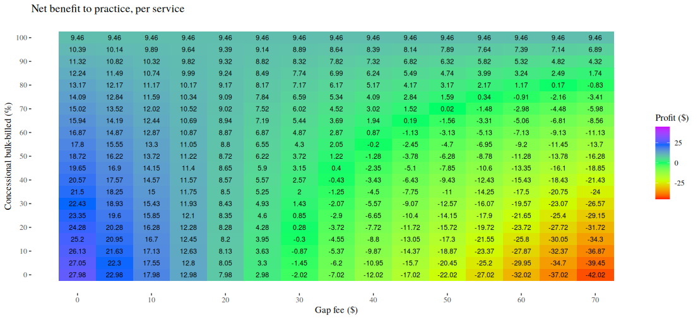

<link href="index_files/libs/htmltools-fill-0.5.8.1/fill.css" rel="stylesheet" />
<script src="index_files/libs/htmlwidgets-1.6.4/htmlwidgets.js"></script>
<script src="index_files/libs/plotly-binding-4.10.4/plotly.js"></script>
<script src="index_files/libs/typedarray-0.1/typedarray.min.js"></script>
<script src="index_files/libs/jquery-3.5.1/jquery.min.js"></script>
<link href="index_files/libs/crosstalk-1.2.1/css/crosstalk.min.css" rel="stylesheet" />
<script src="index_files/libs/crosstalk-1.2.1/js/crosstalk.min.js"></script>
<link href="index_files/libs/plotly-htmlwidgets-css-2.11.1/plotly-htmlwidgets.css" rel="stylesheet" />
<script src="index_files/libs/plotly-main-2.11.1/plotly-latest.min.js"></script>


  <link rel="stylesheet" href="https://cdn.jsdelivr.net/npm/monaco-editor@0.47.0/min/vs/editor/editor.main.css" />
  <link rel="stylesheet" href="https://cdnjs.cloudflare.com/ajax/libs/font-awesome/6.5.2/css/all.min.css" />
  

<style type="text/css">
.monaco-editor pre {
  background-color: unset !important;
}

.qwebr-editor-toolbar {
  width: 100%;
  display: flex;
  justify-content: space-between;
  box-sizing: border-box;
}

.qwebr-editor-toolbar-left-buttons, .qwebr-editor-toolbar-right-buttons {
  display: flex;
}

.qwebr-non-interactive-loading-container.qwebr-cell-needs-evaluation, .qwebr-non-interactive-loading-container.qwebr-cell-evaluated {
  justify-content: center;
  display: flex;
  background-color: rgba(250, 250, 250, 0.65);
  border: 1px solid rgba(233, 236, 239, 0.65);
  border-radius: 0.5rem;
  margin-top: 15px;
  margin-bottom: 15px;
}

.qwebr-r-project-logo {
  color: #2767B0; /* R Project's blue color */
}

.qwebr-icon-status-spinner {
  color: #7894c4;
}

.qwebr-icon-run-code {
  color: #0d9c29
}

body.quarto-light .qwebr-output-code-stdout {
  color: #111;
}

body.quarto-dark .qwebr-output-code-stdout {
  color: #EEE;
}

.qwebr-output-code-stderr {
  color: #db4133;
}

body.quarto-light .qwebr-editor {
  border: 1px solid #EEEEEE;
}

body.quarto-light .qwebr-editor-toolbar {
  background-color: #EEEEEE;
  padding: 0.2rem 0.5rem;
}

body.quarto-dark .qwebr-editor {
  border: 1px solid #111;
}

body.quarto-dark .qwebr-editor-toolbar {
  background-color: #111;
  padding: 0.2rem 0.5rem;
}

.qwebr-button {
  display: inline-block;
  font-weight: 400;
  line-height: 1;
  text-decoration: none;
  text-align: center;
  padding: 0.375rem 0.75rem;
  font-size: .9rem;
  border-radius: 0.25rem;
  transition: color .15s ease-in-out,background-color .15s ease-in-out,border-color .15s ease-in-out,box-shadow .15s ease-in-out;
}

body.quarto-light .qwebr-button {
  background-color: #EEEEEE;
  color: #000;
  border-color: #dee2e6;
  border: 1px solid rgba(0,0,0,0);
}

body.quarto-dark .qwebr-button {
  background-color: #111;
  color: #EEE;
  border-color: #dee2e6;
  border: 1px solid rgba(0,0,0,0);
}

body.quarto-light .qwebr-button:hover {
  color: #000;
  background-color: #d9dce0;
  border-color: #c8ccd0;
}

body.quarto-dark .qwebr-button:hover {
  color: #d9dce0;
  background-color: #323232;
  border-color: #d9dce0;
}

.qwebr-button:disabled,.qwebr-button.disabled,fieldset:disabled .qwebr-button {
  pointer-events: none;
  opacity: .65
}

.qwebr-button-reset {
  color: #696969; /*#4682b4;*/
}

.qwebr-button-copy {
  color: #696969;
}

/* Style the code highlight lines */
body.quarto-light .qwebr-editor-highlight-line {
  background-color: lightblue;
}

body.quarto-dark .qwebr-editor-highlight-line {
  background-color: darkblue;
}

/* Style the modal pop-up */

/* The Modal (background) */
.qwebr-modal {
  display: none; /* Hidden by default */
  position: fixed; /* Stay in place */
  z-index: 1; /* Sit on top */
  left: 0;
  top: 0;
  width: 100%; /* Full width */
  height: 100%; /* Full height */
  overflow: auto; /* Enable scroll if needed */
  background-color: rgb(0,0,0); /* Fallback color */
  background-color: rgba(0,0,0,0.4); /* Black w/ opacity */
  padding-top: 60px;
}

/* Modal Content */
.qwebr-modal-content {
  background-color: #fefefe;
  margin: 5% auto; /* 15% from the top and centered */
  padding: 20px;
  border: 1px solid #888;
  width: 80%; /* Could be more or less, depending on screen size */
}

.qwebr-modal-content-code {
  max-height: 50vh;
  min-height: 5vh;
  overflow: scroll;
  border: 1px solid #888;
}

/* The Close Button */
.qwebr-modal-close {
  color: #aaa;
  float: right;
  font-size: 28px;
  font-weight: bold;
}

.qwebr-modal-close:hover,
.qwebr-modal-close:focus {
  color: black;
  text-decoration: none;
  cursor: pointer;
}

.qwebr-download-btn {
  margin-top: 10px;
  text-decoration: none !important;
}

/* Styling to download image that is created */

.qwebr-canvas-image {
  position: relative;
  display: inline-block;
  margin: 10px;
}

.qwebr-canvas-image-download-btn {
  position: absolute;
  top: 10px;
  right: 10px;
  padding: 5px 10px;
  background-color: #007BFF;
  color: white;
  border: none;
  cursor: pointer;
  display: none;
}

figure:hover .qwebr-canvas-image-download-btn {
  display: block;
}

/* Custom styling for RevealJS Presentations*/

/* Reset the style of the interactive area */
.reveal div.qwebr-interactive-area {
  display: block;
  box-shadow: none;
  max-width: 100%;
  max-height: 100%;
  margin: 0;
  padding: 0;
}

/* Provide space to entries */
.reveal div.qwebr-output-code-area pre div {
  margin: 1px 2px 1px 10px;
}

/* Collapse the inside code tags to avoid extra space between line outputs */
.reveal pre div code.qwebr-output-code-stdout, .reveal pre div code.qwebr-output-code-stderr {
  padding: 0;
  display: contents;
}

body.reveal.quarto-light pre div code.qwebr-output-code-stdout {
  color: #111;
}

body.reveal.quarto-dark pre div code.qwebr-output-code-stdout {
  color: #EEEEEE;
}

.reveal pre div code.qwebr-output-code-stderr {
  color: #db4133;
}


/* Create a border around console and output (does not effect graphs) */
body.reveal.quarto-light div.qwebr-console-area {
  border: 1px solid #EEEEEE;
  box-shadow: 2px 2px 10px #EEEEEE;
}

body.reveal.quarto-dark div.qwebr-console-area {
  border: 1px solid #111;
  box-shadow: 2px 2px 10px #111;
}


/* Cap output height and allow text to scroll */
/* TODO: Is there a better way to fit contents/max it parallel to the monaco editor size? */
.reveal div.qwebr-output-code-area pre {
  max-height: 400px;
  overflow: scroll;
}

iframe.qwebr-output-code-browse {
  width: 100%;

  /*
    TODO: How to make the height automatic according to the widget size,
    or respect the quarto code block options?
  */
  min-height: 500px;
}

</style>

<script type="module">
// Document level settings ----

// Determine if we need to install R packages
globalThis.qwebrInstallRPackagesList = [''];

// Specify possible locations to search for the repository
globalThis.qwebrPackageRepoURLS = ['https://repo.r-wasm.org/'];

// Check to see if we have an empty array, if we do set to skip the installation.
globalThis.qwebrSetupRPackages = !(qwebrInstallRPackagesList.indexOf("") !== -1);
globalThis.qwebrAutoloadRPackages = true;

// Display a startup message?
globalThis.qwebrShowStartupMessage = true;
globalThis.qwebrShowHeaderMessage = false;

// Describe the webR settings that should be used
globalThis.qwebrCustomizedWebROptions = {
  "baseURL": "https://webr.r-wasm.org/v0.4.0/",
  "serviceWorkerUrl": "",
  "homedir": "/home/web_user", 
  "channelType": "ChannelType.Automatic"
};

// Store cell data
globalThis.qwebrCellDetails = [{"code":"# Service fees for the most common fee-for-service consultation items\n# which attract a bulk-billing incentive\n\n# All source code on this page is subject to the terms of the\n# Mozilla Public License, v. 2.0. A copy of the MPL can be obtained \n# from https://mozilla.org/MPL/2.0/.\n\n# government-set price for service items A, B, C, D and E\n# Medicare items 3, 23, 36, 44, and 123\n# in AUD (Australian dollars)\nfee_names <- c(\"a\", \"b\", \"c\", \"d\", \"e\")\nservice_fees <- array(\n  data = c(19.6, 42.85, 82.90, 122.15, 197.9),\n  dim = c(length(fee_names), 1),\n  dimnames = list(fee_names, \"fee\")\n)\n\n# the proportion which each item is billed\n\n# raw figures are derived for calendar year 2024 Australia-wide\n# http://medicarestatistics.humanservices.gov.au/statistics/mbs_item.jsp\nservice_proportion_raw <- array(\n  data = c(4037130, 81240293, 19899953, 1609147, 174664),\n  dim = c(length(fee_names), 1),\n  dimnames = list(fee_names, \"n\")\n)\n\n# calculate the proportions\n# for simplicity, assume the same proportions for bulk-billed patients\n# and privately-billed patients\nservice_proportion_bulk <- service_proportion_raw/sum(service_proportion_raw)\ncolnames(service_proportion_bulk) <- c(\"proportion\")\nservice_proportion_private <- service_proportion_bulk\n\n# display the proportions\nservice_proportion_bulk","id":1,"options":{"autorun":"false","classes":"","comment":"","context":"interactive","dpi":72,"editor-font-scale":"0.65","editor-max-height":"","editor-quick-suggestions":"false","editor-word-wrap":"true","fig-cap":"","fig-height":5,"fig-width":7,"label":"unnamed-chunk-1","message":"true","out-height":"","out-width":"700px","output":"true","read-only":"false","results":"markup","warning":"true"}},{"code":"# note, please 'run' the previous code block! \n\n# Set the gap fee for the individual service items A, B, C, D and E\n# for patients who were privately billed\n# for simplicity, set to the same fee of $50\ngap_fee <- array(\n  data = rep(50, length(fee_names)),\n  dim = c(length(fee_names), 1),\n  dimnames = list(fee_names, \"gap\")\n)\n\n# the proportion of patients who are charge the gap fee\n# i.e. privately billed\n# set to 50%\nprivately_billed <-  0.5\n\n# the bulk billing incentive, in dollars\n# varies by location\n# Modified Monash areas 1, 2, 3+4, 5, 6, 7\n# we will index the above to 1, 2, 3, 4, 5 and 6 (merging areas 3+4)\n\n# see https://www9.health.gov.au/mbs/search.cfm\nn_monash <- 6 # six different Monash areas\n\nindividual_bulkbill_incentive <- array(\n  # there are two different individual bulk-billing incentive fees,\n  # 'standard' and 'triple'\n  data = c(\n    # standard bulk-billing incentive applies to service items like item A/'3'\n    # items 10990, 10991, 75855, 75856, 75857, 75858\n    c(7.15, 10.80, 11.45, 12.20, 12.85, 13.70),\n    # triple bulk-billing incentive applies to service items like item B, C and D\n    # items 75870, 75871, 75873, 75874, 75875, 75876\n    c(21.35, 32.50, 34.50, 36.65, 38.70, 41.10)\n  ),\n  dim = c(n_monash, 2),\n  dimnames = list(c(\"1\", \"2\", \"3+4\", \"5\", \"6\", \"7\"), c(\"single\", \"triple\"))\n)\n\n# does the single- or triple- incentive apply to the fee item?\nindividual_bulkbill_incentive_by_fee <- \n  c(\"single\", \"triple\", \"triple\", \"triple\", \"triple\")\n\n# set the Monash area to the city\nmonash_area <- \"1\"\n\n# universal bulk billing incentive\n# over the service fee\n# set to 12.5%\nuniversal_bulkbill_incentive <- 0.125\n\n# show individual bulk-bill incentive applicable to defined Monash area\nfee_bulkbill_incentive <- individual_bulkbill_incentive[monash_area, individual_bulkbill_incentive_by_fee]\n# redefine dimensions of the array\ndim(fee_bulkbill_incentive) <- c(length(fee_names), 1)\n# change rownames to the fee names\nrownames(fee_bulkbill_incentive) <- fee_names\nfee_bulkbill_incentive","id":2,"options":{"autorun":"false","classes":"","comment":"","context":"interactive","dpi":72,"editor-font-scale":"0.65","editor-max-height":"","editor-quick-suggestions":"false","editor-word-wrap":"true","fig-cap":"","fig-height":5,"fig-width":7,"label":"unnamed-chunk-2","message":"true","out-height":"","out-width":"700px","output":"true","read-only":"false","results":"markup","warning":"true"}},{"code":"# note, depends on the previous code blocks already having been 'run'! \n\n# Benefit per 'average' patient charged service item A, B, C, D or E\n\nnet_benefit <- function(\n  # calculate the average net benefit revenue\n  # to the practice per patient\n  \n  # the variable names used in this function\n  # are the same as used in previous code chunks\n  # but will be 'local' to this function\n  service_fees,\n  fee_names,\n  service_proportion_bulk,\n  service_proportion_private,\n  gap_fee,\n  privately_billed,\n  individual_bulkbill_incentive,\n  individual_bulkbill_incentive_by_fee,\n  monash_area,\n  universal_bulkbill_incentive) {\n  # calculate individual bulk-bill incentive applicable to defined Monash area\n  fee_bulkbill_incentive <- \n    individual_bulkbill_incentive[monash_area, individual_bulkbill_incentive_by_fee]\n  # re-define dimensions of the 'x' array\n  dim(fee_bulkbill_incentive) <- c(length(fee_names), 1)\n  # change row name to the fee names\n  rownames(fee_bulkbill_incentive) <- fee_names\n  \n  # calculate the universal bulk-bill incentive\n  # for patients formerly privately-billed\n  privately_billed *\n    sum(service_fees * service_proportion_private) *\n    universal_bulkbill_incentive +\n    # calculate (and add) benefit for patients already bulk-billed\n    (1 - privately_billed) *\n    sum(service_fees * service_proportion_bulk) *\n    universal_bulkbill_incentive +\n    # the calculation above could be simplified, of course!, to\n    # sum(service_fees * service_proportion_private), but is kept\n    # separate to two different portions to clarify the calculation\n    \n    # calculate (and add) the individual service bulk-billing incentive applied\n    # to patients formerly privately-billed\n    privately_billed * sum(service_proportion_private * fee_bulkbill_incentive) -\n    \n    # calculate (and subtract) the loss from not charging a private 'gap' fee\n    privately_billed * sum(service_proportion_private * gap_fee)\n}\n\nfee_mean <- function(\n  # calculate the current mean fee\n  service_fees,\n  fee_names,\n  service_proportion_bulk,\n  service_proportion_private,\n  gap_fee,\n  privately_billed,\n  individual_bulkbill_incentive,\n  individual_bulkbill_incentive_by_fee,\n  monash_area\n) {\n  # calculate individual bulk-bill incentive applicable to defined Monash area\n  fee_bulkbill_incentive <- \n    individual_bulkbill_incentive[monash_area, individual_bulkbill_incentive_by_fee]\n  # re-define dimensions of the 'x' array\n  dim(fee_bulkbill_incentive) <- c(length(fee_names), 1)\n  # change row name to the fee names\n  rownames(fee_bulkbill_incentive) <- fee_names\n  \n  privately_billed *\n    sum(service_fees * service_proportion_private) +\n    (1 - privately_billed) *\n    sum(service_fees * service_proportion_bulk) +\n    # the calculation above could be simplified, of course!, to\n    # sum(service_fees * service_proportion_private), but is kept\n    # separate to two different portions to clarify the calculation\n    \n    # calculate (and add) the individual service bulk-billing incentive applied\n    # to patients currently bulk-billed\n    (1 - privately_billed) * \n    sum(service_proportion_private * fee_bulkbill_incentive) +\n    \n    # calculate (and add) the private 'gap' fee\n    privately_billed * sum(service_proportion_private * gap_fee)\n}\n\ncurrent_fee_mean <- fee_mean(\n  service_fees,\n  fee_names,\n  service_proportion_bulk,\n  service_proportion_private,\n  gap_fee,\n  privately_billed,\n  individual_bulkbill_incentive,\n  individual_bulkbill_incentive_by_fee,\n  monash_area\n)\n\nprofit_loss <- net_benefit(\n  service_fees,\n  fee_names,\n  service_proportion_bulk,\n  service_proportion_private,\n  gap_fee,\n  privately_billed,\n  individual_bulkbill_incentive,\n  individual_bulkbill_incentive_by_fee,\n  monash_area,\n  universal_bulkbill_incentive\n)\n\n# Show the value of average net_benefit\npaste(\"Current mean fee: \", formatC(current_fee_mean, digits = 2, format = \"f\"))\npaste(\"Profit-loss: \", formatC(profit_loss, digits = 2, format = \"f\"))","id":3,"options":{"autorun":"false","classes":"","comment":"","context":"interactive","dpi":72,"editor-font-scale":"0.65","editor-max-height":"","editor-quick-suggestions":"false","editor-word-wrap":"true","fig-cap":"","fig-height":5,"fig-width":7,"label":"unnamed-chunk-3","message":"true","out-height":"","out-width":"700px","output":"true","read-only":"false","results":"markup","warning":"true"}},{"code":"# note, depends on the previous code blocks already having been 'run'! \n\n# Set the privately-billed proportion to 0.2 (20%), the gap fee to $35\n# and new service proportions\n\nnew_practice_service_raw <- \n  # new A, B, C, D, E numbers\n  # with much longer average consults\n  #  the consult time is progressively longer from A->B->C->D->E\n  c(950, 3956, 4171, 1146, 75)\nnew_practice_service_proportions <- \n  new_practice_service_raw/sum(new_practice_service_raw)\n\ncurrent_fee_mean <- fee_mean(\n  service_fees,\n  fee_names,\n  service_proportion_bulk = new_practice_service_proportions,\n  service_proportion_private = new_practice_service_proportions,\n  # replace the gap fee for every possible service fee\n  # we could also use 'gap_fee = c(35, 35, 35, 35, 35)'\n  gap_fee = rep (35, length(fee_names)),\n  # reduce the privately billed proportion to 20%\n  privately_billed = 0.2,\n  individual_bulkbill_incentive,\n  individual_bulkbill_incentive_by_fee,\n  monash_area\n)\n\nprofit_loss <- net_benefit(\n  service_fees,\n  fee_names,\n  service_proportion_bulk = new_practice_service_proportions,\n  service_proportion_private = new_practice_service_proportions,\n  # replace the gap fee for every possible service fee\n  # we could also use 'gap_fee = c(35, 35, 35, 35, 35)'\n  gap_fee = rep(35, length(fee_names)),\n  # reduce the privately billed proportion to 20%\n  privately_billed = 0.2,\n  individual_bulkbill_incentive,\n  individual_bulkbill_incentive_by_fee,\n  monash_area,\n  universal_bulkbill_incentive\n)\n\n# Show the value of average net_benefit\npaste(\"Current mean fee: \", formatC(current_fee_mean, digits = 2, format = \"f\"))\npaste(\"Profit-loss: \", formatC(profit_loss, digits = 2, format = \"f\"))","id":4,"options":{"autorun":"false","classes":"","comment":"","context":"interactive","dpi":72,"editor-font-scale":"0.65","editor-max-height":"","editor-quick-suggestions":"false","editor-word-wrap":"true","fig-cap":"","fig-height":5,"fig-width":7,"label":"unnamed-chunk-4","message":"true","out-height":"","out-width":"700px","output":"true","read-only":"false","results":"markup","warning":"true"}},{"code":"# note, depends on the previous code blocks already having been 'run'! \n\n# this model is based on the second practice model described above\n# add new service fee descriptions\nnew_fee_names <- c(\n  fee_names,\n  # append items 721, 723 and 732\n  c(\"GPMP\", \"TCA\", \"CDM RV\")\n)\nnew_service_fees <- array(\n  # append fees for 721, 723 and 732\n  data = c(service_fees, 164.35, 130.25, 82.10),\n  dim = c(length(new_fee_names), 1),\n  dimnames = list(new_fee_names, \"fee\")\n)\nnew_gap_fee <- c(\n  rep(35, 5),\n  # no gap fees were charged for thes GPMP/TCA/GPMPRV items,\n  # even 'private' patients\n  rep(0, 3)\n)\nnew_individual_bulkbill_incentive_by_fee <- c(\n  individual_bulkbill_incentive_by_fee,\n  rep(\"single\", 3)\n)\n# Set the privately-billed proportion to 0.2 (20%), the gap fee to $35\n# and new service proportions\nnew_practice_service_raw <- \n  # new A, B, C, D, E numbers\n  # (long average consults)\n  # and GPMP/TCA/reviews\n  c(950, 3956, 4171, 1146, 75, 416, 402, 255)\nnew_practice_service_proportions <- \n  new_practice_service_raw/sum(new_practice_service_raw)\n\ncurrent_fee_mean <- fee_mean(\n  service_fees = new_service_fees,\n  fee_names = new_fee_names,\n  service_proportion_bulk = new_practice_service_proportions,\n  service_proportion_private = new_practice_service_proportions,\n  # replace the gap fee\n  gap_fee = new_gap_fee,\n  # reduce the privately billed proportion to 20%\n  privately_billed = 0.2,\n  individual_bulkbill_incentive,\n  individual_bulkbill_incentive_by_fee = new_individual_bulkbill_incentive_by_fee,\n  monash_area\n)\n\nprofit_loss <- net_benefit(\n  service_fees = new_service_fees,\n  fee_names = new_fee_names,\n  service_proportion_bulk = new_practice_service_proportions,\n  service_proportion_private = new_practice_service_proportions,\n  # replace the gap fees\n  gap_fee = new_gap_fee,\n  # reduce the privately billed proportion to 20%\n  privately_billed = 0.2,\n  individual_bulkbill_incentive,\n  individual_bulkbill_incentive_by_fee = new_individual_bulkbill_incentive_by_fee,\n  monash_area,\n  universal_bulkbill_incentive\n)\n\n# Show the value of average net_benefit\npaste(\"Current mean fee: \", formatC(current_fee_mean, digits = 2, format = \"f\"))\npaste(\"Profit-loss: \", formatC(profit_loss, digits = 2, format = \"f\"))","id":5,"options":{"autorun":"false","classes":"","comment":"","context":"interactive","dpi":72,"editor-font-scale":"0.65","editor-max-height":"","editor-quick-suggestions":"false","editor-word-wrap":"true","fig-cap":"","fig-height":5,"fig-width":7,"label":"unnamed-chunk-5","message":"true","out-height":"","out-width":"700px","output":"true","read-only":"false","results":"markup","warning":"true"}},{"code":"# note, depends on the previous code blocks already having been 'run'! \n\n# This code chunk requires a few extra code packages\n# It will take a few seconds to make these packages available\ninstall.packages(\"tibble\", quiet = TRUE)\ninstall.packages(\"ggplot2\", quiet = TRUE)\ninstall.packages(\"ggthemes\", quiet = TRUE)\nlibrary(tibble)\nlibrary(ggplot2)\nlibrary(ggthemes)\n\n# gap fees from $0 to $60\ngap_fee_range <- seq(from = 0, to = 60, by = 1)\n\nprofit_loss <- sapply(\n  X = gap_fee_range,\n  function(x) {\n    net_benefit(\n      service_fees,\n      fee_names,\n      service_proportion_bulk,\n      service_proportion_private,\n      # set the gap fee to 'x'\n      gap_fee = rep(x, length(fee_names)),\n      privately_billed,\n      individual_bulkbill_incentive,\n      individual_bulkbill_incentive_by_fee,\n      monash_area,\n      universal_bulkbill_incentive\n    )\n  }\n)\n\ngap_vs_profit <- tibble(\n  gap = gap_fee_range,\n  profit_loss = profit_loss\n)\n\nggplot(\n  data = gap_vs_profit, \n  mapping = aes(x = gap, y = profit_loss)\n  ) +\n  geom_point() +\n  labs(\n    x = \"Gap fee ($)\",\n    y = \"Profit-loss ($)\"\n  ) +\n  ggtitle(\"Net benefit to practice, per service\") +\n  geom_vline(\n    # our current gap-fee\n    xintercept = gap_fee,\n    linetype = \"dotted\",\n    color = \"blue\"\n  ) +\n  geom_hline(\n    # zero profit-loss line\n    yintercept = 0,\n    linetype = \"dashed\",\n    color = \"red\",\n    linewidth = 1\n  ) +\n  theme_economist()","id":6,"options":{"autorun":"false","classes":"","comment":"","context":"interactive","dpi":72,"editor-font-scale":"0.65","editor-max-height":"","editor-quick-suggestions":"false","editor-word-wrap":"true","fig-cap":"","fig-height":5,"fig-width":7,"label":"unnamed-chunk-6","message":"true","out-height":"","out-width":"700px","output":"true","read-only":"false","results":"markup","warning":"true"}},{"code":"# note, depends on the previous code blocks already having been 'run'! \nlibrary(tibble)\nlibrary(ggplot2)\nlibrary(ggthemes)\n\n# privately billed range from 0 to 100%\nprivately_billed_range <- seq(from = 0, to = 100, by = 1)\n\n# this model is based on the second practice model described above\n# together with care plan item numbers\n# add new service fee descriptions\nnew_fee_names <- c(\n  fee_names,\n  # append items 721, 723 and 732\n  c(\"GPMP\", \"TCA\", \"CDM RV\")\n)\nnew_service_fees <- array(\n  # append fees for 721, 723 and 732\n  data = c(service_fees, 164.35, 130.25, 82.10),\n  dim = c(length(new_fee_names), 1),\n  dimnames = list(new_fee_names, \"fee\")\n)\nnew_individual_bulkbill_incentive_by_fee <- c(\n  individual_bulkbill_incentive_by_fee,\n  rep(\"single\", 3)\n)\nnew_gap_fee <- c(\n  rep(35, 5),\n  # no gap fees were charged for these GPMP/TCA/GPMPRV items,\n  # even 'private' patients\n  rep(0, 3)\n)\n\n# Set the privately-billed proportion to 0.2 (20%), the gap fee to $35\n# and new service proportions\nnew_practice_service_raw <- \n  # new A, B, C, D, E numbers\n  # (long average consults)\n  # and GPMP/TCA/reviews\n  c(950, 3956, 4171, 1146, 75, 416, 402, 255)\nnew_practice_service_proportions <- \n  new_practice_service_raw/sum(new_practice_service_raw)\n\nprofit_loss <- sapply(\n  X = privately_billed_range,\n  function(x) {\n    net_benefit(\n      service_fees = new_service_fees,\n      fee_names = new_fee_names,\n      # set service proportions to longer consults\n      service_proportion_bulk = new_practice_service_proportions,\n      service_proportion_private = new_practice_service_proportions,\n      # set the gap fee to $35\n      gap_fee = new_gap_fee,\n      # set privately billed proportion to 'x'\n      # divide by 100 to convert from\n      # percentage to proportion\n      privately_billed = x/100,\n      individual_bulkbill_incentive,\n      individual_bulkbill_incentive_by_fee = new_individual_bulkbill_incentive_by_fee,\n      monash_area,\n      universal_bulkbill_incentive\n    )\n  }\n)\n\ngap_vs_profit <- tibble(\n  gap = privately_billed_range,\n  profit_loss = profit_loss\n)\n\nggplot(\n  data = gap_vs_profit, \n  mapping = aes(x = gap, y = profit_loss)\n  ) +\n  geom_point() +\n  labs(\n    x = \"Privately-billed proportion (%)\",\n    y = \"Profit-loss ($)\"\n  ) +\n  ggtitle(\"Net benefit to practice, per service\") +\n  geom_vline(\n    # our current proportion\n    xintercept = 20,\n    linetype = \"dotted\",\n    color = \"blue\"\n  ) +\n  geom_hline(\n    # zero profit-loss line\n    yintercept = 0,\n    linetype = \"dashed\",\n    color = \"red\",\n    linewidth = 1\n  ) +\n  theme_economist()","id":7,"options":{"autorun":"false","classes":"","comment":"","context":"interactive","dpi":72,"editor-font-scale":"0.65","editor-max-height":"","editor-quick-suggestions":"false","editor-word-wrap":"true","fig-cap":"","fig-height":5,"fig-width":7,"label":"unnamed-chunk-7","message":"true","out-height":"","out-width":"700px","output":"true","read-only":"false","results":"markup","warning":"true"}},{"code":"# note, depends on the previous code blocks already having been 'run'! \nlibrary(tibble)\nlibrary(plotly)\nlibrary(ggplot2)\nlibrary(dplyr)\n\n# gap fees from $0 to $60\ngap_fee_range <- seq(from = 0, to = 70, by = 1)\n# privately billed range from 0 to 100%\nprivately_billed_range <- seq(from = 0, to = 100, by = 1)\n\n# this model is based on the first practice model described above\n# together with care plan item numbers\n# add new service fee descriptions\nnew_fee_names <- c(\n  fee_names,\n  # append chronic disease item numbers (721, 723, 732)\n  # health assessment item numbers (701 -- 715)\n  # and mental health care plan item numbers (2700 -- 271)\n  c(\"GPMP\", \"TCA\", \"CDM RV\",\n    \"HA701\", \"HA703\", \"HA705\", \"HA707\", \"HA715\",\n    \"MHCP2700\", \"MHCP2701\", \"MHCP2715\", \"MHCP2717\", \"MHCP RV\")\n)\nnew_service_fees <- array(\n  # append fees for 721, 723 and 732\n  data = c(service_fees,\n           164.35, 130.25, 82.10,\n           67.60, 157.10, 216.80, 306.25, 241.85,\n           81.70, 120.25, 103.70, 152.80, 81.70\n           ),\n  dim = c(length(new_fee_names), 1),\n  dimnames = list(new_fee_names, \"fee\")\n)\nnew_individual_bulkbill_incentive_by_fee <- c(\n  individual_bulkbill_incentive_by_fee,\n  rep(\"single\", 3+5+5)\n)\n# and new service proportions\n# from http://medicarestatistics.humanservices.gov.au/statistics/mbs_item.jsp (2024)\nnew_practice_service_raw <- \n  # A, B, C, D, E service items\n  # and GPMP/TCA/reviews (CDM), health assessment and mental health plan items\n  c(4037130, 81240293, 19899953, 1609147, 174664,\n    3357364, 2954994, 4319542,\n    21383, 165878, 273690, 463237, 263931,\n    97733, 31550, 904320, 211540, 504901)\nnew_practice_service_proportions <- \n  new_practice_service_raw/sum(new_practice_service_raw)\n\nprofit_loss <- tibble(\n  gap = numeric(), \n  private_billed = numeric(), \n  profit = numeric()\n)\n\nfor (x in gap_fee_range) {\n  for (y in privately_billed_range) {\n    new_gap_fee <- c(\n      rep(x, length((new_fee_names)))\n      # the same gap fee charged for every item, including GPMP/TCA/GPMPRV items\n      # a simplified approach would use the 'average' gap fee charged\n      # for all relevant items\n    )\n    profit <- net_benefit(\n      service_fees = new_service_fees,\n      fee_names = new_fee_names,\n      # set service proportions to longer consults\n      service_proportion_bulk = new_practice_service_proportions,\n      service_proportion_private = new_practice_service_proportions,\n      # set the gap fee to $35\n      gap_fee = new_gap_fee,\n      # set privately billed proportion to 'x'\n      # divide by 100 to convert from\n      # percentage to proportion\n      privately_billed = y/100,\n      individual_bulkbill_incentive,\n      individual_bulkbill_incentive_by_fee = new_individual_bulkbill_incentive_by_fee,\n      monash_area,\n      universal_bulkbill_incentive\n    )\n    profit_loss <- add_row(profit_loss, gap = x, private_billed = y, profit = profit)\n  }\n}\n\n# this plot cannot be shown in the web-browser using this code block!\n# you will need to copy this code (and all the pre-requisites)\n# into a 'R/RStudio' and run it yourself :)\nfig_plotly_3d <- plot_ly(\n  data = profit_loss, x = ~gap, y = ~private_billed, z = ~profit,\n  type = \"scatter3d\", mode = \"markers\",\n  hovertemplate = paste(\n    \"Gap fee: <b>%{x}</b><br>\",\n    \"Private: <b>%{y}</b>%<br>\",\n    \"Profit: <b>%{z:$.2f}</b>\",\n    \"<extra></extra>\"\n  ),\n  marker = list(\n    color = ~profit,\n    colorscale = \"Rainbow\",\n    showscale = TRUE,\n    line = list(width = 1, color = \"DarkSlateGrey\")) \n  ) |>\n  layout(\n    title = \"Profit-loss according to gap fee and proportion privately-billed\",\n    scene = list(\n      xaxis = list(title = list(text = \"Gap fee ($)\")),\n      yaxis = list(title = list(text = \"Privately-billed (%)\")),\n      zaxis = list(title = list(text = \"Net benefit per service ($)\"))\n    )\n  )\n\n# this plot cannot be shown in the web-browser using this code block!\n# you will need to copy this code (and all the pre-requisites)\n# into a 'R/RStudio' and run it yourself :)\nfig_ggplotly <- ggplot(\n  data = profit_loss,\n  aes(x = gap, y = private_billed))+\n  geom_point(\n    aes(fill = profit),\n    size = 4, shape = 22, stroke = 0\n  ) +\n  scale_fill_viridis_c(option = \"turbo\", direction = -1)\n# to look at this plot, either 'fig_ggplotly' in R/RStudio or\n# 'ggplotly(fig_ggplotly)'\n\nfig_ggplot <- ggplot(\n  data = profit_loss |> \n    dplyr::filter(gap == (gap %/% 5 * 5), private_billed == (private_billed %/% 5 * 5)),\n  aes(x = gap, y = private_billed, fill = profit)) +\n  theme_bw() + geom_tile() + \n  geom_text(aes(label=round(profit, 2)), size = 8/.pt) +\n  labs(\n    x = \"Gap fee ($)\",\n    y = \"Privately-billed (%)\",\n    fill = \"Profit ($)\"\n  ) +\n  scale_x_continuous(breaks = seq(from = 0, to = 70, by = 10)) +\n  scale_y_continuous(breaks = seq(from = 0, to = 100, by = 10)) +\n  ggtitle(\"Net benefit to practice, per service\") +\n  scale_fill_gradientn(colors = rainbow(5), limits = c(-45, 45))\n\nfig_ggplot + theme_tufte()","id":8,"options":{"autorun":"false","classes":"","comment":"","context":"interactive","dpi":72,"editor-font-scale":"0.65","editor-max-height":"300","editor-quick-suggestions":"false","editor-word-wrap":"true","fig-cap":"","fig-height":5,"fig-width":7,"label":"unnamed-chunk-8","message":"false","out-height":"","out-width":"700px","output":"true","read-only":"false","results":"asis","warning":"false"}},{"code":"# show profit-loss as a percentage change in mean fee\n\nnew_practice_service_raw <- \n  # A, B, C, D, E service items\n  # and GPMP/TCA/reviews (CDM), health assessment and mental health plan items\n  c(950, 3956, 4171, 1146, 75,\n    416, 402, 255,\n    0, 13, 101, 45, 1,\n    7, 5, 64, 31, 41)\nnew_practice_service_proportions <- \n  new_practice_service_raw/sum(new_practice_service_raw)\n\nprofit_loss <- tibble(\n  gap = numeric(), \n  private_billed = numeric(),\n  current_fee_mean = numeric(),\n  profit = numeric(),\n  profit_rel = numeric()\n)\n\nfor (x in gap_fee_range) {\n  for (y in privately_billed_range) {\n    new_gap_fee <- c(\n      rep(x, length((new_fee_names)))\n      # the same gap fee charged for every item, including GPMP/TCA/GPMPRV items\n      # a simplified approach would use the 'average' gap fee charged\n      # for all relevant items\n    )\n    current_fee_mean <- fee_mean(\n      service_fees = new_service_fees,\n      fee_names = new_fee_names,\n      # set service proportions to longer consults\n      service_proportion_bulk = new_practice_service_proportions,\n      service_proportion_private = new_practice_service_proportions,\n      gap_fee = new_gap_fee,\n      # set privately billed proportion to 'y'\n      # divide by 100 to convert from\n      # percentage to proportion\n      privately_billed = y/100,\n      individual_bulkbill_incentive,\n      individual_bulkbill_incentive_by_fee = new_individual_bulkbill_incentive_by_fee,\n      monash_area\n    )\n    profit <- net_benefit(\n      service_fees = new_service_fees,\n      fee_names = new_fee_names,\n      # set service proportions to longer consults\n      service_proportion_bulk = new_practice_service_proportions,\n      service_proportion_private = new_practice_service_proportions,\n      gap_fee = new_gap_fee,\n      # set privately billed proportion to 'y'\n      # divide by 100 to convert from\n      # percentage to proportion\n      privately_billed = y/100,\n      individual_bulkbill_incentive,\n      individual_bulkbill_incentive_by_fee = new_individual_bulkbill_incentive_by_fee,\n      monash_area,\n      universal_bulkbill_incentive\n    )\n    profit_loss <- add_row(\n      profit_loss,\n      gap = x, private_billed = y,\n      current_fee_mean = current_fee_mean,\n      profit = profit, \n      profit_rel = profit / current_fee_mean * 100\n    )\n  }\n}\n\nfig_ggplot <- ggplot(\n  data = profit_loss |> \n    dplyr::filter(gap == (gap %/% 5 * 5), private_billed == (private_billed %/% 5 * 5)),\n  aes(x = gap, y = private_billed, fill = profit_rel)) +\n  theme_bw() + geom_tile() + \n  geom_text(aes(label=round(profit_rel, 0)), size = 8/.pt) +\n  labs(\n    x = \"Gap fee ($)\",\n    y = \"Privately-billed (%)\",\n    fill = \"Profit-loss (%)\"\n  ) +\n  scale_x_continuous(breaks = seq(from = 0, to = 70, by = 10)) +\n  scale_y_continuous(breaks = seq(from = 0, to = 100, by = 10)) +\n  ggtitle(\"Percentage change in revenue (mean fee)\") +\n  scale_fill_gradientn(colors = rainbow(5), limits = c(-45, 45))\n\nfig_ggplot + theme_tufte()","id":9,"options":{"autorun":"false","classes":"","comment":"","context":"interactive","dpi":72,"editor-font-scale":"0.65","editor-max-height":"300","editor-quick-suggestions":"false","editor-word-wrap":"true","fig-cap":"","fig-height":5,"fig-width":7,"label":"unnamed-chunk-9","message":"false","out-height":"","out-width":"700px","output":"true","read-only":"false","results":"asis","warning":"false"}},{"code":"install.packages(\"knitr\", quiet = TRUE)\nlibrary(tibble)\nlibrary(knitr)\n\n# just include service items B, C and D\nshort_service_list <- service_fees[c(\"b\", \"c\", \"d\"),]\n\nnew_payments <- \n  tibble(\n    Current = num(\n      short_service_list,\n      digits = 2\n    ),\n    Metro = num(\n      short_service_list*(1+universal_bulkbill_incentive)+\n        individual_bulkbill_incentive[1, 2],\n      digits = 2\n    ),\n    Regional = num(\n      short_service_list*(1+universal_bulkbill_incentive)+\n        individual_bulkbill_incentive[2, 2],\n      digits = 2\n    ),\n    `Large Rural` = num(\n      short_service_list*(1+universal_bulkbill_incentive)+\n        individual_bulkbill_incentive[3, 2],\n      digits = 2\n    ),\n    `Small Rural` = num(\n      short_service_list*(1+universal_bulkbill_incentive)+\n        individual_bulkbill_incentive[4, 2],\n      digits = 2\n    ),\n    Remote = num(\n      short_service_list*(1+universal_bulkbill_incentive)+\n        individual_bulkbill_incentive[5, 2],\n      digits = 2\n    ),\n  )\n\nkable(new_payments, format = \"html\")","id":10,"options":{"autorun":"false","classes":"","comment":"","context":"interactive","dpi":72,"editor-font-scale":"0.65","editor-max-height":"","editor-quick-suggestions":"false","editor-word-wrap":"true","fig-cap":"","fig-height":5,"fig-width":7,"label":"unnamed-chunk-10","message":"true","out-height":"","out-width":"700px","output":"true","read-only":"false","results":"asis","warning":"true"}}];

</script>

<script type="module">
// Declare startupMessageQWebR globally
globalThis.qwebrStartupMessage = document.createElement("p");

// Verify if OffScreenCanvas is supported
globalThis.qwebrOffScreenCanvasSupport = function() {
  return typeof OffscreenCanvas !== 'undefined'
}

// Function to set the button text
globalThis.qwebrSetInteractiveButtonState = function(buttonText, enableCodeButton = true) {
  document.querySelectorAll(".qwebr-button-run").forEach((btn) => {
    btn.innerHTML = buttonText;
    btn.disabled = !enableCodeButton;
  });
}

// Function to update the status message in non-interactive cells
globalThis.qwebrUpdateStatusMessage = function(message) {
  document.querySelectorAll(".qwebr-status-text.qwebr-cell-needs-evaluation").forEach((elem) => {
    elem.innerText = message;
  });
}

// Function to update the status message
globalThis.qwebrUpdateStatusHeader = function(message) {
  qwebrStartupMessage.innerHTML = `
    <i class="fa-solid fa-spinner fa-spin qwebr-icon-status-spinner"></i>
    <span>${message}</span>`;
}

// Function to return true if element is found, false if not
globalThis.qwebrCheckHTMLElementExists = function(selector) {
  const element = document.querySelector(selector);
  return !!element;
}

// Function that detects whether reveal.js slides are present
globalThis.qwebrIsRevealJS = function() {
  // If the '.reveal .slides' selector exists, RevealJS is likely present
  return qwebrCheckHTMLElementExists('.reveal .slides');
}

// Initialize the Quarto sidebar element
function qwebrSetupQuartoSidebar() {
  var newSideBarDiv = document.createElement('div');
  newSideBarDiv.id = 'quarto-margin-sidebar';
  newSideBarDiv.className = 'sidebar margin-sidebar';
  newSideBarDiv.style.top = '0px';
  newSideBarDiv.style.maxHeight = 'calc(0px + 100vh)';

  return newSideBarDiv;
}

// Position the sidebar in the document
function qwebrPlaceQuartoSidebar() {
  // Get the reference to the element with id 'quarto-document-content'
  var referenceNode = document.getElementById('quarto-document-content');

  // Create the new div element
  var newSideBarDiv = qwebrSetupQuartoSidebar();

  // Insert the new div before the 'quarto-document-content' element
  referenceNode.parentNode.insertBefore(newSideBarDiv, referenceNode);
}

function qwebrPlaceMessageContents(content, html_location = "title-block-header", revealjs_location = "title-slide") {

  // Get references to header elements
  const headerHTML = document.getElementById(html_location);
  const headerRevealJS = document.getElementById(revealjs_location);

  // Determine where to insert the quartoTitleMeta element
  if (headerHTML || headerRevealJS) {
    // Append to the existing "title-block-header" element or "title-slide" div
    (headerHTML || headerRevealJS).appendChild(content);
  } else {
    // If neither headerHTML nor headerRevealJS is found, insert after "webr-monaco-editor-init" script
    const monacoScript = document.getElementById("qwebr-monaco-editor-init");
    const header = document.createElement("header");
    header.setAttribute("id", "title-block-header");
    header.appendChild(content);
    monacoScript.after(header);
  }
}


function qwebrOffScreenCanvasSupportWarningMessage() {
  
  // Verify canvas is supported.
  if(qwebrOffScreenCanvasSupport()) return;

  // Create the main container div
  var calloutContainer = document.createElement('div');
  calloutContainer.classList.add('callout', 'callout-style-default', 'callout-warning', 'callout-titled');

  // Create the header div
  var headerDiv = document.createElement('div');
  headerDiv.classList.add('callout-header', 'd-flex', 'align-content-center');

  // Create the icon container div
  var iconContainer = document.createElement('div');
  iconContainer.classList.add('callout-icon-container');

  // Create the icon element
  var iconElement = document.createElement('i');
  iconElement.classList.add('callout-icon');

  // Append the icon element to the icon container
  iconContainer.appendChild(iconElement);

  // Create the title container div
  var titleContainer = document.createElement('div');
  titleContainer.classList.add('callout-title-container', 'flex-fill');
  titleContainer.innerText = 'Warning: Web Browser Does Not Support Graphing!';

  // Append the icon container and title container to the header div
  headerDiv.appendChild(iconContainer);
  headerDiv.appendChild(titleContainer);

  // Create the body container div
  var bodyContainer = document.createElement('div');
  bodyContainer.classList.add('callout-body-container', 'callout-body');

  // Create the paragraph element for the body content
  var paragraphElement = document.createElement('p');
  paragraphElement.innerHTML = 'This web browser does not have support for displaying graphs through the <code>quarto-webr</code> extension since it lacks an <code>OffScreenCanvas</code>. Please upgrade your web browser to one that supports <code>OffScreenCanvas</code>.';

  // Append the paragraph element to the body container
  bodyContainer.appendChild(paragraphElement);

  // Append the header div and body container to the main container div
  calloutContainer.appendChild(headerDiv);
  calloutContainer.appendChild(bodyContainer);

  // Append the main container div to the document depending on format
  qwebrPlaceMessageContents(calloutContainer, "title-block-header"); 

}


// Function that attaches the document status message and diagnostics
function displayStartupMessage(showStartupMessage, showHeaderMessage) {
  if (!showStartupMessage) {
    return;
  }

  // Create the outermost div element for metadata
  const quartoTitleMeta = document.createElement("div");
  quartoTitleMeta.classList.add("quarto-title-meta");

  // Create the first inner div element
  const firstInnerDiv = document.createElement("div");
  firstInnerDiv.setAttribute("id", "qwebr-status-message-area");

  // Create the second inner div element for "WebR Status" heading and contents
  const secondInnerDiv = document.createElement("div");
  secondInnerDiv.setAttribute("id", "qwebr-status-message-title");
  secondInnerDiv.classList.add("quarto-title-meta-heading");
  secondInnerDiv.innerText = "WebR Status";

  // Create another inner div for contents
  const secondInnerDivContents = document.createElement("div");
  secondInnerDivContents.setAttribute("id", "qwebr-status-message-body");
  secondInnerDivContents.classList.add("quarto-title-meta-contents");

  // Describe the WebR state
  qwebrStartupMessage.innerText = "🟡 Loading...";
  qwebrStartupMessage.setAttribute("id", "qwebr-status-message-text");
  // Add `aria-live` to auto-announce the startup status to screen readers
  qwebrStartupMessage.setAttribute("aria-live", "assertive");

  // Append the startup message to the contents
  secondInnerDivContents.appendChild(qwebrStartupMessage);

  // Add a status indicator for COOP and COEP Headers if needed
  if (showHeaderMessage) {
    const crossOriginMessage = document.createElement("p");
    crossOriginMessage.innerText = `${crossOriginIsolated ? '🟢' : '🟡'} COOP & COEP Headers`;
    crossOriginMessage.setAttribute("id", "qwebr-coop-coep-header");
    secondInnerDivContents.appendChild(crossOriginMessage);
  }

  // Combine the inner divs and contents
  firstInnerDiv.appendChild(secondInnerDiv);
  firstInnerDiv.appendChild(secondInnerDivContents);
  quartoTitleMeta.appendChild(firstInnerDiv);

  // Place message on webpage
  qwebrPlaceMessageContents(quartoTitleMeta); 
}

function qwebrAddCommandHistoryModal() {
  // Create the modal div
  var modalDiv = document.createElement('div');
  modalDiv.id = 'qwebr-history-modal';
  modalDiv.className = 'qwebr-modal';

  // Create the modal content div
  var modalContentDiv = document.createElement('div');
  modalContentDiv.className = 'qwebr-modal-content';

  // Create the span for closing the modal
  var closeSpan = document.createElement('span');
  closeSpan.id = 'qwebr-command-history-close-btn';
  closeSpan.className = 'qwebr-modal-close';
  closeSpan.innerHTML = '&times;';

  // Create the h1 element for the modal
  var modalH1 = document.createElement('h1');
  modalH1.textContent = 'R History Command Contents';

  // Create an anchor element for downloading the Rhistory file 
  var downloadLink = document.createElement('a');
  downloadLink.href = '#';
  downloadLink.id = 'qwebr-download-history-btn';
  downloadLink.className = 'qwebr-download-btn';

  // Create an 'i' element for the icon
  var icon = document.createElement('i');
  icon.className = 'bi bi-file-code';

  // Append the icon to the anchor element
  downloadLink.appendChild(icon);

  // Add the text 'Download R History' to the anchor element
  downloadLink.appendChild(document.createTextNode(' Download R History File'));

  // Create the pre for command history contents
  var commandContentsPre = document.createElement('pre');
  commandContentsPre.id = 'qwebr-command-history-contents';
  commandContentsPre.className = 'qwebr-modal-content-code';

  // Append the close span, h1, and history contents pre to the modal content div
  modalContentDiv.appendChild(closeSpan);
  modalContentDiv.appendChild(modalH1);
  modalContentDiv.appendChild(downloadLink);
  modalContentDiv.appendChild(commandContentsPre);

  // Append the modal content div to the modal div
  modalDiv.appendChild(modalContentDiv);

  // Append the modal div to the body
  document.body.appendChild(modalDiv);
}

function qwebrRegisterRevealJSCommandHistoryModal() {
  // Select the <ul> element inside the <div> with data-panel="Custom0"
  let ulElement = document.querySelector('div[data-panel="Custom0"] > ul.slide-menu-items');

  // Find the last <li> element with class slide-tool-item
  let lastItem = ulElement.querySelector('li.slide-tool-item:last-child');

  // Calculate the next data-item value
  let nextItemValue = 0;
  if (lastItem) {
      nextItemValue = parseInt(lastItem.dataset.item) + 1;
  }

  // Create a new <li> element
  let newListItem = document.createElement('li');
  newListItem.className = 'slide-tool-item';
  newListItem.dataset.item = nextItemValue.toString(); // Set the next available data-item value

  // Create the <a> element inside the <li>
  let newLink = document.createElement('a');
  newLink.href = '#';
  newLink.id = 'qwebrRHistoryButton'; // Set the ID for the new link
  
  // Create the <kbd> element inside the <a>
  let newKbd = document.createElement('kbd');
  newKbd.textContent = ' '; // Set to empty as we are not registering a keyboard shortcut

  // Create text node for the link text
  let newText = document.createTextNode(' View R History');

  // Append <kbd> and text node to <a>
  newLink.appendChild(newKbd);
  newLink.appendChild(newText);

  // Append <a> to <li>
  newListItem.appendChild(newLink);

  // Append <li> to <ul>
  ulElement.appendChild(newListItem);
}

// Handle setting up the R history modal
function qwebrCodeLinks() {

  if (qwebrIsRevealJS()) {
    qwebrRegisterRevealJSCommandHistoryModal();
    return;
  }

  // Create the container div
  var containerDiv = document.createElement('div');
  containerDiv.className = 'quarto-code-links';

  // Create the h2 element
  var h2 = document.createElement('h2');
  h2.textContent = 'webR Code Links';

  // Create the ul element
  var ul = document.createElement('ul');

  // Create the li element
  var li = document.createElement('li');

  // Create the a_history_btn element
  var a_history_btn = document.createElement('a');
  a_history_btn.href = 'javascript:void(0)';
  a_history_btn.setAttribute('id', 'qwebrRHistoryButton');

  // Create the i_history_btn element
  var i_history_btn = document.createElement('i');
  i_history_btn.className = 'bi bi-file-code';

  // Create the text node for the link text
  var text_history_btn = document.createTextNode('View R History');

  // Append the icon element and link text to the a element
  a_history_btn.appendChild(i_history_btn);
  a_history_btn.appendChild(text_history_btn);

  // Append the a element to the li element
  li.appendChild(a_history_btn);

  // Append the li element to the ul element
  ul.appendChild(li);

  // Append the h2 and ul elements to the container div
  containerDiv.appendChild(h2);
  containerDiv.appendChild(ul);

  // Append the container div to the element with the ID 'quarto-margin-sidebar'
  var sidebar = document.getElementById('quarto-margin-sidebar');
    
  // If the sidebar element is not found, create it
  if(!sidebar) {
    qwebrPlaceQuartoSidebar();
  }
  
  // Re-select the sidebar element (if it was just created)
  sidebar = document.getElementById('quarto-margin-sidebar');   


  // If the sidebar element exists, append the container div to it
  if(sidebar) {
    // Append the container div to the sidebar
    sidebar.appendChild(containerDiv);
    // Force the sidebar to be clickable by removing the 'zindex-bottom' class
    // added in pre-release: https://github.com/quarto-dev/quarto-cli/commit/f0c53a1ffcaa1de4eccbf07803b096898248adcc
    sidebar.className = 'sidebar margin-sidebar';
  } else {
    // Get a debugger ...
    console.warn('Element with ID "quarto-margin-sidebar" not found.');
  }
}

// Call the function to append the code links for qwebR into the right sidebar
qwebrCodeLinks();

// Add the command history modal
qwebrAddCommandHistoryModal();

displayStartupMessage(qwebrShowStartupMessage, qwebrShowHeaderMessage);
qwebrOffScreenCanvasSupportWarningMessage();
</script>

<script type="module">
// Define a global storage and retrieval solution ----

// Store commands executed in R
globalThis.qwebrRCommandHistory = [];

// Function to retrieve the command history
globalThis.qwebrFormatRHistory = function() {
   return qwebrRCommandHistory.join("\n\n");
}

// Retrieve HTML Elements ----

// Get the command modal
const command_history_modal = document.getElementById("qwebr-history-modal");

// Get the button that opens the command modal
const command_history_btn = document.getElementById("qwebrRHistoryButton");

// Get the <span> element that closes the command modal
const command_history_close_span = document.getElementById("qwebr-command-history-close-btn");

// Get the download button for r history information
const command_history_download_btn = document.getElementById("qwebr-download-history-btn");

// Plug in command history into modal/download button ----

// Function to populate the modal with command history
function populateCommandHistoryModal() {
    document.getElementById("qwebr-command-history-contents").innerHTML = qwebrFormatRHistory() || "No commands have been executed yet.";
}

// Function to format the current date and time to
// a string with the format YYYY-MM-DD-HH-MM-SS
function formatDateTime() {
    const now = new Date();

    const year = now.getFullYear();
    const day = String(now.getDate()).padStart(2, '0');
    const month = String(now.getMonth() + 1).padStart(2, '0'); // Months are zero-based
    const hours = String(now.getHours()).padStart(2, '0');
    const minutes = String(now.getMinutes()).padStart(2, '0');
    const seconds = String(now.getSeconds()).padStart(2, '0');

    return `${year}-${month}-${day}-${hours}-${minutes}-${seconds}`;
}


// Function to convert document title with datetime to a safe filename
function safeFileName() {
    // Get the current page title
    let pageTitle = document.title;

    // Combine the current page title with the current date and time
    let pageNameWithDateTime = `Rhistory-${pageTitle}-${formatDateTime()}`;

    // Replace unsafe characters with safe alternatives
    let safeFilename = pageNameWithDateTime.replace(/[\\/:\*\?! "<>\|]/g, '-');

    return safeFilename;
}


// Function to download list contents as text file
function downloadRHistory() {
    // Get the current page title + datetime and use it as the filename
    const filename = `${safeFileName()}.R`;

    // Get the text contents of the R History list
    const text = qwebrFormatRHistory();

    // Create a new Blob object with the text contents
    const blob = new Blob([text], { type: 'text/plain' });
  
    // Create a new anchor element for the download
    const a = document.createElement('a');
    a.style.display = 'none';
    a.href = URL.createObjectURL(blob);
    a.download = filename;

    // Append the anchor to the body, click it, and remove it
    document.body.appendChild(a);
    a.click();
    document.body.removeChild(a);
}

// Register event handlers ----

// When the user clicks the View R History button, open the command modal
command_history_btn.onclick = function() {
    populateCommandHistoryModal();
    command_history_modal.style.display = "block";
}

// When the user clicks on <span> (x), close the command modal
command_history_close_span.onclick = function() {
    command_history_modal.style.display = "none";
}

// When the user clicks anywhere outside of the command modal, close it
window.onclick = function(event) {
    if (event.target == command_history_modal) {
        command_history_modal.style.display = "none";
    }
}

// Add an onclick event listener to the download button so that
// the user can download the R history as a text file
command_history_download_btn.onclick = function() {
    downloadRHistory();
};
</script>

<script type="module">
// Supported Evaluation Types for Context
globalThis.EvalTypes = Object.freeze({
  Interactive: 'interactive',
  Setup: 'setup',
  Output: 'output',
});

// Function that obtains the font size for a given element 
globalThis.qwebrCurrentFontSizeOnElement = function(element, cssProperty = 'font-size') {

  const currentFontSize = parseFloat(
    window
    .getComputedStyle(element)
    .getPropertyValue(cssProperty)
  );
  
  return currentFontSize;
}

// Function to determine font scaling
globalThis.qwebrScaledFontSize = function(div, qwebrOptions) {
  // Determine if we should compute font-size using RevealJS's `--r-main-font-size` 
  // or if we can directly use the document's `font-size`.
  const cssProperty = document.body.classList.contains('reveal') ? 
    "--r-main-font-size" : "font-size";
  
  // Get the current font size on the div element
  const elementFontSize = qwebrCurrentFontSizeOnElement(div, cssProperty);

  // Determine the scaled font size value
  const scaledFontSize = ((qwebrOptions['editor-font-scale'] ?? 1) * elementFontSize) ?? 17.5;

  return scaledFontSize;
}


// Function that dispatches the creation request
globalThis.qwebrCreateHTMLElement = function (
  cellData
) {

  // Extract key components
  const evalType = cellData.options.context;
  const qwebrCounter = cellData.id;

  // We make an assumption that insertion points are defined by the Lua filter as:
  // qwebr-insertion-location-{qwebrCounter} 
  const elementLocator = document.getElementById(`qwebr-insertion-location-${qwebrCounter}`);

  // Figure out the routine to use to insert the element.
  let qwebrElement;
  switch ( evalType ) {
    case EvalTypes.Interactive:
      qwebrElement = qwebrCreateInteractiveElement(qwebrCounter, cellData.options);
      break;
    case EvalTypes.Output: 
      qwebrElement = qwebrCreateNonInteractiveOutputElement(qwebrCounter, cellData.options);
      break;
    case EvalTypes.Setup: 
      qwebrElement = qwebrCreateNonInteractiveSetupElement(qwebrCounter, cellData.options);
      break;
    default: 
      qwebrElement = document.createElement('div');
      qwebrElement.textContent = 'Error creating `quarto-webr` element';
  }

  // Insert the dynamically generated object at the document location.
  elementLocator.appendChild(qwebrElement);
};

// Function that setups the interactive element creation
globalThis.qwebrCreateInteractiveElement = function (qwebrCounter, qwebrOptions) {

  // Create main div element
  var mainDiv = document.createElement('div');
  mainDiv.id = 'qwebr-interactive-area-' + qwebrCounter;
  mainDiv.className = `qwebr-interactive-area`;
  if (qwebrOptions.classes) {
    mainDiv.className += " " + qwebrOptions.classes
  }

  // Add a unique cell identifier that users can customize
  if (qwebrOptions.label) {
    mainDiv.setAttribute('data-id', qwebrOptions.label);
  }

  // Create toolbar div
  var toolbarDiv = document.createElement('div');
  toolbarDiv.className = 'qwebr-editor-toolbar';
  toolbarDiv.id = 'qwebr-editor-toolbar-' + qwebrCounter;

  // Create a div to hold the left buttons
  var leftButtonsDiv = document.createElement('div');
  leftButtonsDiv.className = 'qwebr-editor-toolbar-left-buttons';

  // Create a div to hold the right buttons
  var rightButtonsDiv = document.createElement('div');
  rightButtonsDiv.className = 'qwebr-editor-toolbar-right-buttons';

  // Create Run Code button
  var runCodeButton = document.createElement('button');
  runCodeButton.className = 'btn btn-default qwebr-button qwebr-button-run';
  runCodeButton.disabled = true;
  runCodeButton.type = 'button';
  runCodeButton.id = 'qwebr-button-run-' + qwebrCounter;
  runCodeButton.textContent = '🟡 Loading webR...';
  runCodeButton.title = `Run code (Shift + Enter)`;

  // Append buttons to the leftButtonsDiv
  leftButtonsDiv.appendChild(runCodeButton);

  // Create Reset button
  var resetButton = document.createElement('button');
  resetButton.className = 'btn btn-light btn-xs qwebr-button qwebr-button-reset';
  resetButton.type = 'button';
  resetButton.id = 'qwebr-button-reset-' + qwebrCounter;
  resetButton.title = 'Start over';
  resetButton.innerHTML = '<i class="fa-solid fa-arrows-rotate"></i>';

  // Create Copy button
  var copyButton = document.createElement('button');
  copyButton.className = 'btn btn-light btn-xs qwebr-button qwebr-button-copy';
  copyButton.type = 'button';
  copyButton.id = 'qwebr-button-copy-' + qwebrCounter;
  copyButton.title = 'Copy code';
  copyButton.innerHTML = '<i class="fa-regular fa-copy"></i>';

  // Append buttons to the rightButtonsDiv
  rightButtonsDiv.appendChild(resetButton);
  rightButtonsDiv.appendChild(copyButton);

  // Create console area div
  var consoleAreaDiv = document.createElement('div');
  consoleAreaDiv.id = 'qwebr-console-area-' + qwebrCounter;
  consoleAreaDiv.className = 'qwebr-console-area';

  // Create editor div
  var editorDiv = document.createElement('div');
  editorDiv.id = 'qwebr-editor-' + qwebrCounter;
  editorDiv.className = 'qwebr-editor';

  // Create output code area div
  var outputCodeAreaDiv = document.createElement('div');
  outputCodeAreaDiv.id = 'qwebr-output-code-area-' + qwebrCounter;
  outputCodeAreaDiv.className = 'qwebr-output-code-area';
  outputCodeAreaDiv.setAttribute('aria-live', 'assertive');

  // Create pre element inside output code area
  var preElement = document.createElement('pre');
  preElement.style.visibility = 'hidden';
  outputCodeAreaDiv.appendChild(preElement);

  // Create output graph area div
  var outputGraphAreaDiv = document.createElement('div');
  outputGraphAreaDiv.id = 'qwebr-output-graph-area-' + qwebrCounter;
  outputGraphAreaDiv.className = 'qwebr-output-graph-area';

  // Append buttons to the toolbar
  toolbarDiv.appendChild(leftButtonsDiv);
  toolbarDiv.appendChild(rightButtonsDiv);

  // Append all elements to the main div
  mainDiv.appendChild(toolbarDiv);
  consoleAreaDiv.appendChild(editorDiv);
  consoleAreaDiv.appendChild(outputCodeAreaDiv);
  mainDiv.appendChild(consoleAreaDiv);
  mainDiv.appendChild(outputGraphAreaDiv);

  return mainDiv;
}

// Function that adds output structure for non-interactive output
globalThis.qwebrCreateNonInteractiveOutputElement = function(qwebrCounter, qwebrOptions) {
  // Create main div element
  var mainDiv = document.createElement('div');
  mainDiv.id = 'qwebr-noninteractive-area-' + qwebrCounter;
  mainDiv.className = `qwebr-noninteractive-area`;
  if (qwebrOptions.classes) {
    mainDiv.className += " " + qwebrOptions.classes
  }
  
  // Add a unique cell identifier that users can customize
  if (qwebrOptions.label) {
    mainDiv.setAttribute('data-id', qwebrOptions.label);
  }
  
  // Create a status container div
  var statusContainer = createLoadingContainer(qwebrCounter);

  // Create output code area div
  var outputCodeAreaDiv = document.createElement('div');
  outputCodeAreaDiv.id = 'qwebr-output-code-area-' + qwebrCounter;
  outputCodeAreaDiv.className = 'qwebr-output-code-area';
  outputCodeAreaDiv.setAttribute('aria-live', 'assertive');

  // Create pre element inside output code area
  var preElement = document.createElement('pre');
  preElement.style.visibility = 'hidden';
  outputCodeAreaDiv.appendChild(preElement);

  // Create output graph area div
  var outputGraphAreaDiv = document.createElement('div');
  outputGraphAreaDiv.id = 'qwebr-output-graph-area-' + qwebrCounter;
  outputGraphAreaDiv.className = 'qwebr-output-graph-area';

  // Append all elements to the main div
  mainDiv.appendChild(statusContainer);
  mainDiv.appendChild(outputCodeAreaDiv);
  mainDiv.appendChild(outputGraphAreaDiv);

  return mainDiv;
};

// Function that adds a stub in the page to indicate a setup cell was used.
globalThis.qwebrCreateNonInteractiveSetupElement = function(qwebrCounter, qwebrOptions) {
  // Create main div element
  var mainDiv = document.createElement('div');
  mainDiv.id = `qwebr-noninteractive-setup-area-${qwebrCounter}`;
  mainDiv.className = `qwebr-noninteractive-setup-area`;
  if (qwebrOptions.classes) {
    mainDiv.className += " " + qwebrOptions.classes
  }


  // Add a unique cell identifier that users can customize
  if (qwebrOptions.label) {
    mainDiv.setAttribute('data-id', qwebrOptions.label);
  }

  // Create a status container div
  var statusContainer = createLoadingContainer(qwebrCounter);

  // Append status onto the main div
  mainDiv.appendChild(statusContainer);

  return mainDiv;
}


// Function to create loading container with specified ID
globalThis.createLoadingContainer = function(qwebrCounter) {

  // Create a status container
  const container = document.createElement('div');
  container.id = `qwebr-non-interactive-loading-container-${qwebrCounter}`;
  container.className = 'qwebr-non-interactive-loading-container qwebr-cell-needs-evaluation';

  // Create an R project logo to indicate its a code space
  const rProjectIcon = document.createElement('i');
  rProjectIcon.className = 'fa-brands fa-r-project fa-3x qwebr-r-project-logo';

  // Setup a loading icon from font awesome
  const spinnerIcon = document.createElement('i');
  spinnerIcon.className = 'fa-solid fa-spinner fa-spin fa-1x qwebr-icon-status-spinner';

  // Add a section for status text
  const statusText = document.createElement('p');
  statusText.id = `qwebr-status-text-${qwebrCounter}`;
  statusText.className = `qwebr-status-text qwebr-cell-needs-evaluation`;
  statusText.innerText = 'Loading webR...';

  // Incorporate an inner container
  const innerContainer = document.createElement('div');

  // Append elements to the inner container
  innerContainer.appendChild(spinnerIcon);
  innerContainer.appendChild(statusText);

  // Append elements to the main container
  container.appendChild(rProjectIcon);
  container.appendChild(innerContainer);

  return container;
}
</script>

<script type="module">
// Function to install a single package
async function qwebrInstallRPackage(packageName) {
  await mainWebR.evalRVoid(`webr::install('${packageName}');`);
}

// Function to load a single package
async function qwebrLoadRPackage(packageName) {
  await mainWebR.evalRVoid(`require('${packageName}', quietly = TRUE)`);
}

// Generic function to process R packages
async function qwebrProcessRPackagesWithStatus(packages, processType, displayStatusMessageUpdate = true) {
  // Switch between contexts
  const messagePrefix = processType === 'install' ? 'Installing' : 'Loading';

  // Modify button state
  qwebrSetInteractiveButtonState(`🟡 ${messagePrefix} package ...`, false);

  // Iterate over packages
  for (let i = 0; i < packages.length; i++) {
    const activePackage = packages[i];
    const formattedMessage = `${messagePrefix} package ${i + 1} out of ${packages.length}: ${activePackage}`;

    // Display the update in header
    if (displayStatusMessageUpdate) {
      qwebrUpdateStatusHeader(formattedMessage);
    }

    // Display the update in non-active areas
    qwebrUpdateStatusMessage(formattedMessage);

    // Run package installation
    if (processType === 'install') {
      await qwebrInstallRPackage(activePackage);
    } else {
      await qwebrLoadRPackage(activePackage);
    }
  }

  // Clean slate
  if (processType === 'load') {
    await mainWebR.flush();
  }
}

// Start a timer
const initializeWebRTimerStart = performance.now();

// Encase with a dynamic import statement
globalThis.qwebrInstance = import(qwebrCustomizedWebROptions.baseURL + "webr.mjs").then(
  async ({ WebR, ChannelType }) => {
    // Populate WebR options with defaults or new values based on `webr` meta
    globalThis.mainWebR = new WebR(qwebrCustomizedWebROptions);

    // Initialization WebR
    await mainWebR.init();

    // Setup a shelter
    globalThis.mainWebRCodeShelter = await new mainWebR.Shelter();

    // Setup a pager to allow processing help documentation
    await mainWebR.evalRVoid('webr::pager_install()');

    // Setup a viewer to allow processing htmlwidgets.
    // This might not be available in old webr version
    await mainWebR.evalRVoid('try({ webr::viewer_install() })');

    // Override the existing install.packages() to use webr::install()
    await mainWebR.evalRVoid('webr::shim_install()');

    // Specify the repositories to pull from
    // Note: webR does not use the `repos` option, but instead uses `webr_pkg_repos`
    // inside of `install()`. However, other R functions still pull from `repos`.
    await mainWebR.evalRVoid(`
      options(
        webr_pkg_repos = c(${qwebrPackageRepoURLS.map(repoURL => `'${repoURL}'`).join(',')}),
        repos = c(${qwebrPackageRepoURLS.map(repoURL => `'${repoURL}'`).join(',')})
      )
    `);

    // Check to see if any packages need to be installed
    if (qwebrSetupRPackages) {
      // Obtain only a unique list of packages
      const uniqueRPackageList = Array.from(new Set(qwebrInstallRPackagesList));

      // Install R packages one at a time (either silently or with a status update)
      await qwebrProcessRPackagesWithStatus(uniqueRPackageList, 'install', qwebrShowStartupMessage);

      if (qwebrAutoloadRPackages) {
        // Load R packages one at a time (either silently or with a status update)
        await qwebrProcessRPackagesWithStatus(uniqueRPackageList, 'load', qwebrShowStartupMessage);
      }
    }
  }
);

// Stop timer
const initializeWebRTimerEnd = performance.now();

</script>

<script type="module">
// Function to verify a given JavaScript Object is empty
globalThis.qwebrIsObjectEmpty = function (arr) {
    return Object.keys(arr).length === 0;
}

// Global version of the Escape HTML function that converts HTML
// characters to their HTML entities.
globalThis.qwebrEscapeHTMLCharacters = function(unsafe) {
    return unsafe
      .replace(/&/g, "&amp;")
      .replace(/</g, "&lt;")
      .replace(/>/g, "&gt;")
      .replace(/"/g, "&quot;")
      .replace(/'/g, "&#039;");
};

// Passthrough results
globalThis.qwebrIdentity = function(x) {
    return x;
};

// Append a comment
globalThis.qwebrPrefixComment = function(x, comment) {
    return `${comment}${x}`;
};

// Function to store the code in the history
globalThis.qwebrLogCodeToHistory = function(codeToRun, options) {
    qwebrRCommandHistory.push(
        `# Ran code in ${options.label} at ${new Date().toLocaleString()} ----\n${codeToRun}`
    );
};

// Function to attach a download button onto the canvas
// allowing the user to download the image.
function qwebrImageCanvasDownloadButton(canvas, canvasContainer) {

    // Create the download button
    const downloadButton = document.createElement('button');
    downloadButton.className = 'qwebr-canvas-image-download-btn';
    downloadButton.textContent = 'Download Image';
    canvasContainer.appendChild(downloadButton);

    // Trigger a download of the image when the button is clicked
    downloadButton.addEventListener('click', function() {
        const image = canvas.toDataURL('image/png');
        const link = document.createElement('a');
        link.href = image;
        link.download = 'qwebr-canvas-image.png';
        link.click();
    });
}


// Function to parse the pager results
globalThis.qwebrParseTypePager = async function (msg) {

    // Split out the event data
    const { path, title, deleteFile } = msg.data;

    // Process the pager data by reading the information from disk
    const paged_data = await mainWebR.FS.readFile(path).then((data) => {
        // Obtain the file content
        let content = new TextDecoder().decode(data);

        // Remove excessive backspace characters until none remain
        while(content.match(/.[\b]/)){
            content = content.replace(/.[\b]/g, '');
        }

        // Returned cleaned data
        return content;
    });

    // Unlink file if needed
    if (deleteFile) {
        await mainWebR.FS.unlink(path);
    }

    // Return extracted data with spaces
    return paged_data;
};


// Function to parse the browse results
globalThis.qwebrParseTypeBrowse = async function (msg) {

    // msg.type === "browse"
    const path = msg.data.url;

    // Process the browse data by reading the information from disk
    const browse_data = await mainWebR.FS.readFile(path).then((data) => {
        // Obtain the file content
        let content = new TextDecoder().decode(data);

        return content;
    });

    // Return extracted data as-is
    return browse_data;
};

// Function to run the code using webR and parse the output
globalThis.qwebrComputeEngine = async function(
    codeToRun,
    elements,
    options) {

    // Call into the R compute engine that persists within the document scope.
    // To be prepared for all scenarios, the following happens:
    // 1. We setup a canvas device to write to by making a namespace call into the {webr} package
    // 2. We use values inside of the options array to set the figure size.
    // 3. We capture the output stream information (STDOUT and STERR)
    // 4. We disable the current device's image creation.
    // 5. Piece-wise parse the results into the different output areas

    // Create a pager variable for help/file contents
    let pager = [];

    // Handle how output is processed
    let showMarkup = options.results === "markup" && options.output !== "asis";
    let processOutput;

    if (showMarkup) {
        processOutput = qwebrEscapeHTMLCharacters;
    } else {
        processOutput = qwebrIdentity;
    }

    // ----
    // Convert from Inches to Pixels by using DPI (dots per inch)
    // for bitmap devices (dpi * inches = pixels)
    let fig_width = options["fig-width"] * options["dpi"];
    let fig_height = options["fig-height"] * options["dpi"];

    // Initialize webR
    await mainWebR.init();

    // Configure capture output
    let captureOutputOptions = {
        withAutoprint: true,
        captureStreams: true,
        captureConditions: false,
        // env: webR.objs.emptyEnv, // maintain a global environment for webR v0.2.0
    };

    // Determine if the browser supports OffScreen
    if (qwebrOffScreenCanvasSupport()) {
        // Mirror default options of webr::canvas()
        // with changes to figure height and width.
        captureOutputOptions.captureGraphics = {
            width: fig_width,
            height: fig_height,
            bg: "white", // default: transparent
            pointsize: 12,
            capture: true
        };
    }  else {
        // Disable generating graphics
        captureOutputOptions.captureGraphics = false;
    }

    // Store the code to run in history
    qwebrLogCodeToHistory(codeToRun, options);

    // Setup a webR canvas by making a namespace call into the {webr} package
    // Evaluate the R code
    // Remove the active canvas silently
    const result = await mainWebRCodeShelter.captureR(
        `${codeToRun}`,
        captureOutputOptions
    );

    // -----

    // Start attempting to parse the result data
    processResultOutput:try {

        // Avoid running through output processing
        if (options.results === "hide" || options.output === "false") {
            break processResultOutput;
        }

        // Merge output streams of STDOUT and STDErr (messages and errors are combined.)
        // Require both `warning` and `message` to be true to display `STDErr`.
        const out = result.output
        .filter(
            evt => evt.type === "stdout" ||
            ( evt.type === "stderr" && (options.warning === "true" && options.message === "true"))
        )
        .map((evt, index) => {
            const className = `qwebr-output-code-${evt.type}`;
            const outputResult = qwebrPrefixComment(processOutput(evt.data), options.comment);
            return `<code id="${className}-editor-${elements.id}-result-${index + 1}" class="${className}">${outputResult}</code>`;
        })
        .join("\n");


        // Clean the state
        // We're now able to process pager events.
        // As a result, we cannot maintain a true 1-to-1 output order
        // without individually feeding each line
        const msgs = await mainWebR.flush();

        // Use `map` to process the filtered "pager" events asynchronously
        const pager = [];
        const browse = [];

        await Promise.all(
            msgs.map(
                async (msg) => {

                    const msgType = msg.type || "unknown";

                    switch(msgType) {
                        case 'pager':
                            const pager_data = await qwebrParseTypePager(msg);
                            pager.push(pager_data);
                            break;
                        case 'browse':
                            const browse_data = await qwebrParseTypeBrowse(msg);
                            browse.push(browse_data);
                            break;
                    }
                    return;
                }
            )
        );

        // Nullify the output area of content
        elements.outputCodeDiv.innerHTML = "";
        elements.outputGraphDiv.innerHTML = "";

        // Design an output object for messages
        const pre = document.createElement("pre");
        if (/\S/.test(out)) {
            // Display results as HTML elements to retain output styling
            const div = document.createElement("div");
            div.innerHTML = out;

            // Calculate a scaled font-size value
            const scaledFontSize = qwebrScaledFontSize(
                elements.outputCodeDiv, options);

            // Override output code cell size
            pre.style.fontSize = `${scaledFontSize}px`;
            pre.appendChild(div);
        } else {
            // If nothing is present, hide the element.
            pre.style.visibility = "hidden";
        }

        elements.outputCodeDiv.appendChild(pre);

        // Determine if we have graphs to display
        if (result.images.length > 0) {

            // Create figure element
            const figureElement = document.createElement("figure");
            figureElement.className = "qwebr-canvas-image";

            // Place each rendered graphic onto a canvas element
            result.images.forEach((img) => {

                // Construct canvas for object
                const canvas = document.createElement("canvas");

                // Add an image download button
                qwebrImageCanvasDownloadButton(canvas, figureElement);

                // Set canvas size to image
                canvas.width = img.width;
                canvas.height = img.height;

                // Apply output truncations
                canvas.style.width = options["out-width"] ? options["out-width"] : `${fig_width}px`;
                if (options["out-height"]) {
                    canvas.style.height = options["out-height"];
                }

                // Apply styling
                canvas.style.display = "block";
                canvas.style.margin = "auto";

                // Draw image onto Canvas
                const ctx = canvas.getContext("2d");
                ctx.drawImage(img, 0, 0, img.width, img.height);

                // Append canvas to figure output area
                figureElement.appendChild(canvas);

            });

            if (options['fig-cap']) {
                // Create figcaption element
                const figcaptionElement = document.createElement('figcaption');
                figcaptionElement.innerText = options['fig-cap'];
                // Append figcaption to figure
                figureElement.appendChild(figcaptionElement);
            }

            elements.outputGraphDiv.appendChild(figureElement);

        }

        // Display the pager data
        if (pager.length > 0) {
            // Use the `pre` element to preserve whitespace.
            pager.forEach((paged_data, index) => {
                const pre_pager = document.createElement("pre");
                pre_pager.innerText = paged_data;
                pre_pager.classList.add("qwebr-output-code-pager");
                pre_pager.setAttribute("id", `qwebr-output-code-pager-editor-${elements.id}-result-${index + 1}`);
                elements.outputCodeDiv.appendChild(pre_pager);
            });
        }

        // Display the browse data
        if (browse.length > 0) {
            // Use the `pre` element to preserve whitespace.
            browse.forEach((browse_data, index) => {
                const iframe_browse = document.createElement('iframe');
                iframe_browse.classList.add("qwebr-output-code-browse");
                iframe_browse.setAttribute("id", `qwebr-output-code-browse-editor-${elements.id}-result-${index + 1}`);
                iframe_browse.style.width = "100%";
                iframe_browse.style.minHeight = "500px";
                elements.outputCodeDiv.appendChild(iframe_browse);

                iframe_browse.contentWindow.document.open();
                iframe_browse.contentWindow.document.write(browse_data);
                iframe_browse.contentWindow.document.close();
            });
        }
    } finally {
        // Clean up the remaining code
        mainWebRCodeShelter.purge();
    }
};

// Function to execute the code (accepts code as an argument)
globalThis.qwebrExecuteCode = async function (
    codeToRun,
    id,
    options = {}) {

    // If options are not passed, we fall back on the bare minimum to handle the computation
    if (qwebrIsObjectEmpty(options)) {
        options = {
            "context": "interactive",
            "fig-width": 7, "fig-height": 5,
            "out-width": "700px", "out-height": "",
            "dpi": 72,
            "results": "markup",
            "warning": "true", "message": "true",
        };
    }

    // Next, we access the compute areas values
    const elements = {
        runButton: document.getElementById(`qwebr-button-run-${id}`),
        outputCodeDiv: document.getElementById(`qwebr-output-code-area-${id}`),
        outputGraphDiv: document.getElementById(`qwebr-output-graph-area-${id}`),
        id: id,
    }

    // Disallowing execution of other code cells
    document.querySelectorAll(".qwebr-button-run").forEach((btn) => {
        btn.disabled = true;
    });

    if (options.context == EvalTypes.Interactive) {
        // Emphasize the active code cell
        elements.runButton.innerHTML = '<i class="fa-solid fa-spinner fa-spin qwebr-icon-status-spinner"></i> <span>Run Code</span>';
    }

    // Evaluate the code and parse the output into the document
    await qwebrComputeEngine(codeToRun, elements, options);

    // Switch to allowing execution of code
    document.querySelectorAll(".qwebr-button-run").forEach((btn) => {
        btn.disabled = false;
    });

    if (options.context == EvalTypes.Interactive) {
        // Revert to the initial code cell state
        elements.runButton.innerHTML = '<i class="fa-solid fa-play qwebr-icon-run-code"></i> <span>Run Code</span>';
    }
}

</script>

<script src="https://cdn.jsdelivr.net/npm/monaco-editor@0.47.0/min/vs/loader.js"></script>
<script type="module" id="qwebr-monaco-editor-init">

  // Configure the Monaco Editor's loader
  require.config({
    paths: {
      'vs': 'https://cdn.jsdelivr.net/npm/monaco-editor@0.47.0/min/vs'
    }
  });
</script>

<script type="module">
// Function to update Monaco Editors when body class changes
function updateMonacoEditorsOnBodyClassChange() {
    // Select the body element
    const body = document.querySelector('body');

    // Options for the observer (which mutations to observe)
    const observerOptions = {
        attributes: true,  // Observe changes to attributes
        attributeFilter: ['class'] // Only observe changes to the 'class' attribute
    };

    // Callback function to execute when mutations are observed
    const bodyClassChangeCallback = function(mutationsList, observer) {
        for(let mutation of mutationsList) {
            if (mutation.type === 'attributes' && mutation.attributeName === 'class') {
                // Class attribute has changed
                // Update all Monaco Editors on the page
                updateMonacoEditorTheme();
            }
        }
    };

    // Create an observer instance linked to the callback function
    const observer = new MutationObserver(bodyClassChangeCallback);

    // Start observing the target node for configured mutations
    observer.observe(body, observerOptions);
}

// Function to update all instances of Monaco Editors on the page
function updateMonacoEditorTheme() {
    // Determine what VS Theme to use
    const vsThemeToUse = document.body.classList.contains("quarto-dark") ? 'vs-dark' : 'vs' ;

    // Iterate through all initialized Monaco Editors
    qwebrEditorInstances.forEach( function(editorInstance) { 
        editorInstance.updateOptions({ theme: vsThemeToUse }); 
    });
}

// Call the function to start observing changes to body class
updateMonacoEditorsOnBodyClassChange();
</script>

<script type="module">
// Global array to store Monaco Editor instances
globalThis.qwebrEditorInstances = [];

function isValidCodeLineNumbers(stringCodeLineNumbers) {
  // Regular expression to match valid input strings
  const regex = /^(\d+(-\d+)?)(,\d+(-\d+)?)*$/;
  return regex.test(stringCodeLineNumbers);
}

// Function that builds and registers a Monaco Editor instance    
globalThis.qwebrCreateMonacoEditorInstance = function (cellData) {

  const initialCode = cellData.code;
  const qwebrCounter = cellData.id;
  const qwebrOptions = cellData.options;

  // Retrieve the previously created document elements
  let runButton = document.getElementById(`qwebr-button-run-${qwebrCounter}`);
  let resetButton = document.getElementById(`qwebr-button-reset-${qwebrCounter}`);
  let copyButton = document.getElementById(`qwebr-button-copy-${qwebrCounter}`);
  let editorDiv = document.getElementById(`qwebr-editor-${qwebrCounter}`);

  // Load the Monaco Editor and create an instance
  let editor;
  require(['vs/editor/editor.main'], function () {
    editor = monaco.editor.create(editorDiv, {
      value: initialCode,
      language: 'r',
      theme: 'vs-light',
      automaticLayout: true,           // Works wonderfully with RevealJS
      scrollBeyondLastLine: false,
      minimap: {
        enabled: false
      },
      fontSize: qwebrScaledFontSize(editorDiv, qwebrOptions),         
      renderLineHighlight: "none",      // Disable current line highlighting
      hideCursorInOverviewRuler: true,  // Remove cursor indictor in right hand side scroll bar
      readOnly: qwebrOptions['read-only'] ?? false,
      quickSuggestions: qwebrOptions['editor-quick-suggestions'] ?? false,
      wordWrap: (qwebrOptions['editor-word-wrap'] == 'true' ? "on" : "off")
    });

    // Store the official counter ID to be used in keyboard shortcuts
    editor.__qwebrCounter = qwebrCounter;

    // Store the official div container ID
    editor.__qwebrEditorId = `qwebr-editor-${qwebrCounter}`;

    // Store the initial code value and options
    editor.__qwebrinitialCode = initialCode;
    editor.__qwebrOptions = qwebrOptions;

    // Set at the model level the preferred end of line (EOL) character to LF.
    // This prevent `\r\n` from being given to the webR engine if the user is on Windows.
    // See details in: https://github.com/coatless/quarto-webr/issues/94
    // Associated error text: 
    // Error: <text>:1:7 unexpected input

    // Retrieve the underlying model
    const model = editor.getModel();
    // Set EOL for the model
    model.setEOL(monaco.editor.EndOfLineSequence.LF);
    
    // Dynamically modify the height of the editor window if new lines are added.
    let ignoreEvent = false;
    const updateHeight = () => {
      // Increment editor height by 2 to prevent vertical scroll bar from appearing
      const contentHeight = editor.getContentHeight() + 2;

      // Retrieve editor-max-height option
      const maxEditorHeight = qwebrOptions['editor-max-height'];

      // If editor-max-height is missing, allow infinite growth. Otherwise, threshold.
      const editorHeight = !maxEditorHeight ?  contentHeight : Math.min(contentHeight, maxEditorHeight);

      // We're avoiding a width change
      //editorDiv.style.width = `${width}px`;
      editorDiv.style.height = `${editorHeight}px`;
      try {
        ignoreEvent = true;

        // The key to resizing is this call
        editor.layout();
      } finally {
        ignoreEvent = false;
      }
    };

    // Function to generate decorations to highlight lines
    // in the editor based on input string.
    function decoratorHighlightLines(codeLineNumbers) {
      // Store the lines to be lighlight
      let linesToHighlight = [];
      
      // Parse the codeLineNumbers string to get the line numbers to highlight
      // First, split the string by commas
      codeLineNumbers.split(',').forEach(part => {
        // Check if we have a range of lines
        if (part.includes('-')) {
            // Handle range of lines (e.g., "6-8")
            const [start, end] = part.split('-').map(Number);
            for (let i = start; i <= end; i++) {
                linesToHighlight.push(i);
            }
        } else {
            // Handle single line (e.g., "7")
            linesToHighlight.push(Number(part));
        }
      });
  
      // Create monaco decorations for the lines to highlight
      const decorations = linesToHighlight.map(lineNumber => ({
          range: new monaco.Range(lineNumber, 1, lineNumber, 1),
          options: {
              isWholeLine: true,
              className: 'qwebr-editor-highlight-line'
          }
      }));
  
      // Return decorations to be applied to the editor
      return decorations;
    }

    // Ensure that the editor-code-line-numbers option is set and valid
    // then apply styling
    if (qwebrOptions['editor-code-line-numbers']) {
      // Remove all whitespace from the string
      const codeLineNumbers = qwebrOptions['editor-code-line-numbers'].replace(/\s/g,'');
      // Check if the string is valid for line numbers, e.g., "1,3-5,7"
      if (isValidCodeLineNumbers(codeLineNumbers)) {
        // Apply the decorations to the editor
        editor.createDecorationsCollection(decoratorHighlightLines(codeLineNumbers));
      } else {
        // Warn the user that the input is invalid
        console.warn(`Invalid "editor-code-line-numbers" value in code cell ${qwebrOptions['label']}: ${codeLineNumbers}`);
      }
    }

    // Helper function to check if selected text is empty
    function isEmptyCodeText(selectedCodeText) {
      return (selectedCodeText === null || selectedCodeText === undefined || selectedCodeText === "");
    }

    // Registry of keyboard shortcuts that should be re-added to each editor window
    // when focus changes.
    const addWebRKeyboardShortCutCommands = () => {
      // Add a keydown event listener for Shift+Enter to run all code in cell
      editor.addCommand(monaco.KeyMod.Shift | monaco.KeyCode.Enter, () => {

        // Retrieve all text inside the editor
        qwebrExecuteCode(editor.getValue(), editor.__qwebrCounter, editor.__qwebrOptions);
      });

      // Add a keydown event listener for CMD/Ctrl+Enter to run selected code
      editor.addCommand(monaco.KeyMod.CtrlCmd | monaco.KeyCode.Enter, () => {

        // Get the selected text from the editor
        const selectedText = editor.getModel().getValueInRange(editor.getSelection());
        // Check if no code is selected
        if (isEmptyCodeText(selectedText)) {
          // Obtain the current cursor position
          let currentPosition = editor.getPosition();
          // Retrieve the current line content
          let currentLine = editor.getModel().getLineContent(currentPosition.lineNumber);

          // Propose a new position to move the cursor to
          let newPosition = new monaco.Position(currentPosition.lineNumber + 1, 1);

          // Check if the new position is beyond the last line of the editor
          if (newPosition.lineNumber > editor.getModel().getLineCount()) {
            // Add a new line at the end of the editor
            editor.executeEdits("addNewLine", [{
            range: new monaco.Range(newPosition.lineNumber, 1, newPosition.lineNumber, 1),
            text: "\n", 
            forceMoveMarkers: true,
            }]);
          }
          
          // Run the entire line of code.
          qwebrExecuteCode(currentLine, editor.__qwebrCounter, editor.__qwebrOptions);

          // Move cursor to new position
          editor.setPosition(newPosition);
        } else {
          // Code to run when Ctrl+Enter is pressed with selected code
          qwebrExecuteCode(selectedText, editor.__qwebrCounter, editor.__qwebrOptions);
        }
      });
    }

    // Register an on focus event handler for when a code cell is selected to update
    // what keyboard shortcut commands should work.
    // This is a workaround to fix a regression that happened with multiple
    // editor windows since Monaco 0.32.0 
    // https://github.com/microsoft/monaco-editor/issues/2947
    editor.onDidFocusEditorText(addWebRKeyboardShortCutCommands);

    // Register an on change event for when new code is added to the editor window
    editor.onDidContentSizeChange(updateHeight);

    // Manually re-update height to account for the content we inserted into the call
    updateHeight();

    // Store the editor instance in the global dictionary
    qwebrEditorInstances[editor.__qwebrCounter] = editor;

  });

  // Add a click event listener to the run button
  runButton.onclick = function () {
    qwebrExecuteCode(editor.getValue(), editor.__qwebrCounter, editor.__qwebrOptions);
  };

  // Add a click event listener to the reset button
  copyButton.onclick = function () {
    // Retrieve current code data
    const data = editor.getValue();
    
    // Write code data onto the clipboard.
    navigator.clipboard.writeText(data || "");
  };
  
  // Add a click event listener to the copy button
  resetButton.onclick = function () {
    editor.setValue(editor.__qwebrinitialCode);
  };
  
}
</script>

-   [<span class="toc-section-number">1</span> Universal bulk-billing incentive](#universal-bulk-billing-incentive)
-   [<span class="toc-section-number">2</span> Will the proposed universal bulk-billing incentives be financially worthwhile for general practices?](#will-the-proposed-universal-bulk-billing-incentives-be-financially-worthwhile-for-general-practices)
    -   [<span class="toc-section-number">2.1</span> Practice 1, limited item number inclusion](#practice-1-limited-item-number-inclusion)
    -   [<span class="toc-section-number">2.2</span> Practice 2, low gap-fee, care-plan item numbers included](#practice-2-low-gap-fee-care-plan-item-numbers-included)
    -   [<span class="toc-section-number">2.3</span> Net benefit to practice heatmap table](#net-benefit-to-practice-heatmap-table)
-   [<span class="toc-section-number">3</span> Modelling the benefits to individual practices](#modelling-the-benefits-to-individual-practices)
    -   [<span class="toc-section-number">3.1</span> Services](#services)
    -   [<span class="toc-section-number">3.2</span> Gap fees and bulk-billing incentive](#gap-fees-and-bulk-billing-incentive)
    -   [<span class="toc-section-number">3.3</span> Calculating the benefit](#calculating-the-benefit)
    -   [<span class="toc-section-number">3.4</span> Graphing the benefit](#graphing-the-benefit)
    -   [<span class="toc-section-number">3.5</span> Reproducing the universal bulk-billing fact sheet table](#reproducing-the-universal-bulk-billing-fact-sheet-table)
    -   [<span class="toc-section-number">3.6</span> Technical credits](#technical-credits)
    -   [<span class="toc-section-number">3.7</span> External commentary and other models](#external-commentary-and-other-models)

<!-- All source Code on this page is subject to the terms of the Mozilla Public
   - License, v. 2.0. If a copy of the MPL was not distributed with this
   - file, You can obtain one at https://mozilla.org/MPL/2.0/. -->

*Updated from [Calculating the practice benefit of universal bulk-billing](../UniversalBulkBilling). Updated model includes MBS Service Level A and, optionally, care plans (721/723/732)*

## Universal bulk-billing incentive

As part of an election promise, the Australian Government as of February 2025 released a [proposal](https://www.health.gov.au/ministers/the-hon-mark-butler-mp/media/strengthening-medicare-more-bulk-billing-more-doctors-more-nurses) to increase the incentives for private general practices (sometimes known as 'family medicine' or 'primary care' practices) to *bulk-bill* patients. 'Bulk-billing' essentially allows a patient consultation with medical clinician to be 'free' (no out-of-pocket expense), if-and-only-if the clinician agrees to charge the patient no more than the government-set insurance price for the consultation.

The alternative to 'bulk-billing' is that the clinician charges the patient a price greater than the government-set insurance price, sometimes called *private billing*. In this case the patient pays the full price of the consultation and the government health insurance will repay the government-set insurance price to the patient.

The proposal to encourage general practices to 'bulk-bill' consisted of two parts:

-   Broadening the current bulk-billing incentive for individual consultations/services to all patients.
    -   Previously the bulk-billing incentive payment for individual consultations was only available to people, usually with less income or assets, who are [pensioners, recipients of a government-issued 'concession card' and children under the age of 16](https://www.ama.com.au/tas/bulk-billing-incentive-facts).
    -   This bulk-billing incentive is paid with each individual consult
-   If the general practice agrees to bulk-bill all patients, i.e. universal bulk-billing, the government will pay the practice an additional 12.5% over and above the government-set price for each fee-for-service item.
    -   The definition of which service items need to be 'bulk-billed', and which service items will attract the 15% bonus is not yet fully defined. The government-provided [fact sheet](https://mcusercontent.com/8a3d58d1cfb663c4dcefbc00d/files/bd321db2-d98f-0c87-efb9-1456a6053389/More_bulk_billing_fact_sheet.pdf) and [RACGP FAQ](https://www.racgp.org.au/advocacy/advocacy-resources/medicare-announcement-member-faqs) suggests that consultation items A/B/C/D, mental health care plan and other GP non-referred attendances will attract the 12.5% bonus.
    -   The 12.5% bonus is paid quarterly, together with the current quarterly practice incentive program (PIP) payments.

## Will the proposed universal bulk-billing incentives be financially worthwhile for general practices?

The government has released [case examples](https://www.health.gov.au/sites/default/files/2025-02/strengthening-medicare-with-more-bulk-billing.pdf) of practices which would all financially benefit from the universal bulk-billing incentives proposal. [Not all real general practices have considered the incentives proposed to be attractive](https://www.medicalrepublic.com.au/tell-dohac-theyre-dreaming-re-bulk-billing-calculations-estimates/114770), however. The [benefit to real practices may be more nuanced](https://www.medicalrepublic.com.au/how-the-new-bulk-billing-offer-is-okay-bad-and-ugly/114856), depending on current private billing levels and current fees charged over the government-set price.

This model demonstrates the effect of pre-existing gap-fees, the proportion of patients which would normally be privately-billed and the inclusion of different non-referred general practice service items into the estimated profitability of adopting the proposed bulk-bill incentive program.

Two examples are presented, followed by detailed description of the model and model variations.

### Practice 1, limited item number inclusion

The first example practice privately-bills 50% of its patients. The profit-loss calculation is based on just a few item numbers ('A', 'B', 'C', 'D' and 'E'). The graph below demonstrates the effect on net-profitability of adopting the bulk-billing incentives, depending on the private 'gap-fee' charged by the practice prior to adopting the bulk-billing incentives. The light-blue vertical dotted line represents the net-profitability (-8.23 per service) if the practice charged an average gap-fee of \$50.


### Practice 2, low gap-fee, care-plan item numbers included

The first example practice charges a low private gap-fee of \$35. The profit-loss calculation is based on both standard numbers ('A', 'B', 'C', 'D' and 'E') and care-plan item numbers. This practice did not charge a gap-fee for care-plan item numbers, even for 'private' patients. The graph below demonstrates the effect on net-profitability of the adopting the bulk-billing incentives, depending on the pre-existing proportion of patients who were charged privately before adopting the bulk-billing incentives.

The light-blue vertical dotted line represents the net-profitability (6.55 per service) if only 20% of the practice population was privately-billed.


### Net benefit to practice heatmap table

An estimate of net benefit per service for a range of practices, assuming 'average' distribution of ABCDE, care plan, health assessment and mental health care plan items, depending on a range of gap fees and proportion of patients who were privately-billed.


The heatmap table above helps demonstrate some of the definitions and assumptions in the presented model.

-   All patients currently being 'bulk-billed' also qualify for the bulk-bill incentive rebate e.g. are healthcare card holders, pensioners or children and qualify for Medicare incentive items such as 10990 and 75870. In the 'privately-billed 0%' row in the table above is demonstrated the effect of the universal-bulk-billing incentive scheme on a practice whose practice population all have health care cards etc., and the practice bulk-bills them all. In this case, no additional patients will qualify for the individual service item bulk-bill incentives, but the practice qualifies for the 12.5% bulk-billing incentive paid quarterly.
-   All patients who do *not* qualify the current bulk-bill incentive rebates are 'privately' billed, even if the 'gap fee' is zero dollars (i.e. no gap fee charged above the government rebate for the service item). In the heatmap table above, this is shown most starkly by the item in the top-left corner, where the practice 'privately' bills 100% of patients, with a gap fee of zero dollars. In this case, the practice can agree to receive the 12.5% bulk-billing incentive paid quarterly AND all patients will now potentially qualify for the individual service item bulk-bill incentive.
-   In practical terms, 'gap fee' in the heatmap table shown above is not the necessarily the 'nominal' gap fee for service items, but the average gap fee charged when current individual service bulk-billing incentives do not apply. Which may be lower than the nominal gap fee, if lower gap fees are charged for certain services e.g. review appointments, care plans etc..

Following sections will describe how the models were created.

## Modelling the benefits to individual practices

This model demonstrates the potential financial benefit (or loss) of taking up the universal bulk-billing proposal.

The proposition to test is:

$$
\small
\text{Benefit} \ge \text{Loss}
$$
Where *Benefit* is the benefit from universal bulk-billing and *Loss* is the revenue foregone from not charging a fee over and above the government-set price for the services.

Both the 'Benefit' and 'Loss' side of the equation can be broken down into several individual components.

$$
\small
\text{Loss} = \text{ Private services } \times {\text{Gap fee}} 
$$
*Private services* are the services which would have been privately billed before a practice agrees to universal bulk-billing. The *Gap fee* is the amount the clinician charges the patient over and above the government-set price for each service.

<!--# Note that each line in the following LaTeX equations ends with six backslashes instead of two. The reason is explained in https://github.com/HugoBlox/hugo-blox-builder/issues/1480 -->

$$
\small
\begin{align}
\text{Benefit } = &\text{ Total fee-for-service billing } \times \text{universal bulk-billing incentive}\\\\\\
&+ \text{Private Services } \times \text{ Individual service bulk-billing incentive}
\end{align}
$$

Services which would have been previously privately billed are billed at the lower government-set price for the service, but now attract an individual service bulk-billing incentive, at least partly offsetting the *Loss* from not charging a *Gap fee*.

$$
\small
\begin{align}
\text{Total fee-for-service billing } = &\text{ Billing for bulk-billed services}\\\\\\
&+ \text{Billing for private services}
\end{align}
$$

If the practice agrees to universal bulk-billing, then all services which were previously 'bulk-billed' and previously 'private-billed' will benefit from the 12.5% universal bulk-billing incentive.

### Services

*All the 'code' below is fully modifiable, and can be changed to reflect individual practice circumstances! If you wish to 'run' the code, it is recommended that you 'run' the code blocks sequentially, from top to bottom. After you have 'run' a code block, you can modify the code and 'run' it again without running the previous code blocks.*

*If you 'Run Code' the code block below, a list of numbers in red will appear below the code block, showing the proportion of patients billed Medicare service items A, B, C, D and E.*

<div id="qwebr-insertion-location-1"></div>
<noscript>Please enable JavaScript to experience the dynamic code cell content on this page.</noscript>

A limitation of this model is that explicit details are not known regarding which service items are required to be bulk-billed under the proposal, and which services items will attract the universal bulk-billing incentive.

Released documents show that standard fee-for-service items, particularly items 'A', 'B', 'C' and 'D', will attract both bulk-billing incentives (individual service and universal bulk-billing incentive) and are required to be bulk-billed under the universal bulk-billing agreement. These are the most common service items to be charged in Australian general practice, and contribute the vast majority of practice revenue. There are other service item numbers, such as care-plan related service items ('GPMP/721', 'TCA/723' and 'GPMP RV/732'), which contribute significantly to the practice income of many practices. Care-plan item numbers will be added to an [example model described later]().

<!--# Note normal Quarto cross-references to sections don't seem to work. Hugo shortcodes require 'escaping' as described in https://quarto.org/docs/output-formats/hugo.html#shortcodes -->

### Gap fees and bulk-billing incentive

Different practices and different clinicians charge different gap fees. The same clinician or practice may charge different gap fees for different services.

The government bulk-billing incentive for individual services [varies by the location of the practice](https://www.mbsonline.gov.au/internet/mbsonline/publishing.nsf/Content/D204B38ED29B5FC8CA258A3E000EE282/$File/PDF%20Vers%20-%201%20November%202023%20Bulk%20billing%20incentive%20items%20GP%20tables.pdf). The incentive typically increasing the less urban and more remote the location of the practice.

<div id="qwebr-insertion-location-2"></div>
<noscript>Please enable JavaScript to experience the dynamic code cell content on this page.</noscript>

### Calculating the benefit

We can now calculate the average benefit per patient if the practice adopts universal bulk-billing.

If you 'Run Code' the block below With the default settings of 50% of patients privately-billed and a gap fee of 50, the profit-per-patient is shown as `-8.23`, i.e. a loss of 8.23 compared to the current mean fee of `86.28`.

**Note that 'Run Code' below will not work unless the previous code blocks have already been 'Run'!!**

<div id="qwebr-insertion-location-3"></div>
<noscript>Please enable JavaScript to experience the dynamic code cell content on this page.</noscript>

#### Modifying the model for a different practice

What happens if we change some of the parameters? In this example, only 20% of services were privately-billed, the gap-fee for each privately-billed service item is \$35 and the service items charged is biased towards the longer consult items.

<div id="qwebr-insertion-location-4"></div>
<noscript>Please enable JavaScript to experience the dynamic code cell content on this page.</noscript>

If the gap fee is set to 35, the average consult length is longer and only 20% of patients are privately-billed, the practice can expect an average profit of `5.37` per service more than the current mean fee of `89.91`. Note that this practice has a higher current mean fee than the first practice, but longer consultation times would likely result in a lower fee-rate per hour.

#### Including care plan item numbers

The ['Strengthening Medicare with more bulk billing' information for GP providers](https://www.health.gov.au/resources/publications/strengthening-medicare-with-more-bulk-billing?language=en) and [RACGP FAQ](https://www.racgp.org.au/advocacy/advocacy-resources/medicare-announcement-member-faqs) state that non-referred general practice service items such as care-plans and health assessments will also qualify for the new bulk-bill incentive payments. We can add these service items to our model. We will base this model on the [second practice model]().

*Model limitation - It is expected that the service item numbers and descriptors for general practice care-plans (721, 723 and 732) will change late in 2025. This model assumes that the fee-for-service revenue for the practice through care-plans will remain similar after the change in care-plan services items occurs.*

Compared to the [second practice model]() described above, adding care plan item numbers increases the average profit from `5.37` to `6.55` per service. The current mean fee has also risen, from `89.91` to `94.43`, reflecting the higher value of service items included.

<div id="qwebr-insertion-location-5"></div>
<noscript>Please enable JavaScript to experience the dynamic code cell content on this page.</noscript>

### Graphing the benefit

#### Different gap fees

We can look at the effect on profit-loss by looking at a range of different gap fees. This graph is based on the first, original, example.

<div id="qwebr-insertion-location-6"></div>
<noscript>Please enable JavaScript to experience the dynamic code cell content on this page.</noscript>

The above code chunk creates a plot like this, with a dashed red line at 'zero' profit and a dotted blue line representing the current gap fee:


#### Different previous gap-billing proportion

Likewise, we can examine the effect on net benefit through a range of different proportion of patients being privately billed prior to adopting universal bulk-billing. This graph is based on the second example.

<div id="qwebr-insertion-location-7"></div>
<noscript>Please enable JavaScript to experience the dynamic code cell content on this page.</noscript>

The above code block will produce a graph as below.


#### Heatmaps of profit vs gap-fee and proportion privately-billed

We can draw a heatmap of profit vs gap-fee and proportion privately-billed.

The data in these plots are based on ABCDE/care plan/health assessment and mental health care plan item proportions as found on Medicare statistics for 2024 i.e. the 'mythical average' general practice. As usual, you can modify the proportion yourself in the code below.

The code-block below also has code to generate 3D and interactive plots. Unfortunately, these 3D and interactive plots cannot be created 'on-the-fly' from the code-block on your web-browser, but can only be fully modified by copying into R/RStudio.

<div id="qwebr-insertion-location-8"></div>
<noscript>Please enable JavaScript to experience the dynamic code cell content on this page.</noscript>

Below is an example 3D plot which is generated with the above code block. Note that the 3D plot below will *not* change if you manually change the values in the above code-block. To generate and modify this plot yourself, you will need to copy the code into RStudio/R and run the code yourself.

<details class="code-fold">
<summary>Code</summary>

``` r
library(tibble)
library(plotly)
library(ggplot2)
library(dplyr)

fee_names <- c("a", "b", "c", "d", "e")
service_fees <- array(
  data = c(19.6, 42.85, 82.90, 122.15, 197.9),
  dim = c(length(fee_names), 1),
  dimnames = list(fee_names, "fee")
)

# the proportion which each item is billed

# raw figures are derived for calendar year 2024 Australia-wide
# http://medicarestatistics.humanservices.gov.au/statistics/mbs_item.jsp
service_proportion_raw <- array(
  data = c(4037130, 81240293, 19899953, 1609147, 174664),
  dim = c(length(fee_names), 1),
  dimnames = list(fee_names, "n")
)

# calculate the proportions
# for simplicity, assume the same proportions for bulk-billed patients
# and privately-billed patients
service_proportion_bulk <- service_proportion_raw/sum(service_proportion_raw)
colnames(service_proportion_bulk) <- c("proportion")
service_proportion_private <- service_proportion_bulk

# Set the gap fee for the individual service items A, B, C, D and E
# for patients who were privately billed
# for simplicity, set to the same fee of $50
gap_fee <- array(
  data = rep(50, length(fee_names)),
  dim = c(length(fee_names), 1),
  dimnames = list(fee_names, "gap")
)

# the proportion of patients who are charge the gap fee
# i.e. privately billed
# set to 50%
privately_billed <-  0.5

# the bulk billing incentive, in dollars
# varies by location
# Modified Monash areas 1, 2, 3+4, 5, 6, 7
# we will index the above to 1, 2, 3, 4, 5 and 6 (merging areas 3+4)

# see https://www9.health.gov.au/mbs/search.cfm
n_monash <- 6 # six different Monash areas

individual_bulkbill_incentive <- array(
  # there are two different individual bulk-billing incentive fees,
  # 'standard' and 'triple'
  data = c(
    # standard bulk-billing incentive applies to service items like item A/'3'
    # items 10990, 10991, 75855, 75856, 75857, 75858
    c(7.15, 10.80, 11.45, 12.20, 12.85, 13.70),
    # triple bulk-billing incentive applies to service items like item B, C and D
    # items 75870, 75871, 75873, 75874, 75875, 75876
    c(21.35, 32.50, 34.50, 36.65, 38.70, 41.10)
  ),
  dim = c(n_monash, 2),
  dimnames = list(c("1", "2", "3+4", "5", "6", "7"), c("single", "triple"))
)

# does the single- or triple- incentive apply to the fee item?
individual_bulkbill_incentive_by_fee <- 
  c("single", "triple", "triple", "triple", "triple")

# set the Monash area to the city
monash_area <- "1"

# universal bulk billing incentive
# over the service fee
# set to 12.5%
universal_bulkbill_incentive <- 0.125

# show individual bulk-bill incentive applicable to defined Monash area
fee_bulkbill_incentive <- individual_bulkbill_incentive[monash_area, individual_bulkbill_incentive_by_fee]
# redefine dimensions of the array
dim(fee_bulkbill_incentive) <- c(length(fee_names), 1)
# change rownames to the fee names
rownames(fee_bulkbill_incentive) <- fee_names

fee_mean <- function(
  # calculate the current mean fee
  service_fees,
  fee_names,
  service_proportion_bulk,
  service_proportion_private,
  gap_fee,
  privately_billed,
  individual_bulkbill_incentive,
  individual_bulkbill_incentive_by_fee,
  monash_area
) {
  # calculate individual bulk-bill incentive applicable to defined Monash area
  fee_bulkbill_incentive <- 
    individual_bulkbill_incentive[monash_area, individual_bulkbill_incentive_by_fee]
  # re-define dimensions of the 'x' array
  dim(fee_bulkbill_incentive) <- c(length(fee_names), 1)
  # change row name to the fee names
  rownames(fee_bulkbill_incentive) <- fee_names
  
  privately_billed *
    sum(service_fees * service_proportion_private) +
    (1 - privately_billed) *
    sum(service_fees * service_proportion_bulk) +
    # the calculation above could be simplified, of course!, to
    # sum(service_fees * service_proportion_private), but is kept
    # separate to two different portions to clarify the calculation
    
    # calculate (and add) the individual service bulk-billing incentive applied
    # to patients currently bulk-billed
    (1 - privately_billed) * 
    sum(service_proportion_private * fee_bulkbill_incentive) +
    
    # calculate (and add) the private 'gap' fee
    privately_billed * sum(service_proportion_private * gap_fee)
}

net_benefit <- function(
  # calculate the average net benefit revenue
  # to the practice per patient
  
  # the variable names used in this function
  # are the same as used in previous code chunks
  # but will be 'local' to this function
  service_fees,
  fee_names,
  service_proportion_bulk,
  service_proportion_private,
  gap_fee,
  privately_billed,
  individual_bulkbill_incentive,
  individual_bulkbill_incentive_by_fee,
  monash_area,
  universal_bulkbill_incentive) {
  # calculate individual bulk-bill incentive applicable to defined Monash area
  fee_bulkbill_incentive <- individual_bulkbill_incentive[monash_area, individual_bulkbill_incentive_by_fee]
  # re-define dimensions of the 'x' array
  dim(fee_bulkbill_incentive) <- c(length(fee_names), 1)
  # change row name to the fee names
  rownames(fee_bulkbill_incentive) <- fee_names
  
  # calculate the universal bulk-bill incentive
  # for patients formerly privately-billed
  privately_billed *
    sum(service_fees * service_proportion_private) *
    universal_bulkbill_incentive +
    # calculate (and add) benefit for patients already bulk-billed
    (1 - privately_billed) *
    sum(service_fees * service_proportion_bulk) *
    universal_bulkbill_incentive +
    
    # calculate (and add) the individual service bulk-billing incentive applied
    # to patients formerly privately-billed
    privately_billed * sum(service_proportion_private * fee_bulkbill_incentive) -
    
    # calculate (and subtract) the loss from not charging a private 'gap' fee
    privately_billed * sum(service_proportion_private * gap_fee)
}

# gap fees from $0 to $60
gap_fee_range <- seq(from = 0, to = 70, by = 1)
# privately billed range from 0 to 100%
privately_billed_range <- seq(from = 0, to = 100, by = 1)

# this model is based on the first practice model described above
# together with care plan item numbers
# add new service fee descriptions
new_fee_names <- c(
  fee_names,
  # append chronic disease item numbers (721, 723, 732)
  # health assessment item numbers (701 -- 715)
  # and mental health care plan item numbers (2700 -- 271)
  c("GPMP", "TCA", "CDM RV",
    "HA701", "HA703", "HA705", "HA707", "HA715",
    "MHCP2700", "MHCP2701", "MHCP2715", "MHCP2717", "MHCP RV")
)
new_service_fees <- array(
  # append fees for 721, 723 and 732
  data = c(service_fees,
           164.35, 130.25, 82.10,
           67.60, 157.10, 216.80, 306.25, 241.85,
           81.70, 120.25, 103.70, 152.80, 81.70
           ),
  dim = c(length(new_fee_names), 1),
  dimnames = list(new_fee_names, "fee")
)
new_individual_bulkbill_incentive_by_fee <- c(
  individual_bulkbill_incentive_by_fee,
  rep("single", 3+5+5)
)
# and new service proportions
# from http://medicarestatistics.humanservices.gov.au/statistics/mbs_item.jsp (2024)
new_practice_service_raw <- 
  # A, B, C, D, E service items
  # and GPMP/TCA/reviews (CDM), health assessment and mental health plan items
  c(4037130, 81240293, 19899953, 1609147, 174664,
    3357364, 2954994, 4319542,
    21383, 165878, 273690, 463237, 263931,
    97733, 31550, 904320, 211540, 504901)
new_practice_service_proportions <- 
  new_practice_service_raw/sum(new_practice_service_raw)

profit_loss <- tibble(
  gap = numeric(), 
  private_billed = numeric(), 
  current_fee_mean = numeric(),
  profit = numeric(),
  profit_rel = numeric(),
)

for (x in gap_fee_range) {
  for (y in privately_billed_range) {
    new_gap_fee <- c(
      rep(x, 5),
      rep(x, length((new_fee_names))-5)
      # gap fee charged for ABCDE, $0 for all others
    )
    
    current_fee_mean <- fee_mean(
      service_fees = new_service_fees,
      fee_names = new_fee_names,
      service_proportion_bulk = new_practice_service_proportions,
      service_proportion_private = new_practice_service_proportions,
      gap_fee = new_gap_fee,
      # set privately billed proportion to 'y'
      # divide by 100 to convert from
      # percentage to proportion
      privately_billed = y/100,
      individual_bulkbill_incentive,
      individual_bulkbill_incentive_by_fee = new_individual_bulkbill_incentive_by_fee,
      monash_area
    )

    profit <- net_benefit(
      service_fees = new_service_fees,
      fee_names = new_fee_names,
      service_proportion_bulk = new_practice_service_proportions,
      service_proportion_private = new_practice_service_proportions,
      gap_fee = new_gap_fee,
      # set privately billed proportion to 'y'
      # divide by 100 to convert from
      # percentage to proportion
      privately_billed = y/100,
      individual_bulkbill_incentive,
      individual_bulkbill_incentive_by_fee = new_individual_bulkbill_incentive_by_fee,
      monash_area,
      universal_bulkbill_incentive
    )
    profit_loss <- add_row(
      profit_loss,
      gap = x, private_billed = y,
      current_fee_mean = current_fee_mean,
      profit = profit,
      profit_rel = profit/current_fee_mean
    )
  }
}

# this plot cannot be shown in the web-browser using this code block!
# you will need to copy this code (and all the pre-requisites)
# into a 'R/RStudio' and run it yourself :)
fig_plotly_3d <- plot_ly(
  data = profit_loss,
  x = ~gap, y = ~private_billed, z = ~profit,
  text = ~profit_rel * 100, customdata = ~current_fee_mean,
  type = "scatter3d", mode = "markers",
  hovertemplate = paste(
    "Gap fee: <b>%{x}</b><br>",
    "Private-billed: <b>%{y}</b>%<br>",
    "Current mean fee: <b>%{customdata:$.2f}</b><br>",
    "Profit: <b>%{z:$.2f}</b><br>",
    "Revenue change (%): <b>%{text:.0f}</b>%",
    "<extra></extra>"
  ),
  marker = list(
    color = ~profit,
    colorscale = "Rainbow",
    showscale = TRUE,
    line = list(width = 1, color = "DarkSlateGrey")) 
  ) |>
  layout(
    title = "Profit-loss according to gap fee and proportion privately-billed",
    scene = list(
      xaxis = list(title = list(text = "Gap fee ($)")),
      yaxis = list(title = list(text = "Privately-billed (%)")),
      zaxis = list(title = list(text = "Net benefit per service ($)"))
    ),
    margin = list(r = 150)
    # coloraxis = list(colorbar = list(x = 0.6))
    # move the color legend to the left a little
  )

# this plot cannot be shown in the web-browser using this code block!
# you will need to copy this code (and all the pre-requisites)
# into a 'R/RStudio' and run it yourself :)
fig_ggplotly <- ggplot(
  data = profit_loss,
  aes(x = gap, y = private_billed))+
  geom_point(
    aes(fill = profit),
    size = 4, shape = 22, stroke = 0
  ) +
  scale_fill_viridis_c(option = "turbo", direction = -1)
# to look at this plot, either 'fig_ggplotly' in R/RStudio or
# 'ggplotly(fig_ggplotly)'

fig_plotly_3d # show the 3D Plotly
```

</details>
<div class="plotly html-widget html-fill-item" id="htmlwidget-c7e8ddc0f009d597bf78" style="width:768px;height:480px;"></div>
<script type="application/json" data-for="htmlwidget-c7e8ddc0f009d597bf78">{"x":{"visdat":{"67411c5cfd07":["function () ","plotlyVisDat"]},"cur_data":"67411c5cfd07","attrs":{"67411c5cfd07":{"x":{},"y":{},"z":{},"text":{},"customdata":{},"mode":"markers","hovertemplate":"Gap fee: <b>%{x}<\/b><br> Private-billed: <b>%{y}<\/b>%<br> Current mean fee: <b>%{customdata:$.2f}<\/b><br> Profit: <b>%{z:$.2f}<\/b><br> Revenue change (%): <b>%{text:.0f}<\/b>% <extra><\/extra>","marker":{"color":{},"colorscale":"Rainbow","showscale":true,"line":{"width":1,"color":"DarkSlateGrey"}},"alpha_stroke":1,"sizes":[10,100],"spans":[1,20],"type":"scatter3d"}},"layout":{"margin":{"b":40,"l":60,"t":25,"r":150},"title":"Profit-loss according to gap fee and proportion privately-billed","scene":{"xaxis":{"title":{"text":"Gap fee ($)"}},"yaxis":{"title":{"text":"Privately-billed (%)"}},"zaxis":{"title":{"text":"Net benefit per service ($)"}}},"hovermode":"closest","showlegend":false},"source":"A","config":{"modeBarButtonsToAdd":["hoverclosest","hovercompare"],"showSendToCloud":false},"data":[{"x":[0,0,0,0,0,0,0,0,0,0,0,0,0,0,0,0,0,0,0,0,0,0,0,0,0,0,0,0,0,0,0,0,0,0,0,0,0,0,0,0,0,0,0,0,0,0,0,0,0,0,0,0,0,0,0,0,0,0,0,0,0,0,0,0,0,0,0,0,0,0,0,0,0,0,0,0,0,0,0,0,0,0,0,0,0,0,0,0,0,0,0,0,0,0,0,0,0,0,0,0,0,1,1,1,1,1,1,1,1,1,1,1,1,1,1,1,1,1,1,1,1,1,1,1,1,1,1,1,1,1,1,1,1,1,1,1,1,1,1,1,1,1,1,1,1,1,1,1,1,1,1,1,1,1,1,1,1,1,1,1,1,1,1,1,1,1,1,1,1,1,1,1,1,1,1,1,1,1,1,1,1,1,1,1,1,1,1,1,1,1,1,1,1,1,1,1,1,1,1,1,1,1,2,2,2,2,2,2,2,2,2,2,2,2,2,2,2,2,2,2,2,2,2,2,2,2,2,2,2,2,2,2,2,2,2,2,2,2,2,2,2,2,2,2,2,2,2,2,2,2,2,2,2,2,2,2,2,2,2,2,2,2,2,2,2,2,2,2,2,2,2,2,2,2,2,2,2,2,2,2,2,2,2,2,2,2,2,2,2,2,2,2,2,2,2,2,2,2,2,2,2,2,2,3,3,3,3,3,3,3,3,3,3,3,3,3,3,3,3,3,3,3,3,3,3,3,3,3,3,3,3,3,3,3,3,3,3,3,3,3,3,3,3,3,3,3,3,3,3,3,3,3,3,3,3,3,3,3,3,3,3,3,3,3,3,3,3,3,3,3,3,3,3,3,3,3,3,3,3,3,3,3,3,3,3,3,3,3,3,3,3,3,3,3,3,3,3,3,3,3,3,3,3,3,4,4,4,4,4,4,4,4,4,4,4,4,4,4,4,4,4,4,4,4,4,4,4,4,4,4,4,4,4,4,4,4,4,4,4,4,4,4,4,4,4,4,4,4,4,4,4,4,4,4,4,4,4,4,4,4,4,4,4,4,4,4,4,4,4,4,4,4,4,4,4,4,4,4,4,4,4,4,4,4,4,4,4,4,4,4,4,4,4,4,4,4,4,4,4,4,4,4,4,4,4,5,5,5,5,5,5,5,5,5,5,5,5,5,5,5,5,5,5,5,5,5,5,5,5,5,5,5,5,5,5,5,5,5,5,5,5,5,5,5,5,5,5,5,5,5,5,5,5,5,5,5,5,5,5,5,5,5,5,5,5,5,5,5,5,5,5,5,5,5,5,5,5,5,5,5,5,5,5,5,5,5,5,5,5,5,5,5,5,5,5,5,5,5,5,5,5,5,5,5,5,5,6,6,6,6,6,6,6,6,6,6,6,6,6,6,6,6,6,6,6,6,6,6,6,6,6,6,6,6,6,6,6,6,6,6,6,6,6,6,6,6,6,6,6,6,6,6,6,6,6,6,6,6,6,6,6,6,6,6,6,6,6,6,6,6,6,6,6,6,6,6,6,6,6,6,6,6,6,6,6,6,6,6,6,6,6,6,6,6,6,6,6,6,6,6,6,6,6,6,6,6,6,7,7,7,7,7,7,7,7,7,7,7,7,7,7,7,7,7,7,7,7,7,7,7,7,7,7,7,7,7,7,7,7,7,7,7,7,7,7,7,7,7,7,7,7,7,7,7,7,7,7,7,7,7,7,7,7,7,7,7,7,7,7,7,7,7,7,7,7,7,7,7,7,7,7,7,7,7,7,7,7,7,7,7,7,7,7,7,7,7,7,7,7,7,7,7,7,7,7,7,7,7,8,8,8,8,8,8,8,8,8,8,8,8,8,8,8,8,8,8,8,8,8,8,8,8,8,8,8,8,8,8,8,8,8,8,8,8,8,8,8,8,8,8,8,8,8,8,8,8,8,8,8,8,8,8,8,8,8,8,8,8,8,8,8,8,8,8,8,8,8,8,8,8,8,8,8,8,8,8,8,8,8,8,8,8,8,8,8,8,8,8,8,8,8,8,8,8,8,8,8,8,8,9,9,9,9,9,9,9,9,9,9,9,9,9,9,9,9,9,9,9,9,9,9,9,9,9,9,9,9,9,9,9,9,9,9,9,9,9,9,9,9,9,9,9,9,9,9,9,9,9,9,9,9,9,9,9,9,9,9,9,9,9,9,9,9,9,9,9,9,9,9,9,9,9,9,9,9,9,9,9,9,9,9,9,9,9,9,9,9,9,9,9,9,9,9,9,9,9,9,9,9,9,10,10,10,10,10,10,10,10,10,10,10,10,10,10,10,10,10,10,10,10,10,10,10,10,10,10,10,10,10,10,10,10,10,10,10,10,10,10,10,10,10,10,10,10,10,10,10,10,10,10,10,10,10,10,10,10,10,10,10,10,10,10,10,10,10,10,10,10,10,10,10,10,10,10,10,10,10,10,10,10,10,10,10,10,10,10,10,10,10,10,10,10,10,10,10,10,10,10,10,10,10,11,11,11,11,11,11,11,11,11,11,11,11,11,11,11,11,11,11,11,11,11,11,11,11,11,11,11,11,11,11,11,11,11,11,11,11,11,11,11,11,11,11,11,11,11,11,11,11,11,11,11,11,11,11,11,11,11,11,11,11,11,11,11,11,11,11,11,11,11,11,11,11,11,11,11,11,11,11,11,11,11,11,11,11,11,11,11,11,11,11,11,11,11,11,11,11,11,11,11,11,11,12,12,12,12,12,12,12,12,12,12,12,12,12,12,12,12,12,12,12,12,12,12,12,12,12,12,12,12,12,12,12,12,12,12,12,12,12,12,12,12,12,12,12,12,12,12,12,12,12,12,12,12,12,12,12,12,12,12,12,12,12,12,12,12,12,12,12,12,12,12,12,12,12,12,12,12,12,12,12,12,12,12,12,12,12,12,12,12,12,12,12,12,12,12,12,12,12,12,12,12,12,13,13,13,13,13,13,13,13,13,13,13,13,13,13,13,13,13,13,13,13,13,13,13,13,13,13,13,13,13,13,13,13,13,13,13,13,13,13,13,13,13,13,13,13,13,13,13,13,13,13,13,13,13,13,13,13,13,13,13,13,13,13,13,13,13,13,13,13,13,13,13,13,13,13,13,13,13,13,13,13,13,13,13,13,13,13,13,13,13,13,13,13,13,13,13,13,13,13,13,13,13,14,14,14,14,14,14,14,14,14,14,14,14,14,14,14,14,14,14,14,14,14,14,14,14,14,14,14,14,14,14,14,14,14,14,14,14,14,14,14,14,14,14,14,14,14,14,14,14,14,14,14,14,14,14,14,14,14,14,14,14,14,14,14,14,14,14,14,14,14,14,14,14,14,14,14,14,14,14,14,14,14,14,14,14,14,14,14,14,14,14,14,14,14,14,14,14,14,14,14,14,14,15,15,15,15,15,15,15,15,15,15,15,15,15,15,15,15,15,15,15,15,15,15,15,15,15,15,15,15,15,15,15,15,15,15,15,15,15,15,15,15,15,15,15,15,15,15,15,15,15,15,15,15,15,15,15,15,15,15,15,15,15,15,15,15,15,15,15,15,15,15,15,15,15,15,15,15,15,15,15,15,15,15,15,15,15,15,15,15,15,15,15,15,15,15,15,15,15,15,15,15,15,16,16,16,16,16,16,16,16,16,16,16,16,16,16,16,16,16,16,16,16,16,16,16,16,16,16,16,16,16,16,16,16,16,16,16,16,16,16,16,16,16,16,16,16,16,16,16,16,16,16,16,16,16,16,16,16,16,16,16,16,16,16,16,16,16,16,16,16,16,16,16,16,16,16,16,16,16,16,16,16,16,16,16,16,16,16,16,16,16,16,16,16,16,16,16,16,16,16,16,16,16,17,17,17,17,17,17,17,17,17,17,17,17,17,17,17,17,17,17,17,17,17,17,17,17,17,17,17,17,17,17,17,17,17,17,17,17,17,17,17,17,17,17,17,17,17,17,17,17,17,17,17,17,17,17,17,17,17,17,17,17,17,17,17,17,17,17,17,17,17,17,17,17,17,17,17,17,17,17,17,17,17,17,17,17,17,17,17,17,17,17,17,17,17,17,17,17,17,17,17,17,17,18,18,18,18,18,18,18,18,18,18,18,18,18,18,18,18,18,18,18,18,18,18,18,18,18,18,18,18,18,18,18,18,18,18,18,18,18,18,18,18,18,18,18,18,18,18,18,18,18,18,18,18,18,18,18,18,18,18,18,18,18,18,18,18,18,18,18,18,18,18,18,18,18,18,18,18,18,18,18,18,18,18,18,18,18,18,18,18,18,18,18,18,18,18,18,18,18,18,18,18,18,19,19,19,19,19,19,19,19,19,19,19,19,19,19,19,19,19,19,19,19,19,19,19,19,19,19,19,19,19,19,19,19,19,19,19,19,19,19,19,19,19,19,19,19,19,19,19,19,19,19,19,19,19,19,19,19,19,19,19,19,19,19,19,19,19,19,19,19,19,19,19,19,19,19,19,19,19,19,19,19,19,19,19,19,19,19,19,19,19,19,19,19,19,19,19,19,19,19,19,19,19,20,20,20,20,20,20,20,20,20,20,20,20,20,20,20,20,20,20,20,20,20,20,20,20,20,20,20,20,20,20,20,20,20,20,20,20,20,20,20,20,20,20,20,20,20,20,20,20,20,20,20,20,20,20,20,20,20,20,20,20,20,20,20,20,20,20,20,20,20,20,20,20,20,20,20,20,20,20,20,20,20,20,20,20,20,20,20,20,20,20,20,20,20,20,20,20,20,20,20,20,20,21,21,21,21,21,21,21,21,21,21,21,21,21,21,21,21,21,21,21,21,21,21,21,21,21,21,21,21,21,21,21,21,21,21,21,21,21,21,21,21,21,21,21,21,21,21,21,21,21,21,21,21,21,21,21,21,21,21,21,21,21,21,21,21,21,21,21,21,21,21,21,21,21,21,21,21,21,21,21,21,21,21,21,21,21,21,21,21,21,21,21,21,21,21,21,21,21,21,21,21,21,22,22,22,22,22,22,22,22,22,22,22,22,22,22,22,22,22,22,22,22,22,22,22,22,22,22,22,22,22,22,22,22,22,22,22,22,22,22,22,22,22,22,22,22,22,22,22,22,22,22,22,22,22,22,22,22,22,22,22,22,22,22,22,22,22,22,22,22,22,22,22,22,22,22,22,22,22,22,22,22,22,22,22,22,22,22,22,22,22,22,22,22,22,22,22,22,22,22,22,22,22,23,23,23,23,23,23,23,23,23,23,23,23,23,23,23,23,23,23,23,23,23,23,23,23,23,23,23,23,23,23,23,23,23,23,23,23,23,23,23,23,23,23,23,23,23,23,23,23,23,23,23,23,23,23,23,23,23,23,23,23,23,23,23,23,23,23,23,23,23,23,23,23,23,23,23,23,23,23,23,23,23,23,23,23,23,23,23,23,23,23,23,23,23,23,23,23,23,23,23,23,23,24,24,24,24,24,24,24,24,24,24,24,24,24,24,24,24,24,24,24,24,24,24,24,24,24,24,24,24,24,24,24,24,24,24,24,24,24,24,24,24,24,24,24,24,24,24,24,24,24,24,24,24,24,24,24,24,24,24,24,24,24,24,24,24,24,24,24,24,24,24,24,24,24,24,24,24,24,24,24,24,24,24,24,24,24,24,24,24,24,24,24,24,24,24,24,24,24,24,24,24,24,25,25,25,25,25,25,25,25,25,25,25,25,25,25,25,25,25,25,25,25,25,25,25,25,25,25,25,25,25,25,25,25,25,25,25,25,25,25,25,25,25,25,25,25,25,25,25,25,25,25,25,25,25,25,25,25,25,25,25,25,25,25,25,25,25,25,25,25,25,25,25,25,25,25,25,25,25,25,25,25,25,25,25,25,25,25,25,25,25,25,25,25,25,25,25,25,25,25,25,25,25,26,26,26,26,26,26,26,26,26,26,26,26,26,26,26,26,26,26,26,26,26,26,26,26,26,26,26,26,26,26,26,26,26,26,26,26,26,26,26,26,26,26,26,26,26,26,26,26,26,26,26,26,26,26,26,26,26,26,26,26,26,26,26,26,26,26,26,26,26,26,26,26,26,26,26,26,26,26,26,26,26,26,26,26,26,26,26,26,26,26,26,26,26,26,26,26,26,26,26,26,26,27,27,27,27,27,27,27,27,27,27,27,27,27,27,27,27,27,27,27,27,27,27,27,27,27,27,27,27,27,27,27,27,27,27,27,27,27,27,27,27,27,27,27,27,27,27,27,27,27,27,27,27,27,27,27,27,27,27,27,27,27,27,27,27,27,27,27,27,27,27,27,27,27,27,27,27,27,27,27,27,27,27,27,27,27,27,27,27,27,27,27,27,27,27,27,27,27,27,27,27,27,28,28,28,28,28,28,28,28,28,28,28,28,28,28,28,28,28,28,28,28,28,28,28,28,28,28,28,28,28,28,28,28,28,28,28,28,28,28,28,28,28,28,28,28,28,28,28,28,28,28,28,28,28,28,28,28,28,28,28,28,28,28,28,28,28,28,28,28,28,28,28,28,28,28,28,28,28,28,28,28,28,28,28,28,28,28,28,28,28,28,28,28,28,28,28,28,28,28,28,28,28,29,29,29,29,29,29,29,29,29,29,29,29,29,29,29,29,29,29,29,29,29,29,29,29,29,29,29,29,29,29,29,29,29,29,29,29,29,29,29,29,29,29,29,29,29,29,29,29,29,29,29,29,29,29,29,29,29,29,29,29,29,29,29,29,29,29,29,29,29,29,29,29,29,29,29,29,29,29,29,29,29,29,29,29,29,29,29,29,29,29,29,29,29,29,29,29,29,29,29,29,29,30,30,30,30,30,30,30,30,30,30,30,30,30,30,30,30,30,30,30,30,30,30,30,30,30,30,30,30,30,30,30,30,30,30,30,30,30,30,30,30,30,30,30,30,30,30,30,30,30,30,30,30,30,30,30,30,30,30,30,30,30,30,30,30,30,30,30,30,30,30,30,30,30,30,30,30,30,30,30,30,30,30,30,30,30,30,30,30,30,30,30,30,30,30,30,30,30,30,30,30,30,31,31,31,31,31,31,31,31,31,31,31,31,31,31,31,31,31,31,31,31,31,31,31,31,31,31,31,31,31,31,31,31,31,31,31,31,31,31,31,31,31,31,31,31,31,31,31,31,31,31,31,31,31,31,31,31,31,31,31,31,31,31,31,31,31,31,31,31,31,31,31,31,31,31,31,31,31,31,31,31,31,31,31,31,31,31,31,31,31,31,31,31,31,31,31,31,31,31,31,31,31,32,32,32,32,32,32,32,32,32,32,32,32,32,32,32,32,32,32,32,32,32,32,32,32,32,32,32,32,32,32,32,32,32,32,32,32,32,32,32,32,32,32,32,32,32,32,32,32,32,32,32,32,32,32,32,32,32,32,32,32,32,32,32,32,32,32,32,32,32,32,32,32,32,32,32,32,32,32,32,32,32,32,32,32,32,32,32,32,32,32,32,32,32,32,32,32,32,32,32,32,32,33,33,33,33,33,33,33,33,33,33,33,33,33,33,33,33,33,33,33,33,33,33,33,33,33,33,33,33,33,33,33,33,33,33,33,33,33,33,33,33,33,33,33,33,33,33,33,33,33,33,33,33,33,33,33,33,33,33,33,33,33,33,33,33,33,33,33,33,33,33,33,33,33,33,33,33,33,33,33,33,33,33,33,33,33,33,33,33,33,33,33,33,33,33,33,33,33,33,33,33,33,34,34,34,34,34,34,34,34,34,34,34,34,34,34,34,34,34,34,34,34,34,34,34,34,34,34,34,34,34,34,34,34,34,34,34,34,34,34,34,34,34,34,34,34,34,34,34,34,34,34,34,34,34,34,34,34,34,34,34,34,34,34,34,34,34,34,34,34,34,34,34,34,34,34,34,34,34,34,34,34,34,34,34,34,34,34,34,34,34,34,34,34,34,34,34,34,34,34,34,34,34,35,35,35,35,35,35,35,35,35,35,35,35,35,35,35,35,35,35,35,35,35,35,35,35,35,35,35,35,35,35,35,35,35,35,35,35,35,35,35,35,35,35,35,35,35,35,35,35,35,35,35,35,35,35,35,35,35,35,35,35,35,35,35,35,35,35,35,35,35,35,35,35,35,35,35,35,35,35,35,35,35,35,35,35,35,35,35,35,35,35,35,35,35,35,35,35,35,35,35,35,35,36,36,36,36,36,36,36,36,36,36,36,36,36,36,36,36,36,36,36,36,36,36,36,36,36,36,36,36,36,36,36,36,36,36,36,36,36,36,36,36,36,36,36,36,36,36,36,36,36,36,36,36,36,36,36,36,36,36,36,36,36,36,36,36,36,36,36,36,36,36,36,36,36,36,36,36,36,36,36,36,36,36,36,36,36,36,36,36,36,36,36,36,36,36,36,36,36,36,36,36,36,37,37,37,37,37,37,37,37,37,37,37,37,37,37,37,37,37,37,37,37,37,37,37,37,37,37,37,37,37,37,37,37,37,37,37,37,37,37,37,37,37,37,37,37,37,37,37,37,37,37,37,37,37,37,37,37,37,37,37,37,37,37,37,37,37,37,37,37,37,37,37,37,37,37,37,37,37,37,37,37,37,37,37,37,37,37,37,37,37,37,37,37,37,37,37,37,37,37,37,37,37,38,38,38,38,38,38,38,38,38,38,38,38,38,38,38,38,38,38,38,38,38,38,38,38,38,38,38,38,38,38,38,38,38,38,38,38,38,38,38,38,38,38,38,38,38,38,38,38,38,38,38,38,38,38,38,38,38,38,38,38,38,38,38,38,38,38,38,38,38,38,38,38,38,38,38,38,38,38,38,38,38,38,38,38,38,38,38,38,38,38,38,38,38,38,38,38,38,38,38,38,38,39,39,39,39,39,39,39,39,39,39,39,39,39,39,39,39,39,39,39,39,39,39,39,39,39,39,39,39,39,39,39,39,39,39,39,39,39,39,39,39,39,39,39,39,39,39,39,39,39,39,39,39,39,39,39,39,39,39,39,39,39,39,39,39,39,39,39,39,39,39,39,39,39,39,39,39,39,39,39,39,39,39,39,39,39,39,39,39,39,39,39,39,39,39,39,39,39,39,39,39,39,40,40,40,40,40,40,40,40,40,40,40,40,40,40,40,40,40,40,40,40,40,40,40,40,40,40,40,40,40,40,40,40,40,40,40,40,40,40,40,40,40,40,40,40,40,40,40,40,40,40,40,40,40,40,40,40,40,40,40,40,40,40,40,40,40,40,40,40,40,40,40,40,40,40,40,40,40,40,40,40,40,40,40,40,40,40,40,40,40,40,40,40,40,40,40,40,40,40,40,40,40,41,41,41,41,41,41,41,41,41,41,41,41,41,41,41,41,41,41,41,41,41,41,41,41,41,41,41,41,41,41,41,41,41,41,41,41,41,41,41,41,41,41,41,41,41,41,41,41,41,41,41,41,41,41,41,41,41,41,41,41,41,41,41,41,41,41,41,41,41,41,41,41,41,41,41,41,41,41,41,41,41,41,41,41,41,41,41,41,41,41,41,41,41,41,41,41,41,41,41,41,41,42,42,42,42,42,42,42,42,42,42,42,42,42,42,42,42,42,42,42,42,42,42,42,42,42,42,42,42,42,42,42,42,42,42,42,42,42,42,42,42,42,42,42,42,42,42,42,42,42,42,42,42,42,42,42,42,42,42,42,42,42,42,42,42,42,42,42,42,42,42,42,42,42,42,42,42,42,42,42,42,42,42,42,42,42,42,42,42,42,42,42,42,42,42,42,42,42,42,42,42,42,43,43,43,43,43,43,43,43,43,43,43,43,43,43,43,43,43,43,43,43,43,43,43,43,43,43,43,43,43,43,43,43,43,43,43,43,43,43,43,43,43,43,43,43,43,43,43,43,43,43,43,43,43,43,43,43,43,43,43,43,43,43,43,43,43,43,43,43,43,43,43,43,43,43,43,43,43,43,43,43,43,43,43,43,43,43,43,43,43,43,43,43,43,43,43,43,43,43,43,43,43,44,44,44,44,44,44,44,44,44,44,44,44,44,44,44,44,44,44,44,44,44,44,44,44,44,44,44,44,44,44,44,44,44,44,44,44,44,44,44,44,44,44,44,44,44,44,44,44,44,44,44,44,44,44,44,44,44,44,44,44,44,44,44,44,44,44,44,44,44,44,44,44,44,44,44,44,44,44,44,44,44,44,44,44,44,44,44,44,44,44,44,44,44,44,44,44,44,44,44,44,44,45,45,45,45,45,45,45,45,45,45,45,45,45,45,45,45,45,45,45,45,45,45,45,45,45,45,45,45,45,45,45,45,45,45,45,45,45,45,45,45,45,45,45,45,45,45,45,45,45,45,45,45,45,45,45,45,45,45,45,45,45,45,45,45,45,45,45,45,45,45,45,45,45,45,45,45,45,45,45,45,45,45,45,45,45,45,45,45,45,45,45,45,45,45,45,45,45,45,45,45,45,46,46,46,46,46,46,46,46,46,46,46,46,46,46,46,46,46,46,46,46,46,46,46,46,46,46,46,46,46,46,46,46,46,46,46,46,46,46,46,46,46,46,46,46,46,46,46,46,46,46,46,46,46,46,46,46,46,46,46,46,46,46,46,46,46,46,46,46,46,46,46,46,46,46,46,46,46,46,46,46,46,46,46,46,46,46,46,46,46,46,46,46,46,46,46,46,46,46,46,46,46,47,47,47,47,47,47,47,47,47,47,47,47,47,47,47,47,47,47,47,47,47,47,47,47,47,47,47,47,47,47,47,47,47,47,47,47,47,47,47,47,47,47,47,47,47,47,47,47,47,47,47,47,47,47,47,47,47,47,47,47,47,47,47,47,47,47,47,47,47,47,47,47,47,47,47,47,47,47,47,47,47,47,47,47,47,47,47,47,47,47,47,47,47,47,47,47,47,47,47,47,47,48,48,48,48,48,48,48,48,48,48,48,48,48,48,48,48,48,48,48,48,48,48,48,48,48,48,48,48,48,48,48,48,48,48,48,48,48,48,48,48,48,48,48,48,48,48,48,48,48,48,48,48,48,48,48,48,48,48,48,48,48,48,48,48,48,48,48,48,48,48,48,48,48,48,48,48,48,48,48,48,48,48,48,48,48,48,48,48,48,48,48,48,48,48,48,48,48,48,48,48,48,49,49,49,49,49,49,49,49,49,49,49,49,49,49,49,49,49,49,49,49,49,49,49,49,49,49,49,49,49,49,49,49,49,49,49,49,49,49,49,49,49,49,49,49,49,49,49,49,49,49,49,49,49,49,49,49,49,49,49,49,49,49,49,49,49,49,49,49,49,49,49,49,49,49,49,49,49,49,49,49,49,49,49,49,49,49,49,49,49,49,49,49,49,49,49,49,49,49,49,49,49,50,50,50,50,50,50,50,50,50,50,50,50,50,50,50,50,50,50,50,50,50,50,50,50,50,50,50,50,50,50,50,50,50,50,50,50,50,50,50,50,50,50,50,50,50,50,50,50,50,50,50,50,50,50,50,50,50,50,50,50,50,50,50,50,50,50,50,50,50,50,50,50,50,50,50,50,50,50,50,50,50,50,50,50,50,50,50,50,50,50,50,50,50,50,50,50,50,50,50,50,50,51,51,51,51,51,51,51,51,51,51,51,51,51,51,51,51,51,51,51,51,51,51,51,51,51,51,51,51,51,51,51,51,51,51,51,51,51,51,51,51,51,51,51,51,51,51,51,51,51,51,51,51,51,51,51,51,51,51,51,51,51,51,51,51,51,51,51,51,51,51,51,51,51,51,51,51,51,51,51,51,51,51,51,51,51,51,51,51,51,51,51,51,51,51,51,51,51,51,51,51,51,52,52,52,52,52,52,52,52,52,52,52,52,52,52,52,52,52,52,52,52,52,52,52,52,52,52,52,52,52,52,52,52,52,52,52,52,52,52,52,52,52,52,52,52,52,52,52,52,52,52,52,52,52,52,52,52,52,52,52,52,52,52,52,52,52,52,52,52,52,52,52,52,52,52,52,52,52,52,52,52,52,52,52,52,52,52,52,52,52,52,52,52,52,52,52,52,52,52,52,52,52,53,53,53,53,53,53,53,53,53,53,53,53,53,53,53,53,53,53,53,53,53,53,53,53,53,53,53,53,53,53,53,53,53,53,53,53,53,53,53,53,53,53,53,53,53,53,53,53,53,53,53,53,53,53,53,53,53,53,53,53,53,53,53,53,53,53,53,53,53,53,53,53,53,53,53,53,53,53,53,53,53,53,53,53,53,53,53,53,53,53,53,53,53,53,53,53,53,53,53,53,53,54,54,54,54,54,54,54,54,54,54,54,54,54,54,54,54,54,54,54,54,54,54,54,54,54,54,54,54,54,54,54,54,54,54,54,54,54,54,54,54,54,54,54,54,54,54,54,54,54,54,54,54,54,54,54,54,54,54,54,54,54,54,54,54,54,54,54,54,54,54,54,54,54,54,54,54,54,54,54,54,54,54,54,54,54,54,54,54,54,54,54,54,54,54,54,54,54,54,54,54,54,55,55,55,55,55,55,55,55,55,55,55,55,55,55,55,55,55,55,55,55,55,55,55,55,55,55,55,55,55,55,55,55,55,55,55,55,55,55,55,55,55,55,55,55,55,55,55,55,55,55,55,55,55,55,55,55,55,55,55,55,55,55,55,55,55,55,55,55,55,55,55,55,55,55,55,55,55,55,55,55,55,55,55,55,55,55,55,55,55,55,55,55,55,55,55,55,55,55,55,55,55,56,56,56,56,56,56,56,56,56,56,56,56,56,56,56,56,56,56,56,56,56,56,56,56,56,56,56,56,56,56,56,56,56,56,56,56,56,56,56,56,56,56,56,56,56,56,56,56,56,56,56,56,56,56,56,56,56,56,56,56,56,56,56,56,56,56,56,56,56,56,56,56,56,56,56,56,56,56,56,56,56,56,56,56,56,56,56,56,56,56,56,56,56,56,56,56,56,56,56,56,56,57,57,57,57,57,57,57,57,57,57,57,57,57,57,57,57,57,57,57,57,57,57,57,57,57,57,57,57,57,57,57,57,57,57,57,57,57,57,57,57,57,57,57,57,57,57,57,57,57,57,57,57,57,57,57,57,57,57,57,57,57,57,57,57,57,57,57,57,57,57,57,57,57,57,57,57,57,57,57,57,57,57,57,57,57,57,57,57,57,57,57,57,57,57,57,57,57,57,57,57,57,58,58,58,58,58,58,58,58,58,58,58,58,58,58,58,58,58,58,58,58,58,58,58,58,58,58,58,58,58,58,58,58,58,58,58,58,58,58,58,58,58,58,58,58,58,58,58,58,58,58,58,58,58,58,58,58,58,58,58,58,58,58,58,58,58,58,58,58,58,58,58,58,58,58,58,58,58,58,58,58,58,58,58,58,58,58,58,58,58,58,58,58,58,58,58,58,58,58,58,58,58,59,59,59,59,59,59,59,59,59,59,59,59,59,59,59,59,59,59,59,59,59,59,59,59,59,59,59,59,59,59,59,59,59,59,59,59,59,59,59,59,59,59,59,59,59,59,59,59,59,59,59,59,59,59,59,59,59,59,59,59,59,59,59,59,59,59,59,59,59,59,59,59,59,59,59,59,59,59,59,59,59,59,59,59,59,59,59,59,59,59,59,59,59,59,59,59,59,59,59,59,59,60,60,60,60,60,60,60,60,60,60,60,60,60,60,60,60,60,60,60,60,60,60,60,60,60,60,60,60,60,60,60,60,60,60,60,60,60,60,60,60,60,60,60,60,60,60,60,60,60,60,60,60,60,60,60,60,60,60,60,60,60,60,60,60,60,60,60,60,60,60,60,60,60,60,60,60,60,60,60,60,60,60,60,60,60,60,60,60,60,60,60,60,60,60,60,60,60,60,60,60,60,61,61,61,61,61,61,61,61,61,61,61,61,61,61,61,61,61,61,61,61,61,61,61,61,61,61,61,61,61,61,61,61,61,61,61,61,61,61,61,61,61,61,61,61,61,61,61,61,61,61,61,61,61,61,61,61,61,61,61,61,61,61,61,61,61,61,61,61,61,61,61,61,61,61,61,61,61,61,61,61,61,61,61,61,61,61,61,61,61,61,61,61,61,61,61,61,61,61,61,61,61,62,62,62,62,62,62,62,62,62,62,62,62,62,62,62,62,62,62,62,62,62,62,62,62,62,62,62,62,62,62,62,62,62,62,62,62,62,62,62,62,62,62,62,62,62,62,62,62,62,62,62,62,62,62,62,62,62,62,62,62,62,62,62,62,62,62,62,62,62,62,62,62,62,62,62,62,62,62,62,62,62,62,62,62,62,62,62,62,62,62,62,62,62,62,62,62,62,62,62,62,62,63,63,63,63,63,63,63,63,63,63,63,63,63,63,63,63,63,63,63,63,63,63,63,63,63,63,63,63,63,63,63,63,63,63,63,63,63,63,63,63,63,63,63,63,63,63,63,63,63,63,63,63,63,63,63,63,63,63,63,63,63,63,63,63,63,63,63,63,63,63,63,63,63,63,63,63,63,63,63,63,63,63,63,63,63,63,63,63,63,63,63,63,63,63,63,63,63,63,63,63,63,64,64,64,64,64,64,64,64,64,64,64,64,64,64,64,64,64,64,64,64,64,64,64,64,64,64,64,64,64,64,64,64,64,64,64,64,64,64,64,64,64,64,64,64,64,64,64,64,64,64,64,64,64,64,64,64,64,64,64,64,64,64,64,64,64,64,64,64,64,64,64,64,64,64,64,64,64,64,64,64,64,64,64,64,64,64,64,64,64,64,64,64,64,64,64,64,64,64,64,64,64,65,65,65,65,65,65,65,65,65,65,65,65,65,65,65,65,65,65,65,65,65,65,65,65,65,65,65,65,65,65,65,65,65,65,65,65,65,65,65,65,65,65,65,65,65,65,65,65,65,65,65,65,65,65,65,65,65,65,65,65,65,65,65,65,65,65,65,65,65,65,65,65,65,65,65,65,65,65,65,65,65,65,65,65,65,65,65,65,65,65,65,65,65,65,65,65,65,65,65,65,65,66,66,66,66,66,66,66,66,66,66,66,66,66,66,66,66,66,66,66,66,66,66,66,66,66,66,66,66,66,66,66,66,66,66,66,66,66,66,66,66,66,66,66,66,66,66,66,66,66,66,66,66,66,66,66,66,66,66,66,66,66,66,66,66,66,66,66,66,66,66,66,66,66,66,66,66,66,66,66,66,66,66,66,66,66,66,66,66,66,66,66,66,66,66,66,66,66,66,66,66,66,67,67,67,67,67,67,67,67,67,67,67,67,67,67,67,67,67,67,67,67,67,67,67,67,67,67,67,67,67,67,67,67,67,67,67,67,67,67,67,67,67,67,67,67,67,67,67,67,67,67,67,67,67,67,67,67,67,67,67,67,67,67,67,67,67,67,67,67,67,67,67,67,67,67,67,67,67,67,67,67,67,67,67,67,67,67,67,67,67,67,67,67,67,67,67,67,67,67,67,67,67,68,68,68,68,68,68,68,68,68,68,68,68,68,68,68,68,68,68,68,68,68,68,68,68,68,68,68,68,68,68,68,68,68,68,68,68,68,68,68,68,68,68,68,68,68,68,68,68,68,68,68,68,68,68,68,68,68,68,68,68,68,68,68,68,68,68,68,68,68,68,68,68,68,68,68,68,68,68,68,68,68,68,68,68,68,68,68,68,68,68,68,68,68,68,68,68,68,68,68,68,68,69,69,69,69,69,69,69,69,69,69,69,69,69,69,69,69,69,69,69,69,69,69,69,69,69,69,69,69,69,69,69,69,69,69,69,69,69,69,69,69,69,69,69,69,69,69,69,69,69,69,69,69,69,69,69,69,69,69,69,69,69,69,69,69,69,69,69,69,69,69,69,69,69,69,69,69,69,69,69,69,69,69,69,69,69,69,69,69,69,69,69,69,69,69,69,69,69,69,69,69,69,70,70,70,70,70,70,70,70,70,70,70,70,70,70,70,70,70,70,70,70,70,70,70,70,70,70,70,70,70,70,70,70,70,70,70,70,70,70,70,70,70,70,70,70,70,70,70,70,70,70,70,70,70,70,70,70,70,70,70,70,70,70,70,70,70,70,70,70,70,70,70,70,70,70,70,70,70,70,70,70,70,70,70,70,70,70,70,70,70,70,70,70,70,70,70,70,70,70,70,70,70],"y":[0,1,2,3,4,5,6,7,8,9,10,11,12,13,14,15,16,17,18,19,20,21,22,23,24,25,26,27,28,29,30,31,32,33,34,35,36,37,38,39,40,41,42,43,44,45,46,47,48,49,50,51,52,53,54,55,56,57,58,59,60,61,62,63,64,65,66,67,68,69,70,71,72,73,74,75,76,77,78,79,80,81,82,83,84,85,86,87,88,89,90,91,92,93,94,95,96,97,98,99,100,0,1,2,3,4,5,6,7,8,9,10,11,12,13,14,15,16,17,18,19,20,21,22,23,24,25,26,27,28,29,30,31,32,33,34,35,36,37,38,39,40,41,42,43,44,45,46,47,48,49,50,51,52,53,54,55,56,57,58,59,60,61,62,63,64,65,66,67,68,69,70,71,72,73,74,75,76,77,78,79,80,81,82,83,84,85,86,87,88,89,90,91,92,93,94,95,96,97,98,99,100,0,1,2,3,4,5,6,7,8,9,10,11,12,13,14,15,16,17,18,19,20,21,22,23,24,25,26,27,28,29,30,31,32,33,34,35,36,37,38,39,40,41,42,43,44,45,46,47,48,49,50,51,52,53,54,55,56,57,58,59,60,61,62,63,64,65,66,67,68,69,70,71,72,73,74,75,76,77,78,79,80,81,82,83,84,85,86,87,88,89,90,91,92,93,94,95,96,97,98,99,100,0,1,2,3,4,5,6,7,8,9,10,11,12,13,14,15,16,17,18,19,20,21,22,23,24,25,26,27,28,29,30,31,32,33,34,35,36,37,38,39,40,41,42,43,44,45,46,47,48,49,50,51,52,53,54,55,56,57,58,59,60,61,62,63,64,65,66,67,68,69,70,71,72,73,74,75,76,77,78,79,80,81,82,83,84,85,86,87,88,89,90,91,92,93,94,95,96,97,98,99,100,0,1,2,3,4,5,6,7,8,9,10,11,12,13,14,15,16,17,18,19,20,21,22,23,24,25,26,27,28,29,30,31,32,33,34,35,36,37,38,39,40,41,42,43,44,45,46,47,48,49,50,51,52,53,54,55,56,57,58,59,60,61,62,63,64,65,66,67,68,69,70,71,72,73,74,75,76,77,78,79,80,81,82,83,84,85,86,87,88,89,90,91,92,93,94,95,96,97,98,99,100,0,1,2,3,4,5,6,7,8,9,10,11,12,13,14,15,16,17,18,19,20,21,22,23,24,25,26,27,28,29,30,31,32,33,34,35,36,37,38,39,40,41,42,43,44,45,46,47,48,49,50,51,52,53,54,55,56,57,58,59,60,61,62,63,64,65,66,67,68,69,70,71,72,73,74,75,76,77,78,79,80,81,82,83,84,85,86,87,88,89,90,91,92,93,94,95,96,97,98,99,100,0,1,2,3,4,5,6,7,8,9,10,11,12,13,14,15,16,17,18,19,20,21,22,23,24,25,26,27,28,29,30,31,32,33,34,35,36,37,38,39,40,41,42,43,44,45,46,47,48,49,50,51,52,53,54,55,56,57,58,59,60,61,62,63,64,65,66,67,68,69,70,71,72,73,74,75,76,77,78,79,80,81,82,83,84,85,86,87,88,89,90,91,92,93,94,95,96,97,98,99,100,0,1,2,3,4,5,6,7,8,9,10,11,12,13,14,15,16,17,18,19,20,21,22,23,24,25,26,27,28,29,30,31,32,33,34,35,36,37,38,39,40,41,42,43,44,45,46,47,48,49,50,51,52,53,54,55,56,57,58,59,60,61,62,63,64,65,66,67,68,69,70,71,72,73,74,75,76,77,78,79,80,81,82,83,84,85,86,87,88,89,90,91,92,93,94,95,96,97,98,99,100,0,1,2,3,4,5,6,7,8,9,10,11,12,13,14,15,16,17,18,19,20,21,22,23,24,25,26,27,28,29,30,31,32,33,34,35,36,37,38,39,40,41,42,43,44,45,46,47,48,49,50,51,52,53,54,55,56,57,58,59,60,61,62,63,64,65,66,67,68,69,70,71,72,73,74,75,76,77,78,79,80,81,82,83,84,85,86,87,88,89,90,91,92,93,94,95,96,97,98,99,100,0,1,2,3,4,5,6,7,8,9,10,11,12,13,14,15,16,17,18,19,20,21,22,23,24,25,26,27,28,29,30,31,32,33,34,35,36,37,38,39,40,41,42,43,44,45,46,47,48,49,50,51,52,53,54,55,56,57,58,59,60,61,62,63,64,65,66,67,68,69,70,71,72,73,74,75,76,77,78,79,80,81,82,83,84,85,86,87,88,89,90,91,92,93,94,95,96,97,98,99,100,0,1,2,3,4,5,6,7,8,9,10,11,12,13,14,15,16,17,18,19,20,21,22,23,24,25,26,27,28,29,30,31,32,33,34,35,36,37,38,39,40,41,42,43,44,45,46,47,48,49,50,51,52,53,54,55,56,57,58,59,60,61,62,63,64,65,66,67,68,69,70,71,72,73,74,75,76,77,78,79,80,81,82,83,84,85,86,87,88,89,90,91,92,93,94,95,96,97,98,99,100,0,1,2,3,4,5,6,7,8,9,10,11,12,13,14,15,16,17,18,19,20,21,22,23,24,25,26,27,28,29,30,31,32,33,34,35,36,37,38,39,40,41,42,43,44,45,46,47,48,49,50,51,52,53,54,55,56,57,58,59,60,61,62,63,64,65,66,67,68,69,70,71,72,73,74,75,76,77,78,79,80,81,82,83,84,85,86,87,88,89,90,91,92,93,94,95,96,97,98,99,100,0,1,2,3,4,5,6,7,8,9,10,11,12,13,14,15,16,17,18,19,20,21,22,23,24,25,26,27,28,29,30,31,32,33,34,35,36,37,38,39,40,41,42,43,44,45,46,47,48,49,50,51,52,53,54,55,56,57,58,59,60,61,62,63,64,65,66,67,68,69,70,71,72,73,74,75,76,77,78,79,80,81,82,83,84,85,86,87,88,89,90,91,92,93,94,95,96,97,98,99,100,0,1,2,3,4,5,6,7,8,9,10,11,12,13,14,15,16,17,18,19,20,21,22,23,24,25,26,27,28,29,30,31,32,33,34,35,36,37,38,39,40,41,42,43,44,45,46,47,48,49,50,51,52,53,54,55,56,57,58,59,60,61,62,63,64,65,66,67,68,69,70,71,72,73,74,75,76,77,78,79,80,81,82,83,84,85,86,87,88,89,90,91,92,93,94,95,96,97,98,99,100,0,1,2,3,4,5,6,7,8,9,10,11,12,13,14,15,16,17,18,19,20,21,22,23,24,25,26,27,28,29,30,31,32,33,34,35,36,37,38,39,40,41,42,43,44,45,46,47,48,49,50,51,52,53,54,55,56,57,58,59,60,61,62,63,64,65,66,67,68,69,70,71,72,73,74,75,76,77,78,79,80,81,82,83,84,85,86,87,88,89,90,91,92,93,94,95,96,97,98,99,100,0,1,2,3,4,5,6,7,8,9,10,11,12,13,14,15,16,17,18,19,20,21,22,23,24,25,26,27,28,29,30,31,32,33,34,35,36,37,38,39,40,41,42,43,44,45,46,47,48,49,50,51,52,53,54,55,56,57,58,59,60,61,62,63,64,65,66,67,68,69,70,71,72,73,74,75,76,77,78,79,80,81,82,83,84,85,86,87,88,89,90,91,92,93,94,95,96,97,98,99,100,0,1,2,3,4,5,6,7,8,9,10,11,12,13,14,15,16,17,18,19,20,21,22,23,24,25,26,27,28,29,30,31,32,33,34,35,36,37,38,39,40,41,42,43,44,45,46,47,48,49,50,51,52,53,54,55,56,57,58,59,60,61,62,63,64,65,66,67,68,69,70,71,72,73,74,75,76,77,78,79,80,81,82,83,84,85,86,87,88,89,90,91,92,93,94,95,96,97,98,99,100,0,1,2,3,4,5,6,7,8,9,10,11,12,13,14,15,16,17,18,19,20,21,22,23,24,25,26,27,28,29,30,31,32,33,34,35,36,37,38,39,40,41,42,43,44,45,46,47,48,49,50,51,52,53,54,55,56,57,58,59,60,61,62,63,64,65,66,67,68,69,70,71,72,73,74,75,76,77,78,79,80,81,82,83,84,85,86,87,88,89,90,91,92,93,94,95,96,97,98,99,100,0,1,2,3,4,5,6,7,8,9,10,11,12,13,14,15,16,17,18,19,20,21,22,23,24,25,26,27,28,29,30,31,32,33,34,35,36,37,38,39,40,41,42,43,44,45,46,47,48,49,50,51,52,53,54,55,56,57,58,59,60,61,62,63,64,65,66,67,68,69,70,71,72,73,74,75,76,77,78,79,80,81,82,83,84,85,86,87,88,89,90,91,92,93,94,95,96,97,98,99,100,0,1,2,3,4,5,6,7,8,9,10,11,12,13,14,15,16,17,18,19,20,21,22,23,24,25,26,27,28,29,30,31,32,33,34,35,36,37,38,39,40,41,42,43,44,45,46,47,48,49,50,51,52,53,54,55,56,57,58,59,60,61,62,63,64,65,66,67,68,69,70,71,72,73,74,75,76,77,78,79,80,81,82,83,84,85,86,87,88,89,90,91,92,93,94,95,96,97,98,99,100,0,1,2,3,4,5,6,7,8,9,10,11,12,13,14,15,16,17,18,19,20,21,22,23,24,25,26,27,28,29,30,31,32,33,34,35,36,37,38,39,40,41,42,43,44,45,46,47,48,49,50,51,52,53,54,55,56,57,58,59,60,61,62,63,64,65,66,67,68,69,70,71,72,73,74,75,76,77,78,79,80,81,82,83,84,85,86,87,88,89,90,91,92,93,94,95,96,97,98,99,100,0,1,2,3,4,5,6,7,8,9,10,11,12,13,14,15,16,17,18,19,20,21,22,23,24,25,26,27,28,29,30,31,32,33,34,35,36,37,38,39,40,41,42,43,44,45,46,47,48,49,50,51,52,53,54,55,56,57,58,59,60,61,62,63,64,65,66,67,68,69,70,71,72,73,74,75,76,77,78,79,80,81,82,83,84,85,86,87,88,89,90,91,92,93,94,95,96,97,98,99,100,0,1,2,3,4,5,6,7,8,9,10,11,12,13,14,15,16,17,18,19,20,21,22,23,24,25,26,27,28,29,30,31,32,33,34,35,36,37,38,39,40,41,42,43,44,45,46,47,48,49,50,51,52,53,54,55,56,57,58,59,60,61,62,63,64,65,66,67,68,69,70,71,72,73,74,75,76,77,78,79,80,81,82,83,84,85,86,87,88,89,90,91,92,93,94,95,96,97,98,99,100,0,1,2,3,4,5,6,7,8,9,10,11,12,13,14,15,16,17,18,19,20,21,22,23,24,25,26,27,28,29,30,31,32,33,34,35,36,37,38,39,40,41,42,43,44,45,46,47,48,49,50,51,52,53,54,55,56,57,58,59,60,61,62,63,64,65,66,67,68,69,70,71,72,73,74,75,76,77,78,79,80,81,82,83,84,85,86,87,88,89,90,91,92,93,94,95,96,97,98,99,100,0,1,2,3,4,5,6,7,8,9,10,11,12,13,14,15,16,17,18,19,20,21,22,23,24,25,26,27,28,29,30,31,32,33,34,35,36,37,38,39,40,41,42,43,44,45,46,47,48,49,50,51,52,53,54,55,56,57,58,59,60,61,62,63,64,65,66,67,68,69,70,71,72,73,74,75,76,77,78,79,80,81,82,83,84,85,86,87,88,89,90,91,92,93,94,95,96,97,98,99,100,0,1,2,3,4,5,6,7,8,9,10,11,12,13,14,15,16,17,18,19,20,21,22,23,24,25,26,27,28,29,30,31,32,33,34,35,36,37,38,39,40,41,42,43,44,45,46,47,48,49,50,51,52,53,54,55,56,57,58,59,60,61,62,63,64,65,66,67,68,69,70,71,72,73,74,75,76,77,78,79,80,81,82,83,84,85,86,87,88,89,90,91,92,93,94,95,96,97,98,99,100,0,1,2,3,4,5,6,7,8,9,10,11,12,13,14,15,16,17,18,19,20,21,22,23,24,25,26,27,28,29,30,31,32,33,34,35,36,37,38,39,40,41,42,43,44,45,46,47,48,49,50,51,52,53,54,55,56,57,58,59,60,61,62,63,64,65,66,67,68,69,70,71,72,73,74,75,76,77,78,79,80,81,82,83,84,85,86,87,88,89,90,91,92,93,94,95,96,97,98,99,100,0,1,2,3,4,5,6,7,8,9,10,11,12,13,14,15,16,17,18,19,20,21,22,23,24,25,26,27,28,29,30,31,32,33,34,35,36,37,38,39,40,41,42,43,44,45,46,47,48,49,50,51,52,53,54,55,56,57,58,59,60,61,62,63,64,65,66,67,68,69,70,71,72,73,74,75,76,77,78,79,80,81,82,83,84,85,86,87,88,89,90,91,92,93,94,95,96,97,98,99,100,0,1,2,3,4,5,6,7,8,9,10,11,12,13,14,15,16,17,18,19,20,21,22,23,24,25,26,27,28,29,30,31,32,33,34,35,36,37,38,39,40,41,42,43,44,45,46,47,48,49,50,51,52,53,54,55,56,57,58,59,60,61,62,63,64,65,66,67,68,69,70,71,72,73,74,75,76,77,78,79,80,81,82,83,84,85,86,87,88,89,90,91,92,93,94,95,96,97,98,99,100,0,1,2,3,4,5,6,7,8,9,10,11,12,13,14,15,16,17,18,19,20,21,22,23,24,25,26,27,28,29,30,31,32,33,34,35,36,37,38,39,40,41,42,43,44,45,46,47,48,49,50,51,52,53,54,55,56,57,58,59,60,61,62,63,64,65,66,67,68,69,70,71,72,73,74,75,76,77,78,79,80,81,82,83,84,85,86,87,88,89,90,91,92,93,94,95,96,97,98,99,100,0,1,2,3,4,5,6,7,8,9,10,11,12,13,14,15,16,17,18,19,20,21,22,23,24,25,26,27,28,29,30,31,32,33,34,35,36,37,38,39,40,41,42,43,44,45,46,47,48,49,50,51,52,53,54,55,56,57,58,59,60,61,62,63,64,65,66,67,68,69,70,71,72,73,74,75,76,77,78,79,80,81,82,83,84,85,86,87,88,89,90,91,92,93,94,95,96,97,98,99,100,0,1,2,3,4,5,6,7,8,9,10,11,12,13,14,15,16,17,18,19,20,21,22,23,24,25,26,27,28,29,30,31,32,33,34,35,36,37,38,39,40,41,42,43,44,45,46,47,48,49,50,51,52,53,54,55,56,57,58,59,60,61,62,63,64,65,66,67,68,69,70,71,72,73,74,75,76,77,78,79,80,81,82,83,84,85,86,87,88,89,90,91,92,93,94,95,96,97,98,99,100,0,1,2,3,4,5,6,7,8,9,10,11,12,13,14,15,16,17,18,19,20,21,22,23,24,25,26,27,28,29,30,31,32,33,34,35,36,37,38,39,40,41,42,43,44,45,46,47,48,49,50,51,52,53,54,55,56,57,58,59,60,61,62,63,64,65,66,67,68,69,70,71,72,73,74,75,76,77,78,79,80,81,82,83,84,85,86,87,88,89,90,91,92,93,94,95,96,97,98,99,100,0,1,2,3,4,5,6,7,8,9,10,11,12,13,14,15,16,17,18,19,20,21,22,23,24,25,26,27,28,29,30,31,32,33,34,35,36,37,38,39,40,41,42,43,44,45,46,47,48,49,50,51,52,53,54,55,56,57,58,59,60,61,62,63,64,65,66,67,68,69,70,71,72,73,74,75,76,77,78,79,80,81,82,83,84,85,86,87,88,89,90,91,92,93,94,95,96,97,98,99,100,0,1,2,3,4,5,6,7,8,9,10,11,12,13,14,15,16,17,18,19,20,21,22,23,24,25,26,27,28,29,30,31,32,33,34,35,36,37,38,39,40,41,42,43,44,45,46,47,48,49,50,51,52,53,54,55,56,57,58,59,60,61,62,63,64,65,66,67,68,69,70,71,72,73,74,75,76,77,78,79,80,81,82,83,84,85,86,87,88,89,90,91,92,93,94,95,96,97,98,99,100,0,1,2,3,4,5,6,7,8,9,10,11,12,13,14,15,16,17,18,19,20,21,22,23,24,25,26,27,28,29,30,31,32,33,34,35,36,37,38,39,40,41,42,43,44,45,46,47,48,49,50,51,52,53,54,55,56,57,58,59,60,61,62,63,64,65,66,67,68,69,70,71,72,73,74,75,76,77,78,79,80,81,82,83,84,85,86,87,88,89,90,91,92,93,94,95,96,97,98,99,100,0,1,2,3,4,5,6,7,8,9,10,11,12,13,14,15,16,17,18,19,20,21,22,23,24,25,26,27,28,29,30,31,32,33,34,35,36,37,38,39,40,41,42,43,44,45,46,47,48,49,50,51,52,53,54,55,56,57,58,59,60,61,62,63,64,65,66,67,68,69,70,71,72,73,74,75,76,77,78,79,80,81,82,83,84,85,86,87,88,89,90,91,92,93,94,95,96,97,98,99,100,0,1,2,3,4,5,6,7,8,9,10,11,12,13,14,15,16,17,18,19,20,21,22,23,24,25,26,27,28,29,30,31,32,33,34,35,36,37,38,39,40,41,42,43,44,45,46,47,48,49,50,51,52,53,54,55,56,57,58,59,60,61,62,63,64,65,66,67,68,69,70,71,72,73,74,75,76,77,78,79,80,81,82,83,84,85,86,87,88,89,90,91,92,93,94,95,96,97,98,99,100,0,1,2,3,4,5,6,7,8,9,10,11,12,13,14,15,16,17,18,19,20,21,22,23,24,25,26,27,28,29,30,31,32,33,34,35,36,37,38,39,40,41,42,43,44,45,46,47,48,49,50,51,52,53,54,55,56,57,58,59,60,61,62,63,64,65,66,67,68,69,70,71,72,73,74,75,76,77,78,79,80,81,82,83,84,85,86,87,88,89,90,91,92,93,94,95,96,97,98,99,100,0,1,2,3,4,5,6,7,8,9,10,11,12,13,14,15,16,17,18,19,20,21,22,23,24,25,26,27,28,29,30,31,32,33,34,35,36,37,38,39,40,41,42,43,44,45,46,47,48,49,50,51,52,53,54,55,56,57,58,59,60,61,62,63,64,65,66,67,68,69,70,71,72,73,74,75,76,77,78,79,80,81,82,83,84,85,86,87,88,89,90,91,92,93,94,95,96,97,98,99,100,0,1,2,3,4,5,6,7,8,9,10,11,12,13,14,15,16,17,18,19,20,21,22,23,24,25,26,27,28,29,30,31,32,33,34,35,36,37,38,39,40,41,42,43,44,45,46,47,48,49,50,51,52,53,54,55,56,57,58,59,60,61,62,63,64,65,66,67,68,69,70,71,72,73,74,75,76,77,78,79,80,81,82,83,84,85,86,87,88,89,90,91,92,93,94,95,96,97,98,99,100,0,1,2,3,4,5,6,7,8,9,10,11,12,13,14,15,16,17,18,19,20,21,22,23,24,25,26,27,28,29,30,31,32,33,34,35,36,37,38,39,40,41,42,43,44,45,46,47,48,49,50,51,52,53,54,55,56,57,58,59,60,61,62,63,64,65,66,67,68,69,70,71,72,73,74,75,76,77,78,79,80,81,82,83,84,85,86,87,88,89,90,91,92,93,94,95,96,97,98,99,100,0,1,2,3,4,5,6,7,8,9,10,11,12,13,14,15,16,17,18,19,20,21,22,23,24,25,26,27,28,29,30,31,32,33,34,35,36,37,38,39,40,41,42,43,44,45,46,47,48,49,50,51,52,53,54,55,56,57,58,59,60,61,62,63,64,65,66,67,68,69,70,71,72,73,74,75,76,77,78,79,80,81,82,83,84,85,86,87,88,89,90,91,92,93,94,95,96,97,98,99,100,0,1,2,3,4,5,6,7,8,9,10,11,12,13,14,15,16,17,18,19,20,21,22,23,24,25,26,27,28,29,30,31,32,33,34,35,36,37,38,39,40,41,42,43,44,45,46,47,48,49,50,51,52,53,54,55,56,57,58,59,60,61,62,63,64,65,66,67,68,69,70,71,72,73,74,75,76,77,78,79,80,81,82,83,84,85,86,87,88,89,90,91,92,93,94,95,96,97,98,99,100,0,1,2,3,4,5,6,7,8,9,10,11,12,13,14,15,16,17,18,19,20,21,22,23,24,25,26,27,28,29,30,31,32,33,34,35,36,37,38,39,40,41,42,43,44,45,46,47,48,49,50,51,52,53,54,55,56,57,58,59,60,61,62,63,64,65,66,67,68,69,70,71,72,73,74,75,76,77,78,79,80,81,82,83,84,85,86,87,88,89,90,91,92,93,94,95,96,97,98,99,100,0,1,2,3,4,5,6,7,8,9,10,11,12,13,14,15,16,17,18,19,20,21,22,23,24,25,26,27,28,29,30,31,32,33,34,35,36,37,38,39,40,41,42,43,44,45,46,47,48,49,50,51,52,53,54,55,56,57,58,59,60,61,62,63,64,65,66,67,68,69,70,71,72,73,74,75,76,77,78,79,80,81,82,83,84,85,86,87,88,89,90,91,92,93,94,95,96,97,98,99,100,0,1,2,3,4,5,6,7,8,9,10,11,12,13,14,15,16,17,18,19,20,21,22,23,24,25,26,27,28,29,30,31,32,33,34,35,36,37,38,39,40,41,42,43,44,45,46,47,48,49,50,51,52,53,54,55,56,57,58,59,60,61,62,63,64,65,66,67,68,69,70,71,72,73,74,75,76,77,78,79,80,81,82,83,84,85,86,87,88,89,90,91,92,93,94,95,96,97,98,99,100,0,1,2,3,4,5,6,7,8,9,10,11,12,13,14,15,16,17,18,19,20,21,22,23,24,25,26,27,28,29,30,31,32,33,34,35,36,37,38,39,40,41,42,43,44,45,46,47,48,49,50,51,52,53,54,55,56,57,58,59,60,61,62,63,64,65,66,67,68,69,70,71,72,73,74,75,76,77,78,79,80,81,82,83,84,85,86,87,88,89,90,91,92,93,94,95,96,97,98,99,100,0,1,2,3,4,5,6,7,8,9,10,11,12,13,14,15,16,17,18,19,20,21,22,23,24,25,26,27,28,29,30,31,32,33,34,35,36,37,38,39,40,41,42,43,44,45,46,47,48,49,50,51,52,53,54,55,56,57,58,59,60,61,62,63,64,65,66,67,68,69,70,71,72,73,74,75,76,77,78,79,80,81,82,83,84,85,86,87,88,89,90,91,92,93,94,95,96,97,98,99,100,0,1,2,3,4,5,6,7,8,9,10,11,12,13,14,15,16,17,18,19,20,21,22,23,24,25,26,27,28,29,30,31,32,33,34,35,36,37,38,39,40,41,42,43,44,45,46,47,48,49,50,51,52,53,54,55,56,57,58,59,60,61,62,63,64,65,66,67,68,69,70,71,72,73,74,75,76,77,78,79,80,81,82,83,84,85,86,87,88,89,90,91,92,93,94,95,96,97,98,99,100,0,1,2,3,4,5,6,7,8,9,10,11,12,13,14,15,16,17,18,19,20,21,22,23,24,25,26,27,28,29,30,31,32,33,34,35,36,37,38,39,40,41,42,43,44,45,46,47,48,49,50,51,52,53,54,55,56,57,58,59,60,61,62,63,64,65,66,67,68,69,70,71,72,73,74,75,76,77,78,79,80,81,82,83,84,85,86,87,88,89,90,91,92,93,94,95,96,97,98,99,100,0,1,2,3,4,5,6,7,8,9,10,11,12,13,14,15,16,17,18,19,20,21,22,23,24,25,26,27,28,29,30,31,32,33,34,35,36,37,38,39,40,41,42,43,44,45,46,47,48,49,50,51,52,53,54,55,56,57,58,59,60,61,62,63,64,65,66,67,68,69,70,71,72,73,74,75,76,77,78,79,80,81,82,83,84,85,86,87,88,89,90,91,92,93,94,95,96,97,98,99,100,0,1,2,3,4,5,6,7,8,9,10,11,12,13,14,15,16,17,18,19,20,21,22,23,24,25,26,27,28,29,30,31,32,33,34,35,36,37,38,39,40,41,42,43,44,45,46,47,48,49,50,51,52,53,54,55,56,57,58,59,60,61,62,63,64,65,66,67,68,69,70,71,72,73,74,75,76,77,78,79,80,81,82,83,84,85,86,87,88,89,90,91,92,93,94,95,96,97,98,99,100,0,1,2,3,4,5,6,7,8,9,10,11,12,13,14,15,16,17,18,19,20,21,22,23,24,25,26,27,28,29,30,31,32,33,34,35,36,37,38,39,40,41,42,43,44,45,46,47,48,49,50,51,52,53,54,55,56,57,58,59,60,61,62,63,64,65,66,67,68,69,70,71,72,73,74,75,76,77,78,79,80,81,82,83,84,85,86,87,88,89,90,91,92,93,94,95,96,97,98,99,100,0,1,2,3,4,5,6,7,8,9,10,11,12,13,14,15,16,17,18,19,20,21,22,23,24,25,26,27,28,29,30,31,32,33,34,35,36,37,38,39,40,41,42,43,44,45,46,47,48,49,50,51,52,53,54,55,56,57,58,59,60,61,62,63,64,65,66,67,68,69,70,71,72,73,74,75,76,77,78,79,80,81,82,83,84,85,86,87,88,89,90,91,92,93,94,95,96,97,98,99,100,0,1,2,3,4,5,6,7,8,9,10,11,12,13,14,15,16,17,18,19,20,21,22,23,24,25,26,27,28,29,30,31,32,33,34,35,36,37,38,39,40,41,42,43,44,45,46,47,48,49,50,51,52,53,54,55,56,57,58,59,60,61,62,63,64,65,66,67,68,69,70,71,72,73,74,75,76,77,78,79,80,81,82,83,84,85,86,87,88,89,90,91,92,93,94,95,96,97,98,99,100,0,1,2,3,4,5,6,7,8,9,10,11,12,13,14,15,16,17,18,19,20,21,22,23,24,25,26,27,28,29,30,31,32,33,34,35,36,37,38,39,40,41,42,43,44,45,46,47,48,49,50,51,52,53,54,55,56,57,58,59,60,61,62,63,64,65,66,67,68,69,70,71,72,73,74,75,76,77,78,79,80,81,82,83,84,85,86,87,88,89,90,91,92,93,94,95,96,97,98,99,100,0,1,2,3,4,5,6,7,8,9,10,11,12,13,14,15,16,17,18,19,20,21,22,23,24,25,26,27,28,29,30,31,32,33,34,35,36,37,38,39,40,41,42,43,44,45,46,47,48,49,50,51,52,53,54,55,56,57,58,59,60,61,62,63,64,65,66,67,68,69,70,71,72,73,74,75,76,77,78,79,80,81,82,83,84,85,86,87,88,89,90,91,92,93,94,95,96,97,98,99,100,0,1,2,3,4,5,6,7,8,9,10,11,12,13,14,15,16,17,18,19,20,21,22,23,24,25,26,27,28,29,30,31,32,33,34,35,36,37,38,39,40,41,42,43,44,45,46,47,48,49,50,51,52,53,54,55,56,57,58,59,60,61,62,63,64,65,66,67,68,69,70,71,72,73,74,75,76,77,78,79,80,81,82,83,84,85,86,87,88,89,90,91,92,93,94,95,96,97,98,99,100,0,1,2,3,4,5,6,7,8,9,10,11,12,13,14,15,16,17,18,19,20,21,22,23,24,25,26,27,28,29,30,31,32,33,34,35,36,37,38,39,40,41,42,43,44,45,46,47,48,49,50,51,52,53,54,55,56,57,58,59,60,61,62,63,64,65,66,67,68,69,70,71,72,73,74,75,76,77,78,79,80,81,82,83,84,85,86,87,88,89,90,91,92,93,94,95,96,97,98,99,100,0,1,2,3,4,5,6,7,8,9,10,11,12,13,14,15,16,17,18,19,20,21,22,23,24,25,26,27,28,29,30,31,32,33,34,35,36,37,38,39,40,41,42,43,44,45,46,47,48,49,50,51,52,53,54,55,56,57,58,59,60,61,62,63,64,65,66,67,68,69,70,71,72,73,74,75,76,77,78,79,80,81,82,83,84,85,86,87,88,89,90,91,92,93,94,95,96,97,98,99,100,0,1,2,3,4,5,6,7,8,9,10,11,12,13,14,15,16,17,18,19,20,21,22,23,24,25,26,27,28,29,30,31,32,33,34,35,36,37,38,39,40,41,42,43,44,45,46,47,48,49,50,51,52,53,54,55,56,57,58,59,60,61,62,63,64,65,66,67,68,69,70,71,72,73,74,75,76,77,78,79,80,81,82,83,84,85,86,87,88,89,90,91,92,93,94,95,96,97,98,99,100,0,1,2,3,4,5,6,7,8,9,10,11,12,13,14,15,16,17,18,19,20,21,22,23,24,25,26,27,28,29,30,31,32,33,34,35,36,37,38,39,40,41,42,43,44,45,46,47,48,49,50,51,52,53,54,55,56,57,58,59,60,61,62,63,64,65,66,67,68,69,70,71,72,73,74,75,76,77,78,79,80,81,82,83,84,85,86,87,88,89,90,91,92,93,94,95,96,97,98,99,100,0,1,2,3,4,5,6,7,8,9,10,11,12,13,14,15,16,17,18,19,20,21,22,23,24,25,26,27,28,29,30,31,32,33,34,35,36,37,38,39,40,41,42,43,44,45,46,47,48,49,50,51,52,53,54,55,56,57,58,59,60,61,62,63,64,65,66,67,68,69,70,71,72,73,74,75,76,77,78,79,80,81,82,83,84,85,86,87,88,89,90,91,92,93,94,95,96,97,98,99,100,0,1,2,3,4,5,6,7,8,9,10,11,12,13,14,15,16,17,18,19,20,21,22,23,24,25,26,27,28,29,30,31,32,33,34,35,36,37,38,39,40,41,42,43,44,45,46,47,48,49,50,51,52,53,54,55,56,57,58,59,60,61,62,63,64,65,66,67,68,69,70,71,72,73,74,75,76,77,78,79,80,81,82,83,84,85,86,87,88,89,90,91,92,93,94,95,96,97,98,99,100,0,1,2,3,4,5,6,7,8,9,10,11,12,13,14,15,16,17,18,19,20,21,22,23,24,25,26,27,28,29,30,31,32,33,34,35,36,37,38,39,40,41,42,43,44,45,46,47,48,49,50,51,52,53,54,55,56,57,58,59,60,61,62,63,64,65,66,67,68,69,70,71,72,73,74,75,76,77,78,79,80,81,82,83,84,85,86,87,88,89,90,91,92,93,94,95,96,97,98,99,100,0,1,2,3,4,5,6,7,8,9,10,11,12,13,14,15,16,17,18,19,20,21,22,23,24,25,26,27,28,29,30,31,32,33,34,35,36,37,38,39,40,41,42,43,44,45,46,47,48,49,50,51,52,53,54,55,56,57,58,59,60,61,62,63,64,65,66,67,68,69,70,71,72,73,74,75,76,77,78,79,80,81,82,83,84,85,86,87,88,89,90,91,92,93,94,95,96,97,98,99,100,0,1,2,3,4,5,6,7,8,9,10,11,12,13,14,15,16,17,18,19,20,21,22,23,24,25,26,27,28,29,30,31,32,33,34,35,36,37,38,39,40,41,42,43,44,45,46,47,48,49,50,51,52,53,54,55,56,57,58,59,60,61,62,63,64,65,66,67,68,69,70,71,72,73,74,75,76,77,78,79,80,81,82,83,84,85,86,87,88,89,90,91,92,93,94,95,96,97,98,99,100,0,1,2,3,4,5,6,7,8,9,10,11,12,13,14,15,16,17,18,19,20,21,22,23,24,25,26,27,28,29,30,31,32,33,34,35,36,37,38,39,40,41,42,43,44,45,46,47,48,49,50,51,52,53,54,55,56,57,58,59,60,61,62,63,64,65,66,67,68,69,70,71,72,73,74,75,76,77,78,79,80,81,82,83,84,85,86,87,88,89,90,91,92,93,94,95,96,97,98,99,100,0,1,2,3,4,5,6,7,8,9,10,11,12,13,14,15,16,17,18,19,20,21,22,23,24,25,26,27,28,29,30,31,32,33,34,35,36,37,38,39,40,41,42,43,44,45,46,47,48,49,50,51,52,53,54,55,56,57,58,59,60,61,62,63,64,65,66,67,68,69,70,71,72,73,74,75,76,77,78,79,80,81,82,83,84,85,86,87,88,89,90,91,92,93,94,95,96,97,98,99,100,0,1,2,3,4,5,6,7,8,9,10,11,12,13,14,15,16,17,18,19,20,21,22,23,24,25,26,27,28,29,30,31,32,33,34,35,36,37,38,39,40,41,42,43,44,45,46,47,48,49,50,51,52,53,54,55,56,57,58,59,60,61,62,63,64,65,66,67,68,69,70,71,72,73,74,75,76,77,78,79,80,81,82,83,84,85,86,87,88,89,90,91,92,93,94,95,96,97,98,99,100],"z":[7.4711726212081935,7.6639292753456063,7.8566859294830174,8.0494425836204311,8.242199237757843,8.434955891895255,8.6277125460326669,8.8204692001700806,9.0132258543074943,9.2059825084449063,9.3987391625823182,9.5914958167197319,9.7842524708571439,9.9770091249945558,10.169765779131968,10.362522433269381,10.555279087406793,10.748035741544207,10.940792395681619,11.133549049819031,11.326305703956445,11.519062358093855,11.711819012231269,11.904575666368682,12.097332320506094,12.290088974643506,12.482845628780918,12.675602282918332,12.868358937055744,13.061115591193156,13.25387224533057,13.446628899467981,13.639385553605393,13.832142207742805,14.024898861880219,14.217655516017631,14.410412170155045,14.603168824292457,14.795925478429869,14.988682132567281,15.181438786704694,15.374195440842106,15.566952094979518,15.759708749116932,15.952465403254344,16.145222057391756,16.337978711529168,16.53073536566658,16.723492019803992,16.916248673941407,17.109005328078819,17.301761982216231,17.494518636353646,17.687275290491058,17.88003194462847,18.072788598765882,18.265545252903294,18.458301907040706,18.651058561178118,18.84381521531553,19.036571869452942,19.229328523590354,19.422085177727769,19.614841831865181,19.807598486002597,20.000355140140009,20.193111794277421,20.385868448414833,20.578625102552245,20.771381756689657,20.964138410827069,21.15689506496448,21.349651719101892,21.542408373239304,21.73516502737672,21.927921681514132,22.120678335651544,22.313434989788959,22.506191643926371,22.698948298063783,22.891704952201195,23.084461606338607,23.277218260476019,23.469974914613431,23.662731568750843,23.855488222888255,24.04824487702567,24.241001531163082,24.433758185300494,24.626514839437906,24.819271493575322,25.012028147712734,25.204784801850145,25.397541455987557,25.590298110124969,25.783054764262381,25.975811418399793,26.168568072537205,26.361324726674621,26.554081380812033,26.746838034949445,7.4711726212081935,7.6539292753456065,7.8366859294830178,8.0194425836204317,8.2021992377578439,8.3849558918952543,8.5677125460326664,8.7504692001700803,8.9332258543074943,9.1159825084449064,9.2987391625823186,9.4814958167197325,9.6642524708571447,9.8470091249945551,10.029765779131967,10.212522433269381,10.395279087406793,10.578035741544207,10.760792395681619,10.943549049819032,11.126305703956445,11.309062358093854,11.491819012231268,11.674575666368682,11.857332320506094,12.040088974643506,12.222845628780918,12.405602282918332,12.588358937055744,12.771115591193157,12.953872245330569,13.136628899467981,13.319385553605393,13.502142207742805,13.684898861880219,13.867655516017631,14.050412170155045,14.233168824292457,14.415925478429868,14.59868213256728,14.781438786704694,14.964195440842106,15.146952094979518,15.329708749116932,15.512465403254344,15.695222057391756,15.877978711529167,16.060735365666581,16.243492019803991,16.426248673941409,16.609005328078819,16.791761982216229,16.974518636353647,17.157275290491057,17.340031944628471,17.522788598765882,17.705545252903296,17.888301907040706,18.07105856117812,18.25381521531553,18.436571869452941,18.619328523590355,18.802085177727768,18.984841831865182,19.167598486002596,19.35035514014001,19.533111794277421,19.715868448414831,19.898625102552245,20.081381756689655,20.264138410827069,20.44689506496448,20.629651719101894,20.812408373239304,20.995165027376721,21.177921681514132,21.360678335651542,21.54343498978896,21.72619164392637,21.908948298063784,22.091704952201194,22.274461606338608,22.457218260476019,22.639974914613433,22.822731568750843,23.005488222888253,23.188244877025671,23.371001531163081,23.553758185300495,23.736514839437906,23.919271493575323,24.102028147712733,24.284784801850144,24.467541455987558,24.650298110124968,24.833054764262382,25.015811418399792,25.198568072537206,25.38132472667462,25.564081380812034,25.746838034949445,7.4711726212081935,7.6439292753456067,7.8166859294830173,7.9894425836204315,8.162199237757843,8.3349558918952553,8.5077125460326677,8.6804692001700801,8.8532258543074942,9.0259825084449066,9.1987391625823189,9.3714958167197313,9.5442524708571437,9.717009124994556,9.8897657791319684,10.062522433269381,10.235279087406793,10.408035741544207,10.58079239568162,10.75354904981903,10.926305703956444,11.099062358093855,11.271819012231269,11.444575666368682,11.617332320506094,11.790088974643506,11.962845628780919,12.135602282918331,12.308358937055743,12.481115591193156,12.65387224533057,12.826628899467982,12.999385553605393,13.172142207742805,13.344898861880219,13.517655516017632,13.690412170155044,13.863168824292456,14.035925478429869,14.208682132567281,14.381438786704694,14.554195440842106,14.726952094979518,14.899708749116932,15.072465403254343,15.245222057391755,15.417978711529168,15.59073536566658,15.763492019803991,15.936248673941407,16.109005328078819,16.281761982216231,16.454518636353647,16.62727529049106,16.800031944628472,16.972788598765881,17.145545252903293,17.318301907040706,17.491058561178118,17.66381521531553,17.836571869452943,18.009328523590355,18.182085177727771,18.35484183186518,18.527598486002596,18.700355140140008,18.87311179427742,19.045868448414833,19.218625102552245,19.391381756689658,19.56413841082707,19.736895064964479,19.909651719101891,20.082408373239304,20.255165027376719,20.427921681514132,20.600678335651544,20.77343498978896,20.946191643926372,21.118948298063785,21.291704952201194,21.464461606338606,21.637218260476018,21.809974914613431,21.982731568750843,22.155488222888255,22.328244877025671,22.501001531163084,22.673758185300493,22.846514839437905,23.019271493575321,23.192028147712733,23.364784801850146,23.537541455987558,23.71029811012497,23.883054764262383,24.055811418399792,24.228568072537204,24.40132472667462,24.574081380812032,24.746838034949445,7.4711726212081935,7.6339292753456061,7.7966859294830178,7.9594425836204312,8.1221992377578438,8.2849558918952546,8.4477125460326672,8.6104692001700798,8.7732258543074941,8.9359825084449067,9.0987391625823175,9.2614958167197319,9.4242524708571445,9.5870091249945553,9.7497657791319678,9.9125224332693822,10.075279087406793,10.238035741544207,10.40079239568162,10.563549049819031,10.726305703956445,10.889062358093854,11.051819012231269,11.214575666368683,11.377332320506094,11.540088974643506,11.702845628780919,11.865602282918331,12.028358937055744,12.191115591193157,12.353872245330569,12.516628899467982,12.679385553605393,12.842142207742805,13.004898861880219,13.167655516017632,13.330412170155045,13.493168824292457,13.655925478429868,13.818682132567281,13.981438786704693,14.144195440842106,14.306952094979518,14.469708749116933,14.632465403254344,14.795222057391756,14.957978711529167,15.120735365666579,15.283492019803992,15.446248673941406,15.609005328078819,15.771761982216232,15.934518636353646,16.097275290491059,16.260031944628469,16.422788598765884,16.585545252903295,16.748301907040705,16.91105856117812,17.07381521531553,17.236571869452941,17.399328523590356,17.56208517772777,17.724841831865181,17.887598486002595,18.05035514014001,18.21311179427742,18.375868448414831,18.538625102552245,18.701381756689656,18.864138410827067,19.026895064964481,19.189651719101892,19.352408373239303,19.515165027376721,19.677921681514132,19.840678335651543,20.003434989788961,20.166191643926371,20.328948298063782,20.491704952201196,20.654461606338607,20.817218260476018,20.979974914613432,21.142731568750843,21.305488222888254,21.468244877025668,21.631001531163083,21.793758185300494,21.956514839437908,22.119271493575322,22.282028147712733,22.444784801850144,22.607541455987558,22.770298110124969,22.93305476426238,23.095811418399794,23.258568072537205,23.421324726674619,23.584081380812034,23.746838034949445,7.4711726212081935,7.6239292753456063,7.7766859294830173,7.929442583620431,8.0821992377578429,8.2349558918952557,8.3877125460326667,8.5404692001700813,8.6932258543074941,8.8459825084449069,8.9987391625823179,9.1514958167197324,9.3042524708571435,9.4570091249945563,9.6097657791319673,9.7625224332693818,9.9152790874067929,10.068035741544207,10.220792395681618,10.373549049819031,10.526305703956444,10.679062358093855,10.831819012231268,10.984575666368682,11.137332320506093,11.290088974643506,11.442845628780919,11.595602282918332,11.748358937055745,11.901115591193156,12.05387224533057,12.206628899467981,12.359385553605394,12.512142207742805,12.66489886188022,12.817655516017631,12.970412170155045,13.123168824292456,13.275925478429869,13.42868213256728,13.581438786704695,13.734195440842106,13.886952094979518,14.039708749116931,14.192465403254344,14.345222057391755,14.497978711529168,14.650735365666581,14.803492019803992,14.956248673941406,15.109005328078819,15.261761982216232,15.414518636353646,15.567275290491057,15.72003194462847,15.872788598765883,16.025545252903292,16.178301907040705,16.331058561178118,16.483815215315531,16.636571869452943,16.789328523590353,16.942085177727769,17.094841831865182,17.247598486002598,17.400355140140007,17.55311179427742,17.705868448414833,17.858625102552246,18.011381756689659,18.164138410827068,18.316895064964481,18.469651719101893,18.622408373239303,18.775165027376719,18.927921681514132,19.080678335651545,19.233434989788961,19.38619164392637,19.538948298063783,19.691704952201196,19.844461606338605,19.997218260476018,20.149974914613431,20.302731568750843,20.455488222888256,20.608244877025669,20.761001531163082,20.913758185300495,21.066514839437907,21.21927149357532,21.372028147712733,21.524784801850146,21.677541455987559,21.830298110124971,21.983054764262381,22.135811418399793,22.288568072537206,22.441324726674623,22.594081380812032,22.746838034949445,7.4711726212081935,7.6139292753456065,7.7566859294830177,7.8994425836204307,8.0421992377578437,8.184955891895255,8.3277125460326662,8.470469200170081,8.613225854307494,8.755982508444907,8.8987391625823182,9.0414958167197312,9.1842524708571442,9.3270091249945555,9.4697657791319685,9.6125224332693815,9.7552790874067927,9.8980357415442075,10.040792395681619,10.183549049819032,10.326305703956445,10.469062358093854,10.611819012231269,10.754575666368682,10.897332320506095,11.040088974643506,11.182845628780917,11.325602282918332,11.468358937055743,11.611115591193157,11.75387224533057,11.896628899467981,12.039385553605394,12.182142207742805,12.324898861880218,12.467655516017631,12.610412170155044,12.753168824292457,12.895925478429868,13.038682132567281,13.181438786704694,13.324195440842107,13.466952094979519,13.609708749116932,13.752465403254345,13.895222057391756,14.037978711529167,14.18073536566658,14.323492019803991,14.466248673941408,14.609005328078819,14.75176198221623,14.894518636353647,15.037275290491058,15.180031944628471,15.322788598765882,15.465545252903294,15.608301907040707,15.751058561178118,15.893815215315531,16.036571869452942,16.179328523590353,16.322085177727768,16.464841831865183,16.607598486002598,16.750355140140009,16.89311179427742,17.035868448414831,17.178625102552246,17.321381756689657,17.464138410827069,17.60689506496448,17.749651719101891,17.892408373239306,18.035165027376721,18.177921681514132,18.320678335651543,18.463434989788958,18.606191643926373,18.748948298063784,18.891704952201195,19.034461606338606,19.177218260476018,19.319974914613432,19.462731568750844,19.605488222888255,19.74824487702567,19.891001531163084,20.033758185300492,20.176514839437907,20.319271493575322,20.462028147712733,20.604784801850144,20.747541455987559,20.89029811012497,21.033054764262381,21.175811418399793,21.318568072537204,21.461324726674619,21.604081380812033,21.746838034949445,7.4711726212081935,7.6039292753456067,7.7366859294830173,7.8694425836204314,8.0021992377578428,8.1349558918952543,8.2677125460326675,8.4004692001700807,8.5332258543074939,8.6659825084449054,8.7987391625823186,8.9314958167197318,9.0642524708571433,9.1970091249945565,9.3297657791319679,9.4625224332693811,9.5952790874067944,9.7280357415442076,9.860792395681619,9.9935490498190305,10.126305703956444,10.259062358093855,10.391819012231268,10.524575666368682,10.657332320506095,10.790088974643506,10.922845628780918,11.055602282918333,11.188358937055744,11.321115591193156,11.453872245330569,11.586628899467982,11.719385553605393,11.852142207742805,11.984898861880218,12.117655516017631,12.250412170155045,12.383168824292458,12.515925478429867,12.648682132567281,12.781438786704694,12.914195440842107,13.046952094979519,13.179708749116932,13.312465403254343,13.445222057391756,13.577978711529168,13.710735365666579,13.843492019803993,13.976248673941408,14.109005328078819,14.24176198221623,14.374518636353645,14.507275290491059,14.64003194462847,14.772788598765882,14.905545252903295,15.038301907040706,15.171058561178118,15.303815215315531,15.436571869452942,15.569328523590354,15.702085177727771,15.83484183186518,15.967598486002597,16.10035514014001,16.23311179427742,16.365868448414833,16.498625102552246,16.631381756689656,16.764138410827069,16.896895064964482,17.029651719101892,17.162408373239305,17.295165027376719,17.427921681514132,17.560678335651545,17.693434989788958,17.826191643926371,17.958948298063781,18.091704952201194,18.224461606338608,18.357218260476017,18.48997491461343,18.622731568750844,18.755488222888253,18.88824487702567,19.021001531163083,19.153758185300493,19.286514839437906,19.419271493575323,19.552028147712733,19.684784801850146,19.817541455987559,19.950298110124969,20.083054764262382,20.215811418399795,20.348568072537205,20.481324726674622,20.614081380812031,20.746838034949445,7.4711726212081935,7.593929275345606,7.7166859294830177,7.8394425836204311,7.9621992377578428,8.0849558918952553,8.207712546032667,8.3304692001700804,8.4532258543074938,8.5759825084449055,8.6987391625823189,8.8214958167197324,8.944252470857144,9.0670091249945557,9.1897657791319673,9.3125224332693808,9.4352790874067942,9.5580357415442077,9.6807923956816193,9.803549049819031,9.9263057039564444,10.049062358093854,10.171819012231268,10.294575666368683,10.417332320506095,10.540088974643506,10.662845628780918,10.785602282918331,10.908358937055743,11.031115591193156,11.15387224533057,11.276628899467982,11.399385553605393,11.522142207742805,11.644898861880218,11.767655516017632,11.890412170155045,12.013168824292457,12.135925478429868,12.25868213256728,12.381438786704694,12.504195440842107,12.626952094979519,12.749708749116932,12.872465403254344,12.995222057391755,13.117978711529167,13.24073536566658,13.363492019803992,13.486248673941407,13.609005328078819,13.731761982216231,13.854518636353646,13.977275290491058,14.100031944628469,14.222788598765881,14.345545252903294,14.468301907040706,14.591058561178119,14.713815215315531,14.836571869452943,14.959328523590354,15.08208517772777,15.204841831865181,15.327598486002596,15.450355140140008,15.57311179427742,15.695868448414831,15.818625102552243,15.941381756689657,16.06413841082707,16.186895064964482,16.309651719101893,16.432408373239305,16.55516502737672,16.677921681514132,16.800678335651543,16.923434989788959,17.04619164392637,17.168948298063782,17.291704952201194,17.414461606338605,17.537218260476021,17.659974914613432,17.782731568750844,17.905488222888255,18.028244877025671,18.151001531163082,18.273758185300494,18.396514839437906,18.519271493575321,18.642028147712733,18.764784801850144,18.887541455987556,19.010298110124971,19.133054764262383,19.255811418399794,19.378568072537206,19.501324726674621,19.624081380812033,19.746838034949445,7.4711726212081935,7.5839292753456062,7.6966859294830172,7.8094425836204309,7.9221992377578427,8.0349558918952546,8.1477125460326665,8.2604692001700801,8.3732258543074938,8.4859825084449056,8.5987391625823175,8.7114958167197312,8.824252470857143,8.9370091249945567,9.0497657791319668,9.1625224332693822,9.2752790874067941,9.3880357415442077,9.5007923956816196,9.6135490498190315,9.7263057039564451,9.8390623580938552,9.9518190122312689,10.064575666368683,10.177332320506094,10.290088974643506,10.402845628780918,10.515602282918332,10.628358937055744,10.741115591193156,10.853872245330569,10.966628899467981,11.079385553605393,11.192142207742805,11.304898861880218,11.417655516017632,11.530412170155046,11.643168824292456,11.755925478429869,11.86868213256728,11.981438786704693,12.094195440842107,12.206952094979519,12.319708749116932,12.432465403254344,12.545222057391756,12.657978711529168,12.77073536566658,12.883492019803992,12.996248673941407,13.109005328078819,13.221761982216231,13.334518636353646,13.447275290491058,13.56003194462847,13.672788598765882,13.785545252903294,13.898301907040707,14.011058561178118,14.123815215315531,14.236571869452941,14.349328523590355,14.462085177727769,14.574841831865182,14.687598486002596,14.80035514014001,14.91311179427742,15.025868448414833,15.138625102552243,15.251381756689657,15.364138410827069,15.476895064964481,15.589651719101893,15.702408373239304,15.81516502737672,15.927921681514132,16.040678335651542,16.153434989788959,16.266191643926369,16.378948298063783,16.491704952201196,16.604461606338607,16.71721826047602,16.82997491461343,16.942731568750844,17.055488222888254,17.168244877025671,17.281001531163081,17.393758185300495,17.506514839437905,17.619271493575322,17.732028147712732,17.844784801850146,17.957541455987556,18.07029811012497,18.18305476426238,18.295811418399794,18.408568072537207,18.521324726674621,18.634081380812034,18.746838034949445,7.4711726212081935,7.5739292753456064,7.6766859294830176,7.7794425836204315,7.8821992377578427,7.9849558918952548,8.087712546032666,8.1904692001700798,8.2932258543074937,8.3959825084449058,8.4987391625823179,8.6014958167197317,8.7042524708571438,8.8070091249945559,8.909765779131968,9.0125224332693818,9.1152790874067939,9.2180357415442078,9.3207923956816199,9.4235490498190302,9.526305703956444,9.6290623580938544,9.7318190122312682,9.8345756663686821,9.9373323205060942,10.040088974643506,10.142845628780918,10.245602282918332,10.348358937055743,10.451115591193156,10.55387224533057,10.656628899467982,10.759385553605394,10.862142207742805,10.964898861880219,11.067655516017631,11.170412170155045,11.273168824292457,11.375925478429869,11.478682132567281,11.581438786704695,11.684195440842107,11.786952094979519,11.889708749116931,11.992465403254343,12.095222057391755,12.197978711529167,12.300735365666579,12.403492019803991,12.506248673941407,12.609005328078819,12.711761982216231,12.814518636353647,12.917275290491059,13.020031944628471,13.122788598765883,13.225545252903293,13.328301907040707,13.431058561178119,13.533815215315531,13.636571869452943,13.739328523590354,13.842085177727769,13.944841831865181,14.047598486002597,14.150355140140007,14.253111794277419,14.355868448414832,14.458625102552244,14.561381756689658,14.664138410827068,14.76689506496448,14.869651719101892,14.972408373239304,15.07516502737672,15.177921681514132,15.280678335651544,15.38343498978896,15.486191643926372,15.588948298063784,15.691704952201196,15.794461606338606,15.89721826047602,15.999974914613432,16.102731568750844,16.205488222888256,16.308244877025672,16.41100153116308,16.513758185300496,16.616514839437905,16.71927149357532,16.822028147712736,16.924784801850144,17.027541455987556,17.130298110124969,17.233054764262384,17.335811418399793,17.438568072537205,17.54132472667462,17.644081380812032,17.746838034949445,7.4711726212081935,7.5639292753456067,7.6566859294830172,7.7494425836204313,7.8421992377578427,7.934955891895255,8.0277125460326673,8.1204692001700813,8.2132258543074936,8.3059825084449059,8.3987391625823182,8.4914958167197323,8.5842524708571446,8.6770091249945551,8.7697657791319674,8.8625224332693815,8.9552790874067938,9.0480357415442079,9.1407923956816184,9.2335490498190307,9.3263057039564448,9.4190623580938553,9.5118190122312676,9.6045756663686817,9.697332320506094,9.7900889746435062,9.8828456287809185,9.9756022829183308,10.068358937055743,10.161115591193155,10.25387224533057,10.346628899467982,10.439385553605394,10.532142207742805,10.624898861880219,10.717655516017631,10.810412170155045,10.903168824292457,10.995925478429868,11.08868213256728,11.181438786704694,11.274195440842107,11.366952094979517,11.459708749116931,11.552465403254343,11.645222057391756,11.737978711529166,11.83073536566658,11.923492019803991,12.016248673941407,12.109005328078819,12.201761982216231,12.294518636353647,12.387275290491058,12.48003194462847,12.572788598765882,12.665545252903293,12.758301907040707,12.851058561178117,12.943815215315531,13.036571869452942,13.129328523590354,13.22208517772777,13.314841831865181,13.407598486002597,13.500355140140009,13.593111794277419,13.685868448414833,13.778625102552244,13.871381756689658,13.964138410827069,14.056895064964481,14.149651719101893,14.242408373239304,14.335165027376719,14.427921681514132,14.520678335651544,14.61343498978896,14.70619164392637,14.798948298063783,14.891704952201195,14.984461606338606,15.07721826047602,15.169974914613432,15.262731568750842,15.355488222888255,15.448244877025671,15.541001531163083,15.633758185300493,15.726514839437906,15.819271493575322,15.912028147712734,16.004784801850143,16.097541455987557,16.190298110124971,16.283054764262381,16.375811418399792,16.468568072537206,16.56132472667462,16.65408138081203,16.746838034949445,7.4711726212081935,7.553929275345606,7.6366859294830176,7.719442583620431,7.8021992377578426,7.8849558918952551,7.9677125460326668,8.0504692001700811,8.1332258543074936,8.2159825084449061,8.2987391625823186,8.3814958167197311,8.4642524708571436,8.5470091249945561,8.6297657791319686,8.7125224332693811,8.7952790874067936,8.8780357415442062,8.9607923956816187,9.0435490498190312,9.1263057039564437,9.2090623580938544,9.2918190122312687,9.3745756663686812,9.4573323205060937,9.5400889746435062,9.6228456287809188,9.7056022829183313,9.7883589370557438,9.8711155911931563,9.9538722453305688,10.036628899467981,10.119385553605394,10.202142207742805,10.284898861880219,10.367655516017631,10.450412170155044,10.533168824292456,10.615925478429869,10.698682132567281,10.781438786704694,10.864195440842106,10.946952094979519,11.029708749116931,11.112465403254344,11.195222057391756,11.277978711529167,11.36073536566658,11.443492019803992,11.526248673941407,11.609005328078819,11.691761982216232,11.774518636353646,11.857275290491058,11.940031944628469,12.022788598765882,12.105545252903294,12.188301907040707,12.271058561178119,12.353815215315532,12.436571869452942,12.519328523590353,12.602085177727769,12.684841831865182,12.767598486002598,12.850355140140008,12.933111794277419,13.015868448414832,13.098625102552244,13.181381756689657,13.264138410827069,13.346895064964482,13.429651719101892,13.512408373239305,13.595165027376719,13.677921681514132,13.760678335651544,13.843434989788959,13.926191643926371,14.008948298063782,14.091704952201194,14.174461606338607,14.257218260476019,14.339974914613432,14.422731568750843,14.505488222888255,14.588244877025671,14.671001531163082,14.753758185300494,14.836514839437905,14.919271493575321,15.002028147712734,15.084784801850144,15.167541455987557,15.250298110124969,15.333054764262382,15.415811418399795,15.498568072537205,15.581324726674621,15.664081380812032,15.746838034949445,7.4711726212081935,7.5439292753456062,7.6166859294830171,7.6894425836204308,7.7621992377578426,7.8349558918952553,7.9077125460326672,7.9804692001700808,8.0532258543074953,8.1259825084449062,8.1987391625823172,8.2714958167197317,8.3442524708571444,8.4170091249945553,8.4897657791319681,8.5625224332693826,8.6352790874067935,8.708035741544208,8.780792395681619,8.8535490498190299,8.9263057039564444,8.9990623580938554,9.0718190122312681,9.1445756663686826,9.2173323205060953,9.2900889746435062,9.3628456287809172,9.4356022829183317,9.5083589370557426,9.5811155911931571,9.6538722453305699,9.7266288994679826,9.7993855536053935,9.8721422077428045,9.944898861880219,10.017655516017632,10.090412170155044,10.163168824292457,10.235925478429868,10.308682132567281,10.381438786704694,10.454195440842106,10.526952094979517,10.599708749116932,10.672465403254343,10.745222057391755,10.817978711529168,10.890735365666579,10.963492019803992,11.036248673941408,11.109005328078819,11.18176198221623,11.254518636353646,11.327275290491059,11.40003194462847,11.472788598765881,11.545545252903294,11.618301907040706,11.691058561178119,11.76381521531553,11.836571869452943,11.909328523590354,11.98208517772777,12.054841831865181,12.127598486002597,12.200355140140008,12.273111794277421,12.345868448414832,12.418625102552244,12.491381756689657,12.56413841082707,12.636895064964481,12.709651719101892,12.782408373239305,12.855165027376721,12.927921681514132,13.000678335651543,13.073434989788959,13.146191643926372,13.218948298063783,13.291704952201194,13.364461606338606,13.437218260476019,13.509974914613432,13.582731568750843,13.655488222888255,13.72824487702567,13.801001531163083,13.873758185300494,13.946514839437906,14.019271493575321,14.092028147712734,14.164784801850145,14.237541455987557,14.31029811012497,14.383054764262383,14.455811418399794,14.528568072537205,14.601324726674621,14.674081380812034,14.746838034949445,7.4711726212081935,7.5339292753456064,7.5966859294830176,7.6594425836204314,7.7221992377578434,7.7849558918952546,7.8477125460326667,7.9104692001700805,7.9732258543074943,8.0359825084449064,8.0987391625823175,8.1614958167197322,8.2242524708571434,8.2870091249945563,8.3497657791319675,8.4125224332693822,8.4752790874067934,8.5380357415442063,8.6007923956816192,8.6635490498190304,8.7263057039564451,8.7890623580938545,8.8518190122312692,8.9145756663686821,8.9773323205060933,9.0400889746435062,9.1028456287809192,9.1656022829183321,9.2283589370557433,9.2911155911931562,9.3538722453305692,9.4166288994679803,9.4793855536053933,9.5421422077428062,9.6048988618802191,9.6676555160176321,9.730412170155045,9.7931688242924579,9.8559254784298673,9.9186821325672803,9.9814387867046932,10.044195440842106,10.106952094979519,10.169708749116932,10.232465403254345,10.295222057391754,10.357978711529167,10.42073536566658,10.483492019803991,10.546248673941406,10.609005328078819,10.671761982216232,10.734518636353647,10.797275290491058,10.860031944628471,10.922788598765882,10.985545252903293,11.048301907040706,11.111058561178119,11.17381521531553,11.236571869452941,11.299328523590354,11.362085177727769,11.424841831865182,11.487598486002597,11.550355140140008,11.613111794277421,11.675868448414832,11.738625102552245,11.801381756689658,11.864138410827069,11.92689506496448,11.989651719101893,12.052408373239304,12.115165027376721,12.177921681514132,12.240678335651543,12.303434989788959,12.366191643926371,12.428948298063784,12.491704952201195,12.554461606338606,12.617218260476019,12.679974914613432,12.742731568750843,12.805488222888256,12.868244877025671,12.931001531163082,12.993758185300495,13.056514839437906,13.119271493575321,13.182028147712733,13.244784801850145,13.307541455987558,13.37029811012497,13.433054764262382,13.495811418399793,13.558568072537206,13.62132472667462,13.684081380812033,13.746838034949445,7.4711726212081935,7.5239292753456066,7.5766859294830171,7.6294425836204312,7.6821992377578425,7.7349558918952548,7.787712546032667,7.8404692001700802,7.8932258543074942,7.9459825084449065,7.9987391625823179,8.0514958167197328,8.1042524708571442,8.1570091249945555,8.2097657791319669,8.2625224332693818,8.3152790874067932,8.3680357415442064,8.4207923956816195,8.4735490498190309,8.526305703956444,8.5790623580938554,8.6318190122312686,8.6845756663686817,8.7373323205060949,8.7900889746435062,8.8428456287809176,8.8956022829183325,8.9483589370557439,9.0011155911931553,9.0538722453305702,9.1066288994679816,9.159385553605393,9.2121422077428043,9.2648988618802193,9.3176555160176306,9.3704121701550456,9.4231688242924569,9.4759254784298683,9.5286821325672797,9.5814387867046946,9.634195440842106,9.6869520949795174,9.7397087491169323,9.7924654032543437,9.845222057391755,9.8979787115291664,9.9507353656665796,10.003492019803993,10.056248673941408,10.109005328078819,10.16176198221623,10.214518636353645,10.267275290491058,10.32003194462847,10.372788598765881,10.425545252903294,10.478301907040706,10.531058561178119,10.58381521531553,10.636571869452942,10.689328523590355,10.74208517772777,10.794841831865181,10.847598486002596,10.900355140140009,10.953111794277421,11.005868448414832,11.058625102552243,11.111381756689656,11.16413841082707,11.216895064964481,11.269651719101892,11.322408373239305,11.37516502737672,11.427921681514132,11.480678335651543,11.533434989788958,11.586191643926371,11.638948298063783,11.691704952201194,11.744461606338607,11.79721826047602,11.849974914613432,11.902731568750843,11.955488222888254,12.008244877025671,12.061001531163082,12.113758185300494,12.166514839437905,12.219271493575322,12.272028147712733,12.324784801850145,12.377541455987556,12.430298110124969,12.483054764262382,12.535811418399794,12.588568072537205,12.641324726674622,12.694081380812033,12.746838034949445,7.4711726212081935,7.513929275345606,7.5566859294830175,7.5994425836204309,7.6421992377578434,7.684955891895255,7.7277125460326666,7.7704692001700808,7.8132258543074942,7.8559825084449066,7.8987391625823182,7.9414958167197316,7.9842524708571441,8.0270091249945565,8.0697657791319681,8.1125224332693815,8.1552790874067931,8.1980357415442064,8.2407923956816198,8.2835490498190314,8.3263057039564448,8.3690623580938546,8.4118190122312697,8.4545756663686831,8.4973323205060947,8.5400889746435062,8.5828456287809178,8.6256022829183312,8.6683589370557428,8.7111155911931561,8.7538722453305695,8.7966288994679811,8.8393855536053927,8.8821422077428061,8.9248988618802194,8.967655516017631,9.0104121701550461,9.053168824292456,9.0959254784298693,9.1386821325672791,9.1814387867046943,9.2241954408421059,9.2669520949795192,9.3097087491169326,9.3524654032543442,9.3952220573917558,9.4379787115291673,9.4807353656665789,9.5234920198039923,9.5662486739414074,9.609005328078819,9.6517619822162306,9.6945186363536457,9.7372752904910591,9.7800319446284689,9.8227885987658823,9.8655452529032939,9.9083019070407072,9.9510585611781188,9.9938152153155304,10.036571869452942,10.079328523590354,10.122085177727769,10.164841831865182,10.207598486002597,10.250355140140009,10.29311179427742,10.335868448414832,10.378625102552244,10.421381756689657,10.464138410827069,10.506895064964482,10.549651719101893,10.592408373239305,10.63516502737672,10.677921681514132,10.720678335651543,10.763434989788959,10.80619164392637,10.848948298063782,10.891704952201195,10.934461606338607,10.97721826047602,11.019974914613432,11.062731568750843,11.105488222888255,11.14824487702567,11.191001531163081,11.233758185300495,11.276514839437906,11.319271493575322,11.362028147712733,11.404784801850145,11.447541455987556,11.49029811012497,11.533054764262381,11.575811418399795,11.618568072537206,11.661324726674621,11.704081380812033,11.746838034949445,7.4711726212081935,7.5039292753456062,7.5366859294830171,7.5694425836204307,7.6021992377578433,7.6349558918952551,7.6677125460326669,7.7004692001700805,7.7332258543074941,7.7659825084449068,7.7987391625823186,7.8314958167197322,7.864252470857144,7.8970091249945558,7.9297657791319676,7.9625224332693811,7.9952790874067929,8.0280357415442065,8.0607923956816201,8.0935490498190319,8.1263057039564437,8.1590623580938555,8.1918190122312691,8.2245756663686826,8.2573323205060944,8.2900889746435062,8.322845628780918,8.3556022829183316,8.3883589370557434,8.421115591193157,8.4538722453305688,8.4866288994679806,8.5193855536053924,8.5521422077428042,8.5848988618802196,8.6176555160176314,8.6504121701550449,8.6831688242924567,8.7159254784298685,8.7486821325672803,8.7814387867046939,8.8141954408421057,8.8469520949795175,8.8797087491169329,8.9124654032543447,8.9452220573917565,8.9779787115291683,9.0107353656665801,9.0434920198039919,9.0762486739414072,9.109005328078819,9.1417619822162308,9.1745186363536462,9.207275290491058,9.2400319446284698,9.2727885987658816,9.3055452529032934,9.338301907040707,9.3710585611781188,9.4038152153155306,9.4365718694529424,9.4693285235903542,9.5020851777277695,9.5348418318651813,9.5675984860025967,9.6003551401400085,9.6331117942774203,9.6658684484148321,9.6986251025522439,9.7313817566896574,9.7641384108270692,9.796895064964481,9.8296517191018928,9.8624083732393046,9.89516502737672,9.9279216815141318,9.9606783356515436,9.9934349897889589,10.026191643926371,10.058948298063783,10.091704952201194,10.124461606338606,10.15721826047602,10.189974914613432,10.222731568750843,10.255488222888255,10.28824487702567,10.321001531163082,10.353758185300494,10.386514839437906,10.419271493575321,10.452028147712733,10.484784801850145,10.517541455987557,10.55029811012497,10.583054764262382,10.615811418399794,10.648568072537206,10.681324726674621,10.714081380812033,10.746838034949445,7.4711726212081935,7.4939292753456064,7.5166859294830175,7.5394425836204313,7.5621992377578433,7.5849558918952553,7.6077125460326673,7.6304692001700802,7.653225854307494,7.675982508444906,7.6987391625823181,7.7214958167197318,7.7442524708571439,7.7670091249945559,7.789765779131967,7.8125224332693817,7.8352790874067928,7.8580357415442066,7.8807923956816186,7.9035490498190306,7.9263057039564444,7.9490623580938546,7.9718190122312684,7.9945756663686822,8.0173323205060942,8.0400889746435062,8.0628456287809183,8.0856022829183321,8.1083589370557441,8.1311155911931561,8.1538722453305699,8.1766288994679819,8.1993855536053921,8.2221422077428059,8.2448988618802197,8.2676555160176317,8.2904121701550437,8.3131688242924575,8.3359254784298678,8.3586821325672815,8.3814387867046936,8.4041954408421056,8.4269520949795194,8.4497087491169331,8.4724654032543434,8.4952220573917554,8.5179787115291674,8.5407353656665812,8.5634920198039914,8.586248673941407,8.609005328078819,8.631761982216231,8.6545186363536466,8.6772752904910586,8.7000319446284706,8.7227885987658809,8.7455452529032929,8.7683019070407067,8.7910585611781187,8.8138152153155307,8.8365718694529427,8.8593285235903547,8.8820851777277703,8.9048418318651805,8.9275984860025961,8.9503551401400081,8.9731117942774201,8.9958684484148321,9.0186251025522441,9.0413817566896579,9.0641384108270699,9.0868950649644802,9.1096517191018922,9.1324083732393042,9.1551650273767198,9.1779216815141318,9.2006783356515438,9.2234349897889594,9.2461916439263714,9.2689482980637834,9.2917049522011936,9.3144616063386056,9.3372182604760194,9.3599749146134315,9.3827315687508435,9.4054882228882555,9.428244877025671,9.4510015311630831,9.4737581853004933,9.4965148394379053,9.5192714935753209,9.5420281477127329,9.5647848018501449,9.5875414559875569,9.6102981101249707,9.6330547642623827,9.655811418399793,9.6785680725372067,9.7013247266746205,9.7240813808120343,9.7468380349494446,7.4711726212081935,7.4839292753456066,7.496685929483017,7.509442583620431,7.5221992377578433,7.5349558918952546,7.5477125460326668,7.5604692001700808,7.5732258543074948,7.5859825084449062,7.5987391625823184,7.6114958167197315,7.6242524708571437,7.637009124994556,7.6497657791319673,7.6625224332693822,7.6752790874067935,7.6880357415442067,7.7007923956816189,7.7135490498190311,7.7263057039564451,7.7390623580938556,7.7518190122312687,7.7645756663686818,7.777332320506094,7.7900889746435062,7.8028456287809185,7.8156022829183316,7.8283589370557429,7.841115591193156,7.85387224533057,7.8666288994679814,7.8793855536053936,7.8921422077428049,7.904898861880219,7.9176555160176312,7.9304121701550452,7.9431688242924565,7.9559254784298687,7.9686821325672801,7.9814387867046941,7.9941954408421063,8.0069520949795177,8.0197087491169317,8.0324654032543439,8.0452220573917561,8.0579787115291666,8.0707353656665806,8.083492019803991,8.0962486739414068,8.109005328078819,8.1217619822162312,8.134518636353647,8.1472752904910575,8.1600319446284697,8.1727885987658819,8.1855452529032924,8.1983019070407064,8.2110585611781186,8.2238152153155308,8.2365718694529431,8.2493285235903535,8.2620851777277693,8.2748418318651815,8.2875984860025973,8.3003551401400077,8.31311179427742,8.3258684484148322,8.3386251025522444,8.3513817566896584,8.3641384108270689,8.3768950649644811,8.3896517191018933,8.4024083732393038,8.4151650273767196,8.4279216815141318,8.440678335651544,8.4534349897889598,8.4661916439263702,8.4789482980637825,8.4917049522011947,8.5044616063386052,8.5172182604760192,8.5299749146134314,8.5427315687508436,8.5554882228882558,8.5682448770256698,8.5810015311630821,8.5937581853004943,8.6065148394379065,8.6192714935753223,8.6320281477127345,8.6447848018501432,8.6575414559875554,8.6702981101249712,8.6830547642623834,8.6958114183997921,8.7085680725372043,8.7213247266746201,8.7340813808120323,8.7468380349494446,7.4711726212081935,7.4739292753456059,7.4766859294830175,7.4794425836204308,7.4821992377578432,7.4849558918952548,7.4877125460326672,7.4904692001700806,7.4932258543074948,7.4959825084449063,7.4987391625823179,7.5014958167197321,7.5042524708571445,7.5070091249945552,7.5097657791319676,7.5125224332693818,7.5152790874067934,7.5180357415442067,7.5207923956816192,7.5235490498190316,7.526305703956444,7.5290623580938547,7.5318190122312689,7.5345756663686823,7.5373323205060947,7.5400889746435062,7.5428456287809178,7.5456022829183311,7.5483589370557436,7.551115591193156,7.5538722453305693,7.5566288994679818,7.5593855536053933,7.5621422077428049,7.5648988618802182,7.5676555160176315,7.5704121701550449,7.5731688242924564,7.5759254784298689,7.5786821325672804,7.5814387867046937,7.5841954408421071,7.5869520949795186,7.5897087491169319,7.5924654032543444,7.595222057391755,7.5979787115291675,7.6007353656665799,7.6034920198039924,7.6062486739414066,7.609005328078819,7.6117619822162315,7.6145186363536457,7.6172752904910581,7.6200319446284688,7.6227885987658812,7.6255452529032937,7.6283019070407079,7.6310585611781185,7.633815215315531,7.6365718694529416,7.6393285235903541,7.6420851777277701,7.6448418318651807,7.6475984860025967,7.6503551401400092,7.6531117942774198,7.6558684484148323,7.6586251025522429,7.6613817566896572,7.6641384108270696,7.666895064964482,7.6696517191018927,7.6724083732393051,7.6751650273767194,7.6779216815141318,7.6806783356515442,7.6834349897889584,7.6861916439263709,7.6889482980637816,7.691704952201194,7.6944616063386064,7.6972182604760206,7.6999749146134313,7.7027315687508437,7.7054882228882562,7.7082448770256704,7.7110015311630811,7.7137581853004953,7.7165148394379059,7.7192714935753202,7.7220281477127344,7.724784801850145,7.7275414559875557,7.7302981101249699,7.7330547642623806,7.7358114183997948,7.7385680725372055,7.7413247266746197,7.7440813808120339,7.7468380349494446,7.4711726212081935,7.4639292753456061,7.456685929483017,7.4494425836204314,7.4421992377578432,7.434955891895255,7.4277125460326667,7.4204692001700803,7.4132258543074947,7.4059825084449065,7.3987391625823182,7.3914958167197318,7.3842524708571435,7.3770091249945562,7.3697657791319671,7.3625224332693815,7.3552790874067933,7.3480357415442068,7.3407923956816195,7.3335490498190312,7.3263057039564448,7.3190623580938547,7.3118190122312683,7.3045756663686818,7.2973323205060945,7.2900889746435062,7.282845628780918,7.2756022829183316,7.2683589370557433,7.261115591193156,7.2538722453305695,7.2466288994679813,7.239385553605393,7.2321422077428048,7.2248988618802183,7.217655516017631,7.2104121701550454,7.2031688242924563,7.195925478429869,7.1886821325672798,7.1814387867046943,7.1741954408421069,7.1669520949795178,7.1597087491169322,7.1524654032543431,7.1452220573917558,7.1379787115291666,7.1307353656665811,7.1234920198039919,7.1162486739414064,7.109005328078819,7.1017619822162317,7.0945186363536461,7.087275290491057,7.0800319446284696,7.0727885987658823,7.0655452529032932,7.0583019070407076,7.0510585611781185,7.0438152153155311,7.036571869452942,7.0293285235903546,7.0220851777277691,7.0148418318651817,7.0075984860025962,7.0003551401400088,6.9931117942774197,6.9858684484148323,6.9786251025522432,6.9713817566896576,6.9641384108270685,6.9568950649644812,6.9496517191018938,6.9424083732393047,6.9351650273767191,6.9279216815141318,6.9206783356515444,6.9134349897889589,6.9061916439263697,6.8989482980637824,6.8917049522011951,6.8844616063386042,6.8772182604760204,6.869974914613433,6.8627315687508421,6.8554882228882548,6.848244877025671,6.8410015311630836,6.8337581853004927,6.8265148394379054,6.8192714935753216,6.8120281477127342,6.8047848018501433,6.797541455987556,6.7902981101249722,6.7830547642623813,6.775811418399794,6.7685680725372066,6.7613247266746193,6.7540813808120319,6.7468380349494446,7.4711726212081935,7.4539292753456063,7.4366859294830174,7.4194425836204312,7.4021992377578432,7.3849558918952551,7.3677125460326671,7.35046920017008,7.3332258543074946,7.3159825084449066,7.2987391625823186,7.2814958167197315,7.2642524708571443,7.2470091249945554,7.2297657791319674,7.2125224332693811,7.195279087406794,7.1780357415442069,7.1607923956816197,7.1435490498190308,7.1263057039564446,7.1090623580938548,7.0918190122312685,7.0745756663686823,7.0573323205060943,7.0400889746435062,7.0228456287809182,7.005602282918332,6.9883589370557431,6.9711155911931559,6.9538722453305697,6.9366288994679817,6.9193855536053936,6.9021422077428047,6.8848988618802185,6.8676555160176314,6.8504121701550451,6.8331688242924571,6.8159254784298682,6.798682132567281,6.7814387867046939,6.7641954408421068,6.7469520949795179,6.7297087491169325,6.7124654032543436,6.6952220573917547,6.6779787115291676,6.6607353656665804,6.6434920198039915,6.6262486739414079,6.609005328078819,6.5917619822162301,6.5745186363536465,6.5572752904910576,6.5400319446284705,6.5227885987658816,6.5055452529032927,6.4883019070407073,6.4710585611781184,6.4538152153155313,6.4365718694529424,6.4193285235903534,6.4020851777277699,6.3848418318651809,6.3675984860025974,6.3503551401400085,6.3331117942774195,6.3158684484148324,6.2986251025522435,6.2813817566896581,6.2641384108270692,6.2468950649644803,6.2296517191018932,6.2124083732393043,6.1951650273767207,6.1779216815141318,6.1606783356515429,6.1434349897889575,6.1261916439263722,6.1089482980637833,6.0917049522011943,6.0744616063386054,6.0572182604760201,6.0399749146134312,6.0227315687508423,6.0054882228882569,5.9882448770256715,5.9710015311630826,5.9537581853004937,5.9365148394379048,5.9192714935753195,5.9020281477127341,5.8847848018501452,5.8675414559875563,5.8502981101249709,5.833054764262382,5.8158114183997931,5.7985680725372042,5.7813247266746224,5.7640813808120335,5.7468380349494446,7.4711726212081935,7.4439292753456066,7.416685929483017,7.3894425836204309,7.3621992377578431,7.3349558918952553,7.3077125460326666,7.2804692001700806,7.2532258543074946,7.2259825084449059,7.1987391625823181,7.171495816719732,7.1442524708571442,7.1170091249945555,7.0897657791319677,7.0625224332693817,7.0352790874067939,7.0080357415442069,6.9807923956816191,6.9535490498190313,6.9263057039564444,6.8990623580938548,6.8718190122312688,6.8445756663686819,6.8173323205060949,6.7900889746435062,6.7628456287809176,6.7356022829183315,6.7083589370557437,6.6811155911931559,6.6538722453305699,6.6266288994679812,6.5993855536053934,6.5721422077428047,6.5448988618802186,6.5176555160176317,6.4904121701550448,6.4631688242924561,6.4359254784298692,6.4086821325672805,6.3814387867046936,6.3541954408421066,6.3269520949795179,6.2997087491169328,6.2724654032543441,6.2452220573917554,6.2179787115291667,6.1907353656665798,6.1634920198039929,6.1362486739414077,6.109005328078819,6.0817619822162303,6.0545186363536452,6.0272752904910583,6.0000319446284696,5.9727885987658809,5.9455452529032939,5.918301907040707,5.8910585611781183,5.8638152153155314,5.8365718694529427,5.809328523590354,5.7820851777277689,5.7548418318651819,5.7275984860025968,5.7003551401400081,5.6731117942774194,5.6458684484148325,5.6186251025522438,5.5913817566896569,5.5641384108270699,5.5368950649644813,5.5096517191018926,5.4824083732393056,5.4551650273767187,5.4279216815141318,5.4006783356515449,5.3734349897889579,5.346191643926371,5.3189482980637806,5.2917049522011936,5.2644616063386067,5.2372182604760198,5.2099749146134329,5.1827315687508424,5.1554882228882555,5.1282448770256721,5.1010015311630816,5.0737581853004947,5.0465148394379042,5.0192714935753209,4.992028147712734,4.9647848018501435,4.9375414559875566,4.9102981101249696,4.8830547642623827,4.8558114183997958,4.8285680725372053,4.801324726674622,4.7740813808120315,4.7468380349494446,7.4711726212081935,7.4339292753456059,7.3966859294830174,7.3594425836204316,7.3221992377578431,7.2849558918952546,7.247712546032667,7.2104692001700803,7.1732258543074945,7.135982508444906,7.0987391625823175,7.0614958167197326,7.0242524708571441,6.9870091249945556,6.9497657791319671,6.9125224332693822,6.8752790874067937,6.838035741544207,6.8007923956816194,6.7635490498190309,6.7263057039564442,6.6890623580938549,6.651819012231269,6.6145756663686823,6.5773323205060947,6.5400889746435062,6.5028456287809178,6.4656022829183311,6.4283589370557435,6.3911155911931559,6.35387224533057,6.3166288994679816,6.2793855536053931,6.2421422077428046,6.2048988618802188,6.1676555160176321,6.1304121701550454,6.0931688242924569,6.0559254784298684,6.0186821325672799,5.9814387867046932,5.9441954408421065,5.906952094979518,5.8697087491169313,5.8324654032543446,5.7952220573917561,5.7579787115291676,5.7207353656665809,5.6834920198039924,5.6462486739414075,5.609005328078819,5.5717619822162305,5.5345186363536456,5.4972752904910571,5.4600319446284686,5.4227885987658819,5.3855452529032934,5.3483019070407067,5.3110585611781183,5.2738152153155315,5.2365718694529431,5.1993285235903546,5.1620851777277696,5.1248418318651812,5.0875984860025962,5.0503551401400077,5.0131117942774193,4.9758684484148326,4.9386251025522441,4.9013817566896574,4.8641384108270707,4.8268950649644822,4.7896517191018937,4.7524083732393052,4.7151650273767203,4.6779216815141318,4.6406783356515433,4.6034349897889584,4.5661916439263699,4.5289482980637814,4.4917049522011929,4.4544616063386044,4.4172182604760195,4.379974914613431,4.3427315687508425,4.3054882228882541,4.2682448770256691,4.2310015311630806,4.1937581853004957,4.1565148394379072,4.1192714935753223,4.0820281477127338,4.0447848018501453,4.0075414559875568,3.9702981101249719,3.9330547642623834,3.8958114183997949,3.8585680725372065,3.8213247266746215,3.784081380812033,3.7468380349494446,7.4711726212081935,7.4239292753456061,7.3766859294830169,7.3294425836204313,7.2821992377578431,7.2349558918952548,7.1877125460326674,7.1404692001700809,7.0932258543074944,7.0459825084449061,6.9987391625823179,6.9514958167197314,6.904252470857144,6.8570091249945557,6.8097657791319675,6.7625224332693818,6.7152790874067936,6.6680357415442071,6.6207923956816188,6.5735490498190305,6.526305703956444,6.4790623580938549,6.4318190122312684,6.3845756663686819,6.3373323205060945,6.2900889746435062,6.242845628780918,6.1956022829183315,6.1483589370557432,6.1011155911931567,6.0538722453305702,6.006628899467982,5.9593855536053937,5.9121422077428054,5.8648988618802189,5.8176555160176324,5.7704121701550442,5.7231688242924577,5.6759254784298676,5.6286821325672811,5.5814387867046928,5.5341954408421064,5.4869520949795181,5.4397087491169316,5.3924654032543433,5.345222057391755,5.2979787115291668,5.2507353656665803,5.203492019803992,5.1562486739414073,5.109005328078819,5.0617619822162307,5.014518636353646,4.9672752904910578,4.9200319446284695,4.8727885987658812,4.8255452529032929,4.7783019070407065,4.73105856117812,4.6838152153155299,4.6365718694529434,4.5893285235903534,4.5420851777277704,4.4948418318651804,4.4475984860025974,4.4003551401400074,4.3531117942774209,4.3058684484148309,4.2586251025522444,4.2113817566896579,4.1641384108270714,4.1168950649644813,4.0696517191018913,4.0224083732393048,3.9751650273767218,3.9279216815141318,3.8806783356515417,3.8334349897889588,3.7861916439263723,3.7389482980637823,3.6917049522011922,3.6444616063386057,3.5972182604760192,3.5499749146134327,3.5027315687508427,3.4554882228882562,3.4082448770256697,3.3610015311630832,3.3137581853004932,3.2665148394379067,3.2192714935753202,3.1720281477127337,3.1247848018501436,3.0775414559875571,3.0302981101249706,2.9830547642623841,2.9358114183997941,2.888568072537204,2.8413247266746211,2.7940813808120346,2.7468380349494446,7.4711726212081935,7.4139292753456063,7.3566859294830174,7.2994425836204311,7.242199237757843,7.184955891895255,7.1277125460326669,7.0704692001700806,7.0132258543074943,6.9559825084449063,6.8987391625823182,6.8414958167197319,6.7842524708571439,6.7270091249945558,6.6697657791319669,6.6125224332693815,6.5552790874067925,6.4980357415442063,6.4407923956816182,6.3835490498190302,6.3263057039564439,6.269062358093854,6.2118190122312678,6.1545756663686815,6.0973323205060934,6.0400889746435054,5.9828456287809173,5.9256022829183301,5.8683589370557421,5.8111155911931549,5.7538722453305686,5.6966288994679806,5.6393855536053916,5.5821422077428036,5.5248988618802173,5.467655516017631,5.4104121701550429,5.3531688242924549,5.2959254784298668,5.2386821325672788,5.1814387867046925,5.1241954408421062,5.0669520949795164,5.0097087491169301,4.952465403254342,4.895222057391754,4.8379787115291659,4.7807353656665779,4.7234920198039898,4.6662486739414053,4.6090053280788172,4.5517619822162292,4.4945186363536447,4.4372752904910566,4.3800319446284668,4.3227885987658787,4.2655452529032907,4.2083019070407062,4.1510585611781163,4.0938152153155283,4.0365718694529402,3.9793285235903522,3.9220851777277677,3.8648418318651796,3.8075984860025933,3.7503551401400053,3.6931117942774172,3.6358684484148291,3.5786251025522411,3.5213817566896566,3.4641384108270685,3.4068950649644805,3.3496517191018889,3.2924083732393008,3.2351650273767163,3.1779216815141282,3.1206783356515402,3.0634349897889557,3.0061916439263676,2.9489482980637796,2.8917049522011915,2.8344616063386034,2.7772182604760189,2.7199749146134273,2.6627315687508393,2.6054882228882512,2.5482448770256667,2.4910015311630787,2.4337581853004906,2.3765148394379025,2.319271493575318,2.26202814771273,2.2047848018501419,2.1475414559875539,2.0902981101249658,2.0330547642623777,1.9758114183997897,1.9185680725372016,1.8613247266746171,1.8040813808120291,1.746838034949441,7.4711726212081935,7.4039292753456065,7.3366859294830178,7.2694425836204308,7.202199237757843,7.1349558918952551,7.0677125460326664,7.0004692001700803,6.9332258543074943,6.8659825084449064,6.7987391625823186,6.7314958167197325,6.6642524708571438,6.5970091249945559,6.5297657791319672,6.4625224332693811,6.3952790874067933,6.3280357415442072,6.2607923956816194,6.1935490498190306,6.1263057039564446,6.059062358093855,5.9918190122312689,5.9245756663686819,5.8573323205060941,5.7900889746435062,5.7228456287809184,5.6556022829183314,5.5883589370557427,5.5211155911931566,5.4538722453305697,5.386628899467981,5.3193855536053931,5.2521422077428053,5.1848988618802192,5.1176555160176314,5.0504121701550453,4.9831688242924574,4.9159254784298678,4.84868213256728,4.7814387867046939,4.7141954408421061,4.6469520949795182,4.5797087491169322,4.5124654032543443,4.4452220573917547,4.3779787115291668,4.3107353656665808,4.2434920198039912,4.1762486739414069,4.109005328078819,4.0417619822162312,3.9745186363536469,3.9072752904910573,3.8400319446284694,3.7727885987658816,3.705545252903292,3.6383019070407077,3.5710585611781198,3.5038152153155302,3.4365718694529424,3.3693285235903545,3.3020851777277684,3.2348418318651824,3.1675984860025963,3.1003551401400067,3.0331117942774206,2.965868448414831,2.8986251025522449,2.8313817566896589,2.7641384108270692,2.6968950649644796,2.6296517191018935,2.5624083732393039,2.4951650273767214,2.4279216815141318,2.3606783356515422,2.2934349897889597,2.22619164392637,2.158948298063784,2.0917049522011943,2.0244616063386047,1.9572182604760187,1.8899749146134326,1.822731568750843,1.7554882228882569,1.6882448770256708,1.6210015311630812,1.5537581853004951,1.4865148394379055,1.4192714935753195,1.3520281477127334,1.2847848018501438,1.2175414559875577,1.1502981101249716,1.083054764262382,1.0158114183997924,0.94856807253720632,0.88132472667462025,0.81408138081203418,0.74683803494944456,7.4711726212081935,7.3939292753456058,7.3166859294830173,7.2394425836204315,7.162199237757843,7.0849558918952553,7.0077125460326668,6.9304692001700801,6.8532258543074942,6.7759825084449066,6.6987391625823181,6.6214958167197313,6.5442524708571437,6.467009124994556,6.3897657791319675,6.3125224332693817,6.2352790874067932,6.1580357415442064,6.0807923956816197,6.0035490498190311,5.9263057039564444,5.849062358093855,5.7718190122312683,5.6945756663686824,5.6173323205060948,5.5400889746435062,5.4628456287809177,5.385602282918331,5.3083589370557434,5.2311155911931566,5.1538722453305699,5.0766288994679822,4.9993855536053928,4.9221422077428052,4.8448988618802176,4.7676555160176317,4.6904121701550459,4.6131688242924564,4.5359254784298688,4.4586821325672794,4.3814387867046936,4.3041954408421077,4.2269520949795183,4.1497087491169324,4.072465403254343,3.9952220573917554,3.9179787115291678,3.8407353656665801,3.7634920198039925,3.6862486739414067,3.609005328078819,3.5317619822162314,3.4545186363536455,3.3772752904910579,3.3000319446284685,3.2227885987658809,3.1455452529032932,3.0683019070407074,2.9910585611781197,2.9138152153155303,2.8365718694529427,2.7593285235903551,2.682085177727771,2.6048418318651798,2.5275984860025957,2.4503551401400081,2.3731117942774205,2.2958684484148328,2.2186251025522417,2.1413817566896576,2.0641384108270699,1.9868950649644823,1.9096517191018947,1.8324083732393035,1.7551650273767194,1.6779216815141318,1.6006783356515442,1.5234349897889601,1.4461916439263689,1.3689482980637813,1.2917049522011936,1.214461606338606,1.1372182604760219,1.0599749146134307,0.98273156875084311,0.90548822288825548,0.8282448770256714,0.75100153116308377,0.67375818530049258,0.59651483943790495,0.51927149357532087,0.44202814771273324,0.36478480185014561,0.28754145598755443,0.21029811012497035,0.13305476426238272,0.055811418399795087,-0.021431927462792544,-0.098675273325380175,-0.17591861918796781,-0.25316196505055544,7.4711726212081935,7.3839292753456061,7.2966859294830169,7.2094425836204312,7.1221992377578429,7.0349558918952546,6.9477125460326672,6.8604692001700807,6.7732258543074941,6.6859825084449067,6.5987391625823175,6.5114958167197319,6.4242524708571445,6.3370091249945553,6.2497657791319678,6.1625224332693813,6.075279087406793,5.9880357415442065,5.9007923956816191,5.8135490498190308,5.7263057039564442,5.639062358093855,5.5518190122312685,5.464575666368682,5.3773323205060946,5.2900889746435062,5.2028456287809179,5.1156022829183314,5.0283589370557431,4.9411155911931566,4.8538722453305692,4.7666288994679817,4.6793855536053925,4.5921422077428051,4.5048988618802177,4.4176555160176321,4.3304121701550446,4.2431688242924572,4.155925478429868,4.0686821325672806,3.9814387867046932,3.8941954408421076,3.8069520949795184,3.7197087491169327,3.6324654032543435,3.5452220573917561,3.4579787115291669,3.3707353656665795,3.2834920198039921,3.1962486739414082,3.109005328078819,3.0217619822162298,2.934518636353646,2.8472752904910585,2.7600319446284693,2.6727885987658802,2.5855452529032927,2.4983019070407071,2.4110585611781197,2.3238152153155305,2.2365718694529413,2.1493285235903556,2.06208517772777,1.9748418318651808,1.8875984860025952,1.8003551401400095,1.7131117942774203,1.6258684484148311,1.5386251025522419,1.4513817566896563,1.3641384108270707,1.2768950649644815,1.1896517191018923,1.1024083732393066,1.015165027376721,0.92792168151413179,0.8406783356515426,0.75343498978895695,0.66619164392637131,0.57894829806378212,0.49170495220119292,0.40446160633860728,0.31721826047602164,0.22997491461343245,0.14273156875084325,0.055488222888254057,-0.031755122974328032,-0.11899846883691723,-0.20624181469950642,-0.29348516056209561,-0.3807285064246777,-0.4679718522872669,-0.55521519814985609,-0.64245854401244529,-0.72970188987503093,-0.81694523573761657,-0.90418858160020577,-0.99143192746279496,-1.078675273325377,-1.1659186191879662,-1.2531619650505554,7.4711726212081935,7.3739292753456063,7.2766859294830173,7.179442583620431,7.0821992377578429,6.9849558918952548,6.8877125460326667,6.7904692001700804,6.6932258543074941,6.595982508444906,6.4987391625823179,6.4014958167197316,6.3042524708571435,6.2070091249945554,6.1097657791319673,6.012522433269381,5.9152790874067929,5.8180357415442066,5.7207923956816185,5.6235490498190304,5.526305703956444,5.4290623580938542,5.3318190122312679,5.2345756663686815,5.1373323205060935,5.0400889746435054,4.9428456287809173,4.8456022829183301,4.7483589370557429,4.6511155911931557,4.5538722453305684,4.4566288994679812,4.3593855536053923,4.2621422077428033,4.1648988618802179,4.0676555160176306,3.9704121701550434,3.8731688242924562,3.7759254784298673,3.6786821325672783,3.5814387867046928,3.4841954408421056,3.3869520949795167,3.2897087491169312,3.1924654032543422,3.0952220573917533,2.9979787115291661,2.9007353656665789,2.8034920198039899,2.7062486739414062,2.6090053280788172,2.5117619822162283,2.4145186363536446,2.3172752904910556,2.2200319446284666,2.1227885987658794,2.0255452529032922,1.928301907040705,1.8310585611781178,1.7338152153155306,1.6365718694529399,1.5393285235903527,1.442085177727769,1.3448418318651782,1.2475984860025946,1.1503551401400074,1.0531117942774166,0.95586844841482943,0.85862510255224223,0.76138175668965502,0.66413841082706782,0.56689506496448061,0.46965171910188985,0.37240837323930265,0.275165027376719,0.17792168151412824,0.080678335651541033,-0.016565010211042619,-0.11380835607363338,-0.21105170193622058,-0.30829504779880779,-0.40553839366139854,-0.5027817395239822,-0.6000250853865694,-0.69726843124916016,-0.79451177711174736,-0.89175512297433102,-0.98899846883692177,-1.086241814699509,-1.1834851605620962,-1.2807285064246834,-1.3779718522872706,-1.4752151981498578,-1.5724585440124486,-1.6697018898750322,-1.7669452357376194,-1.8641885816002102,-1.9614319274627974,-2.058675273325381,-2.1559186191879718,-2.253161965050559,7.4711726212081935,7.3639292753456065,7.2566859294830177,7.1494425836204307,7.0421992377578428,6.934955891895255,6.8277125460326671,6.720469200170081,6.613225854307494,6.505982508444907,6.3987391625823182,6.2914958167197321,6.1842524708571442,6.0770091249945555,5.9697657791319676,5.8625224332693815,5.7552790874067936,5.6480357415442066,5.5407923956816196,5.4335490498190309,5.3263057039564448,5.2190623580938551,5.111819012231269,5.004575666368682,4.897332320506095,4.7900889746435062,4.6828456287809175,4.5756022829183305,4.4683589370557435,4.3611155911931565,4.2538722453305695,4.1466288994679807,4.0393855536053938,3.932142207742805,3.824898861880218,3.717655516017631,3.6104121701550458,3.503168824292457,3.3959254784298682,3.2886821325672795,3.1814387867046943,3.0741954408421073,2.9669520949795185,2.8597087491169315,2.7524654032543445,2.6452220573917558,2.537978711529167,2.43073536566658,2.323492019803993,2.2162486739414078,2.109005328078819,2.0017619822162303,1.894518636353645,1.787275290491058,1.6800319446284675,1.5727885987658823,1.4655452529032935,1.3583019070407083,1.2510585611781195,1.1438152153155308,1.036571869452942,0.92932852359035323,0.82208517772776801,0.7148418318651828,0.60759848600259758,0.50035514014000881,0.39311179427742005,0.28586844841483128,0.17862510255224251,0.071381756689657294,-0.035861589172931474,-0.14310493503551669,-0.25034828089810546,-0.35759162676069423,-0.46483497262327944,-0.57207831848586821,-0.67932166434845698,-0.78656501021104219,-0.89380835607363096,-1.0010517019362197,-1.1082950477988049,-1.2155383936613937,-1.3227817395239789,-1.4300250853865677,-1.5372684312491565,-1.6445117771117452,-1.7517551229743304,-1.8589984688369192,-1.9662418146995044,-2.0734851605620932,-2.1807285064246784,-2.2879718522872672,-2.395215198149856,-2.5024585440124447,-2.6097018898750299,-2.7169452357376187,-2.8241885816002039,-2.9314319274627927,-3.0386752733253779,-3.1459186191879667,-3.2531619650505554,7.4711726212081935,7.3539292753456067,7.2366859294830173,7.1194425836204314,7.0021992377578428,6.8849558918952551,6.7677125460326675,6.6504692001700807,6.5332258543074939,6.4159825084449063,6.2987391625823186,6.1814958167197318,6.0642524708571441,5.9470091249945556,5.829765779131967,5.712522433269382,5.5952790874067935,5.4780357415442067,5.360792395681619,5.2435490498190314,5.1263057039564446,5.0090623580938551,4.8918190122312684,4.7745756663686825,4.6573323205060948,4.5400889746435062,4.4228456287809177,4.3056022829183309,4.1883589370557424,4.0711155911931556,3.9538722453305706,3.836628899467982,3.7193855536053935,3.6021422077428049,3.4848988618802181,3.3676555160176314,3.2504121701550446,3.133168824292456,3.0159254784298692,2.8986821325672807,2.7814387867046939,2.6641954408421071,2.5469520949795186,2.4297087491169318,2.3124654032543432,2.1952220573917547,2.0779787115291679,1.9607353656665811,1.8434920198039926,1.7262486739414076,1.609005328078819,1.4917619822162305,1.3745186363536455,1.2572752904910587,1.1400319446284684,1.0227885987658816,0.90554525290329124,0.78830190704070802,0.67105856117811769,0.55381521531553091,0.43657186945294413,0.3193285235903538,0.20208517772777057,0.084841831865180239,-0.032401513997402986,-0.14964485985999332,-0.2668882057225801,-0.38413155158516687,-0.50137489744775721,-0.61861824331034043,-0.73586158917293076,-0.85310493503551754,-0.97034828089810787,-1.0875916267606947,-1.2048349726232814,-1.3220783184858682,-1.439321664348455,-1.5565650102110418,-1.6738083560736285,-1.7910517019362189,-1.9082950477988057,-2.025538393661396,-2.1427817395239792,-2.2600250853865695,-2.3772684312491563,-2.4945117771117431,-2.6117551229743299,-2.7289984688369167,-2.846241814699507,-2.9634851605620938,-3.0807285064246805,-3.1979718522872673,-3.3152151981498541,-3.4324585440124444,-3.5497018898750277,-3.666945235737618,-3.7841885816002048,-3.9014319274627951,-4.0186752733253783,-4.1359186191879687,-4.2531619650505554,7.4711726212081935,7.343929275345606,7.2166859294830177,7.0894425836204311,6.9621992377578428,6.8349558918952553,6.707712546032667,6.5804692001700804,6.4532258543074938,6.3259825084449064,6.1987391625823181,6.0714958167197324,5.944252470857144,5.8170091249945557,5.6897657791319673,5.5625224332693817,5.4352790874067933,5.3080357415442068,5.1807923956816193,5.053549049819031,4.9263057039564444,4.7990623580938552,4.6718190122312686,4.544575666368682,4.4173323205060946,4.2900889746435062,4.1628456287809179,4.0356022829183313,3.908358937055743,3.7811155911931564,3.6538722453305699,3.5266288994679815,3.3993855536053932,3.2721422077428048,3.1448988618802183,3.0176555160176317,2.8904121701550451,2.7631688242924568,2.6359254784298685,2.5086821325672801,2.3814387867046936,2.254195440842107,2.1269520949795186,1.9997087491169321,1.8724654032543437,1.7452220573917554,1.6179787115291671,1.4907353656665805,1.3634920198039922,1.2362486739414074,1.109005328078819,0.98176198221623068,0.85451863635364589,0.72727529049105755,0.6000319446284692,0.47278859876588086,0.34554525290329252,0.21830190704070773,0.09105856117811939,-0.036184784684468951,-0.16342813054705729,-0.29067147640964563,-0.41791482227223042,-0.54515816813481877,-0.67240151399740355,-0.7996448598599919,-0.92688820572258024,-1.0541315515851686,-1.1813748974477569,-1.3086182433103417,-1.4358615891729301,-1.5631049350355184,-1.6903482808981067,-1.8175916267606951,-1.9448349726232799,-2.0720783184858682,-2.1993216643484566,-2.3265650102110413,-2.4538083560736297,-2.581051701936218,-2.7082950477988064,-2.8355383936613947,-2.9627817395239795,-3.0900250853865678,-3.2172684312491562,-3.3445117771117445,-3.4717551229743293,-3.5989984688369177,-3.726241814699506,-3.8534851605620943,-3.9807285064246791,-4.1079718522872675,-4.2352151981498558,-4.3624585440124442,-4.4897018898750289,-4.6169452357376173,-4.7441885816002056,-4.871431927462794,-4.9986752733253788,-5.1259186191879671,-5.2531619650505554,7.4711726212081935,7.3339292753456062,7.1966859294830172,7.0594425836204309,6.9221992377578427,6.7849558918952546,6.6477125460326665,6.5104692001700801,6.3732258543074938,6.2359825084449065,6.0987391625823175,5.9614958167197321,5.8242524708571439,5.6870091249945558,5.5497657791319677,5.4125224332693813,5.2752790874067932,5.1380357415442068,5.0007923956816196,4.8635490498190306,4.7263057039564442,4.5890623580938552,4.4518190122312689,4.3145756663686816,4.1773323205060944,4.0400889746435062,3.9028456287809181,3.7656022829183318,3.6283589370557436,3.4911155911931573,3.3538722453305692,3.216628899467981,3.0793855536053929,2.9421422077428048,2.8048988618802184,2.6676555160176321,2.5304121701550457,2.3931688242924576,2.2559254784298677,2.1186821325672796,1.9814387867046932,1.8441954408421068,1.7069520949795187,1.5697087491169324,1.4324654032543442,1.2952220573917561,1.1579787115291662,1.0207353656665799,0.88349201980399172,0.74624867394140892,0.60900532807881902,0.47176198221622911,0.33451863635364631,0.19727529049105641,0.060031944628470058,-0.077211401234119847,-0.2144547470967062,-0.35169809295929255,-0.4889414388218789,-0.62618478468446881,-0.76342813054705871,-0.90067147640964507,-1.0379148222722314,-1.1751581681348178,-1.3124015139974041,-1.4496448598599905,-1.5868882057225804,-1.7241315515851703,-1.8613748974477566,-1.998618243310343,-2.1358615891729293,-2.2731049350355192,-2.4103482808981056,-2.5475916267606955,-2.6848349726232783,-2.8220783184858682,-2.9593216643484581,-3.0965650102110409,-3.2338083560736308,-3.3710517019362172,-3.5082950477988071,-3.6455383936613934,-3.7827817395239798,-3.9200250853865661,-4.057268431249156,-4.1945117771117459,-4.3317551229743287,-4.4689984688369186,-4.606241814699505,-4.7434851605620949,-4.8807285064246777,-5.0179718522872676,-5.1552151981498575,-5.2924585440124439,-5.4297018898750302,-5.5669452357376166,-5.7041885816002065,-5.8414319274627928,-5.9786752733253756,-6.1159186191879691,-6.2531619650505554,7.4711726212081935,7.3239292753456064,7.1766859294830176,7.0294425836204315,6.8821992377578427,6.7349558918952548,6.5877125460326669,6.4404692001700798,6.2932258543074937,6.1459825084449058,5.9987391625823179,5.8514958167197317,5.7042524708571438,5.5570091249945559,5.4097657791319671,5.2625224332693818,5.115279087406793,4.9680357415442069,4.820792395681619,4.6735490498190311,4.526305703956444,4.3790623580938552,4.2318190122312682,4.0845756663686821,3.9373323205060942,3.7900889746435062,3.6428456287809183,3.4956022829183322,3.3483589370557425,3.2011155911931564,3.0538722453305702,2.9066288994679823,2.7593855536053926,2.6121422077428047,2.4648988618802186,2.3176555160176324,2.1704121701550445,2.0231688242924566,1.8759254784298687,1.7286821325672808,1.5814387867046928,1.4341954408421067,1.2869520949795188,1.1397087491169327,0.99246540325434296,0.84522205739175504,0.69797871152916713,0.55073536566658099,0.4034920198039913,0.25624867394140693,0.10900532807881902,-0.038238017783768896,-0.18548136364635326,-0.33272470950894117,-0.47996805537152909,-0.62721140123412056,-0.77445474709670847,-0.92169809295929284,-1.0689414388218808,-1.2161847846844687,-1.3634281305470566,-1.5106714764096445,-1.6579148222722289,-1.8051581681348203,-1.9524015139974047,-2.0996448598599926,-2.2468882057225805,-2.3941315515851684,-2.5413748974477564,-2.6886182433103407,-2.8358615891729286,-2.9831049350355201,-3.130348280898108,-3.2775916267606959,-3.4248349726232803,-3.5720783184858682,-3.7193216643484561,-3.8665650102110405,-4.0138083560736284,-4.1610517019362163,-4.3082950477988078,-4.4555383936613957,-4.6027817395239801,-4.750025085386568,-4.8972684312491559,-5.0445117771117438,-5.1917551229743282,-5.3389984688369161,-5.4862418146995076,-5.6334851605620955,-5.7807285064246798,-5.9279718522872678,-6.0752151981498557,-6.2224585440124436,-6.3697018898750279,-6.5169452357376159,-6.6641885816002073,-6.8114319274627917,-6.9586752733253796,-7.105918619187964,-7.2531619650505554,7.4711726212081935,7.3139292753456067,7.1566859294830172,6.9994425836204313,6.8421992377578427,6.684955891895255,6.5277125460326673,6.3704692001700804,6.2132258543074936,6.0559825084449059,5.8987391625823182,5.7414958167197323,5.5842524708571437,5.427009124994556,5.2697657791319674,5.1125224332693815,4.9552790874067929,4.798035741544207,4.6407923956816193,4.4835490498190307,4.3263057039564448,4.1690623580938553,4.0118190122312685,3.8545756663686817,3.697332320506094,3.5400889746435062,3.3828456287809185,3.2256022829183308,3.0683589370557431,2.9111155911931572,2.7538722453305695,2.5966288994679818,2.4393855536053923,2.2821422077428046,2.1248988618802187,1.967655516017631,1.8104121701550451,1.6531688242924574,1.4959254784298679,1.3386821325672802,1.1814387867046943,1.0241954408421066,0.86695209497951886,0.70970874911693294,0.55246540325434346,0.39522205739175575,0.23797871152916628,0.08073536566658035,-0.076507980196009129,-0.2337513260585915,-0.39099467192118098,-0.54823801778377046,-0.70548136364635283,-0.86272470950894231,-1.0199680553715318,-1.1772114012341177,-1.3344547470967072,-1.4916980929592931,-1.648941438821879,-1.8061847846844685,-1.963428130547058,-2.1206714764096439,-2.2779148222722299,-2.4351581681348193,-2.5924015139974053,-2.7496448598599912,-2.9068882057225807,-3.0641315515851701,-3.2213748974477561,-3.378618243310342,-3.5358615891729315,-3.6931049350355174,-3.8503482808981069,-4.0075916267606964,-4.1648349726232787,-4.3220783184858682,-4.4793216643484577,-4.6365650102110401,-4.7938083560736295,-4.951051701936219,-5.1082950477988049,-5.2655383936613944,-5.4227817395239803,-5.5800250853865663,-5.7372684312491558,-5.8945117771117452,-6.0517551229743276,-6.2089984688369171,-6.3662418146995066,-6.523485160562096,-6.6807285064246784,-6.8379718522872679,-6.9952151981498574,-7.1524585440124469,-7.3097018898750292,-7.4669452357376187,-7.6241885816002082,-7.7814319274627906,-7.9386752733253765,-8.095918619187966,-8.2531619650505554,7.4711726212081935,7.303929275345606,7.1366859294830176,6.969442583620431,6.8021992377578435,6.6349558918952551,6.4677125460326668,6.3004692001700802,6.1332258543074945,5.9659825084449061,5.7987391625823186,5.631495816719732,5.4642524708571436,5.2970091249945561,5.1297657791319669,4.962522433269382,4.7952790874067936,4.628035741544207,4.4607923956816196,4.2935490498190312,4.1263057039564446,3.9590623580938553,3.7918190122312687,3.6245756663686812,3.4573323205060937,3.2900889746435062,3.1228456287809188,2.9556022829183313,2.788358937055742,2.6211155911931563,2.4538722453305706,2.2866288994679813,2.1193855536053938,1.9521422077428046,1.7848988618802188,1.6176555160176314,1.4504121701550456,1.2831688242924564,1.1159254784298689,0.94868213256727962,0.78143878670469391,0.61419544084210642,0.44695209497951893,0.27970874911693144,0.11246540325434395,-0.054777942608243535,-0.22202128847083458,-0.38926463433341851,-0.55650798019600956,-0.72375132605859349,-0.89099467192118098,-1.0582380177837685,-1.2254813636463524,-1.3927247095089434,-1.5599680553715309,-1.7272114012341184,-1.8944547470967095,-2.0616980929592934,-2.2289414388218809,-2.3961847846844684,-2.5634281305470559,-2.7306714764096469,-2.8979148222722309,-3.0651581681348183,-3.2324015139974023,-3.3996448598599933,-3.5668882057225808,-3.7341315515851683,-3.9013748974477558,-4.0686182433103397,-4.2358615891729308,-4.4031049350355183,-4.5703482808981057,-4.7375916267606968,-4.9048349726232807,-5.0720783184858682,-5.2393216643484557,-5.4065650102110396,-5.5738083560736307,-5.7410517019362182,-5.9082950477988057,-6.0755383936613967,-6.2427817395239806,-6.4100250853865681,-6.5772684312491556,-6.7445117771117431,-6.9117551229743306,-7.0789984688369181,-7.2462418146995056,-7.4134851605620931,-7.580728506424677,-7.7479718522872645,-7.9152151981498591,-8.0824585440124466,-8.2497018898750269,-8.4169452357376144,-8.584188581600209,-8.7514319274627965,-8.9186752733253805,-9.0859186191879679,-9.2531619650505554,7.4711726212081935,7.2939292753456062,7.1166859294830171,6.9394425836204316,6.7621992377578426,6.5849558918952553,6.4077125460326672,6.2304692001700808,6.0532258543074944,5.8759825084449062,5.6987391625823181,5.5214958167197317,5.3442524708571444,5.1670091249945553,4.9897657791319672,4.8125224332693817,4.6352790874067935,4.4580357415442071,4.280792395681619,4.1035490498190308,3.9263057039564444,3.7490623580938554,3.5718190122312681,3.3945756663686826,3.2173323205060953,3.0400889746435062,2.8628456287809172,2.6856022829183317,2.5083589370557426,2.3311155911931571,2.1538722453305699,1.9766288994679808,1.7993855536053935,1.6221422077428045,1.444898861880219,1.2676555160176317,1.0904121701550444,0.91316882429245716,0.73592547842986811,0.55868213256728083,0.38143878670469356,0.20419544084210628,0.026952094979519003,-0.15029125088306827,-0.32753459674565732,-0.50477794260824638,-0.68202128847083188,-0.85926463433342093,-1.0365079801960064,-1.2137513260585919,-1.390994671921181,-1.56823801778377,-1.7454813636463555,-1.922724709508941,-2.0999680553715301,-2.2772114012341191,-2.4544547470967082,-2.6316980929592937,-2.8089414388218792,-2.9861847846844682,-3.1634281305470573,-3.3406714764096463,-3.5179148222722318,-3.6951581681348173,-3.8724015139974028,-4.0496448598599919,-4.2268882057225809,-4.40413155158517,-4.5813748974477555,-4.758618243310341,-4.9358615891729301,-5.1131049350355191,-5.2903482808981082,-5.4675916267606937,-5.6448349726232792,-5.8220783184858682,-5.9993216643484573,-6.1765650102110428,-6.3538083560736283,-6.5310517019362173,-6.7082950477988064,-6.8855383936613954,-7.0627817395239809,-7.2400250853865664,-7.4172684312491555,-7.5945117771117445,-7.77175512297433,-7.9489984688369155,-8.1262418146995081,-8.3034851605620936,-8.4807285064246827,-8.6579718522872682,-8.8352151981498537,-9.0124585440124463,-9.1897018898750318,-9.3669452357376173,-9.5441885816002028,-9.7214319274627954,-9.8986752733253773,-10.07591861918797,-10.253161965050555,7.4711726212081935,7.2839292753456064,7.0966859294830176,6.9094425836204314,6.7221992377578434,6.5349558918952546,6.3477125460326675,6.1604692001700805,5.9732258543074943,5.7859825084449064,5.5987391625823175,5.4114958167197322,5.2242524708571443,5.0370091249945554,4.8497657791319675,4.6625224332693813,4.4752790874067934,4.2880357415442063,4.1007923956816192,3.9135490498190313,3.7263057039564442,3.5390623580938554,3.3518190122312692,3.1645756663686821,2.9773323205060951,2.7900889746435062,2.6028456287809174,2.4156022829183303,2.2283589370557433,2.0411155911931562,1.8538722453305692,1.6666288994679821,1.4793855536053933,1.2921422077428044,1.1048988618802174,0.91765551601763207,0.730412170155045,0.54316882429245616,0.3559254784298691,0.16868213256728026,-0.0185612132953068,-0.20580455915789209,-0.39304790502048093,-0.58029125088306799,-0.76753459674565505,-0.95477794260824567,-1.1420212884708327,-1.3292646343334198,-1.5165079801960069,-1.7037513260585939,-1.890994671921181,-2.078238017783768,-2.2654813636463551,-2.4527247095089422,-2.6399680553715328,-2.8272114012341198,-3.0144547470967069,-3.2016980929592904,-3.388941438821881,-3.5761847846844681,-3.7634281305470587,-3.9506714764096458,-4.1379148222722293,-4.3251581681348199,-4.5124015139974034,-4.6996448598599905,-4.8868882057225811,-5.0741315515851682,-5.2613748974477588,-5.4486182433103423,-5.6358615891729293,-5.8231049350355164,-6.010348280898107,-6.1975916267606941,-6.3848349726232811,-6.5720783184858682,-6.7593216643484553,-6.9465650102110423,-7.1338083560736294,-7.32105170193622,-7.5082950477988071,-7.6955383936613941,-7.8827817395239776,-8.0700250853865683,-8.2572684312491553,-8.4445117771117424,-8.6317551229743295,-8.8189984688369201,-9.0062418146995036,-9.1934851605620942,-9.3807285064246813,-9.5679718522872648,-9.7552151981498554,-9.942458544012446,-10.12970188987503,-10.31694523573762,-10.504188581600204,-10.691431927462794,-10.878675273325381,-11.065918619187965,-11.253161965050555,7.4711726212081935,7.2739292753456066,7.0766859294830171,6.8794425836204312,6.6821992377578425,6.4849558918952548,6.287712546032667,6.0904692001700802,5.8932258543074942,5.6959825084449065,5.4987391625823179,5.3014958167197319,5.1042524708571442,4.9070091249945555,4.7097657791319669,4.5125224332693818,4.3152790874067932,4.1180357415442064,3.9207923956816195,3.7235490498190309,3.526305703956444,3.3290623580938554,3.1318190122312686,2.9345756663686817,2.7373323205060949,2.5400889746435062,2.3428456287809176,2.1456022829183308,1.9483589370557421,1.7511155911931571,1.5538722453305702,1.3566288994679816,1.159385553605393,0.96214220774280435,0.7648988618802175,0.56765551601763242,0.37041217015504557,0.17316882429245695,-0.024074521570131679,-0.22131786743272031,-0.41856121329530716,-0.61580455915789223,-0.81304790502048085,-1.0102912508830677,-1.2075345967456563,-1.404777942608245,-1.6020212884708336,-1.7992646343334187,-1.9965079801960073,-2.1937513260585924,-2.390994671921181,-2.5882380177837696,-2.7854813636463547,-2.9827247095089433,-3.1799680553715319,-3.3772114012341206,-3.5744547470967092,-3.7716980929592907,-3.9689414388218793,-4.166184784684468,-4.3634281305470566,-4.5606714764096452,-4.7579148222722303,-4.9551581681348189,-5.152401513997404,-5.3496448598599926,-5.5468882057225812,-5.7441315515851699,-5.9413748974477585,-6.13861824331034,-6.3358615891729286,-6.5331049350355173,-6.7303482808981059,-6.9275916267606945,-7.1248349726232796,-7.3220783184858682,-7.5193216643484568,-7.7165650102110419,-7.9138083560736305,-8.1110517019362192,-8.3082950477988078,-8.5055383936613964,-8.7027817395239779,-8.9000250853865666,-9.0972684312491552,-9.2945117771117438,-9.4917551229743289,-9.6889984688369175,-9.8862418146995061,-10.083485160562095,-10.28072850642468,-10.477971852287268,-10.675215198149857,-10.872458544012446,-11.069701889875027,-11.266945235737616,-11.464188581600204,-11.661431927462793,-11.858675273325378,-12.055918619187967,-12.253161965050555,7.4711726212081935,7.263929275345606,7.0566859294830175,6.8494425836204309,6.6421992377578434,6.434955891895255,6.2277125460326666,6.0204692001700799,5.8132258543074942,5.6059825084449066,5.3987391625823182,5.1914958167197316,4.9842524708571441,4.7770091249945557,4.5697657791319672,4.3625224332693815,4.1552790874067931,3.9480357415442064,3.7407923956816198,3.5335490498190314,3.3263057039564448,3.1190623580938546,2.9118190122312679,2.7045756663686813,2.4973323205060947,2.2900889746435062,2.0828456287809178,1.8756022829183312,1.6683589370557428,1.4611155911931561,1.2538722453305695,1.0466288994679811,0.83938555360539269,0.63214220774280427,0.42489886188021764,0.217655516017631,0.010412170155046141,-0.19683117570754405,-0.40407452157013068,-0.61131786743272087,-0.81856121329530573,-1.0258045591578924,-1.2330479050204826,-1.4402912508830674,-1.6475345967456576,-1.8547779426082442,-2.0620212884708344,-2.2692646343334175,-2.4765079801960077,-2.6837513260585943,-2.890994671921181,-3.0982380177837676,-3.3054813636463543,-3.5127247095089444,-3.7199680553715311,-3.9272114012341177,-4.1344547470967079,-4.341698092959291,-4.5489414388218812,-4.7561847846844678,-4.963428130547058,-5.1706714764096446,-5.3779148222722313,-5.5851581681348179,-5.7924015139974045,-5.9996448598599912,-6.2068882057225814,-6.414131551585168,-6.6213748974477582,-6.8286182433103413,-7.0358615891729315,-7.2431049350355181,-7.4503482808981047,-7.6575916267606949,-7.8648349726232816,-8.0720783184858682,-8.2793216643484548,-8.4865650102110415,-8.6938083560736317,-8.9010517019362183,-9.1082950477988049,-9.3155383936613987,-9.5227817395239782,-9.7300250853865649,-9.9372684312491586,-10.144511777111745,-10.351755122974328,-10.558998468836915,-10.766241814699509,-10.973485160562095,-11.180728506424678,-11.387971852287265,-11.595215198149859,-11.802458544012445,-12.009701889875025,-12.216945235737619,-12.424188581600205,-12.631431927462792,-12.838675273325382,-13.045918619187969,-13.253161965050555,7.4711726212081935,7.2539292753456062,7.0366859294830171,6.8194425836204307,6.6021992377578425,6.3849558918952543,6.1677125460326669,5.9504692001700805,5.7332258543074941,5.5159825084449068,5.2987391625823177,5.0814958167197322,4.864252470857144,4.6470091249945558,4.4297657791319676,4.212522433269382,3.9952790874067929,3.7780357415442065,3.5607923956816192,3.343549049819031,3.1263057039564437,2.9090623580938555,2.6918190122312691,2.4745756663686826,2.2573323205060944,2.0400889746435062,1.822845628780918,1.6056022829183316,1.3883589370557434,1.171115591193157,0.95387224533057058,0.73662889946798238,0.5193855536053924,0.3021422077428042,0.08489886188021778,-0.13234448398236864,-0.34958782984495507,-0.56683117570754327,-0.78407452157013147,-1.0013178674327197,-1.2185612132953079,-1.4358045591578925,-1.6530479050204807,-1.8702912508830671,-2.0875345967456553,-2.3047779426082435,-2.5220212884708317,-2.7392646343334199,-2.9565079801960081,-3.1737513260585928,-3.390994671921181,-3.6082380177837692,-3.8254813636463538,-4.042724709508942,-4.2599680553715302,-4.4772114012341184,-4.6944547470967066,-4.9116980929592913,-5.1289414388218795,-5.3461847846844677,-5.5634281305470559,-5.7806714764096441,-5.9979148222722287,-6.2151581681348205,-6.4324015139974051,-6.6496448598599933,-6.8668882057225815,-7.0841315515851697,-7.3013748974477579,-7.5186182433103426,-7.7358615891729308,-7.953104935035519,-8.1703482808981072,-8.3875916267606954,-8.60483497262328,-8.8220783184858682,-9.0393216643484564,-9.2565650102110411,-9.4738083560736293,-9.6910517019362175,-9.9082950477988092,-10.125538393661394,-10.342781739523979,-10.56002508538657,-10.777268431249155,-10.994511777111747,-11.211755122974328,-11.428998468836919,-11.646241814699504,-11.863485160562096,-12.080728506424677,-12.297971852287269,-12.515215198149853,-12.732458544012445,-12.94970188987503,-13.166945235737614,-13.384188581600206,-13.601431927462791,-13.818675273325379,-14.035918619187964,-14.253161965050555,7.4711726212081935,7.2439292753456064,7.0166859294830175,6.7894425836204313,6.5621992377578433,6.3349558918952553,6.1077125460326673,5.8804692001700802,5.6532258543074949,5.4259825084449069,5.1987391625823181,4.9714958167197318,4.7442524708571439,4.5170091249945559,4.289765779131967,4.0625224332693817,3.8352790874067937,3.6080357415442066,3.3807923956816195,3.1535490498190306,2.9263057039564444,2.6990623580938546,2.4718190122312684,2.2445756663686822,2.0173323205060942,1.7900889746435062,1.5628456287809183,1.3356022829183321,1.1083589370557423,0.88111559119315608,0.65387224533056987,0.42662889946798188,0.19938555360539389,-0.027857792257195868,-0.25510113811978208,-0.48234448398236829,-0.7095878298449545,-0.93683117570754249,-1.1640745215701322,-1.3913178674327185,-1.6185612132953064,-1.8458045591578927,-2.0730479050204824,-2.3002912508830669,-2.5275345967456566,-2.7547779426082464,-2.9820212884708326,-3.2092646343334188,-3.4365079801960086,-3.6637513260585912,-3.890994671921181,-4.1182380177837707,-4.3454813636463534,-4.5727247095089432,-4.7999680553715294,-5.0272114012341191,-5.2544547470967089,-5.4816980929592916,-5.7089414388218813,-5.9361847846844675,-6.1634281305470573,-6.3906714764096471,-6.6179148222722297,-6.8451581681348195,-7.0724015139974021,-7.2996448598599919,-7.5268882057225817,-7.7541315515851679,-7.9813748974477576,-8.2086182433103403,-8.4358615891729301,-8.6631049350355198,-8.890348280898106,-9.1175916267606958,-9.3448349726232784,-9.5720783184858682,-9.799321664348458,-10.026565010211044,-10.253808356073627,-10.481051701936217,-10.708295047798806,-10.935538393661396,-11.162781739523979,-11.390025085386569,-11.617268431249158,-11.844511777111741,-12.071755122974327,-12.298998468836917,-12.526241814699507,-12.753485160562096,-12.980728506424683,-13.207971852287265,-13.435215198149855,-13.662458544012445,-13.889701889875028,-14.116945235737617,-14.344188581600207,-14.571431927462797,-14.798675273325376,-15.025918619187966,-15.253161965050555,7.4711726212081935,7.2339292753456066,6.996685929483017,6.759442583620431,6.5221992377578433,6.2849558918952546,6.0477125460326668,5.8104692001700808,5.5732258543074948,5.3359825084449071,5.0987391625823184,4.8614958167197315,4.6242524708571437,4.387009124994556,4.1497657791319673,3.9125224332693813,3.6752790874067935,3.4380357415442067,3.2007923956816198,2.9635490498190311,2.7263057039564451,2.4890623580938556,2.2518190122312678,2.0145756663686818,1.777332320506094,1.5400889746435062,1.3028456287809185,1.0656022829183307,0.82835893705574293,0.59111559119315693,0.35387224533056916,0.11662889946798138,-0.12061444639460639,-0.35785779225719594,-0.59510113811978194,-0.83234448398236793,-1.0695878298449539,-1.3068311757075435,-1.5440745215701313,-1.781317867432719,-2.018561213295305,-2.2558045591578928,-2.4930479050204806,-2.7302912508830666,-2.9675345967456579,-3.2047779426082457,-3.4420212884708334,-3.6792646343334177,-3.916507980196009,-4.1537513260585932,-4.390994671921181,-4.6282380177837688,-4.865481363646353,-5.1027247095089443,-5.3399680553715321,-5.5772114012341198,-5.8144547470967076,-6.0516980929592918,-6.2889414388218796,-6.5261847846844674,-6.7634281305470587,-7.0006714764096465,-7.2379148222722307,-7.4751581681348185,-7.7124015139974027,-7.9496448598599905,-8.1868882057225818,-8.4241315515851696,-8.6613748974477573,-8.8986182433103416,-9.1358615891729293,-9.3731049350355171,-9.6103482808981049,-9.8475916267606962,-10.08483497262328,-10.322078318485868,-10.559321664348456,-10.79656501021104,-11.033808356073628,-11.271051701936216,-11.508295047798804,-11.745538393661398,-11.982781739523979,-12.220025085386567,-12.457268431249155,-12.694511777111742,-12.931755122974327,-13.168998468836914,-13.406241814699509,-13.643485160562097,-13.880728506424681,-14.117971852287269,-14.355215198149857,-14.592458544012445,-14.829701889875025,-15.06694523573762,-15.304188581600208,-15.541431927462796,-15.77867527332538,-16.015918619187968,-16.253161965050555,7.4711726212081935,7.2239292753456059,6.9766859294830175,6.7294425836204308,6.4821992377578432,6.2349558918952548,5.9877125460326672,5.7404692001700806,5.4932258543074948,5.2459825084449063,4.9987391625823179,4.7514958167197321,4.5042524708571445,4.2570091249945552,4.0097657791319676,3.7625224332693818,3.5152790874067934,3.2680357415442067,3.0207923956816192,2.7735490498190316,2.526305703956444,2.2790623580938547,2.0318190122312689,1.7845756663686814,1.5373323205060956,1.2900889746435062,1.0428456287809169,0.79560228291833113,0.54835893705574357,0.30111559119315601,0.053872245330570223,-0.19337110053201911,-0.44061444639460667,-0.68785779225719601,-0.93510113811978179,-1.1823444839823676,-1.4295878298449551,-1.6768311757075445,-1.9240745215701303,-2.1713178674327196,-2.4185612132953072,-2.6658045591578929,-2.9130479050204823,-3.1602912508830663,-3.4075345967456556,-3.654777942608245,-3.9020212884708343,-4.1492646343334201,-4.3965079801960059,-4.6437513260585916,-4.890994671921181,-5.1382380177837703,-5.3854813636463561,-5.6327247095089419,-5.8799680553715312,-6.1272114012341206,-6.3744547470967063,-6.6216980929592921,-6.8689414388218815,-7.1161847846844672,-7.3634281305470566,-7.6106714764096459,-7.8579148222722317,-8.1051581681348175,-8.3524015139974033,-8.5996448598599926,-8.8468882057225819,-9.0941315515851677,-9.3413748974477571,-9.5886182433103428,-9.8358615891729286,-10.083104935035518,-10.330348280898107,-10.577591626760693,-10.824834972623282,-11.072078318485868,-11.319321664348454,-11.566565010211043,-11.813808356073629,-12.061051701936222,-12.308295047798808,-12.555538393661394,-12.802781739523979,-13.050025085386565,-13.297268431249158,-13.544511777111744,-13.791755122974326,-14.038998468836919,-14.286241814699505,-14.533485160562098,-14.78072850642468,-15.027971852287266,-15.275215198149859,-15.522458544012444,-15.76970188987503,-16.016945235737616,-16.264188581600202,-16.511431927462795,-16.758675273325377,-17.00591861918797,-17.253161965050555,7.4711726212081935,7.2139292753456061,6.956685929483017,6.6994425836204314,6.4421992377578432,6.184955891895255,5.9277125460326676,5.6704692001700803,5.4132258543074947,5.1559825084449065,4.8987391625823182,4.6414958167197318,4.3842524708571444,4.1270091249945553,3.8697657791319671,3.6125224332693815,3.3552790874067933,3.0980357415442068,2.8407923956816195,2.5835490498190303,2.3263057039564448,2.0690623580938556,1.8118190122312683,1.5545756663686827,1.2973323205060954,1.0400889746435062,0.78284562878091712,0.52560228291833155,0.26835893705574243,0.01111559119315686,-0.24612775466943049,-0.50337110053201783,-0.76061444639460696,-1.0178577922571961,-1.2751011381197817,-1.5323444839823672,-1.7895878298449546,-2.0468311757075419,-2.3040745215701328,-2.5613178674327202,-2.8185612132953057,-3.0758045591578931,-3.3330479050204804,-3.5902912508830696,-3.8475345967456569,-4.1047779426082442,-4.3620212884708316,-4.6192646343334189,-4.8765079801960063,-5.1337513260585936,-5.390994671921181,-5.6482380177837683,-5.9054813636463557,-6.162724709508943,-6.4199680553715304,-6.6772114012341213,-6.9344547470967086,-7.1916980929592924,-7.4489414388218798,-7.7061847846844671,-7.963428130547058,-8.2206714764096454,-8.4779148222722291,-8.73515816813482,-8.9924015139974038,-9.2496448598599912,-9.5068882057225821,-9.7641315515851694,-10.021374897447757,-10.278618243310341,-10.535861589172928,-10.793104935035519,-11.050348280898106,-11.307591626760697,-11.564834972623277,-11.822078318485868,-12.079321664348459,-12.336565010211039,-12.59380835607363,-12.851051701936221,-13.108295047798805,-13.365538393661396,-13.62278173952398,-13.880025085386571,-14.137268431249154,-14.394511777111745,-14.651755122974333,-14.908998468836916,-15.166241814699507,-15.423485160562091,-15.680728506424678,-15.937971852287269,-16.195215198149853,-16.452458544012444,-16.709701889875028,-16.966945235737619,-17.224188581600202,-17.481431927462793,-17.738675273325381,-17.995918619187965,-18.253161965050555,7.4711726212081935,7.2039292753456063,6.9366859294830174,6.6694425836204312,6.4021992377578432,6.1349558918952543,5.8677125460326671,5.60046920017008,5.3332258543074946,5.0659825084449066,4.7987391625823177,4.5314958167197323,4.2642524708571443,3.9970091249945554,3.7297657791319674,3.462522433269382,3.1952790874067931,2.9280357415442069,2.6607923956816197,2.3935490498190308,2.1263057039564437,1.8590623580938548,1.5918190122312694,1.3245756663686823,1.0573323205060952,0.79008897464350625,0.52284562878091734,0.2556022829183302,-0.01164106294425693,-0.27888440880684406,-0.54612775466942942,-0.81337110053201833,-1.0806144463946072,-1.3478577922571962,-1.6151011381197815,-1.8823444839823669,-2.149587829844954,-2.4168311757075429,-2.6840745215701318,-2.9513178674327207,-3.2185612132953079,-3.4858045591578932,-3.7530479050204821,-4.0202912508830693,-4.2875345967456546,-4.5547779426082435,-4.8220212884708324,-5.0892646343334178,-5.3565079801960067,-5.6237513260585921,-5.890994671921181,-6.1582380177837699,-6.4254813636463552,-6.6927247095089442,-6.9599680553715331,-7.2272114012341184,-7.4944547470967073,-7.7616980929592927,-8.0289414388218816,-8.296184784684467,-8.5634281305470559,-8.8306714764096448,-9.0979148222722301,-9.3651581681348191,-9.6324015139974044,-9.8996448598599933,-10.166888205722582,-10.434131551585168,-10.701374897447756,-10.968618243310342,-11.235861589172927,-11.503104935035516,-11.770348280898105,-12.037591626760694,-12.304834972623279,-12.572078318485868,-12.839321664348457,-13.106565010211042,-13.373808356073631,-13.64105170193622,-13.908295047798809,-14.175538393661398,-14.44278173952398,-14.710025085386569,-14.977268431249158,-15.244511777111747,-15.511755122974332,-15.778998468836921,-16.046241814699503,-16.313485160562092,-16.580728506424677,-16.847971852287266,-17.115215198149855,-17.382458544012444,-17.649701889875026,-17.916945235737614,-18.184188581600203,-18.451431927462792,-18.718675273325378,-18.985918619187967,-19.253161965050555,7.4711726212081935,7.1939292753456066,6.916685929483017,6.6394425836204309,6.3621992377578431,6.0849558918952553,5.8077125460326666,5.5304692001700797,5.2532258543074946,4.9759825084449067,4.6987391625823181,4.421495816719732,4.1442524708571442,3.8670091249945555,3.5897657791319668,3.3125224332693817,3.035279087406793,2.7580357415442069,2.48079239568162,2.2035490498190313,1.9263057039564444,1.6490623580938557,1.3718190122312688,1.0945756663686819,0.81733232050609494,0.54008897464350625,0.26284562878091755,-0.01439771708166937,-0.29164106294425807,-0.56888440880684321,-0.84612775466943013,-1.1233711005320188,-1.4006144463946075,-1.6778577922571962,-1.9551011381197814,-2.2323444839823683,-2.5095878298449534,-2.7868311757075439,-3.0640745215701308,-3.3413178674327213,-3.6185612132953064,-3.8958045591578934,-4.1730479050204803,-4.450291250883069,-4.7275345967456559,-5.0047779426082464,-5.2820212884708333,-5.5592646343334202,-5.8365079801960071,-6.1137513260585941,-6.390994671921181,-6.6682380177837679,-6.9454813636463548,-7.2227247095089417,-7.4999680553715322,-7.7772114012341191,-8.0544547470967096,-8.331698092959293,-8.6089414388218799,-8.8861847846844668,-9.1634281305470573,-9.4406714764096442,-9.7179148222722311,-9.9951581681348181,-10.272401513997405,-10.549644859859992,-10.826888205722582,-11.104131551585169,-11.381374897447756,-11.658618243310343,-11.93586158917293,-12.213104935035517,-12.490348280898104,-12.767591626760698,-13.044834972623281,-13.322078318485868,-13.599321664348455,-13.876565010211038,-14.153808356073633,-14.431051701936219,-14.708295047798806,-14.985538393661393,-15.26278173952398,-15.540025085386567,-15.817268431249154,-16.094511777111741,-16.371755122974331,-16.648998468836918,-16.926241814699505,-17.203485160562092,-17.480728506424683,-17.75797185228727,-18.035215198149857,-18.312458544012443,-18.58970188987503,-18.866945235737617,-19.144188581600204,-19.421431927462791,-19.698675273325382,-19.975918619187969,-20.253161965050555,7.4711726212081935,7.1839292753456068,6.8966859294830174,6.6094425836204316,6.3221992377578431,6.0349558918952546,5.747712546032667,5.4604692001700803,5.1732258543074945,4.885982508444906,4.5987391625823175,4.3114958167197317,4.0242524708571441,3.7370091249945556,3.4497657791319671,3.1625224332693822,2.8752790874067937,2.588035741544207,2.3007923956816185,2.01354904981903,1.7263057039564433,1.4390623580938549,1.1518190122312681,0.86457566636868144,0.57733232050609473,0.29008897464350625,0.0028456287809177638,-0.28439771708166894,-0.57164106294425743,-0.85888440880684236,-1.1461277546694291,-1.4333711005320176,-1.720614446394606,-2.0078577922571945,-2.2951011381197812,-2.5823444839823662,-2.8695878298449564,-3.1568311757075413,-3.4440745215701334,-3.7313178674327183,-4.0185612132953086,-4.3058045591578935,-4.593047905020482,-4.8802912508830687,-5.1675345967456572,-5.4547779426082457,-5.7420212884708342,-6.0292646343334191,-6.3165079801960076,-6.6037513260585925,-6.890994671921181,-7.1782380177837695,-7.4654813636463544,-7.7527247095089429,-8.0399680553715314,-8.3272114012341198,-8.6144547470967083,-8.9016980929592933,-9.1889414388218782,-9.4761847846844702,-9.7634281305470552,-10.050671476409647,-10.337914822272229,-10.625158168134821,-10.912401513997402,-11.199644859859994,-11.486888205722579,-11.774131551585171,-12.061374897447756,-12.348618243310341,-12.635861589172926,-12.923104935035518,-13.21034828089811,-13.497591626760695,-13.784834972623276,-14.072078318485868,-14.35932166434846,-14.646565010211042,-14.933808356073627,-15.221051701936219,-15.508295047798811,-15.795538393661396,-16.08278173952398,-16.370025085386565,-16.657268431249157,-16.944511777111742,-17.231755122974331,-17.518998468836916,-17.806241814699508,-18.093485160562093,-18.380728506424681,-18.667971852287266,-18.955215198149858,-19.242458544012443,-19.529701889875028,-19.816945235737613,-20.104188581600205,-20.391431927462797,-20.678675273325378,-20.965918619187963,-21.253161965050555,7.4711726212081935,7.1739292753456061,6.8766859294830169,6.5794425836204304,6.2821992377578422,5.9849558918952539,5.6877125460326665,5.39046920017008,5.0932258543074935,4.7959825084449061,4.498739162582317,4.2014958167197314,3.9042524708571431,3.6070091249945548,3.3097657791319666,3.012522433269381,2.7152790874067918,2.4180357415442053,2.1207923956816188,1.8235490498190288,1.5263057039564423,1.229062358093854,0.93181901223126751,0.63457566636868101,0.33733232050609274,0.040088974643504471,-0.2571543712190838,-0.55439771708167029,-0.85164106294425856,-1.1488844088068451,-1.4461277546694316,-1.7433711005320198,-2.0406144463946099,-2.3378577922571964,-2.6351011381197846,-2.9323444839823711,-3.2295878298449558,-3.5268311757075459,-3.8240745215701359,-4.1213178674327224,-4.4185612132953107,-4.7158045591578972,-5.0130479050204837,-5.310291250883072,-5.6075345967456585,-5.9047779426082485,-6.202021288470835,-6.4992646343334215,-6.7965079801960115,-7.0937513260585945,-7.3909946719211845,-7.6882380177837746,-7.9854813636463575,-8.2827247095089476,-8.5799680553715341,-8.8772114012341241,-9.1744547470967106,-9.4716980929592971,-9.7689414388218836,-10.066184784684474,-10.36342813054706,-10.66067147640965,-10.957914822272233,-11.255158168134823,-11.55240151399741,-11.849644859859996,-12.146888205722583,-12.444131551585173,-12.741374897447763,-13.038618243310346,-13.335861589172936,-13.633104935035526,-13.930348280898109,-14.227591626760699,-14.524834972623285,-14.822078318485875,-15.119321664348465,-15.416565010211045,-15.713808356073635,-16.011051701936225,-16.308295047798815,-16.605538393661398,-16.902781739523988,-17.200025085386571,-17.497268431249161,-17.794511777111751,-18.091755122974337,-18.38899846883692,-18.68624181469951,-18.9834851605621,-19.280728506424687,-19.577971852287277,-19.87521519814986,-20.17245854401245,-20.469701889875033,-20.766945235737623,-21.064188581600213,-21.361431927462803,-21.658675273325382,-21.955918619187972,-22.253161965050563,7.4711726212081935,7.1639292753456063,6.8566859294830174,6.5494425836204311,6.242199237757843,5.934955891895255,5.6277125460326669,5.3204692001700797,5.0132258543074935,4.7059825084449054,4.3987391625823173,4.0914958167197311,3.784252470857143,3.4770091249945549,3.169765779131966,2.8625224332693806,2.5552790874067917,2.2480357415442054,1.9407923956816173,1.6335490498190293,1.326305703956443,1.0190623580938531,0.71181901223126687,0.40457566636868059,0.097332320506092529,-0.20991102535649553,-0.51715437121908359,-0.82439771708167164,-1.1316410629442597,-1.438884408806846,-1.7461277546694323,-2.0533711005320203,-2.3606144463946102,-2.6678577922571982,-2.9751011381197845,-3.282344483982369,-3.5895878298449588,-3.8968311757075469,-4.2040745215701349,-4.511317867432723,-4.8185612132953093,-5.1258045591578938,-5.4330479050204854,-5.7402912508830717,-6.0475345967456597,-6.3547779426082478,-6.6620212884708359,-6.9692646343334239,-7.276507980196012,-7.5837513260585965,-7.8909946719211845,-8.1982380177837726,-8.5054813636463571,-8.8127247095089452,-9.1199680553715368,-9.4272114012341248,-9.7344547470967129,-10.041698092959294,-10.348941438821885,-10.656184784684473,-10.963428130547062,-11.27067147640965,-11.577914822272234,-11.885158168134822,-12.19240151399741,-12.499644859859998,-12.806888205722586,-13.114131551585174,-13.421374897447762,-13.728618243310343,-14.035861589172931,-14.34310493503552,-14.650348280898115,-14.957591626760703,-15.264834972623287,-15.572078318485875,-15.879321664348463,-16.186565010211048,-16.493808356073636,-16.801051701936224,-17.108295047798812,-17.4155383936614,-17.722781739523981,-18.030025085386576,-18.337268431249164,-18.644511777111752,-18.951755122974337,-19.258998468836925,-19.566241814699513,-19.873485160562101,-20.180728506424686,-20.487971852287274,-20.795215198149862,-21.10245854401245,-21.409701889875038,-21.716945235737626,-22.024188581600214,-22.331431927462802,-22.638675273325386,-22.945918619187974,-23.253161965050563,7.4711726212081935,7.1539292753456065,6.8366859294830178,6.5194425836204308,6.202199237757843,5.8849558918952543,5.5677125460326664,5.2504692001700803,4.9332258543074943,4.6159825084449064,4.2987391625823177,3.9814958167197316,3.6642524708571438,3.3470091249945559,3.0297657791319672,2.712522433269382,2.3952790874067933,2.0780357415442072,1.7607923956816194,1.4435490498190315,1.1263057039564437,0.80906235809385585,0.491819012231268,0.17457566636868194,-0.14266767949390591,-0.45991102535649375,-0.7771543712190816,-1.0943977170816694,-1.4116410629442573,-1.7288844088068434,-2.0461277546694294,-2.363371100532019,-2.6806144463946069,-2.9978577922571965,-3.3151011381197808,-3.6323444839823669,-3.9495878298449547,-4.2668311757075443,-4.5840745215701304,-4.90131786743272,-5.2185612132953079,-5.5358045591578939,-5.85304790502048,-6.1702912508830678,-6.4875345967456575,-6.8047779426082435,-7.1220212884708332,-7.4392646343334192,-7.7565079801960088,-8.0737513260585914,-8.390994671921181,-8.7082380177837706,-9.0254813636463531,-9.3427247095089427,-9.6599680553715324,-9.9772114012341184,-10.294454747096708,-10.611698092959291,-10.92894143882188,-11.24618478468447,-11.563428130547056,-11.880671476409645,-12.197914822272232,-12.515158168134821,-12.832401513997404,-13.14964485985999,-13.466888205722583,-13.784131551585169,-14.101374897447755,-14.418618243310341,-14.735861589172927,-15.05310493503552,-15.370348280898106,-15.687591626760693,-16.004834972623282,-16.322078318485868,-16.639321664348454,-16.956565010211044,-17.27380835607363,-17.591051701936216,-17.908295047798809,-18.225538393661395,-18.542781739523981,-18.860025085386567,-19.177268431249153,-19.494511777111747,-19.811755122974329,-20.128998468836915,-20.446241814699508,-20.763485160562094,-21.080728506424677,-21.39797185228727,-21.715215198149856,-22.032458544012442,-22.349701889875028,-22.666945235737614,-22.984188581600208,-23.301431927462794,-23.618675273325376,-23.935918619187969,-24.253161965050555,7.4711726212081935,7.1439292753456058,6.8166859294830173,6.4894425836204306,6.162199237757843,5.8349558918952553,5.5077125460326668,5.1804692001700801,4.8532258543074942,4.5259825084449066,4.1987391625823181,3.8714958167197322,3.5442524708571437,3.217009124994556,2.8897657791319666,2.5625224332693817,2.2352790874067932,1.9080357415442073,1.5807923956816197,1.2535490498190303,0.9263057039564444,0.599062358093855,0.27181901223126914,-0.05542433363131849,-0.38266767949390612,-0.70991102535649375,-1.0371543712190814,-1.364397717081669,-1.6916410629442584,-2.0188844088068425,-2.3461277546694301,-2.6733711005320195,-3.0006144463946072,-3.3278577922571948,-3.6551011381197807,-3.9823444839823683,-4.3095878298449541,-4.6368311757075418,-4.964074521570133,-5.2913178674327206,-5.6185612132953064,-5.9458045591578941,-6.2730479050204817,-6.6002912508830676,-6.9275345967456552,-7.2547779426082464,-7.582021288470834,-7.9092646343334181,-8.2365079801960093,-8.5637513260585933,-8.890994671921181,-9.2182380177837686,-9.5454813636463527,-9.8727247095089439,-10.199968055371532,-10.527211401234119,-10.85445474709671,-11.181698092959291,-11.508941438821878,-11.83618478468447,-12.163428130547057,-12.490671476409645,-12.817914822272233,-13.145158168134817,-13.472401513997404,-13.799644859859995,-14.12688820572258,-14.454131551585171,-14.781374897447755,-15.108618243310339,-15.43586158917293,-15.763104935035521,-16.090348280898105,-16.417591626760696,-16.744834972623277,-17.072078318485868,-17.399321664348459,-17.72656501021104,-18.053808356073631,-18.381051701936215,-18.708295047798806,-19.035538393661398,-19.362781739523982,-19.690025085386566,-20.017268431249157,-20.344511777111741,-20.671755122974329,-20.99899846883692,-21.326241814699504,-21.653485160562095,-21.980728506424683,-22.307971852287267,-22.635215198149858,-22.962458544012442,-23.289701889875026,-23.616945235737617,-23.944188581600208,-24.271431927462793,-24.59867527332538,-24.925918619187964,-25.253161965050555,7.4711726212081935,7.1339292753456061,6.7966859294830169,6.4594425836204312,6.1221992377578429,5.7849558918952546,5.4477125460326672,5.1104692001700798,4.7732258543074941,4.4359825084449067,4.0987391625823175,3.7614958167197319,3.4242524708571445,3.0870091249945553,2.749765779131967,2.4125224332693822,2.075279087406793,1.7380357415442074,1.40079239568162,1.0635490498190308,0.72630570395644334,0.38906235809385592,0.051819012231268502,-0.28542433363131892,-0.62266767949390456,-0.95991102535649375,-1.2971543712190829,-1.6343977170816686,-1.9716410629442578,-2.3088844088068434,-2.6461277546694291,-2.9833711005320183,-3.3206144463946075,-3.6578577922571966,-3.9951011381197805,-4.3323444839823662,-4.6695878298449536,-5.0068311757075428,-5.344074521570132,-5.6813178674327212,-6.0185612132953086,-6.3558045591578942,-6.6930479050204799,-7.0302912508830673,-7.3675345967456565,-7.7047779426082457,-8.0420212884708349,-8.3792646343334205,-8.7165079801960061,-9.0537513260585918,-9.390994671921181,-9.7282380177837702,-10.065481363646356,-10.402724709508941,-10.739968055371531,-11.07721140123412,-11.414454747096709,-11.751698092959291,-12.08894143882188,-12.42618478468447,-12.763428130547055,-13.100671476409644,-13.43791482227223,-13.775158168134819,-14.112401513997405,-14.449644859859994,-14.786888205722583,-15.124131551585172,-15.461374897447755,-15.798618243310344,-16.135861589172926,-16.473104935035515,-16.810348280898104,-17.147591626760693,-17.484834972623279,-17.822078318485868,-18.159321664348457,-18.496565010211043,-18.833808356073632,-19.171051701936221,-19.508295047798811,-19.845538393661393,-20.182781739523982,-20.520025085386564,-20.857268431249153,-21.194511777111742,-21.531755122974328,-21.868998468836917,-22.206241814699506,-22.543485160562096,-22.880728506424681,-23.21797185228727,-23.55521519814986,-23.892458544012442,-24.229701889875031,-24.566945235737613,-24.904188581600202,-25.241431927462791,-25.578675273325377,-25.915918619187966,-26.253161965050555,7.4711726212081935,7.1239292753456063,6.7766859294830173,6.429442583620431,6.0821992377578429,5.7349558918952548,5.3877125460326667,5.0404692001700804,4.6932258543074941,4.3459825084449069,3.9987391625823179,3.6514958167197316,3.3042524708571444,2.9570091249945554,2.6097657791319673,2.2625224332693818,1.9152790874067929,1.5680357415442057,1.2207923956816202,0.87354904981903125,0.52630570395644405,0.17906235809385507,-0.16818098776873214,-0.51542433363131757,-0.86266767949390477,-1.2099110253564938,-1.5571543712190827,-1.9043977170816699,-2.2516410629442571,-2.5988844088068426,-2.9461277546694298,-3.293371100532017,-3.6406144463946077,-3.9878577922571949,-4.3351011381197839,-4.6823444839823676,-5.029587829844953,-5.3768311757075438,-5.724074521570131,-6.0713178674327217,-6.4185612132953072,-6.7658045591578908,-7.1130479050204816,-7.460291250883067,-7.8075345967456578,-8.154777942608245,-8.5020212884708322,-8.8492646343334194,-9.1965079801960066,-9.5437513260585938,-9.890994671921181,-10.238238017783768,-10.585481363646355,-10.932724709508943,-11.279968055371533,-11.627211401234121,-11.974454747096708,-12.321698092959291,-12.668941438821879,-13.016184784684469,-13.363428130547057,-13.710671476409644,-14.057914822272227,-14.405158168134822,-14.752401513997405,-15.099644859859993,-15.44688820572258,-15.794131551585167,-16.141374897447761,-16.488618243310341,-16.835861589172929,-17.183104935035516,-17.530348280898103,-17.877591626760697,-18.224834972623281,-18.572078318485868,-18.919321664348455,-19.266565010211039,-19.613808356073633,-19.961051701936221,-20.308295047798808,-20.655538393661395,-21.002781739523975,-21.350025085386569,-21.697268431249157,-22.044511777111744,-22.391755122974327,-22.738998468836915,-23.086241814699509,-23.433485160562096,-23.78072850642468,-24.127971852287267,-24.475215198149854,-24.822458544012449,-25.169701889875029,-25.516945235737616,-25.864188581600203,-26.21143192746279,-26.558675273325381,-26.905918619187968,-27.253161965050555,7.4711726212081935,7.1139292753456065,6.7566859294830177,6.3994425836204307,6.0421992377578428,5.684955891895255,5.3277125460326671,4.9704692001700801,4.613225854307494,4.2559825084449061,3.8987391625823182,3.5414958167197321,3.1842524708571442,2.8270091249945555,2.4697657791319667,2.1125224332693815,1.7552790874067927,1.3980357415442057,1.0407923956816187,0.68354904981903175,0.32630570395644476,-0.030937641906144009,-0.388180987768731,-0.74542433363131799,-1.102667679493905,-1.4599110253564938,-1.8171543712190825,-2.1743977170816695,-2.5316410629442583,-2.8888844088068435,-3.2461277546694305,-3.6033711005320193,-3.960614446394608,-4.3178577922571968,-4.6751011381197838,-5.032344483982369,-5.389587829844956,-5.7468311757075448,-6.10407452157013,-6.4613178674327187,-6.8185612132953057,-7.1758045591578909,-7.5330479050204797,-7.8902912508830667,-8.2475345967456555,-8.6047779426082442,-8.962021288470833,-9.3192646343334182,-9.676507980196007,-10.033751326058592,-10.390994671921181,-10.74823801778377,-11.105481363646355,-11.462724709508944,-11.819968055371533,-12.177211401234121,-12.53445474709671,-12.891698092959292,-13.24894143882188,-13.606184784684466,-13.963428130547058,-14.320671476409643,-14.677914822272232,-15.035158168134817,-15.392401513997406,-15.749644859859991,-16.106888205722584,-16.464131551585169,-16.821374897447761,-17.178618243310339,-17.535861589172931,-17.893104935035517,-18.250348280898109,-18.607591626760694,-18.964834972623283,-19.322078318485868,-19.679321664348453,-20.036565010211042,-20.393808356073627,-20.75105170193622,-21.108295047798805,-21.465538393661397,-21.822781739523975,-22.180025085386568,-22.537268431249153,-22.894511777111745,-23.251755122974327,-23.608998468836919,-23.966241814699504,-24.323485160562097,-24.680728506424678,-25.037971852287271,-25.395215198149856,-25.752458544012448,-26.109701889875026,-26.466945235737619,-26.824188581600204,-27.181431927462796,-27.538675273325378,-27.89591861918797,-28.253161965050555,7.4711726212081935,7.1039292753456067,6.7366859294830173,6.3694425836204314,6.0021992377578428,5.6349558918952543,5.2677125460326675,4.9004692001700807,4.5332258543074939,4.1659825084449063,3.7987391625823177,3.4314958167197318,3.0642524708571441,2.6970091249945556,2.329765779131967,1.9625224332693811,1.5952790874067926,1.2280357415442058,0.86079239568161903,0.49354904981903047,0.12630570395644369,-0.24093764190614486,-0.60818098776873164,-0.97542433363131842,-1.3426676794939052,-1.7099110253564938,-2.0771543712190823,-2.4443977170816691,-2.8116410629442576,-3.1788844088068426,-3.5461277546694312,-3.913371100532018,-4.2806144463946083,-4.6478577922571951,-5.0151011381197836,-5.3823444839823669,-5.7495878298449554,-6.1168311757075422,-6.4840745215701325,-6.8513178674327193,-7.2185612132953079,-7.5858045591578911,-7.9530479050204814,-8.3202912508830664,-8.6875345967456568,-9.0547779426082435,-9.4220212884708339,-9.7892646343334206,-10.156507980196007,-10.523751326058591,-10.890994671921181,-11.258238017783771,-11.625481363646355,-11.992724709508941,-12.359968055371532,-12.727211401234122,-13.094454747096709,-13.461698092959292,-13.828941438821879,-14.196184784684469,-14.563428130547059,-14.930671476409643,-15.297914822272229,-15.66515816813482,-16.032401513997407,-16.39964485985999,-16.76688820572258,-17.13413155158517,-17.501374897447761,-17.868618243310344,-18.235861589172927,-18.603104935035518,-18.970348280898108,-19.337591626760691,-19.704834972623278,-20.072078318485868,-20.439321664348459,-20.806565010211045,-21.173808356073629,-21.541051701936219,-21.908295047798809,-22.275538393661392,-22.642781739523976,-23.010025085386566,-23.377268431249156,-23.744511777111747,-24.111755122974326,-24.478998468836917,-24.846241814699507,-25.213485160562097,-25.580728506424677,-25.947971852287267,-26.315215198149858,-26.682458544012448,-27.049701889875031,-27.416945235737614,-27.784188581600205,-28.151431927462795,-28.518675273325375,-28.885918619187965,-29.253161965050555,7.4711726212081935,7.093929275345606,6.7166859294830168,6.3394425836204311,5.9621992377578428,5.5849558918952544,5.207712546032667,4.8304692001700804,4.4532258543074938,4.0759825084449055,3.6987391625823172,3.3214958167197315,2.9442524708571431,2.5670091249945548,2.1897657791319665,1.8125224332693808,1.4352790874067924,1.0580357415442059,0.68079239568161753,0.30354904981902919,-0.073694296043557372,-0.45093764190614571,-0.82818098776873228,-1.2054243336313206,-1.5826676794939072,-1.9599110253564955,-2.3371543712190839,-2.7143977170816704,-3.0916410629442588,-3.4688844088068453,-3.8461277546694319,-4.2233711005320203,-4.6006144463946086,-4.9778577922571969,-5.3551011381197835,-5.7323444839823718,-6.1095878298449584,-6.4868311757075467,-6.8640745215701351,-7.2413178674327234,-7.61856121329531,-7.9958045591578948,-8.3730479050204831,-8.7502912508830697,-9.127534596745658,-9.5047779426082464,-9.8820212884708383,-10.259264634333423,-10.636507980196011,-11.013751326058596,-11.390994671921185,-11.768238017783773,-12.145481363646358,-12.522724709508946,-12.899968055371534,-13.277211401234123,-13.654454747096711,-14.031698092959296,-14.408941438821884,-14.786184784684473,-15.163428130547061,-15.540671476409649,-15.917914822272234,-16.295158168134822,-16.672401513997407,-17.049644859859995,-17.426888205722584,-17.804131551585172,-18.18137489744776,-18.558618243310349,-18.935861589172937,-19.313104935035526,-19.690348280898114,-20.067591626760702,-20.444834972623287,-20.822078318485875,-21.199321664348464,-21.576565010211048,-21.953808356073637,-22.331051701936225,-22.708295047798813,-23.085538393661402,-23.462781739523983,-23.840025085386571,-24.21726843124916,-24.594511777111748,-24.971755122974333,-25.348998468836921,-25.72624181469951,-26.103485160562098,-26.480728506424683,-26.857971852287278,-27.235215198149866,-27.612458544012455,-27.989701889875036,-28.366945235737624,-28.744188581600213,-29.121431927462801,-29.498675273325386,-29.875918619187974,-30.253161965050563,7.4711726212081935,7.0839292753456062,6.6966859294830172,6.3094425836204309,5.9221992377578427,5.5349558918952546,5.1477125460326665,4.7604692001700801,4.3732258543074938,3.9859825084449056,3.5987391625823175,3.2114958167197312,2.824252470857143,2.4370091249945549,2.0497657791319668,1.6625224332693804,1.2752790874067923,0.88803574154420595,0.50079239568161782,0.11354904981902969,-0.27369429604355666,-0.66093764190614657,-1.0481809877687329,-1.4354243336313193,-1.8226676794939074,-2.2099110253564955,-2.5971543712190837,-2.9843977170816718,-3.3716410629442581,-3.7588844088068445,-4.1461277546694326,-4.533371100532019,-4.9206144463946089,-5.3078577922571988,-5.6951011381197834,-6.0823444839823697,-6.4695878298449578,-6.8568311757075442,-7.2440745215701341,-7.631317867432724,-8.0185612132953086,-8.4058045591578949,-8.7930479050204848,-9.1802912508830694,-9.5675345967456593,-9.9547779426082492,-10.342021288470836,-10.729264634333422,-11.116507980196012,-11.503751326058595,-11.890994671921185,-12.278238017783774,-12.665481363646357,-13.052724709508947,-13.439968055371537,-13.827211401234123,-14.21445474709671,-14.601698092959296,-14.988941438821882,-15.376184784684469,-15.763428130547062,-16.150671476409649,-16.537914822272231,-16.925158168134825,-17.312401513997408,-17.699644859859994,-18.086888205722587,-18.474131551585174,-18.86137489744776,-19.248618243310347,-19.635861589172933,-20.023104935035519,-20.410348280898113,-20.797591626760699,-21.184834972623282,-21.572078318485875,-21.959321664348462,-22.346565010211044,-22.733808356073638,-23.121051701936224,-23.508295047798811,-23.895538393661404,-24.282781739523983,-24.67002508538657,-25.057268431249163,-25.444511777111749,-25.831755122974332,-26.218998468836926,-26.606241814699512,-26.993485160562098,-27.380728506424688,-27.767971852287275,-28.155215198149861,-28.542458544012455,-28.929701889875034,-29.31694523573762,-29.704188581600214,-30.0914319274628,-30.478675273325383,-30.865918619187976,-31.253161965050563,7.4711726212081935,7.0739292753456064,6.6766859294830176,6.2794425836204306,5.8821992377578427,5.4849558918952539,5.087712546032666,4.6904692001700798,4.2932258543074937,3.8959825084449058,3.498739162582317,3.1014958167197308,2.7042524708571429,2.307009124994555,1.9097657791319662,1.5125224332693801,1.1152790874067922,0.71803574154420602,0.3207923956816181,-0.076450950180969812,-0.47369429604355773,-0.87093764190614564,-1.2681809877687336,-1.6654243336313197,-2.0626676794939076,-2.4599110253564955,-2.8571543712190834,-3.2543977170816714,-3.6516410629442593,-4.0488844088068436,-4.4461277546694333,-4.8433711005320212,-5.2406144463946092,-5.6378577922571971,-6.0351011381197832,-6.4323444839823711,-6.8295878298449573,-7.2268311757075452,-7.6240745215701331,-8.0213178674327246,-8.4185612132953107,-8.8158045591578951,-9.213047905020483,-9.6102912508830691,-10.007534596745661,-10.404777942608249,-10.802021288470836,-11.199264634333421,-11.596507980196012,-11.993751326058597,-12.390994671921185,-12.788238017783772,-13.185481363646357,-13.582724709508948,-13.979968055371536,-14.377211401234128,-14.774454747096712,-15.171698092959296,-15.568941438821881,-15.966184784684472,-16.363428130547064,-16.760671476409648,-17.157914822272236,-17.55515816813482,-17.952401513997408,-18.34964485986,-18.746888205722584,-19.144131551585176,-19.54137489744776,-19.938618243310344,-20.335861589172936,-20.73310493503552,-21.130348280898112,-21.527591626760703,-21.924834972623284,-22.322078318485875,-22.71932166434846,-23.116565010211048,-23.513808356073639,-23.911051701936223,-24.308295047798815,-24.705538393661399,-25.102781739523984,-25.500025085386575,-25.897268431249159,-26.294511777111751,-26.691755122974332,-27.088998468836923,-27.486241814699515,-27.883485160562099,-28.280728506424687,-28.677971852287271,-29.075215198149863,-29.472458544012454,-29.869701889875031,-30.266945235737623,-30.664188581600214,-31.061431927462799,-31.458675273325387,-31.855918619187971,-32.253161965050566,7.4711726212081935,7.0639292753456067,6.6566859294830172,6.2494425836204313,5.8421992377578427,5.434955891895255,5.0277125460326673,4.6204692001700804,4.2132258543074945,3.8059825084449068,3.3987391625823182,2.9914958167197323,2.5842524708571446,2.1770091249945551,1.7697657791319674,1.3625224332693815,0.95527908740679379,0.54803574154420609,0.14079239568162016,-0.26645095018096931,-0.67369429604355524,-1.0809376419061447,-1.4881809877687306,-1.8954243336313183,-2.3026676794939043,-2.7099110253564938,-3.1171543712190832,-3.5243977170816709,-3.9316410629442569,-4.3388844088068428,-4.7461277546694305,-5.15337110053202,-5.5606144463946059,-5.9678577922571954,-6.3751011381197831,-6.782344483982369,-7.1895878298449531,-7.5968311757075426,-8.0040745215701321,-8.4113178674327216,-8.8185612132953057,-9.2258045591578917,-9.6330479050204811,-10.040291250883069,-10.447534596745655,-10.854777942608244,-11.262021288470834,-11.66926463433342,-12.076507980196006,-12.483751326058592,-12.890994671921181,-13.29823801778377,-13.705481363646356,-14.112724709508942,-14.519968055371535,-14.927211401234118,-15.334454747096707,-15.74169809295929,-16.148941438821879,-16.556184784684469,-16.963428130547058,-17.370671476409647,-17.777914822272233,-18.185158168134816,-18.592401513997402,-18.999644859859991,-19.406888205722581,-19.81413155158517,-20.22137489744776,-20.628618243310342,-21.035861589172931,-21.443104935035514,-21.850348280898103,-22.257591626760693,-22.664834972623279,-23.072078318485868,-23.479321664348458,-23.886565010211044,-24.293808356073633,-24.701051701936223,-25.108295047798805,-25.515538393661394,-25.922781739523977,-26.330025085386566,-26.737268431249156,-27.144511777111745,-27.551755122974331,-27.958998468836921,-28.366241814699503,-28.773485160562092,-29.180728506424678,-29.587971852287268,-29.995215198149857,-30.402458544012447,-30.809701889875029,-31.216945235737619,-31.624188581600201,-32.031431927462791,-32.438675273325373,-32.84591861918797,-33.253161965050552,7.4711726212081935,7.053929275345606,6.6366859294830176,6.219442583620431,5.8021992377578435,5.3849558918952543,4.9677125460326668,4.5504692001700802,4.1332258543074945,3.7159825084449061,3.2987391625823177,2.881495816719732,2.4642524708571445,2.0470091249945552,1.6297657791319669,1.2125224332693811,0.79527908740679365,0.37803574154420616,-0.039207604318381328,-0.45645095018096882,-0.87369429604355631,-1.2909376419061438,-1.7081809877687313,-2.1254243336313188,-2.5426676794939045,-2.9599110253564938,-3.377154371219083,-3.7943977170816705,-4.211641062944258,-4.6288844088068419,-5.0461277546694312,-5.4633711005320187,-5.8806144463946062,-6.2978577922571972,-6.7151011381197829,-7.1323444839823669,-7.5495878298449561,-7.9668311757075436,-8.3840745215701311,-8.8013178674327186,-9.2185612132953079,-9.6358045591578918,-10.053047905020479,-10.470291250883069,-10.887534596745656,-11.304777942608244,-11.722021288470835,-12.139264634333419,-12.556507980196006,-12.973751326058593,-13.390994671921181,-13.808238017783768,-14.225481363646356,-14.64272470950894,-15.059968055371534,-15.477211401234122,-15.894454747096709,-16.31169809295929,-16.728941438821877,-17.146184784684465,-17.563428130547059,-17.980671476409647,-18.397914822272231,-18.815158168134818,-19.232401513997402,-19.64964485985999,-20.066888205722584,-20.484131551585172,-20.901374897447759,-21.31861824331034,-21.735861589172927,-22.153104935035515,-22.570348280898109,-22.987591626760697,-23.404834972623281,-23.822078318485868,-24.239321664348456,-24.65656501021104,-25.073808356073627,-25.491051701936222,-25.908295047798809,-26.325538393661397,-26.742781739523977,-27.160025085386565,-27.577268431249152,-27.994511777111747,-28.411755122974331,-28.828998468836918,-29.246241814699506,-29.663485160562093,-30.080728506424677,-30.497971852287272,-30.915215198149859,-31.332458544012447,-31.749701889875027,-32.166945235737614,-32.584188581600202,-33.001431927462797,-33.418675273325377,-33.835918619187964,-34.253161965050552,7.4711726212081935,7.0439292753456062,6.6166859294830171,6.1894425836204316,5.7621992377578426,5.3349558918952553,4.9077125460326672,4.4804692001700799,4.0532258543074944,3.6259825084449062,3.1987391625823181,2.7714958167197317,2.3442524708571444,1.9170091249945553,1.4897657791319663,1.0625224332693826,0.63527908740679351,0.20803574154420623,-0.21920760431838104,-0.64645095018096832,-1.0736942960435556,-1.5009376419061446,-1.9281809877687319,-2.3554243336313174,-2.7826676794939047,-3.2099110253564938,-3.6371543712190828,-4.0643977170816701,-4.4916410629442591,-4.9188844088068446,-5.3461277546694284,-5.7733711005320174,-6.2006144463946065,-6.6278577922571955,-7.0551011381197828,-7.4823444839823683,-7.9095878298449556,-8.3368311757075446,-8.7640745215701301,-9.1913178674327192,-9.6185612132953064,-10.045804559157892,-10.473047905020481,-10.900291250883068,-11.327534596745657,-11.754777942608246,-12.182021288470832,-12.609264634333417,-13.036507980196006,-13.463751326058592,-13.890994671921181,-14.31823801778377,-14.745481363646356,-15.172724709508941,-15.599968055371534,-16.027211401234119,-16.454454747096712,-16.88169809295929,-17.308941438821883,-17.736184784684468,-18.163428130547054,-18.590671476409646,-19.017914822272228,-19.445158168134821,-19.872401513997403,-20.299644859859995,-20.726888205722581,-21.154131551585166,-21.581374897447759,-22.008618243310337,-22.43586158917293,-22.863104935035516,-23.290348280898108,-23.717591626760694,-24.144834972623283,-24.572078318485868,-24.999321664348454,-25.426565010211043,-25.853808356073628,-26.281051701936221,-26.708295047798806,-27.135538393661399,-27.562781739523977,-27.99002508538657,-28.417268431249155,-28.844511777111741,-29.27175512297433,-29.698998468836916,-30.126241814699508,-30.553485160562094,-30.980728506424683,-31.407971852287268,-31.835215198149854,-32.262458544012446,-32.689701889875025,-33.116945235737617,-33.544188581600203,-33.971431927462795,-34.398675273325381,-34.825918619187973,-35.253161965050552,7.4711726212081935,7.0339292753456064,6.5966859294830176,6.1594425836204314,5.7221992377578434,5.2849558918952546,4.8477125460326675,4.4104692001700805,3.9732258543074943,3.5359825084449064,3.0987391625823175,2.6614958167197322,2.2242524708571443,1.7870091249945563,1.3497657791319675,0.9125224332693822,0.47527908740679337,0.038035741544206303,-0.39920760431838076,-0.8364509501809696,-1.2736942960435567,-1.7109376419061437,-2.1481809877687308,-2.5854243336313179,-3.0226676794939049,-3.4599110253564938,-3.8971543712190808,-4.3343977170816697,-4.7716410629442567,-5.2088844088068438,-5.6461277546694291,-6.0833711005320197,-6.5206144463946067,-6.9578577922571974,-7.3951011381197826,-7.8323444839823662,-8.269587829844955,-8.7068311757075421,-9.1440745215701327,-9.5813178674327197,-10.018561213295309,-10.455804559157892,-10.893047905020479,-11.330291250883068,-11.767534596745655,-12.204777942608246,-12.642021288470833,-13.07926463433342,-13.516507980196007,-13.953751326058594,-14.390994671921181,-14.828238017783772,-15.265481363646352,-15.702724709508942,-16.139968055371533,-16.577211401234123,-17.014454747096707,-17.45169809295929,-17.888941438821881,-18.326184784684465,-18.763428130547055,-19.200671476409646,-19.637914822272233,-20.075158168134816,-20.512401513997403,-20.949644859859994,-21.386888205722585,-21.824131551585168,-22.261374897447759,-22.698618243310342,-23.135861589172926,-23.573104935035516,-24.010348280898107,-24.447591626760698,-24.884834972623278,-25.322078318485868,-25.759321664348459,-26.196565010211039,-26.633808356073629,-27.07105170193622,-27.508295047798811,-27.945538393661394,-28.382781739523978,-28.820025085386568,-29.257268431249152,-29.694511777111742,-30.131755122974329,-30.56899846883692,-31.006241814699504,-31.443485160562094,-31.880728506424681,-32.317971852287272,-32.755215198149855,-33.192458544012446,-33.62970188987503,-34.066945235737613,-34.504188581600204,-34.941431927462794,-35.378675273325385,-35.815918619187968,-36.253161965050552,7.4711726212081935,7.0239292753456066,6.5766859294830171,6.1294425836204312,5.6821992377578425,5.2349558918952548,4.787712546032667,4.3404692001700802,3.8932258543074942,3.4459825084449065,2.9987391625823179,2.5514958167197319,2.1042524708571442,1.6570091249945555,1.2097657791319669,0.76252243326938185,0.31527908740679322,-0.13196425845579363,-0.57920760431838048,-1.0264509501809691,-1.473694296043556,-1.9209376419061446,-2.3681809877687314,-2.8154243336313183,-3.2626676794939051,-3.7099110253564938,-4.1571543712190824,-4.6043977170816692,-5.0516410629442579,-5.4988844088068429,-5.9461277546694298,-6.3933711005320184,-6.840614446394607,-7.2878577922571957,-7.7351011381197825,-8.1823444839823676,-8.6295878298449544,-9.0768311757075431,-9.5240745215701317,-9.9713178674327203,-10.418561213295307,-10.865804559157892,-11.313047905020481,-11.760291250883068,-12.207534596745656,-12.654777942608245,-13.102021288470834,-13.549264634333419,-13.996507980196007,-14.443751326058592,-14.890994671921181,-15.33823801778377,-15.785481363646355,-16.232724709508943,-16.679968055371532,-17.127211401234121,-17.574454747096709,-18.021698092959291,-18.468941438821879,-18.916184784684468,-19.363428130547057,-19.810671476409645,-20.25791482227223,-20.705158168134819,-21.152401513997404,-21.599644859859993,-22.046888205722581,-22.49413155158517,-22.941374897447758,-23.38861824331034,-23.835861589172929,-24.283104935035517,-24.730348280898106,-25.177591626760695,-25.62483497262328,-26.072078318485868,-26.519321664348457,-26.966565010211042,-27.413808356073631,-27.861051701936219,-28.308295047798808,-28.755538393661396,-29.202781739523978,-29.650025085386567,-30.097268431249155,-30.544511777111744,-30.991755122974329,-31.438998468836918,-31.886241814699506,-32.333485160562091,-32.78072850642468,-33.227971852287268,-33.675215198149857,-34.122458544012446,-34.569701889875027,-35.016945235737616,-35.464188581600204,-35.911431927462793,-36.358675273325375,-36.805918619187963,-37.253161965050552,7.4711726212081935,7.013929275345606,6.5566859294830175,6.0994425836204309,5.6421992377578434,5.184955891895255,4.7277125460326666,4.2704692001700799,3.8132258543074942,3.3559825084449066,2.8987391625823182,2.4414958167197316,1.9842524708571441,1.5270091249945548,1.0697657791319664,0.61252243326938149,0.15527908740679308,-0.30196425845579355,-0.75920760431838019,-1.2164509501809686,-1.6736942960435552,-2.1309376419061454,-2.5881809877687321,-3.0454243336313187,-3.5026676794939053,-3.9599110253564938,-4.4171543712190839,-4.8743977170816688,-5.331641062944259,-5.7888844088068421,-6.2461277546694305,-6.7033711005320171,-7.1606144463946073,-7.6178577922571939,-8.0751011381197824,-8.532344483982369,-8.9895878298449539,-9.446831175707544,-9.9040745215701307,-10.361317867432721,-10.818561213295306,-11.275804559157892,-11.733047905020483,-12.190291250883067,-12.647534596745658,-13.104777942608244,-13.562021288470834,-14.019264634333418,-14.476507980196008,-14.933751326058591,-15.390994671921181,-15.848238017783768,-16.305481363646358,-16.762724709508944,-17.219968055371531,-17.677211401234118,-18.134454747096711,-18.591698092959291,-19.048941438821878,-19.506184784684471,-19.963428130547058,-20.420671476409645,-20.877914822272228,-21.335158168134821,-21.792401513997405,-22.249644859859991,-22.706888205722578,-23.164131551585172,-23.621374897447758,-24.078618243310338,-24.535861589172931,-24.993104935035518,-25.450348280898105,-25.907591626760691,-26.364834972623282,-26.822078318485868,-27.279321664348455,-27.736565010211045,-28.193808356073632,-28.651051701936218,-29.108295047798805,-29.565538393661399,-30.022781739523978,-30.480025085386565,-30.937268431249159,-31.394511777111745,-31.851755122974328,-32.308998468836919,-32.766241814699512,-33.223485160562092,-33.680728506424678,-34.137971852287265,-34.595215198149859,-35.052458544012445,-35.509701889875025,-35.966945235737619,-36.424188581600205,-36.881431927462792,-37.338675273325379,-37.795918619187958,-38.253161965050552,7.4711726212081935,7.0039292753456062,6.5366859294830171,6.0694425836204307,5.6021992377578425,5.1349558918952543,4.6677125460326669,4.2004692001700805,3.7332258543074941,3.2659825084449068,2.7987391625823177,2.3314958167197322,1.864252470857144,1.3970091249945558,0.92976577913196756,0.46252243326938114,-0.0047209125932070606,-0.47196425845579348,-0.93920760431837991,-1.4064509501809699,-1.8736942960435563,-2.3409376419061445,-2.8081809877687309,-3.2754243336313191,-3.7426676794939056,-4.2099110253564938,-4.677154371219082,-5.1443977170816684,-5.6116410629442566,-6.0788844088068412,-6.5461277546694312,-7.0133711005320194,-7.4806144463946076,-7.9478577922571958,-8.4151011381197822,-8.8823444839823669,-9.3495878298449533,-9.8168311757075415,-10.284074521570133,-10.751317867432721,-11.218561213295308,-11.685804559157893,-12.153047905020481,-12.620291250883067,-13.087534596745655,-13.554777942608244,-14.022021288470835,-14.48926463433342,-14.956507980196008,-15.423751326058589,-15.890994671921181,-16.358238017783773,-16.825481363646354,-17.292724709508946,-17.75996805537153,-18.227211401234122,-18.694454747096707,-19.161698092959291,-19.628941438821876,-20.096184784684468,-20.563428130547059,-21.030671476409644,-21.497914822272232,-21.965158168134817,-22.432401513997405,-22.89964485985999,-23.366888205722582,-23.834131551585173,-24.301374897447758,-24.768618243310343,-25.235861589172927,-25.703104935035519,-26.170348280898104,-26.637591626760695,-27.104834972623276,-27.572078318485868,-28.03932166434846,-28.506565010211041,-28.973808356073633,-29.441051701936217,-29.908295047798809,-30.375538393661394,-30.842781739523979,-31.310025085386563,-31.777268431249155,-32.244511777111747,-32.711755122974324,-33.178998468836923,-33.646241814699508,-34.113485160562092,-34.580728506424677,-35.047971852287269,-35.51521519814986,-35.982458544012445,-36.44970188987503,-36.916945235737614,-37.384188581600206,-37.851431927462791,-38.318675273325368,-38.785918619187967,-39.253161965050552,7.4711726212081935,6.9939292753456064,6.5166859294830175,6.0394425836204313,5.5621992377578433,5.0849558918952553,4.6077125460326673,4.1304692001700802,3.653225854307494,3.1759825084449069,2.6987391625823181,2.2214958167197318,1.7442524708571447,1.267009124994555,0.78976577913196699,0.31252243326938256,-0.1647209125932072,-0.64196425845579341,-1.1192076043183796,-1.5964509501809694,-2.0736942960435556,-2.5509376419061454,-3.0281809877687316,-3.5054243336313178,-3.982667679493904,-4.4599110253564938,-4.9371543712190835,-5.4143977170816679,-5.8916410629442577,-6.3688844088068439,-6.8461277546694284,-7.3233711005320181,-7.8006144463946079,-8.2778577922571941,-8.7551011381197821,-9.2323444839823683,-9.7095878298449527,-10.186831175707542,-10.664074521570132,-11.141317867432722,-11.618561213295306,-12.095804559157893,-12.573047905020482,-13.050291250883067,-13.527534596745657,-14.004777942608246,-14.482021288470833,-14.959264634333419,-15.436507980196005,-15.913751326058591,-16.390994671921181,-16.868238017783771,-17.345481363646357,-17.822724709508947,-18.299968055371529,-18.777211401234119,-19.254454747096709,-19.731698092959292,-20.208941438821881,-20.686184784684471,-21.163428130547054,-21.640671476409644,-22.11791482227223,-22.595158168134819,-23.072401513997406,-23.549644859859995,-24.026888205722578,-24.504131551585168,-24.981374897447758,-25.45861824331034,-25.93586158917293,-26.41310493503552,-26.890348280898102,-27.367591626760692,-27.844834972623278,-28.322078318485868,-28.799321664348458,-29.276565010211044,-29.753808356073634,-30.231051701936217,-30.708295047798806,-31.185538393661396,-31.662781739523979,-32.140025085386569,-32.617268431249158,-33.094511777111741,-33.571755122974324,-34.048998468836913,-34.526241814699503,-35.003485160562093,-35.480728506424683,-35.957971852287265,-36.435215198149855,-36.912458544012445,-37.389701889875028,-37.866945235737617,-38.3441885816002,-38.82143192746279,-39.298675273325372,-39.775918619187962,-40.253161965050552,7.4711726212081935,6.9839292753456066,6.496685929483017,6.009442583620431,5.5221992377578424,5.0349558918952546,4.5477125460326668,4.06046920017008,3.573225854307494,3.0859825084449062,2.5987391625823175,2.1114958167197315,1.6242524708571437,1.137009124994556,0.64976577913196643,0.1625224332693822,-0.32472091259320734,-0.81196425845579334,-1.2992076043183811,-1.7864509501809689,-2.2736942960435567,-2.7609376419061444,-3.2481809877687322,-3.7354243336313182,-4.222667679493906,-4.7099110253564938,-5.1971543712190815,-5.6843977170816675,-6.1716410629442588,-6.6588844088068431,-7.1461277546694291,-7.6333711005320168,-8.1206144463946082,-8.6078577922571959,-9.0951011381197819,-9.5823444839823662,-10.069587829844956,-10.556831175707543,-11.044074521570131,-11.531317867432719,-12.018561213295309,-12.505804559157893,-12.993047905020481,-13.480291250883067,-13.967534596745658,-14.454777942608246,-14.942021288470833,-15.429264634333418,-15.916507980196009,-16.403751326058593,-16.890994671921181,-17.378238017783769,-17.865481363646353,-18.352724709508941,-18.839968055371529,-19.327211401234123,-19.814454747096711,-20.301698092959292,-20.78894143882188,-21.276184784684467,-21.763428130547055,-22.250671476409643,-22.737914822272227,-23.225158168134822,-23.712401513997406,-24.199644859859994,-24.686888205722582,-25.17413155158517,-25.661374897447757,-26.148618243310338,-26.635861589172926,-27.123104935035521,-27.610348280898108,-28.097591626760696,-28.58483497262328,-29.072078318485868,-29.559321664348456,-30.04656501021104,-30.533808356073628,-31.021051701936216,-31.508295047798811,-31.995538393661398,-32.482781739523979,-32.970025085386567,-33.457268431249155,-33.944511777111742,-34.431755122974323,-34.918998468836918,-35.406241814699513,-35.893485160562093,-36.380728506424681,-36.867971852287269,-37.355215198149857,-37.842458544012445,-38.329701889875025,-38.816945235737613,-39.304188581600208,-39.791431927462789,-40.278675273325376,-40.765918619187957,-41.253161965050552,7.4711726212081935,6.9739292753456059,6.4766859294830175,5.9794425836204308,5.4821992377578432,4.9849558918952548,4.4877125460326672,3.9904692001700806,3.4932258543074939,2.9959825084449063,2.4987391625823179,2.0014958167197321,1.5042524708571445,1.0070091249945552,0.50976577913196763,0.01252243326938185,-0.48472091259320749,-0.98196425845579327,-1.4792076043183808,-1.9764509501809684,-2.473694296043556,-2.9709376419061453,-3.4681809877687311,-3.9654243336313186,-4.4626676794939044,-4.9599110253564938,-5.4571543712190831,-5.9543977170816706,-6.4516410629442564,-6.9488844088068422,-7.4461277546694298,-7.9433711005320191,-8.4406144463946084,-8.9378577922571942,-9.4351011381197818,-9.9323444839823676,-10.429587829844955,-10.926831175707544,-11.42407452157013,-11.92131786743272,-12.418561213295307,-12.915804559157893,-13.413047905020482,-13.910291250883066,-14.407534596745656,-14.904777942608245,-15.402021288470834,-15.89926463433342,-16.396507980196006,-16.893751326058595,-17.390994671921181,-17.888238017783767,-18.385481363646356,-18.882724709508942,-19.379968055371535,-19.877211401234121,-20.374454747096706,-20.871698092959292,-21.368941438821878,-21.866184784684471,-22.363428130547057,-22.860671476409642,-23.357914822272232,-23.855158168134817,-24.352401513997407,-24.849644859859993,-25.346888205722578,-25.844131551585171,-26.341374897447757,-26.838618243310343,-27.335861589172929,-27.833104935035514,-28.330348280898107,-28.827591626760693,-29.324834972623282,-29.822078318485868,-30.319321664348454,-30.816565010211043,-31.313808356073629,-31.811051701936222,-32.308295047798808,-32.805538393661394,-33.302781739523979,-33.800025085386565,-34.297268431249158,-34.794511777111744,-35.291755122974322,-35.788998468836922,-36.286241814699508,-36.783485160562094,-37.28072850642468,-37.777971852287266,-38.275215198149859,-38.772458544012444,-39.26970188987503,-39.766945235737616,-40.264188581600202,-40.761431927462787,-41.25867527332538,-41.755918619187966,-42.253161965050552,7.4711726212081935,6.9639292753456061,6.456685929483017,5.9494425836204314,5.4421992377578423,4.934955891895255,4.4277125460326667,3.9204692001700803,3.4132258543074938,2.9059825084449065,2.3987391625823182,1.8914958167197318,1.3842524708571435,0.87700912499455619,0.36976577913196707,-0.13747756673061851,-0.64472091259320763,-1.1519642584557932,-1.6592076043183805,-2.1664509501809697,-2.6736942960435552,-3.1809376419061444,-3.6881809877687317,-4.1954243336313191,-4.7026676794939064,-5.2099110253564938,-5.7171543712190811,-6.2243977170816702,-6.7316410629442576,-7.2388844088068414,-7.7461277546694305,-8.2533711005320178,-8.7606144463946087,-9.2678577922571961,-9.7751011381197817,-10.282344483982369,-10.789587829844955,-11.296831175707542,-11.804074521570133,-12.31131786743272,-12.818561213295306,-13.325804559157893,-13.83304790502048,-14.340291250883066,-14.847534596745657,-15.354777942608244,-15.862021288470835,-16.369264634333419,-16.87650798019601,-17.38375132605859,-17.890994671921181,-18.398238017783772,-18.905481363646352,-19.412724709508943,-19.919968055371534,-20.427211401234118,-20.934454747096709,-21.441698092959292,-21.948941438821876,-22.456184784684467,-22.963428130547058,-23.470671476409642,-23.977914822272229,-24.48515816813482,-24.992401513997407,-25.499644859859991,-26.006888205722582,-26.514131551585173,-27.021374897447757,-27.528618243310341,-28.035861589172931,-28.543104935035515,-29.050348280898106,-29.557591626760697,-30.064834972623277,-30.572078318485868,-31.079321664348459,-31.586565010211039,-32.09380835607363,-32.601051701936221,-33.108295047798805,-33.615538393661396,-34.12278173952398,-34.630025085386563,-35.137268431249154,-35.644511777111745,-36.151755122974322,-36.658998468836913,-37.166241814699504,-37.673485160562095,-38.180728506424678,-38.687971852287269,-39.19521519814986,-39.702458544012451,-40.209701889875028,-40.716945235737619,-41.22418858160021,-41.731431927462786,-42.23867527332537,-42.745918619187961,-43.253161965050552],"text":[9.4517910521165156,9.7193490533488127,9.9882183663341504,10.258408654935803,10.529929678209477,10.802791291578338,11.077003448025422,11.352576199303851,11.629519697165055,11.907844194605415,12.187560047131571,12.468677714044777,12.751207759744576,13.035160855052233,13.320547778554156,13.607379417965765,13.89566677151608,14.185420949353517,14.476653174973103,14.769374786665669,15.06359723898929,15.359332104263428,15.656591074086174,15.955385960875002,16.255728699431497,16.557631348530414,16.861106092533614,17.166165243029244,17.47282124049665,17.781086655997555,18.090974192893878,18.402496688592763,18.715667116319306,19.030498586917517,19.347004350679942,19.665197799206595,19.985092467293757,20.30670203485306,20.630040328861547,20.955121325343327,21.281959151383258,21.610568087173434,21.94096256809301,22.273157186822029,22.607166695489873,22.943006007859079,23.280690201545045,23.620234520272536,23.961654376169495,24.304965352099011,24.650183204030125,24.997323863448269,25.346403439806085,25.697438223015428,26.05044468598134,26.405439487178889,26.762439473273623,27.121461681786606,27.482523343804793,27.84564188673783,28.210834937122005,28.578120323472451,28.947516079184531,29.319040445485289,29.692711874436188,30.068549031987938,30.44657080108874,30.826796284846736,31.209244809748022,31.593935928931248,31.980889425519997,32.370125316014111,32.761663853741219,33.155525532369701,33.551731089484392,33.950301510226247,34.351258030997464,34.75462214323327,35.160415597241901,35.568660406114176,35.979378849704119,36.392593478682137,36.80832711866239,37.22660287440582,37.647444134100517,38.070874573721127,38.496918161468969,38.92559916229451,39.356942142504273,39.790971974453683,40.227713841327912,40.667193242012672,41.109435996056888,41.554468248729179,42.002316476170463,42.453007490644595,42.90656844588932,43.363026842569788,43.822410533836944,44.284747730993082,44.750067009267056,9.4517910521165156,9.705436275843871,9.9602598327568597,10.216269953062136,10.473474943791675,10.731883189701293,10.991503154181784,11.252343380182934,11.514412491150566,11.777719191976864,12.042272269964229,12.308080595802794,12.575153124561936,12.843498896695952,13.113127039064148,13.384046765965593,13.656267380188769,13.929798274076399,14.204648930605671,14.480828924484143,14.758347923261574,15.037215688457994,15.317442076708227,15.599037040923209,15.882010631468365,16.166372997359293,16.452134387475166,16.739305151790028,17.02789574262237,17.317916715903301,17.609378732463615,17.902292559340079,18.196669071101297,18.492519251193514,18.789854193306621,19.088685102760834,19.389023297914342,19.690880211592294,19.994267392537516,20.299196506883387,20.605679339649186,20.913727796258367,21.223353904080174,21.534569813994988,21.84738780198386,22.161820270742655,22.477879751321225,22.795578904788137,23.114930523921345,23.435947534925354,23.758642999175215,24.083030114988098,24.409122219422713,24.736932790107108,25.06647544709563,25.397763954755231,25.73081222368188,26.065634312647649,26.402244430578918,26.740656938566413,27.080886351907584,27.422947342181974,27.76685473936023,28.112623533947307,28.460268879160576,28.809806093143543,29.161250661215753,29.514618238159645,29.869924650545059,30.227185899092074,30.586418161072999,30.947637792754207,31.310861331878598,31.676105500189522,32.04338720599695,32.412723546786573,32.784131811873067,33.157629485097942,33.533234247573027,33.910963980470704,34.290836767861478,34.672870899600014,35.057084874260589,35.443497402122972,35.832127408209644,36.222994035375478,36.616116647450959,37.011514832439893,37.409208405772944,37.809217413617851,38.211562136247764,38.616263091468625,39.023341038107084,39.432816979559945,39.844712167406534,40.259048105085377,40.675846551636312,41.095129525509591,41.516919308443292,41.94123844941047,42.368109768637567,9.4517910521165156,9.6915270262642785,9.9323155094461253,10.174163448131063,10.41707785005098,10.66106578487755,10.906134384908055,11.152290845760401,11.399542427077369,11.647896453240286,11.897360314092312,12.147941465671378,12.399647430953047,12.652485800603369,12.906464233741946,13.161590458715313,13.417872273880857,13.675317548401388,13.933934223050576,14.193730311029388,14.454713898793756,14.716893146893566,14.98027629082325,15.244871641884092,15.51068758805852,15.777732594896438,16.046015206413969,16.315544046004664,16.586327817363479,16.858375305423632,17.131695377306695,17.406296983285944,17.682189157763396,17.959381020260576,18.237881776423357,18.517700719041049,18.798847229080021,19.081330776732042,19.36516092247761,19.650347318164567,19.936899708102164,20.224827930170907,20.514141916948429,20.80485169685166,21.096967395295543,21.390499235868649,21.685457541525874,21.981852735798615,22.279695344022649,22.578995994584059,22.879765420183482,23.182014459119042,23.485754056588252,23.790995266009197,24.097749250361424,24.406027283546752,24.715840751770457,25.027201154943135,25.340120108103598,25.654609342863218,25.970680708872074,26.288346175307232,26.607617832383678,26.928507892888128,27.251028693736366,27.575192697554208,27.901012494282838,28.228500802808735,28.557670472618746,28.888534485480633,29.221105957149756,29.555398139102174,29.891424420294715,30.229198328952528,30.568733534384602,30.910043848827751,31.25314322931958,31.59804577960103,31.944765752048927,32.293317549639241,32.643715727941462,32.995974997144863,33.350110224116968,33.706136434495228,34.064068814812039,34.423922714654189,34.785713648857048,35.149457299734379,35.515169519344276,35.882866331792016,36.252563935570535,36.624278705939169,36.998027197341472,37.373826145862822,37.751692471728532,38.131643281843438,38.513695872373447,38.897867731370219,39.284176541439535,39.672640182454359,40.063276734313433,9.4517910521165156,9.677621303268312,9.9043853855708939,10.132089103255568,10.360738308755137,10.5903389032053,10.82089683695234,11.05241811006716,11.284908772865782,11.518374926436389,11.752822723173031,11.988258367316082,12.224688115499495,12.462118277305068,12.700555215823728,12.940005348223968,13.180475146327538,13.421971137192559,13.664499903704039,13.90806808517204,14.152682377937541,14.398349535986096,14.645076371569479,14.892869755835338,15.141736619465087,15.391683953320062,15.642718809096138,15.894848299986892,16.148079601355473,16.402419951415297,16.6578766519197,16.914457068860699,17.172168633176973,17.431018841471271,17.69101525673732,17.952165509096375,18.214477296543713,18.477958385704973,18.74261661260271,19.008459883433247,19.27549617535395,19.54373353728116,19.813180090698893,20.083844030478506,20.355733625709512,20.628857220541708,20.903223235038737,21.178840166043443,21.455716588054958,21.733861154117935,22.013282596723975,22.293989728725535,22.57599144426246,22.859296719701327,23.143914614587949,23.429854272613035,23.717124922591392,24.00573587945485,24.295696545259062,24.587016410204502,24.879705053671856,25.173772145272029,25.46922744591101,25.766080808869873,26.064342180900162,26.364021603334848,26.665129213215199,26.967675244433849,27.271670028894178,27.577123997686499,27.884047682281111,28.192451715738748,28.502346833938468,28.813743876823445,29.126653789664935,29.441087624344654,29.757056540656006,30.074571807624366,30.393644804846804,30.714287023851583,31.036510069477803,31.360325661275386,31.685745634926004,32.012781943685134,32.341446659845566,32.671751976222986,33.003710207663737,33.337333792575336,33.672635294480017,34.009627403591871,34.348322938417816,34.68873484738296,35.030876210480699,35.374760240948063,35.720400286966679,36.067809833389944,36.41700250349669,36.767992060771974,37.120792410715438,37.475417602677737,37.831881831725468,9.4517910521165156,9.6637191055149394,9.8764694503111059,10.090046881604968,10.304456231851875,10.519702371227041,10.73579020799429,10.95272468887916,11.170510799446353,11.389153564481679,11.608658048378512,11.829029355528807,12.050272630718748,12.272393059529172,12.495395868740649,12.719286326743534,12.944069743952779,13.169751473227869,13.396336910297679,13.623831494190513,13.852240707669317,14.08157007767212,14.31182517575788,14.543011618557641,14.775135068231283,15.008201232929736,15.242215867262921,15.477184772773366,15.713113798415632,15.950008841041655,16.18787584589203,16.426720807093375,16.666549768161829,16.907368822512812,17.149184113977071,17.392001837323161,17.63582823878648,17.880669616604813,18.126532321560692,18.373422757530459,18.621347382040316,18.870312706829267,19.120325298419313,19.371391778692711,19.623518825476634,19.876713173135244,20.130981613169265,20.386330994823265,20.642768225700607,20.900300272386414,21.158934161078342,21.418676978225673,21.679535871176491,21.941518048833263,22.204630782316968,22.468881405639742,22.73427731638634,23.000825976404464,23.268534912504087,23.537411717165931,23.807464049259274,24.078699634769134,24.3511262675331,24.624751809987821,24.899584193925428,25.175631421259943,25.452901564803927,25.731402769055421,26.011143250995435,26.292131300896028,26.574375283139357,26.857883637047596,27.142664877724147,27.428727596906089,27.716080463828302,28.004732226099144,28.294691710588211,28.585967824326048,28.878569555416167,29.172505973959655,29.467786232992292,29.764419569434704,30.062415305055502,30.361782847447799,30.662531691019172,30.964671417995444,31.268211699438325,31.573162296277335,31.879533060356056,32.187333935493136,32.496574958558064,32.807266260562187,33.119418067765068,33.433040702796454,33.748144585794229,34.064740235558396,34.382838270721663,34.702449410936545,35.023584478079577,35.346254397472741,35.670470199122498,9.4517910521165156,9.6498204316638017,9.848567692857694,10.04803674640479,10.248231531468456,10.449156015928143,10.650814196641532,10.853210099709575,11.05634778074441,11.260231325140277,11.46486484834738,11.670252496148814,11.876398444940525,12.083306902014396,12.290982105844495,12.499428326376469,12.708649865320194,12.918651056445714,13.129436265882454,13.341009892421823,13.553376367823203,13.76654015712338,13.9805057589495,14.195277705835494,14.41086056454219,14.627258936380946,14.844477457541046,15.062520799420801,15.281393668962377,15.50110080899057,15.721646998555332,15.943037053278308,16.16527582570334,16.388368205651005,16.612319120577261,16.837133535936193,17.062816455547043,17.289372921965434,17.516808016858924,17.745126861387011,17.974334616585431,18.20443648375511,18.43543770485557,18.667343562902996,18.900159382373008,19.133890529608131,19.368542413230116,19.604120484557164,19.840630238026034,20.078077211619256,20.316466987297325,20.555805191436178,20.796097495269812,21.037349615338194,21.279567313940674,21.522756399594691,21.766922727500116,22.012072200009179,22.258210767102064,22.505344426868295,22.753479225993956,23.002621260254863,23.252776675015742,23.503951665735489,23.756152478478686,24.009385410433293,24.263656810434838,24.518973079496963,24.775340671348552,25.032766092977553,25.291255905181487,25.550816723124825,25.811455216903305,26.073178112115308,26.335992190440361,26.599904290224867,26.864921307075274,27.131050194458613,27.398297964310668,27.666671687651839,27.936178495210751,28.206825578055835,28.47862018823491,28.751569639422957,29.025681307578093,29.300962631606019,29.577421114032958,29.855064321687252,30.133899886389703,30.41393550565293,30.69517894338961,30.977638030630079,31.261320666249159,31.546234817702445,31.832388521772238,32.119789885323243,32.408447086068122,32.698368373343179,32.989562068894159,33.282036567672549,33.575800338642239,9.4517910521165156,9.6359252803752202,9.8206801024125721,10.006058660936677,10.19206411991121,10.378699664735452,10.565968502426109,10.753873861801017,10.942418993664704,11.131607170995858,11.321441689136726,11.511925865984427,11.703063042184269,11.894856581325044,12.087309870136325,12.28042631868782,12.47420936059078,12.668662453201501,12.863789077826942,13.059592739932482,13.256076969351849,13.453245320499207,13.651101372583527,13.849648729825139,14.048891021674613,14.248831903033892,14.449475054479796,14.650824182489874,14.852883019670607,15.055655324988104,15.259144884001172,15.46335550909691,15.668291039728777,15.873955342657247,16.080352312193,16.287485870442691,16.495359967557441,16.703978581983908,16.913345720718105,17.123465419561974,17.334341743382673,17.545978786374715,17.758380672324929,17.971551554880328,18.185495617818841,18.400217075323052,18.615720172256871,18.832009184445294,19.049088418957169,19.266962214391121,19.485634941164566,19.705111001805975,19.925394831250326,20.146490897137795,20.368403700115831,20.591137774144521,20.814697686805399,21.039088039613642,21.264313468333814,21.490378643299096,21.717288269734105,21.945047088081338,22.173659874331314,22.403131440356365,22.633466634248315,22.864670340659824,23.096747481149752,23.329703014532342,23.563541937230422,23.79826928363261,24.033890126454626,24.270409577104697,24.507832786053193,24.746164943206491,24.985411278285117,25.225577061206295,25.466667602470878,25.708688253554779,25.951644407304926,26.195541498339807,26.440385003454729,26.686180442031755,26.932933376454411,27.180649412527352,27.429334199900811,27.678993432500153,27.929632848960463,28.181258233066171,28.433875414196024,28.687490267773224,28.942108715720948,29.197736726923253,29.454380317691541,29.712045552236553,29.970738543145959,30.23046545186779,30.491232489199582,30.753045915783467,31.015912042607173,31.279837231511141,31.544827895701793,9.4517910521165156,9.6220336503101933,9.7928066681886161,9.9641125885382742,10.135953909665087,10.308333145515878,10.481252825800935,10.654715496117795,10.82872371807613,11.003280069423861,11.178387144174442,11.354047552735357,11.530263922037832,11.707038895667802,11.884375133998086,12.06227531432187,12.240742130987407,12.419778295534083,12.599386536829705,12.779569601209175,12.960330252614469,13.141671272735934,13.323595461155014,13.506105635488305,13.689204631533011,13.87289530341384,14.057180523731283,14.242063183711377,14.427546193356882,14.613632481599989,14.800324996456462,14.987626705181331,15.175540594426085,15.36406967039744,15.553216959017647,15.742985506086344,15.933378377444102,16.124398659137491,16.316049457585819,16.508333899749559,16.701255133300375,16.894816326792895,17.089020669838195,17.283871373278981,17.47937166936655,17.675524811939543,17.872334076604414,18.06980276091781,18.267934184570738,18.466731689574569,18.666198640448968,18.866338424411694,19.067154451570339,19.268650155116013,19.470828991518978,19.673694440726312,19.877250006361557,20.081499215926431,20.286445621004582,20.49209279746745,20.698444345682255,20.905503890722095,21.11327508257823,21.321761596374557,21.530967132584298,21.740895417248936,21.951550202199435,22.162935265279756,22.375054410572666,22.587911468627979,22.801510296693092,23.015854778946025,23.230948826730824,23.446796378795522,23.663401401532518,23.880767889221531,24.098899864275182,24.317801377487058,24.537476508282463,24.757929364971876,24.979164085007032,25.201184835239776,25.423995812183648,25.647601242278323,25.872005382156804,26.09721251891558,26.323226970387591,26.550053085418202,26.777695244144123,27.006157858275369,27.235445371380262,27.465562259173492,27.696513029807384,27.928302224166281,28.160934416164125,28.394414213045359,28.628746255689073,28.863935218916474,29.099985811801794,29.336902777986541,29.574690895997318,9.4517910521165156,9.6081455401304048,9.7649473794096444,9.9221984926031208,10.079900813393197,10.238056286574981,10.396666868136277,10.55573452533821,10.715261236796565,10.875248992563822,11.035699794211924,11.196615654915732,11.35799859953722,11.519850664710431,11.682173898927122,11.84497036262322,12.008242128265961,12.171991280441878,12.336219915945488,12.500930143868811,12.666124085691644,12.831803875372646,12.997971659441241,13.164629597090288,13.331779860269643,13.499424633780475,13.667566115370485,13.836206515829941,14.005348059088551,14.174992982313253,14.345143536006837,14.51580198410746,14.686970604089044,14.858651687062634,15.030847537878572,15.203560475229647,15.376792831755209,15.550546954146141,15.724825203250848,15.899629954182174,16.074963596425309,16.250828533946652,16.427227185303693,16.604161983755869,16.781635377376457,16.959649829165492,17.138207817163678,17.317311834567402,17.496964389844756,17.677168006852671,17.857925224955068,18.039238599142177,18.221110700150909,18.403544114586339,18.58654144504434,18.770105310235358,18.95423834510931,19.138943200981679,19.324222545660735,19.510079063576026,19.696515455907978,19.883534440718805,20.071138753084554,20.259331145228458,20.44811438665554,20.637491264288432,20.827464582604545,21.018037163774519,21.209211847801939,21.400991492664438,21.593378974456115,21.786377187531304,21.97998904464972,22.174217477123019,22.369065434962685,22.564535887029436,22.760631821183967,22.957356244439239,23.154712183114118,23.352702682988628,23.551330809460595,23.750599647703861,23.95051230282801,24.151071900039685,24.3522815848054,24.554144523016014,24.756663901152773,24.95984292645494,25.163684827089167,25.368192852320398,25.573370272684588,25.779220380162961,25.985746488358146,26.192951932671978,26.400840070484971,26.609414281337767,26.818677967114191,27.028634552226226,27.239287483800833,27.450640231868551,27.662696289554084,9.4517910521165156,9.59426094849821,9.7371022253104158,9.880316336580556,10.023904743936352,10.167868916655602,10.312210331716241,10.456930473846901,10.602030835577777,10.747512917291955,10.893378227277136,11.03962828177775,11.186264605047478,11.33328872940224,11.480702195273546,11.628506551262305,11.776703354193037,11.925294169168559,12.074280569625065,12.223664137387665,12.373446462726381,12.523629144412554,12.674213789775751,12.825202014761091,12.976595443987069,13.128395710803792,13.280604457351755,13.433223334621038,13.586254002510994,13.739698129890449,13.893557394658338,14.047833483804888,14.202528093473271,14.357642929021749,14.513179705086376,14.669140145644121,14.825525984076629,14.98233896323438,15.139580835501462,15.297253362860866,15.455358316960266,15.613897479178382,15.772872640691901,15.932285602542917,16.092138175706953,16.252432181161538,16.413169449955348,16.574351823277926,16.735981152530009,16.898059299394376,17.060588135907341,17.223569544530847,17.387005418225122,17.550897660521969,17.715248185598675,17.880058918352532,18.045331794475977,18.211068760532406,18.37727177403254,18.543942803511541,18.711083828606711,18.878696840135888,19.046783840176456,19.215346842145085,19.384387870878125,19.553908962712651,19.723912165568279,19.894399539029607,20.065373154429384,20.23683509493242,20.408787455620146,20.581232343576016,20.754171877971505,20.927608190152959,21.101543423729158,21.275979734659572,21.450919291343524,21.626364274709996,21.802316878308233,21.978779308399226,22.155753784047882,22.333242537216059,22.511247812856386,22.689771869006922,22.868816976886645,23.048385420991739,23.228479499192801,23.409101522832803,23.590253816826049,23.771938719757827,23.954158583985148,24.136915775738203,24.320212675222791,24.504051676723684,24.688435188708858,24.873365633934672,25.058845449551971,25.244877087213176,25.431463013180299,25.618605708433893,25.80630766878307,9.4517910521165156,9.5803798740766464,9.7092711951366102,9.8384660839755895,9.9679656143126287,10.097770864936436,10.227882919735286,10.358302867727229,10.489031803090453,10.620070825193892,10.751421038628038,10.883083553235984,11.01505948414467,11.147349951796384,11.27995608198046,11.41287900586522,11.546119860030107,11.679679786498133,11.813559932768461,11.947761451849296,12.082285502290977,12.217133248219309,12.352305859369144,12.487804511118222,12.623630384521217,12.759784666344059,12.896268549098508,13.033083231076953,13.170229916387502,13.307709814989282,13.445524142728049,13.583674121372002,13.722160978647901,13.860985948277454,14.000150270013931,14.139655189679054,14.279501959200225,14.419691836647914,14.560226086273428,14.701105978546908,14.842332790195609,14.983907804242449,15.125832310044892,15.268107603334091,15.410734986254285,15.553715767402569,15.697051261868875,15.840742791276327,15.984791683821831,16.129199274317031,16.273966904229496,16.419095921724299,16.564587681705852,16.710443545860056,16.856664882696812,17.003253067592794,17.15020948283459,17.297535517662137,17.445232568312516,17.593302038064042,17.741745337280722,17.890563883457027,18.039759101262998,18.189332422589732,18.339285286595192,18.489619139750328,18.640335435885628,18.791435636237967,18.942921209497833,19.094793631856902,19.247054387056011,19.39970496643345,19.552746868973678,19.706181601356377,19.860010678005892,20.014235621141061,20.168857960825431,20.323879235017845,20.479300989623443,20.635124778545052,20.79135216373497,20.947984715247145,21.105024011289785,21.26247163827836,21.420329190889014,21.578598272112419,21.737280493308027,21.896377474258749,22.05589084322607,22.215822237005622,22.376173300983137,22.536945689190876,22.698141064364528,22.859761098000515,23.021807470413751,23.184281870795903,23.347185997274071,23.510521556969945,23.674290266059455,23.838493849832847,24.003134042755324,9.4517910521165156,9.5665023155294211,9.6814542781448125,9.7966476983488224,9.9120833377169113,10.027761961030677,10.143684336294728,10.259851234753688,10.376263430909294,10.492921702537611,10.609826830706357,10.726979599792328,10.844380797498951,10.962031214873923,11.079931646326996,11.198082889647846,11.316485746024064,11.43514102005928,11.554049519791375,11.673212056710829,11.792629445779184,11.91230250544762,12.032232057675653,12.152418927949942,12.272863945303257,12.393567942333512,12.514531755222968,12.635756223757536,12.757242191346203,12.878990505040614,13.001002015554731,13.12327757728467,13.245818048328632,13.368624290506977,13.49169716938245,13.615037554280462,13.738646318309627,13.862524338382315,13.9866724952354,14.111091673451151,14.235782761478225,14.360746651652805,14.485984240219915,14.611496427354822,14.737284117184609,14.863348217809902,14.989689641326686,15.116309303848347,15.243208125527774,15.370387030579685,15.497846947303028,15.625588808103602,15.753613549516771,15.881922112230349,16.010515441107653,16.139394485210698,16.268560197823533,16.398013536475752,16.527755462966148,16.657786943386544,16.788108948145759,16.918722451993766,17.049628434045992,17.18082787780774,17.312321771198906,17.444111106578674,17.576196880770574,17.708580095087548,17.841261755357284,17.974242871947688,18.107524459792508,18.241107538417189,18.374993131964839,18.509182269222428,18.643675983647114,18.778475313392782,18.913581301336777,19.048994995106764,19.184717447107822,19.320749714549716,19.45709285947434,19.593747948783349,19.730716054266004,19.867998252627171,20.00559562551555,20.143509259552093,20.281740246358581,20.420289682586429,20.559158669945717,20.698348315234362,20.837859730367541,20.977694032407275,21.117852343592265,21.258335791367923,21.399145508416574,21.540282632687909,21.68174830742965,21.823543681218403,21.96566990799078,22.108128147074623,22.250919563220624,9.4517910521165156,9.5526282715209287,9.6536514636025021,9.7548611433163224,9.8562578275204267,9.9578420349846244,10.059614286399306,10.161575104384383,10.263725013498206,10.366064540246562,10.468594213091732,10.571314562461589,10.674226120758719,10.777329422369645,10.88062500367408,10.984113403054211,11.08779516090404,11.191670819638844,11.295740923704571,11.400006019587391,11.504466655823265,11.609123383007523,11.713976753804584,11.819027322957657,11.924275647298547,12.029722285757449,12.135367799372904,12.241212751301713,12.347257706828923,12.453503233377948,12.559949900520637,12.666598279987475,12.773448945677817,12.880502473670195,12.98775944223264,13.095220431833118,13.202886025149995,13.310756807082576,13.418833364761673,13.527116287560293,13.635606167104317,13.744303597283297,13.853209174261286,13.962323496487745,14.071647164708468,14.181180781976677,14.290924953664042,14.400880287471862,14.511047393442297,14.621426883969631,14.7320193738116,14.842825480100853,14.953845822356406,15.065081022495169,15.176531704843585,15.288198496149313,15.400082025592962,15.512182924799903,15.624501827852178,15.73703937130043,15.849796194175948,15.962772938002754,16.075970246809774,16.189388767143054,16.303029148078117,16.416892041232277,16.530978100777173,16.645287983451222,16.759822348572285,16.874581858050284,16.989567176400005,17.104778970753888,17.22021791087494,17.335884669169737,17.451779920701444,17.567904343202944,17.684258617090094,17.800843425474994,17.917659454179311,18.034707391747794,18.151987929461772,18.269501761352767,18.387249584216157,18.505232097625012,18.623450003943866,18.74190400834274,18.860594818811091,18.97952314617196,19.098689704096145,19.218095209116491,19.337740380642231,19.457625940973447,19.577752615315607,19.698121131794181,19.818732221469361,19.939586618350841,20.060685059412737,20.182028284608545,20.303617036886227,20.425452062203355,20.547534109542379,9.4517910521165156,9.5387577407162354,9.6258627407880333,9.7131063825495243,9.80048899727033,9.8880109172762989,9.975672475953715,10.063474007753523,10.151415848195592,10.239498333872973,10.327721802456216,10.41608659269767,10.504593044435815,10.593241498599633,10.682032297212972,10.77096578339896,10.8600423013844,10.949262196504241,11.03862581520602,11.128133505054349,11.217785614735439,11.307582494061592,11.397524493975794,11.487611966556246,11.57784526502099,11.668224743732509,11.758750758202369,11.849423665095875,11.94024382223677,12.031211588611932,12.122327324376094,12.213591390856624,12.30500415055827,12.396565967167984,12.488277205559735,12.580138231799348,12.672149413149397,12.764311118074071,12.856623716244114,12.949087578541771,13.041703077065719,13.134470585136112,13.227390477299553,13.320463129334145,13.413688918254582,13.507068222317203,13.600601421025136,13.694288895133418,13.788131026654183,13.882128198861832,13.976280796298271,14.070589204778136,14.165053811394079,14.259675004522061,14.354453173826661,14.449388710266442,14.544482006099324,14.639733454887976,14.735143451505255,14.830712392139651,14.926440674300794,15.022328696824944,15.118376859880536,15.214585564973742,15.310955214954086,15.407486214020032,15.504178967724675,15.601033882981383,15.698051368069537,15.795231832640253,15.892575687722129,15.990083345727083,16.087755220456142,16.185591727105308,16.28359328227144,16.381760303958163,16.480093211581824,16.578592425977455,16.677258369404772,16.776091465554213,16.875092139553008,16.974260817971288,17.073597928828161,17.173103901597937,17.272779167216257,17.372624158086357,17.472639308085309,17.57282505257028,17.673181828384894,17.773710073865541,17.874410228847793,17.975282734672774,18.076328034193658,18.177546571782127,18.278938793334866,18.380505146280143,18.482246079584378,18.584162043758756,18.686253490865877,18.788520874526423,18.89096464992593,9.4517910521165156,9.5248907217810785,9.598088098990635,9.6713833797751256,9.7447767606892199,9.8182684388140977,9.8918586117591918,9.965547477663975,10.039335235199733,10.113222083571346,10.187208222519084,10.261293852320421,10.335479173791807,10.409764388290521,10.484149697716468,10.558635304514031,10.633221411673862,10.707908222734787,10.782695941785612,10.857584773466998,10.932574922973336,11.007666596054602,11.08285999901825,11.158155338731103,11.233552822621245,11.309052658679926,11.38465505546348,11.460360222095241,11.536168368267468,11.612079704243291,11.688094440858645,11.764212789524224,11.840434962227441,11.916761171534407,11.993191630591898,12.069726553129316,12.146366153460738,12.223110646486854,12.299960247697019,12.376915173171247,12.453975639582254,12.531141864197471,12.608414064881099,12.685792460096168,12.763277268906561,12.840868710979134,12.918567006585741,12.99637237660535,13.074285042526125,13.152305226447522,13.230433151082416,13.308669039759202,13.387013116423946,13.465465605642487,13.544026732602616,13.622696723116212,13.70147580362142,13.780364201184803,13.859362143503542,13.938469858907615,14.017687576362006,14.097015525468917,14.176453936469958,14.256003040248414,14.335663068331458,14.415434252892394,14.495316826752935,14.575311023385442,14.655417076915223,14.735635222122797,14.815965694446199,14.896408729983271,14.976964565493994,15.057633438402801,15.138415586800905,15.219311249448641,15.30032066577783,15.381444075894141,15.462681720579438,15.544033841294191,15.62550068017986,15.707082480061299,15.788779484449147,15.870591937542288,15.952520084230251,16.034564170095678,16.116724441416768,16.199001145169724,16.281394529031253,16.363904841381054,16.446532331304294,16.529277248594109,16.61213984375415,16.695120368001099,16.778219073267191,16.861436212202786,16.944772038178925,17.028226805289883,17.111800768355781,17.195494182925145,17.279307305277548,9.4517910521165156,9.5110272133818743,9.5703275275103792,9.6296920987749814,9.689121031674734,9.7486144309354064,9.8081724015100917,9.8677950485798362,9.9274824775542427,9.9872347940721102,10.047052104002033,10.106934513443058,10.166882128725279,10.226895056410488,10.286973403292803,10.347117276399294,10.407326782990616,10.46760203056167,10.527943126842212,10.58835017979751,10.648823297628999,10.709362588774903,10.769968161910905,10.830640125950771,10.891378590047038,10.952183663591633,11.013055456216559,11.07399407779454,11.13499963843967,11.196072248508107,11.257212018598709,11.318419059553714,11.379693482459412,11.441035398646822,11.502444919692348,11.563922157418457,11.625467223894397,11.687080231436818,11.748761292610499,11.810510520229016,11.87232802735544,11.934213927303007,11.99616833363584,12.058191360169612,12.120283120972266,12.18244373036471,12.244673302921507,12.306971953471594,12.369339797098981,12.431776949143456,12.494283525201299,12.556859641126,12.61950541302898,12.682220957280283,12.745006390509323,12.807861829605599,12.870787391719416,12.933783194262624,12.99684935490933,13.059985991596646,13.123193222525417,13.186471166160969,13.249819941233836,13.313239666740504,13.376730461944163,13.440292446375443,13.503925739833186,13.567630462385182,13.631406734368923,13.695254676392372,13.759174409334699,13.823166054347086,13.887229732853445,13.951365566551225,14.01557367741216,14.079854187683042,14.144207219886509,14.208632896821827,14.273131341565639,14.337702677472794,14.402347028177104,14.46706451759213,14.531855269911995,14.596719409612163,14.661657061450237,14.726668350466774,14.791753401986064,14.856912341616946,14.92214529525363,14.987452389076475,15.052833749552851,15.118289503437889,15.183819777775371,15.249424699898507,15.315104397430765,15.380858998286717,15.446688630672847,15.512593423088401,15.578573504326219,15.644629003473561,15.71076004991297,9.4517910521165156,9.4971672141857244,9.5425810156581807,9.5880325033859961,9.6335217242990669,9.6790487254052433,9.7246135537904923,9.770216256619058,9.8158568811336284,9.8615354746554882,9.9072520845846945,9.9530067584002335,9.9987995436601871,10.044630488001898,10.090499639142134,10.136407044877258,10.182352753083377,10.228336811716538,10.274359268812864,10.320420172488742,10.366519570940989,10.412657512447012,10.458834045364974,10.505049218133971,10.551303079274206,10.597595677387146,10.643927061155699,10.690297279344385,10.736706380799506,10.783154414449319,10.829641429304198,10.876167474456828,10.92273259908235,10.969336852438563,11.015980283866083,11.062662942788497,11.109384878712584,11.156146141228453,11.202946780009723,11.24978684481372,11.296666385481627,11.343585451938679,11.390544094194336,11.437542362342453,11.484580306561458,11.531657977114556,11.578775424349869,11.625932698700643,11.67312985068542,11.720366930908224,11.767643990058719,11.81496107891242,11.862318248330867,11.909715549261781,11.957153032739296,12.004630749884093,12.052148751903612,12.09970709009224,12.147305815831459,12.19494498059008,12.242624635924397,12.290344833478374,12.338105624983859,12.385907062260721,12.433749197217095,12.481632081849515,12.529555768243156,12.577520308571977,12.625525755098939,12.673572160176183,12.721659576245218,12.769788055837122,12.817957651572726,12.866168416162807,12.914420402408277,12.962713663200386,13.011048251520904,13.059424220442322,13.107841623128042,13.156300512832569,13.20480094290172,13.253342966772804,13.301926637974828,13.350552010128688,13.399219136947366,13.447928072236138,13.496678869892765,13.545471583907673,13.594306268364193,13.64318297743873,13.692101765400983,13.741062686614104,13.790065795534959,13.8391111467143,13.888198794796953,13.937328794522047,13.986501200723204,14.035716068328746,14.084973452361908,14.134273407941015,14.183615990279725,9.4517910521165156,9.4833107228603879,9.5148485527557778,9.5464045575000256,9.5779787528085532,9.6095711544149154,9.6411817780708127,9.6728106395461193,9.7044577546289243,9.7361231391255281,9.767806808860497,9.7995087796766764,9.831229067435217,9.8629676880156048,9.8947246573156828,9.9264999912516938,9.9582937057582743,9.9901058167885175,10.021936340313975,10.053785292324694,10.085652688829247,10.117538545854748,10.149442879446886,10.181365705669949,10.213307040606859,10.245266900359189,10.277245301047195,10.309242258809844,10.341257789804832,10.37329191020863,10.405344636216492,10.43741598404249,10.469505969919538,10.501614610099439,10.533741920852885,10.565887918469482,10.598052619257817,10.630236039545448,10.662438195678936,10.694659104023895,10.726898780964991,10.759157242905992,10.791434506269791,10.823730587498419,10.856045503053084,10.888379269414218,10.920731903081467,10.953103420573749,10.985493838429255,11.017903173205521,11.050331441479404,11.082778659847145,11.115244844924392,11.14773001334621,11.180234181767137,11.212757366861192,11.245299585321913,11.27786085386238,11.310441189215245,11.343040608132766,11.375659127386829,11.408296763768979,11.440953534090459,11.473629455182204,11.506324543894932,11.539038817099096,11.571772291684979,11.604524984562694,11.637296912662208,11.670088092933391,11.70289854234602,11.735728277889823,11.768577316574527,11.801445675429843,11.834333371505537,11.867240421871426,11.900166843617436,11.933112653853627,11.96607786971019,11.999062508337529,12.032066586906238,12.065090122607184,12.098133132651492,12.131195634270592,12.164277644716256,12.197379181260613,12.2305002611962,12.263640901835963,12.29680112051331,12.329980934582146,12.36318036141688,12.396399418412464,12.429638122984436,12.462896492568937,12.49617454462275,12.529472296623315,12.56278976606878,12.596126970478021,12.629483927390678,12.662860654367172,12.696257168988748,9.4517910521165156,9.4694577380743077,9.4871301281357212,9.5048082250637655,9.5224920316232193,9.5401815505806571,9.5578767847044421,9.5755777367647195,9.5932844095334335,9.6109968057843052,9.6287149282928723,9.6464387798364477,9.6641683631941504,9.6819036811468937,9.6996447364773903,9.7173915319701596,9.7351440704115095,9.7529023545895637,9.7706663872942485,9.78843617131729,9.8062117094522385,9.8239930044944295,9.8417800592410352,9.8595728764910202,9.8773714590451736,9.8951758097060978,9.9129859312782092,9.9308018265677429,9.9486234983827586,9.9664509495331348,9.9842841828305691,10.002123201088587,10.019968007122534,10.037818603749594,10.055674993788775,10.073537180060905,10.091405165388657,10.109278952596531,10.127158544510859,10.145043943959818,10.162935153773414,10.180832176783493,10.198735015823745,10.216643673729706,10.234558153338739,10.252478457490076,10.270404589024769,10.288336550785745,10.306274345617757,10.32421797636743,10.342167445883218,10.36012275701545,10.378083912616306,10.396050915539806,10.414023768641854,10.432002474780196,10.44998703681445,10.467977457606095,10.485973740018467,10.503975886916773,10.521983901168095,10.53999778564137,10.558017543207425,10.576043176738935,10.594074689110473,10.612112083198461,10.630155361881224,10.648204528038949,10.66625958455371,10.684320534309464,10.702387380192038,10.72046012508916,10.738538771890436,10.756623323487357,10.774713782773315,10.792810152643577,10.810912435995309,10.829020635727577,10.847134754741324,10.865254795939419,10.883380762226601,10.901512656509524,10.919650481696744,10.937794240698713,10.955943936427792,10.974099571798245,10.99226114972625,11.010428673129885,11.028602144929149,11.046781568045946,11.064966945404102,11.083158279929343,11.101355574549322,11.119558832193622,11.137768055793737,11.155983248283066,11.174204412596952,11.192431551672664,11.210664668449393,11.228903765868246,11.247148846872275,9.4517910521165156,9.4556082584965999,9.4594257311413585,9.4632434700786519,9.467061475336342,9.4708797469423018,9.4746982849244006,9.4785170893105128,9.4823361601285239,9.48615549740631,9.4899751011717619,9.4937949714527772,9.4976151082772429,9.5014355116730584,9.5052561816681322,9.5090771182903744,9.5128983215676843,9.5167197915279864,9.5205415281991961,9.5243635316092341,9.5281858017860301,9.5320083387575156,9.5358311425516256,9.5396542131962896,9.5434775507194605,9.5473011551490785,9.5511250265130947,9.5549491648394671,9.5587735701561449,9.5625982424910987,9.5664231818722918,9.5702483883276912,9.5740738618852674,9.5778996025730034,9.5817256104188822,9.5855518854508812,9.5893784276969978,9.5932052371852183,9.5970323139435436,9.6008596579999725,9.6046872693825094,9.6085151481191673,9.6123432942379505,9.6161717077668829,9.6200003887339811,9.6238293371672707,9.6276585530947791,9.631488036544539,9.6353177875445883,9.639147806122967,9.6429780923077129,9.64680864612688,9.650639467608519,9.6544705567806819,9.6583019136714281,9.6621335383088276,9.6659654307209415,9.6697975909358487,9.6736300189816138,9.6774627148863228,9.6812956786780529,9.6851289103849005,9.6889624100349572,9.6927961776563052,9.6966302132770554,9.7004645169253028,9.7042990886291509,9.7081339284167214,9.7119690363161197,9.7158044123554728,9.7196400565628984,9.72347596896652,9.7273121495944697,9.7311485984748813,9.7349853156358996,9.7388223011056585,9.7426595549123061,9.7464970770839958,9.7503348676488741,9.7541729266351016,9.7580112540708459,9.7618498499842659,9.765688714403538,9.7695278473568266,9.7733672488723151,9.7772069189781838,9.7810468577026217,9.7848870650738089,9.7887275411199504,9.7925682858692298,9.796409299349861,9.8002505815900456,9.8040921326179848,9.807933952461898,9.8117760411500061,9.815618398710523,9.8194610251716821,9.8233039205616954,9.8271470849088161,9.830990518241272,9.8348342205872967,9.4517910521165156,9.441762282797054,9.4317353511268109,9.421710256600754,9.4116869987140142,9.4016655769619213,9.391645990839983,9.3816282398438986,9.3716123234695541,9.3615982412130041,9.3515859925705023,9.3415755770384852,9.3315669941135688,9.3215602432925593,9.3115553240724385,9.3015522359503855,9.2915509784237482,9.2815515509900699,9.2715539531470714,9.2615581843926567,9.2515642442249248,9.2415721321421405,9.2315818476427705,9.2215933902254523,9.2116067593890083,9.2016219546324471,9.1916389754549588,9.1816578213559232,9.1716784918348928,9.1617009863916063,9.151725304525991,9.1417514457381497,9.1317794095283684,9.121809195397125,9.1118408028450713,9.1018742313730367,9.0919094804820499,9.081946549673301,9.0719854384481806,9.0620261463082503,9.0520686727552597,9.0421130172911344,9.0321591794179845,9.0222071586381105,9.0122569544539761,9.0023085663682458,8.9923619938837511,8.9824172365035171,8.9724742937307376,8.9625331650688,8.9525938500212607,8.9426563480918677,8.9327206587845485,8.9227867816034028,8.9128547160527205,8.9029244616369692,8.8929960178607939,8.8830693842290316,8.8731445602466827,8.8632215454189431,8.8533003392511791,8.8433809412489452,8.8334633509179703,8.8235475677641659,8.8136335912936232,8.8037214210126091,8.7938110564275753,8.7839024970451565,8.7739957423721577,8.7640907919155797,8.7541876451825775,8.7442863016805088,8.7343867609169017,8.7244890223994584,8.7145930856360749,8.7046989501348104,8.6948066154039108,8.6849160809518047,8.6750273462870862,8.6651404109185446,8.6552552743551399,8.6453719361060042,8.6354903956804723,8.6256106525880227,8.6157327063383331,8.6058565564412657,8.595982202406848,8.5861096437452868,8.5762388799669651,8.5663699105824573,8.5565027351025122,8.5466373530380348,8.5367737639001273,8.5269119672000802,8.5170519624493402,8.5071937491595335,8.4973373268424766,8.4874826950101543,8.4776298531747329,8.4677788008485493,8.4579295375441248,9.4517910521165156,9.4279198096461307,9.4040589774569892,9.3802085487406757,9.3563685166946975,9.3325388745225037,9.3087196154334535,9.2849107326428353,9.2611122193718387,9.2373240688475562,9.213546274302983,9.1897788289770013,9.1660217261143835,9.1422749589657641,9.1185385207876699,9.0948124048424805,9.0710966043984342,9.0473911127296223,9.0236959231159872,9.0000110288433017,8.9763364232031844,8.9526720994930713,8.9290180510162198,8.9053742710817065,8.8817407530044097,8.8581174901050126,8.8345044757099949,8.8109017031516252,8.7873091657679492,8.7637268569027995,8.7401547699057733,8.7165928981322285,8.6930412349432835,8.6694997737058088,8.645968507792432,8.6224474305814915,8.598936535457085,8.5754358158090263,8.5519452650328454,8.5284648765297995,8.5049946437068424,8.4815345599766356,8.45808461875753,8.4346448134735788,8.4112151375545015,8.387795584435711,8.3643861475582852,8.3409868203689612,8.3175975963201445,8.2942184688698966,8.2708494314818992,8.247490477625508,8.2241416007757042,8.2008027944130806,8.1774740520238698,8.1541553670999161,8.1308467331386716,8.1075481436432053,8.0842595921221587,8.0609810720897936,8.0377125770659372,8.0144541005760068,7.9912056361510038,7.9679671773274672,7.9447387176475388,7.9215202506588716,7.8983117699147067,7.8751132689738128,7.8519247414004996,7.8287461807646146,7.805577580641514,7.7824189346120951,7.7592702362627612,7.7361314791854223,7.7130026569775012,7.6898837632418964,7.6667747915870184,7.6436757356267551,7.6205865889804754,7.5975073452730122,7.5744379981346786,7.5513785412012426,7.528328968113934,7.5052892725194207,7.4822594480698239,7.4592394884227069,7.436229387241057,7.4132291381932811,7.3902387349532237,7.3672581712001346,7.3442874406186842,7.3213265368989271,7.298375453736325,7.2754341848317345,7.2525027238913991,7.2295810646269345,7.2066692007553366,7.183767125998969,7.1608748340855692,7.1379923187482044,7.1151195737253179,9.4517910521165156,9.4140808377149643,9.376396599507542,9.3387383106634481,9.3011059443888087,9.2634994739266343,9.2259188725567363,9.1883641135956857,9.1508351703967339,9.1133320163497533,9.0758546248811758,9.0384029694539354,9.0009770235673905,8.9635767607572792,8.9262021545956447,8.8888531786907805,8.8515298066871573,8.8142320122653768,8.7769597691420973,8.7397130510699714,8.702491831837607,8.6652960852694658,8.6281257852258424,8.5909809056027679,8.5538614203319838,8.516767303380842,8.4796985287522837,8.4426550704847561,8.4056369026521427,8.3686439993637318,8.3316763347641327,8.2947338830332189,8.2578166183860748,8.2209245150729409,8.1840575473791386,8.1472156896250123,8.1103989161658845,8.0736072013919813,8.036840519728381,8.0000988456349518,7.9633821536062923,7.9266904181716766,7.8900236138949875,7.853381715374673,7.8167646972436557,7.7801725341693189,7.7436052008534153,7.7070626720320199,7.6705449224754654,7.6340519269882963,7.5975836604091933,7.561140097610938,7.5247212135003432,7.4883269830181804,7.4519573811391489,7.4156123828718039,7.3792919632585097,7.3429960973753596,7.3067247603321421,7.2704779272722817,7.2342555733727663,7.198057673844108,7.1618842039302795,7.1257351389086478,7.0896104540899421,7.0535101248181657,7.0174341264705715,6.981382434457589,6.9453550242227653,6.9093518712427233,6.8733729510270916,6.8374182391184553,6.8014877110923049,6.7655813425569766,6.7296991091535947,6.693840986556018,6.6580069504707877,6.6221969766370705,6.5864110408266052,6.550649118843638,6.5149111865248965,6.4791972197394996,6.4435071943889213,6.4078410864069388,6.3721988717595641,6.3365805264450206,6.3009860264936535,6.2654153479678776,6.2298684669621709,6.1943453596029565,6.1588460020486098,6.1233703704893419,6.0879184411471963,6.0524901902759893,6.0170855941612311,5.9817046291200962,5.9463472715013586,5.9110134976853432,5.8757032840838903,5.8404166071402557,5.8051534433291181,9.4517910521165156,9.4002453656753584,9.3487482066648688,9.297299506588427,9.2458991970782591,9.1945472098951466,9.143243476928113,9.0919879301941222,9.0407805018377907,8.9896211241310677,8.9385097294729601,8.8874462503892211,8.8364306195320435,8.7854627696797909,8.7345426337366785,8.6836701447324938,8.6328452358222805,8.5820678402860846,8.5313378915286187,8.4806553230789987,8.4300200685904585,8.3794320618400278,8.3288912367282801,8.2783975272790151,8.2279508676390005,8.1775511920776527,8.1271984349867825,8.0768925308802952,8.0266334143939044,7.9764210202848531,7.9262552834316349,7.8761361388337034,7.8260635216111973,7.7760373670046663,7.726057610374788,7.6761241872020687,7.6262370330866007,7.576396083747766,7.5266012750239586,7.4768525428723169,7.427149823368449,7.3774930527061491,7.327882167197135,7.278317103270771,7.2287977974737956,7.1793241864700601,7.1298962070402387,7.0805137960815836,7.0311768906076351,6.9818854277479723,6.9326393447479218,6.883438578968323,6.8342830678852415,6.7851727490896963,6.7361075602874232,6.6870874392985922,6.6381123240575448,6.5891821526125396,6.5402968631254836,6.4914563938716849,6.4426606832395708,6.3939096697304505,6.3452032919582511,6.2965414886492432,6.2479241986418135,6.1993513608861743,6.1508229144441424,6.1023387984888648,6.053898952304559,6.0055033152862789,5.957151826939648,5.908844426880604,5.8605810548351647,5.8123616506391595,5.7641861542379988,5.7160545056863912,5.6679666451481339,5.6199225128958465,5.5719220493107109,5.5239651948822521,5.4760518902080735,5.4281820759936172,5.3803556930519196,5.3325726823033603,5.2848329847754307,5.237136541602486,5.189483294025508,5.1418731833918399,5.0943061511549903,5.0467821388743461,4.9993010882149687,4.9518629409473283,4.904467638947092,4.8571151241948662,4.8098053387759725,4.7625382248801928,4.7153137248015602,4.6681317809381069,4.6209923357916374,4.5738953319674778,4.5268407121742724,9.4517910521165156,9.3864133921997972,9.3211137883260946,9.2558921007891879,9.1907481902160395,9.1256819175658332,9.06069314412896,8.9957817315260513,8.930947541706983,8.8661904369499052,8.8015102798602616,8.7369069333698253,8.6723802607357214,8.6079301255394611,8.5435563916859998,8.4792589234027584,8.4150375852386627,8.3508922420632299,8.2868227590655685,8.2228290017534817,8.1589108359525042,8.0950681278049519,8.031300743769016,7.967608550617812,7.9039914154384547,7.8404492056311419,7.7769817889082233,7.7135890332932915,7.6502708071202559,7.5870269790324478,7.5238574179816888,7.4607619932274094,7.397740574335729,7.3347930311785712,7.2719192339327634,7.2091190530791325,7.1463923594016281,7.0837390239864444,7.0211589182211087,6.9586519137936369,6.8962178826916247,6.833856697201397,6.7715682299071194,6.7093523536899502,6.6472089417271452,6.5851378674912393,6.5231390047491438,6.4612122275613224,6.3993574102809161,6.337574427552914,6.275863154313285,6.2142234657881543,6.1526552374929535,6.0911583452315723,6.0297326650955414,5.9683780734631942,5.9070944469988307,5.8458816626518981,5.7847395976561655,5.723668129528896,5.6626671360700493,5.6017364953614379,5.5408760857659498,5.480085785926688,5.4193654747662343,5.3587150314857634,5.2981343355643231,5.2376232667579714,5.1771817050990254,5.1168095308952388,5.0565066247290247,4.9962728674566632,4.9361081402075309,4.8760123243833071,4.8159853016571885,4.7560269539731133,4.696137163545008,4.6363158128560071,4.5765627846576562,4.5168779619691808,4.4572612280767165,4.3977124665325436,4.3382315611543163,4.2788183960243273,4.2194728554887391,4.1601948241568563,4.1009841869003463,4.0418408288525187,3.9827646354075652,3.9237554922198417,3.8648132852031072,3.805937900529798,3.7471292246302927,3.6883871441921996,3.6297115461595952,3.5711023177323273,3.5125593463652764,3.4540825197676464,3.3956717259022504,3.3373268529847619,3.2790477894830401,9.4517910521165156,9.3725849159614256,9.2934933338990664,9.214516057593432,9.1356528394257843,9.0569034324921045,8.978267590600483,8.8997450682685795,8.8213356207210527,8.74303900388702,8.6648549743975281,8.5867832895830372,8.5088237074708886,8.4309759867828333,8.3532398869325206,8.2756151680230392,8.1981015908444164,8.1206989168712074,8.0434069082600068,7.9662253278470372,7.8891539391457224,7.8121925063442479,7.7353407943031929,7.6585985685531019,7.5819655952921217,7.5054416413836158,7.4290264743538117,7.3527198623894323,7.2765215743353622,7.2004313796923096,7.1244490486144825,7.0485743519072743,6.9728070610249562,6.8971469480683973,6.8215937857827615,6.746147347555234,6.6708074074127639,6.5955737400198107,6.5204461206760849,6.4454243253143213,6.3705081304980471,6.2956973134193657,6.2209916518967399,6.146390924372815,6.0718949099121939,5.9975033881992923,5.9232161395361356,5.849032944840217,5.7749535856423364,5.7009778440844601,5.6271055029175665,5.5533363454995506,5.4796701557930856,5.4061067183635085,5.3326458183767373,5.2592872415971792,5.1860307743856273,5.1128762036972137,5.0398233170793105,4.9668719026695145,4.8940217491935671,4.8212726459633295,4.7486243828747483,4.6760767504058229,4.6036295396146132,4.5312825421372116,4.4590355501857593,4.3868883565464545,4.3148407545775651,4.2428925382074683,4.1710435019326617,4.0992934408158384,4.0276421504839117,3.9560894271260998,3.8846350674919727,3.8132788688895234,3.7420206291832749,3.6708601467923616,3.5997972206886111,3.5288316503946779,3.4579632359821444,3.3871917780696434,3.3165170778209947,3.2459389369433209,3.1754571576852375,3.1050715428349589,3.0347818957184898,2.9645880201977697,2.8944897206688727,2.8244868020601754,2.7545790698305557,2.6847663299675735,2.6150483889857012,2.5454250539245193,2.4758961323469402,2.4064614323374354,2.337120762500271,2.2678739319577463,2.1987207503484494,2.1296610278254939,2.0606945750548085,9.4517910521165156,9.3587599356340654,9.2658868328023285,9.1731713413828704,9.0806130605013369,8.9882115906416953,8.8959665336404647,8.8038774926810248,8.7119440722878938,8.6201658783210906,8.5285425179705001,8.4370735997502564,8.3457587334931755,8.2545975303452135,8.1635896027599291,8.07273456449302,7.9820320305968222,7.8914816174149056,7.801082942576647,7.7108356249918479,7.6207392848454001,7.5307935435919253,7.4409980239504998,7.3513523498993596,7.2618561466706728,7.1725090407452941,7.083310659847589,6.994260632940251,6.9053585902191585,6.8166041631082646,6.7279969842544851,6.63953668752265,6.5512229079904492,6.4630552819434195,6.3750334468699519,6.2871570414563065,6.1994257055817021,6.1118390803133629,6.0243968079016437,5.9370985317751579,5.8499438965359225,5.7629325479545361,5.6760641329653865,5.5893382996618737,5.5027546972916497,5.416312976251902,5.330012788084642,5.2438537854720231,5.1578356222316719,5.0719579533120811,4.9862204347879526,4.9006227238556441,4.8151644788285886,4.7298453591327263,4.6446650253020207,4.5596231389739241,4.4747193628849065,4.3899533608660102,4.3053247978383817,4.2208333398088893,4.136478653865721,4.0522604081739955,3.9681782719714316,3.884231915564003,3.8004210103216369,3.7167452286739198,3.633204244105849,3.5497977311535505,3.4665253654000914,3.3833868234712412,3.3003817830312996,3.217509922778941,3.1347709224430558,3.0521644627786153,2.9696902255626005,2.8873478935898604,2.8051371506691058,2.7230576816188337,2.6411091722632731,2.5592913094284344,2.4776037809380673,2.3960462756097241,2.3146184832507957,2.2333200946545726,2.1521508015963366,2.0711102968294797,1.9901982740816022,1.9094144280506664,1.8287584544011697,1.7482300497602929,1.6678289117141323,1.5875547388038809,1.5074072305220767,1.427386087308864,1.3474910105482363,1.2677217025643341,1.1880778666177569,1.108559206901875,1.0291654285391583,0.94989623757754538,0.87075134098680529,9.4517910521165156,9.3449384498922061,9.2382942744651082,9.1318579165931357,9.0256287694063282,8.9196062283953612,8.8137896914000446,8.7081785585979468,8.6027722324930505,8.4975701179044716,8.3925716219552893,8.2877761540613797,8.1831831259203529,8.0787919515005449,7.9746020470300767,7.8706128309859711,7.7668237240833076,7.66323414926452,7.5598435316886494,7.4566512987207334,7.3536568799212443,7.2508597070355547,7.1482592139835086,7.0458548368490082,6.943646013869702,6.8416321854267022,6.7398127940343766,6.6381872843301899,6.5367551030646052,6.4355156990910487,6.3344685233559241,6.2336130288886826,6.132948670791964,6.0324749062317835,5.9321911944277597,5.8320969966434255,5.7321917761765784,5.6324749983496769,5.5329461305003251,5.4336046419717681,5.3344500041034726,5.2354816902217358,5.1366991756303682,5.0381019376014349,4.9396894553660049,4.8414612101050132,4.7434166849401223,4.6455553649246628,4.547876737034624,4.4503802901596785,4.353065515094273,4.2559319045287669,4.1589789530406112,4.0622061570855807,3.9656130149890609,3.8691990269373839,3.7729636949691931,3.6769065229668851,3.581027016648068,3.4853246835570992,3.389799033056653,3.2944495763193222,3.1992758263192962,3.1042772978240438,3.0094535073861159,2.9148039733348807,2.8203282157684173,2.7260257565453876,2.631896119276961,2.5379388293188221,2.4441534137631451,2.3505394014307046,2.2570963228629632,2.1638237103142228,2.0707210977438426,1.9777880208084346,1.8850240168541854,1.7924286249091617,1.7000013856756591,1.6077418415226488,1.5156495364781828,1.4237240162219045,1.3319648280775747,1.2403715210056236,1.1489436455958002,1.0576807540597799,0.96658240022388153,0.87564813952177245,0.78487752898726026,0.69427012724709791,0.60382549451381451,0.51354319257859993,0.42342278480424722,0.33346383611809371,0.2436659130050442,0.15402858350056614,0.064551417183803986,-0.024766014829330382,-0.11392413989300615,-0.2029233838382894,-0.29176417097992263,9.4517910521165156,9.3311204574110089,9.2107156483273176,9.0905757477136646,8.9706998822737383,8.8510871825455677,8.7317367828804855,8.6126478214222484,8.4938194400862859,8.3752507845391033,8.2569410041777918,8.138889252109708,8.0210946851322404,7.9035564637127518,7.7862737519686354,7.6692457176474909,7.5524715321074325,7.4359503702975562,7.3196814107384807,7.2036638355030602,7.0878968301972005,6.9723795839407954,6.8571112893488069,6.7420911425124439,6.6273183429804785,6.5127920937406785,6.3985116012013563,6.28447607517304,6.1706847288502535,6.0571367787934394,5.9438314449109537,5.8307679504412242,5.7179455219349817,5.6053633892376444,5.4930207854717708,5.3809169470196618,5.2690511135060518,5.1574225277809225,5.0460304359024155,4.9348740871198675,4.823952733856931,4.7132656316948252,4.6028120393556717,4.4925912186859689,4.3826024346401118,4.2728449552640972,4.1633180516792461,4.0540209980660968,3.944953071648357,3.8361135526769798,3.7275017244143158,3.6191168731184069,3.5109582880273353,3.4030252613436751,3.295317088219075,3.1878330667389059,3.0805724979070153,2.9735346856305687,2.8667189367049906,2.7601245607990097,2.6537508704397839,2.5475971809981206,2.4416628106737797,2.3359470804808828,2.2304493142334221,2.125168838530815,2.0201049827435926,1.9152570789991656,1.8106244621676599,1.7062064698478621,1.6020024423532269,1.4980117226979932,1.3942336565833859,1.2906675923838842,1.1873128811335751,1.0841688765126063,0.98123493483372215,0.87851041502886462,0.77599467863585736,0.67368708978518599,0.57158701518685984,0.46969382411733596,0.36800688840652324,0.26652558242488256,0.16524928307060346,0.0641773697568392,-0.036690775600956897,-0.13735576859766357,-0.23781822235096564,-0.33807874751383438,-0.43813795228688407,-0.53799644243070288,-0.63765482127802808,-0.73711368974593006,-0.83637364634787748,-0.93543528720575542,-1.0342992060617915,-1.1329659942904085,-1.2314362409100224,-1.3297105325947891,-1.4277894536862092,9.4517910521165156,9.3173059568663028,9.1831509438395287,9.049324799287616,8.9158263154054822,8.7826542902952145,8.6498075279299851,8.517284838118254,8.3850850364682294,8.2532069443525682,8.1216493888733687,7.9904112028273842,7.8594912246715056,7.728888298488501,7.5986012739529887,7.4686290062976708,7.3389703562797894,7.2096241901478644,7.0805893796086261,6.9518648017942208,6.82344933922964,6.6953418798003632,6.567541316720293,6.440046548499839,6.3128564789142985,6.185970016972429,6.059386076885259,5.9331035780351158,5.8071214449448654,5.6814386072473981,5.5560539996553002,5.4309665619307665,5.3061752388557046,5.1816789802020802,5.0574767407024446,4.9335674800206641,4.8099501627229078,4.6866237582487793,4.5635872408826863,4.4408395897254094,4.3183797886658635,4.1962068263530439,4.0743196961682058,3.9527173961972153,3.8313989292030759,3.7103633025987008,3.5896095284198153,3.4691366232980867,3.3489436084344271,3.2290295095724986,3.1093933569723573,2.9900341853843511,2.8709510340231432,2.7521429465419107,2.6336089710067863,2.515348159871404,2.3973595699516554,2.2796422624006221,2.1621953026836658,2.0450177605537041,1.9281087100266432,1.8114672293570038,1.6950924010136741,1.578983311655848,1.4631390521091747,1.3475587173419652,1.2322414064416709,1.1171862225914664,1.002392273046985,0.88785866911324018,0.77358452612169259,0.65956896340746918,0.54581110428673774,0.43231007603425242,0.31906500986101555,0.20607504089210607,0.093339308144699706,-0.019143045493837878,-0.13137287328767236,-0.24335102467403957,-0.35507834528471732,-0.46655567696729544,-0.57778385780630348,-0.68876372214425508,-0.79949610060247134,-0.90998182010180906,-1.0202217038832602,-1.1302165715284034,-1.239967238979679,-1.3494745185606025,-1.4587392189957895,-1.5677621454308657,-1.676544099452244,-1.7850858791067754,-1.8933882789212417,-2.0014520899217851,-2.1092780996531295,-2.2168670921977154,-2.3242198481947218,-2.431337144858952,-2.5382197559995534,9.4517910521165156,9.3034949469345936,9.1556001504629538,9.0081050359117487,8.8610079852719785,8.7143073892563283,8.5680016472404787,8.4220891672049021,8.2765683656771039,8.1314376676743532,7.986695506646849,7.8423403244213707,7.6983705711453476,7.5547847052314054,7.4115811933023412,7.2687585101365331,7.126315138613788,6.9842495696616398,6.8425603022020356,6.7012458430984871,6.5603047071036116,6.4197354168070886,6.2795365025840573,6.1397065025438762,6.0002439624793364,5.861147435816223,5.7224154835633261,5.5840466742628001,5.4460395839409337,5.3083927960593043,5.1711049014663102,5.0341744983490848,4.8976001921857826,4.76138059569824,4.6255143288050071,4.4900000185747295,4.3548362991799161,4.2200218118510371,4.0855552048310084,3.951435133330008,3.8176602594806388,3.6842292522934423,3.5511407876127632,3.4183935480729501,3.2859862230548762,3.1539175086428166,3.0221861075816405,2.8907907292343422,2.759730089539882,2.6290029109713675,2.4986079224945295,2.3685438595265493,2.2388094638951652,2.1094034837980957,1.9803246737627889,1.8515717946064745,1.7231436133964766,1.5950389034108954,1.4672564440995164,1.3397950210450744,1.2126534259247641,1.0858304564720616,0.95932491643883344,0.83313561555771121,0.70726136950477436,0.58170099986248958,0.45645333408295086,0.33151720545136604,0.206891453049834,0.082574921721389957,-0.041433537965701261,-0.16513506975334225,-0.28853081172879896,-0.41162189635957452,-0.53440945052806588,-0.65689459556596463,-0.77907844728836695,-0.90096211602766885,-1.0225467066672125,-1.1438333186746472,-1.264823046135084,-1.3855169777840044,-1.5059161970398907,-1.6260217820366754,-1.7458348056558948,-1.8653563355586509,-1.9845874342173171,-2.1035291589470386,-2.222182561936954,-2.340548690281258,-2.4586285860099686,-2.5764232861195375,-2.6939338226031819,-2.8111612224810338,-2.9281065078300559,-3.0447706958137593,-3.1611547987116668,-3.2772598239486248,-3.3930867741238346,-3.5086366470397499,-3.6239104357306964,9.4517910521165156,9.2896874262930424,9.128063257669444,8.9669164222363396,8.8062448085117229,8.6460463174487838,8.4863188623444685,8.3270603687488958,8.1682687743755373,8.0099420290122119,7.8520780944328292,7.6946749443099494,7.5377305641280605,7.3812429510976498,7.2252101140700091,7.0696300734527799,6.9145008611262231,6.759820520360253,6.6055871057321482,6.451798683044994,6.2984533292468381,6.1455491323505154,5.9930841913542006,5.8410566161626134,5.6894645275089157,5.5383060568772802,5.3875793464261221,5.2372825489119768,5.0874138276140339,4.9379713562593324,4.7889533189485602,4.6403579100825061,4.4921833342891455,4.3444278063513222,4.1970895511350559,4.0501668035184482,3.9036578083212015,3.7575608202347204,3.6118741037528155,3.4665959331029681,3.3217245921782013,3.1772583744694938,3.0331955829987796,2.8895345302525071,2.7462735381157355,2.6034109378068084,2.4609450698125479,2.3188742838239964,2.1771969386726933,2.0359114022674927,1.8950160515318646,1.7545092723417712,1.6143894594640145,1.4746550164950956,1.3353043558005999,1.1963358984550778,1.0577480741823806,0.91953932129655513,0.78170808664313252,0.64425282554100638,0.50717200172468191,0.37046408728705904,0.23412756262268156,0.098160916371386089,-0.037437354637483787,-0.17266874544053776,-0.30753474299522254,-0.44203682623436774,-0.57617646612022921,-0.70995512569809682,-0.84337426014953021,-0.97643531684506479,-1.1091397353965993,-1.2414889477092783,-1.3734843780330206,-1.5051274430135964,-1.6364195517433084,-1.7673621058112705,-1.8979564993532834,-2.0282041191013134,-2.1581063444325634,-2.2876645474181951,-2.4168800928716005,-2.5457543383963745,-2.6742886344338039,-2.8024843243100848,-2.9303427442830974,-3.0578652235888399,-3.1850530844874969,-3.311907642309122,-3.4384302054990088,-3.5646220756626574,-3.6904845476104149,-3.8160189094017674,-3.9412264423892527,-4.0661084212621112,-4.1906661140894785,-4.3149007823633596,-4.4388136810411716,-4.5624060585880564,-4.6856791570187424,9.4517910521165156,9.2758833936194875,9.1005402549414782,8.9257589229650609,8.7515367019308705,8.5778709132990318,8.4047588956118648,8.2321980043579526,8.060185611837456,7.8887191070287441,7.7177958954562742,7.5474133990597494,7.3775690560644742,7.2082603208529896,7.0394846638378699,6.8712395713357637,6.7035225454425671,6.5363311039098484,6.3696627800223453,6.2035151224766754,6.0378856952611581,5.8727720775367445,5.7081718635190901,5.5440826623616974,5.3805020980401626,5.2174278092374839,5.0548574492304539,4.8927886857770782,4.7312192010050467,4.5701466913012387,4.40956886720224,4.249483453285861,4.0898881880636679,3.9307808238744886,3.7721591267788921,3.6140208764546293,3.4563638660930494,3.2991859022964318,3.142484804976279,2.9862584072525138,2.8305045553536039,2.6752211085175772,2.5204059388939495,2.3660569314465332,2.2121719838571097,2.05874900642999,1.9057859219974156,1.7532806658258226,1.6012311855229289,1.4496354409456826,1.298491404108989,1.1477970590953053,0.997550401965001,0.84774944066751801,0.6983921949533537,0.54947669628678752,0.40100098775939835,0.25296312400434967,0.10536117111140911,-0.041806793457240185,-0.18854268095048787,-0.33484839141103012,-0.48072581375737655,-0.62617682586515888,-0.77120329464768189,-0.91580707613583212,-1.0599900155572275,-1.2037539474147212,-1.3471006955642024,-1.4900320732917214,-1.6325498833899621,-1.7746559182340162,-1.9163519598565386,-2.0576397800222335,-2.1985211403016987,-2.3389977921446512,-2.4790714769524871,-2.6187439261502492,-2.7580168612579796,-2.8968919939614226,-3.0353710261821689,-3.1734556501471709,-3.3111475484576722,-3.4484483941575661,-3.5853598508011375,-3.7218835725202606,-3.8580212040910111,-3.9937743809997337,-4.1291447295085089,-4.2641338667201145,-4.3987434006424051,-4.5329749302521796,-4.6668300455584699,-4.8003103276653389,-4.933417348834122,-5.0661526725451855,-5.1985178535591059,-5.3305144379774001,-5.4621439633027116,-5.5934079584985259,-5.7243079440483449,9.4517910521165156,9.2620828475924366,9.0730311317721331,8.8846325028549007,8.6968835825028119,8.5097810156388114,8.3233214702468405,8.1375016371740507,7.9523182299350399,7.7677679845180885,7.5838476591933972,7.4005540343232781,7.2178839121742584,7.0358341167311433,6.8544014935129436,6.6735829093906629,6.4933752524069464,6.313775431597568,6.1347803768146836,5.9563870385519024,5.7785923877711083,5.6013934157309979,5.4247871338173868,5.2487705733751673,5.0733407855419843,4.8984948410835409,4.724229830230577,4.5505428625174416,4.3774310666222824,4.2048915902088275,4.0329215997697121,3.8615182804713806,3.6906788360004952,3.5204004884118754,3.3506804779779276,3.1815160630395396,3.0129045198584676,2.8448431424711358,2.6773292425438866,2.5103601492296423,2.3439332090259435,2.1780457856343829,2.0126952598214074,1.8478790292804699,1.6835945084954931,1.5198391286056865,1.3566103372716374,1.1939055985427196,1.0317223927257391,0.87005821625489221,0.70891058156290387,0.54827701695348241,0.38815506647492592,0.22854228979493088,0.069436262076672042,-0.089165426144042048,-0.24726516908036097,-0.40486534581489736,-0.56196832041904654,-0.71857644207120253,-0.87469204517383881,-1.0303174494695069,-1.1854549601557423,-1.3401068679988748,-1.4942754494467823,-1.64796296674059,-1.801171668025328,-1.9539037874595402,-2.1061615453238902,-2.2579471481287596,-2.4092627887208264,-2.5601106463886731,-2.7104928869673932,-2.8604116629422789,-3.0098691135514795,-3.1588673648878047,-3.307408529999488,-3.4554947089901011,-3.6031279891175503,-3.7503104448920888,-3.8970441381735403,-4.0433311182675391,-4.1891734220209607,-4.3345730739164523,-4.4795320861661008,-4.6240524588042575,-4.7681361797795248,-4.9117852250459295,-5.0550015586532062,-5.1977871328363516,-5.340143888104298,-5.4820737533278585,-5.6235786458268082,-5.7646604714562386,-5.9053211246921249,-6.045562488716123,-6.1853864354996073,-6.3247948258869577,-6.4637895096781177,-6.6023723257104328,-6.7405451019396825,9.4517910521165156,9.2482857868910564,9.0455358776650812,8.8435371267160487,8.6422853673677569,8.4417764637038992,8.2420063102846974,8.0429708318667252,7.8446659831257755,7.647087748382801,7.4502321413328509,7.2540952047769762,7.0586730103570581,6.8639616582935563,6.6699572771260822,6.4766560234568198,6.2840540816966923,6.0921476638143446,5.9009330090877654,5.7104063838586461,5.5205640812893604,5.331402421122557,5.1429177494433533,4.9551064384440533,4.7679648861913959,4.5814895163962897,4.3956767781860009,4.2105231458787626,4.026025118760769,3.8421792208655714,3.6589820007557532,3.4764300313069594,3.2945199094941797,3.1132482561803019,2.9326117159068557,2.7526069566869777,2.5732306698005414,2.3944795695914287,2.2163503932669073,2.0388399006991125,1.8619448742285827,1.685662118469845,1.5099884601190021,1.3349207477633322,1.1604558516928252,0.98659066371370197,0.81332209696381019,0.64064708572995122,0.46856258526705502,0.29706557161924541,0.12615304144267223,-0.044177988169775674,-0.21393047986202116,-0.38310737618658147,-0.55171159977456996,-0.71974605350401932,-0.88721362066645981,-1.0541171651318564,-1.2204595315118603,-1.386243545321397,-1.5514720131386681,-1.7161477227635229,-1.8802734433742467,-2.0438519256828047,-2.2068859020884704,-2.3693780868300198,-2.53133117613632,-2.692747848375471,-2.8536307642024599,-3.0139825667053399,-3.1738058815499901,-3.3331033171234132,-3.491877464675631,-3.6501308984602132,-3.8078661758733854,-3.9650858375918037,-4.1217924077089485,-4.2779883938702143,-4.4336762874066773,-4.5888585634675376,-4.7435376811513015,-4.8977160836356601,-5.0513961983061408,-5.2045804368835036,-5.3572711955498775,-5.509470855073717,-5.6611817809335365,-5.812406323440471,-5.9631468178596316,-6.1134055845303097,-6.2631849289850505,-6.412487142067576,-6.5613145000495585,-6.7096692647463128,-6.8575536836313775,-7.0049699899500215,-7.1519204028316423,-7.2984071274011093,-7.4444323548891074,-7.5899982627413545,-7.7351070147268626,9.4517910521165156,9.2344922101951905,9.018054482134584,8.8024727594118009,8.5877419738323102,8.3738570971328201,8.1608131405887523,7.9486051546263923,7.7372282284395784,7.5266774896108721,7.316948103737186,7.1080352740597705,6.8999342410985083,6.6926402822904878,6.486148711632743,6.280454879329163,6.0755541714414454,5.8714420095441406,5.6681138503836088,5.4655651855409388,5.2637915410987297,5.0627884773116607,4.8625515882808843,4.6630765016320774,4.4643588781971992,4.266394411699852,4.0691788284442136,3.8727078870074956,3.6769773779358812,3.4819831234438867,3.2877209771171119,3.0941868236183439,2.9013765783969352,2.7092861874014695,2.5179116267956032,2.3272489026770971,2.1372940507999916,1.9480431362998347,1.7594922534219939,1.5716375252529624,1.3844751034546294,1.1980011680014881,1.0122119269207517,0.82710361603530924,0.64267249870950127,0.45891486559770805,0.2758270343956441,0.093405349594411768,-0.08835381776281187,-0.2694540703213823,-0.44989898465326644,-0.62969211149243975,-0.80883697596781401,-0.98733707783365143,-1.1651958916974201,-1.3424168672452779,-1.5190034294651116,-1.69495897886715,-1.8702868917022748,-2.0449905201779544,-2.2190731926718841,-2.3925382139433657,-2.5653888653424399,-2.7376284050167894,-2.9092600681164424,-3.08028706699635,-3.250712591416792,-3.4205398087416738,-3.5897718641347574,-3.7584118807538274,-3.9264629599428114,-4.0939281814218926,-4.2608106034756581,-4.4271132631392556,-4.5928391763826308,-4.757991338292876,-4.9225727232546177,-5.0865862851286039,-5.2500349574284444,-5.4129216534954585,-5.5752492666718041,-5.7370206704717974,-5.8982387187514407,-6.058906245876277,-6.2190260668874782,-6.3786009776662471,-6.5376337550965573,-6.6961271572262548,-6.8540839234264501,-7.0115067745493835,-7.1683984130846259,-7.3247615233137582,-7.4805987714634261,-7.635912805856897,-7.7907062570640813,-7.9449817380500702,-8.0987418443221237,-8.2519891540752432,-8.4047262283362993,-8.5569556111066625,-8.7086798295034615,9.4517910521165156,9.2207021161853397,8.9905869347054637,8.7614393658584575,8.5332533193690558,8.3060227559655999,8.0797416868472229,7.8544041731577234,7.6300043254659915,7.4065363032529028,7.1839943144046154,6.9623726147121294,6.7416655073770508,6.5218673425234632,6.3029725167158146,6.0849754724827454,5.8678706978467323,5.6516527258595541,5.4363161341433726,5.2218555444374646,5.0082656221504509,4.79554107591796,4.5836766571656904,4.3726671596777198,4.1625074191700691,3.9531923128693789,3.7447167590966695,3.5370757168561009,3.3302641854286503,3.1242772039706681,2.9191098511171987,2.7147572445900492,2.5112145408105246,2.3084769345167255,2.106539658385417,1.9053979826583249,1.7050472147728897,1.5054826989973162,1.3066998160699621,1.1086939828429079,0.91146065192973869,0.71499531135740158,0.51929348422216259,0.32435072834953738,0.13016263595818234,-0.063275166672318819,-0.25596701952983081,-0.44791722919422527,-0.63913006915826465,-0.82960978014468956,-1.0193605704197868,-1.2083866161032604,-1.3966920614746186,-1.5842810192760632,-1.7711575710118732,-1.9573257672444615,-2.1427896278870189,-2.3275531424928406,-2.5116202705414361,-2.6949949417213341,-2.8776810562097568,-3.0596824849491338,-3.2410030699204908,-3.421646624413833,-3.601616933295432,-3.7809177532721949,-3.9595528131530293,-4.1375258141073612,-4.3148404299207428,-4.4915003072476392,-4.6675090658614389,-4.8428702989016568,-5.0175875731184778,-5.1916644291145655,-5.3651043815842145,-5.5379109195499403,-5.7100875065963947,-5.8816375811017929,-6.0525645564668134,-6.222871821340954,-6.3925627398465092,-6.5616406518000643,-6.730108872931595,-6.8979706951012538,-7.065229386513745,-7.2318881919304507,-7.3979503328792466,-7.5634190078620867,-7.7282973925603544,-7.8925886400380287,-8.0562958809426704,-8.2194222237043029,-8.3819707547321247,-8.5439445386091641,-8.7053466182848958,-8.8661800152658135,-9.0264477298039321,-9.1861527410833652,-9.3452980074049474,-9.503886466368888,-9.6619210350555012,9.4517910521165156,9.2069155035426835,8.9631332249130971,8.7204369110252298,8.4788193216161432,8.238273280642515,7.9987916755701622,7.7603674566730385,7.5229936363414556,7.2866632883994322,7.0513695474310483,6.8171056081156216,6.5838647245715958,6.3516402097090214,6.1204254345904712,5.8902138278002791,5.6609988748219511,5.4327741174236888,5.205533153051813,4.9792696342320433,4.7539772679784811,4.5296498152101687,4.3062810901751609,4.0838649598819403,3.8623953435380942,3.6418662119961538,3.4222715872064766,3.2036055416770619,2.9858621979401887,2.7690357280258464,2.5531203529417312,2.3381103421598421,2.1240000131094958,1.9107837306766851,1.6984559067097256,1.4870109995310246,1.276443513454979,1.0667479983118244,0.85791904897739824,0.64995130490873465,0.4428394496853662,0.23657821055630049,0.031162357992557302,-0.17341329475480283,-0.37715389209123906,-0.58006453650994783,-0.78215028901782913,-0.98341616955628042,-1.1838671574168376,-1.3835081916518333,-1.5823441714800472,-1.780379956687463,-1.9776203680232127,-2.1740701875907602,-2.3697341592343721,-2.5646169889209638,-2.7587233451173985,-2.9520578591632649,-3.1446251256392395,-3.3364297027310501,-3.527476112589123,-3.7177688416839958,-3.9073123411575086,-4.0961110271698793,-4.2841692812426722,-4.4714914505977452,-4.6580818484922331,-4.8439447545496046,-5.0290844150868601,-5.2135050434379204,-5.3972108202732452,-5.5802058939157355,-5.7624943806530009,-5.9440803650459957,-6.1249679002341146,-6.3051610082367437,-6.4846636802513693,-6.6634798769482568,-6.8416135287617683,-7.0190685361783354,-7.1958487700211435,-7.3719580717315925,-7.5474002536475417,-7.7221790992784269,-7.8962983635772215,-8.0697617732093452,-8.2425730268185493,-8.4147357952898041,-8.5862537220092197,-8.7571304231210423,-8.9273694877818368,-9.0969744784117275,-9.2659489309429439,-9.4342963550655146,-9.6020202344702597,-9.7691240270891289,-9.9356111653328103,-10.101485056325769,-10.266749082138634,-10.431406600018123,-10.595460942614308,9.4517910521165156,9.1931323709490549,8.935693342303404,8.6794653599341274,8.4244398983768747,8.1706085120028256,7.9179628340863566,7.6664945758857339,7.4161955257366659,7.1670575481584242,6.9190725829724204,6.6722326444329543,6.4265298203699928,6.1819562713437781,5.9385042298110449,5.6961659993026919,5.4549339536127111,5.2148005359982115,4.975758258390325,4.7377997006158612,4.5009175096295255,4.2651043987565131,4.0303531469453659,3.796656598030864,3.5640076600068635,3.3323993043088662,3.1018245651062126,2.8722765386037201,2.6437483823526264,2.4162333145707087,2.1897246134714137,1.9642156166018814,1.7396997201896975,1.516170378498283,1.2936211031907368,1.0720454627020388,0.85143708161947385,0.63178964007115845,0.41309687312253551,0.19535257018070867,-0.021449425593462298,-0.23731521786567786,-0.45225085770100365,-0.6662623441292661,-0.87935562470320938,-1.0915365960494579,-1.3028111044124067,-1.5131849461911988,-1.7226638684698048,-1.9312535695403754,-2.1389596994199387,-2.3457878603605424,-2.5517436073529449,-2.7568324486239448,-2.9610598461274433,-3.1644312160293189,-3.3669519291862522,-3.5686273116185121,-3.769462644976878,-3.9694631670036777,-4.1686340719881718,-4.3669805112161955,-4.5645075934142998,-4.7612203851883717,-4.9571239114567973,-5.1522231558783913,-5.3465230612749677,-5.5400285300487671,-5.7327444245947996,-5.9246755677080909,-6.1158267429860391,-6.3062026952257932,-6.4958081308168758,-6.6846477181289972,-6.8727260878952272,-7.0600478335905024,-7.2466175118055958,-7.43243964261658,-7.6175187099498709,-7.8018591619428941,-7.98546541130042,-8.1683418356467108,-8.3504927778733951,-8.5319225464832975,-8.7126354159300927,-8.8926356269540392,-9.0719273869136927,-9.2505148701137188,-9.4284022181288432,-9.6055935401240546,-9.7820929131709526,-9.957904382560498,-10.133031962112071,-10.307479634478902,-10.481251351449997,-10.654351034248565,-10.826782573826927,-10.998549831158098,-11.16965663752393,-11.340106794799997,-11.50990407573719,9.4517910521165156,9.1793527170869549,8.9082672764328308,8.6385246776598681,8.3701149676192763,8.1030282912835503,7.8372548905402795,7.5727851030037598,7.3096093608439991,7.0477181896328984,6.7871022072072851,6.5277521225485122,6.2696587346783241,6.012812931570779,5.7572056890798633,5.5028280698826251,5.2496712224374704,4.9977263799574905,4.7469848593984425,4.4974380604612154,4.2490774646085354,4.0018946340956294,3.7558812110146826,3.5110289163527875,3.2673295490632359,3.0247749851498709,2.7833571767643348,2.5430681513159659,2.3039000105941483,2.0658449299029376,1.8288951572077046,1.5930430122936767,1.3582808859361215,1.1246012390820161,0.89199660204301012,0.66045957369949793,0.4299828207156261,0.20055907676507109,-0.02781885823260731,-0.25515811886519324,-0.48146577497078125,-0.706748832370659,-0.9310142335922591,-1.1542688585823122,-1.3765195254104203,-1.5977729909631235,-1.8180359516286617,-2.0373150439725576,-2.2556168454041794,-2.4729478748343698,-2.6893145933243852,-2.9047234047261492,-3.1191806563140654,-3.3326926394084757,-3.5452655899908545,-3.7569056893109449,-3.9676190644859015,-4.1774117890915692,-4.3862898837460769,-4.5942593166857346,-4.8013260043334958,-5.0074958118600197,-5.212774553737435,-5.4171679942859843,-5.6206818482135459,-5.8233217811482731,-6.0250934101643416,-6.2260023043009642,-6.4260539850747787,-6.6252539269856552,-6.8236075580161177,-7.0211202601243263,-7.2177973697308868,-7.4136441781994424,-7.6086659323112098,-7.8028678347335472,-7.9962550444825791,-8.1888326773800539,-8.3806058065044695,-8.5715794626365316,-8.7617586346990795,-8.9511482701915188,-9.1397532756188475,-9.3275785169154215,-9.5146288198633524,-9.7009089705058553,-9.8864237155554484,-10.07117776279714,-10.25517578148666,-10.438422402743814,-10.620922219941042,-10.802679789087223,-10.983699629206804,-11.163986222714325,-11.343544015784406,-11.522377418717275,-11.700490806299825,-11.877888518162365,-12.054574859131078,-12.23055409957624,-12.405830475756243,9.4517910521165156,9.1655765406395542,8.8808550168683436,8.5976148293297818,8.3158444474757136,8.0355324601181977,7.7566675738890449,7.4792386117231171,7.2032345113650145,6.9286443238987045,6.6554572122996998,6.3836624500093668,6.1132494195309794,5.8442076110471177,5.5765266210580782,5.3101961510408602,5.045206006128403,4.7815460938087444,4.5192064226436761,4.2581771010066305,3.9984483358394272,3.7400104314275371,3.4828537881936024,3.2269689015088003,2.9723463605218581,2.7189768470053042,2.4668511342187531,2.2159600857888617,1.966294654605701,1.7178458817352866,1.4706048953479367,1.2245629096622435,0.9797112239043676,0.73604122128239058,0.49354436797549195,0.25221221213767925,0.012036382915855782,-0.22699141051805627,-0.46487937992110151,-0.70163565891972801,-0.93726830393676108,-1.171785295105283,-1.4051945371695014,-1.6375038603729013,-1.8687210213339085,-2.0988537039091586,-2.3279095200447215,-2.5558960106153399,-2.7828206462520138,-3.0086908281579565,-3.2335138889132913,-3.457297093268529,-3.6800476389270762,-3.9017726573169385,-4.1224792143517757,-4.3421743111815214,-4.5608648849326823,-4.7785578094384968,-4.9952598959591752,-5.2109778938922506,-5.4257184914733498,-5.639488316467399,-5.8522939368505273,-6.0641418614827272,-6.2750385407714644,-6.4849903673263825,-6.6940036766052033,-6.9020847475510019,-7.1092398032209765,-7.3154750114068188,-7.5207964852468807,-7.7252102838301653,-7.9287224127923759,-8.131338824904077,-8.3330654206510886,-8.5339080488072838,-8.7338725069998446,-8.9329645422671362,-9.1311898516092942,-9.3285540825316069,-9.5250628335808933,-9.7207216548748665,-9.9155360486246327,-10.109511469650542,-10.302653325891251,-10.494966978906307,-10.686457744372303,-10.877130892572644,-11.066991648881043,-11.256045194238858,-11.444296665626391,-11.631751156528161,-11.818413717392277,-12.004289356084014,-12.189383038333681,-12.373699688178846,-12.557244188400935,-12.740021380956465,-12.922036067402805,-13.103293009318634,-13.283796928719166,9.4517910521165156,9.1518038402906878,8.8534565531873977,8.5567357801237005,8.2616282562424441,7.9681208605355573,7.6762006138993657,7.3858546772213929,7.0970703494980247,6.809835065982452,6.5241363963623611,6.2399620429667806,5.9572998390015348,5.6761377468128318,5.3964638561783849,5.1182663826256256,4.8415336657764509,4.566254167718097,4.2924164713995481,4.0200092790531272,3.7490214106407445,3.4794418023243479,3.211259504960188,2.944463682616417,2.6790436111136318,2.4149886765879285,2.1522883740760745,1.8909323061224008,1.6309101814070186,1.3722118133950036,1.1148271190061361,0.85874611730487016,0.60395892821015817,0.35045577122478189,0.098226964183832616,-0.15273707797796868,-0.40244584444045295,-0.65090872969401981,-0.89813503471778566,-1.1441339681401974,-1.3889146473823948,-1.6324860997846273,-1.8748572637160368,-2.1160369896680318,-2.3560340413316276,-2.594857096658941,-2.8325147489091571,-3.0690155076792252,-3.3043677999195311,-3.5385799709348138,-3.7716602853705794,-4.0036169281852194,-4.2344580056081318,-4.4641915460840584,-4.6928255012038207,-4.9203677466217615,-5.1468260829600636,-5.3722082367001729,-5.5965218610615528,-5.8197745368679481,-6.0419737734014118,-6.2631270092442559,-6.4832416131091364,-6.7023248846575054,-6.9203840553065081,-7.1374262890246909,-7.353458683116525,-7.5684882689960302,-7.7825220129496664,-7.9955668168886245,-8.2076295190907373,-8.4187168949321283,-8.6288356576088052,-8.8379924588483441,-9.0461938896118088,-9.2534464807861045,-9.4597567038668213,-9.6651309716318625,-9.8695756388058857,-10.073097002715729,-10.275701303937009,-10.477394726931967,-10.678183400678776,-10.878073399292349,-11.077070742636838,-11.275181396929998,-11.472411275339399,-11.668766238570814,-11.864252095448673,-12.058874603488945,-12.252639469464331,-12.445552349962135,-12.637618851934635,-12.828844533242378,-13.019234903190229,-13.208795423056523,-13.397531506615223,-13.585448520651298,-13.772551785469467,-13.958846575396269,-14.144338119275698,9.4517910521165156,9.1380346147248463,8.8260718749779521,8.5158874952738692,8.2074663123792444,7.9007933349584478,7.5958537411445333,7.2926328761513286,6.9911162499257511,6.6912895348395951,6.3931385634200515,6.0966493261181549,5.8018079691144244,5.5086007921610287,5.2170142464596951,4.9270349325747445,4.6386495983804918,4.3518451370424716,4.066608585031708,3.782927120171494,3.5007880597160397,3.2201788584603341,2.9410871068807318,2.6635005293055571,2.3874069821152801,2.1127944519716295,1.839651054075137,1.567965030450567,1.2977247482597143,1.02891869814109,0.76153549257593023,0.4955638642801195,0.23099266462150528,-0.032189137937863682,-0.29399245937500157,-0.5544281016152498,-0.81350675401791805,-1.0712389948387819,-1.327635292669828,-1.5827060078566724,-1.8364613938940657,-2.0889115987998323,-2.340066666467703,-2.5899365379993307,-2.8385310530159793,-3.0858599509500979,-3.3319328723172768,-3.5767593599688641,-3.8203488603255815,-4.0627107245924794,-4.3038542099556265,-4.5437884807607087,-4.782522609674011,-5.0200655788260198,-5.2564262809378821,-5.4916135204311818,-5.7256360145211449,-5.9585023942936939,-6.19022120576658,-6.4208009109348083,-6.650249888800766,-6.8785764363891628,-7.1057887697471456,-7.3318950249298309,-7.5569032589714062,-7.7808214508422067,-8.0036575023918388,-8.2254192392787058,-8.4461144118861373,-8.6657506962252668,-8.8843356948250314,-9.1018769376093225,-9.3183818827617024,-9.5338579175777216,-9.7483123593051282,-9.9617524559721993,-10.174185387204263,-10.385618265028764,-10.59605813466896,-10.805511975326462,-11.013986700952762,-11.221489161010052,-11.428026141221331,-11.633604364310148,-11.838230490729996,-12.041911119383624,-12.244652788332438,-12.446461975496046,-12.647345099342216,-12.847308519567346,-13.04635853776761,-13.244501398100935,-13.441743287939945,-13.63809033851599,-13.833548625554466,-14.02812416990154,-14.22182293814234,-14.414650843210856,-14.606613744991629,-14.797717450913375,-14.987967716534575,9.4517910521165156,9.1242688626271953,8.7987009718384268,8.4750699400648379,8.1533585345089747,7.8335497262024889,7.5156266870014115,7.1995727866344232,6.8853715898030421,6.5730068533326413,6.2624625233733138,5.9537227326494859,5.6467717977573724,5.3415942165092583,5.038174665323683,4.7364979966605949,4.436549236500567,4.1383135818672301,3.8417763983920112,3.5469232179203649,3.2537397361586931,2.9622118103610813,2.6723254570551735,2.3840668498062971,2.0974223170191797,1.8123783397764874,1.5289215497134592,1.2470387269279533,0.96671679792520937,0.68794283359666264,0.41070404723213699,0.13498779256480936,-0.13921843815172452,-0.41192701603486881,-0.6831501774335289,-0.95290002575832122,-1.2211885332820076,-1.4880275429107672,-1.7534287699268161,-2.0174038037029658,-2.279964109389585,-2.5411210295745335,-2.8008857859165248,-3.0592694807524601,-3.3162830986791936,-3.5719375081101687,-3.8262434628074722,-4.0792116033896733,-4.3308524588159578,-4.5811764478469037,-4.8301938804824784,-5.0779149593774839,-5.3243497812350071,-5.5695083381782213,-5.8134005191008802,-6.0560361109970069,-6.2974248002700346,-6.537576174021825,-6.7764997213219411,-7.0142048344574519,-7.2507008101637256,-7.4859968508364165,-7.7201020657251371,-7.9530254721089797,-8.1847759964543041,-8.4153624755550975,-8.6447936576561659,-8.8730782035594924,-9.1002246877140731,-9.326241599289455,-9.5511373432333411,-9.7749202413134455,-9.9975985331439663,-10.219180377196871,-10.439673851798274,-10.659086956110212,-10.877427611097957,-11.094703660483226,-11.310922871683484,-11.526092936737539,-11.740221473217719,-11.953316025128844,-12.165384063794164,-12.376432988728622,-12.586470128499409,-12.7955027415743,-13.003538017157796,-13.210583076015331,-13.416644971285727,-13.621730689282108,-13.825847150281486,-14.029001209303161,-14.231199656876084,-14.432449219795515,-14.63275656186897,-14.832128284651787,-15.030570928172304,-15.228090971647045,-15.424694834185884,-15.62038887548742,-15.815179396524734,9.4517910521165156,9.1105065826835592,8.7713438333777169,8.4342830798333779,8.0993048414171778,7.7663898774748983,7.4355191836474539,7.1066739882545722,6.7798357487446728,6.4549861482095325,6.132107091962415,5.8111807041782537,5.492189324594599,5.1751155052720978,4.8599420074131938,4.5466517982378534,4.2352280479151379,3.9256541265494738,3.617913601220426,3.3119902330749484,3.007867974470972,2.7055309661713003,2.404963534586785,2.1061501890677436,1.8090756192427,1.5137246924033985,1.2200824509352537,0.92813410979223288,0.63786505401531068,0.34926083629365429,0.062307174567622248,-0.22301005032722535,-0.50670479697589643,-0.78879086566038603,-1.0692819005974348,-1.3481913921384778,-1.6255326789324505,-1.9013189500522296,-2.1755632470853983,-2.4482784661900672,-2.7194773601163531,-2.9891725401942826,-3.257376478288696,-3.5241015087217997,-3.7893598301640461,-4.0531635074938492,-4.3155244736268301,-4.5764545313151164,-4.8359653549172936,-5.0940684921395345,-5.350775365748488,-5.6060972752564275,-5.8600453985792145,-6.1126307936675763,-6.3638644001121705,-6.6137570407229589,-6.8623194230833571,-7.1095621410796506,-7.3554956764060817,-7.600130400046103,-7.843476573730249,-8.0855443513709897,-8.3263437804750566,-8.5658848035336312,-8.8041772593907766,-9.0412308845905258,-9.2770553147030412,-9.5116600856301634,-9.7450546348907903,-9.977248302886375,-10.208250334146985,-10.438069878558199,-10.666715992569191,-10.894197640382409,-11.120523695125085,-11.345702940002944,-11.569744069436419,-11.792655690179695,-12.014446322422842,-12.235124400877405,-12.454698275845635,-12.673176214273788,-12.890566400789627,-13.106876938724504,-13.32211585112023,-13.536291081721007,-13.749410495950748,-13.961481881875923,-14.17251295115422,-14.382511339969373,-14.591484609952168,-14.799440249088134,-15.006385672611882,-15.212328223888516,-15.417275175282228,-15.621233729012374,-15.824211017997111,-16.026214106684968,-16.227249991874402,-16.427325603521716,-16.626447805537261,9.4517910521165156,9.0967477735804181,8.744000449215152,8.3935268799683662,8.0453051520516858,7.6993136323732516,7.3555309640577073,7.0139360620517328,6.6745081088132086,6.3372265500821356,6.0020710907315795,5.6690216906967832,5.3380585609807971,5.0091621597349496,4.6823131884125093,4.3574925879939528,4.0346815352822842,3.7138614392669309,3.3950139375546731,3.0781208928662283,2.7631643895970703,2.4501267304410685,2.1389904330757075,1.8297382269074771,1.5223530498762243,1.2168180453172224,0.91311655887971876,0.61123213550079658,0.31114851643337332,0.012849636327273846,-0.28368037963783221,-0.57845721856858601,-0.8714963826243266,-1.1628131917346807,-1.4524227862693824,-1.7403401296612997,-2.026580010983599,-2.3111570474819971,-2.5940856870630231,-2.8753802107391397,-3.1550547350316602,-3.4331232143322352,-3.7095994432237744,-3.984497058761634,-4.257829542715811,-4.5296102237749887,-4.7998522797131029,-5.0685687395192494,-5.3357724854916047,-5.6014762552960917,-5.8656926439904655,-6.1284341060145069,-6.3897129571469815,-6.6495413764300011,-6.9079314080614278,-7.1648949632559491,-7.420443822075379,-7.6745896352288625,-7.9273439258434868,-8.1787180912058552,-8.4287234044752761,-8.6773710163689692,-8.9246719568199602,-9.1706371366080752,-9.4152773489645316,-9.6586032711507883,-9.9006254660118902,-10.141354383504982,-10.380800362203377,-10.618973630776624,-10.855884309447051,-11.091542411423193,-11.325957844310556,-11.559140411500119,-11.791099813534972,-12.021845649455553,-12.251387418123736,-12.479734519526319,-12.706896256058227,-12.9328818337857,-13.157700363689958,-13.381360862891704,-13.603872255856626,-13.825243375582493,-14.045482964767956,-14.264599676963547,-14.482602077705023,-14.699498645629577,-14.91529777357502,-15.130007769662335,-15.343636858361931,-15.556193181543767,-15.767684799511738,-15.978119692022553,-16.187505759289337,-16.395850822970356,-16.603162627142908,-16.809448839262863,-17.014717051109958,-17.218974779719115,-17.422229468298084,9.4517910521165156,9.0829924340049288,8.7166708089805081,8.3528013059107007,7.9913593855221912,7.6323208348842737,7.2756617620018522,6.9213585905156281,6.5693880545069474,6.2197271934049159,5.8723533469934672,5.5272441505160685,5.1843775298758477,4.8437316969290158,4.5052851448694318,4.1690166437022729,3.834905235804805,3.5029302315723516,3.1730712051474526,2.845307990230487,2.5196206759698736,2.1959896029301031,1.8743953591359239,1.5548187761909522,1.2372409254691428,0.92164311437746704,0.60800688268829783,0.29631399893995886,-0.013453543096024584,-0.32131352788240108,-0.62728352151981215,-0.93138087508792755,-1.2336227279253924,-1.5340260108499513,-1.8326074493199622,-2.1293835665385816,-2.4243706865017969,-2.7175849369915066,-3.0090422525147975,-3.2987583771905533,-3.586748867584467,-3.8730290954935596,-4.1576142506812328,-4.4405193435638601,-4.7217592078499804,-5.0013485031329932,-5.2793017174383348,-5.5556331697260823,-5.8303570123499,-6.1034872334731309,-6.3750376594430405,-6.6450219571239213,-6.9134536361899741,-7.1803460513787556,-7.445712404705926,-7.7095657476421708,-7.9719189832529542,-8.232784868301886,-8.4921760153184369,-8.750104894630649,-9.006583836363605,-9.2616250324042504,-9.5152405383333036,-9.7674422753248322,-10.018242032014147,-10.267651466334659,-10.515682107324242,-10.76234535690174,-11.007652491614172,-11.251614664355175,-11.4942429060553,-11.735548127344625,-11.975541120188243,-12.214232559495162,-12.451633004701089,-12.687752901325602,-12.922602582504176,-13.156192270495573,-13.388532078165039,-13.61963201044372,-13.849501965764812,-14.078151737476826,-14.305591015234404,-14.531829386367132,-14.756876337226668,-14.980741254512706,-15.203433426578064,-15.424962044713336,-15.645336204411434,-15.864564906612458,-16.082657058929126,-16.299621476853289,-16.515466884943706,-16.730201917995515,-16.943835122191704,-17.15637495623691,-17.36782979247382,-17.57820791798256,-17.787517535663298,-17.995766765302434,-18.202963644622564,9.4517910521165156,9.0692405626448984,8.689354902313978,8.3121063231531966,7.9374674610998692,7.5654113293826377,7.1959113120412495,6.828941157579477,6.4644749727479311,6.1024872164537145,5.7429526937939253,5.3858465502100312,5.0311442657602905,4.678821649507479,4.3288548340191682,3.9812202699779768,3.6358947208991848,3.2928552579533239,2.9520792548911747,2.6135443830689487,2.2772286065712839,1.943110177429815,1.6111676309351877,1.2813797810403411,0.95372571585303034,0.6281847932155471,0.30473663636970283,-0.016638870294864421,-0.33596158541091203,-0.65325111472413433,-0.96852681510585459,-1.2818077984895142,-1.5931129357327001,-1.9024608604063322,-2.2098699725125934,-2.5153584421331905,-2.81894421300942,-3.1206450060555802,-3.4204783228070967,-3.7184614488048764,-4.0146114569171356,-4.308945210600176,-4.6014793670992908,-4.8922303805911813,-5.1812145052690575,-5.4684477983716855,-5.7539461231575171,-6.0377251518251294,-6.3198003683810251,-6.6001870714559434,-6.8789003770707566,-7.15595522135298,-7.4313663632049334,-7.7051483869245594,-7.9773157047798779,-8.2478825595379881,-8.5168630269496468,-8.7842710181902088,-9.0501202822579323,-9.3144244083304333,-9.5771968280801882,-9.8384508179498837,-10.098199501388462,-10.356455851048587,-10.613232690946379,-10.868542698584115,-11.12239840703667,-11.374812207002378,-11.625796348819097,-11.875362944446051,-12.123523969412236,-12.370291264731973,-12.615676538788275,-12.859691369184697,-13.102347204566156,-13.343655366409548,-13.583627050784481,-13.822273330084903,-14.059605154732138,-14.295633354849762,-14.530368641911076,-14.763821610359493,-14.996002739202465,-15.226922393579464,-15.456590826304412,-15.685018179383151,-15.912214485506384,-16.138189669518507,-16.362953549862844,-16.586515840003717,-16.808886149825732,-17.030073987010763,-17.250088758393058,-17.468939771292781,-17.68663623482848,-17.90318726120886,-18.118601867004173,-18.332888974397683,-18.546057412417511,-18.75811591814923,-18.969073137929609,9.4517910521165156,9.0554921581887982,8.6620527188661693,8.2714418972404928,7.8836292982169498,7.4985849606297421,7.1162793495259997,6.7366833486137718,6.3597682528700243,5.985505761304692,5.6138679698769964,5.2448273645602441,4.8783568145515304,4.5144295656228257,4.1530192336100029,3.7940997980365014,3.4376455958683425,3.0836313153974442,2.7320319902500572,2.3828229935174376,2.0359800320058059,1.691479140602778,1.3492966767575645,1.0094093150722065,0.6717940420013031,0.33642815065766457,0.0032892357214597272,-0.32764481154957159,-0.65639580821115751,-0.98298528442703692,-1.3074344881692794,-1.6297643898264553,-1.9499956867218231,-2.2681488075435516,-2.5842439166889615,-2.8983009185247401,-3.2103394615650269,-3.5203789425691503,-3.8284385105609422,-4.1345370707711986,-4.4386932885051893,-4.7409255929366827,-5.0412521808302833,-5.3396910201935084,-5.636259853860266,-5.9309762030071536,-6.2238573706040681,-6.5149204448005733,-6.8041823022493952,-7.0916596113683754,-7.3773688355422955,-7.6613262362657446,-7.9435478762283909,-8.2240496223438466,-8.5028471487232977,-8.7799559395951263,-9.0553912921716364,-9.3291683194639674,-9.6013019530463808,-9.8718069457708566,-10.140697874433087,-10.407989142390994,-10.673694982136498,-10.937829457821808,-11.200406467740901,-11.461439746767335,-11.720942868749082,-11.978929248861506,-12.235412145919064,-12.490404664646809,-12.743919757912362,-12.995970228919216,-13.246568733362116,-13.49572778154532,-13.743459740464466,-13.989776835852762,-14.234691154192165,-14.478214644690379,-14.720359121224252,-14.961136264250188,-15.200557622682348,-15.438634615739186,-15.675378534758993,-15.910800544985001,-16.144911687320672,-16.377722880055749,-16.609244920563661,-16.839488486970751,-17.068464139797992,-17.296182323575607,-17.522653368431179,-17.747887491651756,-17.971894799220394,-18.194685287327687,-18.416268843858717,-18.636655249855941,-18.85585418095836,-19.073875208817554,-19.29072780249091,-19.506421329812536,-19.720965058742244,9.4517910521165156,9.0417472193257638,8.634764248298076,8.2308079937689467,7.8298448164663386,7.4318415737725392,7.036765610592016,6.6445847504200612,6.2552672866070607,5.8687819738133955,5.4850980196501764,5.1041850765010892,4.7260132335207672,4.3505530088053312,3.9777753417307169,3.6076515854546396,3.2401534995781347,2.8752532429627569,2.5129233666995052,2.1531368072258594,1.7958668795872454,1.4410872708393747,1.0887720335881206,0.73889557966350716,0.39143267392463971,0.046358428192392699,-0.29635170469320482,-0.63672193669385468,-0.97477615027506348,-1.3105379039921907,-1.6440304379632671,-1.975276679231204,-2.3042992470180126,-2.6311204578735694,-2.9557623307213894,-3.2782465918037658,-3.5985946795286732,-3.9168277492206487,-4.2329666777778723,-4.5470320682376375,-4.8590442542522814,-5.1690233044775793,-5.4769890268756765,-5.7829609729344158,-6.086958441804998,-6.3890004843597996,-6.6891059071721086,-6.9872932764196065,-7.2835809217131908,-7.5779869398528739,-7.8705291985123731,-8.161225339853889,-8.4500927840747107,-8.737148732887114,-9.0224101729329096,-9.3058938791342722,-9.5876164179820069,-9.8675941507628107,-10.145843236726691,-10.422379636195931,-10.697219113616793,-10.970377240555273,-11.241869398637945,-11.511710782439286,-11.779916402316362,-12.046501087192217,-12.311479487288917,-12.574866076811317,-12.836675156582627,-13.096920856632774,-13.35561713874052,-13.612777798930292,-13.868416469924716,-14.122546623553719,-14.375181573121084,-14.626334475729408,-14.876018334564206,-15.124246001138081,-15.371030177495774,-15.616383418380767,-15.860318133364403,-16.102846588938124,-16.343980910569677,-16.583733084723885,-16.822114960848868,-17.059138253328214,-17.294814543399912,-17.529155281042698,-17.762171786830329,-17.993875253754592,-18.22427674901753,-18.453387215793608,-18.681217474962239,-18.907778226811445,-19.133080052713051,-19.357133416770079,-19.579948667436792,-19.80153603911198,-20.02190565370595,-20.24106752218184,-20.4590315460715,9.4517910521165156,9.0280057447455917,8.6074894802810853,8.1902045783865471,7.7761139356012032,7.3651810143423075,6.9573698321581059,6.5526449512247993,6.1509714680810825,5.7523150035939743,5.3566416931499372,4.9639181770653495,4.5741115912106611,4.1871895578427045,3.8031201766397613,3.421872015934198,3.043414104137578,2.6677159213534063,2.2947473911726259,1.924478872647351,1.5568811524382546,1.1919254371312693,0.82958334571939218,0.46982690224538898,0.1126285286014804,-0.24203896251793186,-0.59420237451427815,-0.9438881336372329,-1.2911222955951089,-1.6359305520266991,-1.9783382368379583,-2.3183703324067815,-2.6560514756590878,-2.9914059640193122,-3.3244577612383273,-3.6552305031017132,-3.9837475030212608,-4.3100317575124256,-4.6341059515605387,-4.9559924638782977,-5.2757133720571581,-5.5932904576151046,-5.9087452109432208,-6.2220988361533838,-6.5333722558294811,-6.8425861156842576,-7.1497607891240484,-7.4549163817235184,-7.7580727356124175,-8.0592494337764258,-8.3584658042740241,-8.6557409243712335,-8.9510936245962132,-9.2445424927154107,-9.5361058776330747,-9.8258018932158198,-10.113648422044005,-10.399663119091411,-10.683863415334983,-10.966266521295958,-11.246889430514182,-11.525748922956806,-11.802861568362992,-12.078243729525937,-12.351911565513594,-12.623881034829443,-12.894167898514597,-13.162787723192507,-13.429755884057501,-13.695087567808356,-13.95879777552814,-14.220901325511322,-14.481412856039469,-14.740346828106421,-14.997717528094201,-15.253539070400555,-15.50782540001916,-15.760590295073573,-16.011847369305826,-16.261610074520569,-16.50989170298579,-16.75670538979092,-17.002064115163225,-17.245980706743442,-17.48846784182123,-17.729538049531619,-17.969203713012966,-18.207477071527329,-18.444370222543967,-18.679895123786782,-18.914063595246372,-19.146887321157386,-19.378377851941966,-19.608546606119852,-19.837404872185875,-20.064963810455509,-20.291234454879014,-20.516227714824897,-20.739954376833236,-20.962425106339506,-21.183650449369399,9.4517910521165156,9.014267733138734,8.5802284044969532,8.1496316167928136,7.7224365755345721,7.298603128253478,6.8780917519230726,6.4608635406731967,6.04688019379061,5.6361040039985282,5.2284978460074862,4.8240251653302533,4.4226499673537045,4.0243368066608243,3.6290507765961424,3.2367574990681915,2.8474231145826789,2.4610142725003894,2.0774981215138251,1.6968423003369622,1.3190149286025299,0.94398459796145373,0.57172036337924104,0.20219173462424825,-0.16463133205710528,-0.52877844208291513,-0.89027877050083803,-1.2491610697800777,-1.605453677434689,-1.9591845234824494,-2.3103811377434211,-2.6590706569822,-3.0052798318977376,-3.349035033964566,-3.6903622621290113,-4.0292871493640741,-4.3658349690863423,-4.700030641438385,-5.0318987394398702,-5.3614634950106304,-5.6887488048687072,-6.0137782363064884,-6.3365750328477715,-6.6571621197886799,-6.9755621096251579,-7.2917973073697642,-7.6058897157604068,-7.9178610403635217,-8.2277326945742431,-8.535525804515915,-8.841261213841408,-9.1449594884383671,-9.4466409210407871,-9.7463255357490208,-10.044033092460262,-10.339783091211704,-10.633594776438267,-10.92548714114689,-11.21547893100931,-11.503588648375088,-11.789834556206829,-12.074234681939238,-12.356806821263753,-12.637568541840476,-12.916537186938923,-13.193729879009322,-13.469163523185843,-13.742854810723381,-14.014820222369348,-14.285076031671821,-14.553638308225549,-14.820522920857121,-15.085745540750557,-15.349321644514824,-15.611266517194288,-15.871595255223458,-16.130322769327261,-16.387463787367924,-16.643032857139637,-16.897044349112164,-17.149512459124395,-17.400451211028958,-17.649874459288956,-17.897795891527764,-18.144229031032882,-18.389187239214895,-18.632683718022328,-18.874731512313524,-19.115343512186168,-19.354532455265574,-19.592310928952468,-19.82869137263113,-20.063686079838646,-20.297307200396229,-20.529566742503167,-20.760476574794325,-20.99004842836187,-21.218293898741951,-21.445224447867034,-21.670851405984617,-21.89518597354294,9.4517910521165156,9.0005331831963069,8.552981010637783,8.1090890747386926,7.6688126563389494,7.2321077618024452,6.7989311083628312,6.3692401098231128,5.9429928625990112,5.5201481320965851,5.1006653394147907,4.6845045483639289,4.2716264527912982,3.8619923642056206,3.4555641996919988,3.0523044701095401,2.6521762685638977,2.2551432591473857,1.861169665939318,1.4702202622597078,1.08226036016947,0.69725580021055267,0.31517294137969953,-0.06402134867045163,-0.44035970320881468,-0.81387426578774447,-1.1845966993949661,-1.5525581954010292,-1.9177894823076018,-2.2803208343017323,-2.6401820796211468,-2.9974026087353249,-3.3520113823471767,-3.7040369392198484,-4.0535074038330769,-4.4004504938734579,-4.7448935275627697,-5.0868634308284593,-5.4263867443202152,-5.7634896302764744,-6.0981978792446299,-6.4305369166584985,-6.7605318092766096,-7.0882072714847615,-7.4135876714661233,-7.7366970372421493,-8.0575590625874316,-8.376197112821588,-8.6926342304811257,-9.0068931408741246,-9.3189962575206984,-9.6289656874817808,-9.9368232365790679,-10.242590414508596,-10.546288439850487,-10.847938244977387,-11.147560480863877,-11.445175521799243,-11.740803470005892,-12.034464160165468,-12.326177163855018,-12.615961793895112,-12.903837108612052,-13.189821916016095,-13.473934777897634,-13.756194013843196,-14.036617705173091,-14.315223698802543,-14.592029611027868,-14.867052831239622,-15.140310525564162,-15.41181964043532,-15.681596906097727,-15.949658840043353,-16.216021750382602,-16.480701739151652,-16.743714705557156,-17.005076349159921,-17.26480217299882,-17.522907486656138,-17.779407409265811,-18.034316872465677,-18.287650623294933,-18.539423227038139,-18.789649070016655,-19.038342362328923,-19.285517140540477,-19.53118727032485,-19.775366449056392,-20.018068208356045,-20.259305916590989,-20.499092781329296,-20.737441851750308,-20.97436602101185,-21.20987802857513,-21.443990462488145,-21.676715761628515,-21.908066217906576,-22.138053978429561,-22.366691047627601,-22.593989289342417,9.4517910521165156,8.9868020936100876,8.5257472884060359,8.0685769180264781,7.6152420982459086,7.1656947616663729,6.7198876407275243,6.2777742511390011,5.8393088757229323,5.4044465486547333,4.9731430400908385,4.5453548411722977,4.1210391493935461,3.7001538543260617,3.2826575236868765,2.8685093897422531,2.4576693360371662,2.0500978844415654,1.6457561825045219,1.2446059911078764,0.84660967241106644,0.45173017807917037,0.059931037786456649,-0.32882365201207653,-0.71456923904842307,-1.0973405259555999,-1.4771717807347726,-1.8540967469821357,-2.2281486538819415,-2.5993602259718411,-2.967763692686666,-3.3333907976864001,-3.6962728079740548,-4.0564405228089617,-4.4139242824207798,-4.7687539765294469,-5.1209590526760289,-5.4705685243694075,-5.8176109790535158,-6.1621145858997171,-6.5041071034287743,-6.8436158869667825,-7.1806678959392061,-7.5152897010071769,-7.8475074910499512,-8.1773470799974497,-8.5048339135165527,-8.8299930755548406,-9.1528492947453177,-9.4734269506754796,-9.791750080024169,-10.107842382569356,-10.421727227070098,-10.73342765702569,-11.042966396314959,-11.350365854718662,-11.655648133327785,-11.958835029840454,-12.259948043750194,-12.559008381428017,-12.856036961100973,-13.151054417729597,-13.444081107786548,-13.735137113938913,-14.024242249636282,-14.311416063606947,-14.59667784426423,-14.880046624025134,-15.161541183543271,-15.441180055858123,-15.718981530462425,-15.994963657289754,-16.269144250623917,-16.54154089293209,-16.812170938623392,-17.081051517734515,-17.34819953954414,-17.613631696117722,-17.877364465784154,-18.13941411654589,-18.399796709423992,-18.658528101739503,-18.915623950332666,-19.171099714721187,-19.424970660199076,-19.677251860877188,-19.927958202666883,-20.177104386207972,-20.424704929742148,-20.670774171933122,-20.915326274634577,-21.158375225607141,-21.399934841185324,-21.64001876889564,-21.878640490026875,-22.115813322153556,-22.351550421613535,-22.585864785940796,-22.818769256254264,-23.050276519603695,-23.280399111273418,9.4517910521165156,8.9730744630725034,8.4985272275144954,8.0280951125096944,7.5617248216456963,7.0993639749020403,6.640961089038659,6.1864655584858417,5.7358276367207877,5.2889984181163587,4.8459298202481502,4.4065745666463965,3.9708861699797202,3.5388189156582142,3.1103278458436394,2.685368743855042,2.2638981189583887,1.8458731915293027,1.4312518785781667,1.0199927796273855,0.61205516293085194,0.20739895202591224,-0.19401528739139787,-0.59222636027695541,-0.98727245474368508,-1.3791911542696911,-1.7680194496176083,-2.1537937504730937,-2.536549896810155,-2.9163231699907541,-3.2931483036059297,-3.6670594940654042,-4.0380904109424876,-4.4062742070808181,-4.7716435284693599,-5.1342305238917554,-5.49406685435613,-5.8511837023110465,-6.2056117806533049,-6.5573813415330848,-6.9065221849616307,-7.2530636672267335,-7.5970347091209272,-7.9384638039872373,-8.2773790255872832,-8.6138080357961524,-8.9477780921285888,-9.2793160551007521,-9.6084483954317115,-9.9352012010887645,-10.259600184180487,-10.581670687701349,-10.901437692131626,-11.218925821896198,-11.534159351685759,-11.847162212643799,-12.157957998422768,-12.466569971112527,-12.773021067044295,-13.077333902473089,-13.379530779141627,-13.679633689728609,-13.977664323184079,-14.273644069954699,-14.567594027101444,-14.859535003312455,-15.149487523813409,-15.437471835177893,-15.723507910040176,-16.007615451712628,-16.289813898710101,-16.570122429183339,-16.848559965263689,-17.125145177321045,-17.399896488137117,-17.672832076995974,-17.943969883693729,-18.213327612469271,-18.480922735857824,-18.746772498469085,-19.010893920691721,-19.27330380232581,-19.534018726144893,-19.793055061389282,-20.050428967191976,-20.30615639593902,-20.5602530965654,-20.812734617788205,-21.063616311278274,-21.312913334771732,-21.560640655122803,-21.806813051299116,-22.051445117320743,-22.2945512651443,-22.536145727493182,-22.776242560635279,-23.014855647109041,-23.251998698399262,-23.487685257563559,-23.72192870181054,-23.954742245030843,9.4517910521165156,8.9593502902766549,8.4713208176862658,7.9876436240930175,7.5082607470868439,7.0331152489446405,6.5621511940862698,6.0953136271231498,5.6325485514813245,5.1738029085815453,4.719024557559532,4.2681622555100995,3.8211656382394397,3.3779852015103966,2.9385722827660374,2.5028790433173591,2.0708584509814236,1.6424642631567474,1.2176510103230551,0.79637397995311676,0.37858920082467645,-0.035746572279087785,-0.44667587349173471,-0.85424054041920894,-1.2584817283393896,-1.6594399240556896,-2.0571549594144822,-2.451666024495847,-2.8430116804868089,-3.2312298722459198,-3.6163579405678501,-3.9984326341562224,-4.3774901213128308,-4.7535660013510252,-5.1266953157408039,-5.496912558992979,-5.8642516892894934,-6.2287461388667653,-6.5904288241587334,-6.949332155706113,-7.3054880478380033,-7.6589279281320808,-8.0096827466591449,-8.3577829850177636,-8.7032586651646042,-9.0461393580457372,-9.3864541920341917,-9.7242318611788026,-10.059500633269232,-10.392288357721954,-10.722622473291809,-11.050530015613605,-11.376037624578148,-11.699171551546906,-12.019957666409393,-12.338421464487299,-12.654588073289203,-12.968482259119652,-13.280128433546231,-13.589550659728189,-13.896772658610052,-14.201817814983583,-14.504709183421379,-14.805469494085141,-15.104121158411882,-15.400686274680838,-15.695186633464244,-15.987643722964496,-16.278078734240768,-16.56651256632744,-16.852965831247253,-17.137458858921342,-17.420011701979021,-17.70064414046935,-17.979375686477024,-18.256225588644767,-18.53121283660445,-18.804356165319057,-19.075674059337615,-19.345184756965086,-19.612906254349205,-19.878856309486245,-20.14305244614744,-20.405511957728077,-20.666251911020847,-20.925289149915336,-21.18264029902523,-21.438321767244986,-21.69234975123738,-21.944740238853772,-22.195509012488287,-22.444671652367671,-22.692243539778037,-22.938239860230087,-23.182675606564018,-23.425565581995617,-23.66692440310462,-23.906766502766892,-24.145106133031327,-24.381957367943052,-24.617334106313677,9.4517910521165156,8.9456295739162854,8.4441280486547559,7.9472224187321725,7.45484979527577,6.9669484316066246,6.4834576974260631,6.0043180536989853,5.5294710282122583,5.0588591917870875,4.5924261351250673,4.1301164462682731,3.6718756886545001,3.2176503797494016,2.7673879702378916,2.3210368237578152,1.8785461971594697,1.4398662212751543,1.0049478821833844,0.57374300295304181,0.1462042258531597,-0.27771500498547769,-0.69806046047019865,-1.1148771430207198,-1.5282093026302308,-1.9381004525253642,-2.3445933844366684,-2.7477301834908516,-3.1475522427356872,-3.5441002773080688,-3.9374143382554765,-4.3275338260206047,-4.7144975035988006,-5.0983435093774361,-5.479109369666241,-5.8568320109271346,-6.2315477717120737,-6.6032924143168321,-6.9721011361587575,-7.3380085808859556,-7.7010488492253675,-8.0612555095767906,-8.4186616083598551,-8.7732996801205108,-9.1252017574037065,-9.4743993803983493,-9.8209236063608198,-10.164805018822824,-10.506073736589407,-10.844759422532627,-11.180891292186347,-11.514498122147247,-11.84560825828731,-12.174249623782593,-12.500449726963019,-12.824235668987935,-13.145634151351873,-13.464671483224874,-13.781373588631665,-14.095766013473698,-14.407873932398163,-14.717722155517801,-15.025335134985291,-15.330736971425821,-15.633951420231492,-15.935001897720943,-16.233911487167564,-16.530702944699534,-16.825398705074925,-17.118020887334847,-17.408591300337726,-17.697131448177544,-17.983662535488897,-18.26820547264164,-18.550780880827787,-18.831409097043199,-19.110110178966703,-19.386903909738994,-19.661809802643766,-19.934847105693411,-20.20603480612148,-20.475391634784188,-20.742936070473075,-21.00868634414088,-21.272660443042689,-21.534876114794326,-21.795350871349942,-22.054101992900605,-22.311146531695737,-22.566501315789228,-22.820182952711896,-23.072207833072017,-23.322592134085468,-23.571351823037247,-23.818502660675755,-24.064060204541512,-24.308039812231623,-24.550456644601546,-24.791325668905532,-25.030661661877161,-25.268479212751089,9.4517910521165156,8.9319123126858067,8.4169489101636685,7.9068314624338356,7.4014918870763893,6.9008633710765404,6.4048803413766064,5.9134784362440067,5.4265944774289618,4.9441664430866386,4.4661334414393536,3.9924356851553364,3.5230144664214036,3.0578121326877712,2.5967720630638715,2.1398386453449527,1.6869572536498241,1.238074226650939,0.79313684637849002,0.35209331758103485,-0.085107252374390444,-0.51851487307902477,-0.94817869015179934,-1.374147003816742,-1.7964672870030551,-2.2151862029821729,-2.6303496225555034,-3.0420026408061993,-3.450189593427782,-3.8549540726420277,-4.2563389427181457,-4.6543863551048368,-5.0491377631864269,-5.4406339366739962,-5.8289149756419034,-6.2140203242199359,-6.5959887839508502,-6.9748585268228354,-7.3506671079860713,-7.7234514781622909,-8.0932479957559664,-8.460092438675435,-8.8240200158720459,-9.1850653786051417,-9.5432626314404789,-9.8986453429893366,-10.25124655639552,-10.601098799577027,-10.948234095229195,-11.292683970595574,-11.63447946701304,-11.973651149236977,-12.3102291145526,-12.644243001678015,-12.975721999464584,-13.304694855399934,-13.631189883918882,-13.955234974527192,-14.276857599743249,-14.596084822862151,-14.912943305547097,-15.227459315252323,-15.539658732482053,-15.849567057889638,-16.157209419220951,-16.462610578106077,-16.765794936703035,-17.066786544197441,-17.365609103161589,-17.662285975776548,-17.956840189920754,-18.249294445128346,-18.539671118420507,-18.827992270012995,-19.114279648902883,-19.398554698337513,-19.680838561168468,-19.961152085093488,-20.239515827788999,-20.515950061935893,-20.790474780141142,-21.063109699757831,-21.333874267605914,-21.602787664596239,-21.869868810259938,-22.135136367185659,-22.398608745366651,-22.6603041064599,-22.920240367959376,-23.178435207285425,-23.434906065792216,-23.689670152695207,-23.942744448920433,-24.194145710877496,-24.443890474157907,-24.691995057160653,-24.938475564646478,-25.183347891222635,-25.426627724759648,-25.668330549741658,-25.908471650551746,9.4517910521165156,8.9181985052802837,8.3897833919669864,7.866470721255542,7.3481869435097238,6.8348599159178569,6.3264188690165062,5.8227943741655483,5.3239183119432294,4.8297238414309884,4.3401453703589752,3.8551185260842247,3.3745801273745393,2.8984681569721191,2.4267217349118719,1.9592810925703388,1.4960875474219668,1.0370834784803764,0.58221230240298161,0.13141845023821155,-0.31535265520478389,-0.75815462138328604,-1.1970401074636527,-1.6320608451975516,-2.063267659249076,-2.4907104869895629,-2.9144383977763146,-3.3344996117308274,-3.7509415180316341,-4.1638106927363365,-4.5731529161469027,-4.9790131897318108,-5.3814357526182226,-5.7804640976668118,-6.176140987141582,-6.5685084679864962,-6.9576078867203721,-7.343479903961148,-7.7261645085902257,-8.1057010315672464,-8.482128159405331,-8.8554839473165021,-9.2258058320366079,-9.5931306443388653,-9.9574946212448676,-10.318933417941402,-10.67748211941147,-11.0331752517874,-11.386046793433762,-11.736130185767566,-12.083458343823047,-12.428063666567892,-12.769978046977885,-13.109232881876407,-13.44585908154523,-13.779887079112777,-14.111346839725833,-14.440267869510512,-14.766679224328083,-15.090609518331183,-15.412086932325614,-15.73113922194292,-16.047793725628718,-16.362077372451612,-16.674016689737272,-16.983637810532446,-17.290966480903084,-17.596028067070961,-17.898847562393005,-18.199449594187243,-18.497858430409355,-18.79409798618364,-19.088191830192049,-19.380163190924879,-19.67003496279667,-19.957829712130586,-20.243569683014602,-20.527276803032763,-20.808972688874519,-21.088678651825159,-21.366415703140358,-21.642204559307583,-21.916065647197172,-22.188019109105802,-22.458084807694881,-22.726282330826464,-22.992630996299219,-23.25714985648673,-23.519857702880493,-23.78077307054004,-24.039914242452159,-24.297299253801569,-24.552945896155023,-24.806871721560945,-25.059094046566511,-25.309629956154232,-25.558496307599771,-25.805709734252861,-26.051286649243288,-26.295243249113337,-26.537595517378659,9.4517910521165156,8.9044881503954407,8.3626314838289524,7.8261401613055916,7.2949348857535092,6.7689379150678244,6.2480730241816147,5.7322654682417413,5.2214419468521109,4.7155305693484744,4.2144608210701984,3.7181635305957652,3.2265708379100277,2.7396161634724905,2.2572341781569381,1.7793607740339672,1.3059330359689223,0.83688921400887373,0.37216869653310686,-0.088288015857323196,-0.54453933573465418,-0.99664261354682426,-1.4446541616491795,-1.8886292776866276,-2.3286222673466401,-2.7646864665027326,-3.196874262767436,-3.6252371164730066,-4.0498255810975525,-4.4706893231535743,-4.8878771415554114,-5.3014369864813524,-5.7114159777458466,-6.1178604226965163,-6.5208158336502509,-6.9203269448822313,-7.3164377291811213,-7.7091914139833682,-8.0986304970989895,-8.4847967620408991,-8.8677312929693528,-9.247474489262796,-9.6240660797258855,-9.9975451364452272,-10.367950088303019,-10.735318734158298,-11.099688255705429,-11.461095230018906,-11.819575641793431,-12.175164895287798,-12.527897825981027,-12.877808711948651,-13.224931284967104,-13.569298741353677,-13.910943752549379,-14.249898475451808,-14.586194562504861,-14.919863171551981,-15.250934975459323,-15.579440171515138,-15.90540849061135,-16.228869206213304,-16.549851143123259,-16.868382686043176,-17.184491787942164,-17.49820597823372,-17.809552370767854,-18.118557671642886,-18.42524818684171,-18.729649829697077,-19.031788128190371,-19.331688232088155,-19.629374919920739,-19.924872605806758,-20.218205346127764,-20.50939684605671,-20.798470465943861,-21.085449227564002,-21.37035582022823,-21.65321260676388,-21.934041629365819,-22.212864615322346,-22.489702982618851,-22.76457784542222,-23.037510019448927,-23.308520027219767,-23.577628103203928,-23.844854198855149,-24.110217987542551,-24.373738869378776,-24.635435975947889,-24.895328174935418,-25.15343407466295,-25.409772028529538,-25.664360139362124,-25.917216263677282,-26.168358015856114,-26.417802772234626,-26.665567675111458,-26.911669636674873,-27.156125342850974,9.4517910521165156,8.8907812467276575,8.3354931755240749,7.785839748742954,7.2417356351418105,6.7030972178363113,6.1698425514622413,5.6418913206156436,5.119164799526799,4.6015858129255172,4.0890786980569267,3.5815692678084465,3.0789847749102188,2.5812538771727378,2.0883066037267546,1.6000743222319171,1.1164897070218676,0.6374867081547656,0.16300052133931658,-0.30703244129243812,-0.7726745795932185,-1.2339871330162331,-1.6910302074640862,-2.1438628013957182,-2.5925428312150731,-3.0371271559645381,-3.4776716013451914,-3.9142309830852295,-4.3468591296770889,-4.7756089045030672,-5.2005322273685568,-5.6216800954613104,-6.0391026037544897,-6.4528489648707055,-6.8629675284234759,-7.2695057998521966,-7.6725104587659452,-8.072027376811036,-8.4681016350766516,-8.8607775410524869,-9.250098645151736,-9.6361077568124198,-10.018846960189478,-10.398357629449809,-10.774680443681843,-11.147855401431004,-11.517921834871888,-11.884918423627781,-12.248883208247692,-12.609853603350723,-12.967866410447373,-13.32295783044694,-13.675163475860034,-14.024518382704764,-14.371057022124992,-14.714813311728692,-15.055820626654418,-15.394111810373174,-15.729719185233341,-16.062674562755525,-16.393009253684379,-16.720754077803949,-17.04593937352309,-17.368595007237204,-17.688750382472296,-18.006434448817302,-18.321675710650378,-18.634502235664645,-18.94494166319874,-19.253021212377437,-19.558767690067295,-19.862207498652229,-20.163366643633779,-20.462270741060639,-20.758945024791917,-21.053414353598455,-21.34570321810639,-21.635835747587041,-21.923835716597065,-22.209726551472741,-22.493531336682093,-22.775272821038467,-23.054973423779057,-23.332655240511873,-23.608340049034311,-23.882049315026734,-24.153804197624002,-24.423625554868174,-24.691533949045123,-24.957549651908153,-25.221692649791205,-25.483982648614528,-25.74443907878533,-26.003081099996034,-26.259927605922538,-26.514997228825116,-26.768308344053963,-27.019879074462043,-27.269727294727186,-27.517870635585783,-27.764326487980018,9.4517910521165156,8.8770777929739673,8.3083684568370924,7.7455694497771681,7.1885891131646336,6.6373376739046517,6.0917271962003614,5.551671534789417,5.0170862896015898,4.4878887617872785,3.9639979110688515,3.4453343143685808,2.9318201256688328,2.4233790370619164,1.9199362409486425,1.4214183933462501,0.92775357826792093,0.43887127313756324,-0.045297684795114528,-0.5248211310727946,-0.99976560571432926,-1.4701963839951875,-1.9361775063544733,-2.3977718074572962,-2.8550409444401934,-3.3080454243662785,-3.7568446309157637,-4.2014968503366292,-4.6420592966792311,-5.0785881363377801,-5.5111385119208451,-5.9397645654721165,-6.364519461062061,-6.7854554067701853,-7.2026236760770246,-7.6160746286842942,-8.0258577307809258,-8.432021574772099,-8.8346138984878664,-9.2336816038872538,-9.6292707752732447,-10.021426697033515,-10.410193870921274,-10.795616032890017,-11.177736169495592,-11.556596533878551,-11.932238661339143,-12.30470338451712,-12.674030848187984,-13.040260523686856,-13.40343122297098,-13.763581112331261,-14.120747725763113,-14.474967978006381,-14.826278177263896,-15.174714037607792,-15.520310691082676,-15.863102699513968,-16.203124066030071,-16.54040824630615,-16.874988159537551,-17.206896199150265,-17.536164243255893,-17.862823664858023,-18.186905341817091,-18.50843966658017,-18.827456555682289,-19.143985459025409,-19.458055368941185,-19.769694829043292,-20.078931942875052,-20.38579438235784,-20.690309396045588,-20.992503817190592,-21.292404071625622,-21.590036185467206,-21.885425792644735,-22.1785981422601,-22.469578105782173,-22.758390184080497,-23.045058514302333,-23.329606876597182,-23.612058700692611,-23.892437072325333,-24.170764739531062,-24.447064118796998,-24.721357301080168,-24.993666057695247,-25.264011846074965,-25.532415815406445,-25.798898812146486,-26.063481385418903,-26.326183792296714,-26.587026002972209,-26.846027705817519,-27.103208312338513,-27.358586962024411,-27.612182527096017,-27.864013617154683,-28.114098583734648,-28.362455524760989,9.4517910521165156,8.8633777878320643,8.2812573175629769,7.7053292306682577,7.1354952414675319,6.5716591333245198,6.0137267044868832,5.4616057156185294,4.9152058389629047,4.3744386090784566,3.839217375089869,3.3094572544008751,2.7850750878167529,2.2659893960266806,1.7521203373980943,1.2433896670371405,0.73972069707110988,0.24103825811059537,-0.25273133814943805,-0.74166033522863473,-1.2258195670978964,-1.7052784923897779,-2.1801052276173221,-2.6503665794347357,-3.1161280759719618,-3.5774539972740134,-4.0344074048748073,-4.4870501705340349,-4.9354430041645978,-5.3796454809770546,-5.8197160678666222,-6.2557121490672181,-6.6876900510962036,-7.1157050670126578,-7.5398114800110232,-7.9600625863713592,-8.3765107177865428,-8.7892072630860305,-9.1982026893751865,-9.6035465626084147,-10.005287567613673,-10.403473527585403,-10.798151423062286,-11.18936741040554,-11.577166839793165,-11.961594272744774,-12.342693499191219,-12.72050755410285,-13.095078733689554,-13.466448611185426,-13.834658052230486,-14.199747229861318,-14.561755639122232,-14.920722111308102,-15.276684827849655,-15.629681333851615,-15.979748551293893,-16.326922791905382,-16.671239769720035,-17.012734613324014,-17.351441877803133,-17.687395556398744,-18.020629091880586,-18.351175387644496,-18.679066818542669,-19.004335241454047,-19.327012005602015,-19.647127962626488,-19.964713476417106,-20.279798432714145,-20.592412248483623,-20.902583881072552,-21.210341837150601,-21.515714181443702,-21.818728545265436,-22.119412134851483,-22.417791739502515,-22.713893739540616,-23.00774411408419,-23.299368448646185,-23.588791942560267,-23.876039416239532,-24.161135318272034,-24.444103732357597,-24.724968384089731,-25.003752647587028,-25.280479551977596,-25.555171787740562,-25.827851712908128,-26.098541359131893,-26.367262437616791,-26.63403634492601,-26.898884168660235,-27.16182669301428,-27.422884404214205,-27.682077495838044,-27.939425874022767,-28.194949162560594,-28.448666707887167,-28.70059758396442,-28.950760597060608,9.4517910521165156,8.8496812300002983,8.2541597475069128,7.6651190577266268,7.0824539418512398,6.5060614465167674,5.9358408231588697,5.3716934693059866,4.8135228717383773,4.2612345514441961,3.7147360103066971,3.1739366794593731,2.6387478692484407,2.1090827207446647,1.5848561587487808,1.0659848462371584,0.55238714019642821,0.043983048797983829,-0.45930581013491711,-0.95755624941266659,-1.4508435515609537,-1.9392415067403257,-2.42282244954374,-2.9016572947106809,-3.3758155717948624,-3.8453654588211124,-4.3103738149656552,-4.7709062122927142,-5.2270269665790359,-5.6787991672568063,-6.1262847065042205,-6.5695443075118805,-7.0086375519521171,-7.443622906677394,-7.8745577496728307,-8.3014983952871262,-8.7245001187651408,-9.1436171801045436,-9.5589028472582758,-9.9704094187035075,-10.378188245397325,-10.782289752138375,-11.18276345835323,-11.579657998325404,-11.973021140884411,-12.36289980857161,-12.74934009629893,-13.132387289516172,-13.51208588190179,-13.888479592591757,-14.261611382960524,-14.631523472967537,-14.998257357082432,-15.361853819801546,-15.722352950767826,-16.079794159506015,-16.434216189784433,-16.785657133614407,-17.134154444897863,-17.479744952733423,-17.822464874391009,-18.162349827964356,-18.499434844710915,-18.833754381088013,-19.165342330493996,-19.494232034722724,-19.820456295139603,-20.144047383586951,-20.465037053026432,-20.783456547925709,-21.099336614396748,-21.412707510092417,-21.72359901386821,-22.032040435215546,-22.338060623472924,-22.641687976821018,-22.942950451067528,-23.241875568227638,-23.538490424905486,-23.832821700482043,-24.124895665114639,-24.414738187553123,-24.702374742777554,-24.987830419462188,-25.271129927270273,-25.552297603984243,-25.831357422475488,-26.108332997517969,-26.383247592449759,-26.656124125686414,-26.926985177089996,-27.195852994197541,-27.462749498312437,-27.727696290462468,-27.990714657227546,-28.251825576440847,-28.511049722766263,-28.768407473155342,-29.023918912186915,-29.277603837292084,-29.529481763867622,9.4517910521165156,8.8359881181776636,8.2270757364842915,7.624938897312977,7.0294651362712592,6.4405444642703094,5.8580692997968145,5.2819344033965878,4.7120368142860052,4.1482757890111239,3.5905527420777275,3.0387711884787909,2.4928366880489818,1.952656791578846,1.418140988624037,0.88920065694774608,0.36574901353697936,-0.15229893286410823,-0.66502642775845966,-1.1725150154901525,-1.6748445824784397,-2.1720933991399516,-2.6643381605452192,-3.1516540258539347,-3.6341146565714832,-4.1117922536676774,-4.584757593596966,-5.0530800632578678,-5.5168276939279028,-5.9760671942088424,-6.4308639820158584,-6.8812822156427087,-7.327384823933988,-7.7692335355942683,-8.2068889076627229,-8.6404103531809149,-9.0698561680802161,-9.495283557314476,-9.9167486602624972,-10.334306575424039,-10.748011384432177,-11.157916175403942,-11.564073065650488,-11.966533223767112,-12.365346891122876,-12.760563402768712,-13.152231207782339,-13.540397889067565,-13.925110182625025,-14.306413996310678,-14.684354428097942,-15.058975783858674,-15.430321594677746,-15.798434633715445,-16.163356932631334,-16.525129797582952,-16.883793824812003,-17.239388915830496,-17.591954292218695,-17.94152851004646,-18.288149473929032,-18.631854450728159,-18.972680082908809,-19.310662401561665,-19.645836839100994,-19.978238241647407,-20.307900881104516,-20.63485846693828,-20.959144157667644,-21.280790572074519,-21.599829800141283,-21.916293413723253,-22.230212476963839,-22.541617556459396,-22.850538731180873,-23.157005602158971,-23.461047301939395,-23.762692503814478,-24.06196943083744,-24.35890586462509,-24.653529153954839,-24.945866223161588,-25.23594358033986,-25.523787325356544,-25.809423157679124,-26.09287638402456,-26.37417192583348,-26.653334326574296,-26.930387758881814,-27.205356031534649,-27.478262596275709,-27.749130554479795,-28.017982663672385,-28.284841343903366,-28.54972868397957,-28.812666447559625,-29.073676079114819,-29.332778709759179,-29.589995162952356,-29.845345960078369,-30.098851325903354,9.4517910521165156,8.8222984510638227,8.2000052743206897,7.5847887158382008,6.9765287468375154,6.3751080377409748,5.7804118827219062,5.1923281267712218,4.6107470951833571,4.0355615253685162,3.466666500902106,2.9039593877262364,2.3473397724217531,1.7967094024728851,1.2519721284498277,0.71303384803780034,0.17980245184414942,-0.34781222908201292,-0.86989847408052534,-1.3865427221213509,-1.8978296195139324,-2.4038420661400557,-2.9046612602631963,-3.4003667419653114,-3.8910364352597955,-4.3767466889274749,-4.8575723161205859,-5.3335866327778687,-5.804861494892247,-6.2714673346707901,-6.7334731956253213,-7.1909467666302245,-7.64395441498288,-8.0925612185005402,-8.5368309966863318,-8.9768263409956361,-9.4126086442331101,-9.8442381291092413,-10.271773875984369,-10.695273849827098,-11.114794926412761,-11.530392917787029,-11.942122597018384,-12.350037722262657,-12.75419106016184,-13.154634408598456,-13.551418618826178,-13.944593616996556,-14.334208425100977,-14.720311181346244,-15.102949159981705,-15.482168790594915,-15.858015676892537,-16.230534614982272,-16.599769611171372,-16.965763899296448,-17.328559957599026,-17.688199525160559,-18.044723617910417,-18.398172544219541,-18.748585920092395,-19.096002683969175,-19.44046111114984,-19.781998827851268,-20.120652824908309,-20.4564594711293,-20.789454526316074,-21.119673153958313,-21.447149933611687,-21.771918872968939,-22.094013419632795,-22.413466472599129,-22.730310393458872,-23.044577017326521,-23.356297663503014,-23.665503145880535,-23.972223783096457,-24.276489408443478,-24.578329379542726,-24.877772587786453,-25.17484746755667,-25.469582005225909,-25.762003747946068,-26.052139812231268,-26.340016892340088,-26.625661268462874,-26.90909881471925,-27.190355006971007,-27.469454930455228,-27.7464232872426,-28.021284403525492,-28.294062236740231,-28.564780382528149,-28.833462081539441,-29.100130226084154,-29.364807366634111,-29.627515718179787,-29.888277166445874,-30.147113273969122,-30.404045286042042,-30.659094136526026,9.4517910521165156,8.8086122273590863,8.1729483508518612,7.544668479763299,6.9236446958139322,6.3097520184503892,5.7028683209933266,5.1028742496411805,4.5096531452168529,3.9230909675495731,3.3430762223890227,2.7694998907533055,2.2022553606167077,1.6412383608474177,1.0863468973091335,0.53748119104437531,-0.0054563815392256456,-0.54256134655493737,-1.0739271886673778,-1.5996454053363869,-2.1198055593404415,-2.6344953296429785,-3.1438005606622283,-3.6478053100027932,-4.1465918947046401,-4.6402409360630115,-5.1288314030704694,-5.6124406545302632,-6.0911444798881957,-6.5650171388282024,-7.0341313996751893,-7.4985585766467162,-7.958368565993708,-8.4136298810685659,-8.8644096863576625,-9.3107738305137477,-9.752786878422377,-10.190512142335109,-10.624011712101083,-11.053346484527239,-11.478576191896384,-11.899759429671093,-12.316953683410498,-12.730215354925864,-13.139599787700037,-13.545161291594749,-13.946953166868939,-14.345027727530487,-14.739436324042796,-15.130229365406834,-15.517456340638795,-15.901165839662326,-16.2814055736341,-16.658222394720454,-17.031662315342263,-17.401770526904826,-17.768591418028592,-18.132168592296303,-18.492544885531391,-18.849762382622025,-19.203862433904668,-19.554885671120594,-19.90287202295826,-20.24786073019397,-20.589890360443007,-20.928998822532737,-21.265223380509095,-21.598600667287162,-21.929166697956447,-22.256956882750977,-22.582006039694029,-22.904348406926935,-23.224017654731192,-23.54104689725273,-23.855468703936854,-24.167315110682271,-24.476617630722032,-24.783407265239418,-25.087714513726024,-25.389569384089423,-25.689001402517537,-25.986039623106304,-26.280712637257437,-26.573048582852564,-26.863075153209952,-27.150819605829746,-27.436308770933675,-27.719569059804694,-28.000626472931987,-28.27950660796683,-28.556234667494131,-28.830835466624826,-29.103333440413827,-29.373752651108209,-29.642116795230134,-29.908449210498951,-30.172772882596604,-30.435110451780577,-30.695484219348341,-30.953916153957152,-31.210427897802933,9.4517910521165156,8.7949294457644172,8.1459049559237275,7.5045781555992814,6.8708129056180924,6.2444762582848545,5.6254383644055261,5.0135723835425132,4.4087543973710979,3.8108633260128313,3.219780847227236,2.6353913183485473,2.0575817008592687,1.4862414874972867,0.92126263179776735,0.36253947997546321,-0.19003129494273777,-0.73655075682124249,-1.2771177680377606,-1.8118290491026874,-2.3407792363514366,-2.8640609377820323,-3.3817647871070626,-3.8939794960863749,-4.4007919052038886,-4.9022870327493653,-5.3985481223634038,-5.8896566891014981,-6.3756925640707269,-6.8567339376903194,-7.3328574016254739,-7.8041379894415579,-8.2706492160240224,-8.7324631158075992,-9.1896502798564725,-9.6422798918354964,-10.090419762911045,-10.534136365618377,-10.973494866731091,-11.408559159166829,-11.839391892961958,-12.266054505346883,-12.688607249952192,-13.107109225174868,-13.521618401732653,-13.932191649433406,-14.338884763185572,-14.741752488274656,-15.140848544929797,-15.536225652203548,-15.927935551187201,-16.316029027583113,-16.700555933654719,-17.081565209574148,-17.459104904186621,-17.833222195210229,-18.203963408888761,-18.571374039114954,-18.935498766040638,-19.296381474189747,-19.654065270089731,-20.008592499436126,-20.360004763804717,-20.708342936925078,-21.053647180528944,-21.395956959786254,-21.735311058341296,-22.071747592961177,-22.405304027807897,-22.736017188345624,-23.063923274893753,-23.389057875836304,-23.711455980497842,-24.031151991695609,-24.348179737977357,-24.662572485554087,-24.974362949936406,-25.283583307283198,-25.590265205470757,-25.894439774890444,-26.196137638982584,-26.495388924514117,-26.792223271607142,-27.086669843525591,-27.378757336226521,-27.668513987682854,-27.955967586983764,-28.241145483218986,-28.52407459415285,-28.804781414694027,-29.083292025166436,-29.359632099386751,-29.633826912553836,-29.905901348955126,-30.175879909494874,-30.4437867190492,-30.709645533652306,-30.973479747518695,-31.235312399905396,-31.495166181818735,-31.75306344256952,9.4517910521165156,8.7812501049814333,8.1188750793923603,7.4645177099070734,6.8180332988208265,6.1792806094942172,5.548121763485554,4.9244221413303961,4.3080502868182862,3.6988778146236823,3.096779321154802,2.5016322984903141,1.9133170512798157,1.3317166164897409,0.75671668588161978,0.18820553111482127,-0.37392606862936711,-0.92978489660067809,-1.4794753661040851,-2.0230995858851055,-2.5607574233622916,-3.0925465657890996,-3.618562579423839,-4.1388989667829588,-4.6536472220497522,-5.1628968847073713,-5.6667355914622819,-6.1652491265213136,-6.6585214702829587,-7.1466348465008878,-7.6296697679754208,-8.1077050808261699,-8.5808180073970721,-9.0490841878427926,-9.5125777204435895,-9.971371200693719,-10.425535759206724,-10.875141098479151,-11.320255528552616,-11.760946001612584,-12.197278145560567,-12.629316296595187,-13.057123530836067,-13.480761695023139,-13.900291436322817,-14.315772231271174,-14.727262413883107,-15.134819202955496,-15.53849872859106,-15.93835605796879,-16.334445220385884,-16.726819231594973,-17.115530117459738,-17.500628936951106,-17.882165804505281,-18.260189911764297,-18.634749548718759,-19.005892124272027,-19.373664186244081,-19.738111440832856,-20.099278771550168,-20.457210257648651,-20.811949192055625,-21.163538098829257,-21.51201875015165,-21.857432182873342,-22.199818714622804,-22.539217959494266,-22.875668843326736,-23.209209618586524,-23.539877878865305,-23.867710573005134,-24.192744018861671,-24.51501391671637,-24.834555362347988,-25.151402859773487,-25.465590333668032,-25.777151141473521,-26.086118085204685,-26.392523422961517,-26.696398880156551,-26.997775660465173,-27.296684456506952,-27.593155460265617,-27.887218373255056,-28.178902416438724,-28.468236339909168,-28.755248432334625,-29.039966530178983,-29.322418026701687,-29.602629880743493,-29.880628625304006,-30.156440375916855,-30.43009083882793,-30.701605318982171,-30.971008727824017,-31.238325590916581,-31.503580055384546,-31.766795897185439,-32.027996528213833,-32.287205003243066,9.4517910521165156,8.7675742037124067,8.0918587111239706,7.4244871092974272,6.7653057981458531,6.1141649246907717,5.4709182694903689,4.8354231371735441,4.2075402509076554,3.5871336506360234,2.974070594929028,2.3682214662999677,1.7694596798437934,1.1776615950635247,0.5927064307552774,0.014476182828850243,-0.55714445505356314,-1.122268168132627,-1.68100509460819,-2.2334628971988115,-2.7797468323022287,-3.3199598168500337,-3.8542024929457535,-4.3825732903716457,-4.9051684870456764,-5.4220822675067417,-5.9334067795027137,-6.4392321887527455,-6.9396467319521857,-7.4347367680855356,-7.9245868281101401,-8.4092796630706452,-8.8888962907017266,-9.3635160405742539,-9.8332165978376977,-10.29807404560942,-10.758162906059487,-11.213556180237561,-11.664325386686546,-12.110540598886006,-12.55227048156636,-12.989582325933519,-13.422542083841863,-13.851214400951983,-14.275662648908266,-14.695948956569902,-15.112134240327649,-15.524278233537492,-15.932439515100969,-16.336675537220952,-16.737042652360458,-17.133596139431148,-17.526390229236931,-17.915478129197393,-18.300912047374712,-18.68274321582674,-19.061021913308352,-19.435797487342036,-19.807118375678183,-20.175032127164634,-20.539585422044333,-20.900824091699377,-21.258793137858923,-21.613536751287857,-21.965098329972612,-22.313520496819738,-22.658845116882471,-23.001113314129888,-23.340365487772733,-23.676641328159601,-24.00997983225653,-24.34041931872272,-24.667997442594643,-24.992751209590303,-25.314716990045127,-25.633930532490446,-25.950426976885272,-26.264240867511585,-26.575406165543153,-26.883956261297421,-27.189923986179764,-27.493341624329169,-27.794240923973828,-28.092653108505232,-28.388608887278778,-28.682138466148711,-28.973271557745079,-29.26203739150003,-29.548464723430339,-29.83258184568351,-30.114416595853584,-30.393996366073445,-30.671348111889753,-30.946498360926473,-31.219473221343019,-31.490298390092491,-31.758999160985596,-32.025600432565568,-32.290126715799175,-32.552602141588913,-32.813050468111058,9.4517910521165156,8.7539017406602593,8.0648558409948894,7.3844863204308258,6.7126303264693918,6.0491290568481313,5.3938276344041727,4.7465749865486409,4.1072237291550122,3.4756300546740109,2.8516536242966373,2.2351574639954528,1.6260078642823763,1.024074283528926,0.42922925470202228,-0.15865170462454245,-0.73969017911648327,-1.3140049395104152,-1.8817120235517866,-2.4429248141550883,-2.9977541148969959,-3.5463082229480185,-4.0886929995434116,-4.6250119380897843,-5.1553662299993306,-5.6798548283397077,-6.198574509383632,-6.7116199321386141,-7.2190836959337172,-7.7210563961369747,-8.2176266780738416,-8.708881289214073,-9.1949051296916036,-9.675781301219196,-10.15159115445705,-10.622414334892071,-11.088328827282199,-11.549410998717811,-12.005735640350196,-12.457376007834961,-12.904403860536343,-13.346889499536433,-13.784901804491648,-14.218508269377015,-14.647775037157217,-15.07276693342185,-15.493547499020732,-15.910179021733883,-16.322722567009254,-16.731238007800009,-17.135784053532205,-17.536418278231981,-17.933197147840833,-18.326176046746102,-18.715409303552754,-19.100950216121817,-19.482851075899575,-19.861163191560934,-20.235936911989317,-20.607221648614811,-20.975065897131298,-21.339517258612648,-21.700622460047313,-22.058427374309893,-22.412977039587549,-22.764315678278692,-23.112486715380459,-23.457532796381095,-23.799495804672706,-24.138416878499367,-24.474336427454897,-24.807294148544269,-25.137329041822053,-25.464479425620791,-25.788782951381833,-26.11027661810073,-26.428996786398638,-26.744979192231256,-27.058258960245883,-27.368870616797324,-27.676848102632473,-27.982224785253745,-28.285033470970433,-28.585306416647427,-28.883075341159913,-29.178371436562813,-29.471225378982936,-29.761667339242219,-30.049726993219355,-30.335433531957616,-30.618815671525933,-30.899901662640289,-31.178719300052194,-31.455295931710697,-31.729658467704475,-32.001833388989979,-32.271846755911568,-32.539724216519566,-32.805491014691576,-33.069171998062728,-33.33079162576977],"customdata":[79.045046383406799,78.852289729269387,78.659533075131975,78.466776420994563,78.274019766857151,78.081263112719725,77.888506458582313,77.695749804444915,77.502993150307503,77.310236496170091,77.117479842032679,76.924723187895268,76.731966533757856,76.539209879620444,76.346453225483032,76.153696571345606,75.960939917208194,75.768183263070782,75.57542660893337,75.382669954795972,75.18991330065856,74.997156646521134,74.804399992383722,74.611643338246324,74.418886684108898,74.226130029971486,74.033373375834074,73.840616721696662,73.64786006755925,73.455103413421838,73.262346759284426,73.069590105147,72.876833451009603,72.684076796872191,72.491320142734764,72.298563488597367,72.105806834459955,71.913050180322529,71.720293526185117,71.527536872047705,71.334780217910293,71.142023563772881,70.949266909635469,70.756510255498057,70.563753601360659,70.370996947223233,70.178240293085821,69.985483638948409,69.792726984810997,69.599970330673585,69.407213676536173,69.214457022398761,69.021700368261349,68.828943714123938,68.636187059986526,68.443430405849114,68.250673751711702,68.05791709757429,67.865160443436878,67.672403789299466,67.479647135162054,67.286890481024642,67.09413382688723,66.901377172749818,66.708620518612392,66.51586386447498,66.323107210337568,66.130350556200156,65.937593902062744,65.744837247925332,65.55208059378792,65.359323939650508,65.166567285513096,64.973810631375684,64.781053977238273,64.588297323100861,64.395540668963449,64.202784014826037,64.010027360688625,63.817270706551213,63.624514052413801,63.431757398276382,63.239000744138977,63.046244090001558,62.853487435864146,62.660730781726734,62.467974127589322,62.27521747345191,62.082460819314498,61.889704165177086,61.696947511039674,61.504190856902262,61.31143420276485,61.118677548627431,60.925920894490027,60.733164240352615,60.540407586215196,60.347650932077784,60.154894277940372,59.96213762380296,59.769380969665548,79.045046383406799,78.862289729269392,78.679533075131971,78.496776420994564,78.314019766857157,78.131263112719722,77.948506458582315,77.765749804444908,77.582993150307502,77.400236496170095,77.217479842032674,77.034723187895267,76.85196653375786,76.669209879620439,76.486453225483032,76.303696571345611,76.12093991720819,75.938183263070783,75.755426608933377,75.57266995479597,75.389913300658563,75.207156646521128,75.024399992383721,74.841643338246328,74.658886684108893,74.476130029971486,74.293373375834079,74.110616721696658,73.927860067559251,73.745103413421845,73.562346759284424,73.379590105147003,73.196833451009596,73.014076796872189,72.831320142734768,72.648563488597361,72.465806834459954,72.283050180322533,72.100293526185112,71.917536872047705,71.734780217910298,71.552023563772877,71.369266909635471,71.186510255498064,71.003753601360657,70.820996947223236,70.638240293085815,70.455483638948408,70.272726984811001,70.08997033067358,69.907213676536173,69.724457022398767,69.541700368261345,69.358943714123939,69.176187059986532,68.993430405849111,68.810673751711704,68.627917097574283,68.445160443436876,68.262403789299469,68.079647135162048,67.896890481024641,67.714133826887235,67.531377172749814,67.348620518612393,67.165863864474986,66.983107210337565,66.800350556200158,66.617593902062751,66.43483724792533,66.252080593787923,66.069323939650502,65.886567285513095,65.703810631375688,65.521053977238267,65.338297323100861,65.155540668963454,64.972784014826033,64.790027360688626,64.607270706551219,64.424514052413798,64.241757398276377,64.05900074413897,63.876244090001556,63.693487435864149,63.510730781726735,63.327974127589322,63.145217473451908,62.962460819314501,62.779704165177087,62.596947511039673,62.414190856902259,62.231434202764852,62.048677548627431,61.865920894490024,61.683164240352617,61.500407586215196,61.317650932077782,61.134894277940369,60.952137623802962,60.769380969665548,79.045046383406799,78.872289729269383,78.699533075131981,78.526776420994565,78.354019766857149,78.181263112719719,78.008506458582318,77.835749804444916,77.6629931503075,77.490236496170098,77.317479842032682,77.144723187895266,76.97196653375785,76.799209879620449,76.626453225483033,76.453696571345603,76.280939917208187,76.108183263070785,75.935426608933369,75.762669954795967,75.589913300658566,75.417156646521136,75.24439999238372,75.071643338246318,74.898886684108902,74.726130029971486,74.55337337583407,74.380616721696668,74.207860067559253,74.035103413421837,73.862346759284421,73.689590105147005,73.516833451009603,73.344076796872187,73.171320142734771,72.99856348859737,72.825806834459954,72.653050180322523,72.480293526185122,72.307536872047706,72.13478021791029,71.962023563772874,71.789266909635472,71.616510255498056,71.443753601360655,71.270996947223239,71.098240293085823,70.925483638948407,70.752726984810991,70.579970330673589,70.407213676536173,70.234457022398757,70.061700368261356,69.88894371412394,69.716187059986524,69.543430405849108,69.370673751711706,69.19791709757429,69.025160443436874,68.852403789299473,68.679647135162057,68.506890481024641,68.334133826887225,68.161377172749823,67.988620518612393,67.815863864474977,67.643107210337561,67.47035055620016,67.297593902062744,67.124837247925328,66.952080593787926,66.77932393965051,66.606567285513094,66.433810631375678,66.261053977238277,66.088297323100861,65.915540668963445,65.742784014826043,65.570027360688627,65.397270706551211,65.224514052413795,65.051757398276379,64.879000744138978,64.706244090001562,64.533487435864146,64.36073078172673,64.187974127589328,64.015217473451912,63.842460819314496,63.669704165177087,63.496947511039671,63.324190856902263,63.151434202764854,62.978677548627431,62.805920894490029,62.633164240352613,62.460407586215197,62.287650932077781,62.114894277940373,61.942137623802957,61.769380969665548,79.045046383406799,78.882289729269388,78.719533075131977,78.556776420994566,78.394019766857156,78.231263112719731,78.06850645858232,77.905749804444909,77.742993150307498,77.580236496170087,77.417479842032677,77.254723187895266,77.091966533757855,76.929209879620444,76.766453225483033,76.603696571345608,76.440939917208198,76.278183263070787,76.115426608933376,75.952669954795965,75.789913300658554,75.627156646521129,75.464399992383719,75.301643338246322,75.138886684108897,74.976130029971486,74.813373375834075,74.650616721696665,74.487860067559254,74.325103413421843,74.162346759284432,73.999590105147007,73.836833451009596,73.674076796872185,73.51132014273476,73.348563488597364,73.185806834459953,73.023050180322528,72.860293526185117,72.697536872047706,72.534780217910296,72.372023563772885,72.209266909635474,72.046510255498063,71.883753601360652,71.720996947223227,71.558240293085817,71.395483638948406,71.232726984810995,71.069970330673584,70.907213676536173,70.744457022398763,70.581700368261352,70.418943714123941,70.25618705998653,70.093430405849119,69.930673751711709,69.767917097574284,69.605160443436873,69.442403789299462,69.279647135162051,69.11689048102464,68.954133826887229,68.791377172749819,68.628620518612394,68.465863864474983,68.303107210337572,68.140350556200161,67.97759390206275,67.814837247925325,67.652080593787915,67.489323939650504,67.326567285513093,67.163810631375682,67.001053977238271,66.838297323100861,66.67554066896345,66.512784014826039,66.350027360688628,66.187270706551217,66.024514052413807,65.861757398276382,65.699000744138971,65.53624409000156,65.373487435864149,65.210730781726738,65.047974127589328,64.885217473451917,64.722460819314492,64.559704165177081,64.39694751103967,64.234190856902259,64.071434202764848,63.908677548627431,63.745920894490027,63.583164240352616,63.420407586215198,63.25765093207778,63.094894277940369,62.932137623802959,62.769380969665548,79.045046383406799,78.892289729269393,78.739533075131973,78.586776420994568,78.434019766857148,78.281263112719728,78.128506458582308,77.975749804444916,77.822993150307497,77.670236496170091,77.517479842032685,77.364723187895265,77.21196653375786,77.05920987962044,76.906453225483034,76.7536965713456,76.600939917208194,76.448183263070788,76.295426608933369,76.142669954795977,75.989913300658557,75.837156646521137,75.684399992383717,75.531643338246326,75.378886684108892,75.226130029971486,75.07337337583408,74.920616721696661,74.767860067559255,74.615103413421835,74.462346759284429,74.309590105146995,74.156833451009604,74.004076796872184,73.851320142734764,73.698563488597372,73.545806834459952,73.393050180322533,73.240293526185113,73.087536872047707,72.934780217910287,72.782023563772881,72.629266909635476,72.476510255498056,72.323753601360664,72.17099694722323,72.018240293085825,71.865483638948405,71.712726984810999,71.559970330673579,71.407213676536173,71.254457022398768,71.101700368261348,70.948943714123942,70.796187059986522,70.643430405849116,70.490673751711697,70.337917097574291,70.185160443436871,70.032403789299465,69.87964713516206,69.72689048102464,69.574133826887234,69.421377172749814,69.268620518612394,69.115863864474974,68.963107210337569,68.810350556200163,68.657593902062743,68.504837247925337,68.352080593787917,68.199323939650512,68.046567285513092,67.893810631375686,67.741053977238266,67.588297323100861,67.435540668963455,67.282784014826035,67.130027360688629,66.977270706551209,66.824514052413804,66.671757398276384,66.519000744138978,66.366244090001558,66.213487435864153,66.060730781726733,65.907974127589327,65.755217473451907,65.602460819314501,65.449704165177081,65.296947511039676,65.144190856902256,64.99143420276485,64.83867754862743,64.685920894490025,64.533164240352619,64.380407586215199,64.227650932077779,64.074894277940373,63.922137623802961,63.769380969665548,79.045046383406799,78.902289729269384,78.759533075131969,78.616776420994569,78.474019766857154,78.331263112719725,78.18850645858231,78.04574980444491,77.902993150307509,77.760236496170094,77.617479842032679,77.474723187895265,77.33196653375785,77.189209879620449,77.046453225483035,76.903696571345606,76.760939917208191,76.618183263070776,76.475426608933375,76.332669954795975,76.18991330065856,76.047156646521131,75.904399992383716,75.76164333824633,75.618886684108901,75.476130029971486,75.333373375834071,75.190616721696657,75.047860067559256,74.905103413421841,74.762346759284426,74.619590105146997,74.476833451009597,74.334076796872196,74.191320142734767,74.048563488597367,73.905806834459952,73.763050180322523,73.620293526185122,73.477536872047708,73.334780217910293,73.192023563772878,73.049266909635463,72.906510255498063,72.763753601360662,72.620996947223233,72.478240293085818,72.335483638948403,72.192726984811003,72.049970330673588,71.907213676536173,71.764457022398759,71.621700368261344,71.478943714123943,71.336187059986528,71.193430405849114,71.050673751711699,70.907917097574284,70.765160443436883,70.622403789299469,70.479647135162054,70.336890481024639,70.194133826887224,70.051377172749824,69.908620518612395,69.76586386447498,69.623107210337565,69.48035055620015,69.33759390206275,69.194837247925335,69.05208059378792,68.909323939650506,68.766567285513091,68.62381063137569,68.481053977238275,68.338297323100861,68.195540668963446,68.052784014826031,67.91002736068863,67.767270706551216,67.624514052413801,67.481757398276386,67.339000744138971,67.196244090001557,67.053487435864142,66.910730781726727,66.767974127589326,66.625217473451912,66.482460819314497,66.339704165177082,66.196947511039667,66.054190856902267,65.911434202764852,65.768677548627437,65.625920894490022,65.483164240352608,65.340407586215193,65.197650932077778,65.054894277940377,64.912137623802963,64.769380969665548,79.045046383406799,78.912289729269389,78.77953307513198,78.64677642099457,78.514019766857146,78.381263112719722,78.248506458582312,78.115749804444917,77.982993150307507,77.850236496170098,77.717479842032674,77.584723187895264,77.451966533757854,77.319209879620445,77.186453225483035,77.053696571345611,76.920939917208187,76.788183263070778,76.655426608933368,76.522669954795973,76.389913300658563,76.257156646521139,76.124399992383715,75.99164333824632,75.858886684108896,75.726130029971486,75.593373375834076,75.460616721696667,75.327860067559257,75.195103413421833,75.062346759284424,74.929590105147,74.796833451009604,74.664076796872195,74.531320142734771,74.398563488597361,74.265806834459951,74.133050180322527,74.000293526185118,73.867536872047708,73.734780217910298,73.602023563772875,73.469266909635465,73.336510255498055,73.20375360136066,73.070996947223236,72.938240293085826,72.805483638948402,72.672726984810993,72.539970330673583,72.407213676536173,72.274457022398764,72.141700368261354,72.008943714123944,71.87618705998652,71.743430405849111,71.610673751711701,71.477917097574291,71.345160443436882,71.212403789299472,71.079647135162048,70.946890481024639,70.814133826887229,70.681377172749819,70.548620518612395,70.415863864474986,70.283107210337562,70.150350556200152,70.017593902062742,69.884837247925333,69.752080593787923,69.619323939650513,69.486567285513104,69.35381063137568,69.22105397723827,69.088297323100861,68.955540668963451,68.822784014826041,68.690027360688617,68.557270706551208,68.424514052413798,68.291757398276388,68.159000744138979,68.026244090001555,67.893487435864145,67.760730781726735,67.627974127589326,67.495217473451916,67.362460819314492,67.229704165177083,67.096947511039673,66.964190856902263,66.831434202764854,66.69867754862743,66.56592089449002,66.43316424035261,66.300407586215201,66.167650932077777,66.034894277940367,65.902137623802957,65.769380969665548,79.045046383406799,78.92228972926938,78.799533075131976,78.676776420994557,78.554019766857152,78.431263112719719,78.308506458582315,78.18574980444491,78.062993150307506,77.940236496170087,77.817479842032682,77.694723187895264,77.571966533757859,77.44920987962044,77.326453225483036,77.203696571345603,77.080939917208198,76.958183263070779,76.835426608933375,76.71266995479597,76.589913300658566,76.467156646521133,76.344399992383728,76.221643338246324,76.098886684108905,75.976130029971486,75.853373375834067,75.730616721696663,75.607860067559244,75.485103413421839,75.362346759284421,75.239590105147002,75.116833451009597,74.994076796872193,74.87132014273476,74.74856348859737,74.625806834459951,74.503050180322532,74.380293526185113,74.257536872047709,74.13478021791029,74.012023563772885,73.889266909635467,73.766510255498062,73.643753601360658,73.520996947223239,73.39824029308582,73.275483638948415,73.152726984810997,73.029970330673592,72.907213676536173,72.784457022398755,72.66170036826135,72.538943714123931,72.416187059986527,72.293430405849108,72.170673751711703,72.047917097574285,71.92516044343688,71.802403789299461,71.679647135162057,71.556890481024638,71.434133826887233,71.311377172749815,71.188620518612396,71.065863864474977,70.943107210337573,70.820350556200154,70.697593902062749,70.574837247925331,70.452080593787926,70.329323939650507,70.206567285513103,70.083810631375684,69.961053977238265,69.838297323100861,69.715540668963456,69.592784014826037,69.470027360688619,69.347270706551214,69.224514052413795,69.101757398276376,68.979000744138972,68.856244090001553,68.733487435864149,68.61073078172673,68.487974127589325,68.365217473451906,68.242460819314502,68.119704165177083,67.996947511039679,67.87419085690226,67.751434202764855,67.628677548627437,67.505920894490032,67.383164240352613,67.260407586215194,67.13765093207779,67.014894277940371,66.892137623802967,66.769380969665548,79.045046383406799,78.932289729269385,78.819533075131972,78.706776420994558,78.594019766857144,78.481263112719731,78.368506458582317,78.255749804444918,78.142993150307504,78.03023649617009,77.917479842032677,77.804723187895263,77.691966533757849,77.57920987962045,77.466453225483036,77.353696571345608,77.240939917208195,77.128183263070781,77.015426608933367,76.902669954795968,76.789913300658554,76.677156646521141,76.564399992383727,76.451643338246328,76.3388866841089,76.226130029971486,76.113373375834072,76.000616721696659,75.887860067559245,75.775103413421832,75.662346759284432,75.549590105147004,75.436833451009605,75.324076796872191,75.211320142734763,75.098563488597364,74.98580683445995,74.873050180322522,74.760293526185123,74.647536872047709,74.534780217910296,74.422023563772882,74.309266909635468,74.196510255498055,74.083753601360655,73.970996947223227,73.858240293085828,73.745483638948414,73.632726984811001,73.519970330673587,73.407213676536173,73.29445702239876,73.181700368261346,73.068943714123932,72.956187059986519,72.843430405849119,72.730673751711706,72.617917097574292,72.505160443436878,72.392403789299465,72.279647135162051,72.166890481024637,72.054133826887224,71.941377172749824,71.828620518612396,71.715863864474983,71.603107210337569,71.490350556200156,71.377593902062742,71.264837247925328,71.152080593787915,71.039323939650501,70.926567285513102,70.813810631375688,70.701053977238274,70.588297323100861,70.475540668963447,70.362784014826033,70.25002736068862,70.13727070655122,70.024514052413807,69.911757398276379,69.799000744138979,69.686244090001551,69.573487435864152,69.460730781726738,69.347974127589325,69.235217473451911,69.122460819314497,69.009704165177084,68.89694751103967,68.784190856902256,68.671434202764857,68.558677548627429,68.44592089449003,68.333164240352616,68.220407586215202,68.107650932077789,67.994894277940375,67.882137623802961,67.769380969665548,79.045046383406799,78.94228972926939,78.839533075131982,78.736776420994559,78.634019766857151,78.531263112719728,78.428506458582319,78.325749804444911,78.222993150307502,78.120236496170094,78.017479842032685,77.914723187895262,77.811966533757854,77.709209879620445,77.606453225483037,77.5036965713456,77.400939917208191,77.298183263070783,77.195426608933374,77.092669954795966,76.989913300658557,76.887156646521134,76.784399992383726,76.681643338246317,76.578886684108895,76.476130029971486,76.373373375834078,76.270616721696669,76.167860067559246,76.065103413421838,75.962346759284429,75.859590105147007,75.756833451009598,75.654076796872189,75.551320142734767,75.448563488597372,75.34580683445995,75.243050180322527,75.140293526185118,75.03753687204771,74.934780217910287,74.832023563772879,74.72926690963547,74.626510255498061,74.523753601360653,74.42099694722323,74.318240293085822,74.215483638948413,74.11272698481099,74.009970330673582,73.907213676536173,73.804457022398765,73.701700368261356,73.598943714123934,73.496187059986525,73.393430405849116,73.290673751711708,73.187917097574285,73.085160443436877,72.982403789299468,72.87964713516206,72.776890481024637,72.674133826887228,72.57137717274982,72.468620518612397,72.365863864474974,72.263107210337566,72.160350556200157,72.057593902062749,71.954837247925326,71.852080593787917,71.749323939650509,71.6465672855131,71.543810631375692,71.441053977238269,71.338297323100861,71.235540668963452,71.132784014826029,71.030027360688621,70.927270706551212,70.824514052413804,70.721757398276381,70.619000744138972,70.516244090001564,70.413487435864141,70.310730781726733,70.207974127589324,70.105217473451916,70.002460819314493,69.899704165177084,69.796947511039676,69.694190856902267,69.591434202764844,69.488677548627436,69.385920894490027,69.283164240352619,69.180407586215196,69.077650932077788,68.974894277940365,68.872137623802956,68.769380969665548,79.045046383406799,78.952289729269381,78.859533075131978,78.76677642099456,78.674019766857157,78.581263112719725,78.488506458582307,78.395749804444918,78.302993150307501,78.210236496170097,78.117479842032679,78.024723187895262,77.931966533757858,77.839209879620441,77.746453225483037,77.653696571345606,77.560939917208188,77.468183263070785,77.375426608933367,77.282669954795978,77.18991330065856,77.097156646521128,77.004399992383725,76.911643338246321,76.818886684108904,76.726130029971486,76.633373375834068,76.540616721696665,76.447860067559247,76.355103413421844,76.262346759284426,76.169590105146995,76.076833451009605,75.984076796872188,75.89132014273477,75.798563488597367,75.705806834459949,75.613050180322531,75.520293526185114,75.42753687204771,75.334780217910293,75.242023563772875,75.149266909635472,75.056510255498054,74.963753601360665,74.870996947223233,74.778240293085815,74.685483638948412,74.592726984810994,74.499970330673591,74.407213676536173,74.314457022398756,74.221700368261352,74.128943714123935,74.036187059986531,73.943430405849114,73.850673751711696,73.757917097574293,73.665160443436875,73.572403789299472,73.479647135162054,73.386890481024636,73.294133826887233,73.201377172749815,73.108620518612398,73.01586386447498,72.923107210337562,72.830350556200159,72.737593902062741,72.644837247925338,72.55208059378792,72.459323939650503,72.366567285513099,72.273810631375682,72.181053977238278,72.088297323100861,71.995540668963443,71.90278401482604,71.810027360688622,71.717270706551218,71.624514052413801,71.531757398276383,71.43900074413898,71.346244090001562,71.253487435864145,71.160730781726727,71.067974127589324,70.975217473451906,70.882460819314502,70.789704165177085,70.696947511039667,70.604190856902264,70.511434202764846,70.418677548627429,70.325920894490025,70.233164240352608,70.14040758621519,70.047650932077786,69.954894277940369,69.862137623802965,69.769380969665548,79.045046383406799,78.962289729269386,78.879533075131974,78.796776420994561,78.714019766857149,78.631263112719722,78.54850645858231,78.465749804444911,78.382993150307499,78.300236496170086,78.217479842032674,78.134723187895261,78.051966533757849,77.96920987962045,77.886453225483038,77.803696571345611,77.720939917208199,77.638183263070786,77.555426608933374,77.472669954795975,77.389913300658563,77.307156646521136,77.224399992383724,77.141643338246325,77.058886684108899,76.976130029971486,76.893373375834074,76.810616721696661,76.727860067559249,76.645103413421836,76.562346759284424,76.479590105146997,76.396833451009599,76.314076796872186,76.231320142734759,76.148563488597361,76.065806834459949,75.983050180322522,75.900293526185123,75.817536872047711,75.734780217910298,75.652023563772886,75.569266909635473,75.486510255498061,75.403753601360663,75.320996947223236,75.238240293085823,75.155483638948411,75.072726984810998,74.989970330673586,74.907213676536173,74.824457022398761,74.741700368261348,74.658943714123936,74.576187059986523,74.493430405849111,74.410673751711698,74.327917097574286,74.245160443436873,74.162403789299461,74.079647135162048,73.996890481024636,73.914133826887223,73.831377172749825,73.748620518612398,73.665863864474986,73.583107210337573,73.500350556200161,73.417593902062748,73.334837247925336,73.252080593787923,73.169323939650511,73.086567285513098,73.003810631375686,72.921053977238273,72.838297323100861,72.755540668963448,72.672784014826036,72.590027360688623,72.507270706551211,72.424514052413798,72.341757398276386,72.259000744138973,72.17624409000156,72.093487435864148,72.010730781726735,71.927974127589323,71.84521747345191,71.762460819314498,71.679704165177085,71.596947511039673,71.51419085690226,71.431434202764848,71.348677548627435,71.265920894490023,71.18316424035261,71.100407586215198,71.017650932077785,70.934894277940373,70.85213762380296,70.769380969665548,79.045046383406799,78.972289729269392,78.89953307513197,78.826776420994562,78.754019766857155,78.681263112719719,78.608506458582312,78.535749804444919,78.462993150307497,78.39023649617009,78.317479842032682,78.244723187895261,78.171966533757853,78.099209879620446,78.026453225483039,77.953696571345603,77.880939917208195,77.808183263070788,77.735426608933366,77.662669954795973,77.589913300658566,77.51715664652113,77.444399992383723,77.371643338246329,77.298886684108894,77.226130029971486,77.153373375834079,77.080616721696657,77.00786006755925,76.935103413421842,76.862346759284421,76.789590105146999,76.716833451009606,76.644076796872184,76.571320142734763,76.49856348859737,76.425806834459962,76.353050180322526,76.280293526185119,76.207536872047712,76.13478021791029,76.062023563772883,75.989266909635475,75.916510255498054,75.84375360136066,75.770996947223239,75.698240293085817,75.62548363894841,75.552726984811002,75.479970330673581,75.407213676536173,75.334457022398766,75.261700368261344,75.188943714123937,75.11618705998653,75.043430405849108,74.970673751711701,74.897917097574293,74.825160443436872,74.752403789299464,74.679647135162057,74.606890481024635,74.534133826887228,74.46137717274982,74.388620518612385,74.315863864474977,74.24310721033757,74.170350556200162,74.097593902062741,74.024837247925333,73.952080593787912,73.879323939650504,73.806567285513097,73.73381063137569,73.661053977238268,73.588297323100861,73.515540668963453,73.442784014826032,73.370027360688624,73.297270706551217,73.224514052413809,73.151757398276388,73.07900074413898,73.006244090001559,72.933487435864151,72.86073078172673,72.787974127589322,72.715217473451915,72.642460819314493,72.569704165177086,72.496947511039679,72.424190856902257,72.35143420276485,72.278677548627428,72.205920894490021,72.133164240352613,72.060407586215192,71.987650932077784,71.914894277940377,71.842137623802955,71.769380969665548,79.045046383406799,78.982289729269382,78.91953307513198,78.856776420994564,78.794019766857147,78.731263112719731,78.668506458582314,78.605749804444912,78.54299315030751,78.480236496170093,78.417479842032677,78.354723187895274,78.291966533757858,78.229209879620441,78.166453225483025,78.103696571345608,78.040939917208192,77.978183263070775,77.915426608933373,77.852669954795971,77.789913300658554,77.727156646521138,77.664399992383721,77.601643338246319,77.538886684108903,77.476130029971486,77.41337337583407,77.350616721696667,77.287860067559251,77.225103413421834,77.162346759284432,77.099590105147001,77.036833451009599,76.974076796872197,76.911320142734766,76.848563488597364,76.785806834459947,76.723050180322531,76.660293526185114,76.597536872047698,76.534780217910296,76.472023563772879,76.409266909635463,76.34651025549806,76.283753601360658,76.220996947223227,76.158240293085825,76.095483638948409,76.032726984810992,75.96997033067359,75.907213676536173,75.844457022398757,75.781700368261355,75.718943714123938,75.656187059986522,75.593430405849119,75.530673751711703,75.467917097574286,75.40516044343687,75.342403789299468,75.279647135162051,75.216890481024649,75.154133826887232,75.091377172749816,75.028620518612399,74.965863864474983,74.903107210337566,74.84035055620015,74.777593902062748,74.714837247925331,74.652080593787915,74.589323939650512,74.526567285513096,74.463810631375679,74.401053977238277,74.338297323100861,74.275540668963444,74.212784014826042,74.150027360688625,74.087270706551209,74.024514052413807,73.961757398276376,73.899000744138974,73.836244090001557,73.773487435864141,73.710730781726738,73.647974127589322,73.585217473451905,73.522460819314503,73.459704165177087,73.39694751103967,73.334190856902268,73.271434202764851,73.208677548627435,73.145920894490018,73.083164240352616,73.0204075862152,72.957650932077783,72.894894277940367,72.832137623802964,72.769380969665548,79.045046383406799,78.992289729269388,78.939533075131976,78.886776420994565,78.834019766857153,78.781263112719728,78.728506458582316,78.675749804444919,78.622993150307508,78.570236496170097,78.517479842032685,78.464723187895274,78.411966533757862,78.359209879620437,78.306453225483025,78.2536965713456,78.200939917208188,78.148183263070777,78.095426608933366,78.042669954795969,77.989913300658557,77.937156646521132,77.88439999238372,77.831643338246323,77.778886684108897,77.726130029971486,77.673373375834075,77.620616721696663,77.567860067559252,77.515103413421841,77.462346759284429,77.409590105147004,77.356833451009607,77.304076796872195,77.25132014273477,77.198563488597372,77.145806834459961,77.093050180322535,77.04029352618511,76.987536872047698,76.934780217910287,76.882023563772876,76.829266909635464,76.776510255498053,76.723753601360656,76.67099694722323,76.618240293085819,76.565483638948407,76.512726984810996,76.459970330673585,76.407213676536173,76.354457022398762,76.301700368261351,76.248943714123939,76.196187059986528,76.143430405849116,76.090673751711705,76.037917097574294,75.985160443436882,75.932403789299471,75.87964713516206,75.826890481024634,75.774133826887237,75.721377172749811,75.668620518612386,75.615863864474974,75.563107210337563,75.510350556200152,75.45759390206274,75.404837247925329,75.352080593787917,75.299323939650506,75.246567285513095,75.193810631375683,75.141053977238272,75.088297323100861,75.035540668963449,74.982784014826038,74.930027360688626,74.877270706551215,74.824514052413804,74.771757398276378,74.719000744138981,74.666244090001555,74.613487435864144,74.560730781726733,74.507974127589321,74.45521747345191,74.402460819314499,74.349704165177087,74.296947511039676,74.244190856902264,74.191434202764853,74.138677548627427,74.08592089449003,74.033164240352619,73.980407586215193,73.927650932077782,73.874894277940371,73.822137623802959,73.769380969665548,79.045046383406799,79.002289729269393,78.959533075131972,78.916776420994566,78.874019766857145,78.831263112719725,78.788506458582319,78.745749804444912,78.702993150307506,78.660236496170086,78.617479842032679,78.574723187895273,78.531966533757853,78.489209879620446,78.446453225483026,78.403696571345606,78.360939917208199,78.318183263070779,78.275426608933373,78.232669954795966,78.18991330065856,78.14715664652114,78.104399992383719,78.061643338246327,78.018886684108892,77.976130029971486,77.93337337583408,77.890616721696659,77.847860067559253,77.805103413421833,77.762346759284426,77.719590105147006,77.6768334510096,77.634076796872193,77.591320142734759,77.548563488597367,77.50580683445996,77.463050180322526,77.42029352618512,77.377536872047699,77.334780217910293,77.292023563772887,77.249266909635466,77.20651025549806,77.163753601360654,77.120996947223233,77.078240293085827,77.035483638948406,76.992726984811,76.94997033067358,76.907213676536173,76.864457022398767,76.821700368261347,76.77894371412394,76.73618705998652,76.693430405849114,76.650673751711707,76.607917097574287,76.565160443436881,76.52240378929946,76.479647135162054,76.436890481024648,76.394133826887227,76.351377172749821,76.308620518612386,76.26586386447498,76.223107210337574,76.180350556200153,76.137593902062747,76.094837247925327,76.05208059378792,76.0093239396505,75.966567285513094,75.923810631375687,75.881053977238267,75.838297323100861,75.795540668963454,75.752784014826034,75.710027360688628,75.667270706551221,75.624514052413801,75.58175739827638,75.539000744138974,75.496244090001554,75.453487435864147,75.410730781726727,75.367974127589321,75.325217473451914,75.282460819314494,75.239704165177088,75.196947511039667,75.154190856902261,75.111434202764855,75.068677548627434,75.025920894490028,74.983164240352608,74.940407586215201,74.897650932077781,74.854894277940375,74.812137623802954,74.769380969665548,79.045046383406799,79.012289729269384,78.979533075131968,78.946776420994567,78.914019766857152,78.881263112719722,78.848506458582307,78.81574980444492,78.782993150307504,78.750236496170089,78.717479842032674,78.684723187895273,78.651966533757857,78.619209879620442,78.586453225483027,78.553696571345611,78.520939917208196,78.488183263070781,78.455426608933365,78.422669954795978,78.389913300658563,78.357156646521133,78.324399992383718,78.291643338246331,78.258886684108901,78.226130029971486,78.193373375834071,78.16061672169667,78.127860067559254,78.095103413421839,78.062346759284424,78.029590105146994,77.996833451009607,77.964076796872192,77.931320142734762,77.898563488597361,77.86580683445996,77.83305018032253,77.800293526185115,77.7675368720477,77.734780217910298,77.702023563772883,77.669266909635468,77.636510255498052,77.603753601360665,77.570996947223236,77.538240293085821,77.505483638948405,77.472726984811004,77.439970330673589,77.407213676536173,77.374457022398758,77.341700368261343,77.308943714123942,77.276187059986526,77.243430405849111,77.21067375171171,77.177917097574294,77.145160443436879,77.112403789299464,77.079647135162048,77.046890481024647,77.014133826887232,76.981377172749816,76.948620518612387,76.915863864474986,76.88310721033757,76.850350556200155,76.81759390206274,76.784837247925338,76.752080593787923,76.719323939650508,76.686567285513092,76.653810631375677,76.621053977238276,76.588297323100861,76.555540668963445,76.522784014826044,76.490027360688629,76.457270706551213,76.424514052413798,76.391757398276383,76.359000744138982,76.326244090001552,76.293487435864151,76.260730781726735,76.22797412758932,76.195217473451905,76.162460819314504,76.129704165177088,76.096947511039673,76.064190856902258,76.031434202764856,75.998677548627427,75.965920894490026,75.93316424035261,75.900407586215195,75.86765093207778,75.834894277940379,75.802137623802963,75.769380969665548,79.045046383406799,79.022289729269389,78.999533075131978,78.976776420994568,78.954019766857158,78.931263112719719,78.908506458582309,78.885749804444913,78.862993150307503,78.840236496170093,78.817479842032682,78.794723187895272,78.771966533757862,78.749209879620437,78.726453225483027,78.703696571345603,78.680939917208192,78.658183263070782,78.635426608933372,78.612669954795976,78.589913300658566,78.567156646521127,78.544399992383717,78.521643338246321,78.498886684108896,78.476130029971486,78.453373375834076,78.430616721696666,78.407860067559255,78.385103413421831,78.362346759284421,78.339590105146996,78.3168334510096,78.29407679687219,78.271320142734766,78.24856348859737,78.225806834459959,78.203050180322535,78.18029352618511,78.1575368720477,78.13478021791029,78.11202356377288,78.089266909635469,78.066510255498059,78.043753601360663,78.020996947223239,77.998240293085814,77.975483638948404,77.952726984810994,77.929970330673584,77.907213676536173,77.884457022398763,77.861700368261353,77.838943714123943,77.816187059986532,77.793430405849108,77.770673751711698,77.747917097574287,77.725160443436877,77.702403789299467,77.679647135162057,77.656890481024647,77.634133826887222,77.611377172749826,77.588620518612387,77.565863864474977,77.543107210337567,77.520350556200157,77.497593902062746,77.474837247925336,77.452080593787912,77.429323939650516,77.406567285513091,77.383810631375681,77.361053977238271,77.338297323100861,77.31554066896345,77.29278401482604,77.27002736068863,77.247270706551205,77.224514052413809,77.201757398276385,77.179000744138975,77.156244090001564,77.13348743586414,77.11073078172673,77.08797412758932,77.065217473451909,77.042460819314499,77.019704165177089,76.996947511039679,76.974190856902268,76.951434202764858,76.928677548627434,76.905920894490023,76.883164240352613,76.860407586215189,76.837650932077779,76.814894277940368,76.792137623802958,76.769380969665548,79.045046383406799,79.032289729269394,79.019533075131974,79.006776420994569,78.99401976685715,78.981263112719731,78.968506458582311,78.95574980444492,78.942993150307501,78.930236496170096,78.917479842032677,78.904723187895272,78.891966533757852,78.879209879620447,78.866453225483028,78.853696571345608,78.840939917208189,78.828183263070784,78.815426608933365,78.802669954795974,78.789913300658554,78.777156646521135,78.764399992383716,78.751643338246325,78.738886684108905,78.726130029971486,78.713373375834067,78.700616721696662,78.687860067559257,78.675103413421837,78.662346759284432,78.649590105146999,78.636833451009608,78.624076796872188,78.611320142734769,78.598563488597364,78.585806834459959,78.573050180322525,78.56029352618512,78.547536872047701,78.534780217910296,78.522023563772876,78.509266909635471,78.496510255498052,78.483753601360661,78.470996947223227,78.458240293085822,78.445483638948403,78.432726984810998,78.419970330673578,78.407213676536173,78.394457022398768,78.381700368261349,78.368943714123944,78.356187059986524,78.343430405849119,78.3306737517117,78.317917097574295,78.305160443436876,78.29240378929947,78.279647135162051,78.266890481024646,78.254133826887227,78.241377172749822,78.228620518612388,78.215863864474983,78.203107210337564,78.190350556200158,78.177593902062739,78.164837247925334,78.152080593787915,78.139323939650509,78.12656728551309,78.113810631375685,78.10105397723828,78.088297323100861,78.075540668963441,78.062784014826036,78.050027360688631,78.037270706551212,78.024514052413807,78.011757398276387,77.999000744138982,77.986244090001563,77.973487435864143,77.960730781726738,77.947974127589319,77.935217473451914,77.922460819314495,77.909704165177089,77.89694751103967,77.884190856902265,77.871434202764846,77.858677548627441,77.845920894490021,77.833164240352616,77.820407586215197,77.807650932077792,77.794894277940372,77.782137623802953,77.769380969665548,79.045046383406799,79.042289729269385,79.03953307513197,79.036776420994556,79.034019766857156,79.031263112719728,79.028506458582314,79.025749804444914,79.022993150307499,79.020236496170085,79.017479842032685,79.014723187895271,79.011966533757857,79.009209879620443,79.006453225483028,79.0036965713456,79.0009399172082,78.998183263070786,78.995426608933371,78.992669954795971,78.989913300658557,78.987156646521129,78.984399992383715,78.981643338246329,78.9788866841089,78.976130029971486,78.973373375834072,78.970616721696658,78.967860067559258,78.965103413421843,78.962346759284429,78.959590105147001,78.956833451009601,78.954076796872187,78.951320142734772,78.948563488597372,78.945806834459958,78.94305018032253,78.940293526185116,78.937536872047701,78.934780217910287,78.932023563772873,78.929266909635473,78.926510255498059,78.923753601360659,78.92099694722323,78.918240293085816,78.915483638948416,78.912726984811002,78.909970330673588,78.907213676536173,78.904457022398759,78.901700368261345,78.898943714123931,78.896187059986531,78.893430405849116,78.890673751711702,78.887917097574288,78.885160443436874,78.88240378929946,78.87964713516206,78.876890481024645,78.874133826887231,78.871377172749817,78.868620518612389,78.865863864474974,78.863107210337574,78.86035055620016,78.857593902062746,78.854837247925332,78.852080593787917,78.849323939650503,78.846567285513089,78.843810631375689,78.841053977238275,78.838297323100861,78.835540668963446,78.832784014826032,78.830027360688632,78.827270706551218,78.824514052413804,78.821757398276389,78.819000744138975,78.816244090001561,78.813487435864147,78.810730781726733,78.807974127589318,78.805217473451904,78.80246081931449,78.79970416517709,78.796947511039676,78.794190856902262,78.791434202764847,78.788677548627433,78.785920894490033,78.783164240352619,78.78040758621519,78.77765093207779,78.774894277940376,78.772137623802962,78.769380969665548,79.045046383406799,79.05228972926939,79.059533075131981,79.066776420994557,79.074019766857148,79.081263112719725,79.088506458582316,79.095749804444921,79.102993150307498,79.110236496170089,79.117479842032679,79.12472318789527,79.131966533757861,79.139209879620438,79.146453225483029,79.153696571345606,79.160939917208196,79.168183263070787,79.175426608933364,79.182669954795969,79.18991330065856,79.197156646521137,79.204399992383728,79.211643338246319,79.218886684108895,79.226130029971486,79.233373375834077,79.240616721696668,79.247860067559245,79.255103413421836,79.262346759284426,79.269590105147003,79.276833451009608,79.284076796872185,79.291320142734762,79.298563488597367,79.305806834459958,79.313050180322534,79.320293526185111,79.327536872047702,79.334780217910293,79.342023563772884,79.349266909635475,79.356510255498051,79.363753601360656,79.370996947223233,79.378240293085824,79.385483638948415,79.392726984810992,79.399970330673582,79.407213676536173,79.414457022398764,79.421700368261355,79.428943714123932,79.436187059986523,79.443430405849114,79.450673751711705,79.457917097574295,79.465160443436872,79.472403789299463,79.479647135162054,79.486890481024645,79.494133826887236,79.501377172749812,79.508620518612389,79.51586386447498,79.523107210337571,79.530350556200162,79.537593902062753,79.544837247925329,79.55208059378792,79.559323939650511,79.566567285513088,79.573810631375679,79.58105397723827,79.588297323100861,79.595540668963451,79.602784014826042,79.610027360688633,79.61727070655121,79.624514052413801,79.631757398276392,79.639000744138968,79.646244090001559,79.65348743586415,79.660730781726727,79.667974127589318,79.675217473451909,79.6824608193145,79.689704165177091,79.696947511039667,79.704190856902258,79.711434202764849,79.718677548627426,79.725920894490031,79.733164240352608,79.740407586215198,79.747650932077789,79.754894277940366,79.762137623802957,79.769380969665548,79.045046383406799,79.062289729269381,79.079533075131977,79.096776420994559,79.114019766857155,79.131263112719722,79.148506458582318,79.165749804444914,79.18299315030751,79.200236496170092,79.217479842032674,79.23472318789527,79.251966533757852,79.269209879620448,79.286453225483029,79.303696571345611,79.320939917208193,79.338183263070789,79.355426608933371,79.372669954795967,79.389913300658563,79.40715664652113,79.424399992383726,79.441643338246323,79.458886684108904,79.476130029971486,79.493373375834068,79.510616721696664,79.527860067559246,79.545103413421842,79.562346759284424,79.579590105147005,79.596833451009601,79.614076796872197,79.631320142734765,79.648563488597361,79.665806834459957,79.683050180322525,79.700293526185121,79.717536872047702,79.734780217910298,79.75202356377288,79.769266909635462,79.786510255498058,79.803753601360654,79.820996947223236,79.838240293085818,79.855483638948414,79.872726984810996,79.889970330673577,79.907213676536173,79.924457022398769,79.941700368261351,79.958943714123933,79.976187059986529,79.993430405849111,80.010673751711707,80.027917097574289,80.045160443436885,80.062403789299466,80.079647135162048,80.096890481024644,80.114133826887226,80.131377172749822,80.14862051861239,80.165863864474986,80.183107210337567,80.200350556200164,80.217593902062745,80.234837247925327,80.252080593787923,80.269323939650505,80.286567285513101,80.303810631375683,80.321053977238279,80.338297323100861,80.355540668963442,80.372784014826038,80.39002736068862,80.407270706551216,80.424514052413798,80.44175739827638,80.459000744138976,80.476244090001558,80.493487435864154,80.510730781726735,80.527974127589317,80.545217473451913,80.562460819314495,80.579704165177091,80.596947511039673,80.614190856902269,80.631434202764851,80.648677548627433,80.665920894490029,80.68316424035261,80.700407586215192,80.717650932077788,80.73489427794037,80.752137623802952,80.769380969665548,79.045046383406799,79.072289729269386,79.099533075131973,79.12677642099456,79.154019766857147,79.181263112719719,79.208506458582306,79.235749804444922,79.262993150307508,79.290236496170095,79.317479842032682,79.344723187895269,79.371966533757856,79.399209879620443,79.42645322548303,79.453696571345603,79.48093991720819,79.508183263070777,79.535426608933363,79.562669954795979,79.589913300658566,79.617156646521138,79.644399992383725,79.671643338246326,79.698886684108899,79.726130029971486,79.753373375834073,79.78061672169666,79.807860067559247,79.835103413421834,79.862346759284421,79.889590105146993,79.916833451009609,79.944076796872196,79.971320142734768,79.99856348859737,80.025806834459956,80.053050180322529,80.080293526185116,80.107536872047703,80.13478021791029,80.162023563772877,80.189266909635464,80.216510255498051,80.243753601360652,80.270996947223239,80.298240293085826,80.325483638948413,80.352726984811,80.379970330673586,80.407213676536173,80.43445702239876,80.461700368261347,80.488943714123934,80.516187059986521,80.543430405849108,80.570673751711695,80.597917097574282,80.625160443436883,80.65240378929947,80.679647135162057,80.706890481024644,80.734133826887231,80.761377172749818,80.78862051861239,80.815863864474977,80.843107210337564,80.870350556200151,80.897593902062738,80.924837247925325,80.952080593787912,80.979323939650513,81.0065672855131,81.033810631375687,81.061053977238274,81.088297323100861,81.115540668963448,81.142784014826034,81.170027360688621,81.197270706551222,81.224514052413809,81.251757398276382,81.279000744138983,81.306244090001556,81.333487435864143,81.36073078172673,81.387974127589317,81.415217473451918,81.442460819314505,81.469704165177092,81.496947511039679,81.524190856902266,81.551434202764852,81.578677548627439,81.605920894490026,81.633164240352613,81.6604075862152,81.687650932077787,81.714894277940374,81.742137623802961,81.769380969665548,79.045046383406799,79.082289729269391,79.119533075131969,79.156776420994561,79.194019766857153,79.231263112719731,79.268506458582308,79.305749804444915,79.342993150307507,79.380236496170085,79.417479842032677,79.454723187895269,79.491966533757861,79.529209879620439,79.566453225483031,79.603696571345608,79.6409399172082,79.678183263070778,79.71542660893337,79.752669954795977,79.789913300658554,79.827156646521132,79.864399992383724,79.90164333824633,79.938886684108894,79.976130029971486,80.013373375834078,80.050616721696656,80.087860067559248,80.12510341342184,80.162346759284432,80.199590105146996,80.236833451009602,80.274076796872194,80.311320142734758,80.348563488597364,80.385806834459956,80.423050180322534,80.460293526185112,80.497536872047704,80.534780217910296,80.572023563772888,80.609266909635465,80.646510255498058,80.683753601360664,80.720996947223227,80.758240293085819,80.795483638948411,80.832726984810989,80.869970330673581,80.907213676536173,80.944457022398765,80.981700368261357,81.018943714123935,81.056187059986527,81.093430405849119,81.130673751711697,81.167917097574289,81.205160443436881,81.242403789299459,81.279647135162051,81.316890481024643,81.354133826887235,81.391377172749813,81.428620518612391,81.465863864474983,81.503107210337575,81.540350556200153,81.577593902062745,81.614837247925337,81.652080593787915,81.689323939650507,81.726567285513099,81.763810631375691,81.801053977238269,81.838297323100861,81.875540668963453,81.91278401482603,81.950027360688622,81.987270706551215,82.024514052413807,82.061757398276384,82.099000744138976,82.136244090001554,82.173487435864146,82.210730781726738,82.247974127589316,82.285217473451908,82.3224608193145,82.359704165177078,82.39694751103967,82.434190856902262,82.471434202764854,82.508677548627432,82.545920894490024,82.583164240352616,82.620407586215194,82.657650932077786,82.694894277940364,82.732137623802956,82.769380969665548,79.045046383406799,79.092289729269382,79.139533075131979,79.186776420994562,79.234019766857145,79.281263112719728,79.328506458582311,79.375749804444922,79.422993150307505,79.470236496170088,79.517479842032685,79.564723187895268,79.611966533757851,79.659209879620448,79.706453225483031,79.7536965713456,79.800939917208197,79.84818326307078,79.895426608933377,79.942669954795974,79.989913300658557,80.03715664652114,80.084399992383723,80.13164333824632,80.178886684108903,80.226130029971486,80.273373375834069,80.320616721696666,80.367860067559249,80.415103413421832,80.462346759284429,80.509590105146998,80.556833451009595,80.604076796872192,80.651320142734761,80.698563488597358,80.745806834459955,80.793050180322524,80.840293526185121,80.887536872047704,80.934780217910287,80.982023563772884,81.029266909635467,81.07651025549805,81.123753601360661,81.17099694722323,81.218240293085827,81.26548363894841,81.312726984810993,81.35997033067359,81.407213676536173,81.454457022398756,81.501700368261353,81.548943714123936,81.596187059986534,81.643430405849116,81.690673751711699,81.737917097574297,81.78516044343688,81.832403789299462,81.87964713516206,81.926890481024643,81.974133826887225,82.021377172749823,82.068620518612391,82.115863864474989,82.163107210337571,82.210350556200154,82.257593902062752,82.304837247925335,82.352080593787917,82.399323939650515,82.446567285513098,82.49381063137568,82.541053977238278,82.588297323100861,82.635540668963444,82.682784014826041,82.730027360688624,82.777270706551207,82.824514052413804,82.871757398276387,82.91900074413897,82.966244090001553,83.01348743586415,83.060730781726733,83.10797412758933,83.155217473451913,83.202460819314496,83.249704165177093,83.296947511039676,83.344190856902259,83.391434202764856,83.438677548627425,83.485920894490022,83.533164240352619,83.580407586215188,83.627650932077785,83.674894277940368,83.722137623802951,83.769380969665548,79.045046383406799,79.102289729269387,79.159533075131975,79.216776420994563,79.274019766857151,79.331263112719725,79.388506458582313,79.445749804444915,79.502993150307503,79.560236496170091,79.617479842032679,79.674723187895268,79.731966533757856,79.789209879620444,79.846453225483032,79.903696571345606,79.960939917208194,80.018183263070782,80.07542660893337,80.132669954795972,80.18991330065856,80.247156646521134,80.304399992383722,80.361643338246324,80.418886684108898,80.476130029971486,80.533373375834074,80.590616721696662,80.64786006755925,80.705103413421838,80.762346759284426,80.819590105147,80.876833451009603,80.934076796872191,80.991320142734764,81.048563488597367,81.105806834459955,81.163050180322529,81.220293526185117,81.277536872047705,81.334780217910293,81.392023563772881,81.449266909635469,81.506510255498057,81.563753601360659,81.620996947223233,81.678240293085821,81.735483638948409,81.792726984810997,81.849970330673585,81.907213676536173,81.964457022398761,82.021700368261349,82.078943714123938,82.136187059986526,82.193430405849114,82.250673751711702,82.30791709757429,82.365160443436878,82.422403789299466,82.479647135162054,82.536890481024642,82.59413382688723,82.651377172749818,82.708620518612392,82.76586386447498,82.823107210337568,82.880350556200156,82.937593902062744,82.994837247925332,83.05208059378792,83.109323939650508,83.166567285513096,83.223810631375684,83.281053977238273,83.338297323100861,83.395540668963449,83.452784014826037,83.510027360688625,83.567270706551213,83.624514052413801,83.681757398276389,83.739000744138977,83.796244090001565,83.853487435864153,83.910730781726741,83.967974127589329,84.025217473451917,84.082460819314505,84.139704165177093,84.196947511039681,84.25419085690227,84.311434202764858,84.368677548627431,84.425920894490034,84.483164240352622,84.540407586215196,84.597650932077784,84.654894277940372,84.71213762380296,84.769380969665548,79.045046383406799,79.112289729269392,79.179533075131971,79.246776420994564,79.314019766857157,79.381263112719722,79.448506458582315,79.515749804444908,79.582993150307502,79.650236496170095,79.717479842032674,79.784723187895267,79.85196653375786,79.919209879620439,79.986453225483032,80.053696571345611,80.12093991720819,80.188183263070783,80.255426608933362,80.32266995479597,80.389913300658563,80.457156646521128,80.524399992383721,80.591643338246328,80.658886684108893,80.726130029971486,80.793373375834079,80.860616721696658,80.927860067559251,80.995103413421845,81.062346759284424,81.129590105147003,81.19683345100961,81.264076796872189,81.331320142734768,81.398563488597361,81.465806834459954,81.533050180322533,81.600293526185112,81.667536872047705,81.734780217910298,81.802023563772877,81.869266909635471,81.936510255498064,82.003753601360657,82.070996947223236,82.138240293085829,82.205483638948408,82.272726984811001,82.33997033067358,82.407213676536173,82.474457022398767,82.541700368261345,82.608943714123939,82.676187059986532,82.743430405849111,82.810673751711704,82.877917097574283,82.945160443436876,83.012403789299469,83.079647135162048,83.146890481024641,83.214133826887235,83.281377172749814,83.348620518612393,83.415863864474986,83.483107210337565,83.550350556200158,83.617593902062737,83.68483724792533,83.752080593787923,83.819323939650502,83.886567285513095,83.953810631375688,84.021053977238267,84.088297323100861,84.155540668963454,84.222784014826033,84.290027360688626,84.357270706551219,84.424514052413798,84.491757398276377,84.559000744138984,84.626244090001563,84.693487435864142,84.760730781726735,84.827974127589329,84.895217473451908,84.962460819314501,85.029704165177094,85.096947511039673,85.164190856902266,85.231434202764859,85.298677548627438,85.365920894490017,85.43316424035261,85.500407586215204,85.567650932077782,85.634894277940376,85.702137623802955,85.769380969665548,79.045046383406799,79.122289729269383,79.199533075131981,79.276776420994565,79.354019766857149,79.431263112719719,79.508506458582318,79.585749804444916,79.6629931503075,79.740236496170098,79.817479842032682,79.894723187895266,79.97196653375785,80.049209879620449,80.126453225483033,80.203696571345603,80.280939917208201,80.358183263070785,80.435426608933369,80.512669954795967,80.589913300658566,80.667156646521136,80.74439999238372,80.821643338246318,80.898886684108902,80.976130029971486,81.05337337583407,81.130616721696668,81.207860067559253,81.285103413421837,81.362346759284421,81.439590105147005,81.516833451009603,81.594076796872187,81.671320142734771,81.74856348859737,81.825806834459954,81.903050180322523,81.980293526185122,82.057536872047706,82.13478021791029,82.212023563772874,82.289266909635472,82.366510255498056,82.443753601360655,82.520996947223239,82.598240293085823,82.675483638948407,82.752726984810991,82.829970330673589,82.907213676536173,82.984457022398757,83.061700368261356,83.13894371412394,83.216187059986524,83.293430405849108,83.370673751711706,83.44791709757429,83.525160443436874,83.602403789299473,83.679647135162057,83.756890481024641,83.834133826887225,83.911377172749823,83.988620518612393,84.065863864474977,84.143107210337575,84.22035055620016,84.297593902062744,84.374837247925328,84.452080593787912,84.52932393965051,84.606567285513094,84.683810631375678,84.761053977238277,84.838297323100861,84.915540668963445,84.992784014826043,85.070027360688627,85.147270706551211,85.224514052413809,85.301757398276379,85.379000744138978,85.456244090001562,85.533487435864146,85.61073078172673,85.687974127589314,85.765217473451912,85.842460819314496,85.91970416517708,85.996947511039679,86.074190856902263,86.151434202764847,86.228677548627431,86.305920894490029,86.383164240352613,86.460407586215197,86.537650932077781,86.61489427794038,86.692137623802964,86.769380969665548,79.045046383406799,79.132289729269388,79.219533075131977,79.306776420994566,79.394019766857156,79.481263112719731,79.56850645858232,79.655749804444909,79.742993150307498,79.830236496170087,79.917479842032677,80.004723187895266,80.091966533757855,80.179209879620444,80.266453225483033,80.353696571345608,80.440939917208198,80.528183263070787,80.615426608933376,80.702669954795965,80.789913300658554,80.877156646521129,80.964399992383719,81.051643338246322,81.138886684108897,81.226130029971486,81.313373375834075,81.400616721696665,81.487860067559254,81.575103413421843,81.662346759284432,81.749590105147007,81.836833451009596,81.924076796872185,82.01132014273476,82.098563488597364,82.185806834459953,82.273050180322528,82.360293526185117,82.447536872047706,82.534780217910296,82.622023563772885,82.709266909635474,82.796510255498049,82.883753601360667,82.970996947223227,83.058240293085817,83.145483638948406,83.232726984810995,83.319970330673584,83.407213676536173,83.494457022398763,83.581700368261352,83.668943714123941,83.75618705998653,83.843430405849119,83.930673751711709,84.017917097574284,84.105160443436873,84.192403789299462,84.279647135162051,84.36689048102464,84.454133826887229,84.541377172749819,84.628620518612394,84.715863864474983,84.803107210337572,84.890350556200161,84.97759390206275,85.06483724792534,85.152080593787915,85.239323939650504,85.326567285513093,85.413810631375682,85.501053977238271,85.588297323100861,85.67554066896345,85.762784014826039,85.850027360688628,85.937270706551217,86.024514052413807,86.111757398276382,86.199000744138971,86.28624409000156,86.373487435864149,86.460730781726738,86.547974127589328,86.635217473451917,86.722460819314506,86.809704165177095,86.89694751103967,86.984190856902259,87.071434202764848,87.158677548627438,87.245920894490027,87.333164240352616,87.420407586215191,87.50765093207778,87.594894277940369,87.682137623802959,87.769380969665548,79.045046383406799,79.142289729269393,79.239533075131973,79.336776420994568,79.434019766857148,79.531263112719728,79.628506458582308,79.725749804444916,79.822993150307497,79.920236496170091,80.017479842032685,80.114723187895265,80.21196653375786,80.30920987962044,80.406453225483034,80.5036965713456,80.600939917208194,80.698183263070788,80.795426608933369,80.892669954795977,80.989913300658557,81.087156646521137,81.184399992383717,81.281643338246326,81.378886684108892,81.476130029971486,81.57337337583408,81.670616721696661,81.767860067559255,81.865103413421835,81.962346759284429,82.059590105146995,82.156833451009604,82.254076796872198,82.351320142734764,82.448563488597372,82.545806834459952,82.643050180322533,82.740293526185113,82.837536872047707,82.934780217910287,83.032023563772881,83.129266909635476,83.226510255498056,83.323753601360664,83.42099694722323,83.518240293085825,83.615483638948405,83.712726984810999,83.809970330673593,83.907213676536173,84.004457022398768,84.101700368261348,84.198943714123942,84.296187059986522,84.393430405849116,84.490673751711711,84.587917097574291,84.685160443436871,84.782403789299465,84.87964713516206,84.97689048102464,85.074133826887234,85.171377172749828,85.268620518612394,85.365863864474989,85.463107210337569,85.560350556200163,85.657593902062743,85.754837247925337,85.852080593787917,85.949323939650512,86.046567285513106,86.143810631375686,86.241053977238266,86.338297323100861,86.435540668963455,86.532784014826035,86.630027360688629,86.727270706551224,86.824514052413804,86.921757398276384,87.019000744138978,87.116244090001558,87.213487435864153,87.310730781726733,87.407974127589327,87.505217473451921,87.602460819314501,87.699704165177081,87.796947511039676,87.89419085690227,87.99143420276485,88.08867754862743,88.185920894490025,88.283164240352619,88.380407586215199,88.477650932077779,88.574894277940373,88.672137623802968,88.769380969665548,79.045046383406799,79.152289729269384,79.259533075131969,79.366776420994569,79.474019766857154,79.581263112719725,79.68850645858231,79.79574980444491,79.902993150307509,80.010236496170094,80.117479842032679,80.224723187895265,80.33196653375785,80.439209879620449,80.546453225483035,80.653696571345606,80.760939917208191,80.868183263070776,80.975426608933375,81.082669954795975,81.18991330065856,81.297156646521131,81.404399992383716,81.51164333824633,81.618886684108901,81.726130029971486,81.833373375834071,81.940616721696671,82.047860067559256,82.155103413421841,82.262346759284426,82.369590105146997,82.476833451009597,82.584076796872196,82.691320142734767,82.798563488597367,82.905806834459952,83.013050180322523,83.120293526185122,83.227536872047708,83.334780217910293,83.442023563772878,83.549266909635463,83.656510255498063,83.763753601360662,83.870996947223233,83.978240293085818,84.085483638948403,84.192726984811003,84.299970330673588,84.407213676536173,84.514457022398759,84.621700368261344,84.728943714123943,84.836187059986528,84.943430405849114,85.050673751711699,85.157917097574284,85.265160443436883,85.372403789299469,85.479647135162054,85.586890481024639,85.694133826887224,85.801377172749824,85.908620518612395,86.01586386447498,86.123107210337565,86.230350556200165,86.33759390206275,86.444837247925335,86.55208059378792,86.659323939650506,86.766567285513091,86.873810631375676,86.981053977238275,87.088297323100861,87.195540668963446,87.302784014826045,87.41002736068863,87.517270706551216,87.624514052413801,87.731757398276386,87.839000744138971,87.946244090001557,88.053487435864142,88.160730781726727,88.267974127589326,88.375217473451912,88.482460819314497,88.589704165177082,88.696947511039667,88.804190856902267,88.911434202764852,89.018677548627437,89.125920894490022,89.233164240352608,89.340407586215193,89.447650932077778,89.554894277940377,89.662137623802963,89.769380969665548,79.045046383406799,79.162289729269389,79.27953307513198,79.39677642099457,79.514019766857146,79.631263112719722,79.748506458582312,79.865749804444917,79.982993150307507,80.100236496170098,80.217479842032674,80.334723187895264,80.451966533757854,80.569209879620445,80.686453225483035,80.803696571345611,80.920939917208187,81.038183263070778,81.155426608933368,81.272669954795973,81.389913300658563,81.507156646521139,81.624399992383729,81.74164333824632,81.858886684108896,81.976130029971486,82.093373375834076,82.210616721696667,82.327860067559257,82.445103413421833,82.562346759284424,82.679590105147,82.796833451009604,82.914076796872195,83.031320142734771,83.148563488597361,83.265806834459951,83.383050180322527,83.500293526185118,83.617536872047708,83.734780217910298,83.852023563772875,83.969266909635465,84.086510255498055,84.20375360136066,84.320996947223236,84.438240293085826,84.555483638948402,84.672726984810993,84.789970330673583,84.907213676536173,85.024457022398764,85.141700368261354,85.258943714123944,85.376187059986535,85.493430405849111,85.610673751711701,85.727917097574291,85.845160443436882,85.962403789299458,86.079647135162048,86.196890481024639,86.314133826887229,86.431377172749819,86.548620518612395,86.665863864474986,86.783107210337562,86.900350556200152,87.017593902062742,87.134837247925333,87.252080593787923,87.369323939650513,87.486567285513104,87.60381063137568,87.72105397723827,87.838297323100861,87.955540668963451,88.072784014826041,88.190027360688617,88.307270706551208,88.424514052413798,88.541757398276388,88.659000744138979,88.776244090001555,88.893487435864145,89.010730781726735,89.127974127589326,89.245217473451902,89.362460819314492,89.479704165177083,89.596947511039673,89.714190856902263,89.831434202764854,89.94867754862743,90.06592089449002,90.18316424035261,90.300407586215186,90.417650932077777,90.534894277940367,90.652137623802957,90.769380969665548,79.045046383406799,79.17228972926938,79.299533075131976,79.426776420994557,79.554019766857152,79.681263112719719,79.808506458582315,79.93574980444491,80.062993150307506,80.190236496170087,80.317479842032682,80.444723187895264,80.571966533757859,80.69920987962044,80.826453225483036,80.953696571345603,81.080939917208198,81.208183263070779,81.335426608933375,81.46266995479597,81.589913300658566,81.717156646521133,81.844399992383728,81.971643338246324,82.098886684108891,82.226130029971486,82.353373375834082,82.480616721696663,82.607860067559244,82.735103413421839,82.862346759284421,82.989590105147002,83.116833451009597,83.244076796872193,83.37132014273476,83.49856348859737,83.625806834459951,83.753050180322532,83.880293526185113,84.007536872047709,84.13478021791029,84.262023563772885,84.389266909635467,84.516510255498062,84.643753601360658,84.770996947223239,84.89824029308582,85.025483638948401,85.152726984810997,85.279970330673592,85.407213676536173,85.534457022398755,85.66170036826135,85.788943714123945,85.916187059986527,86.043430405849108,86.170673751711703,86.297917097574285,86.42516044343688,86.552403789299461,86.679647135162057,86.806890481024638,86.934133826887233,87.061377172749815,87.188620518612396,87.315863864474977,87.443107210337573,87.570350556200154,87.697593902062749,87.824837247925331,87.952080593787912,88.079323939650507,88.206567285513103,88.333810631375684,88.461053977238265,88.588297323100861,88.715540668963456,88.842784014826037,88.970027360688619,89.097270706551214,89.224514052413809,89.351757398276391,89.479000744138972,89.606244090001553,89.733487435864149,89.86073078172673,89.987974127589325,90.115217473451906,90.242460819314502,90.369704165177083,90.496947511039679,90.62419085690226,90.751434202764855,90.878677548627437,91.005920894490032,91.133164240352613,91.260407586215194,91.387650932077776,91.514894277940371,91.642137623802967,91.769380969665548,79.045046383406799,79.182289729269385,79.319533075131972,79.456776420994558,79.594019766857144,79.731263112719731,79.868506458582317,80.005749804444918,80.142993150307504,80.28023649617009,80.417479842032677,80.554723187895263,80.691966533757849,80.82920987962045,80.966453225483036,81.103696571345608,81.240939917208195,81.378183263070781,81.515426608933367,81.652669954795968,81.789913300658554,81.927156646521127,82.064399992383727,82.201643338246328,82.3388866841089,82.476130029971486,82.613373375834072,82.750616721696659,82.887860067559245,83.025103413421832,83.162346759284432,83.299590105147004,83.436833451009605,83.574076796872191,83.711320142734763,83.848563488597364,83.98580683445995,84.123050180322522,84.260293526185123,84.397536872047709,84.534780217910296,84.672023563772882,84.809266909635468,84.946510255498055,85.083753601360655,85.220996947223227,85.358240293085828,85.495483638948414,85.632726984811001,85.769970330673587,85.907213676536173,86.04445702239876,86.181700368261346,86.318943714123947,86.456187059986519,86.593430405849119,86.730673751711706,86.867917097574292,87.005160443436878,87.142403789299465,87.279647135162051,87.416890481024637,87.554133826887238,87.69137717274981,87.828620518612396,87.965863864474983,88.103107210337569,88.240350556200156,88.377593902062742,88.514837247925328,88.652080593787915,88.789323939650501,88.926567285513102,89.063810631375688,89.201053977238274,89.338297323100861,89.475540668963447,89.612784014826033,89.75002736068862,89.88727070655122,90.024514052413807,90.161757398276379,90.299000744138979,90.436244090001551,90.573487435864138,90.710730781726738,90.847974127589325,90.985217473451911,91.122460819314497,91.259704165177084,91.39694751103967,91.534190856902256,91.671434202764857,91.808677548627429,91.94592089449003,92.083164240352616,92.220407586215202,92.357650932077775,92.494894277940375,92.632137623802961,92.769380969665548,79.045046383406799,79.19228972926939,79.339533075131982,79.486776420994559,79.634019766857151,79.781263112719728,79.928506458582319,80.075749804444911,80.222993150307502,80.370236496170094,80.517479842032685,80.664723187895262,80.811966533757854,80.959209879620445,81.106453225483037,81.2536965713456,81.400939917208191,81.548183263070783,81.695426608933374,81.842669954795966,81.989913300658557,82.137156646521134,82.284399992383726,82.431643338246317,82.578886684108895,82.726130029971486,82.873373375834078,83.020616721696655,83.167860067559246,83.315103413421838,83.462346759284429,83.609590105146992,83.756833451009598,83.904076796872189,84.051320142734767,84.198563488597358,84.34580683445995,84.493050180322527,84.640293526185118,84.78753687204771,84.934780217910287,85.082023563772879,85.22926690963547,85.376510255498061,85.523753601360653,85.67099694722323,85.818240293085822,85.965483638948413,86.11272698481099,86.259970330673582,86.407213676536173,86.554457022398765,86.701700368261356,86.848943714123934,86.996187059986525,87.143430405849116,87.290673751711708,87.437917097574285,87.585160443436877,87.732403789299468,87.87964713516206,88.026890481024637,88.174133826887228,88.32137717274982,88.468620518612397,88.615863864474989,88.763107210337566,88.910350556200157,89.057593902062749,89.204837247925326,89.352080593787917,89.499323939650509,89.6465672855131,89.793810631375692,89.941053977238269,90.088297323100861,90.235540668963452,90.382784014826029,90.530027360688621,90.677270706551212,90.824514052413804,90.971757398276381,91.119000744138972,91.26624409000155,91.413487435864141,91.560730781726733,91.707974127589324,91.855217473451916,92.002460819314507,92.149704165177084,92.296947511039676,92.444190856902267,92.591434202764844,92.738677548627436,92.885920894490027,93.033164240352619,93.180407586215196,93.327650932077773,93.474894277940365,93.622137623802956,93.769380969665548,79.045046383406799,79.202289729269381,79.359533075131978,79.51677642099456,79.674019766857157,79.831263112719725,79.988506458582307,80.145749804444918,80.302993150307501,80.460236496170097,80.617479842032679,80.774723187895262,80.931966533757858,81.089209879620441,81.246453225483037,81.403696571345606,81.560939917208188,81.718183263070785,81.875426608933367,82.032669954795978,82.18991330065856,82.347156646521128,82.504399992383725,82.661643338246321,82.818886684108904,82.976130029971486,83.133373375834068,83.290616721696665,83.447860067559247,83.60510341342183,83.762346759284426,83.919590105146995,84.076833451009605,84.234076796872188,84.39132014273477,84.548563488597367,84.705806834459949,84.863050180322531,85.020293526185114,85.17753687204771,85.334780217910293,85.492023563772875,85.649266909635472,85.806510255498054,85.963753601360665,86.120996947223233,86.278240293085815,86.435483638948412,86.592726984810994,86.749970330673591,86.907213676536173,87.064457022398756,87.221700368261352,87.378943714123935,87.536187059986531,87.693430405849114,87.850673751711696,88.007917097574293,88.165160443436875,88.322403789299472,88.479647135162054,88.636890481024636,88.794133826887233,88.951377172749815,89.108620518612398,89.26586386447498,89.423107210337577,89.580350556200159,89.737593902062741,89.894837247925324,90.05208059378792,90.209323939650503,90.366567285513099,90.523810631375682,90.681053977238264,90.838297323100861,90.995540668963457,91.15278401482604,91.310027360688622,91.467270706551218,91.624514052413801,91.781757398276383,91.93900074413898,92.096244090001562,92.253487435864145,92.410730781726727,92.567974127589324,92.725217473451906,92.882460819314502,93.039704165177085,93.196947511039667,93.354190856902264,93.51143420276486,93.668677548627443,93.825920894490025,93.983164240352608,94.14040758621519,94.297650932077772,94.454894277940369,94.612137623802965,94.769380969665548,79.045046383406799,79.212289729269386,79.379533075131974,79.546776420994561,79.714019766857149,79.881263112719722,80.04850645858231,80.215749804444911,80.382993150307499,80.550236496170086,80.717479842032674,80.884723187895261,81.051966533757849,81.21920987962045,81.386453225483038,81.553696571345611,81.720939917208199,81.888183263070786,82.055426608933374,82.222669954795975,82.389913300658563,82.557156646521136,82.724399992383724,82.891643338246325,83.058886684108899,83.226130029971486,83.393373375834074,83.560616721696661,83.727860067559249,83.895103413421836,84.062346759284424,84.229590105146997,84.396833451009599,84.564076796872186,84.731320142734759,84.898563488597361,85.065806834459949,85.233050180322522,85.400293526185123,85.567536872047711,85.734780217910298,85.902023563772886,86.069266909635473,86.236510255498061,86.403753601360663,86.570996947223236,86.738240293085823,86.905483638948411,87.072726984810998,87.239970330673586,87.407213676536173,87.574457022398761,87.741700368261348,87.908943714123936,88.076187059986523,88.243430405849111,88.410673751711698,88.577917097574286,88.745160443436873,88.912403789299461,89.079647135162048,89.24689048102465,89.414133826887223,89.581377172749825,89.748620518612398,89.915863864474986,90.083107210337573,90.250350556200161,90.417593902062748,90.584837247925321,90.752080593787923,90.919323939650511,91.086567285513098,91.253810631375686,91.421053977238273,91.588297323100861,91.755540668963448,91.922784014826036,92.090027360688623,92.257270706551211,92.424514052413798,92.591757398276386,92.759000744138973,92.92624409000156,93.093487435864148,93.260730781726735,93.427974127589323,93.59521747345191,93.762460819314498,93.929704165177085,94.096947511039673,94.26419085690226,94.431434202764848,94.598677548627435,94.765920894490023,94.93316424035261,95.100407586215198,95.267650932077785,95.434894277940373,95.60213762380296,95.769380969665548,79.045046383406799,79.222289729269392,79.39953307513197,79.576776420994562,79.754019766857155,79.931263112719719,80.108506458582312,80.285749804444919,80.462993150307497,80.64023649617009,80.817479842032682,80.994723187895261,81.171966533757853,81.349209879620446,81.526453225483039,81.703696571345603,81.880939917208195,82.058183263070788,82.235426608933366,82.412669954795973,82.589913300658566,82.76715664652113,82.944399992383723,83.121643338246329,83.298886684108894,83.476130029971486,83.653373375834079,83.830616721696657,84.00786006755925,84.185103413421842,84.362346759284421,84.539590105146999,84.716833451009606,84.894076796872184,85.071320142734763,85.24856348859737,85.425806834459962,85.603050180322526,85.780293526185119,85.957536872047712,86.13478021791029,86.312023563772883,86.489266909635461,86.666510255498054,86.84375360136066,87.020996947223239,87.198240293085817,87.37548363894841,87.552726984810988,87.729970330673581,87.907213676536173,88.084457022398766,88.261700368261359,88.438943714123937,88.61618705998653,88.793430405849108,88.970673751711701,89.147917097574293,89.325160443436872,89.502403789299464,89.679647135162057,89.856890481024635,90.034133826887228,90.21137717274982,90.388620518612385,90.565863864474977,90.74310721033757,90.920350556200162,91.097593902062741,91.274837247925333,91.452080593787912,91.629323939650504,91.806567285513097,91.98381063137569,92.161053977238268,92.338297323100861,92.515540668963453,92.692784014826032,92.870027360688624,93.047270706551217,93.224514052413809,93.401757398276388,93.57900074413898,93.756244090001559,93.933487435864151,94.11073078172673,94.287974127589322,94.465217473451901,94.642460819314493,94.819704165177086,94.996947511039679,95.174190856902271,95.35143420276485,95.528677548627428,95.705920894490021,95.883164240352613,96.060407586215192,96.237650932077784,96.414894277940363,96.592137623802955,96.769380969665548,79.045046383406799,79.232289729269382,79.41953307513198,79.606776420994564,79.794019766857147,79.981263112719731,80.168506458582314,80.355749804444912,80.54299315030751,80.730236496170093,80.917479842032677,81.104723187895274,81.291966533757858,81.479209879620441,81.666453225483025,81.853696571345608,82.040939917208192,82.228183263070775,82.415426608933373,82.602669954795971,82.789913300658554,82.977156646521138,83.164399992383721,83.351643338246319,83.538886684108903,83.726130029971486,83.91337337583407,84.100616721696667,84.287860067559251,84.475103413421834,84.662346759284432,84.849590105147001,85.036833451009599,85.224076796872197,85.411320142734766,85.598563488597364,85.785806834459947,85.973050180322531,86.160293526185114,86.347536872047698,86.534780217910296,86.722023563772879,86.909266909635463,87.09651025549806,87.283753601360658,87.470996947223227,87.658240293085825,87.845483638948409,88.032726984810992,88.21997033067359,88.407213676536173,88.594457022398757,88.781700368261355,88.968943714123938,89.156187059986536,89.343430405849119,89.530673751711703,89.717917097574286,89.90516044343687,90.092403789299468,90.279647135162051,90.466890481024649,90.654133826887232,90.841377172749816,91.028620518612399,91.215863864474983,91.403107210337566,91.59035055620015,91.777593902062748,91.964837247925331,92.152080593787915,92.339323939650512,92.526567285513096,92.713810631375679,92.901053977238277,93.088297323100861,93.275540668963444,93.462784014826042,93.650027360688625,93.837270706551209,94.024514052413807,94.211757398276376,94.399000744138974,94.586244090001557,94.773487435864141,94.960730781726738,95.147974127589322,95.335217473451905,95.522460819314489,95.709704165177087,95.896947511039684,96.084190856902268,96.271434202764851,96.458677548627435,96.645920894490018,96.833164240352616,97.020407586215185,97.207650932077783,97.394894277940381,97.582137623802964,97.769380969665548,79.045046383406799,79.242289729269388,79.439533075131976,79.636776420994565,79.834019766857153,80.031263112719728,80.228506458582316,80.425749804444919,80.622993150307508,80.820236496170097,81.017479842032685,81.214723187895274,81.411966533757862,81.609209879620437,81.80645322548304,82.0036965713456,82.200939917208188,82.398183263070777,82.595426608933366,82.792669954795969,82.989913300658557,83.187156646521132,83.38439999238372,83.581643338246323,83.778886684108897,83.976130029971486,84.173373375834075,84.370616721696663,84.567860067559252,84.765103413421841,84.962346759284429,85.159590105147004,85.356833451009607,85.554076796872195,85.75132014273477,85.948563488597358,86.145806834459961,86.343050180322535,86.54029352618511,86.737536872047713,86.934780217910287,87.132023563772876,87.329266909635464,87.526510255498053,87.723753601360656,87.92099694722323,88.118240293085819,88.315483638948407,88.512726984810996,88.709970330673585,88.907213676536173,89.104457022398762,89.301700368261351,89.498943714123939,89.696187059986528,89.893430405849116,90.090673751711705,90.28791709757428,90.485160443436882,90.682403789299457,90.87964713516206,91.076890481024634,91.274133826887237,91.471377172749811,91.668620518612386,91.865863864474989,92.063107210337563,92.260350556200166,92.45759390206274,92.654837247925329,92.852080593787917,93.049323939650506,93.246567285513095,93.443810631375683,93.641053977238272,93.838297323100861,94.035540668963449,94.232784014826038,94.430027360688626,94.627270706551215,94.824514052413804,95.021757398276378,95.219000744138981,95.416244090001555,95.613487435864144,95.810730781726733,96.007974127589321,96.20521747345191,96.402460819314499,96.599704165177087,96.796947511039676,96.994190856902264,97.191434202764853,97.388677548627442,97.585920894490016,97.783164240352619,97.980407586215193,98.177650932077782,98.374894277940371,98.572137623802959,98.769380969665548,79.045046383406799,79.252289729269393,79.459533075131972,79.666776420994566,79.874019766857145,80.081263112719725,80.288506458582319,80.495749804444912,80.702993150307506,80.910236496170086,81.117479842032679,81.324723187895273,81.531966533757853,81.739209879620446,81.946453225483026,82.153696571345606,82.360939917208199,82.568183263070779,82.775426608933373,82.982669954795966,83.18991330065856,83.39715664652114,83.604399992383719,83.811643338246327,84.018886684108892,84.226130029971486,84.43337337583408,84.640616721696659,84.847860067559253,85.055103413421833,85.262346759284426,85.469590105147006,85.6768334510096,85.884076796872193,86.091320142734759,86.298563488597367,86.505806834459946,86.713050180322526,86.92029352618512,87.127536872047699,87.334780217910293,87.542023563772887,87.749266909635466,87.95651025549806,88.163753601360668,88.370996947223233,88.578240293085827,88.785483638948406,88.992726984811,89.19997033067358,89.407213676536173,89.614457022398767,89.821700368261347,90.02894371412394,90.23618705998652,90.443430405849114,90.650673751711707,90.857917097574287,91.065160443436881,91.27240378929946,91.479647135162054,91.686890481024648,91.894133826887227,92.101377172749821,92.3086205186124,92.51586386447498,92.723107210337574,92.930350556200153,93.137593902062747,93.344837247925327,93.55208059378792,93.7593239396505,93.966567285513094,94.173810631375687,94.381053977238281,94.588297323100861,94.79554066896344,95.002784014826034,95.210027360688628,95.417270706551221,95.624514052413801,95.83175739827638,96.039000744138974,96.246244090001554,96.453487435864147,96.660730781726727,96.867974127589321,97.075217473451914,97.282460819314508,97.489704165177088,97.696947511039667,97.904190856902261,98.111434202764855,98.318677548627434,98.525920894490014,98.733164240352608,98.940407586215201,99.147650932077781,99.354894277940375,99.562137623802954,99.769380969665548,79.045046383406799,79.262289729269384,79.479533075131968,79.696776420994567,79.914019766857152,80.131263112719722,80.348506458582307,80.56574980444492,80.782993150307504,81.000236496170089,81.217479842032674,81.434723187895273,81.651966533757857,81.869209879620442,82.086453225483027,82.303696571345611,82.520939917208196,82.738183263070781,82.955426608933365,83.172669954795978,83.389913300658563,83.607156646521133,83.824399992383718,84.041643338246331,84.258886684108901,84.476130029971486,84.693373375834071,84.91061672169667,85.127860067559254,85.345103413421839,85.562346759284424,85.779590105146994,85.996833451009607,86.214076796872192,86.431320142734762,86.648563488597361,86.86580683445996,87.08305018032253,87.300293526185115,87.5175368720477,87.734780217910298,87.952023563772883,88.169266909635468,88.386510255498052,88.603753601360665,88.820996947223236,89.038240293085821,89.255483638948405,89.472726984811004,89.689970330673589,89.907213676536173,90.124457022398758,90.341700368261343,90.558943714123942,90.776187059986526,90.993430405849111,91.21067375171171,91.427917097574294,91.645160443436879,91.862403789299464,92.079647135162048,92.296890481024633,92.514133826887232,92.731377172749816,92.948620518612387,93.165863864474986,93.38310721033757,93.600350556200155,93.817593902062754,94.034837247925338,94.252080593787923,94.469323939650508,94.686567285513092,94.903810631375677,95.121053977238276,95.338297323100861,95.555540668963445,95.772784014826044,95.990027360688629,96.207270706551213,96.424514052413798,96.641757398276383,96.859000744138967,97.076244090001552,97.293487435864137,97.510730781726735,97.72797412758932,97.945217473451919,98.162460819314504,98.379704165177088,98.596947511039673,98.814190856902258,99.031434202764842,99.248677548627427,99.465920894490026,99.68316424035261,99.900407586215195,100.11765093207778,100.33489427794038,100.55213762380296,100.76938096966555,79.045046383406799,79.272289729269389,79.499533075131978,79.726776420994568,79.954019766857158,80.181263112719719,80.408506458582309,80.635749804444913,80.862993150307503,81.090236496170093,81.317479842032682,81.544723187895272,81.771966533757862,81.999209879620437,82.226453225483027,82.453696571345603,82.680939917208192,82.908183263070782,83.135426608933372,83.362669954795976,83.589913300658566,83.817156646521141,84.044399992383717,84.271643338246321,84.498886684108896,84.726130029971486,84.953373375834076,85.180616721696666,85.407860067559255,85.635103413421831,85.862346759284421,86.089590105146996,86.3168334510096,86.54407679687219,86.771320142734766,86.99856348859737,87.225806834459959,87.453050180322521,87.680293526185125,87.9075368720477,88.13478021791029,88.36202356377288,88.589266909635469,88.816510255498059,89.043753601360663,89.270996947223239,89.498240293085814,89.725483638948404,89.952726984810994,90.179970330673584,90.407213676536173,90.634457022398763,90.861700368261353,91.088943714123943,91.316187059986532,91.543430405849108,91.770673751711712,91.997917097574287,92.225160443436877,92.452403789299467,92.679647135162057,92.906890481024647,93.134133826887222,93.361377172749826,93.588620518612387,93.815863864474977,94.043107210337567,94.270350556200157,94.497593902062746,94.724837247925336,94.952080593787912,95.179323939650516,95.406567285513091,95.633810631375681,95.861053977238271,96.088297323100861,96.31554066896345,96.54278401482604,96.77002736068863,96.997270706551205,97.224514052413809,97.451757398276385,97.679000744138975,97.906244090001564,98.13348743586414,98.36073078172673,98.58797412758932,98.815217473451909,99.042460819314499,99.269704165177089,99.496947511039679,99.724190856902254,99.951434202764858,100.17867754862743,100.40592089449002,100.63316424035261,100.86040758621519,101.08765093207779,101.31489427794037,101.54213762380296,101.76938096966555,79.045046383406799,79.282289729269394,79.519533075131974,79.756776420994569,79.99401976685715,80.231263112719731,80.468506458582311,80.70574980444492,80.942993150307501,81.180236496170096,81.417479842032677,81.654723187895272,81.891966533757852,82.129209879620447,82.366453225483028,82.603696571345608,82.840939917208189,83.078183263070784,83.315426608933365,83.552669954795974,83.789913300658554,84.027156646521135,84.264399992383716,84.501643338246325,84.738886684108905,84.976130029971486,85.213373375834067,85.450616721696662,85.687860067559257,85.925103413421837,86.162346759284432,86.399590105146999,86.636833451009608,86.874076796872188,87.111320142734769,87.348563488597364,87.585806834459959,87.823050180322525,88.06029352618512,88.297536872047701,88.534780217910296,88.772023563772876,89.009266909635471,89.246510255498052,89.483753601360661,89.720996947223227,89.958240293085822,90.195483638948403,90.432726984810998,90.669970330673578,90.907213676536173,91.144457022398768,91.381700368261349,91.618943714123944,91.856187059986524,92.093430405849119,92.3306737517117,92.567917097574281,92.805160443436876,93.04240378929947,93.279647135162051,93.516890481024646,93.754133826887227,93.991377172749822,94.228620518612388,94.465863864474983,94.703107210337578,94.940350556200158,95.177593902062739,95.414837247925334,95.652080593787915,95.889323939650509,96.12656728551309,96.363810631375685,96.60105397723828,96.838297323100861,97.075540668963441,97.312784014826036,97.550027360688631,97.787270706551212,98.024514052413792,98.261757398276387,98.499000744138982,98.736244090001549,98.973487435864143,99.210730781726738,99.447974127589319,99.6852174734519,99.922460819314495,100.15970416517709,100.39694751103968,100.63419085690226,100.87143420276485,101.10867754862744,101.34592089449002,101.58316424035262,101.8204075862152,102.05765093207779,102.29489427794037,102.53213762380295,102.76938096966555,79.045046383406799,79.292289729269385,79.53953307513197,79.786776420994556,80.034019766857156,80.281263112719728,80.528506458582314,80.775749804444914,81.022993150307499,81.270236496170085,81.517479842032685,81.764723187895271,82.011966533757857,82.259209879620443,82.506453225483028,82.7536965713456,83.0009399172082,83.248183263070786,83.495426608933371,83.742669954795971,83.989913300658557,84.237156646521129,84.484399992383715,84.731643338246329,84.9788866841089,85.226130029971486,85.473373375834072,85.720616721696658,85.967860067559258,86.215103413421843,86.462346759284429,86.709590105147001,86.956833451009601,87.204076796872187,87.451320142734772,87.698563488597358,87.945806834459958,88.19305018032253,88.440293526185116,88.687536872047701,88.934780217910287,89.182023563772873,89.429266909635473,89.676510255498059,89.923753601360659,90.17099694722323,90.41824029308583,90.665483638948416,90.912726984811002,91.159970330673588,91.407213676536173,91.654457022398759,91.901700368261345,92.148943714123931,92.396187059986531,92.643430405849116,92.890673751711702,93.137917097574288,93.385160443436874,93.63240378929946,93.87964713516206,94.126890481024645,94.374133826887231,94.621377172749817,94.868620518612389,95.115863864474989,95.363107210337574,95.61035055620016,95.857593902062746,96.104837247925332,96.352080593787917,96.599323939650503,96.846567285513089,97.093810631375675,97.341053977238275,97.588297323100861,97.835540668963446,98.082784014826046,98.330027360688632,98.577270706551218,98.824514052413804,99.071757398276389,99.319000744138975,99.566244090001561,99.813487435864147,100.06073078172673,100.30797412758932,100.5552174734519,100.80246081931449,101.04970416517709,101.29694751103968,101.54419085690226,101.79143420276486,102.03867754862743,102.28592089449003,102.53316424035262,102.78040758621519,103.02765093207779,103.27489427794038,103.52213762380296,103.76938096966555,79.045046383406799,79.30228972926939,79.559533075131981,79.816776420994557,80.074019766857148,80.331263112719725,80.588506458582316,80.845749804444921,81.102993150307498,81.360236496170089,81.617479842032679,81.87472318789527,82.131966533757861,82.389209879620438,82.646453225483029,82.903696571345606,83.160939917208196,83.418183263070787,83.675426608933364,83.932669954795969,84.18991330065856,84.447156646521137,84.704399992383728,84.961643338246319,85.218886684108895,85.476130029971486,85.733373375834077,85.990616721696668,86.247860067559259,86.505103413421836,86.762346759284426,87.019590105147003,87.276833451009608,87.534076796872199,87.791320142734762,88.048563488597367,88.305806834459958,88.563050180322534,88.820293526185111,89.077536872047702,89.334780217910293,89.592023563772884,89.849266909635475,90.106510255498051,90.363753601360656,90.620996947223233,90.878240293085824,91.135483638948415,91.392726984810992,91.649970330673582,91.907213676536173,92.164457022398764,92.421700368261355,92.678943714123932,92.936187059986523,93.193430405849114,93.450673751711705,93.707917097574295,93.965160443436872,94.222403789299463,94.479647135162054,94.736890481024645,94.994133826887236,95.251377172749812,95.508620518612389,95.76586386447498,96.023107210337571,96.280350556200162,96.537593902062753,96.794837247925329,97.05208059378792,97.309323939650511,97.566567285513088,97.823810631375693,98.08105397723827,98.338297323100861,98.595540668963451,98.852784014826028,99.110027360688633,99.36727070655121,99.624514052413801,99.881757398276392,100.13900074413897,100.39624409000156,100.65348743586415,100.91073078172673,101.16797412758933,101.42521747345191,101.6824608193145,101.93970416517709,102.19694751103967,102.45419085690227,102.71143420276485,102.96867754862743,103.22592089449003,103.48316424035261,103.74040758621518,103.99765093207779,104.25489427794037,104.51213762380296,104.76938096966555,79.045046383406799,79.312289729269381,79.579533075131977,79.846776420994559,80.114019766857155,80.381263112719722,80.648506458582318,80.915749804444914,81.18299315030751,81.450236496170092,81.717479842032674,81.98472318789527,82.251966533757852,82.519209879620448,82.786453225483029,83.053696571345611,83.320939917208193,83.588183263070789,83.855426608933371,84.122669954795967,84.389913300658563,84.65715664652113,84.924399992383726,85.191643338246323,85.458886684108904,85.726130029971486,85.993373375834068,86.260616721696664,86.527860067559246,86.795103413421842,87.062346759284424,87.329590105147005,87.596833451009601,87.864076796872197,88.131320142734765,88.398563488597361,88.665806834459957,88.933050180322525,89.200293526185121,89.467536872047702,89.734780217910298,90.00202356377288,90.269266909635462,90.536510255498058,90.803753601360654,91.070996947223236,91.338240293085818,91.605483638948414,91.872726984810996,92.139970330673577,92.407213676536173,92.674457022398769,92.941700368261351,93.208943714123933,93.476187059986529,93.743430405849111,94.010673751711707,94.277917097574289,94.545160443436885,94.812403789299466,95.079647135162048,95.346890481024644,95.614133826887226,95.881377172749822,96.14862051861239,96.415863864474986,96.683107210337567,96.950350556200164,97.217593902062745,97.484837247925327,97.752080593787923,98.019323939650505,98.286567285513087,98.553810631375683,98.821053977238279,99.088297323100861,99.355540668963442,99.622784014826038,99.890027360688634,100.15727070655122,100.4245140524138,100.69175739827639,100.95900074413898,101.22624409000156,101.49348743586415,101.76073078172674,102.02797412758932,102.29521747345191,102.5624608193145,102.82970416517708,103.09694751103967,103.36419085690227,103.63143420276485,103.89867754862743,104.16592089449003,104.43316424035261,104.70040758621519,104.96765093207779,105.23489427794037,105.50213762380295,105.76938096966555,79.045046383406799,79.322289729269386,79.599533075131973,79.87677642099456,80.154019766857147,80.431263112719719,80.708506458582306,80.985749804444922,81.262993150307508,81.540236496170095,81.817479842032682,82.094723187895269,82.371966533757856,82.649209879620443,82.92645322548303,83.203696571345603,83.48093991720819,83.758183263070777,84.035426608933363,84.312669954795979,84.589913300658566,84.867156646521138,85.144399992383725,85.421643338246326,85.698886684108899,85.976130029971486,86.253373375834073,86.53061672169666,86.807860067559247,87.085103413421834,87.362346759284421,87.639590105146993,87.916833451009609,88.194076796872196,88.471320142734768,88.74856348859737,89.025806834459956,89.303050180322529,89.580293526185116,89.857536872047703,90.13478021791029,90.412023563772877,90.689266909635464,90.966510255498065,91.243753601360652,91.520996947223239,91.798240293085826,92.075483638948413,92.352726984811,92.629970330673586,92.907213676536173,93.18445702239876,93.461700368261347,93.738943714123934,94.016187059986521,94.293430405849108,94.570673751711709,94.847917097574282,95.125160443436869,95.402403789299456,95.679647135162057,95.956890481024644,96.234133826887231,96.511377172749818,96.78862051861239,97.065863864474977,97.343107210337564,97.620350556200151,97.897593902062738,98.174837247925325,98.452080593787912,98.729323939650499,99.006567285513086,99.283810631375687,99.561053977238274,99.838297323100861,100.11554066896345,100.39278401482603,100.67002736068864,100.94727070655122,101.22451405241381,101.50175739827638,101.77900074413898,102.05624409000156,102.33348743586414,102.61073078172673,102.88797412758933,103.16521747345192,103.4424608193145,103.71970416517709,103.99694751103968,104.27419085690227,104.55143420276485,104.82867754862744,105.10592089449003,105.38316424035261,105.6604075862152,105.93765093207779,106.21489427794037,106.49213762380296,106.76938096966555,79.045046383406799,79.332289729269391,79.619533075131969,79.906776420994561,80.194019766857153,80.481263112719731,80.768506458582308,81.055749804444915,81.342993150307507,81.630236496170085,81.917479842032677,82.204723187895269,82.491966533757861,82.779209879620439,83.066453225483031,83.353696571345608,83.640939917208186,83.928183263070778,84.21542660893337,84.502669954795977,84.789913300658554,85.077156646521132,85.364399992383724,85.65164333824633,85.938886684108894,86.226130029971486,86.513373375834078,86.800616721696656,87.087860067559248,87.37510341342184,87.662346759284418,87.949590105146996,88.236833451009602,88.524076796872194,88.811320142734758,89.098563488597364,89.385806834459956,89.67305018032252,89.960293526185126,90.247536872047704,90.534780217910296,90.822023563772888,91.109266909635465,91.396510255498058,91.683753601360664,91.970996947223227,92.258240293085819,92.545483638948411,92.832726984810989,93.119970330673581,93.407213676536173,93.694457022398765,93.981700368261357,94.268943714123935,94.556187059986527,94.843430405849119,95.130673751711697,95.417917097574289,95.705160443436881,95.992403789299459,96.279647135162051,96.566890481024643,96.854133826887221,97.141377172749827,97.428620518612391,97.715863864474983,98.003107210337561,98.290350556200167,98.577593902062745,98.864837247925323,99.152080593787915,99.439323939650507,99.726567285513099,100.01381063137569,100.30105397723827,100.58829732310086,100.87554066896345,101.16278401482603,101.45002736068862,101.73727070655121,102.02451405241381,102.31175739827638,102.59900074413898,102.88624409000155,103.17348743586415,103.46073078172674,103.74797412758932,104.03521747345191,104.3224608193145,104.60970416517708,104.89694751103968,105.18419085690226,105.47143420276485,105.75867754862743,106.04592089449002,106.3331642403526,106.62040758621519,106.90765093207779,107.19489427794036,107.48213762380296,107.76938096966555,79.045046383406799,79.342289729269382,79.639533075131979,79.936776420994562,80.234019766857145,80.531263112719728,80.828506458582311,81.125749804444922,81.422993150307505,81.720236496170088,82.017479842032685,82.314723187895268,82.611966533757851,82.909209879620448,83.206453225483031,83.5036965713456,83.800939917208197,84.09818326307078,84.395426608933377,84.692669954795974,84.989913300658557,85.28715664652114,85.584399992383723,85.88164333824632,86.178886684108903,86.476130029971486,86.773373375834069,87.070616721696666,87.367860067559249,87.665103413421832,87.962346759284429,88.259590105146998,88.556833451009609,88.854076796872192,89.151320142734761,89.448563488597372,89.745806834459955,90.043050180322524,90.340293526185121,90.637536872047704,90.934780217910301,91.232023563772884,91.529266909635467,91.826510255498064,92.123753601360661,92.420996947223244,92.718240293085827,93.01548363894841,93.312726984811007,93.60997033067359,93.907213676536173,94.204457022398771,94.501700368261353,94.798943714123936,95.096187059986534,95.393430405849116,95.690673751711699,95.987917097574297,96.28516044343688,96.582403789299462,96.87964713516206,97.176890481024643,97.474133826887225,97.771377172749823,98.068620518612391,98.365863864474989,98.663107210337571,98.960350556200154,99.257593902062752,99.554837247925335,99.852080593787917,100.14932393965051,100.4465672855131,100.74381063137568,101.04105397723828,101.33829732310087,101.63554066896346,101.93278401482604,102.23002736068864,102.52727070655122,102.8245140524138,103.12175739827639,103.41900074413898,103.71624409000157,104.01348743586415,104.31073078172673,104.60797412758933,104.90521747345191,105.2024608193145,105.49970416517709,105.79694751103969,106.09419085690227,106.39143420276486,106.68867754862744,106.98592089449002,107.28316424035262,107.5804075862152,107.87765093207778,108.17489427794038,108.47213762380296,108.76938096966555,79.045046383406799,79.352289729269387,79.659533075131975,79.966776420994563,80.274019766857151,80.581263112719725,80.888506458582313,81.195749804444915,81.502993150307503,81.810236496170091,82.117479842032679,82.424723187895268,82.731966533757856,83.039209879620444,83.346453225483032,83.653696571345606,83.960939917208194,84.268183263070782,84.57542660893337,84.882669954795972,85.18991330065856,85.497156646521134,85.804399992383722,86.111643338246324,86.418886684108898,86.726130029971486,87.033373375834074,87.340616721696662,87.64786006755925,87.955103413421838,88.262346759284426,88.569590105147,88.876833451009603,89.184076796872191,89.491320142734764,89.798563488597367,90.105806834459955,90.413050180322529,90.720293526185117,91.027536872047705,91.334780217910293,91.642023563772881,91.949266909635469,92.256510255498057,92.563753601360659,92.870996947223233,93.178240293085821,93.485483638948409,93.792726984810997,94.099970330673585,94.407213676536173,94.714457022398761,95.021700368261349,95.328943714123938,95.636187059986526,95.943430405849114,96.250673751711702,96.55791709757429,96.865160443436878,97.172403789299466,97.479647135162054,97.786890481024642,98.09413382688723,98.401377172749818,98.708620518612406,99.015863864474994,99.323107210337582,99.63035055620017,99.937593902062758,100.24483724792533,100.55208059378792,100.85932393965051,101.16656728551311,101.4738106313757,101.78105397723829,102.08829732310087,102.39554066896346,102.70278401482605,103.01002736068864,103.31727070655123,103.62451405241382,103.93175739827639,104.23900074413898,104.54624409000157,104.85348743586415,105.16073078172674,105.46797412758933,105.77521747345192,106.08246081931451,106.38970416517709,106.69694751103968,107.00419085690227,107.31143420276486,107.61867754862743,107.92592089449003,108.23316424035262,108.5404075862152,108.84765093207778,109.15489427794037,109.46213762380296,109.76938096966555,79.045046383406799,79.362289729269392,79.679533075131971,79.996776420994564,80.314019766857157,80.631263112719722,80.948506458582315,81.265749804444908,81.582993150307502,81.900236496170095,82.217479842032674,82.534723187895267,82.85196653375786,83.169209879620439,83.486453225483032,83.803696571345611,84.12093991720819,84.438183263070783,84.755426608933362,85.07266995479597,85.389913300658563,85.707156646521128,86.024399992383721,86.341643338246328,86.658886684108893,86.976130029971486,87.293373375834079,87.610616721696658,87.927860067559251,88.245103413421845,88.562346759284424,88.879590105147003,89.19683345100961,89.514076796872189,89.831320142734768,90.148563488597361,90.465806834459954,90.783050180322533,91.100293526185112,91.417536872047705,91.734780217910298,92.052023563772877,92.369266909635471,92.686510255498064,93.003753601360657,93.320996947223236,93.638240293085829,93.955483638948408,94.272726984811001,94.58997033067358,94.907213676536173,95.224457022398767,95.541700368261345,95.858943714123939,96.176187059986532,96.493430405849111,96.810673751711704,97.127917097574283,97.445160443436876,97.762403789299469,98.079647135162048,98.396890481024641,98.714133826887235,99.031377172749814,99.348620518612393,99.665863864474971,99.983107210337579,100.30035055620016,100.61759390206274,100.93483724792533,101.25208059378792,101.5693239396505,101.8865672855131,102.20381063137569,102.52105397723827,102.83829732310086,103.15554066896345,103.47278401482603,103.79002736068863,104.10727070655122,104.4245140524138,104.74175739827638,105.05900074413898,105.37624409000156,105.69348743586414,106.01073078172674,106.32797412758933,106.64521747345191,106.9624608193145,107.27970416517709,107.59694751103967,107.91419085690227,108.23143420276486,108.54867754862744,108.86592089449002,109.18316424035261,109.5004075862152,109.81765093207778,110.13489427794036,110.45213762380297,110.76938096966555,79.045046383406799,79.372289729269383,79.699533075131981,80.026776420994565,80.354019766857149,80.681263112719719,81.008506458582318,81.335749804444916,81.6629931503075,81.990236496170098,82.317479842032682,82.644723187895266,82.97196653375785,83.299209879620449,83.626453225483033,83.953696571345603,84.280939917208201,84.608183263070785,84.935426608933369,85.262669954795967,85.589913300658566,85.917156646521136,86.24439999238372,86.571643338246332,86.898886684108902,87.226130029971486,87.55337337583407,87.880616721696668,88.207860067559253,88.535103413421837,88.862346759284421,89.189590105147005,89.516833451009603,89.844076796872187,90.171320142734771,90.49856348859737,90.825806834459954,91.153050180322523,91.480293526185122,91.807536872047706,92.13478021791029,92.462023563772874,92.789266909635472,93.116510255498056,93.443753601360655,93.770996947223239,94.098240293085823,94.425483638948407,94.752726984811005,95.079970330673589,95.407213676536173,95.734457022398757,96.061700368261342,96.38894371412394,96.716187059986524,97.043430405849108,97.370673751711706,97.69791709757429,98.025160443436874,98.352403789299473,98.679647135162057,99.006890481024641,99.334133826887239,99.661377172749809,99.988620518612393,100.31586386447498,100.64310721033758,100.97035055620016,101.29759390206274,101.62483724792533,101.95208059378791,102.27932393965051,102.60656728551309,102.93381063137568,103.26105397723828,103.58829732310086,103.91554066896344,104.24278401482604,104.57002736068863,104.89727070655121,105.22451405241381,105.55175739827638,105.87900074413898,106.20624409000155,106.53348743586415,106.86073078172673,107.18797412758931,107.51521747345191,107.8424608193145,108.16970416517708,108.49694751103968,108.82419085690226,109.15143420276485,109.47867754862743,109.80592089449001,110.13316424035261,110.4604075862152,110.78765093207778,111.11489427794038,111.44213762380295,111.76938096966555,79.045046383406799,79.382289729269388,79.719533075131977,80.056776420994566,80.394019766857156,80.731263112719731,81.068506458582306,81.405749804444909,81.742993150307498,82.080236496170087,82.417479842032677,82.754723187895266,83.091966533757855,83.429209879620444,83.766453225483033,84.103696571345608,84.440939917208198,84.778183263070787,85.115426608933376,85.452669954795965,85.789913300658554,86.127156646521129,86.464399992383719,86.801643338246322,87.138886684108897,87.476130029971486,87.813373375834075,88.150616721696665,88.487860067559254,88.825103413421843,89.162346759284418,89.499590105147007,89.836833451009596,90.174076796872185,90.51132014273476,90.848563488597364,91.185806834459953,91.523050180322528,91.860293526185117,92.197536872047706,92.534780217910296,92.872023563772885,93.20926690963546,93.546510255498049,93.883753601360667,94.220996947223227,94.558240293085817,94.895483638948406,95.232726984810995,95.569970330673584,95.907213676536173,96.244457022398763,96.581700368261352,96.918943714123941,97.25618705998653,97.593430405849119,97.930673751711709,98.267917097574284,98.605160443436873,98.942403789299462,99.279647135162051,99.61689048102464,99.954133826887229,100.29137717274982,100.62862051861239,100.96586386447498,101.30310721033757,101.64035055620016,101.97759390206275,102.31483724792534,102.65208059378791,102.9893239396505,103.32656728551309,103.66381063137568,104.00105397723827,104.33829732310086,104.67554066896345,105.01278401482604,105.35002736068863,105.68727070655122,106.02451405241381,106.36175739827638,106.69900074413897,107.03624409000156,107.37348743586415,107.71073078172674,108.04797412758933,108.38521747345192,108.72246081931451,109.0597041651771,109.39694751103968,109.73419085690227,110.07143420276486,110.40867754862742,110.74592089449003,111.0831642403526,111.42040758621519,111.75765093207778,112.09489427794037,112.43213762380296,112.76938096966555,79.045046383406799,79.392289729269393,79.739533075131973,80.086776420994568,80.434019766857148,80.781263112719728,81.128506458582308,81.475749804444916,81.822993150307497,82.170236496170091,82.517479842032685,82.864723187895265,83.21196653375786,83.55920987962044,83.906453225483034,84.2536965713456,84.600939917208194,84.948183263070788,85.295426608933369,85.642669954795977,85.989913300658557,86.337156646521137,86.684399992383717,87.031643338246326,87.378886684108892,87.726130029971486,88.07337337583408,88.420616721696661,88.767860067559255,89.115103413421835,89.462346759284429,89.809590105146995,90.156833451009604,90.504076796872198,90.851320142734764,91.198563488597358,91.545806834459952,91.893050180322533,92.240293526185113,92.587536872047707,92.934780217910287,93.282023563772881,93.629266909635476,93.976510255498056,94.323753601360664,94.67099694722323,95.018240293085825,95.365483638948405,95.712726984810999,96.059970330673593,96.407213676536173,96.754457022398753,97.101700368261348,97.448943714123942,97.796187059986522,98.143430405849116,98.490673751711711,98.837917097574291,99.185160443436871,99.532403789299465,99.87964713516206,100.22689048102464,100.57413382688722,100.92137717274983,101.26862051861239,101.61586386447499,101.96310721033757,102.31035055620015,102.65759390206276,103.00483724792534,103.35208059378792,103.6993239396505,104.04656728551309,104.39381063137569,104.74105397723827,105.08829732310086,105.43554066896345,105.78278401482603,106.13002736068863,106.47727070655122,106.8245140524138,107.17175739827638,107.51900074413896,107.86624409000156,108.21348743586415,108.56073078172673,108.90797412758931,109.25521747345191,109.6024608193145,109.94970416517708,110.29694751103968,110.64419085690227,110.99143420276485,111.33867754862743,111.68592089449002,112.03316424035262,112.3804075862152,112.72765093207778,113.07489427794037,113.42213762380297,113.76938096966555,79.045046383406799,79.402289729269384,79.759533075131969,80.116776420994569,80.474019766857154,80.831263112719725,81.18850645858231,81.54574980444491,81.902993150307509,82.260236496170094,82.617479842032679,82.974723187895265,83.33196653375785,83.689209879620449,84.046453225483035,84.403696571345606,84.760939917208191,85.11818326307079,85.475426608933375,85.832669954795975,86.18991330065856,86.547156646521131,86.904399992383716,87.26164333824633,87.618886684108901,87.976130029971486,88.333373375834071,88.690616721696671,89.047860067559256,89.405103413421841,89.762346759284426,90.119590105146997,90.476833451009611,90.834076796872196,91.191320142734767,91.548563488597367,91.905806834459952,92.263050180322523,92.620293526185122,92.977536872047708,93.334780217910293,93.692023563772878,94.049266909635463,94.406510255498063,94.763753601360662,95.120996947223233,95.478240293085818,95.835483638948403,96.192726984811003,96.549970330673588,96.907213676536173,97.264457022398759,97.621700368261344,97.978943714123943,98.336187059986528,98.693430405849114,99.050673751711713,99.407917097574284,99.765160443436883,100.12240378929945,100.47964713516205,100.83689048102464,101.19413382688722,101.55137717274982,101.90862051861239,102.26586386447498,102.62310721033757,102.98035055620016,103.33759390206275,103.69483724792534,104.05208059378792,104.40932393965051,104.7665672855131,105.12381063137568,105.48105397723828,105.83829732310086,106.19554066896345,106.55278401482605,106.91002736068862,107.26727070655122,107.6245140524138,107.98175739827639,108.33900074413897,108.69624409000156,109.05348743586414,109.41073078172673,109.76797412758933,110.12521747345191,110.4824608193145,110.8397041651771,111.19694751103967,111.55419085690227,111.91143420276485,112.26867754862744,112.62592089449002,112.98316424035261,113.34040758621519,113.69765093207778,114.05489427794038,114.41213762380296,114.76938096966555,79.045046383406799,79.412289729269389,79.77953307513198,80.14677642099457,80.514019766857146,80.881263112719722,81.248506458582312,81.615749804444917,81.982993150307507,82.350236496170098,82.717479842032674,83.084723187895264,83.451966533757854,83.819209879620445,84.186453225483035,84.553696571345611,84.920939917208187,85.288183263070778,85.655426608933368,86.022669954795973,86.389913300658563,86.757156646521139,87.124399992383729,87.49164333824632,87.858886684108896,88.226130029971486,88.593373375834076,88.960616721696667,89.327860067559257,89.695103413421833,90.062346759284424,90.429590105147,90.796833451009604,91.164076796872195,91.531320142734771,91.898563488597361,92.265806834459951,92.633050180322527,93.000293526185118,93.367536872047708,93.734780217910298,94.102023563772875,94.469266909635465,94.836510255498055,95.20375360136066,95.570996947223236,95.938240293085826,96.305483638948402,96.672726984810993,97.039970330673583,97.407213676536173,97.774457022398764,98.141700368261354,98.508943714123944,98.876187059986535,99.243430405849125,99.610673751711701,99.977917097574291,100.34516044343687,100.71240378929946,101.07964713516205,101.44689048102464,101.81413382688723,102.18137717274982,102.5486205186124,102.91586386447497,103.28310721033756,103.65035055620015,104.01759390206274,104.38483724792533,104.75208059378792,105.11932393965051,105.4865672855131,105.85381063137568,106.22105397723827,106.58829732310086,106.95554066896345,107.32278401482604,107.69002736068862,108.05727070655121,108.4245140524138,108.79175739827639,109.15900074413898,109.52624409000155,109.89348743586415,110.26073078172674,110.62797412758931,110.9952174734519,111.36246081931449,111.72970416517708,112.09694751103967,112.46419085690226,112.83143420276485,113.19867754862744,113.56592089449003,113.93316424035261,114.30040758621519,114.66765093207778,115.03489427794037,115.40213762380296,115.76938096966555,79.045046383406799,79.42228972926938,79.799533075131976,80.176776420994557,80.554019766857152,80.931263112719719,81.308506458582315,81.68574980444491,82.062993150307506,82.440236496170087,82.817479842032682,83.194723187895264,83.571966533757859,83.94920987962044,84.326453225483036,84.703696571345603,85.080939917208198,85.458183263070779,85.835426608933375,86.21266995479597,86.589913300658566,86.967156646521133,87.344399992383728,87.721643338246324,88.098886684108905,88.476130029971486,88.853373375834082,89.230616721696663,89.607860067559258,89.985103413421839,90.362346759284435,90.739590105147002,91.116833451009597,91.494076796872193,91.87132014273476,92.24856348859737,92.625806834459951,93.003050180322532,93.380293526185113,93.757536872047709,94.134780217910304,94.512023563772885,94.889266909635467,95.266510255498062,95.643753601360658,96.020996947223239,96.39824029308582,96.775483638948415,97.152726984810997,97.529970330673592,97.907213676536173,98.284457022398769,98.66170036826135,99.038943714123945,99.416187059986527,99.793430405849122,100.1706737517117,100.5479170975743,100.92516044343688,101.30240378929946,101.67964713516206,102.05689048102465,102.43413382688723,102.81137717274981,103.1886205186124,103.56586386447498,103.94310721033757,104.32035055620017,104.69759390206275,105.07483724792533,105.45208059378793,105.82932393965052,106.2065672855131,106.58381063137568,106.96105397723828,107.33829732310087,107.71554066896346,108.09278401482604,108.47002736068863,108.84727070655123,109.22451405241381,109.60175739827639,109.97900074413897,110.35624409000155,110.73348743586415,111.11073078172674,111.48797412758933,111.86521747345191,112.2424608193145,112.6197041651771,112.99694751103968,113.37419085690227,113.75143420276487,114.12867754862745,114.50592089449003,114.88316424035261,115.26040758621519,115.63765093207779,116.01489427794039,116.39213762380297,116.76938096966555,79.045046383406799,79.432289729269385,79.819533075131972,80.206776420994558,80.594019766857144,80.981263112719731,81.368506458582317,81.755749804444918,82.142993150307504,82.53023649617009,82.917479842032677,83.304723187895263,83.691966533757864,84.07920987962045,84.466453225483036,84.853696571345608,85.240939917208195,85.628183263070781,86.015426608933367,86.402669954795968,86.789913300658554,87.177156646521141,87.564399992383727,87.951643338246328,88.3388866841089,88.726130029971486,89.113373375834072,89.500616721696673,89.887860067559245,90.275103413421846,90.662346759284432,91.049590105147004,91.436833451009605,91.824076796872191,92.211320142734763,92.598563488597364,92.985806834459964,93.373050180322537,93.760293526185123,94.147536872047709,94.534780217910296,94.922023563772882,95.309266909635468,95.696510255498055,96.083753601360655,96.470996947223242,96.858240293085828,97.245483638948414,97.632726984811001,98.019970330673587,98.407213676536173,98.794457022398774,99.181700368261346,99.568943714123947,99.956187059986533,100.34343040584912,100.73067375171171,101.11791709757429,101.50516044343688,101.89240378929946,102.27964713516207,102.66689048102464,103.05413382688724,103.44137717274982,103.8286205186124,104.21586386447498,104.60310721033758,104.99035055620016,105.37759390206276,105.76483724792533,106.15208059378793,106.5393239396505,106.9265672855131,107.31381063137569,107.70105397723827,108.08829732310087,108.47554066896345,108.86278401482605,109.25002736068863,109.63727070655122,110.02451405241381,110.41175739827639,110.79900074413898,111.18624409000157,111.57348743586415,111.96073078172674,112.34797412758932,112.73521747345191,113.12246081931451,113.50970416517708,113.89694751103968,114.28419085690227,114.67143420276486,115.05867754862744,115.44592089449003,115.83316424035262,116.2204075862152,116.60765093207779,116.99489427794038,117.38213762380298,117.76938096966555,79.045046383406799,79.44228972926939,79.839533075131982,80.236776420994559,80.634019766857151,81.031263112719728,81.428506458582319,81.825749804444911,82.222993150307502,82.620236496170094,83.017479842032685,83.414723187895262,83.811966533757854,84.209209879620445,84.606453225483037,85.003696571345614,85.400939917208191,85.798183263070783,86.195426608933374,86.59266995479598,86.989913300658557,87.387156646521134,87.784399992383726,88.181643338246332,88.578886684108895,88.976130029971486,89.373373375834078,89.770616721696669,90.167860067559246,90.565103413421838,90.962346759284429,91.359590105147007,91.756833451009612,92.154076796872189,92.551320142734767,92.948563488597372,93.34580683445995,93.743050180322527,94.140293526185118,94.53753687204771,94.934780217910301,95.332023563772879,95.72926690963547,96.126510255498061,96.523753601360667,96.920996947223244,97.318240293085822,97.715483638948413,98.112726984811005,98.509970330673582,98.907213676536173,99.304457022398765,99.701700368261356,100.09894371412395,100.49618705998654,100.89343040584913,101.29067375171171,101.68791709757429,102.08516044343688,102.48240378929947,102.87964713516206,103.27689048102465,103.67413382688724,104.07137717274982,104.4686205186124,104.86586386447499,105.26310721033758,105.66035055620017,106.05759390206275,106.45483724792533,106.85208059378792,107.24932393965051,107.6465672855131,108.04381063137569,108.44105397723828,108.83829732310087,109.23554066896345,109.63278401482604,110.03002736068863,110.42727070655121,110.8245140524138,111.2217573982764,111.61900074413899,112.01624409000156,112.41348743586414,112.81073078172673,113.20797412758932,113.60521747345192,114.00246081931451,114.3997041651771,114.79694751103969,115.19419085690227,115.59143420276486,115.98867754862744,116.38592089449003,116.78316424035262,117.18040758621521,117.57765093207779,117.97489427794038,118.37213762380296,118.76938096966555,79.045046383406799,79.452289729269381,79.859533075131978,80.26677642099456,80.674019766857157,81.081263112719725,81.488506458582307,81.895749804444918,82.302993150307501,82.710236496170097,83.117479842032679,83.524723187895262,83.931966533757858,84.339209879620441,84.746453225483037,85.153696571345606,85.560939917208188,85.968183263070785,86.375426608933367,86.782669954795978,87.18991330065856,87.597156646521128,88.004399992383725,88.411643338246321,88.81888668410889,89.226130029971486,89.633373375834083,90.040616721696665,90.447860067559247,90.85510341342183,91.262346759284426,91.669590105146995,92.076833451009605,92.484076796872188,92.89132014273477,93.298563488597367,93.705806834459949,94.113050180322531,94.520293526185114,94.92753687204771,95.334780217910293,95.742023563772875,96.149266909635472,96.556510255498054,96.963753601360651,97.370996947223233,97.778240293085815,98.185483638948412,98.592726984810994,98.999970330673591,99.407213676536173,99.814457022398756,100.22170036826135,100.62894371412393,101.03618705998653,101.44343040584911,101.8506737517117,102.25791709757428,102.66516044343687,103.07240378929947,103.47964713516205,103.88689048102464,104.29413382688723,104.70137717274982,105.10862051861238,105.51586386447498,105.92310721033758,106.33035055620016,106.73759390206274,107.14483724792532,107.55208059378792,107.9593239396505,108.3665672855131,108.77381063137568,109.18105397723826,109.58829732310086,109.99554066896346,110.40278401482604,110.81002736068862,111.21727070655122,111.6245140524138,112.03175739827638,112.43900074413898,112.84624409000156,113.25348743586414,113.66073078172673,114.06797412758932,114.47521747345192,114.8824608193145,115.28970416517708,115.69694751103967,116.10419085690226,116.51143420276486,116.91867754862744,117.32592089449003,117.73316424035261,118.14040758621519,118.54765093207777,118.95489427794037,119.36213762380297,119.76938096966555,79.045046383406799,79.462289729269386,79.879533075131974,80.296776420994561,80.714019766857149,81.131263112719722,81.54850645858231,81.965749804444911,82.382993150307499,82.800236496170086,83.217479842032674,83.634723187895261,84.051966533757849,84.46920987962045,84.886453225483038,85.303696571345611,85.720939917208199,86.138183263070786,86.555426608933374,86.972669954795975,87.389913300658563,87.807156646521136,88.224399992383724,88.641643338246325,89.058886684108899,89.476130029971486,89.893373375834074,90.310616721696661,90.727860067559249,91.145103413421836,91.562346759284424,91.979590105146997,92.396833451009599,92.8140767968722,93.231320142734774,93.648563488597361,94.065806834459949,94.483050180322522,94.900293526185123,95.317536872047697,95.734780217910298,96.152023563772872,96.569266909635473,96.986510255498061,97.403753601360663,97.820996947223236,98.238240293085823,98.655483638948411,99.072726984810998,99.489970330673586,99.907213676536173,100.32445702239876,100.74170036826135,101.15894371412394,101.57618705998652,101.99343040584913,102.4106737517117,102.82791709757429,103.24516044343687,103.66240378929946,104.07964713516205,104.49689048102465,104.91413382688722,105.33137717274982,105.7486205186124,106.16586386447497,106.58310721033757,107.00035055620016,107.41759390206275,107.83483724792532,108.25208059378792,108.6693239396505,109.0865672855131,109.50381063137569,109.92105397723827,110.33829732310086,110.75554066896345,111.17278401482604,111.59002736068862,112.00727070655122,112.4245140524138,112.84175739827639,113.25900074413897,113.67624409000155,114.09348743586415,114.51073078172674,114.92797412758932,115.34521747345191,115.7624608193145,116.17970416517709,116.59694751103967,117.01419085690227,117.43143420276485,117.84867754862744,118.26592089449002,118.68316424035261,119.1004075862152,119.51765093207779,119.93489427794037,120.35213762380296,120.76938096966555,79.045046383406799,79.472289729269392,79.89953307513197,80.326776420994562,80.754019766857155,81.181263112719719,81.608506458582312,82.035749804444919,82.462993150307497,82.89023649617009,83.317479842032682,83.744723187895261,84.171966533757853,84.599209879620446,85.026453225483039,85.453696571345603,85.880939917208195,86.308183263070788,86.735426608933366,87.162669954795973,87.589913300658566,88.01715664652113,88.444399992383723,88.871643338246329,89.298886684108894,89.726130029971486,90.153373375834079,90.580616721696657,91.00786006755925,91.435103413421842,91.862346759284421,92.289590105146999,92.716833451009606,93.144076796872184,93.571320142734763,93.99856348859737,94.425806834459962,94.853050180322526,95.280293526185119,95.707536872047712,96.13478021791029,96.562023563772883,96.989266909635461,97.416510255498054,97.84375360136066,98.270996947223239,98.698240293085817,99.12548363894841,99.552726984810988,99.979970330673581,100.40721367653617,100.83445702239877,101.26170036826136,101.68894371412394,102.11618705998653,102.54343040584911,102.9706737517117,103.39791709757429,103.82516044343689,104.25240378929946,104.67964713516204,105.10689048102464,105.53413382688723,105.96137717274982,106.38862051861238,106.81586386447498,107.24310721033757,107.67035055620016,108.09759390206275,108.52483724792532,108.95208059378791,109.3793239396505,109.8065672855131,110.23381063137569,110.66105397723828,111.08829732310086,111.51554066896344,111.94278401482603,112.37002736068862,112.79727070655122,113.22451405241381,113.65175739827639,114.07900074413897,114.50624409000156,114.93348743586415,115.36073078172673,115.78797412758932,116.2152174734519,116.64246081931449,117.06970416517709,117.49694751103968,117.92419085690227,118.35143420276485,118.77867754862743,119.20592089449002,119.63316424035261,120.06040758621519,120.48765093207778,120.91489427794036,121.34213762380296,121.76938096966555,79.045046383406799,79.482289729269382,79.91953307513198,80.356776420994564,80.794019766857147,81.231263112719731,81.668506458582314,82.105749804444912,82.54299315030751,82.980236496170093,83.417479842032677,83.854723187895274,84.291966533757858,84.729209879620441,85.166453225483025,85.603696571345608,86.040939917208192,86.478183263070775,86.915426608933373,87.352669954795971,87.789913300658554,88.227156646521138,88.664399992383721,89.101643338246319,89.538886684108903,89.976130029971486,90.41337337583407,90.850616721696667,91.287860067559251,91.725103413421834,92.162346759284418,92.599590105147001,93.036833451009599,93.474076796872197,93.911320142734766,94.348563488597364,94.785806834459947,95.223050180322531,95.660293526185114,96.097536872047698,96.534780217910296,96.972023563772879,97.409266909635463,97.84651025549806,98.283753601360658,98.720996947223227,99.158240293085825,99.595483638948409,100.03272698481099,100.46997033067359,100.90721367653617,101.34445702239876,101.78170036826134,102.21894371412394,102.65618705998654,103.09343040584912,103.5306737517117,103.96791709757429,104.40516044343687,104.84240378929945,105.27964713516205,105.71689048102465,106.15413382688723,106.59137717274982,107.0286205186124,107.46586386447498,107.90310721033757,108.34035055620015,108.77759390206275,109.21483724792533,109.65208059378791,110.08932393965051,110.5265672855131,110.96381063137568,111.40105397723826,111.83829732310086,112.27554066896346,112.71278401482604,113.15002736068863,113.58727070655121,114.02451405241381,114.46175739827638,114.89900074413897,115.33624409000156,115.77348743586414,116.21073078172674,116.64797412758932,117.08521747345191,117.52246081931449,117.95970416517709,118.39694751103968,118.83419085690227,119.27143420276485,119.70867754862743,120.14592089449002,120.5831642403526,121.02040758621519,121.45765093207778,121.89489427794038,122.33213762380296,122.76938096966555,79.045046383406799,79.492289729269388,79.939533075131976,80.386776420994565,80.834019766857153,81.281263112719728,81.728506458582316,82.175749804444919,82.622993150307508,83.070236496170097,83.517479842032685,83.964723187895274,84.411966533757862,84.859209879620437,85.30645322548304,85.7536965713456,86.200939917208188,86.648183263070777,87.095426608933366,87.542669954795969,87.989913300658557,88.437156646521132,88.88439999238372,89.331643338246323,89.778886684108897,90.226130029971486,90.673373375834075,91.120616721696663,91.567860067559252,92.015103413421841,92.462346759284429,92.909590105147004,93.356833451009607,93.804076796872195,94.25132014273477,94.698563488597358,95.145806834459961,95.593050180322535,96.04029352618511,96.487536872047713,96.934780217910287,97.382023563772876,97.829266909635464,98.276510255498053,98.723753601360656,99.17099694722323,99.618240293085819,100.06548363894841,100.512726984811,100.95997033067358,101.40721367653617,101.85445702239876,102.30170036826135,102.74894371412394,103.19618705998653,103.64343040584912,104.09067375171171,104.53791709757428,104.98516044343688,105.43240378929946,105.87964713516206,106.32689048102463,106.77413382688724,107.22137717274981,107.66862051861239,108.11586386447499,108.56310721033756,109.01035055620017,109.45759390206274,109.90483724792533,110.35208059378792,110.79932393965051,111.24656728551309,111.69381063137568,112.14105397723827,112.58829732310086,113.03554066896345,113.48278401482604,113.93002736068863,114.37727070655122,114.8245140524138,115.27175739827638,115.71900074413898,116.16624409000156,116.61348743586414,117.06073078172673,117.50797412758932,117.95521747345191,118.4024608193145,118.84970416517709,119.29694751103968,119.74419085690226,120.19143420276485,120.63867754862744,121.08592089449002,121.53316424035262,121.98040758621519,122.42765093207778,122.87489427794037,123.32213762380296,123.76938096966555,79.045046383406799,79.502289729269393,79.959533075131972,80.416776420994566,80.874019766857145,81.331263112719725,81.788506458582319,82.245749804444912,82.702993150307506,83.160236496170086,83.617479842032679,84.074723187895273,84.531966533757853,84.989209879620446,85.446453225483026,85.903696571345606,86.360939917208199,86.818183263070779,87.275426608933373,87.732669954795966,88.18991330065856,88.64715664652114,89.104399992383719,89.561643338246327,90.018886684108892,90.476130029971486,90.93337337583408,91.390616721696659,91.847860067559253,92.305103413421833,92.762346759284426,93.219590105147006,93.6768334510096,94.134076796872193,94.591320142734759,95.048563488597367,95.505806834459946,95.963050180322526,96.42029352618512,96.877536872047699,97.334780217910293,97.792023563772887,98.249266909635466,98.70651025549806,99.163753601360668,99.620996947223233,100.07824029308583,100.53548363894841,100.992726984811,101.44997033067358,101.90721367653617,102.36445702239877,102.82170036826136,103.27894371412394,103.73618705998652,104.19343040584911,104.65067375171171,105.10791709757429,105.56516044343687,106.02240378929946,106.47964713516205,106.93689048102465,107.39413382688723,107.85137717274982,108.3086205186124,108.76586386447498,109.22310721033756,109.68035055620015,110.13759390206275,110.59483724792533,111.05208059378792,111.5093239396505,111.96656728551309,112.42381063137569,112.88105397723828,113.33829732310086,113.79554066896344,114.25278401482603,114.71002736068863,115.16727070655122,115.6245140524138,116.08175739827638,116.53900074413897,116.99624409000155,117.45348743586415,117.91073078172673,118.36797412758932,118.82521747345191,119.28246081931451,119.73970416517709,120.19694751103967,120.65419085690226,121.11143420276485,121.56867754862743,122.02592089449001,122.48316424035261,122.9404075862152,123.39765093207778,123.85489427794036,124.31213762380295,124.76938096966555,79.045046383406799,79.512289729269384,79.979533075131968,80.446776420994567,80.914019766857152,81.381263112719722,81.848506458582307,82.31574980444492,82.782993150307504,83.250236496170089,83.717479842032674,84.184723187895273,84.651966533757857,85.119209879620442,85.586453225483027,86.053696571345611,86.520939917208196,86.988183263070781,87.455426608933365,87.922669954795978,88.389913300658563,88.857156646521133,89.324399992383718,89.791643338246331,90.258886684108901,90.726130029971486,91.193373375834071,91.66061672169667,92.127860067559254,92.595103413421839,93.062346759284424,93.529590105147008,93.996833451009607,94.464076796872192,94.931320142734762,95.398563488597361,95.86580683445996,96.33305018032253,96.800293526185115,97.267536872047714,97.734780217910298,98.202023563772883,98.669266909635468,99.136510255498052,99.603753601360665,100.07099694722324,100.53824029308582,101.00548363894841,101.472726984811,101.93997033067359,102.40721367653617,102.87445702239876,103.34170036826134,103.80894371412394,104.27618705998653,104.74343040584913,105.21067375171171,105.67791709757429,106.14516044343688,106.61240378929946,107.07964713516205,107.54689048102463,108.01413382688723,108.48137717274982,108.94862051861239,109.41586386447497,109.88310721033757,110.35035055620017,110.81759390206275,111.28483724792534,111.75208059378792,112.21932393965051,112.68656728551309,113.15381063137568,113.62105397723826,114.08829732310086,114.55554066896346,115.02278401482604,115.49002736068863,115.95727070655121,116.4245140524138,116.89175739827638,117.35900074413897,117.82624409000155,118.29348743586414,118.76073078172674,119.22797412758932,119.69521747345192,120.1624608193145,120.62970416517709,121.09694751103967,121.56419085690226,122.03143420276486,122.49867754862743,122.96592089449003,123.43316424035261,123.9004075862152,124.36765093207778,124.83489427794036,125.30213762380296,125.76938096966555,79.045046383406799,79.522289729269389,79.999533075131978,80.476776420994568,80.954019766857158,81.431263112719719,81.908506458582309,82.385749804444913,82.862993150307503,83.340236496170093,83.817479842032682,84.294723187895272,84.771966533757848,85.249209879620452,85.726453225483027,86.203696571345603,86.680939917208192,87.158183263070782,87.635426608933372,88.112669954795976,88.589913300658566,89.067156646521141,89.544399992383717,90.021643338246321,90.498886684108896,90.976130029971486,91.453373375834076,91.930616721696666,92.407860067559255,92.885103413421831,93.362346759284421,93.839590105146996,94.3168334510096,94.79407679687219,95.271320142734766,95.74856348859737,96.225806834459945,96.703050180322521,97.180293526185125,97.6575368720477,98.13478021791029,98.61202356377288,99.089266909635469,99.566510255498059,100.04375360136066,100.52099694722324,100.99824029308581,101.4754836389484,101.95272698481099,102.42997033067358,102.90721367653617,103.38445702239876,103.86170036826135,104.33894371412394,104.81618705998653,105.29343040584911,105.77067375171171,106.24791709757429,106.72516044343688,107.20240378929947,107.67964713516204,108.15689048102465,108.63413382688722,109.11137717274983,109.5886205186124,110.06586386447498,110.54310721033757,111.02035055620016,111.49759390206275,111.97483724792534,112.45208059378791,112.92932393965052,113.40656728551309,113.88381063137568,114.36105397723827,114.83829732310086,115.31554066896345,115.79278401482604,116.27002736068863,116.74727070655121,117.22451405241381,117.70175739827638,118.17900074413897,118.65624409000156,119.13348743586414,119.61073078172673,120.08797412758932,120.56521747345191,121.0424608193145,121.51970416517709,121.99694751103968,122.47419085690225,122.95143420276486,123.42867754862743,123.90592089449002,124.38316424035261,124.86040758621519,125.33765093207778,125.81489427794037,126.29213762380296,126.76938096966555,79.045046383406799,79.532289729269394,80.019533075131974,80.506776420994569,80.99401976685715,81.481263112719731,81.968506458582311,82.45574980444492,82.942993150307501,83.430236496170096,83.917479842032677,84.404723187895272,84.891966533757852,85.379209879620447,85.866453225483028,86.353696571345608,86.840939917208189,87.328183263070784,87.815426608933365,88.302669954795974,88.789913300658554,89.277156646521135,89.764399992383716,90.251643338246325,90.738886684108905,91.226130029971486,91.713373375834067,92.200616721696662,92.687860067559257,93.175103413421837,93.662346759284418,94.149590105146999,94.636833451009608,95.124076796872188,95.611320142734769,96.098563488597364,96.585806834459959,97.073050180322525,97.56029352618512,98.047536872047701,98.534780217910296,99.022023563772876,99.509266909635471,99.996510255498052,100.48375360136066,100.97099694722323,101.45824029308582,101.9454836389484,102.432726984811,102.91997033067358,103.40721367653617,103.89445702239877,104.38170036826135,104.86894371412393,105.35618705998652,105.84343040584912,106.33067375171171,106.81791709757428,107.30516044343688,107.79240378929947,108.27964713516205,108.76689048102463,109.25413382688723,109.74137717274982,110.22862051861239,110.71586386447498,111.20310721033758,111.69035055620016,112.17759390206274,112.66483724792533,113.15208059378791,113.63932393965051,114.12656728551309,114.61381063137569,115.10105397723828,115.58829732310086,116.07554066896344,116.56278401482604,117.05002736068863,117.53727070655121,118.02451405241381,118.51175739827639,118.99900074413898,119.48624409000155,119.97348743586414,120.46073078172674,120.94797412758932,121.4352174734519,121.92246081931449,122.40970416517709,122.89694751103968,123.38419085690226,123.87143420276485,124.35867754862744,124.84592089449002,125.3331642403526,125.8204075862152,126.30765093207778,126.79489427794037,127.28213762380295,127.76938096966555,79.045046383406799,79.542289729269385,80.03953307513197,80.536776420994556,81.034019766857156,81.531263112719728,82.028506458582314,82.525749804444914,83.022993150307499,83.520236496170085,84.017479842032685,84.514723187895271,85.011966533757857,85.509209879620443,86.006453225483028,86.5036965713456,87.0009399172082,87.498183263070786,87.995426608933371,88.492669954795971,88.989913300658557,89.487156646521129,89.984399992383715,90.481643338246329,90.9788866841089,91.476130029971486,91.973373375834072,92.470616721696672,92.967860067559258,93.465103413421843,93.962346759284429,94.459590105147001,94.956833451009601,95.454076796872187,95.951320142734772,96.448563488597358,96.945806834459958,97.44305018032253,97.940293526185116,98.437536872047701,98.934780217910287,99.432023563772873,99.929266909635473,100.42651025549806,100.92375360136066,101.42099694722323,101.91824029308583,102.41548363894842,102.912726984811,103.40997033067359,103.90721367653617,104.40445702239876,104.90170036826134,105.39894371412393,105.89618705998653,106.39343040584912,106.8906737517117,107.38791709757429,107.88516044343687,108.38240378929947,108.87964713516206,109.37689048102465,109.87413382688723,110.37137717274982,110.8686205186124,111.36586386447499,111.86310721033757,112.36035055620016,112.85759390206275,113.35483724792533,113.85208059378792,114.3493239396505,114.84656728551309,115.34381063137567,115.84105397723827,116.33829732310086,116.83554066896345,117.33278401482605,117.83002736068863,118.32727070655122,118.8245140524138,119.32175739827639,119.81900074413898,120.31624409000156,120.81348743586415,121.31073078172673,121.80797412758932,122.3052174734519,122.80246081931449,123.29970416517709,123.79694751103968,124.29419085690226,124.79143420276486,125.28867754862743,125.78592089449003,126.28316424035262,126.78040758621519,127.27765093207778,127.77489427794038,128.27213762380296,128.76938096966555,79.045046383406799,79.55228972926939,80.059533075131981,80.566776420994557,81.074019766857148,81.581263112719725,82.088506458582316,82.595749804444921,83.102993150307498,83.610236496170089,84.117479842032679,84.62472318789527,85.131966533757861,85.639209879620438,86.146453225483029,86.653696571345606,87.160939917208196,87.668183263070787,88.175426608933364,88.682669954795969,89.18991330065856,89.697156646521137,90.204399992383728,90.711643338246319,91.218886684108895,91.726130029971486,92.233373375834077,92.740616721696668,93.247860067559259,93.755103413421836,94.262346759284426,94.769590105147003,95.276833451009608,95.784076796872199,96.291320142734762,96.798563488597367,97.305806834459958,97.813050180322534,98.320293526185111,98.827536872047702,99.334780217910293,99.842023563772884,100.34926690963547,100.85651025549805,101.36375360136066,101.87099694722323,102.37824029308582,102.88548363894841,103.39272698481099,103.89997033067358,104.40721367653617,104.91445702239876,105.42170036826136,105.92894371412393,106.43618705998654,106.94343040584911,107.4506737517117,107.9579170975743,108.46516044343687,108.97240378929946,109.47964713516205,109.98689048102463,110.49413382688724,111.00137717274981,111.50862051861239,112.01586386447498,112.52310721033757,113.03035055620016,113.53759390206275,114.04483724792533,114.55208059378792,115.05932393965051,115.56656728551309,116.07381063137569,116.58105397723827,117.08829732310086,117.59554066896345,118.10278401482603,118.61002736068863,119.11727070655121,119.6245140524138,120.13175739827639,120.63900074413897,121.14624409000155,121.65348743586415,122.16073078172673,122.66797412758932,123.17521747345191,123.6824608193145,124.18970416517709,124.69694751103967,125.20419085690227,125.71143420276485,126.21867754862744,126.72592089449003,127.23316424035261,127.7404075862152,128.24765093207776,128.75489427794037,129.26213762380297,129.76938096966555],"mode":"markers","hovertemplate":["Gap fee: <b>%{x}<\/b><br> Private-billed: <b>%{y}<\/b>%<br> Current mean fee: <b>%{customdata:$.2f}<\/b><br> Profit: <b>%{z:$.2f}<\/b><br> Revenue change (%): <b>%{text:.0f}<\/b>% <extra><\/extra>","Gap fee: <b>%{x}<\/b><br> Private-billed: <b>%{y}<\/b>%<br> Current mean fee: <b>%{customdata:$.2f}<\/b><br> Profit: <b>%{z:$.2f}<\/b><br> Revenue change (%): <b>%{text:.0f}<\/b>% <extra><\/extra>","Gap fee: <b>%{x}<\/b><br> Private-billed: <b>%{y}<\/b>%<br> Current mean fee: <b>%{customdata:$.2f}<\/b><br> Profit: <b>%{z:$.2f}<\/b><br> Revenue change (%): <b>%{text:.0f}<\/b>% <extra><\/extra>","Gap fee: <b>%{x}<\/b><br> Private-billed: <b>%{y}<\/b>%<br> Current mean fee: <b>%{customdata:$.2f}<\/b><br> Profit: <b>%{z:$.2f}<\/b><br> Revenue change (%): <b>%{text:.0f}<\/b>% <extra><\/extra>","Gap fee: <b>%{x}<\/b><br> Private-billed: <b>%{y}<\/b>%<br> Current mean fee: <b>%{customdata:$.2f}<\/b><br> Profit: <b>%{z:$.2f}<\/b><br> Revenue change (%): <b>%{text:.0f}<\/b>% <extra><\/extra>","Gap fee: <b>%{x}<\/b><br> Private-billed: <b>%{y}<\/b>%<br> Current mean fee: <b>%{customdata:$.2f}<\/b><br> Profit: <b>%{z:$.2f}<\/b><br> Revenue change (%): <b>%{text:.0f}<\/b>% <extra><\/extra>","Gap fee: <b>%{x}<\/b><br> Private-billed: <b>%{y}<\/b>%<br> Current mean fee: <b>%{customdata:$.2f}<\/b><br> Profit: <b>%{z:$.2f}<\/b><br> Revenue change (%): <b>%{text:.0f}<\/b>% <extra><\/extra>","Gap fee: <b>%{x}<\/b><br> Private-billed: <b>%{y}<\/b>%<br> Current mean fee: <b>%{customdata:$.2f}<\/b><br> Profit: <b>%{z:$.2f}<\/b><br> Revenue change (%): <b>%{text:.0f}<\/b>% <extra><\/extra>","Gap fee: <b>%{x}<\/b><br> Private-billed: <b>%{y}<\/b>%<br> Current mean fee: <b>%{customdata:$.2f}<\/b><br> Profit: <b>%{z:$.2f}<\/b><br> Revenue change (%): <b>%{text:.0f}<\/b>% <extra><\/extra>","Gap fee: <b>%{x}<\/b><br> Private-billed: <b>%{y}<\/b>%<br> Current mean fee: <b>%{customdata:$.2f}<\/b><br> Profit: <b>%{z:$.2f}<\/b><br> Revenue change (%): <b>%{text:.0f}<\/b>% <extra><\/extra>","Gap fee: <b>%{x}<\/b><br> Private-billed: <b>%{y}<\/b>%<br> Current mean fee: <b>%{customdata:$.2f}<\/b><br> Profit: <b>%{z:$.2f}<\/b><br> Revenue change (%): <b>%{text:.0f}<\/b>% <extra><\/extra>","Gap fee: <b>%{x}<\/b><br> Private-billed: <b>%{y}<\/b>%<br> Current mean fee: <b>%{customdata:$.2f}<\/b><br> Profit: <b>%{z:$.2f}<\/b><br> Revenue change (%): <b>%{text:.0f}<\/b>% <extra><\/extra>","Gap fee: <b>%{x}<\/b><br> Private-billed: <b>%{y}<\/b>%<br> Current mean fee: <b>%{customdata:$.2f}<\/b><br> Profit: <b>%{z:$.2f}<\/b><br> Revenue change (%): <b>%{text:.0f}<\/b>% <extra><\/extra>","Gap fee: <b>%{x}<\/b><br> Private-billed: <b>%{y}<\/b>%<br> Current mean fee: <b>%{customdata:$.2f}<\/b><br> Profit: <b>%{z:$.2f}<\/b><br> Revenue change (%): <b>%{text:.0f}<\/b>% <extra><\/extra>","Gap fee: <b>%{x}<\/b><br> Private-billed: <b>%{y}<\/b>%<br> Current mean fee: <b>%{customdata:$.2f}<\/b><br> Profit: <b>%{z:$.2f}<\/b><br> Revenue change (%): <b>%{text:.0f}<\/b>% <extra><\/extra>","Gap fee: <b>%{x}<\/b><br> Private-billed: <b>%{y}<\/b>%<br> Current mean fee: <b>%{customdata:$.2f}<\/b><br> Profit: <b>%{z:$.2f}<\/b><br> Revenue change (%): <b>%{text:.0f}<\/b>% <extra><\/extra>","Gap fee: <b>%{x}<\/b><br> Private-billed: <b>%{y}<\/b>%<br> Current mean fee: <b>%{customdata:$.2f}<\/b><br> Profit: <b>%{z:$.2f}<\/b><br> Revenue change (%): <b>%{text:.0f}<\/b>% <extra><\/extra>","Gap fee: <b>%{x}<\/b><br> Private-billed: <b>%{y}<\/b>%<br> Current mean fee: <b>%{customdata:$.2f}<\/b><br> Profit: <b>%{z:$.2f}<\/b><br> Revenue change (%): <b>%{text:.0f}<\/b>% <extra><\/extra>","Gap fee: <b>%{x}<\/b><br> Private-billed: <b>%{y}<\/b>%<br> Current mean fee: <b>%{customdata:$.2f}<\/b><br> Profit: <b>%{z:$.2f}<\/b><br> Revenue change (%): <b>%{text:.0f}<\/b>% <extra><\/extra>","Gap fee: <b>%{x}<\/b><br> Private-billed: <b>%{y}<\/b>%<br> Current mean fee: <b>%{customdata:$.2f}<\/b><br> Profit: <b>%{z:$.2f}<\/b><br> Revenue change (%): <b>%{text:.0f}<\/b>% <extra><\/extra>","Gap fee: <b>%{x}<\/b><br> Private-billed: <b>%{y}<\/b>%<br> Current mean fee: <b>%{customdata:$.2f}<\/b><br> Profit: <b>%{z:$.2f}<\/b><br> Revenue change (%): <b>%{text:.0f}<\/b>% <extra><\/extra>","Gap fee: <b>%{x}<\/b><br> Private-billed: <b>%{y}<\/b>%<br> Current mean fee: <b>%{customdata:$.2f}<\/b><br> Profit: <b>%{z:$.2f}<\/b><br> Revenue change (%): <b>%{text:.0f}<\/b>% <extra><\/extra>","Gap fee: <b>%{x}<\/b><br> Private-billed: <b>%{y}<\/b>%<br> Current mean fee: <b>%{customdata:$.2f}<\/b><br> Profit: <b>%{z:$.2f}<\/b><br> Revenue change (%): <b>%{text:.0f}<\/b>% <extra><\/extra>","Gap fee: <b>%{x}<\/b><br> Private-billed: <b>%{y}<\/b>%<br> Current mean fee: <b>%{customdata:$.2f}<\/b><br> Profit: <b>%{z:$.2f}<\/b><br> Revenue change (%): <b>%{text:.0f}<\/b>% <extra><\/extra>","Gap fee: <b>%{x}<\/b><br> Private-billed: <b>%{y}<\/b>%<br> Current mean fee: <b>%{customdata:$.2f}<\/b><br> Profit: <b>%{z:$.2f}<\/b><br> Revenue change (%): <b>%{text:.0f}<\/b>% <extra><\/extra>","Gap fee: <b>%{x}<\/b><br> Private-billed: <b>%{y}<\/b>%<br> Current mean fee: <b>%{customdata:$.2f}<\/b><br> Profit: <b>%{z:$.2f}<\/b><br> Revenue change (%): <b>%{text:.0f}<\/b>% <extra><\/extra>","Gap fee: <b>%{x}<\/b><br> Private-billed: <b>%{y}<\/b>%<br> Current mean fee: <b>%{customdata:$.2f}<\/b><br> Profit: <b>%{z:$.2f}<\/b><br> Revenue change (%): <b>%{text:.0f}<\/b>% <extra><\/extra>","Gap fee: <b>%{x}<\/b><br> Private-billed: <b>%{y}<\/b>%<br> Current mean fee: <b>%{customdata:$.2f}<\/b><br> Profit: <b>%{z:$.2f}<\/b><br> Revenue change (%): <b>%{text:.0f}<\/b>% <extra><\/extra>","Gap fee: <b>%{x}<\/b><br> Private-billed: <b>%{y}<\/b>%<br> Current mean fee: <b>%{customdata:$.2f}<\/b><br> Profit: <b>%{z:$.2f}<\/b><br> Revenue change (%): <b>%{text:.0f}<\/b>% <extra><\/extra>","Gap fee: <b>%{x}<\/b><br> Private-billed: <b>%{y}<\/b>%<br> Current mean fee: <b>%{customdata:$.2f}<\/b><br> Profit: <b>%{z:$.2f}<\/b><br> Revenue change (%): <b>%{text:.0f}<\/b>% <extra><\/extra>","Gap fee: <b>%{x}<\/b><br> Private-billed: <b>%{y}<\/b>%<br> Current mean fee: <b>%{customdata:$.2f}<\/b><br> Profit: <b>%{z:$.2f}<\/b><br> Revenue change (%): <b>%{text:.0f}<\/b>% <extra><\/extra>","Gap fee: <b>%{x}<\/b><br> Private-billed: <b>%{y}<\/b>%<br> Current mean fee: <b>%{customdata:$.2f}<\/b><br> Profit: <b>%{z:$.2f}<\/b><br> Revenue change (%): <b>%{text:.0f}<\/b>% <extra><\/extra>","Gap fee: <b>%{x}<\/b><br> Private-billed: <b>%{y}<\/b>%<br> Current mean fee: <b>%{customdata:$.2f}<\/b><br> Profit: <b>%{z:$.2f}<\/b><br> Revenue change (%): <b>%{text:.0f}<\/b>% <extra><\/extra>","Gap fee: <b>%{x}<\/b><br> Private-billed: <b>%{y}<\/b>%<br> Current mean fee: <b>%{customdata:$.2f}<\/b><br> Profit: <b>%{z:$.2f}<\/b><br> Revenue change (%): <b>%{text:.0f}<\/b>% <extra><\/extra>","Gap fee: <b>%{x}<\/b><br> Private-billed: <b>%{y}<\/b>%<br> Current mean fee: <b>%{customdata:$.2f}<\/b><br> Profit: <b>%{z:$.2f}<\/b><br> Revenue change (%): <b>%{text:.0f}<\/b>% <extra><\/extra>","Gap fee: <b>%{x}<\/b><br> Private-billed: <b>%{y}<\/b>%<br> Current mean fee: <b>%{customdata:$.2f}<\/b><br> Profit: <b>%{z:$.2f}<\/b><br> Revenue change (%): <b>%{text:.0f}<\/b>% <extra><\/extra>","Gap fee: <b>%{x}<\/b><br> Private-billed: <b>%{y}<\/b>%<br> Current mean fee: <b>%{customdata:$.2f}<\/b><br> Profit: <b>%{z:$.2f}<\/b><br> Revenue change (%): <b>%{text:.0f}<\/b>% <extra><\/extra>","Gap fee: <b>%{x}<\/b><br> Private-billed: <b>%{y}<\/b>%<br> Current mean fee: <b>%{customdata:$.2f}<\/b><br> Profit: <b>%{z:$.2f}<\/b><br> Revenue change (%): <b>%{text:.0f}<\/b>% <extra><\/extra>","Gap fee: <b>%{x}<\/b><br> Private-billed: <b>%{y}<\/b>%<br> Current mean fee: <b>%{customdata:$.2f}<\/b><br> Profit: <b>%{z:$.2f}<\/b><br> Revenue change (%): <b>%{text:.0f}<\/b>% <extra><\/extra>","Gap fee: <b>%{x}<\/b><br> Private-billed: <b>%{y}<\/b>%<br> Current mean fee: <b>%{customdata:$.2f}<\/b><br> Profit: <b>%{z:$.2f}<\/b><br> Revenue change (%): <b>%{text:.0f}<\/b>% <extra><\/extra>","Gap fee: <b>%{x}<\/b><br> Private-billed: <b>%{y}<\/b>%<br> Current mean fee: <b>%{customdata:$.2f}<\/b><br> Profit: <b>%{z:$.2f}<\/b><br> Revenue change (%): <b>%{text:.0f}<\/b>% <extra><\/extra>","Gap fee: <b>%{x}<\/b><br> Private-billed: <b>%{y}<\/b>%<br> Current mean fee: <b>%{customdata:$.2f}<\/b><br> Profit: <b>%{z:$.2f}<\/b><br> Revenue change (%): <b>%{text:.0f}<\/b>% <extra><\/extra>","Gap fee: <b>%{x}<\/b><br> Private-billed: <b>%{y}<\/b>%<br> Current mean fee: <b>%{customdata:$.2f}<\/b><br> Profit: <b>%{z:$.2f}<\/b><br> Revenue change (%): <b>%{text:.0f}<\/b>% <extra><\/extra>","Gap fee: <b>%{x}<\/b><br> Private-billed: <b>%{y}<\/b>%<br> Current mean fee: <b>%{customdata:$.2f}<\/b><br> Profit: <b>%{z:$.2f}<\/b><br> Revenue change (%): <b>%{text:.0f}<\/b>% <extra><\/extra>","Gap fee: <b>%{x}<\/b><br> Private-billed: <b>%{y}<\/b>%<br> Current mean fee: <b>%{customdata:$.2f}<\/b><br> Profit: <b>%{z:$.2f}<\/b><br> Revenue change (%): <b>%{text:.0f}<\/b>% <extra><\/extra>","Gap fee: <b>%{x}<\/b><br> Private-billed: <b>%{y}<\/b>%<br> Current mean fee: <b>%{customdata:$.2f}<\/b><br> Profit: <b>%{z:$.2f}<\/b><br> Revenue change (%): <b>%{text:.0f}<\/b>% <extra><\/extra>","Gap fee: <b>%{x}<\/b><br> Private-billed: <b>%{y}<\/b>%<br> Current mean fee: <b>%{customdata:$.2f}<\/b><br> Profit: <b>%{z:$.2f}<\/b><br> Revenue change (%): <b>%{text:.0f}<\/b>% <extra><\/extra>","Gap fee: <b>%{x}<\/b><br> Private-billed: <b>%{y}<\/b>%<br> Current mean fee: <b>%{customdata:$.2f}<\/b><br> Profit: <b>%{z:$.2f}<\/b><br> Revenue change (%): <b>%{text:.0f}<\/b>% <extra><\/extra>","Gap fee: <b>%{x}<\/b><br> Private-billed: <b>%{y}<\/b>%<br> Current mean fee: <b>%{customdata:$.2f}<\/b><br> Profit: <b>%{z:$.2f}<\/b><br> Revenue change (%): <b>%{text:.0f}<\/b>% <extra><\/extra>","Gap fee: <b>%{x}<\/b><br> Private-billed: <b>%{y}<\/b>%<br> Current mean fee: <b>%{customdata:$.2f}<\/b><br> Profit: <b>%{z:$.2f}<\/b><br> Revenue change (%): <b>%{text:.0f}<\/b>% <extra><\/extra>","Gap fee: <b>%{x}<\/b><br> Private-billed: <b>%{y}<\/b>%<br> Current mean fee: <b>%{customdata:$.2f}<\/b><br> Profit: <b>%{z:$.2f}<\/b><br> Revenue change (%): <b>%{text:.0f}<\/b>% <extra><\/extra>","Gap fee: <b>%{x}<\/b><br> Private-billed: <b>%{y}<\/b>%<br> Current mean fee: <b>%{customdata:$.2f}<\/b><br> Profit: <b>%{z:$.2f}<\/b><br> Revenue change (%): <b>%{text:.0f}<\/b>% <extra><\/extra>","Gap fee: <b>%{x}<\/b><br> Private-billed: <b>%{y}<\/b>%<br> Current mean fee: <b>%{customdata:$.2f}<\/b><br> Profit: <b>%{z:$.2f}<\/b><br> Revenue change (%): <b>%{text:.0f}<\/b>% <extra><\/extra>","Gap fee: <b>%{x}<\/b><br> Private-billed: <b>%{y}<\/b>%<br> Current mean fee: <b>%{customdata:$.2f}<\/b><br> Profit: <b>%{z:$.2f}<\/b><br> Revenue change (%): <b>%{text:.0f}<\/b>% <extra><\/extra>","Gap fee: <b>%{x}<\/b><br> Private-billed: <b>%{y}<\/b>%<br> Current mean fee: <b>%{customdata:$.2f}<\/b><br> Profit: <b>%{z:$.2f}<\/b><br> Revenue change (%): <b>%{text:.0f}<\/b>% <extra><\/extra>","Gap fee: <b>%{x}<\/b><br> Private-billed: <b>%{y}<\/b>%<br> Current mean fee: <b>%{customdata:$.2f}<\/b><br> Profit: <b>%{z:$.2f}<\/b><br> Revenue change (%): <b>%{text:.0f}<\/b>% <extra><\/extra>","Gap fee: <b>%{x}<\/b><br> Private-billed: <b>%{y}<\/b>%<br> Current mean fee: <b>%{customdata:$.2f}<\/b><br> Profit: <b>%{z:$.2f}<\/b><br> Revenue change (%): <b>%{text:.0f}<\/b>% <extra><\/extra>","Gap fee: <b>%{x}<\/b><br> Private-billed: <b>%{y}<\/b>%<br> Current mean fee: <b>%{customdata:$.2f}<\/b><br> Profit: <b>%{z:$.2f}<\/b><br> Revenue change (%): <b>%{text:.0f}<\/b>% <extra><\/extra>","Gap fee: <b>%{x}<\/b><br> Private-billed: <b>%{y}<\/b>%<br> Current mean fee: <b>%{customdata:$.2f}<\/b><br> Profit: <b>%{z:$.2f}<\/b><br> Revenue change (%): <b>%{text:.0f}<\/b>% <extra><\/extra>","Gap fee: <b>%{x}<\/b><br> Private-billed: <b>%{y}<\/b>%<br> Current mean fee: <b>%{customdata:$.2f}<\/b><br> Profit: <b>%{z:$.2f}<\/b><br> Revenue change (%): <b>%{text:.0f}<\/b>% <extra><\/extra>","Gap fee: <b>%{x}<\/b><br> Private-billed: <b>%{y}<\/b>%<br> Current mean fee: <b>%{customdata:$.2f}<\/b><br> Profit: <b>%{z:$.2f}<\/b><br> Revenue change (%): <b>%{text:.0f}<\/b>% <extra><\/extra>","Gap fee: <b>%{x}<\/b><br> Private-billed: <b>%{y}<\/b>%<br> Current mean fee: <b>%{customdata:$.2f}<\/b><br> Profit: <b>%{z:$.2f}<\/b><br> Revenue change (%): <b>%{text:.0f}<\/b>% <extra><\/extra>","Gap fee: <b>%{x}<\/b><br> Private-billed: <b>%{y}<\/b>%<br> Current mean fee: <b>%{customdata:$.2f}<\/b><br> Profit: <b>%{z:$.2f}<\/b><br> Revenue change (%): <b>%{text:.0f}<\/b>% <extra><\/extra>","Gap fee: <b>%{x}<\/b><br> Private-billed: <b>%{y}<\/b>%<br> Current mean fee: <b>%{customdata:$.2f}<\/b><br> Profit: <b>%{z:$.2f}<\/b><br> Revenue change (%): <b>%{text:.0f}<\/b>% <extra><\/extra>","Gap fee: <b>%{x}<\/b><br> Private-billed: <b>%{y}<\/b>%<br> Current mean fee: <b>%{customdata:$.2f}<\/b><br> Profit: <b>%{z:$.2f}<\/b><br> Revenue change (%): <b>%{text:.0f}<\/b>% <extra><\/extra>","Gap fee: <b>%{x}<\/b><br> Private-billed: <b>%{y}<\/b>%<br> Current mean fee: <b>%{customdata:$.2f}<\/b><br> Profit: <b>%{z:$.2f}<\/b><br> Revenue change (%): <b>%{text:.0f}<\/b>% <extra><\/extra>","Gap fee: <b>%{x}<\/b><br> Private-billed: <b>%{y}<\/b>%<br> Current mean fee: <b>%{customdata:$.2f}<\/b><br> Profit: <b>%{z:$.2f}<\/b><br> Revenue change (%): <b>%{text:.0f}<\/b>% <extra><\/extra>","Gap fee: <b>%{x}<\/b><br> Private-billed: <b>%{y}<\/b>%<br> Current mean fee: <b>%{customdata:$.2f}<\/b><br> Profit: <b>%{z:$.2f}<\/b><br> Revenue change (%): <b>%{text:.0f}<\/b>% <extra><\/extra>","Gap fee: <b>%{x}<\/b><br> Private-billed: <b>%{y}<\/b>%<br> Current mean fee: <b>%{customdata:$.2f}<\/b><br> Profit: <b>%{z:$.2f}<\/b><br> Revenue change (%): <b>%{text:.0f}<\/b>% <extra><\/extra>","Gap fee: <b>%{x}<\/b><br> Private-billed: <b>%{y}<\/b>%<br> Current mean fee: <b>%{customdata:$.2f}<\/b><br> Profit: <b>%{z:$.2f}<\/b><br> Revenue change (%): <b>%{text:.0f}<\/b>% <extra><\/extra>","Gap fee: <b>%{x}<\/b><br> Private-billed: <b>%{y}<\/b>%<br> Current mean fee: <b>%{customdata:$.2f}<\/b><br> Profit: <b>%{z:$.2f}<\/b><br> Revenue change (%): <b>%{text:.0f}<\/b>% <extra><\/extra>","Gap fee: <b>%{x}<\/b><br> Private-billed: <b>%{y}<\/b>%<br> Current mean fee: <b>%{customdata:$.2f}<\/b><br> Profit: <b>%{z:$.2f}<\/b><br> Revenue change (%): <b>%{text:.0f}<\/b>% <extra><\/extra>","Gap fee: <b>%{x}<\/b><br> Private-billed: <b>%{y}<\/b>%<br> Current mean fee: <b>%{customdata:$.2f}<\/b><br> Profit: <b>%{z:$.2f}<\/b><br> Revenue change (%): <b>%{text:.0f}<\/b>% <extra><\/extra>","Gap fee: <b>%{x}<\/b><br> Private-billed: <b>%{y}<\/b>%<br> Current mean fee: <b>%{customdata:$.2f}<\/b><br> Profit: <b>%{z:$.2f}<\/b><br> Revenue change (%): <b>%{text:.0f}<\/b>% <extra><\/extra>","Gap fee: <b>%{x}<\/b><br> Private-billed: <b>%{y}<\/b>%<br> Current mean fee: <b>%{customdata:$.2f}<\/b><br> Profit: <b>%{z:$.2f}<\/b><br> Revenue change (%): <b>%{text:.0f}<\/b>% <extra><\/extra>","Gap fee: <b>%{x}<\/b><br> Private-billed: <b>%{y}<\/b>%<br> Current mean fee: <b>%{customdata:$.2f}<\/b><br> Profit: <b>%{z:$.2f}<\/b><br> Revenue change (%): <b>%{text:.0f}<\/b>% <extra><\/extra>","Gap fee: <b>%{x}<\/b><br> Private-billed: <b>%{y}<\/b>%<br> Current mean fee: <b>%{customdata:$.2f}<\/b><br> Profit: <b>%{z:$.2f}<\/b><br> Revenue change (%): <b>%{text:.0f}<\/b>% <extra><\/extra>","Gap fee: <b>%{x}<\/b><br> Private-billed: <b>%{y}<\/b>%<br> Current mean fee: <b>%{customdata:$.2f}<\/b><br> Profit: <b>%{z:$.2f}<\/b><br> Revenue change (%): <b>%{text:.0f}<\/b>% <extra><\/extra>","Gap fee: <b>%{x}<\/b><br> Private-billed: <b>%{y}<\/b>%<br> Current mean fee: <b>%{customdata:$.2f}<\/b><br> Profit: <b>%{z:$.2f}<\/b><br> Revenue change (%): <b>%{text:.0f}<\/b>% <extra><\/extra>","Gap fee: <b>%{x}<\/b><br> Private-billed: <b>%{y}<\/b>%<br> Current mean fee: <b>%{customdata:$.2f}<\/b><br> Profit: <b>%{z:$.2f}<\/b><br> Revenue change (%): <b>%{text:.0f}<\/b>% <extra><\/extra>","Gap fee: <b>%{x}<\/b><br> Private-billed: <b>%{y}<\/b>%<br> Current mean fee: <b>%{customdata:$.2f}<\/b><br> Profit: <b>%{z:$.2f}<\/b><br> Revenue change (%): <b>%{text:.0f}<\/b>% <extra><\/extra>","Gap fee: <b>%{x}<\/b><br> Private-billed: <b>%{y}<\/b>%<br> Current mean fee: <b>%{customdata:$.2f}<\/b><br> Profit: <b>%{z:$.2f}<\/b><br> Revenue change (%): <b>%{text:.0f}<\/b>% <extra><\/extra>","Gap fee: <b>%{x}<\/b><br> Private-billed: <b>%{y}<\/b>%<br> Current mean fee: <b>%{customdata:$.2f}<\/b><br> Profit: <b>%{z:$.2f}<\/b><br> Revenue change (%): <b>%{text:.0f}<\/b>% <extra><\/extra>","Gap fee: <b>%{x}<\/b><br> Private-billed: <b>%{y}<\/b>%<br> Current mean fee: <b>%{customdata:$.2f}<\/b><br> Profit: <b>%{z:$.2f}<\/b><br> Revenue change (%): <b>%{text:.0f}<\/b>% <extra><\/extra>","Gap fee: <b>%{x}<\/b><br> Private-billed: <b>%{y}<\/b>%<br> Current mean fee: <b>%{customdata:$.2f}<\/b><br> Profit: <b>%{z:$.2f}<\/b><br> Revenue change (%): <b>%{text:.0f}<\/b>% <extra><\/extra>","Gap fee: <b>%{x}<\/b><br> Private-billed: <b>%{y}<\/b>%<br> Current mean fee: <b>%{customdata:$.2f}<\/b><br> Profit: <b>%{z:$.2f}<\/b><br> Revenue change (%): <b>%{text:.0f}<\/b>% <extra><\/extra>","Gap fee: <b>%{x}<\/b><br> Private-billed: <b>%{y}<\/b>%<br> Current mean fee: <b>%{customdata:$.2f}<\/b><br> Profit: <b>%{z:$.2f}<\/b><br> Revenue change (%): <b>%{text:.0f}<\/b>% <extra><\/extra>","Gap fee: <b>%{x}<\/b><br> Private-billed: <b>%{y}<\/b>%<br> Current mean fee: <b>%{customdata:$.2f}<\/b><br> Profit: <b>%{z:$.2f}<\/b><br> Revenue change (%): <b>%{text:.0f}<\/b>% <extra><\/extra>","Gap fee: <b>%{x}<\/b><br> Private-billed: <b>%{y}<\/b>%<br> Current mean fee: <b>%{customdata:$.2f}<\/b><br> Profit: <b>%{z:$.2f}<\/b><br> Revenue change (%): <b>%{text:.0f}<\/b>% <extra><\/extra>","Gap fee: <b>%{x}<\/b><br> Private-billed: <b>%{y}<\/b>%<br> Current mean fee: <b>%{customdata:$.2f}<\/b><br> Profit: <b>%{z:$.2f}<\/b><br> Revenue change (%): <b>%{text:.0f}<\/b>% <extra><\/extra>","Gap fee: <b>%{x}<\/b><br> Private-billed: <b>%{y}<\/b>%<br> Current mean fee: <b>%{customdata:$.2f}<\/b><br> Profit: <b>%{z:$.2f}<\/b><br> Revenue change (%): <b>%{text:.0f}<\/b>% <extra><\/extra>","Gap fee: <b>%{x}<\/b><br> Private-billed: <b>%{y}<\/b>%<br> Current mean fee: <b>%{customdata:$.2f}<\/b><br> Profit: <b>%{z:$.2f}<\/b><br> Revenue change (%): <b>%{text:.0f}<\/b>% <extra><\/extra>","Gap fee: <b>%{x}<\/b><br> Private-billed: <b>%{y}<\/b>%<br> Current mean fee: <b>%{customdata:$.2f}<\/b><br> Profit: <b>%{z:$.2f}<\/b><br> Revenue change (%): <b>%{text:.0f}<\/b>% <extra><\/extra>","Gap fee: <b>%{x}<\/b><br> Private-billed: <b>%{y}<\/b>%<br> Current mean fee: <b>%{customdata:$.2f}<\/b><br> Profit: <b>%{z:$.2f}<\/b><br> Revenue change (%): <b>%{text:.0f}<\/b>% <extra><\/extra>","Gap fee: <b>%{x}<\/b><br> Private-billed: <b>%{y}<\/b>%<br> Current mean fee: <b>%{customdata:$.2f}<\/b><br> Profit: <b>%{z:$.2f}<\/b><br> Revenue change (%): <b>%{text:.0f}<\/b>% <extra><\/extra>","Gap fee: <b>%{x}<\/b><br> Private-billed: <b>%{y}<\/b>%<br> Current mean fee: <b>%{customdata:$.2f}<\/b><br> Profit: <b>%{z:$.2f}<\/b><br> Revenue change (%): <b>%{text:.0f}<\/b>% <extra><\/extra>","Gap fee: <b>%{x}<\/b><br> Private-billed: <b>%{y}<\/b>%<br> Current mean fee: <b>%{customdata:$.2f}<\/b><br> Profit: <b>%{z:$.2f}<\/b><br> Revenue change (%): <b>%{text:.0f}<\/b>% <extra><\/extra>","Gap fee: <b>%{x}<\/b><br> Private-billed: <b>%{y}<\/b>%<br> Current mean fee: <b>%{customdata:$.2f}<\/b><br> Profit: <b>%{z:$.2f}<\/b><br> Revenue change (%): <b>%{text:.0f}<\/b>% <extra><\/extra>","Gap fee: <b>%{x}<\/b><br> Private-billed: <b>%{y}<\/b>%<br> Current mean fee: <b>%{customdata:$.2f}<\/b><br> Profit: <b>%{z:$.2f}<\/b><br> Revenue change (%): <b>%{text:.0f}<\/b>% <extra><\/extra>","Gap fee: <b>%{x}<\/b><br> Private-billed: <b>%{y}<\/b>%<br> Current mean fee: <b>%{customdata:$.2f}<\/b><br> Profit: <b>%{z:$.2f}<\/b><br> Revenue change (%): <b>%{text:.0f}<\/b>% <extra><\/extra>","Gap fee: <b>%{x}<\/b><br> Private-billed: <b>%{y}<\/b>%<br> Current mean fee: <b>%{customdata:$.2f}<\/b><br> Profit: <b>%{z:$.2f}<\/b><br> Revenue change (%): <b>%{text:.0f}<\/b>% <extra><\/extra>","Gap fee: <b>%{x}<\/b><br> Private-billed: <b>%{y}<\/b>%<br> Current mean fee: <b>%{customdata:$.2f}<\/b><br> Profit: <b>%{z:$.2f}<\/b><br> Revenue change (%): <b>%{text:.0f}<\/b>% <extra><\/extra>","Gap fee: <b>%{x}<\/b><br> Private-billed: <b>%{y}<\/b>%<br> Current mean fee: <b>%{customdata:$.2f}<\/b><br> Profit: <b>%{z:$.2f}<\/b><br> Revenue change (%): <b>%{text:.0f}<\/b>% <extra><\/extra>","Gap fee: <b>%{x}<\/b><br> Private-billed: <b>%{y}<\/b>%<br> Current mean fee: <b>%{customdata:$.2f}<\/b><br> Profit: <b>%{z:$.2f}<\/b><br> Revenue change (%): <b>%{text:.0f}<\/b>% <extra><\/extra>","Gap fee: <b>%{x}<\/b><br> Private-billed: <b>%{y}<\/b>%<br> Current mean fee: <b>%{customdata:$.2f}<\/b><br> Profit: <b>%{z:$.2f}<\/b><br> Revenue change (%): <b>%{text:.0f}<\/b>% <extra><\/extra>","Gap fee: <b>%{x}<\/b><br> Private-billed: <b>%{y}<\/b>%<br> Current mean fee: <b>%{customdata:$.2f}<\/b><br> Profit: <b>%{z:$.2f}<\/b><br> Revenue change (%): <b>%{text:.0f}<\/b>% <extra><\/extra>","Gap fee: <b>%{x}<\/b><br> Private-billed: <b>%{y}<\/b>%<br> Current mean fee: <b>%{customdata:$.2f}<\/b><br> Profit: <b>%{z:$.2f}<\/b><br> Revenue change (%): <b>%{text:.0f}<\/b>% <extra><\/extra>","Gap fee: <b>%{x}<\/b><br> Private-billed: <b>%{y}<\/b>%<br> Current mean fee: <b>%{customdata:$.2f}<\/b><br> Profit: <b>%{z:$.2f}<\/b><br> Revenue change (%): <b>%{text:.0f}<\/b>% <extra><\/extra>","Gap fee: <b>%{x}<\/b><br> Private-billed: <b>%{y}<\/b>%<br> Current mean fee: <b>%{customdata:$.2f}<\/b><br> Profit: <b>%{z:$.2f}<\/b><br> Revenue change (%): <b>%{text:.0f}<\/b>% <extra><\/extra>","Gap fee: <b>%{x}<\/b><br> Private-billed: <b>%{y}<\/b>%<br> Current mean fee: <b>%{customdata:$.2f}<\/b><br> Profit: <b>%{z:$.2f}<\/b><br> Revenue change (%): <b>%{text:.0f}<\/b>% <extra><\/extra>","Gap fee: <b>%{x}<\/b><br> Private-billed: <b>%{y}<\/b>%<br> Current mean fee: <b>%{customdata:$.2f}<\/b><br> Profit: <b>%{z:$.2f}<\/b><br> Revenue change (%): <b>%{text:.0f}<\/b>% <extra><\/extra>","Gap fee: <b>%{x}<\/b><br> Private-billed: <b>%{y}<\/b>%<br> Current mean fee: <b>%{customdata:$.2f}<\/b><br> Profit: <b>%{z:$.2f}<\/b><br> Revenue change (%): <b>%{text:.0f}<\/b>% <extra><\/extra>","Gap fee: <b>%{x}<\/b><br> Private-billed: <b>%{y}<\/b>%<br> Current mean fee: <b>%{customdata:$.2f}<\/b><br> Profit: <b>%{z:$.2f}<\/b><br> Revenue change (%): <b>%{text:.0f}<\/b>% <extra><\/extra>","Gap fee: <b>%{x}<\/b><br> Private-billed: <b>%{y}<\/b>%<br> Current mean fee: <b>%{customdata:$.2f}<\/b><br> Profit: <b>%{z:$.2f}<\/b><br> Revenue change (%): <b>%{text:.0f}<\/b>% <extra><\/extra>","Gap fee: <b>%{x}<\/b><br> Private-billed: <b>%{y}<\/b>%<br> Current mean fee: <b>%{customdata:$.2f}<\/b><br> Profit: <b>%{z:$.2f}<\/b><br> Revenue change (%): <b>%{text:.0f}<\/b>% <extra><\/extra>","Gap fee: <b>%{x}<\/b><br> Private-billed: <b>%{y}<\/b>%<br> Current mean fee: <b>%{customdata:$.2f}<\/b><br> Profit: <b>%{z:$.2f}<\/b><br> Revenue change (%): <b>%{text:.0f}<\/b>% <extra><\/extra>","Gap fee: <b>%{x}<\/b><br> Private-billed: <b>%{y}<\/b>%<br> Current mean fee: <b>%{customdata:$.2f}<\/b><br> Profit: <b>%{z:$.2f}<\/b><br> Revenue change (%): <b>%{text:.0f}<\/b>% <extra><\/extra>","Gap fee: <b>%{x}<\/b><br> Private-billed: <b>%{y}<\/b>%<br> Current mean fee: <b>%{customdata:$.2f}<\/b><br> Profit: <b>%{z:$.2f}<\/b><br> Revenue change (%): <b>%{text:.0f}<\/b>% <extra><\/extra>","Gap fee: <b>%{x}<\/b><br> Private-billed: <b>%{y}<\/b>%<br> Current mean fee: <b>%{customdata:$.2f}<\/b><br> Profit: <b>%{z:$.2f}<\/b><br> Revenue change (%): <b>%{text:.0f}<\/b>% <extra><\/extra>","Gap fee: <b>%{x}<\/b><br> Private-billed: <b>%{y}<\/b>%<br> Current mean fee: <b>%{customdata:$.2f}<\/b><br> Profit: <b>%{z:$.2f}<\/b><br> Revenue change (%): <b>%{text:.0f}<\/b>% <extra><\/extra>","Gap fee: <b>%{x}<\/b><br> Private-billed: <b>%{y}<\/b>%<br> Current mean fee: <b>%{customdata:$.2f}<\/b><br> Profit: <b>%{z:$.2f}<\/b><br> Revenue change (%): <b>%{text:.0f}<\/b>% <extra><\/extra>","Gap fee: <b>%{x}<\/b><br> Private-billed: <b>%{y}<\/b>%<br> Current mean fee: <b>%{customdata:$.2f}<\/b><br> Profit: <b>%{z:$.2f}<\/b><br> Revenue change (%): <b>%{text:.0f}<\/b>% <extra><\/extra>","Gap fee: <b>%{x}<\/b><br> Private-billed: <b>%{y}<\/b>%<br> Current mean fee: <b>%{customdata:$.2f}<\/b><br> Profit: <b>%{z:$.2f}<\/b><br> Revenue change (%): <b>%{text:.0f}<\/b>% <extra><\/extra>","Gap fee: <b>%{x}<\/b><br> Private-billed: <b>%{y}<\/b>%<br> Current mean fee: <b>%{customdata:$.2f}<\/b><br> Profit: <b>%{z:$.2f}<\/b><br> Revenue change (%): <b>%{text:.0f}<\/b>% <extra><\/extra>","Gap fee: <b>%{x}<\/b><br> Private-billed: <b>%{y}<\/b>%<br> Current mean fee: <b>%{customdata:$.2f}<\/b><br> Profit: <b>%{z:$.2f}<\/b><br> Revenue change (%): <b>%{text:.0f}<\/b>% <extra><\/extra>","Gap fee: <b>%{x}<\/b><br> Private-billed: <b>%{y}<\/b>%<br> Current mean fee: <b>%{customdata:$.2f}<\/b><br> Profit: <b>%{z:$.2f}<\/b><br> Revenue change (%): <b>%{text:.0f}<\/b>% <extra><\/extra>","Gap fee: <b>%{x}<\/b><br> Private-billed: <b>%{y}<\/b>%<br> Current mean fee: <b>%{customdata:$.2f}<\/b><br> Profit: <b>%{z:$.2f}<\/b><br> Revenue change (%): <b>%{text:.0f}<\/b>% <extra><\/extra>","Gap fee: <b>%{x}<\/b><br> Private-billed: <b>%{y}<\/b>%<br> Current mean fee: <b>%{customdata:$.2f}<\/b><br> Profit: <b>%{z:$.2f}<\/b><br> Revenue change (%): <b>%{text:.0f}<\/b>% <extra><\/extra>","Gap fee: <b>%{x}<\/b><br> Private-billed: <b>%{y}<\/b>%<br> Current mean fee: <b>%{customdata:$.2f}<\/b><br> Profit: <b>%{z:$.2f}<\/b><br> Revenue change (%): <b>%{text:.0f}<\/b>% <extra><\/extra>","Gap fee: <b>%{x}<\/b><br> Private-billed: <b>%{y}<\/b>%<br> Current mean fee: <b>%{customdata:$.2f}<\/b><br> Profit: <b>%{z:$.2f}<\/b><br> Revenue change (%): <b>%{text:.0f}<\/b>% <extra><\/extra>","Gap fee: <b>%{x}<\/b><br> Private-billed: <b>%{y}<\/b>%<br> Current mean fee: <b>%{customdata:$.2f}<\/b><br> Profit: <b>%{z:$.2f}<\/b><br> Revenue change (%): <b>%{text:.0f}<\/b>% <extra><\/extra>","Gap fee: <b>%{x}<\/b><br> Private-billed: <b>%{y}<\/b>%<br> Current mean fee: <b>%{customdata:$.2f}<\/b><br> Profit: <b>%{z:$.2f}<\/b><br> Revenue change (%): <b>%{text:.0f}<\/b>% <extra><\/extra>","Gap fee: <b>%{x}<\/b><br> Private-billed: <b>%{y}<\/b>%<br> Current mean fee: <b>%{customdata:$.2f}<\/b><br> Profit: <b>%{z:$.2f}<\/b><br> Revenue change (%): <b>%{text:.0f}<\/b>% <extra><\/extra>","Gap fee: <b>%{x}<\/b><br> Private-billed: <b>%{y}<\/b>%<br> Current mean fee: <b>%{customdata:$.2f}<\/b><br> Profit: <b>%{z:$.2f}<\/b><br> Revenue change (%): <b>%{text:.0f}<\/b>% <extra><\/extra>","Gap fee: <b>%{x}<\/b><br> Private-billed: <b>%{y}<\/b>%<br> Current mean fee: <b>%{customdata:$.2f}<\/b><br> Profit: <b>%{z:$.2f}<\/b><br> Revenue change (%): <b>%{text:.0f}<\/b>% <extra><\/extra>","Gap fee: <b>%{x}<\/b><br> Private-billed: <b>%{y}<\/b>%<br> Current mean fee: <b>%{customdata:$.2f}<\/b><br> Profit: <b>%{z:$.2f}<\/b><br> Revenue change (%): <b>%{text:.0f}<\/b>% <extra><\/extra>","Gap fee: <b>%{x}<\/b><br> Private-billed: <b>%{y}<\/b>%<br> Current mean fee: <b>%{customdata:$.2f}<\/b><br> Profit: <b>%{z:$.2f}<\/b><br> Revenue change (%): <b>%{text:.0f}<\/b>% <extra><\/extra>","Gap fee: <b>%{x}<\/b><br> Private-billed: <b>%{y}<\/b>%<br> Current mean fee: <b>%{customdata:$.2f}<\/b><br> Profit: <b>%{z:$.2f}<\/b><br> Revenue change (%): <b>%{text:.0f}<\/b>% <extra><\/extra>","Gap fee: <b>%{x}<\/b><br> Private-billed: <b>%{y}<\/b>%<br> Current mean fee: <b>%{customdata:$.2f}<\/b><br> Profit: <b>%{z:$.2f}<\/b><br> Revenue change (%): <b>%{text:.0f}<\/b>% <extra><\/extra>","Gap fee: <b>%{x}<\/b><br> Private-billed: <b>%{y}<\/b>%<br> Current mean fee: <b>%{customdata:$.2f}<\/b><br> Profit: <b>%{z:$.2f}<\/b><br> Revenue change (%): <b>%{text:.0f}<\/b>% <extra><\/extra>","Gap fee: <b>%{x}<\/b><br> Private-billed: <b>%{y}<\/b>%<br> Current mean fee: <b>%{customdata:$.2f}<\/b><br> Profit: <b>%{z:$.2f}<\/b><br> Revenue change (%): <b>%{text:.0f}<\/b>% <extra><\/extra>","Gap fee: <b>%{x}<\/b><br> Private-billed: <b>%{y}<\/b>%<br> Current mean fee: <b>%{customdata:$.2f}<\/b><br> Profit: <b>%{z:$.2f}<\/b><br> Revenue change (%): <b>%{text:.0f}<\/b>% <extra><\/extra>","Gap fee: <b>%{x}<\/b><br> Private-billed: <b>%{y}<\/b>%<br> Current mean fee: <b>%{customdata:$.2f}<\/b><br> Profit: <b>%{z:$.2f}<\/b><br> Revenue change (%): <b>%{text:.0f}<\/b>% <extra><\/extra>","Gap fee: <b>%{x}<\/b><br> Private-billed: <b>%{y}<\/b>%<br> Current mean fee: <b>%{customdata:$.2f}<\/b><br> Profit: <b>%{z:$.2f}<\/b><br> Revenue change (%): <b>%{text:.0f}<\/b>% <extra><\/extra>","Gap fee: <b>%{x}<\/b><br> Private-billed: <b>%{y}<\/b>%<br> Current mean fee: <b>%{customdata:$.2f}<\/b><br> Profit: <b>%{z:$.2f}<\/b><br> Revenue change (%): <b>%{text:.0f}<\/b>% <extra><\/extra>","Gap fee: <b>%{x}<\/b><br> Private-billed: <b>%{y}<\/b>%<br> Current mean fee: <b>%{customdata:$.2f}<\/b><br> Profit: <b>%{z:$.2f}<\/b><br> Revenue change (%): <b>%{text:.0f}<\/b>% <extra><\/extra>","Gap fee: <b>%{x}<\/b><br> Private-billed: <b>%{y}<\/b>%<br> Current mean fee: <b>%{customdata:$.2f}<\/b><br> Profit: <b>%{z:$.2f}<\/b><br> Revenue change (%): <b>%{text:.0f}<\/b>% <extra><\/extra>","Gap fee: <b>%{x}<\/b><br> Private-billed: <b>%{y}<\/b>%<br> Current mean fee: <b>%{customdata:$.2f}<\/b><br> Profit: <b>%{z:$.2f}<\/b><br> Revenue change (%): <b>%{text:.0f}<\/b>% <extra><\/extra>","Gap fee: <b>%{x}<\/b><br> Private-billed: <b>%{y}<\/b>%<br> Current mean fee: <b>%{customdata:$.2f}<\/b><br> Profit: <b>%{z:$.2f}<\/b><br> Revenue change (%): <b>%{text:.0f}<\/b>% <extra><\/extra>","Gap fee: <b>%{x}<\/b><br> Private-billed: <b>%{y}<\/b>%<br> Current mean fee: <b>%{customdata:$.2f}<\/b><br> Profit: <b>%{z:$.2f}<\/b><br> Revenue change (%): <b>%{text:.0f}<\/b>% <extra><\/extra>","Gap fee: <b>%{x}<\/b><br> Private-billed: <b>%{y}<\/b>%<br> Current mean fee: <b>%{customdata:$.2f}<\/b><br> Profit: <b>%{z:$.2f}<\/b><br> Revenue change (%): <b>%{text:.0f}<\/b>% <extra><\/extra>","Gap fee: <b>%{x}<\/b><br> Private-billed: <b>%{y}<\/b>%<br> Current mean fee: <b>%{customdata:$.2f}<\/b><br> Profit: <b>%{z:$.2f}<\/b><br> Revenue change (%): <b>%{text:.0f}<\/b>% <extra><\/extra>","Gap fee: <b>%{x}<\/b><br> Private-billed: <b>%{y}<\/b>%<br> Current mean fee: <b>%{customdata:$.2f}<\/b><br> Profit: <b>%{z:$.2f}<\/b><br> Revenue change (%): <b>%{text:.0f}<\/b>% <extra><\/extra>","Gap fee: <b>%{x}<\/b><br> Private-billed: <b>%{y}<\/b>%<br> Current mean fee: <b>%{customdata:$.2f}<\/b><br> Profit: <b>%{z:$.2f}<\/b><br> Revenue change (%): <b>%{text:.0f}<\/b>% <extra><\/extra>","Gap fee: <b>%{x}<\/b><br> Private-billed: <b>%{y}<\/b>%<br> Current mean fee: <b>%{customdata:$.2f}<\/b><br> Profit: <b>%{z:$.2f}<\/b><br> Revenue change (%): <b>%{text:.0f}<\/b>% <extra><\/extra>","Gap fee: <b>%{x}<\/b><br> Private-billed: <b>%{y}<\/b>%<br> Current mean fee: <b>%{customdata:$.2f}<\/b><br> Profit: <b>%{z:$.2f}<\/b><br> Revenue change (%): <b>%{text:.0f}<\/b>% <extra><\/extra>","Gap fee: <b>%{x}<\/b><br> Private-billed: <b>%{y}<\/b>%<br> Current mean fee: <b>%{customdata:$.2f}<\/b><br> Profit: <b>%{z:$.2f}<\/b><br> Revenue change (%): <b>%{text:.0f}<\/b>% <extra><\/extra>","Gap fee: <b>%{x}<\/b><br> Private-billed: <b>%{y}<\/b>%<br> Current mean fee: <b>%{customdata:$.2f}<\/b><br> Profit: <b>%{z:$.2f}<\/b><br> Revenue change (%): <b>%{text:.0f}<\/b>% <extra><\/extra>","Gap fee: <b>%{x}<\/b><br> Private-billed: <b>%{y}<\/b>%<br> Current mean fee: <b>%{customdata:$.2f}<\/b><br> Profit: <b>%{z:$.2f}<\/b><br> Revenue change (%): <b>%{text:.0f}<\/b>% <extra><\/extra>","Gap fee: <b>%{x}<\/b><br> Private-billed: <b>%{y}<\/b>%<br> Current mean fee: <b>%{customdata:$.2f}<\/b><br> Profit: <b>%{z:$.2f}<\/b><br> Revenue change (%): <b>%{text:.0f}<\/b>% <extra><\/extra>","Gap fee: <b>%{x}<\/b><br> Private-billed: <b>%{y}<\/b>%<br> Current mean fee: <b>%{customdata:$.2f}<\/b><br> Profit: <b>%{z:$.2f}<\/b><br> Revenue change (%): <b>%{text:.0f}<\/b>% <extra><\/extra>","Gap fee: <b>%{x}<\/b><br> Private-billed: <b>%{y}<\/b>%<br> Current mean fee: <b>%{customdata:$.2f}<\/b><br> Profit: <b>%{z:$.2f}<\/b><br> Revenue change (%): <b>%{text:.0f}<\/b>% <extra><\/extra>","Gap fee: <b>%{x}<\/b><br> Private-billed: <b>%{y}<\/b>%<br> Current mean fee: <b>%{customdata:$.2f}<\/b><br> Profit: <b>%{z:$.2f}<\/b><br> Revenue change (%): <b>%{text:.0f}<\/b>% <extra><\/extra>","Gap fee: <b>%{x}<\/b><br> Private-billed: <b>%{y}<\/b>%<br> Current mean fee: <b>%{customdata:$.2f}<\/b><br> Profit: <b>%{z:$.2f}<\/b><br> Revenue change (%): <b>%{text:.0f}<\/b>% <extra><\/extra>","Gap fee: <b>%{x}<\/b><br> Private-billed: <b>%{y}<\/b>%<br> Current mean fee: <b>%{customdata:$.2f}<\/b><br> Profit: <b>%{z:$.2f}<\/b><br> Revenue change (%): <b>%{text:.0f}<\/b>% <extra><\/extra>","Gap fee: <b>%{x}<\/b><br> Private-billed: <b>%{y}<\/b>%<br> Current mean fee: <b>%{customdata:$.2f}<\/b><br> Profit: <b>%{z:$.2f}<\/b><br> Revenue change (%): <b>%{text:.0f}<\/b>% <extra><\/extra>","Gap fee: <b>%{x}<\/b><br> Private-billed: <b>%{y}<\/b>%<br> Current mean fee: <b>%{customdata:$.2f}<\/b><br> Profit: <b>%{z:$.2f}<\/b><br> Revenue change (%): <b>%{text:.0f}<\/b>% <extra><\/extra>","Gap fee: <b>%{x}<\/b><br> Private-billed: <b>%{y}<\/b>%<br> Current mean fee: <b>%{customdata:$.2f}<\/b><br> Profit: <b>%{z:$.2f}<\/b><br> Revenue change (%): <b>%{text:.0f}<\/b>% <extra><\/extra>","Gap fee: <b>%{x}<\/b><br> Private-billed: <b>%{y}<\/b>%<br> Current mean fee: <b>%{customdata:$.2f}<\/b><br> Profit: <b>%{z:$.2f}<\/b><br> Revenue change (%): <b>%{text:.0f}<\/b>% <extra><\/extra>","Gap fee: <b>%{x}<\/b><br> Private-billed: <b>%{y}<\/b>%<br> Current mean fee: <b>%{customdata:$.2f}<\/b><br> Profit: <b>%{z:$.2f}<\/b><br> Revenue change (%): <b>%{text:.0f}<\/b>% <extra><\/extra>","Gap fee: <b>%{x}<\/b><br> Private-billed: <b>%{y}<\/b>%<br> Current mean fee: <b>%{customdata:$.2f}<\/b><br> Profit: <b>%{z:$.2f}<\/b><br> Revenue change (%): <b>%{text:.0f}<\/b>% <extra><\/extra>","Gap fee: <b>%{x}<\/b><br> Private-billed: <b>%{y}<\/b>%<br> Current mean fee: <b>%{customdata:$.2f}<\/b><br> Profit: <b>%{z:$.2f}<\/b><br> Revenue change (%): <b>%{text:.0f}<\/b>% <extra><\/extra>","Gap fee: <b>%{x}<\/b><br> Private-billed: <b>%{y}<\/b>%<br> Current mean fee: <b>%{customdata:$.2f}<\/b><br> Profit: <b>%{z:$.2f}<\/b><br> Revenue change (%): <b>%{text:.0f}<\/b>% <extra><\/extra>","Gap fee: <b>%{x}<\/b><br> Private-billed: <b>%{y}<\/b>%<br> Current mean fee: <b>%{customdata:$.2f}<\/b><br> Profit: <b>%{z:$.2f}<\/b><br> Revenue change (%): <b>%{text:.0f}<\/b>% <extra><\/extra>","Gap fee: <b>%{x}<\/b><br> Private-billed: <b>%{y}<\/b>%<br> Current mean fee: <b>%{customdata:$.2f}<\/b><br> Profit: <b>%{z:$.2f}<\/b><br> Revenue change (%): <b>%{text:.0f}<\/b>% <extra><\/extra>","Gap fee: <b>%{x}<\/b><br> Private-billed: <b>%{y}<\/b>%<br> Current mean fee: <b>%{customdata:$.2f}<\/b><br> Profit: <b>%{z:$.2f}<\/b><br> Revenue change (%): <b>%{text:.0f}<\/b>% <extra><\/extra>","Gap fee: <b>%{x}<\/b><br> Private-billed: <b>%{y}<\/b>%<br> Current mean fee: <b>%{customdata:$.2f}<\/b><br> Profit: <b>%{z:$.2f}<\/b><br> Revenue change (%): <b>%{text:.0f}<\/b>% <extra><\/extra>","Gap fee: <b>%{x}<\/b><br> Private-billed: <b>%{y}<\/b>%<br> Current mean fee: <b>%{customdata:$.2f}<\/b><br> Profit: <b>%{z:$.2f}<\/b><br> Revenue change (%): <b>%{text:.0f}<\/b>% <extra><\/extra>","Gap fee: <b>%{x}<\/b><br> Private-billed: <b>%{y}<\/b>%<br> Current mean fee: <b>%{customdata:$.2f}<\/b><br> Profit: <b>%{z:$.2f}<\/b><br> Revenue change (%): <b>%{text:.0f}<\/b>% <extra><\/extra>","Gap fee: <b>%{x}<\/b><br> Private-billed: <b>%{y}<\/b>%<br> Current mean fee: <b>%{customdata:$.2f}<\/b><br> Profit: <b>%{z:$.2f}<\/b><br> Revenue change (%): <b>%{text:.0f}<\/b>% <extra><\/extra>","Gap fee: <b>%{x}<\/b><br> Private-billed: <b>%{y}<\/b>%<br> Current mean fee: <b>%{customdata:$.2f}<\/b><br> Profit: <b>%{z:$.2f}<\/b><br> Revenue change (%): <b>%{text:.0f}<\/b>% <extra><\/extra>","Gap fee: <b>%{x}<\/b><br> Private-billed: <b>%{y}<\/b>%<br> Current mean fee: <b>%{customdata:$.2f}<\/b><br> Profit: <b>%{z:$.2f}<\/b><br> Revenue change (%): <b>%{text:.0f}<\/b>% <extra><\/extra>","Gap fee: <b>%{x}<\/b><br> Private-billed: <b>%{y}<\/b>%<br> Current mean fee: <b>%{customdata:$.2f}<\/b><br> Profit: <b>%{z:$.2f}<\/b><br> Revenue change (%): <b>%{text:.0f}<\/b>% <extra><\/extra>","Gap fee: <b>%{x}<\/b><br> Private-billed: <b>%{y}<\/b>%<br> Current mean fee: <b>%{customdata:$.2f}<\/b><br> Profit: <b>%{z:$.2f}<\/b><br> Revenue change (%): <b>%{text:.0f}<\/b>% <extra><\/extra>","Gap fee: <b>%{x}<\/b><br> Private-billed: <b>%{y}<\/b>%<br> Current mean fee: <b>%{customdata:$.2f}<\/b><br> Profit: <b>%{z:$.2f}<\/b><br> Revenue change (%): <b>%{text:.0f}<\/b>% <extra><\/extra>","Gap fee: <b>%{x}<\/b><br> Private-billed: <b>%{y}<\/b>%<br> Current mean fee: <b>%{customdata:$.2f}<\/b><br> Profit: <b>%{z:$.2f}<\/b><br> Revenue change (%): <b>%{text:.0f}<\/b>% <extra><\/extra>","Gap fee: <b>%{x}<\/b><br> Private-billed: <b>%{y}<\/b>%<br> Current mean fee: <b>%{customdata:$.2f}<\/b><br> Profit: <b>%{z:$.2f}<\/b><br> Revenue change (%): <b>%{text:.0f}<\/b>% <extra><\/extra>","Gap fee: <b>%{x}<\/b><br> Private-billed: <b>%{y}<\/b>%<br> Current mean fee: <b>%{customdata:$.2f}<\/b><br> Profit: <b>%{z:$.2f}<\/b><br> Revenue change (%): <b>%{text:.0f}<\/b>% <extra><\/extra>","Gap fee: <b>%{x}<\/b><br> Private-billed: <b>%{y}<\/b>%<br> Current mean fee: <b>%{customdata:$.2f}<\/b><br> Profit: <b>%{z:$.2f}<\/b><br> Revenue change (%): <b>%{text:.0f}<\/b>% <extra><\/extra>","Gap fee: <b>%{x}<\/b><br> Private-billed: <b>%{y}<\/b>%<br> Current mean fee: <b>%{customdata:$.2f}<\/b><br> Profit: <b>%{z:$.2f}<\/b><br> Revenue change (%): <b>%{text:.0f}<\/b>% <extra><\/extra>","Gap fee: <b>%{x}<\/b><br> Private-billed: <b>%{y}<\/b>%<br> Current mean fee: <b>%{customdata:$.2f}<\/b><br> Profit: <b>%{z:$.2f}<\/b><br> Revenue change (%): <b>%{text:.0f}<\/b>% <extra><\/extra>","Gap fee: <b>%{x}<\/b><br> Private-billed: <b>%{y}<\/b>%<br> Current mean fee: <b>%{customdata:$.2f}<\/b><br> Profit: <b>%{z:$.2f}<\/b><br> Revenue change (%): <b>%{text:.0f}<\/b>% <extra><\/extra>","Gap fee: <b>%{x}<\/b><br> Private-billed: <b>%{y}<\/b>%<br> Current mean fee: <b>%{customdata:$.2f}<\/b><br> Profit: <b>%{z:$.2f}<\/b><br> Revenue change (%): <b>%{text:.0f}<\/b>% <extra><\/extra>","Gap fee: <b>%{x}<\/b><br> Private-billed: <b>%{y}<\/b>%<br> Current mean fee: <b>%{customdata:$.2f}<\/b><br> Profit: <b>%{z:$.2f}<\/b><br> Revenue change (%): <b>%{text:.0f}<\/b>% <extra><\/extra>","Gap fee: <b>%{x}<\/b><br> Private-billed: <b>%{y}<\/b>%<br> Current mean fee: <b>%{customdata:$.2f}<\/b><br> Profit: <b>%{z:$.2f}<\/b><br> Revenue change (%): <b>%{text:.0f}<\/b>% <extra><\/extra>","Gap fee: <b>%{x}<\/b><br> Private-billed: <b>%{y}<\/b>%<br> Current mean fee: <b>%{customdata:$.2f}<\/b><br> Profit: <b>%{z:$.2f}<\/b><br> Revenue change (%): <b>%{text:.0f}<\/b>% <extra><\/extra>","Gap fee: <b>%{x}<\/b><br> Private-billed: <b>%{y}<\/b>%<br> Current mean fee: <b>%{customdata:$.2f}<\/b><br> Profit: <b>%{z:$.2f}<\/b><br> Revenue change (%): <b>%{text:.0f}<\/b>% <extra><\/extra>","Gap fee: <b>%{x}<\/b><br> Private-billed: <b>%{y}<\/b>%<br> Current mean fee: <b>%{customdata:$.2f}<\/b><br> Profit: <b>%{z:$.2f}<\/b><br> Revenue change (%): <b>%{text:.0f}<\/b>% <extra><\/extra>","Gap fee: <b>%{x}<\/b><br> Private-billed: <b>%{y}<\/b>%<br> Current mean fee: <b>%{customdata:$.2f}<\/b><br> Profit: <b>%{z:$.2f}<\/b><br> Revenue change (%): <b>%{text:.0f}<\/b>% <extra><\/extra>","Gap fee: <b>%{x}<\/b><br> Private-billed: <b>%{y}<\/b>%<br> Current mean fee: <b>%{customdata:$.2f}<\/b><br> Profit: <b>%{z:$.2f}<\/b><br> Revenue change (%): <b>%{text:.0f}<\/b>% <extra><\/extra>","Gap fee: <b>%{x}<\/b><br> Private-billed: <b>%{y}<\/b>%<br> Current mean fee: <b>%{customdata:$.2f}<\/b><br> Profit: <b>%{z:$.2f}<\/b><br> Revenue change (%): <b>%{text:.0f}<\/b>% <extra><\/extra>","Gap fee: <b>%{x}<\/b><br> Private-billed: <b>%{y}<\/b>%<br> Current mean fee: <b>%{customdata:$.2f}<\/b><br> Profit: <b>%{z:$.2f}<\/b><br> Revenue change (%): <b>%{text:.0f}<\/b>% <extra><\/extra>","Gap fee: <b>%{x}<\/b><br> Private-billed: <b>%{y}<\/b>%<br> Current mean fee: <b>%{customdata:$.2f}<\/b><br> Profit: <b>%{z:$.2f}<\/b><br> Revenue change (%): <b>%{text:.0f}<\/b>% <extra><\/extra>","Gap fee: <b>%{x}<\/b><br> Private-billed: <b>%{y}<\/b>%<br> Current mean fee: <b>%{customdata:$.2f}<\/b><br> Profit: <b>%{z:$.2f}<\/b><br> Revenue change (%): <b>%{text:.0f}<\/b>% <extra><\/extra>","Gap fee: <b>%{x}<\/b><br> Private-billed: <b>%{y}<\/b>%<br> Current mean fee: <b>%{customdata:$.2f}<\/b><br> Profit: <b>%{z:$.2f}<\/b><br> Revenue change (%): <b>%{text:.0f}<\/b>% <extra><\/extra>","Gap fee: <b>%{x}<\/b><br> Private-billed: <b>%{y}<\/b>%<br> Current mean fee: <b>%{customdata:$.2f}<\/b><br> Profit: <b>%{z:$.2f}<\/b><br> Revenue change (%): <b>%{text:.0f}<\/b>% <extra><\/extra>","Gap fee: <b>%{x}<\/b><br> Private-billed: <b>%{y}<\/b>%<br> Current mean fee: <b>%{customdata:$.2f}<\/b><br> Profit: <b>%{z:$.2f}<\/b><br> Revenue change (%): <b>%{text:.0f}<\/b>% <extra><\/extra>","Gap fee: <b>%{x}<\/b><br> Private-billed: <b>%{y}<\/b>%<br> Current mean fee: <b>%{customdata:$.2f}<\/b><br> Profit: <b>%{z:$.2f}<\/b><br> Revenue change (%): <b>%{text:.0f}<\/b>% <extra><\/extra>","Gap fee: <b>%{x}<\/b><br> Private-billed: <b>%{y}<\/b>%<br> Current mean fee: <b>%{customdata:$.2f}<\/b><br> Profit: <b>%{z:$.2f}<\/b><br> Revenue change (%): <b>%{text:.0f}<\/b>% <extra><\/extra>","Gap fee: <b>%{x}<\/b><br> Private-billed: <b>%{y}<\/b>%<br> Current mean fee: <b>%{customdata:$.2f}<\/b><br> Profit: <b>%{z:$.2f}<\/b><br> Revenue change (%): <b>%{text:.0f}<\/b>% <extra><\/extra>","Gap fee: <b>%{x}<\/b><br> Private-billed: <b>%{y}<\/b>%<br> Current mean fee: <b>%{customdata:$.2f}<\/b><br> Profit: <b>%{z:$.2f}<\/b><br> Revenue change (%): <b>%{text:.0f}<\/b>% <extra><\/extra>","Gap fee: <b>%{x}<\/b><br> Private-billed: <b>%{y}<\/b>%<br> Current mean fee: <b>%{customdata:$.2f}<\/b><br> Profit: <b>%{z:$.2f}<\/b><br> Revenue change (%): <b>%{text:.0f}<\/b>% <extra><\/extra>","Gap fee: <b>%{x}<\/b><br> Private-billed: <b>%{y}<\/b>%<br> Current mean fee: <b>%{customdata:$.2f}<\/b><br> Profit: <b>%{z:$.2f}<\/b><br> Revenue change (%): <b>%{text:.0f}<\/b>% <extra><\/extra>","Gap fee: <b>%{x}<\/b><br> Private-billed: <b>%{y}<\/b>%<br> Current mean fee: <b>%{customdata:$.2f}<\/b><br> Profit: <b>%{z:$.2f}<\/b><br> Revenue change (%): <b>%{text:.0f}<\/b>% <extra><\/extra>","Gap fee: <b>%{x}<\/b><br> Private-billed: <b>%{y}<\/b>%<br> Current mean fee: <b>%{customdata:$.2f}<\/b><br> Profit: <b>%{z:$.2f}<\/b><br> Revenue change (%): <b>%{text:.0f}<\/b>% <extra><\/extra>","Gap fee: <b>%{x}<\/b><br> Private-billed: <b>%{y}<\/b>%<br> Current mean fee: <b>%{customdata:$.2f}<\/b><br> Profit: <b>%{z:$.2f}<\/b><br> Revenue change (%): <b>%{text:.0f}<\/b>% <extra><\/extra>","Gap fee: <b>%{x}<\/b><br> Private-billed: <b>%{y}<\/b>%<br> Current mean fee: <b>%{customdata:$.2f}<\/b><br> Profit: <b>%{z:$.2f}<\/b><br> Revenue change (%): <b>%{text:.0f}<\/b>% <extra><\/extra>","Gap fee: <b>%{x}<\/b><br> Private-billed: <b>%{y}<\/b>%<br> Current mean fee: <b>%{customdata:$.2f}<\/b><br> Profit: <b>%{z:$.2f}<\/b><br> Revenue change (%): <b>%{text:.0f}<\/b>% <extra><\/extra>","Gap fee: <b>%{x}<\/b><br> Private-billed: <b>%{y}<\/b>%<br> Current mean fee: <b>%{customdata:$.2f}<\/b><br> Profit: <b>%{z:$.2f}<\/b><br> Revenue change (%): <b>%{text:.0f}<\/b>% <extra><\/extra>","Gap fee: <b>%{x}<\/b><br> Private-billed: <b>%{y}<\/b>%<br> Current mean fee: <b>%{customdata:$.2f}<\/b><br> Profit: <b>%{z:$.2f}<\/b><br> Revenue change (%): <b>%{text:.0f}<\/b>% <extra><\/extra>","Gap fee: <b>%{x}<\/b><br> Private-billed: <b>%{y}<\/b>%<br> Current mean fee: <b>%{customdata:$.2f}<\/b><br> Profit: <b>%{z:$.2f}<\/b><br> Revenue change (%): <b>%{text:.0f}<\/b>% <extra><\/extra>","Gap fee: <b>%{x}<\/b><br> Private-billed: <b>%{y}<\/b>%<br> Current mean fee: <b>%{customdata:$.2f}<\/b><br> Profit: <b>%{z:$.2f}<\/b><br> Revenue change (%): <b>%{text:.0f}<\/b>% <extra><\/extra>","Gap fee: <b>%{x}<\/b><br> Private-billed: <b>%{y}<\/b>%<br> Current mean fee: <b>%{customdata:$.2f}<\/b><br> Profit: <b>%{z:$.2f}<\/b><br> Revenue change (%): <b>%{text:.0f}<\/b>% <extra><\/extra>","Gap fee: <b>%{x}<\/b><br> Private-billed: <b>%{y}<\/b>%<br> Current mean fee: <b>%{customdata:$.2f}<\/b><br> Profit: <b>%{z:$.2f}<\/b><br> Revenue change (%): <b>%{text:.0f}<\/b>% <extra><\/extra>","Gap fee: <b>%{x}<\/b><br> Private-billed: <b>%{y}<\/b>%<br> Current mean fee: <b>%{customdata:$.2f}<\/b><br> Profit: <b>%{z:$.2f}<\/b><br> Revenue change (%): <b>%{text:.0f}<\/b>% <extra><\/extra>","Gap fee: <b>%{x}<\/b><br> Private-billed: <b>%{y}<\/b>%<br> Current mean fee: <b>%{customdata:$.2f}<\/b><br> Profit: <b>%{z:$.2f}<\/b><br> Revenue change (%): <b>%{text:.0f}<\/b>% <extra><\/extra>","Gap fee: <b>%{x}<\/b><br> Private-billed: <b>%{y}<\/b>%<br> Current mean fee: <b>%{customdata:$.2f}<\/b><br> Profit: <b>%{z:$.2f}<\/b><br> Revenue change (%): <b>%{text:.0f}<\/b>% <extra><\/extra>","Gap fee: <b>%{x}<\/b><br> Private-billed: <b>%{y}<\/b>%<br> Current mean fee: <b>%{customdata:$.2f}<\/b><br> Profit: <b>%{z:$.2f}<\/b><br> Revenue change (%): <b>%{text:.0f}<\/b>% <extra><\/extra>","Gap fee: <b>%{x}<\/b><br> Private-billed: <b>%{y}<\/b>%<br> Current mean fee: <b>%{customdata:$.2f}<\/b><br> Profit: <b>%{z:$.2f}<\/b><br> Revenue change (%): <b>%{text:.0f}<\/b>% <extra><\/extra>","Gap fee: <b>%{x}<\/b><br> Private-billed: <b>%{y}<\/b>%<br> Current mean fee: <b>%{customdata:$.2f}<\/b><br> Profit: <b>%{z:$.2f}<\/b><br> Revenue change (%): <b>%{text:.0f}<\/b>% <extra><\/extra>","Gap fee: <b>%{x}<\/b><br> Private-billed: <b>%{y}<\/b>%<br> Current mean fee: <b>%{customdata:$.2f}<\/b><br> Profit: <b>%{z:$.2f}<\/b><br> Revenue change (%): <b>%{text:.0f}<\/b>% <extra><\/extra>","Gap fee: <b>%{x}<\/b><br> Private-billed: <b>%{y}<\/b>%<br> Current mean fee: <b>%{customdata:$.2f}<\/b><br> Profit: <b>%{z:$.2f}<\/b><br> Revenue change (%): <b>%{text:.0f}<\/b>% <extra><\/extra>","Gap fee: <b>%{x}<\/b><br> Private-billed: <b>%{y}<\/b>%<br> Current mean fee: <b>%{customdata:$.2f}<\/b><br> Profit: <b>%{z:$.2f}<\/b><br> Revenue change (%): <b>%{text:.0f}<\/b>% <extra><\/extra>","Gap fee: <b>%{x}<\/b><br> Private-billed: <b>%{y}<\/b>%<br> Current mean fee: <b>%{customdata:$.2f}<\/b><br> Profit: <b>%{z:$.2f}<\/b><br> Revenue change (%): <b>%{text:.0f}<\/b>% <extra><\/extra>","Gap fee: <b>%{x}<\/b><br> Private-billed: <b>%{y}<\/b>%<br> Current mean fee: <b>%{customdata:$.2f}<\/b><br> Profit: <b>%{z:$.2f}<\/b><br> Revenue change (%): <b>%{text:.0f}<\/b>% <extra><\/extra>","Gap fee: <b>%{x}<\/b><br> Private-billed: <b>%{y}<\/b>%<br> Current mean fee: <b>%{customdata:$.2f}<\/b><br> Profit: <b>%{z:$.2f}<\/b><br> Revenue change (%): <b>%{text:.0f}<\/b>% <extra><\/extra>","Gap fee: <b>%{x}<\/b><br> Private-billed: <b>%{y}<\/b>%<br> Current mean fee: <b>%{customdata:$.2f}<\/b><br> Profit: <b>%{z:$.2f}<\/b><br> Revenue change (%): <b>%{text:.0f}<\/b>% <extra><\/extra>","Gap fee: <b>%{x}<\/b><br> Private-billed: <b>%{y}<\/b>%<br> Current mean fee: <b>%{customdata:$.2f}<\/b><br> Profit: <b>%{z:$.2f}<\/b><br> Revenue change (%): <b>%{text:.0f}<\/b>% <extra><\/extra>","Gap fee: <b>%{x}<\/b><br> Private-billed: <b>%{y}<\/b>%<br> Current mean fee: <b>%{customdata:$.2f}<\/b><br> Profit: <b>%{z:$.2f}<\/b><br> Revenue change (%): <b>%{text:.0f}<\/b>% <extra><\/extra>","Gap fee: <b>%{x}<\/b><br> Private-billed: <b>%{y}<\/b>%<br> Current mean fee: <b>%{customdata:$.2f}<\/b><br> Profit: <b>%{z:$.2f}<\/b><br> Revenue change (%): <b>%{text:.0f}<\/b>% <extra><\/extra>","Gap fee: <b>%{x}<\/b><br> Private-billed: <b>%{y}<\/b>%<br> Current mean fee: <b>%{customdata:$.2f}<\/b><br> Profit: <b>%{z:$.2f}<\/b><br> Revenue change (%): <b>%{text:.0f}<\/b>% <extra><\/extra>","Gap fee: <b>%{x}<\/b><br> Private-billed: <b>%{y}<\/b>%<br> Current mean fee: <b>%{customdata:$.2f}<\/b><br> Profit: <b>%{z:$.2f}<\/b><br> Revenue change (%): <b>%{text:.0f}<\/b>% <extra><\/extra>","Gap fee: <b>%{x}<\/b><br> Private-billed: <b>%{y}<\/b>%<br> Current mean fee: <b>%{customdata:$.2f}<\/b><br> Profit: <b>%{z:$.2f}<\/b><br> Revenue change (%): <b>%{text:.0f}<\/b>% <extra><\/extra>","Gap fee: <b>%{x}<\/b><br> Private-billed: <b>%{y}<\/b>%<br> Current mean fee: <b>%{customdata:$.2f}<\/b><br> Profit: <b>%{z:$.2f}<\/b><br> Revenue change (%): <b>%{text:.0f}<\/b>% <extra><\/extra>","Gap fee: <b>%{x}<\/b><br> Private-billed: <b>%{y}<\/b>%<br> Current mean fee: <b>%{customdata:$.2f}<\/b><br> Profit: <b>%{z:$.2f}<\/b><br> Revenue change (%): <b>%{text:.0f}<\/b>% <extra><\/extra>","Gap fee: <b>%{x}<\/b><br> Private-billed: <b>%{y}<\/b>%<br> Current mean fee: <b>%{customdata:$.2f}<\/b><br> Profit: <b>%{z:$.2f}<\/b><br> Revenue change (%): <b>%{text:.0f}<\/b>% <extra><\/extra>","Gap fee: <b>%{x}<\/b><br> Private-billed: <b>%{y}<\/b>%<br> Current mean fee: <b>%{customdata:$.2f}<\/b><br> Profit: <b>%{z:$.2f}<\/b><br> Revenue change (%): <b>%{text:.0f}<\/b>% <extra><\/extra>","Gap fee: <b>%{x}<\/b><br> Private-billed: <b>%{y}<\/b>%<br> Current mean fee: <b>%{customdata:$.2f}<\/b><br> Profit: <b>%{z:$.2f}<\/b><br> Revenue change (%): <b>%{text:.0f}<\/b>% <extra><\/extra>","Gap fee: <b>%{x}<\/b><br> Private-billed: <b>%{y}<\/b>%<br> Current mean fee: <b>%{customdata:$.2f}<\/b><br> Profit: <b>%{z:$.2f}<\/b><br> Revenue change (%): <b>%{text:.0f}<\/b>% <extra><\/extra>","Gap fee: <b>%{x}<\/b><br> Private-billed: <b>%{y}<\/b>%<br> Current mean fee: <b>%{customdata:$.2f}<\/b><br> Profit: <b>%{z:$.2f}<\/b><br> Revenue change (%): <b>%{text:.0f}<\/b>% <extra><\/extra>","Gap fee: <b>%{x}<\/b><br> Private-billed: <b>%{y}<\/b>%<br> Current mean fee: <b>%{customdata:$.2f}<\/b><br> Profit: <b>%{z:$.2f}<\/b><br> Revenue change (%): <b>%{text:.0f}<\/b>% <extra><\/extra>","Gap fee: <b>%{x}<\/b><br> Private-billed: <b>%{y}<\/b>%<br> Current mean fee: <b>%{customdata:$.2f}<\/b><br> Profit: <b>%{z:$.2f}<\/b><br> Revenue change (%): <b>%{text:.0f}<\/b>% <extra><\/extra>","Gap fee: <b>%{x}<\/b><br> Private-billed: <b>%{y}<\/b>%<br> Current mean fee: <b>%{customdata:$.2f}<\/b><br> Profit: <b>%{z:$.2f}<\/b><br> Revenue change (%): <b>%{text:.0f}<\/b>% <extra><\/extra>","Gap fee: <b>%{x}<\/b><br> Private-billed: <b>%{y}<\/b>%<br> Current mean fee: <b>%{customdata:$.2f}<\/b><br> Profit: <b>%{z:$.2f}<\/b><br> Revenue change (%): <b>%{text:.0f}<\/b>% <extra><\/extra>","Gap fee: <b>%{x}<\/b><br> Private-billed: <b>%{y}<\/b>%<br> Current mean fee: <b>%{customdata:$.2f}<\/b><br> Profit: <b>%{z:$.2f}<\/b><br> Revenue change (%): <b>%{text:.0f}<\/b>% <extra><\/extra>","Gap fee: <b>%{x}<\/b><br> Private-billed: <b>%{y}<\/b>%<br> Current mean fee: <b>%{customdata:$.2f}<\/b><br> Profit: <b>%{z:$.2f}<\/b><br> Revenue change (%): <b>%{text:.0f}<\/b>% <extra><\/extra>","Gap fee: <b>%{x}<\/b><br> Private-billed: <b>%{y}<\/b>%<br> Current mean fee: <b>%{customdata:$.2f}<\/b><br> Profit: <b>%{z:$.2f}<\/b><br> Revenue change (%): <b>%{text:.0f}<\/b>% <extra><\/extra>","Gap fee: <b>%{x}<\/b><br> Private-billed: <b>%{y}<\/b>%<br> Current mean fee: <b>%{customdata:$.2f}<\/b><br> Profit: <b>%{z:$.2f}<\/b><br> Revenue change (%): <b>%{text:.0f}<\/b>% <extra><\/extra>","Gap fee: <b>%{x}<\/b><br> Private-billed: <b>%{y}<\/b>%<br> Current mean fee: <b>%{customdata:$.2f}<\/b><br> Profit: <b>%{z:$.2f}<\/b><br> Revenue change (%): <b>%{text:.0f}<\/b>% <extra><\/extra>","Gap fee: <b>%{x}<\/b><br> Private-billed: <b>%{y}<\/b>%<br> Current mean fee: <b>%{customdata:$.2f}<\/b><br> Profit: <b>%{z:$.2f}<\/b><br> Revenue change (%): <b>%{text:.0f}<\/b>% <extra><\/extra>","Gap fee: <b>%{x}<\/b><br> Private-billed: <b>%{y}<\/b>%<br> Current mean fee: <b>%{customdata:$.2f}<\/b><br> Profit: <b>%{z:$.2f}<\/b><br> Revenue change (%): <b>%{text:.0f}<\/b>% <extra><\/extra>","Gap fee: <b>%{x}<\/b><br> Private-billed: <b>%{y}<\/b>%<br> Current mean fee: <b>%{customdata:$.2f}<\/b><br> Profit: <b>%{z:$.2f}<\/b><br> Revenue change (%): <b>%{text:.0f}<\/b>% <extra><\/extra>","Gap fee: <b>%{x}<\/b><br> Private-billed: <b>%{y}<\/b>%<br> Current mean fee: <b>%{customdata:$.2f}<\/b><br> Profit: <b>%{z:$.2f}<\/b><br> Revenue change (%): <b>%{text:.0f}<\/b>% <extra><\/extra>","Gap fee: <b>%{x}<\/b><br> Private-billed: <b>%{y}<\/b>%<br> Current mean fee: <b>%{customdata:$.2f}<\/b><br> Profit: <b>%{z:$.2f}<\/b><br> Revenue change (%): <b>%{text:.0f}<\/b>% <extra><\/extra>","Gap fee: <b>%{x}<\/b><br> Private-billed: <b>%{y}<\/b>%<br> Current mean fee: <b>%{customdata:$.2f}<\/b><br> Profit: <b>%{z:$.2f}<\/b><br> Revenue change (%): <b>%{text:.0f}<\/b>% <extra><\/extra>","Gap fee: <b>%{x}<\/b><br> Private-billed: <b>%{y}<\/b>%<br> Current mean fee: <b>%{customdata:$.2f}<\/b><br> Profit: <b>%{z:$.2f}<\/b><br> Revenue change (%): <b>%{text:.0f}<\/b>% <extra><\/extra>","Gap fee: <b>%{x}<\/b><br> Private-billed: <b>%{y}<\/b>%<br> Current mean fee: <b>%{customdata:$.2f}<\/b><br> Profit: <b>%{z:$.2f}<\/b><br> Revenue change (%): <b>%{text:.0f}<\/b>% <extra><\/extra>","Gap fee: <b>%{x}<\/b><br> Private-billed: <b>%{y}<\/b>%<br> Current mean fee: <b>%{customdata:$.2f}<\/b><br> Profit: <b>%{z:$.2f}<\/b><br> Revenue change (%): <b>%{text:.0f}<\/b>% <extra><\/extra>","Gap fee: <b>%{x}<\/b><br> Private-billed: <b>%{y}<\/b>%<br> Current mean fee: <b>%{customdata:$.2f}<\/b><br> Profit: <b>%{z:$.2f}<\/b><br> Revenue change (%): <b>%{text:.0f}<\/b>% <extra><\/extra>","Gap fee: <b>%{x}<\/b><br> Private-billed: <b>%{y}<\/b>%<br> Current mean fee: <b>%{customdata:$.2f}<\/b><br> Profit: <b>%{z:$.2f}<\/b><br> Revenue change (%): <b>%{text:.0f}<\/b>% <extra><\/extra>","Gap fee: <b>%{x}<\/b><br> Private-billed: <b>%{y}<\/b>%<br> Current mean fee: <b>%{customdata:$.2f}<\/b><br> Profit: <b>%{z:$.2f}<\/b><br> Revenue change (%): <b>%{text:.0f}<\/b>% <extra><\/extra>","Gap fee: <b>%{x}<\/b><br> Private-billed: <b>%{y}<\/b>%<br> Current mean fee: <b>%{customdata:$.2f}<\/b><br> Profit: <b>%{z:$.2f}<\/b><br> Revenue change (%): <b>%{text:.0f}<\/b>% <extra><\/extra>","Gap fee: <b>%{x}<\/b><br> Private-billed: <b>%{y}<\/b>%<br> Current mean fee: <b>%{customdata:$.2f}<\/b><br> Profit: <b>%{z:$.2f}<\/b><br> Revenue change (%): <b>%{text:.0f}<\/b>% <extra><\/extra>","Gap fee: <b>%{x}<\/b><br> Private-billed: <b>%{y}<\/b>%<br> Current mean fee: <b>%{customdata:$.2f}<\/b><br> Profit: <b>%{z:$.2f}<\/b><br> Revenue change (%): <b>%{text:.0f}<\/b>% <extra><\/extra>","Gap fee: <b>%{x}<\/b><br> Private-billed: <b>%{y}<\/b>%<br> Current mean fee: <b>%{customdata:$.2f}<\/b><br> Profit: <b>%{z:$.2f}<\/b><br> Revenue change (%): <b>%{text:.0f}<\/b>% <extra><\/extra>","Gap fee: <b>%{x}<\/b><br> Private-billed: <b>%{y}<\/b>%<br> Current mean fee: <b>%{customdata:$.2f}<\/b><br> Profit: <b>%{z:$.2f}<\/b><br> Revenue change (%): <b>%{text:.0f}<\/b>% <extra><\/extra>","Gap fee: <b>%{x}<\/b><br> Private-billed: <b>%{y}<\/b>%<br> Current mean fee: <b>%{customdata:$.2f}<\/b><br> Profit: <b>%{z:$.2f}<\/b><br> Revenue change (%): <b>%{text:.0f}<\/b>% <extra><\/extra>","Gap fee: <b>%{x}<\/b><br> Private-billed: <b>%{y}<\/b>%<br> Current mean fee: <b>%{customdata:$.2f}<\/b><br> Profit: <b>%{z:$.2f}<\/b><br> Revenue change (%): <b>%{text:.0f}<\/b>% <extra><\/extra>","Gap fee: <b>%{x}<\/b><br> Private-billed: <b>%{y}<\/b>%<br> Current mean fee: <b>%{customdata:$.2f}<\/b><br> Profit: <b>%{z:$.2f}<\/b><br> Revenue change (%): <b>%{text:.0f}<\/b>% <extra><\/extra>","Gap fee: <b>%{x}<\/b><br> Private-billed: <b>%{y}<\/b>%<br> Current mean fee: <b>%{customdata:$.2f}<\/b><br> Profit: <b>%{z:$.2f}<\/b><br> Revenue change (%): <b>%{text:.0f}<\/b>% <extra><\/extra>","Gap fee: <b>%{x}<\/b><br> Private-billed: <b>%{y}<\/b>%<br> Current mean fee: <b>%{customdata:$.2f}<\/b><br> Profit: <b>%{z:$.2f}<\/b><br> Revenue change (%): <b>%{text:.0f}<\/b>% <extra><\/extra>","Gap fee: <b>%{x}<\/b><br> Private-billed: <b>%{y}<\/b>%<br> Current mean fee: <b>%{customdata:$.2f}<\/b><br> Profit: <b>%{z:$.2f}<\/b><br> Revenue change (%): <b>%{text:.0f}<\/b>% <extra><\/extra>","Gap fee: <b>%{x}<\/b><br> Private-billed: <b>%{y}<\/b>%<br> Current mean fee: <b>%{customdata:$.2f}<\/b><br> Profit: <b>%{z:$.2f}<\/b><br> Revenue change (%): <b>%{text:.0f}<\/b>% <extra><\/extra>","Gap fee: <b>%{x}<\/b><br> Private-billed: <b>%{y}<\/b>%<br> Current mean fee: <b>%{customdata:$.2f}<\/b><br> Profit: <b>%{z:$.2f}<\/b><br> Revenue change (%): <b>%{text:.0f}<\/b>% <extra><\/extra>","Gap fee: <b>%{x}<\/b><br> Private-billed: <b>%{y}<\/b>%<br> Current mean fee: <b>%{customdata:$.2f}<\/b><br> Profit: <b>%{z:$.2f}<\/b><br> Revenue change (%): <b>%{text:.0f}<\/b>% <extra><\/extra>","Gap fee: <b>%{x}<\/b><br> Private-billed: <b>%{y}<\/b>%<br> Current mean fee: <b>%{customdata:$.2f}<\/b><br> Profit: <b>%{z:$.2f}<\/b><br> Revenue change (%): <b>%{text:.0f}<\/b>% <extra><\/extra>","Gap fee: <b>%{x}<\/b><br> Private-billed: <b>%{y}<\/b>%<br> Current mean fee: <b>%{customdata:$.2f}<\/b><br> Profit: <b>%{z:$.2f}<\/b><br> Revenue change (%): <b>%{text:.0f}<\/b>% <extra><\/extra>","Gap fee: <b>%{x}<\/b><br> Private-billed: <b>%{y}<\/b>%<br> Current mean fee: <b>%{customdata:$.2f}<\/b><br> Profit: <b>%{z:$.2f}<\/b><br> Revenue change (%): <b>%{text:.0f}<\/b>% <extra><\/extra>","Gap fee: <b>%{x}<\/b><br> Private-billed: <b>%{y}<\/b>%<br> Current mean fee: <b>%{customdata:$.2f}<\/b><br> Profit: <b>%{z:$.2f}<\/b><br> Revenue change (%): <b>%{text:.0f}<\/b>% <extra><\/extra>","Gap fee: <b>%{x}<\/b><br> Private-billed: <b>%{y}<\/b>%<br> Current mean fee: <b>%{customdata:$.2f}<\/b><br> Profit: <b>%{z:$.2f}<\/b><br> Revenue change (%): <b>%{text:.0f}<\/b>% <extra><\/extra>","Gap fee: <b>%{x}<\/b><br> Private-billed: <b>%{y}<\/b>%<br> Current mean fee: <b>%{customdata:$.2f}<\/b><br> Profit: <b>%{z:$.2f}<\/b><br> Revenue change (%): <b>%{text:.0f}<\/b>% <extra><\/extra>","Gap fee: <b>%{x}<\/b><br> Private-billed: <b>%{y}<\/b>%<br> Current mean fee: <b>%{customdata:$.2f}<\/b><br> Profit: <b>%{z:$.2f}<\/b><br> Revenue change (%): <b>%{text:.0f}<\/b>% <extra><\/extra>","Gap fee: <b>%{x}<\/b><br> Private-billed: <b>%{y}<\/b>%<br> Current mean fee: <b>%{customdata:$.2f}<\/b><br> Profit: <b>%{z:$.2f}<\/b><br> Revenue change (%): <b>%{text:.0f}<\/b>% <extra><\/extra>","Gap fee: <b>%{x}<\/b><br> Private-billed: <b>%{y}<\/b>%<br> Current mean fee: <b>%{customdata:$.2f}<\/b><br> Profit: <b>%{z:$.2f}<\/b><br> Revenue change (%): <b>%{text:.0f}<\/b>% <extra><\/extra>","Gap fee: <b>%{x}<\/b><br> Private-billed: <b>%{y}<\/b>%<br> Current mean fee: <b>%{customdata:$.2f}<\/b><br> Profit: <b>%{z:$.2f}<\/b><br> Revenue change (%): <b>%{text:.0f}<\/b>% <extra><\/extra>","Gap fee: <b>%{x}<\/b><br> Private-billed: <b>%{y}<\/b>%<br> Current mean fee: <b>%{customdata:$.2f}<\/b><br> Profit: <b>%{z:$.2f}<\/b><br> Revenue change (%): <b>%{text:.0f}<\/b>% <extra><\/extra>","Gap fee: <b>%{x}<\/b><br> Private-billed: <b>%{y}<\/b>%<br> Current mean fee: <b>%{customdata:$.2f}<\/b><br> Profit: <b>%{z:$.2f}<\/b><br> Revenue change (%): <b>%{text:.0f}<\/b>% <extra><\/extra>","Gap fee: <b>%{x}<\/b><br> Private-billed: <b>%{y}<\/b>%<br> Current mean fee: <b>%{customdata:$.2f}<\/b><br> Profit: <b>%{z:$.2f}<\/b><br> Revenue change (%): <b>%{text:.0f}<\/b>% <extra><\/extra>","Gap fee: <b>%{x}<\/b><br> Private-billed: <b>%{y}<\/b>%<br> Current mean fee: <b>%{customdata:$.2f}<\/b><br> Profit: <b>%{z:$.2f}<\/b><br> Revenue change (%): <b>%{text:.0f}<\/b>% <extra><\/extra>","Gap fee: <b>%{x}<\/b><br> Private-billed: <b>%{y}<\/b>%<br> Current mean fee: <b>%{customdata:$.2f}<\/b><br> Profit: <b>%{z:$.2f}<\/b><br> Revenue change (%): <b>%{text:.0f}<\/b>% <extra><\/extra>","Gap fee: <b>%{x}<\/b><br> Private-billed: <b>%{y}<\/b>%<br> Current mean fee: <b>%{customdata:$.2f}<\/b><br> Profit: <b>%{z:$.2f}<\/b><br> Revenue change (%): <b>%{text:.0f}<\/b>% <extra><\/extra>","Gap fee: <b>%{x}<\/b><br> Private-billed: <b>%{y}<\/b>%<br> Current mean fee: <b>%{customdata:$.2f}<\/b><br> Profit: <b>%{z:$.2f}<\/b><br> Revenue change (%): <b>%{text:.0f}<\/b>% <extra><\/extra>","Gap fee: <b>%{x}<\/b><br> Private-billed: <b>%{y}<\/b>%<br> Current mean fee: <b>%{customdata:$.2f}<\/b><br> Profit: <b>%{z:$.2f}<\/b><br> Revenue change (%): <b>%{text:.0f}<\/b>% <extra><\/extra>","Gap fee: <b>%{x}<\/b><br> Private-billed: <b>%{y}<\/b>%<br> Current mean fee: <b>%{customdata:$.2f}<\/b><br> Profit: <b>%{z:$.2f}<\/b><br> Revenue change (%): <b>%{text:.0f}<\/b>% <extra><\/extra>","Gap fee: <b>%{x}<\/b><br> Private-billed: <b>%{y}<\/b>%<br> Current mean fee: <b>%{customdata:$.2f}<\/b><br> Profit: <b>%{z:$.2f}<\/b><br> Revenue change (%): <b>%{text:.0f}<\/b>% <extra><\/extra>","Gap fee: <b>%{x}<\/b><br> Private-billed: <b>%{y}<\/b>%<br> Current mean fee: <b>%{customdata:$.2f}<\/b><br> Profit: <b>%{z:$.2f}<\/b><br> Revenue change (%): <b>%{text:.0f}<\/b>% <extra><\/extra>","Gap fee: <b>%{x}<\/b><br> Private-billed: <b>%{y}<\/b>%<br> Current mean fee: <b>%{customdata:$.2f}<\/b><br> Profit: <b>%{z:$.2f}<\/b><br> Revenue change (%): <b>%{text:.0f}<\/b>% <extra><\/extra>","Gap fee: <b>%{x}<\/b><br> Private-billed: <b>%{y}<\/b>%<br> Current mean fee: <b>%{customdata:$.2f}<\/b><br> Profit: <b>%{z:$.2f}<\/b><br> Revenue change (%): <b>%{text:.0f}<\/b>% <extra><\/extra>","Gap fee: <b>%{x}<\/b><br> Private-billed: <b>%{y}<\/b>%<br> Current mean fee: <b>%{customdata:$.2f}<\/b><br> Profit: <b>%{z:$.2f}<\/b><br> Revenue change (%): <b>%{text:.0f}<\/b>% <extra><\/extra>","Gap fee: <b>%{x}<\/b><br> Private-billed: <b>%{y}<\/b>%<br> Current mean fee: <b>%{customdata:$.2f}<\/b><br> Profit: <b>%{z:$.2f}<\/b><br> Revenue change (%): <b>%{text:.0f}<\/b>% <extra><\/extra>","Gap fee: <b>%{x}<\/b><br> Private-billed: <b>%{y}<\/b>%<br> Current mean fee: <b>%{customdata:$.2f}<\/b><br> Profit: <b>%{z:$.2f}<\/b><br> Revenue change (%): <b>%{text:.0f}<\/b>% <extra><\/extra>","Gap fee: <b>%{x}<\/b><br> Private-billed: <b>%{y}<\/b>%<br> Current mean fee: <b>%{customdata:$.2f}<\/b><br> Profit: <b>%{z:$.2f}<\/b><br> Revenue change (%): <b>%{text:.0f}<\/b>% <extra><\/extra>","Gap fee: <b>%{x}<\/b><br> Private-billed: <b>%{y}<\/b>%<br> Current mean fee: <b>%{customdata:$.2f}<\/b><br> Profit: <b>%{z:$.2f}<\/b><br> Revenue change (%): <b>%{text:.0f}<\/b>% <extra><\/extra>","Gap fee: <b>%{x}<\/b><br> Private-billed: <b>%{y}<\/b>%<br> Current mean fee: <b>%{customdata:$.2f}<\/b><br> Profit: <b>%{z:$.2f}<\/b><br> Revenue change (%): <b>%{text:.0f}<\/b>% <extra><\/extra>","Gap fee: <b>%{x}<\/b><br> Private-billed: <b>%{y}<\/b>%<br> Current mean fee: <b>%{customdata:$.2f}<\/b><br> Profit: <b>%{z:$.2f}<\/b><br> Revenue change (%): <b>%{text:.0f}<\/b>% <extra><\/extra>","Gap fee: <b>%{x}<\/b><br> Private-billed: <b>%{y}<\/b>%<br> Current mean fee: <b>%{customdata:$.2f}<\/b><br> Profit: <b>%{z:$.2f}<\/b><br> Revenue change (%): <b>%{text:.0f}<\/b>% <extra><\/extra>","Gap fee: <b>%{x}<\/b><br> Private-billed: <b>%{y}<\/b>%<br> Current mean fee: <b>%{customdata:$.2f}<\/b><br> Profit: <b>%{z:$.2f}<\/b><br> Revenue change (%): <b>%{text:.0f}<\/b>% <extra><\/extra>","Gap fee: <b>%{x}<\/b><br> Private-billed: <b>%{y}<\/b>%<br> Current mean fee: <b>%{customdata:$.2f}<\/b><br> Profit: <b>%{z:$.2f}<\/b><br> Revenue change (%): <b>%{text:.0f}<\/b>% <extra><\/extra>","Gap fee: <b>%{x}<\/b><br> Private-billed: <b>%{y}<\/b>%<br> Current mean fee: <b>%{customdata:$.2f}<\/b><br> Profit: <b>%{z:$.2f}<\/b><br> Revenue change (%): <b>%{text:.0f}<\/b>% <extra><\/extra>","Gap fee: <b>%{x}<\/b><br> Private-billed: <b>%{y}<\/b>%<br> Current mean fee: <b>%{customdata:$.2f}<\/b><br> Profit: <b>%{z:$.2f}<\/b><br> Revenue change (%): <b>%{text:.0f}<\/b>% <extra><\/extra>","Gap fee: <b>%{x}<\/b><br> Private-billed: <b>%{y}<\/b>%<br> Current mean fee: <b>%{customdata:$.2f}<\/b><br> Profit: <b>%{z:$.2f}<\/b><br> Revenue change (%): <b>%{text:.0f}<\/b>% <extra><\/extra>","Gap fee: <b>%{x}<\/b><br> Private-billed: <b>%{y}<\/b>%<br> Current mean fee: <b>%{customdata:$.2f}<\/b><br> Profit: <b>%{z:$.2f}<\/b><br> Revenue change (%): <b>%{text:.0f}<\/b>% <extra><\/extra>","Gap fee: <b>%{x}<\/b><br> Private-billed: <b>%{y}<\/b>%<br> Current mean fee: <b>%{customdata:$.2f}<\/b><br> Profit: <b>%{z:$.2f}<\/b><br> Revenue change (%): <b>%{text:.0f}<\/b>% <extra><\/extra>","Gap fee: <b>%{x}<\/b><br> Private-billed: <b>%{y}<\/b>%<br> Current mean fee: <b>%{customdata:$.2f}<\/b><br> Profit: <b>%{z:$.2f}<\/b><br> Revenue change (%): <b>%{text:.0f}<\/b>% <extra><\/extra>","Gap fee: <b>%{x}<\/b><br> Private-billed: <b>%{y}<\/b>%<br> Current mean fee: <b>%{customdata:$.2f}<\/b><br> Profit: <b>%{z:$.2f}<\/b><br> Revenue change (%): <b>%{text:.0f}<\/b>% <extra><\/extra>","Gap fee: <b>%{x}<\/b><br> Private-billed: <b>%{y}<\/b>%<br> Current mean fee: <b>%{customdata:$.2f}<\/b><br> Profit: <b>%{z:$.2f}<\/b><br> Revenue change (%): <b>%{text:.0f}<\/b>% <extra><\/extra>","Gap fee: <b>%{x}<\/b><br> Private-billed: <b>%{y}<\/b>%<br> Current mean fee: <b>%{customdata:$.2f}<\/b><br> Profit: <b>%{z:$.2f}<\/b><br> Revenue change (%): <b>%{text:.0f}<\/b>% <extra><\/extra>","Gap fee: <b>%{x}<\/b><br> Private-billed: <b>%{y}<\/b>%<br> Current mean fee: <b>%{customdata:$.2f}<\/b><br> Profit: <b>%{z:$.2f}<\/b><br> Revenue change (%): <b>%{text:.0f}<\/b>% <extra><\/extra>","Gap fee: <b>%{x}<\/b><br> Private-billed: <b>%{y}<\/b>%<br> Current mean fee: <b>%{customdata:$.2f}<\/b><br> Profit: <b>%{z:$.2f}<\/b><br> Revenue change (%): <b>%{text:.0f}<\/b>% <extra><\/extra>","Gap fee: <b>%{x}<\/b><br> Private-billed: <b>%{y}<\/b>%<br> Current mean fee: <b>%{customdata:$.2f}<\/b><br> Profit: <b>%{z:$.2f}<\/b><br> Revenue change (%): <b>%{text:.0f}<\/b>% <extra><\/extra>","Gap fee: <b>%{x}<\/b><br> Private-billed: <b>%{y}<\/b>%<br> Current mean fee: <b>%{customdata:$.2f}<\/b><br> Profit: <b>%{z:$.2f}<\/b><br> Revenue change (%): <b>%{text:.0f}<\/b>% <extra><\/extra>","Gap fee: <b>%{x}<\/b><br> Private-billed: <b>%{y}<\/b>%<br> Current mean fee: <b>%{customdata:$.2f}<\/b><br> Profit: <b>%{z:$.2f}<\/b><br> Revenue change (%): <b>%{text:.0f}<\/b>% <extra><\/extra>","Gap fee: <b>%{x}<\/b><br> Private-billed: <b>%{y}<\/b>%<br> Current mean fee: <b>%{customdata:$.2f}<\/b><br> Profit: <b>%{z:$.2f}<\/b><br> Revenue change (%): <b>%{text:.0f}<\/b>% <extra><\/extra>","Gap fee: <b>%{x}<\/b><br> Private-billed: <b>%{y}<\/b>%<br> Current mean fee: <b>%{customdata:$.2f}<\/b><br> Profit: <b>%{z:$.2f}<\/b><br> Revenue change (%): <b>%{text:.0f}<\/b>% <extra><\/extra>","Gap fee: <b>%{x}<\/b><br> Private-billed: <b>%{y}<\/b>%<br> Current mean fee: <b>%{customdata:$.2f}<\/b><br> Profit: <b>%{z:$.2f}<\/b><br> Revenue change (%): <b>%{text:.0f}<\/b>% <extra><\/extra>","Gap fee: <b>%{x}<\/b><br> Private-billed: <b>%{y}<\/b>%<br> Current mean fee: <b>%{customdata:$.2f}<\/b><br> Profit: <b>%{z:$.2f}<\/b><br> Revenue change (%): <b>%{text:.0f}<\/b>% <extra><\/extra>","Gap fee: <b>%{x}<\/b><br> Private-billed: <b>%{y}<\/b>%<br> Current mean fee: <b>%{customdata:$.2f}<\/b><br> Profit: <b>%{z:$.2f}<\/b><br> Revenue change (%): <b>%{text:.0f}<\/b>% <extra><\/extra>","Gap fee: <b>%{x}<\/b><br> Private-billed: <b>%{y}<\/b>%<br> Current mean fee: <b>%{customdata:$.2f}<\/b><br> Profit: <b>%{z:$.2f}<\/b><br> Revenue change (%): <b>%{text:.0f}<\/b>% <extra><\/extra>","Gap fee: <b>%{x}<\/b><br> Private-billed: <b>%{y}<\/b>%<br> Current mean fee: <b>%{customdata:$.2f}<\/b><br> Profit: <b>%{z:$.2f}<\/b><br> Revenue change (%): <b>%{text:.0f}<\/b>% <extra><\/extra>","Gap fee: <b>%{x}<\/b><br> Private-billed: <b>%{y}<\/b>%<br> Current mean fee: <b>%{customdata:$.2f}<\/b><br> Profit: <b>%{z:$.2f}<\/b><br> Revenue change (%): <b>%{text:.0f}<\/b>% <extra><\/extra>","Gap fee: <b>%{x}<\/b><br> Private-billed: <b>%{y}<\/b>%<br> Current mean fee: <b>%{customdata:$.2f}<\/b><br> Profit: <b>%{z:$.2f}<\/b><br> Revenue change (%): <b>%{text:.0f}<\/b>% <extra><\/extra>","Gap fee: <b>%{x}<\/b><br> Private-billed: <b>%{y}<\/b>%<br> Current mean fee: <b>%{customdata:$.2f}<\/b><br> Profit: <b>%{z:$.2f}<\/b><br> Revenue change (%): <b>%{text:.0f}<\/b>% <extra><\/extra>","Gap fee: <b>%{x}<\/b><br> Private-billed: <b>%{y}<\/b>%<br> Current mean fee: <b>%{customdata:$.2f}<\/b><br> Profit: <b>%{z:$.2f}<\/b><br> Revenue change (%): <b>%{text:.0f}<\/b>% <extra><\/extra>","Gap fee: <b>%{x}<\/b><br> Private-billed: <b>%{y}<\/b>%<br> Current mean fee: <b>%{customdata:$.2f}<\/b><br> Profit: <b>%{z:$.2f}<\/b><br> Revenue change (%): <b>%{text:.0f}<\/b>% <extra><\/extra>","Gap fee: <b>%{x}<\/b><br> Private-billed: <b>%{y}<\/b>%<br> Current mean fee: <b>%{customdata:$.2f}<\/b><br> Profit: <b>%{z:$.2f}<\/b><br> Revenue change (%): <b>%{text:.0f}<\/b>% <extra><\/extra>","Gap fee: <b>%{x}<\/b><br> Private-billed: <b>%{y}<\/b>%<br> Current mean fee: <b>%{customdata:$.2f}<\/b><br> Profit: <b>%{z:$.2f}<\/b><br> Revenue change (%): <b>%{text:.0f}<\/b>% <extra><\/extra>","Gap fee: <b>%{x}<\/b><br> Private-billed: <b>%{y}<\/b>%<br> Current mean fee: <b>%{customdata:$.2f}<\/b><br> Profit: <b>%{z:$.2f}<\/b><br> Revenue change (%): <b>%{text:.0f}<\/b>% <extra><\/extra>","Gap fee: <b>%{x}<\/b><br> Private-billed: <b>%{y}<\/b>%<br> Current mean fee: <b>%{customdata:$.2f}<\/b><br> Profit: <b>%{z:$.2f}<\/b><br> Revenue change (%): <b>%{text:.0f}<\/b>% <extra><\/extra>","Gap fee: <b>%{x}<\/b><br> Private-billed: <b>%{y}<\/b>%<br> Current mean fee: <b>%{customdata:$.2f}<\/b><br> Profit: <b>%{z:$.2f}<\/b><br> Revenue change (%): <b>%{text:.0f}<\/b>% <extra><\/extra>","Gap fee: <b>%{x}<\/b><br> Private-billed: <b>%{y}<\/b>%<br> Current mean fee: <b>%{customdata:$.2f}<\/b><br> Profit: <b>%{z:$.2f}<\/b><br> Revenue change (%): <b>%{text:.0f}<\/b>% <extra><\/extra>","Gap fee: <b>%{x}<\/b><br> Private-billed: <b>%{y}<\/b>%<br> Current mean fee: <b>%{customdata:$.2f}<\/b><br> Profit: <b>%{z:$.2f}<\/b><br> Revenue change (%): <b>%{text:.0f}<\/b>% <extra><\/extra>","Gap fee: <b>%{x}<\/b><br> Private-billed: <b>%{y}<\/b>%<br> Current mean fee: <b>%{customdata:$.2f}<\/b><br> Profit: <b>%{z:$.2f}<\/b><br> Revenue change (%): <b>%{text:.0f}<\/b>% <extra><\/extra>","Gap fee: <b>%{x}<\/b><br> Private-billed: <b>%{y}<\/b>%<br> Current mean fee: <b>%{customdata:$.2f}<\/b><br> Profit: <b>%{z:$.2f}<\/b><br> Revenue change (%): <b>%{text:.0f}<\/b>% <extra><\/extra>","Gap fee: <b>%{x}<\/b><br> Private-billed: <b>%{y}<\/b>%<br> Current mean fee: <b>%{customdata:$.2f}<\/b><br> Profit: <b>%{z:$.2f}<\/b><br> Revenue change (%): <b>%{text:.0f}<\/b>% <extra><\/extra>","Gap fee: <b>%{x}<\/b><br> Private-billed: <b>%{y}<\/b>%<br> Current mean fee: <b>%{customdata:$.2f}<\/b><br> Profit: <b>%{z:$.2f}<\/b><br> Revenue change (%): <b>%{text:.0f}<\/b>% <extra><\/extra>","Gap fee: <b>%{x}<\/b><br> Private-billed: <b>%{y}<\/b>%<br> Current mean fee: <b>%{customdata:$.2f}<\/b><br> Profit: <b>%{z:$.2f}<\/b><br> Revenue change (%): <b>%{text:.0f}<\/b>% <extra><\/extra>","Gap fee: <b>%{x}<\/b><br> Private-billed: <b>%{y}<\/b>%<br> Current mean fee: <b>%{customdata:$.2f}<\/b><br> Profit: <b>%{z:$.2f}<\/b><br> Revenue change (%): <b>%{text:.0f}<\/b>% <extra><\/extra>","Gap fee: <b>%{x}<\/b><br> Private-billed: <b>%{y}<\/b>%<br> Current mean fee: <b>%{customdata:$.2f}<\/b><br> Profit: <b>%{z:$.2f}<\/b><br> Revenue change (%): <b>%{text:.0f}<\/b>% <extra><\/extra>","Gap fee: <b>%{x}<\/b><br> Private-billed: <b>%{y}<\/b>%<br> Current mean fee: <b>%{customdata:$.2f}<\/b><br> Profit: <b>%{z:$.2f}<\/b><br> Revenue change (%): <b>%{text:.0f}<\/b>% <extra><\/extra>","Gap fee: <b>%{x}<\/b><br> Private-billed: <b>%{y}<\/b>%<br> Current mean fee: <b>%{customdata:$.2f}<\/b><br> Profit: <b>%{z:$.2f}<\/b><br> Revenue change (%): <b>%{text:.0f}<\/b>% <extra><\/extra>","Gap fee: <b>%{x}<\/b><br> Private-billed: <b>%{y}<\/b>%<br> Current mean fee: <b>%{customdata:$.2f}<\/b><br> Profit: <b>%{z:$.2f}<\/b><br> Revenue change (%): <b>%{text:.0f}<\/b>% <extra><\/extra>","Gap fee: <b>%{x}<\/b><br> Private-billed: <b>%{y}<\/b>%<br> Current mean fee: <b>%{customdata:$.2f}<\/b><br> Profit: <b>%{z:$.2f}<\/b><br> Revenue change (%): <b>%{text:.0f}<\/b>% <extra><\/extra>","Gap fee: <b>%{x}<\/b><br> Private-billed: <b>%{y}<\/b>%<br> Current mean fee: <b>%{customdata:$.2f}<\/b><br> Profit: <b>%{z:$.2f}<\/b><br> Revenue change (%): <b>%{text:.0f}<\/b>% <extra><\/extra>","Gap fee: <b>%{x}<\/b><br> Private-billed: <b>%{y}<\/b>%<br> Current mean fee: <b>%{customdata:$.2f}<\/b><br> Profit: <b>%{z:$.2f}<\/b><br> Revenue change (%): <b>%{text:.0f}<\/b>% <extra><\/extra>","Gap fee: <b>%{x}<\/b><br> Private-billed: <b>%{y}<\/b>%<br> Current mean fee: <b>%{customdata:$.2f}<\/b><br> Profit: <b>%{z:$.2f}<\/b><br> Revenue change (%): <b>%{text:.0f}<\/b>% <extra><\/extra>","Gap fee: <b>%{x}<\/b><br> Private-billed: <b>%{y}<\/b>%<br> Current mean fee: <b>%{customdata:$.2f}<\/b><br> Profit: <b>%{z:$.2f}<\/b><br> Revenue change (%): <b>%{text:.0f}<\/b>% <extra><\/extra>","Gap fee: <b>%{x}<\/b><br> Private-billed: <b>%{y}<\/b>%<br> Current mean fee: <b>%{customdata:$.2f}<\/b><br> Profit: <b>%{z:$.2f}<\/b><br> Revenue change (%): <b>%{text:.0f}<\/b>% <extra><\/extra>","Gap fee: <b>%{x}<\/b><br> Private-billed: <b>%{y}<\/b>%<br> Current mean fee: <b>%{customdata:$.2f}<\/b><br> Profit: <b>%{z:$.2f}<\/b><br> Revenue change (%): <b>%{text:.0f}<\/b>% <extra><\/extra>","Gap fee: <b>%{x}<\/b><br> Private-billed: <b>%{y}<\/b>%<br> Current mean fee: <b>%{customdata:$.2f}<\/b><br> Profit: <b>%{z:$.2f}<\/b><br> Revenue change (%): <b>%{text:.0f}<\/b>% <extra><\/extra>","Gap fee: <b>%{x}<\/b><br> Private-billed: <b>%{y}<\/b>%<br> Current mean fee: <b>%{customdata:$.2f}<\/b><br> Profit: <b>%{z:$.2f}<\/b><br> Revenue change (%): <b>%{text:.0f}<\/b>% <extra><\/extra>","Gap fee: <b>%{x}<\/b><br> Private-billed: <b>%{y}<\/b>%<br> Current mean fee: <b>%{customdata:$.2f}<\/b><br> Profit: <b>%{z:$.2f}<\/b><br> Revenue change (%): <b>%{text:.0f}<\/b>% <extra><\/extra>","Gap fee: <b>%{x}<\/b><br> Private-billed: <b>%{y}<\/b>%<br> Current mean fee: <b>%{customdata:$.2f}<\/b><br> Profit: <b>%{z:$.2f}<\/b><br> Revenue change (%): <b>%{text:.0f}<\/b>% <extra><\/extra>","Gap fee: <b>%{x}<\/b><br> Private-billed: <b>%{y}<\/b>%<br> Current mean fee: <b>%{customdata:$.2f}<\/b><br> Profit: <b>%{z:$.2f}<\/b><br> Revenue change (%): <b>%{text:.0f}<\/b>% <extra><\/extra>","Gap fee: <b>%{x}<\/b><br> Private-billed: <b>%{y}<\/b>%<br> Current mean fee: <b>%{customdata:$.2f}<\/b><br> Profit: <b>%{z:$.2f}<\/b><br> Revenue change (%): <b>%{text:.0f}<\/b>% <extra><\/extra>","Gap fee: <b>%{x}<\/b><br> Private-billed: <b>%{y}<\/b>%<br> Current mean fee: <b>%{customdata:$.2f}<\/b><br> Profit: <b>%{z:$.2f}<\/b><br> Revenue change (%): <b>%{text:.0f}<\/b>% <extra><\/extra>","Gap fee: <b>%{x}<\/b><br> Private-billed: <b>%{y}<\/b>%<br> Current mean fee: <b>%{customdata:$.2f}<\/b><br> Profit: <b>%{z:$.2f}<\/b><br> Revenue change (%): <b>%{text:.0f}<\/b>% <extra><\/extra>","Gap fee: <b>%{x}<\/b><br> Private-billed: <b>%{y}<\/b>%<br> Current mean fee: <b>%{customdata:$.2f}<\/b><br> Profit: <b>%{z:$.2f}<\/b><br> Revenue change (%): <b>%{text:.0f}<\/b>% <extra><\/extra>","Gap fee: <b>%{x}<\/b><br> Private-billed: <b>%{y}<\/b>%<br> Current mean fee: <b>%{customdata:$.2f}<\/b><br> Profit: <b>%{z:$.2f}<\/b><br> Revenue change (%): <b>%{text:.0f}<\/b>% <extra><\/extra>","Gap fee: <b>%{x}<\/b><br> Private-billed: <b>%{y}<\/b>%<br> Current mean fee: <b>%{customdata:$.2f}<\/b><br> Profit: <b>%{z:$.2f}<\/b><br> Revenue change (%): <b>%{text:.0f}<\/b>% <extra><\/extra>","Gap fee: <b>%{x}<\/b><br> Private-billed: <b>%{y}<\/b>%<br> Current mean fee: <b>%{customdata:$.2f}<\/b><br> Profit: <b>%{z:$.2f}<\/b><br> Revenue change (%): <b>%{text:.0f}<\/b>% <extra><\/extra>","Gap fee: <b>%{x}<\/b><br> Private-billed: <b>%{y}<\/b>%<br> Current mean fee: <b>%{customdata:$.2f}<\/b><br> Profit: <b>%{z:$.2f}<\/b><br> Revenue change (%): <b>%{text:.0f}<\/b>% <extra><\/extra>","Gap fee: <b>%{x}<\/b><br> Private-billed: <b>%{y}<\/b>%<br> Current mean fee: <b>%{customdata:$.2f}<\/b><br> Profit: <b>%{z:$.2f}<\/b><br> Revenue change (%): <b>%{text:.0f}<\/b>% <extra><\/extra>","Gap fee: <b>%{x}<\/b><br> Private-billed: <b>%{y}<\/b>%<br> Current mean fee: <b>%{customdata:$.2f}<\/b><br> Profit: <b>%{z:$.2f}<\/b><br> Revenue change (%): <b>%{text:.0f}<\/b>% <extra><\/extra>","Gap fee: <b>%{x}<\/b><br> Private-billed: <b>%{y}<\/b>%<br> Current mean fee: <b>%{customdata:$.2f}<\/b><br> Profit: <b>%{z:$.2f}<\/b><br> Revenue change (%): <b>%{text:.0f}<\/b>% <extra><\/extra>","Gap fee: <b>%{x}<\/b><br> Private-billed: <b>%{y}<\/b>%<br> Current mean fee: <b>%{customdata:$.2f}<\/b><br> Profit: <b>%{z:$.2f}<\/b><br> Revenue change (%): <b>%{text:.0f}<\/b>% <extra><\/extra>","Gap fee: <b>%{x}<\/b><br> Private-billed: <b>%{y}<\/b>%<br> Current mean fee: <b>%{customdata:$.2f}<\/b><br> Profit: <b>%{z:$.2f}<\/b><br> Revenue change (%): <b>%{text:.0f}<\/b>% <extra><\/extra>","Gap fee: <b>%{x}<\/b><br> Private-billed: <b>%{y}<\/b>%<br> Current mean fee: <b>%{customdata:$.2f}<\/b><br> Profit: <b>%{z:$.2f}<\/b><br> Revenue change (%): <b>%{text:.0f}<\/b>% <extra><\/extra>","Gap fee: <b>%{x}<\/b><br> Private-billed: <b>%{y}<\/b>%<br> Current mean fee: <b>%{customdata:$.2f}<\/b><br> Profit: <b>%{z:$.2f}<\/b><br> Revenue change (%): <b>%{text:.0f}<\/b>% <extra><\/extra>","Gap fee: <b>%{x}<\/b><br> Private-billed: <b>%{y}<\/b>%<br> Current mean fee: <b>%{customdata:$.2f}<\/b><br> Profit: <b>%{z:$.2f}<\/b><br> Revenue change (%): <b>%{text:.0f}<\/b>% <extra><\/extra>","Gap fee: <b>%{x}<\/b><br> Private-billed: <b>%{y}<\/b>%<br> Current mean fee: <b>%{customdata:$.2f}<\/b><br> Profit: <b>%{z:$.2f}<\/b><br> Revenue change (%): <b>%{text:.0f}<\/b>% <extra><\/extra>","Gap fee: <b>%{x}<\/b><br> Private-billed: <b>%{y}<\/b>%<br> Current mean fee: <b>%{customdata:$.2f}<\/b><br> Profit: <b>%{z:$.2f}<\/b><br> Revenue change (%): <b>%{text:.0f}<\/b>% <extra><\/extra>","Gap fee: <b>%{x}<\/b><br> Private-billed: <b>%{y}<\/b>%<br> Current mean fee: <b>%{customdata:$.2f}<\/b><br> Profit: <b>%{z:$.2f}<\/b><br> Revenue change (%): <b>%{text:.0f}<\/b>% <extra><\/extra>","Gap fee: <b>%{x}<\/b><br> Private-billed: <b>%{y}<\/b>%<br> Current mean fee: <b>%{customdata:$.2f}<\/b><br> Profit: <b>%{z:$.2f}<\/b><br> Revenue change (%): <b>%{text:.0f}<\/b>% <extra><\/extra>","Gap fee: <b>%{x}<\/b><br> Private-billed: <b>%{y}<\/b>%<br> Current mean fee: <b>%{customdata:$.2f}<\/b><br> Profit: <b>%{z:$.2f}<\/b><br> Revenue change (%): <b>%{text:.0f}<\/b>% <extra><\/extra>","Gap fee: <b>%{x}<\/b><br> Private-billed: <b>%{y}<\/b>%<br> Current mean fee: <b>%{customdata:$.2f}<\/b><br> Profit: <b>%{z:$.2f}<\/b><br> Revenue change (%): <b>%{text:.0f}<\/b>% <extra><\/extra>","Gap fee: <b>%{x}<\/b><br> Private-billed: <b>%{y}<\/b>%<br> Current mean fee: <b>%{customdata:$.2f}<\/b><br> Profit: <b>%{z:$.2f}<\/b><br> Revenue change (%): <b>%{text:.0f}<\/b>% <extra><\/extra>","Gap fee: <b>%{x}<\/b><br> Private-billed: <b>%{y}<\/b>%<br> Current mean fee: <b>%{customdata:$.2f}<\/b><br> Profit: <b>%{z:$.2f}<\/b><br> Revenue change (%): <b>%{text:.0f}<\/b>% <extra><\/extra>","Gap fee: <b>%{x}<\/b><br> Private-billed: <b>%{y}<\/b>%<br> Current mean fee: <b>%{customdata:$.2f}<\/b><br> Profit: <b>%{z:$.2f}<\/b><br> Revenue change (%): <b>%{text:.0f}<\/b>% <extra><\/extra>","Gap fee: <b>%{x}<\/b><br> Private-billed: <b>%{y}<\/b>%<br> Current mean fee: <b>%{customdata:$.2f}<\/b><br> Profit: <b>%{z:$.2f}<\/b><br> Revenue change (%): <b>%{text:.0f}<\/b>% <extra><\/extra>","Gap fee: <b>%{x}<\/b><br> Private-billed: <b>%{y}<\/b>%<br> Current mean fee: <b>%{customdata:$.2f}<\/b><br> Profit: <b>%{z:$.2f}<\/b><br> Revenue change (%): <b>%{text:.0f}<\/b>% <extra><\/extra>","Gap fee: <b>%{x}<\/b><br> Private-billed: <b>%{y}<\/b>%<br> Current mean fee: <b>%{customdata:$.2f}<\/b><br> Profit: <b>%{z:$.2f}<\/b><br> Revenue change (%): <b>%{text:.0f}<\/b>% <extra><\/extra>","Gap fee: <b>%{x}<\/b><br> Private-billed: <b>%{y}<\/b>%<br> Current mean fee: <b>%{customdata:$.2f}<\/b><br> Profit: <b>%{z:$.2f}<\/b><br> Revenue change (%): <b>%{text:.0f}<\/b>% <extra><\/extra>","Gap fee: <b>%{x}<\/b><br> Private-billed: <b>%{y}<\/b>%<br> Current mean fee: <b>%{customdata:$.2f}<\/b><br> Profit: <b>%{z:$.2f}<\/b><br> Revenue change (%): <b>%{text:.0f}<\/b>% <extra><\/extra>","Gap fee: <b>%{x}<\/b><br> Private-billed: <b>%{y}<\/b>%<br> Current mean fee: <b>%{customdata:$.2f}<\/b><br> Profit: <b>%{z:$.2f}<\/b><br> Revenue change (%): <b>%{text:.0f}<\/b>% <extra><\/extra>","Gap fee: <b>%{x}<\/b><br> Private-billed: <b>%{y}<\/b>%<br> Current mean fee: <b>%{customdata:$.2f}<\/b><br> Profit: <b>%{z:$.2f}<\/b><br> Revenue change (%): <b>%{text:.0f}<\/b>% <extra><\/extra>","Gap fee: <b>%{x}<\/b><br> Private-billed: <b>%{y}<\/b>%<br> Current mean fee: <b>%{customdata:$.2f}<\/b><br> Profit: <b>%{z:$.2f}<\/b><br> Revenue change (%): <b>%{text:.0f}<\/b>% <extra><\/extra>","Gap fee: <b>%{x}<\/b><br> Private-billed: <b>%{y}<\/b>%<br> Current mean fee: <b>%{customdata:$.2f}<\/b><br> Profit: <b>%{z:$.2f}<\/b><br> Revenue change (%): <b>%{text:.0f}<\/b>% <extra><\/extra>","Gap fee: <b>%{x}<\/b><br> Private-billed: <b>%{y}<\/b>%<br> Current mean fee: <b>%{customdata:$.2f}<\/b><br> Profit: <b>%{z:$.2f}<\/b><br> Revenue change (%): <b>%{text:.0f}<\/b>% <extra><\/extra>","Gap fee: <b>%{x}<\/b><br> Private-billed: <b>%{y}<\/b>%<br> Current mean fee: <b>%{customdata:$.2f}<\/b><br> Profit: <b>%{z:$.2f}<\/b><br> Revenue change (%): <b>%{text:.0f}<\/b>% <extra><\/extra>","Gap fee: <b>%{x}<\/b><br> Private-billed: <b>%{y}<\/b>%<br> Current mean fee: <b>%{customdata:$.2f}<\/b><br> Profit: <b>%{z:$.2f}<\/b><br> Revenue change (%): <b>%{text:.0f}<\/b>% <extra><\/extra>","Gap fee: <b>%{x}<\/b><br> Private-billed: <b>%{y}<\/b>%<br> Current mean fee: <b>%{customdata:$.2f}<\/b><br> Profit: <b>%{z:$.2f}<\/b><br> Revenue change (%): <b>%{text:.0f}<\/b>% <extra><\/extra>","Gap fee: <b>%{x}<\/b><br> Private-billed: <b>%{y}<\/b>%<br> Current mean fee: <b>%{customdata:$.2f}<\/b><br> Profit: <b>%{z:$.2f}<\/b><br> Revenue change (%): <b>%{text:.0f}<\/b>% <extra><\/extra>","Gap fee: <b>%{x}<\/b><br> Private-billed: <b>%{y}<\/b>%<br> Current mean fee: <b>%{customdata:$.2f}<\/b><br> Profit: <b>%{z:$.2f}<\/b><br> Revenue change (%): <b>%{text:.0f}<\/b>% <extra><\/extra>","Gap fee: <b>%{x}<\/b><br> Private-billed: <b>%{y}<\/b>%<br> Current mean fee: <b>%{customdata:$.2f}<\/b><br> Profit: <b>%{z:$.2f}<\/b><br> Revenue change (%): <b>%{text:.0f}<\/b>% <extra><\/extra>","Gap fee: <b>%{x}<\/b><br> Private-billed: <b>%{y}<\/b>%<br> Current mean fee: <b>%{customdata:$.2f}<\/b><br> Profit: <b>%{z:$.2f}<\/b><br> Revenue change (%): <b>%{text:.0f}<\/b>% <extra><\/extra>","Gap fee: <b>%{x}<\/b><br> Private-billed: <b>%{y}<\/b>%<br> Current mean fee: <b>%{customdata:$.2f}<\/b><br> Profit: <b>%{z:$.2f}<\/b><br> Revenue change (%): <b>%{text:.0f}<\/b>% <extra><\/extra>","Gap fee: <b>%{x}<\/b><br> Private-billed: <b>%{y}<\/b>%<br> Current mean fee: <b>%{customdata:$.2f}<\/b><br> Profit: <b>%{z:$.2f}<\/b><br> Revenue change (%): <b>%{text:.0f}<\/b>% <extra><\/extra>","Gap fee: <b>%{x}<\/b><br> Private-billed: <b>%{y}<\/b>%<br> Current mean fee: <b>%{customdata:$.2f}<\/b><br> Profit: <b>%{z:$.2f}<\/b><br> Revenue change (%): <b>%{text:.0f}<\/b>% <extra><\/extra>","Gap fee: <b>%{x}<\/b><br> Private-billed: <b>%{y}<\/b>%<br> Current mean fee: <b>%{customdata:$.2f}<\/b><br> Profit: <b>%{z:$.2f}<\/b><br> Revenue change (%): <b>%{text:.0f}<\/b>% <extra><\/extra>","Gap fee: <b>%{x}<\/b><br> Private-billed: <b>%{y}<\/b>%<br> Current mean fee: <b>%{customdata:$.2f}<\/b><br> Profit: <b>%{z:$.2f}<\/b><br> Revenue change (%): <b>%{text:.0f}<\/b>% <extra><\/extra>","Gap fee: <b>%{x}<\/b><br> Private-billed: <b>%{y}<\/b>%<br> Current mean fee: <b>%{customdata:$.2f}<\/b><br> Profit: <b>%{z:$.2f}<\/b><br> Revenue change (%): <b>%{text:.0f}<\/b>% <extra><\/extra>","Gap fee: <b>%{x}<\/b><br> Private-billed: <b>%{y}<\/b>%<br> Current mean fee: <b>%{customdata:$.2f}<\/b><br> Profit: <b>%{z:$.2f}<\/b><br> Revenue change (%): <b>%{text:.0f}<\/b>% <extra><\/extra>","Gap fee: <b>%{x}<\/b><br> Private-billed: <b>%{y}<\/b>%<br> Current mean fee: <b>%{customdata:$.2f}<\/b><br> Profit: <b>%{z:$.2f}<\/b><br> Revenue change (%): <b>%{text:.0f}<\/b>% <extra><\/extra>","Gap fee: <b>%{x}<\/b><br> Private-billed: <b>%{y}<\/b>%<br> Current mean fee: <b>%{customdata:$.2f}<\/b><br> Profit: <b>%{z:$.2f}<\/b><br> Revenue change (%): <b>%{text:.0f}<\/b>% <extra><\/extra>","Gap fee: <b>%{x}<\/b><br> Private-billed: <b>%{y}<\/b>%<br> Current mean fee: <b>%{customdata:$.2f}<\/b><br> Profit: <b>%{z:$.2f}<\/b><br> Revenue change (%): <b>%{text:.0f}<\/b>% <extra><\/extra>","Gap fee: <b>%{x}<\/b><br> Private-billed: <b>%{y}<\/b>%<br> Current mean fee: <b>%{customdata:$.2f}<\/b><br> Profit: <b>%{z:$.2f}<\/b><br> Revenue change (%): <b>%{text:.0f}<\/b>% <extra><\/extra>","Gap fee: <b>%{x}<\/b><br> Private-billed: <b>%{y}<\/b>%<br> Current mean fee: <b>%{customdata:$.2f}<\/b><br> Profit: <b>%{z:$.2f}<\/b><br> Revenue change (%): <b>%{text:.0f}<\/b>% <extra><\/extra>","Gap fee: <b>%{x}<\/b><br> Private-billed: <b>%{y}<\/b>%<br> Current mean fee: <b>%{customdata:$.2f}<\/b><br> Profit: <b>%{z:$.2f}<\/b><br> Revenue change (%): <b>%{text:.0f}<\/b>% <extra><\/extra>","Gap fee: <b>%{x}<\/b><br> Private-billed: <b>%{y}<\/b>%<br> Current mean fee: <b>%{customdata:$.2f}<\/b><br> Profit: <b>%{z:$.2f}<\/b><br> Revenue change (%): <b>%{text:.0f}<\/b>% <extra><\/extra>","Gap fee: <b>%{x}<\/b><br> Private-billed: <b>%{y}<\/b>%<br> Current mean fee: <b>%{customdata:$.2f}<\/b><br> Profit: <b>%{z:$.2f}<\/b><br> Revenue change (%): <b>%{text:.0f}<\/b>% <extra><\/extra>","Gap fee: <b>%{x}<\/b><br> Private-billed: <b>%{y}<\/b>%<br> Current mean fee: <b>%{customdata:$.2f}<\/b><br> Profit: <b>%{z:$.2f}<\/b><br> Revenue change (%): <b>%{text:.0f}<\/b>% <extra><\/extra>","Gap fee: <b>%{x}<\/b><br> Private-billed: <b>%{y}<\/b>%<br> Current mean fee: <b>%{customdata:$.2f}<\/b><br> Profit: <b>%{z:$.2f}<\/b><br> Revenue change (%): <b>%{text:.0f}<\/b>% <extra><\/extra>","Gap fee: <b>%{x}<\/b><br> Private-billed: <b>%{y}<\/b>%<br> Current mean fee: <b>%{customdata:$.2f}<\/b><br> Profit: <b>%{z:$.2f}<\/b><br> Revenue change (%): <b>%{text:.0f}<\/b>% <extra><\/extra>","Gap fee: <b>%{x}<\/b><br> Private-billed: <b>%{y}<\/b>%<br> Current mean fee: <b>%{customdata:$.2f}<\/b><br> Profit: <b>%{z:$.2f}<\/b><br> Revenue change (%): <b>%{text:.0f}<\/b>% <extra><\/extra>","Gap fee: <b>%{x}<\/b><br> Private-billed: <b>%{y}<\/b>%<br> Current mean fee: <b>%{customdata:$.2f}<\/b><br> Profit: <b>%{z:$.2f}<\/b><br> Revenue change (%): <b>%{text:.0f}<\/b>% <extra><\/extra>","Gap fee: <b>%{x}<\/b><br> Private-billed: <b>%{y}<\/b>%<br> Current mean fee: <b>%{customdata:$.2f}<\/b><br> Profit: <b>%{z:$.2f}<\/b><br> Revenue change (%): <b>%{text:.0f}<\/b>% <extra><\/extra>","Gap fee: <b>%{x}<\/b><br> Private-billed: <b>%{y}<\/b>%<br> Current mean fee: <b>%{customdata:$.2f}<\/b><br> Profit: <b>%{z:$.2f}<\/b><br> Revenue change (%): <b>%{text:.0f}<\/b>% <extra><\/extra>","Gap fee: <b>%{x}<\/b><br> Private-billed: <b>%{y}<\/b>%<br> Current mean fee: <b>%{customdata:$.2f}<\/b><br> Profit: <b>%{z:$.2f}<\/b><br> Revenue change (%): <b>%{text:.0f}<\/b>% <extra><\/extra>","Gap fee: <b>%{x}<\/b><br> Private-billed: <b>%{y}<\/b>%<br> Current mean fee: <b>%{customdata:$.2f}<\/b><br> Profit: <b>%{z:$.2f}<\/b><br> Revenue change (%): <b>%{text:.0f}<\/b>% <extra><\/extra>","Gap fee: <b>%{x}<\/b><br> Private-billed: <b>%{y}<\/b>%<br> Current mean fee: <b>%{customdata:$.2f}<\/b><br> Profit: <b>%{z:$.2f}<\/b><br> Revenue change (%): <b>%{text:.0f}<\/b>% <extra><\/extra>","Gap fee: <b>%{x}<\/b><br> Private-billed: <b>%{y}<\/b>%<br> Current mean fee: <b>%{customdata:$.2f}<\/b><br> Profit: <b>%{z:$.2f}<\/b><br> Revenue change (%): <b>%{text:.0f}<\/b>% <extra><\/extra>","Gap fee: <b>%{x}<\/b><br> Private-billed: <b>%{y}<\/b>%<br> Current mean fee: <b>%{customdata:$.2f}<\/b><br> Profit: <b>%{z:$.2f}<\/b><br> Revenue change (%): <b>%{text:.0f}<\/b>% <extra><\/extra>","Gap fee: <b>%{x}<\/b><br> Private-billed: <b>%{y}<\/b>%<br> Current mean fee: <b>%{customdata:$.2f}<\/b><br> Profit: <b>%{z:$.2f}<\/b><br> Revenue change (%): <b>%{text:.0f}<\/b>% <extra><\/extra>","Gap fee: <b>%{x}<\/b><br> Private-billed: <b>%{y}<\/b>%<br> Current mean fee: <b>%{customdata:$.2f}<\/b><br> Profit: <b>%{z:$.2f}<\/b><br> Revenue change (%): <b>%{text:.0f}<\/b>% <extra><\/extra>","Gap fee: <b>%{x}<\/b><br> Private-billed: <b>%{y}<\/b>%<br> Current mean fee: <b>%{customdata:$.2f}<\/b><br> Profit: <b>%{z:$.2f}<\/b><br> Revenue change (%): <b>%{text:.0f}<\/b>% <extra><\/extra>","Gap fee: <b>%{x}<\/b><br> Private-billed: <b>%{y}<\/b>%<br> Current mean fee: <b>%{customdata:$.2f}<\/b><br> Profit: <b>%{z:$.2f}<\/b><br> Revenue change (%): <b>%{text:.0f}<\/b>% <extra><\/extra>","Gap fee: <b>%{x}<\/b><br> Private-billed: <b>%{y}<\/b>%<br> Current mean fee: <b>%{customdata:$.2f}<\/b><br> Profit: <b>%{z:$.2f}<\/b><br> Revenue change (%): <b>%{text:.0f}<\/b>% <extra><\/extra>","Gap fee: <b>%{x}<\/b><br> Private-billed: <b>%{y}<\/b>%<br> Current mean fee: <b>%{customdata:$.2f}<\/b><br> Profit: <b>%{z:$.2f}<\/b><br> Revenue change (%): <b>%{text:.0f}<\/b>% <extra><\/extra>","Gap fee: <b>%{x}<\/b><br> Private-billed: <b>%{y}<\/b>%<br> Current mean fee: <b>%{customdata:$.2f}<\/b><br> Profit: <b>%{z:$.2f}<\/b><br> Revenue change (%): <b>%{text:.0f}<\/b>% <extra><\/extra>","Gap fee: <b>%{x}<\/b><br> Private-billed: <b>%{y}<\/b>%<br> Current mean fee: <b>%{customdata:$.2f}<\/b><br> Profit: <b>%{z:$.2f}<\/b><br> Revenue change (%): <b>%{text:.0f}<\/b>% <extra><\/extra>","Gap fee: <b>%{x}<\/b><br> Private-billed: <b>%{y}<\/b>%<br> Current mean fee: <b>%{customdata:$.2f}<\/b><br> Profit: <b>%{z:$.2f}<\/b><br> Revenue change (%): <b>%{text:.0f}<\/b>% <extra><\/extra>","Gap fee: <b>%{x}<\/b><br> Private-billed: <b>%{y}<\/b>%<br> Current mean fee: <b>%{customdata:$.2f}<\/b><br> Profit: <b>%{z:$.2f}<\/b><br> Revenue change (%): <b>%{text:.0f}<\/b>% <extra><\/extra>","Gap fee: <b>%{x}<\/b><br> Private-billed: <b>%{y}<\/b>%<br> Current mean fee: <b>%{customdata:$.2f}<\/b><br> Profit: <b>%{z:$.2f}<\/b><br> Revenue change (%): <b>%{text:.0f}<\/b>% <extra><\/extra>","Gap fee: <b>%{x}<\/b><br> Private-billed: <b>%{y}<\/b>%<br> Current mean fee: <b>%{customdata:$.2f}<\/b><br> Profit: <b>%{z:$.2f}<\/b><br> Revenue change (%): <b>%{text:.0f}<\/b>% <extra><\/extra>","Gap fee: <b>%{x}<\/b><br> Private-billed: <b>%{y}<\/b>%<br> Current mean fee: <b>%{customdata:$.2f}<\/b><br> Profit: <b>%{z:$.2f}<\/b><br> Revenue change (%): <b>%{text:.0f}<\/b>% <extra><\/extra>","Gap fee: <b>%{x}<\/b><br> Private-billed: <b>%{y}<\/b>%<br> Current mean fee: <b>%{customdata:$.2f}<\/b><br> Profit: <b>%{z:$.2f}<\/b><br> Revenue change (%): <b>%{text:.0f}<\/b>% <extra><\/extra>","Gap fee: <b>%{x}<\/b><br> Private-billed: <b>%{y}<\/b>%<br> Current mean fee: <b>%{customdata:$.2f}<\/b><br> Profit: <b>%{z:$.2f}<\/b><br> Revenue change (%): <b>%{text:.0f}<\/b>% <extra><\/extra>","Gap fee: <b>%{x}<\/b><br> Private-billed: <b>%{y}<\/b>%<br> Current mean fee: <b>%{customdata:$.2f}<\/b><br> Profit: <b>%{z:$.2f}<\/b><br> Revenue change (%): <b>%{text:.0f}<\/b>% <extra><\/extra>","Gap fee: <b>%{x}<\/b><br> Private-billed: <b>%{y}<\/b>%<br> Current mean fee: <b>%{customdata:$.2f}<\/b><br> Profit: <b>%{z:$.2f}<\/b><br> Revenue change (%): <b>%{text:.0f}<\/b>% <extra><\/extra>","Gap fee: <b>%{x}<\/b><br> Private-billed: <b>%{y}<\/b>%<br> Current mean fee: <b>%{customdata:$.2f}<\/b><br> Profit: <b>%{z:$.2f}<\/b><br> Revenue change (%): <b>%{text:.0f}<\/b>% <extra><\/extra>","Gap fee: <b>%{x}<\/b><br> Private-billed: <b>%{y}<\/b>%<br> Current mean fee: <b>%{customdata:$.2f}<\/b><br> Profit: <b>%{z:$.2f}<\/b><br> Revenue change (%): <b>%{text:.0f}<\/b>% <extra><\/extra>","Gap fee: <b>%{x}<\/b><br> Private-billed: <b>%{y}<\/b>%<br> Current mean fee: <b>%{customdata:$.2f}<\/b><br> Profit: <b>%{z:$.2f}<\/b><br> Revenue change (%): <b>%{text:.0f}<\/b>% <extra><\/extra>","Gap fee: <b>%{x}<\/b><br> Private-billed: <b>%{y}<\/b>%<br> Current mean fee: <b>%{customdata:$.2f}<\/b><br> Profit: <b>%{z:$.2f}<\/b><br> Revenue change (%): <b>%{text:.0f}<\/b>% <extra><\/extra>","Gap fee: <b>%{x}<\/b><br> Private-billed: <b>%{y}<\/b>%<br> Current mean fee: <b>%{customdata:$.2f}<\/b><br> Profit: <b>%{z:$.2f}<\/b><br> Revenue change (%): <b>%{text:.0f}<\/b>% <extra><\/extra>","Gap fee: <b>%{x}<\/b><br> Private-billed: <b>%{y}<\/b>%<br> Current mean fee: <b>%{customdata:$.2f}<\/b><br> Profit: <b>%{z:$.2f}<\/b><br> Revenue change (%): <b>%{text:.0f}<\/b>% <extra><\/extra>","Gap fee: <b>%{x}<\/b><br> Private-billed: <b>%{y}<\/b>%<br> Current mean fee: <b>%{customdata:$.2f}<\/b><br> Profit: <b>%{z:$.2f}<\/b><br> Revenue change (%): <b>%{text:.0f}<\/b>% <extra><\/extra>","Gap fee: <b>%{x}<\/b><br> Private-billed: <b>%{y}<\/b>%<br> Current mean fee: <b>%{customdata:$.2f}<\/b><br> Profit: <b>%{z:$.2f}<\/b><br> Revenue change (%): <b>%{text:.0f}<\/b>% <extra><\/extra>","Gap fee: <b>%{x}<\/b><br> Private-billed: <b>%{y}<\/b>%<br> Current mean fee: <b>%{customdata:$.2f}<\/b><br> Profit: <b>%{z:$.2f}<\/b><br> Revenue change (%): <b>%{text:.0f}<\/b>% <extra><\/extra>","Gap fee: <b>%{x}<\/b><br> Private-billed: <b>%{y}<\/b>%<br> Current mean fee: <b>%{customdata:$.2f}<\/b><br> Profit: <b>%{z:$.2f}<\/b><br> Revenue change (%): <b>%{text:.0f}<\/b>% <extra><\/extra>","Gap fee: <b>%{x}<\/b><br> Private-billed: <b>%{y}<\/b>%<br> Current mean fee: <b>%{customdata:$.2f}<\/b><br> Profit: <b>%{z:$.2f}<\/b><br> Revenue change (%): <b>%{text:.0f}<\/b>% <extra><\/extra>","Gap fee: <b>%{x}<\/b><br> Private-billed: <b>%{y}<\/b>%<br> Current mean fee: <b>%{customdata:$.2f}<\/b><br> Profit: <b>%{z:$.2f}<\/b><br> Revenue change (%): <b>%{text:.0f}<\/b>% <extra><\/extra>","Gap fee: <b>%{x}<\/b><br> Private-billed: <b>%{y}<\/b>%<br> Current mean fee: <b>%{customdata:$.2f}<\/b><br> Profit: <b>%{z:$.2f}<\/b><br> Revenue change (%): <b>%{text:.0f}<\/b>% <extra><\/extra>","Gap fee: <b>%{x}<\/b><br> Private-billed: <b>%{y}<\/b>%<br> Current mean fee: <b>%{customdata:$.2f}<\/b><br> Profit: <b>%{z:$.2f}<\/b><br> Revenue change (%): <b>%{text:.0f}<\/b>% <extra><\/extra>","Gap fee: <b>%{x}<\/b><br> Private-billed: <b>%{y}<\/b>%<br> Current mean fee: <b>%{customdata:$.2f}<\/b><br> Profit: <b>%{z:$.2f}<\/b><br> Revenue change (%): <b>%{text:.0f}<\/b>% <extra><\/extra>","Gap fee: <b>%{x}<\/b><br> Private-billed: <b>%{y}<\/b>%<br> Current mean fee: <b>%{customdata:$.2f}<\/b><br> Profit: <b>%{z:$.2f}<\/b><br> Revenue change (%): <b>%{text:.0f}<\/b>% <extra><\/extra>","Gap fee: <b>%{x}<\/b><br> Private-billed: <b>%{y}<\/b>%<br> Current mean fee: <b>%{customdata:$.2f}<\/b><br> Profit: <b>%{z:$.2f}<\/b><br> Revenue change (%): <b>%{text:.0f}<\/b>% <extra><\/extra>","Gap fee: <b>%{x}<\/b><br> Private-billed: <b>%{y}<\/b>%<br> Current mean fee: <b>%{customdata:$.2f}<\/b><br> Profit: <b>%{z:$.2f}<\/b><br> Revenue change (%): <b>%{text:.0f}<\/b>% <extra><\/extra>","Gap fee: <b>%{x}<\/b><br> Private-billed: <b>%{y}<\/b>%<br> Current mean fee: <b>%{customdata:$.2f}<\/b><br> Profit: <b>%{z:$.2f}<\/b><br> Revenue change (%): <b>%{text:.0f}<\/b>% <extra><\/extra>","Gap fee: <b>%{x}<\/b><br> Private-billed: <b>%{y}<\/b>%<br> Current mean fee: <b>%{customdata:$.2f}<\/b><br> Profit: <b>%{z:$.2f}<\/b><br> Revenue change (%): <b>%{text:.0f}<\/b>% <extra><\/extra>","Gap fee: <b>%{x}<\/b><br> Private-billed: <b>%{y}<\/b>%<br> Current mean fee: <b>%{customdata:$.2f}<\/b><br> Profit: <b>%{z:$.2f}<\/b><br> Revenue change (%): <b>%{text:.0f}<\/b>% <extra><\/extra>","Gap fee: <b>%{x}<\/b><br> Private-billed: <b>%{y}<\/b>%<br> Current mean fee: <b>%{customdata:$.2f}<\/b><br> Profit: <b>%{z:$.2f}<\/b><br> Revenue change (%): <b>%{text:.0f}<\/b>% <extra><\/extra>","Gap fee: <b>%{x}<\/b><br> Private-billed: <b>%{y}<\/b>%<br> Current mean fee: <b>%{customdata:$.2f}<\/b><br> Profit: <b>%{z:$.2f}<\/b><br> Revenue change (%): <b>%{text:.0f}<\/b>% <extra><\/extra>","Gap fee: <b>%{x}<\/b><br> Private-billed: <b>%{y}<\/b>%<br> Current mean fee: <b>%{customdata:$.2f}<\/b><br> Profit: <b>%{z:$.2f}<\/b><br> Revenue change (%): <b>%{text:.0f}<\/b>% <extra><\/extra>","Gap fee: <b>%{x}<\/b><br> Private-billed: <b>%{y}<\/b>%<br> Current mean fee: <b>%{customdata:$.2f}<\/b><br> Profit: <b>%{z:$.2f}<\/b><br> Revenue change (%): <b>%{text:.0f}<\/b>% <extra><\/extra>","Gap fee: <b>%{x}<\/b><br> Private-billed: <b>%{y}<\/b>%<br> Current mean fee: <b>%{customdata:$.2f}<\/b><br> Profit: <b>%{z:$.2f}<\/b><br> Revenue change (%): <b>%{text:.0f}<\/b>% <extra><\/extra>","Gap fee: <b>%{x}<\/b><br> Private-billed: <b>%{y}<\/b>%<br> Current mean fee: <b>%{customdata:$.2f}<\/b><br> Profit: <b>%{z:$.2f}<\/b><br> Revenue change (%): <b>%{text:.0f}<\/b>% <extra><\/extra>","Gap fee: <b>%{x}<\/b><br> Private-billed: <b>%{y}<\/b>%<br> Current mean fee: <b>%{customdata:$.2f}<\/b><br> Profit: <b>%{z:$.2f}<\/b><br> Revenue change (%): <b>%{text:.0f}<\/b>% <extra><\/extra>","Gap fee: <b>%{x}<\/b><br> Private-billed: <b>%{y}<\/b>%<br> Current mean fee: <b>%{customdata:$.2f}<\/b><br> Profit: <b>%{z:$.2f}<\/b><br> Revenue change (%): <b>%{text:.0f}<\/b>% <extra><\/extra>","Gap fee: <b>%{x}<\/b><br> Private-billed: <b>%{y}<\/b>%<br> Current mean fee: <b>%{customdata:$.2f}<\/b><br> Profit: <b>%{z:$.2f}<\/b><br> Revenue change (%): <b>%{text:.0f}<\/b>% <extra><\/extra>","Gap fee: <b>%{x}<\/b><br> Private-billed: <b>%{y}<\/b>%<br> Current mean fee: <b>%{customdata:$.2f}<\/b><br> Profit: <b>%{z:$.2f}<\/b><br> Revenue change (%): <b>%{text:.0f}<\/b>% <extra><\/extra>","Gap fee: <b>%{x}<\/b><br> Private-billed: <b>%{y}<\/b>%<br> Current mean fee: <b>%{customdata:$.2f}<\/b><br> Profit: <b>%{z:$.2f}<\/b><br> Revenue change (%): <b>%{text:.0f}<\/b>% <extra><\/extra>","Gap fee: <b>%{x}<\/b><br> Private-billed: <b>%{y}<\/b>%<br> Current mean fee: <b>%{customdata:$.2f}<\/b><br> Profit: <b>%{z:$.2f}<\/b><br> Revenue change (%): <b>%{text:.0f}<\/b>% <extra><\/extra>","Gap fee: <b>%{x}<\/b><br> Private-billed: <b>%{y}<\/b>%<br> Current mean fee: <b>%{customdata:$.2f}<\/b><br> Profit: <b>%{z:$.2f}<\/b><br> Revenue change (%): <b>%{text:.0f}<\/b>% <extra><\/extra>","Gap fee: <b>%{x}<\/b><br> Private-billed: <b>%{y}<\/b>%<br> Current mean fee: <b>%{customdata:$.2f}<\/b><br> Profit: <b>%{z:$.2f}<\/b><br> Revenue change (%): <b>%{text:.0f}<\/b>% <extra><\/extra>","Gap fee: <b>%{x}<\/b><br> Private-billed: <b>%{y}<\/b>%<br> Current mean fee: <b>%{customdata:$.2f}<\/b><br> Profit: <b>%{z:$.2f}<\/b><br> Revenue change (%): <b>%{text:.0f}<\/b>% <extra><\/extra>","Gap fee: <b>%{x}<\/b><br> Private-billed: <b>%{y}<\/b>%<br> Current mean fee: <b>%{customdata:$.2f}<\/b><br> Profit: <b>%{z:$.2f}<\/b><br> Revenue change (%): <b>%{text:.0f}<\/b>% <extra><\/extra>","Gap fee: <b>%{x}<\/b><br> Private-billed: <b>%{y}<\/b>%<br> Current mean fee: <b>%{customdata:$.2f}<\/b><br> Profit: <b>%{z:$.2f}<\/b><br> Revenue change (%): <b>%{text:.0f}<\/b>% <extra><\/extra>","Gap fee: <b>%{x}<\/b><br> Private-billed: <b>%{y}<\/b>%<br> Current mean fee: <b>%{customdata:$.2f}<\/b><br> Profit: <b>%{z:$.2f}<\/b><br> Revenue change (%): <b>%{text:.0f}<\/b>% <extra><\/extra>","Gap fee: <b>%{x}<\/b><br> Private-billed: <b>%{y}<\/b>%<br> Current mean fee: <b>%{customdata:$.2f}<\/b><br> Profit: <b>%{z:$.2f}<\/b><br> Revenue change (%): <b>%{text:.0f}<\/b>% <extra><\/extra>","Gap fee: <b>%{x}<\/b><br> Private-billed: <b>%{y}<\/b>%<br> Current mean fee: <b>%{customdata:$.2f}<\/b><br> Profit: <b>%{z:$.2f}<\/b><br> Revenue change (%): <b>%{text:.0f}<\/b>% <extra><\/extra>","Gap fee: <b>%{x}<\/b><br> Private-billed: <b>%{y}<\/b>%<br> Current mean fee: <b>%{customdata:$.2f}<\/b><br> Profit: <b>%{z:$.2f}<\/b><br> Revenue change (%): <b>%{text:.0f}<\/b>% <extra><\/extra>","Gap fee: <b>%{x}<\/b><br> Private-billed: <b>%{y}<\/b>%<br> Current mean fee: <b>%{customdata:$.2f}<\/b><br> Profit: <b>%{z:$.2f}<\/b><br> Revenue change (%): <b>%{text:.0f}<\/b>% <extra><\/extra>","Gap fee: <b>%{x}<\/b><br> Private-billed: <b>%{y}<\/b>%<br> Current mean fee: <b>%{customdata:$.2f}<\/b><br> Profit: <b>%{z:$.2f}<\/b><br> Revenue change (%): <b>%{text:.0f}<\/b>% <extra><\/extra>","Gap fee: <b>%{x}<\/b><br> Private-billed: <b>%{y}<\/b>%<br> Current mean fee: <b>%{customdata:$.2f}<\/b><br> Profit: <b>%{z:$.2f}<\/b><br> Revenue change (%): <b>%{text:.0f}<\/b>% <extra><\/extra>","Gap fee: <b>%{x}<\/b><br> Private-billed: <b>%{y}<\/b>%<br> Current mean fee: <b>%{customdata:$.2f}<\/b><br> Profit: <b>%{z:$.2f}<\/b><br> Revenue change (%): <b>%{text:.0f}<\/b>% <extra><\/extra>","Gap fee: <b>%{x}<\/b><br> Private-billed: <b>%{y}<\/b>%<br> Current mean fee: <b>%{customdata:$.2f}<\/b><br> Profit: <b>%{z:$.2f}<\/b><br> Revenue change (%): <b>%{text:.0f}<\/b>% <extra><\/extra>","Gap fee: <b>%{x}<\/b><br> Private-billed: <b>%{y}<\/b>%<br> Current mean fee: <b>%{customdata:$.2f}<\/b><br> Profit: <b>%{z:$.2f}<\/b><br> Revenue change (%): <b>%{text:.0f}<\/b>% <extra><\/extra>","Gap fee: <b>%{x}<\/b><br> Private-billed: <b>%{y}<\/b>%<br> Current mean fee: <b>%{customdata:$.2f}<\/b><br> Profit: <b>%{z:$.2f}<\/b><br> Revenue change (%): <b>%{text:.0f}<\/b>% <extra><\/extra>","Gap fee: <b>%{x}<\/b><br> Private-billed: <b>%{y}<\/b>%<br> Current mean fee: <b>%{customdata:$.2f}<\/b><br> Profit: <b>%{z:$.2f}<\/b><br> Revenue change (%): <b>%{text:.0f}<\/b>% <extra><\/extra>","Gap fee: <b>%{x}<\/b><br> Private-billed: <b>%{y}<\/b>%<br> Current mean fee: <b>%{customdata:$.2f}<\/b><br> Profit: <b>%{z:$.2f}<\/b><br> Revenue change (%): <b>%{text:.0f}<\/b>% <extra><\/extra>","Gap fee: <b>%{x}<\/b><br> Private-billed: <b>%{y}<\/b>%<br> Current mean fee: <b>%{customdata:$.2f}<\/b><br> Profit: <b>%{z:$.2f}<\/b><br> Revenue change (%): <b>%{text:.0f}<\/b>% <extra><\/extra>","Gap fee: <b>%{x}<\/b><br> Private-billed: <b>%{y}<\/b>%<br> Current mean fee: <b>%{customdata:$.2f}<\/b><br> Profit: <b>%{z:$.2f}<\/b><br> Revenue change (%): <b>%{text:.0f}<\/b>% <extra><\/extra>","Gap fee: <b>%{x}<\/b><br> Private-billed: <b>%{y}<\/b>%<br> Current mean fee: <b>%{customdata:$.2f}<\/b><br> Profit: <b>%{z:$.2f}<\/b><br> Revenue change (%): <b>%{text:.0f}<\/b>% <extra><\/extra>","Gap fee: <b>%{x}<\/b><br> Private-billed: <b>%{y}<\/b>%<br> Current mean fee: <b>%{customdata:$.2f}<\/b><br> Profit: <b>%{z:$.2f}<\/b><br> Revenue change (%): <b>%{text:.0f}<\/b>% <extra><\/extra>","Gap fee: <b>%{x}<\/b><br> Private-billed: <b>%{y}<\/b>%<br> Current mean fee: <b>%{customdata:$.2f}<\/b><br> Profit: <b>%{z:$.2f}<\/b><br> Revenue change (%): <b>%{text:.0f}<\/b>% <extra><\/extra>","Gap fee: <b>%{x}<\/b><br> Private-billed: <b>%{y}<\/b>%<br> Current mean fee: <b>%{customdata:$.2f}<\/b><br> Profit: <b>%{z:$.2f}<\/b><br> Revenue change (%): <b>%{text:.0f}<\/b>% <extra><\/extra>","Gap fee: <b>%{x}<\/b><br> Private-billed: <b>%{y}<\/b>%<br> Current mean fee: <b>%{customdata:$.2f}<\/b><br> Profit: <b>%{z:$.2f}<\/b><br> Revenue change (%): <b>%{text:.0f}<\/b>% <extra><\/extra>","Gap fee: <b>%{x}<\/b><br> Private-billed: <b>%{y}<\/b>%<br> Current mean fee: <b>%{customdata:$.2f}<\/b><br> Profit: <b>%{z:$.2f}<\/b><br> Revenue change (%): <b>%{text:.0f}<\/b>% <extra><\/extra>","Gap fee: <b>%{x}<\/b><br> Private-billed: <b>%{y}<\/b>%<br> Current mean fee: <b>%{customdata:$.2f}<\/b><br> Profit: <b>%{z:$.2f}<\/b><br> Revenue change (%): <b>%{text:.0f}<\/b>% <extra><\/extra>","Gap fee: <b>%{x}<\/b><br> Private-billed: <b>%{y}<\/b>%<br> Current mean fee: <b>%{customdata:$.2f}<\/b><br> Profit: <b>%{z:$.2f}<\/b><br> Revenue change (%): <b>%{text:.0f}<\/b>% <extra><\/extra>","Gap fee: <b>%{x}<\/b><br> Private-billed: <b>%{y}<\/b>%<br> Current mean fee: <b>%{customdata:$.2f}<\/b><br> Profit: <b>%{z:$.2f}<\/b><br> Revenue change (%): <b>%{text:.0f}<\/b>% <extra><\/extra>","Gap fee: <b>%{x}<\/b><br> Private-billed: <b>%{y}<\/b>%<br> Current mean fee: <b>%{customdata:$.2f}<\/b><br> Profit: <b>%{z:$.2f}<\/b><br> Revenue change (%): <b>%{text:.0f}<\/b>% <extra><\/extra>","Gap fee: <b>%{x}<\/b><br> Private-billed: <b>%{y}<\/b>%<br> Current mean fee: <b>%{customdata:$.2f}<\/b><br> Profit: <b>%{z:$.2f}<\/b><br> Revenue change (%): <b>%{text:.0f}<\/b>% <extra><\/extra>","Gap fee: <b>%{x}<\/b><br> Private-billed: <b>%{y}<\/b>%<br> Current mean fee: <b>%{customdata:$.2f}<\/b><br> Profit: <b>%{z:$.2f}<\/b><br> Revenue change (%): <b>%{text:.0f}<\/b>% <extra><\/extra>","Gap fee: <b>%{x}<\/b><br> Private-billed: <b>%{y}<\/b>%<br> Current mean fee: <b>%{customdata:$.2f}<\/b><br> Profit: <b>%{z:$.2f}<\/b><br> Revenue change (%): <b>%{text:.0f}<\/b>% <extra><\/extra>","Gap fee: <b>%{x}<\/b><br> Private-billed: <b>%{y}<\/b>%<br> Current mean fee: <b>%{customdata:$.2f}<\/b><br> Profit: <b>%{z:$.2f}<\/b><br> Revenue change (%): <b>%{text:.0f}<\/b>% <extra><\/extra>","Gap fee: <b>%{x}<\/b><br> Private-billed: <b>%{y}<\/b>%<br> Current mean fee: <b>%{customdata:$.2f}<\/b><br> Profit: <b>%{z:$.2f}<\/b><br> Revenue change (%): <b>%{text:.0f}<\/b>% <extra><\/extra>","Gap fee: <b>%{x}<\/b><br> Private-billed: <b>%{y}<\/b>%<br> Current mean fee: <b>%{customdata:$.2f}<\/b><br> Profit: <b>%{z:$.2f}<\/b><br> Revenue change (%): <b>%{text:.0f}<\/b>% <extra><\/extra>","Gap fee: <b>%{x}<\/b><br> Private-billed: <b>%{y}<\/b>%<br> Current mean fee: <b>%{customdata:$.2f}<\/b><br> Profit: <b>%{z:$.2f}<\/b><br> Revenue change (%): <b>%{text:.0f}<\/b>% <extra><\/extra>","Gap fee: <b>%{x}<\/b><br> Private-billed: <b>%{y}<\/b>%<br> Current mean fee: <b>%{customdata:$.2f}<\/b><br> Profit: <b>%{z:$.2f}<\/b><br> Revenue change (%): <b>%{text:.0f}<\/b>% <extra><\/extra>","Gap fee: <b>%{x}<\/b><br> Private-billed: <b>%{y}<\/b>%<br> Current mean fee: <b>%{customdata:$.2f}<\/b><br> Profit: <b>%{z:$.2f}<\/b><br> Revenue change (%): <b>%{text:.0f}<\/b>% <extra><\/extra>","Gap fee: <b>%{x}<\/b><br> Private-billed: <b>%{y}<\/b>%<br> Current mean fee: <b>%{customdata:$.2f}<\/b><br> Profit: <b>%{z:$.2f}<\/b><br> Revenue change (%): <b>%{text:.0f}<\/b>% <extra><\/extra>","Gap fee: <b>%{x}<\/b><br> Private-billed: <b>%{y}<\/b>%<br> Current mean fee: <b>%{customdata:$.2f}<\/b><br> Profit: <b>%{z:$.2f}<\/b><br> Revenue change (%): <b>%{text:.0f}<\/b>% <extra><\/extra>","Gap fee: <b>%{x}<\/b><br> Private-billed: <b>%{y}<\/b>%<br> Current mean fee: <b>%{customdata:$.2f}<\/b><br> Profit: <b>%{z:$.2f}<\/b><br> Revenue change (%): <b>%{text:.0f}<\/b>% <extra><\/extra>","Gap fee: <b>%{x}<\/b><br> Private-billed: <b>%{y}<\/b>%<br> Current mean fee: <b>%{customdata:$.2f}<\/b><br> Profit: <b>%{z:$.2f}<\/b><br> Revenue change (%): <b>%{text:.0f}<\/b>% <extra><\/extra>","Gap fee: <b>%{x}<\/b><br> Private-billed: <b>%{y}<\/b>%<br> Current mean fee: <b>%{customdata:$.2f}<\/b><br> Profit: <b>%{z:$.2f}<\/b><br> Revenue change (%): <b>%{text:.0f}<\/b>% <extra><\/extra>","Gap fee: <b>%{x}<\/b><br> Private-billed: <b>%{y}<\/b>%<br> Current mean fee: <b>%{customdata:$.2f}<\/b><br> Profit: <b>%{z:$.2f}<\/b><br> Revenue change (%): <b>%{text:.0f}<\/b>% <extra><\/extra>","Gap fee: <b>%{x}<\/b><br> Private-billed: <b>%{y}<\/b>%<br> Current mean fee: <b>%{customdata:$.2f}<\/b><br> Profit: <b>%{z:$.2f}<\/b><br> Revenue change (%): <b>%{text:.0f}<\/b>% <extra><\/extra>","Gap fee: <b>%{x}<\/b><br> Private-billed: <b>%{y}<\/b>%<br> Current mean fee: <b>%{customdata:$.2f}<\/b><br> Profit: <b>%{z:$.2f}<\/b><br> Revenue change (%): <b>%{text:.0f}<\/b>% <extra><\/extra>","Gap fee: <b>%{x}<\/b><br> Private-billed: <b>%{y}<\/b>%<br> Current mean fee: <b>%{customdata:$.2f}<\/b><br> Profit: <b>%{z:$.2f}<\/b><br> Revenue change (%): <b>%{text:.0f}<\/b>% <extra><\/extra>","Gap fee: <b>%{x}<\/b><br> Private-billed: <b>%{y}<\/b>%<br> Current mean fee: <b>%{customdata:$.2f}<\/b><br> Profit: <b>%{z:$.2f}<\/b><br> Revenue change (%): <b>%{text:.0f}<\/b>% <extra><\/extra>","Gap fee: <b>%{x}<\/b><br> Private-billed: <b>%{y}<\/b>%<br> Current mean fee: <b>%{customdata:$.2f}<\/b><br> Profit: <b>%{z:$.2f}<\/b><br> Revenue change (%): <b>%{text:.0f}<\/b>% <extra><\/extra>","Gap fee: <b>%{x}<\/b><br> Private-billed: <b>%{y}<\/b>%<br> Current mean fee: <b>%{customdata:$.2f}<\/b><br> Profit: <b>%{z:$.2f}<\/b><br> Revenue change (%): <b>%{text:.0f}<\/b>% <extra><\/extra>","Gap fee: <b>%{x}<\/b><br> Private-billed: <b>%{y}<\/b>%<br> Current mean fee: <b>%{customdata:$.2f}<\/b><br> Profit: <b>%{z:$.2f}<\/b><br> Revenue change (%): <b>%{text:.0f}<\/b>% <extra><\/extra>","Gap fee: <b>%{x}<\/b><br> Private-billed: <b>%{y}<\/b>%<br> Current mean fee: <b>%{customdata:$.2f}<\/b><br> Profit: <b>%{z:$.2f}<\/b><br> Revenue change (%): <b>%{text:.0f}<\/b>% <extra><\/extra>","Gap fee: <b>%{x}<\/b><br> Private-billed: <b>%{y}<\/b>%<br> Current mean fee: <b>%{customdata:$.2f}<\/b><br> Profit: <b>%{z:$.2f}<\/b><br> Revenue change (%): <b>%{text:.0f}<\/b>% <extra><\/extra>","Gap fee: <b>%{x}<\/b><br> Private-billed: <b>%{y}<\/b>%<br> Current mean fee: <b>%{customdata:$.2f}<\/b><br> Profit: <b>%{z:$.2f}<\/b><br> Revenue change (%): <b>%{text:.0f}<\/b>% <extra><\/extra>","Gap fee: <b>%{x}<\/b><br> Private-billed: <b>%{y}<\/b>%<br> Current mean fee: <b>%{customdata:$.2f}<\/b><br> Profit: <b>%{z:$.2f}<\/b><br> Revenue change (%): <b>%{text:.0f}<\/b>% <extra><\/extra>","Gap fee: <b>%{x}<\/b><br> Private-billed: <b>%{y}<\/b>%<br> Current mean fee: <b>%{customdata:$.2f}<\/b><br> Profit: <b>%{z:$.2f}<\/b><br> Revenue change (%): <b>%{text:.0f}<\/b>% <extra><\/extra>","Gap fee: <b>%{x}<\/b><br> Private-billed: <b>%{y}<\/b>%<br> Current mean fee: <b>%{customdata:$.2f}<\/b><br> Profit: <b>%{z:$.2f}<\/b><br> Revenue change (%): <b>%{text:.0f}<\/b>% <extra><\/extra>","Gap fee: <b>%{x}<\/b><br> Private-billed: <b>%{y}<\/b>%<br> Current mean fee: <b>%{customdata:$.2f}<\/b><br> Profit: <b>%{z:$.2f}<\/b><br> Revenue change (%): <b>%{text:.0f}<\/b>% <extra><\/extra>","Gap fee: <b>%{x}<\/b><br> Private-billed: <b>%{y}<\/b>%<br> Current mean fee: <b>%{customdata:$.2f}<\/b><br> Profit: <b>%{z:$.2f}<\/b><br> Revenue change (%): <b>%{text:.0f}<\/b>% <extra><\/extra>","Gap fee: <b>%{x}<\/b><br> Private-billed: <b>%{y}<\/b>%<br> Current mean fee: <b>%{customdata:$.2f}<\/b><br> Profit: <b>%{z:$.2f}<\/b><br> Revenue change (%): <b>%{text:.0f}<\/b>% <extra><\/extra>","Gap fee: <b>%{x}<\/b><br> Private-billed: <b>%{y}<\/b>%<br> Current mean fee: <b>%{customdata:$.2f}<\/b><br> Profit: <b>%{z:$.2f}<\/b><br> Revenue change (%): <b>%{text:.0f}<\/b>% <extra><\/extra>","Gap fee: <b>%{x}<\/b><br> Private-billed: <b>%{y}<\/b>%<br> Current mean fee: <b>%{customdata:$.2f}<\/b><br> Profit: <b>%{z:$.2f}<\/b><br> Revenue change (%): <b>%{text:.0f}<\/b>% <extra><\/extra>","Gap fee: <b>%{x}<\/b><br> Private-billed: <b>%{y}<\/b>%<br> Current mean fee: <b>%{customdata:$.2f}<\/b><br> Profit: <b>%{z:$.2f}<\/b><br> Revenue change (%): <b>%{text:.0f}<\/b>% <extra><\/extra>","Gap fee: <b>%{x}<\/b><br> Private-billed: <b>%{y}<\/b>%<br> Current mean fee: <b>%{customdata:$.2f}<\/b><br> Profit: <b>%{z:$.2f}<\/b><br> Revenue change (%): <b>%{text:.0f}<\/b>% <extra><\/extra>","Gap fee: <b>%{x}<\/b><br> Private-billed: <b>%{y}<\/b>%<br> Current mean fee: <b>%{customdata:$.2f}<\/b><br> Profit: <b>%{z:$.2f}<\/b><br> Revenue change (%): <b>%{text:.0f}<\/b>% <extra><\/extra>","Gap fee: <b>%{x}<\/b><br> Private-billed: <b>%{y}<\/b>%<br> Current mean fee: <b>%{customdata:$.2f}<\/b><br> Profit: <b>%{z:$.2f}<\/b><br> Revenue change (%): <b>%{text:.0f}<\/b>% <extra><\/extra>","Gap fee: <b>%{x}<\/b><br> Private-billed: <b>%{y}<\/b>%<br> Current mean fee: <b>%{customdata:$.2f}<\/b><br> Profit: <b>%{z:$.2f}<\/b><br> Revenue change (%): <b>%{text:.0f}<\/b>% <extra><\/extra>","Gap fee: <b>%{x}<\/b><br> Private-billed: <b>%{y}<\/b>%<br> Current mean fee: <b>%{customdata:$.2f}<\/b><br> Profit: <b>%{z:$.2f}<\/b><br> Revenue change (%): <b>%{text:.0f}<\/b>% <extra><\/extra>","Gap fee: <b>%{x}<\/b><br> Private-billed: <b>%{y}<\/b>%<br> Current mean fee: <b>%{customdata:$.2f}<\/b><br> Profit: <b>%{z:$.2f}<\/b><br> Revenue change (%): <b>%{text:.0f}<\/b>% <extra><\/extra>","Gap fee: <b>%{x}<\/b><br> Private-billed: <b>%{y}<\/b>%<br> Current mean fee: <b>%{customdata:$.2f}<\/b><br> Profit: <b>%{z:$.2f}<\/b><br> Revenue change (%): <b>%{text:.0f}<\/b>% <extra><\/extra>","Gap fee: <b>%{x}<\/b><br> Private-billed: <b>%{y}<\/b>%<br> Current mean fee: <b>%{customdata:$.2f}<\/b><br> Profit: <b>%{z:$.2f}<\/b><br> Revenue change (%): <b>%{text:.0f}<\/b>% <extra><\/extra>","Gap fee: <b>%{x}<\/b><br> Private-billed: <b>%{y}<\/b>%<br> Current mean fee: <b>%{customdata:$.2f}<\/b><br> Profit: <b>%{z:$.2f}<\/b><br> Revenue change (%): <b>%{text:.0f}<\/b>% <extra><\/extra>","Gap fee: <b>%{x}<\/b><br> Private-billed: <b>%{y}<\/b>%<br> Current mean fee: <b>%{customdata:$.2f}<\/b><br> Profit: <b>%{z:$.2f}<\/b><br> Revenue change (%): <b>%{text:.0f}<\/b>% <extra><\/extra>","Gap fee: <b>%{x}<\/b><br> Private-billed: <b>%{y}<\/b>%<br> Current mean fee: <b>%{customdata:$.2f}<\/b><br> Profit: <b>%{z:$.2f}<\/b><br> Revenue change (%): <b>%{text:.0f}<\/b>% <extra><\/extra>","Gap fee: <b>%{x}<\/b><br> Private-billed: <b>%{y}<\/b>%<br> Current mean fee: <b>%{customdata:$.2f}<\/b><br> Profit: <b>%{z:$.2f}<\/b><br> Revenue change (%): <b>%{text:.0f}<\/b>% <extra><\/extra>","Gap fee: <b>%{x}<\/b><br> Private-billed: <b>%{y}<\/b>%<br> Current mean fee: <b>%{customdata:$.2f}<\/b><br> Profit: <b>%{z:$.2f}<\/b><br> Revenue change (%): <b>%{text:.0f}<\/b>% <extra><\/extra>","Gap fee: <b>%{x}<\/b><br> Private-billed: <b>%{y}<\/b>%<br> Current mean fee: <b>%{customdata:$.2f}<\/b><br> Profit: <b>%{z:$.2f}<\/b><br> Revenue change (%): <b>%{text:.0f}<\/b>% <extra><\/extra>","Gap fee: <b>%{x}<\/b><br> Private-billed: <b>%{y}<\/b>%<br> Current mean fee: <b>%{customdata:$.2f}<\/b><br> Profit: <b>%{z:$.2f}<\/b><br> Revenue change (%): <b>%{text:.0f}<\/b>% <extra><\/extra>","Gap fee: <b>%{x}<\/b><br> Private-billed: <b>%{y}<\/b>%<br> Current mean fee: <b>%{customdata:$.2f}<\/b><br> Profit: <b>%{z:$.2f}<\/b><br> Revenue change (%): <b>%{text:.0f}<\/b>% <extra><\/extra>","Gap fee: <b>%{x}<\/b><br> Private-billed: <b>%{y}<\/b>%<br> Current mean fee: <b>%{customdata:$.2f}<\/b><br> Profit: <b>%{z:$.2f}<\/b><br> Revenue change (%): <b>%{text:.0f}<\/b>% <extra><\/extra>","Gap fee: <b>%{x}<\/b><br> Private-billed: <b>%{y}<\/b>%<br> Current mean fee: <b>%{customdata:$.2f}<\/b><br> Profit: <b>%{z:$.2f}<\/b><br> Revenue change (%): <b>%{text:.0f}<\/b>% <extra><\/extra>","Gap fee: <b>%{x}<\/b><br> Private-billed: <b>%{y}<\/b>%<br> Current mean fee: <b>%{customdata:$.2f}<\/b><br> Profit: <b>%{z:$.2f}<\/b><br> Revenue change (%): <b>%{text:.0f}<\/b>% <extra><\/extra>","Gap fee: <b>%{x}<\/b><br> Private-billed: <b>%{y}<\/b>%<br> Current mean fee: <b>%{customdata:$.2f}<\/b><br> Profit: <b>%{z:$.2f}<\/b><br> Revenue change (%): <b>%{text:.0f}<\/b>% <extra><\/extra>","Gap fee: <b>%{x}<\/b><br> Private-billed: <b>%{y}<\/b>%<br> Current mean fee: <b>%{customdata:$.2f}<\/b><br> Profit: <b>%{z:$.2f}<\/b><br> Revenue change (%): <b>%{text:.0f}<\/b>% <extra><\/extra>","Gap fee: <b>%{x}<\/b><br> Private-billed: <b>%{y}<\/b>%<br> Current mean fee: <b>%{customdata:$.2f}<\/b><br> Profit: <b>%{z:$.2f}<\/b><br> Revenue change (%): <b>%{text:.0f}<\/b>% <extra><\/extra>","Gap fee: <b>%{x}<\/b><br> Private-billed: <b>%{y}<\/b>%<br> Current mean fee: <b>%{customdata:$.2f}<\/b><br> Profit: <b>%{z:$.2f}<\/b><br> Revenue change (%): <b>%{text:.0f}<\/b>% <extra><\/extra>","Gap fee: <b>%{x}<\/b><br> Private-billed: <b>%{y}<\/b>%<br> Current mean fee: <b>%{customdata:$.2f}<\/b><br> Profit: <b>%{z:$.2f}<\/b><br> Revenue change (%): <b>%{text:.0f}<\/b>% <extra><\/extra>","Gap fee: <b>%{x}<\/b><br> Private-billed: <b>%{y}<\/b>%<br> Current mean fee: <b>%{customdata:$.2f}<\/b><br> Profit: <b>%{z:$.2f}<\/b><br> Revenue change (%): <b>%{text:.0f}<\/b>% <extra><\/extra>","Gap fee: <b>%{x}<\/b><br> Private-billed: <b>%{y}<\/b>%<br> Current mean fee: <b>%{customdata:$.2f}<\/b><br> Profit: <b>%{z:$.2f}<\/b><br> Revenue change (%): <b>%{text:.0f}<\/b>% <extra><\/extra>","Gap fee: <b>%{x}<\/b><br> Private-billed: <b>%{y}<\/b>%<br> Current mean fee: <b>%{customdata:$.2f}<\/b><br> Profit: <b>%{z:$.2f}<\/b><br> Revenue change (%): <b>%{text:.0f}<\/b>% <extra><\/extra>","Gap fee: <b>%{x}<\/b><br> Private-billed: <b>%{y}<\/b>%<br> Current mean fee: <b>%{customdata:$.2f}<\/b><br> Profit: <b>%{z:$.2f}<\/b><br> Revenue change (%): <b>%{text:.0f}<\/b>% <extra><\/extra>","Gap fee: <b>%{x}<\/b><br> Private-billed: <b>%{y}<\/b>%<br> Current mean fee: <b>%{customdata:$.2f}<\/b><br> Profit: <b>%{z:$.2f}<\/b><br> Revenue change (%): <b>%{text:.0f}<\/b>% <extra><\/extra>","Gap fee: <b>%{x}<\/b><br> Private-billed: <b>%{y}<\/b>%<br> Current mean fee: <b>%{customdata:$.2f}<\/b><br> Profit: <b>%{z:$.2f}<\/b><br> Revenue change (%): <b>%{text:.0f}<\/b>% <extra><\/extra>","Gap fee: <b>%{x}<\/b><br> Private-billed: <b>%{y}<\/b>%<br> Current mean fee: <b>%{customdata:$.2f}<\/b><br> Profit: <b>%{z:$.2f}<\/b><br> Revenue change (%): <b>%{text:.0f}<\/b>% <extra><\/extra>","Gap fee: <b>%{x}<\/b><br> Private-billed: <b>%{y}<\/b>%<br> Current mean fee: <b>%{customdata:$.2f}<\/b><br> Profit: <b>%{z:$.2f}<\/b><br> Revenue change (%): <b>%{text:.0f}<\/b>% <extra><\/extra>","Gap fee: <b>%{x}<\/b><br> Private-billed: <b>%{y}<\/b>%<br> Current mean fee: <b>%{customdata:$.2f}<\/b><br> Profit: <b>%{z:$.2f}<\/b><br> Revenue change (%): <b>%{text:.0f}<\/b>% <extra><\/extra>","Gap fee: <b>%{x}<\/b><br> Private-billed: <b>%{y}<\/b>%<br> Current mean fee: <b>%{customdata:$.2f}<\/b><br> Profit: <b>%{z:$.2f}<\/b><br> Revenue change (%): <b>%{text:.0f}<\/b>% <extra><\/extra>","Gap fee: <b>%{x}<\/b><br> Private-billed: <b>%{y}<\/b>%<br> Current mean fee: <b>%{customdata:$.2f}<\/b><br> Profit: <b>%{z:$.2f}<\/b><br> Revenue change (%): <b>%{text:.0f}<\/b>% <extra><\/extra>","Gap fee: <b>%{x}<\/b><br> Private-billed: <b>%{y}<\/b>%<br> Current mean fee: <b>%{customdata:$.2f}<\/b><br> Profit: <b>%{z:$.2f}<\/b><br> Revenue change (%): <b>%{text:.0f}<\/b>% <extra><\/extra>","Gap fee: <b>%{x}<\/b><br> Private-billed: <b>%{y}<\/b>%<br> Current mean fee: <b>%{customdata:$.2f}<\/b><br> Profit: <b>%{z:$.2f}<\/b><br> Revenue change (%): <b>%{text:.0f}<\/b>% <extra><\/extra>","Gap fee: <b>%{x}<\/b><br> Private-billed: <b>%{y}<\/b>%<br> Current mean fee: <b>%{customdata:$.2f}<\/b><br> Profit: <b>%{z:$.2f}<\/b><br> Revenue change (%): <b>%{text:.0f}<\/b>% <extra><\/extra>","Gap fee: <b>%{x}<\/b><br> Private-billed: <b>%{y}<\/b>%<br> Current mean fee: <b>%{customdata:$.2f}<\/b><br> Profit: <b>%{z:$.2f}<\/b><br> Revenue change (%): <b>%{text:.0f}<\/b>% <extra><\/extra>","Gap fee: <b>%{x}<\/b><br> Private-billed: <b>%{y}<\/b>%<br> Current mean fee: <b>%{customdata:$.2f}<\/b><br> Profit: <b>%{z:$.2f}<\/b><br> Revenue change (%): <b>%{text:.0f}<\/b>% <extra><\/extra>","Gap fee: <b>%{x}<\/b><br> Private-billed: <b>%{y}<\/b>%<br> Current mean fee: <b>%{customdata:$.2f}<\/b><br> Profit: <b>%{z:$.2f}<\/b><br> Revenue change (%): <b>%{text:.0f}<\/b>% <extra><\/extra>","Gap fee: <b>%{x}<\/b><br> Private-billed: <b>%{y}<\/b>%<br> Current mean fee: <b>%{customdata:$.2f}<\/b><br> Profit: <b>%{z:$.2f}<\/b><br> Revenue change (%): <b>%{text:.0f}<\/b>% <extra><\/extra>","Gap fee: <b>%{x}<\/b><br> Private-billed: <b>%{y}<\/b>%<br> Current mean fee: <b>%{customdata:$.2f}<\/b><br> Profit: <b>%{z:$.2f}<\/b><br> Revenue change (%): <b>%{text:.0f}<\/b>% <extra><\/extra>","Gap fee: <b>%{x}<\/b><br> Private-billed: <b>%{y}<\/b>%<br> Current mean fee: <b>%{customdata:$.2f}<\/b><br> Profit: <b>%{z:$.2f}<\/b><br> Revenue change (%): <b>%{text:.0f}<\/b>% <extra><\/extra>","Gap fee: <b>%{x}<\/b><br> Private-billed: <b>%{y}<\/b>%<br> Current mean fee: <b>%{customdata:$.2f}<\/b><br> Profit: <b>%{z:$.2f}<\/b><br> Revenue change (%): <b>%{text:.0f}<\/b>% <extra><\/extra>","Gap fee: <b>%{x}<\/b><br> Private-billed: <b>%{y}<\/b>%<br> Current mean fee: <b>%{customdata:$.2f}<\/b><br> Profit: <b>%{z:$.2f}<\/b><br> Revenue change (%): <b>%{text:.0f}<\/b>% <extra><\/extra>","Gap fee: <b>%{x}<\/b><br> Private-billed: <b>%{y}<\/b>%<br> Current mean fee: <b>%{customdata:$.2f}<\/b><br> Profit: <b>%{z:$.2f}<\/b><br> Revenue change (%): <b>%{text:.0f}<\/b>% <extra><\/extra>","Gap fee: <b>%{x}<\/b><br> Private-billed: <b>%{y}<\/b>%<br> Current mean fee: <b>%{customdata:$.2f}<\/b><br> Profit: <b>%{z:$.2f}<\/b><br> Revenue change (%): <b>%{text:.0f}<\/b>% <extra><\/extra>","Gap fee: <b>%{x}<\/b><br> Private-billed: <b>%{y}<\/b>%<br> Current mean fee: <b>%{customdata:$.2f}<\/b><br> Profit: <b>%{z:$.2f}<\/b><br> Revenue change (%): <b>%{text:.0f}<\/b>% <extra><\/extra>","Gap fee: <b>%{x}<\/b><br> Private-billed: <b>%{y}<\/b>%<br> Current mean fee: <b>%{customdata:$.2f}<\/b><br> Profit: <b>%{z:$.2f}<\/b><br> Revenue change (%): <b>%{text:.0f}<\/b>% <extra><\/extra>","Gap fee: <b>%{x}<\/b><br> Private-billed: <b>%{y}<\/b>%<br> Current mean fee: <b>%{customdata:$.2f}<\/b><br> Profit: <b>%{z:$.2f}<\/b><br> Revenue change (%): <b>%{text:.0f}<\/b>% <extra><\/extra>","Gap fee: <b>%{x}<\/b><br> Private-billed: <b>%{y}<\/b>%<br> Current mean fee: <b>%{customdata:$.2f}<\/b><br> Profit: <b>%{z:$.2f}<\/b><br> Revenue change (%): <b>%{text:.0f}<\/b>% <extra><\/extra>","Gap fee: <b>%{x}<\/b><br> Private-billed: <b>%{y}<\/b>%<br> Current mean fee: <b>%{customdata:$.2f}<\/b><br> Profit: <b>%{z:$.2f}<\/b><br> Revenue change (%): <b>%{text:.0f}<\/b>% <extra><\/extra>","Gap fee: <b>%{x}<\/b><br> Private-billed: <b>%{y}<\/b>%<br> Current mean fee: <b>%{customdata:$.2f}<\/b><br> Profit: <b>%{z:$.2f}<\/b><br> Revenue change (%): <b>%{text:.0f}<\/b>% <extra><\/extra>","Gap fee: <b>%{x}<\/b><br> Private-billed: <b>%{y}<\/b>%<br> Current mean fee: <b>%{customdata:$.2f}<\/b><br> Profit: <b>%{z:$.2f}<\/b><br> Revenue change (%): <b>%{text:.0f}<\/b>% <extra><\/extra>","Gap fee: <b>%{x}<\/b><br> Private-billed: <b>%{y}<\/b>%<br> Current mean fee: <b>%{customdata:$.2f}<\/b><br> Profit: <b>%{z:$.2f}<\/b><br> Revenue change (%): <b>%{text:.0f}<\/b>% <extra><\/extra>","Gap fee: <b>%{x}<\/b><br> Private-billed: <b>%{y}<\/b>%<br> Current mean fee: <b>%{customdata:$.2f}<\/b><br> Profit: <b>%{z:$.2f}<\/b><br> Revenue change (%): <b>%{text:.0f}<\/b>% <extra><\/extra>","Gap fee: <b>%{x}<\/b><br> Private-billed: <b>%{y}<\/b>%<br> Current mean fee: <b>%{customdata:$.2f}<\/b><br> Profit: <b>%{z:$.2f}<\/b><br> Revenue change (%): <b>%{text:.0f}<\/b>% <extra><\/extra>","Gap fee: <b>%{x}<\/b><br> Private-billed: <b>%{y}<\/b>%<br> Current mean fee: <b>%{customdata:$.2f}<\/b><br> Profit: <b>%{z:$.2f}<\/b><br> Revenue change (%): <b>%{text:.0f}<\/b>% <extra><\/extra>","Gap fee: <b>%{x}<\/b><br> Private-billed: <b>%{y}<\/b>%<br> Current mean fee: <b>%{customdata:$.2f}<\/b><br> Profit: <b>%{z:$.2f}<\/b><br> Revenue change (%): <b>%{text:.0f}<\/b>% <extra><\/extra>","Gap fee: <b>%{x}<\/b><br> Private-billed: <b>%{y}<\/b>%<br> Current mean fee: <b>%{customdata:$.2f}<\/b><br> Profit: <b>%{z:$.2f}<\/b><br> Revenue change (%): <b>%{text:.0f}<\/b>% <extra><\/extra>","Gap fee: <b>%{x}<\/b><br> Private-billed: <b>%{y}<\/b>%<br> Current mean fee: <b>%{customdata:$.2f}<\/b><br> Profit: <b>%{z:$.2f}<\/b><br> Revenue change (%): <b>%{text:.0f}<\/b>% <extra><\/extra>","Gap fee: <b>%{x}<\/b><br> Private-billed: <b>%{y}<\/b>%<br> Current mean fee: <b>%{customdata:$.2f}<\/b><br> Profit: <b>%{z:$.2f}<\/b><br> Revenue change (%): <b>%{text:.0f}<\/b>% <extra><\/extra>","Gap fee: <b>%{x}<\/b><br> Private-billed: <b>%{y}<\/b>%<br> Current mean fee: <b>%{customdata:$.2f}<\/b><br> Profit: <b>%{z:$.2f}<\/b><br> Revenue change (%): <b>%{text:.0f}<\/b>% <extra><\/extra>","Gap fee: <b>%{x}<\/b><br> Private-billed: <b>%{y}<\/b>%<br> Current mean fee: <b>%{customdata:$.2f}<\/b><br> Profit: <b>%{z:$.2f}<\/b><br> Revenue change (%): <b>%{text:.0f}<\/b>% <extra><\/extra>","Gap fee: <b>%{x}<\/b><br> Private-billed: <b>%{y}<\/b>%<br> Current mean fee: <b>%{customdata:$.2f}<\/b><br> Profit: <b>%{z:$.2f}<\/b><br> Revenue change (%): <b>%{text:.0f}<\/b>% <extra><\/extra>","Gap fee: <b>%{x}<\/b><br> Private-billed: <b>%{y}<\/b>%<br> Current mean fee: <b>%{customdata:$.2f}<\/b><br> Profit: <b>%{z:$.2f}<\/b><br> Revenue change (%): <b>%{text:.0f}<\/b>% <extra><\/extra>","Gap fee: <b>%{x}<\/b><br> Private-billed: <b>%{y}<\/b>%<br> Current mean fee: <b>%{customdata:$.2f}<\/b><br> Profit: <b>%{z:$.2f}<\/b><br> Revenue change (%): <b>%{text:.0f}<\/b>% <extra><\/extra>","Gap fee: <b>%{x}<\/b><br> Private-billed: <b>%{y}<\/b>%<br> Current mean fee: <b>%{customdata:$.2f}<\/b><br> Profit: <b>%{z:$.2f}<\/b><br> Revenue change (%): <b>%{text:.0f}<\/b>% <extra><\/extra>","Gap fee: <b>%{x}<\/b><br> Private-billed: <b>%{y}<\/b>%<br> Current mean fee: <b>%{customdata:$.2f}<\/b><br> Profit: <b>%{z:$.2f}<\/b><br> Revenue change (%): <b>%{text:.0f}<\/b>% <extra><\/extra>","Gap fee: <b>%{x}<\/b><br> Private-billed: <b>%{y}<\/b>%<br> Current mean fee: <b>%{customdata:$.2f}<\/b><br> Profit: <b>%{z:$.2f}<\/b><br> Revenue change (%): <b>%{text:.0f}<\/b>% <extra><\/extra>","Gap fee: <b>%{x}<\/b><br> Private-billed: <b>%{y}<\/b>%<br> Current mean fee: <b>%{customdata:$.2f}<\/b><br> Profit: <b>%{z:$.2f}<\/b><br> Revenue change (%): <b>%{text:.0f}<\/b>% <extra><\/extra>","Gap fee: <b>%{x}<\/b><br> Private-billed: <b>%{y}<\/b>%<br> Current mean fee: <b>%{customdata:$.2f}<\/b><br> Profit: <b>%{z:$.2f}<\/b><br> Revenue change (%): <b>%{text:.0f}<\/b>% <extra><\/extra>","Gap fee: <b>%{x}<\/b><br> Private-billed: <b>%{y}<\/b>%<br> Current mean fee: <b>%{customdata:$.2f}<\/b><br> Profit: <b>%{z:$.2f}<\/b><br> Revenue change (%): <b>%{text:.0f}<\/b>% <extra><\/extra>","Gap fee: <b>%{x}<\/b><br> Private-billed: <b>%{y}<\/b>%<br> Current mean fee: <b>%{customdata:$.2f}<\/b><br> Profit: <b>%{z:$.2f}<\/b><br> Revenue change (%): <b>%{text:.0f}<\/b>% <extra><\/extra>","Gap fee: <b>%{x}<\/b><br> Private-billed: <b>%{y}<\/b>%<br> Current mean fee: <b>%{customdata:$.2f}<\/b><br> Profit: <b>%{z:$.2f}<\/b><br> Revenue change (%): <b>%{text:.0f}<\/b>% <extra><\/extra>","Gap fee: <b>%{x}<\/b><br> Private-billed: <b>%{y}<\/b>%<br> Current mean fee: <b>%{customdata:$.2f}<\/b><br> Profit: <b>%{z:$.2f}<\/b><br> Revenue change (%): <b>%{text:.0f}<\/b>% <extra><\/extra>","Gap fee: <b>%{x}<\/b><br> Private-billed: <b>%{y}<\/b>%<br> Current mean fee: <b>%{customdata:$.2f}<\/b><br> Profit: <b>%{z:$.2f}<\/b><br> Revenue change (%): <b>%{text:.0f}<\/b>% <extra><\/extra>","Gap fee: <b>%{x}<\/b><br> Private-billed: <b>%{y}<\/b>%<br> Current mean fee: <b>%{customdata:$.2f}<\/b><br> Profit: <b>%{z:$.2f}<\/b><br> Revenue change (%): <b>%{text:.0f}<\/b>% <extra><\/extra>","Gap fee: <b>%{x}<\/b><br> Private-billed: <b>%{y}<\/b>%<br> Current mean fee: <b>%{customdata:$.2f}<\/b><br> Profit: <b>%{z:$.2f}<\/b><br> Revenue change (%): <b>%{text:.0f}<\/b>% <extra><\/extra>","Gap fee: <b>%{x}<\/b><br> Private-billed: <b>%{y}<\/b>%<br> Current mean fee: <b>%{customdata:$.2f}<\/b><br> Profit: <b>%{z:$.2f}<\/b><br> Revenue change (%): <b>%{text:.0f}<\/b>% <extra><\/extra>","Gap fee: <b>%{x}<\/b><br> Private-billed: <b>%{y}<\/b>%<br> Current mean fee: <b>%{customdata:$.2f}<\/b><br> Profit: <b>%{z:$.2f}<\/b><br> Revenue change (%): <b>%{text:.0f}<\/b>% <extra><\/extra>","Gap fee: <b>%{x}<\/b><br> Private-billed: <b>%{y}<\/b>%<br> Current mean fee: <b>%{customdata:$.2f}<\/b><br> Profit: <b>%{z:$.2f}<\/b><br> Revenue change (%): <b>%{text:.0f}<\/b>% <extra><\/extra>","Gap fee: <b>%{x}<\/b><br> Private-billed: <b>%{y}<\/b>%<br> Current mean fee: <b>%{customdata:$.2f}<\/b><br> Profit: <b>%{z:$.2f}<\/b><br> Revenue change (%): <b>%{text:.0f}<\/b>% <extra><\/extra>","Gap fee: <b>%{x}<\/b><br> Private-billed: <b>%{y}<\/b>%<br> Current mean fee: <b>%{customdata:$.2f}<\/b><br> Profit: <b>%{z:$.2f}<\/b><br> Revenue change (%): <b>%{text:.0f}<\/b>% <extra><\/extra>","Gap fee: <b>%{x}<\/b><br> Private-billed: <b>%{y}<\/b>%<br> Current mean fee: <b>%{customdata:$.2f}<\/b><br> Profit: <b>%{z:$.2f}<\/b><br> Revenue change (%): <b>%{text:.0f}<\/b>% <extra><\/extra>","Gap fee: <b>%{x}<\/b><br> Private-billed: <b>%{y}<\/b>%<br> Current mean fee: <b>%{customdata:$.2f}<\/b><br> Profit: <b>%{z:$.2f}<\/b><br> Revenue change (%): <b>%{text:.0f}<\/b>% <extra><\/extra>","Gap fee: <b>%{x}<\/b><br> Private-billed: <b>%{y}<\/b>%<br> Current mean fee: <b>%{customdata:$.2f}<\/b><br> Profit: <b>%{z:$.2f}<\/b><br> Revenue change (%): <b>%{text:.0f}<\/b>% <extra><\/extra>","Gap fee: <b>%{x}<\/b><br> Private-billed: <b>%{y}<\/b>%<br> Current mean fee: <b>%{customdata:$.2f}<\/b><br> Profit: <b>%{z:$.2f}<\/b><br> Revenue change (%): <b>%{text:.0f}<\/b>% <extra><\/extra>","Gap fee: <b>%{x}<\/b><br> Private-billed: <b>%{y}<\/b>%<br> Current mean fee: <b>%{customdata:$.2f}<\/b><br> Profit: <b>%{z:$.2f}<\/b><br> Revenue change (%): <b>%{text:.0f}<\/b>% <extra><\/extra>","Gap fee: <b>%{x}<\/b><br> Private-billed: <b>%{y}<\/b>%<br> Current mean fee: <b>%{customdata:$.2f}<\/b><br> Profit: <b>%{z:$.2f}<\/b><br> Revenue change (%): <b>%{text:.0f}<\/b>% <extra><\/extra>","Gap fee: <b>%{x}<\/b><br> Private-billed: <b>%{y}<\/b>%<br> Current mean fee: <b>%{customdata:$.2f}<\/b><br> Profit: <b>%{z:$.2f}<\/b><br> Revenue change (%): <b>%{text:.0f}<\/b>% <extra><\/extra>","Gap fee: <b>%{x}<\/b><br> Private-billed: <b>%{y}<\/b>%<br> Current mean fee: <b>%{customdata:$.2f}<\/b><br> Profit: <b>%{z:$.2f}<\/b><br> Revenue change (%): <b>%{text:.0f}<\/b>% <extra><\/extra>","Gap fee: <b>%{x}<\/b><br> Private-billed: <b>%{y}<\/b>%<br> Current mean fee: <b>%{customdata:$.2f}<\/b><br> Profit: <b>%{z:$.2f}<\/b><br> Revenue change (%): <b>%{text:.0f}<\/b>% <extra><\/extra>","Gap fee: <b>%{x}<\/b><br> Private-billed: <b>%{y}<\/b>%<br> Current mean fee: <b>%{customdata:$.2f}<\/b><br> Profit: <b>%{z:$.2f}<\/b><br> Revenue change (%): <b>%{text:.0f}<\/b>% <extra><\/extra>","Gap fee: <b>%{x}<\/b><br> Private-billed: <b>%{y}<\/b>%<br> Current mean fee: <b>%{customdata:$.2f}<\/b><br> Profit: <b>%{z:$.2f}<\/b><br> Revenue change (%): <b>%{text:.0f}<\/b>% <extra><\/extra>","Gap fee: <b>%{x}<\/b><br> Private-billed: <b>%{y}<\/b>%<br> Current mean fee: <b>%{customdata:$.2f}<\/b><br> Profit: <b>%{z:$.2f}<\/b><br> Revenue change (%): <b>%{text:.0f}<\/b>% <extra><\/extra>","Gap fee: <b>%{x}<\/b><br> Private-billed: <b>%{y}<\/b>%<br> Current mean fee: <b>%{customdata:$.2f}<\/b><br> Profit: <b>%{z:$.2f}<\/b><br> Revenue change (%): <b>%{text:.0f}<\/b>% <extra><\/extra>","Gap fee: <b>%{x}<\/b><br> Private-billed: <b>%{y}<\/b>%<br> Current mean fee: <b>%{customdata:$.2f}<\/b><br> Profit: <b>%{z:$.2f}<\/b><br> Revenue change (%): <b>%{text:.0f}<\/b>% <extra><\/extra>","Gap fee: <b>%{x}<\/b><br> Private-billed: <b>%{y}<\/b>%<br> Current mean fee: <b>%{customdata:$.2f}<\/b><br> Profit: <b>%{z:$.2f}<\/b><br> Revenue change (%): <b>%{text:.0f}<\/b>% <extra><\/extra>","Gap fee: <b>%{x}<\/b><br> Private-billed: <b>%{y}<\/b>%<br> Current mean fee: <b>%{customdata:$.2f}<\/b><br> Profit: <b>%{z:$.2f}<\/b><br> Revenue change (%): <b>%{text:.0f}<\/b>% <extra><\/extra>","Gap fee: <b>%{x}<\/b><br> Private-billed: <b>%{y}<\/b>%<br> Current mean fee: <b>%{customdata:$.2f}<\/b><br> Profit: <b>%{z:$.2f}<\/b><br> Revenue change (%): <b>%{text:.0f}<\/b>% <extra><\/extra>","Gap fee: <b>%{x}<\/b><br> Private-billed: <b>%{y}<\/b>%<br> Current mean fee: <b>%{customdata:$.2f}<\/b><br> Profit: <b>%{z:$.2f}<\/b><br> Revenue change (%): <b>%{text:.0f}<\/b>% <extra><\/extra>","Gap fee: <b>%{x}<\/b><br> Private-billed: <b>%{y}<\/b>%<br> Current mean fee: <b>%{customdata:$.2f}<\/b><br> Profit: <b>%{z:$.2f}<\/b><br> Revenue change (%): <b>%{text:.0f}<\/b>% <extra><\/extra>","Gap fee: <b>%{x}<\/b><br> Private-billed: <b>%{y}<\/b>%<br> Current mean fee: <b>%{customdata:$.2f}<\/b><br> Profit: <b>%{z:$.2f}<\/b><br> Revenue change (%): <b>%{text:.0f}<\/b>% <extra><\/extra>","Gap fee: <b>%{x}<\/b><br> Private-billed: <b>%{y}<\/b>%<br> Current mean fee: <b>%{customdata:$.2f}<\/b><br> Profit: <b>%{z:$.2f}<\/b><br> Revenue change (%): <b>%{text:.0f}<\/b>% <extra><\/extra>","Gap fee: <b>%{x}<\/b><br> Private-billed: <b>%{y}<\/b>%<br> Current mean fee: <b>%{customdata:$.2f}<\/b><br> Profit: <b>%{z:$.2f}<\/b><br> Revenue change (%): <b>%{text:.0f}<\/b>% <extra><\/extra>","Gap fee: <b>%{x}<\/b><br> Private-billed: <b>%{y}<\/b>%<br> Current mean fee: <b>%{customdata:$.2f}<\/b><br> Profit: <b>%{z:$.2f}<\/b><br> Revenue change (%): <b>%{text:.0f}<\/b>% <extra><\/extra>","Gap fee: <b>%{x}<\/b><br> Private-billed: <b>%{y}<\/b>%<br> Current mean fee: <b>%{customdata:$.2f}<\/b><br> Profit: <b>%{z:$.2f}<\/b><br> Revenue change (%): <b>%{text:.0f}<\/b>% <extra><\/extra>","Gap fee: <b>%{x}<\/b><br> Private-billed: <b>%{y}<\/b>%<br> Current mean fee: <b>%{customdata:$.2f}<\/b><br> Profit: <b>%{z:$.2f}<\/b><br> Revenue change (%): <b>%{text:.0f}<\/b>% <extra><\/extra>","Gap fee: <b>%{x}<\/b><br> Private-billed: <b>%{y}<\/b>%<br> Current mean fee: <b>%{customdata:$.2f}<\/b><br> Profit: <b>%{z:$.2f}<\/b><br> Revenue change (%): <b>%{text:.0f}<\/b>% <extra><\/extra>","Gap fee: <b>%{x}<\/b><br> Private-billed: <b>%{y}<\/b>%<br> Current mean fee: <b>%{customdata:$.2f}<\/b><br> Profit: <b>%{z:$.2f}<\/b><br> Revenue change (%): <b>%{text:.0f}<\/b>% <extra><\/extra>","Gap fee: <b>%{x}<\/b><br> Private-billed: <b>%{y}<\/b>%<br> Current mean fee: <b>%{customdata:$.2f}<\/b><br> Profit: <b>%{z:$.2f}<\/b><br> Revenue change (%): <b>%{text:.0f}<\/b>% <extra><\/extra>","Gap fee: <b>%{x}<\/b><br> Private-billed: <b>%{y}<\/b>%<br> Current mean fee: <b>%{customdata:$.2f}<\/b><br> Profit: <b>%{z:$.2f}<\/b><br> Revenue change (%): <b>%{text:.0f}<\/b>% <extra><\/extra>","Gap fee: <b>%{x}<\/b><br> Private-billed: <b>%{y}<\/b>%<br> Current mean fee: <b>%{customdata:$.2f}<\/b><br> Profit: <b>%{z:$.2f}<\/b><br> Revenue change (%): <b>%{text:.0f}<\/b>% <extra><\/extra>","Gap fee: <b>%{x}<\/b><br> Private-billed: <b>%{y}<\/b>%<br> Current mean fee: <b>%{customdata:$.2f}<\/b><br> Profit: <b>%{z:$.2f}<\/b><br> Revenue change (%): <b>%{text:.0f}<\/b>% <extra><\/extra>","Gap fee: <b>%{x}<\/b><br> Private-billed: <b>%{y}<\/b>%<br> Current mean fee: <b>%{customdata:$.2f}<\/b><br> Profit: <b>%{z:$.2f}<\/b><br> Revenue change (%): <b>%{text:.0f}<\/b>% <extra><\/extra>","Gap fee: <b>%{x}<\/b><br> Private-billed: <b>%{y}<\/b>%<br> Current mean fee: <b>%{customdata:$.2f}<\/b><br> Profit: <b>%{z:$.2f}<\/b><br> Revenue change (%): <b>%{text:.0f}<\/b>% <extra><\/extra>","Gap fee: <b>%{x}<\/b><br> Private-billed: <b>%{y}<\/b>%<br> Current mean fee: <b>%{customdata:$.2f}<\/b><br> Profit: <b>%{z:$.2f}<\/b><br> Revenue change (%): <b>%{text:.0f}<\/b>% <extra><\/extra>","Gap fee: <b>%{x}<\/b><br> Private-billed: <b>%{y}<\/b>%<br> Current mean fee: <b>%{customdata:$.2f}<\/b><br> Profit: <b>%{z:$.2f}<\/b><br> Revenue change (%): <b>%{text:.0f}<\/b>% <extra><\/extra>","Gap fee: <b>%{x}<\/b><br> Private-billed: <b>%{y}<\/b>%<br> Current mean fee: <b>%{customdata:$.2f}<\/b><br> Profit: <b>%{z:$.2f}<\/b><br> Revenue change (%): <b>%{text:.0f}<\/b>% <extra><\/extra>","Gap fee: <b>%{x}<\/b><br> Private-billed: <b>%{y}<\/b>%<br> Current mean fee: <b>%{customdata:$.2f}<\/b><br> Profit: <b>%{z:$.2f}<\/b><br> Revenue change (%): <b>%{text:.0f}<\/b>% <extra><\/extra>","Gap fee: <b>%{x}<\/b><br> Private-billed: <b>%{y}<\/b>%<br> Current mean fee: <b>%{customdata:$.2f}<\/b><br> Profit: <b>%{z:$.2f}<\/b><br> Revenue change (%): <b>%{text:.0f}<\/b>% <extra><\/extra>","Gap fee: <b>%{x}<\/b><br> Private-billed: <b>%{y}<\/b>%<br> Current mean fee: <b>%{customdata:$.2f}<\/b><br> Profit: <b>%{z:$.2f}<\/b><br> Revenue change (%): <b>%{text:.0f}<\/b>% <extra><\/extra>","Gap fee: <b>%{x}<\/b><br> Private-billed: <b>%{y}<\/b>%<br> Current mean fee: <b>%{customdata:$.2f}<\/b><br> Profit: <b>%{z:$.2f}<\/b><br> Revenue change (%): <b>%{text:.0f}<\/b>% <extra><\/extra>","Gap fee: <b>%{x}<\/b><br> Private-billed: <b>%{y}<\/b>%<br> Current mean fee: <b>%{customdata:$.2f}<\/b><br> Profit: <b>%{z:$.2f}<\/b><br> Revenue change (%): <b>%{text:.0f}<\/b>% <extra><\/extra>","Gap fee: <b>%{x}<\/b><br> Private-billed: <b>%{y}<\/b>%<br> Current mean fee: <b>%{customdata:$.2f}<\/b><br> Profit: <b>%{z:$.2f}<\/b><br> Revenue change (%): <b>%{text:.0f}<\/b>% <extra><\/extra>","Gap fee: <b>%{x}<\/b><br> Private-billed: <b>%{y}<\/b>%<br> Current mean fee: <b>%{customdata:$.2f}<\/b><br> Profit: <b>%{z:$.2f}<\/b><br> Revenue change (%): <b>%{text:.0f}<\/b>% <extra><\/extra>","Gap fee: <b>%{x}<\/b><br> Private-billed: <b>%{y}<\/b>%<br> Current mean fee: <b>%{customdata:$.2f}<\/b><br> Profit: <b>%{z:$.2f}<\/b><br> Revenue change (%): <b>%{text:.0f}<\/b>% <extra><\/extra>","Gap fee: <b>%{x}<\/b><br> Private-billed: <b>%{y}<\/b>%<br> Current mean fee: <b>%{customdata:$.2f}<\/b><br> Profit: <b>%{z:$.2f}<\/b><br> Revenue change (%): <b>%{text:.0f}<\/b>% <extra><\/extra>","Gap fee: <b>%{x}<\/b><br> Private-billed: <b>%{y}<\/b>%<br> Current mean fee: <b>%{customdata:$.2f}<\/b><br> Profit: <b>%{z:$.2f}<\/b><br> Revenue change (%): <b>%{text:.0f}<\/b>% <extra><\/extra>","Gap fee: <b>%{x}<\/b><br> Private-billed: <b>%{y}<\/b>%<br> Current mean fee: <b>%{customdata:$.2f}<\/b><br> Profit: <b>%{z:$.2f}<\/b><br> Revenue change (%): <b>%{text:.0f}<\/b>% <extra><\/extra>","Gap fee: <b>%{x}<\/b><br> Private-billed: <b>%{y}<\/b>%<br> Current mean fee: <b>%{customdata:$.2f}<\/b><br> Profit: <b>%{z:$.2f}<\/b><br> Revenue change (%): <b>%{text:.0f}<\/b>% <extra><\/extra>","Gap fee: <b>%{x}<\/b><br> Private-billed: <b>%{y}<\/b>%<br> Current mean fee: <b>%{customdata:$.2f}<\/b><br> Profit: <b>%{z:$.2f}<\/b><br> Revenue change (%): <b>%{text:.0f}<\/b>% <extra><\/extra>","Gap fee: <b>%{x}<\/b><br> Private-billed: <b>%{y}<\/b>%<br> Current mean fee: <b>%{customdata:$.2f}<\/b><br> Profit: <b>%{z:$.2f}<\/b><br> Revenue change (%): <b>%{text:.0f}<\/b>% <extra><\/extra>","Gap fee: <b>%{x}<\/b><br> Private-billed: <b>%{y}<\/b>%<br> Current mean fee: <b>%{customdata:$.2f}<\/b><br> Profit: <b>%{z:$.2f}<\/b><br> Revenue change (%): <b>%{text:.0f}<\/b>% <extra><\/extra>","Gap fee: <b>%{x}<\/b><br> Private-billed: <b>%{y}<\/b>%<br> Current mean fee: <b>%{customdata:$.2f}<\/b><br> Profit: <b>%{z:$.2f}<\/b><br> Revenue change (%): <b>%{text:.0f}<\/b>% <extra><\/extra>","Gap fee: <b>%{x}<\/b><br> Private-billed: <b>%{y}<\/b>%<br> Current mean fee: <b>%{customdata:$.2f}<\/b><br> Profit: <b>%{z:$.2f}<\/b><br> Revenue change (%): <b>%{text:.0f}<\/b>% <extra><\/extra>","Gap fee: <b>%{x}<\/b><br> Private-billed: <b>%{y}<\/b>%<br> Current mean fee: <b>%{customdata:$.2f}<\/b><br> Profit: <b>%{z:$.2f}<\/b><br> Revenue change (%): <b>%{text:.0f}<\/b>% <extra><\/extra>","Gap fee: <b>%{x}<\/b><br> Private-billed: <b>%{y}<\/b>%<br> Current mean fee: <b>%{customdata:$.2f}<\/b><br> Profit: <b>%{z:$.2f}<\/b><br> Revenue change (%): <b>%{text:.0f}<\/b>% <extra><\/extra>","Gap fee: <b>%{x}<\/b><br> Private-billed: <b>%{y}<\/b>%<br> Current mean fee: <b>%{customdata:$.2f}<\/b><br> Profit: <b>%{z:$.2f}<\/b><br> Revenue change (%): <b>%{text:.0f}<\/b>% <extra><\/extra>","Gap fee: <b>%{x}<\/b><br> Private-billed: <b>%{y}<\/b>%<br> Current mean fee: <b>%{customdata:$.2f}<\/b><br> Profit: <b>%{z:$.2f}<\/b><br> Revenue change (%): <b>%{text:.0f}<\/b>% <extra><\/extra>","Gap fee: <b>%{x}<\/b><br> Private-billed: <b>%{y}<\/b>%<br> Current mean fee: <b>%{customdata:$.2f}<\/b><br> Profit: <b>%{z:$.2f}<\/b><br> Revenue change (%): <b>%{text:.0f}<\/b>% <extra><\/extra>","Gap fee: <b>%{x}<\/b><br> Private-billed: <b>%{y}<\/b>%<br> Current mean fee: <b>%{customdata:$.2f}<\/b><br> Profit: <b>%{z:$.2f}<\/b><br> Revenue change (%): <b>%{text:.0f}<\/b>% <extra><\/extra>","Gap fee: <b>%{x}<\/b><br> Private-billed: <b>%{y}<\/b>%<br> Current mean fee: <b>%{customdata:$.2f}<\/b><br> Profit: <b>%{z:$.2f}<\/b><br> Revenue change (%): <b>%{text:.0f}<\/b>% <extra><\/extra>","Gap fee: <b>%{x}<\/b><br> Private-billed: <b>%{y}<\/b>%<br> Current mean fee: <b>%{customdata:$.2f}<\/b><br> Profit: <b>%{z:$.2f}<\/b><br> Revenue change (%): <b>%{text:.0f}<\/b>% <extra><\/extra>","Gap fee: <b>%{x}<\/b><br> Private-billed: <b>%{y}<\/b>%<br> Current mean fee: <b>%{customdata:$.2f}<\/b><br> Profit: <b>%{z:$.2f}<\/b><br> Revenue change (%): <b>%{text:.0f}<\/b>% <extra><\/extra>","Gap fee: <b>%{x}<\/b><br> Private-billed: <b>%{y}<\/b>%<br> Current mean fee: <b>%{customdata:$.2f}<\/b><br> Profit: <b>%{z:$.2f}<\/b><br> Revenue change (%): <b>%{text:.0f}<\/b>% <extra><\/extra>","Gap fee: <b>%{x}<\/b><br> Private-billed: <b>%{y}<\/b>%<br> Current mean fee: <b>%{customdata:$.2f}<\/b><br> Profit: <b>%{z:$.2f}<\/b><br> Revenue change (%): <b>%{text:.0f}<\/b>% <extra><\/extra>","Gap fee: <b>%{x}<\/b><br> Private-billed: <b>%{y}<\/b>%<br> Current mean fee: <b>%{customdata:$.2f}<\/b><br> Profit: <b>%{z:$.2f}<\/b><br> Revenue change (%): <b>%{text:.0f}<\/b>% <extra><\/extra>","Gap fee: <b>%{x}<\/b><br> Private-billed: <b>%{y}<\/b>%<br> Current mean fee: <b>%{customdata:$.2f}<\/b><br> Profit: <b>%{z:$.2f}<\/b><br> Revenue change (%): <b>%{text:.0f}<\/b>% <extra><\/extra>","Gap fee: <b>%{x}<\/b><br> Private-billed: <b>%{y}<\/b>%<br> Current mean fee: <b>%{customdata:$.2f}<\/b><br> Profit: <b>%{z:$.2f}<\/b><br> Revenue change (%): <b>%{text:.0f}<\/b>% <extra><\/extra>","Gap fee: <b>%{x}<\/b><br> Private-billed: <b>%{y}<\/b>%<br> Current mean fee: <b>%{customdata:$.2f}<\/b><br> Profit: <b>%{z:$.2f}<\/b><br> Revenue change (%): <b>%{text:.0f}<\/b>% <extra><\/extra>","Gap fee: <b>%{x}<\/b><br> Private-billed: <b>%{y}<\/b>%<br> Current mean fee: <b>%{customdata:$.2f}<\/b><br> Profit: <b>%{z:$.2f}<\/b><br> Revenue change (%): <b>%{text:.0f}<\/b>% <extra><\/extra>","Gap fee: <b>%{x}<\/b><br> Private-billed: <b>%{y}<\/b>%<br> Current mean fee: <b>%{customdata:$.2f}<\/b><br> Profit: <b>%{z:$.2f}<\/b><br> Revenue change (%): <b>%{text:.0f}<\/b>% <extra><\/extra>","Gap fee: <b>%{x}<\/b><br> Private-billed: <b>%{y}<\/b>%<br> Current mean fee: <b>%{customdata:$.2f}<\/b><br> Profit: <b>%{z:$.2f}<\/b><br> Revenue change (%): <b>%{text:.0f}<\/b>% <extra><\/extra>","Gap fee: <b>%{x}<\/b><br> Private-billed: <b>%{y}<\/b>%<br> Current mean fee: <b>%{customdata:$.2f}<\/b><br> Profit: <b>%{z:$.2f}<\/b><br> Revenue change (%): <b>%{text:.0f}<\/b>% <extra><\/extra>","Gap fee: <b>%{x}<\/b><br> Private-billed: <b>%{y}<\/b>%<br> Current mean fee: <b>%{customdata:$.2f}<\/b><br> Profit: <b>%{z:$.2f}<\/b><br> Revenue change (%): <b>%{text:.0f}<\/b>% <extra><\/extra>","Gap fee: <b>%{x}<\/b><br> Private-billed: <b>%{y}<\/b>%<br> Current mean fee: <b>%{customdata:$.2f}<\/b><br> Profit: <b>%{z:$.2f}<\/b><br> Revenue change (%): <b>%{text:.0f}<\/b>% <extra><\/extra>","Gap fee: <b>%{x}<\/b><br> Private-billed: <b>%{y}<\/b>%<br> Current mean fee: <b>%{customdata:$.2f}<\/b><br> Profit: <b>%{z:$.2f}<\/b><br> Revenue change (%): <b>%{text:.0f}<\/b>% <extra><\/extra>","Gap fee: <b>%{x}<\/b><br> Private-billed: <b>%{y}<\/b>%<br> Current mean fee: <b>%{customdata:$.2f}<\/b><br> Profit: <b>%{z:$.2f}<\/b><br> Revenue change (%): <b>%{text:.0f}<\/b>% <extra><\/extra>","Gap fee: <b>%{x}<\/b><br> Private-billed: <b>%{y}<\/b>%<br> Current mean fee: <b>%{customdata:$.2f}<\/b><br> Profit: <b>%{z:$.2f}<\/b><br> Revenue change (%): <b>%{text:.0f}<\/b>% <extra><\/extra>","Gap fee: <b>%{x}<\/b><br> Private-billed: <b>%{y}<\/b>%<br> Current mean fee: <b>%{customdata:$.2f}<\/b><br> Profit: <b>%{z:$.2f}<\/b><br> Revenue change (%): <b>%{text:.0f}<\/b>% <extra><\/extra>","Gap fee: <b>%{x}<\/b><br> Private-billed: <b>%{y}<\/b>%<br> Current mean fee: <b>%{customdata:$.2f}<\/b><br> Profit: <b>%{z:$.2f}<\/b><br> Revenue change (%): <b>%{text:.0f}<\/b>% <extra><\/extra>","Gap fee: <b>%{x}<\/b><br> Private-billed: <b>%{y}<\/b>%<br> Current mean fee: <b>%{customdata:$.2f}<\/b><br> Profit: <b>%{z:$.2f}<\/b><br> Revenue change (%): <b>%{text:.0f}<\/b>% <extra><\/extra>","Gap fee: <b>%{x}<\/b><br> Private-billed: <b>%{y}<\/b>%<br> Current mean fee: <b>%{customdata:$.2f}<\/b><br> Profit: <b>%{z:$.2f}<\/b><br> Revenue change (%): <b>%{text:.0f}<\/b>% <extra><\/extra>","Gap fee: <b>%{x}<\/b><br> Private-billed: <b>%{y}<\/b>%<br> Current mean fee: <b>%{customdata:$.2f}<\/b><br> Profit: <b>%{z:$.2f}<\/b><br> Revenue change (%): <b>%{text:.0f}<\/b>% <extra><\/extra>","Gap fee: <b>%{x}<\/b><br> Private-billed: <b>%{y}<\/b>%<br> Current mean fee: <b>%{customdata:$.2f}<\/b><br> Profit: <b>%{z:$.2f}<\/b><br> Revenue change (%): <b>%{text:.0f}<\/b>% <extra><\/extra>","Gap fee: <b>%{x}<\/b><br> Private-billed: <b>%{y}<\/b>%<br> Current mean fee: <b>%{customdata:$.2f}<\/b><br> Profit: <b>%{z:$.2f}<\/b><br> Revenue change (%): <b>%{text:.0f}<\/b>% <extra><\/extra>","Gap fee: <b>%{x}<\/b><br> Private-billed: <b>%{y}<\/b>%<br> Current mean fee: <b>%{customdata:$.2f}<\/b><br> Profit: <b>%{z:$.2f}<\/b><br> Revenue change (%): <b>%{text:.0f}<\/b>% <extra><\/extra>","Gap fee: <b>%{x}<\/b><br> Private-billed: <b>%{y}<\/b>%<br> Current mean fee: <b>%{customdata:$.2f}<\/b><br> Profit: <b>%{z:$.2f}<\/b><br> Revenue change (%): <b>%{text:.0f}<\/b>% <extra><\/extra>","Gap fee: <b>%{x}<\/b><br> Private-billed: <b>%{y}<\/b>%<br> Current mean fee: <b>%{customdata:$.2f}<\/b><br> Profit: <b>%{z:$.2f}<\/b><br> Revenue change (%): <b>%{text:.0f}<\/b>% <extra><\/extra>","Gap fee: <b>%{x}<\/b><br> Private-billed: <b>%{y}<\/b>%<br> Current mean fee: <b>%{customdata:$.2f}<\/b><br> Profit: <b>%{z:$.2f}<\/b><br> Revenue change (%): <b>%{text:.0f}<\/b>% <extra><\/extra>","Gap fee: <b>%{x}<\/b><br> Private-billed: <b>%{y}<\/b>%<br> Current mean fee: <b>%{customdata:$.2f}<\/b><br> Profit: <b>%{z:$.2f}<\/b><br> Revenue change (%): <b>%{text:.0f}<\/b>% <extra><\/extra>","Gap fee: <b>%{x}<\/b><br> Private-billed: <b>%{y}<\/b>%<br> Current mean fee: <b>%{customdata:$.2f}<\/b><br> Profit: <b>%{z:$.2f}<\/b><br> Revenue change (%): <b>%{text:.0f}<\/b>% <extra><\/extra>","Gap fee: <b>%{x}<\/b><br> Private-billed: <b>%{y}<\/b>%<br> Current mean fee: <b>%{customdata:$.2f}<\/b><br> Profit: <b>%{z:$.2f}<\/b><br> Revenue change (%): <b>%{text:.0f}<\/b>% <extra><\/extra>","Gap fee: <b>%{x}<\/b><br> Private-billed: <b>%{y}<\/b>%<br> Current mean fee: <b>%{customdata:$.2f}<\/b><br> Profit: <b>%{z:$.2f}<\/b><br> Revenue change (%): <b>%{text:.0f}<\/b>% <extra><\/extra>","Gap fee: <b>%{x}<\/b><br> Private-billed: <b>%{y}<\/b>%<br> Current mean fee: <b>%{customdata:$.2f}<\/b><br> Profit: <b>%{z:$.2f}<\/b><br> Revenue change (%): <b>%{text:.0f}<\/b>% <extra><\/extra>","Gap fee: <b>%{x}<\/b><br> Private-billed: <b>%{y}<\/b>%<br> Current mean fee: <b>%{customdata:$.2f}<\/b><br> Profit: <b>%{z:$.2f}<\/b><br> Revenue change (%): <b>%{text:.0f}<\/b>% <extra><\/extra>","Gap fee: <b>%{x}<\/b><br> Private-billed: <b>%{y}<\/b>%<br> Current mean fee: <b>%{customdata:$.2f}<\/b><br> Profit: <b>%{z:$.2f}<\/b><br> Revenue change (%): <b>%{text:.0f}<\/b>% <extra><\/extra>","Gap fee: <b>%{x}<\/b><br> Private-billed: <b>%{y}<\/b>%<br> Current mean fee: <b>%{customdata:$.2f}<\/b><br> Profit: <b>%{z:$.2f}<\/b><br> Revenue change (%): <b>%{text:.0f}<\/b>% <extra><\/extra>","Gap fee: <b>%{x}<\/b><br> Private-billed: <b>%{y}<\/b>%<br> Current mean fee: <b>%{customdata:$.2f}<\/b><br> Profit: <b>%{z:$.2f}<\/b><br> Revenue change (%): <b>%{text:.0f}<\/b>% <extra><\/extra>","Gap fee: <b>%{x}<\/b><br> Private-billed: <b>%{y}<\/b>%<br> Current mean fee: <b>%{customdata:$.2f}<\/b><br> Profit: <b>%{z:$.2f}<\/b><br> Revenue change (%): <b>%{text:.0f}<\/b>% <extra><\/extra>","Gap fee: <b>%{x}<\/b><br> Private-billed: <b>%{y}<\/b>%<br> Current mean fee: <b>%{customdata:$.2f}<\/b><br> Profit: <b>%{z:$.2f}<\/b><br> Revenue change (%): <b>%{text:.0f}<\/b>% <extra><\/extra>","Gap fee: <b>%{x}<\/b><br> Private-billed: <b>%{y}<\/b>%<br> Current mean fee: <b>%{customdata:$.2f}<\/b><br> Profit: <b>%{z:$.2f}<\/b><br> Revenue change (%): <b>%{text:.0f}<\/b>% <extra><\/extra>","Gap fee: <b>%{x}<\/b><br> Private-billed: <b>%{y}<\/b>%<br> Current mean fee: <b>%{customdata:$.2f}<\/b><br> Profit: <b>%{z:$.2f}<\/b><br> Revenue change (%): <b>%{text:.0f}<\/b>% <extra><\/extra>","Gap fee: <b>%{x}<\/b><br> Private-billed: <b>%{y}<\/b>%<br> Current mean fee: <b>%{customdata:$.2f}<\/b><br> Profit: <b>%{z:$.2f}<\/b><br> Revenue change (%): <b>%{text:.0f}<\/b>% <extra><\/extra>","Gap fee: <b>%{x}<\/b><br> Private-billed: <b>%{y}<\/b>%<br> Current mean fee: <b>%{customdata:$.2f}<\/b><br> Profit: <b>%{z:$.2f}<\/b><br> Revenue change (%): <b>%{text:.0f}<\/b>% <extra><\/extra>","Gap fee: <b>%{x}<\/b><br> Private-billed: <b>%{y}<\/b>%<br> Current mean fee: <b>%{customdata:$.2f}<\/b><br> Profit: <b>%{z:$.2f}<\/b><br> Revenue change (%): <b>%{text:.0f}<\/b>% <extra><\/extra>","Gap fee: <b>%{x}<\/b><br> Private-billed: <b>%{y}<\/b>%<br> Current mean fee: <b>%{customdata:$.2f}<\/b><br> Profit: <b>%{z:$.2f}<\/b><br> Revenue change (%): <b>%{text:.0f}<\/b>% <extra><\/extra>","Gap fee: <b>%{x}<\/b><br> Private-billed: <b>%{y}<\/b>%<br> Current mean fee: <b>%{customdata:$.2f}<\/b><br> Profit: <b>%{z:$.2f}<\/b><br> Revenue change (%): <b>%{text:.0f}<\/b>% <extra><\/extra>","Gap fee: <b>%{x}<\/b><br> Private-billed: <b>%{y}<\/b>%<br> Current mean fee: <b>%{customdata:$.2f}<\/b><br> Profit: <b>%{z:$.2f}<\/b><br> Revenue change (%): <b>%{text:.0f}<\/b>% <extra><\/extra>","Gap fee: <b>%{x}<\/b><br> Private-billed: <b>%{y}<\/b>%<br> Current mean fee: <b>%{customdata:$.2f}<\/b><br> Profit: <b>%{z:$.2f}<\/b><br> Revenue change (%): <b>%{text:.0f}<\/b>% <extra><\/extra>","Gap fee: <b>%{x}<\/b><br> Private-billed: <b>%{y}<\/b>%<br> Current mean fee: <b>%{customdata:$.2f}<\/b><br> Profit: <b>%{z:$.2f}<\/b><br> Revenue change (%): <b>%{text:.0f}<\/b>% <extra><\/extra>","Gap fee: <b>%{x}<\/b><br> Private-billed: <b>%{y}<\/b>%<br> Current mean fee: <b>%{customdata:$.2f}<\/b><br> Profit: <b>%{z:$.2f}<\/b><br> Revenue change (%): <b>%{text:.0f}<\/b>% <extra><\/extra>","Gap fee: <b>%{x}<\/b><br> Private-billed: <b>%{y}<\/b>%<br> Current mean fee: <b>%{customdata:$.2f}<\/b><br> Profit: <b>%{z:$.2f}<\/b><br> Revenue change (%): <b>%{text:.0f}<\/b>% <extra><\/extra>","Gap fee: <b>%{x}<\/b><br> Private-billed: <b>%{y}<\/b>%<br> Current mean fee: <b>%{customdata:$.2f}<\/b><br> Profit: <b>%{z:$.2f}<\/b><br> Revenue change (%): <b>%{text:.0f}<\/b>% <extra><\/extra>","Gap fee: <b>%{x}<\/b><br> Private-billed: <b>%{y}<\/b>%<br> Current mean fee: <b>%{customdata:$.2f}<\/b><br> Profit: <b>%{z:$.2f}<\/b><br> Revenue change (%): <b>%{text:.0f}<\/b>% <extra><\/extra>","Gap fee: <b>%{x}<\/b><br> Private-billed: <b>%{y}<\/b>%<br> Current mean fee: <b>%{customdata:$.2f}<\/b><br> Profit: <b>%{z:$.2f}<\/b><br> Revenue change (%): <b>%{text:.0f}<\/b>% <extra><\/extra>","Gap fee: <b>%{x}<\/b><br> Private-billed: <b>%{y}<\/b>%<br> Current mean fee: <b>%{customdata:$.2f}<\/b><br> Profit: <b>%{z:$.2f}<\/b><br> Revenue change (%): <b>%{text:.0f}<\/b>% <extra><\/extra>","Gap fee: <b>%{x}<\/b><br> Private-billed: <b>%{y}<\/b>%<br> Current mean fee: <b>%{customdata:$.2f}<\/b><br> Profit: <b>%{z:$.2f}<\/b><br> Revenue change (%): <b>%{text:.0f}<\/b>% <extra><\/extra>","Gap fee: <b>%{x}<\/b><br> Private-billed: <b>%{y}<\/b>%<br> Current mean fee: <b>%{customdata:$.2f}<\/b><br> Profit: <b>%{z:$.2f}<\/b><br> Revenue change (%): <b>%{text:.0f}<\/b>% <extra><\/extra>","Gap fee: <b>%{x}<\/b><br> Private-billed: <b>%{y}<\/b>%<br> Current mean fee: <b>%{customdata:$.2f}<\/b><br> Profit: <b>%{z:$.2f}<\/b><br> Revenue change (%): <b>%{text:.0f}<\/b>% <extra><\/extra>","Gap fee: <b>%{x}<\/b><br> Private-billed: <b>%{y}<\/b>%<br> Current mean fee: <b>%{customdata:$.2f}<\/b><br> Profit: <b>%{z:$.2f}<\/b><br> Revenue change (%): <b>%{text:.0f}<\/b>% <extra><\/extra>","Gap fee: <b>%{x}<\/b><br> Private-billed: <b>%{y}<\/b>%<br> Current mean fee: <b>%{customdata:$.2f}<\/b><br> Profit: <b>%{z:$.2f}<\/b><br> Revenue change (%): <b>%{text:.0f}<\/b>% <extra><\/extra>","Gap fee: <b>%{x}<\/b><br> Private-billed: <b>%{y}<\/b>%<br> Current mean fee: <b>%{customdata:$.2f}<\/b><br> Profit: <b>%{z:$.2f}<\/b><br> Revenue change (%): <b>%{text:.0f}<\/b>% <extra><\/extra>","Gap fee: <b>%{x}<\/b><br> Private-billed: <b>%{y}<\/b>%<br> Current mean fee: <b>%{customdata:$.2f}<\/b><br> Profit: <b>%{z:$.2f}<\/b><br> Revenue change (%): <b>%{text:.0f}<\/b>% <extra><\/extra>","Gap fee: <b>%{x}<\/b><br> Private-billed: <b>%{y}<\/b>%<br> Current mean fee: <b>%{customdata:$.2f}<\/b><br> Profit: <b>%{z:$.2f}<\/b><br> Revenue change (%): <b>%{text:.0f}<\/b>% <extra><\/extra>","Gap fee: <b>%{x}<\/b><br> Private-billed: <b>%{y}<\/b>%<br> Current mean fee: <b>%{customdata:$.2f}<\/b><br> Profit: <b>%{z:$.2f}<\/b><br> Revenue change (%): <b>%{text:.0f}<\/b>% <extra><\/extra>","Gap fee: <b>%{x}<\/b><br> Private-billed: <b>%{y}<\/b>%<br> Current mean fee: <b>%{customdata:$.2f}<\/b><br> Profit: <b>%{z:$.2f}<\/b><br> Revenue change (%): <b>%{text:.0f}<\/b>% <extra><\/extra>","Gap fee: <b>%{x}<\/b><br> Private-billed: <b>%{y}<\/b>%<br> Current mean fee: <b>%{customdata:$.2f}<\/b><br> Profit: <b>%{z:$.2f}<\/b><br> Revenue change (%): <b>%{text:.0f}<\/b>% <extra><\/extra>","Gap fee: <b>%{x}<\/b><br> Private-billed: <b>%{y}<\/b>%<br> Current mean fee: <b>%{customdata:$.2f}<\/b><br> Profit: <b>%{z:$.2f}<\/b><br> Revenue change (%): <b>%{text:.0f}<\/b>% <extra><\/extra>","Gap fee: <b>%{x}<\/b><br> Private-billed: <b>%{y}<\/b>%<br> Current mean fee: <b>%{customdata:$.2f}<\/b><br> Profit: <b>%{z:$.2f}<\/b><br> Revenue change (%): <b>%{text:.0f}<\/b>% <extra><\/extra>","Gap fee: <b>%{x}<\/b><br> Private-billed: <b>%{y}<\/b>%<br> Current mean fee: <b>%{customdata:$.2f}<\/b><br> Profit: <b>%{z:$.2f}<\/b><br> Revenue change (%): <b>%{text:.0f}<\/b>% <extra><\/extra>","Gap fee: <b>%{x}<\/b><br> Private-billed: <b>%{y}<\/b>%<br> Current mean fee: <b>%{customdata:$.2f}<\/b><br> Profit: <b>%{z:$.2f}<\/b><br> Revenue change (%): <b>%{text:.0f}<\/b>% <extra><\/extra>","Gap fee: <b>%{x}<\/b><br> Private-billed: <b>%{y}<\/b>%<br> Current mean fee: <b>%{customdata:$.2f}<\/b><br> Profit: <b>%{z:$.2f}<\/b><br> Revenue change (%): <b>%{text:.0f}<\/b>% <extra><\/extra>","Gap fee: <b>%{x}<\/b><br> Private-billed: <b>%{y}<\/b>%<br> Current mean fee: <b>%{customdata:$.2f}<\/b><br> Profit: <b>%{z:$.2f}<\/b><br> Revenue change (%): <b>%{text:.0f}<\/b>% <extra><\/extra>","Gap fee: <b>%{x}<\/b><br> Private-billed: <b>%{y}<\/b>%<br> Current mean fee: <b>%{customdata:$.2f}<\/b><br> Profit: <b>%{z:$.2f}<\/b><br> Revenue change (%): <b>%{text:.0f}<\/b>% <extra><\/extra>","Gap fee: <b>%{x}<\/b><br> Private-billed: <b>%{y}<\/b>%<br> Current mean fee: <b>%{customdata:$.2f}<\/b><br> Profit: <b>%{z:$.2f}<\/b><br> Revenue change (%): <b>%{text:.0f}<\/b>% <extra><\/extra>","Gap fee: <b>%{x}<\/b><br> Private-billed: <b>%{y}<\/b>%<br> Current mean fee: <b>%{customdata:$.2f}<\/b><br> Profit: <b>%{z:$.2f}<\/b><br> Revenue change (%): <b>%{text:.0f}<\/b>% <extra><\/extra>","Gap fee: <b>%{x}<\/b><br> Private-billed: <b>%{y}<\/b>%<br> Current mean fee: <b>%{customdata:$.2f}<\/b><br> Profit: <b>%{z:$.2f}<\/b><br> Revenue change (%): <b>%{text:.0f}<\/b>% <extra><\/extra>","Gap fee: <b>%{x}<\/b><br> Private-billed: <b>%{y}<\/b>%<br> Current mean fee: <b>%{customdata:$.2f}<\/b><br> Profit: <b>%{z:$.2f}<\/b><br> Revenue change (%): <b>%{text:.0f}<\/b>% <extra><\/extra>","Gap fee: <b>%{x}<\/b><br> Private-billed: <b>%{y}<\/b>%<br> Current mean fee: <b>%{customdata:$.2f}<\/b><br> Profit: <b>%{z:$.2f}<\/b><br> Revenue change (%): <b>%{text:.0f}<\/b>% <extra><\/extra>","Gap fee: <b>%{x}<\/b><br> Private-billed: <b>%{y}<\/b>%<br> Current mean fee: <b>%{customdata:$.2f}<\/b><br> Profit: <b>%{z:$.2f}<\/b><br> Revenue change (%): <b>%{text:.0f}<\/b>% <extra><\/extra>","Gap fee: <b>%{x}<\/b><br> Private-billed: <b>%{y}<\/b>%<br> Current mean fee: <b>%{customdata:$.2f}<\/b><br> Profit: <b>%{z:$.2f}<\/b><br> Revenue change (%): <b>%{text:.0f}<\/b>% <extra><\/extra>","Gap fee: <b>%{x}<\/b><br> Private-billed: <b>%{y}<\/b>%<br> Current mean fee: <b>%{customdata:$.2f}<\/b><br> Profit: <b>%{z:$.2f}<\/b><br> Revenue change (%): <b>%{text:.0f}<\/b>% <extra><\/extra>","Gap fee: <b>%{x}<\/b><br> Private-billed: <b>%{y}<\/b>%<br> Current mean fee: <b>%{customdata:$.2f}<\/b><br> Profit: <b>%{z:$.2f}<\/b><br> Revenue change (%): <b>%{text:.0f}<\/b>% <extra><\/extra>","Gap fee: <b>%{x}<\/b><br> Private-billed: <b>%{y}<\/b>%<br> Current mean fee: <b>%{customdata:$.2f}<\/b><br> Profit: <b>%{z:$.2f}<\/b><br> Revenue change (%): <b>%{text:.0f}<\/b>% <extra><\/extra>","Gap fee: <b>%{x}<\/b><br> Private-billed: <b>%{y}<\/b>%<br> Current mean fee: <b>%{customdata:$.2f}<\/b><br> Profit: <b>%{z:$.2f}<\/b><br> Revenue change (%): <b>%{text:.0f}<\/b>% <extra><\/extra>","Gap fee: <b>%{x}<\/b><br> Private-billed: <b>%{y}<\/b>%<br> Current mean fee: <b>%{customdata:$.2f}<\/b><br> Profit: <b>%{z:$.2f}<\/b><br> Revenue change (%): <b>%{text:.0f}<\/b>% <extra><\/extra>","Gap fee: <b>%{x}<\/b><br> Private-billed: <b>%{y}<\/b>%<br> Current mean fee: <b>%{customdata:$.2f}<\/b><br> Profit: <b>%{z:$.2f}<\/b><br> Revenue change (%): <b>%{text:.0f}<\/b>% <extra><\/extra>","Gap fee: <b>%{x}<\/b><br> Private-billed: <b>%{y}<\/b>%<br> Current mean fee: <b>%{customdata:$.2f}<\/b><br> Profit: <b>%{z:$.2f}<\/b><br> Revenue change (%): <b>%{text:.0f}<\/b>% <extra><\/extra>","Gap fee: <b>%{x}<\/b><br> Private-billed: <b>%{y}<\/b>%<br> Current mean fee: <b>%{customdata:$.2f}<\/b><br> Profit: <b>%{z:$.2f}<\/b><br> Revenue change (%): <b>%{text:.0f}<\/b>% <extra><\/extra>","Gap fee: <b>%{x}<\/b><br> Private-billed: <b>%{y}<\/b>%<br> Current mean fee: <b>%{customdata:$.2f}<\/b><br> Profit: <b>%{z:$.2f}<\/b><br> Revenue change (%): <b>%{text:.0f}<\/b>% <extra><\/extra>","Gap fee: <b>%{x}<\/b><br> Private-billed: <b>%{y}<\/b>%<br> Current mean fee: <b>%{customdata:$.2f}<\/b><br> Profit: <b>%{z:$.2f}<\/b><br> Revenue change (%): <b>%{text:.0f}<\/b>% <extra><\/extra>","Gap fee: <b>%{x}<\/b><br> Private-billed: <b>%{y}<\/b>%<br> Current mean fee: <b>%{customdata:$.2f}<\/b><br> Profit: <b>%{z:$.2f}<\/b><br> Revenue change (%): <b>%{text:.0f}<\/b>% <extra><\/extra>","Gap fee: <b>%{x}<\/b><br> Private-billed: <b>%{y}<\/b>%<br> Current mean fee: <b>%{customdata:$.2f}<\/b><br> Profit: <b>%{z:$.2f}<\/b><br> Revenue change (%): <b>%{text:.0f}<\/b>% <extra><\/extra>","Gap fee: <b>%{x}<\/b><br> Private-billed: <b>%{y}<\/b>%<br> Current mean fee: <b>%{customdata:$.2f}<\/b><br> Profit: <b>%{z:$.2f}<\/b><br> Revenue change (%): <b>%{text:.0f}<\/b>% <extra><\/extra>","Gap fee: <b>%{x}<\/b><br> Private-billed: <b>%{y}<\/b>%<br> Current mean fee: <b>%{customdata:$.2f}<\/b><br> Profit: <b>%{z:$.2f}<\/b><br> Revenue change (%): <b>%{text:.0f}<\/b>% <extra><\/extra>","Gap fee: <b>%{x}<\/b><br> Private-billed: <b>%{y}<\/b>%<br> Current mean fee: <b>%{customdata:$.2f}<\/b><br> Profit: <b>%{z:$.2f}<\/b><br> Revenue change (%): <b>%{text:.0f}<\/b>% <extra><\/extra>","Gap fee: <b>%{x}<\/b><br> Private-billed: <b>%{y}<\/b>%<br> Current mean fee: <b>%{customdata:$.2f}<\/b><br> Profit: <b>%{z:$.2f}<\/b><br> Revenue change (%): <b>%{text:.0f}<\/b>% <extra><\/extra>","Gap fee: <b>%{x}<\/b><br> Private-billed: <b>%{y}<\/b>%<br> Current mean fee: <b>%{customdata:$.2f}<\/b><br> Profit: <b>%{z:$.2f}<\/b><br> Revenue change (%): <b>%{text:.0f}<\/b>% <extra><\/extra>","Gap fee: <b>%{x}<\/b><br> Private-billed: <b>%{y}<\/b>%<br> Current mean fee: <b>%{customdata:$.2f}<\/b><br> Profit: <b>%{z:$.2f}<\/b><br> Revenue change (%): <b>%{text:.0f}<\/b>% <extra><\/extra>","Gap fee: <b>%{x}<\/b><br> Private-billed: <b>%{y}<\/b>%<br> Current mean fee: <b>%{customdata:$.2f}<\/b><br> Profit: <b>%{z:$.2f}<\/b><br> Revenue change (%): <b>%{text:.0f}<\/b>% <extra><\/extra>","Gap fee: <b>%{x}<\/b><br> Private-billed: <b>%{y}<\/b>%<br> Current mean fee: <b>%{customdata:$.2f}<\/b><br> Profit: <b>%{z:$.2f}<\/b><br> Revenue change (%): <b>%{text:.0f}<\/b>% <extra><\/extra>","Gap fee: <b>%{x}<\/b><br> Private-billed: <b>%{y}<\/b>%<br> Current mean fee: <b>%{customdata:$.2f}<\/b><br> Profit: <b>%{z:$.2f}<\/b><br> Revenue change (%): <b>%{text:.0f}<\/b>% <extra><\/extra>","Gap fee: <b>%{x}<\/b><br> Private-billed: <b>%{y}<\/b>%<br> Current mean fee: <b>%{customdata:$.2f}<\/b><br> Profit: <b>%{z:$.2f}<\/b><br> Revenue change (%): <b>%{text:.0f}<\/b>% <extra><\/extra>","Gap fee: <b>%{x}<\/b><br> Private-billed: <b>%{y}<\/b>%<br> Current mean fee: <b>%{customdata:$.2f}<\/b><br> Profit: <b>%{z:$.2f}<\/b><br> Revenue change (%): <b>%{text:.0f}<\/b>% <extra><\/extra>","Gap fee: <b>%{x}<\/b><br> Private-billed: <b>%{y}<\/b>%<br> Current mean fee: <b>%{customdata:$.2f}<\/b><br> Profit: <b>%{z:$.2f}<\/b><br> Revenue change (%): <b>%{text:.0f}<\/b>% <extra><\/extra>","Gap fee: <b>%{x}<\/b><br> Private-billed: <b>%{y}<\/b>%<br> Current mean fee: <b>%{customdata:$.2f}<\/b><br> Profit: <b>%{z:$.2f}<\/b><br> Revenue change (%): <b>%{text:.0f}<\/b>% <extra><\/extra>","Gap fee: <b>%{x}<\/b><br> Private-billed: <b>%{y}<\/b>%<br> Current mean fee: <b>%{customdata:$.2f}<\/b><br> Profit: <b>%{z:$.2f}<\/b><br> Revenue change (%): <b>%{text:.0f}<\/b>% <extra><\/extra>","Gap fee: <b>%{x}<\/b><br> Private-billed: <b>%{y}<\/b>%<br> Current mean fee: <b>%{customdata:$.2f}<\/b><br> Profit: <b>%{z:$.2f}<\/b><br> Revenue change (%): <b>%{text:.0f}<\/b>% <extra><\/extra>","Gap fee: <b>%{x}<\/b><br> Private-billed: <b>%{y}<\/b>%<br> Current mean fee: <b>%{customdata:$.2f}<\/b><br> Profit: <b>%{z:$.2f}<\/b><br> Revenue change (%): <b>%{text:.0f}<\/b>% <extra><\/extra>","Gap fee: <b>%{x}<\/b><br> Private-billed: <b>%{y}<\/b>%<br> Current mean fee: <b>%{customdata:$.2f}<\/b><br> Profit: <b>%{z:$.2f}<\/b><br> Revenue change (%): <b>%{text:.0f}<\/b>% <extra><\/extra>","Gap fee: <b>%{x}<\/b><br> Private-billed: <b>%{y}<\/b>%<br> Current mean fee: <b>%{customdata:$.2f}<\/b><br> Profit: <b>%{z:$.2f}<\/b><br> Revenue change (%): <b>%{text:.0f}<\/b>% <extra><\/extra>","Gap fee: <b>%{x}<\/b><br> Private-billed: <b>%{y}<\/b>%<br> Current mean fee: <b>%{customdata:$.2f}<\/b><br> Profit: <b>%{z:$.2f}<\/b><br> Revenue change (%): <b>%{text:.0f}<\/b>% <extra><\/extra>","Gap fee: <b>%{x}<\/b><br> Private-billed: <b>%{y}<\/b>%<br> Current mean fee: <b>%{customdata:$.2f}<\/b><br> Profit: <b>%{z:$.2f}<\/b><br> Revenue change (%): <b>%{text:.0f}<\/b>% <extra><\/extra>","Gap fee: <b>%{x}<\/b><br> Private-billed: <b>%{y}<\/b>%<br> Current mean fee: <b>%{customdata:$.2f}<\/b><br> Profit: <b>%{z:$.2f}<\/b><br> Revenue change (%): <b>%{text:.0f}<\/b>% <extra><\/extra>","Gap fee: <b>%{x}<\/b><br> Private-billed: <b>%{y}<\/b>%<br> Current mean fee: <b>%{customdata:$.2f}<\/b><br> Profit: <b>%{z:$.2f}<\/b><br> Revenue change (%): <b>%{text:.0f}<\/b>% <extra><\/extra>","Gap fee: <b>%{x}<\/b><br> Private-billed: <b>%{y}<\/b>%<br> Current mean fee: <b>%{customdata:$.2f}<\/b><br> Profit: <b>%{z:$.2f}<\/b><br> Revenue change (%): <b>%{text:.0f}<\/b>% <extra><\/extra>","Gap fee: <b>%{x}<\/b><br> Private-billed: <b>%{y}<\/b>%<br> Current mean fee: <b>%{customdata:$.2f}<\/b><br> Profit: <b>%{z:$.2f}<\/b><br> Revenue change (%): <b>%{text:.0f}<\/b>% <extra><\/extra>","Gap fee: <b>%{x}<\/b><br> Private-billed: <b>%{y}<\/b>%<br> Current mean fee: <b>%{customdata:$.2f}<\/b><br> Profit: <b>%{z:$.2f}<\/b><br> Revenue change (%): <b>%{text:.0f}<\/b>% <extra><\/extra>","Gap fee: <b>%{x}<\/b><br> Private-billed: <b>%{y}<\/b>%<br> Current mean fee: <b>%{customdata:$.2f}<\/b><br> Profit: <b>%{z:$.2f}<\/b><br> Revenue change (%): <b>%{text:.0f}<\/b>% <extra><\/extra>","Gap fee: <b>%{x}<\/b><br> Private-billed: <b>%{y}<\/b>%<br> Current mean fee: <b>%{customdata:$.2f}<\/b><br> Profit: <b>%{z:$.2f}<\/b><br> Revenue change (%): <b>%{text:.0f}<\/b>% <extra><\/extra>","Gap fee: <b>%{x}<\/b><br> Private-billed: <b>%{y}<\/b>%<br> Current mean fee: <b>%{customdata:$.2f}<\/b><br> Profit: <b>%{z:$.2f}<\/b><br> Revenue change (%): <b>%{text:.0f}<\/b>% <extra><\/extra>","Gap fee: <b>%{x}<\/b><br> Private-billed: <b>%{y}<\/b>%<br> Current mean fee: <b>%{customdata:$.2f}<\/b><br> Profit: <b>%{z:$.2f}<\/b><br> Revenue change (%): <b>%{text:.0f}<\/b>% <extra><\/extra>","Gap fee: <b>%{x}<\/b><br> Private-billed: <b>%{y}<\/b>%<br> Current mean fee: <b>%{customdata:$.2f}<\/b><br> Profit: <b>%{z:$.2f}<\/b><br> Revenue change (%): <b>%{text:.0f}<\/b>% <extra><\/extra>","Gap fee: <b>%{x}<\/b><br> Private-billed: <b>%{y}<\/b>%<br> Current mean fee: <b>%{customdata:$.2f}<\/b><br> Profit: <b>%{z:$.2f}<\/b><br> Revenue change (%): <b>%{text:.0f}<\/b>% <extra><\/extra>","Gap fee: <b>%{x}<\/b><br> Private-billed: <b>%{y}<\/b>%<br> Current mean fee: <b>%{customdata:$.2f}<\/b><br> Profit: <b>%{z:$.2f}<\/b><br> Revenue change (%): <b>%{text:.0f}<\/b>% <extra><\/extra>","Gap fee: <b>%{x}<\/b><br> Private-billed: <b>%{y}<\/b>%<br> Current mean fee: <b>%{customdata:$.2f}<\/b><br> Profit: <b>%{z:$.2f}<\/b><br> Revenue change (%): <b>%{text:.0f}<\/b>% <extra><\/extra>","Gap fee: <b>%{x}<\/b><br> Private-billed: <b>%{y}<\/b>%<br> Current mean fee: <b>%{customdata:$.2f}<\/b><br> Profit: <b>%{z:$.2f}<\/b><br> Revenue change (%): <b>%{text:.0f}<\/b>% <extra><\/extra>","Gap fee: <b>%{x}<\/b><br> Private-billed: <b>%{y}<\/b>%<br> Current mean fee: <b>%{customdata:$.2f}<\/b><br> Profit: <b>%{z:$.2f}<\/b><br> Revenue change (%): <b>%{text:.0f}<\/b>% <extra><\/extra>","Gap fee: <b>%{x}<\/b><br> Private-billed: <b>%{y}<\/b>%<br> Current mean fee: <b>%{customdata:$.2f}<\/b><br> Profit: <b>%{z:$.2f}<\/b><br> Revenue change (%): <b>%{text:.0f}<\/b>% <extra><\/extra>","Gap fee: <b>%{x}<\/b><br> Private-billed: <b>%{y}<\/b>%<br> Current mean fee: <b>%{customdata:$.2f}<\/b><br> Profit: <b>%{z:$.2f}<\/b><br> Revenue change (%): <b>%{text:.0f}<\/b>% <extra><\/extra>","Gap fee: <b>%{x}<\/b><br> Private-billed: <b>%{y}<\/b>%<br> Current mean fee: <b>%{customdata:$.2f}<\/b><br> Profit: <b>%{z:$.2f}<\/b><br> Revenue change (%): <b>%{text:.0f}<\/b>% <extra><\/extra>","Gap fee: <b>%{x}<\/b><br> Private-billed: <b>%{y}<\/b>%<br> Current mean fee: <b>%{customdata:$.2f}<\/b><br> Profit: <b>%{z:$.2f}<\/b><br> Revenue change (%): <b>%{text:.0f}<\/b>% <extra><\/extra>","Gap fee: <b>%{x}<\/b><br> Private-billed: <b>%{y}<\/b>%<br> Current mean fee: <b>%{customdata:$.2f}<\/b><br> Profit: <b>%{z:$.2f}<\/b><br> Revenue change (%): <b>%{text:.0f}<\/b>% <extra><\/extra>","Gap fee: <b>%{x}<\/b><br> Private-billed: <b>%{y}<\/b>%<br> Current mean fee: <b>%{customdata:$.2f}<\/b><br> Profit: <b>%{z:$.2f}<\/b><br> Revenue change (%): <b>%{text:.0f}<\/b>% <extra><\/extra>","Gap fee: <b>%{x}<\/b><br> Private-billed: <b>%{y}<\/b>%<br> Current mean fee: <b>%{customdata:$.2f}<\/b><br> Profit: <b>%{z:$.2f}<\/b><br> Revenue change (%): <b>%{text:.0f}<\/b>% <extra><\/extra>","Gap fee: <b>%{x}<\/b><br> Private-billed: <b>%{y}<\/b>%<br> Current mean fee: <b>%{customdata:$.2f}<\/b><br> Profit: <b>%{z:$.2f}<\/b><br> Revenue change (%): <b>%{text:.0f}<\/b>% <extra><\/extra>","Gap fee: <b>%{x}<\/b><br> Private-billed: <b>%{y}<\/b>%<br> Current mean fee: <b>%{customdata:$.2f}<\/b><br> Profit: <b>%{z:$.2f}<\/b><br> Revenue change (%): <b>%{text:.0f}<\/b>% <extra><\/extra>","Gap fee: <b>%{x}<\/b><br> Private-billed: <b>%{y}<\/b>%<br> Current mean fee: <b>%{customdata:$.2f}<\/b><br> Profit: <b>%{z:$.2f}<\/b><br> Revenue change (%): <b>%{text:.0f}<\/b>% <extra><\/extra>","Gap fee: <b>%{x}<\/b><br> Private-billed: <b>%{y}<\/b>%<br> Current mean fee: <b>%{customdata:$.2f}<\/b><br> Profit: <b>%{z:$.2f}<\/b><br> Revenue change (%): <b>%{text:.0f}<\/b>% <extra><\/extra>","Gap fee: <b>%{x}<\/b><br> Private-billed: <b>%{y}<\/b>%<br> Current mean fee: <b>%{customdata:$.2f}<\/b><br> Profit: <b>%{z:$.2f}<\/b><br> Revenue change (%): <b>%{text:.0f}<\/b>% <extra><\/extra>","Gap fee: <b>%{x}<\/b><br> Private-billed: <b>%{y}<\/b>%<br> Current mean fee: <b>%{customdata:$.2f}<\/b><br> Profit: <b>%{z:$.2f}<\/b><br> Revenue change (%): <b>%{text:.0f}<\/b>% <extra><\/extra>","Gap fee: <b>%{x}<\/b><br> Private-billed: <b>%{y}<\/b>%<br> Current mean fee: <b>%{customdata:$.2f}<\/b><br> Profit: <b>%{z:$.2f}<\/b><br> Revenue change (%): <b>%{text:.0f}<\/b>% <extra><\/extra>","Gap fee: <b>%{x}<\/b><br> Private-billed: <b>%{y}<\/b>%<br> Current mean fee: <b>%{customdata:$.2f}<\/b><br> Profit: <b>%{z:$.2f}<\/b><br> Revenue change (%): <b>%{text:.0f}<\/b>% <extra><\/extra>","Gap fee: <b>%{x}<\/b><br> Private-billed: <b>%{y}<\/b>%<br> Current mean fee: <b>%{customdata:$.2f}<\/b><br> Profit: <b>%{z:$.2f}<\/b><br> Revenue change (%): <b>%{text:.0f}<\/b>% <extra><\/extra>","Gap fee: <b>%{x}<\/b><br> Private-billed: <b>%{y}<\/b>%<br> Current mean fee: <b>%{customdata:$.2f}<\/b><br> Profit: <b>%{z:$.2f}<\/b><br> Revenue change (%): <b>%{text:.0f}<\/b>% <extra><\/extra>","Gap fee: <b>%{x}<\/b><br> Private-billed: <b>%{y}<\/b>%<br> Current mean fee: <b>%{customdata:$.2f}<\/b><br> Profit: <b>%{z:$.2f}<\/b><br> Revenue change (%): <b>%{text:.0f}<\/b>% <extra><\/extra>","Gap fee: <b>%{x}<\/b><br> Private-billed: <b>%{y}<\/b>%<br> Current mean fee: <b>%{customdata:$.2f}<\/b><br> Profit: <b>%{z:$.2f}<\/b><br> Revenue change (%): <b>%{text:.0f}<\/b>% <extra><\/extra>","Gap fee: <b>%{x}<\/b><br> Private-billed: <b>%{y}<\/b>%<br> Current mean fee: <b>%{customdata:$.2f}<\/b><br> Profit: <b>%{z:$.2f}<\/b><br> Revenue change (%): <b>%{text:.0f}<\/b>% <extra><\/extra>","Gap fee: <b>%{x}<\/b><br> Private-billed: <b>%{y}<\/b>%<br> Current mean fee: <b>%{customdata:$.2f}<\/b><br> Profit: <b>%{z:$.2f}<\/b><br> Revenue change (%): <b>%{text:.0f}<\/b>% <extra><\/extra>","Gap fee: <b>%{x}<\/b><br> Private-billed: <b>%{y}<\/b>%<br> Current mean fee: <b>%{customdata:$.2f}<\/b><br> Profit: <b>%{z:$.2f}<\/b><br> Revenue change (%): <b>%{text:.0f}<\/b>% <extra><\/extra>","Gap fee: <b>%{x}<\/b><br> Private-billed: <b>%{y}<\/b>%<br> Current mean fee: <b>%{customdata:$.2f}<\/b><br> Profit: <b>%{z:$.2f}<\/b><br> Revenue change (%): <b>%{text:.0f}<\/b>% <extra><\/extra>","Gap fee: <b>%{x}<\/b><br> Private-billed: <b>%{y}<\/b>%<br> Current mean fee: <b>%{customdata:$.2f}<\/b><br> Profit: <b>%{z:$.2f}<\/b><br> Revenue change (%): <b>%{text:.0f}<\/b>% <extra><\/extra>","Gap fee: <b>%{x}<\/b><br> Private-billed: <b>%{y}<\/b>%<br> Current mean fee: <b>%{customdata:$.2f}<\/b><br> Profit: <b>%{z:$.2f}<\/b><br> Revenue change (%): <b>%{text:.0f}<\/b>% <extra><\/extra>","Gap fee: <b>%{x}<\/b><br> Private-billed: <b>%{y}<\/b>%<br> Current mean fee: <b>%{customdata:$.2f}<\/b><br> Profit: <b>%{z:$.2f}<\/b><br> Revenue change (%): <b>%{text:.0f}<\/b>% <extra><\/extra>","Gap fee: <b>%{x}<\/b><br> Private-billed: <b>%{y}<\/b>%<br> Current mean fee: <b>%{customdata:$.2f}<\/b><br> Profit: <b>%{z:$.2f}<\/b><br> Revenue change (%): <b>%{text:.0f}<\/b>% <extra><\/extra>","Gap fee: <b>%{x}<\/b><br> Private-billed: <b>%{y}<\/b>%<br> Current mean fee: <b>%{customdata:$.2f}<\/b><br> Profit: <b>%{z:$.2f}<\/b><br> Revenue change (%): <b>%{text:.0f}<\/b>% <extra><\/extra>","Gap fee: <b>%{x}<\/b><br> Private-billed: <b>%{y}<\/b>%<br> Current mean fee: <b>%{customdata:$.2f}<\/b><br> Profit: <b>%{z:$.2f}<\/b><br> Revenue change (%): <b>%{text:.0f}<\/b>% <extra><\/extra>","Gap fee: <b>%{x}<\/b><br> Private-billed: <b>%{y}<\/b>%<br> Current mean fee: <b>%{customdata:$.2f}<\/b><br> Profit: <b>%{z:$.2f}<\/b><br> Revenue change (%): <b>%{text:.0f}<\/b>% <extra><\/extra>","Gap fee: <b>%{x}<\/b><br> Private-billed: <b>%{y}<\/b>%<br> Current mean fee: <b>%{customdata:$.2f}<\/b><br> Profit: <b>%{z:$.2f}<\/b><br> Revenue change (%): <b>%{text:.0f}<\/b>% <extra><\/extra>","Gap fee: <b>%{x}<\/b><br> Private-billed: <b>%{y}<\/b>%<br> Current mean fee: <b>%{customdata:$.2f}<\/b><br> Profit: <b>%{z:$.2f}<\/b><br> Revenue change (%): <b>%{text:.0f}<\/b>% <extra><\/extra>","Gap fee: <b>%{x}<\/b><br> Private-billed: <b>%{y}<\/b>%<br> Current mean fee: <b>%{customdata:$.2f}<\/b><br> Profit: <b>%{z:$.2f}<\/b><br> Revenue change (%): <b>%{text:.0f}<\/b>% <extra><\/extra>","Gap fee: <b>%{x}<\/b><br> Private-billed: <b>%{y}<\/b>%<br> Current mean fee: <b>%{customdata:$.2f}<\/b><br> Profit: <b>%{z:$.2f}<\/b><br> Revenue change (%): <b>%{text:.0f}<\/b>% <extra><\/extra>","Gap fee: <b>%{x}<\/b><br> Private-billed: <b>%{y}<\/b>%<br> Current mean fee: <b>%{customdata:$.2f}<\/b><br> Profit: <b>%{z:$.2f}<\/b><br> Revenue change (%): <b>%{text:.0f}<\/b>% <extra><\/extra>","Gap fee: <b>%{x}<\/b><br> Private-billed: <b>%{y}<\/b>%<br> Current mean fee: <b>%{customdata:$.2f}<\/b><br> Profit: <b>%{z:$.2f}<\/b><br> Revenue change (%): <b>%{text:.0f}<\/b>% <extra><\/extra>","Gap fee: <b>%{x}<\/b><br> Private-billed: <b>%{y}<\/b>%<br> Current mean fee: <b>%{customdata:$.2f}<\/b><br> Profit: <b>%{z:$.2f}<\/b><br> Revenue change (%): <b>%{text:.0f}<\/b>% <extra><\/extra>","Gap fee: <b>%{x}<\/b><br> Private-billed: <b>%{y}<\/b>%<br> Current mean fee: <b>%{customdata:$.2f}<\/b><br> Profit: <b>%{z:$.2f}<\/b><br> Revenue change (%): <b>%{text:.0f}<\/b>% <extra><\/extra>","Gap fee: <b>%{x}<\/b><br> Private-billed: <b>%{y}<\/b>%<br> Current mean fee: <b>%{customdata:$.2f}<\/b><br> Profit: <b>%{z:$.2f}<\/b><br> Revenue change (%): <b>%{text:.0f}<\/b>% <extra><\/extra>","Gap fee: <b>%{x}<\/b><br> Private-billed: <b>%{y}<\/b>%<br> Current mean fee: <b>%{customdata:$.2f}<\/b><br> Profit: <b>%{z:$.2f}<\/b><br> Revenue change (%): <b>%{text:.0f}<\/b>% <extra><\/extra>","Gap fee: <b>%{x}<\/b><br> Private-billed: <b>%{y}<\/b>%<br> Current mean fee: <b>%{customdata:$.2f}<\/b><br> Profit: <b>%{z:$.2f}<\/b><br> Revenue change (%): <b>%{text:.0f}<\/b>% <extra><\/extra>","Gap fee: <b>%{x}<\/b><br> Private-billed: <b>%{y}<\/b>%<br> Current mean fee: <b>%{customdata:$.2f}<\/b><br> Profit: <b>%{z:$.2f}<\/b><br> Revenue change (%): <b>%{text:.0f}<\/b>% <extra><\/extra>","Gap fee: <b>%{x}<\/b><br> Private-billed: <b>%{y}<\/b>%<br> Current mean fee: <b>%{customdata:$.2f}<\/b><br> Profit: <b>%{z:$.2f}<\/b><br> Revenue change (%): <b>%{text:.0f}<\/b>% <extra><\/extra>","Gap fee: <b>%{x}<\/b><br> Private-billed: <b>%{y}<\/b>%<br> Current mean fee: <b>%{customdata:$.2f}<\/b><br> Profit: <b>%{z:$.2f}<\/b><br> Revenue change (%): <b>%{text:.0f}<\/b>% <extra><\/extra>","Gap fee: <b>%{x}<\/b><br> Private-billed: <b>%{y}<\/b>%<br> Current mean fee: <b>%{customdata:$.2f}<\/b><br> Profit: <b>%{z:$.2f}<\/b><br> Revenue change (%): <b>%{text:.0f}<\/b>% <extra><\/extra>","Gap fee: <b>%{x}<\/b><br> Private-billed: <b>%{y}<\/b>%<br> Current mean fee: <b>%{customdata:$.2f}<\/b><br> Profit: <b>%{z:$.2f}<\/b><br> Revenue change (%): <b>%{text:.0f}<\/b>% <extra><\/extra>","Gap fee: <b>%{x}<\/b><br> Private-billed: <b>%{y}<\/b>%<br> Current mean fee: <b>%{customdata:$.2f}<\/b><br> Profit: <b>%{z:$.2f}<\/b><br> Revenue change (%): <b>%{text:.0f}<\/b>% <extra><\/extra>","Gap fee: <b>%{x}<\/b><br> Private-billed: <b>%{y}<\/b>%<br> Current mean fee: <b>%{customdata:$.2f}<\/b><br> Profit: <b>%{z:$.2f}<\/b><br> Revenue change (%): <b>%{text:.0f}<\/b>% <extra><\/extra>","Gap fee: <b>%{x}<\/b><br> Private-billed: <b>%{y}<\/b>%<br> Current mean fee: <b>%{customdata:$.2f}<\/b><br> Profit: <b>%{z:$.2f}<\/b><br> Revenue change (%): <b>%{text:.0f}<\/b>% <extra><\/extra>","Gap fee: <b>%{x}<\/b><br> Private-billed: <b>%{y}<\/b>%<br> Current mean fee: <b>%{customdata:$.2f}<\/b><br> Profit: <b>%{z:$.2f}<\/b><br> Revenue change (%): <b>%{text:.0f}<\/b>% <extra><\/extra>","Gap fee: <b>%{x}<\/b><br> Private-billed: <b>%{y}<\/b>%<br> Current mean fee: <b>%{customdata:$.2f}<\/b><br> Profit: <b>%{z:$.2f}<\/b><br> Revenue change (%): <b>%{text:.0f}<\/b>% <extra><\/extra>","Gap fee: <b>%{x}<\/b><br> Private-billed: <b>%{y}<\/b>%<br> Current mean fee: <b>%{customdata:$.2f}<\/b><br> Profit: <b>%{z:$.2f}<\/b><br> Revenue change (%): <b>%{text:.0f}<\/b>% <extra><\/extra>","Gap fee: <b>%{x}<\/b><br> Private-billed: <b>%{y}<\/b>%<br> Current mean fee: <b>%{customdata:$.2f}<\/b><br> Profit: <b>%{z:$.2f}<\/b><br> Revenue change (%): <b>%{text:.0f}<\/b>% <extra><\/extra>","Gap fee: <b>%{x}<\/b><br> Private-billed: <b>%{y}<\/b>%<br> Current mean fee: <b>%{customdata:$.2f}<\/b><br> Profit: <b>%{z:$.2f}<\/b><br> Revenue change (%): <b>%{text:.0f}<\/b>% <extra><\/extra>","Gap fee: <b>%{x}<\/b><br> Private-billed: <b>%{y}<\/b>%<br> Current mean fee: <b>%{customdata:$.2f}<\/b><br> Profit: <b>%{z:$.2f}<\/b><br> Revenue change (%): <b>%{text:.0f}<\/b>% <extra><\/extra>","Gap fee: <b>%{x}<\/b><br> Private-billed: <b>%{y}<\/b>%<br> Current mean fee: <b>%{customdata:$.2f}<\/b><br> Profit: <b>%{z:$.2f}<\/b><br> Revenue change (%): <b>%{text:.0f}<\/b>% <extra><\/extra>","Gap fee: <b>%{x}<\/b><br> Private-billed: <b>%{y}<\/b>%<br> Current mean fee: <b>%{customdata:$.2f}<\/b><br> Profit: <b>%{z:$.2f}<\/b><br> Revenue change (%): <b>%{text:.0f}<\/b>% <extra><\/extra>","Gap fee: <b>%{x}<\/b><br> Private-billed: <b>%{y}<\/b>%<br> Current mean fee: <b>%{customdata:$.2f}<\/b><br> Profit: <b>%{z:$.2f}<\/b><br> Revenue change (%): <b>%{text:.0f}<\/b>% <extra><\/extra>","Gap fee: <b>%{x}<\/b><br> Private-billed: <b>%{y}<\/b>%<br> Current mean fee: <b>%{customdata:$.2f}<\/b><br> Profit: <b>%{z:$.2f}<\/b><br> Revenue change (%): <b>%{text:.0f}<\/b>% <extra><\/extra>","Gap fee: <b>%{x}<\/b><br> Private-billed: <b>%{y}<\/b>%<br> Current mean fee: <b>%{customdata:$.2f}<\/b><br> Profit: <b>%{z:$.2f}<\/b><br> Revenue change (%): <b>%{text:.0f}<\/b>% <extra><\/extra>","Gap fee: <b>%{x}<\/b><br> Private-billed: <b>%{y}<\/b>%<br> Current mean fee: <b>%{customdata:$.2f}<\/b><br> Profit: <b>%{z:$.2f}<\/b><br> Revenue change (%): <b>%{text:.0f}<\/b>% <extra><\/extra>","Gap fee: <b>%{x}<\/b><br> Private-billed: <b>%{y}<\/b>%<br> Current mean fee: <b>%{customdata:$.2f}<\/b><br> Profit: <b>%{z:$.2f}<\/b><br> Revenue change (%): <b>%{text:.0f}<\/b>% <extra><\/extra>","Gap fee: <b>%{x}<\/b><br> Private-billed: <b>%{y}<\/b>%<br> Current mean fee: <b>%{customdata:$.2f}<\/b><br> Profit: <b>%{z:$.2f}<\/b><br> Revenue change (%): <b>%{text:.0f}<\/b>% <extra><\/extra>","Gap fee: <b>%{x}<\/b><br> Private-billed: <b>%{y}<\/b>%<br> Current mean fee: <b>%{customdata:$.2f}<\/b><br> Profit: <b>%{z:$.2f}<\/b><br> Revenue change (%): <b>%{text:.0f}<\/b>% <extra><\/extra>","Gap fee: <b>%{x}<\/b><br> Private-billed: <b>%{y}<\/b>%<br> Current mean fee: <b>%{customdata:$.2f}<\/b><br> Profit: <b>%{z:$.2f}<\/b><br> Revenue change (%): <b>%{text:.0f}<\/b>% <extra><\/extra>","Gap fee: <b>%{x}<\/b><br> Private-billed: <b>%{y}<\/b>%<br> Current mean fee: <b>%{customdata:$.2f}<\/b><br> Profit: <b>%{z:$.2f}<\/b><br> Revenue change (%): <b>%{text:.0f}<\/b>% <extra><\/extra>","Gap fee: <b>%{x}<\/b><br> Private-billed: <b>%{y}<\/b>%<br> Current mean fee: <b>%{customdata:$.2f}<\/b><br> Profit: <b>%{z:$.2f}<\/b><br> Revenue change (%): <b>%{text:.0f}<\/b>% <extra><\/extra>","Gap fee: <b>%{x}<\/b><br> Private-billed: <b>%{y}<\/b>%<br> Current mean fee: <b>%{customdata:$.2f}<\/b><br> Profit: <b>%{z:$.2f}<\/b><br> Revenue change (%): <b>%{text:.0f}<\/b>% <extra><\/extra>","Gap fee: <b>%{x}<\/b><br> Private-billed: <b>%{y}<\/b>%<br> Current mean fee: <b>%{customdata:$.2f}<\/b><br> Profit: <b>%{z:$.2f}<\/b><br> Revenue change (%): <b>%{text:.0f}<\/b>% <extra><\/extra>","Gap fee: <b>%{x}<\/b><br> Private-billed: <b>%{y}<\/b>%<br> Current mean fee: <b>%{customdata:$.2f}<\/b><br> Profit: <b>%{z:$.2f}<\/b><br> Revenue change (%): <b>%{text:.0f}<\/b>% <extra><\/extra>","Gap fee: <b>%{x}<\/b><br> Private-billed: <b>%{y}<\/b>%<br> Current mean fee: <b>%{customdata:$.2f}<\/b><br> Profit: <b>%{z:$.2f}<\/b><br> Revenue change (%): <b>%{text:.0f}<\/b>% <extra><\/extra>","Gap fee: <b>%{x}<\/b><br> Private-billed: <b>%{y}<\/b>%<br> Current mean fee: <b>%{customdata:$.2f}<\/b><br> Profit: <b>%{z:$.2f}<\/b><br> Revenue change (%): <b>%{text:.0f}<\/b>% <extra><\/extra>","Gap fee: <b>%{x}<\/b><br> Private-billed: <b>%{y}<\/b>%<br> Current mean fee: <b>%{customdata:$.2f}<\/b><br> Profit: <b>%{z:$.2f}<\/b><br> Revenue change (%): <b>%{text:.0f}<\/b>% <extra><\/extra>","Gap fee: <b>%{x}<\/b><br> Private-billed: <b>%{y}<\/b>%<br> Current mean fee: <b>%{customdata:$.2f}<\/b><br> Profit: <b>%{z:$.2f}<\/b><br> Revenue change (%): <b>%{text:.0f}<\/b>% <extra><\/extra>","Gap fee: <b>%{x}<\/b><br> Private-billed: <b>%{y}<\/b>%<br> Current mean fee: <b>%{customdata:$.2f}<\/b><br> Profit: <b>%{z:$.2f}<\/b><br> Revenue change (%): <b>%{text:.0f}<\/b>% <extra><\/extra>","Gap fee: <b>%{x}<\/b><br> Private-billed: <b>%{y}<\/b>%<br> Current mean fee: <b>%{customdata:$.2f}<\/b><br> Profit: <b>%{z:$.2f}<\/b><br> Revenue change (%): <b>%{text:.0f}<\/b>% <extra><\/extra>","Gap fee: <b>%{x}<\/b><br> Private-billed: <b>%{y}<\/b>%<br> Current mean fee: <b>%{customdata:$.2f}<\/b><br> Profit: <b>%{z:$.2f}<\/b><br> Revenue change (%): <b>%{text:.0f}<\/b>% <extra><\/extra>","Gap fee: <b>%{x}<\/b><br> Private-billed: <b>%{y}<\/b>%<br> Current mean fee: <b>%{customdata:$.2f}<\/b><br> Profit: <b>%{z:$.2f}<\/b><br> Revenue change (%): <b>%{text:.0f}<\/b>% <extra><\/extra>","Gap fee: <b>%{x}<\/b><br> Private-billed: <b>%{y}<\/b>%<br> Current mean fee: <b>%{customdata:$.2f}<\/b><br> Profit: <b>%{z:$.2f}<\/b><br> Revenue change (%): <b>%{text:.0f}<\/b>% <extra><\/extra>","Gap fee: <b>%{x}<\/b><br> Private-billed: <b>%{y}<\/b>%<br> Current mean fee: <b>%{customdata:$.2f}<\/b><br> Profit: <b>%{z:$.2f}<\/b><br> Revenue change (%): <b>%{text:.0f}<\/b>% <extra><\/extra>","Gap fee: <b>%{x}<\/b><br> Private-billed: <b>%{y}<\/b>%<br> Current mean fee: <b>%{customdata:$.2f}<\/b><br> Profit: <b>%{z:$.2f}<\/b><br> Revenue change (%): <b>%{text:.0f}<\/b>% <extra><\/extra>","Gap fee: <b>%{x}<\/b><br> Private-billed: <b>%{y}<\/b>%<br> Current mean fee: <b>%{customdata:$.2f}<\/b><br> Profit: <b>%{z:$.2f}<\/b><br> Revenue change (%): <b>%{text:.0f}<\/b>% <extra><\/extra>","Gap fee: <b>%{x}<\/b><br> Private-billed: <b>%{y}<\/b>%<br> Current mean fee: <b>%{customdata:$.2f}<\/b><br> Profit: <b>%{z:$.2f}<\/b><br> Revenue change (%): <b>%{text:.0f}<\/b>% <extra><\/extra>","Gap fee: <b>%{x}<\/b><br> Private-billed: <b>%{y}<\/b>%<br> Current mean fee: <b>%{customdata:$.2f}<\/b><br> Profit: <b>%{z:$.2f}<\/b><br> Revenue change (%): <b>%{text:.0f}<\/b>% <extra><\/extra>","Gap fee: <b>%{x}<\/b><br> Private-billed: <b>%{y}<\/b>%<br> Current mean fee: <b>%{customdata:$.2f}<\/b><br> Profit: <b>%{z:$.2f}<\/b><br> Revenue change (%): <b>%{text:.0f}<\/b>% <extra><\/extra>","Gap fee: <b>%{x}<\/b><br> Private-billed: <b>%{y}<\/b>%<br> Current mean fee: <b>%{customdata:$.2f}<\/b><br> Profit: <b>%{z:$.2f}<\/b><br> Revenue change (%): <b>%{text:.0f}<\/b>% <extra><\/extra>","Gap fee: <b>%{x}<\/b><br> Private-billed: <b>%{y}<\/b>%<br> Current mean fee: <b>%{customdata:$.2f}<\/b><br> Profit: <b>%{z:$.2f}<\/b><br> Revenue change (%): <b>%{text:.0f}<\/b>% <extra><\/extra>","Gap fee: <b>%{x}<\/b><br> Private-billed: <b>%{y}<\/b>%<br> Current mean fee: <b>%{customdata:$.2f}<\/b><br> Profit: <b>%{z:$.2f}<\/b><br> Revenue change (%): <b>%{text:.0f}<\/b>% <extra><\/extra>","Gap fee: <b>%{x}<\/b><br> Private-billed: <b>%{y}<\/b>%<br> Current mean fee: <b>%{customdata:$.2f}<\/b><br> Profit: <b>%{z:$.2f}<\/b><br> Revenue change (%): <b>%{text:.0f}<\/b>% <extra><\/extra>","Gap fee: <b>%{x}<\/b><br> Private-billed: <b>%{y}<\/b>%<br> Current mean fee: <b>%{customdata:$.2f}<\/b><br> Profit: <b>%{z:$.2f}<\/b><br> Revenue change (%): <b>%{text:.0f}<\/b>% <extra><\/extra>","Gap fee: <b>%{x}<\/b><br> Private-billed: <b>%{y}<\/b>%<br> Current mean fee: <b>%{customdata:$.2f}<\/b><br> Profit: <b>%{z:$.2f}<\/b><br> Revenue change (%): <b>%{text:.0f}<\/b>% <extra><\/extra>","Gap fee: <b>%{x}<\/b><br> Private-billed: <b>%{y}<\/b>%<br> Current mean fee: <b>%{customdata:$.2f}<\/b><br> Profit: <b>%{z:$.2f}<\/b><br> Revenue change (%): <b>%{text:.0f}<\/b>% <extra><\/extra>","Gap fee: <b>%{x}<\/b><br> Private-billed: <b>%{y}<\/b>%<br> Current mean fee: <b>%{customdata:$.2f}<\/b><br> Profit: <b>%{z:$.2f}<\/b><br> Revenue change (%): <b>%{text:.0f}<\/b>% <extra><\/extra>","Gap fee: <b>%{x}<\/b><br> Private-billed: <b>%{y}<\/b>%<br> Current mean fee: <b>%{customdata:$.2f}<\/b><br> Profit: <b>%{z:$.2f}<\/b><br> Revenue change (%): <b>%{text:.0f}<\/b>% <extra><\/extra>","Gap fee: <b>%{x}<\/b><br> Private-billed: <b>%{y}<\/b>%<br> Current mean fee: <b>%{customdata:$.2f}<\/b><br> Profit: <b>%{z:$.2f}<\/b><br> Revenue change (%): <b>%{text:.0f}<\/b>% <extra><\/extra>","Gap fee: <b>%{x}<\/b><br> Private-billed: <b>%{y}<\/b>%<br> Current mean fee: <b>%{customdata:$.2f}<\/b><br> Profit: <b>%{z:$.2f}<\/b><br> Revenue change (%): <b>%{text:.0f}<\/b>% <extra><\/extra>","Gap fee: <b>%{x}<\/b><br> Private-billed: <b>%{y}<\/b>%<br> Current mean fee: <b>%{customdata:$.2f}<\/b><br> Profit: <b>%{z:$.2f}<\/b><br> Revenue change (%): <b>%{text:.0f}<\/b>% <extra><\/extra>","Gap fee: <b>%{x}<\/b><br> Private-billed: <b>%{y}<\/b>%<br> Current mean fee: <b>%{customdata:$.2f}<\/b><br> Profit: <b>%{z:$.2f}<\/b><br> Revenue change (%): <b>%{text:.0f}<\/b>% <extra><\/extra>","Gap fee: <b>%{x}<\/b><br> Private-billed: <b>%{y}<\/b>%<br> Current mean fee: <b>%{customdata:$.2f}<\/b><br> Profit: <b>%{z:$.2f}<\/b><br> Revenue change (%): <b>%{text:.0f}<\/b>% <extra><\/extra>","Gap fee: <b>%{x}<\/b><br> Private-billed: <b>%{y}<\/b>%<br> Current mean fee: <b>%{customdata:$.2f}<\/b><br> Profit: <b>%{z:$.2f}<\/b><br> Revenue change (%): <b>%{text:.0f}<\/b>% <extra><\/extra>","Gap fee: <b>%{x}<\/b><br> Private-billed: <b>%{y}<\/b>%<br> Current mean fee: <b>%{customdata:$.2f}<\/b><br> Profit: <b>%{z:$.2f}<\/b><br> Revenue change (%): <b>%{text:.0f}<\/b>% <extra><\/extra>","Gap fee: <b>%{x}<\/b><br> Private-billed: <b>%{y}<\/b>%<br> Current mean fee: <b>%{customdata:$.2f}<\/b><br> Profit: <b>%{z:$.2f}<\/b><br> Revenue change (%): <b>%{text:.0f}<\/b>% <extra><\/extra>","Gap fee: <b>%{x}<\/b><br> Private-billed: <b>%{y}<\/b>%<br> Current mean fee: <b>%{customdata:$.2f}<\/b><br> Profit: <b>%{z:$.2f}<\/b><br> Revenue change (%): <b>%{text:.0f}<\/b>% <extra><\/extra>","Gap fee: <b>%{x}<\/b><br> Private-billed: <b>%{y}<\/b>%<br> Current mean fee: <b>%{customdata:$.2f}<\/b><br> Profit: <b>%{z:$.2f}<\/b><br> Revenue change (%): <b>%{text:.0f}<\/b>% <extra><\/extra>","Gap fee: <b>%{x}<\/b><br> Private-billed: <b>%{y}<\/b>%<br> Current mean fee: <b>%{customdata:$.2f}<\/b><br> Profit: <b>%{z:$.2f}<\/b><br> Revenue change (%): <b>%{text:.0f}<\/b>% <extra><\/extra>","Gap fee: <b>%{x}<\/b><br> Private-billed: <b>%{y}<\/b>%<br> Current mean fee: <b>%{customdata:$.2f}<\/b><br> Profit: <b>%{z:$.2f}<\/b><br> Revenue change (%): <b>%{text:.0f}<\/b>% <extra><\/extra>","Gap fee: <b>%{x}<\/b><br> Private-billed: <b>%{y}<\/b>%<br> Current mean fee: <b>%{customdata:$.2f}<\/b><br> Profit: <b>%{z:$.2f}<\/b><br> Revenue change (%): <b>%{text:.0f}<\/b>% <extra><\/extra>","Gap fee: <b>%{x}<\/b><br> Private-billed: <b>%{y}<\/b>%<br> Current mean fee: <b>%{customdata:$.2f}<\/b><br> Profit: <b>%{z:$.2f}<\/b><br> Revenue change (%): <b>%{text:.0f}<\/b>% <extra><\/extra>","Gap fee: <b>%{x}<\/b><br> Private-billed: <b>%{y}<\/b>%<br> Current mean fee: <b>%{customdata:$.2f}<\/b><br> Profit: <b>%{z:$.2f}<\/b><br> Revenue change (%): <b>%{text:.0f}<\/b>% <extra><\/extra>","Gap fee: <b>%{x}<\/b><br> Private-billed: <b>%{y}<\/b>%<br> Current mean fee: <b>%{customdata:$.2f}<\/b><br> Profit: <b>%{z:$.2f}<\/b><br> Revenue change (%): <b>%{text:.0f}<\/b>% <extra><\/extra>","Gap fee: <b>%{x}<\/b><br> Private-billed: <b>%{y}<\/b>%<br> Current mean fee: <b>%{customdata:$.2f}<\/b><br> Profit: <b>%{z:$.2f}<\/b><br> Revenue change (%): <b>%{text:.0f}<\/b>% <extra><\/extra>","Gap fee: <b>%{x}<\/b><br> Private-billed: <b>%{y}<\/b>%<br> Current mean fee: <b>%{customdata:$.2f}<\/b><br> Profit: <b>%{z:$.2f}<\/b><br> Revenue change (%): <b>%{text:.0f}<\/b>% <extra><\/extra>","Gap fee: <b>%{x}<\/b><br> Private-billed: <b>%{y}<\/b>%<br> Current mean fee: <b>%{customdata:$.2f}<\/b><br> Profit: <b>%{z:$.2f}<\/b><br> Revenue change (%): <b>%{text:.0f}<\/b>% <extra><\/extra>","Gap fee: <b>%{x}<\/b><br> Private-billed: <b>%{y}<\/b>%<br> Current mean fee: <b>%{customdata:$.2f}<\/b><br> Profit: <b>%{z:$.2f}<\/b><br> Revenue change (%): <b>%{text:.0f}<\/b>% <extra><\/extra>","Gap fee: <b>%{x}<\/b><br> Private-billed: <b>%{y}<\/b>%<br> Current mean fee: <b>%{customdata:$.2f}<\/b><br> Profit: <b>%{z:$.2f}<\/b><br> Revenue change (%): <b>%{text:.0f}<\/b>% <extra><\/extra>","Gap fee: <b>%{x}<\/b><br> Private-billed: <b>%{y}<\/b>%<br> Current mean fee: <b>%{customdata:$.2f}<\/b><br> Profit: <b>%{z:$.2f}<\/b><br> Revenue change (%): <b>%{text:.0f}<\/b>% <extra><\/extra>","Gap fee: <b>%{x}<\/b><br> Private-billed: <b>%{y}<\/b>%<br> Current mean fee: <b>%{customdata:$.2f}<\/b><br> Profit: <b>%{z:$.2f}<\/b><br> Revenue change (%): <b>%{text:.0f}<\/b>% <extra><\/extra>","Gap fee: <b>%{x}<\/b><br> Private-billed: <b>%{y}<\/b>%<br> Current mean fee: <b>%{customdata:$.2f}<\/b><br> Profit: <b>%{z:$.2f}<\/b><br> Revenue change (%): <b>%{text:.0f}<\/b>% <extra><\/extra>","Gap fee: <b>%{x}<\/b><br> Private-billed: <b>%{y}<\/b>%<br> Current mean fee: <b>%{customdata:$.2f}<\/b><br> Profit: <b>%{z:$.2f}<\/b><br> Revenue change (%): <b>%{text:.0f}<\/b>% <extra><\/extra>","Gap fee: <b>%{x}<\/b><br> Private-billed: <b>%{y}<\/b>%<br> Current mean fee: <b>%{customdata:$.2f}<\/b><br> Profit: <b>%{z:$.2f}<\/b><br> Revenue change (%): <b>%{text:.0f}<\/b>% <extra><\/extra>","Gap fee: <b>%{x}<\/b><br> Private-billed: <b>%{y}<\/b>%<br> Current mean fee: <b>%{customdata:$.2f}<\/b><br> Profit: <b>%{z:$.2f}<\/b><br> Revenue change (%): <b>%{text:.0f}<\/b>% <extra><\/extra>","Gap fee: <b>%{x}<\/b><br> Private-billed: <b>%{y}<\/b>%<br> Current mean fee: <b>%{customdata:$.2f}<\/b><br> Profit: <b>%{z:$.2f}<\/b><br> Revenue change (%): <b>%{text:.0f}<\/b>% <extra><\/extra>","Gap fee: <b>%{x}<\/b><br> Private-billed: <b>%{y}<\/b>%<br> Current mean fee: <b>%{customdata:$.2f}<\/b><br> Profit: <b>%{z:$.2f}<\/b><br> Revenue change (%): <b>%{text:.0f}<\/b>% <extra><\/extra>","Gap fee: <b>%{x}<\/b><br> Private-billed: <b>%{y}<\/b>%<br> Current mean fee: <b>%{customdata:$.2f}<\/b><br> Profit: <b>%{z:$.2f}<\/b><br> Revenue change (%): <b>%{text:.0f}<\/b>% <extra><\/extra>","Gap fee: <b>%{x}<\/b><br> Private-billed: <b>%{y}<\/b>%<br> Current mean fee: <b>%{customdata:$.2f}<\/b><br> Profit: <b>%{z:$.2f}<\/b><br> Revenue change (%): <b>%{text:.0f}<\/b>% <extra><\/extra>","Gap fee: <b>%{x}<\/b><br> Private-billed: <b>%{y}<\/b>%<br> Current mean fee: <b>%{customdata:$.2f}<\/b><br> Profit: <b>%{z:$.2f}<\/b><br> Revenue change (%): <b>%{text:.0f}<\/b>% <extra><\/extra>","Gap fee: <b>%{x}<\/b><br> Private-billed: <b>%{y}<\/b>%<br> Current mean fee: <b>%{customdata:$.2f}<\/b><br> Profit: <b>%{z:$.2f}<\/b><br> Revenue change (%): <b>%{text:.0f}<\/b>% <extra><\/extra>","Gap fee: <b>%{x}<\/b><br> Private-billed: <b>%{y}<\/b>%<br> Current mean fee: <b>%{customdata:$.2f}<\/b><br> Profit: <b>%{z:$.2f}<\/b><br> Revenue change (%): <b>%{text:.0f}<\/b>% <extra><\/extra>","Gap fee: <b>%{x}<\/b><br> Private-billed: <b>%{y}<\/b>%<br> Current mean fee: <b>%{customdata:$.2f}<\/b><br> Profit: <b>%{z:$.2f}<\/b><br> Revenue change (%): <b>%{text:.0f}<\/b>% <extra><\/extra>","Gap fee: <b>%{x}<\/b><br> Private-billed: <b>%{y}<\/b>%<br> Current mean fee: <b>%{customdata:$.2f}<\/b><br> Profit: <b>%{z:$.2f}<\/b><br> Revenue change (%): <b>%{text:.0f}<\/b>% <extra><\/extra>","Gap fee: <b>%{x}<\/b><br> Private-billed: <b>%{y}<\/b>%<br> Current mean fee: <b>%{customdata:$.2f}<\/b><br> Profit: <b>%{z:$.2f}<\/b><br> Revenue change (%): <b>%{text:.0f}<\/b>% <extra><\/extra>","Gap fee: <b>%{x}<\/b><br> Private-billed: <b>%{y}<\/b>%<br> Current mean fee: <b>%{customdata:$.2f}<\/b><br> Profit: <b>%{z:$.2f}<\/b><br> Revenue change (%): <b>%{text:.0f}<\/b>% <extra><\/extra>","Gap fee: <b>%{x}<\/b><br> Private-billed: <b>%{y}<\/b>%<br> Current mean fee: <b>%{customdata:$.2f}<\/b><br> Profit: <b>%{z:$.2f}<\/b><br> Revenue change (%): <b>%{text:.0f}<\/b>% <extra><\/extra>","Gap fee: <b>%{x}<\/b><br> Private-billed: <b>%{y}<\/b>%<br> Current mean fee: <b>%{customdata:$.2f}<\/b><br> Profit: <b>%{z:$.2f}<\/b><br> Revenue change (%): <b>%{text:.0f}<\/b>% <extra><\/extra>","Gap fee: <b>%{x}<\/b><br> Private-billed: <b>%{y}<\/b>%<br> Current mean fee: <b>%{customdata:$.2f}<\/b><br> Profit: <b>%{z:$.2f}<\/b><br> Revenue change (%): <b>%{text:.0f}<\/b>% <extra><\/extra>","Gap fee: <b>%{x}<\/b><br> Private-billed: <b>%{y}<\/b>%<br> Current mean fee: <b>%{customdata:$.2f}<\/b><br> Profit: <b>%{z:$.2f}<\/b><br> Revenue change (%): <b>%{text:.0f}<\/b>% <extra><\/extra>","Gap fee: <b>%{x}<\/b><br> Private-billed: <b>%{y}<\/b>%<br> Current mean fee: <b>%{customdata:$.2f}<\/b><br> Profit: <b>%{z:$.2f}<\/b><br> Revenue change (%): <b>%{text:.0f}<\/b>% <extra><\/extra>","Gap fee: <b>%{x}<\/b><br> Private-billed: <b>%{y}<\/b>%<br> Current mean fee: <b>%{customdata:$.2f}<\/b><br> Profit: <b>%{z:$.2f}<\/b><br> Revenue change (%): <b>%{text:.0f}<\/b>% <extra><\/extra>","Gap fee: <b>%{x}<\/b><br> Private-billed: <b>%{y}<\/b>%<br> Current mean fee: <b>%{customdata:$.2f}<\/b><br> Profit: <b>%{z:$.2f}<\/b><br> Revenue change (%): <b>%{text:.0f}<\/b>% <extra><\/extra>","Gap fee: <b>%{x}<\/b><br> Private-billed: <b>%{y}<\/b>%<br> Current mean fee: <b>%{customdata:$.2f}<\/b><br> Profit: <b>%{z:$.2f}<\/b><br> Revenue change (%): <b>%{text:.0f}<\/b>% <extra><\/extra>","Gap fee: <b>%{x}<\/b><br> Private-billed: <b>%{y}<\/b>%<br> Current mean fee: <b>%{customdata:$.2f}<\/b><br> Profit: <b>%{z:$.2f}<\/b><br> Revenue change (%): <b>%{text:.0f}<\/b>% <extra><\/extra>","Gap fee: <b>%{x}<\/b><br> Private-billed: <b>%{y}<\/b>%<br> Current mean fee: <b>%{customdata:$.2f}<\/b><br> Profit: <b>%{z:$.2f}<\/b><br> Revenue change (%): <b>%{text:.0f}<\/b>% <extra><\/extra>","Gap fee: <b>%{x}<\/b><br> Private-billed: <b>%{y}<\/b>%<br> Current mean fee: <b>%{customdata:$.2f}<\/b><br> Profit: <b>%{z:$.2f}<\/b><br> Revenue change (%): <b>%{text:.0f}<\/b>% <extra><\/extra>","Gap fee: <b>%{x}<\/b><br> Private-billed: <b>%{y}<\/b>%<br> Current mean fee: <b>%{customdata:$.2f}<\/b><br> Profit: <b>%{z:$.2f}<\/b><br> Revenue change (%): <b>%{text:.0f}<\/b>% <extra><\/extra>","Gap fee: <b>%{x}<\/b><br> Private-billed: <b>%{y}<\/b>%<br> Current mean fee: <b>%{customdata:$.2f}<\/b><br> Profit: <b>%{z:$.2f}<\/b><br> Revenue change (%): <b>%{text:.0f}<\/b>% <extra><\/extra>","Gap fee: <b>%{x}<\/b><br> Private-billed: <b>%{y}<\/b>%<br> Current mean fee: <b>%{customdata:$.2f}<\/b><br> Profit: <b>%{z:$.2f}<\/b><br> Revenue change (%): <b>%{text:.0f}<\/b>% <extra><\/extra>","Gap fee: <b>%{x}<\/b><br> Private-billed: <b>%{y}<\/b>%<br> Current mean fee: <b>%{customdata:$.2f}<\/b><br> Profit: <b>%{z:$.2f}<\/b><br> Revenue change (%): <b>%{text:.0f}<\/b>% <extra><\/extra>","Gap fee: <b>%{x}<\/b><br> Private-billed: <b>%{y}<\/b>%<br> Current mean fee: <b>%{customdata:$.2f}<\/b><br> Profit: <b>%{z:$.2f}<\/b><br> Revenue change (%): <b>%{text:.0f}<\/b>% <extra><\/extra>","Gap fee: <b>%{x}<\/b><br> Private-billed: <b>%{y}<\/b>%<br> Current mean fee: <b>%{customdata:$.2f}<\/b><br> Profit: <b>%{z:$.2f}<\/b><br> Revenue change (%): <b>%{text:.0f}<\/b>% <extra><\/extra>","Gap fee: <b>%{x}<\/b><br> Private-billed: <b>%{y}<\/b>%<br> Current mean fee: <b>%{customdata:$.2f}<\/b><br> Profit: <b>%{z:$.2f}<\/b><br> Revenue change (%): <b>%{text:.0f}<\/b>% <extra><\/extra>","Gap fee: <b>%{x}<\/b><br> Private-billed: <b>%{y}<\/b>%<br> Current mean fee: <b>%{customdata:$.2f}<\/b><br> Profit: <b>%{z:$.2f}<\/b><br> Revenue change (%): <b>%{text:.0f}<\/b>% <extra><\/extra>","Gap fee: <b>%{x}<\/b><br> Private-billed: <b>%{y}<\/b>%<br> Current mean fee: <b>%{customdata:$.2f}<\/b><br> Profit: <b>%{z:$.2f}<\/b><br> Revenue change (%): <b>%{text:.0f}<\/b>% <extra><\/extra>","Gap fee: <b>%{x}<\/b><br> Private-billed: <b>%{y}<\/b>%<br> Current mean fee: <b>%{customdata:$.2f}<\/b><br> Profit: <b>%{z:$.2f}<\/b><br> Revenue change (%): <b>%{text:.0f}<\/b>% <extra><\/extra>","Gap fee: <b>%{x}<\/b><br> Private-billed: <b>%{y}<\/b>%<br> Current mean fee: <b>%{customdata:$.2f}<\/b><br> Profit: <b>%{z:$.2f}<\/b><br> Revenue change (%): <b>%{text:.0f}<\/b>% <extra><\/extra>","Gap fee: <b>%{x}<\/b><br> Private-billed: <b>%{y}<\/b>%<br> Current mean fee: <b>%{customdata:$.2f}<\/b><br> Profit: <b>%{z:$.2f}<\/b><br> Revenue change (%): <b>%{text:.0f}<\/b>% <extra><\/extra>","Gap fee: <b>%{x}<\/b><br> Private-billed: <b>%{y}<\/b>%<br> Current mean fee: <b>%{customdata:$.2f}<\/b><br> Profit: <b>%{z:$.2f}<\/b><br> Revenue change (%): <b>%{text:.0f}<\/b>% <extra><\/extra>","Gap fee: <b>%{x}<\/b><br> Private-billed: <b>%{y}<\/b>%<br> Current mean fee: <b>%{customdata:$.2f}<\/b><br> Profit: <b>%{z:$.2f}<\/b><br> Revenue change (%): <b>%{text:.0f}<\/b>% <extra><\/extra>","Gap fee: <b>%{x}<\/b><br> Private-billed: <b>%{y}<\/b>%<br> Current mean fee: <b>%{customdata:$.2f}<\/b><br> Profit: <b>%{z:$.2f}<\/b><br> Revenue change (%): <b>%{text:.0f}<\/b>% <extra><\/extra>","Gap fee: <b>%{x}<\/b><br> Private-billed: <b>%{y}<\/b>%<br> Current mean fee: <b>%{customdata:$.2f}<\/b><br> Profit: <b>%{z:$.2f}<\/b><br> Revenue change (%): <b>%{text:.0f}<\/b>% <extra><\/extra>","Gap fee: <b>%{x}<\/b><br> Private-billed: <b>%{y}<\/b>%<br> Current mean fee: <b>%{customdata:$.2f}<\/b><br> Profit: <b>%{z:$.2f}<\/b><br> Revenue change (%): <b>%{text:.0f}<\/b>% <extra><\/extra>","Gap fee: <b>%{x}<\/b><br> Private-billed: <b>%{y}<\/b>%<br> Current mean fee: <b>%{customdata:$.2f}<\/b><br> Profit: <b>%{z:$.2f}<\/b><br> Revenue change (%): <b>%{text:.0f}<\/b>% <extra><\/extra>","Gap fee: <b>%{x}<\/b><br> Private-billed: <b>%{y}<\/b>%<br> Current mean fee: <b>%{customdata:$.2f}<\/b><br> Profit: <b>%{z:$.2f}<\/b><br> Revenue change (%): <b>%{text:.0f}<\/b>% <extra><\/extra>","Gap fee: <b>%{x}<\/b><br> Private-billed: <b>%{y}<\/b>%<br> Current mean fee: <b>%{customdata:$.2f}<\/b><br> Profit: <b>%{z:$.2f}<\/b><br> Revenue change (%): <b>%{text:.0f}<\/b>% <extra><\/extra>","Gap fee: <b>%{x}<\/b><br> Private-billed: <b>%{y}<\/b>%<br> Current mean fee: <b>%{customdata:$.2f}<\/b><br> Profit: <b>%{z:$.2f}<\/b><br> Revenue change (%): <b>%{text:.0f}<\/b>% <extra><\/extra>","Gap fee: <b>%{x}<\/b><br> Private-billed: <b>%{y}<\/b>%<br> Current mean fee: <b>%{customdata:$.2f}<\/b><br> Profit: <b>%{z:$.2f}<\/b><br> Revenue change (%): <b>%{text:.0f}<\/b>% <extra><\/extra>","Gap fee: <b>%{x}<\/b><br> Private-billed: <b>%{y}<\/b>%<br> Current mean fee: <b>%{customdata:$.2f}<\/b><br> Profit: <b>%{z:$.2f}<\/b><br> Revenue change (%): <b>%{text:.0f}<\/b>% <extra><\/extra>","Gap fee: <b>%{x}<\/b><br> Private-billed: <b>%{y}<\/b>%<br> Current mean fee: <b>%{customdata:$.2f}<\/b><br> Profit: <b>%{z:$.2f}<\/b><br> Revenue change (%): <b>%{text:.0f}<\/b>% <extra><\/extra>","Gap fee: <b>%{x}<\/b><br> Private-billed: <b>%{y}<\/b>%<br> Current mean fee: <b>%{customdata:$.2f}<\/b><br> Profit: <b>%{z:$.2f}<\/b><br> Revenue change (%): <b>%{text:.0f}<\/b>% <extra><\/extra>","Gap fee: <b>%{x}<\/b><br> Private-billed: <b>%{y}<\/b>%<br> Current mean fee: <b>%{customdata:$.2f}<\/b><br> Profit: <b>%{z:$.2f}<\/b><br> Revenue change (%): <b>%{text:.0f}<\/b>% <extra><\/extra>","Gap fee: <b>%{x}<\/b><br> Private-billed: <b>%{y}<\/b>%<br> Current mean fee: <b>%{customdata:$.2f}<\/b><br> Profit: <b>%{z:$.2f}<\/b><br> Revenue change (%): <b>%{text:.0f}<\/b>% <extra><\/extra>","Gap fee: <b>%{x}<\/b><br> Private-billed: <b>%{y}<\/b>%<br> Current mean fee: <b>%{customdata:$.2f}<\/b><br> Profit: <b>%{z:$.2f}<\/b><br> Revenue change (%): <b>%{text:.0f}<\/b>% <extra><\/extra>","Gap fee: <b>%{x}<\/b><br> Private-billed: <b>%{y}<\/b>%<br> Current mean fee: <b>%{customdata:$.2f}<\/b><br> Profit: <b>%{z:$.2f}<\/b><br> Revenue change (%): <b>%{text:.0f}<\/b>% <extra><\/extra>","Gap fee: <b>%{x}<\/b><br> Private-billed: <b>%{y}<\/b>%<br> Current mean fee: <b>%{customdata:$.2f}<\/b><br> Profit: <b>%{z:$.2f}<\/b><br> Revenue change (%): <b>%{text:.0f}<\/b>% <extra><\/extra>","Gap fee: <b>%{x}<\/b><br> Private-billed: <b>%{y}<\/b>%<br> Current mean fee: <b>%{customdata:$.2f}<\/b><br> Profit: <b>%{z:$.2f}<\/b><br> Revenue change (%): <b>%{text:.0f}<\/b>% <extra><\/extra>","Gap fee: <b>%{x}<\/b><br> Private-billed: <b>%{y}<\/b>%<br> Current mean fee: <b>%{customdata:$.2f}<\/b><br> Profit: <b>%{z:$.2f}<\/b><br> Revenue change (%): <b>%{text:.0f}<\/b>% <extra><\/extra>","Gap fee: <b>%{x}<\/b><br> Private-billed: <b>%{y}<\/b>%<br> Current mean fee: <b>%{customdata:$.2f}<\/b><br> Profit: <b>%{z:$.2f}<\/b><br> Revenue change (%): <b>%{text:.0f}<\/b>% <extra><\/extra>","Gap fee: <b>%{x}<\/b><br> Private-billed: <b>%{y}<\/b>%<br> Current mean fee: <b>%{customdata:$.2f}<\/b><br> Profit: <b>%{z:$.2f}<\/b><br> Revenue change (%): <b>%{text:.0f}<\/b>% <extra><\/extra>","Gap fee: <b>%{x}<\/b><br> Private-billed: <b>%{y}<\/b>%<br> Current mean fee: <b>%{customdata:$.2f}<\/b><br> Profit: <b>%{z:$.2f}<\/b><br> Revenue change (%): <b>%{text:.0f}<\/b>% <extra><\/extra>","Gap fee: <b>%{x}<\/b><br> Private-billed: <b>%{y}<\/b>%<br> Current mean fee: <b>%{customdata:$.2f}<\/b><br> Profit: <b>%{z:$.2f}<\/b><br> Revenue change (%): <b>%{text:.0f}<\/b>% <extra><\/extra>","Gap fee: <b>%{x}<\/b><br> Private-billed: <b>%{y}<\/b>%<br> Current mean fee: <b>%{customdata:$.2f}<\/b><br> Profit: <b>%{z:$.2f}<\/b><br> Revenue change (%): <b>%{text:.0f}<\/b>% <extra><\/extra>","Gap fee: <b>%{x}<\/b><br> Private-billed: <b>%{y}<\/b>%<br> Current mean fee: <b>%{customdata:$.2f}<\/b><br> Profit: <b>%{z:$.2f}<\/b><br> Revenue change (%): <b>%{text:.0f}<\/b>% <extra><\/extra>","Gap fee: <b>%{x}<\/b><br> Private-billed: <b>%{y}<\/b>%<br> Current mean fee: <b>%{customdata:$.2f}<\/b><br> Profit: <b>%{z:$.2f}<\/b><br> Revenue change (%): <b>%{text:.0f}<\/b>% <extra><\/extra>","Gap fee: <b>%{x}<\/b><br> Private-billed: <b>%{y}<\/b>%<br> Current mean fee: <b>%{customdata:$.2f}<\/b><br> Profit: <b>%{z:$.2f}<\/b><br> Revenue change (%): <b>%{text:.0f}<\/b>% <extra><\/extra>","Gap fee: <b>%{x}<\/b><br> Private-billed: <b>%{y}<\/b>%<br> Current mean fee: <b>%{customdata:$.2f}<\/b><br> Profit: <b>%{z:$.2f}<\/b><br> Revenue change (%): <b>%{text:.0f}<\/b>% <extra><\/extra>","Gap fee: <b>%{x}<\/b><br> Private-billed: <b>%{y}<\/b>%<br> Current mean fee: <b>%{customdata:$.2f}<\/b><br> Profit: <b>%{z:$.2f}<\/b><br> Revenue change (%): <b>%{text:.0f}<\/b>% <extra><\/extra>","Gap fee: <b>%{x}<\/b><br> Private-billed: <b>%{y}<\/b>%<br> Current mean fee: <b>%{customdata:$.2f}<\/b><br> Profit: <b>%{z:$.2f}<\/b><br> Revenue change (%): <b>%{text:.0f}<\/b>% <extra><\/extra>","Gap fee: <b>%{x}<\/b><br> Private-billed: <b>%{y}<\/b>%<br> Current mean fee: <b>%{customdata:$.2f}<\/b><br> Profit: <b>%{z:$.2f}<\/b><br> Revenue change (%): <b>%{text:.0f}<\/b>% <extra><\/extra>","Gap fee: <b>%{x}<\/b><br> Private-billed: <b>%{y}<\/b>%<br> Current mean fee: <b>%{customdata:$.2f}<\/b><br> Profit: <b>%{z:$.2f}<\/b><br> Revenue change (%): <b>%{text:.0f}<\/b>% <extra><\/extra>","Gap fee: <b>%{x}<\/b><br> Private-billed: <b>%{y}<\/b>%<br> Current mean fee: <b>%{customdata:$.2f}<\/b><br> Profit: <b>%{z:$.2f}<\/b><br> Revenue change (%): <b>%{text:.0f}<\/b>% <extra><\/extra>","Gap fee: <b>%{x}<\/b><br> Private-billed: <b>%{y}<\/b>%<br> Current mean fee: <b>%{customdata:$.2f}<\/b><br> Profit: <b>%{z:$.2f}<\/b><br> Revenue change (%): <b>%{text:.0f}<\/b>% <extra><\/extra>","Gap fee: <b>%{x}<\/b><br> Private-billed: <b>%{y}<\/b>%<br> Current mean fee: <b>%{customdata:$.2f}<\/b><br> Profit: <b>%{z:$.2f}<\/b><br> Revenue change (%): <b>%{text:.0f}<\/b>% <extra><\/extra>","Gap fee: <b>%{x}<\/b><br> Private-billed: <b>%{y}<\/b>%<br> Current mean fee: <b>%{customdata:$.2f}<\/b><br> Profit: <b>%{z:$.2f}<\/b><br> Revenue change (%): <b>%{text:.0f}<\/b>% <extra><\/extra>","Gap fee: <b>%{x}<\/b><br> Private-billed: <b>%{y}<\/b>%<br> Current mean fee: <b>%{customdata:$.2f}<\/b><br> Profit: <b>%{z:$.2f}<\/b><br> Revenue change (%): <b>%{text:.0f}<\/b>% <extra><\/extra>","Gap fee: <b>%{x}<\/b><br> Private-billed: <b>%{y}<\/b>%<br> Current mean fee: <b>%{customdata:$.2f}<\/b><br> Profit: <b>%{z:$.2f}<\/b><br> Revenue change (%): <b>%{text:.0f}<\/b>% <extra><\/extra>","Gap fee: <b>%{x}<\/b><br> Private-billed: <b>%{y}<\/b>%<br> Current mean fee: <b>%{customdata:$.2f}<\/b><br> Profit: <b>%{z:$.2f}<\/b><br> Revenue change (%): <b>%{text:.0f}<\/b>% <extra><\/extra>","Gap fee: <b>%{x}<\/b><br> Private-billed: <b>%{y}<\/b>%<br> Current mean fee: <b>%{customdata:$.2f}<\/b><br> Profit: <b>%{z:$.2f}<\/b><br> Revenue change (%): <b>%{text:.0f}<\/b>% <extra><\/extra>","Gap fee: <b>%{x}<\/b><br> Private-billed: <b>%{y}<\/b>%<br> Current mean fee: <b>%{customdata:$.2f}<\/b><br> Profit: <b>%{z:$.2f}<\/b><br> Revenue change (%): <b>%{text:.0f}<\/b>% <extra><\/extra>","Gap fee: <b>%{x}<\/b><br> Private-billed: <b>%{y}<\/b>%<br> Current mean fee: <b>%{customdata:$.2f}<\/b><br> Profit: <b>%{z:$.2f}<\/b><br> Revenue change (%): <b>%{text:.0f}<\/b>% <extra><\/extra>","Gap fee: <b>%{x}<\/b><br> Private-billed: <b>%{y}<\/b>%<br> Current mean fee: <b>%{customdata:$.2f}<\/b><br> Profit: <b>%{z:$.2f}<\/b><br> Revenue change (%): <b>%{text:.0f}<\/b>% <extra><\/extra>","Gap fee: <b>%{x}<\/b><br> Private-billed: <b>%{y}<\/b>%<br> Current mean fee: <b>%{customdata:$.2f}<\/b><br> Profit: <b>%{z:$.2f}<\/b><br> Revenue change (%): <b>%{text:.0f}<\/b>% <extra><\/extra>","Gap fee: <b>%{x}<\/b><br> Private-billed: <b>%{y}<\/b>%<br> Current mean fee: <b>%{customdata:$.2f}<\/b><br> Profit: <b>%{z:$.2f}<\/b><br> Revenue change (%): <b>%{text:.0f}<\/b>% <extra><\/extra>","Gap fee: <b>%{x}<\/b><br> Private-billed: <b>%{y}<\/b>%<br> Current mean fee: <b>%{customdata:$.2f}<\/b><br> Profit: <b>%{z:$.2f}<\/b><br> Revenue change (%): <b>%{text:.0f}<\/b>% <extra><\/extra>","Gap fee: <b>%{x}<\/b><br> Private-billed: <b>%{y}<\/b>%<br> Current mean fee: <b>%{customdata:$.2f}<\/b><br> Profit: <b>%{z:$.2f}<\/b><br> Revenue change (%): <b>%{text:.0f}<\/b>% <extra><\/extra>","Gap fee: <b>%{x}<\/b><br> Private-billed: <b>%{y}<\/b>%<br> Current mean fee: <b>%{customdata:$.2f}<\/b><br> Profit: <b>%{z:$.2f}<\/b><br> Revenue change (%): <b>%{text:.0f}<\/b>% <extra><\/extra>","Gap fee: <b>%{x}<\/b><br> Private-billed: <b>%{y}<\/b>%<br> Current mean fee: <b>%{customdata:$.2f}<\/b><br> Profit: <b>%{z:$.2f}<\/b><br> Revenue change (%): <b>%{text:.0f}<\/b>% <extra><\/extra>","Gap fee: <b>%{x}<\/b><br> Private-billed: <b>%{y}<\/b>%<br> Current mean fee: <b>%{customdata:$.2f}<\/b><br> Profit: <b>%{z:$.2f}<\/b><br> Revenue change (%): <b>%{text:.0f}<\/b>% <extra><\/extra>","Gap fee: <b>%{x}<\/b><br> Private-billed: <b>%{y}<\/b>%<br> Current mean fee: <b>%{customdata:$.2f}<\/b><br> Profit: <b>%{z:$.2f}<\/b><br> Revenue change (%): <b>%{text:.0f}<\/b>% <extra><\/extra>","Gap fee: <b>%{x}<\/b><br> Private-billed: <b>%{y}<\/b>%<br> Current mean fee: <b>%{customdata:$.2f}<\/b><br> Profit: <b>%{z:$.2f}<\/b><br> Revenue change (%): <b>%{text:.0f}<\/b>% <extra><\/extra>","Gap fee: <b>%{x}<\/b><br> Private-billed: <b>%{y}<\/b>%<br> Current mean fee: <b>%{customdata:$.2f}<\/b><br> Profit: <b>%{z:$.2f}<\/b><br> Revenue change (%): <b>%{text:.0f}<\/b>% <extra><\/extra>","Gap fee: <b>%{x}<\/b><br> Private-billed: <b>%{y}<\/b>%<br> Current mean fee: <b>%{customdata:$.2f}<\/b><br> Profit: <b>%{z:$.2f}<\/b><br> Revenue change (%): <b>%{text:.0f}<\/b>% <extra><\/extra>","Gap fee: <b>%{x}<\/b><br> Private-billed: <b>%{y}<\/b>%<br> Current mean fee: <b>%{customdata:$.2f}<\/b><br> Profit: <b>%{z:$.2f}<\/b><br> Revenue change (%): <b>%{text:.0f}<\/b>% <extra><\/extra>","Gap fee: <b>%{x}<\/b><br> Private-billed: <b>%{y}<\/b>%<br> Current mean fee: <b>%{customdata:$.2f}<\/b><br> Profit: <b>%{z:$.2f}<\/b><br> Revenue change (%): <b>%{text:.0f}<\/b>% <extra><\/extra>","Gap fee: <b>%{x}<\/b><br> Private-billed: <b>%{y}<\/b>%<br> Current mean fee: <b>%{customdata:$.2f}<\/b><br> Profit: <b>%{z:$.2f}<\/b><br> Revenue change (%): <b>%{text:.0f}<\/b>% <extra><\/extra>","Gap fee: <b>%{x}<\/b><br> Private-billed: <b>%{y}<\/b>%<br> Current mean fee: <b>%{customdata:$.2f}<\/b><br> Profit: <b>%{z:$.2f}<\/b><br> Revenue change (%): <b>%{text:.0f}<\/b>% <extra><\/extra>","Gap fee: <b>%{x}<\/b><br> Private-billed: <b>%{y}<\/b>%<br> Current mean fee: <b>%{customdata:$.2f}<\/b><br> Profit: <b>%{z:$.2f}<\/b><br> Revenue change (%): <b>%{text:.0f}<\/b>% <extra><\/extra>","Gap fee: <b>%{x}<\/b><br> Private-billed: <b>%{y}<\/b>%<br> Current mean fee: <b>%{customdata:$.2f}<\/b><br> Profit: <b>%{z:$.2f}<\/b><br> Revenue change (%): <b>%{text:.0f}<\/b>% <extra><\/extra>","Gap fee: <b>%{x}<\/b><br> Private-billed: <b>%{y}<\/b>%<br> Current mean fee: <b>%{customdata:$.2f}<\/b><br> Profit: <b>%{z:$.2f}<\/b><br> Revenue change (%): <b>%{text:.0f}<\/b>% <extra><\/extra>","Gap fee: <b>%{x}<\/b><br> Private-billed: <b>%{y}<\/b>%<br> Current mean fee: <b>%{customdata:$.2f}<\/b><br> Profit: <b>%{z:$.2f}<\/b><br> Revenue change (%): <b>%{text:.0f}<\/b>% <extra><\/extra>","Gap fee: <b>%{x}<\/b><br> Private-billed: <b>%{y}<\/b>%<br> Current mean fee: <b>%{customdata:$.2f}<\/b><br> Profit: <b>%{z:$.2f}<\/b><br> Revenue change (%): <b>%{text:.0f}<\/b>% <extra><\/extra>","Gap fee: <b>%{x}<\/b><br> Private-billed: <b>%{y}<\/b>%<br> Current mean fee: <b>%{customdata:$.2f}<\/b><br> Profit: <b>%{z:$.2f}<\/b><br> Revenue change (%): <b>%{text:.0f}<\/b>% <extra><\/extra>","Gap fee: <b>%{x}<\/b><br> Private-billed: <b>%{y}<\/b>%<br> Current mean fee: <b>%{customdata:$.2f}<\/b><br> Profit: <b>%{z:$.2f}<\/b><br> Revenue change (%): <b>%{text:.0f}<\/b>% <extra><\/extra>","Gap fee: <b>%{x}<\/b><br> Private-billed: <b>%{y}<\/b>%<br> Current mean fee: <b>%{customdata:$.2f}<\/b><br> Profit: <b>%{z:$.2f}<\/b><br> Revenue change (%): <b>%{text:.0f}<\/b>% <extra><\/extra>","Gap fee: <b>%{x}<\/b><br> Private-billed: <b>%{y}<\/b>%<br> Current mean fee: <b>%{customdata:$.2f}<\/b><br> Profit: <b>%{z:$.2f}<\/b><br> Revenue change (%): <b>%{text:.0f}<\/b>% <extra><\/extra>","Gap fee: <b>%{x}<\/b><br> Private-billed: <b>%{y}<\/b>%<br> Current mean fee: <b>%{customdata:$.2f}<\/b><br> Profit: <b>%{z:$.2f}<\/b><br> Revenue change (%): <b>%{text:.0f}<\/b>% <extra><\/extra>","Gap fee: <b>%{x}<\/b><br> Private-billed: <b>%{y}<\/b>%<br> Current mean fee: <b>%{customdata:$.2f}<\/b><br> Profit: <b>%{z:$.2f}<\/b><br> Revenue change (%): <b>%{text:.0f}<\/b>% <extra><\/extra>","Gap fee: <b>%{x}<\/b><br> Private-billed: <b>%{y}<\/b>%<br> Current mean fee: <b>%{customdata:$.2f}<\/b><br> Profit: <b>%{z:$.2f}<\/b><br> Revenue change (%): <b>%{text:.0f}<\/b>% <extra><\/extra>","Gap fee: <b>%{x}<\/b><br> Private-billed: <b>%{y}<\/b>%<br> Current mean fee: <b>%{customdata:$.2f}<\/b><br> Profit: <b>%{z:$.2f}<\/b><br> Revenue change (%): <b>%{text:.0f}<\/b>% <extra><\/extra>","Gap fee: <b>%{x}<\/b><br> Private-billed: <b>%{y}<\/b>%<br> Current mean fee: <b>%{customdata:$.2f}<\/b><br> Profit: <b>%{z:$.2f}<\/b><br> Revenue change (%): <b>%{text:.0f}<\/b>% <extra><\/extra>","Gap fee: <b>%{x}<\/b><br> Private-billed: <b>%{y}<\/b>%<br> Current mean fee: <b>%{customdata:$.2f}<\/b><br> Profit: <b>%{z:$.2f}<\/b><br> Revenue change (%): <b>%{text:.0f}<\/b>% <extra><\/extra>","Gap fee: <b>%{x}<\/b><br> Private-billed: <b>%{y}<\/b>%<br> Current mean fee: <b>%{customdata:$.2f}<\/b><br> Profit: <b>%{z:$.2f}<\/b><br> Revenue change (%): <b>%{text:.0f}<\/b>% <extra><\/extra>","Gap fee: <b>%{x}<\/b><br> Private-billed: <b>%{y}<\/b>%<br> Current mean fee: <b>%{customdata:$.2f}<\/b><br> Profit: <b>%{z:$.2f}<\/b><br> Revenue change (%): <b>%{text:.0f}<\/b>% <extra><\/extra>","Gap fee: <b>%{x}<\/b><br> Private-billed: <b>%{y}<\/b>%<br> Current mean fee: <b>%{customdata:$.2f}<\/b><br> Profit: <b>%{z:$.2f}<\/b><br> Revenue change (%): <b>%{text:.0f}<\/b>% <extra><\/extra>","Gap fee: <b>%{x}<\/b><br> Private-billed: <b>%{y}<\/b>%<br> Current mean fee: <b>%{customdata:$.2f}<\/b><br> Profit: <b>%{z:$.2f}<\/b><br> Revenue change (%): <b>%{text:.0f}<\/b>% <extra><\/extra>","Gap fee: <b>%{x}<\/b><br> Private-billed: <b>%{y}<\/b>%<br> Current mean fee: <b>%{customdata:$.2f}<\/b><br> Profit: <b>%{z:$.2f}<\/b><br> Revenue change (%): <b>%{text:.0f}<\/b>% <extra><\/extra>","Gap fee: <b>%{x}<\/b><br> Private-billed: <b>%{y}<\/b>%<br> Current mean fee: <b>%{customdata:$.2f}<\/b><br> Profit: <b>%{z:$.2f}<\/b><br> Revenue change (%): <b>%{text:.0f}<\/b>% <extra><\/extra>","Gap fee: <b>%{x}<\/b><br> Private-billed: <b>%{y}<\/b>%<br> Current mean fee: <b>%{customdata:$.2f}<\/b><br> Profit: <b>%{z:$.2f}<\/b><br> Revenue change (%): <b>%{text:.0f}<\/b>% <extra><\/extra>","Gap fee: <b>%{x}<\/b><br> Private-billed: <b>%{y}<\/b>%<br> Current mean fee: <b>%{customdata:$.2f}<\/b><br> Profit: <b>%{z:$.2f}<\/b><br> Revenue change (%): <b>%{text:.0f}<\/b>% <extra><\/extra>","Gap fee: <b>%{x}<\/b><br> Private-billed: <b>%{y}<\/b>%<br> Current mean fee: <b>%{customdata:$.2f}<\/b><br> Profit: <b>%{z:$.2f}<\/b><br> Revenue change (%): <b>%{text:.0f}<\/b>% <extra><\/extra>","Gap fee: <b>%{x}<\/b><br> Private-billed: <b>%{y}<\/b>%<br> Current mean fee: <b>%{customdata:$.2f}<\/b><br> Profit: <b>%{z:$.2f}<\/b><br> Revenue change (%): <b>%{text:.0f}<\/b>% <extra><\/extra>","Gap fee: <b>%{x}<\/b><br> Private-billed: <b>%{y}<\/b>%<br> Current mean fee: <b>%{customdata:$.2f}<\/b><br> Profit: <b>%{z:$.2f}<\/b><br> Revenue change (%): <b>%{text:.0f}<\/b>% <extra><\/extra>","Gap fee: <b>%{x}<\/b><br> Private-billed: <b>%{y}<\/b>%<br> Current mean fee: <b>%{customdata:$.2f}<\/b><br> Profit: <b>%{z:$.2f}<\/b><br> Revenue change (%): <b>%{text:.0f}<\/b>% <extra><\/extra>","Gap fee: <b>%{x}<\/b><br> Private-billed: <b>%{y}<\/b>%<br> Current mean fee: <b>%{customdata:$.2f}<\/b><br> Profit: <b>%{z:$.2f}<\/b><br> Revenue change (%): <b>%{text:.0f}<\/b>% <extra><\/extra>","Gap fee: <b>%{x}<\/b><br> Private-billed: <b>%{y}<\/b>%<br> Current mean fee: <b>%{customdata:$.2f}<\/b><br> Profit: <b>%{z:$.2f}<\/b><br> Revenue change (%): <b>%{text:.0f}<\/b>% <extra><\/extra>","Gap fee: <b>%{x}<\/b><br> Private-billed: <b>%{y}<\/b>%<br> Current mean fee: <b>%{customdata:$.2f}<\/b><br> Profit: <b>%{z:$.2f}<\/b><br> Revenue change (%): <b>%{text:.0f}<\/b>% <extra><\/extra>","Gap fee: <b>%{x}<\/b><br> Private-billed: <b>%{y}<\/b>%<br> Current mean fee: <b>%{customdata:$.2f}<\/b><br> Profit: <b>%{z:$.2f}<\/b><br> Revenue change (%): <b>%{text:.0f}<\/b>% <extra><\/extra>","Gap fee: <b>%{x}<\/b><br> Private-billed: <b>%{y}<\/b>%<br> Current mean fee: <b>%{customdata:$.2f}<\/b><br> Profit: <b>%{z:$.2f}<\/b><br> Revenue change (%): <b>%{text:.0f}<\/b>% <extra><\/extra>","Gap fee: <b>%{x}<\/b><br> Private-billed: <b>%{y}<\/b>%<br> Current mean fee: <b>%{customdata:$.2f}<\/b><br> Profit: <b>%{z:$.2f}<\/b><br> Revenue change (%): <b>%{text:.0f}<\/b>% <extra><\/extra>","Gap fee: <b>%{x}<\/b><br> Private-billed: <b>%{y}<\/b>%<br> Current mean fee: <b>%{customdata:$.2f}<\/b><br> Profit: <b>%{z:$.2f}<\/b><br> Revenue change (%): <b>%{text:.0f}<\/b>% <extra><\/extra>","Gap fee: <b>%{x}<\/b><br> Private-billed: <b>%{y}<\/b>%<br> Current mean fee: <b>%{customdata:$.2f}<\/b><br> Profit: <b>%{z:$.2f}<\/b><br> Revenue change (%): <b>%{text:.0f}<\/b>% <extra><\/extra>","Gap fee: <b>%{x}<\/b><br> Private-billed: <b>%{y}<\/b>%<br> Current mean fee: <b>%{customdata:$.2f}<\/b><br> Profit: <b>%{z:$.2f}<\/b><br> Revenue change (%): <b>%{text:.0f}<\/b>% <extra><\/extra>","Gap fee: <b>%{x}<\/b><br> Private-billed: <b>%{y}<\/b>%<br> Current mean fee: <b>%{customdata:$.2f}<\/b><br> Profit: <b>%{z:$.2f}<\/b><br> Revenue change (%): <b>%{text:.0f}<\/b>% <extra><\/extra>","Gap fee: <b>%{x}<\/b><br> Private-billed: <b>%{y}<\/b>%<br> Current mean fee: <b>%{customdata:$.2f}<\/b><br> Profit: <b>%{z:$.2f}<\/b><br> Revenue change (%): <b>%{text:.0f}<\/b>% <extra><\/extra>","Gap fee: <b>%{x}<\/b><br> Private-billed: <b>%{y}<\/b>%<br> Current mean fee: <b>%{customdata:$.2f}<\/b><br> Profit: <b>%{z:$.2f}<\/b><br> Revenue change (%): <b>%{text:.0f}<\/b>% <extra><\/extra>","Gap fee: <b>%{x}<\/b><br> Private-billed: <b>%{y}<\/b>%<br> Current mean fee: <b>%{customdata:$.2f}<\/b><br> Profit: <b>%{z:$.2f}<\/b><br> Revenue change (%): <b>%{text:.0f}<\/b>% <extra><\/extra>","Gap fee: <b>%{x}<\/b><br> Private-billed: <b>%{y}<\/b>%<br> Current mean fee: <b>%{customdata:$.2f}<\/b><br> Profit: <b>%{z:$.2f}<\/b><br> Revenue change (%): <b>%{text:.0f}<\/b>% <extra><\/extra>","Gap fee: <b>%{x}<\/b><br> Private-billed: <b>%{y}<\/b>%<br> Current mean fee: <b>%{customdata:$.2f}<\/b><br> Profit: <b>%{z:$.2f}<\/b><br> Revenue change (%): <b>%{text:.0f}<\/b>% <extra><\/extra>","Gap fee: <b>%{x}<\/b><br> Private-billed: <b>%{y}<\/b>%<br> Current mean fee: <b>%{customdata:$.2f}<\/b><br> Profit: <b>%{z:$.2f}<\/b><br> Revenue change (%): <b>%{text:.0f}<\/b>% <extra><\/extra>","Gap fee: <b>%{x}<\/b><br> Private-billed: <b>%{y}<\/b>%<br> Current mean fee: <b>%{customdata:$.2f}<\/b><br> Profit: <b>%{z:$.2f}<\/b><br> Revenue change (%): <b>%{text:.0f}<\/b>% <extra><\/extra>","Gap fee: <b>%{x}<\/b><br> Private-billed: <b>%{y}<\/b>%<br> Current mean fee: <b>%{customdata:$.2f}<\/b><br> Profit: <b>%{z:$.2f}<\/b><br> Revenue change (%): <b>%{text:.0f}<\/b>% <extra><\/extra>","Gap fee: <b>%{x}<\/b><br> Private-billed: <b>%{y}<\/b>%<br> Current mean fee: <b>%{customdata:$.2f}<\/b><br> Profit: <b>%{z:$.2f}<\/b><br> Revenue change (%): <b>%{text:.0f}<\/b>% <extra><\/extra>","Gap fee: <b>%{x}<\/b><br> Private-billed: <b>%{y}<\/b>%<br> Current mean fee: <b>%{customdata:$.2f}<\/b><br> Profit: <b>%{z:$.2f}<\/b><br> Revenue change (%): <b>%{text:.0f}<\/b>% <extra><\/extra>","Gap fee: <b>%{x}<\/b><br> Private-billed: <b>%{y}<\/b>%<br> Current mean fee: <b>%{customdata:$.2f}<\/b><br> Profit: <b>%{z:$.2f}<\/b><br> Revenue change (%): <b>%{text:.0f}<\/b>% <extra><\/extra>","Gap fee: <b>%{x}<\/b><br> Private-billed: <b>%{y}<\/b>%<br> Current mean fee: <b>%{customdata:$.2f}<\/b><br> Profit: <b>%{z:$.2f}<\/b><br> Revenue change (%): <b>%{text:.0f}<\/b>% <extra><\/extra>","Gap fee: <b>%{x}<\/b><br> Private-billed: <b>%{y}<\/b>%<br> Current mean fee: <b>%{customdata:$.2f}<\/b><br> Profit: <b>%{z:$.2f}<\/b><br> Revenue change (%): <b>%{text:.0f}<\/b>% <extra><\/extra>","Gap fee: <b>%{x}<\/b><br> Private-billed: <b>%{y}<\/b>%<br> Current mean fee: <b>%{customdata:$.2f}<\/b><br> Profit: <b>%{z:$.2f}<\/b><br> Revenue change (%): <b>%{text:.0f}<\/b>% <extra><\/extra>","Gap fee: <b>%{x}<\/b><br> Private-billed: <b>%{y}<\/b>%<br> Current mean fee: <b>%{customdata:$.2f}<\/b><br> Profit: <b>%{z:$.2f}<\/b><br> Revenue change (%): <b>%{text:.0f}<\/b>% <extra><\/extra>","Gap fee: <b>%{x}<\/b><br> Private-billed: <b>%{y}<\/b>%<br> Current mean fee: <b>%{customdata:$.2f}<\/b><br> Profit: <b>%{z:$.2f}<\/b><br> Revenue change (%): <b>%{text:.0f}<\/b>% <extra><\/extra>","Gap fee: <b>%{x}<\/b><br> Private-billed: <b>%{y}<\/b>%<br> Current mean fee: <b>%{customdata:$.2f}<\/b><br> Profit: <b>%{z:$.2f}<\/b><br> Revenue change (%): <b>%{text:.0f}<\/b>% <extra><\/extra>","Gap fee: <b>%{x}<\/b><br> Private-billed: <b>%{y}<\/b>%<br> Current mean fee: <b>%{customdata:$.2f}<\/b><br> Profit: <b>%{z:$.2f}<\/b><br> Revenue change (%): <b>%{text:.0f}<\/b>% <extra><\/extra>","Gap fee: <b>%{x}<\/b><br> Private-billed: <b>%{y}<\/b>%<br> Current mean fee: <b>%{customdata:$.2f}<\/b><br> Profit: <b>%{z:$.2f}<\/b><br> Revenue change (%): <b>%{text:.0f}<\/b>% <extra><\/extra>","Gap fee: <b>%{x}<\/b><br> Private-billed: <b>%{y}<\/b>%<br> Current mean fee: <b>%{customdata:$.2f}<\/b><br> Profit: <b>%{z:$.2f}<\/b><br> Revenue change (%): <b>%{text:.0f}<\/b>% <extra><\/extra>","Gap fee: <b>%{x}<\/b><br> Private-billed: <b>%{y}<\/b>%<br> Current mean fee: <b>%{customdata:$.2f}<\/b><br> Profit: <b>%{z:$.2f}<\/b><br> Revenue change (%): <b>%{text:.0f}<\/b>% <extra><\/extra>","Gap fee: <b>%{x}<\/b><br> Private-billed: <b>%{y}<\/b>%<br> Current mean fee: <b>%{customdata:$.2f}<\/b><br> Profit: <b>%{z:$.2f}<\/b><br> Revenue change (%): <b>%{text:.0f}<\/b>% <extra><\/extra>","Gap fee: <b>%{x}<\/b><br> Private-billed: <b>%{y}<\/b>%<br> Current mean fee: <b>%{customdata:$.2f}<\/b><br> Profit: <b>%{z:$.2f}<\/b><br> Revenue change (%): <b>%{text:.0f}<\/b>% <extra><\/extra>","Gap fee: <b>%{x}<\/b><br> Private-billed: <b>%{y}<\/b>%<br> Current mean fee: <b>%{customdata:$.2f}<\/b><br> Profit: <b>%{z:$.2f}<\/b><br> Revenue change (%): <b>%{text:.0f}<\/b>% <extra><\/extra>","Gap fee: <b>%{x}<\/b><br> Private-billed: <b>%{y}<\/b>%<br> Current mean fee: <b>%{customdata:$.2f}<\/b><br> Profit: <b>%{z:$.2f}<\/b><br> Revenue change (%): <b>%{text:.0f}<\/b>% <extra><\/extra>","Gap fee: <b>%{x}<\/b><br> Private-billed: <b>%{y}<\/b>%<br> Current mean fee: <b>%{customdata:$.2f}<\/b><br> Profit: <b>%{z:$.2f}<\/b><br> Revenue change (%): <b>%{text:.0f}<\/b>% <extra><\/extra>","Gap fee: <b>%{x}<\/b><br> Private-billed: <b>%{y}<\/b>%<br> Current mean fee: <b>%{customdata:$.2f}<\/b><br> Profit: <b>%{z:$.2f}<\/b><br> Revenue change (%): <b>%{text:.0f}<\/b>% <extra><\/extra>","Gap fee: <b>%{x}<\/b><br> Private-billed: <b>%{y}<\/b>%<br> Current mean fee: <b>%{customdata:$.2f}<\/b><br> Profit: <b>%{z:$.2f}<\/b><br> Revenue change (%): <b>%{text:.0f}<\/b>% <extra><\/extra>","Gap fee: <b>%{x}<\/b><br> Private-billed: <b>%{y}<\/b>%<br> Current mean fee: <b>%{customdata:$.2f}<\/b><br> Profit: <b>%{z:$.2f}<\/b><br> Revenue change (%): <b>%{text:.0f}<\/b>% <extra><\/extra>","Gap fee: <b>%{x}<\/b><br> Private-billed: <b>%{y}<\/b>%<br> Current mean fee: <b>%{customdata:$.2f}<\/b><br> Profit: <b>%{z:$.2f}<\/b><br> Revenue change (%): <b>%{text:.0f}<\/b>% <extra><\/extra>","Gap fee: <b>%{x}<\/b><br> Private-billed: <b>%{y}<\/b>%<br> Current mean fee: <b>%{customdata:$.2f}<\/b><br> Profit: <b>%{z:$.2f}<\/b><br> Revenue change (%): <b>%{text:.0f}<\/b>% <extra><\/extra>","Gap fee: <b>%{x}<\/b><br> Private-billed: <b>%{y}<\/b>%<br> Current mean fee: <b>%{customdata:$.2f}<\/b><br> Profit: <b>%{z:$.2f}<\/b><br> Revenue change (%): <b>%{text:.0f}<\/b>% <extra><\/extra>","Gap fee: <b>%{x}<\/b><br> Private-billed: <b>%{y}<\/b>%<br> Current mean fee: <b>%{customdata:$.2f}<\/b><br> Profit: <b>%{z:$.2f}<\/b><br> Revenue change (%): <b>%{text:.0f}<\/b>% <extra><\/extra>","Gap fee: <b>%{x}<\/b><br> Private-billed: <b>%{y}<\/b>%<br> Current mean fee: <b>%{customdata:$.2f}<\/b><br> Profit: <b>%{z:$.2f}<\/b><br> Revenue change (%): <b>%{text:.0f}<\/b>% <extra><\/extra>","Gap fee: <b>%{x}<\/b><br> Private-billed: <b>%{y}<\/b>%<br> Current mean fee: <b>%{customdata:$.2f}<\/b><br> Profit: <b>%{z:$.2f}<\/b><br> Revenue change (%): <b>%{text:.0f}<\/b>% <extra><\/extra>","Gap fee: <b>%{x}<\/b><br> Private-billed: <b>%{y}<\/b>%<br> Current mean fee: <b>%{customdata:$.2f}<\/b><br> Profit: <b>%{z:$.2f}<\/b><br> Revenue change (%): <b>%{text:.0f}<\/b>% <extra><\/extra>","Gap fee: <b>%{x}<\/b><br> Private-billed: <b>%{y}<\/b>%<br> Current mean fee: <b>%{customdata:$.2f}<\/b><br> Profit: <b>%{z:$.2f}<\/b><br> Revenue change (%): <b>%{text:.0f}<\/b>% <extra><\/extra>","Gap fee: <b>%{x}<\/b><br> Private-billed: <b>%{y}<\/b>%<br> Current mean fee: <b>%{customdata:$.2f}<\/b><br> Profit: <b>%{z:$.2f}<\/b><br> Revenue change (%): <b>%{text:.0f}<\/b>% <extra><\/extra>","Gap fee: <b>%{x}<\/b><br> Private-billed: <b>%{y}<\/b>%<br> Current mean fee: <b>%{customdata:$.2f}<\/b><br> Profit: <b>%{z:$.2f}<\/b><br> Revenue change (%): <b>%{text:.0f}<\/b>% <extra><\/extra>","Gap fee: <b>%{x}<\/b><br> Private-billed: <b>%{y}<\/b>%<br> Current mean fee: <b>%{customdata:$.2f}<\/b><br> Profit: <b>%{z:$.2f}<\/b><br> Revenue change (%): <b>%{text:.0f}<\/b>% <extra><\/extra>","Gap fee: <b>%{x}<\/b><br> Private-billed: <b>%{y}<\/b>%<br> Current mean fee: <b>%{customdata:$.2f}<\/b><br> Profit: <b>%{z:$.2f}<\/b><br> Revenue change (%): <b>%{text:.0f}<\/b>% <extra><\/extra>","Gap fee: <b>%{x}<\/b><br> Private-billed: <b>%{y}<\/b>%<br> Current mean fee: <b>%{customdata:$.2f}<\/b><br> Profit: <b>%{z:$.2f}<\/b><br> Revenue change (%): <b>%{text:.0f}<\/b>% <extra><\/extra>","Gap fee: <b>%{x}<\/b><br> Private-billed: <b>%{y}<\/b>%<br> Current mean fee: <b>%{customdata:$.2f}<\/b><br> Profit: <b>%{z:$.2f}<\/b><br> Revenue change (%): <b>%{text:.0f}<\/b>% <extra><\/extra>","Gap fee: <b>%{x}<\/b><br> Private-billed: <b>%{y}<\/b>%<br> Current mean fee: <b>%{customdata:$.2f}<\/b><br> Profit: <b>%{z:$.2f}<\/b><br> Revenue change (%): <b>%{text:.0f}<\/b>% <extra><\/extra>","Gap fee: <b>%{x}<\/b><br> Private-billed: <b>%{y}<\/b>%<br> Current mean fee: <b>%{customdata:$.2f}<\/b><br> Profit: <b>%{z:$.2f}<\/b><br> Revenue change (%): <b>%{text:.0f}<\/b>% <extra><\/extra>","Gap fee: <b>%{x}<\/b><br> Private-billed: <b>%{y}<\/b>%<br> Current mean fee: <b>%{customdata:$.2f}<\/b><br> Profit: <b>%{z:$.2f}<\/b><br> Revenue change (%): <b>%{text:.0f}<\/b>% <extra><\/extra>","Gap fee: <b>%{x}<\/b><br> Private-billed: <b>%{y}<\/b>%<br> Current mean fee: <b>%{customdata:$.2f}<\/b><br> Profit: <b>%{z:$.2f}<\/b><br> Revenue change (%): <b>%{text:.0f}<\/b>% <extra><\/extra>","Gap fee: <b>%{x}<\/b><br> Private-billed: <b>%{y}<\/b>%<br> Current mean fee: <b>%{customdata:$.2f}<\/b><br> Profit: <b>%{z:$.2f}<\/b><br> Revenue change (%): <b>%{text:.0f}<\/b>% <extra><\/extra>","Gap fee: <b>%{x}<\/b><br> Private-billed: <b>%{y}<\/b>%<br> Current mean fee: <b>%{customdata:$.2f}<\/b><br> Profit: <b>%{z:$.2f}<\/b><br> Revenue change (%): <b>%{text:.0f}<\/b>% <extra><\/extra>","Gap fee: <b>%{x}<\/b><br> Private-billed: <b>%{y}<\/b>%<br> Current mean fee: <b>%{customdata:$.2f}<\/b><br> Profit: <b>%{z:$.2f}<\/b><br> Revenue change (%): <b>%{text:.0f}<\/b>% <extra><\/extra>","Gap fee: <b>%{x}<\/b><br> Private-billed: <b>%{y}<\/b>%<br> Current mean fee: <b>%{customdata:$.2f}<\/b><br> Profit: <b>%{z:$.2f}<\/b><br> Revenue change (%): <b>%{text:.0f}<\/b>% <extra><\/extra>","Gap fee: <b>%{x}<\/b><br> Private-billed: <b>%{y}<\/b>%<br> Current mean fee: <b>%{customdata:$.2f}<\/b><br> Profit: <b>%{z:$.2f}<\/b><br> Revenue change (%): <b>%{text:.0f}<\/b>% <extra><\/extra>","Gap fee: <b>%{x}<\/b><br> Private-billed: <b>%{y}<\/b>%<br> Current mean fee: <b>%{customdata:$.2f}<\/b><br> Profit: <b>%{z:$.2f}<\/b><br> Revenue change (%): <b>%{text:.0f}<\/b>% <extra><\/extra>","Gap fee: <b>%{x}<\/b><br> Private-billed: <b>%{y}<\/b>%<br> Current mean fee: <b>%{customdata:$.2f}<\/b><br> Profit: <b>%{z:$.2f}<\/b><br> Revenue change (%): <b>%{text:.0f}<\/b>% <extra><\/extra>","Gap fee: <b>%{x}<\/b><br> Private-billed: <b>%{y}<\/b>%<br> Current mean fee: <b>%{customdata:$.2f}<\/b><br> Profit: <b>%{z:$.2f}<\/b><br> Revenue change (%): <b>%{text:.0f}<\/b>% <extra><\/extra>","Gap fee: <b>%{x}<\/b><br> Private-billed: <b>%{y}<\/b>%<br> Current mean fee: <b>%{customdata:$.2f}<\/b><br> Profit: <b>%{z:$.2f}<\/b><br> Revenue change (%): <b>%{text:.0f}<\/b>% <extra><\/extra>","Gap fee: <b>%{x}<\/b><br> Private-billed: <b>%{y}<\/b>%<br> Current mean fee: <b>%{customdata:$.2f}<\/b><br> Profit: <b>%{z:$.2f}<\/b><br> Revenue change (%): <b>%{text:.0f}<\/b>% <extra><\/extra>","Gap fee: <b>%{x}<\/b><br> Private-billed: <b>%{y}<\/b>%<br> Current mean fee: <b>%{customdata:$.2f}<\/b><br> Profit: <b>%{z:$.2f}<\/b><br> Revenue change (%): <b>%{text:.0f}<\/b>% <extra><\/extra>","Gap fee: <b>%{x}<\/b><br> Private-billed: <b>%{y}<\/b>%<br> Current mean fee: <b>%{customdata:$.2f}<\/b><br> Profit: <b>%{z:$.2f}<\/b><br> Revenue change (%): <b>%{text:.0f}<\/b>% <extra><\/extra>","Gap fee: <b>%{x}<\/b><br> Private-billed: <b>%{y}<\/b>%<br> Current mean fee: <b>%{customdata:$.2f}<\/b><br> Profit: <b>%{z:$.2f}<\/b><br> Revenue change (%): <b>%{text:.0f}<\/b>% <extra><\/extra>","Gap fee: <b>%{x}<\/b><br> Private-billed: <b>%{y}<\/b>%<br> Current mean fee: <b>%{customdata:$.2f}<\/b><br> Profit: <b>%{z:$.2f}<\/b><br> Revenue change (%): <b>%{text:.0f}<\/b>% <extra><\/extra>","Gap fee: <b>%{x}<\/b><br> Private-billed: <b>%{y}<\/b>%<br> Current mean fee: <b>%{customdata:$.2f}<\/b><br> Profit: <b>%{z:$.2f}<\/b><br> Revenue change (%): <b>%{text:.0f}<\/b>% <extra><\/extra>","Gap fee: <b>%{x}<\/b><br> Private-billed: <b>%{y}<\/b>%<br> Current mean fee: <b>%{customdata:$.2f}<\/b><br> Profit: <b>%{z:$.2f}<\/b><br> Revenue change (%): <b>%{text:.0f}<\/b>% <extra><\/extra>","Gap fee: <b>%{x}<\/b><br> Private-billed: <b>%{y}<\/b>%<br> Current mean fee: <b>%{customdata:$.2f}<\/b><br> Profit: <b>%{z:$.2f}<\/b><br> Revenue change (%): <b>%{text:.0f}<\/b>% <extra><\/extra>","Gap fee: <b>%{x}<\/b><br> Private-billed: <b>%{y}<\/b>%<br> Current mean fee: <b>%{customdata:$.2f}<\/b><br> Profit: <b>%{z:$.2f}<\/b><br> Revenue change (%): <b>%{text:.0f}<\/b>% <extra><\/extra>","Gap fee: <b>%{x}<\/b><br> Private-billed: <b>%{y}<\/b>%<br> Current mean fee: <b>%{customdata:$.2f}<\/b><br> Profit: <b>%{z:$.2f}<\/b><br> Revenue change (%): <b>%{text:.0f}<\/b>% <extra><\/extra>","Gap fee: <b>%{x}<\/b><br> Private-billed: <b>%{y}<\/b>%<br> Current mean fee: <b>%{customdata:$.2f}<\/b><br> Profit: <b>%{z:$.2f}<\/b><br> Revenue change (%): <b>%{text:.0f}<\/b>% <extra><\/extra>","Gap fee: <b>%{x}<\/b><br> Private-billed: <b>%{y}<\/b>%<br> Current mean fee: <b>%{customdata:$.2f}<\/b><br> Profit: <b>%{z:$.2f}<\/b><br> Revenue change (%): <b>%{text:.0f}<\/b>% <extra><\/extra>","Gap fee: <b>%{x}<\/b><br> Private-billed: <b>%{y}<\/b>%<br> Current mean fee: <b>%{customdata:$.2f}<\/b><br> Profit: <b>%{z:$.2f}<\/b><br> Revenue change (%): <b>%{text:.0f}<\/b>% <extra><\/extra>","Gap fee: <b>%{x}<\/b><br> Private-billed: <b>%{y}<\/b>%<br> Current mean fee: <b>%{customdata:$.2f}<\/b><br> Profit: <b>%{z:$.2f}<\/b><br> Revenue change (%): <b>%{text:.0f}<\/b>% <extra><\/extra>","Gap fee: <b>%{x}<\/b><br> Private-billed: <b>%{y}<\/b>%<br> Current mean fee: <b>%{customdata:$.2f}<\/b><br> Profit: <b>%{z:$.2f}<\/b><br> Revenue change (%): <b>%{text:.0f}<\/b>% <extra><\/extra>","Gap fee: <b>%{x}<\/b><br> Private-billed: <b>%{y}<\/b>%<br> Current mean fee: <b>%{customdata:$.2f}<\/b><br> Profit: <b>%{z:$.2f}<\/b><br> Revenue change (%): <b>%{text:.0f}<\/b>% <extra><\/extra>","Gap fee: <b>%{x}<\/b><br> Private-billed: <b>%{y}<\/b>%<br> Current mean fee: <b>%{customdata:$.2f}<\/b><br> Profit: <b>%{z:$.2f}<\/b><br> Revenue change (%): <b>%{text:.0f}<\/b>% <extra><\/extra>","Gap fee: <b>%{x}<\/b><br> Private-billed: <b>%{y}<\/b>%<br> Current mean fee: <b>%{customdata:$.2f}<\/b><br> Profit: <b>%{z:$.2f}<\/b><br> Revenue change (%): <b>%{text:.0f}<\/b>% <extra><\/extra>","Gap fee: <b>%{x}<\/b><br> Private-billed: <b>%{y}<\/b>%<br> Current mean fee: <b>%{customdata:$.2f}<\/b><br> Profit: <b>%{z:$.2f}<\/b><br> Revenue change (%): <b>%{text:.0f}<\/b>% <extra><\/extra>","Gap fee: <b>%{x}<\/b><br> Private-billed: <b>%{y}<\/b>%<br> Current mean fee: <b>%{customdata:$.2f}<\/b><br> Profit: <b>%{z:$.2f}<\/b><br> Revenue change (%): <b>%{text:.0f}<\/b>% <extra><\/extra>","Gap fee: <b>%{x}<\/b><br> Private-billed: <b>%{y}<\/b>%<br> Current mean fee: <b>%{customdata:$.2f}<\/b><br> Profit: <b>%{z:$.2f}<\/b><br> Revenue change (%): <b>%{text:.0f}<\/b>% <extra><\/extra>","Gap fee: <b>%{x}<\/b><br> Private-billed: <b>%{y}<\/b>%<br> Current mean fee: <b>%{customdata:$.2f}<\/b><br> Profit: <b>%{z:$.2f}<\/b><br> Revenue change (%): <b>%{text:.0f}<\/b>% <extra><\/extra>","Gap fee: <b>%{x}<\/b><br> Private-billed: <b>%{y}<\/b>%<br> Current mean fee: <b>%{customdata:$.2f}<\/b><br> Profit: <b>%{z:$.2f}<\/b><br> Revenue change (%): <b>%{text:.0f}<\/b>% <extra><\/extra>","Gap fee: <b>%{x}<\/b><br> Private-billed: <b>%{y}<\/b>%<br> Current mean fee: <b>%{customdata:$.2f}<\/b><br> Profit: <b>%{z:$.2f}<\/b><br> Revenue change (%): <b>%{text:.0f}<\/b>% <extra><\/extra>","Gap fee: <b>%{x}<\/b><br> Private-billed: <b>%{y}<\/b>%<br> Current mean fee: <b>%{customdata:$.2f}<\/b><br> Profit: <b>%{z:$.2f}<\/b><br> Revenue change (%): <b>%{text:.0f}<\/b>% <extra><\/extra>","Gap fee: <b>%{x}<\/b><br> Private-billed: <b>%{y}<\/b>%<br> Current mean fee: <b>%{customdata:$.2f}<\/b><br> Profit: <b>%{z:$.2f}<\/b><br> Revenue change (%): <b>%{text:.0f}<\/b>% <extra><\/extra>","Gap fee: <b>%{x}<\/b><br> Private-billed: <b>%{y}<\/b>%<br> Current mean fee: <b>%{customdata:$.2f}<\/b><br> Profit: <b>%{z:$.2f}<\/b><br> Revenue change (%): <b>%{text:.0f}<\/b>% <extra><\/extra>","Gap fee: <b>%{x}<\/b><br> Private-billed: <b>%{y}<\/b>%<br> Current mean fee: <b>%{customdata:$.2f}<\/b><br> Profit: <b>%{z:$.2f}<\/b><br> Revenue change (%): <b>%{text:.0f}<\/b>% <extra><\/extra>","Gap fee: <b>%{x}<\/b><br> Private-billed: <b>%{y}<\/b>%<br> Current mean fee: <b>%{customdata:$.2f}<\/b><br> Profit: <b>%{z:$.2f}<\/b><br> Revenue change (%): <b>%{text:.0f}<\/b>% <extra><\/extra>","Gap fee: <b>%{x}<\/b><br> Private-billed: <b>%{y}<\/b>%<br> Current mean fee: <b>%{customdata:$.2f}<\/b><br> Profit: <b>%{z:$.2f}<\/b><br> Revenue change (%): <b>%{text:.0f}<\/b>% <extra><\/extra>","Gap fee: <b>%{x}<\/b><br> Private-billed: <b>%{y}<\/b>%<br> Current mean fee: <b>%{customdata:$.2f}<\/b><br> Profit: <b>%{z:$.2f}<\/b><br> Revenue change (%): <b>%{text:.0f}<\/b>% <extra><\/extra>","Gap fee: <b>%{x}<\/b><br> Private-billed: <b>%{y}<\/b>%<br> Current mean fee: <b>%{customdata:$.2f}<\/b><br> Profit: <b>%{z:$.2f}<\/b><br> Revenue change (%): <b>%{text:.0f}<\/b>% <extra><\/extra>","Gap fee: <b>%{x}<\/b><br> Private-billed: <b>%{y}<\/b>%<br> Current mean fee: <b>%{customdata:$.2f}<\/b><br> Profit: <b>%{z:$.2f}<\/b><br> Revenue change (%): <b>%{text:.0f}<\/b>% <extra><\/extra>","Gap fee: <b>%{x}<\/b><br> Private-billed: <b>%{y}<\/b>%<br> Current mean fee: <b>%{customdata:$.2f}<\/b><br> Profit: <b>%{z:$.2f}<\/b><br> Revenue change (%): <b>%{text:.0f}<\/b>% <extra><\/extra>","Gap fee: <b>%{x}<\/b><br> Private-billed: <b>%{y}<\/b>%<br> Current mean fee: <b>%{customdata:$.2f}<\/b><br> Profit: <b>%{z:$.2f}<\/b><br> Revenue change (%): <b>%{text:.0f}<\/b>% <extra><\/extra>","Gap fee: <b>%{x}<\/b><br> Private-billed: <b>%{y}<\/b>%<br> Current mean fee: <b>%{customdata:$.2f}<\/b><br> Profit: <b>%{z:$.2f}<\/b><br> Revenue change (%): <b>%{text:.0f}<\/b>% <extra><\/extra>","Gap fee: <b>%{x}<\/b><br> Private-billed: <b>%{y}<\/b>%<br> Current mean fee: <b>%{customdata:$.2f}<\/b><br> Profit: <b>%{z:$.2f}<\/b><br> Revenue change (%): <b>%{text:.0f}<\/b>% <extra><\/extra>","Gap fee: <b>%{x}<\/b><br> Private-billed: <b>%{y}<\/b>%<br> Current mean fee: <b>%{customdata:$.2f}<\/b><br> Profit: <b>%{z:$.2f}<\/b><br> Revenue change (%): <b>%{text:.0f}<\/b>% <extra><\/extra>","Gap fee: <b>%{x}<\/b><br> Private-billed: <b>%{y}<\/b>%<br> Current mean fee: <b>%{customdata:$.2f}<\/b><br> Profit: <b>%{z:$.2f}<\/b><br> Revenue change (%): <b>%{text:.0f}<\/b>% <extra><\/extra>","Gap fee: <b>%{x}<\/b><br> Private-billed: <b>%{y}<\/b>%<br> Current mean fee: <b>%{customdata:$.2f}<\/b><br> Profit: <b>%{z:$.2f}<\/b><br> Revenue change (%): <b>%{text:.0f}<\/b>% <extra><\/extra>","Gap fee: <b>%{x}<\/b><br> Private-billed: <b>%{y}<\/b>%<br> Current mean fee: <b>%{customdata:$.2f}<\/b><br> Profit: <b>%{z:$.2f}<\/b><br> Revenue change (%): <b>%{text:.0f}<\/b>% <extra><\/extra>","Gap fee: <b>%{x}<\/b><br> Private-billed: <b>%{y}<\/b>%<br> Current mean fee: <b>%{customdata:$.2f}<\/b><br> Profit: <b>%{z:$.2f}<\/b><br> Revenue change (%): <b>%{text:.0f}<\/b>% <extra><\/extra>","Gap fee: <b>%{x}<\/b><br> Private-billed: <b>%{y}<\/b>%<br> Current mean fee: <b>%{customdata:$.2f}<\/b><br> Profit: <b>%{z:$.2f}<\/b><br> Revenue change (%): <b>%{text:.0f}<\/b>% <extra><\/extra>","Gap fee: <b>%{x}<\/b><br> Private-billed: <b>%{y}<\/b>%<br> Current mean fee: <b>%{customdata:$.2f}<\/b><br> Profit: <b>%{z:$.2f}<\/b><br> Revenue change (%): <b>%{text:.0f}<\/b>% <extra><\/extra>","Gap fee: <b>%{x}<\/b><br> Private-billed: <b>%{y}<\/b>%<br> Current mean fee: <b>%{customdata:$.2f}<\/b><br> Profit: <b>%{z:$.2f}<\/b><br> Revenue change (%): <b>%{text:.0f}<\/b>% <extra><\/extra>","Gap fee: <b>%{x}<\/b><br> Private-billed: <b>%{y}<\/b>%<br> Current mean fee: <b>%{customdata:$.2f}<\/b><br> Profit: <b>%{z:$.2f}<\/b><br> Revenue change (%): <b>%{text:.0f}<\/b>% <extra><\/extra>","Gap fee: <b>%{x}<\/b><br> Private-billed: <b>%{y}<\/b>%<br> Current mean fee: <b>%{customdata:$.2f}<\/b><br> Profit: <b>%{z:$.2f}<\/b><br> Revenue change (%): <b>%{text:.0f}<\/b>% <extra><\/extra>","Gap fee: <b>%{x}<\/b><br> Private-billed: <b>%{y}<\/b>%<br> Current mean fee: <b>%{customdata:$.2f}<\/b><br> Profit: <b>%{z:$.2f}<\/b><br> Revenue change (%): <b>%{text:.0f}<\/b>% <extra><\/extra>","Gap fee: <b>%{x}<\/b><br> Private-billed: <b>%{y}<\/b>%<br> Current mean fee: <b>%{customdata:$.2f}<\/b><br> Profit: <b>%{z:$.2f}<\/b><br> Revenue change (%): <b>%{text:.0f}<\/b>% <extra><\/extra>","Gap fee: <b>%{x}<\/b><br> Private-billed: <b>%{y}<\/b>%<br> Current mean fee: <b>%{customdata:$.2f}<\/b><br> Profit: <b>%{z:$.2f}<\/b><br> Revenue change (%): <b>%{text:.0f}<\/b>% <extra><\/extra>","Gap fee: <b>%{x}<\/b><br> Private-billed: <b>%{y}<\/b>%<br> Current mean fee: <b>%{customdata:$.2f}<\/b><br> Profit: <b>%{z:$.2f}<\/b><br> Revenue change (%): <b>%{text:.0f}<\/b>% <extra><\/extra>","Gap fee: <b>%{x}<\/b><br> Private-billed: <b>%{y}<\/b>%<br> Current mean fee: <b>%{customdata:$.2f}<\/b><br> Profit: <b>%{z:$.2f}<\/b><br> Revenue change (%): <b>%{text:.0f}<\/b>% <extra><\/extra>","Gap fee: <b>%{x}<\/b><br> Private-billed: <b>%{y}<\/b>%<br> Current mean fee: <b>%{customdata:$.2f}<\/b><br> Profit: <b>%{z:$.2f}<\/b><br> Revenue change (%): <b>%{text:.0f}<\/b>% <extra><\/extra>","Gap fee: <b>%{x}<\/b><br> Private-billed: <b>%{y}<\/b>%<br> Current mean fee: <b>%{customdata:$.2f}<\/b><br> Profit: <b>%{z:$.2f}<\/b><br> Revenue change (%): <b>%{text:.0f}<\/b>% <extra><\/extra>","Gap fee: <b>%{x}<\/b><br> Private-billed: <b>%{y}<\/b>%<br> Current mean fee: <b>%{customdata:$.2f}<\/b><br> Profit: <b>%{z:$.2f}<\/b><br> Revenue change (%): <b>%{text:.0f}<\/b>% <extra><\/extra>","Gap fee: <b>%{x}<\/b><br> Private-billed: <b>%{y}<\/b>%<br> Current mean fee: <b>%{customdata:$.2f}<\/b><br> Profit: <b>%{z:$.2f}<\/b><br> Revenue change (%): <b>%{text:.0f}<\/b>% <extra><\/extra>","Gap fee: <b>%{x}<\/b><br> Private-billed: <b>%{y}<\/b>%<br> Current mean fee: <b>%{customdata:$.2f}<\/b><br> Profit: <b>%{z:$.2f}<\/b><br> Revenue change (%): <b>%{text:.0f}<\/b>% <extra><\/extra>","Gap fee: <b>%{x}<\/b><br> Private-billed: <b>%{y}<\/b>%<br> Current mean fee: <b>%{customdata:$.2f}<\/b><br> Profit: <b>%{z:$.2f}<\/b><br> Revenue change (%): <b>%{text:.0f}<\/b>% <extra><\/extra>","Gap fee: <b>%{x}<\/b><br> Private-billed: <b>%{y}<\/b>%<br> Current mean fee: <b>%{customdata:$.2f}<\/b><br> Profit: <b>%{z:$.2f}<\/b><br> Revenue change (%): <b>%{text:.0f}<\/b>% <extra><\/extra>","Gap fee: <b>%{x}<\/b><br> Private-billed: <b>%{y}<\/b>%<br> Current mean fee: <b>%{customdata:$.2f}<\/b><br> Profit: <b>%{z:$.2f}<\/b><br> Revenue change (%): <b>%{text:.0f}<\/b>% <extra><\/extra>","Gap fee: <b>%{x}<\/b><br> Private-billed: <b>%{y}<\/b>%<br> Current mean fee: <b>%{customdata:$.2f}<\/b><br> Profit: <b>%{z:$.2f}<\/b><br> Revenue change (%): <b>%{text:.0f}<\/b>% <extra><\/extra>","Gap fee: <b>%{x}<\/b><br> Private-billed: <b>%{y}<\/b>%<br> Current mean fee: <b>%{customdata:$.2f}<\/b><br> Profit: <b>%{z:$.2f}<\/b><br> Revenue change (%): <b>%{text:.0f}<\/b>% <extra><\/extra>","Gap fee: <b>%{x}<\/b><br> Private-billed: <b>%{y}<\/b>%<br> Current mean fee: <b>%{customdata:$.2f}<\/b><br> Profit: <b>%{z:$.2f}<\/b><br> Revenue change (%): <b>%{text:.0f}<\/b>% <extra><\/extra>","Gap fee: <b>%{x}<\/b><br> Private-billed: <b>%{y}<\/b>%<br> Current mean fee: <b>%{customdata:$.2f}<\/b><br> Profit: <b>%{z:$.2f}<\/b><br> Revenue change (%): <b>%{text:.0f}<\/b>% <extra><\/extra>","Gap fee: <b>%{x}<\/b><br> Private-billed: <b>%{y}<\/b>%<br> Current mean fee: <b>%{customdata:$.2f}<\/b><br> Profit: <b>%{z:$.2f}<\/b><br> Revenue change (%): <b>%{text:.0f}<\/b>% <extra><\/extra>","Gap fee: <b>%{x}<\/b><br> Private-billed: <b>%{y}<\/b>%<br> Current mean fee: <b>%{customdata:$.2f}<\/b><br> Profit: <b>%{z:$.2f}<\/b><br> Revenue change (%): <b>%{text:.0f}<\/b>% <extra><\/extra>","Gap fee: <b>%{x}<\/b><br> Private-billed: <b>%{y}<\/b>%<br> Current mean fee: <b>%{customdata:$.2f}<\/b><br> Profit: <b>%{z:$.2f}<\/b><br> Revenue change (%): <b>%{text:.0f}<\/b>% <extra><\/extra>","Gap fee: <b>%{x}<\/b><br> Private-billed: <b>%{y}<\/b>%<br> Current mean fee: <b>%{customdata:$.2f}<\/b><br> Profit: <b>%{z:$.2f}<\/b><br> Revenue change (%): <b>%{text:.0f}<\/b>% <extra><\/extra>","Gap fee: <b>%{x}<\/b><br> Private-billed: <b>%{y}<\/b>%<br> Current mean fee: <b>%{customdata:$.2f}<\/b><br> Profit: <b>%{z:$.2f}<\/b><br> Revenue change (%): <b>%{text:.0f}<\/b>% <extra><\/extra>","Gap fee: <b>%{x}<\/b><br> Private-billed: <b>%{y}<\/b>%<br> Current mean fee: <b>%{customdata:$.2f}<\/b><br> Profit: <b>%{z:$.2f}<\/b><br> Revenue change (%): <b>%{text:.0f}<\/b>% <extra><\/extra>","Gap fee: <b>%{x}<\/b><br> Private-billed: <b>%{y}<\/b>%<br> Current mean fee: <b>%{customdata:$.2f}<\/b><br> Profit: <b>%{z:$.2f}<\/b><br> Revenue change (%): <b>%{text:.0f}<\/b>% <extra><\/extra>","Gap fee: <b>%{x}<\/b><br> Private-billed: <b>%{y}<\/b>%<br> Current mean fee: <b>%{customdata:$.2f}<\/b><br> Profit: <b>%{z:$.2f}<\/b><br> Revenue change (%): <b>%{text:.0f}<\/b>% <extra><\/extra>","Gap fee: <b>%{x}<\/b><br> Private-billed: <b>%{y}<\/b>%<br> Current mean fee: <b>%{customdata:$.2f}<\/b><br> Profit: <b>%{z:$.2f}<\/b><br> Revenue change (%): <b>%{text:.0f}<\/b>% <extra><\/extra>","Gap fee: <b>%{x}<\/b><br> Private-billed: <b>%{y}<\/b>%<br> Current mean fee: <b>%{customdata:$.2f}<\/b><br> Profit: <b>%{z:$.2f}<\/b><br> Revenue change (%): <b>%{text:.0f}<\/b>% <extra><\/extra>","Gap fee: <b>%{x}<\/b><br> Private-billed: <b>%{y}<\/b>%<br> Current mean fee: <b>%{customdata:$.2f}<\/b><br> Profit: <b>%{z:$.2f}<\/b><br> Revenue change (%): <b>%{text:.0f}<\/b>% <extra><\/extra>","Gap fee: <b>%{x}<\/b><br> Private-billed: <b>%{y}<\/b>%<br> Current mean fee: <b>%{customdata:$.2f}<\/b><br> Profit: <b>%{z:$.2f}<\/b><br> Revenue change (%): <b>%{text:.0f}<\/b>% <extra><\/extra>","Gap fee: <b>%{x}<\/b><br> Private-billed: <b>%{y}<\/b>%<br> Current mean fee: <b>%{customdata:$.2f}<\/b><br> Profit: <b>%{z:$.2f}<\/b><br> Revenue change (%): <b>%{text:.0f}<\/b>% <extra><\/extra>","Gap fee: <b>%{x}<\/b><br> Private-billed: <b>%{y}<\/b>%<br> Current mean fee: <b>%{customdata:$.2f}<\/b><br> Profit: <b>%{z:$.2f}<\/b><br> Revenue change (%): <b>%{text:.0f}<\/b>% <extra><\/extra>","Gap fee: <b>%{x}<\/b><br> Private-billed: <b>%{y}<\/b>%<br> Current mean fee: <b>%{customdata:$.2f}<\/b><br> Profit: <b>%{z:$.2f}<\/b><br> Revenue change (%): <b>%{text:.0f}<\/b>% <extra><\/extra>","Gap fee: <b>%{x}<\/b><br> Private-billed: <b>%{y}<\/b>%<br> Current mean fee: <b>%{customdata:$.2f}<\/b><br> Profit: <b>%{z:$.2f}<\/b><br> Revenue change (%): <b>%{text:.0f}<\/b>% <extra><\/extra>","Gap fee: <b>%{x}<\/b><br> Private-billed: <b>%{y}<\/b>%<br> Current mean fee: <b>%{customdata:$.2f}<\/b><br> Profit: <b>%{z:$.2f}<\/b><br> Revenue change (%): <b>%{text:.0f}<\/b>% <extra><\/extra>","Gap fee: <b>%{x}<\/b><br> Private-billed: <b>%{y}<\/b>%<br> Current mean fee: <b>%{customdata:$.2f}<\/b><br> Profit: <b>%{z:$.2f}<\/b><br> Revenue change (%): <b>%{text:.0f}<\/b>% <extra><\/extra>","Gap fee: <b>%{x}<\/b><br> Private-billed: <b>%{y}<\/b>%<br> Current mean fee: <b>%{customdata:$.2f}<\/b><br> Profit: <b>%{z:$.2f}<\/b><br> Revenue change (%): <b>%{text:.0f}<\/b>% <extra><\/extra>","Gap fee: <b>%{x}<\/b><br> Private-billed: <b>%{y}<\/b>%<br> Current mean fee: <b>%{customdata:$.2f}<\/b><br> Profit: <b>%{z:$.2f}<\/b><br> Revenue change (%): <b>%{text:.0f}<\/b>% <extra><\/extra>","Gap fee: <b>%{x}<\/b><br> Private-billed: <b>%{y}<\/b>%<br> Current mean fee: <b>%{customdata:$.2f}<\/b><br> Profit: <b>%{z:$.2f}<\/b><br> Revenue change (%): <b>%{text:.0f}<\/b>% <extra><\/extra>","Gap fee: <b>%{x}<\/b><br> Private-billed: <b>%{y}<\/b>%<br> Current mean fee: <b>%{customdata:$.2f}<\/b><br> Profit: <b>%{z:$.2f}<\/b><br> Revenue change (%): <b>%{text:.0f}<\/b>% <extra><\/extra>","Gap fee: <b>%{x}<\/b><br> Private-billed: <b>%{y}<\/b>%<br> Current mean fee: <b>%{customdata:$.2f}<\/b><br> Profit: <b>%{z:$.2f}<\/b><br> Revenue change (%): <b>%{text:.0f}<\/b>% <extra><\/extra>","Gap fee: <b>%{x}<\/b><br> Private-billed: <b>%{y}<\/b>%<br> Current mean fee: <b>%{customdata:$.2f}<\/b><br> Profit: <b>%{z:$.2f}<\/b><br> Revenue change (%): <b>%{text:.0f}<\/b>% <extra><\/extra>","Gap fee: <b>%{x}<\/b><br> Private-billed: <b>%{y}<\/b>%<br> Current mean fee: <b>%{customdata:$.2f}<\/b><br> Profit: <b>%{z:$.2f}<\/b><br> Revenue change (%): <b>%{text:.0f}<\/b>% <extra><\/extra>","Gap fee: <b>%{x}<\/b><br> Private-billed: <b>%{y}<\/b>%<br> Current mean fee: <b>%{customdata:$.2f}<\/b><br> Profit: <b>%{z:$.2f}<\/b><br> Revenue change (%): <b>%{text:.0f}<\/b>% <extra><\/extra>","Gap fee: <b>%{x}<\/b><br> Private-billed: <b>%{y}<\/b>%<br> Current mean fee: <b>%{customdata:$.2f}<\/b><br> Profit: <b>%{z:$.2f}<\/b><br> Revenue change (%): <b>%{text:.0f}<\/b>% <extra><\/extra>","Gap fee: <b>%{x}<\/b><br> Private-billed: <b>%{y}<\/b>%<br> Current mean fee: <b>%{customdata:$.2f}<\/b><br> Profit: <b>%{z:$.2f}<\/b><br> Revenue change (%): <b>%{text:.0f}<\/b>% <extra><\/extra>","Gap fee: <b>%{x}<\/b><br> Private-billed: <b>%{y}<\/b>%<br> Current mean fee: <b>%{customdata:$.2f}<\/b><br> Profit: <b>%{z:$.2f}<\/b><br> Revenue change (%): <b>%{text:.0f}<\/b>% <extra><\/extra>","Gap fee: <b>%{x}<\/b><br> Private-billed: <b>%{y}<\/b>%<br> Current mean fee: <b>%{customdata:$.2f}<\/b><br> Profit: <b>%{z:$.2f}<\/b><br> Revenue change (%): <b>%{text:.0f}<\/b>% <extra><\/extra>","Gap fee: <b>%{x}<\/b><br> Private-billed: <b>%{y}<\/b>%<br> Current mean fee: <b>%{customdata:$.2f}<\/b><br> Profit: <b>%{z:$.2f}<\/b><br> Revenue change (%): <b>%{text:.0f}<\/b>% <extra><\/extra>","Gap fee: <b>%{x}<\/b><br> Private-billed: <b>%{y}<\/b>%<br> Current mean fee: <b>%{customdata:$.2f}<\/b><br> Profit: <b>%{z:$.2f}<\/b><br> Revenue change (%): <b>%{text:.0f}<\/b>% <extra><\/extra>","Gap fee: <b>%{x}<\/b><br> Private-billed: <b>%{y}<\/b>%<br> Current mean fee: <b>%{customdata:$.2f}<\/b><br> Profit: <b>%{z:$.2f}<\/b><br> Revenue change (%): <b>%{text:.0f}<\/b>% <extra><\/extra>","Gap fee: <b>%{x}<\/b><br> Private-billed: <b>%{y}<\/b>%<br> Current mean fee: <b>%{customdata:$.2f}<\/b><br> Profit: <b>%{z:$.2f}<\/b><br> Revenue change (%): <b>%{text:.0f}<\/b>% <extra><\/extra>","Gap fee: <b>%{x}<\/b><br> Private-billed: <b>%{y}<\/b>%<br> Current mean fee: <b>%{customdata:$.2f}<\/b><br> Profit: <b>%{z:$.2f}<\/b><br> Revenue change (%): <b>%{text:.0f}<\/b>% <extra><\/extra>","Gap fee: <b>%{x}<\/b><br> Private-billed: <b>%{y}<\/b>%<br> Current mean fee: <b>%{customdata:$.2f}<\/b><br> Profit: <b>%{z:$.2f}<\/b><br> Revenue change (%): <b>%{text:.0f}<\/b>% <extra><\/extra>","Gap fee: <b>%{x}<\/b><br> Private-billed: <b>%{y}<\/b>%<br> Current mean fee: <b>%{customdata:$.2f}<\/b><br> Profit: <b>%{z:$.2f}<\/b><br> Revenue change (%): <b>%{text:.0f}<\/b>% <extra><\/extra>","Gap fee: <b>%{x}<\/b><br> Private-billed: <b>%{y}<\/b>%<br> Current mean fee: <b>%{customdata:$.2f}<\/b><br> Profit: <b>%{z:$.2f}<\/b><br> Revenue change (%): <b>%{text:.0f}<\/b>% <extra><\/extra>","Gap fee: <b>%{x}<\/b><br> Private-billed: <b>%{y}<\/b>%<br> Current mean fee: <b>%{customdata:$.2f}<\/b><br> Profit: <b>%{z:$.2f}<\/b><br> Revenue change (%): <b>%{text:.0f}<\/b>% <extra><\/extra>","Gap fee: <b>%{x}<\/b><br> Private-billed: <b>%{y}<\/b>%<br> Current mean fee: <b>%{customdata:$.2f}<\/b><br> Profit: <b>%{z:$.2f}<\/b><br> Revenue change (%): <b>%{text:.0f}<\/b>% <extra><\/extra>","Gap fee: <b>%{x}<\/b><br> Private-billed: <b>%{y}<\/b>%<br> Current mean fee: <b>%{customdata:$.2f}<\/b><br> Profit: <b>%{z:$.2f}<\/b><br> Revenue change (%): <b>%{text:.0f}<\/b>% <extra><\/extra>","Gap fee: <b>%{x}<\/b><br> Private-billed: <b>%{y}<\/b>%<br> Current mean fee: <b>%{customdata:$.2f}<\/b><br> Profit: <b>%{z:$.2f}<\/b><br> Revenue change (%): <b>%{text:.0f}<\/b>% <extra><\/extra>","Gap fee: <b>%{x}<\/b><br> Private-billed: <b>%{y}<\/b>%<br> Current mean fee: <b>%{customdata:$.2f}<\/b><br> Profit: <b>%{z:$.2f}<\/b><br> Revenue change (%): <b>%{text:.0f}<\/b>% <extra><\/extra>","Gap fee: <b>%{x}<\/b><br> Private-billed: <b>%{y}<\/b>%<br> Current mean fee: <b>%{customdata:$.2f}<\/b><br> Profit: <b>%{z:$.2f}<\/b><br> Revenue change (%): <b>%{text:.0f}<\/b>% <extra><\/extra>","Gap fee: <b>%{x}<\/b><br> Private-billed: <b>%{y}<\/b>%<br> Current mean fee: <b>%{customdata:$.2f}<\/b><br> Profit: <b>%{z:$.2f}<\/b><br> Revenue change (%): <b>%{text:.0f}<\/b>% <extra><\/extra>","Gap fee: <b>%{x}<\/b><br> Private-billed: <b>%{y}<\/b>%<br> Current mean fee: <b>%{customdata:$.2f}<\/b><br> Profit: <b>%{z:$.2f}<\/b><br> Revenue change (%): <b>%{text:.0f}<\/b>% <extra><\/extra>","Gap fee: <b>%{x}<\/b><br> Private-billed: <b>%{y}<\/b>%<br> Current mean fee: <b>%{customdata:$.2f}<\/b><br> Profit: <b>%{z:$.2f}<\/b><br> Revenue change (%): <b>%{text:.0f}<\/b>% <extra><\/extra>","Gap fee: <b>%{x}<\/b><br> Private-billed: <b>%{y}<\/b>%<br> Current mean fee: <b>%{customdata:$.2f}<\/b><br> Profit: <b>%{z:$.2f}<\/b><br> Revenue change (%): <b>%{text:.0f}<\/b>% <extra><\/extra>","Gap fee: <b>%{x}<\/b><br> Private-billed: <b>%{y}<\/b>%<br> Current mean fee: <b>%{customdata:$.2f}<\/b><br> Profit: <b>%{z:$.2f}<\/b><br> Revenue change (%): <b>%{text:.0f}<\/b>% <extra><\/extra>","Gap fee: <b>%{x}<\/b><br> Private-billed: <b>%{y}<\/b>%<br> Current mean fee: <b>%{customdata:$.2f}<\/b><br> Profit: <b>%{z:$.2f}<\/b><br> Revenue change (%): <b>%{text:.0f}<\/b>% <extra><\/extra>","Gap fee: <b>%{x}<\/b><br> Private-billed: <b>%{y}<\/b>%<br> Current mean fee: <b>%{customdata:$.2f}<\/b><br> Profit: <b>%{z:$.2f}<\/b><br> Revenue change (%): <b>%{text:.0f}<\/b>% <extra><\/extra>","Gap fee: <b>%{x}<\/b><br> Private-billed: <b>%{y}<\/b>%<br> Current mean fee: <b>%{customdata:$.2f}<\/b><br> Profit: <b>%{z:$.2f}<\/b><br> Revenue change (%): <b>%{text:.0f}<\/b>% <extra><\/extra>","Gap fee: <b>%{x}<\/b><br> Private-billed: <b>%{y}<\/b>%<br> Current mean fee: <b>%{customdata:$.2f}<\/b><br> Profit: <b>%{z:$.2f}<\/b><br> Revenue change (%): <b>%{text:.0f}<\/b>% <extra><\/extra>","Gap fee: <b>%{x}<\/b><br> Private-billed: <b>%{y}<\/b>%<br> Current mean fee: <b>%{customdata:$.2f}<\/b><br> Profit: <b>%{z:$.2f}<\/b><br> Revenue change (%): <b>%{text:.0f}<\/b>% <extra><\/extra>","Gap fee: <b>%{x}<\/b><br> Private-billed: <b>%{y}<\/b>%<br> Current mean fee: <b>%{customdata:$.2f}<\/b><br> Profit: <b>%{z:$.2f}<\/b><br> Revenue change (%): <b>%{text:.0f}<\/b>% <extra><\/extra>","Gap fee: <b>%{x}<\/b><br> Private-billed: <b>%{y}<\/b>%<br> Current mean fee: <b>%{customdata:$.2f}<\/b><br> Profit: <b>%{z:$.2f}<\/b><br> Revenue change (%): <b>%{text:.0f}<\/b>% <extra><\/extra>","Gap fee: <b>%{x}<\/b><br> Private-billed: <b>%{y}<\/b>%<br> Current mean fee: <b>%{customdata:$.2f}<\/b><br> Profit: <b>%{z:$.2f}<\/b><br> Revenue change (%): <b>%{text:.0f}<\/b>% <extra><\/extra>","Gap fee: <b>%{x}<\/b><br> Private-billed: <b>%{y}<\/b>%<br> Current mean fee: <b>%{customdata:$.2f}<\/b><br> Profit: <b>%{z:$.2f}<\/b><br> Revenue change (%): <b>%{text:.0f}<\/b>% <extra><\/extra>","Gap fee: <b>%{x}<\/b><br> Private-billed: <b>%{y}<\/b>%<br> Current mean fee: <b>%{customdata:$.2f}<\/b><br> Profit: <b>%{z:$.2f}<\/b><br> Revenue change (%): <b>%{text:.0f}<\/b>% <extra><\/extra>","Gap fee: <b>%{x}<\/b><br> Private-billed: <b>%{y}<\/b>%<br> Current mean fee: <b>%{customdata:$.2f}<\/b><br> Profit: <b>%{z:$.2f}<\/b><br> Revenue change (%): <b>%{text:.0f}<\/b>% <extra><\/extra>","Gap fee: <b>%{x}<\/b><br> Private-billed: <b>%{y}<\/b>%<br> Current mean fee: <b>%{customdata:$.2f}<\/b><br> Profit: <b>%{z:$.2f}<\/b><br> Revenue change (%): <b>%{text:.0f}<\/b>% <extra><\/extra>","Gap fee: <b>%{x}<\/b><br> Private-billed: <b>%{y}<\/b>%<br> Current mean fee: <b>%{customdata:$.2f}<\/b><br> Profit: <b>%{z:$.2f}<\/b><br> Revenue change (%): <b>%{text:.0f}<\/b>% <extra><\/extra>","Gap fee: <b>%{x}<\/b><br> Private-billed: <b>%{y}<\/b>%<br> Current mean fee: <b>%{customdata:$.2f}<\/b><br> Profit: <b>%{z:$.2f}<\/b><br> Revenue change (%): <b>%{text:.0f}<\/b>% <extra><\/extra>","Gap fee: <b>%{x}<\/b><br> Private-billed: <b>%{y}<\/b>%<br> Current mean fee: <b>%{customdata:$.2f}<\/b><br> Profit: <b>%{z:$.2f}<\/b><br> Revenue change (%): <b>%{text:.0f}<\/b>% <extra><\/extra>","Gap fee: <b>%{x}<\/b><br> Private-billed: <b>%{y}<\/b>%<br> Current mean fee: <b>%{customdata:$.2f}<\/b><br> Profit: <b>%{z:$.2f}<\/b><br> Revenue change (%): <b>%{text:.0f}<\/b>% <extra><\/extra>","Gap fee: <b>%{x}<\/b><br> Private-billed: <b>%{y}<\/b>%<br> Current mean fee: <b>%{customdata:$.2f}<\/b><br> Profit: <b>%{z:$.2f}<\/b><br> Revenue change (%): <b>%{text:.0f}<\/b>% <extra><\/extra>","Gap fee: <b>%{x}<\/b><br> Private-billed: <b>%{y}<\/b>%<br> Current mean fee: <b>%{customdata:$.2f}<\/b><br> Profit: <b>%{z:$.2f}<\/b><br> Revenue change (%): <b>%{text:.0f}<\/b>% <extra><\/extra>","Gap fee: <b>%{x}<\/b><br> Private-billed: <b>%{y}<\/b>%<br> Current mean fee: <b>%{customdata:$.2f}<\/b><br> Profit: <b>%{z:$.2f}<\/b><br> Revenue change (%): <b>%{text:.0f}<\/b>% <extra><\/extra>","Gap fee: <b>%{x}<\/b><br> Private-billed: <b>%{y}<\/b>%<br> Current mean fee: <b>%{customdata:$.2f}<\/b><br> Profit: <b>%{z:$.2f}<\/b><br> Revenue change (%): <b>%{text:.0f}<\/b>% <extra><\/extra>","Gap fee: <b>%{x}<\/b><br> Private-billed: <b>%{y}<\/b>%<br> Current mean fee: <b>%{customdata:$.2f}<\/b><br> Profit: <b>%{z:$.2f}<\/b><br> Revenue change (%): <b>%{text:.0f}<\/b>% <extra><\/extra>","Gap fee: <b>%{x}<\/b><br> Private-billed: <b>%{y}<\/b>%<br> Current mean fee: <b>%{customdata:$.2f}<\/b><br> Profit: <b>%{z:$.2f}<\/b><br> Revenue change (%): <b>%{text:.0f}<\/b>% <extra><\/extra>","Gap fee: <b>%{x}<\/b><br> Private-billed: <b>%{y}<\/b>%<br> Current mean fee: <b>%{customdata:$.2f}<\/b><br> Profit: <b>%{z:$.2f}<\/b><br> Revenue change (%): <b>%{text:.0f}<\/b>% <extra><\/extra>","Gap fee: <b>%{x}<\/b><br> Private-billed: <b>%{y}<\/b>%<br> Current mean fee: <b>%{customdata:$.2f}<\/b><br> Profit: <b>%{z:$.2f}<\/b><br> Revenue change (%): <b>%{text:.0f}<\/b>% <extra><\/extra>","Gap fee: <b>%{x}<\/b><br> Private-billed: <b>%{y}<\/b>%<br> Current mean fee: <b>%{customdata:$.2f}<\/b><br> Profit: <b>%{z:$.2f}<\/b><br> Revenue change (%): <b>%{text:.0f}<\/b>% <extra><\/extra>","Gap fee: <b>%{x}<\/b><br> Private-billed: <b>%{y}<\/b>%<br> Current mean fee: <b>%{customdata:$.2f}<\/b><br> Profit: <b>%{z:$.2f}<\/b><br> Revenue change (%): <b>%{text:.0f}<\/b>% <extra><\/extra>","Gap fee: <b>%{x}<\/b><br> Private-billed: <b>%{y}<\/b>%<br> Current mean fee: <b>%{customdata:$.2f}<\/b><br> Profit: <b>%{z:$.2f}<\/b><br> Revenue change (%): <b>%{text:.0f}<\/b>% <extra><\/extra>","Gap fee: <b>%{x}<\/b><br> Private-billed: <b>%{y}<\/b>%<br> Current mean fee: <b>%{customdata:$.2f}<\/b><br> Profit: <b>%{z:$.2f}<\/b><br> Revenue change (%): <b>%{text:.0f}<\/b>% <extra><\/extra>","Gap fee: <b>%{x}<\/b><br> Private-billed: <b>%{y}<\/b>%<br> Current mean fee: <b>%{customdata:$.2f}<\/b><br> Profit: <b>%{z:$.2f}<\/b><br> Revenue change (%): <b>%{text:.0f}<\/b>% <extra><\/extra>","Gap fee: <b>%{x}<\/b><br> Private-billed: <b>%{y}<\/b>%<br> Current mean fee: <b>%{customdata:$.2f}<\/b><br> Profit: <b>%{z:$.2f}<\/b><br> Revenue change (%): <b>%{text:.0f}<\/b>% <extra><\/extra>","Gap fee: <b>%{x}<\/b><br> Private-billed: <b>%{y}<\/b>%<br> Current mean fee: <b>%{customdata:$.2f}<\/b><br> Profit: <b>%{z:$.2f}<\/b><br> Revenue change (%): <b>%{text:.0f}<\/b>% <extra><\/extra>","Gap fee: <b>%{x}<\/b><br> Private-billed: <b>%{y}<\/b>%<br> Current mean fee: <b>%{customdata:$.2f}<\/b><br> Profit: <b>%{z:$.2f}<\/b><br> Revenue change (%): <b>%{text:.0f}<\/b>% <extra><\/extra>","Gap fee: <b>%{x}<\/b><br> Private-billed: <b>%{y}<\/b>%<br> Current mean fee: <b>%{customdata:$.2f}<\/b><br> Profit: <b>%{z:$.2f}<\/b><br> Revenue change (%): <b>%{text:.0f}<\/b>% <extra><\/extra>","Gap fee: <b>%{x}<\/b><br> Private-billed: <b>%{y}<\/b>%<br> Current mean fee: <b>%{customdata:$.2f}<\/b><br> Profit: <b>%{z:$.2f}<\/b><br> Revenue change (%): <b>%{text:.0f}<\/b>% <extra><\/extra>","Gap fee: <b>%{x}<\/b><br> Private-billed: <b>%{y}<\/b>%<br> Current mean fee: <b>%{customdata:$.2f}<\/b><br> Profit: <b>%{z:$.2f}<\/b><br> Revenue change (%): <b>%{text:.0f}<\/b>% <extra><\/extra>","Gap fee: <b>%{x}<\/b><br> Private-billed: <b>%{y}<\/b>%<br> Current mean fee: <b>%{customdata:$.2f}<\/b><br> Profit: <b>%{z:$.2f}<\/b><br> Revenue change (%): <b>%{text:.0f}<\/b>% <extra><\/extra>","Gap fee: <b>%{x}<\/b><br> Private-billed: <b>%{y}<\/b>%<br> Current mean fee: <b>%{customdata:$.2f}<\/b><br> Profit: <b>%{z:$.2f}<\/b><br> Revenue change (%): <b>%{text:.0f}<\/b>% <extra><\/extra>","Gap fee: <b>%{x}<\/b><br> Private-billed: <b>%{y}<\/b>%<br> Current mean fee: <b>%{customdata:$.2f}<\/b><br> Profit: <b>%{z:$.2f}<\/b><br> Revenue change (%): <b>%{text:.0f}<\/b>% <extra><\/extra>","Gap fee: <b>%{x}<\/b><br> Private-billed: <b>%{y}<\/b>%<br> Current mean fee: <b>%{customdata:$.2f}<\/b><br> Profit: <b>%{z:$.2f}<\/b><br> Revenue change (%): <b>%{text:.0f}<\/b>% <extra><\/extra>","Gap fee: <b>%{x}<\/b><br> Private-billed: <b>%{y}<\/b>%<br> Current mean fee: <b>%{customdata:$.2f}<\/b><br> Profit: <b>%{z:$.2f}<\/b><br> Revenue change (%): <b>%{text:.0f}<\/b>% <extra><\/extra>","Gap fee: <b>%{x}<\/b><br> Private-billed: <b>%{y}<\/b>%<br> Current mean fee: <b>%{customdata:$.2f}<\/b><br> Profit: <b>%{z:$.2f}<\/b><br> Revenue change (%): <b>%{text:.0f}<\/b>% <extra><\/extra>","Gap fee: <b>%{x}<\/b><br> Private-billed: <b>%{y}<\/b>%<br> Current mean fee: <b>%{customdata:$.2f}<\/b><br> Profit: <b>%{z:$.2f}<\/b><br> Revenue change (%): <b>%{text:.0f}<\/b>% <extra><\/extra>","Gap fee: <b>%{x}<\/b><br> Private-billed: <b>%{y}<\/b>%<br> Current mean fee: <b>%{customdata:$.2f}<\/b><br> Profit: <b>%{z:$.2f}<\/b><br> Revenue change (%): <b>%{text:.0f}<\/b>% <extra><\/extra>","Gap fee: <b>%{x}<\/b><br> Private-billed: <b>%{y}<\/b>%<br> Current mean fee: <b>%{customdata:$.2f}<\/b><br> Profit: <b>%{z:$.2f}<\/b><br> Revenue change (%): <b>%{text:.0f}<\/b>% <extra><\/extra>","Gap fee: <b>%{x}<\/b><br> Private-billed: <b>%{y}<\/b>%<br> Current mean fee: <b>%{customdata:$.2f}<\/b><br> Profit: <b>%{z:$.2f}<\/b><br> Revenue change (%): <b>%{text:.0f}<\/b>% <extra><\/extra>","Gap fee: <b>%{x}<\/b><br> Private-billed: <b>%{y}<\/b>%<br> Current mean fee: <b>%{customdata:$.2f}<\/b><br> Profit: <b>%{z:$.2f}<\/b><br> Revenue change (%): <b>%{text:.0f}<\/b>% <extra><\/extra>","Gap fee: <b>%{x}<\/b><br> Private-billed: <b>%{y}<\/b>%<br> Current mean fee: <b>%{customdata:$.2f}<\/b><br> Profit: <b>%{z:$.2f}<\/b><br> Revenue change (%): <b>%{text:.0f}<\/b>% <extra><\/extra>","Gap fee: <b>%{x}<\/b><br> Private-billed: <b>%{y}<\/b>%<br> Current mean fee: <b>%{customdata:$.2f}<\/b><br> Profit: <b>%{z:$.2f}<\/b><br> Revenue change (%): <b>%{text:.0f}<\/b>% <extra><\/extra>","Gap fee: <b>%{x}<\/b><br> Private-billed: <b>%{y}<\/b>%<br> Current mean fee: <b>%{customdata:$.2f}<\/b><br> Profit: <b>%{z:$.2f}<\/b><br> Revenue change (%): <b>%{text:.0f}<\/b>% <extra><\/extra>","Gap fee: <b>%{x}<\/b><br> Private-billed: <b>%{y}<\/b>%<br> Current mean fee: <b>%{customdata:$.2f}<\/b><br> Profit: <b>%{z:$.2f}<\/b><br> Revenue change (%): <b>%{text:.0f}<\/b>% <extra><\/extra>","Gap fee: <b>%{x}<\/b><br> Private-billed: <b>%{y}<\/b>%<br> Current mean fee: <b>%{customdata:$.2f}<\/b><br> Profit: <b>%{z:$.2f}<\/b><br> Revenue change (%): <b>%{text:.0f}<\/b>% <extra><\/extra>","Gap fee: <b>%{x}<\/b><br> Private-billed: <b>%{y}<\/b>%<br> Current mean fee: <b>%{customdata:$.2f}<\/b><br> Profit: <b>%{z:$.2f}<\/b><br> Revenue change (%): <b>%{text:.0f}<\/b>% <extra><\/extra>","Gap fee: <b>%{x}<\/b><br> Private-billed: <b>%{y}<\/b>%<br> Current mean fee: <b>%{customdata:$.2f}<\/b><br> Profit: <b>%{z:$.2f}<\/b><br> Revenue change (%): <b>%{text:.0f}<\/b>% <extra><\/extra>","Gap fee: <b>%{x}<\/b><br> Private-billed: <b>%{y}<\/b>%<br> Current mean fee: <b>%{customdata:$.2f}<\/b><br> Profit: <b>%{z:$.2f}<\/b><br> Revenue change (%): <b>%{text:.0f}<\/b>% <extra><\/extra>","Gap fee: <b>%{x}<\/b><br> Private-billed: <b>%{y}<\/b>%<br> Current mean fee: <b>%{customdata:$.2f}<\/b><br> Profit: <b>%{z:$.2f}<\/b><br> Revenue change (%): <b>%{text:.0f}<\/b>% <extra><\/extra>","Gap fee: <b>%{x}<\/b><br> Private-billed: <b>%{y}<\/b>%<br> Current mean fee: <b>%{customdata:$.2f}<\/b><br> Profit: <b>%{z:$.2f}<\/b><br> Revenue change (%): <b>%{text:.0f}<\/b>% <extra><\/extra>","Gap fee: <b>%{x}<\/b><br> Private-billed: <b>%{y}<\/b>%<br> Current mean fee: <b>%{customdata:$.2f}<\/b><br> Profit: <b>%{z:$.2f}<\/b><br> Revenue change (%): <b>%{text:.0f}<\/b>% <extra><\/extra>","Gap fee: <b>%{x}<\/b><br> Private-billed: <b>%{y}<\/b>%<br> Current mean fee: <b>%{customdata:$.2f}<\/b><br> Profit: <b>%{z:$.2f}<\/b><br> Revenue change (%): <b>%{text:.0f}<\/b>% <extra><\/extra>","Gap fee: <b>%{x}<\/b><br> Private-billed: <b>%{y}<\/b>%<br> Current mean fee: <b>%{customdata:$.2f}<\/b><br> Profit: <b>%{z:$.2f}<\/b><br> Revenue change (%): <b>%{text:.0f}<\/b>% <extra><\/extra>","Gap fee: <b>%{x}<\/b><br> Private-billed: <b>%{y}<\/b>%<br> Current mean fee: <b>%{customdata:$.2f}<\/b><br> Profit: <b>%{z:$.2f}<\/b><br> Revenue change (%): <b>%{text:.0f}<\/b>% <extra><\/extra>","Gap fee: <b>%{x}<\/b><br> Private-billed: <b>%{y}<\/b>%<br> Current mean fee: <b>%{customdata:$.2f}<\/b><br> Profit: <b>%{z:$.2f}<\/b><br> Revenue change (%): <b>%{text:.0f}<\/b>% <extra><\/extra>","Gap fee: <b>%{x}<\/b><br> Private-billed: <b>%{y}<\/b>%<br> Current mean fee: <b>%{customdata:$.2f}<\/b><br> Profit: <b>%{z:$.2f}<\/b><br> Revenue change (%): <b>%{text:.0f}<\/b>% <extra><\/extra>","Gap fee: <b>%{x}<\/b><br> Private-billed: <b>%{y}<\/b>%<br> Current mean fee: <b>%{customdata:$.2f}<\/b><br> Profit: <b>%{z:$.2f}<\/b><br> Revenue change (%): <b>%{text:.0f}<\/b>% <extra><\/extra>","Gap fee: <b>%{x}<\/b><br> Private-billed: <b>%{y}<\/b>%<br> Current mean fee: <b>%{customdata:$.2f}<\/b><br> Profit: <b>%{z:$.2f}<\/b><br> Revenue change (%): <b>%{text:.0f}<\/b>% <extra><\/extra>","Gap fee: <b>%{x}<\/b><br> Private-billed: <b>%{y}<\/b>%<br> Current mean fee: <b>%{customdata:$.2f}<\/b><br> Profit: <b>%{z:$.2f}<\/b><br> Revenue change (%): <b>%{text:.0f}<\/b>% <extra><\/extra>","Gap fee: <b>%{x}<\/b><br> Private-billed: <b>%{y}<\/b>%<br> Current mean fee: <b>%{customdata:$.2f}<\/b><br> Profit: <b>%{z:$.2f}<\/b><br> Revenue change (%): <b>%{text:.0f}<\/b>% <extra><\/extra>","Gap fee: <b>%{x}<\/b><br> Private-billed: <b>%{y}<\/b>%<br> Current mean fee: <b>%{customdata:$.2f}<\/b><br> Profit: <b>%{z:$.2f}<\/b><br> Revenue change (%): <b>%{text:.0f}<\/b>% <extra><\/extra>","Gap fee: <b>%{x}<\/b><br> Private-billed: <b>%{y}<\/b>%<br> Current mean fee: <b>%{customdata:$.2f}<\/b><br> Profit: <b>%{z:$.2f}<\/b><br> Revenue change (%): <b>%{text:.0f}<\/b>% <extra><\/extra>","Gap fee: <b>%{x}<\/b><br> Private-billed: <b>%{y}<\/b>%<br> Current mean fee: <b>%{customdata:$.2f}<\/b><br> Profit: <b>%{z:$.2f}<\/b><br> Revenue change (%): <b>%{text:.0f}<\/b>% <extra><\/extra>","Gap fee: <b>%{x}<\/b><br> Private-billed: <b>%{y}<\/b>%<br> Current mean fee: <b>%{customdata:$.2f}<\/b><br> Profit: <b>%{z:$.2f}<\/b><br> Revenue change (%): <b>%{text:.0f}<\/b>% <extra><\/extra>","Gap fee: <b>%{x}<\/b><br> Private-billed: <b>%{y}<\/b>%<br> Current mean fee: <b>%{customdata:$.2f}<\/b><br> Profit: <b>%{z:$.2f}<\/b><br> Revenue change (%): <b>%{text:.0f}<\/b>% <extra><\/extra>","Gap fee: <b>%{x}<\/b><br> Private-billed: <b>%{y}<\/b>%<br> Current mean fee: <b>%{customdata:$.2f}<\/b><br> Profit: <b>%{z:$.2f}<\/b><br> Revenue change (%): <b>%{text:.0f}<\/b>% <extra><\/extra>","Gap fee: <b>%{x}<\/b><br> Private-billed: <b>%{y}<\/b>%<br> Current mean fee: <b>%{customdata:$.2f}<\/b><br> Profit: <b>%{z:$.2f}<\/b><br> Revenue change (%): <b>%{text:.0f}<\/b>% <extra><\/extra>","Gap fee: <b>%{x}<\/b><br> Private-billed: <b>%{y}<\/b>%<br> Current mean fee: <b>%{customdata:$.2f}<\/b><br> Profit: <b>%{z:$.2f}<\/b><br> Revenue change (%): <b>%{text:.0f}<\/b>% <extra><\/extra>","Gap fee: <b>%{x}<\/b><br> Private-billed: <b>%{y}<\/b>%<br> Current mean fee: <b>%{customdata:$.2f}<\/b><br> Profit: <b>%{z:$.2f}<\/b><br> Revenue change (%): <b>%{text:.0f}<\/b>% <extra><\/extra>","Gap fee: <b>%{x}<\/b><br> Private-billed: <b>%{y}<\/b>%<br> Current mean fee: <b>%{customdata:$.2f}<\/b><br> Profit: <b>%{z:$.2f}<\/b><br> Revenue change (%): <b>%{text:.0f}<\/b>% <extra><\/extra>","Gap fee: <b>%{x}<\/b><br> Private-billed: <b>%{y}<\/b>%<br> Current mean fee: <b>%{customdata:$.2f}<\/b><br> Profit: <b>%{z:$.2f}<\/b><br> Revenue change (%): <b>%{text:.0f}<\/b>% <extra><\/extra>","Gap fee: <b>%{x}<\/b><br> Private-billed: <b>%{y}<\/b>%<br> Current mean fee: <b>%{customdata:$.2f}<\/b><br> Profit: <b>%{z:$.2f}<\/b><br> Revenue change (%): <b>%{text:.0f}<\/b>% <extra><\/extra>","Gap fee: <b>%{x}<\/b><br> Private-billed: <b>%{y}<\/b>%<br> Current mean fee: <b>%{customdata:$.2f}<\/b><br> Profit: <b>%{z:$.2f}<\/b><br> Revenue change (%): <b>%{text:.0f}<\/b>% <extra><\/extra>","Gap fee: <b>%{x}<\/b><br> Private-billed: <b>%{y}<\/b>%<br> Current mean fee: <b>%{customdata:$.2f}<\/b><br> Profit: <b>%{z:$.2f}<\/b><br> Revenue change (%): <b>%{text:.0f}<\/b>% <extra><\/extra>","Gap fee: <b>%{x}<\/b><br> Private-billed: <b>%{y}<\/b>%<br> Current mean fee: <b>%{customdata:$.2f}<\/b><br> Profit: <b>%{z:$.2f}<\/b><br> Revenue change (%): <b>%{text:.0f}<\/b>% <extra><\/extra>","Gap fee: <b>%{x}<\/b><br> Private-billed: <b>%{y}<\/b>%<br> Current mean fee: <b>%{customdata:$.2f}<\/b><br> Profit: <b>%{z:$.2f}<\/b><br> Revenue change (%): <b>%{text:.0f}<\/b>% <extra><\/extra>","Gap fee: <b>%{x}<\/b><br> Private-billed: <b>%{y}<\/b>%<br> Current mean fee: <b>%{customdata:$.2f}<\/b><br> Profit: <b>%{z:$.2f}<\/b><br> Revenue change (%): <b>%{text:.0f}<\/b>% <extra><\/extra>","Gap fee: <b>%{x}<\/b><br> Private-billed: <b>%{y}<\/b>%<br> Current mean fee: <b>%{customdata:$.2f}<\/b><br> Profit: <b>%{z:$.2f}<\/b><br> Revenue change (%): <b>%{text:.0f}<\/b>% <extra><\/extra>","Gap fee: <b>%{x}<\/b><br> Private-billed: <b>%{y}<\/b>%<br> Current mean fee: <b>%{customdata:$.2f}<\/b><br> Profit: <b>%{z:$.2f}<\/b><br> Revenue change (%): <b>%{text:.0f}<\/b>% <extra><\/extra>","Gap fee: <b>%{x}<\/b><br> Private-billed: <b>%{y}<\/b>%<br> Current mean fee: <b>%{customdata:$.2f}<\/b><br> Profit: <b>%{z:$.2f}<\/b><br> Revenue change (%): <b>%{text:.0f}<\/b>% <extra><\/extra>","Gap fee: <b>%{x}<\/b><br> Private-billed: <b>%{y}<\/b>%<br> Current mean fee: <b>%{customdata:$.2f}<\/b><br> Profit: <b>%{z:$.2f}<\/b><br> Revenue change (%): <b>%{text:.0f}<\/b>% <extra><\/extra>","Gap fee: <b>%{x}<\/b><br> Private-billed: <b>%{y}<\/b>%<br> Current mean fee: <b>%{customdata:$.2f}<\/b><br> Profit: <b>%{z:$.2f}<\/b><br> Revenue change (%): <b>%{text:.0f}<\/b>% <extra><\/extra>","Gap fee: <b>%{x}<\/b><br> Private-billed: <b>%{y}<\/b>%<br> Current mean fee: <b>%{customdata:$.2f}<\/b><br> Profit: <b>%{z:$.2f}<\/b><br> Revenue change (%): <b>%{text:.0f}<\/b>% <extra><\/extra>","Gap fee: <b>%{x}<\/b><br> Private-billed: <b>%{y}<\/b>%<br> Current mean fee: <b>%{customdata:$.2f}<\/b><br> Profit: <b>%{z:$.2f}<\/b><br> Revenue change (%): <b>%{text:.0f}<\/b>% <extra><\/extra>","Gap fee: <b>%{x}<\/b><br> Private-billed: <b>%{y}<\/b>%<br> Current mean fee: <b>%{customdata:$.2f}<\/b><br> Profit: <b>%{z:$.2f}<\/b><br> Revenue change (%): <b>%{text:.0f}<\/b>% <extra><\/extra>","Gap fee: <b>%{x}<\/b><br> Private-billed: <b>%{y}<\/b>%<br> Current mean fee: <b>%{customdata:$.2f}<\/b><br> Profit: <b>%{z:$.2f}<\/b><br> Revenue change (%): <b>%{text:.0f}<\/b>% <extra><\/extra>","Gap fee: <b>%{x}<\/b><br> Private-billed: <b>%{y}<\/b>%<br> Current mean fee: <b>%{customdata:$.2f}<\/b><br> Profit: <b>%{z:$.2f}<\/b><br> Revenue change (%): <b>%{text:.0f}<\/b>% <extra><\/extra>","Gap fee: <b>%{x}<\/b><br> Private-billed: <b>%{y}<\/b>%<br> Current mean fee: <b>%{customdata:$.2f}<\/b><br> Profit: <b>%{z:$.2f}<\/b><br> Revenue change (%): <b>%{text:.0f}<\/b>% <extra><\/extra>","Gap fee: <b>%{x}<\/b><br> Private-billed: <b>%{y}<\/b>%<br> Current mean fee: <b>%{customdata:$.2f}<\/b><br> Profit: <b>%{z:$.2f}<\/b><br> Revenue change (%): <b>%{text:.0f}<\/b>% <extra><\/extra>","Gap fee: <b>%{x}<\/b><br> Private-billed: <b>%{y}<\/b>%<br> Current mean fee: <b>%{customdata:$.2f}<\/b><br> Profit: <b>%{z:$.2f}<\/b><br> Revenue change (%): <b>%{text:.0f}<\/b>% <extra><\/extra>","Gap fee: <b>%{x}<\/b><br> Private-billed: <b>%{y}<\/b>%<br> Current mean fee: <b>%{customdata:$.2f}<\/b><br> Profit: <b>%{z:$.2f}<\/b><br> Revenue change (%): <b>%{text:.0f}<\/b>% <extra><\/extra>","Gap fee: <b>%{x}<\/b><br> Private-billed: <b>%{y}<\/b>%<br> Current mean fee: <b>%{customdata:$.2f}<\/b><br> Profit: <b>%{z:$.2f}<\/b><br> Revenue change (%): <b>%{text:.0f}<\/b>% <extra><\/extra>","Gap fee: <b>%{x}<\/b><br> Private-billed: <b>%{y}<\/b>%<br> Current mean fee: <b>%{customdata:$.2f}<\/b><br> Profit: <b>%{z:$.2f}<\/b><br> Revenue change (%): <b>%{text:.0f}<\/b>% <extra><\/extra>","Gap fee: <b>%{x}<\/b><br> Private-billed: <b>%{y}<\/b>%<br> Current mean fee: <b>%{customdata:$.2f}<\/b><br> Profit: <b>%{z:$.2f}<\/b><br> Revenue change (%): <b>%{text:.0f}<\/b>% <extra><\/extra>","Gap fee: <b>%{x}<\/b><br> Private-billed: <b>%{y}<\/b>%<br> Current mean fee: <b>%{customdata:$.2f}<\/b><br> Profit: <b>%{z:$.2f}<\/b><br> Revenue change (%): <b>%{text:.0f}<\/b>% <extra><\/extra>","Gap fee: <b>%{x}<\/b><br> Private-billed: <b>%{y}<\/b>%<br> Current mean fee: <b>%{customdata:$.2f}<\/b><br> Profit: <b>%{z:$.2f}<\/b><br> Revenue change (%): <b>%{text:.0f}<\/b>% <extra><\/extra>","Gap fee: <b>%{x}<\/b><br> Private-billed: <b>%{y}<\/b>%<br> Current mean fee: <b>%{customdata:$.2f}<\/b><br> Profit: <b>%{z:$.2f}<\/b><br> Revenue change (%): <b>%{text:.0f}<\/b>% <extra><\/extra>","Gap fee: <b>%{x}<\/b><br> Private-billed: <b>%{y}<\/b>%<br> Current mean fee: <b>%{customdata:$.2f}<\/b><br> Profit: <b>%{z:$.2f}<\/b><br> Revenue change (%): <b>%{text:.0f}<\/b>% <extra><\/extra>","Gap fee: <b>%{x}<\/b><br> Private-billed: <b>%{y}<\/b>%<br> Current mean fee: <b>%{customdata:$.2f}<\/b><br> Profit: <b>%{z:$.2f}<\/b><br> Revenue change (%): <b>%{text:.0f}<\/b>% <extra><\/extra>","Gap fee: <b>%{x}<\/b><br> Private-billed: <b>%{y}<\/b>%<br> Current mean fee: <b>%{customdata:$.2f}<\/b><br> Profit: <b>%{z:$.2f}<\/b><br> Revenue change (%): <b>%{text:.0f}<\/b>% <extra><\/extra>","Gap fee: <b>%{x}<\/b><br> Private-billed: <b>%{y}<\/b>%<br> Current mean fee: <b>%{customdata:$.2f}<\/b><br> Profit: <b>%{z:$.2f}<\/b><br> Revenue change (%): <b>%{text:.0f}<\/b>% <extra><\/extra>","Gap fee: <b>%{x}<\/b><br> Private-billed: <b>%{y}<\/b>%<br> Current mean fee: <b>%{customdata:$.2f}<\/b><br> Profit: <b>%{z:$.2f}<\/b><br> Revenue change (%): <b>%{text:.0f}<\/b>% <extra><\/extra>","Gap fee: <b>%{x}<\/b><br> Private-billed: <b>%{y}<\/b>%<br> Current mean fee: <b>%{customdata:$.2f}<\/b><br> Profit: <b>%{z:$.2f}<\/b><br> Revenue change (%): <b>%{text:.0f}<\/b>% <extra><\/extra>","Gap fee: <b>%{x}<\/b><br> Private-billed: <b>%{y}<\/b>%<br> Current mean fee: <b>%{customdata:$.2f}<\/b><br> Profit: <b>%{z:$.2f}<\/b><br> Revenue change (%): <b>%{text:.0f}<\/b>% <extra><\/extra>","Gap fee: <b>%{x}<\/b><br> Private-billed: <b>%{y}<\/b>%<br> Current mean fee: <b>%{customdata:$.2f}<\/b><br> Profit: <b>%{z:$.2f}<\/b><br> Revenue change (%): <b>%{text:.0f}<\/b>% <extra><\/extra>","Gap fee: <b>%{x}<\/b><br> Private-billed: <b>%{y}<\/b>%<br> Current mean fee: <b>%{customdata:$.2f}<\/b><br> Profit: <b>%{z:$.2f}<\/b><br> Revenue change (%): <b>%{text:.0f}<\/b>% <extra><\/extra>","Gap fee: <b>%{x}<\/b><br> Private-billed: <b>%{y}<\/b>%<br> Current mean fee: <b>%{customdata:$.2f}<\/b><br> Profit: <b>%{z:$.2f}<\/b><br> Revenue change (%): <b>%{text:.0f}<\/b>% <extra><\/extra>","Gap fee: <b>%{x}<\/b><br> Private-billed: <b>%{y}<\/b>%<br> Current mean fee: <b>%{customdata:$.2f}<\/b><br> Profit: <b>%{z:$.2f}<\/b><br> Revenue change (%): <b>%{text:.0f}<\/b>% <extra><\/extra>","Gap fee: <b>%{x}<\/b><br> Private-billed: <b>%{y}<\/b>%<br> Current mean fee: <b>%{customdata:$.2f}<\/b><br> Profit: <b>%{z:$.2f}<\/b><br> Revenue change (%): <b>%{text:.0f}<\/b>% <extra><\/extra>","Gap fee: <b>%{x}<\/b><br> Private-billed: <b>%{y}<\/b>%<br> Current mean fee: <b>%{customdata:$.2f}<\/b><br> Profit: <b>%{z:$.2f}<\/b><br> Revenue change (%): <b>%{text:.0f}<\/b>% <extra><\/extra>","Gap fee: <b>%{x}<\/b><br> Private-billed: <b>%{y}<\/b>%<br> Current mean fee: <b>%{customdata:$.2f}<\/b><br> Profit: <b>%{z:$.2f}<\/b><br> Revenue change (%): <b>%{text:.0f}<\/b>% <extra><\/extra>","Gap fee: <b>%{x}<\/b><br> Private-billed: <b>%{y}<\/b>%<br> Current mean fee: <b>%{customdata:$.2f}<\/b><br> Profit: <b>%{z:$.2f}<\/b><br> Revenue change (%): <b>%{text:.0f}<\/b>% <extra><\/extra>","Gap fee: <b>%{x}<\/b><br> Private-billed: <b>%{y}<\/b>%<br> Current mean fee: <b>%{customdata:$.2f}<\/b><br> Profit: <b>%{z:$.2f}<\/b><br> Revenue change (%): <b>%{text:.0f}<\/b>% <extra><\/extra>","Gap fee: <b>%{x}<\/b><br> Private-billed: <b>%{y}<\/b>%<br> Current mean fee: <b>%{customdata:$.2f}<\/b><br> Profit: <b>%{z:$.2f}<\/b><br> Revenue change (%): <b>%{text:.0f}<\/b>% <extra><\/extra>","Gap fee: <b>%{x}<\/b><br> Private-billed: <b>%{y}<\/b>%<br> Current mean fee: <b>%{customdata:$.2f}<\/b><br> Profit: <b>%{z:$.2f}<\/b><br> Revenue change (%): <b>%{text:.0f}<\/b>% <extra><\/extra>","Gap fee: <b>%{x}<\/b><br> Private-billed: <b>%{y}<\/b>%<br> Current mean fee: <b>%{customdata:$.2f}<\/b><br> Profit: <b>%{z:$.2f}<\/b><br> Revenue change (%): <b>%{text:.0f}<\/b>% <extra><\/extra>","Gap fee: <b>%{x}<\/b><br> Private-billed: <b>%{y}<\/b>%<br> Current mean fee: <b>%{customdata:$.2f}<\/b><br> Profit: <b>%{z:$.2f}<\/b><br> Revenue change (%): <b>%{text:.0f}<\/b>% <extra><\/extra>","Gap fee: <b>%{x}<\/b><br> Private-billed: <b>%{y}<\/b>%<br> Current mean fee: <b>%{customdata:$.2f}<\/b><br> Profit: <b>%{z:$.2f}<\/b><br> Revenue change (%): <b>%{text:.0f}<\/b>% <extra><\/extra>","Gap fee: <b>%{x}<\/b><br> Private-billed: <b>%{y}<\/b>%<br> Current mean fee: <b>%{customdata:$.2f}<\/b><br> Profit: <b>%{z:$.2f}<\/b><br> Revenue change (%): <b>%{text:.0f}<\/b>% <extra><\/extra>","Gap fee: <b>%{x}<\/b><br> Private-billed: <b>%{y}<\/b>%<br> Current mean fee: <b>%{customdata:$.2f}<\/b><br> Profit: <b>%{z:$.2f}<\/b><br> Revenue change (%): <b>%{text:.0f}<\/b>% <extra><\/extra>","Gap fee: <b>%{x}<\/b><br> Private-billed: <b>%{y}<\/b>%<br> Current mean fee: <b>%{customdata:$.2f}<\/b><br> Profit: <b>%{z:$.2f}<\/b><br> Revenue change (%): <b>%{text:.0f}<\/b>% <extra><\/extra>","Gap fee: <b>%{x}<\/b><br> Private-billed: <b>%{y}<\/b>%<br> Current mean fee: <b>%{customdata:$.2f}<\/b><br> Profit: <b>%{z:$.2f}<\/b><br> Revenue change (%): <b>%{text:.0f}<\/b>% <extra><\/extra>","Gap fee: <b>%{x}<\/b><br> Private-billed: <b>%{y}<\/b>%<br> Current mean fee: <b>%{customdata:$.2f}<\/b><br> Profit: <b>%{z:$.2f}<\/b><br> Revenue change (%): <b>%{text:.0f}<\/b>% <extra><\/extra>","Gap fee: <b>%{x}<\/b><br> Private-billed: <b>%{y}<\/b>%<br> Current mean fee: <b>%{customdata:$.2f}<\/b><br> Profit: <b>%{z:$.2f}<\/b><br> Revenue change (%): <b>%{text:.0f}<\/b>% <extra><\/extra>","Gap fee: <b>%{x}<\/b><br> Private-billed: <b>%{y}<\/b>%<br> Current mean fee: <b>%{customdata:$.2f}<\/b><br> Profit: <b>%{z:$.2f}<\/b><br> Revenue change (%): <b>%{text:.0f}<\/b>% <extra><\/extra>","Gap fee: <b>%{x}<\/b><br> Private-billed: <b>%{y}<\/b>%<br> Current mean fee: <b>%{customdata:$.2f}<\/b><br> Profit: <b>%{z:$.2f}<\/b><br> Revenue change (%): <b>%{text:.0f}<\/b>% <extra><\/extra>","Gap fee: <b>%{x}<\/b><br> Private-billed: <b>%{y}<\/b>%<br> Current mean fee: <b>%{customdata:$.2f}<\/b><br> Profit: <b>%{z:$.2f}<\/b><br> Revenue change (%): <b>%{text:.0f}<\/b>% <extra><\/extra>","Gap fee: <b>%{x}<\/b><br> Private-billed: <b>%{y}<\/b>%<br> Current mean fee: <b>%{customdata:$.2f}<\/b><br> Profit: <b>%{z:$.2f}<\/b><br> Revenue change (%): <b>%{text:.0f}<\/b>% <extra><\/extra>","Gap fee: <b>%{x}<\/b><br> Private-billed: <b>%{y}<\/b>%<br> Current mean fee: <b>%{customdata:$.2f}<\/b><br> Profit: <b>%{z:$.2f}<\/b><br> Revenue change (%): <b>%{text:.0f}<\/b>% <extra><\/extra>","Gap fee: <b>%{x}<\/b><br> Private-billed: <b>%{y}<\/b>%<br> Current mean fee: <b>%{customdata:$.2f}<\/b><br> Profit: <b>%{z:$.2f}<\/b><br> Revenue change (%): <b>%{text:.0f}<\/b>% <extra><\/extra>","Gap fee: <b>%{x}<\/b><br> Private-billed: <b>%{y}<\/b>%<br> Current mean fee: <b>%{customdata:$.2f}<\/b><br> Profit: <b>%{z:$.2f}<\/b><br> Revenue change (%): <b>%{text:.0f}<\/b>% <extra><\/extra>","Gap fee: <b>%{x}<\/b><br> Private-billed: <b>%{y}<\/b>%<br> Current mean fee: <b>%{customdata:$.2f}<\/b><br> Profit: <b>%{z:$.2f}<\/b><br> Revenue change (%): <b>%{text:.0f}<\/b>% <extra><\/extra>","Gap fee: <b>%{x}<\/b><br> Private-billed: <b>%{y}<\/b>%<br> Current mean fee: <b>%{customdata:$.2f}<\/b><br> Profit: <b>%{z:$.2f}<\/b><br> Revenue change (%): <b>%{text:.0f}<\/b>% <extra><\/extra>","Gap fee: <b>%{x}<\/b><br> Private-billed: <b>%{y}<\/b>%<br> Current mean fee: <b>%{customdata:$.2f}<\/b><br> Profit: <b>%{z:$.2f}<\/b><br> Revenue change (%): <b>%{text:.0f}<\/b>% <extra><\/extra>","Gap fee: <b>%{x}<\/b><br> Private-billed: <b>%{y}<\/b>%<br> Current mean fee: <b>%{customdata:$.2f}<\/b><br> Profit: <b>%{z:$.2f}<\/b><br> Revenue change (%): <b>%{text:.0f}<\/b>% <extra><\/extra>","Gap fee: <b>%{x}<\/b><br> Private-billed: <b>%{y}<\/b>%<br> Current mean fee: <b>%{customdata:$.2f}<\/b><br> Profit: <b>%{z:$.2f}<\/b><br> Revenue change (%): <b>%{text:.0f}<\/b>% <extra><\/extra>","Gap fee: <b>%{x}<\/b><br> Private-billed: <b>%{y}<\/b>%<br> Current mean fee: <b>%{customdata:$.2f}<\/b><br> Profit: <b>%{z:$.2f}<\/b><br> Revenue change (%): <b>%{text:.0f}<\/b>% <extra><\/extra>","Gap fee: <b>%{x}<\/b><br> Private-billed: <b>%{y}<\/b>%<br> Current mean fee: <b>%{customdata:$.2f}<\/b><br> Profit: <b>%{z:$.2f}<\/b><br> Revenue change (%): <b>%{text:.0f}<\/b>% <extra><\/extra>","Gap fee: <b>%{x}<\/b><br> Private-billed: <b>%{y}<\/b>%<br> Current mean fee: <b>%{customdata:$.2f}<\/b><br> Profit: <b>%{z:$.2f}<\/b><br> Revenue change (%): <b>%{text:.0f}<\/b>% <extra><\/extra>","Gap fee: <b>%{x}<\/b><br> Private-billed: <b>%{y}<\/b>%<br> Current mean fee: <b>%{customdata:$.2f}<\/b><br> Profit: <b>%{z:$.2f}<\/b><br> Revenue change (%): <b>%{text:.0f}<\/b>% <extra><\/extra>","Gap fee: <b>%{x}<\/b><br> Private-billed: <b>%{y}<\/b>%<br> Current mean fee: <b>%{customdata:$.2f}<\/b><br> Profit: <b>%{z:$.2f}<\/b><br> Revenue change (%): <b>%{text:.0f}<\/b>% <extra><\/extra>","Gap fee: <b>%{x}<\/b><br> Private-billed: <b>%{y}<\/b>%<br> Current mean fee: <b>%{customdata:$.2f}<\/b><br> Profit: <b>%{z:$.2f}<\/b><br> Revenue change (%): <b>%{text:.0f}<\/b>% <extra><\/extra>","Gap fee: <b>%{x}<\/b><br> Private-billed: <b>%{y}<\/b>%<br> Current mean fee: <b>%{customdata:$.2f}<\/b><br> Profit: <b>%{z:$.2f}<\/b><br> Revenue change (%): <b>%{text:.0f}<\/b>% <extra><\/extra>","Gap fee: <b>%{x}<\/b><br> Private-billed: <b>%{y}<\/b>%<br> Current mean fee: <b>%{customdata:$.2f}<\/b><br> Profit: <b>%{z:$.2f}<\/b><br> Revenue change (%): <b>%{text:.0f}<\/b>% <extra><\/extra>","Gap fee: <b>%{x}<\/b><br> Private-billed: <b>%{y}<\/b>%<br> Current mean fee: <b>%{customdata:$.2f}<\/b><br> Profit: <b>%{z:$.2f}<\/b><br> Revenue change (%): <b>%{text:.0f}<\/b>% <extra><\/extra>","Gap fee: <b>%{x}<\/b><br> Private-billed: <b>%{y}<\/b>%<br> Current mean fee: <b>%{customdata:$.2f}<\/b><br> Profit: <b>%{z:$.2f}<\/b><br> Revenue change (%): <b>%{text:.0f}<\/b>% <extra><\/extra>","Gap fee: <b>%{x}<\/b><br> Private-billed: <b>%{y}<\/b>%<br> Current mean fee: <b>%{customdata:$.2f}<\/b><br> Profit: <b>%{z:$.2f}<\/b><br> Revenue change (%): <b>%{text:.0f}<\/b>% <extra><\/extra>","Gap fee: <b>%{x}<\/b><br> Private-billed: <b>%{y}<\/b>%<br> Current mean fee: <b>%{customdata:$.2f}<\/b><br> Profit: <b>%{z:$.2f}<\/b><br> Revenue change (%): <b>%{text:.0f}<\/b>% <extra><\/extra>","Gap fee: <b>%{x}<\/b><br> Private-billed: <b>%{y}<\/b>%<br> Current mean fee: <b>%{customdata:$.2f}<\/b><br> Profit: <b>%{z:$.2f}<\/b><br> Revenue change (%): <b>%{text:.0f}<\/b>% <extra><\/extra>","Gap fee: <b>%{x}<\/b><br> Private-billed: <b>%{y}<\/b>%<br> Current mean fee: <b>%{customdata:$.2f}<\/b><br> Profit: <b>%{z:$.2f}<\/b><br> Revenue change (%): <b>%{text:.0f}<\/b>% <extra><\/extra>","Gap fee: <b>%{x}<\/b><br> Private-billed: <b>%{y}<\/b>%<br> Current mean fee: <b>%{customdata:$.2f}<\/b><br> Profit: <b>%{z:$.2f}<\/b><br> Revenue change (%): <b>%{text:.0f}<\/b>% <extra><\/extra>","Gap fee: <b>%{x}<\/b><br> Private-billed: <b>%{y}<\/b>%<br> Current mean fee: <b>%{customdata:$.2f}<\/b><br> Profit: <b>%{z:$.2f}<\/b><br> Revenue change (%): <b>%{text:.0f}<\/b>% <extra><\/extra>","Gap fee: <b>%{x}<\/b><br> Private-billed: <b>%{y}<\/b>%<br> Current mean fee: <b>%{customdata:$.2f}<\/b><br> Profit: <b>%{z:$.2f}<\/b><br> Revenue change (%): <b>%{text:.0f}<\/b>% <extra><\/extra>","Gap fee: <b>%{x}<\/b><br> Private-billed: <b>%{y}<\/b>%<br> Current mean fee: <b>%{customdata:$.2f}<\/b><br> Profit: <b>%{z:$.2f}<\/b><br> Revenue change (%): <b>%{text:.0f}<\/b>% <extra><\/extra>","Gap fee: <b>%{x}<\/b><br> Private-billed: <b>%{y}<\/b>%<br> Current mean fee: <b>%{customdata:$.2f}<\/b><br> Profit: <b>%{z:$.2f}<\/b><br> Revenue change (%): <b>%{text:.0f}<\/b>% <extra><\/extra>","Gap fee: <b>%{x}<\/b><br> Private-billed: <b>%{y}<\/b>%<br> Current mean fee: <b>%{customdata:$.2f}<\/b><br> Profit: <b>%{z:$.2f}<\/b><br> Revenue change (%): <b>%{text:.0f}<\/b>% <extra><\/extra>","Gap fee: <b>%{x}<\/b><br> Private-billed: <b>%{y}<\/b>%<br> Current mean fee: <b>%{customdata:$.2f}<\/b><br> Profit: <b>%{z:$.2f}<\/b><br> Revenue change (%): <b>%{text:.0f}<\/b>% <extra><\/extra>","Gap fee: <b>%{x}<\/b><br> Private-billed: <b>%{y}<\/b>%<br> Current mean fee: <b>%{customdata:$.2f}<\/b><br> Profit: <b>%{z:$.2f}<\/b><br> Revenue change (%): <b>%{text:.0f}<\/b>% <extra><\/extra>","Gap fee: <b>%{x}<\/b><br> Private-billed: <b>%{y}<\/b>%<br> Current mean fee: <b>%{customdata:$.2f}<\/b><br> Profit: <b>%{z:$.2f}<\/b><br> Revenue change (%): <b>%{text:.0f}<\/b>% <extra><\/extra>","Gap fee: <b>%{x}<\/b><br> Private-billed: <b>%{y}<\/b>%<br> Current mean fee: <b>%{customdata:$.2f}<\/b><br> Profit: <b>%{z:$.2f}<\/b><br> Revenue change (%): <b>%{text:.0f}<\/b>% <extra><\/extra>","Gap fee: <b>%{x}<\/b><br> Private-billed: <b>%{y}<\/b>%<br> Current mean fee: <b>%{customdata:$.2f}<\/b><br> Profit: <b>%{z:$.2f}<\/b><br> Revenue change (%): <b>%{text:.0f}<\/b>% <extra><\/extra>","Gap fee: <b>%{x}<\/b><br> Private-billed: <b>%{y}<\/b>%<br> Current mean fee: <b>%{customdata:$.2f}<\/b><br> Profit: <b>%{z:$.2f}<\/b><br> Revenue change (%): <b>%{text:.0f}<\/b>% <extra><\/extra>","Gap fee: <b>%{x}<\/b><br> Private-billed: <b>%{y}<\/b>%<br> Current mean fee: <b>%{customdata:$.2f}<\/b><br> Profit: <b>%{z:$.2f}<\/b><br> Revenue change (%): <b>%{text:.0f}<\/b>% <extra><\/extra>","Gap fee: <b>%{x}<\/b><br> Private-billed: <b>%{y}<\/b>%<br> Current mean fee: <b>%{customdata:$.2f}<\/b><br> Profit: <b>%{z:$.2f}<\/b><br> Revenue change (%): <b>%{text:.0f}<\/b>% <extra><\/extra>","Gap fee: <b>%{x}<\/b><br> Private-billed: <b>%{y}<\/b>%<br> Current mean fee: <b>%{customdata:$.2f}<\/b><br> Profit: <b>%{z:$.2f}<\/b><br> Revenue change (%): <b>%{text:.0f}<\/b>% <extra><\/extra>","Gap fee: <b>%{x}<\/b><br> Private-billed: <b>%{y}<\/b>%<br> Current mean fee: <b>%{customdata:$.2f}<\/b><br> Profit: <b>%{z:$.2f}<\/b><br> Revenue change (%): <b>%{text:.0f}<\/b>% <extra><\/extra>","Gap fee: <b>%{x}<\/b><br> Private-billed: <b>%{y}<\/b>%<br> Current mean fee: <b>%{customdata:$.2f}<\/b><br> Profit: <b>%{z:$.2f}<\/b><br> Revenue change (%): <b>%{text:.0f}<\/b>% <extra><\/extra>","Gap fee: <b>%{x}<\/b><br> Private-billed: <b>%{y}<\/b>%<br> Current mean fee: <b>%{customdata:$.2f}<\/b><br> Profit: <b>%{z:$.2f}<\/b><br> Revenue change (%): <b>%{text:.0f}<\/b>% <extra><\/extra>","Gap fee: <b>%{x}<\/b><br> Private-billed: <b>%{y}<\/b>%<br> Current mean fee: <b>%{customdata:$.2f}<\/b><br> Profit: <b>%{z:$.2f}<\/b><br> Revenue change (%): <b>%{text:.0f}<\/b>% <extra><\/extra>","Gap fee: <b>%{x}<\/b><br> Private-billed: <b>%{y}<\/b>%<br> Current mean fee: <b>%{customdata:$.2f}<\/b><br> Profit: <b>%{z:$.2f}<\/b><br> Revenue change (%): <b>%{text:.0f}<\/b>% <extra><\/extra>","Gap fee: <b>%{x}<\/b><br> Private-billed: <b>%{y}<\/b>%<br> Current mean fee: <b>%{customdata:$.2f}<\/b><br> Profit: <b>%{z:$.2f}<\/b><br> Revenue change (%): <b>%{text:.0f}<\/b>% <extra><\/extra>","Gap fee: <b>%{x}<\/b><br> Private-billed: <b>%{y}<\/b>%<br> Current mean fee: <b>%{customdata:$.2f}<\/b><br> Profit: <b>%{z:$.2f}<\/b><br> Revenue change (%): <b>%{text:.0f}<\/b>% <extra><\/extra>","Gap fee: <b>%{x}<\/b><br> Private-billed: <b>%{y}<\/b>%<br> Current mean fee: <b>%{customdata:$.2f}<\/b><br> Profit: <b>%{z:$.2f}<\/b><br> Revenue change (%): <b>%{text:.0f}<\/b>% <extra><\/extra>","Gap fee: <b>%{x}<\/b><br> Private-billed: <b>%{y}<\/b>%<br> Current mean fee: <b>%{customdata:$.2f}<\/b><br> Profit: <b>%{z:$.2f}<\/b><br> Revenue change (%): <b>%{text:.0f}<\/b>% <extra><\/extra>","Gap fee: <b>%{x}<\/b><br> Private-billed: <b>%{y}<\/b>%<br> Current mean fee: <b>%{customdata:$.2f}<\/b><br> Profit: <b>%{z:$.2f}<\/b><br> Revenue change (%): <b>%{text:.0f}<\/b>% <extra><\/extra>","Gap fee: <b>%{x}<\/b><br> Private-billed: <b>%{y}<\/b>%<br> Current mean fee: <b>%{customdata:$.2f}<\/b><br> Profit: <b>%{z:$.2f}<\/b><br> Revenue change (%): <b>%{text:.0f}<\/b>% <extra><\/extra>","Gap fee: <b>%{x}<\/b><br> Private-billed: <b>%{y}<\/b>%<br> Current mean fee: <b>%{customdata:$.2f}<\/b><br> Profit: <b>%{z:$.2f}<\/b><br> Revenue change (%): <b>%{text:.0f}<\/b>% <extra><\/extra>","Gap fee: <b>%{x}<\/b><br> Private-billed: <b>%{y}<\/b>%<br> Current mean fee: <b>%{customdata:$.2f}<\/b><br> Profit: <b>%{z:$.2f}<\/b><br> Revenue change (%): <b>%{text:.0f}<\/b>% <extra><\/extra>","Gap fee: <b>%{x}<\/b><br> Private-billed: <b>%{y}<\/b>%<br> Current mean fee: <b>%{customdata:$.2f}<\/b><br> Profit: <b>%{z:$.2f}<\/b><br> Revenue change (%): <b>%{text:.0f}<\/b>% <extra><\/extra>","Gap fee: <b>%{x}<\/b><br> Private-billed: <b>%{y}<\/b>%<br> Current mean fee: <b>%{customdata:$.2f}<\/b><br> Profit: <b>%{z:$.2f}<\/b><br> Revenue change (%): <b>%{text:.0f}<\/b>% <extra><\/extra>","Gap fee: <b>%{x}<\/b><br> Private-billed: <b>%{y}<\/b>%<br> Current mean fee: <b>%{customdata:$.2f}<\/b><br> Profit: <b>%{z:$.2f}<\/b><br> Revenue change (%): <b>%{text:.0f}<\/b>% <extra><\/extra>","Gap fee: <b>%{x}<\/b><br> Private-billed: <b>%{y}<\/b>%<br> Current mean fee: <b>%{customdata:$.2f}<\/b><br> Profit: <b>%{z:$.2f}<\/b><br> Revenue change (%): <b>%{text:.0f}<\/b>% <extra><\/extra>","Gap fee: <b>%{x}<\/b><br> Private-billed: <b>%{y}<\/b>%<br> Current mean fee: <b>%{customdata:$.2f}<\/b><br> Profit: <b>%{z:$.2f}<\/b><br> Revenue change (%): <b>%{text:.0f}<\/b>% <extra><\/extra>","Gap fee: <b>%{x}<\/b><br> Private-billed: <b>%{y}<\/b>%<br> Current mean fee: <b>%{customdata:$.2f}<\/b><br> Profit: <b>%{z:$.2f}<\/b><br> Revenue change (%): <b>%{text:.0f}<\/b>% <extra><\/extra>","Gap fee: <b>%{x}<\/b><br> Private-billed: <b>%{y}<\/b>%<br> Current mean fee: <b>%{customdata:$.2f}<\/b><br> Profit: <b>%{z:$.2f}<\/b><br> Revenue change (%): <b>%{text:.0f}<\/b>% <extra><\/extra>","Gap fee: <b>%{x}<\/b><br> Private-billed: <b>%{y}<\/b>%<br> Current mean fee: <b>%{customdata:$.2f}<\/b><br> Profit: <b>%{z:$.2f}<\/b><br> Revenue change (%): <b>%{text:.0f}<\/b>% <extra><\/extra>","Gap fee: <b>%{x}<\/b><br> Private-billed: <b>%{y}<\/b>%<br> Current mean fee: <b>%{customdata:$.2f}<\/b><br> Profit: <b>%{z:$.2f}<\/b><br> Revenue change (%): <b>%{text:.0f}<\/b>% <extra><\/extra>","Gap fee: <b>%{x}<\/b><br> Private-billed: <b>%{y}<\/b>%<br> Current mean fee: <b>%{customdata:$.2f}<\/b><br> Profit: <b>%{z:$.2f}<\/b><br> Revenue change (%): <b>%{text:.0f}<\/b>% <extra><\/extra>","Gap fee: <b>%{x}<\/b><br> Private-billed: <b>%{y}<\/b>%<br> Current mean fee: <b>%{customdata:$.2f}<\/b><br> Profit: <b>%{z:$.2f}<\/b><br> Revenue change (%): <b>%{text:.0f}<\/b>% <extra><\/extra>","Gap fee: <b>%{x}<\/b><br> Private-billed: <b>%{y}<\/b>%<br> Current mean fee: <b>%{customdata:$.2f}<\/b><br> Profit: <b>%{z:$.2f}<\/b><br> Revenue change (%): <b>%{text:.0f}<\/b>% <extra><\/extra>","Gap fee: <b>%{x}<\/b><br> Private-billed: <b>%{y}<\/b>%<br> Current mean fee: <b>%{customdata:$.2f}<\/b><br> Profit: <b>%{z:$.2f}<\/b><br> Revenue change (%): <b>%{text:.0f}<\/b>% <extra><\/extra>","Gap fee: <b>%{x}<\/b><br> Private-billed: <b>%{y}<\/b>%<br> Current mean fee: <b>%{customdata:$.2f}<\/b><br> Profit: <b>%{z:$.2f}<\/b><br> Revenue change (%): <b>%{text:.0f}<\/b>% <extra><\/extra>","Gap fee: <b>%{x}<\/b><br> Private-billed: <b>%{y}<\/b>%<br> Current mean fee: <b>%{customdata:$.2f}<\/b><br> Profit: <b>%{z:$.2f}<\/b><br> Revenue change (%): <b>%{text:.0f}<\/b>% <extra><\/extra>","Gap fee: <b>%{x}<\/b><br> Private-billed: <b>%{y}<\/b>%<br> Current mean fee: <b>%{customdata:$.2f}<\/b><br> Profit: <b>%{z:$.2f}<\/b><br> Revenue change (%): <b>%{text:.0f}<\/b>% <extra><\/extra>","Gap fee: <b>%{x}<\/b><br> Private-billed: <b>%{y}<\/b>%<br> Current mean fee: <b>%{customdata:$.2f}<\/b><br> Profit: <b>%{z:$.2f}<\/b><br> Revenue change (%): <b>%{text:.0f}<\/b>% <extra><\/extra>","Gap fee: <b>%{x}<\/b><br> Private-billed: <b>%{y}<\/b>%<br> Current mean fee: <b>%{customdata:$.2f}<\/b><br> Profit: <b>%{z:$.2f}<\/b><br> Revenue change (%): <b>%{text:.0f}<\/b>% <extra><\/extra>","Gap fee: <b>%{x}<\/b><br> Private-billed: <b>%{y}<\/b>%<br> Current mean fee: <b>%{customdata:$.2f}<\/b><br> Profit: <b>%{z:$.2f}<\/b><br> Revenue change (%): <b>%{text:.0f}<\/b>% <extra><\/extra>","Gap fee: <b>%{x}<\/b><br> Private-billed: <b>%{y}<\/b>%<br> Current mean fee: <b>%{customdata:$.2f}<\/b><br> Profit: <b>%{z:$.2f}<\/b><br> Revenue change (%): <b>%{text:.0f}<\/b>% <extra><\/extra>","Gap fee: <b>%{x}<\/b><br> Private-billed: <b>%{y}<\/b>%<br> Current mean fee: <b>%{customdata:$.2f}<\/b><br> Profit: <b>%{z:$.2f}<\/b><br> Revenue change (%): <b>%{text:.0f}<\/b>% <extra><\/extra>","Gap fee: <b>%{x}<\/b><br> Private-billed: <b>%{y}<\/b>%<br> Current mean fee: <b>%{customdata:$.2f}<\/b><br> Profit: <b>%{z:$.2f}<\/b><br> Revenue change (%): <b>%{text:.0f}<\/b>% <extra><\/extra>","Gap fee: <b>%{x}<\/b><br> Private-billed: <b>%{y}<\/b>%<br> Current mean fee: <b>%{customdata:$.2f}<\/b><br> Profit: <b>%{z:$.2f}<\/b><br> Revenue change (%): <b>%{text:.0f}<\/b>% <extra><\/extra>","Gap fee: <b>%{x}<\/b><br> Private-billed: <b>%{y}<\/b>%<br> Current mean fee: <b>%{customdata:$.2f}<\/b><br> Profit: <b>%{z:$.2f}<\/b><br> Revenue change (%): <b>%{text:.0f}<\/b>% <extra><\/extra>","Gap fee: <b>%{x}<\/b><br> Private-billed: <b>%{y}<\/b>%<br> Current mean fee: <b>%{customdata:$.2f}<\/b><br> Profit: <b>%{z:$.2f}<\/b><br> Revenue change (%): <b>%{text:.0f}<\/b>% <extra><\/extra>","Gap fee: <b>%{x}<\/b><br> Private-billed: <b>%{y}<\/b>%<br> Current mean fee: <b>%{customdata:$.2f}<\/b><br> Profit: <b>%{z:$.2f}<\/b><br> Revenue change (%): <b>%{text:.0f}<\/b>% <extra><\/extra>","Gap fee: <b>%{x}<\/b><br> Private-billed: <b>%{y}<\/b>%<br> Current mean fee: <b>%{customdata:$.2f}<\/b><br> Profit: <b>%{z:$.2f}<\/b><br> Revenue change (%): <b>%{text:.0f}<\/b>% <extra><\/extra>","Gap fee: <b>%{x}<\/b><br> Private-billed: <b>%{y}<\/b>%<br> Current mean fee: <b>%{customdata:$.2f}<\/b><br> Profit: <b>%{z:$.2f}<\/b><br> Revenue change (%): <b>%{text:.0f}<\/b>% <extra><\/extra>","Gap fee: <b>%{x}<\/b><br> Private-billed: <b>%{y}<\/b>%<br> Current mean fee: <b>%{customdata:$.2f}<\/b><br> Profit: <b>%{z:$.2f}<\/b><br> Revenue change (%): <b>%{text:.0f}<\/b>% <extra><\/extra>","Gap fee: <b>%{x}<\/b><br> Private-billed: <b>%{y}<\/b>%<br> Current mean fee: <b>%{customdata:$.2f}<\/b><br> Profit: <b>%{z:$.2f}<\/b><br> Revenue change (%): <b>%{text:.0f}<\/b>% <extra><\/extra>","Gap fee: <b>%{x}<\/b><br> Private-billed: <b>%{y}<\/b>%<br> Current mean fee: <b>%{customdata:$.2f}<\/b><br> Profit: <b>%{z:$.2f}<\/b><br> Revenue change (%): <b>%{text:.0f}<\/b>% <extra><\/extra>","Gap fee: <b>%{x}<\/b><br> Private-billed: <b>%{y}<\/b>%<br> Current mean fee: <b>%{customdata:$.2f}<\/b><br> Profit: <b>%{z:$.2f}<\/b><br> Revenue change (%): <b>%{text:.0f}<\/b>% <extra><\/extra>","Gap fee: <b>%{x}<\/b><br> Private-billed: <b>%{y}<\/b>%<br> Current mean fee: <b>%{customdata:$.2f}<\/b><br> Profit: <b>%{z:$.2f}<\/b><br> Revenue change (%): <b>%{text:.0f}<\/b>% <extra><\/extra>","Gap fee: <b>%{x}<\/b><br> Private-billed: <b>%{y}<\/b>%<br> Current mean fee: <b>%{customdata:$.2f}<\/b><br> Profit: <b>%{z:$.2f}<\/b><br> Revenue change (%): <b>%{text:.0f}<\/b>% <extra><\/extra>","Gap fee: <b>%{x}<\/b><br> Private-billed: <b>%{y}<\/b>%<br> Current mean fee: <b>%{customdata:$.2f}<\/b><br> Profit: <b>%{z:$.2f}<\/b><br> Revenue change (%): <b>%{text:.0f}<\/b>% <extra><\/extra>","Gap fee: <b>%{x}<\/b><br> Private-billed: <b>%{y}<\/b>%<br> Current mean fee: <b>%{customdata:$.2f}<\/b><br> Profit: <b>%{z:$.2f}<\/b><br> Revenue change (%): <b>%{text:.0f}<\/b>% <extra><\/extra>","Gap fee: <b>%{x}<\/b><br> Private-billed: <b>%{y}<\/b>%<br> Current mean fee: <b>%{customdata:$.2f}<\/b><br> Profit: <b>%{z:$.2f}<\/b><br> Revenue change (%): <b>%{text:.0f}<\/b>% <extra><\/extra>","Gap fee: <b>%{x}<\/b><br> Private-billed: <b>%{y}<\/b>%<br> Current mean fee: <b>%{customdata:$.2f}<\/b><br> Profit: <b>%{z:$.2f}<\/b><br> Revenue change (%): <b>%{text:.0f}<\/b>% <extra><\/extra>","Gap fee: <b>%{x}<\/b><br> Private-billed: <b>%{y}<\/b>%<br> Current mean fee: <b>%{customdata:$.2f}<\/b><br> Profit: <b>%{z:$.2f}<\/b><br> Revenue change (%): <b>%{text:.0f}<\/b>% <extra><\/extra>","Gap fee: <b>%{x}<\/b><br> Private-billed: <b>%{y}<\/b>%<br> Current mean fee: <b>%{customdata:$.2f}<\/b><br> Profit: <b>%{z:$.2f}<\/b><br> Revenue change (%): <b>%{text:.0f}<\/b>% <extra><\/extra>","Gap fee: <b>%{x}<\/b><br> Private-billed: <b>%{y}<\/b>%<br> Current mean fee: <b>%{customdata:$.2f}<\/b><br> Profit: <b>%{z:$.2f}<\/b><br> Revenue change (%): <b>%{text:.0f}<\/b>% <extra><\/extra>","Gap fee: <b>%{x}<\/b><br> Private-billed: <b>%{y}<\/b>%<br> Current mean fee: <b>%{customdata:$.2f}<\/b><br> Profit: <b>%{z:$.2f}<\/b><br> Revenue change (%): <b>%{text:.0f}<\/b>% <extra><\/extra>","Gap fee: <b>%{x}<\/b><br> Private-billed: <b>%{y}<\/b>%<br> Current mean fee: <b>%{customdata:$.2f}<\/b><br> Profit: <b>%{z:$.2f}<\/b><br> Revenue change (%): <b>%{text:.0f}<\/b>% <extra><\/extra>","Gap fee: <b>%{x}<\/b><br> Private-billed: <b>%{y}<\/b>%<br> Current mean fee: <b>%{customdata:$.2f}<\/b><br> Profit: <b>%{z:$.2f}<\/b><br> Revenue change (%): <b>%{text:.0f}<\/b>% <extra><\/extra>","Gap fee: <b>%{x}<\/b><br> Private-billed: <b>%{y}<\/b>%<br> Current mean fee: <b>%{customdata:$.2f}<\/b><br> Profit: <b>%{z:$.2f}<\/b><br> Revenue change (%): <b>%{text:.0f}<\/b>% <extra><\/extra>","Gap fee: <b>%{x}<\/b><br> Private-billed: <b>%{y}<\/b>%<br> Current mean fee: <b>%{customdata:$.2f}<\/b><br> Profit: <b>%{z:$.2f}<\/b><br> Revenue change (%): <b>%{text:.0f}<\/b>% <extra><\/extra>","Gap fee: <b>%{x}<\/b><br> Private-billed: <b>%{y}<\/b>%<br> Current mean fee: <b>%{customdata:$.2f}<\/b><br> Profit: <b>%{z:$.2f}<\/b><br> Revenue change (%): <b>%{text:.0f}<\/b>% <extra><\/extra>","Gap fee: <b>%{x}<\/b><br> Private-billed: <b>%{y}<\/b>%<br> Current mean fee: <b>%{customdata:$.2f}<\/b><br> Profit: <b>%{z:$.2f}<\/b><br> Revenue change (%): <b>%{text:.0f}<\/b>% <extra><\/extra>","Gap fee: <b>%{x}<\/b><br> Private-billed: <b>%{y}<\/b>%<br> Current mean fee: <b>%{customdata:$.2f}<\/b><br> Profit: <b>%{z:$.2f}<\/b><br> Revenue change (%): <b>%{text:.0f}<\/b>% <extra><\/extra>","Gap fee: <b>%{x}<\/b><br> Private-billed: <b>%{y}<\/b>%<br> Current mean fee: <b>%{customdata:$.2f}<\/b><br> Profit: <b>%{z:$.2f}<\/b><br> Revenue change (%): <b>%{text:.0f}<\/b>% <extra><\/extra>","Gap fee: <b>%{x}<\/b><br> Private-billed: <b>%{y}<\/b>%<br> Current mean fee: <b>%{customdata:$.2f}<\/b><br> Profit: <b>%{z:$.2f}<\/b><br> Revenue change (%): <b>%{text:.0f}<\/b>% <extra><\/extra>","Gap fee: <b>%{x}<\/b><br> Private-billed: <b>%{y}<\/b>%<br> Current mean fee: <b>%{customdata:$.2f}<\/b><br> Profit: <b>%{z:$.2f}<\/b><br> Revenue change (%): <b>%{text:.0f}<\/b>% <extra><\/extra>","Gap fee: <b>%{x}<\/b><br> Private-billed: <b>%{y}<\/b>%<br> Current mean fee: <b>%{customdata:$.2f}<\/b><br> Profit: <b>%{z:$.2f}<\/b><br> Revenue change (%): <b>%{text:.0f}<\/b>% <extra><\/extra>","Gap fee: <b>%{x}<\/b><br> Private-billed: <b>%{y}<\/b>%<br> Current mean fee: <b>%{customdata:$.2f}<\/b><br> Profit: <b>%{z:$.2f}<\/b><br> Revenue change (%): <b>%{text:.0f}<\/b>% <extra><\/extra>","Gap fee: <b>%{x}<\/b><br> Private-billed: <b>%{y}<\/b>%<br> Current mean fee: <b>%{customdata:$.2f}<\/b><br> Profit: <b>%{z:$.2f}<\/b><br> Revenue change (%): <b>%{text:.0f}<\/b>% <extra><\/extra>","Gap fee: <b>%{x}<\/b><br> Private-billed: <b>%{y}<\/b>%<br> Current mean fee: <b>%{customdata:$.2f}<\/b><br> Profit: <b>%{z:$.2f}<\/b><br> Revenue change (%): <b>%{text:.0f}<\/b>% <extra><\/extra>","Gap fee: <b>%{x}<\/b><br> Private-billed: <b>%{y}<\/b>%<br> Current mean fee: <b>%{customdata:$.2f}<\/b><br> Profit: <b>%{z:$.2f}<\/b><br> Revenue change (%): <b>%{text:.0f}<\/b>% <extra><\/extra>","Gap fee: <b>%{x}<\/b><br> Private-billed: <b>%{y}<\/b>%<br> Current mean fee: <b>%{customdata:$.2f}<\/b><br> Profit: <b>%{z:$.2f}<\/b><br> Revenue change (%): <b>%{text:.0f}<\/b>% <extra><\/extra>","Gap fee: <b>%{x}<\/b><br> Private-billed: <b>%{y}<\/b>%<br> Current mean fee: <b>%{customdata:$.2f}<\/b><br> Profit: <b>%{z:$.2f}<\/b><br> Revenue change (%): <b>%{text:.0f}<\/b>% <extra><\/extra>","Gap fee: <b>%{x}<\/b><br> Private-billed: <b>%{y}<\/b>%<br> Current mean fee: <b>%{customdata:$.2f}<\/b><br> Profit: <b>%{z:$.2f}<\/b><br> Revenue change (%): <b>%{text:.0f}<\/b>% <extra><\/extra>","Gap fee: <b>%{x}<\/b><br> Private-billed: <b>%{y}<\/b>%<br> Current mean fee: <b>%{customdata:$.2f}<\/b><br> Profit: <b>%{z:$.2f}<\/b><br> Revenue change (%): <b>%{text:.0f}<\/b>% <extra><\/extra>","Gap fee: <b>%{x}<\/b><br> Private-billed: <b>%{y}<\/b>%<br> Current mean fee: <b>%{customdata:$.2f}<\/b><br> Profit: <b>%{z:$.2f}<\/b><br> Revenue change (%): <b>%{text:.0f}<\/b>% <extra><\/extra>","Gap fee: <b>%{x}<\/b><br> Private-billed: <b>%{y}<\/b>%<br> Current mean fee: <b>%{customdata:$.2f}<\/b><br> Profit: <b>%{z:$.2f}<\/b><br> Revenue change (%): <b>%{text:.0f}<\/b>% <extra><\/extra>","Gap fee: <b>%{x}<\/b><br> Private-billed: <b>%{y}<\/b>%<br> Current mean fee: <b>%{customdata:$.2f}<\/b><br> Profit: <b>%{z:$.2f}<\/b><br> Revenue change (%): <b>%{text:.0f}<\/b>% <extra><\/extra>","Gap fee: <b>%{x}<\/b><br> Private-billed: <b>%{y}<\/b>%<br> Current mean fee: <b>%{customdata:$.2f}<\/b><br> Profit: <b>%{z:$.2f}<\/b><br> Revenue change (%): <b>%{text:.0f}<\/b>% <extra><\/extra>","Gap fee: <b>%{x}<\/b><br> Private-billed: <b>%{y}<\/b>%<br> Current mean fee: <b>%{customdata:$.2f}<\/b><br> Profit: <b>%{z:$.2f}<\/b><br> Revenue change (%): <b>%{text:.0f}<\/b>% <extra><\/extra>","Gap fee: <b>%{x}<\/b><br> Private-billed: <b>%{y}<\/b>%<br> Current mean fee: <b>%{customdata:$.2f}<\/b><br> Profit: <b>%{z:$.2f}<\/b><br> Revenue change (%): <b>%{text:.0f}<\/b>% <extra><\/extra>","Gap fee: <b>%{x}<\/b><br> Private-billed: <b>%{y}<\/b>%<br> Current mean fee: <b>%{customdata:$.2f}<\/b><br> Profit: <b>%{z:$.2f}<\/b><br> Revenue change (%): <b>%{text:.0f}<\/b>% <extra><\/extra>","Gap fee: <b>%{x}<\/b><br> Private-billed: <b>%{y}<\/b>%<br> Current mean fee: <b>%{customdata:$.2f}<\/b><br> Profit: <b>%{z:$.2f}<\/b><br> Revenue change (%): <b>%{text:.0f}<\/b>% <extra><\/extra>","Gap fee: <b>%{x}<\/b><br> Private-billed: <b>%{y}<\/b>%<br> Current mean fee: <b>%{customdata:$.2f}<\/b><br> Profit: <b>%{z:$.2f}<\/b><br> Revenue change (%): <b>%{text:.0f}<\/b>% <extra><\/extra>","Gap fee: <b>%{x}<\/b><br> Private-billed: <b>%{y}<\/b>%<br> Current mean fee: <b>%{customdata:$.2f}<\/b><br> Profit: <b>%{z:$.2f}<\/b><br> Revenue change (%): <b>%{text:.0f}<\/b>% <extra><\/extra>","Gap fee: <b>%{x}<\/b><br> Private-billed: <b>%{y}<\/b>%<br> Current mean fee: <b>%{customdata:$.2f}<\/b><br> Profit: <b>%{z:$.2f}<\/b><br> Revenue change (%): <b>%{text:.0f}<\/b>% <extra><\/extra>","Gap fee: <b>%{x}<\/b><br> Private-billed: <b>%{y}<\/b>%<br> Current mean fee: <b>%{customdata:$.2f}<\/b><br> Profit: <b>%{z:$.2f}<\/b><br> Revenue change (%): <b>%{text:.0f}<\/b>% <extra><\/extra>","Gap fee: <b>%{x}<\/b><br> Private-billed: <b>%{y}<\/b>%<br> Current mean fee: <b>%{customdata:$.2f}<\/b><br> Profit: <b>%{z:$.2f}<\/b><br> Revenue change (%): <b>%{text:.0f}<\/b>% <extra><\/extra>","Gap fee: <b>%{x}<\/b><br> Private-billed: <b>%{y}<\/b>%<br> Current mean fee: <b>%{customdata:$.2f}<\/b><br> Profit: <b>%{z:$.2f}<\/b><br> Revenue change (%): <b>%{text:.0f}<\/b>% <extra><\/extra>","Gap fee: <b>%{x}<\/b><br> Private-billed: <b>%{y}<\/b>%<br> Current mean fee: <b>%{customdata:$.2f}<\/b><br> Profit: <b>%{z:$.2f}<\/b><br> Revenue change (%): <b>%{text:.0f}<\/b>% <extra><\/extra>","Gap fee: <b>%{x}<\/b><br> Private-billed: <b>%{y}<\/b>%<br> Current mean fee: <b>%{customdata:$.2f}<\/b><br> Profit: <b>%{z:$.2f}<\/b><br> Revenue change (%): <b>%{text:.0f}<\/b>% <extra><\/extra>","Gap fee: <b>%{x}<\/b><br> Private-billed: <b>%{y}<\/b>%<br> Current mean fee: <b>%{customdata:$.2f}<\/b><br> Profit: <b>%{z:$.2f}<\/b><br> Revenue change (%): <b>%{text:.0f}<\/b>% <extra><\/extra>","Gap fee: <b>%{x}<\/b><br> Private-billed: <b>%{y}<\/b>%<br> Current mean fee: <b>%{customdata:$.2f}<\/b><br> Profit: <b>%{z:$.2f}<\/b><br> Revenue change (%): <b>%{text:.0f}<\/b>% <extra><\/extra>","Gap fee: <b>%{x}<\/b><br> Private-billed: <b>%{y}<\/b>%<br> Current mean fee: <b>%{customdata:$.2f}<\/b><br> Profit: <b>%{z:$.2f}<\/b><br> Revenue change (%): <b>%{text:.0f}<\/b>% <extra><\/extra>","Gap fee: <b>%{x}<\/b><br> Private-billed: <b>%{y}<\/b>%<br> Current mean fee: <b>%{customdata:$.2f}<\/b><br> Profit: <b>%{z:$.2f}<\/b><br> Revenue change (%): <b>%{text:.0f}<\/b>% <extra><\/extra>","Gap fee: <b>%{x}<\/b><br> Private-billed: <b>%{y}<\/b>%<br> Current mean fee: <b>%{customdata:$.2f}<\/b><br> Profit: <b>%{z:$.2f}<\/b><br> Revenue change (%): <b>%{text:.0f}<\/b>% <extra><\/extra>","Gap fee: <b>%{x}<\/b><br> Private-billed: <b>%{y}<\/b>%<br> Current mean fee: <b>%{customdata:$.2f}<\/b><br> Profit: <b>%{z:$.2f}<\/b><br> Revenue change (%): <b>%{text:.0f}<\/b>% <extra><\/extra>","Gap fee: <b>%{x}<\/b><br> Private-billed: <b>%{y}<\/b>%<br> Current mean fee: <b>%{customdata:$.2f}<\/b><br> Profit: <b>%{z:$.2f}<\/b><br> Revenue change (%): <b>%{text:.0f}<\/b>% <extra><\/extra>","Gap fee: <b>%{x}<\/b><br> Private-billed: <b>%{y}<\/b>%<br> Current mean fee: <b>%{customdata:$.2f}<\/b><br> Profit: <b>%{z:$.2f}<\/b><br> Revenue change (%): <b>%{text:.0f}<\/b>% <extra><\/extra>","Gap fee: <b>%{x}<\/b><br> Private-billed: <b>%{y}<\/b>%<br> Current mean fee: <b>%{customdata:$.2f}<\/b><br> Profit: <b>%{z:$.2f}<\/b><br> Revenue change (%): <b>%{text:.0f}<\/b>% <extra><\/extra>","Gap fee: <b>%{x}<\/b><br> Private-billed: <b>%{y}<\/b>%<br> Current mean fee: <b>%{customdata:$.2f}<\/b><br> Profit: <b>%{z:$.2f}<\/b><br> Revenue change (%): <b>%{text:.0f}<\/b>% <extra><\/extra>","Gap fee: <b>%{x}<\/b><br> Private-billed: <b>%{y}<\/b>%<br> Current mean fee: <b>%{customdata:$.2f}<\/b><br> Profit: <b>%{z:$.2f}<\/b><br> Revenue change (%): <b>%{text:.0f}<\/b>% <extra><\/extra>","Gap fee: <b>%{x}<\/b><br> Private-billed: <b>%{y}<\/b>%<br> Current mean fee: <b>%{customdata:$.2f}<\/b><br> Profit: <b>%{z:$.2f}<\/b><br> Revenue change (%): <b>%{text:.0f}<\/b>% <extra><\/extra>","Gap fee: <b>%{x}<\/b><br> Private-billed: <b>%{y}<\/b>%<br> Current mean fee: <b>%{customdata:$.2f}<\/b><br> Profit: <b>%{z:$.2f}<\/b><br> Revenue change (%): <b>%{text:.0f}<\/b>% <extra><\/extra>","Gap fee: <b>%{x}<\/b><br> Private-billed: <b>%{y}<\/b>%<br> Current mean fee: <b>%{customdata:$.2f}<\/b><br> Profit: <b>%{z:$.2f}<\/b><br> Revenue change (%): <b>%{text:.0f}<\/b>% <extra><\/extra>","Gap fee: <b>%{x}<\/b><br> Private-billed: <b>%{y}<\/b>%<br> Current mean fee: <b>%{customdata:$.2f}<\/b><br> Profit: <b>%{z:$.2f}<\/b><br> Revenue change (%): <b>%{text:.0f}<\/b>% <extra><\/extra>","Gap fee: <b>%{x}<\/b><br> Private-billed: <b>%{y}<\/b>%<br> Current mean fee: <b>%{customdata:$.2f}<\/b><br> Profit: <b>%{z:$.2f}<\/b><br> Revenue change (%): <b>%{text:.0f}<\/b>% <extra><\/extra>","Gap fee: <b>%{x}<\/b><br> Private-billed: <b>%{y}<\/b>%<br> Current mean fee: <b>%{customdata:$.2f}<\/b><br> Profit: <b>%{z:$.2f}<\/b><br> Revenue change (%): <b>%{text:.0f}<\/b>% <extra><\/extra>","Gap fee: <b>%{x}<\/b><br> Private-billed: <b>%{y}<\/b>%<br> Current mean fee: <b>%{customdata:$.2f}<\/b><br> Profit: <b>%{z:$.2f}<\/b><br> Revenue change (%): <b>%{text:.0f}<\/b>% <extra><\/extra>","Gap fee: <b>%{x}<\/b><br> Private-billed: <b>%{y}<\/b>%<br> Current mean fee: <b>%{customdata:$.2f}<\/b><br> Profit: <b>%{z:$.2f}<\/b><br> Revenue change (%): <b>%{text:.0f}<\/b>% <extra><\/extra>","Gap fee: <b>%{x}<\/b><br> Private-billed: <b>%{y}<\/b>%<br> Current mean fee: <b>%{customdata:$.2f}<\/b><br> Profit: <b>%{z:$.2f}<\/b><br> Revenue change (%): <b>%{text:.0f}<\/b>% <extra><\/extra>","Gap fee: <b>%{x}<\/b><br> Private-billed: <b>%{y}<\/b>%<br> Current mean fee: <b>%{customdata:$.2f}<\/b><br> Profit: <b>%{z:$.2f}<\/b><br> Revenue change (%): <b>%{text:.0f}<\/b>% <extra><\/extra>","Gap fee: <b>%{x}<\/b><br> Private-billed: <b>%{y}<\/b>%<br> Current mean fee: <b>%{customdata:$.2f}<\/b><br> Profit: <b>%{z:$.2f}<\/b><br> Revenue change (%): <b>%{text:.0f}<\/b>% <extra><\/extra>","Gap fee: <b>%{x}<\/b><br> Private-billed: <b>%{y}<\/b>%<br> Current mean fee: <b>%{customdata:$.2f}<\/b><br> Profit: <b>%{z:$.2f}<\/b><br> Revenue change (%): <b>%{text:.0f}<\/b>% <extra><\/extra>","Gap fee: <b>%{x}<\/b><br> Private-billed: <b>%{y}<\/b>%<br> Current mean fee: <b>%{customdata:$.2f}<\/b><br> Profit: <b>%{z:$.2f}<\/b><br> Revenue change (%): <b>%{text:.0f}<\/b>% <extra><\/extra>","Gap fee: <b>%{x}<\/b><br> Private-billed: <b>%{y}<\/b>%<br> Current mean fee: <b>%{customdata:$.2f}<\/b><br> Profit: <b>%{z:$.2f}<\/b><br> Revenue change (%): <b>%{text:.0f}<\/b>% <extra><\/extra>","Gap fee: <b>%{x}<\/b><br> Private-billed: <b>%{y}<\/b>%<br> Current mean fee: <b>%{customdata:$.2f}<\/b><br> Profit: <b>%{z:$.2f}<\/b><br> Revenue change (%): <b>%{text:.0f}<\/b>% <extra><\/extra>","Gap fee: <b>%{x}<\/b><br> Private-billed: <b>%{y}<\/b>%<br> Current mean fee: <b>%{customdata:$.2f}<\/b><br> Profit: <b>%{z:$.2f}<\/b><br> Revenue change (%): <b>%{text:.0f}<\/b>% <extra><\/extra>","Gap fee: <b>%{x}<\/b><br> Private-billed: <b>%{y}<\/b>%<br> Current mean fee: <b>%{customdata:$.2f}<\/b><br> Profit: <b>%{z:$.2f}<\/b><br> Revenue change (%): <b>%{text:.0f}<\/b>% <extra><\/extra>","Gap fee: <b>%{x}<\/b><br> Private-billed: <b>%{y}<\/b>%<br> Current mean fee: <b>%{customdata:$.2f}<\/b><br> Profit: <b>%{z:$.2f}<\/b><br> Revenue change (%): <b>%{text:.0f}<\/b>% <extra><\/extra>","Gap fee: <b>%{x}<\/b><br> Private-billed: <b>%{y}<\/b>%<br> Current mean fee: <b>%{customdata:$.2f}<\/b><br> Profit: <b>%{z:$.2f}<\/b><br> Revenue change (%): <b>%{text:.0f}<\/b>% <extra><\/extra>","Gap fee: <b>%{x}<\/b><br> Private-billed: <b>%{y}<\/b>%<br> Current mean fee: <b>%{customdata:$.2f}<\/b><br> Profit: <b>%{z:$.2f}<\/b><br> Revenue change (%): <b>%{text:.0f}<\/b>% <extra><\/extra>","Gap fee: <b>%{x}<\/b><br> Private-billed: <b>%{y}<\/b>%<br> Current mean fee: <b>%{customdata:$.2f}<\/b><br> Profit: <b>%{z:$.2f}<\/b><br> Revenue change (%): <b>%{text:.0f}<\/b>% <extra><\/extra>","Gap fee: <b>%{x}<\/b><br> Private-billed: <b>%{y}<\/b>%<br> Current mean fee: <b>%{customdata:$.2f}<\/b><br> Profit: <b>%{z:$.2f}<\/b><br> Revenue change (%): <b>%{text:.0f}<\/b>% <extra><\/extra>","Gap fee: <b>%{x}<\/b><br> Private-billed: <b>%{y}<\/b>%<br> Current mean fee: <b>%{customdata:$.2f}<\/b><br> Profit: <b>%{z:$.2f}<\/b><br> Revenue change (%): <b>%{text:.0f}<\/b>% <extra><\/extra>","Gap fee: <b>%{x}<\/b><br> Private-billed: <b>%{y}<\/b>%<br> Current mean fee: <b>%{customdata:$.2f}<\/b><br> Profit: <b>%{z:$.2f}<\/b><br> Revenue change (%): <b>%{text:.0f}<\/b>% <extra><\/extra>","Gap fee: <b>%{x}<\/b><br> Private-billed: <b>%{y}<\/b>%<br> Current mean fee: <b>%{customdata:$.2f}<\/b><br> Profit: <b>%{z:$.2f}<\/b><br> Revenue change (%): <b>%{text:.0f}<\/b>% <extra><\/extra>","Gap fee: <b>%{x}<\/b><br> Private-billed: <b>%{y}<\/b>%<br> Current mean fee: <b>%{customdata:$.2f}<\/b><br> Profit: <b>%{z:$.2f}<\/b><br> Revenue change (%): <b>%{text:.0f}<\/b>% <extra><\/extra>","Gap fee: <b>%{x}<\/b><br> Private-billed: <b>%{y}<\/b>%<br> Current mean fee: <b>%{customdata:$.2f}<\/b><br> Profit: <b>%{z:$.2f}<\/b><br> Revenue change (%): <b>%{text:.0f}<\/b>% <extra><\/extra>","Gap fee: <b>%{x}<\/b><br> Private-billed: <b>%{y}<\/b>%<br> Current mean fee: <b>%{customdata:$.2f}<\/b><br> Profit: <b>%{z:$.2f}<\/b><br> Revenue change (%): <b>%{text:.0f}<\/b>% <extra><\/extra>","Gap fee: <b>%{x}<\/b><br> Private-billed: <b>%{y}<\/b>%<br> Current mean fee: <b>%{customdata:$.2f}<\/b><br> Profit: <b>%{z:$.2f}<\/b><br> Revenue change (%): <b>%{text:.0f}<\/b>% <extra><\/extra>","Gap fee: <b>%{x}<\/b><br> Private-billed: <b>%{y}<\/b>%<br> Current mean fee: <b>%{customdata:$.2f}<\/b><br> Profit: <b>%{z:$.2f}<\/b><br> Revenue change (%): <b>%{text:.0f}<\/b>% <extra><\/extra>","Gap fee: <b>%{x}<\/b><br> Private-billed: <b>%{y}<\/b>%<br> Current mean fee: <b>%{customdata:$.2f}<\/b><br> Profit: <b>%{z:$.2f}<\/b><br> Revenue change (%): <b>%{text:.0f}<\/b>% <extra><\/extra>","Gap fee: <b>%{x}<\/b><br> Private-billed: <b>%{y}<\/b>%<br> Current mean fee: <b>%{customdata:$.2f}<\/b><br> Profit: <b>%{z:$.2f}<\/b><br> Revenue change (%): <b>%{text:.0f}<\/b>% <extra><\/extra>","Gap fee: <b>%{x}<\/b><br> Private-billed: <b>%{y}<\/b>%<br> Current mean fee: <b>%{customdata:$.2f}<\/b><br> Profit: <b>%{z:$.2f}<\/b><br> Revenue change (%): <b>%{text:.0f}<\/b>% <extra><\/extra>","Gap fee: <b>%{x}<\/b><br> Private-billed: <b>%{y}<\/b>%<br> Current mean fee: <b>%{customdata:$.2f}<\/b><br> Profit: <b>%{z:$.2f}<\/b><br> Revenue change (%): <b>%{text:.0f}<\/b>% <extra><\/extra>","Gap fee: <b>%{x}<\/b><br> Private-billed: <b>%{y}<\/b>%<br> Current mean fee: <b>%{customdata:$.2f}<\/b><br> Profit: <b>%{z:$.2f}<\/b><br> Revenue change (%): <b>%{text:.0f}<\/b>% <extra><\/extra>","Gap fee: <b>%{x}<\/b><br> Private-billed: <b>%{y}<\/b>%<br> Current mean fee: <b>%{customdata:$.2f}<\/b><br> Profit: <b>%{z:$.2f}<\/b><br> Revenue change (%): <b>%{text:.0f}<\/b>% <extra><\/extra>","Gap fee: <b>%{x}<\/b><br> Private-billed: <b>%{y}<\/b>%<br> Current mean fee: <b>%{customdata:$.2f}<\/b><br> Profit: <b>%{z:$.2f}<\/b><br> Revenue change (%): <b>%{text:.0f}<\/b>% <extra><\/extra>","Gap fee: <b>%{x}<\/b><br> Private-billed: <b>%{y}<\/b>%<br> Current mean fee: <b>%{customdata:$.2f}<\/b><br> Profit: <b>%{z:$.2f}<\/b><br> Revenue change (%): <b>%{text:.0f}<\/b>% <extra><\/extra>","Gap fee: <b>%{x}<\/b><br> Private-billed: <b>%{y}<\/b>%<br> Current mean fee: <b>%{customdata:$.2f}<\/b><br> Profit: <b>%{z:$.2f}<\/b><br> Revenue change (%): <b>%{text:.0f}<\/b>% <extra><\/extra>","Gap fee: <b>%{x}<\/b><br> Private-billed: <b>%{y}<\/b>%<br> Current mean fee: <b>%{customdata:$.2f}<\/b><br> Profit: <b>%{z:$.2f}<\/b><br> Revenue change (%): <b>%{text:.0f}<\/b>% <extra><\/extra>","Gap fee: <b>%{x}<\/b><br> Private-billed: <b>%{y}<\/b>%<br> Current mean fee: <b>%{customdata:$.2f}<\/b><br> Profit: <b>%{z:$.2f}<\/b><br> Revenue change (%): <b>%{text:.0f}<\/b>% <extra><\/extra>","Gap fee: <b>%{x}<\/b><br> Private-billed: <b>%{y}<\/b>%<br> Current mean fee: <b>%{customdata:$.2f}<\/b><br> Profit: <b>%{z:$.2f}<\/b><br> Revenue change (%): <b>%{text:.0f}<\/b>% <extra><\/extra>","Gap fee: <b>%{x}<\/b><br> Private-billed: <b>%{y}<\/b>%<br> Current mean fee: <b>%{customdata:$.2f}<\/b><br> Profit: <b>%{z:$.2f}<\/b><br> Revenue change (%): <b>%{text:.0f}<\/b>% <extra><\/extra>","Gap fee: <b>%{x}<\/b><br> Private-billed: <b>%{y}<\/b>%<br> Current mean fee: <b>%{customdata:$.2f}<\/b><br> Profit: <b>%{z:$.2f}<\/b><br> Revenue change (%): <b>%{text:.0f}<\/b>% <extra><\/extra>","Gap fee: <b>%{x}<\/b><br> Private-billed: <b>%{y}<\/b>%<br> Current mean fee: <b>%{customdata:$.2f}<\/b><br> Profit: <b>%{z:$.2f}<\/b><br> Revenue change (%): <b>%{text:.0f}<\/b>% <extra><\/extra>","Gap fee: <b>%{x}<\/b><br> Private-billed: <b>%{y}<\/b>%<br> Current mean fee: <b>%{customdata:$.2f}<\/b><br> Profit: <b>%{z:$.2f}<\/b><br> Revenue change (%): <b>%{text:.0f}<\/b>% <extra><\/extra>","Gap fee: <b>%{x}<\/b><br> Private-billed: <b>%{y}<\/b>%<br> Current mean fee: <b>%{customdata:$.2f}<\/b><br> Profit: <b>%{z:$.2f}<\/b><br> Revenue change (%): <b>%{text:.0f}<\/b>% <extra><\/extra>","Gap fee: <b>%{x}<\/b><br> Private-billed: <b>%{y}<\/b>%<br> Current mean fee: <b>%{customdata:$.2f}<\/b><br> Profit: <b>%{z:$.2f}<\/b><br> Revenue change (%): <b>%{text:.0f}<\/b>% <extra><\/extra>","Gap fee: <b>%{x}<\/b><br> Private-billed: <b>%{y}<\/b>%<br> Current mean fee: <b>%{customdata:$.2f}<\/b><br> Profit: <b>%{z:$.2f}<\/b><br> Revenue change (%): <b>%{text:.0f}<\/b>% <extra><\/extra>","Gap fee: <b>%{x}<\/b><br> Private-billed: <b>%{y}<\/b>%<br> Current mean fee: <b>%{customdata:$.2f}<\/b><br> Profit: <b>%{z:$.2f}<\/b><br> Revenue change (%): <b>%{text:.0f}<\/b>% <extra><\/extra>","Gap fee: <b>%{x}<\/b><br> Private-billed: <b>%{y}<\/b>%<br> Current mean fee: <b>%{customdata:$.2f}<\/b><br> Profit: <b>%{z:$.2f}<\/b><br> Revenue change (%): <b>%{text:.0f}<\/b>% <extra><\/extra>","Gap fee: <b>%{x}<\/b><br> Private-billed: <b>%{y}<\/b>%<br> Current mean fee: <b>%{customdata:$.2f}<\/b><br> Profit: <b>%{z:$.2f}<\/b><br> Revenue change (%): <b>%{text:.0f}<\/b>% <extra><\/extra>","Gap fee: <b>%{x}<\/b><br> Private-billed: <b>%{y}<\/b>%<br> Current mean fee: <b>%{customdata:$.2f}<\/b><br> Profit: <b>%{z:$.2f}<\/b><br> Revenue change (%): <b>%{text:.0f}<\/b>% <extra><\/extra>","Gap fee: <b>%{x}<\/b><br> Private-billed: <b>%{y}<\/b>%<br> Current mean fee: <b>%{customdata:$.2f}<\/b><br> Profit: <b>%{z:$.2f}<\/b><br> Revenue change (%): <b>%{text:.0f}<\/b>% <extra><\/extra>","Gap fee: <b>%{x}<\/b><br> Private-billed: <b>%{y}<\/b>%<br> Current mean fee: <b>%{customdata:$.2f}<\/b><br> Profit: <b>%{z:$.2f}<\/b><br> Revenue change (%): <b>%{text:.0f}<\/b>% <extra><\/extra>","Gap fee: <b>%{x}<\/b><br> Private-billed: <b>%{y}<\/b>%<br> Current mean fee: <b>%{customdata:$.2f}<\/b><br> Profit: <b>%{z:$.2f}<\/b><br> Revenue change (%): <b>%{text:.0f}<\/b>% <extra><\/extra>","Gap fee: <b>%{x}<\/b><br> Private-billed: <b>%{y}<\/b>%<br> Current mean fee: <b>%{customdata:$.2f}<\/b><br> Profit: <b>%{z:$.2f}<\/b><br> Revenue change (%): <b>%{text:.0f}<\/b>% <extra><\/extra>","Gap fee: <b>%{x}<\/b><br> Private-billed: <b>%{y}<\/b>%<br> Current mean fee: <b>%{customdata:$.2f}<\/b><br> Profit: <b>%{z:$.2f}<\/b><br> Revenue change (%): <b>%{text:.0f}<\/b>% <extra><\/extra>","Gap fee: <b>%{x}<\/b><br> Private-billed: <b>%{y}<\/b>%<br> Current mean fee: <b>%{customdata:$.2f}<\/b><br> Profit: <b>%{z:$.2f}<\/b><br> Revenue change (%): <b>%{text:.0f}<\/b>% <extra><\/extra>","Gap fee: <b>%{x}<\/b><br> Private-billed: <b>%{y}<\/b>%<br> Current mean fee: <b>%{customdata:$.2f}<\/b><br> Profit: <b>%{z:$.2f}<\/b><br> Revenue change (%): <b>%{text:.0f}<\/b>% <extra><\/extra>","Gap fee: <b>%{x}<\/b><br> Private-billed: <b>%{y}<\/b>%<br> Current mean fee: <b>%{customdata:$.2f}<\/b><br> Profit: <b>%{z:$.2f}<\/b><br> Revenue change (%): <b>%{text:.0f}<\/b>% <extra><\/extra>","Gap fee: <b>%{x}<\/b><br> Private-billed: <b>%{y}<\/b>%<br> Current mean fee: <b>%{customdata:$.2f}<\/b><br> Profit: <b>%{z:$.2f}<\/b><br> Revenue change (%): <b>%{text:.0f}<\/b>% <extra><\/extra>","Gap fee: <b>%{x}<\/b><br> Private-billed: <b>%{y}<\/b>%<br> Current mean fee: <b>%{customdata:$.2f}<\/b><br> Profit: <b>%{z:$.2f}<\/b><br> Revenue change (%): <b>%{text:.0f}<\/b>% <extra><\/extra>","Gap fee: <b>%{x}<\/b><br> Private-billed: <b>%{y}<\/b>%<br> Current mean fee: <b>%{customdata:$.2f}<\/b><br> Profit: <b>%{z:$.2f}<\/b><br> Revenue change (%): <b>%{text:.0f}<\/b>% <extra><\/extra>","Gap fee: <b>%{x}<\/b><br> Private-billed: <b>%{y}<\/b>%<br> Current mean fee: <b>%{customdata:$.2f}<\/b><br> Profit: <b>%{z:$.2f}<\/b><br> Revenue change (%): <b>%{text:.0f}<\/b>% <extra><\/extra>","Gap fee: <b>%{x}<\/b><br> Private-billed: <b>%{y}<\/b>%<br> Current mean fee: <b>%{customdata:$.2f}<\/b><br> Profit: <b>%{z:$.2f}<\/b><br> Revenue change (%): <b>%{text:.0f}<\/b>% <extra><\/extra>","Gap fee: <b>%{x}<\/b><br> Private-billed: <b>%{y}<\/b>%<br> Current mean fee: <b>%{customdata:$.2f}<\/b><br> Profit: <b>%{z:$.2f}<\/b><br> Revenue change (%): <b>%{text:.0f}<\/b>% <extra><\/extra>","Gap fee: <b>%{x}<\/b><br> Private-billed: <b>%{y}<\/b>%<br> Current mean fee: <b>%{customdata:$.2f}<\/b><br> Profit: <b>%{z:$.2f}<\/b><br> Revenue change (%): <b>%{text:.0f}<\/b>% <extra><\/extra>","Gap fee: <b>%{x}<\/b><br> Private-billed: <b>%{y}<\/b>%<br> Current mean fee: <b>%{customdata:$.2f}<\/b><br> Profit: <b>%{z:$.2f}<\/b><br> Revenue change (%): <b>%{text:.0f}<\/b>% <extra><\/extra>","Gap fee: <b>%{x}<\/b><br> Private-billed: <b>%{y}<\/b>%<br> Current mean fee: <b>%{customdata:$.2f}<\/b><br> Profit: <b>%{z:$.2f}<\/b><br> Revenue change (%): <b>%{text:.0f}<\/b>% <extra><\/extra>","Gap fee: <b>%{x}<\/b><br> Private-billed: <b>%{y}<\/b>%<br> Current mean fee: <b>%{customdata:$.2f}<\/b><br> Profit: <b>%{z:$.2f}<\/b><br> Revenue change (%): <b>%{text:.0f}<\/b>% <extra><\/extra>","Gap fee: <b>%{x}<\/b><br> Private-billed: <b>%{y}<\/b>%<br> Current mean fee: <b>%{customdata:$.2f}<\/b><br> Profit: <b>%{z:$.2f}<\/b><br> Revenue change (%): <b>%{text:.0f}<\/b>% <extra><\/extra>","Gap fee: <b>%{x}<\/b><br> Private-billed: <b>%{y}<\/b>%<br> Current mean fee: <b>%{customdata:$.2f}<\/b><br> Profit: <b>%{z:$.2f}<\/b><br> Revenue change (%): <b>%{text:.0f}<\/b>% <extra><\/extra>","Gap fee: <b>%{x}<\/b><br> Private-billed: <b>%{y}<\/b>%<br> Current mean fee: <b>%{customdata:$.2f}<\/b><br> Profit: <b>%{z:$.2f}<\/b><br> Revenue change (%): <b>%{text:.0f}<\/b>% <extra><\/extra>","Gap fee: <b>%{x}<\/b><br> Private-billed: <b>%{y}<\/b>%<br> Current mean fee: <b>%{customdata:$.2f}<\/b><br> Profit: <b>%{z:$.2f}<\/b><br> Revenue change (%): <b>%{text:.0f}<\/b>% <extra><\/extra>","Gap fee: <b>%{x}<\/b><br> Private-billed: <b>%{y}<\/b>%<br> Current mean fee: <b>%{customdata:$.2f}<\/b><br> Profit: <b>%{z:$.2f}<\/b><br> Revenue change (%): <b>%{text:.0f}<\/b>% <extra><\/extra>","Gap fee: <b>%{x}<\/b><br> Private-billed: <b>%{y}<\/b>%<br> Current mean fee: <b>%{customdata:$.2f}<\/b><br> Profit: <b>%{z:$.2f}<\/b><br> Revenue change (%): <b>%{text:.0f}<\/b>% <extra><\/extra>","Gap fee: <b>%{x}<\/b><br> Private-billed: <b>%{y}<\/b>%<br> Current mean fee: <b>%{customdata:$.2f}<\/b><br> Profit: <b>%{z:$.2f}<\/b><br> Revenue change (%): <b>%{text:.0f}<\/b>% <extra><\/extra>","Gap fee: <b>%{x}<\/b><br> Private-billed: <b>%{y}<\/b>%<br> Current mean fee: <b>%{customdata:$.2f}<\/b><br> Profit: <b>%{z:$.2f}<\/b><br> Revenue change (%): <b>%{text:.0f}<\/b>% <extra><\/extra>","Gap fee: <b>%{x}<\/b><br> Private-billed: <b>%{y}<\/b>%<br> Current mean fee: <b>%{customdata:$.2f}<\/b><br> Profit: <b>%{z:$.2f}<\/b><br> Revenue change (%): <b>%{text:.0f}<\/b>% <extra><\/extra>","Gap fee: <b>%{x}<\/b><br> Private-billed: <b>%{y}<\/b>%<br> Current mean fee: <b>%{customdata:$.2f}<\/b><br> Profit: <b>%{z:$.2f}<\/b><br> Revenue change (%): <b>%{text:.0f}<\/b>% <extra><\/extra>","Gap fee: <b>%{x}<\/b><br> Private-billed: <b>%{y}<\/b>%<br> Current mean fee: <b>%{customdata:$.2f}<\/b><br> Profit: <b>%{z:$.2f}<\/b><br> Revenue change (%): <b>%{text:.0f}<\/b>% <extra><\/extra>","Gap fee: <b>%{x}<\/b><br> Private-billed: <b>%{y}<\/b>%<br> Current mean fee: <b>%{customdata:$.2f}<\/b><br> Profit: <b>%{z:$.2f}<\/b><br> Revenue change (%): <b>%{text:.0f}<\/b>% <extra><\/extra>","Gap fee: <b>%{x}<\/b><br> Private-billed: <b>%{y}<\/b>%<br> Current mean fee: <b>%{customdata:$.2f}<\/b><br> Profit: <b>%{z:$.2f}<\/b><br> Revenue change (%): <b>%{text:.0f}<\/b>% <extra><\/extra>","Gap fee: <b>%{x}<\/b><br> Private-billed: <b>%{y}<\/b>%<br> Current mean fee: <b>%{customdata:$.2f}<\/b><br> Profit: <b>%{z:$.2f}<\/b><br> Revenue change (%): <b>%{text:.0f}<\/b>% <extra><\/extra>","Gap fee: <b>%{x}<\/b><br> Private-billed: <b>%{y}<\/b>%<br> Current mean fee: <b>%{customdata:$.2f}<\/b><br> Profit: <b>%{z:$.2f}<\/b><br> Revenue change (%): <b>%{text:.0f}<\/b>% <extra><\/extra>","Gap fee: <b>%{x}<\/b><br> Private-billed: <b>%{y}<\/b>%<br> Current mean fee: <b>%{customdata:$.2f}<\/b><br> Profit: <b>%{z:$.2f}<\/b><br> Revenue change (%): <b>%{text:.0f}<\/b>% <extra><\/extra>","Gap fee: <b>%{x}<\/b><br> Private-billed: <b>%{y}<\/b>%<br> Current mean fee: <b>%{customdata:$.2f}<\/b><br> Profit: <b>%{z:$.2f}<\/b><br> Revenue change (%): <b>%{text:.0f}<\/b>% <extra><\/extra>","Gap fee: <b>%{x}<\/b><br> Private-billed: <b>%{y}<\/b>%<br> Current mean fee: <b>%{customdata:$.2f}<\/b><br> Profit: <b>%{z:$.2f}<\/b><br> Revenue change (%): <b>%{text:.0f}<\/b>% <extra><\/extra>","Gap fee: <b>%{x}<\/b><br> Private-billed: <b>%{y}<\/b>%<br> Current mean fee: <b>%{customdata:$.2f}<\/b><br> Profit: <b>%{z:$.2f}<\/b><br> Revenue change (%): <b>%{text:.0f}<\/b>% <extra><\/extra>","Gap fee: <b>%{x}<\/b><br> Private-billed: <b>%{y}<\/b>%<br> Current mean fee: <b>%{customdata:$.2f}<\/b><br> Profit: <b>%{z:$.2f}<\/b><br> Revenue change (%): <b>%{text:.0f}<\/b>% <extra><\/extra>","Gap fee: <b>%{x}<\/b><br> Private-billed: <b>%{y}<\/b>%<br> Current mean fee: <b>%{customdata:$.2f}<\/b><br> Profit: <b>%{z:$.2f}<\/b><br> Revenue change (%): <b>%{text:.0f}<\/b>% <extra><\/extra>","Gap fee: <b>%{x}<\/b><br> Private-billed: <b>%{y}<\/b>%<br> Current mean fee: <b>%{customdata:$.2f}<\/b><br> Profit: <b>%{z:$.2f}<\/b><br> Revenue change (%): <b>%{text:.0f}<\/b>% <extra><\/extra>","Gap fee: <b>%{x}<\/b><br> Private-billed: <b>%{y}<\/b>%<br> Current mean fee: <b>%{customdata:$.2f}<\/b><br> Profit: <b>%{z:$.2f}<\/b><br> Revenue change (%): <b>%{text:.0f}<\/b>% <extra><\/extra>","Gap fee: <b>%{x}<\/b><br> Private-billed: <b>%{y}<\/b>%<br> Current mean fee: <b>%{customdata:$.2f}<\/b><br> Profit: <b>%{z:$.2f}<\/b><br> Revenue change (%): <b>%{text:.0f}<\/b>% <extra><\/extra>","Gap fee: <b>%{x}<\/b><br> Private-billed: <b>%{y}<\/b>%<br> Current mean fee: <b>%{customdata:$.2f}<\/b><br> Profit: <b>%{z:$.2f}<\/b><br> Revenue change (%): <b>%{text:.0f}<\/b>% <extra><\/extra>","Gap fee: <b>%{x}<\/b><br> Private-billed: <b>%{y}<\/b>%<br> Current mean fee: <b>%{customdata:$.2f}<\/b><br> Profit: <b>%{z:$.2f}<\/b><br> Revenue change (%): <b>%{text:.0f}<\/b>% <extra><\/extra>","Gap fee: <b>%{x}<\/b><br> Private-billed: <b>%{y}<\/b>%<br> Current mean fee: <b>%{customdata:$.2f}<\/b><br> Profit: <b>%{z:$.2f}<\/b><br> Revenue change (%): <b>%{text:.0f}<\/b>% <extra><\/extra>","Gap fee: <b>%{x}<\/b><br> Private-billed: <b>%{y}<\/b>%<br> Current mean fee: <b>%{customdata:$.2f}<\/b><br> Profit: <b>%{z:$.2f}<\/b><br> Revenue change (%): <b>%{text:.0f}<\/b>% <extra><\/extra>","Gap fee: <b>%{x}<\/b><br> Private-billed: <b>%{y}<\/b>%<br> Current mean fee: <b>%{customdata:$.2f}<\/b><br> Profit: <b>%{z:$.2f}<\/b><br> Revenue change (%): <b>%{text:.0f}<\/b>% <extra><\/extra>","Gap fee: <b>%{x}<\/b><br> Private-billed: <b>%{y}<\/b>%<br> Current mean fee: <b>%{customdata:$.2f}<\/b><br> Profit: <b>%{z:$.2f}<\/b><br> Revenue change (%): <b>%{text:.0f}<\/b>% <extra><\/extra>","Gap fee: <b>%{x}<\/b><br> Private-billed: <b>%{y}<\/b>%<br> Current mean fee: <b>%{customdata:$.2f}<\/b><br> Profit: <b>%{z:$.2f}<\/b><br> Revenue change (%): <b>%{text:.0f}<\/b>% <extra><\/extra>","Gap fee: <b>%{x}<\/b><br> Private-billed: <b>%{y}<\/b>%<br> Current mean fee: <b>%{customdata:$.2f}<\/b><br> Profit: <b>%{z:$.2f}<\/b><br> Revenue change (%): <b>%{text:.0f}<\/b>% <extra><\/extra>","Gap fee: <b>%{x}<\/b><br> Private-billed: <b>%{y}<\/b>%<br> Current mean fee: <b>%{customdata:$.2f}<\/b><br> Profit: <b>%{z:$.2f}<\/b><br> Revenue change (%): <b>%{text:.0f}<\/b>% <extra><\/extra>","Gap fee: <b>%{x}<\/b><br> Private-billed: <b>%{y}<\/b>%<br> Current mean fee: <b>%{customdata:$.2f}<\/b><br> Profit: <b>%{z:$.2f}<\/b><br> Revenue change (%): <b>%{text:.0f}<\/b>% <extra><\/extra>","Gap fee: <b>%{x}<\/b><br> Private-billed: <b>%{y}<\/b>%<br> Current mean fee: <b>%{customdata:$.2f}<\/b><br> Profit: <b>%{z:$.2f}<\/b><br> Revenue change (%): <b>%{text:.0f}<\/b>% <extra><\/extra>","Gap fee: <b>%{x}<\/b><br> Private-billed: <b>%{y}<\/b>%<br> Current mean fee: <b>%{customdata:$.2f}<\/b><br> Profit: <b>%{z:$.2f}<\/b><br> Revenue change (%): <b>%{text:.0f}<\/b>% <extra><\/extra>","Gap fee: <b>%{x}<\/b><br> Private-billed: <b>%{y}<\/b>%<br> Current mean fee: <b>%{customdata:$.2f}<\/b><br> Profit: <b>%{z:$.2f}<\/b><br> Revenue change (%): <b>%{text:.0f}<\/b>% <extra><\/extra>","Gap fee: <b>%{x}<\/b><br> Private-billed: <b>%{y}<\/b>%<br> Current mean fee: <b>%{customdata:$.2f}<\/b><br> Profit: <b>%{z:$.2f}<\/b><br> Revenue change (%): <b>%{text:.0f}<\/b>% <extra><\/extra>","Gap fee: <b>%{x}<\/b><br> Private-billed: <b>%{y}<\/b>%<br> Current mean fee: <b>%{customdata:$.2f}<\/b><br> Profit: <b>%{z:$.2f}<\/b><br> Revenue change (%): <b>%{text:.0f}<\/b>% <extra><\/extra>","Gap fee: <b>%{x}<\/b><br> Private-billed: <b>%{y}<\/b>%<br> Current mean fee: <b>%{customdata:$.2f}<\/b><br> Profit: <b>%{z:$.2f}<\/b><br> Revenue change (%): <b>%{text:.0f}<\/b>% <extra><\/extra>","Gap fee: <b>%{x}<\/b><br> Private-billed: <b>%{y}<\/b>%<br> Current mean fee: <b>%{customdata:$.2f}<\/b><br> Profit: <b>%{z:$.2f}<\/b><br> Revenue change (%): <b>%{text:.0f}<\/b>% <extra><\/extra>","Gap fee: <b>%{x}<\/b><br> Private-billed: <b>%{y}<\/b>%<br> Current mean fee: <b>%{customdata:$.2f}<\/b><br> Profit: <b>%{z:$.2f}<\/b><br> Revenue change (%): <b>%{text:.0f}<\/b>% <extra><\/extra>","Gap fee: <b>%{x}<\/b><br> Private-billed: <b>%{y}<\/b>%<br> Current mean fee: <b>%{customdata:$.2f}<\/b><br> Profit: <b>%{z:$.2f}<\/b><br> Revenue change (%): <b>%{text:.0f}<\/b>% <extra><\/extra>","Gap fee: <b>%{x}<\/b><br> Private-billed: <b>%{y}<\/b>%<br> Current mean fee: <b>%{customdata:$.2f}<\/b><br> Profit: <b>%{z:$.2f}<\/b><br> Revenue change (%): <b>%{text:.0f}<\/b>% <extra><\/extra>","Gap fee: <b>%{x}<\/b><br> Private-billed: <b>%{y}<\/b>%<br> Current mean fee: <b>%{customdata:$.2f}<\/b><br> Profit: <b>%{z:$.2f}<\/b><br> Revenue change (%): <b>%{text:.0f}<\/b>% <extra><\/extra>","Gap fee: <b>%{x}<\/b><br> Private-billed: <b>%{y}<\/b>%<br> Current mean fee: <b>%{customdata:$.2f}<\/b><br> Profit: <b>%{z:$.2f}<\/b><br> Revenue change (%): <b>%{text:.0f}<\/b>% <extra><\/extra>","Gap fee: <b>%{x}<\/b><br> Private-billed: <b>%{y}<\/b>%<br> Current mean fee: <b>%{customdata:$.2f}<\/b><br> Profit: <b>%{z:$.2f}<\/b><br> Revenue change (%): <b>%{text:.0f}<\/b>% <extra><\/extra>","Gap fee: <b>%{x}<\/b><br> Private-billed: <b>%{y}<\/b>%<br> Current mean fee: <b>%{customdata:$.2f}<\/b><br> Profit: <b>%{z:$.2f}<\/b><br> Revenue change (%): <b>%{text:.0f}<\/b>% <extra><\/extra>","Gap fee: <b>%{x}<\/b><br> Private-billed: <b>%{y}<\/b>%<br> Current mean fee: <b>%{customdata:$.2f}<\/b><br> Profit: <b>%{z:$.2f}<\/b><br> Revenue change (%): <b>%{text:.0f}<\/b>% <extra><\/extra>","Gap fee: <b>%{x}<\/b><br> Private-billed: <b>%{y}<\/b>%<br> Current mean fee: <b>%{customdata:$.2f}<\/b><br> Profit: <b>%{z:$.2f}<\/b><br> Revenue change (%): <b>%{text:.0f}<\/b>% <extra><\/extra>","Gap fee: <b>%{x}<\/b><br> Private-billed: <b>%{y}<\/b>%<br> Current mean fee: <b>%{customdata:$.2f}<\/b><br> Profit: <b>%{z:$.2f}<\/b><br> Revenue change (%): <b>%{text:.0f}<\/b>% <extra><\/extra>","Gap fee: <b>%{x}<\/b><br> Private-billed: <b>%{y}<\/b>%<br> Current mean fee: <b>%{customdata:$.2f}<\/b><br> Profit: <b>%{z:$.2f}<\/b><br> Revenue change (%): <b>%{text:.0f}<\/b>% <extra><\/extra>","Gap fee: <b>%{x}<\/b><br> Private-billed: <b>%{y}<\/b>%<br> Current mean fee: <b>%{customdata:$.2f}<\/b><br> Profit: <b>%{z:$.2f}<\/b><br> Revenue change (%): <b>%{text:.0f}<\/b>% <extra><\/extra>","Gap fee: <b>%{x}<\/b><br> Private-billed: <b>%{y}<\/b>%<br> Current mean fee: <b>%{customdata:$.2f}<\/b><br> Profit: <b>%{z:$.2f}<\/b><br> Revenue change (%): <b>%{text:.0f}<\/b>% <extra><\/extra>","Gap fee: <b>%{x}<\/b><br> Private-billed: <b>%{y}<\/b>%<br> Current mean fee: <b>%{customdata:$.2f}<\/b><br> Profit: <b>%{z:$.2f}<\/b><br> Revenue change (%): <b>%{text:.0f}<\/b>% <extra><\/extra>","Gap fee: <b>%{x}<\/b><br> Private-billed: <b>%{y}<\/b>%<br> Current mean fee: <b>%{customdata:$.2f}<\/b><br> Profit: <b>%{z:$.2f}<\/b><br> Revenue change (%): <b>%{text:.0f}<\/b>% <extra><\/extra>","Gap fee: <b>%{x}<\/b><br> Private-billed: <b>%{y}<\/b>%<br> Current mean fee: <b>%{customdata:$.2f}<\/b><br> Profit: <b>%{z:$.2f}<\/b><br> Revenue change (%): <b>%{text:.0f}<\/b>% <extra><\/extra>","Gap fee: <b>%{x}<\/b><br> Private-billed: <b>%{y}<\/b>%<br> Current mean fee: <b>%{customdata:$.2f}<\/b><br> Profit: <b>%{z:$.2f}<\/b><br> Revenue change (%): <b>%{text:.0f}<\/b>% <extra><\/extra>","Gap fee: <b>%{x}<\/b><br> Private-billed: <b>%{y}<\/b>%<br> Current mean fee: <b>%{customdata:$.2f}<\/b><br> Profit: <b>%{z:$.2f}<\/b><br> Revenue change (%): <b>%{text:.0f}<\/b>% <extra><\/extra>","Gap fee: <b>%{x}<\/b><br> Private-billed: <b>%{y}<\/b>%<br> Current mean fee: <b>%{customdata:$.2f}<\/b><br> Profit: <b>%{z:$.2f}<\/b><br> Revenue change (%): <b>%{text:.0f}<\/b>% <extra><\/extra>","Gap fee: <b>%{x}<\/b><br> Private-billed: <b>%{y}<\/b>%<br> Current mean fee: <b>%{customdata:$.2f}<\/b><br> Profit: <b>%{z:$.2f}<\/b><br> Revenue change (%): <b>%{text:.0f}<\/b>% <extra><\/extra>","Gap fee: <b>%{x}<\/b><br> Private-billed: <b>%{y}<\/b>%<br> Current mean fee: <b>%{customdata:$.2f}<\/b><br> Profit: <b>%{z:$.2f}<\/b><br> Revenue change (%): <b>%{text:.0f}<\/b>% <extra><\/extra>","Gap fee: <b>%{x}<\/b><br> Private-billed: <b>%{y}<\/b>%<br> Current mean fee: <b>%{customdata:$.2f}<\/b><br> Profit: <b>%{z:$.2f}<\/b><br> Revenue change (%): <b>%{text:.0f}<\/b>% <extra><\/extra>","Gap fee: <b>%{x}<\/b><br> Private-billed: <b>%{y}<\/b>%<br> Current mean fee: <b>%{customdata:$.2f}<\/b><br> Profit: <b>%{z:$.2f}<\/b><br> Revenue change (%): <b>%{text:.0f}<\/b>% <extra><\/extra>","Gap fee: <b>%{x}<\/b><br> Private-billed: <b>%{y}<\/b>%<br> Current mean fee: <b>%{customdata:$.2f}<\/b><br> Profit: <b>%{z:$.2f}<\/b><br> Revenue change (%): <b>%{text:.0f}<\/b>% <extra><\/extra>","Gap fee: <b>%{x}<\/b><br> Private-billed: <b>%{y}<\/b>%<br> Current mean fee: <b>%{customdata:$.2f}<\/b><br> Profit: <b>%{z:$.2f}<\/b><br> Revenue change (%): <b>%{text:.0f}<\/b>% <extra><\/extra>","Gap fee: <b>%{x}<\/b><br> Private-billed: <b>%{y}<\/b>%<br> Current mean fee: <b>%{customdata:$.2f}<\/b><br> Profit: <b>%{z:$.2f}<\/b><br> Revenue change (%): <b>%{text:.0f}<\/b>% <extra><\/extra>","Gap fee: <b>%{x}<\/b><br> Private-billed: <b>%{y}<\/b>%<br> Current mean fee: <b>%{customdata:$.2f}<\/b><br> Profit: <b>%{z:$.2f}<\/b><br> Revenue change (%): <b>%{text:.0f}<\/b>% <extra><\/extra>","Gap fee: <b>%{x}<\/b><br> Private-billed: <b>%{y}<\/b>%<br> Current mean fee: <b>%{customdata:$.2f}<\/b><br> Profit: <b>%{z:$.2f}<\/b><br> Revenue change (%): <b>%{text:.0f}<\/b>% <extra><\/extra>","Gap fee: <b>%{x}<\/b><br> Private-billed: <b>%{y}<\/b>%<br> Current mean fee: <b>%{customdata:$.2f}<\/b><br> Profit: <b>%{z:$.2f}<\/b><br> Revenue change (%): <b>%{text:.0f}<\/b>% <extra><\/extra>","Gap fee: <b>%{x}<\/b><br> Private-billed: <b>%{y}<\/b>%<br> Current mean fee: <b>%{customdata:$.2f}<\/b><br> Profit: <b>%{z:$.2f}<\/b><br> Revenue change (%): <b>%{text:.0f}<\/b>% <extra><\/extra>","Gap fee: <b>%{x}<\/b><br> Private-billed: <b>%{y}<\/b>%<br> Current mean fee: <b>%{customdata:$.2f}<\/b><br> Profit: <b>%{z:$.2f}<\/b><br> Revenue change (%): <b>%{text:.0f}<\/b>% <extra><\/extra>","Gap fee: <b>%{x}<\/b><br> Private-billed: <b>%{y}<\/b>%<br> Current mean fee: <b>%{customdata:$.2f}<\/b><br> Profit: <b>%{z:$.2f}<\/b><br> Revenue change (%): <b>%{text:.0f}<\/b>% <extra><\/extra>","Gap fee: <b>%{x}<\/b><br> Private-billed: <b>%{y}<\/b>%<br> Current mean fee: <b>%{customdata:$.2f}<\/b><br> Profit: <b>%{z:$.2f}<\/b><br> Revenue change (%): <b>%{text:.0f}<\/b>% <extra><\/extra>","Gap fee: <b>%{x}<\/b><br> Private-billed: <b>%{y}<\/b>%<br> Current mean fee: <b>%{customdata:$.2f}<\/b><br> Profit: <b>%{z:$.2f}<\/b><br> Revenue change (%): <b>%{text:.0f}<\/b>% <extra><\/extra>","Gap fee: <b>%{x}<\/b><br> Private-billed: <b>%{y}<\/b>%<br> Current mean fee: <b>%{customdata:$.2f}<\/b><br> Profit: <b>%{z:$.2f}<\/b><br> Revenue change (%): <b>%{text:.0f}<\/b>% <extra><\/extra>","Gap fee: <b>%{x}<\/b><br> Private-billed: <b>%{y}<\/b>%<br> Current mean fee: <b>%{customdata:$.2f}<\/b><br> Profit: <b>%{z:$.2f}<\/b><br> Revenue change (%): <b>%{text:.0f}<\/b>% <extra><\/extra>","Gap fee: <b>%{x}<\/b><br> Private-billed: <b>%{y}<\/b>%<br> Current mean fee: <b>%{customdata:$.2f}<\/b><br> Profit: <b>%{z:$.2f}<\/b><br> Revenue change (%): <b>%{text:.0f}<\/b>% <extra><\/extra>","Gap fee: <b>%{x}<\/b><br> Private-billed: <b>%{y}<\/b>%<br> Current mean fee: <b>%{customdata:$.2f}<\/b><br> Profit: <b>%{z:$.2f}<\/b><br> Revenue change (%): <b>%{text:.0f}<\/b>% <extra><\/extra>","Gap fee: <b>%{x}<\/b><br> Private-billed: <b>%{y}<\/b>%<br> Current mean fee: <b>%{customdata:$.2f}<\/b><br> Profit: <b>%{z:$.2f}<\/b><br> Revenue change (%): <b>%{text:.0f}<\/b>% <extra><\/extra>","Gap fee: <b>%{x}<\/b><br> Private-billed: <b>%{y}<\/b>%<br> Current mean fee: <b>%{customdata:$.2f}<\/b><br> Profit: <b>%{z:$.2f}<\/b><br> Revenue change (%): <b>%{text:.0f}<\/b>% <extra><\/extra>","Gap fee: <b>%{x}<\/b><br> Private-billed: <b>%{y}<\/b>%<br> Current mean fee: <b>%{customdata:$.2f}<\/b><br> Profit: <b>%{z:$.2f}<\/b><br> Revenue change (%): <b>%{text:.0f}<\/b>% <extra><\/extra>","Gap fee: <b>%{x}<\/b><br> Private-billed: <b>%{y}<\/b>%<br> Current mean fee: <b>%{customdata:$.2f}<\/b><br> Profit: <b>%{z:$.2f}<\/b><br> Revenue change (%): <b>%{text:.0f}<\/b>% <extra><\/extra>","Gap fee: <b>%{x}<\/b><br> Private-billed: <b>%{y}<\/b>%<br> Current mean fee: <b>%{customdata:$.2f}<\/b><br> Profit: <b>%{z:$.2f}<\/b><br> Revenue change (%): <b>%{text:.0f}<\/b>% <extra><\/extra>","Gap fee: <b>%{x}<\/b><br> Private-billed: <b>%{y}<\/b>%<br> Current mean fee: <b>%{customdata:$.2f}<\/b><br> Profit: <b>%{z:$.2f}<\/b><br> Revenue change (%): <b>%{text:.0f}<\/b>% <extra><\/extra>","Gap fee: <b>%{x}<\/b><br> Private-billed: <b>%{y}<\/b>%<br> Current mean fee: <b>%{customdata:$.2f}<\/b><br> Profit: <b>%{z:$.2f}<\/b><br> Revenue change (%): <b>%{text:.0f}<\/b>% <extra><\/extra>","Gap fee: <b>%{x}<\/b><br> Private-billed: <b>%{y}<\/b>%<br> Current mean fee: <b>%{customdata:$.2f}<\/b><br> Profit: <b>%{z:$.2f}<\/b><br> Revenue change (%): <b>%{text:.0f}<\/b>% <extra><\/extra>","Gap fee: <b>%{x}<\/b><br> Private-billed: <b>%{y}<\/b>%<br> Current mean fee: <b>%{customdata:$.2f}<\/b><br> Profit: <b>%{z:$.2f}<\/b><br> Revenue change (%): <b>%{text:.0f}<\/b>% <extra><\/extra>","Gap fee: <b>%{x}<\/b><br> Private-billed: <b>%{y}<\/b>%<br> Current mean fee: <b>%{customdata:$.2f}<\/b><br> Profit: <b>%{z:$.2f}<\/b><br> Revenue change (%): <b>%{text:.0f}<\/b>% <extra><\/extra>","Gap fee: <b>%{x}<\/b><br> Private-billed: <b>%{y}<\/b>%<br> Current mean fee: <b>%{customdata:$.2f}<\/b><br> Profit: <b>%{z:$.2f}<\/b><br> Revenue change (%): <b>%{text:.0f}<\/b>% <extra><\/extra>","Gap fee: <b>%{x}<\/b><br> Private-billed: <b>%{y}<\/b>%<br> Current mean fee: <b>%{customdata:$.2f}<\/b><br> Profit: <b>%{z:$.2f}<\/b><br> Revenue change (%): <b>%{text:.0f}<\/b>% <extra><\/extra>","Gap fee: <b>%{x}<\/b><br> Private-billed: <b>%{y}<\/b>%<br> Current mean fee: <b>%{customdata:$.2f}<\/b><br> Profit: <b>%{z:$.2f}<\/b><br> Revenue change (%): <b>%{text:.0f}<\/b>% <extra><\/extra>","Gap fee: <b>%{x}<\/b><br> Private-billed: <b>%{y}<\/b>%<br> Current mean fee: <b>%{customdata:$.2f}<\/b><br> Profit: <b>%{z:$.2f}<\/b><br> Revenue change (%): <b>%{text:.0f}<\/b>% <extra><\/extra>","Gap fee: <b>%{x}<\/b><br> Private-billed: <b>%{y}<\/b>%<br> Current mean fee: <b>%{customdata:$.2f}<\/b><br> Profit: <b>%{z:$.2f}<\/b><br> Revenue change (%): <b>%{text:.0f}<\/b>% <extra><\/extra>","Gap fee: <b>%{x}<\/b><br> Private-billed: <b>%{y}<\/b>%<br> Current mean fee: <b>%{customdata:$.2f}<\/b><br> Profit: <b>%{z:$.2f}<\/b><br> Revenue change (%): <b>%{text:.0f}<\/b>% <extra><\/extra>","Gap fee: <b>%{x}<\/b><br> Private-billed: <b>%{y}<\/b>%<br> Current mean fee: <b>%{customdata:$.2f}<\/b><br> Profit: <b>%{z:$.2f}<\/b><br> Revenue change (%): <b>%{text:.0f}<\/b>% <extra><\/extra>","Gap fee: <b>%{x}<\/b><br> Private-billed: <b>%{y}<\/b>%<br> Current mean fee: <b>%{customdata:$.2f}<\/b><br> Profit: <b>%{z:$.2f}<\/b><br> Revenue change (%): <b>%{text:.0f}<\/b>% <extra><\/extra>","Gap fee: <b>%{x}<\/b><br> Private-billed: <b>%{y}<\/b>%<br> Current mean fee: <b>%{customdata:$.2f}<\/b><br> Profit: <b>%{z:$.2f}<\/b><br> Revenue change (%): <b>%{text:.0f}<\/b>% <extra><\/extra>","Gap fee: <b>%{x}<\/b><br> Private-billed: <b>%{y}<\/b>%<br> Current mean fee: <b>%{customdata:$.2f}<\/b><br> Profit: <b>%{z:$.2f}<\/b><br> Revenue change (%): <b>%{text:.0f}<\/b>% <extra><\/extra>","Gap fee: <b>%{x}<\/b><br> Private-billed: <b>%{y}<\/b>%<br> Current mean fee: <b>%{customdata:$.2f}<\/b><br> Profit: <b>%{z:$.2f}<\/b><br> Revenue change (%): <b>%{text:.0f}<\/b>% <extra><\/extra>","Gap fee: <b>%{x}<\/b><br> Private-billed: <b>%{y}<\/b>%<br> Current mean fee: <b>%{customdata:$.2f}<\/b><br> Profit: <b>%{z:$.2f}<\/b><br> Revenue change (%): <b>%{text:.0f}<\/b>% <extra><\/extra>","Gap fee: <b>%{x}<\/b><br> Private-billed: <b>%{y}<\/b>%<br> Current mean fee: <b>%{customdata:$.2f}<\/b><br> Profit: <b>%{z:$.2f}<\/b><br> Revenue change (%): <b>%{text:.0f}<\/b>% <extra><\/extra>","Gap fee: <b>%{x}<\/b><br> Private-billed: <b>%{y}<\/b>%<br> Current mean fee: <b>%{customdata:$.2f}<\/b><br> Profit: <b>%{z:$.2f}<\/b><br> Revenue change (%): <b>%{text:.0f}<\/b>% <extra><\/extra>","Gap fee: <b>%{x}<\/b><br> Private-billed: <b>%{y}<\/b>%<br> Current mean fee: <b>%{customdata:$.2f}<\/b><br> Profit: <b>%{z:$.2f}<\/b><br> Revenue change (%): <b>%{text:.0f}<\/b>% <extra><\/extra>","Gap fee: <b>%{x}<\/b><br> Private-billed: <b>%{y}<\/b>%<br> Current mean fee: <b>%{customdata:$.2f}<\/b><br> Profit: <b>%{z:$.2f}<\/b><br> Revenue change (%): <b>%{text:.0f}<\/b>% <extra><\/extra>","Gap fee: <b>%{x}<\/b><br> Private-billed: <b>%{y}<\/b>%<br> Current mean fee: <b>%{customdata:$.2f}<\/b><br> Profit: <b>%{z:$.2f}<\/b><br> Revenue change (%): <b>%{text:.0f}<\/b>% <extra><\/extra>","Gap fee: <b>%{x}<\/b><br> Private-billed: <b>%{y}<\/b>%<br> Current mean fee: <b>%{customdata:$.2f}<\/b><br> Profit: <b>%{z:$.2f}<\/b><br> Revenue change (%): <b>%{text:.0f}<\/b>% <extra><\/extra>","Gap fee: <b>%{x}<\/b><br> Private-billed: <b>%{y}<\/b>%<br> Current mean fee: <b>%{customdata:$.2f}<\/b><br> Profit: <b>%{z:$.2f}<\/b><br> Revenue change (%): <b>%{text:.0f}<\/b>% <extra><\/extra>","Gap fee: <b>%{x}<\/b><br> Private-billed: <b>%{y}<\/b>%<br> Current mean fee: <b>%{customdata:$.2f}<\/b><br> Profit: <b>%{z:$.2f}<\/b><br> Revenue change (%): <b>%{text:.0f}<\/b>% <extra><\/extra>","Gap fee: <b>%{x}<\/b><br> Private-billed: <b>%{y}<\/b>%<br> Current mean fee: <b>%{customdata:$.2f}<\/b><br> Profit: <b>%{z:$.2f}<\/b><br> Revenue change (%): <b>%{text:.0f}<\/b>% <extra><\/extra>","Gap fee: <b>%{x}<\/b><br> Private-billed: <b>%{y}<\/b>%<br> Current mean fee: <b>%{customdata:$.2f}<\/b><br> Profit: <b>%{z:$.2f}<\/b><br> Revenue change (%): <b>%{text:.0f}<\/b>% <extra><\/extra>","Gap fee: <b>%{x}<\/b><br> Private-billed: <b>%{y}<\/b>%<br> Current mean fee: <b>%{customdata:$.2f}<\/b><br> Profit: <b>%{z:$.2f}<\/b><br> Revenue change (%): <b>%{text:.0f}<\/b>% <extra><\/extra>","Gap fee: <b>%{x}<\/b><br> Private-billed: <b>%{y}<\/b>%<br> Current mean fee: <b>%{customdata:$.2f}<\/b><br> Profit: <b>%{z:$.2f}<\/b><br> Revenue change (%): <b>%{text:.0f}<\/b>% <extra><\/extra>","Gap fee: <b>%{x}<\/b><br> Private-billed: <b>%{y}<\/b>%<br> Current mean fee: <b>%{customdata:$.2f}<\/b><br> Profit: <b>%{z:$.2f}<\/b><br> Revenue change (%): <b>%{text:.0f}<\/b>% <extra><\/extra>","Gap fee: <b>%{x}<\/b><br> Private-billed: <b>%{y}<\/b>%<br> Current mean fee: <b>%{customdata:$.2f}<\/b><br> Profit: <b>%{z:$.2f}<\/b><br> Revenue change (%): <b>%{text:.0f}<\/b>% <extra><\/extra>","Gap fee: <b>%{x}<\/b><br> Private-billed: <b>%{y}<\/b>%<br> Current mean fee: <b>%{customdata:$.2f}<\/b><br> Profit: <b>%{z:$.2f}<\/b><br> Revenue change (%): <b>%{text:.0f}<\/b>% <extra><\/extra>","Gap fee: <b>%{x}<\/b><br> Private-billed: <b>%{y}<\/b>%<br> Current mean fee: <b>%{customdata:$.2f}<\/b><br> Profit: <b>%{z:$.2f}<\/b><br> Revenue change (%): <b>%{text:.0f}<\/b>% <extra><\/extra>","Gap fee: <b>%{x}<\/b><br> Private-billed: <b>%{y}<\/b>%<br> Current mean fee: <b>%{customdata:$.2f}<\/b><br> Profit: <b>%{z:$.2f}<\/b><br> Revenue change (%): <b>%{text:.0f}<\/b>% <extra><\/extra>","Gap fee: <b>%{x}<\/b><br> Private-billed: <b>%{y}<\/b>%<br> Current mean fee: <b>%{customdata:$.2f}<\/b><br> Profit: <b>%{z:$.2f}<\/b><br> Revenue change (%): <b>%{text:.0f}<\/b>% <extra><\/extra>","Gap fee: <b>%{x}<\/b><br> Private-billed: <b>%{y}<\/b>%<br> Current mean fee: <b>%{customdata:$.2f}<\/b><br> Profit: <b>%{z:$.2f}<\/b><br> Revenue change (%): <b>%{text:.0f}<\/b>% <extra><\/extra>","Gap fee: <b>%{x}<\/b><br> Private-billed: <b>%{y}<\/b>%<br> Current mean fee: <b>%{customdata:$.2f}<\/b><br> Profit: <b>%{z:$.2f}<\/b><br> Revenue change (%): <b>%{text:.0f}<\/b>% <extra><\/extra>","Gap fee: <b>%{x}<\/b><br> Private-billed: <b>%{y}<\/b>%<br> Current mean fee: <b>%{customdata:$.2f}<\/b><br> Profit: <b>%{z:$.2f}<\/b><br> Revenue change (%): <b>%{text:.0f}<\/b>% <extra><\/extra>","Gap fee: <b>%{x}<\/b><br> Private-billed: <b>%{y}<\/b>%<br> Current mean fee: <b>%{customdata:$.2f}<\/b><br> Profit: <b>%{z:$.2f}<\/b><br> Revenue change (%): <b>%{text:.0f}<\/b>% <extra><\/extra>","Gap fee: <b>%{x}<\/b><br> Private-billed: <b>%{y}<\/b>%<br> Current mean fee: <b>%{customdata:$.2f}<\/b><br> Profit: <b>%{z:$.2f}<\/b><br> Revenue change (%): <b>%{text:.0f}<\/b>% <extra><\/extra>","Gap fee: <b>%{x}<\/b><br> Private-billed: <b>%{y}<\/b>%<br> Current mean fee: <b>%{customdata:$.2f}<\/b><br> Profit: <b>%{z:$.2f}<\/b><br> Revenue change (%): <b>%{text:.0f}<\/b>% <extra><\/extra>","Gap fee: <b>%{x}<\/b><br> Private-billed: <b>%{y}<\/b>%<br> Current mean fee: <b>%{customdata:$.2f}<\/b><br> Profit: <b>%{z:$.2f}<\/b><br> Revenue change (%): <b>%{text:.0f}<\/b>% <extra><\/extra>","Gap fee: <b>%{x}<\/b><br> Private-billed: <b>%{y}<\/b>%<br> Current mean fee: <b>%{customdata:$.2f}<\/b><br> Profit: <b>%{z:$.2f}<\/b><br> Revenue change (%): <b>%{text:.0f}<\/b>% <extra><\/extra>","Gap fee: <b>%{x}<\/b><br> Private-billed: <b>%{y}<\/b>%<br> Current mean fee: <b>%{customdata:$.2f}<\/b><br> Profit: <b>%{z:$.2f}<\/b><br> Revenue change (%): <b>%{text:.0f}<\/b>% <extra><\/extra>","Gap fee: <b>%{x}<\/b><br> Private-billed: <b>%{y}<\/b>%<br> Current mean fee: <b>%{customdata:$.2f}<\/b><br> Profit: <b>%{z:$.2f}<\/b><br> Revenue change (%): <b>%{text:.0f}<\/b>% <extra><\/extra>","Gap fee: <b>%{x}<\/b><br> Private-billed: <b>%{y}<\/b>%<br> Current mean fee: <b>%{customdata:$.2f}<\/b><br> Profit: <b>%{z:$.2f}<\/b><br> Revenue change (%): <b>%{text:.0f}<\/b>% <extra><\/extra>","Gap fee: <b>%{x}<\/b><br> Private-billed: <b>%{y}<\/b>%<br> Current mean fee: <b>%{customdata:$.2f}<\/b><br> Profit: <b>%{z:$.2f}<\/b><br> Revenue change (%): <b>%{text:.0f}<\/b>% <extra><\/extra>","Gap fee: <b>%{x}<\/b><br> Private-billed: <b>%{y}<\/b>%<br> Current mean fee: <b>%{customdata:$.2f}<\/b><br> Profit: <b>%{z:$.2f}<\/b><br> Revenue change (%): <b>%{text:.0f}<\/b>% <extra><\/extra>","Gap fee: <b>%{x}<\/b><br> Private-billed: <b>%{y}<\/b>%<br> Current mean fee: <b>%{customdata:$.2f}<\/b><br> Profit: <b>%{z:$.2f}<\/b><br> Revenue change (%): <b>%{text:.0f}<\/b>% <extra><\/extra>","Gap fee: <b>%{x}<\/b><br> Private-billed: <b>%{y}<\/b>%<br> Current mean fee: <b>%{customdata:$.2f}<\/b><br> Profit: <b>%{z:$.2f}<\/b><br> Revenue change (%): <b>%{text:.0f}<\/b>% <extra><\/extra>","Gap fee: <b>%{x}<\/b><br> Private-billed: <b>%{y}<\/b>%<br> Current mean fee: <b>%{customdata:$.2f}<\/b><br> Profit: <b>%{z:$.2f}<\/b><br> Revenue change (%): <b>%{text:.0f}<\/b>% <extra><\/extra>","Gap fee: <b>%{x}<\/b><br> Private-billed: <b>%{y}<\/b>%<br> Current mean fee: <b>%{customdata:$.2f}<\/b><br> Profit: <b>%{z:$.2f}<\/b><br> Revenue change (%): <b>%{text:.0f}<\/b>% <extra><\/extra>","Gap fee: <b>%{x}<\/b><br> Private-billed: <b>%{y}<\/b>%<br> Current mean fee: <b>%{customdata:$.2f}<\/b><br> Profit: <b>%{z:$.2f}<\/b><br> Revenue change (%): <b>%{text:.0f}<\/b>% <extra><\/extra>","Gap fee: <b>%{x}<\/b><br> Private-billed: <b>%{y}<\/b>%<br> Current mean fee: <b>%{customdata:$.2f}<\/b><br> Profit: <b>%{z:$.2f}<\/b><br> Revenue change (%): <b>%{text:.0f}<\/b>% <extra><\/extra>","Gap fee: <b>%{x}<\/b><br> Private-billed: <b>%{y}<\/b>%<br> Current mean fee: <b>%{customdata:$.2f}<\/b><br> Profit: <b>%{z:$.2f}<\/b><br> Revenue change (%): <b>%{text:.0f}<\/b>% <extra><\/extra>","Gap fee: <b>%{x}<\/b><br> Private-billed: <b>%{y}<\/b>%<br> Current mean fee: <b>%{customdata:$.2f}<\/b><br> Profit: <b>%{z:$.2f}<\/b><br> Revenue change (%): <b>%{text:.0f}<\/b>% <extra><\/extra>","Gap fee: <b>%{x}<\/b><br> Private-billed: <b>%{y}<\/b>%<br> Current mean fee: <b>%{customdata:$.2f}<\/b><br> Profit: <b>%{z:$.2f}<\/b><br> Revenue change (%): <b>%{text:.0f}<\/b>% <extra><\/extra>","Gap fee: <b>%{x}<\/b><br> Private-billed: <b>%{y}<\/b>%<br> Current mean fee: <b>%{customdata:$.2f}<\/b><br> Profit: <b>%{z:$.2f}<\/b><br> Revenue change (%): <b>%{text:.0f}<\/b>% <extra><\/extra>","Gap fee: <b>%{x}<\/b><br> Private-billed: <b>%{y}<\/b>%<br> Current mean fee: <b>%{customdata:$.2f}<\/b><br> Profit: <b>%{z:$.2f}<\/b><br> Revenue change (%): <b>%{text:.0f}<\/b>% <extra><\/extra>","Gap fee: <b>%{x}<\/b><br> Private-billed: <b>%{y}<\/b>%<br> Current mean fee: <b>%{customdata:$.2f}<\/b><br> Profit: <b>%{z:$.2f}<\/b><br> Revenue change (%): <b>%{text:.0f}<\/b>% <extra><\/extra>","Gap fee: <b>%{x}<\/b><br> Private-billed: <b>%{y}<\/b>%<br> Current mean fee: <b>%{customdata:$.2f}<\/b><br> Profit: <b>%{z:$.2f}<\/b><br> Revenue change (%): <b>%{text:.0f}<\/b>% <extra><\/extra>","Gap fee: <b>%{x}<\/b><br> Private-billed: <b>%{y}<\/b>%<br> Current mean fee: <b>%{customdata:$.2f}<\/b><br> Profit: <b>%{z:$.2f}<\/b><br> Revenue change (%): <b>%{text:.0f}<\/b>% <extra><\/extra>","Gap fee: <b>%{x}<\/b><br> Private-billed: <b>%{y}<\/b>%<br> Current mean fee: <b>%{customdata:$.2f}<\/b><br> Profit: <b>%{z:$.2f}<\/b><br> Revenue change (%): <b>%{text:.0f}<\/b>% <extra><\/extra>","Gap fee: <b>%{x}<\/b><br> Private-billed: <b>%{y}<\/b>%<br> Current mean fee: <b>%{customdata:$.2f}<\/b><br> Profit: <b>%{z:$.2f}<\/b><br> Revenue change (%): <b>%{text:.0f}<\/b>% <extra><\/extra>","Gap fee: <b>%{x}<\/b><br> Private-billed: <b>%{y}<\/b>%<br> Current mean fee: <b>%{customdata:$.2f}<\/b><br> Profit: <b>%{z:$.2f}<\/b><br> Revenue change (%): <b>%{text:.0f}<\/b>% <extra><\/extra>","Gap fee: <b>%{x}<\/b><br> Private-billed: <b>%{y}<\/b>%<br> Current mean fee: <b>%{customdata:$.2f}<\/b><br> Profit: <b>%{z:$.2f}<\/b><br> Revenue change (%): <b>%{text:.0f}<\/b>% <extra><\/extra>","Gap fee: <b>%{x}<\/b><br> Private-billed: <b>%{y}<\/b>%<br> Current mean fee: <b>%{customdata:$.2f}<\/b><br> Profit: <b>%{z:$.2f}<\/b><br> Revenue change (%): <b>%{text:.0f}<\/b>% <extra><\/extra>","Gap fee: <b>%{x}<\/b><br> Private-billed: <b>%{y}<\/b>%<br> Current mean fee: <b>%{customdata:$.2f}<\/b><br> Profit: <b>%{z:$.2f}<\/b><br> Revenue change (%): <b>%{text:.0f}<\/b>% <extra><\/extra>","Gap fee: <b>%{x}<\/b><br> Private-billed: <b>%{y}<\/b>%<br> Current mean fee: <b>%{customdata:$.2f}<\/b><br> Profit: <b>%{z:$.2f}<\/b><br> Revenue change (%): <b>%{text:.0f}<\/b>% <extra><\/extra>","Gap fee: <b>%{x}<\/b><br> Private-billed: <b>%{y}<\/b>%<br> Current mean fee: <b>%{customdata:$.2f}<\/b><br> Profit: <b>%{z:$.2f}<\/b><br> Revenue change (%): <b>%{text:.0f}<\/b>% <extra><\/extra>","Gap fee: <b>%{x}<\/b><br> Private-billed: <b>%{y}<\/b>%<br> Current mean fee: <b>%{customdata:$.2f}<\/b><br> Profit: <b>%{z:$.2f}<\/b><br> Revenue change (%): <b>%{text:.0f}<\/b>% <extra><\/extra>","Gap fee: <b>%{x}<\/b><br> Private-billed: <b>%{y}<\/b>%<br> Current mean fee: <b>%{customdata:$.2f}<\/b><br> Profit: <b>%{z:$.2f}<\/b><br> Revenue change (%): <b>%{text:.0f}<\/b>% <extra><\/extra>","Gap fee: <b>%{x}<\/b><br> Private-billed: <b>%{y}<\/b>%<br> Current mean fee: <b>%{customdata:$.2f}<\/b><br> Profit: <b>%{z:$.2f}<\/b><br> Revenue change (%): <b>%{text:.0f}<\/b>% <extra><\/extra>","Gap fee: <b>%{x}<\/b><br> Private-billed: <b>%{y}<\/b>%<br> Current mean fee: <b>%{customdata:$.2f}<\/b><br> Profit: <b>%{z:$.2f}<\/b><br> Revenue change (%): <b>%{text:.0f}<\/b>% <extra><\/extra>","Gap fee: <b>%{x}<\/b><br> Private-billed: <b>%{y}<\/b>%<br> Current mean fee: <b>%{customdata:$.2f}<\/b><br> Profit: <b>%{z:$.2f}<\/b><br> Revenue change (%): <b>%{text:.0f}<\/b>% <extra><\/extra>","Gap fee: <b>%{x}<\/b><br> Private-billed: <b>%{y}<\/b>%<br> Current mean fee: <b>%{customdata:$.2f}<\/b><br> Profit: <b>%{z:$.2f}<\/b><br> Revenue change (%): <b>%{text:.0f}<\/b>% <extra><\/extra>","Gap fee: <b>%{x}<\/b><br> Private-billed: <b>%{y}<\/b>%<br> Current mean fee: <b>%{customdata:$.2f}<\/b><br> Profit: <b>%{z:$.2f}<\/b><br> Revenue change (%): <b>%{text:.0f}<\/b>% <extra><\/extra>","Gap fee: <b>%{x}<\/b><br> Private-billed: <b>%{y}<\/b>%<br> Current mean fee: <b>%{customdata:$.2f}<\/b><br> Profit: <b>%{z:$.2f}<\/b><br> Revenue change (%): <b>%{text:.0f}<\/b>% <extra><\/extra>","Gap fee: <b>%{x}<\/b><br> Private-billed: <b>%{y}<\/b>%<br> Current mean fee: <b>%{customdata:$.2f}<\/b><br> Profit: <b>%{z:$.2f}<\/b><br> Revenue change (%): <b>%{text:.0f}<\/b>% <extra><\/extra>","Gap fee: <b>%{x}<\/b><br> Private-billed: <b>%{y}<\/b>%<br> Current mean fee: <b>%{customdata:$.2f}<\/b><br> Profit: <b>%{z:$.2f}<\/b><br> Revenue change (%): <b>%{text:.0f}<\/b>% <extra><\/extra>","Gap fee: <b>%{x}<\/b><br> Private-billed: <b>%{y}<\/b>%<br> Current mean fee: <b>%{customdata:$.2f}<\/b><br> Profit: <b>%{z:$.2f}<\/b><br> Revenue change (%): <b>%{text:.0f}<\/b>% <extra><\/extra>","Gap fee: <b>%{x}<\/b><br> Private-billed: <b>%{y}<\/b>%<br> Current mean fee: <b>%{customdata:$.2f}<\/b><br> Profit: <b>%{z:$.2f}<\/b><br> Revenue change (%): <b>%{text:.0f}<\/b>% <extra><\/extra>","Gap fee: <b>%{x}<\/b><br> Private-billed: <b>%{y}<\/b>%<br> Current mean fee: <b>%{customdata:$.2f}<\/b><br> Profit: <b>%{z:$.2f}<\/b><br> Revenue change (%): <b>%{text:.0f}<\/b>% <extra><\/extra>","Gap fee: <b>%{x}<\/b><br> Private-billed: <b>%{y}<\/b>%<br> Current mean fee: <b>%{customdata:$.2f}<\/b><br> Profit: <b>%{z:$.2f}<\/b><br> Revenue change (%): <b>%{text:.0f}<\/b>% <extra><\/extra>","Gap fee: <b>%{x}<\/b><br> Private-billed: <b>%{y}<\/b>%<br> Current mean fee: <b>%{customdata:$.2f}<\/b><br> Profit: <b>%{z:$.2f}<\/b><br> Revenue change (%): <b>%{text:.0f}<\/b>% <extra><\/extra>","Gap fee: <b>%{x}<\/b><br> Private-billed: <b>%{y}<\/b>%<br> Current mean fee: <b>%{customdata:$.2f}<\/b><br> Profit: <b>%{z:$.2f}<\/b><br> Revenue change (%): <b>%{text:.0f}<\/b>% <extra><\/extra>","Gap fee: <b>%{x}<\/b><br> Private-billed: <b>%{y}<\/b>%<br> Current mean fee: <b>%{customdata:$.2f}<\/b><br> Profit: <b>%{z:$.2f}<\/b><br> Revenue change (%): <b>%{text:.0f}<\/b>% <extra><\/extra>","Gap fee: <b>%{x}<\/b><br> Private-billed: <b>%{y}<\/b>%<br> Current mean fee: <b>%{customdata:$.2f}<\/b><br> Profit: <b>%{z:$.2f}<\/b><br> Revenue change (%): <b>%{text:.0f}<\/b>% <extra><\/extra>","Gap fee: <b>%{x}<\/b><br> Private-billed: <b>%{y}<\/b>%<br> Current mean fee: <b>%{customdata:$.2f}<\/b><br> Profit: <b>%{z:$.2f}<\/b><br> Revenue change (%): <b>%{text:.0f}<\/b>% <extra><\/extra>","Gap fee: <b>%{x}<\/b><br> Private-billed: <b>%{y}<\/b>%<br> Current mean fee: <b>%{customdata:$.2f}<\/b><br> Profit: <b>%{z:$.2f}<\/b><br> Revenue change (%): <b>%{text:.0f}<\/b>% <extra><\/extra>","Gap fee: <b>%{x}<\/b><br> Private-billed: <b>%{y}<\/b>%<br> Current mean fee: <b>%{customdata:$.2f}<\/b><br> Profit: <b>%{z:$.2f}<\/b><br> Revenue change (%): <b>%{text:.0f}<\/b>% <extra><\/extra>","Gap fee: <b>%{x}<\/b><br> Private-billed: <b>%{y}<\/b>%<br> Current mean fee: <b>%{customdata:$.2f}<\/b><br> Profit: <b>%{z:$.2f}<\/b><br> Revenue change (%): <b>%{text:.0f}<\/b>% <extra><\/extra>","Gap fee: <b>%{x}<\/b><br> Private-billed: <b>%{y}<\/b>%<br> Current mean fee: <b>%{customdata:$.2f}<\/b><br> Profit: <b>%{z:$.2f}<\/b><br> Revenue change (%): <b>%{text:.0f}<\/b>% <extra><\/extra>","Gap fee: <b>%{x}<\/b><br> Private-billed: <b>%{y}<\/b>%<br> Current mean fee: <b>%{customdata:$.2f}<\/b><br> Profit: <b>%{z:$.2f}<\/b><br> Revenue change (%): <b>%{text:.0f}<\/b>% <extra><\/extra>","Gap fee: <b>%{x}<\/b><br> Private-billed: <b>%{y}<\/b>%<br> Current mean fee: <b>%{customdata:$.2f}<\/b><br> Profit: <b>%{z:$.2f}<\/b><br> Revenue change (%): <b>%{text:.0f}<\/b>% <extra><\/extra>","Gap fee: <b>%{x}<\/b><br> Private-billed: <b>%{y}<\/b>%<br> Current mean fee: <b>%{customdata:$.2f}<\/b><br> Profit: <b>%{z:$.2f}<\/b><br> Revenue change (%): <b>%{text:.0f}<\/b>% <extra><\/extra>","Gap fee: <b>%{x}<\/b><br> Private-billed: <b>%{y}<\/b>%<br> Current mean fee: <b>%{customdata:$.2f}<\/b><br> Profit: <b>%{z:$.2f}<\/b><br> Revenue change (%): <b>%{text:.0f}<\/b>% <extra><\/extra>","Gap fee: <b>%{x}<\/b><br> Private-billed: <b>%{y}<\/b>%<br> Current mean fee: <b>%{customdata:$.2f}<\/b><br> Profit: <b>%{z:$.2f}<\/b><br> Revenue change (%): <b>%{text:.0f}<\/b>% <extra><\/extra>","Gap fee: <b>%{x}<\/b><br> Private-billed: <b>%{y}<\/b>%<br> Current mean fee: <b>%{customdata:$.2f}<\/b><br> Profit: <b>%{z:$.2f}<\/b><br> Revenue change (%): <b>%{text:.0f}<\/b>% <extra><\/extra>","Gap fee: <b>%{x}<\/b><br> Private-billed: <b>%{y}<\/b>%<br> Current mean fee: <b>%{customdata:$.2f}<\/b><br> Profit: <b>%{z:$.2f}<\/b><br> Revenue change (%): <b>%{text:.0f}<\/b>% <extra><\/extra>","Gap fee: <b>%{x}<\/b><br> Private-billed: <b>%{y}<\/b>%<br> Current mean fee: <b>%{customdata:$.2f}<\/b><br> Profit: <b>%{z:$.2f}<\/b><br> Revenue change (%): <b>%{text:.0f}<\/b>% <extra><\/extra>","Gap fee: <b>%{x}<\/b><br> Private-billed: <b>%{y}<\/b>%<br> Current mean fee: <b>%{customdata:$.2f}<\/b><br> Profit: <b>%{z:$.2f}<\/b><br> Revenue change (%): <b>%{text:.0f}<\/b>% <extra><\/extra>","Gap fee: <b>%{x}<\/b><br> Private-billed: <b>%{y}<\/b>%<br> Current mean fee: <b>%{customdata:$.2f}<\/b><br> Profit: <b>%{z:$.2f}<\/b><br> Revenue change (%): <b>%{text:.0f}<\/b>% <extra><\/extra>","Gap fee: <b>%{x}<\/b><br> Private-billed: <b>%{y}<\/b>%<br> Current mean fee: <b>%{customdata:$.2f}<\/b><br> Profit: <b>%{z:$.2f}<\/b><br> Revenue change (%): <b>%{text:.0f}<\/b>% <extra><\/extra>","Gap fee: <b>%{x}<\/b><br> Private-billed: <b>%{y}<\/b>%<br> Current mean fee: <b>%{customdata:$.2f}<\/b><br> Profit: <b>%{z:$.2f}<\/b><br> Revenue change (%): <b>%{text:.0f}<\/b>% <extra><\/extra>","Gap fee: <b>%{x}<\/b><br> Private-billed: <b>%{y}<\/b>%<br> Current mean fee: <b>%{customdata:$.2f}<\/b><br> Profit: <b>%{z:$.2f}<\/b><br> Revenue change (%): <b>%{text:.0f}<\/b>% <extra><\/extra>","Gap fee: <b>%{x}<\/b><br> Private-billed: <b>%{y}<\/b>%<br> Current mean fee: <b>%{customdata:$.2f}<\/b><br> Profit: <b>%{z:$.2f}<\/b><br> Revenue change (%): <b>%{text:.0f}<\/b>% <extra><\/extra>","Gap fee: <b>%{x}<\/b><br> Private-billed: <b>%{y}<\/b>%<br> Current mean fee: <b>%{customdata:$.2f}<\/b><br> Profit: <b>%{z:$.2f}<\/b><br> Revenue change (%): <b>%{text:.0f}<\/b>% <extra><\/extra>","Gap fee: <b>%{x}<\/b><br> Private-billed: <b>%{y}<\/b>%<br> Current mean fee: <b>%{customdata:$.2f}<\/b><br> Profit: <b>%{z:$.2f}<\/b><br> Revenue change (%): <b>%{text:.0f}<\/b>% <extra><\/extra>","Gap fee: <b>%{x}<\/b><br> Private-billed: <b>%{y}<\/b>%<br> Current mean fee: <b>%{customdata:$.2f}<\/b><br> Profit: <b>%{z:$.2f}<\/b><br> Revenue change (%): <b>%{text:.0f}<\/b>% <extra><\/extra>","Gap fee: <b>%{x}<\/b><br> Private-billed: <b>%{y}<\/b>%<br> Current mean fee: <b>%{customdata:$.2f}<\/b><br> Profit: <b>%{z:$.2f}<\/b><br> Revenue change (%): <b>%{text:.0f}<\/b>% <extra><\/extra>","Gap fee: <b>%{x}<\/b><br> Private-billed: <b>%{y}<\/b>%<br> Current mean fee: <b>%{customdata:$.2f}<\/b><br> Profit: <b>%{z:$.2f}<\/b><br> Revenue change (%): <b>%{text:.0f}<\/b>% <extra><\/extra>","Gap fee: <b>%{x}<\/b><br> Private-billed: <b>%{y}<\/b>%<br> Current mean fee: <b>%{customdata:$.2f}<\/b><br> Profit: <b>%{z:$.2f}<\/b><br> Revenue change (%): <b>%{text:.0f}<\/b>% <extra><\/extra>","Gap fee: <b>%{x}<\/b><br> Private-billed: <b>%{y}<\/b>%<br> Current mean fee: <b>%{customdata:$.2f}<\/b><br> Profit: <b>%{z:$.2f}<\/b><br> Revenue change (%): <b>%{text:.0f}<\/b>% <extra><\/extra>","Gap fee: <b>%{x}<\/b><br> Private-billed: <b>%{y}<\/b>%<br> Current mean fee: <b>%{customdata:$.2f}<\/b><br> Profit: <b>%{z:$.2f}<\/b><br> Revenue change (%): <b>%{text:.0f}<\/b>% <extra><\/extra>","Gap fee: <b>%{x}<\/b><br> Private-billed: <b>%{y}<\/b>%<br> Current mean fee: <b>%{customdata:$.2f}<\/b><br> Profit: <b>%{z:$.2f}<\/b><br> Revenue change (%): <b>%{text:.0f}<\/b>% <extra><\/extra>","Gap fee: <b>%{x}<\/b><br> Private-billed: <b>%{y}<\/b>%<br> Current mean fee: <b>%{customdata:$.2f}<\/b><br> Profit: <b>%{z:$.2f}<\/b><br> Revenue change (%): <b>%{text:.0f}<\/b>% <extra><\/extra>","Gap fee: <b>%{x}<\/b><br> Private-billed: <b>%{y}<\/b>%<br> Current mean fee: <b>%{customdata:$.2f}<\/b><br> Profit: <b>%{z:$.2f}<\/b><br> Revenue change (%): <b>%{text:.0f}<\/b>% <extra><\/extra>","Gap fee: <b>%{x}<\/b><br> Private-billed: <b>%{y}<\/b>%<br> Current mean fee: <b>%{customdata:$.2f}<\/b><br> Profit: <b>%{z:$.2f}<\/b><br> Revenue change (%): <b>%{text:.0f}<\/b>% <extra><\/extra>","Gap fee: <b>%{x}<\/b><br> Private-billed: <b>%{y}<\/b>%<br> Current mean fee: <b>%{customdata:$.2f}<\/b><br> Profit: <b>%{z:$.2f}<\/b><br> Revenue change (%): <b>%{text:.0f}<\/b>% <extra><\/extra>","Gap fee: <b>%{x}<\/b><br> Private-billed: <b>%{y}<\/b>%<br> Current mean fee: <b>%{customdata:$.2f}<\/b><br> Profit: <b>%{z:$.2f}<\/b><br> Revenue change (%): <b>%{text:.0f}<\/b>% <extra><\/extra>","Gap fee: <b>%{x}<\/b><br> Private-billed: <b>%{y}<\/b>%<br> Current mean fee: <b>%{customdata:$.2f}<\/b><br> Profit: <b>%{z:$.2f}<\/b><br> Revenue change (%): <b>%{text:.0f}<\/b>% <extra><\/extra>","Gap fee: <b>%{x}<\/b><br> Private-billed: <b>%{y}<\/b>%<br> Current mean fee: <b>%{customdata:$.2f}<\/b><br> Profit: <b>%{z:$.2f}<\/b><br> Revenue change (%): <b>%{text:.0f}<\/b>% <extra><\/extra>","Gap fee: <b>%{x}<\/b><br> Private-billed: <b>%{y}<\/b>%<br> Current mean fee: <b>%{customdata:$.2f}<\/b><br> Profit: <b>%{z:$.2f}<\/b><br> Revenue change (%): <b>%{text:.0f}<\/b>% <extra><\/extra>","Gap fee: <b>%{x}<\/b><br> Private-billed: <b>%{y}<\/b>%<br> Current mean fee: <b>%{customdata:$.2f}<\/b><br> Profit: <b>%{z:$.2f}<\/b><br> Revenue change (%): <b>%{text:.0f}<\/b>% <extra><\/extra>","Gap fee: <b>%{x}<\/b><br> Private-billed: <b>%{y}<\/b>%<br> Current mean fee: <b>%{customdata:$.2f}<\/b><br> Profit: <b>%{z:$.2f}<\/b><br> Revenue change (%): <b>%{text:.0f}<\/b>% <extra><\/extra>","Gap fee: <b>%{x}<\/b><br> Private-billed: <b>%{y}<\/b>%<br> Current mean fee: <b>%{customdata:$.2f}<\/b><br> Profit: <b>%{z:$.2f}<\/b><br> Revenue change (%): <b>%{text:.0f}<\/b>% <extra><\/extra>","Gap fee: <b>%{x}<\/b><br> Private-billed: <b>%{y}<\/b>%<br> Current mean fee: <b>%{customdata:$.2f}<\/b><br> Profit: <b>%{z:$.2f}<\/b><br> Revenue change (%): <b>%{text:.0f}<\/b>% <extra><\/extra>","Gap fee: <b>%{x}<\/b><br> Private-billed: <b>%{y}<\/b>%<br> Current mean fee: <b>%{customdata:$.2f}<\/b><br> Profit: <b>%{z:$.2f}<\/b><br> Revenue change (%): <b>%{text:.0f}<\/b>% <extra><\/extra>","Gap fee: <b>%{x}<\/b><br> Private-billed: <b>%{y}<\/b>%<br> Current mean fee: <b>%{customdata:$.2f}<\/b><br> Profit: <b>%{z:$.2f}<\/b><br> Revenue change (%): <b>%{text:.0f}<\/b>% <extra><\/extra>","Gap fee: <b>%{x}<\/b><br> Private-billed: <b>%{y}<\/b>%<br> Current mean fee: <b>%{customdata:$.2f}<\/b><br> Profit: <b>%{z:$.2f}<\/b><br> Revenue change (%): <b>%{text:.0f}<\/b>% <extra><\/extra>","Gap fee: <b>%{x}<\/b><br> Private-billed: <b>%{y}<\/b>%<br> Current mean fee: <b>%{customdata:$.2f}<\/b><br> Profit: <b>%{z:$.2f}<\/b><br> Revenue change (%): <b>%{text:.0f}<\/b>% <extra><\/extra>","Gap fee: <b>%{x}<\/b><br> Private-billed: <b>%{y}<\/b>%<br> Current mean fee: <b>%{customdata:$.2f}<\/b><br> Profit: <b>%{z:$.2f}<\/b><br> Revenue change (%): <b>%{text:.0f}<\/b>% <extra><\/extra>","Gap fee: <b>%{x}<\/b><br> Private-billed: <b>%{y}<\/b>%<br> Current mean fee: <b>%{customdata:$.2f}<\/b><br> Profit: <b>%{z:$.2f}<\/b><br> Revenue change (%): <b>%{text:.0f}<\/b>% <extra><\/extra>","Gap fee: <b>%{x}<\/b><br> Private-billed: <b>%{y}<\/b>%<br> Current mean fee: <b>%{customdata:$.2f}<\/b><br> Profit: <b>%{z:$.2f}<\/b><br> Revenue change (%): <b>%{text:.0f}<\/b>% <extra><\/extra>","Gap fee: <b>%{x}<\/b><br> Private-billed: <b>%{y}<\/b>%<br> Current mean fee: <b>%{customdata:$.2f}<\/b><br> Profit: <b>%{z:$.2f}<\/b><br> Revenue change (%): <b>%{text:.0f}<\/b>% <extra><\/extra>","Gap fee: <b>%{x}<\/b><br> Private-billed: <b>%{y}<\/b>%<br> Current mean fee: <b>%{customdata:$.2f}<\/b><br> Profit: <b>%{z:$.2f}<\/b><br> Revenue change (%): <b>%{text:.0f}<\/b>% <extra><\/extra>","Gap fee: <b>%{x}<\/b><br> Private-billed: <b>%{y}<\/b>%<br> Current mean fee: <b>%{customdata:$.2f}<\/b><br> Profit: <b>%{z:$.2f}<\/b><br> Revenue change (%): <b>%{text:.0f}<\/b>% <extra><\/extra>","Gap fee: <b>%{x}<\/b><br> Private-billed: <b>%{y}<\/b>%<br> Current mean fee: <b>%{customdata:$.2f}<\/b><br> Profit: <b>%{z:$.2f}<\/b><br> Revenue change (%): <b>%{text:.0f}<\/b>% <extra><\/extra>","Gap fee: <b>%{x}<\/b><br> Private-billed: <b>%{y}<\/b>%<br> Current mean fee: <b>%{customdata:$.2f}<\/b><br> Profit: <b>%{z:$.2f}<\/b><br> Revenue change (%): <b>%{text:.0f}<\/b>% <extra><\/extra>","Gap fee: <b>%{x}<\/b><br> Private-billed: <b>%{y}<\/b>%<br> Current mean fee: <b>%{customdata:$.2f}<\/b><br> Profit: <b>%{z:$.2f}<\/b><br> Revenue change (%): <b>%{text:.0f}<\/b>% <extra><\/extra>","Gap fee: <b>%{x}<\/b><br> Private-billed: <b>%{y}<\/b>%<br> Current mean fee: <b>%{customdata:$.2f}<\/b><br> Profit: <b>%{z:$.2f}<\/b><br> Revenue change (%): <b>%{text:.0f}<\/b>% <extra><\/extra>","Gap fee: <b>%{x}<\/b><br> Private-billed: <b>%{y}<\/b>%<br> Current mean fee: <b>%{customdata:$.2f}<\/b><br> Profit: <b>%{z:$.2f}<\/b><br> Revenue change (%): <b>%{text:.0f}<\/b>% <extra><\/extra>","Gap fee: <b>%{x}<\/b><br> Private-billed: <b>%{y}<\/b>%<br> Current mean fee: <b>%{customdata:$.2f}<\/b><br> Profit: <b>%{z:$.2f}<\/b><br> Revenue change (%): <b>%{text:.0f}<\/b>% <extra><\/extra>","Gap fee: <b>%{x}<\/b><br> Private-billed: <b>%{y}<\/b>%<br> Current mean fee: <b>%{customdata:$.2f}<\/b><br> Profit: <b>%{z:$.2f}<\/b><br> Revenue change (%): <b>%{text:.0f}<\/b>% <extra><\/extra>","Gap fee: <b>%{x}<\/b><br> Private-billed: <b>%{y}<\/b>%<br> Current mean fee: <b>%{customdata:$.2f}<\/b><br> Profit: <b>%{z:$.2f}<\/b><br> Revenue change (%): <b>%{text:.0f}<\/b>% <extra><\/extra>","Gap fee: <b>%{x}<\/b><br> Private-billed: <b>%{y}<\/b>%<br> Current mean fee: <b>%{customdata:$.2f}<\/b><br> Profit: <b>%{z:$.2f}<\/b><br> Revenue change (%): <b>%{text:.0f}<\/b>% <extra><\/extra>","Gap fee: <b>%{x}<\/b><br> Private-billed: <b>%{y}<\/b>%<br> Current mean fee: <b>%{customdata:$.2f}<\/b><br> Profit: <b>%{z:$.2f}<\/b><br> Revenue change (%): <b>%{text:.0f}<\/b>% <extra><\/extra>","Gap fee: <b>%{x}<\/b><br> Private-billed: <b>%{y}<\/b>%<br> Current mean fee: <b>%{customdata:$.2f}<\/b><br> Profit: <b>%{z:$.2f}<\/b><br> Revenue change (%): <b>%{text:.0f}<\/b>% <extra><\/extra>","Gap fee: <b>%{x}<\/b><br> Private-billed: <b>%{y}<\/b>%<br> Current mean fee: <b>%{customdata:$.2f}<\/b><br> Profit: <b>%{z:$.2f}<\/b><br> Revenue change (%): <b>%{text:.0f}<\/b>% <extra><\/extra>","Gap fee: <b>%{x}<\/b><br> Private-billed: <b>%{y}<\/b>%<br> Current mean fee: <b>%{customdata:$.2f}<\/b><br> Profit: <b>%{z:$.2f}<\/b><br> Revenue change (%): <b>%{text:.0f}<\/b>% <extra><\/extra>","Gap fee: <b>%{x}<\/b><br> Private-billed: <b>%{y}<\/b>%<br> Current mean fee: <b>%{customdata:$.2f}<\/b><br> Profit: <b>%{z:$.2f}<\/b><br> Revenue change (%): <b>%{text:.0f}<\/b>% <extra><\/extra>","Gap fee: <b>%{x}<\/b><br> Private-billed: <b>%{y}<\/b>%<br> Current mean fee: <b>%{customdata:$.2f}<\/b><br> Profit: <b>%{z:$.2f}<\/b><br> Revenue change (%): <b>%{text:.0f}<\/b>% <extra><\/extra>","Gap fee: <b>%{x}<\/b><br> Private-billed: <b>%{y}<\/b>%<br> Current mean fee: <b>%{customdata:$.2f}<\/b><br> Profit: <b>%{z:$.2f}<\/b><br> Revenue change (%): <b>%{text:.0f}<\/b>% <extra><\/extra>","Gap fee: <b>%{x}<\/b><br> Private-billed: <b>%{y}<\/b>%<br> Current mean fee: <b>%{customdata:$.2f}<\/b><br> Profit: <b>%{z:$.2f}<\/b><br> Revenue change (%): <b>%{text:.0f}<\/b>% <extra><\/extra>","Gap fee: <b>%{x}<\/b><br> Private-billed: <b>%{y}<\/b>%<br> Current mean fee: <b>%{customdata:$.2f}<\/b><br> Profit: <b>%{z:$.2f}<\/b><br> Revenue change (%): <b>%{text:.0f}<\/b>% <extra><\/extra>","Gap fee: <b>%{x}<\/b><br> Private-billed: <b>%{y}<\/b>%<br> Current mean fee: <b>%{customdata:$.2f}<\/b><br> Profit: <b>%{z:$.2f}<\/b><br> Revenue change (%): <b>%{text:.0f}<\/b>% <extra><\/extra>","Gap fee: <b>%{x}<\/b><br> Private-billed: <b>%{y}<\/b>%<br> Current mean fee: <b>%{customdata:$.2f}<\/b><br> Profit: <b>%{z:$.2f}<\/b><br> Revenue change (%): <b>%{text:.0f}<\/b>% <extra><\/extra>","Gap fee: <b>%{x}<\/b><br> Private-billed: <b>%{y}<\/b>%<br> Current mean fee: <b>%{customdata:$.2f}<\/b><br> Profit: <b>%{z:$.2f}<\/b><br> Revenue change (%): <b>%{text:.0f}<\/b>% <extra><\/extra>","Gap fee: <b>%{x}<\/b><br> Private-billed: <b>%{y}<\/b>%<br> Current mean fee: <b>%{customdata:$.2f}<\/b><br> Profit: <b>%{z:$.2f}<\/b><br> Revenue change (%): <b>%{text:.0f}<\/b>% <extra><\/extra>","Gap fee: <b>%{x}<\/b><br> Private-billed: <b>%{y}<\/b>%<br> Current mean fee: <b>%{customdata:$.2f}<\/b><br> Profit: <b>%{z:$.2f}<\/b><br> Revenue change (%): <b>%{text:.0f}<\/b>% <extra><\/extra>","Gap fee: <b>%{x}<\/b><br> Private-billed: <b>%{y}<\/b>%<br> Current mean fee: <b>%{customdata:$.2f}<\/b><br> Profit: <b>%{z:$.2f}<\/b><br> Revenue change (%): <b>%{text:.0f}<\/b>% <extra><\/extra>","Gap fee: <b>%{x}<\/b><br> Private-billed: <b>%{y}<\/b>%<br> Current mean fee: <b>%{customdata:$.2f}<\/b><br> Profit: <b>%{z:$.2f}<\/b><br> Revenue change (%): <b>%{text:.0f}<\/b>% <extra><\/extra>","Gap fee: <b>%{x}<\/b><br> Private-billed: <b>%{y}<\/b>%<br> Current mean fee: <b>%{customdata:$.2f}<\/b><br> Profit: <b>%{z:$.2f}<\/b><br> Revenue change (%): <b>%{text:.0f}<\/b>% <extra><\/extra>","Gap fee: <b>%{x}<\/b><br> Private-billed: <b>%{y}<\/b>%<br> Current mean fee: <b>%{customdata:$.2f}<\/b><br> Profit: <b>%{z:$.2f}<\/b><br> Revenue change (%): <b>%{text:.0f}<\/b>% <extra><\/extra>","Gap fee: <b>%{x}<\/b><br> Private-billed: <b>%{y}<\/b>%<br> Current mean fee: <b>%{customdata:$.2f}<\/b><br> Profit: <b>%{z:$.2f}<\/b><br> Revenue change (%): <b>%{text:.0f}<\/b>% <extra><\/extra>","Gap fee: <b>%{x}<\/b><br> Private-billed: <b>%{y}<\/b>%<br> Current mean fee: <b>%{customdata:$.2f}<\/b><br> Profit: <b>%{z:$.2f}<\/b><br> Revenue change (%): <b>%{text:.0f}<\/b>% <extra><\/extra>","Gap fee: <b>%{x}<\/b><br> Private-billed: <b>%{y}<\/b>%<br> Current mean fee: <b>%{customdata:$.2f}<\/b><br> Profit: <b>%{z:$.2f}<\/b><br> Revenue change (%): <b>%{text:.0f}<\/b>% <extra><\/extra>","Gap fee: <b>%{x}<\/b><br> Private-billed: <b>%{y}<\/b>%<br> Current mean fee: <b>%{customdata:$.2f}<\/b><br> Profit: <b>%{z:$.2f}<\/b><br> Revenue change (%): <b>%{text:.0f}<\/b>% <extra><\/extra>","Gap fee: <b>%{x}<\/b><br> Private-billed: <b>%{y}<\/b>%<br> Current mean fee: <b>%{customdata:$.2f}<\/b><br> Profit: <b>%{z:$.2f}<\/b><br> Revenue change (%): <b>%{text:.0f}<\/b>% <extra><\/extra>","Gap fee: <b>%{x}<\/b><br> Private-billed: <b>%{y}<\/b>%<br> Current mean fee: <b>%{customdata:$.2f}<\/b><br> Profit: <b>%{z:$.2f}<\/b><br> Revenue change (%): <b>%{text:.0f}<\/b>% <extra><\/extra>","Gap fee: <b>%{x}<\/b><br> Private-billed: <b>%{y}<\/b>%<br> Current mean fee: <b>%{customdata:$.2f}<\/b><br> Profit: <b>%{z:$.2f}<\/b><br> Revenue change (%): <b>%{text:.0f}<\/b>% <extra><\/extra>","Gap fee: <b>%{x}<\/b><br> Private-billed: <b>%{y}<\/b>%<br> Current mean fee: <b>%{customdata:$.2f}<\/b><br> Profit: <b>%{z:$.2f}<\/b><br> Revenue change (%): <b>%{text:.0f}<\/b>% <extra><\/extra>","Gap fee: <b>%{x}<\/b><br> Private-billed: <b>%{y}<\/b>%<br> Current mean fee: <b>%{customdata:$.2f}<\/b><br> Profit: <b>%{z:$.2f}<\/b><br> Revenue change (%): <b>%{text:.0f}<\/b>% <extra><\/extra>","Gap fee: <b>%{x}<\/b><br> Private-billed: <b>%{y}<\/b>%<br> Current mean fee: <b>%{customdata:$.2f}<\/b><br> Profit: <b>%{z:$.2f}<\/b><br> Revenue change (%): <b>%{text:.0f}<\/b>% <extra><\/extra>","Gap fee: <b>%{x}<\/b><br> Private-billed: <b>%{y}<\/b>%<br> Current mean fee: <b>%{customdata:$.2f}<\/b><br> Profit: <b>%{z:$.2f}<\/b><br> Revenue change (%): <b>%{text:.0f}<\/b>% <extra><\/extra>","Gap fee: <b>%{x}<\/b><br> Private-billed: <b>%{y}<\/b>%<br> Current mean fee: <b>%{customdata:$.2f}<\/b><br> Profit: <b>%{z:$.2f}<\/b><br> Revenue change (%): <b>%{text:.0f}<\/b>% <extra><\/extra>","Gap fee: <b>%{x}<\/b><br> Private-billed: <b>%{y}<\/b>%<br> Current mean fee: <b>%{customdata:$.2f}<\/b><br> Profit: <b>%{z:$.2f}<\/b><br> Revenue change (%): <b>%{text:.0f}<\/b>% <extra><\/extra>","Gap fee: <b>%{x}<\/b><br> Private-billed: <b>%{y}<\/b>%<br> Current mean fee: <b>%{customdata:$.2f}<\/b><br> Profit: <b>%{z:$.2f}<\/b><br> Revenue change (%): <b>%{text:.0f}<\/b>% <extra><\/extra>","Gap fee: <b>%{x}<\/b><br> Private-billed: <b>%{y}<\/b>%<br> Current mean fee: <b>%{customdata:$.2f}<\/b><br> Profit: <b>%{z:$.2f}<\/b><br> Revenue change (%): <b>%{text:.0f}<\/b>% <extra><\/extra>","Gap fee: <b>%{x}<\/b><br> Private-billed: <b>%{y}<\/b>%<br> Current mean fee: <b>%{customdata:$.2f}<\/b><br> Profit: <b>%{z:$.2f}<\/b><br> Revenue change (%): <b>%{text:.0f}<\/b>% <extra><\/extra>","Gap fee: <b>%{x}<\/b><br> Private-billed: <b>%{y}<\/b>%<br> Current mean fee: <b>%{customdata:$.2f}<\/b><br> Profit: <b>%{z:$.2f}<\/b><br> Revenue change (%): <b>%{text:.0f}<\/b>% <extra><\/extra>","Gap fee: <b>%{x}<\/b><br> Private-billed: <b>%{y}<\/b>%<br> Current mean fee: <b>%{customdata:$.2f}<\/b><br> Profit: <b>%{z:$.2f}<\/b><br> Revenue change (%): <b>%{text:.0f}<\/b>% <extra><\/extra>","Gap fee: <b>%{x}<\/b><br> Private-billed: <b>%{y}<\/b>%<br> Current mean fee: <b>%{customdata:$.2f}<\/b><br> Profit: <b>%{z:$.2f}<\/b><br> Revenue change (%): <b>%{text:.0f}<\/b>% <extra><\/extra>","Gap fee: <b>%{x}<\/b><br> Private-billed: <b>%{y}<\/b>%<br> Current mean fee: <b>%{customdata:$.2f}<\/b><br> Profit: <b>%{z:$.2f}<\/b><br> Revenue change (%): <b>%{text:.0f}<\/b>% <extra><\/extra>","Gap fee: <b>%{x}<\/b><br> Private-billed: <b>%{y}<\/b>%<br> Current mean fee: <b>%{customdata:$.2f}<\/b><br> Profit: <b>%{z:$.2f}<\/b><br> Revenue change (%): <b>%{text:.0f}<\/b>% <extra><\/extra>","Gap fee: <b>%{x}<\/b><br> Private-billed: <b>%{y}<\/b>%<br> Current mean fee: <b>%{customdata:$.2f}<\/b><br> Profit: <b>%{z:$.2f}<\/b><br> Revenue change (%): <b>%{text:.0f}<\/b>% <extra><\/extra>","Gap fee: <b>%{x}<\/b><br> Private-billed: <b>%{y}<\/b>%<br> Current mean fee: <b>%{customdata:$.2f}<\/b><br> Profit: <b>%{z:$.2f}<\/b><br> Revenue change (%): <b>%{text:.0f}<\/b>% <extra><\/extra>","Gap fee: <b>%{x}<\/b><br> Private-billed: <b>%{y}<\/b>%<br> Current mean fee: <b>%{customdata:$.2f}<\/b><br> Profit: <b>%{z:$.2f}<\/b><br> Revenue change (%): <b>%{text:.0f}<\/b>% <extra><\/extra>","Gap fee: <b>%{x}<\/b><br> Private-billed: <b>%{y}<\/b>%<br> Current mean fee: <b>%{customdata:$.2f}<\/b><br> Profit: <b>%{z:$.2f}<\/b><br> Revenue change (%): <b>%{text:.0f}<\/b>% <extra><\/extra>","Gap fee: <b>%{x}<\/b><br> Private-billed: <b>%{y}<\/b>%<br> Current mean fee: <b>%{customdata:$.2f}<\/b><br> Profit: <b>%{z:$.2f}<\/b><br> Revenue change (%): <b>%{text:.0f}<\/b>% <extra><\/extra>","Gap fee: <b>%{x}<\/b><br> Private-billed: <b>%{y}<\/b>%<br> Current mean fee: <b>%{customdata:$.2f}<\/b><br> Profit: <b>%{z:$.2f}<\/b><br> Revenue change (%): <b>%{text:.0f}<\/b>% <extra><\/extra>","Gap fee: <b>%{x}<\/b><br> Private-billed: <b>%{y}<\/b>%<br> Current mean fee: <b>%{customdata:$.2f}<\/b><br> Profit: <b>%{z:$.2f}<\/b><br> Revenue change (%): <b>%{text:.0f}<\/b>% <extra><\/extra>","Gap fee: <b>%{x}<\/b><br> Private-billed: <b>%{y}<\/b>%<br> Current mean fee: <b>%{customdata:$.2f}<\/b><br> Profit: <b>%{z:$.2f}<\/b><br> Revenue change (%): <b>%{text:.0f}<\/b>% <extra><\/extra>","Gap fee: <b>%{x}<\/b><br> Private-billed: <b>%{y}<\/b>%<br> Current mean fee: <b>%{customdata:$.2f}<\/b><br> Profit: <b>%{z:$.2f}<\/b><br> Revenue change (%): <b>%{text:.0f}<\/b>% <extra><\/extra>","Gap fee: <b>%{x}<\/b><br> Private-billed: <b>%{y}<\/b>%<br> Current mean fee: <b>%{customdata:$.2f}<\/b><br> Profit: <b>%{z:$.2f}<\/b><br> Revenue change (%): <b>%{text:.0f}<\/b>% <extra><\/extra>","Gap fee: <b>%{x}<\/b><br> Private-billed: <b>%{y}<\/b>%<br> Current mean fee: <b>%{customdata:$.2f}<\/b><br> Profit: <b>%{z:$.2f}<\/b><br> Revenue change (%): <b>%{text:.0f}<\/b>% <extra><\/extra>","Gap fee: <b>%{x}<\/b><br> Private-billed: <b>%{y}<\/b>%<br> Current mean fee: <b>%{customdata:$.2f}<\/b><br> Profit: <b>%{z:$.2f}<\/b><br> Revenue change (%): <b>%{text:.0f}<\/b>% <extra><\/extra>","Gap fee: <b>%{x}<\/b><br> Private-billed: <b>%{y}<\/b>%<br> Current mean fee: <b>%{customdata:$.2f}<\/b><br> Profit: <b>%{z:$.2f}<\/b><br> Revenue change (%): <b>%{text:.0f}<\/b>% <extra><\/extra>","Gap fee: <b>%{x}<\/b><br> Private-billed: <b>%{y}<\/b>%<br> Current mean fee: <b>%{customdata:$.2f}<\/b><br> Profit: <b>%{z:$.2f}<\/b><br> Revenue change (%): <b>%{text:.0f}<\/b>% <extra><\/extra>","Gap fee: <b>%{x}<\/b><br> Private-billed: <b>%{y}<\/b>%<br> Current mean fee: <b>%{customdata:$.2f}<\/b><br> Profit: <b>%{z:$.2f}<\/b><br> Revenue change (%): <b>%{text:.0f}<\/b>% <extra><\/extra>","Gap fee: <b>%{x}<\/b><br> Private-billed: <b>%{y}<\/b>%<br> Current mean fee: <b>%{customdata:$.2f}<\/b><br> Profit: <b>%{z:$.2f}<\/b><br> Revenue change (%): <b>%{text:.0f}<\/b>% <extra><\/extra>","Gap fee: <b>%{x}<\/b><br> Private-billed: <b>%{y}<\/b>%<br> Current mean fee: <b>%{customdata:$.2f}<\/b><br> Profit: <b>%{z:$.2f}<\/b><br> Revenue change (%): <b>%{text:.0f}<\/b>% <extra><\/extra>","Gap fee: <b>%{x}<\/b><br> Private-billed: <b>%{y}<\/b>%<br> Current mean fee: <b>%{customdata:$.2f}<\/b><br> Profit: <b>%{z:$.2f}<\/b><br> Revenue change (%): <b>%{text:.0f}<\/b>% <extra><\/extra>","Gap fee: <b>%{x}<\/b><br> Private-billed: <b>%{y}<\/b>%<br> Current mean fee: <b>%{customdata:$.2f}<\/b><br> Profit: <b>%{z:$.2f}<\/b><br> Revenue change (%): <b>%{text:.0f}<\/b>% <extra><\/extra>","Gap fee: <b>%{x}<\/b><br> Private-billed: <b>%{y}<\/b>%<br> Current mean fee: <b>%{customdata:$.2f}<\/b><br> Profit: <b>%{z:$.2f}<\/b><br> Revenue change (%): <b>%{text:.0f}<\/b>% <extra><\/extra>","Gap fee: <b>%{x}<\/b><br> Private-billed: <b>%{y}<\/b>%<br> Current mean fee: <b>%{customdata:$.2f}<\/b><br> Profit: <b>%{z:$.2f}<\/b><br> Revenue change (%): <b>%{text:.0f}<\/b>% <extra><\/extra>","Gap fee: <b>%{x}<\/b><br> Private-billed: <b>%{y}<\/b>%<br> Current mean fee: <b>%{customdata:$.2f}<\/b><br> Profit: <b>%{z:$.2f}<\/b><br> Revenue change (%): <b>%{text:.0f}<\/b>% <extra><\/extra>","Gap fee: <b>%{x}<\/b><br> Private-billed: <b>%{y}<\/b>%<br> Current mean fee: <b>%{customdata:$.2f}<\/b><br> Profit: <b>%{z:$.2f}<\/b><br> Revenue change (%): <b>%{text:.0f}<\/b>% <extra><\/extra>","Gap fee: <b>%{x}<\/b><br> Private-billed: <b>%{y}<\/b>%<br> Current mean fee: <b>%{customdata:$.2f}<\/b><br> Profit: <b>%{z:$.2f}<\/b><br> Revenue change (%): <b>%{text:.0f}<\/b>% <extra><\/extra>","Gap fee: <b>%{x}<\/b><br> Private-billed: <b>%{y}<\/b>%<br> Current mean fee: <b>%{customdata:$.2f}<\/b><br> Profit: <b>%{z:$.2f}<\/b><br> Revenue change (%): <b>%{text:.0f}<\/b>% <extra><\/extra>","Gap fee: <b>%{x}<\/b><br> Private-billed: <b>%{y}<\/b>%<br> Current mean fee: <b>%{customdata:$.2f}<\/b><br> Profit: <b>%{z:$.2f}<\/b><br> Revenue change (%): <b>%{text:.0f}<\/b>% <extra><\/extra>","Gap fee: <b>%{x}<\/b><br> Private-billed: <b>%{y}<\/b>%<br> Current mean fee: <b>%{customdata:$.2f}<\/b><br> Profit: <b>%{z:$.2f}<\/b><br> Revenue change (%): <b>%{text:.0f}<\/b>% <extra><\/extra>","Gap fee: <b>%{x}<\/b><br> Private-billed: <b>%{y}<\/b>%<br> Current mean fee: <b>%{customdata:$.2f}<\/b><br> Profit: <b>%{z:$.2f}<\/b><br> Revenue change (%): <b>%{text:.0f}<\/b>% <extra><\/extra>","Gap fee: <b>%{x}<\/b><br> Private-billed: <b>%{y}<\/b>%<br> Current mean fee: <b>%{customdata:$.2f}<\/b><br> Profit: <b>%{z:$.2f}<\/b><br> Revenue change (%): <b>%{text:.0f}<\/b>% <extra><\/extra>","Gap fee: <b>%{x}<\/b><br> Private-billed: <b>%{y}<\/b>%<br> Current mean fee: <b>%{customdata:$.2f}<\/b><br> Profit: <b>%{z:$.2f}<\/b><br> Revenue change (%): <b>%{text:.0f}<\/b>% <extra><\/extra>","Gap fee: <b>%{x}<\/b><br> Private-billed: <b>%{y}<\/b>%<br> Current mean fee: <b>%{customdata:$.2f}<\/b><br> Profit: <b>%{z:$.2f}<\/b><br> Revenue change (%): <b>%{text:.0f}<\/b>% <extra><\/extra>","Gap fee: <b>%{x}<\/b><br> Private-billed: <b>%{y}<\/b>%<br> Current mean fee: <b>%{customdata:$.2f}<\/b><br> Profit: <b>%{z:$.2f}<\/b><br> Revenue change (%): <b>%{text:.0f}<\/b>% <extra><\/extra>","Gap fee: <b>%{x}<\/b><br> Private-billed: <b>%{y}<\/b>%<br> Current mean fee: <b>%{customdata:$.2f}<\/b><br> Profit: <b>%{z:$.2f}<\/b><br> Revenue change (%): <b>%{text:.0f}<\/b>% <extra><\/extra>","Gap fee: <b>%{x}<\/b><br> Private-billed: <b>%{y}<\/b>%<br> Current mean fee: <b>%{customdata:$.2f}<\/b><br> Profit: <b>%{z:$.2f}<\/b><br> Revenue change (%): <b>%{text:.0f}<\/b>% <extra><\/extra>","Gap fee: <b>%{x}<\/b><br> Private-billed: <b>%{y}<\/b>%<br> Current mean fee: <b>%{customdata:$.2f}<\/b><br> Profit: <b>%{z:$.2f}<\/b><br> Revenue change (%): <b>%{text:.0f}<\/b>% <extra><\/extra>","Gap fee: <b>%{x}<\/b><br> Private-billed: <b>%{y}<\/b>%<br> Current mean fee: <b>%{customdata:$.2f}<\/b><br> Profit: <b>%{z:$.2f}<\/b><br> Revenue change (%): <b>%{text:.0f}<\/b>% <extra><\/extra>","Gap fee: <b>%{x}<\/b><br> Private-billed: <b>%{y}<\/b>%<br> Current mean fee: <b>%{customdata:$.2f}<\/b><br> Profit: <b>%{z:$.2f}<\/b><br> Revenue change (%): <b>%{text:.0f}<\/b>% <extra><\/extra>","Gap fee: <b>%{x}<\/b><br> Private-billed: <b>%{y}<\/b>%<br> Current mean fee: <b>%{customdata:$.2f}<\/b><br> Profit: <b>%{z:$.2f}<\/b><br> Revenue change (%): <b>%{text:.0f}<\/b>% <extra><\/extra>","Gap fee: <b>%{x}<\/b><br> Private-billed: <b>%{y}<\/b>%<br> Current mean fee: <b>%{customdata:$.2f}<\/b><br> Profit: <b>%{z:$.2f}<\/b><br> Revenue change (%): <b>%{text:.0f}<\/b>% <extra><\/extra>","Gap fee: <b>%{x}<\/b><br> Private-billed: <b>%{y}<\/b>%<br> Current mean fee: <b>%{customdata:$.2f}<\/b><br> Profit: <b>%{z:$.2f}<\/b><br> Revenue change (%): <b>%{text:.0f}<\/b>% <extra><\/extra>","Gap fee: <b>%{x}<\/b><br> Private-billed: <b>%{y}<\/b>%<br> Current mean fee: <b>%{customdata:$.2f}<\/b><br> Profit: <b>%{z:$.2f}<\/b><br> Revenue change (%): <b>%{text:.0f}<\/b>% <extra><\/extra>","Gap fee: <b>%{x}<\/b><br> Private-billed: <b>%{y}<\/b>%<br> Current mean fee: <b>%{customdata:$.2f}<\/b><br> Profit: <b>%{z:$.2f}<\/b><br> Revenue change (%): <b>%{text:.0f}<\/b>% <extra><\/extra>","Gap fee: <b>%{x}<\/b><br> Private-billed: <b>%{y}<\/b>%<br> Current mean fee: <b>%{customdata:$.2f}<\/b><br> Profit: <b>%{z:$.2f}<\/b><br> Revenue change (%): <b>%{text:.0f}<\/b>% <extra><\/extra>","Gap fee: <b>%{x}<\/b><br> Private-billed: <b>%{y}<\/b>%<br> Current mean fee: <b>%{customdata:$.2f}<\/b><br> Profit: <b>%{z:$.2f}<\/b><br> Revenue change (%): <b>%{text:.0f}<\/b>% <extra><\/extra>","Gap fee: <b>%{x}<\/b><br> Private-billed: <b>%{y}<\/b>%<br> Current mean fee: <b>%{customdata:$.2f}<\/b><br> Profit: <b>%{z:$.2f}<\/b><br> Revenue change (%): <b>%{text:.0f}<\/b>% <extra><\/extra>","Gap fee: <b>%{x}<\/b><br> Private-billed: <b>%{y}<\/b>%<br> Current mean fee: <b>%{customdata:$.2f}<\/b><br> Profit: <b>%{z:$.2f}<\/b><br> Revenue change (%): <b>%{text:.0f}<\/b>% <extra><\/extra>","Gap fee: <b>%{x}<\/b><br> Private-billed: <b>%{y}<\/b>%<br> Current mean fee: <b>%{customdata:$.2f}<\/b><br> Profit: <b>%{z:$.2f}<\/b><br> Revenue change (%): <b>%{text:.0f}<\/b>% <extra><\/extra>","Gap fee: <b>%{x}<\/b><br> Private-billed: <b>%{y}<\/b>%<br> Current mean fee: <b>%{customdata:$.2f}<\/b><br> Profit: <b>%{z:$.2f}<\/b><br> Revenue change (%): <b>%{text:.0f}<\/b>% <extra><\/extra>","Gap fee: <b>%{x}<\/b><br> Private-billed: <b>%{y}<\/b>%<br> Current mean fee: <b>%{customdata:$.2f}<\/b><br> Profit: <b>%{z:$.2f}<\/b><br> Revenue change (%): <b>%{text:.0f}<\/b>% <extra><\/extra>","Gap fee: <b>%{x}<\/b><br> Private-billed: <b>%{y}<\/b>%<br> Current mean fee: <b>%{customdata:$.2f}<\/b><br> Profit: <b>%{z:$.2f}<\/b><br> Revenue change (%): <b>%{text:.0f}<\/b>% <extra><\/extra>","Gap fee: <b>%{x}<\/b><br> Private-billed: <b>%{y}<\/b>%<br> Current mean fee: <b>%{customdata:$.2f}<\/b><br> Profit: <b>%{z:$.2f}<\/b><br> Revenue change (%): <b>%{text:.0f}<\/b>% <extra><\/extra>","Gap fee: <b>%{x}<\/b><br> Private-billed: <b>%{y}<\/b>%<br> Current mean fee: <b>%{customdata:$.2f}<\/b><br> Profit: <b>%{z:$.2f}<\/b><br> Revenue change (%): <b>%{text:.0f}<\/b>% <extra><\/extra>","Gap fee: <b>%{x}<\/b><br> Private-billed: <b>%{y}<\/b>%<br> Current mean fee: <b>%{customdata:$.2f}<\/b><br> Profit: <b>%{z:$.2f}<\/b><br> Revenue change (%): <b>%{text:.0f}<\/b>% <extra><\/extra>","Gap fee: <b>%{x}<\/b><br> Private-billed: <b>%{y}<\/b>%<br> Current mean fee: <b>%{customdata:$.2f}<\/b><br> Profit: <b>%{z:$.2f}<\/b><br> Revenue change (%): <b>%{text:.0f}<\/b>% <extra><\/extra>","Gap fee: <b>%{x}<\/b><br> Private-billed: <b>%{y}<\/b>%<br> Current mean fee: <b>%{customdata:$.2f}<\/b><br> Profit: <b>%{z:$.2f}<\/b><br> Revenue change (%): <b>%{text:.0f}<\/b>% <extra><\/extra>","Gap fee: <b>%{x}<\/b><br> Private-billed: <b>%{y}<\/b>%<br> Current mean fee: <b>%{customdata:$.2f}<\/b><br> Profit: <b>%{z:$.2f}<\/b><br> Revenue change (%): <b>%{text:.0f}<\/b>% <extra><\/extra>","Gap fee: <b>%{x}<\/b><br> Private-billed: <b>%{y}<\/b>%<br> Current mean fee: <b>%{customdata:$.2f}<\/b><br> Profit: <b>%{z:$.2f}<\/b><br> Revenue change (%): <b>%{text:.0f}<\/b>% <extra><\/extra>","Gap fee: <b>%{x}<\/b><br> Private-billed: <b>%{y}<\/b>%<br> Current mean fee: <b>%{customdata:$.2f}<\/b><br> Profit: <b>%{z:$.2f}<\/b><br> Revenue change (%): <b>%{text:.0f}<\/b>% <extra><\/extra>","Gap fee: <b>%{x}<\/b><br> Private-billed: <b>%{y}<\/b>%<br> Current mean fee: <b>%{customdata:$.2f}<\/b><br> Profit: <b>%{z:$.2f}<\/b><br> Revenue change (%): <b>%{text:.0f}<\/b>% <extra><\/extra>","Gap fee: <b>%{x}<\/b><br> Private-billed: <b>%{y}<\/b>%<br> Current mean fee: <b>%{customdata:$.2f}<\/b><br> Profit: <b>%{z:$.2f}<\/b><br> Revenue change (%): <b>%{text:.0f}<\/b>% <extra><\/extra>","Gap fee: <b>%{x}<\/b><br> Private-billed: <b>%{y}<\/b>%<br> Current mean fee: <b>%{customdata:$.2f}<\/b><br> Profit: <b>%{z:$.2f}<\/b><br> Revenue change (%): <b>%{text:.0f}<\/b>% <extra><\/extra>","Gap fee: <b>%{x}<\/b><br> Private-billed: <b>%{y}<\/b>%<br> Current mean fee: <b>%{customdata:$.2f}<\/b><br> Profit: <b>%{z:$.2f}<\/b><br> Revenue change (%): <b>%{text:.0f}<\/b>% <extra><\/extra>","Gap fee: <b>%{x}<\/b><br> Private-billed: <b>%{y}<\/b>%<br> Current mean fee: <b>%{customdata:$.2f}<\/b><br> Profit: <b>%{z:$.2f}<\/b><br> Revenue change (%): <b>%{text:.0f}<\/b>% <extra><\/extra>","Gap fee: <b>%{x}<\/b><br> Private-billed: <b>%{y}<\/b>%<br> Current mean fee: <b>%{customdata:$.2f}<\/b><br> Profit: <b>%{z:$.2f}<\/b><br> Revenue change (%): <b>%{text:.0f}<\/b>% <extra><\/extra>","Gap fee: <b>%{x}<\/b><br> Private-billed: <b>%{y}<\/b>%<br> Current mean fee: <b>%{customdata:$.2f}<\/b><br> Profit: <b>%{z:$.2f}<\/b><br> Revenue change (%): <b>%{text:.0f}<\/b>% <extra><\/extra>","Gap fee: <b>%{x}<\/b><br> Private-billed: <b>%{y}<\/b>%<br> Current mean fee: <b>%{customdata:$.2f}<\/b><br> Profit: <b>%{z:$.2f}<\/b><br> Revenue change (%): <b>%{text:.0f}<\/b>% <extra><\/extra>","Gap fee: <b>%{x}<\/b><br> Private-billed: <b>%{y}<\/b>%<br> Current mean fee: <b>%{customdata:$.2f}<\/b><br> Profit: <b>%{z:$.2f}<\/b><br> Revenue change (%): <b>%{text:.0f}<\/b>% <extra><\/extra>","Gap fee: <b>%{x}<\/b><br> Private-billed: <b>%{y}<\/b>%<br> Current mean fee: <b>%{customdata:$.2f}<\/b><br> Profit: <b>%{z:$.2f}<\/b><br> Revenue change (%): <b>%{text:.0f}<\/b>% <extra><\/extra>","Gap fee: <b>%{x}<\/b><br> Private-billed: <b>%{y}<\/b>%<br> Current mean fee: <b>%{customdata:$.2f}<\/b><br> Profit: <b>%{z:$.2f}<\/b><br> Revenue change (%): <b>%{text:.0f}<\/b>% <extra><\/extra>","Gap fee: <b>%{x}<\/b><br> Private-billed: <b>%{y}<\/b>%<br> Current mean fee: <b>%{customdata:$.2f}<\/b><br> Profit: <b>%{z:$.2f}<\/b><br> Revenue change (%): <b>%{text:.0f}<\/b>% <extra><\/extra>","Gap fee: <b>%{x}<\/b><br> Private-billed: <b>%{y}<\/b>%<br> Current mean fee: <b>%{customdata:$.2f}<\/b><br> Profit: <b>%{z:$.2f}<\/b><br> Revenue change (%): <b>%{text:.0f}<\/b>% <extra><\/extra>","Gap fee: <b>%{x}<\/b><br> Private-billed: <b>%{y}<\/b>%<br> Current mean fee: <b>%{customdata:$.2f}<\/b><br> Profit: <b>%{z:$.2f}<\/b><br> Revenue change (%): <b>%{text:.0f}<\/b>% <extra><\/extra>","Gap fee: <b>%{x}<\/b><br> Private-billed: <b>%{y}<\/b>%<br> Current mean fee: <b>%{customdata:$.2f}<\/b><br> Profit: <b>%{z:$.2f}<\/b><br> Revenue change (%): <b>%{text:.0f}<\/b>% <extra><\/extra>","Gap fee: <b>%{x}<\/b><br> Private-billed: <b>%{y}<\/b>%<br> Current mean fee: <b>%{customdata:$.2f}<\/b><br> Profit: <b>%{z:$.2f}<\/b><br> Revenue change (%): <b>%{text:.0f}<\/b>% <extra><\/extra>","Gap fee: <b>%{x}<\/b><br> Private-billed: <b>%{y}<\/b>%<br> Current mean fee: <b>%{customdata:$.2f}<\/b><br> Profit: <b>%{z:$.2f}<\/b><br> Revenue change (%): <b>%{text:.0f}<\/b>% <extra><\/extra>","Gap fee: <b>%{x}<\/b><br> Private-billed: <b>%{y}<\/b>%<br> Current mean fee: <b>%{customdata:$.2f}<\/b><br> Profit: <b>%{z:$.2f}<\/b><br> Revenue change (%): <b>%{text:.0f}<\/b>% <extra><\/extra>","Gap fee: <b>%{x}<\/b><br> Private-billed: <b>%{y}<\/b>%<br> Current mean fee: <b>%{customdata:$.2f}<\/b><br> Profit: <b>%{z:$.2f}<\/b><br> Revenue change (%): <b>%{text:.0f}<\/b>% <extra><\/extra>","Gap fee: <b>%{x}<\/b><br> Private-billed: <b>%{y}<\/b>%<br> Current mean fee: <b>%{customdata:$.2f}<\/b><br> Profit: <b>%{z:$.2f}<\/b><br> Revenue change (%): <b>%{text:.0f}<\/b>% <extra><\/extra>","Gap fee: <b>%{x}<\/b><br> Private-billed: <b>%{y}<\/b>%<br> Current mean fee: <b>%{customdata:$.2f}<\/b><br> Profit: <b>%{z:$.2f}<\/b><br> Revenue change (%): <b>%{text:.0f}<\/b>% <extra><\/extra>","Gap fee: <b>%{x}<\/b><br> Private-billed: <b>%{y}<\/b>%<br> Current mean fee: <b>%{customdata:$.2f}<\/b><br> Profit: <b>%{z:$.2f}<\/b><br> Revenue change (%): <b>%{text:.0f}<\/b>% <extra><\/extra>","Gap fee: <b>%{x}<\/b><br> Private-billed: <b>%{y}<\/b>%<br> Current mean fee: <b>%{customdata:$.2f}<\/b><br> Profit: <b>%{z:$.2f}<\/b><br> Revenue change (%): <b>%{text:.0f}<\/b>% <extra><\/extra>","Gap fee: <b>%{x}<\/b><br> Private-billed: <b>%{y}<\/b>%<br> Current mean fee: <b>%{customdata:$.2f}<\/b><br> Profit: <b>%{z:$.2f}<\/b><br> Revenue change (%): <b>%{text:.0f}<\/b>% <extra><\/extra>","Gap fee: <b>%{x}<\/b><br> Private-billed: <b>%{y}<\/b>%<br> Current mean fee: <b>%{customdata:$.2f}<\/b><br> Profit: <b>%{z:$.2f}<\/b><br> Revenue change (%): <b>%{text:.0f}<\/b>% <extra><\/extra>","Gap fee: <b>%{x}<\/b><br> Private-billed: <b>%{y}<\/b>%<br> Current mean fee: <b>%{customdata:$.2f}<\/b><br> Profit: <b>%{z:$.2f}<\/b><br> Revenue change (%): <b>%{text:.0f}<\/b>% <extra><\/extra>","Gap fee: <b>%{x}<\/b><br> Private-billed: <b>%{y}<\/b>%<br> Current mean fee: <b>%{customdata:$.2f}<\/b><br> Profit: <b>%{z:$.2f}<\/b><br> Revenue change (%): <b>%{text:.0f}<\/b>% <extra><\/extra>","Gap fee: <b>%{x}<\/b><br> Private-billed: <b>%{y}<\/b>%<br> Current mean fee: <b>%{customdata:$.2f}<\/b><br> Profit: <b>%{z:$.2f}<\/b><br> Revenue change (%): <b>%{text:.0f}<\/b>% <extra><\/extra>","Gap fee: <b>%{x}<\/b><br> Private-billed: <b>%{y}<\/b>%<br> Current mean fee: <b>%{customdata:$.2f}<\/b><br> Profit: <b>%{z:$.2f}<\/b><br> Revenue change (%): <b>%{text:.0f}<\/b>% <extra><\/extra>","Gap fee: <b>%{x}<\/b><br> Private-billed: <b>%{y}<\/b>%<br> Current mean fee: <b>%{customdata:$.2f}<\/b><br> Profit: <b>%{z:$.2f}<\/b><br> Revenue change (%): <b>%{text:.0f}<\/b>% <extra><\/extra>","Gap fee: <b>%{x}<\/b><br> Private-billed: <b>%{y}<\/b>%<br> Current mean fee: <b>%{customdata:$.2f}<\/b><br> Profit: <b>%{z:$.2f}<\/b><br> Revenue change (%): <b>%{text:.0f}<\/b>% <extra><\/extra>","Gap fee: <b>%{x}<\/b><br> Private-billed: <b>%{y}<\/b>%<br> Current mean fee: <b>%{customdata:$.2f}<\/b><br> Profit: <b>%{z:$.2f}<\/b><br> Revenue change (%): <b>%{text:.0f}<\/b>% <extra><\/extra>","Gap fee: <b>%{x}<\/b><br> Private-billed: <b>%{y}<\/b>%<br> Current mean fee: <b>%{customdata:$.2f}<\/b><br> Profit: <b>%{z:$.2f}<\/b><br> Revenue change (%): <b>%{text:.0f}<\/b>% <extra><\/extra>","Gap fee: <b>%{x}<\/b><br> Private-billed: <b>%{y}<\/b>%<br> Current mean fee: <b>%{customdata:$.2f}<\/b><br> Profit: <b>%{z:$.2f}<\/b><br> Revenue change (%): <b>%{text:.0f}<\/b>% <extra><\/extra>","Gap fee: <b>%{x}<\/b><br> Private-billed: <b>%{y}<\/b>%<br> Current mean fee: <b>%{customdata:$.2f}<\/b><br> Profit: <b>%{z:$.2f}<\/b><br> Revenue change (%): <b>%{text:.0f}<\/b>% <extra><\/extra>","Gap fee: <b>%{x}<\/b><br> Private-billed: <b>%{y}<\/b>%<br> Current mean fee: <b>%{customdata:$.2f}<\/b><br> Profit: <b>%{z:$.2f}<\/b><br> Revenue change (%): <b>%{text:.0f}<\/b>% <extra><\/extra>","Gap fee: <b>%{x}<\/b><br> Private-billed: <b>%{y}<\/b>%<br> Current mean fee: <b>%{customdata:$.2f}<\/b><br> Profit: <b>%{z:$.2f}<\/b><br> Revenue change (%): <b>%{text:.0f}<\/b>% <extra><\/extra>","Gap fee: <b>%{x}<\/b><br> Private-billed: <b>%{y}<\/b>%<br> Current mean fee: <b>%{customdata:$.2f}<\/b><br> Profit: <b>%{z:$.2f}<\/b><br> Revenue change (%): <b>%{text:.0f}<\/b>% <extra><\/extra>","Gap fee: <b>%{x}<\/b><br> Private-billed: <b>%{y}<\/b>%<br> Current mean fee: <b>%{customdata:$.2f}<\/b><br> Profit: <b>%{z:$.2f}<\/b><br> Revenue change (%): <b>%{text:.0f}<\/b>% <extra><\/extra>","Gap fee: <b>%{x}<\/b><br> Private-billed: <b>%{y}<\/b>%<br> Current mean fee: <b>%{customdata:$.2f}<\/b><br> Profit: <b>%{z:$.2f}<\/b><br> Revenue change (%): <b>%{text:.0f}<\/b>% <extra><\/extra>","Gap fee: <b>%{x}<\/b><br> Private-billed: <b>%{y}<\/b>%<br> Current mean fee: <b>%{customdata:$.2f}<\/b><br> Profit: <b>%{z:$.2f}<\/b><br> Revenue change (%): <b>%{text:.0f}<\/b>% <extra><\/extra>","Gap fee: <b>%{x}<\/b><br> Private-billed: <b>%{y}<\/b>%<br> Current mean fee: <b>%{customdata:$.2f}<\/b><br> Profit: <b>%{z:$.2f}<\/b><br> Revenue change (%): <b>%{text:.0f}<\/b>% <extra><\/extra>","Gap fee: <b>%{x}<\/b><br> Private-billed: <b>%{y}<\/b>%<br> Current mean fee: <b>%{customdata:$.2f}<\/b><br> Profit: <b>%{z:$.2f}<\/b><br> Revenue change (%): <b>%{text:.0f}<\/b>% <extra><\/extra>","Gap fee: <b>%{x}<\/b><br> Private-billed: <b>%{y}<\/b>%<br> Current mean fee: <b>%{customdata:$.2f}<\/b><br> Profit: <b>%{z:$.2f}<\/b><br> Revenue change (%): <b>%{text:.0f}<\/b>% <extra><\/extra>","Gap fee: <b>%{x}<\/b><br> Private-billed: <b>%{y}<\/b>%<br> Current mean fee: <b>%{customdata:$.2f}<\/b><br> Profit: <b>%{z:$.2f}<\/b><br> Revenue change (%): <b>%{text:.0f}<\/b>% <extra><\/extra>","Gap fee: <b>%{x}<\/b><br> Private-billed: <b>%{y}<\/b>%<br> Current mean fee: <b>%{customdata:$.2f}<\/b><br> Profit: <b>%{z:$.2f}<\/b><br> Revenue change (%): <b>%{text:.0f}<\/b>% <extra><\/extra>","Gap fee: <b>%{x}<\/b><br> Private-billed: <b>%{y}<\/b>%<br> Current mean fee: <b>%{customdata:$.2f}<\/b><br> Profit: <b>%{z:$.2f}<\/b><br> Revenue change (%): <b>%{text:.0f}<\/b>% <extra><\/extra>","Gap fee: <b>%{x}<\/b><br> Private-billed: <b>%{y}<\/b>%<br> Current mean fee: <b>%{customdata:$.2f}<\/b><br> Profit: <b>%{z:$.2f}<\/b><br> Revenue change (%): <b>%{text:.0f}<\/b>% <extra><\/extra>","Gap fee: <b>%{x}<\/b><br> Private-billed: <b>%{y}<\/b>%<br> Current mean fee: <b>%{customdata:$.2f}<\/b><br> Profit: <b>%{z:$.2f}<\/b><br> Revenue change (%): <b>%{text:.0f}<\/b>% <extra><\/extra>","Gap fee: <b>%{x}<\/b><br> Private-billed: <b>%{y}<\/b>%<br> Current mean fee: <b>%{customdata:$.2f}<\/b><br> Profit: <b>%{z:$.2f}<\/b><br> Revenue change (%): <b>%{text:.0f}<\/b>% <extra><\/extra>","Gap fee: <b>%{x}<\/b><br> Private-billed: <b>%{y}<\/b>%<br> Current mean fee: <b>%{customdata:$.2f}<\/b><br> Profit: <b>%{z:$.2f}<\/b><br> Revenue change (%): <b>%{text:.0f}<\/b>% <extra><\/extra>","Gap fee: <b>%{x}<\/b><br> Private-billed: <b>%{y}<\/b>%<br> Current mean fee: <b>%{customdata:$.2f}<\/b><br> Profit: <b>%{z:$.2f}<\/b><br> Revenue change (%): <b>%{text:.0f}<\/b>% <extra><\/extra>","Gap fee: <b>%{x}<\/b><br> Private-billed: <b>%{y}<\/b>%<br> Current mean fee: <b>%{customdata:$.2f}<\/b><br> Profit: <b>%{z:$.2f}<\/b><br> Revenue change (%): <b>%{text:.0f}<\/b>% <extra><\/extra>","Gap fee: <b>%{x}<\/b><br> Private-billed: <b>%{y}<\/b>%<br> Current mean fee: <b>%{customdata:$.2f}<\/b><br> Profit: <b>%{z:$.2f}<\/b><br> Revenue change (%): <b>%{text:.0f}<\/b>% <extra><\/extra>","Gap fee: <b>%{x}<\/b><br> Private-billed: <b>%{y}<\/b>%<br> Current mean fee: <b>%{customdata:$.2f}<\/b><br> Profit: <b>%{z:$.2f}<\/b><br> Revenue change (%): <b>%{text:.0f}<\/b>% <extra><\/extra>","Gap fee: <b>%{x}<\/b><br> Private-billed: <b>%{y}<\/b>%<br> Current mean fee: <b>%{customdata:$.2f}<\/b><br> Profit: <b>%{z:$.2f}<\/b><br> Revenue change (%): <b>%{text:.0f}<\/b>% <extra><\/extra>","Gap fee: <b>%{x}<\/b><br> Private-billed: <b>%{y}<\/b>%<br> Current mean fee: <b>%{customdata:$.2f}<\/b><br> Profit: <b>%{z:$.2f}<\/b><br> Revenue change (%): <b>%{text:.0f}<\/b>% <extra><\/extra>","Gap fee: <b>%{x}<\/b><br> Private-billed: <b>%{y}<\/b>%<br> Current mean fee: <b>%{customdata:$.2f}<\/b><br> Profit: <b>%{z:$.2f}<\/b><br> Revenue change (%): <b>%{text:.0f}<\/b>% <extra><\/extra>","Gap fee: <b>%{x}<\/b><br> Private-billed: <b>%{y}<\/b>%<br> Current mean fee: <b>%{customdata:$.2f}<\/b><br> Profit: <b>%{z:$.2f}<\/b><br> Revenue change (%): <b>%{text:.0f}<\/b>% <extra><\/extra>","Gap fee: <b>%{x}<\/b><br> Private-billed: <b>%{y}<\/b>%<br> Current mean fee: <b>%{customdata:$.2f}<\/b><br> Profit: <b>%{z:$.2f}<\/b><br> Revenue change (%): <b>%{text:.0f}<\/b>% <extra><\/extra>","Gap fee: <b>%{x}<\/b><br> Private-billed: <b>%{y}<\/b>%<br> Current mean fee: <b>%{customdata:$.2f}<\/b><br> Profit: <b>%{z:$.2f}<\/b><br> Revenue change (%): <b>%{text:.0f}<\/b>% <extra><\/extra>","Gap fee: <b>%{x}<\/b><br> Private-billed: <b>%{y}<\/b>%<br> Current mean fee: <b>%{customdata:$.2f}<\/b><br> Profit: <b>%{z:$.2f}<\/b><br> Revenue change (%): <b>%{text:.0f}<\/b>% <extra><\/extra>","Gap fee: <b>%{x}<\/b><br> Private-billed: <b>%{y}<\/b>%<br> Current mean fee: <b>%{customdata:$.2f}<\/b><br> Profit: <b>%{z:$.2f}<\/b><br> Revenue change (%): <b>%{text:.0f}<\/b>% <extra><\/extra>","Gap fee: <b>%{x}<\/b><br> Private-billed: <b>%{y}<\/b>%<br> Current mean fee: <b>%{customdata:$.2f}<\/b><br> Profit: <b>%{z:$.2f}<\/b><br> Revenue change (%): <b>%{text:.0f}<\/b>% <extra><\/extra>","Gap fee: <b>%{x}<\/b><br> Private-billed: <b>%{y}<\/b>%<br> Current mean fee: <b>%{customdata:$.2f}<\/b><br> Profit: <b>%{z:$.2f}<\/b><br> Revenue change (%): <b>%{text:.0f}<\/b>% <extra><\/extra>","Gap fee: <b>%{x}<\/b><br> Private-billed: <b>%{y}<\/b>%<br> Current mean fee: <b>%{customdata:$.2f}<\/b><br> Profit: <b>%{z:$.2f}<\/b><br> Revenue change (%): <b>%{text:.0f}<\/b>% <extra><\/extra>","Gap fee: <b>%{x}<\/b><br> Private-billed: <b>%{y}<\/b>%<br> Current mean fee: <b>%{customdata:$.2f}<\/b><br> Profit: <b>%{z:$.2f}<\/b><br> Revenue change (%): <b>%{text:.0f}<\/b>% <extra><\/extra>","Gap fee: <b>%{x}<\/b><br> Private-billed: <b>%{y}<\/b>%<br> Current mean fee: <b>%{customdata:$.2f}<\/b><br> Profit: <b>%{z:$.2f}<\/b><br> Revenue change (%): <b>%{text:.0f}<\/b>% <extra><\/extra>","Gap fee: <b>%{x}<\/b><br> Private-billed: <b>%{y}<\/b>%<br> Current mean fee: <b>%{customdata:$.2f}<\/b><br> Profit: <b>%{z:$.2f}<\/b><br> Revenue change (%): <b>%{text:.0f}<\/b>% <extra><\/extra>","Gap fee: <b>%{x}<\/b><br> Private-billed: <b>%{y}<\/b>%<br> Current mean fee: <b>%{customdata:$.2f}<\/b><br> Profit: <b>%{z:$.2f}<\/b><br> Revenue change (%): <b>%{text:.0f}<\/b>% <extra><\/extra>","Gap fee: <b>%{x}<\/b><br> Private-billed: <b>%{y}<\/b>%<br> Current mean fee: <b>%{customdata:$.2f}<\/b><br> Profit: <b>%{z:$.2f}<\/b><br> Revenue change (%): <b>%{text:.0f}<\/b>% <extra><\/extra>","Gap fee: <b>%{x}<\/b><br> Private-billed: <b>%{y}<\/b>%<br> Current mean fee: <b>%{customdata:$.2f}<\/b><br> Profit: <b>%{z:$.2f}<\/b><br> Revenue change (%): <b>%{text:.0f}<\/b>% <extra><\/extra>","Gap fee: <b>%{x}<\/b><br> Private-billed: <b>%{y}<\/b>%<br> Current mean fee: <b>%{customdata:$.2f}<\/b><br> Profit: <b>%{z:$.2f}<\/b><br> Revenue change (%): <b>%{text:.0f}<\/b>% <extra><\/extra>","Gap fee: <b>%{x}<\/b><br> Private-billed: <b>%{y}<\/b>%<br> Current mean fee: <b>%{customdata:$.2f}<\/b><br> Profit: <b>%{z:$.2f}<\/b><br> Revenue change (%): <b>%{text:.0f}<\/b>% <extra><\/extra>","Gap fee: <b>%{x}<\/b><br> Private-billed: <b>%{y}<\/b>%<br> Current mean fee: <b>%{customdata:$.2f}<\/b><br> Profit: <b>%{z:$.2f}<\/b><br> Revenue change (%): <b>%{text:.0f}<\/b>% <extra><\/extra>","Gap fee: <b>%{x}<\/b><br> Private-billed: <b>%{y}<\/b>%<br> Current mean fee: <b>%{customdata:$.2f}<\/b><br> Profit: <b>%{z:$.2f}<\/b><br> Revenue change (%): <b>%{text:.0f}<\/b>% <extra><\/extra>","Gap fee: <b>%{x}<\/b><br> Private-billed: <b>%{y}<\/b>%<br> Current mean fee: <b>%{customdata:$.2f}<\/b><br> Profit: <b>%{z:$.2f}<\/b><br> Revenue change (%): <b>%{text:.0f}<\/b>% <extra><\/extra>","Gap fee: <b>%{x}<\/b><br> Private-billed: <b>%{y}<\/b>%<br> Current mean fee: <b>%{customdata:$.2f}<\/b><br> Profit: <b>%{z:$.2f}<\/b><br> Revenue change (%): <b>%{text:.0f}<\/b>% <extra><\/extra>","Gap fee: <b>%{x}<\/b><br> Private-billed: <b>%{y}<\/b>%<br> Current mean fee: <b>%{customdata:$.2f}<\/b><br> Profit: <b>%{z:$.2f}<\/b><br> Revenue change (%): <b>%{text:.0f}<\/b>% <extra><\/extra>","Gap fee: <b>%{x}<\/b><br> Private-billed: <b>%{y}<\/b>%<br> Current mean fee: <b>%{customdata:$.2f}<\/b><br> Profit: <b>%{z:$.2f}<\/b><br> Revenue change (%): <b>%{text:.0f}<\/b>% <extra><\/extra>","Gap fee: <b>%{x}<\/b><br> Private-billed: <b>%{y}<\/b>%<br> Current mean fee: <b>%{customdata:$.2f}<\/b><br> Profit: <b>%{z:$.2f}<\/b><br> Revenue change (%): <b>%{text:.0f}<\/b>% <extra><\/extra>","Gap fee: <b>%{x}<\/b><br> Private-billed: <b>%{y}<\/b>%<br> Current mean fee: <b>%{customdata:$.2f}<\/b><br> Profit: <b>%{z:$.2f}<\/b><br> Revenue change (%): <b>%{text:.0f}<\/b>% <extra><\/extra>","Gap fee: <b>%{x}<\/b><br> Private-billed: <b>%{y}<\/b>%<br> Current mean fee: <b>%{customdata:$.2f}<\/b><br> Profit: <b>%{z:$.2f}<\/b><br> Revenue change (%): <b>%{text:.0f}<\/b>% <extra><\/extra>","Gap fee: <b>%{x}<\/b><br> Private-billed: <b>%{y}<\/b>%<br> Current mean fee: <b>%{customdata:$.2f}<\/b><br> Profit: <b>%{z:$.2f}<\/b><br> Revenue change (%): <b>%{text:.0f}<\/b>% <extra><\/extra>","Gap fee: <b>%{x}<\/b><br> Private-billed: <b>%{y}<\/b>%<br> Current mean fee: <b>%{customdata:$.2f}<\/b><br> Profit: <b>%{z:$.2f}<\/b><br> Revenue change (%): <b>%{text:.0f}<\/b>% <extra><\/extra>","Gap fee: <b>%{x}<\/b><br> Private-billed: <b>%{y}<\/b>%<br> Current mean fee: <b>%{customdata:$.2f}<\/b><br> Profit: <b>%{z:$.2f}<\/b><br> Revenue change (%): <b>%{text:.0f}<\/b>% <extra><\/extra>","Gap fee: <b>%{x}<\/b><br> Private-billed: <b>%{y}<\/b>%<br> Current mean fee: <b>%{customdata:$.2f}<\/b><br> Profit: <b>%{z:$.2f}<\/b><br> Revenue change (%): <b>%{text:.0f}<\/b>% <extra><\/extra>","Gap fee: <b>%{x}<\/b><br> Private-billed: <b>%{y}<\/b>%<br> Current mean fee: <b>%{customdata:$.2f}<\/b><br> Profit: <b>%{z:$.2f}<\/b><br> Revenue change (%): <b>%{text:.0f}<\/b>% <extra><\/extra>","Gap fee: <b>%{x}<\/b><br> Private-billed: <b>%{y}<\/b>%<br> Current mean fee: <b>%{customdata:$.2f}<\/b><br> Profit: <b>%{z:$.2f}<\/b><br> Revenue change (%): <b>%{text:.0f}<\/b>% <extra><\/extra>","Gap fee: <b>%{x}<\/b><br> Private-billed: <b>%{y}<\/b>%<br> Current mean fee: <b>%{customdata:$.2f}<\/b><br> Profit: <b>%{z:$.2f}<\/b><br> Revenue change (%): <b>%{text:.0f}<\/b>% <extra><\/extra>","Gap fee: <b>%{x}<\/b><br> Private-billed: <b>%{y}<\/b>%<br> Current mean fee: <b>%{customdata:$.2f}<\/b><br> Profit: <b>%{z:$.2f}<\/b><br> Revenue change (%): <b>%{text:.0f}<\/b>% <extra><\/extra>","Gap fee: <b>%{x}<\/b><br> Private-billed: <b>%{y}<\/b>%<br> Current mean fee: <b>%{customdata:$.2f}<\/b><br> Profit: <b>%{z:$.2f}<\/b><br> Revenue change (%): <b>%{text:.0f}<\/b>% <extra><\/extra>","Gap fee: <b>%{x}<\/b><br> Private-billed: <b>%{y}<\/b>%<br> Current mean fee: <b>%{customdata:$.2f}<\/b><br> Profit: <b>%{z:$.2f}<\/b><br> Revenue change (%): <b>%{text:.0f}<\/b>% <extra><\/extra>","Gap fee: <b>%{x}<\/b><br> Private-billed: <b>%{y}<\/b>%<br> Current mean fee: <b>%{customdata:$.2f}<\/b><br> Profit: <b>%{z:$.2f}<\/b><br> Revenue change (%): <b>%{text:.0f}<\/b>% <extra><\/extra>","Gap fee: <b>%{x}<\/b><br> Private-billed: <b>%{y}<\/b>%<br> Current mean fee: <b>%{customdata:$.2f}<\/b><br> Profit: <b>%{z:$.2f}<\/b><br> Revenue change (%): <b>%{text:.0f}<\/b>% <extra><\/extra>","Gap fee: <b>%{x}<\/b><br> Private-billed: <b>%{y}<\/b>%<br> Current mean fee: <b>%{customdata:$.2f}<\/b><br> Profit: <b>%{z:$.2f}<\/b><br> Revenue change (%): <b>%{text:.0f}<\/b>% <extra><\/extra>","Gap fee: <b>%{x}<\/b><br> Private-billed: <b>%{y}<\/b>%<br> Current mean fee: <b>%{customdata:$.2f}<\/b><br> Profit: <b>%{z:$.2f}<\/b><br> Revenue change (%): <b>%{text:.0f}<\/b>% <extra><\/extra>","Gap fee: <b>%{x}<\/b><br> Private-billed: <b>%{y}<\/b>%<br> Current mean fee: <b>%{customdata:$.2f}<\/b><br> Profit: <b>%{z:$.2f}<\/b><br> Revenue change (%): <b>%{text:.0f}<\/b>% <extra><\/extra>","Gap fee: <b>%{x}<\/b><br> Private-billed: <b>%{y}<\/b>%<br> Current mean fee: <b>%{customdata:$.2f}<\/b><br> Profit: <b>%{z:$.2f}<\/b><br> Revenue change (%): <b>%{text:.0f}<\/b>% <extra><\/extra>","Gap fee: <b>%{x}<\/b><br> Private-billed: <b>%{y}<\/b>%<br> Current mean fee: <b>%{customdata:$.2f}<\/b><br> Profit: <b>%{z:$.2f}<\/b><br> Revenue change (%): <b>%{text:.0f}<\/b>% <extra><\/extra>","Gap fee: <b>%{x}<\/b><br> Private-billed: <b>%{y}<\/b>%<br> Current mean fee: <b>%{customdata:$.2f}<\/b><br> Profit: <b>%{z:$.2f}<\/b><br> Revenue change (%): <b>%{text:.0f}<\/b>% <extra><\/extra>","Gap fee: <b>%{x}<\/b><br> Private-billed: <b>%{y}<\/b>%<br> Current mean fee: <b>%{customdata:$.2f}<\/b><br> Profit: <b>%{z:$.2f}<\/b><br> Revenue change (%): <b>%{text:.0f}<\/b>% <extra><\/extra>","Gap fee: <b>%{x}<\/b><br> Private-billed: <b>%{y}<\/b>%<br> Current mean fee: <b>%{customdata:$.2f}<\/b><br> Profit: <b>%{z:$.2f}<\/b><br> Revenue change (%): <b>%{text:.0f}<\/b>% <extra><\/extra>","Gap fee: <b>%{x}<\/b><br> Private-billed: <b>%{y}<\/b>%<br> Current mean fee: <b>%{customdata:$.2f}<\/b><br> Profit: <b>%{z:$.2f}<\/b><br> Revenue change (%): <b>%{text:.0f}<\/b>% <extra><\/extra>","Gap fee: <b>%{x}<\/b><br> Private-billed: <b>%{y}<\/b>%<br> Current mean fee: <b>%{customdata:$.2f}<\/b><br> Profit: <b>%{z:$.2f}<\/b><br> Revenue change (%): <b>%{text:.0f}<\/b>% <extra><\/extra>","Gap fee: <b>%{x}<\/b><br> Private-billed: <b>%{y}<\/b>%<br> Current mean fee: <b>%{customdata:$.2f}<\/b><br> Profit: <b>%{z:$.2f}<\/b><br> Revenue change (%): <b>%{text:.0f}<\/b>% <extra><\/extra>","Gap fee: <b>%{x}<\/b><br> Private-billed: <b>%{y}<\/b>%<br> Current mean fee: <b>%{customdata:$.2f}<\/b><br> Profit: <b>%{z:$.2f}<\/b><br> Revenue change (%): <b>%{text:.0f}<\/b>% <extra><\/extra>","Gap fee: <b>%{x}<\/b><br> Private-billed: <b>%{y}<\/b>%<br> Current mean fee: <b>%{customdata:$.2f}<\/b><br> Profit: <b>%{z:$.2f}<\/b><br> Revenue change (%): <b>%{text:.0f}<\/b>% <extra><\/extra>","Gap fee: <b>%{x}<\/b><br> Private-billed: <b>%{y}<\/b>%<br> Current mean fee: <b>%{customdata:$.2f}<\/b><br> Profit: <b>%{z:$.2f}<\/b><br> Revenue change (%): <b>%{text:.0f}<\/b>% <extra><\/extra>","Gap fee: <b>%{x}<\/b><br> Private-billed: <b>%{y}<\/b>%<br> Current mean fee: <b>%{customdata:$.2f}<\/b><br> Profit: <b>%{z:$.2f}<\/b><br> Revenue change (%): <b>%{text:.0f}<\/b>% <extra><\/extra>","Gap fee: <b>%{x}<\/b><br> Private-billed: <b>%{y}<\/b>%<br> Current mean fee: <b>%{customdata:$.2f}<\/b><br> Profit: <b>%{z:$.2f}<\/b><br> Revenue change (%): <b>%{text:.0f}<\/b>% <extra><\/extra>","Gap fee: <b>%{x}<\/b><br> Private-billed: <b>%{y}<\/b>%<br> Current mean fee: <b>%{customdata:$.2f}<\/b><br> Profit: <b>%{z:$.2f}<\/b><br> Revenue change (%): <b>%{text:.0f}<\/b>% <extra><\/extra>","Gap fee: <b>%{x}<\/b><br> Private-billed: <b>%{y}<\/b>%<br> Current mean fee: <b>%{customdata:$.2f}<\/b><br> Profit: <b>%{z:$.2f}<\/b><br> Revenue change (%): <b>%{text:.0f}<\/b>% <extra><\/extra>","Gap fee: <b>%{x}<\/b><br> Private-billed: <b>%{y}<\/b>%<br> Current mean fee: <b>%{customdata:$.2f}<\/b><br> Profit: <b>%{z:$.2f}<\/b><br> Revenue change (%): <b>%{text:.0f}<\/b>% <extra><\/extra>","Gap fee: <b>%{x}<\/b><br> Private-billed: <b>%{y}<\/b>%<br> Current mean fee: <b>%{customdata:$.2f}<\/b><br> Profit: <b>%{z:$.2f}<\/b><br> Revenue change (%): <b>%{text:.0f}<\/b>% <extra><\/extra>","Gap fee: <b>%{x}<\/b><br> Private-billed: <b>%{y}<\/b>%<br> Current mean fee: <b>%{customdata:$.2f}<\/b><br> Profit: <b>%{z:$.2f}<\/b><br> Revenue change (%): <b>%{text:.0f}<\/b>% <extra><\/extra>","Gap fee: <b>%{x}<\/b><br> Private-billed: <b>%{y}<\/b>%<br> Current mean fee: <b>%{customdata:$.2f}<\/b><br> Profit: <b>%{z:$.2f}<\/b><br> Revenue change (%): <b>%{text:.0f}<\/b>% <extra><\/extra>","Gap fee: <b>%{x}<\/b><br> Private-billed: <b>%{y}<\/b>%<br> Current mean fee: <b>%{customdata:$.2f}<\/b><br> Profit: <b>%{z:$.2f}<\/b><br> Revenue change (%): <b>%{text:.0f}<\/b>% <extra><\/extra>","Gap fee: <b>%{x}<\/b><br> Private-billed: <b>%{y}<\/b>%<br> Current mean fee: <b>%{customdata:$.2f}<\/b><br> Profit: <b>%{z:$.2f}<\/b><br> Revenue change (%): <b>%{text:.0f}<\/b>% <extra><\/extra>","Gap fee: <b>%{x}<\/b><br> Private-billed: <b>%{y}<\/b>%<br> Current mean fee: <b>%{customdata:$.2f}<\/b><br> Profit: <b>%{z:$.2f}<\/b><br> Revenue change (%): <b>%{text:.0f}<\/b>% <extra><\/extra>","Gap fee: <b>%{x}<\/b><br> Private-billed: <b>%{y}<\/b>%<br> Current mean fee: <b>%{customdata:$.2f}<\/b><br> Profit: <b>%{z:$.2f}<\/b><br> Revenue change (%): <b>%{text:.0f}<\/b>% <extra><\/extra>","Gap fee: <b>%{x}<\/b><br> Private-billed: <b>%{y}<\/b>%<br> Current mean fee: <b>%{customdata:$.2f}<\/b><br> Profit: <b>%{z:$.2f}<\/b><br> Revenue change (%): <b>%{text:.0f}<\/b>% <extra><\/extra>","Gap fee: <b>%{x}<\/b><br> Private-billed: <b>%{y}<\/b>%<br> Current mean fee: <b>%{customdata:$.2f}<\/b><br> Profit: <b>%{z:$.2f}<\/b><br> Revenue change (%): <b>%{text:.0f}<\/b>% <extra><\/extra>","Gap fee: <b>%{x}<\/b><br> Private-billed: <b>%{y}<\/b>%<br> Current mean fee: <b>%{customdata:$.2f}<\/b><br> Profit: <b>%{z:$.2f}<\/b><br> Revenue change (%): <b>%{text:.0f}<\/b>% <extra><\/extra>","Gap fee: <b>%{x}<\/b><br> Private-billed: <b>%{y}<\/b>%<br> Current mean fee: <b>%{customdata:$.2f}<\/b><br> Profit: <b>%{z:$.2f}<\/b><br> Revenue change (%): <b>%{text:.0f}<\/b>% <extra><\/extra>","Gap fee: <b>%{x}<\/b><br> Private-billed: <b>%{y}<\/b>%<br> Current mean fee: <b>%{customdata:$.2f}<\/b><br> Profit: <b>%{z:$.2f}<\/b><br> Revenue change (%): <b>%{text:.0f}<\/b>% <extra><\/extra>","Gap fee: <b>%{x}<\/b><br> Private-billed: <b>%{y}<\/b>%<br> Current mean fee: <b>%{customdata:$.2f}<\/b><br> Profit: <b>%{z:$.2f}<\/b><br> Revenue change (%): <b>%{text:.0f}<\/b>% <extra><\/extra>","Gap fee: <b>%{x}<\/b><br> Private-billed: <b>%{y}<\/b>%<br> Current mean fee: <b>%{customdata:$.2f}<\/b><br> Profit: <b>%{z:$.2f}<\/b><br> Revenue change (%): <b>%{text:.0f}<\/b>% <extra><\/extra>","Gap fee: <b>%{x}<\/b><br> Private-billed: <b>%{y}<\/b>%<br> Current mean fee: <b>%{customdata:$.2f}<\/b><br> Profit: <b>%{z:$.2f}<\/b><br> Revenue change (%): <b>%{text:.0f}<\/b>% <extra><\/extra>","Gap fee: <b>%{x}<\/b><br> Private-billed: <b>%{y}<\/b>%<br> Current mean fee: <b>%{customdata:$.2f}<\/b><br> Profit: <b>%{z:$.2f}<\/b><br> Revenue change (%): <b>%{text:.0f}<\/b>% <extra><\/extra>","Gap fee: <b>%{x}<\/b><br> Private-billed: <b>%{y}<\/b>%<br> Current mean fee: <b>%{customdata:$.2f}<\/b><br> Profit: <b>%{z:$.2f}<\/b><br> Revenue change (%): <b>%{text:.0f}<\/b>% <extra><\/extra>","Gap fee: <b>%{x}<\/b><br> Private-billed: <b>%{y}<\/b>%<br> Current mean fee: <b>%{customdata:$.2f}<\/b><br> Profit: <b>%{z:$.2f}<\/b><br> Revenue change (%): <b>%{text:.0f}<\/b>% <extra><\/extra>","Gap fee: <b>%{x}<\/b><br> Private-billed: <b>%{y}<\/b>%<br> Current mean fee: <b>%{customdata:$.2f}<\/b><br> Profit: <b>%{z:$.2f}<\/b><br> Revenue change (%): <b>%{text:.0f}<\/b>% <extra><\/extra>","Gap fee: <b>%{x}<\/b><br> Private-billed: <b>%{y}<\/b>%<br> Current mean fee: <b>%{customdata:$.2f}<\/b><br> Profit: <b>%{z:$.2f}<\/b><br> Revenue change (%): <b>%{text:.0f}<\/b>% <extra><\/extra>","Gap fee: <b>%{x}<\/b><br> Private-billed: <b>%{y}<\/b>%<br> Current mean fee: <b>%{customdata:$.2f}<\/b><br> Profit: <b>%{z:$.2f}<\/b><br> Revenue change (%): <b>%{text:.0f}<\/b>% <extra><\/extra>","Gap fee: <b>%{x}<\/b><br> Private-billed: <b>%{y}<\/b>%<br> Current mean fee: <b>%{customdata:$.2f}<\/b><br> Profit: <b>%{z:$.2f}<\/b><br> Revenue change (%): <b>%{text:.0f}<\/b>% <extra><\/extra>","Gap fee: <b>%{x}<\/b><br> Private-billed: <b>%{y}<\/b>%<br> Current mean fee: <b>%{customdata:$.2f}<\/b><br> Profit: <b>%{z:$.2f}<\/b><br> Revenue change (%): <b>%{text:.0f}<\/b>% <extra><\/extra>","Gap fee: <b>%{x}<\/b><br> Private-billed: <b>%{y}<\/b>%<br> Current mean fee: <b>%{customdata:$.2f}<\/b><br> Profit: <b>%{z:$.2f}<\/b><br> Revenue change (%): <b>%{text:.0f}<\/b>% <extra><\/extra>","Gap fee: <b>%{x}<\/b><br> Private-billed: <b>%{y}<\/b>%<br> Current mean fee: <b>%{customdata:$.2f}<\/b><br> Profit: <b>%{z:$.2f}<\/b><br> Revenue change (%): <b>%{text:.0f}<\/b>% <extra><\/extra>","Gap fee: <b>%{x}<\/b><br> Private-billed: <b>%{y}<\/b>%<br> Current mean fee: <b>%{customdata:$.2f}<\/b><br> Profit: <b>%{z:$.2f}<\/b><br> Revenue change (%): <b>%{text:.0f}<\/b>% <extra><\/extra>","Gap fee: <b>%{x}<\/b><br> Private-billed: <b>%{y}<\/b>%<br> Current mean fee: <b>%{customdata:$.2f}<\/b><br> Profit: <b>%{z:$.2f}<\/b><br> Revenue change (%): <b>%{text:.0f}<\/b>% <extra><\/extra>","Gap fee: <b>%{x}<\/b><br> Private-billed: <b>%{y}<\/b>%<br> Current mean fee: <b>%{customdata:$.2f}<\/b><br> Profit: <b>%{z:$.2f}<\/b><br> Revenue change (%): <b>%{text:.0f}<\/b>% <extra><\/extra>","Gap fee: <b>%{x}<\/b><br> Private-billed: <b>%{y}<\/b>%<br> Current mean fee: <b>%{customdata:$.2f}<\/b><br> Profit: <b>%{z:$.2f}<\/b><br> Revenue change (%): <b>%{text:.0f}<\/b>% <extra><\/extra>","Gap fee: <b>%{x}<\/b><br> Private-billed: <b>%{y}<\/b>%<br> Current mean fee: <b>%{customdata:$.2f}<\/b><br> Profit: <b>%{z:$.2f}<\/b><br> Revenue change (%): <b>%{text:.0f}<\/b>% <extra><\/extra>","Gap fee: <b>%{x}<\/b><br> Private-billed: <b>%{y}<\/b>%<br> Current mean fee: <b>%{customdata:$.2f}<\/b><br> Profit: <b>%{z:$.2f}<\/b><br> Revenue change (%): <b>%{text:.0f}<\/b>% <extra><\/extra>","Gap fee: <b>%{x}<\/b><br> Private-billed: <b>%{y}<\/b>%<br> Current mean fee: <b>%{customdata:$.2f}<\/b><br> Profit: <b>%{z:$.2f}<\/b><br> Revenue change (%): <b>%{text:.0f}<\/b>% <extra><\/extra>","Gap fee: <b>%{x}<\/b><br> Private-billed: <b>%{y}<\/b>%<br> Current mean fee: <b>%{customdata:$.2f}<\/b><br> Profit: <b>%{z:$.2f}<\/b><br> Revenue change (%): <b>%{text:.0f}<\/b>% <extra><\/extra>","Gap fee: <b>%{x}<\/b><br> Private-billed: <b>%{y}<\/b>%<br> Current mean fee: <b>%{customdata:$.2f}<\/b><br> Profit: <b>%{z:$.2f}<\/b><br> Revenue change (%): <b>%{text:.0f}<\/b>% <extra><\/extra>","Gap fee: <b>%{x}<\/b><br> Private-billed: <b>%{y}<\/b>%<br> Current mean fee: <b>%{customdata:$.2f}<\/b><br> Profit: <b>%{z:$.2f}<\/b><br> Revenue change (%): <b>%{text:.0f}<\/b>% <extra><\/extra>","Gap fee: <b>%{x}<\/b><br> Private-billed: <b>%{y}<\/b>%<br> Current mean fee: <b>%{customdata:$.2f}<\/b><br> Profit: <b>%{z:$.2f}<\/b><br> Revenue change (%): <b>%{text:.0f}<\/b>% <extra><\/extra>","Gap fee: <b>%{x}<\/b><br> Private-billed: <b>%{y}<\/b>%<br> Current mean fee: <b>%{customdata:$.2f}<\/b><br> Profit: <b>%{z:$.2f}<\/b><br> Revenue change (%): <b>%{text:.0f}<\/b>% <extra><\/extra>","Gap fee: <b>%{x}<\/b><br> Private-billed: <b>%{y}<\/b>%<br> Current mean fee: <b>%{customdata:$.2f}<\/b><br> Profit: <b>%{z:$.2f}<\/b><br> Revenue change (%): <b>%{text:.0f}<\/b>% <extra><\/extra>","Gap fee: <b>%{x}<\/b><br> Private-billed: <b>%{y}<\/b>%<br> Current mean fee: <b>%{customdata:$.2f}<\/b><br> Profit: <b>%{z:$.2f}<\/b><br> Revenue change (%): <b>%{text:.0f}<\/b>% <extra><\/extra>","Gap fee: <b>%{x}<\/b><br> Private-billed: <b>%{y}<\/b>%<br> Current mean fee: <b>%{customdata:$.2f}<\/b><br> Profit: <b>%{z:$.2f}<\/b><br> Revenue change (%): <b>%{text:.0f}<\/b>% <extra><\/extra>","Gap fee: <b>%{x}<\/b><br> Private-billed: <b>%{y}<\/b>%<br> Current mean fee: <b>%{customdata:$.2f}<\/b><br> Profit: <b>%{z:$.2f}<\/b><br> Revenue change (%): <b>%{text:.0f}<\/b>% <extra><\/extra>","Gap fee: <b>%{x}<\/b><br> Private-billed: <b>%{y}<\/b>%<br> Current mean fee: <b>%{customdata:$.2f}<\/b><br> Profit: <b>%{z:$.2f}<\/b><br> Revenue change (%): <b>%{text:.0f}<\/b>% <extra><\/extra>","Gap fee: <b>%{x}<\/b><br> Private-billed: <b>%{y}<\/b>%<br> Current mean fee: <b>%{customdata:$.2f}<\/b><br> Profit: <b>%{z:$.2f}<\/b><br> Revenue change (%): <b>%{text:.0f}<\/b>% <extra><\/extra>","Gap fee: <b>%{x}<\/b><br> Private-billed: <b>%{y}<\/b>%<br> Current mean fee: <b>%{customdata:$.2f}<\/b><br> Profit: <b>%{z:$.2f}<\/b><br> Revenue change (%): <b>%{text:.0f}<\/b>% <extra><\/extra>","Gap fee: <b>%{x}<\/b><br> Private-billed: <b>%{y}<\/b>%<br> Current mean fee: <b>%{customdata:$.2f}<\/b><br> Profit: <b>%{z:$.2f}<\/b><br> Revenue change (%): <b>%{text:.0f}<\/b>% <extra><\/extra>","Gap fee: <b>%{x}<\/b><br> Private-billed: <b>%{y}<\/b>%<br> Current mean fee: <b>%{customdata:$.2f}<\/b><br> Profit: <b>%{z:$.2f}<\/b><br> Revenue change (%): <b>%{text:.0f}<\/b>% <extra><\/extra>","Gap fee: <b>%{x}<\/b><br> Private-billed: <b>%{y}<\/b>%<br> Current mean fee: <b>%{customdata:$.2f}<\/b><br> Profit: <b>%{z:$.2f}<\/b><br> Revenue change (%): <b>%{text:.0f}<\/b>% <extra><\/extra>","Gap fee: <b>%{x}<\/b><br> Private-billed: <b>%{y}<\/b>%<br> Current mean fee: <b>%{customdata:$.2f}<\/b><br> Profit: <b>%{z:$.2f}<\/b><br> Revenue change (%): <b>%{text:.0f}<\/b>% <extra><\/extra>","Gap fee: <b>%{x}<\/b><br> Private-billed: <b>%{y}<\/b>%<br> Current mean fee: <b>%{customdata:$.2f}<\/b><br> Profit: <b>%{z:$.2f}<\/b><br> Revenue change (%): <b>%{text:.0f}<\/b>% <extra><\/extra>","Gap fee: <b>%{x}<\/b><br> Private-billed: <b>%{y}<\/b>%<br> Current mean fee: <b>%{customdata:$.2f}<\/b><br> Profit: <b>%{z:$.2f}<\/b><br> Revenue change (%): <b>%{text:.0f}<\/b>% <extra><\/extra>","Gap fee: <b>%{x}<\/b><br> Private-billed: <b>%{y}<\/b>%<br> Current mean fee: <b>%{customdata:$.2f}<\/b><br> Profit: <b>%{z:$.2f}<\/b><br> Revenue change (%): <b>%{text:.0f}<\/b>% <extra><\/extra>","Gap fee: <b>%{x}<\/b><br> Private-billed: <b>%{y}<\/b>%<br> Current mean fee: <b>%{customdata:$.2f}<\/b><br> Profit: <b>%{z:$.2f}<\/b><br> Revenue change (%): <b>%{text:.0f}<\/b>% <extra><\/extra>","Gap fee: <b>%{x}<\/b><br> Private-billed: <b>%{y}<\/b>%<br> Current mean fee: <b>%{customdata:$.2f}<\/b><br> Profit: <b>%{z:$.2f}<\/b><br> Revenue change (%): <b>%{text:.0f}<\/b>% <extra><\/extra>","Gap fee: <b>%{x}<\/b><br> Private-billed: <b>%{y}<\/b>%<br> Current mean fee: <b>%{customdata:$.2f}<\/b><br> Profit: <b>%{z:$.2f}<\/b><br> Revenue change (%): <b>%{text:.0f}<\/b>% <extra><\/extra>","Gap fee: <b>%{x}<\/b><br> Private-billed: <b>%{y}<\/b>%<br> Current mean fee: <b>%{customdata:$.2f}<\/b><br> Profit: <b>%{z:$.2f}<\/b><br> Revenue change (%): <b>%{text:.0f}<\/b>% <extra><\/extra>","Gap fee: <b>%{x}<\/b><br> Private-billed: <b>%{y}<\/b>%<br> Current mean fee: <b>%{customdata:$.2f}<\/b><br> Profit: <b>%{z:$.2f}<\/b><br> Revenue change (%): <b>%{text:.0f}<\/b>% <extra><\/extra>","Gap fee: <b>%{x}<\/b><br> Private-billed: <b>%{y}<\/b>%<br> Current mean fee: <b>%{customdata:$.2f}<\/b><br> Profit: <b>%{z:$.2f}<\/b><br> Revenue change (%): <b>%{text:.0f}<\/b>% <extra><\/extra>","Gap fee: <b>%{x}<\/b><br> Private-billed: <b>%{y}<\/b>%<br> Current mean fee: <b>%{customdata:$.2f}<\/b><br> Profit: <b>%{z:$.2f}<\/b><br> Revenue change (%): <b>%{text:.0f}<\/b>% <extra><\/extra>","Gap fee: <b>%{x}<\/b><br> Private-billed: <b>%{y}<\/b>%<br> Current mean fee: <b>%{customdata:$.2f}<\/b><br> Profit: <b>%{z:$.2f}<\/b><br> Revenue change (%): <b>%{text:.0f}<\/b>% <extra><\/extra>","Gap fee: <b>%{x}<\/b><br> Private-billed: <b>%{y}<\/b>%<br> Current mean fee: <b>%{customdata:$.2f}<\/b><br> Profit: <b>%{z:$.2f}<\/b><br> Revenue change (%): <b>%{text:.0f}<\/b>% <extra><\/extra>","Gap fee: <b>%{x}<\/b><br> Private-billed: <b>%{y}<\/b>%<br> Current mean fee: <b>%{customdata:$.2f}<\/b><br> Profit: <b>%{z:$.2f}<\/b><br> Revenue change (%): <b>%{text:.0f}<\/b>% <extra><\/extra>","Gap fee: <b>%{x}<\/b><br> Private-billed: <b>%{y}<\/b>%<br> Current mean fee: <b>%{customdata:$.2f}<\/b><br> Profit: <b>%{z:$.2f}<\/b><br> Revenue change (%): <b>%{text:.0f}<\/b>% <extra><\/extra>","Gap fee: <b>%{x}<\/b><br> Private-billed: <b>%{y}<\/b>%<br> Current mean fee: <b>%{customdata:$.2f}<\/b><br> Profit: <b>%{z:$.2f}<\/b><br> Revenue change (%): <b>%{text:.0f}<\/b>% <extra><\/extra>","Gap fee: <b>%{x}<\/b><br> Private-billed: <b>%{y}<\/b>%<br> Current mean fee: <b>%{customdata:$.2f}<\/b><br> Profit: <b>%{z:$.2f}<\/b><br> Revenue change (%): <b>%{text:.0f}<\/b>% <extra><\/extra>","Gap fee: <b>%{x}<\/b><br> Private-billed: <b>%{y}<\/b>%<br> Current mean fee: <b>%{customdata:$.2f}<\/b><br> Profit: <b>%{z:$.2f}<\/b><br> Revenue change (%): <b>%{text:.0f}<\/b>% <extra><\/extra>","Gap fee: <b>%{x}<\/b><br> Private-billed: <b>%{y}<\/b>%<br> Current mean fee: <b>%{customdata:$.2f}<\/b><br> Profit: <b>%{z:$.2f}<\/b><br> Revenue change (%): <b>%{text:.0f}<\/b>% <extra><\/extra>","Gap fee: <b>%{x}<\/b><br> Private-billed: <b>%{y}<\/b>%<br> Current mean fee: <b>%{customdata:$.2f}<\/b><br> Profit: <b>%{z:$.2f}<\/b><br> Revenue change (%): <b>%{text:.0f}<\/b>% <extra><\/extra>","Gap fee: <b>%{x}<\/b><br> Private-billed: <b>%{y}<\/b>%<br> Current mean fee: <b>%{customdata:$.2f}<\/b><br> Profit: <b>%{z:$.2f}<\/b><br> Revenue change (%): <b>%{text:.0f}<\/b>% <extra><\/extra>","Gap fee: <b>%{x}<\/b><br> Private-billed: <b>%{y}<\/b>%<br> Current mean fee: <b>%{customdata:$.2f}<\/b><br> Profit: <b>%{z:$.2f}<\/b><br> Revenue change (%): <b>%{text:.0f}<\/b>% <extra><\/extra>","Gap fee: <b>%{x}<\/b><br> Private-billed: <b>%{y}<\/b>%<br> Current mean fee: <b>%{customdata:$.2f}<\/b><br> Profit: <b>%{z:$.2f}<\/b><br> Revenue change (%): <b>%{text:.0f}<\/b>% <extra><\/extra>","Gap fee: <b>%{x}<\/b><br> Private-billed: <b>%{y}<\/b>%<br> Current mean fee: <b>%{customdata:$.2f}<\/b><br> Profit: <b>%{z:$.2f}<\/b><br> Revenue change (%): <b>%{text:.0f}<\/b>% <extra><\/extra>","Gap fee: <b>%{x}<\/b><br> Private-billed: <b>%{y}<\/b>%<br> Current mean fee: <b>%{customdata:$.2f}<\/b><br> Profit: <b>%{z:$.2f}<\/b><br> Revenue change (%): <b>%{text:.0f}<\/b>% <extra><\/extra>","Gap fee: <b>%{x}<\/b><br> Private-billed: <b>%{y}<\/b>%<br> Current mean fee: <b>%{customdata:$.2f}<\/b><br> Profit: <b>%{z:$.2f}<\/b><br> Revenue change (%): <b>%{text:.0f}<\/b>% <extra><\/extra>","Gap fee: <b>%{x}<\/b><br> Private-billed: <b>%{y}<\/b>%<br> Current mean fee: <b>%{customdata:$.2f}<\/b><br> Profit: <b>%{z:$.2f}<\/b><br> Revenue change (%): <b>%{text:.0f}<\/b>% <extra><\/extra>","Gap fee: <b>%{x}<\/b><br> Private-billed: <b>%{y}<\/b>%<br> Current mean fee: <b>%{customdata:$.2f}<\/b><br> Profit: <b>%{z:$.2f}<\/b><br> Revenue change (%): <b>%{text:.0f}<\/b>% <extra><\/extra>","Gap fee: <b>%{x}<\/b><br> Private-billed: <b>%{y}<\/b>%<br> Current mean fee: <b>%{customdata:$.2f}<\/b><br> Profit: <b>%{z:$.2f}<\/b><br> Revenue change (%): <b>%{text:.0f}<\/b>% <extra><\/extra>","Gap fee: <b>%{x}<\/b><br> Private-billed: <b>%{y}<\/b>%<br> Current mean fee: <b>%{customdata:$.2f}<\/b><br> Profit: <b>%{z:$.2f}<\/b><br> Revenue change (%): <b>%{text:.0f}<\/b>% <extra><\/extra>","Gap fee: <b>%{x}<\/b><br> Private-billed: <b>%{y}<\/b>%<br> Current mean fee: <b>%{customdata:$.2f}<\/b><br> Profit: <b>%{z:$.2f}<\/b><br> Revenue change (%): <b>%{text:.0f}<\/b>% <extra><\/extra>","Gap fee: <b>%{x}<\/b><br> Private-billed: <b>%{y}<\/b>%<br> Current mean fee: <b>%{customdata:$.2f}<\/b><br> Profit: <b>%{z:$.2f}<\/b><br> Revenue change (%): <b>%{text:.0f}<\/b>% <extra><\/extra>","Gap fee: <b>%{x}<\/b><br> Private-billed: <b>%{y}<\/b>%<br> Current mean fee: <b>%{customdata:$.2f}<\/b><br> Profit: <b>%{z:$.2f}<\/b><br> Revenue change (%): <b>%{text:.0f}<\/b>% <extra><\/extra>","Gap fee: <b>%{x}<\/b><br> Private-billed: <b>%{y}<\/b>%<br> Current mean fee: <b>%{customdata:$.2f}<\/b><br> Profit: <b>%{z:$.2f}<\/b><br> Revenue change (%): <b>%{text:.0f}<\/b>% <extra><\/extra>","Gap fee: <b>%{x}<\/b><br> Private-billed: <b>%{y}<\/b>%<br> Current mean fee: <b>%{customdata:$.2f}<\/b><br> Profit: <b>%{z:$.2f}<\/b><br> Revenue change (%): <b>%{text:.0f}<\/b>% <extra><\/extra>","Gap fee: <b>%{x}<\/b><br> Private-billed: <b>%{y}<\/b>%<br> Current mean fee: <b>%{customdata:$.2f}<\/b><br> Profit: <b>%{z:$.2f}<\/b><br> Revenue change (%): <b>%{text:.0f}<\/b>% <extra><\/extra>","Gap fee: <b>%{x}<\/b><br> Private-billed: <b>%{y}<\/b>%<br> Current mean fee: <b>%{customdata:$.2f}<\/b><br> Profit: <b>%{z:$.2f}<\/b><br> Revenue change (%): <b>%{text:.0f}<\/b>% <extra><\/extra>","Gap fee: <b>%{x}<\/b><br> Private-billed: <b>%{y}<\/b>%<br> Current mean fee: <b>%{customdata:$.2f}<\/b><br> Profit: <b>%{z:$.2f}<\/b><br> Revenue change (%): <b>%{text:.0f}<\/b>% <extra><\/extra>","Gap fee: <b>%{x}<\/b><br> Private-billed: <b>%{y}<\/b>%<br> Current mean fee: <b>%{customdata:$.2f}<\/b><br> Profit: <b>%{z:$.2f}<\/b><br> Revenue change (%): <b>%{text:.0f}<\/b>% <extra><\/extra>","Gap fee: <b>%{x}<\/b><br> Private-billed: <b>%{y}<\/b>%<br> Current mean fee: <b>%{customdata:$.2f}<\/b><br> Profit: <b>%{z:$.2f}<\/b><br> Revenue change (%): <b>%{text:.0f}<\/b>% <extra><\/extra>","Gap fee: <b>%{x}<\/b><br> Private-billed: <b>%{y}<\/b>%<br> Current mean fee: <b>%{customdata:$.2f}<\/b><br> Profit: <b>%{z:$.2f}<\/b><br> Revenue change (%): <b>%{text:.0f}<\/b>% <extra><\/extra>","Gap fee: <b>%{x}<\/b><br> Private-billed: <b>%{y}<\/b>%<br> Current mean fee: <b>%{customdata:$.2f}<\/b><br> Profit: <b>%{z:$.2f}<\/b><br> Revenue change (%): <b>%{text:.0f}<\/b>% <extra><\/extra>","Gap fee: <b>%{x}<\/b><br> Private-billed: <b>%{y}<\/b>%<br> Current mean fee: <b>%{customdata:$.2f}<\/b><br> Profit: <b>%{z:$.2f}<\/b><br> Revenue change (%): <b>%{text:.0f}<\/b>% <extra><\/extra>","Gap fee: <b>%{x}<\/b><br> Private-billed: <b>%{y}<\/b>%<br> Current mean fee: <b>%{customdata:$.2f}<\/b><br> Profit: <b>%{z:$.2f}<\/b><br> Revenue change (%): <b>%{text:.0f}<\/b>% <extra><\/extra>","Gap fee: <b>%{x}<\/b><br> Private-billed: <b>%{y}<\/b>%<br> Current mean fee: <b>%{customdata:$.2f}<\/b><br> Profit: <b>%{z:$.2f}<\/b><br> Revenue change (%): <b>%{text:.0f}<\/b>% <extra><\/extra>","Gap fee: <b>%{x}<\/b><br> Private-billed: <b>%{y}<\/b>%<br> Current mean fee: <b>%{customdata:$.2f}<\/b><br> Profit: <b>%{z:$.2f}<\/b><br> Revenue change (%): <b>%{text:.0f}<\/b>% <extra><\/extra>","Gap fee: <b>%{x}<\/b><br> Private-billed: <b>%{y}<\/b>%<br> Current mean fee: <b>%{customdata:$.2f}<\/b><br> Profit: <b>%{z:$.2f}<\/b><br> Revenue change (%): <b>%{text:.0f}<\/b>% <extra><\/extra>","Gap fee: <b>%{x}<\/b><br> Private-billed: <b>%{y}<\/b>%<br> Current mean fee: <b>%{customdata:$.2f}<\/b><br> Profit: <b>%{z:$.2f}<\/b><br> Revenue change (%): <b>%{text:.0f}<\/b>% <extra><\/extra>","Gap fee: <b>%{x}<\/b><br> Private-billed: <b>%{y}<\/b>%<br> Current mean fee: <b>%{customdata:$.2f}<\/b><br> Profit: <b>%{z:$.2f}<\/b><br> Revenue change (%): <b>%{text:.0f}<\/b>% <extra><\/extra>","Gap fee: <b>%{x}<\/b><br> Private-billed: <b>%{y}<\/b>%<br> Current mean fee: <b>%{customdata:$.2f}<\/b><br> Profit: <b>%{z:$.2f}<\/b><br> Revenue change (%): <b>%{text:.0f}<\/b>% <extra><\/extra>","Gap fee: <b>%{x}<\/b><br> Private-billed: <b>%{y}<\/b>%<br> Current mean fee: <b>%{customdata:$.2f}<\/b><br> Profit: <b>%{z:$.2f}<\/b><br> Revenue change (%): <b>%{text:.0f}<\/b>% <extra><\/extra>","Gap fee: <b>%{x}<\/b><br> Private-billed: <b>%{y}<\/b>%<br> Current mean fee: <b>%{customdata:$.2f}<\/b><br> Profit: <b>%{z:$.2f}<\/b><br> Revenue change (%): <b>%{text:.0f}<\/b>% <extra><\/extra>","Gap fee: <b>%{x}<\/b><br> Private-billed: <b>%{y}<\/b>%<br> Current mean fee: <b>%{customdata:$.2f}<\/b><br> Profit: <b>%{z:$.2f}<\/b><br> Revenue change (%): <b>%{text:.0f}<\/b>% <extra><\/extra>","Gap fee: <b>%{x}<\/b><br> Private-billed: <b>%{y}<\/b>%<br> Current mean fee: <b>%{customdata:$.2f}<\/b><br> Profit: <b>%{z:$.2f}<\/b><br> Revenue change (%): <b>%{text:.0f}<\/b>% <extra><\/extra>","Gap fee: <b>%{x}<\/b><br> Private-billed: <b>%{y}<\/b>%<br> Current mean fee: <b>%{customdata:$.2f}<\/b><br> Profit: <b>%{z:$.2f}<\/b><br> Revenue change (%): <b>%{text:.0f}<\/b>% <extra><\/extra>","Gap fee: <b>%{x}<\/b><br> Private-billed: <b>%{y}<\/b>%<br> Current mean fee: <b>%{customdata:$.2f}<\/b><br> Profit: <b>%{z:$.2f}<\/b><br> Revenue change (%): <b>%{text:.0f}<\/b>% <extra><\/extra>","Gap fee: <b>%{x}<\/b><br> Private-billed: <b>%{y}<\/b>%<br> Current mean fee: <b>%{customdata:$.2f}<\/b><br> Profit: <b>%{z:$.2f}<\/b><br> Revenue change (%): <b>%{text:.0f}<\/b>% <extra><\/extra>","Gap fee: <b>%{x}<\/b><br> Private-billed: <b>%{y}<\/b>%<br> Current mean fee: <b>%{customdata:$.2f}<\/b><br> Profit: <b>%{z:$.2f}<\/b><br> Revenue change (%): <b>%{text:.0f}<\/b>% <extra><\/extra>","Gap fee: <b>%{x}<\/b><br> Private-billed: <b>%{y}<\/b>%<br> Current mean fee: <b>%{customdata:$.2f}<\/b><br> Profit: <b>%{z:$.2f}<\/b><br> Revenue change (%): <b>%{text:.0f}<\/b>% <extra><\/extra>","Gap fee: <b>%{x}<\/b><br> Private-billed: <b>%{y}<\/b>%<br> Current mean fee: <b>%{customdata:$.2f}<\/b><br> Profit: <b>%{z:$.2f}<\/b><br> Revenue change (%): <b>%{text:.0f}<\/b>% <extra><\/extra>","Gap fee: <b>%{x}<\/b><br> Private-billed: <b>%{y}<\/b>%<br> Current mean fee: <b>%{customdata:$.2f}<\/b><br> Profit: <b>%{z:$.2f}<\/b><br> Revenue change (%): <b>%{text:.0f}<\/b>% <extra><\/extra>","Gap fee: <b>%{x}<\/b><br> Private-billed: <b>%{y}<\/b>%<br> Current mean fee: <b>%{customdata:$.2f}<\/b><br> Profit: <b>%{z:$.2f}<\/b><br> Revenue change (%): <b>%{text:.0f}<\/b>% <extra><\/extra>","Gap fee: <b>%{x}<\/b><br> Private-billed: <b>%{y}<\/b>%<br> Current mean fee: <b>%{customdata:$.2f}<\/b><br> Profit: <b>%{z:$.2f}<\/b><br> Revenue change (%): <b>%{text:.0f}<\/b>% <extra><\/extra>","Gap fee: <b>%{x}<\/b><br> Private-billed: <b>%{y}<\/b>%<br> Current mean fee: <b>%{customdata:$.2f}<\/b><br> Profit: <b>%{z:$.2f}<\/b><br> Revenue change (%): <b>%{text:.0f}<\/b>% <extra><\/extra>","Gap fee: <b>%{x}<\/b><br> Private-billed: <b>%{y}<\/b>%<br> Current mean fee: <b>%{customdata:$.2f}<\/b><br> Profit: <b>%{z:$.2f}<\/b><br> Revenue change (%): <b>%{text:.0f}<\/b>% <extra><\/extra>","Gap fee: <b>%{x}<\/b><br> Private-billed: <b>%{y}<\/b>%<br> Current mean fee: <b>%{customdata:$.2f}<\/b><br> Profit: <b>%{z:$.2f}<\/b><br> Revenue change (%): <b>%{text:.0f}<\/b>% <extra><\/extra>","Gap fee: <b>%{x}<\/b><br> Private-billed: <b>%{y}<\/b>%<br> Current mean fee: <b>%{customdata:$.2f}<\/b><br> Profit: <b>%{z:$.2f}<\/b><br> Revenue change (%): <b>%{text:.0f}<\/b>% <extra><\/extra>","Gap fee: <b>%{x}<\/b><br> Private-billed: <b>%{y}<\/b>%<br> Current mean fee: <b>%{customdata:$.2f}<\/b><br> Profit: <b>%{z:$.2f}<\/b><br> Revenue change (%): <b>%{text:.0f}<\/b>% <extra><\/extra>","Gap fee: <b>%{x}<\/b><br> Private-billed: <b>%{y}<\/b>%<br> Current mean fee: <b>%{customdata:$.2f}<\/b><br> Profit: <b>%{z:$.2f}<\/b><br> Revenue change (%): <b>%{text:.0f}<\/b>% <extra><\/extra>","Gap fee: <b>%{x}<\/b><br> Private-billed: <b>%{y}<\/b>%<br> Current mean fee: <b>%{customdata:$.2f}<\/b><br> Profit: <b>%{z:$.2f}<\/b><br> Revenue change (%): <b>%{text:.0f}<\/b>% <extra><\/extra>","Gap fee: <b>%{x}<\/b><br> Private-billed: <b>%{y}<\/b>%<br> Current mean fee: <b>%{customdata:$.2f}<\/b><br> Profit: <b>%{z:$.2f}<\/b><br> Revenue change (%): <b>%{text:.0f}<\/b>% <extra><\/extra>","Gap fee: <b>%{x}<\/b><br> Private-billed: <b>%{y}<\/b>%<br> Current mean fee: <b>%{customdata:$.2f}<\/b><br> Profit: <b>%{z:$.2f}<\/b><br> Revenue change (%): <b>%{text:.0f}<\/b>% <extra><\/extra>","Gap fee: <b>%{x}<\/b><br> Private-billed: <b>%{y}<\/b>%<br> Current mean fee: <b>%{customdata:$.2f}<\/b><br> Profit: <b>%{z:$.2f}<\/b><br> Revenue change (%): <b>%{text:.0f}<\/b>% <extra><\/extra>","Gap fee: <b>%{x}<\/b><br> Private-billed: <b>%{y}<\/b>%<br> Current mean fee: <b>%{customdata:$.2f}<\/b><br> Profit: <b>%{z:$.2f}<\/b><br> Revenue change (%): <b>%{text:.0f}<\/b>% <extra><\/extra>","Gap fee: <b>%{x}<\/b><br> Private-billed: <b>%{y}<\/b>%<br> Current mean fee: <b>%{customdata:$.2f}<\/b><br> Profit: <b>%{z:$.2f}<\/b><br> Revenue change (%): <b>%{text:.0f}<\/b>% <extra><\/extra>","Gap fee: <b>%{x}<\/b><br> Private-billed: <b>%{y}<\/b>%<br> Current mean fee: <b>%{customdata:$.2f}<\/b><br> Profit: <b>%{z:$.2f}<\/b><br> Revenue change (%): <b>%{text:.0f}<\/b>% <extra><\/extra>","Gap fee: <b>%{x}<\/b><br> Private-billed: <b>%{y}<\/b>%<br> Current mean fee: <b>%{customdata:$.2f}<\/b><br> Profit: <b>%{z:$.2f}<\/b><br> Revenue change (%): <b>%{text:.0f}<\/b>% <extra><\/extra>","Gap fee: <b>%{x}<\/b><br> Private-billed: <b>%{y}<\/b>%<br> Current mean fee: <b>%{customdata:$.2f}<\/b><br> Profit: <b>%{z:$.2f}<\/b><br> Revenue change (%): <b>%{text:.0f}<\/b>% <extra><\/extra>","Gap fee: <b>%{x}<\/b><br> Private-billed: <b>%{y}<\/b>%<br> Current mean fee: <b>%{customdata:$.2f}<\/b><br> Profit: <b>%{z:$.2f}<\/b><br> Revenue change (%): <b>%{text:.0f}<\/b>% <extra><\/extra>","Gap fee: <b>%{x}<\/b><br> Private-billed: <b>%{y}<\/b>%<br> Current mean fee: <b>%{customdata:$.2f}<\/b><br> Profit: <b>%{z:$.2f}<\/b><br> Revenue change (%): <b>%{text:.0f}<\/b>% <extra><\/extra>","Gap fee: <b>%{x}<\/b><br> Private-billed: <b>%{y}<\/b>%<br> Current mean fee: <b>%{customdata:$.2f}<\/b><br> Profit: <b>%{z:$.2f}<\/b><br> Revenue change (%): <b>%{text:.0f}<\/b>% <extra><\/extra>","Gap fee: <b>%{x}<\/b><br> Private-billed: <b>%{y}<\/b>%<br> Current mean fee: <b>%{customdata:$.2f}<\/b><br> Profit: <b>%{z:$.2f}<\/b><br> Revenue change (%): <b>%{text:.0f}<\/b>% <extra><\/extra>","Gap fee: <b>%{x}<\/b><br> Private-billed: <b>%{y}<\/b>%<br> Current mean fee: <b>%{customdata:$.2f}<\/b><br> Profit: <b>%{z:$.2f}<\/b><br> Revenue change (%): <b>%{text:.0f}<\/b>% <extra><\/extra>","Gap fee: <b>%{x}<\/b><br> Private-billed: <b>%{y}<\/b>%<br> Current mean fee: <b>%{customdata:$.2f}<\/b><br> Profit: <b>%{z:$.2f}<\/b><br> Revenue change (%): <b>%{text:.0f}<\/b>% <extra><\/extra>","Gap fee: <b>%{x}<\/b><br> Private-billed: <b>%{y}<\/b>%<br> Current mean fee: <b>%{customdata:$.2f}<\/b><br> Profit: <b>%{z:$.2f}<\/b><br> Revenue change (%): <b>%{text:.0f}<\/b>% <extra><\/extra>","Gap fee: <b>%{x}<\/b><br> Private-billed: <b>%{y}<\/b>%<br> Current mean fee: <b>%{customdata:$.2f}<\/b><br> Profit: <b>%{z:$.2f}<\/b><br> Revenue change (%): <b>%{text:.0f}<\/b>% <extra><\/extra>","Gap fee: <b>%{x}<\/b><br> Private-billed: <b>%{y}<\/b>%<br> Current mean fee: <b>%{customdata:$.2f}<\/b><br> Profit: <b>%{z:$.2f}<\/b><br> Revenue change (%): <b>%{text:.0f}<\/b>% <extra><\/extra>","Gap fee: <b>%{x}<\/b><br> Private-billed: <b>%{y}<\/b>%<br> Current mean fee: <b>%{customdata:$.2f}<\/b><br> Profit: <b>%{z:$.2f}<\/b><br> Revenue change (%): <b>%{text:.0f}<\/b>% <extra><\/extra>","Gap fee: <b>%{x}<\/b><br> Private-billed: <b>%{y}<\/b>%<br> Current mean fee: <b>%{customdata:$.2f}<\/b><br> Profit: <b>%{z:$.2f}<\/b><br> Revenue change (%): <b>%{text:.0f}<\/b>% <extra><\/extra>","Gap fee: <b>%{x}<\/b><br> Private-billed: <b>%{y}<\/b>%<br> Current mean fee: <b>%{customdata:$.2f}<\/b><br> Profit: <b>%{z:$.2f}<\/b><br> Revenue change (%): <b>%{text:.0f}<\/b>% <extra><\/extra>","Gap fee: <b>%{x}<\/b><br> Private-billed: <b>%{y}<\/b>%<br> Current mean fee: <b>%{customdata:$.2f}<\/b><br> Profit: <b>%{z:$.2f}<\/b><br> Revenue change (%): <b>%{text:.0f}<\/b>% <extra><\/extra>","Gap fee: <b>%{x}<\/b><br> Private-billed: <b>%{y}<\/b>%<br> Current mean fee: <b>%{customdata:$.2f}<\/b><br> Profit: <b>%{z:$.2f}<\/b><br> Revenue change (%): <b>%{text:.0f}<\/b>% <extra><\/extra>","Gap fee: <b>%{x}<\/b><br> Private-billed: <b>%{y}<\/b>%<br> Current mean fee: <b>%{customdata:$.2f}<\/b><br> Profit: <b>%{z:$.2f}<\/b><br> Revenue change (%): <b>%{text:.0f}<\/b>% <extra><\/extra>","Gap fee: <b>%{x}<\/b><br> Private-billed: <b>%{y}<\/b>%<br> Current mean fee: <b>%{customdata:$.2f}<\/b><br> Profit: <b>%{z:$.2f}<\/b><br> Revenue change (%): <b>%{text:.0f}<\/b>% <extra><\/extra>","Gap fee: <b>%{x}<\/b><br> Private-billed: <b>%{y}<\/b>%<br> Current mean fee: <b>%{customdata:$.2f}<\/b><br> Profit: <b>%{z:$.2f}<\/b><br> Revenue change (%): <b>%{text:.0f}<\/b>% <extra><\/extra>","Gap fee: <b>%{x}<\/b><br> Private-billed: <b>%{y}<\/b>%<br> Current mean fee: <b>%{customdata:$.2f}<\/b><br> Profit: <b>%{z:$.2f}<\/b><br> Revenue change (%): <b>%{text:.0f}<\/b>% <extra><\/extra>","Gap fee: <b>%{x}<\/b><br> Private-billed: <b>%{y}<\/b>%<br> Current mean fee: <b>%{customdata:$.2f}<\/b><br> Profit: <b>%{z:$.2f}<\/b><br> Revenue change (%): <b>%{text:.0f}<\/b>% <extra><\/extra>","Gap fee: <b>%{x}<\/b><br> Private-billed: <b>%{y}<\/b>%<br> Current mean fee: <b>%{customdata:$.2f}<\/b><br> Profit: <b>%{z:$.2f}<\/b><br> Revenue change (%): <b>%{text:.0f}<\/b>% <extra><\/extra>","Gap fee: <b>%{x}<\/b><br> Private-billed: <b>%{y}<\/b>%<br> Current mean fee: <b>%{customdata:$.2f}<\/b><br> Profit: <b>%{z:$.2f}<\/b><br> Revenue change (%): <b>%{text:.0f}<\/b>% <extra><\/extra>","Gap fee: <b>%{x}<\/b><br> Private-billed: <b>%{y}<\/b>%<br> Current mean fee: <b>%{customdata:$.2f}<\/b><br> Profit: <b>%{z:$.2f}<\/b><br> Revenue change (%): <b>%{text:.0f}<\/b>% <extra><\/extra>","Gap fee: <b>%{x}<\/b><br> Private-billed: <b>%{y}<\/b>%<br> Current mean fee: <b>%{customdata:$.2f}<\/b><br> Profit: <b>%{z:$.2f}<\/b><br> Revenue change (%): <b>%{text:.0f}<\/b>% <extra><\/extra>","Gap fee: <b>%{x}<\/b><br> Private-billed: <b>%{y}<\/b>%<br> Current mean fee: <b>%{customdata:$.2f}<\/b><br> Profit: <b>%{z:$.2f}<\/b><br> Revenue change (%): <b>%{text:.0f}<\/b>% <extra><\/extra>","Gap fee: <b>%{x}<\/b><br> Private-billed: <b>%{y}<\/b>%<br> Current mean fee: <b>%{customdata:$.2f}<\/b><br> Profit: <b>%{z:$.2f}<\/b><br> Revenue change (%): <b>%{text:.0f}<\/b>% <extra><\/extra>","Gap fee: <b>%{x}<\/b><br> Private-billed: <b>%{y}<\/b>%<br> Current mean fee: <b>%{customdata:$.2f}<\/b><br> Profit: <b>%{z:$.2f}<\/b><br> Revenue change (%): <b>%{text:.0f}<\/b>% <extra><\/extra>","Gap fee: <b>%{x}<\/b><br> Private-billed: <b>%{y}<\/b>%<br> Current mean fee: <b>%{customdata:$.2f}<\/b><br> Profit: <b>%{z:$.2f}<\/b><br> Revenue change (%): <b>%{text:.0f}<\/b>% <extra><\/extra>","Gap fee: <b>%{x}<\/b><br> Private-billed: <b>%{y}<\/b>%<br> Current mean fee: <b>%{customdata:$.2f}<\/b><br> Profit: <b>%{z:$.2f}<\/b><br> Revenue change (%): <b>%{text:.0f}<\/b>% <extra><\/extra>","Gap fee: <b>%{x}<\/b><br> Private-billed: <b>%{y}<\/b>%<br> Current mean fee: <b>%{customdata:$.2f}<\/b><br> Profit: <b>%{z:$.2f}<\/b><br> Revenue change (%): <b>%{text:.0f}<\/b>% <extra><\/extra>","Gap fee: <b>%{x}<\/b><br> Private-billed: <b>%{y}<\/b>%<br> Current mean fee: <b>%{customdata:$.2f}<\/b><br> Profit: <b>%{z:$.2f}<\/b><br> Revenue change (%): <b>%{text:.0f}<\/b>% <extra><\/extra>","Gap fee: <b>%{x}<\/b><br> Private-billed: <b>%{y}<\/b>%<br> Current mean fee: <b>%{customdata:$.2f}<\/b><br> Profit: <b>%{z:$.2f}<\/b><br> Revenue change (%): <b>%{text:.0f}<\/b>% <extra><\/extra>","Gap fee: <b>%{x}<\/b><br> Private-billed: <b>%{y}<\/b>%<br> Current mean fee: <b>%{customdata:$.2f}<\/b><br> Profit: <b>%{z:$.2f}<\/b><br> Revenue change (%): <b>%{text:.0f}<\/b>% <extra><\/extra>","Gap fee: <b>%{x}<\/b><br> Private-billed: <b>%{y}<\/b>%<br> Current mean fee: <b>%{customdata:$.2f}<\/b><br> Profit: <b>%{z:$.2f}<\/b><br> Revenue change (%): <b>%{text:.0f}<\/b>% <extra><\/extra>","Gap fee: <b>%{x}<\/b><br> Private-billed: <b>%{y}<\/b>%<br> Current mean fee: <b>%{customdata:$.2f}<\/b><br> Profit: <b>%{z:$.2f}<\/b><br> Revenue change (%): <b>%{text:.0f}<\/b>% <extra><\/extra>","Gap fee: <b>%{x}<\/b><br> Private-billed: <b>%{y}<\/b>%<br> Current mean fee: <b>%{customdata:$.2f}<\/b><br> Profit: <b>%{z:$.2f}<\/b><br> Revenue change (%): <b>%{text:.0f}<\/b>% <extra><\/extra>","Gap fee: <b>%{x}<\/b><br> Private-billed: <b>%{y}<\/b>%<br> Current mean fee: <b>%{customdata:$.2f}<\/b><br> Profit: <b>%{z:$.2f}<\/b><br> Revenue change (%): <b>%{text:.0f}<\/b>% <extra><\/extra>","Gap fee: <b>%{x}<\/b><br> Private-billed: <b>%{y}<\/b>%<br> Current mean fee: <b>%{customdata:$.2f}<\/b><br> Profit: <b>%{z:$.2f}<\/b><br> Revenue change (%): <b>%{text:.0f}<\/b>% <extra><\/extra>","Gap fee: <b>%{x}<\/b><br> Private-billed: <b>%{y}<\/b>%<br> Current mean fee: <b>%{customdata:$.2f}<\/b><br> Profit: <b>%{z:$.2f}<\/b><br> Revenue change (%): <b>%{text:.0f}<\/b>% <extra><\/extra>","Gap fee: <b>%{x}<\/b><br> Private-billed: <b>%{y}<\/b>%<br> Current mean fee: <b>%{customdata:$.2f}<\/b><br> Profit: <b>%{z:$.2f}<\/b><br> Revenue change (%): <b>%{text:.0f}<\/b>% <extra><\/extra>","Gap fee: <b>%{x}<\/b><br> Private-billed: <b>%{y}<\/b>%<br> Current mean fee: <b>%{customdata:$.2f}<\/b><br> Profit: <b>%{z:$.2f}<\/b><br> Revenue change (%): <b>%{text:.0f}<\/b>% <extra><\/extra>","Gap fee: <b>%{x}<\/b><br> Private-billed: <b>%{y}<\/b>%<br> Current mean fee: <b>%{customdata:$.2f}<\/b><br> Profit: <b>%{z:$.2f}<\/b><br> Revenue change (%): <b>%{text:.0f}<\/b>% <extra><\/extra>","Gap fee: <b>%{x}<\/b><br> Private-billed: <b>%{y}<\/b>%<br> Current mean fee: <b>%{customdata:$.2f}<\/b><br> Profit: <b>%{z:$.2f}<\/b><br> Revenue change (%): <b>%{text:.0f}<\/b>% <extra><\/extra>","Gap fee: <b>%{x}<\/b><br> Private-billed: <b>%{y}<\/b>%<br> Current mean fee: <b>%{customdata:$.2f}<\/b><br> Profit: <b>%{z:$.2f}<\/b><br> Revenue change (%): <b>%{text:.0f}<\/b>% <extra><\/extra>","Gap fee: <b>%{x}<\/b><br> Private-billed: <b>%{y}<\/b>%<br> Current mean fee: <b>%{customdata:$.2f}<\/b><br> Profit: <b>%{z:$.2f}<\/b><br> Revenue change (%): <b>%{text:.0f}<\/b>% <extra><\/extra>","Gap fee: <b>%{x}<\/b><br> Private-billed: <b>%{y}<\/b>%<br> Current mean fee: <b>%{customdata:$.2f}<\/b><br> Profit: <b>%{z:$.2f}<\/b><br> Revenue change (%): <b>%{text:.0f}<\/b>% <extra><\/extra>","Gap fee: <b>%{x}<\/b><br> Private-billed: <b>%{y}<\/b>%<br> Current mean fee: <b>%{customdata:$.2f}<\/b><br> Profit: <b>%{z:$.2f}<\/b><br> Revenue change (%): <b>%{text:.0f}<\/b>% <extra><\/extra>","Gap fee: <b>%{x}<\/b><br> Private-billed: <b>%{y}<\/b>%<br> Current mean fee: <b>%{customdata:$.2f}<\/b><br> Profit: <b>%{z:$.2f}<\/b><br> Revenue change (%): <b>%{text:.0f}<\/b>% <extra><\/extra>","Gap fee: <b>%{x}<\/b><br> Private-billed: <b>%{y}<\/b>%<br> Current mean fee: <b>%{customdata:$.2f}<\/b><br> Profit: <b>%{z:$.2f}<\/b><br> Revenue change (%): <b>%{text:.0f}<\/b>% <extra><\/extra>","Gap fee: <b>%{x}<\/b><br> Private-billed: <b>%{y}<\/b>%<br> Current mean fee: <b>%{customdata:$.2f}<\/b><br> Profit: <b>%{z:$.2f}<\/b><br> Revenue change (%): <b>%{text:.0f}<\/b>% <extra><\/extra>","Gap fee: <b>%{x}<\/b><br> Private-billed: <b>%{y}<\/b>%<br> Current mean fee: <b>%{customdata:$.2f}<\/b><br> Profit: <b>%{z:$.2f}<\/b><br> Revenue change (%): <b>%{text:.0f}<\/b>% <extra><\/extra>","Gap fee: <b>%{x}<\/b><br> Private-billed: <b>%{y}<\/b>%<br> Current mean fee: <b>%{customdata:$.2f}<\/b><br> Profit: <b>%{z:$.2f}<\/b><br> Revenue change (%): <b>%{text:.0f}<\/b>% <extra><\/extra>","Gap fee: <b>%{x}<\/b><br> Private-billed: <b>%{y}<\/b>%<br> Current mean fee: <b>%{customdata:$.2f}<\/b><br> Profit: <b>%{z:$.2f}<\/b><br> Revenue change (%): <b>%{text:.0f}<\/b>% <extra><\/extra>","Gap fee: <b>%{x}<\/b><br> Private-billed: <b>%{y}<\/b>%<br> Current mean fee: <b>%{customdata:$.2f}<\/b><br> Profit: <b>%{z:$.2f}<\/b><br> Revenue change (%): <b>%{text:.0f}<\/b>% <extra><\/extra>","Gap fee: <b>%{x}<\/b><br> Private-billed: <b>%{y}<\/b>%<br> Current mean fee: <b>%{customdata:$.2f}<\/b><br> Profit: <b>%{z:$.2f}<\/b><br> Revenue change (%): <b>%{text:.0f}<\/b>% <extra><\/extra>","Gap fee: <b>%{x}<\/b><br> Private-billed: <b>%{y}<\/b>%<br> Current mean fee: <b>%{customdata:$.2f}<\/b><br> Profit: <b>%{z:$.2f}<\/b><br> Revenue change (%): <b>%{text:.0f}<\/b>% <extra><\/extra>","Gap fee: <b>%{x}<\/b><br> Private-billed: <b>%{y}<\/b>%<br> Current mean fee: <b>%{customdata:$.2f}<\/b><br> Profit: <b>%{z:$.2f}<\/b><br> Revenue change (%): <b>%{text:.0f}<\/b>% <extra><\/extra>","Gap fee: <b>%{x}<\/b><br> Private-billed: <b>%{y}<\/b>%<br> Current mean fee: <b>%{customdata:$.2f}<\/b><br> Profit: <b>%{z:$.2f}<\/b><br> Revenue change (%): <b>%{text:.0f}<\/b>% <extra><\/extra>","Gap fee: <b>%{x}<\/b><br> Private-billed: <b>%{y}<\/b>%<br> Current mean fee: <b>%{customdata:$.2f}<\/b><br> Profit: <b>%{z:$.2f}<\/b><br> Revenue change (%): <b>%{text:.0f}<\/b>% <extra><\/extra>","Gap fee: <b>%{x}<\/b><br> Private-billed: <b>%{y}<\/b>%<br> Current mean fee: <b>%{customdata:$.2f}<\/b><br> Profit: <b>%{z:$.2f}<\/b><br> Revenue change (%): <b>%{text:.0f}<\/b>% <extra><\/extra>","Gap fee: <b>%{x}<\/b><br> Private-billed: <b>%{y}<\/b>%<br> Current mean fee: <b>%{customdata:$.2f}<\/b><br> Profit: <b>%{z:$.2f}<\/b><br> Revenue change (%): <b>%{text:.0f}<\/b>% <extra><\/extra>","Gap fee: <b>%{x}<\/b><br> Private-billed: <b>%{y}<\/b>%<br> Current mean fee: <b>%{customdata:$.2f}<\/b><br> Profit: <b>%{z:$.2f}<\/b><br> Revenue change (%): <b>%{text:.0f}<\/b>% <extra><\/extra>","Gap fee: <b>%{x}<\/b><br> Private-billed: <b>%{y}<\/b>%<br> Current mean fee: <b>%{customdata:$.2f}<\/b><br> Profit: <b>%{z:$.2f}<\/b><br> Revenue change (%): <b>%{text:.0f}<\/b>% <extra><\/extra>","Gap fee: <b>%{x}<\/b><br> Private-billed: <b>%{y}<\/b>%<br> Current mean fee: <b>%{customdata:$.2f}<\/b><br> Profit: <b>%{z:$.2f}<\/b><br> Revenue change (%): <b>%{text:.0f}<\/b>% <extra><\/extra>","Gap fee: <b>%{x}<\/b><br> Private-billed: <b>%{y}<\/b>%<br> Current mean fee: <b>%{customdata:$.2f}<\/b><br> Profit: <b>%{z:$.2f}<\/b><br> Revenue change (%): <b>%{text:.0f}<\/b>% <extra><\/extra>","Gap fee: <b>%{x}<\/b><br> Private-billed: <b>%{y}<\/b>%<br> Current mean fee: <b>%{customdata:$.2f}<\/b><br> Profit: <b>%{z:$.2f}<\/b><br> Revenue change (%): <b>%{text:.0f}<\/b>% <extra><\/extra>","Gap fee: <b>%{x}<\/b><br> Private-billed: <b>%{y}<\/b>%<br> Current mean fee: <b>%{customdata:$.2f}<\/b><br> Profit: <b>%{z:$.2f}<\/b><br> Revenue change (%): <b>%{text:.0f}<\/b>% <extra><\/extra>","Gap fee: <b>%{x}<\/b><br> Private-billed: <b>%{y}<\/b>%<br> Current mean fee: <b>%{customdata:$.2f}<\/b><br> Profit: <b>%{z:$.2f}<\/b><br> Revenue change (%): <b>%{text:.0f}<\/b>% <extra><\/extra>","Gap fee: <b>%{x}<\/b><br> Private-billed: <b>%{y}<\/b>%<br> Current mean fee: <b>%{customdata:$.2f}<\/b><br> Profit: <b>%{z:$.2f}<\/b><br> Revenue change (%): <b>%{text:.0f}<\/b>% <extra><\/extra>","Gap fee: <b>%{x}<\/b><br> Private-billed: <b>%{y}<\/b>%<br> Current mean fee: <b>%{customdata:$.2f}<\/b><br> Profit: <b>%{z:$.2f}<\/b><br> Revenue change (%): <b>%{text:.0f}<\/b>% <extra><\/extra>","Gap fee: <b>%{x}<\/b><br> Private-billed: <b>%{y}<\/b>%<br> Current mean fee: <b>%{customdata:$.2f}<\/b><br> Profit: <b>%{z:$.2f}<\/b><br> Revenue change (%): <b>%{text:.0f}<\/b>% <extra><\/extra>","Gap fee: <b>%{x}<\/b><br> Private-billed: <b>%{y}<\/b>%<br> Current mean fee: <b>%{customdata:$.2f}<\/b><br> Profit: <b>%{z:$.2f}<\/b><br> Revenue change (%): <b>%{text:.0f}<\/b>% <extra><\/extra>","Gap fee: <b>%{x}<\/b><br> Private-billed: <b>%{y}<\/b>%<br> Current mean fee: <b>%{customdata:$.2f}<\/b><br> Profit: <b>%{z:$.2f}<\/b><br> Revenue change (%): <b>%{text:.0f}<\/b>% <extra><\/extra>","Gap fee: <b>%{x}<\/b><br> Private-billed: <b>%{y}<\/b>%<br> Current mean fee: <b>%{customdata:$.2f}<\/b><br> Profit: <b>%{z:$.2f}<\/b><br> Revenue change (%): <b>%{text:.0f}<\/b>% <extra><\/extra>","Gap fee: <b>%{x}<\/b><br> Private-billed: <b>%{y}<\/b>%<br> Current mean fee: <b>%{customdata:$.2f}<\/b><br> Profit: <b>%{z:$.2f}<\/b><br> Revenue change (%): <b>%{text:.0f}<\/b>% <extra><\/extra>","Gap fee: <b>%{x}<\/b><br> Private-billed: <b>%{y}<\/b>%<br> Current mean fee: <b>%{customdata:$.2f}<\/b><br> Profit: <b>%{z:$.2f}<\/b><br> Revenue change (%): <b>%{text:.0f}<\/b>% <extra><\/extra>","Gap fee: <b>%{x}<\/b><br> Private-billed: <b>%{y}<\/b>%<br> Current mean fee: <b>%{customdata:$.2f}<\/b><br> Profit: <b>%{z:$.2f}<\/b><br> Revenue change (%): <b>%{text:.0f}<\/b>% <extra><\/extra>","Gap fee: <b>%{x}<\/b><br> Private-billed: <b>%{y}<\/b>%<br> Current mean fee: <b>%{customdata:$.2f}<\/b><br> Profit: <b>%{z:$.2f}<\/b><br> Revenue change (%): <b>%{text:.0f}<\/b>% <extra><\/extra>","Gap fee: <b>%{x}<\/b><br> Private-billed: <b>%{y}<\/b>%<br> Current mean fee: <b>%{customdata:$.2f}<\/b><br> Profit: <b>%{z:$.2f}<\/b><br> Revenue change (%): <b>%{text:.0f}<\/b>% <extra><\/extra>","Gap fee: <b>%{x}<\/b><br> Private-billed: <b>%{y}<\/b>%<br> Current mean fee: <b>%{customdata:$.2f}<\/b><br> Profit: <b>%{z:$.2f}<\/b><br> Revenue change (%): <b>%{text:.0f}<\/b>% <extra><\/extra>","Gap fee: <b>%{x}<\/b><br> Private-billed: <b>%{y}<\/b>%<br> Current mean fee: <b>%{customdata:$.2f}<\/b><br> Profit: <b>%{z:$.2f}<\/b><br> Revenue change (%): <b>%{text:.0f}<\/b>% <extra><\/extra>","Gap fee: <b>%{x}<\/b><br> Private-billed: <b>%{y}<\/b>%<br> Current mean fee: <b>%{customdata:$.2f}<\/b><br> Profit: <b>%{z:$.2f}<\/b><br> Revenue change (%): <b>%{text:.0f}<\/b>% <extra><\/extra>","Gap fee: <b>%{x}<\/b><br> Private-billed: <b>%{y}<\/b>%<br> Current mean fee: <b>%{customdata:$.2f}<\/b><br> Profit: <b>%{z:$.2f}<\/b><br> Revenue change (%): <b>%{text:.0f}<\/b>% <extra><\/extra>","Gap fee: <b>%{x}<\/b><br> Private-billed: <b>%{y}<\/b>%<br> Current mean fee: <b>%{customdata:$.2f}<\/b><br> Profit: <b>%{z:$.2f}<\/b><br> Revenue change (%): <b>%{text:.0f}<\/b>% <extra><\/extra>","Gap fee: <b>%{x}<\/b><br> Private-billed: <b>%{y}<\/b>%<br> Current mean fee: <b>%{customdata:$.2f}<\/b><br> Profit: <b>%{z:$.2f}<\/b><br> Revenue change (%): <b>%{text:.0f}<\/b>% <extra><\/extra>","Gap fee: <b>%{x}<\/b><br> Private-billed: <b>%{y}<\/b>%<br> Current mean fee: <b>%{customdata:$.2f}<\/b><br> Profit: <b>%{z:$.2f}<\/b><br> Revenue change (%): <b>%{text:.0f}<\/b>% <extra><\/extra>","Gap fee: <b>%{x}<\/b><br> Private-billed: <b>%{y}<\/b>%<br> Current mean fee: <b>%{customdata:$.2f}<\/b><br> Profit: <b>%{z:$.2f}<\/b><br> Revenue change (%): <b>%{text:.0f}<\/b>% <extra><\/extra>","Gap fee: <b>%{x}<\/b><br> Private-billed: <b>%{y}<\/b>%<br> Current mean fee: <b>%{customdata:$.2f}<\/b><br> Profit: <b>%{z:$.2f}<\/b><br> Revenue change (%): <b>%{text:.0f}<\/b>% <extra><\/extra>","Gap fee: <b>%{x}<\/b><br> Private-billed: <b>%{y}<\/b>%<br> Current mean fee: <b>%{customdata:$.2f}<\/b><br> Profit: <b>%{z:$.2f}<\/b><br> Revenue change (%): <b>%{text:.0f}<\/b>% <extra><\/extra>","Gap fee: <b>%{x}<\/b><br> Private-billed: <b>%{y}<\/b>%<br> Current mean fee: <b>%{customdata:$.2f}<\/b><br> Profit: <b>%{z:$.2f}<\/b><br> Revenue change (%): <b>%{text:.0f}<\/b>% <extra><\/extra>","Gap fee: <b>%{x}<\/b><br> Private-billed: <b>%{y}<\/b>%<br> Current mean fee: <b>%{customdata:$.2f}<\/b><br> Profit: <b>%{z:$.2f}<\/b><br> Revenue change (%): <b>%{text:.0f}<\/b>% <extra><\/extra>","Gap fee: <b>%{x}<\/b><br> Private-billed: <b>%{y}<\/b>%<br> Current mean fee: <b>%{customdata:$.2f}<\/b><br> Profit: <b>%{z:$.2f}<\/b><br> Revenue change (%): <b>%{text:.0f}<\/b>% <extra><\/extra>","Gap fee: <b>%{x}<\/b><br> Private-billed: <b>%{y}<\/b>%<br> Current mean fee: <b>%{customdata:$.2f}<\/b><br> Profit: <b>%{z:$.2f}<\/b><br> Revenue change (%): <b>%{text:.0f}<\/b>% <extra><\/extra>","Gap fee: <b>%{x}<\/b><br> Private-billed: <b>%{y}<\/b>%<br> Current mean fee: <b>%{customdata:$.2f}<\/b><br> Profit: <b>%{z:$.2f}<\/b><br> Revenue change (%): <b>%{text:.0f}<\/b>% <extra><\/extra>","Gap fee: <b>%{x}<\/b><br> Private-billed: <b>%{y}<\/b>%<br> Current mean fee: <b>%{customdata:$.2f}<\/b><br> Profit: <b>%{z:$.2f}<\/b><br> Revenue change (%): <b>%{text:.0f}<\/b>% <extra><\/extra>","Gap fee: <b>%{x}<\/b><br> Private-billed: <b>%{y}<\/b>%<br> Current mean fee: <b>%{customdata:$.2f}<\/b><br> Profit: <b>%{z:$.2f}<\/b><br> Revenue change (%): <b>%{text:.0f}<\/b>% <extra><\/extra>","Gap fee: <b>%{x}<\/b><br> Private-billed: <b>%{y}<\/b>%<br> Current mean fee: <b>%{customdata:$.2f}<\/b><br> Profit: <b>%{z:$.2f}<\/b><br> Revenue change (%): <b>%{text:.0f}<\/b>% <extra><\/extra>","Gap fee: <b>%{x}<\/b><br> Private-billed: <b>%{y}<\/b>%<br> Current mean fee: <b>%{customdata:$.2f}<\/b><br> Profit: <b>%{z:$.2f}<\/b><br> Revenue change (%): <b>%{text:.0f}<\/b>% <extra><\/extra>","Gap fee: <b>%{x}<\/b><br> Private-billed: <b>%{y}<\/b>%<br> Current mean fee: <b>%{customdata:$.2f}<\/b><br> Profit: <b>%{z:$.2f}<\/b><br> Revenue change (%): <b>%{text:.0f}<\/b>% <extra><\/extra>","Gap fee: <b>%{x}<\/b><br> Private-billed: <b>%{y}<\/b>%<br> Current mean fee: <b>%{customdata:$.2f}<\/b><br> Profit: <b>%{z:$.2f}<\/b><br> Revenue change (%): <b>%{text:.0f}<\/b>% <extra><\/extra>","Gap fee: <b>%{x}<\/b><br> Private-billed: <b>%{y}<\/b>%<br> Current mean fee: <b>%{customdata:$.2f}<\/b><br> Profit: <b>%{z:$.2f}<\/b><br> Revenue change (%): <b>%{text:.0f}<\/b>% <extra><\/extra>","Gap fee: <b>%{x}<\/b><br> Private-billed: <b>%{y}<\/b>%<br> Current mean fee: <b>%{customdata:$.2f}<\/b><br> Profit: <b>%{z:$.2f}<\/b><br> Revenue change (%): <b>%{text:.0f}<\/b>% <extra><\/extra>","Gap fee: <b>%{x}<\/b><br> Private-billed: <b>%{y}<\/b>%<br> Current mean fee: <b>%{customdata:$.2f}<\/b><br> Profit: <b>%{z:$.2f}<\/b><br> Revenue change (%): <b>%{text:.0f}<\/b>% <extra><\/extra>","Gap fee: <b>%{x}<\/b><br> Private-billed: <b>%{y}<\/b>%<br> Current mean fee: <b>%{customdata:$.2f}<\/b><br> Profit: <b>%{z:$.2f}<\/b><br> Revenue change (%): <b>%{text:.0f}<\/b>% <extra><\/extra>","Gap fee: <b>%{x}<\/b><br> Private-billed: <b>%{y}<\/b>%<br> Current mean fee: <b>%{customdata:$.2f}<\/b><br> Profit: <b>%{z:$.2f}<\/b><br> Revenue change (%): <b>%{text:.0f}<\/b>% <extra><\/extra>","Gap fee: <b>%{x}<\/b><br> Private-billed: <b>%{y}<\/b>%<br> Current mean fee: <b>%{customdata:$.2f}<\/b><br> Profit: <b>%{z:$.2f}<\/b><br> Revenue change (%): <b>%{text:.0f}<\/b>% <extra><\/extra>","Gap fee: <b>%{x}<\/b><br> Private-billed: <b>%{y}<\/b>%<br> Current mean fee: <b>%{customdata:$.2f}<\/b><br> Profit: <b>%{z:$.2f}<\/b><br> Revenue change (%): <b>%{text:.0f}<\/b>% <extra><\/extra>","Gap fee: <b>%{x}<\/b><br> Private-billed: <b>%{y}<\/b>%<br> Current mean fee: <b>%{customdata:$.2f}<\/b><br> Profit: <b>%{z:$.2f}<\/b><br> Revenue change (%): <b>%{text:.0f}<\/b>% <extra><\/extra>","Gap fee: <b>%{x}<\/b><br> Private-billed: <b>%{y}<\/b>%<br> Current mean fee: <b>%{customdata:$.2f}<\/b><br> Profit: <b>%{z:$.2f}<\/b><br> Revenue change (%): <b>%{text:.0f}<\/b>% <extra><\/extra>","Gap fee: <b>%{x}<\/b><br> Private-billed: <b>%{y}<\/b>%<br> Current mean fee: <b>%{customdata:$.2f}<\/b><br> Profit: <b>%{z:$.2f}<\/b><br> Revenue change (%): <b>%{text:.0f}<\/b>% <extra><\/extra>","Gap fee: <b>%{x}<\/b><br> Private-billed: <b>%{y}<\/b>%<br> Current mean fee: <b>%{customdata:$.2f}<\/b><br> Profit: <b>%{z:$.2f}<\/b><br> Revenue change (%): <b>%{text:.0f}<\/b>% <extra><\/extra>","Gap fee: <b>%{x}<\/b><br> Private-billed: <b>%{y}<\/b>%<br> Current mean fee: <b>%{customdata:$.2f}<\/b><br> Profit: <b>%{z:$.2f}<\/b><br> Revenue change (%): <b>%{text:.0f}<\/b>% <extra><\/extra>","Gap fee: <b>%{x}<\/b><br> Private-billed: <b>%{y}<\/b>%<br> Current mean fee: <b>%{customdata:$.2f}<\/b><br> Profit: <b>%{z:$.2f}<\/b><br> Revenue change (%): <b>%{text:.0f}<\/b>% <extra><\/extra>","Gap fee: <b>%{x}<\/b><br> Private-billed: <b>%{y}<\/b>%<br> Current mean fee: <b>%{customdata:$.2f}<\/b><br> Profit: <b>%{z:$.2f}<\/b><br> Revenue change (%): <b>%{text:.0f}<\/b>% <extra><\/extra>","Gap fee: <b>%{x}<\/b><br> Private-billed: <b>%{y}<\/b>%<br> Current mean fee: <b>%{customdata:$.2f}<\/b><br> Profit: <b>%{z:$.2f}<\/b><br> Revenue change (%): <b>%{text:.0f}<\/b>% <extra><\/extra>","Gap fee: <b>%{x}<\/b><br> Private-billed: <b>%{y}<\/b>%<br> Current mean fee: <b>%{customdata:$.2f}<\/b><br> Profit: <b>%{z:$.2f}<\/b><br> Revenue change (%): <b>%{text:.0f}<\/b>% <extra><\/extra>","Gap fee: <b>%{x}<\/b><br> Private-billed: <b>%{y}<\/b>%<br> Current mean fee: <b>%{customdata:$.2f}<\/b><br> Profit: <b>%{z:$.2f}<\/b><br> Revenue change (%): <b>%{text:.0f}<\/b>% <extra><\/extra>","Gap fee: <b>%{x}<\/b><br> Private-billed: <b>%{y}<\/b>%<br> Current mean fee: <b>%{customdata:$.2f}<\/b><br> Profit: <b>%{z:$.2f}<\/b><br> Revenue change (%): <b>%{text:.0f}<\/b>% <extra><\/extra>","Gap fee: <b>%{x}<\/b><br> Private-billed: <b>%{y}<\/b>%<br> Current mean fee: <b>%{customdata:$.2f}<\/b><br> Profit: <b>%{z:$.2f}<\/b><br> Revenue change (%): <b>%{text:.0f}<\/b>% <extra><\/extra>","Gap fee: <b>%{x}<\/b><br> Private-billed: <b>%{y}<\/b>%<br> Current mean fee: <b>%{customdata:$.2f}<\/b><br> Profit: <b>%{z:$.2f}<\/b><br> Revenue change (%): <b>%{text:.0f}<\/b>% <extra><\/extra>","Gap fee: <b>%{x}<\/b><br> Private-billed: <b>%{y}<\/b>%<br> Current mean fee: <b>%{customdata:$.2f}<\/b><br> Profit: <b>%{z:$.2f}<\/b><br> Revenue change (%): <b>%{text:.0f}<\/b>% <extra><\/extra>","Gap fee: <b>%{x}<\/b><br> Private-billed: <b>%{y}<\/b>%<br> Current mean fee: <b>%{customdata:$.2f}<\/b><br> Profit: <b>%{z:$.2f}<\/b><br> Revenue change (%): <b>%{text:.0f}<\/b>% <extra><\/extra>","Gap fee: <b>%{x}<\/b><br> Private-billed: <b>%{y}<\/b>%<br> Current mean fee: <b>%{customdata:$.2f}<\/b><br> Profit: <b>%{z:$.2f}<\/b><br> Revenue change (%): <b>%{text:.0f}<\/b>% <extra><\/extra>","Gap fee: <b>%{x}<\/b><br> Private-billed: <b>%{y}<\/b>%<br> Current mean fee: <b>%{customdata:$.2f}<\/b><br> Profit: <b>%{z:$.2f}<\/b><br> Revenue change (%): <b>%{text:.0f}<\/b>% <extra><\/extra>","Gap fee: <b>%{x}<\/b><br> Private-billed: <b>%{y}<\/b>%<br> Current mean fee: <b>%{customdata:$.2f}<\/b><br> Profit: <b>%{z:$.2f}<\/b><br> Revenue change (%): <b>%{text:.0f}<\/b>% <extra><\/extra>","Gap fee: <b>%{x}<\/b><br> Private-billed: <b>%{y}<\/b>%<br> Current mean fee: <b>%{customdata:$.2f}<\/b><br> Profit: <b>%{z:$.2f}<\/b><br> Revenue change (%): <b>%{text:.0f}<\/b>% <extra><\/extra>","Gap fee: <b>%{x}<\/b><br> Private-billed: <b>%{y}<\/b>%<br> Current mean fee: <b>%{customdata:$.2f}<\/b><br> Profit: <b>%{z:$.2f}<\/b><br> Revenue change (%): <b>%{text:.0f}<\/b>% <extra><\/extra>","Gap fee: <b>%{x}<\/b><br> Private-billed: <b>%{y}<\/b>%<br> Current mean fee: <b>%{customdata:$.2f}<\/b><br> Profit: <b>%{z:$.2f}<\/b><br> Revenue change (%): <b>%{text:.0f}<\/b>% <extra><\/extra>","Gap fee: <b>%{x}<\/b><br> Private-billed: <b>%{y}<\/b>%<br> Current mean fee: <b>%{customdata:$.2f}<\/b><br> Profit: <b>%{z:$.2f}<\/b><br> Revenue change (%): <b>%{text:.0f}<\/b>% <extra><\/extra>","Gap fee: <b>%{x}<\/b><br> Private-billed: <b>%{y}<\/b>%<br> Current mean fee: <b>%{customdata:$.2f}<\/b><br> Profit: <b>%{z:$.2f}<\/b><br> Revenue change (%): <b>%{text:.0f}<\/b>% <extra><\/extra>","Gap fee: <b>%{x}<\/b><br> Private-billed: <b>%{y}<\/b>%<br> Current mean fee: <b>%{customdata:$.2f}<\/b><br> Profit: <b>%{z:$.2f}<\/b><br> Revenue change (%): <b>%{text:.0f}<\/b>% <extra><\/extra>","Gap fee: <b>%{x}<\/b><br> Private-billed: <b>%{y}<\/b>%<br> Current mean fee: <b>%{customdata:$.2f}<\/b><br> Profit: <b>%{z:$.2f}<\/b><br> Revenue change (%): <b>%{text:.0f}<\/b>% <extra><\/extra>","Gap fee: <b>%{x}<\/b><br> Private-billed: <b>%{y}<\/b>%<br> Current mean fee: <b>%{customdata:$.2f}<\/b><br> Profit: <b>%{z:$.2f}<\/b><br> Revenue change (%): <b>%{text:.0f}<\/b>% <extra><\/extra>","Gap fee: <b>%{x}<\/b><br> Private-billed: <b>%{y}<\/b>%<br> Current mean fee: <b>%{customdata:$.2f}<\/b><br> Profit: <b>%{z:$.2f}<\/b><br> Revenue change (%): <b>%{text:.0f}<\/b>% <extra><\/extra>","Gap fee: <b>%{x}<\/b><br> Private-billed: <b>%{y}<\/b>%<br> Current mean fee: <b>%{customdata:$.2f}<\/b><br> Profit: <b>%{z:$.2f}<\/b><br> Revenue change (%): <b>%{text:.0f}<\/b>% <extra><\/extra>","Gap fee: <b>%{x}<\/b><br> Private-billed: <b>%{y}<\/b>%<br> Current mean fee: <b>%{customdata:$.2f}<\/b><br> Profit: <b>%{z:$.2f}<\/b><br> Revenue change (%): <b>%{text:.0f}<\/b>% <extra><\/extra>","Gap fee: <b>%{x}<\/b><br> Private-billed: <b>%{y}<\/b>%<br> Current mean fee: <b>%{customdata:$.2f}<\/b><br> Profit: <b>%{z:$.2f}<\/b><br> Revenue change (%): <b>%{text:.0f}<\/b>% <extra><\/extra>","Gap fee: <b>%{x}<\/b><br> Private-billed: <b>%{y}<\/b>%<br> Current mean fee: <b>%{customdata:$.2f}<\/b><br> Profit: <b>%{z:$.2f}<\/b><br> Revenue change (%): <b>%{text:.0f}<\/b>% <extra><\/extra>","Gap fee: <b>%{x}<\/b><br> Private-billed: <b>%{y}<\/b>%<br> Current mean fee: <b>%{customdata:$.2f}<\/b><br> Profit: <b>%{z:$.2f}<\/b><br> Revenue change (%): <b>%{text:.0f}<\/b>% <extra><\/extra>","Gap fee: <b>%{x}<\/b><br> Private-billed: <b>%{y}<\/b>%<br> Current mean fee: <b>%{customdata:$.2f}<\/b><br> Profit: <b>%{z:$.2f}<\/b><br> Revenue change (%): <b>%{text:.0f}<\/b>% <extra><\/extra>","Gap fee: <b>%{x}<\/b><br> Private-billed: <b>%{y}<\/b>%<br> Current mean fee: <b>%{customdata:$.2f}<\/b><br> Profit: <b>%{z:$.2f}<\/b><br> Revenue change (%): <b>%{text:.0f}<\/b>% <extra><\/extra>","Gap fee: <b>%{x}<\/b><br> Private-billed: <b>%{y}<\/b>%<br> Current mean fee: <b>%{customdata:$.2f}<\/b><br> Profit: <b>%{z:$.2f}<\/b><br> Revenue change (%): <b>%{text:.0f}<\/b>% <extra><\/extra>","Gap fee: <b>%{x}<\/b><br> Private-billed: <b>%{y}<\/b>%<br> Current mean fee: <b>%{customdata:$.2f}<\/b><br> Profit: <b>%{z:$.2f}<\/b><br> Revenue change (%): <b>%{text:.0f}<\/b>% <extra><\/extra>","Gap fee: <b>%{x}<\/b><br> Private-billed: <b>%{y}<\/b>%<br> Current mean fee: <b>%{customdata:$.2f}<\/b><br> Profit: <b>%{z:$.2f}<\/b><br> Revenue change (%): <b>%{text:.0f}<\/b>% <extra><\/extra>","Gap fee: <b>%{x}<\/b><br> Private-billed: <b>%{y}<\/b>%<br> Current mean fee: <b>%{customdata:$.2f}<\/b><br> Profit: <b>%{z:$.2f}<\/b><br> Revenue change (%): <b>%{text:.0f}<\/b>% <extra><\/extra>","Gap fee: <b>%{x}<\/b><br> Private-billed: <b>%{y}<\/b>%<br> Current mean fee: <b>%{customdata:$.2f}<\/b><br> Profit: <b>%{z:$.2f}<\/b><br> Revenue change (%): <b>%{text:.0f}<\/b>% <extra><\/extra>","Gap fee: <b>%{x}<\/b><br> Private-billed: <b>%{y}<\/b>%<br> Current mean fee: <b>%{customdata:$.2f}<\/b><br> Profit: <b>%{z:$.2f}<\/b><br> Revenue change (%): <b>%{text:.0f}<\/b>% <extra><\/extra>","Gap fee: <b>%{x}<\/b><br> Private-billed: <b>%{y}<\/b>%<br> Current mean fee: <b>%{customdata:$.2f}<\/b><br> Profit: <b>%{z:$.2f}<\/b><br> Revenue change (%): <b>%{text:.0f}<\/b>% <extra><\/extra>","Gap fee: <b>%{x}<\/b><br> Private-billed: <b>%{y}<\/b>%<br> Current mean fee: <b>%{customdata:$.2f}<\/b><br> Profit: <b>%{z:$.2f}<\/b><br> Revenue change (%): <b>%{text:.0f}<\/b>% <extra><\/extra>","Gap fee: <b>%{x}<\/b><br> Private-billed: <b>%{y}<\/b>%<br> Current mean fee: <b>%{customdata:$.2f}<\/b><br> Profit: <b>%{z:$.2f}<\/b><br> Revenue change (%): <b>%{text:.0f}<\/b>% <extra><\/extra>","Gap fee: <b>%{x}<\/b><br> Private-billed: <b>%{y}<\/b>%<br> Current mean fee: <b>%{customdata:$.2f}<\/b><br> Profit: <b>%{z:$.2f}<\/b><br> Revenue change (%): <b>%{text:.0f}<\/b>% <extra><\/extra>","Gap fee: <b>%{x}<\/b><br> Private-billed: <b>%{y}<\/b>%<br> Current mean fee: <b>%{customdata:$.2f}<\/b><br> Profit: <b>%{z:$.2f}<\/b><br> Revenue change (%): <b>%{text:.0f}<\/b>% <extra><\/extra>","Gap fee: <b>%{x}<\/b><br> Private-billed: <b>%{y}<\/b>%<br> Current mean fee: <b>%{customdata:$.2f}<\/b><br> Profit: <b>%{z:$.2f}<\/b><br> Revenue change (%): <b>%{text:.0f}<\/b>% <extra><\/extra>","Gap fee: <b>%{x}<\/b><br> Private-billed: <b>%{y}<\/b>%<br> Current mean fee: <b>%{customdata:$.2f}<\/b><br> Profit: <b>%{z:$.2f}<\/b><br> Revenue change (%): <b>%{text:.0f}<\/b>% <extra><\/extra>","Gap fee: <b>%{x}<\/b><br> Private-billed: <b>%{y}<\/b>%<br> Current mean fee: <b>%{customdata:$.2f}<\/b><br> Profit: <b>%{z:$.2f}<\/b><br> Revenue change (%): <b>%{text:.0f}<\/b>% <extra><\/extra>","Gap fee: <b>%{x}<\/b><br> Private-billed: <b>%{y}<\/b>%<br> Current mean fee: <b>%{customdata:$.2f}<\/b><br> Profit: <b>%{z:$.2f}<\/b><br> Revenue change (%): <b>%{text:.0f}<\/b>% <extra><\/extra>","Gap fee: <b>%{x}<\/b><br> Private-billed: <b>%{y}<\/b>%<br> Current mean fee: <b>%{customdata:$.2f}<\/b><br> Profit: <b>%{z:$.2f}<\/b><br> Revenue change (%): <b>%{text:.0f}<\/b>% <extra><\/extra>","Gap fee: <b>%{x}<\/b><br> Private-billed: <b>%{y}<\/b>%<br> Current mean fee: <b>%{customdata:$.2f}<\/b><br> Profit: <b>%{z:$.2f}<\/b><br> Revenue change (%): <b>%{text:.0f}<\/b>% <extra><\/extra>","Gap fee: <b>%{x}<\/b><br> Private-billed: <b>%{y}<\/b>%<br> Current mean fee: <b>%{customdata:$.2f}<\/b><br> Profit: <b>%{z:$.2f}<\/b><br> Revenue change (%): <b>%{text:.0f}<\/b>% <extra><\/extra>","Gap fee: <b>%{x}<\/b><br> Private-billed: <b>%{y}<\/b>%<br> Current mean fee: <b>%{customdata:$.2f}<\/b><br> Profit: <b>%{z:$.2f}<\/b><br> Revenue change (%): <b>%{text:.0f}<\/b>% <extra><\/extra>","Gap fee: <b>%{x}<\/b><br> Private-billed: <b>%{y}<\/b>%<br> Current mean fee: <b>%{customdata:$.2f}<\/b><br> Profit: <b>%{z:$.2f}<\/b><br> Revenue change (%): <b>%{text:.0f}<\/b>% <extra><\/extra>","Gap fee: <b>%{x}<\/b><br> Private-billed: <b>%{y}<\/b>%<br> Current mean fee: <b>%{customdata:$.2f}<\/b><br> Profit: <b>%{z:$.2f}<\/b><br> Revenue change (%): <b>%{text:.0f}<\/b>% <extra><\/extra>","Gap fee: <b>%{x}<\/b><br> Private-billed: <b>%{y}<\/b>%<br> Current mean fee: <b>%{customdata:$.2f}<\/b><br> Profit: <b>%{z:$.2f}<\/b><br> Revenue change (%): <b>%{text:.0f}<\/b>% <extra><\/extra>","Gap fee: <b>%{x}<\/b><br> Private-billed: <b>%{y}<\/b>%<br> Current mean fee: <b>%{customdata:$.2f}<\/b><br> Profit: <b>%{z:$.2f}<\/b><br> Revenue change (%): <b>%{text:.0f}<\/b>% <extra><\/extra>","Gap fee: <b>%{x}<\/b><br> Private-billed: <b>%{y}<\/b>%<br> Current mean fee: <b>%{customdata:$.2f}<\/b><br> Profit: <b>%{z:$.2f}<\/b><br> Revenue change (%): <b>%{text:.0f}<\/b>% <extra><\/extra>","Gap fee: <b>%{x}<\/b><br> Private-billed: <b>%{y}<\/b>%<br> Current mean fee: <b>%{customdata:$.2f}<\/b><br> Profit: <b>%{z:$.2f}<\/b><br> Revenue change (%): <b>%{text:.0f}<\/b>% <extra><\/extra>","Gap fee: <b>%{x}<\/b><br> Private-billed: <b>%{y}<\/b>%<br> Current mean fee: <b>%{customdata:$.2f}<\/b><br> Profit: <b>%{z:$.2f}<\/b><br> Revenue change (%): <b>%{text:.0f}<\/b>% <extra><\/extra>","Gap fee: <b>%{x}<\/b><br> Private-billed: <b>%{y}<\/b>%<br> Current mean fee: <b>%{customdata:$.2f}<\/b><br> Profit: <b>%{z:$.2f}<\/b><br> Revenue change (%): <b>%{text:.0f}<\/b>% <extra><\/extra>","Gap fee: <b>%{x}<\/b><br> Private-billed: <b>%{y}<\/b>%<br> Current mean fee: <b>%{customdata:$.2f}<\/b><br> Profit: <b>%{z:$.2f}<\/b><br> Revenue change (%): <b>%{text:.0f}<\/b>% <extra><\/extra>","Gap fee: <b>%{x}<\/b><br> Private-billed: <b>%{y}<\/b>%<br> Current mean fee: <b>%{customdata:$.2f}<\/b><br> Profit: <b>%{z:$.2f}<\/b><br> Revenue change (%): <b>%{text:.0f}<\/b>% <extra><\/extra>","Gap fee: <b>%{x}<\/b><br> Private-billed: <b>%{y}<\/b>%<br> Current mean fee: <b>%{customdata:$.2f}<\/b><br> Profit: <b>%{z:$.2f}<\/b><br> Revenue change (%): <b>%{text:.0f}<\/b>% <extra><\/extra>","Gap fee: <b>%{x}<\/b><br> Private-billed: <b>%{y}<\/b>%<br> Current mean fee: <b>%{customdata:$.2f}<\/b><br> Profit: <b>%{z:$.2f}<\/b><br> Revenue change (%): <b>%{text:.0f}<\/b>% <extra><\/extra>","Gap fee: <b>%{x}<\/b><br> Private-billed: <b>%{y}<\/b>%<br> Current mean fee: <b>%{customdata:$.2f}<\/b><br> Profit: <b>%{z:$.2f}<\/b><br> Revenue change (%): <b>%{text:.0f}<\/b>% <extra><\/extra>","Gap fee: <b>%{x}<\/b><br> Private-billed: <b>%{y}<\/b>%<br> Current mean fee: <b>%{customdata:$.2f}<\/b><br> Profit: <b>%{z:$.2f}<\/b><br> Revenue change (%): <b>%{text:.0f}<\/b>% <extra><\/extra>","Gap fee: <b>%{x}<\/b><br> Private-billed: <b>%{y}<\/b>%<br> Current mean fee: <b>%{customdata:$.2f}<\/b><br> Profit: <b>%{z:$.2f}<\/b><br> Revenue change (%): <b>%{text:.0f}<\/b>% <extra><\/extra>","Gap fee: <b>%{x}<\/b><br> Private-billed: <b>%{y}<\/b>%<br> Current mean fee: <b>%{customdata:$.2f}<\/b><br> Profit: <b>%{z:$.2f}<\/b><br> Revenue change (%): <b>%{text:.0f}<\/b>% <extra><\/extra>","Gap fee: <b>%{x}<\/b><br> Private-billed: <b>%{y}<\/b>%<br> Current mean fee: <b>%{customdata:$.2f}<\/b><br> Profit: <b>%{z:$.2f}<\/b><br> Revenue change (%): <b>%{text:.0f}<\/b>% <extra><\/extra>","Gap fee: <b>%{x}<\/b><br> Private-billed: <b>%{y}<\/b>%<br> Current mean fee: <b>%{customdata:$.2f}<\/b><br> Profit: <b>%{z:$.2f}<\/b><br> Revenue change (%): <b>%{text:.0f}<\/b>% <extra><\/extra>","Gap fee: <b>%{x}<\/b><br> Private-billed: <b>%{y}<\/b>%<br> Current mean fee: <b>%{customdata:$.2f}<\/b><br> Profit: <b>%{z:$.2f}<\/b><br> Revenue change (%): <b>%{text:.0f}<\/b>% <extra><\/extra>","Gap fee: <b>%{x}<\/b><br> Private-billed: <b>%{y}<\/b>%<br> Current mean fee: <b>%{customdata:$.2f}<\/b><br> Profit: <b>%{z:$.2f}<\/b><br> Revenue change (%): <b>%{text:.0f}<\/b>% <extra><\/extra>","Gap fee: <b>%{x}<\/b><br> Private-billed: <b>%{y}<\/b>%<br> Current mean fee: <b>%{customdata:$.2f}<\/b><br> Profit: <b>%{z:$.2f}<\/b><br> Revenue change (%): <b>%{text:.0f}<\/b>% <extra><\/extra>","Gap fee: <b>%{x}<\/b><br> Private-billed: <b>%{y}<\/b>%<br> Current mean fee: <b>%{customdata:$.2f}<\/b><br> Profit: <b>%{z:$.2f}<\/b><br> Revenue change (%): <b>%{text:.0f}<\/b>% <extra><\/extra>","Gap fee: <b>%{x}<\/b><br> Private-billed: <b>%{y}<\/b>%<br> Current mean fee: <b>%{customdata:$.2f}<\/b><br> Profit: <b>%{z:$.2f}<\/b><br> Revenue change (%): <b>%{text:.0f}<\/b>% <extra><\/extra>","Gap fee: <b>%{x}<\/b><br> Private-billed: <b>%{y}<\/b>%<br> Current mean fee: <b>%{customdata:$.2f}<\/b><br> Profit: <b>%{z:$.2f}<\/b><br> Revenue change (%): <b>%{text:.0f}<\/b>% <extra><\/extra>","Gap fee: <b>%{x}<\/b><br> Private-billed: <b>%{y}<\/b>%<br> Current mean fee: <b>%{customdata:$.2f}<\/b><br> Profit: <b>%{z:$.2f}<\/b><br> Revenue change (%): <b>%{text:.0f}<\/b>% <extra><\/extra>","Gap fee: <b>%{x}<\/b><br> Private-billed: <b>%{y}<\/b>%<br> Current mean fee: <b>%{customdata:$.2f}<\/b><br> Profit: <b>%{z:$.2f}<\/b><br> Revenue change (%): <b>%{text:.0f}<\/b>% <extra><\/extra>","Gap fee: <b>%{x}<\/b><br> Private-billed: <b>%{y}<\/b>%<br> Current mean fee: <b>%{customdata:$.2f}<\/b><br> Profit: <b>%{z:$.2f}<\/b><br> Revenue change (%): <b>%{text:.0f}<\/b>% <extra><\/extra>","Gap fee: <b>%{x}<\/b><br> Private-billed: <b>%{y}<\/b>%<br> Current mean fee: <b>%{customdata:$.2f}<\/b><br> Profit: <b>%{z:$.2f}<\/b><br> Revenue change (%): <b>%{text:.0f}<\/b>% <extra><\/extra>","Gap fee: <b>%{x}<\/b><br> Private-billed: <b>%{y}<\/b>%<br> Current mean fee: <b>%{customdata:$.2f}<\/b><br> Profit: <b>%{z:$.2f}<\/b><br> Revenue change (%): <b>%{text:.0f}<\/b>% <extra><\/extra>","Gap fee: <b>%{x}<\/b><br> Private-billed: <b>%{y}<\/b>%<br> Current mean fee: <b>%{customdata:$.2f}<\/b><br> Profit: <b>%{z:$.2f}<\/b><br> Revenue change (%): <b>%{text:.0f}<\/b>% <extra><\/extra>","Gap fee: <b>%{x}<\/b><br> Private-billed: <b>%{y}<\/b>%<br> Current mean fee: <b>%{customdata:$.2f}<\/b><br> Profit: <b>%{z:$.2f}<\/b><br> Revenue change (%): <b>%{text:.0f}<\/b>% <extra><\/extra>","Gap fee: <b>%{x}<\/b><br> Private-billed: <b>%{y}<\/b>%<br> Current mean fee: <b>%{customdata:$.2f}<\/b><br> Profit: <b>%{z:$.2f}<\/b><br> Revenue change (%): <b>%{text:.0f}<\/b>% <extra><\/extra>","Gap fee: <b>%{x}<\/b><br> Private-billed: <b>%{y}<\/b>%<br> Current mean fee: <b>%{customdata:$.2f}<\/b><br> Profit: <b>%{z:$.2f}<\/b><br> Revenue change (%): <b>%{text:.0f}<\/b>% <extra><\/extra>","Gap fee: <b>%{x}<\/b><br> Private-billed: <b>%{y}<\/b>%<br> Current mean fee: <b>%{customdata:$.2f}<\/b><br> Profit: <b>%{z:$.2f}<\/b><br> Revenue change (%): <b>%{text:.0f}<\/b>% <extra><\/extra>","Gap fee: <b>%{x}<\/b><br> Private-billed: <b>%{y}<\/b>%<br> Current mean fee: <b>%{customdata:$.2f}<\/b><br> Profit: <b>%{z:$.2f}<\/b><br> Revenue change (%): <b>%{text:.0f}<\/b>% <extra><\/extra>","Gap fee: <b>%{x}<\/b><br> Private-billed: <b>%{y}<\/b>%<br> Current mean fee: <b>%{customdata:$.2f}<\/b><br> Profit: <b>%{z:$.2f}<\/b><br> Revenue change (%): <b>%{text:.0f}<\/b>% <extra><\/extra>","Gap fee: <b>%{x}<\/b><br> Private-billed: <b>%{y}<\/b>%<br> Current mean fee: <b>%{customdata:$.2f}<\/b><br> Profit: <b>%{z:$.2f}<\/b><br> Revenue change (%): <b>%{text:.0f}<\/b>% <extra><\/extra>","Gap fee: <b>%{x}<\/b><br> Private-billed: <b>%{y}<\/b>%<br> Current mean fee: <b>%{customdata:$.2f}<\/b><br> Profit: <b>%{z:$.2f}<\/b><br> Revenue change (%): <b>%{text:.0f}<\/b>% <extra><\/extra>","Gap fee: <b>%{x}<\/b><br> Private-billed: <b>%{y}<\/b>%<br> Current mean fee: <b>%{customdata:$.2f}<\/b><br> Profit: <b>%{z:$.2f}<\/b><br> Revenue change (%): <b>%{text:.0f}<\/b>% <extra><\/extra>","Gap fee: <b>%{x}<\/b><br> Private-billed: <b>%{y}<\/b>%<br> Current mean fee: <b>%{customdata:$.2f}<\/b><br> Profit: <b>%{z:$.2f}<\/b><br> Revenue change (%): <b>%{text:.0f}<\/b>% <extra><\/extra>","Gap fee: <b>%{x}<\/b><br> Private-billed: <b>%{y}<\/b>%<br> Current mean fee: <b>%{customdata:$.2f}<\/b><br> Profit: <b>%{z:$.2f}<\/b><br> Revenue change (%): <b>%{text:.0f}<\/b>% <extra><\/extra>","Gap fee: <b>%{x}<\/b><br> Private-billed: <b>%{y}<\/b>%<br> Current mean fee: <b>%{customdata:$.2f}<\/b><br> Profit: <b>%{z:$.2f}<\/b><br> Revenue change (%): <b>%{text:.0f}<\/b>% <extra><\/extra>","Gap fee: <b>%{x}<\/b><br> Private-billed: <b>%{y}<\/b>%<br> Current mean fee: <b>%{customdata:$.2f}<\/b><br> Profit: <b>%{z:$.2f}<\/b><br> Revenue change (%): <b>%{text:.0f}<\/b>% <extra><\/extra>","Gap fee: <b>%{x}<\/b><br> Private-billed: <b>%{y}<\/b>%<br> Current mean fee: <b>%{customdata:$.2f}<\/b><br> Profit: <b>%{z:$.2f}<\/b><br> Revenue change (%): <b>%{text:.0f}<\/b>% <extra><\/extra>","Gap fee: <b>%{x}<\/b><br> Private-billed: <b>%{y}<\/b>%<br> Current mean fee: <b>%{customdata:$.2f}<\/b><br> Profit: <b>%{z:$.2f}<\/b><br> Revenue change (%): <b>%{text:.0f}<\/b>% <extra><\/extra>","Gap fee: <b>%{x}<\/b><br> Private-billed: <b>%{y}<\/b>%<br> Current mean fee: <b>%{customdata:$.2f}<\/b><br> Profit: <b>%{z:$.2f}<\/b><br> Revenue change (%): <b>%{text:.0f}<\/b>% <extra><\/extra>","Gap fee: <b>%{x}<\/b><br> Private-billed: <b>%{y}<\/b>%<br> Current mean fee: <b>%{customdata:$.2f}<\/b><br> Profit: <b>%{z:$.2f}<\/b><br> Revenue change (%): <b>%{text:.0f}<\/b>% <extra><\/extra>","Gap fee: <b>%{x}<\/b><br> Private-billed: <b>%{y}<\/b>%<br> Current mean fee: <b>%{customdata:$.2f}<\/b><br> Profit: <b>%{z:$.2f}<\/b><br> Revenue change (%): <b>%{text:.0f}<\/b>% <extra><\/extra>","Gap fee: <b>%{x}<\/b><br> Private-billed: <b>%{y}<\/b>%<br> Current mean fee: <b>%{customdata:$.2f}<\/b><br> Profit: <b>%{z:$.2f}<\/b><br> Revenue change (%): <b>%{text:.0f}<\/b>% <extra><\/extra>","Gap fee: <b>%{x}<\/b><br> Private-billed: <b>%{y}<\/b>%<br> Current mean fee: <b>%{customdata:$.2f}<\/b><br> Profit: <b>%{z:$.2f}<\/b><br> Revenue change (%): <b>%{text:.0f}<\/b>% <extra><\/extra>","Gap fee: <b>%{x}<\/b><br> Private-billed: <b>%{y}<\/b>%<br> Current mean fee: <b>%{customdata:$.2f}<\/b><br> Profit: <b>%{z:$.2f}<\/b><br> Revenue change (%): <b>%{text:.0f}<\/b>% <extra><\/extra>","Gap fee: <b>%{x}<\/b><br> Private-billed: <b>%{y}<\/b>%<br> Current mean fee: <b>%{customdata:$.2f}<\/b><br> Profit: <b>%{z:$.2f}<\/b><br> Revenue change (%): <b>%{text:.0f}<\/b>% <extra><\/extra>","Gap fee: <b>%{x}<\/b><br> Private-billed: <b>%{y}<\/b>%<br> Current mean fee: <b>%{customdata:$.2f}<\/b><br> Profit: <b>%{z:$.2f}<\/b><br> Revenue change (%): <b>%{text:.0f}<\/b>% <extra><\/extra>","Gap fee: <b>%{x}<\/b><br> Private-billed: <b>%{y}<\/b>%<br> Current mean fee: <b>%{customdata:$.2f}<\/b><br> Profit: <b>%{z:$.2f}<\/b><br> Revenue change (%): <b>%{text:.0f}<\/b>% <extra><\/extra>","Gap fee: <b>%{x}<\/b><br> Private-billed: <b>%{y}<\/b>%<br> Current mean fee: <b>%{customdata:$.2f}<\/b><br> Profit: <b>%{z:$.2f}<\/b><br> Revenue change (%): <b>%{text:.0f}<\/b>% <extra><\/extra>","Gap fee: <b>%{x}<\/b><br> Private-billed: <b>%{y}<\/b>%<br> Current mean fee: <b>%{customdata:$.2f}<\/b><br> Profit: <b>%{z:$.2f}<\/b><br> Revenue change (%): <b>%{text:.0f}<\/b>% <extra><\/extra>","Gap fee: <b>%{x}<\/b><br> Private-billed: <b>%{y}<\/b>%<br> Current mean fee: <b>%{customdata:$.2f}<\/b><br> Profit: <b>%{z:$.2f}<\/b><br> Revenue change (%): <b>%{text:.0f}<\/b>% <extra><\/extra>","Gap fee: <b>%{x}<\/b><br> Private-billed: <b>%{y}<\/b>%<br> Current mean fee: <b>%{customdata:$.2f}<\/b><br> Profit: <b>%{z:$.2f}<\/b><br> Revenue change (%): <b>%{text:.0f}<\/b>% <extra><\/extra>","Gap fee: <b>%{x}<\/b><br> Private-billed: <b>%{y}<\/b>%<br> Current mean fee: <b>%{customdata:$.2f}<\/b><br> Profit: <b>%{z:$.2f}<\/b><br> Revenue change (%): <b>%{text:.0f}<\/b>% <extra><\/extra>","Gap fee: <b>%{x}<\/b><br> Private-billed: <b>%{y}<\/b>%<br> Current mean fee: <b>%{customdata:$.2f}<\/b><br> Profit: <b>%{z:$.2f}<\/b><br> Revenue change (%): <b>%{text:.0f}<\/b>% <extra><\/extra>","Gap fee: <b>%{x}<\/b><br> Private-billed: <b>%{y}<\/b>%<br> Current mean fee: <b>%{customdata:$.2f}<\/b><br> Profit: <b>%{z:$.2f}<\/b><br> Revenue change (%): <b>%{text:.0f}<\/b>% <extra><\/extra>","Gap fee: <b>%{x}<\/b><br> Private-billed: <b>%{y}<\/b>%<br> Current mean fee: <b>%{customdata:$.2f}<\/b><br> Profit: <b>%{z:$.2f}<\/b><br> Revenue change (%): <b>%{text:.0f}<\/b>% <extra><\/extra>","Gap fee: <b>%{x}<\/b><br> Private-billed: <b>%{y}<\/b>%<br> Current mean fee: <b>%{customdata:$.2f}<\/b><br> Profit: <b>%{z:$.2f}<\/b><br> Revenue change (%): <b>%{text:.0f}<\/b>% <extra><\/extra>","Gap fee: <b>%{x}<\/b><br> Private-billed: <b>%{y}<\/b>%<br> Current mean fee: <b>%{customdata:$.2f}<\/b><br> Profit: <b>%{z:$.2f}<\/b><br> Revenue change (%): <b>%{text:.0f}<\/b>% <extra><\/extra>","Gap fee: <b>%{x}<\/b><br> Private-billed: <b>%{y}<\/b>%<br> Current mean fee: <b>%{customdata:$.2f}<\/b><br> Profit: <b>%{z:$.2f}<\/b><br> Revenue change (%): <b>%{text:.0f}<\/b>% <extra><\/extra>","Gap fee: <b>%{x}<\/b><br> Private-billed: <b>%{y}<\/b>%<br> Current mean fee: <b>%{customdata:$.2f}<\/b><br> Profit: <b>%{z:$.2f}<\/b><br> Revenue change (%): <b>%{text:.0f}<\/b>% <extra><\/extra>","Gap fee: <b>%{x}<\/b><br> Private-billed: <b>%{y}<\/b>%<br> Current mean fee: <b>%{customdata:$.2f}<\/b><br> Profit: <b>%{z:$.2f}<\/b><br> Revenue change (%): <b>%{text:.0f}<\/b>% <extra><\/extra>","Gap fee: <b>%{x}<\/b><br> Private-billed: <b>%{y}<\/b>%<br> Current mean fee: <b>%{customdata:$.2f}<\/b><br> Profit: <b>%{z:$.2f}<\/b><br> Revenue change (%): <b>%{text:.0f}<\/b>% <extra><\/extra>","Gap fee: <b>%{x}<\/b><br> Private-billed: <b>%{y}<\/b>%<br> Current mean fee: <b>%{customdata:$.2f}<\/b><br> Profit: <b>%{z:$.2f}<\/b><br> Revenue change (%): <b>%{text:.0f}<\/b>% <extra><\/extra>","Gap fee: <b>%{x}<\/b><br> Private-billed: <b>%{y}<\/b>%<br> Current mean fee: <b>%{customdata:$.2f}<\/b><br> Profit: <b>%{z:$.2f}<\/b><br> Revenue change (%): <b>%{text:.0f}<\/b>% <extra><\/extra>","Gap fee: <b>%{x}<\/b><br> Private-billed: <b>%{y}<\/b>%<br> Current mean fee: <b>%{customdata:$.2f}<\/b><br> Profit: <b>%{z:$.2f}<\/b><br> Revenue change (%): <b>%{text:.0f}<\/b>% <extra><\/extra>","Gap fee: <b>%{x}<\/b><br> Private-billed: <b>%{y}<\/b>%<br> Current mean fee: <b>%{customdata:$.2f}<\/b><br> Profit: <b>%{z:$.2f}<\/b><br> Revenue change (%): <b>%{text:.0f}<\/b>% <extra><\/extra>","Gap fee: <b>%{x}<\/b><br> Private-billed: <b>%{y}<\/b>%<br> Current mean fee: <b>%{customdata:$.2f}<\/b><br> Profit: <b>%{z:$.2f}<\/b><br> Revenue change (%): <b>%{text:.0f}<\/b>% <extra><\/extra>","Gap fee: <b>%{x}<\/b><br> Private-billed: <b>%{y}<\/b>%<br> Current mean fee: <b>%{customdata:$.2f}<\/b><br> Profit: <b>%{z:$.2f}<\/b><br> Revenue change (%): <b>%{text:.0f}<\/b>% <extra><\/extra>","Gap fee: <b>%{x}<\/b><br> Private-billed: <b>%{y}<\/b>%<br> Current mean fee: <b>%{customdata:$.2f}<\/b><br> Profit: <b>%{z:$.2f}<\/b><br> Revenue change (%): <b>%{text:.0f}<\/b>% <extra><\/extra>","Gap fee: <b>%{x}<\/b><br> Private-billed: <b>%{y}<\/b>%<br> Current mean fee: <b>%{customdata:$.2f}<\/b><br> Profit: <b>%{z:$.2f}<\/b><br> Revenue change (%): <b>%{text:.0f}<\/b>% <extra><\/extra>","Gap fee: <b>%{x}<\/b><br> Private-billed: <b>%{y}<\/b>%<br> Current mean fee: <b>%{customdata:$.2f}<\/b><br> Profit: <b>%{z:$.2f}<\/b><br> Revenue change (%): <b>%{text:.0f}<\/b>% <extra><\/extra>","Gap fee: <b>%{x}<\/b><br> Private-billed: <b>%{y}<\/b>%<br> Current mean fee: <b>%{customdata:$.2f}<\/b><br> Profit: <b>%{z:$.2f}<\/b><br> Revenue change (%): <b>%{text:.0f}<\/b>% <extra><\/extra>","Gap fee: <b>%{x}<\/b><br> Private-billed: <b>%{y}<\/b>%<br> Current mean fee: <b>%{customdata:$.2f}<\/b><br> Profit: <b>%{z:$.2f}<\/b><br> Revenue change (%): <b>%{text:.0f}<\/b>% <extra><\/extra>","Gap fee: <b>%{x}<\/b><br> Private-billed: <b>%{y}<\/b>%<br> Current mean fee: <b>%{customdata:$.2f}<\/b><br> Profit: <b>%{z:$.2f}<\/b><br> Revenue change (%): <b>%{text:.0f}<\/b>% <extra><\/extra>","Gap fee: <b>%{x}<\/b><br> Private-billed: <b>%{y}<\/b>%<br> Current mean fee: <b>%{customdata:$.2f}<\/b><br> Profit: <b>%{z:$.2f}<\/b><br> Revenue change (%): <b>%{text:.0f}<\/b>% <extra><\/extra>","Gap fee: <b>%{x}<\/b><br> Private-billed: <b>%{y}<\/b>%<br> Current mean fee: <b>%{customdata:$.2f}<\/b><br> Profit: <b>%{z:$.2f}<\/b><br> Revenue change (%): <b>%{text:.0f}<\/b>% <extra><\/extra>","Gap fee: <b>%{x}<\/b><br> Private-billed: <b>%{y}<\/b>%<br> Current mean fee: <b>%{customdata:$.2f}<\/b><br> Profit: <b>%{z:$.2f}<\/b><br> Revenue change (%): <b>%{text:.0f}<\/b>% <extra><\/extra>","Gap fee: <b>%{x}<\/b><br> Private-billed: <b>%{y}<\/b>%<br> Current mean fee: <b>%{customdata:$.2f}<\/b><br> Profit: <b>%{z:$.2f}<\/b><br> Revenue change (%): <b>%{text:.0f}<\/b>% <extra><\/extra>","Gap fee: <b>%{x}<\/b><br> Private-billed: <b>%{y}<\/b>%<br> Current mean fee: <b>%{customdata:$.2f}<\/b><br> Profit: <b>%{z:$.2f}<\/b><br> Revenue change (%): <b>%{text:.0f}<\/b>% <extra><\/extra>","Gap fee: <b>%{x}<\/b><br> Private-billed: <b>%{y}<\/b>%<br> Current mean fee: <b>%{customdata:$.2f}<\/b><br> Profit: <b>%{z:$.2f}<\/b><br> Revenue change (%): <b>%{text:.0f}<\/b>% <extra><\/extra>","Gap fee: <b>%{x}<\/b><br> Private-billed: <b>%{y}<\/b>%<br> Current mean fee: <b>%{customdata:$.2f}<\/b><br> Profit: <b>%{z:$.2f}<\/b><br> Revenue change (%): <b>%{text:.0f}<\/b>% <extra><\/extra>","Gap fee: <b>%{x}<\/b><br> Private-billed: <b>%{y}<\/b>%<br> Current mean fee: <b>%{customdata:$.2f}<\/b><br> Profit: <b>%{z:$.2f}<\/b><br> Revenue change (%): <b>%{text:.0f}<\/b>% <extra><\/extra>","Gap fee: <b>%{x}<\/b><br> Private-billed: <b>%{y}<\/b>%<br> Current mean fee: <b>%{customdata:$.2f}<\/b><br> Profit: <b>%{z:$.2f}<\/b><br> Revenue change (%): <b>%{text:.0f}<\/b>% <extra><\/extra>","Gap fee: <b>%{x}<\/b><br> Private-billed: <b>%{y}<\/b>%<br> Current mean fee: <b>%{customdata:$.2f}<\/b><br> Profit: <b>%{z:$.2f}<\/b><br> Revenue change (%): <b>%{text:.0f}<\/b>% <extra><\/extra>","Gap fee: <b>%{x}<\/b><br> Private-billed: <b>%{y}<\/b>%<br> Current mean fee: <b>%{customdata:$.2f}<\/b><br> Profit: <b>%{z:$.2f}<\/b><br> Revenue change (%): <b>%{text:.0f}<\/b>% <extra><\/extra>","Gap fee: <b>%{x}<\/b><br> Private-billed: <b>%{y}<\/b>%<br> Current mean fee: <b>%{customdata:$.2f}<\/b><br> Profit: <b>%{z:$.2f}<\/b><br> Revenue change (%): <b>%{text:.0f}<\/b>% <extra><\/extra>","Gap fee: <b>%{x}<\/b><br> Private-billed: <b>%{y}<\/b>%<br> Current mean fee: <b>%{customdata:$.2f}<\/b><br> Profit: <b>%{z:$.2f}<\/b><br> Revenue change (%): <b>%{text:.0f}<\/b>% <extra><\/extra>","Gap fee: <b>%{x}<\/b><br> Private-billed: <b>%{y}<\/b>%<br> Current mean fee: <b>%{customdata:$.2f}<\/b><br> Profit: <b>%{z:$.2f}<\/b><br> Revenue change (%): <b>%{text:.0f}<\/b>% <extra><\/extra>","Gap fee: <b>%{x}<\/b><br> Private-billed: <b>%{y}<\/b>%<br> Current mean fee: <b>%{customdata:$.2f}<\/b><br> Profit: <b>%{z:$.2f}<\/b><br> Revenue change (%): <b>%{text:.0f}<\/b>% <extra><\/extra>","Gap fee: <b>%{x}<\/b><br> Private-billed: <b>%{y}<\/b>%<br> Current mean fee: <b>%{customdata:$.2f}<\/b><br> Profit: <b>%{z:$.2f}<\/b><br> Revenue change (%): <b>%{text:.0f}<\/b>% <extra><\/extra>","Gap fee: <b>%{x}<\/b><br> Private-billed: <b>%{y}<\/b>%<br> Current mean fee: <b>%{customdata:$.2f}<\/b><br> Profit: <b>%{z:$.2f}<\/b><br> Revenue change (%): <b>%{text:.0f}<\/b>% <extra><\/extra>","Gap fee: <b>%{x}<\/b><br> Private-billed: <b>%{y}<\/b>%<br> Current mean fee: <b>%{customdata:$.2f}<\/b><br> Profit: <b>%{z:$.2f}<\/b><br> Revenue change (%): <b>%{text:.0f}<\/b>% <extra><\/extra>","Gap fee: <b>%{x}<\/b><br> Private-billed: <b>%{y}<\/b>%<br> Current mean fee: <b>%{customdata:$.2f}<\/b><br> Profit: <b>%{z:$.2f}<\/b><br> Revenue change (%): <b>%{text:.0f}<\/b>% <extra><\/extra>","Gap fee: <b>%{x}<\/b><br> Private-billed: <b>%{y}<\/b>%<br> Current mean fee: <b>%{customdata:$.2f}<\/b><br> Profit: <b>%{z:$.2f}<\/b><br> Revenue change (%): <b>%{text:.0f}<\/b>% <extra><\/extra>","Gap fee: <b>%{x}<\/b><br> Private-billed: <b>%{y}<\/b>%<br> Current mean fee: <b>%{customdata:$.2f}<\/b><br> Profit: <b>%{z:$.2f}<\/b><br> Revenue change (%): <b>%{text:.0f}<\/b>% <extra><\/extra>","Gap fee: <b>%{x}<\/b><br> Private-billed: <b>%{y}<\/b>%<br> Current mean fee: <b>%{customdata:$.2f}<\/b><br> Profit: <b>%{z:$.2f}<\/b><br> Revenue change (%): <b>%{text:.0f}<\/b>% <extra><\/extra>","Gap fee: <b>%{x}<\/b><br> Private-billed: <b>%{y}<\/b>%<br> Current mean fee: <b>%{customdata:$.2f}<\/b><br> Profit: <b>%{z:$.2f}<\/b><br> Revenue change (%): <b>%{text:.0f}<\/b>% <extra><\/extra>","Gap fee: <b>%{x}<\/b><br> Private-billed: <b>%{y}<\/b>%<br> Current mean fee: <b>%{customdata:$.2f}<\/b><br> Profit: <b>%{z:$.2f}<\/b><br> Revenue change (%): <b>%{text:.0f}<\/b>% <extra><\/extra>","Gap fee: <b>%{x}<\/b><br> Private-billed: <b>%{y}<\/b>%<br> Current mean fee: <b>%{customdata:$.2f}<\/b><br> Profit: <b>%{z:$.2f}<\/b><br> Revenue change (%): <b>%{text:.0f}<\/b>% <extra><\/extra>","Gap fee: <b>%{x}<\/b><br> Private-billed: <b>%{y}<\/b>%<br> Current mean fee: <b>%{customdata:$.2f}<\/b><br> Profit: <b>%{z:$.2f}<\/b><br> Revenue change (%): <b>%{text:.0f}<\/b>% <extra><\/extra>","Gap fee: <b>%{x}<\/b><br> Private-billed: <b>%{y}<\/b>%<br> Current mean fee: <b>%{customdata:$.2f}<\/b><br> Profit: <b>%{z:$.2f}<\/b><br> Revenue change (%): <b>%{text:.0f}<\/b>% <extra><\/extra>","Gap fee: <b>%{x}<\/b><br> Private-billed: <b>%{y}<\/b>%<br> Current mean fee: <b>%{customdata:$.2f}<\/b><br> Profit: <b>%{z:$.2f}<\/b><br> Revenue change (%): <b>%{text:.0f}<\/b>% <extra><\/extra>","Gap fee: <b>%{x}<\/b><br> Private-billed: <b>%{y}<\/b>%<br> Current mean fee: <b>%{customdata:$.2f}<\/b><br> Profit: <b>%{z:$.2f}<\/b><br> Revenue change (%): <b>%{text:.0f}<\/b>% <extra><\/extra>","Gap fee: <b>%{x}<\/b><br> Private-billed: <b>%{y}<\/b>%<br> Current mean fee: <b>%{customdata:$.2f}<\/b><br> Profit: <b>%{z:$.2f}<\/b><br> Revenue change (%): <b>%{text:.0f}<\/b>% <extra><\/extra>","Gap fee: <b>%{x}<\/b><br> Private-billed: <b>%{y}<\/b>%<br> Current mean fee: <b>%{customdata:$.2f}<\/b><br> Profit: <b>%{z:$.2f}<\/b><br> Revenue change (%): <b>%{text:.0f}<\/b>% <extra><\/extra>","Gap fee: <b>%{x}<\/b><br> Private-billed: <b>%{y}<\/b>%<br> Current mean fee: <b>%{customdata:$.2f}<\/b><br> Profit: <b>%{z:$.2f}<\/b><br> Revenue change (%): <b>%{text:.0f}<\/b>% <extra><\/extra>","Gap fee: <b>%{x}<\/b><br> Private-billed: <b>%{y}<\/b>%<br> Current mean fee: <b>%{customdata:$.2f}<\/b><br> Profit: <b>%{z:$.2f}<\/b><br> Revenue change (%): <b>%{text:.0f}<\/b>% <extra><\/extra>","Gap fee: <b>%{x}<\/b><br> Private-billed: <b>%{y}<\/b>%<br> Current mean fee: <b>%{customdata:$.2f}<\/b><br> Profit: <b>%{z:$.2f}<\/b><br> Revenue change (%): <b>%{text:.0f}<\/b>% <extra><\/extra>","Gap fee: <b>%{x}<\/b><br> Private-billed: <b>%{y}<\/b>%<br> Current mean fee: <b>%{customdata:$.2f}<\/b><br> Profit: <b>%{z:$.2f}<\/b><br> Revenue change (%): <b>%{text:.0f}<\/b>% <extra><\/extra>","Gap fee: <b>%{x}<\/b><br> Private-billed: <b>%{y}<\/b>%<br> Current mean fee: <b>%{customdata:$.2f}<\/b><br> Profit: <b>%{z:$.2f}<\/b><br> Revenue change (%): <b>%{text:.0f}<\/b>% <extra><\/extra>","Gap fee: <b>%{x}<\/b><br> Private-billed: <b>%{y}<\/b>%<br> Current mean fee: <b>%{customdata:$.2f}<\/b><br> Profit: <b>%{z:$.2f}<\/b><br> Revenue change (%): <b>%{text:.0f}<\/b>% <extra><\/extra>","Gap fee: <b>%{x}<\/b><br> Private-billed: <b>%{y}<\/b>%<br> Current mean fee: <b>%{customdata:$.2f}<\/b><br> Profit: <b>%{z:$.2f}<\/b><br> Revenue change (%): <b>%{text:.0f}<\/b>% <extra><\/extra>","Gap fee: <b>%{x}<\/b><br> Private-billed: <b>%{y}<\/b>%<br> Current mean fee: <b>%{customdata:$.2f}<\/b><br> Profit: <b>%{z:$.2f}<\/b><br> Revenue change (%): <b>%{text:.0f}<\/b>% <extra><\/extra>","Gap fee: <b>%{x}<\/b><br> Private-billed: <b>%{y}<\/b>%<br> Current mean fee: <b>%{customdata:$.2f}<\/b><br> Profit: <b>%{z:$.2f}<\/b><br> Revenue change (%): <b>%{text:.0f}<\/b>% <extra><\/extra>","Gap fee: <b>%{x}<\/b><br> Private-billed: <b>%{y}<\/b>%<br> Current mean fee: <b>%{customdata:$.2f}<\/b><br> Profit: <b>%{z:$.2f}<\/b><br> Revenue change (%): <b>%{text:.0f}<\/b>% <extra><\/extra>","Gap fee: <b>%{x}<\/b><br> Private-billed: <b>%{y}<\/b>%<br> Current mean fee: <b>%{customdata:$.2f}<\/b><br> Profit: <b>%{z:$.2f}<\/b><br> Revenue change (%): <b>%{text:.0f}<\/b>% <extra><\/extra>","Gap fee: <b>%{x}<\/b><br> Private-billed: <b>%{y}<\/b>%<br> Current mean fee: <b>%{customdata:$.2f}<\/b><br> Profit: <b>%{z:$.2f}<\/b><br> Revenue change (%): <b>%{text:.0f}<\/b>% <extra><\/extra>","Gap fee: <b>%{x}<\/b><br> Private-billed: <b>%{y}<\/b>%<br> Current mean fee: <b>%{customdata:$.2f}<\/b><br> Profit: <b>%{z:$.2f}<\/b><br> Revenue change (%): <b>%{text:.0f}<\/b>% <extra><\/extra>","Gap fee: <b>%{x}<\/b><br> Private-billed: <b>%{y}<\/b>%<br> Current mean fee: <b>%{customdata:$.2f}<\/b><br> Profit: <b>%{z:$.2f}<\/b><br> Revenue change (%): <b>%{text:.0f}<\/b>% <extra><\/extra>","Gap fee: <b>%{x}<\/b><br> Private-billed: <b>%{y}<\/b>%<br> Current mean fee: <b>%{customdata:$.2f}<\/b><br> Profit: <b>%{z:$.2f}<\/b><br> Revenue change (%): <b>%{text:.0f}<\/b>% <extra><\/extra>","Gap fee: <b>%{x}<\/b><br> Private-billed: <b>%{y}<\/b>%<br> Current mean fee: <b>%{customdata:$.2f}<\/b><br> Profit: <b>%{z:$.2f}<\/b><br> Revenue change (%): <b>%{text:.0f}<\/b>% <extra><\/extra>","Gap fee: <b>%{x}<\/b><br> Private-billed: <b>%{y}<\/b>%<br> Current mean fee: <b>%{customdata:$.2f}<\/b><br> Profit: <b>%{z:$.2f}<\/b><br> Revenue change (%): <b>%{text:.0f}<\/b>% <extra><\/extra>","Gap fee: <b>%{x}<\/b><br> Private-billed: <b>%{y}<\/b>%<br> Current mean fee: <b>%{customdata:$.2f}<\/b><br> Profit: <b>%{z:$.2f}<\/b><br> Revenue change (%): <b>%{text:.0f}<\/b>% <extra><\/extra>","Gap fee: <b>%{x}<\/b><br> Private-billed: <b>%{y}<\/b>%<br> Current mean fee: <b>%{customdata:$.2f}<\/b><br> Profit: <b>%{z:$.2f}<\/b><br> Revenue change (%): <b>%{text:.0f}<\/b>% <extra><\/extra>","Gap fee: <b>%{x}<\/b><br> Private-billed: <b>%{y}<\/b>%<br> Current mean fee: <b>%{customdata:$.2f}<\/b><br> Profit: <b>%{z:$.2f}<\/b><br> Revenue change (%): <b>%{text:.0f}<\/b>% <extra><\/extra>","Gap fee: <b>%{x}<\/b><br> Private-billed: <b>%{y}<\/b>%<br> Current mean fee: <b>%{customdata:$.2f}<\/b><br> Profit: <b>%{z:$.2f}<\/b><br> Revenue change (%): <b>%{text:.0f}<\/b>% <extra><\/extra>","Gap fee: <b>%{x}<\/b><br> Private-billed: <b>%{y}<\/b>%<br> Current mean fee: <b>%{customdata:$.2f}<\/b><br> Profit: <b>%{z:$.2f}<\/b><br> Revenue change (%): <b>%{text:.0f}<\/b>% <extra><\/extra>","Gap fee: <b>%{x}<\/b><br> Private-billed: <b>%{y}<\/b>%<br> Current mean fee: <b>%{customdata:$.2f}<\/b><br> Profit: <b>%{z:$.2f}<\/b><br> Revenue change (%): <b>%{text:.0f}<\/b>% <extra><\/extra>","Gap fee: <b>%{x}<\/b><br> Private-billed: <b>%{y}<\/b>%<br> Current mean fee: <b>%{customdata:$.2f}<\/b><br> Profit: <b>%{z:$.2f}<\/b><br> Revenue change (%): <b>%{text:.0f}<\/b>% <extra><\/extra>","Gap fee: <b>%{x}<\/b><br> Private-billed: <b>%{y}<\/b>%<br> Current mean fee: <b>%{customdata:$.2f}<\/b><br> Profit: <b>%{z:$.2f}<\/b><br> Revenue change (%): <b>%{text:.0f}<\/b>% <extra><\/extra>","Gap fee: <b>%{x}<\/b><br> Private-billed: <b>%{y}<\/b>%<br> Current mean fee: <b>%{customdata:$.2f}<\/b><br> Profit: <b>%{z:$.2f}<\/b><br> Revenue change (%): <b>%{text:.0f}<\/b>% <extra><\/extra>","Gap fee: <b>%{x}<\/b><br> Private-billed: <b>%{y}<\/b>%<br> Current mean fee: <b>%{customdata:$.2f}<\/b><br> Profit: <b>%{z:$.2f}<\/b><br> Revenue change (%): <b>%{text:.0f}<\/b>% <extra><\/extra>","Gap fee: <b>%{x}<\/b><br> Private-billed: <b>%{y}<\/b>%<br> Current mean fee: <b>%{customdata:$.2f}<\/b><br> Profit: <b>%{z:$.2f}<\/b><br> Revenue change (%): <b>%{text:.0f}<\/b>% <extra><\/extra>","Gap fee: <b>%{x}<\/b><br> Private-billed: <b>%{y}<\/b>%<br> Current mean fee: <b>%{customdata:$.2f}<\/b><br> Profit: <b>%{z:$.2f}<\/b><br> Revenue change (%): <b>%{text:.0f}<\/b>% <extra><\/extra>","Gap fee: <b>%{x}<\/b><br> Private-billed: <b>%{y}<\/b>%<br> Current mean fee: <b>%{customdata:$.2f}<\/b><br> Profit: <b>%{z:$.2f}<\/b><br> Revenue change (%): <b>%{text:.0f}<\/b>% <extra><\/extra>","Gap fee: <b>%{x}<\/b><br> Private-billed: <b>%{y}<\/b>%<br> Current mean fee: <b>%{customdata:$.2f}<\/b><br> Profit: <b>%{z:$.2f}<\/b><br> Revenue change (%): <b>%{text:.0f}<\/b>% <extra><\/extra>","Gap fee: <b>%{x}<\/b><br> Private-billed: <b>%{y}<\/b>%<br> Current mean fee: <b>%{customdata:$.2f}<\/b><br> Profit: <b>%{z:$.2f}<\/b><br> Revenue change (%): <b>%{text:.0f}<\/b>% <extra><\/extra>","Gap fee: <b>%{x}<\/b><br> Private-billed: <b>%{y}<\/b>%<br> Current mean fee: <b>%{customdata:$.2f}<\/b><br> Profit: <b>%{z:$.2f}<\/b><br> Revenue change (%): <b>%{text:.0f}<\/b>% <extra><\/extra>","Gap fee: <b>%{x}<\/b><br> Private-billed: <b>%{y}<\/b>%<br> Current mean fee: <b>%{customdata:$.2f}<\/b><br> Profit: <b>%{z:$.2f}<\/b><br> Revenue change (%): <b>%{text:.0f}<\/b>% <extra><\/extra>","Gap fee: <b>%{x}<\/b><br> Private-billed: <b>%{y}<\/b>%<br> Current mean fee: <b>%{customdata:$.2f}<\/b><br> Profit: <b>%{z:$.2f}<\/b><br> Revenue change (%): <b>%{text:.0f}<\/b>% <extra><\/extra>","Gap fee: <b>%{x}<\/b><br> Private-billed: <b>%{y}<\/b>%<br> Current mean fee: <b>%{customdata:$.2f}<\/b><br> Profit: <b>%{z:$.2f}<\/b><br> Revenue change (%): <b>%{text:.0f}<\/b>% <extra><\/extra>","Gap fee: <b>%{x}<\/b><br> Private-billed: <b>%{y}<\/b>%<br> Current mean fee: <b>%{customdata:$.2f}<\/b><br> Profit: <b>%{z:$.2f}<\/b><br> Revenue change (%): <b>%{text:.0f}<\/b>% <extra><\/extra>","Gap fee: <b>%{x}<\/b><br> Private-billed: <b>%{y}<\/b>%<br> Current mean fee: <b>%{customdata:$.2f}<\/b><br> Profit: <b>%{z:$.2f}<\/b><br> Revenue change (%): <b>%{text:.0f}<\/b>% <extra><\/extra>","Gap fee: <b>%{x}<\/b><br> Private-billed: <b>%{y}<\/b>%<br> Current mean fee: <b>%{customdata:$.2f}<\/b><br> Profit: <b>%{z:$.2f}<\/b><br> Revenue change (%): <b>%{text:.0f}<\/b>% <extra><\/extra>","Gap fee: <b>%{x}<\/b><br> Private-billed: <b>%{y}<\/b>%<br> Current mean fee: <b>%{customdata:$.2f}<\/b><br> Profit: <b>%{z:$.2f}<\/b><br> Revenue change (%): <b>%{text:.0f}<\/b>% <extra><\/extra>","Gap fee: <b>%{x}<\/b><br> Private-billed: <b>%{y}<\/b>%<br> Current mean fee: <b>%{customdata:$.2f}<\/b><br> Profit: <b>%{z:$.2f}<\/b><br> Revenue change (%): <b>%{text:.0f}<\/b>% <extra><\/extra>","Gap fee: <b>%{x}<\/b><br> Private-billed: <b>%{y}<\/b>%<br> Current mean fee: <b>%{customdata:$.2f}<\/b><br> Profit: <b>%{z:$.2f}<\/b><br> Revenue change (%): <b>%{text:.0f}<\/b>% <extra><\/extra>","Gap fee: <b>%{x}<\/b><br> Private-billed: <b>%{y}<\/b>%<br> Current mean fee: <b>%{customdata:$.2f}<\/b><br> Profit: <b>%{z:$.2f}<\/b><br> Revenue change (%): <b>%{text:.0f}<\/b>% <extra><\/extra>","Gap fee: <b>%{x}<\/b><br> Private-billed: <b>%{y}<\/b>%<br> Current mean fee: <b>%{customdata:$.2f}<\/b><br> Profit: <b>%{z:$.2f}<\/b><br> Revenue change (%): <b>%{text:.0f}<\/b>% <extra><\/extra>","Gap fee: <b>%{x}<\/b><br> Private-billed: <b>%{y}<\/b>%<br> Current mean fee: <b>%{customdata:$.2f}<\/b><br> Profit: <b>%{z:$.2f}<\/b><br> Revenue change (%): <b>%{text:.0f}<\/b>% <extra><\/extra>","Gap fee: <b>%{x}<\/b><br> Private-billed: <b>%{y}<\/b>%<br> Current mean fee: <b>%{customdata:$.2f}<\/b><br> Profit: <b>%{z:$.2f}<\/b><br> Revenue change (%): <b>%{text:.0f}<\/b>% <extra><\/extra>","Gap fee: <b>%{x}<\/b><br> Private-billed: <b>%{y}<\/b>%<br> Current mean fee: <b>%{customdata:$.2f}<\/b><br> Profit: <b>%{z:$.2f}<\/b><br> Revenue change (%): <b>%{text:.0f}<\/b>% <extra><\/extra>","Gap fee: <b>%{x}<\/b><br> Private-billed: <b>%{y}<\/b>%<br> Current mean fee: <b>%{customdata:$.2f}<\/b><br> Profit: <b>%{z:$.2f}<\/b><br> Revenue change (%): <b>%{text:.0f}<\/b>% <extra><\/extra>","Gap fee: <b>%{x}<\/b><br> Private-billed: <b>%{y}<\/b>%<br> Current mean fee: <b>%{customdata:$.2f}<\/b><br> Profit: <b>%{z:$.2f}<\/b><br> Revenue change (%): <b>%{text:.0f}<\/b>% <extra><\/extra>","Gap fee: <b>%{x}<\/b><br> Private-billed: <b>%{y}<\/b>%<br> Current mean fee: <b>%{customdata:$.2f}<\/b><br> Profit: <b>%{z:$.2f}<\/b><br> Revenue change (%): <b>%{text:.0f}<\/b>% <extra><\/extra>","Gap fee: <b>%{x}<\/b><br> Private-billed: <b>%{y}<\/b>%<br> Current mean fee: <b>%{customdata:$.2f}<\/b><br> Profit: <b>%{z:$.2f}<\/b><br> Revenue change (%): <b>%{text:.0f}<\/b>% <extra><\/extra>","Gap fee: <b>%{x}<\/b><br> Private-billed: <b>%{y}<\/b>%<br> Current mean fee: <b>%{customdata:$.2f}<\/b><br> Profit: <b>%{z:$.2f}<\/b><br> Revenue change (%): <b>%{text:.0f}<\/b>% <extra><\/extra>","Gap fee: <b>%{x}<\/b><br> Private-billed: <b>%{y}<\/b>%<br> Current mean fee: <b>%{customdata:$.2f}<\/b><br> Profit: <b>%{z:$.2f}<\/b><br> Revenue change (%): <b>%{text:.0f}<\/b>% <extra><\/extra>","Gap fee: <b>%{x}<\/b><br> Private-billed: <b>%{y}<\/b>%<br> Current mean fee: <b>%{customdata:$.2f}<\/b><br> Profit: <b>%{z:$.2f}<\/b><br> Revenue change (%): <b>%{text:.0f}<\/b>% <extra><\/extra>","Gap fee: <b>%{x}<\/b><br> Private-billed: <b>%{y}<\/b>%<br> Current mean fee: <b>%{customdata:$.2f}<\/b><br> Profit: <b>%{z:$.2f}<\/b><br> Revenue change (%): <b>%{text:.0f}<\/b>% <extra><\/extra>","Gap fee: <b>%{x}<\/b><br> Private-billed: <b>%{y}<\/b>%<br> Current mean fee: <b>%{customdata:$.2f}<\/b><br> Profit: <b>%{z:$.2f}<\/b><br> Revenue change (%): <b>%{text:.0f}<\/b>% <extra><\/extra>","Gap fee: <b>%{x}<\/b><br> Private-billed: <b>%{y}<\/b>%<br> Current mean fee: <b>%{customdata:$.2f}<\/b><br> Profit: <b>%{z:$.2f}<\/b><br> Revenue change (%): <b>%{text:.0f}<\/b>% <extra><\/extra>","Gap fee: <b>%{x}<\/b><br> Private-billed: <b>%{y}<\/b>%<br> Current mean fee: <b>%{customdata:$.2f}<\/b><br> Profit: <b>%{z:$.2f}<\/b><br> Revenue change (%): <b>%{text:.0f}<\/b>% <extra><\/extra>","Gap fee: <b>%{x}<\/b><br> Private-billed: <b>%{y}<\/b>%<br> Current mean fee: <b>%{customdata:$.2f}<\/b><br> Profit: <b>%{z:$.2f}<\/b><br> Revenue change (%): <b>%{text:.0f}<\/b>% <extra><\/extra>","Gap fee: <b>%{x}<\/b><br> Private-billed: <b>%{y}<\/b>%<br> Current mean fee: <b>%{customdata:$.2f}<\/b><br> Profit: <b>%{z:$.2f}<\/b><br> Revenue change (%): <b>%{text:.0f}<\/b>% <extra><\/extra>","Gap fee: <b>%{x}<\/b><br> Private-billed: <b>%{y}<\/b>%<br> Current mean fee: <b>%{customdata:$.2f}<\/b><br> Profit: <b>%{z:$.2f}<\/b><br> Revenue change (%): <b>%{text:.0f}<\/b>% <extra><\/extra>","Gap fee: <b>%{x}<\/b><br> Private-billed: <b>%{y}<\/b>%<br> Current mean fee: <b>%{customdata:$.2f}<\/b><br> Profit: <b>%{z:$.2f}<\/b><br> Revenue change (%): <b>%{text:.0f}<\/b>% <extra><\/extra>","Gap fee: <b>%{x}<\/b><br> Private-billed: <b>%{y}<\/b>%<br> Current mean fee: <b>%{customdata:$.2f}<\/b><br> Profit: <b>%{z:$.2f}<\/b><br> Revenue change (%): <b>%{text:.0f}<\/b>% <extra><\/extra>","Gap fee: <b>%{x}<\/b><br> Private-billed: <b>%{y}<\/b>%<br> Current mean fee: <b>%{customdata:$.2f}<\/b><br> Profit: <b>%{z:$.2f}<\/b><br> Revenue change (%): <b>%{text:.0f}<\/b>% <extra><\/extra>","Gap fee: <b>%{x}<\/b><br> Private-billed: <b>%{y}<\/b>%<br> Current mean fee: <b>%{customdata:$.2f}<\/b><br> Profit: <b>%{z:$.2f}<\/b><br> Revenue change (%): <b>%{text:.0f}<\/b>% <extra><\/extra>","Gap fee: <b>%{x}<\/b><br> Private-billed: <b>%{y}<\/b>%<br> Current mean fee: <b>%{customdata:$.2f}<\/b><br> Profit: <b>%{z:$.2f}<\/b><br> Revenue change (%): <b>%{text:.0f}<\/b>% <extra><\/extra>","Gap fee: <b>%{x}<\/b><br> Private-billed: <b>%{y}<\/b>%<br> Current mean fee: <b>%{customdata:$.2f}<\/b><br> Profit: <b>%{z:$.2f}<\/b><br> Revenue change (%): <b>%{text:.0f}<\/b>% <extra><\/extra>","Gap fee: <b>%{x}<\/b><br> Private-billed: <b>%{y}<\/b>%<br> Current mean fee: <b>%{customdata:$.2f}<\/b><br> Profit: <b>%{z:$.2f}<\/b><br> Revenue change (%): <b>%{text:.0f}<\/b>% <extra><\/extra>","Gap fee: <b>%{x}<\/b><br> Private-billed: <b>%{y}<\/b>%<br> Current mean fee: <b>%{customdata:$.2f}<\/b><br> Profit: <b>%{z:$.2f}<\/b><br> Revenue change (%): <b>%{text:.0f}<\/b>% <extra><\/extra>","Gap fee: <b>%{x}<\/b><br> Private-billed: <b>%{y}<\/b>%<br> Current mean fee: <b>%{customdata:$.2f}<\/b><br> Profit: <b>%{z:$.2f}<\/b><br> Revenue change (%): <b>%{text:.0f}<\/b>% <extra><\/extra>","Gap fee: <b>%{x}<\/b><br> Private-billed: <b>%{y}<\/b>%<br> Current mean fee: <b>%{customdata:$.2f}<\/b><br> Profit: <b>%{z:$.2f}<\/b><br> Revenue change (%): <b>%{text:.0f}<\/b>% <extra><\/extra>","Gap fee: <b>%{x}<\/b><br> Private-billed: <b>%{y}<\/b>%<br> Current mean fee: <b>%{customdata:$.2f}<\/b><br> Profit: <b>%{z:$.2f}<\/b><br> Revenue change (%): <b>%{text:.0f}<\/b>% <extra><\/extra>","Gap fee: <b>%{x}<\/b><br> Private-billed: <b>%{y}<\/b>%<br> Current mean fee: <b>%{customdata:$.2f}<\/b><br> Profit: <b>%{z:$.2f}<\/b><br> Revenue change (%): <b>%{text:.0f}<\/b>% <extra><\/extra>","Gap fee: <b>%{x}<\/b><br> Private-billed: <b>%{y}<\/b>%<br> Current mean fee: <b>%{customdata:$.2f}<\/b><br> Profit: <b>%{z:$.2f}<\/b><br> Revenue change (%): <b>%{text:.0f}<\/b>% <extra><\/extra>","Gap fee: <b>%{x}<\/b><br> Private-billed: <b>%{y}<\/b>%<br> Current mean fee: <b>%{customdata:$.2f}<\/b><br> Profit: <b>%{z:$.2f}<\/b><br> Revenue change (%): <b>%{text:.0f}<\/b>% <extra><\/extra>","Gap fee: <b>%{x}<\/b><br> Private-billed: <b>%{y}<\/b>%<br> Current mean fee: <b>%{customdata:$.2f}<\/b><br> Profit: <b>%{z:$.2f}<\/b><br> Revenue change (%): <b>%{text:.0f}<\/b>% <extra><\/extra>","Gap fee: <b>%{x}<\/b><br> Private-billed: <b>%{y}<\/b>%<br> Current mean fee: <b>%{customdata:$.2f}<\/b><br> Profit: <b>%{z:$.2f}<\/b><br> Revenue change (%): <b>%{text:.0f}<\/b>% <extra><\/extra>","Gap fee: <b>%{x}<\/b><br> Private-billed: <b>%{y}<\/b>%<br> Current mean fee: <b>%{customdata:$.2f}<\/b><br> Profit: <b>%{z:$.2f}<\/b><br> Revenue change (%): <b>%{text:.0f}<\/b>% <extra><\/extra>","Gap fee: <b>%{x}<\/b><br> Private-billed: <b>%{y}<\/b>%<br> Current mean fee: <b>%{customdata:$.2f}<\/b><br> Profit: <b>%{z:$.2f}<\/b><br> Revenue change (%): <b>%{text:.0f}<\/b>% <extra><\/extra>","Gap fee: <b>%{x}<\/b><br> Private-billed: <b>%{y}<\/b>%<br> Current mean fee: <b>%{customdata:$.2f}<\/b><br> Profit: <b>%{z:$.2f}<\/b><br> Revenue change (%): <b>%{text:.0f}<\/b>% <extra><\/extra>","Gap fee: <b>%{x}<\/b><br> Private-billed: <b>%{y}<\/b>%<br> Current mean fee: <b>%{customdata:$.2f}<\/b><br> Profit: <b>%{z:$.2f}<\/b><br> Revenue change (%): <b>%{text:.0f}<\/b>% <extra><\/extra>","Gap fee: <b>%{x}<\/b><br> Private-billed: <b>%{y}<\/b>%<br> Current mean fee: <b>%{customdata:$.2f}<\/b><br> Profit: <b>%{z:$.2f}<\/b><br> Revenue change (%): <b>%{text:.0f}<\/b>% <extra><\/extra>","Gap fee: <b>%{x}<\/b><br> Private-billed: <b>%{y}<\/b>%<br> Current mean fee: <b>%{customdata:$.2f}<\/b><br> Profit: <b>%{z:$.2f}<\/b><br> Revenue change (%): <b>%{text:.0f}<\/b>% <extra><\/extra>","Gap fee: <b>%{x}<\/b><br> Private-billed: <b>%{y}<\/b>%<br> Current mean fee: <b>%{customdata:$.2f}<\/b><br> Profit: <b>%{z:$.2f}<\/b><br> Revenue change (%): <b>%{text:.0f}<\/b>% <extra><\/extra>","Gap fee: <b>%{x}<\/b><br> Private-billed: <b>%{y}<\/b>%<br> Current mean fee: <b>%{customdata:$.2f}<\/b><br> Profit: <b>%{z:$.2f}<\/b><br> Revenue change (%): <b>%{text:.0f}<\/b>% <extra><\/extra>","Gap fee: <b>%{x}<\/b><br> Private-billed: <b>%{y}<\/b>%<br> Current mean fee: <b>%{customdata:$.2f}<\/b><br> Profit: <b>%{z:$.2f}<\/b><br> Revenue change (%): <b>%{text:.0f}<\/b>% <extra><\/extra>","Gap fee: <b>%{x}<\/b><br> Private-billed: <b>%{y}<\/b>%<br> Current mean fee: <b>%{customdata:$.2f}<\/b><br> Profit: <b>%{z:$.2f}<\/b><br> Revenue change (%): <b>%{text:.0f}<\/b>% <extra><\/extra>","Gap fee: <b>%{x}<\/b><br> Private-billed: <b>%{y}<\/b>%<br> Current mean fee: <b>%{customdata:$.2f}<\/b><br> Profit: <b>%{z:$.2f}<\/b><br> Revenue change (%): <b>%{text:.0f}<\/b>% <extra><\/extra>","Gap fee: <b>%{x}<\/b><br> Private-billed: <b>%{y}<\/b>%<br> Current mean fee: <b>%{customdata:$.2f}<\/b><br> Profit: <b>%{z:$.2f}<\/b><br> Revenue change (%): <b>%{text:.0f}<\/b>% <extra><\/extra>","Gap fee: <b>%{x}<\/b><br> Private-billed: <b>%{y}<\/b>%<br> Current mean fee: <b>%{customdata:$.2f}<\/b><br> Profit: <b>%{z:$.2f}<\/b><br> Revenue change (%): <b>%{text:.0f}<\/b>% <extra><\/extra>","Gap fee: <b>%{x}<\/b><br> Private-billed: <b>%{y}<\/b>%<br> Current mean fee: <b>%{customdata:$.2f}<\/b><br> Profit: <b>%{z:$.2f}<\/b><br> Revenue change (%): <b>%{text:.0f}<\/b>% <extra><\/extra>","Gap fee: <b>%{x}<\/b><br> Private-billed: <b>%{y}<\/b>%<br> Current mean fee: <b>%{customdata:$.2f}<\/b><br> Profit: <b>%{z:$.2f}<\/b><br> Revenue change (%): <b>%{text:.0f}<\/b>% <extra><\/extra>","Gap fee: <b>%{x}<\/b><br> Private-billed: <b>%{y}<\/b>%<br> Current mean fee: <b>%{customdata:$.2f}<\/b><br> Profit: <b>%{z:$.2f}<\/b><br> Revenue change (%): <b>%{text:.0f}<\/b>% <extra><\/extra>","Gap fee: <b>%{x}<\/b><br> Private-billed: <b>%{y}<\/b>%<br> Current mean fee: <b>%{customdata:$.2f}<\/b><br> Profit: <b>%{z:$.2f}<\/b><br> Revenue change (%): <b>%{text:.0f}<\/b>% <extra><\/extra>","Gap fee: <b>%{x}<\/b><br> Private-billed: <b>%{y}<\/b>%<br> Current mean fee: <b>%{customdata:$.2f}<\/b><br> Profit: <b>%{z:$.2f}<\/b><br> Revenue change (%): <b>%{text:.0f}<\/b>% <extra><\/extra>","Gap fee: <b>%{x}<\/b><br> Private-billed: <b>%{y}<\/b>%<br> Current mean fee: <b>%{customdata:$.2f}<\/b><br> Profit: <b>%{z:$.2f}<\/b><br> Revenue change (%): <b>%{text:.0f}<\/b>% <extra><\/extra>","Gap fee: <b>%{x}<\/b><br> Private-billed: <b>%{y}<\/b>%<br> Current mean fee: <b>%{customdata:$.2f}<\/b><br> Profit: <b>%{z:$.2f}<\/b><br> Revenue change (%): <b>%{text:.0f}<\/b>% <extra><\/extra>","Gap fee: <b>%{x}<\/b><br> Private-billed: <b>%{y}<\/b>%<br> Current mean fee: <b>%{customdata:$.2f}<\/b><br> Profit: <b>%{z:$.2f}<\/b><br> Revenue change (%): <b>%{text:.0f}<\/b>% <extra><\/extra>","Gap fee: <b>%{x}<\/b><br> Private-billed: <b>%{y}<\/b>%<br> Current mean fee: <b>%{customdata:$.2f}<\/b><br> Profit: <b>%{z:$.2f}<\/b><br> Revenue change (%): <b>%{text:.0f}<\/b>% <extra><\/extra>","Gap fee: <b>%{x}<\/b><br> Private-billed: <b>%{y}<\/b>%<br> Current mean fee: <b>%{customdata:$.2f}<\/b><br> Profit: <b>%{z:$.2f}<\/b><br> Revenue change (%): <b>%{text:.0f}<\/b>% <extra><\/extra>","Gap fee: <b>%{x}<\/b><br> Private-billed: <b>%{y}<\/b>%<br> Current mean fee: <b>%{customdata:$.2f}<\/b><br> Profit: <b>%{z:$.2f}<\/b><br> Revenue change (%): <b>%{text:.0f}<\/b>% <extra><\/extra>","Gap fee: <b>%{x}<\/b><br> Private-billed: <b>%{y}<\/b>%<br> Current mean fee: <b>%{customdata:$.2f}<\/b><br> Profit: <b>%{z:$.2f}<\/b><br> Revenue change (%): <b>%{text:.0f}<\/b>% <extra><\/extra>","Gap fee: <b>%{x}<\/b><br> Private-billed: <b>%{y}<\/b>%<br> Current mean fee: <b>%{customdata:$.2f}<\/b><br> Profit: <b>%{z:$.2f}<\/b><br> Revenue change (%): <b>%{text:.0f}<\/b>% <extra><\/extra>","Gap fee: <b>%{x}<\/b><br> Private-billed: <b>%{y}<\/b>%<br> Current mean fee: <b>%{customdata:$.2f}<\/b><br> Profit: <b>%{z:$.2f}<\/b><br> Revenue change (%): <b>%{text:.0f}<\/b>% <extra><\/extra>","Gap fee: <b>%{x}<\/b><br> Private-billed: <b>%{y}<\/b>%<br> Current mean fee: <b>%{customdata:$.2f}<\/b><br> Profit: <b>%{z:$.2f}<\/b><br> Revenue change (%): <b>%{text:.0f}<\/b>% <extra><\/extra>","Gap fee: <b>%{x}<\/b><br> Private-billed: <b>%{y}<\/b>%<br> Current mean fee: <b>%{customdata:$.2f}<\/b><br> Profit: <b>%{z:$.2f}<\/b><br> Revenue change (%): <b>%{text:.0f}<\/b>% <extra><\/extra>","Gap fee: <b>%{x}<\/b><br> Private-billed: <b>%{y}<\/b>%<br> Current mean fee: <b>%{customdata:$.2f}<\/b><br> Profit: <b>%{z:$.2f}<\/b><br> Revenue change (%): <b>%{text:.0f}<\/b>% <extra><\/extra>","Gap fee: <b>%{x}<\/b><br> Private-billed: <b>%{y}<\/b>%<br> Current mean fee: <b>%{customdata:$.2f}<\/b><br> Profit: <b>%{z:$.2f}<\/b><br> Revenue change (%): <b>%{text:.0f}<\/b>% <extra><\/extra>","Gap fee: <b>%{x}<\/b><br> Private-billed: <b>%{y}<\/b>%<br> Current mean fee: <b>%{customdata:$.2f}<\/b><br> Profit: <b>%{z:$.2f}<\/b><br> Revenue change (%): <b>%{text:.0f}<\/b>% <extra><\/extra>","Gap fee: <b>%{x}<\/b><br> Private-billed: <b>%{y}<\/b>%<br> Current mean fee: <b>%{customdata:$.2f}<\/b><br> Profit: <b>%{z:$.2f}<\/b><br> Revenue change (%): <b>%{text:.0f}<\/b>% <extra><\/extra>","Gap fee: <b>%{x}<\/b><br> Private-billed: <b>%{y}<\/b>%<br> Current mean fee: <b>%{customdata:$.2f}<\/b><br> Profit: <b>%{z:$.2f}<\/b><br> Revenue change (%): <b>%{text:.0f}<\/b>% <extra><\/extra>","Gap fee: <b>%{x}<\/b><br> Private-billed: <b>%{y}<\/b>%<br> Current mean fee: <b>%{customdata:$.2f}<\/b><br> Profit: <b>%{z:$.2f}<\/b><br> Revenue change (%): <b>%{text:.0f}<\/b>% <extra><\/extra>","Gap fee: <b>%{x}<\/b><br> Private-billed: <b>%{y}<\/b>%<br> Current mean fee: <b>%{customdata:$.2f}<\/b><br> Profit: <b>%{z:$.2f}<\/b><br> Revenue change (%): <b>%{text:.0f}<\/b>% <extra><\/extra>","Gap fee: <b>%{x}<\/b><br> Private-billed: <b>%{y}<\/b>%<br> Current mean fee: <b>%{customdata:$.2f}<\/b><br> Profit: <b>%{z:$.2f}<\/b><br> Revenue change (%): <b>%{text:.0f}<\/b>% <extra><\/extra>","Gap fee: <b>%{x}<\/b><br> Private-billed: <b>%{y}<\/b>%<br> Current mean fee: <b>%{customdata:$.2f}<\/b><br> Profit: <b>%{z:$.2f}<\/b><br> Revenue change (%): <b>%{text:.0f}<\/b>% <extra><\/extra>","Gap fee: <b>%{x}<\/b><br> Private-billed: <b>%{y}<\/b>%<br> Current mean fee: <b>%{customdata:$.2f}<\/b><br> Profit: <b>%{z:$.2f}<\/b><br> Revenue change (%): <b>%{text:.0f}<\/b>% <extra><\/extra>","Gap fee: <b>%{x}<\/b><br> Private-billed: <b>%{y}<\/b>%<br> Current mean fee: <b>%{customdata:$.2f}<\/b><br> Profit: <b>%{z:$.2f}<\/b><br> Revenue change (%): <b>%{text:.0f}<\/b>% <extra><\/extra>","Gap fee: <b>%{x}<\/b><br> Private-billed: <b>%{y}<\/b>%<br> Current mean fee: <b>%{customdata:$.2f}<\/b><br> Profit: <b>%{z:$.2f}<\/b><br> Revenue change (%): <b>%{text:.0f}<\/b>% <extra><\/extra>","Gap fee: <b>%{x}<\/b><br> Private-billed: <b>%{y}<\/b>%<br> Current mean fee: <b>%{customdata:$.2f}<\/b><br> Profit: <b>%{z:$.2f}<\/b><br> Revenue change (%): <b>%{text:.0f}<\/b>% <extra><\/extra>","Gap fee: <b>%{x}<\/b><br> Private-billed: <b>%{y}<\/b>%<br> Current mean fee: <b>%{customdata:$.2f}<\/b><br> Profit: <b>%{z:$.2f}<\/b><br> Revenue change (%): <b>%{text:.0f}<\/b>% <extra><\/extra>","Gap fee: <b>%{x}<\/b><br> Private-billed: <b>%{y}<\/b>%<br> Current mean fee: <b>%{customdata:$.2f}<\/b><br> Profit: <b>%{z:$.2f}<\/b><br> Revenue change (%): <b>%{text:.0f}<\/b>% <extra><\/extra>","Gap fee: <b>%{x}<\/b><br> Private-billed: <b>%{y}<\/b>%<br> Current mean fee: <b>%{customdata:$.2f}<\/b><br> Profit: <b>%{z:$.2f}<\/b><br> Revenue change (%): <b>%{text:.0f}<\/b>% <extra><\/extra>","Gap fee: <b>%{x}<\/b><br> Private-billed: <b>%{y}<\/b>%<br> Current mean fee: <b>%{customdata:$.2f}<\/b><br> Profit: <b>%{z:$.2f}<\/b><br> Revenue change (%): <b>%{text:.0f}<\/b>% <extra><\/extra>","Gap fee: <b>%{x}<\/b><br> Private-billed: <b>%{y}<\/b>%<br> Current mean fee: <b>%{customdata:$.2f}<\/b><br> Profit: <b>%{z:$.2f}<\/b><br> Revenue change (%): <b>%{text:.0f}<\/b>% <extra><\/extra>","Gap fee: <b>%{x}<\/b><br> Private-billed: <b>%{y}<\/b>%<br> Current mean fee: <b>%{customdata:$.2f}<\/b><br> Profit: <b>%{z:$.2f}<\/b><br> Revenue change (%): <b>%{text:.0f}<\/b>% <extra><\/extra>","Gap fee: <b>%{x}<\/b><br> Private-billed: <b>%{y}<\/b>%<br> Current mean fee: <b>%{customdata:$.2f}<\/b><br> Profit: <b>%{z:$.2f}<\/b><br> Revenue change (%): <b>%{text:.0f}<\/b>% <extra><\/extra>","Gap fee: <b>%{x}<\/b><br> Private-billed: <b>%{y}<\/b>%<br> Current mean fee: <b>%{customdata:$.2f}<\/b><br> Profit: <b>%{z:$.2f}<\/b><br> Revenue change (%): <b>%{text:.0f}<\/b>% <extra><\/extra>","Gap fee: <b>%{x}<\/b><br> Private-billed: <b>%{y}<\/b>%<br> Current mean fee: <b>%{customdata:$.2f}<\/b><br> Profit: <b>%{z:$.2f}<\/b><br> Revenue change (%): <b>%{text:.0f}<\/b>% <extra><\/extra>","Gap fee: <b>%{x}<\/b><br> Private-billed: <b>%{y}<\/b>%<br> Current mean fee: <b>%{customdata:$.2f}<\/b><br> Profit: <b>%{z:$.2f}<\/b><br> Revenue change (%): <b>%{text:.0f}<\/b>% <extra><\/extra>","Gap fee: <b>%{x}<\/b><br> Private-billed: <b>%{y}<\/b>%<br> Current mean fee: <b>%{customdata:$.2f}<\/b><br> Profit: <b>%{z:$.2f}<\/b><br> Revenue change (%): <b>%{text:.0f}<\/b>% <extra><\/extra>","Gap fee: <b>%{x}<\/b><br> Private-billed: <b>%{y}<\/b>%<br> Current mean fee: <b>%{customdata:$.2f}<\/b><br> Profit: <b>%{z:$.2f}<\/b><br> Revenue change (%): <b>%{text:.0f}<\/b>% <extra><\/extra>","Gap fee: <b>%{x}<\/b><br> Private-billed: <b>%{y}<\/b>%<br> Current mean fee: <b>%{customdata:$.2f}<\/b><br> Profit: <b>%{z:$.2f}<\/b><br> Revenue change (%): <b>%{text:.0f}<\/b>% <extra><\/extra>","Gap fee: <b>%{x}<\/b><br> Private-billed: <b>%{y}<\/b>%<br> Current mean fee: <b>%{customdata:$.2f}<\/b><br> Profit: <b>%{z:$.2f}<\/b><br> Revenue change (%): <b>%{text:.0f}<\/b>% <extra><\/extra>","Gap fee: <b>%{x}<\/b><br> Private-billed: <b>%{y}<\/b>%<br> Current mean fee: <b>%{customdata:$.2f}<\/b><br> Profit: <b>%{z:$.2f}<\/b><br> Revenue change (%): <b>%{text:.0f}<\/b>% <extra><\/extra>","Gap fee: <b>%{x}<\/b><br> Private-billed: <b>%{y}<\/b>%<br> Current mean fee: <b>%{customdata:$.2f}<\/b><br> Profit: <b>%{z:$.2f}<\/b><br> Revenue change (%): <b>%{text:.0f}<\/b>% <extra><\/extra>","Gap fee: <b>%{x}<\/b><br> Private-billed: <b>%{y}<\/b>%<br> Current mean fee: <b>%{customdata:$.2f}<\/b><br> Profit: <b>%{z:$.2f}<\/b><br> Revenue change (%): <b>%{text:.0f}<\/b>% <extra><\/extra>","Gap fee: <b>%{x}<\/b><br> Private-billed: <b>%{y}<\/b>%<br> Current mean fee: <b>%{customdata:$.2f}<\/b><br> Profit: <b>%{z:$.2f}<\/b><br> Revenue change (%): <b>%{text:.0f}<\/b>% <extra><\/extra>","Gap fee: <b>%{x}<\/b><br> Private-billed: <b>%{y}<\/b>%<br> Current mean fee: <b>%{customdata:$.2f}<\/b><br> Profit: <b>%{z:$.2f}<\/b><br> Revenue change (%): <b>%{text:.0f}<\/b>% <extra><\/extra>","Gap fee: <b>%{x}<\/b><br> Private-billed: <b>%{y}<\/b>%<br> Current mean fee: <b>%{customdata:$.2f}<\/b><br> Profit: <b>%{z:$.2f}<\/b><br> Revenue change (%): <b>%{text:.0f}<\/b>% <extra><\/extra>","Gap fee: <b>%{x}<\/b><br> Private-billed: <b>%{y}<\/b>%<br> Current mean fee: <b>%{customdata:$.2f}<\/b><br> Profit: <b>%{z:$.2f}<\/b><br> Revenue change (%): <b>%{text:.0f}<\/b>% <extra><\/extra>","Gap fee: <b>%{x}<\/b><br> Private-billed: <b>%{y}<\/b>%<br> Current mean fee: <b>%{customdata:$.2f}<\/b><br> Profit: <b>%{z:$.2f}<\/b><br> Revenue change (%): <b>%{text:.0f}<\/b>% <extra><\/extra>","Gap fee: <b>%{x}<\/b><br> Private-billed: <b>%{y}<\/b>%<br> Current mean fee: <b>%{customdata:$.2f}<\/b><br> Profit: <b>%{z:$.2f}<\/b><br> Revenue change (%): <b>%{text:.0f}<\/b>% <extra><\/extra>","Gap fee: <b>%{x}<\/b><br> Private-billed: <b>%{y}<\/b>%<br> Current mean fee: <b>%{customdata:$.2f}<\/b><br> Profit: <b>%{z:$.2f}<\/b><br> Revenue change (%): <b>%{text:.0f}<\/b>% <extra><\/extra>","Gap fee: <b>%{x}<\/b><br> Private-billed: <b>%{y}<\/b>%<br> Current mean fee: <b>%{customdata:$.2f}<\/b><br> Profit: <b>%{z:$.2f}<\/b><br> Revenue change (%): <b>%{text:.0f}<\/b>% <extra><\/extra>","Gap fee: <b>%{x}<\/b><br> Private-billed: <b>%{y}<\/b>%<br> Current mean fee: <b>%{customdata:$.2f}<\/b><br> Profit: <b>%{z:$.2f}<\/b><br> Revenue change (%): <b>%{text:.0f}<\/b>% <extra><\/extra>","Gap fee: <b>%{x}<\/b><br> Private-billed: <b>%{y}<\/b>%<br> Current mean fee: <b>%{customdata:$.2f}<\/b><br> Profit: <b>%{z:$.2f}<\/b><br> Revenue change (%): <b>%{text:.0f}<\/b>% <extra><\/extra>","Gap fee: <b>%{x}<\/b><br> Private-billed: <b>%{y}<\/b>%<br> Current mean fee: <b>%{customdata:$.2f}<\/b><br> Profit: <b>%{z:$.2f}<\/b><br> Revenue change (%): <b>%{text:.0f}<\/b>% <extra><\/extra>","Gap fee: <b>%{x}<\/b><br> Private-billed: <b>%{y}<\/b>%<br> Current mean fee: <b>%{customdata:$.2f}<\/b><br> Profit: <b>%{z:$.2f}<\/b><br> Revenue change (%): <b>%{text:.0f}<\/b>% <extra><\/extra>","Gap fee: <b>%{x}<\/b><br> Private-billed: <b>%{y}<\/b>%<br> Current mean fee: <b>%{customdata:$.2f}<\/b><br> Profit: <b>%{z:$.2f}<\/b><br> Revenue change (%): <b>%{text:.0f}<\/b>% <extra><\/extra>","Gap fee: <b>%{x}<\/b><br> Private-billed: <b>%{y}<\/b>%<br> Current mean fee: <b>%{customdata:$.2f}<\/b><br> Profit: <b>%{z:$.2f}<\/b><br> Revenue change (%): <b>%{text:.0f}<\/b>% <extra><\/extra>","Gap fee: <b>%{x}<\/b><br> Private-billed: <b>%{y}<\/b>%<br> Current mean fee: <b>%{customdata:$.2f}<\/b><br> Profit: <b>%{z:$.2f}<\/b><br> Revenue change (%): <b>%{text:.0f}<\/b>% <extra><\/extra>","Gap fee: <b>%{x}<\/b><br> Private-billed: <b>%{y}<\/b>%<br> Current mean fee: <b>%{customdata:$.2f}<\/b><br> Profit: <b>%{z:$.2f}<\/b><br> Revenue change (%): <b>%{text:.0f}<\/b>% <extra><\/extra>","Gap fee: <b>%{x}<\/b><br> Private-billed: <b>%{y}<\/b>%<br> Current mean fee: <b>%{customdata:$.2f}<\/b><br> Profit: <b>%{z:$.2f}<\/b><br> Revenue change (%): <b>%{text:.0f}<\/b>% <extra><\/extra>","Gap fee: <b>%{x}<\/b><br> Private-billed: <b>%{y}<\/b>%<br> Current mean fee: <b>%{customdata:$.2f}<\/b><br> Profit: <b>%{z:$.2f}<\/b><br> Revenue change (%): <b>%{text:.0f}<\/b>% <extra><\/extra>","Gap fee: <b>%{x}<\/b><br> Private-billed: <b>%{y}<\/b>%<br> Current mean fee: <b>%{customdata:$.2f}<\/b><br> Profit: <b>%{z:$.2f}<\/b><br> Revenue change (%): <b>%{text:.0f}<\/b>% <extra><\/extra>","Gap fee: <b>%{x}<\/b><br> Private-billed: <b>%{y}<\/b>%<br> Current mean fee: <b>%{customdata:$.2f}<\/b><br> Profit: <b>%{z:$.2f}<\/b><br> Revenue change (%): <b>%{text:.0f}<\/b>% <extra><\/extra>","Gap fee: <b>%{x}<\/b><br> Private-billed: <b>%{y}<\/b>%<br> Current mean fee: <b>%{customdata:$.2f}<\/b><br> Profit: <b>%{z:$.2f}<\/b><br> Revenue change (%): <b>%{text:.0f}<\/b>% <extra><\/extra>","Gap fee: <b>%{x}<\/b><br> Private-billed: <b>%{y}<\/b>%<br> Current mean fee: <b>%{customdata:$.2f}<\/b><br> Profit: <b>%{z:$.2f}<\/b><br> Revenue change (%): <b>%{text:.0f}<\/b>% <extra><\/extra>","Gap fee: <b>%{x}<\/b><br> Private-billed: <b>%{y}<\/b>%<br> Current mean fee: <b>%{customdata:$.2f}<\/b><br> Profit: <b>%{z:$.2f}<\/b><br> Revenue change (%): <b>%{text:.0f}<\/b>% <extra><\/extra>","Gap fee: <b>%{x}<\/b><br> Private-billed: <b>%{y}<\/b>%<br> Current mean fee: <b>%{customdata:$.2f}<\/b><br> Profit: <b>%{z:$.2f}<\/b><br> Revenue change (%): <b>%{text:.0f}<\/b>% <extra><\/extra>","Gap fee: <b>%{x}<\/b><br> Private-billed: <b>%{y}<\/b>%<br> Current mean fee: <b>%{customdata:$.2f}<\/b><br> Profit: <b>%{z:$.2f}<\/b><br> Revenue change (%): <b>%{text:.0f}<\/b>% <extra><\/extra>","Gap fee: <b>%{x}<\/b><br> Private-billed: <b>%{y}<\/b>%<br> Current mean fee: <b>%{customdata:$.2f}<\/b><br> Profit: <b>%{z:$.2f}<\/b><br> Revenue change (%): <b>%{text:.0f}<\/b>% <extra><\/extra>","Gap fee: <b>%{x}<\/b><br> Private-billed: <b>%{y}<\/b>%<br> Current mean fee: <b>%{customdata:$.2f}<\/b><br> Profit: <b>%{z:$.2f}<\/b><br> Revenue change (%): <b>%{text:.0f}<\/b>% <extra><\/extra>","Gap fee: <b>%{x}<\/b><br> Private-billed: <b>%{y}<\/b>%<br> Current mean fee: <b>%{customdata:$.2f}<\/b><br> Profit: <b>%{z:$.2f}<\/b><br> Revenue change (%): <b>%{text:.0f}<\/b>% <extra><\/extra>","Gap fee: <b>%{x}<\/b><br> Private-billed: <b>%{y}<\/b>%<br> Current mean fee: <b>%{customdata:$.2f}<\/b><br> Profit: <b>%{z:$.2f}<\/b><br> Revenue change (%): <b>%{text:.0f}<\/b>% <extra><\/extra>","Gap fee: <b>%{x}<\/b><br> Private-billed: <b>%{y}<\/b>%<br> Current mean fee: <b>%{customdata:$.2f}<\/b><br> Profit: <b>%{z:$.2f}<\/b><br> Revenue change (%): <b>%{text:.0f}<\/b>% <extra><\/extra>","Gap fee: <b>%{x}<\/b><br> Private-billed: <b>%{y}<\/b>%<br> Current mean fee: <b>%{customdata:$.2f}<\/b><br> Profit: <b>%{z:$.2f}<\/b><br> Revenue change (%): <b>%{text:.0f}<\/b>% <extra><\/extra>","Gap fee: <b>%{x}<\/b><br> Private-billed: <b>%{y}<\/b>%<br> Current mean fee: <b>%{customdata:$.2f}<\/b><br> Profit: <b>%{z:$.2f}<\/b><br> Revenue change (%): <b>%{text:.0f}<\/b>% <extra><\/extra>","Gap fee: <b>%{x}<\/b><br> Private-billed: <b>%{y}<\/b>%<br> Current mean fee: <b>%{customdata:$.2f}<\/b><br> Profit: <b>%{z:$.2f}<\/b><br> Revenue change (%): <b>%{text:.0f}<\/b>% <extra><\/extra>","Gap fee: <b>%{x}<\/b><br> Private-billed: <b>%{y}<\/b>%<br> Current mean fee: <b>%{customdata:$.2f}<\/b><br> Profit: <b>%{z:$.2f}<\/b><br> Revenue change (%): <b>%{text:.0f}<\/b>% <extra><\/extra>","Gap fee: <b>%{x}<\/b><br> Private-billed: <b>%{y}<\/b>%<br> Current mean fee: <b>%{customdata:$.2f}<\/b><br> Profit: <b>%{z:$.2f}<\/b><br> Revenue change (%): <b>%{text:.0f}<\/b>% <extra><\/extra>","Gap fee: <b>%{x}<\/b><br> Private-billed: <b>%{y}<\/b>%<br> Current mean fee: <b>%{customdata:$.2f}<\/b><br> Profit: <b>%{z:$.2f}<\/b><br> Revenue change (%): <b>%{text:.0f}<\/b>% <extra><\/extra>","Gap fee: <b>%{x}<\/b><br> Private-billed: <b>%{y}<\/b>%<br> Current mean fee: <b>%{customdata:$.2f}<\/b><br> Profit: <b>%{z:$.2f}<\/b><br> Revenue change (%): <b>%{text:.0f}<\/b>% <extra><\/extra>","Gap fee: <b>%{x}<\/b><br> Private-billed: <b>%{y}<\/b>%<br> Current mean fee: <b>%{customdata:$.2f}<\/b><br> Profit: <b>%{z:$.2f}<\/b><br> Revenue change (%): <b>%{text:.0f}<\/b>% <extra><\/extra>","Gap fee: <b>%{x}<\/b><br> Private-billed: <b>%{y}<\/b>%<br> Current mean fee: <b>%{customdata:$.2f}<\/b><br> Profit: <b>%{z:$.2f}<\/b><br> Revenue change (%): <b>%{text:.0f}<\/b>% <extra><\/extra>","Gap fee: <b>%{x}<\/b><br> Private-billed: <b>%{y}<\/b>%<br> Current mean fee: <b>%{customdata:$.2f}<\/b><br> Profit: <b>%{z:$.2f}<\/b><br> Revenue change (%): <b>%{text:.0f}<\/b>% <extra><\/extra>","Gap fee: <b>%{x}<\/b><br> Private-billed: <b>%{y}<\/b>%<br> Current mean fee: <b>%{customdata:$.2f}<\/b><br> Profit: <b>%{z:$.2f}<\/b><br> Revenue change (%): <b>%{text:.0f}<\/b>% <extra><\/extra>","Gap fee: <b>%{x}<\/b><br> Private-billed: <b>%{y}<\/b>%<br> Current mean fee: <b>%{customdata:$.2f}<\/b><br> Profit: <b>%{z:$.2f}<\/b><br> Revenue change (%): <b>%{text:.0f}<\/b>% <extra><\/extra>","Gap fee: <b>%{x}<\/b><br> Private-billed: <b>%{y}<\/b>%<br> Current mean fee: <b>%{customdata:$.2f}<\/b><br> Profit: <b>%{z:$.2f}<\/b><br> Revenue change (%): <b>%{text:.0f}<\/b>% <extra><\/extra>","Gap fee: <b>%{x}<\/b><br> Private-billed: <b>%{y}<\/b>%<br> Current mean fee: <b>%{customdata:$.2f}<\/b><br> Profit: <b>%{z:$.2f}<\/b><br> Revenue change (%): <b>%{text:.0f}<\/b>% <extra><\/extra>","Gap fee: <b>%{x}<\/b><br> Private-billed: <b>%{y}<\/b>%<br> Current mean fee: <b>%{customdata:$.2f}<\/b><br> Profit: <b>%{z:$.2f}<\/b><br> Revenue change (%): <b>%{text:.0f}<\/b>% <extra><\/extra>","Gap fee: <b>%{x}<\/b><br> Private-billed: <b>%{y}<\/b>%<br> Current mean fee: <b>%{customdata:$.2f}<\/b><br> Profit: <b>%{z:$.2f}<\/b><br> Revenue change (%): <b>%{text:.0f}<\/b>% <extra><\/extra>","Gap fee: <b>%{x}<\/b><br> Private-billed: <b>%{y}<\/b>%<br> Current mean fee: <b>%{customdata:$.2f}<\/b><br> Profit: <b>%{z:$.2f}<\/b><br> Revenue change (%): <b>%{text:.0f}<\/b>% <extra><\/extra>","Gap fee: <b>%{x}<\/b><br> Private-billed: <b>%{y}<\/b>%<br> Current mean fee: <b>%{customdata:$.2f}<\/b><br> Profit: <b>%{z:$.2f}<\/b><br> Revenue change (%): <b>%{text:.0f}<\/b>% <extra><\/extra>","Gap fee: <b>%{x}<\/b><br> Private-billed: <b>%{y}<\/b>%<br> Current mean fee: <b>%{customdata:$.2f}<\/b><br> Profit: <b>%{z:$.2f}<\/b><br> Revenue change (%): <b>%{text:.0f}<\/b>% <extra><\/extra>","Gap fee: <b>%{x}<\/b><br> Private-billed: <b>%{y}<\/b>%<br> Current mean fee: <b>%{customdata:$.2f}<\/b><br> Profit: <b>%{z:$.2f}<\/b><br> Revenue change (%): <b>%{text:.0f}<\/b>% <extra><\/extra>","Gap fee: <b>%{x}<\/b><br> Private-billed: <b>%{y}<\/b>%<br> Current mean fee: <b>%{customdata:$.2f}<\/b><br> Profit: <b>%{z:$.2f}<\/b><br> Revenue change (%): <b>%{text:.0f}<\/b>% <extra><\/extra>","Gap fee: <b>%{x}<\/b><br> Private-billed: <b>%{y}<\/b>%<br> Current mean fee: <b>%{customdata:$.2f}<\/b><br> Profit: <b>%{z:$.2f}<\/b><br> Revenue change (%): <b>%{text:.0f}<\/b>% <extra><\/extra>","Gap fee: <b>%{x}<\/b><br> Private-billed: <b>%{y}<\/b>%<br> Current mean fee: <b>%{customdata:$.2f}<\/b><br> Profit: <b>%{z:$.2f}<\/b><br> Revenue change (%): <b>%{text:.0f}<\/b>% <extra><\/extra>","Gap fee: <b>%{x}<\/b><br> Private-billed: <b>%{y}<\/b>%<br> Current mean fee: <b>%{customdata:$.2f}<\/b><br> Profit: <b>%{z:$.2f}<\/b><br> Revenue change (%): <b>%{text:.0f}<\/b>% <extra><\/extra>","Gap fee: <b>%{x}<\/b><br> Private-billed: <b>%{y}<\/b>%<br> Current mean fee: <b>%{customdata:$.2f}<\/b><br> Profit: <b>%{z:$.2f}<\/b><br> Revenue change (%): <b>%{text:.0f}<\/b>% <extra><\/extra>","Gap fee: <b>%{x}<\/b><br> Private-billed: <b>%{y}<\/b>%<br> Current mean fee: <b>%{customdata:$.2f}<\/b><br> Profit: <b>%{z:$.2f}<\/b><br> Revenue change (%): <b>%{text:.0f}<\/b>% <extra><\/extra>","Gap fee: <b>%{x}<\/b><br> Private-billed: <b>%{y}<\/b>%<br> Current mean fee: <b>%{customdata:$.2f}<\/b><br> Profit: <b>%{z:$.2f}<\/b><br> Revenue change (%): <b>%{text:.0f}<\/b>% <extra><\/extra>","Gap fee: <b>%{x}<\/b><br> Private-billed: <b>%{y}<\/b>%<br> Current mean fee: <b>%{customdata:$.2f}<\/b><br> Profit: <b>%{z:$.2f}<\/b><br> Revenue change (%): <b>%{text:.0f}<\/b>% <extra><\/extra>","Gap fee: <b>%{x}<\/b><br> Private-billed: <b>%{y}<\/b>%<br> Current mean fee: <b>%{customdata:$.2f}<\/b><br> Profit: <b>%{z:$.2f}<\/b><br> Revenue change (%): <b>%{text:.0f}<\/b>% <extra><\/extra>","Gap fee: <b>%{x}<\/b><br> Private-billed: <b>%{y}<\/b>%<br> Current mean fee: <b>%{customdata:$.2f}<\/b><br> Profit: <b>%{z:$.2f}<\/b><br> Revenue change (%): <b>%{text:.0f}<\/b>% <extra><\/extra>","Gap fee: <b>%{x}<\/b><br> Private-billed: <b>%{y}<\/b>%<br> Current mean fee: <b>%{customdata:$.2f}<\/b><br> Profit: <b>%{z:$.2f}<\/b><br> Revenue change (%): <b>%{text:.0f}<\/b>% <extra><\/extra>","Gap fee: <b>%{x}<\/b><br> Private-billed: <b>%{y}<\/b>%<br> Current mean fee: <b>%{customdata:$.2f}<\/b><br> Profit: <b>%{z:$.2f}<\/b><br> Revenue change (%): <b>%{text:.0f}<\/b>% <extra><\/extra>","Gap fee: <b>%{x}<\/b><br> Private-billed: <b>%{y}<\/b>%<br> Current mean fee: <b>%{customdata:$.2f}<\/b><br> Profit: <b>%{z:$.2f}<\/b><br> Revenue change (%): <b>%{text:.0f}<\/b>% <extra><\/extra>","Gap fee: <b>%{x}<\/b><br> Private-billed: <b>%{y}<\/b>%<br> Current mean fee: <b>%{customdata:$.2f}<\/b><br> Profit: <b>%{z:$.2f}<\/b><br> Revenue change (%): <b>%{text:.0f}<\/b>% <extra><\/extra>","Gap fee: <b>%{x}<\/b><br> Private-billed: <b>%{y}<\/b>%<br> Current mean fee: <b>%{customdata:$.2f}<\/b><br> Profit: <b>%{z:$.2f}<\/b><br> Revenue change (%): <b>%{text:.0f}<\/b>% <extra><\/extra>","Gap fee: <b>%{x}<\/b><br> Private-billed: <b>%{y}<\/b>%<br> Current mean fee: <b>%{customdata:$.2f}<\/b><br> Profit: <b>%{z:$.2f}<\/b><br> Revenue change (%): <b>%{text:.0f}<\/b>% <extra><\/extra>","Gap fee: <b>%{x}<\/b><br> Private-billed: <b>%{y}<\/b>%<br> Current mean fee: <b>%{customdata:$.2f}<\/b><br> Profit: <b>%{z:$.2f}<\/b><br> Revenue change (%): <b>%{text:.0f}<\/b>% <extra><\/extra>","Gap fee: <b>%{x}<\/b><br> Private-billed: <b>%{y}<\/b>%<br> Current mean fee: <b>%{customdata:$.2f}<\/b><br> Profit: <b>%{z:$.2f}<\/b><br> Revenue change (%): <b>%{text:.0f}<\/b>% <extra><\/extra>","Gap fee: <b>%{x}<\/b><br> Private-billed: <b>%{y}<\/b>%<br> Current mean fee: <b>%{customdata:$.2f}<\/b><br> Profit: <b>%{z:$.2f}<\/b><br> Revenue change (%): <b>%{text:.0f}<\/b>% <extra><\/extra>","Gap fee: <b>%{x}<\/b><br> Private-billed: <b>%{y}<\/b>%<br> Current mean fee: <b>%{customdata:$.2f}<\/b><br> Profit: <b>%{z:$.2f}<\/b><br> Revenue change (%): <b>%{text:.0f}<\/b>% <extra><\/extra>","Gap fee: <b>%{x}<\/b><br> Private-billed: <b>%{y}<\/b>%<br> Current mean fee: <b>%{customdata:$.2f}<\/b><br> Profit: <b>%{z:$.2f}<\/b><br> Revenue change (%): <b>%{text:.0f}<\/b>% <extra><\/extra>","Gap fee: <b>%{x}<\/b><br> Private-billed: <b>%{y}<\/b>%<br> Current mean fee: <b>%{customdata:$.2f}<\/b><br> Profit: <b>%{z:$.2f}<\/b><br> Revenue change (%): <b>%{text:.0f}<\/b>% <extra><\/extra>","Gap fee: <b>%{x}<\/b><br> Private-billed: <b>%{y}<\/b>%<br> Current mean fee: <b>%{customdata:$.2f}<\/b><br> Profit: <b>%{z:$.2f}<\/b><br> Revenue change (%): <b>%{text:.0f}<\/b>% <extra><\/extra>","Gap fee: <b>%{x}<\/b><br> Private-billed: <b>%{y}<\/b>%<br> Current mean fee: <b>%{customdata:$.2f}<\/b><br> Profit: <b>%{z:$.2f}<\/b><br> Revenue change (%): <b>%{text:.0f}<\/b>% <extra><\/extra>","Gap fee: <b>%{x}<\/b><br> Private-billed: <b>%{y}<\/b>%<br> Current mean fee: <b>%{customdata:$.2f}<\/b><br> Profit: <b>%{z:$.2f}<\/b><br> Revenue change (%): <b>%{text:.0f}<\/b>% <extra><\/extra>","Gap fee: <b>%{x}<\/b><br> Private-billed: <b>%{y}<\/b>%<br> Current mean fee: <b>%{customdata:$.2f}<\/b><br> Profit: <b>%{z:$.2f}<\/b><br> Revenue change (%): <b>%{text:.0f}<\/b>% <extra><\/extra>","Gap fee: <b>%{x}<\/b><br> Private-billed: <b>%{y}<\/b>%<br> Current mean fee: <b>%{customdata:$.2f}<\/b><br> Profit: <b>%{z:$.2f}<\/b><br> Revenue change (%): <b>%{text:.0f}<\/b>% <extra><\/extra>","Gap fee: <b>%{x}<\/b><br> Private-billed: <b>%{y}<\/b>%<br> Current mean fee: <b>%{customdata:$.2f}<\/b><br> Profit: <b>%{z:$.2f}<\/b><br> Revenue change (%): <b>%{text:.0f}<\/b>% <extra><\/extra>","Gap fee: <b>%{x}<\/b><br> Private-billed: <b>%{y}<\/b>%<br> Current mean fee: <b>%{customdata:$.2f}<\/b><br> Profit: <b>%{z:$.2f}<\/b><br> Revenue change (%): <b>%{text:.0f}<\/b>% <extra><\/extra>","Gap fee: <b>%{x}<\/b><br> Private-billed: <b>%{y}<\/b>%<br> Current mean fee: <b>%{customdata:$.2f}<\/b><br> Profit: <b>%{z:$.2f}<\/b><br> Revenue change (%): <b>%{text:.0f}<\/b>% <extra><\/extra>","Gap fee: <b>%{x}<\/b><br> Private-billed: <b>%{y}<\/b>%<br> Current mean fee: <b>%{customdata:$.2f}<\/b><br> Profit: <b>%{z:$.2f}<\/b><br> Revenue change (%): <b>%{text:.0f}<\/b>% <extra><\/extra>","Gap fee: <b>%{x}<\/b><br> Private-billed: <b>%{y}<\/b>%<br> Current mean fee: <b>%{customdata:$.2f}<\/b><br> Profit: <b>%{z:$.2f}<\/b><br> Revenue change (%): <b>%{text:.0f}<\/b>% <extra><\/extra>","Gap fee: <b>%{x}<\/b><br> Private-billed: <b>%{y}<\/b>%<br> Current mean fee: <b>%{customdata:$.2f}<\/b><br> Profit: <b>%{z:$.2f}<\/b><br> Revenue change (%): <b>%{text:.0f}<\/b>% <extra><\/extra>","Gap fee: <b>%{x}<\/b><br> Private-billed: <b>%{y}<\/b>%<br> Current mean fee: <b>%{customdata:$.2f}<\/b><br> Profit: <b>%{z:$.2f}<\/b><br> Revenue change (%): <b>%{text:.0f}<\/b>% <extra><\/extra>","Gap fee: <b>%{x}<\/b><br> Private-billed: <b>%{y}<\/b>%<br> Current mean fee: <b>%{customdata:$.2f}<\/b><br> Profit: <b>%{z:$.2f}<\/b><br> Revenue change (%): <b>%{text:.0f}<\/b>% <extra><\/extra>","Gap fee: <b>%{x}<\/b><br> Private-billed: <b>%{y}<\/b>%<br> Current mean fee: <b>%{customdata:$.2f}<\/b><br> Profit: <b>%{z:$.2f}<\/b><br> Revenue change (%): <b>%{text:.0f}<\/b>% <extra><\/extra>","Gap fee: <b>%{x}<\/b><br> Private-billed: <b>%{y}<\/b>%<br> Current mean fee: <b>%{customdata:$.2f}<\/b><br> Profit: <b>%{z:$.2f}<\/b><br> Revenue change (%): <b>%{text:.0f}<\/b>% <extra><\/extra>","Gap fee: <b>%{x}<\/b><br> Private-billed: <b>%{y}<\/b>%<br> Current mean fee: <b>%{customdata:$.2f}<\/b><br> Profit: <b>%{z:$.2f}<\/b><br> Revenue change (%): <b>%{text:.0f}<\/b>% <extra><\/extra>","Gap fee: <b>%{x}<\/b><br> Private-billed: <b>%{y}<\/b>%<br> Current mean fee: <b>%{customdata:$.2f}<\/b><br> Profit: <b>%{z:$.2f}<\/b><br> Revenue change (%): <b>%{text:.0f}<\/b>% <extra><\/extra>","Gap fee: <b>%{x}<\/b><br> Private-billed: <b>%{y}<\/b>%<br> Current mean fee: <b>%{customdata:$.2f}<\/b><br> Profit: <b>%{z:$.2f}<\/b><br> Revenue change (%): <b>%{text:.0f}<\/b>% <extra><\/extra>","Gap fee: <b>%{x}<\/b><br> Private-billed: <b>%{y}<\/b>%<br> Current mean fee: <b>%{customdata:$.2f}<\/b><br> Profit: <b>%{z:$.2f}<\/b><br> Revenue change (%): <b>%{text:.0f}<\/b>% <extra><\/extra>","Gap fee: <b>%{x}<\/b><br> Private-billed: <b>%{y}<\/b>%<br> Current mean fee: <b>%{customdata:$.2f}<\/b><br> Profit: <b>%{z:$.2f}<\/b><br> Revenue change (%): <b>%{text:.0f}<\/b>% <extra><\/extra>","Gap fee: <b>%{x}<\/b><br> Private-billed: <b>%{y}<\/b>%<br> Current mean fee: <b>%{customdata:$.2f}<\/b><br> Profit: <b>%{z:$.2f}<\/b><br> Revenue change (%): <b>%{text:.0f}<\/b>% <extra><\/extra>","Gap fee: <b>%{x}<\/b><br> Private-billed: <b>%{y}<\/b>%<br> Current mean fee: <b>%{customdata:$.2f}<\/b><br> Profit: <b>%{z:$.2f}<\/b><br> Revenue change (%): <b>%{text:.0f}<\/b>% <extra><\/extra>","Gap fee: <b>%{x}<\/b><br> Private-billed: <b>%{y}<\/b>%<br> Current mean fee: <b>%{customdata:$.2f}<\/b><br> Profit: <b>%{z:$.2f}<\/b><br> Revenue change (%): <b>%{text:.0f}<\/b>% <extra><\/extra>","Gap fee: <b>%{x}<\/b><br> Private-billed: <b>%{y}<\/b>%<br> Current mean fee: <b>%{customdata:$.2f}<\/b><br> Profit: <b>%{z:$.2f}<\/b><br> Revenue change (%): <b>%{text:.0f}<\/b>% <extra><\/extra>","Gap fee: <b>%{x}<\/b><br> Private-billed: <b>%{y}<\/b>%<br> Current mean fee: <b>%{customdata:$.2f}<\/b><br> Profit: <b>%{z:$.2f}<\/b><br> Revenue change (%): <b>%{text:.0f}<\/b>% <extra><\/extra>","Gap fee: <b>%{x}<\/b><br> Private-billed: <b>%{y}<\/b>%<br> Current mean fee: <b>%{customdata:$.2f}<\/b><br> Profit: <b>%{z:$.2f}<\/b><br> Revenue change (%): <b>%{text:.0f}<\/b>% <extra><\/extra>","Gap fee: <b>%{x}<\/b><br> Private-billed: <b>%{y}<\/b>%<br> Current mean fee: <b>%{customdata:$.2f}<\/b><br> Profit: <b>%{z:$.2f}<\/b><br> Revenue change (%): <b>%{text:.0f}<\/b>% <extra><\/extra>","Gap fee: <b>%{x}<\/b><br> Private-billed: <b>%{y}<\/b>%<br> Current mean fee: <b>%{customdata:$.2f}<\/b><br> Profit: <b>%{z:$.2f}<\/b><br> Revenue change (%): <b>%{text:.0f}<\/b>% <extra><\/extra>","Gap fee: <b>%{x}<\/b><br> Private-billed: <b>%{y}<\/b>%<br> Current mean fee: <b>%{customdata:$.2f}<\/b><br> Profit: <b>%{z:$.2f}<\/b><br> Revenue change (%): <b>%{text:.0f}<\/b>% <extra><\/extra>","Gap fee: <b>%{x}<\/b><br> Private-billed: <b>%{y}<\/b>%<br> Current mean fee: <b>%{customdata:$.2f}<\/b><br> Profit: <b>%{z:$.2f}<\/b><br> Revenue change (%): <b>%{text:.0f}<\/b>% <extra><\/extra>","Gap fee: <b>%{x}<\/b><br> Private-billed: <b>%{y}<\/b>%<br> Current mean fee: <b>%{customdata:$.2f}<\/b><br> Profit: <b>%{z:$.2f}<\/b><br> Revenue change (%): <b>%{text:.0f}<\/b>% <extra><\/extra>","Gap fee: <b>%{x}<\/b><br> Private-billed: <b>%{y}<\/b>%<br> Current mean fee: <b>%{customdata:$.2f}<\/b><br> Profit: <b>%{z:$.2f}<\/b><br> Revenue change (%): <b>%{text:.0f}<\/b>% <extra><\/extra>","Gap fee: <b>%{x}<\/b><br> Private-billed: <b>%{y}<\/b>%<br> Current mean fee: <b>%{customdata:$.2f}<\/b><br> Profit: <b>%{z:$.2f}<\/b><br> Revenue change (%): <b>%{text:.0f}<\/b>% <extra><\/extra>","Gap fee: <b>%{x}<\/b><br> Private-billed: <b>%{y}<\/b>%<br> Current mean fee: <b>%{customdata:$.2f}<\/b><br> Profit: <b>%{z:$.2f}<\/b><br> Revenue change (%): <b>%{text:.0f}<\/b>% <extra><\/extra>","Gap fee: <b>%{x}<\/b><br> Private-billed: <b>%{y}<\/b>%<br> Current mean fee: <b>%{customdata:$.2f}<\/b><br> Profit: <b>%{z:$.2f}<\/b><br> Revenue change (%): <b>%{text:.0f}<\/b>% <extra><\/extra>","Gap fee: <b>%{x}<\/b><br> Private-billed: <b>%{y}<\/b>%<br> Current mean fee: <b>%{customdata:$.2f}<\/b><br> Profit: <b>%{z:$.2f}<\/b><br> Revenue change (%): <b>%{text:.0f}<\/b>% <extra><\/extra>","Gap fee: <b>%{x}<\/b><br> Private-billed: <b>%{y}<\/b>%<br> Current mean fee: <b>%{customdata:$.2f}<\/b><br> Profit: <b>%{z:$.2f}<\/b><br> Revenue change (%): <b>%{text:.0f}<\/b>% <extra><\/extra>","Gap fee: <b>%{x}<\/b><br> Private-billed: <b>%{y}<\/b>%<br> Current mean fee: <b>%{customdata:$.2f}<\/b><br> Profit: <b>%{z:$.2f}<\/b><br> Revenue change (%): <b>%{text:.0f}<\/b>% <extra><\/extra>","Gap fee: <b>%{x}<\/b><br> Private-billed: <b>%{y}<\/b>%<br> Current mean fee: <b>%{customdata:$.2f}<\/b><br> Profit: <b>%{z:$.2f}<\/b><br> Revenue change (%): <b>%{text:.0f}<\/b>% <extra><\/extra>","Gap fee: <b>%{x}<\/b><br> Private-billed: <b>%{y}<\/b>%<br> Current mean fee: <b>%{customdata:$.2f}<\/b><br> Profit: <b>%{z:$.2f}<\/b><br> Revenue change (%): <b>%{text:.0f}<\/b>% <extra><\/extra>","Gap fee: <b>%{x}<\/b><br> Private-billed: <b>%{y}<\/b>%<br> Current mean fee: <b>%{customdata:$.2f}<\/b><br> Profit: <b>%{z:$.2f}<\/b><br> Revenue change (%): <b>%{text:.0f}<\/b>% <extra><\/extra>","Gap fee: <b>%{x}<\/b><br> Private-billed: <b>%{y}<\/b>%<br> Current mean fee: <b>%{customdata:$.2f}<\/b><br> Profit: <b>%{z:$.2f}<\/b><br> Revenue change (%): <b>%{text:.0f}<\/b>% <extra><\/extra>","Gap fee: <b>%{x}<\/b><br> Private-billed: <b>%{y}<\/b>%<br> Current mean fee: <b>%{customdata:$.2f}<\/b><br> Profit: <b>%{z:$.2f}<\/b><br> Revenue change (%): <b>%{text:.0f}<\/b>% <extra><\/extra>","Gap fee: <b>%{x}<\/b><br> Private-billed: <b>%{y}<\/b>%<br> Current mean fee: <b>%{customdata:$.2f}<\/b><br> Profit: <b>%{z:$.2f}<\/b><br> Revenue change (%): <b>%{text:.0f}<\/b>% <extra><\/extra>","Gap fee: <b>%{x}<\/b><br> Private-billed: <b>%{y}<\/b>%<br> Current mean fee: <b>%{customdata:$.2f}<\/b><br> Profit: <b>%{z:$.2f}<\/b><br> Revenue change (%): <b>%{text:.0f}<\/b>% <extra><\/extra>","Gap fee: <b>%{x}<\/b><br> Private-billed: <b>%{y}<\/b>%<br> Current mean fee: <b>%{customdata:$.2f}<\/b><br> Profit: <b>%{z:$.2f}<\/b><br> Revenue change (%): <b>%{text:.0f}<\/b>% <extra><\/extra>","Gap fee: <b>%{x}<\/b><br> Private-billed: <b>%{y}<\/b>%<br> Current mean fee: <b>%{customdata:$.2f}<\/b><br> Profit: <b>%{z:$.2f}<\/b><br> Revenue change (%): <b>%{text:.0f}<\/b>% <extra><\/extra>","Gap fee: <b>%{x}<\/b><br> Private-billed: <b>%{y}<\/b>%<br> Current mean fee: <b>%{customdata:$.2f}<\/b><br> Profit: <b>%{z:$.2f}<\/b><br> Revenue change (%): <b>%{text:.0f}<\/b>% <extra><\/extra>","Gap fee: <b>%{x}<\/b><br> Private-billed: <b>%{y}<\/b>%<br> Current mean fee: <b>%{customdata:$.2f}<\/b><br> Profit: <b>%{z:$.2f}<\/b><br> Revenue change (%): <b>%{text:.0f}<\/b>% <extra><\/extra>","Gap fee: <b>%{x}<\/b><br> Private-billed: <b>%{y}<\/b>%<br> Current mean fee: <b>%{customdata:$.2f}<\/b><br> Profit: <b>%{z:$.2f}<\/b><br> Revenue change (%): <b>%{text:.0f}<\/b>% <extra><\/extra>","Gap fee: <b>%{x}<\/b><br> Private-billed: <b>%{y}<\/b>%<br> Current mean fee: <b>%{customdata:$.2f}<\/b><br> Profit: <b>%{z:$.2f}<\/b><br> Revenue change (%): <b>%{text:.0f}<\/b>% <extra><\/extra>","Gap fee: <b>%{x}<\/b><br> Private-billed: <b>%{y}<\/b>%<br> Current mean fee: <b>%{customdata:$.2f}<\/b><br> Profit: <b>%{z:$.2f}<\/b><br> Revenue change (%): <b>%{text:.0f}<\/b>% <extra><\/extra>","Gap fee: <b>%{x}<\/b><br> Private-billed: <b>%{y}<\/b>%<br> Current mean fee: <b>%{customdata:$.2f}<\/b><br> Profit: <b>%{z:$.2f}<\/b><br> Revenue change (%): <b>%{text:.0f}<\/b>% <extra><\/extra>","Gap fee: <b>%{x}<\/b><br> Private-billed: <b>%{y}<\/b>%<br> Current mean fee: <b>%{customdata:$.2f}<\/b><br> Profit: <b>%{z:$.2f}<\/b><br> Revenue change (%): <b>%{text:.0f}<\/b>% <extra><\/extra>","Gap fee: <b>%{x}<\/b><br> Private-billed: <b>%{y}<\/b>%<br> Current mean fee: <b>%{customdata:$.2f}<\/b><br> Profit: <b>%{z:$.2f}<\/b><br> Revenue change (%): <b>%{text:.0f}<\/b>% <extra><\/extra>","Gap fee: <b>%{x}<\/b><br> Private-billed: <b>%{y}<\/b>%<br> Current mean fee: <b>%{customdata:$.2f}<\/b><br> Profit: <b>%{z:$.2f}<\/b><br> Revenue change (%): <b>%{text:.0f}<\/b>% <extra><\/extra>","Gap fee: <b>%{x}<\/b><br> Private-billed: <b>%{y}<\/b>%<br> Current mean fee: <b>%{customdata:$.2f}<\/b><br> Profit: <b>%{z:$.2f}<\/b><br> Revenue change (%): <b>%{text:.0f}<\/b>% <extra><\/extra>","Gap fee: <b>%{x}<\/b><br> Private-billed: <b>%{y}<\/b>%<br> Current mean fee: <b>%{customdata:$.2f}<\/b><br> Profit: <b>%{z:$.2f}<\/b><br> Revenue change (%): <b>%{text:.0f}<\/b>% <extra><\/extra>","Gap fee: <b>%{x}<\/b><br> Private-billed: <b>%{y}<\/b>%<br> Current mean fee: <b>%{customdata:$.2f}<\/b><br> Profit: <b>%{z:$.2f}<\/b><br> Revenue change (%): <b>%{text:.0f}<\/b>% <extra><\/extra>","Gap fee: <b>%{x}<\/b><br> Private-billed: <b>%{y}<\/b>%<br> Current mean fee: <b>%{customdata:$.2f}<\/b><br> Profit: <b>%{z:$.2f}<\/b><br> Revenue change (%): <b>%{text:.0f}<\/b>% <extra><\/extra>","Gap fee: <b>%{x}<\/b><br> Private-billed: <b>%{y}<\/b>%<br> Current mean fee: <b>%{customdata:$.2f}<\/b><br> Profit: <b>%{z:$.2f}<\/b><br> Revenue change (%): <b>%{text:.0f}<\/b>% <extra><\/extra>","Gap fee: <b>%{x}<\/b><br> Private-billed: <b>%{y}<\/b>%<br> Current mean fee: <b>%{customdata:$.2f}<\/b><br> Profit: <b>%{z:$.2f}<\/b><br> Revenue change (%): <b>%{text:.0f}<\/b>% <extra><\/extra>","Gap fee: <b>%{x}<\/b><br> Private-billed: <b>%{y}<\/b>%<br> Current mean fee: <b>%{customdata:$.2f}<\/b><br> Profit: <b>%{z:$.2f}<\/b><br> Revenue change (%): <b>%{text:.0f}<\/b>% <extra><\/extra>","Gap fee: <b>%{x}<\/b><br> Private-billed: <b>%{y}<\/b>%<br> Current mean fee: <b>%{customdata:$.2f}<\/b><br> Profit: <b>%{z:$.2f}<\/b><br> Revenue change (%): <b>%{text:.0f}<\/b>% <extra><\/extra>","Gap fee: <b>%{x}<\/b><br> Private-billed: <b>%{y}<\/b>%<br> Current mean fee: <b>%{customdata:$.2f}<\/b><br> Profit: <b>%{z:$.2f}<\/b><br> Revenue change (%): <b>%{text:.0f}<\/b>% <extra><\/extra>","Gap fee: <b>%{x}<\/b><br> Private-billed: <b>%{y}<\/b>%<br> Current mean fee: <b>%{customdata:$.2f}<\/b><br> Profit: <b>%{z:$.2f}<\/b><br> Revenue change (%): <b>%{text:.0f}<\/b>% <extra><\/extra>","Gap fee: <b>%{x}<\/b><br> Private-billed: <b>%{y}<\/b>%<br> Current mean fee: <b>%{customdata:$.2f}<\/b><br> Profit: <b>%{z:$.2f}<\/b><br> Revenue change (%): <b>%{text:.0f}<\/b>% <extra><\/extra>","Gap fee: <b>%{x}<\/b><br> Private-billed: <b>%{y}<\/b>%<br> Current mean fee: <b>%{customdata:$.2f}<\/b><br> Profit: <b>%{z:$.2f}<\/b><br> Revenue change (%): <b>%{text:.0f}<\/b>% <extra><\/extra>","Gap fee: <b>%{x}<\/b><br> Private-billed: <b>%{y}<\/b>%<br> Current mean fee: <b>%{customdata:$.2f}<\/b><br> Profit: <b>%{z:$.2f}<\/b><br> Revenue change (%): <b>%{text:.0f}<\/b>% <extra><\/extra>","Gap fee: <b>%{x}<\/b><br> Private-billed: <b>%{y}<\/b>%<br> Current mean fee: <b>%{customdata:$.2f}<\/b><br> Profit: <b>%{z:$.2f}<\/b><br> Revenue change (%): <b>%{text:.0f}<\/b>% <extra><\/extra>","Gap fee: <b>%{x}<\/b><br> Private-billed: <b>%{y}<\/b>%<br> Current mean fee: <b>%{customdata:$.2f}<\/b><br> Profit: <b>%{z:$.2f}<\/b><br> Revenue change (%): <b>%{text:.0f}<\/b>% <extra><\/extra>","Gap fee: <b>%{x}<\/b><br> Private-billed: <b>%{y}<\/b>%<br> Current mean fee: <b>%{customdata:$.2f}<\/b><br> Profit: <b>%{z:$.2f}<\/b><br> Revenue change (%): <b>%{text:.0f}<\/b>% <extra><\/extra>","Gap fee: <b>%{x}<\/b><br> Private-billed: <b>%{y}<\/b>%<br> Current mean fee: <b>%{customdata:$.2f}<\/b><br> Profit: <b>%{z:$.2f}<\/b><br> Revenue change (%): <b>%{text:.0f}<\/b>% <extra><\/extra>","Gap fee: <b>%{x}<\/b><br> Private-billed: <b>%{y}<\/b>%<br> Current mean fee: <b>%{customdata:$.2f}<\/b><br> Profit: <b>%{z:$.2f}<\/b><br> Revenue change (%): <b>%{text:.0f}<\/b>% <extra><\/extra>","Gap fee: <b>%{x}<\/b><br> Private-billed: <b>%{y}<\/b>%<br> Current mean fee: <b>%{customdata:$.2f}<\/b><br> Profit: <b>%{z:$.2f}<\/b><br> Revenue change (%): <b>%{text:.0f}<\/b>% <extra><\/extra>","Gap fee: <b>%{x}<\/b><br> Private-billed: <b>%{y}<\/b>%<br> Current mean fee: <b>%{customdata:$.2f}<\/b><br> Profit: <b>%{z:$.2f}<\/b><br> Revenue change (%): <b>%{text:.0f}<\/b>% <extra><\/extra>","Gap fee: <b>%{x}<\/b><br> Private-billed: <b>%{y}<\/b>%<br> Current mean fee: <b>%{customdata:$.2f}<\/b><br> Profit: <b>%{z:$.2f}<\/b><br> Revenue change (%): <b>%{text:.0f}<\/b>% <extra><\/extra>","Gap fee: <b>%{x}<\/b><br> Private-billed: <b>%{y}<\/b>%<br> Current mean fee: <b>%{customdata:$.2f}<\/b><br> Profit: <b>%{z:$.2f}<\/b><br> Revenue change (%): <b>%{text:.0f}<\/b>% <extra><\/extra>","Gap fee: <b>%{x}<\/b><br> Private-billed: <b>%{y}<\/b>%<br> Current mean fee: <b>%{customdata:$.2f}<\/b><br> Profit: <b>%{z:$.2f}<\/b><br> Revenue change (%): <b>%{text:.0f}<\/b>% <extra><\/extra>","Gap fee: <b>%{x}<\/b><br> Private-billed: <b>%{y}<\/b>%<br> Current mean fee: <b>%{customdata:$.2f}<\/b><br> Profit: <b>%{z:$.2f}<\/b><br> Revenue change (%): <b>%{text:.0f}<\/b>% <extra><\/extra>","Gap fee: <b>%{x}<\/b><br> Private-billed: <b>%{y}<\/b>%<br> Current mean fee: <b>%{customdata:$.2f}<\/b><br> Profit: <b>%{z:$.2f}<\/b><br> Revenue change (%): <b>%{text:.0f}<\/b>% <extra><\/extra>","Gap fee: <b>%{x}<\/b><br> Private-billed: <b>%{y}<\/b>%<br> Current mean fee: <b>%{customdata:$.2f}<\/b><br> Profit: <b>%{z:$.2f}<\/b><br> Revenue change (%): <b>%{text:.0f}<\/b>% <extra><\/extra>","Gap fee: <b>%{x}<\/b><br> Private-billed: <b>%{y}<\/b>%<br> Current mean fee: <b>%{customdata:$.2f}<\/b><br> Profit: <b>%{z:$.2f}<\/b><br> Revenue change (%): <b>%{text:.0f}<\/b>% <extra><\/extra>","Gap fee: <b>%{x}<\/b><br> Private-billed: <b>%{y}<\/b>%<br> Current mean fee: <b>%{customdata:$.2f}<\/b><br> Profit: <b>%{z:$.2f}<\/b><br> Revenue change (%): <b>%{text:.0f}<\/b>% <extra><\/extra>","Gap fee: <b>%{x}<\/b><br> Private-billed: <b>%{y}<\/b>%<br> Current mean fee: <b>%{customdata:$.2f}<\/b><br> Profit: <b>%{z:$.2f}<\/b><br> Revenue change (%): <b>%{text:.0f}<\/b>% <extra><\/extra>","Gap fee: <b>%{x}<\/b><br> Private-billed: <b>%{y}<\/b>%<br> Current mean fee: <b>%{customdata:$.2f}<\/b><br> Profit: <b>%{z:$.2f}<\/b><br> Revenue change (%): <b>%{text:.0f}<\/b>% <extra><\/extra>","Gap fee: <b>%{x}<\/b><br> Private-billed: <b>%{y}<\/b>%<br> Current mean fee: <b>%{customdata:$.2f}<\/b><br> Profit: <b>%{z:$.2f}<\/b><br> Revenue change (%): <b>%{text:.0f}<\/b>% <extra><\/extra>","Gap fee: <b>%{x}<\/b><br> Private-billed: <b>%{y}<\/b>%<br> Current mean fee: <b>%{customdata:$.2f}<\/b><br> Profit: <b>%{z:$.2f}<\/b><br> Revenue change (%): <b>%{text:.0f}<\/b>% <extra><\/extra>","Gap fee: <b>%{x}<\/b><br> Private-billed: <b>%{y}<\/b>%<br> Current mean fee: <b>%{customdata:$.2f}<\/b><br> Profit: <b>%{z:$.2f}<\/b><br> Revenue change (%): <b>%{text:.0f}<\/b>% <extra><\/extra>","Gap fee: <b>%{x}<\/b><br> Private-billed: <b>%{y}<\/b>%<br> Current mean fee: <b>%{customdata:$.2f}<\/b><br> Profit: <b>%{z:$.2f}<\/b><br> Revenue change (%): <b>%{text:.0f}<\/b>% <extra><\/extra>","Gap fee: <b>%{x}<\/b><br> Private-billed: <b>%{y}<\/b>%<br> Current mean fee: <b>%{customdata:$.2f}<\/b><br> Profit: <b>%{z:$.2f}<\/b><br> Revenue change (%): <b>%{text:.0f}<\/b>% <extra><\/extra>","Gap fee: <b>%{x}<\/b><br> Private-billed: <b>%{y}<\/b>%<br> Current mean fee: <b>%{customdata:$.2f}<\/b><br> Profit: <b>%{z:$.2f}<\/b><br> Revenue change (%): <b>%{text:.0f}<\/b>% <extra><\/extra>","Gap fee: <b>%{x}<\/b><br> Private-billed: <b>%{y}<\/b>%<br> Current mean fee: <b>%{customdata:$.2f}<\/b><br> Profit: <b>%{z:$.2f}<\/b><br> Revenue change (%): <b>%{text:.0f}<\/b>% <extra><\/extra>","Gap fee: <b>%{x}<\/b><br> Private-billed: <b>%{y}<\/b>%<br> Current mean fee: <b>%{customdata:$.2f}<\/b><br> Profit: <b>%{z:$.2f}<\/b><br> Revenue change (%): <b>%{text:.0f}<\/b>% <extra><\/extra>","Gap fee: <b>%{x}<\/b><br> Private-billed: <b>%{y}<\/b>%<br> Current mean fee: <b>%{customdata:$.2f}<\/b><br> Profit: <b>%{z:$.2f}<\/b><br> Revenue change (%): <b>%{text:.0f}<\/b>% <extra><\/extra>","Gap fee: <b>%{x}<\/b><br> Private-billed: <b>%{y}<\/b>%<br> Current mean fee: <b>%{customdata:$.2f}<\/b><br> Profit: <b>%{z:$.2f}<\/b><br> Revenue change (%): <b>%{text:.0f}<\/b>% <extra><\/extra>","Gap fee: <b>%{x}<\/b><br> Private-billed: <b>%{y}<\/b>%<br> Current mean fee: <b>%{customdata:$.2f}<\/b><br> Profit: <b>%{z:$.2f}<\/b><br> Revenue change (%): <b>%{text:.0f}<\/b>% <extra><\/extra>","Gap fee: <b>%{x}<\/b><br> Private-billed: <b>%{y}<\/b>%<br> Current mean fee: <b>%{customdata:$.2f}<\/b><br> Profit: <b>%{z:$.2f}<\/b><br> Revenue change (%): <b>%{text:.0f}<\/b>% <extra><\/extra>","Gap fee: <b>%{x}<\/b><br> Private-billed: <b>%{y}<\/b>%<br> Current mean fee: <b>%{customdata:$.2f}<\/b><br> Profit: <b>%{z:$.2f}<\/b><br> Revenue change (%): <b>%{text:.0f}<\/b>% <extra><\/extra>","Gap fee: <b>%{x}<\/b><br> Private-billed: <b>%{y}<\/b>%<br> Current mean fee: <b>%{customdata:$.2f}<\/b><br> Profit: <b>%{z:$.2f}<\/b><br> Revenue change (%): <b>%{text:.0f}<\/b>% <extra><\/extra>","Gap fee: <b>%{x}<\/b><br> Private-billed: <b>%{y}<\/b>%<br> Current mean fee: <b>%{customdata:$.2f}<\/b><br> Profit: <b>%{z:$.2f}<\/b><br> Revenue change (%): <b>%{text:.0f}<\/b>% <extra><\/extra>","Gap fee: <b>%{x}<\/b><br> Private-billed: <b>%{y}<\/b>%<br> Current mean fee: <b>%{customdata:$.2f}<\/b><br> Profit: <b>%{z:$.2f}<\/b><br> Revenue change (%): <b>%{text:.0f}<\/b>% <extra><\/extra>","Gap fee: <b>%{x}<\/b><br> Private-billed: <b>%{y}<\/b>%<br> Current mean fee: <b>%{customdata:$.2f}<\/b><br> Profit: <b>%{z:$.2f}<\/b><br> Revenue change (%): <b>%{text:.0f}<\/b>% <extra><\/extra>","Gap fee: <b>%{x}<\/b><br> Private-billed: <b>%{y}<\/b>%<br> Current mean fee: <b>%{customdata:$.2f}<\/b><br> Profit: <b>%{z:$.2f}<\/b><br> Revenue change (%): <b>%{text:.0f}<\/b>% <extra><\/extra>","Gap fee: <b>%{x}<\/b><br> Private-billed: <b>%{y}<\/b>%<br> Current mean fee: <b>%{customdata:$.2f}<\/b><br> Profit: <b>%{z:$.2f}<\/b><br> Revenue change (%): <b>%{text:.0f}<\/b>% <extra><\/extra>","Gap fee: <b>%{x}<\/b><br> Private-billed: <b>%{y}<\/b>%<br> Current mean fee: <b>%{customdata:$.2f}<\/b><br> Profit: <b>%{z:$.2f}<\/b><br> Revenue change (%): <b>%{text:.0f}<\/b>% <extra><\/extra>","Gap fee: <b>%{x}<\/b><br> Private-billed: <b>%{y}<\/b>%<br> Current mean fee: <b>%{customdata:$.2f}<\/b><br> Profit: <b>%{z:$.2f}<\/b><br> Revenue change (%): <b>%{text:.0f}<\/b>% <extra><\/extra>","Gap fee: <b>%{x}<\/b><br> Private-billed: <b>%{y}<\/b>%<br> Current mean fee: <b>%{customdata:$.2f}<\/b><br> Profit: <b>%{z:$.2f}<\/b><br> Revenue change (%): <b>%{text:.0f}<\/b>% <extra><\/extra>","Gap fee: <b>%{x}<\/b><br> Private-billed: <b>%{y}<\/b>%<br> Current mean fee: <b>%{customdata:$.2f}<\/b><br> Profit: <b>%{z:$.2f}<\/b><br> Revenue change (%): <b>%{text:.0f}<\/b>% <extra><\/extra>","Gap fee: <b>%{x}<\/b><br> Private-billed: <b>%{y}<\/b>%<br> Current mean fee: <b>%{customdata:$.2f}<\/b><br> Profit: <b>%{z:$.2f}<\/b><br> Revenue change (%): <b>%{text:.0f}<\/b>% <extra><\/extra>","Gap fee: <b>%{x}<\/b><br> Private-billed: <b>%{y}<\/b>%<br> Current mean fee: <b>%{customdata:$.2f}<\/b><br> Profit: <b>%{z:$.2f}<\/b><br> Revenue change (%): <b>%{text:.0f}<\/b>% <extra><\/extra>","Gap fee: <b>%{x}<\/b><br> Private-billed: <b>%{y}<\/b>%<br> Current mean fee: <b>%{customdata:$.2f}<\/b><br> Profit: <b>%{z:$.2f}<\/b><br> Revenue change (%): <b>%{text:.0f}<\/b>% <extra><\/extra>","Gap fee: <b>%{x}<\/b><br> Private-billed: <b>%{y}<\/b>%<br> Current mean fee: <b>%{customdata:$.2f}<\/b><br> Profit: <b>%{z:$.2f}<\/b><br> Revenue change (%): <b>%{text:.0f}<\/b>% <extra><\/extra>","Gap fee: <b>%{x}<\/b><br> Private-billed: <b>%{y}<\/b>%<br> Current mean fee: <b>%{customdata:$.2f}<\/b><br> Profit: <b>%{z:$.2f}<\/b><br> Revenue change (%): <b>%{text:.0f}<\/b>% <extra><\/extra>","Gap fee: <b>%{x}<\/b><br> Private-billed: <b>%{y}<\/b>%<br> Current mean fee: <b>%{customdata:$.2f}<\/b><br> Profit: <b>%{z:$.2f}<\/b><br> Revenue change (%): <b>%{text:.0f}<\/b>% <extra><\/extra>","Gap fee: <b>%{x}<\/b><br> Private-billed: <b>%{y}<\/b>%<br> Current mean fee: <b>%{customdata:$.2f}<\/b><br> Profit: <b>%{z:$.2f}<\/b><br> Revenue change (%): <b>%{text:.0f}<\/b>% <extra><\/extra>","Gap fee: <b>%{x}<\/b><br> Private-billed: <b>%{y}<\/b>%<br> Current mean fee: <b>%{customdata:$.2f}<\/b><br> Profit: <b>%{z:$.2f}<\/b><br> Revenue change (%): <b>%{text:.0f}<\/b>% <extra><\/extra>","Gap fee: <b>%{x}<\/b><br> Private-billed: <b>%{y}<\/b>%<br> Current mean fee: <b>%{customdata:$.2f}<\/b><br> Profit: <b>%{z:$.2f}<\/b><br> Revenue change (%): <b>%{text:.0f}<\/b>% <extra><\/extra>","Gap fee: <b>%{x}<\/b><br> Private-billed: <b>%{y}<\/b>%<br> Current mean fee: <b>%{customdata:$.2f}<\/b><br> Profit: <b>%{z:$.2f}<\/b><br> Revenue change (%): <b>%{text:.0f}<\/b>% <extra><\/extra>","Gap fee: <b>%{x}<\/b><br> Private-billed: <b>%{y}<\/b>%<br> Current mean fee: <b>%{customdata:$.2f}<\/b><br> Profit: <b>%{z:$.2f}<\/b><br> Revenue change (%): <b>%{text:.0f}<\/b>% <extra><\/extra>","Gap fee: <b>%{x}<\/b><br> Private-billed: <b>%{y}<\/b>%<br> Current mean fee: <b>%{customdata:$.2f}<\/b><br> Profit: <b>%{z:$.2f}<\/b><br> Revenue change (%): <b>%{text:.0f}<\/b>% <extra><\/extra>","Gap fee: <b>%{x}<\/b><br> Private-billed: <b>%{y}<\/b>%<br> Current mean fee: <b>%{customdata:$.2f}<\/b><br> Profit: <b>%{z:$.2f}<\/b><br> Revenue change (%): <b>%{text:.0f}<\/b>% <extra><\/extra>","Gap fee: <b>%{x}<\/b><br> Private-billed: <b>%{y}<\/b>%<br> Current mean fee: <b>%{customdata:$.2f}<\/b><br> Profit: <b>%{z:$.2f}<\/b><br> Revenue change (%): <b>%{text:.0f}<\/b>% <extra><\/extra>","Gap fee: <b>%{x}<\/b><br> Private-billed: <b>%{y}<\/b>%<br> Current mean fee: <b>%{customdata:$.2f}<\/b><br> Profit: <b>%{z:$.2f}<\/b><br> Revenue change (%): <b>%{text:.0f}<\/b>% <extra><\/extra>","Gap fee: <b>%{x}<\/b><br> Private-billed: <b>%{y}<\/b>%<br> Current mean fee: <b>%{customdata:$.2f}<\/b><br> Profit: <b>%{z:$.2f}<\/b><br> Revenue change (%): <b>%{text:.0f}<\/b>% <extra><\/extra>","Gap fee: <b>%{x}<\/b><br> Private-billed: <b>%{y}<\/b>%<br> Current mean fee: <b>%{customdata:$.2f}<\/b><br> Profit: <b>%{z:$.2f}<\/b><br> Revenue change (%): <b>%{text:.0f}<\/b>% <extra><\/extra>","Gap fee: <b>%{x}<\/b><br> Private-billed: <b>%{y}<\/b>%<br> Current mean fee: <b>%{customdata:$.2f}<\/b><br> Profit: <b>%{z:$.2f}<\/b><br> Revenue change (%): <b>%{text:.0f}<\/b>% <extra><\/extra>","Gap fee: <b>%{x}<\/b><br> Private-billed: <b>%{y}<\/b>%<br> Current mean fee: <b>%{customdata:$.2f}<\/b><br> Profit: <b>%{z:$.2f}<\/b><br> Revenue change (%): <b>%{text:.0f}<\/b>% <extra><\/extra>","Gap fee: <b>%{x}<\/b><br> Private-billed: <b>%{y}<\/b>%<br> Current mean fee: <b>%{customdata:$.2f}<\/b><br> Profit: <b>%{z:$.2f}<\/b><br> Revenue change (%): <b>%{text:.0f}<\/b>% <extra><\/extra>","Gap fee: <b>%{x}<\/b><br> Private-billed: <b>%{y}<\/b>%<br> Current mean fee: <b>%{customdata:$.2f}<\/b><br> Profit: <b>%{z:$.2f}<\/b><br> Revenue change (%): <b>%{text:.0f}<\/b>% <extra><\/extra>","Gap fee: <b>%{x}<\/b><br> Private-billed: <b>%{y}<\/b>%<br> Current mean fee: <b>%{customdata:$.2f}<\/b><br> Profit: <b>%{z:$.2f}<\/b><br> Revenue change (%): <b>%{text:.0f}<\/b>% <extra><\/extra>","Gap fee: <b>%{x}<\/b><br> Private-billed: <b>%{y}<\/b>%<br> Current mean fee: <b>%{customdata:$.2f}<\/b><br> Profit: <b>%{z:$.2f}<\/b><br> Revenue change (%): <b>%{text:.0f}<\/b>% <extra><\/extra>","Gap fee: <b>%{x}<\/b><br> Private-billed: <b>%{y}<\/b>%<br> Current mean fee: <b>%{customdata:$.2f}<\/b><br> Profit: <b>%{z:$.2f}<\/b><br> Revenue change (%): <b>%{text:.0f}<\/b>% <extra><\/extra>","Gap fee: <b>%{x}<\/b><br> Private-billed: <b>%{y}<\/b>%<br> Current mean fee: <b>%{customdata:$.2f}<\/b><br> Profit: <b>%{z:$.2f}<\/b><br> Revenue change (%): <b>%{text:.0f}<\/b>% <extra><\/extra>","Gap fee: <b>%{x}<\/b><br> Private-billed: <b>%{y}<\/b>%<br> Current mean fee: <b>%{customdata:$.2f}<\/b><br> Profit: <b>%{z:$.2f}<\/b><br> Revenue change (%): <b>%{text:.0f}<\/b>% <extra><\/extra>","Gap fee: <b>%{x}<\/b><br> Private-billed: <b>%{y}<\/b>%<br> Current mean fee: <b>%{customdata:$.2f}<\/b><br> Profit: <b>%{z:$.2f}<\/b><br> Revenue change (%): <b>%{text:.0f}<\/b>% <extra><\/extra>","Gap fee: <b>%{x}<\/b><br> Private-billed: <b>%{y}<\/b>%<br> Current mean fee: <b>%{customdata:$.2f}<\/b><br> Profit: <b>%{z:$.2f}<\/b><br> Revenue change (%): <b>%{text:.0f}<\/b>% <extra><\/extra>","Gap fee: <b>%{x}<\/b><br> Private-billed: <b>%{y}<\/b>%<br> Current mean fee: <b>%{customdata:$.2f}<\/b><br> Profit: <b>%{z:$.2f}<\/b><br> Revenue change (%): <b>%{text:.0f}<\/b>% <extra><\/extra>","Gap fee: <b>%{x}<\/b><br> Private-billed: <b>%{y}<\/b>%<br> Current mean fee: <b>%{customdata:$.2f}<\/b><br> Profit: <b>%{z:$.2f}<\/b><br> Revenue change (%): <b>%{text:.0f}<\/b>% <extra><\/extra>","Gap fee: <b>%{x}<\/b><br> Private-billed: <b>%{y}<\/b>%<br> Current mean fee: <b>%{customdata:$.2f}<\/b><br> Profit: <b>%{z:$.2f}<\/b><br> Revenue change (%): <b>%{text:.0f}<\/b>% <extra><\/extra>","Gap fee: <b>%{x}<\/b><br> Private-billed: <b>%{y}<\/b>%<br> Current mean fee: <b>%{customdata:$.2f}<\/b><br> Profit: <b>%{z:$.2f}<\/b><br> Revenue change (%): <b>%{text:.0f}<\/b>% <extra><\/extra>","Gap fee: <b>%{x}<\/b><br> Private-billed: <b>%{y}<\/b>%<br> Current mean fee: <b>%{customdata:$.2f}<\/b><br> Profit: <b>%{z:$.2f}<\/b><br> Revenue change (%): <b>%{text:.0f}<\/b>% <extra><\/extra>","Gap fee: <b>%{x}<\/b><br> Private-billed: <b>%{y}<\/b>%<br> Current mean fee: <b>%{customdata:$.2f}<\/b><br> Profit: <b>%{z:$.2f}<\/b><br> Revenue change (%): <b>%{text:.0f}<\/b>% <extra><\/extra>","Gap fee: <b>%{x}<\/b><br> Private-billed: <b>%{y}<\/b>%<br> Current mean fee: <b>%{customdata:$.2f}<\/b><br> Profit: <b>%{z:$.2f}<\/b><br> Revenue change (%): <b>%{text:.0f}<\/b>% <extra><\/extra>","Gap fee: <b>%{x}<\/b><br> Private-billed: <b>%{y}<\/b>%<br> Current mean fee: <b>%{customdata:$.2f}<\/b><br> Profit: <b>%{z:$.2f}<\/b><br> Revenue change (%): <b>%{text:.0f}<\/b>% <extra><\/extra>","Gap fee: <b>%{x}<\/b><br> Private-billed: <b>%{y}<\/b>%<br> Current mean fee: <b>%{customdata:$.2f}<\/b><br> Profit: <b>%{z:$.2f}<\/b><br> Revenue change (%): <b>%{text:.0f}<\/b>% <extra><\/extra>","Gap fee: <b>%{x}<\/b><br> Private-billed: <b>%{y}<\/b>%<br> Current mean fee: <b>%{customdata:$.2f}<\/b><br> Profit: <b>%{z:$.2f}<\/b><br> Revenue change (%): <b>%{text:.0f}<\/b>% <extra><\/extra>","Gap fee: <b>%{x}<\/b><br> Private-billed: <b>%{y}<\/b>%<br> Current mean fee: <b>%{customdata:$.2f}<\/b><br> Profit: <b>%{z:$.2f}<\/b><br> Revenue change (%): <b>%{text:.0f}<\/b>% <extra><\/extra>","Gap fee: <b>%{x}<\/b><br> Private-billed: <b>%{y}<\/b>%<br> Current mean fee: <b>%{customdata:$.2f}<\/b><br> Profit: <b>%{z:$.2f}<\/b><br> Revenue change (%): <b>%{text:.0f}<\/b>% <extra><\/extra>","Gap fee: <b>%{x}<\/b><br> Private-billed: <b>%{y}<\/b>%<br> Current mean fee: <b>%{customdata:$.2f}<\/b><br> Profit: <b>%{z:$.2f}<\/b><br> Revenue change (%): <b>%{text:.0f}<\/b>% <extra><\/extra>","Gap fee: <b>%{x}<\/b><br> Private-billed: <b>%{y}<\/b>%<br> Current mean fee: <b>%{customdata:$.2f}<\/b><br> Profit: <b>%{z:$.2f}<\/b><br> Revenue change (%): <b>%{text:.0f}<\/b>% <extra><\/extra>","Gap fee: <b>%{x}<\/b><br> Private-billed: <b>%{y}<\/b>%<br> Current mean fee: <b>%{customdata:$.2f}<\/b><br> Profit: <b>%{z:$.2f}<\/b><br> Revenue change (%): <b>%{text:.0f}<\/b>% <extra><\/extra>","Gap fee: <b>%{x}<\/b><br> Private-billed: <b>%{y}<\/b>%<br> Current mean fee: <b>%{customdata:$.2f}<\/b><br> Profit: <b>%{z:$.2f}<\/b><br> Revenue change (%): <b>%{text:.0f}<\/b>% <extra><\/extra>","Gap fee: <b>%{x}<\/b><br> Private-billed: <b>%{y}<\/b>%<br> Current mean fee: <b>%{customdata:$.2f}<\/b><br> Profit: <b>%{z:$.2f}<\/b><br> Revenue change (%): <b>%{text:.0f}<\/b>% <extra><\/extra>","Gap fee: <b>%{x}<\/b><br> Private-billed: <b>%{y}<\/b>%<br> Current mean fee: <b>%{customdata:$.2f}<\/b><br> Profit: <b>%{z:$.2f}<\/b><br> Revenue change (%): <b>%{text:.0f}<\/b>% <extra><\/extra>","Gap fee: <b>%{x}<\/b><br> Private-billed: <b>%{y}<\/b>%<br> Current mean fee: <b>%{customdata:$.2f}<\/b><br> Profit: <b>%{z:$.2f}<\/b><br> Revenue change (%): <b>%{text:.0f}<\/b>% <extra><\/extra>","Gap fee: <b>%{x}<\/b><br> Private-billed: <b>%{y}<\/b>%<br> Current mean fee: <b>%{customdata:$.2f}<\/b><br> Profit: <b>%{z:$.2f}<\/b><br> Revenue change (%): <b>%{text:.0f}<\/b>% <extra><\/extra>","Gap fee: <b>%{x}<\/b><br> Private-billed: <b>%{y}<\/b>%<br> Current mean fee: <b>%{customdata:$.2f}<\/b><br> Profit: <b>%{z:$.2f}<\/b><br> Revenue change (%): <b>%{text:.0f}<\/b>% <extra><\/extra>","Gap fee: <b>%{x}<\/b><br> Private-billed: <b>%{y}<\/b>%<br> Current mean fee: <b>%{customdata:$.2f}<\/b><br> Profit: <b>%{z:$.2f}<\/b><br> Revenue change (%): <b>%{text:.0f}<\/b>% <extra><\/extra>","Gap fee: <b>%{x}<\/b><br> Private-billed: <b>%{y}<\/b>%<br> Current mean fee: <b>%{customdata:$.2f}<\/b><br> Profit: <b>%{z:$.2f}<\/b><br> Revenue change (%): <b>%{text:.0f}<\/b>% <extra><\/extra>","Gap fee: <b>%{x}<\/b><br> Private-billed: <b>%{y}<\/b>%<br> Current mean fee: <b>%{customdata:$.2f}<\/b><br> Profit: <b>%{z:$.2f}<\/b><br> Revenue change (%): <b>%{text:.0f}<\/b>% <extra><\/extra>","Gap fee: <b>%{x}<\/b><br> Private-billed: <b>%{y}<\/b>%<br> Current mean fee: <b>%{customdata:$.2f}<\/b><br> Profit: <b>%{z:$.2f}<\/b><br> Revenue change (%): <b>%{text:.0f}<\/b>% <extra><\/extra>","Gap fee: <b>%{x}<\/b><br> Private-billed: <b>%{y}<\/b>%<br> Current mean fee: <b>%{customdata:$.2f}<\/b><br> Profit: <b>%{z:$.2f}<\/b><br> Revenue change (%): <b>%{text:.0f}<\/b>% <extra><\/extra>","Gap fee: <b>%{x}<\/b><br> Private-billed: <b>%{y}<\/b>%<br> Current mean fee: <b>%{customdata:$.2f}<\/b><br> Profit: <b>%{z:$.2f}<\/b><br> Revenue change (%): <b>%{text:.0f}<\/b>% <extra><\/extra>","Gap fee: <b>%{x}<\/b><br> Private-billed: <b>%{y}<\/b>%<br> Current mean fee: <b>%{customdata:$.2f}<\/b><br> Profit: <b>%{z:$.2f}<\/b><br> Revenue change (%): <b>%{text:.0f}<\/b>% <extra><\/extra>","Gap fee: <b>%{x}<\/b><br> Private-billed: <b>%{y}<\/b>%<br> Current mean fee: <b>%{customdata:$.2f}<\/b><br> Profit: <b>%{z:$.2f}<\/b><br> Revenue change (%): <b>%{text:.0f}<\/b>% <extra><\/extra>","Gap fee: <b>%{x}<\/b><br> Private-billed: <b>%{y}<\/b>%<br> Current mean fee: <b>%{customdata:$.2f}<\/b><br> Profit: <b>%{z:$.2f}<\/b><br> Revenue change (%): <b>%{text:.0f}<\/b>% <extra><\/extra>","Gap fee: <b>%{x}<\/b><br> Private-billed: <b>%{y}<\/b>%<br> Current mean fee: <b>%{customdata:$.2f}<\/b><br> Profit: <b>%{z:$.2f}<\/b><br> Revenue change (%): <b>%{text:.0f}<\/b>% <extra><\/extra>","Gap fee: <b>%{x}<\/b><br> Private-billed: <b>%{y}<\/b>%<br> Current mean fee: <b>%{customdata:$.2f}<\/b><br> Profit: <b>%{z:$.2f}<\/b><br> Revenue change (%): <b>%{text:.0f}<\/b>% <extra><\/extra>","Gap fee: <b>%{x}<\/b><br> Private-billed: <b>%{y}<\/b>%<br> Current mean fee: <b>%{customdata:$.2f}<\/b><br> Profit: <b>%{z:$.2f}<\/b><br> Revenue change (%): <b>%{text:.0f}<\/b>% <extra><\/extra>","Gap fee: <b>%{x}<\/b><br> Private-billed: <b>%{y}<\/b>%<br> Current mean fee: <b>%{customdata:$.2f}<\/b><br> Profit: <b>%{z:$.2f}<\/b><br> Revenue change (%): <b>%{text:.0f}<\/b>% <extra><\/extra>","Gap fee: <b>%{x}<\/b><br> Private-billed: <b>%{y}<\/b>%<br> Current mean fee: <b>%{customdata:$.2f}<\/b><br> Profit: <b>%{z:$.2f}<\/b><br> Revenue change (%): <b>%{text:.0f}<\/b>% <extra><\/extra>","Gap fee: <b>%{x}<\/b><br> Private-billed: <b>%{y}<\/b>%<br> Current mean fee: <b>%{customdata:$.2f}<\/b><br> Profit: <b>%{z:$.2f}<\/b><br> Revenue change (%): <b>%{text:.0f}<\/b>% <extra><\/extra>","Gap fee: <b>%{x}<\/b><br> Private-billed: <b>%{y}<\/b>%<br> Current mean fee: <b>%{customdata:$.2f}<\/b><br> Profit: <b>%{z:$.2f}<\/b><br> Revenue change (%): <b>%{text:.0f}<\/b>% <extra><\/extra>","Gap fee: <b>%{x}<\/b><br> Private-billed: <b>%{y}<\/b>%<br> Current mean fee: <b>%{customdata:$.2f}<\/b><br> Profit: <b>%{z:$.2f}<\/b><br> Revenue change (%): <b>%{text:.0f}<\/b>% <extra><\/extra>","Gap fee: <b>%{x}<\/b><br> Private-billed: <b>%{y}<\/b>%<br> Current mean fee: <b>%{customdata:$.2f}<\/b><br> Profit: <b>%{z:$.2f}<\/b><br> Revenue change (%): <b>%{text:.0f}<\/b>% <extra><\/extra>","Gap fee: <b>%{x}<\/b><br> Private-billed: <b>%{y}<\/b>%<br> Current mean fee: <b>%{customdata:$.2f}<\/b><br> Profit: <b>%{z:$.2f}<\/b><br> Revenue change (%): <b>%{text:.0f}<\/b>% <extra><\/extra>","Gap fee: <b>%{x}<\/b><br> Private-billed: <b>%{y}<\/b>%<br> Current mean fee: <b>%{customdata:$.2f}<\/b><br> Profit: <b>%{z:$.2f}<\/b><br> Revenue change (%): <b>%{text:.0f}<\/b>% <extra><\/extra>","Gap fee: <b>%{x}<\/b><br> Private-billed: <b>%{y}<\/b>%<br> Current mean fee: <b>%{customdata:$.2f}<\/b><br> Profit: <b>%{z:$.2f}<\/b><br> Revenue change (%): <b>%{text:.0f}<\/b>% <extra><\/extra>","Gap fee: <b>%{x}<\/b><br> Private-billed: <b>%{y}<\/b>%<br> Current mean fee: <b>%{customdata:$.2f}<\/b><br> Profit: <b>%{z:$.2f}<\/b><br> Revenue change (%): <b>%{text:.0f}<\/b>% <extra><\/extra>","Gap fee: <b>%{x}<\/b><br> Private-billed: <b>%{y}<\/b>%<br> Current mean fee: <b>%{customdata:$.2f}<\/b><br> Profit: <b>%{z:$.2f}<\/b><br> Revenue change (%): <b>%{text:.0f}<\/b>% <extra><\/extra>","Gap fee: <b>%{x}<\/b><br> Private-billed: <b>%{y}<\/b>%<br> Current mean fee: <b>%{customdata:$.2f}<\/b><br> Profit: <b>%{z:$.2f}<\/b><br> Revenue change (%): <b>%{text:.0f}<\/b>% <extra><\/extra>","Gap fee: <b>%{x}<\/b><br> Private-billed: <b>%{y}<\/b>%<br> Current mean fee: <b>%{customdata:$.2f}<\/b><br> Profit: <b>%{z:$.2f}<\/b><br> Revenue change (%): <b>%{text:.0f}<\/b>% <extra><\/extra>","Gap fee: <b>%{x}<\/b><br> Private-billed: <b>%{y}<\/b>%<br> Current mean fee: <b>%{customdata:$.2f}<\/b><br> Profit: <b>%{z:$.2f}<\/b><br> Revenue change (%): <b>%{text:.0f}<\/b>% <extra><\/extra>","Gap fee: <b>%{x}<\/b><br> Private-billed: <b>%{y}<\/b>%<br> Current mean fee: <b>%{customdata:$.2f}<\/b><br> Profit: <b>%{z:$.2f}<\/b><br> Revenue change (%): <b>%{text:.0f}<\/b>% <extra><\/extra>","Gap fee: <b>%{x}<\/b><br> Private-billed: <b>%{y}<\/b>%<br> Current mean fee: <b>%{customdata:$.2f}<\/b><br> Profit: <b>%{z:$.2f}<\/b><br> Revenue change (%): <b>%{text:.0f}<\/b>% <extra><\/extra>","Gap fee: <b>%{x}<\/b><br> Private-billed: <b>%{y}<\/b>%<br> Current mean fee: <b>%{customdata:$.2f}<\/b><br> Profit: <b>%{z:$.2f}<\/b><br> Revenue change (%): <b>%{text:.0f}<\/b>% <extra><\/extra>","Gap fee: <b>%{x}<\/b><br> Private-billed: <b>%{y}<\/b>%<br> Current mean fee: <b>%{customdata:$.2f}<\/b><br> Profit: <b>%{z:$.2f}<\/b><br> Revenue change (%): <b>%{text:.0f}<\/b>% <extra><\/extra>","Gap fee: <b>%{x}<\/b><br> Private-billed: <b>%{y}<\/b>%<br> Current mean fee: <b>%{customdata:$.2f}<\/b><br> Profit: <b>%{z:$.2f}<\/b><br> Revenue change (%): <b>%{text:.0f}<\/b>% <extra><\/extra>","Gap fee: <b>%{x}<\/b><br> Private-billed: <b>%{y}<\/b>%<br> Current mean fee: <b>%{customdata:$.2f}<\/b><br> Profit: <b>%{z:$.2f}<\/b><br> Revenue change (%): <b>%{text:.0f}<\/b>% <extra><\/extra>","Gap fee: <b>%{x}<\/b><br> Private-billed: <b>%{y}<\/b>%<br> Current mean fee: <b>%{customdata:$.2f}<\/b><br> Profit: <b>%{z:$.2f}<\/b><br> Revenue change (%): <b>%{text:.0f}<\/b>% <extra><\/extra>","Gap fee: <b>%{x}<\/b><br> Private-billed: <b>%{y}<\/b>%<br> Current mean fee: <b>%{customdata:$.2f}<\/b><br> Profit: <b>%{z:$.2f}<\/b><br> Revenue change (%): <b>%{text:.0f}<\/b>% <extra><\/extra>","Gap fee: <b>%{x}<\/b><br> Private-billed: <b>%{y}<\/b>%<br> Current mean fee: <b>%{customdata:$.2f}<\/b><br> Profit: <b>%{z:$.2f}<\/b><br> Revenue change (%): <b>%{text:.0f}<\/b>% <extra><\/extra>","Gap fee: <b>%{x}<\/b><br> Private-billed: <b>%{y}<\/b>%<br> Current mean fee: <b>%{customdata:$.2f}<\/b><br> Profit: <b>%{z:$.2f}<\/b><br> Revenue change (%): <b>%{text:.0f}<\/b>% <extra><\/extra>","Gap fee: <b>%{x}<\/b><br> Private-billed: <b>%{y}<\/b>%<br> Current mean fee: <b>%{customdata:$.2f}<\/b><br> Profit: <b>%{z:$.2f}<\/b><br> Revenue change (%): <b>%{text:.0f}<\/b>% <extra><\/extra>","Gap fee: <b>%{x}<\/b><br> Private-billed: <b>%{y}<\/b>%<br> Current mean fee: <b>%{customdata:$.2f}<\/b><br> Profit: <b>%{z:$.2f}<\/b><br> Revenue change (%): <b>%{text:.0f}<\/b>% <extra><\/extra>","Gap fee: <b>%{x}<\/b><br> Private-billed: <b>%{y}<\/b>%<br> Current mean fee: <b>%{customdata:$.2f}<\/b><br> Profit: <b>%{z:$.2f}<\/b><br> Revenue change (%): <b>%{text:.0f}<\/b>% <extra><\/extra>","Gap fee: <b>%{x}<\/b><br> Private-billed: <b>%{y}<\/b>%<br> Current mean fee: <b>%{customdata:$.2f}<\/b><br> Profit: <b>%{z:$.2f}<\/b><br> Revenue change (%): <b>%{text:.0f}<\/b>% <extra><\/extra>","Gap fee: <b>%{x}<\/b><br> Private-billed: <b>%{y}<\/b>%<br> Current mean fee: <b>%{customdata:$.2f}<\/b><br> Profit: <b>%{z:$.2f}<\/b><br> Revenue change (%): <b>%{text:.0f}<\/b>% <extra><\/extra>","Gap fee: <b>%{x}<\/b><br> Private-billed: <b>%{y}<\/b>%<br> Current mean fee: <b>%{customdata:$.2f}<\/b><br> Profit: <b>%{z:$.2f}<\/b><br> Revenue change (%): <b>%{text:.0f}<\/b>% <extra><\/extra>","Gap fee: <b>%{x}<\/b><br> Private-billed: <b>%{y}<\/b>%<br> Current mean fee: <b>%{customdata:$.2f}<\/b><br> Profit: <b>%{z:$.2f}<\/b><br> Revenue change (%): <b>%{text:.0f}<\/b>% <extra><\/extra>","Gap fee: <b>%{x}<\/b><br> Private-billed: <b>%{y}<\/b>%<br> Current mean fee: <b>%{customdata:$.2f}<\/b><br> Profit: <b>%{z:$.2f}<\/b><br> Revenue change (%): <b>%{text:.0f}<\/b>% <extra><\/extra>","Gap fee: <b>%{x}<\/b><br> Private-billed: <b>%{y}<\/b>%<br> Current mean fee: <b>%{customdata:$.2f}<\/b><br> Profit: <b>%{z:$.2f}<\/b><br> Revenue change (%): <b>%{text:.0f}<\/b>% <extra><\/extra>","Gap fee: <b>%{x}<\/b><br> Private-billed: <b>%{y}<\/b>%<br> Current mean fee: <b>%{customdata:$.2f}<\/b><br> Profit: <b>%{z:$.2f}<\/b><br> Revenue change (%): <b>%{text:.0f}<\/b>% <extra><\/extra>","Gap fee: <b>%{x}<\/b><br> Private-billed: <b>%{y}<\/b>%<br> Current mean fee: <b>%{customdata:$.2f}<\/b><br> Profit: <b>%{z:$.2f}<\/b><br> Revenue change (%): <b>%{text:.0f}<\/b>% <extra><\/extra>","Gap fee: <b>%{x}<\/b><br> Private-billed: <b>%{y}<\/b>%<br> Current mean fee: <b>%{customdata:$.2f}<\/b><br> Profit: <b>%{z:$.2f}<\/b><br> Revenue change (%): <b>%{text:.0f}<\/b>% <extra><\/extra>","Gap fee: <b>%{x}<\/b><br> Private-billed: <b>%{y}<\/b>%<br> Current mean fee: <b>%{customdata:$.2f}<\/b><br> Profit: <b>%{z:$.2f}<\/b><br> Revenue change (%): <b>%{text:.0f}<\/b>% <extra><\/extra>","Gap fee: <b>%{x}<\/b><br> Private-billed: <b>%{y}<\/b>%<br> Current mean fee: <b>%{customdata:$.2f}<\/b><br> Profit: <b>%{z:$.2f}<\/b><br> Revenue change (%): <b>%{text:.0f}<\/b>% <extra><\/extra>","Gap fee: <b>%{x}<\/b><br> Private-billed: <b>%{y}<\/b>%<br> Current mean fee: <b>%{customdata:$.2f}<\/b><br> Profit: <b>%{z:$.2f}<\/b><br> Revenue change (%): <b>%{text:.0f}<\/b>% <extra><\/extra>","Gap fee: <b>%{x}<\/b><br> Private-billed: <b>%{y}<\/b>%<br> Current mean fee: <b>%{customdata:$.2f}<\/b><br> Profit: <b>%{z:$.2f}<\/b><br> Revenue change (%): <b>%{text:.0f}<\/b>% <extra><\/extra>","Gap fee: <b>%{x}<\/b><br> Private-billed: <b>%{y}<\/b>%<br> Current mean fee: <b>%{customdata:$.2f}<\/b><br> Profit: <b>%{z:$.2f}<\/b><br> Revenue change (%): <b>%{text:.0f}<\/b>% <extra><\/extra>","Gap fee: <b>%{x}<\/b><br> Private-billed: <b>%{y}<\/b>%<br> Current mean fee: <b>%{customdata:$.2f}<\/b><br> Profit: <b>%{z:$.2f}<\/b><br> Revenue change (%): <b>%{text:.0f}<\/b>% <extra><\/extra>","Gap fee: <b>%{x}<\/b><br> Private-billed: <b>%{y}<\/b>%<br> Current mean fee: <b>%{customdata:$.2f}<\/b><br> Profit: <b>%{z:$.2f}<\/b><br> Revenue change (%): <b>%{text:.0f}<\/b>% <extra><\/extra>","Gap fee: <b>%{x}<\/b><br> Private-billed: <b>%{y}<\/b>%<br> Current mean fee: <b>%{customdata:$.2f}<\/b><br> Profit: <b>%{z:$.2f}<\/b><br> Revenue change (%): <b>%{text:.0f}<\/b>% <extra><\/extra>","Gap fee: <b>%{x}<\/b><br> Private-billed: <b>%{y}<\/b>%<br> Current mean fee: <b>%{customdata:$.2f}<\/b><br> Profit: <b>%{z:$.2f}<\/b><br> Revenue change (%): <b>%{text:.0f}<\/b>% <extra><\/extra>","Gap fee: <b>%{x}<\/b><br> Private-billed: <b>%{y}<\/b>%<br> Current mean fee: <b>%{customdata:$.2f}<\/b><br> Profit: <b>%{z:$.2f}<\/b><br> Revenue change (%): <b>%{text:.0f}<\/b>% <extra><\/extra>","Gap fee: <b>%{x}<\/b><br> Private-billed: <b>%{y}<\/b>%<br> Current mean fee: <b>%{customdata:$.2f}<\/b><br> Profit: <b>%{z:$.2f}<\/b><br> Revenue change (%): <b>%{text:.0f}<\/b>% <extra><\/extra>","Gap fee: <b>%{x}<\/b><br> Private-billed: <b>%{y}<\/b>%<br> Current mean fee: <b>%{customdata:$.2f}<\/b><br> Profit: <b>%{z:$.2f}<\/b><br> Revenue change (%): <b>%{text:.0f}<\/b>% <extra><\/extra>","Gap fee: <b>%{x}<\/b><br> Private-billed: <b>%{y}<\/b>%<br> Current mean fee: <b>%{customdata:$.2f}<\/b><br> Profit: <b>%{z:$.2f}<\/b><br> Revenue change (%): <b>%{text:.0f}<\/b>% <extra><\/extra>","Gap fee: <b>%{x}<\/b><br> Private-billed: <b>%{y}<\/b>%<br> Current mean fee: <b>%{customdata:$.2f}<\/b><br> Profit: <b>%{z:$.2f}<\/b><br> Revenue change (%): <b>%{text:.0f}<\/b>% <extra><\/extra>","Gap fee: <b>%{x}<\/b><br> Private-billed: <b>%{y}<\/b>%<br> Current mean fee: <b>%{customdata:$.2f}<\/b><br> Profit: <b>%{z:$.2f}<\/b><br> Revenue change (%): <b>%{text:.0f}<\/b>% <extra><\/extra>","Gap fee: <b>%{x}<\/b><br> Private-billed: <b>%{y}<\/b>%<br> Current mean fee: <b>%{customdata:$.2f}<\/b><br> Profit: <b>%{z:$.2f}<\/b><br> Revenue change (%): <b>%{text:.0f}<\/b>% <extra><\/extra>","Gap fee: <b>%{x}<\/b><br> Private-billed: <b>%{y}<\/b>%<br> Current mean fee: <b>%{customdata:$.2f}<\/b><br> Profit: <b>%{z:$.2f}<\/b><br> Revenue change (%): <b>%{text:.0f}<\/b>% <extra><\/extra>","Gap fee: <b>%{x}<\/b><br> Private-billed: <b>%{y}<\/b>%<br> Current mean fee: <b>%{customdata:$.2f}<\/b><br> Profit: <b>%{z:$.2f}<\/b><br> Revenue change (%): <b>%{text:.0f}<\/b>% <extra><\/extra>","Gap fee: <b>%{x}<\/b><br> Private-billed: <b>%{y}<\/b>%<br> Current mean fee: <b>%{customdata:$.2f}<\/b><br> Profit: <b>%{z:$.2f}<\/b><br> Revenue change (%): <b>%{text:.0f}<\/b>% <extra><\/extra>","Gap fee: <b>%{x}<\/b><br> Private-billed: <b>%{y}<\/b>%<br> Current mean fee: <b>%{customdata:$.2f}<\/b><br> Profit: <b>%{z:$.2f}<\/b><br> Revenue change (%): <b>%{text:.0f}<\/b>% <extra><\/extra>","Gap fee: <b>%{x}<\/b><br> Private-billed: <b>%{y}<\/b>%<br> Current mean fee: <b>%{customdata:$.2f}<\/b><br> Profit: <b>%{z:$.2f}<\/b><br> Revenue change (%): <b>%{text:.0f}<\/b>% <extra><\/extra>","Gap fee: <b>%{x}<\/b><br> Private-billed: <b>%{y}<\/b>%<br> Current mean fee: <b>%{customdata:$.2f}<\/b><br> Profit: <b>%{z:$.2f}<\/b><br> Revenue change (%): <b>%{text:.0f}<\/b>% <extra><\/extra>","Gap fee: <b>%{x}<\/b><br> Private-billed: <b>%{y}<\/b>%<br> Current mean fee: <b>%{customdata:$.2f}<\/b><br> Profit: <b>%{z:$.2f}<\/b><br> Revenue change (%): <b>%{text:.0f}<\/b>% <extra><\/extra>","Gap fee: <b>%{x}<\/b><br> Private-billed: <b>%{y}<\/b>%<br> Current mean fee: <b>%{customdata:$.2f}<\/b><br> Profit: <b>%{z:$.2f}<\/b><br> Revenue change (%): <b>%{text:.0f}<\/b>% <extra><\/extra>","Gap fee: <b>%{x}<\/b><br> Private-billed: <b>%{y}<\/b>%<br> Current mean fee: <b>%{customdata:$.2f}<\/b><br> Profit: <b>%{z:$.2f}<\/b><br> Revenue change (%): <b>%{text:.0f}<\/b>% <extra><\/extra>","Gap fee: <b>%{x}<\/b><br> Private-billed: <b>%{y}<\/b>%<br> Current mean fee: <b>%{customdata:$.2f}<\/b><br> Profit: <b>%{z:$.2f}<\/b><br> Revenue change (%): <b>%{text:.0f}<\/b>% <extra><\/extra>","Gap fee: <b>%{x}<\/b><br> Private-billed: <b>%{y}<\/b>%<br> Current mean fee: <b>%{customdata:$.2f}<\/b><br> Profit: <b>%{z:$.2f}<\/b><br> Revenue change (%): <b>%{text:.0f}<\/b>% <extra><\/extra>","Gap fee: <b>%{x}<\/b><br> Private-billed: <b>%{y}<\/b>%<br> Current mean fee: <b>%{customdata:$.2f}<\/b><br> Profit: <b>%{z:$.2f}<\/b><br> Revenue change (%): <b>%{text:.0f}<\/b>% <extra><\/extra>","Gap fee: <b>%{x}<\/b><br> Private-billed: <b>%{y}<\/b>%<br> Current mean fee: <b>%{customdata:$.2f}<\/b><br> Profit: <b>%{z:$.2f}<\/b><br> Revenue change (%): <b>%{text:.0f}<\/b>% <extra><\/extra>","Gap fee: <b>%{x}<\/b><br> Private-billed: <b>%{y}<\/b>%<br> Current mean fee: <b>%{customdata:$.2f}<\/b><br> Profit: <b>%{z:$.2f}<\/b><br> Revenue change (%): <b>%{text:.0f}<\/b>% <extra><\/extra>","Gap fee: <b>%{x}<\/b><br> Private-billed: <b>%{y}<\/b>%<br> Current mean fee: <b>%{customdata:$.2f}<\/b><br> Profit: <b>%{z:$.2f}<\/b><br> Revenue change (%): <b>%{text:.0f}<\/b>% <extra><\/extra>","Gap fee: <b>%{x}<\/b><br> Private-billed: <b>%{y}<\/b>%<br> Current mean fee: <b>%{customdata:$.2f}<\/b><br> Profit: <b>%{z:$.2f}<\/b><br> Revenue change (%): <b>%{text:.0f}<\/b>% <extra><\/extra>","Gap fee: <b>%{x}<\/b><br> Private-billed: <b>%{y}<\/b>%<br> Current mean fee: <b>%{customdata:$.2f}<\/b><br> Profit: <b>%{z:$.2f}<\/b><br> Revenue change (%): <b>%{text:.0f}<\/b>% <extra><\/extra>","Gap fee: <b>%{x}<\/b><br> Private-billed: <b>%{y}<\/b>%<br> Current mean fee: <b>%{customdata:$.2f}<\/b><br> Profit: <b>%{z:$.2f}<\/b><br> Revenue change (%): <b>%{text:.0f}<\/b>% <extra><\/extra>","Gap fee: <b>%{x}<\/b><br> Private-billed: <b>%{y}<\/b>%<br> Current mean fee: <b>%{customdata:$.2f}<\/b><br> Profit: <b>%{z:$.2f}<\/b><br> Revenue change (%): <b>%{text:.0f}<\/b>% <extra><\/extra>","Gap fee: <b>%{x}<\/b><br> Private-billed: <b>%{y}<\/b>%<br> Current mean fee: <b>%{customdata:$.2f}<\/b><br> Profit: <b>%{z:$.2f}<\/b><br> Revenue change (%): <b>%{text:.0f}<\/b>% <extra><\/extra>","Gap fee: <b>%{x}<\/b><br> Private-billed: <b>%{y}<\/b>%<br> Current mean fee: <b>%{customdata:$.2f}<\/b><br> Profit: <b>%{z:$.2f}<\/b><br> Revenue change (%): <b>%{text:.0f}<\/b>% <extra><\/extra>","Gap fee: <b>%{x}<\/b><br> Private-billed: <b>%{y}<\/b>%<br> Current mean fee: <b>%{customdata:$.2f}<\/b><br> Profit: <b>%{z:$.2f}<\/b><br> Revenue change (%): <b>%{text:.0f}<\/b>% <extra><\/extra>","Gap fee: <b>%{x}<\/b><br> Private-billed: <b>%{y}<\/b>%<br> Current mean fee: <b>%{customdata:$.2f}<\/b><br> Profit: <b>%{z:$.2f}<\/b><br> Revenue change (%): <b>%{text:.0f}<\/b>% <extra><\/extra>","Gap fee: <b>%{x}<\/b><br> Private-billed: <b>%{y}<\/b>%<br> Current mean fee: <b>%{customdata:$.2f}<\/b><br> Profit: <b>%{z:$.2f}<\/b><br> Revenue change (%): <b>%{text:.0f}<\/b>% <extra><\/extra>","Gap fee: <b>%{x}<\/b><br> Private-billed: <b>%{y}<\/b>%<br> Current mean fee: <b>%{customdata:$.2f}<\/b><br> Profit: <b>%{z:$.2f}<\/b><br> Revenue change (%): <b>%{text:.0f}<\/b>% <extra><\/extra>","Gap fee: <b>%{x}<\/b><br> Private-billed: <b>%{y}<\/b>%<br> Current mean fee: <b>%{customdata:$.2f}<\/b><br> Profit: <b>%{z:$.2f}<\/b><br> Revenue change (%): <b>%{text:.0f}<\/b>% <extra><\/extra>","Gap fee: <b>%{x}<\/b><br> Private-billed: <b>%{y}<\/b>%<br> Current mean fee: <b>%{customdata:$.2f}<\/b><br> Profit: <b>%{z:$.2f}<\/b><br> Revenue change (%): <b>%{text:.0f}<\/b>% <extra><\/extra>","Gap fee: <b>%{x}<\/b><br> Private-billed: <b>%{y}<\/b>%<br> Current mean fee: <b>%{customdata:$.2f}<\/b><br> Profit: <b>%{z:$.2f}<\/b><br> Revenue change (%): <b>%{text:.0f}<\/b>% <extra><\/extra>","Gap fee: <b>%{x}<\/b><br> Private-billed: <b>%{y}<\/b>%<br> Current mean fee: <b>%{customdata:$.2f}<\/b><br> Profit: <b>%{z:$.2f}<\/b><br> Revenue change (%): <b>%{text:.0f}<\/b>% <extra><\/extra>","Gap fee: <b>%{x}<\/b><br> Private-billed: <b>%{y}<\/b>%<br> Current mean fee: <b>%{customdata:$.2f}<\/b><br> Profit: <b>%{z:$.2f}<\/b><br> Revenue change (%): <b>%{text:.0f}<\/b>% <extra><\/extra>","Gap fee: <b>%{x}<\/b><br> Private-billed: <b>%{y}<\/b>%<br> Current mean fee: <b>%{customdata:$.2f}<\/b><br> Profit: <b>%{z:$.2f}<\/b><br> Revenue change (%): <b>%{text:.0f}<\/b>% <extra><\/extra>","Gap fee: <b>%{x}<\/b><br> Private-billed: <b>%{y}<\/b>%<br> Current mean fee: <b>%{customdata:$.2f}<\/b><br> Profit: <b>%{z:$.2f}<\/b><br> Revenue change (%): <b>%{text:.0f}<\/b>% <extra><\/extra>","Gap fee: <b>%{x}<\/b><br> Private-billed: <b>%{y}<\/b>%<br> Current mean fee: <b>%{customdata:$.2f}<\/b><br> Profit: <b>%{z:$.2f}<\/b><br> Revenue change (%): <b>%{text:.0f}<\/b>% <extra><\/extra>","Gap fee: <b>%{x}<\/b><br> Private-billed: <b>%{y}<\/b>%<br> Current mean fee: <b>%{customdata:$.2f}<\/b><br> Profit: <b>%{z:$.2f}<\/b><br> Revenue change (%): <b>%{text:.0f}<\/b>% <extra><\/extra>","Gap fee: <b>%{x}<\/b><br> Private-billed: <b>%{y}<\/b>%<br> Current mean fee: <b>%{customdata:$.2f}<\/b><br> Profit: <b>%{z:$.2f}<\/b><br> Revenue change (%): <b>%{text:.0f}<\/b>% <extra><\/extra>","Gap fee: <b>%{x}<\/b><br> Private-billed: <b>%{y}<\/b>%<br> Current mean fee: <b>%{customdata:$.2f}<\/b><br> Profit: <b>%{z:$.2f}<\/b><br> Revenue change (%): <b>%{text:.0f}<\/b>% <extra><\/extra>","Gap fee: <b>%{x}<\/b><br> Private-billed: <b>%{y}<\/b>%<br> Current mean fee: <b>%{customdata:$.2f}<\/b><br> Profit: <b>%{z:$.2f}<\/b><br> Revenue change (%): <b>%{text:.0f}<\/b>% <extra><\/extra>","Gap fee: <b>%{x}<\/b><br> Private-billed: <b>%{y}<\/b>%<br> Current mean fee: <b>%{customdata:$.2f}<\/b><br> Profit: <b>%{z:$.2f}<\/b><br> Revenue change (%): <b>%{text:.0f}<\/b>% <extra><\/extra>","Gap fee: <b>%{x}<\/b><br> Private-billed: <b>%{y}<\/b>%<br> Current mean fee: <b>%{customdata:$.2f}<\/b><br> Profit: <b>%{z:$.2f}<\/b><br> Revenue change (%): <b>%{text:.0f}<\/b>% <extra><\/extra>","Gap fee: <b>%{x}<\/b><br> Private-billed: <b>%{y}<\/b>%<br> Current mean fee: <b>%{customdata:$.2f}<\/b><br> Profit: <b>%{z:$.2f}<\/b><br> Revenue change (%): <b>%{text:.0f}<\/b>% <extra><\/extra>","Gap fee: <b>%{x}<\/b><br> Private-billed: <b>%{y}<\/b>%<br> Current mean fee: <b>%{customdata:$.2f}<\/b><br> Profit: <b>%{z:$.2f}<\/b><br> Revenue change (%): <b>%{text:.0f}<\/b>% <extra><\/extra>","Gap fee: <b>%{x}<\/b><br> Private-billed: <b>%{y}<\/b>%<br> Current mean fee: <b>%{customdata:$.2f}<\/b><br> Profit: <b>%{z:$.2f}<\/b><br> Revenue change (%): <b>%{text:.0f}<\/b>% <extra><\/extra>","Gap fee: <b>%{x}<\/b><br> Private-billed: <b>%{y}<\/b>%<br> Current mean fee: <b>%{customdata:$.2f}<\/b><br> Profit: <b>%{z:$.2f}<\/b><br> Revenue change (%): <b>%{text:.0f}<\/b>% <extra><\/extra>","Gap fee: <b>%{x}<\/b><br> Private-billed: <b>%{y}<\/b>%<br> Current mean fee: <b>%{customdata:$.2f}<\/b><br> Profit: <b>%{z:$.2f}<\/b><br> Revenue change (%): <b>%{text:.0f}<\/b>% <extra><\/extra>","Gap fee: <b>%{x}<\/b><br> Private-billed: <b>%{y}<\/b>%<br> Current mean fee: <b>%{customdata:$.2f}<\/b><br> Profit: <b>%{z:$.2f}<\/b><br> Revenue change (%): <b>%{text:.0f}<\/b>% <extra><\/extra>","Gap fee: <b>%{x}<\/b><br> Private-billed: <b>%{y}<\/b>%<br> Current mean fee: <b>%{customdata:$.2f}<\/b><br> Profit: <b>%{z:$.2f}<\/b><br> Revenue change (%): <b>%{text:.0f}<\/b>% <extra><\/extra>","Gap fee: <b>%{x}<\/b><br> Private-billed: <b>%{y}<\/b>%<br> Current mean fee: <b>%{customdata:$.2f}<\/b><br> Profit: <b>%{z:$.2f}<\/b><br> Revenue change (%): <b>%{text:.0f}<\/b>% <extra><\/extra>","Gap fee: <b>%{x}<\/b><br> Private-billed: <b>%{y}<\/b>%<br> Current mean fee: <b>%{customdata:$.2f}<\/b><br> Profit: <b>%{z:$.2f}<\/b><br> Revenue change (%): <b>%{text:.0f}<\/b>% <extra><\/extra>","Gap fee: <b>%{x}<\/b><br> Private-billed: <b>%{y}<\/b>%<br> Current mean fee: <b>%{customdata:$.2f}<\/b><br> Profit: <b>%{z:$.2f}<\/b><br> Revenue change (%): <b>%{text:.0f}<\/b>% <extra><\/extra>","Gap fee: <b>%{x}<\/b><br> Private-billed: <b>%{y}<\/b>%<br> Current mean fee: <b>%{customdata:$.2f}<\/b><br> Profit: <b>%{z:$.2f}<\/b><br> Revenue change (%): <b>%{text:.0f}<\/b>% <extra><\/extra>","Gap fee: <b>%{x}<\/b><br> Private-billed: <b>%{y}<\/b>%<br> Current mean fee: <b>%{customdata:$.2f}<\/b><br> Profit: <b>%{z:$.2f}<\/b><br> Revenue change (%): <b>%{text:.0f}<\/b>% <extra><\/extra>","Gap fee: <b>%{x}<\/b><br> Private-billed: <b>%{y}<\/b>%<br> Current mean fee: <b>%{customdata:$.2f}<\/b><br> Profit: <b>%{z:$.2f}<\/b><br> Revenue change (%): <b>%{text:.0f}<\/b>% <extra><\/extra>","Gap fee: <b>%{x}<\/b><br> Private-billed: <b>%{y}<\/b>%<br> Current mean fee: <b>%{customdata:$.2f}<\/b><br> Profit: <b>%{z:$.2f}<\/b><br> Revenue change (%): <b>%{text:.0f}<\/b>% <extra><\/extra>","Gap fee: <b>%{x}<\/b><br> Private-billed: <b>%{y}<\/b>%<br> Current mean fee: <b>%{customdata:$.2f}<\/b><br> Profit: <b>%{z:$.2f}<\/b><br> Revenue change (%): <b>%{text:.0f}<\/b>% <extra><\/extra>","Gap fee: <b>%{x}<\/b><br> Private-billed: <b>%{y}<\/b>%<br> Current mean fee: <b>%{customdata:$.2f}<\/b><br> Profit: <b>%{z:$.2f}<\/b><br> Revenue change (%): <b>%{text:.0f}<\/b>% <extra><\/extra>","Gap fee: <b>%{x}<\/b><br> Private-billed: <b>%{y}<\/b>%<br> Current mean fee: <b>%{customdata:$.2f}<\/b><br> Profit: <b>%{z:$.2f}<\/b><br> Revenue change (%): <b>%{text:.0f}<\/b>% <extra><\/extra>","Gap fee: <b>%{x}<\/b><br> Private-billed: <b>%{y}<\/b>%<br> Current mean fee: <b>%{customdata:$.2f}<\/b><br> Profit: <b>%{z:$.2f}<\/b><br> Revenue change (%): <b>%{text:.0f}<\/b>% <extra><\/extra>","Gap fee: <b>%{x}<\/b><br> Private-billed: <b>%{y}<\/b>%<br> Current mean fee: <b>%{customdata:$.2f}<\/b><br> Profit: <b>%{z:$.2f}<\/b><br> Revenue change (%): <b>%{text:.0f}<\/b>% <extra><\/extra>","Gap fee: <b>%{x}<\/b><br> Private-billed: <b>%{y}<\/b>%<br> Current mean fee: <b>%{customdata:$.2f}<\/b><br> Profit: <b>%{z:$.2f}<\/b><br> Revenue change (%): <b>%{text:.0f}<\/b>% <extra><\/extra>","Gap fee: <b>%{x}<\/b><br> Private-billed: <b>%{y}<\/b>%<br> Current mean fee: <b>%{customdata:$.2f}<\/b><br> Profit: <b>%{z:$.2f}<\/b><br> Revenue change (%): <b>%{text:.0f}<\/b>% <extra><\/extra>","Gap fee: <b>%{x}<\/b><br> Private-billed: <b>%{y}<\/b>%<br> Current mean fee: <b>%{customdata:$.2f}<\/b><br> Profit: <b>%{z:$.2f}<\/b><br> Revenue change (%): <b>%{text:.0f}<\/b>% <extra><\/extra>","Gap fee: <b>%{x}<\/b><br> Private-billed: <b>%{y}<\/b>%<br> Current mean fee: <b>%{customdata:$.2f}<\/b><br> Profit: <b>%{z:$.2f}<\/b><br> Revenue change (%): <b>%{text:.0f}<\/b>% <extra><\/extra>","Gap fee: <b>%{x}<\/b><br> Private-billed: <b>%{y}<\/b>%<br> Current mean fee: <b>%{customdata:$.2f}<\/b><br> Profit: <b>%{z:$.2f}<\/b><br> Revenue change (%): <b>%{text:.0f}<\/b>% <extra><\/extra>","Gap fee: <b>%{x}<\/b><br> Private-billed: <b>%{y}<\/b>%<br> Current mean fee: <b>%{customdata:$.2f}<\/b><br> Profit: <b>%{z:$.2f}<\/b><br> Revenue change (%): <b>%{text:.0f}<\/b>% <extra><\/extra>","Gap fee: <b>%{x}<\/b><br> Private-billed: <b>%{y}<\/b>%<br> Current mean fee: <b>%{customdata:$.2f}<\/b><br> Profit: <b>%{z:$.2f}<\/b><br> Revenue change (%): <b>%{text:.0f}<\/b>% <extra><\/extra>","Gap fee: <b>%{x}<\/b><br> Private-billed: <b>%{y}<\/b>%<br> Current mean fee: <b>%{customdata:$.2f}<\/b><br> Profit: <b>%{z:$.2f}<\/b><br> Revenue change (%): <b>%{text:.0f}<\/b>% <extra><\/extra>","Gap fee: <b>%{x}<\/b><br> Private-billed: <b>%{y}<\/b>%<br> Current mean fee: <b>%{customdata:$.2f}<\/b><br> Profit: <b>%{z:$.2f}<\/b><br> Revenue change (%): <b>%{text:.0f}<\/b>% <extra><\/extra>","Gap fee: <b>%{x}<\/b><br> Private-billed: <b>%{y}<\/b>%<br> Current mean fee: <b>%{customdata:$.2f}<\/b><br> Profit: <b>%{z:$.2f}<\/b><br> Revenue change (%): <b>%{text:.0f}<\/b>% <extra><\/extra>","Gap fee: <b>%{x}<\/b><br> Private-billed: <b>%{y}<\/b>%<br> Current mean fee: <b>%{customdata:$.2f}<\/b><br> Profit: <b>%{z:$.2f}<\/b><br> Revenue change (%): <b>%{text:.0f}<\/b>% <extra><\/extra>","Gap fee: <b>%{x}<\/b><br> Private-billed: <b>%{y}<\/b>%<br> Current mean fee: <b>%{customdata:$.2f}<\/b><br> Profit: <b>%{z:$.2f}<\/b><br> Revenue change (%): <b>%{text:.0f}<\/b>% <extra><\/extra>","Gap fee: <b>%{x}<\/b><br> Private-billed: <b>%{y}<\/b>%<br> Current mean fee: <b>%{customdata:$.2f}<\/b><br> Profit: <b>%{z:$.2f}<\/b><br> Revenue change (%): <b>%{text:.0f}<\/b>% <extra><\/extra>","Gap fee: <b>%{x}<\/b><br> Private-billed: <b>%{y}<\/b>%<br> Current mean fee: <b>%{customdata:$.2f}<\/b><br> Profit: <b>%{z:$.2f}<\/b><br> Revenue change (%): <b>%{text:.0f}<\/b>% <extra><\/extra>","Gap fee: <b>%{x}<\/b><br> Private-billed: <b>%{y}<\/b>%<br> Current mean fee: <b>%{customdata:$.2f}<\/b><br> Profit: <b>%{z:$.2f}<\/b><br> Revenue change (%): <b>%{text:.0f}<\/b>% <extra><\/extra>","Gap fee: <b>%{x}<\/b><br> Private-billed: <b>%{y}<\/b>%<br> Current mean fee: <b>%{customdata:$.2f}<\/b><br> Profit: <b>%{z:$.2f}<\/b><br> Revenue change (%): <b>%{text:.0f}<\/b>% <extra><\/extra>","Gap fee: <b>%{x}<\/b><br> Private-billed: <b>%{y}<\/b>%<br> Current mean fee: <b>%{customdata:$.2f}<\/b><br> Profit: <b>%{z:$.2f}<\/b><br> Revenue change (%): <b>%{text:.0f}<\/b>% <extra><\/extra>","Gap fee: <b>%{x}<\/b><br> Private-billed: <b>%{y}<\/b>%<br> Current mean fee: <b>%{customdata:$.2f}<\/b><br> Profit: <b>%{z:$.2f}<\/b><br> Revenue change (%): <b>%{text:.0f}<\/b>% <extra><\/extra>","Gap fee: <b>%{x}<\/b><br> Private-billed: <b>%{y}<\/b>%<br> Current mean fee: <b>%{customdata:$.2f}<\/b><br> Profit: <b>%{z:$.2f}<\/b><br> Revenue change (%): <b>%{text:.0f}<\/b>% <extra><\/extra>","Gap fee: <b>%{x}<\/b><br> Private-billed: <b>%{y}<\/b>%<br> Current mean fee: <b>%{customdata:$.2f}<\/b><br> Profit: <b>%{z:$.2f}<\/b><br> Revenue change (%): <b>%{text:.0f}<\/b>% <extra><\/extra>","Gap fee: <b>%{x}<\/b><br> Private-billed: <b>%{y}<\/b>%<br> Current mean fee: <b>%{customdata:$.2f}<\/b><br> Profit: <b>%{z:$.2f}<\/b><br> Revenue change (%): <b>%{text:.0f}<\/b>% <extra><\/extra>","Gap fee: <b>%{x}<\/b><br> Private-billed: <b>%{y}<\/b>%<br> Current mean fee: <b>%{customdata:$.2f}<\/b><br> Profit: <b>%{z:$.2f}<\/b><br> Revenue change (%): <b>%{text:.0f}<\/b>% <extra><\/extra>","Gap fee: <b>%{x}<\/b><br> Private-billed: <b>%{y}<\/b>%<br> Current mean fee: <b>%{customdata:$.2f}<\/b><br> Profit: <b>%{z:$.2f}<\/b><br> Revenue change (%): <b>%{text:.0f}<\/b>% <extra><\/extra>","Gap fee: <b>%{x}<\/b><br> Private-billed: <b>%{y}<\/b>%<br> Current mean fee: <b>%{customdata:$.2f}<\/b><br> Profit: <b>%{z:$.2f}<\/b><br> Revenue change (%): <b>%{text:.0f}<\/b>% <extra><\/extra>","Gap fee: <b>%{x}<\/b><br> Private-billed: <b>%{y}<\/b>%<br> Current mean fee: <b>%{customdata:$.2f}<\/b><br> Profit: <b>%{z:$.2f}<\/b><br> Revenue change (%): <b>%{text:.0f}<\/b>% <extra><\/extra>","Gap fee: <b>%{x}<\/b><br> Private-billed: <b>%{y}<\/b>%<br> Current mean fee: <b>%{customdata:$.2f}<\/b><br> Profit: <b>%{z:$.2f}<\/b><br> Revenue change (%): <b>%{text:.0f}<\/b>% <extra><\/extra>","Gap fee: <b>%{x}<\/b><br> Private-billed: <b>%{y}<\/b>%<br> Current mean fee: <b>%{customdata:$.2f}<\/b><br> Profit: <b>%{z:$.2f}<\/b><br> Revenue change (%): <b>%{text:.0f}<\/b>% <extra><\/extra>","Gap fee: <b>%{x}<\/b><br> Private-billed: <b>%{y}<\/b>%<br> Current mean fee: <b>%{customdata:$.2f}<\/b><br> Profit: <b>%{z:$.2f}<\/b><br> Revenue change (%): <b>%{text:.0f}<\/b>% <extra><\/extra>","Gap fee: <b>%{x}<\/b><br> Private-billed: <b>%{y}<\/b>%<br> Current mean fee: <b>%{customdata:$.2f}<\/b><br> Profit: <b>%{z:$.2f}<\/b><br> Revenue change (%): <b>%{text:.0f}<\/b>% <extra><\/extra>","Gap fee: <b>%{x}<\/b><br> Private-billed: <b>%{y}<\/b>%<br> Current mean fee: <b>%{customdata:$.2f}<\/b><br> Profit: <b>%{z:$.2f}<\/b><br> Revenue change (%): <b>%{text:.0f}<\/b>% <extra><\/extra>","Gap fee: <b>%{x}<\/b><br> Private-billed: <b>%{y}<\/b>%<br> Current mean fee: <b>%{customdata:$.2f}<\/b><br> Profit: <b>%{z:$.2f}<\/b><br> Revenue change (%): <b>%{text:.0f}<\/b>% <extra><\/extra>","Gap fee: <b>%{x}<\/b><br> Private-billed: <b>%{y}<\/b>%<br> Current mean fee: <b>%{customdata:$.2f}<\/b><br> Profit: <b>%{z:$.2f}<\/b><br> Revenue change (%): <b>%{text:.0f}<\/b>% <extra><\/extra>","Gap fee: <b>%{x}<\/b><br> Private-billed: <b>%{y}<\/b>%<br> Current mean fee: <b>%{customdata:$.2f}<\/b><br> Profit: <b>%{z:$.2f}<\/b><br> Revenue change (%): <b>%{text:.0f}<\/b>% <extra><\/extra>","Gap fee: <b>%{x}<\/b><br> Private-billed: <b>%{y}<\/b>%<br> Current mean fee: <b>%{customdata:$.2f}<\/b><br> Profit: <b>%{z:$.2f}<\/b><br> Revenue change (%): <b>%{text:.0f}<\/b>% <extra><\/extra>","Gap fee: <b>%{x}<\/b><br> Private-billed: <b>%{y}<\/b>%<br> Current mean fee: <b>%{customdata:$.2f}<\/b><br> Profit: <b>%{z:$.2f}<\/b><br> Revenue change (%): <b>%{text:.0f}<\/b>% <extra><\/extra>","Gap fee: <b>%{x}<\/b><br> Private-billed: <b>%{y}<\/b>%<br> Current mean fee: <b>%{customdata:$.2f}<\/b><br> Profit: <b>%{z:$.2f}<\/b><br> Revenue change (%): <b>%{text:.0f}<\/b>% <extra><\/extra>","Gap fee: <b>%{x}<\/b><br> Private-billed: <b>%{y}<\/b>%<br> Current mean fee: <b>%{customdata:$.2f}<\/b><br> Profit: <b>%{z:$.2f}<\/b><br> Revenue change (%): <b>%{text:.0f}<\/b>% <extra><\/extra>","Gap fee: <b>%{x}<\/b><br> Private-billed: <b>%{y}<\/b>%<br> Current mean fee: <b>%{customdata:$.2f}<\/b><br> Profit: <b>%{z:$.2f}<\/b><br> Revenue change (%): <b>%{text:.0f}<\/b>% <extra><\/extra>","Gap fee: <b>%{x}<\/b><br> Private-billed: <b>%{y}<\/b>%<br> Current mean fee: <b>%{customdata:$.2f}<\/b><br> Profit: <b>%{z:$.2f}<\/b><br> Revenue change (%): <b>%{text:.0f}<\/b>% <extra><\/extra>","Gap fee: <b>%{x}<\/b><br> Private-billed: <b>%{y}<\/b>%<br> Current mean fee: <b>%{customdata:$.2f}<\/b><br> Profit: <b>%{z:$.2f}<\/b><br> Revenue change (%): <b>%{text:.0f}<\/b>% <extra><\/extra>","Gap fee: <b>%{x}<\/b><br> Private-billed: <b>%{y}<\/b>%<br> Current mean fee: <b>%{customdata:$.2f}<\/b><br> Profit: <b>%{z:$.2f}<\/b><br> Revenue change (%): <b>%{text:.0f}<\/b>% <extra><\/extra>","Gap fee: <b>%{x}<\/b><br> Private-billed: <b>%{y}<\/b>%<br> Current mean fee: <b>%{customdata:$.2f}<\/b><br> Profit: <b>%{z:$.2f}<\/b><br> Revenue change (%): <b>%{text:.0f}<\/b>% <extra><\/extra>","Gap fee: <b>%{x}<\/b><br> Private-billed: <b>%{y}<\/b>%<br> Current mean fee: <b>%{customdata:$.2f}<\/b><br> Profit: <b>%{z:$.2f}<\/b><br> Revenue change (%): <b>%{text:.0f}<\/b>% <extra><\/extra>","Gap fee: <b>%{x}<\/b><br> Private-billed: <b>%{y}<\/b>%<br> Current mean fee: <b>%{customdata:$.2f}<\/b><br> Profit: <b>%{z:$.2f}<\/b><br> Revenue change (%): <b>%{text:.0f}<\/b>% <extra><\/extra>","Gap fee: <b>%{x}<\/b><br> Private-billed: <b>%{y}<\/b>%<br> Current mean fee: <b>%{customdata:$.2f}<\/b><br> Profit: <b>%{z:$.2f}<\/b><br> Revenue change (%): <b>%{text:.0f}<\/b>% <extra><\/extra>","Gap fee: <b>%{x}<\/b><br> Private-billed: <b>%{y}<\/b>%<br> Current mean fee: <b>%{customdata:$.2f}<\/b><br> Profit: <b>%{z:$.2f}<\/b><br> Revenue change (%): <b>%{text:.0f}<\/b>% <extra><\/extra>","Gap fee: <b>%{x}<\/b><br> Private-billed: <b>%{y}<\/b>%<br> Current mean fee: <b>%{customdata:$.2f}<\/b><br> Profit: <b>%{z:$.2f}<\/b><br> Revenue change (%): <b>%{text:.0f}<\/b>% <extra><\/extra>","Gap fee: <b>%{x}<\/b><br> Private-billed: <b>%{y}<\/b>%<br> Current mean fee: <b>%{customdata:$.2f}<\/b><br> Profit: <b>%{z:$.2f}<\/b><br> Revenue change (%): <b>%{text:.0f}<\/b>% <extra><\/extra>","Gap fee: <b>%{x}<\/b><br> Private-billed: <b>%{y}<\/b>%<br> Current mean fee: <b>%{customdata:$.2f}<\/b><br> Profit: <b>%{z:$.2f}<\/b><br> Revenue change (%): <b>%{text:.0f}<\/b>% <extra><\/extra>","Gap fee: <b>%{x}<\/b><br> Private-billed: <b>%{y}<\/b>%<br> Current mean fee: <b>%{customdata:$.2f}<\/b><br> Profit: <b>%{z:$.2f}<\/b><br> Revenue change (%): <b>%{text:.0f}<\/b>% <extra><\/extra>","Gap fee: <b>%{x}<\/b><br> Private-billed: <b>%{y}<\/b>%<br> Current mean fee: <b>%{customdata:$.2f}<\/b><br> Profit: <b>%{z:$.2f}<\/b><br> Revenue change (%): <b>%{text:.0f}<\/b>% <extra><\/extra>","Gap fee: <b>%{x}<\/b><br> Private-billed: <b>%{y}<\/b>%<br> Current mean fee: <b>%{customdata:$.2f}<\/b><br> Profit: <b>%{z:$.2f}<\/b><br> Revenue change (%): <b>%{text:.0f}<\/b>% <extra><\/extra>","Gap fee: <b>%{x}<\/b><br> Private-billed: <b>%{y}<\/b>%<br> Current mean fee: <b>%{customdata:$.2f}<\/b><br> Profit: <b>%{z:$.2f}<\/b><br> Revenue change (%): <b>%{text:.0f}<\/b>% <extra><\/extra>","Gap fee: <b>%{x}<\/b><br> Private-billed: <b>%{y}<\/b>%<br> Current mean fee: <b>%{customdata:$.2f}<\/b><br> Profit: <b>%{z:$.2f}<\/b><br> Revenue change (%): <b>%{text:.0f}<\/b>% <extra><\/extra>","Gap fee: <b>%{x}<\/b><br> Private-billed: <b>%{y}<\/b>%<br> Current mean fee: <b>%{customdata:$.2f}<\/b><br> Profit: <b>%{z:$.2f}<\/b><br> Revenue change (%): <b>%{text:.0f}<\/b>% <extra><\/extra>","Gap fee: <b>%{x}<\/b><br> Private-billed: <b>%{y}<\/b>%<br> Current mean fee: <b>%{customdata:$.2f}<\/b><br> Profit: <b>%{z:$.2f}<\/b><br> Revenue change (%): <b>%{text:.0f}<\/b>% <extra><\/extra>","Gap fee: <b>%{x}<\/b><br> Private-billed: <b>%{y}<\/b>%<br> Current mean fee: <b>%{customdata:$.2f}<\/b><br> Profit: <b>%{z:$.2f}<\/b><br> Revenue change (%): <b>%{text:.0f}<\/b>% <extra><\/extra>","Gap fee: <b>%{x}<\/b><br> Private-billed: <b>%{y}<\/b>%<br> Current mean fee: <b>%{customdata:$.2f}<\/b><br> Profit: <b>%{z:$.2f}<\/b><br> Revenue change (%): <b>%{text:.0f}<\/b>% <extra><\/extra>","Gap fee: <b>%{x}<\/b><br> Private-billed: <b>%{y}<\/b>%<br> Current mean fee: <b>%{customdata:$.2f}<\/b><br> Profit: <b>%{z:$.2f}<\/b><br> Revenue change (%): <b>%{text:.0f}<\/b>% <extra><\/extra>","Gap fee: <b>%{x}<\/b><br> Private-billed: <b>%{y}<\/b>%<br> Current mean fee: <b>%{customdata:$.2f}<\/b><br> Profit: <b>%{z:$.2f}<\/b><br> Revenue change (%): <b>%{text:.0f}<\/b>% <extra><\/extra>","Gap fee: <b>%{x}<\/b><br> Private-billed: <b>%{y}<\/b>%<br> Current mean fee: <b>%{customdata:$.2f}<\/b><br> Profit: <b>%{z:$.2f}<\/b><br> Revenue change (%): <b>%{text:.0f}<\/b>% <extra><\/extra>","Gap fee: <b>%{x}<\/b><br> Private-billed: <b>%{y}<\/b>%<br> Current mean fee: <b>%{customdata:$.2f}<\/b><br> Profit: <b>%{z:$.2f}<\/b><br> Revenue change (%): <b>%{text:.0f}<\/b>% <extra><\/extra>","Gap fee: <b>%{x}<\/b><br> Private-billed: <b>%{y}<\/b>%<br> Current mean fee: <b>%{customdata:$.2f}<\/b><br> Profit: <b>%{z:$.2f}<\/b><br> Revenue change (%): <b>%{text:.0f}<\/b>% <extra><\/extra>","Gap fee: <b>%{x}<\/b><br> Private-billed: <b>%{y}<\/b>%<br> Current mean fee: <b>%{customdata:$.2f}<\/b><br> Profit: <b>%{z:$.2f}<\/b><br> Revenue change (%): <b>%{text:.0f}<\/b>% <extra><\/extra>","Gap fee: <b>%{x}<\/b><br> Private-billed: <b>%{y}<\/b>%<br> Current mean fee: <b>%{customdata:$.2f}<\/b><br> Profit: <b>%{z:$.2f}<\/b><br> Revenue change (%): <b>%{text:.0f}<\/b>% <extra><\/extra>","Gap fee: <b>%{x}<\/b><br> Private-billed: <b>%{y}<\/b>%<br> Current mean fee: <b>%{customdata:$.2f}<\/b><br> Profit: <b>%{z:$.2f}<\/b><br> Revenue change (%): <b>%{text:.0f}<\/b>% <extra><\/extra>","Gap fee: <b>%{x}<\/b><br> Private-billed: <b>%{y}<\/b>%<br> Current mean fee: <b>%{customdata:$.2f}<\/b><br> Profit: <b>%{z:$.2f}<\/b><br> Revenue change (%): <b>%{text:.0f}<\/b>% <extra><\/extra>","Gap fee: <b>%{x}<\/b><br> Private-billed: <b>%{y}<\/b>%<br> Current mean fee: <b>%{customdata:$.2f}<\/b><br> Profit: <b>%{z:$.2f}<\/b><br> Revenue change (%): <b>%{text:.0f}<\/b>% <extra><\/extra>","Gap fee: <b>%{x}<\/b><br> Private-billed: <b>%{y}<\/b>%<br> Current mean fee: <b>%{customdata:$.2f}<\/b><br> Profit: <b>%{z:$.2f}<\/b><br> Revenue change (%): <b>%{text:.0f}<\/b>% <extra><\/extra>","Gap fee: <b>%{x}<\/b><br> Private-billed: <b>%{y}<\/b>%<br> Current mean fee: <b>%{customdata:$.2f}<\/b><br> Profit: <b>%{z:$.2f}<\/b><br> Revenue change (%): <b>%{text:.0f}<\/b>% <extra><\/extra>","Gap fee: <b>%{x}<\/b><br> Private-billed: <b>%{y}<\/b>%<br> Current mean fee: <b>%{customdata:$.2f}<\/b><br> Profit: <b>%{z:$.2f}<\/b><br> Revenue change (%): <b>%{text:.0f}<\/b>% <extra><\/extra>","Gap fee: <b>%{x}<\/b><br> Private-billed: <b>%{y}<\/b>%<br> Current mean fee: <b>%{customdata:$.2f}<\/b><br> Profit: <b>%{z:$.2f}<\/b><br> Revenue change (%): <b>%{text:.0f}<\/b>% <extra><\/extra>","Gap fee: <b>%{x}<\/b><br> Private-billed: <b>%{y}<\/b>%<br> Current mean fee: <b>%{customdata:$.2f}<\/b><br> Profit: <b>%{z:$.2f}<\/b><br> Revenue change (%): <b>%{text:.0f}<\/b>% <extra><\/extra>","Gap fee: <b>%{x}<\/b><br> Private-billed: <b>%{y}<\/b>%<br> Current mean fee: <b>%{customdata:$.2f}<\/b><br> Profit: <b>%{z:$.2f}<\/b><br> Revenue change (%): <b>%{text:.0f}<\/b>% <extra><\/extra>","Gap fee: <b>%{x}<\/b><br> Private-billed: <b>%{y}<\/b>%<br> Current mean fee: <b>%{customdata:$.2f}<\/b><br> Profit: <b>%{z:$.2f}<\/b><br> Revenue change (%): <b>%{text:.0f}<\/b>% <extra><\/extra>","Gap fee: <b>%{x}<\/b><br> Private-billed: <b>%{y}<\/b>%<br> Current mean fee: <b>%{customdata:$.2f}<\/b><br> Profit: <b>%{z:$.2f}<\/b><br> Revenue change (%): <b>%{text:.0f}<\/b>% <extra><\/extra>","Gap fee: <b>%{x}<\/b><br> Private-billed: <b>%{y}<\/b>%<br> Current mean fee: <b>%{customdata:$.2f}<\/b><br> Profit: <b>%{z:$.2f}<\/b><br> Revenue change (%): <b>%{text:.0f}<\/b>% <extra><\/extra>","Gap fee: <b>%{x}<\/b><br> Private-billed: <b>%{y}<\/b>%<br> Current mean fee: <b>%{customdata:$.2f}<\/b><br> Profit: <b>%{z:$.2f}<\/b><br> Revenue change (%): <b>%{text:.0f}<\/b>% <extra><\/extra>","Gap fee: <b>%{x}<\/b><br> Private-billed: <b>%{y}<\/b>%<br> Current mean fee: <b>%{customdata:$.2f}<\/b><br> Profit: <b>%{z:$.2f}<\/b><br> Revenue change (%): <b>%{text:.0f}<\/b>% <extra><\/extra>","Gap fee: <b>%{x}<\/b><br> Private-billed: <b>%{y}<\/b>%<br> Current mean fee: <b>%{customdata:$.2f}<\/b><br> Profit: <b>%{z:$.2f}<\/b><br> Revenue change (%): <b>%{text:.0f}<\/b>% <extra><\/extra>","Gap fee: <b>%{x}<\/b><br> Private-billed: <b>%{y}<\/b>%<br> Current mean fee: <b>%{customdata:$.2f}<\/b><br> Profit: <b>%{z:$.2f}<\/b><br> Revenue change (%): <b>%{text:.0f}<\/b>% <extra><\/extra>","Gap fee: <b>%{x}<\/b><br> Private-billed: <b>%{y}<\/b>%<br> Current mean fee: <b>%{customdata:$.2f}<\/b><br> Profit: <b>%{z:$.2f}<\/b><br> Revenue change (%): <b>%{text:.0f}<\/b>% <extra><\/extra>","Gap fee: <b>%{x}<\/b><br> Private-billed: <b>%{y}<\/b>%<br> Current mean fee: <b>%{customdata:$.2f}<\/b><br> Profit: <b>%{z:$.2f}<\/b><br> Revenue change (%): <b>%{text:.0f}<\/b>% <extra><\/extra>","Gap fee: <b>%{x}<\/b><br> Private-billed: <b>%{y}<\/b>%<br> Current mean fee: <b>%{customdata:$.2f}<\/b><br> Profit: <b>%{z:$.2f}<\/b><br> Revenue change (%): <b>%{text:.0f}<\/b>% <extra><\/extra>","Gap fee: <b>%{x}<\/b><br> Private-billed: <b>%{y}<\/b>%<br> Current mean fee: <b>%{customdata:$.2f}<\/b><br> Profit: <b>%{z:$.2f}<\/b><br> Revenue change (%): <b>%{text:.0f}<\/b>% <extra><\/extra>","Gap fee: <b>%{x}<\/b><br> Private-billed: <b>%{y}<\/b>%<br> Current mean fee: <b>%{customdata:$.2f}<\/b><br> Profit: <b>%{z:$.2f}<\/b><br> Revenue change (%): <b>%{text:.0f}<\/b>% <extra><\/extra>","Gap fee: <b>%{x}<\/b><br> Private-billed: <b>%{y}<\/b>%<br> Current mean fee: <b>%{customdata:$.2f}<\/b><br> Profit: <b>%{z:$.2f}<\/b><br> Revenue change (%): <b>%{text:.0f}<\/b>% <extra><\/extra>","Gap fee: <b>%{x}<\/b><br> Private-billed: <b>%{y}<\/b>%<br> Current mean fee: <b>%{customdata:$.2f}<\/b><br> Profit: <b>%{z:$.2f}<\/b><br> Revenue change (%): <b>%{text:.0f}<\/b>% <extra><\/extra>","Gap fee: <b>%{x}<\/b><br> Private-billed: <b>%{y}<\/b>%<br> Current mean fee: <b>%{customdata:$.2f}<\/b><br> Profit: <b>%{z:$.2f}<\/b><br> Revenue change (%): <b>%{text:.0f}<\/b>% <extra><\/extra>","Gap fee: <b>%{x}<\/b><br> Private-billed: <b>%{y}<\/b>%<br> Current mean fee: <b>%{customdata:$.2f}<\/b><br> Profit: <b>%{z:$.2f}<\/b><br> Revenue change (%): <b>%{text:.0f}<\/b>% <extra><\/extra>","Gap fee: <b>%{x}<\/b><br> Private-billed: <b>%{y}<\/b>%<br> Current mean fee: <b>%{customdata:$.2f}<\/b><br> Profit: <b>%{z:$.2f}<\/b><br> Revenue change (%): <b>%{text:.0f}<\/b>% <extra><\/extra>","Gap fee: <b>%{x}<\/b><br> Private-billed: <b>%{y}<\/b>%<br> Current mean fee: <b>%{customdata:$.2f}<\/b><br> Profit: <b>%{z:$.2f}<\/b><br> Revenue change (%): <b>%{text:.0f}<\/b>% <extra><\/extra>","Gap fee: <b>%{x}<\/b><br> Private-billed: <b>%{y}<\/b>%<br> Current mean fee: <b>%{customdata:$.2f}<\/b><br> Profit: <b>%{z:$.2f}<\/b><br> Revenue change (%): <b>%{text:.0f}<\/b>% <extra><\/extra>","Gap fee: <b>%{x}<\/b><br> Private-billed: <b>%{y}<\/b>%<br> Current mean fee: <b>%{customdata:$.2f}<\/b><br> Profit: <b>%{z:$.2f}<\/b><br> Revenue change (%): <b>%{text:.0f}<\/b>% <extra><\/extra>","Gap fee: <b>%{x}<\/b><br> Private-billed: <b>%{y}<\/b>%<br> Current mean fee: <b>%{customdata:$.2f}<\/b><br> Profit: <b>%{z:$.2f}<\/b><br> Revenue change (%): <b>%{text:.0f}<\/b>% <extra><\/extra>","Gap fee: <b>%{x}<\/b><br> Private-billed: <b>%{y}<\/b>%<br> Current mean fee: <b>%{customdata:$.2f}<\/b><br> Profit: <b>%{z:$.2f}<\/b><br> Revenue change (%): <b>%{text:.0f}<\/b>% <extra><\/extra>","Gap fee: <b>%{x}<\/b><br> Private-billed: <b>%{y}<\/b>%<br> Current mean fee: <b>%{customdata:$.2f}<\/b><br> Profit: <b>%{z:$.2f}<\/b><br> Revenue change (%): <b>%{text:.0f}<\/b>% <extra><\/extra>","Gap fee: <b>%{x}<\/b><br> Private-billed: <b>%{y}<\/b>%<br> Current mean fee: <b>%{customdata:$.2f}<\/b><br> Profit: <b>%{z:$.2f}<\/b><br> Revenue change (%): <b>%{text:.0f}<\/b>% <extra><\/extra>","Gap fee: <b>%{x}<\/b><br> Private-billed: <b>%{y}<\/b>%<br> Current mean fee: <b>%{customdata:$.2f}<\/b><br> Profit: <b>%{z:$.2f}<\/b><br> Revenue change (%): <b>%{text:.0f}<\/b>% <extra><\/extra>","Gap fee: <b>%{x}<\/b><br> Private-billed: <b>%{y}<\/b>%<br> Current mean fee: <b>%{customdata:$.2f}<\/b><br> Profit: <b>%{z:$.2f}<\/b><br> Revenue change (%): <b>%{text:.0f}<\/b>% <extra><\/extra>","Gap fee: <b>%{x}<\/b><br> Private-billed: <b>%{y}<\/b>%<br> Current mean fee: <b>%{customdata:$.2f}<\/b><br> Profit: <b>%{z:$.2f}<\/b><br> Revenue change (%): <b>%{text:.0f}<\/b>% <extra><\/extra>","Gap fee: <b>%{x}<\/b><br> Private-billed: <b>%{y}<\/b>%<br> Current mean fee: <b>%{customdata:$.2f}<\/b><br> Profit: <b>%{z:$.2f}<\/b><br> Revenue change (%): <b>%{text:.0f}<\/b>% <extra><\/extra>","Gap fee: <b>%{x}<\/b><br> Private-billed: <b>%{y}<\/b>%<br> Current mean fee: <b>%{customdata:$.2f}<\/b><br> Profit: <b>%{z:$.2f}<\/b><br> Revenue change (%): <b>%{text:.0f}<\/b>% <extra><\/extra>","Gap fee: <b>%{x}<\/b><br> Private-billed: <b>%{y}<\/b>%<br> Current mean fee: <b>%{customdata:$.2f}<\/b><br> Profit: <b>%{z:$.2f}<\/b><br> Revenue change (%): <b>%{text:.0f}<\/b>% <extra><\/extra>","Gap fee: <b>%{x}<\/b><br> Private-billed: <b>%{y}<\/b>%<br> Current mean fee: <b>%{customdata:$.2f}<\/b><br> Profit: <b>%{z:$.2f}<\/b><br> Revenue change (%): <b>%{text:.0f}<\/b>% <extra><\/extra>","Gap fee: <b>%{x}<\/b><br> Private-billed: <b>%{y}<\/b>%<br> Current mean fee: <b>%{customdata:$.2f}<\/b><br> Profit: <b>%{z:$.2f}<\/b><br> Revenue change (%): <b>%{text:.0f}<\/b>% <extra><\/extra>","Gap fee: <b>%{x}<\/b><br> Private-billed: <b>%{y}<\/b>%<br> Current mean fee: <b>%{customdata:$.2f}<\/b><br> Profit: <b>%{z:$.2f}<\/b><br> Revenue change (%): <b>%{text:.0f}<\/b>% <extra><\/extra>","Gap fee: <b>%{x}<\/b><br> Private-billed: <b>%{y}<\/b>%<br> Current mean fee: <b>%{customdata:$.2f}<\/b><br> Profit: <b>%{z:$.2f}<\/b><br> Revenue change (%): <b>%{text:.0f}<\/b>% <extra><\/extra>","Gap fee: <b>%{x}<\/b><br> Private-billed: <b>%{y}<\/b>%<br> Current mean fee: <b>%{customdata:$.2f}<\/b><br> Profit: <b>%{z:$.2f}<\/b><br> Revenue change (%): <b>%{text:.0f}<\/b>% <extra><\/extra>","Gap fee: <b>%{x}<\/b><br> Private-billed: <b>%{y}<\/b>%<br> Current mean fee: <b>%{customdata:$.2f}<\/b><br> Profit: <b>%{z:$.2f}<\/b><br> Revenue change (%): <b>%{text:.0f}<\/b>% <extra><\/extra>","Gap fee: <b>%{x}<\/b><br> Private-billed: <b>%{y}<\/b>%<br> Current mean fee: <b>%{customdata:$.2f}<\/b><br> Profit: <b>%{z:$.2f}<\/b><br> Revenue change (%): <b>%{text:.0f}<\/b>% <extra><\/extra>","Gap fee: <b>%{x}<\/b><br> Private-billed: <b>%{y}<\/b>%<br> Current mean fee: <b>%{customdata:$.2f}<\/b><br> Profit: <b>%{z:$.2f}<\/b><br> Revenue change (%): <b>%{text:.0f}<\/b>% <extra><\/extra>","Gap fee: <b>%{x}<\/b><br> Private-billed: <b>%{y}<\/b>%<br> Current mean fee: <b>%{customdata:$.2f}<\/b><br> Profit: <b>%{z:$.2f}<\/b><br> Revenue change (%): <b>%{text:.0f}<\/b>% <extra><\/extra>","Gap fee: <b>%{x}<\/b><br> Private-billed: <b>%{y}<\/b>%<br> Current mean fee: <b>%{customdata:$.2f}<\/b><br> Profit: <b>%{z:$.2f}<\/b><br> Revenue change (%): <b>%{text:.0f}<\/b>% <extra><\/extra>","Gap fee: <b>%{x}<\/b><br> Private-billed: <b>%{y}<\/b>%<br> Current mean fee: <b>%{customdata:$.2f}<\/b><br> Profit: <b>%{z:$.2f}<\/b><br> Revenue change (%): <b>%{text:.0f}<\/b>% <extra><\/extra>","Gap fee: <b>%{x}<\/b><br> Private-billed: <b>%{y}<\/b>%<br> Current mean fee: <b>%{customdata:$.2f}<\/b><br> Profit: <b>%{z:$.2f}<\/b><br> Revenue change (%): <b>%{text:.0f}<\/b>% <extra><\/extra>","Gap fee: <b>%{x}<\/b><br> Private-billed: <b>%{y}<\/b>%<br> Current mean fee: <b>%{customdata:$.2f}<\/b><br> Profit: <b>%{z:$.2f}<\/b><br> Revenue change (%): <b>%{text:.0f}<\/b>% <extra><\/extra>","Gap fee: <b>%{x}<\/b><br> Private-billed: <b>%{y}<\/b>%<br> Current mean fee: <b>%{customdata:$.2f}<\/b><br> Profit: <b>%{z:$.2f}<\/b><br> Revenue change (%): <b>%{text:.0f}<\/b>% <extra><\/extra>","Gap fee: <b>%{x}<\/b><br> Private-billed: <b>%{y}<\/b>%<br> Current mean fee: <b>%{customdata:$.2f}<\/b><br> Profit: <b>%{z:$.2f}<\/b><br> Revenue change (%): <b>%{text:.0f}<\/b>% <extra><\/extra>","Gap fee: <b>%{x}<\/b><br> Private-billed: <b>%{y}<\/b>%<br> Current mean fee: <b>%{customdata:$.2f}<\/b><br> Profit: <b>%{z:$.2f}<\/b><br> Revenue change (%): <b>%{text:.0f}<\/b>% <extra><\/extra>","Gap fee: <b>%{x}<\/b><br> Private-billed: <b>%{y}<\/b>%<br> Current mean fee: <b>%{customdata:$.2f}<\/b><br> Profit: <b>%{z:$.2f}<\/b><br> Revenue change (%): <b>%{text:.0f}<\/b>% <extra><\/extra>","Gap fee: <b>%{x}<\/b><br> Private-billed: <b>%{y}<\/b>%<br> Current mean fee: <b>%{customdata:$.2f}<\/b><br> Profit: <b>%{z:$.2f}<\/b><br> Revenue change (%): <b>%{text:.0f}<\/b>% <extra><\/extra>","Gap fee: <b>%{x}<\/b><br> Private-billed: <b>%{y}<\/b>%<br> Current mean fee: <b>%{customdata:$.2f}<\/b><br> Profit: <b>%{z:$.2f}<\/b><br> Revenue change (%): <b>%{text:.0f}<\/b>% <extra><\/extra>","Gap fee: <b>%{x}<\/b><br> Private-billed: <b>%{y}<\/b>%<br> Current mean fee: <b>%{customdata:$.2f}<\/b><br> Profit: <b>%{z:$.2f}<\/b><br> Revenue change (%): <b>%{text:.0f}<\/b>% <extra><\/extra>","Gap fee: <b>%{x}<\/b><br> Private-billed: <b>%{y}<\/b>%<br> Current mean fee: <b>%{customdata:$.2f}<\/b><br> Profit: <b>%{z:$.2f}<\/b><br> Revenue change (%): <b>%{text:.0f}<\/b>% <extra><\/extra>","Gap fee: <b>%{x}<\/b><br> Private-billed: <b>%{y}<\/b>%<br> Current mean fee: <b>%{customdata:$.2f}<\/b><br> Profit: <b>%{z:$.2f}<\/b><br> Revenue change (%): <b>%{text:.0f}<\/b>% <extra><\/extra>","Gap fee: <b>%{x}<\/b><br> Private-billed: <b>%{y}<\/b>%<br> Current mean fee: <b>%{customdata:$.2f}<\/b><br> Profit: <b>%{z:$.2f}<\/b><br> Revenue change (%): <b>%{text:.0f}<\/b>% <extra><\/extra>","Gap fee: <b>%{x}<\/b><br> Private-billed: <b>%{y}<\/b>%<br> Current mean fee: <b>%{customdata:$.2f}<\/b><br> Profit: <b>%{z:$.2f}<\/b><br> Revenue change (%): <b>%{text:.0f}<\/b>% <extra><\/extra>","Gap fee: <b>%{x}<\/b><br> Private-billed: <b>%{y}<\/b>%<br> Current mean fee: <b>%{customdata:$.2f}<\/b><br> Profit: <b>%{z:$.2f}<\/b><br> Revenue change (%): <b>%{text:.0f}<\/b>% <extra><\/extra>","Gap fee: <b>%{x}<\/b><br> Private-billed: <b>%{y}<\/b>%<br> Current mean fee: <b>%{customdata:$.2f}<\/b><br> Profit: <b>%{z:$.2f}<\/b><br> Revenue change (%): <b>%{text:.0f}<\/b>% <extra><\/extra>","Gap fee: <b>%{x}<\/b><br> Private-billed: <b>%{y}<\/b>%<br> Current mean fee: <b>%{customdata:$.2f}<\/b><br> Profit: <b>%{z:$.2f}<\/b><br> Revenue change (%): <b>%{text:.0f}<\/b>% <extra><\/extra>","Gap fee: <b>%{x}<\/b><br> Private-billed: <b>%{y}<\/b>%<br> Current mean fee: <b>%{customdata:$.2f}<\/b><br> Profit: <b>%{z:$.2f}<\/b><br> Revenue change (%): <b>%{text:.0f}<\/b>% <extra><\/extra>","Gap fee: <b>%{x}<\/b><br> Private-billed: <b>%{y}<\/b>%<br> Current mean fee: <b>%{customdata:$.2f}<\/b><br> Profit: <b>%{z:$.2f}<\/b><br> Revenue change (%): <b>%{text:.0f}<\/b>% <extra><\/extra>","Gap fee: <b>%{x}<\/b><br> Private-billed: <b>%{y}<\/b>%<br> Current mean fee: <b>%{customdata:$.2f}<\/b><br> Profit: <b>%{z:$.2f}<\/b><br> Revenue change (%): <b>%{text:.0f}<\/b>% <extra><\/extra>","Gap fee: <b>%{x}<\/b><br> Private-billed: <b>%{y}<\/b>%<br> Current mean fee: <b>%{customdata:$.2f}<\/b><br> Profit: <b>%{z:$.2f}<\/b><br> Revenue change (%): <b>%{text:.0f}<\/b>% <extra><\/extra>","Gap fee: <b>%{x}<\/b><br> Private-billed: <b>%{y}<\/b>%<br> Current mean fee: <b>%{customdata:$.2f}<\/b><br> Profit: <b>%{z:$.2f}<\/b><br> Revenue change (%): <b>%{text:.0f}<\/b>% <extra><\/extra>","Gap fee: <b>%{x}<\/b><br> Private-billed: <b>%{y}<\/b>%<br> Current mean fee: <b>%{customdata:$.2f}<\/b><br> Profit: <b>%{z:$.2f}<\/b><br> Revenue change (%): <b>%{text:.0f}<\/b>% <extra><\/extra>","Gap fee: <b>%{x}<\/b><br> Private-billed: <b>%{y}<\/b>%<br> Current mean fee: <b>%{customdata:$.2f}<\/b><br> Profit: <b>%{z:$.2f}<\/b><br> Revenue change (%): <b>%{text:.0f}<\/b>% <extra><\/extra>","Gap fee: <b>%{x}<\/b><br> Private-billed: <b>%{y}<\/b>%<br> Current mean fee: <b>%{customdata:$.2f}<\/b><br> Profit: <b>%{z:$.2f}<\/b><br> Revenue change (%): <b>%{text:.0f}<\/b>% <extra><\/extra>","Gap fee: <b>%{x}<\/b><br> Private-billed: <b>%{y}<\/b>%<br> Current mean fee: <b>%{customdata:$.2f}<\/b><br> Profit: <b>%{z:$.2f}<\/b><br> Revenue change (%): <b>%{text:.0f}<\/b>% <extra><\/extra>","Gap fee: <b>%{x}<\/b><br> Private-billed: <b>%{y}<\/b>%<br> Current mean fee: <b>%{customdata:$.2f}<\/b><br> Profit: <b>%{z:$.2f}<\/b><br> Revenue change (%): <b>%{text:.0f}<\/b>% <extra><\/extra>","Gap fee: <b>%{x}<\/b><br> Private-billed: <b>%{y}<\/b>%<br> Current mean fee: <b>%{customdata:$.2f}<\/b><br> Profit: <b>%{z:$.2f}<\/b><br> Revenue change (%): <b>%{text:.0f}<\/b>% <extra><\/extra>","Gap fee: <b>%{x}<\/b><br> Private-billed: <b>%{y}<\/b>%<br> Current mean fee: <b>%{customdata:$.2f}<\/b><br> Profit: <b>%{z:$.2f}<\/b><br> Revenue change (%): <b>%{text:.0f}<\/b>% <extra><\/extra>","Gap fee: <b>%{x}<\/b><br> Private-billed: <b>%{y}<\/b>%<br> Current mean fee: <b>%{customdata:$.2f}<\/b><br> Profit: <b>%{z:$.2f}<\/b><br> Revenue change (%): <b>%{text:.0f}<\/b>% <extra><\/extra>","Gap fee: <b>%{x}<\/b><br> Private-billed: <b>%{y}<\/b>%<br> Current mean fee: <b>%{customdata:$.2f}<\/b><br> Profit: <b>%{z:$.2f}<\/b><br> Revenue change (%): <b>%{text:.0f}<\/b>% <extra><\/extra>","Gap fee: <b>%{x}<\/b><br> Private-billed: <b>%{y}<\/b>%<br> Current mean fee: <b>%{customdata:$.2f}<\/b><br> Profit: <b>%{z:$.2f}<\/b><br> Revenue change (%): <b>%{text:.0f}<\/b>% <extra><\/extra>","Gap fee: <b>%{x}<\/b><br> Private-billed: <b>%{y}<\/b>%<br> Current mean fee: <b>%{customdata:$.2f}<\/b><br> Profit: <b>%{z:$.2f}<\/b><br> Revenue change (%): <b>%{text:.0f}<\/b>% <extra><\/extra>","Gap fee: <b>%{x}<\/b><br> Private-billed: <b>%{y}<\/b>%<br> Current mean fee: <b>%{customdata:$.2f}<\/b><br> Profit: <b>%{z:$.2f}<\/b><br> Revenue change (%): <b>%{text:.0f}<\/b>% <extra><\/extra>","Gap fee: <b>%{x}<\/b><br> Private-billed: <b>%{y}<\/b>%<br> Current mean fee: <b>%{customdata:$.2f}<\/b><br> Profit: <b>%{z:$.2f}<\/b><br> Revenue change (%): <b>%{text:.0f}<\/b>% <extra><\/extra>","Gap fee: <b>%{x}<\/b><br> Private-billed: <b>%{y}<\/b>%<br> Current mean fee: <b>%{customdata:$.2f}<\/b><br> Profit: <b>%{z:$.2f}<\/b><br> Revenue change (%): <b>%{text:.0f}<\/b>% <extra><\/extra>","Gap fee: <b>%{x}<\/b><br> Private-billed: <b>%{y}<\/b>%<br> Current mean fee: <b>%{customdata:$.2f}<\/b><br> Profit: <b>%{z:$.2f}<\/b><br> Revenue change (%): <b>%{text:.0f}<\/b>% <extra><\/extra>","Gap fee: <b>%{x}<\/b><br> Private-billed: <b>%{y}<\/b>%<br> Current mean fee: <b>%{customdata:$.2f}<\/b><br> Profit: <b>%{z:$.2f}<\/b><br> Revenue change (%): <b>%{text:.0f}<\/b>% <extra><\/extra>","Gap fee: <b>%{x}<\/b><br> Private-billed: <b>%{y}<\/b>%<br> Current mean fee: <b>%{customdata:$.2f}<\/b><br> Profit: <b>%{z:$.2f}<\/b><br> Revenue change (%): <b>%{text:.0f}<\/b>% <extra><\/extra>","Gap fee: <b>%{x}<\/b><br> Private-billed: <b>%{y}<\/b>%<br> Current mean fee: <b>%{customdata:$.2f}<\/b><br> Profit: <b>%{z:$.2f}<\/b><br> Revenue change (%): <b>%{text:.0f}<\/b>% <extra><\/extra>","Gap fee: <b>%{x}<\/b><br> Private-billed: <b>%{y}<\/b>%<br> Current mean fee: <b>%{customdata:$.2f}<\/b><br> Profit: <b>%{z:$.2f}<\/b><br> Revenue change (%): <b>%{text:.0f}<\/b>% <extra><\/extra>","Gap fee: <b>%{x}<\/b><br> Private-billed: <b>%{y}<\/b>%<br> Current mean fee: <b>%{customdata:$.2f}<\/b><br> Profit: <b>%{z:$.2f}<\/b><br> Revenue change (%): <b>%{text:.0f}<\/b>% <extra><\/extra>","Gap fee: <b>%{x}<\/b><br> Private-billed: <b>%{y}<\/b>%<br> Current mean fee: <b>%{customdata:$.2f}<\/b><br> Profit: <b>%{z:$.2f}<\/b><br> Revenue change (%): <b>%{text:.0f}<\/b>% <extra><\/extra>","Gap fee: <b>%{x}<\/b><br> Private-billed: <b>%{y}<\/b>%<br> Current mean fee: <b>%{customdata:$.2f}<\/b><br> Profit: <b>%{z:$.2f}<\/b><br> Revenue change (%): <b>%{text:.0f}<\/b>% <extra><\/extra>","Gap fee: <b>%{x}<\/b><br> Private-billed: <b>%{y}<\/b>%<br> Current mean fee: <b>%{customdata:$.2f}<\/b><br> Profit: <b>%{z:$.2f}<\/b><br> Revenue change (%): <b>%{text:.0f}<\/b>% <extra><\/extra>","Gap fee: <b>%{x}<\/b><br> Private-billed: <b>%{y}<\/b>%<br> Current mean fee: <b>%{customdata:$.2f}<\/b><br> Profit: <b>%{z:$.2f}<\/b><br> Revenue change (%): <b>%{text:.0f}<\/b>% <extra><\/extra>","Gap fee: <b>%{x}<\/b><br> Private-billed: <b>%{y}<\/b>%<br> Current mean fee: <b>%{customdata:$.2f}<\/b><br> Profit: <b>%{z:$.2f}<\/b><br> Revenue change (%): <b>%{text:.0f}<\/b>% <extra><\/extra>","Gap fee: <b>%{x}<\/b><br> Private-billed: <b>%{y}<\/b>%<br> Current mean fee: <b>%{customdata:$.2f}<\/b><br> Profit: <b>%{z:$.2f}<\/b><br> Revenue change (%): <b>%{text:.0f}<\/b>% <extra><\/extra>","Gap fee: <b>%{x}<\/b><br> Private-billed: <b>%{y}<\/b>%<br> Current mean fee: <b>%{customdata:$.2f}<\/b><br> Profit: <b>%{z:$.2f}<\/b><br> Revenue change (%): <b>%{text:.0f}<\/b>% <extra><\/extra>","Gap fee: <b>%{x}<\/b><br> Private-billed: <b>%{y}<\/b>%<br> Current mean fee: <b>%{customdata:$.2f}<\/b><br> Profit: <b>%{z:$.2f}<\/b><br> Revenue change (%): <b>%{text:.0f}<\/b>% <extra><\/extra>","Gap fee: <b>%{x}<\/b><br> Private-billed: <b>%{y}<\/b>%<br> Current mean fee: <b>%{customdata:$.2f}<\/b><br> Profit: <b>%{z:$.2f}<\/b><br> Revenue change (%): <b>%{text:.0f}<\/b>% <extra><\/extra>","Gap fee: <b>%{x}<\/b><br> Private-billed: <b>%{y}<\/b>%<br> Current mean fee: <b>%{customdata:$.2f}<\/b><br> Profit: <b>%{z:$.2f}<\/b><br> Revenue change (%): <b>%{text:.0f}<\/b>% <extra><\/extra>","Gap fee: <b>%{x}<\/b><br> Private-billed: <b>%{y}<\/b>%<br> Current mean fee: <b>%{customdata:$.2f}<\/b><br> Profit: <b>%{z:$.2f}<\/b><br> Revenue change (%): <b>%{text:.0f}<\/b>% <extra><\/extra>","Gap fee: <b>%{x}<\/b><br> Private-billed: <b>%{y}<\/b>%<br> Current mean fee: <b>%{customdata:$.2f}<\/b><br> Profit: <b>%{z:$.2f}<\/b><br> Revenue change (%): <b>%{text:.0f}<\/b>% <extra><\/extra>","Gap fee: <b>%{x}<\/b><br> Private-billed: <b>%{y}<\/b>%<br> Current mean fee: <b>%{customdata:$.2f}<\/b><br> Profit: <b>%{z:$.2f}<\/b><br> Revenue change (%): <b>%{text:.0f}<\/b>% <extra><\/extra>","Gap fee: <b>%{x}<\/b><br> Private-billed: <b>%{y}<\/b>%<br> Current mean fee: <b>%{customdata:$.2f}<\/b><br> Profit: <b>%{z:$.2f}<\/b><br> Revenue change (%): <b>%{text:.0f}<\/b>% <extra><\/extra>","Gap fee: <b>%{x}<\/b><br> Private-billed: <b>%{y}<\/b>%<br> Current mean fee: <b>%{customdata:$.2f}<\/b><br> Profit: <b>%{z:$.2f}<\/b><br> Revenue change (%): <b>%{text:.0f}<\/b>% <extra><\/extra>","Gap fee: <b>%{x}<\/b><br> Private-billed: <b>%{y}<\/b>%<br> Current mean fee: <b>%{customdata:$.2f}<\/b><br> Profit: <b>%{z:$.2f}<\/b><br> Revenue change (%): <b>%{text:.0f}<\/b>% <extra><\/extra>","Gap fee: <b>%{x}<\/b><br> Private-billed: <b>%{y}<\/b>%<br> Current mean fee: <b>%{customdata:$.2f}<\/b><br> Profit: <b>%{z:$.2f}<\/b><br> Revenue change (%): <b>%{text:.0f}<\/b>% <extra><\/extra>","Gap fee: <b>%{x}<\/b><br> Private-billed: <b>%{y}<\/b>%<br> Current mean fee: <b>%{customdata:$.2f}<\/b><br> Profit: <b>%{z:$.2f}<\/b><br> Revenue change (%): <b>%{text:.0f}<\/b>% <extra><\/extra>","Gap fee: <b>%{x}<\/b><br> Private-billed: <b>%{y}<\/b>%<br> Current mean fee: <b>%{customdata:$.2f}<\/b><br> Profit: <b>%{z:$.2f}<\/b><br> Revenue change (%): <b>%{text:.0f}<\/b>% <extra><\/extra>","Gap fee: <b>%{x}<\/b><br> Private-billed: <b>%{y}<\/b>%<br> Current mean fee: <b>%{customdata:$.2f}<\/b><br> Profit: <b>%{z:$.2f}<\/b><br> Revenue change (%): <b>%{text:.0f}<\/b>% <extra><\/extra>","Gap fee: <b>%{x}<\/b><br> Private-billed: <b>%{y}<\/b>%<br> Current mean fee: <b>%{customdata:$.2f}<\/b><br> Profit: <b>%{z:$.2f}<\/b><br> Revenue change (%): <b>%{text:.0f}<\/b>% <extra><\/extra>","Gap fee: <b>%{x}<\/b><br> Private-billed: <b>%{y}<\/b>%<br> Current mean fee: <b>%{customdata:$.2f}<\/b><br> Profit: <b>%{z:$.2f}<\/b><br> Revenue change (%): <b>%{text:.0f}<\/b>% <extra><\/extra>","Gap fee: <b>%{x}<\/b><br> Private-billed: <b>%{y}<\/b>%<br> Current mean fee: <b>%{customdata:$.2f}<\/b><br> Profit: <b>%{z:$.2f}<\/b><br> Revenue change (%): <b>%{text:.0f}<\/b>% <extra><\/extra>","Gap fee: <b>%{x}<\/b><br> Private-billed: <b>%{y}<\/b>%<br> Current mean fee: <b>%{customdata:$.2f}<\/b><br> Profit: <b>%{z:$.2f}<\/b><br> Revenue change (%): <b>%{text:.0f}<\/b>% <extra><\/extra>","Gap fee: <b>%{x}<\/b><br> Private-billed: <b>%{y}<\/b>%<br> Current mean fee: <b>%{customdata:$.2f}<\/b><br> Profit: <b>%{z:$.2f}<\/b><br> Revenue change (%): <b>%{text:.0f}<\/b>% <extra><\/extra>","Gap fee: <b>%{x}<\/b><br> Private-billed: <b>%{y}<\/b>%<br> Current mean fee: <b>%{customdata:$.2f}<\/b><br> Profit: <b>%{z:$.2f}<\/b><br> Revenue change (%): <b>%{text:.0f}<\/b>% <extra><\/extra>","Gap fee: <b>%{x}<\/b><br> Private-billed: <b>%{y}<\/b>%<br> Current mean fee: <b>%{customdata:$.2f}<\/b><br> Profit: <b>%{z:$.2f}<\/b><br> Revenue change (%): <b>%{text:.0f}<\/b>% <extra><\/extra>","Gap fee: <b>%{x}<\/b><br> Private-billed: <b>%{y}<\/b>%<br> Current mean fee: <b>%{customdata:$.2f}<\/b><br> Profit: <b>%{z:$.2f}<\/b><br> Revenue change (%): <b>%{text:.0f}<\/b>% <extra><\/extra>","Gap fee: <b>%{x}<\/b><br> Private-billed: <b>%{y}<\/b>%<br> Current mean fee: <b>%{customdata:$.2f}<\/b><br> Profit: <b>%{z:$.2f}<\/b><br> Revenue change (%): <b>%{text:.0f}<\/b>% <extra><\/extra>","Gap fee: <b>%{x}<\/b><br> Private-billed: <b>%{y}<\/b>%<br> Current mean fee: <b>%{customdata:$.2f}<\/b><br> Profit: <b>%{z:$.2f}<\/b><br> Revenue change (%): <b>%{text:.0f}<\/b>% <extra><\/extra>","Gap fee: <b>%{x}<\/b><br> Private-billed: <b>%{y}<\/b>%<br> Current mean fee: <b>%{customdata:$.2f}<\/b><br> Profit: <b>%{z:$.2f}<\/b><br> Revenue change (%): <b>%{text:.0f}<\/b>% <extra><\/extra>","Gap fee: <b>%{x}<\/b><br> Private-billed: <b>%{y}<\/b>%<br> Current mean fee: <b>%{customdata:$.2f}<\/b><br> Profit: <b>%{z:$.2f}<\/b><br> Revenue change (%): <b>%{text:.0f}<\/b>% <extra><\/extra>","Gap fee: <b>%{x}<\/b><br> Private-billed: <b>%{y}<\/b>%<br> Current mean fee: <b>%{customdata:$.2f}<\/b><br> Profit: <b>%{z:$.2f}<\/b><br> Revenue change (%): <b>%{text:.0f}<\/b>% <extra><\/extra>","Gap fee: <b>%{x}<\/b><br> Private-billed: <b>%{y}<\/b>%<br> Current mean fee: <b>%{customdata:$.2f}<\/b><br> Profit: <b>%{z:$.2f}<\/b><br> Revenue change (%): <b>%{text:.0f}<\/b>% <extra><\/extra>","Gap fee: <b>%{x}<\/b><br> Private-billed: <b>%{y}<\/b>%<br> Current mean fee: <b>%{customdata:$.2f}<\/b><br> Profit: <b>%{z:$.2f}<\/b><br> Revenue change (%): <b>%{text:.0f}<\/b>% <extra><\/extra>","Gap fee: <b>%{x}<\/b><br> Private-billed: <b>%{y}<\/b>%<br> Current mean fee: <b>%{customdata:$.2f}<\/b><br> Profit: <b>%{z:$.2f}<\/b><br> Revenue change (%): <b>%{text:.0f}<\/b>% <extra><\/extra>","Gap fee: <b>%{x}<\/b><br> Private-billed: <b>%{y}<\/b>%<br> Current mean fee: <b>%{customdata:$.2f}<\/b><br> Profit: <b>%{z:$.2f}<\/b><br> Revenue change (%): <b>%{text:.0f}<\/b>% <extra><\/extra>","Gap fee: <b>%{x}<\/b><br> Private-billed: <b>%{y}<\/b>%<br> Current mean fee: <b>%{customdata:$.2f}<\/b><br> Profit: <b>%{z:$.2f}<\/b><br> Revenue change (%): <b>%{text:.0f}<\/b>% <extra><\/extra>","Gap fee: <b>%{x}<\/b><br> Private-billed: <b>%{y}<\/b>%<br> Current mean fee: <b>%{customdata:$.2f}<\/b><br> Profit: <b>%{z:$.2f}<\/b><br> Revenue change (%): <b>%{text:.0f}<\/b>% <extra><\/extra>","Gap fee: <b>%{x}<\/b><br> Private-billed: <b>%{y}<\/b>%<br> Current mean fee: <b>%{customdata:$.2f}<\/b><br> Profit: <b>%{z:$.2f}<\/b><br> Revenue change (%): <b>%{text:.0f}<\/b>% <extra><\/extra>","Gap fee: <b>%{x}<\/b><br> Private-billed: <b>%{y}<\/b>%<br> Current mean fee: <b>%{customdata:$.2f}<\/b><br> Profit: <b>%{z:$.2f}<\/b><br> Revenue change (%): <b>%{text:.0f}<\/b>% <extra><\/extra>","Gap fee: <b>%{x}<\/b><br> Private-billed: <b>%{y}<\/b>%<br> Current mean fee: <b>%{customdata:$.2f}<\/b><br> Profit: <b>%{z:$.2f}<\/b><br> Revenue change (%): <b>%{text:.0f}<\/b>% <extra><\/extra>","Gap fee: <b>%{x}<\/b><br> Private-billed: <b>%{y}<\/b>%<br> Current mean fee: <b>%{customdata:$.2f}<\/b><br> Profit: <b>%{z:$.2f}<\/b><br> Revenue change (%): <b>%{text:.0f}<\/b>% <extra><\/extra>","Gap fee: <b>%{x}<\/b><br> Private-billed: <b>%{y}<\/b>%<br> Current mean fee: <b>%{customdata:$.2f}<\/b><br> Profit: <b>%{z:$.2f}<\/b><br> Revenue change (%): <b>%{text:.0f}<\/b>% <extra><\/extra>","Gap fee: <b>%{x}<\/b><br> Private-billed: <b>%{y}<\/b>%<br> Current mean fee: <b>%{customdata:$.2f}<\/b><br> Profit: <b>%{z:$.2f}<\/b><br> Revenue change (%): <b>%{text:.0f}<\/b>% <extra><\/extra>","Gap fee: <b>%{x}<\/b><br> Private-billed: <b>%{y}<\/b>%<br> Current mean fee: <b>%{customdata:$.2f}<\/b><br> Profit: <b>%{z:$.2f}<\/b><br> Revenue change (%): <b>%{text:.0f}<\/b>% <extra><\/extra>","Gap fee: <b>%{x}<\/b><br> Private-billed: <b>%{y}<\/b>%<br> Current mean fee: <b>%{customdata:$.2f}<\/b><br> Profit: <b>%{z:$.2f}<\/b><br> Revenue change (%): <b>%{text:.0f}<\/b>% <extra><\/extra>","Gap fee: <b>%{x}<\/b><br> Private-billed: <b>%{y}<\/b>%<br> Current mean fee: <b>%{customdata:$.2f}<\/b><br> Profit: <b>%{z:$.2f}<\/b><br> Revenue change (%): <b>%{text:.0f}<\/b>% <extra><\/extra>","Gap fee: <b>%{x}<\/b><br> Private-billed: <b>%{y}<\/b>%<br> Current mean fee: <b>%{customdata:$.2f}<\/b><br> Profit: <b>%{z:$.2f}<\/b><br> Revenue change (%): <b>%{text:.0f}<\/b>% <extra><\/extra>","Gap fee: <b>%{x}<\/b><br> Private-billed: <b>%{y}<\/b>%<br> Current mean fee: <b>%{customdata:$.2f}<\/b><br> Profit: <b>%{z:$.2f}<\/b><br> Revenue change (%): <b>%{text:.0f}<\/b>% <extra><\/extra>","Gap fee: <b>%{x}<\/b><br> Private-billed: <b>%{y}<\/b>%<br> Current mean fee: <b>%{customdata:$.2f}<\/b><br> Profit: <b>%{z:$.2f}<\/b><br> Revenue change (%): <b>%{text:.0f}<\/b>% <extra><\/extra>","Gap fee: <b>%{x}<\/b><br> Private-billed: <b>%{y}<\/b>%<br> Current mean fee: <b>%{customdata:$.2f}<\/b><br> Profit: <b>%{z:$.2f}<\/b><br> Revenue change (%): <b>%{text:.0f}<\/b>% <extra><\/extra>","Gap fee: <b>%{x}<\/b><br> Private-billed: <b>%{y}<\/b>%<br> Current mean fee: <b>%{customdata:$.2f}<\/b><br> Profit: <b>%{z:$.2f}<\/b><br> Revenue change (%): <b>%{text:.0f}<\/b>% <extra><\/extra>","Gap fee: <b>%{x}<\/b><br> Private-billed: <b>%{y}<\/b>%<br> Current mean fee: <b>%{customdata:$.2f}<\/b><br> Profit: <b>%{z:$.2f}<\/b><br> Revenue change (%): <b>%{text:.0f}<\/b>% <extra><\/extra>","Gap fee: <b>%{x}<\/b><br> Private-billed: <b>%{y}<\/b>%<br> Current mean fee: <b>%{customdata:$.2f}<\/b><br> Profit: <b>%{z:$.2f}<\/b><br> Revenue change (%): <b>%{text:.0f}<\/b>% <extra><\/extra>","Gap fee: <b>%{x}<\/b><br> Private-billed: <b>%{y}<\/b>%<br> Current mean fee: <b>%{customdata:$.2f}<\/b><br> Profit: <b>%{z:$.2f}<\/b><br> Revenue change (%): <b>%{text:.0f}<\/b>% <extra><\/extra>","Gap fee: <b>%{x}<\/b><br> Private-billed: <b>%{y}<\/b>%<br> Current mean fee: <b>%{customdata:$.2f}<\/b><br> Profit: <b>%{z:$.2f}<\/b><br> Revenue change (%): <b>%{text:.0f}<\/b>% <extra><\/extra>","Gap fee: <b>%{x}<\/b><br> Private-billed: <b>%{y}<\/b>%<br> Current mean fee: <b>%{customdata:$.2f}<\/b><br> Profit: <b>%{z:$.2f}<\/b><br> Revenue change (%): <b>%{text:.0f}<\/b>% <extra><\/extra>","Gap fee: <b>%{x}<\/b><br> Private-billed: <b>%{y}<\/b>%<br> Current mean fee: <b>%{customdata:$.2f}<\/b><br> Profit: <b>%{z:$.2f}<\/b><br> Revenue change (%): <b>%{text:.0f}<\/b>% <extra><\/extra>","Gap fee: <b>%{x}<\/b><br> Private-billed: <b>%{y}<\/b>%<br> Current mean fee: <b>%{customdata:$.2f}<\/b><br> Profit: <b>%{z:$.2f}<\/b><br> Revenue change (%): <b>%{text:.0f}<\/b>% <extra><\/extra>","Gap fee: <b>%{x}<\/b><br> Private-billed: <b>%{y}<\/b>%<br> Current mean fee: <b>%{customdata:$.2f}<\/b><br> Profit: <b>%{z:$.2f}<\/b><br> Revenue change (%): <b>%{text:.0f}<\/b>% <extra><\/extra>","Gap fee: <b>%{x}<\/b><br> Private-billed: <b>%{y}<\/b>%<br> Current mean fee: <b>%{customdata:$.2f}<\/b><br> Profit: <b>%{z:$.2f}<\/b><br> Revenue change (%): <b>%{text:.0f}<\/b>% <extra><\/extra>","Gap fee: <b>%{x}<\/b><br> Private-billed: <b>%{y}<\/b>%<br> Current mean fee: <b>%{customdata:$.2f}<\/b><br> Profit: <b>%{z:$.2f}<\/b><br> Revenue change (%): <b>%{text:.0f}<\/b>% <extra><\/extra>","Gap fee: <b>%{x}<\/b><br> Private-billed: <b>%{y}<\/b>%<br> Current mean fee: <b>%{customdata:$.2f}<\/b><br> Profit: <b>%{z:$.2f}<\/b><br> Revenue change (%): <b>%{text:.0f}<\/b>% <extra><\/extra>","Gap fee: <b>%{x}<\/b><br> Private-billed: <b>%{y}<\/b>%<br> Current mean fee: <b>%{customdata:$.2f}<\/b><br> Profit: <b>%{z:$.2f}<\/b><br> Revenue change (%): <b>%{text:.0f}<\/b>% <extra><\/extra>","Gap fee: <b>%{x}<\/b><br> Private-billed: <b>%{y}<\/b>%<br> Current mean fee: <b>%{customdata:$.2f}<\/b><br> Profit: <b>%{z:$.2f}<\/b><br> Revenue change (%): <b>%{text:.0f}<\/b>% <extra><\/extra>","Gap fee: <b>%{x}<\/b><br> Private-billed: <b>%{y}<\/b>%<br> Current mean fee: <b>%{customdata:$.2f}<\/b><br> Profit: <b>%{z:$.2f}<\/b><br> Revenue change (%): <b>%{text:.0f}<\/b>% <extra><\/extra>","Gap fee: <b>%{x}<\/b><br> Private-billed: <b>%{y}<\/b>%<br> Current mean fee: <b>%{customdata:$.2f}<\/b><br> Profit: <b>%{z:$.2f}<\/b><br> Revenue change (%): <b>%{text:.0f}<\/b>% <extra><\/extra>","Gap fee: <b>%{x}<\/b><br> Private-billed: <b>%{y}<\/b>%<br> Current mean fee: <b>%{customdata:$.2f}<\/b><br> Profit: <b>%{z:$.2f}<\/b><br> Revenue change (%): <b>%{text:.0f}<\/b>% <extra><\/extra>","Gap fee: <b>%{x}<\/b><br> Private-billed: <b>%{y}<\/b>%<br> Current mean fee: <b>%{customdata:$.2f}<\/b><br> Profit: <b>%{z:$.2f}<\/b><br> Revenue change (%): <b>%{text:.0f}<\/b>% <extra><\/extra>","Gap fee: <b>%{x}<\/b><br> Private-billed: <b>%{y}<\/b>%<br> Current mean fee: <b>%{customdata:$.2f}<\/b><br> Profit: <b>%{z:$.2f}<\/b><br> Revenue change (%): <b>%{text:.0f}<\/b>% <extra><\/extra>","Gap fee: <b>%{x}<\/b><br> Private-billed: <b>%{y}<\/b>%<br> Current mean fee: <b>%{customdata:$.2f}<\/b><br> Profit: <b>%{z:$.2f}<\/b><br> Revenue change (%): <b>%{text:.0f}<\/b>% <extra><\/extra>","Gap fee: <b>%{x}<\/b><br> Private-billed: <b>%{y}<\/b>%<br> Current mean fee: <b>%{customdata:$.2f}<\/b><br> Profit: <b>%{z:$.2f}<\/b><br> Revenue change (%): <b>%{text:.0f}<\/b>% <extra><\/extra>","Gap fee: <b>%{x}<\/b><br> Private-billed: <b>%{y}<\/b>%<br> Current mean fee: <b>%{customdata:$.2f}<\/b><br> Profit: <b>%{z:$.2f}<\/b><br> Revenue change (%): <b>%{text:.0f}<\/b>% <extra><\/extra>","Gap fee: <b>%{x}<\/b><br> Private-billed: <b>%{y}<\/b>%<br> Current mean fee: <b>%{customdata:$.2f}<\/b><br> Profit: <b>%{z:$.2f}<\/b><br> Revenue change (%): <b>%{text:.0f}<\/b>% <extra><\/extra>","Gap fee: <b>%{x}<\/b><br> Private-billed: <b>%{y}<\/b>%<br> Current mean fee: <b>%{customdata:$.2f}<\/b><br> Profit: <b>%{z:$.2f}<\/b><br> Revenue change (%): <b>%{text:.0f}<\/b>% <extra><\/extra>","Gap fee: <b>%{x}<\/b><br> Private-billed: <b>%{y}<\/b>%<br> Current mean fee: <b>%{customdata:$.2f}<\/b><br> Profit: <b>%{z:$.2f}<\/b><br> Revenue change (%): <b>%{text:.0f}<\/b>% <extra><\/extra>","Gap fee: <b>%{x}<\/b><br> Private-billed: <b>%{y}<\/b>%<br> Current mean fee: <b>%{customdata:$.2f}<\/b><br> Profit: <b>%{z:$.2f}<\/b><br> Revenue change (%): <b>%{text:.0f}<\/b>% <extra><\/extra>","Gap fee: <b>%{x}<\/b><br> Private-billed: <b>%{y}<\/b>%<br> Current mean fee: <b>%{customdata:$.2f}<\/b><br> Profit: <b>%{z:$.2f}<\/b><br> Revenue change (%): <b>%{text:.0f}<\/b>% <extra><\/extra>","Gap fee: <b>%{x}<\/b><br> Private-billed: <b>%{y}<\/b>%<br> Current mean fee: <b>%{customdata:$.2f}<\/b><br> Profit: <b>%{z:$.2f}<\/b><br> Revenue change (%): <b>%{text:.0f}<\/b>% <extra><\/extra>","Gap fee: <b>%{x}<\/b><br> Private-billed: <b>%{y}<\/b>%<br> Current mean fee: <b>%{customdata:$.2f}<\/b><br> Profit: <b>%{z:$.2f}<\/b><br> Revenue change (%): <b>%{text:.0f}<\/b>% <extra><\/extra>","Gap fee: <b>%{x}<\/b><br> Private-billed: <b>%{y}<\/b>%<br> Current mean fee: <b>%{customdata:$.2f}<\/b><br> Profit: <b>%{z:$.2f}<\/b><br> Revenue change (%): <b>%{text:.0f}<\/b>% <extra><\/extra>","Gap fee: <b>%{x}<\/b><br> Private-billed: <b>%{y}<\/b>%<br> Current mean fee: <b>%{customdata:$.2f}<\/b><br> Profit: <b>%{z:$.2f}<\/b><br> Revenue change (%): <b>%{text:.0f}<\/b>% <extra><\/extra>","Gap fee: <b>%{x}<\/b><br> Private-billed: <b>%{y}<\/b>%<br> Current mean fee: <b>%{customdata:$.2f}<\/b><br> Profit: <b>%{z:$.2f}<\/b><br> Revenue change (%): <b>%{text:.0f}<\/b>% <extra><\/extra>","Gap fee: <b>%{x}<\/b><br> Private-billed: <b>%{y}<\/b>%<br> Current mean fee: <b>%{customdata:$.2f}<\/b><br> Profit: <b>%{z:$.2f}<\/b><br> Revenue change (%): <b>%{text:.0f}<\/b>% <extra><\/extra>","Gap fee: <b>%{x}<\/b><br> Private-billed: <b>%{y}<\/b>%<br> Current mean fee: <b>%{customdata:$.2f}<\/b><br> Profit: <b>%{z:$.2f}<\/b><br> Revenue change (%): <b>%{text:.0f}<\/b>% <extra><\/extra>","Gap fee: <b>%{x}<\/b><br> Private-billed: <b>%{y}<\/b>%<br> Current mean fee: <b>%{customdata:$.2f}<\/b><br> Profit: <b>%{z:$.2f}<\/b><br> Revenue change (%): <b>%{text:.0f}<\/b>% <extra><\/extra>","Gap fee: <b>%{x}<\/b><br> Private-billed: <b>%{y}<\/b>%<br> Current mean fee: <b>%{customdata:$.2f}<\/b><br> Profit: <b>%{z:$.2f}<\/b><br> Revenue change (%): <b>%{text:.0f}<\/b>% <extra><\/extra>","Gap fee: <b>%{x}<\/b><br> Private-billed: <b>%{y}<\/b>%<br> Current mean fee: <b>%{customdata:$.2f}<\/b><br> Profit: <b>%{z:$.2f}<\/b><br> Revenue change (%): <b>%{text:.0f}<\/b>% <extra><\/extra>","Gap fee: <b>%{x}<\/b><br> Private-billed: <b>%{y}<\/b>%<br> Current mean fee: <b>%{customdata:$.2f}<\/b><br> Profit: <b>%{z:$.2f}<\/b><br> Revenue change (%): <b>%{text:.0f}<\/b>% <extra><\/extra>","Gap fee: <b>%{x}<\/b><br> Private-billed: <b>%{y}<\/b>%<br> Current mean fee: <b>%{customdata:$.2f}<\/b><br> Profit: <b>%{z:$.2f}<\/b><br> Revenue change (%): <b>%{text:.0f}<\/b>% <extra><\/extra>","Gap fee: <b>%{x}<\/b><br> Private-billed: <b>%{y}<\/b>%<br> Current mean fee: <b>%{customdata:$.2f}<\/b><br> Profit: <b>%{z:$.2f}<\/b><br> Revenue change (%): <b>%{text:.0f}<\/b>% <extra><\/extra>","Gap fee: <b>%{x}<\/b><br> Private-billed: <b>%{y}<\/b>%<br> Current mean fee: <b>%{customdata:$.2f}<\/b><br> Profit: <b>%{z:$.2f}<\/b><br> Revenue change (%): <b>%{text:.0f}<\/b>% <extra><\/extra>","Gap fee: <b>%{x}<\/b><br> Private-billed: <b>%{y}<\/b>%<br> Current mean fee: <b>%{customdata:$.2f}<\/b><br> Profit: <b>%{z:$.2f}<\/b><br> Revenue change (%): <b>%{text:.0f}<\/b>% <extra><\/extra>","Gap fee: <b>%{x}<\/b><br> Private-billed: <b>%{y}<\/b>%<br> Current mean fee: <b>%{customdata:$.2f}<\/b><br> Profit: <b>%{z:$.2f}<\/b><br> Revenue change (%): <b>%{text:.0f}<\/b>% <extra><\/extra>","Gap fee: <b>%{x}<\/b><br> Private-billed: <b>%{y}<\/b>%<br> Current mean fee: <b>%{customdata:$.2f}<\/b><br> Profit: <b>%{z:$.2f}<\/b><br> Revenue change (%): <b>%{text:.0f}<\/b>% <extra><\/extra>","Gap fee: <b>%{x}<\/b><br> Private-billed: <b>%{y}<\/b>%<br> Current mean fee: <b>%{customdata:$.2f}<\/b><br> Profit: <b>%{z:$.2f}<\/b><br> Revenue change (%): <b>%{text:.0f}<\/b>% <extra><\/extra>","Gap fee: <b>%{x}<\/b><br> Private-billed: <b>%{y}<\/b>%<br> Current mean fee: <b>%{customdata:$.2f}<\/b><br> Profit: <b>%{z:$.2f}<\/b><br> Revenue change (%): <b>%{text:.0f}<\/b>% <extra><\/extra>","Gap fee: <b>%{x}<\/b><br> Private-billed: <b>%{y}<\/b>%<br> Current mean fee: <b>%{customdata:$.2f}<\/b><br> Profit: <b>%{z:$.2f}<\/b><br> Revenue change (%): <b>%{text:.0f}<\/b>% <extra><\/extra>","Gap fee: <b>%{x}<\/b><br> Private-billed: <b>%{y}<\/b>%<br> Current mean fee: <b>%{customdata:$.2f}<\/b><br> Profit: <b>%{z:$.2f}<\/b><br> Revenue change (%): <b>%{text:.0f}<\/b>% <extra><\/extra>","Gap fee: <b>%{x}<\/b><br> Private-billed: <b>%{y}<\/b>%<br> Current mean fee: <b>%{customdata:$.2f}<\/b><br> Profit: <b>%{z:$.2f}<\/b><br> Revenue change (%): <b>%{text:.0f}<\/b>% <extra><\/extra>","Gap fee: <b>%{x}<\/b><br> Private-billed: <b>%{y}<\/b>%<br> Current mean fee: <b>%{customdata:$.2f}<\/b><br> Profit: <b>%{z:$.2f}<\/b><br> Revenue change (%): <b>%{text:.0f}<\/b>% <extra><\/extra>","Gap fee: <b>%{x}<\/b><br> Private-billed: <b>%{y}<\/b>%<br> Current mean fee: <b>%{customdata:$.2f}<\/b><br> Profit: <b>%{z:$.2f}<\/b><br> Revenue change (%): <b>%{text:.0f}<\/b>% <extra><\/extra>","Gap fee: <b>%{x}<\/b><br> Private-billed: <b>%{y}<\/b>%<br> Current mean fee: <b>%{customdata:$.2f}<\/b><br> Profit: <b>%{z:$.2f}<\/b><br> Revenue change (%): <b>%{text:.0f}<\/b>% <extra><\/extra>","Gap fee: <b>%{x}<\/b><br> Private-billed: <b>%{y}<\/b>%<br> Current mean fee: <b>%{customdata:$.2f}<\/b><br> Profit: <b>%{z:$.2f}<\/b><br> Revenue change (%): <b>%{text:.0f}<\/b>% <extra><\/extra>","Gap fee: <b>%{x}<\/b><br> Private-billed: <b>%{y}<\/b>%<br> Current mean fee: <b>%{customdata:$.2f}<\/b><br> Profit: <b>%{z:$.2f}<\/b><br> Revenue change (%): <b>%{text:.0f}<\/b>% <extra><\/extra>","Gap fee: <b>%{x}<\/b><br> Private-billed: <b>%{y}<\/b>%<br> Current mean fee: <b>%{customdata:$.2f}<\/b><br> Profit: <b>%{z:$.2f}<\/b><br> Revenue change (%): <b>%{text:.0f}<\/b>% <extra><\/extra>","Gap fee: <b>%{x}<\/b><br> Private-billed: <b>%{y}<\/b>%<br> Current mean fee: <b>%{customdata:$.2f}<\/b><br> Profit: <b>%{z:$.2f}<\/b><br> Revenue change (%): <b>%{text:.0f}<\/b>% <extra><\/extra>","Gap fee: <b>%{x}<\/b><br> Private-billed: <b>%{y}<\/b>%<br> Current mean fee: <b>%{customdata:$.2f}<\/b><br> Profit: <b>%{z:$.2f}<\/b><br> Revenue change (%): <b>%{text:.0f}<\/b>% <extra><\/extra>","Gap fee: <b>%{x}<\/b><br> Private-billed: <b>%{y}<\/b>%<br> Current mean fee: <b>%{customdata:$.2f}<\/b><br> Profit: <b>%{z:$.2f}<\/b><br> Revenue change (%): <b>%{text:.0f}<\/b>% <extra><\/extra>","Gap fee: <b>%{x}<\/b><br> Private-billed: <b>%{y}<\/b>%<br> Current mean fee: <b>%{customdata:$.2f}<\/b><br> Profit: <b>%{z:$.2f}<\/b><br> Revenue change (%): <b>%{text:.0f}<\/b>% <extra><\/extra>","Gap fee: <b>%{x}<\/b><br> Private-billed: <b>%{y}<\/b>%<br> Current mean fee: <b>%{customdata:$.2f}<\/b><br> Profit: <b>%{z:$.2f}<\/b><br> Revenue change (%): <b>%{text:.0f}<\/b>% <extra><\/extra>","Gap fee: <b>%{x}<\/b><br> Private-billed: <b>%{y}<\/b>%<br> Current mean fee: <b>%{customdata:$.2f}<\/b><br> Profit: <b>%{z:$.2f}<\/b><br> Revenue change (%): <b>%{text:.0f}<\/b>% <extra><\/extra>","Gap fee: <b>%{x}<\/b><br> Private-billed: <b>%{y}<\/b>%<br> Current mean fee: <b>%{customdata:$.2f}<\/b><br> Profit: <b>%{z:$.2f}<\/b><br> Revenue change (%): <b>%{text:.0f}<\/b>% <extra><\/extra>","Gap fee: <b>%{x}<\/b><br> Private-billed: <b>%{y}<\/b>%<br> Current mean fee: <b>%{customdata:$.2f}<\/b><br> Profit: <b>%{z:$.2f}<\/b><br> Revenue change (%): <b>%{text:.0f}<\/b>% <extra><\/extra>","Gap fee: <b>%{x}<\/b><br> Private-billed: <b>%{y}<\/b>%<br> Current mean fee: <b>%{customdata:$.2f}<\/b><br> Profit: <b>%{z:$.2f}<\/b><br> Revenue change (%): <b>%{text:.0f}<\/b>% <extra><\/extra>","Gap fee: <b>%{x}<\/b><br> Private-billed: <b>%{y}<\/b>%<br> Current mean fee: <b>%{customdata:$.2f}<\/b><br> Profit: <b>%{z:$.2f}<\/b><br> Revenue change (%): <b>%{text:.0f}<\/b>% <extra><\/extra>","Gap fee: <b>%{x}<\/b><br> Private-billed: <b>%{y}<\/b>%<br> Current mean fee: <b>%{customdata:$.2f}<\/b><br> Profit: <b>%{z:$.2f}<\/b><br> Revenue change (%): <b>%{text:.0f}<\/b>% <extra><\/extra>","Gap fee: <b>%{x}<\/b><br> Private-billed: <b>%{y}<\/b>%<br> Current mean fee: <b>%{customdata:$.2f}<\/b><br> Profit: <b>%{z:$.2f}<\/b><br> Revenue change (%): <b>%{text:.0f}<\/b>% <extra><\/extra>","Gap fee: <b>%{x}<\/b><br> Private-billed: <b>%{y}<\/b>%<br> Current mean fee: <b>%{customdata:$.2f}<\/b><br> Profit: <b>%{z:$.2f}<\/b><br> Revenue change (%): <b>%{text:.0f}<\/b>% <extra><\/extra>","Gap fee: <b>%{x}<\/b><br> Private-billed: <b>%{y}<\/b>%<br> Current mean fee: <b>%{customdata:$.2f}<\/b><br> Profit: <b>%{z:$.2f}<\/b><br> Revenue change (%): <b>%{text:.0f}<\/b>% <extra><\/extra>","Gap fee: <b>%{x}<\/b><br> Private-billed: <b>%{y}<\/b>%<br> Current mean fee: <b>%{customdata:$.2f}<\/b><br> Profit: <b>%{z:$.2f}<\/b><br> Revenue change (%): <b>%{text:.0f}<\/b>% <extra><\/extra>","Gap fee: <b>%{x}<\/b><br> Private-billed: <b>%{y}<\/b>%<br> Current mean fee: <b>%{customdata:$.2f}<\/b><br> Profit: <b>%{z:$.2f}<\/b><br> Revenue change (%): <b>%{text:.0f}<\/b>% <extra><\/extra>","Gap fee: <b>%{x}<\/b><br> Private-billed: <b>%{y}<\/b>%<br> Current mean fee: <b>%{customdata:$.2f}<\/b><br> Profit: <b>%{z:$.2f}<\/b><br> Revenue change (%): <b>%{text:.0f}<\/b>% <extra><\/extra>","Gap fee: <b>%{x}<\/b><br> Private-billed: <b>%{y}<\/b>%<br> Current mean fee: <b>%{customdata:$.2f}<\/b><br> Profit: <b>%{z:$.2f}<\/b><br> Revenue change (%): <b>%{text:.0f}<\/b>% <extra><\/extra>","Gap fee: <b>%{x}<\/b><br> Private-billed: <b>%{y}<\/b>%<br> Current mean fee: <b>%{customdata:$.2f}<\/b><br> Profit: <b>%{z:$.2f}<\/b><br> Revenue change (%): <b>%{text:.0f}<\/b>% <extra><\/extra>","Gap fee: <b>%{x}<\/b><br> Private-billed: <b>%{y}<\/b>%<br> Current mean fee: <b>%{customdata:$.2f}<\/b><br> Profit: <b>%{z:$.2f}<\/b><br> Revenue change (%): <b>%{text:.0f}<\/b>% <extra><\/extra>","Gap fee: <b>%{x}<\/b><br> Private-billed: <b>%{y}<\/b>%<br> Current mean fee: <b>%{customdata:$.2f}<\/b><br> Profit: <b>%{z:$.2f}<\/b><br> Revenue change (%): <b>%{text:.0f}<\/b>% <extra><\/extra>","Gap fee: <b>%{x}<\/b><br> Private-billed: <b>%{y}<\/b>%<br> Current mean fee: <b>%{customdata:$.2f}<\/b><br> Profit: <b>%{z:$.2f}<\/b><br> Revenue change (%): <b>%{text:.0f}<\/b>% <extra><\/extra>","Gap fee: <b>%{x}<\/b><br> Private-billed: <b>%{y}<\/b>%<br> Current mean fee: <b>%{customdata:$.2f}<\/b><br> Profit: <b>%{z:$.2f}<\/b><br> Revenue change (%): <b>%{text:.0f}<\/b>% <extra><\/extra>","Gap fee: <b>%{x}<\/b><br> Private-billed: <b>%{y}<\/b>%<br> Current mean fee: <b>%{customdata:$.2f}<\/b><br> Profit: <b>%{z:$.2f}<\/b><br> Revenue change (%): <b>%{text:.0f}<\/b>% <extra><\/extra>","Gap fee: <b>%{x}<\/b><br> Private-billed: <b>%{y}<\/b>%<br> Current mean fee: <b>%{customdata:$.2f}<\/b><br> Profit: <b>%{z:$.2f}<\/b><br> Revenue change (%): <b>%{text:.0f}<\/b>% <extra><\/extra>","Gap fee: <b>%{x}<\/b><br> Private-billed: <b>%{y}<\/b>%<br> Current mean fee: <b>%{customdata:$.2f}<\/b><br> Profit: <b>%{z:$.2f}<\/b><br> Revenue change (%): <b>%{text:.0f}<\/b>% <extra><\/extra>","Gap fee: <b>%{x}<\/b><br> Private-billed: <b>%{y}<\/b>%<br> Current mean fee: <b>%{customdata:$.2f}<\/b><br> Profit: <b>%{z:$.2f}<\/b><br> Revenue change (%): <b>%{text:.0f}<\/b>% <extra><\/extra>","Gap fee: <b>%{x}<\/b><br> Private-billed: <b>%{y}<\/b>%<br> Current mean fee: <b>%{customdata:$.2f}<\/b><br> Profit: <b>%{z:$.2f}<\/b><br> Revenue change (%): <b>%{text:.0f}<\/b>% <extra><\/extra>","Gap fee: <b>%{x}<\/b><br> Private-billed: <b>%{y}<\/b>%<br> Current mean fee: <b>%{customdata:$.2f}<\/b><br> Profit: <b>%{z:$.2f}<\/b><br> Revenue change (%): <b>%{text:.0f}<\/b>% <extra><\/extra>","Gap fee: <b>%{x}<\/b><br> Private-billed: <b>%{y}<\/b>%<br> Current mean fee: <b>%{customdata:$.2f}<\/b><br> Profit: <b>%{z:$.2f}<\/b><br> Revenue change (%): <b>%{text:.0f}<\/b>% <extra><\/extra>","Gap fee: <b>%{x}<\/b><br> Private-billed: <b>%{y}<\/b>%<br> Current mean fee: <b>%{customdata:$.2f}<\/b><br> Profit: <b>%{z:$.2f}<\/b><br> Revenue change (%): <b>%{text:.0f}<\/b>% <extra><\/extra>","Gap fee: <b>%{x}<\/b><br> Private-billed: <b>%{y}<\/b>%<br> Current mean fee: <b>%{customdata:$.2f}<\/b><br> Profit: <b>%{z:$.2f}<\/b><br> Revenue change (%): <b>%{text:.0f}<\/b>% <extra><\/extra>","Gap fee: <b>%{x}<\/b><br> Private-billed: <b>%{y}<\/b>%<br> Current mean fee: <b>%{customdata:$.2f}<\/b><br> Profit: <b>%{z:$.2f}<\/b><br> Revenue change (%): <b>%{text:.0f}<\/b>% <extra><\/extra>","Gap fee: <b>%{x}<\/b><br> Private-billed: <b>%{y}<\/b>%<br> Current mean fee: <b>%{customdata:$.2f}<\/b><br> Profit: <b>%{z:$.2f}<\/b><br> Revenue change (%): <b>%{text:.0f}<\/b>% <extra><\/extra>","Gap fee: <b>%{x}<\/b><br> Private-billed: <b>%{y}<\/b>%<br> Current mean fee: <b>%{customdata:$.2f}<\/b><br> Profit: <b>%{z:$.2f}<\/b><br> Revenue change (%): <b>%{text:.0f}<\/b>% <extra><\/extra>","Gap fee: <b>%{x}<\/b><br> Private-billed: <b>%{y}<\/b>%<br> Current mean fee: <b>%{customdata:$.2f}<\/b><br> Profit: <b>%{z:$.2f}<\/b><br> Revenue change (%): <b>%{text:.0f}<\/b>% <extra><\/extra>","Gap fee: <b>%{x}<\/b><br> Private-billed: <b>%{y}<\/b>%<br> Current mean fee: <b>%{customdata:$.2f}<\/b><br> Profit: <b>%{z:$.2f}<\/b><br> Revenue change (%): <b>%{text:.0f}<\/b>% <extra><\/extra>","Gap fee: <b>%{x}<\/b><br> Private-billed: <b>%{y}<\/b>%<br> Current mean fee: <b>%{customdata:$.2f}<\/b><br> Profit: <b>%{z:$.2f}<\/b><br> Revenue change (%): <b>%{text:.0f}<\/b>% <extra><\/extra>","Gap fee: <b>%{x}<\/b><br> Private-billed: <b>%{y}<\/b>%<br> Current mean fee: <b>%{customdata:$.2f}<\/b><br> Profit: <b>%{z:$.2f}<\/b><br> Revenue change (%): <b>%{text:.0f}<\/b>% <extra><\/extra>","Gap fee: <b>%{x}<\/b><br> Private-billed: <b>%{y}<\/b>%<br> Current mean fee: <b>%{customdata:$.2f}<\/b><br> Profit: <b>%{z:$.2f}<\/b><br> Revenue change (%): <b>%{text:.0f}<\/b>% <extra><\/extra>","Gap fee: <b>%{x}<\/b><br> Private-billed: <b>%{y}<\/b>%<br> Current mean fee: <b>%{customdata:$.2f}<\/b><br> Profit: <b>%{z:$.2f}<\/b><br> Revenue change (%): <b>%{text:.0f}<\/b>% <extra><\/extra>","Gap fee: <b>%{x}<\/b><br> Private-billed: <b>%{y}<\/b>%<br> Current mean fee: <b>%{customdata:$.2f}<\/b><br> Profit: <b>%{z:$.2f}<\/b><br> Revenue change (%): <b>%{text:.0f}<\/b>% <extra><\/extra>","Gap fee: <b>%{x}<\/b><br> Private-billed: <b>%{y}<\/b>%<br> Current mean fee: <b>%{customdata:$.2f}<\/b><br> Profit: <b>%{z:$.2f}<\/b><br> Revenue change (%): <b>%{text:.0f}<\/b>% <extra><\/extra>","Gap fee: <b>%{x}<\/b><br> Private-billed: <b>%{y}<\/b>%<br> Current mean fee: <b>%{customdata:$.2f}<\/b><br> Profit: <b>%{z:$.2f}<\/b><br> Revenue change (%): <b>%{text:.0f}<\/b>% <extra><\/extra>","Gap fee: <b>%{x}<\/b><br> Private-billed: <b>%{y}<\/b>%<br> Current mean fee: <b>%{customdata:$.2f}<\/b><br> Profit: <b>%{z:$.2f}<\/b><br> Revenue change (%): <b>%{text:.0f}<\/b>% <extra><\/extra>","Gap fee: <b>%{x}<\/b><br> Private-billed: <b>%{y}<\/b>%<br> Current mean fee: <b>%{customdata:$.2f}<\/b><br> Profit: <b>%{z:$.2f}<\/b><br> Revenue change (%): <b>%{text:.0f}<\/b>% <extra><\/extra>","Gap fee: <b>%{x}<\/b><br> Private-billed: <b>%{y}<\/b>%<br> Current mean fee: <b>%{customdata:$.2f}<\/b><br> Profit: <b>%{z:$.2f}<\/b><br> Revenue change (%): <b>%{text:.0f}<\/b>% <extra><\/extra>","Gap fee: <b>%{x}<\/b><br> Private-billed: <b>%{y}<\/b>%<br> Current mean fee: <b>%{customdata:$.2f}<\/b><br> Profit: <b>%{z:$.2f}<\/b><br> Revenue change (%): <b>%{text:.0f}<\/b>% <extra><\/extra>","Gap fee: <b>%{x}<\/b><br> Private-billed: <b>%{y}<\/b>%<br> Current mean fee: <b>%{customdata:$.2f}<\/b><br> Profit: <b>%{z:$.2f}<\/b><br> Revenue change (%): <b>%{text:.0f}<\/b>% <extra><\/extra>","Gap fee: <b>%{x}<\/b><br> Private-billed: <b>%{y}<\/b>%<br> Current mean fee: <b>%{customdata:$.2f}<\/b><br> Profit: <b>%{z:$.2f}<\/b><br> Revenue change (%): <b>%{text:.0f}<\/b>% <extra><\/extra>","Gap fee: <b>%{x}<\/b><br> Private-billed: <b>%{y}<\/b>%<br> Current mean fee: <b>%{customdata:$.2f}<\/b><br> Profit: <b>%{z:$.2f}<\/b><br> Revenue change (%): <b>%{text:.0f}<\/b>% <extra><\/extra>","Gap fee: <b>%{x}<\/b><br> Private-billed: <b>%{y}<\/b>%<br> Current mean fee: <b>%{customdata:$.2f}<\/b><br> Profit: <b>%{z:$.2f}<\/b><br> Revenue change (%): <b>%{text:.0f}<\/b>% <extra><\/extra>","Gap fee: <b>%{x}<\/b><br> Private-billed: <b>%{y}<\/b>%<br> Current mean fee: <b>%{customdata:$.2f}<\/b><br> Profit: <b>%{z:$.2f}<\/b><br> Revenue change (%): <b>%{text:.0f}<\/b>% <extra><\/extra>","Gap fee: <b>%{x}<\/b><br> Private-billed: <b>%{y}<\/b>%<br> Current mean fee: <b>%{customdata:$.2f}<\/b><br> Profit: <b>%{z:$.2f}<\/b><br> Revenue change (%): <b>%{text:.0f}<\/b>% <extra><\/extra>","Gap fee: <b>%{x}<\/b><br> Private-billed: <b>%{y}<\/b>%<br> Current mean fee: <b>%{customdata:$.2f}<\/b><br> Profit: <b>%{z:$.2f}<\/b><br> Revenue change (%): <b>%{text:.0f}<\/b>% <extra><\/extra>","Gap fee: <b>%{x}<\/b><br> Private-billed: <b>%{y}<\/b>%<br> Current mean fee: <b>%{customdata:$.2f}<\/b><br> Profit: <b>%{z:$.2f}<\/b><br> Revenue change (%): <b>%{text:.0f}<\/b>% <extra><\/extra>","Gap fee: <b>%{x}<\/b><br> Private-billed: <b>%{y}<\/b>%<br> Current mean fee: <b>%{customdata:$.2f}<\/b><br> Profit: <b>%{z:$.2f}<\/b><br> Revenue change (%): <b>%{text:.0f}<\/b>% <extra><\/extra>","Gap fee: <b>%{x}<\/b><br> Private-billed: <b>%{y}<\/b>%<br> Current mean fee: <b>%{customdata:$.2f}<\/b><br> Profit: <b>%{z:$.2f}<\/b><br> Revenue change (%): <b>%{text:.0f}<\/b>% <extra><\/extra>","Gap fee: <b>%{x}<\/b><br> Private-billed: <b>%{y}<\/b>%<br> Current mean fee: <b>%{customdata:$.2f}<\/b><br> Profit: <b>%{z:$.2f}<\/b><br> Revenue change (%): <b>%{text:.0f}<\/b>% <extra><\/extra>","Gap fee: <b>%{x}<\/b><br> Private-billed: <b>%{y}<\/b>%<br> Current mean fee: <b>%{customdata:$.2f}<\/b><br> Profit: <b>%{z:$.2f}<\/b><br> Revenue change (%): <b>%{text:.0f}<\/b>% <extra><\/extra>","Gap fee: <b>%{x}<\/b><br> Private-billed: <b>%{y}<\/b>%<br> Current mean fee: <b>%{customdata:$.2f}<\/b><br> Profit: <b>%{z:$.2f}<\/b><br> Revenue change (%): <b>%{text:.0f}<\/b>% <extra><\/extra>","Gap fee: <b>%{x}<\/b><br> Private-billed: <b>%{y}<\/b>%<br> Current mean fee: <b>%{customdata:$.2f}<\/b><br> Profit: <b>%{z:$.2f}<\/b><br> Revenue change (%): <b>%{text:.0f}<\/b>% <extra><\/extra>","Gap fee: <b>%{x}<\/b><br> Private-billed: <b>%{y}<\/b>%<br> Current mean fee: <b>%{customdata:$.2f}<\/b><br> Profit: <b>%{z:$.2f}<\/b><br> Revenue change (%): <b>%{text:.0f}<\/b>% <extra><\/extra>","Gap fee: <b>%{x}<\/b><br> Private-billed: <b>%{y}<\/b>%<br> Current mean fee: <b>%{customdata:$.2f}<\/b><br> Profit: <b>%{z:$.2f}<\/b><br> Revenue change (%): <b>%{text:.0f}<\/b>% <extra><\/extra>","Gap fee: <b>%{x}<\/b><br> Private-billed: <b>%{y}<\/b>%<br> Current mean fee: <b>%{customdata:$.2f}<\/b><br> Profit: <b>%{z:$.2f}<\/b><br> Revenue change (%): <b>%{text:.0f}<\/b>% <extra><\/extra>","Gap fee: <b>%{x}<\/b><br> Private-billed: <b>%{y}<\/b>%<br> Current mean fee: <b>%{customdata:$.2f}<\/b><br> Profit: <b>%{z:$.2f}<\/b><br> Revenue change (%): <b>%{text:.0f}<\/b>% <extra><\/extra>","Gap fee: <b>%{x}<\/b><br> Private-billed: <b>%{y}<\/b>%<br> Current mean fee: <b>%{customdata:$.2f}<\/b><br> Profit: <b>%{z:$.2f}<\/b><br> Revenue change (%): <b>%{text:.0f}<\/b>% <extra><\/extra>","Gap fee: <b>%{x}<\/b><br> Private-billed: <b>%{y}<\/b>%<br> Current mean fee: <b>%{customdata:$.2f}<\/b><br> Profit: <b>%{z:$.2f}<\/b><br> Revenue change (%): <b>%{text:.0f}<\/b>% <extra><\/extra>","Gap fee: <b>%{x}<\/b><br> Private-billed: <b>%{y}<\/b>%<br> Current mean fee: <b>%{customdata:$.2f}<\/b><br> Profit: <b>%{z:$.2f}<\/b><br> Revenue change (%): <b>%{text:.0f}<\/b>% <extra><\/extra>","Gap fee: <b>%{x}<\/b><br> Private-billed: <b>%{y}<\/b>%<br> Current mean fee: <b>%{customdata:$.2f}<\/b><br> Profit: <b>%{z:$.2f}<\/b><br> Revenue change (%): <b>%{text:.0f}<\/b>% <extra><\/extra>","Gap fee: <b>%{x}<\/b><br> Private-billed: <b>%{y}<\/b>%<br> Current mean fee: <b>%{customdata:$.2f}<\/b><br> Profit: <b>%{z:$.2f}<\/b><br> Revenue change (%): <b>%{text:.0f}<\/b>% <extra><\/extra>","Gap fee: <b>%{x}<\/b><br> Private-billed: <b>%{y}<\/b>%<br> Current mean fee: <b>%{customdata:$.2f}<\/b><br> Profit: <b>%{z:$.2f}<\/b><br> Revenue change (%): <b>%{text:.0f}<\/b>% <extra><\/extra>","Gap fee: <b>%{x}<\/b><br> Private-billed: <b>%{y}<\/b>%<br> Current mean fee: <b>%{customdata:$.2f}<\/b><br> Profit: <b>%{z:$.2f}<\/b><br> Revenue change (%): <b>%{text:.0f}<\/b>% <extra><\/extra>","Gap fee: <b>%{x}<\/b><br> Private-billed: <b>%{y}<\/b>%<br> Current mean fee: <b>%{customdata:$.2f}<\/b><br> Profit: <b>%{z:$.2f}<\/b><br> Revenue change (%): <b>%{text:.0f}<\/b>% <extra><\/extra>","Gap fee: <b>%{x}<\/b><br> Private-billed: <b>%{y}<\/b>%<br> Current mean fee: <b>%{customdata:$.2f}<\/b><br> Profit: <b>%{z:$.2f}<\/b><br> Revenue change (%): <b>%{text:.0f}<\/b>% <extra><\/extra>","Gap fee: <b>%{x}<\/b><br> Private-billed: <b>%{y}<\/b>%<br> Current mean fee: <b>%{customdata:$.2f}<\/b><br> Profit: <b>%{z:$.2f}<\/b><br> Revenue change (%): <b>%{text:.0f}<\/b>% <extra><\/extra>","Gap fee: <b>%{x}<\/b><br> Private-billed: <b>%{y}<\/b>%<br> Current mean fee: <b>%{customdata:$.2f}<\/b><br> Profit: <b>%{z:$.2f}<\/b><br> Revenue change (%): <b>%{text:.0f}<\/b>% <extra><\/extra>","Gap fee: <b>%{x}<\/b><br> Private-billed: <b>%{y}<\/b>%<br> Current mean fee: <b>%{customdata:$.2f}<\/b><br> Profit: <b>%{z:$.2f}<\/b><br> Revenue change (%): <b>%{text:.0f}<\/b>% <extra><\/extra>","Gap fee: <b>%{x}<\/b><br> Private-billed: <b>%{y}<\/b>%<br> Current mean fee: <b>%{customdata:$.2f}<\/b><br> Profit: <b>%{z:$.2f}<\/b><br> Revenue change (%): <b>%{text:.0f}<\/b>% <extra><\/extra>","Gap fee: <b>%{x}<\/b><br> Private-billed: <b>%{y}<\/b>%<br> Current mean fee: <b>%{customdata:$.2f}<\/b><br> Profit: <b>%{z:$.2f}<\/b><br> Revenue change (%): <b>%{text:.0f}<\/b>% <extra><\/extra>","Gap fee: <b>%{x}<\/b><br> Private-billed: <b>%{y}<\/b>%<br> Current mean fee: <b>%{customdata:$.2f}<\/b><br> Profit: <b>%{z:$.2f}<\/b><br> Revenue change (%): <b>%{text:.0f}<\/b>% <extra><\/extra>","Gap fee: <b>%{x}<\/b><br> Private-billed: <b>%{y}<\/b>%<br> Current mean fee: <b>%{customdata:$.2f}<\/b><br> Profit: <b>%{z:$.2f}<\/b><br> Revenue change (%): <b>%{text:.0f}<\/b>% <extra><\/extra>","Gap fee: <b>%{x}<\/b><br> Private-billed: <b>%{y}<\/b>%<br> Current mean fee: <b>%{customdata:$.2f}<\/b><br> Profit: <b>%{z:$.2f}<\/b><br> Revenue change (%): <b>%{text:.0f}<\/b>% <extra><\/extra>","Gap fee: <b>%{x}<\/b><br> Private-billed: <b>%{y}<\/b>%<br> Current mean fee: <b>%{customdata:$.2f}<\/b><br> Profit: <b>%{z:$.2f}<\/b><br> Revenue change (%): <b>%{text:.0f}<\/b>% <extra><\/extra>","Gap fee: <b>%{x}<\/b><br> Private-billed: <b>%{y}<\/b>%<br> Current mean fee: <b>%{customdata:$.2f}<\/b><br> Profit: <b>%{z:$.2f}<\/b><br> Revenue change (%): <b>%{text:.0f}<\/b>% <extra><\/extra>","Gap fee: <b>%{x}<\/b><br> Private-billed: <b>%{y}<\/b>%<br> Current mean fee: <b>%{customdata:$.2f}<\/b><br> Profit: <b>%{z:$.2f}<\/b><br> Revenue change (%): <b>%{text:.0f}<\/b>% <extra><\/extra>","Gap fee: <b>%{x}<\/b><br> Private-billed: <b>%{y}<\/b>%<br> Current mean fee: <b>%{customdata:$.2f}<\/b><br> Profit: <b>%{z:$.2f}<\/b><br> Revenue change (%): <b>%{text:.0f}<\/b>% <extra><\/extra>","Gap fee: <b>%{x}<\/b><br> Private-billed: <b>%{y}<\/b>%<br> Current mean fee: <b>%{customdata:$.2f}<\/b><br> Profit: <b>%{z:$.2f}<\/b><br> Revenue change (%): <b>%{text:.0f}<\/b>% <extra><\/extra>","Gap fee: <b>%{x}<\/b><br> Private-billed: <b>%{y}<\/b>%<br> Current mean fee: <b>%{customdata:$.2f}<\/b><br> Profit: <b>%{z:$.2f}<\/b><br> Revenue change (%): <b>%{text:.0f}<\/b>% <extra><\/extra>","Gap fee: <b>%{x}<\/b><br> Private-billed: <b>%{y}<\/b>%<br> Current mean fee: <b>%{customdata:$.2f}<\/b><br> Profit: <b>%{z:$.2f}<\/b><br> Revenue change (%): <b>%{text:.0f}<\/b>% <extra><\/extra>","Gap fee: <b>%{x}<\/b><br> Private-billed: <b>%{y}<\/b>%<br> Current mean fee: <b>%{customdata:$.2f}<\/b><br> Profit: <b>%{z:$.2f}<\/b><br> Revenue change (%): <b>%{text:.0f}<\/b>% <extra><\/extra>","Gap fee: <b>%{x}<\/b><br> Private-billed: <b>%{y}<\/b>%<br> Current mean fee: <b>%{customdata:$.2f}<\/b><br> Profit: <b>%{z:$.2f}<\/b><br> Revenue change (%): <b>%{text:.0f}<\/b>% <extra><\/extra>","Gap fee: <b>%{x}<\/b><br> Private-billed: <b>%{y}<\/b>%<br> Current mean fee: <b>%{customdata:$.2f}<\/b><br> Profit: <b>%{z:$.2f}<\/b><br> Revenue change (%): <b>%{text:.0f}<\/b>% <extra><\/extra>","Gap fee: <b>%{x}<\/b><br> Private-billed: <b>%{y}<\/b>%<br> Current mean fee: <b>%{customdata:$.2f}<\/b><br> Profit: <b>%{z:$.2f}<\/b><br> Revenue change (%): <b>%{text:.0f}<\/b>% <extra><\/extra>","Gap fee: <b>%{x}<\/b><br> Private-billed: <b>%{y}<\/b>%<br> Current mean fee: <b>%{customdata:$.2f}<\/b><br> Profit: <b>%{z:$.2f}<\/b><br> Revenue change (%): <b>%{text:.0f}<\/b>% <extra><\/extra>","Gap fee: <b>%{x}<\/b><br> Private-billed: <b>%{y}<\/b>%<br> Current mean fee: <b>%{customdata:$.2f}<\/b><br> Profit: <b>%{z:$.2f}<\/b><br> Revenue change (%): <b>%{text:.0f}<\/b>% <extra><\/extra>","Gap fee: <b>%{x}<\/b><br> Private-billed: <b>%{y}<\/b>%<br> Current mean fee: <b>%{customdata:$.2f}<\/b><br> Profit: <b>%{z:$.2f}<\/b><br> Revenue change (%): <b>%{text:.0f}<\/b>% <extra><\/extra>","Gap fee: <b>%{x}<\/b><br> Private-billed: <b>%{y}<\/b>%<br> Current mean fee: <b>%{customdata:$.2f}<\/b><br> Profit: <b>%{z:$.2f}<\/b><br> Revenue change (%): <b>%{text:.0f}<\/b>% <extra><\/extra>","Gap fee: <b>%{x}<\/b><br> Private-billed: <b>%{y}<\/b>%<br> Current mean fee: <b>%{customdata:$.2f}<\/b><br> Profit: <b>%{z:$.2f}<\/b><br> Revenue change (%): <b>%{text:.0f}<\/b>% <extra><\/extra>","Gap fee: <b>%{x}<\/b><br> Private-billed: <b>%{y}<\/b>%<br> Current mean fee: <b>%{customdata:$.2f}<\/b><br> Profit: <b>%{z:$.2f}<\/b><br> Revenue change (%): <b>%{text:.0f}<\/b>% <extra><\/extra>","Gap fee: <b>%{x}<\/b><br> Private-billed: <b>%{y}<\/b>%<br> Current mean fee: <b>%{customdata:$.2f}<\/b><br> Profit: <b>%{z:$.2f}<\/b><br> Revenue change (%): <b>%{text:.0f}<\/b>% <extra><\/extra>","Gap fee: <b>%{x}<\/b><br> Private-billed: <b>%{y}<\/b>%<br> Current mean fee: <b>%{customdata:$.2f}<\/b><br> Profit: <b>%{z:$.2f}<\/b><br> Revenue change (%): <b>%{text:.0f}<\/b>% <extra><\/extra>","Gap fee: <b>%{x}<\/b><br> Private-billed: <b>%{y}<\/b>%<br> Current mean fee: <b>%{customdata:$.2f}<\/b><br> Profit: <b>%{z:$.2f}<\/b><br> Revenue change (%): <b>%{text:.0f}<\/b>% <extra><\/extra>","Gap fee: <b>%{x}<\/b><br> Private-billed: <b>%{y}<\/b>%<br> Current mean fee: <b>%{customdata:$.2f}<\/b><br> Profit: <b>%{z:$.2f}<\/b><br> Revenue change (%): <b>%{text:.0f}<\/b>% <extra><\/extra>","Gap fee: <b>%{x}<\/b><br> Private-billed: <b>%{y}<\/b>%<br> Current mean fee: <b>%{customdata:$.2f}<\/b><br> Profit: <b>%{z:$.2f}<\/b><br> Revenue change (%): <b>%{text:.0f}<\/b>% <extra><\/extra>","Gap fee: <b>%{x}<\/b><br> Private-billed: <b>%{y}<\/b>%<br> Current mean fee: <b>%{customdata:$.2f}<\/b><br> Profit: <b>%{z:$.2f}<\/b><br> Revenue change (%): <b>%{text:.0f}<\/b>% <extra><\/extra>","Gap fee: <b>%{x}<\/b><br> Private-billed: <b>%{y}<\/b>%<br> Current mean fee: <b>%{customdata:$.2f}<\/b><br> Profit: <b>%{z:$.2f}<\/b><br> Revenue change (%): <b>%{text:.0f}<\/b>% <extra><\/extra>","Gap fee: <b>%{x}<\/b><br> Private-billed: <b>%{y}<\/b>%<br> Current mean fee: <b>%{customdata:$.2f}<\/b><br> Profit: <b>%{z:$.2f}<\/b><br> Revenue change (%): <b>%{text:.0f}<\/b>% <extra><\/extra>","Gap fee: <b>%{x}<\/b><br> Private-billed: <b>%{y}<\/b>%<br> Current mean fee: <b>%{customdata:$.2f}<\/b><br> Profit: <b>%{z:$.2f}<\/b><br> Revenue change (%): <b>%{text:.0f}<\/b>% <extra><\/extra>","Gap fee: <b>%{x}<\/b><br> Private-billed: <b>%{y}<\/b>%<br> Current mean fee: <b>%{customdata:$.2f}<\/b><br> Profit: <b>%{z:$.2f}<\/b><br> Revenue change (%): <b>%{text:.0f}<\/b>% <extra><\/extra>","Gap fee: <b>%{x}<\/b><br> Private-billed: <b>%{y}<\/b>%<br> Current mean fee: <b>%{customdata:$.2f}<\/b><br> Profit: <b>%{z:$.2f}<\/b><br> Revenue change (%): <b>%{text:.0f}<\/b>% <extra><\/extra>","Gap fee: <b>%{x}<\/b><br> Private-billed: <b>%{y}<\/b>%<br> Current mean fee: <b>%{customdata:$.2f}<\/b><br> Profit: <b>%{z:$.2f}<\/b><br> Revenue change (%): <b>%{text:.0f}<\/b>% <extra><\/extra>","Gap fee: <b>%{x}<\/b><br> Private-billed: <b>%{y}<\/b>%<br> Current mean fee: <b>%{customdata:$.2f}<\/b><br> Profit: <b>%{z:$.2f}<\/b><br> Revenue change (%): <b>%{text:.0f}<\/b>% <extra><\/extra>","Gap fee: <b>%{x}<\/b><br> Private-billed: <b>%{y}<\/b>%<br> Current mean fee: <b>%{customdata:$.2f}<\/b><br> Profit: <b>%{z:$.2f}<\/b><br> Revenue change (%): <b>%{text:.0f}<\/b>% <extra><\/extra>","Gap fee: <b>%{x}<\/b><br> Private-billed: <b>%{y}<\/b>%<br> Current mean fee: <b>%{customdata:$.2f}<\/b><br> Profit: <b>%{z:$.2f}<\/b><br> Revenue change (%): <b>%{text:.0f}<\/b>% <extra><\/extra>","Gap fee: <b>%{x}<\/b><br> Private-billed: <b>%{y}<\/b>%<br> Current mean fee: <b>%{customdata:$.2f}<\/b><br> Profit: <b>%{z:$.2f}<\/b><br> Revenue change (%): <b>%{text:.0f}<\/b>% <extra><\/extra>","Gap fee: <b>%{x}<\/b><br> Private-billed: <b>%{y}<\/b>%<br> Current mean fee: <b>%{customdata:$.2f}<\/b><br> Profit: <b>%{z:$.2f}<\/b><br> Revenue change (%): <b>%{text:.0f}<\/b>% <extra><\/extra>","Gap fee: <b>%{x}<\/b><br> Private-billed: <b>%{y}<\/b>%<br> Current mean fee: <b>%{customdata:$.2f}<\/b><br> Profit: <b>%{z:$.2f}<\/b><br> Revenue change (%): <b>%{text:.0f}<\/b>% <extra><\/extra>","Gap fee: <b>%{x}<\/b><br> Private-billed: <b>%{y}<\/b>%<br> Current mean fee: <b>%{customdata:$.2f}<\/b><br> Profit: <b>%{z:$.2f}<\/b><br> Revenue change (%): <b>%{text:.0f}<\/b>% <extra><\/extra>","Gap fee: <b>%{x}<\/b><br> Private-billed: <b>%{y}<\/b>%<br> Current mean fee: <b>%{customdata:$.2f}<\/b><br> Profit: <b>%{z:$.2f}<\/b><br> Revenue change (%): <b>%{text:.0f}<\/b>% <extra><\/extra>","Gap fee: <b>%{x}<\/b><br> Private-billed: <b>%{y}<\/b>%<br> Current mean fee: <b>%{customdata:$.2f}<\/b><br> Profit: <b>%{z:$.2f}<\/b><br> Revenue change (%): <b>%{text:.0f}<\/b>% <extra><\/extra>","Gap fee: <b>%{x}<\/b><br> Private-billed: <b>%{y}<\/b>%<br> Current mean fee: <b>%{customdata:$.2f}<\/b><br> Profit: <b>%{z:$.2f}<\/b><br> Revenue change (%): <b>%{text:.0f}<\/b>% <extra><\/extra>","Gap fee: <b>%{x}<\/b><br> Private-billed: <b>%{y}<\/b>%<br> Current mean fee: <b>%{customdata:$.2f}<\/b><br> Profit: <b>%{z:$.2f}<\/b><br> Revenue change (%): <b>%{text:.0f}<\/b>% <extra><\/extra>","Gap fee: <b>%{x}<\/b><br> Private-billed: <b>%{y}<\/b>%<br> Current mean fee: <b>%{customdata:$.2f}<\/b><br> Profit: <b>%{z:$.2f}<\/b><br> Revenue change (%): <b>%{text:.0f}<\/b>% <extra><\/extra>","Gap fee: <b>%{x}<\/b><br> Private-billed: <b>%{y}<\/b>%<br> Current mean fee: <b>%{customdata:$.2f}<\/b><br> Profit: <b>%{z:$.2f}<\/b><br> Revenue change (%): <b>%{text:.0f}<\/b>% <extra><\/extra>","Gap fee: <b>%{x}<\/b><br> Private-billed: <b>%{y}<\/b>%<br> Current mean fee: <b>%{customdata:$.2f}<\/b><br> Profit: <b>%{z:$.2f}<\/b><br> Revenue change (%): <b>%{text:.0f}<\/b>% <extra><\/extra>","Gap fee: <b>%{x}<\/b><br> Private-billed: <b>%{y}<\/b>%<br> Current mean fee: <b>%{customdata:$.2f}<\/b><br> Profit: <b>%{z:$.2f}<\/b><br> Revenue change (%): <b>%{text:.0f}<\/b>% <extra><\/extra>","Gap fee: <b>%{x}<\/b><br> Private-billed: <b>%{y}<\/b>%<br> Current mean fee: <b>%{customdata:$.2f}<\/b><br> Profit: <b>%{z:$.2f}<\/b><br> Revenue change (%): <b>%{text:.0f}<\/b>% <extra><\/extra>","Gap fee: <b>%{x}<\/b><br> Private-billed: <b>%{y}<\/b>%<br> Current mean fee: <b>%{customdata:$.2f}<\/b><br> Profit: <b>%{z:$.2f}<\/b><br> Revenue change (%): <b>%{text:.0f}<\/b>% <extra><\/extra>","Gap fee: <b>%{x}<\/b><br> Private-billed: <b>%{y}<\/b>%<br> Current mean fee: <b>%{customdata:$.2f}<\/b><br> Profit: <b>%{z:$.2f}<\/b><br> Revenue change (%): <b>%{text:.0f}<\/b>% <extra><\/extra>","Gap fee: <b>%{x}<\/b><br> Private-billed: <b>%{y}<\/b>%<br> Current mean fee: <b>%{customdata:$.2f}<\/b><br> Profit: <b>%{z:$.2f}<\/b><br> Revenue change (%): <b>%{text:.0f}<\/b>% <extra><\/extra>","Gap fee: <b>%{x}<\/b><br> Private-billed: <b>%{y}<\/b>%<br> Current mean fee: <b>%{customdata:$.2f}<\/b><br> Profit: <b>%{z:$.2f}<\/b><br> Revenue change (%): <b>%{text:.0f}<\/b>% <extra><\/extra>","Gap fee: <b>%{x}<\/b><br> Private-billed: <b>%{y}<\/b>%<br> Current mean fee: <b>%{customdata:$.2f}<\/b><br> Profit: <b>%{z:$.2f}<\/b><br> Revenue change (%): <b>%{text:.0f}<\/b>% <extra><\/extra>","Gap fee: <b>%{x}<\/b><br> Private-billed: <b>%{y}<\/b>%<br> Current mean fee: <b>%{customdata:$.2f}<\/b><br> Profit: <b>%{z:$.2f}<\/b><br> Revenue change (%): <b>%{text:.0f}<\/b>% <extra><\/extra>","Gap fee: <b>%{x}<\/b><br> Private-billed: <b>%{y}<\/b>%<br> Current mean fee: <b>%{customdata:$.2f}<\/b><br> Profit: <b>%{z:$.2f}<\/b><br> Revenue change (%): <b>%{text:.0f}<\/b>% <extra><\/extra>","Gap fee: <b>%{x}<\/b><br> Private-billed: <b>%{y}<\/b>%<br> Current mean fee: <b>%{customdata:$.2f}<\/b><br> Profit: <b>%{z:$.2f}<\/b><br> Revenue change (%): <b>%{text:.0f}<\/b>% <extra><\/extra>","Gap fee: <b>%{x}<\/b><br> Private-billed: <b>%{y}<\/b>%<br> Current mean fee: <b>%{customdata:$.2f}<\/b><br> Profit: <b>%{z:$.2f}<\/b><br> Revenue change (%): <b>%{text:.0f}<\/b>% <extra><\/extra>","Gap fee: <b>%{x}<\/b><br> Private-billed: <b>%{y}<\/b>%<br> Current mean fee: <b>%{customdata:$.2f}<\/b><br> Profit: <b>%{z:$.2f}<\/b><br> Revenue change (%): <b>%{text:.0f}<\/b>% <extra><\/extra>","Gap fee: <b>%{x}<\/b><br> Private-billed: <b>%{y}<\/b>%<br> Current mean fee: <b>%{customdata:$.2f}<\/b><br> Profit: <b>%{z:$.2f}<\/b><br> Revenue change (%): <b>%{text:.0f}<\/b>% <extra><\/extra>","Gap fee: <b>%{x}<\/b><br> Private-billed: <b>%{y}<\/b>%<br> Current mean fee: <b>%{customdata:$.2f}<\/b><br> Profit: <b>%{z:$.2f}<\/b><br> Revenue change (%): <b>%{text:.0f}<\/b>% <extra><\/extra>","Gap fee: <b>%{x}<\/b><br> Private-billed: <b>%{y}<\/b>%<br> Current mean fee: <b>%{customdata:$.2f}<\/b><br> Profit: <b>%{z:$.2f}<\/b><br> Revenue change (%): <b>%{text:.0f}<\/b>% <extra><\/extra>","Gap fee: <b>%{x}<\/b><br> Private-billed: <b>%{y}<\/b>%<br> Current mean fee: <b>%{customdata:$.2f}<\/b><br> Profit: <b>%{z:$.2f}<\/b><br> Revenue change (%): <b>%{text:.0f}<\/b>% <extra><\/extra>","Gap fee: <b>%{x}<\/b><br> Private-billed: <b>%{y}<\/b>%<br> Current mean fee: <b>%{customdata:$.2f}<\/b><br> Profit: <b>%{z:$.2f}<\/b><br> Revenue change (%): <b>%{text:.0f}<\/b>% <extra><\/extra>","Gap fee: <b>%{x}<\/b><br> Private-billed: <b>%{y}<\/b>%<br> Current mean fee: <b>%{customdata:$.2f}<\/b><br> Profit: <b>%{z:$.2f}<\/b><br> Revenue change (%): <b>%{text:.0f}<\/b>% <extra><\/extra>","Gap fee: <b>%{x}<\/b><br> Private-billed: <b>%{y}<\/b>%<br> Current mean fee: <b>%{customdata:$.2f}<\/b><br> Profit: <b>%{z:$.2f}<\/b><br> Revenue change (%): <b>%{text:.0f}<\/b>% <extra><\/extra>","Gap fee: <b>%{x}<\/b><br> Private-billed: <b>%{y}<\/b>%<br> Current mean fee: <b>%{customdata:$.2f}<\/b><br> Profit: <b>%{z:$.2f}<\/b><br> Revenue change (%): <b>%{text:.0f}<\/b>% <extra><\/extra>","Gap fee: <b>%{x}<\/b><br> Private-billed: <b>%{y}<\/b>%<br> Current mean fee: <b>%{customdata:$.2f}<\/b><br> Profit: <b>%{z:$.2f}<\/b><br> Revenue change (%): <b>%{text:.0f}<\/b>% <extra><\/extra>","Gap fee: <b>%{x}<\/b><br> Private-billed: <b>%{y}<\/b>%<br> Current mean fee: <b>%{customdata:$.2f}<\/b><br> Profit: <b>%{z:$.2f}<\/b><br> Revenue change (%): <b>%{text:.0f}<\/b>% <extra><\/extra>","Gap fee: <b>%{x}<\/b><br> Private-billed: <b>%{y}<\/b>%<br> Current mean fee: <b>%{customdata:$.2f}<\/b><br> Profit: <b>%{z:$.2f}<\/b><br> Revenue change (%): <b>%{text:.0f}<\/b>% <extra><\/extra>","Gap fee: <b>%{x}<\/b><br> Private-billed: <b>%{y}<\/b>%<br> Current mean fee: <b>%{customdata:$.2f}<\/b><br> Profit: <b>%{z:$.2f}<\/b><br> Revenue change (%): <b>%{text:.0f}<\/b>% <extra><\/extra>","Gap fee: <b>%{x}<\/b><br> Private-billed: <b>%{y}<\/b>%<br> Current mean fee: <b>%{customdata:$.2f}<\/b><br> Profit: <b>%{z:$.2f}<\/b><br> Revenue change (%): <b>%{text:.0f}<\/b>% <extra><\/extra>","Gap fee: <b>%{x}<\/b><br> Private-billed: <b>%{y}<\/b>%<br> Current mean fee: <b>%{customdata:$.2f}<\/b><br> Profit: <b>%{z:$.2f}<\/b><br> Revenue change (%): <b>%{text:.0f}<\/b>% <extra><\/extra>","Gap fee: <b>%{x}<\/b><br> Private-billed: <b>%{y}<\/b>%<br> Current mean fee: <b>%{customdata:$.2f}<\/b><br> Profit: <b>%{z:$.2f}<\/b><br> Revenue change (%): <b>%{text:.0f}<\/b>% <extra><\/extra>","Gap fee: <b>%{x}<\/b><br> Private-billed: <b>%{y}<\/b>%<br> Current mean fee: <b>%{customdata:$.2f}<\/b><br> Profit: <b>%{z:$.2f}<\/b><br> Revenue change (%): <b>%{text:.0f}<\/b>% <extra><\/extra>","Gap fee: <b>%{x}<\/b><br> Private-billed: <b>%{y}<\/b>%<br> Current mean fee: <b>%{customdata:$.2f}<\/b><br> Profit: <b>%{z:$.2f}<\/b><br> Revenue change (%): <b>%{text:.0f}<\/b>% <extra><\/extra>","Gap fee: <b>%{x}<\/b><br> Private-billed: <b>%{y}<\/b>%<br> Current mean fee: <b>%{customdata:$.2f}<\/b><br> Profit: <b>%{z:$.2f}<\/b><br> Revenue change (%): <b>%{text:.0f}<\/b>% <extra><\/extra>","Gap fee: <b>%{x}<\/b><br> Private-billed: <b>%{y}<\/b>%<br> Current mean fee: <b>%{customdata:$.2f}<\/b><br> Profit: <b>%{z:$.2f}<\/b><br> Revenue change (%): <b>%{text:.0f}<\/b>% <extra><\/extra>","Gap fee: <b>%{x}<\/b><br> Private-billed: <b>%{y}<\/b>%<br> Current mean fee: <b>%{customdata:$.2f}<\/b><br> Profit: <b>%{z:$.2f}<\/b><br> Revenue change (%): <b>%{text:.0f}<\/b>% <extra><\/extra>","Gap fee: <b>%{x}<\/b><br> Private-billed: <b>%{y}<\/b>%<br> Current mean fee: <b>%{customdata:$.2f}<\/b><br> Profit: <b>%{z:$.2f}<\/b><br> Revenue change (%): <b>%{text:.0f}<\/b>% <extra><\/extra>","Gap fee: <b>%{x}<\/b><br> Private-billed: <b>%{y}<\/b>%<br> Current mean fee: <b>%{customdata:$.2f}<\/b><br> Profit: <b>%{z:$.2f}<\/b><br> Revenue change (%): <b>%{text:.0f}<\/b>% <extra><\/extra>","Gap fee: <b>%{x}<\/b><br> Private-billed: <b>%{y}<\/b>%<br> Current mean fee: <b>%{customdata:$.2f}<\/b><br> Profit: <b>%{z:$.2f}<\/b><br> Revenue change (%): <b>%{text:.0f}<\/b>% <extra><\/extra>","Gap fee: <b>%{x}<\/b><br> Private-billed: <b>%{y}<\/b>%<br> Current mean fee: <b>%{customdata:$.2f}<\/b><br> Profit: <b>%{z:$.2f}<\/b><br> Revenue change (%): <b>%{text:.0f}<\/b>% <extra><\/extra>","Gap fee: <b>%{x}<\/b><br> Private-billed: <b>%{y}<\/b>%<br> Current mean fee: <b>%{customdata:$.2f}<\/b><br> Profit: <b>%{z:$.2f}<\/b><br> Revenue change (%): <b>%{text:.0f}<\/b>% <extra><\/extra>","Gap fee: <b>%{x}<\/b><br> Private-billed: <b>%{y}<\/b>%<br> Current mean fee: <b>%{customdata:$.2f}<\/b><br> Profit: <b>%{z:$.2f}<\/b><br> Revenue change (%): <b>%{text:.0f}<\/b>% <extra><\/extra>","Gap fee: <b>%{x}<\/b><br> Private-billed: <b>%{y}<\/b>%<br> Current mean fee: <b>%{customdata:$.2f}<\/b><br> Profit: <b>%{z:$.2f}<\/b><br> Revenue change (%): <b>%{text:.0f}<\/b>% <extra><\/extra>","Gap fee: <b>%{x}<\/b><br> Private-billed: <b>%{y}<\/b>%<br> Current mean fee: <b>%{customdata:$.2f}<\/b><br> Profit: <b>%{z:$.2f}<\/b><br> Revenue change (%): <b>%{text:.0f}<\/b>% <extra><\/extra>","Gap fee: <b>%{x}<\/b><br> Private-billed: <b>%{y}<\/b>%<br> Current mean fee: <b>%{customdata:$.2f}<\/b><br> Profit: <b>%{z:$.2f}<\/b><br> Revenue change (%): <b>%{text:.0f}<\/b>% <extra><\/extra>","Gap fee: <b>%{x}<\/b><br> Private-billed: <b>%{y}<\/b>%<br> Current mean fee: <b>%{customdata:$.2f}<\/b><br> Profit: <b>%{z:$.2f}<\/b><br> Revenue change (%): <b>%{text:.0f}<\/b>% <extra><\/extra>","Gap fee: <b>%{x}<\/b><br> Private-billed: <b>%{y}<\/b>%<br> Current mean fee: <b>%{customdata:$.2f}<\/b><br> Profit: <b>%{z:$.2f}<\/b><br> Revenue change (%): <b>%{text:.0f}<\/b>% <extra><\/extra>","Gap fee: <b>%{x}<\/b><br> Private-billed: <b>%{y}<\/b>%<br> Current mean fee: <b>%{customdata:$.2f}<\/b><br> Profit: <b>%{z:$.2f}<\/b><br> Revenue change (%): <b>%{text:.0f}<\/b>% <extra><\/extra>","Gap fee: <b>%{x}<\/b><br> Private-billed: <b>%{y}<\/b>%<br> Current mean fee: <b>%{customdata:$.2f}<\/b><br> Profit: <b>%{z:$.2f}<\/b><br> Revenue change (%): <b>%{text:.0f}<\/b>% <extra><\/extra>","Gap fee: <b>%{x}<\/b><br> Private-billed: <b>%{y}<\/b>%<br> Current mean fee: <b>%{customdata:$.2f}<\/b><br> Profit: <b>%{z:$.2f}<\/b><br> Revenue change (%): <b>%{text:.0f}<\/b>% <extra><\/extra>","Gap fee: <b>%{x}<\/b><br> Private-billed: <b>%{y}<\/b>%<br> Current mean fee: <b>%{customdata:$.2f}<\/b><br> Profit: <b>%{z:$.2f}<\/b><br> Revenue change (%): <b>%{text:.0f}<\/b>% <extra><\/extra>","Gap fee: <b>%{x}<\/b><br> Private-billed: <b>%{y}<\/b>%<br> Current mean fee: <b>%{customdata:$.2f}<\/b><br> Profit: <b>%{z:$.2f}<\/b><br> Revenue change (%): <b>%{text:.0f}<\/b>% <extra><\/extra>","Gap fee: <b>%{x}<\/b><br> Private-billed: <b>%{y}<\/b>%<br> Current mean fee: <b>%{customdata:$.2f}<\/b><br> Profit: <b>%{z:$.2f}<\/b><br> Revenue change (%): <b>%{text:.0f}<\/b>% <extra><\/extra>","Gap fee: <b>%{x}<\/b><br> Private-billed: <b>%{y}<\/b>%<br> Current mean fee: <b>%{customdata:$.2f}<\/b><br> Profit: <b>%{z:$.2f}<\/b><br> Revenue change (%): <b>%{text:.0f}<\/b>% <extra><\/extra>","Gap fee: <b>%{x}<\/b><br> Private-billed: <b>%{y}<\/b>%<br> Current mean fee: <b>%{customdata:$.2f}<\/b><br> Profit: <b>%{z:$.2f}<\/b><br> Revenue change (%): <b>%{text:.0f}<\/b>% <extra><\/extra>","Gap fee: <b>%{x}<\/b><br> Private-billed: <b>%{y}<\/b>%<br> Current mean fee: <b>%{customdata:$.2f}<\/b><br> Profit: <b>%{z:$.2f}<\/b><br> Revenue change (%): <b>%{text:.0f}<\/b>% <extra><\/extra>","Gap fee: <b>%{x}<\/b><br> Private-billed: <b>%{y}<\/b>%<br> Current mean fee: <b>%{customdata:$.2f}<\/b><br> Profit: <b>%{z:$.2f}<\/b><br> Revenue change (%): <b>%{text:.0f}<\/b>% <extra><\/extra>","Gap fee: <b>%{x}<\/b><br> Private-billed: <b>%{y}<\/b>%<br> Current mean fee: <b>%{customdata:$.2f}<\/b><br> Profit: <b>%{z:$.2f}<\/b><br> Revenue change (%): <b>%{text:.0f}<\/b>% <extra><\/extra>","Gap fee: <b>%{x}<\/b><br> Private-billed: <b>%{y}<\/b>%<br> Current mean fee: <b>%{customdata:$.2f}<\/b><br> Profit: <b>%{z:$.2f}<\/b><br> Revenue change (%): <b>%{text:.0f}<\/b>% <extra><\/extra>","Gap fee: <b>%{x}<\/b><br> Private-billed: <b>%{y}<\/b>%<br> Current mean fee: <b>%{customdata:$.2f}<\/b><br> Profit: <b>%{z:$.2f}<\/b><br> Revenue change (%): <b>%{text:.0f}<\/b>% <extra><\/extra>","Gap fee: <b>%{x}<\/b><br> Private-billed: <b>%{y}<\/b>%<br> Current mean fee: <b>%{customdata:$.2f}<\/b><br> Profit: <b>%{z:$.2f}<\/b><br> Revenue change (%): <b>%{text:.0f}<\/b>% <extra><\/extra>","Gap fee: <b>%{x}<\/b><br> Private-billed: <b>%{y}<\/b>%<br> Current mean fee: <b>%{customdata:$.2f}<\/b><br> Profit: <b>%{z:$.2f}<\/b><br> Revenue change (%): <b>%{text:.0f}<\/b>% <extra><\/extra>","Gap fee: <b>%{x}<\/b><br> Private-billed: <b>%{y}<\/b>%<br> Current mean fee: <b>%{customdata:$.2f}<\/b><br> Profit: <b>%{z:$.2f}<\/b><br> Revenue change (%): <b>%{text:.0f}<\/b>% <extra><\/extra>","Gap fee: <b>%{x}<\/b><br> Private-billed: <b>%{y}<\/b>%<br> Current mean fee: <b>%{customdata:$.2f}<\/b><br> Profit: <b>%{z:$.2f}<\/b><br> Revenue change (%): <b>%{text:.0f}<\/b>% <extra><\/extra>","Gap fee: <b>%{x}<\/b><br> Private-billed: <b>%{y}<\/b>%<br> Current mean fee: <b>%{customdata:$.2f}<\/b><br> Profit: <b>%{z:$.2f}<\/b><br> Revenue change (%): <b>%{text:.0f}<\/b>% <extra><\/extra>","Gap fee: <b>%{x}<\/b><br> Private-billed: <b>%{y}<\/b>%<br> Current mean fee: <b>%{customdata:$.2f}<\/b><br> Profit: <b>%{z:$.2f}<\/b><br> Revenue change (%): <b>%{text:.0f}<\/b>% <extra><\/extra>","Gap fee: <b>%{x}<\/b><br> Private-billed: <b>%{y}<\/b>%<br> Current mean fee: <b>%{customdata:$.2f}<\/b><br> Profit: <b>%{z:$.2f}<\/b><br> Revenue change (%): <b>%{text:.0f}<\/b>% <extra><\/extra>","Gap fee: <b>%{x}<\/b><br> Private-billed: <b>%{y}<\/b>%<br> Current mean fee: <b>%{customdata:$.2f}<\/b><br> Profit: <b>%{z:$.2f}<\/b><br> Revenue change (%): <b>%{text:.0f}<\/b>% <extra><\/extra>","Gap fee: <b>%{x}<\/b><br> Private-billed: <b>%{y}<\/b>%<br> Current mean fee: <b>%{customdata:$.2f}<\/b><br> Profit: <b>%{z:$.2f}<\/b><br> Revenue change (%): <b>%{text:.0f}<\/b>% <extra><\/extra>","Gap fee: <b>%{x}<\/b><br> Private-billed: <b>%{y}<\/b>%<br> Current mean fee: <b>%{customdata:$.2f}<\/b><br> Profit: <b>%{z:$.2f}<\/b><br> Revenue change (%): <b>%{text:.0f}<\/b>% <extra><\/extra>","Gap fee: <b>%{x}<\/b><br> Private-billed: <b>%{y}<\/b>%<br> Current mean fee: <b>%{customdata:$.2f}<\/b><br> Profit: <b>%{z:$.2f}<\/b><br> Revenue change (%): <b>%{text:.0f}<\/b>% <extra><\/extra>","Gap fee: <b>%{x}<\/b><br> Private-billed: <b>%{y}<\/b>%<br> Current mean fee: <b>%{customdata:$.2f}<\/b><br> Profit: <b>%{z:$.2f}<\/b><br> Revenue change (%): <b>%{text:.0f}<\/b>% <extra><\/extra>","Gap fee: <b>%{x}<\/b><br> Private-billed: <b>%{y}<\/b>%<br> Current mean fee: <b>%{customdata:$.2f}<\/b><br> Profit: <b>%{z:$.2f}<\/b><br> Revenue change (%): <b>%{text:.0f}<\/b>% <extra><\/extra>","Gap fee: <b>%{x}<\/b><br> Private-billed: <b>%{y}<\/b>%<br> Current mean fee: <b>%{customdata:$.2f}<\/b><br> Profit: <b>%{z:$.2f}<\/b><br> Revenue change (%): <b>%{text:.0f}<\/b>% <extra><\/extra>","Gap fee: <b>%{x}<\/b><br> Private-billed: <b>%{y}<\/b>%<br> Current mean fee: <b>%{customdata:$.2f}<\/b><br> Profit: <b>%{z:$.2f}<\/b><br> Revenue change (%): <b>%{text:.0f}<\/b>% <extra><\/extra>","Gap fee: <b>%{x}<\/b><br> Private-billed: <b>%{y}<\/b>%<br> Current mean fee: <b>%{customdata:$.2f}<\/b><br> Profit: <b>%{z:$.2f}<\/b><br> Revenue change (%): <b>%{text:.0f}<\/b>% <extra><\/extra>","Gap fee: <b>%{x}<\/b><br> Private-billed: <b>%{y}<\/b>%<br> Current mean fee: <b>%{customdata:$.2f}<\/b><br> Profit: <b>%{z:$.2f}<\/b><br> Revenue change (%): <b>%{text:.0f}<\/b>% <extra><\/extra>","Gap fee: <b>%{x}<\/b><br> Private-billed: <b>%{y}<\/b>%<br> Current mean fee: <b>%{customdata:$.2f}<\/b><br> Profit: <b>%{z:$.2f}<\/b><br> Revenue change (%): <b>%{text:.0f}<\/b>% <extra><\/extra>","Gap fee: <b>%{x}<\/b><br> Private-billed: <b>%{y}<\/b>%<br> Current mean fee: <b>%{customdata:$.2f}<\/b><br> Profit: <b>%{z:$.2f}<\/b><br> Revenue change (%): <b>%{text:.0f}<\/b>% <extra><\/extra>","Gap fee: <b>%{x}<\/b><br> Private-billed: <b>%{y}<\/b>%<br> Current mean fee: <b>%{customdata:$.2f}<\/b><br> Profit: <b>%{z:$.2f}<\/b><br> Revenue change (%): <b>%{text:.0f}<\/b>% <extra><\/extra>","Gap fee: <b>%{x}<\/b><br> Private-billed: <b>%{y}<\/b>%<br> Current mean fee: <b>%{customdata:$.2f}<\/b><br> Profit: <b>%{z:$.2f}<\/b><br> Revenue change (%): <b>%{text:.0f}<\/b>% <extra><\/extra>","Gap fee: <b>%{x}<\/b><br> Private-billed: <b>%{y}<\/b>%<br> Current mean fee: <b>%{customdata:$.2f}<\/b><br> Profit: <b>%{z:$.2f}<\/b><br> Revenue change (%): <b>%{text:.0f}<\/b>% <extra><\/extra>","Gap fee: <b>%{x}<\/b><br> Private-billed: <b>%{y}<\/b>%<br> Current mean fee: <b>%{customdata:$.2f}<\/b><br> Profit: <b>%{z:$.2f}<\/b><br> Revenue change (%): <b>%{text:.0f}<\/b>% <extra><\/extra>","Gap fee: <b>%{x}<\/b><br> Private-billed: <b>%{y}<\/b>%<br> Current mean fee: <b>%{customdata:$.2f}<\/b><br> Profit: <b>%{z:$.2f}<\/b><br> Revenue change (%): <b>%{text:.0f}<\/b>% <extra><\/extra>","Gap fee: <b>%{x}<\/b><br> Private-billed: <b>%{y}<\/b>%<br> Current mean fee: <b>%{customdata:$.2f}<\/b><br> Profit: <b>%{z:$.2f}<\/b><br> Revenue change (%): <b>%{text:.0f}<\/b>% <extra><\/extra>","Gap fee: <b>%{x}<\/b><br> Private-billed: <b>%{y}<\/b>%<br> Current mean fee: <b>%{customdata:$.2f}<\/b><br> Profit: <b>%{z:$.2f}<\/b><br> Revenue change (%): <b>%{text:.0f}<\/b>% <extra><\/extra>","Gap fee: <b>%{x}<\/b><br> Private-billed: <b>%{y}<\/b>%<br> Current mean fee: <b>%{customdata:$.2f}<\/b><br> Profit: <b>%{z:$.2f}<\/b><br> Revenue change (%): <b>%{text:.0f}<\/b>% <extra><\/extra>","Gap fee: <b>%{x}<\/b><br> Private-billed: <b>%{y}<\/b>%<br> Current mean fee: <b>%{customdata:$.2f}<\/b><br> Profit: <b>%{z:$.2f}<\/b><br> Revenue change (%): <b>%{text:.0f}<\/b>% <extra><\/extra>","Gap fee: <b>%{x}<\/b><br> Private-billed: <b>%{y}<\/b>%<br> Current mean fee: <b>%{customdata:$.2f}<\/b><br> Profit: <b>%{z:$.2f}<\/b><br> Revenue change (%): <b>%{text:.0f}<\/b>% <extra><\/extra>","Gap fee: <b>%{x}<\/b><br> Private-billed: <b>%{y}<\/b>%<br> Current mean fee: <b>%{customdata:$.2f}<\/b><br> Profit: <b>%{z:$.2f}<\/b><br> Revenue change (%): <b>%{text:.0f}<\/b>% <extra><\/extra>","Gap fee: <b>%{x}<\/b><br> Private-billed: <b>%{y}<\/b>%<br> Current mean fee: <b>%{customdata:$.2f}<\/b><br> Profit: <b>%{z:$.2f}<\/b><br> Revenue change (%): <b>%{text:.0f}<\/b>% <extra><\/extra>","Gap fee: <b>%{x}<\/b><br> Private-billed: <b>%{y}<\/b>%<br> Current mean fee: <b>%{customdata:$.2f}<\/b><br> Profit: <b>%{z:$.2f}<\/b><br> Revenue change (%): <b>%{text:.0f}<\/b>% <extra><\/extra>","Gap fee: <b>%{x}<\/b><br> Private-billed: <b>%{y}<\/b>%<br> Current mean fee: <b>%{customdata:$.2f}<\/b><br> Profit: <b>%{z:$.2f}<\/b><br> Revenue change (%): <b>%{text:.0f}<\/b>% <extra><\/extra>","Gap fee: <b>%{x}<\/b><br> Private-billed: <b>%{y}<\/b>%<br> Current mean fee: <b>%{customdata:$.2f}<\/b><br> Profit: <b>%{z:$.2f}<\/b><br> Revenue change (%): <b>%{text:.0f}<\/b>% <extra><\/extra>","Gap fee: <b>%{x}<\/b><br> Private-billed: <b>%{y}<\/b>%<br> Current mean fee: <b>%{customdata:$.2f}<\/b><br> Profit: <b>%{z:$.2f}<\/b><br> Revenue change (%): <b>%{text:.0f}<\/b>% <extra><\/extra>","Gap fee: <b>%{x}<\/b><br> Private-billed: <b>%{y}<\/b>%<br> Current mean fee: <b>%{customdata:$.2f}<\/b><br> Profit: <b>%{z:$.2f}<\/b><br> Revenue change (%): <b>%{text:.0f}<\/b>% <extra><\/extra>","Gap fee: <b>%{x}<\/b><br> Private-billed: <b>%{y}<\/b>%<br> Current mean fee: <b>%{customdata:$.2f}<\/b><br> Profit: <b>%{z:$.2f}<\/b><br> Revenue change (%): <b>%{text:.0f}<\/b>% <extra><\/extra>","Gap fee: <b>%{x}<\/b><br> Private-billed: <b>%{y}<\/b>%<br> Current mean fee: <b>%{customdata:$.2f}<\/b><br> Profit: <b>%{z:$.2f}<\/b><br> Revenue change (%): <b>%{text:.0f}<\/b>% <extra><\/extra>","Gap fee: <b>%{x}<\/b><br> Private-billed: <b>%{y}<\/b>%<br> Current mean fee: <b>%{customdata:$.2f}<\/b><br> Profit: <b>%{z:$.2f}<\/b><br> Revenue change (%): <b>%{text:.0f}<\/b>% <extra><\/extra>","Gap fee: <b>%{x}<\/b><br> Private-billed: <b>%{y}<\/b>%<br> Current mean fee: <b>%{customdata:$.2f}<\/b><br> Profit: <b>%{z:$.2f}<\/b><br> Revenue change (%): <b>%{text:.0f}<\/b>% <extra><\/extra>","Gap fee: <b>%{x}<\/b><br> Private-billed: <b>%{y}<\/b>%<br> Current mean fee: <b>%{customdata:$.2f}<\/b><br> Profit: <b>%{z:$.2f}<\/b><br> Revenue change (%): <b>%{text:.0f}<\/b>% <extra><\/extra>","Gap fee: <b>%{x}<\/b><br> Private-billed: <b>%{y}<\/b>%<br> Current mean fee: <b>%{customdata:$.2f}<\/b><br> Profit: <b>%{z:$.2f}<\/b><br> Revenue change (%): <b>%{text:.0f}<\/b>% <extra><\/extra>","Gap fee: <b>%{x}<\/b><br> Private-billed: <b>%{y}<\/b>%<br> Current mean fee: <b>%{customdata:$.2f}<\/b><br> Profit: <b>%{z:$.2f}<\/b><br> Revenue change (%): <b>%{text:.0f}<\/b>% <extra><\/extra>","Gap fee: <b>%{x}<\/b><br> Private-billed: <b>%{y}<\/b>%<br> Current mean fee: <b>%{customdata:$.2f}<\/b><br> Profit: <b>%{z:$.2f}<\/b><br> Revenue change (%): <b>%{text:.0f}<\/b>% <extra><\/extra>","Gap fee: <b>%{x}<\/b><br> Private-billed: <b>%{y}<\/b>%<br> Current mean fee: <b>%{customdata:$.2f}<\/b><br> Profit: <b>%{z:$.2f}<\/b><br> Revenue change (%): <b>%{text:.0f}<\/b>% <extra><\/extra>","Gap fee: <b>%{x}<\/b><br> Private-billed: <b>%{y}<\/b>%<br> Current mean fee: <b>%{customdata:$.2f}<\/b><br> Profit: <b>%{z:$.2f}<\/b><br> Revenue change (%): <b>%{text:.0f}<\/b>% <extra><\/extra>","Gap fee: <b>%{x}<\/b><br> Private-billed: <b>%{y}<\/b>%<br> Current mean fee: <b>%{customdata:$.2f}<\/b><br> Profit: <b>%{z:$.2f}<\/b><br> Revenue change (%): <b>%{text:.0f}<\/b>% <extra><\/extra>","Gap fee: <b>%{x}<\/b><br> Private-billed: <b>%{y}<\/b>%<br> Current mean fee: <b>%{customdata:$.2f}<\/b><br> Profit: <b>%{z:$.2f}<\/b><br> Revenue change (%): <b>%{text:.0f}<\/b>% <extra><\/extra>","Gap fee: <b>%{x}<\/b><br> Private-billed: <b>%{y}<\/b>%<br> Current mean fee: <b>%{customdata:$.2f}<\/b><br> Profit: <b>%{z:$.2f}<\/b><br> Revenue change (%): <b>%{text:.0f}<\/b>% <extra><\/extra>","Gap fee: <b>%{x}<\/b><br> Private-billed: <b>%{y}<\/b>%<br> Current mean fee: <b>%{customdata:$.2f}<\/b><br> Profit: <b>%{z:$.2f}<\/b><br> Revenue change (%): <b>%{text:.0f}<\/b>% <extra><\/extra>","Gap fee: <b>%{x}<\/b><br> Private-billed: <b>%{y}<\/b>%<br> Current mean fee: <b>%{customdata:$.2f}<\/b><br> Profit: <b>%{z:$.2f}<\/b><br> Revenue change (%): <b>%{text:.0f}<\/b>% <extra><\/extra>","Gap fee: <b>%{x}<\/b><br> Private-billed: <b>%{y}<\/b>%<br> Current mean fee: <b>%{customdata:$.2f}<\/b><br> Profit: <b>%{z:$.2f}<\/b><br> Revenue change (%): <b>%{text:.0f}<\/b>% <extra><\/extra>","Gap fee: <b>%{x}<\/b><br> Private-billed: <b>%{y}<\/b>%<br> Current mean fee: <b>%{customdata:$.2f}<\/b><br> Profit: <b>%{z:$.2f}<\/b><br> Revenue change (%): <b>%{text:.0f}<\/b>% <extra><\/extra>","Gap fee: <b>%{x}<\/b><br> Private-billed: <b>%{y}<\/b>%<br> Current mean fee: <b>%{customdata:$.2f}<\/b><br> Profit: <b>%{z:$.2f}<\/b><br> Revenue change (%): <b>%{text:.0f}<\/b>% <extra><\/extra>","Gap fee: <b>%{x}<\/b><br> Private-billed: <b>%{y}<\/b>%<br> Current mean fee: <b>%{customdata:$.2f}<\/b><br> Profit: <b>%{z:$.2f}<\/b><br> Revenue change (%): <b>%{text:.0f}<\/b>% <extra><\/extra>","Gap fee: <b>%{x}<\/b><br> Private-billed: <b>%{y}<\/b>%<br> Current mean fee: <b>%{customdata:$.2f}<\/b><br> Profit: <b>%{z:$.2f}<\/b><br> Revenue change (%): <b>%{text:.0f}<\/b>% <extra><\/extra>","Gap fee: <b>%{x}<\/b><br> Private-billed: <b>%{y}<\/b>%<br> Current mean fee: <b>%{customdata:$.2f}<\/b><br> Profit: <b>%{z:$.2f}<\/b><br> Revenue change (%): <b>%{text:.0f}<\/b>% <extra><\/extra>","Gap fee: <b>%{x}<\/b><br> Private-billed: <b>%{y}<\/b>%<br> Current mean fee: <b>%{customdata:$.2f}<\/b><br> Profit: <b>%{z:$.2f}<\/b><br> Revenue change (%): <b>%{text:.0f}<\/b>% <extra><\/extra>","Gap fee: <b>%{x}<\/b><br> Private-billed: <b>%{y}<\/b>%<br> Current mean fee: <b>%{customdata:$.2f}<\/b><br> Profit: <b>%{z:$.2f}<\/b><br> Revenue change (%): <b>%{text:.0f}<\/b>% <extra><\/extra>","Gap fee: <b>%{x}<\/b><br> Private-billed: <b>%{y}<\/b>%<br> Current mean fee: <b>%{customdata:$.2f}<\/b><br> Profit: <b>%{z:$.2f}<\/b><br> Revenue change (%): <b>%{text:.0f}<\/b>% <extra><\/extra>","Gap fee: <b>%{x}<\/b><br> Private-billed: <b>%{y}<\/b>%<br> Current mean fee: <b>%{customdata:$.2f}<\/b><br> Profit: <b>%{z:$.2f}<\/b><br> Revenue change (%): <b>%{text:.0f}<\/b>% <extra><\/extra>","Gap fee: <b>%{x}<\/b><br> Private-billed: <b>%{y}<\/b>%<br> Current mean fee: <b>%{customdata:$.2f}<\/b><br> Profit: <b>%{z:$.2f}<\/b><br> Revenue change (%): <b>%{text:.0f}<\/b>% <extra><\/extra>","Gap fee: <b>%{x}<\/b><br> Private-billed: <b>%{y}<\/b>%<br> Current mean fee: <b>%{customdata:$.2f}<\/b><br> Profit: <b>%{z:$.2f}<\/b><br> Revenue change (%): <b>%{text:.0f}<\/b>% <extra><\/extra>","Gap fee: <b>%{x}<\/b><br> Private-billed: <b>%{y}<\/b>%<br> Current mean fee: <b>%{customdata:$.2f}<\/b><br> Profit: <b>%{z:$.2f}<\/b><br> Revenue change (%): <b>%{text:.0f}<\/b>% <extra><\/extra>","Gap fee: <b>%{x}<\/b><br> Private-billed: <b>%{y}<\/b>%<br> Current mean fee: <b>%{customdata:$.2f}<\/b><br> Profit: <b>%{z:$.2f}<\/b><br> Revenue change (%): <b>%{text:.0f}<\/b>% <extra><\/extra>","Gap fee: <b>%{x}<\/b><br> Private-billed: <b>%{y}<\/b>%<br> Current mean fee: <b>%{customdata:$.2f}<\/b><br> Profit: <b>%{z:$.2f}<\/b><br> Revenue change (%): <b>%{text:.0f}<\/b>% <extra><\/extra>","Gap fee: <b>%{x}<\/b><br> Private-billed: <b>%{y}<\/b>%<br> Current mean fee: <b>%{customdata:$.2f}<\/b><br> Profit: <b>%{z:$.2f}<\/b><br> Revenue change (%): <b>%{text:.0f}<\/b>% <extra><\/extra>","Gap fee: <b>%{x}<\/b><br> Private-billed: <b>%{y}<\/b>%<br> Current mean fee: <b>%{customdata:$.2f}<\/b><br> Profit: <b>%{z:$.2f}<\/b><br> Revenue change (%): <b>%{text:.0f}<\/b>% <extra><\/extra>","Gap fee: <b>%{x}<\/b><br> Private-billed: <b>%{y}<\/b>%<br> Current mean fee: <b>%{customdata:$.2f}<\/b><br> Profit: <b>%{z:$.2f}<\/b><br> Revenue change (%): <b>%{text:.0f}<\/b>% <extra><\/extra>","Gap fee: <b>%{x}<\/b><br> Private-billed: <b>%{y}<\/b>%<br> Current mean fee: <b>%{customdata:$.2f}<\/b><br> Profit: <b>%{z:$.2f}<\/b><br> Revenue change (%): <b>%{text:.0f}<\/b>% <extra><\/extra>","Gap fee: <b>%{x}<\/b><br> Private-billed: <b>%{y}<\/b>%<br> Current mean fee: <b>%{customdata:$.2f}<\/b><br> Profit: <b>%{z:$.2f}<\/b><br> Revenue change (%): <b>%{text:.0f}<\/b>% <extra><\/extra>","Gap fee: <b>%{x}<\/b><br> Private-billed: <b>%{y}<\/b>%<br> Current mean fee: <b>%{customdata:$.2f}<\/b><br> Profit: <b>%{z:$.2f}<\/b><br> Revenue change (%): <b>%{text:.0f}<\/b>% <extra><\/extra>","Gap fee: <b>%{x}<\/b><br> Private-billed: <b>%{y}<\/b>%<br> Current mean fee: <b>%{customdata:$.2f}<\/b><br> Profit: <b>%{z:$.2f}<\/b><br> Revenue change (%): <b>%{text:.0f}<\/b>% <extra><\/extra>","Gap fee: <b>%{x}<\/b><br> Private-billed: <b>%{y}<\/b>%<br> Current mean fee: <b>%{customdata:$.2f}<\/b><br> Profit: <b>%{z:$.2f}<\/b><br> Revenue change (%): <b>%{text:.0f}<\/b>% <extra><\/extra>","Gap fee: <b>%{x}<\/b><br> Private-billed: <b>%{y}<\/b>%<br> Current mean fee: <b>%{customdata:$.2f}<\/b><br> Profit: <b>%{z:$.2f}<\/b><br> Revenue change (%): <b>%{text:.0f}<\/b>% <extra><\/extra>","Gap fee: <b>%{x}<\/b><br> Private-billed: <b>%{y}<\/b>%<br> Current mean fee: <b>%{customdata:$.2f}<\/b><br> Profit: <b>%{z:$.2f}<\/b><br> Revenue change (%): <b>%{text:.0f}<\/b>% <extra><\/extra>","Gap fee: <b>%{x}<\/b><br> Private-billed: <b>%{y}<\/b>%<br> Current mean fee: <b>%{customdata:$.2f}<\/b><br> Profit: <b>%{z:$.2f}<\/b><br> Revenue change (%): <b>%{text:.0f}<\/b>% <extra><\/extra>","Gap fee: <b>%{x}<\/b><br> Private-billed: <b>%{y}<\/b>%<br> Current mean fee: <b>%{customdata:$.2f}<\/b><br> Profit: <b>%{z:$.2f}<\/b><br> Revenue change (%): <b>%{text:.0f}<\/b>% <extra><\/extra>","Gap fee: <b>%{x}<\/b><br> Private-billed: <b>%{y}<\/b>%<br> Current mean fee: <b>%{customdata:$.2f}<\/b><br> Profit: <b>%{z:$.2f}<\/b><br> Revenue change (%): <b>%{text:.0f}<\/b>% <extra><\/extra>","Gap fee: <b>%{x}<\/b><br> Private-billed: <b>%{y}<\/b>%<br> Current mean fee: <b>%{customdata:$.2f}<\/b><br> Profit: <b>%{z:$.2f}<\/b><br> Revenue change (%): <b>%{text:.0f}<\/b>% <extra><\/extra>","Gap fee: <b>%{x}<\/b><br> Private-billed: <b>%{y}<\/b>%<br> Current mean fee: <b>%{customdata:$.2f}<\/b><br> Profit: <b>%{z:$.2f}<\/b><br> Revenue change (%): <b>%{text:.0f}<\/b>% <extra><\/extra>","Gap fee: <b>%{x}<\/b><br> Private-billed: <b>%{y}<\/b>%<br> Current mean fee: <b>%{customdata:$.2f}<\/b><br> Profit: <b>%{z:$.2f}<\/b><br> Revenue change (%): <b>%{text:.0f}<\/b>% <extra><\/extra>","Gap fee: <b>%{x}<\/b><br> Private-billed: <b>%{y}<\/b>%<br> Current mean fee: <b>%{customdata:$.2f}<\/b><br> Profit: <b>%{z:$.2f}<\/b><br> Revenue change (%): <b>%{text:.0f}<\/b>% <extra><\/extra>","Gap fee: <b>%{x}<\/b><br> Private-billed: <b>%{y}<\/b>%<br> Current mean fee: <b>%{customdata:$.2f}<\/b><br> Profit: <b>%{z:$.2f}<\/b><br> Revenue change (%): <b>%{text:.0f}<\/b>% <extra><\/extra>","Gap fee: <b>%{x}<\/b><br> Private-billed: <b>%{y}<\/b>%<br> Current mean fee: <b>%{customdata:$.2f}<\/b><br> Profit: <b>%{z:$.2f}<\/b><br> Revenue change (%): <b>%{text:.0f}<\/b>% <extra><\/extra>","Gap fee: <b>%{x}<\/b><br> Private-billed: <b>%{y}<\/b>%<br> Current mean fee: <b>%{customdata:$.2f}<\/b><br> Profit: <b>%{z:$.2f}<\/b><br> Revenue change (%): <b>%{text:.0f}<\/b>% <extra><\/extra>","Gap fee: <b>%{x}<\/b><br> Private-billed: <b>%{y}<\/b>%<br> Current mean fee: <b>%{customdata:$.2f}<\/b><br> Profit: <b>%{z:$.2f}<\/b><br> Revenue change (%): <b>%{text:.0f}<\/b>% <extra><\/extra>","Gap fee: <b>%{x}<\/b><br> Private-billed: <b>%{y}<\/b>%<br> Current mean fee: <b>%{customdata:$.2f}<\/b><br> Profit: <b>%{z:$.2f}<\/b><br> Revenue change (%): <b>%{text:.0f}<\/b>% <extra><\/extra>","Gap fee: <b>%{x}<\/b><br> Private-billed: <b>%{y}<\/b>%<br> Current mean fee: <b>%{customdata:$.2f}<\/b><br> Profit: <b>%{z:$.2f}<\/b><br> Revenue change (%): <b>%{text:.0f}<\/b>% <extra><\/extra>","Gap fee: <b>%{x}<\/b><br> Private-billed: <b>%{y}<\/b>%<br> Current mean fee: <b>%{customdata:$.2f}<\/b><br> Profit: <b>%{z:$.2f}<\/b><br> Revenue change (%): <b>%{text:.0f}<\/b>% <extra><\/extra>","Gap fee: <b>%{x}<\/b><br> Private-billed: <b>%{y}<\/b>%<br> Current mean fee: <b>%{customdata:$.2f}<\/b><br> Profit: <b>%{z:$.2f}<\/b><br> Revenue change (%): <b>%{text:.0f}<\/b>% <extra><\/extra>","Gap fee: <b>%{x}<\/b><br> Private-billed: <b>%{y}<\/b>%<br> Current mean fee: <b>%{customdata:$.2f}<\/b><br> Profit: <b>%{z:$.2f}<\/b><br> Revenue change (%): <b>%{text:.0f}<\/b>% <extra><\/extra>","Gap fee: <b>%{x}<\/b><br> Private-billed: <b>%{y}<\/b>%<br> Current mean fee: <b>%{customdata:$.2f}<\/b><br> Profit: <b>%{z:$.2f}<\/b><br> Revenue change (%): <b>%{text:.0f}<\/b>% <extra><\/extra>","Gap fee: <b>%{x}<\/b><br> Private-billed: <b>%{y}<\/b>%<br> Current mean fee: <b>%{customdata:$.2f}<\/b><br> Profit: <b>%{z:$.2f}<\/b><br> Revenue change (%): <b>%{text:.0f}<\/b>% <extra><\/extra>","Gap fee: <b>%{x}<\/b><br> Private-billed: <b>%{y}<\/b>%<br> Current mean fee: <b>%{customdata:$.2f}<\/b><br> Profit: <b>%{z:$.2f}<\/b><br> Revenue change (%): <b>%{text:.0f}<\/b>% <extra><\/extra>","Gap fee: <b>%{x}<\/b><br> Private-billed: <b>%{y}<\/b>%<br> Current mean fee: <b>%{customdata:$.2f}<\/b><br> Profit: <b>%{z:$.2f}<\/b><br> Revenue change (%): <b>%{text:.0f}<\/b>% <extra><\/extra>","Gap fee: <b>%{x}<\/b><br> Private-billed: <b>%{y}<\/b>%<br> Current mean fee: <b>%{customdata:$.2f}<\/b><br> Profit: <b>%{z:$.2f}<\/b><br> Revenue change (%): <b>%{text:.0f}<\/b>% <extra><\/extra>","Gap fee: <b>%{x}<\/b><br> Private-billed: <b>%{y}<\/b>%<br> Current mean fee: <b>%{customdata:$.2f}<\/b><br> Profit: <b>%{z:$.2f}<\/b><br> Revenue change (%): <b>%{text:.0f}<\/b>% <extra><\/extra>","Gap fee: <b>%{x}<\/b><br> Private-billed: <b>%{y}<\/b>%<br> Current mean fee: <b>%{customdata:$.2f}<\/b><br> Profit: <b>%{z:$.2f}<\/b><br> Revenue change (%): <b>%{text:.0f}<\/b>% <extra><\/extra>","Gap fee: <b>%{x}<\/b><br> Private-billed: <b>%{y}<\/b>%<br> Current mean fee: <b>%{customdata:$.2f}<\/b><br> Profit: <b>%{z:$.2f}<\/b><br> Revenue change (%): <b>%{text:.0f}<\/b>% <extra><\/extra>","Gap fee: <b>%{x}<\/b><br> Private-billed: <b>%{y}<\/b>%<br> Current mean fee: <b>%{customdata:$.2f}<\/b><br> Profit: <b>%{z:$.2f}<\/b><br> Revenue change (%): <b>%{text:.0f}<\/b>% <extra><\/extra>","Gap fee: <b>%{x}<\/b><br> Private-billed: <b>%{y}<\/b>%<br> Current mean fee: <b>%{customdata:$.2f}<\/b><br> Profit: <b>%{z:$.2f}<\/b><br> Revenue change (%): <b>%{text:.0f}<\/b>% <extra><\/extra>","Gap fee: <b>%{x}<\/b><br> Private-billed: <b>%{y}<\/b>%<br> Current mean fee: <b>%{customdata:$.2f}<\/b><br> Profit: <b>%{z:$.2f}<\/b><br> Revenue change (%): <b>%{text:.0f}<\/b>% <extra><\/extra>","Gap fee: <b>%{x}<\/b><br> Private-billed: <b>%{y}<\/b>%<br> Current mean fee: <b>%{customdata:$.2f}<\/b><br> Profit: <b>%{z:$.2f}<\/b><br> Revenue change (%): <b>%{text:.0f}<\/b>% <extra><\/extra>","Gap fee: <b>%{x}<\/b><br> Private-billed: <b>%{y}<\/b>%<br> Current mean fee: <b>%{customdata:$.2f}<\/b><br> Profit: <b>%{z:$.2f}<\/b><br> Revenue change (%): <b>%{text:.0f}<\/b>% <extra><\/extra>","Gap fee: <b>%{x}<\/b><br> Private-billed: <b>%{y}<\/b>%<br> Current mean fee: <b>%{customdata:$.2f}<\/b><br> Profit: <b>%{z:$.2f}<\/b><br> Revenue change (%): <b>%{text:.0f}<\/b>% <extra><\/extra>","Gap fee: <b>%{x}<\/b><br> Private-billed: <b>%{y}<\/b>%<br> Current mean fee: <b>%{customdata:$.2f}<\/b><br> Profit: <b>%{z:$.2f}<\/b><br> Revenue change (%): <b>%{text:.0f}<\/b>% <extra><\/extra>","Gap fee: <b>%{x}<\/b><br> Private-billed: <b>%{y}<\/b>%<br> Current mean fee: <b>%{customdata:$.2f}<\/b><br> Profit: <b>%{z:$.2f}<\/b><br> Revenue change (%): <b>%{text:.0f}<\/b>% <extra><\/extra>","Gap fee: <b>%{x}<\/b><br> Private-billed: <b>%{y}<\/b>%<br> Current mean fee: <b>%{customdata:$.2f}<\/b><br> Profit: <b>%{z:$.2f}<\/b><br> Revenue change (%): <b>%{text:.0f}<\/b>% <extra><\/extra>","Gap fee: <b>%{x}<\/b><br> Private-billed: <b>%{y}<\/b>%<br> Current mean fee: <b>%{customdata:$.2f}<\/b><br> Profit: <b>%{z:$.2f}<\/b><br> Revenue change (%): <b>%{text:.0f}<\/b>% <extra><\/extra>","Gap fee: <b>%{x}<\/b><br> Private-billed: <b>%{y}<\/b>%<br> Current mean fee: <b>%{customdata:$.2f}<\/b><br> Profit: <b>%{z:$.2f}<\/b><br> Revenue change (%): <b>%{text:.0f}<\/b>% <extra><\/extra>","Gap fee: <b>%{x}<\/b><br> Private-billed: <b>%{y}<\/b>%<br> Current mean fee: <b>%{customdata:$.2f}<\/b><br> Profit: <b>%{z:$.2f}<\/b><br> Revenue change (%): <b>%{text:.0f}<\/b>% <extra><\/extra>","Gap fee: <b>%{x}<\/b><br> Private-billed: <b>%{y}<\/b>%<br> Current mean fee: <b>%{customdata:$.2f}<\/b><br> Profit: <b>%{z:$.2f}<\/b><br> Revenue change (%): <b>%{text:.0f}<\/b>% <extra><\/extra>","Gap fee: <b>%{x}<\/b><br> Private-billed: <b>%{y}<\/b>%<br> Current mean fee: <b>%{customdata:$.2f}<\/b><br> Profit: <b>%{z:$.2f}<\/b><br> Revenue change (%): <b>%{text:.0f}<\/b>% <extra><\/extra>","Gap fee: <b>%{x}<\/b><br> Private-billed: <b>%{y}<\/b>%<br> Current mean fee: <b>%{customdata:$.2f}<\/b><br> Profit: <b>%{z:$.2f}<\/b><br> Revenue change (%): <b>%{text:.0f}<\/b>% <extra><\/extra>","Gap fee: <b>%{x}<\/b><br> Private-billed: <b>%{y}<\/b>%<br> Current mean fee: <b>%{customdata:$.2f}<\/b><br> Profit: <b>%{z:$.2f}<\/b><br> Revenue change (%): <b>%{text:.0f}<\/b>% <extra><\/extra>","Gap fee: <b>%{x}<\/b><br> Private-billed: <b>%{y}<\/b>%<br> Current mean fee: <b>%{customdata:$.2f}<\/b><br> Profit: <b>%{z:$.2f}<\/b><br> Revenue change (%): <b>%{text:.0f}<\/b>% <extra><\/extra>","Gap fee: <b>%{x}<\/b><br> Private-billed: <b>%{y}<\/b>%<br> Current mean fee: <b>%{customdata:$.2f}<\/b><br> Profit: <b>%{z:$.2f}<\/b><br> Revenue change (%): <b>%{text:.0f}<\/b>% <extra><\/extra>","Gap fee: <b>%{x}<\/b><br> Private-billed: <b>%{y}<\/b>%<br> Current mean fee: <b>%{customdata:$.2f}<\/b><br> Profit: <b>%{z:$.2f}<\/b><br> Revenue change (%): <b>%{text:.0f}<\/b>% <extra><\/extra>","Gap fee: <b>%{x}<\/b><br> Private-billed: <b>%{y}<\/b>%<br> Current mean fee: <b>%{customdata:$.2f}<\/b><br> Profit: <b>%{z:$.2f}<\/b><br> Revenue change (%): <b>%{text:.0f}<\/b>% <extra><\/extra>","Gap fee: <b>%{x}<\/b><br> Private-billed: <b>%{y}<\/b>%<br> Current mean fee: <b>%{customdata:$.2f}<\/b><br> Profit: <b>%{z:$.2f}<\/b><br> Revenue change (%): <b>%{text:.0f}<\/b>% <extra><\/extra>","Gap fee: <b>%{x}<\/b><br> Private-billed: <b>%{y}<\/b>%<br> Current mean fee: <b>%{customdata:$.2f}<\/b><br> Profit: <b>%{z:$.2f}<\/b><br> Revenue change (%): <b>%{text:.0f}<\/b>% <extra><\/extra>","Gap fee: <b>%{x}<\/b><br> Private-billed: <b>%{y}<\/b>%<br> Current mean fee: <b>%{customdata:$.2f}<\/b><br> Profit: <b>%{z:$.2f}<\/b><br> Revenue change (%): <b>%{text:.0f}<\/b>% <extra><\/extra>","Gap fee: <b>%{x}<\/b><br> Private-billed: <b>%{y}<\/b>%<br> Current mean fee: <b>%{customdata:$.2f}<\/b><br> Profit: <b>%{z:$.2f}<\/b><br> Revenue change (%): <b>%{text:.0f}<\/b>% <extra><\/extra>","Gap fee: <b>%{x}<\/b><br> Private-billed: <b>%{y}<\/b>%<br> Current mean fee: <b>%{customdata:$.2f}<\/b><br> Profit: <b>%{z:$.2f}<\/b><br> Revenue change (%): <b>%{text:.0f}<\/b>% <extra><\/extra>","Gap fee: <b>%{x}<\/b><br> Private-billed: <b>%{y}<\/b>%<br> Current mean fee: <b>%{customdata:$.2f}<\/b><br> Profit: <b>%{z:$.2f}<\/b><br> Revenue change (%): <b>%{text:.0f}<\/b>% <extra><\/extra>","Gap fee: <b>%{x}<\/b><br> Private-billed: <b>%{y}<\/b>%<br> Current mean fee: <b>%{customdata:$.2f}<\/b><br> Profit: <b>%{z:$.2f}<\/b><br> Revenue change (%): <b>%{text:.0f}<\/b>% <extra><\/extra>","Gap fee: <b>%{x}<\/b><br> Private-billed: <b>%{y}<\/b>%<br> Current mean fee: <b>%{customdata:$.2f}<\/b><br> Profit: <b>%{z:$.2f}<\/b><br> Revenue change (%): <b>%{text:.0f}<\/b>% <extra><\/extra>","Gap fee: <b>%{x}<\/b><br> Private-billed: <b>%{y}<\/b>%<br> Current mean fee: <b>%{customdata:$.2f}<\/b><br> Profit: <b>%{z:$.2f}<\/b><br> Revenue change (%): <b>%{text:.0f}<\/b>% <extra><\/extra>","Gap fee: <b>%{x}<\/b><br> Private-billed: <b>%{y}<\/b>%<br> Current mean fee: <b>%{customdata:$.2f}<\/b><br> Profit: <b>%{z:$.2f}<\/b><br> Revenue change (%): <b>%{text:.0f}<\/b>% <extra><\/extra>","Gap fee: <b>%{x}<\/b><br> Private-billed: <b>%{y}<\/b>%<br> Current mean fee: <b>%{customdata:$.2f}<\/b><br> Profit: <b>%{z:$.2f}<\/b><br> Revenue change (%): <b>%{text:.0f}<\/b>% <extra><\/extra>","Gap fee: <b>%{x}<\/b><br> Private-billed: <b>%{y}<\/b>%<br> Current mean fee: <b>%{customdata:$.2f}<\/b><br> Profit: <b>%{z:$.2f}<\/b><br> Revenue change (%): <b>%{text:.0f}<\/b>% <extra><\/extra>","Gap fee: <b>%{x}<\/b><br> Private-billed: <b>%{y}<\/b>%<br> Current mean fee: <b>%{customdata:$.2f}<\/b><br> Profit: <b>%{z:$.2f}<\/b><br> Revenue change (%): <b>%{text:.0f}<\/b>% <extra><\/extra>","Gap fee: <b>%{x}<\/b><br> Private-billed: <b>%{y}<\/b>%<br> Current mean fee: <b>%{customdata:$.2f}<\/b><br> Profit: <b>%{z:$.2f}<\/b><br> Revenue change (%): <b>%{text:.0f}<\/b>% <extra><\/extra>","Gap fee: <b>%{x}<\/b><br> Private-billed: <b>%{y}<\/b>%<br> Current mean fee: <b>%{customdata:$.2f}<\/b><br> Profit: <b>%{z:$.2f}<\/b><br> Revenue change (%): <b>%{text:.0f}<\/b>% <extra><\/extra>","Gap fee: <b>%{x}<\/b><br> Private-billed: <b>%{y}<\/b>%<br> Current mean fee: <b>%{customdata:$.2f}<\/b><br> Profit: <b>%{z:$.2f}<\/b><br> Revenue change (%): <b>%{text:.0f}<\/b>% <extra><\/extra>","Gap fee: <b>%{x}<\/b><br> Private-billed: <b>%{y}<\/b>%<br> Current mean fee: <b>%{customdata:$.2f}<\/b><br> Profit: <b>%{z:$.2f}<\/b><br> Revenue change (%): <b>%{text:.0f}<\/b>% <extra><\/extra>","Gap fee: <b>%{x}<\/b><br> Private-billed: <b>%{y}<\/b>%<br> Current mean fee: <b>%{customdata:$.2f}<\/b><br> Profit: <b>%{z:$.2f}<\/b><br> Revenue change (%): <b>%{text:.0f}<\/b>% <extra><\/extra>","Gap fee: <b>%{x}<\/b><br> Private-billed: <b>%{y}<\/b>%<br> Current mean fee: <b>%{customdata:$.2f}<\/b><br> Profit: <b>%{z:$.2f}<\/b><br> Revenue change (%): <b>%{text:.0f}<\/b>% <extra><\/extra>","Gap fee: <b>%{x}<\/b><br> Private-billed: <b>%{y}<\/b>%<br> Current mean fee: <b>%{customdata:$.2f}<\/b><br> Profit: <b>%{z:$.2f}<\/b><br> Revenue change (%): <b>%{text:.0f}<\/b>% <extra><\/extra>","Gap fee: <b>%{x}<\/b><br> Private-billed: <b>%{y}<\/b>%<br> Current mean fee: <b>%{customdata:$.2f}<\/b><br> Profit: <b>%{z:$.2f}<\/b><br> Revenue change (%): <b>%{text:.0f}<\/b>% <extra><\/extra>","Gap fee: <b>%{x}<\/b><br> Private-billed: <b>%{y}<\/b>%<br> Current mean fee: <b>%{customdata:$.2f}<\/b><br> Profit: <b>%{z:$.2f}<\/b><br> Revenue change (%): <b>%{text:.0f}<\/b>% <extra><\/extra>","Gap fee: <b>%{x}<\/b><br> Private-billed: <b>%{y}<\/b>%<br> Current mean fee: <b>%{customdata:$.2f}<\/b><br> Profit: <b>%{z:$.2f}<\/b><br> Revenue change (%): <b>%{text:.0f}<\/b>% <extra><\/extra>","Gap fee: <b>%{x}<\/b><br> Private-billed: <b>%{y}<\/b>%<br> Current mean fee: <b>%{customdata:$.2f}<\/b><br> Profit: <b>%{z:$.2f}<\/b><br> Revenue change (%): <b>%{text:.0f}<\/b>% <extra><\/extra>","Gap fee: <b>%{x}<\/b><br> Private-billed: <b>%{y}<\/b>%<br> Current mean fee: <b>%{customdata:$.2f}<\/b><br> Profit: <b>%{z:$.2f}<\/b><br> Revenue change (%): <b>%{text:.0f}<\/b>% <extra><\/extra>","Gap fee: <b>%{x}<\/b><br> Private-billed: <b>%{y}<\/b>%<br> Current mean fee: <b>%{customdata:$.2f}<\/b><br> Profit: <b>%{z:$.2f}<\/b><br> Revenue change (%): <b>%{text:.0f}<\/b>% <extra><\/extra>","Gap fee: <b>%{x}<\/b><br> Private-billed: <b>%{y}<\/b>%<br> Current mean fee: <b>%{customdata:$.2f}<\/b><br> Profit: <b>%{z:$.2f}<\/b><br> Revenue change (%): <b>%{text:.0f}<\/b>% <extra><\/extra>","Gap fee: <b>%{x}<\/b><br> Private-billed: <b>%{y}<\/b>%<br> Current mean fee: <b>%{customdata:$.2f}<\/b><br> Profit: <b>%{z:$.2f}<\/b><br> Revenue change (%): <b>%{text:.0f}<\/b>% <extra><\/extra>","Gap fee: <b>%{x}<\/b><br> Private-billed: <b>%{y}<\/b>%<br> Current mean fee: <b>%{customdata:$.2f}<\/b><br> Profit: <b>%{z:$.2f}<\/b><br> Revenue change (%): <b>%{text:.0f}<\/b>% <extra><\/extra>","Gap fee: <b>%{x}<\/b><br> Private-billed: <b>%{y}<\/b>%<br> Current mean fee: <b>%{customdata:$.2f}<\/b><br> Profit: <b>%{z:$.2f}<\/b><br> Revenue change (%): <b>%{text:.0f}<\/b>% <extra><\/extra>","Gap fee: <b>%{x}<\/b><br> Private-billed: <b>%{y}<\/b>%<br> Current mean fee: <b>%{customdata:$.2f}<\/b><br> Profit: <b>%{z:$.2f}<\/b><br> Revenue change (%): <b>%{text:.0f}<\/b>% <extra><\/extra>","Gap fee: <b>%{x}<\/b><br> Private-billed: <b>%{y}<\/b>%<br> Current mean fee: <b>%{customdata:$.2f}<\/b><br> Profit: <b>%{z:$.2f}<\/b><br> Revenue change (%): <b>%{text:.0f}<\/b>% <extra><\/extra>","Gap fee: <b>%{x}<\/b><br> Private-billed: <b>%{y}<\/b>%<br> Current mean fee: <b>%{customdata:$.2f}<\/b><br> Profit: <b>%{z:$.2f}<\/b><br> Revenue change (%): <b>%{text:.0f}<\/b>% <extra><\/extra>","Gap fee: <b>%{x}<\/b><br> Private-billed: <b>%{y}<\/b>%<br> Current mean fee: <b>%{customdata:$.2f}<\/b><br> Profit: <b>%{z:$.2f}<\/b><br> Revenue change (%): <b>%{text:.0f}<\/b>% <extra><\/extra>","Gap fee: <b>%{x}<\/b><br> Private-billed: <b>%{y}<\/b>%<br> Current mean fee: <b>%{customdata:$.2f}<\/b><br> Profit: <b>%{z:$.2f}<\/b><br> Revenue change (%): <b>%{text:.0f}<\/b>% <extra><\/extra>","Gap fee: <b>%{x}<\/b><br> Private-billed: <b>%{y}<\/b>%<br> Current mean fee: <b>%{customdata:$.2f}<\/b><br> Profit: <b>%{z:$.2f}<\/b><br> Revenue change (%): <b>%{text:.0f}<\/b>% <extra><\/extra>","Gap fee: <b>%{x}<\/b><br> Private-billed: <b>%{y}<\/b>%<br> Current mean fee: <b>%{customdata:$.2f}<\/b><br> Profit: <b>%{z:$.2f}<\/b><br> Revenue change (%): <b>%{text:.0f}<\/b>% <extra><\/extra>","Gap fee: <b>%{x}<\/b><br> Private-billed: <b>%{y}<\/b>%<br> Current mean fee: <b>%{customdata:$.2f}<\/b><br> Profit: <b>%{z:$.2f}<\/b><br> Revenue change (%): <b>%{text:.0f}<\/b>% <extra><\/extra>","Gap fee: <b>%{x}<\/b><br> Private-billed: <b>%{y}<\/b>%<br> Current mean fee: <b>%{customdata:$.2f}<\/b><br> Profit: <b>%{z:$.2f}<\/b><br> Revenue change (%): <b>%{text:.0f}<\/b>% <extra><\/extra>","Gap fee: <b>%{x}<\/b><br> Private-billed: <b>%{y}<\/b>%<br> Current mean fee: <b>%{customdata:$.2f}<\/b><br> Profit: <b>%{z:$.2f}<\/b><br> Revenue change (%): <b>%{text:.0f}<\/b>% <extra><\/extra>","Gap fee: <b>%{x}<\/b><br> Private-billed: <b>%{y}<\/b>%<br> Current mean fee: <b>%{customdata:$.2f}<\/b><br> Profit: <b>%{z:$.2f}<\/b><br> Revenue change (%): <b>%{text:.0f}<\/b>% <extra><\/extra>","Gap fee: <b>%{x}<\/b><br> Private-billed: <b>%{y}<\/b>%<br> Current mean fee: <b>%{customdata:$.2f}<\/b><br> Profit: <b>%{z:$.2f}<\/b><br> Revenue change (%): <b>%{text:.0f}<\/b>% <extra><\/extra>","Gap fee: <b>%{x}<\/b><br> Private-billed: <b>%{y}<\/b>%<br> Current mean fee: <b>%{customdata:$.2f}<\/b><br> Profit: <b>%{z:$.2f}<\/b><br> Revenue change (%): <b>%{text:.0f}<\/b>% <extra><\/extra>","Gap fee: <b>%{x}<\/b><br> Private-billed: <b>%{y}<\/b>%<br> Current mean fee: <b>%{customdata:$.2f}<\/b><br> Profit: <b>%{z:$.2f}<\/b><br> Revenue change (%): <b>%{text:.0f}<\/b>% <extra><\/extra>","Gap fee: <b>%{x}<\/b><br> Private-billed: <b>%{y}<\/b>%<br> Current mean fee: <b>%{customdata:$.2f}<\/b><br> Profit: <b>%{z:$.2f}<\/b><br> Revenue change (%): <b>%{text:.0f}<\/b>% <extra><\/extra>","Gap fee: <b>%{x}<\/b><br> Private-billed: <b>%{y}<\/b>%<br> Current mean fee: <b>%{customdata:$.2f}<\/b><br> Profit: <b>%{z:$.2f}<\/b><br> Revenue change (%): <b>%{text:.0f}<\/b>% <extra><\/extra>","Gap fee: <b>%{x}<\/b><br> Private-billed: <b>%{y}<\/b>%<br> Current mean fee: <b>%{customdata:$.2f}<\/b><br> Profit: <b>%{z:$.2f}<\/b><br> Revenue change (%): <b>%{text:.0f}<\/b>% <extra><\/extra>","Gap fee: <b>%{x}<\/b><br> Private-billed: <b>%{y}<\/b>%<br> Current mean fee: <b>%{customdata:$.2f}<\/b><br> Profit: <b>%{z:$.2f}<\/b><br> Revenue change (%): <b>%{text:.0f}<\/b>% <extra><\/extra>","Gap fee: <b>%{x}<\/b><br> Private-billed: <b>%{y}<\/b>%<br> Current mean fee: <b>%{customdata:$.2f}<\/b><br> Profit: <b>%{z:$.2f}<\/b><br> Revenue change (%): <b>%{text:.0f}<\/b>% <extra><\/extra>","Gap fee: <b>%{x}<\/b><br> Private-billed: <b>%{y}<\/b>%<br> Current mean fee: <b>%{customdata:$.2f}<\/b><br> Profit: <b>%{z:$.2f}<\/b><br> Revenue change (%): <b>%{text:.0f}<\/b>% <extra><\/extra>","Gap fee: <b>%{x}<\/b><br> Private-billed: <b>%{y}<\/b>%<br> Current mean fee: <b>%{customdata:$.2f}<\/b><br> Profit: <b>%{z:$.2f}<\/b><br> Revenue change (%): <b>%{text:.0f}<\/b>% <extra><\/extra>","Gap fee: <b>%{x}<\/b><br> Private-billed: <b>%{y}<\/b>%<br> Current mean fee: <b>%{customdata:$.2f}<\/b><br> Profit: <b>%{z:$.2f}<\/b><br> Revenue change (%): <b>%{text:.0f}<\/b>% <extra><\/extra>","Gap fee: <b>%{x}<\/b><br> Private-billed: <b>%{y}<\/b>%<br> Current mean fee: <b>%{customdata:$.2f}<\/b><br> Profit: <b>%{z:$.2f}<\/b><br> Revenue change (%): <b>%{text:.0f}<\/b>% <extra><\/extra>","Gap fee: <b>%{x}<\/b><br> Private-billed: <b>%{y}<\/b>%<br> Current mean fee: <b>%{customdata:$.2f}<\/b><br> Profit: <b>%{z:$.2f}<\/b><br> Revenue change (%): <b>%{text:.0f}<\/b>% <extra><\/extra>","Gap fee: <b>%{x}<\/b><br> Private-billed: <b>%{y}<\/b>%<br> Current mean fee: <b>%{customdata:$.2f}<\/b><br> Profit: <b>%{z:$.2f}<\/b><br> Revenue change (%): <b>%{text:.0f}<\/b>% <extra><\/extra>","Gap fee: <b>%{x}<\/b><br> Private-billed: <b>%{y}<\/b>%<br> Current mean fee: <b>%{customdata:$.2f}<\/b><br> Profit: <b>%{z:$.2f}<\/b><br> Revenue change (%): <b>%{text:.0f}<\/b>% <extra><\/extra>","Gap fee: <b>%{x}<\/b><br> Private-billed: <b>%{y}<\/b>%<br> Current mean fee: <b>%{customdata:$.2f}<\/b><br> Profit: <b>%{z:$.2f}<\/b><br> Revenue change (%): <b>%{text:.0f}<\/b>% <extra><\/extra>","Gap fee: <b>%{x}<\/b><br> Private-billed: <b>%{y}<\/b>%<br> Current mean fee: <b>%{customdata:$.2f}<\/b><br> Profit: <b>%{z:$.2f}<\/b><br> Revenue change (%): <b>%{text:.0f}<\/b>% <extra><\/extra>","Gap fee: <b>%{x}<\/b><br> Private-billed: <b>%{y}<\/b>%<br> Current mean fee: <b>%{customdata:$.2f}<\/b><br> Profit: <b>%{z:$.2f}<\/b><br> Revenue change (%): <b>%{text:.0f}<\/b>% <extra><\/extra>","Gap fee: <b>%{x}<\/b><br> Private-billed: <b>%{y}<\/b>%<br> Current mean fee: <b>%{customdata:$.2f}<\/b><br> Profit: <b>%{z:$.2f}<\/b><br> Revenue change (%): <b>%{text:.0f}<\/b>% <extra><\/extra>","Gap fee: <b>%{x}<\/b><br> Private-billed: <b>%{y}<\/b>%<br> Current mean fee: <b>%{customdata:$.2f}<\/b><br> Profit: <b>%{z:$.2f}<\/b><br> Revenue change (%): <b>%{text:.0f}<\/b>% <extra><\/extra>","Gap fee: <b>%{x}<\/b><br> Private-billed: <b>%{y}<\/b>%<br> Current mean fee: <b>%{customdata:$.2f}<\/b><br> Profit: <b>%{z:$.2f}<\/b><br> Revenue change (%): <b>%{text:.0f}<\/b>% <extra><\/extra>","Gap fee: <b>%{x}<\/b><br> Private-billed: <b>%{y}<\/b>%<br> Current mean fee: <b>%{customdata:$.2f}<\/b><br> Profit: <b>%{z:$.2f}<\/b><br> Revenue change (%): <b>%{text:.0f}<\/b>% <extra><\/extra>","Gap fee: <b>%{x}<\/b><br> Private-billed: <b>%{y}<\/b>%<br> Current mean fee: <b>%{customdata:$.2f}<\/b><br> Profit: <b>%{z:$.2f}<\/b><br> Revenue change (%): <b>%{text:.0f}<\/b>% <extra><\/extra>","Gap fee: <b>%{x}<\/b><br> Private-billed: <b>%{y}<\/b>%<br> Current mean fee: <b>%{customdata:$.2f}<\/b><br> Profit: <b>%{z:$.2f}<\/b><br> Revenue change (%): <b>%{text:.0f}<\/b>% <extra><\/extra>","Gap fee: <b>%{x}<\/b><br> Private-billed: <b>%{y}<\/b>%<br> Current mean fee: <b>%{customdata:$.2f}<\/b><br> Profit: <b>%{z:$.2f}<\/b><br> Revenue change (%): <b>%{text:.0f}<\/b>% <extra><\/extra>","Gap fee: <b>%{x}<\/b><br> Private-billed: <b>%{y}<\/b>%<br> Current mean fee: <b>%{customdata:$.2f}<\/b><br> Profit: <b>%{z:$.2f}<\/b><br> Revenue change (%): <b>%{text:.0f}<\/b>% <extra><\/extra>","Gap fee: <b>%{x}<\/b><br> Private-billed: <b>%{y}<\/b>%<br> Current mean fee: <b>%{customdata:$.2f}<\/b><br> Profit: <b>%{z:$.2f}<\/b><br> Revenue change (%): <b>%{text:.0f}<\/b>% <extra><\/extra>","Gap fee: <b>%{x}<\/b><br> Private-billed: <b>%{y}<\/b>%<br> Current mean fee: <b>%{customdata:$.2f}<\/b><br> Profit: <b>%{z:$.2f}<\/b><br> Revenue change (%): <b>%{text:.0f}<\/b>% <extra><\/extra>","Gap fee: <b>%{x}<\/b><br> Private-billed: <b>%{y}<\/b>%<br> Current mean fee: <b>%{customdata:$.2f}<\/b><br> Profit: <b>%{z:$.2f}<\/b><br> Revenue change (%): <b>%{text:.0f}<\/b>% <extra><\/extra>","Gap fee: <b>%{x}<\/b><br> Private-billed: <b>%{y}<\/b>%<br> Current mean fee: <b>%{customdata:$.2f}<\/b><br> Profit: <b>%{z:$.2f}<\/b><br> Revenue change (%): <b>%{text:.0f}<\/b>% <extra><\/extra>","Gap fee: <b>%{x}<\/b><br> Private-billed: <b>%{y}<\/b>%<br> Current mean fee: <b>%{customdata:$.2f}<\/b><br> Profit: <b>%{z:$.2f}<\/b><br> Revenue change (%): <b>%{text:.0f}<\/b>% <extra><\/extra>","Gap fee: <b>%{x}<\/b><br> Private-billed: <b>%{y}<\/b>%<br> Current mean fee: <b>%{customdata:$.2f}<\/b><br> Profit: <b>%{z:$.2f}<\/b><br> Revenue change (%): <b>%{text:.0f}<\/b>% <extra><\/extra>","Gap fee: <b>%{x}<\/b><br> Private-billed: <b>%{y}<\/b>%<br> Current mean fee: <b>%{customdata:$.2f}<\/b><br> Profit: <b>%{z:$.2f}<\/b><br> Revenue change (%): <b>%{text:.0f}<\/b>% <extra><\/extra>","Gap fee: <b>%{x}<\/b><br> Private-billed: <b>%{y}<\/b>%<br> Current mean fee: <b>%{customdata:$.2f}<\/b><br> Profit: <b>%{z:$.2f}<\/b><br> Revenue change (%): <b>%{text:.0f}<\/b>% <extra><\/extra>","Gap fee: <b>%{x}<\/b><br> Private-billed: <b>%{y}<\/b>%<br> Current mean fee: <b>%{customdata:$.2f}<\/b><br> Profit: <b>%{z:$.2f}<\/b><br> Revenue change (%): <b>%{text:.0f}<\/b>% <extra><\/extra>","Gap fee: <b>%{x}<\/b><br> Private-billed: <b>%{y}<\/b>%<br> Current mean fee: <b>%{customdata:$.2f}<\/b><br> Profit: <b>%{z:$.2f}<\/b><br> Revenue change (%): <b>%{text:.0f}<\/b>% <extra><\/extra>","Gap fee: <b>%{x}<\/b><br> Private-billed: <b>%{y}<\/b>%<br> Current mean fee: <b>%{customdata:$.2f}<\/b><br> Profit: <b>%{z:$.2f}<\/b><br> Revenue change (%): <b>%{text:.0f}<\/b>% <extra><\/extra>","Gap fee: <b>%{x}<\/b><br> Private-billed: <b>%{y}<\/b>%<br> Current mean fee: <b>%{customdata:$.2f}<\/b><br> Profit: <b>%{z:$.2f}<\/b><br> Revenue change (%): <b>%{text:.0f}<\/b>% <extra><\/extra>","Gap fee: <b>%{x}<\/b><br> Private-billed: <b>%{y}<\/b>%<br> Current mean fee: <b>%{customdata:$.2f}<\/b><br> Profit: <b>%{z:$.2f}<\/b><br> Revenue change (%): <b>%{text:.0f}<\/b>% <extra><\/extra>","Gap fee: <b>%{x}<\/b><br> Private-billed: <b>%{y}<\/b>%<br> Current mean fee: <b>%{customdata:$.2f}<\/b><br> Profit: <b>%{z:$.2f}<\/b><br> Revenue change (%): <b>%{text:.0f}<\/b>% <extra><\/extra>","Gap fee: <b>%{x}<\/b><br> Private-billed: <b>%{y}<\/b>%<br> Current mean fee: <b>%{customdata:$.2f}<\/b><br> Profit: <b>%{z:$.2f}<\/b><br> Revenue change (%): <b>%{text:.0f}<\/b>% <extra><\/extra>","Gap fee: <b>%{x}<\/b><br> Private-billed: <b>%{y}<\/b>%<br> Current mean fee: <b>%{customdata:$.2f}<\/b><br> Profit: <b>%{z:$.2f}<\/b><br> Revenue change (%): <b>%{text:.0f}<\/b>% <extra><\/extra>","Gap fee: <b>%{x}<\/b><br> Private-billed: <b>%{y}<\/b>%<br> Current mean fee: <b>%{customdata:$.2f}<\/b><br> Profit: <b>%{z:$.2f}<\/b><br> Revenue change (%): <b>%{text:.0f}<\/b>% <extra><\/extra>","Gap fee: <b>%{x}<\/b><br> Private-billed: <b>%{y}<\/b>%<br> Current mean fee: <b>%{customdata:$.2f}<\/b><br> Profit: <b>%{z:$.2f}<\/b><br> Revenue change (%): <b>%{text:.0f}<\/b>% <extra><\/extra>","Gap fee: <b>%{x}<\/b><br> Private-billed: <b>%{y}<\/b>%<br> Current mean fee: <b>%{customdata:$.2f}<\/b><br> Profit: <b>%{z:$.2f}<\/b><br> Revenue change (%): <b>%{text:.0f}<\/b>% <extra><\/extra>","Gap fee: <b>%{x}<\/b><br> Private-billed: <b>%{y}<\/b>%<br> Current mean fee: <b>%{customdata:$.2f}<\/b><br> Profit: <b>%{z:$.2f}<\/b><br> Revenue change (%): <b>%{text:.0f}<\/b>% <extra><\/extra>","Gap fee: <b>%{x}<\/b><br> Private-billed: <b>%{y}<\/b>%<br> Current mean fee: <b>%{customdata:$.2f}<\/b><br> Profit: <b>%{z:$.2f}<\/b><br> Revenue change (%): <b>%{text:.0f}<\/b>% <extra><\/extra>","Gap fee: <b>%{x}<\/b><br> Private-billed: <b>%{y}<\/b>%<br> Current mean fee: <b>%{customdata:$.2f}<\/b><br> Profit: <b>%{z:$.2f}<\/b><br> Revenue change (%): <b>%{text:.0f}<\/b>% <extra><\/extra>","Gap fee: <b>%{x}<\/b><br> Private-billed: <b>%{y}<\/b>%<br> Current mean fee: <b>%{customdata:$.2f}<\/b><br> Profit: <b>%{z:$.2f}<\/b><br> Revenue change (%): <b>%{text:.0f}<\/b>% <extra><\/extra>","Gap fee: <b>%{x}<\/b><br> Private-billed: <b>%{y}<\/b>%<br> Current mean fee: <b>%{customdata:$.2f}<\/b><br> Profit: <b>%{z:$.2f}<\/b><br> Revenue change (%): <b>%{text:.0f}<\/b>% <extra><\/extra>","Gap fee: <b>%{x}<\/b><br> Private-billed: <b>%{y}<\/b>%<br> Current mean fee: <b>%{customdata:$.2f}<\/b><br> Profit: <b>%{z:$.2f}<\/b><br> Revenue change (%): <b>%{text:.0f}<\/b>% <extra><\/extra>","Gap fee: <b>%{x}<\/b><br> Private-billed: <b>%{y}<\/b>%<br> Current mean fee: <b>%{customdata:$.2f}<\/b><br> Profit: <b>%{z:$.2f}<\/b><br> Revenue change (%): <b>%{text:.0f}<\/b>% <extra><\/extra>","Gap fee: <b>%{x}<\/b><br> Private-billed: <b>%{y}<\/b>%<br> Current mean fee: <b>%{customdata:$.2f}<\/b><br> Profit: <b>%{z:$.2f}<\/b><br> Revenue change (%): <b>%{text:.0f}<\/b>% <extra><\/extra>","Gap fee: <b>%{x}<\/b><br> Private-billed: <b>%{y}<\/b>%<br> Current mean fee: <b>%{customdata:$.2f}<\/b><br> Profit: <b>%{z:$.2f}<\/b><br> Revenue change (%): <b>%{text:.0f}<\/b>% <extra><\/extra>","Gap fee: <b>%{x}<\/b><br> Private-billed: <b>%{y}<\/b>%<br> Current mean fee: <b>%{customdata:$.2f}<\/b><br> Profit: <b>%{z:$.2f}<\/b><br> Revenue change (%): <b>%{text:.0f}<\/b>% <extra><\/extra>","Gap fee: <b>%{x}<\/b><br> Private-billed: <b>%{y}<\/b>%<br> Current mean fee: <b>%{customdata:$.2f}<\/b><br> Profit: <b>%{z:$.2f}<\/b><br> Revenue change (%): <b>%{text:.0f}<\/b>% <extra><\/extra>","Gap fee: <b>%{x}<\/b><br> Private-billed: <b>%{y}<\/b>%<br> Current mean fee: <b>%{customdata:$.2f}<\/b><br> Profit: <b>%{z:$.2f}<\/b><br> Revenue change (%): <b>%{text:.0f}<\/b>% <extra><\/extra>","Gap fee: <b>%{x}<\/b><br> Private-billed: <b>%{y}<\/b>%<br> Current mean fee: <b>%{customdata:$.2f}<\/b><br> Profit: <b>%{z:$.2f}<\/b><br> Revenue change (%): <b>%{text:.0f}<\/b>% <extra><\/extra>","Gap fee: <b>%{x}<\/b><br> Private-billed: <b>%{y}<\/b>%<br> Current mean fee: <b>%{customdata:$.2f}<\/b><br> Profit: <b>%{z:$.2f}<\/b><br> Revenue change (%): <b>%{text:.0f}<\/b>% <extra><\/extra>","Gap fee: <b>%{x}<\/b><br> Private-billed: <b>%{y}<\/b>%<br> Current mean fee: <b>%{customdata:$.2f}<\/b><br> Profit: <b>%{z:$.2f}<\/b><br> Revenue change (%): <b>%{text:.0f}<\/b>% <extra><\/extra>","Gap fee: <b>%{x}<\/b><br> Private-billed: <b>%{y}<\/b>%<br> Current mean fee: <b>%{customdata:$.2f}<\/b><br> Profit: <b>%{z:$.2f}<\/b><br> Revenue change (%): <b>%{text:.0f}<\/b>% <extra><\/extra>","Gap fee: <b>%{x}<\/b><br> Private-billed: <b>%{y}<\/b>%<br> Current mean fee: <b>%{customdata:$.2f}<\/b><br> Profit: <b>%{z:$.2f}<\/b><br> Revenue change (%): <b>%{text:.0f}<\/b>% <extra><\/extra>","Gap fee: <b>%{x}<\/b><br> Private-billed: <b>%{y}<\/b>%<br> Current mean fee: <b>%{customdata:$.2f}<\/b><br> Profit: <b>%{z:$.2f}<\/b><br> Revenue change (%): <b>%{text:.0f}<\/b>% <extra><\/extra>","Gap fee: <b>%{x}<\/b><br> Private-billed: <b>%{y}<\/b>%<br> Current mean fee: <b>%{customdata:$.2f}<\/b><br> Profit: <b>%{z:$.2f}<\/b><br> Revenue change (%): <b>%{text:.0f}<\/b>% <extra><\/extra>","Gap fee: <b>%{x}<\/b><br> Private-billed: <b>%{y}<\/b>%<br> Current mean fee: <b>%{customdata:$.2f}<\/b><br> Profit: <b>%{z:$.2f}<\/b><br> Revenue change (%): <b>%{text:.0f}<\/b>% <extra><\/extra>","Gap fee: <b>%{x}<\/b><br> Private-billed: <b>%{y}<\/b>%<br> Current mean fee: <b>%{customdata:$.2f}<\/b><br> Profit: <b>%{z:$.2f}<\/b><br> Revenue change (%): <b>%{text:.0f}<\/b>% <extra><\/extra>","Gap fee: <b>%{x}<\/b><br> Private-billed: <b>%{y}<\/b>%<br> Current mean fee: <b>%{customdata:$.2f}<\/b><br> Profit: <b>%{z:$.2f}<\/b><br> Revenue change (%): <b>%{text:.0f}<\/b>% <extra><\/extra>","Gap fee: <b>%{x}<\/b><br> Private-billed: <b>%{y}<\/b>%<br> Current mean fee: <b>%{customdata:$.2f}<\/b><br> Profit: <b>%{z:$.2f}<\/b><br> Revenue change (%): <b>%{text:.0f}<\/b>% <extra><\/extra>","Gap fee: <b>%{x}<\/b><br> Private-billed: <b>%{y}<\/b>%<br> Current mean fee: <b>%{customdata:$.2f}<\/b><br> Profit: <b>%{z:$.2f}<\/b><br> Revenue change (%): <b>%{text:.0f}<\/b>% <extra><\/extra>","Gap fee: <b>%{x}<\/b><br> Private-billed: <b>%{y}<\/b>%<br> Current mean fee: <b>%{customdata:$.2f}<\/b><br> Profit: <b>%{z:$.2f}<\/b><br> Revenue change (%): <b>%{text:.0f}<\/b>% <extra><\/extra>","Gap fee: <b>%{x}<\/b><br> Private-billed: <b>%{y}<\/b>%<br> Current mean fee: <b>%{customdata:$.2f}<\/b><br> Profit: <b>%{z:$.2f}<\/b><br> Revenue change (%): <b>%{text:.0f}<\/b>% <extra><\/extra>","Gap fee: <b>%{x}<\/b><br> Private-billed: <b>%{y}<\/b>%<br> Current mean fee: <b>%{customdata:$.2f}<\/b><br> Profit: <b>%{z:$.2f}<\/b><br> Revenue change (%): <b>%{text:.0f}<\/b>% <extra><\/extra>","Gap fee: <b>%{x}<\/b><br> Private-billed: <b>%{y}<\/b>%<br> Current mean fee: <b>%{customdata:$.2f}<\/b><br> Profit: <b>%{z:$.2f}<\/b><br> Revenue change (%): <b>%{text:.0f}<\/b>% <extra><\/extra>","Gap fee: <b>%{x}<\/b><br> Private-billed: <b>%{y}<\/b>%<br> Current mean fee: <b>%{customdata:$.2f}<\/b><br> Profit: <b>%{z:$.2f}<\/b><br> Revenue change (%): <b>%{text:.0f}<\/b>% <extra><\/extra>","Gap fee: <b>%{x}<\/b><br> Private-billed: <b>%{y}<\/b>%<br> Current mean fee: <b>%{customdata:$.2f}<\/b><br> Profit: <b>%{z:$.2f}<\/b><br> Revenue change (%): <b>%{text:.0f}<\/b>% <extra><\/extra>","Gap fee: <b>%{x}<\/b><br> Private-billed: <b>%{y}<\/b>%<br> Current mean fee: <b>%{customdata:$.2f}<\/b><br> Profit: <b>%{z:$.2f}<\/b><br> Revenue change (%): <b>%{text:.0f}<\/b>% <extra><\/extra>","Gap fee: <b>%{x}<\/b><br> Private-billed: <b>%{y}<\/b>%<br> Current mean fee: <b>%{customdata:$.2f}<\/b><br> Profit: <b>%{z:$.2f}<\/b><br> Revenue change (%): <b>%{text:.0f}<\/b>% <extra><\/extra>","Gap fee: <b>%{x}<\/b><br> Private-billed: <b>%{y}<\/b>%<br> Current mean fee: <b>%{customdata:$.2f}<\/b><br> Profit: <b>%{z:$.2f}<\/b><br> Revenue change (%): <b>%{text:.0f}<\/b>% <extra><\/extra>","Gap fee: <b>%{x}<\/b><br> Private-billed: <b>%{y}<\/b>%<br> Current mean fee: <b>%{customdata:$.2f}<\/b><br> Profit: <b>%{z:$.2f}<\/b><br> Revenue change (%): <b>%{text:.0f}<\/b>% <extra><\/extra>","Gap fee: <b>%{x}<\/b><br> Private-billed: <b>%{y}<\/b>%<br> Current mean fee: <b>%{customdata:$.2f}<\/b><br> Profit: <b>%{z:$.2f}<\/b><br> Revenue change (%): <b>%{text:.0f}<\/b>% <extra><\/extra>","Gap fee: <b>%{x}<\/b><br> Private-billed: <b>%{y}<\/b>%<br> Current mean fee: <b>%{customdata:$.2f}<\/b><br> Profit: <b>%{z:$.2f}<\/b><br> Revenue change (%): <b>%{text:.0f}<\/b>% <extra><\/extra>","Gap fee: <b>%{x}<\/b><br> Private-billed: <b>%{y}<\/b>%<br> Current mean fee: <b>%{customdata:$.2f}<\/b><br> Profit: <b>%{z:$.2f}<\/b><br> Revenue change (%): <b>%{text:.0f}<\/b>% <extra><\/extra>","Gap fee: <b>%{x}<\/b><br> Private-billed: <b>%{y}<\/b>%<br> Current mean fee: <b>%{customdata:$.2f}<\/b><br> Profit: <b>%{z:$.2f}<\/b><br> Revenue change (%): <b>%{text:.0f}<\/b>% <extra><\/extra>","Gap fee: <b>%{x}<\/b><br> Private-billed: <b>%{y}<\/b>%<br> Current mean fee: <b>%{customdata:$.2f}<\/b><br> Profit: <b>%{z:$.2f}<\/b><br> Revenue change (%): <b>%{text:.0f}<\/b>% <extra><\/extra>","Gap fee: <b>%{x}<\/b><br> Private-billed: <b>%{y}<\/b>%<br> Current mean fee: <b>%{customdata:$.2f}<\/b><br> Profit: <b>%{z:$.2f}<\/b><br> Revenue change (%): <b>%{text:.0f}<\/b>% <extra><\/extra>","Gap fee: <b>%{x}<\/b><br> Private-billed: <b>%{y}<\/b>%<br> Current mean fee: <b>%{customdata:$.2f}<\/b><br> Profit: <b>%{z:$.2f}<\/b><br> Revenue change (%): <b>%{text:.0f}<\/b>% <extra><\/extra>","Gap fee: <b>%{x}<\/b><br> Private-billed: <b>%{y}<\/b>%<br> Current mean fee: <b>%{customdata:$.2f}<\/b><br> Profit: <b>%{z:$.2f}<\/b><br> Revenue change (%): <b>%{text:.0f}<\/b>% <extra><\/extra>","Gap fee: <b>%{x}<\/b><br> Private-billed: <b>%{y}<\/b>%<br> Current mean fee: <b>%{customdata:$.2f}<\/b><br> Profit: <b>%{z:$.2f}<\/b><br> Revenue change (%): <b>%{text:.0f}<\/b>% <extra><\/extra>","Gap fee: <b>%{x}<\/b><br> Private-billed: <b>%{y}<\/b>%<br> Current mean fee: <b>%{customdata:$.2f}<\/b><br> Profit: <b>%{z:$.2f}<\/b><br> Revenue change (%): <b>%{text:.0f}<\/b>% <extra><\/extra>","Gap fee: <b>%{x}<\/b><br> Private-billed: <b>%{y}<\/b>%<br> Current mean fee: <b>%{customdata:$.2f}<\/b><br> Profit: <b>%{z:$.2f}<\/b><br> Revenue change (%): <b>%{text:.0f}<\/b>% <extra><\/extra>","Gap fee: <b>%{x}<\/b><br> Private-billed: <b>%{y}<\/b>%<br> Current mean fee: <b>%{customdata:$.2f}<\/b><br> Profit: <b>%{z:$.2f}<\/b><br> Revenue change (%): <b>%{text:.0f}<\/b>% <extra><\/extra>","Gap fee: <b>%{x}<\/b><br> Private-billed: <b>%{y}<\/b>%<br> Current mean fee: <b>%{customdata:$.2f}<\/b><br> Profit: <b>%{z:$.2f}<\/b><br> Revenue change (%): <b>%{text:.0f}<\/b>% <extra><\/extra>","Gap fee: <b>%{x}<\/b><br> Private-billed: <b>%{y}<\/b>%<br> Current mean fee: <b>%{customdata:$.2f}<\/b><br> Profit: <b>%{z:$.2f}<\/b><br> Revenue change (%): <b>%{text:.0f}<\/b>% <extra><\/extra>","Gap fee: <b>%{x}<\/b><br> Private-billed: <b>%{y}<\/b>%<br> Current mean fee: <b>%{customdata:$.2f}<\/b><br> Profit: <b>%{z:$.2f}<\/b><br> Revenue change (%): <b>%{text:.0f}<\/b>% <extra><\/extra>","Gap fee: <b>%{x}<\/b><br> Private-billed: <b>%{y}<\/b>%<br> Current mean fee: <b>%{customdata:$.2f}<\/b><br> Profit: <b>%{z:$.2f}<\/b><br> Revenue change (%): <b>%{text:.0f}<\/b>% <extra><\/extra>","Gap fee: <b>%{x}<\/b><br> Private-billed: <b>%{y}<\/b>%<br> Current mean fee: <b>%{customdata:$.2f}<\/b><br> Profit: <b>%{z:$.2f}<\/b><br> Revenue change (%): <b>%{text:.0f}<\/b>% <extra><\/extra>","Gap fee: <b>%{x}<\/b><br> Private-billed: <b>%{y}<\/b>%<br> Current mean fee: <b>%{customdata:$.2f}<\/b><br> Profit: <b>%{z:$.2f}<\/b><br> Revenue change (%): <b>%{text:.0f}<\/b>% <extra><\/extra>","Gap fee: <b>%{x}<\/b><br> Private-billed: <b>%{y}<\/b>%<br> Current mean fee: <b>%{customdata:$.2f}<\/b><br> Profit: <b>%{z:$.2f}<\/b><br> Revenue change (%): <b>%{text:.0f}<\/b>% <extra><\/extra>","Gap fee: <b>%{x}<\/b><br> Private-billed: <b>%{y}<\/b>%<br> Current mean fee: <b>%{customdata:$.2f}<\/b><br> Profit: <b>%{z:$.2f}<\/b><br> Revenue change (%): <b>%{text:.0f}<\/b>% <extra><\/extra>","Gap fee: <b>%{x}<\/b><br> Private-billed: <b>%{y}<\/b>%<br> Current mean fee: <b>%{customdata:$.2f}<\/b><br> Profit: <b>%{z:$.2f}<\/b><br> Revenue change (%): <b>%{text:.0f}<\/b>% <extra><\/extra>","Gap fee: <b>%{x}<\/b><br> Private-billed: <b>%{y}<\/b>%<br> Current mean fee: <b>%{customdata:$.2f}<\/b><br> Profit: <b>%{z:$.2f}<\/b><br> Revenue change (%): <b>%{text:.0f}<\/b>% <extra><\/extra>","Gap fee: <b>%{x}<\/b><br> Private-billed: <b>%{y}<\/b>%<br> Current mean fee: <b>%{customdata:$.2f}<\/b><br> Profit: <b>%{z:$.2f}<\/b><br> Revenue change (%): <b>%{text:.0f}<\/b>% <extra><\/extra>","Gap fee: <b>%{x}<\/b><br> Private-billed: <b>%{y}<\/b>%<br> Current mean fee: <b>%{customdata:$.2f}<\/b><br> Profit: <b>%{z:$.2f}<\/b><br> Revenue change (%): <b>%{text:.0f}<\/b>% <extra><\/extra>","Gap fee: <b>%{x}<\/b><br> Private-billed: <b>%{y}<\/b>%<br> Current mean fee: <b>%{customdata:$.2f}<\/b><br> Profit: <b>%{z:$.2f}<\/b><br> Revenue change (%): <b>%{text:.0f}<\/b>% <extra><\/extra>","Gap fee: <b>%{x}<\/b><br> Private-billed: <b>%{y}<\/b>%<br> Current mean fee: <b>%{customdata:$.2f}<\/b><br> Profit: <b>%{z:$.2f}<\/b><br> Revenue change (%): <b>%{text:.0f}<\/b>% <extra><\/extra>","Gap fee: <b>%{x}<\/b><br> Private-billed: <b>%{y}<\/b>%<br> Current mean fee: <b>%{customdata:$.2f}<\/b><br> Profit: <b>%{z:$.2f}<\/b><br> Revenue change (%): <b>%{text:.0f}<\/b>% <extra><\/extra>","Gap fee: <b>%{x}<\/b><br> Private-billed: <b>%{y}<\/b>%<br> Current mean fee: <b>%{customdata:$.2f}<\/b><br> Profit: <b>%{z:$.2f}<\/b><br> Revenue change (%): <b>%{text:.0f}<\/b>% <extra><\/extra>","Gap fee: <b>%{x}<\/b><br> Private-billed: <b>%{y}<\/b>%<br> Current mean fee: <b>%{customdata:$.2f}<\/b><br> Profit: <b>%{z:$.2f}<\/b><br> Revenue change (%): <b>%{text:.0f}<\/b>% <extra><\/extra>","Gap fee: <b>%{x}<\/b><br> Private-billed: <b>%{y}<\/b>%<br> Current mean fee: <b>%{customdata:$.2f}<\/b><br> Profit: <b>%{z:$.2f}<\/b><br> Revenue change (%): <b>%{text:.0f}<\/b>% <extra><\/extra>","Gap fee: <b>%{x}<\/b><br> Private-billed: <b>%{y}<\/b>%<br> Current mean fee: <b>%{customdata:$.2f}<\/b><br> Profit: <b>%{z:$.2f}<\/b><br> Revenue change (%): <b>%{text:.0f}<\/b>% <extra><\/extra>","Gap fee: <b>%{x}<\/b><br> Private-billed: <b>%{y}<\/b>%<br> Current mean fee: <b>%{customdata:$.2f}<\/b><br> Profit: <b>%{z:$.2f}<\/b><br> Revenue change (%): <b>%{text:.0f}<\/b>% <extra><\/extra>","Gap fee: <b>%{x}<\/b><br> Private-billed: <b>%{y}<\/b>%<br> Current mean fee: <b>%{customdata:$.2f}<\/b><br> Profit: <b>%{z:$.2f}<\/b><br> Revenue change (%): <b>%{text:.0f}<\/b>% <extra><\/extra>","Gap fee: <b>%{x}<\/b><br> Private-billed: <b>%{y}<\/b>%<br> Current mean fee: <b>%{customdata:$.2f}<\/b><br> Profit: <b>%{z:$.2f}<\/b><br> Revenue change (%): <b>%{text:.0f}<\/b>% <extra><\/extra>","Gap fee: <b>%{x}<\/b><br> Private-billed: <b>%{y}<\/b>%<br> Current mean fee: <b>%{customdata:$.2f}<\/b><br> Profit: <b>%{z:$.2f}<\/b><br> Revenue change (%): <b>%{text:.0f}<\/b>% <extra><\/extra>","Gap fee: <b>%{x}<\/b><br> Private-billed: <b>%{y}<\/b>%<br> Current mean fee: <b>%{customdata:$.2f}<\/b><br> Profit: <b>%{z:$.2f}<\/b><br> Revenue change (%): <b>%{text:.0f}<\/b>% <extra><\/extra>","Gap fee: <b>%{x}<\/b><br> Private-billed: <b>%{y}<\/b>%<br> Current mean fee: <b>%{customdata:$.2f}<\/b><br> Profit: <b>%{z:$.2f}<\/b><br> Revenue change (%): <b>%{text:.0f}<\/b>% <extra><\/extra>","Gap fee: <b>%{x}<\/b><br> Private-billed: <b>%{y}<\/b>%<br> Current mean fee: <b>%{customdata:$.2f}<\/b><br> Profit: <b>%{z:$.2f}<\/b><br> Revenue change (%): <b>%{text:.0f}<\/b>% <extra><\/extra>","Gap fee: <b>%{x}<\/b><br> Private-billed: <b>%{y}<\/b>%<br> Current mean fee: <b>%{customdata:$.2f}<\/b><br> Profit: <b>%{z:$.2f}<\/b><br> Revenue change (%): <b>%{text:.0f}<\/b>% <extra><\/extra>","Gap fee: <b>%{x}<\/b><br> Private-billed: <b>%{y}<\/b>%<br> Current mean fee: <b>%{customdata:$.2f}<\/b><br> Profit: <b>%{z:$.2f}<\/b><br> Revenue change (%): <b>%{text:.0f}<\/b>% <extra><\/extra>","Gap fee: <b>%{x}<\/b><br> Private-billed: <b>%{y}<\/b>%<br> Current mean fee: <b>%{customdata:$.2f}<\/b><br> Profit: <b>%{z:$.2f}<\/b><br> Revenue change (%): <b>%{text:.0f}<\/b>% <extra><\/extra>","Gap fee: <b>%{x}<\/b><br> Private-billed: <b>%{y}<\/b>%<br> Current mean fee: <b>%{customdata:$.2f}<\/b><br> Profit: <b>%{z:$.2f}<\/b><br> Revenue change (%): <b>%{text:.0f}<\/b>% <extra><\/extra>","Gap fee: <b>%{x}<\/b><br> Private-billed: <b>%{y}<\/b>%<br> Current mean fee: <b>%{customdata:$.2f}<\/b><br> Profit: <b>%{z:$.2f}<\/b><br> Revenue change (%): <b>%{text:.0f}<\/b>% <extra><\/extra>","Gap fee: <b>%{x}<\/b><br> Private-billed: <b>%{y}<\/b>%<br> Current mean fee: <b>%{customdata:$.2f}<\/b><br> Profit: <b>%{z:$.2f}<\/b><br> Revenue change (%): <b>%{text:.0f}<\/b>% <extra><\/extra>","Gap fee: <b>%{x}<\/b><br> Private-billed: <b>%{y}<\/b>%<br> Current mean fee: <b>%{customdata:$.2f}<\/b><br> Profit: <b>%{z:$.2f}<\/b><br> Revenue change (%): <b>%{text:.0f}<\/b>% <extra><\/extra>","Gap fee: <b>%{x}<\/b><br> Private-billed: <b>%{y}<\/b>%<br> Current mean fee: <b>%{customdata:$.2f}<\/b><br> Profit: <b>%{z:$.2f}<\/b><br> Revenue change (%): <b>%{text:.0f}<\/b>% <extra><\/extra>","Gap fee: <b>%{x}<\/b><br> Private-billed: <b>%{y}<\/b>%<br> Current mean fee: <b>%{customdata:$.2f}<\/b><br> Profit: <b>%{z:$.2f}<\/b><br> Revenue change (%): <b>%{text:.0f}<\/b>% <extra><\/extra>","Gap fee: <b>%{x}<\/b><br> Private-billed: <b>%{y}<\/b>%<br> Current mean fee: <b>%{customdata:$.2f}<\/b><br> Profit: <b>%{z:$.2f}<\/b><br> Revenue change (%): <b>%{text:.0f}<\/b>% <extra><\/extra>","Gap fee: <b>%{x}<\/b><br> Private-billed: <b>%{y}<\/b>%<br> Current mean fee: <b>%{customdata:$.2f}<\/b><br> Profit: <b>%{z:$.2f}<\/b><br> Revenue change (%): <b>%{text:.0f}<\/b>% <extra><\/extra>","Gap fee: <b>%{x}<\/b><br> Private-billed: <b>%{y}<\/b>%<br> Current mean fee: <b>%{customdata:$.2f}<\/b><br> Profit: <b>%{z:$.2f}<\/b><br> Revenue change (%): <b>%{text:.0f}<\/b>% <extra><\/extra>","Gap fee: <b>%{x}<\/b><br> Private-billed: <b>%{y}<\/b>%<br> Current mean fee: <b>%{customdata:$.2f}<\/b><br> Profit: <b>%{z:$.2f}<\/b><br> Revenue change (%): <b>%{text:.0f}<\/b>% <extra><\/extra>","Gap fee: <b>%{x}<\/b><br> Private-billed: <b>%{y}<\/b>%<br> Current mean fee: <b>%{customdata:$.2f}<\/b><br> Profit: <b>%{z:$.2f}<\/b><br> Revenue change (%): <b>%{text:.0f}<\/b>% <extra><\/extra>","Gap fee: <b>%{x}<\/b><br> Private-billed: <b>%{y}<\/b>%<br> Current mean fee: <b>%{customdata:$.2f}<\/b><br> Profit: <b>%{z:$.2f}<\/b><br> Revenue change (%): <b>%{text:.0f}<\/b>% <extra><\/extra>","Gap fee: <b>%{x}<\/b><br> Private-billed: <b>%{y}<\/b>%<br> Current mean fee: <b>%{customdata:$.2f}<\/b><br> Profit: <b>%{z:$.2f}<\/b><br> Revenue change (%): <b>%{text:.0f}<\/b>% <extra><\/extra>","Gap fee: <b>%{x}<\/b><br> Private-billed: <b>%{y}<\/b>%<br> Current mean fee: <b>%{customdata:$.2f}<\/b><br> Profit: <b>%{z:$.2f}<\/b><br> Revenue change (%): <b>%{text:.0f}<\/b>% <extra><\/extra>","Gap fee: <b>%{x}<\/b><br> Private-billed: <b>%{y}<\/b>%<br> Current mean fee: <b>%{customdata:$.2f}<\/b><br> Profit: <b>%{z:$.2f}<\/b><br> Revenue change (%): <b>%{text:.0f}<\/b>% <extra><\/extra>","Gap fee: <b>%{x}<\/b><br> Private-billed: <b>%{y}<\/b>%<br> Current mean fee: <b>%{customdata:$.2f}<\/b><br> Profit: <b>%{z:$.2f}<\/b><br> Revenue change (%): <b>%{text:.0f}<\/b>% <extra><\/extra>","Gap fee: <b>%{x}<\/b><br> Private-billed: <b>%{y}<\/b>%<br> Current mean fee: <b>%{customdata:$.2f}<\/b><br> Profit: <b>%{z:$.2f}<\/b><br> Revenue change (%): <b>%{text:.0f}<\/b>% <extra><\/extra>","Gap fee: <b>%{x}<\/b><br> Private-billed: <b>%{y}<\/b>%<br> Current mean fee: <b>%{customdata:$.2f}<\/b><br> Profit: <b>%{z:$.2f}<\/b><br> Revenue change (%): <b>%{text:.0f}<\/b>% <extra><\/extra>","Gap fee: <b>%{x}<\/b><br> Private-billed: <b>%{y}<\/b>%<br> Current mean fee: <b>%{customdata:$.2f}<\/b><br> Profit: <b>%{z:$.2f}<\/b><br> Revenue change (%): <b>%{text:.0f}<\/b>% <extra><\/extra>","Gap fee: <b>%{x}<\/b><br> Private-billed: <b>%{y}<\/b>%<br> Current mean fee: <b>%{customdata:$.2f}<\/b><br> Profit: <b>%{z:$.2f}<\/b><br> Revenue change (%): <b>%{text:.0f}<\/b>% <extra><\/extra>","Gap fee: <b>%{x}<\/b><br> Private-billed: <b>%{y}<\/b>%<br> Current mean fee: <b>%{customdata:$.2f}<\/b><br> Profit: <b>%{z:$.2f}<\/b><br> Revenue change (%): <b>%{text:.0f}<\/b>% <extra><\/extra>","Gap fee: <b>%{x}<\/b><br> Private-billed: <b>%{y}<\/b>%<br> Current mean fee: <b>%{customdata:$.2f}<\/b><br> Profit: <b>%{z:$.2f}<\/b><br> Revenue change (%): <b>%{text:.0f}<\/b>% <extra><\/extra>","Gap fee: <b>%{x}<\/b><br> Private-billed: <b>%{y}<\/b>%<br> Current mean fee: <b>%{customdata:$.2f}<\/b><br> Profit: <b>%{z:$.2f}<\/b><br> Revenue change (%): <b>%{text:.0f}<\/b>% <extra><\/extra>","Gap fee: <b>%{x}<\/b><br> Private-billed: <b>%{y}<\/b>%<br> Current mean fee: <b>%{customdata:$.2f}<\/b><br> Profit: <b>%{z:$.2f}<\/b><br> Revenue change (%): <b>%{text:.0f}<\/b>% <extra><\/extra>","Gap fee: <b>%{x}<\/b><br> Private-billed: <b>%{y}<\/b>%<br> Current mean fee: <b>%{customdata:$.2f}<\/b><br> Profit: <b>%{z:$.2f}<\/b><br> Revenue change (%): <b>%{text:.0f}<\/b>% <extra><\/extra>","Gap fee: <b>%{x}<\/b><br> Private-billed: <b>%{y}<\/b>%<br> Current mean fee: <b>%{customdata:$.2f}<\/b><br> Profit: <b>%{z:$.2f}<\/b><br> Revenue change (%): <b>%{text:.0f}<\/b>% <extra><\/extra>","Gap fee: <b>%{x}<\/b><br> Private-billed: <b>%{y}<\/b>%<br> Current mean fee: <b>%{customdata:$.2f}<\/b><br> Profit: <b>%{z:$.2f}<\/b><br> Revenue change (%): <b>%{text:.0f}<\/b>% <extra><\/extra>","Gap fee: <b>%{x}<\/b><br> Private-billed: <b>%{y}<\/b>%<br> Current mean fee: <b>%{customdata:$.2f}<\/b><br> Profit: <b>%{z:$.2f}<\/b><br> Revenue change (%): <b>%{text:.0f}<\/b>% <extra><\/extra>","Gap fee: <b>%{x}<\/b><br> Private-billed: <b>%{y}<\/b>%<br> Current mean fee: <b>%{customdata:$.2f}<\/b><br> Profit: <b>%{z:$.2f}<\/b><br> Revenue change (%): <b>%{text:.0f}<\/b>% <extra><\/extra>","Gap fee: <b>%{x}<\/b><br> Private-billed: <b>%{y}<\/b>%<br> Current mean fee: <b>%{customdata:$.2f}<\/b><br> Profit: <b>%{z:$.2f}<\/b><br> Revenue change (%): <b>%{text:.0f}<\/b>% <extra><\/extra>","Gap fee: <b>%{x}<\/b><br> Private-billed: <b>%{y}<\/b>%<br> Current mean fee: <b>%{customdata:$.2f}<\/b><br> Profit: <b>%{z:$.2f}<\/b><br> Revenue change (%): <b>%{text:.0f}<\/b>% <extra><\/extra>","Gap fee: <b>%{x}<\/b><br> Private-billed: <b>%{y}<\/b>%<br> Current mean fee: <b>%{customdata:$.2f}<\/b><br> Profit: <b>%{z:$.2f}<\/b><br> Revenue change (%): <b>%{text:.0f}<\/b>% <extra><\/extra>","Gap fee: <b>%{x}<\/b><br> Private-billed: <b>%{y}<\/b>%<br> Current mean fee: <b>%{customdata:$.2f}<\/b><br> Profit: <b>%{z:$.2f}<\/b><br> Revenue change (%): <b>%{text:.0f}<\/b>% <extra><\/extra>","Gap fee: <b>%{x}<\/b><br> Private-billed: <b>%{y}<\/b>%<br> Current mean fee: <b>%{customdata:$.2f}<\/b><br> Profit: <b>%{z:$.2f}<\/b><br> Revenue change (%): <b>%{text:.0f}<\/b>% <extra><\/extra>","Gap fee: <b>%{x}<\/b><br> Private-billed: <b>%{y}<\/b>%<br> Current mean fee: <b>%{customdata:$.2f}<\/b><br> Profit: <b>%{z:$.2f}<\/b><br> Revenue change (%): <b>%{text:.0f}<\/b>% <extra><\/extra>","Gap fee: <b>%{x}<\/b><br> Private-billed: <b>%{y}<\/b>%<br> Current mean fee: <b>%{customdata:$.2f}<\/b><br> Profit: <b>%{z:$.2f}<\/b><br> Revenue change (%): <b>%{text:.0f}<\/b>% <extra><\/extra>","Gap fee: <b>%{x}<\/b><br> Private-billed: <b>%{y}<\/b>%<br> Current mean fee: <b>%{customdata:$.2f}<\/b><br> Profit: <b>%{z:$.2f}<\/b><br> Revenue change (%): <b>%{text:.0f}<\/b>% <extra><\/extra>","Gap fee: <b>%{x}<\/b><br> Private-billed: <b>%{y}<\/b>%<br> Current mean fee: <b>%{customdata:$.2f}<\/b><br> Profit: <b>%{z:$.2f}<\/b><br> Revenue change (%): <b>%{text:.0f}<\/b>% <extra><\/extra>","Gap fee: <b>%{x}<\/b><br> Private-billed: <b>%{y}<\/b>%<br> Current mean fee: <b>%{customdata:$.2f}<\/b><br> Profit: <b>%{z:$.2f}<\/b><br> Revenue change (%): <b>%{text:.0f}<\/b>% <extra><\/extra>","Gap fee: <b>%{x}<\/b><br> Private-billed: <b>%{y}<\/b>%<br> Current mean fee: <b>%{customdata:$.2f}<\/b><br> Profit: <b>%{z:$.2f}<\/b><br> Revenue change (%): <b>%{text:.0f}<\/b>% <extra><\/extra>","Gap fee: <b>%{x}<\/b><br> Private-billed: <b>%{y}<\/b>%<br> Current mean fee: <b>%{customdata:$.2f}<\/b><br> Profit: <b>%{z:$.2f}<\/b><br> Revenue change (%): <b>%{text:.0f}<\/b>% <extra><\/extra>","Gap fee: <b>%{x}<\/b><br> Private-billed: <b>%{y}<\/b>%<br> Current mean fee: <b>%{customdata:$.2f}<\/b><br> Profit: <b>%{z:$.2f}<\/b><br> Revenue change (%): <b>%{text:.0f}<\/b>% <extra><\/extra>","Gap fee: <b>%{x}<\/b><br> Private-billed: <b>%{y}<\/b>%<br> Current mean fee: <b>%{customdata:$.2f}<\/b><br> Profit: <b>%{z:$.2f}<\/b><br> Revenue change (%): <b>%{text:.0f}<\/b>% <extra><\/extra>","Gap fee: <b>%{x}<\/b><br> Private-billed: <b>%{y}<\/b>%<br> Current mean fee: <b>%{customdata:$.2f}<\/b><br> Profit: <b>%{z:$.2f}<\/b><br> Revenue change (%): <b>%{text:.0f}<\/b>% <extra><\/extra>","Gap fee: <b>%{x}<\/b><br> Private-billed: <b>%{y}<\/b>%<br> Current mean fee: <b>%{customdata:$.2f}<\/b><br> Profit: <b>%{z:$.2f}<\/b><br> Revenue change (%): <b>%{text:.0f}<\/b>% <extra><\/extra>","Gap fee: <b>%{x}<\/b><br> Private-billed: <b>%{y}<\/b>%<br> Current mean fee: <b>%{customdata:$.2f}<\/b><br> Profit: <b>%{z:$.2f}<\/b><br> Revenue change (%): <b>%{text:.0f}<\/b>% <extra><\/extra>","Gap fee: <b>%{x}<\/b><br> Private-billed: <b>%{y}<\/b>%<br> Current mean fee: <b>%{customdata:$.2f}<\/b><br> Profit: <b>%{z:$.2f}<\/b><br> Revenue change (%): <b>%{text:.0f}<\/b>% <extra><\/extra>","Gap fee: <b>%{x}<\/b><br> Private-billed: <b>%{y}<\/b>%<br> Current mean fee: <b>%{customdata:$.2f}<\/b><br> Profit: <b>%{z:$.2f}<\/b><br> Revenue change (%): <b>%{text:.0f}<\/b>% <extra><\/extra>","Gap fee: <b>%{x}<\/b><br> Private-billed: <b>%{y}<\/b>%<br> Current mean fee: <b>%{customdata:$.2f}<\/b><br> Profit: <b>%{z:$.2f}<\/b><br> Revenue change (%): <b>%{text:.0f}<\/b>% <extra><\/extra>","Gap fee: <b>%{x}<\/b><br> Private-billed: <b>%{y}<\/b>%<br> Current mean fee: <b>%{customdata:$.2f}<\/b><br> Profit: <b>%{z:$.2f}<\/b><br> Revenue change (%): <b>%{text:.0f}<\/b>% <extra><\/extra>","Gap fee: <b>%{x}<\/b><br> Private-billed: <b>%{y}<\/b>%<br> Current mean fee: <b>%{customdata:$.2f}<\/b><br> Profit: <b>%{z:$.2f}<\/b><br> Revenue change (%): <b>%{text:.0f}<\/b>% <extra><\/extra>","Gap fee: <b>%{x}<\/b><br> Private-billed: <b>%{y}<\/b>%<br> Current mean fee: <b>%{customdata:$.2f}<\/b><br> Profit: <b>%{z:$.2f}<\/b><br> Revenue change (%): <b>%{text:.0f}<\/b>% <extra><\/extra>","Gap fee: <b>%{x}<\/b><br> Private-billed: <b>%{y}<\/b>%<br> Current mean fee: <b>%{customdata:$.2f}<\/b><br> Profit: <b>%{z:$.2f}<\/b><br> Revenue change (%): <b>%{text:.0f}<\/b>% <extra><\/extra>","Gap fee: <b>%{x}<\/b><br> Private-billed: <b>%{y}<\/b>%<br> Current mean fee: <b>%{customdata:$.2f}<\/b><br> Profit: <b>%{z:$.2f}<\/b><br> Revenue change (%): <b>%{text:.0f}<\/b>% <extra><\/extra>","Gap fee: <b>%{x}<\/b><br> Private-billed: <b>%{y}<\/b>%<br> Current mean fee: <b>%{customdata:$.2f}<\/b><br> Profit: <b>%{z:$.2f}<\/b><br> Revenue change (%): <b>%{text:.0f}<\/b>% <extra><\/extra>","Gap fee: <b>%{x}<\/b><br> Private-billed: <b>%{y}<\/b>%<br> Current mean fee: <b>%{customdata:$.2f}<\/b><br> Profit: <b>%{z:$.2f}<\/b><br> Revenue change (%): <b>%{text:.0f}<\/b>% <extra><\/extra>","Gap fee: <b>%{x}<\/b><br> Private-billed: <b>%{y}<\/b>%<br> Current mean fee: <b>%{customdata:$.2f}<\/b><br> Profit: <b>%{z:$.2f}<\/b><br> Revenue change (%): <b>%{text:.0f}<\/b>% <extra><\/extra>","Gap fee: <b>%{x}<\/b><br> Private-billed: <b>%{y}<\/b>%<br> Current mean fee: <b>%{customdata:$.2f}<\/b><br> Profit: <b>%{z:$.2f}<\/b><br> Revenue change (%): <b>%{text:.0f}<\/b>% <extra><\/extra>","Gap fee: <b>%{x}<\/b><br> Private-billed: <b>%{y}<\/b>%<br> Current mean fee: <b>%{customdata:$.2f}<\/b><br> Profit: <b>%{z:$.2f}<\/b><br> Revenue change (%): <b>%{text:.0f}<\/b>% <extra><\/extra>","Gap fee: <b>%{x}<\/b><br> Private-billed: <b>%{y}<\/b>%<br> Current mean fee: <b>%{customdata:$.2f}<\/b><br> Profit: <b>%{z:$.2f}<\/b><br> Revenue change (%): <b>%{text:.0f}<\/b>% <extra><\/extra>","Gap fee: <b>%{x}<\/b><br> Private-billed: <b>%{y}<\/b>%<br> Current mean fee: <b>%{customdata:$.2f}<\/b><br> Profit: <b>%{z:$.2f}<\/b><br> Revenue change (%): <b>%{text:.0f}<\/b>% <extra><\/extra>","Gap fee: <b>%{x}<\/b><br> Private-billed: <b>%{y}<\/b>%<br> Current mean fee: <b>%{customdata:$.2f}<\/b><br> Profit: <b>%{z:$.2f}<\/b><br> Revenue change (%): <b>%{text:.0f}<\/b>% <extra><\/extra>","Gap fee: <b>%{x}<\/b><br> Private-billed: <b>%{y}<\/b>%<br> Current mean fee: <b>%{customdata:$.2f}<\/b><br> Profit: <b>%{z:$.2f}<\/b><br> Revenue change (%): <b>%{text:.0f}<\/b>% <extra><\/extra>","Gap fee: <b>%{x}<\/b><br> Private-billed: <b>%{y}<\/b>%<br> Current mean fee: <b>%{customdata:$.2f}<\/b><br> Profit: <b>%{z:$.2f}<\/b><br> Revenue change (%): <b>%{text:.0f}<\/b>% <extra><\/extra>","Gap fee: <b>%{x}<\/b><br> Private-billed: <b>%{y}<\/b>%<br> Current mean fee: <b>%{customdata:$.2f}<\/b><br> Profit: <b>%{z:$.2f}<\/b><br> Revenue change (%): <b>%{text:.0f}<\/b>% <extra><\/extra>","Gap fee: <b>%{x}<\/b><br> Private-billed: <b>%{y}<\/b>%<br> Current mean fee: <b>%{customdata:$.2f}<\/b><br> Profit: <b>%{z:$.2f}<\/b><br> Revenue change (%): <b>%{text:.0f}<\/b>% <extra><\/extra>","Gap fee: <b>%{x}<\/b><br> Private-billed: <b>%{y}<\/b>%<br> Current mean fee: <b>%{customdata:$.2f}<\/b><br> Profit: <b>%{z:$.2f}<\/b><br> Revenue change (%): <b>%{text:.0f}<\/b>% <extra><\/extra>","Gap fee: <b>%{x}<\/b><br> Private-billed: <b>%{y}<\/b>%<br> Current mean fee: <b>%{customdata:$.2f}<\/b><br> Profit: <b>%{z:$.2f}<\/b><br> Revenue change (%): <b>%{text:.0f}<\/b>% <extra><\/extra>","Gap fee: <b>%{x}<\/b><br> Private-billed: <b>%{y}<\/b>%<br> Current mean fee: <b>%{customdata:$.2f}<\/b><br> Profit: <b>%{z:$.2f}<\/b><br> Revenue change (%): <b>%{text:.0f}<\/b>% <extra><\/extra>","Gap fee: <b>%{x}<\/b><br> Private-billed: <b>%{y}<\/b>%<br> Current mean fee: <b>%{customdata:$.2f}<\/b><br> Profit: <b>%{z:$.2f}<\/b><br> Revenue change (%): <b>%{text:.0f}<\/b>% <extra><\/extra>","Gap fee: <b>%{x}<\/b><br> Private-billed: <b>%{y}<\/b>%<br> Current mean fee: <b>%{customdata:$.2f}<\/b><br> Profit: <b>%{z:$.2f}<\/b><br> Revenue change (%): <b>%{text:.0f}<\/b>% <extra><\/extra>","Gap fee: <b>%{x}<\/b><br> Private-billed: <b>%{y}<\/b>%<br> Current mean fee: <b>%{customdata:$.2f}<\/b><br> Profit: <b>%{z:$.2f}<\/b><br> Revenue change (%): <b>%{text:.0f}<\/b>% <extra><\/extra>","Gap fee: <b>%{x}<\/b><br> Private-billed: <b>%{y}<\/b>%<br> Current mean fee: <b>%{customdata:$.2f}<\/b><br> Profit: <b>%{z:$.2f}<\/b><br> Revenue change (%): <b>%{text:.0f}<\/b>% <extra><\/extra>","Gap fee: <b>%{x}<\/b><br> Private-billed: <b>%{y}<\/b>%<br> Current mean fee: <b>%{customdata:$.2f}<\/b><br> Profit: <b>%{z:$.2f}<\/b><br> Revenue change (%): <b>%{text:.0f}<\/b>% <extra><\/extra>","Gap fee: <b>%{x}<\/b><br> Private-billed: <b>%{y}<\/b>%<br> Current mean fee: <b>%{customdata:$.2f}<\/b><br> Profit: <b>%{z:$.2f}<\/b><br> Revenue change (%): <b>%{text:.0f}<\/b>% <extra><\/extra>","Gap fee: <b>%{x}<\/b><br> Private-billed: <b>%{y}<\/b>%<br> Current mean fee: <b>%{customdata:$.2f}<\/b><br> Profit: <b>%{z:$.2f}<\/b><br> Revenue change (%): <b>%{text:.0f}<\/b>% <extra><\/extra>","Gap fee: <b>%{x}<\/b><br> Private-billed: <b>%{y}<\/b>%<br> Current mean fee: <b>%{customdata:$.2f}<\/b><br> Profit: <b>%{z:$.2f}<\/b><br> Revenue change (%): <b>%{text:.0f}<\/b>% <extra><\/extra>","Gap fee: <b>%{x}<\/b><br> Private-billed: <b>%{y}<\/b>%<br> Current mean fee: <b>%{customdata:$.2f}<\/b><br> Profit: <b>%{z:$.2f}<\/b><br> Revenue change (%): <b>%{text:.0f}<\/b>% <extra><\/extra>","Gap fee: <b>%{x}<\/b><br> Private-billed: <b>%{y}<\/b>%<br> Current mean fee: <b>%{customdata:$.2f}<\/b><br> Profit: <b>%{z:$.2f}<\/b><br> Revenue change (%): <b>%{text:.0f}<\/b>% <extra><\/extra>","Gap fee: <b>%{x}<\/b><br> Private-billed: <b>%{y}<\/b>%<br> Current mean fee: <b>%{customdata:$.2f}<\/b><br> Profit: <b>%{z:$.2f}<\/b><br> Revenue change (%): <b>%{text:.0f}<\/b>% <extra><\/extra>","Gap fee: <b>%{x}<\/b><br> Private-billed: <b>%{y}<\/b>%<br> Current mean fee: <b>%{customdata:$.2f}<\/b><br> Profit: <b>%{z:$.2f}<\/b><br> Revenue change (%): <b>%{text:.0f}<\/b>% <extra><\/extra>","Gap fee: <b>%{x}<\/b><br> Private-billed: <b>%{y}<\/b>%<br> Current mean fee: <b>%{customdata:$.2f}<\/b><br> Profit: <b>%{z:$.2f}<\/b><br> Revenue change (%): <b>%{text:.0f}<\/b>% <extra><\/extra>","Gap fee: <b>%{x}<\/b><br> Private-billed: <b>%{y}<\/b>%<br> Current mean fee: <b>%{customdata:$.2f}<\/b><br> Profit: <b>%{z:$.2f}<\/b><br> Revenue change (%): <b>%{text:.0f}<\/b>% <extra><\/extra>","Gap fee: <b>%{x}<\/b><br> Private-billed: <b>%{y}<\/b>%<br> Current mean fee: <b>%{customdata:$.2f}<\/b><br> Profit: <b>%{z:$.2f}<\/b><br> Revenue change (%): <b>%{text:.0f}<\/b>% <extra><\/extra>","Gap fee: <b>%{x}<\/b><br> Private-billed: <b>%{y}<\/b>%<br> Current mean fee: <b>%{customdata:$.2f}<\/b><br> Profit: <b>%{z:$.2f}<\/b><br> Revenue change (%): <b>%{text:.0f}<\/b>% <extra><\/extra>","Gap fee: <b>%{x}<\/b><br> Private-billed: <b>%{y}<\/b>%<br> Current mean fee: <b>%{customdata:$.2f}<\/b><br> Profit: <b>%{z:$.2f}<\/b><br> Revenue change (%): <b>%{text:.0f}<\/b>% <extra><\/extra>","Gap fee: <b>%{x}<\/b><br> Private-billed: <b>%{y}<\/b>%<br> Current mean fee: <b>%{customdata:$.2f}<\/b><br> Profit: <b>%{z:$.2f}<\/b><br> Revenue change (%): <b>%{text:.0f}<\/b>% <extra><\/extra>","Gap fee: <b>%{x}<\/b><br> Private-billed: <b>%{y}<\/b>%<br> Current mean fee: <b>%{customdata:$.2f}<\/b><br> Profit: <b>%{z:$.2f}<\/b><br> Revenue change (%): <b>%{text:.0f}<\/b>% <extra><\/extra>","Gap fee: <b>%{x}<\/b><br> Private-billed: <b>%{y}<\/b>%<br> Current mean fee: <b>%{customdata:$.2f}<\/b><br> Profit: <b>%{z:$.2f}<\/b><br> Revenue change (%): <b>%{text:.0f}<\/b>% <extra><\/extra>","Gap fee: <b>%{x}<\/b><br> Private-billed: <b>%{y}<\/b>%<br> Current mean fee: <b>%{customdata:$.2f}<\/b><br> Profit: <b>%{z:$.2f}<\/b><br> Revenue change (%): <b>%{text:.0f}<\/b>% <extra><\/extra>","Gap fee: <b>%{x}<\/b><br> Private-billed: <b>%{y}<\/b>%<br> Current mean fee: <b>%{customdata:$.2f}<\/b><br> Profit: <b>%{z:$.2f}<\/b><br> Revenue change (%): <b>%{text:.0f}<\/b>% <extra><\/extra>","Gap fee: <b>%{x}<\/b><br> Private-billed: <b>%{y}<\/b>%<br> Current mean fee: <b>%{customdata:$.2f}<\/b><br> Profit: <b>%{z:$.2f}<\/b><br> Revenue change (%): <b>%{text:.0f}<\/b>% <extra><\/extra>","Gap fee: <b>%{x}<\/b><br> Private-billed: <b>%{y}<\/b>%<br> Current mean fee: <b>%{customdata:$.2f}<\/b><br> Profit: <b>%{z:$.2f}<\/b><br> Revenue change (%): <b>%{text:.0f}<\/b>% <extra><\/extra>","Gap fee: <b>%{x}<\/b><br> Private-billed: <b>%{y}<\/b>%<br> Current mean fee: <b>%{customdata:$.2f}<\/b><br> Profit: <b>%{z:$.2f}<\/b><br> Revenue change (%): <b>%{text:.0f}<\/b>% <extra><\/extra>","Gap fee: <b>%{x}<\/b><br> Private-billed: <b>%{y}<\/b>%<br> Current mean fee: <b>%{customdata:$.2f}<\/b><br> Profit: <b>%{z:$.2f}<\/b><br> Revenue change (%): <b>%{text:.0f}<\/b>% <extra><\/extra>","Gap fee: <b>%{x}<\/b><br> Private-billed: <b>%{y}<\/b>%<br> Current mean fee: <b>%{customdata:$.2f}<\/b><br> Profit: <b>%{z:$.2f}<\/b><br> Revenue change (%): <b>%{text:.0f}<\/b>% <extra><\/extra>","Gap fee: <b>%{x}<\/b><br> Private-billed: <b>%{y}<\/b>%<br> Current mean fee: <b>%{customdata:$.2f}<\/b><br> Profit: <b>%{z:$.2f}<\/b><br> Revenue change (%): <b>%{text:.0f}<\/b>% <extra><\/extra>","Gap fee: <b>%{x}<\/b><br> Private-billed: <b>%{y}<\/b>%<br> Current mean fee: <b>%{customdata:$.2f}<\/b><br> Profit: <b>%{z:$.2f}<\/b><br> Revenue change (%): <b>%{text:.0f}<\/b>% <extra><\/extra>","Gap fee: <b>%{x}<\/b><br> Private-billed: <b>%{y}<\/b>%<br> Current mean fee: <b>%{customdata:$.2f}<\/b><br> Profit: <b>%{z:$.2f}<\/b><br> Revenue change (%): <b>%{text:.0f}<\/b>% <extra><\/extra>","Gap fee: <b>%{x}<\/b><br> Private-billed: <b>%{y}<\/b>%<br> Current mean fee: <b>%{customdata:$.2f}<\/b><br> Profit: <b>%{z:$.2f}<\/b><br> Revenue change (%): <b>%{text:.0f}<\/b>% <extra><\/extra>","Gap fee: <b>%{x}<\/b><br> Private-billed: <b>%{y}<\/b>%<br> Current mean fee: <b>%{customdata:$.2f}<\/b><br> Profit: <b>%{z:$.2f}<\/b><br> Revenue change (%): <b>%{text:.0f}<\/b>% <extra><\/extra>","Gap fee: <b>%{x}<\/b><br> Private-billed: <b>%{y}<\/b>%<br> Current mean fee: <b>%{customdata:$.2f}<\/b><br> Profit: <b>%{z:$.2f}<\/b><br> Revenue change (%): <b>%{text:.0f}<\/b>% <extra><\/extra>","Gap fee: <b>%{x}<\/b><br> Private-billed: <b>%{y}<\/b>%<br> Current mean fee: <b>%{customdata:$.2f}<\/b><br> Profit: <b>%{z:$.2f}<\/b><br> Revenue change (%): <b>%{text:.0f}<\/b>% <extra><\/extra>","Gap fee: <b>%{x}<\/b><br> Private-billed: <b>%{y}<\/b>%<br> Current mean fee: <b>%{customdata:$.2f}<\/b><br> Profit: <b>%{z:$.2f}<\/b><br> Revenue change (%): <b>%{text:.0f}<\/b>% <extra><\/extra>","Gap fee: <b>%{x}<\/b><br> Private-billed: <b>%{y}<\/b>%<br> Current mean fee: <b>%{customdata:$.2f}<\/b><br> Profit: <b>%{z:$.2f}<\/b><br> Revenue change (%): <b>%{text:.0f}<\/b>% <extra><\/extra>","Gap fee: <b>%{x}<\/b><br> Private-billed: <b>%{y}<\/b>%<br> Current mean fee: <b>%{customdata:$.2f}<\/b><br> Profit: <b>%{z:$.2f}<\/b><br> Revenue change (%): <b>%{text:.0f}<\/b>% <extra><\/extra>","Gap fee: <b>%{x}<\/b><br> Private-billed: <b>%{y}<\/b>%<br> Current mean fee: <b>%{customdata:$.2f}<\/b><br> Profit: <b>%{z:$.2f}<\/b><br> Revenue change (%): <b>%{text:.0f}<\/b>% <extra><\/extra>","Gap fee: <b>%{x}<\/b><br> Private-billed: <b>%{y}<\/b>%<br> Current mean fee: <b>%{customdata:$.2f}<\/b><br> Profit: <b>%{z:$.2f}<\/b><br> Revenue change (%): <b>%{text:.0f}<\/b>% <extra><\/extra>","Gap fee: <b>%{x}<\/b><br> Private-billed: <b>%{y}<\/b>%<br> Current mean fee: <b>%{customdata:$.2f}<\/b><br> Profit: <b>%{z:$.2f}<\/b><br> Revenue change (%): <b>%{text:.0f}<\/b>% <extra><\/extra>","Gap fee: <b>%{x}<\/b><br> Private-billed: <b>%{y}<\/b>%<br> Current mean fee: <b>%{customdata:$.2f}<\/b><br> Profit: <b>%{z:$.2f}<\/b><br> Revenue change (%): <b>%{text:.0f}<\/b>% <extra><\/extra>","Gap fee: <b>%{x}<\/b><br> Private-billed: <b>%{y}<\/b>%<br> Current mean fee: <b>%{customdata:$.2f}<\/b><br> Profit: <b>%{z:$.2f}<\/b><br> Revenue change (%): <b>%{text:.0f}<\/b>% <extra><\/extra>","Gap fee: <b>%{x}<\/b><br> Private-billed: <b>%{y}<\/b>%<br> Current mean fee: <b>%{customdata:$.2f}<\/b><br> Profit: <b>%{z:$.2f}<\/b><br> Revenue change (%): <b>%{text:.0f}<\/b>% <extra><\/extra>","Gap fee: <b>%{x}<\/b><br> Private-billed: <b>%{y}<\/b>%<br> Current mean fee: <b>%{customdata:$.2f}<\/b><br> Profit: <b>%{z:$.2f}<\/b><br> Revenue change (%): <b>%{text:.0f}<\/b>% <extra><\/extra>","Gap fee: <b>%{x}<\/b><br> Private-billed: <b>%{y}<\/b>%<br> Current mean fee: <b>%{customdata:$.2f}<\/b><br> Profit: <b>%{z:$.2f}<\/b><br> Revenue change (%): <b>%{text:.0f}<\/b>% <extra><\/extra>","Gap fee: <b>%{x}<\/b><br> Private-billed: <b>%{y}<\/b>%<br> Current mean fee: <b>%{customdata:$.2f}<\/b><br> Profit: <b>%{z:$.2f}<\/b><br> Revenue change (%): <b>%{text:.0f}<\/b>% <extra><\/extra>","Gap fee: <b>%{x}<\/b><br> Private-billed: <b>%{y}<\/b>%<br> Current mean fee: <b>%{customdata:$.2f}<\/b><br> Profit: <b>%{z:$.2f}<\/b><br> Revenue change (%): <b>%{text:.0f}<\/b>% <extra><\/extra>","Gap fee: <b>%{x}<\/b><br> Private-billed: <b>%{y}<\/b>%<br> Current mean fee: <b>%{customdata:$.2f}<\/b><br> Profit: <b>%{z:$.2f}<\/b><br> Revenue change (%): <b>%{text:.0f}<\/b>% <extra><\/extra>","Gap fee: <b>%{x}<\/b><br> Private-billed: <b>%{y}<\/b>%<br> Current mean fee: <b>%{customdata:$.2f}<\/b><br> Profit: <b>%{z:$.2f}<\/b><br> Revenue change (%): <b>%{text:.0f}<\/b>% <extra><\/extra>","Gap fee: <b>%{x}<\/b><br> Private-billed: <b>%{y}<\/b>%<br> Current mean fee: <b>%{customdata:$.2f}<\/b><br> Profit: <b>%{z:$.2f}<\/b><br> Revenue change (%): <b>%{text:.0f}<\/b>% <extra><\/extra>","Gap fee: <b>%{x}<\/b><br> Private-billed: <b>%{y}<\/b>%<br> Current mean fee: <b>%{customdata:$.2f}<\/b><br> Profit: <b>%{z:$.2f}<\/b><br> Revenue change (%): <b>%{text:.0f}<\/b>% <extra><\/extra>","Gap fee: <b>%{x}<\/b><br> Private-billed: <b>%{y}<\/b>%<br> Current mean fee: <b>%{customdata:$.2f}<\/b><br> Profit: <b>%{z:$.2f}<\/b><br> Revenue change (%): <b>%{text:.0f}<\/b>% <extra><\/extra>","Gap fee: <b>%{x}<\/b><br> Private-billed: <b>%{y}<\/b>%<br> Current mean fee: <b>%{customdata:$.2f}<\/b><br> Profit: <b>%{z:$.2f}<\/b><br> Revenue change (%): <b>%{text:.0f}<\/b>% <extra><\/extra>","Gap fee: <b>%{x}<\/b><br> Private-billed: <b>%{y}<\/b>%<br> Current mean fee: <b>%{customdata:$.2f}<\/b><br> Profit: <b>%{z:$.2f}<\/b><br> Revenue change (%): <b>%{text:.0f}<\/b>% <extra><\/extra>","Gap fee: <b>%{x}<\/b><br> Private-billed: <b>%{y}<\/b>%<br> Current mean fee: <b>%{customdata:$.2f}<\/b><br> Profit: <b>%{z:$.2f}<\/b><br> Revenue change (%): <b>%{text:.0f}<\/b>% <extra><\/extra>","Gap fee: <b>%{x}<\/b><br> Private-billed: <b>%{y}<\/b>%<br> Current mean fee: <b>%{customdata:$.2f}<\/b><br> Profit: <b>%{z:$.2f}<\/b><br> Revenue change (%): <b>%{text:.0f}<\/b>% <extra><\/extra>","Gap fee: <b>%{x}<\/b><br> Private-billed: <b>%{y}<\/b>%<br> Current mean fee: <b>%{customdata:$.2f}<\/b><br> Profit: <b>%{z:$.2f}<\/b><br> Revenue change (%): <b>%{text:.0f}<\/b>% <extra><\/extra>","Gap fee: <b>%{x}<\/b><br> Private-billed: <b>%{y}<\/b>%<br> Current mean fee: <b>%{customdata:$.2f}<\/b><br> Profit: <b>%{z:$.2f}<\/b><br> Revenue change (%): <b>%{text:.0f}<\/b>% <extra><\/extra>","Gap fee: <b>%{x}<\/b><br> Private-billed: <b>%{y}<\/b>%<br> Current mean fee: <b>%{customdata:$.2f}<\/b><br> Profit: <b>%{z:$.2f}<\/b><br> Revenue change (%): <b>%{text:.0f}<\/b>% <extra><\/extra>","Gap fee: <b>%{x}<\/b><br> Private-billed: <b>%{y}<\/b>%<br> Current mean fee: <b>%{customdata:$.2f}<\/b><br> Profit: <b>%{z:$.2f}<\/b><br> Revenue change (%): <b>%{text:.0f}<\/b>% <extra><\/extra>","Gap fee: <b>%{x}<\/b><br> Private-billed: <b>%{y}<\/b>%<br> Current mean fee: <b>%{customdata:$.2f}<\/b><br> Profit: <b>%{z:$.2f}<\/b><br> Revenue change (%): <b>%{text:.0f}<\/b>% <extra><\/extra>","Gap fee: <b>%{x}<\/b><br> Private-billed: <b>%{y}<\/b>%<br> Current mean fee: <b>%{customdata:$.2f}<\/b><br> Profit: <b>%{z:$.2f}<\/b><br> Revenue change (%): <b>%{text:.0f}<\/b>% <extra><\/extra>","Gap fee: <b>%{x}<\/b><br> Private-billed: <b>%{y}<\/b>%<br> Current mean fee: <b>%{customdata:$.2f}<\/b><br> Profit: <b>%{z:$.2f}<\/b><br> Revenue change (%): <b>%{text:.0f}<\/b>% <extra><\/extra>","Gap fee: <b>%{x}<\/b><br> Private-billed: <b>%{y}<\/b>%<br> Current mean fee: <b>%{customdata:$.2f}<\/b><br> Profit: <b>%{z:$.2f}<\/b><br> Revenue change (%): <b>%{text:.0f}<\/b>% <extra><\/extra>","Gap fee: <b>%{x}<\/b><br> Private-billed: <b>%{y}<\/b>%<br> Current mean fee: <b>%{customdata:$.2f}<\/b><br> Profit: <b>%{z:$.2f}<\/b><br> Revenue change (%): <b>%{text:.0f}<\/b>% <extra><\/extra>","Gap fee: <b>%{x}<\/b><br> Private-billed: <b>%{y}<\/b>%<br> Current mean fee: <b>%{customdata:$.2f}<\/b><br> Profit: <b>%{z:$.2f}<\/b><br> Revenue change (%): <b>%{text:.0f}<\/b>% <extra><\/extra>","Gap fee: <b>%{x}<\/b><br> Private-billed: <b>%{y}<\/b>%<br> Current mean fee: <b>%{customdata:$.2f}<\/b><br> Profit: <b>%{z:$.2f}<\/b><br> Revenue change (%): <b>%{text:.0f}<\/b>% <extra><\/extra>","Gap fee: <b>%{x}<\/b><br> Private-billed: <b>%{y}<\/b>%<br> Current mean fee: <b>%{customdata:$.2f}<\/b><br> Profit: <b>%{z:$.2f}<\/b><br> Revenue change (%): <b>%{text:.0f}<\/b>% <extra><\/extra>","Gap fee: <b>%{x}<\/b><br> Private-billed: <b>%{y}<\/b>%<br> Current mean fee: <b>%{customdata:$.2f}<\/b><br> Profit: <b>%{z:$.2f}<\/b><br> Revenue change (%): <b>%{text:.0f}<\/b>% <extra><\/extra>","Gap fee: <b>%{x}<\/b><br> Private-billed: <b>%{y}<\/b>%<br> Current mean fee: <b>%{customdata:$.2f}<\/b><br> Profit: <b>%{z:$.2f}<\/b><br> Revenue change (%): <b>%{text:.0f}<\/b>% <extra><\/extra>","Gap fee: <b>%{x}<\/b><br> Private-billed: <b>%{y}<\/b>%<br> Current mean fee: <b>%{customdata:$.2f}<\/b><br> Profit: <b>%{z:$.2f}<\/b><br> Revenue change (%): <b>%{text:.0f}<\/b>% <extra><\/extra>","Gap fee: <b>%{x}<\/b><br> Private-billed: <b>%{y}<\/b>%<br> Current mean fee: <b>%{customdata:$.2f}<\/b><br> Profit: <b>%{z:$.2f}<\/b><br> Revenue change (%): <b>%{text:.0f}<\/b>% <extra><\/extra>","Gap fee: <b>%{x}<\/b><br> Private-billed: <b>%{y}<\/b>%<br> Current mean fee: <b>%{customdata:$.2f}<\/b><br> Profit: <b>%{z:$.2f}<\/b><br> Revenue change (%): <b>%{text:.0f}<\/b>% <extra><\/extra>","Gap fee: <b>%{x}<\/b><br> Private-billed: <b>%{y}<\/b>%<br> Current mean fee: <b>%{customdata:$.2f}<\/b><br> Profit: <b>%{z:$.2f}<\/b><br> Revenue change (%): <b>%{text:.0f}<\/b>% <extra><\/extra>","Gap fee: <b>%{x}<\/b><br> Private-billed: <b>%{y}<\/b>%<br> Current mean fee: <b>%{customdata:$.2f}<\/b><br> Profit: <b>%{z:$.2f}<\/b><br> Revenue change (%): <b>%{text:.0f}<\/b>% <extra><\/extra>","Gap fee: <b>%{x}<\/b><br> Private-billed: <b>%{y}<\/b>%<br> Current mean fee: <b>%{customdata:$.2f}<\/b><br> Profit: <b>%{z:$.2f}<\/b><br> Revenue change (%): <b>%{text:.0f}<\/b>% <extra><\/extra>","Gap fee: <b>%{x}<\/b><br> Private-billed: <b>%{y}<\/b>%<br> Current mean fee: <b>%{customdata:$.2f}<\/b><br> Profit: <b>%{z:$.2f}<\/b><br> Revenue change (%): <b>%{text:.0f}<\/b>% <extra><\/extra>","Gap fee: <b>%{x}<\/b><br> Private-billed: <b>%{y}<\/b>%<br> Current mean fee: <b>%{customdata:$.2f}<\/b><br> Profit: <b>%{z:$.2f}<\/b><br> Revenue change (%): <b>%{text:.0f}<\/b>% <extra><\/extra>","Gap fee: <b>%{x}<\/b><br> Private-billed: <b>%{y}<\/b>%<br> Current mean fee: <b>%{customdata:$.2f}<\/b><br> Profit: <b>%{z:$.2f}<\/b><br> Revenue change (%): <b>%{text:.0f}<\/b>% <extra><\/extra>","Gap fee: <b>%{x}<\/b><br> Private-billed: <b>%{y}<\/b>%<br> Current mean fee: <b>%{customdata:$.2f}<\/b><br> Profit: <b>%{z:$.2f}<\/b><br> Revenue change (%): <b>%{text:.0f}<\/b>% <extra><\/extra>","Gap fee: <b>%{x}<\/b><br> Private-billed: <b>%{y}<\/b>%<br> Current mean fee: <b>%{customdata:$.2f}<\/b><br> Profit: <b>%{z:$.2f}<\/b><br> Revenue change (%): <b>%{text:.0f}<\/b>% <extra><\/extra>","Gap fee: <b>%{x}<\/b><br> Private-billed: <b>%{y}<\/b>%<br> Current mean fee: <b>%{customdata:$.2f}<\/b><br> Profit: <b>%{z:$.2f}<\/b><br> Revenue change (%): <b>%{text:.0f}<\/b>% <extra><\/extra>","Gap fee: <b>%{x}<\/b><br> Private-billed: <b>%{y}<\/b>%<br> Current mean fee: <b>%{customdata:$.2f}<\/b><br> Profit: <b>%{z:$.2f}<\/b><br> Revenue change (%): <b>%{text:.0f}<\/b>% <extra><\/extra>","Gap fee: <b>%{x}<\/b><br> Private-billed: <b>%{y}<\/b>%<br> Current mean fee: <b>%{customdata:$.2f}<\/b><br> Profit: <b>%{z:$.2f}<\/b><br> Revenue change (%): <b>%{text:.0f}<\/b>% <extra><\/extra>","Gap fee: <b>%{x}<\/b><br> Private-billed: <b>%{y}<\/b>%<br> Current mean fee: <b>%{customdata:$.2f}<\/b><br> Profit: <b>%{z:$.2f}<\/b><br> Revenue change (%): <b>%{text:.0f}<\/b>% <extra><\/extra>","Gap fee: <b>%{x}<\/b><br> Private-billed: <b>%{y}<\/b>%<br> Current mean fee: <b>%{customdata:$.2f}<\/b><br> Profit: <b>%{z:$.2f}<\/b><br> Revenue change (%): <b>%{text:.0f}<\/b>% <extra><\/extra>","Gap fee: <b>%{x}<\/b><br> Private-billed: <b>%{y}<\/b>%<br> Current mean fee: <b>%{customdata:$.2f}<\/b><br> Profit: <b>%{z:$.2f}<\/b><br> Revenue change (%): <b>%{text:.0f}<\/b>% <extra><\/extra>","Gap fee: <b>%{x}<\/b><br> Private-billed: <b>%{y}<\/b>%<br> Current mean fee: <b>%{customdata:$.2f}<\/b><br> Profit: <b>%{z:$.2f}<\/b><br> Revenue change (%): <b>%{text:.0f}<\/b>% <extra><\/extra>","Gap fee: <b>%{x}<\/b><br> Private-billed: <b>%{y}<\/b>%<br> Current mean fee: <b>%{customdata:$.2f}<\/b><br> Profit: <b>%{z:$.2f}<\/b><br> Revenue change (%): <b>%{text:.0f}<\/b>% <extra><\/extra>","Gap fee: <b>%{x}<\/b><br> Private-billed: <b>%{y}<\/b>%<br> Current mean fee: <b>%{customdata:$.2f}<\/b><br> Profit: <b>%{z:$.2f}<\/b><br> Revenue change (%): <b>%{text:.0f}<\/b>% <extra><\/extra>","Gap fee: <b>%{x}<\/b><br> Private-billed: <b>%{y}<\/b>%<br> Current mean fee: <b>%{customdata:$.2f}<\/b><br> Profit: <b>%{z:$.2f}<\/b><br> Revenue change (%): <b>%{text:.0f}<\/b>% <extra><\/extra>","Gap fee: <b>%{x}<\/b><br> Private-billed: <b>%{y}<\/b>%<br> Current mean fee: <b>%{customdata:$.2f}<\/b><br> Profit: <b>%{z:$.2f}<\/b><br> Revenue change (%): <b>%{text:.0f}<\/b>% <extra><\/extra>","Gap fee: <b>%{x}<\/b><br> Private-billed: <b>%{y}<\/b>%<br> Current mean fee: <b>%{customdata:$.2f}<\/b><br> Profit: <b>%{z:$.2f}<\/b><br> Revenue change (%): <b>%{text:.0f}<\/b>% <extra><\/extra>","Gap fee: <b>%{x}<\/b><br> Private-billed: <b>%{y}<\/b>%<br> Current mean fee: <b>%{customdata:$.2f}<\/b><br> Profit: <b>%{z:$.2f}<\/b><br> Revenue change (%): <b>%{text:.0f}<\/b>% <extra><\/extra>","Gap fee: <b>%{x}<\/b><br> Private-billed: <b>%{y}<\/b>%<br> Current mean fee: <b>%{customdata:$.2f}<\/b><br> Profit: <b>%{z:$.2f}<\/b><br> Revenue change (%): <b>%{text:.0f}<\/b>% <extra><\/extra>","Gap fee: <b>%{x}<\/b><br> Private-billed: <b>%{y}<\/b>%<br> Current mean fee: <b>%{customdata:$.2f}<\/b><br> Profit: <b>%{z:$.2f}<\/b><br> Revenue change (%): <b>%{text:.0f}<\/b>% <extra><\/extra>","Gap fee: <b>%{x}<\/b><br> Private-billed: <b>%{y}<\/b>%<br> Current mean fee: <b>%{customdata:$.2f}<\/b><br> Profit: <b>%{z:$.2f}<\/b><br> Revenue change (%): <b>%{text:.0f}<\/b>% <extra><\/extra>","Gap fee: <b>%{x}<\/b><br> Private-billed: <b>%{y}<\/b>%<br> Current mean fee: <b>%{customdata:$.2f}<\/b><br> Profit: <b>%{z:$.2f}<\/b><br> Revenue change (%): <b>%{text:.0f}<\/b>% <extra><\/extra>","Gap fee: <b>%{x}<\/b><br> Private-billed: <b>%{y}<\/b>%<br> Current mean fee: <b>%{customdata:$.2f}<\/b><br> Profit: <b>%{z:$.2f}<\/b><br> Revenue change (%): <b>%{text:.0f}<\/b>% <extra><\/extra>","Gap fee: <b>%{x}<\/b><br> Private-billed: <b>%{y}<\/b>%<br> Current mean fee: <b>%{customdata:$.2f}<\/b><br> Profit: <b>%{z:$.2f}<\/b><br> Revenue change (%): <b>%{text:.0f}<\/b>% <extra><\/extra>","Gap fee: <b>%{x}<\/b><br> Private-billed: <b>%{y}<\/b>%<br> Current mean fee: <b>%{customdata:$.2f}<\/b><br> Profit: <b>%{z:$.2f}<\/b><br> Revenue change (%): <b>%{text:.0f}<\/b>% <extra><\/extra>","Gap fee: <b>%{x}<\/b><br> Private-billed: <b>%{y}<\/b>%<br> Current mean fee: <b>%{customdata:$.2f}<\/b><br> Profit: <b>%{z:$.2f}<\/b><br> Revenue change (%): <b>%{text:.0f}<\/b>% <extra><\/extra>","Gap fee: <b>%{x}<\/b><br> Private-billed: <b>%{y}<\/b>%<br> Current mean fee: <b>%{customdata:$.2f}<\/b><br> Profit: <b>%{z:$.2f}<\/b><br> Revenue change (%): <b>%{text:.0f}<\/b>% <extra><\/extra>","Gap fee: <b>%{x}<\/b><br> Private-billed: <b>%{y}<\/b>%<br> Current mean fee: <b>%{customdata:$.2f}<\/b><br> Profit: <b>%{z:$.2f}<\/b><br> Revenue change (%): <b>%{text:.0f}<\/b>% <extra><\/extra>","Gap fee: <b>%{x}<\/b><br> Private-billed: <b>%{y}<\/b>%<br> Current mean fee: <b>%{customdata:$.2f}<\/b><br> Profit: <b>%{z:$.2f}<\/b><br> Revenue change (%): <b>%{text:.0f}<\/b>% <extra><\/extra>","Gap fee: <b>%{x}<\/b><br> Private-billed: <b>%{y}<\/b>%<br> Current mean fee: <b>%{customdata:$.2f}<\/b><br> Profit: <b>%{z:$.2f}<\/b><br> Revenue change (%): <b>%{text:.0f}<\/b>% <extra><\/extra>","Gap fee: <b>%{x}<\/b><br> Private-billed: <b>%{y}<\/b>%<br> Current mean fee: <b>%{customdata:$.2f}<\/b><br> Profit: <b>%{z:$.2f}<\/b><br> Revenue change (%): <b>%{text:.0f}<\/b>% <extra><\/extra>","Gap fee: <b>%{x}<\/b><br> Private-billed: <b>%{y}<\/b>%<br> Current mean fee: <b>%{customdata:$.2f}<\/b><br> Profit: <b>%{z:$.2f}<\/b><br> Revenue change (%): <b>%{text:.0f}<\/b>% <extra><\/extra>","Gap fee: <b>%{x}<\/b><br> Private-billed: <b>%{y}<\/b>%<br> Current mean fee: <b>%{customdata:$.2f}<\/b><br> Profit: <b>%{z:$.2f}<\/b><br> Revenue change (%): <b>%{text:.0f}<\/b>% <extra><\/extra>","Gap fee: <b>%{x}<\/b><br> Private-billed: <b>%{y}<\/b>%<br> Current mean fee: <b>%{customdata:$.2f}<\/b><br> Profit: <b>%{z:$.2f}<\/b><br> Revenue change (%): <b>%{text:.0f}<\/b>% <extra><\/extra>","Gap fee: <b>%{x}<\/b><br> Private-billed: <b>%{y}<\/b>%<br> Current mean fee: <b>%{customdata:$.2f}<\/b><br> Profit: <b>%{z:$.2f}<\/b><br> Revenue change (%): <b>%{text:.0f}<\/b>% <extra><\/extra>","Gap fee: <b>%{x}<\/b><br> Private-billed: <b>%{y}<\/b>%<br> Current mean fee: <b>%{customdata:$.2f}<\/b><br> Profit: <b>%{z:$.2f}<\/b><br> Revenue change (%): <b>%{text:.0f}<\/b>% <extra><\/extra>","Gap fee: <b>%{x}<\/b><br> Private-billed: <b>%{y}<\/b>%<br> Current mean fee: <b>%{customdata:$.2f}<\/b><br> Profit: <b>%{z:$.2f}<\/b><br> Revenue change (%): <b>%{text:.0f}<\/b>% <extra><\/extra>","Gap fee: <b>%{x}<\/b><br> Private-billed: <b>%{y}<\/b>%<br> Current mean fee: <b>%{customdata:$.2f}<\/b><br> Profit: <b>%{z:$.2f}<\/b><br> Revenue change (%): <b>%{text:.0f}<\/b>% <extra><\/extra>","Gap fee: <b>%{x}<\/b><br> Private-billed: <b>%{y}<\/b>%<br> Current mean fee: <b>%{customdata:$.2f}<\/b><br> Profit: <b>%{z:$.2f}<\/b><br> Revenue change (%): <b>%{text:.0f}<\/b>% <extra><\/extra>","Gap fee: <b>%{x}<\/b><br> Private-billed: <b>%{y}<\/b>%<br> Current mean fee: <b>%{customdata:$.2f}<\/b><br> Profit: <b>%{z:$.2f}<\/b><br> Revenue change (%): <b>%{text:.0f}<\/b>% <extra><\/extra>","Gap fee: <b>%{x}<\/b><br> Private-billed: <b>%{y}<\/b>%<br> Current mean fee: <b>%{customdata:$.2f}<\/b><br> Profit: <b>%{z:$.2f}<\/b><br> Revenue change (%): <b>%{text:.0f}<\/b>% <extra><\/extra>","Gap fee: <b>%{x}<\/b><br> Private-billed: <b>%{y}<\/b>%<br> Current mean fee: <b>%{customdata:$.2f}<\/b><br> Profit: <b>%{z:$.2f}<\/b><br> Revenue change (%): <b>%{text:.0f}<\/b>% <extra><\/extra>","Gap fee: <b>%{x}<\/b><br> Private-billed: <b>%{y}<\/b>%<br> Current mean fee: <b>%{customdata:$.2f}<\/b><br> Profit: <b>%{z:$.2f}<\/b><br> Revenue change (%): <b>%{text:.0f}<\/b>% <extra><\/extra>","Gap fee: <b>%{x}<\/b><br> Private-billed: <b>%{y}<\/b>%<br> Current mean fee: <b>%{customdata:$.2f}<\/b><br> Profit: <b>%{z:$.2f}<\/b><br> Revenue change (%): <b>%{text:.0f}<\/b>% <extra><\/extra>","Gap fee: <b>%{x}<\/b><br> Private-billed: <b>%{y}<\/b>%<br> Current mean fee: <b>%{customdata:$.2f}<\/b><br> Profit: <b>%{z:$.2f}<\/b><br> Revenue change (%): <b>%{text:.0f}<\/b>% <extra><\/extra>","Gap fee: <b>%{x}<\/b><br> Private-billed: <b>%{y}<\/b>%<br> Current mean fee: <b>%{customdata:$.2f}<\/b><br> Profit: <b>%{z:$.2f}<\/b><br> Revenue change (%): <b>%{text:.0f}<\/b>% <extra><\/extra>","Gap fee: <b>%{x}<\/b><br> Private-billed: <b>%{y}<\/b>%<br> Current mean fee: <b>%{customdata:$.2f}<\/b><br> Profit: <b>%{z:$.2f}<\/b><br> Revenue change (%): <b>%{text:.0f}<\/b>% <extra><\/extra>","Gap fee: <b>%{x}<\/b><br> Private-billed: <b>%{y}<\/b>%<br> Current mean fee: <b>%{customdata:$.2f}<\/b><br> Profit: <b>%{z:$.2f}<\/b><br> Revenue change (%): <b>%{text:.0f}<\/b>% <extra><\/extra>","Gap fee: <b>%{x}<\/b><br> Private-billed: <b>%{y}<\/b>%<br> Current mean fee: <b>%{customdata:$.2f}<\/b><br> Profit: <b>%{z:$.2f}<\/b><br> Revenue change (%): <b>%{text:.0f}<\/b>% <extra><\/extra>","Gap fee: <b>%{x}<\/b><br> Private-billed: <b>%{y}<\/b>%<br> Current mean fee: <b>%{customdata:$.2f}<\/b><br> Profit: <b>%{z:$.2f}<\/b><br> Revenue change (%): <b>%{text:.0f}<\/b>% <extra><\/extra>","Gap fee: <b>%{x}<\/b><br> Private-billed: <b>%{y}<\/b>%<br> Current mean fee: <b>%{customdata:$.2f}<\/b><br> Profit: <b>%{z:$.2f}<\/b><br> Revenue change (%): <b>%{text:.0f}<\/b>% <extra><\/extra>","Gap fee: <b>%{x}<\/b><br> Private-billed: <b>%{y}<\/b>%<br> Current mean fee: <b>%{customdata:$.2f}<\/b><br> Profit: <b>%{z:$.2f}<\/b><br> Revenue change (%): <b>%{text:.0f}<\/b>% <extra><\/extra>","Gap fee: <b>%{x}<\/b><br> Private-billed: <b>%{y}<\/b>%<br> Current mean fee: <b>%{customdata:$.2f}<\/b><br> Profit: <b>%{z:$.2f}<\/b><br> Revenue change (%): <b>%{text:.0f}<\/b>% <extra><\/extra>","Gap fee: <b>%{x}<\/b><br> Private-billed: <b>%{y}<\/b>%<br> Current mean fee: <b>%{customdata:$.2f}<\/b><br> Profit: <b>%{z:$.2f}<\/b><br> Revenue change (%): <b>%{text:.0f}<\/b>% <extra><\/extra>","Gap fee: <b>%{x}<\/b><br> Private-billed: <b>%{y}<\/b>%<br> Current mean fee: <b>%{customdata:$.2f}<\/b><br> Profit: <b>%{z:$.2f}<\/b><br> Revenue change (%): <b>%{text:.0f}<\/b>% <extra><\/extra>","Gap fee: <b>%{x}<\/b><br> Private-billed: <b>%{y}<\/b>%<br> Current mean fee: <b>%{customdata:$.2f}<\/b><br> Profit: <b>%{z:$.2f}<\/b><br> Revenue change (%): <b>%{text:.0f}<\/b>% <extra><\/extra>","Gap fee: <b>%{x}<\/b><br> Private-billed: <b>%{y}<\/b>%<br> Current mean fee: <b>%{customdata:$.2f}<\/b><br> Profit: <b>%{z:$.2f}<\/b><br> Revenue change (%): <b>%{text:.0f}<\/b>% <extra><\/extra>","Gap fee: <b>%{x}<\/b><br> Private-billed: <b>%{y}<\/b>%<br> Current mean fee: <b>%{customdata:$.2f}<\/b><br> Profit: <b>%{z:$.2f}<\/b><br> Revenue change (%): <b>%{text:.0f}<\/b>% <extra><\/extra>","Gap fee: <b>%{x}<\/b><br> Private-billed: <b>%{y}<\/b>%<br> Current mean fee: <b>%{customdata:$.2f}<\/b><br> Profit: <b>%{z:$.2f}<\/b><br> Revenue change (%): <b>%{text:.0f}<\/b>% <extra><\/extra>","Gap fee: <b>%{x}<\/b><br> Private-billed: <b>%{y}<\/b>%<br> Current mean fee: <b>%{customdata:$.2f}<\/b><br> Profit: <b>%{z:$.2f}<\/b><br> Revenue change (%): <b>%{text:.0f}<\/b>% <extra><\/extra>","Gap fee: <b>%{x}<\/b><br> Private-billed: <b>%{y}<\/b>%<br> Current mean fee: <b>%{customdata:$.2f}<\/b><br> Profit: <b>%{z:$.2f}<\/b><br> Revenue change (%): <b>%{text:.0f}<\/b>% <extra><\/extra>","Gap fee: <b>%{x}<\/b><br> Private-billed: <b>%{y}<\/b>%<br> Current mean fee: <b>%{customdata:$.2f}<\/b><br> Profit: <b>%{z:$.2f}<\/b><br> Revenue change (%): <b>%{text:.0f}<\/b>% <extra><\/extra>","Gap fee: <b>%{x}<\/b><br> Private-billed: <b>%{y}<\/b>%<br> Current mean fee: <b>%{customdata:$.2f}<\/b><br> Profit: <b>%{z:$.2f}<\/b><br> Revenue change (%): <b>%{text:.0f}<\/b>% <extra><\/extra>","Gap fee: <b>%{x}<\/b><br> Private-billed: <b>%{y}<\/b>%<br> Current mean fee: <b>%{customdata:$.2f}<\/b><br> Profit: <b>%{z:$.2f}<\/b><br> Revenue change (%): <b>%{text:.0f}<\/b>% <extra><\/extra>","Gap fee: <b>%{x}<\/b><br> Private-billed: <b>%{y}<\/b>%<br> Current mean fee: <b>%{customdata:$.2f}<\/b><br> Profit: <b>%{z:$.2f}<\/b><br> Revenue change (%): <b>%{text:.0f}<\/b>% <extra><\/extra>","Gap fee: <b>%{x}<\/b><br> Private-billed: <b>%{y}<\/b>%<br> Current mean fee: <b>%{customdata:$.2f}<\/b><br> Profit: <b>%{z:$.2f}<\/b><br> Revenue change (%): <b>%{text:.0f}<\/b>% <extra><\/extra>","Gap fee: <b>%{x}<\/b><br> Private-billed: <b>%{y}<\/b>%<br> Current mean fee: <b>%{customdata:$.2f}<\/b><br> Profit: <b>%{z:$.2f}<\/b><br> Revenue change (%): <b>%{text:.0f}<\/b>% <extra><\/extra>","Gap fee: <b>%{x}<\/b><br> Private-billed: <b>%{y}<\/b>%<br> Current mean fee: <b>%{customdata:$.2f}<\/b><br> Profit: <b>%{z:$.2f}<\/b><br> Revenue change (%): <b>%{text:.0f}<\/b>% <extra><\/extra>","Gap fee: <b>%{x}<\/b><br> Private-billed: <b>%{y}<\/b>%<br> Current mean fee: <b>%{customdata:$.2f}<\/b><br> Profit: <b>%{z:$.2f}<\/b><br> Revenue change (%): <b>%{text:.0f}<\/b>% <extra><\/extra>","Gap fee: <b>%{x}<\/b><br> Private-billed: <b>%{y}<\/b>%<br> Current mean fee: <b>%{customdata:$.2f}<\/b><br> Profit: <b>%{z:$.2f}<\/b><br> Revenue change (%): <b>%{text:.0f}<\/b>% <extra><\/extra>","Gap fee: <b>%{x}<\/b><br> Private-billed: <b>%{y}<\/b>%<br> Current mean fee: <b>%{customdata:$.2f}<\/b><br> Profit: <b>%{z:$.2f}<\/b><br> Revenue change (%): <b>%{text:.0f}<\/b>% <extra><\/extra>","Gap fee: <b>%{x}<\/b><br> Private-billed: <b>%{y}<\/b>%<br> Current mean fee: <b>%{customdata:$.2f}<\/b><br> Profit: <b>%{z:$.2f}<\/b><br> Revenue change (%): <b>%{text:.0f}<\/b>% <extra><\/extra>","Gap fee: <b>%{x}<\/b><br> Private-billed: <b>%{y}<\/b>%<br> Current mean fee: <b>%{customdata:$.2f}<\/b><br> Profit: <b>%{z:$.2f}<\/b><br> Revenue change (%): <b>%{text:.0f}<\/b>% <extra><\/extra>","Gap fee: <b>%{x}<\/b><br> Private-billed: <b>%{y}<\/b>%<br> Current mean fee: <b>%{customdata:$.2f}<\/b><br> Profit: <b>%{z:$.2f}<\/b><br> Revenue change (%): <b>%{text:.0f}<\/b>% <extra><\/extra>","Gap fee: <b>%{x}<\/b><br> Private-billed: <b>%{y}<\/b>%<br> Current mean fee: <b>%{customdata:$.2f}<\/b><br> Profit: <b>%{z:$.2f}<\/b><br> Revenue change (%): <b>%{text:.0f}<\/b>% <extra><\/extra>","Gap fee: <b>%{x}<\/b><br> Private-billed: <b>%{y}<\/b>%<br> Current mean fee: <b>%{customdata:$.2f}<\/b><br> Profit: <b>%{z:$.2f}<\/b><br> Revenue change (%): <b>%{text:.0f}<\/b>% <extra><\/extra>","Gap fee: <b>%{x}<\/b><br> Private-billed: <b>%{y}<\/b>%<br> Current mean fee: <b>%{customdata:$.2f}<\/b><br> Profit: <b>%{z:$.2f}<\/b><br> Revenue change (%): <b>%{text:.0f}<\/b>% <extra><\/extra>","Gap fee: <b>%{x}<\/b><br> Private-billed: <b>%{y}<\/b>%<br> Current mean fee: <b>%{customdata:$.2f}<\/b><br> Profit: <b>%{z:$.2f}<\/b><br> Revenue change (%): <b>%{text:.0f}<\/b>% <extra><\/extra>","Gap fee: <b>%{x}<\/b><br> Private-billed: <b>%{y}<\/b>%<br> Current mean fee: <b>%{customdata:$.2f}<\/b><br> Profit: <b>%{z:$.2f}<\/b><br> Revenue change (%): <b>%{text:.0f}<\/b>% <extra><\/extra>","Gap fee: <b>%{x}<\/b><br> Private-billed: <b>%{y}<\/b>%<br> Current mean fee: <b>%{customdata:$.2f}<\/b><br> Profit: <b>%{z:$.2f}<\/b><br> Revenue change (%): <b>%{text:.0f}<\/b>% <extra><\/extra>","Gap fee: <b>%{x}<\/b><br> Private-billed: <b>%{y}<\/b>%<br> Current mean fee: <b>%{customdata:$.2f}<\/b><br> Profit: <b>%{z:$.2f}<\/b><br> Revenue change (%): <b>%{text:.0f}<\/b>% <extra><\/extra>","Gap fee: <b>%{x}<\/b><br> Private-billed: <b>%{y}<\/b>%<br> Current mean fee: <b>%{customdata:$.2f}<\/b><br> Profit: <b>%{z:$.2f}<\/b><br> Revenue change (%): <b>%{text:.0f}<\/b>% <extra><\/extra>","Gap fee: <b>%{x}<\/b><br> Private-billed: <b>%{y}<\/b>%<br> Current mean fee: <b>%{customdata:$.2f}<\/b><br> Profit: <b>%{z:$.2f}<\/b><br> Revenue change (%): <b>%{text:.0f}<\/b>% <extra><\/extra>","Gap fee: <b>%{x}<\/b><br> Private-billed: <b>%{y}<\/b>%<br> Current mean fee: <b>%{customdata:$.2f}<\/b><br> Profit: <b>%{z:$.2f}<\/b><br> Revenue change (%): <b>%{text:.0f}<\/b>% <extra><\/extra>","Gap fee: <b>%{x}<\/b><br> Private-billed: <b>%{y}<\/b>%<br> Current mean fee: <b>%{customdata:$.2f}<\/b><br> Profit: <b>%{z:$.2f}<\/b><br> Revenue change (%): <b>%{text:.0f}<\/b>% <extra><\/extra>","Gap fee: <b>%{x}<\/b><br> Private-billed: <b>%{y}<\/b>%<br> Current mean fee: <b>%{customdata:$.2f}<\/b><br> Profit: <b>%{z:$.2f}<\/b><br> Revenue change (%): <b>%{text:.0f}<\/b>% <extra><\/extra>","Gap fee: <b>%{x}<\/b><br> Private-billed: <b>%{y}<\/b>%<br> Current mean fee: <b>%{customdata:$.2f}<\/b><br> Profit: <b>%{z:$.2f}<\/b><br> Revenue change (%): <b>%{text:.0f}<\/b>% <extra><\/extra>","Gap fee: <b>%{x}<\/b><br> Private-billed: <b>%{y}<\/b>%<br> Current mean fee: <b>%{customdata:$.2f}<\/b><br> Profit: <b>%{z:$.2f}<\/b><br> Revenue change (%): <b>%{text:.0f}<\/b>% <extra><\/extra>","Gap fee: <b>%{x}<\/b><br> Private-billed: <b>%{y}<\/b>%<br> Current mean fee: <b>%{customdata:$.2f}<\/b><br> Profit: <b>%{z:$.2f}<\/b><br> Revenue change (%): <b>%{text:.0f}<\/b>% <extra><\/extra>","Gap fee: <b>%{x}<\/b><br> Private-billed: <b>%{y}<\/b>%<br> Current mean fee: <b>%{customdata:$.2f}<\/b><br> Profit: <b>%{z:$.2f}<\/b><br> Revenue change (%): <b>%{text:.0f}<\/b>% <extra><\/extra>","Gap fee: <b>%{x}<\/b><br> Private-billed: <b>%{y}<\/b>%<br> Current mean fee: <b>%{customdata:$.2f}<\/b><br> Profit: <b>%{z:$.2f}<\/b><br> Revenue change (%): <b>%{text:.0f}<\/b>% <extra><\/extra>","Gap fee: <b>%{x}<\/b><br> Private-billed: <b>%{y}<\/b>%<br> Current mean fee: <b>%{customdata:$.2f}<\/b><br> Profit: <b>%{z:$.2f}<\/b><br> Revenue change (%): <b>%{text:.0f}<\/b>% <extra><\/extra>","Gap fee: <b>%{x}<\/b><br> Private-billed: <b>%{y}<\/b>%<br> Current mean fee: <b>%{customdata:$.2f}<\/b><br> Profit: <b>%{z:$.2f}<\/b><br> Revenue change (%): <b>%{text:.0f}<\/b>% <extra><\/extra>","Gap fee: <b>%{x}<\/b><br> Private-billed: <b>%{y}<\/b>%<br> Current mean fee: <b>%{customdata:$.2f}<\/b><br> Profit: <b>%{z:$.2f}<\/b><br> Revenue change (%): <b>%{text:.0f}<\/b>% <extra><\/extra>","Gap fee: <b>%{x}<\/b><br> Private-billed: <b>%{y}<\/b>%<br> Current mean fee: <b>%{customdata:$.2f}<\/b><br> Profit: <b>%{z:$.2f}<\/b><br> Revenue change (%): <b>%{text:.0f}<\/b>% <extra><\/extra>","Gap fee: <b>%{x}<\/b><br> Private-billed: <b>%{y}<\/b>%<br> Current mean fee: <b>%{customdata:$.2f}<\/b><br> Profit: <b>%{z:$.2f}<\/b><br> Revenue change (%): <b>%{text:.0f}<\/b>% <extra><\/extra>","Gap fee: <b>%{x}<\/b><br> Private-billed: <b>%{y}<\/b>%<br> Current mean fee: <b>%{customdata:$.2f}<\/b><br> Profit: <b>%{z:$.2f}<\/b><br> Revenue change (%): <b>%{text:.0f}<\/b>% <extra><\/extra>","Gap fee: <b>%{x}<\/b><br> Private-billed: <b>%{y}<\/b>%<br> Current mean fee: <b>%{customdata:$.2f}<\/b><br> Profit: <b>%{z:$.2f}<\/b><br> Revenue change (%): <b>%{text:.0f}<\/b>% <extra><\/extra>","Gap fee: <b>%{x}<\/b><br> Private-billed: <b>%{y}<\/b>%<br> Current mean fee: <b>%{customdata:$.2f}<\/b><br> Profit: <b>%{z:$.2f}<\/b><br> Revenue change (%): <b>%{text:.0f}<\/b>% <extra><\/extra>","Gap fee: <b>%{x}<\/b><br> Private-billed: <b>%{y}<\/b>%<br> Current mean fee: <b>%{customdata:$.2f}<\/b><br> Profit: <b>%{z:$.2f}<\/b><br> Revenue change (%): <b>%{text:.0f}<\/b>% <extra><\/extra>","Gap fee: <b>%{x}<\/b><br> Private-billed: <b>%{y}<\/b>%<br> Current mean fee: <b>%{customdata:$.2f}<\/b><br> Profit: <b>%{z:$.2f}<\/b><br> Revenue change (%): <b>%{text:.0f}<\/b>% <extra><\/extra>","Gap fee: <b>%{x}<\/b><br> Private-billed: <b>%{y}<\/b>%<br> Current mean fee: <b>%{customdata:$.2f}<\/b><br> Profit: <b>%{z:$.2f}<\/b><br> Revenue change (%): <b>%{text:.0f}<\/b>% <extra><\/extra>","Gap fee: <b>%{x}<\/b><br> Private-billed: <b>%{y}<\/b>%<br> Current mean fee: <b>%{customdata:$.2f}<\/b><br> Profit: <b>%{z:$.2f}<\/b><br> Revenue change (%): <b>%{text:.0f}<\/b>% <extra><\/extra>","Gap fee: <b>%{x}<\/b><br> Private-billed: <b>%{y}<\/b>%<br> Current mean fee: <b>%{customdata:$.2f}<\/b><br> Profit: <b>%{z:$.2f}<\/b><br> Revenue change (%): <b>%{text:.0f}<\/b>% <extra><\/extra>","Gap fee: <b>%{x}<\/b><br> Private-billed: <b>%{y}<\/b>%<br> Current mean fee: <b>%{customdata:$.2f}<\/b><br> Profit: <b>%{z:$.2f}<\/b><br> Revenue change (%): <b>%{text:.0f}<\/b>% <extra><\/extra>","Gap fee: <b>%{x}<\/b><br> Private-billed: <b>%{y}<\/b>%<br> Current mean fee: <b>%{customdata:$.2f}<\/b><br> Profit: <b>%{z:$.2f}<\/b><br> Revenue change (%): <b>%{text:.0f}<\/b>% <extra><\/extra>","Gap fee: <b>%{x}<\/b><br> Private-billed: <b>%{y}<\/b>%<br> Current mean fee: <b>%{customdata:$.2f}<\/b><br> Profit: <b>%{z:$.2f}<\/b><br> Revenue change (%): <b>%{text:.0f}<\/b>% <extra><\/extra>","Gap fee: <b>%{x}<\/b><br> Private-billed: <b>%{y}<\/b>%<br> Current mean fee: <b>%{customdata:$.2f}<\/b><br> Profit: <b>%{z:$.2f}<\/b><br> Revenue change (%): <b>%{text:.0f}<\/b>% <extra><\/extra>","Gap fee: <b>%{x}<\/b><br> Private-billed: <b>%{y}<\/b>%<br> Current mean fee: <b>%{customdata:$.2f}<\/b><br> Profit: <b>%{z:$.2f}<\/b><br> Revenue change (%): <b>%{text:.0f}<\/b>% <extra><\/extra>","Gap fee: <b>%{x}<\/b><br> Private-billed: <b>%{y}<\/b>%<br> Current mean fee: <b>%{customdata:$.2f}<\/b><br> Profit: <b>%{z:$.2f}<\/b><br> Revenue change (%): <b>%{text:.0f}<\/b>% <extra><\/extra>","Gap fee: <b>%{x}<\/b><br> Private-billed: <b>%{y}<\/b>%<br> Current mean fee: <b>%{customdata:$.2f}<\/b><br> Profit: <b>%{z:$.2f}<\/b><br> Revenue change (%): <b>%{text:.0f}<\/b>% <extra><\/extra>","Gap fee: <b>%{x}<\/b><br> Private-billed: <b>%{y}<\/b>%<br> Current mean fee: <b>%{customdata:$.2f}<\/b><br> Profit: <b>%{z:$.2f}<\/b><br> Revenue change (%): <b>%{text:.0f}<\/b>% <extra><\/extra>","Gap fee: <b>%{x}<\/b><br> Private-billed: <b>%{y}<\/b>%<br> Current mean fee: <b>%{customdata:$.2f}<\/b><br> Profit: <b>%{z:$.2f}<\/b><br> Revenue change (%): <b>%{text:.0f}<\/b>% <extra><\/extra>","Gap fee: <b>%{x}<\/b><br> Private-billed: <b>%{y}<\/b>%<br> Current mean fee: <b>%{customdata:$.2f}<\/b><br> Profit: <b>%{z:$.2f}<\/b><br> Revenue change (%): <b>%{text:.0f}<\/b>% <extra><\/extra>","Gap fee: <b>%{x}<\/b><br> Private-billed: <b>%{y}<\/b>%<br> Current mean fee: <b>%{customdata:$.2f}<\/b><br> Profit: <b>%{z:$.2f}<\/b><br> Revenue change (%): <b>%{text:.0f}<\/b>% <extra><\/extra>","Gap fee: <b>%{x}<\/b><br> Private-billed: <b>%{y}<\/b>%<br> Current mean fee: <b>%{customdata:$.2f}<\/b><br> Profit: <b>%{z:$.2f}<\/b><br> Revenue change (%): <b>%{text:.0f}<\/b>% <extra><\/extra>","Gap fee: <b>%{x}<\/b><br> Private-billed: <b>%{y}<\/b>%<br> Current mean fee: <b>%{customdata:$.2f}<\/b><br> Profit: <b>%{z:$.2f}<\/b><br> Revenue change (%): <b>%{text:.0f}<\/b>% <extra><\/extra>","Gap fee: <b>%{x}<\/b><br> Private-billed: <b>%{y}<\/b>%<br> Current mean fee: <b>%{customdata:$.2f}<\/b><br> Profit: <b>%{z:$.2f}<\/b><br> Revenue change (%): <b>%{text:.0f}<\/b>% <extra><\/extra>","Gap fee: <b>%{x}<\/b><br> Private-billed: <b>%{y}<\/b>%<br> Current mean fee: <b>%{customdata:$.2f}<\/b><br> Profit: <b>%{z:$.2f}<\/b><br> Revenue change (%): <b>%{text:.0f}<\/b>% <extra><\/extra>","Gap fee: <b>%{x}<\/b><br> Private-billed: <b>%{y}<\/b>%<br> Current mean fee: <b>%{customdata:$.2f}<\/b><br> Profit: <b>%{z:$.2f}<\/b><br> Revenue change (%): <b>%{text:.0f}<\/b>% <extra><\/extra>","Gap fee: <b>%{x}<\/b><br> Private-billed: <b>%{y}<\/b>%<br> Current mean fee: <b>%{customdata:$.2f}<\/b><br> Profit: <b>%{z:$.2f}<\/b><br> Revenue change (%): <b>%{text:.0f}<\/b>% <extra><\/extra>","Gap fee: <b>%{x}<\/b><br> Private-billed: <b>%{y}<\/b>%<br> Current mean fee: <b>%{customdata:$.2f}<\/b><br> Profit: <b>%{z:$.2f}<\/b><br> Revenue change (%): <b>%{text:.0f}<\/b>% <extra><\/extra>","Gap fee: <b>%{x}<\/b><br> Private-billed: <b>%{y}<\/b>%<br> Current mean fee: <b>%{customdata:$.2f}<\/b><br> Profit: <b>%{z:$.2f}<\/b><br> Revenue change (%): <b>%{text:.0f}<\/b>% <extra><\/extra>","Gap fee: <b>%{x}<\/b><br> Private-billed: <b>%{y}<\/b>%<br> Current mean fee: <b>%{customdata:$.2f}<\/b><br> Profit: <b>%{z:$.2f}<\/b><br> Revenue change (%): <b>%{text:.0f}<\/b>% <extra><\/extra>","Gap fee: <b>%{x}<\/b><br> Private-billed: <b>%{y}<\/b>%<br> Current mean fee: <b>%{customdata:$.2f}<\/b><br> Profit: <b>%{z:$.2f}<\/b><br> Revenue change (%): <b>%{text:.0f}<\/b>% <extra><\/extra>","Gap fee: <b>%{x}<\/b><br> Private-billed: <b>%{y}<\/b>%<br> Current mean fee: <b>%{customdata:$.2f}<\/b><br> Profit: <b>%{z:$.2f}<\/b><br> Revenue change (%): <b>%{text:.0f}<\/b>% <extra><\/extra>","Gap fee: <b>%{x}<\/b><br> Private-billed: <b>%{y}<\/b>%<br> Current mean fee: <b>%{customdata:$.2f}<\/b><br> Profit: <b>%{z:$.2f}<\/b><br> Revenue change (%): <b>%{text:.0f}<\/b>% <extra><\/extra>","Gap fee: <b>%{x}<\/b><br> Private-billed: <b>%{y}<\/b>%<br> Current mean fee: <b>%{customdata:$.2f}<\/b><br> Profit: <b>%{z:$.2f}<\/b><br> Revenue change (%): <b>%{text:.0f}<\/b>% <extra><\/extra>","Gap fee: <b>%{x}<\/b><br> Private-billed: <b>%{y}<\/b>%<br> Current mean fee: <b>%{customdata:$.2f}<\/b><br> Profit: <b>%{z:$.2f}<\/b><br> Revenue change (%): <b>%{text:.0f}<\/b>% <extra><\/extra>","Gap fee: <b>%{x}<\/b><br> Private-billed: <b>%{y}<\/b>%<br> Current mean fee: <b>%{customdata:$.2f}<\/b><br> Profit: <b>%{z:$.2f}<\/b><br> Revenue change (%): <b>%{text:.0f}<\/b>% <extra><\/extra>","Gap fee: <b>%{x}<\/b><br> Private-billed: <b>%{y}<\/b>%<br> Current mean fee: <b>%{customdata:$.2f}<\/b><br> Profit: <b>%{z:$.2f}<\/b><br> Revenue change (%): <b>%{text:.0f}<\/b>% <extra><\/extra>","Gap fee: <b>%{x}<\/b><br> Private-billed: <b>%{y}<\/b>%<br> Current mean fee: <b>%{customdata:$.2f}<\/b><br> Profit: <b>%{z:$.2f}<\/b><br> Revenue change (%): <b>%{text:.0f}<\/b>% <extra><\/extra>","Gap fee: <b>%{x}<\/b><br> Private-billed: <b>%{y}<\/b>%<br> Current mean fee: <b>%{customdata:$.2f}<\/b><br> Profit: <b>%{z:$.2f}<\/b><br> Revenue change (%): <b>%{text:.0f}<\/b>% <extra><\/extra>","Gap fee: <b>%{x}<\/b><br> Private-billed: <b>%{y}<\/b>%<br> Current mean fee: <b>%{customdata:$.2f}<\/b><br> Profit: <b>%{z:$.2f}<\/b><br> Revenue change (%): <b>%{text:.0f}<\/b>% <extra><\/extra>","Gap fee: <b>%{x}<\/b><br> Private-billed: <b>%{y}<\/b>%<br> Current mean fee: <b>%{customdata:$.2f}<\/b><br> Profit: <b>%{z:$.2f}<\/b><br> Revenue change (%): <b>%{text:.0f}<\/b>% <extra><\/extra>","Gap fee: <b>%{x}<\/b><br> Private-billed: <b>%{y}<\/b>%<br> Current mean fee: <b>%{customdata:$.2f}<\/b><br> Profit: <b>%{z:$.2f}<\/b><br> Revenue change (%): <b>%{text:.0f}<\/b>% <extra><\/extra>","Gap fee: <b>%{x}<\/b><br> Private-billed: <b>%{y}<\/b>%<br> Current mean fee: <b>%{customdata:$.2f}<\/b><br> Profit: <b>%{z:$.2f}<\/b><br> Revenue change (%): <b>%{text:.0f}<\/b>% <extra><\/extra>","Gap fee: <b>%{x}<\/b><br> Private-billed: <b>%{y}<\/b>%<br> Current mean fee: <b>%{customdata:$.2f}<\/b><br> Profit: <b>%{z:$.2f}<\/b><br> Revenue change (%): <b>%{text:.0f}<\/b>% <extra><\/extra>","Gap fee: <b>%{x}<\/b><br> Private-billed: <b>%{y}<\/b>%<br> Current mean fee: <b>%{customdata:$.2f}<\/b><br> Profit: <b>%{z:$.2f}<\/b><br> Revenue change (%): <b>%{text:.0f}<\/b>% <extra><\/extra>","Gap fee: <b>%{x}<\/b><br> Private-billed: <b>%{y}<\/b>%<br> Current mean fee: <b>%{customdata:$.2f}<\/b><br> Profit: <b>%{z:$.2f}<\/b><br> Revenue change (%): <b>%{text:.0f}<\/b>% <extra><\/extra>","Gap fee: <b>%{x}<\/b><br> Private-billed: <b>%{y}<\/b>%<br> Current mean fee: <b>%{customdata:$.2f}<\/b><br> Profit: <b>%{z:$.2f}<\/b><br> Revenue change (%): <b>%{text:.0f}<\/b>% <extra><\/extra>","Gap fee: <b>%{x}<\/b><br> Private-billed: <b>%{y}<\/b>%<br> Current mean fee: <b>%{customdata:$.2f}<\/b><br> Profit: <b>%{z:$.2f}<\/b><br> Revenue change (%): <b>%{text:.0f}<\/b>% <extra><\/extra>","Gap fee: <b>%{x}<\/b><br> Private-billed: <b>%{y}<\/b>%<br> Current mean fee: <b>%{customdata:$.2f}<\/b><br> Profit: <b>%{z:$.2f}<\/b><br> Revenue change (%): <b>%{text:.0f}<\/b>% <extra><\/extra>","Gap fee: <b>%{x}<\/b><br> Private-billed: <b>%{y}<\/b>%<br> Current mean fee: <b>%{customdata:$.2f}<\/b><br> Profit: <b>%{z:$.2f}<\/b><br> Revenue change (%): <b>%{text:.0f}<\/b>% <extra><\/extra>","Gap fee: <b>%{x}<\/b><br> Private-billed: <b>%{y}<\/b>%<br> Current mean fee: <b>%{customdata:$.2f}<\/b><br> Profit: <b>%{z:$.2f}<\/b><br> Revenue change (%): <b>%{text:.0f}<\/b>% <extra><\/extra>","Gap fee: <b>%{x}<\/b><br> Private-billed: <b>%{y}<\/b>%<br> Current mean fee: <b>%{customdata:$.2f}<\/b><br> Profit: <b>%{z:$.2f}<\/b><br> Revenue change (%): <b>%{text:.0f}<\/b>% <extra><\/extra>","Gap fee: <b>%{x}<\/b><br> Private-billed: <b>%{y}<\/b>%<br> Current mean fee: <b>%{customdata:$.2f}<\/b><br> Profit: <b>%{z:$.2f}<\/b><br> Revenue change (%): <b>%{text:.0f}<\/b>% <extra><\/extra>","Gap fee: <b>%{x}<\/b><br> Private-billed: <b>%{y}<\/b>%<br> Current mean fee: <b>%{customdata:$.2f}<\/b><br> Profit: <b>%{z:$.2f}<\/b><br> Revenue change (%): <b>%{text:.0f}<\/b>% <extra><\/extra>","Gap fee: <b>%{x}<\/b><br> Private-billed: <b>%{y}<\/b>%<br> Current mean fee: <b>%{customdata:$.2f}<\/b><br> Profit: <b>%{z:$.2f}<\/b><br> Revenue change (%): <b>%{text:.0f}<\/b>% <extra><\/extra>","Gap fee: <b>%{x}<\/b><br> Private-billed: <b>%{y}<\/b>%<br> Current mean fee: <b>%{customdata:$.2f}<\/b><br> Profit: <b>%{z:$.2f}<\/b><br> Revenue change (%): <b>%{text:.0f}<\/b>% <extra><\/extra>","Gap fee: <b>%{x}<\/b><br> Private-billed: <b>%{y}<\/b>%<br> Current mean fee: <b>%{customdata:$.2f}<\/b><br> Profit: <b>%{z:$.2f}<\/b><br> Revenue change (%): <b>%{text:.0f}<\/b>% <extra><\/extra>","Gap fee: <b>%{x}<\/b><br> Private-billed: <b>%{y}<\/b>%<br> Current mean fee: <b>%{customdata:$.2f}<\/b><br> Profit: <b>%{z:$.2f}<\/b><br> Revenue change (%): <b>%{text:.0f}<\/b>% <extra><\/extra>","Gap fee: <b>%{x}<\/b><br> Private-billed: <b>%{y}<\/b>%<br> Current mean fee: <b>%{customdata:$.2f}<\/b><br> Profit: <b>%{z:$.2f}<\/b><br> Revenue change (%): <b>%{text:.0f}<\/b>% <extra><\/extra>","Gap fee: <b>%{x}<\/b><br> Private-billed: <b>%{y}<\/b>%<br> Current mean fee: <b>%{customdata:$.2f}<\/b><br> Profit: <b>%{z:$.2f}<\/b><br> Revenue change (%): <b>%{text:.0f}<\/b>% <extra><\/extra>","Gap fee: <b>%{x}<\/b><br> Private-billed: <b>%{y}<\/b>%<br> Current mean fee: <b>%{customdata:$.2f}<\/b><br> Profit: <b>%{z:$.2f}<\/b><br> Revenue change (%): <b>%{text:.0f}<\/b>% <extra><\/extra>","Gap fee: <b>%{x}<\/b><br> Private-billed: <b>%{y}<\/b>%<br> Current mean fee: <b>%{customdata:$.2f}<\/b><br> Profit: <b>%{z:$.2f}<\/b><br> Revenue change (%): <b>%{text:.0f}<\/b>% <extra><\/extra>","Gap fee: <b>%{x}<\/b><br> Private-billed: <b>%{y}<\/b>%<br> Current mean fee: <b>%{customdata:$.2f}<\/b><br> Profit: <b>%{z:$.2f}<\/b><br> Revenue change (%): <b>%{text:.0f}<\/b>% <extra><\/extra>","Gap fee: <b>%{x}<\/b><br> Private-billed: <b>%{y}<\/b>%<br> Current mean fee: <b>%{customdata:$.2f}<\/b><br> Profit: <b>%{z:$.2f}<\/b><br> Revenue change (%): <b>%{text:.0f}<\/b>% <extra><\/extra>","Gap fee: <b>%{x}<\/b><br> Private-billed: <b>%{y}<\/b>%<br> Current mean fee: <b>%{customdata:$.2f}<\/b><br> Profit: <b>%{z:$.2f}<\/b><br> Revenue change (%): <b>%{text:.0f}<\/b>% <extra><\/extra>","Gap fee: <b>%{x}<\/b><br> Private-billed: <b>%{y}<\/b>%<br> Current mean fee: <b>%{customdata:$.2f}<\/b><br> Profit: <b>%{z:$.2f}<\/b><br> Revenue change (%): <b>%{text:.0f}<\/b>% <extra><\/extra>","Gap fee: <b>%{x}<\/b><br> Private-billed: <b>%{y}<\/b>%<br> Current mean fee: <b>%{customdata:$.2f}<\/b><br> Profit: <b>%{z:$.2f}<\/b><br> Revenue change (%): <b>%{text:.0f}<\/b>% <extra><\/extra>","Gap fee: <b>%{x}<\/b><br> Private-billed: <b>%{y}<\/b>%<br> Current mean fee: <b>%{customdata:$.2f}<\/b><br> Profit: <b>%{z:$.2f}<\/b><br> Revenue change (%): <b>%{text:.0f}<\/b>% <extra><\/extra>","Gap fee: <b>%{x}<\/b><br> Private-billed: <b>%{y}<\/b>%<br> Current mean fee: <b>%{customdata:$.2f}<\/b><br> Profit: <b>%{z:$.2f}<\/b><br> Revenue change (%): <b>%{text:.0f}<\/b>% <extra><\/extra>","Gap fee: <b>%{x}<\/b><br> Private-billed: <b>%{y}<\/b>%<br> Current mean fee: <b>%{customdata:$.2f}<\/b><br> Profit: <b>%{z:$.2f}<\/b><br> Revenue change (%): <b>%{text:.0f}<\/b>% <extra><\/extra>","Gap fee: <b>%{x}<\/b><br> Private-billed: <b>%{y}<\/b>%<br> Current mean fee: <b>%{customdata:$.2f}<\/b><br> Profit: <b>%{z:$.2f}<\/b><br> Revenue change (%): <b>%{text:.0f}<\/b>% <extra><\/extra>","Gap fee: <b>%{x}<\/b><br> Private-billed: <b>%{y}<\/b>%<br> Current mean fee: <b>%{customdata:$.2f}<\/b><br> Profit: <b>%{z:$.2f}<\/b><br> Revenue change (%): <b>%{text:.0f}<\/b>% <extra><\/extra>","Gap fee: <b>%{x}<\/b><br> Private-billed: <b>%{y}<\/b>%<br> Current mean fee: <b>%{customdata:$.2f}<\/b><br> Profit: <b>%{z:$.2f}<\/b><br> Revenue change (%): <b>%{text:.0f}<\/b>% <extra><\/extra>","Gap fee: <b>%{x}<\/b><br> Private-billed: <b>%{y}<\/b>%<br> Current mean fee: <b>%{customdata:$.2f}<\/b><br> Profit: <b>%{z:$.2f}<\/b><br> Revenue change (%): <b>%{text:.0f}<\/b>% <extra><\/extra>","Gap fee: <b>%{x}<\/b><br> Private-billed: <b>%{y}<\/b>%<br> Current mean fee: <b>%{customdata:$.2f}<\/b><br> Profit: <b>%{z:$.2f}<\/b><br> Revenue change (%): <b>%{text:.0f}<\/b>% <extra><\/extra>","Gap fee: <b>%{x}<\/b><br> Private-billed: <b>%{y}<\/b>%<br> Current mean fee: <b>%{customdata:$.2f}<\/b><br> Profit: <b>%{z:$.2f}<\/b><br> Revenue change (%): <b>%{text:.0f}<\/b>% <extra><\/extra>","Gap fee: <b>%{x}<\/b><br> Private-billed: <b>%{y}<\/b>%<br> Current mean fee: <b>%{customdata:$.2f}<\/b><br> Profit: <b>%{z:$.2f}<\/b><br> Revenue change (%): <b>%{text:.0f}<\/b>% <extra><\/extra>","Gap fee: <b>%{x}<\/b><br> Private-billed: <b>%{y}<\/b>%<br> Current mean fee: <b>%{customdata:$.2f}<\/b><br> Profit: <b>%{z:$.2f}<\/b><br> Revenue change (%): <b>%{text:.0f}<\/b>% <extra><\/extra>","Gap fee: <b>%{x}<\/b><br> Private-billed: <b>%{y}<\/b>%<br> Current mean fee: <b>%{customdata:$.2f}<\/b><br> Profit: <b>%{z:$.2f}<\/b><br> Revenue change (%): <b>%{text:.0f}<\/b>% <extra><\/extra>","Gap fee: <b>%{x}<\/b><br> Private-billed: <b>%{y}<\/b>%<br> Current mean fee: <b>%{customdata:$.2f}<\/b><br> Profit: <b>%{z:$.2f}<\/b><br> Revenue change (%): <b>%{text:.0f}<\/b>% <extra><\/extra>","Gap fee: <b>%{x}<\/b><br> Private-billed: <b>%{y}<\/b>%<br> Current mean fee: <b>%{customdata:$.2f}<\/b><br> Profit: <b>%{z:$.2f}<\/b><br> Revenue change (%): <b>%{text:.0f}<\/b>% <extra><\/extra>","Gap fee: <b>%{x}<\/b><br> Private-billed: <b>%{y}<\/b>%<br> Current mean fee: <b>%{customdata:$.2f}<\/b><br> Profit: <b>%{z:$.2f}<\/b><br> Revenue change (%): <b>%{text:.0f}<\/b>% <extra><\/extra>","Gap fee: <b>%{x}<\/b><br> Private-billed: <b>%{y}<\/b>%<br> Current mean fee: <b>%{customdata:$.2f}<\/b><br> Profit: <b>%{z:$.2f}<\/b><br> Revenue change (%): <b>%{text:.0f}<\/b>% <extra><\/extra>","Gap fee: <b>%{x}<\/b><br> Private-billed: <b>%{y}<\/b>%<br> Current mean fee: <b>%{customdata:$.2f}<\/b><br> Profit: <b>%{z:$.2f}<\/b><br> Revenue change (%): <b>%{text:.0f}<\/b>% <extra><\/extra>","Gap fee: <b>%{x}<\/b><br> Private-billed: <b>%{y}<\/b>%<br> Current mean fee: <b>%{customdata:$.2f}<\/b><br> Profit: <b>%{z:$.2f}<\/b><br> Revenue change (%): <b>%{text:.0f}<\/b>% <extra><\/extra>","Gap fee: <b>%{x}<\/b><br> Private-billed: <b>%{y}<\/b>%<br> Current mean fee: <b>%{customdata:$.2f}<\/b><br> Profit: <b>%{z:$.2f}<\/b><br> Revenue change (%): <b>%{text:.0f}<\/b>% <extra><\/extra>","Gap fee: <b>%{x}<\/b><br> Private-billed: <b>%{y}<\/b>%<br> Current mean fee: <b>%{customdata:$.2f}<\/b><br> Profit: <b>%{z:$.2f}<\/b><br> Revenue change (%): <b>%{text:.0f}<\/b>% <extra><\/extra>","Gap fee: <b>%{x}<\/b><br> Private-billed: <b>%{y}<\/b>%<br> Current mean fee: <b>%{customdata:$.2f}<\/b><br> Profit: <b>%{z:$.2f}<\/b><br> Revenue change (%): <b>%{text:.0f}<\/b>% <extra><\/extra>","Gap fee: <b>%{x}<\/b><br> Private-billed: <b>%{y}<\/b>%<br> Current mean fee: <b>%{customdata:$.2f}<\/b><br> Profit: <b>%{z:$.2f}<\/b><br> Revenue change (%): <b>%{text:.0f}<\/b>% <extra><\/extra>","Gap fee: <b>%{x}<\/b><br> Private-billed: <b>%{y}<\/b>%<br> Current mean fee: <b>%{customdata:$.2f}<\/b><br> Profit: <b>%{z:$.2f}<\/b><br> Revenue change (%): <b>%{text:.0f}<\/b>% <extra><\/extra>","Gap fee: <b>%{x}<\/b><br> Private-billed: <b>%{y}<\/b>%<br> Current mean fee: <b>%{customdata:$.2f}<\/b><br> Profit: <b>%{z:$.2f}<\/b><br> Revenue change (%): <b>%{text:.0f}<\/b>% <extra><\/extra>","Gap fee: <b>%{x}<\/b><br> Private-billed: <b>%{y}<\/b>%<br> Current mean fee: <b>%{customdata:$.2f}<\/b><br> Profit: <b>%{z:$.2f}<\/b><br> Revenue change (%): <b>%{text:.0f}<\/b>% <extra><\/extra>","Gap fee: <b>%{x}<\/b><br> Private-billed: <b>%{y}<\/b>%<br> Current mean fee: <b>%{customdata:$.2f}<\/b><br> Profit: <b>%{z:$.2f}<\/b><br> Revenue change (%): <b>%{text:.0f}<\/b>% <extra><\/extra>","Gap fee: <b>%{x}<\/b><br> Private-billed: <b>%{y}<\/b>%<br> Current mean fee: <b>%{customdata:$.2f}<\/b><br> Profit: <b>%{z:$.2f}<\/b><br> Revenue change (%): <b>%{text:.0f}<\/b>% <extra><\/extra>","Gap fee: <b>%{x}<\/b><br> Private-billed: <b>%{y}<\/b>%<br> Current mean fee: <b>%{customdata:$.2f}<\/b><br> Profit: <b>%{z:$.2f}<\/b><br> Revenue change (%): <b>%{text:.0f}<\/b>% <extra><\/extra>","Gap fee: <b>%{x}<\/b><br> Private-billed: <b>%{y}<\/b>%<br> Current mean fee: <b>%{customdata:$.2f}<\/b><br> Profit: <b>%{z:$.2f}<\/b><br> Revenue change (%): <b>%{text:.0f}<\/b>% <extra><\/extra>","Gap fee: <b>%{x}<\/b><br> Private-billed: <b>%{y}<\/b>%<br> Current mean fee: <b>%{customdata:$.2f}<\/b><br> Profit: <b>%{z:$.2f}<\/b><br> Revenue change (%): <b>%{text:.0f}<\/b>% <extra><\/extra>","Gap fee: <b>%{x}<\/b><br> Private-billed: <b>%{y}<\/b>%<br> Current mean fee: <b>%{customdata:$.2f}<\/b><br> Profit: <b>%{z:$.2f}<\/b><br> Revenue change (%): <b>%{text:.0f}<\/b>% <extra><\/extra>","Gap fee: <b>%{x}<\/b><br> Private-billed: <b>%{y}<\/b>%<br> Current mean fee: <b>%{customdata:$.2f}<\/b><br> Profit: <b>%{z:$.2f}<\/b><br> Revenue change (%): <b>%{text:.0f}<\/b>% <extra><\/extra>","Gap fee: <b>%{x}<\/b><br> Private-billed: <b>%{y}<\/b>%<br> Current mean fee: <b>%{customdata:$.2f}<\/b><br> Profit: <b>%{z:$.2f}<\/b><br> Revenue change (%): <b>%{text:.0f}<\/b>% <extra><\/extra>","Gap fee: <b>%{x}<\/b><br> Private-billed: <b>%{y}<\/b>%<br> Current mean fee: <b>%{customdata:$.2f}<\/b><br> Profit: <b>%{z:$.2f}<\/b><br> Revenue change (%): <b>%{text:.0f}<\/b>% <extra><\/extra>","Gap fee: <b>%{x}<\/b><br> Private-billed: <b>%{y}<\/b>%<br> Current mean fee: <b>%{customdata:$.2f}<\/b><br> Profit: <b>%{z:$.2f}<\/b><br> Revenue change (%): <b>%{text:.0f}<\/b>% <extra><\/extra>","Gap fee: <b>%{x}<\/b><br> Private-billed: <b>%{y}<\/b>%<br> Current mean fee: <b>%{customdata:$.2f}<\/b><br> Profit: <b>%{z:$.2f}<\/b><br> Revenue change (%): <b>%{text:.0f}<\/b>% <extra><\/extra>","Gap fee: <b>%{x}<\/b><br> Private-billed: <b>%{y}<\/b>%<br> Current mean fee: <b>%{customdata:$.2f}<\/b><br> Profit: <b>%{z:$.2f}<\/b><br> Revenue change (%): <b>%{text:.0f}<\/b>% <extra><\/extra>","Gap fee: <b>%{x}<\/b><br> Private-billed: <b>%{y}<\/b>%<br> Current mean fee: <b>%{customdata:$.2f}<\/b><br> Profit: <b>%{z:$.2f}<\/b><br> Revenue change (%): <b>%{text:.0f}<\/b>% <extra><\/extra>","Gap fee: <b>%{x}<\/b><br> Private-billed: <b>%{y}<\/b>%<br> Current mean fee: <b>%{customdata:$.2f}<\/b><br> Profit: <b>%{z:$.2f}<\/b><br> Revenue change (%): <b>%{text:.0f}<\/b>% <extra><\/extra>","Gap fee: <b>%{x}<\/b><br> Private-billed: <b>%{y}<\/b>%<br> Current mean fee: <b>%{customdata:$.2f}<\/b><br> Profit: <b>%{z:$.2f}<\/b><br> Revenue change (%): <b>%{text:.0f}<\/b>% <extra><\/extra>","Gap fee: <b>%{x}<\/b><br> Private-billed: <b>%{y}<\/b>%<br> Current mean fee: <b>%{customdata:$.2f}<\/b><br> Profit: <b>%{z:$.2f}<\/b><br> Revenue change (%): <b>%{text:.0f}<\/b>% <extra><\/extra>","Gap fee: <b>%{x}<\/b><br> Private-billed: <b>%{y}<\/b>%<br> Current mean fee: <b>%{customdata:$.2f}<\/b><br> Profit: <b>%{z:$.2f}<\/b><br> Revenue change (%): <b>%{text:.0f}<\/b>% <extra><\/extra>","Gap fee: <b>%{x}<\/b><br> Private-billed: <b>%{y}<\/b>%<br> Current mean fee: <b>%{customdata:$.2f}<\/b><br> Profit: <b>%{z:$.2f}<\/b><br> Revenue change (%): <b>%{text:.0f}<\/b>% <extra><\/extra>","Gap fee: <b>%{x}<\/b><br> Private-billed: <b>%{y}<\/b>%<br> Current mean fee: <b>%{customdata:$.2f}<\/b><br> Profit: <b>%{z:$.2f}<\/b><br> Revenue change (%): <b>%{text:.0f}<\/b>% <extra><\/extra>","Gap fee: <b>%{x}<\/b><br> Private-billed: <b>%{y}<\/b>%<br> Current mean fee: <b>%{customdata:$.2f}<\/b><br> Profit: <b>%{z:$.2f}<\/b><br> Revenue change (%): <b>%{text:.0f}<\/b>% <extra><\/extra>","Gap fee: <b>%{x}<\/b><br> Private-billed: <b>%{y}<\/b>%<br> Current mean fee: <b>%{customdata:$.2f}<\/b><br> Profit: <b>%{z:$.2f}<\/b><br> Revenue change (%): <b>%{text:.0f}<\/b>% <extra><\/extra>","Gap fee: <b>%{x}<\/b><br> Private-billed: <b>%{y}<\/b>%<br> Current mean fee: <b>%{customdata:$.2f}<\/b><br> Profit: <b>%{z:$.2f}<\/b><br> Revenue change (%): <b>%{text:.0f}<\/b>% <extra><\/extra>","Gap fee: <b>%{x}<\/b><br> Private-billed: <b>%{y}<\/b>%<br> Current mean fee: <b>%{customdata:$.2f}<\/b><br> Profit: <b>%{z:$.2f}<\/b><br> Revenue change (%): <b>%{text:.0f}<\/b>% <extra><\/extra>","Gap fee: <b>%{x}<\/b><br> Private-billed: <b>%{y}<\/b>%<br> Current mean fee: <b>%{customdata:$.2f}<\/b><br> Profit: <b>%{z:$.2f}<\/b><br> Revenue change (%): <b>%{text:.0f}<\/b>% <extra><\/extra>","Gap fee: <b>%{x}<\/b><br> Private-billed: <b>%{y}<\/b>%<br> Current mean fee: <b>%{customdata:$.2f}<\/b><br> Profit: <b>%{z:$.2f}<\/b><br> Revenue change (%): <b>%{text:.0f}<\/b>% <extra><\/extra>","Gap fee: <b>%{x}<\/b><br> Private-billed: <b>%{y}<\/b>%<br> Current mean fee: <b>%{customdata:$.2f}<\/b><br> Profit: <b>%{z:$.2f}<\/b><br> Revenue change (%): <b>%{text:.0f}<\/b>% <extra><\/extra>","Gap fee: <b>%{x}<\/b><br> Private-billed: <b>%{y}<\/b>%<br> Current mean fee: <b>%{customdata:$.2f}<\/b><br> Profit: <b>%{z:$.2f}<\/b><br> Revenue change (%): <b>%{text:.0f}<\/b>% <extra><\/extra>","Gap fee: <b>%{x}<\/b><br> Private-billed: <b>%{y}<\/b>%<br> Current mean fee: <b>%{customdata:$.2f}<\/b><br> Profit: <b>%{z:$.2f}<\/b><br> Revenue change (%): <b>%{text:.0f}<\/b>% <extra><\/extra>","Gap fee: <b>%{x}<\/b><br> Private-billed: <b>%{y}<\/b>%<br> Current mean fee: <b>%{customdata:$.2f}<\/b><br> Profit: <b>%{z:$.2f}<\/b><br> Revenue change (%): <b>%{text:.0f}<\/b>% <extra><\/extra>","Gap fee: <b>%{x}<\/b><br> Private-billed: <b>%{y}<\/b>%<br> Current mean fee: <b>%{customdata:$.2f}<\/b><br> Profit: <b>%{z:$.2f}<\/b><br> Revenue change (%): <b>%{text:.0f}<\/b>% <extra><\/extra>","Gap fee: <b>%{x}<\/b><br> Private-billed: <b>%{y}<\/b>%<br> Current mean fee: <b>%{customdata:$.2f}<\/b><br> Profit: <b>%{z:$.2f}<\/b><br> Revenue change (%): <b>%{text:.0f}<\/b>% <extra><\/extra>","Gap fee: <b>%{x}<\/b><br> Private-billed: <b>%{y}<\/b>%<br> Current mean fee: <b>%{customdata:$.2f}<\/b><br> Profit: <b>%{z:$.2f}<\/b><br> Revenue change (%): <b>%{text:.0f}<\/b>% <extra><\/extra>","Gap fee: <b>%{x}<\/b><br> Private-billed: <b>%{y}<\/b>%<br> Current mean fee: <b>%{customdata:$.2f}<\/b><br> Profit: <b>%{z:$.2f}<\/b><br> Revenue change (%): <b>%{text:.0f}<\/b>% <extra><\/extra>","Gap fee: <b>%{x}<\/b><br> Private-billed: <b>%{y}<\/b>%<br> Current mean fee: <b>%{customdata:$.2f}<\/b><br> Profit: <b>%{z:$.2f}<\/b><br> Revenue change (%): <b>%{text:.0f}<\/b>% <extra><\/extra>","Gap fee: <b>%{x}<\/b><br> Private-billed: <b>%{y}<\/b>%<br> Current mean fee: <b>%{customdata:$.2f}<\/b><br> Profit: <b>%{z:$.2f}<\/b><br> Revenue change (%): <b>%{text:.0f}<\/b>% <extra><\/extra>","Gap fee: <b>%{x}<\/b><br> Private-billed: <b>%{y}<\/b>%<br> Current mean fee: <b>%{customdata:$.2f}<\/b><br> Profit: <b>%{z:$.2f}<\/b><br> Revenue change (%): <b>%{text:.0f}<\/b>% <extra><\/extra>","Gap fee: <b>%{x}<\/b><br> Private-billed: <b>%{y}<\/b>%<br> Current mean fee: <b>%{customdata:$.2f}<\/b><br> Profit: <b>%{z:$.2f}<\/b><br> Revenue change (%): <b>%{text:.0f}<\/b>% <extra><\/extra>","Gap fee: <b>%{x}<\/b><br> Private-billed: <b>%{y}<\/b>%<br> Current mean fee: <b>%{customdata:$.2f}<\/b><br> Profit: <b>%{z:$.2f}<\/b><br> Revenue change (%): <b>%{text:.0f}<\/b>% <extra><\/extra>","Gap fee: <b>%{x}<\/b><br> Private-billed: <b>%{y}<\/b>%<br> Current mean fee: <b>%{customdata:$.2f}<\/b><br> Profit: <b>%{z:$.2f}<\/b><br> Revenue change (%): <b>%{text:.0f}<\/b>% <extra><\/extra>","Gap fee: <b>%{x}<\/b><br> Private-billed: <b>%{y}<\/b>%<br> Current mean fee: <b>%{customdata:$.2f}<\/b><br> Profit: <b>%{z:$.2f}<\/b><br> Revenue change (%): <b>%{text:.0f}<\/b>% <extra><\/extra>","Gap fee: <b>%{x}<\/b><br> Private-billed: <b>%{y}<\/b>%<br> Current mean fee: <b>%{customdata:$.2f}<\/b><br> Profit: <b>%{z:$.2f}<\/b><br> Revenue change (%): <b>%{text:.0f}<\/b>% <extra><\/extra>","Gap fee: <b>%{x}<\/b><br> Private-billed: <b>%{y}<\/b>%<br> Current mean fee: <b>%{customdata:$.2f}<\/b><br> Profit: <b>%{z:$.2f}<\/b><br> Revenue change (%): <b>%{text:.0f}<\/b>% <extra><\/extra>","Gap fee: <b>%{x}<\/b><br> Private-billed: <b>%{y}<\/b>%<br> Current mean fee: <b>%{customdata:$.2f}<\/b><br> Profit: <b>%{z:$.2f}<\/b><br> Revenue change (%): <b>%{text:.0f}<\/b>% <extra><\/extra>","Gap fee: <b>%{x}<\/b><br> Private-billed: <b>%{y}<\/b>%<br> Current mean fee: <b>%{customdata:$.2f}<\/b><br> Profit: <b>%{z:$.2f}<\/b><br> Revenue change (%): <b>%{text:.0f}<\/b>% <extra><\/extra>","Gap fee: <b>%{x}<\/b><br> Private-billed: <b>%{y}<\/b>%<br> Current mean fee: <b>%{customdata:$.2f}<\/b><br> Profit: <b>%{z:$.2f}<\/b><br> Revenue change (%): <b>%{text:.0f}<\/b>% <extra><\/extra>","Gap fee: <b>%{x}<\/b><br> Private-billed: <b>%{y}<\/b>%<br> Current mean fee: <b>%{customdata:$.2f}<\/b><br> Profit: <b>%{z:$.2f}<\/b><br> Revenue change (%): <b>%{text:.0f}<\/b>% <extra><\/extra>","Gap fee: <b>%{x}<\/b><br> Private-billed: <b>%{y}<\/b>%<br> Current mean fee: <b>%{customdata:$.2f}<\/b><br> Profit: <b>%{z:$.2f}<\/b><br> Revenue change (%): <b>%{text:.0f}<\/b>% <extra><\/extra>","Gap fee: <b>%{x}<\/b><br> Private-billed: <b>%{y}<\/b>%<br> Current mean fee: <b>%{customdata:$.2f}<\/b><br> Profit: <b>%{z:$.2f}<\/b><br> Revenue change (%): <b>%{text:.0f}<\/b>% <extra><\/extra>","Gap fee: <b>%{x}<\/b><br> Private-billed: <b>%{y}<\/b>%<br> Current mean fee: <b>%{customdata:$.2f}<\/b><br> Profit: <b>%{z:$.2f}<\/b><br> Revenue change (%): <b>%{text:.0f}<\/b>% <extra><\/extra>","Gap fee: <b>%{x}<\/b><br> Private-billed: <b>%{y}<\/b>%<br> Current mean fee: <b>%{customdata:$.2f}<\/b><br> Profit: <b>%{z:$.2f}<\/b><br> Revenue change (%): <b>%{text:.0f}<\/b>% <extra><\/extra>","Gap fee: <b>%{x}<\/b><br> Private-billed: <b>%{y}<\/b>%<br> Current mean fee: <b>%{customdata:$.2f}<\/b><br> Profit: <b>%{z:$.2f}<\/b><br> Revenue change (%): <b>%{text:.0f}<\/b>% <extra><\/extra>","Gap fee: <b>%{x}<\/b><br> Private-billed: <b>%{y}<\/b>%<br> Current mean fee: <b>%{customdata:$.2f}<\/b><br> Profit: <b>%{z:$.2f}<\/b><br> Revenue change (%): <b>%{text:.0f}<\/b>% <extra><\/extra>","Gap fee: <b>%{x}<\/b><br> Private-billed: <b>%{y}<\/b>%<br> Current mean fee: <b>%{customdata:$.2f}<\/b><br> Profit: <b>%{z:$.2f}<\/b><br> Revenue change (%): <b>%{text:.0f}<\/b>% <extra><\/extra>","Gap fee: <b>%{x}<\/b><br> Private-billed: <b>%{y}<\/b>%<br> Current mean fee: <b>%{customdata:$.2f}<\/b><br> Profit: <b>%{z:$.2f}<\/b><br> Revenue change (%): <b>%{text:.0f}<\/b>% <extra><\/extra>","Gap fee: <b>%{x}<\/b><br> Private-billed: <b>%{y}<\/b>%<br> Current mean fee: <b>%{customdata:$.2f}<\/b><br> Profit: <b>%{z:$.2f}<\/b><br> Revenue change (%): <b>%{text:.0f}<\/b>% <extra><\/extra>","Gap fee: <b>%{x}<\/b><br> Private-billed: <b>%{y}<\/b>%<br> Current mean fee: <b>%{customdata:$.2f}<\/b><br> Profit: <b>%{z:$.2f}<\/b><br> Revenue change (%): <b>%{text:.0f}<\/b>% <extra><\/extra>","Gap fee: <b>%{x}<\/b><br> Private-billed: <b>%{y}<\/b>%<br> Current mean fee: <b>%{customdata:$.2f}<\/b><br> Profit: <b>%{z:$.2f}<\/b><br> Revenue change (%): <b>%{text:.0f}<\/b>% <extra><\/extra>","Gap fee: <b>%{x}<\/b><br> Private-billed: <b>%{y}<\/b>%<br> Current mean fee: <b>%{customdata:$.2f}<\/b><br> Profit: <b>%{z:$.2f}<\/b><br> Revenue change (%): <b>%{text:.0f}<\/b>% <extra><\/extra>","Gap fee: <b>%{x}<\/b><br> Private-billed: <b>%{y}<\/b>%<br> Current mean fee: <b>%{customdata:$.2f}<\/b><br> Profit: <b>%{z:$.2f}<\/b><br> Revenue change (%): <b>%{text:.0f}<\/b>% <extra><\/extra>","Gap fee: <b>%{x}<\/b><br> Private-billed: <b>%{y}<\/b>%<br> Current mean fee: <b>%{customdata:$.2f}<\/b><br> Profit: <b>%{z:$.2f}<\/b><br> Revenue change (%): <b>%{text:.0f}<\/b>% <extra><\/extra>","Gap fee: <b>%{x}<\/b><br> Private-billed: <b>%{y}<\/b>%<br> Current mean fee: <b>%{customdata:$.2f}<\/b><br> Profit: <b>%{z:$.2f}<\/b><br> Revenue change (%): <b>%{text:.0f}<\/b>% <extra><\/extra>","Gap fee: <b>%{x}<\/b><br> Private-billed: <b>%{y}<\/b>%<br> Current mean fee: <b>%{customdata:$.2f}<\/b><br> Profit: <b>%{z:$.2f}<\/b><br> Revenue change (%): <b>%{text:.0f}<\/b>% <extra><\/extra>","Gap fee: <b>%{x}<\/b><br> Private-billed: <b>%{y}<\/b>%<br> Current mean fee: <b>%{customdata:$.2f}<\/b><br> Profit: <b>%{z:$.2f}<\/b><br> Revenue change (%): <b>%{text:.0f}<\/b>% <extra><\/extra>","Gap fee: <b>%{x}<\/b><br> Private-billed: <b>%{y}<\/b>%<br> Current mean fee: <b>%{customdata:$.2f}<\/b><br> Profit: <b>%{z:$.2f}<\/b><br> Revenue change (%): <b>%{text:.0f}<\/b>% <extra><\/extra>","Gap fee: <b>%{x}<\/b><br> Private-billed: <b>%{y}<\/b>%<br> Current mean fee: <b>%{customdata:$.2f}<\/b><br> Profit: <b>%{z:$.2f}<\/b><br> Revenue change (%): <b>%{text:.0f}<\/b>% <extra><\/extra>","Gap fee: <b>%{x}<\/b><br> Private-billed: <b>%{y}<\/b>%<br> Current mean fee: <b>%{customdata:$.2f}<\/b><br> Profit: <b>%{z:$.2f}<\/b><br> Revenue change (%): <b>%{text:.0f}<\/b>% <extra><\/extra>","Gap fee: <b>%{x}<\/b><br> Private-billed: <b>%{y}<\/b>%<br> Current mean fee: <b>%{customdata:$.2f}<\/b><br> Profit: <b>%{z:$.2f}<\/b><br> Revenue change (%): <b>%{text:.0f}<\/b>% <extra><\/extra>","Gap fee: <b>%{x}<\/b><br> Private-billed: <b>%{y}<\/b>%<br> Current mean fee: <b>%{customdata:$.2f}<\/b><br> Profit: <b>%{z:$.2f}<\/b><br> Revenue change (%): <b>%{text:.0f}<\/b>% <extra><\/extra>","Gap fee: <b>%{x}<\/b><br> Private-billed: <b>%{y}<\/b>%<br> Current mean fee: <b>%{customdata:$.2f}<\/b><br> Profit: <b>%{z:$.2f}<\/b><br> Revenue change (%): <b>%{text:.0f}<\/b>% <extra><\/extra>","Gap fee: <b>%{x}<\/b><br> Private-billed: <b>%{y}<\/b>%<br> Current mean fee: <b>%{customdata:$.2f}<\/b><br> Profit: <b>%{z:$.2f}<\/b><br> Revenue change (%): <b>%{text:.0f}<\/b>% <extra><\/extra>","Gap fee: <b>%{x}<\/b><br> Private-billed: <b>%{y}<\/b>%<br> Current mean fee: <b>%{customdata:$.2f}<\/b><br> Profit: <b>%{z:$.2f}<\/b><br> Revenue change (%): <b>%{text:.0f}<\/b>% <extra><\/extra>","Gap fee: <b>%{x}<\/b><br> Private-billed: <b>%{y}<\/b>%<br> Current mean fee: <b>%{customdata:$.2f}<\/b><br> Profit: <b>%{z:$.2f}<\/b><br> Revenue change (%): <b>%{text:.0f}<\/b>% <extra><\/extra>","Gap fee: <b>%{x}<\/b><br> Private-billed: <b>%{y}<\/b>%<br> Current mean fee: <b>%{customdata:$.2f}<\/b><br> Profit: <b>%{z:$.2f}<\/b><br> Revenue change (%): <b>%{text:.0f}<\/b>% <extra><\/extra>","Gap fee: <b>%{x}<\/b><br> Private-billed: <b>%{y}<\/b>%<br> Current mean fee: <b>%{customdata:$.2f}<\/b><br> Profit: <b>%{z:$.2f}<\/b><br> Revenue change (%): <b>%{text:.0f}<\/b>% <extra><\/extra>","Gap fee: <b>%{x}<\/b><br> Private-billed: <b>%{y}<\/b>%<br> Current mean fee: <b>%{customdata:$.2f}<\/b><br> Profit: <b>%{z:$.2f}<\/b><br> Revenue change (%): <b>%{text:.0f}<\/b>% <extra><\/extra>","Gap fee: <b>%{x}<\/b><br> Private-billed: <b>%{y}<\/b>%<br> Current mean fee: <b>%{customdata:$.2f}<\/b><br> Profit: <b>%{z:$.2f}<\/b><br> Revenue change (%): <b>%{text:.0f}<\/b>% <extra><\/extra>","Gap fee: <b>%{x}<\/b><br> Private-billed: <b>%{y}<\/b>%<br> Current mean fee: <b>%{customdata:$.2f}<\/b><br> Profit: <b>%{z:$.2f}<\/b><br> Revenue change (%): <b>%{text:.0f}<\/b>% <extra><\/extra>","Gap fee: <b>%{x}<\/b><br> Private-billed: <b>%{y}<\/b>%<br> Current mean fee: <b>%{customdata:$.2f}<\/b><br> Profit: <b>%{z:$.2f}<\/b><br> Revenue change (%): <b>%{text:.0f}<\/b>% <extra><\/extra>","Gap fee: <b>%{x}<\/b><br> Private-billed: <b>%{y}<\/b>%<br> Current mean fee: <b>%{customdata:$.2f}<\/b><br> Profit: <b>%{z:$.2f}<\/b><br> Revenue change (%): <b>%{text:.0f}<\/b>% <extra><\/extra>","Gap fee: <b>%{x}<\/b><br> Private-billed: <b>%{y}<\/b>%<br> Current mean fee: <b>%{customdata:$.2f}<\/b><br> Profit: <b>%{z:$.2f}<\/b><br> Revenue change (%): <b>%{text:.0f}<\/b>% <extra><\/extra>","Gap fee: <b>%{x}<\/b><br> Private-billed: <b>%{y}<\/b>%<br> Current mean fee: <b>%{customdata:$.2f}<\/b><br> Profit: <b>%{z:$.2f}<\/b><br> Revenue change (%): <b>%{text:.0f}<\/b>% <extra><\/extra>","Gap fee: <b>%{x}<\/b><br> Private-billed: <b>%{y}<\/b>%<br> Current mean fee: <b>%{customdata:$.2f}<\/b><br> Profit: <b>%{z:$.2f}<\/b><br> Revenue change (%): <b>%{text:.0f}<\/b>% <extra><\/extra>","Gap fee: <b>%{x}<\/b><br> Private-billed: <b>%{y}<\/b>%<br> Current mean fee: <b>%{customdata:$.2f}<\/b><br> Profit: <b>%{z:$.2f}<\/b><br> Revenue change (%): <b>%{text:.0f}<\/b>% <extra><\/extra>","Gap fee: <b>%{x}<\/b><br> Private-billed: <b>%{y}<\/b>%<br> Current mean fee: <b>%{customdata:$.2f}<\/b><br> Profit: <b>%{z:$.2f}<\/b><br> Revenue change (%): <b>%{text:.0f}<\/b>% <extra><\/extra>","Gap fee: <b>%{x}<\/b><br> Private-billed: <b>%{y}<\/b>%<br> Current mean fee: <b>%{customdata:$.2f}<\/b><br> Profit: <b>%{z:$.2f}<\/b><br> Revenue change (%): <b>%{text:.0f}<\/b>% <extra><\/extra>","Gap fee: <b>%{x}<\/b><br> Private-billed: <b>%{y}<\/b>%<br> Current mean fee: <b>%{customdata:$.2f}<\/b><br> Profit: <b>%{z:$.2f}<\/b><br> Revenue change (%): <b>%{text:.0f}<\/b>% <extra><\/extra>","Gap fee: <b>%{x}<\/b><br> Private-billed: <b>%{y}<\/b>%<br> Current mean fee: <b>%{customdata:$.2f}<\/b><br> Profit: <b>%{z:$.2f}<\/b><br> Revenue change (%): <b>%{text:.0f}<\/b>% <extra><\/extra>","Gap fee: <b>%{x}<\/b><br> Private-billed: <b>%{y}<\/b>%<br> Current mean fee: <b>%{customdata:$.2f}<\/b><br> Profit: <b>%{z:$.2f}<\/b><br> Revenue change (%): <b>%{text:.0f}<\/b>% <extra><\/extra>","Gap fee: <b>%{x}<\/b><br> Private-billed: <b>%{y}<\/b>%<br> Current mean fee: <b>%{customdata:$.2f}<\/b><br> Profit: <b>%{z:$.2f}<\/b><br> Revenue change (%): <b>%{text:.0f}<\/b>% <extra><\/extra>","Gap fee: <b>%{x}<\/b><br> Private-billed: <b>%{y}<\/b>%<br> Current mean fee: <b>%{customdata:$.2f}<\/b><br> Profit: <b>%{z:$.2f}<\/b><br> Revenue change (%): <b>%{text:.0f}<\/b>% <extra><\/extra>","Gap fee: <b>%{x}<\/b><br> Private-billed: <b>%{y}<\/b>%<br> Current mean fee: <b>%{customdata:$.2f}<\/b><br> Profit: <b>%{z:$.2f}<\/b><br> Revenue change (%): <b>%{text:.0f}<\/b>% <extra><\/extra>","Gap fee: <b>%{x}<\/b><br> Private-billed: <b>%{y}<\/b>%<br> Current mean fee: <b>%{customdata:$.2f}<\/b><br> Profit: <b>%{z:$.2f}<\/b><br> Revenue change (%): <b>%{text:.0f}<\/b>% <extra><\/extra>","Gap fee: <b>%{x}<\/b><br> Private-billed: <b>%{y}<\/b>%<br> Current mean fee: <b>%{customdata:$.2f}<\/b><br> Profit: <b>%{z:$.2f}<\/b><br> Revenue change (%): <b>%{text:.0f}<\/b>% <extra><\/extra>","Gap fee: <b>%{x}<\/b><br> Private-billed: <b>%{y}<\/b>%<br> Current mean fee: <b>%{customdata:$.2f}<\/b><br> Profit: <b>%{z:$.2f}<\/b><br> Revenue change (%): <b>%{text:.0f}<\/b>% <extra><\/extra>","Gap fee: <b>%{x}<\/b><br> Private-billed: <b>%{y}<\/b>%<br> Current mean fee: <b>%{customdata:$.2f}<\/b><br> Profit: <b>%{z:$.2f}<\/b><br> Revenue change (%): <b>%{text:.0f}<\/b>% <extra><\/extra>","Gap fee: <b>%{x}<\/b><br> Private-billed: <b>%{y}<\/b>%<br> Current mean fee: <b>%{customdata:$.2f}<\/b><br> Profit: <b>%{z:$.2f}<\/b><br> Revenue change (%): <b>%{text:.0f}<\/b>% <extra><\/extra>","Gap fee: <b>%{x}<\/b><br> Private-billed: <b>%{y}<\/b>%<br> Current mean fee: <b>%{customdata:$.2f}<\/b><br> Profit: <b>%{z:$.2f}<\/b><br> Revenue change (%): <b>%{text:.0f}<\/b>% <extra><\/extra>","Gap fee: <b>%{x}<\/b><br> Private-billed: <b>%{y}<\/b>%<br> Current mean fee: <b>%{customdata:$.2f}<\/b><br> Profit: <b>%{z:$.2f}<\/b><br> Revenue change (%): <b>%{text:.0f}<\/b>% <extra><\/extra>","Gap fee: <b>%{x}<\/b><br> Private-billed: <b>%{y}<\/b>%<br> Current mean fee: <b>%{customdata:$.2f}<\/b><br> Profit: <b>%{z:$.2f}<\/b><br> Revenue change (%): <b>%{text:.0f}<\/b>% <extra><\/extra>","Gap fee: <b>%{x}<\/b><br> Private-billed: <b>%{y}<\/b>%<br> Current mean fee: <b>%{customdata:$.2f}<\/b><br> Profit: <b>%{z:$.2f}<\/b><br> Revenue change (%): <b>%{text:.0f}<\/b>% <extra><\/extra>","Gap fee: <b>%{x}<\/b><br> Private-billed: <b>%{y}<\/b>%<br> Current mean fee: <b>%{customdata:$.2f}<\/b><br> Profit: <b>%{z:$.2f}<\/b><br> Revenue change (%): <b>%{text:.0f}<\/b>% <extra><\/extra>","Gap fee: <b>%{x}<\/b><br> Private-billed: <b>%{y}<\/b>%<br> Current mean fee: <b>%{customdata:$.2f}<\/b><br> Profit: <b>%{z:$.2f}<\/b><br> Revenue change (%): <b>%{text:.0f}<\/b>% <extra><\/extra>","Gap fee: <b>%{x}<\/b><br> Private-billed: <b>%{y}<\/b>%<br> Current mean fee: <b>%{customdata:$.2f}<\/b><br> Profit: <b>%{z:$.2f}<\/b><br> Revenue change (%): <b>%{text:.0f}<\/b>% <extra><\/extra>","Gap fee: <b>%{x}<\/b><br> Private-billed: <b>%{y}<\/b>%<br> Current mean fee: <b>%{customdata:$.2f}<\/b><br> Profit: <b>%{z:$.2f}<\/b><br> Revenue change (%): <b>%{text:.0f}<\/b>% <extra><\/extra>","Gap fee: <b>%{x}<\/b><br> Private-billed: <b>%{y}<\/b>%<br> Current mean fee: <b>%{customdata:$.2f}<\/b><br> Profit: <b>%{z:$.2f}<\/b><br> Revenue change (%): <b>%{text:.0f}<\/b>% <extra><\/extra>","Gap fee: <b>%{x}<\/b><br> Private-billed: <b>%{y}<\/b>%<br> Current mean fee: <b>%{customdata:$.2f}<\/b><br> Profit: <b>%{z:$.2f}<\/b><br> Revenue change (%): <b>%{text:.0f}<\/b>% <extra><\/extra>","Gap fee: <b>%{x}<\/b><br> Private-billed: <b>%{y}<\/b>%<br> Current mean fee: <b>%{customdata:$.2f}<\/b><br> Profit: <b>%{z:$.2f}<\/b><br> Revenue change (%): <b>%{text:.0f}<\/b>% <extra><\/extra>","Gap fee: <b>%{x}<\/b><br> Private-billed: <b>%{y}<\/b>%<br> Current mean fee: <b>%{customdata:$.2f}<\/b><br> Profit: <b>%{z:$.2f}<\/b><br> Revenue change (%): <b>%{text:.0f}<\/b>% <extra><\/extra>","Gap fee: <b>%{x}<\/b><br> Private-billed: <b>%{y}<\/b>%<br> Current mean fee: <b>%{customdata:$.2f}<\/b><br> Profit: <b>%{z:$.2f}<\/b><br> Revenue change (%): <b>%{text:.0f}<\/b>% <extra><\/extra>","Gap fee: <b>%{x}<\/b><br> Private-billed: <b>%{y}<\/b>%<br> Current mean fee: <b>%{customdata:$.2f}<\/b><br> Profit: <b>%{z:$.2f}<\/b><br> Revenue change (%): <b>%{text:.0f}<\/b>% <extra><\/extra>","Gap fee: <b>%{x}<\/b><br> Private-billed: <b>%{y}<\/b>%<br> Current mean fee: <b>%{customdata:$.2f}<\/b><br> Profit: <b>%{z:$.2f}<\/b><br> Revenue change (%): <b>%{text:.0f}<\/b>% <extra><\/extra>","Gap fee: <b>%{x}<\/b><br> Private-billed: <b>%{y}<\/b>%<br> Current mean fee: <b>%{customdata:$.2f}<\/b><br> Profit: <b>%{z:$.2f}<\/b><br> Revenue change (%): <b>%{text:.0f}<\/b>% <extra><\/extra>","Gap fee: <b>%{x}<\/b><br> Private-billed: <b>%{y}<\/b>%<br> Current mean fee: <b>%{customdata:$.2f}<\/b><br> Profit: <b>%{z:$.2f}<\/b><br> Revenue change (%): <b>%{text:.0f}<\/b>% <extra><\/extra>","Gap fee: <b>%{x}<\/b><br> Private-billed: <b>%{y}<\/b>%<br> Current mean fee: <b>%{customdata:$.2f}<\/b><br> Profit: <b>%{z:$.2f}<\/b><br> Revenue change (%): <b>%{text:.0f}<\/b>% <extra><\/extra>","Gap fee: <b>%{x}<\/b><br> Private-billed: <b>%{y}<\/b>%<br> Current mean fee: <b>%{customdata:$.2f}<\/b><br> Profit: <b>%{z:$.2f}<\/b><br> Revenue change (%): <b>%{text:.0f}<\/b>% <extra><\/extra>","Gap fee: <b>%{x}<\/b><br> Private-billed: <b>%{y}<\/b>%<br> Current mean fee: <b>%{customdata:$.2f}<\/b><br> Profit: <b>%{z:$.2f}<\/b><br> Revenue change (%): <b>%{text:.0f}<\/b>% <extra><\/extra>","Gap fee: <b>%{x}<\/b><br> Private-billed: <b>%{y}<\/b>%<br> Current mean fee: <b>%{customdata:$.2f}<\/b><br> Profit: <b>%{z:$.2f}<\/b><br> Revenue change (%): <b>%{text:.0f}<\/b>% <extra><\/extra>","Gap fee: <b>%{x}<\/b><br> Private-billed: <b>%{y}<\/b>%<br> Current mean fee: <b>%{customdata:$.2f}<\/b><br> Profit: <b>%{z:$.2f}<\/b><br> Revenue change (%): <b>%{text:.0f}<\/b>% <extra><\/extra>","Gap fee: <b>%{x}<\/b><br> Private-billed: <b>%{y}<\/b>%<br> Current mean fee: <b>%{customdata:$.2f}<\/b><br> Profit: <b>%{z:$.2f}<\/b><br> Revenue change (%): <b>%{text:.0f}<\/b>% <extra><\/extra>","Gap fee: <b>%{x}<\/b><br> Private-billed: <b>%{y}<\/b>%<br> Current mean fee: <b>%{customdata:$.2f}<\/b><br> Profit: <b>%{z:$.2f}<\/b><br> Revenue change (%): <b>%{text:.0f}<\/b>% <extra><\/extra>","Gap fee: <b>%{x}<\/b><br> Private-billed: <b>%{y}<\/b>%<br> Current mean fee: <b>%{customdata:$.2f}<\/b><br> Profit: <b>%{z:$.2f}<\/b><br> Revenue change (%): <b>%{text:.0f}<\/b>% <extra><\/extra>","Gap fee: <b>%{x}<\/b><br> Private-billed: <b>%{y}<\/b>%<br> Current mean fee: <b>%{customdata:$.2f}<\/b><br> Profit: <b>%{z:$.2f}<\/b><br> Revenue change (%): <b>%{text:.0f}<\/b>% <extra><\/extra>","Gap fee: <b>%{x}<\/b><br> Private-billed: <b>%{y}<\/b>%<br> Current mean fee: <b>%{customdata:$.2f}<\/b><br> Profit: <b>%{z:$.2f}<\/b><br> Revenue change (%): <b>%{text:.0f}<\/b>% <extra><\/extra>","Gap fee: <b>%{x}<\/b><br> Private-billed: <b>%{y}<\/b>%<br> Current mean fee: <b>%{customdata:$.2f}<\/b><br> Profit: <b>%{z:$.2f}<\/b><br> Revenue change (%): <b>%{text:.0f}<\/b>% <extra><\/extra>","Gap fee: <b>%{x}<\/b><br> Private-billed: <b>%{y}<\/b>%<br> Current mean fee: <b>%{customdata:$.2f}<\/b><br> Profit: <b>%{z:$.2f}<\/b><br> Revenue change (%): <b>%{text:.0f}<\/b>% <extra><\/extra>","Gap fee: <b>%{x}<\/b><br> Private-billed: <b>%{y}<\/b>%<br> Current mean fee: <b>%{customdata:$.2f}<\/b><br> Profit: <b>%{z:$.2f}<\/b><br> Revenue change (%): <b>%{text:.0f}<\/b>% <extra><\/extra>","Gap fee: <b>%{x}<\/b><br> Private-billed: <b>%{y}<\/b>%<br> Current mean fee: <b>%{customdata:$.2f}<\/b><br> Profit: <b>%{z:$.2f}<\/b><br> Revenue change (%): <b>%{text:.0f}<\/b>% <extra><\/extra>","Gap fee: <b>%{x}<\/b><br> Private-billed: <b>%{y}<\/b>%<br> Current mean fee: <b>%{customdata:$.2f}<\/b><br> Profit: <b>%{z:$.2f}<\/b><br> Revenue change (%): <b>%{text:.0f}<\/b>% <extra><\/extra>","Gap fee: <b>%{x}<\/b><br> Private-billed: <b>%{y}<\/b>%<br> Current mean fee: <b>%{customdata:$.2f}<\/b><br> Profit: <b>%{z:$.2f}<\/b><br> Revenue change (%): <b>%{text:.0f}<\/b>% <extra><\/extra>","Gap fee: <b>%{x}<\/b><br> Private-billed: <b>%{y}<\/b>%<br> Current mean fee: <b>%{customdata:$.2f}<\/b><br> Profit: <b>%{z:$.2f}<\/b><br> Revenue change (%): <b>%{text:.0f}<\/b>% <extra><\/extra>","Gap fee: <b>%{x}<\/b><br> Private-billed: <b>%{y}<\/b>%<br> Current mean fee: <b>%{customdata:$.2f}<\/b><br> Profit: <b>%{z:$.2f}<\/b><br> Revenue change (%): <b>%{text:.0f}<\/b>% <extra><\/extra>","Gap fee: <b>%{x}<\/b><br> Private-billed: <b>%{y}<\/b>%<br> Current mean fee: <b>%{customdata:$.2f}<\/b><br> Profit: <b>%{z:$.2f}<\/b><br> Revenue change (%): <b>%{text:.0f}<\/b>% <extra><\/extra>","Gap fee: <b>%{x}<\/b><br> Private-billed: <b>%{y}<\/b>%<br> Current mean fee: <b>%{customdata:$.2f}<\/b><br> Profit: <b>%{z:$.2f}<\/b><br> Revenue change (%): <b>%{text:.0f}<\/b>% <extra><\/extra>","Gap fee: <b>%{x}<\/b><br> Private-billed: <b>%{y}<\/b>%<br> Current mean fee: <b>%{customdata:$.2f}<\/b><br> Profit: <b>%{z:$.2f}<\/b><br> Revenue change (%): <b>%{text:.0f}<\/b>% <extra><\/extra>","Gap fee: <b>%{x}<\/b><br> Private-billed: <b>%{y}<\/b>%<br> Current mean fee: <b>%{customdata:$.2f}<\/b><br> Profit: <b>%{z:$.2f}<\/b><br> Revenue change (%): <b>%{text:.0f}<\/b>% <extra><\/extra>","Gap fee: <b>%{x}<\/b><br> Private-billed: <b>%{y}<\/b>%<br> Current mean fee: <b>%{customdata:$.2f}<\/b><br> Profit: <b>%{z:$.2f}<\/b><br> Revenue change (%): <b>%{text:.0f}<\/b>% <extra><\/extra>","Gap fee: <b>%{x}<\/b><br> Private-billed: <b>%{y}<\/b>%<br> Current mean fee: <b>%{customdata:$.2f}<\/b><br> Profit: <b>%{z:$.2f}<\/b><br> Revenue change (%): <b>%{text:.0f}<\/b>% <extra><\/extra>","Gap fee: <b>%{x}<\/b><br> Private-billed: <b>%{y}<\/b>%<br> Current mean fee: <b>%{customdata:$.2f}<\/b><br> Profit: <b>%{z:$.2f}<\/b><br> Revenue change (%): <b>%{text:.0f}<\/b>% <extra><\/extra>","Gap fee: <b>%{x}<\/b><br> Private-billed: <b>%{y}<\/b>%<br> Current mean fee: <b>%{customdata:$.2f}<\/b><br> Profit: <b>%{z:$.2f}<\/b><br> Revenue change (%): <b>%{text:.0f}<\/b>% <extra><\/extra>","Gap fee: <b>%{x}<\/b><br> Private-billed: <b>%{y}<\/b>%<br> Current mean fee: <b>%{customdata:$.2f}<\/b><br> Profit: <b>%{z:$.2f}<\/b><br> Revenue change (%): <b>%{text:.0f}<\/b>% <extra><\/extra>","Gap fee: <b>%{x}<\/b><br> Private-billed: <b>%{y}<\/b>%<br> Current mean fee: <b>%{customdata:$.2f}<\/b><br> Profit: <b>%{z:$.2f}<\/b><br> Revenue change (%): <b>%{text:.0f}<\/b>% <extra><\/extra>","Gap fee: <b>%{x}<\/b><br> Private-billed: <b>%{y}<\/b>%<br> Current mean fee: <b>%{customdata:$.2f}<\/b><br> Profit: <b>%{z:$.2f}<\/b><br> Revenue change (%): <b>%{text:.0f}<\/b>% <extra><\/extra>","Gap fee: <b>%{x}<\/b><br> Private-billed: <b>%{y}<\/b>%<br> Current mean fee: <b>%{customdata:$.2f}<\/b><br> Profit: <b>%{z:$.2f}<\/b><br> Revenue change (%): <b>%{text:.0f}<\/b>% <extra><\/extra>","Gap fee: <b>%{x}<\/b><br> Private-billed: <b>%{y}<\/b>%<br> Current mean fee: <b>%{customdata:$.2f}<\/b><br> Profit: <b>%{z:$.2f}<\/b><br> Revenue change (%): <b>%{text:.0f}<\/b>% <extra><\/extra>","Gap fee: <b>%{x}<\/b><br> Private-billed: <b>%{y}<\/b>%<br> Current mean fee: <b>%{customdata:$.2f}<\/b><br> Profit: <b>%{z:$.2f}<\/b><br> Revenue change (%): <b>%{text:.0f}<\/b>% <extra><\/extra>","Gap fee: <b>%{x}<\/b><br> Private-billed: <b>%{y}<\/b>%<br> Current mean fee: <b>%{customdata:$.2f}<\/b><br> Profit: <b>%{z:$.2f}<\/b><br> Revenue change (%): <b>%{text:.0f}<\/b>% <extra><\/extra>","Gap fee: <b>%{x}<\/b><br> Private-billed: <b>%{y}<\/b>%<br> Current mean fee: <b>%{customdata:$.2f}<\/b><br> Profit: <b>%{z:$.2f}<\/b><br> Revenue change (%): <b>%{text:.0f}<\/b>% <extra><\/extra>","Gap fee: <b>%{x}<\/b><br> Private-billed: <b>%{y}<\/b>%<br> Current mean fee: <b>%{customdata:$.2f}<\/b><br> Profit: <b>%{z:$.2f}<\/b><br> Revenue change (%): <b>%{text:.0f}<\/b>% <extra><\/extra>","Gap fee: <b>%{x}<\/b><br> Private-billed: <b>%{y}<\/b>%<br> Current mean fee: <b>%{customdata:$.2f}<\/b><br> Profit: <b>%{z:$.2f}<\/b><br> Revenue change (%): <b>%{text:.0f}<\/b>% <extra><\/extra>","Gap fee: <b>%{x}<\/b><br> Private-billed: <b>%{y}<\/b>%<br> Current mean fee: <b>%{customdata:$.2f}<\/b><br> Profit: <b>%{z:$.2f}<\/b><br> Revenue change (%): <b>%{text:.0f}<\/b>% <extra><\/extra>","Gap fee: <b>%{x}<\/b><br> Private-billed: <b>%{y}<\/b>%<br> Current mean fee: <b>%{customdata:$.2f}<\/b><br> Profit: <b>%{z:$.2f}<\/b><br> Revenue change (%): <b>%{text:.0f}<\/b>% <extra><\/extra>","Gap fee: <b>%{x}<\/b><br> Private-billed: <b>%{y}<\/b>%<br> Current mean fee: <b>%{customdata:$.2f}<\/b><br> Profit: <b>%{z:$.2f}<\/b><br> Revenue change (%): <b>%{text:.0f}<\/b>% <extra><\/extra>","Gap fee: <b>%{x}<\/b><br> Private-billed: <b>%{y}<\/b>%<br> Current mean fee: <b>%{customdata:$.2f}<\/b><br> Profit: <b>%{z:$.2f}<\/b><br> Revenue change (%): <b>%{text:.0f}<\/b>% <extra><\/extra>","Gap fee: <b>%{x}<\/b><br> Private-billed: <b>%{y}<\/b>%<br> Current mean fee: <b>%{customdata:$.2f}<\/b><br> Profit: <b>%{z:$.2f}<\/b><br> Revenue change (%): <b>%{text:.0f}<\/b>% <extra><\/extra>","Gap fee: <b>%{x}<\/b><br> Private-billed: <b>%{y}<\/b>%<br> Current mean fee: <b>%{customdata:$.2f}<\/b><br> Profit: <b>%{z:$.2f}<\/b><br> Revenue change (%): <b>%{text:.0f}<\/b>% <extra><\/extra>","Gap fee: <b>%{x}<\/b><br> Private-billed: <b>%{y}<\/b>%<br> Current mean fee: <b>%{customdata:$.2f}<\/b><br> Profit: <b>%{z:$.2f}<\/b><br> Revenue change (%): <b>%{text:.0f}<\/b>% <extra><\/extra>","Gap fee: <b>%{x}<\/b><br> Private-billed: <b>%{y}<\/b>%<br> Current mean fee: <b>%{customdata:$.2f}<\/b><br> Profit: <b>%{z:$.2f}<\/b><br> Revenue change (%): <b>%{text:.0f}<\/b>% <extra><\/extra>","Gap fee: <b>%{x}<\/b><br> Private-billed: <b>%{y}<\/b>%<br> Current mean fee: <b>%{customdata:$.2f}<\/b><br> Profit: <b>%{z:$.2f}<\/b><br> Revenue change (%): <b>%{text:.0f}<\/b>% <extra><\/extra>","Gap fee: <b>%{x}<\/b><br> Private-billed: <b>%{y}<\/b>%<br> Current mean fee: <b>%{customdata:$.2f}<\/b><br> Profit: <b>%{z:$.2f}<\/b><br> Revenue change (%): <b>%{text:.0f}<\/b>% <extra><\/extra>","Gap fee: <b>%{x}<\/b><br> Private-billed: <b>%{y}<\/b>%<br> Current mean fee: <b>%{customdata:$.2f}<\/b><br> Profit: <b>%{z:$.2f}<\/b><br> Revenue change (%): <b>%{text:.0f}<\/b>% <extra><\/extra>","Gap fee: <b>%{x}<\/b><br> Private-billed: <b>%{y}<\/b>%<br> Current mean fee: <b>%{customdata:$.2f}<\/b><br> Profit: <b>%{z:$.2f}<\/b><br> Revenue change (%): <b>%{text:.0f}<\/b>% <extra><\/extra>","Gap fee: <b>%{x}<\/b><br> Private-billed: <b>%{y}<\/b>%<br> Current mean fee: <b>%{customdata:$.2f}<\/b><br> Profit: <b>%{z:$.2f}<\/b><br> Revenue change (%): <b>%{text:.0f}<\/b>% <extra><\/extra>","Gap fee: <b>%{x}<\/b><br> Private-billed: <b>%{y}<\/b>%<br> Current mean fee: <b>%{customdata:$.2f}<\/b><br> Profit: <b>%{z:$.2f}<\/b><br> Revenue change (%): <b>%{text:.0f}<\/b>% <extra><\/extra>","Gap fee: <b>%{x}<\/b><br> Private-billed: <b>%{y}<\/b>%<br> Current mean fee: <b>%{customdata:$.2f}<\/b><br> Profit: <b>%{z:$.2f}<\/b><br> Revenue change (%): <b>%{text:.0f}<\/b>% <extra><\/extra>","Gap fee: <b>%{x}<\/b><br> Private-billed: <b>%{y}<\/b>%<br> Current mean fee: <b>%{customdata:$.2f}<\/b><br> Profit: <b>%{z:$.2f}<\/b><br> Revenue change (%): <b>%{text:.0f}<\/b>% <extra><\/extra>","Gap fee: <b>%{x}<\/b><br> Private-billed: <b>%{y}<\/b>%<br> Current mean fee: <b>%{customdata:$.2f}<\/b><br> Profit: <b>%{z:$.2f}<\/b><br> Revenue change (%): <b>%{text:.0f}<\/b>% <extra><\/extra>","Gap fee: <b>%{x}<\/b><br> Private-billed: <b>%{y}<\/b>%<br> Current mean fee: <b>%{customdata:$.2f}<\/b><br> Profit: <b>%{z:$.2f}<\/b><br> Revenue change (%): <b>%{text:.0f}<\/b>% <extra><\/extra>","Gap fee: <b>%{x}<\/b><br> Private-billed: <b>%{y}<\/b>%<br> Current mean fee: <b>%{customdata:$.2f}<\/b><br> Profit: <b>%{z:$.2f}<\/b><br> Revenue change (%): <b>%{text:.0f}<\/b>% <extra><\/extra>","Gap fee: <b>%{x}<\/b><br> Private-billed: <b>%{y}<\/b>%<br> Current mean fee: <b>%{customdata:$.2f}<\/b><br> Profit: <b>%{z:$.2f}<\/b><br> Revenue change (%): <b>%{text:.0f}<\/b>% <extra><\/extra>","Gap fee: <b>%{x}<\/b><br> Private-billed: <b>%{y}<\/b>%<br> Current mean fee: <b>%{customdata:$.2f}<\/b><br> Profit: <b>%{z:$.2f}<\/b><br> Revenue change (%): <b>%{text:.0f}<\/b>% <extra><\/extra>","Gap fee: <b>%{x}<\/b><br> Private-billed: <b>%{y}<\/b>%<br> Current mean fee: <b>%{customdata:$.2f}<\/b><br> Profit: <b>%{z:$.2f}<\/b><br> Revenue change (%): <b>%{text:.0f}<\/b>% <extra><\/extra>","Gap fee: <b>%{x}<\/b><br> Private-billed: <b>%{y}<\/b>%<br> Current mean fee: <b>%{customdata:$.2f}<\/b><br> Profit: <b>%{z:$.2f}<\/b><br> Revenue change (%): <b>%{text:.0f}<\/b>% <extra><\/extra>","Gap fee: <b>%{x}<\/b><br> Private-billed: <b>%{y}<\/b>%<br> Current mean fee: <b>%{customdata:$.2f}<\/b><br> Profit: <b>%{z:$.2f}<\/b><br> Revenue change (%): <b>%{text:.0f}<\/b>% <extra><\/extra>","Gap fee: <b>%{x}<\/b><br> Private-billed: <b>%{y}<\/b>%<br> Current mean fee: <b>%{customdata:$.2f}<\/b><br> Profit: <b>%{z:$.2f}<\/b><br> Revenue change (%): <b>%{text:.0f}<\/b>% <extra><\/extra>","Gap fee: <b>%{x}<\/b><br> Private-billed: <b>%{y}<\/b>%<br> Current mean fee: <b>%{customdata:$.2f}<\/b><br> Profit: <b>%{z:$.2f}<\/b><br> Revenue change (%): <b>%{text:.0f}<\/b>% <extra><\/extra>","Gap fee: <b>%{x}<\/b><br> Private-billed: <b>%{y}<\/b>%<br> Current mean fee: <b>%{customdata:$.2f}<\/b><br> Profit: <b>%{z:$.2f}<\/b><br> Revenue change (%): <b>%{text:.0f}<\/b>% <extra><\/extra>","Gap fee: <b>%{x}<\/b><br> Private-billed: <b>%{y}<\/b>%<br> Current mean fee: <b>%{customdata:$.2f}<\/b><br> Profit: <b>%{z:$.2f}<\/b><br> Revenue change (%): <b>%{text:.0f}<\/b>% <extra><\/extra>","Gap fee: <b>%{x}<\/b><br> Private-billed: <b>%{y}<\/b>%<br> Current mean fee: <b>%{customdata:$.2f}<\/b><br> Profit: <b>%{z:$.2f}<\/b><br> Revenue change (%): <b>%{text:.0f}<\/b>% <extra><\/extra>","Gap fee: <b>%{x}<\/b><br> Private-billed: <b>%{y}<\/b>%<br> Current mean fee: <b>%{customdata:$.2f}<\/b><br> Profit: <b>%{z:$.2f}<\/b><br> Revenue change (%): <b>%{text:.0f}<\/b>% <extra><\/extra>","Gap fee: <b>%{x}<\/b><br> Private-billed: <b>%{y}<\/b>%<br> Current mean fee: <b>%{customdata:$.2f}<\/b><br> Profit: <b>%{z:$.2f}<\/b><br> Revenue change (%): <b>%{text:.0f}<\/b>% <extra><\/extra>","Gap fee: <b>%{x}<\/b><br> Private-billed: <b>%{y}<\/b>%<br> Current mean fee: <b>%{customdata:$.2f}<\/b><br> Profit: <b>%{z:$.2f}<\/b><br> Revenue change (%): <b>%{text:.0f}<\/b>% <extra><\/extra>","Gap fee: <b>%{x}<\/b><br> Private-billed: <b>%{y}<\/b>%<br> Current mean fee: <b>%{customdata:$.2f}<\/b><br> Profit: <b>%{z:$.2f}<\/b><br> Revenue change (%): <b>%{text:.0f}<\/b>% <extra><\/extra>","Gap fee: <b>%{x}<\/b><br> Private-billed: <b>%{y}<\/b>%<br> Current mean fee: <b>%{customdata:$.2f}<\/b><br> Profit: <b>%{z:$.2f}<\/b><br> Revenue change (%): <b>%{text:.0f}<\/b>% <extra><\/extra>","Gap fee: <b>%{x}<\/b><br> Private-billed: <b>%{y}<\/b>%<br> Current mean fee: <b>%{customdata:$.2f}<\/b><br> Profit: <b>%{z:$.2f}<\/b><br> Revenue change (%): <b>%{text:.0f}<\/b>% <extra><\/extra>","Gap fee: <b>%{x}<\/b><br> Private-billed: <b>%{y}<\/b>%<br> Current mean fee: <b>%{customdata:$.2f}<\/b><br> Profit: <b>%{z:$.2f}<\/b><br> Revenue change (%): <b>%{text:.0f}<\/b>% <extra><\/extra>","Gap fee: <b>%{x}<\/b><br> Private-billed: <b>%{y}<\/b>%<br> Current mean fee: <b>%{customdata:$.2f}<\/b><br> Profit: <b>%{z:$.2f}<\/b><br> Revenue change (%): <b>%{text:.0f}<\/b>% <extra><\/extra>","Gap fee: <b>%{x}<\/b><br> Private-billed: <b>%{y}<\/b>%<br> Current mean fee: <b>%{customdata:$.2f}<\/b><br> Profit: <b>%{z:$.2f}<\/b><br> Revenue change (%): <b>%{text:.0f}<\/b>% <extra><\/extra>","Gap fee: <b>%{x}<\/b><br> Private-billed: <b>%{y}<\/b>%<br> Current mean fee: <b>%{customdata:$.2f}<\/b><br> Profit: <b>%{z:$.2f}<\/b><br> Revenue change (%): <b>%{text:.0f}<\/b>% <extra><\/extra>","Gap fee: <b>%{x}<\/b><br> Private-billed: <b>%{y}<\/b>%<br> Current mean fee: <b>%{customdata:$.2f}<\/b><br> Profit: <b>%{z:$.2f}<\/b><br> Revenue change (%): <b>%{text:.0f}<\/b>% <extra><\/extra>","Gap fee: <b>%{x}<\/b><br> Private-billed: <b>%{y}<\/b>%<br> Current mean fee: <b>%{customdata:$.2f}<\/b><br> Profit: <b>%{z:$.2f}<\/b><br> Revenue change (%): <b>%{text:.0f}<\/b>% <extra><\/extra>","Gap fee: <b>%{x}<\/b><br> Private-billed: <b>%{y}<\/b>%<br> Current mean fee: <b>%{customdata:$.2f}<\/b><br> Profit: <b>%{z:$.2f}<\/b><br> Revenue change (%): <b>%{text:.0f}<\/b>% <extra><\/extra>","Gap fee: <b>%{x}<\/b><br> Private-billed: <b>%{y}<\/b>%<br> Current mean fee: <b>%{customdata:$.2f}<\/b><br> Profit: <b>%{z:$.2f}<\/b><br> Revenue change (%): <b>%{text:.0f}<\/b>% <extra><\/extra>","Gap fee: <b>%{x}<\/b><br> Private-billed: <b>%{y}<\/b>%<br> Current mean fee: <b>%{customdata:$.2f}<\/b><br> Profit: <b>%{z:$.2f}<\/b><br> Revenue change (%): <b>%{text:.0f}<\/b>% <extra><\/extra>","Gap fee: <b>%{x}<\/b><br> Private-billed: <b>%{y}<\/b>%<br> Current mean fee: <b>%{customdata:$.2f}<\/b><br> Profit: <b>%{z:$.2f}<\/b><br> Revenue change (%): <b>%{text:.0f}<\/b>% <extra><\/extra>","Gap fee: <b>%{x}<\/b><br> Private-billed: <b>%{y}<\/b>%<br> Current mean fee: <b>%{customdata:$.2f}<\/b><br> Profit: <b>%{z:$.2f}<\/b><br> Revenue change (%): <b>%{text:.0f}<\/b>% <extra><\/extra>","Gap fee: <b>%{x}<\/b><br> Private-billed: <b>%{y}<\/b>%<br> Current mean fee: <b>%{customdata:$.2f}<\/b><br> Profit: <b>%{z:$.2f}<\/b><br> Revenue change (%): <b>%{text:.0f}<\/b>% <extra><\/extra>","Gap fee: <b>%{x}<\/b><br> Private-billed: <b>%{y}<\/b>%<br> Current mean fee: <b>%{customdata:$.2f}<\/b><br> Profit: <b>%{z:$.2f}<\/b><br> Revenue change (%): <b>%{text:.0f}<\/b>% <extra><\/extra>","Gap fee: <b>%{x}<\/b><br> Private-billed: <b>%{y}<\/b>%<br> Current mean fee: <b>%{customdata:$.2f}<\/b><br> Profit: <b>%{z:$.2f}<\/b><br> Revenue change (%): <b>%{text:.0f}<\/b>% <extra><\/extra>","Gap fee: <b>%{x}<\/b><br> Private-billed: <b>%{y}<\/b>%<br> Current mean fee: <b>%{customdata:$.2f}<\/b><br> Profit: <b>%{z:$.2f}<\/b><br> Revenue change (%): <b>%{text:.0f}<\/b>% <extra><\/extra>","Gap fee: <b>%{x}<\/b><br> Private-billed: <b>%{y}<\/b>%<br> Current mean fee: <b>%{customdata:$.2f}<\/b><br> Profit: <b>%{z:$.2f}<\/b><br> Revenue change (%): <b>%{text:.0f}<\/b>% <extra><\/extra>","Gap fee: <b>%{x}<\/b><br> Private-billed: <b>%{y}<\/b>%<br> Current mean fee: <b>%{customdata:$.2f}<\/b><br> Profit: <b>%{z:$.2f}<\/b><br> Revenue change (%): <b>%{text:.0f}<\/b>% <extra><\/extra>","Gap fee: <b>%{x}<\/b><br> Private-billed: <b>%{y}<\/b>%<br> Current mean fee: <b>%{customdata:$.2f}<\/b><br> Profit: <b>%{z:$.2f}<\/b><br> Revenue change (%): <b>%{text:.0f}<\/b>% <extra><\/extra>","Gap fee: <b>%{x}<\/b><br> Private-billed: <b>%{y}<\/b>%<br> Current mean fee: <b>%{customdata:$.2f}<\/b><br> Profit: <b>%{z:$.2f}<\/b><br> Revenue change (%): <b>%{text:.0f}<\/b>% <extra><\/extra>","Gap fee: <b>%{x}<\/b><br> Private-billed: <b>%{y}<\/b>%<br> Current mean fee: <b>%{customdata:$.2f}<\/b><br> Profit: <b>%{z:$.2f}<\/b><br> Revenue change (%): <b>%{text:.0f}<\/b>% <extra><\/extra>","Gap fee: <b>%{x}<\/b><br> Private-billed: <b>%{y}<\/b>%<br> Current mean fee: <b>%{customdata:$.2f}<\/b><br> Profit: <b>%{z:$.2f}<\/b><br> Revenue change (%): <b>%{text:.0f}<\/b>% <extra><\/extra>","Gap fee: <b>%{x}<\/b><br> Private-billed: <b>%{y}<\/b>%<br> Current mean fee: <b>%{customdata:$.2f}<\/b><br> Profit: <b>%{z:$.2f}<\/b><br> Revenue change (%): <b>%{text:.0f}<\/b>% <extra><\/extra>","Gap fee: <b>%{x}<\/b><br> Private-billed: <b>%{y}<\/b>%<br> Current mean fee: <b>%{customdata:$.2f}<\/b><br> Profit: <b>%{z:$.2f}<\/b><br> Revenue change (%): <b>%{text:.0f}<\/b>% <extra><\/extra>","Gap fee: <b>%{x}<\/b><br> Private-billed: <b>%{y}<\/b>%<br> Current mean fee: <b>%{customdata:$.2f}<\/b><br> Profit: <b>%{z:$.2f}<\/b><br> Revenue change (%): <b>%{text:.0f}<\/b>% <extra><\/extra>","Gap fee: <b>%{x}<\/b><br> Private-billed: <b>%{y}<\/b>%<br> Current mean fee: <b>%{customdata:$.2f}<\/b><br> Profit: <b>%{z:$.2f}<\/b><br> Revenue change (%): <b>%{text:.0f}<\/b>% <extra><\/extra>","Gap fee: <b>%{x}<\/b><br> Private-billed: <b>%{y}<\/b>%<br> Current mean fee: <b>%{customdata:$.2f}<\/b><br> Profit: <b>%{z:$.2f}<\/b><br> Revenue change (%): <b>%{text:.0f}<\/b>% <extra><\/extra>","Gap fee: <b>%{x}<\/b><br> Private-billed: <b>%{y}<\/b>%<br> Current mean fee: <b>%{customdata:$.2f}<\/b><br> Profit: <b>%{z:$.2f}<\/b><br> Revenue change (%): <b>%{text:.0f}<\/b>% <extra><\/extra>","Gap fee: <b>%{x}<\/b><br> Private-billed: <b>%{y}<\/b>%<br> Current mean fee: <b>%{customdata:$.2f}<\/b><br> Profit: <b>%{z:$.2f}<\/b><br> Revenue change (%): <b>%{text:.0f}<\/b>% <extra><\/extra>","Gap fee: <b>%{x}<\/b><br> Private-billed: <b>%{y}<\/b>%<br> Current mean fee: <b>%{customdata:$.2f}<\/b><br> Profit: <b>%{z:$.2f}<\/b><br> Revenue change (%): <b>%{text:.0f}<\/b>% <extra><\/extra>","Gap fee: <b>%{x}<\/b><br> Private-billed: <b>%{y}<\/b>%<br> Current mean fee: <b>%{customdata:$.2f}<\/b><br> Profit: <b>%{z:$.2f}<\/b><br> Revenue change (%): <b>%{text:.0f}<\/b>% <extra><\/extra>","Gap fee: <b>%{x}<\/b><br> Private-billed: <b>%{y}<\/b>%<br> Current mean fee: <b>%{customdata:$.2f}<\/b><br> Profit: <b>%{z:$.2f}<\/b><br> Revenue change (%): <b>%{text:.0f}<\/b>% <extra><\/extra>","Gap fee: <b>%{x}<\/b><br> Private-billed: <b>%{y}<\/b>%<br> Current mean fee: <b>%{customdata:$.2f}<\/b><br> Profit: <b>%{z:$.2f}<\/b><br> Revenue change (%): <b>%{text:.0f}<\/b>% <extra><\/extra>","Gap fee: <b>%{x}<\/b><br> Private-billed: <b>%{y}<\/b>%<br> Current mean fee: <b>%{customdata:$.2f}<\/b><br> Profit: <b>%{z:$.2f}<\/b><br> Revenue change (%): <b>%{text:.0f}<\/b>% <extra><\/extra>","Gap fee: <b>%{x}<\/b><br> Private-billed: <b>%{y}<\/b>%<br> Current mean fee: <b>%{customdata:$.2f}<\/b><br> Profit: <b>%{z:$.2f}<\/b><br> Revenue change (%): <b>%{text:.0f}<\/b>% <extra><\/extra>","Gap fee: <b>%{x}<\/b><br> Private-billed: <b>%{y}<\/b>%<br> Current mean fee: <b>%{customdata:$.2f}<\/b><br> Profit: <b>%{z:$.2f}<\/b><br> Revenue change (%): <b>%{text:.0f}<\/b>% <extra><\/extra>","Gap fee: <b>%{x}<\/b><br> Private-billed: <b>%{y}<\/b>%<br> Current mean fee: <b>%{customdata:$.2f}<\/b><br> Profit: <b>%{z:$.2f}<\/b><br> Revenue change (%): <b>%{text:.0f}<\/b>% <extra><\/extra>","Gap fee: <b>%{x}<\/b><br> Private-billed: <b>%{y}<\/b>%<br> Current mean fee: <b>%{customdata:$.2f}<\/b><br> Profit: <b>%{z:$.2f}<\/b><br> Revenue change (%): <b>%{text:.0f}<\/b>% <extra><\/extra>","Gap fee: <b>%{x}<\/b><br> Private-billed: <b>%{y}<\/b>%<br> Current mean fee: <b>%{customdata:$.2f}<\/b><br> Profit: <b>%{z:$.2f}<\/b><br> Revenue change (%): <b>%{text:.0f}<\/b>% <extra><\/extra>","Gap fee: <b>%{x}<\/b><br> Private-billed: <b>%{y}<\/b>%<br> Current mean fee: <b>%{customdata:$.2f}<\/b><br> Profit: <b>%{z:$.2f}<\/b><br> Revenue change (%): <b>%{text:.0f}<\/b>% <extra><\/extra>","Gap fee: <b>%{x}<\/b><br> Private-billed: <b>%{y}<\/b>%<br> Current mean fee: <b>%{customdata:$.2f}<\/b><br> Profit: <b>%{z:$.2f}<\/b><br> Revenue change (%): <b>%{text:.0f}<\/b>% <extra><\/extra>","Gap fee: <b>%{x}<\/b><br> Private-billed: <b>%{y}<\/b>%<br> Current mean fee: <b>%{customdata:$.2f}<\/b><br> Profit: <b>%{z:$.2f}<\/b><br> Revenue change (%): <b>%{text:.0f}<\/b>% <extra><\/extra>","Gap fee: <b>%{x}<\/b><br> Private-billed: <b>%{y}<\/b>%<br> Current mean fee: <b>%{customdata:$.2f}<\/b><br> Profit: <b>%{z:$.2f}<\/b><br> Revenue change (%): <b>%{text:.0f}<\/b>% <extra><\/extra>","Gap fee: <b>%{x}<\/b><br> Private-billed: <b>%{y}<\/b>%<br> Current mean fee: <b>%{customdata:$.2f}<\/b><br> Profit: <b>%{z:$.2f}<\/b><br> Revenue change (%): <b>%{text:.0f}<\/b>% <extra><\/extra>","Gap fee: <b>%{x}<\/b><br> Private-billed: <b>%{y}<\/b>%<br> Current mean fee: <b>%{customdata:$.2f}<\/b><br> Profit: <b>%{z:$.2f}<\/b><br> Revenue change (%): <b>%{text:.0f}<\/b>% <extra><\/extra>","Gap fee: <b>%{x}<\/b><br> Private-billed: <b>%{y}<\/b>%<br> Current mean fee: <b>%{customdata:$.2f}<\/b><br> Profit: <b>%{z:$.2f}<\/b><br> Revenue change (%): <b>%{text:.0f}<\/b>% <extra><\/extra>","Gap fee: <b>%{x}<\/b><br> Private-billed: <b>%{y}<\/b>%<br> Current mean fee: <b>%{customdata:$.2f}<\/b><br> Profit: <b>%{z:$.2f}<\/b><br> Revenue change (%): <b>%{text:.0f}<\/b>% <extra><\/extra>","Gap fee: <b>%{x}<\/b><br> Private-billed: <b>%{y}<\/b>%<br> Current mean fee: <b>%{customdata:$.2f}<\/b><br> Profit: <b>%{z:$.2f}<\/b><br> Revenue change (%): <b>%{text:.0f}<\/b>% <extra><\/extra>","Gap fee: <b>%{x}<\/b><br> Private-billed: <b>%{y}<\/b>%<br> Current mean fee: <b>%{customdata:$.2f}<\/b><br> Profit: <b>%{z:$.2f}<\/b><br> Revenue change (%): <b>%{text:.0f}<\/b>% <extra><\/extra>","Gap fee: <b>%{x}<\/b><br> Private-billed: <b>%{y}<\/b>%<br> Current mean fee: <b>%{customdata:$.2f}<\/b><br> Profit: <b>%{z:$.2f}<\/b><br> Revenue change (%): <b>%{text:.0f}<\/b>% <extra><\/extra>","Gap fee: <b>%{x}<\/b><br> Private-billed: <b>%{y}<\/b>%<br> Current mean fee: <b>%{customdata:$.2f}<\/b><br> Profit: <b>%{z:$.2f}<\/b><br> Revenue change (%): <b>%{text:.0f}<\/b>% <extra><\/extra>","Gap fee: <b>%{x}<\/b><br> Private-billed: <b>%{y}<\/b>%<br> Current mean fee: <b>%{customdata:$.2f}<\/b><br> Profit: <b>%{z:$.2f}<\/b><br> Revenue change (%): <b>%{text:.0f}<\/b>% <extra><\/extra>","Gap fee: <b>%{x}<\/b><br> Private-billed: <b>%{y}<\/b>%<br> Current mean fee: <b>%{customdata:$.2f}<\/b><br> Profit: <b>%{z:$.2f}<\/b><br> Revenue change (%): <b>%{text:.0f}<\/b>% <extra><\/extra>","Gap fee: <b>%{x}<\/b><br> Private-billed: <b>%{y}<\/b>%<br> Current mean fee: <b>%{customdata:$.2f}<\/b><br> Profit: <b>%{z:$.2f}<\/b><br> Revenue change (%): <b>%{text:.0f}<\/b>% <extra><\/extra>","Gap fee: <b>%{x}<\/b><br> Private-billed: <b>%{y}<\/b>%<br> Current mean fee: <b>%{customdata:$.2f}<\/b><br> Profit: <b>%{z:$.2f}<\/b><br> Revenue change (%): <b>%{text:.0f}<\/b>% <extra><\/extra>","Gap fee: <b>%{x}<\/b><br> Private-billed: <b>%{y}<\/b>%<br> Current mean fee: <b>%{customdata:$.2f}<\/b><br> Profit: <b>%{z:$.2f}<\/b><br> Revenue change (%): <b>%{text:.0f}<\/b>% <extra><\/extra>","Gap fee: <b>%{x}<\/b><br> Private-billed: <b>%{y}<\/b>%<br> Current mean fee: <b>%{customdata:$.2f}<\/b><br> Profit: <b>%{z:$.2f}<\/b><br> Revenue change (%): <b>%{text:.0f}<\/b>% <extra><\/extra>","Gap fee: <b>%{x}<\/b><br> Private-billed: <b>%{y}<\/b>%<br> Current mean fee: <b>%{customdata:$.2f}<\/b><br> Profit: <b>%{z:$.2f}<\/b><br> Revenue change (%): <b>%{text:.0f}<\/b>% <extra><\/extra>","Gap fee: <b>%{x}<\/b><br> Private-billed: <b>%{y}<\/b>%<br> Current mean fee: <b>%{customdata:$.2f}<\/b><br> Profit: <b>%{z:$.2f}<\/b><br> Revenue change (%): <b>%{text:.0f}<\/b>% <extra><\/extra>","Gap fee: <b>%{x}<\/b><br> Private-billed: <b>%{y}<\/b>%<br> Current mean fee: <b>%{customdata:$.2f}<\/b><br> Profit: <b>%{z:$.2f}<\/b><br> Revenue change (%): <b>%{text:.0f}<\/b>% <extra><\/extra>","Gap fee: <b>%{x}<\/b><br> Private-billed: <b>%{y}<\/b>%<br> Current mean fee: <b>%{customdata:$.2f}<\/b><br> Profit: <b>%{z:$.2f}<\/b><br> Revenue change (%): <b>%{text:.0f}<\/b>% <extra><\/extra>","Gap fee: <b>%{x}<\/b><br> Private-billed: <b>%{y}<\/b>%<br> Current mean fee: <b>%{customdata:$.2f}<\/b><br> Profit: <b>%{z:$.2f}<\/b><br> Revenue change (%): <b>%{text:.0f}<\/b>% <extra><\/extra>","Gap fee: <b>%{x}<\/b><br> Private-billed: <b>%{y}<\/b>%<br> Current mean fee: <b>%{customdata:$.2f}<\/b><br> Profit: <b>%{z:$.2f}<\/b><br> Revenue change (%): <b>%{text:.0f}<\/b>% <extra><\/extra>","Gap fee: <b>%{x}<\/b><br> Private-billed: <b>%{y}<\/b>%<br> Current mean fee: <b>%{customdata:$.2f}<\/b><br> Profit: <b>%{z:$.2f}<\/b><br> Revenue change (%): <b>%{text:.0f}<\/b>% <extra><\/extra>","Gap fee: <b>%{x}<\/b><br> Private-billed: <b>%{y}<\/b>%<br> Current mean fee: <b>%{customdata:$.2f}<\/b><br> Profit: <b>%{z:$.2f}<\/b><br> Revenue change (%): <b>%{text:.0f}<\/b>% <extra><\/extra>","Gap fee: <b>%{x}<\/b><br> Private-billed: <b>%{y}<\/b>%<br> Current mean fee: <b>%{customdata:$.2f}<\/b><br> Profit: <b>%{z:$.2f}<\/b><br> Revenue change (%): <b>%{text:.0f}<\/b>% <extra><\/extra>","Gap fee: <b>%{x}<\/b><br> Private-billed: <b>%{y}<\/b>%<br> Current mean fee: <b>%{customdata:$.2f}<\/b><br> Profit: <b>%{z:$.2f}<\/b><br> Revenue change (%): <b>%{text:.0f}<\/b>% <extra><\/extra>","Gap fee: <b>%{x}<\/b><br> Private-billed: <b>%{y}<\/b>%<br> Current mean fee: <b>%{customdata:$.2f}<\/b><br> Profit: <b>%{z:$.2f}<\/b><br> Revenue change (%): <b>%{text:.0f}<\/b>% <extra><\/extra>","Gap fee: <b>%{x}<\/b><br> Private-billed: <b>%{y}<\/b>%<br> Current mean fee: <b>%{customdata:$.2f}<\/b><br> Profit: <b>%{z:$.2f}<\/b><br> Revenue change (%): <b>%{text:.0f}<\/b>% <extra><\/extra>","Gap fee: <b>%{x}<\/b><br> Private-billed: <b>%{y}<\/b>%<br> Current mean fee: <b>%{customdata:$.2f}<\/b><br> Profit: <b>%{z:$.2f}<\/b><br> Revenue change (%): <b>%{text:.0f}<\/b>% <extra><\/extra>","Gap fee: <b>%{x}<\/b><br> Private-billed: <b>%{y}<\/b>%<br> Current mean fee: <b>%{customdata:$.2f}<\/b><br> Profit: <b>%{z:$.2f}<\/b><br> Revenue change (%): <b>%{text:.0f}<\/b>% <extra><\/extra>","Gap fee: <b>%{x}<\/b><br> Private-billed: <b>%{y}<\/b>%<br> Current mean fee: <b>%{customdata:$.2f}<\/b><br> Profit: <b>%{z:$.2f}<\/b><br> Revenue change (%): <b>%{text:.0f}<\/b>% <extra><\/extra>","Gap fee: <b>%{x}<\/b><br> Private-billed: <b>%{y}<\/b>%<br> Current mean fee: <b>%{customdata:$.2f}<\/b><br> Profit: <b>%{z:$.2f}<\/b><br> Revenue change (%): <b>%{text:.0f}<\/b>% <extra><\/extra>","Gap fee: <b>%{x}<\/b><br> Private-billed: <b>%{y}<\/b>%<br> Current mean fee: <b>%{customdata:$.2f}<\/b><br> Profit: <b>%{z:$.2f}<\/b><br> Revenue change (%): <b>%{text:.0f}<\/b>% <extra><\/extra>","Gap fee: <b>%{x}<\/b><br> Private-billed: <b>%{y}<\/b>%<br> Current mean fee: <b>%{customdata:$.2f}<\/b><br> Profit: <b>%{z:$.2f}<\/b><br> Revenue change (%): <b>%{text:.0f}<\/b>% <extra><\/extra>","Gap fee: <b>%{x}<\/b><br> Private-billed: <b>%{y}<\/b>%<br> Current mean fee: <b>%{customdata:$.2f}<\/b><br> Profit: <b>%{z:$.2f}<\/b><br> Revenue change (%): <b>%{text:.0f}<\/b>% <extra><\/extra>","Gap fee: <b>%{x}<\/b><br> Private-billed: <b>%{y}<\/b>%<br> Current mean fee: <b>%{customdata:$.2f}<\/b><br> Profit: <b>%{z:$.2f}<\/b><br> Revenue change (%): <b>%{text:.0f}<\/b>% <extra><\/extra>","Gap fee: <b>%{x}<\/b><br> Private-billed: <b>%{y}<\/b>%<br> Current mean fee: <b>%{customdata:$.2f}<\/b><br> Profit: <b>%{z:$.2f}<\/b><br> Revenue change (%): <b>%{text:.0f}<\/b>% <extra><\/extra>","Gap fee: <b>%{x}<\/b><br> Private-billed: <b>%{y}<\/b>%<br> Current mean fee: <b>%{customdata:$.2f}<\/b><br> Profit: <b>%{z:$.2f}<\/b><br> Revenue change (%): <b>%{text:.0f}<\/b>% <extra><\/extra>","Gap fee: <b>%{x}<\/b><br> Private-billed: <b>%{y}<\/b>%<br> Current mean fee: <b>%{customdata:$.2f}<\/b><br> Profit: <b>%{z:$.2f}<\/b><br> Revenue change (%): <b>%{text:.0f}<\/b>% <extra><\/extra>","Gap fee: <b>%{x}<\/b><br> Private-billed: <b>%{y}<\/b>%<br> Current mean fee: <b>%{customdata:$.2f}<\/b><br> Profit: <b>%{z:$.2f}<\/b><br> Revenue change (%): <b>%{text:.0f}<\/b>% <extra><\/extra>","Gap fee: <b>%{x}<\/b><br> Private-billed: <b>%{y}<\/b>%<br> Current mean fee: <b>%{customdata:$.2f}<\/b><br> Profit: <b>%{z:$.2f}<\/b><br> Revenue change (%): <b>%{text:.0f}<\/b>% <extra><\/extra>","Gap fee: <b>%{x}<\/b><br> Private-billed: <b>%{y}<\/b>%<br> Current mean fee: <b>%{customdata:$.2f}<\/b><br> Profit: <b>%{z:$.2f}<\/b><br> Revenue change (%): <b>%{text:.0f}<\/b>% <extra><\/extra>","Gap fee: <b>%{x}<\/b><br> Private-billed: <b>%{y}<\/b>%<br> Current mean fee: <b>%{customdata:$.2f}<\/b><br> Profit: <b>%{z:$.2f}<\/b><br> Revenue change (%): <b>%{text:.0f}<\/b>% <extra><\/extra>","Gap fee: <b>%{x}<\/b><br> Private-billed: <b>%{y}<\/b>%<br> Current mean fee: <b>%{customdata:$.2f}<\/b><br> Profit: <b>%{z:$.2f}<\/b><br> Revenue change (%): <b>%{text:.0f}<\/b>% <extra><\/extra>","Gap fee: <b>%{x}<\/b><br> Private-billed: <b>%{y}<\/b>%<br> Current mean fee: <b>%{customdata:$.2f}<\/b><br> Profit: <b>%{z:$.2f}<\/b><br> Revenue change (%): <b>%{text:.0f}<\/b>% <extra><\/extra>","Gap fee: <b>%{x}<\/b><br> Private-billed: <b>%{y}<\/b>%<br> Current mean fee: <b>%{customdata:$.2f}<\/b><br> Profit: <b>%{z:$.2f}<\/b><br> Revenue change (%): <b>%{text:.0f}<\/b>% <extra><\/extra>","Gap fee: <b>%{x}<\/b><br> Private-billed: <b>%{y}<\/b>%<br> Current mean fee: <b>%{customdata:$.2f}<\/b><br> Profit: <b>%{z:$.2f}<\/b><br> Revenue change (%): <b>%{text:.0f}<\/b>% <extra><\/extra>","Gap fee: <b>%{x}<\/b><br> Private-billed: <b>%{y}<\/b>%<br> Current mean fee: <b>%{customdata:$.2f}<\/b><br> Profit: <b>%{z:$.2f}<\/b><br> Revenue change (%): <b>%{text:.0f}<\/b>% <extra><\/extra>","Gap fee: <b>%{x}<\/b><br> Private-billed: <b>%{y}<\/b>%<br> Current mean fee: <b>%{customdata:$.2f}<\/b><br> Profit: <b>%{z:$.2f}<\/b><br> Revenue change (%): <b>%{text:.0f}<\/b>% <extra><\/extra>","Gap fee: <b>%{x}<\/b><br> Private-billed: <b>%{y}<\/b>%<br> Current mean fee: <b>%{customdata:$.2f}<\/b><br> Profit: <b>%{z:$.2f}<\/b><br> Revenue change (%): <b>%{text:.0f}<\/b>% <extra><\/extra>","Gap fee: <b>%{x}<\/b><br> Private-billed: <b>%{y}<\/b>%<br> Current mean fee: <b>%{customdata:$.2f}<\/b><br> Profit: <b>%{z:$.2f}<\/b><br> Revenue change (%): <b>%{text:.0f}<\/b>% <extra><\/extra>","Gap fee: <b>%{x}<\/b><br> Private-billed: <b>%{y}<\/b>%<br> Current mean fee: <b>%{customdata:$.2f}<\/b><br> Profit: <b>%{z:$.2f}<\/b><br> Revenue change (%): <b>%{text:.0f}<\/b>% <extra><\/extra>","Gap fee: <b>%{x}<\/b><br> Private-billed: <b>%{y}<\/b>%<br> Current mean fee: <b>%{customdata:$.2f}<\/b><br> Profit: <b>%{z:$.2f}<\/b><br> Revenue change (%): <b>%{text:.0f}<\/b>% <extra><\/extra>","Gap fee: <b>%{x}<\/b><br> Private-billed: <b>%{y}<\/b>%<br> Current mean fee: <b>%{customdata:$.2f}<\/b><br> Profit: <b>%{z:$.2f}<\/b><br> Revenue change (%): <b>%{text:.0f}<\/b>% <extra><\/extra>","Gap fee: <b>%{x}<\/b><br> Private-billed: <b>%{y}<\/b>%<br> Current mean fee: <b>%{customdata:$.2f}<\/b><br> Profit: <b>%{z:$.2f}<\/b><br> Revenue change (%): <b>%{text:.0f}<\/b>% <extra><\/extra>","Gap fee: <b>%{x}<\/b><br> Private-billed: <b>%{y}<\/b>%<br> Current mean fee: <b>%{customdata:$.2f}<\/b><br> Profit: <b>%{z:$.2f}<\/b><br> Revenue change (%): <b>%{text:.0f}<\/b>% <extra><\/extra>","Gap fee: <b>%{x}<\/b><br> Private-billed: <b>%{y}<\/b>%<br> Current mean fee: <b>%{customdata:$.2f}<\/b><br> Profit: <b>%{z:$.2f}<\/b><br> Revenue change (%): <b>%{text:.0f}<\/b>% <extra><\/extra>","Gap fee: <b>%{x}<\/b><br> Private-billed: <b>%{y}<\/b>%<br> Current mean fee: <b>%{customdata:$.2f}<\/b><br> Profit: <b>%{z:$.2f}<\/b><br> Revenue change (%): <b>%{text:.0f}<\/b>% <extra><\/extra>","Gap fee: <b>%{x}<\/b><br> Private-billed: <b>%{y}<\/b>%<br> Current mean fee: <b>%{customdata:$.2f}<\/b><br> Profit: <b>%{z:$.2f}<\/b><br> Revenue change (%): <b>%{text:.0f}<\/b>% <extra><\/extra>","Gap fee: <b>%{x}<\/b><br> Private-billed: <b>%{y}<\/b>%<br> Current mean fee: <b>%{customdata:$.2f}<\/b><br> Profit: <b>%{z:$.2f}<\/b><br> Revenue change (%): <b>%{text:.0f}<\/b>% <extra><\/extra>","Gap fee: <b>%{x}<\/b><br> Private-billed: <b>%{y}<\/b>%<br> Current mean fee: <b>%{customdata:$.2f}<\/b><br> Profit: <b>%{z:$.2f}<\/b><br> Revenue change (%): <b>%{text:.0f}<\/b>% <extra><\/extra>","Gap fee: <b>%{x}<\/b><br> Private-billed: <b>%{y}<\/b>%<br> Current mean fee: <b>%{customdata:$.2f}<\/b><br> Profit: <b>%{z:$.2f}<\/b><br> Revenue change (%): <b>%{text:.0f}<\/b>% <extra><\/extra>","Gap fee: <b>%{x}<\/b><br> Private-billed: <b>%{y}<\/b>%<br> Current mean fee: <b>%{customdata:$.2f}<\/b><br> Profit: <b>%{z:$.2f}<\/b><br> Revenue change (%): <b>%{text:.0f}<\/b>% <extra><\/extra>","Gap fee: <b>%{x}<\/b><br> Private-billed: <b>%{y}<\/b>%<br> Current mean fee: <b>%{customdata:$.2f}<\/b><br> Profit: <b>%{z:$.2f}<\/b><br> Revenue change (%): <b>%{text:.0f}<\/b>% <extra><\/extra>","Gap fee: <b>%{x}<\/b><br> Private-billed: <b>%{y}<\/b>%<br> Current mean fee: <b>%{customdata:$.2f}<\/b><br> Profit: <b>%{z:$.2f}<\/b><br> Revenue change (%): <b>%{text:.0f}<\/b>% <extra><\/extra>","Gap fee: <b>%{x}<\/b><br> Private-billed: <b>%{y}<\/b>%<br> Current mean fee: <b>%{customdata:$.2f}<\/b><br> Profit: <b>%{z:$.2f}<\/b><br> Revenue change (%): <b>%{text:.0f}<\/b>% <extra><\/extra>","Gap fee: <b>%{x}<\/b><br> Private-billed: <b>%{y}<\/b>%<br> Current mean fee: <b>%{customdata:$.2f}<\/b><br> Profit: <b>%{z:$.2f}<\/b><br> Revenue change (%): <b>%{text:.0f}<\/b>% <extra><\/extra>","Gap fee: <b>%{x}<\/b><br> Private-billed: <b>%{y}<\/b>%<br> Current mean fee: <b>%{customdata:$.2f}<\/b><br> Profit: <b>%{z:$.2f}<\/b><br> Revenue change (%): <b>%{text:.0f}<\/b>% <extra><\/extra>","Gap fee: <b>%{x}<\/b><br> Private-billed: <b>%{y}<\/b>%<br> Current mean fee: <b>%{customdata:$.2f}<\/b><br> Profit: <b>%{z:$.2f}<\/b><br> Revenue change (%): <b>%{text:.0f}<\/b>% <extra><\/extra>","Gap fee: <b>%{x}<\/b><br> Private-billed: <b>%{y}<\/b>%<br> Current mean fee: <b>%{customdata:$.2f}<\/b><br> Profit: <b>%{z:$.2f}<\/b><br> Revenue change (%): <b>%{text:.0f}<\/b>% <extra><\/extra>","Gap fee: <b>%{x}<\/b><br> Private-billed: <b>%{y}<\/b>%<br> Current mean fee: <b>%{customdata:$.2f}<\/b><br> Profit: <b>%{z:$.2f}<\/b><br> Revenue change (%): <b>%{text:.0f}<\/b>% <extra><\/extra>","Gap fee: <b>%{x}<\/b><br> Private-billed: <b>%{y}<\/b>%<br> Current mean fee: <b>%{customdata:$.2f}<\/b><br> Profit: <b>%{z:$.2f}<\/b><br> Revenue change (%): <b>%{text:.0f}<\/b>% <extra><\/extra>","Gap fee: <b>%{x}<\/b><br> Private-billed: <b>%{y}<\/b>%<br> Current mean fee: <b>%{customdata:$.2f}<\/b><br> Profit: <b>%{z:$.2f}<\/b><br> Revenue change (%): <b>%{text:.0f}<\/b>% <extra><\/extra>","Gap fee: <b>%{x}<\/b><br> Private-billed: <b>%{y}<\/b>%<br> Current mean fee: <b>%{customdata:$.2f}<\/b><br> Profit: <b>%{z:$.2f}<\/b><br> Revenue change (%): <b>%{text:.0f}<\/b>% <extra><\/extra>","Gap fee: <b>%{x}<\/b><br> Private-billed: <b>%{y}<\/b>%<br> Current mean fee: <b>%{customdata:$.2f}<\/b><br> Profit: <b>%{z:$.2f}<\/b><br> Revenue change (%): <b>%{text:.0f}<\/b>% <extra><\/extra>","Gap fee: <b>%{x}<\/b><br> Private-billed: <b>%{y}<\/b>%<br> Current mean fee: <b>%{customdata:$.2f}<\/b><br> Profit: <b>%{z:$.2f}<\/b><br> Revenue change (%): <b>%{text:.0f}<\/b>% <extra><\/extra>","Gap fee: <b>%{x}<\/b><br> Private-billed: <b>%{y}<\/b>%<br> Current mean fee: <b>%{customdata:$.2f}<\/b><br> Profit: <b>%{z:$.2f}<\/b><br> Revenue change (%): <b>%{text:.0f}<\/b>% <extra><\/extra>","Gap fee: <b>%{x}<\/b><br> Private-billed: <b>%{y}<\/b>%<br> Current mean fee: <b>%{customdata:$.2f}<\/b><br> Profit: <b>%{z:$.2f}<\/b><br> Revenue change (%): <b>%{text:.0f}<\/b>% <extra><\/extra>","Gap fee: <b>%{x}<\/b><br> Private-billed: <b>%{y}<\/b>%<br> Current mean fee: <b>%{customdata:$.2f}<\/b><br> Profit: <b>%{z:$.2f}<\/b><br> Revenue change (%): <b>%{text:.0f}<\/b>% <extra><\/extra>","Gap fee: <b>%{x}<\/b><br> Private-billed: <b>%{y}<\/b>%<br> Current mean fee: <b>%{customdata:$.2f}<\/b><br> Profit: <b>%{z:$.2f}<\/b><br> Revenue change (%): <b>%{text:.0f}<\/b>% <extra><\/extra>","Gap fee: <b>%{x}<\/b><br> Private-billed: <b>%{y}<\/b>%<br> Current mean fee: <b>%{customdata:$.2f}<\/b><br> Profit: <b>%{z:$.2f}<\/b><br> Revenue change (%): <b>%{text:.0f}<\/b>% <extra><\/extra>","Gap fee: <b>%{x}<\/b><br> Private-billed: <b>%{y}<\/b>%<br> Current mean fee: <b>%{customdata:$.2f}<\/b><br> Profit: <b>%{z:$.2f}<\/b><br> Revenue change (%): <b>%{text:.0f}<\/b>% <extra><\/extra>","Gap fee: <b>%{x}<\/b><br> Private-billed: <b>%{y}<\/b>%<br> Current mean fee: <b>%{customdata:$.2f}<\/b><br> Profit: <b>%{z:$.2f}<\/b><br> Revenue change (%): <b>%{text:.0f}<\/b>% <extra><\/extra>","Gap fee: <b>%{x}<\/b><br> Private-billed: <b>%{y}<\/b>%<br> Current mean fee: <b>%{customdata:$.2f}<\/b><br> Profit: <b>%{z:$.2f}<\/b><br> Revenue change (%): <b>%{text:.0f}<\/b>% <extra><\/extra>","Gap fee: <b>%{x}<\/b><br> Private-billed: <b>%{y}<\/b>%<br> Current mean fee: <b>%{customdata:$.2f}<\/b><br> Profit: <b>%{z:$.2f}<\/b><br> Revenue change (%): <b>%{text:.0f}<\/b>% <extra><\/extra>","Gap fee: <b>%{x}<\/b><br> Private-billed: <b>%{y}<\/b>%<br> Current mean fee: <b>%{customdata:$.2f}<\/b><br> Profit: <b>%{z:$.2f}<\/b><br> Revenue change (%): <b>%{text:.0f}<\/b>% <extra><\/extra>","Gap fee: <b>%{x}<\/b><br> Private-billed: <b>%{y}<\/b>%<br> Current mean fee: <b>%{customdata:$.2f}<\/b><br> Profit: <b>%{z:$.2f}<\/b><br> Revenue change (%): <b>%{text:.0f}<\/b>% <extra><\/extra>","Gap fee: <b>%{x}<\/b><br> Private-billed: <b>%{y}<\/b>%<br> Current mean fee: <b>%{customdata:$.2f}<\/b><br> Profit: <b>%{z:$.2f}<\/b><br> Revenue change (%): <b>%{text:.0f}<\/b>% <extra><\/extra>","Gap fee: <b>%{x}<\/b><br> Private-billed: <b>%{y}<\/b>%<br> Current mean fee: <b>%{customdata:$.2f}<\/b><br> Profit: <b>%{z:$.2f}<\/b><br> Revenue change (%): <b>%{text:.0f}<\/b>% <extra><\/extra>","Gap fee: <b>%{x}<\/b><br> Private-billed: <b>%{y}<\/b>%<br> Current mean fee: <b>%{customdata:$.2f}<\/b><br> Profit: <b>%{z:$.2f}<\/b><br> Revenue change (%): <b>%{text:.0f}<\/b>% <extra><\/extra>","Gap fee: <b>%{x}<\/b><br> Private-billed: <b>%{y}<\/b>%<br> Current mean fee: <b>%{customdata:$.2f}<\/b><br> Profit: <b>%{z:$.2f}<\/b><br> Revenue change (%): <b>%{text:.0f}<\/b>% <extra><\/extra>","Gap fee: <b>%{x}<\/b><br> Private-billed: <b>%{y}<\/b>%<br> Current mean fee: <b>%{customdata:$.2f}<\/b><br> Profit: <b>%{z:$.2f}<\/b><br> Revenue change (%): <b>%{text:.0f}<\/b>% <extra><\/extra>","Gap fee: <b>%{x}<\/b><br> Private-billed: <b>%{y}<\/b>%<br> Current mean fee: <b>%{customdata:$.2f}<\/b><br> Profit: <b>%{z:$.2f}<\/b><br> Revenue change (%): <b>%{text:.0f}<\/b>% <extra><\/extra>","Gap fee: <b>%{x}<\/b><br> Private-billed: <b>%{y}<\/b>%<br> Current mean fee: <b>%{customdata:$.2f}<\/b><br> Profit: <b>%{z:$.2f}<\/b><br> Revenue change (%): <b>%{text:.0f}<\/b>% <extra><\/extra>","Gap fee: <b>%{x}<\/b><br> Private-billed: <b>%{y}<\/b>%<br> Current mean fee: <b>%{customdata:$.2f}<\/b><br> Profit: <b>%{z:$.2f}<\/b><br> Revenue change (%): <b>%{text:.0f}<\/b>% <extra><\/extra>","Gap fee: <b>%{x}<\/b><br> Private-billed: <b>%{y}<\/b>%<br> Current mean fee: <b>%{customdata:$.2f}<\/b><br> Profit: <b>%{z:$.2f}<\/b><br> Revenue change (%): <b>%{text:.0f}<\/b>% <extra><\/extra>","Gap fee: <b>%{x}<\/b><br> Private-billed: <b>%{y}<\/b>%<br> Current mean fee: <b>%{customdata:$.2f}<\/b><br> Profit: <b>%{z:$.2f}<\/b><br> Revenue change (%): <b>%{text:.0f}<\/b>% <extra><\/extra>","Gap fee: <b>%{x}<\/b><br> Private-billed: <b>%{y}<\/b>%<br> Current mean fee: <b>%{customdata:$.2f}<\/b><br> Profit: <b>%{z:$.2f}<\/b><br> Revenue change (%): <b>%{text:.0f}<\/b>% <extra><\/extra>","Gap fee: <b>%{x}<\/b><br> Private-billed: <b>%{y}<\/b>%<br> Current mean fee: <b>%{customdata:$.2f}<\/b><br> Profit: <b>%{z:$.2f}<\/b><br> Revenue change (%): <b>%{text:.0f}<\/b>% <extra><\/extra>","Gap fee: <b>%{x}<\/b><br> Private-billed: <b>%{y}<\/b>%<br> Current mean fee: <b>%{customdata:$.2f}<\/b><br> Profit: <b>%{z:$.2f}<\/b><br> Revenue change (%): <b>%{text:.0f}<\/b>% <extra><\/extra>","Gap fee: <b>%{x}<\/b><br> Private-billed: <b>%{y}<\/b>%<br> Current mean fee: <b>%{customdata:$.2f}<\/b><br> Profit: <b>%{z:$.2f}<\/b><br> Revenue change (%): <b>%{text:.0f}<\/b>% <extra><\/extra>","Gap fee: <b>%{x}<\/b><br> Private-billed: <b>%{y}<\/b>%<br> Current mean fee: <b>%{customdata:$.2f}<\/b><br> Profit: <b>%{z:$.2f}<\/b><br> Revenue change (%): <b>%{text:.0f}<\/b>% <extra><\/extra>","Gap fee: <b>%{x}<\/b><br> Private-billed: <b>%{y}<\/b>%<br> Current mean fee: <b>%{customdata:$.2f}<\/b><br> Profit: <b>%{z:$.2f}<\/b><br> Revenue change (%): <b>%{text:.0f}<\/b>% <extra><\/extra>","Gap fee: <b>%{x}<\/b><br> Private-billed: <b>%{y}<\/b>%<br> Current mean fee: <b>%{customdata:$.2f}<\/b><br> Profit: <b>%{z:$.2f}<\/b><br> Revenue change (%): <b>%{text:.0f}<\/b>% <extra><\/extra>","Gap fee: <b>%{x}<\/b><br> Private-billed: <b>%{y}<\/b>%<br> Current mean fee: <b>%{customdata:$.2f}<\/b><br> Profit: <b>%{z:$.2f}<\/b><br> Revenue change (%): <b>%{text:.0f}<\/b>% <extra><\/extra>","Gap fee: <b>%{x}<\/b><br> Private-billed: <b>%{y}<\/b>%<br> Current mean fee: <b>%{customdata:$.2f}<\/b><br> Profit: <b>%{z:$.2f}<\/b><br> Revenue change (%): <b>%{text:.0f}<\/b>% <extra><\/extra>","Gap fee: <b>%{x}<\/b><br> Private-billed: <b>%{y}<\/b>%<br> Current mean fee: <b>%{customdata:$.2f}<\/b><br> Profit: <b>%{z:$.2f}<\/b><br> Revenue change (%): <b>%{text:.0f}<\/b>% <extra><\/extra>","Gap fee: <b>%{x}<\/b><br> Private-billed: <b>%{y}<\/b>%<br> Current mean fee: <b>%{customdata:$.2f}<\/b><br> Profit: <b>%{z:$.2f}<\/b><br> Revenue change (%): <b>%{text:.0f}<\/b>% <extra><\/extra>","Gap fee: <b>%{x}<\/b><br> Private-billed: <b>%{y}<\/b>%<br> Current mean fee: <b>%{customdata:$.2f}<\/b><br> Profit: <b>%{z:$.2f}<\/b><br> Revenue change (%): <b>%{text:.0f}<\/b>% <extra><\/extra>","Gap fee: <b>%{x}<\/b><br> Private-billed: <b>%{y}<\/b>%<br> Current mean fee: <b>%{customdata:$.2f}<\/b><br> Profit: <b>%{z:$.2f}<\/b><br> Revenue change (%): <b>%{text:.0f}<\/b>% <extra><\/extra>","Gap fee: <b>%{x}<\/b><br> Private-billed: <b>%{y}<\/b>%<br> Current mean fee: <b>%{customdata:$.2f}<\/b><br> Profit: <b>%{z:$.2f}<\/b><br> Revenue change (%): <b>%{text:.0f}<\/b>% <extra><\/extra>","Gap fee: <b>%{x}<\/b><br> Private-billed: <b>%{y}<\/b>%<br> Current mean fee: <b>%{customdata:$.2f}<\/b><br> Profit: <b>%{z:$.2f}<\/b><br> Revenue change (%): <b>%{text:.0f}<\/b>% <extra><\/extra>","Gap fee: <b>%{x}<\/b><br> Private-billed: <b>%{y}<\/b>%<br> Current mean fee: <b>%{customdata:$.2f}<\/b><br> Profit: <b>%{z:$.2f}<\/b><br> Revenue change (%): <b>%{text:.0f}<\/b>% <extra><\/extra>","Gap fee: <b>%{x}<\/b><br> Private-billed: <b>%{y}<\/b>%<br> Current mean fee: <b>%{customdata:$.2f}<\/b><br> Profit: <b>%{z:$.2f}<\/b><br> Revenue change (%): <b>%{text:.0f}<\/b>% <extra><\/extra>","Gap fee: <b>%{x}<\/b><br> Private-billed: <b>%{y}<\/b>%<br> Current mean fee: <b>%{customdata:$.2f}<\/b><br> Profit: <b>%{z:$.2f}<\/b><br> Revenue change (%): <b>%{text:.0f}<\/b>% <extra><\/extra>","Gap fee: <b>%{x}<\/b><br> Private-billed: <b>%{y}<\/b>%<br> Current mean fee: <b>%{customdata:$.2f}<\/b><br> Profit: <b>%{z:$.2f}<\/b><br> Revenue change (%): <b>%{text:.0f}<\/b>% <extra><\/extra>","Gap fee: <b>%{x}<\/b><br> Private-billed: <b>%{y}<\/b>%<br> Current mean fee: <b>%{customdata:$.2f}<\/b><br> Profit: <b>%{z:$.2f}<\/b><br> Revenue change (%): <b>%{text:.0f}<\/b>% <extra><\/extra>","Gap fee: <b>%{x}<\/b><br> Private-billed: <b>%{y}<\/b>%<br> Current mean fee: <b>%{customdata:$.2f}<\/b><br> Profit: <b>%{z:$.2f}<\/b><br> Revenue change (%): <b>%{text:.0f}<\/b>% <extra><\/extra>","Gap fee: <b>%{x}<\/b><br> Private-billed: <b>%{y}<\/b>%<br> Current mean fee: <b>%{customdata:$.2f}<\/b><br> Profit: <b>%{z:$.2f}<\/b><br> Revenue change (%): <b>%{text:.0f}<\/b>% <extra><\/extra>","Gap fee: <b>%{x}<\/b><br> Private-billed: <b>%{y}<\/b>%<br> Current mean fee: <b>%{customdata:$.2f}<\/b><br> Profit: <b>%{z:$.2f}<\/b><br> Revenue change (%): <b>%{text:.0f}<\/b>% <extra><\/extra>","Gap fee: <b>%{x}<\/b><br> Private-billed: <b>%{y}<\/b>%<br> Current mean fee: <b>%{customdata:$.2f}<\/b><br> Profit: <b>%{z:$.2f}<\/b><br> Revenue change (%): <b>%{text:.0f}<\/b>% <extra><\/extra>","Gap fee: <b>%{x}<\/b><br> Private-billed: <b>%{y}<\/b>%<br> Current mean fee: <b>%{customdata:$.2f}<\/b><br> Profit: <b>%{z:$.2f}<\/b><br> Revenue change (%): <b>%{text:.0f}<\/b>% <extra><\/extra>","Gap fee: <b>%{x}<\/b><br> Private-billed: <b>%{y}<\/b>%<br> Current mean fee: <b>%{customdata:$.2f}<\/b><br> Profit: <b>%{z:$.2f}<\/b><br> Revenue change (%): <b>%{text:.0f}<\/b>% <extra><\/extra>","Gap fee: <b>%{x}<\/b><br> Private-billed: <b>%{y}<\/b>%<br> Current mean fee: <b>%{customdata:$.2f}<\/b><br> Profit: <b>%{z:$.2f}<\/b><br> Revenue change (%): <b>%{text:.0f}<\/b>% <extra><\/extra>","Gap fee: <b>%{x}<\/b><br> Private-billed: <b>%{y}<\/b>%<br> Current mean fee: <b>%{customdata:$.2f}<\/b><br> Profit: <b>%{z:$.2f}<\/b><br> Revenue change (%): <b>%{text:.0f}<\/b>% <extra><\/extra>","Gap fee: <b>%{x}<\/b><br> Private-billed: <b>%{y}<\/b>%<br> Current mean fee: <b>%{customdata:$.2f}<\/b><br> Profit: <b>%{z:$.2f}<\/b><br> Revenue change (%): <b>%{text:.0f}<\/b>% <extra><\/extra>","Gap fee: <b>%{x}<\/b><br> Private-billed: <b>%{y}<\/b>%<br> Current mean fee: <b>%{customdata:$.2f}<\/b><br> Profit: <b>%{z:$.2f}<\/b><br> Revenue change (%): <b>%{text:.0f}<\/b>% <extra><\/extra>","Gap fee: <b>%{x}<\/b><br> Private-billed: <b>%{y}<\/b>%<br> Current mean fee: <b>%{customdata:$.2f}<\/b><br> Profit: <b>%{z:$.2f}<\/b><br> Revenue change (%): <b>%{text:.0f}<\/b>% <extra><\/extra>","Gap fee: <b>%{x}<\/b><br> Private-billed: <b>%{y}<\/b>%<br> Current mean fee: <b>%{customdata:$.2f}<\/b><br> Profit: <b>%{z:$.2f}<\/b><br> Revenue change (%): <b>%{text:.0f}<\/b>% <extra><\/extra>","Gap fee: <b>%{x}<\/b><br> Private-billed: <b>%{y}<\/b>%<br> Current mean fee: <b>%{customdata:$.2f}<\/b><br> Profit: <b>%{z:$.2f}<\/b><br> Revenue change (%): <b>%{text:.0f}<\/b>% <extra><\/extra>","Gap fee: <b>%{x}<\/b><br> Private-billed: <b>%{y}<\/b>%<br> Current mean fee: <b>%{customdata:$.2f}<\/b><br> Profit: <b>%{z:$.2f}<\/b><br> Revenue change (%): <b>%{text:.0f}<\/b>% <extra><\/extra>","Gap fee: <b>%{x}<\/b><br> Private-billed: <b>%{y}<\/b>%<br> Current mean fee: <b>%{customdata:$.2f}<\/b><br> Profit: <b>%{z:$.2f}<\/b><br> Revenue change (%): <b>%{text:.0f}<\/b>% <extra><\/extra>","Gap fee: <b>%{x}<\/b><br> Private-billed: <b>%{y}<\/b>%<br> Current mean fee: <b>%{customdata:$.2f}<\/b><br> Profit: <b>%{z:$.2f}<\/b><br> Revenue change (%): <b>%{text:.0f}<\/b>% <extra><\/extra>","Gap fee: <b>%{x}<\/b><br> Private-billed: <b>%{y}<\/b>%<br> Current mean fee: <b>%{customdata:$.2f}<\/b><br> Profit: <b>%{z:$.2f}<\/b><br> Revenue change (%): <b>%{text:.0f}<\/b>% <extra><\/extra>","Gap fee: <b>%{x}<\/b><br> Private-billed: <b>%{y}<\/b>%<br> Current mean fee: <b>%{customdata:$.2f}<\/b><br> Profit: <b>%{z:$.2f}<\/b><br> Revenue change (%): <b>%{text:.0f}<\/b>% <extra><\/extra>","Gap fee: <b>%{x}<\/b><br> Private-billed: <b>%{y}<\/b>%<br> Current mean fee: <b>%{customdata:$.2f}<\/b><br> Profit: <b>%{z:$.2f}<\/b><br> Revenue change (%): <b>%{text:.0f}<\/b>% <extra><\/extra>","Gap fee: <b>%{x}<\/b><br> Private-billed: <b>%{y}<\/b>%<br> Current mean fee: <b>%{customdata:$.2f}<\/b><br> Profit: <b>%{z:$.2f}<\/b><br> Revenue change (%): <b>%{text:.0f}<\/b>% <extra><\/extra>","Gap fee: <b>%{x}<\/b><br> Private-billed: <b>%{y}<\/b>%<br> Current mean fee: <b>%{customdata:$.2f}<\/b><br> Profit: <b>%{z:$.2f}<\/b><br> Revenue change (%): <b>%{text:.0f}<\/b>% <extra><\/extra>","Gap fee: <b>%{x}<\/b><br> Private-billed: <b>%{y}<\/b>%<br> Current mean fee: <b>%{customdata:$.2f}<\/b><br> Profit: <b>%{z:$.2f}<\/b><br> Revenue change (%): <b>%{text:.0f}<\/b>% <extra><\/extra>","Gap fee: <b>%{x}<\/b><br> Private-billed: <b>%{y}<\/b>%<br> Current mean fee: <b>%{customdata:$.2f}<\/b><br> Profit: <b>%{z:$.2f}<\/b><br> Revenue change (%): <b>%{text:.0f}<\/b>% <extra><\/extra>","Gap fee: <b>%{x}<\/b><br> Private-billed: <b>%{y}<\/b>%<br> Current mean fee: <b>%{customdata:$.2f}<\/b><br> Profit: <b>%{z:$.2f}<\/b><br> Revenue change (%): <b>%{text:.0f}<\/b>% <extra><\/extra>","Gap fee: <b>%{x}<\/b><br> Private-billed: <b>%{y}<\/b>%<br> Current mean fee: <b>%{customdata:$.2f}<\/b><br> Profit: <b>%{z:$.2f}<\/b><br> Revenue change (%): <b>%{text:.0f}<\/b>% <extra><\/extra>","Gap fee: <b>%{x}<\/b><br> Private-billed: <b>%{y}<\/b>%<br> Current mean fee: <b>%{customdata:$.2f}<\/b><br> Profit: <b>%{z:$.2f}<\/b><br> Revenue change (%): <b>%{text:.0f}<\/b>% <extra><\/extra>","Gap fee: <b>%{x}<\/b><br> Private-billed: <b>%{y}<\/b>%<br> Current mean fee: <b>%{customdata:$.2f}<\/b><br> Profit: <b>%{z:$.2f}<\/b><br> Revenue change (%): <b>%{text:.0f}<\/b>% <extra><\/extra>","Gap fee: <b>%{x}<\/b><br> Private-billed: <b>%{y}<\/b>%<br> Current mean fee: <b>%{customdata:$.2f}<\/b><br> Profit: <b>%{z:$.2f}<\/b><br> Revenue change (%): <b>%{text:.0f}<\/b>% <extra><\/extra>","Gap fee: <b>%{x}<\/b><br> Private-billed: <b>%{y}<\/b>%<br> Current mean fee: <b>%{customdata:$.2f}<\/b><br> Profit: <b>%{z:$.2f}<\/b><br> Revenue change (%): <b>%{text:.0f}<\/b>% <extra><\/extra>","Gap fee: <b>%{x}<\/b><br> Private-billed: <b>%{y}<\/b>%<br> Current mean fee: <b>%{customdata:$.2f}<\/b><br> Profit: <b>%{z:$.2f}<\/b><br> Revenue change (%): <b>%{text:.0f}<\/b>% <extra><\/extra>","Gap fee: <b>%{x}<\/b><br> Private-billed: <b>%{y}<\/b>%<br> Current mean fee: <b>%{customdata:$.2f}<\/b><br> Profit: <b>%{z:$.2f}<\/b><br> Revenue change (%): <b>%{text:.0f}<\/b>% <extra><\/extra>","Gap fee: <b>%{x}<\/b><br> Private-billed: <b>%{y}<\/b>%<br> Current mean fee: <b>%{customdata:$.2f}<\/b><br> Profit: <b>%{z:$.2f}<\/b><br> Revenue change (%): <b>%{text:.0f}<\/b>% <extra><\/extra>","Gap fee: <b>%{x}<\/b><br> Private-billed: <b>%{y}<\/b>%<br> Current mean fee: <b>%{customdata:$.2f}<\/b><br> Profit: <b>%{z:$.2f}<\/b><br> Revenue change (%): <b>%{text:.0f}<\/b>% <extra><\/extra>","Gap fee: <b>%{x}<\/b><br> Private-billed: <b>%{y}<\/b>%<br> Current mean fee: <b>%{customdata:$.2f}<\/b><br> Profit: <b>%{z:$.2f}<\/b><br> Revenue change (%): <b>%{text:.0f}<\/b>% <extra><\/extra>","Gap fee: <b>%{x}<\/b><br> Private-billed: <b>%{y}<\/b>%<br> Current mean fee: <b>%{customdata:$.2f}<\/b><br> Profit: <b>%{z:$.2f}<\/b><br> Revenue change (%): <b>%{text:.0f}<\/b>% <extra><\/extra>","Gap fee: <b>%{x}<\/b><br> Private-billed: <b>%{y}<\/b>%<br> Current mean fee: <b>%{customdata:$.2f}<\/b><br> Profit: <b>%{z:$.2f}<\/b><br> Revenue change (%): <b>%{text:.0f}<\/b>% <extra><\/extra>","Gap fee: <b>%{x}<\/b><br> Private-billed: <b>%{y}<\/b>%<br> Current mean fee: <b>%{customdata:$.2f}<\/b><br> Profit: <b>%{z:$.2f}<\/b><br> Revenue change (%): <b>%{text:.0f}<\/b>% <extra><\/extra>","Gap fee: <b>%{x}<\/b><br> Private-billed: <b>%{y}<\/b>%<br> Current mean fee: <b>%{customdata:$.2f}<\/b><br> Profit: <b>%{z:$.2f}<\/b><br> Revenue change (%): <b>%{text:.0f}<\/b>% <extra><\/extra>","Gap fee: <b>%{x}<\/b><br> Private-billed: <b>%{y}<\/b>%<br> Current mean fee: <b>%{customdata:$.2f}<\/b><br> Profit: <b>%{z:$.2f}<\/b><br> Revenue change (%): <b>%{text:.0f}<\/b>% <extra><\/extra>","Gap fee: <b>%{x}<\/b><br> Private-billed: <b>%{y}<\/b>%<br> Current mean fee: <b>%{customdata:$.2f}<\/b><br> Profit: <b>%{z:$.2f}<\/b><br> Revenue change (%): <b>%{text:.0f}<\/b>% <extra><\/extra>","Gap fee: <b>%{x}<\/b><br> Private-billed: <b>%{y}<\/b>%<br> Current mean fee: <b>%{customdata:$.2f}<\/b><br> Profit: <b>%{z:$.2f}<\/b><br> Revenue change (%): <b>%{text:.0f}<\/b>% <extra><\/extra>","Gap fee: <b>%{x}<\/b><br> Private-billed: <b>%{y}<\/b>%<br> Current mean fee: <b>%{customdata:$.2f}<\/b><br> Profit: <b>%{z:$.2f}<\/b><br> Revenue change (%): <b>%{text:.0f}<\/b>% <extra><\/extra>","Gap fee: <b>%{x}<\/b><br> Private-billed: <b>%{y}<\/b>%<br> Current mean fee: <b>%{customdata:$.2f}<\/b><br> Profit: <b>%{z:$.2f}<\/b><br> Revenue change (%): <b>%{text:.0f}<\/b>% <extra><\/extra>","Gap fee: <b>%{x}<\/b><br> Private-billed: <b>%{y}<\/b>%<br> Current mean fee: <b>%{customdata:$.2f}<\/b><br> Profit: <b>%{z:$.2f}<\/b><br> Revenue change (%): <b>%{text:.0f}<\/b>% <extra><\/extra>","Gap fee: <b>%{x}<\/b><br> Private-billed: <b>%{y}<\/b>%<br> Current mean fee: <b>%{customdata:$.2f}<\/b><br> Profit: <b>%{z:$.2f}<\/b><br> Revenue change (%): <b>%{text:.0f}<\/b>% <extra><\/extra>","Gap fee: <b>%{x}<\/b><br> Private-billed: <b>%{y}<\/b>%<br> Current mean fee: <b>%{customdata:$.2f}<\/b><br> Profit: <b>%{z:$.2f}<\/b><br> Revenue change (%): <b>%{text:.0f}<\/b>% <extra><\/extra>","Gap fee: <b>%{x}<\/b><br> Private-billed: <b>%{y}<\/b>%<br> Current mean fee: <b>%{customdata:$.2f}<\/b><br> Profit: <b>%{z:$.2f}<\/b><br> Revenue change (%): <b>%{text:.0f}<\/b>% <extra><\/extra>","Gap fee: <b>%{x}<\/b><br> Private-billed: <b>%{y}<\/b>%<br> Current mean fee: <b>%{customdata:$.2f}<\/b><br> Profit: <b>%{z:$.2f}<\/b><br> Revenue change (%): <b>%{text:.0f}<\/b>% <extra><\/extra>","Gap fee: <b>%{x}<\/b><br> Private-billed: <b>%{y}<\/b>%<br> Current mean fee: <b>%{customdata:$.2f}<\/b><br> Profit: <b>%{z:$.2f}<\/b><br> Revenue change (%): <b>%{text:.0f}<\/b>% <extra><\/extra>","Gap fee: <b>%{x}<\/b><br> Private-billed: <b>%{y}<\/b>%<br> Current mean fee: <b>%{customdata:$.2f}<\/b><br> Profit: <b>%{z:$.2f}<\/b><br> Revenue change (%): <b>%{text:.0f}<\/b>% <extra><\/extra>","Gap fee: <b>%{x}<\/b><br> Private-billed: <b>%{y}<\/b>%<br> Current mean fee: <b>%{customdata:$.2f}<\/b><br> Profit: <b>%{z:$.2f}<\/b><br> Revenue change (%): <b>%{text:.0f}<\/b>% <extra><\/extra>","Gap fee: <b>%{x}<\/b><br> Private-billed: <b>%{y}<\/b>%<br> Current mean fee: <b>%{customdata:$.2f}<\/b><br> Profit: <b>%{z:$.2f}<\/b><br> Revenue change (%): <b>%{text:.0f}<\/b>% <extra><\/extra>","Gap fee: <b>%{x}<\/b><br> Private-billed: <b>%{y}<\/b>%<br> Current mean fee: <b>%{customdata:$.2f}<\/b><br> Profit: <b>%{z:$.2f}<\/b><br> Revenue change (%): <b>%{text:.0f}<\/b>% <extra><\/extra>","Gap fee: <b>%{x}<\/b><br> Private-billed: <b>%{y}<\/b>%<br> Current mean fee: <b>%{customdata:$.2f}<\/b><br> Profit: <b>%{z:$.2f}<\/b><br> Revenue change (%): <b>%{text:.0f}<\/b>% <extra><\/extra>","Gap fee: <b>%{x}<\/b><br> Private-billed: <b>%{y}<\/b>%<br> Current mean fee: <b>%{customdata:$.2f}<\/b><br> Profit: <b>%{z:$.2f}<\/b><br> Revenue change (%): <b>%{text:.0f}<\/b>% <extra><\/extra>","Gap fee: <b>%{x}<\/b><br> Private-billed: <b>%{y}<\/b>%<br> Current mean fee: <b>%{customdata:$.2f}<\/b><br> Profit: <b>%{z:$.2f}<\/b><br> Revenue change (%): <b>%{text:.0f}<\/b>% <extra><\/extra>","Gap fee: <b>%{x}<\/b><br> Private-billed: <b>%{y}<\/b>%<br> Current mean fee: <b>%{customdata:$.2f}<\/b><br> Profit: <b>%{z:$.2f}<\/b><br> Revenue change (%): <b>%{text:.0f}<\/b>% <extra><\/extra>","Gap fee: <b>%{x}<\/b><br> Private-billed: <b>%{y}<\/b>%<br> Current mean fee: <b>%{customdata:$.2f}<\/b><br> Profit: <b>%{z:$.2f}<\/b><br> Revenue change (%): <b>%{text:.0f}<\/b>% <extra><\/extra>","Gap fee: <b>%{x}<\/b><br> Private-billed: <b>%{y}<\/b>%<br> Current mean fee: <b>%{customdata:$.2f}<\/b><br> Profit: <b>%{z:$.2f}<\/b><br> Revenue change (%): <b>%{text:.0f}<\/b>% <extra><\/extra>","Gap fee: <b>%{x}<\/b><br> Private-billed: <b>%{y}<\/b>%<br> Current mean fee: <b>%{customdata:$.2f}<\/b><br> Profit: <b>%{z:$.2f}<\/b><br> Revenue change (%): <b>%{text:.0f}<\/b>% <extra><\/extra>","Gap fee: <b>%{x}<\/b><br> Private-billed: <b>%{y}<\/b>%<br> Current mean fee: <b>%{customdata:$.2f}<\/b><br> Profit: <b>%{z:$.2f}<\/b><br> Revenue change (%): <b>%{text:.0f}<\/b>% <extra><\/extra>","Gap fee: <b>%{x}<\/b><br> Private-billed: <b>%{y}<\/b>%<br> Current mean fee: <b>%{customdata:$.2f}<\/b><br> Profit: <b>%{z:$.2f}<\/b><br> Revenue change (%): <b>%{text:.0f}<\/b>% <extra><\/extra>","Gap fee: <b>%{x}<\/b><br> Private-billed: <b>%{y}<\/b>%<br> Current mean fee: <b>%{customdata:$.2f}<\/b><br> Profit: <b>%{z:$.2f}<\/b><br> Revenue change (%): <b>%{text:.0f}<\/b>% <extra><\/extra>","Gap fee: <b>%{x}<\/b><br> Private-billed: <b>%{y}<\/b>%<br> Current mean fee: <b>%{customdata:$.2f}<\/b><br> Profit: <b>%{z:$.2f}<\/b><br> Revenue change (%): <b>%{text:.0f}<\/b>% <extra><\/extra>","Gap fee: <b>%{x}<\/b><br> Private-billed: <b>%{y}<\/b>%<br> Current mean fee: <b>%{customdata:$.2f}<\/b><br> Profit: <b>%{z:$.2f}<\/b><br> Revenue change (%): <b>%{text:.0f}<\/b>% <extra><\/extra>","Gap fee: <b>%{x}<\/b><br> Private-billed: <b>%{y}<\/b>%<br> Current mean fee: <b>%{customdata:$.2f}<\/b><br> Profit: <b>%{z:$.2f}<\/b><br> Revenue change (%): <b>%{text:.0f}<\/b>% <extra><\/extra>","Gap fee: <b>%{x}<\/b><br> Private-billed: <b>%{y}<\/b>%<br> Current mean fee: <b>%{customdata:$.2f}<\/b><br> Profit: <b>%{z:$.2f}<\/b><br> Revenue change (%): <b>%{text:.0f}<\/b>% <extra><\/extra>","Gap fee: <b>%{x}<\/b><br> Private-billed: <b>%{y}<\/b>%<br> Current mean fee: <b>%{customdata:$.2f}<\/b><br> Profit: <b>%{z:$.2f}<\/b><br> Revenue change (%): <b>%{text:.0f}<\/b>% <extra><\/extra>","Gap fee: <b>%{x}<\/b><br> Private-billed: <b>%{y}<\/b>%<br> Current mean fee: <b>%{customdata:$.2f}<\/b><br> Profit: <b>%{z:$.2f}<\/b><br> Revenue change (%): <b>%{text:.0f}<\/b>% <extra><\/extra>","Gap fee: <b>%{x}<\/b><br> Private-billed: <b>%{y}<\/b>%<br> Current mean fee: <b>%{customdata:$.2f}<\/b><br> Profit: <b>%{z:$.2f}<\/b><br> Revenue change (%): <b>%{text:.0f}<\/b>% <extra><\/extra>","Gap fee: <b>%{x}<\/b><br> Private-billed: <b>%{y}<\/b>%<br> Current mean fee: <b>%{customdata:$.2f}<\/b><br> Profit: <b>%{z:$.2f}<\/b><br> Revenue change (%): <b>%{text:.0f}<\/b>% <extra><\/extra>","Gap fee: <b>%{x}<\/b><br> Private-billed: <b>%{y}<\/b>%<br> Current mean fee: <b>%{customdata:$.2f}<\/b><br> Profit: <b>%{z:$.2f}<\/b><br> Revenue change (%): <b>%{text:.0f}<\/b>% <extra><\/extra>","Gap fee: <b>%{x}<\/b><br> Private-billed: <b>%{y}<\/b>%<br> Current mean fee: <b>%{customdata:$.2f}<\/b><br> Profit: <b>%{z:$.2f}<\/b><br> Revenue change (%): <b>%{text:.0f}<\/b>% <extra><\/extra>","Gap fee: <b>%{x}<\/b><br> Private-billed: <b>%{y}<\/b>%<br> Current mean fee: <b>%{customdata:$.2f}<\/b><br> Profit: <b>%{z:$.2f}<\/b><br> Revenue change (%): <b>%{text:.0f}<\/b>% <extra><\/extra>","Gap fee: <b>%{x}<\/b><br> Private-billed: <b>%{y}<\/b>%<br> Current mean fee: <b>%{customdata:$.2f}<\/b><br> Profit: <b>%{z:$.2f}<\/b><br> Revenue change (%): <b>%{text:.0f}<\/b>% <extra><\/extra>","Gap fee: <b>%{x}<\/b><br> Private-billed: <b>%{y}<\/b>%<br> Current mean fee: <b>%{customdata:$.2f}<\/b><br> Profit: <b>%{z:$.2f}<\/b><br> Revenue change (%): <b>%{text:.0f}<\/b>% <extra><\/extra>","Gap fee: <b>%{x}<\/b><br> Private-billed: <b>%{y}<\/b>%<br> Current mean fee: <b>%{customdata:$.2f}<\/b><br> Profit: <b>%{z:$.2f}<\/b><br> Revenue change (%): <b>%{text:.0f}<\/b>% <extra><\/extra>","Gap fee: <b>%{x}<\/b><br> Private-billed: <b>%{y}<\/b>%<br> Current mean fee: <b>%{customdata:$.2f}<\/b><br> Profit: <b>%{z:$.2f}<\/b><br> Revenue change (%): <b>%{text:.0f}<\/b>% <extra><\/extra>","Gap fee: <b>%{x}<\/b><br> Private-billed: <b>%{y}<\/b>%<br> Current mean fee: <b>%{customdata:$.2f}<\/b><br> Profit: <b>%{z:$.2f}<\/b><br> Revenue change (%): <b>%{text:.0f}<\/b>% <extra><\/extra>","Gap fee: <b>%{x}<\/b><br> Private-billed: <b>%{y}<\/b>%<br> Current mean fee: <b>%{customdata:$.2f}<\/b><br> Profit: <b>%{z:$.2f}<\/b><br> Revenue change (%): <b>%{text:.0f}<\/b>% <extra><\/extra>","Gap fee: <b>%{x}<\/b><br> Private-billed: <b>%{y}<\/b>%<br> Current mean fee: <b>%{customdata:$.2f}<\/b><br> Profit: <b>%{z:$.2f}<\/b><br> Revenue change (%): <b>%{text:.0f}<\/b>% <extra><\/extra>","Gap fee: <b>%{x}<\/b><br> Private-billed: <b>%{y}<\/b>%<br> Current mean fee: <b>%{customdata:$.2f}<\/b><br> Profit: <b>%{z:$.2f}<\/b><br> Revenue change (%): <b>%{text:.0f}<\/b>% <extra><\/extra>","Gap fee: <b>%{x}<\/b><br> Private-billed: <b>%{y}<\/b>%<br> Current mean fee: <b>%{customdata:$.2f}<\/b><br> Profit: <b>%{z:$.2f}<\/b><br> Revenue change (%): <b>%{text:.0f}<\/b>% <extra><\/extra>","Gap fee: <b>%{x}<\/b><br> Private-billed: <b>%{y}<\/b>%<br> Current mean fee: <b>%{customdata:$.2f}<\/b><br> Profit: <b>%{z:$.2f}<\/b><br> Revenue change (%): <b>%{text:.0f}<\/b>% <extra><\/extra>","Gap fee: <b>%{x}<\/b><br> Private-billed: <b>%{y}<\/b>%<br> Current mean fee: <b>%{customdata:$.2f}<\/b><br> Profit: <b>%{z:$.2f}<\/b><br> Revenue change (%): <b>%{text:.0f}<\/b>% <extra><\/extra>","Gap fee: <b>%{x}<\/b><br> Private-billed: <b>%{y}<\/b>%<br> Current mean fee: <b>%{customdata:$.2f}<\/b><br> Profit: <b>%{z:$.2f}<\/b><br> Revenue change (%): <b>%{text:.0f}<\/b>% <extra><\/extra>","Gap fee: <b>%{x}<\/b><br> Private-billed: <b>%{y}<\/b>%<br> Current mean fee: <b>%{customdata:$.2f}<\/b><br> Profit: <b>%{z:$.2f}<\/b><br> Revenue change (%): <b>%{text:.0f}<\/b>% <extra><\/extra>","Gap fee: <b>%{x}<\/b><br> Private-billed: <b>%{y}<\/b>%<br> Current mean fee: <b>%{customdata:$.2f}<\/b><br> Profit: <b>%{z:$.2f}<\/b><br> Revenue change (%): <b>%{text:.0f}<\/b>% <extra><\/extra>","Gap fee: <b>%{x}<\/b><br> Private-billed: <b>%{y}<\/b>%<br> Current mean fee: <b>%{customdata:$.2f}<\/b><br> Profit: <b>%{z:$.2f}<\/b><br> Revenue change (%): <b>%{text:.0f}<\/b>% <extra><\/extra>","Gap fee: <b>%{x}<\/b><br> Private-billed: <b>%{y}<\/b>%<br> Current mean fee: <b>%{customdata:$.2f}<\/b><br> Profit: <b>%{z:$.2f}<\/b><br> Revenue change (%): <b>%{text:.0f}<\/b>% <extra><\/extra>","Gap fee: <b>%{x}<\/b><br> Private-billed: <b>%{y}<\/b>%<br> Current mean fee: <b>%{customdata:$.2f}<\/b><br> Profit: <b>%{z:$.2f}<\/b><br> Revenue change (%): <b>%{text:.0f}<\/b>% <extra><\/extra>","Gap fee: <b>%{x}<\/b><br> Private-billed: <b>%{y}<\/b>%<br> Current mean fee: <b>%{customdata:$.2f}<\/b><br> Profit: <b>%{z:$.2f}<\/b><br> Revenue change (%): <b>%{text:.0f}<\/b>% <extra><\/extra>","Gap fee: <b>%{x}<\/b><br> Private-billed: <b>%{y}<\/b>%<br> Current mean fee: <b>%{customdata:$.2f}<\/b><br> Profit: <b>%{z:$.2f}<\/b><br> Revenue change (%): <b>%{text:.0f}<\/b>% <extra><\/extra>","Gap fee: <b>%{x}<\/b><br> Private-billed: <b>%{y}<\/b>%<br> Current mean fee: <b>%{customdata:$.2f}<\/b><br> Profit: <b>%{z:$.2f}<\/b><br> Revenue change (%): <b>%{text:.0f}<\/b>% <extra><\/extra>","Gap fee: <b>%{x}<\/b><br> Private-billed: <b>%{y}<\/b>%<br> Current mean fee: <b>%{customdata:$.2f}<\/b><br> Profit: <b>%{z:$.2f}<\/b><br> Revenue change (%): <b>%{text:.0f}<\/b>% <extra><\/extra>","Gap fee: <b>%{x}<\/b><br> Private-billed: <b>%{y}<\/b>%<br> Current mean fee: <b>%{customdata:$.2f}<\/b><br> Profit: <b>%{z:$.2f}<\/b><br> Revenue change (%): <b>%{text:.0f}<\/b>% <extra><\/extra>","Gap fee: <b>%{x}<\/b><br> Private-billed: <b>%{y}<\/b>%<br> Current mean fee: <b>%{customdata:$.2f}<\/b><br> Profit: <b>%{z:$.2f}<\/b><br> Revenue change (%): <b>%{text:.0f}<\/b>% <extra><\/extra>","Gap fee: <b>%{x}<\/b><br> Private-billed: <b>%{y}<\/b>%<br> Current mean fee: <b>%{customdata:$.2f}<\/b><br> Profit: <b>%{z:$.2f}<\/b><br> Revenue change (%): <b>%{text:.0f}<\/b>% <extra><\/extra>","Gap fee: <b>%{x}<\/b><br> Private-billed: <b>%{y}<\/b>%<br> Current mean fee: <b>%{customdata:$.2f}<\/b><br> Profit: <b>%{z:$.2f}<\/b><br> Revenue change (%): <b>%{text:.0f}<\/b>% <extra><\/extra>","Gap fee: <b>%{x}<\/b><br> Private-billed: <b>%{y}<\/b>%<br> Current mean fee: <b>%{customdata:$.2f}<\/b><br> Profit: <b>%{z:$.2f}<\/b><br> Revenue change (%): <b>%{text:.0f}<\/b>% <extra><\/extra>","Gap fee: <b>%{x}<\/b><br> Private-billed: <b>%{y}<\/b>%<br> Current mean fee: <b>%{customdata:$.2f}<\/b><br> Profit: <b>%{z:$.2f}<\/b><br> Revenue change (%): <b>%{text:.0f}<\/b>% <extra><\/extra>","Gap fee: <b>%{x}<\/b><br> Private-billed: <b>%{y}<\/b>%<br> Current mean fee: <b>%{customdata:$.2f}<\/b><br> Profit: <b>%{z:$.2f}<\/b><br> Revenue change (%): <b>%{text:.0f}<\/b>% <extra><\/extra>","Gap fee: <b>%{x}<\/b><br> Private-billed: <b>%{y}<\/b>%<br> Current mean fee: <b>%{customdata:$.2f}<\/b><br> Profit: <b>%{z:$.2f}<\/b><br> Revenue change (%): <b>%{text:.0f}<\/b>% <extra><\/extra>","Gap fee: <b>%{x}<\/b><br> Private-billed: <b>%{y}<\/b>%<br> Current mean fee: <b>%{customdata:$.2f}<\/b><br> Profit: <b>%{z:$.2f}<\/b><br> Revenue change (%): <b>%{text:.0f}<\/b>% <extra><\/extra>","Gap fee: <b>%{x}<\/b><br> Private-billed: <b>%{y}<\/b>%<br> Current mean fee: <b>%{customdata:$.2f}<\/b><br> Profit: <b>%{z:$.2f}<\/b><br> Revenue change (%): <b>%{text:.0f}<\/b>% <extra><\/extra>","Gap fee: <b>%{x}<\/b><br> Private-billed: <b>%{y}<\/b>%<br> Current mean fee: <b>%{customdata:$.2f}<\/b><br> Profit: <b>%{z:$.2f}<\/b><br> Revenue change (%): <b>%{text:.0f}<\/b>% <extra><\/extra>","Gap fee: <b>%{x}<\/b><br> Private-billed: <b>%{y}<\/b>%<br> Current mean fee: <b>%{customdata:$.2f}<\/b><br> Profit: <b>%{z:$.2f}<\/b><br> Revenue change (%): <b>%{text:.0f}<\/b>% <extra><\/extra>","Gap fee: <b>%{x}<\/b><br> Private-billed: <b>%{y}<\/b>%<br> Current mean fee: <b>%{customdata:$.2f}<\/b><br> Profit: <b>%{z:$.2f}<\/b><br> Revenue change (%): <b>%{text:.0f}<\/b>% <extra><\/extra>","Gap fee: <b>%{x}<\/b><br> Private-billed: <b>%{y}<\/b>%<br> Current mean fee: <b>%{customdata:$.2f}<\/b><br> Profit: <b>%{z:$.2f}<\/b><br> Revenue change (%): <b>%{text:.0f}<\/b>% <extra><\/extra>","Gap fee: <b>%{x}<\/b><br> Private-billed: <b>%{y}<\/b>%<br> Current mean fee: <b>%{customdata:$.2f}<\/b><br> Profit: <b>%{z:$.2f}<\/b><br> Revenue change (%): <b>%{text:.0f}<\/b>% <extra><\/extra>","Gap fee: <b>%{x}<\/b><br> Private-billed: <b>%{y}<\/b>%<br> Current mean fee: <b>%{customdata:$.2f}<\/b><br> Profit: <b>%{z:$.2f}<\/b><br> Revenue change (%): <b>%{text:.0f}<\/b>% <extra><\/extra>","Gap fee: <b>%{x}<\/b><br> Private-billed: <b>%{y}<\/b>%<br> Current mean fee: <b>%{customdata:$.2f}<\/b><br> Profit: <b>%{z:$.2f}<\/b><br> Revenue change (%): <b>%{text:.0f}<\/b>% <extra><\/extra>","Gap fee: <b>%{x}<\/b><br> Private-billed: <b>%{y}<\/b>%<br> Current mean fee: <b>%{customdata:$.2f}<\/b><br> Profit: <b>%{z:$.2f}<\/b><br> Revenue change (%): <b>%{text:.0f}<\/b>% <extra><\/extra>","Gap fee: <b>%{x}<\/b><br> Private-billed: <b>%{y}<\/b>%<br> Current mean fee: <b>%{customdata:$.2f}<\/b><br> Profit: <b>%{z:$.2f}<\/b><br> Revenue change (%): <b>%{text:.0f}<\/b>% <extra><\/extra>","Gap fee: <b>%{x}<\/b><br> Private-billed: <b>%{y}<\/b>%<br> Current mean fee: <b>%{customdata:$.2f}<\/b><br> Profit: <b>%{z:$.2f}<\/b><br> Revenue change (%): <b>%{text:.0f}<\/b>% <extra><\/extra>","Gap fee: <b>%{x}<\/b><br> Private-billed: <b>%{y}<\/b>%<br> Current mean fee: <b>%{customdata:$.2f}<\/b><br> Profit: <b>%{z:$.2f}<\/b><br> Revenue change (%): <b>%{text:.0f}<\/b>% <extra><\/extra>","Gap fee: <b>%{x}<\/b><br> Private-billed: <b>%{y}<\/b>%<br> Current mean fee: <b>%{customdata:$.2f}<\/b><br> Profit: <b>%{z:$.2f}<\/b><br> Revenue change (%): <b>%{text:.0f}<\/b>% <extra><\/extra>","Gap fee: <b>%{x}<\/b><br> Private-billed: <b>%{y}<\/b>%<br> Current mean fee: <b>%{customdata:$.2f}<\/b><br> Profit: <b>%{z:$.2f}<\/b><br> Revenue change (%): <b>%{text:.0f}<\/b>% <extra><\/extra>","Gap fee: <b>%{x}<\/b><br> Private-billed: <b>%{y}<\/b>%<br> Current mean fee: <b>%{customdata:$.2f}<\/b><br> Profit: <b>%{z:$.2f}<\/b><br> Revenue change (%): <b>%{text:.0f}<\/b>% <extra><\/extra>","Gap fee: <b>%{x}<\/b><br> Private-billed: <b>%{y}<\/b>%<br> Current mean fee: <b>%{customdata:$.2f}<\/b><br> Profit: <b>%{z:$.2f}<\/b><br> Revenue change (%): <b>%{text:.0f}<\/b>% <extra><\/extra>","Gap fee: <b>%{x}<\/b><br> Private-billed: <b>%{y}<\/b>%<br> Current mean fee: <b>%{customdata:$.2f}<\/b><br> Profit: <b>%{z:$.2f}<\/b><br> Revenue change (%): <b>%{text:.0f}<\/b>% <extra><\/extra>","Gap fee: <b>%{x}<\/b><br> Private-billed: <b>%{y}<\/b>%<br> Current mean fee: <b>%{customdata:$.2f}<\/b><br> Profit: <b>%{z:$.2f}<\/b><br> Revenue change (%): <b>%{text:.0f}<\/b>% <extra><\/extra>","Gap fee: <b>%{x}<\/b><br> Private-billed: <b>%{y}<\/b>%<br> Current mean fee: <b>%{customdata:$.2f}<\/b><br> Profit: <b>%{z:$.2f}<\/b><br> Revenue change (%): <b>%{text:.0f}<\/b>% <extra><\/extra>","Gap fee: <b>%{x}<\/b><br> Private-billed: <b>%{y}<\/b>%<br> Current mean fee: <b>%{customdata:$.2f}<\/b><br> Profit: <b>%{z:$.2f}<\/b><br> Revenue change (%): <b>%{text:.0f}<\/b>% <extra><\/extra>","Gap fee: <b>%{x}<\/b><br> Private-billed: <b>%{y}<\/b>%<br> Current mean fee: <b>%{customdata:$.2f}<\/b><br> Profit: <b>%{z:$.2f}<\/b><br> Revenue change (%): <b>%{text:.0f}<\/b>% <extra><\/extra>","Gap fee: <b>%{x}<\/b><br> Private-billed: <b>%{y}<\/b>%<br> Current mean fee: <b>%{customdata:$.2f}<\/b><br> Profit: <b>%{z:$.2f}<\/b><br> Revenue change (%): <b>%{text:.0f}<\/b>% <extra><\/extra>","Gap fee: <b>%{x}<\/b><br> Private-billed: <b>%{y}<\/b>%<br> Current mean fee: <b>%{customdata:$.2f}<\/b><br> Profit: <b>%{z:$.2f}<\/b><br> Revenue change (%): <b>%{text:.0f}<\/b>% <extra><\/extra>","Gap fee: <b>%{x}<\/b><br> Private-billed: <b>%{y}<\/b>%<br> Current mean fee: <b>%{customdata:$.2f}<\/b><br> Profit: <b>%{z:$.2f}<\/b><br> Revenue change (%): <b>%{text:.0f}<\/b>% <extra><\/extra>","Gap fee: <b>%{x}<\/b><br> Private-billed: <b>%{y}<\/b>%<br> Current mean fee: <b>%{customdata:$.2f}<\/b><br> Profit: <b>%{z:$.2f}<\/b><br> Revenue change (%): <b>%{text:.0f}<\/b>% <extra><\/extra>","Gap fee: <b>%{x}<\/b><br> Private-billed: <b>%{y}<\/b>%<br> Current mean fee: <b>%{customdata:$.2f}<\/b><br> Profit: <b>%{z:$.2f}<\/b><br> Revenue change (%): <b>%{text:.0f}<\/b>% <extra><\/extra>","Gap fee: <b>%{x}<\/b><br> Private-billed: <b>%{y}<\/b>%<br> Current mean fee: <b>%{customdata:$.2f}<\/b><br> Profit: <b>%{z:$.2f}<\/b><br> Revenue change (%): <b>%{text:.0f}<\/b>% <extra><\/extra>","Gap fee: <b>%{x}<\/b><br> Private-billed: <b>%{y}<\/b>%<br> Current mean fee: <b>%{customdata:$.2f}<\/b><br> Profit: <b>%{z:$.2f}<\/b><br> Revenue change (%): <b>%{text:.0f}<\/b>% <extra><\/extra>","Gap fee: <b>%{x}<\/b><br> Private-billed: <b>%{y}<\/b>%<br> Current mean fee: <b>%{customdata:$.2f}<\/b><br> Profit: <b>%{z:$.2f}<\/b><br> Revenue change (%): <b>%{text:.0f}<\/b>% <extra><\/extra>","Gap fee: <b>%{x}<\/b><br> Private-billed: <b>%{y}<\/b>%<br> Current mean fee: <b>%{customdata:$.2f}<\/b><br> Profit: <b>%{z:$.2f}<\/b><br> Revenue change (%): <b>%{text:.0f}<\/b>% <extra><\/extra>","Gap fee: <b>%{x}<\/b><br> Private-billed: <b>%{y}<\/b>%<br> Current mean fee: <b>%{customdata:$.2f}<\/b><br> Profit: <b>%{z:$.2f}<\/b><br> Revenue change (%): <b>%{text:.0f}<\/b>% <extra><\/extra>","Gap fee: <b>%{x}<\/b><br> Private-billed: <b>%{y}<\/b>%<br> Current mean fee: <b>%{customdata:$.2f}<\/b><br> Profit: <b>%{z:$.2f}<\/b><br> Revenue change (%): <b>%{text:.0f}<\/b>% <extra><\/extra>","Gap fee: <b>%{x}<\/b><br> Private-billed: <b>%{y}<\/b>%<br> Current mean fee: <b>%{customdata:$.2f}<\/b><br> Profit: <b>%{z:$.2f}<\/b><br> Revenue change (%): <b>%{text:.0f}<\/b>% <extra><\/extra>","Gap fee: <b>%{x}<\/b><br> Private-billed: <b>%{y}<\/b>%<br> Current mean fee: <b>%{customdata:$.2f}<\/b><br> Profit: <b>%{z:$.2f}<\/b><br> Revenue change (%): <b>%{text:.0f}<\/b>% <extra><\/extra>","Gap fee: <b>%{x}<\/b><br> Private-billed: <b>%{y}<\/b>%<br> Current mean fee: <b>%{customdata:$.2f}<\/b><br> Profit: <b>%{z:$.2f}<\/b><br> Revenue change (%): <b>%{text:.0f}<\/b>% <extra><\/extra>","Gap fee: <b>%{x}<\/b><br> Private-billed: <b>%{y}<\/b>%<br> Current mean fee: <b>%{customdata:$.2f}<\/b><br> Profit: <b>%{z:$.2f}<\/b><br> Revenue change (%): <b>%{text:.0f}<\/b>% <extra><\/extra>","Gap fee: <b>%{x}<\/b><br> Private-billed: <b>%{y}<\/b>%<br> Current mean fee: <b>%{customdata:$.2f}<\/b><br> Profit: <b>%{z:$.2f}<\/b><br> Revenue change (%): <b>%{text:.0f}<\/b>% <extra><\/extra>","Gap fee: <b>%{x}<\/b><br> Private-billed: <b>%{y}<\/b>%<br> Current mean fee: <b>%{customdata:$.2f}<\/b><br> Profit: <b>%{z:$.2f}<\/b><br> Revenue change (%): <b>%{text:.0f}<\/b>% <extra><\/extra>","Gap fee: <b>%{x}<\/b><br> Private-billed: <b>%{y}<\/b>%<br> Current mean fee: <b>%{customdata:$.2f}<\/b><br> Profit: <b>%{z:$.2f}<\/b><br> Revenue change (%): <b>%{text:.0f}<\/b>% <extra><\/extra>","Gap fee: <b>%{x}<\/b><br> Private-billed: <b>%{y}<\/b>%<br> Current mean fee: <b>%{customdata:$.2f}<\/b><br> Profit: <b>%{z:$.2f}<\/b><br> Revenue change (%): <b>%{text:.0f}<\/b>% <extra><\/extra>","Gap fee: <b>%{x}<\/b><br> Private-billed: <b>%{y}<\/b>%<br> Current mean fee: <b>%{customdata:$.2f}<\/b><br> Profit: <b>%{z:$.2f}<\/b><br> Revenue change (%): <b>%{text:.0f}<\/b>% <extra><\/extra>","Gap fee: <b>%{x}<\/b><br> Private-billed: <b>%{y}<\/b>%<br> Current mean fee: <b>%{customdata:$.2f}<\/b><br> Profit: <b>%{z:$.2f}<\/b><br> Revenue change (%): <b>%{text:.0f}<\/b>% <extra><\/extra>","Gap fee: <b>%{x}<\/b><br> Private-billed: <b>%{y}<\/b>%<br> Current mean fee: <b>%{customdata:$.2f}<\/b><br> Profit: <b>%{z:$.2f}<\/b><br> Revenue change (%): <b>%{text:.0f}<\/b>% <extra><\/extra>","Gap fee: <b>%{x}<\/b><br> Private-billed: <b>%{y}<\/b>%<br> Current mean fee: <b>%{customdata:$.2f}<\/b><br> Profit: <b>%{z:$.2f}<\/b><br> Revenue change (%): <b>%{text:.0f}<\/b>% <extra><\/extra>","Gap fee: <b>%{x}<\/b><br> Private-billed: <b>%{y}<\/b>%<br> Current mean fee: <b>%{customdata:$.2f}<\/b><br> Profit: <b>%{z:$.2f}<\/b><br> Revenue change (%): <b>%{text:.0f}<\/b>% <extra><\/extra>","Gap fee: <b>%{x}<\/b><br> Private-billed: <b>%{y}<\/b>%<br> Current mean fee: <b>%{customdata:$.2f}<\/b><br> Profit: <b>%{z:$.2f}<\/b><br> Revenue change (%): <b>%{text:.0f}<\/b>% <extra><\/extra>","Gap fee: <b>%{x}<\/b><br> Private-billed: <b>%{y}<\/b>%<br> Current mean fee: <b>%{customdata:$.2f}<\/b><br> Profit: <b>%{z:$.2f}<\/b><br> Revenue change (%): <b>%{text:.0f}<\/b>% <extra><\/extra>","Gap fee: <b>%{x}<\/b><br> Private-billed: <b>%{y}<\/b>%<br> Current mean fee: <b>%{customdata:$.2f}<\/b><br> Profit: <b>%{z:$.2f}<\/b><br> Revenue change (%): <b>%{text:.0f}<\/b>% <extra><\/extra>","Gap fee: <b>%{x}<\/b><br> Private-billed: <b>%{y}<\/b>%<br> Current mean fee: <b>%{customdata:$.2f}<\/b><br> Profit: <b>%{z:$.2f}<\/b><br> Revenue change (%): <b>%{text:.0f}<\/b>% <extra><\/extra>","Gap fee: <b>%{x}<\/b><br> Private-billed: <b>%{y}<\/b>%<br> Current mean fee: <b>%{customdata:$.2f}<\/b><br> Profit: <b>%{z:$.2f}<\/b><br> Revenue change (%): <b>%{text:.0f}<\/b>% <extra><\/extra>","Gap fee: <b>%{x}<\/b><br> Private-billed: <b>%{y}<\/b>%<br> Current mean fee: <b>%{customdata:$.2f}<\/b><br> Profit: <b>%{z:$.2f}<\/b><br> Revenue change (%): <b>%{text:.0f}<\/b>% <extra><\/extra>","Gap fee: <b>%{x}<\/b><br> Private-billed: <b>%{y}<\/b>%<br> Current mean fee: <b>%{customdata:$.2f}<\/b><br> Profit: <b>%{z:$.2f}<\/b><br> Revenue change (%): <b>%{text:.0f}<\/b>% <extra><\/extra>","Gap fee: <b>%{x}<\/b><br> Private-billed: <b>%{y}<\/b>%<br> Current mean fee: <b>%{customdata:$.2f}<\/b><br> Profit: <b>%{z:$.2f}<\/b><br> Revenue change (%): <b>%{text:.0f}<\/b>% <extra><\/extra>","Gap fee: <b>%{x}<\/b><br> Private-billed: <b>%{y}<\/b>%<br> Current mean fee: <b>%{customdata:$.2f}<\/b><br> Profit: <b>%{z:$.2f}<\/b><br> Revenue change (%): <b>%{text:.0f}<\/b>% <extra><\/extra>","Gap fee: <b>%{x}<\/b><br> Private-billed: <b>%{y}<\/b>%<br> Current mean fee: <b>%{customdata:$.2f}<\/b><br> Profit: <b>%{z:$.2f}<\/b><br> Revenue change (%): <b>%{text:.0f}<\/b>% <extra><\/extra>","Gap fee: <b>%{x}<\/b><br> Private-billed: <b>%{y}<\/b>%<br> Current mean fee: <b>%{customdata:$.2f}<\/b><br> Profit: <b>%{z:$.2f}<\/b><br> Revenue change (%): <b>%{text:.0f}<\/b>% <extra><\/extra>","Gap fee: <b>%{x}<\/b><br> Private-billed: <b>%{y}<\/b>%<br> Current mean fee: <b>%{customdata:$.2f}<\/b><br> Profit: <b>%{z:$.2f}<\/b><br> Revenue change (%): <b>%{text:.0f}<\/b>% <extra><\/extra>","Gap fee: <b>%{x}<\/b><br> Private-billed: <b>%{y}<\/b>%<br> Current mean fee: <b>%{customdata:$.2f}<\/b><br> Profit: <b>%{z:$.2f}<\/b><br> Revenue change (%): <b>%{text:.0f}<\/b>% <extra><\/extra>","Gap fee: <b>%{x}<\/b><br> Private-billed: <b>%{y}<\/b>%<br> Current mean fee: <b>%{customdata:$.2f}<\/b><br> Profit: <b>%{z:$.2f}<\/b><br> Revenue change (%): <b>%{text:.0f}<\/b>% <extra><\/extra>","Gap fee: <b>%{x}<\/b><br> Private-billed: <b>%{y}<\/b>%<br> Current mean fee: <b>%{customdata:$.2f}<\/b><br> Profit: <b>%{z:$.2f}<\/b><br> Revenue change (%): <b>%{text:.0f}<\/b>% <extra><\/extra>","Gap fee: <b>%{x}<\/b><br> Private-billed: <b>%{y}<\/b>%<br> Current mean fee: <b>%{customdata:$.2f}<\/b><br> Profit: <b>%{z:$.2f}<\/b><br> Revenue change (%): <b>%{text:.0f}<\/b>% <extra><\/extra>","Gap fee: <b>%{x}<\/b><br> Private-billed: <b>%{y}<\/b>%<br> Current mean fee: <b>%{customdata:$.2f}<\/b><br> Profit: <b>%{z:$.2f}<\/b><br> Revenue change (%): <b>%{text:.0f}<\/b>% <extra><\/extra>","Gap fee: <b>%{x}<\/b><br> Private-billed: <b>%{y}<\/b>%<br> Current mean fee: <b>%{customdata:$.2f}<\/b><br> Profit: <b>%{z:$.2f}<\/b><br> Revenue change (%): <b>%{text:.0f}<\/b>% <extra><\/extra>","Gap fee: <b>%{x}<\/b><br> Private-billed: <b>%{y}<\/b>%<br> Current mean fee: <b>%{customdata:$.2f}<\/b><br> Profit: <b>%{z:$.2f}<\/b><br> Revenue change (%): <b>%{text:.0f}<\/b>% <extra><\/extra>","Gap fee: <b>%{x}<\/b><br> Private-billed: <b>%{y}<\/b>%<br> Current mean fee: <b>%{customdata:$.2f}<\/b><br> Profit: <b>%{z:$.2f}<\/b><br> Revenue change (%): <b>%{text:.0f}<\/b>% <extra><\/extra>","Gap fee: <b>%{x}<\/b><br> Private-billed: <b>%{y}<\/b>%<br> Current mean fee: <b>%{customdata:$.2f}<\/b><br> Profit: <b>%{z:$.2f}<\/b><br> Revenue change (%): <b>%{text:.0f}<\/b>% <extra><\/extra>","Gap fee: <b>%{x}<\/b><br> Private-billed: <b>%{y}<\/b>%<br> Current mean fee: <b>%{customdata:$.2f}<\/b><br> Profit: <b>%{z:$.2f}<\/b><br> Revenue change (%): <b>%{text:.0f}<\/b>% <extra><\/extra>","Gap fee: <b>%{x}<\/b><br> Private-billed: <b>%{y}<\/b>%<br> Current mean fee: <b>%{customdata:$.2f}<\/b><br> Profit: <b>%{z:$.2f}<\/b><br> Revenue change (%): <b>%{text:.0f}<\/b>% <extra><\/extra>","Gap fee: <b>%{x}<\/b><br> Private-billed: <b>%{y}<\/b>%<br> Current mean fee: <b>%{customdata:$.2f}<\/b><br> Profit: <b>%{z:$.2f}<\/b><br> Revenue change (%): <b>%{text:.0f}<\/b>% <extra><\/extra>","Gap fee: <b>%{x}<\/b><br> Private-billed: <b>%{y}<\/b>%<br> Current mean fee: <b>%{customdata:$.2f}<\/b><br> Profit: <b>%{z:$.2f}<\/b><br> Revenue change (%): <b>%{text:.0f}<\/b>% <extra><\/extra>","Gap fee: <b>%{x}<\/b><br> Private-billed: <b>%{y}<\/b>%<br> Current mean fee: <b>%{customdata:$.2f}<\/b><br> Profit: <b>%{z:$.2f}<\/b><br> Revenue change (%): <b>%{text:.0f}<\/b>% <extra><\/extra>","Gap fee: <b>%{x}<\/b><br> Private-billed: <b>%{y}<\/b>%<br> Current mean fee: <b>%{customdata:$.2f}<\/b><br> Profit: <b>%{z:$.2f}<\/b><br> Revenue change (%): <b>%{text:.0f}<\/b>% <extra><\/extra>","Gap fee: <b>%{x}<\/b><br> Private-billed: <b>%{y}<\/b>%<br> Current mean fee: <b>%{customdata:$.2f}<\/b><br> Profit: <b>%{z:$.2f}<\/b><br> Revenue change (%): <b>%{text:.0f}<\/b>% <extra><\/extra>","Gap fee: <b>%{x}<\/b><br> Private-billed: <b>%{y}<\/b>%<br> Current mean fee: <b>%{customdata:$.2f}<\/b><br> Profit: <b>%{z:$.2f}<\/b><br> Revenue change (%): <b>%{text:.0f}<\/b>% <extra><\/extra>","Gap fee: <b>%{x}<\/b><br> Private-billed: <b>%{y}<\/b>%<br> Current mean fee: <b>%{customdata:$.2f}<\/b><br> Profit: <b>%{z:$.2f}<\/b><br> Revenue change (%): <b>%{text:.0f}<\/b>% <extra><\/extra>","Gap fee: <b>%{x}<\/b><br> Private-billed: <b>%{y}<\/b>%<br> Current mean fee: <b>%{customdata:$.2f}<\/b><br> Profit: <b>%{z:$.2f}<\/b><br> Revenue change (%): <b>%{text:.0f}<\/b>% <extra><\/extra>","Gap fee: <b>%{x}<\/b><br> Private-billed: <b>%{y}<\/b>%<br> Current mean fee: <b>%{customdata:$.2f}<\/b><br> Profit: <b>%{z:$.2f}<\/b><br> Revenue change (%): <b>%{text:.0f}<\/b>% <extra><\/extra>","Gap fee: <b>%{x}<\/b><br> Private-billed: <b>%{y}<\/b>%<br> Current mean fee: <b>%{customdata:$.2f}<\/b><br> Profit: <b>%{z:$.2f}<\/b><br> Revenue change (%): <b>%{text:.0f}<\/b>% <extra><\/extra>","Gap fee: <b>%{x}<\/b><br> Private-billed: <b>%{y}<\/b>%<br> Current mean fee: <b>%{customdata:$.2f}<\/b><br> Profit: <b>%{z:$.2f}<\/b><br> Revenue change (%): <b>%{text:.0f}<\/b>% <extra><\/extra>","Gap fee: <b>%{x}<\/b><br> Private-billed: <b>%{y}<\/b>%<br> Current mean fee: <b>%{customdata:$.2f}<\/b><br> Profit: <b>%{z:$.2f}<\/b><br> Revenue change (%): <b>%{text:.0f}<\/b>% <extra><\/extra>","Gap fee: <b>%{x}<\/b><br> Private-billed: <b>%{y}<\/b>%<br> Current mean fee: <b>%{customdata:$.2f}<\/b><br> Profit: <b>%{z:$.2f}<\/b><br> Revenue change (%): <b>%{text:.0f}<\/b>% <extra><\/extra>","Gap fee: <b>%{x}<\/b><br> Private-billed: <b>%{y}<\/b>%<br> Current mean fee: <b>%{customdata:$.2f}<\/b><br> Profit: <b>%{z:$.2f}<\/b><br> Revenue change (%): <b>%{text:.0f}<\/b>% <extra><\/extra>","Gap fee: <b>%{x}<\/b><br> Private-billed: <b>%{y}<\/b>%<br> Current mean fee: <b>%{customdata:$.2f}<\/b><br> Profit: <b>%{z:$.2f}<\/b><br> Revenue change (%): <b>%{text:.0f}<\/b>% <extra><\/extra>","Gap fee: <b>%{x}<\/b><br> Private-billed: <b>%{y}<\/b>%<br> Current mean fee: <b>%{customdata:$.2f}<\/b><br> Profit: <b>%{z:$.2f}<\/b><br> Revenue change (%): <b>%{text:.0f}<\/b>% <extra><\/extra>","Gap fee: <b>%{x}<\/b><br> Private-billed: <b>%{y}<\/b>%<br> Current mean fee: <b>%{customdata:$.2f}<\/b><br> Profit: <b>%{z:$.2f}<\/b><br> Revenue change (%): <b>%{text:.0f}<\/b>% <extra><\/extra>","Gap fee: <b>%{x}<\/b><br> Private-billed: <b>%{y}<\/b>%<br> Current mean fee: <b>%{customdata:$.2f}<\/b><br> Profit: <b>%{z:$.2f}<\/b><br> Revenue change (%): <b>%{text:.0f}<\/b>% <extra><\/extra>","Gap fee: <b>%{x}<\/b><br> Private-billed: <b>%{y}<\/b>%<br> Current mean fee: <b>%{customdata:$.2f}<\/b><br> Profit: <b>%{z:$.2f}<\/b><br> Revenue change (%): <b>%{text:.0f}<\/b>% <extra><\/extra>","Gap fee: <b>%{x}<\/b><br> Private-billed: <b>%{y}<\/b>%<br> Current mean fee: <b>%{customdata:$.2f}<\/b><br> Profit: <b>%{z:$.2f}<\/b><br> Revenue change (%): <b>%{text:.0f}<\/b>% <extra><\/extra>","Gap fee: <b>%{x}<\/b><br> Private-billed: <b>%{y}<\/b>%<br> Current mean fee: <b>%{customdata:$.2f}<\/b><br> Profit: <b>%{z:$.2f}<\/b><br> Revenue change (%): <b>%{text:.0f}<\/b>% <extra><\/extra>","Gap fee: <b>%{x}<\/b><br> Private-billed: <b>%{y}<\/b>%<br> Current mean fee: <b>%{customdata:$.2f}<\/b><br> Profit: <b>%{z:$.2f}<\/b><br> Revenue change (%): <b>%{text:.0f}<\/b>% <extra><\/extra>","Gap fee: <b>%{x}<\/b><br> Private-billed: <b>%{y}<\/b>%<br> Current mean fee: <b>%{customdata:$.2f}<\/b><br> Profit: <b>%{z:$.2f}<\/b><br> Revenue change (%): <b>%{text:.0f}<\/b>% <extra><\/extra>","Gap fee: <b>%{x}<\/b><br> Private-billed: <b>%{y}<\/b>%<br> Current mean fee: <b>%{customdata:$.2f}<\/b><br> Profit: <b>%{z:$.2f}<\/b><br> Revenue change (%): <b>%{text:.0f}<\/b>% <extra><\/extra>","Gap fee: <b>%{x}<\/b><br> Private-billed: <b>%{y}<\/b>%<br> Current mean fee: <b>%{customdata:$.2f}<\/b><br> Profit: <b>%{z:$.2f}<\/b><br> Revenue change (%): <b>%{text:.0f}<\/b>% <extra><\/extra>","Gap fee: <b>%{x}<\/b><br> Private-billed: <b>%{y}<\/b>%<br> Current mean fee: <b>%{customdata:$.2f}<\/b><br> Profit: <b>%{z:$.2f}<\/b><br> Revenue change (%): <b>%{text:.0f}<\/b>% <extra><\/extra>","Gap fee: <b>%{x}<\/b><br> Private-billed: <b>%{y}<\/b>%<br> Current mean fee: <b>%{customdata:$.2f}<\/b><br> Profit: <b>%{z:$.2f}<\/b><br> Revenue change (%): <b>%{text:.0f}<\/b>% <extra><\/extra>","Gap fee: <b>%{x}<\/b><br> Private-billed: <b>%{y}<\/b>%<br> Current mean fee: <b>%{customdata:$.2f}<\/b><br> Profit: <b>%{z:$.2f}<\/b><br> Revenue change (%): <b>%{text:.0f}<\/b>% <extra><\/extra>","Gap fee: <b>%{x}<\/b><br> Private-billed: <b>%{y}<\/b>%<br> Current mean fee: <b>%{customdata:$.2f}<\/b><br> Profit: <b>%{z:$.2f}<\/b><br> Revenue change (%): <b>%{text:.0f}<\/b>% <extra><\/extra>","Gap fee: <b>%{x}<\/b><br> Private-billed: <b>%{y}<\/b>%<br> Current mean fee: <b>%{customdata:$.2f}<\/b><br> Profit: <b>%{z:$.2f}<\/b><br> Revenue change (%): <b>%{text:.0f}<\/b>% <extra><\/extra>","Gap fee: <b>%{x}<\/b><br> Private-billed: <b>%{y}<\/b>%<br> Current mean fee: <b>%{customdata:$.2f}<\/b><br> Profit: <b>%{z:$.2f}<\/b><br> Revenue change (%): <b>%{text:.0f}<\/b>% <extra><\/extra>","Gap fee: <b>%{x}<\/b><br> Private-billed: <b>%{y}<\/b>%<br> Current mean fee: <b>%{customdata:$.2f}<\/b><br> Profit: <b>%{z:$.2f}<\/b><br> Revenue change (%): <b>%{text:.0f}<\/b>% <extra><\/extra>","Gap fee: <b>%{x}<\/b><br> Private-billed: <b>%{y}<\/b>%<br> Current mean fee: <b>%{customdata:$.2f}<\/b><br> Profit: <b>%{z:$.2f}<\/b><br> Revenue change (%): <b>%{text:.0f}<\/b>% <extra><\/extra>","Gap fee: <b>%{x}<\/b><br> Private-billed: <b>%{y}<\/b>%<br> Current mean fee: <b>%{customdata:$.2f}<\/b><br> Profit: <b>%{z:$.2f}<\/b><br> Revenue change (%): <b>%{text:.0f}<\/b>% <extra><\/extra>","Gap fee: <b>%{x}<\/b><br> Private-billed: <b>%{y}<\/b>%<br> Current mean fee: <b>%{customdata:$.2f}<\/b><br> Profit: <b>%{z:$.2f}<\/b><br> Revenue change (%): <b>%{text:.0f}<\/b>% <extra><\/extra>","Gap fee: <b>%{x}<\/b><br> Private-billed: <b>%{y}<\/b>%<br> Current mean fee: <b>%{customdata:$.2f}<\/b><br> Profit: <b>%{z:$.2f}<\/b><br> Revenue change (%): <b>%{text:.0f}<\/b>% <extra><\/extra>","Gap fee: <b>%{x}<\/b><br> Private-billed: <b>%{y}<\/b>%<br> Current mean fee: <b>%{customdata:$.2f}<\/b><br> Profit: <b>%{z:$.2f}<\/b><br> Revenue change (%): <b>%{text:.0f}<\/b>% <extra><\/extra>","Gap fee: <b>%{x}<\/b><br> Private-billed: <b>%{y}<\/b>%<br> Current mean fee: <b>%{customdata:$.2f}<\/b><br> Profit: <b>%{z:$.2f}<\/b><br> Revenue change (%): <b>%{text:.0f}<\/b>% <extra><\/extra>","Gap fee: <b>%{x}<\/b><br> Private-billed: <b>%{y}<\/b>%<br> Current mean fee: <b>%{customdata:$.2f}<\/b><br> Profit: <b>%{z:$.2f}<\/b><br> Revenue change (%): <b>%{text:.0f}<\/b>% <extra><\/extra>","Gap fee: <b>%{x}<\/b><br> Private-billed: <b>%{y}<\/b>%<br> Current mean fee: <b>%{customdata:$.2f}<\/b><br> Profit: <b>%{z:$.2f}<\/b><br> Revenue change (%): <b>%{text:.0f}<\/b>% <extra><\/extra>","Gap fee: <b>%{x}<\/b><br> Private-billed: <b>%{y}<\/b>%<br> Current mean fee: <b>%{customdata:$.2f}<\/b><br> Profit: <b>%{z:$.2f}<\/b><br> Revenue change (%): <b>%{text:.0f}<\/b>% <extra><\/extra>","Gap fee: <b>%{x}<\/b><br> Private-billed: <b>%{y}<\/b>%<br> Current mean fee: <b>%{customdata:$.2f}<\/b><br> Profit: <b>%{z:$.2f}<\/b><br> Revenue change (%): <b>%{text:.0f}<\/b>% <extra><\/extra>","Gap fee: <b>%{x}<\/b><br> Private-billed: <b>%{y}<\/b>%<br> Current mean fee: <b>%{customdata:$.2f}<\/b><br> Profit: <b>%{z:$.2f}<\/b><br> Revenue change (%): <b>%{text:.0f}<\/b>% <extra><\/extra>","Gap fee: <b>%{x}<\/b><br> Private-billed: <b>%{y}<\/b>%<br> Current mean fee: <b>%{customdata:$.2f}<\/b><br> Profit: <b>%{z:$.2f}<\/b><br> Revenue change (%): <b>%{text:.0f}<\/b>% <extra><\/extra>","Gap fee: <b>%{x}<\/b><br> Private-billed: <b>%{y}<\/b>%<br> Current mean fee: <b>%{customdata:$.2f}<\/b><br> Profit: <b>%{z:$.2f}<\/b><br> Revenue change (%): <b>%{text:.0f}<\/b>% <extra><\/extra>","Gap fee: <b>%{x}<\/b><br> Private-billed: <b>%{y}<\/b>%<br> Current mean fee: <b>%{customdata:$.2f}<\/b><br> Profit: <b>%{z:$.2f}<\/b><br> Revenue change (%): <b>%{text:.0f}<\/b>% <extra><\/extra>","Gap fee: <b>%{x}<\/b><br> Private-billed: <b>%{y}<\/b>%<br> Current mean fee: <b>%{customdata:$.2f}<\/b><br> Profit: <b>%{z:$.2f}<\/b><br> Revenue change (%): <b>%{text:.0f}<\/b>% <extra><\/extra>","Gap fee: <b>%{x}<\/b><br> Private-billed: <b>%{y}<\/b>%<br> Current mean fee: <b>%{customdata:$.2f}<\/b><br> Profit: <b>%{z:$.2f}<\/b><br> Revenue change (%): <b>%{text:.0f}<\/b>% <extra><\/extra>","Gap fee: <b>%{x}<\/b><br> Private-billed: <b>%{y}<\/b>%<br> Current mean fee: <b>%{customdata:$.2f}<\/b><br> Profit: <b>%{z:$.2f}<\/b><br> Revenue change (%): <b>%{text:.0f}<\/b>% <extra><\/extra>","Gap fee: <b>%{x}<\/b><br> Private-billed: <b>%{y}<\/b>%<br> Current mean fee: <b>%{customdata:$.2f}<\/b><br> Profit: <b>%{z:$.2f}<\/b><br> Revenue change (%): <b>%{text:.0f}<\/b>% <extra><\/extra>","Gap fee: <b>%{x}<\/b><br> Private-billed: <b>%{y}<\/b>%<br> Current mean fee: <b>%{customdata:$.2f}<\/b><br> Profit: <b>%{z:$.2f}<\/b><br> Revenue change (%): <b>%{text:.0f}<\/b>% <extra><\/extra>","Gap fee: <b>%{x}<\/b><br> Private-billed: <b>%{y}<\/b>%<br> Current mean fee: <b>%{customdata:$.2f}<\/b><br> Profit: <b>%{z:$.2f}<\/b><br> Revenue change (%): <b>%{text:.0f}<\/b>% <extra><\/extra>","Gap fee: <b>%{x}<\/b><br> Private-billed: <b>%{y}<\/b>%<br> Current mean fee: <b>%{customdata:$.2f}<\/b><br> Profit: <b>%{z:$.2f}<\/b><br> Revenue change (%): <b>%{text:.0f}<\/b>% <extra><\/extra>","Gap fee: <b>%{x}<\/b><br> Private-billed: <b>%{y}<\/b>%<br> Current mean fee: <b>%{customdata:$.2f}<\/b><br> Profit: <b>%{z:$.2f}<\/b><br> Revenue change (%): <b>%{text:.0f}<\/b>% <extra><\/extra>","Gap fee: <b>%{x}<\/b><br> Private-billed: <b>%{y}<\/b>%<br> Current mean fee: <b>%{customdata:$.2f}<\/b><br> Profit: <b>%{z:$.2f}<\/b><br> Revenue change (%): <b>%{text:.0f}<\/b>% <extra><\/extra>","Gap fee: <b>%{x}<\/b><br> Private-billed: <b>%{y}<\/b>%<br> Current mean fee: <b>%{customdata:$.2f}<\/b><br> Profit: <b>%{z:$.2f}<\/b><br> Revenue change (%): <b>%{text:.0f}<\/b>% <extra><\/extra>","Gap fee: <b>%{x}<\/b><br> Private-billed: <b>%{y}<\/b>%<br> Current mean fee: <b>%{customdata:$.2f}<\/b><br> Profit: <b>%{z:$.2f}<\/b><br> Revenue change (%): <b>%{text:.0f}<\/b>% <extra><\/extra>","Gap fee: <b>%{x}<\/b><br> Private-billed: <b>%{y}<\/b>%<br> Current mean fee: <b>%{customdata:$.2f}<\/b><br> Profit: <b>%{z:$.2f}<\/b><br> Revenue change (%): <b>%{text:.0f}<\/b>% <extra><\/extra>","Gap fee: <b>%{x}<\/b><br> Private-billed: <b>%{y}<\/b>%<br> Current mean fee: <b>%{customdata:$.2f}<\/b><br> Profit: <b>%{z:$.2f}<\/b><br> Revenue change (%): <b>%{text:.0f}<\/b>% <extra><\/extra>","Gap fee: <b>%{x}<\/b><br> Private-billed: <b>%{y}<\/b>%<br> Current mean fee: <b>%{customdata:$.2f}<\/b><br> Profit: <b>%{z:$.2f}<\/b><br> Revenue change (%): <b>%{text:.0f}<\/b>% <extra><\/extra>","Gap fee: <b>%{x}<\/b><br> Private-billed: <b>%{y}<\/b>%<br> Current mean fee: <b>%{customdata:$.2f}<\/b><br> Profit: <b>%{z:$.2f}<\/b><br> Revenue change (%): <b>%{text:.0f}<\/b>% <extra><\/extra>","Gap fee: <b>%{x}<\/b><br> Private-billed: <b>%{y}<\/b>%<br> Current mean fee: <b>%{customdata:$.2f}<\/b><br> Profit: <b>%{z:$.2f}<\/b><br> Revenue change (%): <b>%{text:.0f}<\/b>% <extra><\/extra>","Gap fee: <b>%{x}<\/b><br> Private-billed: <b>%{y}<\/b>%<br> Current mean fee: <b>%{customdata:$.2f}<\/b><br> Profit: <b>%{z:$.2f}<\/b><br> Revenue change (%): <b>%{text:.0f}<\/b>% <extra><\/extra>","Gap fee: <b>%{x}<\/b><br> Private-billed: <b>%{y}<\/b>%<br> Current mean fee: <b>%{customdata:$.2f}<\/b><br> Profit: <b>%{z:$.2f}<\/b><br> Revenue change (%): <b>%{text:.0f}<\/b>% <extra><\/extra>","Gap fee: <b>%{x}<\/b><br> Private-billed: <b>%{y}<\/b>%<br> Current mean fee: <b>%{customdata:$.2f}<\/b><br> Profit: <b>%{z:$.2f}<\/b><br> Revenue change (%): <b>%{text:.0f}<\/b>% <extra><\/extra>","Gap fee: <b>%{x}<\/b><br> Private-billed: <b>%{y}<\/b>%<br> Current mean fee: <b>%{customdata:$.2f}<\/b><br> Profit: <b>%{z:$.2f}<\/b><br> Revenue change (%): <b>%{text:.0f}<\/b>% <extra><\/extra>","Gap fee: <b>%{x}<\/b><br> Private-billed: <b>%{y}<\/b>%<br> Current mean fee: <b>%{customdata:$.2f}<\/b><br> Profit: <b>%{z:$.2f}<\/b><br> Revenue change (%): <b>%{text:.0f}<\/b>% <extra><\/extra>","Gap fee: <b>%{x}<\/b><br> Private-billed: <b>%{y}<\/b>%<br> Current mean fee: <b>%{customdata:$.2f}<\/b><br> Profit: <b>%{z:$.2f}<\/b><br> Revenue change (%): <b>%{text:.0f}<\/b>% <extra><\/extra>","Gap fee: <b>%{x}<\/b><br> Private-billed: <b>%{y}<\/b>%<br> Current mean fee: <b>%{customdata:$.2f}<\/b><br> Profit: <b>%{z:$.2f}<\/b><br> Revenue change (%): <b>%{text:.0f}<\/b>% <extra><\/extra>","Gap fee: <b>%{x}<\/b><br> Private-billed: <b>%{y}<\/b>%<br> Current mean fee: <b>%{customdata:$.2f}<\/b><br> Profit: <b>%{z:$.2f}<\/b><br> Revenue change (%): <b>%{text:.0f}<\/b>% <extra><\/extra>","Gap fee: <b>%{x}<\/b><br> Private-billed: <b>%{y}<\/b>%<br> Current mean fee: <b>%{customdata:$.2f}<\/b><br> Profit: <b>%{z:$.2f}<\/b><br> Revenue change (%): <b>%{text:.0f}<\/b>% <extra><\/extra>","Gap fee: <b>%{x}<\/b><br> Private-billed: <b>%{y}<\/b>%<br> Current mean fee: <b>%{customdata:$.2f}<\/b><br> Profit: <b>%{z:$.2f}<\/b><br> Revenue change (%): <b>%{text:.0f}<\/b>% <extra><\/extra>","Gap fee: <b>%{x}<\/b><br> Private-billed: <b>%{y}<\/b>%<br> Current mean fee: <b>%{customdata:$.2f}<\/b><br> Profit: <b>%{z:$.2f}<\/b><br> Revenue change (%): <b>%{text:.0f}<\/b>% <extra><\/extra>","Gap fee: <b>%{x}<\/b><br> Private-billed: <b>%{y}<\/b>%<br> Current mean fee: <b>%{customdata:$.2f}<\/b><br> Profit: <b>%{z:$.2f}<\/b><br> Revenue change (%): <b>%{text:.0f}<\/b>% <extra><\/extra>","Gap fee: <b>%{x}<\/b><br> Private-billed: <b>%{y}<\/b>%<br> Current mean fee: <b>%{customdata:$.2f}<\/b><br> Profit: <b>%{z:$.2f}<\/b><br> Revenue change (%): <b>%{text:.0f}<\/b>% <extra><\/extra>","Gap fee: <b>%{x}<\/b><br> Private-billed: <b>%{y}<\/b>%<br> Current mean fee: <b>%{customdata:$.2f}<\/b><br> Profit: <b>%{z:$.2f}<\/b><br> Revenue change (%): <b>%{text:.0f}<\/b>% <extra><\/extra>","Gap fee: <b>%{x}<\/b><br> Private-billed: <b>%{y}<\/b>%<br> Current mean fee: <b>%{customdata:$.2f}<\/b><br> Profit: <b>%{z:$.2f}<\/b><br> Revenue change (%): <b>%{text:.0f}<\/b>% <extra><\/extra>","Gap fee: <b>%{x}<\/b><br> Private-billed: <b>%{y}<\/b>%<br> Current mean fee: <b>%{customdata:$.2f}<\/b><br> Profit: <b>%{z:$.2f}<\/b><br> Revenue change (%): <b>%{text:.0f}<\/b>% <extra><\/extra>","Gap fee: <b>%{x}<\/b><br> Private-billed: <b>%{y}<\/b>%<br> Current mean fee: <b>%{customdata:$.2f}<\/b><br> Profit: <b>%{z:$.2f}<\/b><br> Revenue change (%): <b>%{text:.0f}<\/b>% <extra><\/extra>","Gap fee: <b>%{x}<\/b><br> Private-billed: <b>%{y}<\/b>%<br> Current mean fee: <b>%{customdata:$.2f}<\/b><br> Profit: <b>%{z:$.2f}<\/b><br> Revenue change (%): <b>%{text:.0f}<\/b>% <extra><\/extra>","Gap fee: <b>%{x}<\/b><br> Private-billed: <b>%{y}<\/b>%<br> Current mean fee: <b>%{customdata:$.2f}<\/b><br> Profit: <b>%{z:$.2f}<\/b><br> Revenue change (%): <b>%{text:.0f}<\/b>% <extra><\/extra>","Gap fee: <b>%{x}<\/b><br> Private-billed: <b>%{y}<\/b>%<br> Current mean fee: <b>%{customdata:$.2f}<\/b><br> Profit: <b>%{z:$.2f}<\/b><br> Revenue change (%): <b>%{text:.0f}<\/b>% <extra><\/extra>","Gap fee: <b>%{x}<\/b><br> Private-billed: <b>%{y}<\/b>%<br> Current mean fee: <b>%{customdata:$.2f}<\/b><br> Profit: <b>%{z:$.2f}<\/b><br> Revenue change (%): <b>%{text:.0f}<\/b>% <extra><\/extra>","Gap fee: <b>%{x}<\/b><br> Private-billed: <b>%{y}<\/b>%<br> Current mean fee: <b>%{customdata:$.2f}<\/b><br> Profit: <b>%{z:$.2f}<\/b><br> Revenue change (%): <b>%{text:.0f}<\/b>% <extra><\/extra>","Gap fee: <b>%{x}<\/b><br> Private-billed: <b>%{y}<\/b>%<br> Current mean fee: <b>%{customdata:$.2f}<\/b><br> Profit: <b>%{z:$.2f}<\/b><br> Revenue change (%): <b>%{text:.0f}<\/b>% <extra><\/extra>","Gap fee: <b>%{x}<\/b><br> Private-billed: <b>%{y}<\/b>%<br> Current mean fee: <b>%{customdata:$.2f}<\/b><br> Profit: <b>%{z:$.2f}<\/b><br> Revenue change (%): <b>%{text:.0f}<\/b>% <extra><\/extra>","Gap fee: <b>%{x}<\/b><br> Private-billed: <b>%{y}<\/b>%<br> Current mean fee: <b>%{customdata:$.2f}<\/b><br> Profit: <b>%{z:$.2f}<\/b><br> Revenue change (%): <b>%{text:.0f}<\/b>% <extra><\/extra>","Gap fee: <b>%{x}<\/b><br> Private-billed: <b>%{y}<\/b>%<br> Current mean fee: <b>%{customdata:$.2f}<\/b><br> Profit: <b>%{z:$.2f}<\/b><br> Revenue change (%): <b>%{text:.0f}<\/b>% <extra><\/extra>","Gap fee: <b>%{x}<\/b><br> Private-billed: <b>%{y}<\/b>%<br> Current mean fee: <b>%{customdata:$.2f}<\/b><br> Profit: <b>%{z:$.2f}<\/b><br> Revenue change (%): <b>%{text:.0f}<\/b>% <extra><\/extra>","Gap fee: <b>%{x}<\/b><br> Private-billed: <b>%{y}<\/b>%<br> Current mean fee: <b>%{customdata:$.2f}<\/b><br> Profit: <b>%{z:$.2f}<\/b><br> Revenue change (%): <b>%{text:.0f}<\/b>% <extra><\/extra>","Gap fee: <b>%{x}<\/b><br> Private-billed: <b>%{y}<\/b>%<br> Current mean fee: <b>%{customdata:$.2f}<\/b><br> Profit: <b>%{z:$.2f}<\/b><br> Revenue change (%): <b>%{text:.0f}<\/b>% <extra><\/extra>","Gap fee: <b>%{x}<\/b><br> Private-billed: <b>%{y}<\/b>%<br> Current mean fee: <b>%{customdata:$.2f}<\/b><br> Profit: <b>%{z:$.2f}<\/b><br> Revenue change (%): <b>%{text:.0f}<\/b>% <extra><\/extra>","Gap fee: <b>%{x}<\/b><br> Private-billed: <b>%{y}<\/b>%<br> Current mean fee: <b>%{customdata:$.2f}<\/b><br> Profit: <b>%{z:$.2f}<\/b><br> Revenue change (%): <b>%{text:.0f}<\/b>% <extra><\/extra>","Gap fee: <b>%{x}<\/b><br> Private-billed: <b>%{y}<\/b>%<br> Current mean fee: <b>%{customdata:$.2f}<\/b><br> Profit: <b>%{z:$.2f}<\/b><br> Revenue change (%): <b>%{text:.0f}<\/b>% <extra><\/extra>","Gap fee: <b>%{x}<\/b><br> Private-billed: <b>%{y}<\/b>%<br> Current mean fee: <b>%{customdata:$.2f}<\/b><br> Profit: <b>%{z:$.2f}<\/b><br> Revenue change (%): <b>%{text:.0f}<\/b>% <extra><\/extra>","Gap fee: <b>%{x}<\/b><br> Private-billed: <b>%{y}<\/b>%<br> Current mean fee: <b>%{customdata:$.2f}<\/b><br> Profit: <b>%{z:$.2f}<\/b><br> Revenue change (%): <b>%{text:.0f}<\/b>% <extra><\/extra>","Gap fee: <b>%{x}<\/b><br> Private-billed: <b>%{y}<\/b>%<br> Current mean fee: <b>%{customdata:$.2f}<\/b><br> Profit: <b>%{z:$.2f}<\/b><br> Revenue change (%): <b>%{text:.0f}<\/b>% <extra><\/extra>","Gap fee: <b>%{x}<\/b><br> Private-billed: <b>%{y}<\/b>%<br> Current mean fee: <b>%{customdata:$.2f}<\/b><br> Profit: <b>%{z:$.2f}<\/b><br> Revenue change (%): <b>%{text:.0f}<\/b>% <extra><\/extra>","Gap fee: <b>%{x}<\/b><br> Private-billed: <b>%{y}<\/b>%<br> Current mean fee: <b>%{customdata:$.2f}<\/b><br> Profit: <b>%{z:$.2f}<\/b><br> Revenue change (%): <b>%{text:.0f}<\/b>% <extra><\/extra>","Gap fee: <b>%{x}<\/b><br> Private-billed: <b>%{y}<\/b>%<br> Current mean fee: <b>%{customdata:$.2f}<\/b><br> Profit: <b>%{z:$.2f}<\/b><br> Revenue change (%): <b>%{text:.0f}<\/b>% <extra><\/extra>","Gap fee: <b>%{x}<\/b><br> Private-billed: <b>%{y}<\/b>%<br> Current mean fee: <b>%{customdata:$.2f}<\/b><br> Profit: <b>%{z:$.2f}<\/b><br> Revenue change (%): <b>%{text:.0f}<\/b>% <extra><\/extra>","Gap fee: <b>%{x}<\/b><br> Private-billed: <b>%{y}<\/b>%<br> Current mean fee: <b>%{customdata:$.2f}<\/b><br> Profit: <b>%{z:$.2f}<\/b><br> Revenue change (%): <b>%{text:.0f}<\/b>% <extra><\/extra>","Gap fee: <b>%{x}<\/b><br> Private-billed: <b>%{y}<\/b>%<br> Current mean fee: <b>%{customdata:$.2f}<\/b><br> Profit: <b>%{z:$.2f}<\/b><br> Revenue change (%): <b>%{text:.0f}<\/b>% <extra><\/extra>","Gap fee: <b>%{x}<\/b><br> Private-billed: <b>%{y}<\/b>%<br> Current mean fee: <b>%{customdata:$.2f}<\/b><br> Profit: <b>%{z:$.2f}<\/b><br> Revenue change (%): <b>%{text:.0f}<\/b>% <extra><\/extra>","Gap fee: <b>%{x}<\/b><br> Private-billed: <b>%{y}<\/b>%<br> Current mean fee: <b>%{customdata:$.2f}<\/b><br> Profit: <b>%{z:$.2f}<\/b><br> Revenue change (%): <b>%{text:.0f}<\/b>% <extra><\/extra>","Gap fee: <b>%{x}<\/b><br> Private-billed: <b>%{y}<\/b>%<br> Current mean fee: <b>%{customdata:$.2f}<\/b><br> Profit: <b>%{z:$.2f}<\/b><br> Revenue change (%): <b>%{text:.0f}<\/b>% <extra><\/extra>","Gap fee: <b>%{x}<\/b><br> Private-billed: <b>%{y}<\/b>%<br> Current mean fee: <b>%{customdata:$.2f}<\/b><br> Profit: <b>%{z:$.2f}<\/b><br> Revenue change (%): <b>%{text:.0f}<\/b>% <extra><\/extra>","Gap fee: <b>%{x}<\/b><br> Private-billed: <b>%{y}<\/b>%<br> Current mean fee: <b>%{customdata:$.2f}<\/b><br> Profit: <b>%{z:$.2f}<\/b><br> Revenue change (%): <b>%{text:.0f}<\/b>% <extra><\/extra>","Gap fee: <b>%{x}<\/b><br> Private-billed: <b>%{y}<\/b>%<br> Current mean fee: <b>%{customdata:$.2f}<\/b><br> Profit: <b>%{z:$.2f}<\/b><br> Revenue change (%): <b>%{text:.0f}<\/b>% <extra><\/extra>","Gap fee: <b>%{x}<\/b><br> Private-billed: <b>%{y}<\/b>%<br> Current mean fee: <b>%{customdata:$.2f}<\/b><br> Profit: <b>%{z:$.2f}<\/b><br> Revenue change (%): <b>%{text:.0f}<\/b>% <extra><\/extra>","Gap fee: <b>%{x}<\/b><br> Private-billed: <b>%{y}<\/b>%<br> Current mean fee: <b>%{customdata:$.2f}<\/b><br> Profit: <b>%{z:$.2f}<\/b><br> Revenue change (%): <b>%{text:.0f}<\/b>% <extra><\/extra>","Gap fee: <b>%{x}<\/b><br> Private-billed: <b>%{y}<\/b>%<br> Current mean fee: <b>%{customdata:$.2f}<\/b><br> Profit: <b>%{z:$.2f}<\/b><br> Revenue change (%): <b>%{text:.0f}<\/b>% <extra><\/extra>","Gap fee: <b>%{x}<\/b><br> Private-billed: <b>%{y}<\/b>%<br> Current mean fee: <b>%{customdata:$.2f}<\/b><br> Profit: <b>%{z:$.2f}<\/b><br> Revenue change (%): <b>%{text:.0f}<\/b>% <extra><\/extra>","Gap fee: <b>%{x}<\/b><br> Private-billed: <b>%{y}<\/b>%<br> Current mean fee: <b>%{customdata:$.2f}<\/b><br> Profit: <b>%{z:$.2f}<\/b><br> Revenue change (%): <b>%{text:.0f}<\/b>% <extra><\/extra>","Gap fee: <b>%{x}<\/b><br> Private-billed: <b>%{y}<\/b>%<br> Current mean fee: <b>%{customdata:$.2f}<\/b><br> Profit: <b>%{z:$.2f}<\/b><br> Revenue change (%): <b>%{text:.0f}<\/b>% <extra><\/extra>","Gap fee: <b>%{x}<\/b><br> Private-billed: <b>%{y}<\/b>%<br> Current mean fee: <b>%{customdata:$.2f}<\/b><br> Profit: <b>%{z:$.2f}<\/b><br> Revenue change (%): <b>%{text:.0f}<\/b>% <extra><\/extra>","Gap fee: <b>%{x}<\/b><br> Private-billed: <b>%{y}<\/b>%<br> Current mean fee: <b>%{customdata:$.2f}<\/b><br> Profit: <b>%{z:$.2f}<\/b><br> Revenue change (%): <b>%{text:.0f}<\/b>% <extra><\/extra>","Gap fee: <b>%{x}<\/b><br> Private-billed: <b>%{y}<\/b>%<br> Current mean fee: <b>%{customdata:$.2f}<\/b><br> Profit: <b>%{z:$.2f}<\/b><br> Revenue change (%): <b>%{text:.0f}<\/b>% <extra><\/extra>","Gap fee: <b>%{x}<\/b><br> Private-billed: <b>%{y}<\/b>%<br> Current mean fee: <b>%{customdata:$.2f}<\/b><br> Profit: <b>%{z:$.2f}<\/b><br> Revenue change (%): <b>%{text:.0f}<\/b>% <extra><\/extra>","Gap fee: <b>%{x}<\/b><br> Private-billed: <b>%{y}<\/b>%<br> Current mean fee: <b>%{customdata:$.2f}<\/b><br> Profit: <b>%{z:$.2f}<\/b><br> Revenue change (%): <b>%{text:.0f}<\/b>% <extra><\/extra>","Gap fee: <b>%{x}<\/b><br> Private-billed: <b>%{y}<\/b>%<br> Current mean fee: <b>%{customdata:$.2f}<\/b><br> Profit: <b>%{z:$.2f}<\/b><br> Revenue change (%): <b>%{text:.0f}<\/b>% <extra><\/extra>","Gap fee: <b>%{x}<\/b><br> Private-billed: <b>%{y}<\/b>%<br> Current mean fee: <b>%{customdata:$.2f}<\/b><br> Profit: <b>%{z:$.2f}<\/b><br> Revenue change (%): <b>%{text:.0f}<\/b>% <extra><\/extra>","Gap fee: <b>%{x}<\/b><br> Private-billed: <b>%{y}<\/b>%<br> Current mean fee: <b>%{customdata:$.2f}<\/b><br> Profit: <b>%{z:$.2f}<\/b><br> Revenue change (%): <b>%{text:.0f}<\/b>% <extra><\/extra>","Gap fee: <b>%{x}<\/b><br> Private-billed: <b>%{y}<\/b>%<br> Current mean fee: <b>%{customdata:$.2f}<\/b><br> Profit: <b>%{z:$.2f}<\/b><br> Revenue change (%): <b>%{text:.0f}<\/b>% <extra><\/extra>","Gap fee: <b>%{x}<\/b><br> Private-billed: <b>%{y}<\/b>%<br> Current mean fee: <b>%{customdata:$.2f}<\/b><br> Profit: <b>%{z:$.2f}<\/b><br> Revenue change (%): <b>%{text:.0f}<\/b>% <extra><\/extra>","Gap fee: <b>%{x}<\/b><br> Private-billed: <b>%{y}<\/b>%<br> Current mean fee: <b>%{customdata:$.2f}<\/b><br> Profit: <b>%{z:$.2f}<\/b><br> Revenue change (%): <b>%{text:.0f}<\/b>% <extra><\/extra>","Gap fee: <b>%{x}<\/b><br> Private-billed: <b>%{y}<\/b>%<br> Current mean fee: <b>%{customdata:$.2f}<\/b><br> Profit: <b>%{z:$.2f}<\/b><br> Revenue change (%): <b>%{text:.0f}<\/b>% <extra><\/extra>","Gap fee: <b>%{x}<\/b><br> Private-billed: <b>%{y}<\/b>%<br> Current mean fee: <b>%{customdata:$.2f}<\/b><br> Profit: <b>%{z:$.2f}<\/b><br> Revenue change (%): <b>%{text:.0f}<\/b>% <extra><\/extra>","Gap fee: <b>%{x}<\/b><br> Private-billed: <b>%{y}<\/b>%<br> Current mean fee: <b>%{customdata:$.2f}<\/b><br> Profit: <b>%{z:$.2f}<\/b><br> Revenue change (%): <b>%{text:.0f}<\/b>% <extra><\/extra>","Gap fee: <b>%{x}<\/b><br> Private-billed: <b>%{y}<\/b>%<br> Current mean fee: <b>%{customdata:$.2f}<\/b><br> Profit: <b>%{z:$.2f}<\/b><br> Revenue change (%): <b>%{text:.0f}<\/b>% <extra><\/extra>","Gap fee: <b>%{x}<\/b><br> Private-billed: <b>%{y}<\/b>%<br> Current mean fee: <b>%{customdata:$.2f}<\/b><br> Profit: <b>%{z:$.2f}<\/b><br> Revenue change (%): <b>%{text:.0f}<\/b>% <extra><\/extra>","Gap fee: <b>%{x}<\/b><br> Private-billed: <b>%{y}<\/b>%<br> Current mean fee: <b>%{customdata:$.2f}<\/b><br> Profit: <b>%{z:$.2f}<\/b><br> Revenue change (%): <b>%{text:.0f}<\/b>% <extra><\/extra>","Gap fee: <b>%{x}<\/b><br> Private-billed: <b>%{y}<\/b>%<br> Current mean fee: <b>%{customdata:$.2f}<\/b><br> Profit: <b>%{z:$.2f}<\/b><br> Revenue change (%): <b>%{text:.0f}<\/b>% <extra><\/extra>","Gap fee: <b>%{x}<\/b><br> Private-billed: <b>%{y}<\/b>%<br> Current mean fee: <b>%{customdata:$.2f}<\/b><br> Profit: <b>%{z:$.2f}<\/b><br> Revenue change (%): <b>%{text:.0f}<\/b>% <extra><\/extra>","Gap fee: <b>%{x}<\/b><br> Private-billed: <b>%{y}<\/b>%<br> Current mean fee: <b>%{customdata:$.2f}<\/b><br> Profit: <b>%{z:$.2f}<\/b><br> Revenue change (%): <b>%{text:.0f}<\/b>% <extra><\/extra>","Gap fee: <b>%{x}<\/b><br> Private-billed: <b>%{y}<\/b>%<br> Current mean fee: <b>%{customdata:$.2f}<\/b><br> Profit: <b>%{z:$.2f}<\/b><br> Revenue change (%): <b>%{text:.0f}<\/b>% <extra><\/extra>","Gap fee: <b>%{x}<\/b><br> Private-billed: <b>%{y}<\/b>%<br> Current mean fee: <b>%{customdata:$.2f}<\/b><br> Profit: <b>%{z:$.2f}<\/b><br> Revenue change (%): <b>%{text:.0f}<\/b>% <extra><\/extra>","Gap fee: <b>%{x}<\/b><br> Private-billed: <b>%{y}<\/b>%<br> Current mean fee: <b>%{customdata:$.2f}<\/b><br> Profit: <b>%{z:$.2f}<\/b><br> Revenue change (%): <b>%{text:.0f}<\/b>% <extra><\/extra>","Gap fee: <b>%{x}<\/b><br> Private-billed: <b>%{y}<\/b>%<br> Current mean fee: <b>%{customdata:$.2f}<\/b><br> Profit: <b>%{z:$.2f}<\/b><br> Revenue change (%): <b>%{text:.0f}<\/b>% <extra><\/extra>","Gap fee: <b>%{x}<\/b><br> Private-billed: <b>%{y}<\/b>%<br> Current mean fee: <b>%{customdata:$.2f}<\/b><br> Profit: <b>%{z:$.2f}<\/b><br> Revenue change (%): <b>%{text:.0f}<\/b>% <extra><\/extra>","Gap fee: <b>%{x}<\/b><br> Private-billed: <b>%{y}<\/b>%<br> Current mean fee: <b>%{customdata:$.2f}<\/b><br> Profit: <b>%{z:$.2f}<\/b><br> Revenue change (%): <b>%{text:.0f}<\/b>% <extra><\/extra>","Gap fee: <b>%{x}<\/b><br> Private-billed: <b>%{y}<\/b>%<br> Current mean fee: <b>%{customdata:$.2f}<\/b><br> Profit: <b>%{z:$.2f}<\/b><br> Revenue change (%): <b>%{text:.0f}<\/b>% <extra><\/extra>","Gap fee: <b>%{x}<\/b><br> Private-billed: <b>%{y}<\/b>%<br> Current mean fee: <b>%{customdata:$.2f}<\/b><br> Profit: <b>%{z:$.2f}<\/b><br> Revenue change (%): <b>%{text:.0f}<\/b>% <extra><\/extra>","Gap fee: <b>%{x}<\/b><br> Private-billed: <b>%{y}<\/b>%<br> Current mean fee: <b>%{customdata:$.2f}<\/b><br> Profit: <b>%{z:$.2f}<\/b><br> Revenue change (%): <b>%{text:.0f}<\/b>% <extra><\/extra>","Gap fee: <b>%{x}<\/b><br> Private-billed: <b>%{y}<\/b>%<br> Current mean fee: <b>%{customdata:$.2f}<\/b><br> Profit: <b>%{z:$.2f}<\/b><br> Revenue change (%): <b>%{text:.0f}<\/b>% <extra><\/extra>","Gap fee: <b>%{x}<\/b><br> Private-billed: <b>%{y}<\/b>%<br> Current mean fee: <b>%{customdata:$.2f}<\/b><br> Profit: <b>%{z:$.2f}<\/b><br> Revenue change (%): <b>%{text:.0f}<\/b>% <extra><\/extra>","Gap fee: <b>%{x}<\/b><br> Private-billed: <b>%{y}<\/b>%<br> Current mean fee: <b>%{customdata:$.2f}<\/b><br> Profit: <b>%{z:$.2f}<\/b><br> Revenue change (%): <b>%{text:.0f}<\/b>% <extra><\/extra>","Gap fee: <b>%{x}<\/b><br> Private-billed: <b>%{y}<\/b>%<br> Current mean fee: <b>%{customdata:$.2f}<\/b><br> Profit: <b>%{z:$.2f}<\/b><br> Revenue change (%): <b>%{text:.0f}<\/b>% <extra><\/extra>","Gap fee: <b>%{x}<\/b><br> Private-billed: <b>%{y}<\/b>%<br> Current mean fee: <b>%{customdata:$.2f}<\/b><br> Profit: <b>%{z:$.2f}<\/b><br> Revenue change (%): <b>%{text:.0f}<\/b>% <extra><\/extra>","Gap fee: <b>%{x}<\/b><br> Private-billed: <b>%{y}<\/b>%<br> Current mean fee: <b>%{customdata:$.2f}<\/b><br> Profit: <b>%{z:$.2f}<\/b><br> Revenue change (%): <b>%{text:.0f}<\/b>% <extra><\/extra>","Gap fee: <b>%{x}<\/b><br> Private-billed: <b>%{y}<\/b>%<br> Current mean fee: <b>%{customdata:$.2f}<\/b><br> Profit: <b>%{z:$.2f}<\/b><br> Revenue change (%): <b>%{text:.0f}<\/b>% <extra><\/extra>","Gap fee: <b>%{x}<\/b><br> Private-billed: <b>%{y}<\/b>%<br> Current mean fee: <b>%{customdata:$.2f}<\/b><br> Profit: <b>%{z:$.2f}<\/b><br> Revenue change (%): <b>%{text:.0f}<\/b>% <extra><\/extra>","Gap fee: <b>%{x}<\/b><br> Private-billed: <b>%{y}<\/b>%<br> Current mean fee: <b>%{customdata:$.2f}<\/b><br> Profit: <b>%{z:$.2f}<\/b><br> Revenue change (%): <b>%{text:.0f}<\/b>% <extra><\/extra>","Gap fee: <b>%{x}<\/b><br> Private-billed: <b>%{y}<\/b>%<br> Current mean fee: <b>%{customdata:$.2f}<\/b><br> Profit: <b>%{z:$.2f}<\/b><br> Revenue change (%): <b>%{text:.0f}<\/b>% <extra><\/extra>","Gap fee: <b>%{x}<\/b><br> Private-billed: <b>%{y}<\/b>%<br> Current mean fee: <b>%{customdata:$.2f}<\/b><br> Profit: <b>%{z:$.2f}<\/b><br> Revenue change (%): <b>%{text:.0f}<\/b>% <extra><\/extra>","Gap fee: <b>%{x}<\/b><br> Private-billed: <b>%{y}<\/b>%<br> Current mean fee: <b>%{customdata:$.2f}<\/b><br> Profit: <b>%{z:$.2f}<\/b><br> Revenue change (%): <b>%{text:.0f}<\/b>% <extra><\/extra>","Gap fee: <b>%{x}<\/b><br> Private-billed: <b>%{y}<\/b>%<br> Current mean fee: <b>%{customdata:$.2f}<\/b><br> Profit: <b>%{z:$.2f}<\/b><br> Revenue change (%): <b>%{text:.0f}<\/b>% <extra><\/extra>","Gap fee: <b>%{x}<\/b><br> Private-billed: <b>%{y}<\/b>%<br> Current mean fee: <b>%{customdata:$.2f}<\/b><br> Profit: <b>%{z:$.2f}<\/b><br> Revenue change (%): <b>%{text:.0f}<\/b>% <extra><\/extra>","Gap fee: <b>%{x}<\/b><br> Private-billed: <b>%{y}<\/b>%<br> Current mean fee: <b>%{customdata:$.2f}<\/b><br> Profit: <b>%{z:$.2f}<\/b><br> Revenue change (%): <b>%{text:.0f}<\/b>% <extra><\/extra>","Gap fee: <b>%{x}<\/b><br> Private-billed: <b>%{y}<\/b>%<br> Current mean fee: <b>%{customdata:$.2f}<\/b><br> Profit: <b>%{z:$.2f}<\/b><br> Revenue change (%): <b>%{text:.0f}<\/b>% <extra><\/extra>","Gap fee: <b>%{x}<\/b><br> Private-billed: <b>%{y}<\/b>%<br> Current mean fee: <b>%{customdata:$.2f}<\/b><br> Profit: <b>%{z:$.2f}<\/b><br> Revenue change (%): <b>%{text:.0f}<\/b>% <extra><\/extra>","Gap fee: <b>%{x}<\/b><br> Private-billed: <b>%{y}<\/b>%<br> Current mean fee: <b>%{customdata:$.2f}<\/b><br> Profit: <b>%{z:$.2f}<\/b><br> Revenue change (%): <b>%{text:.0f}<\/b>% <extra><\/extra>","Gap fee: <b>%{x}<\/b><br> Private-billed: <b>%{y}<\/b>%<br> Current mean fee: <b>%{customdata:$.2f}<\/b><br> Profit: <b>%{z:$.2f}<\/b><br> Revenue change (%): <b>%{text:.0f}<\/b>% <extra><\/extra>","Gap fee: <b>%{x}<\/b><br> Private-billed: <b>%{y}<\/b>%<br> Current mean fee: <b>%{customdata:$.2f}<\/b><br> Profit: <b>%{z:$.2f}<\/b><br> Revenue change (%): <b>%{text:.0f}<\/b>% <extra><\/extra>","Gap fee: <b>%{x}<\/b><br> Private-billed: <b>%{y}<\/b>%<br> Current mean fee: <b>%{customdata:$.2f}<\/b><br> Profit: <b>%{z:$.2f}<\/b><br> Revenue change (%): <b>%{text:.0f}<\/b>% <extra><\/extra>","Gap fee: <b>%{x}<\/b><br> Private-billed: <b>%{y}<\/b>%<br> Current mean fee: <b>%{customdata:$.2f}<\/b><br> Profit: <b>%{z:$.2f}<\/b><br> Revenue change (%): <b>%{text:.0f}<\/b>% <extra><\/extra>","Gap fee: <b>%{x}<\/b><br> Private-billed: <b>%{y}<\/b>%<br> Current mean fee: <b>%{customdata:$.2f}<\/b><br> Profit: <b>%{z:$.2f}<\/b><br> Revenue change (%): <b>%{text:.0f}<\/b>% <extra><\/extra>","Gap fee: <b>%{x}<\/b><br> Private-billed: <b>%{y}<\/b>%<br> Current mean fee: <b>%{customdata:$.2f}<\/b><br> Profit: <b>%{z:$.2f}<\/b><br> Revenue change (%): <b>%{text:.0f}<\/b>% <extra><\/extra>","Gap fee: <b>%{x}<\/b><br> Private-billed: <b>%{y}<\/b>%<br> Current mean fee: <b>%{customdata:$.2f}<\/b><br> Profit: <b>%{z:$.2f}<\/b><br> Revenue change (%): <b>%{text:.0f}<\/b>% <extra><\/extra>","Gap fee: <b>%{x}<\/b><br> Private-billed: <b>%{y}<\/b>%<br> Current mean fee: <b>%{customdata:$.2f}<\/b><br> Profit: <b>%{z:$.2f}<\/b><br> Revenue change (%): <b>%{text:.0f}<\/b>% <extra><\/extra>","Gap fee: <b>%{x}<\/b><br> Private-billed: <b>%{y}<\/b>%<br> Current mean fee: <b>%{customdata:$.2f}<\/b><br> Profit: <b>%{z:$.2f}<\/b><br> Revenue change (%): <b>%{text:.0f}<\/b>% <extra><\/extra>","Gap fee: <b>%{x}<\/b><br> Private-billed: <b>%{y}<\/b>%<br> Current mean fee: <b>%{customdata:$.2f}<\/b><br> Profit: <b>%{z:$.2f}<\/b><br> Revenue change (%): <b>%{text:.0f}<\/b>% <extra><\/extra>","Gap fee: <b>%{x}<\/b><br> Private-billed: <b>%{y}<\/b>%<br> Current mean fee: <b>%{customdata:$.2f}<\/b><br> Profit: <b>%{z:$.2f}<\/b><br> Revenue change (%): <b>%{text:.0f}<\/b>% <extra><\/extra>","Gap fee: <b>%{x}<\/b><br> Private-billed: <b>%{y}<\/b>%<br> Current mean fee: <b>%{customdata:$.2f}<\/b><br> Profit: <b>%{z:$.2f}<\/b><br> Revenue change (%): <b>%{text:.0f}<\/b>% <extra><\/extra>","Gap fee: <b>%{x}<\/b><br> Private-billed: <b>%{y}<\/b>%<br> Current mean fee: <b>%{customdata:$.2f}<\/b><br> Profit: <b>%{z:$.2f}<\/b><br> Revenue change (%): <b>%{text:.0f}<\/b>% <extra><\/extra>","Gap fee: <b>%{x}<\/b><br> Private-billed: <b>%{y}<\/b>%<br> Current mean fee: <b>%{customdata:$.2f}<\/b><br> Profit: <b>%{z:$.2f}<\/b><br> Revenue change (%): <b>%{text:.0f}<\/b>% <extra><\/extra>","Gap fee: <b>%{x}<\/b><br> Private-billed: <b>%{y}<\/b>%<br> Current mean fee: <b>%{customdata:$.2f}<\/b><br> Profit: <b>%{z:$.2f}<\/b><br> Revenue change (%): <b>%{text:.0f}<\/b>% <extra><\/extra>","Gap fee: <b>%{x}<\/b><br> Private-billed: <b>%{y}<\/b>%<br> Current mean fee: <b>%{customdata:$.2f}<\/b><br> Profit: <b>%{z:$.2f}<\/b><br> Revenue change (%): <b>%{text:.0f}<\/b>% <extra><\/extra>","Gap fee: <b>%{x}<\/b><br> Private-billed: <b>%{y}<\/b>%<br> Current mean fee: <b>%{customdata:$.2f}<\/b><br> Profit: <b>%{z:$.2f}<\/b><br> Revenue change (%): <b>%{text:.0f}<\/b>% <extra><\/extra>","Gap fee: <b>%{x}<\/b><br> Private-billed: <b>%{y}<\/b>%<br> Current mean fee: <b>%{customdata:$.2f}<\/b><br> Profit: <b>%{z:$.2f}<\/b><br> Revenue change (%): <b>%{text:.0f}<\/b>% <extra><\/extra>","Gap fee: <b>%{x}<\/b><br> Private-billed: <b>%{y}<\/b>%<br> Current mean fee: <b>%{customdata:$.2f}<\/b><br> Profit: <b>%{z:$.2f}<\/b><br> Revenue change (%): <b>%{text:.0f}<\/b>% <extra><\/extra>","Gap fee: <b>%{x}<\/b><br> Private-billed: <b>%{y}<\/b>%<br> Current mean fee: <b>%{customdata:$.2f}<\/b><br> Profit: <b>%{z:$.2f}<\/b><br> Revenue change (%): <b>%{text:.0f}<\/b>% <extra><\/extra>","Gap fee: <b>%{x}<\/b><br> Private-billed: <b>%{y}<\/b>%<br> Current mean fee: <b>%{customdata:$.2f}<\/b><br> Profit: <b>%{z:$.2f}<\/b><br> Revenue change (%): <b>%{text:.0f}<\/b>% <extra><\/extra>","Gap fee: <b>%{x}<\/b><br> Private-billed: <b>%{y}<\/b>%<br> Current mean fee: <b>%{customdata:$.2f}<\/b><br> Profit: <b>%{z:$.2f}<\/b><br> Revenue change (%): <b>%{text:.0f}<\/b>% <extra><\/extra>","Gap fee: <b>%{x}<\/b><br> Private-billed: <b>%{y}<\/b>%<br> Current mean fee: <b>%{customdata:$.2f}<\/b><br> Profit: <b>%{z:$.2f}<\/b><br> Revenue change (%): <b>%{text:.0f}<\/b>% <extra><\/extra>","Gap fee: <b>%{x}<\/b><br> Private-billed: <b>%{y}<\/b>%<br> Current mean fee: <b>%{customdata:$.2f}<\/b><br> Profit: <b>%{z:$.2f}<\/b><br> Revenue change (%): <b>%{text:.0f}<\/b>% <extra><\/extra>","Gap fee: <b>%{x}<\/b><br> Private-billed: <b>%{y}<\/b>%<br> Current mean fee: <b>%{customdata:$.2f}<\/b><br> Profit: <b>%{z:$.2f}<\/b><br> Revenue change (%): <b>%{text:.0f}<\/b>% <extra><\/extra>","Gap fee: <b>%{x}<\/b><br> Private-billed: <b>%{y}<\/b>%<br> Current mean fee: <b>%{customdata:$.2f}<\/b><br> Profit: <b>%{z:$.2f}<\/b><br> Revenue change (%): <b>%{text:.0f}<\/b>% <extra><\/extra>","Gap fee: <b>%{x}<\/b><br> Private-billed: <b>%{y}<\/b>%<br> Current mean fee: <b>%{customdata:$.2f}<\/b><br> Profit: <b>%{z:$.2f}<\/b><br> Revenue change (%): <b>%{text:.0f}<\/b>% <extra><\/extra>","Gap fee: <b>%{x}<\/b><br> Private-billed: <b>%{y}<\/b>%<br> Current mean fee: <b>%{customdata:$.2f}<\/b><br> Profit: <b>%{z:$.2f}<\/b><br> Revenue change (%): <b>%{text:.0f}<\/b>% <extra><\/extra>","Gap fee: <b>%{x}<\/b><br> Private-billed: <b>%{y}<\/b>%<br> Current mean fee: <b>%{customdata:$.2f}<\/b><br> Profit: <b>%{z:$.2f}<\/b><br> Revenue change (%): <b>%{text:.0f}<\/b>% <extra><\/extra>","Gap fee: <b>%{x}<\/b><br> Private-billed: <b>%{y}<\/b>%<br> Current mean fee: <b>%{customdata:$.2f}<\/b><br> Profit: <b>%{z:$.2f}<\/b><br> Revenue change (%): <b>%{text:.0f}<\/b>% <extra><\/extra>","Gap fee: <b>%{x}<\/b><br> Private-billed: <b>%{y}<\/b>%<br> Current mean fee: <b>%{customdata:$.2f}<\/b><br> Profit: <b>%{z:$.2f}<\/b><br> Revenue change (%): <b>%{text:.0f}<\/b>% <extra><\/extra>","Gap fee: <b>%{x}<\/b><br> Private-billed: <b>%{y}<\/b>%<br> Current mean fee: <b>%{customdata:$.2f}<\/b><br> Profit: <b>%{z:$.2f}<\/b><br> Revenue change (%): <b>%{text:.0f}<\/b>% <extra><\/extra>","Gap fee: <b>%{x}<\/b><br> Private-billed: <b>%{y}<\/b>%<br> Current mean fee: <b>%{customdata:$.2f}<\/b><br> Profit: <b>%{z:$.2f}<\/b><br> Revenue change (%): <b>%{text:.0f}<\/b>% <extra><\/extra>","Gap fee: <b>%{x}<\/b><br> Private-billed: <b>%{y}<\/b>%<br> Current mean fee: <b>%{customdata:$.2f}<\/b><br> Profit: <b>%{z:$.2f}<\/b><br> Revenue change (%): <b>%{text:.0f}<\/b>% <extra><\/extra>","Gap fee: <b>%{x}<\/b><br> Private-billed: <b>%{y}<\/b>%<br> Current mean fee: <b>%{customdata:$.2f}<\/b><br> Profit: <b>%{z:$.2f}<\/b><br> Revenue change (%): <b>%{text:.0f}<\/b>% <extra><\/extra>","Gap fee: <b>%{x}<\/b><br> Private-billed: <b>%{y}<\/b>%<br> Current mean fee: <b>%{customdata:$.2f}<\/b><br> Profit: <b>%{z:$.2f}<\/b><br> Revenue change (%): <b>%{text:.0f}<\/b>% <extra><\/extra>","Gap fee: <b>%{x}<\/b><br> Private-billed: <b>%{y}<\/b>%<br> Current mean fee: <b>%{customdata:$.2f}<\/b><br> Profit: <b>%{z:$.2f}<\/b><br> Revenue change (%): <b>%{text:.0f}<\/b>% <extra><\/extra>","Gap fee: <b>%{x}<\/b><br> Private-billed: <b>%{y}<\/b>%<br> Current mean fee: <b>%{customdata:$.2f}<\/b><br> Profit: <b>%{z:$.2f}<\/b><br> Revenue change (%): <b>%{text:.0f}<\/b>% <extra><\/extra>","Gap fee: <b>%{x}<\/b><br> Private-billed: <b>%{y}<\/b>%<br> Current mean fee: <b>%{customdata:$.2f}<\/b><br> Profit: <b>%{z:$.2f}<\/b><br> Revenue change (%): <b>%{text:.0f}<\/b>% <extra><\/extra>","Gap fee: <b>%{x}<\/b><br> Private-billed: <b>%{y}<\/b>%<br> Current mean fee: <b>%{customdata:$.2f}<\/b><br> Profit: <b>%{z:$.2f}<\/b><br> Revenue change (%): <b>%{text:.0f}<\/b>% <extra><\/extra>","Gap fee: <b>%{x}<\/b><br> Private-billed: <b>%{y}<\/b>%<br> Current mean fee: <b>%{customdata:$.2f}<\/b><br> Profit: <b>%{z:$.2f}<\/b><br> Revenue change (%): <b>%{text:.0f}<\/b>% <extra><\/extra>","Gap fee: <b>%{x}<\/b><br> Private-billed: <b>%{y}<\/b>%<br> Current mean fee: <b>%{customdata:$.2f}<\/b><br> Profit: <b>%{z:$.2f}<\/b><br> Revenue change (%): <b>%{text:.0f}<\/b>% <extra><\/extra>","Gap fee: <b>%{x}<\/b><br> Private-billed: <b>%{y}<\/b>%<br> Current mean fee: <b>%{customdata:$.2f}<\/b><br> Profit: <b>%{z:$.2f}<\/b><br> Revenue change (%): <b>%{text:.0f}<\/b>% <extra><\/extra>","Gap fee: <b>%{x}<\/b><br> Private-billed: <b>%{y}<\/b>%<br> Current mean fee: <b>%{customdata:$.2f}<\/b><br> Profit: <b>%{z:$.2f}<\/b><br> Revenue change (%): <b>%{text:.0f}<\/b>% <extra><\/extra>","Gap fee: <b>%{x}<\/b><br> Private-billed: <b>%{y}<\/b>%<br> Current mean fee: <b>%{customdata:$.2f}<\/b><br> Profit: <b>%{z:$.2f}<\/b><br> Revenue change (%): <b>%{text:.0f}<\/b>% <extra><\/extra>","Gap fee: <b>%{x}<\/b><br> Private-billed: <b>%{y}<\/b>%<br> Current mean fee: <b>%{customdata:$.2f}<\/b><br> Profit: <b>%{z:$.2f}<\/b><br> Revenue change (%): <b>%{text:.0f}<\/b>% <extra><\/extra>","Gap fee: <b>%{x}<\/b><br> Private-billed: <b>%{y}<\/b>%<br> Current mean fee: <b>%{customdata:$.2f}<\/b><br> Profit: <b>%{z:$.2f}<\/b><br> Revenue change (%): <b>%{text:.0f}<\/b>% <extra><\/extra>","Gap fee: <b>%{x}<\/b><br> Private-billed: <b>%{y}<\/b>%<br> Current mean fee: <b>%{customdata:$.2f}<\/b><br> Profit: <b>%{z:$.2f}<\/b><br> Revenue change (%): <b>%{text:.0f}<\/b>% <extra><\/extra>","Gap fee: <b>%{x}<\/b><br> Private-billed: <b>%{y}<\/b>%<br> Current mean fee: <b>%{customdata:$.2f}<\/b><br> Profit: <b>%{z:$.2f}<\/b><br> Revenue change (%): <b>%{text:.0f}<\/b>% <extra><\/extra>","Gap fee: <b>%{x}<\/b><br> Private-billed: <b>%{y}<\/b>%<br> Current mean fee: <b>%{customdata:$.2f}<\/b><br> Profit: <b>%{z:$.2f}<\/b><br> Revenue change (%): <b>%{text:.0f}<\/b>% <extra><\/extra>","Gap fee: <b>%{x}<\/b><br> Private-billed: <b>%{y}<\/b>%<br> Current mean fee: <b>%{customdata:$.2f}<\/b><br> Profit: <b>%{z:$.2f}<\/b><br> Revenue change (%): <b>%{text:.0f}<\/b>% <extra><\/extra>","Gap fee: <b>%{x}<\/b><br> Private-billed: <b>%{y}<\/b>%<br> Current mean fee: <b>%{customdata:$.2f}<\/b><br> Profit: <b>%{z:$.2f}<\/b><br> Revenue change (%): <b>%{text:.0f}<\/b>% <extra><\/extra>","Gap fee: <b>%{x}<\/b><br> Private-billed: <b>%{y}<\/b>%<br> Current mean fee: <b>%{customdata:$.2f}<\/b><br> Profit: <b>%{z:$.2f}<\/b><br> Revenue change (%): <b>%{text:.0f}<\/b>% <extra><\/extra>","Gap fee: <b>%{x}<\/b><br> Private-billed: <b>%{y}<\/b>%<br> Current mean fee: <b>%{customdata:$.2f}<\/b><br> Profit: <b>%{z:$.2f}<\/b><br> Revenue change (%): <b>%{text:.0f}<\/b>% <extra><\/extra>","Gap fee: <b>%{x}<\/b><br> Private-billed: <b>%{y}<\/b>%<br> Current mean fee: <b>%{customdata:$.2f}<\/b><br> Profit: <b>%{z:$.2f}<\/b><br> Revenue change (%): <b>%{text:.0f}<\/b>% <extra><\/extra>","Gap fee: <b>%{x}<\/b><br> Private-billed: <b>%{y}<\/b>%<br> Current mean fee: <b>%{customdata:$.2f}<\/b><br> Profit: <b>%{z:$.2f}<\/b><br> Revenue change (%): <b>%{text:.0f}<\/b>% <extra><\/extra>","Gap fee: <b>%{x}<\/b><br> Private-billed: <b>%{y}<\/b>%<br> Current mean fee: <b>%{customdata:$.2f}<\/b><br> Profit: <b>%{z:$.2f}<\/b><br> Revenue change (%): <b>%{text:.0f}<\/b>% <extra><\/extra>","Gap fee: <b>%{x}<\/b><br> Private-billed: <b>%{y}<\/b>%<br> Current mean fee: <b>%{customdata:$.2f}<\/b><br> Profit: <b>%{z:$.2f}<\/b><br> Revenue change (%): <b>%{text:.0f}<\/b>% <extra><\/extra>","Gap fee: <b>%{x}<\/b><br> Private-billed: <b>%{y}<\/b>%<br> Current mean fee: <b>%{customdata:$.2f}<\/b><br> Profit: <b>%{z:$.2f}<\/b><br> Revenue change (%): <b>%{text:.0f}<\/b>% <extra><\/extra>","Gap fee: <b>%{x}<\/b><br> Private-billed: <b>%{y}<\/b>%<br> Current mean fee: <b>%{customdata:$.2f}<\/b><br> Profit: <b>%{z:$.2f}<\/b><br> Revenue change (%): <b>%{text:.0f}<\/b>% <extra><\/extra>","Gap fee: <b>%{x}<\/b><br> Private-billed: <b>%{y}<\/b>%<br> Current mean fee: <b>%{customdata:$.2f}<\/b><br> Profit: <b>%{z:$.2f}<\/b><br> Revenue change (%): <b>%{text:.0f}<\/b>% <extra><\/extra>","Gap fee: <b>%{x}<\/b><br> Private-billed: <b>%{y}<\/b>%<br> Current mean fee: <b>%{customdata:$.2f}<\/b><br> Profit: <b>%{z:$.2f}<\/b><br> Revenue change (%): <b>%{text:.0f}<\/b>% <extra><\/extra>","Gap fee: <b>%{x}<\/b><br> Private-billed: <b>%{y}<\/b>%<br> Current mean fee: <b>%{customdata:$.2f}<\/b><br> Profit: <b>%{z:$.2f}<\/b><br> Revenue change (%): <b>%{text:.0f}<\/b>% <extra><\/extra>","Gap fee: <b>%{x}<\/b><br> Private-billed: <b>%{y}<\/b>%<br> Current mean fee: <b>%{customdata:$.2f}<\/b><br> Profit: <b>%{z:$.2f}<\/b><br> Revenue change (%): <b>%{text:.0f}<\/b>% <extra><\/extra>","Gap fee: <b>%{x}<\/b><br> Private-billed: <b>%{y}<\/b>%<br> Current mean fee: <b>%{customdata:$.2f}<\/b><br> Profit: <b>%{z:$.2f}<\/b><br> Revenue change (%): <b>%{text:.0f}<\/b>% <extra><\/extra>","Gap fee: <b>%{x}<\/b><br> Private-billed: <b>%{y}<\/b>%<br> Current mean fee: <b>%{customdata:$.2f}<\/b><br> Profit: <b>%{z:$.2f}<\/b><br> Revenue change (%): <b>%{text:.0f}<\/b>% <extra><\/extra>","Gap fee: <b>%{x}<\/b><br> Private-billed: <b>%{y}<\/b>%<br> Current mean fee: <b>%{customdata:$.2f}<\/b><br> Profit: <b>%{z:$.2f}<\/b><br> Revenue change (%): <b>%{text:.0f}<\/b>% <extra><\/extra>","Gap fee: <b>%{x}<\/b><br> Private-billed: <b>%{y}<\/b>%<br> Current mean fee: <b>%{customdata:$.2f}<\/b><br> Profit: <b>%{z:$.2f}<\/b><br> Revenue change (%): <b>%{text:.0f}<\/b>% <extra><\/extra>","Gap fee: <b>%{x}<\/b><br> Private-billed: <b>%{y}<\/b>%<br> Current mean fee: <b>%{customdata:$.2f}<\/b><br> Profit: <b>%{z:$.2f}<\/b><br> Revenue change (%): <b>%{text:.0f}<\/b>% <extra><\/extra>","Gap fee: <b>%{x}<\/b><br> Private-billed: <b>%{y}<\/b>%<br> Current mean fee: <b>%{customdata:$.2f}<\/b><br> Profit: <b>%{z:$.2f}<\/b><br> Revenue change (%): <b>%{text:.0f}<\/b>% <extra><\/extra>","Gap fee: <b>%{x}<\/b><br> Private-billed: <b>%{y}<\/b>%<br> Current mean fee: <b>%{customdata:$.2f}<\/b><br> Profit: <b>%{z:$.2f}<\/b><br> Revenue change (%): <b>%{text:.0f}<\/b>% <extra><\/extra>","Gap fee: <b>%{x}<\/b><br> Private-billed: <b>%{y}<\/b>%<br> Current mean fee: <b>%{customdata:$.2f}<\/b><br> Profit: <b>%{z:$.2f}<\/b><br> Revenue change (%): <b>%{text:.0f}<\/b>% <extra><\/extra>","Gap fee: <b>%{x}<\/b><br> Private-billed: <b>%{y}<\/b>%<br> Current mean fee: <b>%{customdata:$.2f}<\/b><br> Profit: <b>%{z:$.2f}<\/b><br> Revenue change (%): <b>%{text:.0f}<\/b>% <extra><\/extra>","Gap fee: <b>%{x}<\/b><br> Private-billed: <b>%{y}<\/b>%<br> Current mean fee: <b>%{customdata:$.2f}<\/b><br> Profit: <b>%{z:$.2f}<\/b><br> Revenue change (%): <b>%{text:.0f}<\/b>% <extra><\/extra>","Gap fee: <b>%{x}<\/b><br> Private-billed: <b>%{y}<\/b>%<br> Current mean fee: <b>%{customdata:$.2f}<\/b><br> Profit: <b>%{z:$.2f}<\/b><br> Revenue change (%): <b>%{text:.0f}<\/b>% <extra><\/extra>","Gap fee: <b>%{x}<\/b><br> Private-billed: <b>%{y}<\/b>%<br> Current mean fee: <b>%{customdata:$.2f}<\/b><br> Profit: <b>%{z:$.2f}<\/b><br> Revenue change (%): <b>%{text:.0f}<\/b>% <extra><\/extra>","Gap fee: <b>%{x}<\/b><br> Private-billed: <b>%{y}<\/b>%<br> Current mean fee: <b>%{customdata:$.2f}<\/b><br> Profit: <b>%{z:$.2f}<\/b><br> Revenue change (%): <b>%{text:.0f}<\/b>% <extra><\/extra>","Gap fee: <b>%{x}<\/b><br> Private-billed: <b>%{y}<\/b>%<br> Current mean fee: <b>%{customdata:$.2f}<\/b><br> Profit: <b>%{z:$.2f}<\/b><br> Revenue change (%): <b>%{text:.0f}<\/b>% <extra><\/extra>","Gap fee: <b>%{x}<\/b><br> Private-billed: <b>%{y}<\/b>%<br> Current mean fee: <b>%{customdata:$.2f}<\/b><br> Profit: <b>%{z:$.2f}<\/b><br> Revenue change (%): <b>%{text:.0f}<\/b>% <extra><\/extra>","Gap fee: <b>%{x}<\/b><br> Private-billed: <b>%{y}<\/b>%<br> Current mean fee: <b>%{customdata:$.2f}<\/b><br> Profit: <b>%{z:$.2f}<\/b><br> Revenue change (%): <b>%{text:.0f}<\/b>% <extra><\/extra>","Gap fee: <b>%{x}<\/b><br> Private-billed: <b>%{y}<\/b>%<br> Current mean fee: <b>%{customdata:$.2f}<\/b><br> Profit: <b>%{z:$.2f}<\/b><br> Revenue change (%): <b>%{text:.0f}<\/b>% <extra><\/extra>","Gap fee: <b>%{x}<\/b><br> Private-billed: <b>%{y}<\/b>%<br> Current mean fee: <b>%{customdata:$.2f}<\/b><br> Profit: <b>%{z:$.2f}<\/b><br> Revenue change (%): <b>%{text:.0f}<\/b>% <extra><\/extra>","Gap fee: <b>%{x}<\/b><br> Private-billed: <b>%{y}<\/b>%<br> Current mean fee: <b>%{customdata:$.2f}<\/b><br> Profit: <b>%{z:$.2f}<\/b><br> Revenue change (%): <b>%{text:.0f}<\/b>% <extra><\/extra>","Gap fee: <b>%{x}<\/b><br> Private-billed: <b>%{y}<\/b>%<br> Current mean fee: <b>%{customdata:$.2f}<\/b><br> Profit: <b>%{z:$.2f}<\/b><br> Revenue change (%): <b>%{text:.0f}<\/b>% <extra><\/extra>","Gap fee: <b>%{x}<\/b><br> Private-billed: <b>%{y}<\/b>%<br> Current mean fee: <b>%{customdata:$.2f}<\/b><br> Profit: <b>%{z:$.2f}<\/b><br> Revenue change (%): <b>%{text:.0f}<\/b>% <extra><\/extra>","Gap fee: <b>%{x}<\/b><br> Private-billed: <b>%{y}<\/b>%<br> Current mean fee: <b>%{customdata:$.2f}<\/b><br> Profit: <b>%{z:$.2f}<\/b><br> Revenue change (%): <b>%{text:.0f}<\/b>% <extra><\/extra>","Gap fee: <b>%{x}<\/b><br> Private-billed: <b>%{y}<\/b>%<br> Current mean fee: <b>%{customdata:$.2f}<\/b><br> Profit: <b>%{z:$.2f}<\/b><br> Revenue change (%): <b>%{text:.0f}<\/b>% <extra><\/extra>","Gap fee: <b>%{x}<\/b><br> Private-billed: <b>%{y}<\/b>%<br> Current mean fee: <b>%{customdata:$.2f}<\/b><br> Profit: <b>%{z:$.2f}<\/b><br> Revenue change (%): <b>%{text:.0f}<\/b>% <extra><\/extra>","Gap fee: <b>%{x}<\/b><br> Private-billed: <b>%{y}<\/b>%<br> Current mean fee: <b>%{customdata:$.2f}<\/b><br> Profit: <b>%{z:$.2f}<\/b><br> Revenue change (%): <b>%{text:.0f}<\/b>% <extra><\/extra>","Gap fee: <b>%{x}<\/b><br> Private-billed: <b>%{y}<\/b>%<br> Current mean fee: <b>%{customdata:$.2f}<\/b><br> Profit: <b>%{z:$.2f}<\/b><br> Revenue change (%): <b>%{text:.0f}<\/b>% <extra><\/extra>","Gap fee: <b>%{x}<\/b><br> Private-billed: <b>%{y}<\/b>%<br> Current mean fee: <b>%{customdata:$.2f}<\/b><br> Profit: <b>%{z:$.2f}<\/b><br> Revenue change (%): <b>%{text:.0f}<\/b>% <extra><\/extra>","Gap fee: <b>%{x}<\/b><br> Private-billed: <b>%{y}<\/b>%<br> Current mean fee: <b>%{customdata:$.2f}<\/b><br> Profit: <b>%{z:$.2f}<\/b><br> Revenue change (%): <b>%{text:.0f}<\/b>% <extra><\/extra>","Gap fee: <b>%{x}<\/b><br> Private-billed: <b>%{y}<\/b>%<br> Current mean fee: <b>%{customdata:$.2f}<\/b><br> Profit: <b>%{z:$.2f}<\/b><br> Revenue change (%): <b>%{text:.0f}<\/b>% <extra><\/extra>","Gap fee: <b>%{x}<\/b><br> Private-billed: <b>%{y}<\/b>%<br> Current mean fee: <b>%{customdata:$.2f}<\/b><br> Profit: <b>%{z:$.2f}<\/b><br> Revenue change (%): <b>%{text:.0f}<\/b>% <extra><\/extra>","Gap fee: <b>%{x}<\/b><br> Private-billed: <b>%{y}<\/b>%<br> Current mean fee: <b>%{customdata:$.2f}<\/b><br> Profit: <b>%{z:$.2f}<\/b><br> Revenue change (%): <b>%{text:.0f}<\/b>% <extra><\/extra>","Gap fee: <b>%{x}<\/b><br> Private-billed: <b>%{y}<\/b>%<br> Current mean fee: <b>%{customdata:$.2f}<\/b><br> Profit: <b>%{z:$.2f}<\/b><br> Revenue change (%): <b>%{text:.0f}<\/b>% <extra><\/extra>","Gap fee: <b>%{x}<\/b><br> Private-billed: <b>%{y}<\/b>%<br> Current mean fee: <b>%{customdata:$.2f}<\/b><br> Profit: <b>%{z:$.2f}<\/b><br> Revenue change (%): <b>%{text:.0f}<\/b>% <extra><\/extra>","Gap fee: <b>%{x}<\/b><br> Private-billed: <b>%{y}<\/b>%<br> Current mean fee: <b>%{customdata:$.2f}<\/b><br> Profit: <b>%{z:$.2f}<\/b><br> Revenue change (%): <b>%{text:.0f}<\/b>% <extra><\/extra>","Gap fee: <b>%{x}<\/b><br> Private-billed: <b>%{y}<\/b>%<br> Current mean fee: <b>%{customdata:$.2f}<\/b><br> Profit: <b>%{z:$.2f}<\/b><br> Revenue change (%): <b>%{text:.0f}<\/b>% <extra><\/extra>","Gap fee: <b>%{x}<\/b><br> Private-billed: <b>%{y}<\/b>%<br> Current mean fee: <b>%{customdata:$.2f}<\/b><br> Profit: <b>%{z:$.2f}<\/b><br> Revenue change (%): <b>%{text:.0f}<\/b>% <extra><\/extra>","Gap fee: <b>%{x}<\/b><br> Private-billed: <b>%{y}<\/b>%<br> Current mean fee: <b>%{customdata:$.2f}<\/b><br> Profit: <b>%{z:$.2f}<\/b><br> Revenue change (%): <b>%{text:.0f}<\/b>% <extra><\/extra>","Gap fee: <b>%{x}<\/b><br> Private-billed: <b>%{y}<\/b>%<br> Current mean fee: <b>%{customdata:$.2f}<\/b><br> Profit: <b>%{z:$.2f}<\/b><br> Revenue change (%): <b>%{text:.0f}<\/b>% <extra><\/extra>","Gap fee: <b>%{x}<\/b><br> Private-billed: <b>%{y}<\/b>%<br> Current mean fee: <b>%{customdata:$.2f}<\/b><br> Profit: <b>%{z:$.2f}<\/b><br> Revenue change (%): <b>%{text:.0f}<\/b>% <extra><\/extra>","Gap fee: <b>%{x}<\/b><br> Private-billed: <b>%{y}<\/b>%<br> Current mean fee: <b>%{customdata:$.2f}<\/b><br> Profit: <b>%{z:$.2f}<\/b><br> Revenue change (%): <b>%{text:.0f}<\/b>% <extra><\/extra>","Gap fee: <b>%{x}<\/b><br> Private-billed: <b>%{y}<\/b>%<br> Current mean fee: <b>%{customdata:$.2f}<\/b><br> Profit: <b>%{z:$.2f}<\/b><br> Revenue change (%): <b>%{text:.0f}<\/b>% <extra><\/extra>","Gap fee: <b>%{x}<\/b><br> Private-billed: <b>%{y}<\/b>%<br> Current mean fee: <b>%{customdata:$.2f}<\/b><br> Profit: <b>%{z:$.2f}<\/b><br> Revenue change (%): <b>%{text:.0f}<\/b>% <extra><\/extra>","Gap fee: <b>%{x}<\/b><br> Private-billed: <b>%{y}<\/b>%<br> Current mean fee: <b>%{customdata:$.2f}<\/b><br> Profit: <b>%{z:$.2f}<\/b><br> Revenue change (%): <b>%{text:.0f}<\/b>% <extra><\/extra>","Gap fee: <b>%{x}<\/b><br> Private-billed: <b>%{y}<\/b>%<br> Current mean fee: <b>%{customdata:$.2f}<\/b><br> Profit: <b>%{z:$.2f}<\/b><br> Revenue change (%): <b>%{text:.0f}<\/b>% <extra><\/extra>","Gap fee: <b>%{x}<\/b><br> Private-billed: <b>%{y}<\/b>%<br> Current mean fee: <b>%{customdata:$.2f}<\/b><br> Profit: <b>%{z:$.2f}<\/b><br> Revenue change (%): <b>%{text:.0f}<\/b>% <extra><\/extra>","Gap fee: <b>%{x}<\/b><br> Private-billed: <b>%{y}<\/b>%<br> Current mean fee: <b>%{customdata:$.2f}<\/b><br> Profit: <b>%{z:$.2f}<\/b><br> Revenue change (%): <b>%{text:.0f}<\/b>% <extra><\/extra>","Gap fee: <b>%{x}<\/b><br> Private-billed: <b>%{y}<\/b>%<br> Current mean fee: <b>%{customdata:$.2f}<\/b><br> Profit: <b>%{z:$.2f}<\/b><br> Revenue change (%): <b>%{text:.0f}<\/b>% <extra><\/extra>","Gap fee: <b>%{x}<\/b><br> Private-billed: <b>%{y}<\/b>%<br> Current mean fee: <b>%{customdata:$.2f}<\/b><br> Profit: <b>%{z:$.2f}<\/b><br> Revenue change (%): <b>%{text:.0f}<\/b>% <extra><\/extra>","Gap fee: <b>%{x}<\/b><br> Private-billed: <b>%{y}<\/b>%<br> Current mean fee: <b>%{customdata:$.2f}<\/b><br> Profit: <b>%{z:$.2f}<\/b><br> Revenue change (%): <b>%{text:.0f}<\/b>% <extra><\/extra>","Gap fee: <b>%{x}<\/b><br> Private-billed: <b>%{y}<\/b>%<br> Current mean fee: <b>%{customdata:$.2f}<\/b><br> Profit: <b>%{z:$.2f}<\/b><br> Revenue change (%): <b>%{text:.0f}<\/b>% <extra><\/extra>","Gap fee: <b>%{x}<\/b><br> Private-billed: <b>%{y}<\/b>%<br> Current mean fee: <b>%{customdata:$.2f}<\/b><br> Profit: <b>%{z:$.2f}<\/b><br> Revenue change (%): <b>%{text:.0f}<\/b>% <extra><\/extra>","Gap fee: <b>%{x}<\/b><br> Private-billed: <b>%{y}<\/b>%<br> Current mean fee: <b>%{customdata:$.2f}<\/b><br> Profit: <b>%{z:$.2f}<\/b><br> Revenue change (%): <b>%{text:.0f}<\/b>% <extra><\/extra>","Gap fee: <b>%{x}<\/b><br> Private-billed: <b>%{y}<\/b>%<br> Current mean fee: <b>%{customdata:$.2f}<\/b><br> Profit: <b>%{z:$.2f}<\/b><br> Revenue change (%): <b>%{text:.0f}<\/b>% <extra><\/extra>","Gap fee: <b>%{x}<\/b><br> Private-billed: <b>%{y}<\/b>%<br> Current mean fee: <b>%{customdata:$.2f}<\/b><br> Profit: <b>%{z:$.2f}<\/b><br> Revenue change (%): <b>%{text:.0f}<\/b>% <extra><\/extra>","Gap fee: <b>%{x}<\/b><br> Private-billed: <b>%{y}<\/b>%<br> Current mean fee: <b>%{customdata:$.2f}<\/b><br> Profit: <b>%{z:$.2f}<\/b><br> Revenue change (%): <b>%{text:.0f}<\/b>% <extra><\/extra>","Gap fee: <b>%{x}<\/b><br> Private-billed: <b>%{y}<\/b>%<br> Current mean fee: <b>%{customdata:$.2f}<\/b><br> Profit: <b>%{z:$.2f}<\/b><br> Revenue change (%): <b>%{text:.0f}<\/b>% <extra><\/extra>","Gap fee: <b>%{x}<\/b><br> Private-billed: <b>%{y}<\/b>%<br> Current mean fee: <b>%{customdata:$.2f}<\/b><br> Profit: <b>%{z:$.2f}<\/b><br> Revenue change (%): <b>%{text:.0f}<\/b>% <extra><\/extra>","Gap fee: <b>%{x}<\/b><br> Private-billed: <b>%{y}<\/b>%<br> Current mean fee: <b>%{customdata:$.2f}<\/b><br> Profit: <b>%{z:$.2f}<\/b><br> Revenue change (%): <b>%{text:.0f}<\/b>% <extra><\/extra>","Gap fee: <b>%{x}<\/b><br> Private-billed: <b>%{y}<\/b>%<br> Current mean fee: <b>%{customdata:$.2f}<\/b><br> Profit: <b>%{z:$.2f}<\/b><br> Revenue change (%): <b>%{text:.0f}<\/b>% <extra><\/extra>","Gap fee: <b>%{x}<\/b><br> Private-billed: <b>%{y}<\/b>%<br> Current mean fee: <b>%{customdata:$.2f}<\/b><br> Profit: <b>%{z:$.2f}<\/b><br> Revenue change (%): <b>%{text:.0f}<\/b>% <extra><\/extra>","Gap fee: <b>%{x}<\/b><br> Private-billed: <b>%{y}<\/b>%<br> Current mean fee: <b>%{customdata:$.2f}<\/b><br> Profit: <b>%{z:$.2f}<\/b><br> Revenue change (%): <b>%{text:.0f}<\/b>% <extra><\/extra>","Gap fee: <b>%{x}<\/b><br> Private-billed: <b>%{y}<\/b>%<br> Current mean fee: <b>%{customdata:$.2f}<\/b><br> Profit: <b>%{z:$.2f}<\/b><br> Revenue change (%): <b>%{text:.0f}<\/b>% <extra><\/extra>","Gap fee: <b>%{x}<\/b><br> Private-billed: <b>%{y}<\/b>%<br> Current mean fee: <b>%{customdata:$.2f}<\/b><br> Profit: <b>%{z:$.2f}<\/b><br> Revenue change (%): <b>%{text:.0f}<\/b>% <extra><\/extra>","Gap fee: <b>%{x}<\/b><br> Private-billed: <b>%{y}<\/b>%<br> Current mean fee: <b>%{customdata:$.2f}<\/b><br> Profit: <b>%{z:$.2f}<\/b><br> Revenue change (%): <b>%{text:.0f}<\/b>% <extra><\/extra>","Gap fee: <b>%{x}<\/b><br> Private-billed: <b>%{y}<\/b>%<br> Current mean fee: <b>%{customdata:$.2f}<\/b><br> Profit: <b>%{z:$.2f}<\/b><br> Revenue change (%): <b>%{text:.0f}<\/b>% <extra><\/extra>","Gap fee: <b>%{x}<\/b><br> Private-billed: <b>%{y}<\/b>%<br> Current mean fee: <b>%{customdata:$.2f}<\/b><br> Profit: <b>%{z:$.2f}<\/b><br> Revenue change (%): <b>%{text:.0f}<\/b>% <extra><\/extra>","Gap fee: <b>%{x}<\/b><br> Private-billed: <b>%{y}<\/b>%<br> Current mean fee: <b>%{customdata:$.2f}<\/b><br> Profit: <b>%{z:$.2f}<\/b><br> Revenue change (%): <b>%{text:.0f}<\/b>% <extra><\/extra>","Gap fee: <b>%{x}<\/b><br> Private-billed: <b>%{y}<\/b>%<br> Current mean fee: <b>%{customdata:$.2f}<\/b><br> Profit: <b>%{z:$.2f}<\/b><br> Revenue change (%): <b>%{text:.0f}<\/b>% <extra><\/extra>","Gap fee: <b>%{x}<\/b><br> Private-billed: <b>%{y}<\/b>%<br> Current mean fee: <b>%{customdata:$.2f}<\/b><br> Profit: <b>%{z:$.2f}<\/b><br> Revenue change (%): <b>%{text:.0f}<\/b>% <extra><\/extra>","Gap fee: <b>%{x}<\/b><br> Private-billed: <b>%{y}<\/b>%<br> Current mean fee: <b>%{customdata:$.2f}<\/b><br> Profit: <b>%{z:$.2f}<\/b><br> Revenue change (%): <b>%{text:.0f}<\/b>% <extra><\/extra>","Gap fee: <b>%{x}<\/b><br> Private-billed: <b>%{y}<\/b>%<br> Current mean fee: <b>%{customdata:$.2f}<\/b><br> Profit: <b>%{z:$.2f}<\/b><br> Revenue change (%): <b>%{text:.0f}<\/b>% <extra><\/extra>","Gap fee: <b>%{x}<\/b><br> Private-billed: <b>%{y}<\/b>%<br> Current mean fee: <b>%{customdata:$.2f}<\/b><br> Profit: <b>%{z:$.2f}<\/b><br> Revenue change (%): <b>%{text:.0f}<\/b>% <extra><\/extra>","Gap fee: <b>%{x}<\/b><br> Private-billed: <b>%{y}<\/b>%<br> Current mean fee: <b>%{customdata:$.2f}<\/b><br> Profit: <b>%{z:$.2f}<\/b><br> Revenue change (%): <b>%{text:.0f}<\/b>% <extra><\/extra>","Gap fee: <b>%{x}<\/b><br> Private-billed: <b>%{y}<\/b>%<br> Current mean fee: <b>%{customdata:$.2f}<\/b><br> Profit: <b>%{z:$.2f}<\/b><br> Revenue change (%): <b>%{text:.0f}<\/b>% <extra><\/extra>","Gap fee: <b>%{x}<\/b><br> Private-billed: <b>%{y}<\/b>%<br> Current mean fee: <b>%{customdata:$.2f}<\/b><br> Profit: <b>%{z:$.2f}<\/b><br> Revenue change (%): <b>%{text:.0f}<\/b>% <extra><\/extra>","Gap fee: <b>%{x}<\/b><br> Private-billed: <b>%{y}<\/b>%<br> Current mean fee: <b>%{customdata:$.2f}<\/b><br> Profit: <b>%{z:$.2f}<\/b><br> Revenue change (%): <b>%{text:.0f}<\/b>% <extra><\/extra>","Gap fee: <b>%{x}<\/b><br> Private-billed: <b>%{y}<\/b>%<br> Current mean fee: <b>%{customdata:$.2f}<\/b><br> Profit: <b>%{z:$.2f}<\/b><br> Revenue change (%): <b>%{text:.0f}<\/b>% <extra><\/extra>","Gap fee: <b>%{x}<\/b><br> Private-billed: <b>%{y}<\/b>%<br> Current mean fee: <b>%{customdata:$.2f}<\/b><br> Profit: <b>%{z:$.2f}<\/b><br> Revenue change (%): <b>%{text:.0f}<\/b>% <extra><\/extra>","Gap fee: <b>%{x}<\/b><br> Private-billed: <b>%{y}<\/b>%<br> Current mean fee: <b>%{customdata:$.2f}<\/b><br> Profit: <b>%{z:$.2f}<\/b><br> Revenue change (%): <b>%{text:.0f}<\/b>% <extra><\/extra>","Gap fee: <b>%{x}<\/b><br> Private-billed: <b>%{y}<\/b>%<br> Current mean fee: <b>%{customdata:$.2f}<\/b><br> Profit: <b>%{z:$.2f}<\/b><br> Revenue change (%): <b>%{text:.0f}<\/b>% <extra><\/extra>","Gap fee: <b>%{x}<\/b><br> Private-billed: <b>%{y}<\/b>%<br> Current mean fee: <b>%{customdata:$.2f}<\/b><br> Profit: <b>%{z:$.2f}<\/b><br> Revenue change (%): <b>%{text:.0f}<\/b>% <extra><\/extra>","Gap fee: <b>%{x}<\/b><br> Private-billed: <b>%{y}<\/b>%<br> Current mean fee: <b>%{customdata:$.2f}<\/b><br> Profit: <b>%{z:$.2f}<\/b><br> Revenue change (%): <b>%{text:.0f}<\/b>% <extra><\/extra>","Gap fee: <b>%{x}<\/b><br> Private-billed: <b>%{y}<\/b>%<br> Current mean fee: <b>%{customdata:$.2f}<\/b><br> Profit: <b>%{z:$.2f}<\/b><br> Revenue change (%): <b>%{text:.0f}<\/b>% <extra><\/extra>","Gap fee: <b>%{x}<\/b><br> Private-billed: <b>%{y}<\/b>%<br> Current mean fee: <b>%{customdata:$.2f}<\/b><br> Profit: <b>%{z:$.2f}<\/b><br> Revenue change (%): <b>%{text:.0f}<\/b>% <extra><\/extra>","Gap fee: <b>%{x}<\/b><br> Private-billed: <b>%{y}<\/b>%<br> Current mean fee: <b>%{customdata:$.2f}<\/b><br> Profit: <b>%{z:$.2f}<\/b><br> Revenue change (%): <b>%{text:.0f}<\/b>% <extra><\/extra>","Gap fee: <b>%{x}<\/b><br> Private-billed: <b>%{y}<\/b>%<br> Current mean fee: <b>%{customdata:$.2f}<\/b><br> Profit: <b>%{z:$.2f}<\/b><br> Revenue change (%): <b>%{text:.0f}<\/b>% <extra><\/extra>","Gap fee: <b>%{x}<\/b><br> Private-billed: <b>%{y}<\/b>%<br> Current mean fee: <b>%{customdata:$.2f}<\/b><br> Profit: <b>%{z:$.2f}<\/b><br> Revenue change (%): <b>%{text:.0f}<\/b>% <extra><\/extra>","Gap fee: <b>%{x}<\/b><br> Private-billed: <b>%{y}<\/b>%<br> Current mean fee: <b>%{customdata:$.2f}<\/b><br> Profit: <b>%{z:$.2f}<\/b><br> Revenue change (%): <b>%{text:.0f}<\/b>% <extra><\/extra>","Gap fee: <b>%{x}<\/b><br> Private-billed: <b>%{y}<\/b>%<br> Current mean fee: <b>%{customdata:$.2f}<\/b><br> Profit: <b>%{z:$.2f}<\/b><br> Revenue change (%): <b>%{text:.0f}<\/b>% <extra><\/extra>","Gap fee: <b>%{x}<\/b><br> Private-billed: <b>%{y}<\/b>%<br> Current mean fee: <b>%{customdata:$.2f}<\/b><br> Profit: <b>%{z:$.2f}<\/b><br> Revenue change (%): <b>%{text:.0f}<\/b>% <extra><\/extra>","Gap fee: <b>%{x}<\/b><br> Private-billed: <b>%{y}<\/b>%<br> Current mean fee: <b>%{customdata:$.2f}<\/b><br> Profit: <b>%{z:$.2f}<\/b><br> Revenue change (%): <b>%{text:.0f}<\/b>% <extra><\/extra>","Gap fee: <b>%{x}<\/b><br> Private-billed: <b>%{y}<\/b>%<br> Current mean fee: <b>%{customdata:$.2f}<\/b><br> Profit: <b>%{z:$.2f}<\/b><br> Revenue change (%): <b>%{text:.0f}<\/b>% <extra><\/extra>","Gap fee: <b>%{x}<\/b><br> Private-billed: <b>%{y}<\/b>%<br> Current mean fee: <b>%{customdata:$.2f}<\/b><br> Profit: <b>%{z:$.2f}<\/b><br> Revenue change (%): <b>%{text:.0f}<\/b>% <extra><\/extra>","Gap fee: <b>%{x}<\/b><br> Private-billed: <b>%{y}<\/b>%<br> Current mean fee: <b>%{customdata:$.2f}<\/b><br> Profit: <b>%{z:$.2f}<\/b><br> Revenue change (%): <b>%{text:.0f}<\/b>% <extra><\/extra>","Gap fee: <b>%{x}<\/b><br> Private-billed: <b>%{y}<\/b>%<br> Current mean fee: <b>%{customdata:$.2f}<\/b><br> Profit: <b>%{z:$.2f}<\/b><br> Revenue change (%): <b>%{text:.0f}<\/b>% <extra><\/extra>","Gap fee: <b>%{x}<\/b><br> Private-billed: <b>%{y}<\/b>%<br> Current mean fee: <b>%{customdata:$.2f}<\/b><br> Profit: <b>%{z:$.2f}<\/b><br> Revenue change (%): <b>%{text:.0f}<\/b>% <extra><\/extra>","Gap fee: <b>%{x}<\/b><br> Private-billed: <b>%{y}<\/b>%<br> Current mean fee: <b>%{customdata:$.2f}<\/b><br> Profit: <b>%{z:$.2f}<\/b><br> Revenue change (%): <b>%{text:.0f}<\/b>% <extra><\/extra>","Gap fee: <b>%{x}<\/b><br> Private-billed: <b>%{y}<\/b>%<br> Current mean fee: <b>%{customdata:$.2f}<\/b><br> Profit: <b>%{z:$.2f}<\/b><br> Revenue change (%): <b>%{text:.0f}<\/b>% <extra><\/extra>","Gap fee: <b>%{x}<\/b><br> Private-billed: <b>%{y}<\/b>%<br> Current mean fee: <b>%{customdata:$.2f}<\/b><br> Profit: <b>%{z:$.2f}<\/b><br> Revenue change (%): <b>%{text:.0f}<\/b>% <extra><\/extra>","Gap fee: <b>%{x}<\/b><br> Private-billed: <b>%{y}<\/b>%<br> Current mean fee: <b>%{customdata:$.2f}<\/b><br> Profit: <b>%{z:$.2f}<\/b><br> Revenue change (%): <b>%{text:.0f}<\/b>% <extra><\/extra>","Gap fee: <b>%{x}<\/b><br> Private-billed: <b>%{y}<\/b>%<br> Current mean fee: <b>%{customdata:$.2f}<\/b><br> Profit: <b>%{z:$.2f}<\/b><br> Revenue change (%): <b>%{text:.0f}<\/b>% <extra><\/extra>","Gap fee: <b>%{x}<\/b><br> Private-billed: <b>%{y}<\/b>%<br> Current mean fee: <b>%{customdata:$.2f}<\/b><br> Profit: <b>%{z:$.2f}<\/b><br> Revenue change (%): <b>%{text:.0f}<\/b>% <extra><\/extra>","Gap fee: <b>%{x}<\/b><br> Private-billed: <b>%{y}<\/b>%<br> Current mean fee: <b>%{customdata:$.2f}<\/b><br> Profit: <b>%{z:$.2f}<\/b><br> Revenue change (%): <b>%{text:.0f}<\/b>% <extra><\/extra>","Gap fee: <b>%{x}<\/b><br> Private-billed: <b>%{y}<\/b>%<br> Current mean fee: <b>%{customdata:$.2f}<\/b><br> Profit: <b>%{z:$.2f}<\/b><br> Revenue change (%): <b>%{text:.0f}<\/b>% <extra><\/extra>","Gap fee: <b>%{x}<\/b><br> Private-billed: <b>%{y}<\/b>%<br> Current mean fee: <b>%{customdata:$.2f}<\/b><br> Profit: <b>%{z:$.2f}<\/b><br> Revenue change (%): <b>%{text:.0f}<\/b>% <extra><\/extra>","Gap fee: <b>%{x}<\/b><br> Private-billed: <b>%{y}<\/b>%<br> Current mean fee: <b>%{customdata:$.2f}<\/b><br> Profit: <b>%{z:$.2f}<\/b><br> Revenue change (%): <b>%{text:.0f}<\/b>% <extra><\/extra>","Gap fee: <b>%{x}<\/b><br> Private-billed: <b>%{y}<\/b>%<br> Current mean fee: <b>%{customdata:$.2f}<\/b><br> Profit: <b>%{z:$.2f}<\/b><br> Revenue change (%): <b>%{text:.0f}<\/b>% <extra><\/extra>","Gap fee: <b>%{x}<\/b><br> Private-billed: <b>%{y}<\/b>%<br> Current mean fee: <b>%{customdata:$.2f}<\/b><br> Profit: <b>%{z:$.2f}<\/b><br> Revenue change (%): <b>%{text:.0f}<\/b>% <extra><\/extra>","Gap fee: <b>%{x}<\/b><br> Private-billed: <b>%{y}<\/b>%<br> Current mean fee: <b>%{customdata:$.2f}<\/b><br> Profit: <b>%{z:$.2f}<\/b><br> Revenue change (%): <b>%{text:.0f}<\/b>% <extra><\/extra>","Gap fee: <b>%{x}<\/b><br> Private-billed: <b>%{y}<\/b>%<br> Current mean fee: <b>%{customdata:$.2f}<\/b><br> Profit: <b>%{z:$.2f}<\/b><br> Revenue change (%): <b>%{text:.0f}<\/b>% <extra><\/extra>","Gap fee: <b>%{x}<\/b><br> Private-billed: <b>%{y}<\/b>%<br> Current mean fee: <b>%{customdata:$.2f}<\/b><br> Profit: <b>%{z:$.2f}<\/b><br> Revenue change (%): <b>%{text:.0f}<\/b>% <extra><\/extra>","Gap fee: <b>%{x}<\/b><br> Private-billed: <b>%{y}<\/b>%<br> Current mean fee: <b>%{customdata:$.2f}<\/b><br> Profit: <b>%{z:$.2f}<\/b><br> Revenue change (%): <b>%{text:.0f}<\/b>% <extra><\/extra>","Gap fee: <b>%{x}<\/b><br> Private-billed: <b>%{y}<\/b>%<br> Current mean fee: <b>%{customdata:$.2f}<\/b><br> Profit: <b>%{z:$.2f}<\/b><br> Revenue change (%): <b>%{text:.0f}<\/b>% <extra><\/extra>","Gap fee: <b>%{x}<\/b><br> Private-billed: <b>%{y}<\/b>%<br> Current mean fee: <b>%{customdata:$.2f}<\/b><br> Profit: <b>%{z:$.2f}<\/b><br> Revenue change (%): <b>%{text:.0f}<\/b>% <extra><\/extra>","Gap fee: <b>%{x}<\/b><br> Private-billed: <b>%{y}<\/b>%<br> Current mean fee: <b>%{customdata:$.2f}<\/b><br> Profit: <b>%{z:$.2f}<\/b><br> Revenue change (%): <b>%{text:.0f}<\/b>% <extra><\/extra>","Gap fee: <b>%{x}<\/b><br> Private-billed: <b>%{y}<\/b>%<br> Current mean fee: <b>%{customdata:$.2f}<\/b><br> Profit: <b>%{z:$.2f}<\/b><br> Revenue change (%): <b>%{text:.0f}<\/b>% <extra><\/extra>","Gap fee: <b>%{x}<\/b><br> Private-billed: <b>%{y}<\/b>%<br> Current mean fee: <b>%{customdata:$.2f}<\/b><br> Profit: <b>%{z:$.2f}<\/b><br> Revenue change (%): <b>%{text:.0f}<\/b>% <extra><\/extra>","Gap fee: <b>%{x}<\/b><br> Private-billed: <b>%{y}<\/b>%<br> Current mean fee: <b>%{customdata:$.2f}<\/b><br> Profit: <b>%{z:$.2f}<\/b><br> Revenue change (%): <b>%{text:.0f}<\/b>% <extra><\/extra>","Gap fee: <b>%{x}<\/b><br> Private-billed: <b>%{y}<\/b>%<br> Current mean fee: <b>%{customdata:$.2f}<\/b><br> Profit: <b>%{z:$.2f}<\/b><br> Revenue change (%): <b>%{text:.0f}<\/b>% <extra><\/extra>","Gap fee: <b>%{x}<\/b><br> Private-billed: <b>%{y}<\/b>%<br> Current mean fee: <b>%{customdata:$.2f}<\/b><br> Profit: <b>%{z:$.2f}<\/b><br> Revenue change (%): <b>%{text:.0f}<\/b>% <extra><\/extra>","Gap fee: <b>%{x}<\/b><br> Private-billed: <b>%{y}<\/b>%<br> Current mean fee: <b>%{customdata:$.2f}<\/b><br> Profit: <b>%{z:$.2f}<\/b><br> Revenue change (%): <b>%{text:.0f}<\/b>% <extra><\/extra>","Gap fee: <b>%{x}<\/b><br> Private-billed: <b>%{y}<\/b>%<br> Current mean fee: <b>%{customdata:$.2f}<\/b><br> Profit: <b>%{z:$.2f}<\/b><br> Revenue change (%): <b>%{text:.0f}<\/b>% <extra><\/extra>","Gap fee: <b>%{x}<\/b><br> Private-billed: <b>%{y}<\/b>%<br> Current mean fee: <b>%{customdata:$.2f}<\/b><br> Profit: <b>%{z:$.2f}<\/b><br> Revenue change (%): <b>%{text:.0f}<\/b>% <extra><\/extra>","Gap fee: <b>%{x}<\/b><br> Private-billed: <b>%{y}<\/b>%<br> Current mean fee: <b>%{customdata:$.2f}<\/b><br> Profit: <b>%{z:$.2f}<\/b><br> Revenue change (%): <b>%{text:.0f}<\/b>% <extra><\/extra>","Gap fee: <b>%{x}<\/b><br> Private-billed: <b>%{y}<\/b>%<br> Current mean fee: <b>%{customdata:$.2f}<\/b><br> Profit: <b>%{z:$.2f}<\/b><br> Revenue change (%): <b>%{text:.0f}<\/b>% <extra><\/extra>","Gap fee: <b>%{x}<\/b><br> Private-billed: <b>%{y}<\/b>%<br> Current mean fee: <b>%{customdata:$.2f}<\/b><br> Profit: <b>%{z:$.2f}<\/b><br> Revenue change (%): <b>%{text:.0f}<\/b>% <extra><\/extra>","Gap fee: <b>%{x}<\/b><br> Private-billed: <b>%{y}<\/b>%<br> Current mean fee: <b>%{customdata:$.2f}<\/b><br> Profit: <b>%{z:$.2f}<\/b><br> Revenue change (%): <b>%{text:.0f}<\/b>% <extra><\/extra>","Gap fee: <b>%{x}<\/b><br> Private-billed: <b>%{y}<\/b>%<br> Current mean fee: <b>%{customdata:$.2f}<\/b><br> Profit: <b>%{z:$.2f}<\/b><br> Revenue change (%): <b>%{text:.0f}<\/b>% <extra><\/extra>","Gap fee: <b>%{x}<\/b><br> Private-billed: <b>%{y}<\/b>%<br> Current mean fee: <b>%{customdata:$.2f}<\/b><br> Profit: <b>%{z:$.2f}<\/b><br> Revenue change (%): <b>%{text:.0f}<\/b>% <extra><\/extra>","Gap fee: <b>%{x}<\/b><br> Private-billed: <b>%{y}<\/b>%<br> Current mean fee: <b>%{customdata:$.2f}<\/b><br> Profit: <b>%{z:$.2f}<\/b><br> Revenue change (%): <b>%{text:.0f}<\/b>% <extra><\/extra>","Gap fee: <b>%{x}<\/b><br> Private-billed: <b>%{y}<\/b>%<br> Current mean fee: <b>%{customdata:$.2f}<\/b><br> Profit: <b>%{z:$.2f}<\/b><br> Revenue change (%): <b>%{text:.0f}<\/b>% <extra><\/extra>","Gap fee: <b>%{x}<\/b><br> Private-billed: <b>%{y}<\/b>%<br> Current mean fee: <b>%{customdata:$.2f}<\/b><br> Profit: <b>%{z:$.2f}<\/b><br> Revenue change (%): <b>%{text:.0f}<\/b>% <extra><\/extra>","Gap fee: <b>%{x}<\/b><br> Private-billed: <b>%{y}<\/b>%<br> Current mean fee: <b>%{customdata:$.2f}<\/b><br> Profit: <b>%{z:$.2f}<\/b><br> Revenue change (%): <b>%{text:.0f}<\/b>% <extra><\/extra>","Gap fee: <b>%{x}<\/b><br> Private-billed: <b>%{y}<\/b>%<br> Current mean fee: <b>%{customdata:$.2f}<\/b><br> Profit: <b>%{z:$.2f}<\/b><br> Revenue change (%): <b>%{text:.0f}<\/b>% <extra><\/extra>","Gap fee: <b>%{x}<\/b><br> Private-billed: <b>%{y}<\/b>%<br> Current mean fee: <b>%{customdata:$.2f}<\/b><br> Profit: <b>%{z:$.2f}<\/b><br> Revenue change (%): <b>%{text:.0f}<\/b>% <extra><\/extra>","Gap fee: <b>%{x}<\/b><br> Private-billed: <b>%{y}<\/b>%<br> Current mean fee: <b>%{customdata:$.2f}<\/b><br> Profit: <b>%{z:$.2f}<\/b><br> Revenue change (%): <b>%{text:.0f}<\/b>% <extra><\/extra>","Gap fee: <b>%{x}<\/b><br> Private-billed: <b>%{y}<\/b>%<br> Current mean fee: <b>%{customdata:$.2f}<\/b><br> Profit: <b>%{z:$.2f}<\/b><br> Revenue change (%): <b>%{text:.0f}<\/b>% <extra><\/extra>","Gap fee: <b>%{x}<\/b><br> Private-billed: <b>%{y}<\/b>%<br> Current mean fee: <b>%{customdata:$.2f}<\/b><br> Profit: <b>%{z:$.2f}<\/b><br> Revenue change (%): <b>%{text:.0f}<\/b>% <extra><\/extra>","Gap fee: <b>%{x}<\/b><br> Private-billed: <b>%{y}<\/b>%<br> Current mean fee: <b>%{customdata:$.2f}<\/b><br> Profit: <b>%{z:$.2f}<\/b><br> Revenue change (%): <b>%{text:.0f}<\/b>% <extra><\/extra>","Gap fee: <b>%{x}<\/b><br> Private-billed: <b>%{y}<\/b>%<br> Current mean fee: <b>%{customdata:$.2f}<\/b><br> Profit: <b>%{z:$.2f}<\/b><br> Revenue change (%): <b>%{text:.0f}<\/b>% <extra><\/extra>","Gap fee: <b>%{x}<\/b><br> Private-billed: <b>%{y}<\/b>%<br> Current mean fee: <b>%{customdata:$.2f}<\/b><br> Profit: <b>%{z:$.2f}<\/b><br> Revenue change (%): <b>%{text:.0f}<\/b>% <extra><\/extra>","Gap fee: <b>%{x}<\/b><br> Private-billed: <b>%{y}<\/b>%<br> Current mean fee: <b>%{customdata:$.2f}<\/b><br> Profit: <b>%{z:$.2f}<\/b><br> Revenue change (%): <b>%{text:.0f}<\/b>% <extra><\/extra>","Gap fee: <b>%{x}<\/b><br> Private-billed: <b>%{y}<\/b>%<br> Current mean fee: <b>%{customdata:$.2f}<\/b><br> Profit: <b>%{z:$.2f}<\/b><br> Revenue change (%): <b>%{text:.0f}<\/b>% <extra><\/extra>","Gap fee: <b>%{x}<\/b><br> Private-billed: <b>%{y}<\/b>%<br> Current mean fee: <b>%{customdata:$.2f}<\/b><br> Profit: <b>%{z:$.2f}<\/b><br> Revenue change (%): <b>%{text:.0f}<\/b>% <extra><\/extra>","Gap fee: <b>%{x}<\/b><br> Private-billed: <b>%{y}<\/b>%<br> Current mean fee: <b>%{customdata:$.2f}<\/b><br> Profit: <b>%{z:$.2f}<\/b><br> Revenue change (%): <b>%{text:.0f}<\/b>% <extra><\/extra>","Gap fee: <b>%{x}<\/b><br> Private-billed: <b>%{y}<\/b>%<br> Current mean fee: <b>%{customdata:$.2f}<\/b><br> Profit: <b>%{z:$.2f}<\/b><br> Revenue change (%): <b>%{text:.0f}<\/b>% <extra><\/extra>","Gap fee: <b>%{x}<\/b><br> Private-billed: <b>%{y}<\/b>%<br> Current mean fee: <b>%{customdata:$.2f}<\/b><br> Profit: <b>%{z:$.2f}<\/b><br> Revenue change (%): <b>%{text:.0f}<\/b>% <extra><\/extra>","Gap fee: <b>%{x}<\/b><br> Private-billed: <b>%{y}<\/b>%<br> Current mean fee: <b>%{customdata:$.2f}<\/b><br> Profit: <b>%{z:$.2f}<\/b><br> Revenue change (%): <b>%{text:.0f}<\/b>% <extra><\/extra>","Gap fee: <b>%{x}<\/b><br> Private-billed: <b>%{y}<\/b>%<br> Current mean fee: <b>%{customdata:$.2f}<\/b><br> Profit: <b>%{z:$.2f}<\/b><br> Revenue change (%): <b>%{text:.0f}<\/b>% <extra><\/extra>","Gap fee: <b>%{x}<\/b><br> Private-billed: <b>%{y}<\/b>%<br> Current mean fee: <b>%{customdata:$.2f}<\/b><br> Profit: <b>%{z:$.2f}<\/b><br> Revenue change (%): <b>%{text:.0f}<\/b>% <extra><\/extra>","Gap fee: <b>%{x}<\/b><br> Private-billed: <b>%{y}<\/b>%<br> Current mean fee: <b>%{customdata:$.2f}<\/b><br> Profit: <b>%{z:$.2f}<\/b><br> Revenue change (%): <b>%{text:.0f}<\/b>% <extra><\/extra>","Gap fee: <b>%{x}<\/b><br> Private-billed: <b>%{y}<\/b>%<br> Current mean fee: <b>%{customdata:$.2f}<\/b><br> Profit: <b>%{z:$.2f}<\/b><br> Revenue change (%): <b>%{text:.0f}<\/b>% <extra><\/extra>","Gap fee: <b>%{x}<\/b><br> Private-billed: <b>%{y}<\/b>%<br> Current mean fee: <b>%{customdata:$.2f}<\/b><br> Profit: <b>%{z:$.2f}<\/b><br> Revenue change (%): <b>%{text:.0f}<\/b>% <extra><\/extra>","Gap fee: <b>%{x}<\/b><br> Private-billed: <b>%{y}<\/b>%<br> Current mean fee: <b>%{customdata:$.2f}<\/b><br> Profit: <b>%{z:$.2f}<\/b><br> Revenue change (%): <b>%{text:.0f}<\/b>% <extra><\/extra>","Gap fee: <b>%{x}<\/b><br> Private-billed: <b>%{y}<\/b>%<br> Current mean fee: <b>%{customdata:$.2f}<\/b><br> Profit: <b>%{z:$.2f}<\/b><br> Revenue change (%): <b>%{text:.0f}<\/b>% <extra><\/extra>","Gap fee: <b>%{x}<\/b><br> Private-billed: <b>%{y}<\/b>%<br> Current mean fee: <b>%{customdata:$.2f}<\/b><br> Profit: <b>%{z:$.2f}<\/b><br> Revenue change (%): <b>%{text:.0f}<\/b>% <extra><\/extra>","Gap fee: <b>%{x}<\/b><br> Private-billed: <b>%{y}<\/b>%<br> Current mean fee: <b>%{customdata:$.2f}<\/b><br> Profit: <b>%{z:$.2f}<\/b><br> Revenue change (%): <b>%{text:.0f}<\/b>% <extra><\/extra>","Gap fee: <b>%{x}<\/b><br> Private-billed: <b>%{y}<\/b>%<br> Current mean fee: <b>%{customdata:$.2f}<\/b><br> Profit: <b>%{z:$.2f}<\/b><br> Revenue change (%): <b>%{text:.0f}<\/b>% <extra><\/extra>","Gap fee: <b>%{x}<\/b><br> Private-billed: <b>%{y}<\/b>%<br> Current mean fee: <b>%{customdata:$.2f}<\/b><br> Profit: <b>%{z:$.2f}<\/b><br> Revenue change (%): <b>%{text:.0f}<\/b>% <extra><\/extra>","Gap fee: <b>%{x}<\/b><br> Private-billed: <b>%{y}<\/b>%<br> Current mean fee: <b>%{customdata:$.2f}<\/b><br> Profit: <b>%{z:$.2f}<\/b><br> Revenue change (%): <b>%{text:.0f}<\/b>% <extra><\/extra>","Gap fee: <b>%{x}<\/b><br> Private-billed: <b>%{y}<\/b>%<br> Current mean fee: <b>%{customdata:$.2f}<\/b><br> Profit: <b>%{z:$.2f}<\/b><br> Revenue change (%): <b>%{text:.0f}<\/b>% <extra><\/extra>","Gap fee: <b>%{x}<\/b><br> Private-billed: <b>%{y}<\/b>%<br> Current mean fee: <b>%{customdata:$.2f}<\/b><br> Profit: <b>%{z:$.2f}<\/b><br> Revenue change (%): <b>%{text:.0f}<\/b>% <extra><\/extra>","Gap fee: <b>%{x}<\/b><br> Private-billed: <b>%{y}<\/b>%<br> Current mean fee: <b>%{customdata:$.2f}<\/b><br> Profit: <b>%{z:$.2f}<\/b><br> Revenue change (%): <b>%{text:.0f}<\/b>% <extra><\/extra>","Gap fee: <b>%{x}<\/b><br> Private-billed: <b>%{y}<\/b>%<br> Current mean fee: <b>%{customdata:$.2f}<\/b><br> Profit: <b>%{z:$.2f}<\/b><br> Revenue change (%): <b>%{text:.0f}<\/b>% <extra><\/extra>","Gap fee: <b>%{x}<\/b><br> Private-billed: <b>%{y}<\/b>%<br> Current mean fee: <b>%{customdata:$.2f}<\/b><br> Profit: <b>%{z:$.2f}<\/b><br> Revenue change (%): <b>%{text:.0f}<\/b>% <extra><\/extra>","Gap fee: <b>%{x}<\/b><br> Private-billed: <b>%{y}<\/b>%<br> Current mean fee: <b>%{customdata:$.2f}<\/b><br> Profit: <b>%{z:$.2f}<\/b><br> Revenue change (%): <b>%{text:.0f}<\/b>% <extra><\/extra>","Gap fee: <b>%{x}<\/b><br> Private-billed: <b>%{y}<\/b>%<br> Current mean fee: <b>%{customdata:$.2f}<\/b><br> Profit: <b>%{z:$.2f}<\/b><br> Revenue change (%): <b>%{text:.0f}<\/b>% <extra><\/extra>","Gap fee: <b>%{x}<\/b><br> Private-billed: <b>%{y}<\/b>%<br> Current mean fee: <b>%{customdata:$.2f}<\/b><br> Profit: <b>%{z:$.2f}<\/b><br> Revenue change (%): <b>%{text:.0f}<\/b>% <extra><\/extra>","Gap fee: <b>%{x}<\/b><br> Private-billed: <b>%{y}<\/b>%<br> Current mean fee: <b>%{customdata:$.2f}<\/b><br> Profit: <b>%{z:$.2f}<\/b><br> Revenue change (%): <b>%{text:.0f}<\/b>% <extra><\/extra>","Gap fee: <b>%{x}<\/b><br> Private-billed: <b>%{y}<\/b>%<br> Current mean fee: <b>%{customdata:$.2f}<\/b><br> Profit: <b>%{z:$.2f}<\/b><br> Revenue change (%): <b>%{text:.0f}<\/b>% <extra><\/extra>","Gap fee: <b>%{x}<\/b><br> Private-billed: <b>%{y}<\/b>%<br> Current mean fee: <b>%{customdata:$.2f}<\/b><br> Profit: <b>%{z:$.2f}<\/b><br> Revenue change (%): <b>%{text:.0f}<\/b>% <extra><\/extra>","Gap fee: <b>%{x}<\/b><br> Private-billed: <b>%{y}<\/b>%<br> Current mean fee: <b>%{customdata:$.2f}<\/b><br> Profit: <b>%{z:$.2f}<\/b><br> Revenue change (%): <b>%{text:.0f}<\/b>% <extra><\/extra>","Gap fee: <b>%{x}<\/b><br> Private-billed: <b>%{y}<\/b>%<br> Current mean fee: <b>%{customdata:$.2f}<\/b><br> Profit: <b>%{z:$.2f}<\/b><br> Revenue change (%): <b>%{text:.0f}<\/b>% <extra><\/extra>","Gap fee: <b>%{x}<\/b><br> Private-billed: <b>%{y}<\/b>%<br> Current mean fee: <b>%{customdata:$.2f}<\/b><br> Profit: <b>%{z:$.2f}<\/b><br> Revenue change (%): <b>%{text:.0f}<\/b>% <extra><\/extra>","Gap fee: <b>%{x}<\/b><br> Private-billed: <b>%{y}<\/b>%<br> Current mean fee: <b>%{customdata:$.2f}<\/b><br> Profit: <b>%{z:$.2f}<\/b><br> Revenue change (%): <b>%{text:.0f}<\/b>% <extra><\/extra>","Gap fee: <b>%{x}<\/b><br> Private-billed: <b>%{y}<\/b>%<br> Current mean fee: <b>%{customdata:$.2f}<\/b><br> Profit: <b>%{z:$.2f}<\/b><br> Revenue change (%): <b>%{text:.0f}<\/b>% <extra><\/extra>","Gap fee: <b>%{x}<\/b><br> Private-billed: <b>%{y}<\/b>%<br> Current mean fee: <b>%{customdata:$.2f}<\/b><br> Profit: <b>%{z:$.2f}<\/b><br> Revenue change (%): <b>%{text:.0f}<\/b>% <extra><\/extra>","Gap fee: <b>%{x}<\/b><br> Private-billed: <b>%{y}<\/b>%<br> Current mean fee: <b>%{customdata:$.2f}<\/b><br> Profit: <b>%{z:$.2f}<\/b><br> Revenue change (%): <b>%{text:.0f}<\/b>% <extra><\/extra>","Gap fee: <b>%{x}<\/b><br> Private-billed: <b>%{y}<\/b>%<br> Current mean fee: <b>%{customdata:$.2f}<\/b><br> Profit: <b>%{z:$.2f}<\/b><br> Revenue change (%): <b>%{text:.0f}<\/b>% <extra><\/extra>","Gap fee: <b>%{x}<\/b><br> Private-billed: <b>%{y}<\/b>%<br> Current mean fee: <b>%{customdata:$.2f}<\/b><br> Profit: <b>%{z:$.2f}<\/b><br> Revenue change (%): <b>%{text:.0f}<\/b>% <extra><\/extra>","Gap fee: <b>%{x}<\/b><br> Private-billed: <b>%{y}<\/b>%<br> Current mean fee: <b>%{customdata:$.2f}<\/b><br> Profit: <b>%{z:$.2f}<\/b><br> Revenue change (%): <b>%{text:.0f}<\/b>% <extra><\/extra>","Gap fee: <b>%{x}<\/b><br> Private-billed: <b>%{y}<\/b>%<br> Current mean fee: <b>%{customdata:$.2f}<\/b><br> Profit: <b>%{z:$.2f}<\/b><br> Revenue change (%): <b>%{text:.0f}<\/b>% <extra><\/extra>","Gap fee: <b>%{x}<\/b><br> Private-billed: <b>%{y}<\/b>%<br> Current mean fee: <b>%{customdata:$.2f}<\/b><br> Profit: <b>%{z:$.2f}<\/b><br> Revenue change (%): <b>%{text:.0f}<\/b>% <extra><\/extra>","Gap fee: <b>%{x}<\/b><br> Private-billed: <b>%{y}<\/b>%<br> Current mean fee: <b>%{customdata:$.2f}<\/b><br> Profit: <b>%{z:$.2f}<\/b><br> Revenue change (%): <b>%{text:.0f}<\/b>% <extra><\/extra>","Gap fee: <b>%{x}<\/b><br> Private-billed: <b>%{y}<\/b>%<br> Current mean fee: <b>%{customdata:$.2f}<\/b><br> Profit: <b>%{z:$.2f}<\/b><br> Revenue change (%): <b>%{text:.0f}<\/b>% <extra><\/extra>","Gap fee: <b>%{x}<\/b><br> Private-billed: <b>%{y}<\/b>%<br> Current mean fee: <b>%{customdata:$.2f}<\/b><br> Profit: <b>%{z:$.2f}<\/b><br> Revenue change (%): <b>%{text:.0f}<\/b>% <extra><\/extra>","Gap fee: <b>%{x}<\/b><br> Private-billed: <b>%{y}<\/b>%<br> Current mean fee: <b>%{customdata:$.2f}<\/b><br> Profit: <b>%{z:$.2f}<\/b><br> Revenue change (%): <b>%{text:.0f}<\/b>% <extra><\/extra>","Gap fee: <b>%{x}<\/b><br> Private-billed: <b>%{y}<\/b>%<br> Current mean fee: <b>%{customdata:$.2f}<\/b><br> Profit: <b>%{z:$.2f}<\/b><br> Revenue change (%): <b>%{text:.0f}<\/b>% <extra><\/extra>","Gap fee: <b>%{x}<\/b><br> Private-billed: <b>%{y}<\/b>%<br> Current mean fee: <b>%{customdata:$.2f}<\/b><br> Profit: <b>%{z:$.2f}<\/b><br> Revenue change (%): <b>%{text:.0f}<\/b>% <extra><\/extra>","Gap fee: <b>%{x}<\/b><br> Private-billed: <b>%{y}<\/b>%<br> Current mean fee: <b>%{customdata:$.2f}<\/b><br> Profit: <b>%{z:$.2f}<\/b><br> Revenue change (%): <b>%{text:.0f}<\/b>% <extra><\/extra>","Gap fee: <b>%{x}<\/b><br> Private-billed: <b>%{y}<\/b>%<br> Current mean fee: <b>%{customdata:$.2f}<\/b><br> Profit: <b>%{z:$.2f}<\/b><br> Revenue change (%): <b>%{text:.0f}<\/b>% <extra><\/extra>","Gap fee: <b>%{x}<\/b><br> Private-billed: <b>%{y}<\/b>%<br> Current mean fee: <b>%{customdata:$.2f}<\/b><br> Profit: <b>%{z:$.2f}<\/b><br> Revenue change (%): <b>%{text:.0f}<\/b>% <extra><\/extra>","Gap fee: <b>%{x}<\/b><br> Private-billed: <b>%{y}<\/b>%<br> Current mean fee: <b>%{customdata:$.2f}<\/b><br> Profit: <b>%{z:$.2f}<\/b><br> Revenue change (%): <b>%{text:.0f}<\/b>% <extra><\/extra>","Gap fee: <b>%{x}<\/b><br> Private-billed: <b>%{y}<\/b>%<br> Current mean fee: <b>%{customdata:$.2f}<\/b><br> Profit: <b>%{z:$.2f}<\/b><br> Revenue change (%): <b>%{text:.0f}<\/b>% <extra><\/extra>","Gap fee: <b>%{x}<\/b><br> Private-billed: <b>%{y}<\/b>%<br> Current mean fee: <b>%{customdata:$.2f}<\/b><br> Profit: <b>%{z:$.2f}<\/b><br> Revenue change (%): <b>%{text:.0f}<\/b>% <extra><\/extra>","Gap fee: <b>%{x}<\/b><br> Private-billed: <b>%{y}<\/b>%<br> Current mean fee: <b>%{customdata:$.2f}<\/b><br> Profit: <b>%{z:$.2f}<\/b><br> Revenue change (%): <b>%{text:.0f}<\/b>% <extra><\/extra>","Gap fee: <b>%{x}<\/b><br> Private-billed: <b>%{y}<\/b>%<br> Current mean fee: <b>%{customdata:$.2f}<\/b><br> Profit: <b>%{z:$.2f}<\/b><br> Revenue change (%): <b>%{text:.0f}<\/b>% <extra><\/extra>","Gap fee: <b>%{x}<\/b><br> Private-billed: <b>%{y}<\/b>%<br> Current mean fee: <b>%{customdata:$.2f}<\/b><br> Profit: <b>%{z:$.2f}<\/b><br> Revenue change (%): <b>%{text:.0f}<\/b>% <extra><\/extra>","Gap fee: <b>%{x}<\/b><br> Private-billed: <b>%{y}<\/b>%<br> Current mean fee: <b>%{customdata:$.2f}<\/b><br> Profit: <b>%{z:$.2f}<\/b><br> Revenue change (%): <b>%{text:.0f}<\/b>% <extra><\/extra>","Gap fee: <b>%{x}<\/b><br> Private-billed: <b>%{y}<\/b>%<br> Current mean fee: <b>%{customdata:$.2f}<\/b><br> Profit: <b>%{z:$.2f}<\/b><br> Revenue change (%): <b>%{text:.0f}<\/b>% <extra><\/extra>","Gap fee: <b>%{x}<\/b><br> Private-billed: <b>%{y}<\/b>%<br> Current mean fee: <b>%{customdata:$.2f}<\/b><br> Profit: <b>%{z:$.2f}<\/b><br> Revenue change (%): <b>%{text:.0f}<\/b>% <extra><\/extra>","Gap fee: <b>%{x}<\/b><br> Private-billed: <b>%{y}<\/b>%<br> Current mean fee: <b>%{customdata:$.2f}<\/b><br> Profit: <b>%{z:$.2f}<\/b><br> Revenue change (%): <b>%{text:.0f}<\/b>% <extra><\/extra>","Gap fee: <b>%{x}<\/b><br> Private-billed: <b>%{y}<\/b>%<br> Current mean fee: <b>%{customdata:$.2f}<\/b><br> Profit: <b>%{z:$.2f}<\/b><br> Revenue change (%): <b>%{text:.0f}<\/b>% <extra><\/extra>","Gap fee: <b>%{x}<\/b><br> Private-billed: <b>%{y}<\/b>%<br> Current mean fee: <b>%{customdata:$.2f}<\/b><br> Profit: <b>%{z:$.2f}<\/b><br> Revenue change (%): <b>%{text:.0f}<\/b>% <extra><\/extra>","Gap fee: <b>%{x}<\/b><br> Private-billed: <b>%{y}<\/b>%<br> Current mean fee: <b>%{customdata:$.2f}<\/b><br> Profit: <b>%{z:$.2f}<\/b><br> Revenue change (%): <b>%{text:.0f}<\/b>% <extra><\/extra>","Gap fee: <b>%{x}<\/b><br> Private-billed: <b>%{y}<\/b>%<br> Current mean fee: <b>%{customdata:$.2f}<\/b><br> Profit: <b>%{z:$.2f}<\/b><br> Revenue change (%): <b>%{text:.0f}<\/b>% <extra><\/extra>","Gap fee: <b>%{x}<\/b><br> Private-billed: <b>%{y}<\/b>%<br> Current mean fee: <b>%{customdata:$.2f}<\/b><br> Profit: <b>%{z:$.2f}<\/b><br> Revenue change (%): <b>%{text:.0f}<\/b>% <extra><\/extra>","Gap fee: <b>%{x}<\/b><br> Private-billed: <b>%{y}<\/b>%<br> Current mean fee: <b>%{customdata:$.2f}<\/b><br> Profit: <b>%{z:$.2f}<\/b><br> Revenue change (%): <b>%{text:.0f}<\/b>% <extra><\/extra>","Gap fee: <b>%{x}<\/b><br> Private-billed: <b>%{y}<\/b>%<br> Current mean fee: <b>%{customdata:$.2f}<\/b><br> Profit: <b>%{z:$.2f}<\/b><br> Revenue change (%): <b>%{text:.0f}<\/b>% <extra><\/extra>","Gap fee: <b>%{x}<\/b><br> Private-billed: <b>%{y}<\/b>%<br> Current mean fee: <b>%{customdata:$.2f}<\/b><br> Profit: <b>%{z:$.2f}<\/b><br> Revenue change (%): <b>%{text:.0f}<\/b>% <extra><\/extra>","Gap fee: <b>%{x}<\/b><br> Private-billed: <b>%{y}<\/b>%<br> Current mean fee: <b>%{customdata:$.2f}<\/b><br> Profit: <b>%{z:$.2f}<\/b><br> Revenue change (%): <b>%{text:.0f}<\/b>% <extra><\/extra>","Gap fee: <b>%{x}<\/b><br> Private-billed: <b>%{y}<\/b>%<br> Current mean fee: <b>%{customdata:$.2f}<\/b><br> Profit: <b>%{z:$.2f}<\/b><br> Revenue change (%): <b>%{text:.0f}<\/b>% <extra><\/extra>","Gap fee: <b>%{x}<\/b><br> Private-billed: <b>%{y}<\/b>%<br> Current mean fee: <b>%{customdata:$.2f}<\/b><br> Profit: <b>%{z:$.2f}<\/b><br> Revenue change (%): <b>%{text:.0f}<\/b>% <extra><\/extra>","Gap fee: <b>%{x}<\/b><br> Private-billed: <b>%{y}<\/b>%<br> Current mean fee: <b>%{customdata:$.2f}<\/b><br> Profit: <b>%{z:$.2f}<\/b><br> Revenue change (%): <b>%{text:.0f}<\/b>% <extra><\/extra>","Gap fee: <b>%{x}<\/b><br> Private-billed: <b>%{y}<\/b>%<br> Current mean fee: <b>%{customdata:$.2f}<\/b><br> Profit: <b>%{z:$.2f}<\/b><br> Revenue change (%): <b>%{text:.0f}<\/b>% <extra><\/extra>","Gap fee: <b>%{x}<\/b><br> Private-billed: <b>%{y}<\/b>%<br> Current mean fee: <b>%{customdata:$.2f}<\/b><br> Profit: <b>%{z:$.2f}<\/b><br> Revenue change (%): <b>%{text:.0f}<\/b>% <extra><\/extra>","Gap fee: <b>%{x}<\/b><br> Private-billed: <b>%{y}<\/b>%<br> Current mean fee: <b>%{customdata:$.2f}<\/b><br> Profit: <b>%{z:$.2f}<\/b><br> Revenue change (%): <b>%{text:.0f}<\/b>% <extra><\/extra>","Gap fee: <b>%{x}<\/b><br> Private-billed: <b>%{y}<\/b>%<br> Current mean fee: <b>%{customdata:$.2f}<\/b><br> Profit: <b>%{z:$.2f}<\/b><br> Revenue change (%): <b>%{text:.0f}<\/b>% <extra><\/extra>","Gap fee: <b>%{x}<\/b><br> Private-billed: <b>%{y}<\/b>%<br> Current mean fee: <b>%{customdata:$.2f}<\/b><br> Profit: <b>%{z:$.2f}<\/b><br> Revenue change (%): <b>%{text:.0f}<\/b>% <extra><\/extra>","Gap fee: <b>%{x}<\/b><br> Private-billed: <b>%{y}<\/b>%<br> Current mean fee: <b>%{customdata:$.2f}<\/b><br> Profit: <b>%{z:$.2f}<\/b><br> Revenue change (%): <b>%{text:.0f}<\/b>% <extra><\/extra>","Gap fee: <b>%{x}<\/b><br> Private-billed: <b>%{y}<\/b>%<br> Current mean fee: <b>%{customdata:$.2f}<\/b><br> Profit: <b>%{z:$.2f}<\/b><br> Revenue change (%): <b>%{text:.0f}<\/b>% <extra><\/extra>","Gap fee: <b>%{x}<\/b><br> Private-billed: <b>%{y}<\/b>%<br> Current mean fee: <b>%{customdata:$.2f}<\/b><br> Profit: <b>%{z:$.2f}<\/b><br> Revenue change (%): <b>%{text:.0f}<\/b>% <extra><\/extra>","Gap fee: <b>%{x}<\/b><br> Private-billed: <b>%{y}<\/b>%<br> Current mean fee: <b>%{customdata:$.2f}<\/b><br> Profit: <b>%{z:$.2f}<\/b><br> Revenue change (%): <b>%{text:.0f}<\/b>% <extra><\/extra>","Gap fee: <b>%{x}<\/b><br> Private-billed: <b>%{y}<\/b>%<br> Current mean fee: <b>%{customdata:$.2f}<\/b><br> Profit: <b>%{z:$.2f}<\/b><br> Revenue change (%): <b>%{text:.0f}<\/b>% <extra><\/extra>","Gap fee: <b>%{x}<\/b><br> Private-billed: <b>%{y}<\/b>%<br> Current mean fee: <b>%{customdata:$.2f}<\/b><br> Profit: <b>%{z:$.2f}<\/b><br> Revenue change (%): <b>%{text:.0f}<\/b>% <extra><\/extra>","Gap fee: <b>%{x}<\/b><br> Private-billed: <b>%{y}<\/b>%<br> Current mean fee: <b>%{customdata:$.2f}<\/b><br> Profit: <b>%{z:$.2f}<\/b><br> Revenue change (%): <b>%{text:.0f}<\/b>% <extra><\/extra>","Gap fee: <b>%{x}<\/b><br> Private-billed: <b>%{y}<\/b>%<br> Current mean fee: <b>%{customdata:$.2f}<\/b><br> Profit: <b>%{z:$.2f}<\/b><br> Revenue change (%): <b>%{text:.0f}<\/b>% <extra><\/extra>","Gap fee: <b>%{x}<\/b><br> Private-billed: <b>%{y}<\/b>%<br> Current mean fee: <b>%{customdata:$.2f}<\/b><br> Profit: <b>%{z:$.2f}<\/b><br> Revenue change (%): <b>%{text:.0f}<\/b>% <extra><\/extra>","Gap fee: <b>%{x}<\/b><br> Private-billed: <b>%{y}<\/b>%<br> Current mean fee: <b>%{customdata:$.2f}<\/b><br> Profit: <b>%{z:$.2f}<\/b><br> Revenue change (%): <b>%{text:.0f}<\/b>% <extra><\/extra>","Gap fee: <b>%{x}<\/b><br> Private-billed: <b>%{y}<\/b>%<br> Current mean fee: <b>%{customdata:$.2f}<\/b><br> Profit: <b>%{z:$.2f}<\/b><br> Revenue change (%): <b>%{text:.0f}<\/b>% <extra><\/extra>","Gap fee: <b>%{x}<\/b><br> Private-billed: <b>%{y}<\/b>%<br> Current mean fee: <b>%{customdata:$.2f}<\/b><br> Profit: <b>%{z:$.2f}<\/b><br> Revenue change (%): <b>%{text:.0f}<\/b>% <extra><\/extra>","Gap fee: <b>%{x}<\/b><br> Private-billed: <b>%{y}<\/b>%<br> Current mean fee: <b>%{customdata:$.2f}<\/b><br> Profit: <b>%{z:$.2f}<\/b><br> Revenue change (%): <b>%{text:.0f}<\/b>% <extra><\/extra>","Gap fee: <b>%{x}<\/b><br> Private-billed: <b>%{y}<\/b>%<br> Current mean fee: <b>%{customdata:$.2f}<\/b><br> Profit: <b>%{z:$.2f}<\/b><br> Revenue change (%): <b>%{text:.0f}<\/b>% <extra><\/extra>","Gap fee: <b>%{x}<\/b><br> Private-billed: <b>%{y}<\/b>%<br> Current mean fee: <b>%{customdata:$.2f}<\/b><br> Profit: <b>%{z:$.2f}<\/b><br> Revenue change (%): <b>%{text:.0f}<\/b>% <extra><\/extra>","Gap fee: <b>%{x}<\/b><br> Private-billed: <b>%{y}<\/b>%<br> Current mean fee: <b>%{customdata:$.2f}<\/b><br> Profit: <b>%{z:$.2f}<\/b><br> Revenue change (%): <b>%{text:.0f}<\/b>% <extra><\/extra>","Gap fee: <b>%{x}<\/b><br> Private-billed: <b>%{y}<\/b>%<br> Current mean fee: <b>%{customdata:$.2f}<\/b><br> Profit: <b>%{z:$.2f}<\/b><br> Revenue change (%): <b>%{text:.0f}<\/b>% <extra><\/extra>","Gap fee: <b>%{x}<\/b><br> Private-billed: <b>%{y}<\/b>%<br> Current mean fee: <b>%{customdata:$.2f}<\/b><br> Profit: <b>%{z:$.2f}<\/b><br> Revenue change (%): <b>%{text:.0f}<\/b>% <extra><\/extra>","Gap fee: <b>%{x}<\/b><br> Private-billed: <b>%{y}<\/b>%<br> Current mean fee: <b>%{customdata:$.2f}<\/b><br> Profit: <b>%{z:$.2f}<\/b><br> Revenue change (%): <b>%{text:.0f}<\/b>% <extra><\/extra>","Gap fee: <b>%{x}<\/b><br> Private-billed: <b>%{y}<\/b>%<br> Current mean fee: <b>%{customdata:$.2f}<\/b><br> Profit: <b>%{z:$.2f}<\/b><br> Revenue change (%): <b>%{text:.0f}<\/b>% <extra><\/extra>","Gap fee: <b>%{x}<\/b><br> Private-billed: <b>%{y}<\/b>%<br> Current mean fee: <b>%{customdata:$.2f}<\/b><br> Profit: <b>%{z:$.2f}<\/b><br> Revenue change (%): <b>%{text:.0f}<\/b>% <extra><\/extra>","Gap fee: <b>%{x}<\/b><br> Private-billed: <b>%{y}<\/b>%<br> Current mean fee: <b>%{customdata:$.2f}<\/b><br> Profit: <b>%{z:$.2f}<\/b><br> Revenue change (%): <b>%{text:.0f}<\/b>% <extra><\/extra>","Gap fee: <b>%{x}<\/b><br> Private-billed: <b>%{y}<\/b>%<br> Current mean fee: <b>%{customdata:$.2f}<\/b><br> Profit: <b>%{z:$.2f}<\/b><br> Revenue change (%): <b>%{text:.0f}<\/b>% <extra><\/extra>","Gap fee: <b>%{x}<\/b><br> Private-billed: <b>%{y}<\/b>%<br> Current mean fee: <b>%{customdata:$.2f}<\/b><br> Profit: <b>%{z:$.2f}<\/b><br> Revenue change (%): <b>%{text:.0f}<\/b>% <extra><\/extra>","Gap fee: <b>%{x}<\/b><br> Private-billed: <b>%{y}<\/b>%<br> Current mean fee: <b>%{customdata:$.2f}<\/b><br> Profit: <b>%{z:$.2f}<\/b><br> Revenue change (%): <b>%{text:.0f}<\/b>% <extra><\/extra>","Gap fee: <b>%{x}<\/b><br> Private-billed: <b>%{y}<\/b>%<br> Current mean fee: <b>%{customdata:$.2f}<\/b><br> Profit: <b>%{z:$.2f}<\/b><br> Revenue change (%): <b>%{text:.0f}<\/b>% <extra><\/extra>","Gap fee: <b>%{x}<\/b><br> Private-billed: <b>%{y}<\/b>%<br> Current mean fee: <b>%{customdata:$.2f}<\/b><br> Profit: <b>%{z:$.2f}<\/b><br> Revenue change (%): <b>%{text:.0f}<\/b>% <extra><\/extra>","Gap fee: <b>%{x}<\/b><br> Private-billed: <b>%{y}<\/b>%<br> Current mean fee: <b>%{customdata:$.2f}<\/b><br> Profit: <b>%{z:$.2f}<\/b><br> Revenue change (%): <b>%{text:.0f}<\/b>% <extra><\/extra>","Gap fee: <b>%{x}<\/b><br> Private-billed: <b>%{y}<\/b>%<br> Current mean fee: <b>%{customdata:$.2f}<\/b><br> Profit: <b>%{z:$.2f}<\/b><br> Revenue change (%): <b>%{text:.0f}<\/b>% <extra><\/extra>","Gap fee: <b>%{x}<\/b><br> Private-billed: <b>%{y}<\/b>%<br> Current mean fee: <b>%{customdata:$.2f}<\/b><br> Profit: <b>%{z:$.2f}<\/b><br> Revenue change (%): <b>%{text:.0f}<\/b>% <extra><\/extra>","Gap fee: <b>%{x}<\/b><br> Private-billed: <b>%{y}<\/b>%<br> Current mean fee: <b>%{customdata:$.2f}<\/b><br> Profit: <b>%{z:$.2f}<\/b><br> Revenue change (%): <b>%{text:.0f}<\/b>% <extra><\/extra>","Gap fee: <b>%{x}<\/b><br> Private-billed: <b>%{y}<\/b>%<br> Current mean fee: <b>%{customdata:$.2f}<\/b><br> Profit: <b>%{z:$.2f}<\/b><br> Revenue change (%): <b>%{text:.0f}<\/b>% <extra><\/extra>","Gap fee: <b>%{x}<\/b><br> Private-billed: <b>%{y}<\/b>%<br> Current mean fee: <b>%{customdata:$.2f}<\/b><br> Profit: <b>%{z:$.2f}<\/b><br> Revenue change (%): <b>%{text:.0f}<\/b>% <extra><\/extra>","Gap fee: <b>%{x}<\/b><br> Private-billed: <b>%{y}<\/b>%<br> Current mean fee: <b>%{customdata:$.2f}<\/b><br> Profit: <b>%{z:$.2f}<\/b><br> Revenue change (%): <b>%{text:.0f}<\/b>% <extra><\/extra>","Gap fee: <b>%{x}<\/b><br> Private-billed: <b>%{y}<\/b>%<br> Current mean fee: <b>%{customdata:$.2f}<\/b><br> Profit: <b>%{z:$.2f}<\/b><br> Revenue change (%): <b>%{text:.0f}<\/b>% <extra><\/extra>","Gap fee: <b>%{x}<\/b><br> Private-billed: <b>%{y}<\/b>%<br> Current mean fee: <b>%{customdata:$.2f}<\/b><br> Profit: <b>%{z:$.2f}<\/b><br> Revenue change (%): <b>%{text:.0f}<\/b>% <extra><\/extra>","Gap fee: <b>%{x}<\/b><br> Private-billed: <b>%{y}<\/b>%<br> Current mean fee: <b>%{customdata:$.2f}<\/b><br> Profit: <b>%{z:$.2f}<\/b><br> Revenue change (%): <b>%{text:.0f}<\/b>% <extra><\/extra>","Gap fee: <b>%{x}<\/b><br> Private-billed: <b>%{y}<\/b>%<br> Current mean fee: <b>%{customdata:$.2f}<\/b><br> Profit: <b>%{z:$.2f}<\/b><br> Revenue change (%): <b>%{text:.0f}<\/b>% <extra><\/extra>","Gap fee: <b>%{x}<\/b><br> Private-billed: <b>%{y}<\/b>%<br> Current mean fee: <b>%{customdata:$.2f}<\/b><br> Profit: <b>%{z:$.2f}<\/b><br> Revenue change (%): <b>%{text:.0f}<\/b>% <extra><\/extra>","Gap fee: <b>%{x}<\/b><br> Private-billed: <b>%{y}<\/b>%<br> Current mean fee: <b>%{customdata:$.2f}<\/b><br> Profit: <b>%{z:$.2f}<\/b><br> Revenue change (%): <b>%{text:.0f}<\/b>% <extra><\/extra>","Gap fee: <b>%{x}<\/b><br> Private-billed: <b>%{y}<\/b>%<br> Current mean fee: <b>%{customdata:$.2f}<\/b><br> Profit: <b>%{z:$.2f}<\/b><br> Revenue change (%): <b>%{text:.0f}<\/b>% <extra><\/extra>","Gap fee: <b>%{x}<\/b><br> Private-billed: <b>%{y}<\/b>%<br> Current mean fee: <b>%{customdata:$.2f}<\/b><br> Profit: <b>%{z:$.2f}<\/b><br> Revenue change (%): <b>%{text:.0f}<\/b>% <extra><\/extra>","Gap fee: <b>%{x}<\/b><br> Private-billed: <b>%{y}<\/b>%<br> Current mean fee: <b>%{customdata:$.2f}<\/b><br> Profit: <b>%{z:$.2f}<\/b><br> Revenue change (%): <b>%{text:.0f}<\/b>% <extra><\/extra>","Gap fee: <b>%{x}<\/b><br> Private-billed: <b>%{y}<\/b>%<br> Current mean fee: <b>%{customdata:$.2f}<\/b><br> Profit: <b>%{z:$.2f}<\/b><br> Revenue change (%): <b>%{text:.0f}<\/b>% <extra><\/extra>","Gap fee: <b>%{x}<\/b><br> Private-billed: <b>%{y}<\/b>%<br> Current mean fee: <b>%{customdata:$.2f}<\/b><br> Profit: <b>%{z:$.2f}<\/b><br> Revenue change (%): <b>%{text:.0f}<\/b>% <extra><\/extra>","Gap fee: <b>%{x}<\/b><br> Private-billed: <b>%{y}<\/b>%<br> Current mean fee: <b>%{customdata:$.2f}<\/b><br> Profit: <b>%{z:$.2f}<\/b><br> Revenue change (%): <b>%{text:.0f}<\/b>% <extra><\/extra>","Gap fee: <b>%{x}<\/b><br> Private-billed: <b>%{y}<\/b>%<br> Current mean fee: <b>%{customdata:$.2f}<\/b><br> Profit: <b>%{z:$.2f}<\/b><br> Revenue change (%): <b>%{text:.0f}<\/b>% <extra><\/extra>","Gap fee: <b>%{x}<\/b><br> Private-billed: <b>%{y}<\/b>%<br> Current mean fee: <b>%{customdata:$.2f}<\/b><br> Profit: <b>%{z:$.2f}<\/b><br> Revenue change (%): <b>%{text:.0f}<\/b>% <extra><\/extra>","Gap fee: <b>%{x}<\/b><br> Private-billed: <b>%{y}<\/b>%<br> Current mean fee: <b>%{customdata:$.2f}<\/b><br> Profit: <b>%{z:$.2f}<\/b><br> Revenue change (%): <b>%{text:.0f}<\/b>% <extra><\/extra>","Gap fee: <b>%{x}<\/b><br> Private-billed: <b>%{y}<\/b>%<br> Current mean fee: <b>%{customdata:$.2f}<\/b><br> Profit: <b>%{z:$.2f}<\/b><br> Revenue change (%): <b>%{text:.0f}<\/b>% <extra><\/extra>","Gap fee: <b>%{x}<\/b><br> Private-billed: <b>%{y}<\/b>%<br> Current mean fee: <b>%{customdata:$.2f}<\/b><br> Profit: <b>%{z:$.2f}<\/b><br> Revenue change (%): <b>%{text:.0f}<\/b>% <extra><\/extra>","Gap fee: <b>%{x}<\/b><br> Private-billed: <b>%{y}<\/b>%<br> Current mean fee: <b>%{customdata:$.2f}<\/b><br> Profit: <b>%{z:$.2f}<\/b><br> Revenue change (%): <b>%{text:.0f}<\/b>% <extra><\/extra>","Gap fee: <b>%{x}<\/b><br> Private-billed: <b>%{y}<\/b>%<br> Current mean fee: <b>%{customdata:$.2f}<\/b><br> Profit: <b>%{z:$.2f}<\/b><br> Revenue change (%): <b>%{text:.0f}<\/b>% <extra><\/extra>","Gap fee: <b>%{x}<\/b><br> Private-billed: <b>%{y}<\/b>%<br> Current mean fee: <b>%{customdata:$.2f}<\/b><br> Profit: <b>%{z:$.2f}<\/b><br> Revenue change (%): <b>%{text:.0f}<\/b>% <extra><\/extra>","Gap fee: <b>%{x}<\/b><br> Private-billed: <b>%{y}<\/b>%<br> Current mean fee: <b>%{customdata:$.2f}<\/b><br> Profit: <b>%{z:$.2f}<\/b><br> Revenue change (%): <b>%{text:.0f}<\/b>% <extra><\/extra>","Gap fee: <b>%{x}<\/b><br> Private-billed: <b>%{y}<\/b>%<br> Current mean fee: <b>%{customdata:$.2f}<\/b><br> Profit: <b>%{z:$.2f}<\/b><br> Revenue change (%): <b>%{text:.0f}<\/b>% <extra><\/extra>","Gap fee: <b>%{x}<\/b><br> Private-billed: <b>%{y}<\/b>%<br> Current mean fee: <b>%{customdata:$.2f}<\/b><br> Profit: <b>%{z:$.2f}<\/b><br> Revenue change (%): <b>%{text:.0f}<\/b>% <extra><\/extra>","Gap fee: <b>%{x}<\/b><br> Private-billed: <b>%{y}<\/b>%<br> Current mean fee: <b>%{customdata:$.2f}<\/b><br> Profit: <b>%{z:$.2f}<\/b><br> Revenue change (%): <b>%{text:.0f}<\/b>% <extra><\/extra>","Gap fee: <b>%{x}<\/b><br> Private-billed: <b>%{y}<\/b>%<br> Current mean fee: <b>%{customdata:$.2f}<\/b><br> Profit: <b>%{z:$.2f}<\/b><br> Revenue change (%): <b>%{text:.0f}<\/b>% <extra><\/extra>","Gap fee: <b>%{x}<\/b><br> Private-billed: <b>%{y}<\/b>%<br> Current mean fee: <b>%{customdata:$.2f}<\/b><br> Profit: <b>%{z:$.2f}<\/b><br> Revenue change (%): <b>%{text:.0f}<\/b>% <extra><\/extra>","Gap fee: <b>%{x}<\/b><br> Private-billed: <b>%{y}<\/b>%<br> Current mean fee: <b>%{customdata:$.2f}<\/b><br> Profit: <b>%{z:$.2f}<\/b><br> Revenue change (%): <b>%{text:.0f}<\/b>% <extra><\/extra>","Gap fee: <b>%{x}<\/b><br> Private-billed: <b>%{y}<\/b>%<br> Current mean fee: <b>%{customdata:$.2f}<\/b><br> Profit: <b>%{z:$.2f}<\/b><br> Revenue change (%): <b>%{text:.0f}<\/b>% <extra><\/extra>","Gap fee: <b>%{x}<\/b><br> Private-billed: <b>%{y}<\/b>%<br> Current mean fee: <b>%{customdata:$.2f}<\/b><br> Profit: <b>%{z:$.2f}<\/b><br> Revenue change (%): <b>%{text:.0f}<\/b>% <extra><\/extra>","Gap fee: <b>%{x}<\/b><br> Private-billed: <b>%{y}<\/b>%<br> Current mean fee: <b>%{customdata:$.2f}<\/b><br> Profit: <b>%{z:$.2f}<\/b><br> Revenue change (%): <b>%{text:.0f}<\/b>% <extra><\/extra>","Gap fee: <b>%{x}<\/b><br> Private-billed: <b>%{y}<\/b>%<br> Current mean fee: <b>%{customdata:$.2f}<\/b><br> Profit: <b>%{z:$.2f}<\/b><br> Revenue change (%): <b>%{text:.0f}<\/b>% <extra><\/extra>","Gap fee: <b>%{x}<\/b><br> Private-billed: <b>%{y}<\/b>%<br> Current mean fee: <b>%{customdata:$.2f}<\/b><br> Profit: <b>%{z:$.2f}<\/b><br> Revenue change (%): <b>%{text:.0f}<\/b>% <extra><\/extra>","Gap fee: <b>%{x}<\/b><br> Private-billed: <b>%{y}<\/b>%<br> Current mean fee: <b>%{customdata:$.2f}<\/b><br> Profit: <b>%{z:$.2f}<\/b><br> Revenue change (%): <b>%{text:.0f}<\/b>% <extra><\/extra>","Gap fee: <b>%{x}<\/b><br> Private-billed: <b>%{y}<\/b>%<br> Current mean fee: <b>%{customdata:$.2f}<\/b><br> Profit: <b>%{z:$.2f}<\/b><br> Revenue change (%): <b>%{text:.0f}<\/b>% <extra><\/extra>","Gap fee: <b>%{x}<\/b><br> Private-billed: <b>%{y}<\/b>%<br> Current mean fee: <b>%{customdata:$.2f}<\/b><br> Profit: <b>%{z:$.2f}<\/b><br> Revenue change (%): <b>%{text:.0f}<\/b>% <extra><\/extra>","Gap fee: <b>%{x}<\/b><br> Private-billed: <b>%{y}<\/b>%<br> Current mean fee: <b>%{customdata:$.2f}<\/b><br> Profit: <b>%{z:$.2f}<\/b><br> Revenue change (%): <b>%{text:.0f}<\/b>% <extra><\/extra>","Gap fee: <b>%{x}<\/b><br> Private-billed: <b>%{y}<\/b>%<br> Current mean fee: <b>%{customdata:$.2f}<\/b><br> Profit: <b>%{z:$.2f}<\/b><br> Revenue change (%): <b>%{text:.0f}<\/b>% <extra><\/extra>","Gap fee: <b>%{x}<\/b><br> Private-billed: <b>%{y}<\/b>%<br> Current mean fee: <b>%{customdata:$.2f}<\/b><br> Profit: <b>%{z:$.2f}<\/b><br> Revenue change (%): <b>%{text:.0f}<\/b>% <extra><\/extra>","Gap fee: <b>%{x}<\/b><br> Private-billed: <b>%{y}<\/b>%<br> Current mean fee: <b>%{customdata:$.2f}<\/b><br> Profit: <b>%{z:$.2f}<\/b><br> Revenue change (%): <b>%{text:.0f}<\/b>% <extra><\/extra>","Gap fee: <b>%{x}<\/b><br> Private-billed: <b>%{y}<\/b>%<br> Current mean fee: <b>%{customdata:$.2f}<\/b><br> Profit: <b>%{z:$.2f}<\/b><br> Revenue change (%): <b>%{text:.0f}<\/b>% <extra><\/extra>","Gap fee: <b>%{x}<\/b><br> Private-billed: <b>%{y}<\/b>%<br> Current mean fee: <b>%{customdata:$.2f}<\/b><br> Profit: <b>%{z:$.2f}<\/b><br> Revenue change (%): <b>%{text:.0f}<\/b>% <extra><\/extra>","Gap fee: <b>%{x}<\/b><br> Private-billed: <b>%{y}<\/b>%<br> Current mean fee: <b>%{customdata:$.2f}<\/b><br> Profit: <b>%{z:$.2f}<\/b><br> Revenue change (%): <b>%{text:.0f}<\/b>% <extra><\/extra>","Gap fee: <b>%{x}<\/b><br> Private-billed: <b>%{y}<\/b>%<br> Current mean fee: <b>%{customdata:$.2f}<\/b><br> Profit: <b>%{z:$.2f}<\/b><br> Revenue change (%): <b>%{text:.0f}<\/b>% <extra><\/extra>","Gap fee: <b>%{x}<\/b><br> Private-billed: <b>%{y}<\/b>%<br> Current mean fee: <b>%{customdata:$.2f}<\/b><br> Profit: <b>%{z:$.2f}<\/b><br> Revenue change (%): <b>%{text:.0f}<\/b>% <extra><\/extra>","Gap fee: <b>%{x}<\/b><br> Private-billed: <b>%{y}<\/b>%<br> Current mean fee: <b>%{customdata:$.2f}<\/b><br> Profit: <b>%{z:$.2f}<\/b><br> Revenue change (%): <b>%{text:.0f}<\/b>% <extra><\/extra>","Gap fee: <b>%{x}<\/b><br> Private-billed: <b>%{y}<\/b>%<br> Current mean fee: <b>%{customdata:$.2f}<\/b><br> Profit: <b>%{z:$.2f}<\/b><br> Revenue change (%): <b>%{text:.0f}<\/b>% <extra><\/extra>","Gap fee: <b>%{x}<\/b><br> Private-billed: <b>%{y}<\/b>%<br> Current mean fee: <b>%{customdata:$.2f}<\/b><br> Profit: <b>%{z:$.2f}<\/b><br> Revenue change (%): <b>%{text:.0f}<\/b>% <extra><\/extra>","Gap fee: <b>%{x}<\/b><br> Private-billed: <b>%{y}<\/b>%<br> Current mean fee: <b>%{customdata:$.2f}<\/b><br> Profit: <b>%{z:$.2f}<\/b><br> Revenue change (%): <b>%{text:.0f}<\/b>% <extra><\/extra>","Gap fee: <b>%{x}<\/b><br> Private-billed: <b>%{y}<\/b>%<br> Current mean fee: <b>%{customdata:$.2f}<\/b><br> Profit: <b>%{z:$.2f}<\/b><br> Revenue change (%): <b>%{text:.0f}<\/b>% <extra><\/extra>","Gap fee: <b>%{x}<\/b><br> Private-billed: <b>%{y}<\/b>%<br> Current mean fee: <b>%{customdata:$.2f}<\/b><br> Profit: <b>%{z:$.2f}<\/b><br> Revenue change (%): <b>%{text:.0f}<\/b>% <extra><\/extra>","Gap fee: <b>%{x}<\/b><br> Private-billed: <b>%{y}<\/b>%<br> Current mean fee: <b>%{customdata:$.2f}<\/b><br> Profit: <b>%{z:$.2f}<\/b><br> Revenue change (%): <b>%{text:.0f}<\/b>% <extra><\/extra>","Gap fee: <b>%{x}<\/b><br> Private-billed: <b>%{y}<\/b>%<br> Current mean fee: <b>%{customdata:$.2f}<\/b><br> Profit: <b>%{z:$.2f}<\/b><br> Revenue change (%): <b>%{text:.0f}<\/b>% <extra><\/extra>","Gap fee: <b>%{x}<\/b><br> Private-billed: <b>%{y}<\/b>%<br> Current mean fee: <b>%{customdata:$.2f}<\/b><br> Profit: <b>%{z:$.2f}<\/b><br> Revenue change (%): <b>%{text:.0f}<\/b>% <extra><\/extra>","Gap fee: <b>%{x}<\/b><br> Private-billed: <b>%{y}<\/b>%<br> Current mean fee: <b>%{customdata:$.2f}<\/b><br> Profit: <b>%{z:$.2f}<\/b><br> Revenue change (%): <b>%{text:.0f}<\/b>% <extra><\/extra>","Gap fee: <b>%{x}<\/b><br> Private-billed: <b>%{y}<\/b>%<br> Current mean fee: <b>%{customdata:$.2f}<\/b><br> Profit: <b>%{z:$.2f}<\/b><br> Revenue change (%): <b>%{text:.0f}<\/b>% <extra><\/extra>","Gap fee: <b>%{x}<\/b><br> Private-billed: <b>%{y}<\/b>%<br> Current mean fee: <b>%{customdata:$.2f}<\/b><br> Profit: <b>%{z:$.2f}<\/b><br> Revenue change (%): <b>%{text:.0f}<\/b>% <extra><\/extra>","Gap fee: <b>%{x}<\/b><br> Private-billed: <b>%{y}<\/b>%<br> Current mean fee: <b>%{customdata:$.2f}<\/b><br> Profit: <b>%{z:$.2f}<\/b><br> Revenue change (%): <b>%{text:.0f}<\/b>% <extra><\/extra>","Gap fee: <b>%{x}<\/b><br> Private-billed: <b>%{y}<\/b>%<br> Current mean fee: <b>%{customdata:$.2f}<\/b><br> Profit: <b>%{z:$.2f}<\/b><br> Revenue change (%): <b>%{text:.0f}<\/b>% <extra><\/extra>","Gap fee: <b>%{x}<\/b><br> Private-billed: <b>%{y}<\/b>%<br> Current mean fee: <b>%{customdata:$.2f}<\/b><br> Profit: <b>%{z:$.2f}<\/b><br> Revenue change (%): <b>%{text:.0f}<\/b>% <extra><\/extra>","Gap fee: <b>%{x}<\/b><br> Private-billed: <b>%{y}<\/b>%<br> Current mean fee: <b>%{customdata:$.2f}<\/b><br> Profit: <b>%{z:$.2f}<\/b><br> Revenue change (%): <b>%{text:.0f}<\/b>% <extra><\/extra>","Gap fee: <b>%{x}<\/b><br> Private-billed: <b>%{y}<\/b>%<br> Current mean fee: <b>%{customdata:$.2f}<\/b><br> Profit: <b>%{z:$.2f}<\/b><br> Revenue change (%): <b>%{text:.0f}<\/b>% <extra><\/extra>","Gap fee: <b>%{x}<\/b><br> Private-billed: <b>%{y}<\/b>%<br> Current mean fee: <b>%{customdata:$.2f}<\/b><br> Profit: <b>%{z:$.2f}<\/b><br> Revenue change (%): <b>%{text:.0f}<\/b>% <extra><\/extra>","Gap fee: <b>%{x}<\/b><br> Private-billed: <b>%{y}<\/b>%<br> Current mean fee: <b>%{customdata:$.2f}<\/b><br> Profit: <b>%{z:$.2f}<\/b><br> Revenue change (%): <b>%{text:.0f}<\/b>% <extra><\/extra>","Gap fee: <b>%{x}<\/b><br> Private-billed: <b>%{y}<\/b>%<br> Current mean fee: <b>%{customdata:$.2f}<\/b><br> Profit: <b>%{z:$.2f}<\/b><br> Revenue change (%): <b>%{text:.0f}<\/b>% <extra><\/extra>","Gap fee: <b>%{x}<\/b><br> Private-billed: <b>%{y}<\/b>%<br> Current mean fee: <b>%{customdata:$.2f}<\/b><br> Profit: <b>%{z:$.2f}<\/b><br> Revenue change (%): <b>%{text:.0f}<\/b>% <extra><\/extra>","Gap fee: <b>%{x}<\/b><br> Private-billed: <b>%{y}<\/b>%<br> Current mean fee: <b>%{customdata:$.2f}<\/b><br> Profit: <b>%{z:$.2f}<\/b><br> Revenue change (%): <b>%{text:.0f}<\/b>% <extra><\/extra>","Gap fee: <b>%{x}<\/b><br> Private-billed: <b>%{y}<\/b>%<br> Current mean fee: <b>%{customdata:$.2f}<\/b><br> Profit: <b>%{z:$.2f}<\/b><br> Revenue change (%): <b>%{text:.0f}<\/b>% <extra><\/extra>","Gap fee: <b>%{x}<\/b><br> Private-billed: <b>%{y}<\/b>%<br> Current mean fee: <b>%{customdata:$.2f}<\/b><br> Profit: <b>%{z:$.2f}<\/b><br> Revenue change (%): <b>%{text:.0f}<\/b>% <extra><\/extra>","Gap fee: <b>%{x}<\/b><br> Private-billed: <b>%{y}<\/b>%<br> Current mean fee: <b>%{customdata:$.2f}<\/b><br> Profit: <b>%{z:$.2f}<\/b><br> Revenue change (%): <b>%{text:.0f}<\/b>% <extra><\/extra>","Gap fee: <b>%{x}<\/b><br> Private-billed: <b>%{y}<\/b>%<br> Current mean fee: <b>%{customdata:$.2f}<\/b><br> Profit: <b>%{z:$.2f}<\/b><br> Revenue change (%): <b>%{text:.0f}<\/b>% <extra><\/extra>","Gap fee: <b>%{x}<\/b><br> Private-billed: <b>%{y}<\/b>%<br> Current mean fee: <b>%{customdata:$.2f}<\/b><br> Profit: <b>%{z:$.2f}<\/b><br> Revenue change (%): <b>%{text:.0f}<\/b>% <extra><\/extra>","Gap fee: <b>%{x}<\/b><br> Private-billed: <b>%{y}<\/b>%<br> Current mean fee: <b>%{customdata:$.2f}<\/b><br> Profit: <b>%{z:$.2f}<\/b><br> Revenue change (%): <b>%{text:.0f}<\/b>% <extra><\/extra>","Gap fee: <b>%{x}<\/b><br> Private-billed: <b>%{y}<\/b>%<br> Current mean fee: <b>%{customdata:$.2f}<\/b><br> Profit: <b>%{z:$.2f}<\/b><br> Revenue change (%): <b>%{text:.0f}<\/b>% <extra><\/extra>","Gap fee: <b>%{x}<\/b><br> Private-billed: <b>%{y}<\/b>%<br> Current mean fee: <b>%{customdata:$.2f}<\/b><br> Profit: <b>%{z:$.2f}<\/b><br> Revenue change (%): <b>%{text:.0f}<\/b>% <extra><\/extra>","Gap fee: <b>%{x}<\/b><br> Private-billed: <b>%{y}<\/b>%<br> Current mean fee: <b>%{customdata:$.2f}<\/b><br> Profit: <b>%{z:$.2f}<\/b><br> Revenue change (%): <b>%{text:.0f}<\/b>% <extra><\/extra>","Gap fee: <b>%{x}<\/b><br> Private-billed: <b>%{y}<\/b>%<br> Current mean fee: <b>%{customdata:$.2f}<\/b><br> Profit: <b>%{z:$.2f}<\/b><br> Revenue change (%): <b>%{text:.0f}<\/b>% <extra><\/extra>","Gap fee: <b>%{x}<\/b><br> Private-billed: <b>%{y}<\/b>%<br> Current mean fee: <b>%{customdata:$.2f}<\/b><br> Profit: <b>%{z:$.2f}<\/b><br> Revenue change (%): <b>%{text:.0f}<\/b>% <extra><\/extra>","Gap fee: <b>%{x}<\/b><br> Private-billed: <b>%{y}<\/b>%<br> Current mean fee: <b>%{customdata:$.2f}<\/b><br> Profit: <b>%{z:$.2f}<\/b><br> Revenue change (%): <b>%{text:.0f}<\/b>% <extra><\/extra>","Gap fee: <b>%{x}<\/b><br> Private-billed: <b>%{y}<\/b>%<br> Current mean fee: <b>%{customdata:$.2f}<\/b><br> Profit: <b>%{z:$.2f}<\/b><br> Revenue change (%): <b>%{text:.0f}<\/b>% <extra><\/extra>","Gap fee: <b>%{x}<\/b><br> Private-billed: <b>%{y}<\/b>%<br> Current mean fee: <b>%{customdata:$.2f}<\/b><br> Profit: <b>%{z:$.2f}<\/b><br> Revenue change (%): <b>%{text:.0f}<\/b>% <extra><\/extra>","Gap fee: <b>%{x}<\/b><br> Private-billed: <b>%{y}<\/b>%<br> Current mean fee: <b>%{customdata:$.2f}<\/b><br> Profit: <b>%{z:$.2f}<\/b><br> Revenue change (%): <b>%{text:.0f}<\/b>% <extra><\/extra>","Gap fee: <b>%{x}<\/b><br> Private-billed: <b>%{y}<\/b>%<br> Current mean fee: <b>%{customdata:$.2f}<\/b><br> Profit: <b>%{z:$.2f}<\/b><br> Revenue change (%): <b>%{text:.0f}<\/b>% <extra><\/extra>","Gap fee: <b>%{x}<\/b><br> Private-billed: <b>%{y}<\/b>%<br> Current mean fee: <b>%{customdata:$.2f}<\/b><br> Profit: <b>%{z:$.2f}<\/b><br> Revenue change (%): <b>%{text:.0f}<\/b>% <extra><\/extra>","Gap fee: <b>%{x}<\/b><br> Private-billed: <b>%{y}<\/b>%<br> Current mean fee: <b>%{customdata:$.2f}<\/b><br> Profit: <b>%{z:$.2f}<\/b><br> Revenue change (%): <b>%{text:.0f}<\/b>% <extra><\/extra>","Gap fee: <b>%{x}<\/b><br> Private-billed: <b>%{y}<\/b>%<br> Current mean fee: <b>%{customdata:$.2f}<\/b><br> Profit: <b>%{z:$.2f}<\/b><br> Revenue change (%): <b>%{text:.0f}<\/b>% <extra><\/extra>","Gap fee: <b>%{x}<\/b><br> Private-billed: <b>%{y}<\/b>%<br> Current mean fee: <b>%{customdata:$.2f}<\/b><br> Profit: <b>%{z:$.2f}<\/b><br> Revenue change (%): <b>%{text:.0f}<\/b>% <extra><\/extra>","Gap fee: <b>%{x}<\/b><br> Private-billed: <b>%{y}<\/b>%<br> Current mean fee: <b>%{customdata:$.2f}<\/b><br> Profit: <b>%{z:$.2f}<\/b><br> Revenue change (%): <b>%{text:.0f}<\/b>% <extra><\/extra>","Gap fee: <b>%{x}<\/b><br> Private-billed: <b>%{y}<\/b>%<br> Current mean fee: <b>%{customdata:$.2f}<\/b><br> Profit: <b>%{z:$.2f}<\/b><br> Revenue change (%): <b>%{text:.0f}<\/b>% <extra><\/extra>","Gap fee: <b>%{x}<\/b><br> Private-billed: <b>%{y}<\/b>%<br> Current mean fee: <b>%{customdata:$.2f}<\/b><br> Profit: <b>%{z:$.2f}<\/b><br> Revenue change (%): <b>%{text:.0f}<\/b>% <extra><\/extra>","Gap fee: <b>%{x}<\/b><br> Private-billed: <b>%{y}<\/b>%<br> Current mean fee: <b>%{customdata:$.2f}<\/b><br> Profit: <b>%{z:$.2f}<\/b><br> Revenue change (%): <b>%{text:.0f}<\/b>% <extra><\/extra>","Gap fee: <b>%{x}<\/b><br> Private-billed: <b>%{y}<\/b>%<br> Current mean fee: <b>%{customdata:$.2f}<\/b><br> Profit: <b>%{z:$.2f}<\/b><br> Revenue change (%): <b>%{text:.0f}<\/b>% <extra><\/extra>","Gap fee: <b>%{x}<\/b><br> Private-billed: <b>%{y}<\/b>%<br> Current mean fee: <b>%{customdata:$.2f}<\/b><br> Profit: <b>%{z:$.2f}<\/b><br> Revenue change (%): <b>%{text:.0f}<\/b>% <extra><\/extra>","Gap fee: <b>%{x}<\/b><br> Private-billed: <b>%{y}<\/b>%<br> Current mean fee: <b>%{customdata:$.2f}<\/b><br> Profit: <b>%{z:$.2f}<\/b><br> Revenue change (%): <b>%{text:.0f}<\/b>% <extra><\/extra>","Gap fee: <b>%{x}<\/b><br> Private-billed: <b>%{y}<\/b>%<br> Current mean fee: <b>%{customdata:$.2f}<\/b><br> Profit: <b>%{z:$.2f}<\/b><br> Revenue change (%): <b>%{text:.0f}<\/b>% <extra><\/extra>","Gap fee: <b>%{x}<\/b><br> Private-billed: <b>%{y}<\/b>%<br> Current mean fee: <b>%{customdata:$.2f}<\/b><br> Profit: <b>%{z:$.2f}<\/b><br> Revenue change (%): <b>%{text:.0f}<\/b>% <extra><\/extra>","Gap fee: <b>%{x}<\/b><br> Private-billed: <b>%{y}<\/b>%<br> Current mean fee: <b>%{customdata:$.2f}<\/b><br> Profit: <b>%{z:$.2f}<\/b><br> Revenue change (%): <b>%{text:.0f}<\/b>% <extra><\/extra>","Gap fee: <b>%{x}<\/b><br> Private-billed: <b>%{y}<\/b>%<br> Current mean fee: <b>%{customdata:$.2f}<\/b><br> Profit: <b>%{z:$.2f}<\/b><br> Revenue change (%): <b>%{text:.0f}<\/b>% <extra><\/extra>","Gap fee: <b>%{x}<\/b><br> Private-billed: <b>%{y}<\/b>%<br> Current mean fee: <b>%{customdata:$.2f}<\/b><br> Profit: <b>%{z:$.2f}<\/b><br> Revenue change (%): <b>%{text:.0f}<\/b>% <extra><\/extra>","Gap fee: <b>%{x}<\/b><br> Private-billed: <b>%{y}<\/b>%<br> Current mean fee: <b>%{customdata:$.2f}<\/b><br> Profit: <b>%{z:$.2f}<\/b><br> Revenue change (%): <b>%{text:.0f}<\/b>% <extra><\/extra>","Gap fee: <b>%{x}<\/b><br> Private-billed: <b>%{y}<\/b>%<br> Current mean fee: <b>%{customdata:$.2f}<\/b><br> Profit: <b>%{z:$.2f}<\/b><br> Revenue change (%): <b>%{text:.0f}<\/b>% <extra><\/extra>","Gap fee: <b>%{x}<\/b><br> Private-billed: <b>%{y}<\/b>%<br> Current mean fee: <b>%{customdata:$.2f}<\/b><br> Profit: <b>%{z:$.2f}<\/b><br> Revenue change (%): <b>%{text:.0f}<\/b>% <extra><\/extra>","Gap fee: <b>%{x}<\/b><br> Private-billed: <b>%{y}<\/b>%<br> Current mean fee: <b>%{customdata:$.2f}<\/b><br> Profit: <b>%{z:$.2f}<\/b><br> Revenue change (%): <b>%{text:.0f}<\/b>% <extra><\/extra>","Gap fee: <b>%{x}<\/b><br> Private-billed: <b>%{y}<\/b>%<br> Current mean fee: <b>%{customdata:$.2f}<\/b><br> Profit: <b>%{z:$.2f}<\/b><br> Revenue change (%): <b>%{text:.0f}<\/b>% <extra><\/extra>","Gap fee: <b>%{x}<\/b><br> Private-billed: <b>%{y}<\/b>%<br> Current mean fee: <b>%{customdata:$.2f}<\/b><br> Profit: <b>%{z:$.2f}<\/b><br> Revenue change (%): <b>%{text:.0f}<\/b>% <extra><\/extra>","Gap fee: <b>%{x}<\/b><br> Private-billed: <b>%{y}<\/b>%<br> Current mean fee: <b>%{customdata:$.2f}<\/b><br> Profit: <b>%{z:$.2f}<\/b><br> Revenue change (%): <b>%{text:.0f}<\/b>% <extra><\/extra>","Gap fee: <b>%{x}<\/b><br> Private-billed: <b>%{y}<\/b>%<br> Current mean fee: <b>%{customdata:$.2f}<\/b><br> Profit: <b>%{z:$.2f}<\/b><br> Revenue change (%): <b>%{text:.0f}<\/b>% <extra><\/extra>","Gap fee: <b>%{x}<\/b><br> Private-billed: <b>%{y}<\/b>%<br> Current mean fee: <b>%{customdata:$.2f}<\/b><br> Profit: <b>%{z:$.2f}<\/b><br> Revenue change (%): <b>%{text:.0f}<\/b>% <extra><\/extra>","Gap fee: <b>%{x}<\/b><br> Private-billed: <b>%{y}<\/b>%<br> Current mean fee: <b>%{customdata:$.2f}<\/b><br> Profit: <b>%{z:$.2f}<\/b><br> Revenue change (%): <b>%{text:.0f}<\/b>% <extra><\/extra>","Gap fee: <b>%{x}<\/b><br> Private-billed: <b>%{y}<\/b>%<br> Current mean fee: <b>%{customdata:$.2f}<\/b><br> Profit: <b>%{z:$.2f}<\/b><br> Revenue change (%): <b>%{text:.0f}<\/b>% <extra><\/extra>","Gap fee: <b>%{x}<\/b><br> Private-billed: <b>%{y}<\/b>%<br> Current mean fee: <b>%{customdata:$.2f}<\/b><br> Profit: <b>%{z:$.2f}<\/b><br> Revenue change (%): <b>%{text:.0f}<\/b>% <extra><\/extra>","Gap fee: <b>%{x}<\/b><br> Private-billed: <b>%{y}<\/b>%<br> Current mean fee: <b>%{customdata:$.2f}<\/b><br> Profit: <b>%{z:$.2f}<\/b><br> Revenue change (%): <b>%{text:.0f}<\/b>% <extra><\/extra>","Gap fee: <b>%{x}<\/b><br> Private-billed: <b>%{y}<\/b>%<br> Current mean fee: <b>%{customdata:$.2f}<\/b><br> Profit: <b>%{z:$.2f}<\/b><br> Revenue change (%): <b>%{text:.0f}<\/b>% <extra><\/extra>","Gap fee: <b>%{x}<\/b><br> Private-billed: <b>%{y}<\/b>%<br> Current mean fee: <b>%{customdata:$.2f}<\/b><br> Profit: <b>%{z:$.2f}<\/b><br> Revenue change (%): <b>%{text:.0f}<\/b>% <extra><\/extra>","Gap fee: <b>%{x}<\/b><br> Private-billed: <b>%{y}<\/b>%<br> Current mean fee: <b>%{customdata:$.2f}<\/b><br> Profit: <b>%{z:$.2f}<\/b><br> Revenue change (%): <b>%{text:.0f}<\/b>% <extra><\/extra>","Gap fee: <b>%{x}<\/b><br> Private-billed: <b>%{y}<\/b>%<br> Current mean fee: <b>%{customdata:$.2f}<\/b><br> Profit: <b>%{z:$.2f}<\/b><br> Revenue change (%): <b>%{text:.0f}<\/b>% <extra><\/extra>","Gap fee: <b>%{x}<\/b><br> Private-billed: <b>%{y}<\/b>%<br> Current mean fee: <b>%{customdata:$.2f}<\/b><br> Profit: <b>%{z:$.2f}<\/b><br> Revenue change (%): <b>%{text:.0f}<\/b>% <extra><\/extra>","Gap fee: <b>%{x}<\/b><br> Private-billed: <b>%{y}<\/b>%<br> Current mean fee: <b>%{customdata:$.2f}<\/b><br> Profit: <b>%{z:$.2f}<\/b><br> Revenue change (%): <b>%{text:.0f}<\/b>% <extra><\/extra>","Gap fee: <b>%{x}<\/b><br> Private-billed: <b>%{y}<\/b>%<br> Current mean fee: <b>%{customdata:$.2f}<\/b><br> Profit: <b>%{z:$.2f}<\/b><br> Revenue change (%): <b>%{text:.0f}<\/b>% <extra><\/extra>","Gap fee: <b>%{x}<\/b><br> Private-billed: <b>%{y}<\/b>%<br> Current mean fee: <b>%{customdata:$.2f}<\/b><br> Profit: <b>%{z:$.2f}<\/b><br> Revenue change (%): <b>%{text:.0f}<\/b>% <extra><\/extra>","Gap fee: <b>%{x}<\/b><br> Private-billed: <b>%{y}<\/b>%<br> Current mean fee: <b>%{customdata:$.2f}<\/b><br> Profit: <b>%{z:$.2f}<\/b><br> Revenue change (%): <b>%{text:.0f}<\/b>% <extra><\/extra>","Gap fee: <b>%{x}<\/b><br> Private-billed: <b>%{y}<\/b>%<br> Current mean fee: <b>%{customdata:$.2f}<\/b><br> Profit: <b>%{z:$.2f}<\/b><br> Revenue change (%): <b>%{text:.0f}<\/b>% <extra><\/extra>","Gap fee: <b>%{x}<\/b><br> Private-billed: <b>%{y}<\/b>%<br> Current mean fee: <b>%{customdata:$.2f}<\/b><br> Profit: <b>%{z:$.2f}<\/b><br> Revenue change (%): <b>%{text:.0f}<\/b>% <extra><\/extra>","Gap fee: <b>%{x}<\/b><br> Private-billed: <b>%{y}<\/b>%<br> Current mean fee: <b>%{customdata:$.2f}<\/b><br> Profit: <b>%{z:$.2f}<\/b><br> Revenue change (%): <b>%{text:.0f}<\/b>% <extra><\/extra>","Gap fee: <b>%{x}<\/b><br> Private-billed: <b>%{y}<\/b>%<br> Current mean fee: <b>%{customdata:$.2f}<\/b><br> Profit: <b>%{z:$.2f}<\/b><br> Revenue change (%): <b>%{text:.0f}<\/b>% <extra><\/extra>","Gap fee: <b>%{x}<\/b><br> Private-billed: <b>%{y}<\/b>%<br> Current mean fee: <b>%{customdata:$.2f}<\/b><br> Profit: <b>%{z:$.2f}<\/b><br> Revenue change (%): <b>%{text:.0f}<\/b>% <extra><\/extra>","Gap fee: <b>%{x}<\/b><br> Private-billed: <b>%{y}<\/b>%<br> Current mean fee: <b>%{customdata:$.2f}<\/b><br> Profit: <b>%{z:$.2f}<\/b><br> Revenue change (%): <b>%{text:.0f}<\/b>% <extra><\/extra>","Gap fee: <b>%{x}<\/b><br> Private-billed: <b>%{y}<\/b>%<br> Current mean fee: <b>%{customdata:$.2f}<\/b><br> Profit: <b>%{z:$.2f}<\/b><br> Revenue change (%): <b>%{text:.0f}<\/b>% <extra><\/extra>","Gap fee: <b>%{x}<\/b><br> Private-billed: <b>%{y}<\/b>%<br> Current mean fee: <b>%{customdata:$.2f}<\/b><br> Profit: <b>%{z:$.2f}<\/b><br> Revenue change (%): <b>%{text:.0f}<\/b>% <extra><\/extra>","Gap fee: <b>%{x}<\/b><br> Private-billed: <b>%{y}<\/b>%<br> Current mean fee: <b>%{customdata:$.2f}<\/b><br> Profit: <b>%{z:$.2f}<\/b><br> Revenue change (%): <b>%{text:.0f}<\/b>% <extra><\/extra>","Gap fee: <b>%{x}<\/b><br> Private-billed: <b>%{y}<\/b>%<br> Current mean fee: <b>%{customdata:$.2f}<\/b><br> Profit: <b>%{z:$.2f}<\/b><br> Revenue change (%): <b>%{text:.0f}<\/b>% <extra><\/extra>","Gap fee: <b>%{x}<\/b><br> Private-billed: <b>%{y}<\/b>%<br> Current mean fee: <b>%{customdata:$.2f}<\/b><br> Profit: <b>%{z:$.2f}<\/b><br> Revenue change (%): <b>%{text:.0f}<\/b>% <extra><\/extra>","Gap fee: <b>%{x}<\/b><br> Private-billed: <b>%{y}<\/b>%<br> Current mean fee: <b>%{customdata:$.2f}<\/b><br> Profit: <b>%{z:$.2f}<\/b><br> Revenue change (%): <b>%{text:.0f}<\/b>% <extra><\/extra>","Gap fee: <b>%{x}<\/b><br> Private-billed: <b>%{y}<\/b>%<br> Current mean fee: <b>%{customdata:$.2f}<\/b><br> Profit: <b>%{z:$.2f}<\/b><br> Revenue change (%): <b>%{text:.0f}<\/b>% <extra><\/extra>","Gap fee: <b>%{x}<\/b><br> Private-billed: <b>%{y}<\/b>%<br> Current mean fee: <b>%{customdata:$.2f}<\/b><br> Profit: <b>%{z:$.2f}<\/b><br> Revenue change (%): <b>%{text:.0f}<\/b>% <extra><\/extra>","Gap fee: <b>%{x}<\/b><br> Private-billed: <b>%{y}<\/b>%<br> Current mean fee: <b>%{customdata:$.2f}<\/b><br> Profit: <b>%{z:$.2f}<\/b><br> Revenue change (%): <b>%{text:.0f}<\/b>% <extra><\/extra>","Gap fee: <b>%{x}<\/b><br> Private-billed: <b>%{y}<\/b>%<br> Current mean fee: <b>%{customdata:$.2f}<\/b><br> Profit: <b>%{z:$.2f}<\/b><br> Revenue change (%): <b>%{text:.0f}<\/b>% <extra><\/extra>","Gap fee: <b>%{x}<\/b><br> Private-billed: <b>%{y}<\/b>%<br> Current mean fee: <b>%{customdata:$.2f}<\/b><br> Profit: <b>%{z:$.2f}<\/b><br> Revenue change (%): <b>%{text:.0f}<\/b>% <extra><\/extra>","Gap fee: <b>%{x}<\/b><br> Private-billed: <b>%{y}<\/b>%<br> Current mean fee: <b>%{customdata:$.2f}<\/b><br> Profit: <b>%{z:$.2f}<\/b><br> Revenue change (%): <b>%{text:.0f}<\/b>% <extra><\/extra>","Gap fee: <b>%{x}<\/b><br> Private-billed: <b>%{y}<\/b>%<br> Current mean fee: <b>%{customdata:$.2f}<\/b><br> Profit: <b>%{z:$.2f}<\/b><br> Revenue change (%): <b>%{text:.0f}<\/b>% <extra><\/extra>","Gap fee: <b>%{x}<\/b><br> Private-billed: <b>%{y}<\/b>%<br> Current mean fee: <b>%{customdata:$.2f}<\/b><br> Profit: <b>%{z:$.2f}<\/b><br> Revenue change (%): <b>%{text:.0f}<\/b>% <extra><\/extra>","Gap fee: <b>%{x}<\/b><br> Private-billed: <b>%{y}<\/b>%<br> Current mean fee: <b>%{customdata:$.2f}<\/b><br> Profit: <b>%{z:$.2f}<\/b><br> Revenue change (%): <b>%{text:.0f}<\/b>% <extra><\/extra>","Gap fee: <b>%{x}<\/b><br> Private-billed: <b>%{y}<\/b>%<br> Current mean fee: <b>%{customdata:$.2f}<\/b><br> Profit: <b>%{z:$.2f}<\/b><br> Revenue change (%): <b>%{text:.0f}<\/b>% <extra><\/extra>","Gap fee: <b>%{x}<\/b><br> Private-billed: <b>%{y}<\/b>%<br> Current mean fee: <b>%{customdata:$.2f}<\/b><br> Profit: <b>%{z:$.2f}<\/b><br> Revenue change (%): <b>%{text:.0f}<\/b>% <extra><\/extra>","Gap fee: <b>%{x}<\/b><br> Private-billed: <b>%{y}<\/b>%<br> Current mean fee: <b>%{customdata:$.2f}<\/b><br> Profit: <b>%{z:$.2f}<\/b><br> Revenue change (%): <b>%{text:.0f}<\/b>% <extra><\/extra>","Gap fee: <b>%{x}<\/b><br> Private-billed: <b>%{y}<\/b>%<br> Current mean fee: <b>%{customdata:$.2f}<\/b><br> Profit: <b>%{z:$.2f}<\/b><br> Revenue change (%): <b>%{text:.0f}<\/b>% <extra><\/extra>","Gap fee: <b>%{x}<\/b><br> Private-billed: <b>%{y}<\/b>%<br> Current mean fee: <b>%{customdata:$.2f}<\/b><br> Profit: <b>%{z:$.2f}<\/b><br> Revenue change (%): <b>%{text:.0f}<\/b>% <extra><\/extra>","Gap fee: <b>%{x}<\/b><br> Private-billed: <b>%{y}<\/b>%<br> Current mean fee: <b>%{customdata:$.2f}<\/b><br> Profit: <b>%{z:$.2f}<\/b><br> Revenue change (%): <b>%{text:.0f}<\/b>% <extra><\/extra>","Gap fee: <b>%{x}<\/b><br> Private-billed: <b>%{y}<\/b>%<br> Current mean fee: <b>%{customdata:$.2f}<\/b><br> Profit: <b>%{z:$.2f}<\/b><br> Revenue change (%): <b>%{text:.0f}<\/b>% <extra><\/extra>","Gap fee: <b>%{x}<\/b><br> Private-billed: <b>%{y}<\/b>%<br> Current mean fee: <b>%{customdata:$.2f}<\/b><br> Profit: <b>%{z:$.2f}<\/b><br> Revenue change (%): <b>%{text:.0f}<\/b>% <extra><\/extra>","Gap fee: <b>%{x}<\/b><br> Private-billed: <b>%{y}<\/b>%<br> Current mean fee: <b>%{customdata:$.2f}<\/b><br> Profit: <b>%{z:$.2f}<\/b><br> Revenue change (%): <b>%{text:.0f}<\/b>% <extra><\/extra>","Gap fee: <b>%{x}<\/b><br> Private-billed: <b>%{y}<\/b>%<br> Current mean fee: <b>%{customdata:$.2f}<\/b><br> Profit: <b>%{z:$.2f}<\/b><br> Revenue change (%): <b>%{text:.0f}<\/b>% <extra><\/extra>","Gap fee: <b>%{x}<\/b><br> Private-billed: <b>%{y}<\/b>%<br> Current mean fee: <b>%{customdata:$.2f}<\/b><br> Profit: <b>%{z:$.2f}<\/b><br> Revenue change (%): <b>%{text:.0f}<\/b>% <extra><\/extra>","Gap fee: <b>%{x}<\/b><br> Private-billed: <b>%{y}<\/b>%<br> Current mean fee: <b>%{customdata:$.2f}<\/b><br> Profit: <b>%{z:$.2f}<\/b><br> Revenue change (%): <b>%{text:.0f}<\/b>% <extra><\/extra>","Gap fee: <b>%{x}<\/b><br> Private-billed: <b>%{y}<\/b>%<br> Current mean fee: <b>%{customdata:$.2f}<\/b><br> Profit: <b>%{z:$.2f}<\/b><br> Revenue change (%): <b>%{text:.0f}<\/b>% <extra><\/extra>","Gap fee: <b>%{x}<\/b><br> Private-billed: <b>%{y}<\/b>%<br> Current mean fee: <b>%{customdata:$.2f}<\/b><br> Profit: <b>%{z:$.2f}<\/b><br> Revenue change (%): <b>%{text:.0f}<\/b>% <extra><\/extra>","Gap fee: <b>%{x}<\/b><br> Private-billed: <b>%{y}<\/b>%<br> Current mean fee: <b>%{customdata:$.2f}<\/b><br> Profit: <b>%{z:$.2f}<\/b><br> Revenue change (%): <b>%{text:.0f}<\/b>% <extra><\/extra>","Gap fee: <b>%{x}<\/b><br> Private-billed: <b>%{y}<\/b>%<br> Current mean fee: <b>%{customdata:$.2f}<\/b><br> Profit: <b>%{z:$.2f}<\/b><br> Revenue change (%): <b>%{text:.0f}<\/b>% <extra><\/extra>","Gap fee: <b>%{x}<\/b><br> Private-billed: <b>%{y}<\/b>%<br> Current mean fee: <b>%{customdata:$.2f}<\/b><br> Profit: <b>%{z:$.2f}<\/b><br> Revenue change (%): <b>%{text:.0f}<\/b>% <extra><\/extra>","Gap fee: <b>%{x}<\/b><br> Private-billed: <b>%{y}<\/b>%<br> Current mean fee: <b>%{customdata:$.2f}<\/b><br> Profit: <b>%{z:$.2f}<\/b><br> Revenue change (%): <b>%{text:.0f}<\/b>% <extra><\/extra>","Gap fee: <b>%{x}<\/b><br> Private-billed: <b>%{y}<\/b>%<br> Current mean fee: <b>%{customdata:$.2f}<\/b><br> Profit: <b>%{z:$.2f}<\/b><br> Revenue change (%): <b>%{text:.0f}<\/b>% <extra><\/extra>","Gap fee: <b>%{x}<\/b><br> Private-billed: <b>%{y}<\/b>%<br> Current mean fee: <b>%{customdata:$.2f}<\/b><br> Profit: <b>%{z:$.2f}<\/b><br> Revenue change (%): <b>%{text:.0f}<\/b>% <extra><\/extra>","Gap fee: <b>%{x}<\/b><br> Private-billed: <b>%{y}<\/b>%<br> Current mean fee: <b>%{customdata:$.2f}<\/b><br> Profit: <b>%{z:$.2f}<\/b><br> Revenue change (%): <b>%{text:.0f}<\/b>% <extra><\/extra>","Gap fee: <b>%{x}<\/b><br> Private-billed: <b>%{y}<\/b>%<br> Current mean fee: <b>%{customdata:$.2f}<\/b><br> Profit: <b>%{z:$.2f}<\/b><br> Revenue change (%): <b>%{text:.0f}<\/b>% <extra><\/extra>","Gap fee: <b>%{x}<\/b><br> Private-billed: <b>%{y}<\/b>%<br> Current mean fee: <b>%{customdata:$.2f}<\/b><br> Profit: <b>%{z:$.2f}<\/b><br> Revenue change (%): <b>%{text:.0f}<\/b>% <extra><\/extra>","Gap fee: <b>%{x}<\/b><br> Private-billed: <b>%{y}<\/b>%<br> Current mean fee: <b>%{customdata:$.2f}<\/b><br> Profit: <b>%{z:$.2f}<\/b><br> Revenue change (%): <b>%{text:.0f}<\/b>% <extra><\/extra>","Gap fee: <b>%{x}<\/b><br> Private-billed: <b>%{y}<\/b>%<br> Current mean fee: <b>%{customdata:$.2f}<\/b><br> Profit: <b>%{z:$.2f}<\/b><br> Revenue change (%): <b>%{text:.0f}<\/b>% <extra><\/extra>","Gap fee: <b>%{x}<\/b><br> Private-billed: <b>%{y}<\/b>%<br> Current mean fee: <b>%{customdata:$.2f}<\/b><br> Profit: <b>%{z:$.2f}<\/b><br> Revenue change (%): <b>%{text:.0f}<\/b>% <extra><\/extra>","Gap fee: <b>%{x}<\/b><br> Private-billed: <b>%{y}<\/b>%<br> Current mean fee: <b>%{customdata:$.2f}<\/b><br> Profit: <b>%{z:$.2f}<\/b><br> Revenue change (%): <b>%{text:.0f}<\/b>% <extra><\/extra>","Gap fee: <b>%{x}<\/b><br> Private-billed: <b>%{y}<\/b>%<br> Current mean fee: <b>%{customdata:$.2f}<\/b><br> Profit: <b>%{z:$.2f}<\/b><br> Revenue change (%): <b>%{text:.0f}<\/b>% <extra><\/extra>","Gap fee: <b>%{x}<\/b><br> Private-billed: <b>%{y}<\/b>%<br> Current mean fee: <b>%{customdata:$.2f}<\/b><br> Profit: <b>%{z:$.2f}<\/b><br> Revenue change (%): <b>%{text:.0f}<\/b>% <extra><\/extra>","Gap fee: <b>%{x}<\/b><br> Private-billed: <b>%{y}<\/b>%<br> Current mean fee: <b>%{customdata:$.2f}<\/b><br> Profit: <b>%{z:$.2f}<\/b><br> Revenue change (%): <b>%{text:.0f}<\/b>% <extra><\/extra>","Gap fee: <b>%{x}<\/b><br> Private-billed: <b>%{y}<\/b>%<br> Current mean fee: <b>%{customdata:$.2f}<\/b><br> Profit: <b>%{z:$.2f}<\/b><br> Revenue change (%): <b>%{text:.0f}<\/b>% <extra><\/extra>","Gap fee: <b>%{x}<\/b><br> Private-billed: <b>%{y}<\/b>%<br> Current mean fee: <b>%{customdata:$.2f}<\/b><br> Profit: <b>%{z:$.2f}<\/b><br> Revenue change (%): <b>%{text:.0f}<\/b>% <extra><\/extra>","Gap fee: <b>%{x}<\/b><br> Private-billed: <b>%{y}<\/b>%<br> Current mean fee: <b>%{customdata:$.2f}<\/b><br> Profit: <b>%{z:$.2f}<\/b><br> Revenue change (%): <b>%{text:.0f}<\/b>% <extra><\/extra>","Gap fee: <b>%{x}<\/b><br> Private-billed: <b>%{y}<\/b>%<br> Current mean fee: <b>%{customdata:$.2f}<\/b><br> Profit: <b>%{z:$.2f}<\/b><br> Revenue change (%): <b>%{text:.0f}<\/b>% <extra><\/extra>","Gap fee: <b>%{x}<\/b><br> Private-billed: <b>%{y}<\/b>%<br> Current mean fee: <b>%{customdata:$.2f}<\/b><br> Profit: <b>%{z:$.2f}<\/b><br> Revenue change (%): <b>%{text:.0f}<\/b>% <extra><\/extra>","Gap fee: <b>%{x}<\/b><br> Private-billed: <b>%{y}<\/b>%<br> Current mean fee: <b>%{customdata:$.2f}<\/b><br> Profit: <b>%{z:$.2f}<\/b><br> Revenue change (%): <b>%{text:.0f}<\/b>% <extra><\/extra>","Gap fee: <b>%{x}<\/b><br> Private-billed: <b>%{y}<\/b>%<br> Current mean fee: <b>%{customdata:$.2f}<\/b><br> Profit: <b>%{z:$.2f}<\/b><br> Revenue change (%): <b>%{text:.0f}<\/b>% <extra><\/extra>","Gap fee: <b>%{x}<\/b><br> Private-billed: <b>%{y}<\/b>%<br> Current mean fee: <b>%{customdata:$.2f}<\/b><br> Profit: <b>%{z:$.2f}<\/b><br> Revenue change (%): <b>%{text:.0f}<\/b>% <extra><\/extra>","Gap fee: <b>%{x}<\/b><br> Private-billed: <b>%{y}<\/b>%<br> Current mean fee: <b>%{customdata:$.2f}<\/b><br> Profit: <b>%{z:$.2f}<\/b><br> Revenue change (%): <b>%{text:.0f}<\/b>% <extra><\/extra>","Gap fee: <b>%{x}<\/b><br> Private-billed: <b>%{y}<\/b>%<br> Current mean fee: <b>%{customdata:$.2f}<\/b><br> Profit: <b>%{z:$.2f}<\/b><br> Revenue change (%): <b>%{text:.0f}<\/b>% <extra><\/extra>","Gap fee: <b>%{x}<\/b><br> Private-billed: <b>%{y}<\/b>%<br> Current mean fee: <b>%{customdata:$.2f}<\/b><br> Profit: <b>%{z:$.2f}<\/b><br> Revenue change (%): <b>%{text:.0f}<\/b>% <extra><\/extra>","Gap fee: <b>%{x}<\/b><br> Private-billed: <b>%{y}<\/b>%<br> Current mean fee: <b>%{customdata:$.2f}<\/b><br> Profit: <b>%{z:$.2f}<\/b><br> Revenue change (%): <b>%{text:.0f}<\/b>% <extra><\/extra>","Gap fee: <b>%{x}<\/b><br> Private-billed: <b>%{y}<\/b>%<br> Current mean fee: <b>%{customdata:$.2f}<\/b><br> Profit: <b>%{z:$.2f}<\/b><br> Revenue change (%): <b>%{text:.0f}<\/b>% <extra><\/extra>","Gap fee: <b>%{x}<\/b><br> Private-billed: <b>%{y}<\/b>%<br> Current mean fee: <b>%{customdata:$.2f}<\/b><br> Profit: <b>%{z:$.2f}<\/b><br> Revenue change (%): <b>%{text:.0f}<\/b>% <extra><\/extra>","Gap fee: <b>%{x}<\/b><br> Private-billed: <b>%{y}<\/b>%<br> Current mean fee: <b>%{customdata:$.2f}<\/b><br> Profit: <b>%{z:$.2f}<\/b><br> Revenue change (%): <b>%{text:.0f}<\/b>% <extra><\/extra>","Gap fee: <b>%{x}<\/b><br> Private-billed: <b>%{y}<\/b>%<br> Current mean fee: <b>%{customdata:$.2f}<\/b><br> Profit: <b>%{z:$.2f}<\/b><br> Revenue change (%): <b>%{text:.0f}<\/b>% <extra><\/extra>","Gap fee: <b>%{x}<\/b><br> Private-billed: <b>%{y}<\/b>%<br> Current mean fee: <b>%{customdata:$.2f}<\/b><br> Profit: <b>%{z:$.2f}<\/b><br> Revenue change (%): <b>%{text:.0f}<\/b>% <extra><\/extra>","Gap fee: <b>%{x}<\/b><br> Private-billed: <b>%{y}<\/b>%<br> Current mean fee: <b>%{customdata:$.2f}<\/b><br> Profit: <b>%{z:$.2f}<\/b><br> Revenue change (%): <b>%{text:.0f}<\/b>% <extra><\/extra>","Gap fee: <b>%{x}<\/b><br> Private-billed: <b>%{y}<\/b>%<br> Current mean fee: <b>%{customdata:$.2f}<\/b><br> Profit: <b>%{z:$.2f}<\/b><br> Revenue change (%): <b>%{text:.0f}<\/b>% <extra><\/extra>","Gap fee: <b>%{x}<\/b><br> Private-billed: <b>%{y}<\/b>%<br> Current mean fee: <b>%{customdata:$.2f}<\/b><br> Profit: <b>%{z:$.2f}<\/b><br> Revenue change (%): <b>%{text:.0f}<\/b>% <extra><\/extra>","Gap fee: <b>%{x}<\/b><br> Private-billed: <b>%{y}<\/b>%<br> Current mean fee: <b>%{customdata:$.2f}<\/b><br> Profit: <b>%{z:$.2f}<\/b><br> Revenue change (%): <b>%{text:.0f}<\/b>% <extra><\/extra>","Gap fee: <b>%{x}<\/b><br> Private-billed: <b>%{y}<\/b>%<br> Current mean fee: <b>%{customdata:$.2f}<\/b><br> Profit: <b>%{z:$.2f}<\/b><br> Revenue change (%): <b>%{text:.0f}<\/b>% <extra><\/extra>","Gap fee: <b>%{x}<\/b><br> Private-billed: <b>%{y}<\/b>%<br> Current mean fee: <b>%{customdata:$.2f}<\/b><br> Profit: <b>%{z:$.2f}<\/b><br> Revenue change (%): <b>%{text:.0f}<\/b>% <extra><\/extra>","Gap fee: <b>%{x}<\/b><br> Private-billed: <b>%{y}<\/b>%<br> Current mean fee: <b>%{customdata:$.2f}<\/b><br> Profit: <b>%{z:$.2f}<\/b><br> Revenue change (%): <b>%{text:.0f}<\/b>% <extra><\/extra>","Gap fee: <b>%{x}<\/b><br> Private-billed: <b>%{y}<\/b>%<br> Current mean fee: <b>%{customdata:$.2f}<\/b><br> Profit: <b>%{z:$.2f}<\/b><br> Revenue change (%): <b>%{text:.0f}<\/b>% <extra><\/extra>","Gap fee: <b>%{x}<\/b><br> Private-billed: <b>%{y}<\/b>%<br> Current mean fee: <b>%{customdata:$.2f}<\/b><br> Profit: <b>%{z:$.2f}<\/b><br> Revenue change (%): <b>%{text:.0f}<\/b>% <extra><\/extra>","Gap fee: <b>%{x}<\/b><br> Private-billed: <b>%{y}<\/b>%<br> Current mean fee: <b>%{customdata:$.2f}<\/b><br> Profit: <b>%{z:$.2f}<\/b><br> Revenue change (%): <b>%{text:.0f}<\/b>% <extra><\/extra>","Gap fee: <b>%{x}<\/b><br> Private-billed: <b>%{y}<\/b>%<br> Current mean fee: <b>%{customdata:$.2f}<\/b><br> Profit: <b>%{z:$.2f}<\/b><br> Revenue change (%): <b>%{text:.0f}<\/b>% <extra><\/extra>","Gap fee: <b>%{x}<\/b><br> Private-billed: <b>%{y}<\/b>%<br> Current mean fee: <b>%{customdata:$.2f}<\/b><br> Profit: <b>%{z:$.2f}<\/b><br> Revenue change (%): <b>%{text:.0f}<\/b>% <extra><\/extra>","Gap fee: <b>%{x}<\/b><br> Private-billed: <b>%{y}<\/b>%<br> Current mean fee: <b>%{customdata:$.2f}<\/b><br> Profit: <b>%{z:$.2f}<\/b><br> Revenue change (%): <b>%{text:.0f}<\/b>% <extra><\/extra>","Gap fee: <b>%{x}<\/b><br> Private-billed: <b>%{y}<\/b>%<br> Current mean fee: <b>%{customdata:$.2f}<\/b><br> Profit: <b>%{z:$.2f}<\/b><br> Revenue change (%): <b>%{text:.0f}<\/b>% <extra><\/extra>","Gap fee: <b>%{x}<\/b><br> Private-billed: <b>%{y}<\/b>%<br> Current mean fee: <b>%{customdata:$.2f}<\/b><br> Profit: <b>%{z:$.2f}<\/b><br> Revenue change (%): <b>%{text:.0f}<\/b>% <extra><\/extra>","Gap fee: <b>%{x}<\/b><br> Private-billed: <b>%{y}<\/b>%<br> Current mean fee: <b>%{customdata:$.2f}<\/b><br> Profit: <b>%{z:$.2f}<\/b><br> Revenue change (%): <b>%{text:.0f}<\/b>% <extra><\/extra>","Gap fee: <b>%{x}<\/b><br> Private-billed: <b>%{y}<\/b>%<br> Current mean fee: <b>%{customdata:$.2f}<\/b><br> Profit: <b>%{z:$.2f}<\/b><br> Revenue change (%): <b>%{text:.0f}<\/b>% <extra><\/extra>","Gap fee: <b>%{x}<\/b><br> Private-billed: <b>%{y}<\/b>%<br> Current mean fee: <b>%{customdata:$.2f}<\/b><br> Profit: <b>%{z:$.2f}<\/b><br> Revenue change (%): <b>%{text:.0f}<\/b>% <extra><\/extra>","Gap fee: <b>%{x}<\/b><br> Private-billed: <b>%{y}<\/b>%<br> Current mean fee: <b>%{customdata:$.2f}<\/b><br> Profit: <b>%{z:$.2f}<\/b><br> Revenue change (%): <b>%{text:.0f}<\/b>% <extra><\/extra>","Gap fee: <b>%{x}<\/b><br> Private-billed: <b>%{y}<\/b>%<br> Current mean fee: <b>%{customdata:$.2f}<\/b><br> Profit: <b>%{z:$.2f}<\/b><br> Revenue change (%): <b>%{text:.0f}<\/b>% <extra><\/extra>","Gap fee: <b>%{x}<\/b><br> Private-billed: <b>%{y}<\/b>%<br> Current mean fee: <b>%{customdata:$.2f}<\/b><br> Profit: <b>%{z:$.2f}<\/b><br> Revenue change (%): <b>%{text:.0f}<\/b>% <extra><\/extra>","Gap fee: <b>%{x}<\/b><br> Private-billed: <b>%{y}<\/b>%<br> Current mean fee: <b>%{customdata:$.2f}<\/b><br> Profit: <b>%{z:$.2f}<\/b><br> Revenue change (%): <b>%{text:.0f}<\/b>% <extra><\/extra>","Gap fee: <b>%{x}<\/b><br> Private-billed: <b>%{y}<\/b>%<br> Current mean fee: <b>%{customdata:$.2f}<\/b><br> Profit: <b>%{z:$.2f}<\/b><br> Revenue change (%): <b>%{text:.0f}<\/b>% <extra><\/extra>","Gap fee: <b>%{x}<\/b><br> Private-billed: <b>%{y}<\/b>%<br> Current mean fee: <b>%{customdata:$.2f}<\/b><br> Profit: <b>%{z:$.2f}<\/b><br> Revenue change (%): <b>%{text:.0f}<\/b>% <extra><\/extra>","Gap fee: <b>%{x}<\/b><br> Private-billed: <b>%{y}<\/b>%<br> Current mean fee: <b>%{customdata:$.2f}<\/b><br> Profit: <b>%{z:$.2f}<\/b><br> Revenue change (%): <b>%{text:.0f}<\/b>% <extra><\/extra>","Gap fee: <b>%{x}<\/b><br> Private-billed: <b>%{y}<\/b>%<br> Current mean fee: <b>%{customdata:$.2f}<\/b><br> Profit: <b>%{z:$.2f}<\/b><br> Revenue change (%): <b>%{text:.0f}<\/b>% <extra><\/extra>","Gap fee: <b>%{x}<\/b><br> Private-billed: <b>%{y}<\/b>%<br> Current mean fee: <b>%{customdata:$.2f}<\/b><br> Profit: <b>%{z:$.2f}<\/b><br> Revenue change (%): <b>%{text:.0f}<\/b>% <extra><\/extra>","Gap fee: <b>%{x}<\/b><br> Private-billed: <b>%{y}<\/b>%<br> Current mean fee: <b>%{customdata:$.2f}<\/b><br> Profit: <b>%{z:$.2f}<\/b><br> Revenue change (%): <b>%{text:.0f}<\/b>% <extra><\/extra>","Gap fee: <b>%{x}<\/b><br> Private-billed: <b>%{y}<\/b>%<br> Current mean fee: <b>%{customdata:$.2f}<\/b><br> Profit: <b>%{z:$.2f}<\/b><br> Revenue change (%): <b>%{text:.0f}<\/b>% <extra><\/extra>","Gap fee: <b>%{x}<\/b><br> Private-billed: <b>%{y}<\/b>%<br> Current mean fee: <b>%{customdata:$.2f}<\/b><br> Profit: <b>%{z:$.2f}<\/b><br> Revenue change (%): <b>%{text:.0f}<\/b>% <extra><\/extra>","Gap fee: <b>%{x}<\/b><br> Private-billed: <b>%{y}<\/b>%<br> Current mean fee: <b>%{customdata:$.2f}<\/b><br> Profit: <b>%{z:$.2f}<\/b><br> Revenue change (%): <b>%{text:.0f}<\/b>% <extra><\/extra>","Gap fee: <b>%{x}<\/b><br> Private-billed: <b>%{y}<\/b>%<br> Current mean fee: <b>%{customdata:$.2f}<\/b><br> Profit: <b>%{z:$.2f}<\/b><br> Revenue change (%): <b>%{text:.0f}<\/b>% <extra><\/extra>","Gap fee: <b>%{x}<\/b><br> Private-billed: <b>%{y}<\/b>%<br> Current mean fee: <b>%{customdata:$.2f}<\/b><br> Profit: <b>%{z:$.2f}<\/b><br> Revenue change (%): <b>%{text:.0f}<\/b>% <extra><\/extra>","Gap fee: <b>%{x}<\/b><br> Private-billed: <b>%{y}<\/b>%<br> Current mean fee: <b>%{customdata:$.2f}<\/b><br> Profit: <b>%{z:$.2f}<\/b><br> Revenue change (%): <b>%{text:.0f}<\/b>% <extra><\/extra>","Gap fee: <b>%{x}<\/b><br> Private-billed: <b>%{y}<\/b>%<br> Current mean fee: <b>%{customdata:$.2f}<\/b><br> Profit: <b>%{z:$.2f}<\/b><br> Revenue change (%): <b>%{text:.0f}<\/b>% <extra><\/extra>","Gap fee: <b>%{x}<\/b><br> Private-billed: <b>%{y}<\/b>%<br> Current mean fee: <b>%{customdata:$.2f}<\/b><br> Profit: <b>%{z:$.2f}<\/b><br> Revenue change (%): <b>%{text:.0f}<\/b>% <extra><\/extra>","Gap fee: <b>%{x}<\/b><br> Private-billed: <b>%{y}<\/b>%<br> Current mean fee: <b>%{customdata:$.2f}<\/b><br> Profit: <b>%{z:$.2f}<\/b><br> Revenue change (%): <b>%{text:.0f}<\/b>% <extra><\/extra>","Gap fee: <b>%{x}<\/b><br> Private-billed: <b>%{y}<\/b>%<br> Current mean fee: <b>%{customdata:$.2f}<\/b><br> Profit: <b>%{z:$.2f}<\/b><br> Revenue change (%): <b>%{text:.0f}<\/b>% <extra><\/extra>","Gap fee: <b>%{x}<\/b><br> Private-billed: <b>%{y}<\/b>%<br> Current mean fee: <b>%{customdata:$.2f}<\/b><br> Profit: <b>%{z:$.2f}<\/b><br> Revenue change (%): <b>%{text:.0f}<\/b>% <extra><\/extra>","Gap fee: <b>%{x}<\/b><br> Private-billed: <b>%{y}<\/b>%<br> Current mean fee: <b>%{customdata:$.2f}<\/b><br> Profit: <b>%{z:$.2f}<\/b><br> Revenue change (%): <b>%{text:.0f}<\/b>% <extra><\/extra>","Gap fee: <b>%{x}<\/b><br> Private-billed: <b>%{y}<\/b>%<br> Current mean fee: <b>%{customdata:$.2f}<\/b><br> Profit: <b>%{z:$.2f}<\/b><br> Revenue change (%): <b>%{text:.0f}<\/b>% <extra><\/extra>","Gap fee: <b>%{x}<\/b><br> Private-billed: <b>%{y}<\/b>%<br> Current mean fee: <b>%{customdata:$.2f}<\/b><br> Profit: <b>%{z:$.2f}<\/b><br> Revenue change (%): <b>%{text:.0f}<\/b>% <extra><\/extra>","Gap fee: <b>%{x}<\/b><br> Private-billed: <b>%{y}<\/b>%<br> Current mean fee: <b>%{customdata:$.2f}<\/b><br> Profit: <b>%{z:$.2f}<\/b><br> Revenue change (%): <b>%{text:.0f}<\/b>% <extra><\/extra>","Gap fee: <b>%{x}<\/b><br> Private-billed: <b>%{y}<\/b>%<br> Current mean fee: <b>%{customdata:$.2f}<\/b><br> Profit: <b>%{z:$.2f}<\/b><br> Revenue change (%): <b>%{text:.0f}<\/b>% <extra><\/extra>","Gap fee: <b>%{x}<\/b><br> Private-billed: <b>%{y}<\/b>%<br> Current mean fee: <b>%{customdata:$.2f}<\/b><br> Profit: <b>%{z:$.2f}<\/b><br> Revenue change (%): <b>%{text:.0f}<\/b>% <extra><\/extra>","Gap fee: <b>%{x}<\/b><br> Private-billed: <b>%{y}<\/b>%<br> Current mean fee: <b>%{customdata:$.2f}<\/b><br> Profit: <b>%{z:$.2f}<\/b><br> Revenue change (%): <b>%{text:.0f}<\/b>% <extra><\/extra>","Gap fee: <b>%{x}<\/b><br> Private-billed: <b>%{y}<\/b>%<br> Current mean fee: <b>%{customdata:$.2f}<\/b><br> Profit: <b>%{z:$.2f}<\/b><br> Revenue change (%): <b>%{text:.0f}<\/b>% <extra><\/extra>","Gap fee: <b>%{x}<\/b><br> Private-billed: <b>%{y}<\/b>%<br> Current mean fee: <b>%{customdata:$.2f}<\/b><br> Profit: <b>%{z:$.2f}<\/b><br> Revenue change (%): <b>%{text:.0f}<\/b>% <extra><\/extra>","Gap fee: <b>%{x}<\/b><br> Private-billed: <b>%{y}<\/b>%<br> Current mean fee: <b>%{customdata:$.2f}<\/b><br> Profit: <b>%{z:$.2f}<\/b><br> Revenue change (%): <b>%{text:.0f}<\/b>% <extra><\/extra>","Gap fee: <b>%{x}<\/b><br> Private-billed: <b>%{y}<\/b>%<br> Current mean fee: <b>%{customdata:$.2f}<\/b><br> Profit: <b>%{z:$.2f}<\/b><br> Revenue change (%): <b>%{text:.0f}<\/b>% <extra><\/extra>","Gap fee: <b>%{x}<\/b><br> Private-billed: <b>%{y}<\/b>%<br> Current mean fee: <b>%{customdata:$.2f}<\/b><br> Profit: <b>%{z:$.2f}<\/b><br> Revenue change (%): <b>%{text:.0f}<\/b>% <extra><\/extra>","Gap fee: <b>%{x}<\/b><br> Private-billed: <b>%{y}<\/b>%<br> Current mean fee: <b>%{customdata:$.2f}<\/b><br> Profit: <b>%{z:$.2f}<\/b><br> Revenue change (%): <b>%{text:.0f}<\/b>% <extra><\/extra>","Gap fee: <b>%{x}<\/b><br> Private-billed: <b>%{y}<\/b>%<br> Current mean fee: <b>%{customdata:$.2f}<\/b><br> Profit: <b>%{z:$.2f}<\/b><br> Revenue change (%): <b>%{text:.0f}<\/b>% <extra><\/extra>","Gap fee: <b>%{x}<\/b><br> Private-billed: <b>%{y}<\/b>%<br> Current mean fee: <b>%{customdata:$.2f}<\/b><br> Profit: <b>%{z:$.2f}<\/b><br> Revenue change (%): <b>%{text:.0f}<\/b>% <extra><\/extra>","Gap fee: <b>%{x}<\/b><br> Private-billed: <b>%{y}<\/b>%<br> Current mean fee: <b>%{customdata:$.2f}<\/b><br> Profit: <b>%{z:$.2f}<\/b><br> Revenue change (%): <b>%{text:.0f}<\/b>% <extra><\/extra>","Gap fee: <b>%{x}<\/b><br> Private-billed: <b>%{y}<\/b>%<br> Current mean fee: <b>%{customdata:$.2f}<\/b><br> Profit: <b>%{z:$.2f}<\/b><br> Revenue change (%): <b>%{text:.0f}<\/b>% <extra><\/extra>","Gap fee: <b>%{x}<\/b><br> Private-billed: <b>%{y}<\/b>%<br> Current mean fee: <b>%{customdata:$.2f}<\/b><br> Profit: <b>%{z:$.2f}<\/b><br> Revenue change (%): <b>%{text:.0f}<\/b>% <extra><\/extra>","Gap fee: <b>%{x}<\/b><br> Private-billed: <b>%{y}<\/b>%<br> Current mean fee: <b>%{customdata:$.2f}<\/b><br> Profit: <b>%{z:$.2f}<\/b><br> Revenue change (%): <b>%{text:.0f}<\/b>% <extra><\/extra>","Gap fee: <b>%{x}<\/b><br> Private-billed: <b>%{y}<\/b>%<br> Current mean fee: <b>%{customdata:$.2f}<\/b><br> Profit: <b>%{z:$.2f}<\/b><br> Revenue change (%): <b>%{text:.0f}<\/b>% <extra><\/extra>","Gap fee: <b>%{x}<\/b><br> Private-billed: <b>%{y}<\/b>%<br> Current mean fee: <b>%{customdata:$.2f}<\/b><br> Profit: <b>%{z:$.2f}<\/b><br> Revenue change (%): <b>%{text:.0f}<\/b>% <extra><\/extra>","Gap fee: <b>%{x}<\/b><br> Private-billed: <b>%{y}<\/b>%<br> Current mean fee: <b>%{customdata:$.2f}<\/b><br> Profit: <b>%{z:$.2f}<\/b><br> Revenue change (%): <b>%{text:.0f}<\/b>% <extra><\/extra>","Gap fee: <b>%{x}<\/b><br> Private-billed: <b>%{y}<\/b>%<br> Current mean fee: <b>%{customdata:$.2f}<\/b><br> Profit: <b>%{z:$.2f}<\/b><br> Revenue change (%): <b>%{text:.0f}<\/b>% <extra><\/extra>","Gap fee: <b>%{x}<\/b><br> Private-billed: <b>%{y}<\/b>%<br> Current mean fee: <b>%{customdata:$.2f}<\/b><br> Profit: <b>%{z:$.2f}<\/b><br> Revenue change (%): <b>%{text:.0f}<\/b>% <extra><\/extra>","Gap fee: <b>%{x}<\/b><br> Private-billed: <b>%{y}<\/b>%<br> Current mean fee: <b>%{customdata:$.2f}<\/b><br> Profit: <b>%{z:$.2f}<\/b><br> Revenue change (%): <b>%{text:.0f}<\/b>% <extra><\/extra>","Gap fee: <b>%{x}<\/b><br> Private-billed: <b>%{y}<\/b>%<br> Current mean fee: <b>%{customdata:$.2f}<\/b><br> Profit: <b>%{z:$.2f}<\/b><br> Revenue change (%): <b>%{text:.0f}<\/b>% <extra><\/extra>","Gap fee: <b>%{x}<\/b><br> Private-billed: <b>%{y}<\/b>%<br> Current mean fee: <b>%{customdata:$.2f}<\/b><br> Profit: <b>%{z:$.2f}<\/b><br> Revenue change (%): <b>%{text:.0f}<\/b>% <extra><\/extra>","Gap fee: <b>%{x}<\/b><br> Private-billed: <b>%{y}<\/b>%<br> Current mean fee: <b>%{customdata:$.2f}<\/b><br> Profit: <b>%{z:$.2f}<\/b><br> Revenue change (%): <b>%{text:.0f}<\/b>% <extra><\/extra>","Gap fee: <b>%{x}<\/b><br> Private-billed: <b>%{y}<\/b>%<br> Current mean fee: <b>%{customdata:$.2f}<\/b><br> Profit: <b>%{z:$.2f}<\/b><br> Revenue change (%): <b>%{text:.0f}<\/b>% <extra><\/extra>","Gap fee: <b>%{x}<\/b><br> Private-billed: <b>%{y}<\/b>%<br> Current mean fee: <b>%{customdata:$.2f}<\/b><br> Profit: <b>%{z:$.2f}<\/b><br> Revenue change (%): <b>%{text:.0f}<\/b>% <extra><\/extra>","Gap fee: <b>%{x}<\/b><br> Private-billed: <b>%{y}<\/b>%<br> Current mean fee: <b>%{customdata:$.2f}<\/b><br> Profit: <b>%{z:$.2f}<\/b><br> Revenue change (%): <b>%{text:.0f}<\/b>% <extra><\/extra>","Gap fee: <b>%{x}<\/b><br> Private-billed: <b>%{y}<\/b>%<br> Current mean fee: <b>%{customdata:$.2f}<\/b><br> Profit: <b>%{z:$.2f}<\/b><br> Revenue change (%): <b>%{text:.0f}<\/b>% <extra><\/extra>","Gap fee: <b>%{x}<\/b><br> Private-billed: <b>%{y}<\/b>%<br> Current mean fee: <b>%{customdata:$.2f}<\/b><br> Profit: <b>%{z:$.2f}<\/b><br> Revenue change (%): <b>%{text:.0f}<\/b>% <extra><\/extra>","Gap fee: <b>%{x}<\/b><br> Private-billed: <b>%{y}<\/b>%<br> Current mean fee: <b>%{customdata:$.2f}<\/b><br> Profit: <b>%{z:$.2f}<\/b><br> Revenue change (%): <b>%{text:.0f}<\/b>% <extra><\/extra>","Gap fee: <b>%{x}<\/b><br> Private-billed: <b>%{y}<\/b>%<br> Current mean fee: <b>%{customdata:$.2f}<\/b><br> Profit: <b>%{z:$.2f}<\/b><br> Revenue change (%): <b>%{text:.0f}<\/b>% <extra><\/extra>","Gap fee: <b>%{x}<\/b><br> Private-billed: <b>%{y}<\/b>%<br> Current mean fee: <b>%{customdata:$.2f}<\/b><br> Profit: <b>%{z:$.2f}<\/b><br> Revenue change (%): <b>%{text:.0f}<\/b>% <extra><\/extra>","Gap fee: <b>%{x}<\/b><br> Private-billed: <b>%{y}<\/b>%<br> Current mean fee: <b>%{customdata:$.2f}<\/b><br> Profit: <b>%{z:$.2f}<\/b><br> Revenue change (%): <b>%{text:.0f}<\/b>% <extra><\/extra>","Gap fee: <b>%{x}<\/b><br> Private-billed: <b>%{y}<\/b>%<br> Current mean fee: <b>%{customdata:$.2f}<\/b><br> Profit: <b>%{z:$.2f}<\/b><br> Revenue change (%): <b>%{text:.0f}<\/b>% <extra><\/extra>","Gap fee: <b>%{x}<\/b><br> Private-billed: <b>%{y}<\/b>%<br> Current mean fee: <b>%{customdata:$.2f}<\/b><br> Profit: <b>%{z:$.2f}<\/b><br> Revenue change (%): <b>%{text:.0f}<\/b>% <extra><\/extra>","Gap fee: <b>%{x}<\/b><br> Private-billed: <b>%{y}<\/b>%<br> Current mean fee: <b>%{customdata:$.2f}<\/b><br> Profit: <b>%{z:$.2f}<\/b><br> Revenue change (%): <b>%{text:.0f}<\/b>% <extra><\/extra>","Gap fee: <b>%{x}<\/b><br> Private-billed: <b>%{y}<\/b>%<br> Current mean fee: <b>%{customdata:$.2f}<\/b><br> Profit: <b>%{z:$.2f}<\/b><br> Revenue change (%): <b>%{text:.0f}<\/b>% <extra><\/extra>","Gap fee: <b>%{x}<\/b><br> Private-billed: <b>%{y}<\/b>%<br> Current mean fee: <b>%{customdata:$.2f}<\/b><br> Profit: <b>%{z:$.2f}<\/b><br> Revenue change (%): <b>%{text:.0f}<\/b>% <extra><\/extra>","Gap fee: <b>%{x}<\/b><br> Private-billed: <b>%{y}<\/b>%<br> Current mean fee: <b>%{customdata:$.2f}<\/b><br> Profit: <b>%{z:$.2f}<\/b><br> Revenue change (%): <b>%{text:.0f}<\/b>% <extra><\/extra>","Gap fee: <b>%{x}<\/b><br> Private-billed: <b>%{y}<\/b>%<br> Current mean fee: <b>%{customdata:$.2f}<\/b><br> Profit: <b>%{z:$.2f}<\/b><br> Revenue change (%): <b>%{text:.0f}<\/b>% <extra><\/extra>","Gap fee: <b>%{x}<\/b><br> Private-billed: <b>%{y}<\/b>%<br> Current mean fee: <b>%{customdata:$.2f}<\/b><br> Profit: <b>%{z:$.2f}<\/b><br> Revenue change (%): <b>%{text:.0f}<\/b>% <extra><\/extra>","Gap fee: <b>%{x}<\/b><br> Private-billed: <b>%{y}<\/b>%<br> Current mean fee: <b>%{customdata:$.2f}<\/b><br> Profit: <b>%{z:$.2f}<\/b><br> Revenue change (%): <b>%{text:.0f}<\/b>% <extra><\/extra>","Gap fee: <b>%{x}<\/b><br> Private-billed: <b>%{y}<\/b>%<br> Current mean fee: <b>%{customdata:$.2f}<\/b><br> Profit: <b>%{z:$.2f}<\/b><br> Revenue change (%): <b>%{text:.0f}<\/b>% <extra><\/extra>","Gap fee: <b>%{x}<\/b><br> Private-billed: <b>%{y}<\/b>%<br> Current mean fee: <b>%{customdata:$.2f}<\/b><br> Profit: <b>%{z:$.2f}<\/b><br> Revenue change (%): <b>%{text:.0f}<\/b>% <extra><\/extra>","Gap fee: <b>%{x}<\/b><br> Private-billed: <b>%{y}<\/b>%<br> Current mean fee: <b>%{customdata:$.2f}<\/b><br> Profit: <b>%{z:$.2f}<\/b><br> Revenue change (%): <b>%{text:.0f}<\/b>% <extra><\/extra>","Gap fee: <b>%{x}<\/b><br> Private-billed: <b>%{y}<\/b>%<br> Current mean fee: <b>%{customdata:$.2f}<\/b><br> Profit: <b>%{z:$.2f}<\/b><br> Revenue change (%): <b>%{text:.0f}<\/b>% <extra><\/extra>","Gap fee: <b>%{x}<\/b><br> Private-billed: <b>%{y}<\/b>%<br> Current mean fee: <b>%{customdata:$.2f}<\/b><br> Profit: <b>%{z:$.2f}<\/b><br> Revenue change (%): <b>%{text:.0f}<\/b>% <extra><\/extra>","Gap fee: <b>%{x}<\/b><br> Private-billed: <b>%{y}<\/b>%<br> Current mean fee: <b>%{customdata:$.2f}<\/b><br> Profit: <b>%{z:$.2f}<\/b><br> Revenue change (%): <b>%{text:.0f}<\/b>% <extra><\/extra>","Gap fee: <b>%{x}<\/b><br> Private-billed: <b>%{y}<\/b>%<br> Current mean fee: <b>%{customdata:$.2f}<\/b><br> Profit: <b>%{z:$.2f}<\/b><br> Revenue change (%): <b>%{text:.0f}<\/b>% <extra><\/extra>","Gap fee: <b>%{x}<\/b><br> Private-billed: <b>%{y}<\/b>%<br> Current mean fee: <b>%{customdata:$.2f}<\/b><br> Profit: <b>%{z:$.2f}<\/b><br> Revenue change (%): <b>%{text:.0f}<\/b>% <extra><\/extra>","Gap fee: <b>%{x}<\/b><br> Private-billed: <b>%{y}<\/b>%<br> Current mean fee: <b>%{customdata:$.2f}<\/b><br> Profit: <b>%{z:$.2f}<\/b><br> Revenue change (%): <b>%{text:.0f}<\/b>% <extra><\/extra>","Gap fee: <b>%{x}<\/b><br> Private-billed: <b>%{y}<\/b>%<br> Current mean fee: <b>%{customdata:$.2f}<\/b><br> Profit: <b>%{z:$.2f}<\/b><br> Revenue change (%): <b>%{text:.0f}<\/b>% <extra><\/extra>","Gap fee: <b>%{x}<\/b><br> Private-billed: <b>%{y}<\/b>%<br> Current mean fee: <b>%{customdata:$.2f}<\/b><br> Profit: <b>%{z:$.2f}<\/b><br> Revenue change (%): <b>%{text:.0f}<\/b>% <extra><\/extra>","Gap fee: <b>%{x}<\/b><br> Private-billed: <b>%{y}<\/b>%<br> Current mean fee: <b>%{customdata:$.2f}<\/b><br> Profit: <b>%{z:$.2f}<\/b><br> Revenue change (%): <b>%{text:.0f}<\/b>% <extra><\/extra>","Gap fee: <b>%{x}<\/b><br> Private-billed: <b>%{y}<\/b>%<br> Current mean fee: <b>%{customdata:$.2f}<\/b><br> Profit: <b>%{z:$.2f}<\/b><br> Revenue change (%): <b>%{text:.0f}<\/b>% <extra><\/extra>","Gap fee: <b>%{x}<\/b><br> Private-billed: <b>%{y}<\/b>%<br> Current mean fee: <b>%{customdata:$.2f}<\/b><br> Profit: <b>%{z:$.2f}<\/b><br> Revenue change (%): <b>%{text:.0f}<\/b>% <extra><\/extra>","Gap fee: <b>%{x}<\/b><br> Private-billed: <b>%{y}<\/b>%<br> Current mean fee: <b>%{customdata:$.2f}<\/b><br> Profit: <b>%{z:$.2f}<\/b><br> Revenue change (%): <b>%{text:.0f}<\/b>% <extra><\/extra>","Gap fee: <b>%{x}<\/b><br> Private-billed: <b>%{y}<\/b>%<br> Current mean fee: <b>%{customdata:$.2f}<\/b><br> Profit: <b>%{z:$.2f}<\/b><br> Revenue change (%): <b>%{text:.0f}<\/b>% <extra><\/extra>","Gap fee: <b>%{x}<\/b><br> Private-billed: <b>%{y}<\/b>%<br> Current mean fee: <b>%{customdata:$.2f}<\/b><br> Profit: <b>%{z:$.2f}<\/b><br> Revenue change (%): <b>%{text:.0f}<\/b>% <extra><\/extra>","Gap fee: <b>%{x}<\/b><br> Private-billed: <b>%{y}<\/b>%<br> Current mean fee: <b>%{customdata:$.2f}<\/b><br> Profit: <b>%{z:$.2f}<\/b><br> Revenue change (%): <b>%{text:.0f}<\/b>% <extra><\/extra>","Gap fee: <b>%{x}<\/b><br> Private-billed: <b>%{y}<\/b>%<br> Current mean fee: <b>%{customdata:$.2f}<\/b><br> Profit: <b>%{z:$.2f}<\/b><br> Revenue change (%): <b>%{text:.0f}<\/b>% <extra><\/extra>","Gap fee: <b>%{x}<\/b><br> Private-billed: <b>%{y}<\/b>%<br> Current mean fee: <b>%{customdata:$.2f}<\/b><br> Profit: <b>%{z:$.2f}<\/b><br> Revenue change (%): <b>%{text:.0f}<\/b>% <extra><\/extra>","Gap fee: <b>%{x}<\/b><br> Private-billed: <b>%{y}<\/b>%<br> Current mean fee: <b>%{customdata:$.2f}<\/b><br> Profit: <b>%{z:$.2f}<\/b><br> Revenue change (%): <b>%{text:.0f}<\/b>% <extra><\/extra>","Gap fee: <b>%{x}<\/b><br> Private-billed: <b>%{y}<\/b>%<br> Current mean fee: <b>%{customdata:$.2f}<\/b><br> Profit: <b>%{z:$.2f}<\/b><br> Revenue change (%): <b>%{text:.0f}<\/b>% <extra><\/extra>","Gap fee: <b>%{x}<\/b><br> Private-billed: <b>%{y}<\/b>%<br> Current mean fee: <b>%{customdata:$.2f}<\/b><br> Profit: <b>%{z:$.2f}<\/b><br> Revenue change (%): <b>%{text:.0f}<\/b>% <extra><\/extra>","Gap fee: <b>%{x}<\/b><br> Private-billed: <b>%{y}<\/b>%<br> Current mean fee: <b>%{customdata:$.2f}<\/b><br> Profit: <b>%{z:$.2f}<\/b><br> Revenue change (%): <b>%{text:.0f}<\/b>% <extra><\/extra>","Gap fee: <b>%{x}<\/b><br> Private-billed: <b>%{y}<\/b>%<br> Current mean fee: <b>%{customdata:$.2f}<\/b><br> Profit: <b>%{z:$.2f}<\/b><br> Revenue change (%): <b>%{text:.0f}<\/b>% <extra><\/extra>","Gap fee: <b>%{x}<\/b><br> Private-billed: <b>%{y}<\/b>%<br> Current mean fee: <b>%{customdata:$.2f}<\/b><br> Profit: <b>%{z:$.2f}<\/b><br> Revenue change (%): <b>%{text:.0f}<\/b>% <extra><\/extra>","Gap fee: <b>%{x}<\/b><br> Private-billed: <b>%{y}<\/b>%<br> Current mean fee: <b>%{customdata:$.2f}<\/b><br> Profit: <b>%{z:$.2f}<\/b><br> Revenue change (%): <b>%{text:.0f}<\/b>% <extra><\/extra>","Gap fee: <b>%{x}<\/b><br> Private-billed: <b>%{y}<\/b>%<br> Current mean fee: <b>%{customdata:$.2f}<\/b><br> Profit: <b>%{z:$.2f}<\/b><br> Revenue change (%): <b>%{text:.0f}<\/b>% <extra><\/extra>","Gap fee: <b>%{x}<\/b><br> Private-billed: <b>%{y}<\/b>%<br> Current mean fee: <b>%{customdata:$.2f}<\/b><br> Profit: <b>%{z:$.2f}<\/b><br> Revenue change (%): <b>%{text:.0f}<\/b>% <extra><\/extra>","Gap fee: <b>%{x}<\/b><br> Private-billed: <b>%{y}<\/b>%<br> Current mean fee: <b>%{customdata:$.2f}<\/b><br> Profit: <b>%{z:$.2f}<\/b><br> Revenue change (%): <b>%{text:.0f}<\/b>% <extra><\/extra>","Gap fee: <b>%{x}<\/b><br> Private-billed: <b>%{y}<\/b>%<br> Current mean fee: <b>%{customdata:$.2f}<\/b><br> Profit: <b>%{z:$.2f}<\/b><br> Revenue change (%): <b>%{text:.0f}<\/b>% <extra><\/extra>","Gap fee: <b>%{x}<\/b><br> Private-billed: <b>%{y}<\/b>%<br> Current mean fee: <b>%{customdata:$.2f}<\/b><br> Profit: <b>%{z:$.2f}<\/b><br> Revenue change (%): <b>%{text:.0f}<\/b>% <extra><\/extra>","Gap fee: <b>%{x}<\/b><br> Private-billed: <b>%{y}<\/b>%<br> Current mean fee: <b>%{customdata:$.2f}<\/b><br> Profit: <b>%{z:$.2f}<\/b><br> Revenue change (%): <b>%{text:.0f}<\/b>% <extra><\/extra>","Gap fee: <b>%{x}<\/b><br> Private-billed: <b>%{y}<\/b>%<br> Current mean fee: <b>%{customdata:$.2f}<\/b><br> Profit: <b>%{z:$.2f}<\/b><br> Revenue change (%): <b>%{text:.0f}<\/b>% <extra><\/extra>","Gap fee: <b>%{x}<\/b><br> Private-billed: <b>%{y}<\/b>%<br> Current mean fee: <b>%{customdata:$.2f}<\/b><br> Profit: <b>%{z:$.2f}<\/b><br> Revenue change (%): <b>%{text:.0f}<\/b>% <extra><\/extra>","Gap fee: <b>%{x}<\/b><br> Private-billed: <b>%{y}<\/b>%<br> Current mean fee: <b>%{customdata:$.2f}<\/b><br> Profit: <b>%{z:$.2f}<\/b><br> Revenue change (%): <b>%{text:.0f}<\/b>% <extra><\/extra>","Gap fee: <b>%{x}<\/b><br> Private-billed: <b>%{y}<\/b>%<br> Current mean fee: <b>%{customdata:$.2f}<\/b><br> Profit: <b>%{z:$.2f}<\/b><br> Revenue change (%): <b>%{text:.0f}<\/b>% <extra><\/extra>","Gap fee: <b>%{x}<\/b><br> Private-billed: <b>%{y}<\/b>%<br> Current mean fee: <b>%{customdata:$.2f}<\/b><br> Profit: <b>%{z:$.2f}<\/b><br> Revenue change (%): <b>%{text:.0f}<\/b>% <extra><\/extra>","Gap fee: <b>%{x}<\/b><br> Private-billed: <b>%{y}<\/b>%<br> Current mean fee: <b>%{customdata:$.2f}<\/b><br> Profit: <b>%{z:$.2f}<\/b><br> Revenue change (%): <b>%{text:.0f}<\/b>% <extra><\/extra>","Gap fee: <b>%{x}<\/b><br> Private-billed: <b>%{y}<\/b>%<br> Current mean fee: <b>%{customdata:$.2f}<\/b><br> Profit: <b>%{z:$.2f}<\/b><br> Revenue change (%): <b>%{text:.0f}<\/b>% <extra><\/extra>","Gap fee: <b>%{x}<\/b><br> Private-billed: <b>%{y}<\/b>%<br> Current mean fee: <b>%{customdata:$.2f}<\/b><br> Profit: <b>%{z:$.2f}<\/b><br> Revenue change (%): <b>%{text:.0f}<\/b>% <extra><\/extra>","Gap fee: <b>%{x}<\/b><br> Private-billed: <b>%{y}<\/b>%<br> Current mean fee: <b>%{customdata:$.2f}<\/b><br> Profit: <b>%{z:$.2f}<\/b><br> Revenue change (%): <b>%{text:.0f}<\/b>% <extra><\/extra>","Gap fee: <b>%{x}<\/b><br> Private-billed: <b>%{y}<\/b>%<br> Current mean fee: <b>%{customdata:$.2f}<\/b><br> Profit: <b>%{z:$.2f}<\/b><br> Revenue change (%): <b>%{text:.0f}<\/b>% <extra><\/extra>","Gap fee: <b>%{x}<\/b><br> Private-billed: <b>%{y}<\/b>%<br> Current mean fee: <b>%{customdata:$.2f}<\/b><br> Profit: <b>%{z:$.2f}<\/b><br> Revenue change (%): <b>%{text:.0f}<\/b>% <extra><\/extra>","Gap fee: <b>%{x}<\/b><br> Private-billed: <b>%{y}<\/b>%<br> Current mean fee: <b>%{customdata:$.2f}<\/b><br> Profit: <b>%{z:$.2f}<\/b><br> Revenue change (%): <b>%{text:.0f}<\/b>% <extra><\/extra>","Gap fee: <b>%{x}<\/b><br> Private-billed: <b>%{y}<\/b>%<br> Current mean fee: <b>%{customdata:$.2f}<\/b><br> Profit: <b>%{z:$.2f}<\/b><br> Revenue change (%): <b>%{text:.0f}<\/b>% <extra><\/extra>","Gap fee: <b>%{x}<\/b><br> Private-billed: <b>%{y}<\/b>%<br> Current mean fee: <b>%{customdata:$.2f}<\/b><br> Profit: <b>%{z:$.2f}<\/b><br> Revenue change (%): <b>%{text:.0f}<\/b>% <extra><\/extra>","Gap fee: <b>%{x}<\/b><br> Private-billed: <b>%{y}<\/b>%<br> Current mean fee: <b>%{customdata:$.2f}<\/b><br> Profit: <b>%{z:$.2f}<\/b><br> Revenue change (%): <b>%{text:.0f}<\/b>% <extra><\/extra>","Gap fee: <b>%{x}<\/b><br> Private-billed: <b>%{y}<\/b>%<br> Current mean fee: <b>%{customdata:$.2f}<\/b><br> Profit: <b>%{z:$.2f}<\/b><br> Revenue change (%): <b>%{text:.0f}<\/b>% <extra><\/extra>","Gap fee: <b>%{x}<\/b><br> Private-billed: <b>%{y}<\/b>%<br> Current mean fee: <b>%{customdata:$.2f}<\/b><br> Profit: <b>%{z:$.2f}<\/b><br> Revenue change (%): <b>%{text:.0f}<\/b>% <extra><\/extra>","Gap fee: <b>%{x}<\/b><br> Private-billed: <b>%{y}<\/b>%<br> Current mean fee: <b>%{customdata:$.2f}<\/b><br> Profit: <b>%{z:$.2f}<\/b><br> Revenue change (%): <b>%{text:.0f}<\/b>% <extra><\/extra>","Gap fee: <b>%{x}<\/b><br> Private-billed: <b>%{y}<\/b>%<br> Current mean fee: <b>%{customdata:$.2f}<\/b><br> Profit: <b>%{z:$.2f}<\/b><br> Revenue change (%): <b>%{text:.0f}<\/b>% <extra><\/extra>","Gap fee: <b>%{x}<\/b><br> Private-billed: <b>%{y}<\/b>%<br> Current mean fee: <b>%{customdata:$.2f}<\/b><br> Profit: <b>%{z:$.2f}<\/b><br> Revenue change (%): <b>%{text:.0f}<\/b>% <extra><\/extra>","Gap fee: <b>%{x}<\/b><br> Private-billed: <b>%{y}<\/b>%<br> Current mean fee: <b>%{customdata:$.2f}<\/b><br> Profit: <b>%{z:$.2f}<\/b><br> Revenue change (%): <b>%{text:.0f}<\/b>% <extra><\/extra>","Gap fee: <b>%{x}<\/b><br> Private-billed: <b>%{y}<\/b>%<br> Current mean fee: <b>%{customdata:$.2f}<\/b><br> Profit: <b>%{z:$.2f}<\/b><br> Revenue change (%): <b>%{text:.0f}<\/b>% <extra><\/extra>","Gap fee: <b>%{x}<\/b><br> Private-billed: <b>%{y}<\/b>%<br> Current mean fee: <b>%{customdata:$.2f}<\/b><br> Profit: <b>%{z:$.2f}<\/b><br> Revenue change (%): <b>%{text:.0f}<\/b>% <extra><\/extra>","Gap fee: <b>%{x}<\/b><br> Private-billed: <b>%{y}<\/b>%<br> Current mean fee: <b>%{customdata:$.2f}<\/b><br> Profit: <b>%{z:$.2f}<\/b><br> Revenue change (%): <b>%{text:.0f}<\/b>% <extra><\/extra>","Gap fee: <b>%{x}<\/b><br> Private-billed: <b>%{y}<\/b>%<br> Current mean fee: <b>%{customdata:$.2f}<\/b><br> Profit: <b>%{z:$.2f}<\/b><br> Revenue change (%): <b>%{text:.0f}<\/b>% <extra><\/extra>","Gap fee: <b>%{x}<\/b><br> Private-billed: <b>%{y}<\/b>%<br> Current mean fee: <b>%{customdata:$.2f}<\/b><br> Profit: <b>%{z:$.2f}<\/b><br> Revenue change (%): <b>%{text:.0f}<\/b>% <extra><\/extra>","Gap fee: <b>%{x}<\/b><br> Private-billed: <b>%{y}<\/b>%<br> Current mean fee: <b>%{customdata:$.2f}<\/b><br> Profit: <b>%{z:$.2f}<\/b><br> Revenue change (%): <b>%{text:.0f}<\/b>% <extra><\/extra>","Gap fee: <b>%{x}<\/b><br> Private-billed: <b>%{y}<\/b>%<br> Current mean fee: <b>%{customdata:$.2f}<\/b><br> Profit: <b>%{z:$.2f}<\/b><br> Revenue change (%): <b>%{text:.0f}<\/b>% <extra><\/extra>","Gap fee: <b>%{x}<\/b><br> Private-billed: <b>%{y}<\/b>%<br> Current mean fee: <b>%{customdata:$.2f}<\/b><br> Profit: <b>%{z:$.2f}<\/b><br> Revenue change (%): <b>%{text:.0f}<\/b>% <extra><\/extra>","Gap fee: <b>%{x}<\/b><br> Private-billed: <b>%{y}<\/b>%<br> Current mean fee: <b>%{customdata:$.2f}<\/b><br> Profit: <b>%{z:$.2f}<\/b><br> Revenue change (%): <b>%{text:.0f}<\/b>% <extra><\/extra>","Gap fee: <b>%{x}<\/b><br> Private-billed: <b>%{y}<\/b>%<br> Current mean fee: <b>%{customdata:$.2f}<\/b><br> Profit: <b>%{z:$.2f}<\/b><br> Revenue change (%): <b>%{text:.0f}<\/b>% <extra><\/extra>","Gap fee: <b>%{x}<\/b><br> Private-billed: <b>%{y}<\/b>%<br> Current mean fee: <b>%{customdata:$.2f}<\/b><br> Profit: <b>%{z:$.2f}<\/b><br> Revenue change (%): <b>%{text:.0f}<\/b>% <extra><\/extra>","Gap fee: <b>%{x}<\/b><br> Private-billed: <b>%{y}<\/b>%<br> Current mean fee: <b>%{customdata:$.2f}<\/b><br> Profit: <b>%{z:$.2f}<\/b><br> Revenue change (%): <b>%{text:.0f}<\/b>% <extra><\/extra>","Gap fee: <b>%{x}<\/b><br> Private-billed: <b>%{y}<\/b>%<br> Current mean fee: <b>%{customdata:$.2f}<\/b><br> Profit: <b>%{z:$.2f}<\/b><br> Revenue change (%): <b>%{text:.0f}<\/b>% <extra><\/extra>","Gap fee: <b>%{x}<\/b><br> Private-billed: <b>%{y}<\/b>%<br> Current mean fee: <b>%{customdata:$.2f}<\/b><br> Profit: <b>%{z:$.2f}<\/b><br> Revenue change (%): <b>%{text:.0f}<\/b>% <extra><\/extra>","Gap fee: <b>%{x}<\/b><br> Private-billed: <b>%{y}<\/b>%<br> Current mean fee: <b>%{customdata:$.2f}<\/b><br> Profit: <b>%{z:$.2f}<\/b><br> Revenue change (%): <b>%{text:.0f}<\/b>% <extra><\/extra>","Gap fee: <b>%{x}<\/b><br> Private-billed: <b>%{y}<\/b>%<br> Current mean fee: <b>%{customdata:$.2f}<\/b><br> Profit: <b>%{z:$.2f}<\/b><br> Revenue change (%): <b>%{text:.0f}<\/b>% <extra><\/extra>","Gap fee: <b>%{x}<\/b><br> Private-billed: <b>%{y}<\/b>%<br> Current mean fee: <b>%{customdata:$.2f}<\/b><br> Profit: <b>%{z:$.2f}<\/b><br> Revenue change (%): <b>%{text:.0f}<\/b>% <extra><\/extra>","Gap fee: <b>%{x}<\/b><br> Private-billed: <b>%{y}<\/b>%<br> Current mean fee: <b>%{customdata:$.2f}<\/b><br> Profit: <b>%{z:$.2f}<\/b><br> Revenue change (%): <b>%{text:.0f}<\/b>% <extra><\/extra>","Gap fee: <b>%{x}<\/b><br> Private-billed: <b>%{y}<\/b>%<br> Current mean fee: <b>%{customdata:$.2f}<\/b><br> Profit: <b>%{z:$.2f}<\/b><br> Revenue change (%): <b>%{text:.0f}<\/b>% <extra><\/extra>","Gap fee: <b>%{x}<\/b><br> Private-billed: <b>%{y}<\/b>%<br> Current mean fee: <b>%{customdata:$.2f}<\/b><br> Profit: <b>%{z:$.2f}<\/b><br> Revenue change (%): <b>%{text:.0f}<\/b>% <extra><\/extra>","Gap fee: <b>%{x}<\/b><br> Private-billed: <b>%{y}<\/b>%<br> Current mean fee: <b>%{customdata:$.2f}<\/b><br> Profit: <b>%{z:$.2f}<\/b><br> Revenue change (%): <b>%{text:.0f}<\/b>% <extra><\/extra>","Gap fee: <b>%{x}<\/b><br> Private-billed: <b>%{y}<\/b>%<br> Current mean fee: <b>%{customdata:$.2f}<\/b><br> Profit: <b>%{z:$.2f}<\/b><br> Revenue change (%): <b>%{text:.0f}<\/b>% <extra><\/extra>","Gap fee: <b>%{x}<\/b><br> Private-billed: <b>%{y}<\/b>%<br> Current mean fee: <b>%{customdata:$.2f}<\/b><br> Profit: <b>%{z:$.2f}<\/b><br> Revenue change (%): <b>%{text:.0f}<\/b>% <extra><\/extra>","Gap fee: <b>%{x}<\/b><br> Private-billed: <b>%{y}<\/b>%<br> Current mean fee: <b>%{customdata:$.2f}<\/b><br> Profit: <b>%{z:$.2f}<\/b><br> Revenue change (%): <b>%{text:.0f}<\/b>% <extra><\/extra>","Gap fee: <b>%{x}<\/b><br> Private-billed: <b>%{y}<\/b>%<br> Current mean fee: <b>%{customdata:$.2f}<\/b><br> Profit: <b>%{z:$.2f}<\/b><br> Revenue change (%): <b>%{text:.0f}<\/b>% <extra><\/extra>","Gap fee: <b>%{x}<\/b><br> Private-billed: <b>%{y}<\/b>%<br> Current mean fee: <b>%{customdata:$.2f}<\/b><br> Profit: <b>%{z:$.2f}<\/b><br> Revenue change (%): <b>%{text:.0f}<\/b>% <extra><\/extra>","Gap fee: <b>%{x}<\/b><br> Private-billed: <b>%{y}<\/b>%<br> Current mean fee: <b>%{customdata:$.2f}<\/b><br> Profit: <b>%{z:$.2f}<\/b><br> Revenue change (%): <b>%{text:.0f}<\/b>% <extra><\/extra>","Gap fee: <b>%{x}<\/b><br> Private-billed: <b>%{y}<\/b>%<br> Current mean fee: <b>%{customdata:$.2f}<\/b><br> Profit: <b>%{z:$.2f}<\/b><br> Revenue change (%): <b>%{text:.0f}<\/b>% <extra><\/extra>","Gap fee: <b>%{x}<\/b><br> Private-billed: <b>%{y}<\/b>%<br> Current mean fee: <b>%{customdata:$.2f}<\/b><br> Profit: <b>%{z:$.2f}<\/b><br> Revenue change (%): <b>%{text:.0f}<\/b>% <extra><\/extra>","Gap fee: <b>%{x}<\/b><br> Private-billed: <b>%{y}<\/b>%<br> Current mean fee: <b>%{customdata:$.2f}<\/b><br> Profit: <b>%{z:$.2f}<\/b><br> Revenue change (%): <b>%{text:.0f}<\/b>% <extra><\/extra>","Gap fee: <b>%{x}<\/b><br> Private-billed: <b>%{y}<\/b>%<br> Current mean fee: <b>%{customdata:$.2f}<\/b><br> Profit: <b>%{z:$.2f}<\/b><br> Revenue change (%): <b>%{text:.0f}<\/b>% <extra><\/extra>","Gap fee: <b>%{x}<\/b><br> Private-billed: <b>%{y}<\/b>%<br> Current mean fee: <b>%{customdata:$.2f}<\/b><br> Profit: <b>%{z:$.2f}<\/b><br> Revenue change (%): <b>%{text:.0f}<\/b>% <extra><\/extra>","Gap fee: <b>%{x}<\/b><br> Private-billed: <b>%{y}<\/b>%<br> Current mean fee: <b>%{customdata:$.2f}<\/b><br> Profit: <b>%{z:$.2f}<\/b><br> Revenue change (%): <b>%{text:.0f}<\/b>% <extra><\/extra>","Gap fee: <b>%{x}<\/b><br> Private-billed: <b>%{y}<\/b>%<br> Current mean fee: <b>%{customdata:$.2f}<\/b><br> Profit: <b>%{z:$.2f}<\/b><br> Revenue change (%): <b>%{text:.0f}<\/b>% <extra><\/extra>","Gap fee: <b>%{x}<\/b><br> Private-billed: <b>%{y}<\/b>%<br> Current mean fee: <b>%{customdata:$.2f}<\/b><br> Profit: <b>%{z:$.2f}<\/b><br> Revenue change (%): <b>%{text:.0f}<\/b>% <extra><\/extra>","Gap fee: <b>%{x}<\/b><br> Private-billed: <b>%{y}<\/b>%<br> Current mean fee: <b>%{customdata:$.2f}<\/b><br> Profit: <b>%{z:$.2f}<\/b><br> Revenue change (%): <b>%{text:.0f}<\/b>% <extra><\/extra>","Gap fee: <b>%{x}<\/b><br> Private-billed: <b>%{y}<\/b>%<br> Current mean fee: <b>%{customdata:$.2f}<\/b><br> Profit: <b>%{z:$.2f}<\/b><br> Revenue change (%): <b>%{text:.0f}<\/b>% <extra><\/extra>","Gap fee: <b>%{x}<\/b><br> Private-billed: <b>%{y}<\/b>%<br> Current mean fee: <b>%{customdata:$.2f}<\/b><br> Profit: <b>%{z:$.2f}<\/b><br> Revenue change (%): <b>%{text:.0f}<\/b>% <extra><\/extra>","Gap fee: <b>%{x}<\/b><br> Private-billed: <b>%{y}<\/b>%<br> Current mean fee: <b>%{customdata:$.2f}<\/b><br> Profit: <b>%{z:$.2f}<\/b><br> Revenue change (%): <b>%{text:.0f}<\/b>% <extra><\/extra>","Gap fee: <b>%{x}<\/b><br> Private-billed: <b>%{y}<\/b>%<br> Current mean fee: <b>%{customdata:$.2f}<\/b><br> Profit: <b>%{z:$.2f}<\/b><br> Revenue change (%): <b>%{text:.0f}<\/b>% <extra><\/extra>","Gap fee: <b>%{x}<\/b><br> Private-billed: <b>%{y}<\/b>%<br> Current mean fee: <b>%{customdata:$.2f}<\/b><br> Profit: <b>%{z:$.2f}<\/b><br> Revenue change (%): <b>%{text:.0f}<\/b>% <extra><\/extra>","Gap fee: <b>%{x}<\/b><br> Private-billed: <b>%{y}<\/b>%<br> Current mean fee: <b>%{customdata:$.2f}<\/b><br> Profit: <b>%{z:$.2f}<\/b><br> Revenue change (%): <b>%{text:.0f}<\/b>% <extra><\/extra>","Gap fee: <b>%{x}<\/b><br> Private-billed: <b>%{y}<\/b>%<br> Current mean fee: <b>%{customdata:$.2f}<\/b><br> Profit: <b>%{z:$.2f}<\/b><br> Revenue change (%): <b>%{text:.0f}<\/b>% <extra><\/extra>","Gap fee: <b>%{x}<\/b><br> Private-billed: <b>%{y}<\/b>%<br> Current mean fee: <b>%{customdata:$.2f}<\/b><br> Profit: <b>%{z:$.2f}<\/b><br> Revenue change (%): <b>%{text:.0f}<\/b>% <extra><\/extra>","Gap fee: <b>%{x}<\/b><br> Private-billed: <b>%{y}<\/b>%<br> Current mean fee: <b>%{customdata:$.2f}<\/b><br> Profit: <b>%{z:$.2f}<\/b><br> Revenue change (%): <b>%{text:.0f}<\/b>% <extra><\/extra>","Gap fee: <b>%{x}<\/b><br> Private-billed: <b>%{y}<\/b>%<br> Current mean fee: <b>%{customdata:$.2f}<\/b><br> Profit: <b>%{z:$.2f}<\/b><br> Revenue change (%): <b>%{text:.0f}<\/b>% <extra><\/extra>","Gap fee: <b>%{x}<\/b><br> Private-billed: <b>%{y}<\/b>%<br> Current mean fee: <b>%{customdata:$.2f}<\/b><br> Profit: <b>%{z:$.2f}<\/b><br> Revenue change (%): <b>%{text:.0f}<\/b>% <extra><\/extra>","Gap fee: <b>%{x}<\/b><br> Private-billed: <b>%{y}<\/b>%<br> Current mean fee: <b>%{customdata:$.2f}<\/b><br> Profit: <b>%{z:$.2f}<\/b><br> Revenue change (%): <b>%{text:.0f}<\/b>% <extra><\/extra>","Gap fee: <b>%{x}<\/b><br> Private-billed: <b>%{y}<\/b>%<br> Current mean fee: <b>%{customdata:$.2f}<\/b><br> Profit: <b>%{z:$.2f}<\/b><br> Revenue change (%): <b>%{text:.0f}<\/b>% <extra><\/extra>","Gap fee: <b>%{x}<\/b><br> Private-billed: <b>%{y}<\/b>%<br> Current mean fee: <b>%{customdata:$.2f}<\/b><br> Profit: <b>%{z:$.2f}<\/b><br> Revenue change (%): <b>%{text:.0f}<\/b>% <extra><\/extra>","Gap fee: <b>%{x}<\/b><br> Private-billed: <b>%{y}<\/b>%<br> Current mean fee: <b>%{customdata:$.2f}<\/b><br> Profit: <b>%{z:$.2f}<\/b><br> Revenue change (%): <b>%{text:.0f}<\/b>% <extra><\/extra>","Gap fee: <b>%{x}<\/b><br> Private-billed: <b>%{y}<\/b>%<br> Current mean fee: <b>%{customdata:$.2f}<\/b><br> Profit: <b>%{z:$.2f}<\/b><br> Revenue change (%): <b>%{text:.0f}<\/b>% <extra><\/extra>","Gap fee: <b>%{x}<\/b><br> Private-billed: <b>%{y}<\/b>%<br> Current mean fee: <b>%{customdata:$.2f}<\/b><br> Profit: <b>%{z:$.2f}<\/b><br> Revenue change (%): <b>%{text:.0f}<\/b>% <extra><\/extra>","Gap fee: <b>%{x}<\/b><br> Private-billed: <b>%{y}<\/b>%<br> Current mean fee: <b>%{customdata:$.2f}<\/b><br> Profit: <b>%{z:$.2f}<\/b><br> Revenue change (%): <b>%{text:.0f}<\/b>% <extra><\/extra>","Gap fee: <b>%{x}<\/b><br> Private-billed: <b>%{y}<\/b>%<br> Current mean fee: <b>%{customdata:$.2f}<\/b><br> Profit: <b>%{z:$.2f}<\/b><br> Revenue change (%): <b>%{text:.0f}<\/b>% <extra><\/extra>","Gap fee: <b>%{x}<\/b><br> Private-billed: <b>%{y}<\/b>%<br> Current mean fee: <b>%{customdata:$.2f}<\/b><br> Profit: <b>%{z:$.2f}<\/b><br> Revenue change (%): <b>%{text:.0f}<\/b>% <extra><\/extra>","Gap fee: <b>%{x}<\/b><br> Private-billed: <b>%{y}<\/b>%<br> Current mean fee: <b>%{customdata:$.2f}<\/b><br> Profit: <b>%{z:$.2f}<\/b><br> Revenue change (%): <b>%{text:.0f}<\/b>% <extra><\/extra>","Gap fee: <b>%{x}<\/b><br> Private-billed: <b>%{y}<\/b>%<br> Current mean fee: <b>%{customdata:$.2f}<\/b><br> Profit: <b>%{z:$.2f}<\/b><br> Revenue change (%): <b>%{text:.0f}<\/b>% <extra><\/extra>","Gap fee: <b>%{x}<\/b><br> Private-billed: <b>%{y}<\/b>%<br> Current mean fee: <b>%{customdata:$.2f}<\/b><br> Profit: <b>%{z:$.2f}<\/b><br> Revenue change (%): <b>%{text:.0f}<\/b>% <extra><\/extra>","Gap fee: <b>%{x}<\/b><br> Private-billed: <b>%{y}<\/b>%<br> Current mean fee: <b>%{customdata:$.2f}<\/b><br> Profit: <b>%{z:$.2f}<\/b><br> Revenue change (%): <b>%{text:.0f}<\/b>% <extra><\/extra>","Gap fee: <b>%{x}<\/b><br> Private-billed: <b>%{y}<\/b>%<br> Current mean fee: <b>%{customdata:$.2f}<\/b><br> Profit: <b>%{z:$.2f}<\/b><br> Revenue change (%): <b>%{text:.0f}<\/b>% <extra><\/extra>","Gap fee: <b>%{x}<\/b><br> Private-billed: <b>%{y}<\/b>%<br> Current mean fee: <b>%{customdata:$.2f}<\/b><br> Profit: <b>%{z:$.2f}<\/b><br> Revenue change (%): <b>%{text:.0f}<\/b>% <extra><\/extra>","Gap fee: <b>%{x}<\/b><br> Private-billed: <b>%{y}<\/b>%<br> Current mean fee: <b>%{customdata:$.2f}<\/b><br> Profit: <b>%{z:$.2f}<\/b><br> Revenue change (%): <b>%{text:.0f}<\/b>% <extra><\/extra>","Gap fee: <b>%{x}<\/b><br> Private-billed: <b>%{y}<\/b>%<br> Current mean fee: <b>%{customdata:$.2f}<\/b><br> Profit: <b>%{z:$.2f}<\/b><br> Revenue change (%): <b>%{text:.0f}<\/b>% <extra><\/extra>","Gap fee: <b>%{x}<\/b><br> Private-billed: <b>%{y}<\/b>%<br> Current mean fee: <b>%{customdata:$.2f}<\/b><br> Profit: <b>%{z:$.2f}<\/b><br> Revenue change (%): <b>%{text:.0f}<\/b>% <extra><\/extra>","Gap fee: <b>%{x}<\/b><br> Private-billed: <b>%{y}<\/b>%<br> Current mean fee: <b>%{customdata:$.2f}<\/b><br> Profit: <b>%{z:$.2f}<\/b><br> Revenue change (%): <b>%{text:.0f}<\/b>% <extra><\/extra>","Gap fee: <b>%{x}<\/b><br> Private-billed: <b>%{y}<\/b>%<br> Current mean fee: <b>%{customdata:$.2f}<\/b><br> Profit: <b>%{z:$.2f}<\/b><br> Revenue change (%): <b>%{text:.0f}<\/b>% <extra><\/extra>","Gap fee: <b>%{x}<\/b><br> Private-billed: <b>%{y}<\/b>%<br> Current mean fee: <b>%{customdata:$.2f}<\/b><br> Profit: <b>%{z:$.2f}<\/b><br> Revenue change (%): <b>%{text:.0f}<\/b>% <extra><\/extra>","Gap fee: <b>%{x}<\/b><br> Private-billed: <b>%{y}<\/b>%<br> Current mean fee: <b>%{customdata:$.2f}<\/b><br> Profit: <b>%{z:$.2f}<\/b><br> Revenue change (%): <b>%{text:.0f}<\/b>% <extra><\/extra>","Gap fee: <b>%{x}<\/b><br> Private-billed: <b>%{y}<\/b>%<br> Current mean fee: <b>%{customdata:$.2f}<\/b><br> Profit: <b>%{z:$.2f}<\/b><br> Revenue change (%): <b>%{text:.0f}<\/b>% <extra><\/extra>","Gap fee: <b>%{x}<\/b><br> Private-billed: <b>%{y}<\/b>%<br> Current mean fee: <b>%{customdata:$.2f}<\/b><br> Profit: <b>%{z:$.2f}<\/b><br> Revenue change (%): <b>%{text:.0f}<\/b>% <extra><\/extra>","Gap fee: <b>%{x}<\/b><br> Private-billed: <b>%{y}<\/b>%<br> Current mean fee: <b>%{customdata:$.2f}<\/b><br> Profit: <b>%{z:$.2f}<\/b><br> Revenue change (%): <b>%{text:.0f}<\/b>% <extra><\/extra>","Gap fee: <b>%{x}<\/b><br> Private-billed: <b>%{y}<\/b>%<br> Current mean fee: <b>%{customdata:$.2f}<\/b><br> Profit: <b>%{z:$.2f}<\/b><br> Revenue change (%): <b>%{text:.0f}<\/b>% <extra><\/extra>","Gap fee: <b>%{x}<\/b><br> Private-billed: <b>%{y}<\/b>%<br> Current mean fee: <b>%{customdata:$.2f}<\/b><br> Profit: <b>%{z:$.2f}<\/b><br> Revenue change (%): <b>%{text:.0f}<\/b>% <extra><\/extra>","Gap fee: <b>%{x}<\/b><br> Private-billed: <b>%{y}<\/b>%<br> Current mean fee: <b>%{customdata:$.2f}<\/b><br> Profit: <b>%{z:$.2f}<\/b><br> Revenue change (%): <b>%{text:.0f}<\/b>% <extra><\/extra>","Gap fee: <b>%{x}<\/b><br> Private-billed: <b>%{y}<\/b>%<br> Current mean fee: <b>%{customdata:$.2f}<\/b><br> Profit: <b>%{z:$.2f}<\/b><br> Revenue change (%): <b>%{text:.0f}<\/b>% <extra><\/extra>","Gap fee: <b>%{x}<\/b><br> Private-billed: <b>%{y}<\/b>%<br> Current mean fee: <b>%{customdata:$.2f}<\/b><br> Profit: <b>%{z:$.2f}<\/b><br> Revenue change (%): <b>%{text:.0f}<\/b>% <extra><\/extra>","Gap fee: <b>%{x}<\/b><br> Private-billed: <b>%{y}<\/b>%<br> Current mean fee: <b>%{customdata:$.2f}<\/b><br> Profit: <b>%{z:$.2f}<\/b><br> Revenue change (%): <b>%{text:.0f}<\/b>% <extra><\/extra>","Gap fee: <b>%{x}<\/b><br> Private-billed: <b>%{y}<\/b>%<br> Current mean fee: <b>%{customdata:$.2f}<\/b><br> Profit: <b>%{z:$.2f}<\/b><br> Revenue change (%): <b>%{text:.0f}<\/b>% <extra><\/extra>","Gap fee: <b>%{x}<\/b><br> Private-billed: <b>%{y}<\/b>%<br> Current mean fee: <b>%{customdata:$.2f}<\/b><br> Profit: <b>%{z:$.2f}<\/b><br> Revenue change (%): <b>%{text:.0f}<\/b>% <extra><\/extra>","Gap fee: <b>%{x}<\/b><br> Private-billed: <b>%{y}<\/b>%<br> Current mean fee: <b>%{customdata:$.2f}<\/b><br> Profit: <b>%{z:$.2f}<\/b><br> Revenue change (%): <b>%{text:.0f}<\/b>% <extra><\/extra>","Gap fee: <b>%{x}<\/b><br> Private-billed: <b>%{y}<\/b>%<br> Current mean fee: <b>%{customdata:$.2f}<\/b><br> Profit: <b>%{z:$.2f}<\/b><br> Revenue change (%): <b>%{text:.0f}<\/b>% <extra><\/extra>","Gap fee: <b>%{x}<\/b><br> Private-billed: <b>%{y}<\/b>%<br> Current mean fee: <b>%{customdata:$.2f}<\/b><br> Profit: <b>%{z:$.2f}<\/b><br> Revenue change (%): <b>%{text:.0f}<\/b>% <extra><\/extra>","Gap fee: <b>%{x}<\/b><br> Private-billed: <b>%{y}<\/b>%<br> Current mean fee: <b>%{customdata:$.2f}<\/b><br> Profit: <b>%{z:$.2f}<\/b><br> Revenue change (%): <b>%{text:.0f}<\/b>% <extra><\/extra>","Gap fee: <b>%{x}<\/b><br> Private-billed: <b>%{y}<\/b>%<br> Current mean fee: <b>%{customdata:$.2f}<\/b><br> Profit: <b>%{z:$.2f}<\/b><br> Revenue change (%): <b>%{text:.0f}<\/b>% <extra><\/extra>","Gap fee: <b>%{x}<\/b><br> Private-billed: <b>%{y}<\/b>%<br> Current mean fee: <b>%{customdata:$.2f}<\/b><br> Profit: <b>%{z:$.2f}<\/b><br> Revenue change (%): <b>%{text:.0f}<\/b>% <extra><\/extra>","Gap fee: <b>%{x}<\/b><br> Private-billed: <b>%{y}<\/b>%<br> Current mean fee: <b>%{customdata:$.2f}<\/b><br> Profit: <b>%{z:$.2f}<\/b><br> Revenue change (%): <b>%{text:.0f}<\/b>% <extra><\/extra>","Gap fee: <b>%{x}<\/b><br> Private-billed: <b>%{y}<\/b>%<br> Current mean fee: <b>%{customdata:$.2f}<\/b><br> Profit: <b>%{z:$.2f}<\/b><br> Revenue change (%): <b>%{text:.0f}<\/b>% <extra><\/extra>","Gap fee: <b>%{x}<\/b><br> Private-billed: <b>%{y}<\/b>%<br> Current mean fee: <b>%{customdata:$.2f}<\/b><br> Profit: <b>%{z:$.2f}<\/b><br> Revenue change (%): <b>%{text:.0f}<\/b>% <extra><\/extra>","Gap fee: <b>%{x}<\/b><br> Private-billed: <b>%{y}<\/b>%<br> Current mean fee: <b>%{customdata:$.2f}<\/b><br> Profit: <b>%{z:$.2f}<\/b><br> Revenue change (%): <b>%{text:.0f}<\/b>% <extra><\/extra>","Gap fee: <b>%{x}<\/b><br> Private-billed: <b>%{y}<\/b>%<br> Current mean fee: <b>%{customdata:$.2f}<\/b><br> Profit: <b>%{z:$.2f}<\/b><br> Revenue change (%): <b>%{text:.0f}<\/b>% <extra><\/extra>","Gap fee: <b>%{x}<\/b><br> Private-billed: <b>%{y}<\/b>%<br> Current mean fee: <b>%{customdata:$.2f}<\/b><br> Profit: <b>%{z:$.2f}<\/b><br> Revenue change (%): <b>%{text:.0f}<\/b>% <extra><\/extra>","Gap fee: <b>%{x}<\/b><br> Private-billed: <b>%{y}<\/b>%<br> Current mean fee: <b>%{customdata:$.2f}<\/b><br> Profit: <b>%{z:$.2f}<\/b><br> Revenue change (%): <b>%{text:.0f}<\/b>% <extra><\/extra>","Gap fee: <b>%{x}<\/b><br> Private-billed: <b>%{y}<\/b>%<br> Current mean fee: <b>%{customdata:$.2f}<\/b><br> Profit: <b>%{z:$.2f}<\/b><br> Revenue change (%): <b>%{text:.0f}<\/b>% <extra><\/extra>","Gap fee: <b>%{x}<\/b><br> Private-billed: <b>%{y}<\/b>%<br> Current mean fee: <b>%{customdata:$.2f}<\/b><br> Profit: <b>%{z:$.2f}<\/b><br> Revenue change (%): <b>%{text:.0f}<\/b>% <extra><\/extra>","Gap fee: <b>%{x}<\/b><br> Private-billed: <b>%{y}<\/b>%<br> Current mean fee: <b>%{customdata:$.2f}<\/b><br> Profit: <b>%{z:$.2f}<\/b><br> Revenue change (%): <b>%{text:.0f}<\/b>% <extra><\/extra>","Gap fee: <b>%{x}<\/b><br> Private-billed: <b>%{y}<\/b>%<br> Current mean fee: <b>%{customdata:$.2f}<\/b><br> Profit: <b>%{z:$.2f}<\/b><br> Revenue change (%): <b>%{text:.0f}<\/b>% <extra><\/extra>","Gap fee: <b>%{x}<\/b><br> Private-billed: <b>%{y}<\/b>%<br> Current mean fee: <b>%{customdata:$.2f}<\/b><br> Profit: <b>%{z:$.2f}<\/b><br> Revenue change (%): <b>%{text:.0f}<\/b>% <extra><\/extra>","Gap fee: <b>%{x}<\/b><br> Private-billed: <b>%{y}<\/b>%<br> Current mean fee: <b>%{customdata:$.2f}<\/b><br> Profit: <b>%{z:$.2f}<\/b><br> Revenue change (%): <b>%{text:.0f}<\/b>% <extra><\/extra>","Gap fee: <b>%{x}<\/b><br> Private-billed: <b>%{y}<\/b>%<br> Current mean fee: <b>%{customdata:$.2f}<\/b><br> Profit: <b>%{z:$.2f}<\/b><br> Revenue change (%): <b>%{text:.0f}<\/b>% <extra><\/extra>","Gap fee: <b>%{x}<\/b><br> Private-billed: <b>%{y}<\/b>%<br> Current mean fee: <b>%{customdata:$.2f}<\/b><br> Profit: <b>%{z:$.2f}<\/b><br> Revenue change (%): <b>%{text:.0f}<\/b>% <extra><\/extra>","Gap fee: <b>%{x}<\/b><br> Private-billed: <b>%{y}<\/b>%<br> Current mean fee: <b>%{customdata:$.2f}<\/b><br> Profit: <b>%{z:$.2f}<\/b><br> Revenue change (%): <b>%{text:.0f}<\/b>% <extra><\/extra>","Gap fee: <b>%{x}<\/b><br> Private-billed: <b>%{y}<\/b>%<br> Current mean fee: <b>%{customdata:$.2f}<\/b><br> Profit: <b>%{z:$.2f}<\/b><br> Revenue change (%): <b>%{text:.0f}<\/b>% <extra><\/extra>","Gap fee: <b>%{x}<\/b><br> Private-billed: <b>%{y}<\/b>%<br> Current mean fee: <b>%{customdata:$.2f}<\/b><br> Profit: <b>%{z:$.2f}<\/b><br> Revenue change (%): <b>%{text:.0f}<\/b>% <extra><\/extra>","Gap fee: <b>%{x}<\/b><br> Private-billed: <b>%{y}<\/b>%<br> Current mean fee: <b>%{customdata:$.2f}<\/b><br> Profit: <b>%{z:$.2f}<\/b><br> Revenue change (%): <b>%{text:.0f}<\/b>% <extra><\/extra>","Gap fee: <b>%{x}<\/b><br> Private-billed: <b>%{y}<\/b>%<br> Current mean fee: <b>%{customdata:$.2f}<\/b><br> Profit: <b>%{z:$.2f}<\/b><br> Revenue change (%): <b>%{text:.0f}<\/b>% <extra><\/extra>","Gap fee: <b>%{x}<\/b><br> Private-billed: <b>%{y}<\/b>%<br> Current mean fee: <b>%{customdata:$.2f}<\/b><br> Profit: <b>%{z:$.2f}<\/b><br> Revenue change (%): <b>%{text:.0f}<\/b>% <extra><\/extra>","Gap fee: <b>%{x}<\/b><br> Private-billed: <b>%{y}<\/b>%<br> Current mean fee: <b>%{customdata:$.2f}<\/b><br> Profit: <b>%{z:$.2f}<\/b><br> Revenue change (%): <b>%{text:.0f}<\/b>% <extra><\/extra>","Gap fee: <b>%{x}<\/b><br> Private-billed: <b>%{y}<\/b>%<br> Current mean fee: <b>%{customdata:$.2f}<\/b><br> Profit: <b>%{z:$.2f}<\/b><br> Revenue change (%): <b>%{text:.0f}<\/b>% <extra><\/extra>","Gap fee: <b>%{x}<\/b><br> Private-billed: <b>%{y}<\/b>%<br> Current mean fee: <b>%{customdata:$.2f}<\/b><br> Profit: <b>%{z:$.2f}<\/b><br> Revenue change (%): <b>%{text:.0f}<\/b>% <extra><\/extra>","Gap fee: <b>%{x}<\/b><br> Private-billed: <b>%{y}<\/b>%<br> Current mean fee: <b>%{customdata:$.2f}<\/b><br> Profit: <b>%{z:$.2f}<\/b><br> Revenue change (%): <b>%{text:.0f}<\/b>% <extra><\/extra>","Gap fee: <b>%{x}<\/b><br> Private-billed: <b>%{y}<\/b>%<br> Current mean fee: <b>%{customdata:$.2f}<\/b><br> Profit: <b>%{z:$.2f}<\/b><br> Revenue change (%): <b>%{text:.0f}<\/b>% <extra><\/extra>","Gap fee: <b>%{x}<\/b><br> Private-billed: <b>%{y}<\/b>%<br> Current mean fee: <b>%{customdata:$.2f}<\/b><br> Profit: <b>%{z:$.2f}<\/b><br> Revenue change (%): <b>%{text:.0f}<\/b>% <extra><\/extra>","Gap fee: <b>%{x}<\/b><br> Private-billed: <b>%{y}<\/b>%<br> Current mean fee: <b>%{customdata:$.2f}<\/b><br> Profit: <b>%{z:$.2f}<\/b><br> Revenue change (%): <b>%{text:.0f}<\/b>% <extra><\/extra>","Gap fee: <b>%{x}<\/b><br> Private-billed: <b>%{y}<\/b>%<br> Current mean fee: <b>%{customdata:$.2f}<\/b><br> Profit: <b>%{z:$.2f}<\/b><br> Revenue change (%): <b>%{text:.0f}<\/b>% <extra><\/extra>","Gap fee: <b>%{x}<\/b><br> Private-billed: <b>%{y}<\/b>%<br> Current mean fee: <b>%{customdata:$.2f}<\/b><br> Profit: <b>%{z:$.2f}<\/b><br> Revenue change (%): <b>%{text:.0f}<\/b>% <extra><\/extra>","Gap fee: <b>%{x}<\/b><br> Private-billed: <b>%{y}<\/b>%<br> Current mean fee: <b>%{customdata:$.2f}<\/b><br> Profit: <b>%{z:$.2f}<\/b><br> Revenue change (%): <b>%{text:.0f}<\/b>% <extra><\/extra>","Gap fee: <b>%{x}<\/b><br> Private-billed: <b>%{y}<\/b>%<br> Current mean fee: <b>%{customdata:$.2f}<\/b><br> Profit: <b>%{z:$.2f}<\/b><br> Revenue change (%): <b>%{text:.0f}<\/b>% <extra><\/extra>","Gap fee: <b>%{x}<\/b><br> Private-billed: <b>%{y}<\/b>%<br> Current mean fee: <b>%{customdata:$.2f}<\/b><br> Profit: <b>%{z:$.2f}<\/b><br> Revenue change (%): <b>%{text:.0f}<\/b>% <extra><\/extra>","Gap fee: <b>%{x}<\/b><br> Private-billed: <b>%{y}<\/b>%<br> Current mean fee: <b>%{customdata:$.2f}<\/b><br> Profit: <b>%{z:$.2f}<\/b><br> Revenue change (%): <b>%{text:.0f}<\/b>% <extra><\/extra>","Gap fee: <b>%{x}<\/b><br> Private-billed: <b>%{y}<\/b>%<br> Current mean fee: <b>%{customdata:$.2f}<\/b><br> Profit: <b>%{z:$.2f}<\/b><br> Revenue change (%): <b>%{text:.0f}<\/b>% <extra><\/extra>","Gap fee: <b>%{x}<\/b><br> Private-billed: <b>%{y}<\/b>%<br> Current mean fee: <b>%{customdata:$.2f}<\/b><br> Profit: <b>%{z:$.2f}<\/b><br> Revenue change (%): <b>%{text:.0f}<\/b>% <extra><\/extra>","Gap fee: <b>%{x}<\/b><br> Private-billed: <b>%{y}<\/b>%<br> Current mean fee: <b>%{customdata:$.2f}<\/b><br> Profit: <b>%{z:$.2f}<\/b><br> Revenue change (%): <b>%{text:.0f}<\/b>% <extra><\/extra>","Gap fee: <b>%{x}<\/b><br> Private-billed: <b>%{y}<\/b>%<br> Current mean fee: <b>%{customdata:$.2f}<\/b><br> Profit: <b>%{z:$.2f}<\/b><br> Revenue change (%): <b>%{text:.0f}<\/b>% <extra><\/extra>","Gap fee: <b>%{x}<\/b><br> Private-billed: <b>%{y}<\/b>%<br> Current mean fee: <b>%{customdata:$.2f}<\/b><br> Profit: <b>%{z:$.2f}<\/b><br> Revenue change (%): <b>%{text:.0f}<\/b>% <extra><\/extra>","Gap fee: <b>%{x}<\/b><br> Private-billed: <b>%{y}<\/b>%<br> Current mean fee: <b>%{customdata:$.2f}<\/b><br> Profit: <b>%{z:$.2f}<\/b><br> Revenue change (%): <b>%{text:.0f}<\/b>% <extra><\/extra>","Gap fee: <b>%{x}<\/b><br> Private-billed: <b>%{y}<\/b>%<br> Current mean fee: <b>%{customdata:$.2f}<\/b><br> Profit: <b>%{z:$.2f}<\/b><br> Revenue change (%): <b>%{text:.0f}<\/b>% <extra><\/extra>","Gap fee: <b>%{x}<\/b><br> Private-billed: <b>%{y}<\/b>%<br> Current mean fee: <b>%{customdata:$.2f}<\/b><br> Profit: <b>%{z:$.2f}<\/b><br> Revenue change (%): <b>%{text:.0f}<\/b>% <extra><\/extra>","Gap fee: <b>%{x}<\/b><br> Private-billed: <b>%{y}<\/b>%<br> Current mean fee: <b>%{customdata:$.2f}<\/b><br> Profit: <b>%{z:$.2f}<\/b><br> Revenue change (%): <b>%{text:.0f}<\/b>% <extra><\/extra>","Gap fee: <b>%{x}<\/b><br> Private-billed: <b>%{y}<\/b>%<br> Current mean fee: <b>%{customdata:$.2f}<\/b><br> Profit: <b>%{z:$.2f}<\/b><br> Revenue change (%): <b>%{text:.0f}<\/b>% <extra><\/extra>","Gap fee: <b>%{x}<\/b><br> Private-billed: <b>%{y}<\/b>%<br> Current mean fee: <b>%{customdata:$.2f}<\/b><br> Profit: <b>%{z:$.2f}<\/b><br> Revenue change (%): <b>%{text:.0f}<\/b>% <extra><\/extra>","Gap fee: <b>%{x}<\/b><br> Private-billed: <b>%{y}<\/b>%<br> Current mean fee: <b>%{customdata:$.2f}<\/b><br> Profit: <b>%{z:$.2f}<\/b><br> Revenue change (%): <b>%{text:.0f}<\/b>% <extra><\/extra>","Gap fee: <b>%{x}<\/b><br> Private-billed: <b>%{y}<\/b>%<br> Current mean fee: <b>%{customdata:$.2f}<\/b><br> Profit: <b>%{z:$.2f}<\/b><br> Revenue change (%): <b>%{text:.0f}<\/b>% <extra><\/extra>","Gap fee: <b>%{x}<\/b><br> Private-billed: <b>%{y}<\/b>%<br> Current mean fee: <b>%{customdata:$.2f}<\/b><br> Profit: <b>%{z:$.2f}<\/b><br> Revenue change (%): <b>%{text:.0f}<\/b>% <extra><\/extra>","Gap fee: <b>%{x}<\/b><br> Private-billed: <b>%{y}<\/b>%<br> Current mean fee: <b>%{customdata:$.2f}<\/b><br> Profit: <b>%{z:$.2f}<\/b><br> Revenue change (%): <b>%{text:.0f}<\/b>% <extra><\/extra>","Gap fee: <b>%{x}<\/b><br> Private-billed: <b>%{y}<\/b>%<br> Current mean fee: <b>%{customdata:$.2f}<\/b><br> Profit: <b>%{z:$.2f}<\/b><br> Revenue change (%): <b>%{text:.0f}<\/b>% <extra><\/extra>","Gap fee: <b>%{x}<\/b><br> Private-billed: <b>%{y}<\/b>%<br> Current mean fee: <b>%{customdata:$.2f}<\/b><br> Profit: <b>%{z:$.2f}<\/b><br> Revenue change (%): <b>%{text:.0f}<\/b>% <extra><\/extra>","Gap fee: <b>%{x}<\/b><br> Private-billed: <b>%{y}<\/b>%<br> Current mean fee: <b>%{customdata:$.2f}<\/b><br> Profit: <b>%{z:$.2f}<\/b><br> Revenue change (%): <b>%{text:.0f}<\/b>% <extra><\/extra>","Gap fee: <b>%{x}<\/b><br> Private-billed: <b>%{y}<\/b>%<br> Current mean fee: <b>%{customdata:$.2f}<\/b><br> Profit: <b>%{z:$.2f}<\/b><br> Revenue change (%): <b>%{text:.0f}<\/b>% <extra><\/extra>","Gap fee: <b>%{x}<\/b><br> Private-billed: <b>%{y}<\/b>%<br> Current mean fee: <b>%{customdata:$.2f}<\/b><br> Profit: <b>%{z:$.2f}<\/b><br> Revenue change (%): <b>%{text:.0f}<\/b>% <extra><\/extra>","Gap fee: <b>%{x}<\/b><br> Private-billed: <b>%{y}<\/b>%<br> Current mean fee: <b>%{customdata:$.2f}<\/b><br> Profit: <b>%{z:$.2f}<\/b><br> Revenue change (%): <b>%{text:.0f}<\/b>% <extra><\/extra>","Gap fee: <b>%{x}<\/b><br> Private-billed: <b>%{y}<\/b>%<br> Current mean fee: <b>%{customdata:$.2f}<\/b><br> Profit: <b>%{z:$.2f}<\/b><br> Revenue change (%): <b>%{text:.0f}<\/b>% <extra><\/extra>","Gap fee: <b>%{x}<\/b><br> Private-billed: <b>%{y}<\/b>%<br> Current mean fee: <b>%{customdata:$.2f}<\/b><br> Profit: <b>%{z:$.2f}<\/b><br> Revenue change (%): <b>%{text:.0f}<\/b>% <extra><\/extra>","Gap fee: <b>%{x}<\/b><br> Private-billed: <b>%{y}<\/b>%<br> Current mean fee: <b>%{customdata:$.2f}<\/b><br> Profit: <b>%{z:$.2f}<\/b><br> Revenue change (%): <b>%{text:.0f}<\/b>% <extra><\/extra>","Gap fee: <b>%{x}<\/b><br> Private-billed: <b>%{y}<\/b>%<br> Current mean fee: <b>%{customdata:$.2f}<\/b><br> Profit: <b>%{z:$.2f}<\/b><br> Revenue change (%): <b>%{text:.0f}<\/b>% <extra><\/extra>","Gap fee: <b>%{x}<\/b><br> Private-billed: <b>%{y}<\/b>%<br> Current mean fee: <b>%{customdata:$.2f}<\/b><br> Profit: <b>%{z:$.2f}<\/b><br> Revenue change (%): <b>%{text:.0f}<\/b>% <extra><\/extra>","Gap fee: <b>%{x}<\/b><br> Private-billed: <b>%{y}<\/b>%<br> Current mean fee: <b>%{customdata:$.2f}<\/b><br> Profit: <b>%{z:$.2f}<\/b><br> Revenue change (%): <b>%{text:.0f}<\/b>% <extra><\/extra>","Gap fee: <b>%{x}<\/b><br> Private-billed: <b>%{y}<\/b>%<br> Current mean fee: <b>%{customdata:$.2f}<\/b><br> Profit: <b>%{z:$.2f}<\/b><br> Revenue change (%): <b>%{text:.0f}<\/b>% <extra><\/extra>","Gap fee: <b>%{x}<\/b><br> Private-billed: <b>%{y}<\/b>%<br> Current mean fee: <b>%{customdata:$.2f}<\/b><br> Profit: <b>%{z:$.2f}<\/b><br> Revenue change (%): <b>%{text:.0f}<\/b>% <extra><\/extra>","Gap fee: <b>%{x}<\/b><br> Private-billed: <b>%{y}<\/b>%<br> Current mean fee: <b>%{customdata:$.2f}<\/b><br> Profit: <b>%{z:$.2f}<\/b><br> Revenue change (%): <b>%{text:.0f}<\/b>% <extra><\/extra>","Gap fee: <b>%{x}<\/b><br> Private-billed: <b>%{y}<\/b>%<br> Current mean fee: <b>%{customdata:$.2f}<\/b><br> Profit: <b>%{z:$.2f}<\/b><br> Revenue change (%): <b>%{text:.0f}<\/b>% <extra><\/extra>","Gap fee: <b>%{x}<\/b><br> Private-billed: <b>%{y}<\/b>%<br> Current mean fee: <b>%{customdata:$.2f}<\/b><br> Profit: <b>%{z:$.2f}<\/b><br> Revenue change (%): <b>%{text:.0f}<\/b>% <extra><\/extra>","Gap fee: <b>%{x}<\/b><br> Private-billed: <b>%{y}<\/b>%<br> Current mean fee: <b>%{customdata:$.2f}<\/b><br> Profit: <b>%{z:$.2f}<\/b><br> Revenue change (%): <b>%{text:.0f}<\/b>% <extra><\/extra>","Gap fee: <b>%{x}<\/b><br> Private-billed: <b>%{y}<\/b>%<br> Current mean fee: <b>%{customdata:$.2f}<\/b><br> Profit: <b>%{z:$.2f}<\/b><br> Revenue change (%): <b>%{text:.0f}<\/b>% <extra><\/extra>","Gap fee: <b>%{x}<\/b><br> Private-billed: <b>%{y}<\/b>%<br> Current mean fee: <b>%{customdata:$.2f}<\/b><br> Profit: <b>%{z:$.2f}<\/b><br> Revenue change (%): <b>%{text:.0f}<\/b>% <extra><\/extra>","Gap fee: <b>%{x}<\/b><br> Private-billed: <b>%{y}<\/b>%<br> Current mean fee: <b>%{customdata:$.2f}<\/b><br> Profit: <b>%{z:$.2f}<\/b><br> Revenue change (%): <b>%{text:.0f}<\/b>% <extra><\/extra>","Gap fee: <b>%{x}<\/b><br> Private-billed: <b>%{y}<\/b>%<br> Current mean fee: <b>%{customdata:$.2f}<\/b><br> Profit: <b>%{z:$.2f}<\/b><br> Revenue change (%): <b>%{text:.0f}<\/b>% <extra><\/extra>","Gap fee: <b>%{x}<\/b><br> Private-billed: <b>%{y}<\/b>%<br> Current mean fee: <b>%{customdata:$.2f}<\/b><br> Profit: <b>%{z:$.2f}<\/b><br> Revenue change (%): <b>%{text:.0f}<\/b>% <extra><\/extra>","Gap fee: <b>%{x}<\/b><br> Private-billed: <b>%{y}<\/b>%<br> Current mean fee: <b>%{customdata:$.2f}<\/b><br> Profit: <b>%{z:$.2f}<\/b><br> Revenue change (%): <b>%{text:.0f}<\/b>% <extra><\/extra>","Gap fee: <b>%{x}<\/b><br> Private-billed: <b>%{y}<\/b>%<br> Current mean fee: <b>%{customdata:$.2f}<\/b><br> Profit: <b>%{z:$.2f}<\/b><br> Revenue change (%): <b>%{text:.0f}<\/b>% <extra><\/extra>","Gap fee: <b>%{x}<\/b><br> Private-billed: <b>%{y}<\/b>%<br> Current mean fee: <b>%{customdata:$.2f}<\/b><br> Profit: <b>%{z:$.2f}<\/b><br> Revenue change (%): <b>%{text:.0f}<\/b>% <extra><\/extra>","Gap fee: <b>%{x}<\/b><br> Private-billed: <b>%{y}<\/b>%<br> Current mean fee: <b>%{customdata:$.2f}<\/b><br> Profit: <b>%{z:$.2f}<\/b><br> Revenue change (%): <b>%{text:.0f}<\/b>% <extra><\/extra>","Gap fee: <b>%{x}<\/b><br> Private-billed: <b>%{y}<\/b>%<br> Current mean fee: <b>%{customdata:$.2f}<\/b><br> Profit: <b>%{z:$.2f}<\/b><br> Revenue change (%): <b>%{text:.0f}<\/b>% <extra><\/extra>","Gap fee: <b>%{x}<\/b><br> Private-billed: <b>%{y}<\/b>%<br> Current mean fee: <b>%{customdata:$.2f}<\/b><br> Profit: <b>%{z:$.2f}<\/b><br> Revenue change (%): <b>%{text:.0f}<\/b>% <extra><\/extra>","Gap fee: <b>%{x}<\/b><br> Private-billed: <b>%{y}<\/b>%<br> Current mean fee: <b>%{customdata:$.2f}<\/b><br> Profit: <b>%{z:$.2f}<\/b><br> Revenue change (%): <b>%{text:.0f}<\/b>% <extra><\/extra>","Gap fee: <b>%{x}<\/b><br> Private-billed: <b>%{y}<\/b>%<br> Current mean fee: <b>%{customdata:$.2f}<\/b><br> Profit: <b>%{z:$.2f}<\/b><br> Revenue change (%): <b>%{text:.0f}<\/b>% <extra><\/extra>","Gap fee: <b>%{x}<\/b><br> Private-billed: <b>%{y}<\/b>%<br> Current mean fee: <b>%{customdata:$.2f}<\/b><br> Profit: <b>%{z:$.2f}<\/b><br> Revenue change (%): <b>%{text:.0f}<\/b>% <extra><\/extra>","Gap fee: <b>%{x}<\/b><br> Private-billed: <b>%{y}<\/b>%<br> Current mean fee: <b>%{customdata:$.2f}<\/b><br> Profit: <b>%{z:$.2f}<\/b><br> Revenue change (%): <b>%{text:.0f}<\/b>% <extra><\/extra>","Gap fee: <b>%{x}<\/b><br> Private-billed: <b>%{y}<\/b>%<br> Current mean fee: <b>%{customdata:$.2f}<\/b><br> Profit: <b>%{z:$.2f}<\/b><br> Revenue change (%): <b>%{text:.0f}<\/b>% <extra><\/extra>","Gap fee: <b>%{x}<\/b><br> Private-billed: <b>%{y}<\/b>%<br> Current mean fee: <b>%{customdata:$.2f}<\/b><br> Profit: <b>%{z:$.2f}<\/b><br> Revenue change (%): <b>%{text:.0f}<\/b>% <extra><\/extra>","Gap fee: <b>%{x}<\/b><br> Private-billed: <b>%{y}<\/b>%<br> Current mean fee: <b>%{customdata:$.2f}<\/b><br> Profit: <b>%{z:$.2f}<\/b><br> Revenue change (%): <b>%{text:.0f}<\/b>% <extra><\/extra>","Gap fee: <b>%{x}<\/b><br> Private-billed: <b>%{y}<\/b>%<br> Current mean fee: <b>%{customdata:$.2f}<\/b><br> Profit: <b>%{z:$.2f}<\/b><br> Revenue change (%): <b>%{text:.0f}<\/b>% <extra><\/extra>","Gap fee: <b>%{x}<\/b><br> Private-billed: <b>%{y}<\/b>%<br> Current mean fee: <b>%{customdata:$.2f}<\/b><br> Profit: <b>%{z:$.2f}<\/b><br> Revenue change (%): <b>%{text:.0f}<\/b>% <extra><\/extra>","Gap fee: <b>%{x}<\/b><br> Private-billed: <b>%{y}<\/b>%<br> Current mean fee: <b>%{customdata:$.2f}<\/b><br> Profit: <b>%{z:$.2f}<\/b><br> Revenue change (%): <b>%{text:.0f}<\/b>% <extra><\/extra>","Gap fee: <b>%{x}<\/b><br> Private-billed: <b>%{y}<\/b>%<br> Current mean fee: <b>%{customdata:$.2f}<\/b><br> Profit: <b>%{z:$.2f}<\/b><br> Revenue change (%): <b>%{text:.0f}<\/b>% <extra><\/extra>","Gap fee: <b>%{x}<\/b><br> Private-billed: <b>%{y}<\/b>%<br> Current mean fee: <b>%{customdata:$.2f}<\/b><br> Profit: <b>%{z:$.2f}<\/b><br> Revenue change (%): <b>%{text:.0f}<\/b>% <extra><\/extra>","Gap fee: <b>%{x}<\/b><br> Private-billed: <b>%{y}<\/b>%<br> Current mean fee: <b>%{customdata:$.2f}<\/b><br> Profit: <b>%{z:$.2f}<\/b><br> Revenue change (%): <b>%{text:.0f}<\/b>% <extra><\/extra>","Gap fee: <b>%{x}<\/b><br> Private-billed: <b>%{y}<\/b>%<br> Current mean fee: <b>%{customdata:$.2f}<\/b><br> Profit: <b>%{z:$.2f}<\/b><br> Revenue change (%): <b>%{text:.0f}<\/b>% <extra><\/extra>","Gap fee: <b>%{x}<\/b><br> Private-billed: <b>%{y}<\/b>%<br> Current mean fee: <b>%{customdata:$.2f}<\/b><br> Profit: <b>%{z:$.2f}<\/b><br> Revenue change (%): <b>%{text:.0f}<\/b>% <extra><\/extra>","Gap fee: <b>%{x}<\/b><br> Private-billed: <b>%{y}<\/b>%<br> Current mean fee: <b>%{customdata:$.2f}<\/b><br> Profit: <b>%{z:$.2f}<\/b><br> Revenue change (%): <b>%{text:.0f}<\/b>% <extra><\/extra>","Gap fee: <b>%{x}<\/b><br> Private-billed: <b>%{y}<\/b>%<br> Current mean fee: <b>%{customdata:$.2f}<\/b><br> Profit: <b>%{z:$.2f}<\/b><br> Revenue change (%): <b>%{text:.0f}<\/b>% <extra><\/extra>","Gap fee: <b>%{x}<\/b><br> Private-billed: <b>%{y}<\/b>%<br> Current mean fee: <b>%{customdata:$.2f}<\/b><br> Profit: <b>%{z:$.2f}<\/b><br> Revenue change (%): <b>%{text:.0f}<\/b>% <extra><\/extra>","Gap fee: <b>%{x}<\/b><br> Private-billed: <b>%{y}<\/b>%<br> Current mean fee: <b>%{customdata:$.2f}<\/b><br> Profit: <b>%{z:$.2f}<\/b><br> Revenue change (%): <b>%{text:.0f}<\/b>% <extra><\/extra>","Gap fee: <b>%{x}<\/b><br> Private-billed: <b>%{y}<\/b>%<br> Current mean fee: <b>%{customdata:$.2f}<\/b><br> Profit: <b>%{z:$.2f}<\/b><br> Revenue change (%): <b>%{text:.0f}<\/b>% <extra><\/extra>","Gap fee: <b>%{x}<\/b><br> Private-billed: <b>%{y}<\/b>%<br> Current mean fee: <b>%{customdata:$.2f}<\/b><br> Profit: <b>%{z:$.2f}<\/b><br> Revenue change (%): <b>%{text:.0f}<\/b>% <extra><\/extra>","Gap fee: <b>%{x}<\/b><br> Private-billed: <b>%{y}<\/b>%<br> Current mean fee: <b>%{customdata:$.2f}<\/b><br> Profit: <b>%{z:$.2f}<\/b><br> Revenue change (%): <b>%{text:.0f}<\/b>% <extra><\/extra>","Gap fee: <b>%{x}<\/b><br> Private-billed: <b>%{y}<\/b>%<br> Current mean fee: <b>%{customdata:$.2f}<\/b><br> Profit: <b>%{z:$.2f}<\/b><br> Revenue change (%): <b>%{text:.0f}<\/b>% <extra><\/extra>","Gap fee: <b>%{x}<\/b><br> Private-billed: <b>%{y}<\/b>%<br> Current mean fee: <b>%{customdata:$.2f}<\/b><br> Profit: <b>%{z:$.2f}<\/b><br> Revenue change (%): <b>%{text:.0f}<\/b>% <extra><\/extra>","Gap fee: <b>%{x}<\/b><br> Private-billed: <b>%{y}<\/b>%<br> Current mean fee: <b>%{customdata:$.2f}<\/b><br> Profit: <b>%{z:$.2f}<\/b><br> Revenue change (%): <b>%{text:.0f}<\/b>% <extra><\/extra>","Gap fee: <b>%{x}<\/b><br> Private-billed: <b>%{y}<\/b>%<br> Current mean fee: <b>%{customdata:$.2f}<\/b><br> Profit: <b>%{z:$.2f}<\/b><br> Revenue change (%): <b>%{text:.0f}<\/b>% <extra><\/extra>","Gap fee: <b>%{x}<\/b><br> Private-billed: <b>%{y}<\/b>%<br> Current mean fee: <b>%{customdata:$.2f}<\/b><br> Profit: <b>%{z:$.2f}<\/b><br> Revenue change (%): <b>%{text:.0f}<\/b>% <extra><\/extra>","Gap fee: <b>%{x}<\/b><br> Private-billed: <b>%{y}<\/b>%<br> Current mean fee: <b>%{customdata:$.2f}<\/b><br> Profit: <b>%{z:$.2f}<\/b><br> Revenue change (%): <b>%{text:.0f}<\/b>% <extra><\/extra>","Gap fee: <b>%{x}<\/b><br> Private-billed: <b>%{y}<\/b>%<br> Current mean fee: <b>%{customdata:$.2f}<\/b><br> Profit: <b>%{z:$.2f}<\/b><br> Revenue change (%): <b>%{text:.0f}<\/b>% <extra><\/extra>","Gap fee: <b>%{x}<\/b><br> Private-billed: <b>%{y}<\/b>%<br> Current mean fee: <b>%{customdata:$.2f}<\/b><br> Profit: <b>%{z:$.2f}<\/b><br> Revenue change (%): <b>%{text:.0f}<\/b>% <extra><\/extra>","Gap fee: <b>%{x}<\/b><br> Private-billed: <b>%{y}<\/b>%<br> Current mean fee: <b>%{customdata:$.2f}<\/b><br> Profit: <b>%{z:$.2f}<\/b><br> Revenue change (%): <b>%{text:.0f}<\/b>% <extra><\/extra>","Gap fee: <b>%{x}<\/b><br> Private-billed: <b>%{y}<\/b>%<br> Current mean fee: <b>%{customdata:$.2f}<\/b><br> Profit: <b>%{z:$.2f}<\/b><br> Revenue change (%): <b>%{text:.0f}<\/b>% <extra><\/extra>","Gap fee: <b>%{x}<\/b><br> Private-billed: <b>%{y}<\/b>%<br> Current mean fee: <b>%{customdata:$.2f}<\/b><br> Profit: <b>%{z:$.2f}<\/b><br> Revenue change (%): <b>%{text:.0f}<\/b>% <extra><\/extra>","Gap fee: <b>%{x}<\/b><br> Private-billed: <b>%{y}<\/b>%<br> Current mean fee: <b>%{customdata:$.2f}<\/b><br> Profit: <b>%{z:$.2f}<\/b><br> Revenue change (%): <b>%{text:.0f}<\/b>% <extra><\/extra>","Gap fee: <b>%{x}<\/b><br> Private-billed: <b>%{y}<\/b>%<br> Current mean fee: <b>%{customdata:$.2f}<\/b><br> Profit: <b>%{z:$.2f}<\/b><br> Revenue change (%): <b>%{text:.0f}<\/b>% <extra><\/extra>","Gap fee: <b>%{x}<\/b><br> Private-billed: <b>%{y}<\/b>%<br> Current mean fee: <b>%{customdata:$.2f}<\/b><br> Profit: <b>%{z:$.2f}<\/b><br> Revenue change (%): <b>%{text:.0f}<\/b>% <extra><\/extra>","Gap fee: <b>%{x}<\/b><br> Private-billed: <b>%{y}<\/b>%<br> Current mean fee: <b>%{customdata:$.2f}<\/b><br> Profit: <b>%{z:$.2f}<\/b><br> Revenue change (%): <b>%{text:.0f}<\/b>% <extra><\/extra>","Gap fee: <b>%{x}<\/b><br> Private-billed: <b>%{y}<\/b>%<br> Current mean fee: <b>%{customdata:$.2f}<\/b><br> Profit: <b>%{z:$.2f}<\/b><br> Revenue change (%): <b>%{text:.0f}<\/b>% <extra><\/extra>","Gap fee: <b>%{x}<\/b><br> Private-billed: <b>%{y}<\/b>%<br> Current mean fee: <b>%{customdata:$.2f}<\/b><br> Profit: <b>%{z:$.2f}<\/b><br> Revenue change (%): <b>%{text:.0f}<\/b>% <extra><\/extra>","Gap fee: <b>%{x}<\/b><br> Private-billed: <b>%{y}<\/b>%<br> Current mean fee: <b>%{customdata:$.2f}<\/b><br> Profit: <b>%{z:$.2f}<\/b><br> Revenue change (%): <b>%{text:.0f}<\/b>% <extra><\/extra>","Gap fee: <b>%{x}<\/b><br> Private-billed: <b>%{y}<\/b>%<br> Current mean fee: <b>%{customdata:$.2f}<\/b><br> Profit: <b>%{z:$.2f}<\/b><br> Revenue change (%): <b>%{text:.0f}<\/b>% <extra><\/extra>","Gap fee: <b>%{x}<\/b><br> Private-billed: <b>%{y}<\/b>%<br> Current mean fee: <b>%{customdata:$.2f}<\/b><br> Profit: <b>%{z:$.2f}<\/b><br> Revenue change (%): <b>%{text:.0f}<\/b>% <extra><\/extra>","Gap fee: <b>%{x}<\/b><br> Private-billed: <b>%{y}<\/b>%<br> Current mean fee: <b>%{customdata:$.2f}<\/b><br> Profit: <b>%{z:$.2f}<\/b><br> Revenue change (%): <b>%{text:.0f}<\/b>% <extra><\/extra>","Gap fee: <b>%{x}<\/b><br> Private-billed: <b>%{y}<\/b>%<br> Current mean fee: <b>%{customdata:$.2f}<\/b><br> Profit: <b>%{z:$.2f}<\/b><br> Revenue change (%): <b>%{text:.0f}<\/b>% <extra><\/extra>","Gap fee: <b>%{x}<\/b><br> Private-billed: <b>%{y}<\/b>%<br> Current mean fee: <b>%{customdata:$.2f}<\/b><br> Profit: <b>%{z:$.2f}<\/b><br> Revenue change (%): <b>%{text:.0f}<\/b>% <extra><\/extra>","Gap fee: <b>%{x}<\/b><br> Private-billed: <b>%{y}<\/b>%<br> Current mean fee: <b>%{customdata:$.2f}<\/b><br> Profit: <b>%{z:$.2f}<\/b><br> Revenue change (%): <b>%{text:.0f}<\/b>% <extra><\/extra>","Gap fee: <b>%{x}<\/b><br> Private-billed: <b>%{y}<\/b>%<br> Current mean fee: <b>%{customdata:$.2f}<\/b><br> Profit: <b>%{z:$.2f}<\/b><br> Revenue change (%): <b>%{text:.0f}<\/b>% <extra><\/extra>","Gap fee: <b>%{x}<\/b><br> Private-billed: <b>%{y}<\/b>%<br> Current mean fee: <b>%{customdata:$.2f}<\/b><br> Profit: <b>%{z:$.2f}<\/b><br> Revenue change (%): <b>%{text:.0f}<\/b>% <extra><\/extra>","Gap fee: <b>%{x}<\/b><br> Private-billed: <b>%{y}<\/b>%<br> Current mean fee: <b>%{customdata:$.2f}<\/b><br> Profit: <b>%{z:$.2f}<\/b><br> Revenue change (%): <b>%{text:.0f}<\/b>% <extra><\/extra>","Gap fee: <b>%{x}<\/b><br> Private-billed: <b>%{y}<\/b>%<br> Current mean fee: <b>%{customdata:$.2f}<\/b><br> Profit: <b>%{z:$.2f}<\/b><br> Revenue change (%): <b>%{text:.0f}<\/b>% <extra><\/extra>","Gap fee: <b>%{x}<\/b><br> Private-billed: <b>%{y}<\/b>%<br> Current mean fee: <b>%{customdata:$.2f}<\/b><br> Profit: <b>%{z:$.2f}<\/b><br> Revenue change (%): <b>%{text:.0f}<\/b>% <extra><\/extra>","Gap fee: <b>%{x}<\/b><br> Private-billed: <b>%{y}<\/b>%<br> Current mean fee: <b>%{customdata:$.2f}<\/b><br> Profit: <b>%{z:$.2f}<\/b><br> Revenue change (%): <b>%{text:.0f}<\/b>% <extra><\/extra>","Gap fee: <b>%{x}<\/b><br> Private-billed: <b>%{y}<\/b>%<br> Current mean fee: <b>%{customdata:$.2f}<\/b><br> Profit: <b>%{z:$.2f}<\/b><br> Revenue change (%): <b>%{text:.0f}<\/b>% <extra><\/extra>","Gap fee: <b>%{x}<\/b><br> Private-billed: <b>%{y}<\/b>%<br> Current mean fee: <b>%{customdata:$.2f}<\/b><br> Profit: <b>%{z:$.2f}<\/b><br> Revenue change (%): <b>%{text:.0f}<\/b>% <extra><\/extra>","Gap fee: <b>%{x}<\/b><br> Private-billed: <b>%{y}<\/b>%<br> Current mean fee: <b>%{customdata:$.2f}<\/b><br> Profit: <b>%{z:$.2f}<\/b><br> Revenue change (%): <b>%{text:.0f}<\/b>% <extra><\/extra>","Gap fee: <b>%{x}<\/b><br> Private-billed: <b>%{y}<\/b>%<br> Current mean fee: <b>%{customdata:$.2f}<\/b><br> Profit: <b>%{z:$.2f}<\/b><br> Revenue change (%): <b>%{text:.0f}<\/b>% <extra><\/extra>","Gap fee: <b>%{x}<\/b><br> Private-billed: <b>%{y}<\/b>%<br> Current mean fee: <b>%{customdata:$.2f}<\/b><br> Profit: <b>%{z:$.2f}<\/b><br> Revenue change (%): <b>%{text:.0f}<\/b>% <extra><\/extra>","Gap fee: <b>%{x}<\/b><br> Private-billed: <b>%{y}<\/b>%<br> Current mean fee: <b>%{customdata:$.2f}<\/b><br> Profit: <b>%{z:$.2f}<\/b><br> Revenue change (%): <b>%{text:.0f}<\/b>% <extra><\/extra>","Gap fee: <b>%{x}<\/b><br> Private-billed: <b>%{y}<\/b>%<br> Current mean fee: <b>%{customdata:$.2f}<\/b><br> Profit: <b>%{z:$.2f}<\/b><br> Revenue change (%): <b>%{text:.0f}<\/b>% <extra><\/extra>","Gap fee: <b>%{x}<\/b><br> Private-billed: <b>%{y}<\/b>%<br> Current mean fee: <b>%{customdata:$.2f}<\/b><br> Profit: <b>%{z:$.2f}<\/b><br> Revenue change (%): <b>%{text:.0f}<\/b>% <extra><\/extra>","Gap fee: <b>%{x}<\/b><br> Private-billed: <b>%{y}<\/b>%<br> Current mean fee: <b>%{customdata:$.2f}<\/b><br> Profit: <b>%{z:$.2f}<\/b><br> Revenue change (%): <b>%{text:.0f}<\/b>% <extra><\/extra>","Gap fee: <b>%{x}<\/b><br> Private-billed: <b>%{y}<\/b>%<br> Current mean fee: <b>%{customdata:$.2f}<\/b><br> Profit: <b>%{z:$.2f}<\/b><br> Revenue change (%): <b>%{text:.0f}<\/b>% <extra><\/extra>","Gap fee: <b>%{x}<\/b><br> Private-billed: <b>%{y}<\/b>%<br> Current mean fee: <b>%{customdata:$.2f}<\/b><br> Profit: <b>%{z:$.2f}<\/b><br> Revenue change (%): <b>%{text:.0f}<\/b>% <extra><\/extra>","Gap fee: <b>%{x}<\/b><br> Private-billed: <b>%{y}<\/b>%<br> Current mean fee: <b>%{customdata:$.2f}<\/b><br> Profit: <b>%{z:$.2f}<\/b><br> Revenue change (%): <b>%{text:.0f}<\/b>% <extra><\/extra>","Gap fee: <b>%{x}<\/b><br> Private-billed: <b>%{y}<\/b>%<br> Current mean fee: <b>%{customdata:$.2f}<\/b><br> Profit: <b>%{z:$.2f}<\/b><br> Revenue change (%): <b>%{text:.0f}<\/b>% <extra><\/extra>","Gap fee: <b>%{x}<\/b><br> Private-billed: <b>%{y}<\/b>%<br> Current mean fee: <b>%{customdata:$.2f}<\/b><br> Profit: <b>%{z:$.2f}<\/b><br> Revenue change (%): <b>%{text:.0f}<\/b>% <extra><\/extra>","Gap fee: <b>%{x}<\/b><br> Private-billed: <b>%{y}<\/b>%<br> Current mean fee: <b>%{customdata:$.2f}<\/b><br> Profit: <b>%{z:$.2f}<\/b><br> Revenue change (%): <b>%{text:.0f}<\/b>% <extra><\/extra>","Gap fee: <b>%{x}<\/b><br> Private-billed: <b>%{y}<\/b>%<br> Current mean fee: <b>%{customdata:$.2f}<\/b><br> Profit: <b>%{z:$.2f}<\/b><br> Revenue change (%): <b>%{text:.0f}<\/b>% <extra><\/extra>","Gap fee: <b>%{x}<\/b><br> Private-billed: <b>%{y}<\/b>%<br> Current mean fee: <b>%{customdata:$.2f}<\/b><br> Profit: <b>%{z:$.2f}<\/b><br> Revenue change (%): <b>%{text:.0f}<\/b>% <extra><\/extra>","Gap fee: <b>%{x}<\/b><br> Private-billed: <b>%{y}<\/b>%<br> Current mean fee: <b>%{customdata:$.2f}<\/b><br> Profit: <b>%{z:$.2f}<\/b><br> Revenue change (%): <b>%{text:.0f}<\/b>% <extra><\/extra>","Gap fee: <b>%{x}<\/b><br> Private-billed: <b>%{y}<\/b>%<br> Current mean fee: <b>%{customdata:$.2f}<\/b><br> Profit: <b>%{z:$.2f}<\/b><br> Revenue change (%): <b>%{text:.0f}<\/b>% <extra><\/extra>","Gap fee: <b>%{x}<\/b><br> Private-billed: <b>%{y}<\/b>%<br> Current mean fee: <b>%{customdata:$.2f}<\/b><br> Profit: <b>%{z:$.2f}<\/b><br> Revenue change (%): <b>%{text:.0f}<\/b>% <extra><\/extra>","Gap fee: <b>%{x}<\/b><br> Private-billed: <b>%{y}<\/b>%<br> Current mean fee: <b>%{customdata:$.2f}<\/b><br> Profit: <b>%{z:$.2f}<\/b><br> Revenue change (%): <b>%{text:.0f}<\/b>% <extra><\/extra>","Gap fee: <b>%{x}<\/b><br> Private-billed: <b>%{y}<\/b>%<br> Current mean fee: <b>%{customdata:$.2f}<\/b><br> Profit: <b>%{z:$.2f}<\/b><br> Revenue change (%): <b>%{text:.0f}<\/b>% <extra><\/extra>","Gap fee: <b>%{x}<\/b><br> Private-billed: <b>%{y}<\/b>%<br> Current mean fee: <b>%{customdata:$.2f}<\/b><br> Profit: <b>%{z:$.2f}<\/b><br> Revenue change (%): <b>%{text:.0f}<\/b>% <extra><\/extra>","Gap fee: <b>%{x}<\/b><br> Private-billed: <b>%{y}<\/b>%<br> Current mean fee: <b>%{customdata:$.2f}<\/b><br> Profit: <b>%{z:$.2f}<\/b><br> Revenue change (%): <b>%{text:.0f}<\/b>% <extra><\/extra>","Gap fee: <b>%{x}<\/b><br> Private-billed: <b>%{y}<\/b>%<br> Current mean fee: <b>%{customdata:$.2f}<\/b><br> Profit: <b>%{z:$.2f}<\/b><br> Revenue change (%): <b>%{text:.0f}<\/b>% <extra><\/extra>","Gap fee: <b>%{x}<\/b><br> Private-billed: <b>%{y}<\/b>%<br> Current mean fee: <b>%{customdata:$.2f}<\/b><br> Profit: <b>%{z:$.2f}<\/b><br> Revenue change (%): <b>%{text:.0f}<\/b>% <extra><\/extra>","Gap fee: <b>%{x}<\/b><br> Private-billed: <b>%{y}<\/b>%<br> Current mean fee: <b>%{customdata:$.2f}<\/b><br> Profit: <b>%{z:$.2f}<\/b><br> Revenue change (%): <b>%{text:.0f}<\/b>% <extra><\/extra>","Gap fee: <b>%{x}<\/b><br> Private-billed: <b>%{y}<\/b>%<br> Current mean fee: <b>%{customdata:$.2f}<\/b><br> Profit: <b>%{z:$.2f}<\/b><br> Revenue change (%): <b>%{text:.0f}<\/b>% <extra><\/extra>","Gap fee: <b>%{x}<\/b><br> Private-billed: <b>%{y}<\/b>%<br> Current mean fee: <b>%{customdata:$.2f}<\/b><br> Profit: <b>%{z:$.2f}<\/b><br> Revenue change (%): <b>%{text:.0f}<\/b>% <extra><\/extra>","Gap fee: <b>%{x}<\/b><br> Private-billed: <b>%{y}<\/b>%<br> Current mean fee: <b>%{customdata:$.2f}<\/b><br> Profit: <b>%{z:$.2f}<\/b><br> Revenue change (%): <b>%{text:.0f}<\/b>% <extra><\/extra>","Gap fee: <b>%{x}<\/b><br> Private-billed: <b>%{y}<\/b>%<br> Current mean fee: <b>%{customdata:$.2f}<\/b><br> Profit: <b>%{z:$.2f}<\/b><br> Revenue change (%): <b>%{text:.0f}<\/b>% <extra><\/extra>","Gap fee: <b>%{x}<\/b><br> Private-billed: <b>%{y}<\/b>%<br> Current mean fee: <b>%{customdata:$.2f}<\/b><br> Profit: <b>%{z:$.2f}<\/b><br> Revenue change (%): <b>%{text:.0f}<\/b>% <extra><\/extra>","Gap fee: <b>%{x}<\/b><br> Private-billed: <b>%{y}<\/b>%<br> Current mean fee: <b>%{customdata:$.2f}<\/b><br> Profit: <b>%{z:$.2f}<\/b><br> Revenue change (%): <b>%{text:.0f}<\/b>% <extra><\/extra>","Gap fee: <b>%{x}<\/b><br> Private-billed: <b>%{y}<\/b>%<br> Current mean fee: <b>%{customdata:$.2f}<\/b><br> Profit: <b>%{z:$.2f}<\/b><br> Revenue change (%): <b>%{text:.0f}<\/b>% <extra><\/extra>","Gap fee: <b>%{x}<\/b><br> Private-billed: <b>%{y}<\/b>%<br> Current mean fee: <b>%{customdata:$.2f}<\/b><br> Profit: <b>%{z:$.2f}<\/b><br> Revenue change (%): <b>%{text:.0f}<\/b>% <extra><\/extra>","Gap fee: <b>%{x}<\/b><br> Private-billed: <b>%{y}<\/b>%<br> Current mean fee: <b>%{customdata:$.2f}<\/b><br> Profit: <b>%{z:$.2f}<\/b><br> Revenue change (%): <b>%{text:.0f}<\/b>% <extra><\/extra>","Gap fee: <b>%{x}<\/b><br> Private-billed: <b>%{y}<\/b>%<br> Current mean fee: <b>%{customdata:$.2f}<\/b><br> Profit: <b>%{z:$.2f}<\/b><br> Revenue change (%): <b>%{text:.0f}<\/b>% <extra><\/extra>","Gap fee: <b>%{x}<\/b><br> Private-billed: <b>%{y}<\/b>%<br> Current mean fee: <b>%{customdata:$.2f}<\/b><br> Profit: <b>%{z:$.2f}<\/b><br> Revenue change (%): <b>%{text:.0f}<\/b>% <extra><\/extra>","Gap fee: <b>%{x}<\/b><br> Private-billed: <b>%{y}<\/b>%<br> Current mean fee: <b>%{customdata:$.2f}<\/b><br> Profit: <b>%{z:$.2f}<\/b><br> Revenue change (%): <b>%{text:.0f}<\/b>% <extra><\/extra>","Gap fee: <b>%{x}<\/b><br> Private-billed: <b>%{y}<\/b>%<br> Current mean fee: <b>%{customdata:$.2f}<\/b><br> Profit: <b>%{z:$.2f}<\/b><br> Revenue change (%): <b>%{text:.0f}<\/b>% <extra><\/extra>","Gap fee: <b>%{x}<\/b><br> Private-billed: <b>%{y}<\/b>%<br> Current mean fee: <b>%{customdata:$.2f}<\/b><br> Profit: <b>%{z:$.2f}<\/b><br> Revenue change (%): <b>%{text:.0f}<\/b>% <extra><\/extra>","Gap fee: <b>%{x}<\/b><br> Private-billed: <b>%{y}<\/b>%<br> Current mean fee: <b>%{customdata:$.2f}<\/b><br> Profit: <b>%{z:$.2f}<\/b><br> Revenue change (%): <b>%{text:.0f}<\/b>% <extra><\/extra>","Gap fee: <b>%{x}<\/b><br> Private-billed: <b>%{y}<\/b>%<br> Current mean fee: <b>%{customdata:$.2f}<\/b><br> Profit: <b>%{z:$.2f}<\/b><br> Revenue change (%): <b>%{text:.0f}<\/b>% <extra><\/extra>","Gap fee: <b>%{x}<\/b><br> Private-billed: <b>%{y}<\/b>%<br> Current mean fee: <b>%{customdata:$.2f}<\/b><br> Profit: <b>%{z:$.2f}<\/b><br> Revenue change (%): <b>%{text:.0f}<\/b>% <extra><\/extra>","Gap fee: <b>%{x}<\/b><br> Private-billed: <b>%{y}<\/b>%<br> Current mean fee: <b>%{customdata:$.2f}<\/b><br> Profit: <b>%{z:$.2f}<\/b><br> Revenue change (%): <b>%{text:.0f}<\/b>% <extra><\/extra>","Gap fee: <b>%{x}<\/b><br> Private-billed: <b>%{y}<\/b>%<br> Current mean fee: <b>%{customdata:$.2f}<\/b><br> Profit: <b>%{z:$.2f}<\/b><br> Revenue change (%): <b>%{text:.0f}<\/b>% <extra><\/extra>","Gap fee: <b>%{x}<\/b><br> Private-billed: <b>%{y}<\/b>%<br> Current mean fee: <b>%{customdata:$.2f}<\/b><br> Profit: <b>%{z:$.2f}<\/b><br> Revenue change (%): <b>%{text:.0f}<\/b>% <extra><\/extra>","Gap fee: <b>%{x}<\/b><br> Private-billed: <b>%{y}<\/b>%<br> Current mean fee: <b>%{customdata:$.2f}<\/b><br> Profit: <b>%{z:$.2f}<\/b><br> Revenue change (%): <b>%{text:.0f}<\/b>% <extra><\/extra>","Gap fee: <b>%{x}<\/b><br> Private-billed: <b>%{y}<\/b>%<br> Current mean fee: <b>%{customdata:$.2f}<\/b><br> Profit: <b>%{z:$.2f}<\/b><br> Revenue change (%): <b>%{text:.0f}<\/b>% <extra><\/extra>","Gap fee: <b>%{x}<\/b><br> Private-billed: <b>%{y}<\/b>%<br> Current mean fee: <b>%{customdata:$.2f}<\/b><br> Profit: <b>%{z:$.2f}<\/b><br> Revenue change (%): <b>%{text:.0f}<\/b>% <extra><\/extra>","Gap fee: <b>%{x}<\/b><br> Private-billed: <b>%{y}<\/b>%<br> Current mean fee: <b>%{customdata:$.2f}<\/b><br> Profit: <b>%{z:$.2f}<\/b><br> Revenue change (%): <b>%{text:.0f}<\/b>% <extra><\/extra>","Gap fee: <b>%{x}<\/b><br> Private-billed: <b>%{y}<\/b>%<br> Current mean fee: <b>%{customdata:$.2f}<\/b><br> Profit: <b>%{z:$.2f}<\/b><br> Revenue change (%): <b>%{text:.0f}<\/b>% <extra><\/extra>","Gap fee: <b>%{x}<\/b><br> Private-billed: <b>%{y}<\/b>%<br> Current mean fee: <b>%{customdata:$.2f}<\/b><br> Profit: <b>%{z:$.2f}<\/b><br> Revenue change (%): <b>%{text:.0f}<\/b>% <extra><\/extra>","Gap fee: <b>%{x}<\/b><br> Private-billed: <b>%{y}<\/b>%<br> Current mean fee: <b>%{customdata:$.2f}<\/b><br> Profit: <b>%{z:$.2f}<\/b><br> Revenue change (%): <b>%{text:.0f}<\/b>% <extra><\/extra>","Gap fee: <b>%{x}<\/b><br> Private-billed: <b>%{y}<\/b>%<br> Current mean fee: <b>%{customdata:$.2f}<\/b><br> Profit: <b>%{z:$.2f}<\/b><br> Revenue change (%): <b>%{text:.0f}<\/b>% <extra><\/extra>","Gap fee: <b>%{x}<\/b><br> Private-billed: <b>%{y}<\/b>%<br> Current mean fee: <b>%{customdata:$.2f}<\/b><br> Profit: <b>%{z:$.2f}<\/b><br> Revenue change (%): <b>%{text:.0f}<\/b>% <extra><\/extra>","Gap fee: <b>%{x}<\/b><br> Private-billed: <b>%{y}<\/b>%<br> Current mean fee: <b>%{customdata:$.2f}<\/b><br> Profit: <b>%{z:$.2f}<\/b><br> Revenue change (%): <b>%{text:.0f}<\/b>% <extra><\/extra>","Gap fee: <b>%{x}<\/b><br> Private-billed: <b>%{y}<\/b>%<br> Current mean fee: <b>%{customdata:$.2f}<\/b><br> Profit: <b>%{z:$.2f}<\/b><br> Revenue change (%): <b>%{text:.0f}<\/b>% <extra><\/extra>","Gap fee: <b>%{x}<\/b><br> Private-billed: <b>%{y}<\/b>%<br> Current mean fee: <b>%{customdata:$.2f}<\/b><br> Profit: <b>%{z:$.2f}<\/b><br> Revenue change (%): <b>%{text:.0f}<\/b>% <extra><\/extra>","Gap fee: <b>%{x}<\/b><br> Private-billed: <b>%{y}<\/b>%<br> Current mean fee: <b>%{customdata:$.2f}<\/b><br> Profit: <b>%{z:$.2f}<\/b><br> Revenue change (%): <b>%{text:.0f}<\/b>% <extra><\/extra>","Gap fee: <b>%{x}<\/b><br> Private-billed: <b>%{y}<\/b>%<br> Current mean fee: <b>%{customdata:$.2f}<\/b><br> Profit: <b>%{z:$.2f}<\/b><br> Revenue change (%): <b>%{text:.0f}<\/b>% <extra><\/extra>","Gap fee: <b>%{x}<\/b><br> Private-billed: <b>%{y}<\/b>%<br> Current mean fee: <b>%{customdata:$.2f}<\/b><br> Profit: <b>%{z:$.2f}<\/b><br> Revenue change (%): <b>%{text:.0f}<\/b>% <extra><\/extra>","Gap fee: <b>%{x}<\/b><br> Private-billed: <b>%{y}<\/b>%<br> Current mean fee: <b>%{customdata:$.2f}<\/b><br> Profit: <b>%{z:$.2f}<\/b><br> Revenue change (%): <b>%{text:.0f}<\/b>% <extra><\/extra>","Gap fee: <b>%{x}<\/b><br> Private-billed: <b>%{y}<\/b>%<br> Current mean fee: <b>%{customdata:$.2f}<\/b><br> Profit: <b>%{z:$.2f}<\/b><br> Revenue change (%): <b>%{text:.0f}<\/b>% <extra><\/extra>","Gap fee: <b>%{x}<\/b><br> Private-billed: <b>%{y}<\/b>%<br> Current mean fee: <b>%{customdata:$.2f}<\/b><br> Profit: <b>%{z:$.2f}<\/b><br> Revenue change (%): <b>%{text:.0f}<\/b>% <extra><\/extra>","Gap fee: <b>%{x}<\/b><br> Private-billed: <b>%{y}<\/b>%<br> Current mean fee: <b>%{customdata:$.2f}<\/b><br> Profit: <b>%{z:$.2f}<\/b><br> Revenue change (%): <b>%{text:.0f}<\/b>% <extra><\/extra>","Gap fee: <b>%{x}<\/b><br> Private-billed: <b>%{y}<\/b>%<br> Current mean fee: <b>%{customdata:$.2f}<\/b><br> Profit: <b>%{z:$.2f}<\/b><br> Revenue change (%): <b>%{text:.0f}<\/b>% <extra><\/extra>","Gap fee: <b>%{x}<\/b><br> Private-billed: <b>%{y}<\/b>%<br> Current mean fee: <b>%{customdata:$.2f}<\/b><br> Profit: <b>%{z:$.2f}<\/b><br> Revenue change (%): <b>%{text:.0f}<\/b>% <extra><\/extra>","Gap fee: <b>%{x}<\/b><br> Private-billed: <b>%{y}<\/b>%<br> Current mean fee: <b>%{customdata:$.2f}<\/b><br> Profit: <b>%{z:$.2f}<\/b><br> Revenue change (%): <b>%{text:.0f}<\/b>% <extra><\/extra>","Gap fee: <b>%{x}<\/b><br> Private-billed: <b>%{y}<\/b>%<br> Current mean fee: <b>%{customdata:$.2f}<\/b><br> Profit: <b>%{z:$.2f}<\/b><br> Revenue change (%): <b>%{text:.0f}<\/b>% <extra><\/extra>","Gap fee: <b>%{x}<\/b><br> Private-billed: <b>%{y}<\/b>%<br> Current mean fee: <b>%{customdata:$.2f}<\/b><br> Profit: <b>%{z:$.2f}<\/b><br> Revenue change (%): <b>%{text:.0f}<\/b>% <extra><\/extra>","Gap fee: <b>%{x}<\/b><br> Private-billed: <b>%{y}<\/b>%<br> Current mean fee: <b>%{customdata:$.2f}<\/b><br> Profit: <b>%{z:$.2f}<\/b><br> Revenue change (%): <b>%{text:.0f}<\/b>% <extra><\/extra>","Gap fee: <b>%{x}<\/b><br> Private-billed: <b>%{y}<\/b>%<br> Current mean fee: <b>%{customdata:$.2f}<\/b><br> Profit: <b>%{z:$.2f}<\/b><br> Revenue change (%): <b>%{text:.0f}<\/b>% <extra><\/extra>","Gap fee: <b>%{x}<\/b><br> Private-billed: <b>%{y}<\/b>%<br> Current mean fee: <b>%{customdata:$.2f}<\/b><br> Profit: <b>%{z:$.2f}<\/b><br> Revenue change (%): <b>%{text:.0f}<\/b>% <extra><\/extra>","Gap fee: <b>%{x}<\/b><br> Private-billed: <b>%{y}<\/b>%<br> Current mean fee: <b>%{customdata:$.2f}<\/b><br> Profit: <b>%{z:$.2f}<\/b><br> Revenue change (%): <b>%{text:.0f}<\/b>% <extra><\/extra>","Gap fee: <b>%{x}<\/b><br> Private-billed: <b>%{y}<\/b>%<br> Current mean fee: <b>%{customdata:$.2f}<\/b><br> Profit: <b>%{z:$.2f}<\/b><br> Revenue change (%): <b>%{text:.0f}<\/b>% <extra><\/extra>","Gap fee: <b>%{x}<\/b><br> Private-billed: <b>%{y}<\/b>%<br> Current mean fee: <b>%{customdata:$.2f}<\/b><br> Profit: <b>%{z:$.2f}<\/b><br> Revenue change (%): <b>%{text:.0f}<\/b>% <extra><\/extra>","Gap fee: <b>%{x}<\/b><br> Private-billed: <b>%{y}<\/b>%<br> Current mean fee: <b>%{customdata:$.2f}<\/b><br> Profit: <b>%{z:$.2f}<\/b><br> Revenue change (%): <b>%{text:.0f}<\/b>% <extra><\/extra>","Gap fee: <b>%{x}<\/b><br> Private-billed: <b>%{y}<\/b>%<br> Current mean fee: <b>%{customdata:$.2f}<\/b><br> Profit: <b>%{z:$.2f}<\/b><br> Revenue change (%): <b>%{text:.0f}<\/b>% <extra><\/extra>","Gap fee: <b>%{x}<\/b><br> Private-billed: <b>%{y}<\/b>%<br> Current mean fee: <b>%{customdata:$.2f}<\/b><br> Profit: <b>%{z:$.2f}<\/b><br> Revenue change (%): <b>%{text:.0f}<\/b>% <extra><\/extra>","Gap fee: <b>%{x}<\/b><br> Private-billed: <b>%{y}<\/b>%<br> Current mean fee: <b>%{customdata:$.2f}<\/b><br> Profit: <b>%{z:$.2f}<\/b><br> Revenue change (%): <b>%{text:.0f}<\/b>% <extra><\/extra>","Gap fee: <b>%{x}<\/b><br> Private-billed: <b>%{y}<\/b>%<br> Current mean fee: <b>%{customdata:$.2f}<\/b><br> Profit: <b>%{z:$.2f}<\/b><br> Revenue change (%): <b>%{text:.0f}<\/b>% <extra><\/extra>","Gap fee: <b>%{x}<\/b><br> Private-billed: <b>%{y}<\/b>%<br> Current mean fee: <b>%{customdata:$.2f}<\/b><br> Profit: <b>%{z:$.2f}<\/b><br> Revenue change (%): <b>%{text:.0f}<\/b>% <extra><\/extra>","Gap fee: <b>%{x}<\/b><br> Private-billed: <b>%{y}<\/b>%<br> Current mean fee: <b>%{customdata:$.2f}<\/b><br> Profit: <b>%{z:$.2f}<\/b><br> Revenue change (%): <b>%{text:.0f}<\/b>% <extra><\/extra>","Gap fee: <b>%{x}<\/b><br> Private-billed: <b>%{y}<\/b>%<br> Current mean fee: <b>%{customdata:$.2f}<\/b><br> Profit: <b>%{z:$.2f}<\/b><br> Revenue change (%): <b>%{text:.0f}<\/b>% <extra><\/extra>","Gap fee: <b>%{x}<\/b><br> Private-billed: <b>%{y}<\/b>%<br> Current mean fee: <b>%{customdata:$.2f}<\/b><br> Profit: <b>%{z:$.2f}<\/b><br> Revenue change (%): <b>%{text:.0f}<\/b>% <extra><\/extra>","Gap fee: <b>%{x}<\/b><br> Private-billed: <b>%{y}<\/b>%<br> Current mean fee: <b>%{customdata:$.2f}<\/b><br> Profit: <b>%{z:$.2f}<\/b><br> Revenue change (%): <b>%{text:.0f}<\/b>% <extra><\/extra>","Gap fee: <b>%{x}<\/b><br> Private-billed: <b>%{y}<\/b>%<br> Current mean fee: <b>%{customdata:$.2f}<\/b><br> Profit: <b>%{z:$.2f}<\/b><br> Revenue change (%): <b>%{text:.0f}<\/b>% <extra><\/extra>","Gap fee: <b>%{x}<\/b><br> Private-billed: <b>%{y}<\/b>%<br> Current mean fee: <b>%{customdata:$.2f}<\/b><br> Profit: <b>%{z:$.2f}<\/b><br> Revenue change (%): <b>%{text:.0f}<\/b>% <extra><\/extra>","Gap fee: <b>%{x}<\/b><br> Private-billed: <b>%{y}<\/b>%<br> Current mean fee: <b>%{customdata:$.2f}<\/b><br> Profit: <b>%{z:$.2f}<\/b><br> Revenue change (%): <b>%{text:.0f}<\/b>% <extra><\/extra>","Gap fee: <b>%{x}<\/b><br> Private-billed: <b>%{y}<\/b>%<br> Current mean fee: <b>%{customdata:$.2f}<\/b><br> Profit: <b>%{z:$.2f}<\/b><br> Revenue change (%): <b>%{text:.0f}<\/b>% <extra><\/extra>","Gap fee: <b>%{x}<\/b><br> Private-billed: <b>%{y}<\/b>%<br> Current mean fee: <b>%{customdata:$.2f}<\/b><br> Profit: <b>%{z:$.2f}<\/b><br> Revenue change (%): <b>%{text:.0f}<\/b>% <extra><\/extra>","Gap fee: <b>%{x}<\/b><br> Private-billed: <b>%{y}<\/b>%<br> Current mean fee: <b>%{customdata:$.2f}<\/b><br> Profit: <b>%{z:$.2f}<\/b><br> Revenue change (%): <b>%{text:.0f}<\/b>% <extra><\/extra>","Gap fee: <b>%{x}<\/b><br> Private-billed: <b>%{y}<\/b>%<br> Current mean fee: <b>%{customdata:$.2f}<\/b><br> Profit: <b>%{z:$.2f}<\/b><br> Revenue change (%): <b>%{text:.0f}<\/b>% <extra><\/extra>","Gap fee: <b>%{x}<\/b><br> Private-billed: <b>%{y}<\/b>%<br> Current mean fee: <b>%{customdata:$.2f}<\/b><br> Profit: <b>%{z:$.2f}<\/b><br> Revenue change (%): <b>%{text:.0f}<\/b>% <extra><\/extra>","Gap fee: <b>%{x}<\/b><br> Private-billed: <b>%{y}<\/b>%<br> Current mean fee: <b>%{customdata:$.2f}<\/b><br> Profit: <b>%{z:$.2f}<\/b><br> Revenue change (%): <b>%{text:.0f}<\/b>% <extra><\/extra>","Gap fee: <b>%{x}<\/b><br> Private-billed: <b>%{y}<\/b>%<br> Current mean fee: <b>%{customdata:$.2f}<\/b><br> Profit: <b>%{z:$.2f}<\/b><br> Revenue change (%): <b>%{text:.0f}<\/b>% <extra><\/extra>","Gap fee: <b>%{x}<\/b><br> Private-billed: <b>%{y}<\/b>%<br> Current mean fee: <b>%{customdata:$.2f}<\/b><br> Profit: <b>%{z:$.2f}<\/b><br> Revenue change (%): <b>%{text:.0f}<\/b>% <extra><\/extra>","Gap fee: <b>%{x}<\/b><br> Private-billed: <b>%{y}<\/b>%<br> Current mean fee: <b>%{customdata:$.2f}<\/b><br> Profit: <b>%{z:$.2f}<\/b><br> Revenue change (%): <b>%{text:.0f}<\/b>% <extra><\/extra>","Gap fee: <b>%{x}<\/b><br> Private-billed: <b>%{y}<\/b>%<br> Current mean fee: <b>%{customdata:$.2f}<\/b><br> Profit: <b>%{z:$.2f}<\/b><br> Revenue change (%): <b>%{text:.0f}<\/b>% <extra><\/extra>","Gap fee: <b>%{x}<\/b><br> Private-billed: <b>%{y}<\/b>%<br> Current mean fee: <b>%{customdata:$.2f}<\/b><br> Profit: <b>%{z:$.2f}<\/b><br> Revenue change (%): <b>%{text:.0f}<\/b>% <extra><\/extra>","Gap fee: <b>%{x}<\/b><br> Private-billed: <b>%{y}<\/b>%<br> Current mean fee: <b>%{customdata:$.2f}<\/b><br> Profit: <b>%{z:$.2f}<\/b><br> Revenue change (%): <b>%{text:.0f}<\/b>% <extra><\/extra>","Gap fee: <b>%{x}<\/b><br> Private-billed: <b>%{y}<\/b>%<br> Current mean fee: <b>%{customdata:$.2f}<\/b><br> Profit: <b>%{z:$.2f}<\/b><br> Revenue change (%): <b>%{text:.0f}<\/b>% <extra><\/extra>","Gap fee: <b>%{x}<\/b><br> Private-billed: <b>%{y}<\/b>%<br> Current mean fee: <b>%{customdata:$.2f}<\/b><br> Profit: <b>%{z:$.2f}<\/b><br> Revenue change (%): <b>%{text:.0f}<\/b>% <extra><\/extra>","Gap fee: <b>%{x}<\/b><br> Private-billed: <b>%{y}<\/b>%<br> Current mean fee: <b>%{customdata:$.2f}<\/b><br> Profit: <b>%{z:$.2f}<\/b><br> Revenue change (%): <b>%{text:.0f}<\/b>% <extra><\/extra>","Gap fee: <b>%{x}<\/b><br> Private-billed: <b>%{y}<\/b>%<br> Current mean fee: <b>%{customdata:$.2f}<\/b><br> Profit: <b>%{z:$.2f}<\/b><br> Revenue change (%): <b>%{text:.0f}<\/b>% <extra><\/extra>","Gap fee: <b>%{x}<\/b><br> Private-billed: <b>%{y}<\/b>%<br> Current mean fee: <b>%{customdata:$.2f}<\/b><br> Profit: <b>%{z:$.2f}<\/b><br> Revenue change (%): <b>%{text:.0f}<\/b>% <extra><\/extra>","Gap fee: <b>%{x}<\/b><br> Private-billed: <b>%{y}<\/b>%<br> Current mean fee: <b>%{customdata:$.2f}<\/b><br> Profit: <b>%{z:$.2f}<\/b><br> Revenue change (%): <b>%{text:.0f}<\/b>% <extra><\/extra>","Gap fee: <b>%{x}<\/b><br> Private-billed: <b>%{y}<\/b>%<br> Current mean fee: <b>%{customdata:$.2f}<\/b><br> Profit: <b>%{z:$.2f}<\/b><br> Revenue change (%): <b>%{text:.0f}<\/b>% <extra><\/extra>","Gap fee: <b>%{x}<\/b><br> Private-billed: <b>%{y}<\/b>%<br> Current mean fee: <b>%{customdata:$.2f}<\/b><br> Profit: <b>%{z:$.2f}<\/b><br> Revenue change (%): <b>%{text:.0f}<\/b>% <extra><\/extra>","Gap fee: <b>%{x}<\/b><br> Private-billed: <b>%{y}<\/b>%<br> Current mean fee: <b>%{customdata:$.2f}<\/b><br> Profit: <b>%{z:$.2f}<\/b><br> Revenue change (%): <b>%{text:.0f}<\/b>% <extra><\/extra>","Gap fee: <b>%{x}<\/b><br> Private-billed: <b>%{y}<\/b>%<br> Current mean fee: <b>%{customdata:$.2f}<\/b><br> Profit: <b>%{z:$.2f}<\/b><br> Revenue change (%): <b>%{text:.0f}<\/b>% <extra><\/extra>","Gap fee: <b>%{x}<\/b><br> Private-billed: <b>%{y}<\/b>%<br> Current mean fee: <b>%{customdata:$.2f}<\/b><br> Profit: <b>%{z:$.2f}<\/b><br> Revenue change (%): <b>%{text:.0f}<\/b>% <extra><\/extra>","Gap fee: <b>%{x}<\/b><br> Private-billed: <b>%{y}<\/b>%<br> Current mean fee: <b>%{customdata:$.2f}<\/b><br> Profit: <b>%{z:$.2f}<\/b><br> Revenue change (%): <b>%{text:.0f}<\/b>% <extra><\/extra>","Gap fee: <b>%{x}<\/b><br> Private-billed: <b>%{y}<\/b>%<br> Current mean fee: <b>%{customdata:$.2f}<\/b><br> Profit: <b>%{z:$.2f}<\/b><br> Revenue change (%): <b>%{text:.0f}<\/b>% <extra><\/extra>","Gap fee: <b>%{x}<\/b><br> Private-billed: <b>%{y}<\/b>%<br> Current mean fee: <b>%{customdata:$.2f}<\/b><br> Profit: <b>%{z:$.2f}<\/b><br> Revenue change (%): <b>%{text:.0f}<\/b>% <extra><\/extra>","Gap fee: <b>%{x}<\/b><br> Private-billed: <b>%{y}<\/b>%<br> Current mean fee: <b>%{customdata:$.2f}<\/b><br> Profit: <b>%{z:$.2f}<\/b><br> Revenue change (%): <b>%{text:.0f}<\/b>% <extra><\/extra>","Gap fee: <b>%{x}<\/b><br> Private-billed: <b>%{y}<\/b>%<br> Current mean fee: <b>%{customdata:$.2f}<\/b><br> Profit: <b>%{z:$.2f}<\/b><br> Revenue change (%): <b>%{text:.0f}<\/b>% <extra><\/extra>","Gap fee: <b>%{x}<\/b><br> Private-billed: <b>%{y}<\/b>%<br> Current mean fee: <b>%{customdata:$.2f}<\/b><br> Profit: <b>%{z:$.2f}<\/b><br> Revenue change (%): <b>%{text:.0f}<\/b>% <extra><\/extra>","Gap fee: <b>%{x}<\/b><br> Private-billed: <b>%{y}<\/b>%<br> Current mean fee: <b>%{customdata:$.2f}<\/b><br> Profit: <b>%{z:$.2f}<\/b><br> Revenue change (%): <b>%{text:.0f}<\/b>% <extra><\/extra>","Gap fee: <b>%{x}<\/b><br> Private-billed: <b>%{y}<\/b>%<br> Current mean fee: <b>%{customdata:$.2f}<\/b><br> Profit: <b>%{z:$.2f}<\/b><br> Revenue change (%): <b>%{text:.0f}<\/b>% <extra><\/extra>","Gap fee: <b>%{x}<\/b><br> Private-billed: <b>%{y}<\/b>%<br> Current mean fee: <b>%{customdata:$.2f}<\/b><br> Profit: <b>%{z:$.2f}<\/b><br> Revenue change (%): <b>%{text:.0f}<\/b>% <extra><\/extra>","Gap fee: <b>%{x}<\/b><br> Private-billed: <b>%{y}<\/b>%<br> Current mean fee: <b>%{customdata:$.2f}<\/b><br> Profit: <b>%{z:$.2f}<\/b><br> Revenue change (%): <b>%{text:.0f}<\/b>% <extra><\/extra>","Gap fee: <b>%{x}<\/b><br> Private-billed: <b>%{y}<\/b>%<br> Current mean fee: <b>%{customdata:$.2f}<\/b><br> Profit: <b>%{z:$.2f}<\/b><br> Revenue change (%): <b>%{text:.0f}<\/b>% <extra><\/extra>","Gap fee: <b>%{x}<\/b><br> Private-billed: <b>%{y}<\/b>%<br> Current mean fee: <b>%{customdata:$.2f}<\/b><br> Profit: <b>%{z:$.2f}<\/b><br> Revenue change (%): <b>%{text:.0f}<\/b>% <extra><\/extra>","Gap fee: <b>%{x}<\/b><br> Private-billed: <b>%{y}<\/b>%<br> Current mean fee: <b>%{customdata:$.2f}<\/b><br> Profit: <b>%{z:$.2f}<\/b><br> Revenue change (%): <b>%{text:.0f}<\/b>% <extra><\/extra>","Gap fee: <b>%{x}<\/b><br> Private-billed: <b>%{y}<\/b>%<br> Current mean fee: <b>%{customdata:$.2f}<\/b><br> Profit: <b>%{z:$.2f}<\/b><br> Revenue change (%): <b>%{text:.0f}<\/b>% <extra><\/extra>","Gap fee: <b>%{x}<\/b><br> Private-billed: <b>%{y}<\/b>%<br> Current mean fee: <b>%{customdata:$.2f}<\/b><br> Profit: <b>%{z:$.2f}<\/b><br> Revenue change (%): <b>%{text:.0f}<\/b>% <extra><\/extra>","Gap fee: <b>%{x}<\/b><br> Private-billed: <b>%{y}<\/b>%<br> Current mean fee: <b>%{customdata:$.2f}<\/b><br> Profit: <b>%{z:$.2f}<\/b><br> Revenue change (%): <b>%{text:.0f}<\/b>% <extra><\/extra>","Gap fee: <b>%{x}<\/b><br> Private-billed: <b>%{y}<\/b>%<br> Current mean fee: <b>%{customdata:$.2f}<\/b><br> Profit: <b>%{z:$.2f}<\/b><br> Revenue change (%): <b>%{text:.0f}<\/b>% <extra><\/extra>","Gap fee: <b>%{x}<\/b><br> Private-billed: <b>%{y}<\/b>%<br> Current mean fee: <b>%{customdata:$.2f}<\/b><br> Profit: <b>%{z:$.2f}<\/b><br> Revenue change (%): <b>%{text:.0f}<\/b>% <extra><\/extra>","Gap fee: <b>%{x}<\/b><br> Private-billed: <b>%{y}<\/b>%<br> Current mean fee: <b>%{customdata:$.2f}<\/b><br> Profit: <b>%{z:$.2f}<\/b><br> Revenue change (%): <b>%{text:.0f}<\/b>% <extra><\/extra>","Gap fee: <b>%{x}<\/b><br> Private-billed: <b>%{y}<\/b>%<br> Current mean fee: <b>%{customdata:$.2f}<\/b><br> Profit: <b>%{z:$.2f}<\/b><br> Revenue change (%): <b>%{text:.0f}<\/b>% <extra><\/extra>","Gap fee: <b>%{x}<\/b><br> Private-billed: <b>%{y}<\/b>%<br> Current mean fee: <b>%{customdata:$.2f}<\/b><br> Profit: <b>%{z:$.2f}<\/b><br> Revenue change (%): <b>%{text:.0f}<\/b>% <extra><\/extra>","Gap fee: <b>%{x}<\/b><br> Private-billed: <b>%{y}<\/b>%<br> Current mean fee: <b>%{customdata:$.2f}<\/b><br> Profit: <b>%{z:$.2f}<\/b><br> Revenue change (%): <b>%{text:.0f}<\/b>% <extra><\/extra>","Gap fee: <b>%{x}<\/b><br> Private-billed: <b>%{y}<\/b>%<br> Current mean fee: <b>%{customdata:$.2f}<\/b><br> Profit: <b>%{z:$.2f}<\/b><br> Revenue change (%): <b>%{text:.0f}<\/b>% <extra><\/extra>","Gap fee: <b>%{x}<\/b><br> Private-billed: <b>%{y}<\/b>%<br> Current mean fee: <b>%{customdata:$.2f}<\/b><br> Profit: <b>%{z:$.2f}<\/b><br> Revenue change (%): <b>%{text:.0f}<\/b>% <extra><\/extra>","Gap fee: <b>%{x}<\/b><br> Private-billed: <b>%{y}<\/b>%<br> Current mean fee: <b>%{customdata:$.2f}<\/b><br> Profit: <b>%{z:$.2f}<\/b><br> Revenue change (%): <b>%{text:.0f}<\/b>% <extra><\/extra>","Gap fee: <b>%{x}<\/b><br> Private-billed: <b>%{y}<\/b>%<br> Current mean fee: <b>%{customdata:$.2f}<\/b><br> Profit: <b>%{z:$.2f}<\/b><br> Revenue change (%): <b>%{text:.0f}<\/b>% <extra><\/extra>","Gap fee: <b>%{x}<\/b><br> Private-billed: <b>%{y}<\/b>%<br> Current mean fee: <b>%{customdata:$.2f}<\/b><br> Profit: <b>%{z:$.2f}<\/b><br> Revenue change (%): <b>%{text:.0f}<\/b>% <extra><\/extra>","Gap fee: <b>%{x}<\/b><br> Private-billed: <b>%{y}<\/b>%<br> Current mean fee: <b>%{customdata:$.2f}<\/b><br> Profit: <b>%{z:$.2f}<\/b><br> Revenue change (%): <b>%{text:.0f}<\/b>% <extra><\/extra>","Gap fee: <b>%{x}<\/b><br> Private-billed: <b>%{y}<\/b>%<br> Current mean fee: <b>%{customdata:$.2f}<\/b><br> Profit: <b>%{z:$.2f}<\/b><br> Revenue change (%): <b>%{text:.0f}<\/b>% <extra><\/extra>","Gap fee: <b>%{x}<\/b><br> Private-billed: <b>%{y}<\/b>%<br> Current mean fee: <b>%{customdata:$.2f}<\/b><br> Profit: <b>%{z:$.2f}<\/b><br> Revenue change (%): <b>%{text:.0f}<\/b>% <extra><\/extra>","Gap fee: <b>%{x}<\/b><br> Private-billed: <b>%{y}<\/b>%<br> Current mean fee: <b>%{customdata:$.2f}<\/b><br> Profit: <b>%{z:$.2f}<\/b><br> Revenue change (%): <b>%{text:.0f}<\/b>% <extra><\/extra>","Gap fee: <b>%{x}<\/b><br> Private-billed: <b>%{y}<\/b>%<br> Current mean fee: <b>%{customdata:$.2f}<\/b><br> Profit: <b>%{z:$.2f}<\/b><br> Revenue change (%): <b>%{text:.0f}<\/b>% <extra><\/extra>","Gap fee: <b>%{x}<\/b><br> Private-billed: <b>%{y}<\/b>%<br> Current mean fee: <b>%{customdata:$.2f}<\/b><br> Profit: <b>%{z:$.2f}<\/b><br> Revenue change (%): <b>%{text:.0f}<\/b>% <extra><\/extra>","Gap fee: <b>%{x}<\/b><br> Private-billed: <b>%{y}<\/b>%<br> Current mean fee: <b>%{customdata:$.2f}<\/b><br> Profit: <b>%{z:$.2f}<\/b><br> Revenue change (%): <b>%{text:.0f}<\/b>% <extra><\/extra>","Gap fee: <b>%{x}<\/b><br> Private-billed: <b>%{y}<\/b>%<br> Current mean fee: <b>%{customdata:$.2f}<\/b><br> Profit: <b>%{z:$.2f}<\/b><br> Revenue change (%): <b>%{text:.0f}<\/b>% <extra><\/extra>","Gap fee: <b>%{x}<\/b><br> Private-billed: <b>%{y}<\/b>%<br> Current mean fee: <b>%{customdata:$.2f}<\/b><br> Profit: <b>%{z:$.2f}<\/b><br> Revenue change (%): <b>%{text:.0f}<\/b>% <extra><\/extra>","Gap fee: <b>%{x}<\/b><br> Private-billed: <b>%{y}<\/b>%<br> Current mean fee: <b>%{customdata:$.2f}<\/b><br> Profit: <b>%{z:$.2f}<\/b><br> Revenue change (%): <b>%{text:.0f}<\/b>% <extra><\/extra>","Gap fee: <b>%{x}<\/b><br> Private-billed: <b>%{y}<\/b>%<br> Current mean fee: <b>%{customdata:$.2f}<\/b><br> Profit: <b>%{z:$.2f}<\/b><br> Revenue change (%): <b>%{text:.0f}<\/b>% <extra><\/extra>","Gap fee: <b>%{x}<\/b><br> Private-billed: <b>%{y}<\/b>%<br> Current mean fee: <b>%{customdata:$.2f}<\/b><br> Profit: <b>%{z:$.2f}<\/b><br> Revenue change (%): <b>%{text:.0f}<\/b>% <extra><\/extra>","Gap fee: <b>%{x}<\/b><br> Private-billed: <b>%{y}<\/b>%<br> Current mean fee: <b>%{customdata:$.2f}<\/b><br> Profit: <b>%{z:$.2f}<\/b><br> Revenue change (%): <b>%{text:.0f}<\/b>% <extra><\/extra>","Gap fee: <b>%{x}<\/b><br> Private-billed: <b>%{y}<\/b>%<br> Current mean fee: <b>%{customdata:$.2f}<\/b><br> Profit: <b>%{z:$.2f}<\/b><br> Revenue change (%): <b>%{text:.0f}<\/b>% <extra><\/extra>","Gap fee: <b>%{x}<\/b><br> Private-billed: <b>%{y}<\/b>%<br> Current mean fee: <b>%{customdata:$.2f}<\/b><br> Profit: <b>%{z:$.2f}<\/b><br> Revenue change (%): <b>%{text:.0f}<\/b>% <extra><\/extra>","Gap fee: <b>%{x}<\/b><br> Private-billed: <b>%{y}<\/b>%<br> Current mean fee: <b>%{customdata:$.2f}<\/b><br> Profit: <b>%{z:$.2f}<\/b><br> Revenue change (%): <b>%{text:.0f}<\/b>% <extra><\/extra>","Gap fee: <b>%{x}<\/b><br> Private-billed: <b>%{y}<\/b>%<br> Current mean fee: <b>%{customdata:$.2f}<\/b><br> Profit: <b>%{z:$.2f}<\/b><br> Revenue change (%): <b>%{text:.0f}<\/b>% <extra><\/extra>","Gap fee: <b>%{x}<\/b><br> Private-billed: <b>%{y}<\/b>%<br> Current mean fee: <b>%{customdata:$.2f}<\/b><br> Profit: <b>%{z:$.2f}<\/b><br> Revenue change (%): <b>%{text:.0f}<\/b>% <extra><\/extra>","Gap fee: <b>%{x}<\/b><br> Private-billed: <b>%{y}<\/b>%<br> Current mean fee: <b>%{customdata:$.2f}<\/b><br> Profit: <b>%{z:$.2f}<\/b><br> Revenue change (%): <b>%{text:.0f}<\/b>% <extra><\/extra>","Gap fee: <b>%{x}<\/b><br> Private-billed: <b>%{y}<\/b>%<br> Current mean fee: <b>%{customdata:$.2f}<\/b><br> Profit: <b>%{z:$.2f}<\/b><br> Revenue change (%): <b>%{text:.0f}<\/b>% <extra><\/extra>","Gap fee: <b>%{x}<\/b><br> Private-billed: <b>%{y}<\/b>%<br> Current mean fee: <b>%{customdata:$.2f}<\/b><br> Profit: <b>%{z:$.2f}<\/b><br> Revenue change (%): <b>%{text:.0f}<\/b>% <extra><\/extra>","Gap fee: <b>%{x}<\/b><br> Private-billed: <b>%{y}<\/b>%<br> Current mean fee: <b>%{customdata:$.2f}<\/b><br> Profit: <b>%{z:$.2f}<\/b><br> Revenue change (%): <b>%{text:.0f}<\/b>% <extra><\/extra>","Gap fee: <b>%{x}<\/b><br> Private-billed: <b>%{y}<\/b>%<br> Current mean fee: <b>%{customdata:$.2f}<\/b><br> Profit: <b>%{z:$.2f}<\/b><br> Revenue change (%): <b>%{text:.0f}<\/b>% <extra><\/extra>","Gap fee: <b>%{x}<\/b><br> Private-billed: <b>%{y}<\/b>%<br> Current mean fee: <b>%{customdata:$.2f}<\/b><br> Profit: <b>%{z:$.2f}<\/b><br> Revenue change (%): <b>%{text:.0f}<\/b>% <extra><\/extra>","Gap fee: <b>%{x}<\/b><br> Private-billed: <b>%{y}<\/b>%<br> Current mean fee: <b>%{customdata:$.2f}<\/b><br> Profit: <b>%{z:$.2f}<\/b><br> Revenue change (%): <b>%{text:.0f}<\/b>% <extra><\/extra>","Gap fee: <b>%{x}<\/b><br> Private-billed: <b>%{y}<\/b>%<br> Current mean fee: <b>%{customdata:$.2f}<\/b><br> Profit: <b>%{z:$.2f}<\/b><br> Revenue change (%): <b>%{text:.0f}<\/b>% <extra><\/extra>","Gap fee: <b>%{x}<\/b><br> Private-billed: <b>%{y}<\/b>%<br> Current mean fee: <b>%{customdata:$.2f}<\/b><br> Profit: <b>%{z:$.2f}<\/b><br> Revenue change (%): <b>%{text:.0f}<\/b>% <extra><\/extra>","Gap fee: <b>%{x}<\/b><br> Private-billed: <b>%{y}<\/b>%<br> Current mean fee: <b>%{customdata:$.2f}<\/b><br> Profit: <b>%{z:$.2f}<\/b><br> Revenue change (%): <b>%{text:.0f}<\/b>% <extra><\/extra>","Gap fee: <b>%{x}<\/b><br> Private-billed: <b>%{y}<\/b>%<br> Current mean fee: <b>%{customdata:$.2f}<\/b><br> Profit: <b>%{z:$.2f}<\/b><br> Revenue change (%): <b>%{text:.0f}<\/b>% <extra><\/extra>","Gap fee: <b>%{x}<\/b><br> Private-billed: <b>%{y}<\/b>%<br> Current mean fee: <b>%{customdata:$.2f}<\/b><br> Profit: <b>%{z:$.2f}<\/b><br> Revenue change (%): <b>%{text:.0f}<\/b>% <extra><\/extra>","Gap fee: <b>%{x}<\/b><br> Private-billed: <b>%{y}<\/b>%<br> Current mean fee: <b>%{customdata:$.2f}<\/b><br> Profit: <b>%{z:$.2f}<\/b><br> Revenue change (%): <b>%{text:.0f}<\/b>% <extra><\/extra>","Gap fee: <b>%{x}<\/b><br> Private-billed: <b>%{y}<\/b>%<br> Current mean fee: <b>%{customdata:$.2f}<\/b><br> Profit: <b>%{z:$.2f}<\/b><br> Revenue change (%): <b>%{text:.0f}<\/b>% <extra><\/extra>","Gap fee: <b>%{x}<\/b><br> Private-billed: <b>%{y}<\/b>%<br> Current mean fee: <b>%{customdata:$.2f}<\/b><br> Profit: <b>%{z:$.2f}<\/b><br> Revenue change (%): <b>%{text:.0f}<\/b>% <extra><\/extra>","Gap fee: <b>%{x}<\/b><br> Private-billed: <b>%{y}<\/b>%<br> Current mean fee: <b>%{customdata:$.2f}<\/b><br> Profit: <b>%{z:$.2f}<\/b><br> Revenue change (%): <b>%{text:.0f}<\/b>% <extra><\/extra>","Gap fee: <b>%{x}<\/b><br> Private-billed: <b>%{y}<\/b>%<br> Current mean fee: <b>%{customdata:$.2f}<\/b><br> Profit: <b>%{z:$.2f}<\/b><br> Revenue change (%): <b>%{text:.0f}<\/b>% <extra><\/extra>","Gap fee: <b>%{x}<\/b><br> Private-billed: <b>%{y}<\/b>%<br> Current mean fee: <b>%{customdata:$.2f}<\/b><br> Profit: <b>%{z:$.2f}<\/b><br> Revenue change (%): <b>%{text:.0f}<\/b>% <extra><\/extra>","Gap fee: <b>%{x}<\/b><br> Private-billed: <b>%{y}<\/b>%<br> Current mean fee: <b>%{customdata:$.2f}<\/b><br> Profit: <b>%{z:$.2f}<\/b><br> Revenue change (%): <b>%{text:.0f}<\/b>% <extra><\/extra>","Gap fee: <b>%{x}<\/b><br> Private-billed: <b>%{y}<\/b>%<br> Current mean fee: <b>%{customdata:$.2f}<\/b><br> Profit: <b>%{z:$.2f}<\/b><br> Revenue change (%): <b>%{text:.0f}<\/b>% <extra><\/extra>","Gap fee: <b>%{x}<\/b><br> Private-billed: <b>%{y}<\/b>%<br> Current mean fee: <b>%{customdata:$.2f}<\/b><br> Profit: <b>%{z:$.2f}<\/b><br> Revenue change (%): <b>%{text:.0f}<\/b>% <extra><\/extra>","Gap fee: <b>%{x}<\/b><br> Private-billed: <b>%{y}<\/b>%<br> Current mean fee: <b>%{customdata:$.2f}<\/b><br> Profit: <b>%{z:$.2f}<\/b><br> Revenue change (%): <b>%{text:.0f}<\/b>% <extra><\/extra>","Gap fee: <b>%{x}<\/b><br> Private-billed: <b>%{y}<\/b>%<br> Current mean fee: <b>%{customdata:$.2f}<\/b><br> Profit: <b>%{z:$.2f}<\/b><br> Revenue change (%): <b>%{text:.0f}<\/b>% <extra><\/extra>","Gap fee: <b>%{x}<\/b><br> Private-billed: <b>%{y}<\/b>%<br> Current mean fee: <b>%{customdata:$.2f}<\/b><br> Profit: <b>%{z:$.2f}<\/b><br> Revenue change (%): <b>%{text:.0f}<\/b>% <extra><\/extra>","Gap fee: <b>%{x}<\/b><br> Private-billed: <b>%{y}<\/b>%<br> Current mean fee: <b>%{customdata:$.2f}<\/b><br> Profit: <b>%{z:$.2f}<\/b><br> Revenue change (%): <b>%{text:.0f}<\/b>% <extra><\/extra>","Gap fee: <b>%{x}<\/b><br> Private-billed: <b>%{y}<\/b>%<br> Current mean fee: <b>%{customdata:$.2f}<\/b><br> Profit: <b>%{z:$.2f}<\/b><br> Revenue change (%): <b>%{text:.0f}<\/b>% <extra><\/extra>","Gap fee: <b>%{x}<\/b><br> Private-billed: <b>%{y}<\/b>%<br> Current mean fee: <b>%{customdata:$.2f}<\/b><br> Profit: <b>%{z:$.2f}<\/b><br> Revenue change (%): <b>%{text:.0f}<\/b>% <extra><\/extra>","Gap fee: <b>%{x}<\/b><br> Private-billed: <b>%{y}<\/b>%<br> Current mean fee: <b>%{customdata:$.2f}<\/b><br> Profit: <b>%{z:$.2f}<\/b><br> Revenue change (%): <b>%{text:.0f}<\/b>% <extra><\/extra>","Gap fee: <b>%{x}<\/b><br> Private-billed: <b>%{y}<\/b>%<br> Current mean fee: <b>%{customdata:$.2f}<\/b><br> Profit: <b>%{z:$.2f}<\/b><br> Revenue change (%): <b>%{text:.0f}<\/b>% <extra><\/extra>","Gap fee: <b>%{x}<\/b><br> Private-billed: <b>%{y}<\/b>%<br> Current mean fee: <b>%{customdata:$.2f}<\/b><br> Profit: <b>%{z:$.2f}<\/b><br> Revenue change (%): <b>%{text:.0f}<\/b>% <extra><\/extra>","Gap fee: <b>%{x}<\/b><br> Private-billed: <b>%{y}<\/b>%<br> Current mean fee: <b>%{customdata:$.2f}<\/b><br> Profit: <b>%{z:$.2f}<\/b><br> Revenue change (%): <b>%{text:.0f}<\/b>% <extra><\/extra>","Gap fee: <b>%{x}<\/b><br> Private-billed: <b>%{y}<\/b>%<br> Current mean fee: <b>%{customdata:$.2f}<\/b><br> Profit: <b>%{z:$.2f}<\/b><br> Revenue change (%): <b>%{text:.0f}<\/b>% <extra><\/extra>","Gap fee: <b>%{x}<\/b><br> Private-billed: <b>%{y}<\/b>%<br> Current mean fee: <b>%{customdata:$.2f}<\/b><br> Profit: <b>%{z:$.2f}<\/b><br> Revenue change (%): <b>%{text:.0f}<\/b>% <extra><\/extra>","Gap fee: <b>%{x}<\/b><br> Private-billed: <b>%{y}<\/b>%<br> Current mean fee: <b>%{customdata:$.2f}<\/b><br> Profit: <b>%{z:$.2f}<\/b><br> Revenue change (%): <b>%{text:.0f}<\/b>% <extra><\/extra>","Gap fee: <b>%{x}<\/b><br> Private-billed: <b>%{y}<\/b>%<br> Current mean fee: <b>%{customdata:$.2f}<\/b><br> Profit: <b>%{z:$.2f}<\/b><br> Revenue change (%): <b>%{text:.0f}<\/b>% <extra><\/extra>","Gap fee: <b>%{x}<\/b><br> Private-billed: <b>%{y}<\/b>%<br> Current mean fee: <b>%{customdata:$.2f}<\/b><br> Profit: <b>%{z:$.2f}<\/b><br> Revenue change (%): <b>%{text:.0f}<\/b>% <extra><\/extra>","Gap fee: <b>%{x}<\/b><br> Private-billed: <b>%{y}<\/b>%<br> Current mean fee: <b>%{customdata:$.2f}<\/b><br> Profit: <b>%{z:$.2f}<\/b><br> Revenue change (%): <b>%{text:.0f}<\/b>% <extra><\/extra>","Gap fee: <b>%{x}<\/b><br> Private-billed: <b>%{y}<\/b>%<br> Current mean fee: <b>%{customdata:$.2f}<\/b><br> Profit: <b>%{z:$.2f}<\/b><br> Revenue change (%): <b>%{text:.0f}<\/b>% <extra><\/extra>","Gap fee: <b>%{x}<\/b><br> Private-billed: <b>%{y}<\/b>%<br> Current mean fee: <b>%{customdata:$.2f}<\/b><br> Profit: <b>%{z:$.2f}<\/b><br> Revenue change (%): <b>%{text:.0f}<\/b>% <extra><\/extra>","Gap fee: <b>%{x}<\/b><br> Private-billed: <b>%{y}<\/b>%<br> Current mean fee: <b>%{customdata:$.2f}<\/b><br> Profit: <b>%{z:$.2f}<\/b><br> Revenue change (%): <b>%{text:.0f}<\/b>% <extra><\/extra>","Gap fee: <b>%{x}<\/b><br> Private-billed: <b>%{y}<\/b>%<br> Current mean fee: <b>%{customdata:$.2f}<\/b><br> Profit: <b>%{z:$.2f}<\/b><br> Revenue change (%): <b>%{text:.0f}<\/b>% <extra><\/extra>","Gap fee: <b>%{x}<\/b><br> Private-billed: <b>%{y}<\/b>%<br> Current mean fee: <b>%{customdata:$.2f}<\/b><br> Profit: <b>%{z:$.2f}<\/b><br> Revenue change (%): <b>%{text:.0f}<\/b>% <extra><\/extra>","Gap fee: <b>%{x}<\/b><br> Private-billed: <b>%{y}<\/b>%<br> Current mean fee: <b>%{customdata:$.2f}<\/b><br> Profit: <b>%{z:$.2f}<\/b><br> Revenue change (%): <b>%{text:.0f}<\/b>% <extra><\/extra>","Gap fee: <b>%{x}<\/b><br> Private-billed: <b>%{y}<\/b>%<br> Current mean fee: <b>%{customdata:$.2f}<\/b><br> Profit: <b>%{z:$.2f}<\/b><br> Revenue change (%): <b>%{text:.0f}<\/b>% <extra><\/extra>","Gap fee: <b>%{x}<\/b><br> Private-billed: <b>%{y}<\/b>%<br> Current mean fee: <b>%{customdata:$.2f}<\/b><br> Profit: <b>%{z:$.2f}<\/b><br> Revenue change (%): <b>%{text:.0f}<\/b>% <extra><\/extra>","Gap fee: <b>%{x}<\/b><br> Private-billed: <b>%{y}<\/b>%<br> Current mean fee: <b>%{customdata:$.2f}<\/b><br> Profit: <b>%{z:$.2f}<\/b><br> Revenue change (%): <b>%{text:.0f}<\/b>% <extra><\/extra>","Gap fee: <b>%{x}<\/b><br> Private-billed: <b>%{y}<\/b>%<br> Current mean fee: <b>%{customdata:$.2f}<\/b><br> Profit: <b>%{z:$.2f}<\/b><br> Revenue change (%): <b>%{text:.0f}<\/b>% <extra><\/extra>","Gap fee: <b>%{x}<\/b><br> Private-billed: <b>%{y}<\/b>%<br> Current mean fee: <b>%{customdata:$.2f}<\/b><br> Profit: <b>%{z:$.2f}<\/b><br> Revenue change (%): <b>%{text:.0f}<\/b>% <extra><\/extra>","Gap fee: <b>%{x}<\/b><br> Private-billed: <b>%{y}<\/b>%<br> Current mean fee: <b>%{customdata:$.2f}<\/b><br> Profit: <b>%{z:$.2f}<\/b><br> Revenue change (%): <b>%{text:.0f}<\/b>% <extra><\/extra>","Gap fee: <b>%{x}<\/b><br> Private-billed: <b>%{y}<\/b>%<br> Current mean fee: <b>%{customdata:$.2f}<\/b><br> Profit: <b>%{z:$.2f}<\/b><br> Revenue change (%): <b>%{text:.0f}<\/b>% <extra><\/extra>","Gap fee: <b>%{x}<\/b><br> Private-billed: <b>%{y}<\/b>%<br> Current mean fee: <b>%{customdata:$.2f}<\/b><br> Profit: <b>%{z:$.2f}<\/b><br> Revenue change (%): <b>%{text:.0f}<\/b>% <extra><\/extra>","Gap fee: <b>%{x}<\/b><br> Private-billed: <b>%{y}<\/b>%<br> Current mean fee: <b>%{customdata:$.2f}<\/b><br> Profit: <b>%{z:$.2f}<\/b><br> Revenue change (%): <b>%{text:.0f}<\/b>% <extra><\/extra>","Gap fee: <b>%{x}<\/b><br> Private-billed: <b>%{y}<\/b>%<br> Current mean fee: <b>%{customdata:$.2f}<\/b><br> Profit: <b>%{z:$.2f}<\/b><br> Revenue change (%): <b>%{text:.0f}<\/b>% <extra><\/extra>","Gap fee: <b>%{x}<\/b><br> Private-billed: <b>%{y}<\/b>%<br> Current mean fee: <b>%{customdata:$.2f}<\/b><br> Profit: <b>%{z:$.2f}<\/b><br> Revenue change (%): <b>%{text:.0f}<\/b>% <extra><\/extra>","Gap fee: <b>%{x}<\/b><br> Private-billed: <b>%{y}<\/b>%<br> Current mean fee: <b>%{customdata:$.2f}<\/b><br> Profit: <b>%{z:$.2f}<\/b><br> Revenue change (%): <b>%{text:.0f}<\/b>% <extra><\/extra>","Gap fee: <b>%{x}<\/b><br> Private-billed: <b>%{y}<\/b>%<br> Current mean fee: <b>%{customdata:$.2f}<\/b><br> Profit: <b>%{z:$.2f}<\/b><br> Revenue change (%): <b>%{text:.0f}<\/b>% <extra><\/extra>","Gap fee: <b>%{x}<\/b><br> Private-billed: <b>%{y}<\/b>%<br> Current mean fee: <b>%{customdata:$.2f}<\/b><br> Profit: <b>%{z:$.2f}<\/b><br> Revenue change (%): <b>%{text:.0f}<\/b>% <extra><\/extra>","Gap fee: <b>%{x}<\/b><br> Private-billed: <b>%{y}<\/b>%<br> Current mean fee: <b>%{customdata:$.2f}<\/b><br> Profit: <b>%{z:$.2f}<\/b><br> Revenue change (%): <b>%{text:.0f}<\/b>% <extra><\/extra>","Gap fee: <b>%{x}<\/b><br> Private-billed: <b>%{y}<\/b>%<br> Current mean fee: <b>%{customdata:$.2f}<\/b><br> Profit: <b>%{z:$.2f}<\/b><br> Revenue change (%): <b>%{text:.0f}<\/b>% <extra><\/extra>","Gap fee: <b>%{x}<\/b><br> Private-billed: <b>%{y}<\/b>%<br> Current mean fee: <b>%{customdata:$.2f}<\/b><br> Profit: <b>%{z:$.2f}<\/b><br> Revenue change (%): <b>%{text:.0f}<\/b>% <extra><\/extra>","Gap fee: <b>%{x}<\/b><br> Private-billed: <b>%{y}<\/b>%<br> Current mean fee: <b>%{customdata:$.2f}<\/b><br> Profit: <b>%{z:$.2f}<\/b><br> Revenue change (%): <b>%{text:.0f}<\/b>% <extra><\/extra>","Gap fee: <b>%{x}<\/b><br> Private-billed: <b>%{y}<\/b>%<br> Current mean fee: <b>%{customdata:$.2f}<\/b><br> Profit: <b>%{z:$.2f}<\/b><br> Revenue change (%): <b>%{text:.0f}<\/b>% <extra><\/extra>","Gap fee: <b>%{x}<\/b><br> Private-billed: <b>%{y}<\/b>%<br> Current mean fee: <b>%{customdata:$.2f}<\/b><br> Profit: <b>%{z:$.2f}<\/b><br> Revenue change (%): <b>%{text:.0f}<\/b>% <extra><\/extra>","Gap fee: <b>%{x}<\/b><br> Private-billed: <b>%{y}<\/b>%<br> Current mean fee: <b>%{customdata:$.2f}<\/b><br> Profit: <b>%{z:$.2f}<\/b><br> Revenue change (%): <b>%{text:.0f}<\/b>% <extra><\/extra>","Gap fee: <b>%{x}<\/b><br> Private-billed: <b>%{y}<\/b>%<br> Current mean fee: <b>%{customdata:$.2f}<\/b><br> Profit: <b>%{z:$.2f}<\/b><br> Revenue change (%): <b>%{text:.0f}<\/b>% <extra><\/extra>","Gap fee: <b>%{x}<\/b><br> Private-billed: <b>%{y}<\/b>%<br> Current mean fee: <b>%{customdata:$.2f}<\/b><br> Profit: <b>%{z:$.2f}<\/b><br> Revenue change (%): <b>%{text:.0f}<\/b>% <extra><\/extra>","Gap fee: <b>%{x}<\/b><br> Private-billed: <b>%{y}<\/b>%<br> Current mean fee: <b>%{customdata:$.2f}<\/b><br> Profit: <b>%{z:$.2f}<\/b><br> Revenue change (%): <b>%{text:.0f}<\/b>% <extra><\/extra>","Gap fee: <b>%{x}<\/b><br> Private-billed: <b>%{y}<\/b>%<br> Current mean fee: <b>%{customdata:$.2f}<\/b><br> Profit: <b>%{z:$.2f}<\/b><br> Revenue change (%): <b>%{text:.0f}<\/b>% <extra><\/extra>","Gap fee: <b>%{x}<\/b><br> Private-billed: <b>%{y}<\/b>%<br> Current mean fee: <b>%{customdata:$.2f}<\/b><br> Profit: <b>%{z:$.2f}<\/b><br> Revenue change (%): <b>%{text:.0f}<\/b>% <extra><\/extra>","Gap fee: <b>%{x}<\/b><br> Private-billed: <b>%{y}<\/b>%<br> Current mean fee: <b>%{customdata:$.2f}<\/b><br> Profit: <b>%{z:$.2f}<\/b><br> Revenue change (%): <b>%{text:.0f}<\/b>% <extra><\/extra>","Gap fee: <b>%{x}<\/b><br> Private-billed: <b>%{y}<\/b>%<br> Current mean fee: <b>%{customdata:$.2f}<\/b><br> Profit: <b>%{z:$.2f}<\/b><br> Revenue change (%): <b>%{text:.0f}<\/b>% <extra><\/extra>","Gap fee: <b>%{x}<\/b><br> Private-billed: <b>%{y}<\/b>%<br> Current mean fee: <b>%{customdata:$.2f}<\/b><br> Profit: <b>%{z:$.2f}<\/b><br> Revenue change (%): <b>%{text:.0f}<\/b>% <extra><\/extra>","Gap fee: <b>%{x}<\/b><br> Private-billed: <b>%{y}<\/b>%<br> Current mean fee: <b>%{customdata:$.2f}<\/b><br> Profit: <b>%{z:$.2f}<\/b><br> Revenue change (%): <b>%{text:.0f}<\/b>% <extra><\/extra>","Gap fee: <b>%{x}<\/b><br> Private-billed: <b>%{y}<\/b>%<br> Current mean fee: <b>%{customdata:$.2f}<\/b><br> Profit: <b>%{z:$.2f}<\/b><br> Revenue change (%): <b>%{text:.0f}<\/b>% <extra><\/extra>","Gap fee: <b>%{x}<\/b><br> Private-billed: <b>%{y}<\/b>%<br> Current mean fee: <b>%{customdata:$.2f}<\/b><br> Profit: <b>%{z:$.2f}<\/b><br> Revenue change (%): <b>%{text:.0f}<\/b>% <extra><\/extra>","Gap fee: <b>%{x}<\/b><br> Private-billed: <b>%{y}<\/b>%<br> Current mean fee: <b>%{customdata:$.2f}<\/b><br> Profit: <b>%{z:$.2f}<\/b><br> Revenue change (%): <b>%{text:.0f}<\/b>% <extra><\/extra>","Gap fee: <b>%{x}<\/b><br> Private-billed: <b>%{y}<\/b>%<br> Current mean fee: <b>%{customdata:$.2f}<\/b><br> Profit: <b>%{z:$.2f}<\/b><br> Revenue change (%): <b>%{text:.0f}<\/b>% <extra><\/extra>","Gap fee: <b>%{x}<\/b><br> Private-billed: <b>%{y}<\/b>%<br> Current mean fee: <b>%{customdata:$.2f}<\/b><br> Profit: <b>%{z:$.2f}<\/b><br> Revenue change (%): <b>%{text:.0f}<\/b>% <extra><\/extra>","Gap fee: <b>%{x}<\/b><br> Private-billed: <b>%{y}<\/b>%<br> Current mean fee: <b>%{customdata:$.2f}<\/b><br> Profit: <b>%{z:$.2f}<\/b><br> Revenue change (%): <b>%{text:.0f}<\/b>% <extra><\/extra>","Gap fee: <b>%{x}<\/b><br> Private-billed: <b>%{y}<\/b>%<br> Current mean fee: <b>%{customdata:$.2f}<\/b><br> Profit: <b>%{z:$.2f}<\/b><br> Revenue change (%): <b>%{text:.0f}<\/b>% <extra><\/extra>","Gap fee: <b>%{x}<\/b><br> Private-billed: <b>%{y}<\/b>%<br> Current mean fee: <b>%{customdata:$.2f}<\/b><br> Profit: <b>%{z:$.2f}<\/b><br> Revenue change (%): <b>%{text:.0f}<\/b>% <extra><\/extra>","Gap fee: <b>%{x}<\/b><br> Private-billed: <b>%{y}<\/b>%<br> Current mean fee: <b>%{customdata:$.2f}<\/b><br> Profit: <b>%{z:$.2f}<\/b><br> Revenue change (%): <b>%{text:.0f}<\/b>% <extra><\/extra>","Gap fee: <b>%{x}<\/b><br> Private-billed: <b>%{y}<\/b>%<br> Current mean fee: <b>%{customdata:$.2f}<\/b><br> Profit: <b>%{z:$.2f}<\/b><br> Revenue change (%): <b>%{text:.0f}<\/b>% <extra><\/extra>","Gap fee: <b>%{x}<\/b><br> Private-billed: <b>%{y}<\/b>%<br> Current mean fee: <b>%{customdata:$.2f}<\/b><br> Profit: <b>%{z:$.2f}<\/b><br> Revenue change (%): <b>%{text:.0f}<\/b>% <extra><\/extra>","Gap fee: <b>%{x}<\/b><br> Private-billed: <b>%{y}<\/b>%<br> Current mean fee: <b>%{customdata:$.2f}<\/b><br> Profit: <b>%{z:$.2f}<\/b><br> Revenue change (%): <b>%{text:.0f}<\/b>% <extra><\/extra>","Gap fee: <b>%{x}<\/b><br> Private-billed: <b>%{y}<\/b>%<br> Current mean fee: <b>%{customdata:$.2f}<\/b><br> Profit: <b>%{z:$.2f}<\/b><br> Revenue change (%): <b>%{text:.0f}<\/b>% <extra><\/extra>","Gap fee: <b>%{x}<\/b><br> Private-billed: <b>%{y}<\/b>%<br> Current mean fee: <b>%{customdata:$.2f}<\/b><br> Profit: <b>%{z:$.2f}<\/b><br> Revenue change (%): <b>%{text:.0f}<\/b>% <extra><\/extra>","Gap fee: <b>%{x}<\/b><br> Private-billed: <b>%{y}<\/b>%<br> Current mean fee: <b>%{customdata:$.2f}<\/b><br> Profit: <b>%{z:$.2f}<\/b><br> Revenue change (%): <b>%{text:.0f}<\/b>% <extra><\/extra>","Gap fee: <b>%{x}<\/b><br> Private-billed: <b>%{y}<\/b>%<br> Current mean fee: <b>%{customdata:$.2f}<\/b><br> Profit: <b>%{z:$.2f}<\/b><br> Revenue change (%): <b>%{text:.0f}<\/b>% <extra><\/extra>","Gap fee: <b>%{x}<\/b><br> Private-billed: <b>%{y}<\/b>%<br> Current mean fee: <b>%{customdata:$.2f}<\/b><br> Profit: <b>%{z:$.2f}<\/b><br> Revenue change (%): <b>%{text:.0f}<\/b>% <extra><\/extra>","Gap fee: <b>%{x}<\/b><br> Private-billed: <b>%{y}<\/b>%<br> Current mean fee: <b>%{customdata:$.2f}<\/b><br> Profit: <b>%{z:$.2f}<\/b><br> Revenue change (%): <b>%{text:.0f}<\/b>% <extra><\/extra>","Gap fee: <b>%{x}<\/b><br> Private-billed: <b>%{y}<\/b>%<br> Current mean fee: <b>%{customdata:$.2f}<\/b><br> Profit: <b>%{z:$.2f}<\/b><br> Revenue change (%): <b>%{text:.0f}<\/b>% <extra><\/extra>","Gap fee: <b>%{x}<\/b><br> Private-billed: <b>%{y}<\/b>%<br> Current mean fee: <b>%{customdata:$.2f}<\/b><br> Profit: <b>%{z:$.2f}<\/b><br> Revenue change (%): <b>%{text:.0f}<\/b>% <extra><\/extra>","Gap fee: <b>%{x}<\/b><br> Private-billed: <b>%{y}<\/b>%<br> Current mean fee: <b>%{customdata:$.2f}<\/b><br> Profit: <b>%{z:$.2f}<\/b><br> Revenue change (%): <b>%{text:.0f}<\/b>% <extra><\/extra>","Gap fee: <b>%{x}<\/b><br> Private-billed: <b>%{y}<\/b>%<br> Current mean fee: <b>%{customdata:$.2f}<\/b><br> Profit: <b>%{z:$.2f}<\/b><br> Revenue change (%): <b>%{text:.0f}<\/b>% <extra><\/extra>","Gap fee: <b>%{x}<\/b><br> Private-billed: <b>%{y}<\/b>%<br> Current mean fee: <b>%{customdata:$.2f}<\/b><br> Profit: <b>%{z:$.2f}<\/b><br> Revenue change (%): <b>%{text:.0f}<\/b>% <extra><\/extra>","Gap fee: <b>%{x}<\/b><br> Private-billed: <b>%{y}<\/b>%<br> Current mean fee: <b>%{customdata:$.2f}<\/b><br> Profit: <b>%{z:$.2f}<\/b><br> Revenue change (%): <b>%{text:.0f}<\/b>% <extra><\/extra>","Gap fee: <b>%{x}<\/b><br> Private-billed: <b>%{y}<\/b>%<br> Current mean fee: <b>%{customdata:$.2f}<\/b><br> Profit: <b>%{z:$.2f}<\/b><br> Revenue change (%): <b>%{text:.0f}<\/b>% <extra><\/extra>","Gap fee: <b>%{x}<\/b><br> Private-billed: <b>%{y}<\/b>%<br> Current mean fee: <b>%{customdata:$.2f}<\/b><br> Profit: <b>%{z:$.2f}<\/b><br> Revenue change (%): <b>%{text:.0f}<\/b>% <extra><\/extra>","Gap fee: <b>%{x}<\/b><br> Private-billed: <b>%{y}<\/b>%<br> Current mean fee: <b>%{customdata:$.2f}<\/b><br> Profit: <b>%{z:$.2f}<\/b><br> Revenue change (%): <b>%{text:.0f}<\/b>% <extra><\/extra>","Gap fee: <b>%{x}<\/b><br> Private-billed: <b>%{y}<\/b>%<br> Current mean fee: <b>%{customdata:$.2f}<\/b><br> Profit: <b>%{z:$.2f}<\/b><br> Revenue change (%): <b>%{text:.0f}<\/b>% <extra><\/extra>","Gap fee: <b>%{x}<\/b><br> Private-billed: <b>%{y}<\/b>%<br> Current mean fee: <b>%{customdata:$.2f}<\/b><br> Profit: <b>%{z:$.2f}<\/b><br> Revenue change (%): <b>%{text:.0f}<\/b>% <extra><\/extra>","Gap fee: <b>%{x}<\/b><br> Private-billed: <b>%{y}<\/b>%<br> Current mean fee: <b>%{customdata:$.2f}<\/b><br> Profit: <b>%{z:$.2f}<\/b><br> Revenue change (%): <b>%{text:.0f}<\/b>% <extra><\/extra>","Gap fee: <b>%{x}<\/b><br> Private-billed: <b>%{y}<\/b>%<br> Current mean fee: <b>%{customdata:$.2f}<\/b><br> Profit: <b>%{z:$.2f}<\/b><br> Revenue change (%): <b>%{text:.0f}<\/b>% <extra><\/extra>","Gap fee: <b>%{x}<\/b><br> Private-billed: <b>%{y}<\/b>%<br> Current mean fee: <b>%{customdata:$.2f}<\/b><br> Profit: <b>%{z:$.2f}<\/b><br> Revenue change (%): <b>%{text:.0f}<\/b>% <extra><\/extra>","Gap fee: <b>%{x}<\/b><br> Private-billed: <b>%{y}<\/b>%<br> Current mean fee: <b>%{customdata:$.2f}<\/b><br> Profit: <b>%{z:$.2f}<\/b><br> Revenue change (%): <b>%{text:.0f}<\/b>% <extra><\/extra>","Gap fee: <b>%{x}<\/b><br> Private-billed: <b>%{y}<\/b>%<br> Current mean fee: <b>%{customdata:$.2f}<\/b><br> Profit: <b>%{z:$.2f}<\/b><br> Revenue change (%): <b>%{text:.0f}<\/b>% <extra><\/extra>","Gap fee: <b>%{x}<\/b><br> Private-billed: <b>%{y}<\/b>%<br> Current mean fee: <b>%{customdata:$.2f}<\/b><br> Profit: <b>%{z:$.2f}<\/b><br> Revenue change (%): <b>%{text:.0f}<\/b>% <extra><\/extra>","Gap fee: <b>%{x}<\/b><br> Private-billed: <b>%{y}<\/b>%<br> Current mean fee: <b>%{customdata:$.2f}<\/b><br> Profit: <b>%{z:$.2f}<\/b><br> Revenue change (%): <b>%{text:.0f}<\/b>% <extra><\/extra>","Gap fee: <b>%{x}<\/b><br> Private-billed: <b>%{y}<\/b>%<br> Current mean fee: <b>%{customdata:$.2f}<\/b><br> Profit: <b>%{z:$.2f}<\/b><br> Revenue change (%): <b>%{text:.0f}<\/b>% <extra><\/extra>","Gap fee: <b>%{x}<\/b><br> Private-billed: <b>%{y}<\/b>%<br> Current mean fee: <b>%{customdata:$.2f}<\/b><br> Profit: <b>%{z:$.2f}<\/b><br> Revenue change (%): <b>%{text:.0f}<\/b>% <extra><\/extra>","Gap fee: <b>%{x}<\/b><br> Private-billed: <b>%{y}<\/b>%<br> Current mean fee: <b>%{customdata:$.2f}<\/b><br> Profit: <b>%{z:$.2f}<\/b><br> Revenue change (%): <b>%{text:.0f}<\/b>% <extra><\/extra>","Gap fee: <b>%{x}<\/b><br> Private-billed: <b>%{y}<\/b>%<br> Current mean fee: <b>%{customdata:$.2f}<\/b><br> Profit: <b>%{z:$.2f}<\/b><br> Revenue change (%): <b>%{text:.0f}<\/b>% <extra><\/extra>","Gap fee: <b>%{x}<\/b><br> Private-billed: <b>%{y}<\/b>%<br> Current mean fee: <b>%{customdata:$.2f}<\/b><br> Profit: <b>%{z:$.2f}<\/b><br> Revenue change (%): <b>%{text:.0f}<\/b>% <extra><\/extra>","Gap fee: <b>%{x}<\/b><br> Private-billed: <b>%{y}<\/b>%<br> Current mean fee: <b>%{customdata:$.2f}<\/b><br> Profit: <b>%{z:$.2f}<\/b><br> Revenue change (%): <b>%{text:.0f}<\/b>% <extra><\/extra>","Gap fee: <b>%{x}<\/b><br> Private-billed: <b>%{y}<\/b>%<br> Current mean fee: <b>%{customdata:$.2f}<\/b><br> Profit: <b>%{z:$.2f}<\/b><br> Revenue change (%): <b>%{text:.0f}<\/b>% <extra><\/extra>","Gap fee: <b>%{x}<\/b><br> Private-billed: <b>%{y}<\/b>%<br> Current mean fee: <b>%{customdata:$.2f}<\/b><br> Profit: <b>%{z:$.2f}<\/b><br> Revenue change (%): <b>%{text:.0f}<\/b>% <extra><\/extra>","Gap fee: <b>%{x}<\/b><br> Private-billed: <b>%{y}<\/b>%<br> Current mean fee: <b>%{customdata:$.2f}<\/b><br> Profit: <b>%{z:$.2f}<\/b><br> Revenue change (%): <b>%{text:.0f}<\/b>% <extra><\/extra>","Gap fee: <b>%{x}<\/b><br> Private-billed: <b>%{y}<\/b>%<br> Current mean fee: <b>%{customdata:$.2f}<\/b><br> Profit: <b>%{z:$.2f}<\/b><br> Revenue change (%): <b>%{text:.0f}<\/b>% <extra><\/extra>","Gap fee: <b>%{x}<\/b><br> Private-billed: <b>%{y}<\/b>%<br> Current mean fee: <b>%{customdata:$.2f}<\/b><br> Profit: <b>%{z:$.2f}<\/b><br> Revenue change (%): <b>%{text:.0f}<\/b>% <extra><\/extra>","Gap fee: <b>%{x}<\/b><br> Private-billed: <b>%{y}<\/b>%<br> Current mean fee: <b>%{customdata:$.2f}<\/b><br> Profit: <b>%{z:$.2f}<\/b><br> Revenue change (%): <b>%{text:.0f}<\/b>% <extra><\/extra>","Gap fee: <b>%{x}<\/b><br> Private-billed: <b>%{y}<\/b>%<br> Current mean fee: <b>%{customdata:$.2f}<\/b><br> Profit: <b>%{z:$.2f}<\/b><br> Revenue change (%): <b>%{text:.0f}<\/b>% <extra><\/extra>","Gap fee: <b>%{x}<\/b><br> Private-billed: <b>%{y}<\/b>%<br> Current mean fee: <b>%{customdata:$.2f}<\/b><br> Profit: <b>%{z:$.2f}<\/b><br> Revenue change (%): <b>%{text:.0f}<\/b>% <extra><\/extra>","Gap fee: <b>%{x}<\/b><br> Private-billed: <b>%{y}<\/b>%<br> Current mean fee: <b>%{customdata:$.2f}<\/b><br> Profit: <b>%{z:$.2f}<\/b><br> Revenue change (%): <b>%{text:.0f}<\/b>% <extra><\/extra>","Gap fee: <b>%{x}<\/b><br> Private-billed: <b>%{y}<\/b>%<br> Current mean fee: <b>%{customdata:$.2f}<\/b><br> Profit: <b>%{z:$.2f}<\/b><br> Revenue change (%): <b>%{text:.0f}<\/b>% <extra><\/extra>","Gap fee: <b>%{x}<\/b><br> Private-billed: <b>%{y}<\/b>%<br> Current mean fee: <b>%{customdata:$.2f}<\/b><br> Profit: <b>%{z:$.2f}<\/b><br> Revenue change (%): <b>%{text:.0f}<\/b>% <extra><\/extra>","Gap fee: <b>%{x}<\/b><br> Private-billed: <b>%{y}<\/b>%<br> Current mean fee: <b>%{customdata:$.2f}<\/b><br> Profit: <b>%{z:$.2f}<\/b><br> Revenue change (%): <b>%{text:.0f}<\/b>% <extra><\/extra>","Gap fee: <b>%{x}<\/b><br> Private-billed: <b>%{y}<\/b>%<br> Current mean fee: <b>%{customdata:$.2f}<\/b><br> Profit: <b>%{z:$.2f}<\/b><br> Revenue change (%): <b>%{text:.0f}<\/b>% <extra><\/extra>","Gap fee: <b>%{x}<\/b><br> Private-billed: <b>%{y}<\/b>%<br> Current mean fee: <b>%{customdata:$.2f}<\/b><br> Profit: <b>%{z:$.2f}<\/b><br> Revenue change (%): <b>%{text:.0f}<\/b>% <extra><\/extra>","Gap fee: <b>%{x}<\/b><br> Private-billed: <b>%{y}<\/b>%<br> Current mean fee: <b>%{customdata:$.2f}<\/b><br> Profit: <b>%{z:$.2f}<\/b><br> Revenue change (%): <b>%{text:.0f}<\/b>% <extra><\/extra>","Gap fee: <b>%{x}<\/b><br> Private-billed: <b>%{y}<\/b>%<br> Current mean fee: <b>%{customdata:$.2f}<\/b><br> Profit: <b>%{z:$.2f}<\/b><br> Revenue change (%): <b>%{text:.0f}<\/b>% <extra><\/extra>","Gap fee: <b>%{x}<\/b><br> Private-billed: <b>%{y}<\/b>%<br> Current mean fee: <b>%{customdata:$.2f}<\/b><br> Profit: <b>%{z:$.2f}<\/b><br> Revenue change (%): <b>%{text:.0f}<\/b>% <extra><\/extra>","Gap fee: <b>%{x}<\/b><br> Private-billed: <b>%{y}<\/b>%<br> Current mean fee: <b>%{customdata:$.2f}<\/b><br> Profit: <b>%{z:$.2f}<\/b><br> Revenue change (%): <b>%{text:.0f}<\/b>% <extra><\/extra>","Gap fee: <b>%{x}<\/b><br> Private-billed: <b>%{y}<\/b>%<br> Current mean fee: <b>%{customdata:$.2f}<\/b><br> Profit: <b>%{z:$.2f}<\/b><br> Revenue change (%): <b>%{text:.0f}<\/b>% <extra><\/extra>","Gap fee: <b>%{x}<\/b><br> Private-billed: <b>%{y}<\/b>%<br> Current mean fee: <b>%{customdata:$.2f}<\/b><br> Profit: <b>%{z:$.2f}<\/b><br> Revenue change (%): <b>%{text:.0f}<\/b>% <extra><\/extra>","Gap fee: <b>%{x}<\/b><br> Private-billed: <b>%{y}<\/b>%<br> Current mean fee: <b>%{customdata:$.2f}<\/b><br> Profit: <b>%{z:$.2f}<\/b><br> Revenue change (%): <b>%{text:.0f}<\/b>% <extra><\/extra>","Gap fee: <b>%{x}<\/b><br> Private-billed: <b>%{y}<\/b>%<br> Current mean fee: <b>%{customdata:$.2f}<\/b><br> Profit: <b>%{z:$.2f}<\/b><br> Revenue change (%): <b>%{text:.0f}<\/b>% <extra><\/extra>","Gap fee: <b>%{x}<\/b><br> Private-billed: <b>%{y}<\/b>%<br> Current mean fee: <b>%{customdata:$.2f}<\/b><br> Profit: <b>%{z:$.2f}<\/b><br> Revenue change (%): <b>%{text:.0f}<\/b>% <extra><\/extra>","Gap fee: <b>%{x}<\/b><br> Private-billed: <b>%{y}<\/b>%<br> Current mean fee: <b>%{customdata:$.2f}<\/b><br> Profit: <b>%{z:$.2f}<\/b><br> Revenue change (%): <b>%{text:.0f}<\/b>% <extra><\/extra>","Gap fee: <b>%{x}<\/b><br> Private-billed: <b>%{y}<\/b>%<br> Current mean fee: <b>%{customdata:$.2f}<\/b><br> Profit: <b>%{z:$.2f}<\/b><br> Revenue change (%): <b>%{text:.0f}<\/b>% <extra><\/extra>","Gap fee: <b>%{x}<\/b><br> Private-billed: <b>%{y}<\/b>%<br> Current mean fee: <b>%{customdata:$.2f}<\/b><br> Profit: <b>%{z:$.2f}<\/b><br> Revenue change (%): <b>%{text:.0f}<\/b>% <extra><\/extra>","Gap fee: <b>%{x}<\/b><br> Private-billed: <b>%{y}<\/b>%<br> Current mean fee: <b>%{customdata:$.2f}<\/b><br> Profit: <b>%{z:$.2f}<\/b><br> Revenue change (%): <b>%{text:.0f}<\/b>% <extra><\/extra>","Gap fee: <b>%{x}<\/b><br> Private-billed: <b>%{y}<\/b>%<br> Current mean fee: <b>%{customdata:$.2f}<\/b><br> Profit: <b>%{z:$.2f}<\/b><br> Revenue change (%): <b>%{text:.0f}<\/b>% <extra><\/extra>","Gap fee: <b>%{x}<\/b><br> Private-billed: <b>%{y}<\/b>%<br> Current mean fee: <b>%{customdata:$.2f}<\/b><br> Profit: <b>%{z:$.2f}<\/b><br> Revenue change (%): <b>%{text:.0f}<\/b>% <extra><\/extra>","Gap fee: <b>%{x}<\/b><br> Private-billed: <b>%{y}<\/b>%<br> Current mean fee: <b>%{customdata:$.2f}<\/b><br> Profit: <b>%{z:$.2f}<\/b><br> Revenue change (%): <b>%{text:.0f}<\/b>% <extra><\/extra>","Gap fee: <b>%{x}<\/b><br> Private-billed: <b>%{y}<\/b>%<br> Current mean fee: <b>%{customdata:$.2f}<\/b><br> Profit: <b>%{z:$.2f}<\/b><br> Revenue change (%): <b>%{text:.0f}<\/b>% <extra><\/extra>","Gap fee: <b>%{x}<\/b><br> Private-billed: <b>%{y}<\/b>%<br> Current mean fee: <b>%{customdata:$.2f}<\/b><br> Profit: <b>%{z:$.2f}<\/b><br> Revenue change (%): <b>%{text:.0f}<\/b>% <extra><\/extra>","Gap fee: <b>%{x}<\/b><br> Private-billed: <b>%{y}<\/b>%<br> Current mean fee: <b>%{customdata:$.2f}<\/b><br> Profit: <b>%{z:$.2f}<\/b><br> Revenue change (%): <b>%{text:.0f}<\/b>% <extra><\/extra>","Gap fee: <b>%{x}<\/b><br> Private-billed: <b>%{y}<\/b>%<br> Current mean fee: <b>%{customdata:$.2f}<\/b><br> Profit: <b>%{z:$.2f}<\/b><br> Revenue change (%): <b>%{text:.0f}<\/b>% <extra><\/extra>","Gap fee: <b>%{x}<\/b><br> Private-billed: <b>%{y}<\/b>%<br> Current mean fee: <b>%{customdata:$.2f}<\/b><br> Profit: <b>%{z:$.2f}<\/b><br> Revenue change (%): <b>%{text:.0f}<\/b>% <extra><\/extra>","Gap fee: <b>%{x}<\/b><br> Private-billed: <b>%{y}<\/b>%<br> Current mean fee: <b>%{customdata:$.2f}<\/b><br> Profit: <b>%{z:$.2f}<\/b><br> Revenue change (%): <b>%{text:.0f}<\/b>% <extra><\/extra>","Gap fee: <b>%{x}<\/b><br> Private-billed: <b>%{y}<\/b>%<br> Current mean fee: <b>%{customdata:$.2f}<\/b><br> Profit: <b>%{z:$.2f}<\/b><br> Revenue change (%): <b>%{text:.0f}<\/b>% <extra><\/extra>","Gap fee: <b>%{x}<\/b><br> Private-billed: <b>%{y}<\/b>%<br> Current mean fee: <b>%{customdata:$.2f}<\/b><br> Profit: <b>%{z:$.2f}<\/b><br> Revenue change (%): <b>%{text:.0f}<\/b>% <extra><\/extra>","Gap fee: <b>%{x}<\/b><br> Private-billed: <b>%{y}<\/b>%<br> Current mean fee: <b>%{customdata:$.2f}<\/b><br> Profit: <b>%{z:$.2f}<\/b><br> Revenue change (%): <b>%{text:.0f}<\/b>% <extra><\/extra>","Gap fee: <b>%{x}<\/b><br> Private-billed: <b>%{y}<\/b>%<br> Current mean fee: <b>%{customdata:$.2f}<\/b><br> Profit: <b>%{z:$.2f}<\/b><br> Revenue change (%): <b>%{text:.0f}<\/b>% <extra><\/extra>","Gap fee: <b>%{x}<\/b><br> Private-billed: <b>%{y}<\/b>%<br> Current mean fee: <b>%{customdata:$.2f}<\/b><br> Profit: <b>%{z:$.2f}<\/b><br> Revenue change (%): <b>%{text:.0f}<\/b>% <extra><\/extra>","Gap fee: <b>%{x}<\/b><br> Private-billed: <b>%{y}<\/b>%<br> Current mean fee: <b>%{customdata:$.2f}<\/b><br> Profit: <b>%{z:$.2f}<\/b><br> Revenue change (%): <b>%{text:.0f}<\/b>% <extra><\/extra>","Gap fee: <b>%{x}<\/b><br> Private-billed: <b>%{y}<\/b>%<br> Current mean fee: <b>%{customdata:$.2f}<\/b><br> Profit: <b>%{z:$.2f}<\/b><br> Revenue change (%): <b>%{text:.0f}<\/b>% <extra><\/extra>","Gap fee: <b>%{x}<\/b><br> Private-billed: <b>%{y}<\/b>%<br> Current mean fee: <b>%{customdata:$.2f}<\/b><br> Profit: <b>%{z:$.2f}<\/b><br> Revenue change (%): <b>%{text:.0f}<\/b>% <extra><\/extra>","Gap fee: <b>%{x}<\/b><br> Private-billed: <b>%{y}<\/b>%<br> Current mean fee: <b>%{customdata:$.2f}<\/b><br> Profit: <b>%{z:$.2f}<\/b><br> Revenue change (%): <b>%{text:.0f}<\/b>% <extra><\/extra>","Gap fee: <b>%{x}<\/b><br> Private-billed: <b>%{y}<\/b>%<br> Current mean fee: <b>%{customdata:$.2f}<\/b><br> Profit: <b>%{z:$.2f}<\/b><br> Revenue change (%): <b>%{text:.0f}<\/b>% <extra><\/extra>","Gap fee: <b>%{x}<\/b><br> Private-billed: <b>%{y}<\/b>%<br> Current mean fee: <b>%{customdata:$.2f}<\/b><br> Profit: <b>%{z:$.2f}<\/b><br> Revenue change (%): <b>%{text:.0f}<\/b>% <extra><\/extra>","Gap fee: <b>%{x}<\/b><br> Private-billed: <b>%{y}<\/b>%<br> Current mean fee: <b>%{customdata:$.2f}<\/b><br> Profit: <b>%{z:$.2f}<\/b><br> Revenue change (%): <b>%{text:.0f}<\/b>% <extra><\/extra>","Gap fee: <b>%{x}<\/b><br> Private-billed: <b>%{y}<\/b>%<br> Current mean fee: <b>%{customdata:$.2f}<\/b><br> Profit: <b>%{z:$.2f}<\/b><br> Revenue change (%): <b>%{text:.0f}<\/b>% <extra><\/extra>","Gap fee: <b>%{x}<\/b><br> Private-billed: <b>%{y}<\/b>%<br> Current mean fee: <b>%{customdata:$.2f}<\/b><br> Profit: <b>%{z:$.2f}<\/b><br> Revenue change (%): <b>%{text:.0f}<\/b>% <extra><\/extra>","Gap fee: <b>%{x}<\/b><br> Private-billed: <b>%{y}<\/b>%<br> Current mean fee: <b>%{customdata:$.2f}<\/b><br> Profit: <b>%{z:$.2f}<\/b><br> Revenue change (%): <b>%{text:.0f}<\/b>% <extra><\/extra>","Gap fee: <b>%{x}<\/b><br> Private-billed: <b>%{y}<\/b>%<br> Current mean fee: <b>%{customdata:$.2f}<\/b><br> Profit: <b>%{z:$.2f}<\/b><br> Revenue change (%): <b>%{text:.0f}<\/b>% <extra><\/extra>","Gap fee: <b>%{x}<\/b><br> Private-billed: <b>%{y}<\/b>%<br> Current mean fee: <b>%{customdata:$.2f}<\/b><br> Profit: <b>%{z:$.2f}<\/b><br> Revenue change (%): <b>%{text:.0f}<\/b>% <extra><\/extra>","Gap fee: <b>%{x}<\/b><br> Private-billed: <b>%{y}<\/b>%<br> Current mean fee: <b>%{customdata:$.2f}<\/b><br> Profit: <b>%{z:$.2f}<\/b><br> Revenue change (%): <b>%{text:.0f}<\/b>% <extra><\/extra>","Gap fee: <b>%{x}<\/b><br> Private-billed: <b>%{y}<\/b>%<br> Current mean fee: <b>%{customdata:$.2f}<\/b><br> Profit: <b>%{z:$.2f}<\/b><br> Revenue change (%): <b>%{text:.0f}<\/b>% <extra><\/extra>","Gap fee: <b>%{x}<\/b><br> Private-billed: <b>%{y}<\/b>%<br> Current mean fee: <b>%{customdata:$.2f}<\/b><br> Profit: <b>%{z:$.2f}<\/b><br> Revenue change (%): <b>%{text:.0f}<\/b>% <extra><\/extra>","Gap fee: <b>%{x}<\/b><br> Private-billed: <b>%{y}<\/b>%<br> Current mean fee: <b>%{customdata:$.2f}<\/b><br> Profit: <b>%{z:$.2f}<\/b><br> Revenue change (%): <b>%{text:.0f}<\/b>% <extra><\/extra>","Gap fee: <b>%{x}<\/b><br> Private-billed: <b>%{y}<\/b>%<br> Current mean fee: <b>%{customdata:$.2f}<\/b><br> Profit: <b>%{z:$.2f}<\/b><br> Revenue change (%): <b>%{text:.0f}<\/b>% <extra><\/extra>","Gap fee: <b>%{x}<\/b><br> Private-billed: <b>%{y}<\/b>%<br> Current mean fee: <b>%{customdata:$.2f}<\/b><br> Profit: <b>%{z:$.2f}<\/b><br> Revenue change (%): <b>%{text:.0f}<\/b>% <extra><\/extra>","Gap fee: <b>%{x}<\/b><br> Private-billed: <b>%{y}<\/b>%<br> Current mean fee: <b>%{customdata:$.2f}<\/b><br> Profit: <b>%{z:$.2f}<\/b><br> Revenue change (%): <b>%{text:.0f}<\/b>% <extra><\/extra>","Gap fee: <b>%{x}<\/b><br> Private-billed: <b>%{y}<\/b>%<br> Current mean fee: <b>%{customdata:$.2f}<\/b><br> Profit: <b>%{z:$.2f}<\/b><br> Revenue change (%): <b>%{text:.0f}<\/b>% <extra><\/extra>","Gap fee: <b>%{x}<\/b><br> Private-billed: <b>%{y}<\/b>%<br> Current mean fee: <b>%{customdata:$.2f}<\/b><br> Profit: <b>%{z:$.2f}<\/b><br> Revenue change (%): <b>%{text:.0f}<\/b>% <extra><\/extra>","Gap fee: <b>%{x}<\/b><br> Private-billed: <b>%{y}<\/b>%<br> Current mean fee: <b>%{customdata:$.2f}<\/b><br> Profit: <b>%{z:$.2f}<\/b><br> Revenue change (%): <b>%{text:.0f}<\/b>% <extra><\/extra>","Gap fee: <b>%{x}<\/b><br> Private-billed: <b>%{y}<\/b>%<br> Current mean fee: <b>%{customdata:$.2f}<\/b><br> Profit: <b>%{z:$.2f}<\/b><br> Revenue change (%): <b>%{text:.0f}<\/b>% <extra><\/extra>","Gap fee: <b>%{x}<\/b><br> Private-billed: <b>%{y}<\/b>%<br> Current mean fee: <b>%{customdata:$.2f}<\/b><br> Profit: <b>%{z:$.2f}<\/b><br> Revenue change (%): <b>%{text:.0f}<\/b>% <extra><\/extra>","Gap fee: <b>%{x}<\/b><br> Private-billed: <b>%{y}<\/b>%<br> Current mean fee: <b>%{customdata:$.2f}<\/b><br> Profit: <b>%{z:$.2f}<\/b><br> Revenue change (%): <b>%{text:.0f}<\/b>% <extra><\/extra>","Gap fee: <b>%{x}<\/b><br> Private-billed: <b>%{y}<\/b>%<br> Current mean fee: <b>%{customdata:$.2f}<\/b><br> Profit: <b>%{z:$.2f}<\/b><br> Revenue change (%): <b>%{text:.0f}<\/b>% <extra><\/extra>","Gap fee: <b>%{x}<\/b><br> Private-billed: <b>%{y}<\/b>%<br> Current mean fee: <b>%{customdata:$.2f}<\/b><br> Profit: <b>%{z:$.2f}<\/b><br> Revenue change (%): <b>%{text:.0f}<\/b>% <extra><\/extra>","Gap fee: <b>%{x}<\/b><br> Private-billed: <b>%{y}<\/b>%<br> Current mean fee: <b>%{customdata:$.2f}<\/b><br> Profit: <b>%{z:$.2f}<\/b><br> Revenue change (%): <b>%{text:.0f}<\/b>% <extra><\/extra>","Gap fee: <b>%{x}<\/b><br> Private-billed: <b>%{y}<\/b>%<br> Current mean fee: <b>%{customdata:$.2f}<\/b><br> Profit: <b>%{z:$.2f}<\/b><br> Revenue change (%): <b>%{text:.0f}<\/b>% <extra><\/extra>","Gap fee: <b>%{x}<\/b><br> Private-billed: <b>%{y}<\/b>%<br> Current mean fee: <b>%{customdata:$.2f}<\/b><br> Profit: <b>%{z:$.2f}<\/b><br> Revenue change (%): <b>%{text:.0f}<\/b>% <extra><\/extra>","Gap fee: <b>%{x}<\/b><br> Private-billed: <b>%{y}<\/b>%<br> Current mean fee: <b>%{customdata:$.2f}<\/b><br> Profit: <b>%{z:$.2f}<\/b><br> Revenue change (%): <b>%{text:.0f}<\/b>% <extra><\/extra>","Gap fee: <b>%{x}<\/b><br> Private-billed: <b>%{y}<\/b>%<br> Current mean fee: <b>%{customdata:$.2f}<\/b><br> Profit: <b>%{z:$.2f}<\/b><br> Revenue change (%): <b>%{text:.0f}<\/b>% <extra><\/extra>","Gap fee: <b>%{x}<\/b><br> Private-billed: <b>%{y}<\/b>%<br> Current mean fee: <b>%{customdata:$.2f}<\/b><br> Profit: <b>%{z:$.2f}<\/b><br> Revenue change (%): <b>%{text:.0f}<\/b>% <extra><\/extra>","Gap fee: <b>%{x}<\/b><br> Private-billed: <b>%{y}<\/b>%<br> Current mean fee: <b>%{customdata:$.2f}<\/b><br> Profit: <b>%{z:$.2f}<\/b><br> Revenue change (%): <b>%{text:.0f}<\/b>% <extra><\/extra>","Gap fee: <b>%{x}<\/b><br> Private-billed: <b>%{y}<\/b>%<br> Current mean fee: <b>%{customdata:$.2f}<\/b><br> Profit: <b>%{z:$.2f}<\/b><br> Revenue change (%): <b>%{text:.0f}<\/b>% <extra><\/extra>","Gap fee: <b>%{x}<\/b><br> Private-billed: <b>%{y}<\/b>%<br> Current mean fee: <b>%{customdata:$.2f}<\/b><br> Profit: <b>%{z:$.2f}<\/b><br> Revenue change (%): <b>%{text:.0f}<\/b>% <extra><\/extra>","Gap fee: <b>%{x}<\/b><br> Private-billed: <b>%{y}<\/b>%<br> Current mean fee: <b>%{customdata:$.2f}<\/b><br> Profit: <b>%{z:$.2f}<\/b><br> Revenue change (%): <b>%{text:.0f}<\/b>% <extra><\/extra>","Gap fee: <b>%{x}<\/b><br> Private-billed: <b>%{y}<\/b>%<br> Current mean fee: <b>%{customdata:$.2f}<\/b><br> Profit: <b>%{z:$.2f}<\/b><br> Revenue change (%): <b>%{text:.0f}<\/b>% <extra><\/extra>","Gap fee: <b>%{x}<\/b><br> Private-billed: <b>%{y}<\/b>%<br> Current mean fee: <b>%{customdata:$.2f}<\/b><br> Profit: <b>%{z:$.2f}<\/b><br> Revenue change (%): <b>%{text:.0f}<\/b>% <extra><\/extra>","Gap fee: <b>%{x}<\/b><br> Private-billed: <b>%{y}<\/b>%<br> Current mean fee: <b>%{customdata:$.2f}<\/b><br> Profit: <b>%{z:$.2f}<\/b><br> Revenue change (%): <b>%{text:.0f}<\/b>% <extra><\/extra>","Gap fee: <b>%{x}<\/b><br> Private-billed: <b>%{y}<\/b>%<br> Current mean fee: <b>%{customdata:$.2f}<\/b><br> Profit: <b>%{z:$.2f}<\/b><br> Revenue change (%): <b>%{text:.0f}<\/b>% <extra><\/extra>","Gap fee: <b>%{x}<\/b><br> Private-billed: <b>%{y}<\/b>%<br> Current mean fee: <b>%{customdata:$.2f}<\/b><br> Profit: <b>%{z:$.2f}<\/b><br> Revenue change (%): <b>%{text:.0f}<\/b>% <extra><\/extra>","Gap fee: <b>%{x}<\/b><br> Private-billed: <b>%{y}<\/b>%<br> Current mean fee: <b>%{customdata:$.2f}<\/b><br> Profit: <b>%{z:$.2f}<\/b><br> Revenue change (%): <b>%{text:.0f}<\/b>% <extra><\/extra>","Gap fee: <b>%{x}<\/b><br> Private-billed: <b>%{y}<\/b>%<br> Current mean fee: <b>%{customdata:$.2f}<\/b><br> Profit: <b>%{z:$.2f}<\/b><br> Revenue change (%): <b>%{text:.0f}<\/b>% <extra><\/extra>","Gap fee: <b>%{x}<\/b><br> Private-billed: <b>%{y}<\/b>%<br> Current mean fee: <b>%{customdata:$.2f}<\/b><br> Profit: <b>%{z:$.2f}<\/b><br> Revenue change (%): <b>%{text:.0f}<\/b>% <extra><\/extra>","Gap fee: <b>%{x}<\/b><br> Private-billed: <b>%{y}<\/b>%<br> Current mean fee: <b>%{customdata:$.2f}<\/b><br> Profit: <b>%{z:$.2f}<\/b><br> Revenue change (%): <b>%{text:.0f}<\/b>% <extra><\/extra>","Gap fee: <b>%{x}<\/b><br> Private-billed: <b>%{y}<\/b>%<br> Current mean fee: <b>%{customdata:$.2f}<\/b><br> Profit: <b>%{z:$.2f}<\/b><br> Revenue change (%): <b>%{text:.0f}<\/b>% <extra><\/extra>","Gap fee: <b>%{x}<\/b><br> Private-billed: <b>%{y}<\/b>%<br> Current mean fee: <b>%{customdata:$.2f}<\/b><br> Profit: <b>%{z:$.2f}<\/b><br> Revenue change (%): <b>%{text:.0f}<\/b>% <extra><\/extra>","Gap fee: <b>%{x}<\/b><br> Private-billed: <b>%{y}<\/b>%<br> Current mean fee: <b>%{customdata:$.2f}<\/b><br> Profit: <b>%{z:$.2f}<\/b><br> Revenue change (%): <b>%{text:.0f}<\/b>% <extra><\/extra>","Gap fee: <b>%{x}<\/b><br> Private-billed: <b>%{y}<\/b>%<br> Current mean fee: <b>%{customdata:$.2f}<\/b><br> Profit: <b>%{z:$.2f}<\/b><br> Revenue change (%): <b>%{text:.0f}<\/b>% <extra><\/extra>","Gap fee: <b>%{x}<\/b><br> Private-billed: <b>%{y}<\/b>%<br> Current mean fee: <b>%{customdata:$.2f}<\/b><br> Profit: <b>%{z:$.2f}<\/b><br> Revenue change (%): <b>%{text:.0f}<\/b>% <extra><\/extra>","Gap fee: <b>%{x}<\/b><br> Private-billed: <b>%{y}<\/b>%<br> Current mean fee: <b>%{customdata:$.2f}<\/b><br> Profit: <b>%{z:$.2f}<\/b><br> Revenue change (%): <b>%{text:.0f}<\/b>% <extra><\/extra>","Gap fee: <b>%{x}<\/b><br> Private-billed: <b>%{y}<\/b>%<br> Current mean fee: <b>%{customdata:$.2f}<\/b><br> Profit: <b>%{z:$.2f}<\/b><br> Revenue change (%): <b>%{text:.0f}<\/b>% <extra><\/extra>","Gap fee: <b>%{x}<\/b><br> Private-billed: <b>%{y}<\/b>%<br> Current mean fee: <b>%{customdata:$.2f}<\/b><br> Profit: <b>%{z:$.2f}<\/b><br> Revenue change (%): <b>%{text:.0f}<\/b>% <extra><\/extra>","Gap fee: <b>%{x}<\/b><br> Private-billed: <b>%{y}<\/b>%<br> Current mean fee: <b>%{customdata:$.2f}<\/b><br> Profit: <b>%{z:$.2f}<\/b><br> Revenue change (%): <b>%{text:.0f}<\/b>% <extra><\/extra>","Gap fee: <b>%{x}<\/b><br> Private-billed: <b>%{y}<\/b>%<br> Current mean fee: <b>%{customdata:$.2f}<\/b><br> Profit: <b>%{z:$.2f}<\/b><br> Revenue change (%): <b>%{text:.0f}<\/b>% <extra><\/extra>","Gap fee: <b>%{x}<\/b><br> Private-billed: <b>%{y}<\/b>%<br> Current mean fee: <b>%{customdata:$.2f}<\/b><br> Profit: <b>%{z:$.2f}<\/b><br> Revenue change (%): <b>%{text:.0f}<\/b>% <extra><\/extra>","Gap fee: <b>%{x}<\/b><br> Private-billed: <b>%{y}<\/b>%<br> Current mean fee: <b>%{customdata:$.2f}<\/b><br> Profit: <b>%{z:$.2f}<\/b><br> Revenue change (%): <b>%{text:.0f}<\/b>% <extra><\/extra>","Gap fee: <b>%{x}<\/b><br> Private-billed: <b>%{y}<\/b>%<br> Current mean fee: <b>%{customdata:$.2f}<\/b><br> Profit: <b>%{z:$.2f}<\/b><br> Revenue change (%): <b>%{text:.0f}<\/b>% <extra><\/extra>","Gap fee: <b>%{x}<\/b><br> Private-billed: <b>%{y}<\/b>%<br> Current mean fee: <b>%{customdata:$.2f}<\/b><br> Profit: <b>%{z:$.2f}<\/b><br> Revenue change (%): <b>%{text:.0f}<\/b>% <extra><\/extra>","Gap fee: <b>%{x}<\/b><br> Private-billed: <b>%{y}<\/b>%<br> Current mean fee: <b>%{customdata:$.2f}<\/b><br> Profit: <b>%{z:$.2f}<\/b><br> Revenue change (%): <b>%{text:.0f}<\/b>% <extra><\/extra>","Gap fee: <b>%{x}<\/b><br> Private-billed: <b>%{y}<\/b>%<br> Current mean fee: <b>%{customdata:$.2f}<\/b><br> Profit: <b>%{z:$.2f}<\/b><br> Revenue change (%): <b>%{text:.0f}<\/b>% <extra><\/extra>","Gap fee: <b>%{x}<\/b><br> Private-billed: <b>%{y}<\/b>%<br> Current mean fee: <b>%{customdata:$.2f}<\/b><br> Profit: <b>%{z:$.2f}<\/b><br> Revenue change (%): <b>%{text:.0f}<\/b>% <extra><\/extra>","Gap fee: <b>%{x}<\/b><br> Private-billed: <b>%{y}<\/b>%<br> Current mean fee: <b>%{customdata:$.2f}<\/b><br> Profit: <b>%{z:$.2f}<\/b><br> Revenue change (%): <b>%{text:.0f}<\/b>% <extra><\/extra>","Gap fee: <b>%{x}<\/b><br> Private-billed: <b>%{y}<\/b>%<br> Current mean fee: <b>%{customdata:$.2f}<\/b><br> Profit: <b>%{z:$.2f}<\/b><br> Revenue change (%): <b>%{text:.0f}<\/b>% <extra><\/extra>","Gap fee: <b>%{x}<\/b><br> Private-billed: <b>%{y}<\/b>%<br> Current mean fee: <b>%{customdata:$.2f}<\/b><br> Profit: <b>%{z:$.2f}<\/b><br> Revenue change (%): <b>%{text:.0f}<\/b>% <extra><\/extra>","Gap fee: <b>%{x}<\/b><br> Private-billed: <b>%{y}<\/b>%<br> Current mean fee: <b>%{customdata:$.2f}<\/b><br> Profit: <b>%{z:$.2f}<\/b><br> Revenue change (%): <b>%{text:.0f}<\/b>% <extra><\/extra>","Gap fee: <b>%{x}<\/b><br> Private-billed: <b>%{y}<\/b>%<br> Current mean fee: <b>%{customdata:$.2f}<\/b><br> Profit: <b>%{z:$.2f}<\/b><br> Revenue change (%): <b>%{text:.0f}<\/b>% <extra><\/extra>","Gap fee: <b>%{x}<\/b><br> Private-billed: <b>%{y}<\/b>%<br> Current mean fee: <b>%{customdata:$.2f}<\/b><br> Profit: <b>%{z:$.2f}<\/b><br> Revenue change (%): <b>%{text:.0f}<\/b>% <extra><\/extra>","Gap fee: <b>%{x}<\/b><br> Private-billed: <b>%{y}<\/b>%<br> Current mean fee: <b>%{customdata:$.2f}<\/b><br> Profit: <b>%{z:$.2f}<\/b><br> Revenue change (%): <b>%{text:.0f}<\/b>% <extra><\/extra>","Gap fee: <b>%{x}<\/b><br> Private-billed: <b>%{y}<\/b>%<br> Current mean fee: <b>%{customdata:$.2f}<\/b><br> Profit: <b>%{z:$.2f}<\/b><br> Revenue change (%): <b>%{text:.0f}<\/b>% <extra><\/extra>","Gap fee: <b>%{x}<\/b><br> Private-billed: <b>%{y}<\/b>%<br> Current mean fee: <b>%{customdata:$.2f}<\/b><br> Profit: <b>%{z:$.2f}<\/b><br> Revenue change (%): <b>%{text:.0f}<\/b>% <extra><\/extra>","Gap fee: <b>%{x}<\/b><br> Private-billed: <b>%{y}<\/b>%<br> Current mean fee: <b>%{customdata:$.2f}<\/b><br> Profit: <b>%{z:$.2f}<\/b><br> Revenue change (%): <b>%{text:.0f}<\/b>% <extra><\/extra>","Gap fee: <b>%{x}<\/b><br> Private-billed: <b>%{y}<\/b>%<br> Current mean fee: <b>%{customdata:$.2f}<\/b><br> Profit: <b>%{z:$.2f}<\/b><br> Revenue change (%): <b>%{text:.0f}<\/b>% <extra><\/extra>","Gap fee: <b>%{x}<\/b><br> Private-billed: <b>%{y}<\/b>%<br> Current mean fee: <b>%{customdata:$.2f}<\/b><br> Profit: <b>%{z:$.2f}<\/b><br> Revenue change (%): <b>%{text:.0f}<\/b>% <extra><\/extra>","Gap fee: <b>%{x}<\/b><br> Private-billed: <b>%{y}<\/b>%<br> Current mean fee: <b>%{customdata:$.2f}<\/b><br> Profit: <b>%{z:$.2f}<\/b><br> Revenue change (%): <b>%{text:.0f}<\/b>% <extra><\/extra>","Gap fee: <b>%{x}<\/b><br> Private-billed: <b>%{y}<\/b>%<br> Current mean fee: <b>%{customdata:$.2f}<\/b><br> Profit: <b>%{z:$.2f}<\/b><br> Revenue change (%): <b>%{text:.0f}<\/b>% <extra><\/extra>","Gap fee: <b>%{x}<\/b><br> Private-billed: <b>%{y}<\/b>%<br> Current mean fee: <b>%{customdata:$.2f}<\/b><br> Profit: <b>%{z:$.2f}<\/b><br> Revenue change (%): <b>%{text:.0f}<\/b>% <extra><\/extra>","Gap fee: <b>%{x}<\/b><br> Private-billed: <b>%{y}<\/b>%<br> Current mean fee: <b>%{customdata:$.2f}<\/b><br> Profit: <b>%{z:$.2f}<\/b><br> Revenue change (%): <b>%{text:.0f}<\/b>% <extra><\/extra>","Gap fee: <b>%{x}<\/b><br> Private-billed: <b>%{y}<\/b>%<br> Current mean fee: <b>%{customdata:$.2f}<\/b><br> Profit: <b>%{z:$.2f}<\/b><br> Revenue change (%): <b>%{text:.0f}<\/b>% <extra><\/extra>","Gap fee: <b>%{x}<\/b><br> Private-billed: <b>%{y}<\/b>%<br> Current mean fee: <b>%{customdata:$.2f}<\/b><br> Profit: <b>%{z:$.2f}<\/b><br> Revenue change (%): <b>%{text:.0f}<\/b>% <extra><\/extra>","Gap fee: <b>%{x}<\/b><br> Private-billed: <b>%{y}<\/b>%<br> Current mean fee: <b>%{customdata:$.2f}<\/b><br> Profit: <b>%{z:$.2f}<\/b><br> Revenue change (%): <b>%{text:.0f}<\/b>% <extra><\/extra>","Gap fee: <b>%{x}<\/b><br> Private-billed: <b>%{y}<\/b>%<br> Current mean fee: <b>%{customdata:$.2f}<\/b><br> Profit: <b>%{z:$.2f}<\/b><br> Revenue change (%): <b>%{text:.0f}<\/b>% <extra><\/extra>","Gap fee: <b>%{x}<\/b><br> Private-billed: <b>%{y}<\/b>%<br> Current mean fee: <b>%{customdata:$.2f}<\/b><br> Profit: <b>%{z:$.2f}<\/b><br> Revenue change (%): <b>%{text:.0f}<\/b>% <extra><\/extra>","Gap fee: <b>%{x}<\/b><br> Private-billed: <b>%{y}<\/b>%<br> Current mean fee: <b>%{customdata:$.2f}<\/b><br> Profit: <b>%{z:$.2f}<\/b><br> Revenue change (%): <b>%{text:.0f}<\/b>% <extra><\/extra>","Gap fee: <b>%{x}<\/b><br> Private-billed: <b>%{y}<\/b>%<br> Current mean fee: <b>%{customdata:$.2f}<\/b><br> Profit: <b>%{z:$.2f}<\/b><br> Revenue change (%): <b>%{text:.0f}<\/b>% <extra><\/extra>","Gap fee: <b>%{x}<\/b><br> Private-billed: <b>%{y}<\/b>%<br> Current mean fee: <b>%{customdata:$.2f}<\/b><br> Profit: <b>%{z:$.2f}<\/b><br> Revenue change (%): <b>%{text:.0f}<\/b>% <extra><\/extra>","Gap fee: <b>%{x}<\/b><br> Private-billed: <b>%{y}<\/b>%<br> Current mean fee: <b>%{customdata:$.2f}<\/b><br> Profit: <b>%{z:$.2f}<\/b><br> Revenue change (%): <b>%{text:.0f}<\/b>% <extra><\/extra>","Gap fee: <b>%{x}<\/b><br> Private-billed: <b>%{y}<\/b>%<br> Current mean fee: <b>%{customdata:$.2f}<\/b><br> Profit: <b>%{z:$.2f}<\/b><br> Revenue change (%): <b>%{text:.0f}<\/b>% <extra><\/extra>","Gap fee: <b>%{x}<\/b><br> Private-billed: <b>%{y}<\/b>%<br> Current mean fee: <b>%{customdata:$.2f}<\/b><br> Profit: <b>%{z:$.2f}<\/b><br> Revenue change (%): <b>%{text:.0f}<\/b>% <extra><\/extra>","Gap fee: <b>%{x}<\/b><br> Private-billed: <b>%{y}<\/b>%<br> Current mean fee: <b>%{customdata:$.2f}<\/b><br> Profit: <b>%{z:$.2f}<\/b><br> Revenue change (%): <b>%{text:.0f}<\/b>% <extra><\/extra>","Gap fee: <b>%{x}<\/b><br> Private-billed: <b>%{y}<\/b>%<br> Current mean fee: <b>%{customdata:$.2f}<\/b><br> Profit: <b>%{z:$.2f}<\/b><br> Revenue change (%): <b>%{text:.0f}<\/b>% <extra><\/extra>","Gap fee: <b>%{x}<\/b><br> Private-billed: <b>%{y}<\/b>%<br> Current mean fee: <b>%{customdata:$.2f}<\/b><br> Profit: <b>%{z:$.2f}<\/b><br> Revenue change (%): <b>%{text:.0f}<\/b>% <extra><\/extra>","Gap fee: <b>%{x}<\/b><br> Private-billed: <b>%{y}<\/b>%<br> Current mean fee: <b>%{customdata:$.2f}<\/b><br> Profit: <b>%{z:$.2f}<\/b><br> Revenue change (%): <b>%{text:.0f}<\/b>% <extra><\/extra>","Gap fee: <b>%{x}<\/b><br> Private-billed: <b>%{y}<\/b>%<br> Current mean fee: <b>%{customdata:$.2f}<\/b><br> Profit: <b>%{z:$.2f}<\/b><br> Revenue change (%): <b>%{text:.0f}<\/b>% <extra><\/extra>","Gap fee: <b>%{x}<\/b><br> Private-billed: <b>%{y}<\/b>%<br> Current mean fee: <b>%{customdata:$.2f}<\/b><br> Profit: <b>%{z:$.2f}<\/b><br> Revenue change (%): <b>%{text:.0f}<\/b>% <extra><\/extra>","Gap fee: <b>%{x}<\/b><br> Private-billed: <b>%{y}<\/b>%<br> Current mean fee: <b>%{customdata:$.2f}<\/b><br> Profit: <b>%{z:$.2f}<\/b><br> Revenue change (%): <b>%{text:.0f}<\/b>% <extra><\/extra>","Gap fee: <b>%{x}<\/b><br> Private-billed: <b>%{y}<\/b>%<br> Current mean fee: <b>%{customdata:$.2f}<\/b><br> Profit: <b>%{z:$.2f}<\/b><br> Revenue change (%): <b>%{text:.0f}<\/b>% <extra><\/extra>","Gap fee: <b>%{x}<\/b><br> Private-billed: <b>%{y}<\/b>%<br> Current mean fee: <b>%{customdata:$.2f}<\/b><br> Profit: <b>%{z:$.2f}<\/b><br> Revenue change (%): <b>%{text:.0f}<\/b>% <extra><\/extra>","Gap fee: <b>%{x}<\/b><br> Private-billed: <b>%{y}<\/b>%<br> Current mean fee: <b>%{customdata:$.2f}<\/b><br> Profit: <b>%{z:$.2f}<\/b><br> Revenue change (%): <b>%{text:.0f}<\/b>% <extra><\/extra>","Gap fee: <b>%{x}<\/b><br> Private-billed: <b>%{y}<\/b>%<br> Current mean fee: <b>%{customdata:$.2f}<\/b><br> Profit: <b>%{z:$.2f}<\/b><br> Revenue change (%): <b>%{text:.0f}<\/b>% <extra><\/extra>","Gap fee: <b>%{x}<\/b><br> Private-billed: <b>%{y}<\/b>%<br> Current mean fee: <b>%{customdata:$.2f}<\/b><br> Profit: <b>%{z:$.2f}<\/b><br> Revenue change (%): <b>%{text:.0f}<\/b>% <extra><\/extra>","Gap fee: <b>%{x}<\/b><br> Private-billed: <b>%{y}<\/b>%<br> Current mean fee: <b>%{customdata:$.2f}<\/b><br> Profit: <b>%{z:$.2f}<\/b><br> Revenue change (%): <b>%{text:.0f}<\/b>% <extra><\/extra>","Gap fee: <b>%{x}<\/b><br> Private-billed: <b>%{y}<\/b>%<br> Current mean fee: <b>%{customdata:$.2f}<\/b><br> Profit: <b>%{z:$.2f}<\/b><br> Revenue change (%): <b>%{text:.0f}<\/b>% <extra><\/extra>","Gap fee: <b>%{x}<\/b><br> Private-billed: <b>%{y}<\/b>%<br> Current mean fee: <b>%{customdata:$.2f}<\/b><br> Profit: <b>%{z:$.2f}<\/b><br> Revenue change (%): <b>%{text:.0f}<\/b>% <extra><\/extra>","Gap fee: <b>%{x}<\/b><br> Private-billed: <b>%{y}<\/b>%<br> Current mean fee: <b>%{customdata:$.2f}<\/b><br> Profit: <b>%{z:$.2f}<\/b><br> Revenue change (%): <b>%{text:.0f}<\/b>% <extra><\/extra>","Gap fee: <b>%{x}<\/b><br> Private-billed: <b>%{y}<\/b>%<br> Current mean fee: <b>%{customdata:$.2f}<\/b><br> Profit: <b>%{z:$.2f}<\/b><br> Revenue change (%): <b>%{text:.0f}<\/b>% <extra><\/extra>","Gap fee: <b>%{x}<\/b><br> Private-billed: <b>%{y}<\/b>%<br> Current mean fee: <b>%{customdata:$.2f}<\/b><br> Profit: <b>%{z:$.2f}<\/b><br> Revenue change (%): <b>%{text:.0f}<\/b>% <extra><\/extra>","Gap fee: <b>%{x}<\/b><br> Private-billed: <b>%{y}<\/b>%<br> Current mean fee: <b>%{customdata:$.2f}<\/b><br> Profit: <b>%{z:$.2f}<\/b><br> Revenue change (%): <b>%{text:.0f}<\/b>% <extra><\/extra>","Gap fee: <b>%{x}<\/b><br> Private-billed: <b>%{y}<\/b>%<br> Current mean fee: <b>%{customdata:$.2f}<\/b><br> Profit: <b>%{z:$.2f}<\/b><br> Revenue change (%): <b>%{text:.0f}<\/b>% <extra><\/extra>","Gap fee: <b>%{x}<\/b><br> Private-billed: <b>%{y}<\/b>%<br> Current mean fee: <b>%{customdata:$.2f}<\/b><br> Profit: <b>%{z:$.2f}<\/b><br> Revenue change (%): <b>%{text:.0f}<\/b>% <extra><\/extra>","Gap fee: <b>%{x}<\/b><br> Private-billed: <b>%{y}<\/b>%<br> Current mean fee: <b>%{customdata:$.2f}<\/b><br> Profit: <b>%{z:$.2f}<\/b><br> Revenue change (%): <b>%{text:.0f}<\/b>% <extra><\/extra>","Gap fee: <b>%{x}<\/b><br> Private-billed: <b>%{y}<\/b>%<br> Current mean fee: <b>%{customdata:$.2f}<\/b><br> Profit: <b>%{z:$.2f}<\/b><br> Revenue change (%): <b>%{text:.0f}<\/b>% <extra><\/extra>","Gap fee: <b>%{x}<\/b><br> Private-billed: <b>%{y}<\/b>%<br> Current mean fee: <b>%{customdata:$.2f}<\/b><br> Profit: <b>%{z:$.2f}<\/b><br> Revenue change (%): <b>%{text:.0f}<\/b>% <extra><\/extra>","Gap fee: <b>%{x}<\/b><br> Private-billed: <b>%{y}<\/b>%<br> Current mean fee: <b>%{customdata:$.2f}<\/b><br> Profit: <b>%{z:$.2f}<\/b><br> Revenue change (%): <b>%{text:.0f}<\/b>% <extra><\/extra>","Gap fee: <b>%{x}<\/b><br> Private-billed: <b>%{y}<\/b>%<br> Current mean fee: <b>%{customdata:$.2f}<\/b><br> Profit: <b>%{z:$.2f}<\/b><br> Revenue change (%): <b>%{text:.0f}<\/b>% <extra><\/extra>","Gap fee: <b>%{x}<\/b><br> Private-billed: <b>%{y}<\/b>%<br> Current mean fee: <b>%{customdata:$.2f}<\/b><br> Profit: <b>%{z:$.2f}<\/b><br> Revenue change (%): <b>%{text:.0f}<\/b>% <extra><\/extra>","Gap fee: <b>%{x}<\/b><br> Private-billed: <b>%{y}<\/b>%<br> Current mean fee: <b>%{customdata:$.2f}<\/b><br> Profit: <b>%{z:$.2f}<\/b><br> Revenue change (%): <b>%{text:.0f}<\/b>% <extra><\/extra>","Gap fee: <b>%{x}<\/b><br> Private-billed: <b>%{y}<\/b>%<br> Current mean fee: <b>%{customdata:$.2f}<\/b><br> Profit: <b>%{z:$.2f}<\/b><br> Revenue change (%): <b>%{text:.0f}<\/b>% <extra><\/extra>","Gap fee: <b>%{x}<\/b><br> Private-billed: <b>%{y}<\/b>%<br> Current mean fee: <b>%{customdata:$.2f}<\/b><br> Profit: <b>%{z:$.2f}<\/b><br> Revenue change (%): <b>%{text:.0f}<\/b>% <extra><\/extra>","Gap fee: <b>%{x}<\/b><br> Private-billed: <b>%{y}<\/b>%<br> Current mean fee: <b>%{customdata:$.2f}<\/b><br> Profit: <b>%{z:$.2f}<\/b><br> Revenue change (%): <b>%{text:.0f}<\/b>% <extra><\/extra>","Gap fee: <b>%{x}<\/b><br> Private-billed: <b>%{y}<\/b>%<br> Current mean fee: <b>%{customdata:$.2f}<\/b><br> Profit: <b>%{z:$.2f}<\/b><br> Revenue change (%): <b>%{text:.0f}<\/b>% <extra><\/extra>","Gap fee: <b>%{x}<\/b><br> Private-billed: <b>%{y}<\/b>%<br> Current mean fee: <b>%{customdata:$.2f}<\/b><br> Profit: <b>%{z:$.2f}<\/b><br> Revenue change (%): <b>%{text:.0f}<\/b>% <extra><\/extra>","Gap fee: <b>%{x}<\/b><br> Private-billed: <b>%{y}<\/b>%<br> Current mean fee: <b>%{customdata:$.2f}<\/b><br> Profit: <b>%{z:$.2f}<\/b><br> Revenue change (%): <b>%{text:.0f}<\/b>% <extra><\/extra>","Gap fee: <b>%{x}<\/b><br> Private-billed: <b>%{y}<\/b>%<br> Current mean fee: <b>%{customdata:$.2f}<\/b><br> Profit: <b>%{z:$.2f}<\/b><br> Revenue change (%): <b>%{text:.0f}<\/b>% <extra><\/extra>","Gap fee: <b>%{x}<\/b><br> Private-billed: <b>%{y}<\/b>%<br> Current mean fee: <b>%{customdata:$.2f}<\/b><br> Profit: <b>%{z:$.2f}<\/b><br> Revenue change (%): <b>%{text:.0f}<\/b>% <extra><\/extra>","Gap fee: <b>%{x}<\/b><br> Private-billed: <b>%{y}<\/b>%<br> Current mean fee: <b>%{customdata:$.2f}<\/b><br> Profit: <b>%{z:$.2f}<\/b><br> Revenue change (%): <b>%{text:.0f}<\/b>% <extra><\/extra>","Gap fee: <b>%{x}<\/b><br> Private-billed: <b>%{y}<\/b>%<br> Current mean fee: <b>%{customdata:$.2f}<\/b><br> Profit: <b>%{z:$.2f}<\/b><br> Revenue change (%): <b>%{text:.0f}<\/b>% <extra><\/extra>","Gap fee: <b>%{x}<\/b><br> Private-billed: <b>%{y}<\/b>%<br> Current mean fee: <b>%{customdata:$.2f}<\/b><br> Profit: <b>%{z:$.2f}<\/b><br> Revenue change (%): <b>%{text:.0f}<\/b>% <extra><\/extra>","Gap fee: <b>%{x}<\/b><br> Private-billed: <b>%{y}<\/b>%<br> Current mean fee: <b>%{customdata:$.2f}<\/b><br> Profit: <b>%{z:$.2f}<\/b><br> Revenue change (%): <b>%{text:.0f}<\/b>% <extra><\/extra>","Gap fee: <b>%{x}<\/b><br> Private-billed: <b>%{y}<\/b>%<br> Current mean fee: <b>%{customdata:$.2f}<\/b><br> Profit: <b>%{z:$.2f}<\/b><br> Revenue change (%): <b>%{text:.0f}<\/b>% <extra><\/extra>","Gap fee: <b>%{x}<\/b><br> Private-billed: <b>%{y}<\/b>%<br> Current mean fee: <b>%{customdata:$.2f}<\/b><br> Profit: <b>%{z:$.2f}<\/b><br> Revenue change (%): <b>%{text:.0f}<\/b>% <extra><\/extra>","Gap fee: <b>%{x}<\/b><br> Private-billed: <b>%{y}<\/b>%<br> Current mean fee: <b>%{customdata:$.2f}<\/b><br> Profit: <b>%{z:$.2f}<\/b><br> Revenue change (%): <b>%{text:.0f}<\/b>% <extra><\/extra>","Gap fee: <b>%{x}<\/b><br> Private-billed: <b>%{y}<\/b>%<br> Current mean fee: <b>%{customdata:$.2f}<\/b><br> Profit: <b>%{z:$.2f}<\/b><br> Revenue change (%): <b>%{text:.0f}<\/b>% <extra><\/extra>","Gap fee: <b>%{x}<\/b><br> Private-billed: <b>%{y}<\/b>%<br> Current mean fee: <b>%{customdata:$.2f}<\/b><br> Profit: <b>%{z:$.2f}<\/b><br> Revenue change (%): <b>%{text:.0f}<\/b>% <extra><\/extra>","Gap fee: <b>%{x}<\/b><br> Private-billed: <b>%{y}<\/b>%<br> Current mean fee: <b>%{customdata:$.2f}<\/b><br> Profit: <b>%{z:$.2f}<\/b><br> Revenue change (%): <b>%{text:.0f}<\/b>% <extra><\/extra>","Gap fee: <b>%{x}<\/b><br> Private-billed: <b>%{y}<\/b>%<br> Current mean fee: <b>%{customdata:$.2f}<\/b><br> Profit: <b>%{z:$.2f}<\/b><br> Revenue change (%): <b>%{text:.0f}<\/b>% <extra><\/extra>","Gap fee: <b>%{x}<\/b><br> Private-billed: <b>%{y}<\/b>%<br> Current mean fee: <b>%{customdata:$.2f}<\/b><br> Profit: <b>%{z:$.2f}<\/b><br> Revenue change (%): <b>%{text:.0f}<\/b>% <extra><\/extra>","Gap fee: <b>%{x}<\/b><br> Private-billed: <b>%{y}<\/b>%<br> Current mean fee: <b>%{customdata:$.2f}<\/b><br> Profit: <b>%{z:$.2f}<\/b><br> Revenue change (%): <b>%{text:.0f}<\/b>% <extra><\/extra>","Gap fee: <b>%{x}<\/b><br> Private-billed: <b>%{y}<\/b>%<br> Current mean fee: <b>%{customdata:$.2f}<\/b><br> Profit: <b>%{z:$.2f}<\/b><br> Revenue change (%): <b>%{text:.0f}<\/b>% <extra><\/extra>","Gap fee: <b>%{x}<\/b><br> Private-billed: <b>%{y}<\/b>%<br> Current mean fee: <b>%{customdata:$.2f}<\/b><br> Profit: <b>%{z:$.2f}<\/b><br> Revenue change (%): <b>%{text:.0f}<\/b>% <extra><\/extra>","Gap fee: <b>%{x}<\/b><br> Private-billed: <b>%{y}<\/b>%<br> Current mean fee: <b>%{customdata:$.2f}<\/b><br> Profit: <b>%{z:$.2f}<\/b><br> Revenue change (%): <b>%{text:.0f}<\/b>% <extra><\/extra>","Gap fee: <b>%{x}<\/b><br> Private-billed: <b>%{y}<\/b>%<br> Current mean fee: <b>%{customdata:$.2f}<\/b><br> Profit: <b>%{z:$.2f}<\/b><br> Revenue change (%): <b>%{text:.0f}<\/b>% <extra><\/extra>","Gap fee: <b>%{x}<\/b><br> Private-billed: <b>%{y}<\/b>%<br> Current mean fee: <b>%{customdata:$.2f}<\/b><br> Profit: <b>%{z:$.2f}<\/b><br> Revenue change (%): <b>%{text:.0f}<\/b>% <extra><\/extra>","Gap fee: <b>%{x}<\/b><br> Private-billed: <b>%{y}<\/b>%<br> Current mean fee: <b>%{customdata:$.2f}<\/b><br> Profit: <b>%{z:$.2f}<\/b><br> Revenue change (%): <b>%{text:.0f}<\/b>% <extra><\/extra>","Gap fee: <b>%{x}<\/b><br> Private-billed: <b>%{y}<\/b>%<br> Current mean fee: <b>%{customdata:$.2f}<\/b><br> Profit: <b>%{z:$.2f}<\/b><br> Revenue change (%): <b>%{text:.0f}<\/b>% <extra><\/extra>","Gap fee: <b>%{x}<\/b><br> Private-billed: <b>%{y}<\/b>%<br> Current mean fee: <b>%{customdata:$.2f}<\/b><br> Profit: <b>%{z:$.2f}<\/b><br> Revenue change (%): <b>%{text:.0f}<\/b>% <extra><\/extra>","Gap fee: <b>%{x}<\/b><br> Private-billed: <b>%{y}<\/b>%<br> Current mean fee: <b>%{customdata:$.2f}<\/b><br> Profit: <b>%{z:$.2f}<\/b><br> Revenue change (%): <b>%{text:.0f}<\/b>% <extra><\/extra>","Gap fee: <b>%{x}<\/b><br> Private-billed: <b>%{y}<\/b>%<br> Current mean fee: <b>%{customdata:$.2f}<\/b><br> Profit: <b>%{z:$.2f}<\/b><br> Revenue change (%): <b>%{text:.0f}<\/b>% <extra><\/extra>","Gap fee: <b>%{x}<\/b><br> Private-billed: <b>%{y}<\/b>%<br> Current mean fee: <b>%{customdata:$.2f}<\/b><br> Profit: <b>%{z:$.2f}<\/b><br> Revenue change (%): <b>%{text:.0f}<\/b>% <extra><\/extra>","Gap fee: <b>%{x}<\/b><br> Private-billed: <b>%{y}<\/b>%<br> Current mean fee: <b>%{customdata:$.2f}<\/b><br> Profit: <b>%{z:$.2f}<\/b><br> Revenue change (%): <b>%{text:.0f}<\/b>% <extra><\/extra>","Gap fee: <b>%{x}<\/b><br> Private-billed: <b>%{y}<\/b>%<br> Current mean fee: <b>%{customdata:$.2f}<\/b><br> Profit: <b>%{z:$.2f}<\/b><br> Revenue change (%): <b>%{text:.0f}<\/b>% <extra><\/extra>","Gap fee: <b>%{x}<\/b><br> Private-billed: <b>%{y}<\/b>%<br> Current mean fee: <b>%{customdata:$.2f}<\/b><br> Profit: <b>%{z:$.2f}<\/b><br> Revenue change (%): <b>%{text:.0f}<\/b>% <extra><\/extra>","Gap fee: <b>%{x}<\/b><br> Private-billed: <b>%{y}<\/b>%<br> Current mean fee: <b>%{customdata:$.2f}<\/b><br> Profit: <b>%{z:$.2f}<\/b><br> Revenue change (%): <b>%{text:.0f}<\/b>% <extra><\/extra>","Gap fee: <b>%{x}<\/b><br> Private-billed: <b>%{y}<\/b>%<br> Current mean fee: <b>%{customdata:$.2f}<\/b><br> Profit: <b>%{z:$.2f}<\/b><br> Revenue change (%): <b>%{text:.0f}<\/b>% <extra><\/extra>","Gap fee: <b>%{x}<\/b><br> Private-billed: <b>%{y}<\/b>%<br> Current mean fee: <b>%{customdata:$.2f}<\/b><br> Profit: <b>%{z:$.2f}<\/b><br> Revenue change (%): <b>%{text:.0f}<\/b>% <extra><\/extra>","Gap fee: <b>%{x}<\/b><br> Private-billed: <b>%{y}<\/b>%<br> Current mean fee: <b>%{customdata:$.2f}<\/b><br> Profit: <b>%{z:$.2f}<\/b><br> Revenue change (%): <b>%{text:.0f}<\/b>% <extra><\/extra>","Gap fee: <b>%{x}<\/b><br> Private-billed: <b>%{y}<\/b>%<br> Current mean fee: <b>%{customdata:$.2f}<\/b><br> Profit: <b>%{z:$.2f}<\/b><br> Revenue change (%): <b>%{text:.0f}<\/b>% <extra><\/extra>","Gap fee: <b>%{x}<\/b><br> Private-billed: <b>%{y}<\/b>%<br> Current mean fee: <b>%{customdata:$.2f}<\/b><br> Profit: <b>%{z:$.2f}<\/b><br> Revenue change (%): <b>%{text:.0f}<\/b>% <extra><\/extra>","Gap fee: <b>%{x}<\/b><br> Private-billed: <b>%{y}<\/b>%<br> Current mean fee: <b>%{customdata:$.2f}<\/b><br> Profit: <b>%{z:$.2f}<\/b><br> Revenue change (%): <b>%{text:.0f}<\/b>% <extra><\/extra>","Gap fee: <b>%{x}<\/b><br> Private-billed: <b>%{y}<\/b>%<br> Current mean fee: <b>%{customdata:$.2f}<\/b><br> Profit: <b>%{z:$.2f}<\/b><br> Revenue change (%): <b>%{text:.0f}<\/b>% <extra><\/extra>","Gap fee: <b>%{x}<\/b><br> Private-billed: <b>%{y}<\/b>%<br> Current mean fee: <b>%{customdata:$.2f}<\/b><br> Profit: <b>%{z:$.2f}<\/b><br> Revenue change (%): <b>%{text:.0f}<\/b>% <extra><\/extra>","Gap fee: <b>%{x}<\/b><br> Private-billed: <b>%{y}<\/b>%<br> Current mean fee: <b>%{customdata:$.2f}<\/b><br> Profit: <b>%{z:$.2f}<\/b><br> Revenue change (%): <b>%{text:.0f}<\/b>% <extra><\/extra>","Gap fee: <b>%{x}<\/b><br> Private-billed: <b>%{y}<\/b>%<br> Current mean fee: <b>%{customdata:$.2f}<\/b><br> Profit: <b>%{z:$.2f}<\/b><br> Revenue change (%): <b>%{text:.0f}<\/b>% <extra><\/extra>","Gap fee: <b>%{x}<\/b><br> Private-billed: <b>%{y}<\/b>%<br> Current mean fee: <b>%{customdata:$.2f}<\/b><br> Profit: <b>%{z:$.2f}<\/b><br> Revenue change (%): <b>%{text:.0f}<\/b>% <extra><\/extra>","Gap fee: <b>%{x}<\/b><br> Private-billed: <b>%{y}<\/b>%<br> Current mean fee: <b>%{customdata:$.2f}<\/b><br> Profit: <b>%{z:$.2f}<\/b><br> Revenue change (%): <b>%{text:.0f}<\/b>% <extra><\/extra>","Gap fee: <b>%{x}<\/b><br> Private-billed: <b>%{y}<\/b>%<br> Current mean fee: <b>%{customdata:$.2f}<\/b><br> Profit: <b>%{z:$.2f}<\/b><br> Revenue change (%): <b>%{text:.0f}<\/b>% <extra><\/extra>","Gap fee: <b>%{x}<\/b><br> Private-billed: <b>%{y}<\/b>%<br> Current mean fee: <b>%{customdata:$.2f}<\/b><br> Profit: <b>%{z:$.2f}<\/b><br> Revenue change (%): <b>%{text:.0f}<\/b>% <extra><\/extra>","Gap fee: <b>%{x}<\/b><br> Private-billed: <b>%{y}<\/b>%<br> Current mean fee: <b>%{customdata:$.2f}<\/b><br> Profit: <b>%{z:$.2f}<\/b><br> Revenue change (%): <b>%{text:.0f}<\/b>% <extra><\/extra>","Gap fee: <b>%{x}<\/b><br> Private-billed: <b>%{y}<\/b>%<br> Current mean fee: <b>%{customdata:$.2f}<\/b><br> Profit: <b>%{z:$.2f}<\/b><br> Revenue change (%): <b>%{text:.0f}<\/b>% <extra><\/extra>","Gap fee: <b>%{x}<\/b><br> Private-billed: <b>%{y}<\/b>%<br> Current mean fee: <b>%{customdata:$.2f}<\/b><br> Profit: <b>%{z:$.2f}<\/b><br> Revenue change (%): <b>%{text:.0f}<\/b>% <extra><\/extra>","Gap fee: <b>%{x}<\/b><br> Private-billed: <b>%{y}<\/b>%<br> Current mean fee: <b>%{customdata:$.2f}<\/b><br> Profit: <b>%{z:$.2f}<\/b><br> Revenue change (%): <b>%{text:.0f}<\/b>% <extra><\/extra>","Gap fee: <b>%{x}<\/b><br> Private-billed: <b>%{y}<\/b>%<br> Current mean fee: <b>%{customdata:$.2f}<\/b><br> Profit: <b>%{z:$.2f}<\/b><br> Revenue change (%): <b>%{text:.0f}<\/b>% <extra><\/extra>","Gap fee: <b>%{x}<\/b><br> Private-billed: <b>%{y}<\/b>%<br> Current mean fee: <b>%{customdata:$.2f}<\/b><br> Profit: <b>%{z:$.2f}<\/b><br> Revenue change (%): <b>%{text:.0f}<\/b>% <extra><\/extra>","Gap fee: <b>%{x}<\/b><br> Private-billed: <b>%{y}<\/b>%<br> Current mean fee: <b>%{customdata:$.2f}<\/b><br> Profit: <b>%{z:$.2f}<\/b><br> Revenue change (%): <b>%{text:.0f}<\/b>% <extra><\/extra>","Gap fee: <b>%{x}<\/b><br> Private-billed: <b>%{y}<\/b>%<br> Current mean fee: <b>%{customdata:$.2f}<\/b><br> Profit: <b>%{z:$.2f}<\/b><br> Revenue change (%): <b>%{text:.0f}<\/b>% <extra><\/extra>","Gap fee: <b>%{x}<\/b><br> Private-billed: <b>%{y}<\/b>%<br> Current mean fee: <b>%{customdata:$.2f}<\/b><br> Profit: <b>%{z:$.2f}<\/b><br> Revenue change (%): <b>%{text:.0f}<\/b>% <extra><\/extra>","Gap fee: <b>%{x}<\/b><br> Private-billed: <b>%{y}<\/b>%<br> Current mean fee: <b>%{customdata:$.2f}<\/b><br> Profit: <b>%{z:$.2f}<\/b><br> Revenue change (%): <b>%{text:.0f}<\/b>% <extra><\/extra>","Gap fee: <b>%{x}<\/b><br> Private-billed: <b>%{y}<\/b>%<br> Current mean fee: <b>%{customdata:$.2f}<\/b><br> Profit: <b>%{z:$.2f}<\/b><br> Revenue change (%): <b>%{text:.0f}<\/b>% <extra><\/extra>","Gap fee: <b>%{x}<\/b><br> Private-billed: <b>%{y}<\/b>%<br> Current mean fee: <b>%{customdata:$.2f}<\/b><br> Profit: <b>%{z:$.2f}<\/b><br> Revenue change (%): <b>%{text:.0f}<\/b>% <extra><\/extra>","Gap fee: <b>%{x}<\/b><br> Private-billed: <b>%{y}<\/b>%<br> Current mean fee: <b>%{customdata:$.2f}<\/b><br> Profit: <b>%{z:$.2f}<\/b><br> Revenue change (%): <b>%{text:.0f}<\/b>% <extra><\/extra>","Gap fee: <b>%{x}<\/b><br> Private-billed: <b>%{y}<\/b>%<br> Current mean fee: <b>%{customdata:$.2f}<\/b><br> Profit: <b>%{z:$.2f}<\/b><br> Revenue change (%): <b>%{text:.0f}<\/b>% <extra><\/extra>","Gap fee: <b>%{x}<\/b><br> Private-billed: <b>%{y}<\/b>%<br> Current mean fee: <b>%{customdata:$.2f}<\/b><br> Profit: <b>%{z:$.2f}<\/b><br> Revenue change (%): <b>%{text:.0f}<\/b>% <extra><\/extra>","Gap fee: <b>%{x}<\/b><br> Private-billed: <b>%{y}<\/b>%<br> Current mean fee: <b>%{customdata:$.2f}<\/b><br> Profit: <b>%{z:$.2f}<\/b><br> Revenue change (%): <b>%{text:.0f}<\/b>% <extra><\/extra>","Gap fee: <b>%{x}<\/b><br> Private-billed: <b>%{y}<\/b>%<br> Current mean fee: <b>%{customdata:$.2f}<\/b><br> Profit: <b>%{z:$.2f}<\/b><br> Revenue change (%): <b>%{text:.0f}<\/b>% <extra><\/extra>","Gap fee: <b>%{x}<\/b><br> Private-billed: <b>%{y}<\/b>%<br> Current mean fee: <b>%{customdata:$.2f}<\/b><br> Profit: <b>%{z:$.2f}<\/b><br> Revenue change (%): <b>%{text:.0f}<\/b>% <extra><\/extra>","Gap fee: <b>%{x}<\/b><br> Private-billed: <b>%{y}<\/b>%<br> Current mean fee: <b>%{customdata:$.2f}<\/b><br> Profit: <b>%{z:$.2f}<\/b><br> Revenue change (%): <b>%{text:.0f}<\/b>% <extra><\/extra>","Gap fee: <b>%{x}<\/b><br> Private-billed: <b>%{y}<\/b>%<br> Current mean fee: <b>%{customdata:$.2f}<\/b><br> Profit: <b>%{z:$.2f}<\/b><br> Revenue change (%): <b>%{text:.0f}<\/b>% <extra><\/extra>","Gap fee: <b>%{x}<\/b><br> Private-billed: <b>%{y}<\/b>%<br> Current mean fee: <b>%{customdata:$.2f}<\/b><br> Profit: <b>%{z:$.2f}<\/b><br> Revenue change (%): <b>%{text:.0f}<\/b>% <extra><\/extra>","Gap fee: <b>%{x}<\/b><br> Private-billed: <b>%{y}<\/b>%<br> Current mean fee: <b>%{customdata:$.2f}<\/b><br> Profit: <b>%{z:$.2f}<\/b><br> Revenue change (%): <b>%{text:.0f}<\/b>% <extra><\/extra>","Gap fee: <b>%{x}<\/b><br> Private-billed: <b>%{y}<\/b>%<br> Current mean fee: <b>%{customdata:$.2f}<\/b><br> Profit: <b>%{z:$.2f}<\/b><br> Revenue change (%): <b>%{text:.0f}<\/b>% <extra><\/extra>","Gap fee: <b>%{x}<\/b><br> Private-billed: <b>%{y}<\/b>%<br> Current mean fee: <b>%{customdata:$.2f}<\/b><br> Profit: <b>%{z:$.2f}<\/b><br> Revenue change (%): <b>%{text:.0f}<\/b>% <extra><\/extra>","Gap fee: <b>%{x}<\/b><br> Private-billed: <b>%{y}<\/b>%<br> Current mean fee: <b>%{customdata:$.2f}<\/b><br> Profit: <b>%{z:$.2f}<\/b><br> Revenue change (%): <b>%{text:.0f}<\/b>% <extra><\/extra>","Gap fee: <b>%{x}<\/b><br> Private-billed: <b>%{y}<\/b>%<br> Current mean fee: <b>%{customdata:$.2f}<\/b><br> Profit: <b>%{z:$.2f}<\/b><br> Revenue change (%): <b>%{text:.0f}<\/b>% <extra><\/extra>","Gap fee: <b>%{x}<\/b><br> Private-billed: <b>%{y}<\/b>%<br> Current mean fee: <b>%{customdata:$.2f}<\/b><br> Profit: <b>%{z:$.2f}<\/b><br> Revenue change (%): <b>%{text:.0f}<\/b>% <extra><\/extra>","Gap fee: <b>%{x}<\/b><br> Private-billed: <b>%{y}<\/b>%<br> Current mean fee: <b>%{customdata:$.2f}<\/b><br> Profit: <b>%{z:$.2f}<\/b><br> Revenue change (%): <b>%{text:.0f}<\/b>% <extra><\/extra>","Gap fee: <b>%{x}<\/b><br> Private-billed: <b>%{y}<\/b>%<br> Current mean fee: <b>%{customdata:$.2f}<\/b><br> Profit: <b>%{z:$.2f}<\/b><br> Revenue change (%): <b>%{text:.0f}<\/b>% <extra><\/extra>","Gap fee: <b>%{x}<\/b><br> Private-billed: <b>%{y}<\/b>%<br> Current mean fee: <b>%{customdata:$.2f}<\/b><br> Profit: <b>%{z:$.2f}<\/b><br> Revenue change (%): <b>%{text:.0f}<\/b>% <extra><\/extra>","Gap fee: <b>%{x}<\/b><br> Private-billed: <b>%{y}<\/b>%<br> Current mean fee: <b>%{customdata:$.2f}<\/b><br> Profit: <b>%{z:$.2f}<\/b><br> Revenue change (%): <b>%{text:.0f}<\/b>% <extra><\/extra>","Gap fee: <b>%{x}<\/b><br> Private-billed: <b>%{y}<\/b>%<br> Current mean fee: <b>%{customdata:$.2f}<\/b><br> Profit: <b>%{z:$.2f}<\/b><br> Revenue change (%): <b>%{text:.0f}<\/b>% <extra><\/extra>","Gap fee: <b>%{x}<\/b><br> Private-billed: <b>%{y}<\/b>%<br> Current mean fee: <b>%{customdata:$.2f}<\/b><br> Profit: <b>%{z:$.2f}<\/b><br> Revenue change (%): <b>%{text:.0f}<\/b>% <extra><\/extra>","Gap fee: <b>%{x}<\/b><br> Private-billed: <b>%{y}<\/b>%<br> Current mean fee: <b>%{customdata:$.2f}<\/b><br> Profit: <b>%{z:$.2f}<\/b><br> Revenue change (%): <b>%{text:.0f}<\/b>% <extra><\/extra>","Gap fee: <b>%{x}<\/b><br> Private-billed: <b>%{y}<\/b>%<br> Current mean fee: <b>%{customdata:$.2f}<\/b><br> Profit: <b>%{z:$.2f}<\/b><br> Revenue change (%): <b>%{text:.0f}<\/b>% <extra><\/extra>","Gap fee: <b>%{x}<\/b><br> Private-billed: <b>%{y}<\/b>%<br> Current mean fee: <b>%{customdata:$.2f}<\/b><br> Profit: <b>%{z:$.2f}<\/b><br> Revenue change (%): <b>%{text:.0f}<\/b>% <extra><\/extra>","Gap fee: <b>%{x}<\/b><br> Private-billed: <b>%{y}<\/b>%<br> Current mean fee: <b>%{customdata:$.2f}<\/b><br> Profit: <b>%{z:$.2f}<\/b><br> Revenue change (%): <b>%{text:.0f}<\/b>% <extra><\/extra>","Gap fee: <b>%{x}<\/b><br> Private-billed: <b>%{y}<\/b>%<br> Current mean fee: <b>%{customdata:$.2f}<\/b><br> Profit: <b>%{z:$.2f}<\/b><br> Revenue change (%): <b>%{text:.0f}<\/b>% <extra><\/extra>","Gap fee: <b>%{x}<\/b><br> Private-billed: <b>%{y}<\/b>%<br> Current mean fee: <b>%{customdata:$.2f}<\/b><br> Profit: <b>%{z:$.2f}<\/b><br> Revenue change (%): <b>%{text:.0f}<\/b>% <extra><\/extra>","Gap fee: <b>%{x}<\/b><br> Private-billed: <b>%{y}<\/b>%<br> Current mean fee: <b>%{customdata:$.2f}<\/b><br> Profit: <b>%{z:$.2f}<\/b><br> Revenue change (%): <b>%{text:.0f}<\/b>% <extra><\/extra>","Gap fee: <b>%{x}<\/b><br> Private-billed: <b>%{y}<\/b>%<br> Current mean fee: <b>%{customdata:$.2f}<\/b><br> Profit: <b>%{z:$.2f}<\/b><br> Revenue change (%): <b>%{text:.0f}<\/b>% <extra><\/extra>","Gap fee: <b>%{x}<\/b><br> Private-billed: <b>%{y}<\/b>%<br> Current mean fee: <b>%{customdata:$.2f}<\/b><br> Profit: <b>%{z:$.2f}<\/b><br> Revenue change (%): <b>%{text:.0f}<\/b>% <extra><\/extra>","Gap fee: <b>%{x}<\/b><br> Private-billed: <b>%{y}<\/b>%<br> Current mean fee: <b>%{customdata:$.2f}<\/b><br> Profit: <b>%{z:$.2f}<\/b><br> Revenue change (%): <b>%{text:.0f}<\/b>% <extra><\/extra>","Gap fee: <b>%{x}<\/b><br> Private-billed: <b>%{y}<\/b>%<br> Current mean fee: <b>%{customdata:$.2f}<\/b><br> Profit: <b>%{z:$.2f}<\/b><br> Revenue change (%): <b>%{text:.0f}<\/b>% <extra><\/extra>","Gap fee: <b>%{x}<\/b><br> Private-billed: <b>%{y}<\/b>%<br> Current mean fee: <b>%{customdata:$.2f}<\/b><br> Profit: <b>%{z:$.2f}<\/b><br> Revenue change (%): <b>%{text:.0f}<\/b>% <extra><\/extra>","Gap fee: <b>%{x}<\/b><br> Private-billed: <b>%{y}<\/b>%<br> Current mean fee: <b>%{customdata:$.2f}<\/b><br> Profit: <b>%{z:$.2f}<\/b><br> Revenue change (%): <b>%{text:.0f}<\/b>% <extra><\/extra>","Gap fee: <b>%{x}<\/b><br> Private-billed: <b>%{y}<\/b>%<br> Current mean fee: <b>%{customdata:$.2f}<\/b><br> Profit: <b>%{z:$.2f}<\/b><br> Revenue change (%): <b>%{text:.0f}<\/b>% <extra><\/extra>","Gap fee: <b>%{x}<\/b><br> Private-billed: <b>%{y}<\/b>%<br> Current mean fee: <b>%{customdata:$.2f}<\/b><br> Profit: <b>%{z:$.2f}<\/b><br> Revenue change (%): <b>%{text:.0f}<\/b>% <extra><\/extra>","Gap fee: <b>%{x}<\/b><br> Private-billed: <b>%{y}<\/b>%<br> Current mean fee: <b>%{customdata:$.2f}<\/b><br> Profit: <b>%{z:$.2f}<\/b><br> Revenue change (%): <b>%{text:.0f}<\/b>% <extra><\/extra>","Gap fee: <b>%{x}<\/b><br> Private-billed: <b>%{y}<\/b>%<br> Current mean fee: <b>%{customdata:$.2f}<\/b><br> Profit: <b>%{z:$.2f}<\/b><br> Revenue change (%): <b>%{text:.0f}<\/b>% <extra><\/extra>","Gap fee: <b>%{x}<\/b><br> Private-billed: <b>%{y}<\/b>%<br> Current mean fee: <b>%{customdata:$.2f}<\/b><br> Profit: <b>%{z:$.2f}<\/b><br> Revenue change (%): <b>%{text:.0f}<\/b>% <extra><\/extra>","Gap fee: <b>%{x}<\/b><br> Private-billed: <b>%{y}<\/b>%<br> Current mean fee: <b>%{customdata:$.2f}<\/b><br> Profit: <b>%{z:$.2f}<\/b><br> Revenue change (%): <b>%{text:.0f}<\/b>% <extra><\/extra>","Gap fee: <b>%{x}<\/b><br> Private-billed: <b>%{y}<\/b>%<br> Current mean fee: <b>%{customdata:$.2f}<\/b><br> Profit: <b>%{z:$.2f}<\/b><br> Revenue change (%): <b>%{text:.0f}<\/b>% <extra><\/extra>","Gap fee: <b>%{x}<\/b><br> Private-billed: <b>%{y}<\/b>%<br> Current mean fee: <b>%{customdata:$.2f}<\/b><br> Profit: <b>%{z:$.2f}<\/b><br> Revenue change (%): <b>%{text:.0f}<\/b>% <extra><\/extra>","Gap fee: <b>%{x}<\/b><br> Private-billed: <b>%{y}<\/b>%<br> Current mean fee: <b>%{customdata:$.2f}<\/b><br> Profit: <b>%{z:$.2f}<\/b><br> Revenue change (%): <b>%{text:.0f}<\/b>% <extra><\/extra>","Gap fee: <b>%{x}<\/b><br> Private-billed: <b>%{y}<\/b>%<br> Current mean fee: <b>%{customdata:$.2f}<\/b><br> Profit: <b>%{z:$.2f}<\/b><br> Revenue change (%): <b>%{text:.0f}<\/b>% <extra><\/extra>","Gap fee: <b>%{x}<\/b><br> Private-billed: <b>%{y}<\/b>%<br> Current mean fee: <b>%{customdata:$.2f}<\/b><br> Profit: <b>%{z:$.2f}<\/b><br> Revenue change (%): <b>%{text:.0f}<\/b>% <extra><\/extra>","Gap fee: <b>%{x}<\/b><br> Private-billed: <b>%{y}<\/b>%<br> Current mean fee: <b>%{customdata:$.2f}<\/b><br> Profit: <b>%{z:$.2f}<\/b><br> Revenue change (%): <b>%{text:.0f}<\/b>% <extra><\/extra>","Gap fee: <b>%{x}<\/b><br> Private-billed: <b>%{y}<\/b>%<br> Current mean fee: <b>%{customdata:$.2f}<\/b><br> Profit: <b>%{z:$.2f}<\/b><br> Revenue change (%): <b>%{text:.0f}<\/b>% <extra><\/extra>","Gap fee: <b>%{x}<\/b><br> Private-billed: <b>%{y}<\/b>%<br> Current mean fee: <b>%{customdata:$.2f}<\/b><br> Profit: <b>%{z:$.2f}<\/b><br> Revenue change (%): <b>%{text:.0f}<\/b>% <extra><\/extra>","Gap fee: <b>%{x}<\/b><br> Private-billed: <b>%{y}<\/b>%<br> Current mean fee: <b>%{customdata:$.2f}<\/b><br> Profit: <b>%{z:$.2f}<\/b><br> Revenue change (%): <b>%{text:.0f}<\/b>% <extra><\/extra>","Gap fee: <b>%{x}<\/b><br> Private-billed: <b>%{y}<\/b>%<br> Current mean fee: <b>%{customdata:$.2f}<\/b><br> Profit: <b>%{z:$.2f}<\/b><br> Revenue change (%): <b>%{text:.0f}<\/b>% <extra><\/extra>","Gap fee: <b>%{x}<\/b><br> Private-billed: <b>%{y}<\/b>%<br> Current mean fee: <b>%{customdata:$.2f}<\/b><br> Profit: <b>%{z:$.2f}<\/b><br> Revenue change (%): <b>%{text:.0f}<\/b>% <extra><\/extra>","Gap fee: <b>%{x}<\/b><br> Private-billed: <b>%{y}<\/b>%<br> Current mean fee: <b>%{customdata:$.2f}<\/b><br> Profit: <b>%{z:$.2f}<\/b><br> Revenue change (%): <b>%{text:.0f}<\/b>% <extra><\/extra>","Gap fee: <b>%{x}<\/b><br> Private-billed: <b>%{y}<\/b>%<br> Current mean fee: <b>%{customdata:$.2f}<\/b><br> Profit: <b>%{z:$.2f}<\/b><br> Revenue change (%): <b>%{text:.0f}<\/b>% <extra><\/extra>","Gap fee: <b>%{x}<\/b><br> Private-billed: <b>%{y}<\/b>%<br> Current mean fee: <b>%{customdata:$.2f}<\/b><br> Profit: <b>%{z:$.2f}<\/b><br> Revenue change (%): <b>%{text:.0f}<\/b>% <extra><\/extra>","Gap fee: <b>%{x}<\/b><br> Private-billed: <b>%{y}<\/b>%<br> Current mean fee: <b>%{customdata:$.2f}<\/b><br> Profit: <b>%{z:$.2f}<\/b><br> Revenue change (%): <b>%{text:.0f}<\/b>% <extra><\/extra>","Gap fee: <b>%{x}<\/b><br> Private-billed: <b>%{y}<\/b>%<br> Current mean fee: <b>%{customdata:$.2f}<\/b><br> Profit: <b>%{z:$.2f}<\/b><br> Revenue change (%): <b>%{text:.0f}<\/b>% <extra><\/extra>","Gap fee: <b>%{x}<\/b><br> Private-billed: <b>%{y}<\/b>%<br> Current mean fee: <b>%{customdata:$.2f}<\/b><br> Profit: <b>%{z:$.2f}<\/b><br> Revenue change (%): <b>%{text:.0f}<\/b>% <extra><\/extra>","Gap fee: <b>%{x}<\/b><br> Private-billed: <b>%{y}<\/b>%<br> Current mean fee: <b>%{customdata:$.2f}<\/b><br> Profit: <b>%{z:$.2f}<\/b><br> Revenue change (%): <b>%{text:.0f}<\/b>% <extra><\/extra>","Gap fee: <b>%{x}<\/b><br> Private-billed: <b>%{y}<\/b>%<br> Current mean fee: <b>%{customdata:$.2f}<\/b><br> Profit: <b>%{z:$.2f}<\/b><br> Revenue change (%): <b>%{text:.0f}<\/b>% <extra><\/extra>","Gap fee: <b>%{x}<\/b><br> Private-billed: <b>%{y}<\/b>%<br> Current mean fee: <b>%{customdata:$.2f}<\/b><br> Profit: <b>%{z:$.2f}<\/b><br> Revenue change (%): <b>%{text:.0f}<\/b>% <extra><\/extra>","Gap fee: <b>%{x}<\/b><br> Private-billed: <b>%{y}<\/b>%<br> Current mean fee: <b>%{customdata:$.2f}<\/b><br> Profit: <b>%{z:$.2f}<\/b><br> Revenue change (%): <b>%{text:.0f}<\/b>% <extra><\/extra>","Gap fee: <b>%{x}<\/b><br> Private-billed: <b>%{y}<\/b>%<br> Current mean fee: <b>%{customdata:$.2f}<\/b><br> Profit: <b>%{z:$.2f}<\/b><br> Revenue change (%): <b>%{text:.0f}<\/b>% <extra><\/extra>","Gap fee: <b>%{x}<\/b><br> Private-billed: <b>%{y}<\/b>%<br> Current mean fee: <b>%{customdata:$.2f}<\/b><br> Profit: <b>%{z:$.2f}<\/b><br> Revenue change (%): <b>%{text:.0f}<\/b>% <extra><\/extra>","Gap fee: <b>%{x}<\/b><br> Private-billed: <b>%{y}<\/b>%<br> Current mean fee: <b>%{customdata:$.2f}<\/b><br> Profit: <b>%{z:$.2f}<\/b><br> Revenue change (%): <b>%{text:.0f}<\/b>% <extra><\/extra>","Gap fee: <b>%{x}<\/b><br> Private-billed: <b>%{y}<\/b>%<br> Current mean fee: <b>%{customdata:$.2f}<\/b><br> Profit: <b>%{z:$.2f}<\/b><br> Revenue change (%): <b>%{text:.0f}<\/b>% <extra><\/extra>","Gap fee: <b>%{x}<\/b><br> Private-billed: <b>%{y}<\/b>%<br> Current mean fee: <b>%{customdata:$.2f}<\/b><br> Profit: <b>%{z:$.2f}<\/b><br> Revenue change (%): <b>%{text:.0f}<\/b>% <extra><\/extra>","Gap fee: <b>%{x}<\/b><br> Private-billed: <b>%{y}<\/b>%<br> Current mean fee: <b>%{customdata:$.2f}<\/b><br> Profit: <b>%{z:$.2f}<\/b><br> Revenue change (%): <b>%{text:.0f}<\/b>% <extra><\/extra>","Gap fee: <b>%{x}<\/b><br> Private-billed: <b>%{y}<\/b>%<br> Current mean fee: <b>%{customdata:$.2f}<\/b><br> Profit: <b>%{z:$.2f}<\/b><br> Revenue change (%): <b>%{text:.0f}<\/b>% <extra><\/extra>","Gap fee: <b>%{x}<\/b><br> Private-billed: <b>%{y}<\/b>%<br> Current mean fee: <b>%{customdata:$.2f}<\/b><br> Profit: <b>%{z:$.2f}<\/b><br> Revenue change (%): <b>%{text:.0f}<\/b>% <extra><\/extra>","Gap fee: <b>%{x}<\/b><br> Private-billed: <b>%{y}<\/b>%<br> Current mean fee: <b>%{customdata:$.2f}<\/b><br> Profit: <b>%{z:$.2f}<\/b><br> Revenue change (%): <b>%{text:.0f}<\/b>% <extra><\/extra>","Gap fee: <b>%{x}<\/b><br> Private-billed: <b>%{y}<\/b>%<br> Current mean fee: <b>%{customdata:$.2f}<\/b><br> Profit: <b>%{z:$.2f}<\/b><br> Revenue change (%): <b>%{text:.0f}<\/b>% <extra><\/extra>","Gap fee: <b>%{x}<\/b><br> Private-billed: <b>%{y}<\/b>%<br> Current mean fee: <b>%{customdata:$.2f}<\/b><br> Profit: <b>%{z:$.2f}<\/b><br> Revenue change (%): <b>%{text:.0f}<\/b>% <extra><\/extra>","Gap fee: <b>%{x}<\/b><br> Private-billed: <b>%{y}<\/b>%<br> Current mean fee: <b>%{customdata:$.2f}<\/b><br> Profit: <b>%{z:$.2f}<\/b><br> Revenue change (%): <b>%{text:.0f}<\/b>% <extra><\/extra>","Gap fee: <b>%{x}<\/b><br> Private-billed: <b>%{y}<\/b>%<br> Current mean fee: <b>%{customdata:$.2f}<\/b><br> Profit: <b>%{z:$.2f}<\/b><br> Revenue change (%): <b>%{text:.0f}<\/b>% <extra><\/extra>","Gap fee: <b>%{x}<\/b><br> Private-billed: <b>%{y}<\/b>%<br> Current mean fee: <b>%{customdata:$.2f}<\/b><br> Profit: <b>%{z:$.2f}<\/b><br> Revenue change (%): <b>%{text:.0f}<\/b>% <extra><\/extra>","Gap fee: <b>%{x}<\/b><br> Private-billed: <b>%{y}<\/b>%<br> Current mean fee: <b>%{customdata:$.2f}<\/b><br> Profit: <b>%{z:$.2f}<\/b><br> Revenue change (%): <b>%{text:.0f}<\/b>% <extra><\/extra>","Gap fee: <b>%{x}<\/b><br> Private-billed: <b>%{y}<\/b>%<br> Current mean fee: <b>%{customdata:$.2f}<\/b><br> Profit: <b>%{z:$.2f}<\/b><br> Revenue change (%): <b>%{text:.0f}<\/b>% <extra><\/extra>","Gap fee: <b>%{x}<\/b><br> Private-billed: <b>%{y}<\/b>%<br> Current mean fee: <b>%{customdata:$.2f}<\/b><br> Profit: <b>%{z:$.2f}<\/b><br> Revenue change (%): <b>%{text:.0f}<\/b>% <extra><\/extra>","Gap fee: <b>%{x}<\/b><br> Private-billed: <b>%{y}<\/b>%<br> Current mean fee: <b>%{customdata:$.2f}<\/b><br> Profit: <b>%{z:$.2f}<\/b><br> Revenue change (%): <b>%{text:.0f}<\/b>% <extra><\/extra>","Gap fee: <b>%{x}<\/b><br> Private-billed: <b>%{y}<\/b>%<br> Current mean fee: <b>%{customdata:$.2f}<\/b><br> Profit: <b>%{z:$.2f}<\/b><br> Revenue change (%): <b>%{text:.0f}<\/b>% <extra><\/extra>","Gap fee: <b>%{x}<\/b><br> Private-billed: <b>%{y}<\/b>%<br> Current mean fee: <b>%{customdata:$.2f}<\/b><br> Profit: <b>%{z:$.2f}<\/b><br> Revenue change (%): <b>%{text:.0f}<\/b>% <extra><\/extra>","Gap fee: <b>%{x}<\/b><br> Private-billed: <b>%{y}<\/b>%<br> Current mean fee: <b>%{customdata:$.2f}<\/b><br> Profit: <b>%{z:$.2f}<\/b><br> Revenue change (%): <b>%{text:.0f}<\/b>% <extra><\/extra>","Gap fee: <b>%{x}<\/b><br> Private-billed: <b>%{y}<\/b>%<br> Current mean fee: <b>%{customdata:$.2f}<\/b><br> Profit: <b>%{z:$.2f}<\/b><br> Revenue change (%): <b>%{text:.0f}<\/b>% <extra><\/extra>","Gap fee: <b>%{x}<\/b><br> Private-billed: <b>%{y}<\/b>%<br> Current mean fee: <b>%{customdata:$.2f}<\/b><br> Profit: <b>%{z:$.2f}<\/b><br> Revenue change (%): <b>%{text:.0f}<\/b>% <extra><\/extra>","Gap fee: <b>%{x}<\/b><br> Private-billed: <b>%{y}<\/b>%<br> Current mean fee: <b>%{customdata:$.2f}<\/b><br> Profit: <b>%{z:$.2f}<\/b><br> Revenue change (%): <b>%{text:.0f}<\/b>% <extra><\/extra>","Gap fee: <b>%{x}<\/b><br> Private-billed: <b>%{y}<\/b>%<br> Current mean fee: <b>%{customdata:$.2f}<\/b><br> Profit: <b>%{z:$.2f}<\/b><br> Revenue change (%): <b>%{text:.0f}<\/b>% <extra><\/extra>","Gap fee: <b>%{x}<\/b><br> Private-billed: <b>%{y}<\/b>%<br> Current mean fee: <b>%{customdata:$.2f}<\/b><br> Profit: <b>%{z:$.2f}<\/b><br> Revenue change (%): <b>%{text:.0f}<\/b>% <extra><\/extra>","Gap fee: <b>%{x}<\/b><br> Private-billed: <b>%{y}<\/b>%<br> Current mean fee: <b>%{customdata:$.2f}<\/b><br> Profit: <b>%{z:$.2f}<\/b><br> Revenue change (%): <b>%{text:.0f}<\/b>% <extra><\/extra>","Gap fee: <b>%{x}<\/b><br> Private-billed: <b>%{y}<\/b>%<br> Current mean fee: <b>%{customdata:$.2f}<\/b><br> Profit: <b>%{z:$.2f}<\/b><br> Revenue change (%): <b>%{text:.0f}<\/b>% <extra><\/extra>","Gap fee: <b>%{x}<\/b><br> Private-billed: <b>%{y}<\/b>%<br> Current mean fee: <b>%{customdata:$.2f}<\/b><br> Profit: <b>%{z:$.2f}<\/b><br> Revenue change (%): <b>%{text:.0f}<\/b>% <extra><\/extra>","Gap fee: <b>%{x}<\/b><br> Private-billed: <b>%{y}<\/b>%<br> Current mean fee: <b>%{customdata:$.2f}<\/b><br> Profit: <b>%{z:$.2f}<\/b><br> Revenue change (%): <b>%{text:.0f}<\/b>% <extra><\/extra>","Gap fee: <b>%{x}<\/b><br> Private-billed: <b>%{y}<\/b>%<br> Current mean fee: <b>%{customdata:$.2f}<\/b><br> Profit: <b>%{z:$.2f}<\/b><br> Revenue change (%): <b>%{text:.0f}<\/b>% <extra><\/extra>","Gap fee: <b>%{x}<\/b><br> Private-billed: <b>%{y}<\/b>%<br> Current mean fee: <b>%{customdata:$.2f}<\/b><br> Profit: <b>%{z:$.2f}<\/b><br> Revenue change (%): <b>%{text:.0f}<\/b>% <extra><\/extra>","Gap fee: <b>%{x}<\/b><br> Private-billed: <b>%{y}<\/b>%<br> Current mean fee: <b>%{customdata:$.2f}<\/b><br> Profit: <b>%{z:$.2f}<\/b><br> Revenue change (%): <b>%{text:.0f}<\/b>% <extra><\/extra>","Gap fee: <b>%{x}<\/b><br> Private-billed: <b>%{y}<\/b>%<br> Current mean fee: <b>%{customdata:$.2f}<\/b><br> Profit: <b>%{z:$.2f}<\/b><br> Revenue change (%): <b>%{text:.0f}<\/b>% <extra><\/extra>","Gap fee: <b>%{x}<\/b><br> Private-billed: <b>%{y}<\/b>%<br> Current mean fee: <b>%{customdata:$.2f}<\/b><br> Profit: <b>%{z:$.2f}<\/b><br> Revenue change (%): <b>%{text:.0f}<\/b>% <extra><\/extra>","Gap fee: <b>%{x}<\/b><br> Private-billed: <b>%{y}<\/b>%<br> Current mean fee: <b>%{customdata:$.2f}<\/b><br> Profit: <b>%{z:$.2f}<\/b><br> Revenue change (%): <b>%{text:.0f}<\/b>% <extra><\/extra>","Gap fee: <b>%{x}<\/b><br> Private-billed: <b>%{y}<\/b>%<br> Current mean fee: <b>%{customdata:$.2f}<\/b><br> Profit: <b>%{z:$.2f}<\/b><br> Revenue change (%): <b>%{text:.0f}<\/b>% <extra><\/extra>","Gap fee: <b>%{x}<\/b><br> Private-billed: <b>%{y}<\/b>%<br> Current mean fee: <b>%{customdata:$.2f}<\/b><br> Profit: <b>%{z:$.2f}<\/b><br> Revenue change (%): <b>%{text:.0f}<\/b>% <extra><\/extra>","Gap fee: <b>%{x}<\/b><br> Private-billed: <b>%{y}<\/b>%<br> Current mean fee: <b>%{customdata:$.2f}<\/b><br> Profit: <b>%{z:$.2f}<\/b><br> Revenue change (%): <b>%{text:.0f}<\/b>% <extra><\/extra>","Gap fee: <b>%{x}<\/b><br> Private-billed: <b>%{y}<\/b>%<br> Current mean fee: <b>%{customdata:$.2f}<\/b><br> Profit: <b>%{z:$.2f}<\/b><br> Revenue change (%): <b>%{text:.0f}<\/b>% <extra><\/extra>","Gap fee: <b>%{x}<\/b><br> Private-billed: <b>%{y}<\/b>%<br> Current mean fee: <b>%{customdata:$.2f}<\/b><br> Profit: <b>%{z:$.2f}<\/b><br> Revenue change (%): <b>%{text:.0f}<\/b>% <extra><\/extra>","Gap fee: <b>%{x}<\/b><br> Private-billed: <b>%{y}<\/b>%<br> Current mean fee: <b>%{customdata:$.2f}<\/b><br> Profit: <b>%{z:$.2f}<\/b><br> Revenue change (%): <b>%{text:.0f}<\/b>% <extra><\/extra>","Gap fee: <b>%{x}<\/b><br> Private-billed: <b>%{y}<\/b>%<br> Current mean fee: <b>%{customdata:$.2f}<\/b><br> Profit: <b>%{z:$.2f}<\/b><br> Revenue change (%): <b>%{text:.0f}<\/b>% <extra><\/extra>","Gap fee: <b>%{x}<\/b><br> Private-billed: <b>%{y}<\/b>%<br> Current mean fee: <b>%{customdata:$.2f}<\/b><br> Profit: <b>%{z:$.2f}<\/b><br> Revenue change (%): <b>%{text:.0f}<\/b>% <extra><\/extra>","Gap fee: <b>%{x}<\/b><br> Private-billed: <b>%{y}<\/b>%<br> Current mean fee: <b>%{customdata:$.2f}<\/b><br> Profit: <b>%{z:$.2f}<\/b><br> Revenue change (%): <b>%{text:.0f}<\/b>% <extra><\/extra>","Gap fee: <b>%{x}<\/b><br> Private-billed: <b>%{y}<\/b>%<br> Current mean fee: <b>%{customdata:$.2f}<\/b><br> Profit: <b>%{z:$.2f}<\/b><br> Revenue change (%): <b>%{text:.0f}<\/b>% <extra><\/extra>","Gap fee: <b>%{x}<\/b><br> Private-billed: <b>%{y}<\/b>%<br> Current mean fee: <b>%{customdata:$.2f}<\/b><br> Profit: <b>%{z:$.2f}<\/b><br> Revenue change (%): <b>%{text:.0f}<\/b>% <extra><\/extra>","Gap fee: <b>%{x}<\/b><br> Private-billed: <b>%{y}<\/b>%<br> Current mean fee: <b>%{customdata:$.2f}<\/b><br> Profit: <b>%{z:$.2f}<\/b><br> Revenue change (%): <b>%{text:.0f}<\/b>% <extra><\/extra>","Gap fee: <b>%{x}<\/b><br> Private-billed: <b>%{y}<\/b>%<br> Current mean fee: <b>%{customdata:$.2f}<\/b><br> Profit: <b>%{z:$.2f}<\/b><br> Revenue change (%): <b>%{text:.0f}<\/b>% <extra><\/extra>","Gap fee: <b>%{x}<\/b><br> Private-billed: <b>%{y}<\/b>%<br> Current mean fee: <b>%{customdata:$.2f}<\/b><br> Profit: <b>%{z:$.2f}<\/b><br> Revenue change (%): <b>%{text:.0f}<\/b>% <extra><\/extra>","Gap fee: <b>%{x}<\/b><br> Private-billed: <b>%{y}<\/b>%<br> Current mean fee: <b>%{customdata:$.2f}<\/b><br> Profit: <b>%{z:$.2f}<\/b><br> Revenue change (%): <b>%{text:.0f}<\/b>% <extra><\/extra>","Gap fee: <b>%{x}<\/b><br> Private-billed: <b>%{y}<\/b>%<br> Current mean fee: <b>%{customdata:$.2f}<\/b><br> Profit: <b>%{z:$.2f}<\/b><br> Revenue change (%): <b>%{text:.0f}<\/b>% <extra><\/extra>","Gap fee: <b>%{x}<\/b><br> Private-billed: <b>%{y}<\/b>%<br> Current mean fee: <b>%{customdata:$.2f}<\/b><br> Profit: <b>%{z:$.2f}<\/b><br> Revenue change (%): <b>%{text:.0f}<\/b>% <extra><\/extra>","Gap fee: <b>%{x}<\/b><br> Private-billed: <b>%{y}<\/b>%<br> Current mean fee: <b>%{customdata:$.2f}<\/b><br> Profit: <b>%{z:$.2f}<\/b><br> Revenue change (%): <b>%{text:.0f}<\/b>% <extra><\/extra>","Gap fee: <b>%{x}<\/b><br> Private-billed: <b>%{y}<\/b>%<br> Current mean fee: <b>%{customdata:$.2f}<\/b><br> Profit: <b>%{z:$.2f}<\/b><br> Revenue change (%): <b>%{text:.0f}<\/b>% <extra><\/extra>","Gap fee: <b>%{x}<\/b><br> Private-billed: <b>%{y}<\/b>%<br> Current mean fee: <b>%{customdata:$.2f}<\/b><br> Profit: <b>%{z:$.2f}<\/b><br> Revenue change (%): <b>%{text:.0f}<\/b>% <extra><\/extra>","Gap fee: <b>%{x}<\/b><br> Private-billed: <b>%{y}<\/b>%<br> Current mean fee: <b>%{customdata:$.2f}<\/b><br> Profit: <b>%{z:$.2f}<\/b><br> Revenue change (%): <b>%{text:.0f}<\/b>% <extra><\/extra>","Gap fee: <b>%{x}<\/b><br> Private-billed: <b>%{y}<\/b>%<br> Current mean fee: <b>%{customdata:$.2f}<\/b><br> Profit: <b>%{z:$.2f}<\/b><br> Revenue change (%): <b>%{text:.0f}<\/b>% <extra><\/extra>","Gap fee: <b>%{x}<\/b><br> Private-billed: <b>%{y}<\/b>%<br> Current mean fee: <b>%{customdata:$.2f}<\/b><br> Profit: <b>%{z:$.2f}<\/b><br> Revenue change (%): <b>%{text:.0f}<\/b>% <extra><\/extra>","Gap fee: <b>%{x}<\/b><br> Private-billed: <b>%{y}<\/b>%<br> Current mean fee: <b>%{customdata:$.2f}<\/b><br> Profit: <b>%{z:$.2f}<\/b><br> Revenue change (%): <b>%{text:.0f}<\/b>% <extra><\/extra>","Gap fee: <b>%{x}<\/b><br> Private-billed: <b>%{y}<\/b>%<br> Current mean fee: <b>%{customdata:$.2f}<\/b><br> Profit: <b>%{z:$.2f}<\/b><br> Revenue change (%): <b>%{text:.0f}<\/b>% <extra><\/extra>","Gap fee: <b>%{x}<\/b><br> Private-billed: <b>%{y}<\/b>%<br> Current mean fee: <b>%{customdata:$.2f}<\/b><br> Profit: <b>%{z:$.2f}<\/b><br> Revenue change (%): <b>%{text:.0f}<\/b>% <extra><\/extra>","Gap fee: <b>%{x}<\/b><br> Private-billed: <b>%{y}<\/b>%<br> Current mean fee: <b>%{customdata:$.2f}<\/b><br> Profit: <b>%{z:$.2f}<\/b><br> Revenue change (%): <b>%{text:.0f}<\/b>% <extra><\/extra>","Gap fee: <b>%{x}<\/b><br> Private-billed: <b>%{y}<\/b>%<br> Current mean fee: <b>%{customdata:$.2f}<\/b><br> Profit: <b>%{z:$.2f}<\/b><br> Revenue change (%): <b>%{text:.0f}<\/b>% <extra><\/extra>","Gap fee: <b>%{x}<\/b><br> Private-billed: <b>%{y}<\/b>%<br> Current mean fee: <b>%{customdata:$.2f}<\/b><br> Profit: <b>%{z:$.2f}<\/b><br> Revenue change (%): <b>%{text:.0f}<\/b>% <extra><\/extra>","Gap fee: <b>%{x}<\/b><br> Private-billed: <b>%{y}<\/b>%<br> Current mean fee: <b>%{customdata:$.2f}<\/b><br> Profit: <b>%{z:$.2f}<\/b><br> Revenue change (%): <b>%{text:.0f}<\/b>% <extra><\/extra>","Gap fee: <b>%{x}<\/b><br> Private-billed: <b>%{y}<\/b>%<br> Current mean fee: <b>%{customdata:$.2f}<\/b><br> Profit: <b>%{z:$.2f}<\/b><br> Revenue change (%): <b>%{text:.0f}<\/b>% <extra><\/extra>","Gap fee: <b>%{x}<\/b><br> Private-billed: <b>%{y}<\/b>%<br> Current mean fee: <b>%{customdata:$.2f}<\/b><br> Profit: <b>%{z:$.2f}<\/b><br> Revenue change (%): <b>%{text:.0f}<\/b>% <extra><\/extra>","Gap fee: <b>%{x}<\/b><br> Private-billed: <b>%{y}<\/b>%<br> Current mean fee: <b>%{customdata:$.2f}<\/b><br> Profit: <b>%{z:$.2f}<\/b><br> Revenue change (%): <b>%{text:.0f}<\/b>% <extra><\/extra>","Gap fee: <b>%{x}<\/b><br> Private-billed: <b>%{y}<\/b>%<br> Current mean fee: <b>%{customdata:$.2f}<\/b><br> Profit: <b>%{z:$.2f}<\/b><br> Revenue change (%): <b>%{text:.0f}<\/b>% <extra><\/extra>","Gap fee: <b>%{x}<\/b><br> Private-billed: <b>%{y}<\/b>%<br> Current mean fee: <b>%{customdata:$.2f}<\/b><br> Profit: <b>%{z:$.2f}<\/b><br> Revenue change (%): <b>%{text:.0f}<\/b>% <extra><\/extra>","Gap fee: <b>%{x}<\/b><br> Private-billed: <b>%{y}<\/b>%<br> Current mean fee: <b>%{customdata:$.2f}<\/b><br> Profit: <b>%{z:$.2f}<\/b><br> Revenue change (%): <b>%{text:.0f}<\/b>% <extra><\/extra>","Gap fee: <b>%{x}<\/b><br> Private-billed: <b>%{y}<\/b>%<br> Current mean fee: <b>%{customdata:$.2f}<\/b><br> Profit: <b>%{z:$.2f}<\/b><br> Revenue change (%): <b>%{text:.0f}<\/b>% <extra><\/extra>","Gap fee: <b>%{x}<\/b><br> Private-billed: <b>%{y}<\/b>%<br> Current mean fee: <b>%{customdata:$.2f}<\/b><br> Profit: <b>%{z:$.2f}<\/b><br> Revenue change (%): <b>%{text:.0f}<\/b>% <extra><\/extra>","Gap fee: <b>%{x}<\/b><br> Private-billed: <b>%{y}<\/b>%<br> Current mean fee: <b>%{customdata:$.2f}<\/b><br> Profit: <b>%{z:$.2f}<\/b><br> Revenue change (%): <b>%{text:.0f}<\/b>% <extra><\/extra>","Gap fee: <b>%{x}<\/b><br> Private-billed: <b>%{y}<\/b>%<br> Current mean fee: <b>%{customdata:$.2f}<\/b><br> Profit: <b>%{z:$.2f}<\/b><br> Revenue change (%): <b>%{text:.0f}<\/b>% <extra><\/extra>","Gap fee: <b>%{x}<\/b><br> Private-billed: <b>%{y}<\/b>%<br> Current mean fee: <b>%{customdata:$.2f}<\/b><br> Profit: <b>%{z:$.2f}<\/b><br> Revenue change (%): <b>%{text:.0f}<\/b>% <extra><\/extra>","Gap fee: <b>%{x}<\/b><br> Private-billed: <b>%{y}<\/b>%<br> Current mean fee: <b>%{customdata:$.2f}<\/b><br> Profit: <b>%{z:$.2f}<\/b><br> Revenue change (%): <b>%{text:.0f}<\/b>% <extra><\/extra>","Gap fee: <b>%{x}<\/b><br> Private-billed: <b>%{y}<\/b>%<br> Current mean fee: <b>%{customdata:$.2f}<\/b><br> Profit: <b>%{z:$.2f}<\/b><br> Revenue change (%): <b>%{text:.0f}<\/b>% <extra><\/extra>","Gap fee: <b>%{x}<\/b><br> Private-billed: <b>%{y}<\/b>%<br> Current mean fee: <b>%{customdata:$.2f}<\/b><br> Profit: <b>%{z:$.2f}<\/b><br> Revenue change (%): <b>%{text:.0f}<\/b>% <extra><\/extra>","Gap fee: <b>%{x}<\/b><br> Private-billed: <b>%{y}<\/b>%<br> Current mean fee: <b>%{customdata:$.2f}<\/b><br> Profit: <b>%{z:$.2f}<\/b><br> Revenue change (%): <b>%{text:.0f}<\/b>% <extra><\/extra>","Gap fee: <b>%{x}<\/b><br> Private-billed: <b>%{y}<\/b>%<br> Current mean fee: <b>%{customdata:$.2f}<\/b><br> Profit: <b>%{z:$.2f}<\/b><br> Revenue change (%): <b>%{text:.0f}<\/b>% <extra><\/extra>","Gap fee: <b>%{x}<\/b><br> Private-billed: <b>%{y}<\/b>%<br> Current mean fee: <b>%{customdata:$.2f}<\/b><br> Profit: <b>%{z:$.2f}<\/b><br> Revenue change (%): <b>%{text:.0f}<\/b>% <extra><\/extra>","Gap fee: <b>%{x}<\/b><br> Private-billed: <b>%{y}<\/b>%<br> Current mean fee: <b>%{customdata:$.2f}<\/b><br> Profit: <b>%{z:$.2f}<\/b><br> Revenue change (%): <b>%{text:.0f}<\/b>% <extra><\/extra>","Gap fee: <b>%{x}<\/b><br> Private-billed: <b>%{y}<\/b>%<br> Current mean fee: <b>%{customdata:$.2f}<\/b><br> Profit: <b>%{z:$.2f}<\/b><br> Revenue change (%): <b>%{text:.0f}<\/b>% <extra><\/extra>","Gap fee: <b>%{x}<\/b><br> Private-billed: <b>%{y}<\/b>%<br> Current mean fee: <b>%{customdata:$.2f}<\/b><br> Profit: <b>%{z:$.2f}<\/b><br> Revenue change (%): <b>%{text:.0f}<\/b>% <extra><\/extra>","Gap fee: <b>%{x}<\/b><br> Private-billed: <b>%{y}<\/b>%<br> Current mean fee: <b>%{customdata:$.2f}<\/b><br> Profit: <b>%{z:$.2f}<\/b><br> Revenue change (%): <b>%{text:.0f}<\/b>% <extra><\/extra>","Gap fee: <b>%{x}<\/b><br> Private-billed: <b>%{y}<\/b>%<br> Current mean fee: <b>%{customdata:$.2f}<\/b><br> Profit: <b>%{z:$.2f}<\/b><br> Revenue change (%): <b>%{text:.0f}<\/b>% <extra><\/extra>","Gap fee: <b>%{x}<\/b><br> Private-billed: <b>%{y}<\/b>%<br> Current mean fee: <b>%{customdata:$.2f}<\/b><br> Profit: <b>%{z:$.2f}<\/b><br> Revenue change (%): <b>%{text:.0f}<\/b>% <extra><\/extra>","Gap fee: <b>%{x}<\/b><br> Private-billed: <b>%{y}<\/b>%<br> Current mean fee: <b>%{customdata:$.2f}<\/b><br> Profit: <b>%{z:$.2f}<\/b><br> Revenue change (%): <b>%{text:.0f}<\/b>% <extra><\/extra>","Gap fee: <b>%{x}<\/b><br> Private-billed: <b>%{y}<\/b>%<br> Current mean fee: <b>%{customdata:$.2f}<\/b><br> Profit: <b>%{z:$.2f}<\/b><br> Revenue change (%): <b>%{text:.0f}<\/b>% <extra><\/extra>","Gap fee: <b>%{x}<\/b><br> Private-billed: <b>%{y}<\/b>%<br> Current mean fee: <b>%{customdata:$.2f}<\/b><br> Profit: <b>%{z:$.2f}<\/b><br> Revenue change (%): <b>%{text:.0f}<\/b>% <extra><\/extra>","Gap fee: <b>%{x}<\/b><br> Private-billed: <b>%{y}<\/b>%<br> Current mean fee: <b>%{customdata:$.2f}<\/b><br> Profit: <b>%{z:$.2f}<\/b><br> Revenue change (%): <b>%{text:.0f}<\/b>% <extra><\/extra>","Gap fee: <b>%{x}<\/b><br> Private-billed: <b>%{y}<\/b>%<br> Current mean fee: <b>%{customdata:$.2f}<\/b><br> Profit: <b>%{z:$.2f}<\/b><br> Revenue change (%): <b>%{text:.0f}<\/b>% <extra><\/extra>","Gap fee: <b>%{x}<\/b><br> Private-billed: <b>%{y}<\/b>%<br> Current mean fee: <b>%{customdata:$.2f}<\/b><br> Profit: <b>%{z:$.2f}<\/b><br> Revenue change (%): <b>%{text:.0f}<\/b>% <extra><\/extra>","Gap fee: <b>%{x}<\/b><br> Private-billed: <b>%{y}<\/b>%<br> Current mean fee: <b>%{customdata:$.2f}<\/b><br> Profit: <b>%{z:$.2f}<\/b><br> Revenue change (%): <b>%{text:.0f}<\/b>% <extra><\/extra>","Gap fee: <b>%{x}<\/b><br> Private-billed: <b>%{y}<\/b>%<br> Current mean fee: <b>%{customdata:$.2f}<\/b><br> Profit: <b>%{z:$.2f}<\/b><br> Revenue change (%): <b>%{text:.0f}<\/b>% <extra><\/extra>","Gap fee: <b>%{x}<\/b><br> Private-billed: <b>%{y}<\/b>%<br> Current mean fee: <b>%{customdata:$.2f}<\/b><br> Profit: <b>%{z:$.2f}<\/b><br> Revenue change (%): <b>%{text:.0f}<\/b>% <extra><\/extra>","Gap fee: <b>%{x}<\/b><br> Private-billed: <b>%{y}<\/b>%<br> Current mean fee: <b>%{customdata:$.2f}<\/b><br> Profit: <b>%{z:$.2f}<\/b><br> Revenue change (%): <b>%{text:.0f}<\/b>% <extra><\/extra>","Gap fee: <b>%{x}<\/b><br> Private-billed: <b>%{y}<\/b>%<br> Current mean fee: <b>%{customdata:$.2f}<\/b><br> Profit: <b>%{z:$.2f}<\/b><br> Revenue change (%): <b>%{text:.0f}<\/b>% <extra><\/extra>","Gap fee: <b>%{x}<\/b><br> Private-billed: <b>%{y}<\/b>%<br> Current mean fee: <b>%{customdata:$.2f}<\/b><br> Profit: <b>%{z:$.2f}<\/b><br> Revenue change (%): <b>%{text:.0f}<\/b>% <extra><\/extra>","Gap fee: <b>%{x}<\/b><br> Private-billed: <b>%{y}<\/b>%<br> Current mean fee: <b>%{customdata:$.2f}<\/b><br> Profit: <b>%{z:$.2f}<\/b><br> Revenue change (%): <b>%{text:.0f}<\/b>% <extra><\/extra>","Gap fee: <b>%{x}<\/b><br> Private-billed: <b>%{y}<\/b>%<br> Current mean fee: <b>%{customdata:$.2f}<\/b><br> Profit: <b>%{z:$.2f}<\/b><br> Revenue change (%): <b>%{text:.0f}<\/b>% <extra><\/extra>","Gap fee: <b>%{x}<\/b><br> Private-billed: <b>%{y}<\/b>%<br> Current mean fee: <b>%{customdata:$.2f}<\/b><br> Profit: <b>%{z:$.2f}<\/b><br> Revenue change (%): <b>%{text:.0f}<\/b>% <extra><\/extra>","Gap fee: <b>%{x}<\/b><br> Private-billed: <b>%{y}<\/b>%<br> Current mean fee: <b>%{customdata:$.2f}<\/b><br> Profit: <b>%{z:$.2f}<\/b><br> Revenue change (%): <b>%{text:.0f}<\/b>% <extra><\/extra>","Gap fee: <b>%{x}<\/b><br> Private-billed: <b>%{y}<\/b>%<br> Current mean fee: <b>%{customdata:$.2f}<\/b><br> Profit: <b>%{z:$.2f}<\/b><br> Revenue change (%): <b>%{text:.0f}<\/b>% <extra><\/extra>","Gap fee: <b>%{x}<\/b><br> Private-billed: <b>%{y}<\/b>%<br> Current mean fee: <b>%{customdata:$.2f}<\/b><br> Profit: <b>%{z:$.2f}<\/b><br> Revenue change (%): <b>%{text:.0f}<\/b>% <extra><\/extra>","Gap fee: <b>%{x}<\/b><br> Private-billed: <b>%{y}<\/b>%<br> Current mean fee: <b>%{customdata:$.2f}<\/b><br> Profit: <b>%{z:$.2f}<\/b><br> Revenue change (%): <b>%{text:.0f}<\/b>% <extra><\/extra>","Gap fee: <b>%{x}<\/b><br> Private-billed: <b>%{y}<\/b>%<br> Current mean fee: <b>%{customdata:$.2f}<\/b><br> Profit: <b>%{z:$.2f}<\/b><br> Revenue change (%): <b>%{text:.0f}<\/b>% <extra><\/extra>","Gap fee: <b>%{x}<\/b><br> Private-billed: <b>%{y}<\/b>%<br> Current mean fee: <b>%{customdata:$.2f}<\/b><br> Profit: <b>%{z:$.2f}<\/b><br> Revenue change (%): <b>%{text:.0f}<\/b>% <extra><\/extra>","Gap fee: <b>%{x}<\/b><br> Private-billed: <b>%{y}<\/b>%<br> Current mean fee: <b>%{customdata:$.2f}<\/b><br> Profit: <b>%{z:$.2f}<\/b><br> Revenue change (%): <b>%{text:.0f}<\/b>% <extra><\/extra>","Gap fee: <b>%{x}<\/b><br> Private-billed: <b>%{y}<\/b>%<br> Current mean fee: <b>%{customdata:$.2f}<\/b><br> Profit: <b>%{z:$.2f}<\/b><br> Revenue change (%): <b>%{text:.0f}<\/b>% <extra><\/extra>","Gap fee: <b>%{x}<\/b><br> Private-billed: <b>%{y}<\/b>%<br> Current mean fee: <b>%{customdata:$.2f}<\/b><br> Profit: <b>%{z:$.2f}<\/b><br> Revenue change (%): <b>%{text:.0f}<\/b>% <extra><\/extra>","Gap fee: <b>%{x}<\/b><br> Private-billed: <b>%{y}<\/b>%<br> Current mean fee: <b>%{customdata:$.2f}<\/b><br> Profit: <b>%{z:$.2f}<\/b><br> Revenue change (%): <b>%{text:.0f}<\/b>% <extra><\/extra>","Gap fee: <b>%{x}<\/b><br> Private-billed: <b>%{y}<\/b>%<br> Current mean fee: <b>%{customdata:$.2f}<\/b><br> Profit: <b>%{z:$.2f}<\/b><br> Revenue change (%): <b>%{text:.0f}<\/b>% <extra><\/extra>","Gap fee: <b>%{x}<\/b><br> Private-billed: <b>%{y}<\/b>%<br> Current mean fee: <b>%{customdata:$.2f}<\/b><br> Profit: <b>%{z:$.2f}<\/b><br> Revenue change (%): <b>%{text:.0f}<\/b>% <extra><\/extra>","Gap fee: <b>%{x}<\/b><br> Private-billed: <b>%{y}<\/b>%<br> Current mean fee: <b>%{customdata:$.2f}<\/b><br> Profit: <b>%{z:$.2f}<\/b><br> Revenue change (%): <b>%{text:.0f}<\/b>% <extra><\/extra>","Gap fee: <b>%{x}<\/b><br> Private-billed: <b>%{y}<\/b>%<br> Current mean fee: <b>%{customdata:$.2f}<\/b><br> Profit: <b>%{z:$.2f}<\/b><br> Revenue change (%): <b>%{text:.0f}<\/b>% <extra><\/extra>","Gap fee: <b>%{x}<\/b><br> Private-billed: <b>%{y}<\/b>%<br> Current mean fee: <b>%{customdata:$.2f}<\/b><br> Profit: <b>%{z:$.2f}<\/b><br> Revenue change (%): <b>%{text:.0f}<\/b>% <extra><\/extra>","Gap fee: <b>%{x}<\/b><br> Private-billed: <b>%{y}<\/b>%<br> Current mean fee: <b>%{customdata:$.2f}<\/b><br> Profit: <b>%{z:$.2f}<\/b><br> Revenue change (%): <b>%{text:.0f}<\/b>% <extra><\/extra>","Gap fee: <b>%{x}<\/b><br> Private-billed: <b>%{y}<\/b>%<br> Current mean fee: <b>%{customdata:$.2f}<\/b><br> Profit: <b>%{z:$.2f}<\/b><br> Revenue change (%): <b>%{text:.0f}<\/b>% <extra><\/extra>","Gap fee: <b>%{x}<\/b><br> Private-billed: <b>%{y}<\/b>%<br> Current mean fee: <b>%{customdata:$.2f}<\/b><br> Profit: <b>%{z:$.2f}<\/b><br> Revenue change (%): <b>%{text:.0f}<\/b>% <extra><\/extra>","Gap fee: <b>%{x}<\/b><br> Private-billed: <b>%{y}<\/b>%<br> Current mean fee: <b>%{customdata:$.2f}<\/b><br> Profit: <b>%{z:$.2f}<\/b><br> Revenue change (%): <b>%{text:.0f}<\/b>% <extra><\/extra>","Gap fee: <b>%{x}<\/b><br> Private-billed: <b>%{y}<\/b>%<br> Current mean fee: <b>%{customdata:$.2f}<\/b><br> Profit: <b>%{z:$.2f}<\/b><br> Revenue change (%): <b>%{text:.0f}<\/b>% <extra><\/extra>","Gap fee: <b>%{x}<\/b><br> Private-billed: <b>%{y}<\/b>%<br> Current mean fee: <b>%{customdata:$.2f}<\/b><br> Profit: <b>%{z:$.2f}<\/b><br> Revenue change (%): <b>%{text:.0f}<\/b>% <extra><\/extra>","Gap fee: <b>%{x}<\/b><br> Private-billed: <b>%{y}<\/b>%<br> Current mean fee: <b>%{customdata:$.2f}<\/b><br> Profit: <b>%{z:$.2f}<\/b><br> Revenue change (%): <b>%{text:.0f}<\/b>% <extra><\/extra>","Gap fee: <b>%{x}<\/b><br> Private-billed: <b>%{y}<\/b>%<br> Current mean fee: <b>%{customdata:$.2f}<\/b><br> Profit: <b>%{z:$.2f}<\/b><br> Revenue change (%): <b>%{text:.0f}<\/b>% <extra><\/extra>","Gap fee: <b>%{x}<\/b><br> Private-billed: <b>%{y}<\/b>%<br> Current mean fee: <b>%{customdata:$.2f}<\/b><br> Profit: <b>%{z:$.2f}<\/b><br> Revenue change (%): <b>%{text:.0f}<\/b>% <extra><\/extra>","Gap fee: <b>%{x}<\/b><br> Private-billed: <b>%{y}<\/b>%<br> Current mean fee: <b>%{customdata:$.2f}<\/b><br> Profit: <b>%{z:$.2f}<\/b><br> Revenue change (%): <b>%{text:.0f}<\/b>% <extra><\/extra>","Gap fee: <b>%{x}<\/b><br> Private-billed: <b>%{y}<\/b>%<br> Current mean fee: <b>%{customdata:$.2f}<\/b><br> Profit: <b>%{z:$.2f}<\/b><br> Revenue change (%): <b>%{text:.0f}<\/b>% <extra><\/extra>","Gap fee: <b>%{x}<\/b><br> Private-billed: <b>%{y}<\/b>%<br> Current mean fee: <b>%{customdata:$.2f}<\/b><br> Profit: <b>%{z:$.2f}<\/b><br> Revenue change (%): <b>%{text:.0f}<\/b>% <extra><\/extra>","Gap fee: <b>%{x}<\/b><br> Private-billed: <b>%{y}<\/b>%<br> Current mean fee: <b>%{customdata:$.2f}<\/b><br> Profit: <b>%{z:$.2f}<\/b><br> Revenue change (%): <b>%{text:.0f}<\/b>% <extra><\/extra>","Gap fee: <b>%{x}<\/b><br> Private-billed: <b>%{y}<\/b>%<br> Current mean fee: <b>%{customdata:$.2f}<\/b><br> Profit: <b>%{z:$.2f}<\/b><br> Revenue change (%): <b>%{text:.0f}<\/b>% <extra><\/extra>","Gap fee: <b>%{x}<\/b><br> Private-billed: <b>%{y}<\/b>%<br> Current mean fee: <b>%{customdata:$.2f}<\/b><br> Profit: <b>%{z:$.2f}<\/b><br> Revenue change (%): <b>%{text:.0f}<\/b>% <extra><\/extra>","Gap fee: <b>%{x}<\/b><br> Private-billed: <b>%{y}<\/b>%<br> Current mean fee: <b>%{customdata:$.2f}<\/b><br> Profit: <b>%{z:$.2f}<\/b><br> Revenue change (%): <b>%{text:.0f}<\/b>% <extra><\/extra>","Gap fee: <b>%{x}<\/b><br> Private-billed: <b>%{y}<\/b>%<br> Current mean fee: <b>%{customdata:$.2f}<\/b><br> Profit: <b>%{z:$.2f}<\/b><br> Revenue change (%): <b>%{text:.0f}<\/b>% <extra><\/extra>","Gap fee: <b>%{x}<\/b><br> Private-billed: <b>%{y}<\/b>%<br> Current mean fee: <b>%{customdata:$.2f}<\/b><br> Profit: <b>%{z:$.2f}<\/b><br> Revenue change (%): <b>%{text:.0f}<\/b>% <extra><\/extra>","Gap fee: <b>%{x}<\/b><br> Private-billed: <b>%{y}<\/b>%<br> Current mean fee: <b>%{customdata:$.2f}<\/b><br> Profit: <b>%{z:$.2f}<\/b><br> Revenue change (%): <b>%{text:.0f}<\/b>% <extra><\/extra>","Gap fee: <b>%{x}<\/b><br> Private-billed: <b>%{y}<\/b>%<br> Current mean fee: <b>%{customdata:$.2f}<\/b><br> Profit: <b>%{z:$.2f}<\/b><br> Revenue change (%): <b>%{text:.0f}<\/b>% <extra><\/extra>","Gap fee: <b>%{x}<\/b><br> Private-billed: <b>%{y}<\/b>%<br> Current mean fee: <b>%{customdata:$.2f}<\/b><br> Profit: <b>%{z:$.2f}<\/b><br> Revenue change (%): <b>%{text:.0f}<\/b>% <extra><\/extra>","Gap fee: <b>%{x}<\/b><br> Private-billed: <b>%{y}<\/b>%<br> Current mean fee: <b>%{customdata:$.2f}<\/b><br> Profit: <b>%{z:$.2f}<\/b><br> Revenue change (%): <b>%{text:.0f}<\/b>% <extra><\/extra>","Gap fee: <b>%{x}<\/b><br> Private-billed: <b>%{y}<\/b>%<br> Current mean fee: <b>%{customdata:$.2f}<\/b><br> Profit: <b>%{z:$.2f}<\/b><br> Revenue change (%): <b>%{text:.0f}<\/b>% <extra><\/extra>","Gap fee: <b>%{x}<\/b><br> Private-billed: <b>%{y}<\/b>%<br> Current mean fee: <b>%{customdata:$.2f}<\/b><br> Profit: <b>%{z:$.2f}<\/b><br> Revenue change (%): <b>%{text:.0f}<\/b>% <extra><\/extra>","Gap fee: <b>%{x}<\/b><br> Private-billed: <b>%{y}<\/b>%<br> Current mean fee: <b>%{customdata:$.2f}<\/b><br> Profit: <b>%{z:$.2f}<\/b><br> Revenue change (%): <b>%{text:.0f}<\/b>% <extra><\/extra>","Gap fee: <b>%{x}<\/b><br> Private-billed: <b>%{y}<\/b>%<br> Current mean fee: <b>%{customdata:$.2f}<\/b><br> Profit: <b>%{z:$.2f}<\/b><br> Revenue change (%): <b>%{text:.0f}<\/b>% <extra><\/extra>","Gap fee: <b>%{x}<\/b><br> Private-billed: <b>%{y}<\/b>%<br> Current mean fee: <b>%{customdata:$.2f}<\/b><br> Profit: <b>%{z:$.2f}<\/b><br> Revenue change (%): <b>%{text:.0f}<\/b>% <extra><\/extra>","Gap fee: <b>%{x}<\/b><br> Private-billed: <b>%{y}<\/b>%<br> Current mean fee: <b>%{customdata:$.2f}<\/b><br> Profit: <b>%{z:$.2f}<\/b><br> Revenue change (%): <b>%{text:.0f}<\/b>% <extra><\/extra>","Gap fee: <b>%{x}<\/b><br> Private-billed: <b>%{y}<\/b>%<br> Current mean fee: <b>%{customdata:$.2f}<\/b><br> Profit: <b>%{z:$.2f}<\/b><br> Revenue change (%): <b>%{text:.0f}<\/b>% <extra><\/extra>","Gap fee: <b>%{x}<\/b><br> Private-billed: <b>%{y}<\/b>%<br> Current mean fee: <b>%{customdata:$.2f}<\/b><br> Profit: <b>%{z:$.2f}<\/b><br> Revenue change (%): <b>%{text:.0f}<\/b>% <extra><\/extra>","Gap fee: <b>%{x}<\/b><br> Private-billed: <b>%{y}<\/b>%<br> Current mean fee: <b>%{customdata:$.2f}<\/b><br> Profit: <b>%{z:$.2f}<\/b><br> Revenue change (%): <b>%{text:.0f}<\/b>% <extra><\/extra>","Gap fee: <b>%{x}<\/b><br> Private-billed: <b>%{y}<\/b>%<br> Current mean fee: <b>%{customdata:$.2f}<\/b><br> Profit: <b>%{z:$.2f}<\/b><br> Revenue change (%): <b>%{text:.0f}<\/b>% <extra><\/extra>","Gap fee: <b>%{x}<\/b><br> Private-billed: <b>%{y}<\/b>%<br> Current mean fee: <b>%{customdata:$.2f}<\/b><br> Profit: <b>%{z:$.2f}<\/b><br> Revenue change (%): <b>%{text:.0f}<\/b>% <extra><\/extra>","Gap fee: <b>%{x}<\/b><br> Private-billed: <b>%{y}<\/b>%<br> Current mean fee: <b>%{customdata:$.2f}<\/b><br> Profit: <b>%{z:$.2f}<\/b><br> Revenue change (%): <b>%{text:.0f}<\/b>% <extra><\/extra>","Gap fee: <b>%{x}<\/b><br> Private-billed: <b>%{y}<\/b>%<br> Current mean fee: <b>%{customdata:$.2f}<\/b><br> Profit: <b>%{z:$.2f}<\/b><br> Revenue change (%): <b>%{text:.0f}<\/b>% <extra><\/extra>","Gap fee: <b>%{x}<\/b><br> Private-billed: <b>%{y}<\/b>%<br> Current mean fee: <b>%{customdata:$.2f}<\/b><br> Profit: <b>%{z:$.2f}<\/b><br> Revenue change (%): <b>%{text:.0f}<\/b>% <extra><\/extra>","Gap fee: <b>%{x}<\/b><br> Private-billed: <b>%{y}<\/b>%<br> Current mean fee: <b>%{customdata:$.2f}<\/b><br> Profit: <b>%{z:$.2f}<\/b><br> Revenue change (%): <b>%{text:.0f}<\/b>% <extra><\/extra>","Gap fee: <b>%{x}<\/b><br> Private-billed: <b>%{y}<\/b>%<br> Current mean fee: <b>%{customdata:$.2f}<\/b><br> Profit: <b>%{z:$.2f}<\/b><br> Revenue change (%): <b>%{text:.0f}<\/b>% <extra><\/extra>","Gap fee: <b>%{x}<\/b><br> Private-billed: <b>%{y}<\/b>%<br> Current mean fee: <b>%{customdata:$.2f}<\/b><br> Profit: <b>%{z:$.2f}<\/b><br> Revenue change (%): <b>%{text:.0f}<\/b>% <extra><\/extra>","Gap fee: <b>%{x}<\/b><br> Private-billed: <b>%{y}<\/b>%<br> Current mean fee: <b>%{customdata:$.2f}<\/b><br> Profit: <b>%{z:$.2f}<\/b><br> Revenue change (%): <b>%{text:.0f}<\/b>% <extra><\/extra>","Gap fee: <b>%{x}<\/b><br> Private-billed: <b>%{y}<\/b>%<br> Current mean fee: <b>%{customdata:$.2f}<\/b><br> Profit: <b>%{z:$.2f}<\/b><br> Revenue change (%): <b>%{text:.0f}<\/b>% <extra><\/extra>","Gap fee: <b>%{x}<\/b><br> Private-billed: <b>%{y}<\/b>%<br> Current mean fee: <b>%{customdata:$.2f}<\/b><br> Profit: <b>%{z:$.2f}<\/b><br> Revenue change (%): <b>%{text:.0f}<\/b>% <extra><\/extra>","Gap fee: <b>%{x}<\/b><br> Private-billed: <b>%{y}<\/b>%<br> Current mean fee: <b>%{customdata:$.2f}<\/b><br> Profit: <b>%{z:$.2f}<\/b><br> Revenue change (%): <b>%{text:.0f}<\/b>% <extra><\/extra>","Gap fee: <b>%{x}<\/b><br> Private-billed: <b>%{y}<\/b>%<br> Current mean fee: <b>%{customdata:$.2f}<\/b><br> Profit: <b>%{z:$.2f}<\/b><br> Revenue change (%): <b>%{text:.0f}<\/b>% <extra><\/extra>","Gap fee: <b>%{x}<\/b><br> Private-billed: <b>%{y}<\/b>%<br> Current mean fee: <b>%{customdata:$.2f}<\/b><br> Profit: <b>%{z:$.2f}<\/b><br> Revenue change (%): <b>%{text:.0f}<\/b>% <extra><\/extra>","Gap fee: <b>%{x}<\/b><br> Private-billed: <b>%{y}<\/b>%<br> Current mean fee: <b>%{customdata:$.2f}<\/b><br> Profit: <b>%{z:$.2f}<\/b><br> Revenue change (%): <b>%{text:.0f}<\/b>% <extra><\/extra>","Gap fee: <b>%{x}<\/b><br> Private-billed: <b>%{y}<\/b>%<br> Current mean fee: <b>%{customdata:$.2f}<\/b><br> Profit: <b>%{z:$.2f}<\/b><br> Revenue change (%): <b>%{text:.0f}<\/b>% <extra><\/extra>","Gap fee: <b>%{x}<\/b><br> Private-billed: <b>%{y}<\/b>%<br> Current mean fee: <b>%{customdata:$.2f}<\/b><br> Profit: <b>%{z:$.2f}<\/b><br> Revenue change (%): <b>%{text:.0f}<\/b>% <extra><\/extra>","Gap fee: <b>%{x}<\/b><br> Private-billed: <b>%{y}<\/b>%<br> Current mean fee: <b>%{customdata:$.2f}<\/b><br> Profit: <b>%{z:$.2f}<\/b><br> Revenue change (%): <b>%{text:.0f}<\/b>% <extra><\/extra>","Gap fee: <b>%{x}<\/b><br> Private-billed: <b>%{y}<\/b>%<br> Current mean fee: <b>%{customdata:$.2f}<\/b><br> Profit: <b>%{z:$.2f}<\/b><br> Revenue change (%): <b>%{text:.0f}<\/b>% <extra><\/extra>","Gap fee: <b>%{x}<\/b><br> Private-billed: <b>%{y}<\/b>%<br> Current mean fee: <b>%{customdata:$.2f}<\/b><br> Profit: <b>%{z:$.2f}<\/b><br> Revenue change (%): <b>%{text:.0f}<\/b>% <extra><\/extra>","Gap fee: <b>%{x}<\/b><br> Private-billed: <b>%{y}<\/b>%<br> Current mean fee: <b>%{customdata:$.2f}<\/b><br> Profit: <b>%{z:$.2f}<\/b><br> Revenue change (%): <b>%{text:.0f}<\/b>% <extra><\/extra>","Gap fee: <b>%{x}<\/b><br> Private-billed: <b>%{y}<\/b>%<br> Current mean fee: <b>%{customdata:$.2f}<\/b><br> Profit: <b>%{z:$.2f}<\/b><br> Revenue change (%): <b>%{text:.0f}<\/b>% <extra><\/extra>","Gap fee: <b>%{x}<\/b><br> Private-billed: <b>%{y}<\/b>%<br> Current mean fee: <b>%{customdata:$.2f}<\/b><br> Profit: <b>%{z:$.2f}<\/b><br> Revenue change (%): <b>%{text:.0f}<\/b>% <extra><\/extra>","Gap fee: <b>%{x}<\/b><br> Private-billed: <b>%{y}<\/b>%<br> Current mean fee: <b>%{customdata:$.2f}<\/b><br> Profit: <b>%{z:$.2f}<\/b><br> Revenue change (%): <b>%{text:.0f}<\/b>% <extra><\/extra>","Gap fee: <b>%{x}<\/b><br> Private-billed: <b>%{y}<\/b>%<br> Current mean fee: <b>%{customdata:$.2f}<\/b><br> Profit: <b>%{z:$.2f}<\/b><br> Revenue change (%): <b>%{text:.0f}<\/b>% <extra><\/extra>","Gap fee: <b>%{x}<\/b><br> Private-billed: <b>%{y}<\/b>%<br> Current mean fee: <b>%{customdata:$.2f}<\/b><br> Profit: <b>%{z:$.2f}<\/b><br> Revenue change (%): <b>%{text:.0f}<\/b>% <extra><\/extra>","Gap fee: <b>%{x}<\/b><br> Private-billed: <b>%{y}<\/b>%<br> Current mean fee: <b>%{customdata:$.2f}<\/b><br> Profit: <b>%{z:$.2f}<\/b><br> Revenue change (%): <b>%{text:.0f}<\/b>% <extra><\/extra>","Gap fee: <b>%{x}<\/b><br> Private-billed: <b>%{y}<\/b>%<br> Current mean fee: <b>%{customdata:$.2f}<\/b><br> Profit: <b>%{z:$.2f}<\/b><br> Revenue change (%): <b>%{text:.0f}<\/b>% <extra><\/extra>","Gap fee: <b>%{x}<\/b><br> Private-billed: <b>%{y}<\/b>%<br> Current mean fee: <b>%{customdata:$.2f}<\/b><br> Profit: <b>%{z:$.2f}<\/b><br> Revenue change (%): <b>%{text:.0f}<\/b>% <extra><\/extra>","Gap fee: <b>%{x}<\/b><br> Private-billed: <b>%{y}<\/b>%<br> Current mean fee: <b>%{customdata:$.2f}<\/b><br> Profit: <b>%{z:$.2f}<\/b><br> Revenue change (%): <b>%{text:.0f}<\/b>% <extra><\/extra>","Gap fee: <b>%{x}<\/b><br> Private-billed: <b>%{y}<\/b>%<br> Current mean fee: <b>%{customdata:$.2f}<\/b><br> Profit: <b>%{z:$.2f}<\/b><br> Revenue change (%): <b>%{text:.0f}<\/b>% <extra><\/extra>","Gap fee: <b>%{x}<\/b><br> Private-billed: <b>%{y}<\/b>%<br> Current mean fee: <b>%{customdata:$.2f}<\/b><br> Profit: <b>%{z:$.2f}<\/b><br> Revenue change (%): <b>%{text:.0f}<\/b>% <extra><\/extra>","Gap fee: <b>%{x}<\/b><br> Private-billed: <b>%{y}<\/b>%<br> Current mean fee: <b>%{customdata:$.2f}<\/b><br> Profit: <b>%{z:$.2f}<\/b><br> Revenue change (%): <b>%{text:.0f}<\/b>% <extra><\/extra>","Gap fee: <b>%{x}<\/b><br> Private-billed: <b>%{y}<\/b>%<br> Current mean fee: <b>%{customdata:$.2f}<\/b><br> Profit: <b>%{z:$.2f}<\/b><br> Revenue change (%): <b>%{text:.0f}<\/b>% <extra><\/extra>","Gap fee: <b>%{x}<\/b><br> Private-billed: <b>%{y}<\/b>%<br> Current mean fee: <b>%{customdata:$.2f}<\/b><br> Profit: <b>%{z:$.2f}<\/b><br> Revenue change (%): <b>%{text:.0f}<\/b>% <extra><\/extra>","Gap fee: <b>%{x}<\/b><br> Private-billed: <b>%{y}<\/b>%<br> Current mean fee: <b>%{customdata:$.2f}<\/b><br> Profit: <b>%{z:$.2f}<\/b><br> Revenue change (%): <b>%{text:.0f}<\/b>% <extra><\/extra>","Gap fee: <b>%{x}<\/b><br> Private-billed: <b>%{y}<\/b>%<br> Current mean fee: <b>%{customdata:$.2f}<\/b><br> Profit: <b>%{z:$.2f}<\/b><br> Revenue change (%): <b>%{text:.0f}<\/b>% <extra><\/extra>","Gap fee: <b>%{x}<\/b><br> Private-billed: <b>%{y}<\/b>%<br> Current mean fee: <b>%{customdata:$.2f}<\/b><br> Profit: <b>%{z:$.2f}<\/b><br> Revenue change (%): <b>%{text:.0f}<\/b>% <extra><\/extra>","Gap fee: <b>%{x}<\/b><br> Private-billed: <b>%{y}<\/b>%<br> Current mean fee: <b>%{customdata:$.2f}<\/b><br> Profit: <b>%{z:$.2f}<\/b><br> Revenue change (%): <b>%{text:.0f}<\/b>% <extra><\/extra>","Gap fee: <b>%{x}<\/b><br> Private-billed: <b>%{y}<\/b>%<br> Current mean fee: <b>%{customdata:$.2f}<\/b><br> Profit: <b>%{z:$.2f}<\/b><br> Revenue change (%): <b>%{text:.0f}<\/b>% <extra><\/extra>","Gap fee: <b>%{x}<\/b><br> Private-billed: <b>%{y}<\/b>%<br> Current mean fee: <b>%{customdata:$.2f}<\/b><br> Profit: <b>%{z:$.2f}<\/b><br> Revenue change (%): <b>%{text:.0f}<\/b>% <extra><\/extra>","Gap fee: <b>%{x}<\/b><br> Private-billed: <b>%{y}<\/b>%<br> Current mean fee: <b>%{customdata:$.2f}<\/b><br> Profit: <b>%{z:$.2f}<\/b><br> Revenue change (%): <b>%{text:.0f}<\/b>% <extra><\/extra>","Gap fee: <b>%{x}<\/b><br> Private-billed: <b>%{y}<\/b>%<br> Current mean fee: <b>%{customdata:$.2f}<\/b><br> Profit: <b>%{z:$.2f}<\/b><br> Revenue change (%): <b>%{text:.0f}<\/b>% <extra><\/extra>","Gap fee: <b>%{x}<\/b><br> Private-billed: <b>%{y}<\/b>%<br> Current mean fee: <b>%{customdata:$.2f}<\/b><br> Profit: <b>%{z:$.2f}<\/b><br> Revenue change (%): <b>%{text:.0f}<\/b>% <extra><\/extra>","Gap fee: <b>%{x}<\/b><br> Private-billed: <b>%{y}<\/b>%<br> Current mean fee: <b>%{customdata:$.2f}<\/b><br> Profit: <b>%{z:$.2f}<\/b><br> Revenue change (%): <b>%{text:.0f}<\/b>% <extra><\/extra>","Gap fee: <b>%{x}<\/b><br> Private-billed: <b>%{y}<\/b>%<br> Current mean fee: <b>%{customdata:$.2f}<\/b><br> Profit: <b>%{z:$.2f}<\/b><br> Revenue change (%): <b>%{text:.0f}<\/b>% <extra><\/extra>","Gap fee: <b>%{x}<\/b><br> Private-billed: <b>%{y}<\/b>%<br> Current mean fee: <b>%{customdata:$.2f}<\/b><br> Profit: <b>%{z:$.2f}<\/b><br> Revenue change (%): <b>%{text:.0f}<\/b>% <extra><\/extra>","Gap fee: <b>%{x}<\/b><br> Private-billed: <b>%{y}<\/b>%<br> Current mean fee: <b>%{customdata:$.2f}<\/b><br> Profit: <b>%{z:$.2f}<\/b><br> Revenue change (%): <b>%{text:.0f}<\/b>% <extra><\/extra>","Gap fee: <b>%{x}<\/b><br> Private-billed: <b>%{y}<\/b>%<br> Current mean fee: <b>%{customdata:$.2f}<\/b><br> Profit: <b>%{z:$.2f}<\/b><br> Revenue change (%): <b>%{text:.0f}<\/b>% <extra><\/extra>","Gap fee: <b>%{x}<\/b><br> Private-billed: <b>%{y}<\/b>%<br> Current mean fee: <b>%{customdata:$.2f}<\/b><br> Profit: <b>%{z:$.2f}<\/b><br> Revenue change (%): <b>%{text:.0f}<\/b>% <extra><\/extra>","Gap fee: <b>%{x}<\/b><br> Private-billed: <b>%{y}<\/b>%<br> Current mean fee: <b>%{customdata:$.2f}<\/b><br> Profit: <b>%{z:$.2f}<\/b><br> Revenue change (%): <b>%{text:.0f}<\/b>% <extra><\/extra>","Gap fee: <b>%{x}<\/b><br> Private-billed: <b>%{y}<\/b>%<br> Current mean fee: <b>%{customdata:$.2f}<\/b><br> Profit: <b>%{z:$.2f}<\/b><br> Revenue change (%): <b>%{text:.0f}<\/b>% <extra><\/extra>","Gap fee: <b>%{x}<\/b><br> Private-billed: <b>%{y}<\/b>%<br> Current mean fee: <b>%{customdata:$.2f}<\/b><br> Profit: <b>%{z:$.2f}<\/b><br> Revenue change (%): <b>%{text:.0f}<\/b>% <extra><\/extra>","Gap fee: <b>%{x}<\/b><br> Private-billed: <b>%{y}<\/b>%<br> Current mean fee: <b>%{customdata:$.2f}<\/b><br> Profit: <b>%{z:$.2f}<\/b><br> Revenue change (%): <b>%{text:.0f}<\/b>% <extra><\/extra>","Gap fee: <b>%{x}<\/b><br> Private-billed: <b>%{y}<\/b>%<br> Current mean fee: <b>%{customdata:$.2f}<\/b><br> Profit: <b>%{z:$.2f}<\/b><br> Revenue change (%): <b>%{text:.0f}<\/b>% <extra><\/extra>","Gap fee: <b>%{x}<\/b><br> Private-billed: <b>%{y}<\/b>%<br> Current mean fee: <b>%{customdata:$.2f}<\/b><br> Profit: <b>%{z:$.2f}<\/b><br> Revenue change (%): <b>%{text:.0f}<\/b>% <extra><\/extra>","Gap fee: <b>%{x}<\/b><br> Private-billed: <b>%{y}<\/b>%<br> Current mean fee: <b>%{customdata:$.2f}<\/b><br> Profit: <b>%{z:$.2f}<\/b><br> Revenue change (%): <b>%{text:.0f}<\/b>% <extra><\/extra>","Gap fee: <b>%{x}<\/b><br> Private-billed: <b>%{y}<\/b>%<br> Current mean fee: <b>%{customdata:$.2f}<\/b><br> Profit: <b>%{z:$.2f}<\/b><br> Revenue change (%): <b>%{text:.0f}<\/b>% <extra><\/extra>","Gap fee: <b>%{x}<\/b><br> Private-billed: <b>%{y}<\/b>%<br> Current mean fee: <b>%{customdata:$.2f}<\/b><br> Profit: <b>%{z:$.2f}<\/b><br> Revenue change (%): <b>%{text:.0f}<\/b>% <extra><\/extra>","Gap fee: <b>%{x}<\/b><br> Private-billed: <b>%{y}<\/b>%<br> Current mean fee: <b>%{customdata:$.2f}<\/b><br> Profit: <b>%{z:$.2f}<\/b><br> Revenue change (%): <b>%{text:.0f}<\/b>% <extra><\/extra>","Gap fee: <b>%{x}<\/b><br> Private-billed: <b>%{y}<\/b>%<br> Current mean fee: <b>%{customdata:$.2f}<\/b><br> Profit: <b>%{z:$.2f}<\/b><br> Revenue change (%): <b>%{text:.0f}<\/b>% <extra><\/extra>","Gap fee: <b>%{x}<\/b><br> Private-billed: <b>%{y}<\/b>%<br> Current mean fee: <b>%{customdata:$.2f}<\/b><br> Profit: <b>%{z:$.2f}<\/b><br> Revenue change (%): <b>%{text:.0f}<\/b>% <extra><\/extra>","Gap fee: <b>%{x}<\/b><br> Private-billed: <b>%{y}<\/b>%<br> Current mean fee: <b>%{customdata:$.2f}<\/b><br> Profit: <b>%{z:$.2f}<\/b><br> Revenue change (%): <b>%{text:.0f}<\/b>% <extra><\/extra>","Gap fee: <b>%{x}<\/b><br> Private-billed: <b>%{y}<\/b>%<br> Current mean fee: <b>%{customdata:$.2f}<\/b><br> Profit: <b>%{z:$.2f}<\/b><br> Revenue change (%): <b>%{text:.0f}<\/b>% <extra><\/extra>","Gap fee: <b>%{x}<\/b><br> Private-billed: <b>%{y}<\/b>%<br> Current mean fee: <b>%{customdata:$.2f}<\/b><br> Profit: <b>%{z:$.2f}<\/b><br> Revenue change (%): <b>%{text:.0f}<\/b>% <extra><\/extra>","Gap fee: <b>%{x}<\/b><br> Private-billed: <b>%{y}<\/b>%<br> Current mean fee: <b>%{customdata:$.2f}<\/b><br> Profit: <b>%{z:$.2f}<\/b><br> Revenue change (%): <b>%{text:.0f}<\/b>% <extra><\/extra>","Gap fee: <b>%{x}<\/b><br> Private-billed: <b>%{y}<\/b>%<br> Current mean fee: <b>%{customdata:$.2f}<\/b><br> Profit: <b>%{z:$.2f}<\/b><br> Revenue change (%): <b>%{text:.0f}<\/b>% <extra><\/extra>","Gap fee: <b>%{x}<\/b><br> Private-billed: <b>%{y}<\/b>%<br> Current mean fee: <b>%{customdata:$.2f}<\/b><br> Profit: <b>%{z:$.2f}<\/b><br> Revenue change (%): <b>%{text:.0f}<\/b>% <extra><\/extra>","Gap fee: <b>%{x}<\/b><br> Private-billed: <b>%{y}<\/b>%<br> Current mean fee: <b>%{customdata:$.2f}<\/b><br> Profit: <b>%{z:$.2f}<\/b><br> Revenue change (%): <b>%{text:.0f}<\/b>% <extra><\/extra>","Gap fee: <b>%{x}<\/b><br> Private-billed: <b>%{y}<\/b>%<br> Current mean fee: <b>%{customdata:$.2f}<\/b><br> Profit: <b>%{z:$.2f}<\/b><br> Revenue change (%): <b>%{text:.0f}<\/b>% <extra><\/extra>","Gap fee: <b>%{x}<\/b><br> Private-billed: <b>%{y}<\/b>%<br> Current mean fee: <b>%{customdata:$.2f}<\/b><br> Profit: <b>%{z:$.2f}<\/b><br> Revenue change (%): <b>%{text:.0f}<\/b>% <extra><\/extra>","Gap fee: <b>%{x}<\/b><br> Private-billed: <b>%{y}<\/b>%<br> Current mean fee: <b>%{customdata:$.2f}<\/b><br> Profit: <b>%{z:$.2f}<\/b><br> Revenue change (%): <b>%{text:.0f}<\/b>% <extra><\/extra>","Gap fee: <b>%{x}<\/b><br> Private-billed: <b>%{y}<\/b>%<br> Current mean fee: <b>%{customdata:$.2f}<\/b><br> Profit: <b>%{z:$.2f}<\/b><br> Revenue change (%): <b>%{text:.0f}<\/b>% <extra><\/extra>","Gap fee: <b>%{x}<\/b><br> Private-billed: <b>%{y}<\/b>%<br> Current mean fee: <b>%{customdata:$.2f}<\/b><br> Profit: <b>%{z:$.2f}<\/b><br> Revenue change (%): <b>%{text:.0f}<\/b>% <extra><\/extra>","Gap fee: <b>%{x}<\/b><br> Private-billed: <b>%{y}<\/b>%<br> Current mean fee: <b>%{customdata:$.2f}<\/b><br> Profit: <b>%{z:$.2f}<\/b><br> Revenue change (%): <b>%{text:.0f}<\/b>% <extra><\/extra>","Gap fee: <b>%{x}<\/b><br> Private-billed: <b>%{y}<\/b>%<br> Current mean fee: <b>%{customdata:$.2f}<\/b><br> Profit: <b>%{z:$.2f}<\/b><br> Revenue change (%): <b>%{text:.0f}<\/b>% <extra><\/extra>","Gap fee: <b>%{x}<\/b><br> Private-billed: <b>%{y}<\/b>%<br> Current mean fee: <b>%{customdata:$.2f}<\/b><br> Profit: <b>%{z:$.2f}<\/b><br> Revenue change (%): <b>%{text:.0f}<\/b>% <extra><\/extra>","Gap fee: <b>%{x}<\/b><br> Private-billed: <b>%{y}<\/b>%<br> Current mean fee: <b>%{customdata:$.2f}<\/b><br> Profit: <b>%{z:$.2f}<\/b><br> Revenue change (%): <b>%{text:.0f}<\/b>% <extra><\/extra>","Gap fee: <b>%{x}<\/b><br> Private-billed: <b>%{y}<\/b>%<br> Current mean fee: <b>%{customdata:$.2f}<\/b><br> Profit: <b>%{z:$.2f}<\/b><br> Revenue change (%): <b>%{text:.0f}<\/b>% <extra><\/extra>","Gap fee: <b>%{x}<\/b><br> Private-billed: <b>%{y}<\/b>%<br> Current mean fee: <b>%{customdata:$.2f}<\/b><br> Profit: <b>%{z:$.2f}<\/b><br> Revenue change (%): <b>%{text:.0f}<\/b>% <extra><\/extra>","Gap fee: <b>%{x}<\/b><br> Private-billed: <b>%{y}<\/b>%<br> Current mean fee: <b>%{customdata:$.2f}<\/b><br> Profit: <b>%{z:$.2f}<\/b><br> Revenue change (%): <b>%{text:.0f}<\/b>% <extra><\/extra>","Gap fee: <b>%{x}<\/b><br> Private-billed: <b>%{y}<\/b>%<br> Current mean fee: <b>%{customdata:$.2f}<\/b><br> Profit: <b>%{z:$.2f}<\/b><br> Revenue change (%): <b>%{text:.0f}<\/b>% <extra><\/extra>","Gap fee: <b>%{x}<\/b><br> Private-billed: <b>%{y}<\/b>%<br> Current mean fee: <b>%{customdata:$.2f}<\/b><br> Profit: <b>%{z:$.2f}<\/b><br> Revenue change (%): <b>%{text:.0f}<\/b>% <extra><\/extra>","Gap fee: <b>%{x}<\/b><br> Private-billed: <b>%{y}<\/b>%<br> Current mean fee: <b>%{customdata:$.2f}<\/b><br> Profit: <b>%{z:$.2f}<\/b><br> Revenue change (%): <b>%{text:.0f}<\/b>% <extra><\/extra>","Gap fee: <b>%{x}<\/b><br> Private-billed: <b>%{y}<\/b>%<br> Current mean fee: <b>%{customdata:$.2f}<\/b><br> Profit: <b>%{z:$.2f}<\/b><br> Revenue change (%): <b>%{text:.0f}<\/b>% <extra><\/extra>","Gap fee: <b>%{x}<\/b><br> Private-billed: <b>%{y}<\/b>%<br> Current mean fee: <b>%{customdata:$.2f}<\/b><br> Profit: <b>%{z:$.2f}<\/b><br> Revenue change (%): <b>%{text:.0f}<\/b>% <extra><\/extra>","Gap fee: <b>%{x}<\/b><br> Private-billed: <b>%{y}<\/b>%<br> Current mean fee: <b>%{customdata:$.2f}<\/b><br> Profit: <b>%{z:$.2f}<\/b><br> Revenue change (%): <b>%{text:.0f}<\/b>% <extra><\/extra>","Gap fee: <b>%{x}<\/b><br> Private-billed: <b>%{y}<\/b>%<br> Current mean fee: <b>%{customdata:$.2f}<\/b><br> Profit: <b>%{z:$.2f}<\/b><br> Revenue change (%): <b>%{text:.0f}<\/b>% <extra><\/extra>","Gap fee: <b>%{x}<\/b><br> Private-billed: <b>%{y}<\/b>%<br> Current mean fee: <b>%{customdata:$.2f}<\/b><br> Profit: <b>%{z:$.2f}<\/b><br> Revenue change (%): <b>%{text:.0f}<\/b>% <extra><\/extra>","Gap fee: <b>%{x}<\/b><br> Private-billed: <b>%{y}<\/b>%<br> Current mean fee: <b>%{customdata:$.2f}<\/b><br> Profit: <b>%{z:$.2f}<\/b><br> Revenue change (%): <b>%{text:.0f}<\/b>% <extra><\/extra>","Gap fee: <b>%{x}<\/b><br> Private-billed: <b>%{y}<\/b>%<br> Current mean fee: <b>%{customdata:$.2f}<\/b><br> Profit: <b>%{z:$.2f}<\/b><br> Revenue change (%): <b>%{text:.0f}<\/b>% <extra><\/extra>","Gap fee: <b>%{x}<\/b><br> Private-billed: <b>%{y}<\/b>%<br> Current mean fee: <b>%{customdata:$.2f}<\/b><br> Profit: <b>%{z:$.2f}<\/b><br> Revenue change (%): <b>%{text:.0f}<\/b>% <extra><\/extra>","Gap fee: <b>%{x}<\/b><br> Private-billed: <b>%{y}<\/b>%<br> Current mean fee: <b>%{customdata:$.2f}<\/b><br> Profit: <b>%{z:$.2f}<\/b><br> Revenue change (%): <b>%{text:.0f}<\/b>% <extra><\/extra>","Gap fee: <b>%{x}<\/b><br> Private-billed: <b>%{y}<\/b>%<br> Current mean fee: <b>%{customdata:$.2f}<\/b><br> Profit: <b>%{z:$.2f}<\/b><br> Revenue change (%): <b>%{text:.0f}<\/b>% <extra><\/extra>","Gap fee: <b>%{x}<\/b><br> Private-billed: <b>%{y}<\/b>%<br> Current mean fee: <b>%{customdata:$.2f}<\/b><br> Profit: <b>%{z:$.2f}<\/b><br> Revenue change (%): <b>%{text:.0f}<\/b>% <extra><\/extra>","Gap fee: <b>%{x}<\/b><br> Private-billed: <b>%{y}<\/b>%<br> Current mean fee: <b>%{customdata:$.2f}<\/b><br> Profit: <b>%{z:$.2f}<\/b><br> Revenue change (%): <b>%{text:.0f}<\/b>% <extra><\/extra>","Gap fee: <b>%{x}<\/b><br> Private-billed: <b>%{y}<\/b>%<br> Current mean fee: <b>%{customdata:$.2f}<\/b><br> Profit: <b>%{z:$.2f}<\/b><br> Revenue change (%): <b>%{text:.0f}<\/b>% <extra><\/extra>","Gap fee: <b>%{x}<\/b><br> Private-billed: <b>%{y}<\/b>%<br> Current mean fee: <b>%{customdata:$.2f}<\/b><br> Profit: <b>%{z:$.2f}<\/b><br> Revenue change (%): <b>%{text:.0f}<\/b>% <extra><\/extra>","Gap fee: <b>%{x}<\/b><br> Private-billed: <b>%{y}<\/b>%<br> Current mean fee: <b>%{customdata:$.2f}<\/b><br> Profit: <b>%{z:$.2f}<\/b><br> Revenue change (%): <b>%{text:.0f}<\/b>% <extra><\/extra>","Gap fee: <b>%{x}<\/b><br> Private-billed: <b>%{y}<\/b>%<br> Current mean fee: <b>%{customdata:$.2f}<\/b><br> Profit: <b>%{z:$.2f}<\/b><br> Revenue change (%): <b>%{text:.0f}<\/b>% <extra><\/extra>","Gap fee: <b>%{x}<\/b><br> Private-billed: <b>%{y}<\/b>%<br> Current mean fee: <b>%{customdata:$.2f}<\/b><br> Profit: <b>%{z:$.2f}<\/b><br> Revenue change (%): <b>%{text:.0f}<\/b>% <extra><\/extra>","Gap fee: <b>%{x}<\/b><br> Private-billed: <b>%{y}<\/b>%<br> Current mean fee: <b>%{customdata:$.2f}<\/b><br> Profit: <b>%{z:$.2f}<\/b><br> Revenue change (%): <b>%{text:.0f}<\/b>% <extra><\/extra>","Gap fee: <b>%{x}<\/b><br> Private-billed: <b>%{y}<\/b>%<br> Current mean fee: <b>%{customdata:$.2f}<\/b><br> Profit: <b>%{z:$.2f}<\/b><br> Revenue change (%): <b>%{text:.0f}<\/b>% <extra><\/extra>","Gap fee: <b>%{x}<\/b><br> Private-billed: <b>%{y}<\/b>%<br> Current mean fee: <b>%{customdata:$.2f}<\/b><br> Profit: <b>%{z:$.2f}<\/b><br> Revenue change (%): <b>%{text:.0f}<\/b>% <extra><\/extra>","Gap fee: <b>%{x}<\/b><br> Private-billed: <b>%{y}<\/b>%<br> Current mean fee: <b>%{customdata:$.2f}<\/b><br> Profit: <b>%{z:$.2f}<\/b><br> Revenue change (%): <b>%{text:.0f}<\/b>% <extra><\/extra>","Gap fee: <b>%{x}<\/b><br> Private-billed: <b>%{y}<\/b>%<br> Current mean fee: <b>%{customdata:$.2f}<\/b><br> Profit: <b>%{z:$.2f}<\/b><br> Revenue change (%): <b>%{text:.0f}<\/b>% <extra><\/extra>","Gap fee: <b>%{x}<\/b><br> Private-billed: <b>%{y}<\/b>%<br> Current mean fee: <b>%{customdata:$.2f}<\/b><br> Profit: <b>%{z:$.2f}<\/b><br> Revenue change (%): <b>%{text:.0f}<\/b>% <extra><\/extra>","Gap fee: <b>%{x}<\/b><br> Private-billed: <b>%{y}<\/b>%<br> Current mean fee: <b>%{customdata:$.2f}<\/b><br> Profit: <b>%{z:$.2f}<\/b><br> Revenue change (%): <b>%{text:.0f}<\/b>% <extra><\/extra>","Gap fee: <b>%{x}<\/b><br> Private-billed: <b>%{y}<\/b>%<br> Current mean fee: <b>%{customdata:$.2f}<\/b><br> Profit: <b>%{z:$.2f}<\/b><br> Revenue change (%): <b>%{text:.0f}<\/b>% <extra><\/extra>","Gap fee: <b>%{x}<\/b><br> Private-billed: <b>%{y}<\/b>%<br> Current mean fee: <b>%{customdata:$.2f}<\/b><br> Profit: <b>%{z:$.2f}<\/b><br> Revenue change (%): <b>%{text:.0f}<\/b>% <extra><\/extra>","Gap fee: <b>%{x}<\/b><br> Private-billed: <b>%{y}<\/b>%<br> Current mean fee: <b>%{customdata:$.2f}<\/b><br> Profit: <b>%{z:$.2f}<\/b><br> Revenue change (%): <b>%{text:.0f}<\/b>% <extra><\/extra>","Gap fee: <b>%{x}<\/b><br> Private-billed: <b>%{y}<\/b>%<br> Current mean fee: <b>%{customdata:$.2f}<\/b><br> Profit: <b>%{z:$.2f}<\/b><br> Revenue change (%): <b>%{text:.0f}<\/b>% <extra><\/extra>","Gap fee: <b>%{x}<\/b><br> Private-billed: <b>%{y}<\/b>%<br> Current mean fee: <b>%{customdata:$.2f}<\/b><br> Profit: <b>%{z:$.2f}<\/b><br> Revenue change (%): <b>%{text:.0f}<\/b>% <extra><\/extra>","Gap fee: <b>%{x}<\/b><br> Private-billed: <b>%{y}<\/b>%<br> Current mean fee: <b>%{customdata:$.2f}<\/b><br> Profit: <b>%{z:$.2f}<\/b><br> Revenue change (%): <b>%{text:.0f}<\/b>% <extra><\/extra>","Gap fee: <b>%{x}<\/b><br> Private-billed: <b>%{y}<\/b>%<br> Current mean fee: <b>%{customdata:$.2f}<\/b><br> Profit: <b>%{z:$.2f}<\/b><br> Revenue change (%): <b>%{text:.0f}<\/b>% <extra><\/extra>","Gap fee: <b>%{x}<\/b><br> Private-billed: <b>%{y}<\/b>%<br> Current mean fee: <b>%{customdata:$.2f}<\/b><br> Profit: <b>%{z:$.2f}<\/b><br> Revenue change (%): <b>%{text:.0f}<\/b>% <extra><\/extra>","Gap fee: <b>%{x}<\/b><br> Private-billed: <b>%{y}<\/b>%<br> Current mean fee: <b>%{customdata:$.2f}<\/b><br> Profit: <b>%{z:$.2f}<\/b><br> Revenue change (%): <b>%{text:.0f}<\/b>% <extra><\/extra>","Gap fee: <b>%{x}<\/b><br> Private-billed: <b>%{y}<\/b>%<br> Current mean fee: <b>%{customdata:$.2f}<\/b><br> Profit: <b>%{z:$.2f}<\/b><br> Revenue change (%): <b>%{text:.0f}<\/b>% <extra><\/extra>","Gap fee: <b>%{x}<\/b><br> Private-billed: <b>%{y}<\/b>%<br> Current mean fee: <b>%{customdata:$.2f}<\/b><br> Profit: <b>%{z:$.2f}<\/b><br> Revenue change (%): <b>%{text:.0f}<\/b>% <extra><\/extra>","Gap fee: <b>%{x}<\/b><br> Private-billed: <b>%{y}<\/b>%<br> Current mean fee: <b>%{customdata:$.2f}<\/b><br> Profit: <b>%{z:$.2f}<\/b><br> Revenue change (%): <b>%{text:.0f}<\/b>% <extra><\/extra>","Gap fee: <b>%{x}<\/b><br> Private-billed: <b>%{y}<\/b>%<br> Current mean fee: <b>%{customdata:$.2f}<\/b><br> Profit: <b>%{z:$.2f}<\/b><br> Revenue change (%): <b>%{text:.0f}<\/b>% <extra><\/extra>","Gap fee: <b>%{x}<\/b><br> Private-billed: <b>%{y}<\/b>%<br> Current mean fee: <b>%{customdata:$.2f}<\/b><br> Profit: <b>%{z:$.2f}<\/b><br> Revenue change (%): <b>%{text:.0f}<\/b>% <extra><\/extra>","Gap fee: <b>%{x}<\/b><br> Private-billed: <b>%{y}<\/b>%<br> Current mean fee: <b>%{customdata:$.2f}<\/b><br> Profit: <b>%{z:$.2f}<\/b><br> Revenue change (%): <b>%{text:.0f}<\/b>% <extra><\/extra>","Gap fee: <b>%{x}<\/b><br> Private-billed: <b>%{y}<\/b>%<br> Current mean fee: <b>%{customdata:$.2f}<\/b><br> Profit: <b>%{z:$.2f}<\/b><br> Revenue change (%): <b>%{text:.0f}<\/b>% <extra><\/extra>","Gap fee: <b>%{x}<\/b><br> Private-billed: <b>%{y}<\/b>%<br> Current mean fee: <b>%{customdata:$.2f}<\/b><br> Profit: <b>%{z:$.2f}<\/b><br> Revenue change (%): <b>%{text:.0f}<\/b>% <extra><\/extra>","Gap fee: <b>%{x}<\/b><br> Private-billed: <b>%{y}<\/b>%<br> Current mean fee: <b>%{customdata:$.2f}<\/b><br> Profit: <b>%{z:$.2f}<\/b><br> Revenue change (%): <b>%{text:.0f}<\/b>% <extra><\/extra>","Gap fee: <b>%{x}<\/b><br> Private-billed: <b>%{y}<\/b>%<br> Current mean fee: <b>%{customdata:$.2f}<\/b><br> Profit: <b>%{z:$.2f}<\/b><br> Revenue change (%): <b>%{text:.0f}<\/b>% <extra><\/extra>","Gap fee: <b>%{x}<\/b><br> Private-billed: <b>%{y}<\/b>%<br> Current mean fee: <b>%{customdata:$.2f}<\/b><br> Profit: <b>%{z:$.2f}<\/b><br> Revenue change (%): <b>%{text:.0f}<\/b>% <extra><\/extra>","Gap fee: <b>%{x}<\/b><br> Private-billed: <b>%{y}<\/b>%<br> Current mean fee: <b>%{customdata:$.2f}<\/b><br> Profit: <b>%{z:$.2f}<\/b><br> Revenue change (%): <b>%{text:.0f}<\/b>% <extra><\/extra>","Gap fee: <b>%{x}<\/b><br> Private-billed: <b>%{y}<\/b>%<br> Current mean fee: <b>%{customdata:$.2f}<\/b><br> Profit: <b>%{z:$.2f}<\/b><br> Revenue change (%): <b>%{text:.0f}<\/b>% <extra><\/extra>","Gap fee: <b>%{x}<\/b><br> Private-billed: <b>%{y}<\/b>%<br> Current mean fee: <b>%{customdata:$.2f}<\/b><br> Profit: <b>%{z:$.2f}<\/b><br> Revenue change (%): <b>%{text:.0f}<\/b>% <extra><\/extra>","Gap fee: <b>%{x}<\/b><br> Private-billed: <b>%{y}<\/b>%<br> Current mean fee: <b>%{customdata:$.2f}<\/b><br> Profit: <b>%{z:$.2f}<\/b><br> Revenue change (%): <b>%{text:.0f}<\/b>% <extra><\/extra>","Gap fee: <b>%{x}<\/b><br> Private-billed: <b>%{y}<\/b>%<br> Current mean fee: <b>%{customdata:$.2f}<\/b><br> Profit: <b>%{z:$.2f}<\/b><br> Revenue change (%): <b>%{text:.0f}<\/b>% <extra><\/extra>","Gap fee: <b>%{x}<\/b><br> Private-billed: <b>%{y}<\/b>%<br> Current mean fee: <b>%{customdata:$.2f}<\/b><br> Profit: <b>%{z:$.2f}<\/b><br> Revenue change (%): <b>%{text:.0f}<\/b>% <extra><\/extra>","Gap fee: <b>%{x}<\/b><br> Private-billed: <b>%{y}<\/b>%<br> Current mean fee: <b>%{customdata:$.2f}<\/b><br> Profit: <b>%{z:$.2f}<\/b><br> Revenue change (%): <b>%{text:.0f}<\/b>% <extra><\/extra>","Gap fee: <b>%{x}<\/b><br> Private-billed: <b>%{y}<\/b>%<br> Current mean fee: <b>%{customdata:$.2f}<\/b><br> Profit: <b>%{z:$.2f}<\/b><br> Revenue change (%): <b>%{text:.0f}<\/b>% <extra><\/extra>","Gap fee: <b>%{x}<\/b><br> Private-billed: <b>%{y}<\/b>%<br> Current mean fee: <b>%{customdata:$.2f}<\/b><br> Profit: <b>%{z:$.2f}<\/b><br> Revenue change (%): <b>%{text:.0f}<\/b>% <extra><\/extra>","Gap fee: <b>%{x}<\/b><br> Private-billed: <b>%{y}<\/b>%<br> Current mean fee: <b>%{customdata:$.2f}<\/b><br> Profit: <b>%{z:$.2f}<\/b><br> Revenue change (%): <b>%{text:.0f}<\/b>% <extra><\/extra>","Gap fee: <b>%{x}<\/b><br> Private-billed: <b>%{y}<\/b>%<br> Current mean fee: <b>%{customdata:$.2f}<\/b><br> Profit: <b>%{z:$.2f}<\/b><br> Revenue change (%): <b>%{text:.0f}<\/b>% <extra><\/extra>","Gap fee: <b>%{x}<\/b><br> Private-billed: <b>%{y}<\/b>%<br> Current mean fee: <b>%{customdata:$.2f}<\/b><br> Profit: <b>%{z:$.2f}<\/b><br> Revenue change (%): <b>%{text:.0f}<\/b>% <extra><\/extra>","Gap fee: <b>%{x}<\/b><br> Private-billed: <b>%{y}<\/b>%<br> Current mean fee: <b>%{customdata:$.2f}<\/b><br> Profit: <b>%{z:$.2f}<\/b><br> Revenue change (%): <b>%{text:.0f}<\/b>% <extra><\/extra>","Gap fee: <b>%{x}<\/b><br> Private-billed: <b>%{y}<\/b>%<br> Current mean fee: <b>%{customdata:$.2f}<\/b><br> Profit: <b>%{z:$.2f}<\/b><br> Revenue change (%): <b>%{text:.0f}<\/b>% <extra><\/extra>","Gap fee: <b>%{x}<\/b><br> Private-billed: <b>%{y}<\/b>%<br> Current mean fee: <b>%{customdata:$.2f}<\/b><br> Profit: <b>%{z:$.2f}<\/b><br> Revenue change (%): <b>%{text:.0f}<\/b>% <extra><\/extra>","Gap fee: <b>%{x}<\/b><br> Private-billed: <b>%{y}<\/b>%<br> Current mean fee: <b>%{customdata:$.2f}<\/b><br> Profit: <b>%{z:$.2f}<\/b><br> Revenue change (%): <b>%{text:.0f}<\/b>% <extra><\/extra>","Gap fee: <b>%{x}<\/b><br> Private-billed: <b>%{y}<\/b>%<br> Current mean fee: <b>%{customdata:$.2f}<\/b><br> Profit: <b>%{z:$.2f}<\/b><br> Revenue change (%): <b>%{text:.0f}<\/b>% <extra><\/extra>","Gap fee: <b>%{x}<\/b><br> Private-billed: <b>%{y}<\/b>%<br> Current mean fee: <b>%{customdata:$.2f}<\/b><br> Profit: <b>%{z:$.2f}<\/b><br> Revenue change (%): <b>%{text:.0f}<\/b>% <extra><\/extra>","Gap fee: <b>%{x}<\/b><br> Private-billed: <b>%{y}<\/b>%<br> Current mean fee: <b>%{customdata:$.2f}<\/b><br> Profit: <b>%{z:$.2f}<\/b><br> Revenue change (%): <b>%{text:.0f}<\/b>% <extra><\/extra>","Gap fee: <b>%{x}<\/b><br> Private-billed: <b>%{y}<\/b>%<br> Current mean fee: <b>%{customdata:$.2f}<\/b><br> Profit: <b>%{z:$.2f}<\/b><br> Revenue change (%): <b>%{text:.0f}<\/b>% <extra><\/extra>","Gap fee: <b>%{x}<\/b><br> Private-billed: <b>%{y}<\/b>%<br> Current mean fee: <b>%{customdata:$.2f}<\/b><br> Profit: <b>%{z:$.2f}<\/b><br> Revenue change (%): <b>%{text:.0f}<\/b>% <extra><\/extra>","Gap fee: <b>%{x}<\/b><br> Private-billed: <b>%{y}<\/b>%<br> Current mean fee: <b>%{customdata:$.2f}<\/b><br> Profit: <b>%{z:$.2f}<\/b><br> Revenue change (%): <b>%{text:.0f}<\/b>% <extra><\/extra>","Gap fee: <b>%{x}<\/b><br> Private-billed: <b>%{y}<\/b>%<br> Current mean fee: <b>%{customdata:$.2f}<\/b><br> Profit: <b>%{z:$.2f}<\/b><br> Revenue change (%): <b>%{text:.0f}<\/b>% <extra><\/extra>","Gap fee: <b>%{x}<\/b><br> Private-billed: <b>%{y}<\/b>%<br> Current mean fee: <b>%{customdata:$.2f}<\/b><br> Profit: <b>%{z:$.2f}<\/b><br> Revenue change (%): <b>%{text:.0f}<\/b>% <extra><\/extra>","Gap fee: <b>%{x}<\/b><br> Private-billed: <b>%{y}<\/b>%<br> Current mean fee: <b>%{customdata:$.2f}<\/b><br> Profit: <b>%{z:$.2f}<\/b><br> Revenue change (%): <b>%{text:.0f}<\/b>% <extra><\/extra>","Gap fee: <b>%{x}<\/b><br> Private-billed: <b>%{y}<\/b>%<br> Current mean fee: <b>%{customdata:$.2f}<\/b><br> Profit: <b>%{z:$.2f}<\/b><br> Revenue change (%): <b>%{text:.0f}<\/b>% <extra><\/extra>","Gap fee: <b>%{x}<\/b><br> Private-billed: <b>%{y}<\/b>%<br> Current mean fee: <b>%{customdata:$.2f}<\/b><br> Profit: <b>%{z:$.2f}<\/b><br> Revenue change (%): <b>%{text:.0f}<\/b>% <extra><\/extra>","Gap fee: <b>%{x}<\/b><br> Private-billed: <b>%{y}<\/b>%<br> Current mean fee: <b>%{customdata:$.2f}<\/b><br> Profit: <b>%{z:$.2f}<\/b><br> Revenue change (%): <b>%{text:.0f}<\/b>% <extra><\/extra>","Gap fee: <b>%{x}<\/b><br> Private-billed: <b>%{y}<\/b>%<br> Current mean fee: <b>%{customdata:$.2f}<\/b><br> Profit: <b>%{z:$.2f}<\/b><br> Revenue change (%): <b>%{text:.0f}<\/b>% <extra><\/extra>","Gap fee: <b>%{x}<\/b><br> Private-billed: <b>%{y}<\/b>%<br> Current mean fee: <b>%{customdata:$.2f}<\/b><br> Profit: <b>%{z:$.2f}<\/b><br> Revenue change (%): <b>%{text:.0f}<\/b>% <extra><\/extra>","Gap fee: <b>%{x}<\/b><br> Private-billed: <b>%{y}<\/b>%<br> Current mean fee: <b>%{customdata:$.2f}<\/b><br> Profit: <b>%{z:$.2f}<\/b><br> Revenue change (%): <b>%{text:.0f}<\/b>% <extra><\/extra>","Gap fee: <b>%{x}<\/b><br> Private-billed: <b>%{y}<\/b>%<br> Current mean fee: <b>%{customdata:$.2f}<\/b><br> Profit: <b>%{z:$.2f}<\/b><br> Revenue change (%): <b>%{text:.0f}<\/b>% <extra><\/extra>","Gap fee: <b>%{x}<\/b><br> Private-billed: <b>%{y}<\/b>%<br> Current mean fee: <b>%{customdata:$.2f}<\/b><br> Profit: <b>%{z:$.2f}<\/b><br> Revenue change (%): <b>%{text:.0f}<\/b>% <extra><\/extra>","Gap fee: <b>%{x}<\/b><br> Private-billed: <b>%{y}<\/b>%<br> Current mean fee: <b>%{customdata:$.2f}<\/b><br> Profit: <b>%{z:$.2f}<\/b><br> Revenue change (%): <b>%{text:.0f}<\/b>% <extra><\/extra>","Gap fee: <b>%{x}<\/b><br> Private-billed: <b>%{y}<\/b>%<br> Current mean fee: <b>%{customdata:$.2f}<\/b><br> Profit: <b>%{z:$.2f}<\/b><br> Revenue change (%): <b>%{text:.0f}<\/b>% <extra><\/extra>","Gap fee: <b>%{x}<\/b><br> Private-billed: <b>%{y}<\/b>%<br> Current mean fee: <b>%{customdata:$.2f}<\/b><br> Profit: <b>%{z:$.2f}<\/b><br> Revenue change (%): <b>%{text:.0f}<\/b>% <extra><\/extra>","Gap fee: <b>%{x}<\/b><br> Private-billed: <b>%{y}<\/b>%<br> Current mean fee: <b>%{customdata:$.2f}<\/b><br> Profit: <b>%{z:$.2f}<\/b><br> Revenue change (%): <b>%{text:.0f}<\/b>% <extra><\/extra>","Gap fee: <b>%{x}<\/b><br> Private-billed: <b>%{y}<\/b>%<br> Current mean fee: <b>%{customdata:$.2f}<\/b><br> Profit: <b>%{z:$.2f}<\/b><br> Revenue change (%): <b>%{text:.0f}<\/b>% <extra><\/extra>","Gap fee: <b>%{x}<\/b><br> Private-billed: <b>%{y}<\/b>%<br> Current mean fee: <b>%{customdata:$.2f}<\/b><br> Profit: <b>%{z:$.2f}<\/b><br> Revenue change (%): <b>%{text:.0f}<\/b>% <extra><\/extra>","Gap fee: <b>%{x}<\/b><br> Private-billed: <b>%{y}<\/b>%<br> Current mean fee: <b>%{customdata:$.2f}<\/b><br> Profit: <b>%{z:$.2f}<\/b><br> Revenue change (%): <b>%{text:.0f}<\/b>% <extra><\/extra>","Gap fee: <b>%{x}<\/b><br> Private-billed: <b>%{y}<\/b>%<br> Current mean fee: <b>%{customdata:$.2f}<\/b><br> Profit: <b>%{z:$.2f}<\/b><br> Revenue change (%): <b>%{text:.0f}<\/b>% <extra><\/extra>","Gap fee: <b>%{x}<\/b><br> Private-billed: <b>%{y}<\/b>%<br> Current mean fee: <b>%{customdata:$.2f}<\/b><br> Profit: <b>%{z:$.2f}<\/b><br> Revenue change (%): <b>%{text:.0f}<\/b>% <extra><\/extra>","Gap fee: <b>%{x}<\/b><br> Private-billed: <b>%{y}<\/b>%<br> Current mean fee: <b>%{customdata:$.2f}<\/b><br> Profit: <b>%{z:$.2f}<\/b><br> Revenue change (%): <b>%{text:.0f}<\/b>% <extra><\/extra>","Gap fee: <b>%{x}<\/b><br> Private-billed: <b>%{y}<\/b>%<br> Current mean fee: <b>%{customdata:$.2f}<\/b><br> Profit: <b>%{z:$.2f}<\/b><br> Revenue change (%): <b>%{text:.0f}<\/b>% <extra><\/extra>","Gap fee: <b>%{x}<\/b><br> Private-billed: <b>%{y}<\/b>%<br> Current mean fee: <b>%{customdata:$.2f}<\/b><br> Profit: <b>%{z:$.2f}<\/b><br> Revenue change (%): <b>%{text:.0f}<\/b>% <extra><\/extra>","Gap fee: <b>%{x}<\/b><br> Private-billed: <b>%{y}<\/b>%<br> Current mean fee: <b>%{customdata:$.2f}<\/b><br> Profit: <b>%{z:$.2f}<\/b><br> Revenue change (%): <b>%{text:.0f}<\/b>% <extra><\/extra>","Gap fee: <b>%{x}<\/b><br> Private-billed: <b>%{y}<\/b>%<br> Current mean fee: <b>%{customdata:$.2f}<\/b><br> Profit: <b>%{z:$.2f}<\/b><br> Revenue change (%): <b>%{text:.0f}<\/b>% <extra><\/extra>","Gap fee: <b>%{x}<\/b><br> Private-billed: <b>%{y}<\/b>%<br> Current mean fee: <b>%{customdata:$.2f}<\/b><br> Profit: <b>%{z:$.2f}<\/b><br> Revenue change (%): <b>%{text:.0f}<\/b>% <extra><\/extra>","Gap fee: <b>%{x}<\/b><br> Private-billed: <b>%{y}<\/b>%<br> Current mean fee: <b>%{customdata:$.2f}<\/b><br> Profit: <b>%{z:$.2f}<\/b><br> Revenue change (%): <b>%{text:.0f}<\/b>% <extra><\/extra>","Gap fee: <b>%{x}<\/b><br> Private-billed: <b>%{y}<\/b>%<br> Current mean fee: <b>%{customdata:$.2f}<\/b><br> Profit: <b>%{z:$.2f}<\/b><br> Revenue change (%): <b>%{text:.0f}<\/b>% <extra><\/extra>","Gap fee: <b>%{x}<\/b><br> Private-billed: <b>%{y}<\/b>%<br> Current mean fee: <b>%{customdata:$.2f}<\/b><br> Profit: <b>%{z:$.2f}<\/b><br> Revenue change (%): <b>%{text:.0f}<\/b>% <extra><\/extra>","Gap fee: <b>%{x}<\/b><br> Private-billed: <b>%{y}<\/b>%<br> Current mean fee: <b>%{customdata:$.2f}<\/b><br> Profit: <b>%{z:$.2f}<\/b><br> Revenue change (%): <b>%{text:.0f}<\/b>% <extra><\/extra>","Gap fee: <b>%{x}<\/b><br> Private-billed: <b>%{y}<\/b>%<br> Current mean fee: <b>%{customdata:$.2f}<\/b><br> Profit: <b>%{z:$.2f}<\/b><br> Revenue change (%): <b>%{text:.0f}<\/b>% <extra><\/extra>","Gap fee: <b>%{x}<\/b><br> Private-billed: <b>%{y}<\/b>%<br> Current mean fee: <b>%{customdata:$.2f}<\/b><br> Profit: <b>%{z:$.2f}<\/b><br> Revenue change (%): <b>%{text:.0f}<\/b>% <extra><\/extra>","Gap fee: <b>%{x}<\/b><br> Private-billed: <b>%{y}<\/b>%<br> Current mean fee: <b>%{customdata:$.2f}<\/b><br> Profit: <b>%{z:$.2f}<\/b><br> Revenue change (%): <b>%{text:.0f}<\/b>% <extra><\/extra>","Gap fee: <b>%{x}<\/b><br> Private-billed: <b>%{y}<\/b>%<br> Current mean fee: <b>%{customdata:$.2f}<\/b><br> Profit: <b>%{z:$.2f}<\/b><br> Revenue change (%): <b>%{text:.0f}<\/b>% <extra><\/extra>","Gap fee: <b>%{x}<\/b><br> Private-billed: <b>%{y}<\/b>%<br> Current mean fee: <b>%{customdata:$.2f}<\/b><br> Profit: <b>%{z:$.2f}<\/b><br> Revenue change (%): <b>%{text:.0f}<\/b>% <extra><\/extra>","Gap fee: <b>%{x}<\/b><br> Private-billed: <b>%{y}<\/b>%<br> Current mean fee: <b>%{customdata:$.2f}<\/b><br> Profit: <b>%{z:$.2f}<\/b><br> Revenue change (%): <b>%{text:.0f}<\/b>% <extra><\/extra>","Gap fee: <b>%{x}<\/b><br> Private-billed: <b>%{y}<\/b>%<br> Current mean fee: <b>%{customdata:$.2f}<\/b><br> Profit: <b>%{z:$.2f}<\/b><br> Revenue change (%): <b>%{text:.0f}<\/b>% <extra><\/extra>","Gap fee: <b>%{x}<\/b><br> Private-billed: <b>%{y}<\/b>%<br> Current mean fee: <b>%{customdata:$.2f}<\/b><br> Profit: <b>%{z:$.2f}<\/b><br> Revenue change (%): <b>%{text:.0f}<\/b>% <extra><\/extra>","Gap fee: <b>%{x}<\/b><br> Private-billed: <b>%{y}<\/b>%<br> Current mean fee: <b>%{customdata:$.2f}<\/b><br> Profit: <b>%{z:$.2f}<\/b><br> Revenue change (%): <b>%{text:.0f}<\/b>% <extra><\/extra>","Gap fee: <b>%{x}<\/b><br> Private-billed: <b>%{y}<\/b>%<br> Current mean fee: <b>%{customdata:$.2f}<\/b><br> Profit: <b>%{z:$.2f}<\/b><br> Revenue change (%): <b>%{text:.0f}<\/b>% <extra><\/extra>","Gap fee: <b>%{x}<\/b><br> Private-billed: <b>%{y}<\/b>%<br> Current mean fee: <b>%{customdata:$.2f}<\/b><br> Profit: <b>%{z:$.2f}<\/b><br> Revenue change (%): <b>%{text:.0f}<\/b>% <extra><\/extra>","Gap fee: <b>%{x}<\/b><br> Private-billed: <b>%{y}<\/b>%<br> Current mean fee: <b>%{customdata:$.2f}<\/b><br> Profit: <b>%{z:$.2f}<\/b><br> Revenue change (%): <b>%{text:.0f}<\/b>% <extra><\/extra>","Gap fee: <b>%{x}<\/b><br> Private-billed: <b>%{y}<\/b>%<br> Current mean fee: <b>%{customdata:$.2f}<\/b><br> Profit: <b>%{z:$.2f}<\/b><br> Revenue change (%): <b>%{text:.0f}<\/b>% <extra><\/extra>","Gap fee: <b>%{x}<\/b><br> Private-billed: <b>%{y}<\/b>%<br> Current mean fee: <b>%{customdata:$.2f}<\/b><br> Profit: <b>%{z:$.2f}<\/b><br> Revenue change (%): <b>%{text:.0f}<\/b>% <extra><\/extra>","Gap fee: <b>%{x}<\/b><br> Private-billed: <b>%{y}<\/b>%<br> Current mean fee: <b>%{customdata:$.2f}<\/b><br> Profit: <b>%{z:$.2f}<\/b><br> Revenue change (%): <b>%{text:.0f}<\/b>% <extra><\/extra>","Gap fee: <b>%{x}<\/b><br> Private-billed: <b>%{y}<\/b>%<br> Current mean fee: <b>%{customdata:$.2f}<\/b><br> Profit: <b>%{z:$.2f}<\/b><br> Revenue change (%): <b>%{text:.0f}<\/b>% <extra><\/extra>","Gap fee: <b>%{x}<\/b><br> Private-billed: <b>%{y}<\/b>%<br> Current mean fee: <b>%{customdata:$.2f}<\/b><br> Profit: <b>%{z:$.2f}<\/b><br> Revenue change (%): <b>%{text:.0f}<\/b>% <extra><\/extra>","Gap fee: <b>%{x}<\/b><br> Private-billed: <b>%{y}<\/b>%<br> Current mean fee: <b>%{customdata:$.2f}<\/b><br> Profit: <b>%{z:$.2f}<\/b><br> Revenue change (%): <b>%{text:.0f}<\/b>% <extra><\/extra>","Gap fee: <b>%{x}<\/b><br> Private-billed: <b>%{y}<\/b>%<br> Current mean fee: <b>%{customdata:$.2f}<\/b><br> Profit: <b>%{z:$.2f}<\/b><br> Revenue change (%): <b>%{text:.0f}<\/b>% <extra><\/extra>","Gap fee: <b>%{x}<\/b><br> Private-billed: <b>%{y}<\/b>%<br> Current mean fee: <b>%{customdata:$.2f}<\/b><br> Profit: <b>%{z:$.2f}<\/b><br> Revenue change (%): <b>%{text:.0f}<\/b>% <extra><\/extra>","Gap fee: <b>%{x}<\/b><br> Private-billed: <b>%{y}<\/b>%<br> Current mean fee: <b>%{customdata:$.2f}<\/b><br> Profit: <b>%{z:$.2f}<\/b><br> Revenue change (%): <b>%{text:.0f}<\/b>% <extra><\/extra>","Gap fee: <b>%{x}<\/b><br> Private-billed: <b>%{y}<\/b>%<br> Current mean fee: <b>%{customdata:$.2f}<\/b><br> Profit: <b>%{z:$.2f}<\/b><br> Revenue change (%): <b>%{text:.0f}<\/b>% <extra><\/extra>","Gap fee: <b>%{x}<\/b><br> Private-billed: <b>%{y}<\/b>%<br> Current mean fee: <b>%{customdata:$.2f}<\/b><br> Profit: <b>%{z:$.2f}<\/b><br> Revenue change (%): <b>%{text:.0f}<\/b>% <extra><\/extra>","Gap fee: <b>%{x}<\/b><br> Private-billed: <b>%{y}<\/b>%<br> Current mean fee: <b>%{customdata:$.2f}<\/b><br> Profit: <b>%{z:$.2f}<\/b><br> Revenue change (%): <b>%{text:.0f}<\/b>% <extra><\/extra>","Gap fee: <b>%{x}<\/b><br> Private-billed: <b>%{y}<\/b>%<br> Current mean fee: <b>%{customdata:$.2f}<\/b><br> Profit: <b>%{z:$.2f}<\/b><br> Revenue change (%): <b>%{text:.0f}<\/b>% <extra><\/extra>","Gap fee: <b>%{x}<\/b><br> Private-billed: <b>%{y}<\/b>%<br> Current mean fee: <b>%{customdata:$.2f}<\/b><br> Profit: <b>%{z:$.2f}<\/b><br> Revenue change (%): <b>%{text:.0f}<\/b>% <extra><\/extra>","Gap fee: <b>%{x}<\/b><br> Private-billed: <b>%{y}<\/b>%<br> Current mean fee: <b>%{customdata:$.2f}<\/b><br> Profit: <b>%{z:$.2f}<\/b><br> Revenue change (%): <b>%{text:.0f}<\/b>% <extra><\/extra>","Gap fee: <b>%{x}<\/b><br> Private-billed: <b>%{y}<\/b>%<br> Current mean fee: <b>%{customdata:$.2f}<\/b><br> Profit: <b>%{z:$.2f}<\/b><br> Revenue change (%): <b>%{text:.0f}<\/b>% <extra><\/extra>","Gap fee: <b>%{x}<\/b><br> Private-billed: <b>%{y}<\/b>%<br> Current mean fee: <b>%{customdata:$.2f}<\/b><br> Profit: <b>%{z:$.2f}<\/b><br> Revenue change (%): <b>%{text:.0f}<\/b>% <extra><\/extra>","Gap fee: <b>%{x}<\/b><br> Private-billed: <b>%{y}<\/b>%<br> Current mean fee: <b>%{customdata:$.2f}<\/b><br> Profit: <b>%{z:$.2f}<\/b><br> Revenue change (%): <b>%{text:.0f}<\/b>% <extra><\/extra>","Gap fee: <b>%{x}<\/b><br> Private-billed: <b>%{y}<\/b>%<br> Current mean fee: <b>%{customdata:$.2f}<\/b><br> Profit: <b>%{z:$.2f}<\/b><br> Revenue change (%): <b>%{text:.0f}<\/b>% <extra><\/extra>","Gap fee: <b>%{x}<\/b><br> Private-billed: <b>%{y}<\/b>%<br> Current mean fee: <b>%{customdata:$.2f}<\/b><br> Profit: <b>%{z:$.2f}<\/b><br> Revenue change (%): <b>%{text:.0f}<\/b>% <extra><\/extra>","Gap fee: <b>%{x}<\/b><br> Private-billed: <b>%{y}<\/b>%<br> Current mean fee: <b>%{customdata:$.2f}<\/b><br> Profit: <b>%{z:$.2f}<\/b><br> Revenue change (%): <b>%{text:.0f}<\/b>% <extra><\/extra>","Gap fee: <b>%{x}<\/b><br> Private-billed: <b>%{y}<\/b>%<br> Current mean fee: <b>%{customdata:$.2f}<\/b><br> Profit: <b>%{z:$.2f}<\/b><br> Revenue change (%): <b>%{text:.0f}<\/b>% <extra><\/extra>","Gap fee: <b>%{x}<\/b><br> Private-billed: <b>%{y}<\/b>%<br> Current mean fee: <b>%{customdata:$.2f}<\/b><br> Profit: <b>%{z:$.2f}<\/b><br> Revenue change (%): <b>%{text:.0f}<\/b>% <extra><\/extra>","Gap fee: <b>%{x}<\/b><br> Private-billed: <b>%{y}<\/b>%<br> Current mean fee: <b>%{customdata:$.2f}<\/b><br> Profit: <b>%{z:$.2f}<\/b><br> Revenue change (%): <b>%{text:.0f}<\/b>% <extra><\/extra>","Gap fee: <b>%{x}<\/b><br> Private-billed: <b>%{y}<\/b>%<br> Current mean fee: <b>%{customdata:$.2f}<\/b><br> Profit: <b>%{z:$.2f}<\/b><br> Revenue change (%): <b>%{text:.0f}<\/b>% <extra><\/extra>","Gap fee: <b>%{x}<\/b><br> Private-billed: <b>%{y}<\/b>%<br> Current mean fee: <b>%{customdata:$.2f}<\/b><br> Profit: <b>%{z:$.2f}<\/b><br> Revenue change (%): <b>%{text:.0f}<\/b>% <extra><\/extra>","Gap fee: <b>%{x}<\/b><br> Private-billed: <b>%{y}<\/b>%<br> Current mean fee: <b>%{customdata:$.2f}<\/b><br> Profit: <b>%{z:$.2f}<\/b><br> Revenue change (%): <b>%{text:.0f}<\/b>% <extra><\/extra>","Gap fee: <b>%{x}<\/b><br> Private-billed: <b>%{y}<\/b>%<br> Current mean fee: <b>%{customdata:$.2f}<\/b><br> Profit: <b>%{z:$.2f}<\/b><br> Revenue change (%): <b>%{text:.0f}<\/b>% <extra><\/extra>","Gap fee: <b>%{x}<\/b><br> Private-billed: <b>%{y}<\/b>%<br> Current mean fee: <b>%{customdata:$.2f}<\/b><br> Profit: <b>%{z:$.2f}<\/b><br> Revenue change (%): <b>%{text:.0f}<\/b>% <extra><\/extra>","Gap fee: <b>%{x}<\/b><br> Private-billed: <b>%{y}<\/b>%<br> Current mean fee: <b>%{customdata:$.2f}<\/b><br> Profit: <b>%{z:$.2f}<\/b><br> Revenue change (%): <b>%{text:.0f}<\/b>% <extra><\/extra>","Gap fee: <b>%{x}<\/b><br> Private-billed: <b>%{y}<\/b>%<br> Current mean fee: <b>%{customdata:$.2f}<\/b><br> Profit: <b>%{z:$.2f}<\/b><br> Revenue change (%): <b>%{text:.0f}<\/b>% <extra><\/extra>","Gap fee: <b>%{x}<\/b><br> Private-billed: <b>%{y}<\/b>%<br> Current mean fee: <b>%{customdata:$.2f}<\/b><br> Profit: <b>%{z:$.2f}<\/b><br> Revenue change (%): <b>%{text:.0f}<\/b>% <extra><\/extra>","Gap fee: <b>%{x}<\/b><br> Private-billed: <b>%{y}<\/b>%<br> Current mean fee: <b>%{customdata:$.2f}<\/b><br> Profit: <b>%{z:$.2f}<\/b><br> Revenue change (%): <b>%{text:.0f}<\/b>% <extra><\/extra>","Gap fee: <b>%{x}<\/b><br> Private-billed: <b>%{y}<\/b>%<br> Current mean fee: <b>%{customdata:$.2f}<\/b><br> Profit: <b>%{z:$.2f}<\/b><br> Revenue change (%): <b>%{text:.0f}<\/b>% <extra><\/extra>","Gap fee: <b>%{x}<\/b><br> Private-billed: <b>%{y}<\/b>%<br> Current mean fee: <b>%{customdata:$.2f}<\/b><br> Profit: <b>%{z:$.2f}<\/b><br> Revenue change (%): <b>%{text:.0f}<\/b>% <extra><\/extra>","Gap fee: <b>%{x}<\/b><br> Private-billed: <b>%{y}<\/b>%<br> Current mean fee: <b>%{customdata:$.2f}<\/b><br> Profit: <b>%{z:$.2f}<\/b><br> Revenue change (%): <b>%{text:.0f}<\/b>% <extra><\/extra>","Gap fee: <b>%{x}<\/b><br> Private-billed: <b>%{y}<\/b>%<br> Current mean fee: <b>%{customdata:$.2f}<\/b><br> Profit: <b>%{z:$.2f}<\/b><br> Revenue change (%): <b>%{text:.0f}<\/b>% <extra><\/extra>","Gap fee: <b>%{x}<\/b><br> Private-billed: <b>%{y}<\/b>%<br> Current mean fee: <b>%{customdata:$.2f}<\/b><br> Profit: <b>%{z:$.2f}<\/b><br> Revenue change (%): <b>%{text:.0f}<\/b>% <extra><\/extra>","Gap fee: <b>%{x}<\/b><br> Private-billed: <b>%{y}<\/b>%<br> Current mean fee: <b>%{customdata:$.2f}<\/b><br> Profit: <b>%{z:$.2f}<\/b><br> Revenue change (%): <b>%{text:.0f}<\/b>% <extra><\/extra>","Gap fee: <b>%{x}<\/b><br> Private-billed: <b>%{y}<\/b>%<br> Current mean fee: <b>%{customdata:$.2f}<\/b><br> Profit: <b>%{z:$.2f}<\/b><br> Revenue change (%): <b>%{text:.0f}<\/b>% <extra><\/extra>","Gap fee: <b>%{x}<\/b><br> Private-billed: <b>%{y}<\/b>%<br> Current mean fee: <b>%{customdata:$.2f}<\/b><br> Profit: <b>%{z:$.2f}<\/b><br> Revenue change (%): <b>%{text:.0f}<\/b>% <extra><\/extra>","Gap fee: <b>%{x}<\/b><br> Private-billed: <b>%{y}<\/b>%<br> Current mean fee: <b>%{customdata:$.2f}<\/b><br> Profit: <b>%{z:$.2f}<\/b><br> Revenue change (%): <b>%{text:.0f}<\/b>% <extra><\/extra>","Gap fee: <b>%{x}<\/b><br> Private-billed: <b>%{y}<\/b>%<br> Current mean fee: <b>%{customdata:$.2f}<\/b><br> Profit: <b>%{z:$.2f}<\/b><br> Revenue change (%): <b>%{text:.0f}<\/b>% <extra><\/extra>","Gap fee: <b>%{x}<\/b><br> Private-billed: <b>%{y}<\/b>%<br> Current mean fee: <b>%{customdata:$.2f}<\/b><br> Profit: <b>%{z:$.2f}<\/b><br> Revenue change (%): <b>%{text:.0f}<\/b>% <extra><\/extra>","Gap fee: <b>%{x}<\/b><br> Private-billed: <b>%{y}<\/b>%<br> Current mean fee: <b>%{customdata:$.2f}<\/b><br> Profit: <b>%{z:$.2f}<\/b><br> Revenue change (%): <b>%{text:.0f}<\/b>% <extra><\/extra>","Gap fee: <b>%{x}<\/b><br> Private-billed: <b>%{y}<\/b>%<br> Current mean fee: <b>%{customdata:$.2f}<\/b><br> Profit: <b>%{z:$.2f}<\/b><br> Revenue change (%): <b>%{text:.0f}<\/b>% <extra><\/extra>","Gap fee: <b>%{x}<\/b><br> Private-billed: <b>%{y}<\/b>%<br> Current mean fee: <b>%{customdata:$.2f}<\/b><br> Profit: <b>%{z:$.2f}<\/b><br> Revenue change (%): <b>%{text:.0f}<\/b>% <extra><\/extra>","Gap fee: <b>%{x}<\/b><br> Private-billed: <b>%{y}<\/b>%<br> Current mean fee: <b>%{customdata:$.2f}<\/b><br> Profit: <b>%{z:$.2f}<\/b><br> Revenue change (%): <b>%{text:.0f}<\/b>% <extra><\/extra>","Gap fee: <b>%{x}<\/b><br> Private-billed: <b>%{y}<\/b>%<br> Current mean fee: <b>%{customdata:$.2f}<\/b><br> Profit: <b>%{z:$.2f}<\/b><br> Revenue change (%): <b>%{text:.0f}<\/b>% <extra><\/extra>","Gap fee: <b>%{x}<\/b><br> Private-billed: <b>%{y}<\/b>%<br> Current mean fee: <b>%{customdata:$.2f}<\/b><br> Profit: <b>%{z:$.2f}<\/b><br> Revenue change (%): <b>%{text:.0f}<\/b>% <extra><\/extra>","Gap fee: <b>%{x}<\/b><br> Private-billed: <b>%{y}<\/b>%<br> Current mean fee: <b>%{customdata:$.2f}<\/b><br> Profit: <b>%{z:$.2f}<\/b><br> Revenue change (%): <b>%{text:.0f}<\/b>% <extra><\/extra>","Gap fee: <b>%{x}<\/b><br> Private-billed: <b>%{y}<\/b>%<br> Current mean fee: <b>%{customdata:$.2f}<\/b><br> Profit: <b>%{z:$.2f}<\/b><br> Revenue change (%): <b>%{text:.0f}<\/b>% <extra><\/extra>","Gap fee: <b>%{x}<\/b><br> Private-billed: <b>%{y}<\/b>%<br> Current mean fee: <b>%{customdata:$.2f}<\/b><br> Profit: <b>%{z:$.2f}<\/b><br> Revenue change (%): <b>%{text:.0f}<\/b>% <extra><\/extra>","Gap fee: <b>%{x}<\/b><br> Private-billed: <b>%{y}<\/b>%<br> Current mean fee: <b>%{customdata:$.2f}<\/b><br> Profit: <b>%{z:$.2f}<\/b><br> Revenue change (%): <b>%{text:.0f}<\/b>% <extra><\/extra>","Gap fee: <b>%{x}<\/b><br> Private-billed: <b>%{y}<\/b>%<br> Current mean fee: <b>%{customdata:$.2f}<\/b><br> Profit: <b>%{z:$.2f}<\/b><br> Revenue change (%): <b>%{text:.0f}<\/b>% <extra><\/extra>","Gap fee: <b>%{x}<\/b><br> Private-billed: <b>%{y}<\/b>%<br> Current mean fee: <b>%{customdata:$.2f}<\/b><br> Profit: <b>%{z:$.2f}<\/b><br> Revenue change (%): <b>%{text:.0f}<\/b>% <extra><\/extra>","Gap fee: <b>%{x}<\/b><br> Private-billed: <b>%{y}<\/b>%<br> Current mean fee: <b>%{customdata:$.2f}<\/b><br> Profit: <b>%{z:$.2f}<\/b><br> Revenue change (%): <b>%{text:.0f}<\/b>% <extra><\/extra>","Gap fee: <b>%{x}<\/b><br> Private-billed: <b>%{y}<\/b>%<br> Current mean fee: <b>%{customdata:$.2f}<\/b><br> Profit: <b>%{z:$.2f}<\/b><br> Revenue change (%): <b>%{text:.0f}<\/b>% <extra><\/extra>","Gap fee: <b>%{x}<\/b><br> Private-billed: <b>%{y}<\/b>%<br> Current mean fee: <b>%{customdata:$.2f}<\/b><br> Profit: <b>%{z:$.2f}<\/b><br> Revenue change (%): <b>%{text:.0f}<\/b>% <extra><\/extra>","Gap fee: <b>%{x}<\/b><br> Private-billed: <b>%{y}<\/b>%<br> Current mean fee: <b>%{customdata:$.2f}<\/b><br> Profit: <b>%{z:$.2f}<\/b><br> Revenue change (%): <b>%{text:.0f}<\/b>% <extra><\/extra>","Gap fee: <b>%{x}<\/b><br> Private-billed: <b>%{y}<\/b>%<br> Current mean fee: <b>%{customdata:$.2f}<\/b><br> Profit: <b>%{z:$.2f}<\/b><br> Revenue change (%): <b>%{text:.0f}<\/b>% <extra><\/extra>","Gap fee: <b>%{x}<\/b><br> Private-billed: <b>%{y}<\/b>%<br> Current mean fee: <b>%{customdata:$.2f}<\/b><br> Profit: <b>%{z:$.2f}<\/b><br> Revenue change (%): <b>%{text:.0f}<\/b>% <extra><\/extra>","Gap fee: <b>%{x}<\/b><br> Private-billed: <b>%{y}<\/b>%<br> Current mean fee: <b>%{customdata:$.2f}<\/b><br> Profit: <b>%{z:$.2f}<\/b><br> Revenue change (%): <b>%{text:.0f}<\/b>% <extra><\/extra>","Gap fee: <b>%{x}<\/b><br> Private-billed: <b>%{y}<\/b>%<br> Current mean fee: <b>%{customdata:$.2f}<\/b><br> Profit: <b>%{z:$.2f}<\/b><br> Revenue change (%): <b>%{text:.0f}<\/b>% <extra><\/extra>","Gap fee: <b>%{x}<\/b><br> Private-billed: <b>%{y}<\/b>%<br> Current mean fee: <b>%{customdata:$.2f}<\/b><br> Profit: <b>%{z:$.2f}<\/b><br> Revenue change (%): <b>%{text:.0f}<\/b>% <extra><\/extra>","Gap fee: <b>%{x}<\/b><br> Private-billed: <b>%{y}<\/b>%<br> Current mean fee: <b>%{customdata:$.2f}<\/b><br> Profit: <b>%{z:$.2f}<\/b><br> Revenue change (%): <b>%{text:.0f}<\/b>% <extra><\/extra>","Gap fee: <b>%{x}<\/b><br> Private-billed: <b>%{y}<\/b>%<br> Current mean fee: <b>%{customdata:$.2f}<\/b><br> Profit: <b>%{z:$.2f}<\/b><br> Revenue change (%): <b>%{text:.0f}<\/b>% <extra><\/extra>","Gap fee: <b>%{x}<\/b><br> Private-billed: <b>%{y}<\/b>%<br> Current mean fee: <b>%{customdata:$.2f}<\/b><br> Profit: <b>%{z:$.2f}<\/b><br> Revenue change (%): <b>%{text:.0f}<\/b>% <extra><\/extra>","Gap fee: <b>%{x}<\/b><br> Private-billed: <b>%{y}<\/b>%<br> Current mean fee: <b>%{customdata:$.2f}<\/b><br> Profit: <b>%{z:$.2f}<\/b><br> Revenue change (%): <b>%{text:.0f}<\/b>% <extra><\/extra>","Gap fee: <b>%{x}<\/b><br> Private-billed: <b>%{y}<\/b>%<br> Current mean fee: <b>%{customdata:$.2f}<\/b><br> Profit: <b>%{z:$.2f}<\/b><br> Revenue change (%): <b>%{text:.0f}<\/b>% <extra><\/extra>","Gap fee: <b>%{x}<\/b><br> Private-billed: <b>%{y}<\/b>%<br> Current mean fee: <b>%{customdata:$.2f}<\/b><br> Profit: <b>%{z:$.2f}<\/b><br> Revenue change (%): <b>%{text:.0f}<\/b>% <extra><\/extra>","Gap fee: <b>%{x}<\/b><br> Private-billed: <b>%{y}<\/b>%<br> Current mean fee: <b>%{customdata:$.2f}<\/b><br> Profit: <b>%{z:$.2f}<\/b><br> Revenue change (%): <b>%{text:.0f}<\/b>% <extra><\/extra>","Gap fee: <b>%{x}<\/b><br> Private-billed: <b>%{y}<\/b>%<br> Current mean fee: <b>%{customdata:$.2f}<\/b><br> Profit: <b>%{z:$.2f}<\/b><br> Revenue change (%): <b>%{text:.0f}<\/b>% <extra><\/extra>","Gap fee: <b>%{x}<\/b><br> Private-billed: <b>%{y}<\/b>%<br> Current mean fee: <b>%{customdata:$.2f}<\/b><br> Profit: <b>%{z:$.2f}<\/b><br> Revenue change (%): <b>%{text:.0f}<\/b>% <extra><\/extra>","Gap fee: <b>%{x}<\/b><br> Private-billed: <b>%{y}<\/b>%<br> Current mean fee: <b>%{customdata:$.2f}<\/b><br> Profit: <b>%{z:$.2f}<\/b><br> Revenue change (%): <b>%{text:.0f}<\/b>% <extra><\/extra>","Gap fee: <b>%{x}<\/b><br> Private-billed: <b>%{y}<\/b>%<br> Current mean fee: <b>%{customdata:$.2f}<\/b><br> Profit: <b>%{z:$.2f}<\/b><br> Revenue change (%): <b>%{text:.0f}<\/b>% <extra><\/extra>","Gap fee: <b>%{x}<\/b><br> Private-billed: <b>%{y}<\/b>%<br> Current mean fee: <b>%{customdata:$.2f}<\/b><br> Profit: <b>%{z:$.2f}<\/b><br> Revenue change (%): <b>%{text:.0f}<\/b>% <extra><\/extra>","Gap fee: <b>%{x}<\/b><br> Private-billed: <b>%{y}<\/b>%<br> Current mean fee: <b>%{customdata:$.2f}<\/b><br> Profit: <b>%{z:$.2f}<\/b><br> Revenue change (%): <b>%{text:.0f}<\/b>% <extra><\/extra>","Gap fee: <b>%{x}<\/b><br> Private-billed: <b>%{y}<\/b>%<br> Current mean fee: <b>%{customdata:$.2f}<\/b><br> Profit: <b>%{z:$.2f}<\/b><br> Revenue change (%): <b>%{text:.0f}<\/b>% <extra><\/extra>","Gap fee: <b>%{x}<\/b><br> Private-billed: <b>%{y}<\/b>%<br> Current mean fee: <b>%{customdata:$.2f}<\/b><br> Profit: <b>%{z:$.2f}<\/b><br> Revenue change (%): <b>%{text:.0f}<\/b>% <extra><\/extra>","Gap fee: <b>%{x}<\/b><br> Private-billed: <b>%{y}<\/b>%<br> Current mean fee: <b>%{customdata:$.2f}<\/b><br> Profit: <b>%{z:$.2f}<\/b><br> Revenue change (%): <b>%{text:.0f}<\/b>% <extra><\/extra>","Gap fee: <b>%{x}<\/b><br> Private-billed: <b>%{y}<\/b>%<br> Current mean fee: <b>%{customdata:$.2f}<\/b><br> Profit: <b>%{z:$.2f}<\/b><br> Revenue change (%): <b>%{text:.0f}<\/b>% <extra><\/extra>","Gap fee: <b>%{x}<\/b><br> Private-billed: <b>%{y}<\/b>%<br> Current mean fee: <b>%{customdata:$.2f}<\/b><br> Profit: <b>%{z:$.2f}<\/b><br> Revenue change (%): <b>%{text:.0f}<\/b>% <extra><\/extra>","Gap fee: <b>%{x}<\/b><br> Private-billed: <b>%{y}<\/b>%<br> Current mean fee: <b>%{customdata:$.2f}<\/b><br> Profit: <b>%{z:$.2f}<\/b><br> Revenue change (%): <b>%{text:.0f}<\/b>% <extra><\/extra>","Gap fee: <b>%{x}<\/b><br> Private-billed: <b>%{y}<\/b>%<br> Current mean fee: <b>%{customdata:$.2f}<\/b><br> Profit: <b>%{z:$.2f}<\/b><br> Revenue change (%): <b>%{text:.0f}<\/b>% <extra><\/extra>","Gap fee: <b>%{x}<\/b><br> Private-billed: <b>%{y}<\/b>%<br> Current mean fee: <b>%{customdata:$.2f}<\/b><br> Profit: <b>%{z:$.2f}<\/b><br> Revenue change (%): <b>%{text:.0f}<\/b>% <extra><\/extra>","Gap fee: <b>%{x}<\/b><br> Private-billed: <b>%{y}<\/b>%<br> Current mean fee: <b>%{customdata:$.2f}<\/b><br> Profit: <b>%{z:$.2f}<\/b><br> Revenue change (%): <b>%{text:.0f}<\/b>% <extra><\/extra>","Gap fee: <b>%{x}<\/b><br> Private-billed: <b>%{y}<\/b>%<br> Current mean fee: <b>%{customdata:$.2f}<\/b><br> Profit: <b>%{z:$.2f}<\/b><br> Revenue change (%): <b>%{text:.0f}<\/b>% <extra><\/extra>","Gap fee: <b>%{x}<\/b><br> Private-billed: <b>%{y}<\/b>%<br> Current mean fee: <b>%{customdata:$.2f}<\/b><br> Profit: <b>%{z:$.2f}<\/b><br> Revenue change (%): <b>%{text:.0f}<\/b>% <extra><\/extra>","Gap fee: <b>%{x}<\/b><br> Private-billed: <b>%{y}<\/b>%<br> Current mean fee: <b>%{customdata:$.2f}<\/b><br> Profit: <b>%{z:$.2f}<\/b><br> Revenue change (%): <b>%{text:.0f}<\/b>% <extra><\/extra>","Gap fee: <b>%{x}<\/b><br> Private-billed: <b>%{y}<\/b>%<br> Current mean fee: <b>%{customdata:$.2f}<\/b><br> Profit: <b>%{z:$.2f}<\/b><br> Revenue change (%): <b>%{text:.0f}<\/b>% <extra><\/extra>","Gap fee: <b>%{x}<\/b><br> Private-billed: <b>%{y}<\/b>%<br> Current mean fee: <b>%{customdata:$.2f}<\/b><br> Profit: <b>%{z:$.2f}<\/b><br> Revenue change (%): <b>%{text:.0f}<\/b>% <extra><\/extra>","Gap fee: <b>%{x}<\/b><br> Private-billed: <b>%{y}<\/b>%<br> Current mean fee: <b>%{customdata:$.2f}<\/b><br> Profit: <b>%{z:$.2f}<\/b><br> Revenue change (%): <b>%{text:.0f}<\/b>% <extra><\/extra>","Gap fee: <b>%{x}<\/b><br> Private-billed: <b>%{y}<\/b>%<br> Current mean fee: <b>%{customdata:$.2f}<\/b><br> Profit: <b>%{z:$.2f}<\/b><br> Revenue change (%): <b>%{text:.0f}<\/b>% <extra><\/extra>","Gap fee: <b>%{x}<\/b><br> Private-billed: <b>%{y}<\/b>%<br> Current mean fee: <b>%{customdata:$.2f}<\/b><br> Profit: <b>%{z:$.2f}<\/b><br> Revenue change (%): <b>%{text:.0f}<\/b>% <extra><\/extra>","Gap fee: <b>%{x}<\/b><br> Private-billed: <b>%{y}<\/b>%<br> Current mean fee: <b>%{customdata:$.2f}<\/b><br> Profit: <b>%{z:$.2f}<\/b><br> Revenue change (%): <b>%{text:.0f}<\/b>% <extra><\/extra>","Gap fee: <b>%{x}<\/b><br> Private-billed: <b>%{y}<\/b>%<br> Current mean fee: <b>%{customdata:$.2f}<\/b><br> Profit: <b>%{z:$.2f}<\/b><br> Revenue change (%): <b>%{text:.0f}<\/b>% <extra><\/extra>","Gap fee: <b>%{x}<\/b><br> Private-billed: <b>%{y}<\/b>%<br> Current mean fee: <b>%{customdata:$.2f}<\/b><br> Profit: <b>%{z:$.2f}<\/b><br> Revenue change (%): <b>%{text:.0f}<\/b>% <extra><\/extra>","Gap fee: <b>%{x}<\/b><br> Private-billed: <b>%{y}<\/b>%<br> Current mean fee: <b>%{customdata:$.2f}<\/b><br> Profit: <b>%{z:$.2f}<\/b><br> Revenue change (%): <b>%{text:.0f}<\/b>% <extra><\/extra>","Gap fee: <b>%{x}<\/b><br> Private-billed: <b>%{y}<\/b>%<br> Current mean fee: <b>%{customdata:$.2f}<\/b><br> Profit: <b>%{z:$.2f}<\/b><br> Revenue change (%): <b>%{text:.0f}<\/b>% <extra><\/extra>","Gap fee: <b>%{x}<\/b><br> Private-billed: <b>%{y}<\/b>%<br> Current mean fee: <b>%{customdata:$.2f}<\/b><br> Profit: <b>%{z:$.2f}<\/b><br> Revenue change (%): <b>%{text:.0f}<\/b>% <extra><\/extra>","Gap fee: <b>%{x}<\/b><br> Private-billed: <b>%{y}<\/b>%<br> Current mean fee: <b>%{customdata:$.2f}<\/b><br> Profit: <b>%{z:$.2f}<\/b><br> Revenue change (%): <b>%{text:.0f}<\/b>% <extra><\/extra>","Gap fee: <b>%{x}<\/b><br> Private-billed: <b>%{y}<\/b>%<br> Current mean fee: <b>%{customdata:$.2f}<\/b><br> Profit: <b>%{z:$.2f}<\/b><br> Revenue change (%): <b>%{text:.0f}<\/b>% <extra><\/extra>","Gap fee: <b>%{x}<\/b><br> Private-billed: <b>%{y}<\/b>%<br> Current mean fee: <b>%{customdata:$.2f}<\/b><br> Profit: <b>%{z:$.2f}<\/b><br> Revenue change (%): <b>%{text:.0f}<\/b>% <extra><\/extra>","Gap fee: <b>%{x}<\/b><br> Private-billed: <b>%{y}<\/b>%<br> Current mean fee: <b>%{customdata:$.2f}<\/b><br> Profit: <b>%{z:$.2f}<\/b><br> Revenue change (%): <b>%{text:.0f}<\/b>% <extra><\/extra>","Gap fee: <b>%{x}<\/b><br> Private-billed: <b>%{y}<\/b>%<br> Current mean fee: <b>%{customdata:$.2f}<\/b><br> Profit: <b>%{z:$.2f}<\/b><br> Revenue change (%): <b>%{text:.0f}<\/b>% <extra><\/extra>","Gap fee: <b>%{x}<\/b><br> Private-billed: <b>%{y}<\/b>%<br> Current mean fee: <b>%{customdata:$.2f}<\/b><br> Profit: <b>%{z:$.2f}<\/b><br> Revenue change (%): <b>%{text:.0f}<\/b>% <extra><\/extra>","Gap fee: <b>%{x}<\/b><br> Private-billed: <b>%{y}<\/b>%<br> Current mean fee: <b>%{customdata:$.2f}<\/b><br> Profit: <b>%{z:$.2f}<\/b><br> Revenue change (%): <b>%{text:.0f}<\/b>% <extra><\/extra>","Gap fee: <b>%{x}<\/b><br> Private-billed: <b>%{y}<\/b>%<br> Current mean fee: <b>%{customdata:$.2f}<\/b><br> Profit: <b>%{z:$.2f}<\/b><br> Revenue change (%): <b>%{text:.0f}<\/b>% <extra><\/extra>","Gap fee: <b>%{x}<\/b><br> Private-billed: <b>%{y}<\/b>%<br> Current mean fee: <b>%{customdata:$.2f}<\/b><br> Profit: <b>%{z:$.2f}<\/b><br> Revenue change (%): <b>%{text:.0f}<\/b>% <extra><\/extra>","Gap fee: <b>%{x}<\/b><br> Private-billed: <b>%{y}<\/b>%<br> Current mean fee: <b>%{customdata:$.2f}<\/b><br> Profit: <b>%{z:$.2f}<\/b><br> Revenue change (%): <b>%{text:.0f}<\/b>% <extra><\/extra>","Gap fee: <b>%{x}<\/b><br> Private-billed: <b>%{y}<\/b>%<br> Current mean fee: <b>%{customdata:$.2f}<\/b><br> Profit: <b>%{z:$.2f}<\/b><br> Revenue change (%): <b>%{text:.0f}<\/b>% <extra><\/extra>","Gap fee: <b>%{x}<\/b><br> Private-billed: <b>%{y}<\/b>%<br> Current mean fee: <b>%{customdata:$.2f}<\/b><br> Profit: <b>%{z:$.2f}<\/b><br> Revenue change (%): <b>%{text:.0f}<\/b>% <extra><\/extra>","Gap fee: <b>%{x}<\/b><br> Private-billed: <b>%{y}<\/b>%<br> Current mean fee: <b>%{customdata:$.2f}<\/b><br> Profit: <b>%{z:$.2f}<\/b><br> Revenue change (%): <b>%{text:.0f}<\/b>% <extra><\/extra>","Gap fee: <b>%{x}<\/b><br> Private-billed: <b>%{y}<\/b>%<br> Current mean fee: <b>%{customdata:$.2f}<\/b><br> Profit: <b>%{z:$.2f}<\/b><br> Revenue change (%): <b>%{text:.0f}<\/b>% <extra><\/extra>","Gap fee: <b>%{x}<\/b><br> Private-billed: <b>%{y}<\/b>%<br> Current mean fee: <b>%{customdata:$.2f}<\/b><br> Profit: <b>%{z:$.2f}<\/b><br> Revenue change (%): <b>%{text:.0f}<\/b>% <extra><\/extra>","Gap fee: <b>%{x}<\/b><br> Private-billed: <b>%{y}<\/b>%<br> Current mean fee: <b>%{customdata:$.2f}<\/b><br> Profit: <b>%{z:$.2f}<\/b><br> Revenue change (%): <b>%{text:.0f}<\/b>% <extra><\/extra>","Gap fee: <b>%{x}<\/b><br> Private-billed: <b>%{y}<\/b>%<br> Current mean fee: <b>%{customdata:$.2f}<\/b><br> Profit: <b>%{z:$.2f}<\/b><br> Revenue change (%): <b>%{text:.0f}<\/b>% <extra><\/extra>","Gap fee: <b>%{x}<\/b><br> Private-billed: <b>%{y}<\/b>%<br> Current mean fee: <b>%{customdata:$.2f}<\/b><br> Profit: <b>%{z:$.2f}<\/b><br> Revenue change (%): <b>%{text:.0f}<\/b>% <extra><\/extra>","Gap fee: <b>%{x}<\/b><br> Private-billed: <b>%{y}<\/b>%<br> Current mean fee: <b>%{customdata:$.2f}<\/b><br> Profit: <b>%{z:$.2f}<\/b><br> Revenue change (%): <b>%{text:.0f}<\/b>% <extra><\/extra>","Gap fee: <b>%{x}<\/b><br> Private-billed: <b>%{y}<\/b>%<br> Current mean fee: <b>%{customdata:$.2f}<\/b><br> Profit: <b>%{z:$.2f}<\/b><br> Revenue change (%): <b>%{text:.0f}<\/b>% <extra><\/extra>","Gap fee: <b>%{x}<\/b><br> Private-billed: <b>%{y}<\/b>%<br> Current mean fee: <b>%{customdata:$.2f}<\/b><br> Profit: <b>%{z:$.2f}<\/b><br> Revenue change (%): <b>%{text:.0f}<\/b>% <extra><\/extra>","Gap fee: <b>%{x}<\/b><br> Private-billed: <b>%{y}<\/b>%<br> Current mean fee: <b>%{customdata:$.2f}<\/b><br> Profit: <b>%{z:$.2f}<\/b><br> Revenue change (%): <b>%{text:.0f}<\/b>% <extra><\/extra>","Gap fee: <b>%{x}<\/b><br> Private-billed: <b>%{y}<\/b>%<br> Current mean fee: <b>%{customdata:$.2f}<\/b><br> Profit: <b>%{z:$.2f}<\/b><br> Revenue change (%): <b>%{text:.0f}<\/b>% <extra><\/extra>","Gap fee: <b>%{x}<\/b><br> Private-billed: <b>%{y}<\/b>%<br> Current mean fee: <b>%{customdata:$.2f}<\/b><br> Profit: <b>%{z:$.2f}<\/b><br> Revenue change (%): <b>%{text:.0f}<\/b>% <extra><\/extra>","Gap fee: <b>%{x}<\/b><br> Private-billed: <b>%{y}<\/b>%<br> Current mean fee: <b>%{customdata:$.2f}<\/b><br> Profit: <b>%{z:$.2f}<\/b><br> Revenue change (%): <b>%{text:.0f}<\/b>% <extra><\/extra>","Gap fee: <b>%{x}<\/b><br> Private-billed: <b>%{y}<\/b>%<br> Current mean fee: <b>%{customdata:$.2f}<\/b><br> Profit: <b>%{z:$.2f}<\/b><br> Revenue change (%): <b>%{text:.0f}<\/b>% <extra><\/extra>","Gap fee: <b>%{x}<\/b><br> Private-billed: <b>%{y}<\/b>%<br> Current mean fee: <b>%{customdata:$.2f}<\/b><br> Profit: <b>%{z:$.2f}<\/b><br> Revenue change (%): <b>%{text:.0f}<\/b>% <extra><\/extra>","Gap fee: <b>%{x}<\/b><br> Private-billed: <b>%{y}<\/b>%<br> Current mean fee: <b>%{customdata:$.2f}<\/b><br> Profit: <b>%{z:$.2f}<\/b><br> Revenue change (%): <b>%{text:.0f}<\/b>% <extra><\/extra>","Gap fee: <b>%{x}<\/b><br> Private-billed: <b>%{y}<\/b>%<br> Current mean fee: <b>%{customdata:$.2f}<\/b><br> Profit: <b>%{z:$.2f}<\/b><br> Revenue change (%): <b>%{text:.0f}<\/b>% <extra><\/extra>","Gap fee: <b>%{x}<\/b><br> Private-billed: <b>%{y}<\/b>%<br> Current mean fee: <b>%{customdata:$.2f}<\/b><br> Profit: <b>%{z:$.2f}<\/b><br> Revenue change (%): <b>%{text:.0f}<\/b>% <extra><\/extra>","Gap fee: <b>%{x}<\/b><br> Private-billed: <b>%{y}<\/b>%<br> Current mean fee: <b>%{customdata:$.2f}<\/b><br> Profit: <b>%{z:$.2f}<\/b><br> Revenue change (%): <b>%{text:.0f}<\/b>% <extra><\/extra>","Gap fee: <b>%{x}<\/b><br> Private-billed: <b>%{y}<\/b>%<br> Current mean fee: <b>%{customdata:$.2f}<\/b><br> Profit: <b>%{z:$.2f}<\/b><br> Revenue change (%): <b>%{text:.0f}<\/b>% <extra><\/extra>","Gap fee: <b>%{x}<\/b><br> Private-billed: <b>%{y}<\/b>%<br> Current mean fee: <b>%{customdata:$.2f}<\/b><br> Profit: <b>%{z:$.2f}<\/b><br> Revenue change (%): <b>%{text:.0f}<\/b>% <extra><\/extra>","Gap fee: <b>%{x}<\/b><br> Private-billed: <b>%{y}<\/b>%<br> Current mean fee: <b>%{customdata:$.2f}<\/b><br> Profit: <b>%{z:$.2f}<\/b><br> Revenue change (%): <b>%{text:.0f}<\/b>% <extra><\/extra>","Gap fee: <b>%{x}<\/b><br> Private-billed: <b>%{y}<\/b>%<br> Current mean fee: <b>%{customdata:$.2f}<\/b><br> Profit: <b>%{z:$.2f}<\/b><br> Revenue change (%): <b>%{text:.0f}<\/b>% <extra><\/extra>","Gap fee: <b>%{x}<\/b><br> Private-billed: <b>%{y}<\/b>%<br> Current mean fee: <b>%{customdata:$.2f}<\/b><br> Profit: <b>%{z:$.2f}<\/b><br> Revenue change (%): <b>%{text:.0f}<\/b>% <extra><\/extra>","Gap fee: <b>%{x}<\/b><br> Private-billed: <b>%{y}<\/b>%<br> Current mean fee: <b>%{customdata:$.2f}<\/b><br> Profit: <b>%{z:$.2f}<\/b><br> Revenue change (%): <b>%{text:.0f}<\/b>% <extra><\/extra>","Gap fee: <b>%{x}<\/b><br> Private-billed: <b>%{y}<\/b>%<br> Current mean fee: <b>%{customdata:$.2f}<\/b><br> Profit: <b>%{z:$.2f}<\/b><br> Revenue change (%): <b>%{text:.0f}<\/b>% <extra><\/extra>","Gap fee: <b>%{x}<\/b><br> Private-billed: <b>%{y}<\/b>%<br> Current mean fee: <b>%{customdata:$.2f}<\/b><br> Profit: <b>%{z:$.2f}<\/b><br> Revenue change (%): <b>%{text:.0f}<\/b>% <extra><\/extra>","Gap fee: <b>%{x}<\/b><br> Private-billed: <b>%{y}<\/b>%<br> Current mean fee: <b>%{customdata:$.2f}<\/b><br> Profit: <b>%{z:$.2f}<\/b><br> Revenue change (%): <b>%{text:.0f}<\/b>% <extra><\/extra>","Gap fee: <b>%{x}<\/b><br> Private-billed: <b>%{y}<\/b>%<br> Current mean fee: <b>%{customdata:$.2f}<\/b><br> Profit: <b>%{z:$.2f}<\/b><br> Revenue change (%): <b>%{text:.0f}<\/b>% <extra><\/extra>","Gap fee: <b>%{x}<\/b><br> Private-billed: <b>%{y}<\/b>%<br> Current mean fee: <b>%{customdata:$.2f}<\/b><br> Profit: <b>%{z:$.2f}<\/b><br> Revenue change (%): <b>%{text:.0f}<\/b>% <extra><\/extra>","Gap fee: <b>%{x}<\/b><br> Private-billed: <b>%{y}<\/b>%<br> Current mean fee: <b>%{customdata:$.2f}<\/b><br> Profit: <b>%{z:$.2f}<\/b><br> Revenue change (%): <b>%{text:.0f}<\/b>% <extra><\/extra>","Gap fee: <b>%{x}<\/b><br> Private-billed: <b>%{y}<\/b>%<br> Current mean fee: <b>%{customdata:$.2f}<\/b><br> Profit: <b>%{z:$.2f}<\/b><br> Revenue change (%): <b>%{text:.0f}<\/b>% <extra><\/extra>","Gap fee: <b>%{x}<\/b><br> Private-billed: <b>%{y}<\/b>%<br> Current mean fee: <b>%{customdata:$.2f}<\/b><br> Profit: <b>%{z:$.2f}<\/b><br> Revenue change (%): <b>%{text:.0f}<\/b>% <extra><\/extra>","Gap fee: <b>%{x}<\/b><br> Private-billed: <b>%{y}<\/b>%<br> Current mean fee: <b>%{customdata:$.2f}<\/b><br> Profit: <b>%{z:$.2f}<\/b><br> Revenue change (%): <b>%{text:.0f}<\/b>% <extra><\/extra>","Gap fee: <b>%{x}<\/b><br> Private-billed: <b>%{y}<\/b>%<br> Current mean fee: <b>%{customdata:$.2f}<\/b><br> Profit: <b>%{z:$.2f}<\/b><br> Revenue change (%): <b>%{text:.0f}<\/b>% <extra><\/extra>","Gap fee: <b>%{x}<\/b><br> Private-billed: <b>%{y}<\/b>%<br> Current mean fee: <b>%{customdata:$.2f}<\/b><br> Profit: <b>%{z:$.2f}<\/b><br> Revenue change (%): <b>%{text:.0f}<\/b>% <extra><\/extra>","Gap fee: <b>%{x}<\/b><br> Private-billed: <b>%{y}<\/b>%<br> Current mean fee: <b>%{customdata:$.2f}<\/b><br> Profit: <b>%{z:$.2f}<\/b><br> Revenue change (%): <b>%{text:.0f}<\/b>% <extra><\/extra>","Gap fee: <b>%{x}<\/b><br> Private-billed: <b>%{y}<\/b>%<br> Current mean fee: <b>%{customdata:$.2f}<\/b><br> Profit: <b>%{z:$.2f}<\/b><br> Revenue change (%): <b>%{text:.0f}<\/b>% <extra><\/extra>","Gap fee: <b>%{x}<\/b><br> Private-billed: <b>%{y}<\/b>%<br> Current mean fee: <b>%{customdata:$.2f}<\/b><br> Profit: <b>%{z:$.2f}<\/b><br> Revenue change (%): <b>%{text:.0f}<\/b>% <extra><\/extra>","Gap fee: <b>%{x}<\/b><br> Private-billed: <b>%{y}<\/b>%<br> Current mean fee: <b>%{customdata:$.2f}<\/b><br> Profit: <b>%{z:$.2f}<\/b><br> Revenue change (%): <b>%{text:.0f}<\/b>% <extra><\/extra>","Gap fee: <b>%{x}<\/b><br> Private-billed: <b>%{y}<\/b>%<br> Current mean fee: <b>%{customdata:$.2f}<\/b><br> Profit: <b>%{z:$.2f}<\/b><br> Revenue change (%): <b>%{text:.0f}<\/b>% <extra><\/extra>","Gap fee: <b>%{x}<\/b><br> Private-billed: <b>%{y}<\/b>%<br> Current mean fee: <b>%{customdata:$.2f}<\/b><br> Profit: <b>%{z:$.2f}<\/b><br> Revenue change (%): <b>%{text:.0f}<\/b>% <extra><\/extra>","Gap fee: <b>%{x}<\/b><br> Private-billed: <b>%{y}<\/b>%<br> Current mean fee: <b>%{customdata:$.2f}<\/b><br> Profit: <b>%{z:$.2f}<\/b><br> Revenue change (%): <b>%{text:.0f}<\/b>% <extra><\/extra>","Gap fee: <b>%{x}<\/b><br> Private-billed: <b>%{y}<\/b>%<br> Current mean fee: <b>%{customdata:$.2f}<\/b><br> Profit: <b>%{z:$.2f}<\/b><br> Revenue change (%): <b>%{text:.0f}<\/b>% <extra><\/extra>","Gap fee: <b>%{x}<\/b><br> Private-billed: <b>%{y}<\/b>%<br> Current mean fee: <b>%{customdata:$.2f}<\/b><br> Profit: <b>%{z:$.2f}<\/b><br> Revenue change (%): <b>%{text:.0f}<\/b>% <extra><\/extra>","Gap fee: <b>%{x}<\/b><br> Private-billed: <b>%{y}<\/b>%<br> Current mean fee: <b>%{customdata:$.2f}<\/b><br> Profit: <b>%{z:$.2f}<\/b><br> Revenue change (%): <b>%{text:.0f}<\/b>% <extra><\/extra>","Gap fee: <b>%{x}<\/b><br> Private-billed: <b>%{y}<\/b>%<br> Current mean fee: <b>%{customdata:$.2f}<\/b><br> Profit: <b>%{z:$.2f}<\/b><br> Revenue change (%): <b>%{text:.0f}<\/b>% <extra><\/extra>","Gap fee: <b>%{x}<\/b><br> Private-billed: <b>%{y}<\/b>%<br> Current mean fee: <b>%{customdata:$.2f}<\/b><br> Profit: <b>%{z:$.2f}<\/b><br> Revenue change (%): <b>%{text:.0f}<\/b>% <extra><\/extra>","Gap fee: <b>%{x}<\/b><br> Private-billed: <b>%{y}<\/b>%<br> Current mean fee: <b>%{customdata:$.2f}<\/b><br> Profit: <b>%{z:$.2f}<\/b><br> Revenue change (%): <b>%{text:.0f}<\/b>% <extra><\/extra>","Gap fee: <b>%{x}<\/b><br> Private-billed: <b>%{y}<\/b>%<br> Current mean fee: <b>%{customdata:$.2f}<\/b><br> Profit: <b>%{z:$.2f}<\/b><br> Revenue change (%): <b>%{text:.0f}<\/b>% <extra><\/extra>","Gap fee: <b>%{x}<\/b><br> Private-billed: <b>%{y}<\/b>%<br> Current mean fee: <b>%{customdata:$.2f}<\/b><br> Profit: <b>%{z:$.2f}<\/b><br> Revenue change (%): <b>%{text:.0f}<\/b>% <extra><\/extra>","Gap fee: <b>%{x}<\/b><br> Private-billed: <b>%{y}<\/b>%<br> Current mean fee: <b>%{customdata:$.2f}<\/b><br> Profit: <b>%{z:$.2f}<\/b><br> Revenue change (%): <b>%{text:.0f}<\/b>% <extra><\/extra>","Gap fee: <b>%{x}<\/b><br> Private-billed: <b>%{y}<\/b>%<br> Current mean fee: <b>%{customdata:$.2f}<\/b><br> Profit: <b>%{z:$.2f}<\/b><br> Revenue change (%): <b>%{text:.0f}<\/b>% <extra><\/extra>","Gap fee: <b>%{x}<\/b><br> Private-billed: <b>%{y}<\/b>%<br> Current mean fee: <b>%{customdata:$.2f}<\/b><br> Profit: <b>%{z:$.2f}<\/b><br> Revenue change (%): <b>%{text:.0f}<\/b>% <extra><\/extra>","Gap fee: <b>%{x}<\/b><br> Private-billed: <b>%{y}<\/b>%<br> Current mean fee: <b>%{customdata:$.2f}<\/b><br> Profit: <b>%{z:$.2f}<\/b><br> Revenue change (%): <b>%{text:.0f}<\/b>% <extra><\/extra>","Gap fee: <b>%{x}<\/b><br> Private-billed: <b>%{y}<\/b>%<br> Current mean fee: <b>%{customdata:$.2f}<\/b><br> Profit: <b>%{z:$.2f}<\/b><br> Revenue change (%): <b>%{text:.0f}<\/b>% <extra><\/extra>","Gap fee: <b>%{x}<\/b><br> Private-billed: <b>%{y}<\/b>%<br> Current mean fee: <b>%{customdata:$.2f}<\/b><br> Profit: <b>%{z:$.2f}<\/b><br> Revenue change (%): <b>%{text:.0f}<\/b>% <extra><\/extra>","Gap fee: <b>%{x}<\/b><br> Private-billed: <b>%{y}<\/b>%<br> Current mean fee: <b>%{customdata:$.2f}<\/b><br> Profit: <b>%{z:$.2f}<\/b><br> Revenue change (%): <b>%{text:.0f}<\/b>% <extra><\/extra>","Gap fee: <b>%{x}<\/b><br> Private-billed: <b>%{y}<\/b>%<br> Current mean fee: <b>%{customdata:$.2f}<\/b><br> Profit: <b>%{z:$.2f}<\/b><br> Revenue change (%): <b>%{text:.0f}<\/b>% <extra><\/extra>","Gap fee: <b>%{x}<\/b><br> Private-billed: <b>%{y}<\/b>%<br> Current mean fee: <b>%{customdata:$.2f}<\/b><br> Profit: <b>%{z:$.2f}<\/b><br> Revenue change (%): <b>%{text:.0f}<\/b>% <extra><\/extra>","Gap fee: <b>%{x}<\/b><br> Private-billed: <b>%{y}<\/b>%<br> Current mean fee: <b>%{customdata:$.2f}<\/b><br> Profit: <b>%{z:$.2f}<\/b><br> Revenue change (%): <b>%{text:.0f}<\/b>% <extra><\/extra>","Gap fee: <b>%{x}<\/b><br> Private-billed: <b>%{y}<\/b>%<br> Current mean fee: <b>%{customdata:$.2f}<\/b><br> Profit: <b>%{z:$.2f}<\/b><br> Revenue change (%): <b>%{text:.0f}<\/b>% <extra><\/extra>","Gap fee: <b>%{x}<\/b><br> Private-billed: <b>%{y}<\/b>%<br> Current mean fee: <b>%{customdata:$.2f}<\/b><br> Profit: <b>%{z:$.2f}<\/b><br> Revenue change (%): <b>%{text:.0f}<\/b>% <extra><\/extra>","Gap fee: <b>%{x}<\/b><br> Private-billed: <b>%{y}<\/b>%<br> Current mean fee: <b>%{customdata:$.2f}<\/b><br> Profit: <b>%{z:$.2f}<\/b><br> Revenue change (%): <b>%{text:.0f}<\/b>% <extra><\/extra>","Gap fee: <b>%{x}<\/b><br> Private-billed: <b>%{y}<\/b>%<br> Current mean fee: <b>%{customdata:$.2f}<\/b><br> Profit: <b>%{z:$.2f}<\/b><br> Revenue change (%): <b>%{text:.0f}<\/b>% <extra><\/extra>","Gap fee: <b>%{x}<\/b><br> Private-billed: <b>%{y}<\/b>%<br> Current mean fee: <b>%{customdata:$.2f}<\/b><br> Profit: <b>%{z:$.2f}<\/b><br> Revenue change (%): <b>%{text:.0f}<\/b>% <extra><\/extra>","Gap fee: <b>%{x}<\/b><br> Private-billed: <b>%{y}<\/b>%<br> Current mean fee: <b>%{customdata:$.2f}<\/b><br> Profit: <b>%{z:$.2f}<\/b><br> Revenue change (%): <b>%{text:.0f}<\/b>% <extra><\/extra>","Gap fee: <b>%{x}<\/b><br> Private-billed: <b>%{y}<\/b>%<br> Current mean fee: <b>%{customdata:$.2f}<\/b><br> Profit: <b>%{z:$.2f}<\/b><br> Revenue change (%): <b>%{text:.0f}<\/b>% <extra><\/extra>","Gap fee: <b>%{x}<\/b><br> Private-billed: <b>%{y}<\/b>%<br> Current mean fee: <b>%{customdata:$.2f}<\/b><br> Profit: <b>%{z:$.2f}<\/b><br> Revenue change (%): <b>%{text:.0f}<\/b>% <extra><\/extra>","Gap fee: <b>%{x}<\/b><br> Private-billed: <b>%{y}<\/b>%<br> Current mean fee: <b>%{customdata:$.2f}<\/b><br> Profit: <b>%{z:$.2f}<\/b><br> Revenue change (%): <b>%{text:.0f}<\/b>% <extra><\/extra>","Gap fee: <b>%{x}<\/b><br> Private-billed: <b>%{y}<\/b>%<br> Current mean fee: <b>%{customdata:$.2f}<\/b><br> Profit: <b>%{z:$.2f}<\/b><br> Revenue change (%): <b>%{text:.0f}<\/b>% <extra><\/extra>","Gap fee: <b>%{x}<\/b><br> Private-billed: <b>%{y}<\/b>%<br> Current mean fee: <b>%{customdata:$.2f}<\/b><br> Profit: <b>%{z:$.2f}<\/b><br> Revenue change (%): <b>%{text:.0f}<\/b>% <extra><\/extra>","Gap fee: <b>%{x}<\/b><br> Private-billed: <b>%{y}<\/b>%<br> Current mean fee: <b>%{customdata:$.2f}<\/b><br> Profit: <b>%{z:$.2f}<\/b><br> Revenue change (%): <b>%{text:.0f}<\/b>% <extra><\/extra>","Gap fee: <b>%{x}<\/b><br> Private-billed: <b>%{y}<\/b>%<br> Current mean fee: <b>%{customdata:$.2f}<\/b><br> Profit: <b>%{z:$.2f}<\/b><br> Revenue change (%): <b>%{text:.0f}<\/b>% <extra><\/extra>","Gap fee: <b>%{x}<\/b><br> Private-billed: <b>%{y}<\/b>%<br> Current mean fee: <b>%{customdata:$.2f}<\/b><br> Profit: <b>%{z:$.2f}<\/b><br> Revenue change (%): <b>%{text:.0f}<\/b>% <extra><\/extra>","Gap fee: <b>%{x}<\/b><br> Private-billed: <b>%{y}<\/b>%<br> Current mean fee: <b>%{customdata:$.2f}<\/b><br> Profit: <b>%{z:$.2f}<\/b><br> Revenue change (%): <b>%{text:.0f}<\/b>% <extra><\/extra>","Gap fee: <b>%{x}<\/b><br> Private-billed: <b>%{y}<\/b>%<br> Current mean fee: <b>%{customdata:$.2f}<\/b><br> Profit: <b>%{z:$.2f}<\/b><br> Revenue change (%): <b>%{text:.0f}<\/b>% <extra><\/extra>","Gap fee: <b>%{x}<\/b><br> Private-billed: <b>%{y}<\/b>%<br> Current mean fee: <b>%{customdata:$.2f}<\/b><br> Profit: <b>%{z:$.2f}<\/b><br> Revenue change (%): <b>%{text:.0f}<\/b>% <extra><\/extra>","Gap fee: <b>%{x}<\/b><br> Private-billed: <b>%{y}<\/b>%<br> Current mean fee: <b>%{customdata:$.2f}<\/b><br> Profit: <b>%{z:$.2f}<\/b><br> Revenue change (%): <b>%{text:.0f}<\/b>% <extra><\/extra>","Gap fee: <b>%{x}<\/b><br> Private-billed: <b>%{y}<\/b>%<br> Current mean fee: <b>%{customdata:$.2f}<\/b><br> Profit: <b>%{z:$.2f}<\/b><br> Revenue change (%): <b>%{text:.0f}<\/b>% <extra><\/extra>","Gap fee: <b>%{x}<\/b><br> Private-billed: <b>%{y}<\/b>%<br> Current mean fee: <b>%{customdata:$.2f}<\/b><br> Profit: <b>%{z:$.2f}<\/b><br> Revenue change (%): <b>%{text:.0f}<\/b>% <extra><\/extra>","Gap fee: <b>%{x}<\/b><br> Private-billed: <b>%{y}<\/b>%<br> Current mean fee: <b>%{customdata:$.2f}<\/b><br> Profit: <b>%{z:$.2f}<\/b><br> Revenue change (%): <b>%{text:.0f}<\/b>% <extra><\/extra>","Gap fee: <b>%{x}<\/b><br> Private-billed: <b>%{y}<\/b>%<br> Current mean fee: <b>%{customdata:$.2f}<\/b><br> Profit: <b>%{z:$.2f}<\/b><br> Revenue change (%): <b>%{text:.0f}<\/b>% <extra><\/extra>","Gap fee: <b>%{x}<\/b><br> Private-billed: <b>%{y}<\/b>%<br> Current mean fee: <b>%{customdata:$.2f}<\/b><br> Profit: <b>%{z:$.2f}<\/b><br> Revenue change (%): <b>%{text:.0f}<\/b>% <extra><\/extra>","Gap fee: <b>%{x}<\/b><br> Private-billed: <b>%{y}<\/b>%<br> Current mean fee: <b>%{customdata:$.2f}<\/b><br> Profit: <b>%{z:$.2f}<\/b><br> Revenue change (%): <b>%{text:.0f}<\/b>% <extra><\/extra>","Gap fee: <b>%{x}<\/b><br> Private-billed: <b>%{y}<\/b>%<br> Current mean fee: <b>%{customdata:$.2f}<\/b><br> Profit: <b>%{z:$.2f}<\/b><br> Revenue change (%): <b>%{text:.0f}<\/b>% <extra><\/extra>","Gap fee: <b>%{x}<\/b><br> Private-billed: <b>%{y}<\/b>%<br> Current mean fee: <b>%{customdata:$.2f}<\/b><br> Profit: <b>%{z:$.2f}<\/b><br> Revenue change (%): <b>%{text:.0f}<\/b>% <extra><\/extra>","Gap fee: <b>%{x}<\/b><br> Private-billed: <b>%{y}<\/b>%<br> Current mean fee: <b>%{customdata:$.2f}<\/b><br> Profit: <b>%{z:$.2f}<\/b><br> Revenue change (%): <b>%{text:.0f}<\/b>% <extra><\/extra>","Gap fee: <b>%{x}<\/b><br> Private-billed: <b>%{y}<\/b>%<br> Current mean fee: <b>%{customdata:$.2f}<\/b><br> Profit: <b>%{z:$.2f}<\/b><br> Revenue change (%): <b>%{text:.0f}<\/b>% <extra><\/extra>","Gap fee: <b>%{x}<\/b><br> Private-billed: <b>%{y}<\/b>%<br> Current mean fee: <b>%{customdata:$.2f}<\/b><br> Profit: <b>%{z:$.2f}<\/b><br> Revenue change (%): <b>%{text:.0f}<\/b>% <extra><\/extra>","Gap fee: <b>%{x}<\/b><br> Private-billed: <b>%{y}<\/b>%<br> Current mean fee: <b>%{customdata:$.2f}<\/b><br> Profit: <b>%{z:$.2f}<\/b><br> Revenue change (%): <b>%{text:.0f}<\/b>% <extra><\/extra>","Gap fee: <b>%{x}<\/b><br> Private-billed: <b>%{y}<\/b>%<br> Current mean fee: <b>%{customdata:$.2f}<\/b><br> Profit: <b>%{z:$.2f}<\/b><br> Revenue change (%): <b>%{text:.0f}<\/b>% <extra><\/extra>","Gap fee: <b>%{x}<\/b><br> Private-billed: <b>%{y}<\/b>%<br> Current mean fee: <b>%{customdata:$.2f}<\/b><br> Profit: <b>%{z:$.2f}<\/b><br> Revenue change (%): <b>%{text:.0f}<\/b>% <extra><\/extra>","Gap fee: <b>%{x}<\/b><br> Private-billed: <b>%{y}<\/b>%<br> Current mean fee: <b>%{customdata:$.2f}<\/b><br> Profit: <b>%{z:$.2f}<\/b><br> Revenue change (%): <b>%{text:.0f}<\/b>% <extra><\/extra>","Gap fee: <b>%{x}<\/b><br> Private-billed: <b>%{y}<\/b>%<br> Current mean fee: <b>%{customdata:$.2f}<\/b><br> Profit: <b>%{z:$.2f}<\/b><br> Revenue change (%): <b>%{text:.0f}<\/b>% <extra><\/extra>","Gap fee: <b>%{x}<\/b><br> Private-billed: <b>%{y}<\/b>%<br> Current mean fee: <b>%{customdata:$.2f}<\/b><br> Profit: <b>%{z:$.2f}<\/b><br> Revenue change (%): <b>%{text:.0f}<\/b>% <extra><\/extra>","Gap fee: <b>%{x}<\/b><br> Private-billed: <b>%{y}<\/b>%<br> Current mean fee: <b>%{customdata:$.2f}<\/b><br> Profit: <b>%{z:$.2f}<\/b><br> Revenue change (%): <b>%{text:.0f}<\/b>% <extra><\/extra>","Gap fee: <b>%{x}<\/b><br> Private-billed: <b>%{y}<\/b>%<br> Current mean fee: <b>%{customdata:$.2f}<\/b><br> Profit: <b>%{z:$.2f}<\/b><br> Revenue change (%): <b>%{text:.0f}<\/b>% <extra><\/extra>","Gap fee: <b>%{x}<\/b><br> Private-billed: <b>%{y}<\/b>%<br> Current mean fee: <b>%{customdata:$.2f}<\/b><br> Profit: <b>%{z:$.2f}<\/b><br> Revenue change (%): <b>%{text:.0f}<\/b>% <extra><\/extra>","Gap fee: <b>%{x}<\/b><br> Private-billed: <b>%{y}<\/b>%<br> Current mean fee: <b>%{customdata:$.2f}<\/b><br> Profit: <b>%{z:$.2f}<\/b><br> Revenue change (%): <b>%{text:.0f}<\/b>% <extra><\/extra>","Gap fee: <b>%{x}<\/b><br> Private-billed: <b>%{y}<\/b>%<br> Current mean fee: <b>%{customdata:$.2f}<\/b><br> Profit: <b>%{z:$.2f}<\/b><br> Revenue change (%): <b>%{text:.0f}<\/b>% <extra><\/extra>","Gap fee: <b>%{x}<\/b><br> Private-billed: <b>%{y}<\/b>%<br> Current mean fee: <b>%{customdata:$.2f}<\/b><br> Profit: <b>%{z:$.2f}<\/b><br> Revenue change (%): <b>%{text:.0f}<\/b>% <extra><\/extra>","Gap fee: <b>%{x}<\/b><br> Private-billed: <b>%{y}<\/b>%<br> Current mean fee: <b>%{customdata:$.2f}<\/b><br> Profit: <b>%{z:$.2f}<\/b><br> Revenue change (%): <b>%{text:.0f}<\/b>% <extra><\/extra>","Gap fee: <b>%{x}<\/b><br> Private-billed: <b>%{y}<\/b>%<br> Current mean fee: <b>%{customdata:$.2f}<\/b><br> Profit: <b>%{z:$.2f}<\/b><br> Revenue change (%): <b>%{text:.0f}<\/b>% <extra><\/extra>","Gap fee: <b>%{x}<\/b><br> Private-billed: <b>%{y}<\/b>%<br> Current mean fee: <b>%{customdata:$.2f}<\/b><br> Profit: <b>%{z:$.2f}<\/b><br> Revenue change (%): <b>%{text:.0f}<\/b>% <extra><\/extra>","Gap fee: <b>%{x}<\/b><br> Private-billed: <b>%{y}<\/b>%<br> Current mean fee: <b>%{customdata:$.2f}<\/b><br> Profit: <b>%{z:$.2f}<\/b><br> Revenue change (%): <b>%{text:.0f}<\/b>% <extra><\/extra>","Gap fee: <b>%{x}<\/b><br> Private-billed: <b>%{y}<\/b>%<br> Current mean fee: <b>%{customdata:$.2f}<\/b><br> Profit: <b>%{z:$.2f}<\/b><br> Revenue change (%): <b>%{text:.0f}<\/b>% <extra><\/extra>","Gap fee: <b>%{x}<\/b><br> Private-billed: <b>%{y}<\/b>%<br> Current mean fee: <b>%{customdata:$.2f}<\/b><br> Profit: <b>%{z:$.2f}<\/b><br> Revenue change (%): <b>%{text:.0f}<\/b>% <extra><\/extra>","Gap fee: <b>%{x}<\/b><br> Private-billed: <b>%{y}<\/b>%<br> Current mean fee: <b>%{customdata:$.2f}<\/b><br> Profit: <b>%{z:$.2f}<\/b><br> Revenue change (%): <b>%{text:.0f}<\/b>% <extra><\/extra>","Gap fee: <b>%{x}<\/b><br> Private-billed: <b>%{y}<\/b>%<br> Current mean fee: <b>%{customdata:$.2f}<\/b><br> Profit: <b>%{z:$.2f}<\/b><br> Revenue change (%): <b>%{text:.0f}<\/b>% <extra><\/extra>","Gap fee: <b>%{x}<\/b><br> Private-billed: <b>%{y}<\/b>%<br> Current mean fee: <b>%{customdata:$.2f}<\/b><br> Profit: <b>%{z:$.2f}<\/b><br> Revenue change (%): <b>%{text:.0f}<\/b>% <extra><\/extra>","Gap fee: <b>%{x}<\/b><br> Private-billed: <b>%{y}<\/b>%<br> Current mean fee: <b>%{customdata:$.2f}<\/b><br> Profit: <b>%{z:$.2f}<\/b><br> Revenue change (%): <b>%{text:.0f}<\/b>% <extra><\/extra>","Gap fee: <b>%{x}<\/b><br> Private-billed: <b>%{y}<\/b>%<br> Current mean fee: <b>%{customdata:$.2f}<\/b><br> Profit: <b>%{z:$.2f}<\/b><br> Revenue change (%): <b>%{text:.0f}<\/b>% <extra><\/extra>","Gap fee: <b>%{x}<\/b><br> Private-billed: <b>%{y}<\/b>%<br> Current mean fee: <b>%{customdata:$.2f}<\/b><br> Profit: <b>%{z:$.2f}<\/b><br> Revenue change (%): <b>%{text:.0f}<\/b>% <extra><\/extra>","Gap fee: <b>%{x}<\/b><br> Private-billed: <b>%{y}<\/b>%<br> Current mean fee: <b>%{customdata:$.2f}<\/b><br> Profit: <b>%{z:$.2f}<\/b><br> Revenue change (%): <b>%{text:.0f}<\/b>% <extra><\/extra>","Gap fee: <b>%{x}<\/b><br> Private-billed: <b>%{y}<\/b>%<br> Current mean fee: <b>%{customdata:$.2f}<\/b><br> Profit: <b>%{z:$.2f}<\/b><br> Revenue change (%): <b>%{text:.0f}<\/b>% <extra><\/extra>","Gap fee: <b>%{x}<\/b><br> Private-billed: <b>%{y}<\/b>%<br> Current mean fee: <b>%{customdata:$.2f}<\/b><br> Profit: <b>%{z:$.2f}<\/b><br> Revenue change (%): <b>%{text:.0f}<\/b>% <extra><\/extra>","Gap fee: <b>%{x}<\/b><br> Private-billed: <b>%{y}<\/b>%<br> Current mean fee: <b>%{customdata:$.2f}<\/b><br> Profit: <b>%{z:$.2f}<\/b><br> Revenue change (%): <b>%{text:.0f}<\/b>% <extra><\/extra>","Gap fee: <b>%{x}<\/b><br> Private-billed: <b>%{y}<\/b>%<br> Current mean fee: <b>%{customdata:$.2f}<\/b><br> Profit: <b>%{z:$.2f}<\/b><br> Revenue change (%): <b>%{text:.0f}<\/b>% <extra><\/extra>","Gap fee: <b>%{x}<\/b><br> Private-billed: <b>%{y}<\/b>%<br> Current mean fee: <b>%{customdata:$.2f}<\/b><br> Profit: <b>%{z:$.2f}<\/b><br> Revenue change (%): <b>%{text:.0f}<\/b>% <extra><\/extra>","Gap fee: <b>%{x}<\/b><br> Private-billed: <b>%{y}<\/b>%<br> Current mean fee: <b>%{customdata:$.2f}<\/b><br> Profit: <b>%{z:$.2f}<\/b><br> Revenue change (%): <b>%{text:.0f}<\/b>% <extra><\/extra>","Gap fee: <b>%{x}<\/b><br> Private-billed: <b>%{y}<\/b>%<br> Current mean fee: <b>%{customdata:$.2f}<\/b><br> Profit: <b>%{z:$.2f}<\/b><br> Revenue change (%): <b>%{text:.0f}<\/b>% <extra><\/extra>","Gap fee: <b>%{x}<\/b><br> Private-billed: <b>%{y}<\/b>%<br> Current mean fee: <b>%{customdata:$.2f}<\/b><br> Profit: <b>%{z:$.2f}<\/b><br> Revenue change (%): <b>%{text:.0f}<\/b>% <extra><\/extra>","Gap fee: <b>%{x}<\/b><br> Private-billed: <b>%{y}<\/b>%<br> Current mean fee: <b>%{customdata:$.2f}<\/b><br> Profit: <b>%{z:$.2f}<\/b><br> Revenue change (%): <b>%{text:.0f}<\/b>% <extra><\/extra>","Gap fee: <b>%{x}<\/b><br> Private-billed: <b>%{y}<\/b>%<br> Current mean fee: <b>%{customdata:$.2f}<\/b><br> Profit: <b>%{z:$.2f}<\/b><br> Revenue change (%): <b>%{text:.0f}<\/b>% <extra><\/extra>","Gap fee: <b>%{x}<\/b><br> Private-billed: <b>%{y}<\/b>%<br> Current mean fee: <b>%{customdata:$.2f}<\/b><br> Profit: <b>%{z:$.2f}<\/b><br> Revenue change (%): <b>%{text:.0f}<\/b>% <extra><\/extra>","Gap fee: <b>%{x}<\/b><br> Private-billed: <b>%{y}<\/b>%<br> Current mean fee: <b>%{customdata:$.2f}<\/b><br> Profit: <b>%{z:$.2f}<\/b><br> Revenue change (%): <b>%{text:.0f}<\/b>% <extra><\/extra>","Gap fee: <b>%{x}<\/b><br> Private-billed: <b>%{y}<\/b>%<br> Current mean fee: <b>%{customdata:$.2f}<\/b><br> Profit: <b>%{z:$.2f}<\/b><br> Revenue change (%): <b>%{text:.0f}<\/b>% <extra><\/extra>","Gap fee: <b>%{x}<\/b><br> Private-billed: <b>%{y}<\/b>%<br> Current mean fee: <b>%{customdata:$.2f}<\/b><br> Profit: <b>%{z:$.2f}<\/b><br> Revenue change (%): <b>%{text:.0f}<\/b>% <extra><\/extra>","Gap fee: <b>%{x}<\/b><br> Private-billed: <b>%{y}<\/b>%<br> Current mean fee: <b>%{customdata:$.2f}<\/b><br> Profit: <b>%{z:$.2f}<\/b><br> Revenue change (%): <b>%{text:.0f}<\/b>% <extra><\/extra>","Gap fee: <b>%{x}<\/b><br> Private-billed: <b>%{y}<\/b>%<br> Current mean fee: <b>%{customdata:$.2f}<\/b><br> Profit: <b>%{z:$.2f}<\/b><br> Revenue change (%): <b>%{text:.0f}<\/b>% <extra><\/extra>","Gap fee: <b>%{x}<\/b><br> Private-billed: <b>%{y}<\/b>%<br> Current mean fee: <b>%{customdata:$.2f}<\/b><br> Profit: <b>%{z:$.2f}<\/b><br> Revenue change (%): <b>%{text:.0f}<\/b>% <extra><\/extra>","Gap fee: <b>%{x}<\/b><br> Private-billed: <b>%{y}<\/b>%<br> Current mean fee: <b>%{customdata:$.2f}<\/b><br> Profit: <b>%{z:$.2f}<\/b><br> Revenue change (%): <b>%{text:.0f}<\/b>% <extra><\/extra>","Gap fee: <b>%{x}<\/b><br> Private-billed: <b>%{y}<\/b>%<br> Current mean fee: <b>%{customdata:$.2f}<\/b><br> Profit: <b>%{z:$.2f}<\/b><br> Revenue change (%): <b>%{text:.0f}<\/b>% <extra><\/extra>","Gap fee: <b>%{x}<\/b><br> Private-billed: <b>%{y}<\/b>%<br> Current mean fee: <b>%{customdata:$.2f}<\/b><br> Profit: <b>%{z:$.2f}<\/b><br> Revenue change (%): <b>%{text:.0f}<\/b>% <extra><\/extra>","Gap fee: <b>%{x}<\/b><br> Private-billed: <b>%{y}<\/b>%<br> Current mean fee: <b>%{customdata:$.2f}<\/b><br> Profit: <b>%{z:$.2f}<\/b><br> Revenue change (%): <b>%{text:.0f}<\/b>% <extra><\/extra>","Gap fee: <b>%{x}<\/b><br> Private-billed: <b>%{y}<\/b>%<br> Current mean fee: <b>%{customdata:$.2f}<\/b><br> Profit: <b>%{z:$.2f}<\/b><br> Revenue change (%): <b>%{text:.0f}<\/b>% <extra><\/extra>","Gap fee: <b>%{x}<\/b><br> Private-billed: <b>%{y}<\/b>%<br> Current mean fee: <b>%{customdata:$.2f}<\/b><br> Profit: <b>%{z:$.2f}<\/b><br> Revenue change (%): <b>%{text:.0f}<\/b>% <extra><\/extra>","Gap fee: <b>%{x}<\/b><br> Private-billed: <b>%{y}<\/b>%<br> Current mean fee: <b>%{customdata:$.2f}<\/b><br> Profit: <b>%{z:$.2f}<\/b><br> Revenue change (%): <b>%{text:.0f}<\/b>% <extra><\/extra>","Gap fee: <b>%{x}<\/b><br> Private-billed: <b>%{y}<\/b>%<br> Current mean fee: <b>%{customdata:$.2f}<\/b><br> Profit: <b>%{z:$.2f}<\/b><br> Revenue change (%): <b>%{text:.0f}<\/b>% <extra><\/extra>","Gap fee: <b>%{x}<\/b><br> Private-billed: <b>%{y}<\/b>%<br> Current mean fee: <b>%{customdata:$.2f}<\/b><br> Profit: <b>%{z:$.2f}<\/b><br> Revenue change (%): <b>%{text:.0f}<\/b>% <extra><\/extra>","Gap fee: <b>%{x}<\/b><br> Private-billed: <b>%{y}<\/b>%<br> Current mean fee: <b>%{customdata:$.2f}<\/b><br> Profit: <b>%{z:$.2f}<\/b><br> Revenue change (%): <b>%{text:.0f}<\/b>% <extra><\/extra>","Gap fee: <b>%{x}<\/b><br> Private-billed: <b>%{y}<\/b>%<br> Current mean fee: <b>%{customdata:$.2f}<\/b><br> Profit: <b>%{z:$.2f}<\/b><br> Revenue change (%): <b>%{text:.0f}<\/b>% <extra><\/extra>","Gap fee: <b>%{x}<\/b><br> Private-billed: <b>%{y}<\/b>%<br> Current mean fee: <b>%{customdata:$.2f}<\/b><br> Profit: <b>%{z:$.2f}<\/b><br> Revenue change (%): <b>%{text:.0f}<\/b>% <extra><\/extra>","Gap fee: <b>%{x}<\/b><br> Private-billed: <b>%{y}<\/b>%<br> Current mean fee: <b>%{customdata:$.2f}<\/b><br> Profit: <b>%{z:$.2f}<\/b><br> Revenue change (%): <b>%{text:.0f}<\/b>% <extra><\/extra>","Gap fee: <b>%{x}<\/b><br> Private-billed: <b>%{y}<\/b>%<br> Current mean fee: <b>%{customdata:$.2f}<\/b><br> Profit: <b>%{z:$.2f}<\/b><br> Revenue change (%): <b>%{text:.0f}<\/b>% <extra><\/extra>","Gap fee: <b>%{x}<\/b><br> Private-billed: <b>%{y}<\/b>%<br> Current mean fee: <b>%{customdata:$.2f}<\/b><br> Profit: <b>%{z:$.2f}<\/b><br> Revenue change (%): <b>%{text:.0f}<\/b>% <extra><\/extra>","Gap fee: <b>%{x}<\/b><br> Private-billed: <b>%{y}<\/b>%<br> Current mean fee: <b>%{customdata:$.2f}<\/b><br> Profit: <b>%{z:$.2f}<\/b><br> Revenue change (%): <b>%{text:.0f}<\/b>% <extra><\/extra>","Gap fee: <b>%{x}<\/b><br> Private-billed: <b>%{y}<\/b>%<br> Current mean fee: <b>%{customdata:$.2f}<\/b><br> Profit: <b>%{z:$.2f}<\/b><br> Revenue change (%): <b>%{text:.0f}<\/b>% <extra><\/extra>","Gap fee: <b>%{x}<\/b><br> Private-billed: <b>%{y}<\/b>%<br> Current mean fee: <b>%{customdata:$.2f}<\/b><br> Profit: <b>%{z:$.2f}<\/b><br> Revenue change (%): <b>%{text:.0f}<\/b>% <extra><\/extra>","Gap fee: <b>%{x}<\/b><br> Private-billed: <b>%{y}<\/b>%<br> Current mean fee: <b>%{customdata:$.2f}<\/b><br> Profit: <b>%{z:$.2f}<\/b><br> Revenue change (%): <b>%{text:.0f}<\/b>% <extra><\/extra>","Gap fee: <b>%{x}<\/b><br> Private-billed: <b>%{y}<\/b>%<br> Current mean fee: <b>%{customdata:$.2f}<\/b><br> Profit: <b>%{z:$.2f}<\/b><br> Revenue change (%): <b>%{text:.0f}<\/b>% <extra><\/extra>","Gap fee: <b>%{x}<\/b><br> Private-billed: <b>%{y}<\/b>%<br> Current mean fee: <b>%{customdata:$.2f}<\/b><br> Profit: <b>%{z:$.2f}<\/b><br> Revenue change (%): <b>%{text:.0f}<\/b>% <extra><\/extra>","Gap fee: <b>%{x}<\/b><br> Private-billed: <b>%{y}<\/b>%<br> Current mean fee: <b>%{customdata:$.2f}<\/b><br> Profit: <b>%{z:$.2f}<\/b><br> Revenue change (%): <b>%{text:.0f}<\/b>% <extra><\/extra>","Gap fee: <b>%{x}<\/b><br> Private-billed: <b>%{y}<\/b>%<br> Current mean fee: <b>%{customdata:$.2f}<\/b><br> Profit: <b>%{z:$.2f}<\/b><br> Revenue change (%): <b>%{text:.0f}<\/b>% <extra><\/extra>","Gap fee: <b>%{x}<\/b><br> Private-billed: <b>%{y}<\/b>%<br> Current mean fee: <b>%{customdata:$.2f}<\/b><br> Profit: <b>%{z:$.2f}<\/b><br> Revenue change (%): <b>%{text:.0f}<\/b>% <extra><\/extra>","Gap fee: <b>%{x}<\/b><br> Private-billed: <b>%{y}<\/b>%<br> Current mean fee: <b>%{customdata:$.2f}<\/b><br> Profit: <b>%{z:$.2f}<\/b><br> Revenue change (%): <b>%{text:.0f}<\/b>% <extra><\/extra>","Gap fee: <b>%{x}<\/b><br> Private-billed: <b>%{y}<\/b>%<br> Current mean fee: <b>%{customdata:$.2f}<\/b><br> Profit: <b>%{z:$.2f}<\/b><br> Revenue change (%): <b>%{text:.0f}<\/b>% <extra><\/extra>","Gap fee: <b>%{x}<\/b><br> Private-billed: <b>%{y}<\/b>%<br> Current mean fee: <b>%{customdata:$.2f}<\/b><br> Profit: <b>%{z:$.2f}<\/b><br> Revenue change (%): <b>%{text:.0f}<\/b>% <extra><\/extra>","Gap fee: <b>%{x}<\/b><br> Private-billed: <b>%{y}<\/b>%<br> Current mean fee: <b>%{customdata:$.2f}<\/b><br> Profit: <b>%{z:$.2f}<\/b><br> Revenue change (%): <b>%{text:.0f}<\/b>% <extra><\/extra>","Gap fee: <b>%{x}<\/b><br> Private-billed: <b>%{y}<\/b>%<br> Current mean fee: <b>%{customdata:$.2f}<\/b><br> Profit: <b>%{z:$.2f}<\/b><br> Revenue change (%): <b>%{text:.0f}<\/b>% <extra><\/extra>","Gap fee: <b>%{x}<\/b><br> Private-billed: <b>%{y}<\/b>%<br> Current mean fee: <b>%{customdata:$.2f}<\/b><br> Profit: <b>%{z:$.2f}<\/b><br> Revenue change (%): <b>%{text:.0f}<\/b>% <extra><\/extra>","Gap fee: <b>%{x}<\/b><br> Private-billed: <b>%{y}<\/b>%<br> Current mean fee: <b>%{customdata:$.2f}<\/b><br> Profit: <b>%{z:$.2f}<\/b><br> Revenue change (%): <b>%{text:.0f}<\/b>% <extra><\/extra>","Gap fee: <b>%{x}<\/b><br> Private-billed: <b>%{y}<\/b>%<br> Current mean fee: <b>%{customdata:$.2f}<\/b><br> Profit: <b>%{z:$.2f}<\/b><br> Revenue change (%): <b>%{text:.0f}<\/b>% <extra><\/extra>","Gap fee: <b>%{x}<\/b><br> Private-billed: <b>%{y}<\/b>%<br> Current mean fee: <b>%{customdata:$.2f}<\/b><br> Profit: <b>%{z:$.2f}<\/b><br> Revenue change (%): <b>%{text:.0f}<\/b>% <extra><\/extra>","Gap fee: <b>%{x}<\/b><br> Private-billed: <b>%{y}<\/b>%<br> Current mean fee: <b>%{customdata:$.2f}<\/b><br> Profit: <b>%{z:$.2f}<\/b><br> Revenue change (%): <b>%{text:.0f}<\/b>% <extra><\/extra>","Gap fee: <b>%{x}<\/b><br> Private-billed: <b>%{y}<\/b>%<br> Current mean fee: <b>%{customdata:$.2f}<\/b><br> Profit: <b>%{z:$.2f}<\/b><br> Revenue change (%): <b>%{text:.0f}<\/b>% <extra><\/extra>","Gap fee: <b>%{x}<\/b><br> Private-billed: <b>%{y}<\/b>%<br> Current mean fee: <b>%{customdata:$.2f}<\/b><br> Profit: <b>%{z:$.2f}<\/b><br> Revenue change (%): <b>%{text:.0f}<\/b>% <extra><\/extra>","Gap fee: <b>%{x}<\/b><br> Private-billed: <b>%{y}<\/b>%<br> Current mean fee: <b>%{customdata:$.2f}<\/b><br> Profit: <b>%{z:$.2f}<\/b><br> Revenue change (%): <b>%{text:.0f}<\/b>% <extra><\/extra>","Gap fee: <b>%{x}<\/b><br> Private-billed: <b>%{y}<\/b>%<br> Current mean fee: <b>%{customdata:$.2f}<\/b><br> Profit: <b>%{z:$.2f}<\/b><br> Revenue change (%): <b>%{text:.0f}<\/b>% <extra><\/extra>","Gap fee: <b>%{x}<\/b><br> Private-billed: <b>%{y}<\/b>%<br> Current mean fee: <b>%{customdata:$.2f}<\/b><br> Profit: <b>%{z:$.2f}<\/b><br> Revenue change (%): <b>%{text:.0f}<\/b>% <extra><\/extra>","Gap fee: <b>%{x}<\/b><br> Private-billed: <b>%{y}<\/b>%<br> Current mean fee: <b>%{customdata:$.2f}<\/b><br> Profit: <b>%{z:$.2f}<\/b><br> Revenue change (%): <b>%{text:.0f}<\/b>% <extra><\/extra>","Gap fee: <b>%{x}<\/b><br> Private-billed: <b>%{y}<\/b>%<br> Current mean fee: <b>%{customdata:$.2f}<\/b><br> Profit: <b>%{z:$.2f}<\/b><br> Revenue change (%): <b>%{text:.0f}<\/b>% <extra><\/extra>","Gap fee: <b>%{x}<\/b><br> Private-billed: <b>%{y}<\/b>%<br> Current mean fee: <b>%{customdata:$.2f}<\/b><br> Profit: <b>%{z:$.2f}<\/b><br> Revenue change (%): <b>%{text:.0f}<\/b>% <extra><\/extra>","Gap fee: <b>%{x}<\/b><br> Private-billed: <b>%{y}<\/b>%<br> Current mean fee: <b>%{customdata:$.2f}<\/b><br> Profit: <b>%{z:$.2f}<\/b><br> Revenue change (%): <b>%{text:.0f}<\/b>% <extra><\/extra>","Gap fee: <b>%{x}<\/b><br> Private-billed: <b>%{y}<\/b>%<br> Current mean fee: <b>%{customdata:$.2f}<\/b><br> Profit: <b>%{z:$.2f}<\/b><br> Revenue change (%): <b>%{text:.0f}<\/b>% <extra><\/extra>","Gap fee: <b>%{x}<\/b><br> Private-billed: <b>%{y}<\/b>%<br> Current mean fee: <b>%{customdata:$.2f}<\/b><br> Profit: <b>%{z:$.2f}<\/b><br> Revenue change (%): <b>%{text:.0f}<\/b>% <extra><\/extra>","Gap fee: <b>%{x}<\/b><br> Private-billed: <b>%{y}<\/b>%<br> Current mean fee: <b>%{customdata:$.2f}<\/b><br> Profit: <b>%{z:$.2f}<\/b><br> Revenue change (%): <b>%{text:.0f}<\/b>% <extra><\/extra>","Gap fee: <b>%{x}<\/b><br> Private-billed: <b>%{y}<\/b>%<br> Current mean fee: <b>%{customdata:$.2f}<\/b><br> Profit: <b>%{z:$.2f}<\/b><br> Revenue change (%): <b>%{text:.0f}<\/b>% <extra><\/extra>","Gap fee: <b>%{x}<\/b><br> Private-billed: <b>%{y}<\/b>%<br> Current mean fee: <b>%{customdata:$.2f}<\/b><br> Profit: <b>%{z:$.2f}<\/b><br> Revenue change (%): <b>%{text:.0f}<\/b>% <extra><\/extra>","Gap fee: <b>%{x}<\/b><br> Private-billed: <b>%{y}<\/b>%<br> Current mean fee: <b>%{customdata:$.2f}<\/b><br> Profit: <b>%{z:$.2f}<\/b><br> Revenue change (%): <b>%{text:.0f}<\/b>% <extra><\/extra>","Gap fee: <b>%{x}<\/b><br> Private-billed: <b>%{y}<\/b>%<br> Current mean fee: <b>%{customdata:$.2f}<\/b><br> Profit: <b>%{z:$.2f}<\/b><br> Revenue change (%): <b>%{text:.0f}<\/b>% <extra><\/extra>","Gap fee: <b>%{x}<\/b><br> Private-billed: <b>%{y}<\/b>%<br> Current mean fee: <b>%{customdata:$.2f}<\/b><br> Profit: <b>%{z:$.2f}<\/b><br> Revenue change (%): <b>%{text:.0f}<\/b>% <extra><\/extra>","Gap fee: <b>%{x}<\/b><br> Private-billed: <b>%{y}<\/b>%<br> Current mean fee: <b>%{customdata:$.2f}<\/b><br> Profit: <b>%{z:$.2f}<\/b><br> Revenue change (%): <b>%{text:.0f}<\/b>% <extra><\/extra>","Gap fee: <b>%{x}<\/b><br> Private-billed: <b>%{y}<\/b>%<br> Current mean fee: <b>%{customdata:$.2f}<\/b><br> Profit: <b>%{z:$.2f}<\/b><br> Revenue change (%): <b>%{text:.0f}<\/b>% <extra><\/extra>","Gap fee: <b>%{x}<\/b><br> Private-billed: <b>%{y}<\/b>%<br> Current mean fee: <b>%{customdata:$.2f}<\/b><br> Profit: <b>%{z:$.2f}<\/b><br> Revenue change (%): <b>%{text:.0f}<\/b>% <extra><\/extra>","Gap fee: <b>%{x}<\/b><br> Private-billed: <b>%{y}<\/b>%<br> Current mean fee: <b>%{customdata:$.2f}<\/b><br> Profit: <b>%{z:$.2f}<\/b><br> Revenue change (%): <b>%{text:.0f}<\/b>% <extra><\/extra>","Gap fee: <b>%{x}<\/b><br> Private-billed: <b>%{y}<\/b>%<br> Current mean fee: <b>%{customdata:$.2f}<\/b><br> Profit: <b>%{z:$.2f}<\/b><br> Revenue change (%): <b>%{text:.0f}<\/b>% <extra><\/extra>","Gap fee: <b>%{x}<\/b><br> Private-billed: <b>%{y}<\/b>%<br> Current mean fee: <b>%{customdata:$.2f}<\/b><br> Profit: <b>%{z:$.2f}<\/b><br> Revenue change (%): <b>%{text:.0f}<\/b>% <extra><\/extra>","Gap fee: <b>%{x}<\/b><br> Private-billed: <b>%{y}<\/b>%<br> Current mean fee: <b>%{customdata:$.2f}<\/b><br> Profit: <b>%{z:$.2f}<\/b><br> Revenue change (%): <b>%{text:.0f}<\/b>% <extra><\/extra>","Gap fee: <b>%{x}<\/b><br> Private-billed: <b>%{y}<\/b>%<br> Current mean fee: <b>%{customdata:$.2f}<\/b><br> Profit: <b>%{z:$.2f}<\/b><br> Revenue change (%): <b>%{text:.0f}<\/b>% <extra><\/extra>","Gap fee: <b>%{x}<\/b><br> Private-billed: <b>%{y}<\/b>%<br> Current mean fee: <b>%{customdata:$.2f}<\/b><br> Profit: <b>%{z:$.2f}<\/b><br> Revenue change (%): <b>%{text:.0f}<\/b>% <extra><\/extra>","Gap fee: <b>%{x}<\/b><br> Private-billed: <b>%{y}<\/b>%<br> Current mean fee: <b>%{customdata:$.2f}<\/b><br> Profit: <b>%{z:$.2f}<\/b><br> Revenue change (%): <b>%{text:.0f}<\/b>% <extra><\/extra>","Gap fee: <b>%{x}<\/b><br> Private-billed: <b>%{y}<\/b>%<br> Current mean fee: <b>%{customdata:$.2f}<\/b><br> Profit: <b>%{z:$.2f}<\/b><br> Revenue change (%): <b>%{text:.0f}<\/b>% <extra><\/extra>","Gap fee: <b>%{x}<\/b><br> Private-billed: <b>%{y}<\/b>%<br> Current mean fee: <b>%{customdata:$.2f}<\/b><br> Profit: <b>%{z:$.2f}<\/b><br> Revenue change (%): <b>%{text:.0f}<\/b>% <extra><\/extra>","Gap fee: <b>%{x}<\/b><br> Private-billed: <b>%{y}<\/b>%<br> Current mean fee: <b>%{customdata:$.2f}<\/b><br> Profit: <b>%{z:$.2f}<\/b><br> Revenue change (%): <b>%{text:.0f}<\/b>% <extra><\/extra>","Gap fee: <b>%{x}<\/b><br> Private-billed: <b>%{y}<\/b>%<br> Current mean fee: <b>%{customdata:$.2f}<\/b><br> Profit: <b>%{z:$.2f}<\/b><br> Revenue change (%): <b>%{text:.0f}<\/b>% <extra><\/extra>","Gap fee: <b>%{x}<\/b><br> Private-billed: <b>%{y}<\/b>%<br> Current mean fee: <b>%{customdata:$.2f}<\/b><br> Profit: <b>%{z:$.2f}<\/b><br> Revenue change (%): <b>%{text:.0f}<\/b>% <extra><\/extra>","Gap fee: <b>%{x}<\/b><br> Private-billed: <b>%{y}<\/b>%<br> Current mean fee: <b>%{customdata:$.2f}<\/b><br> Profit: <b>%{z:$.2f}<\/b><br> Revenue change (%): <b>%{text:.0f}<\/b>% <extra><\/extra>","Gap fee: <b>%{x}<\/b><br> Private-billed: <b>%{y}<\/b>%<br> Current mean fee: <b>%{customdata:$.2f}<\/b><br> Profit: <b>%{z:$.2f}<\/b><br> Revenue change (%): <b>%{text:.0f}<\/b>% <extra><\/extra>","Gap fee: <b>%{x}<\/b><br> Private-billed: <b>%{y}<\/b>%<br> Current mean fee: <b>%{customdata:$.2f}<\/b><br> Profit: <b>%{z:$.2f}<\/b><br> Revenue change (%): <b>%{text:.0f}<\/b>% <extra><\/extra>","Gap fee: <b>%{x}<\/b><br> Private-billed: <b>%{y}<\/b>%<br> Current mean fee: <b>%{customdata:$.2f}<\/b><br> Profit: <b>%{z:$.2f}<\/b><br> Revenue change (%): <b>%{text:.0f}<\/b>% <extra><\/extra>","Gap fee: <b>%{x}<\/b><br> Private-billed: <b>%{y}<\/b>%<br> Current mean fee: <b>%{customdata:$.2f}<\/b><br> Profit: <b>%{z:$.2f}<\/b><br> Revenue change (%): <b>%{text:.0f}<\/b>% <extra><\/extra>","Gap fee: <b>%{x}<\/b><br> Private-billed: <b>%{y}<\/b>%<br> Current mean fee: <b>%{customdata:$.2f}<\/b><br> Profit: <b>%{z:$.2f}<\/b><br> Revenue change (%): <b>%{text:.0f}<\/b>% <extra><\/extra>","Gap fee: <b>%{x}<\/b><br> Private-billed: <b>%{y}<\/b>%<br> Current mean fee: <b>%{customdata:$.2f}<\/b><br> Profit: <b>%{z:$.2f}<\/b><br> Revenue change (%): <b>%{text:.0f}<\/b>% <extra><\/extra>","Gap fee: <b>%{x}<\/b><br> Private-billed: <b>%{y}<\/b>%<br> Current mean fee: <b>%{customdata:$.2f}<\/b><br> Profit: <b>%{z:$.2f}<\/b><br> Revenue change (%): <b>%{text:.0f}<\/b>% <extra><\/extra>","Gap fee: <b>%{x}<\/b><br> Private-billed: <b>%{y}<\/b>%<br> Current mean fee: <b>%{customdata:$.2f}<\/b><br> Profit: <b>%{z:$.2f}<\/b><br> Revenue change (%): <b>%{text:.0f}<\/b>% <extra><\/extra>","Gap fee: <b>%{x}<\/b><br> Private-billed: <b>%{y}<\/b>%<br> Current mean fee: <b>%{customdata:$.2f}<\/b><br> Profit: <b>%{z:$.2f}<\/b><br> Revenue change (%): <b>%{text:.0f}<\/b>% <extra><\/extra>","Gap fee: <b>%{x}<\/b><br> Private-billed: <b>%{y}<\/b>%<br> Current mean fee: <b>%{customdata:$.2f}<\/b><br> Profit: <b>%{z:$.2f}<\/b><br> Revenue change (%): <b>%{text:.0f}<\/b>% <extra><\/extra>","Gap fee: <b>%{x}<\/b><br> Private-billed: <b>%{y}<\/b>%<br> Current mean fee: <b>%{customdata:$.2f}<\/b><br> Profit: <b>%{z:$.2f}<\/b><br> Revenue change (%): <b>%{text:.0f}<\/b>% <extra><\/extra>","Gap fee: <b>%{x}<\/b><br> Private-billed: <b>%{y}<\/b>%<br> Current mean fee: <b>%{customdata:$.2f}<\/b><br> Profit: <b>%{z:$.2f}<\/b><br> Revenue change (%): <b>%{text:.0f}<\/b>% <extra><\/extra>","Gap fee: <b>%{x}<\/b><br> Private-billed: <b>%{y}<\/b>%<br> Current mean fee: <b>%{customdata:$.2f}<\/b><br> Profit: <b>%{z:$.2f}<\/b><br> Revenue change (%): <b>%{text:.0f}<\/b>% <extra><\/extra>","Gap fee: <b>%{x}<\/b><br> Private-billed: <b>%{y}<\/b>%<br> Current mean fee: <b>%{customdata:$.2f}<\/b><br> Profit: <b>%{z:$.2f}<\/b><br> Revenue change (%): <b>%{text:.0f}<\/b>% <extra><\/extra>","Gap fee: <b>%{x}<\/b><br> Private-billed: <b>%{y}<\/b>%<br> Current mean fee: <b>%{customdata:$.2f}<\/b><br> Profit: <b>%{z:$.2f}<\/b><br> Revenue change (%): <b>%{text:.0f}<\/b>% <extra><\/extra>","Gap fee: <b>%{x}<\/b><br> Private-billed: <b>%{y}<\/b>%<br> Current mean fee: <b>%{customdata:$.2f}<\/b><br> Profit: <b>%{z:$.2f}<\/b><br> Revenue change (%): <b>%{text:.0f}<\/b>% <extra><\/extra>","Gap fee: <b>%{x}<\/b><br> Private-billed: <b>%{y}<\/b>%<br> Current mean fee: <b>%{customdata:$.2f}<\/b><br> Profit: <b>%{z:$.2f}<\/b><br> Revenue change (%): <b>%{text:.0f}<\/b>% <extra><\/extra>","Gap fee: <b>%{x}<\/b><br> Private-billed: <b>%{y}<\/b>%<br> Current mean fee: <b>%{customdata:$.2f}<\/b><br> Profit: <b>%{z:$.2f}<\/b><br> Revenue change (%): <b>%{text:.0f}<\/b>% <extra><\/extra>","Gap fee: <b>%{x}<\/b><br> Private-billed: <b>%{y}<\/b>%<br> Current mean fee: <b>%{customdata:$.2f}<\/b><br> Profit: <b>%{z:$.2f}<\/b><br> Revenue change (%): <b>%{text:.0f}<\/b>% <extra><\/extra>","Gap fee: <b>%{x}<\/b><br> Private-billed: <b>%{y}<\/b>%<br> Current mean fee: <b>%{customdata:$.2f}<\/b><br> Profit: <b>%{z:$.2f}<\/b><br> Revenue change (%): <b>%{text:.0f}<\/b>% <extra><\/extra>","Gap fee: <b>%{x}<\/b><br> Private-billed: <b>%{y}<\/b>%<br> Current mean fee: <b>%{customdata:$.2f}<\/b><br> Profit: <b>%{z:$.2f}<\/b><br> Revenue change (%): <b>%{text:.0f}<\/b>% <extra><\/extra>","Gap fee: <b>%{x}<\/b><br> Private-billed: <b>%{y}<\/b>%<br> Current mean fee: <b>%{customdata:$.2f}<\/b><br> Profit: <b>%{z:$.2f}<\/b><br> Revenue change (%): <b>%{text:.0f}<\/b>% <extra><\/extra>","Gap fee: <b>%{x}<\/b><br> Private-billed: <b>%{y}<\/b>%<br> Current mean fee: <b>%{customdata:$.2f}<\/b><br> Profit: <b>%{z:$.2f}<\/b><br> Revenue change (%): <b>%{text:.0f}<\/b>% <extra><\/extra>","Gap fee: <b>%{x}<\/b><br> Private-billed: <b>%{y}<\/b>%<br> Current mean fee: <b>%{customdata:$.2f}<\/b><br> Profit: <b>%{z:$.2f}<\/b><br> Revenue change (%): <b>%{text:.0f}<\/b>% <extra><\/extra>","Gap fee: <b>%{x}<\/b><br> Private-billed: <b>%{y}<\/b>%<br> Current mean fee: <b>%{customdata:$.2f}<\/b><br> Profit: <b>%{z:$.2f}<\/b><br> Revenue change (%): <b>%{text:.0f}<\/b>% <extra><\/extra>","Gap fee: <b>%{x}<\/b><br> Private-billed: <b>%{y}<\/b>%<br> Current mean fee: <b>%{customdata:$.2f}<\/b><br> Profit: <b>%{z:$.2f}<\/b><br> Revenue change (%): <b>%{text:.0f}<\/b>% <extra><\/extra>","Gap fee: <b>%{x}<\/b><br> Private-billed: <b>%{y}<\/b>%<br> Current mean fee: <b>%{customdata:$.2f}<\/b><br> Profit: <b>%{z:$.2f}<\/b><br> Revenue change (%): <b>%{text:.0f}<\/b>% <extra><\/extra>","Gap fee: <b>%{x}<\/b><br> Private-billed: <b>%{y}<\/b>%<br> Current mean fee: <b>%{customdata:$.2f}<\/b><br> Profit: <b>%{z:$.2f}<\/b><br> Revenue change (%): <b>%{text:.0f}<\/b>% <extra><\/extra>","Gap fee: <b>%{x}<\/b><br> Private-billed: <b>%{y}<\/b>%<br> Current mean fee: <b>%{customdata:$.2f}<\/b><br> Profit: <b>%{z:$.2f}<\/b><br> Revenue change (%): <b>%{text:.0f}<\/b>% <extra><\/extra>","Gap fee: <b>%{x}<\/b><br> Private-billed: <b>%{y}<\/b>%<br> Current mean fee: <b>%{customdata:$.2f}<\/b><br> Profit: <b>%{z:$.2f}<\/b><br> Revenue change (%): <b>%{text:.0f}<\/b>% <extra><\/extra>","Gap fee: <b>%{x}<\/b><br> Private-billed: <b>%{y}<\/b>%<br> Current mean fee: <b>%{customdata:$.2f}<\/b><br> Profit: <b>%{z:$.2f}<\/b><br> Revenue change (%): <b>%{text:.0f}<\/b>% <extra><\/extra>","Gap fee: <b>%{x}<\/b><br> Private-billed: <b>%{y}<\/b>%<br> Current mean fee: <b>%{customdata:$.2f}<\/b><br> Profit: <b>%{z:$.2f}<\/b><br> Revenue change (%): <b>%{text:.0f}<\/b>% <extra><\/extra>","Gap fee: <b>%{x}<\/b><br> Private-billed: <b>%{y}<\/b>%<br> Current mean fee: <b>%{customdata:$.2f}<\/b><br> Profit: <b>%{z:$.2f}<\/b><br> Revenue change (%): <b>%{text:.0f}<\/b>% <extra><\/extra>","Gap fee: <b>%{x}<\/b><br> Private-billed: <b>%{y}<\/b>%<br> Current mean fee: <b>%{customdata:$.2f}<\/b><br> Profit: <b>%{z:$.2f}<\/b><br> Revenue change (%): <b>%{text:.0f}<\/b>% <extra><\/extra>","Gap fee: <b>%{x}<\/b><br> Private-billed: <b>%{y}<\/b>%<br> Current mean fee: <b>%{customdata:$.2f}<\/b><br> Profit: <b>%{z:$.2f}<\/b><br> Revenue change (%): <b>%{text:.0f}<\/b>% <extra><\/extra>","Gap fee: <b>%{x}<\/b><br> Private-billed: <b>%{y}<\/b>%<br> Current mean fee: <b>%{customdata:$.2f}<\/b><br> Profit: <b>%{z:$.2f}<\/b><br> Revenue change (%): <b>%{text:.0f}<\/b>% <extra><\/extra>","Gap fee: <b>%{x}<\/b><br> Private-billed: <b>%{y}<\/b>%<br> Current mean fee: <b>%{customdata:$.2f}<\/b><br> Profit: <b>%{z:$.2f}<\/b><br> Revenue change (%): <b>%{text:.0f}<\/b>% <extra><\/extra>","Gap fee: <b>%{x}<\/b><br> Private-billed: <b>%{y}<\/b>%<br> Current mean fee: <b>%{customdata:$.2f}<\/b><br> Profit: <b>%{z:$.2f}<\/b><br> Revenue change (%): <b>%{text:.0f}<\/b>% <extra><\/extra>","Gap fee: <b>%{x}<\/b><br> Private-billed: <b>%{y}<\/b>%<br> Current mean fee: <b>%{customdata:$.2f}<\/b><br> Profit: <b>%{z:$.2f}<\/b><br> Revenue change (%): <b>%{text:.0f}<\/b>% <extra><\/extra>","Gap fee: <b>%{x}<\/b><br> Private-billed: <b>%{y}<\/b>%<br> Current mean fee: <b>%{customdata:$.2f}<\/b><br> Profit: <b>%{z:$.2f}<\/b><br> Revenue change (%): <b>%{text:.0f}<\/b>% <extra><\/extra>","Gap fee: <b>%{x}<\/b><br> Private-billed: <b>%{y}<\/b>%<br> Current mean fee: <b>%{customdata:$.2f}<\/b><br> Profit: <b>%{z:$.2f}<\/b><br> Revenue change (%): <b>%{text:.0f}<\/b>% <extra><\/extra>","Gap fee: <b>%{x}<\/b><br> Private-billed: <b>%{y}<\/b>%<br> Current mean fee: <b>%{customdata:$.2f}<\/b><br> Profit: <b>%{z:$.2f}<\/b><br> Revenue change (%): <b>%{text:.0f}<\/b>% <extra><\/extra>","Gap fee: <b>%{x}<\/b><br> Private-billed: <b>%{y}<\/b>%<br> Current mean fee: <b>%{customdata:$.2f}<\/b><br> Profit: <b>%{z:$.2f}<\/b><br> Revenue change (%): <b>%{text:.0f}<\/b>% <extra><\/extra>","Gap fee: <b>%{x}<\/b><br> Private-billed: <b>%{y}<\/b>%<br> Current mean fee: <b>%{customdata:$.2f}<\/b><br> Profit: <b>%{z:$.2f}<\/b><br> Revenue change (%): <b>%{text:.0f}<\/b>% <extra><\/extra>","Gap fee: <b>%{x}<\/b><br> Private-billed: <b>%{y}<\/b>%<br> Current mean fee: <b>%{customdata:$.2f}<\/b><br> Profit: <b>%{z:$.2f}<\/b><br> Revenue change (%): <b>%{text:.0f}<\/b>% <extra><\/extra>","Gap fee: <b>%{x}<\/b><br> Private-billed: <b>%{y}<\/b>%<br> Current mean fee: <b>%{customdata:$.2f}<\/b><br> Profit: <b>%{z:$.2f}<\/b><br> Revenue change (%): <b>%{text:.0f}<\/b>% <extra><\/extra>","Gap fee: <b>%{x}<\/b><br> Private-billed: <b>%{y}<\/b>%<br> Current mean fee: <b>%{customdata:$.2f}<\/b><br> Profit: <b>%{z:$.2f}<\/b><br> Revenue change (%): <b>%{text:.0f}<\/b>% <extra><\/extra>","Gap fee: <b>%{x}<\/b><br> Private-billed: <b>%{y}<\/b>%<br> Current mean fee: <b>%{customdata:$.2f}<\/b><br> Profit: <b>%{z:$.2f}<\/b><br> Revenue change (%): <b>%{text:.0f}<\/b>% <extra><\/extra>","Gap fee: <b>%{x}<\/b><br> Private-billed: <b>%{y}<\/b>%<br> Current mean fee: <b>%{customdata:$.2f}<\/b><br> Profit: <b>%{z:$.2f}<\/b><br> Revenue change (%): <b>%{text:.0f}<\/b>% <extra><\/extra>","Gap fee: <b>%{x}<\/b><br> Private-billed: <b>%{y}<\/b>%<br> Current mean fee: <b>%{customdata:$.2f}<\/b><br> Profit: <b>%{z:$.2f}<\/b><br> Revenue change (%): <b>%{text:.0f}<\/b>% <extra><\/extra>","Gap fee: <b>%{x}<\/b><br> Private-billed: <b>%{y}<\/b>%<br> Current mean fee: <b>%{customdata:$.2f}<\/b><br> Profit: <b>%{z:$.2f}<\/b><br> Revenue change (%): <b>%{text:.0f}<\/b>% <extra><\/extra>","Gap fee: <b>%{x}<\/b><br> Private-billed: <b>%{y}<\/b>%<br> Current mean fee: <b>%{customdata:$.2f}<\/b><br> Profit: <b>%{z:$.2f}<\/b><br> Revenue change (%): <b>%{text:.0f}<\/b>% <extra><\/extra>","Gap fee: <b>%{x}<\/b><br> Private-billed: <b>%{y}<\/b>%<br> Current mean fee: <b>%{customdata:$.2f}<\/b><br> Profit: <b>%{z:$.2f}<\/b><br> Revenue change (%): <b>%{text:.0f}<\/b>% <extra><\/extra>","Gap fee: <b>%{x}<\/b><br> Private-billed: <b>%{y}<\/b>%<br> Current mean fee: <b>%{customdata:$.2f}<\/b><br> Profit: <b>%{z:$.2f}<\/b><br> Revenue change (%): <b>%{text:.0f}<\/b>% <extra><\/extra>","Gap fee: <b>%{x}<\/b><br> Private-billed: <b>%{y}<\/b>%<br> Current mean fee: <b>%{customdata:$.2f}<\/b><br> Profit: <b>%{z:$.2f}<\/b><br> Revenue change (%): <b>%{text:.0f}<\/b>% <extra><\/extra>","Gap fee: <b>%{x}<\/b><br> Private-billed: <b>%{y}<\/b>%<br> Current mean fee: <b>%{customdata:$.2f}<\/b><br> Profit: <b>%{z:$.2f}<\/b><br> Revenue change (%): <b>%{text:.0f}<\/b>% <extra><\/extra>","Gap fee: <b>%{x}<\/b><br> Private-billed: <b>%{y}<\/b>%<br> Current mean fee: <b>%{customdata:$.2f}<\/b><br> Profit: <b>%{z:$.2f}<\/b><br> Revenue change (%): <b>%{text:.0f}<\/b>% <extra><\/extra>","Gap fee: <b>%{x}<\/b><br> Private-billed: <b>%{y}<\/b>%<br> Current mean fee: <b>%{customdata:$.2f}<\/b><br> Profit: <b>%{z:$.2f}<\/b><br> Revenue change (%): <b>%{text:.0f}<\/b>% <extra><\/extra>","Gap fee: <b>%{x}<\/b><br> Private-billed: <b>%{y}<\/b>%<br> Current mean fee: <b>%{customdata:$.2f}<\/b><br> Profit: <b>%{z:$.2f}<\/b><br> Revenue change (%): <b>%{text:.0f}<\/b>% <extra><\/extra>","Gap fee: <b>%{x}<\/b><br> Private-billed: <b>%{y}<\/b>%<br> Current mean fee: <b>%{customdata:$.2f}<\/b><br> Profit: <b>%{z:$.2f}<\/b><br> Revenue change (%): <b>%{text:.0f}<\/b>% <extra><\/extra>","Gap fee: <b>%{x}<\/b><br> Private-billed: <b>%{y}<\/b>%<br> Current mean fee: <b>%{customdata:$.2f}<\/b><br> Profit: <b>%{z:$.2f}<\/b><br> Revenue change (%): <b>%{text:.0f}<\/b>% <extra><\/extra>","Gap fee: <b>%{x}<\/b><br> Private-billed: <b>%{y}<\/b>%<br> Current mean fee: <b>%{customdata:$.2f}<\/b><br> Profit: <b>%{z:$.2f}<\/b><br> Revenue change (%): <b>%{text:.0f}<\/b>% <extra><\/extra>","Gap fee: <b>%{x}<\/b><br> Private-billed: <b>%{y}<\/b>%<br> Current mean fee: <b>%{customdata:$.2f}<\/b><br> Profit: <b>%{z:$.2f}<\/b><br> Revenue change (%): <b>%{text:.0f}<\/b>% <extra><\/extra>","Gap fee: <b>%{x}<\/b><br> Private-billed: <b>%{y}<\/b>%<br> Current mean fee: <b>%{customdata:$.2f}<\/b><br> Profit: <b>%{z:$.2f}<\/b><br> Revenue change (%): <b>%{text:.0f}<\/b>% <extra><\/extra>","Gap fee: <b>%{x}<\/b><br> Private-billed: <b>%{y}<\/b>%<br> Current mean fee: <b>%{customdata:$.2f}<\/b><br> Profit: <b>%{z:$.2f}<\/b><br> Revenue change (%): <b>%{text:.0f}<\/b>% <extra><\/extra>","Gap fee: <b>%{x}<\/b><br> Private-billed: <b>%{y}<\/b>%<br> Current mean fee: <b>%{customdata:$.2f}<\/b><br> Profit: <b>%{z:$.2f}<\/b><br> Revenue change (%): <b>%{text:.0f}<\/b>% <extra><\/extra>","Gap fee: <b>%{x}<\/b><br> Private-billed: <b>%{y}<\/b>%<br> Current mean fee: <b>%{customdata:$.2f}<\/b><br> Profit: <b>%{z:$.2f}<\/b><br> Revenue change (%): <b>%{text:.0f}<\/b>% <extra><\/extra>","Gap fee: <b>%{x}<\/b><br> Private-billed: <b>%{y}<\/b>%<br> Current mean fee: <b>%{customdata:$.2f}<\/b><br> Profit: <b>%{z:$.2f}<\/b><br> Revenue change (%): <b>%{text:.0f}<\/b>% <extra><\/extra>","Gap fee: <b>%{x}<\/b><br> Private-billed: <b>%{y}<\/b>%<br> Current mean fee: <b>%{customdata:$.2f}<\/b><br> Profit: <b>%{z:$.2f}<\/b><br> Revenue change (%): <b>%{text:.0f}<\/b>% <extra><\/extra>","Gap fee: <b>%{x}<\/b><br> Private-billed: <b>%{y}<\/b>%<br> Current mean fee: <b>%{customdata:$.2f}<\/b><br> Profit: <b>%{z:$.2f}<\/b><br> Revenue change (%): <b>%{text:.0f}<\/b>% <extra><\/extra>","Gap fee: <b>%{x}<\/b><br> Private-billed: <b>%{y}<\/b>%<br> Current mean fee: <b>%{customdata:$.2f}<\/b><br> Profit: <b>%{z:$.2f}<\/b><br> Revenue change (%): <b>%{text:.0f}<\/b>% <extra><\/extra>","Gap fee: <b>%{x}<\/b><br> Private-billed: <b>%{y}<\/b>%<br> Current mean fee: <b>%{customdata:$.2f}<\/b><br> Profit: <b>%{z:$.2f}<\/b><br> Revenue change (%): <b>%{text:.0f}<\/b>% <extra><\/extra>","Gap fee: <b>%{x}<\/b><br> Private-billed: <b>%{y}<\/b>%<br> Current mean fee: <b>%{customdata:$.2f}<\/b><br> Profit: <b>%{z:$.2f}<\/b><br> Revenue change (%): <b>%{text:.0f}<\/b>% <extra><\/extra>","Gap fee: <b>%{x}<\/b><br> Private-billed: <b>%{y}<\/b>%<br> Current mean fee: <b>%{customdata:$.2f}<\/b><br> Profit: <b>%{z:$.2f}<\/b><br> Revenue change (%): <b>%{text:.0f}<\/b>% <extra><\/extra>","Gap fee: <b>%{x}<\/b><br> Private-billed: <b>%{y}<\/b>%<br> Current mean fee: <b>%{customdata:$.2f}<\/b><br> Profit: <b>%{z:$.2f}<\/b><br> Revenue change (%): <b>%{text:.0f}<\/b>% <extra><\/extra>","Gap fee: <b>%{x}<\/b><br> Private-billed: <b>%{y}<\/b>%<br> Current mean fee: <b>%{customdata:$.2f}<\/b><br> Profit: <b>%{z:$.2f}<\/b><br> Revenue change (%): <b>%{text:.0f}<\/b>% <extra><\/extra>","Gap fee: <b>%{x}<\/b><br> Private-billed: <b>%{y}<\/b>%<br> Current mean fee: <b>%{customdata:$.2f}<\/b><br> Profit: <b>%{z:$.2f}<\/b><br> Revenue change (%): <b>%{text:.0f}<\/b>% <extra><\/extra>","Gap fee: <b>%{x}<\/b><br> Private-billed: <b>%{y}<\/b>%<br> Current mean fee: <b>%{customdata:$.2f}<\/b><br> Profit: <b>%{z:$.2f}<\/b><br> Revenue change (%): <b>%{text:.0f}<\/b>% <extra><\/extra>","Gap fee: <b>%{x}<\/b><br> Private-billed: <b>%{y}<\/b>%<br> Current mean fee: <b>%{customdata:$.2f}<\/b><br> Profit: <b>%{z:$.2f}<\/b><br> Revenue change (%): <b>%{text:.0f}<\/b>% <extra><\/extra>","Gap fee: <b>%{x}<\/b><br> Private-billed: <b>%{y}<\/b>%<br> Current mean fee: <b>%{customdata:$.2f}<\/b><br> Profit: <b>%{z:$.2f}<\/b><br> Revenue change (%): <b>%{text:.0f}<\/b>% <extra><\/extra>","Gap fee: <b>%{x}<\/b><br> Private-billed: <b>%{y}<\/b>%<br> Current mean fee: <b>%{customdata:$.2f}<\/b><br> Profit: <b>%{z:$.2f}<\/b><br> Revenue change (%): <b>%{text:.0f}<\/b>% <extra><\/extra>","Gap fee: <b>%{x}<\/b><br> Private-billed: <b>%{y}<\/b>%<br> Current mean fee: <b>%{customdata:$.2f}<\/b><br> Profit: <b>%{z:$.2f}<\/b><br> Revenue change (%): <b>%{text:.0f}<\/b>% <extra><\/extra>","Gap fee: <b>%{x}<\/b><br> Private-billed: <b>%{y}<\/b>%<br> Current mean fee: <b>%{customdata:$.2f}<\/b><br> Profit: <b>%{z:$.2f}<\/b><br> Revenue change (%): <b>%{text:.0f}<\/b>% <extra><\/extra>","Gap fee: <b>%{x}<\/b><br> Private-billed: <b>%{y}<\/b>%<br> Current mean fee: <b>%{customdata:$.2f}<\/b><br> Profit: <b>%{z:$.2f}<\/b><br> Revenue change (%): <b>%{text:.0f}<\/b>% <extra><\/extra>","Gap fee: <b>%{x}<\/b><br> Private-billed: <b>%{y}<\/b>%<br> Current mean fee: <b>%{customdata:$.2f}<\/b><br> Profit: <b>%{z:$.2f}<\/b><br> Revenue change (%): <b>%{text:.0f}<\/b>% <extra><\/extra>","Gap fee: <b>%{x}<\/b><br> Private-billed: <b>%{y}<\/b>%<br> Current mean fee: <b>%{customdata:$.2f}<\/b><br> Profit: <b>%{z:$.2f}<\/b><br> Revenue change (%): <b>%{text:.0f}<\/b>% <extra><\/extra>","Gap fee: <b>%{x}<\/b><br> Private-billed: <b>%{y}<\/b>%<br> Current mean fee: <b>%{customdata:$.2f}<\/b><br> Profit: <b>%{z:$.2f}<\/b><br> Revenue change (%): <b>%{text:.0f}<\/b>% <extra><\/extra>","Gap fee: <b>%{x}<\/b><br> Private-billed: <b>%{y}<\/b>%<br> Current mean fee: <b>%{customdata:$.2f}<\/b><br> Profit: <b>%{z:$.2f}<\/b><br> Revenue change (%): <b>%{text:.0f}<\/b>% <extra><\/extra>","Gap fee: <b>%{x}<\/b><br> Private-billed: <b>%{y}<\/b>%<br> Current mean fee: <b>%{customdata:$.2f}<\/b><br> Profit: <b>%{z:$.2f}<\/b><br> Revenue change (%): <b>%{text:.0f}<\/b>% <extra><\/extra>","Gap fee: <b>%{x}<\/b><br> Private-billed: <b>%{y}<\/b>%<br> Current mean fee: <b>%{customdata:$.2f}<\/b><br> Profit: <b>%{z:$.2f}<\/b><br> Revenue change (%): <b>%{text:.0f}<\/b>% <extra><\/extra>","Gap fee: <b>%{x}<\/b><br> Private-billed: <b>%{y}<\/b>%<br> Current mean fee: <b>%{customdata:$.2f}<\/b><br> Profit: <b>%{z:$.2f}<\/b><br> Revenue change (%): <b>%{text:.0f}<\/b>% <extra><\/extra>","Gap fee: <b>%{x}<\/b><br> Private-billed: <b>%{y}<\/b>%<br> Current mean fee: <b>%{customdata:$.2f}<\/b><br> Profit: <b>%{z:$.2f}<\/b><br> Revenue change (%): <b>%{text:.0f}<\/b>% <extra><\/extra>","Gap fee: <b>%{x}<\/b><br> Private-billed: <b>%{y}<\/b>%<br> Current mean fee: <b>%{customdata:$.2f}<\/b><br> Profit: <b>%{z:$.2f}<\/b><br> Revenue change (%): <b>%{text:.0f}<\/b>% <extra><\/extra>","Gap fee: <b>%{x}<\/b><br> Private-billed: <b>%{y}<\/b>%<br> Current mean fee: <b>%{customdata:$.2f}<\/b><br> Profit: <b>%{z:$.2f}<\/b><br> Revenue change (%): <b>%{text:.0f}<\/b>% <extra><\/extra>","Gap fee: <b>%{x}<\/b><br> Private-billed: <b>%{y}<\/b>%<br> Current mean fee: <b>%{customdata:$.2f}<\/b><br> Profit: <b>%{z:$.2f}<\/b><br> Revenue change (%): <b>%{text:.0f}<\/b>% <extra><\/extra>","Gap fee: <b>%{x}<\/b><br> Private-billed: <b>%{y}<\/b>%<br> Current mean fee: <b>%{customdata:$.2f}<\/b><br> Profit: <b>%{z:$.2f}<\/b><br> Revenue change (%): <b>%{text:.0f}<\/b>% <extra><\/extra>","Gap fee: <b>%{x}<\/b><br> Private-billed: <b>%{y}<\/b>%<br> Current mean fee: <b>%{customdata:$.2f}<\/b><br> Profit: <b>%{z:$.2f}<\/b><br> Revenue change (%): <b>%{text:.0f}<\/b>% <extra><\/extra>","Gap fee: <b>%{x}<\/b><br> Private-billed: <b>%{y}<\/b>%<br> Current mean fee: <b>%{customdata:$.2f}<\/b><br> Profit: <b>%{z:$.2f}<\/b><br> Revenue change (%): <b>%{text:.0f}<\/b>% <extra><\/extra>","Gap fee: <b>%{x}<\/b><br> Private-billed: <b>%{y}<\/b>%<br> Current mean fee: <b>%{customdata:$.2f}<\/b><br> Profit: <b>%{z:$.2f}<\/b><br> Revenue change (%): <b>%{text:.0f}<\/b>% <extra><\/extra>","Gap fee: <b>%{x}<\/b><br> Private-billed: <b>%{y}<\/b>%<br> Current mean fee: <b>%{customdata:$.2f}<\/b><br> Profit: <b>%{z:$.2f}<\/b><br> Revenue change (%): <b>%{text:.0f}<\/b>% <extra><\/extra>","Gap fee: <b>%{x}<\/b><br> Private-billed: <b>%{y}<\/b>%<br> Current mean fee: <b>%{customdata:$.2f}<\/b><br> Profit: <b>%{z:$.2f}<\/b><br> Revenue change (%): <b>%{text:.0f}<\/b>% <extra><\/extra>","Gap fee: <b>%{x}<\/b><br> Private-billed: <b>%{y}<\/b>%<br> Current mean fee: <b>%{customdata:$.2f}<\/b><br> Profit: <b>%{z:$.2f}<\/b><br> Revenue change (%): <b>%{text:.0f}<\/b>% <extra><\/extra>","Gap fee: <b>%{x}<\/b><br> Private-billed: <b>%{y}<\/b>%<br> Current mean fee: <b>%{customdata:$.2f}<\/b><br> Profit: <b>%{z:$.2f}<\/b><br> Revenue change (%): <b>%{text:.0f}<\/b>% <extra><\/extra>","Gap fee: <b>%{x}<\/b><br> Private-billed: <b>%{y}<\/b>%<br> Current mean fee: <b>%{customdata:$.2f}<\/b><br> Profit: <b>%{z:$.2f}<\/b><br> Revenue change (%): <b>%{text:.0f}<\/b>% <extra><\/extra>","Gap fee: <b>%{x}<\/b><br> Private-billed: <b>%{y}<\/b>%<br> Current mean fee: <b>%{customdata:$.2f}<\/b><br> Profit: <b>%{z:$.2f}<\/b><br> Revenue change (%): <b>%{text:.0f}<\/b>% <extra><\/extra>","Gap fee: <b>%{x}<\/b><br> Private-billed: <b>%{y}<\/b>%<br> Current mean fee: <b>%{customdata:$.2f}<\/b><br> Profit: <b>%{z:$.2f}<\/b><br> Revenue change (%): <b>%{text:.0f}<\/b>% <extra><\/extra>","Gap fee: <b>%{x}<\/b><br> Private-billed: <b>%{y}<\/b>%<br> Current mean fee: <b>%{customdata:$.2f}<\/b><br> Profit: <b>%{z:$.2f}<\/b><br> Revenue change (%): <b>%{text:.0f}<\/b>% <extra><\/extra>","Gap fee: <b>%{x}<\/b><br> Private-billed: <b>%{y}<\/b>%<br> Current mean fee: <b>%{customdata:$.2f}<\/b><br> Profit: <b>%{z:$.2f}<\/b><br> Revenue change (%): <b>%{text:.0f}<\/b>% <extra><\/extra>","Gap fee: <b>%{x}<\/b><br> Private-billed: <b>%{y}<\/b>%<br> Current mean fee: <b>%{customdata:$.2f}<\/b><br> Profit: <b>%{z:$.2f}<\/b><br> Revenue change (%): <b>%{text:.0f}<\/b>% <extra><\/extra>","Gap fee: <b>%{x}<\/b><br> Private-billed: <b>%{y}<\/b>%<br> Current mean fee: <b>%{customdata:$.2f}<\/b><br> Profit: <b>%{z:$.2f}<\/b><br> Revenue change (%): <b>%{text:.0f}<\/b>% <extra><\/extra>","Gap fee: <b>%{x}<\/b><br> Private-billed: <b>%{y}<\/b>%<br> Current mean fee: <b>%{customdata:$.2f}<\/b><br> Profit: <b>%{z:$.2f}<\/b><br> Revenue change (%): <b>%{text:.0f}<\/b>% <extra><\/extra>","Gap fee: <b>%{x}<\/b><br> Private-billed: <b>%{y}<\/b>%<br> Current mean fee: <b>%{customdata:$.2f}<\/b><br> Profit: <b>%{z:$.2f}<\/b><br> Revenue change (%): <b>%{text:.0f}<\/b>% <extra><\/extra>","Gap fee: <b>%{x}<\/b><br> Private-billed: <b>%{y}<\/b>%<br> Current mean fee: <b>%{customdata:$.2f}<\/b><br> Profit: <b>%{z:$.2f}<\/b><br> Revenue change (%): <b>%{text:.0f}<\/b>% <extra><\/extra>","Gap fee: <b>%{x}<\/b><br> Private-billed: <b>%{y}<\/b>%<br> Current mean fee: <b>%{customdata:$.2f}<\/b><br> Profit: <b>%{z:$.2f}<\/b><br> Revenue change (%): <b>%{text:.0f}<\/b>% <extra><\/extra>","Gap fee: <b>%{x}<\/b><br> Private-billed: <b>%{y}<\/b>%<br> Current mean fee: <b>%{customdata:$.2f}<\/b><br> Profit: <b>%{z:$.2f}<\/b><br> Revenue change (%): <b>%{text:.0f}<\/b>% <extra><\/extra>","Gap fee: <b>%{x}<\/b><br> Private-billed: <b>%{y}<\/b>%<br> Current mean fee: <b>%{customdata:$.2f}<\/b><br> Profit: <b>%{z:$.2f}<\/b><br> Revenue change (%): <b>%{text:.0f}<\/b>% <extra><\/extra>","Gap fee: <b>%{x}<\/b><br> Private-billed: <b>%{y}<\/b>%<br> Current mean fee: <b>%{customdata:$.2f}<\/b><br> Profit: <b>%{z:$.2f}<\/b><br> Revenue change (%): <b>%{text:.0f}<\/b>% <extra><\/extra>","Gap fee: <b>%{x}<\/b><br> Private-billed: <b>%{y}<\/b>%<br> Current mean fee: <b>%{customdata:$.2f}<\/b><br> Profit: <b>%{z:$.2f}<\/b><br> Revenue change (%): <b>%{text:.0f}<\/b>% <extra><\/extra>","Gap fee: <b>%{x}<\/b><br> Private-billed: <b>%{y}<\/b>%<br> Current mean fee: <b>%{customdata:$.2f}<\/b><br> Profit: <b>%{z:$.2f}<\/b><br> Revenue change (%): <b>%{text:.0f}<\/b>% <extra><\/extra>","Gap fee: <b>%{x}<\/b><br> Private-billed: <b>%{y}<\/b>%<br> Current mean fee: <b>%{customdata:$.2f}<\/b><br> Profit: <b>%{z:$.2f}<\/b><br> Revenue change (%): <b>%{text:.0f}<\/b>% <extra><\/extra>","Gap fee: <b>%{x}<\/b><br> Private-billed: <b>%{y}<\/b>%<br> Current mean fee: <b>%{customdata:$.2f}<\/b><br> Profit: <b>%{z:$.2f}<\/b><br> Revenue change (%): <b>%{text:.0f}<\/b>% <extra><\/extra>","Gap fee: <b>%{x}<\/b><br> Private-billed: <b>%{y}<\/b>%<br> Current mean fee: <b>%{customdata:$.2f}<\/b><br> Profit: <b>%{z:$.2f}<\/b><br> Revenue change (%): <b>%{text:.0f}<\/b>% <extra><\/extra>","Gap fee: <b>%{x}<\/b><br> Private-billed: <b>%{y}<\/b>%<br> Current mean fee: <b>%{customdata:$.2f}<\/b><br> Profit: <b>%{z:$.2f}<\/b><br> Revenue change (%): <b>%{text:.0f}<\/b>% <extra><\/extra>","Gap fee: <b>%{x}<\/b><br> Private-billed: <b>%{y}<\/b>%<br> Current mean fee: <b>%{customdata:$.2f}<\/b><br> Profit: <b>%{z:$.2f}<\/b><br> Revenue change (%): <b>%{text:.0f}<\/b>% <extra><\/extra>","Gap fee: <b>%{x}<\/b><br> Private-billed: <b>%{y}<\/b>%<br> Current mean fee: <b>%{customdata:$.2f}<\/b><br> Profit: <b>%{z:$.2f}<\/b><br> Revenue change (%): <b>%{text:.0f}<\/b>% <extra><\/extra>","Gap fee: <b>%{x}<\/b><br> Private-billed: <b>%{y}<\/b>%<br> Current mean fee: <b>%{customdata:$.2f}<\/b><br> Profit: <b>%{z:$.2f}<\/b><br> Revenue change (%): <b>%{text:.0f}<\/b>% <extra><\/extra>","Gap fee: <b>%{x}<\/b><br> Private-billed: <b>%{y}<\/b>%<br> Current mean fee: <b>%{customdata:$.2f}<\/b><br> Profit: <b>%{z:$.2f}<\/b><br> Revenue change (%): <b>%{text:.0f}<\/b>% <extra><\/extra>","Gap fee: <b>%{x}<\/b><br> Private-billed: <b>%{y}<\/b>%<br> Current mean fee: <b>%{customdata:$.2f}<\/b><br> Profit: <b>%{z:$.2f}<\/b><br> Revenue change (%): <b>%{text:.0f}<\/b>% <extra><\/extra>","Gap fee: <b>%{x}<\/b><br> Private-billed: <b>%{y}<\/b>%<br> Current mean fee: <b>%{customdata:$.2f}<\/b><br> Profit: <b>%{z:$.2f}<\/b><br> Revenue change (%): <b>%{text:.0f}<\/b>% <extra><\/extra>","Gap fee: <b>%{x}<\/b><br> Private-billed: <b>%{y}<\/b>%<br> Current mean fee: <b>%{customdata:$.2f}<\/b><br> Profit: <b>%{z:$.2f}<\/b><br> Revenue change (%): <b>%{text:.0f}<\/b>% <extra><\/extra>","Gap fee: <b>%{x}<\/b><br> Private-billed: <b>%{y}<\/b>%<br> Current mean fee: <b>%{customdata:$.2f}<\/b><br> Profit: <b>%{z:$.2f}<\/b><br> Revenue change (%): <b>%{text:.0f}<\/b>% <extra><\/extra>","Gap fee: <b>%{x}<\/b><br> Private-billed: <b>%{y}<\/b>%<br> Current mean fee: <b>%{customdata:$.2f}<\/b><br> Profit: <b>%{z:$.2f}<\/b><br> Revenue change (%): <b>%{text:.0f}<\/b>% <extra><\/extra>","Gap fee: <b>%{x}<\/b><br> Private-billed: <b>%{y}<\/b>%<br> Current mean fee: <b>%{customdata:$.2f}<\/b><br> Profit: <b>%{z:$.2f}<\/b><br> Revenue change (%): <b>%{text:.0f}<\/b>% <extra><\/extra>","Gap fee: <b>%{x}<\/b><br> Private-billed: <b>%{y}<\/b>%<br> Current mean fee: <b>%{customdata:$.2f}<\/b><br> Profit: <b>%{z:$.2f}<\/b><br> Revenue change (%): <b>%{text:.0f}<\/b>% <extra><\/extra>","Gap fee: <b>%{x}<\/b><br> Private-billed: <b>%{y}<\/b>%<br> Current mean fee: <b>%{customdata:$.2f}<\/b><br> Profit: <b>%{z:$.2f}<\/b><br> Revenue change (%): <b>%{text:.0f}<\/b>% <extra><\/extra>","Gap fee: <b>%{x}<\/b><br> Private-billed: <b>%{y}<\/b>%<br> Current mean fee: <b>%{customdata:$.2f}<\/b><br> Profit: <b>%{z:$.2f}<\/b><br> Revenue change (%): <b>%{text:.0f}<\/b>% <extra><\/extra>","Gap fee: <b>%{x}<\/b><br> Private-billed: <b>%{y}<\/b>%<br> Current mean fee: <b>%{customdata:$.2f}<\/b><br> Profit: <b>%{z:$.2f}<\/b><br> Revenue change (%): <b>%{text:.0f}<\/b>% <extra><\/extra>","Gap fee: <b>%{x}<\/b><br> Private-billed: <b>%{y}<\/b>%<br> Current mean fee: <b>%{customdata:$.2f}<\/b><br> Profit: <b>%{z:$.2f}<\/b><br> Revenue change (%): <b>%{text:.0f}<\/b>% <extra><\/extra>","Gap fee: <b>%{x}<\/b><br> Private-billed: <b>%{y}<\/b>%<br> Current mean fee: <b>%{customdata:$.2f}<\/b><br> Profit: <b>%{z:$.2f}<\/b><br> Revenue change (%): <b>%{text:.0f}<\/b>% <extra><\/extra>","Gap fee: <b>%{x}<\/b><br> Private-billed: <b>%{y}<\/b>%<br> Current mean fee: <b>%{customdata:$.2f}<\/b><br> Profit: <b>%{z:$.2f}<\/b><br> Revenue change (%): <b>%{text:.0f}<\/b>% <extra><\/extra>","Gap fee: <b>%{x}<\/b><br> Private-billed: <b>%{y}<\/b>%<br> Current mean fee: <b>%{customdata:$.2f}<\/b><br> Profit: <b>%{z:$.2f}<\/b><br> Revenue change (%): <b>%{text:.0f}<\/b>% <extra><\/extra>","Gap fee: <b>%{x}<\/b><br> Private-billed: <b>%{y}<\/b>%<br> Current mean fee: <b>%{customdata:$.2f}<\/b><br> Profit: <b>%{z:$.2f}<\/b><br> Revenue change (%): <b>%{text:.0f}<\/b>% <extra><\/extra>","Gap fee: <b>%{x}<\/b><br> Private-billed: <b>%{y}<\/b>%<br> Current mean fee: <b>%{customdata:$.2f}<\/b><br> Profit: <b>%{z:$.2f}<\/b><br> Revenue change (%): <b>%{text:.0f}<\/b>% <extra><\/extra>","Gap fee: <b>%{x}<\/b><br> Private-billed: <b>%{y}<\/b>%<br> Current mean fee: <b>%{customdata:$.2f}<\/b><br> Profit: <b>%{z:$.2f}<\/b><br> Revenue change (%): <b>%{text:.0f}<\/b>% <extra><\/extra>","Gap fee: <b>%{x}<\/b><br> Private-billed: <b>%{y}<\/b>%<br> Current mean fee: <b>%{customdata:$.2f}<\/b><br> Profit: <b>%{z:$.2f}<\/b><br> Revenue change (%): <b>%{text:.0f}<\/b>% <extra><\/extra>","Gap fee: <b>%{x}<\/b><br> Private-billed: <b>%{y}<\/b>%<br> Current mean fee: <b>%{customdata:$.2f}<\/b><br> Profit: <b>%{z:$.2f}<\/b><br> Revenue change (%): <b>%{text:.0f}<\/b>% <extra><\/extra>","Gap fee: <b>%{x}<\/b><br> Private-billed: <b>%{y}<\/b>%<br> Current mean fee: <b>%{customdata:$.2f}<\/b><br> Profit: <b>%{z:$.2f}<\/b><br> Revenue change (%): <b>%{text:.0f}<\/b>% <extra><\/extra>","Gap fee: <b>%{x}<\/b><br> Private-billed: <b>%{y}<\/b>%<br> Current mean fee: <b>%{customdata:$.2f}<\/b><br> Profit: <b>%{z:$.2f}<\/b><br> Revenue change (%): <b>%{text:.0f}<\/b>% <extra><\/extra>","Gap fee: <b>%{x}<\/b><br> Private-billed: <b>%{y}<\/b>%<br> Current mean fee: <b>%{customdata:$.2f}<\/b><br> Profit: <b>%{z:$.2f}<\/b><br> Revenue change (%): <b>%{text:.0f}<\/b>% <extra><\/extra>","Gap fee: <b>%{x}<\/b><br> Private-billed: <b>%{y}<\/b>%<br> Current mean fee: <b>%{customdata:$.2f}<\/b><br> Profit: <b>%{z:$.2f}<\/b><br> Revenue change (%): <b>%{text:.0f}<\/b>% <extra><\/extra>","Gap fee: <b>%{x}<\/b><br> Private-billed: <b>%{y}<\/b>%<br> Current mean fee: <b>%{customdata:$.2f}<\/b><br> Profit: <b>%{z:$.2f}<\/b><br> Revenue change (%): <b>%{text:.0f}<\/b>% <extra><\/extra>","Gap fee: <b>%{x}<\/b><br> Private-billed: <b>%{y}<\/b>%<br> Current mean fee: <b>%{customdata:$.2f}<\/b><br> Profit: <b>%{z:$.2f}<\/b><br> Revenue change (%): <b>%{text:.0f}<\/b>% <extra><\/extra>","Gap fee: <b>%{x}<\/b><br> Private-billed: <b>%{y}<\/b>%<br> Current mean fee: <b>%{customdata:$.2f}<\/b><br> Profit: <b>%{z:$.2f}<\/b><br> Revenue change (%): <b>%{text:.0f}<\/b>% <extra><\/extra>","Gap fee: <b>%{x}<\/b><br> Private-billed: <b>%{y}<\/b>%<br> Current mean fee: <b>%{customdata:$.2f}<\/b><br> Profit: <b>%{z:$.2f}<\/b><br> Revenue change (%): <b>%{text:.0f}<\/b>% <extra><\/extra>","Gap fee: <b>%{x}<\/b><br> Private-billed: <b>%{y}<\/b>%<br> Current mean fee: <b>%{customdata:$.2f}<\/b><br> Profit: <b>%{z:$.2f}<\/b><br> Revenue change (%): <b>%{text:.0f}<\/b>% <extra><\/extra>","Gap fee: <b>%{x}<\/b><br> Private-billed: <b>%{y}<\/b>%<br> Current mean fee: <b>%{customdata:$.2f}<\/b><br> Profit: <b>%{z:$.2f}<\/b><br> Revenue change (%): <b>%{text:.0f}<\/b>% <extra><\/extra>","Gap fee: <b>%{x}<\/b><br> Private-billed: <b>%{y}<\/b>%<br> Current mean fee: <b>%{customdata:$.2f}<\/b><br> Profit: <b>%{z:$.2f}<\/b><br> Revenue change (%): <b>%{text:.0f}<\/b>% <extra><\/extra>","Gap fee: <b>%{x}<\/b><br> Private-billed: <b>%{y}<\/b>%<br> Current mean fee: <b>%{customdata:$.2f}<\/b><br> Profit: <b>%{z:$.2f}<\/b><br> Revenue change (%): <b>%{text:.0f}<\/b>% <extra><\/extra>","Gap fee: <b>%{x}<\/b><br> Private-billed: <b>%{y}<\/b>%<br> Current mean fee: <b>%{customdata:$.2f}<\/b><br> Profit: <b>%{z:$.2f}<\/b><br> Revenue change (%): <b>%{text:.0f}<\/b>% <extra><\/extra>","Gap fee: <b>%{x}<\/b><br> Private-billed: <b>%{y}<\/b>%<br> Current mean fee: <b>%{customdata:$.2f}<\/b><br> Profit: <b>%{z:$.2f}<\/b><br> Revenue change (%): <b>%{text:.0f}<\/b>% <extra><\/extra>","Gap fee: <b>%{x}<\/b><br> Private-billed: <b>%{y}<\/b>%<br> Current mean fee: <b>%{customdata:$.2f}<\/b><br> Profit: <b>%{z:$.2f}<\/b><br> Revenue change (%): <b>%{text:.0f}<\/b>% <extra><\/extra>","Gap fee: <b>%{x}<\/b><br> Private-billed: <b>%{y}<\/b>%<br> Current mean fee: <b>%{customdata:$.2f}<\/b><br> Profit: <b>%{z:$.2f}<\/b><br> Revenue change (%): <b>%{text:.0f}<\/b>% <extra><\/extra>","Gap fee: <b>%{x}<\/b><br> Private-billed: <b>%{y}<\/b>%<br> Current mean fee: <b>%{customdata:$.2f}<\/b><br> Profit: <b>%{z:$.2f}<\/b><br> Revenue change (%): <b>%{text:.0f}<\/b>% <extra><\/extra>","Gap fee: <b>%{x}<\/b><br> Private-billed: <b>%{y}<\/b>%<br> Current mean fee: <b>%{customdata:$.2f}<\/b><br> Profit: <b>%{z:$.2f}<\/b><br> Revenue change (%): <b>%{text:.0f}<\/b>% <extra><\/extra>","Gap fee: <b>%{x}<\/b><br> Private-billed: <b>%{y}<\/b>%<br> Current mean fee: <b>%{customdata:$.2f}<\/b><br> Profit: <b>%{z:$.2f}<\/b><br> Revenue change (%): <b>%{text:.0f}<\/b>% <extra><\/extra>","Gap fee: <b>%{x}<\/b><br> Private-billed: <b>%{y}<\/b>%<br> Current mean fee: <b>%{customdata:$.2f}<\/b><br> Profit: <b>%{z:$.2f}<\/b><br> Revenue change (%): <b>%{text:.0f}<\/b>% <extra><\/extra>","Gap fee: <b>%{x}<\/b><br> Private-billed: <b>%{y}<\/b>%<br> Current mean fee: <b>%{customdata:$.2f}<\/b><br> Profit: <b>%{z:$.2f}<\/b><br> Revenue change (%): <b>%{text:.0f}<\/b>% <extra><\/extra>","Gap fee: <b>%{x}<\/b><br> Private-billed: <b>%{y}<\/b>%<br> Current mean fee: <b>%{customdata:$.2f}<\/b><br> Profit: <b>%{z:$.2f}<\/b><br> Revenue change (%): <b>%{text:.0f}<\/b>% <extra><\/extra>","Gap fee: <b>%{x}<\/b><br> Private-billed: <b>%{y}<\/b>%<br> Current mean fee: <b>%{customdata:$.2f}<\/b><br> Profit: <b>%{z:$.2f}<\/b><br> Revenue change (%): <b>%{text:.0f}<\/b>% <extra><\/extra>","Gap fee: <b>%{x}<\/b><br> Private-billed: <b>%{y}<\/b>%<br> Current mean fee: <b>%{customdata:$.2f}<\/b><br> Profit: <b>%{z:$.2f}<\/b><br> Revenue change (%): <b>%{text:.0f}<\/b>% <extra><\/extra>","Gap fee: <b>%{x}<\/b><br> Private-billed: <b>%{y}<\/b>%<br> Current mean fee: <b>%{customdata:$.2f}<\/b><br> Profit: <b>%{z:$.2f}<\/b><br> Revenue change (%): <b>%{text:.0f}<\/b>% <extra><\/extra>","Gap fee: <b>%{x}<\/b><br> Private-billed: <b>%{y}<\/b>%<br> Current mean fee: <b>%{customdata:$.2f}<\/b><br> Profit: <b>%{z:$.2f}<\/b><br> Revenue change (%): <b>%{text:.0f}<\/b>% <extra><\/extra>","Gap fee: <b>%{x}<\/b><br> Private-billed: <b>%{y}<\/b>%<br> Current mean fee: <b>%{customdata:$.2f}<\/b><br> Profit: <b>%{z:$.2f}<\/b><br> Revenue change (%): <b>%{text:.0f}<\/b>% <extra><\/extra>","Gap fee: <b>%{x}<\/b><br> Private-billed: <b>%{y}<\/b>%<br> Current mean fee: <b>%{customdata:$.2f}<\/b><br> Profit: <b>%{z:$.2f}<\/b><br> Revenue change (%): <b>%{text:.0f}<\/b>% <extra><\/extra>","Gap fee: <b>%{x}<\/b><br> Private-billed: <b>%{y}<\/b>%<br> Current mean fee: <b>%{customdata:$.2f}<\/b><br> Profit: <b>%{z:$.2f}<\/b><br> Revenue change (%): <b>%{text:.0f}<\/b>% <extra><\/extra>","Gap fee: <b>%{x}<\/b><br> Private-billed: <b>%{y}<\/b>%<br> Current mean fee: <b>%{customdata:$.2f}<\/b><br> Profit: <b>%{z:$.2f}<\/b><br> Revenue change (%): <b>%{text:.0f}<\/b>% <extra><\/extra>","Gap fee: <b>%{x}<\/b><br> Private-billed: <b>%{y}<\/b>%<br> Current mean fee: <b>%{customdata:$.2f}<\/b><br> Profit: <b>%{z:$.2f}<\/b><br> Revenue change (%): <b>%{text:.0f}<\/b>% <extra><\/extra>","Gap fee: <b>%{x}<\/b><br> Private-billed: <b>%{y}<\/b>%<br> Current mean fee: <b>%{customdata:$.2f}<\/b><br> Profit: <b>%{z:$.2f}<\/b><br> Revenue change (%): <b>%{text:.0f}<\/b>% <extra><\/extra>","Gap fee: <b>%{x}<\/b><br> Private-billed: <b>%{y}<\/b>%<br> Current mean fee: <b>%{customdata:$.2f}<\/b><br> Profit: <b>%{z:$.2f}<\/b><br> Revenue change (%): <b>%{text:.0f}<\/b>% <extra><\/extra>","Gap fee: <b>%{x}<\/b><br> Private-billed: <b>%{y}<\/b>%<br> Current mean fee: <b>%{customdata:$.2f}<\/b><br> Profit: <b>%{z:$.2f}<\/b><br> Revenue change (%): <b>%{text:.0f}<\/b>% <extra><\/extra>","Gap fee: <b>%{x}<\/b><br> Private-billed: <b>%{y}<\/b>%<br> Current mean fee: <b>%{customdata:$.2f}<\/b><br> Profit: <b>%{z:$.2f}<\/b><br> Revenue change (%): <b>%{text:.0f}<\/b>% <extra><\/extra>","Gap fee: <b>%{x}<\/b><br> Private-billed: <b>%{y}<\/b>%<br> Current mean fee: <b>%{customdata:$.2f}<\/b><br> Profit: <b>%{z:$.2f}<\/b><br> Revenue change (%): <b>%{text:.0f}<\/b>% <extra><\/extra>","Gap fee: <b>%{x}<\/b><br> Private-billed: <b>%{y}<\/b>%<br> Current mean fee: <b>%{customdata:$.2f}<\/b><br> Profit: <b>%{z:$.2f}<\/b><br> Revenue change (%): <b>%{text:.0f}<\/b>% <extra><\/extra>","Gap fee: <b>%{x}<\/b><br> Private-billed: <b>%{y}<\/b>%<br> Current mean fee: <b>%{customdata:$.2f}<\/b><br> Profit: <b>%{z:$.2f}<\/b><br> Revenue change (%): <b>%{text:.0f}<\/b>% <extra><\/extra>","Gap fee: <b>%{x}<\/b><br> Private-billed: <b>%{y}<\/b>%<br> Current mean fee: <b>%{customdata:$.2f}<\/b><br> Profit: <b>%{z:$.2f}<\/b><br> Revenue change (%): <b>%{text:.0f}<\/b>% <extra><\/extra>","Gap fee: <b>%{x}<\/b><br> Private-billed: <b>%{y}<\/b>%<br> Current mean fee: <b>%{customdata:$.2f}<\/b><br> Profit: <b>%{z:$.2f}<\/b><br> Revenue change (%): <b>%{text:.0f}<\/b>% <extra><\/extra>","Gap fee: <b>%{x}<\/b><br> Private-billed: <b>%{y}<\/b>%<br> Current mean fee: <b>%{customdata:$.2f}<\/b><br> Profit: <b>%{z:$.2f}<\/b><br> Revenue change (%): <b>%{text:.0f}<\/b>% <extra><\/extra>","Gap fee: <b>%{x}<\/b><br> Private-billed: <b>%{y}<\/b>%<br> Current mean fee: <b>%{customdata:$.2f}<\/b><br> Profit: <b>%{z:$.2f}<\/b><br> Revenue change (%): <b>%{text:.0f}<\/b>% <extra><\/extra>","Gap fee: <b>%{x}<\/b><br> Private-billed: <b>%{y}<\/b>%<br> Current mean fee: <b>%{customdata:$.2f}<\/b><br> Profit: <b>%{z:$.2f}<\/b><br> Revenue change (%): <b>%{text:.0f}<\/b>% <extra><\/extra>","Gap fee: <b>%{x}<\/b><br> Private-billed: <b>%{y}<\/b>%<br> Current mean fee: <b>%{customdata:$.2f}<\/b><br> Profit: <b>%{z:$.2f}<\/b><br> Revenue change (%): <b>%{text:.0f}<\/b>% <extra><\/extra>","Gap fee: <b>%{x}<\/b><br> Private-billed: <b>%{y}<\/b>%<br> Current mean fee: <b>%{customdata:$.2f}<\/b><br> Profit: <b>%{z:$.2f}<\/b><br> Revenue change (%): <b>%{text:.0f}<\/b>% <extra><\/extra>","Gap fee: <b>%{x}<\/b><br> Private-billed: <b>%{y}<\/b>%<br> Current mean fee: <b>%{customdata:$.2f}<\/b><br> Profit: <b>%{z:$.2f}<\/b><br> Revenue change (%): <b>%{text:.0f}<\/b>% <extra><\/extra>","Gap fee: <b>%{x}<\/b><br> Private-billed: <b>%{y}<\/b>%<br> Current mean fee: <b>%{customdata:$.2f}<\/b><br> Profit: <b>%{z:$.2f}<\/b><br> Revenue change (%): <b>%{text:.0f}<\/b>% <extra><\/extra>","Gap fee: <b>%{x}<\/b><br> Private-billed: <b>%{y}<\/b>%<br> Current mean fee: <b>%{customdata:$.2f}<\/b><br> Profit: <b>%{z:$.2f}<\/b><br> Revenue change (%): <b>%{text:.0f}<\/b>% <extra><\/extra>","Gap fee: <b>%{x}<\/b><br> Private-billed: <b>%{y}<\/b>%<br> Current mean fee: <b>%{customdata:$.2f}<\/b><br> Profit: <b>%{z:$.2f}<\/b><br> Revenue change (%): <b>%{text:.0f}<\/b>% <extra><\/extra>","Gap fee: <b>%{x}<\/b><br> Private-billed: <b>%{y}<\/b>%<br> Current mean fee: <b>%{customdata:$.2f}<\/b><br> Profit: <b>%{z:$.2f}<\/b><br> Revenue change (%): <b>%{text:.0f}<\/b>% <extra><\/extra>","Gap fee: <b>%{x}<\/b><br> Private-billed: <b>%{y}<\/b>%<br> Current mean fee: <b>%{customdata:$.2f}<\/b><br> Profit: <b>%{z:$.2f}<\/b><br> Revenue change (%): <b>%{text:.0f}<\/b>% <extra><\/extra>","Gap fee: <b>%{x}<\/b><br> Private-billed: <b>%{y}<\/b>%<br> Current mean fee: <b>%{customdata:$.2f}<\/b><br> Profit: <b>%{z:$.2f}<\/b><br> Revenue change (%): <b>%{text:.0f}<\/b>% <extra><\/extra>","Gap fee: <b>%{x}<\/b><br> Private-billed: <b>%{y}<\/b>%<br> Current mean fee: <b>%{customdata:$.2f}<\/b><br> Profit: <b>%{z:$.2f}<\/b><br> Revenue change (%): <b>%{text:.0f}<\/b>% <extra><\/extra>","Gap fee: <b>%{x}<\/b><br> Private-billed: <b>%{y}<\/b>%<br> Current mean fee: <b>%{customdata:$.2f}<\/b><br> Profit: <b>%{z:$.2f}<\/b><br> Revenue change (%): <b>%{text:.0f}<\/b>% <extra><\/extra>","Gap fee: <b>%{x}<\/b><br> Private-billed: <b>%{y}<\/b>%<br> Current mean fee: <b>%{customdata:$.2f}<\/b><br> Profit: <b>%{z:$.2f}<\/b><br> Revenue change (%): <b>%{text:.0f}<\/b>% <extra><\/extra>","Gap fee: <b>%{x}<\/b><br> Private-billed: <b>%{y}<\/b>%<br> Current mean fee: <b>%{customdata:$.2f}<\/b><br> Profit: <b>%{z:$.2f}<\/b><br> Revenue change (%): <b>%{text:.0f}<\/b>% <extra><\/extra>","Gap fee: <b>%{x}<\/b><br> Private-billed: <b>%{y}<\/b>%<br> Current mean fee: <b>%{customdata:$.2f}<\/b><br> Profit: <b>%{z:$.2f}<\/b><br> Revenue change (%): <b>%{text:.0f}<\/b>% <extra><\/extra>","Gap fee: <b>%{x}<\/b><br> Private-billed: <b>%{y}<\/b>%<br> Current mean fee: <b>%{customdata:$.2f}<\/b><br> Profit: <b>%{z:$.2f}<\/b><br> Revenue change (%): <b>%{text:.0f}<\/b>% <extra><\/extra>","Gap fee: <b>%{x}<\/b><br> Private-billed: <b>%{y}<\/b>%<br> Current mean fee: <b>%{customdata:$.2f}<\/b><br> Profit: <b>%{z:$.2f}<\/b><br> Revenue change (%): <b>%{text:.0f}<\/b>% <extra><\/extra>","Gap fee: <b>%{x}<\/b><br> Private-billed: <b>%{y}<\/b>%<br> Current mean fee: <b>%{customdata:$.2f}<\/b><br> Profit: <b>%{z:$.2f}<\/b><br> Revenue change (%): <b>%{text:.0f}<\/b>% <extra><\/extra>","Gap fee: <b>%{x}<\/b><br> Private-billed: <b>%{y}<\/b>%<br> Current mean fee: <b>%{customdata:$.2f}<\/b><br> Profit: <b>%{z:$.2f}<\/b><br> Revenue change (%): <b>%{text:.0f}<\/b>% <extra><\/extra>","Gap fee: <b>%{x}<\/b><br> Private-billed: <b>%{y}<\/b>%<br> Current mean fee: <b>%{customdata:$.2f}<\/b><br> Profit: <b>%{z:$.2f}<\/b><br> Revenue change (%): <b>%{text:.0f}<\/b>% <extra><\/extra>","Gap fee: <b>%{x}<\/b><br> Private-billed: <b>%{y}<\/b>%<br> Current mean fee: <b>%{customdata:$.2f}<\/b><br> Profit: <b>%{z:$.2f}<\/b><br> Revenue change (%): <b>%{text:.0f}<\/b>% <extra><\/extra>","Gap fee: <b>%{x}<\/b><br> Private-billed: <b>%{y}<\/b>%<br> Current mean fee: <b>%{customdata:$.2f}<\/b><br> Profit: <b>%{z:$.2f}<\/b><br> Revenue change (%): <b>%{text:.0f}<\/b>% <extra><\/extra>","Gap fee: <b>%{x}<\/b><br> Private-billed: <b>%{y}<\/b>%<br> Current mean fee: <b>%{customdata:$.2f}<\/b><br> Profit: <b>%{z:$.2f}<\/b><br> Revenue change (%): <b>%{text:.0f}<\/b>% <extra><\/extra>","Gap fee: <b>%{x}<\/b><br> Private-billed: <b>%{y}<\/b>%<br> Current mean fee: <b>%{customdata:$.2f}<\/b><br> Profit: <b>%{z:$.2f}<\/b><br> Revenue change (%): <b>%{text:.0f}<\/b>% <extra><\/extra>","Gap fee: <b>%{x}<\/b><br> Private-billed: <b>%{y}<\/b>%<br> Current mean fee: <b>%{customdata:$.2f}<\/b><br> Profit: <b>%{z:$.2f}<\/b><br> Revenue change (%): <b>%{text:.0f}<\/b>% <extra><\/extra>","Gap fee: <b>%{x}<\/b><br> Private-billed: <b>%{y}<\/b>%<br> Current mean fee: <b>%{customdata:$.2f}<\/b><br> Profit: <b>%{z:$.2f}<\/b><br> Revenue change (%): <b>%{text:.0f}<\/b>% <extra><\/extra>","Gap fee: <b>%{x}<\/b><br> Private-billed: <b>%{y}<\/b>%<br> Current mean fee: <b>%{customdata:$.2f}<\/b><br> Profit: <b>%{z:$.2f}<\/b><br> Revenue change (%): <b>%{text:.0f}<\/b>% <extra><\/extra>","Gap fee: <b>%{x}<\/b><br> Private-billed: <b>%{y}<\/b>%<br> Current mean fee: <b>%{customdata:$.2f}<\/b><br> Profit: <b>%{z:$.2f}<\/b><br> Revenue change (%): <b>%{text:.0f}<\/b>% <extra><\/extra>","Gap fee: <b>%{x}<\/b><br> Private-billed: <b>%{y}<\/b>%<br> Current mean fee: <b>%{customdata:$.2f}<\/b><br> Profit: <b>%{z:$.2f}<\/b><br> Revenue change (%): <b>%{text:.0f}<\/b>% <extra><\/extra>","Gap fee: <b>%{x}<\/b><br> Private-billed: <b>%{y}<\/b>%<br> Current mean fee: <b>%{customdata:$.2f}<\/b><br> Profit: <b>%{z:$.2f}<\/b><br> Revenue change (%): <b>%{text:.0f}<\/b>% <extra><\/extra>","Gap fee: <b>%{x}<\/b><br> Private-billed: <b>%{y}<\/b>%<br> Current mean fee: <b>%{customdata:$.2f}<\/b><br> Profit: <b>%{z:$.2f}<\/b><br> Revenue change (%): <b>%{text:.0f}<\/b>% <extra><\/extra>","Gap fee: <b>%{x}<\/b><br> Private-billed: <b>%{y}<\/b>%<br> Current mean fee: <b>%{customdata:$.2f}<\/b><br> Profit: <b>%{z:$.2f}<\/b><br> Revenue change (%): <b>%{text:.0f}<\/b>% <extra><\/extra>","Gap fee: <b>%{x}<\/b><br> Private-billed: <b>%{y}<\/b>%<br> Current mean fee: <b>%{customdata:$.2f}<\/b><br> Profit: <b>%{z:$.2f}<\/b><br> Revenue change (%): <b>%{text:.0f}<\/b>% <extra><\/extra>","Gap fee: <b>%{x}<\/b><br> Private-billed: <b>%{y}<\/b>%<br> Current mean fee: <b>%{customdata:$.2f}<\/b><br> Profit: <b>%{z:$.2f}<\/b><br> Revenue change (%): <b>%{text:.0f}<\/b>% <extra><\/extra>","Gap fee: <b>%{x}<\/b><br> Private-billed: <b>%{y}<\/b>%<br> Current mean fee: <b>%{customdata:$.2f}<\/b><br> Profit: <b>%{z:$.2f}<\/b><br> Revenue change (%): <b>%{text:.0f}<\/b>% <extra><\/extra>","Gap fee: <b>%{x}<\/b><br> Private-billed: <b>%{y}<\/b>%<br> Current mean fee: <b>%{customdata:$.2f}<\/b><br> Profit: <b>%{z:$.2f}<\/b><br> Revenue change (%): <b>%{text:.0f}<\/b>% <extra><\/extra>","Gap fee: <b>%{x}<\/b><br> Private-billed: <b>%{y}<\/b>%<br> Current mean fee: <b>%{customdata:$.2f}<\/b><br> Profit: <b>%{z:$.2f}<\/b><br> Revenue change (%): <b>%{text:.0f}<\/b>% <extra><\/extra>","Gap fee: <b>%{x}<\/b><br> Private-billed: <b>%{y}<\/b>%<br> Current mean fee: <b>%{customdata:$.2f}<\/b><br> Profit: <b>%{z:$.2f}<\/b><br> Revenue change (%): <b>%{text:.0f}<\/b>% <extra><\/extra>","Gap fee: <b>%{x}<\/b><br> Private-billed: <b>%{y}<\/b>%<br> Current mean fee: <b>%{customdata:$.2f}<\/b><br> Profit: <b>%{z:$.2f}<\/b><br> Revenue change (%): <b>%{text:.0f}<\/b>% <extra><\/extra>","Gap fee: <b>%{x}<\/b><br> Private-billed: <b>%{y}<\/b>%<br> Current mean fee: <b>%{customdata:$.2f}<\/b><br> Profit: <b>%{z:$.2f}<\/b><br> Revenue change (%): <b>%{text:.0f}<\/b>% <extra><\/extra>","Gap fee: <b>%{x}<\/b><br> Private-billed: <b>%{y}<\/b>%<br> Current mean fee: <b>%{customdata:$.2f}<\/b><br> Profit: <b>%{z:$.2f}<\/b><br> Revenue change (%): <b>%{text:.0f}<\/b>% <extra><\/extra>","Gap fee: <b>%{x}<\/b><br> Private-billed: <b>%{y}<\/b>%<br> Current mean fee: <b>%{customdata:$.2f}<\/b><br> Profit: <b>%{z:$.2f}<\/b><br> Revenue change (%): <b>%{text:.0f}<\/b>% <extra><\/extra>","Gap fee: <b>%{x}<\/b><br> Private-billed: <b>%{y}<\/b>%<br> Current mean fee: <b>%{customdata:$.2f}<\/b><br> Profit: <b>%{z:$.2f}<\/b><br> Revenue change (%): <b>%{text:.0f}<\/b>% <extra><\/extra>","Gap fee: <b>%{x}<\/b><br> Private-billed: <b>%{y}<\/b>%<br> Current mean fee: <b>%{customdata:$.2f}<\/b><br> Profit: <b>%{z:$.2f}<\/b><br> Revenue change (%): <b>%{text:.0f}<\/b>% <extra><\/extra>","Gap fee: <b>%{x}<\/b><br> Private-billed: <b>%{y}<\/b>%<br> Current mean fee: <b>%{customdata:$.2f}<\/b><br> Profit: <b>%{z:$.2f}<\/b><br> Revenue change (%): <b>%{text:.0f}<\/b>% <extra><\/extra>","Gap fee: <b>%{x}<\/b><br> Private-billed: <b>%{y}<\/b>%<br> Current mean fee: <b>%{customdata:$.2f}<\/b><br> Profit: <b>%{z:$.2f}<\/b><br> Revenue change (%): <b>%{text:.0f}<\/b>% <extra><\/extra>","Gap fee: <b>%{x}<\/b><br> Private-billed: <b>%{y}<\/b>%<br> Current mean fee: <b>%{customdata:$.2f}<\/b><br> Profit: <b>%{z:$.2f}<\/b><br> Revenue change (%): <b>%{text:.0f}<\/b>% <extra><\/extra>","Gap fee: <b>%{x}<\/b><br> Private-billed: <b>%{y}<\/b>%<br> Current mean fee: <b>%{customdata:$.2f}<\/b><br> Profit: <b>%{z:$.2f}<\/b><br> Revenue change (%): <b>%{text:.0f}<\/b>% <extra><\/extra>","Gap fee: <b>%{x}<\/b><br> Private-billed: <b>%{y}<\/b>%<br> Current mean fee: <b>%{customdata:$.2f}<\/b><br> Profit: <b>%{z:$.2f}<\/b><br> Revenue change (%): <b>%{text:.0f}<\/b>% <extra><\/extra>","Gap fee: <b>%{x}<\/b><br> Private-billed: <b>%{y}<\/b>%<br> Current mean fee: <b>%{customdata:$.2f}<\/b><br> Profit: <b>%{z:$.2f}<\/b><br> Revenue change (%): <b>%{text:.0f}<\/b>% <extra><\/extra>","Gap fee: <b>%{x}<\/b><br> Private-billed: <b>%{y}<\/b>%<br> Current mean fee: <b>%{customdata:$.2f}<\/b><br> Profit: <b>%{z:$.2f}<\/b><br> Revenue change (%): <b>%{text:.0f}<\/b>% <extra><\/extra>","Gap fee: <b>%{x}<\/b><br> Private-billed: <b>%{y}<\/b>%<br> Current mean fee: <b>%{customdata:$.2f}<\/b><br> Profit: <b>%{z:$.2f}<\/b><br> Revenue change (%): <b>%{text:.0f}<\/b>% <extra><\/extra>","Gap fee: <b>%{x}<\/b><br> Private-billed: <b>%{y}<\/b>%<br> Current mean fee: <b>%{customdata:$.2f}<\/b><br> Profit: <b>%{z:$.2f}<\/b><br> Revenue change (%): <b>%{text:.0f}<\/b>% <extra><\/extra>","Gap fee: <b>%{x}<\/b><br> Private-billed: <b>%{y}<\/b>%<br> Current mean fee: <b>%{customdata:$.2f}<\/b><br> Profit: <b>%{z:$.2f}<\/b><br> Revenue change (%): <b>%{text:.0f}<\/b>% <extra><\/extra>","Gap fee: <b>%{x}<\/b><br> Private-billed: <b>%{y}<\/b>%<br> Current mean fee: <b>%{customdata:$.2f}<\/b><br> Profit: <b>%{z:$.2f}<\/b><br> Revenue change (%): <b>%{text:.0f}<\/b>% <extra><\/extra>","Gap fee: <b>%{x}<\/b><br> Private-billed: <b>%{y}<\/b>%<br> Current mean fee: <b>%{customdata:$.2f}<\/b><br> Profit: <b>%{z:$.2f}<\/b><br> Revenue change (%): <b>%{text:.0f}<\/b>% <extra><\/extra>","Gap fee: <b>%{x}<\/b><br> Private-billed: <b>%{y}<\/b>%<br> Current mean fee: <b>%{customdata:$.2f}<\/b><br> Profit: <b>%{z:$.2f}<\/b><br> Revenue change (%): <b>%{text:.0f}<\/b>% <extra><\/extra>","Gap fee: <b>%{x}<\/b><br> Private-billed: <b>%{y}<\/b>%<br> Current mean fee: <b>%{customdata:$.2f}<\/b><br> Profit: <b>%{z:$.2f}<\/b><br> Revenue change (%): <b>%{text:.0f}<\/b>% <extra><\/extra>","Gap fee: <b>%{x}<\/b><br> Private-billed: <b>%{y}<\/b>%<br> Current mean fee: <b>%{customdata:$.2f}<\/b><br> Profit: <b>%{z:$.2f}<\/b><br> Revenue change (%): <b>%{text:.0f}<\/b>% <extra><\/extra>","Gap fee: <b>%{x}<\/b><br> Private-billed: <b>%{y}<\/b>%<br> Current mean fee: <b>%{customdata:$.2f}<\/b><br> Profit: <b>%{z:$.2f}<\/b><br> Revenue change (%): <b>%{text:.0f}<\/b>% <extra><\/extra>","Gap fee: <b>%{x}<\/b><br> Private-billed: <b>%{y}<\/b>%<br> Current mean fee: <b>%{customdata:$.2f}<\/b><br> Profit: <b>%{z:$.2f}<\/b><br> Revenue change (%): <b>%{text:.0f}<\/b>% <extra><\/extra>","Gap fee: <b>%{x}<\/b><br> Private-billed: <b>%{y}<\/b>%<br> Current mean fee: <b>%{customdata:$.2f}<\/b><br> Profit: <b>%{z:$.2f}<\/b><br> Revenue change (%): <b>%{text:.0f}<\/b>% <extra><\/extra>","Gap fee: <b>%{x}<\/b><br> Private-billed: <b>%{y}<\/b>%<br> Current mean fee: <b>%{customdata:$.2f}<\/b><br> Profit: <b>%{z:$.2f}<\/b><br> Revenue change (%): <b>%{text:.0f}<\/b>% <extra><\/extra>","Gap fee: <b>%{x}<\/b><br> Private-billed: <b>%{y}<\/b>%<br> Current mean fee: <b>%{customdata:$.2f}<\/b><br> Profit: <b>%{z:$.2f}<\/b><br> Revenue change (%): <b>%{text:.0f}<\/b>% <extra><\/extra>","Gap fee: <b>%{x}<\/b><br> Private-billed: <b>%{y}<\/b>%<br> Current mean fee: <b>%{customdata:$.2f}<\/b><br> Profit: <b>%{z:$.2f}<\/b><br> Revenue change (%): <b>%{text:.0f}<\/b>% <extra><\/extra>","Gap fee: <b>%{x}<\/b><br> Private-billed: <b>%{y}<\/b>%<br> Current mean fee: <b>%{customdata:$.2f}<\/b><br> Profit: <b>%{z:$.2f}<\/b><br> Revenue change (%): <b>%{text:.0f}<\/b>% <extra><\/extra>","Gap fee: <b>%{x}<\/b><br> Private-billed: <b>%{y}<\/b>%<br> Current mean fee: <b>%{customdata:$.2f}<\/b><br> Profit: <b>%{z:$.2f}<\/b><br> Revenue change (%): <b>%{text:.0f}<\/b>% <extra><\/extra>","Gap fee: <b>%{x}<\/b><br> Private-billed: <b>%{y}<\/b>%<br> Current mean fee: <b>%{customdata:$.2f}<\/b><br> Profit: <b>%{z:$.2f}<\/b><br> Revenue change (%): <b>%{text:.0f}<\/b>% <extra><\/extra>","Gap fee: <b>%{x}<\/b><br> Private-billed: <b>%{y}<\/b>%<br> Current mean fee: <b>%{customdata:$.2f}<\/b><br> Profit: <b>%{z:$.2f}<\/b><br> Revenue change (%): <b>%{text:.0f}<\/b>% <extra><\/extra>","Gap fee: <b>%{x}<\/b><br> Private-billed: <b>%{y}<\/b>%<br> Current mean fee: <b>%{customdata:$.2f}<\/b><br> Profit: <b>%{z:$.2f}<\/b><br> Revenue change (%): <b>%{text:.0f}<\/b>% <extra><\/extra>","Gap fee: <b>%{x}<\/b><br> Private-billed: <b>%{y}<\/b>%<br> Current mean fee: <b>%{customdata:$.2f}<\/b><br> Profit: <b>%{z:$.2f}<\/b><br> Revenue change (%): <b>%{text:.0f}<\/b>% <extra><\/extra>","Gap fee: <b>%{x}<\/b><br> Private-billed: <b>%{y}<\/b>%<br> Current mean fee: <b>%{customdata:$.2f}<\/b><br> Profit: <b>%{z:$.2f}<\/b><br> Revenue change (%): <b>%{text:.0f}<\/b>% <extra><\/extra>","Gap fee: <b>%{x}<\/b><br> Private-billed: <b>%{y}<\/b>%<br> Current mean fee: <b>%{customdata:$.2f}<\/b><br> Profit: <b>%{z:$.2f}<\/b><br> Revenue change (%): <b>%{text:.0f}<\/b>% <extra><\/extra>","Gap fee: <b>%{x}<\/b><br> Private-billed: <b>%{y}<\/b>%<br> Current mean fee: <b>%{customdata:$.2f}<\/b><br> Profit: <b>%{z:$.2f}<\/b><br> Revenue change (%): <b>%{text:.0f}<\/b>% <extra><\/extra>","Gap fee: <b>%{x}<\/b><br> Private-billed: <b>%{y}<\/b>%<br> Current mean fee: <b>%{customdata:$.2f}<\/b><br> Profit: <b>%{z:$.2f}<\/b><br> Revenue change (%): <b>%{text:.0f}<\/b>% <extra><\/extra>","Gap fee: <b>%{x}<\/b><br> Private-billed: <b>%{y}<\/b>%<br> Current mean fee: <b>%{customdata:$.2f}<\/b><br> Profit: <b>%{z:$.2f}<\/b><br> Revenue change (%): <b>%{text:.0f}<\/b>% <extra><\/extra>","Gap fee: <b>%{x}<\/b><br> Private-billed: <b>%{y}<\/b>%<br> Current mean fee: <b>%{customdata:$.2f}<\/b><br> Profit: <b>%{z:$.2f}<\/b><br> Revenue change (%): <b>%{text:.0f}<\/b>% <extra><\/extra>","Gap fee: <b>%{x}<\/b><br> Private-billed: <b>%{y}<\/b>%<br> Current mean fee: <b>%{customdata:$.2f}<\/b><br> Profit: <b>%{z:$.2f}<\/b><br> Revenue change (%): <b>%{text:.0f}<\/b>% <extra><\/extra>","Gap fee: <b>%{x}<\/b><br> Private-billed: <b>%{y}<\/b>%<br> Current mean fee: <b>%{customdata:$.2f}<\/b><br> Profit: <b>%{z:$.2f}<\/b><br> Revenue change (%): <b>%{text:.0f}<\/b>% <extra><\/extra>","Gap fee: <b>%{x}<\/b><br> Private-billed: <b>%{y}<\/b>%<br> Current mean fee: <b>%{customdata:$.2f}<\/b><br> Profit: <b>%{z:$.2f}<\/b><br> Revenue change (%): <b>%{text:.0f}<\/b>% <extra><\/extra>","Gap fee: <b>%{x}<\/b><br> Private-billed: <b>%{y}<\/b>%<br> Current mean fee: <b>%{customdata:$.2f}<\/b><br> Profit: <b>%{z:$.2f}<\/b><br> Revenue change (%): <b>%{text:.0f}<\/b>% <extra><\/extra>","Gap fee: <b>%{x}<\/b><br> Private-billed: <b>%{y}<\/b>%<br> Current mean fee: <b>%{customdata:$.2f}<\/b><br> Profit: <b>%{z:$.2f}<\/b><br> Revenue change (%): <b>%{text:.0f}<\/b>% <extra><\/extra>","Gap fee: <b>%{x}<\/b><br> Private-billed: <b>%{y}<\/b>%<br> Current mean fee: <b>%{customdata:$.2f}<\/b><br> Profit: <b>%{z:$.2f}<\/b><br> Revenue change (%): <b>%{text:.0f}<\/b>% <extra><\/extra>","Gap fee: <b>%{x}<\/b><br> Private-billed: <b>%{y}<\/b>%<br> Current mean fee: <b>%{customdata:$.2f}<\/b><br> Profit: <b>%{z:$.2f}<\/b><br> Revenue change (%): <b>%{text:.0f}<\/b>% <extra><\/extra>","Gap fee: <b>%{x}<\/b><br> Private-billed: <b>%{y}<\/b>%<br> Current mean fee: <b>%{customdata:$.2f}<\/b><br> Profit: <b>%{z:$.2f}<\/b><br> Revenue change (%): <b>%{text:.0f}<\/b>% <extra><\/extra>","Gap fee: <b>%{x}<\/b><br> Private-billed: <b>%{y}<\/b>%<br> Current mean fee: <b>%{customdata:$.2f}<\/b><br> Profit: <b>%{z:$.2f}<\/b><br> Revenue change (%): <b>%{text:.0f}<\/b>% <extra><\/extra>","Gap fee: <b>%{x}<\/b><br> Private-billed: <b>%{y}<\/b>%<br> Current mean fee: <b>%{customdata:$.2f}<\/b><br> Profit: <b>%{z:$.2f}<\/b><br> Revenue change (%): <b>%{text:.0f}<\/b>% <extra><\/extra>","Gap fee: <b>%{x}<\/b><br> Private-billed: <b>%{y}<\/b>%<br> Current mean fee: <b>%{customdata:$.2f}<\/b><br> Profit: <b>%{z:$.2f}<\/b><br> Revenue change (%): <b>%{text:.0f}<\/b>% <extra><\/extra>","Gap fee: <b>%{x}<\/b><br> Private-billed: <b>%{y}<\/b>%<br> Current mean fee: <b>%{customdata:$.2f}<\/b><br> Profit: <b>%{z:$.2f}<\/b><br> Revenue change (%): <b>%{text:.0f}<\/b>% <extra><\/extra>","Gap fee: <b>%{x}<\/b><br> Private-billed: <b>%{y}<\/b>%<br> Current mean fee: <b>%{customdata:$.2f}<\/b><br> Profit: <b>%{z:$.2f}<\/b><br> Revenue change (%): <b>%{text:.0f}<\/b>% <extra><\/extra>","Gap fee: <b>%{x}<\/b><br> Private-billed: <b>%{y}<\/b>%<br> Current mean fee: <b>%{customdata:$.2f}<\/b><br> Profit: <b>%{z:$.2f}<\/b><br> Revenue change (%): <b>%{text:.0f}<\/b>% <extra><\/extra>","Gap fee: <b>%{x}<\/b><br> Private-billed: <b>%{y}<\/b>%<br> Current mean fee: <b>%{customdata:$.2f}<\/b><br> Profit: <b>%{z:$.2f}<\/b><br> Revenue change (%): <b>%{text:.0f}<\/b>% <extra><\/extra>","Gap fee: <b>%{x}<\/b><br> Private-billed: <b>%{y}<\/b>%<br> Current mean fee: <b>%{customdata:$.2f}<\/b><br> Profit: <b>%{z:$.2f}<\/b><br> Revenue change (%): <b>%{text:.0f}<\/b>% <extra><\/extra>","Gap fee: <b>%{x}<\/b><br> Private-billed: <b>%{y}<\/b>%<br> Current mean fee: <b>%{customdata:$.2f}<\/b><br> Profit: <b>%{z:$.2f}<\/b><br> Revenue change (%): <b>%{text:.0f}<\/b>% <extra><\/extra>","Gap fee: <b>%{x}<\/b><br> Private-billed: <b>%{y}<\/b>%<br> Current mean fee: <b>%{customdata:$.2f}<\/b><br> Profit: <b>%{z:$.2f}<\/b><br> Revenue change (%): <b>%{text:.0f}<\/b>% <extra><\/extra>","Gap fee: <b>%{x}<\/b><br> Private-billed: <b>%{y}<\/b>%<br> Current mean fee: <b>%{customdata:$.2f}<\/b><br> Profit: <b>%{z:$.2f}<\/b><br> Revenue change (%): <b>%{text:.0f}<\/b>% <extra><\/extra>","Gap fee: <b>%{x}<\/b><br> Private-billed: <b>%{y}<\/b>%<br> Current mean fee: <b>%{customdata:$.2f}<\/b><br> Profit: <b>%{z:$.2f}<\/b><br> Revenue change (%): <b>%{text:.0f}<\/b>% <extra><\/extra>","Gap fee: <b>%{x}<\/b><br> Private-billed: <b>%{y}<\/b>%<br> Current mean fee: <b>%{customdata:$.2f}<\/b><br> Profit: <b>%{z:$.2f}<\/b><br> Revenue change (%): <b>%{text:.0f}<\/b>% <extra><\/extra>","Gap fee: <b>%{x}<\/b><br> Private-billed: <b>%{y}<\/b>%<br> Current mean fee: <b>%{customdata:$.2f}<\/b><br> Profit: <b>%{z:$.2f}<\/b><br> Revenue change (%): <b>%{text:.0f}<\/b>% <extra><\/extra>","Gap fee: <b>%{x}<\/b><br> Private-billed: <b>%{y}<\/b>%<br> Current mean fee: <b>%{customdata:$.2f}<\/b><br> Profit: <b>%{z:$.2f}<\/b><br> Revenue change (%): <b>%{text:.0f}<\/b>% <extra><\/extra>","Gap fee: <b>%{x}<\/b><br> Private-billed: <b>%{y}<\/b>%<br> Current mean fee: <b>%{customdata:$.2f}<\/b><br> Profit: <b>%{z:$.2f}<\/b><br> Revenue change (%): <b>%{text:.0f}<\/b>% <extra><\/extra>","Gap fee: <b>%{x}<\/b><br> Private-billed: <b>%{y}<\/b>%<br> Current mean fee: <b>%{customdata:$.2f}<\/b><br> Profit: <b>%{z:$.2f}<\/b><br> Revenue change (%): <b>%{text:.0f}<\/b>% <extra><\/extra>","Gap fee: <b>%{x}<\/b><br> Private-billed: <b>%{y}<\/b>%<br> Current mean fee: <b>%{customdata:$.2f}<\/b><br> Profit: <b>%{z:$.2f}<\/b><br> Revenue change (%): <b>%{text:.0f}<\/b>% <extra><\/extra>","Gap fee: <b>%{x}<\/b><br> Private-billed: <b>%{y}<\/b>%<br> Current mean fee: <b>%{customdata:$.2f}<\/b><br> Profit: <b>%{z:$.2f}<\/b><br> Revenue change (%): <b>%{text:.0f}<\/b>% <extra><\/extra>","Gap fee: <b>%{x}<\/b><br> Private-billed: <b>%{y}<\/b>%<br> Current mean fee: <b>%{customdata:$.2f}<\/b><br> Profit: <b>%{z:$.2f}<\/b><br> Revenue change (%): <b>%{text:.0f}<\/b>% <extra><\/extra>","Gap fee: <b>%{x}<\/b><br> Private-billed: <b>%{y}<\/b>%<br> Current mean fee: <b>%{customdata:$.2f}<\/b><br> Profit: <b>%{z:$.2f}<\/b><br> Revenue change (%): <b>%{text:.0f}<\/b>% <extra><\/extra>","Gap fee: <b>%{x}<\/b><br> Private-billed: <b>%{y}<\/b>%<br> Current mean fee: <b>%{customdata:$.2f}<\/b><br> Profit: <b>%{z:$.2f}<\/b><br> Revenue change (%): <b>%{text:.0f}<\/b>% <extra><\/extra>","Gap fee: <b>%{x}<\/b><br> Private-billed: <b>%{y}<\/b>%<br> Current mean fee: <b>%{customdata:$.2f}<\/b><br> Profit: <b>%{z:$.2f}<\/b><br> Revenue change (%): <b>%{text:.0f}<\/b>% <extra><\/extra>","Gap fee: <b>%{x}<\/b><br> Private-billed: <b>%{y}<\/b>%<br> Current mean fee: <b>%{customdata:$.2f}<\/b><br> Profit: <b>%{z:$.2f}<\/b><br> Revenue change (%): <b>%{text:.0f}<\/b>% <extra><\/extra>","Gap fee: <b>%{x}<\/b><br> Private-billed: <b>%{y}<\/b>%<br> Current mean fee: <b>%{customdata:$.2f}<\/b><br> Profit: <b>%{z:$.2f}<\/b><br> Revenue change (%): <b>%{text:.0f}<\/b>% <extra><\/extra>","Gap fee: <b>%{x}<\/b><br> Private-billed: <b>%{y}<\/b>%<br> Current mean fee: <b>%{customdata:$.2f}<\/b><br> Profit: <b>%{z:$.2f}<\/b><br> Revenue change (%): <b>%{text:.0f}<\/b>% <extra><\/extra>","Gap fee: <b>%{x}<\/b><br> Private-billed: <b>%{y}<\/b>%<br> Current mean fee: <b>%{customdata:$.2f}<\/b><br> Profit: <b>%{z:$.2f}<\/b><br> Revenue change (%): <b>%{text:.0f}<\/b>% <extra><\/extra>","Gap fee: <b>%{x}<\/b><br> Private-billed: <b>%{y}<\/b>%<br> Current mean fee: <b>%{customdata:$.2f}<\/b><br> Profit: <b>%{z:$.2f}<\/b><br> Revenue change (%): <b>%{text:.0f}<\/b>% <extra><\/extra>","Gap fee: <b>%{x}<\/b><br> Private-billed: <b>%{y}<\/b>%<br> Current mean fee: <b>%{customdata:$.2f}<\/b><br> Profit: <b>%{z:$.2f}<\/b><br> Revenue change (%): <b>%{text:.0f}<\/b>% <extra><\/extra>","Gap fee: <b>%{x}<\/b><br> Private-billed: <b>%{y}<\/b>%<br> Current mean fee: <b>%{customdata:$.2f}<\/b><br> Profit: <b>%{z:$.2f}<\/b><br> Revenue change (%): <b>%{text:.0f}<\/b>% <extra><\/extra>","Gap fee: <b>%{x}<\/b><br> Private-billed: <b>%{y}<\/b>%<br> Current mean fee: <b>%{customdata:$.2f}<\/b><br> Profit: <b>%{z:$.2f}<\/b><br> Revenue change (%): <b>%{text:.0f}<\/b>% <extra><\/extra>","Gap fee: <b>%{x}<\/b><br> Private-billed: <b>%{y}<\/b>%<br> Current mean fee: <b>%{customdata:$.2f}<\/b><br> Profit: <b>%{z:$.2f}<\/b><br> Revenue change (%): <b>%{text:.0f}<\/b>% <extra><\/extra>","Gap fee: <b>%{x}<\/b><br> Private-billed: <b>%{y}<\/b>%<br> Current mean fee: <b>%{customdata:$.2f}<\/b><br> Profit: <b>%{z:$.2f}<\/b><br> Revenue change (%): <b>%{text:.0f}<\/b>% <extra><\/extra>","Gap fee: <b>%{x}<\/b><br> Private-billed: <b>%{y}<\/b>%<br> Current mean fee: <b>%{customdata:$.2f}<\/b><br> Profit: <b>%{z:$.2f}<\/b><br> Revenue change (%): <b>%{text:.0f}<\/b>% <extra><\/extra>","Gap fee: <b>%{x}<\/b><br> Private-billed: <b>%{y}<\/b>%<br> Current mean fee: <b>%{customdata:$.2f}<\/b><br> Profit: <b>%{z:$.2f}<\/b><br> Revenue change (%): <b>%{text:.0f}<\/b>% <extra><\/extra>","Gap fee: <b>%{x}<\/b><br> Private-billed: <b>%{y}<\/b>%<br> Current mean fee: <b>%{customdata:$.2f}<\/b><br> Profit: <b>%{z:$.2f}<\/b><br> Revenue change (%): <b>%{text:.0f}<\/b>% <extra><\/extra>","Gap fee: <b>%{x}<\/b><br> Private-billed: <b>%{y}<\/b>%<br> Current mean fee: <b>%{customdata:$.2f}<\/b><br> Profit: <b>%{z:$.2f}<\/b><br> Revenue change (%): <b>%{text:.0f}<\/b>% <extra><\/extra>","Gap fee: <b>%{x}<\/b><br> Private-billed: <b>%{y}<\/b>%<br> Current mean fee: <b>%{customdata:$.2f}<\/b><br> Profit: <b>%{z:$.2f}<\/b><br> Revenue change (%): <b>%{text:.0f}<\/b>% <extra><\/extra>","Gap fee: <b>%{x}<\/b><br> Private-billed: <b>%{y}<\/b>%<br> Current mean fee: <b>%{customdata:$.2f}<\/b><br> Profit: <b>%{z:$.2f}<\/b><br> Revenue change (%): <b>%{text:.0f}<\/b>% <extra><\/extra>","Gap fee: <b>%{x}<\/b><br> Private-billed: <b>%{y}<\/b>%<br> Current mean fee: <b>%{customdata:$.2f}<\/b><br> Profit: <b>%{z:$.2f}<\/b><br> Revenue change (%): <b>%{text:.0f}<\/b>% <extra><\/extra>","Gap fee: <b>%{x}<\/b><br> Private-billed: <b>%{y}<\/b>%<br> Current mean fee: <b>%{customdata:$.2f}<\/b><br> Profit: <b>%{z:$.2f}<\/b><br> Revenue change (%): <b>%{text:.0f}<\/b>% <extra><\/extra>","Gap fee: <b>%{x}<\/b><br> Private-billed: <b>%{y}<\/b>%<br> Current mean fee: <b>%{customdata:$.2f}<\/b><br> Profit: <b>%{z:$.2f}<\/b><br> Revenue change (%): <b>%{text:.0f}<\/b>% <extra><\/extra>","Gap fee: <b>%{x}<\/b><br> Private-billed: <b>%{y}<\/b>%<br> Current mean fee: <b>%{customdata:$.2f}<\/b><br> Profit: <b>%{z:$.2f}<\/b><br> Revenue change (%): <b>%{text:.0f}<\/b>% <extra><\/extra>","Gap fee: <b>%{x}<\/b><br> Private-billed: <b>%{y}<\/b>%<br> Current mean fee: <b>%{customdata:$.2f}<\/b><br> Profit: <b>%{z:$.2f}<\/b><br> Revenue change (%): <b>%{text:.0f}<\/b>% <extra><\/extra>","Gap fee: <b>%{x}<\/b><br> Private-billed: <b>%{y}<\/b>%<br> Current mean fee: <b>%{customdata:$.2f}<\/b><br> Profit: <b>%{z:$.2f}<\/b><br> Revenue change (%): <b>%{text:.0f}<\/b>% <extra><\/extra>","Gap fee: <b>%{x}<\/b><br> Private-billed: <b>%{y}<\/b>%<br> Current mean fee: <b>%{customdata:$.2f}<\/b><br> Profit: <b>%{z:$.2f}<\/b><br> Revenue change (%): <b>%{text:.0f}<\/b>% <extra><\/extra>","Gap fee: <b>%{x}<\/b><br> Private-billed: <b>%{y}<\/b>%<br> Current mean fee: <b>%{customdata:$.2f}<\/b><br> Profit: <b>%{z:$.2f}<\/b><br> Revenue change (%): <b>%{text:.0f}<\/b>% <extra><\/extra>","Gap fee: <b>%{x}<\/b><br> Private-billed: <b>%{y}<\/b>%<br> Current mean fee: <b>%{customdata:$.2f}<\/b><br> Profit: <b>%{z:$.2f}<\/b><br> Revenue change (%): <b>%{text:.0f}<\/b>% <extra><\/extra>","Gap fee: <b>%{x}<\/b><br> Private-billed: <b>%{y}<\/b>%<br> Current mean fee: <b>%{customdata:$.2f}<\/b><br> Profit: <b>%{z:$.2f}<\/b><br> Revenue change (%): <b>%{text:.0f}<\/b>% <extra><\/extra>","Gap fee: <b>%{x}<\/b><br> Private-billed: <b>%{y}<\/b>%<br> Current mean fee: <b>%{customdata:$.2f}<\/b><br> Profit: <b>%{z:$.2f}<\/b><br> Revenue change (%): <b>%{text:.0f}<\/b>% <extra><\/extra>","Gap fee: <b>%{x}<\/b><br> Private-billed: <b>%{y}<\/b>%<br> Current mean fee: <b>%{customdata:$.2f}<\/b><br> Profit: <b>%{z:$.2f}<\/b><br> Revenue change (%): <b>%{text:.0f}<\/b>% <extra><\/extra>","Gap fee: <b>%{x}<\/b><br> Private-billed: <b>%{y}<\/b>%<br> Current mean fee: <b>%{customdata:$.2f}<\/b><br> Profit: <b>%{z:$.2f}<\/b><br> Revenue change (%): <b>%{text:.0f}<\/b>% <extra><\/extra>","Gap fee: <b>%{x}<\/b><br> Private-billed: <b>%{y}<\/b>%<br> Current mean fee: <b>%{customdata:$.2f}<\/b><br> Profit: <b>%{z:$.2f}<\/b><br> Revenue change (%): <b>%{text:.0f}<\/b>% <extra><\/extra>","Gap fee: <b>%{x}<\/b><br> Private-billed: <b>%{y}<\/b>%<br> Current mean fee: <b>%{customdata:$.2f}<\/b><br> Profit: <b>%{z:$.2f}<\/b><br> Revenue change (%): <b>%{text:.0f}<\/b>% <extra><\/extra>","Gap fee: <b>%{x}<\/b><br> Private-billed: <b>%{y}<\/b>%<br> Current mean fee: <b>%{customdata:$.2f}<\/b><br> Profit: <b>%{z:$.2f}<\/b><br> Revenue change (%): <b>%{text:.0f}<\/b>% <extra><\/extra>","Gap fee: <b>%{x}<\/b><br> Private-billed: <b>%{y}<\/b>%<br> Current mean fee: <b>%{customdata:$.2f}<\/b><br> Profit: <b>%{z:$.2f}<\/b><br> Revenue change (%): <b>%{text:.0f}<\/b>% <extra><\/extra>","Gap fee: <b>%{x}<\/b><br> Private-billed: <b>%{y}<\/b>%<br> Current mean fee: <b>%{customdata:$.2f}<\/b><br> Profit: <b>%{z:$.2f}<\/b><br> Revenue change (%): <b>%{text:.0f}<\/b>% <extra><\/extra>","Gap fee: <b>%{x}<\/b><br> Private-billed: <b>%{y}<\/b>%<br> Current mean fee: <b>%{customdata:$.2f}<\/b><br> Profit: <b>%{z:$.2f}<\/b><br> Revenue change (%): <b>%{text:.0f}<\/b>% <extra><\/extra>","Gap fee: <b>%{x}<\/b><br> Private-billed: <b>%{y}<\/b>%<br> Current mean fee: <b>%{customdata:$.2f}<\/b><br> Profit: <b>%{z:$.2f}<\/b><br> Revenue change (%): <b>%{text:.0f}<\/b>% <extra><\/extra>","Gap fee: <b>%{x}<\/b><br> Private-billed: <b>%{y}<\/b>%<br> Current mean fee: <b>%{customdata:$.2f}<\/b><br> Profit: <b>%{z:$.2f}<\/b><br> Revenue change (%): <b>%{text:.0f}<\/b>% <extra><\/extra>","Gap fee: <b>%{x}<\/b><br> Private-billed: <b>%{y}<\/b>%<br> Current mean fee: <b>%{customdata:$.2f}<\/b><br> Profit: <b>%{z:$.2f}<\/b><br> Revenue change (%): <b>%{text:.0f}<\/b>% <extra><\/extra>","Gap fee: <b>%{x}<\/b><br> Private-billed: <b>%{y}<\/b>%<br> Current mean fee: <b>%{customdata:$.2f}<\/b><br> Profit: <b>%{z:$.2f}<\/b><br> Revenue change (%): <b>%{text:.0f}<\/b>% <extra><\/extra>","Gap fee: <b>%{x}<\/b><br> Private-billed: <b>%{y}<\/b>%<br> Current mean fee: <b>%{customdata:$.2f}<\/b><br> Profit: <b>%{z:$.2f}<\/b><br> Revenue change (%): <b>%{text:.0f}<\/b>% <extra><\/extra>","Gap fee: <b>%{x}<\/b><br> Private-billed: <b>%{y}<\/b>%<br> Current mean fee: <b>%{customdata:$.2f}<\/b><br> Profit: <b>%{z:$.2f}<\/b><br> Revenue change (%): <b>%{text:.0f}<\/b>% <extra><\/extra>","Gap fee: <b>%{x}<\/b><br> Private-billed: <b>%{y}<\/b>%<br> Current mean fee: <b>%{customdata:$.2f}<\/b><br> Profit: <b>%{z:$.2f}<\/b><br> Revenue change (%): <b>%{text:.0f}<\/b>% <extra><\/extra>","Gap fee: <b>%{x}<\/b><br> Private-billed: <b>%{y}<\/b>%<br> Current mean fee: <b>%{customdata:$.2f}<\/b><br> Profit: <b>%{z:$.2f}<\/b><br> Revenue change (%): <b>%{text:.0f}<\/b>% <extra><\/extra>","Gap fee: <b>%{x}<\/b><br> Private-billed: <b>%{y}<\/b>%<br> Current mean fee: <b>%{customdata:$.2f}<\/b><br> Profit: <b>%{z:$.2f}<\/b><br> Revenue change (%): <b>%{text:.0f}<\/b>% <extra><\/extra>","Gap fee: <b>%{x}<\/b><br> Private-billed: <b>%{y}<\/b>%<br> Current mean fee: <b>%{customdata:$.2f}<\/b><br> Profit: <b>%{z:$.2f}<\/b><br> Revenue change (%): <b>%{text:.0f}<\/b>% <extra><\/extra>","Gap fee: <b>%{x}<\/b><br> Private-billed: <b>%{y}<\/b>%<br> Current mean fee: <b>%{customdata:$.2f}<\/b><br> Profit: <b>%{z:$.2f}<\/b><br> Revenue change (%): <b>%{text:.0f}<\/b>% <extra><\/extra>","Gap fee: <b>%{x}<\/b><br> Private-billed: <b>%{y}<\/b>%<br> Current mean fee: <b>%{customdata:$.2f}<\/b><br> Profit: <b>%{z:$.2f}<\/b><br> Revenue change (%): <b>%{text:.0f}<\/b>% <extra><\/extra>","Gap fee: <b>%{x}<\/b><br> Private-billed: <b>%{y}<\/b>%<br> Current mean fee: <b>%{customdata:$.2f}<\/b><br> Profit: <b>%{z:$.2f}<\/b><br> Revenue change (%): <b>%{text:.0f}<\/b>% <extra><\/extra>","Gap fee: <b>%{x}<\/b><br> Private-billed: <b>%{y}<\/b>%<br> Current mean fee: <b>%{customdata:$.2f}<\/b><br> Profit: <b>%{z:$.2f}<\/b><br> Revenue change (%): <b>%{text:.0f}<\/b>% <extra><\/extra>","Gap fee: <b>%{x}<\/b><br> Private-billed: <b>%{y}<\/b>%<br> Current mean fee: <b>%{customdata:$.2f}<\/b><br> Profit: <b>%{z:$.2f}<\/b><br> Revenue change (%): <b>%{text:.0f}<\/b>% <extra><\/extra>","Gap fee: <b>%{x}<\/b><br> Private-billed: <b>%{y}<\/b>%<br> Current mean fee: <b>%{customdata:$.2f}<\/b><br> Profit: <b>%{z:$.2f}<\/b><br> Revenue change (%): <b>%{text:.0f}<\/b>% <extra><\/extra>","Gap fee: <b>%{x}<\/b><br> Private-billed: <b>%{y}<\/b>%<br> Current mean fee: <b>%{customdata:$.2f}<\/b><br> Profit: <b>%{z:$.2f}<\/b><br> Revenue change (%): <b>%{text:.0f}<\/b>% <extra><\/extra>","Gap fee: <b>%{x}<\/b><br> Private-billed: <b>%{y}<\/b>%<br> Current mean fee: <b>%{customdata:$.2f}<\/b><br> Profit: <b>%{z:$.2f}<\/b><br> Revenue change (%): <b>%{text:.0f}<\/b>% <extra><\/extra>","Gap fee: <b>%{x}<\/b><br> Private-billed: <b>%{y}<\/b>%<br> Current mean fee: <b>%{customdata:$.2f}<\/b><br> Profit: <b>%{z:$.2f}<\/b><br> Revenue change (%): <b>%{text:.0f}<\/b>% <extra><\/extra>","Gap fee: <b>%{x}<\/b><br> Private-billed: <b>%{y}<\/b>%<br> Current mean fee: <b>%{customdata:$.2f}<\/b><br> Profit: <b>%{z:$.2f}<\/b><br> Revenue change (%): <b>%{text:.0f}<\/b>% <extra><\/extra>","Gap fee: <b>%{x}<\/b><br> Private-billed: <b>%{y}<\/b>%<br> Current mean fee: <b>%{customdata:$.2f}<\/b><br> Profit: <b>%{z:$.2f}<\/b><br> Revenue change (%): <b>%{text:.0f}<\/b>% <extra><\/extra>","Gap fee: <b>%{x}<\/b><br> Private-billed: <b>%{y}<\/b>%<br> Current mean fee: <b>%{customdata:$.2f}<\/b><br> Profit: <b>%{z:$.2f}<\/b><br> Revenue change (%): <b>%{text:.0f}<\/b>% <extra><\/extra>","Gap fee: <b>%{x}<\/b><br> Private-billed: <b>%{y}<\/b>%<br> Current mean fee: <b>%{customdata:$.2f}<\/b><br> Profit: <b>%{z:$.2f}<\/b><br> Revenue change (%): <b>%{text:.0f}<\/b>% <extra><\/extra>","Gap fee: <b>%{x}<\/b><br> Private-billed: <b>%{y}<\/b>%<br> Current mean fee: <b>%{customdata:$.2f}<\/b><br> Profit: <b>%{z:$.2f}<\/b><br> Revenue change (%): <b>%{text:.0f}<\/b>% <extra><\/extra>","Gap fee: <b>%{x}<\/b><br> Private-billed: <b>%{y}<\/b>%<br> Current mean fee: <b>%{customdata:$.2f}<\/b><br> Profit: <b>%{z:$.2f}<\/b><br> Revenue change (%): <b>%{text:.0f}<\/b>% <extra><\/extra>","Gap fee: <b>%{x}<\/b><br> Private-billed: <b>%{y}<\/b>%<br> Current mean fee: <b>%{customdata:$.2f}<\/b><br> Profit: <b>%{z:$.2f}<\/b><br> Revenue change (%): <b>%{text:.0f}<\/b>% <extra><\/extra>","Gap fee: <b>%{x}<\/b><br> Private-billed: <b>%{y}<\/b>%<br> Current mean fee: <b>%{customdata:$.2f}<\/b><br> Profit: <b>%{z:$.2f}<\/b><br> Revenue change (%): <b>%{text:.0f}<\/b>% <extra><\/extra>","Gap fee: <b>%{x}<\/b><br> Private-billed: <b>%{y}<\/b>%<br> Current mean fee: <b>%{customdata:$.2f}<\/b><br> Profit: <b>%{z:$.2f}<\/b><br> Revenue change (%): <b>%{text:.0f}<\/b>% <extra><\/extra>","Gap fee: <b>%{x}<\/b><br> Private-billed: <b>%{y}<\/b>%<br> Current mean fee: <b>%{customdata:$.2f}<\/b><br> Profit: <b>%{z:$.2f}<\/b><br> Revenue change (%): <b>%{text:.0f}<\/b>% <extra><\/extra>","Gap fee: <b>%{x}<\/b><br> Private-billed: <b>%{y}<\/b>%<br> Current mean fee: <b>%{customdata:$.2f}<\/b><br> Profit: <b>%{z:$.2f}<\/b><br> Revenue change (%): <b>%{text:.0f}<\/b>% <extra><\/extra>","Gap fee: <b>%{x}<\/b><br> Private-billed: <b>%{y}<\/b>%<br> Current mean fee: <b>%{customdata:$.2f}<\/b><br> Profit: <b>%{z:$.2f}<\/b><br> Revenue change (%): <b>%{text:.0f}<\/b>% <extra><\/extra>","Gap fee: <b>%{x}<\/b><br> Private-billed: <b>%{y}<\/b>%<br> Current mean fee: <b>%{customdata:$.2f}<\/b><br> Profit: <b>%{z:$.2f}<\/b><br> Revenue change (%): <b>%{text:.0f}<\/b>% <extra><\/extra>","Gap fee: <b>%{x}<\/b><br> Private-billed: <b>%{y}<\/b>%<br> Current mean fee: <b>%{customdata:$.2f}<\/b><br> Profit: <b>%{z:$.2f}<\/b><br> Revenue change (%): <b>%{text:.0f}<\/b>% <extra><\/extra>","Gap fee: <b>%{x}<\/b><br> Private-billed: <b>%{y}<\/b>%<br> Current mean fee: <b>%{customdata:$.2f}<\/b><br> Profit: <b>%{z:$.2f}<\/b><br> Revenue change (%): <b>%{text:.0f}<\/b>% <extra><\/extra>","Gap fee: <b>%{x}<\/b><br> Private-billed: <b>%{y}<\/b>%<br> Current mean fee: <b>%{customdata:$.2f}<\/b><br> Profit: <b>%{z:$.2f}<\/b><br> Revenue change (%): <b>%{text:.0f}<\/b>% <extra><\/extra>","Gap fee: <b>%{x}<\/b><br> Private-billed: <b>%{y}<\/b>%<br> Current mean fee: <b>%{customdata:$.2f}<\/b><br> Profit: <b>%{z:$.2f}<\/b><br> Revenue change (%): <b>%{text:.0f}<\/b>% <extra><\/extra>","Gap fee: <b>%{x}<\/b><br> Private-billed: <b>%{y}<\/b>%<br> Current mean fee: <b>%{customdata:$.2f}<\/b><br> Profit: <b>%{z:$.2f}<\/b><br> Revenue change (%): <b>%{text:.0f}<\/b>% <extra><\/extra>","Gap fee: <b>%{x}<\/b><br> Private-billed: <b>%{y}<\/b>%<br> Current mean fee: <b>%{customdata:$.2f}<\/b><br> Profit: <b>%{z:$.2f}<\/b><br> Revenue change (%): <b>%{text:.0f}<\/b>% <extra><\/extra>","Gap fee: <b>%{x}<\/b><br> Private-billed: <b>%{y}<\/b>%<br> Current mean fee: <b>%{customdata:$.2f}<\/b><br> Profit: <b>%{z:$.2f}<\/b><br> Revenue change (%): <b>%{text:.0f}<\/b>% <extra><\/extra>","Gap fee: <b>%{x}<\/b><br> Private-billed: <b>%{y}<\/b>%<br> Current mean fee: <b>%{customdata:$.2f}<\/b><br> Profit: <b>%{z:$.2f}<\/b><br> Revenue change (%): <b>%{text:.0f}<\/b>% <extra><\/extra>","Gap fee: <b>%{x}<\/b><br> Private-billed: <b>%{y}<\/b>%<br> Current mean fee: <b>%{customdata:$.2f}<\/b><br> Profit: <b>%{z:$.2f}<\/b><br> Revenue change (%): <b>%{text:.0f}<\/b>% <extra><\/extra>","Gap fee: <b>%{x}<\/b><br> Private-billed: <b>%{y}<\/b>%<br> Current mean fee: <b>%{customdata:$.2f}<\/b><br> Profit: <b>%{z:$.2f}<\/b><br> Revenue change (%): <b>%{text:.0f}<\/b>% <extra><\/extra>","Gap fee: <b>%{x}<\/b><br> Private-billed: <b>%{y}<\/b>%<br> Current mean fee: <b>%{customdata:$.2f}<\/b><br> Profit: <b>%{z:$.2f}<\/b><br> Revenue change (%): <b>%{text:.0f}<\/b>% <extra><\/extra>","Gap fee: <b>%{x}<\/b><br> Private-billed: <b>%{y}<\/b>%<br> Current mean fee: <b>%{customdata:$.2f}<\/b><br> Profit: <b>%{z:$.2f}<\/b><br> Revenue change (%): <b>%{text:.0f}<\/b>% <extra><\/extra>","Gap fee: <b>%{x}<\/b><br> Private-billed: <b>%{y}<\/b>%<br> Current mean fee: <b>%{customdata:$.2f}<\/b><br> Profit: <b>%{z:$.2f}<\/b><br> Revenue change (%): <b>%{text:.0f}<\/b>% <extra><\/extra>","Gap fee: <b>%{x}<\/b><br> Private-billed: <b>%{y}<\/b>%<br> Current mean fee: <b>%{customdata:$.2f}<\/b><br> Profit: <b>%{z:$.2f}<\/b><br> Revenue change (%): <b>%{text:.0f}<\/b>% <extra><\/extra>","Gap fee: <b>%{x}<\/b><br> Private-billed: <b>%{y}<\/b>%<br> Current mean fee: <b>%{customdata:$.2f}<\/b><br> Profit: <b>%{z:$.2f}<\/b><br> Revenue change (%): <b>%{text:.0f}<\/b>% <extra><\/extra>","Gap fee: <b>%{x}<\/b><br> Private-billed: <b>%{y}<\/b>%<br> Current mean fee: <b>%{customdata:$.2f}<\/b><br> Profit: <b>%{z:$.2f}<\/b><br> Revenue change (%): <b>%{text:.0f}<\/b>% <extra><\/extra>","Gap fee: <b>%{x}<\/b><br> Private-billed: <b>%{y}<\/b>%<br> Current mean fee: <b>%{customdata:$.2f}<\/b><br> Profit: <b>%{z:$.2f}<\/b><br> Revenue change (%): <b>%{text:.0f}<\/b>% <extra><\/extra>","Gap fee: <b>%{x}<\/b><br> Private-billed: <b>%{y}<\/b>%<br> Current mean fee: <b>%{customdata:$.2f}<\/b><br> Profit: <b>%{z:$.2f}<\/b><br> Revenue change (%): <b>%{text:.0f}<\/b>% <extra><\/extra>","Gap fee: <b>%{x}<\/b><br> Private-billed: <b>%{y}<\/b>%<br> Current mean fee: <b>%{customdata:$.2f}<\/b><br> Profit: <b>%{z:$.2f}<\/b><br> Revenue change (%): <b>%{text:.0f}<\/b>% <extra><\/extra>","Gap fee: <b>%{x}<\/b><br> Private-billed: <b>%{y}<\/b>%<br> Current mean fee: <b>%{customdata:$.2f}<\/b><br> Profit: <b>%{z:$.2f}<\/b><br> Revenue change (%): <b>%{text:.0f}<\/b>% <extra><\/extra>","Gap fee: <b>%{x}<\/b><br> Private-billed: <b>%{y}<\/b>%<br> Current mean fee: <b>%{customdata:$.2f}<\/b><br> Profit: <b>%{z:$.2f}<\/b><br> Revenue change (%): <b>%{text:.0f}<\/b>% <extra><\/extra>","Gap fee: <b>%{x}<\/b><br> Private-billed: <b>%{y}<\/b>%<br> Current mean fee: <b>%{customdata:$.2f}<\/b><br> Profit: <b>%{z:$.2f}<\/b><br> Revenue change (%): <b>%{text:.0f}<\/b>% <extra><\/extra>","Gap fee: <b>%{x}<\/b><br> Private-billed: <b>%{y}<\/b>%<br> Current mean fee: <b>%{customdata:$.2f}<\/b><br> Profit: <b>%{z:$.2f}<\/b><br> Revenue change (%): <b>%{text:.0f}<\/b>% <extra><\/extra>","Gap fee: <b>%{x}<\/b><br> Private-billed: <b>%{y}<\/b>%<br> Current mean fee: <b>%{customdata:$.2f}<\/b><br> Profit: <b>%{z:$.2f}<\/b><br> Revenue change (%): <b>%{text:.0f}<\/b>% <extra><\/extra>","Gap fee: <b>%{x}<\/b><br> Private-billed: <b>%{y}<\/b>%<br> Current mean fee: <b>%{customdata:$.2f}<\/b><br> Profit: <b>%{z:$.2f}<\/b><br> Revenue change (%): <b>%{text:.0f}<\/b>% <extra><\/extra>","Gap fee: <b>%{x}<\/b><br> Private-billed: <b>%{y}<\/b>%<br> Current mean fee: <b>%{customdata:$.2f}<\/b><br> Profit: <b>%{z:$.2f}<\/b><br> Revenue change (%): <b>%{text:.0f}<\/b>% <extra><\/extra>","Gap fee: <b>%{x}<\/b><br> Private-billed: <b>%{y}<\/b>%<br> Current mean fee: <b>%{customdata:$.2f}<\/b><br> Profit: <b>%{z:$.2f}<\/b><br> Revenue change (%): <b>%{text:.0f}<\/b>% <extra><\/extra>","Gap fee: <b>%{x}<\/b><br> Private-billed: <b>%{y}<\/b>%<br> Current mean fee: <b>%{customdata:$.2f}<\/b><br> Profit: <b>%{z:$.2f}<\/b><br> Revenue change (%): <b>%{text:.0f}<\/b>% <extra><\/extra>","Gap fee: <b>%{x}<\/b><br> Private-billed: <b>%{y}<\/b>%<br> Current mean fee: <b>%{customdata:$.2f}<\/b><br> Profit: <b>%{z:$.2f}<\/b><br> Revenue change (%): <b>%{text:.0f}<\/b>% <extra><\/extra>","Gap fee: <b>%{x}<\/b><br> Private-billed: <b>%{y}<\/b>%<br> Current mean fee: <b>%{customdata:$.2f}<\/b><br> Profit: <b>%{z:$.2f}<\/b><br> Revenue change (%): <b>%{text:.0f}<\/b>% <extra><\/extra>","Gap fee: <b>%{x}<\/b><br> Private-billed: <b>%{y}<\/b>%<br> Current mean fee: <b>%{customdata:$.2f}<\/b><br> Profit: <b>%{z:$.2f}<\/b><br> Revenue change (%): <b>%{text:.0f}<\/b>% <extra><\/extra>","Gap fee: <b>%{x}<\/b><br> Private-billed: <b>%{y}<\/b>%<br> Current mean fee: <b>%{customdata:$.2f}<\/b><br> Profit: <b>%{z:$.2f}<\/b><br> Revenue change (%): <b>%{text:.0f}<\/b>% <extra><\/extra>","Gap fee: <b>%{x}<\/b><br> Private-billed: <b>%{y}<\/b>%<br> Current mean fee: <b>%{customdata:$.2f}<\/b><br> Profit: <b>%{z:$.2f}<\/b><br> Revenue change (%): <b>%{text:.0f}<\/b>% <extra><\/extra>","Gap fee: <b>%{x}<\/b><br> Private-billed: <b>%{y}<\/b>%<br> Current mean fee: <b>%{customdata:$.2f}<\/b><br> Profit: <b>%{z:$.2f}<\/b><br> Revenue change (%): <b>%{text:.0f}<\/b>% <extra><\/extra>","Gap fee: <b>%{x}<\/b><br> Private-billed: <b>%{y}<\/b>%<br> Current mean fee: <b>%{customdata:$.2f}<\/b><br> Profit: <b>%{z:$.2f}<\/b><br> Revenue change (%): <b>%{text:.0f}<\/b>% <extra><\/extra>","Gap fee: <b>%{x}<\/b><br> Private-billed: <b>%{y}<\/b>%<br> Current mean fee: <b>%{customdata:$.2f}<\/b><br> Profit: <b>%{z:$.2f}<\/b><br> Revenue change (%): <b>%{text:.0f}<\/b>% <extra><\/extra>","Gap fee: <b>%{x}<\/b><br> Private-billed: <b>%{y}<\/b>%<br> Current mean fee: <b>%{customdata:$.2f}<\/b><br> Profit: <b>%{z:$.2f}<\/b><br> Revenue change (%): <b>%{text:.0f}<\/b>% <extra><\/extra>","Gap fee: <b>%{x}<\/b><br> Private-billed: <b>%{y}<\/b>%<br> Current mean fee: <b>%{customdata:$.2f}<\/b><br> Profit: <b>%{z:$.2f}<\/b><br> Revenue change (%): <b>%{text:.0f}<\/b>% <extra><\/extra>","Gap fee: <b>%{x}<\/b><br> Private-billed: <b>%{y}<\/b>%<br> Current mean fee: <b>%{customdata:$.2f}<\/b><br> Profit: <b>%{z:$.2f}<\/b><br> Revenue change (%): <b>%{text:.0f}<\/b>% <extra><\/extra>","Gap fee: <b>%{x}<\/b><br> Private-billed: <b>%{y}<\/b>%<br> Current mean fee: <b>%{customdata:$.2f}<\/b><br> Profit: <b>%{z:$.2f}<\/b><br> Revenue change (%): <b>%{text:.0f}<\/b>% <extra><\/extra>","Gap fee: <b>%{x}<\/b><br> Private-billed: <b>%{y}<\/b>%<br> Current mean fee: <b>%{customdata:$.2f}<\/b><br> Profit: <b>%{z:$.2f}<\/b><br> Revenue change (%): <b>%{text:.0f}<\/b>% <extra><\/extra>","Gap fee: <b>%{x}<\/b><br> Private-billed: <b>%{y}<\/b>%<br> Current mean fee: <b>%{customdata:$.2f}<\/b><br> Profit: <b>%{z:$.2f}<\/b><br> Revenue change (%): <b>%{text:.0f}<\/b>% <extra><\/extra>","Gap fee: <b>%{x}<\/b><br> Private-billed: <b>%{y}<\/b>%<br> Current mean fee: <b>%{customdata:$.2f}<\/b><br> Profit: <b>%{z:$.2f}<\/b><br> Revenue change (%): <b>%{text:.0f}<\/b>% <extra><\/extra>","Gap fee: <b>%{x}<\/b><br> Private-billed: <b>%{y}<\/b>%<br> Current mean fee: <b>%{customdata:$.2f}<\/b><br> Profit: <b>%{z:$.2f}<\/b><br> Revenue change (%): <b>%{text:.0f}<\/b>% <extra><\/extra>","Gap fee: <b>%{x}<\/b><br> Private-billed: <b>%{y}<\/b>%<br> Current mean fee: <b>%{customdata:$.2f}<\/b><br> Profit: <b>%{z:$.2f}<\/b><br> Revenue change (%): <b>%{text:.0f}<\/b>% <extra><\/extra>","Gap fee: <b>%{x}<\/b><br> Private-billed: <b>%{y}<\/b>%<br> Current mean fee: <b>%{customdata:$.2f}<\/b><br> Profit: <b>%{z:$.2f}<\/b><br> Revenue change (%): <b>%{text:.0f}<\/b>% <extra><\/extra>","Gap fee: <b>%{x}<\/b><br> Private-billed: <b>%{y}<\/b>%<br> Current mean fee: <b>%{customdata:$.2f}<\/b><br> Profit: <b>%{z:$.2f}<\/b><br> Revenue change (%): <b>%{text:.0f}<\/b>% <extra><\/extra>","Gap fee: <b>%{x}<\/b><br> Private-billed: <b>%{y}<\/b>%<br> Current mean fee: <b>%{customdata:$.2f}<\/b><br> Profit: <b>%{z:$.2f}<\/b><br> Revenue change (%): <b>%{text:.0f}<\/b>% <extra><\/extra>","Gap fee: <b>%{x}<\/b><br> Private-billed: <b>%{y}<\/b>%<br> Current mean fee: <b>%{customdata:$.2f}<\/b><br> Profit: <b>%{z:$.2f}<\/b><br> Revenue change (%): <b>%{text:.0f}<\/b>% <extra><\/extra>","Gap fee: <b>%{x}<\/b><br> Private-billed: <b>%{y}<\/b>%<br> Current mean fee: <b>%{customdata:$.2f}<\/b><br> Profit: <b>%{z:$.2f}<\/b><br> Revenue change (%): <b>%{text:.0f}<\/b>% <extra><\/extra>","Gap fee: <b>%{x}<\/b><br> Private-billed: <b>%{y}<\/b>%<br> Current mean fee: <b>%{customdata:$.2f}<\/b><br> Profit: <b>%{z:$.2f}<\/b><br> Revenue change (%): <b>%{text:.0f}<\/b>% <extra><\/extra>","Gap fee: <b>%{x}<\/b><br> Private-billed: <b>%{y}<\/b>%<br> Current mean fee: <b>%{customdata:$.2f}<\/b><br> Profit: <b>%{z:$.2f}<\/b><br> Revenue change (%): <b>%{text:.0f}<\/b>% <extra><\/extra>","Gap fee: <b>%{x}<\/b><br> Private-billed: <b>%{y}<\/b>%<br> Current mean fee: <b>%{customdata:$.2f}<\/b><br> Profit: <b>%{z:$.2f}<\/b><br> Revenue change (%): <b>%{text:.0f}<\/b>% <extra><\/extra>","Gap fee: <b>%{x}<\/b><br> Private-billed: <b>%{y}<\/b>%<br> Current mean fee: <b>%{customdata:$.2f}<\/b><br> Profit: <b>%{z:$.2f}<\/b><br> Revenue change (%): <b>%{text:.0f}<\/b>% <extra><\/extra>","Gap fee: <b>%{x}<\/b><br> Private-billed: <b>%{y}<\/b>%<br> Current mean fee: <b>%{customdata:$.2f}<\/b><br> Profit: <b>%{z:$.2f}<\/b><br> Revenue change (%): <b>%{text:.0f}<\/b>% <extra><\/extra>","Gap fee: <b>%{x}<\/b><br> Private-billed: <b>%{y}<\/b>%<br> Current mean fee: <b>%{customdata:$.2f}<\/b><br> Profit: <b>%{z:$.2f}<\/b><br> Revenue change (%): <b>%{text:.0f}<\/b>% <extra><\/extra>","Gap fee: <b>%{x}<\/b><br> Private-billed: <b>%{y}<\/b>%<br> Current mean fee: <b>%{customdata:$.2f}<\/b><br> Profit: <b>%{z:$.2f}<\/b><br> Revenue change (%): <b>%{text:.0f}<\/b>% <extra><\/extra>","Gap fee: <b>%{x}<\/b><br> Private-billed: <b>%{y}<\/b>%<br> Current mean fee: <b>%{customdata:$.2f}<\/b><br> Profit: <b>%{z:$.2f}<\/b><br> Revenue change (%): <b>%{text:.0f}<\/b>% <extra><\/extra>","Gap fee: <b>%{x}<\/b><br> Private-billed: <b>%{y}<\/b>%<br> Current mean fee: <b>%{customdata:$.2f}<\/b><br> Profit: <b>%{z:$.2f}<\/b><br> Revenue change (%): <b>%{text:.0f}<\/b>% <extra><\/extra>","Gap fee: <b>%{x}<\/b><br> Private-billed: <b>%{y}<\/b>%<br> Current mean fee: <b>%{customdata:$.2f}<\/b><br> Profit: <b>%{z:$.2f}<\/b><br> Revenue change (%): <b>%{text:.0f}<\/b>% <extra><\/extra>","Gap fee: <b>%{x}<\/b><br> Private-billed: <b>%{y}<\/b>%<br> Current mean fee: <b>%{customdata:$.2f}<\/b><br> Profit: <b>%{z:$.2f}<\/b><br> Revenue change (%): <b>%{text:.0f}<\/b>% <extra><\/extra>","Gap fee: <b>%{x}<\/b><br> Private-billed: <b>%{y}<\/b>%<br> Current mean fee: <b>%{customdata:$.2f}<\/b><br> Profit: <b>%{z:$.2f}<\/b><br> Revenue change (%): <b>%{text:.0f}<\/b>% <extra><\/extra>","Gap fee: <b>%{x}<\/b><br> Private-billed: <b>%{y}<\/b>%<br> Current mean fee: <b>%{customdata:$.2f}<\/b><br> Profit: <b>%{z:$.2f}<\/b><br> Revenue change (%): <b>%{text:.0f}<\/b>% <extra><\/extra>","Gap fee: <b>%{x}<\/b><br> Private-billed: <b>%{y}<\/b>%<br> Current mean fee: <b>%{customdata:$.2f}<\/b><br> Profit: <b>%{z:$.2f}<\/b><br> Revenue change (%): <b>%{text:.0f}<\/b>% <extra><\/extra>","Gap fee: <b>%{x}<\/b><br> Private-billed: <b>%{y}<\/b>%<br> Current mean fee: <b>%{customdata:$.2f}<\/b><br> Profit: <b>%{z:$.2f}<\/b><br> Revenue change (%): <b>%{text:.0f}<\/b>% <extra><\/extra>","Gap fee: <b>%{x}<\/b><br> Private-billed: <b>%{y}<\/b>%<br> Current mean fee: <b>%{customdata:$.2f}<\/b><br> Profit: <b>%{z:$.2f}<\/b><br> Revenue change (%): <b>%{text:.0f}<\/b>% <extra><\/extra>","Gap fee: <b>%{x}<\/b><br> Private-billed: <b>%{y}<\/b>%<br> Current mean fee: <b>%{customdata:$.2f}<\/b><br> Profit: <b>%{z:$.2f}<\/b><br> Revenue change (%): <b>%{text:.0f}<\/b>% <extra><\/extra>","Gap fee: <b>%{x}<\/b><br> Private-billed: <b>%{y}<\/b>%<br> Current mean fee: <b>%{customdata:$.2f}<\/b><br> Profit: <b>%{z:$.2f}<\/b><br> Revenue change (%): <b>%{text:.0f}<\/b>% <extra><\/extra>","Gap fee: <b>%{x}<\/b><br> Private-billed: <b>%{y}<\/b>%<br> Current mean fee: <b>%{customdata:$.2f}<\/b><br> Profit: <b>%{z:$.2f}<\/b><br> Revenue change (%): <b>%{text:.0f}<\/b>% <extra><\/extra>","Gap fee: <b>%{x}<\/b><br> Private-billed: <b>%{y}<\/b>%<br> Current mean fee: <b>%{customdata:$.2f}<\/b><br> Profit: <b>%{z:$.2f}<\/b><br> Revenue change (%): <b>%{text:.0f}<\/b>% <extra><\/extra>","Gap fee: <b>%{x}<\/b><br> Private-billed: <b>%{y}<\/b>%<br> Current mean fee: <b>%{customdata:$.2f}<\/b><br> Profit: <b>%{z:$.2f}<\/b><br> Revenue change (%): <b>%{text:.0f}<\/b>% <extra><\/extra>","Gap fee: <b>%{x}<\/b><br> Private-billed: <b>%{y}<\/b>%<br> Current mean fee: <b>%{customdata:$.2f}<\/b><br> Profit: <b>%{z:$.2f}<\/b><br> Revenue change (%): <b>%{text:.0f}<\/b>% <extra><\/extra>","Gap fee: <b>%{x}<\/b><br> Private-billed: <b>%{y}<\/b>%<br> Current mean fee: <b>%{customdata:$.2f}<\/b><br> Profit: <b>%{z:$.2f}<\/b><br> Revenue change (%): <b>%{text:.0f}<\/b>% <extra><\/extra>","Gap fee: <b>%{x}<\/b><br> Private-billed: <b>%{y}<\/b>%<br> Current mean fee: <b>%{customdata:$.2f}<\/b><br> Profit: <b>%{z:$.2f}<\/b><br> Revenue change (%): <b>%{text:.0f}<\/b>% <extra><\/extra>","Gap fee: <b>%{x}<\/b><br> Private-billed: <b>%{y}<\/b>%<br> Current mean fee: <b>%{customdata:$.2f}<\/b><br> Profit: <b>%{z:$.2f}<\/b><br> Revenue change (%): <b>%{text:.0f}<\/b>% <extra><\/extra>","Gap fee: <b>%{x}<\/b><br> Private-billed: <b>%{y}<\/b>%<br> Current mean fee: <b>%{customdata:$.2f}<\/b><br> Profit: <b>%{z:$.2f}<\/b><br> Revenue change (%): <b>%{text:.0f}<\/b>% <extra><\/extra>","Gap fee: <b>%{x}<\/b><br> Private-billed: <b>%{y}<\/b>%<br> Current mean fee: <b>%{customdata:$.2f}<\/b><br> Profit: <b>%{z:$.2f}<\/b><br> Revenue change (%): <b>%{text:.0f}<\/b>% <extra><\/extra>","Gap fee: <b>%{x}<\/b><br> Private-billed: <b>%{y}<\/b>%<br> Current mean fee: <b>%{customdata:$.2f}<\/b><br> Profit: <b>%{z:$.2f}<\/b><br> Revenue change (%): <b>%{text:.0f}<\/b>% <extra><\/extra>","Gap fee: <b>%{x}<\/b><br> Private-billed: <b>%{y}<\/b>%<br> Current mean fee: <b>%{customdata:$.2f}<\/b><br> Profit: <b>%{z:$.2f}<\/b><br> Revenue change (%): <b>%{text:.0f}<\/b>% <extra><\/extra>","Gap fee: <b>%{x}<\/b><br> Private-billed: <b>%{y}<\/b>%<br> Current mean fee: <b>%{customdata:$.2f}<\/b><br> Profit: <b>%{z:$.2f}<\/b><br> Revenue change (%): <b>%{text:.0f}<\/b>% <extra><\/extra>","Gap fee: <b>%{x}<\/b><br> Private-billed: <b>%{y}<\/b>%<br> Current mean fee: <b>%{customdata:$.2f}<\/b><br> Profit: <b>%{z:$.2f}<\/b><br> Revenue change (%): <b>%{text:.0f}<\/b>% <extra><\/extra>","Gap fee: <b>%{x}<\/b><br> Private-billed: <b>%{y}<\/b>%<br> Current mean fee: <b>%{customdata:$.2f}<\/b><br> Profit: <b>%{z:$.2f}<\/b><br> Revenue change (%): <b>%{text:.0f}<\/b>% <extra><\/extra>","Gap fee: <b>%{x}<\/b><br> Private-billed: <b>%{y}<\/b>%<br> Current mean fee: <b>%{customdata:$.2f}<\/b><br> Profit: <b>%{z:$.2f}<\/b><br> Revenue change (%): <b>%{text:.0f}<\/b>% <extra><\/extra>","Gap fee: <b>%{x}<\/b><br> Private-billed: <b>%{y}<\/b>%<br> Current mean fee: <b>%{customdata:$.2f}<\/b><br> Profit: <b>%{z:$.2f}<\/b><br> Revenue change (%): <b>%{text:.0f}<\/b>% <extra><\/extra>","Gap fee: <b>%{x}<\/b><br> Private-billed: <b>%{y}<\/b>%<br> Current mean fee: <b>%{customdata:$.2f}<\/b><br> Profit: <b>%{z:$.2f}<\/b><br> Revenue change (%): <b>%{text:.0f}<\/b>% <extra><\/extra>","Gap fee: <b>%{x}<\/b><br> Private-billed: <b>%{y}<\/b>%<br> Current mean fee: <b>%{customdata:$.2f}<\/b><br> Profit: <b>%{z:$.2f}<\/b><br> Revenue change (%): <b>%{text:.0f}<\/b>% <extra><\/extra>","Gap fee: <b>%{x}<\/b><br> Private-billed: <b>%{y}<\/b>%<br> Current mean fee: <b>%{customdata:$.2f}<\/b><br> Profit: <b>%{z:$.2f}<\/b><br> Revenue change (%): <b>%{text:.0f}<\/b>% <extra><\/extra>","Gap fee: <b>%{x}<\/b><br> Private-billed: <b>%{y}<\/b>%<br> Current mean fee: <b>%{customdata:$.2f}<\/b><br> Profit: <b>%{z:$.2f}<\/b><br> Revenue change (%): <b>%{text:.0f}<\/b>% <extra><\/extra>","Gap fee: <b>%{x}<\/b><br> Private-billed: <b>%{y}<\/b>%<br> Current mean fee: <b>%{customdata:$.2f}<\/b><br> Profit: <b>%{z:$.2f}<\/b><br> Revenue change (%): <b>%{text:.0f}<\/b>% <extra><\/extra>","Gap fee: <b>%{x}<\/b><br> Private-billed: <b>%{y}<\/b>%<br> Current mean fee: <b>%{customdata:$.2f}<\/b><br> Profit: <b>%{z:$.2f}<\/b><br> Revenue change (%): <b>%{text:.0f}<\/b>% <extra><\/extra>","Gap fee: <b>%{x}<\/b><br> Private-billed: <b>%{y}<\/b>%<br> Current mean fee: <b>%{customdata:$.2f}<\/b><br> Profit: <b>%{z:$.2f}<\/b><br> Revenue change (%): <b>%{text:.0f}<\/b>% <extra><\/extra>"],"marker":{"color":[7.4711726212081935,7.6639292753456063,7.8566859294830174,8.0494425836204311,8.242199237757843,8.434955891895255,8.6277125460326669,8.8204692001700806,9.0132258543074943,9.2059825084449063,9.3987391625823182,9.5914958167197319,9.7842524708571439,9.9770091249945558,10.169765779131968,10.362522433269381,10.555279087406793,10.748035741544207,10.940792395681619,11.133549049819031,11.326305703956445,11.519062358093855,11.711819012231269,11.904575666368682,12.097332320506094,12.290088974643506,12.482845628780918,12.675602282918332,12.868358937055744,13.061115591193156,13.25387224533057,13.446628899467981,13.639385553605393,13.832142207742805,14.024898861880219,14.217655516017631,14.410412170155045,14.603168824292457,14.795925478429869,14.988682132567281,15.181438786704694,15.374195440842106,15.566952094979518,15.759708749116932,15.952465403254344,16.145222057391756,16.337978711529168,16.53073536566658,16.723492019803992,16.916248673941407,17.109005328078819,17.301761982216231,17.494518636353646,17.687275290491058,17.88003194462847,18.072788598765882,18.265545252903294,18.458301907040706,18.651058561178118,18.84381521531553,19.036571869452942,19.229328523590354,19.422085177727769,19.614841831865181,19.807598486002597,20.000355140140009,20.193111794277421,20.385868448414833,20.578625102552245,20.771381756689657,20.964138410827069,21.15689506496448,21.349651719101892,21.542408373239304,21.73516502737672,21.927921681514132,22.120678335651544,22.313434989788959,22.506191643926371,22.698948298063783,22.891704952201195,23.084461606338607,23.277218260476019,23.469974914613431,23.662731568750843,23.855488222888255,24.04824487702567,24.241001531163082,24.433758185300494,24.626514839437906,24.819271493575322,25.012028147712734,25.204784801850145,25.397541455987557,25.590298110124969,25.783054764262381,25.975811418399793,26.168568072537205,26.361324726674621,26.554081380812033,26.746838034949445,7.4711726212081935,7.6539292753456065,7.8366859294830178,8.0194425836204317,8.2021992377578439,8.3849558918952543,8.5677125460326664,8.7504692001700803,8.9332258543074943,9.1159825084449064,9.2987391625823186,9.4814958167197325,9.6642524708571447,9.8470091249945551,10.029765779131967,10.212522433269381,10.395279087406793,10.578035741544207,10.760792395681619,10.943549049819032,11.126305703956445,11.309062358093854,11.491819012231268,11.674575666368682,11.857332320506094,12.040088974643506,12.222845628780918,12.405602282918332,12.588358937055744,12.771115591193157,12.953872245330569,13.136628899467981,13.319385553605393,13.502142207742805,13.684898861880219,13.867655516017631,14.050412170155045,14.233168824292457,14.415925478429868,14.59868213256728,14.781438786704694,14.964195440842106,15.146952094979518,15.329708749116932,15.512465403254344,15.695222057391756,15.877978711529167,16.060735365666581,16.243492019803991,16.426248673941409,16.609005328078819,16.791761982216229,16.974518636353647,17.157275290491057,17.340031944628471,17.522788598765882,17.705545252903296,17.888301907040706,18.07105856117812,18.25381521531553,18.436571869452941,18.619328523590355,18.802085177727768,18.984841831865182,19.167598486002596,19.35035514014001,19.533111794277421,19.715868448414831,19.898625102552245,20.081381756689655,20.264138410827069,20.44689506496448,20.629651719101894,20.812408373239304,20.995165027376721,21.177921681514132,21.360678335651542,21.54343498978896,21.72619164392637,21.908948298063784,22.091704952201194,22.274461606338608,22.457218260476019,22.639974914613433,22.822731568750843,23.005488222888253,23.188244877025671,23.371001531163081,23.553758185300495,23.736514839437906,23.919271493575323,24.102028147712733,24.284784801850144,24.467541455987558,24.650298110124968,24.833054764262382,25.015811418399792,25.198568072537206,25.38132472667462,25.564081380812034,25.746838034949445,7.4711726212081935,7.6439292753456067,7.8166859294830173,7.9894425836204315,8.162199237757843,8.3349558918952553,8.5077125460326677,8.6804692001700801,8.8532258543074942,9.0259825084449066,9.1987391625823189,9.3714958167197313,9.5442524708571437,9.717009124994556,9.8897657791319684,10.062522433269381,10.235279087406793,10.408035741544207,10.58079239568162,10.75354904981903,10.926305703956444,11.099062358093855,11.271819012231269,11.444575666368682,11.617332320506094,11.790088974643506,11.962845628780919,12.135602282918331,12.308358937055743,12.481115591193156,12.65387224533057,12.826628899467982,12.999385553605393,13.172142207742805,13.344898861880219,13.517655516017632,13.690412170155044,13.863168824292456,14.035925478429869,14.208682132567281,14.381438786704694,14.554195440842106,14.726952094979518,14.899708749116932,15.072465403254343,15.245222057391755,15.417978711529168,15.59073536566658,15.763492019803991,15.936248673941407,16.109005328078819,16.281761982216231,16.454518636353647,16.62727529049106,16.800031944628472,16.972788598765881,17.145545252903293,17.318301907040706,17.491058561178118,17.66381521531553,17.836571869452943,18.009328523590355,18.182085177727771,18.35484183186518,18.527598486002596,18.700355140140008,18.87311179427742,19.045868448414833,19.218625102552245,19.391381756689658,19.56413841082707,19.736895064964479,19.909651719101891,20.082408373239304,20.255165027376719,20.427921681514132,20.600678335651544,20.77343498978896,20.946191643926372,21.118948298063785,21.291704952201194,21.464461606338606,21.637218260476018,21.809974914613431,21.982731568750843,22.155488222888255,22.328244877025671,22.501001531163084,22.673758185300493,22.846514839437905,23.019271493575321,23.192028147712733,23.364784801850146,23.537541455987558,23.71029811012497,23.883054764262383,24.055811418399792,24.228568072537204,24.40132472667462,24.574081380812032,24.746838034949445,7.4711726212081935,7.6339292753456061,7.7966859294830178,7.9594425836204312,8.1221992377578438,8.2849558918952546,8.4477125460326672,8.6104692001700798,8.7732258543074941,8.9359825084449067,9.0987391625823175,9.2614958167197319,9.4242524708571445,9.5870091249945553,9.7497657791319678,9.9125224332693822,10.075279087406793,10.238035741544207,10.40079239568162,10.563549049819031,10.726305703956445,10.889062358093854,11.051819012231269,11.214575666368683,11.377332320506094,11.540088974643506,11.702845628780919,11.865602282918331,12.028358937055744,12.191115591193157,12.353872245330569,12.516628899467982,12.679385553605393,12.842142207742805,13.004898861880219,13.167655516017632,13.330412170155045,13.493168824292457,13.655925478429868,13.818682132567281,13.981438786704693,14.144195440842106,14.306952094979518,14.469708749116933,14.632465403254344,14.795222057391756,14.957978711529167,15.120735365666579,15.283492019803992,15.446248673941406,15.609005328078819,15.771761982216232,15.934518636353646,16.097275290491059,16.260031944628469,16.422788598765884,16.585545252903295,16.748301907040705,16.91105856117812,17.07381521531553,17.236571869452941,17.399328523590356,17.56208517772777,17.724841831865181,17.887598486002595,18.05035514014001,18.21311179427742,18.375868448414831,18.538625102552245,18.701381756689656,18.864138410827067,19.026895064964481,19.189651719101892,19.352408373239303,19.515165027376721,19.677921681514132,19.840678335651543,20.003434989788961,20.166191643926371,20.328948298063782,20.491704952201196,20.654461606338607,20.817218260476018,20.979974914613432,21.142731568750843,21.305488222888254,21.468244877025668,21.631001531163083,21.793758185300494,21.956514839437908,22.119271493575322,22.282028147712733,22.444784801850144,22.607541455987558,22.770298110124969,22.93305476426238,23.095811418399794,23.258568072537205,23.421324726674619,23.584081380812034,23.746838034949445,7.4711726212081935,7.6239292753456063,7.7766859294830173,7.929442583620431,8.0821992377578429,8.2349558918952557,8.3877125460326667,8.5404692001700813,8.6932258543074941,8.8459825084449069,8.9987391625823179,9.1514958167197324,9.3042524708571435,9.4570091249945563,9.6097657791319673,9.7625224332693818,9.9152790874067929,10.068035741544207,10.220792395681618,10.373549049819031,10.526305703956444,10.679062358093855,10.831819012231268,10.984575666368682,11.137332320506093,11.290088974643506,11.442845628780919,11.595602282918332,11.748358937055745,11.901115591193156,12.05387224533057,12.206628899467981,12.359385553605394,12.512142207742805,12.66489886188022,12.817655516017631,12.970412170155045,13.123168824292456,13.275925478429869,13.42868213256728,13.581438786704695,13.734195440842106,13.886952094979518,14.039708749116931,14.192465403254344,14.345222057391755,14.497978711529168,14.650735365666581,14.803492019803992,14.956248673941406,15.109005328078819,15.261761982216232,15.414518636353646,15.567275290491057,15.72003194462847,15.872788598765883,16.025545252903292,16.178301907040705,16.331058561178118,16.483815215315531,16.636571869452943,16.789328523590353,16.942085177727769,17.094841831865182,17.247598486002598,17.400355140140007,17.55311179427742,17.705868448414833,17.858625102552246,18.011381756689659,18.164138410827068,18.316895064964481,18.469651719101893,18.622408373239303,18.775165027376719,18.927921681514132,19.080678335651545,19.233434989788961,19.38619164392637,19.538948298063783,19.691704952201196,19.844461606338605,19.997218260476018,20.149974914613431,20.302731568750843,20.455488222888256,20.608244877025669,20.761001531163082,20.913758185300495,21.066514839437907,21.21927149357532,21.372028147712733,21.524784801850146,21.677541455987559,21.830298110124971,21.983054764262381,22.135811418399793,22.288568072537206,22.441324726674623,22.594081380812032,22.746838034949445,7.4711726212081935,7.6139292753456065,7.7566859294830177,7.8994425836204307,8.0421992377578437,8.184955891895255,8.3277125460326662,8.470469200170081,8.613225854307494,8.755982508444907,8.8987391625823182,9.0414958167197312,9.1842524708571442,9.3270091249945555,9.4697657791319685,9.6125224332693815,9.7552790874067927,9.8980357415442075,10.040792395681619,10.183549049819032,10.326305703956445,10.469062358093854,10.611819012231269,10.754575666368682,10.897332320506095,11.040088974643506,11.182845628780917,11.325602282918332,11.468358937055743,11.611115591193157,11.75387224533057,11.896628899467981,12.039385553605394,12.182142207742805,12.324898861880218,12.467655516017631,12.610412170155044,12.753168824292457,12.895925478429868,13.038682132567281,13.181438786704694,13.324195440842107,13.466952094979519,13.609708749116932,13.752465403254345,13.895222057391756,14.037978711529167,14.18073536566658,14.323492019803991,14.466248673941408,14.609005328078819,14.75176198221623,14.894518636353647,15.037275290491058,15.180031944628471,15.322788598765882,15.465545252903294,15.608301907040707,15.751058561178118,15.893815215315531,16.036571869452942,16.179328523590353,16.322085177727768,16.464841831865183,16.607598486002598,16.750355140140009,16.89311179427742,17.035868448414831,17.178625102552246,17.321381756689657,17.464138410827069,17.60689506496448,17.749651719101891,17.892408373239306,18.035165027376721,18.177921681514132,18.320678335651543,18.463434989788958,18.606191643926373,18.748948298063784,18.891704952201195,19.034461606338606,19.177218260476018,19.319974914613432,19.462731568750844,19.605488222888255,19.74824487702567,19.891001531163084,20.033758185300492,20.176514839437907,20.319271493575322,20.462028147712733,20.604784801850144,20.747541455987559,20.89029811012497,21.033054764262381,21.175811418399793,21.318568072537204,21.461324726674619,21.604081380812033,21.746838034949445,7.4711726212081935,7.6039292753456067,7.7366859294830173,7.8694425836204314,8.0021992377578428,8.1349558918952543,8.2677125460326675,8.4004692001700807,8.5332258543074939,8.6659825084449054,8.7987391625823186,8.9314958167197318,9.0642524708571433,9.1970091249945565,9.3297657791319679,9.4625224332693811,9.5952790874067944,9.7280357415442076,9.860792395681619,9.9935490498190305,10.126305703956444,10.259062358093855,10.391819012231268,10.524575666368682,10.657332320506095,10.790088974643506,10.922845628780918,11.055602282918333,11.188358937055744,11.321115591193156,11.453872245330569,11.586628899467982,11.719385553605393,11.852142207742805,11.984898861880218,12.117655516017631,12.250412170155045,12.383168824292458,12.515925478429867,12.648682132567281,12.781438786704694,12.914195440842107,13.046952094979519,13.179708749116932,13.312465403254343,13.445222057391756,13.577978711529168,13.710735365666579,13.843492019803993,13.976248673941408,14.109005328078819,14.24176198221623,14.374518636353645,14.507275290491059,14.64003194462847,14.772788598765882,14.905545252903295,15.038301907040706,15.171058561178118,15.303815215315531,15.436571869452942,15.569328523590354,15.702085177727771,15.83484183186518,15.967598486002597,16.10035514014001,16.23311179427742,16.365868448414833,16.498625102552246,16.631381756689656,16.764138410827069,16.896895064964482,17.029651719101892,17.162408373239305,17.295165027376719,17.427921681514132,17.560678335651545,17.693434989788958,17.826191643926371,17.958948298063781,18.091704952201194,18.224461606338608,18.357218260476017,18.48997491461343,18.622731568750844,18.755488222888253,18.88824487702567,19.021001531163083,19.153758185300493,19.286514839437906,19.419271493575323,19.552028147712733,19.684784801850146,19.817541455987559,19.950298110124969,20.083054764262382,20.215811418399795,20.348568072537205,20.481324726674622,20.614081380812031,20.746838034949445,7.4711726212081935,7.593929275345606,7.7166859294830177,7.8394425836204311,7.9621992377578428,8.0849558918952553,8.207712546032667,8.3304692001700804,8.4532258543074938,8.5759825084449055,8.6987391625823189,8.8214958167197324,8.944252470857144,9.0670091249945557,9.1897657791319673,9.3125224332693808,9.4352790874067942,9.5580357415442077,9.6807923956816193,9.803549049819031,9.9263057039564444,10.049062358093854,10.171819012231268,10.294575666368683,10.417332320506095,10.540088974643506,10.662845628780918,10.785602282918331,10.908358937055743,11.031115591193156,11.15387224533057,11.276628899467982,11.399385553605393,11.522142207742805,11.644898861880218,11.767655516017632,11.890412170155045,12.013168824292457,12.135925478429868,12.25868213256728,12.381438786704694,12.504195440842107,12.626952094979519,12.749708749116932,12.872465403254344,12.995222057391755,13.117978711529167,13.24073536566658,13.363492019803992,13.486248673941407,13.609005328078819,13.731761982216231,13.854518636353646,13.977275290491058,14.100031944628469,14.222788598765881,14.345545252903294,14.468301907040706,14.591058561178119,14.713815215315531,14.836571869452943,14.959328523590354,15.08208517772777,15.204841831865181,15.327598486002596,15.450355140140008,15.57311179427742,15.695868448414831,15.818625102552243,15.941381756689657,16.06413841082707,16.186895064964482,16.309651719101893,16.432408373239305,16.55516502737672,16.677921681514132,16.800678335651543,16.923434989788959,17.04619164392637,17.168948298063782,17.291704952201194,17.414461606338605,17.537218260476021,17.659974914613432,17.782731568750844,17.905488222888255,18.028244877025671,18.151001531163082,18.273758185300494,18.396514839437906,18.519271493575321,18.642028147712733,18.764784801850144,18.887541455987556,19.010298110124971,19.133054764262383,19.255811418399794,19.378568072537206,19.501324726674621,19.624081380812033,19.746838034949445,7.4711726212081935,7.5839292753456062,7.6966859294830172,7.8094425836204309,7.9221992377578427,8.0349558918952546,8.1477125460326665,8.2604692001700801,8.3732258543074938,8.4859825084449056,8.5987391625823175,8.7114958167197312,8.824252470857143,8.9370091249945567,9.0497657791319668,9.1625224332693822,9.2752790874067941,9.3880357415442077,9.5007923956816196,9.6135490498190315,9.7263057039564451,9.8390623580938552,9.9518190122312689,10.064575666368683,10.177332320506094,10.290088974643506,10.402845628780918,10.515602282918332,10.628358937055744,10.741115591193156,10.853872245330569,10.966628899467981,11.079385553605393,11.192142207742805,11.304898861880218,11.417655516017632,11.530412170155046,11.643168824292456,11.755925478429869,11.86868213256728,11.981438786704693,12.094195440842107,12.206952094979519,12.319708749116932,12.432465403254344,12.545222057391756,12.657978711529168,12.77073536566658,12.883492019803992,12.996248673941407,13.109005328078819,13.221761982216231,13.334518636353646,13.447275290491058,13.56003194462847,13.672788598765882,13.785545252903294,13.898301907040707,14.011058561178118,14.123815215315531,14.236571869452941,14.349328523590355,14.462085177727769,14.574841831865182,14.687598486002596,14.80035514014001,14.91311179427742,15.025868448414833,15.138625102552243,15.251381756689657,15.364138410827069,15.476895064964481,15.589651719101893,15.702408373239304,15.81516502737672,15.927921681514132,16.040678335651542,16.153434989788959,16.266191643926369,16.378948298063783,16.491704952201196,16.604461606338607,16.71721826047602,16.82997491461343,16.942731568750844,17.055488222888254,17.168244877025671,17.281001531163081,17.393758185300495,17.506514839437905,17.619271493575322,17.732028147712732,17.844784801850146,17.957541455987556,18.07029811012497,18.18305476426238,18.295811418399794,18.408568072537207,18.521324726674621,18.634081380812034,18.746838034949445,7.4711726212081935,7.5739292753456064,7.6766859294830176,7.7794425836204315,7.8821992377578427,7.9849558918952548,8.087712546032666,8.1904692001700798,8.2932258543074937,8.3959825084449058,8.4987391625823179,8.6014958167197317,8.7042524708571438,8.8070091249945559,8.909765779131968,9.0125224332693818,9.1152790874067939,9.2180357415442078,9.3207923956816199,9.4235490498190302,9.526305703956444,9.6290623580938544,9.7318190122312682,9.8345756663686821,9.9373323205060942,10.040088974643506,10.142845628780918,10.245602282918332,10.348358937055743,10.451115591193156,10.55387224533057,10.656628899467982,10.759385553605394,10.862142207742805,10.964898861880219,11.067655516017631,11.170412170155045,11.273168824292457,11.375925478429869,11.478682132567281,11.581438786704695,11.684195440842107,11.786952094979519,11.889708749116931,11.992465403254343,12.095222057391755,12.197978711529167,12.300735365666579,12.403492019803991,12.506248673941407,12.609005328078819,12.711761982216231,12.814518636353647,12.917275290491059,13.020031944628471,13.122788598765883,13.225545252903293,13.328301907040707,13.431058561178119,13.533815215315531,13.636571869452943,13.739328523590354,13.842085177727769,13.944841831865181,14.047598486002597,14.150355140140007,14.253111794277419,14.355868448414832,14.458625102552244,14.561381756689658,14.664138410827068,14.76689506496448,14.869651719101892,14.972408373239304,15.07516502737672,15.177921681514132,15.280678335651544,15.38343498978896,15.486191643926372,15.588948298063784,15.691704952201196,15.794461606338606,15.89721826047602,15.999974914613432,16.102731568750844,16.205488222888256,16.308244877025672,16.41100153116308,16.513758185300496,16.616514839437905,16.71927149357532,16.822028147712736,16.924784801850144,17.027541455987556,17.130298110124969,17.233054764262384,17.335811418399793,17.438568072537205,17.54132472667462,17.644081380812032,17.746838034949445,7.4711726212081935,7.5639292753456067,7.6566859294830172,7.7494425836204313,7.8421992377578427,7.934955891895255,8.0277125460326673,8.1204692001700813,8.2132258543074936,8.3059825084449059,8.3987391625823182,8.4914958167197323,8.5842524708571446,8.6770091249945551,8.7697657791319674,8.8625224332693815,8.9552790874067938,9.0480357415442079,9.1407923956816184,9.2335490498190307,9.3263057039564448,9.4190623580938553,9.5118190122312676,9.6045756663686817,9.697332320506094,9.7900889746435062,9.8828456287809185,9.9756022829183308,10.068358937055743,10.161115591193155,10.25387224533057,10.346628899467982,10.439385553605394,10.532142207742805,10.624898861880219,10.717655516017631,10.810412170155045,10.903168824292457,10.995925478429868,11.08868213256728,11.181438786704694,11.274195440842107,11.366952094979517,11.459708749116931,11.552465403254343,11.645222057391756,11.737978711529166,11.83073536566658,11.923492019803991,12.016248673941407,12.109005328078819,12.201761982216231,12.294518636353647,12.387275290491058,12.48003194462847,12.572788598765882,12.665545252903293,12.758301907040707,12.851058561178117,12.943815215315531,13.036571869452942,13.129328523590354,13.22208517772777,13.314841831865181,13.407598486002597,13.500355140140009,13.593111794277419,13.685868448414833,13.778625102552244,13.871381756689658,13.964138410827069,14.056895064964481,14.149651719101893,14.242408373239304,14.335165027376719,14.427921681514132,14.520678335651544,14.61343498978896,14.70619164392637,14.798948298063783,14.891704952201195,14.984461606338606,15.07721826047602,15.169974914613432,15.262731568750842,15.355488222888255,15.448244877025671,15.541001531163083,15.633758185300493,15.726514839437906,15.819271493575322,15.912028147712734,16.004784801850143,16.097541455987557,16.190298110124971,16.283054764262381,16.375811418399792,16.468568072537206,16.56132472667462,16.65408138081203,16.746838034949445,7.4711726212081935,7.553929275345606,7.6366859294830176,7.719442583620431,7.8021992377578426,7.8849558918952551,7.9677125460326668,8.0504692001700811,8.1332258543074936,8.2159825084449061,8.2987391625823186,8.3814958167197311,8.4642524708571436,8.5470091249945561,8.6297657791319686,8.7125224332693811,8.7952790874067936,8.8780357415442062,8.9607923956816187,9.0435490498190312,9.1263057039564437,9.2090623580938544,9.2918190122312687,9.3745756663686812,9.4573323205060937,9.5400889746435062,9.6228456287809188,9.7056022829183313,9.7883589370557438,9.8711155911931563,9.9538722453305688,10.036628899467981,10.119385553605394,10.202142207742805,10.284898861880219,10.367655516017631,10.450412170155044,10.533168824292456,10.615925478429869,10.698682132567281,10.781438786704694,10.864195440842106,10.946952094979519,11.029708749116931,11.112465403254344,11.195222057391756,11.277978711529167,11.36073536566658,11.443492019803992,11.526248673941407,11.609005328078819,11.691761982216232,11.774518636353646,11.857275290491058,11.940031944628469,12.022788598765882,12.105545252903294,12.188301907040707,12.271058561178119,12.353815215315532,12.436571869452942,12.519328523590353,12.602085177727769,12.684841831865182,12.767598486002598,12.850355140140008,12.933111794277419,13.015868448414832,13.098625102552244,13.181381756689657,13.264138410827069,13.346895064964482,13.429651719101892,13.512408373239305,13.595165027376719,13.677921681514132,13.760678335651544,13.843434989788959,13.926191643926371,14.008948298063782,14.091704952201194,14.174461606338607,14.257218260476019,14.339974914613432,14.422731568750843,14.505488222888255,14.588244877025671,14.671001531163082,14.753758185300494,14.836514839437905,14.919271493575321,15.002028147712734,15.084784801850144,15.167541455987557,15.250298110124969,15.333054764262382,15.415811418399795,15.498568072537205,15.581324726674621,15.664081380812032,15.746838034949445,7.4711726212081935,7.5439292753456062,7.6166859294830171,7.6894425836204308,7.7621992377578426,7.8349558918952553,7.9077125460326672,7.9804692001700808,8.0532258543074953,8.1259825084449062,8.1987391625823172,8.2714958167197317,8.3442524708571444,8.4170091249945553,8.4897657791319681,8.5625224332693826,8.6352790874067935,8.708035741544208,8.780792395681619,8.8535490498190299,8.9263057039564444,8.9990623580938554,9.0718190122312681,9.1445756663686826,9.2173323205060953,9.2900889746435062,9.3628456287809172,9.4356022829183317,9.5083589370557426,9.5811155911931571,9.6538722453305699,9.7266288994679826,9.7993855536053935,9.8721422077428045,9.944898861880219,10.017655516017632,10.090412170155044,10.163168824292457,10.235925478429868,10.308682132567281,10.381438786704694,10.454195440842106,10.526952094979517,10.599708749116932,10.672465403254343,10.745222057391755,10.817978711529168,10.890735365666579,10.963492019803992,11.036248673941408,11.109005328078819,11.18176198221623,11.254518636353646,11.327275290491059,11.40003194462847,11.472788598765881,11.545545252903294,11.618301907040706,11.691058561178119,11.76381521531553,11.836571869452943,11.909328523590354,11.98208517772777,12.054841831865181,12.127598486002597,12.200355140140008,12.273111794277421,12.345868448414832,12.418625102552244,12.491381756689657,12.56413841082707,12.636895064964481,12.709651719101892,12.782408373239305,12.855165027376721,12.927921681514132,13.000678335651543,13.073434989788959,13.146191643926372,13.218948298063783,13.291704952201194,13.364461606338606,13.437218260476019,13.509974914613432,13.582731568750843,13.655488222888255,13.72824487702567,13.801001531163083,13.873758185300494,13.946514839437906,14.019271493575321,14.092028147712734,14.164784801850145,14.237541455987557,14.31029811012497,14.383054764262383,14.455811418399794,14.528568072537205,14.601324726674621,14.674081380812034,14.746838034949445,7.4711726212081935,7.5339292753456064,7.5966859294830176,7.6594425836204314,7.7221992377578434,7.7849558918952546,7.8477125460326667,7.9104692001700805,7.9732258543074943,8.0359825084449064,8.0987391625823175,8.1614958167197322,8.2242524708571434,8.2870091249945563,8.3497657791319675,8.4125224332693822,8.4752790874067934,8.5380357415442063,8.6007923956816192,8.6635490498190304,8.7263057039564451,8.7890623580938545,8.8518190122312692,8.9145756663686821,8.9773323205060933,9.0400889746435062,9.1028456287809192,9.1656022829183321,9.2283589370557433,9.2911155911931562,9.3538722453305692,9.4166288994679803,9.4793855536053933,9.5421422077428062,9.6048988618802191,9.6676555160176321,9.730412170155045,9.7931688242924579,9.8559254784298673,9.9186821325672803,9.9814387867046932,10.044195440842106,10.106952094979519,10.169708749116932,10.232465403254345,10.295222057391754,10.357978711529167,10.42073536566658,10.483492019803991,10.546248673941406,10.609005328078819,10.671761982216232,10.734518636353647,10.797275290491058,10.860031944628471,10.922788598765882,10.985545252903293,11.048301907040706,11.111058561178119,11.17381521531553,11.236571869452941,11.299328523590354,11.362085177727769,11.424841831865182,11.487598486002597,11.550355140140008,11.613111794277421,11.675868448414832,11.738625102552245,11.801381756689658,11.864138410827069,11.92689506496448,11.989651719101893,12.052408373239304,12.115165027376721,12.177921681514132,12.240678335651543,12.303434989788959,12.366191643926371,12.428948298063784,12.491704952201195,12.554461606338606,12.617218260476019,12.679974914613432,12.742731568750843,12.805488222888256,12.868244877025671,12.931001531163082,12.993758185300495,13.056514839437906,13.119271493575321,13.182028147712733,13.244784801850145,13.307541455987558,13.37029811012497,13.433054764262382,13.495811418399793,13.558568072537206,13.62132472667462,13.684081380812033,13.746838034949445,7.4711726212081935,7.5239292753456066,7.5766859294830171,7.6294425836204312,7.6821992377578425,7.7349558918952548,7.787712546032667,7.8404692001700802,7.8932258543074942,7.9459825084449065,7.9987391625823179,8.0514958167197328,8.1042524708571442,8.1570091249945555,8.2097657791319669,8.2625224332693818,8.3152790874067932,8.3680357415442064,8.4207923956816195,8.4735490498190309,8.526305703956444,8.5790623580938554,8.6318190122312686,8.6845756663686817,8.7373323205060949,8.7900889746435062,8.8428456287809176,8.8956022829183325,8.9483589370557439,9.0011155911931553,9.0538722453305702,9.1066288994679816,9.159385553605393,9.2121422077428043,9.2648988618802193,9.3176555160176306,9.3704121701550456,9.4231688242924569,9.4759254784298683,9.5286821325672797,9.5814387867046946,9.634195440842106,9.6869520949795174,9.7397087491169323,9.7924654032543437,9.845222057391755,9.8979787115291664,9.9507353656665796,10.003492019803993,10.056248673941408,10.109005328078819,10.16176198221623,10.214518636353645,10.267275290491058,10.32003194462847,10.372788598765881,10.425545252903294,10.478301907040706,10.531058561178119,10.58381521531553,10.636571869452942,10.689328523590355,10.74208517772777,10.794841831865181,10.847598486002596,10.900355140140009,10.953111794277421,11.005868448414832,11.058625102552243,11.111381756689656,11.16413841082707,11.216895064964481,11.269651719101892,11.322408373239305,11.37516502737672,11.427921681514132,11.480678335651543,11.533434989788958,11.586191643926371,11.638948298063783,11.691704952201194,11.744461606338607,11.79721826047602,11.849974914613432,11.902731568750843,11.955488222888254,12.008244877025671,12.061001531163082,12.113758185300494,12.166514839437905,12.219271493575322,12.272028147712733,12.324784801850145,12.377541455987556,12.430298110124969,12.483054764262382,12.535811418399794,12.588568072537205,12.641324726674622,12.694081380812033,12.746838034949445,7.4711726212081935,7.513929275345606,7.5566859294830175,7.5994425836204309,7.6421992377578434,7.684955891895255,7.7277125460326666,7.7704692001700808,7.8132258543074942,7.8559825084449066,7.8987391625823182,7.9414958167197316,7.9842524708571441,8.0270091249945565,8.0697657791319681,8.1125224332693815,8.1552790874067931,8.1980357415442064,8.2407923956816198,8.2835490498190314,8.3263057039564448,8.3690623580938546,8.4118190122312697,8.4545756663686831,8.4973323205060947,8.5400889746435062,8.5828456287809178,8.6256022829183312,8.6683589370557428,8.7111155911931561,8.7538722453305695,8.7966288994679811,8.8393855536053927,8.8821422077428061,8.9248988618802194,8.967655516017631,9.0104121701550461,9.053168824292456,9.0959254784298693,9.1386821325672791,9.1814387867046943,9.2241954408421059,9.2669520949795192,9.3097087491169326,9.3524654032543442,9.3952220573917558,9.4379787115291673,9.4807353656665789,9.5234920198039923,9.5662486739414074,9.609005328078819,9.6517619822162306,9.6945186363536457,9.7372752904910591,9.7800319446284689,9.8227885987658823,9.8655452529032939,9.9083019070407072,9.9510585611781188,9.9938152153155304,10.036571869452942,10.079328523590354,10.122085177727769,10.164841831865182,10.207598486002597,10.250355140140009,10.29311179427742,10.335868448414832,10.378625102552244,10.421381756689657,10.464138410827069,10.506895064964482,10.549651719101893,10.592408373239305,10.63516502737672,10.677921681514132,10.720678335651543,10.763434989788959,10.80619164392637,10.848948298063782,10.891704952201195,10.934461606338607,10.97721826047602,11.019974914613432,11.062731568750843,11.105488222888255,11.14824487702567,11.191001531163081,11.233758185300495,11.276514839437906,11.319271493575322,11.362028147712733,11.404784801850145,11.447541455987556,11.49029811012497,11.533054764262381,11.575811418399795,11.618568072537206,11.661324726674621,11.704081380812033,11.746838034949445,7.4711726212081935,7.5039292753456062,7.5366859294830171,7.5694425836204307,7.6021992377578433,7.6349558918952551,7.6677125460326669,7.7004692001700805,7.7332258543074941,7.7659825084449068,7.7987391625823186,7.8314958167197322,7.864252470857144,7.8970091249945558,7.9297657791319676,7.9625224332693811,7.9952790874067929,8.0280357415442065,8.0607923956816201,8.0935490498190319,8.1263057039564437,8.1590623580938555,8.1918190122312691,8.2245756663686826,8.2573323205060944,8.2900889746435062,8.322845628780918,8.3556022829183316,8.3883589370557434,8.421115591193157,8.4538722453305688,8.4866288994679806,8.5193855536053924,8.5521422077428042,8.5848988618802196,8.6176555160176314,8.6504121701550449,8.6831688242924567,8.7159254784298685,8.7486821325672803,8.7814387867046939,8.8141954408421057,8.8469520949795175,8.8797087491169329,8.9124654032543447,8.9452220573917565,8.9779787115291683,9.0107353656665801,9.0434920198039919,9.0762486739414072,9.109005328078819,9.1417619822162308,9.1745186363536462,9.207275290491058,9.2400319446284698,9.2727885987658816,9.3055452529032934,9.338301907040707,9.3710585611781188,9.4038152153155306,9.4365718694529424,9.4693285235903542,9.5020851777277695,9.5348418318651813,9.5675984860025967,9.6003551401400085,9.6331117942774203,9.6658684484148321,9.6986251025522439,9.7313817566896574,9.7641384108270692,9.796895064964481,9.8296517191018928,9.8624083732393046,9.89516502737672,9.9279216815141318,9.9606783356515436,9.9934349897889589,10.026191643926371,10.058948298063783,10.091704952201194,10.124461606338606,10.15721826047602,10.189974914613432,10.222731568750843,10.255488222888255,10.28824487702567,10.321001531163082,10.353758185300494,10.386514839437906,10.419271493575321,10.452028147712733,10.484784801850145,10.517541455987557,10.55029811012497,10.583054764262382,10.615811418399794,10.648568072537206,10.681324726674621,10.714081380812033,10.746838034949445,7.4711726212081935,7.4939292753456064,7.5166859294830175,7.5394425836204313,7.5621992377578433,7.5849558918952553,7.6077125460326673,7.6304692001700802,7.653225854307494,7.675982508444906,7.6987391625823181,7.7214958167197318,7.7442524708571439,7.7670091249945559,7.789765779131967,7.8125224332693817,7.8352790874067928,7.8580357415442066,7.8807923956816186,7.9035490498190306,7.9263057039564444,7.9490623580938546,7.9718190122312684,7.9945756663686822,8.0173323205060942,8.0400889746435062,8.0628456287809183,8.0856022829183321,8.1083589370557441,8.1311155911931561,8.1538722453305699,8.1766288994679819,8.1993855536053921,8.2221422077428059,8.2448988618802197,8.2676555160176317,8.2904121701550437,8.3131688242924575,8.3359254784298678,8.3586821325672815,8.3814387867046936,8.4041954408421056,8.4269520949795194,8.4497087491169331,8.4724654032543434,8.4952220573917554,8.5179787115291674,8.5407353656665812,8.5634920198039914,8.586248673941407,8.609005328078819,8.631761982216231,8.6545186363536466,8.6772752904910586,8.7000319446284706,8.7227885987658809,8.7455452529032929,8.7683019070407067,8.7910585611781187,8.8138152153155307,8.8365718694529427,8.8593285235903547,8.8820851777277703,8.9048418318651805,8.9275984860025961,8.9503551401400081,8.9731117942774201,8.9958684484148321,9.0186251025522441,9.0413817566896579,9.0641384108270699,9.0868950649644802,9.1096517191018922,9.1324083732393042,9.1551650273767198,9.1779216815141318,9.2006783356515438,9.2234349897889594,9.2461916439263714,9.2689482980637834,9.2917049522011936,9.3144616063386056,9.3372182604760194,9.3599749146134315,9.3827315687508435,9.4054882228882555,9.428244877025671,9.4510015311630831,9.4737581853004933,9.4965148394379053,9.5192714935753209,9.5420281477127329,9.5647848018501449,9.5875414559875569,9.6102981101249707,9.6330547642623827,9.655811418399793,9.6785680725372067,9.7013247266746205,9.7240813808120343,9.7468380349494446,7.4711726212081935,7.4839292753456066,7.496685929483017,7.509442583620431,7.5221992377578433,7.5349558918952546,7.5477125460326668,7.5604692001700808,7.5732258543074948,7.5859825084449062,7.5987391625823184,7.6114958167197315,7.6242524708571437,7.637009124994556,7.6497657791319673,7.6625224332693822,7.6752790874067935,7.6880357415442067,7.7007923956816189,7.7135490498190311,7.7263057039564451,7.7390623580938556,7.7518190122312687,7.7645756663686818,7.777332320506094,7.7900889746435062,7.8028456287809185,7.8156022829183316,7.8283589370557429,7.841115591193156,7.85387224533057,7.8666288994679814,7.8793855536053936,7.8921422077428049,7.904898861880219,7.9176555160176312,7.9304121701550452,7.9431688242924565,7.9559254784298687,7.9686821325672801,7.9814387867046941,7.9941954408421063,8.0069520949795177,8.0197087491169317,8.0324654032543439,8.0452220573917561,8.0579787115291666,8.0707353656665806,8.083492019803991,8.0962486739414068,8.109005328078819,8.1217619822162312,8.134518636353647,8.1472752904910575,8.1600319446284697,8.1727885987658819,8.1855452529032924,8.1983019070407064,8.2110585611781186,8.2238152153155308,8.2365718694529431,8.2493285235903535,8.2620851777277693,8.2748418318651815,8.2875984860025973,8.3003551401400077,8.31311179427742,8.3258684484148322,8.3386251025522444,8.3513817566896584,8.3641384108270689,8.3768950649644811,8.3896517191018933,8.4024083732393038,8.4151650273767196,8.4279216815141318,8.440678335651544,8.4534349897889598,8.4661916439263702,8.4789482980637825,8.4917049522011947,8.5044616063386052,8.5172182604760192,8.5299749146134314,8.5427315687508436,8.5554882228882558,8.5682448770256698,8.5810015311630821,8.5937581853004943,8.6065148394379065,8.6192714935753223,8.6320281477127345,8.6447848018501432,8.6575414559875554,8.6702981101249712,8.6830547642623834,8.6958114183997921,8.7085680725372043,8.7213247266746201,8.7340813808120323,8.7468380349494446,7.4711726212081935,7.4739292753456059,7.4766859294830175,7.4794425836204308,7.4821992377578432,7.4849558918952548,7.4877125460326672,7.4904692001700806,7.4932258543074948,7.4959825084449063,7.4987391625823179,7.5014958167197321,7.5042524708571445,7.5070091249945552,7.5097657791319676,7.5125224332693818,7.5152790874067934,7.5180357415442067,7.5207923956816192,7.5235490498190316,7.526305703956444,7.5290623580938547,7.5318190122312689,7.5345756663686823,7.5373323205060947,7.5400889746435062,7.5428456287809178,7.5456022829183311,7.5483589370557436,7.551115591193156,7.5538722453305693,7.5566288994679818,7.5593855536053933,7.5621422077428049,7.5648988618802182,7.5676555160176315,7.5704121701550449,7.5731688242924564,7.5759254784298689,7.5786821325672804,7.5814387867046937,7.5841954408421071,7.5869520949795186,7.5897087491169319,7.5924654032543444,7.595222057391755,7.5979787115291675,7.6007353656665799,7.6034920198039924,7.6062486739414066,7.609005328078819,7.6117619822162315,7.6145186363536457,7.6172752904910581,7.6200319446284688,7.6227885987658812,7.6255452529032937,7.6283019070407079,7.6310585611781185,7.633815215315531,7.6365718694529416,7.6393285235903541,7.6420851777277701,7.6448418318651807,7.6475984860025967,7.6503551401400092,7.6531117942774198,7.6558684484148323,7.6586251025522429,7.6613817566896572,7.6641384108270696,7.666895064964482,7.6696517191018927,7.6724083732393051,7.6751650273767194,7.6779216815141318,7.6806783356515442,7.6834349897889584,7.6861916439263709,7.6889482980637816,7.691704952201194,7.6944616063386064,7.6972182604760206,7.6999749146134313,7.7027315687508437,7.7054882228882562,7.7082448770256704,7.7110015311630811,7.7137581853004953,7.7165148394379059,7.7192714935753202,7.7220281477127344,7.724784801850145,7.7275414559875557,7.7302981101249699,7.7330547642623806,7.7358114183997948,7.7385680725372055,7.7413247266746197,7.7440813808120339,7.7468380349494446,7.4711726212081935,7.4639292753456061,7.456685929483017,7.4494425836204314,7.4421992377578432,7.434955891895255,7.4277125460326667,7.4204692001700803,7.4132258543074947,7.4059825084449065,7.3987391625823182,7.3914958167197318,7.3842524708571435,7.3770091249945562,7.3697657791319671,7.3625224332693815,7.3552790874067933,7.3480357415442068,7.3407923956816195,7.3335490498190312,7.3263057039564448,7.3190623580938547,7.3118190122312683,7.3045756663686818,7.2973323205060945,7.2900889746435062,7.282845628780918,7.2756022829183316,7.2683589370557433,7.261115591193156,7.2538722453305695,7.2466288994679813,7.239385553605393,7.2321422077428048,7.2248988618802183,7.217655516017631,7.2104121701550454,7.2031688242924563,7.195925478429869,7.1886821325672798,7.1814387867046943,7.1741954408421069,7.1669520949795178,7.1597087491169322,7.1524654032543431,7.1452220573917558,7.1379787115291666,7.1307353656665811,7.1234920198039919,7.1162486739414064,7.109005328078819,7.1017619822162317,7.0945186363536461,7.087275290491057,7.0800319446284696,7.0727885987658823,7.0655452529032932,7.0583019070407076,7.0510585611781185,7.0438152153155311,7.036571869452942,7.0293285235903546,7.0220851777277691,7.0148418318651817,7.0075984860025962,7.0003551401400088,6.9931117942774197,6.9858684484148323,6.9786251025522432,6.9713817566896576,6.9641384108270685,6.9568950649644812,6.9496517191018938,6.9424083732393047,6.9351650273767191,6.9279216815141318,6.9206783356515444,6.9134349897889589,6.9061916439263697,6.8989482980637824,6.8917049522011951,6.8844616063386042,6.8772182604760204,6.869974914613433,6.8627315687508421,6.8554882228882548,6.848244877025671,6.8410015311630836,6.8337581853004927,6.8265148394379054,6.8192714935753216,6.8120281477127342,6.8047848018501433,6.797541455987556,6.7902981101249722,6.7830547642623813,6.775811418399794,6.7685680725372066,6.7613247266746193,6.7540813808120319,6.7468380349494446,7.4711726212081935,7.4539292753456063,7.4366859294830174,7.4194425836204312,7.4021992377578432,7.3849558918952551,7.3677125460326671,7.35046920017008,7.3332258543074946,7.3159825084449066,7.2987391625823186,7.2814958167197315,7.2642524708571443,7.2470091249945554,7.2297657791319674,7.2125224332693811,7.195279087406794,7.1780357415442069,7.1607923956816197,7.1435490498190308,7.1263057039564446,7.1090623580938548,7.0918190122312685,7.0745756663686823,7.0573323205060943,7.0400889746435062,7.0228456287809182,7.005602282918332,6.9883589370557431,6.9711155911931559,6.9538722453305697,6.9366288994679817,6.9193855536053936,6.9021422077428047,6.8848988618802185,6.8676555160176314,6.8504121701550451,6.8331688242924571,6.8159254784298682,6.798682132567281,6.7814387867046939,6.7641954408421068,6.7469520949795179,6.7297087491169325,6.7124654032543436,6.6952220573917547,6.6779787115291676,6.6607353656665804,6.6434920198039915,6.6262486739414079,6.609005328078819,6.5917619822162301,6.5745186363536465,6.5572752904910576,6.5400319446284705,6.5227885987658816,6.5055452529032927,6.4883019070407073,6.4710585611781184,6.4538152153155313,6.4365718694529424,6.4193285235903534,6.4020851777277699,6.3848418318651809,6.3675984860025974,6.3503551401400085,6.3331117942774195,6.3158684484148324,6.2986251025522435,6.2813817566896581,6.2641384108270692,6.2468950649644803,6.2296517191018932,6.2124083732393043,6.1951650273767207,6.1779216815141318,6.1606783356515429,6.1434349897889575,6.1261916439263722,6.1089482980637833,6.0917049522011943,6.0744616063386054,6.0572182604760201,6.0399749146134312,6.0227315687508423,6.0054882228882569,5.9882448770256715,5.9710015311630826,5.9537581853004937,5.9365148394379048,5.9192714935753195,5.9020281477127341,5.8847848018501452,5.8675414559875563,5.8502981101249709,5.833054764262382,5.8158114183997931,5.7985680725372042,5.7813247266746224,5.7640813808120335,5.7468380349494446,7.4711726212081935,7.4439292753456066,7.416685929483017,7.3894425836204309,7.3621992377578431,7.3349558918952553,7.3077125460326666,7.2804692001700806,7.2532258543074946,7.2259825084449059,7.1987391625823181,7.171495816719732,7.1442524708571442,7.1170091249945555,7.0897657791319677,7.0625224332693817,7.0352790874067939,7.0080357415442069,6.9807923956816191,6.9535490498190313,6.9263057039564444,6.8990623580938548,6.8718190122312688,6.8445756663686819,6.8173323205060949,6.7900889746435062,6.7628456287809176,6.7356022829183315,6.7083589370557437,6.6811155911931559,6.6538722453305699,6.6266288994679812,6.5993855536053934,6.5721422077428047,6.5448988618802186,6.5176555160176317,6.4904121701550448,6.4631688242924561,6.4359254784298692,6.4086821325672805,6.3814387867046936,6.3541954408421066,6.3269520949795179,6.2997087491169328,6.2724654032543441,6.2452220573917554,6.2179787115291667,6.1907353656665798,6.1634920198039929,6.1362486739414077,6.109005328078819,6.0817619822162303,6.0545186363536452,6.0272752904910583,6.0000319446284696,5.9727885987658809,5.9455452529032939,5.918301907040707,5.8910585611781183,5.8638152153155314,5.8365718694529427,5.809328523590354,5.7820851777277689,5.7548418318651819,5.7275984860025968,5.7003551401400081,5.6731117942774194,5.6458684484148325,5.6186251025522438,5.5913817566896569,5.5641384108270699,5.5368950649644813,5.5096517191018926,5.4824083732393056,5.4551650273767187,5.4279216815141318,5.4006783356515449,5.3734349897889579,5.346191643926371,5.3189482980637806,5.2917049522011936,5.2644616063386067,5.2372182604760198,5.2099749146134329,5.1827315687508424,5.1554882228882555,5.1282448770256721,5.1010015311630816,5.0737581853004947,5.0465148394379042,5.0192714935753209,4.992028147712734,4.9647848018501435,4.9375414559875566,4.9102981101249696,4.8830547642623827,4.8558114183997958,4.8285680725372053,4.801324726674622,4.7740813808120315,4.7468380349494446,7.4711726212081935,7.4339292753456059,7.3966859294830174,7.3594425836204316,7.3221992377578431,7.2849558918952546,7.247712546032667,7.2104692001700803,7.1732258543074945,7.135982508444906,7.0987391625823175,7.0614958167197326,7.0242524708571441,6.9870091249945556,6.9497657791319671,6.9125224332693822,6.8752790874067937,6.838035741544207,6.8007923956816194,6.7635490498190309,6.7263057039564442,6.6890623580938549,6.651819012231269,6.6145756663686823,6.5773323205060947,6.5400889746435062,6.5028456287809178,6.4656022829183311,6.4283589370557435,6.3911155911931559,6.35387224533057,6.3166288994679816,6.2793855536053931,6.2421422077428046,6.2048988618802188,6.1676555160176321,6.1304121701550454,6.0931688242924569,6.0559254784298684,6.0186821325672799,5.9814387867046932,5.9441954408421065,5.906952094979518,5.8697087491169313,5.8324654032543446,5.7952220573917561,5.7579787115291676,5.7207353656665809,5.6834920198039924,5.6462486739414075,5.609005328078819,5.5717619822162305,5.5345186363536456,5.4972752904910571,5.4600319446284686,5.4227885987658819,5.3855452529032934,5.3483019070407067,5.3110585611781183,5.2738152153155315,5.2365718694529431,5.1993285235903546,5.1620851777277696,5.1248418318651812,5.0875984860025962,5.0503551401400077,5.0131117942774193,4.9758684484148326,4.9386251025522441,4.9013817566896574,4.8641384108270707,4.8268950649644822,4.7896517191018937,4.7524083732393052,4.7151650273767203,4.6779216815141318,4.6406783356515433,4.6034349897889584,4.5661916439263699,4.5289482980637814,4.4917049522011929,4.4544616063386044,4.4172182604760195,4.379974914613431,4.3427315687508425,4.3054882228882541,4.2682448770256691,4.2310015311630806,4.1937581853004957,4.1565148394379072,4.1192714935753223,4.0820281477127338,4.0447848018501453,4.0075414559875568,3.9702981101249719,3.9330547642623834,3.8958114183997949,3.8585680725372065,3.8213247266746215,3.784081380812033,3.7468380349494446,7.4711726212081935,7.4239292753456061,7.3766859294830169,7.3294425836204313,7.2821992377578431,7.2349558918952548,7.1877125460326674,7.1404692001700809,7.0932258543074944,7.0459825084449061,6.9987391625823179,6.9514958167197314,6.904252470857144,6.8570091249945557,6.8097657791319675,6.7625224332693818,6.7152790874067936,6.6680357415442071,6.6207923956816188,6.5735490498190305,6.526305703956444,6.4790623580938549,6.4318190122312684,6.3845756663686819,6.3373323205060945,6.2900889746435062,6.242845628780918,6.1956022829183315,6.1483589370557432,6.1011155911931567,6.0538722453305702,6.006628899467982,5.9593855536053937,5.9121422077428054,5.8648988618802189,5.8176555160176324,5.7704121701550442,5.7231688242924577,5.6759254784298676,5.6286821325672811,5.5814387867046928,5.5341954408421064,5.4869520949795181,5.4397087491169316,5.3924654032543433,5.345222057391755,5.2979787115291668,5.2507353656665803,5.203492019803992,5.1562486739414073,5.109005328078819,5.0617619822162307,5.014518636353646,4.9672752904910578,4.9200319446284695,4.8727885987658812,4.8255452529032929,4.7783019070407065,4.73105856117812,4.6838152153155299,4.6365718694529434,4.5893285235903534,4.5420851777277704,4.4948418318651804,4.4475984860025974,4.4003551401400074,4.3531117942774209,4.3058684484148309,4.2586251025522444,4.2113817566896579,4.1641384108270714,4.1168950649644813,4.0696517191018913,4.0224083732393048,3.9751650273767218,3.9279216815141318,3.8806783356515417,3.8334349897889588,3.7861916439263723,3.7389482980637823,3.6917049522011922,3.6444616063386057,3.5972182604760192,3.5499749146134327,3.5027315687508427,3.4554882228882562,3.4082448770256697,3.3610015311630832,3.3137581853004932,3.2665148394379067,3.2192714935753202,3.1720281477127337,3.1247848018501436,3.0775414559875571,3.0302981101249706,2.9830547642623841,2.9358114183997941,2.888568072537204,2.8413247266746211,2.7940813808120346,2.7468380349494446,7.4711726212081935,7.4139292753456063,7.3566859294830174,7.2994425836204311,7.242199237757843,7.184955891895255,7.1277125460326669,7.0704692001700806,7.0132258543074943,6.9559825084449063,6.8987391625823182,6.8414958167197319,6.7842524708571439,6.7270091249945558,6.6697657791319669,6.6125224332693815,6.5552790874067925,6.4980357415442063,6.4407923956816182,6.3835490498190302,6.3263057039564439,6.269062358093854,6.2118190122312678,6.1545756663686815,6.0973323205060934,6.0400889746435054,5.9828456287809173,5.9256022829183301,5.8683589370557421,5.8111155911931549,5.7538722453305686,5.6966288994679806,5.6393855536053916,5.5821422077428036,5.5248988618802173,5.467655516017631,5.4104121701550429,5.3531688242924549,5.2959254784298668,5.2386821325672788,5.1814387867046925,5.1241954408421062,5.0669520949795164,5.0097087491169301,4.952465403254342,4.895222057391754,4.8379787115291659,4.7807353656665779,4.7234920198039898,4.6662486739414053,4.6090053280788172,4.5517619822162292,4.4945186363536447,4.4372752904910566,4.3800319446284668,4.3227885987658787,4.2655452529032907,4.2083019070407062,4.1510585611781163,4.0938152153155283,4.0365718694529402,3.9793285235903522,3.9220851777277677,3.8648418318651796,3.8075984860025933,3.7503551401400053,3.6931117942774172,3.6358684484148291,3.5786251025522411,3.5213817566896566,3.4641384108270685,3.4068950649644805,3.3496517191018889,3.2924083732393008,3.2351650273767163,3.1779216815141282,3.1206783356515402,3.0634349897889557,3.0061916439263676,2.9489482980637796,2.8917049522011915,2.8344616063386034,2.7772182604760189,2.7199749146134273,2.6627315687508393,2.6054882228882512,2.5482448770256667,2.4910015311630787,2.4337581853004906,2.3765148394379025,2.319271493575318,2.26202814771273,2.2047848018501419,2.1475414559875539,2.0902981101249658,2.0330547642623777,1.9758114183997897,1.9185680725372016,1.8613247266746171,1.8040813808120291,1.746838034949441,7.4711726212081935,7.4039292753456065,7.3366859294830178,7.2694425836204308,7.202199237757843,7.1349558918952551,7.0677125460326664,7.0004692001700803,6.9332258543074943,6.8659825084449064,6.7987391625823186,6.7314958167197325,6.6642524708571438,6.5970091249945559,6.5297657791319672,6.4625224332693811,6.3952790874067933,6.3280357415442072,6.2607923956816194,6.1935490498190306,6.1263057039564446,6.059062358093855,5.9918190122312689,5.9245756663686819,5.8573323205060941,5.7900889746435062,5.7228456287809184,5.6556022829183314,5.5883589370557427,5.5211155911931566,5.4538722453305697,5.386628899467981,5.3193855536053931,5.2521422077428053,5.1848988618802192,5.1176555160176314,5.0504121701550453,4.9831688242924574,4.9159254784298678,4.84868213256728,4.7814387867046939,4.7141954408421061,4.6469520949795182,4.5797087491169322,4.5124654032543443,4.4452220573917547,4.3779787115291668,4.3107353656665808,4.2434920198039912,4.1762486739414069,4.109005328078819,4.0417619822162312,3.9745186363536469,3.9072752904910573,3.8400319446284694,3.7727885987658816,3.705545252903292,3.6383019070407077,3.5710585611781198,3.5038152153155302,3.4365718694529424,3.3693285235903545,3.3020851777277684,3.2348418318651824,3.1675984860025963,3.1003551401400067,3.0331117942774206,2.965868448414831,2.8986251025522449,2.8313817566896589,2.7641384108270692,2.6968950649644796,2.6296517191018935,2.5624083732393039,2.4951650273767214,2.4279216815141318,2.3606783356515422,2.2934349897889597,2.22619164392637,2.158948298063784,2.0917049522011943,2.0244616063386047,1.9572182604760187,1.8899749146134326,1.822731568750843,1.7554882228882569,1.6882448770256708,1.6210015311630812,1.5537581853004951,1.4865148394379055,1.4192714935753195,1.3520281477127334,1.2847848018501438,1.2175414559875577,1.1502981101249716,1.083054764262382,1.0158114183997924,0.94856807253720632,0.88132472667462025,0.81408138081203418,0.74683803494944456,7.4711726212081935,7.3939292753456058,7.3166859294830173,7.2394425836204315,7.162199237757843,7.0849558918952553,7.0077125460326668,6.9304692001700801,6.8532258543074942,6.7759825084449066,6.6987391625823181,6.6214958167197313,6.5442524708571437,6.467009124994556,6.3897657791319675,6.3125224332693817,6.2352790874067932,6.1580357415442064,6.0807923956816197,6.0035490498190311,5.9263057039564444,5.849062358093855,5.7718190122312683,5.6945756663686824,5.6173323205060948,5.5400889746435062,5.4628456287809177,5.385602282918331,5.3083589370557434,5.2311155911931566,5.1538722453305699,5.0766288994679822,4.9993855536053928,4.9221422077428052,4.8448988618802176,4.7676555160176317,4.6904121701550459,4.6131688242924564,4.5359254784298688,4.4586821325672794,4.3814387867046936,4.3041954408421077,4.2269520949795183,4.1497087491169324,4.072465403254343,3.9952220573917554,3.9179787115291678,3.8407353656665801,3.7634920198039925,3.6862486739414067,3.609005328078819,3.5317619822162314,3.4545186363536455,3.3772752904910579,3.3000319446284685,3.2227885987658809,3.1455452529032932,3.0683019070407074,2.9910585611781197,2.9138152153155303,2.8365718694529427,2.7593285235903551,2.682085177727771,2.6048418318651798,2.5275984860025957,2.4503551401400081,2.3731117942774205,2.2958684484148328,2.2186251025522417,2.1413817566896576,2.0641384108270699,1.9868950649644823,1.9096517191018947,1.8324083732393035,1.7551650273767194,1.6779216815141318,1.6006783356515442,1.5234349897889601,1.4461916439263689,1.3689482980637813,1.2917049522011936,1.214461606338606,1.1372182604760219,1.0599749146134307,0.98273156875084311,0.90548822288825548,0.8282448770256714,0.75100153116308377,0.67375818530049258,0.59651483943790495,0.51927149357532087,0.44202814771273324,0.36478480185014561,0.28754145598755443,0.21029811012497035,0.13305476426238272,0.055811418399795087,-0.021431927462792544,-0.098675273325380175,-0.17591861918796781,-0.25316196505055544,7.4711726212081935,7.3839292753456061,7.2966859294830169,7.2094425836204312,7.1221992377578429,7.0349558918952546,6.9477125460326672,6.8604692001700807,6.7732258543074941,6.6859825084449067,6.5987391625823175,6.5114958167197319,6.4242524708571445,6.3370091249945553,6.2497657791319678,6.1625224332693813,6.075279087406793,5.9880357415442065,5.9007923956816191,5.8135490498190308,5.7263057039564442,5.639062358093855,5.5518190122312685,5.464575666368682,5.3773323205060946,5.2900889746435062,5.2028456287809179,5.1156022829183314,5.0283589370557431,4.9411155911931566,4.8538722453305692,4.7666288994679817,4.6793855536053925,4.5921422077428051,4.5048988618802177,4.4176555160176321,4.3304121701550446,4.2431688242924572,4.155925478429868,4.0686821325672806,3.9814387867046932,3.8941954408421076,3.8069520949795184,3.7197087491169327,3.6324654032543435,3.5452220573917561,3.4579787115291669,3.3707353656665795,3.2834920198039921,3.1962486739414082,3.109005328078819,3.0217619822162298,2.934518636353646,2.8472752904910585,2.7600319446284693,2.6727885987658802,2.5855452529032927,2.4983019070407071,2.4110585611781197,2.3238152153155305,2.2365718694529413,2.1493285235903556,2.06208517772777,1.9748418318651808,1.8875984860025952,1.8003551401400095,1.7131117942774203,1.6258684484148311,1.5386251025522419,1.4513817566896563,1.3641384108270707,1.2768950649644815,1.1896517191018923,1.1024083732393066,1.015165027376721,0.92792168151413179,0.8406783356515426,0.75343498978895695,0.66619164392637131,0.57894829806378212,0.49170495220119292,0.40446160633860728,0.31721826047602164,0.22997491461343245,0.14273156875084325,0.055488222888254057,-0.031755122974328032,-0.11899846883691723,-0.20624181469950642,-0.29348516056209561,-0.3807285064246777,-0.4679718522872669,-0.55521519814985609,-0.64245854401244529,-0.72970188987503093,-0.81694523573761657,-0.90418858160020577,-0.99143192746279496,-1.078675273325377,-1.1659186191879662,-1.2531619650505554,7.4711726212081935,7.3739292753456063,7.2766859294830173,7.179442583620431,7.0821992377578429,6.9849558918952548,6.8877125460326667,6.7904692001700804,6.6932258543074941,6.595982508444906,6.4987391625823179,6.4014958167197316,6.3042524708571435,6.2070091249945554,6.1097657791319673,6.012522433269381,5.9152790874067929,5.8180357415442066,5.7207923956816185,5.6235490498190304,5.526305703956444,5.4290623580938542,5.3318190122312679,5.2345756663686815,5.1373323205060935,5.0400889746435054,4.9428456287809173,4.8456022829183301,4.7483589370557429,4.6511155911931557,4.5538722453305684,4.4566288994679812,4.3593855536053923,4.2621422077428033,4.1648988618802179,4.0676555160176306,3.9704121701550434,3.8731688242924562,3.7759254784298673,3.6786821325672783,3.5814387867046928,3.4841954408421056,3.3869520949795167,3.2897087491169312,3.1924654032543422,3.0952220573917533,2.9979787115291661,2.9007353656665789,2.8034920198039899,2.7062486739414062,2.6090053280788172,2.5117619822162283,2.4145186363536446,2.3172752904910556,2.2200319446284666,2.1227885987658794,2.0255452529032922,1.928301907040705,1.8310585611781178,1.7338152153155306,1.6365718694529399,1.5393285235903527,1.442085177727769,1.3448418318651782,1.2475984860025946,1.1503551401400074,1.0531117942774166,0.95586844841482943,0.85862510255224223,0.76138175668965502,0.66413841082706782,0.56689506496448061,0.46965171910188985,0.37240837323930265,0.275165027376719,0.17792168151412824,0.080678335651541033,-0.016565010211042619,-0.11380835607363338,-0.21105170193622058,-0.30829504779880779,-0.40553839366139854,-0.5027817395239822,-0.6000250853865694,-0.69726843124916016,-0.79451177711174736,-0.89175512297433102,-0.98899846883692177,-1.086241814699509,-1.1834851605620962,-1.2807285064246834,-1.3779718522872706,-1.4752151981498578,-1.5724585440124486,-1.6697018898750322,-1.7669452357376194,-1.8641885816002102,-1.9614319274627974,-2.058675273325381,-2.1559186191879718,-2.253161965050559,7.4711726212081935,7.3639292753456065,7.2566859294830177,7.1494425836204307,7.0421992377578428,6.934955891895255,6.8277125460326671,6.720469200170081,6.613225854307494,6.505982508444907,6.3987391625823182,6.2914958167197321,6.1842524708571442,6.0770091249945555,5.9697657791319676,5.8625224332693815,5.7552790874067936,5.6480357415442066,5.5407923956816196,5.4335490498190309,5.3263057039564448,5.2190623580938551,5.111819012231269,5.004575666368682,4.897332320506095,4.7900889746435062,4.6828456287809175,4.5756022829183305,4.4683589370557435,4.3611155911931565,4.2538722453305695,4.1466288994679807,4.0393855536053938,3.932142207742805,3.824898861880218,3.717655516017631,3.6104121701550458,3.503168824292457,3.3959254784298682,3.2886821325672795,3.1814387867046943,3.0741954408421073,2.9669520949795185,2.8597087491169315,2.7524654032543445,2.6452220573917558,2.537978711529167,2.43073536566658,2.323492019803993,2.2162486739414078,2.109005328078819,2.0017619822162303,1.894518636353645,1.787275290491058,1.6800319446284675,1.5727885987658823,1.4655452529032935,1.3583019070407083,1.2510585611781195,1.1438152153155308,1.036571869452942,0.92932852359035323,0.82208517772776801,0.7148418318651828,0.60759848600259758,0.50035514014000881,0.39311179427742005,0.28586844841483128,0.17862510255224251,0.071381756689657294,-0.035861589172931474,-0.14310493503551669,-0.25034828089810546,-0.35759162676069423,-0.46483497262327944,-0.57207831848586821,-0.67932166434845698,-0.78656501021104219,-0.89380835607363096,-1.0010517019362197,-1.1082950477988049,-1.2155383936613937,-1.3227817395239789,-1.4300250853865677,-1.5372684312491565,-1.6445117771117452,-1.7517551229743304,-1.8589984688369192,-1.9662418146995044,-2.0734851605620932,-2.1807285064246784,-2.2879718522872672,-2.395215198149856,-2.5024585440124447,-2.6097018898750299,-2.7169452357376187,-2.8241885816002039,-2.9314319274627927,-3.0386752733253779,-3.1459186191879667,-3.2531619650505554,7.4711726212081935,7.3539292753456067,7.2366859294830173,7.1194425836204314,7.0021992377578428,6.8849558918952551,6.7677125460326675,6.6504692001700807,6.5332258543074939,6.4159825084449063,6.2987391625823186,6.1814958167197318,6.0642524708571441,5.9470091249945556,5.829765779131967,5.712522433269382,5.5952790874067935,5.4780357415442067,5.360792395681619,5.2435490498190314,5.1263057039564446,5.0090623580938551,4.8918190122312684,4.7745756663686825,4.6573323205060948,4.5400889746435062,4.4228456287809177,4.3056022829183309,4.1883589370557424,4.0711155911931556,3.9538722453305706,3.836628899467982,3.7193855536053935,3.6021422077428049,3.4848988618802181,3.3676555160176314,3.2504121701550446,3.133168824292456,3.0159254784298692,2.8986821325672807,2.7814387867046939,2.6641954408421071,2.5469520949795186,2.4297087491169318,2.3124654032543432,2.1952220573917547,2.0779787115291679,1.9607353656665811,1.8434920198039926,1.7262486739414076,1.609005328078819,1.4917619822162305,1.3745186363536455,1.2572752904910587,1.1400319446284684,1.0227885987658816,0.90554525290329124,0.78830190704070802,0.67105856117811769,0.55381521531553091,0.43657186945294413,0.3193285235903538,0.20208517772777057,0.084841831865180239,-0.032401513997402986,-0.14964485985999332,-0.2668882057225801,-0.38413155158516687,-0.50137489744775721,-0.61861824331034043,-0.73586158917293076,-0.85310493503551754,-0.97034828089810787,-1.0875916267606947,-1.2048349726232814,-1.3220783184858682,-1.439321664348455,-1.5565650102110418,-1.6738083560736285,-1.7910517019362189,-1.9082950477988057,-2.025538393661396,-2.1427817395239792,-2.2600250853865695,-2.3772684312491563,-2.4945117771117431,-2.6117551229743299,-2.7289984688369167,-2.846241814699507,-2.9634851605620938,-3.0807285064246805,-3.1979718522872673,-3.3152151981498541,-3.4324585440124444,-3.5497018898750277,-3.666945235737618,-3.7841885816002048,-3.9014319274627951,-4.0186752733253783,-4.1359186191879687,-4.2531619650505554,7.4711726212081935,7.343929275345606,7.2166859294830177,7.0894425836204311,6.9621992377578428,6.8349558918952553,6.707712546032667,6.5804692001700804,6.4532258543074938,6.3259825084449064,6.1987391625823181,6.0714958167197324,5.944252470857144,5.8170091249945557,5.6897657791319673,5.5625224332693817,5.4352790874067933,5.3080357415442068,5.1807923956816193,5.053549049819031,4.9263057039564444,4.7990623580938552,4.6718190122312686,4.544575666368682,4.4173323205060946,4.2900889746435062,4.1628456287809179,4.0356022829183313,3.908358937055743,3.7811155911931564,3.6538722453305699,3.5266288994679815,3.3993855536053932,3.2721422077428048,3.1448988618802183,3.0176555160176317,2.8904121701550451,2.7631688242924568,2.6359254784298685,2.5086821325672801,2.3814387867046936,2.254195440842107,2.1269520949795186,1.9997087491169321,1.8724654032543437,1.7452220573917554,1.6179787115291671,1.4907353656665805,1.3634920198039922,1.2362486739414074,1.109005328078819,0.98176198221623068,0.85451863635364589,0.72727529049105755,0.6000319446284692,0.47278859876588086,0.34554525290329252,0.21830190704070773,0.09105856117811939,-0.036184784684468951,-0.16342813054705729,-0.29067147640964563,-0.41791482227223042,-0.54515816813481877,-0.67240151399740355,-0.7996448598599919,-0.92688820572258024,-1.0541315515851686,-1.1813748974477569,-1.3086182433103417,-1.4358615891729301,-1.5631049350355184,-1.6903482808981067,-1.8175916267606951,-1.9448349726232799,-2.0720783184858682,-2.1993216643484566,-2.3265650102110413,-2.4538083560736297,-2.581051701936218,-2.7082950477988064,-2.8355383936613947,-2.9627817395239795,-3.0900250853865678,-3.2172684312491562,-3.3445117771117445,-3.4717551229743293,-3.5989984688369177,-3.726241814699506,-3.8534851605620943,-3.9807285064246791,-4.1079718522872675,-4.2352151981498558,-4.3624585440124442,-4.4897018898750289,-4.6169452357376173,-4.7441885816002056,-4.871431927462794,-4.9986752733253788,-5.1259186191879671,-5.2531619650505554,7.4711726212081935,7.3339292753456062,7.1966859294830172,7.0594425836204309,6.9221992377578427,6.7849558918952546,6.6477125460326665,6.5104692001700801,6.3732258543074938,6.2359825084449065,6.0987391625823175,5.9614958167197321,5.8242524708571439,5.6870091249945558,5.5497657791319677,5.4125224332693813,5.2752790874067932,5.1380357415442068,5.0007923956816196,4.8635490498190306,4.7263057039564442,4.5890623580938552,4.4518190122312689,4.3145756663686816,4.1773323205060944,4.0400889746435062,3.9028456287809181,3.7656022829183318,3.6283589370557436,3.4911155911931573,3.3538722453305692,3.216628899467981,3.0793855536053929,2.9421422077428048,2.8048988618802184,2.6676555160176321,2.5304121701550457,2.3931688242924576,2.2559254784298677,2.1186821325672796,1.9814387867046932,1.8441954408421068,1.7069520949795187,1.5697087491169324,1.4324654032543442,1.2952220573917561,1.1579787115291662,1.0207353656665799,0.88349201980399172,0.74624867394140892,0.60900532807881902,0.47176198221622911,0.33451863635364631,0.19727529049105641,0.060031944628470058,-0.077211401234119847,-0.2144547470967062,-0.35169809295929255,-0.4889414388218789,-0.62618478468446881,-0.76342813054705871,-0.90067147640964507,-1.0379148222722314,-1.1751581681348178,-1.3124015139974041,-1.4496448598599905,-1.5868882057225804,-1.7241315515851703,-1.8613748974477566,-1.998618243310343,-2.1358615891729293,-2.2731049350355192,-2.4103482808981056,-2.5475916267606955,-2.6848349726232783,-2.8220783184858682,-2.9593216643484581,-3.0965650102110409,-3.2338083560736308,-3.3710517019362172,-3.5082950477988071,-3.6455383936613934,-3.7827817395239798,-3.9200250853865661,-4.057268431249156,-4.1945117771117459,-4.3317551229743287,-4.4689984688369186,-4.606241814699505,-4.7434851605620949,-4.8807285064246777,-5.0179718522872676,-5.1552151981498575,-5.2924585440124439,-5.4297018898750302,-5.5669452357376166,-5.7041885816002065,-5.8414319274627928,-5.9786752733253756,-6.1159186191879691,-6.2531619650505554,7.4711726212081935,7.3239292753456064,7.1766859294830176,7.0294425836204315,6.8821992377578427,6.7349558918952548,6.5877125460326669,6.4404692001700798,6.2932258543074937,6.1459825084449058,5.9987391625823179,5.8514958167197317,5.7042524708571438,5.5570091249945559,5.4097657791319671,5.2625224332693818,5.115279087406793,4.9680357415442069,4.820792395681619,4.6735490498190311,4.526305703956444,4.3790623580938552,4.2318190122312682,4.0845756663686821,3.9373323205060942,3.7900889746435062,3.6428456287809183,3.4956022829183322,3.3483589370557425,3.2011155911931564,3.0538722453305702,2.9066288994679823,2.7593855536053926,2.6121422077428047,2.4648988618802186,2.3176555160176324,2.1704121701550445,2.0231688242924566,1.8759254784298687,1.7286821325672808,1.5814387867046928,1.4341954408421067,1.2869520949795188,1.1397087491169327,0.99246540325434296,0.84522205739175504,0.69797871152916713,0.55073536566658099,0.4034920198039913,0.25624867394140693,0.10900532807881902,-0.038238017783768896,-0.18548136364635326,-0.33272470950894117,-0.47996805537152909,-0.62721140123412056,-0.77445474709670847,-0.92169809295929284,-1.0689414388218808,-1.2161847846844687,-1.3634281305470566,-1.5106714764096445,-1.6579148222722289,-1.8051581681348203,-1.9524015139974047,-2.0996448598599926,-2.2468882057225805,-2.3941315515851684,-2.5413748974477564,-2.6886182433103407,-2.8358615891729286,-2.9831049350355201,-3.130348280898108,-3.2775916267606959,-3.4248349726232803,-3.5720783184858682,-3.7193216643484561,-3.8665650102110405,-4.0138083560736284,-4.1610517019362163,-4.3082950477988078,-4.4555383936613957,-4.6027817395239801,-4.750025085386568,-4.8972684312491559,-5.0445117771117438,-5.1917551229743282,-5.3389984688369161,-5.4862418146995076,-5.6334851605620955,-5.7807285064246798,-5.9279718522872678,-6.0752151981498557,-6.2224585440124436,-6.3697018898750279,-6.5169452357376159,-6.6641885816002073,-6.8114319274627917,-6.9586752733253796,-7.105918619187964,-7.2531619650505554,7.4711726212081935,7.3139292753456067,7.1566859294830172,6.9994425836204313,6.8421992377578427,6.684955891895255,6.5277125460326673,6.3704692001700804,6.2132258543074936,6.0559825084449059,5.8987391625823182,5.7414958167197323,5.5842524708571437,5.427009124994556,5.2697657791319674,5.1125224332693815,4.9552790874067929,4.798035741544207,4.6407923956816193,4.4835490498190307,4.3263057039564448,4.1690623580938553,4.0118190122312685,3.8545756663686817,3.697332320506094,3.5400889746435062,3.3828456287809185,3.2256022829183308,3.0683589370557431,2.9111155911931572,2.7538722453305695,2.5966288994679818,2.4393855536053923,2.2821422077428046,2.1248988618802187,1.967655516017631,1.8104121701550451,1.6531688242924574,1.4959254784298679,1.3386821325672802,1.1814387867046943,1.0241954408421066,0.86695209497951886,0.70970874911693294,0.55246540325434346,0.39522205739175575,0.23797871152916628,0.08073536566658035,-0.076507980196009129,-0.2337513260585915,-0.39099467192118098,-0.54823801778377046,-0.70548136364635283,-0.86272470950894231,-1.0199680553715318,-1.1772114012341177,-1.3344547470967072,-1.4916980929592931,-1.648941438821879,-1.8061847846844685,-1.963428130547058,-2.1206714764096439,-2.2779148222722299,-2.4351581681348193,-2.5924015139974053,-2.7496448598599912,-2.9068882057225807,-3.0641315515851701,-3.2213748974477561,-3.378618243310342,-3.5358615891729315,-3.6931049350355174,-3.8503482808981069,-4.0075916267606964,-4.1648349726232787,-4.3220783184858682,-4.4793216643484577,-4.6365650102110401,-4.7938083560736295,-4.951051701936219,-5.1082950477988049,-5.2655383936613944,-5.4227817395239803,-5.5800250853865663,-5.7372684312491558,-5.8945117771117452,-6.0517551229743276,-6.2089984688369171,-6.3662418146995066,-6.523485160562096,-6.6807285064246784,-6.8379718522872679,-6.9952151981498574,-7.1524585440124469,-7.3097018898750292,-7.4669452357376187,-7.6241885816002082,-7.7814319274627906,-7.9386752733253765,-8.095918619187966,-8.2531619650505554,7.4711726212081935,7.303929275345606,7.1366859294830176,6.969442583620431,6.8021992377578435,6.6349558918952551,6.4677125460326668,6.3004692001700802,6.1332258543074945,5.9659825084449061,5.7987391625823186,5.631495816719732,5.4642524708571436,5.2970091249945561,5.1297657791319669,4.962522433269382,4.7952790874067936,4.628035741544207,4.4607923956816196,4.2935490498190312,4.1263057039564446,3.9590623580938553,3.7918190122312687,3.6245756663686812,3.4573323205060937,3.2900889746435062,3.1228456287809188,2.9556022829183313,2.788358937055742,2.6211155911931563,2.4538722453305706,2.2866288994679813,2.1193855536053938,1.9521422077428046,1.7848988618802188,1.6176555160176314,1.4504121701550456,1.2831688242924564,1.1159254784298689,0.94868213256727962,0.78143878670469391,0.61419544084210642,0.44695209497951893,0.27970874911693144,0.11246540325434395,-0.054777942608243535,-0.22202128847083458,-0.38926463433341851,-0.55650798019600956,-0.72375132605859349,-0.89099467192118098,-1.0582380177837685,-1.2254813636463524,-1.3927247095089434,-1.5599680553715309,-1.7272114012341184,-1.8944547470967095,-2.0616980929592934,-2.2289414388218809,-2.3961847846844684,-2.5634281305470559,-2.7306714764096469,-2.8979148222722309,-3.0651581681348183,-3.2324015139974023,-3.3996448598599933,-3.5668882057225808,-3.7341315515851683,-3.9013748974477558,-4.0686182433103397,-4.2358615891729308,-4.4031049350355183,-4.5703482808981057,-4.7375916267606968,-4.9048349726232807,-5.0720783184858682,-5.2393216643484557,-5.4065650102110396,-5.5738083560736307,-5.7410517019362182,-5.9082950477988057,-6.0755383936613967,-6.2427817395239806,-6.4100250853865681,-6.5772684312491556,-6.7445117771117431,-6.9117551229743306,-7.0789984688369181,-7.2462418146995056,-7.4134851605620931,-7.580728506424677,-7.7479718522872645,-7.9152151981498591,-8.0824585440124466,-8.2497018898750269,-8.4169452357376144,-8.584188581600209,-8.7514319274627965,-8.9186752733253805,-9.0859186191879679,-9.2531619650505554,7.4711726212081935,7.2939292753456062,7.1166859294830171,6.9394425836204316,6.7621992377578426,6.5849558918952553,6.4077125460326672,6.2304692001700808,6.0532258543074944,5.8759825084449062,5.6987391625823181,5.5214958167197317,5.3442524708571444,5.1670091249945553,4.9897657791319672,4.8125224332693817,4.6352790874067935,4.4580357415442071,4.280792395681619,4.1035490498190308,3.9263057039564444,3.7490623580938554,3.5718190122312681,3.3945756663686826,3.2173323205060953,3.0400889746435062,2.8628456287809172,2.6856022829183317,2.5083589370557426,2.3311155911931571,2.1538722453305699,1.9766288994679808,1.7993855536053935,1.6221422077428045,1.444898861880219,1.2676555160176317,1.0904121701550444,0.91316882429245716,0.73592547842986811,0.55868213256728083,0.38143878670469356,0.20419544084210628,0.026952094979519003,-0.15029125088306827,-0.32753459674565732,-0.50477794260824638,-0.68202128847083188,-0.85926463433342093,-1.0365079801960064,-1.2137513260585919,-1.390994671921181,-1.56823801778377,-1.7454813636463555,-1.922724709508941,-2.0999680553715301,-2.2772114012341191,-2.4544547470967082,-2.6316980929592937,-2.8089414388218792,-2.9861847846844682,-3.1634281305470573,-3.3406714764096463,-3.5179148222722318,-3.6951581681348173,-3.8724015139974028,-4.0496448598599919,-4.2268882057225809,-4.40413155158517,-4.5813748974477555,-4.758618243310341,-4.9358615891729301,-5.1131049350355191,-5.2903482808981082,-5.4675916267606937,-5.6448349726232792,-5.8220783184858682,-5.9993216643484573,-6.1765650102110428,-6.3538083560736283,-6.5310517019362173,-6.7082950477988064,-6.8855383936613954,-7.0627817395239809,-7.2400250853865664,-7.4172684312491555,-7.5945117771117445,-7.77175512297433,-7.9489984688369155,-8.1262418146995081,-8.3034851605620936,-8.4807285064246827,-8.6579718522872682,-8.8352151981498537,-9.0124585440124463,-9.1897018898750318,-9.3669452357376173,-9.5441885816002028,-9.7214319274627954,-9.8986752733253773,-10.07591861918797,-10.253161965050555,7.4711726212081935,7.2839292753456064,7.0966859294830176,6.9094425836204314,6.7221992377578434,6.5349558918952546,6.3477125460326675,6.1604692001700805,5.9732258543074943,5.7859825084449064,5.5987391625823175,5.4114958167197322,5.2242524708571443,5.0370091249945554,4.8497657791319675,4.6625224332693813,4.4752790874067934,4.2880357415442063,4.1007923956816192,3.9135490498190313,3.7263057039564442,3.5390623580938554,3.3518190122312692,3.1645756663686821,2.9773323205060951,2.7900889746435062,2.6028456287809174,2.4156022829183303,2.2283589370557433,2.0411155911931562,1.8538722453305692,1.6666288994679821,1.4793855536053933,1.2921422077428044,1.1048988618802174,0.91765551601763207,0.730412170155045,0.54316882429245616,0.3559254784298691,0.16868213256728026,-0.0185612132953068,-0.20580455915789209,-0.39304790502048093,-0.58029125088306799,-0.76753459674565505,-0.95477794260824567,-1.1420212884708327,-1.3292646343334198,-1.5165079801960069,-1.7037513260585939,-1.890994671921181,-2.078238017783768,-2.2654813636463551,-2.4527247095089422,-2.6399680553715328,-2.8272114012341198,-3.0144547470967069,-3.2016980929592904,-3.388941438821881,-3.5761847846844681,-3.7634281305470587,-3.9506714764096458,-4.1379148222722293,-4.3251581681348199,-4.5124015139974034,-4.6996448598599905,-4.8868882057225811,-5.0741315515851682,-5.2613748974477588,-5.4486182433103423,-5.6358615891729293,-5.8231049350355164,-6.010348280898107,-6.1975916267606941,-6.3848349726232811,-6.5720783184858682,-6.7593216643484553,-6.9465650102110423,-7.1338083560736294,-7.32105170193622,-7.5082950477988071,-7.6955383936613941,-7.8827817395239776,-8.0700250853865683,-8.2572684312491553,-8.4445117771117424,-8.6317551229743295,-8.8189984688369201,-9.0062418146995036,-9.1934851605620942,-9.3807285064246813,-9.5679718522872648,-9.7552151981498554,-9.942458544012446,-10.12970188987503,-10.31694523573762,-10.504188581600204,-10.691431927462794,-10.878675273325381,-11.065918619187965,-11.253161965050555,7.4711726212081935,7.2739292753456066,7.0766859294830171,6.8794425836204312,6.6821992377578425,6.4849558918952548,6.287712546032667,6.0904692001700802,5.8932258543074942,5.6959825084449065,5.4987391625823179,5.3014958167197319,5.1042524708571442,4.9070091249945555,4.7097657791319669,4.5125224332693818,4.3152790874067932,4.1180357415442064,3.9207923956816195,3.7235490498190309,3.526305703956444,3.3290623580938554,3.1318190122312686,2.9345756663686817,2.7373323205060949,2.5400889746435062,2.3428456287809176,2.1456022829183308,1.9483589370557421,1.7511155911931571,1.5538722453305702,1.3566288994679816,1.159385553605393,0.96214220774280435,0.7648988618802175,0.56765551601763242,0.37041217015504557,0.17316882429245695,-0.024074521570131679,-0.22131786743272031,-0.41856121329530716,-0.61580455915789223,-0.81304790502048085,-1.0102912508830677,-1.2075345967456563,-1.404777942608245,-1.6020212884708336,-1.7992646343334187,-1.9965079801960073,-2.1937513260585924,-2.390994671921181,-2.5882380177837696,-2.7854813636463547,-2.9827247095089433,-3.1799680553715319,-3.3772114012341206,-3.5744547470967092,-3.7716980929592907,-3.9689414388218793,-4.166184784684468,-4.3634281305470566,-4.5606714764096452,-4.7579148222722303,-4.9551581681348189,-5.152401513997404,-5.3496448598599926,-5.5468882057225812,-5.7441315515851699,-5.9413748974477585,-6.13861824331034,-6.3358615891729286,-6.5331049350355173,-6.7303482808981059,-6.9275916267606945,-7.1248349726232796,-7.3220783184858682,-7.5193216643484568,-7.7165650102110419,-7.9138083560736305,-8.1110517019362192,-8.3082950477988078,-8.5055383936613964,-8.7027817395239779,-8.9000250853865666,-9.0972684312491552,-9.2945117771117438,-9.4917551229743289,-9.6889984688369175,-9.8862418146995061,-10.083485160562095,-10.28072850642468,-10.477971852287268,-10.675215198149857,-10.872458544012446,-11.069701889875027,-11.266945235737616,-11.464188581600204,-11.661431927462793,-11.858675273325378,-12.055918619187967,-12.253161965050555,7.4711726212081935,7.263929275345606,7.0566859294830175,6.8494425836204309,6.6421992377578434,6.434955891895255,6.2277125460326666,6.0204692001700799,5.8132258543074942,5.6059825084449066,5.3987391625823182,5.1914958167197316,4.9842524708571441,4.7770091249945557,4.5697657791319672,4.3625224332693815,4.1552790874067931,3.9480357415442064,3.7407923956816198,3.5335490498190314,3.3263057039564448,3.1190623580938546,2.9118190122312679,2.7045756663686813,2.4973323205060947,2.2900889746435062,2.0828456287809178,1.8756022829183312,1.6683589370557428,1.4611155911931561,1.2538722453305695,1.0466288994679811,0.83938555360539269,0.63214220774280427,0.42489886188021764,0.217655516017631,0.010412170155046141,-0.19683117570754405,-0.40407452157013068,-0.61131786743272087,-0.81856121329530573,-1.0258045591578924,-1.2330479050204826,-1.4402912508830674,-1.6475345967456576,-1.8547779426082442,-2.0620212884708344,-2.2692646343334175,-2.4765079801960077,-2.6837513260585943,-2.890994671921181,-3.0982380177837676,-3.3054813636463543,-3.5127247095089444,-3.7199680553715311,-3.9272114012341177,-4.1344547470967079,-4.341698092959291,-4.5489414388218812,-4.7561847846844678,-4.963428130547058,-5.1706714764096446,-5.3779148222722313,-5.5851581681348179,-5.7924015139974045,-5.9996448598599912,-6.2068882057225814,-6.414131551585168,-6.6213748974477582,-6.8286182433103413,-7.0358615891729315,-7.2431049350355181,-7.4503482808981047,-7.6575916267606949,-7.8648349726232816,-8.0720783184858682,-8.2793216643484548,-8.4865650102110415,-8.6938083560736317,-8.9010517019362183,-9.1082950477988049,-9.3155383936613987,-9.5227817395239782,-9.7300250853865649,-9.9372684312491586,-10.144511777111745,-10.351755122974328,-10.558998468836915,-10.766241814699509,-10.973485160562095,-11.180728506424678,-11.387971852287265,-11.595215198149859,-11.802458544012445,-12.009701889875025,-12.216945235737619,-12.424188581600205,-12.631431927462792,-12.838675273325382,-13.045918619187969,-13.253161965050555,7.4711726212081935,7.2539292753456062,7.0366859294830171,6.8194425836204307,6.6021992377578425,6.3849558918952543,6.1677125460326669,5.9504692001700805,5.7332258543074941,5.5159825084449068,5.2987391625823177,5.0814958167197322,4.864252470857144,4.6470091249945558,4.4297657791319676,4.212522433269382,3.9952790874067929,3.7780357415442065,3.5607923956816192,3.343549049819031,3.1263057039564437,2.9090623580938555,2.6918190122312691,2.4745756663686826,2.2573323205060944,2.0400889746435062,1.822845628780918,1.6056022829183316,1.3883589370557434,1.171115591193157,0.95387224533057058,0.73662889946798238,0.5193855536053924,0.3021422077428042,0.08489886188021778,-0.13234448398236864,-0.34958782984495507,-0.56683117570754327,-0.78407452157013147,-1.0013178674327197,-1.2185612132953079,-1.4358045591578925,-1.6530479050204807,-1.8702912508830671,-2.0875345967456553,-2.3047779426082435,-2.5220212884708317,-2.7392646343334199,-2.9565079801960081,-3.1737513260585928,-3.390994671921181,-3.6082380177837692,-3.8254813636463538,-4.042724709508942,-4.2599680553715302,-4.4772114012341184,-4.6944547470967066,-4.9116980929592913,-5.1289414388218795,-5.3461847846844677,-5.5634281305470559,-5.7806714764096441,-5.9979148222722287,-6.2151581681348205,-6.4324015139974051,-6.6496448598599933,-6.8668882057225815,-7.0841315515851697,-7.3013748974477579,-7.5186182433103426,-7.7358615891729308,-7.953104935035519,-8.1703482808981072,-8.3875916267606954,-8.60483497262328,-8.8220783184858682,-9.0393216643484564,-9.2565650102110411,-9.4738083560736293,-9.6910517019362175,-9.9082950477988092,-10.125538393661394,-10.342781739523979,-10.56002508538657,-10.777268431249155,-10.994511777111747,-11.211755122974328,-11.428998468836919,-11.646241814699504,-11.863485160562096,-12.080728506424677,-12.297971852287269,-12.515215198149853,-12.732458544012445,-12.94970188987503,-13.166945235737614,-13.384188581600206,-13.601431927462791,-13.818675273325379,-14.035918619187964,-14.253161965050555,7.4711726212081935,7.2439292753456064,7.0166859294830175,6.7894425836204313,6.5621992377578433,6.3349558918952553,6.1077125460326673,5.8804692001700802,5.6532258543074949,5.4259825084449069,5.1987391625823181,4.9714958167197318,4.7442524708571439,4.5170091249945559,4.289765779131967,4.0625224332693817,3.8352790874067937,3.6080357415442066,3.3807923956816195,3.1535490498190306,2.9263057039564444,2.6990623580938546,2.4718190122312684,2.2445756663686822,2.0173323205060942,1.7900889746435062,1.5628456287809183,1.3356022829183321,1.1083589370557423,0.88111559119315608,0.65387224533056987,0.42662889946798188,0.19938555360539389,-0.027857792257195868,-0.25510113811978208,-0.48234448398236829,-0.7095878298449545,-0.93683117570754249,-1.1640745215701322,-1.3913178674327185,-1.6185612132953064,-1.8458045591578927,-2.0730479050204824,-2.3002912508830669,-2.5275345967456566,-2.7547779426082464,-2.9820212884708326,-3.2092646343334188,-3.4365079801960086,-3.6637513260585912,-3.890994671921181,-4.1182380177837707,-4.3454813636463534,-4.5727247095089432,-4.7999680553715294,-5.0272114012341191,-5.2544547470967089,-5.4816980929592916,-5.7089414388218813,-5.9361847846844675,-6.1634281305470573,-6.3906714764096471,-6.6179148222722297,-6.8451581681348195,-7.0724015139974021,-7.2996448598599919,-7.5268882057225817,-7.7541315515851679,-7.9813748974477576,-8.2086182433103403,-8.4358615891729301,-8.6631049350355198,-8.890348280898106,-9.1175916267606958,-9.3448349726232784,-9.5720783184858682,-9.799321664348458,-10.026565010211044,-10.253808356073627,-10.481051701936217,-10.708295047798806,-10.935538393661396,-11.162781739523979,-11.390025085386569,-11.617268431249158,-11.844511777111741,-12.071755122974327,-12.298998468836917,-12.526241814699507,-12.753485160562096,-12.980728506424683,-13.207971852287265,-13.435215198149855,-13.662458544012445,-13.889701889875028,-14.116945235737617,-14.344188581600207,-14.571431927462797,-14.798675273325376,-15.025918619187966,-15.253161965050555,7.4711726212081935,7.2339292753456066,6.996685929483017,6.759442583620431,6.5221992377578433,6.2849558918952546,6.0477125460326668,5.8104692001700808,5.5732258543074948,5.3359825084449071,5.0987391625823184,4.8614958167197315,4.6242524708571437,4.387009124994556,4.1497657791319673,3.9125224332693813,3.6752790874067935,3.4380357415442067,3.2007923956816198,2.9635490498190311,2.7263057039564451,2.4890623580938556,2.2518190122312678,2.0145756663686818,1.777332320506094,1.5400889746435062,1.3028456287809185,1.0656022829183307,0.82835893705574293,0.59111559119315693,0.35387224533056916,0.11662889946798138,-0.12061444639460639,-0.35785779225719594,-0.59510113811978194,-0.83234448398236793,-1.0695878298449539,-1.3068311757075435,-1.5440745215701313,-1.781317867432719,-2.018561213295305,-2.2558045591578928,-2.4930479050204806,-2.7302912508830666,-2.9675345967456579,-3.2047779426082457,-3.4420212884708334,-3.6792646343334177,-3.916507980196009,-4.1537513260585932,-4.390994671921181,-4.6282380177837688,-4.865481363646353,-5.1027247095089443,-5.3399680553715321,-5.5772114012341198,-5.8144547470967076,-6.0516980929592918,-6.2889414388218796,-6.5261847846844674,-6.7634281305470587,-7.0006714764096465,-7.2379148222722307,-7.4751581681348185,-7.7124015139974027,-7.9496448598599905,-8.1868882057225818,-8.4241315515851696,-8.6613748974477573,-8.8986182433103416,-9.1358615891729293,-9.3731049350355171,-9.6103482808981049,-9.8475916267606962,-10.08483497262328,-10.322078318485868,-10.559321664348456,-10.79656501021104,-11.033808356073628,-11.271051701936216,-11.508295047798804,-11.745538393661398,-11.982781739523979,-12.220025085386567,-12.457268431249155,-12.694511777111742,-12.931755122974327,-13.168998468836914,-13.406241814699509,-13.643485160562097,-13.880728506424681,-14.117971852287269,-14.355215198149857,-14.592458544012445,-14.829701889875025,-15.06694523573762,-15.304188581600208,-15.541431927462796,-15.77867527332538,-16.015918619187968,-16.253161965050555,7.4711726212081935,7.2239292753456059,6.9766859294830175,6.7294425836204308,6.4821992377578432,6.2349558918952548,5.9877125460326672,5.7404692001700806,5.4932258543074948,5.2459825084449063,4.9987391625823179,4.7514958167197321,4.5042524708571445,4.2570091249945552,4.0097657791319676,3.7625224332693818,3.5152790874067934,3.2680357415442067,3.0207923956816192,2.7735490498190316,2.526305703956444,2.2790623580938547,2.0318190122312689,1.7845756663686814,1.5373323205060956,1.2900889746435062,1.0428456287809169,0.79560228291833113,0.54835893705574357,0.30111559119315601,0.053872245330570223,-0.19337110053201911,-0.44061444639460667,-0.68785779225719601,-0.93510113811978179,-1.1823444839823676,-1.4295878298449551,-1.6768311757075445,-1.9240745215701303,-2.1713178674327196,-2.4185612132953072,-2.6658045591578929,-2.9130479050204823,-3.1602912508830663,-3.4075345967456556,-3.654777942608245,-3.9020212884708343,-4.1492646343334201,-4.3965079801960059,-4.6437513260585916,-4.890994671921181,-5.1382380177837703,-5.3854813636463561,-5.6327247095089419,-5.8799680553715312,-6.1272114012341206,-6.3744547470967063,-6.6216980929592921,-6.8689414388218815,-7.1161847846844672,-7.3634281305470566,-7.6106714764096459,-7.8579148222722317,-8.1051581681348175,-8.3524015139974033,-8.5996448598599926,-8.8468882057225819,-9.0941315515851677,-9.3413748974477571,-9.5886182433103428,-9.8358615891729286,-10.083104935035518,-10.330348280898107,-10.577591626760693,-10.824834972623282,-11.072078318485868,-11.319321664348454,-11.566565010211043,-11.813808356073629,-12.061051701936222,-12.308295047798808,-12.555538393661394,-12.802781739523979,-13.050025085386565,-13.297268431249158,-13.544511777111744,-13.791755122974326,-14.038998468836919,-14.286241814699505,-14.533485160562098,-14.78072850642468,-15.027971852287266,-15.275215198149859,-15.522458544012444,-15.76970188987503,-16.016945235737616,-16.264188581600202,-16.511431927462795,-16.758675273325377,-17.00591861918797,-17.253161965050555,7.4711726212081935,7.2139292753456061,6.956685929483017,6.6994425836204314,6.4421992377578432,6.184955891895255,5.9277125460326676,5.6704692001700803,5.4132258543074947,5.1559825084449065,4.8987391625823182,4.6414958167197318,4.3842524708571444,4.1270091249945553,3.8697657791319671,3.6125224332693815,3.3552790874067933,3.0980357415442068,2.8407923956816195,2.5835490498190303,2.3263057039564448,2.0690623580938556,1.8118190122312683,1.5545756663686827,1.2973323205060954,1.0400889746435062,0.78284562878091712,0.52560228291833155,0.26835893705574243,0.01111559119315686,-0.24612775466943049,-0.50337110053201783,-0.76061444639460696,-1.0178577922571961,-1.2751011381197817,-1.5323444839823672,-1.7895878298449546,-2.0468311757075419,-2.3040745215701328,-2.5613178674327202,-2.8185612132953057,-3.0758045591578931,-3.3330479050204804,-3.5902912508830696,-3.8475345967456569,-4.1047779426082442,-4.3620212884708316,-4.6192646343334189,-4.8765079801960063,-5.1337513260585936,-5.390994671921181,-5.6482380177837683,-5.9054813636463557,-6.162724709508943,-6.4199680553715304,-6.6772114012341213,-6.9344547470967086,-7.1916980929592924,-7.4489414388218798,-7.7061847846844671,-7.963428130547058,-8.2206714764096454,-8.4779148222722291,-8.73515816813482,-8.9924015139974038,-9.2496448598599912,-9.5068882057225821,-9.7641315515851694,-10.021374897447757,-10.278618243310341,-10.535861589172928,-10.793104935035519,-11.050348280898106,-11.307591626760697,-11.564834972623277,-11.822078318485868,-12.079321664348459,-12.336565010211039,-12.59380835607363,-12.851051701936221,-13.108295047798805,-13.365538393661396,-13.62278173952398,-13.880025085386571,-14.137268431249154,-14.394511777111745,-14.651755122974333,-14.908998468836916,-15.166241814699507,-15.423485160562091,-15.680728506424678,-15.937971852287269,-16.195215198149853,-16.452458544012444,-16.709701889875028,-16.966945235737619,-17.224188581600202,-17.481431927462793,-17.738675273325381,-17.995918619187965,-18.253161965050555,7.4711726212081935,7.2039292753456063,6.9366859294830174,6.6694425836204312,6.4021992377578432,6.1349558918952543,5.8677125460326671,5.60046920017008,5.3332258543074946,5.0659825084449066,4.7987391625823177,4.5314958167197323,4.2642524708571443,3.9970091249945554,3.7297657791319674,3.462522433269382,3.1952790874067931,2.9280357415442069,2.6607923956816197,2.3935490498190308,2.1263057039564437,1.8590623580938548,1.5918190122312694,1.3245756663686823,1.0573323205060952,0.79008897464350625,0.52284562878091734,0.2556022829183302,-0.01164106294425693,-0.27888440880684406,-0.54612775466942942,-0.81337110053201833,-1.0806144463946072,-1.3478577922571962,-1.6151011381197815,-1.8823444839823669,-2.149587829844954,-2.4168311757075429,-2.6840745215701318,-2.9513178674327207,-3.2185612132953079,-3.4858045591578932,-3.7530479050204821,-4.0202912508830693,-4.2875345967456546,-4.5547779426082435,-4.8220212884708324,-5.0892646343334178,-5.3565079801960067,-5.6237513260585921,-5.890994671921181,-6.1582380177837699,-6.4254813636463552,-6.6927247095089442,-6.9599680553715331,-7.2272114012341184,-7.4944547470967073,-7.7616980929592927,-8.0289414388218816,-8.296184784684467,-8.5634281305470559,-8.8306714764096448,-9.0979148222722301,-9.3651581681348191,-9.6324015139974044,-9.8996448598599933,-10.166888205722582,-10.434131551585168,-10.701374897447756,-10.968618243310342,-11.235861589172927,-11.503104935035516,-11.770348280898105,-12.037591626760694,-12.304834972623279,-12.572078318485868,-12.839321664348457,-13.106565010211042,-13.373808356073631,-13.64105170193622,-13.908295047798809,-14.175538393661398,-14.44278173952398,-14.710025085386569,-14.977268431249158,-15.244511777111747,-15.511755122974332,-15.778998468836921,-16.046241814699503,-16.313485160562092,-16.580728506424677,-16.847971852287266,-17.115215198149855,-17.382458544012444,-17.649701889875026,-17.916945235737614,-18.184188581600203,-18.451431927462792,-18.718675273325378,-18.985918619187967,-19.253161965050555,7.4711726212081935,7.1939292753456066,6.916685929483017,6.6394425836204309,6.3621992377578431,6.0849558918952553,5.8077125460326666,5.5304692001700797,5.2532258543074946,4.9759825084449067,4.6987391625823181,4.421495816719732,4.1442524708571442,3.8670091249945555,3.5897657791319668,3.3125224332693817,3.035279087406793,2.7580357415442069,2.48079239568162,2.2035490498190313,1.9263057039564444,1.6490623580938557,1.3718190122312688,1.0945756663686819,0.81733232050609494,0.54008897464350625,0.26284562878091755,-0.01439771708166937,-0.29164106294425807,-0.56888440880684321,-0.84612775466943013,-1.1233711005320188,-1.4006144463946075,-1.6778577922571962,-1.9551011381197814,-2.2323444839823683,-2.5095878298449534,-2.7868311757075439,-3.0640745215701308,-3.3413178674327213,-3.6185612132953064,-3.8958045591578934,-4.1730479050204803,-4.450291250883069,-4.7275345967456559,-5.0047779426082464,-5.2820212884708333,-5.5592646343334202,-5.8365079801960071,-6.1137513260585941,-6.390994671921181,-6.6682380177837679,-6.9454813636463548,-7.2227247095089417,-7.4999680553715322,-7.7772114012341191,-8.0544547470967096,-8.331698092959293,-8.6089414388218799,-8.8861847846844668,-9.1634281305470573,-9.4406714764096442,-9.7179148222722311,-9.9951581681348181,-10.272401513997405,-10.549644859859992,-10.826888205722582,-11.104131551585169,-11.381374897447756,-11.658618243310343,-11.93586158917293,-12.213104935035517,-12.490348280898104,-12.767591626760698,-13.044834972623281,-13.322078318485868,-13.599321664348455,-13.876565010211038,-14.153808356073633,-14.431051701936219,-14.708295047798806,-14.985538393661393,-15.26278173952398,-15.540025085386567,-15.817268431249154,-16.094511777111741,-16.371755122974331,-16.648998468836918,-16.926241814699505,-17.203485160562092,-17.480728506424683,-17.75797185228727,-18.035215198149857,-18.312458544012443,-18.58970188987503,-18.866945235737617,-19.144188581600204,-19.421431927462791,-19.698675273325382,-19.975918619187969,-20.253161965050555,7.4711726212081935,7.1839292753456068,6.8966859294830174,6.6094425836204316,6.3221992377578431,6.0349558918952546,5.747712546032667,5.4604692001700803,5.1732258543074945,4.885982508444906,4.5987391625823175,4.3114958167197317,4.0242524708571441,3.7370091249945556,3.4497657791319671,3.1625224332693822,2.8752790874067937,2.588035741544207,2.3007923956816185,2.01354904981903,1.7263057039564433,1.4390623580938549,1.1518190122312681,0.86457566636868144,0.57733232050609473,0.29008897464350625,0.0028456287809177638,-0.28439771708166894,-0.57164106294425743,-0.85888440880684236,-1.1461277546694291,-1.4333711005320176,-1.720614446394606,-2.0078577922571945,-2.2951011381197812,-2.5823444839823662,-2.8695878298449564,-3.1568311757075413,-3.4440745215701334,-3.7313178674327183,-4.0185612132953086,-4.3058045591578935,-4.593047905020482,-4.8802912508830687,-5.1675345967456572,-5.4547779426082457,-5.7420212884708342,-6.0292646343334191,-6.3165079801960076,-6.6037513260585925,-6.890994671921181,-7.1782380177837695,-7.4654813636463544,-7.7527247095089429,-8.0399680553715314,-8.3272114012341198,-8.6144547470967083,-8.9016980929592933,-9.1889414388218782,-9.4761847846844702,-9.7634281305470552,-10.050671476409647,-10.337914822272229,-10.625158168134821,-10.912401513997402,-11.199644859859994,-11.486888205722579,-11.774131551585171,-12.061374897447756,-12.348618243310341,-12.635861589172926,-12.923104935035518,-13.21034828089811,-13.497591626760695,-13.784834972623276,-14.072078318485868,-14.35932166434846,-14.646565010211042,-14.933808356073627,-15.221051701936219,-15.508295047798811,-15.795538393661396,-16.08278173952398,-16.370025085386565,-16.657268431249157,-16.944511777111742,-17.231755122974331,-17.518998468836916,-17.806241814699508,-18.093485160562093,-18.380728506424681,-18.667971852287266,-18.955215198149858,-19.242458544012443,-19.529701889875028,-19.816945235737613,-20.104188581600205,-20.391431927462797,-20.678675273325378,-20.965918619187963,-21.253161965050555,7.4711726212081935,7.1739292753456061,6.8766859294830169,6.5794425836204304,6.2821992377578422,5.9849558918952539,5.6877125460326665,5.39046920017008,5.0932258543074935,4.7959825084449061,4.498739162582317,4.2014958167197314,3.9042524708571431,3.6070091249945548,3.3097657791319666,3.012522433269381,2.7152790874067918,2.4180357415442053,2.1207923956816188,1.8235490498190288,1.5263057039564423,1.229062358093854,0.93181901223126751,0.63457566636868101,0.33733232050609274,0.040088974643504471,-0.2571543712190838,-0.55439771708167029,-0.85164106294425856,-1.1488844088068451,-1.4461277546694316,-1.7433711005320198,-2.0406144463946099,-2.3378577922571964,-2.6351011381197846,-2.9323444839823711,-3.2295878298449558,-3.5268311757075459,-3.8240745215701359,-4.1213178674327224,-4.4185612132953107,-4.7158045591578972,-5.0130479050204837,-5.310291250883072,-5.6075345967456585,-5.9047779426082485,-6.202021288470835,-6.4992646343334215,-6.7965079801960115,-7.0937513260585945,-7.3909946719211845,-7.6882380177837746,-7.9854813636463575,-8.2827247095089476,-8.5799680553715341,-8.8772114012341241,-9.1744547470967106,-9.4716980929592971,-9.7689414388218836,-10.066184784684474,-10.36342813054706,-10.66067147640965,-10.957914822272233,-11.255158168134823,-11.55240151399741,-11.849644859859996,-12.146888205722583,-12.444131551585173,-12.741374897447763,-13.038618243310346,-13.335861589172936,-13.633104935035526,-13.930348280898109,-14.227591626760699,-14.524834972623285,-14.822078318485875,-15.119321664348465,-15.416565010211045,-15.713808356073635,-16.011051701936225,-16.308295047798815,-16.605538393661398,-16.902781739523988,-17.200025085386571,-17.497268431249161,-17.794511777111751,-18.091755122974337,-18.38899846883692,-18.68624181469951,-18.9834851605621,-19.280728506424687,-19.577971852287277,-19.87521519814986,-20.17245854401245,-20.469701889875033,-20.766945235737623,-21.064188581600213,-21.361431927462803,-21.658675273325382,-21.955918619187972,-22.253161965050563,7.4711726212081935,7.1639292753456063,6.8566859294830174,6.5494425836204311,6.242199237757843,5.934955891895255,5.6277125460326669,5.3204692001700797,5.0132258543074935,4.7059825084449054,4.3987391625823173,4.0914958167197311,3.784252470857143,3.4770091249945549,3.169765779131966,2.8625224332693806,2.5552790874067917,2.2480357415442054,1.9407923956816173,1.6335490498190293,1.326305703956443,1.0190623580938531,0.71181901223126687,0.40457566636868059,0.097332320506092529,-0.20991102535649553,-0.51715437121908359,-0.82439771708167164,-1.1316410629442597,-1.438884408806846,-1.7461277546694323,-2.0533711005320203,-2.3606144463946102,-2.6678577922571982,-2.9751011381197845,-3.282344483982369,-3.5895878298449588,-3.8968311757075469,-4.2040745215701349,-4.511317867432723,-4.8185612132953093,-5.1258045591578938,-5.4330479050204854,-5.7402912508830717,-6.0475345967456597,-6.3547779426082478,-6.6620212884708359,-6.9692646343334239,-7.276507980196012,-7.5837513260585965,-7.8909946719211845,-8.1982380177837726,-8.5054813636463571,-8.8127247095089452,-9.1199680553715368,-9.4272114012341248,-9.7344547470967129,-10.041698092959294,-10.348941438821885,-10.656184784684473,-10.963428130547062,-11.27067147640965,-11.577914822272234,-11.885158168134822,-12.19240151399741,-12.499644859859998,-12.806888205722586,-13.114131551585174,-13.421374897447762,-13.728618243310343,-14.035861589172931,-14.34310493503552,-14.650348280898115,-14.957591626760703,-15.264834972623287,-15.572078318485875,-15.879321664348463,-16.186565010211048,-16.493808356073636,-16.801051701936224,-17.108295047798812,-17.4155383936614,-17.722781739523981,-18.030025085386576,-18.337268431249164,-18.644511777111752,-18.951755122974337,-19.258998468836925,-19.566241814699513,-19.873485160562101,-20.180728506424686,-20.487971852287274,-20.795215198149862,-21.10245854401245,-21.409701889875038,-21.716945235737626,-22.024188581600214,-22.331431927462802,-22.638675273325386,-22.945918619187974,-23.253161965050563,7.4711726212081935,7.1539292753456065,6.8366859294830178,6.5194425836204308,6.202199237757843,5.8849558918952543,5.5677125460326664,5.2504692001700803,4.9332258543074943,4.6159825084449064,4.2987391625823177,3.9814958167197316,3.6642524708571438,3.3470091249945559,3.0297657791319672,2.712522433269382,2.3952790874067933,2.0780357415442072,1.7607923956816194,1.4435490498190315,1.1263057039564437,0.80906235809385585,0.491819012231268,0.17457566636868194,-0.14266767949390591,-0.45991102535649375,-0.7771543712190816,-1.0943977170816694,-1.4116410629442573,-1.7288844088068434,-2.0461277546694294,-2.363371100532019,-2.6806144463946069,-2.9978577922571965,-3.3151011381197808,-3.6323444839823669,-3.9495878298449547,-4.2668311757075443,-4.5840745215701304,-4.90131786743272,-5.2185612132953079,-5.5358045591578939,-5.85304790502048,-6.1702912508830678,-6.4875345967456575,-6.8047779426082435,-7.1220212884708332,-7.4392646343334192,-7.7565079801960088,-8.0737513260585914,-8.390994671921181,-8.7082380177837706,-9.0254813636463531,-9.3427247095089427,-9.6599680553715324,-9.9772114012341184,-10.294454747096708,-10.611698092959291,-10.92894143882188,-11.24618478468447,-11.563428130547056,-11.880671476409645,-12.197914822272232,-12.515158168134821,-12.832401513997404,-13.14964485985999,-13.466888205722583,-13.784131551585169,-14.101374897447755,-14.418618243310341,-14.735861589172927,-15.05310493503552,-15.370348280898106,-15.687591626760693,-16.004834972623282,-16.322078318485868,-16.639321664348454,-16.956565010211044,-17.27380835607363,-17.591051701936216,-17.908295047798809,-18.225538393661395,-18.542781739523981,-18.860025085386567,-19.177268431249153,-19.494511777111747,-19.811755122974329,-20.128998468836915,-20.446241814699508,-20.763485160562094,-21.080728506424677,-21.39797185228727,-21.715215198149856,-22.032458544012442,-22.349701889875028,-22.666945235737614,-22.984188581600208,-23.301431927462794,-23.618675273325376,-23.935918619187969,-24.253161965050555,7.4711726212081935,7.1439292753456058,6.8166859294830173,6.4894425836204306,6.162199237757843,5.8349558918952553,5.5077125460326668,5.1804692001700801,4.8532258543074942,4.5259825084449066,4.1987391625823181,3.8714958167197322,3.5442524708571437,3.217009124994556,2.8897657791319666,2.5625224332693817,2.2352790874067932,1.9080357415442073,1.5807923956816197,1.2535490498190303,0.9263057039564444,0.599062358093855,0.27181901223126914,-0.05542433363131849,-0.38266767949390612,-0.70991102535649375,-1.0371543712190814,-1.364397717081669,-1.6916410629442584,-2.0188844088068425,-2.3461277546694301,-2.6733711005320195,-3.0006144463946072,-3.3278577922571948,-3.6551011381197807,-3.9823444839823683,-4.3095878298449541,-4.6368311757075418,-4.964074521570133,-5.2913178674327206,-5.6185612132953064,-5.9458045591578941,-6.2730479050204817,-6.6002912508830676,-6.9275345967456552,-7.2547779426082464,-7.582021288470834,-7.9092646343334181,-8.2365079801960093,-8.5637513260585933,-8.890994671921181,-9.2182380177837686,-9.5454813636463527,-9.8727247095089439,-10.199968055371532,-10.527211401234119,-10.85445474709671,-11.181698092959291,-11.508941438821878,-11.83618478468447,-12.163428130547057,-12.490671476409645,-12.817914822272233,-13.145158168134817,-13.472401513997404,-13.799644859859995,-14.12688820572258,-14.454131551585171,-14.781374897447755,-15.108618243310339,-15.43586158917293,-15.763104935035521,-16.090348280898105,-16.417591626760696,-16.744834972623277,-17.072078318485868,-17.399321664348459,-17.72656501021104,-18.053808356073631,-18.381051701936215,-18.708295047798806,-19.035538393661398,-19.362781739523982,-19.690025085386566,-20.017268431249157,-20.344511777111741,-20.671755122974329,-20.99899846883692,-21.326241814699504,-21.653485160562095,-21.980728506424683,-22.307971852287267,-22.635215198149858,-22.962458544012442,-23.289701889875026,-23.616945235737617,-23.944188581600208,-24.271431927462793,-24.59867527332538,-24.925918619187964,-25.253161965050555,7.4711726212081935,7.1339292753456061,6.7966859294830169,6.4594425836204312,6.1221992377578429,5.7849558918952546,5.4477125460326672,5.1104692001700798,4.7732258543074941,4.4359825084449067,4.0987391625823175,3.7614958167197319,3.4242524708571445,3.0870091249945553,2.749765779131967,2.4125224332693822,2.075279087406793,1.7380357415442074,1.40079239568162,1.0635490498190308,0.72630570395644334,0.38906235809385592,0.051819012231268502,-0.28542433363131892,-0.62266767949390456,-0.95991102535649375,-1.2971543712190829,-1.6343977170816686,-1.9716410629442578,-2.3088844088068434,-2.6461277546694291,-2.9833711005320183,-3.3206144463946075,-3.6578577922571966,-3.9951011381197805,-4.3323444839823662,-4.6695878298449536,-5.0068311757075428,-5.344074521570132,-5.6813178674327212,-6.0185612132953086,-6.3558045591578942,-6.6930479050204799,-7.0302912508830673,-7.3675345967456565,-7.7047779426082457,-8.0420212884708349,-8.3792646343334205,-8.7165079801960061,-9.0537513260585918,-9.390994671921181,-9.7282380177837702,-10.065481363646356,-10.402724709508941,-10.739968055371531,-11.07721140123412,-11.414454747096709,-11.751698092959291,-12.08894143882188,-12.42618478468447,-12.763428130547055,-13.100671476409644,-13.43791482227223,-13.775158168134819,-14.112401513997405,-14.449644859859994,-14.786888205722583,-15.124131551585172,-15.461374897447755,-15.798618243310344,-16.135861589172926,-16.473104935035515,-16.810348280898104,-17.147591626760693,-17.484834972623279,-17.822078318485868,-18.159321664348457,-18.496565010211043,-18.833808356073632,-19.171051701936221,-19.508295047798811,-19.845538393661393,-20.182781739523982,-20.520025085386564,-20.857268431249153,-21.194511777111742,-21.531755122974328,-21.868998468836917,-22.206241814699506,-22.543485160562096,-22.880728506424681,-23.21797185228727,-23.55521519814986,-23.892458544012442,-24.229701889875031,-24.566945235737613,-24.904188581600202,-25.241431927462791,-25.578675273325377,-25.915918619187966,-26.253161965050555,7.4711726212081935,7.1239292753456063,6.7766859294830173,6.429442583620431,6.0821992377578429,5.7349558918952548,5.3877125460326667,5.0404692001700804,4.6932258543074941,4.3459825084449069,3.9987391625823179,3.6514958167197316,3.3042524708571444,2.9570091249945554,2.6097657791319673,2.2625224332693818,1.9152790874067929,1.5680357415442057,1.2207923956816202,0.87354904981903125,0.52630570395644405,0.17906235809385507,-0.16818098776873214,-0.51542433363131757,-0.86266767949390477,-1.2099110253564938,-1.5571543712190827,-1.9043977170816699,-2.2516410629442571,-2.5988844088068426,-2.9461277546694298,-3.293371100532017,-3.6406144463946077,-3.9878577922571949,-4.3351011381197839,-4.6823444839823676,-5.029587829844953,-5.3768311757075438,-5.724074521570131,-6.0713178674327217,-6.4185612132953072,-6.7658045591578908,-7.1130479050204816,-7.460291250883067,-7.8075345967456578,-8.154777942608245,-8.5020212884708322,-8.8492646343334194,-9.1965079801960066,-9.5437513260585938,-9.890994671921181,-10.238238017783768,-10.585481363646355,-10.932724709508943,-11.279968055371533,-11.627211401234121,-11.974454747096708,-12.321698092959291,-12.668941438821879,-13.016184784684469,-13.363428130547057,-13.710671476409644,-14.057914822272227,-14.405158168134822,-14.752401513997405,-15.099644859859993,-15.44688820572258,-15.794131551585167,-16.141374897447761,-16.488618243310341,-16.835861589172929,-17.183104935035516,-17.530348280898103,-17.877591626760697,-18.224834972623281,-18.572078318485868,-18.919321664348455,-19.266565010211039,-19.613808356073633,-19.961051701936221,-20.308295047798808,-20.655538393661395,-21.002781739523975,-21.350025085386569,-21.697268431249157,-22.044511777111744,-22.391755122974327,-22.738998468836915,-23.086241814699509,-23.433485160562096,-23.78072850642468,-24.127971852287267,-24.475215198149854,-24.822458544012449,-25.169701889875029,-25.516945235737616,-25.864188581600203,-26.21143192746279,-26.558675273325381,-26.905918619187968,-27.253161965050555,7.4711726212081935,7.1139292753456065,6.7566859294830177,6.3994425836204307,6.0421992377578428,5.684955891895255,5.3277125460326671,4.9704692001700801,4.613225854307494,4.2559825084449061,3.8987391625823182,3.5414958167197321,3.1842524708571442,2.8270091249945555,2.4697657791319667,2.1125224332693815,1.7552790874067927,1.3980357415442057,1.0407923956816187,0.68354904981903175,0.32630570395644476,-0.030937641906144009,-0.388180987768731,-0.74542433363131799,-1.102667679493905,-1.4599110253564938,-1.8171543712190825,-2.1743977170816695,-2.5316410629442583,-2.8888844088068435,-3.2461277546694305,-3.6033711005320193,-3.960614446394608,-4.3178577922571968,-4.6751011381197838,-5.032344483982369,-5.389587829844956,-5.7468311757075448,-6.10407452157013,-6.4613178674327187,-6.8185612132953057,-7.1758045591578909,-7.5330479050204797,-7.8902912508830667,-8.2475345967456555,-8.6047779426082442,-8.962021288470833,-9.3192646343334182,-9.676507980196007,-10.033751326058592,-10.390994671921181,-10.74823801778377,-11.105481363646355,-11.462724709508944,-11.819968055371533,-12.177211401234121,-12.53445474709671,-12.891698092959292,-13.24894143882188,-13.606184784684466,-13.963428130547058,-14.320671476409643,-14.677914822272232,-15.035158168134817,-15.392401513997406,-15.749644859859991,-16.106888205722584,-16.464131551585169,-16.821374897447761,-17.178618243310339,-17.535861589172931,-17.893104935035517,-18.250348280898109,-18.607591626760694,-18.964834972623283,-19.322078318485868,-19.679321664348453,-20.036565010211042,-20.393808356073627,-20.75105170193622,-21.108295047798805,-21.465538393661397,-21.822781739523975,-22.180025085386568,-22.537268431249153,-22.894511777111745,-23.251755122974327,-23.608998468836919,-23.966241814699504,-24.323485160562097,-24.680728506424678,-25.037971852287271,-25.395215198149856,-25.752458544012448,-26.109701889875026,-26.466945235737619,-26.824188581600204,-27.181431927462796,-27.538675273325378,-27.89591861918797,-28.253161965050555,7.4711726212081935,7.1039292753456067,6.7366859294830173,6.3694425836204314,6.0021992377578428,5.6349558918952543,5.2677125460326675,4.9004692001700807,4.5332258543074939,4.1659825084449063,3.7987391625823177,3.4314958167197318,3.0642524708571441,2.6970091249945556,2.329765779131967,1.9625224332693811,1.5952790874067926,1.2280357415442058,0.86079239568161903,0.49354904981903047,0.12630570395644369,-0.24093764190614486,-0.60818098776873164,-0.97542433363131842,-1.3426676794939052,-1.7099110253564938,-2.0771543712190823,-2.4443977170816691,-2.8116410629442576,-3.1788844088068426,-3.5461277546694312,-3.913371100532018,-4.2806144463946083,-4.6478577922571951,-5.0151011381197836,-5.3823444839823669,-5.7495878298449554,-6.1168311757075422,-6.4840745215701325,-6.8513178674327193,-7.2185612132953079,-7.5858045591578911,-7.9530479050204814,-8.3202912508830664,-8.6875345967456568,-9.0547779426082435,-9.4220212884708339,-9.7892646343334206,-10.156507980196007,-10.523751326058591,-10.890994671921181,-11.258238017783771,-11.625481363646355,-11.992724709508941,-12.359968055371532,-12.727211401234122,-13.094454747096709,-13.461698092959292,-13.828941438821879,-14.196184784684469,-14.563428130547059,-14.930671476409643,-15.297914822272229,-15.66515816813482,-16.032401513997407,-16.39964485985999,-16.76688820572258,-17.13413155158517,-17.501374897447761,-17.868618243310344,-18.235861589172927,-18.603104935035518,-18.970348280898108,-19.337591626760691,-19.704834972623278,-20.072078318485868,-20.439321664348459,-20.806565010211045,-21.173808356073629,-21.541051701936219,-21.908295047798809,-22.275538393661392,-22.642781739523976,-23.010025085386566,-23.377268431249156,-23.744511777111747,-24.111755122974326,-24.478998468836917,-24.846241814699507,-25.213485160562097,-25.580728506424677,-25.947971852287267,-26.315215198149858,-26.682458544012448,-27.049701889875031,-27.416945235737614,-27.784188581600205,-28.151431927462795,-28.518675273325375,-28.885918619187965,-29.253161965050555,7.4711726212081935,7.093929275345606,6.7166859294830168,6.3394425836204311,5.9621992377578428,5.5849558918952544,5.207712546032667,4.8304692001700804,4.4532258543074938,4.0759825084449055,3.6987391625823172,3.3214958167197315,2.9442524708571431,2.5670091249945548,2.1897657791319665,1.8125224332693808,1.4352790874067924,1.0580357415442059,0.68079239568161753,0.30354904981902919,-0.073694296043557372,-0.45093764190614571,-0.82818098776873228,-1.2054243336313206,-1.5826676794939072,-1.9599110253564955,-2.3371543712190839,-2.7143977170816704,-3.0916410629442588,-3.4688844088068453,-3.8461277546694319,-4.2233711005320203,-4.6006144463946086,-4.9778577922571969,-5.3551011381197835,-5.7323444839823718,-6.1095878298449584,-6.4868311757075467,-6.8640745215701351,-7.2413178674327234,-7.61856121329531,-7.9958045591578948,-8.3730479050204831,-8.7502912508830697,-9.127534596745658,-9.5047779426082464,-9.8820212884708383,-10.259264634333423,-10.636507980196011,-11.013751326058596,-11.390994671921185,-11.768238017783773,-12.145481363646358,-12.522724709508946,-12.899968055371534,-13.277211401234123,-13.654454747096711,-14.031698092959296,-14.408941438821884,-14.786184784684473,-15.163428130547061,-15.540671476409649,-15.917914822272234,-16.295158168134822,-16.672401513997407,-17.049644859859995,-17.426888205722584,-17.804131551585172,-18.18137489744776,-18.558618243310349,-18.935861589172937,-19.313104935035526,-19.690348280898114,-20.067591626760702,-20.444834972623287,-20.822078318485875,-21.199321664348464,-21.576565010211048,-21.953808356073637,-22.331051701936225,-22.708295047798813,-23.085538393661402,-23.462781739523983,-23.840025085386571,-24.21726843124916,-24.594511777111748,-24.971755122974333,-25.348998468836921,-25.72624181469951,-26.103485160562098,-26.480728506424683,-26.857971852287278,-27.235215198149866,-27.612458544012455,-27.989701889875036,-28.366945235737624,-28.744188581600213,-29.121431927462801,-29.498675273325386,-29.875918619187974,-30.253161965050563,7.4711726212081935,7.0839292753456062,6.6966859294830172,6.3094425836204309,5.9221992377578427,5.5349558918952546,5.1477125460326665,4.7604692001700801,4.3732258543074938,3.9859825084449056,3.5987391625823175,3.2114958167197312,2.824252470857143,2.4370091249945549,2.0497657791319668,1.6625224332693804,1.2752790874067923,0.88803574154420595,0.50079239568161782,0.11354904981902969,-0.27369429604355666,-0.66093764190614657,-1.0481809877687329,-1.4354243336313193,-1.8226676794939074,-2.2099110253564955,-2.5971543712190837,-2.9843977170816718,-3.3716410629442581,-3.7588844088068445,-4.1461277546694326,-4.533371100532019,-4.9206144463946089,-5.3078577922571988,-5.6951011381197834,-6.0823444839823697,-6.4695878298449578,-6.8568311757075442,-7.2440745215701341,-7.631317867432724,-8.0185612132953086,-8.4058045591578949,-8.7930479050204848,-9.1802912508830694,-9.5675345967456593,-9.9547779426082492,-10.342021288470836,-10.729264634333422,-11.116507980196012,-11.503751326058595,-11.890994671921185,-12.278238017783774,-12.665481363646357,-13.052724709508947,-13.439968055371537,-13.827211401234123,-14.21445474709671,-14.601698092959296,-14.988941438821882,-15.376184784684469,-15.763428130547062,-16.150671476409649,-16.537914822272231,-16.925158168134825,-17.312401513997408,-17.699644859859994,-18.086888205722587,-18.474131551585174,-18.86137489744776,-19.248618243310347,-19.635861589172933,-20.023104935035519,-20.410348280898113,-20.797591626760699,-21.184834972623282,-21.572078318485875,-21.959321664348462,-22.346565010211044,-22.733808356073638,-23.121051701936224,-23.508295047798811,-23.895538393661404,-24.282781739523983,-24.67002508538657,-25.057268431249163,-25.444511777111749,-25.831755122974332,-26.218998468836926,-26.606241814699512,-26.993485160562098,-27.380728506424688,-27.767971852287275,-28.155215198149861,-28.542458544012455,-28.929701889875034,-29.31694523573762,-29.704188581600214,-30.0914319274628,-30.478675273325383,-30.865918619187976,-31.253161965050563,7.4711726212081935,7.0739292753456064,6.6766859294830176,6.2794425836204306,5.8821992377578427,5.4849558918952539,5.087712546032666,4.6904692001700798,4.2932258543074937,3.8959825084449058,3.498739162582317,3.1014958167197308,2.7042524708571429,2.307009124994555,1.9097657791319662,1.5125224332693801,1.1152790874067922,0.71803574154420602,0.3207923956816181,-0.076450950180969812,-0.47369429604355773,-0.87093764190614564,-1.2681809877687336,-1.6654243336313197,-2.0626676794939076,-2.4599110253564955,-2.8571543712190834,-3.2543977170816714,-3.6516410629442593,-4.0488844088068436,-4.4461277546694333,-4.8433711005320212,-5.2406144463946092,-5.6378577922571971,-6.0351011381197832,-6.4323444839823711,-6.8295878298449573,-7.2268311757075452,-7.6240745215701331,-8.0213178674327246,-8.4185612132953107,-8.8158045591578951,-9.213047905020483,-9.6102912508830691,-10.007534596745661,-10.404777942608249,-10.802021288470836,-11.199264634333421,-11.596507980196012,-11.993751326058597,-12.390994671921185,-12.788238017783772,-13.185481363646357,-13.582724709508948,-13.979968055371536,-14.377211401234128,-14.774454747096712,-15.171698092959296,-15.568941438821881,-15.966184784684472,-16.363428130547064,-16.760671476409648,-17.157914822272236,-17.55515816813482,-17.952401513997408,-18.34964485986,-18.746888205722584,-19.144131551585176,-19.54137489744776,-19.938618243310344,-20.335861589172936,-20.73310493503552,-21.130348280898112,-21.527591626760703,-21.924834972623284,-22.322078318485875,-22.71932166434846,-23.116565010211048,-23.513808356073639,-23.911051701936223,-24.308295047798815,-24.705538393661399,-25.102781739523984,-25.500025085386575,-25.897268431249159,-26.294511777111751,-26.691755122974332,-27.088998468836923,-27.486241814699515,-27.883485160562099,-28.280728506424687,-28.677971852287271,-29.075215198149863,-29.472458544012454,-29.869701889875031,-30.266945235737623,-30.664188581600214,-31.061431927462799,-31.458675273325387,-31.855918619187971,-32.253161965050566,7.4711726212081935,7.0639292753456067,6.6566859294830172,6.2494425836204313,5.8421992377578427,5.434955891895255,5.0277125460326673,4.6204692001700804,4.2132258543074945,3.8059825084449068,3.3987391625823182,2.9914958167197323,2.5842524708571446,2.1770091249945551,1.7697657791319674,1.3625224332693815,0.95527908740679379,0.54803574154420609,0.14079239568162016,-0.26645095018096931,-0.67369429604355524,-1.0809376419061447,-1.4881809877687306,-1.8954243336313183,-2.3026676794939043,-2.7099110253564938,-3.1171543712190832,-3.5243977170816709,-3.9316410629442569,-4.3388844088068428,-4.7461277546694305,-5.15337110053202,-5.5606144463946059,-5.9678577922571954,-6.3751011381197831,-6.782344483982369,-7.1895878298449531,-7.5968311757075426,-8.0040745215701321,-8.4113178674327216,-8.8185612132953057,-9.2258045591578917,-9.6330479050204811,-10.040291250883069,-10.447534596745655,-10.854777942608244,-11.262021288470834,-11.66926463433342,-12.076507980196006,-12.483751326058592,-12.890994671921181,-13.29823801778377,-13.705481363646356,-14.112724709508942,-14.519968055371535,-14.927211401234118,-15.334454747096707,-15.74169809295929,-16.148941438821879,-16.556184784684469,-16.963428130547058,-17.370671476409647,-17.777914822272233,-18.185158168134816,-18.592401513997402,-18.999644859859991,-19.406888205722581,-19.81413155158517,-20.22137489744776,-20.628618243310342,-21.035861589172931,-21.443104935035514,-21.850348280898103,-22.257591626760693,-22.664834972623279,-23.072078318485868,-23.479321664348458,-23.886565010211044,-24.293808356073633,-24.701051701936223,-25.108295047798805,-25.515538393661394,-25.922781739523977,-26.330025085386566,-26.737268431249156,-27.144511777111745,-27.551755122974331,-27.958998468836921,-28.366241814699503,-28.773485160562092,-29.180728506424678,-29.587971852287268,-29.995215198149857,-30.402458544012447,-30.809701889875029,-31.216945235737619,-31.624188581600201,-32.031431927462791,-32.438675273325373,-32.84591861918797,-33.253161965050552,7.4711726212081935,7.053929275345606,6.6366859294830176,6.219442583620431,5.8021992377578435,5.3849558918952543,4.9677125460326668,4.5504692001700802,4.1332258543074945,3.7159825084449061,3.2987391625823177,2.881495816719732,2.4642524708571445,2.0470091249945552,1.6297657791319669,1.2125224332693811,0.79527908740679365,0.37803574154420616,-0.039207604318381328,-0.45645095018096882,-0.87369429604355631,-1.2909376419061438,-1.7081809877687313,-2.1254243336313188,-2.5426676794939045,-2.9599110253564938,-3.377154371219083,-3.7943977170816705,-4.211641062944258,-4.6288844088068419,-5.0461277546694312,-5.4633711005320187,-5.8806144463946062,-6.2978577922571972,-6.7151011381197829,-7.1323444839823669,-7.5495878298449561,-7.9668311757075436,-8.3840745215701311,-8.8013178674327186,-9.2185612132953079,-9.6358045591578918,-10.053047905020479,-10.470291250883069,-10.887534596745656,-11.304777942608244,-11.722021288470835,-12.139264634333419,-12.556507980196006,-12.973751326058593,-13.390994671921181,-13.808238017783768,-14.225481363646356,-14.64272470950894,-15.059968055371534,-15.477211401234122,-15.894454747096709,-16.31169809295929,-16.728941438821877,-17.146184784684465,-17.563428130547059,-17.980671476409647,-18.397914822272231,-18.815158168134818,-19.232401513997402,-19.64964485985999,-20.066888205722584,-20.484131551585172,-20.901374897447759,-21.31861824331034,-21.735861589172927,-22.153104935035515,-22.570348280898109,-22.987591626760697,-23.404834972623281,-23.822078318485868,-24.239321664348456,-24.65656501021104,-25.073808356073627,-25.491051701936222,-25.908295047798809,-26.325538393661397,-26.742781739523977,-27.160025085386565,-27.577268431249152,-27.994511777111747,-28.411755122974331,-28.828998468836918,-29.246241814699506,-29.663485160562093,-30.080728506424677,-30.497971852287272,-30.915215198149859,-31.332458544012447,-31.749701889875027,-32.166945235737614,-32.584188581600202,-33.001431927462797,-33.418675273325377,-33.835918619187964,-34.253161965050552,7.4711726212081935,7.0439292753456062,6.6166859294830171,6.1894425836204316,5.7621992377578426,5.3349558918952553,4.9077125460326672,4.4804692001700799,4.0532258543074944,3.6259825084449062,3.1987391625823181,2.7714958167197317,2.3442524708571444,1.9170091249945553,1.4897657791319663,1.0625224332693826,0.63527908740679351,0.20803574154420623,-0.21920760431838104,-0.64645095018096832,-1.0736942960435556,-1.5009376419061446,-1.9281809877687319,-2.3554243336313174,-2.7826676794939047,-3.2099110253564938,-3.6371543712190828,-4.0643977170816701,-4.4916410629442591,-4.9188844088068446,-5.3461277546694284,-5.7733711005320174,-6.2006144463946065,-6.6278577922571955,-7.0551011381197828,-7.4823444839823683,-7.9095878298449556,-8.3368311757075446,-8.7640745215701301,-9.1913178674327192,-9.6185612132953064,-10.045804559157892,-10.473047905020481,-10.900291250883068,-11.327534596745657,-11.754777942608246,-12.182021288470832,-12.609264634333417,-13.036507980196006,-13.463751326058592,-13.890994671921181,-14.31823801778377,-14.745481363646356,-15.172724709508941,-15.599968055371534,-16.027211401234119,-16.454454747096712,-16.88169809295929,-17.308941438821883,-17.736184784684468,-18.163428130547054,-18.590671476409646,-19.017914822272228,-19.445158168134821,-19.872401513997403,-20.299644859859995,-20.726888205722581,-21.154131551585166,-21.581374897447759,-22.008618243310337,-22.43586158917293,-22.863104935035516,-23.290348280898108,-23.717591626760694,-24.144834972623283,-24.572078318485868,-24.999321664348454,-25.426565010211043,-25.853808356073628,-26.281051701936221,-26.708295047798806,-27.135538393661399,-27.562781739523977,-27.99002508538657,-28.417268431249155,-28.844511777111741,-29.27175512297433,-29.698998468836916,-30.126241814699508,-30.553485160562094,-30.980728506424683,-31.407971852287268,-31.835215198149854,-32.262458544012446,-32.689701889875025,-33.116945235737617,-33.544188581600203,-33.971431927462795,-34.398675273325381,-34.825918619187973,-35.253161965050552,7.4711726212081935,7.0339292753456064,6.5966859294830176,6.1594425836204314,5.7221992377578434,5.2849558918952546,4.8477125460326675,4.4104692001700805,3.9732258543074943,3.5359825084449064,3.0987391625823175,2.6614958167197322,2.2242524708571443,1.7870091249945563,1.3497657791319675,0.9125224332693822,0.47527908740679337,0.038035741544206303,-0.39920760431838076,-0.8364509501809696,-1.2736942960435567,-1.7109376419061437,-2.1481809877687308,-2.5854243336313179,-3.0226676794939049,-3.4599110253564938,-3.8971543712190808,-4.3343977170816697,-4.7716410629442567,-5.2088844088068438,-5.6461277546694291,-6.0833711005320197,-6.5206144463946067,-6.9578577922571974,-7.3951011381197826,-7.8323444839823662,-8.269587829844955,-8.7068311757075421,-9.1440745215701327,-9.5813178674327197,-10.018561213295309,-10.455804559157892,-10.893047905020479,-11.330291250883068,-11.767534596745655,-12.204777942608246,-12.642021288470833,-13.07926463433342,-13.516507980196007,-13.953751326058594,-14.390994671921181,-14.828238017783772,-15.265481363646352,-15.702724709508942,-16.139968055371533,-16.577211401234123,-17.014454747096707,-17.45169809295929,-17.888941438821881,-18.326184784684465,-18.763428130547055,-19.200671476409646,-19.637914822272233,-20.075158168134816,-20.512401513997403,-20.949644859859994,-21.386888205722585,-21.824131551585168,-22.261374897447759,-22.698618243310342,-23.135861589172926,-23.573104935035516,-24.010348280898107,-24.447591626760698,-24.884834972623278,-25.322078318485868,-25.759321664348459,-26.196565010211039,-26.633808356073629,-27.07105170193622,-27.508295047798811,-27.945538393661394,-28.382781739523978,-28.820025085386568,-29.257268431249152,-29.694511777111742,-30.131755122974329,-30.56899846883692,-31.006241814699504,-31.443485160562094,-31.880728506424681,-32.317971852287272,-32.755215198149855,-33.192458544012446,-33.62970188987503,-34.066945235737613,-34.504188581600204,-34.941431927462794,-35.378675273325385,-35.815918619187968,-36.253161965050552,7.4711726212081935,7.0239292753456066,6.5766859294830171,6.1294425836204312,5.6821992377578425,5.2349558918952548,4.787712546032667,4.3404692001700802,3.8932258543074942,3.4459825084449065,2.9987391625823179,2.5514958167197319,2.1042524708571442,1.6570091249945555,1.2097657791319669,0.76252243326938185,0.31527908740679322,-0.13196425845579363,-0.57920760431838048,-1.0264509501809691,-1.473694296043556,-1.9209376419061446,-2.3681809877687314,-2.8154243336313183,-3.2626676794939051,-3.7099110253564938,-4.1571543712190824,-4.6043977170816692,-5.0516410629442579,-5.4988844088068429,-5.9461277546694298,-6.3933711005320184,-6.840614446394607,-7.2878577922571957,-7.7351011381197825,-8.1823444839823676,-8.6295878298449544,-9.0768311757075431,-9.5240745215701317,-9.9713178674327203,-10.418561213295307,-10.865804559157892,-11.313047905020481,-11.760291250883068,-12.207534596745656,-12.654777942608245,-13.102021288470834,-13.549264634333419,-13.996507980196007,-14.443751326058592,-14.890994671921181,-15.33823801778377,-15.785481363646355,-16.232724709508943,-16.679968055371532,-17.127211401234121,-17.574454747096709,-18.021698092959291,-18.468941438821879,-18.916184784684468,-19.363428130547057,-19.810671476409645,-20.25791482227223,-20.705158168134819,-21.152401513997404,-21.599644859859993,-22.046888205722581,-22.49413155158517,-22.941374897447758,-23.38861824331034,-23.835861589172929,-24.283104935035517,-24.730348280898106,-25.177591626760695,-25.62483497262328,-26.072078318485868,-26.519321664348457,-26.966565010211042,-27.413808356073631,-27.861051701936219,-28.308295047798808,-28.755538393661396,-29.202781739523978,-29.650025085386567,-30.097268431249155,-30.544511777111744,-30.991755122974329,-31.438998468836918,-31.886241814699506,-32.333485160562091,-32.78072850642468,-33.227971852287268,-33.675215198149857,-34.122458544012446,-34.569701889875027,-35.016945235737616,-35.464188581600204,-35.911431927462793,-36.358675273325375,-36.805918619187963,-37.253161965050552,7.4711726212081935,7.013929275345606,6.5566859294830175,6.0994425836204309,5.6421992377578434,5.184955891895255,4.7277125460326666,4.2704692001700799,3.8132258543074942,3.3559825084449066,2.8987391625823182,2.4414958167197316,1.9842524708571441,1.5270091249945548,1.0697657791319664,0.61252243326938149,0.15527908740679308,-0.30196425845579355,-0.75920760431838019,-1.2164509501809686,-1.6736942960435552,-2.1309376419061454,-2.5881809877687321,-3.0454243336313187,-3.5026676794939053,-3.9599110253564938,-4.4171543712190839,-4.8743977170816688,-5.331641062944259,-5.7888844088068421,-6.2461277546694305,-6.7033711005320171,-7.1606144463946073,-7.6178577922571939,-8.0751011381197824,-8.532344483982369,-8.9895878298449539,-9.446831175707544,-9.9040745215701307,-10.361317867432721,-10.818561213295306,-11.275804559157892,-11.733047905020483,-12.190291250883067,-12.647534596745658,-13.104777942608244,-13.562021288470834,-14.019264634333418,-14.476507980196008,-14.933751326058591,-15.390994671921181,-15.848238017783768,-16.305481363646358,-16.762724709508944,-17.219968055371531,-17.677211401234118,-18.134454747096711,-18.591698092959291,-19.048941438821878,-19.506184784684471,-19.963428130547058,-20.420671476409645,-20.877914822272228,-21.335158168134821,-21.792401513997405,-22.249644859859991,-22.706888205722578,-23.164131551585172,-23.621374897447758,-24.078618243310338,-24.535861589172931,-24.993104935035518,-25.450348280898105,-25.907591626760691,-26.364834972623282,-26.822078318485868,-27.279321664348455,-27.736565010211045,-28.193808356073632,-28.651051701936218,-29.108295047798805,-29.565538393661399,-30.022781739523978,-30.480025085386565,-30.937268431249159,-31.394511777111745,-31.851755122974328,-32.308998468836919,-32.766241814699512,-33.223485160562092,-33.680728506424678,-34.137971852287265,-34.595215198149859,-35.052458544012445,-35.509701889875025,-35.966945235737619,-36.424188581600205,-36.881431927462792,-37.338675273325379,-37.795918619187958,-38.253161965050552,7.4711726212081935,7.0039292753456062,6.5366859294830171,6.0694425836204307,5.6021992377578425,5.1349558918952543,4.6677125460326669,4.2004692001700805,3.7332258543074941,3.2659825084449068,2.7987391625823177,2.3314958167197322,1.864252470857144,1.3970091249945558,0.92976577913196756,0.46252243326938114,-0.0047209125932070606,-0.47196425845579348,-0.93920760431837991,-1.4064509501809699,-1.8736942960435563,-2.3409376419061445,-2.8081809877687309,-3.2754243336313191,-3.7426676794939056,-4.2099110253564938,-4.677154371219082,-5.1443977170816684,-5.6116410629442566,-6.0788844088068412,-6.5461277546694312,-7.0133711005320194,-7.4806144463946076,-7.9478577922571958,-8.4151011381197822,-8.8823444839823669,-9.3495878298449533,-9.8168311757075415,-10.284074521570133,-10.751317867432721,-11.218561213295308,-11.685804559157893,-12.153047905020481,-12.620291250883067,-13.087534596745655,-13.554777942608244,-14.022021288470835,-14.48926463433342,-14.956507980196008,-15.423751326058589,-15.890994671921181,-16.358238017783773,-16.825481363646354,-17.292724709508946,-17.75996805537153,-18.227211401234122,-18.694454747096707,-19.161698092959291,-19.628941438821876,-20.096184784684468,-20.563428130547059,-21.030671476409644,-21.497914822272232,-21.965158168134817,-22.432401513997405,-22.89964485985999,-23.366888205722582,-23.834131551585173,-24.301374897447758,-24.768618243310343,-25.235861589172927,-25.703104935035519,-26.170348280898104,-26.637591626760695,-27.104834972623276,-27.572078318485868,-28.03932166434846,-28.506565010211041,-28.973808356073633,-29.441051701936217,-29.908295047798809,-30.375538393661394,-30.842781739523979,-31.310025085386563,-31.777268431249155,-32.244511777111747,-32.711755122974324,-33.178998468836923,-33.646241814699508,-34.113485160562092,-34.580728506424677,-35.047971852287269,-35.51521519814986,-35.982458544012445,-36.44970188987503,-36.916945235737614,-37.384188581600206,-37.851431927462791,-38.318675273325368,-38.785918619187967,-39.253161965050552,7.4711726212081935,6.9939292753456064,6.5166859294830175,6.0394425836204313,5.5621992377578433,5.0849558918952553,4.6077125460326673,4.1304692001700802,3.653225854307494,3.1759825084449069,2.6987391625823181,2.2214958167197318,1.7442524708571447,1.267009124994555,0.78976577913196699,0.31252243326938256,-0.1647209125932072,-0.64196425845579341,-1.1192076043183796,-1.5964509501809694,-2.0736942960435556,-2.5509376419061454,-3.0281809877687316,-3.5054243336313178,-3.982667679493904,-4.4599110253564938,-4.9371543712190835,-5.4143977170816679,-5.8916410629442577,-6.3688844088068439,-6.8461277546694284,-7.3233711005320181,-7.8006144463946079,-8.2778577922571941,-8.7551011381197821,-9.2323444839823683,-9.7095878298449527,-10.186831175707542,-10.664074521570132,-11.141317867432722,-11.618561213295306,-12.095804559157893,-12.573047905020482,-13.050291250883067,-13.527534596745657,-14.004777942608246,-14.482021288470833,-14.959264634333419,-15.436507980196005,-15.913751326058591,-16.390994671921181,-16.868238017783771,-17.345481363646357,-17.822724709508947,-18.299968055371529,-18.777211401234119,-19.254454747096709,-19.731698092959292,-20.208941438821881,-20.686184784684471,-21.163428130547054,-21.640671476409644,-22.11791482227223,-22.595158168134819,-23.072401513997406,-23.549644859859995,-24.026888205722578,-24.504131551585168,-24.981374897447758,-25.45861824331034,-25.93586158917293,-26.41310493503552,-26.890348280898102,-27.367591626760692,-27.844834972623278,-28.322078318485868,-28.799321664348458,-29.276565010211044,-29.753808356073634,-30.231051701936217,-30.708295047798806,-31.185538393661396,-31.662781739523979,-32.140025085386569,-32.617268431249158,-33.094511777111741,-33.571755122974324,-34.048998468836913,-34.526241814699503,-35.003485160562093,-35.480728506424683,-35.957971852287265,-36.435215198149855,-36.912458544012445,-37.389701889875028,-37.866945235737617,-38.3441885816002,-38.82143192746279,-39.298675273325372,-39.775918619187962,-40.253161965050552,7.4711726212081935,6.9839292753456066,6.496685929483017,6.009442583620431,5.5221992377578424,5.0349558918952546,4.5477125460326668,4.06046920017008,3.573225854307494,3.0859825084449062,2.5987391625823175,2.1114958167197315,1.6242524708571437,1.137009124994556,0.64976577913196643,0.1625224332693822,-0.32472091259320734,-0.81196425845579334,-1.2992076043183811,-1.7864509501809689,-2.2736942960435567,-2.7609376419061444,-3.2481809877687322,-3.7354243336313182,-4.222667679493906,-4.7099110253564938,-5.1971543712190815,-5.6843977170816675,-6.1716410629442588,-6.6588844088068431,-7.1461277546694291,-7.6333711005320168,-8.1206144463946082,-8.6078577922571959,-9.0951011381197819,-9.5823444839823662,-10.069587829844956,-10.556831175707543,-11.044074521570131,-11.531317867432719,-12.018561213295309,-12.505804559157893,-12.993047905020481,-13.480291250883067,-13.967534596745658,-14.454777942608246,-14.942021288470833,-15.429264634333418,-15.916507980196009,-16.403751326058593,-16.890994671921181,-17.378238017783769,-17.865481363646353,-18.352724709508941,-18.839968055371529,-19.327211401234123,-19.814454747096711,-20.301698092959292,-20.78894143882188,-21.276184784684467,-21.763428130547055,-22.250671476409643,-22.737914822272227,-23.225158168134822,-23.712401513997406,-24.199644859859994,-24.686888205722582,-25.17413155158517,-25.661374897447757,-26.148618243310338,-26.635861589172926,-27.123104935035521,-27.610348280898108,-28.097591626760696,-28.58483497262328,-29.072078318485868,-29.559321664348456,-30.04656501021104,-30.533808356073628,-31.021051701936216,-31.508295047798811,-31.995538393661398,-32.482781739523979,-32.970025085386567,-33.457268431249155,-33.944511777111742,-34.431755122974323,-34.918998468836918,-35.406241814699513,-35.893485160562093,-36.380728506424681,-36.867971852287269,-37.355215198149857,-37.842458544012445,-38.329701889875025,-38.816945235737613,-39.304188581600208,-39.791431927462789,-40.278675273325376,-40.765918619187957,-41.253161965050552,7.4711726212081935,6.9739292753456059,6.4766859294830175,5.9794425836204308,5.4821992377578432,4.9849558918952548,4.4877125460326672,3.9904692001700806,3.4932258543074939,2.9959825084449063,2.4987391625823179,2.0014958167197321,1.5042524708571445,1.0070091249945552,0.50976577913196763,0.01252243326938185,-0.48472091259320749,-0.98196425845579327,-1.4792076043183808,-1.9764509501809684,-2.473694296043556,-2.9709376419061453,-3.4681809877687311,-3.9654243336313186,-4.4626676794939044,-4.9599110253564938,-5.4571543712190831,-5.9543977170816706,-6.4516410629442564,-6.9488844088068422,-7.4461277546694298,-7.9433711005320191,-8.4406144463946084,-8.9378577922571942,-9.4351011381197818,-9.9323444839823676,-10.429587829844955,-10.926831175707544,-11.42407452157013,-11.92131786743272,-12.418561213295307,-12.915804559157893,-13.413047905020482,-13.910291250883066,-14.407534596745656,-14.904777942608245,-15.402021288470834,-15.89926463433342,-16.396507980196006,-16.893751326058595,-17.390994671921181,-17.888238017783767,-18.385481363646356,-18.882724709508942,-19.379968055371535,-19.877211401234121,-20.374454747096706,-20.871698092959292,-21.368941438821878,-21.866184784684471,-22.363428130547057,-22.860671476409642,-23.357914822272232,-23.855158168134817,-24.352401513997407,-24.849644859859993,-25.346888205722578,-25.844131551585171,-26.341374897447757,-26.838618243310343,-27.335861589172929,-27.833104935035514,-28.330348280898107,-28.827591626760693,-29.324834972623282,-29.822078318485868,-30.319321664348454,-30.816565010211043,-31.313808356073629,-31.811051701936222,-32.308295047798808,-32.805538393661394,-33.302781739523979,-33.800025085386565,-34.297268431249158,-34.794511777111744,-35.291755122974322,-35.788998468836922,-36.286241814699508,-36.783485160562094,-37.28072850642468,-37.777971852287266,-38.275215198149859,-38.772458544012444,-39.26970188987503,-39.766945235737616,-40.264188581600202,-40.761431927462787,-41.25867527332538,-41.755918619187966,-42.253161965050552,7.4711726212081935,6.9639292753456061,6.456685929483017,5.9494425836204314,5.4421992377578423,4.934955891895255,4.4277125460326667,3.9204692001700803,3.4132258543074938,2.9059825084449065,2.3987391625823182,1.8914958167197318,1.3842524708571435,0.87700912499455619,0.36976577913196707,-0.13747756673061851,-0.64472091259320763,-1.1519642584557932,-1.6592076043183805,-2.1664509501809697,-2.6736942960435552,-3.1809376419061444,-3.6881809877687317,-4.1954243336313191,-4.7026676794939064,-5.2099110253564938,-5.7171543712190811,-6.2243977170816702,-6.7316410629442576,-7.2388844088068414,-7.7461277546694305,-8.2533711005320178,-8.7606144463946087,-9.2678577922571961,-9.7751011381197817,-10.282344483982369,-10.789587829844955,-11.296831175707542,-11.804074521570133,-12.31131786743272,-12.818561213295306,-13.325804559157893,-13.83304790502048,-14.340291250883066,-14.847534596745657,-15.354777942608244,-15.862021288470835,-16.369264634333419,-16.87650798019601,-17.38375132605859,-17.890994671921181,-18.398238017783772,-18.905481363646352,-19.412724709508943,-19.919968055371534,-20.427211401234118,-20.934454747096709,-21.441698092959292,-21.948941438821876,-22.456184784684467,-22.963428130547058,-23.470671476409642,-23.977914822272229,-24.48515816813482,-24.992401513997407,-25.499644859859991,-26.006888205722582,-26.514131551585173,-27.021374897447757,-27.528618243310341,-28.035861589172931,-28.543104935035515,-29.050348280898106,-29.557591626760697,-30.064834972623277,-30.572078318485868,-31.079321664348459,-31.586565010211039,-32.09380835607363,-32.601051701936221,-33.108295047798805,-33.615538393661396,-34.12278173952398,-34.630025085386563,-35.137268431249154,-35.644511777111745,-36.151755122974322,-36.658998468836913,-37.166241814699504,-37.673485160562095,-38.180728506424678,-38.687971852287269,-39.19521519814986,-39.702458544012451,-40.209701889875028,-40.716945235737619,-41.22418858160021,-41.731431927462786,-42.23867527332537,-42.745918619187961,-43.253161965050552],"colorscale":"Rainbow","showscale":true,"line":{"color":"DarkSlateGrey","width":1}},"type":"scatter3d","error_y":{"color":"rgba(31,119,180,1)"},"error_x":{"color":"rgba(31,119,180,1)"},"line":{"color":"rgba(31,119,180,1)"},"frame":null}],"highlight":{"on":"plotly_click","persistent":false,"dynamic":false,"selectize":false,"opacityDim":0.20000000000000001,"selected":{"opacity":1},"debounce":0},"shinyEvents":["plotly_hover","plotly_click","plotly_selected","plotly_relayout","plotly_brushed","plotly_brushing","plotly_clickannotation","plotly_doubleclick","plotly_deselect","plotly_afterplot","plotly_sunburstclick"],"base_url":"https://plot.ly"},"evals":[],"jsHooks":[]}</script>

The following interactive plot is based on the [second practice model](), with relatively long consults and low gap fees and did not charge gap-fees for care plans or health assessments for any patients. Again, the plot below cannot be changed 'in-browser', but you can recreate this plot if you copy the code into R/RStudio.

<details class="code-fold">
<summary>Code</summary>

``` r
new_practice_service_raw <- 
  # A, B, C, D, E service items
  # and GPMP/TCA/reviews (CDM), health assessment and mental health plan items
  c(950, 3956, 4171, 1146, 75,
    416, 402, 255,
    0, 13, 101, 45, 1,
    7, 5, 64, 31, 41)
new_practice_service_proportions <- 
  new_practice_service_raw/sum(new_practice_service_raw)

profit_loss <- tibble(
  gap = numeric(), 
  private_billed = numeric(),
  current_fee_mean = numeric(),
  profit = numeric(),
  profit_rel = character()
)

for (x in gap_fee_range) {
  for (y in privately_billed_range) {
    new_gap_fee <- c(
      rep(x, length((new_fee_names)))
      # the same gap fee charged for every item, including GPMP/TCA/GPMPRV items
      # a simplified approach would use the 'average' gap fee charged
      # for all relevant items
    )
    current_fee_mean <- fee_mean(
      service_fees = new_service_fees,
      fee_names = new_fee_names,
      # set service proportions to longer consults
      service_proportion_bulk = new_practice_service_proportions,
      service_proportion_private = new_practice_service_proportions,
      gap_fee = new_gap_fee,
      # set privately billed proportion to 'y'
      # divide by 100 to convert from
      # percentage to proportion
      privately_billed = y/100,
      individual_bulkbill_incentive,
      individual_bulkbill_incentive_by_fee = new_individual_bulkbill_incentive_by_fee,
      monash_area
    )
    profit <- net_benefit(
      service_fees = new_service_fees,
      fee_names = new_fee_names,
      # set service proportions to longer consults
      service_proportion_bulk = new_practice_service_proportions,
      service_proportion_private = new_practice_service_proportions,
      gap_fee = new_gap_fee,
      # set privately billed proportion to 'y'
      # divide by 100 to convert from
      # percentage to proportion
      privately_billed = y/100,
      individual_bulkbill_incentive,
      individual_bulkbill_incentive_by_fee = new_individual_bulkbill_incentive_by_fee,
      monash_area,
      universal_bulkbill_incentive
    )
    profit_loss <- add_row(
      profit_loss,
      gap = x, private_billed = y,
      current_fee_mean = current_fee_mean,
      profit = profit, 
      profit_rel = formatC((profit / current_fee_mean * 100), digits = 0, format = "f")
    )
  }
}

# this plot cannot be shown in the web-browser using this code block!
# you will need to copy this code (and all the pre-requisites)
# into a 'R/RStudio' and run it yourself :)
fig_ggplotly <- ggplot(
  data = profit_loss,
  aes(
    x = gap, y = private_billed, 
    text = sprintf(
      paste(
        "Gap: $%d<br>Private-billed: %d%%<br>Current fee mean: $%.2f<br>",
        "Profit: $%.2f<br>Revenue change (%%): %s%%", sep = ""
      ),
      gap, private_billed, current_fee_mean, profit, profit_rel
    )
  )) +
  geom_point(
    aes(fill = profit),
    size = 4, shape = 22, stroke = 0
  ) +
  labs(
    x = "Gap fee ($)",
    y = "Privately-billed (%)",
    fill = "Profit ($)"
  ) +
  scale_fill_viridis_c(option = "turbo", direction = -1)
# to look at this plot, either 'fig_ggplotly' in R/RStudio or
# 'ggplotly(fig_ggplotly)'

ggplotly(fig_ggplotly, tooltip = "text") |> # show the ggplotly
  layout(margin = list(r = 150))
```

</details>
<div class="plotly html-widget html-fill-item" id="htmlwidget-7411b1ee9779d2e8a871" style="width:768px;height:480px;"></div>
<script type="application/json" data-for="htmlwidget-7411b1ee9779d2e8a871">{"x":{"data":[{"x":[0,0,0,0,0,0,0,0,0,0,0,0,0,0,0,0,0,0,0,0,0,0,0,0,0,0,0,0,0,0,0,0,0,0,0,0,0,0,0,0,0,0,0,0,0,0,0,0,0,0,0,0,0,0,0,0,0,0,0,0,0,0,0,0,0,0,0,0,0,0,0,0,0,0,0,0,0,0,0,0,0,0,0,0,0,0,0,0,0,0,0,0,0,0,0,0,0,0,0,0,0,1,1,1,1,1,1,1,1,1,1,1,1,1,1,1,1,1,1,1,1,1,1,1,1,1,1,1,1,1,1,1,1,1,1,1,1,1,1,1,1,1,1,1,1,1,1,1,1,1,1,1,1,1,1,1,1,1,1,1,1,1,1,1,1,1,1,1,1,1,1,1,1,1,1,1,1,1,1,1,1,1,1,1,1,1,1,1,1,1,1,1,1,1,1,1,1,1,1,1,1,1,2,2,2,2,2,2,2,2,2,2,2,2,2,2,2,2,2,2,2,2,2,2,2,2,2,2,2,2,2,2,2,2,2,2,2,2,2,2,2,2,2,2,2,2,2,2,2,2,2,2,2,2,2,2,2,2,2,2,2,2,2,2,2,2,2,2,2,2,2,2,2,2,2,2,2,2,2,2,2,2,2,2,2,2,2,2,2,2,2,2,2,2,2,2,2,2,2,2,2,2,2,3,3,3,3,3,3,3,3,3,3,3,3,3,3,3,3,3,3,3,3,3,3,3,3,3,3,3,3,3,3,3,3,3,3,3,3,3,3,3,3,3,3,3,3,3,3,3,3,3,3,3,3,3,3,3,3,3,3,3,3,3,3,3,3,3,3,3,3,3,3,3,3,3,3,3,3,3,3,3,3,3,3,3,3,3,3,3,3,3,3,3,3,3,3,3,3,3,3,3,3,3,4,4,4,4,4,4,4,4,4,4,4,4,4,4,4,4,4,4,4,4,4,4,4,4,4,4,4,4,4,4,4,4,4,4,4,4,4,4,4,4,4,4,4,4,4,4,4,4,4,4,4,4,4,4,4,4,4,4,4,4,4,4,4,4,4,4,4,4,4,4,4,4,4,4,4,4,4,4,4,4,4,4,4,4,4,4,4,4,4,4,4,4,4,4,4,4,4,4,4,4,4,5,5,5,5,5,5,5,5,5,5,5,5,5,5,5,5,5,5,5,5,5,5,5,5,5,5,5,5,5,5,5,5,5,5,5,5,5,5,5,5,5,5,5,5,5,5,5,5,5,5,5,5,5,5,5,5,5,5,5,5,5,5,5,5,5,5,5,5,5,5,5,5,5,5,5,5,5,5,5,5,5,5,5,5,5,5,5,5,5,5,5,5,5,5,5,5,5,5,5,5,5,6,6,6,6,6,6,6,6,6,6,6,6,6,6,6,6,6,6,6,6,6,6,6,6,6,6,6,6,6,6,6,6,6,6,6,6,6,6,6,6,6,6,6,6,6,6,6,6,6,6,6,6,6,6,6,6,6,6,6,6,6,6,6,6,6,6,6,6,6,6,6,6,6,6,6,6,6,6,6,6,6,6,6,6,6,6,6,6,6,6,6,6,6,6,6,6,6,6,6,6,6,7,7,7,7,7,7,7,7,7,7,7,7,7,7,7,7,7,7,7,7,7,7,7,7,7,7,7,7,7,7,7,7,7,7,7,7,7,7,7,7,7,7,7,7,7,7,7,7,7,7,7,7,7,7,7,7,7,7,7,7,7,7,7,7,7,7,7,7,7,7,7,7,7,7,7,7,7,7,7,7,7,7,7,7,7,7,7,7,7,7,7,7,7,7,7,7,7,7,7,7,7,8,8,8,8,8,8,8,8,8,8,8,8,8,8,8,8,8,8,8,8,8,8,8,8,8,8,8,8,8,8,8,8,8,8,8,8,8,8,8,8,8,8,8,8,8,8,8,8,8,8,8,8,8,8,8,8,8,8,8,8,8,8,8,8,8,8,8,8,8,8,8,8,8,8,8,8,8,8,8,8,8,8,8,8,8,8,8,8,8,8,8,8,8,8,8,8,8,8,8,8,8,9,9,9,9,9,9,9,9,9,9,9,9,9,9,9,9,9,9,9,9,9,9,9,9,9,9,9,9,9,9,9,9,9,9,9,9,9,9,9,9,9,9,9,9,9,9,9,9,9,9,9,9,9,9,9,9,9,9,9,9,9,9,9,9,9,9,9,9,9,9,9,9,9,9,9,9,9,9,9,9,9,9,9,9,9,9,9,9,9,9,9,9,9,9,9,9,9,9,9,9,9,10,10,10,10,10,10,10,10,10,10,10,10,10,10,10,10,10,10,10,10,10,10,10,10,10,10,10,10,10,10,10,10,10,10,10,10,10,10,10,10,10,10,10,10,10,10,10,10,10,10,10,10,10,10,10,10,10,10,10,10,10,10,10,10,10,10,10,10,10,10,10,10,10,10,10,10,10,10,10,10,10,10,10,10,10,10,10,10,10,10,10,10,10,10,10,10,10,10,10,10,10,11,11,11,11,11,11,11,11,11,11,11,11,11,11,11,11,11,11,11,11,11,11,11,11,11,11,11,11,11,11,11,11,11,11,11,11,11,11,11,11,11,11,11,11,11,11,11,11,11,11,11,11,11,11,11,11,11,11,11,11,11,11,11,11,11,11,11,11,11,11,11,11,11,11,11,11,11,11,11,11,11,11,11,11,11,11,11,11,11,11,11,11,11,11,11,11,11,11,11,11,11,12,12,12,12,12,12,12,12,12,12,12,12,12,12,12,12,12,12,12,12,12,12,12,12,12,12,12,12,12,12,12,12,12,12,12,12,12,12,12,12,12,12,12,12,12,12,12,12,12,12,12,12,12,12,12,12,12,12,12,12,12,12,12,12,12,12,12,12,12,12,12,12,12,12,12,12,12,12,12,12,12,12,12,12,12,12,12,12,12,12,12,12,12,12,12,12,12,12,12,12,12,13,13,13,13,13,13,13,13,13,13,13,13,13,13,13,13,13,13,13,13,13,13,13,13,13,13,13,13,13,13,13,13,13,13,13,13,13,13,13,13,13,13,13,13,13,13,13,13,13,13,13,13,13,13,13,13,13,13,13,13,13,13,13,13,13,13,13,13,13,13,13,13,13,13,13,13,13,13,13,13,13,13,13,13,13,13,13,13,13,13,13,13,13,13,13,13,13,13,13,13,13,14,14,14,14,14,14,14,14,14,14,14,14,14,14,14,14,14,14,14,14,14,14,14,14,14,14,14,14,14,14,14,14,14,14,14,14,14,14,14,14,14,14,14,14,14,14,14,14,14,14,14,14,14,14,14,14,14,14,14,14,14,14,14,14,14,14,14,14,14,14,14,14,14,14,14,14,14,14,14,14,14,14,14,14,14,14,14,14,14,14,14,14,14,14,14,14,14,14,14,14,14,15,15,15,15,15,15,15,15,15,15,15,15,15,15,15,15,15,15,15,15,15,15,15,15,15,15,15,15,15,15,15,15,15,15,15,15,15,15,15,15,15,15,15,15,15,15,15,15,15,15,15,15,15,15,15,15,15,15,15,15,15,15,15,15,15,15,15,15,15,15,15,15,15,15,15,15,15,15,15,15,15,15,15,15,15,15,15,15,15,15,15,15,15,15,15,15,15,15,15,15,15,16,16,16,16,16,16,16,16,16,16,16,16,16,16,16,16,16,16,16,16,16,16,16,16,16,16,16,16,16,16,16,16,16,16,16,16,16,16,16,16,16,16,16,16,16,16,16,16,16,16,16,16,16,16,16,16,16,16,16,16,16,16,16,16,16,16,16,16,16,16,16,16,16,16,16,16,16,16,16,16,16,16,16,16,16,16,16,16,16,16,16,16,16,16,16,16,16,16,16,16,16,17,17,17,17,17,17,17,17,17,17,17,17,17,17,17,17,17,17,17,17,17,17,17,17,17,17,17,17,17,17,17,17,17,17,17,17,17,17,17,17,17,17,17,17,17,17,17,17,17,17,17,17,17,17,17,17,17,17,17,17,17,17,17,17,17,17,17,17,17,17,17,17,17,17,17,17,17,17,17,17,17,17,17,17,17,17,17,17,17,17,17,17,17,17,17,17,17,17,17,17,17,18,18,18,18,18,18,18,18,18,18,18,18,18,18,18,18,18,18,18,18,18,18,18,18,18,18,18,18,18,18,18,18,18,18,18,18,18,18,18,18,18,18,18,18,18,18,18,18,18,18,18,18,18,18,18,18,18,18,18,18,18,18,18,18,18,18,18,18,18,18,18,18,18,18,18,18,18,18,18,18,18,18,18,18,18,18,18,18,18,18,18,18,18,18,18,18,18,18,18,18,18,19,19,19,19,19,19,19,19,19,19,19,19,19,19,19,19,19,19,19,19,19,19,19,19,19,19,19,19,19,19,19,19,19,19,19,19,19,19,19,19,19,19,19,19,19,19,19,19,19,19,19,19,19,19,19,19,19,19,19,19,19,19,19,19,19,19,19,19,19,19,19,19,19,19,19,19,19,19,19,19,19,19,19,19,19,19,19,19,19,19,19,19,19,19,19,19,19,19,19,19,19,20,20,20,20,20,20,20,20,20,20,20,20,20,20,20,20,20,20,20,20,20,20,20,20,20,20,20,20,20,20,20,20,20,20,20,20,20,20,20,20,20,20,20,20,20,20,20,20,20,20,20,20,20,20,20,20,20,20,20,20,20,20,20,20,20,20,20,20,20,20,20,20,20,20,20,20,20,20,20,20,20,20,20,20,20,20,20,20,20,20,20,20,20,20,20,20,20,20,20,20,20,21,21,21,21,21,21,21,21,21,21,21,21,21,21,21,21,21,21,21,21,21,21,21,21,21,21,21,21,21,21,21,21,21,21,21,21,21,21,21,21,21,21,21,21,21,21,21,21,21,21,21,21,21,21,21,21,21,21,21,21,21,21,21,21,21,21,21,21,21,21,21,21,21,21,21,21,21,21,21,21,21,21,21,21,21,21,21,21,21,21,21,21,21,21,21,21,21,21,21,21,21,22,22,22,22,22,22,22,22,22,22,22,22,22,22,22,22,22,22,22,22,22,22,22,22,22,22,22,22,22,22,22,22,22,22,22,22,22,22,22,22,22,22,22,22,22,22,22,22,22,22,22,22,22,22,22,22,22,22,22,22,22,22,22,22,22,22,22,22,22,22,22,22,22,22,22,22,22,22,22,22,22,22,22,22,22,22,22,22,22,22,22,22,22,22,22,22,22,22,22,22,22,23,23,23,23,23,23,23,23,23,23,23,23,23,23,23,23,23,23,23,23,23,23,23,23,23,23,23,23,23,23,23,23,23,23,23,23,23,23,23,23,23,23,23,23,23,23,23,23,23,23,23,23,23,23,23,23,23,23,23,23,23,23,23,23,23,23,23,23,23,23,23,23,23,23,23,23,23,23,23,23,23,23,23,23,23,23,23,23,23,23,23,23,23,23,23,23,23,23,23,23,23,24,24,24,24,24,24,24,24,24,24,24,24,24,24,24,24,24,24,24,24,24,24,24,24,24,24,24,24,24,24,24,24,24,24,24,24,24,24,24,24,24,24,24,24,24,24,24,24,24,24,24,24,24,24,24,24,24,24,24,24,24,24,24,24,24,24,24,24,24,24,24,24,24,24,24,24,24,24,24,24,24,24,24,24,24,24,24,24,24,24,24,24,24,24,24,24,24,24,24,24,24,25,25,25,25,25,25,25,25,25,25,25,25,25,25,25,25,25,25,25,25,25,25,25,25,25,25,25,25,25,25,25,25,25,25,25,25,25,25,25,25,25,25,25,25,25,25,25,25,25,25,25,25,25,25,25,25,25,25,25,25,25,25,25,25,25,25,25,25,25,25,25,25,25,25,25,25,25,25,25,25,25,25,25,25,25,25,25,25,25,25,25,25,25,25,25,25,25,25,25,25,25,26,26,26,26,26,26,26,26,26,26,26,26,26,26,26,26,26,26,26,26,26,26,26,26,26,26,26,26,26,26,26,26,26,26,26,26,26,26,26,26,26,26,26,26,26,26,26,26,26,26,26,26,26,26,26,26,26,26,26,26,26,26,26,26,26,26,26,26,26,26,26,26,26,26,26,26,26,26,26,26,26,26,26,26,26,26,26,26,26,26,26,26,26,26,26,26,26,26,26,26,26,27,27,27,27,27,27,27,27,27,27,27,27,27,27,27,27,27,27,27,27,27,27,27,27,27,27,27,27,27,27,27,27,27,27,27,27,27,27,27,27,27,27,27,27,27,27,27,27,27,27,27,27,27,27,27,27,27,27,27,27,27,27,27,27,27,27,27,27,27,27,27,27,27,27,27,27,27,27,27,27,27,27,27,27,27,27,27,27,27,27,27,27,27,27,27,27,27,27,27,27,27,28,28,28,28,28,28,28,28,28,28,28,28,28,28,28,28,28,28,28,28,28,28,28,28,28,28,28,28,28,28,28,28,28,28,28,28,28,28,28,28,28,28,28,28,28,28,28,28,28,28,28,28,28,28,28,28,28,28,28,28,28,28,28,28,28,28,28,28,28,28,28,28,28,28,28,28,28,28,28,28,28,28,28,28,28,28,28,28,28,28,28,28,28,28,28,28,28,28,28,28,28,29,29,29,29,29,29,29,29,29,29,29,29,29,29,29,29,29,29,29,29,29,29,29,29,29,29,29,29,29,29,29,29,29,29,29,29,29,29,29,29,29,29,29,29,29,29,29,29,29,29,29,29,29,29,29,29,29,29,29,29,29,29,29,29,29,29,29,29,29,29,29,29,29,29,29,29,29,29,29,29,29,29,29,29,29,29,29,29,29,29,29,29,29,29,29,29,29,29,29,29,29,30,30,30,30,30,30,30,30,30,30,30,30,30,30,30,30,30,30,30,30,30,30,30,30,30,30,30,30,30,30,30,30,30,30,30,30,30,30,30,30,30,30,30,30,30,30,30,30,30,30,30,30,30,30,30,30,30,30,30,30,30,30,30,30,30,30,30,30,30,30,30,30,30,30,30,30,30,30,30,30,30,30,30,30,30,30,30,30,30,30,30,30,30,30,30,30,30,30,30,30,30,31,31,31,31,31,31,31,31,31,31,31,31,31,31,31,31,31,31,31,31,31,31,31,31,31,31,31,31,31,31,31,31,31,31,31,31,31,31,31,31,31,31,31,31,31,31,31,31,31,31,31,31,31,31,31,31,31,31,31,31,31,31,31,31,31,31,31,31,31,31,31,31,31,31,31,31,31,31,31,31,31,31,31,31,31,31,31,31,31,31,31,31,31,31,31,31,31,31,31,31,31,32,32,32,32,32,32,32,32,32,32,32,32,32,32,32,32,32,32,32,32,32,32,32,32,32,32,32,32,32,32,32,32,32,32,32,32,32,32,32,32,32,32,32,32,32,32,32,32,32,32,32,32,32,32,32,32,32,32,32,32,32,32,32,32,32,32,32,32,32,32,32,32,32,32,32,32,32,32,32,32,32,32,32,32,32,32,32,32,32,32,32,32,32,32,32,32,32,32,32,32,32,33,33,33,33,33,33,33,33,33,33,33,33,33,33,33,33,33,33,33,33,33,33,33,33,33,33,33,33,33,33,33,33,33,33,33,33,33,33,33,33,33,33,33,33,33,33,33,33,33,33,33,33,33,33,33,33,33,33,33,33,33,33,33,33,33,33,33,33,33,33,33,33,33,33,33,33,33,33,33,33,33,33,33,33,33,33,33,33,33,33,33,33,33,33,33,33,33,33,33,33,33,34,34,34,34,34,34,34,34,34,34,34,34,34,34,34,34,34,34,34,34,34,34,34,34,34,34,34,34,34,34,34,34,34,34,34,34,34,34,34,34,34,34,34,34,34,34,34,34,34,34,34,34,34,34,34,34,34,34,34,34,34,34,34,34,34,34,34,34,34,34,34,34,34,34,34,34,34,34,34,34,34,34,34,34,34,34,34,34,34,34,34,34,34,34,34,34,34,34,34,34,34,35,35,35,35,35,35,35,35,35,35,35,35,35,35,35,35,35,35,35,35,35,35,35,35,35,35,35,35,35,35,35,35,35,35,35,35,35,35,35,35,35,35,35,35,35,35,35,35,35,35,35,35,35,35,35,35,35,35,35,35,35,35,35,35,35,35,35,35,35,35,35,35,35,35,35,35,35,35,35,35,35,35,35,35,35,35,35,35,35,35,35,35,35,35,35,35,35,35,35,35,35,36,36,36,36,36,36,36,36,36,36,36,36,36,36,36,36,36,36,36,36,36,36,36,36,36,36,36,36,36,36,36,36,36,36,36,36,36,36,36,36,36,36,36,36,36,36,36,36,36,36,36,36,36,36,36,36,36,36,36,36,36,36,36,36,36,36,36,36,36,36,36,36,36,36,36,36,36,36,36,36,36,36,36,36,36,36,36,36,36,36,36,36,36,36,36,36,36,36,36,36,36,37,37,37,37,37,37,37,37,37,37,37,37,37,37,37,37,37,37,37,37,37,37,37,37,37,37,37,37,37,37,37,37,37,37,37,37,37,37,37,37,37,37,37,37,37,37,37,37,37,37,37,37,37,37,37,37,37,37,37,37,37,37,37,37,37,37,37,37,37,37,37,37,37,37,37,37,37,37,37,37,37,37,37,37,37,37,37,37,37,37,37,37,37,37,37,37,37,37,37,37,37,38,38,38,38,38,38,38,38,38,38,38,38,38,38,38,38,38,38,38,38,38,38,38,38,38,38,38,38,38,38,38,38,38,38,38,38,38,38,38,38,38,38,38,38,38,38,38,38,38,38,38,38,38,38,38,38,38,38,38,38,38,38,38,38,38,38,38,38,38,38,38,38,38,38,38,38,38,38,38,38,38,38,38,38,38,38,38,38,38,38,38,38,38,38,38,38,38,38,38,38,38,39,39,39,39,39,39,39,39,39,39,39,39,39,39,39,39,39,39,39,39,39,39,39,39,39,39,39,39,39,39,39,39,39,39,39,39,39,39,39,39,39,39,39,39,39,39,39,39,39,39,39,39,39,39,39,39,39,39,39,39,39,39,39,39,39,39,39,39,39,39,39,39,39,39,39,39,39,39,39,39,39,39,39,39,39,39,39,39,39,39,39,39,39,39,39,39,39,39,39,39,39,40,40,40,40,40,40,40,40,40,40,40,40,40,40,40,40,40,40,40,40,40,40,40,40,40,40,40,40,40,40,40,40,40,40,40,40,40,40,40,40,40,40,40,40,40,40,40,40,40,40,40,40,40,40,40,40,40,40,40,40,40,40,40,40,40,40,40,40,40,40,40,40,40,40,40,40,40,40,40,40,40,40,40,40,40,40,40,40,40,40,40,40,40,40,40,40,40,40,40,40,40,41,41,41,41,41,41,41,41,41,41,41,41,41,41,41,41,41,41,41,41,41,41,41,41,41,41,41,41,41,41,41,41,41,41,41,41,41,41,41,41,41,41,41,41,41,41,41,41,41,41,41,41,41,41,41,41,41,41,41,41,41,41,41,41,41,41,41,41,41,41,41,41,41,41,41,41,41,41,41,41,41,41,41,41,41,41,41,41,41,41,41,41,41,41,41,41,41,41,41,41,41,42,42,42,42,42,42,42,42,42,42,42,42,42,42,42,42,42,42,42,42,42,42,42,42,42,42,42,42,42,42,42,42,42,42,42,42,42,42,42,42,42,42,42,42,42,42,42,42,42,42,42,42,42,42,42,42,42,42,42,42,42,42,42,42,42,42,42,42,42,42,42,42,42,42,42,42,42,42,42,42,42,42,42,42,42,42,42,42,42,42,42,42,42,42,42,42,42,42,42,42,42,43,43,43,43,43,43,43,43,43,43,43,43,43,43,43,43,43,43,43,43,43,43,43,43,43,43,43,43,43,43,43,43,43,43,43,43,43,43,43,43,43,43,43,43,43,43,43,43,43,43,43,43,43,43,43,43,43,43,43,43,43,43,43,43,43,43,43,43,43,43,43,43,43,43,43,43,43,43,43,43,43,43,43,43,43,43,43,43,43,43,43,43,43,43,43,43,43,43,43,43,43,44,44,44,44,44,44,44,44,44,44,44,44,44,44,44,44,44,44,44,44,44,44,44,44,44,44,44,44,44,44,44,44,44,44,44,44,44,44,44,44,44,44,44,44,44,44,44,44,44,44,44,44,44,44,44,44,44,44,44,44,44,44,44,44,44,44,44,44,44,44,44,44,44,44,44,44,44,44,44,44,44,44,44,44,44,44,44,44,44,44,44,44,44,44,44,44,44,44,44,44,44,45,45,45,45,45,45,45,45,45,45,45,45,45,45,45,45,45,45,45,45,45,45,45,45,45,45,45,45,45,45,45,45,45,45,45,45,45,45,45,45,45,45,45,45,45,45,45,45,45,45,45,45,45,45,45,45,45,45,45,45,45,45,45,45,45,45,45,45,45,45,45,45,45,45,45,45,45,45,45,45,45,45,45,45,45,45,45,45,45,45,45,45,45,45,45,45,45,45,45,45,45,46,46,46,46,46,46,46,46,46,46,46,46,46,46,46,46,46,46,46,46,46,46,46,46,46,46,46,46,46,46,46,46,46,46,46,46,46,46,46,46,46,46,46,46,46,46,46,46,46,46,46,46,46,46,46,46,46,46,46,46,46,46,46,46,46,46,46,46,46,46,46,46,46,46,46,46,46,46,46,46,46,46,46,46,46,46,46,46,46,46,46,46,46,46,46,46,46,46,46,46,46,47,47,47,47,47,47,47,47,47,47,47,47,47,47,47,47,47,47,47,47,47,47,47,47,47,47,47,47,47,47,47,47,47,47,47,47,47,47,47,47,47,47,47,47,47,47,47,47,47,47,47,47,47,47,47,47,47,47,47,47,47,47,47,47,47,47,47,47,47,47,47,47,47,47,47,47,47,47,47,47,47,47,47,47,47,47,47,47,47,47,47,47,47,47,47,47,47,47,47,47,47,48,48,48,48,48,48,48,48,48,48,48,48,48,48,48,48,48,48,48,48,48,48,48,48,48,48,48,48,48,48,48,48,48,48,48,48,48,48,48,48,48,48,48,48,48,48,48,48,48,48,48,48,48,48,48,48,48,48,48,48,48,48,48,48,48,48,48,48,48,48,48,48,48,48,48,48,48,48,48,48,48,48,48,48,48,48,48,48,48,48,48,48,48,48,48,48,48,48,48,48,48,49,49,49,49,49,49,49,49,49,49,49,49,49,49,49,49,49,49,49,49,49,49,49,49,49,49,49,49,49,49,49,49,49,49,49,49,49,49,49,49,49,49,49,49,49,49,49,49,49,49,49,49,49,49,49,49,49,49,49,49,49,49,49,49,49,49,49,49,49,49,49,49,49,49,49,49,49,49,49,49,49,49,49,49,49,49,49,49,49,49,49,49,49,49,49,49,49,49,49,49,49,50,50,50,50,50,50,50,50,50,50,50,50,50,50,50,50,50,50,50,50,50,50,50,50,50,50,50,50,50,50,50,50,50,50,50,50,50,50,50,50,50,50,50,50,50,50,50,50,50,50,50,50,50,50,50,50,50,50,50,50,50,50,50,50,50,50,50,50,50,50,50,50,50,50,50,50,50,50,50,50,50,50,50,50,50,50,50,50,50,50,50,50,50,50,50,50,50,50,50,50,50,51,51,51,51,51,51,51,51,51,51,51,51,51,51,51,51,51,51,51,51,51,51,51,51,51,51,51,51,51,51,51,51,51,51,51,51,51,51,51,51,51,51,51,51,51,51,51,51,51,51,51,51,51,51,51,51,51,51,51,51,51,51,51,51,51,51,51,51,51,51,51,51,51,51,51,51,51,51,51,51,51,51,51,51,51,51,51,51,51,51,51,51,51,51,51,51,51,51,51,51,51,52,52,52,52,52,52,52,52,52,52,52,52,52,52,52,52,52,52,52,52,52,52,52,52,52,52,52,52,52,52,52,52,52,52,52,52,52,52,52,52,52,52,52,52,52,52,52,52,52,52,52,52,52,52,52,52,52,52,52,52,52,52,52,52,52,52,52,52,52,52,52,52,52,52,52,52,52,52,52,52,52,52,52,52,52,52,52,52,52,52,52,52,52,52,52,52,52,52,52,52,52,53,53,53,53,53,53,53,53,53,53,53,53,53,53,53,53,53,53,53,53,53,53,53,53,53,53,53,53,53,53,53,53,53,53,53,53,53,53,53,53,53,53,53,53,53,53,53,53,53,53,53,53,53,53,53,53,53,53,53,53,53,53,53,53,53,53,53,53,53,53,53,53,53,53,53,53,53,53,53,53,53,53,53,53,53,53,53,53,53,53,53,53,53,53,53,53,53,53,53,53,53,54,54,54,54,54,54,54,54,54,54,54,54,54,54,54,54,54,54,54,54,54,54,54,54,54,54,54,54,54,54,54,54,54,54,54,54,54,54,54,54,54,54,54,54,54,54,54,54,54,54,54,54,54,54,54,54,54,54,54,54,54,54,54,54,54,54,54,54,54,54,54,54,54,54,54,54,54,54,54,54,54,54,54,54,54,54,54,54,54,54,54,54,54,54,54,54,54,54,54,54,54,55,55,55,55,55,55,55,55,55,55,55,55,55,55,55,55,55,55,55,55,55,55,55,55,55,55,55,55,55,55,55,55,55,55,55,55,55,55,55,55,55,55,55,55,55,55,55,55,55,55,55,55,55,55,55,55,55,55,55,55,55,55,55,55,55,55,55,55,55,55,55,55,55,55,55,55,55,55,55,55,55,55,55,55,55,55,55,55,55,55,55,55,55,55,55,55,55,55,55,55,55,56,56,56,56,56,56,56,56,56,56,56,56,56,56,56,56,56,56,56,56,56,56,56,56,56,56,56,56,56,56,56,56,56,56,56,56,56,56,56,56,56,56,56,56,56,56,56,56,56,56,56,56,56,56,56,56,56,56,56,56,56,56,56,56,56,56,56,56,56,56,56,56,56,56,56,56,56,56,56,56,56,56,56,56,56,56,56,56,56,56,56,56,56,56,56,56,56,56,56,56,56,57,57,57,57,57,57,57,57,57,57,57,57,57,57,57,57,57,57,57,57,57,57,57,57,57,57,57,57,57,57,57,57,57,57,57,57,57,57,57,57,57,57,57,57,57,57,57,57,57,57,57,57,57,57,57,57,57,57,57,57,57,57,57,57,57,57,57,57,57,57,57,57,57,57,57,57,57,57,57,57,57,57,57,57,57,57,57,57,57,57,57,57,57,57,57,57,57,57,57,57,57,58,58,58,58,58,58,58,58,58,58,58,58,58,58,58,58,58,58,58,58,58,58,58,58,58,58,58,58,58,58,58,58,58,58,58,58,58,58,58,58,58,58,58,58,58,58,58,58,58,58,58,58,58,58,58,58,58,58,58,58,58,58,58,58,58,58,58,58,58,58,58,58,58,58,58,58,58,58,58,58,58,58,58,58,58,58,58,58,58,58,58,58,58,58,58,58,58,58,58,58,58,59,59,59,59,59,59,59,59,59,59,59,59,59,59,59,59,59,59,59,59,59,59,59,59,59,59,59,59,59,59,59,59,59,59,59,59,59,59,59,59,59,59,59,59,59,59,59,59,59,59,59,59,59,59,59,59,59,59,59,59,59,59,59,59,59,59,59,59,59,59,59,59,59,59,59,59,59,59,59,59,59,59,59,59,59,59,59,59,59,59,59,59,59,59,59,59,59,59,59,59,59,60,60,60,60,60,60,60,60,60,60,60,60,60,60,60,60,60,60,60,60,60,60,60,60,60,60,60,60,60,60,60,60,60,60,60,60,60,60,60,60,60,60,60,60,60,60,60,60,60,60,60,60,60,60,60,60,60,60,60,60,60,60,60,60,60,60,60,60,60,60,60,60,60,60,60,60,60,60,60,60,60,60,60,60,60,60,60,60,60,60,60,60,60,60,60,60,60,60,60,60,60,61,61,61,61,61,61,61,61,61,61,61,61,61,61,61,61,61,61,61,61,61,61,61,61,61,61,61,61,61,61,61,61,61,61,61,61,61,61,61,61,61,61,61,61,61,61,61,61,61,61,61,61,61,61,61,61,61,61,61,61,61,61,61,61,61,61,61,61,61,61,61,61,61,61,61,61,61,61,61,61,61,61,61,61,61,61,61,61,61,61,61,61,61,61,61,61,61,61,61,61,61,62,62,62,62,62,62,62,62,62,62,62,62,62,62,62,62,62,62,62,62,62,62,62,62,62,62,62,62,62,62,62,62,62,62,62,62,62,62,62,62,62,62,62,62,62,62,62,62,62,62,62,62,62,62,62,62,62,62,62,62,62,62,62,62,62,62,62,62,62,62,62,62,62,62,62,62,62,62,62,62,62,62,62,62,62,62,62,62,62,62,62,62,62,62,62,62,62,62,62,62,62,63,63,63,63,63,63,63,63,63,63,63,63,63,63,63,63,63,63,63,63,63,63,63,63,63,63,63,63,63,63,63,63,63,63,63,63,63,63,63,63,63,63,63,63,63,63,63,63,63,63,63,63,63,63,63,63,63,63,63,63,63,63,63,63,63,63,63,63,63,63,63,63,63,63,63,63,63,63,63,63,63,63,63,63,63,63,63,63,63,63,63,63,63,63,63,63,63,63,63,63,63,64,64,64,64,64,64,64,64,64,64,64,64,64,64,64,64,64,64,64,64,64,64,64,64,64,64,64,64,64,64,64,64,64,64,64,64,64,64,64,64,64,64,64,64,64,64,64,64,64,64,64,64,64,64,64,64,64,64,64,64,64,64,64,64,64,64,64,64,64,64,64,64,64,64,64,64,64,64,64,64,64,64,64,64,64,64,64,64,64,64,64,64,64,64,64,64,64,64,64,64,64,65,65,65,65,65,65,65,65,65,65,65,65,65,65,65,65,65,65,65,65,65,65,65,65,65,65,65,65,65,65,65,65,65,65,65,65,65,65,65,65,65,65,65,65,65,65,65,65,65,65,65,65,65,65,65,65,65,65,65,65,65,65,65,65,65,65,65,65,65,65,65,65,65,65,65,65,65,65,65,65,65,65,65,65,65,65,65,65,65,65,65,65,65,65,65,65,65,65,65,65,65,66,66,66,66,66,66,66,66,66,66,66,66,66,66,66,66,66,66,66,66,66,66,66,66,66,66,66,66,66,66,66,66,66,66,66,66,66,66,66,66,66,66,66,66,66,66,66,66,66,66,66,66,66,66,66,66,66,66,66,66,66,66,66,66,66,66,66,66,66,66,66,66,66,66,66,66,66,66,66,66,66,66,66,66,66,66,66,66,66,66,66,66,66,66,66,66,66,66,66,66,66,67,67,67,67,67,67,67,67,67,67,67,67,67,67,67,67,67,67,67,67,67,67,67,67,67,67,67,67,67,67,67,67,67,67,67,67,67,67,67,67,67,67,67,67,67,67,67,67,67,67,67,67,67,67,67,67,67,67,67,67,67,67,67,67,67,67,67,67,67,67,67,67,67,67,67,67,67,67,67,67,67,67,67,67,67,67,67,67,67,67,67,67,67,67,67,67,67,67,67,67,67,68,68,68,68,68,68,68,68,68,68,68,68,68,68,68,68,68,68,68,68,68,68,68,68,68,68,68,68,68,68,68,68,68,68,68,68,68,68,68,68,68,68,68,68,68,68,68,68,68,68,68,68,68,68,68,68,68,68,68,68,68,68,68,68,68,68,68,68,68,68,68,68,68,68,68,68,68,68,68,68,68,68,68,68,68,68,68,68,68,68,68,68,68,68,68,68,68,68,68,68,68,69,69,69,69,69,69,69,69,69,69,69,69,69,69,69,69,69,69,69,69,69,69,69,69,69,69,69,69,69,69,69,69,69,69,69,69,69,69,69,69,69,69,69,69,69,69,69,69,69,69,69,69,69,69,69,69,69,69,69,69,69,69,69,69,69,69,69,69,69,69,69,69,69,69,69,69,69,69,69,69,69,69,69,69,69,69,69,69,69,69,69,69,69,69,69,69,69,69,69,69,69,70,70,70,70,70,70,70,70,70,70,70,70,70,70,70,70,70,70,70,70,70,70,70,70,70,70,70,70,70,70,70,70,70,70,70,70,70,70,70,70,70,70,70,70,70,70,70,70,70,70,70,70,70,70,70,70,70,70,70,70,70,70,70,70,70,70,70,70,70,70,70,70,70,70,70,70,70,70,70,70,70,70,70,70,70,70,70,70,70,70,70,70,70,70,70,70,70,70,70,70,70],"y":[0,1,2,3,4,5,6,7,8,9,10,11,12,13,14,15,16,17,18,19,20,21,22,23,24,25,26,27,28,29,30,31,32,33,34,35,36,37,38,39,40,41,42,43,44,45,46,47,48,49,50,51,52,53,54,55,56,57,58,59,60,61,62,63,64,65,66,67,68,69,70,71,72,73,74,75,76,77,78,79,80,81,82,83,84,85,86,87,88,89,90,91,92,93,94,95,96,97,98,99,100,0,1,2,3,4,5,6,7,8,9,10,11,12,13,14,15,16,17,18,19,20,21,22,23,24,25,26,27,28,29,30,31,32,33,34,35,36,37,38,39,40,41,42,43,44,45,46,47,48,49,50,51,52,53,54,55,56,57,58,59,60,61,62,63,64,65,66,67,68,69,70,71,72,73,74,75,76,77,78,79,80,81,82,83,84,85,86,87,88,89,90,91,92,93,94,95,96,97,98,99,100,0,1,2,3,4,5,6,7,8,9,10,11,12,13,14,15,16,17,18,19,20,21,22,23,24,25,26,27,28,29,30,31,32,33,34,35,36,37,38,39,40,41,42,43,44,45,46,47,48,49,50,51,52,53,54,55,56,57,58,59,60,61,62,63,64,65,66,67,68,69,70,71,72,73,74,75,76,77,78,79,80,81,82,83,84,85,86,87,88,89,90,91,92,93,94,95,96,97,98,99,100,0,1,2,3,4,5,6,7,8,9,10,11,12,13,14,15,16,17,18,19,20,21,22,23,24,25,26,27,28,29,30,31,32,33,34,35,36,37,38,39,40,41,42,43,44,45,46,47,48,49,50,51,52,53,54,55,56,57,58,59,60,61,62,63,64,65,66,67,68,69,70,71,72,73,74,75,76,77,78,79,80,81,82,83,84,85,86,87,88,89,90,91,92,93,94,95,96,97,98,99,100,0,1,2,3,4,5,6,7,8,9,10,11,12,13,14,15,16,17,18,19,20,21,22,23,24,25,26,27,28,29,30,31,32,33,34,35,36,37,38,39,40,41,42,43,44,45,46,47,48,49,50,51,52,53,54,55,56,57,58,59,60,61,62,63,64,65,66,67,68,69,70,71,72,73,74,75,76,77,78,79,80,81,82,83,84,85,86,87,88,89,90,91,92,93,94,95,96,97,98,99,100,0,1,2,3,4,5,6,7,8,9,10,11,12,13,14,15,16,17,18,19,20,21,22,23,24,25,26,27,28,29,30,31,32,33,34,35,36,37,38,39,40,41,42,43,44,45,46,47,48,49,50,51,52,53,54,55,56,57,58,59,60,61,62,63,64,65,66,67,68,69,70,71,72,73,74,75,76,77,78,79,80,81,82,83,84,85,86,87,88,89,90,91,92,93,94,95,96,97,98,99,100,0,1,2,3,4,5,6,7,8,9,10,11,12,13,14,15,16,17,18,19,20,21,22,23,24,25,26,27,28,29,30,31,32,33,34,35,36,37,38,39,40,41,42,43,44,45,46,47,48,49,50,51,52,53,54,55,56,57,58,59,60,61,62,63,64,65,66,67,68,69,70,71,72,73,74,75,76,77,78,79,80,81,82,83,84,85,86,87,88,89,90,91,92,93,94,95,96,97,98,99,100,0,1,2,3,4,5,6,7,8,9,10,11,12,13,14,15,16,17,18,19,20,21,22,23,24,25,26,27,28,29,30,31,32,33,34,35,36,37,38,39,40,41,42,43,44,45,46,47,48,49,50,51,52,53,54,55,56,57,58,59,60,61,62,63,64,65,66,67,68,69,70,71,72,73,74,75,76,77,78,79,80,81,82,83,84,85,86,87,88,89,90,91,92,93,94,95,96,97,98,99,100,0,1,2,3,4,5,6,7,8,9,10,11,12,13,14,15,16,17,18,19,20,21,22,23,24,25,26,27,28,29,30,31,32,33,34,35,36,37,38,39,40,41,42,43,44,45,46,47,48,49,50,51,52,53,54,55,56,57,58,59,60,61,62,63,64,65,66,67,68,69,70,71,72,73,74,75,76,77,78,79,80,81,82,83,84,85,86,87,88,89,90,91,92,93,94,95,96,97,98,99,100,0,1,2,3,4,5,6,7,8,9,10,11,12,13,14,15,16,17,18,19,20,21,22,23,24,25,26,27,28,29,30,31,32,33,34,35,36,37,38,39,40,41,42,43,44,45,46,47,48,49,50,51,52,53,54,55,56,57,58,59,60,61,62,63,64,65,66,67,68,69,70,71,72,73,74,75,76,77,78,79,80,81,82,83,84,85,86,87,88,89,90,91,92,93,94,95,96,97,98,99,100,0,1,2,3,4,5,6,7,8,9,10,11,12,13,14,15,16,17,18,19,20,21,22,23,24,25,26,27,28,29,30,31,32,33,34,35,36,37,38,39,40,41,42,43,44,45,46,47,48,49,50,51,52,53,54,55,56,57,58,59,60,61,62,63,64,65,66,67,68,69,70,71,72,73,74,75,76,77,78,79,80,81,82,83,84,85,86,87,88,89,90,91,92,93,94,95,96,97,98,99,100,0,1,2,3,4,5,6,7,8,9,10,11,12,13,14,15,16,17,18,19,20,21,22,23,24,25,26,27,28,29,30,31,32,33,34,35,36,37,38,39,40,41,42,43,44,45,46,47,48,49,50,51,52,53,54,55,56,57,58,59,60,61,62,63,64,65,66,67,68,69,70,71,72,73,74,75,76,77,78,79,80,81,82,83,84,85,86,87,88,89,90,91,92,93,94,95,96,97,98,99,100,0,1,2,3,4,5,6,7,8,9,10,11,12,13,14,15,16,17,18,19,20,21,22,23,24,25,26,27,28,29,30,31,32,33,34,35,36,37,38,39,40,41,42,43,44,45,46,47,48,49,50,51,52,53,54,55,56,57,58,59,60,61,62,63,64,65,66,67,68,69,70,71,72,73,74,75,76,77,78,79,80,81,82,83,84,85,86,87,88,89,90,91,92,93,94,95,96,97,98,99,100,0,1,2,3,4,5,6,7,8,9,10,11,12,13,14,15,16,17,18,19,20,21,22,23,24,25,26,27,28,29,30,31,32,33,34,35,36,37,38,39,40,41,42,43,44,45,46,47,48,49,50,51,52,53,54,55,56,57,58,59,60,61,62,63,64,65,66,67,68,69,70,71,72,73,74,75,76,77,78,79,80,81,82,83,84,85,86,87,88,89,90,91,92,93,94,95,96,97,98,99,100,0,1,2,3,4,5,6,7,8,9,10,11,12,13,14,15,16,17,18,19,20,21,22,23,24,25,26,27,28,29,30,31,32,33,34,35,36,37,38,39,40,41,42,43,44,45,46,47,48,49,50,51,52,53,54,55,56,57,58,59,60,61,62,63,64,65,66,67,68,69,70,71,72,73,74,75,76,77,78,79,80,81,82,83,84,85,86,87,88,89,90,91,92,93,94,95,96,97,98,99,100,0,1,2,3,4,5,6,7,8,9,10,11,12,13,14,15,16,17,18,19,20,21,22,23,24,25,26,27,28,29,30,31,32,33,34,35,36,37,38,39,40,41,42,43,44,45,46,47,48,49,50,51,52,53,54,55,56,57,58,59,60,61,62,63,64,65,66,67,68,69,70,71,72,73,74,75,76,77,78,79,80,81,82,83,84,85,86,87,88,89,90,91,92,93,94,95,96,97,98,99,100,0,1,2,3,4,5,6,7,8,9,10,11,12,13,14,15,16,17,18,19,20,21,22,23,24,25,26,27,28,29,30,31,32,33,34,35,36,37,38,39,40,41,42,43,44,45,46,47,48,49,50,51,52,53,54,55,56,57,58,59,60,61,62,63,64,65,66,67,68,69,70,71,72,73,74,75,76,77,78,79,80,81,82,83,84,85,86,87,88,89,90,91,92,93,94,95,96,97,98,99,100,0,1,2,3,4,5,6,7,8,9,10,11,12,13,14,15,16,17,18,19,20,21,22,23,24,25,26,27,28,29,30,31,32,33,34,35,36,37,38,39,40,41,42,43,44,45,46,47,48,49,50,51,52,53,54,55,56,57,58,59,60,61,62,63,64,65,66,67,68,69,70,71,72,73,74,75,76,77,78,79,80,81,82,83,84,85,86,87,88,89,90,91,92,93,94,95,96,97,98,99,100,0,1,2,3,4,5,6,7,8,9,10,11,12,13,14,15,16,17,18,19,20,21,22,23,24,25,26,27,28,29,30,31,32,33,34,35,36,37,38,39,40,41,42,43,44,45,46,47,48,49,50,51,52,53,54,55,56,57,58,59,60,61,62,63,64,65,66,67,68,69,70,71,72,73,74,75,76,77,78,79,80,81,82,83,84,85,86,87,88,89,90,91,92,93,94,95,96,97,98,99,100,0,1,2,3,4,5,6,7,8,9,10,11,12,13,14,15,16,17,18,19,20,21,22,23,24,25,26,27,28,29,30,31,32,33,34,35,36,37,38,39,40,41,42,43,44,45,46,47,48,49,50,51,52,53,54,55,56,57,58,59,60,61,62,63,64,65,66,67,68,69,70,71,72,73,74,75,76,77,78,79,80,81,82,83,84,85,86,87,88,89,90,91,92,93,94,95,96,97,98,99,100,0,1,2,3,4,5,6,7,8,9,10,11,12,13,14,15,16,17,18,19,20,21,22,23,24,25,26,27,28,29,30,31,32,33,34,35,36,37,38,39,40,41,42,43,44,45,46,47,48,49,50,51,52,53,54,55,56,57,58,59,60,61,62,63,64,65,66,67,68,69,70,71,72,73,74,75,76,77,78,79,80,81,82,83,84,85,86,87,88,89,90,91,92,93,94,95,96,97,98,99,100,0,1,2,3,4,5,6,7,8,9,10,11,12,13,14,15,16,17,18,19,20,21,22,23,24,25,26,27,28,29,30,31,32,33,34,35,36,37,38,39,40,41,42,43,44,45,46,47,48,49,50,51,52,53,54,55,56,57,58,59,60,61,62,63,64,65,66,67,68,69,70,71,72,73,74,75,76,77,78,79,80,81,82,83,84,85,86,87,88,89,90,91,92,93,94,95,96,97,98,99,100,0,1,2,3,4,5,6,7,8,9,10,11,12,13,14,15,16,17,18,19,20,21,22,23,24,25,26,27,28,29,30,31,32,33,34,35,36,37,38,39,40,41,42,43,44,45,46,47,48,49,50,51,52,53,54,55,56,57,58,59,60,61,62,63,64,65,66,67,68,69,70,71,72,73,74,75,76,77,78,79,80,81,82,83,84,85,86,87,88,89,90,91,92,93,94,95,96,97,98,99,100,0,1,2,3,4,5,6,7,8,9,10,11,12,13,14,15,16,17,18,19,20,21,22,23,24,25,26,27,28,29,30,31,32,33,34,35,36,37,38,39,40,41,42,43,44,45,46,47,48,49,50,51,52,53,54,55,56,57,58,59,60,61,62,63,64,65,66,67,68,69,70,71,72,73,74,75,76,77,78,79,80,81,82,83,84,85,86,87,88,89,90,91,92,93,94,95,96,97,98,99,100,0,1,2,3,4,5,6,7,8,9,10,11,12,13,14,15,16,17,18,19,20,21,22,23,24,25,26,27,28,29,30,31,32,33,34,35,36,37,38,39,40,41,42,43,44,45,46,47,48,49,50,51,52,53,54,55,56,57,58,59,60,61,62,63,64,65,66,67,68,69,70,71,72,73,74,75,76,77,78,79,80,81,82,83,84,85,86,87,88,89,90,91,92,93,94,95,96,97,98,99,100,0,1,2,3,4,5,6,7,8,9,10,11,12,13,14,15,16,17,18,19,20,21,22,23,24,25,26,27,28,29,30,31,32,33,34,35,36,37,38,39,40,41,42,43,44,45,46,47,48,49,50,51,52,53,54,55,56,57,58,59,60,61,62,63,64,65,66,67,68,69,70,71,72,73,74,75,76,77,78,79,80,81,82,83,84,85,86,87,88,89,90,91,92,93,94,95,96,97,98,99,100,0,1,2,3,4,5,6,7,8,9,10,11,12,13,14,15,16,17,18,19,20,21,22,23,24,25,26,27,28,29,30,31,32,33,34,35,36,37,38,39,40,41,42,43,44,45,46,47,48,49,50,51,52,53,54,55,56,57,58,59,60,61,62,63,64,65,66,67,68,69,70,71,72,73,74,75,76,77,78,79,80,81,82,83,84,85,86,87,88,89,90,91,92,93,94,95,96,97,98,99,100,0,1,2,3,4,5,6,7,8,9,10,11,12,13,14,15,16,17,18,19,20,21,22,23,24,25,26,27,28,29,30,31,32,33,34,35,36,37,38,39,40,41,42,43,44,45,46,47,48,49,50,51,52,53,54,55,56,57,58,59,60,61,62,63,64,65,66,67,68,69,70,71,72,73,74,75,76,77,78,79,80,81,82,83,84,85,86,87,88,89,90,91,92,93,94,95,96,97,98,99,100,0,1,2,3,4,5,6,7,8,9,10,11,12,13,14,15,16,17,18,19,20,21,22,23,24,25,26,27,28,29,30,31,32,33,34,35,36,37,38,39,40,41,42,43,44,45,46,47,48,49,50,51,52,53,54,55,56,57,58,59,60,61,62,63,64,65,66,67,68,69,70,71,72,73,74,75,76,77,78,79,80,81,82,83,84,85,86,87,88,89,90,91,92,93,94,95,96,97,98,99,100,0,1,2,3,4,5,6,7,8,9,10,11,12,13,14,15,16,17,18,19,20,21,22,23,24,25,26,27,28,29,30,31,32,33,34,35,36,37,38,39,40,41,42,43,44,45,46,47,48,49,50,51,52,53,54,55,56,57,58,59,60,61,62,63,64,65,66,67,68,69,70,71,72,73,74,75,76,77,78,79,80,81,82,83,84,85,86,87,88,89,90,91,92,93,94,95,96,97,98,99,100,0,1,2,3,4,5,6,7,8,9,10,11,12,13,14,15,16,17,18,19,20,21,22,23,24,25,26,27,28,29,30,31,32,33,34,35,36,37,38,39,40,41,42,43,44,45,46,47,48,49,50,51,52,53,54,55,56,57,58,59,60,61,62,63,64,65,66,67,68,69,70,71,72,73,74,75,76,77,78,79,80,81,82,83,84,85,86,87,88,89,90,91,92,93,94,95,96,97,98,99,100,0,1,2,3,4,5,6,7,8,9,10,11,12,13,14,15,16,17,18,19,20,21,22,23,24,25,26,27,28,29,30,31,32,33,34,35,36,37,38,39,40,41,42,43,44,45,46,47,48,49,50,51,52,53,54,55,56,57,58,59,60,61,62,63,64,65,66,67,68,69,70,71,72,73,74,75,76,77,78,79,80,81,82,83,84,85,86,87,88,89,90,91,92,93,94,95,96,97,98,99,100,0,1,2,3,4,5,6,7,8,9,10,11,12,13,14,15,16,17,18,19,20,21,22,23,24,25,26,27,28,29,30,31,32,33,34,35,36,37,38,39,40,41,42,43,44,45,46,47,48,49,50,51,52,53,54,55,56,57,58,59,60,61,62,63,64,65,66,67,68,69,70,71,72,73,74,75,76,77,78,79,80,81,82,83,84,85,86,87,88,89,90,91,92,93,94,95,96,97,98,99,100,0,1,2,3,4,5,6,7,8,9,10,11,12,13,14,15,16,17,18,19,20,21,22,23,24,25,26,27,28,29,30,31,32,33,34,35,36,37,38,39,40,41,42,43,44,45,46,47,48,49,50,51,52,53,54,55,56,57,58,59,60,61,62,63,64,65,66,67,68,69,70,71,72,73,74,75,76,77,78,79,80,81,82,83,84,85,86,87,88,89,90,91,92,93,94,95,96,97,98,99,100,0,1,2,3,4,5,6,7,8,9,10,11,12,13,14,15,16,17,18,19,20,21,22,23,24,25,26,27,28,29,30,31,32,33,34,35,36,37,38,39,40,41,42,43,44,45,46,47,48,49,50,51,52,53,54,55,56,57,58,59,60,61,62,63,64,65,66,67,68,69,70,71,72,73,74,75,76,77,78,79,80,81,82,83,84,85,86,87,88,89,90,91,92,93,94,95,96,97,98,99,100,0,1,2,3,4,5,6,7,8,9,10,11,12,13,14,15,16,17,18,19,20,21,22,23,24,25,26,27,28,29,30,31,32,33,34,35,36,37,38,39,40,41,42,43,44,45,46,47,48,49,50,51,52,53,54,55,56,57,58,59,60,61,62,63,64,65,66,67,68,69,70,71,72,73,74,75,76,77,78,79,80,81,82,83,84,85,86,87,88,89,90,91,92,93,94,95,96,97,98,99,100,0,1,2,3,4,5,6,7,8,9,10,11,12,13,14,15,16,17,18,19,20,21,22,23,24,25,26,27,28,29,30,31,32,33,34,35,36,37,38,39,40,41,42,43,44,45,46,47,48,49,50,51,52,53,54,55,56,57,58,59,60,61,62,63,64,65,66,67,68,69,70,71,72,73,74,75,76,77,78,79,80,81,82,83,84,85,86,87,88,89,90,91,92,93,94,95,96,97,98,99,100,0,1,2,3,4,5,6,7,8,9,10,11,12,13,14,15,16,17,18,19,20,21,22,23,24,25,26,27,28,29,30,31,32,33,34,35,36,37,38,39,40,41,42,43,44,45,46,47,48,49,50,51,52,53,54,55,56,57,58,59,60,61,62,63,64,65,66,67,68,69,70,71,72,73,74,75,76,77,78,79,80,81,82,83,84,85,86,87,88,89,90,91,92,93,94,95,96,97,98,99,100,0,1,2,3,4,5,6,7,8,9,10,11,12,13,14,15,16,17,18,19,20,21,22,23,24,25,26,27,28,29,30,31,32,33,34,35,36,37,38,39,40,41,42,43,44,45,46,47,48,49,50,51,52,53,54,55,56,57,58,59,60,61,62,63,64,65,66,67,68,69,70,71,72,73,74,75,76,77,78,79,80,81,82,83,84,85,86,87,88,89,90,91,92,93,94,95,96,97,98,99,100,0,1,2,3,4,5,6,7,8,9,10,11,12,13,14,15,16,17,18,19,20,21,22,23,24,25,26,27,28,29,30,31,32,33,34,35,36,37,38,39,40,41,42,43,44,45,46,47,48,49,50,51,52,53,54,55,56,57,58,59,60,61,62,63,64,65,66,67,68,69,70,71,72,73,74,75,76,77,78,79,80,81,82,83,84,85,86,87,88,89,90,91,92,93,94,95,96,97,98,99,100,0,1,2,3,4,5,6,7,8,9,10,11,12,13,14,15,16,17,18,19,20,21,22,23,24,25,26,27,28,29,30,31,32,33,34,35,36,37,38,39,40,41,42,43,44,45,46,47,48,49,50,51,52,53,54,55,56,57,58,59,60,61,62,63,64,65,66,67,68,69,70,71,72,73,74,75,76,77,78,79,80,81,82,83,84,85,86,87,88,89,90,91,92,93,94,95,96,97,98,99,100,0,1,2,3,4,5,6,7,8,9,10,11,12,13,14,15,16,17,18,19,20,21,22,23,24,25,26,27,28,29,30,31,32,33,34,35,36,37,38,39,40,41,42,43,44,45,46,47,48,49,50,51,52,53,54,55,56,57,58,59,60,61,62,63,64,65,66,67,68,69,70,71,72,73,74,75,76,77,78,79,80,81,82,83,84,85,86,87,88,89,90,91,92,93,94,95,96,97,98,99,100,0,1,2,3,4,5,6,7,8,9,10,11,12,13,14,15,16,17,18,19,20,21,22,23,24,25,26,27,28,29,30,31,32,33,34,35,36,37,38,39,40,41,42,43,44,45,46,47,48,49,50,51,52,53,54,55,56,57,58,59,60,61,62,63,64,65,66,67,68,69,70,71,72,73,74,75,76,77,78,79,80,81,82,83,84,85,86,87,88,89,90,91,92,93,94,95,96,97,98,99,100,0,1,2,3,4,5,6,7,8,9,10,11,12,13,14,15,16,17,18,19,20,21,22,23,24,25,26,27,28,29,30,31,32,33,34,35,36,37,38,39,40,41,42,43,44,45,46,47,48,49,50,51,52,53,54,55,56,57,58,59,60,61,62,63,64,65,66,67,68,69,70,71,72,73,74,75,76,77,78,79,80,81,82,83,84,85,86,87,88,89,90,91,92,93,94,95,96,97,98,99,100,0,1,2,3,4,5,6,7,8,9,10,11,12,13,14,15,16,17,18,19,20,21,22,23,24,25,26,27,28,29,30,31,32,33,34,35,36,37,38,39,40,41,42,43,44,45,46,47,48,49,50,51,52,53,54,55,56,57,58,59,60,61,62,63,64,65,66,67,68,69,70,71,72,73,74,75,76,77,78,79,80,81,82,83,84,85,86,87,88,89,90,91,92,93,94,95,96,97,98,99,100,0,1,2,3,4,5,6,7,8,9,10,11,12,13,14,15,16,17,18,19,20,21,22,23,24,25,26,27,28,29,30,31,32,33,34,35,36,37,38,39,40,41,42,43,44,45,46,47,48,49,50,51,52,53,54,55,56,57,58,59,60,61,62,63,64,65,66,67,68,69,70,71,72,73,74,75,76,77,78,79,80,81,82,83,84,85,86,87,88,89,90,91,92,93,94,95,96,97,98,99,100,0,1,2,3,4,5,6,7,8,9,10,11,12,13,14,15,16,17,18,19,20,21,22,23,24,25,26,27,28,29,30,31,32,33,34,35,36,37,38,39,40,41,42,43,44,45,46,47,48,49,50,51,52,53,54,55,56,57,58,59,60,61,62,63,64,65,66,67,68,69,70,71,72,73,74,75,76,77,78,79,80,81,82,83,84,85,86,87,88,89,90,91,92,93,94,95,96,97,98,99,100,0,1,2,3,4,5,6,7,8,9,10,11,12,13,14,15,16,17,18,19,20,21,22,23,24,25,26,27,28,29,30,31,32,33,34,35,36,37,38,39,40,41,42,43,44,45,46,47,48,49,50,51,52,53,54,55,56,57,58,59,60,61,62,63,64,65,66,67,68,69,70,71,72,73,74,75,76,77,78,79,80,81,82,83,84,85,86,87,88,89,90,91,92,93,94,95,96,97,98,99,100,0,1,2,3,4,5,6,7,8,9,10,11,12,13,14,15,16,17,18,19,20,21,22,23,24,25,26,27,28,29,30,31,32,33,34,35,36,37,38,39,40,41,42,43,44,45,46,47,48,49,50,51,52,53,54,55,56,57,58,59,60,61,62,63,64,65,66,67,68,69,70,71,72,73,74,75,76,77,78,79,80,81,82,83,84,85,86,87,88,89,90,91,92,93,94,95,96,97,98,99,100,0,1,2,3,4,5,6,7,8,9,10,11,12,13,14,15,16,17,18,19,20,21,22,23,24,25,26,27,28,29,30,31,32,33,34,35,36,37,38,39,40,41,42,43,44,45,46,47,48,49,50,51,52,53,54,55,56,57,58,59,60,61,62,63,64,65,66,67,68,69,70,71,72,73,74,75,76,77,78,79,80,81,82,83,84,85,86,87,88,89,90,91,92,93,94,95,96,97,98,99,100,0,1,2,3,4,5,6,7,8,9,10,11,12,13,14,15,16,17,18,19,20,21,22,23,24,25,26,27,28,29,30,31,32,33,34,35,36,37,38,39,40,41,42,43,44,45,46,47,48,49,50,51,52,53,54,55,56,57,58,59,60,61,62,63,64,65,66,67,68,69,70,71,72,73,74,75,76,77,78,79,80,81,82,83,84,85,86,87,88,89,90,91,92,93,94,95,96,97,98,99,100,0,1,2,3,4,5,6,7,8,9,10,11,12,13,14,15,16,17,18,19,20,21,22,23,24,25,26,27,28,29,30,31,32,33,34,35,36,37,38,39,40,41,42,43,44,45,46,47,48,49,50,51,52,53,54,55,56,57,58,59,60,61,62,63,64,65,66,67,68,69,70,71,72,73,74,75,76,77,78,79,80,81,82,83,84,85,86,87,88,89,90,91,92,93,94,95,96,97,98,99,100,0,1,2,3,4,5,6,7,8,9,10,11,12,13,14,15,16,17,18,19,20,21,22,23,24,25,26,27,28,29,30,31,32,33,34,35,36,37,38,39,40,41,42,43,44,45,46,47,48,49,50,51,52,53,54,55,56,57,58,59,60,61,62,63,64,65,66,67,68,69,70,71,72,73,74,75,76,77,78,79,80,81,82,83,84,85,86,87,88,89,90,91,92,93,94,95,96,97,98,99,100,0,1,2,3,4,5,6,7,8,9,10,11,12,13,14,15,16,17,18,19,20,21,22,23,24,25,26,27,28,29,30,31,32,33,34,35,36,37,38,39,40,41,42,43,44,45,46,47,48,49,50,51,52,53,54,55,56,57,58,59,60,61,62,63,64,65,66,67,68,69,70,71,72,73,74,75,76,77,78,79,80,81,82,83,84,85,86,87,88,89,90,91,92,93,94,95,96,97,98,99,100,0,1,2,3,4,5,6,7,8,9,10,11,12,13,14,15,16,17,18,19,20,21,22,23,24,25,26,27,28,29,30,31,32,33,34,35,36,37,38,39,40,41,42,43,44,45,46,47,48,49,50,51,52,53,54,55,56,57,58,59,60,61,62,63,64,65,66,67,68,69,70,71,72,73,74,75,76,77,78,79,80,81,82,83,84,85,86,87,88,89,90,91,92,93,94,95,96,97,98,99,100,0,1,2,3,4,5,6,7,8,9,10,11,12,13,14,15,16,17,18,19,20,21,22,23,24,25,26,27,28,29,30,31,32,33,34,35,36,37,38,39,40,41,42,43,44,45,46,47,48,49,50,51,52,53,54,55,56,57,58,59,60,61,62,63,64,65,66,67,68,69,70,71,72,73,74,75,76,77,78,79,80,81,82,83,84,85,86,87,88,89,90,91,92,93,94,95,96,97,98,99,100,0,1,2,3,4,5,6,7,8,9,10,11,12,13,14,15,16,17,18,19,20,21,22,23,24,25,26,27,28,29,30,31,32,33,34,35,36,37,38,39,40,41,42,43,44,45,46,47,48,49,50,51,52,53,54,55,56,57,58,59,60,61,62,63,64,65,66,67,68,69,70,71,72,73,74,75,76,77,78,79,80,81,82,83,84,85,86,87,88,89,90,91,92,93,94,95,96,97,98,99,100,0,1,2,3,4,5,6,7,8,9,10,11,12,13,14,15,16,17,18,19,20,21,22,23,24,25,26,27,28,29,30,31,32,33,34,35,36,37,38,39,40,41,42,43,44,45,46,47,48,49,50,51,52,53,54,55,56,57,58,59,60,61,62,63,64,65,66,67,68,69,70,71,72,73,74,75,76,77,78,79,80,81,82,83,84,85,86,87,88,89,90,91,92,93,94,95,96,97,98,99,100,0,1,2,3,4,5,6,7,8,9,10,11,12,13,14,15,16,17,18,19,20,21,22,23,24,25,26,27,28,29,30,31,32,33,34,35,36,37,38,39,40,41,42,43,44,45,46,47,48,49,50,51,52,53,54,55,56,57,58,59,60,61,62,63,64,65,66,67,68,69,70,71,72,73,74,75,76,77,78,79,80,81,82,83,84,85,86,87,88,89,90,91,92,93,94,95,96,97,98,99,100,0,1,2,3,4,5,6,7,8,9,10,11,12,13,14,15,16,17,18,19,20,21,22,23,24,25,26,27,28,29,30,31,32,33,34,35,36,37,38,39,40,41,42,43,44,45,46,47,48,49,50,51,52,53,54,55,56,57,58,59,60,61,62,63,64,65,66,67,68,69,70,71,72,73,74,75,76,77,78,79,80,81,82,83,84,85,86,87,88,89,90,91,92,93,94,95,96,97,98,99,100,0,1,2,3,4,5,6,7,8,9,10,11,12,13,14,15,16,17,18,19,20,21,22,23,24,25,26,27,28,29,30,31,32,33,34,35,36,37,38,39,40,41,42,43,44,45,46,47,48,49,50,51,52,53,54,55,56,57,58,59,60,61,62,63,64,65,66,67,68,69,70,71,72,73,74,75,76,77,78,79,80,81,82,83,84,85,86,87,88,89,90,91,92,93,94,95,96,97,98,99,100,0,1,2,3,4,5,6,7,8,9,10,11,12,13,14,15,16,17,18,19,20,21,22,23,24,25,26,27,28,29,30,31,32,33,34,35,36,37,38,39,40,41,42,43,44,45,46,47,48,49,50,51,52,53,54,55,56,57,58,59,60,61,62,63,64,65,66,67,68,69,70,71,72,73,74,75,76,77,78,79,80,81,82,83,84,85,86,87,88,89,90,91,92,93,94,95,96,97,98,99,100,0,1,2,3,4,5,6,7,8,9,10,11,12,13,14,15,16,17,18,19,20,21,22,23,24,25,26,27,28,29,30,31,32,33,34,35,36,37,38,39,40,41,42,43,44,45,46,47,48,49,50,51,52,53,54,55,56,57,58,59,60,61,62,63,64,65,66,67,68,69,70,71,72,73,74,75,76,77,78,79,80,81,82,83,84,85,86,87,88,89,90,91,92,93,94,95,96,97,98,99,100,0,1,2,3,4,5,6,7,8,9,10,11,12,13,14,15,16,17,18,19,20,21,22,23,24,25,26,27,28,29,30,31,32,33,34,35,36,37,38,39,40,41,42,43,44,45,46,47,48,49,50,51,52,53,54,55,56,57,58,59,60,61,62,63,64,65,66,67,68,69,70,71,72,73,74,75,76,77,78,79,80,81,82,83,84,85,86,87,88,89,90,91,92,93,94,95,96,97,98,99,100,0,1,2,3,4,5,6,7,8,9,10,11,12,13,14,15,16,17,18,19,20,21,22,23,24,25,26,27,28,29,30,31,32,33,34,35,36,37,38,39,40,41,42,43,44,45,46,47,48,49,50,51,52,53,54,55,56,57,58,59,60,61,62,63,64,65,66,67,68,69,70,71,72,73,74,75,76,77,78,79,80,81,82,83,84,85,86,87,88,89,90,91,92,93,94,95,96,97,98,99,100,0,1,2,3,4,5,6,7,8,9,10,11,12,13,14,15,16,17,18,19,20,21,22,23,24,25,26,27,28,29,30,31,32,33,34,35,36,37,38,39,40,41,42,43,44,45,46,47,48,49,50,51,52,53,54,55,56,57,58,59,60,61,62,63,64,65,66,67,68,69,70,71,72,73,74,75,76,77,78,79,80,81,82,83,84,85,86,87,88,89,90,91,92,93,94,95,96,97,98,99,100,0,1,2,3,4,5,6,7,8,9,10,11,12,13,14,15,16,17,18,19,20,21,22,23,24,25,26,27,28,29,30,31,32,33,34,35,36,37,38,39,40,41,42,43,44,45,46,47,48,49,50,51,52,53,54,55,56,57,58,59,60,61,62,63,64,65,66,67,68,69,70,71,72,73,74,75,76,77,78,79,80,81,82,83,84,85,86,87,88,89,90,91,92,93,94,95,96,97,98,99,100,0,1,2,3,4,5,6,7,8,9,10,11,12,13,14,15,16,17,18,19,20,21,22,23,24,25,26,27,28,29,30,31,32,33,34,35,36,37,38,39,40,41,42,43,44,45,46,47,48,49,50,51,52,53,54,55,56,57,58,59,60,61,62,63,64,65,66,67,68,69,70,71,72,73,74,75,76,77,78,79,80,81,82,83,84,85,86,87,88,89,90,91,92,93,94,95,96,97,98,99,100,0,1,2,3,4,5,6,7,8,9,10,11,12,13,14,15,16,17,18,19,20,21,22,23,24,25,26,27,28,29,30,31,32,33,34,35,36,37,38,39,40,41,42,43,44,45,46,47,48,49,50,51,52,53,54,55,56,57,58,59,60,61,62,63,64,65,66,67,68,69,70,71,72,73,74,75,76,77,78,79,80,81,82,83,84,85,86,87,88,89,90,91,92,93,94,95,96,97,98,99,100,0,1,2,3,4,5,6,7,8,9,10,11,12,13,14,15,16,17,18,19,20,21,22,23,24,25,26,27,28,29,30,31,32,33,34,35,36,37,38,39,40,41,42,43,44,45,46,47,48,49,50,51,52,53,54,55,56,57,58,59,60,61,62,63,64,65,66,67,68,69,70,71,72,73,74,75,76,77,78,79,80,81,82,83,84,85,86,87,88,89,90,91,92,93,94,95,96,97,98,99,100,0,1,2,3,4,5,6,7,8,9,10,11,12,13,14,15,16,17,18,19,20,21,22,23,24,25,26,27,28,29,30,31,32,33,34,35,36,37,38,39,40,41,42,43,44,45,46,47,48,49,50,51,52,53,54,55,56,57,58,59,60,61,62,63,64,65,66,67,68,69,70,71,72,73,74,75,76,77,78,79,80,81,82,83,84,85,86,87,88,89,90,91,92,93,94,95,96,97,98,99,100],"text":["Gap: $0<br>Private-billed: 0%<br>Current fee mean: $94.23<br>Profit: $9.46<br>Revenue change (%): 10%","Gap: $0<br>Private-billed: 1%<br>Current fee mean: $94.04<br>Profit: $9.65<br>Revenue change (%): 10%","Gap: $0<br>Private-billed: 2%<br>Current fee mean: $93.86<br>Profit: $9.83<br>Revenue change (%): 10%","Gap: $0<br>Private-billed: 3%<br>Current fee mean: $93.67<br>Profit: $10.02<br>Revenue change (%): 11%","Gap: $0<br>Private-billed: 4%<br>Current fee mean: $93.49<br>Profit: $10.20<br>Revenue change (%): 11%","Gap: $0<br>Private-billed: 5%<br>Current fee mean: $93.30<br>Profit: $10.39<br>Revenue change (%): 11%","Gap: $0<br>Private-billed: 6%<br>Current fee mean: $93.12<br>Profit: $10.58<br>Revenue change (%): 11%","Gap: $0<br>Private-billed: 7%<br>Current fee mean: $92.93<br>Profit: $10.76<br>Revenue change (%): 12%","Gap: $0<br>Private-billed: 8%<br>Current fee mean: $92.75<br>Profit: $10.95<br>Revenue change (%): 12%","Gap: $0<br>Private-billed: 9%<br>Current fee mean: $92.56<br>Profit: $11.13<br>Revenue change (%): 12%","Gap: $0<br>Private-billed: 10%<br>Current fee mean: $92.38<br>Profit: $11.32<br>Revenue change (%): 12%","Gap: $0<br>Private-billed: 11%<br>Current fee mean: $92.19<br>Profit: $11.50<br>Revenue change (%): 12%","Gap: $0<br>Private-billed: 12%<br>Current fee mean: $92.01<br>Profit: $11.69<br>Revenue change (%): 13%","Gap: $0<br>Private-billed: 13%<br>Current fee mean: $91.82<br>Profit: $11.87<br>Revenue change (%): 13%","Gap: $0<br>Private-billed: 14%<br>Current fee mean: $91.64<br>Profit: $12.06<br>Revenue change (%): 13%","Gap: $0<br>Private-billed: 15%<br>Current fee mean: $91.45<br>Profit: $12.24<br>Revenue change (%): 13%","Gap: $0<br>Private-billed: 16%<br>Current fee mean: $91.27<br>Profit: $12.43<br>Revenue change (%): 14%","Gap: $0<br>Private-billed: 17%<br>Current fee mean: $91.08<br>Profit: $12.61<br>Revenue change (%): 14%","Gap: $0<br>Private-billed: 18%<br>Current fee mean: $90.90<br>Profit: $12.80<br>Revenue change (%): 14%","Gap: $0<br>Private-billed: 19%<br>Current fee mean: $90.71<br>Profit: $12.98<br>Revenue change (%): 14%","Gap: $0<br>Private-billed: 20%<br>Current fee mean: $90.53<br>Profit: $13.17<br>Revenue change (%): 15%","Gap: $0<br>Private-billed: 21%<br>Current fee mean: $90.34<br>Profit: $13.35<br>Revenue change (%): 15%","Gap: $0<br>Private-billed: 22%<br>Current fee mean: $90.16<br>Profit: $13.54<br>Revenue change (%): 15%","Gap: $0<br>Private-billed: 23%<br>Current fee mean: $89.97<br>Profit: $13.72<br>Revenue change (%): 15%","Gap: $0<br>Private-billed: 24%<br>Current fee mean: $89.79<br>Profit: $13.91<br>Revenue change (%): 15%","Gap: $0<br>Private-billed: 25%<br>Current fee mean: $89.60<br>Profit: $14.09<br>Revenue change (%): 16%","Gap: $0<br>Private-billed: 26%<br>Current fee mean: $89.42<br>Profit: $14.28<br>Revenue change (%): 16%","Gap: $0<br>Private-billed: 27%<br>Current fee mean: $89.23<br>Profit: $14.46<br>Revenue change (%): 16%","Gap: $0<br>Private-billed: 28%<br>Current fee mean: $89.05<br>Profit: $14.65<br>Revenue change (%): 16%","Gap: $0<br>Private-billed: 29%<br>Current fee mean: $88.86<br>Profit: $14.83<br>Revenue change (%): 17%","Gap: $0<br>Private-billed: 30%<br>Current fee mean: $88.67<br>Profit: $15.02<br>Revenue change (%): 17%","Gap: $0<br>Private-billed: 31%<br>Current fee mean: $88.49<br>Profit: $15.20<br>Revenue change (%): 17%","Gap: $0<br>Private-billed: 32%<br>Current fee mean: $88.30<br>Profit: $15.39<br>Revenue change (%): 17%","Gap: $0<br>Private-billed: 33%<br>Current fee mean: $88.12<br>Profit: $15.57<br>Revenue change (%): 18%","Gap: $0<br>Private-billed: 34%<br>Current fee mean: $87.93<br>Profit: $15.76<br>Revenue change (%): 18%","Gap: $0<br>Private-billed: 35%<br>Current fee mean: $87.75<br>Profit: $15.94<br>Revenue change (%): 18%","Gap: $0<br>Private-billed: 36%<br>Current fee mean: $87.56<br>Profit: $16.13<br>Revenue change (%): 18%","Gap: $0<br>Private-billed: 37%<br>Current fee mean: $87.38<br>Profit: $16.32<br>Revenue change (%): 19%","Gap: $0<br>Private-billed: 38%<br>Current fee mean: $87.19<br>Profit: $16.50<br>Revenue change (%): 19%","Gap: $0<br>Private-billed: 39%<br>Current fee mean: $87.01<br>Profit: $16.69<br>Revenue change (%): 19%","Gap: $0<br>Private-billed: 40%<br>Current fee mean: $86.82<br>Profit: $16.87<br>Revenue change (%): 19%","Gap: $0<br>Private-billed: 41%<br>Current fee mean: $86.64<br>Profit: $17.06<br>Revenue change (%): 20%","Gap: $0<br>Private-billed: 42%<br>Current fee mean: $86.45<br>Profit: $17.24<br>Revenue change (%): 20%","Gap: $0<br>Private-billed: 43%<br>Current fee mean: $86.27<br>Profit: $17.43<br>Revenue change (%): 20%","Gap: $0<br>Private-billed: 44%<br>Current fee mean: $86.08<br>Profit: $17.61<br>Revenue change (%): 20%","Gap: $0<br>Private-billed: 45%<br>Current fee mean: $85.90<br>Profit: $17.80<br>Revenue change (%): 21%","Gap: $0<br>Private-billed: 46%<br>Current fee mean: $85.71<br>Profit: $17.98<br>Revenue change (%): 21%","Gap: $0<br>Private-billed: 47%<br>Current fee mean: $85.53<br>Profit: $18.17<br>Revenue change (%): 21%","Gap: $0<br>Private-billed: 48%<br>Current fee mean: $85.34<br>Profit: $18.35<br>Revenue change (%): 22%","Gap: $0<br>Private-billed: 49%<br>Current fee mean: $85.16<br>Profit: $18.54<br>Revenue change (%): 22%","Gap: $0<br>Private-billed: 50%<br>Current fee mean: $84.97<br>Profit: $18.72<br>Revenue change (%): 22%","Gap: $0<br>Private-billed: 51%<br>Current fee mean: $84.79<br>Profit: $18.91<br>Revenue change (%): 22%","Gap: $0<br>Private-billed: 52%<br>Current fee mean: $84.60<br>Profit: $19.09<br>Revenue change (%): 23%","Gap: $0<br>Private-billed: 53%<br>Current fee mean: $84.42<br>Profit: $19.28<br>Revenue change (%): 23%","Gap: $0<br>Private-billed: 54%<br>Current fee mean: $84.23<br>Profit: $19.46<br>Revenue change (%): 23%","Gap: $0<br>Private-billed: 55%<br>Current fee mean: $84.05<br>Profit: $19.65<br>Revenue change (%): 23%","Gap: $0<br>Private-billed: 56%<br>Current fee mean: $83.86<br>Profit: $19.83<br>Revenue change (%): 24%","Gap: $0<br>Private-billed: 57%<br>Current fee mean: $83.68<br>Profit: $20.02<br>Revenue change (%): 24%","Gap: $0<br>Private-billed: 58%<br>Current fee mean: $83.49<br>Profit: $20.20<br>Revenue change (%): 24%","Gap: $0<br>Private-billed: 59%<br>Current fee mean: $83.31<br>Profit: $20.39<br>Revenue change (%): 24%","Gap: $0<br>Private-billed: 60%<br>Current fee mean: $83.12<br>Profit: $20.57<br>Revenue change (%): 25%","Gap: $0<br>Private-billed: 61%<br>Current fee mean: $82.93<br>Profit: $20.76<br>Revenue change (%): 25%","Gap: $0<br>Private-billed: 62%<br>Current fee mean: $82.75<br>Profit: $20.94<br>Revenue change (%): 25%","Gap: $0<br>Private-billed: 63%<br>Current fee mean: $82.56<br>Profit: $21.13<br>Revenue change (%): 26%","Gap: $0<br>Private-billed: 64%<br>Current fee mean: $82.38<br>Profit: $21.31<br>Revenue change (%): 26%","Gap: $0<br>Private-billed: 65%<br>Current fee mean: $82.19<br>Profit: $21.50<br>Revenue change (%): 26%","Gap: $0<br>Private-billed: 66%<br>Current fee mean: $82.01<br>Profit: $21.68<br>Revenue change (%): 26%","Gap: $0<br>Private-billed: 67%<br>Current fee mean: $81.82<br>Profit: $21.87<br>Revenue change (%): 27%","Gap: $0<br>Private-billed: 68%<br>Current fee mean: $81.64<br>Profit: $22.05<br>Revenue change (%): 27%","Gap: $0<br>Private-billed: 69%<br>Current fee mean: $81.45<br>Profit: $22.24<br>Revenue change (%): 27%","Gap: $0<br>Private-billed: 70%<br>Current fee mean: $81.27<br>Profit: $22.43<br>Revenue change (%): 28%","Gap: $0<br>Private-billed: 71%<br>Current fee mean: $81.08<br>Profit: $22.61<br>Revenue change (%): 28%","Gap: $0<br>Private-billed: 72%<br>Current fee mean: $80.90<br>Profit: $22.80<br>Revenue change (%): 28%","Gap: $0<br>Private-billed: 73%<br>Current fee mean: $80.71<br>Profit: $22.98<br>Revenue change (%): 28%","Gap: $0<br>Private-billed: 74%<br>Current fee mean: $80.53<br>Profit: $23.17<br>Revenue change (%): 29%","Gap: $0<br>Private-billed: 75%<br>Current fee mean: $80.34<br>Profit: $23.35<br>Revenue change (%): 29%","Gap: $0<br>Private-billed: 76%<br>Current fee mean: $80.16<br>Profit: $23.54<br>Revenue change (%): 29%","Gap: $0<br>Private-billed: 77%<br>Current fee mean: $79.97<br>Profit: $23.72<br>Revenue change (%): 30%","Gap: $0<br>Private-billed: 78%<br>Current fee mean: $79.79<br>Profit: $23.91<br>Revenue change (%): 30%","Gap: $0<br>Private-billed: 79%<br>Current fee mean: $79.60<br>Profit: $24.09<br>Revenue change (%): 30%","Gap: $0<br>Private-billed: 80%<br>Current fee mean: $79.42<br>Profit: $24.28<br>Revenue change (%): 31%","Gap: $0<br>Private-billed: 81%<br>Current fee mean: $79.23<br>Profit: $24.46<br>Revenue change (%): 31%","Gap: $0<br>Private-billed: 82%<br>Current fee mean: $79.05<br>Profit: $24.65<br>Revenue change (%): 31%","Gap: $0<br>Private-billed: 83%<br>Current fee mean: $78.86<br>Profit: $24.83<br>Revenue change (%): 31%","Gap: $0<br>Private-billed: 84%<br>Current fee mean: $78.68<br>Profit: $25.02<br>Revenue change (%): 32%","Gap: $0<br>Private-billed: 85%<br>Current fee mean: $78.49<br>Profit: $25.20<br>Revenue change (%): 32%","Gap: $0<br>Private-billed: 86%<br>Current fee mean: $78.31<br>Profit: $25.39<br>Revenue change (%): 32%","Gap: $0<br>Private-billed: 87%<br>Current fee mean: $78.12<br>Profit: $25.57<br>Revenue change (%): 33%","Gap: $0<br>Private-billed: 88%<br>Current fee mean: $77.94<br>Profit: $25.76<br>Revenue change (%): 33%","Gap: $0<br>Private-billed: 89%<br>Current fee mean: $77.75<br>Profit: $25.94<br>Revenue change (%): 33%","Gap: $0<br>Private-billed: 90%<br>Current fee mean: $77.57<br>Profit: $26.13<br>Revenue change (%): 34%","Gap: $0<br>Private-billed: 91%<br>Current fee mean: $77.38<br>Profit: $26.31<br>Revenue change (%): 34%","Gap: $0<br>Private-billed: 92%<br>Current fee mean: $77.20<br>Profit: $26.50<br>Revenue change (%): 34%","Gap: $0<br>Private-billed: 93%<br>Current fee mean: $77.01<br>Profit: $26.68<br>Revenue change (%): 35%","Gap: $0<br>Private-billed: 94%<br>Current fee mean: $76.82<br>Profit: $26.87<br>Revenue change (%): 35%","Gap: $0<br>Private-billed: 95%<br>Current fee mean: $76.64<br>Profit: $27.05<br>Revenue change (%): 35%","Gap: $0<br>Private-billed: 96%<br>Current fee mean: $76.45<br>Profit: $27.24<br>Revenue change (%): 36%","Gap: $0<br>Private-billed: 97%<br>Current fee mean: $76.27<br>Profit: $27.42<br>Revenue change (%): 36%","Gap: $0<br>Private-billed: 98%<br>Current fee mean: $76.08<br>Profit: $27.61<br>Revenue change (%): 36%","Gap: $0<br>Private-billed: 99%<br>Current fee mean: $75.90<br>Profit: $27.79<br>Revenue change (%): 37%","Gap: $0<br>Private-billed: 100%<br>Current fee mean: $75.71<br>Profit: $27.98<br>Revenue change (%): 37%","Gap: $1<br>Private-billed: 0%<br>Current fee mean: $94.23<br>Profit: $9.46<br>Revenue change (%): 10%","Gap: $1<br>Private-billed: 1%<br>Current fee mean: $94.05<br>Profit: $9.64<br>Revenue change (%): 10%","Gap: $1<br>Private-billed: 2%<br>Current fee mean: $93.88<br>Profit: $9.81<br>Revenue change (%): 10%","Gap: $1<br>Private-billed: 3%<br>Current fee mean: $93.70<br>Profit: $9.99<br>Revenue change (%): 11%","Gap: $1<br>Private-billed: 4%<br>Current fee mean: $93.53<br>Profit: $10.16<br>Revenue change (%): 11%","Gap: $1<br>Private-billed: 5%<br>Current fee mean: $93.35<br>Profit: $10.34<br>Revenue change (%): 11%","Gap: $1<br>Private-billed: 6%<br>Current fee mean: $93.18<br>Profit: $10.52<br>Revenue change (%): 11%","Gap: $1<br>Private-billed: 7%<br>Current fee mean: $93.00<br>Profit: $10.69<br>Revenue change (%): 11%","Gap: $1<br>Private-billed: 8%<br>Current fee mean: $92.83<br>Profit: $10.87<br>Revenue change (%): 12%","Gap: $1<br>Private-billed: 9%<br>Current fee mean: $92.65<br>Profit: $11.04<br>Revenue change (%): 12%","Gap: $1<br>Private-billed: 10%<br>Current fee mean: $92.48<br>Profit: $11.22<br>Revenue change (%): 12%","Gap: $1<br>Private-billed: 11%<br>Current fee mean: $92.30<br>Profit: $11.39<br>Revenue change (%): 12%","Gap: $1<br>Private-billed: 12%<br>Current fee mean: $92.13<br>Profit: $11.57<br>Revenue change (%): 13%","Gap: $1<br>Private-billed: 13%<br>Current fee mean: $91.95<br>Profit: $11.74<br>Revenue change (%): 13%","Gap: $1<br>Private-billed: 14%<br>Current fee mean: $91.78<br>Profit: $11.92<br>Revenue change (%): 13%","Gap: $1<br>Private-billed: 15%<br>Current fee mean: $91.60<br>Profit: $12.09<br>Revenue change (%): 13%","Gap: $1<br>Private-billed: 16%<br>Current fee mean: $91.43<br>Profit: $12.27<br>Revenue change (%): 13%","Gap: $1<br>Private-billed: 17%<br>Current fee mean: $91.25<br>Profit: $12.44<br>Revenue change (%): 14%","Gap: $1<br>Private-billed: 18%<br>Current fee mean: $91.08<br>Profit: $12.62<br>Revenue change (%): 14%","Gap: $1<br>Private-billed: 19%<br>Current fee mean: $90.90<br>Profit: $12.79<br>Revenue change (%): 14%","Gap: $1<br>Private-billed: 20%<br>Current fee mean: $90.73<br>Profit: $12.97<br>Revenue change (%): 14%","Gap: $1<br>Private-billed: 21%<br>Current fee mean: $90.55<br>Profit: $13.14<br>Revenue change (%): 15%","Gap: $1<br>Private-billed: 22%<br>Current fee mean: $90.38<br>Profit: $13.32<br>Revenue change (%): 15%","Gap: $1<br>Private-billed: 23%<br>Current fee mean: $90.20<br>Profit: $13.49<br>Revenue change (%): 15%","Gap: $1<br>Private-billed: 24%<br>Current fee mean: $90.03<br>Profit: $13.67<br>Revenue change (%): 15%","Gap: $1<br>Private-billed: 25%<br>Current fee mean: $89.85<br>Profit: $13.84<br>Revenue change (%): 15%","Gap: $1<br>Private-billed: 26%<br>Current fee mean: $89.68<br>Profit: $14.02<br>Revenue change (%): 16%","Gap: $1<br>Private-billed: 27%<br>Current fee mean: $89.50<br>Profit: $14.19<br>Revenue change (%): 16%","Gap: $1<br>Private-billed: 28%<br>Current fee mean: $89.33<br>Profit: $14.37<br>Revenue change (%): 16%","Gap: $1<br>Private-billed: 29%<br>Current fee mean: $89.15<br>Profit: $14.54<br>Revenue change (%): 16%","Gap: $1<br>Private-billed: 30%<br>Current fee mean: $88.97<br>Profit: $14.72<br>Revenue change (%): 17%","Gap: $1<br>Private-billed: 31%<br>Current fee mean: $88.80<br>Profit: $14.89<br>Revenue change (%): 17%","Gap: $1<br>Private-billed: 32%<br>Current fee mean: $88.62<br>Profit: $15.07<br>Revenue change (%): 17%","Gap: $1<br>Private-billed: 33%<br>Current fee mean: $88.45<br>Profit: $15.24<br>Revenue change (%): 17%","Gap: $1<br>Private-billed: 34%<br>Current fee mean: $88.27<br>Profit: $15.42<br>Revenue change (%): 17%","Gap: $1<br>Private-billed: 35%<br>Current fee mean: $88.10<br>Profit: $15.59<br>Revenue change (%): 18%","Gap: $1<br>Private-billed: 36%<br>Current fee mean: $87.92<br>Profit: $15.77<br>Revenue change (%): 18%","Gap: $1<br>Private-billed: 37%<br>Current fee mean: $87.75<br>Profit: $15.95<br>Revenue change (%): 18%","Gap: $1<br>Private-billed: 38%<br>Current fee mean: $87.57<br>Profit: $16.12<br>Revenue change (%): 18%","Gap: $1<br>Private-billed: 39%<br>Current fee mean: $87.40<br>Profit: $16.30<br>Revenue change (%): 19%","Gap: $1<br>Private-billed: 40%<br>Current fee mean: $87.22<br>Profit: $16.47<br>Revenue change (%): 19%","Gap: $1<br>Private-billed: 41%<br>Current fee mean: $87.05<br>Profit: $16.65<br>Revenue change (%): 19%","Gap: $1<br>Private-billed: 42%<br>Current fee mean: $86.87<br>Profit: $16.82<br>Revenue change (%): 19%","Gap: $1<br>Private-billed: 43%<br>Current fee mean: $86.70<br>Profit: $17.00<br>Revenue change (%): 20%","Gap: $1<br>Private-billed: 44%<br>Current fee mean: $86.52<br>Profit: $17.17<br>Revenue change (%): 20%","Gap: $1<br>Private-billed: 45%<br>Current fee mean: $86.35<br>Profit: $17.35<br>Revenue change (%): 20%","Gap: $1<br>Private-billed: 46%<br>Current fee mean: $86.17<br>Profit: $17.52<br>Revenue change (%): 20%","Gap: $1<br>Private-billed: 47%<br>Current fee mean: $86.00<br>Profit: $17.70<br>Revenue change (%): 21%","Gap: $1<br>Private-billed: 48%<br>Current fee mean: $85.82<br>Profit: $17.87<br>Revenue change (%): 21%","Gap: $1<br>Private-billed: 49%<br>Current fee mean: $85.65<br>Profit: $18.05<br>Revenue change (%): 21%","Gap: $1<br>Private-billed: 50%<br>Current fee mean: $85.47<br>Profit: $18.22<br>Revenue change (%): 21%","Gap: $1<br>Private-billed: 51%<br>Current fee mean: $85.30<br>Profit: $18.40<br>Revenue change (%): 22%","Gap: $1<br>Private-billed: 52%<br>Current fee mean: $85.12<br>Profit: $18.57<br>Revenue change (%): 22%","Gap: $1<br>Private-billed: 53%<br>Current fee mean: $84.95<br>Profit: $18.75<br>Revenue change (%): 22%","Gap: $1<br>Private-billed: 54%<br>Current fee mean: $84.77<br>Profit: $18.92<br>Revenue change (%): 22%","Gap: $1<br>Private-billed: 55%<br>Current fee mean: $84.60<br>Profit: $19.10<br>Revenue change (%): 23%","Gap: $1<br>Private-billed: 56%<br>Current fee mean: $84.42<br>Profit: $19.27<br>Revenue change (%): 23%","Gap: $1<br>Private-billed: 57%<br>Current fee mean: $84.25<br>Profit: $19.45<br>Revenue change (%): 23%","Gap: $1<br>Private-billed: 58%<br>Current fee mean: $84.07<br>Profit: $19.62<br>Revenue change (%): 23%","Gap: $1<br>Private-billed: 59%<br>Current fee mean: $83.90<br>Profit: $19.80<br>Revenue change (%): 24%","Gap: $1<br>Private-billed: 60%<br>Current fee mean: $83.72<br>Profit: $19.97<br>Revenue change (%): 24%","Gap: $1<br>Private-billed: 61%<br>Current fee mean: $83.54<br>Profit: $20.15<br>Revenue change (%): 24%","Gap: $1<br>Private-billed: 62%<br>Current fee mean: $83.37<br>Profit: $20.32<br>Revenue change (%): 24%","Gap: $1<br>Private-billed: 63%<br>Current fee mean: $83.19<br>Profit: $20.50<br>Revenue change (%): 25%","Gap: $1<br>Private-billed: 64%<br>Current fee mean: $83.02<br>Profit: $20.67<br>Revenue change (%): 25%","Gap: $1<br>Private-billed: 65%<br>Current fee mean: $82.84<br>Profit: $20.85<br>Revenue change (%): 25%","Gap: $1<br>Private-billed: 66%<br>Current fee mean: $82.67<br>Profit: $21.02<br>Revenue change (%): 25%","Gap: $1<br>Private-billed: 67%<br>Current fee mean: $82.49<br>Profit: $21.20<br>Revenue change (%): 26%","Gap: $1<br>Private-billed: 68%<br>Current fee mean: $82.32<br>Profit: $21.37<br>Revenue change (%): 26%","Gap: $1<br>Private-billed: 69%<br>Current fee mean: $82.14<br>Profit: $21.55<br>Revenue change (%): 26%","Gap: $1<br>Private-billed: 70%<br>Current fee mean: $81.97<br>Profit: $21.73<br>Revenue change (%): 27%","Gap: $1<br>Private-billed: 71%<br>Current fee mean: $81.79<br>Profit: $21.90<br>Revenue change (%): 27%","Gap: $1<br>Private-billed: 72%<br>Current fee mean: $81.62<br>Profit: $22.08<br>Revenue change (%): 27%","Gap: $1<br>Private-billed: 73%<br>Current fee mean: $81.44<br>Profit: $22.25<br>Revenue change (%): 27%","Gap: $1<br>Private-billed: 74%<br>Current fee mean: $81.27<br>Profit: $22.43<br>Revenue change (%): 28%","Gap: $1<br>Private-billed: 75%<br>Current fee mean: $81.09<br>Profit: $22.60<br>Revenue change (%): 28%","Gap: $1<br>Private-billed: 76%<br>Current fee mean: $80.92<br>Profit: $22.78<br>Revenue change (%): 28%","Gap: $1<br>Private-billed: 77%<br>Current fee mean: $80.74<br>Profit: $22.95<br>Revenue change (%): 28%","Gap: $1<br>Private-billed: 78%<br>Current fee mean: $80.57<br>Profit: $23.13<br>Revenue change (%): 29%","Gap: $1<br>Private-billed: 79%<br>Current fee mean: $80.39<br>Profit: $23.30<br>Revenue change (%): 29%","Gap: $1<br>Private-billed: 80%<br>Current fee mean: $80.22<br>Profit: $23.48<br>Revenue change (%): 29%","Gap: $1<br>Private-billed: 81%<br>Current fee mean: $80.04<br>Profit: $23.65<br>Revenue change (%): 30%","Gap: $1<br>Private-billed: 82%<br>Current fee mean: $79.87<br>Profit: $23.83<br>Revenue change (%): 30%","Gap: $1<br>Private-billed: 83%<br>Current fee mean: $79.69<br>Profit: $24.00<br>Revenue change (%): 30%","Gap: $1<br>Private-billed: 84%<br>Current fee mean: $79.52<br>Profit: $24.18<br>Revenue change (%): 30%","Gap: $1<br>Private-billed: 85%<br>Current fee mean: $79.34<br>Profit: $24.35<br>Revenue change (%): 31%","Gap: $1<br>Private-billed: 86%<br>Current fee mean: $79.17<br>Profit: $24.53<br>Revenue change (%): 31%","Gap: $1<br>Private-billed: 87%<br>Current fee mean: $78.99<br>Profit: $24.70<br>Revenue change (%): 31%","Gap: $1<br>Private-billed: 88%<br>Current fee mean: $78.82<br>Profit: $24.88<br>Revenue change (%): 32%","Gap: $1<br>Private-billed: 89%<br>Current fee mean: $78.64<br>Profit: $25.05<br>Revenue change (%): 32%","Gap: $1<br>Private-billed: 90%<br>Current fee mean: $78.47<br>Profit: $25.23<br>Revenue change (%): 32%","Gap: $1<br>Private-billed: 91%<br>Current fee mean: $78.29<br>Profit: $25.40<br>Revenue change (%): 32%","Gap: $1<br>Private-billed: 92%<br>Current fee mean: $78.12<br>Profit: $25.58<br>Revenue change (%): 33%","Gap: $1<br>Private-billed: 93%<br>Current fee mean: $77.94<br>Profit: $25.75<br>Revenue change (%): 33%","Gap: $1<br>Private-billed: 94%<br>Current fee mean: $77.76<br>Profit: $25.93<br>Revenue change (%): 33%","Gap: $1<br>Private-billed: 95%<br>Current fee mean: $77.59<br>Profit: $26.10<br>Revenue change (%): 34%","Gap: $1<br>Private-billed: 96%<br>Current fee mean: $77.41<br>Profit: $26.28<br>Revenue change (%): 34%","Gap: $1<br>Private-billed: 97%<br>Current fee mean: $77.24<br>Profit: $26.45<br>Revenue change (%): 34%","Gap: $1<br>Private-billed: 98%<br>Current fee mean: $77.06<br>Profit: $26.63<br>Revenue change (%): 35%","Gap: $1<br>Private-billed: 99%<br>Current fee mean: $76.89<br>Profit: $26.80<br>Revenue change (%): 35%","Gap: $1<br>Private-billed: 100%<br>Current fee mean: $76.71<br>Profit: $26.98<br>Revenue change (%): 35%","Gap: $2<br>Private-billed: 0%<br>Current fee mean: $94.23<br>Profit: $9.46<br>Revenue change (%): 10%","Gap: $2<br>Private-billed: 1%<br>Current fee mean: $94.06<br>Profit: $9.63<br>Revenue change (%): 10%","Gap: $2<br>Private-billed: 2%<br>Current fee mean: $93.90<br>Profit: $9.79<br>Revenue change (%): 10%","Gap: $2<br>Private-billed: 3%<br>Current fee mean: $93.73<br>Profit: $9.96<br>Revenue change (%): 11%","Gap: $2<br>Private-billed: 4%<br>Current fee mean: $93.57<br>Profit: $10.12<br>Revenue change (%): 11%","Gap: $2<br>Private-billed: 5%<br>Current fee mean: $93.40<br>Profit: $10.29<br>Revenue change (%): 11%","Gap: $2<br>Private-billed: 6%<br>Current fee mean: $93.24<br>Profit: $10.46<br>Revenue change (%): 11%","Gap: $2<br>Private-billed: 7%<br>Current fee mean: $93.07<br>Profit: $10.62<br>Revenue change (%): 11%","Gap: $2<br>Private-billed: 8%<br>Current fee mean: $92.91<br>Profit: $10.79<br>Revenue change (%): 12%","Gap: $2<br>Private-billed: 9%<br>Current fee mean: $92.74<br>Profit: $10.95<br>Revenue change (%): 12%","Gap: $2<br>Private-billed: 10%<br>Current fee mean: $92.58<br>Profit: $11.12<br>Revenue change (%): 12%","Gap: $2<br>Private-billed: 11%<br>Current fee mean: $92.41<br>Profit: $11.28<br>Revenue change (%): 12%","Gap: $2<br>Private-billed: 12%<br>Current fee mean: $92.25<br>Profit: $11.45<br>Revenue change (%): 12%","Gap: $2<br>Private-billed: 13%<br>Current fee mean: $92.08<br>Profit: $11.61<br>Revenue change (%): 13%","Gap: $2<br>Private-billed: 14%<br>Current fee mean: $91.92<br>Profit: $11.78<br>Revenue change (%): 13%","Gap: $2<br>Private-billed: 15%<br>Current fee mean: $91.75<br>Profit: $11.94<br>Revenue change (%): 13%","Gap: $2<br>Private-billed: 16%<br>Current fee mean: $91.59<br>Profit: $12.11<br>Revenue change (%): 13%","Gap: $2<br>Private-billed: 17%<br>Current fee mean: $91.42<br>Profit: $12.27<br>Revenue change (%): 13%","Gap: $2<br>Private-billed: 18%<br>Current fee mean: $91.26<br>Profit: $12.44<br>Revenue change (%): 14%","Gap: $2<br>Private-billed: 19%<br>Current fee mean: $91.09<br>Profit: $12.60<br>Revenue change (%): 14%","Gap: $2<br>Private-billed: 20%<br>Current fee mean: $90.93<br>Profit: $12.77<br>Revenue change (%): 14%","Gap: $2<br>Private-billed: 21%<br>Current fee mean: $90.76<br>Profit: $12.93<br>Revenue change (%): 14%","Gap: $2<br>Private-billed: 22%<br>Current fee mean: $90.60<br>Profit: $13.10<br>Revenue change (%): 14%","Gap: $2<br>Private-billed: 23%<br>Current fee mean: $90.43<br>Profit: $13.26<br>Revenue change (%): 15%","Gap: $2<br>Private-billed: 24%<br>Current fee mean: $90.27<br>Profit: $13.43<br>Revenue change (%): 15%","Gap: $2<br>Private-billed: 25%<br>Current fee mean: $90.10<br>Profit: $13.59<br>Revenue change (%): 15%","Gap: $2<br>Private-billed: 26%<br>Current fee mean: $89.94<br>Profit: $13.76<br>Revenue change (%): 15%","Gap: $2<br>Private-billed: 27%<br>Current fee mean: $89.77<br>Profit: $13.92<br>Revenue change (%): 16%","Gap: $2<br>Private-billed: 28%<br>Current fee mean: $89.61<br>Profit: $14.09<br>Revenue change (%): 16%","Gap: $2<br>Private-billed: 29%<br>Current fee mean: $89.44<br>Profit: $14.25<br>Revenue change (%): 16%","Gap: $2<br>Private-billed: 30%<br>Current fee mean: $89.27<br>Profit: $14.42<br>Revenue change (%): 16%","Gap: $2<br>Private-billed: 31%<br>Current fee mean: $89.11<br>Profit: $14.58<br>Revenue change (%): 16%","Gap: $2<br>Private-billed: 32%<br>Current fee mean: $88.94<br>Profit: $14.75<br>Revenue change (%): 17%","Gap: $2<br>Private-billed: 33%<br>Current fee mean: $88.78<br>Profit: $14.91<br>Revenue change (%): 17%","Gap: $2<br>Private-billed: 34%<br>Current fee mean: $88.61<br>Profit: $15.08<br>Revenue change (%): 17%","Gap: $2<br>Private-billed: 35%<br>Current fee mean: $88.45<br>Profit: $15.24<br>Revenue change (%): 17%","Gap: $2<br>Private-billed: 36%<br>Current fee mean: $88.28<br>Profit: $15.41<br>Revenue change (%): 17%","Gap: $2<br>Private-billed: 37%<br>Current fee mean: $88.12<br>Profit: $15.58<br>Revenue change (%): 18%","Gap: $2<br>Private-billed: 38%<br>Current fee mean: $87.95<br>Profit: $15.74<br>Revenue change (%): 18%","Gap: $2<br>Private-billed: 39%<br>Current fee mean: $87.79<br>Profit: $15.91<br>Revenue change (%): 18%","Gap: $2<br>Private-billed: 40%<br>Current fee mean: $87.62<br>Profit: $16.07<br>Revenue change (%): 18%","Gap: $2<br>Private-billed: 41%<br>Current fee mean: $87.46<br>Profit: $16.24<br>Revenue change (%): 19%","Gap: $2<br>Private-billed: 42%<br>Current fee mean: $87.29<br>Profit: $16.40<br>Revenue change (%): 19%","Gap: $2<br>Private-billed: 43%<br>Current fee mean: $87.13<br>Profit: $16.57<br>Revenue change (%): 19%","Gap: $2<br>Private-billed: 44%<br>Current fee mean: $86.96<br>Profit: $16.73<br>Revenue change (%): 19%","Gap: $2<br>Private-billed: 45%<br>Current fee mean: $86.80<br>Profit: $16.90<br>Revenue change (%): 19%","Gap: $2<br>Private-billed: 46%<br>Current fee mean: $86.63<br>Profit: $17.06<br>Revenue change (%): 20%","Gap: $2<br>Private-billed: 47%<br>Current fee mean: $86.47<br>Profit: $17.23<br>Revenue change (%): 20%","Gap: $2<br>Private-billed: 48%<br>Current fee mean: $86.30<br>Profit: $17.39<br>Revenue change (%): 20%","Gap: $2<br>Private-billed: 49%<br>Current fee mean: $86.14<br>Profit: $17.56<br>Revenue change (%): 20%","Gap: $2<br>Private-billed: 50%<br>Current fee mean: $85.97<br>Profit: $17.72<br>Revenue change (%): 21%","Gap: $2<br>Private-billed: 51%<br>Current fee mean: $85.81<br>Profit: $17.89<br>Revenue change (%): 21%","Gap: $2<br>Private-billed: 52%<br>Current fee mean: $85.64<br>Profit: $18.05<br>Revenue change (%): 21%","Gap: $2<br>Private-billed: 53%<br>Current fee mean: $85.48<br>Profit: $18.22<br>Revenue change (%): 21%","Gap: $2<br>Private-billed: 54%<br>Current fee mean: $85.31<br>Profit: $18.38<br>Revenue change (%): 22%","Gap: $2<br>Private-billed: 55%<br>Current fee mean: $85.15<br>Profit: $18.55<br>Revenue change (%): 22%","Gap: $2<br>Private-billed: 56%<br>Current fee mean: $84.98<br>Profit: $18.71<br>Revenue change (%): 22%","Gap: $2<br>Private-billed: 57%<br>Current fee mean: $84.82<br>Profit: $18.88<br>Revenue change (%): 22%","Gap: $2<br>Private-billed: 58%<br>Current fee mean: $84.65<br>Profit: $19.04<br>Revenue change (%): 22%","Gap: $2<br>Private-billed: 59%<br>Current fee mean: $84.49<br>Profit: $19.21<br>Revenue change (%): 23%","Gap: $2<br>Private-billed: 60%<br>Current fee mean: $84.32<br>Profit: $19.37<br>Revenue change (%): 23%","Gap: $2<br>Private-billed: 61%<br>Current fee mean: $84.15<br>Profit: $19.54<br>Revenue change (%): 23%","Gap: $2<br>Private-billed: 62%<br>Current fee mean: $83.99<br>Profit: $19.70<br>Revenue change (%): 23%","Gap: $2<br>Private-billed: 63%<br>Current fee mean: $83.82<br>Profit: $19.87<br>Revenue change (%): 24%","Gap: $2<br>Private-billed: 64%<br>Current fee mean: $83.66<br>Profit: $20.03<br>Revenue change (%): 24%","Gap: $2<br>Private-billed: 65%<br>Current fee mean: $83.49<br>Profit: $20.20<br>Revenue change (%): 24%","Gap: $2<br>Private-billed: 66%<br>Current fee mean: $83.33<br>Profit: $20.36<br>Revenue change (%): 24%","Gap: $2<br>Private-billed: 67%<br>Current fee mean: $83.16<br>Profit: $20.53<br>Revenue change (%): 25%","Gap: $2<br>Private-billed: 68%<br>Current fee mean: $83.00<br>Profit: $20.69<br>Revenue change (%): 25%","Gap: $2<br>Private-billed: 69%<br>Current fee mean: $82.83<br>Profit: $20.86<br>Revenue change (%): 25%","Gap: $2<br>Private-billed: 70%<br>Current fee mean: $82.67<br>Profit: $21.03<br>Revenue change (%): 25%","Gap: $2<br>Private-billed: 71%<br>Current fee mean: $82.50<br>Profit: $21.19<br>Revenue change (%): 26%","Gap: $2<br>Private-billed: 72%<br>Current fee mean: $82.34<br>Profit: $21.36<br>Revenue change (%): 26%","Gap: $2<br>Private-billed: 73%<br>Current fee mean: $82.17<br>Profit: $21.52<br>Revenue change (%): 26%","Gap: $2<br>Private-billed: 74%<br>Current fee mean: $82.01<br>Profit: $21.69<br>Revenue change (%): 26%","Gap: $2<br>Private-billed: 75%<br>Current fee mean: $81.84<br>Profit: $21.85<br>Revenue change (%): 27%","Gap: $2<br>Private-billed: 76%<br>Current fee mean: $81.68<br>Profit: $22.02<br>Revenue change (%): 27%","Gap: $2<br>Private-billed: 77%<br>Current fee mean: $81.51<br>Profit: $22.18<br>Revenue change (%): 27%","Gap: $2<br>Private-billed: 78%<br>Current fee mean: $81.35<br>Profit: $22.35<br>Revenue change (%): 27%","Gap: $2<br>Private-billed: 79%<br>Current fee mean: $81.18<br>Profit: $22.51<br>Revenue change (%): 28%","Gap: $2<br>Private-billed: 80%<br>Current fee mean: $81.02<br>Profit: $22.68<br>Revenue change (%): 28%","Gap: $2<br>Private-billed: 81%<br>Current fee mean: $80.85<br>Profit: $22.84<br>Revenue change (%): 28%","Gap: $2<br>Private-billed: 82%<br>Current fee mean: $80.69<br>Profit: $23.01<br>Revenue change (%): 29%","Gap: $2<br>Private-billed: 83%<br>Current fee mean: $80.52<br>Profit: $23.17<br>Revenue change (%): 29%","Gap: $2<br>Private-billed: 84%<br>Current fee mean: $80.36<br>Profit: $23.34<br>Revenue change (%): 29%","Gap: $2<br>Private-billed: 85%<br>Current fee mean: $80.19<br>Profit: $23.50<br>Revenue change (%): 29%","Gap: $2<br>Private-billed: 86%<br>Current fee mean: $80.03<br>Profit: $23.67<br>Revenue change (%): 30%","Gap: $2<br>Private-billed: 87%<br>Current fee mean: $79.86<br>Profit: $23.83<br>Revenue change (%): 30%","Gap: $2<br>Private-billed: 88%<br>Current fee mean: $79.70<br>Profit: $24.00<br>Revenue change (%): 30%","Gap: $2<br>Private-billed: 89%<br>Current fee mean: $79.53<br>Profit: $24.16<br>Revenue change (%): 30%","Gap: $2<br>Private-billed: 90%<br>Current fee mean: $79.37<br>Profit: $24.33<br>Revenue change (%): 31%","Gap: $2<br>Private-billed: 91%<br>Current fee mean: $79.20<br>Profit: $24.49<br>Revenue change (%): 31%","Gap: $2<br>Private-billed: 92%<br>Current fee mean: $79.04<br>Profit: $24.66<br>Revenue change (%): 31%","Gap: $2<br>Private-billed: 93%<br>Current fee mean: $78.87<br>Profit: $24.82<br>Revenue change (%): 31%","Gap: $2<br>Private-billed: 94%<br>Current fee mean: $78.70<br>Profit: $24.99<br>Revenue change (%): 32%","Gap: $2<br>Private-billed: 95%<br>Current fee mean: $78.54<br>Profit: $25.15<br>Revenue change (%): 32%","Gap: $2<br>Private-billed: 96%<br>Current fee mean: $78.37<br>Profit: $25.32<br>Revenue change (%): 32%","Gap: $2<br>Private-billed: 97%<br>Current fee mean: $78.21<br>Profit: $25.48<br>Revenue change (%): 33%","Gap: $2<br>Private-billed: 98%<br>Current fee mean: $78.04<br>Profit: $25.65<br>Revenue change (%): 33%","Gap: $2<br>Private-billed: 99%<br>Current fee mean: $77.88<br>Profit: $25.81<br>Revenue change (%): 33%","Gap: $2<br>Private-billed: 100%<br>Current fee mean: $77.71<br>Profit: $25.98<br>Revenue change (%): 33%","Gap: $3<br>Private-billed: 0%<br>Current fee mean: $94.23<br>Profit: $9.46<br>Revenue change (%): 10%","Gap: $3<br>Private-billed: 1%<br>Current fee mean: $94.07<br>Profit: $9.62<br>Revenue change (%): 10%","Gap: $3<br>Private-billed: 2%<br>Current fee mean: $93.92<br>Profit: $9.77<br>Revenue change (%): 10%","Gap: $3<br>Private-billed: 3%<br>Current fee mean: $93.76<br>Profit: $9.93<br>Revenue change (%): 11%","Gap: $3<br>Private-billed: 4%<br>Current fee mean: $93.61<br>Profit: $10.08<br>Revenue change (%): 11%","Gap: $3<br>Private-billed: 5%<br>Current fee mean: $93.45<br>Profit: $10.24<br>Revenue change (%): 11%","Gap: $3<br>Private-billed: 6%<br>Current fee mean: $93.30<br>Profit: $10.40<br>Revenue change (%): 11%","Gap: $3<br>Private-billed: 7%<br>Current fee mean: $93.14<br>Profit: $10.55<br>Revenue change (%): 11%","Gap: $3<br>Private-billed: 8%<br>Current fee mean: $92.99<br>Profit: $10.71<br>Revenue change (%): 12%","Gap: $3<br>Private-billed: 9%<br>Current fee mean: $92.83<br>Profit: $10.86<br>Revenue change (%): 12%","Gap: $3<br>Private-billed: 10%<br>Current fee mean: $92.68<br>Profit: $11.02<br>Revenue change (%): 12%","Gap: $3<br>Private-billed: 11%<br>Current fee mean: $92.52<br>Profit: $11.17<br>Revenue change (%): 12%","Gap: $3<br>Private-billed: 12%<br>Current fee mean: $92.37<br>Profit: $11.33<br>Revenue change (%): 12%","Gap: $3<br>Private-billed: 13%<br>Current fee mean: $92.21<br>Profit: $11.48<br>Revenue change (%): 12%","Gap: $3<br>Private-billed: 14%<br>Current fee mean: $92.06<br>Profit: $11.64<br>Revenue change (%): 13%","Gap: $3<br>Private-billed: 15%<br>Current fee mean: $91.90<br>Profit: $11.79<br>Revenue change (%): 13%","Gap: $3<br>Private-billed: 16%<br>Current fee mean: $91.75<br>Profit: $11.95<br>Revenue change (%): 13%","Gap: $3<br>Private-billed: 17%<br>Current fee mean: $91.59<br>Profit: $12.10<br>Revenue change (%): 13%","Gap: $3<br>Private-billed: 18%<br>Current fee mean: $91.44<br>Profit: $12.26<br>Revenue change (%): 13%","Gap: $3<br>Private-billed: 19%<br>Current fee mean: $91.28<br>Profit: $12.41<br>Revenue change (%): 14%","Gap: $3<br>Private-billed: 20%<br>Current fee mean: $91.13<br>Profit: $12.57<br>Revenue change (%): 14%","Gap: $3<br>Private-billed: 21%<br>Current fee mean: $90.97<br>Profit: $12.72<br>Revenue change (%): 14%","Gap: $3<br>Private-billed: 22%<br>Current fee mean: $90.82<br>Profit: $12.88<br>Revenue change (%): 14%","Gap: $3<br>Private-billed: 23%<br>Current fee mean: $90.66<br>Profit: $13.03<br>Revenue change (%): 14%","Gap: $3<br>Private-billed: 24%<br>Current fee mean: $90.51<br>Profit: $13.19<br>Revenue change (%): 15%","Gap: $3<br>Private-billed: 25%<br>Current fee mean: $90.35<br>Profit: $13.34<br>Revenue change (%): 15%","Gap: $3<br>Private-billed: 26%<br>Current fee mean: $90.20<br>Profit: $13.50<br>Revenue change (%): 15%","Gap: $3<br>Private-billed: 27%<br>Current fee mean: $90.04<br>Profit: $13.65<br>Revenue change (%): 15%","Gap: $3<br>Private-billed: 28%<br>Current fee mean: $89.89<br>Profit: $13.81<br>Revenue change (%): 15%","Gap: $3<br>Private-billed: 29%<br>Current fee mean: $89.73<br>Profit: $13.96<br>Revenue change (%): 16%","Gap: $3<br>Private-billed: 30%<br>Current fee mean: $89.57<br>Profit: $14.12<br>Revenue change (%): 16%","Gap: $3<br>Private-billed: 31%<br>Current fee mean: $89.42<br>Profit: $14.27<br>Revenue change (%): 16%","Gap: $3<br>Private-billed: 32%<br>Current fee mean: $89.26<br>Profit: $14.43<br>Revenue change (%): 16%","Gap: $3<br>Private-billed: 33%<br>Current fee mean: $89.11<br>Profit: $14.58<br>Revenue change (%): 16%","Gap: $3<br>Private-billed: 34%<br>Current fee mean: $88.95<br>Profit: $14.74<br>Revenue change (%): 17%","Gap: $3<br>Private-billed: 35%<br>Current fee mean: $88.80<br>Profit: $14.89<br>Revenue change (%): 17%","Gap: $3<br>Private-billed: 36%<br>Current fee mean: $88.64<br>Profit: $15.05<br>Revenue change (%): 17%","Gap: $3<br>Private-billed: 37%<br>Current fee mean: $88.49<br>Profit: $15.21<br>Revenue change (%): 17%","Gap: $3<br>Private-billed: 38%<br>Current fee mean: $88.33<br>Profit: $15.36<br>Revenue change (%): 17%","Gap: $3<br>Private-billed: 39%<br>Current fee mean: $88.18<br>Profit: $15.52<br>Revenue change (%): 18%","Gap: $3<br>Private-billed: 40%<br>Current fee mean: $88.02<br>Profit: $15.67<br>Revenue change (%): 18%","Gap: $3<br>Private-billed: 41%<br>Current fee mean: $87.87<br>Profit: $15.83<br>Revenue change (%): 18%","Gap: $3<br>Private-billed: 42%<br>Current fee mean: $87.71<br>Profit: $15.98<br>Revenue change (%): 18%","Gap: $3<br>Private-billed: 43%<br>Current fee mean: $87.56<br>Profit: $16.14<br>Revenue change (%): 18%","Gap: $3<br>Private-billed: 44%<br>Current fee mean: $87.40<br>Profit: $16.29<br>Revenue change (%): 19%","Gap: $3<br>Private-billed: 45%<br>Current fee mean: $87.25<br>Profit: $16.45<br>Revenue change (%): 19%","Gap: $3<br>Private-billed: 46%<br>Current fee mean: $87.09<br>Profit: $16.60<br>Revenue change (%): 19%","Gap: $3<br>Private-billed: 47%<br>Current fee mean: $86.94<br>Profit: $16.76<br>Revenue change (%): 19%","Gap: $3<br>Private-billed: 48%<br>Current fee mean: $86.78<br>Profit: $16.91<br>Revenue change (%): 19%","Gap: $3<br>Private-billed: 49%<br>Current fee mean: $86.63<br>Profit: $17.07<br>Revenue change (%): 20%","Gap: $3<br>Private-billed: 50%<br>Current fee mean: $86.47<br>Profit: $17.22<br>Revenue change (%): 20%","Gap: $3<br>Private-billed: 51%<br>Current fee mean: $86.32<br>Profit: $17.38<br>Revenue change (%): 20%","Gap: $3<br>Private-billed: 52%<br>Current fee mean: $86.16<br>Profit: $17.53<br>Revenue change (%): 20%","Gap: $3<br>Private-billed: 53%<br>Current fee mean: $86.01<br>Profit: $17.69<br>Revenue change (%): 21%","Gap: $3<br>Private-billed: 54%<br>Current fee mean: $85.85<br>Profit: $17.84<br>Revenue change (%): 21%","Gap: $3<br>Private-billed: 55%<br>Current fee mean: $85.70<br>Profit: $18.00<br>Revenue change (%): 21%","Gap: $3<br>Private-billed: 56%<br>Current fee mean: $85.54<br>Profit: $18.15<br>Revenue change (%): 21%","Gap: $3<br>Private-billed: 57%<br>Current fee mean: $85.39<br>Profit: $18.31<br>Revenue change (%): 21%","Gap: $3<br>Private-billed: 58%<br>Current fee mean: $85.23<br>Profit: $18.46<br>Revenue change (%): 22%","Gap: $3<br>Private-billed: 59%<br>Current fee mean: $85.08<br>Profit: $18.62<br>Revenue change (%): 22%","Gap: $3<br>Private-billed: 60%<br>Current fee mean: $84.92<br>Profit: $18.77<br>Revenue change (%): 22%","Gap: $3<br>Private-billed: 61%<br>Current fee mean: $84.76<br>Profit: $18.93<br>Revenue change (%): 22%","Gap: $3<br>Private-billed: 62%<br>Current fee mean: $84.61<br>Profit: $19.08<br>Revenue change (%): 23%","Gap: $3<br>Private-billed: 63%<br>Current fee mean: $84.45<br>Profit: $19.24<br>Revenue change (%): 23%","Gap: $3<br>Private-billed: 64%<br>Current fee mean: $84.30<br>Profit: $19.39<br>Revenue change (%): 23%","Gap: $3<br>Private-billed: 65%<br>Current fee mean: $84.14<br>Profit: $19.55<br>Revenue change (%): 23%","Gap: $3<br>Private-billed: 66%<br>Current fee mean: $83.99<br>Profit: $19.70<br>Revenue change (%): 23%","Gap: $3<br>Private-billed: 67%<br>Current fee mean: $83.83<br>Profit: $19.86<br>Revenue change (%): 24%","Gap: $3<br>Private-billed: 68%<br>Current fee mean: $83.68<br>Profit: $20.01<br>Revenue change (%): 24%","Gap: $3<br>Private-billed: 69%<br>Current fee mean: $83.52<br>Profit: $20.17<br>Revenue change (%): 24%","Gap: $3<br>Private-billed: 70%<br>Current fee mean: $83.37<br>Profit: $20.33<br>Revenue change (%): 24%","Gap: $3<br>Private-billed: 71%<br>Current fee mean: $83.21<br>Profit: $20.48<br>Revenue change (%): 25%","Gap: $3<br>Private-billed: 72%<br>Current fee mean: $83.06<br>Profit: $20.64<br>Revenue change (%): 25%","Gap: $3<br>Private-billed: 73%<br>Current fee mean: $82.90<br>Profit: $20.79<br>Revenue change (%): 25%","Gap: $3<br>Private-billed: 74%<br>Current fee mean: $82.75<br>Profit: $20.95<br>Revenue change (%): 25%","Gap: $3<br>Private-billed: 75%<br>Current fee mean: $82.59<br>Profit: $21.10<br>Revenue change (%): 26%","Gap: $3<br>Private-billed: 76%<br>Current fee mean: $82.44<br>Profit: $21.26<br>Revenue change (%): 26%","Gap: $3<br>Private-billed: 77%<br>Current fee mean: $82.28<br>Profit: $21.41<br>Revenue change (%): 26%","Gap: $3<br>Private-billed: 78%<br>Current fee mean: $82.13<br>Profit: $21.57<br>Revenue change (%): 26%","Gap: $3<br>Private-billed: 79%<br>Current fee mean: $81.97<br>Profit: $21.72<br>Revenue change (%): 26%","Gap: $3<br>Private-billed: 80%<br>Current fee mean: $81.82<br>Profit: $21.88<br>Revenue change (%): 27%","Gap: $3<br>Private-billed: 81%<br>Current fee mean: $81.66<br>Profit: $22.03<br>Revenue change (%): 27%","Gap: $3<br>Private-billed: 82%<br>Current fee mean: $81.51<br>Profit: $22.19<br>Revenue change (%): 27%","Gap: $3<br>Private-billed: 83%<br>Current fee mean: $81.35<br>Profit: $22.34<br>Revenue change (%): 27%","Gap: $3<br>Private-billed: 84%<br>Current fee mean: $81.20<br>Profit: $22.50<br>Revenue change (%): 28%","Gap: $3<br>Private-billed: 85%<br>Current fee mean: $81.04<br>Profit: $22.65<br>Revenue change (%): 28%","Gap: $3<br>Private-billed: 86%<br>Current fee mean: $80.89<br>Profit: $22.81<br>Revenue change (%): 28%","Gap: $3<br>Private-billed: 87%<br>Current fee mean: $80.73<br>Profit: $22.96<br>Revenue change (%): 28%","Gap: $3<br>Private-billed: 88%<br>Current fee mean: $80.58<br>Profit: $23.12<br>Revenue change (%): 29%","Gap: $3<br>Private-billed: 89%<br>Current fee mean: $80.42<br>Profit: $23.27<br>Revenue change (%): 29%","Gap: $3<br>Private-billed: 90%<br>Current fee mean: $80.27<br>Profit: $23.43<br>Revenue change (%): 29%","Gap: $3<br>Private-billed: 91%<br>Current fee mean: $80.11<br>Profit: $23.58<br>Revenue change (%): 29%","Gap: $3<br>Private-billed: 92%<br>Current fee mean: $79.96<br>Profit: $23.74<br>Revenue change (%): 30%","Gap: $3<br>Private-billed: 93%<br>Current fee mean: $79.80<br>Profit: $23.89<br>Revenue change (%): 30%","Gap: $3<br>Private-billed: 94%<br>Current fee mean: $79.64<br>Profit: $24.05<br>Revenue change (%): 30%","Gap: $3<br>Private-billed: 95%<br>Current fee mean: $79.49<br>Profit: $24.20<br>Revenue change (%): 30%","Gap: $3<br>Private-billed: 96%<br>Current fee mean: $79.33<br>Profit: $24.36<br>Revenue change (%): 31%","Gap: $3<br>Private-billed: 97%<br>Current fee mean: $79.18<br>Profit: $24.51<br>Revenue change (%): 31%","Gap: $3<br>Private-billed: 98%<br>Current fee mean: $79.02<br>Profit: $24.67<br>Revenue change (%): 31%","Gap: $3<br>Private-billed: 99%<br>Current fee mean: $78.87<br>Profit: $24.82<br>Revenue change (%): 31%","Gap: $3<br>Private-billed: 100%<br>Current fee mean: $78.71<br>Profit: $24.98<br>Revenue change (%): 32%","Gap: $4<br>Private-billed: 0%<br>Current fee mean: $94.23<br>Profit: $9.46<br>Revenue change (%): 10%","Gap: $4<br>Private-billed: 1%<br>Current fee mean: $94.08<br>Profit: $9.61<br>Revenue change (%): 10%","Gap: $4<br>Private-billed: 2%<br>Current fee mean: $93.94<br>Profit: $9.75<br>Revenue change (%): 10%","Gap: $4<br>Private-billed: 3%<br>Current fee mean: $93.79<br>Profit: $9.90<br>Revenue change (%): 11%","Gap: $4<br>Private-billed: 4%<br>Current fee mean: $93.65<br>Profit: $10.04<br>Revenue change (%): 11%","Gap: $4<br>Private-billed: 5%<br>Current fee mean: $93.50<br>Profit: $10.19<br>Revenue change (%): 11%","Gap: $4<br>Private-billed: 6%<br>Current fee mean: $93.36<br>Profit: $10.34<br>Revenue change (%): 11%","Gap: $4<br>Private-billed: 7%<br>Current fee mean: $93.21<br>Profit: $10.48<br>Revenue change (%): 11%","Gap: $4<br>Private-billed: 8%<br>Current fee mean: $93.07<br>Profit: $10.63<br>Revenue change (%): 11%","Gap: $4<br>Private-billed: 9%<br>Current fee mean: $92.92<br>Profit: $10.77<br>Revenue change (%): 12%","Gap: $4<br>Private-billed: 10%<br>Current fee mean: $92.78<br>Profit: $10.92<br>Revenue change (%): 12%","Gap: $4<br>Private-billed: 11%<br>Current fee mean: $92.63<br>Profit: $11.06<br>Revenue change (%): 12%","Gap: $4<br>Private-billed: 12%<br>Current fee mean: $92.49<br>Profit: $11.21<br>Revenue change (%): 12%","Gap: $4<br>Private-billed: 13%<br>Current fee mean: $92.34<br>Profit: $11.35<br>Revenue change (%): 12%","Gap: $4<br>Private-billed: 14%<br>Current fee mean: $92.20<br>Profit: $11.50<br>Revenue change (%): 12%","Gap: $4<br>Private-billed: 15%<br>Current fee mean: $92.05<br>Profit: $11.64<br>Revenue change (%): 13%","Gap: $4<br>Private-billed: 16%<br>Current fee mean: $91.91<br>Profit: $11.79<br>Revenue change (%): 13%","Gap: $4<br>Private-billed: 17%<br>Current fee mean: $91.76<br>Profit: $11.93<br>Revenue change (%): 13%","Gap: $4<br>Private-billed: 18%<br>Current fee mean: $91.62<br>Profit: $12.08<br>Revenue change (%): 13%","Gap: $4<br>Private-billed: 19%<br>Current fee mean: $91.47<br>Profit: $12.22<br>Revenue change (%): 13%","Gap: $4<br>Private-billed: 20%<br>Current fee mean: $91.33<br>Profit: $12.37<br>Revenue change (%): 14%","Gap: $4<br>Private-billed: 21%<br>Current fee mean: $91.18<br>Profit: $12.51<br>Revenue change (%): 14%","Gap: $4<br>Private-billed: 22%<br>Current fee mean: $91.04<br>Profit: $12.66<br>Revenue change (%): 14%","Gap: $4<br>Private-billed: 23%<br>Current fee mean: $90.89<br>Profit: $12.80<br>Revenue change (%): 14%","Gap: $4<br>Private-billed: 24%<br>Current fee mean: $90.75<br>Profit: $12.95<br>Revenue change (%): 14%","Gap: $4<br>Private-billed: 25%<br>Current fee mean: $90.60<br>Profit: $13.09<br>Revenue change (%): 14%","Gap: $4<br>Private-billed: 26%<br>Current fee mean: $90.46<br>Profit: $13.24<br>Revenue change (%): 15%","Gap: $4<br>Private-billed: 27%<br>Current fee mean: $90.31<br>Profit: $13.38<br>Revenue change (%): 15%","Gap: $4<br>Private-billed: 28%<br>Current fee mean: $90.17<br>Profit: $13.53<br>Revenue change (%): 15%","Gap: $4<br>Private-billed: 29%<br>Current fee mean: $90.02<br>Profit: $13.67<br>Revenue change (%): 15%","Gap: $4<br>Private-billed: 30%<br>Current fee mean: $89.87<br>Profit: $13.82<br>Revenue change (%): 15%","Gap: $4<br>Private-billed: 31%<br>Current fee mean: $89.73<br>Profit: $13.96<br>Revenue change (%): 16%","Gap: $4<br>Private-billed: 32%<br>Current fee mean: $89.58<br>Profit: $14.11<br>Revenue change (%): 16%","Gap: $4<br>Private-billed: 33%<br>Current fee mean: $89.44<br>Profit: $14.25<br>Revenue change (%): 16%","Gap: $4<br>Private-billed: 34%<br>Current fee mean: $89.29<br>Profit: $14.40<br>Revenue change (%): 16%","Gap: $4<br>Private-billed: 35%<br>Current fee mean: $89.15<br>Profit: $14.54<br>Revenue change (%): 16%","Gap: $4<br>Private-billed: 36%<br>Current fee mean: $89.00<br>Profit: $14.69<br>Revenue change (%): 17%","Gap: $4<br>Private-billed: 37%<br>Current fee mean: $88.86<br>Profit: $14.84<br>Revenue change (%): 17%","Gap: $4<br>Private-billed: 38%<br>Current fee mean: $88.71<br>Profit: $14.98<br>Revenue change (%): 17%","Gap: $4<br>Private-billed: 39%<br>Current fee mean: $88.57<br>Profit: $15.13<br>Revenue change (%): 17%","Gap: $4<br>Private-billed: 40%<br>Current fee mean: $88.42<br>Profit: $15.27<br>Revenue change (%): 17%","Gap: $4<br>Private-billed: 41%<br>Current fee mean: $88.28<br>Profit: $15.42<br>Revenue change (%): 17%","Gap: $4<br>Private-billed: 42%<br>Current fee mean: $88.13<br>Profit: $15.56<br>Revenue change (%): 18%","Gap: $4<br>Private-billed: 43%<br>Current fee mean: $87.99<br>Profit: $15.71<br>Revenue change (%): 18%","Gap: $4<br>Private-billed: 44%<br>Current fee mean: $87.84<br>Profit: $15.85<br>Revenue change (%): 18%","Gap: $4<br>Private-billed: 45%<br>Current fee mean: $87.70<br>Profit: $16.00<br>Revenue change (%): 18%","Gap: $4<br>Private-billed: 46%<br>Current fee mean: $87.55<br>Profit: $16.14<br>Revenue change (%): 18%","Gap: $4<br>Private-billed: 47%<br>Current fee mean: $87.41<br>Profit: $16.29<br>Revenue change (%): 19%","Gap: $4<br>Private-billed: 48%<br>Current fee mean: $87.26<br>Profit: $16.43<br>Revenue change (%): 19%","Gap: $4<br>Private-billed: 49%<br>Current fee mean: $87.12<br>Profit: $16.58<br>Revenue change (%): 19%","Gap: $4<br>Private-billed: 50%<br>Current fee mean: $86.97<br>Profit: $16.72<br>Revenue change (%): 19%","Gap: $4<br>Private-billed: 51%<br>Current fee mean: $86.83<br>Profit: $16.87<br>Revenue change (%): 19%","Gap: $4<br>Private-billed: 52%<br>Current fee mean: $86.68<br>Profit: $17.01<br>Revenue change (%): 20%","Gap: $4<br>Private-billed: 53%<br>Current fee mean: $86.54<br>Profit: $17.16<br>Revenue change (%): 20%","Gap: $4<br>Private-billed: 54%<br>Current fee mean: $86.39<br>Profit: $17.30<br>Revenue change (%): 20%","Gap: $4<br>Private-billed: 55%<br>Current fee mean: $86.25<br>Profit: $17.45<br>Revenue change (%): 20%","Gap: $4<br>Private-billed: 56%<br>Current fee mean: $86.10<br>Profit: $17.59<br>Revenue change (%): 20%","Gap: $4<br>Private-billed: 57%<br>Current fee mean: $85.96<br>Profit: $17.74<br>Revenue change (%): 21%","Gap: $4<br>Private-billed: 58%<br>Current fee mean: $85.81<br>Profit: $17.88<br>Revenue change (%): 21%","Gap: $4<br>Private-billed: 59%<br>Current fee mean: $85.67<br>Profit: $18.03<br>Revenue change (%): 21%","Gap: $4<br>Private-billed: 60%<br>Current fee mean: $85.52<br>Profit: $18.17<br>Revenue change (%): 21%","Gap: $4<br>Private-billed: 61%<br>Current fee mean: $85.37<br>Profit: $18.32<br>Revenue change (%): 21%","Gap: $4<br>Private-billed: 62%<br>Current fee mean: $85.23<br>Profit: $18.46<br>Revenue change (%): 22%","Gap: $4<br>Private-billed: 63%<br>Current fee mean: $85.08<br>Profit: $18.61<br>Revenue change (%): 22%","Gap: $4<br>Private-billed: 64%<br>Current fee mean: $84.94<br>Profit: $18.75<br>Revenue change (%): 22%","Gap: $4<br>Private-billed: 65%<br>Current fee mean: $84.79<br>Profit: $18.90<br>Revenue change (%): 22%","Gap: $4<br>Private-billed: 66%<br>Current fee mean: $84.65<br>Profit: $19.04<br>Revenue change (%): 22%","Gap: $4<br>Private-billed: 67%<br>Current fee mean: $84.50<br>Profit: $19.19<br>Revenue change (%): 23%","Gap: $4<br>Private-billed: 68%<br>Current fee mean: $84.36<br>Profit: $19.33<br>Revenue change (%): 23%","Gap: $4<br>Private-billed: 69%<br>Current fee mean: $84.21<br>Profit: $19.48<br>Revenue change (%): 23%","Gap: $4<br>Private-billed: 70%<br>Current fee mean: $84.07<br>Profit: $19.63<br>Revenue change (%): 23%","Gap: $4<br>Private-billed: 71%<br>Current fee mean: $83.92<br>Profit: $19.77<br>Revenue change (%): 24%","Gap: $4<br>Private-billed: 72%<br>Current fee mean: $83.78<br>Profit: $19.92<br>Revenue change (%): 24%","Gap: $4<br>Private-billed: 73%<br>Current fee mean: $83.63<br>Profit: $20.06<br>Revenue change (%): 24%","Gap: $4<br>Private-billed: 74%<br>Current fee mean: $83.49<br>Profit: $20.21<br>Revenue change (%): 24%","Gap: $4<br>Private-billed: 75%<br>Current fee mean: $83.34<br>Profit: $20.35<br>Revenue change (%): 24%","Gap: $4<br>Private-billed: 76%<br>Current fee mean: $83.20<br>Profit: $20.50<br>Revenue change (%): 25%","Gap: $4<br>Private-billed: 77%<br>Current fee mean: $83.05<br>Profit: $20.64<br>Revenue change (%): 25%","Gap: $4<br>Private-billed: 78%<br>Current fee mean: $82.91<br>Profit: $20.79<br>Revenue change (%): 25%","Gap: $4<br>Private-billed: 79%<br>Current fee mean: $82.76<br>Profit: $20.93<br>Revenue change (%): 25%","Gap: $4<br>Private-billed: 80%<br>Current fee mean: $82.62<br>Profit: $21.08<br>Revenue change (%): 26%","Gap: $4<br>Private-billed: 81%<br>Current fee mean: $82.47<br>Profit: $21.22<br>Revenue change (%): 26%","Gap: $4<br>Private-billed: 82%<br>Current fee mean: $82.33<br>Profit: $21.37<br>Revenue change (%): 26%","Gap: $4<br>Private-billed: 83%<br>Current fee mean: $82.18<br>Profit: $21.51<br>Revenue change (%): 26%","Gap: $4<br>Private-billed: 84%<br>Current fee mean: $82.04<br>Profit: $21.66<br>Revenue change (%): 26%","Gap: $4<br>Private-billed: 85%<br>Current fee mean: $81.89<br>Profit: $21.80<br>Revenue change (%): 27%","Gap: $4<br>Private-billed: 86%<br>Current fee mean: $81.75<br>Profit: $21.95<br>Revenue change (%): 27%","Gap: $4<br>Private-billed: 87%<br>Current fee mean: $81.60<br>Profit: $22.09<br>Revenue change (%): 27%","Gap: $4<br>Private-billed: 88%<br>Current fee mean: $81.46<br>Profit: $22.24<br>Revenue change (%): 27%","Gap: $4<br>Private-billed: 89%<br>Current fee mean: $81.31<br>Profit: $22.38<br>Revenue change (%): 28%","Gap: $4<br>Private-billed: 90%<br>Current fee mean: $81.17<br>Profit: $22.53<br>Revenue change (%): 28%","Gap: $4<br>Private-billed: 91%<br>Current fee mean: $81.02<br>Profit: $22.67<br>Revenue change (%): 28%","Gap: $4<br>Private-billed: 92%<br>Current fee mean: $80.88<br>Profit: $22.82<br>Revenue change (%): 28%","Gap: $4<br>Private-billed: 93%<br>Current fee mean: $80.73<br>Profit: $22.96<br>Revenue change (%): 28%","Gap: $4<br>Private-billed: 94%<br>Current fee mean: $80.58<br>Profit: $23.11<br>Revenue change (%): 29%","Gap: $4<br>Private-billed: 95%<br>Current fee mean: $80.44<br>Profit: $23.25<br>Revenue change (%): 29%","Gap: $4<br>Private-billed: 96%<br>Current fee mean: $80.29<br>Profit: $23.40<br>Revenue change (%): 29%","Gap: $4<br>Private-billed: 97%<br>Current fee mean: $80.15<br>Profit: $23.54<br>Revenue change (%): 29%","Gap: $4<br>Private-billed: 98%<br>Current fee mean: $80.00<br>Profit: $23.69<br>Revenue change (%): 30%","Gap: $4<br>Private-billed: 99%<br>Current fee mean: $79.86<br>Profit: $23.83<br>Revenue change (%): 30%","Gap: $4<br>Private-billed: 100%<br>Current fee mean: $79.71<br>Profit: $23.98<br>Revenue change (%): 30%","Gap: $5<br>Private-billed: 0%<br>Current fee mean: $94.23<br>Profit: $9.46<br>Revenue change (%): 10%","Gap: $5<br>Private-billed: 1%<br>Current fee mean: $94.09<br>Profit: $9.60<br>Revenue change (%): 10%","Gap: $5<br>Private-billed: 2%<br>Current fee mean: $93.96<br>Profit: $9.73<br>Revenue change (%): 10%","Gap: $5<br>Private-billed: 3%<br>Current fee mean: $93.82<br>Profit: $9.87<br>Revenue change (%): 11%","Gap: $5<br>Private-billed: 4%<br>Current fee mean: $93.69<br>Profit: $10.00<br>Revenue change (%): 11%","Gap: $5<br>Private-billed: 5%<br>Current fee mean: $93.55<br>Profit: $10.14<br>Revenue change (%): 11%","Gap: $5<br>Private-billed: 6%<br>Current fee mean: $93.42<br>Profit: $10.28<br>Revenue change (%): 11%","Gap: $5<br>Private-billed: 7%<br>Current fee mean: $93.28<br>Profit: $10.41<br>Revenue change (%): 11%","Gap: $5<br>Private-billed: 8%<br>Current fee mean: $93.15<br>Profit: $10.55<br>Revenue change (%): 11%","Gap: $5<br>Private-billed: 9%<br>Current fee mean: $93.01<br>Profit: $10.68<br>Revenue change (%): 11%","Gap: $5<br>Private-billed: 10%<br>Current fee mean: $92.88<br>Profit: $10.82<br>Revenue change (%): 12%","Gap: $5<br>Private-billed: 11%<br>Current fee mean: $92.74<br>Profit: $10.95<br>Revenue change (%): 12%","Gap: $5<br>Private-billed: 12%<br>Current fee mean: $92.61<br>Profit: $11.09<br>Revenue change (%): 12%","Gap: $5<br>Private-billed: 13%<br>Current fee mean: $92.47<br>Profit: $11.22<br>Revenue change (%): 12%","Gap: $5<br>Private-billed: 14%<br>Current fee mean: $92.34<br>Profit: $11.36<br>Revenue change (%): 12%","Gap: $5<br>Private-billed: 15%<br>Current fee mean: $92.20<br>Profit: $11.49<br>Revenue change (%): 12%","Gap: $5<br>Private-billed: 16%<br>Current fee mean: $92.07<br>Profit: $11.63<br>Revenue change (%): 13%","Gap: $5<br>Private-billed: 17%<br>Current fee mean: $91.93<br>Profit: $11.76<br>Revenue change (%): 13%","Gap: $5<br>Private-billed: 18%<br>Current fee mean: $91.80<br>Profit: $11.90<br>Revenue change (%): 13%","Gap: $5<br>Private-billed: 19%<br>Current fee mean: $91.66<br>Profit: $12.03<br>Revenue change (%): 13%","Gap: $5<br>Private-billed: 20%<br>Current fee mean: $91.53<br>Profit: $12.17<br>Revenue change (%): 13%","Gap: $5<br>Private-billed: 21%<br>Current fee mean: $91.39<br>Profit: $12.30<br>Revenue change (%): 13%","Gap: $5<br>Private-billed: 22%<br>Current fee mean: $91.26<br>Profit: $12.44<br>Revenue change (%): 14%","Gap: $5<br>Private-billed: 23%<br>Current fee mean: $91.12<br>Profit: $12.57<br>Revenue change (%): 14%","Gap: $5<br>Private-billed: 24%<br>Current fee mean: $90.99<br>Profit: $12.71<br>Revenue change (%): 14%","Gap: $5<br>Private-billed: 25%<br>Current fee mean: $90.85<br>Profit: $12.84<br>Revenue change (%): 14%","Gap: $5<br>Private-billed: 26%<br>Current fee mean: $90.72<br>Profit: $12.98<br>Revenue change (%): 14%","Gap: $5<br>Private-billed: 27%<br>Current fee mean: $90.58<br>Profit: $13.11<br>Revenue change (%): 14%","Gap: $5<br>Private-billed: 28%<br>Current fee mean: $90.45<br>Profit: $13.25<br>Revenue change (%): 15%","Gap: $5<br>Private-billed: 29%<br>Current fee mean: $90.31<br>Profit: $13.38<br>Revenue change (%): 15%","Gap: $5<br>Private-billed: 30%<br>Current fee mean: $90.17<br>Profit: $13.52<br>Revenue change (%): 15%","Gap: $5<br>Private-billed: 31%<br>Current fee mean: $90.04<br>Profit: $13.65<br>Revenue change (%): 15%","Gap: $5<br>Private-billed: 32%<br>Current fee mean: $89.90<br>Profit: $13.79<br>Revenue change (%): 15%","Gap: $5<br>Private-billed: 33%<br>Current fee mean: $89.77<br>Profit: $13.92<br>Revenue change (%): 16%","Gap: $5<br>Private-billed: 34%<br>Current fee mean: $89.63<br>Profit: $14.06<br>Revenue change (%): 16%","Gap: $5<br>Private-billed: 35%<br>Current fee mean: $89.50<br>Profit: $14.19<br>Revenue change (%): 16%","Gap: $5<br>Private-billed: 36%<br>Current fee mean: $89.36<br>Profit: $14.33<br>Revenue change (%): 16%","Gap: $5<br>Private-billed: 37%<br>Current fee mean: $89.23<br>Profit: $14.47<br>Revenue change (%): 16%","Gap: $5<br>Private-billed: 38%<br>Current fee mean: $89.09<br>Profit: $14.60<br>Revenue change (%): 16%","Gap: $5<br>Private-billed: 39%<br>Current fee mean: $88.96<br>Profit: $14.74<br>Revenue change (%): 17%","Gap: $5<br>Private-billed: 40%<br>Current fee mean: $88.82<br>Profit: $14.87<br>Revenue change (%): 17%","Gap: $5<br>Private-billed: 41%<br>Current fee mean: $88.69<br>Profit: $15.01<br>Revenue change (%): 17%","Gap: $5<br>Private-billed: 42%<br>Current fee mean: $88.55<br>Profit: $15.14<br>Revenue change (%): 17%","Gap: $5<br>Private-billed: 43%<br>Current fee mean: $88.42<br>Profit: $15.28<br>Revenue change (%): 17%","Gap: $5<br>Private-billed: 44%<br>Current fee mean: $88.28<br>Profit: $15.41<br>Revenue change (%): 17%","Gap: $5<br>Private-billed: 45%<br>Current fee mean: $88.15<br>Profit: $15.55<br>Revenue change (%): 18%","Gap: $5<br>Private-billed: 46%<br>Current fee mean: $88.01<br>Profit: $15.68<br>Revenue change (%): 18%","Gap: $5<br>Private-billed: 47%<br>Current fee mean: $87.88<br>Profit: $15.82<br>Revenue change (%): 18%","Gap: $5<br>Private-billed: 48%<br>Current fee mean: $87.74<br>Profit: $15.95<br>Revenue change (%): 18%","Gap: $5<br>Private-billed: 49%<br>Current fee mean: $87.61<br>Profit: $16.09<br>Revenue change (%): 18%","Gap: $5<br>Private-billed: 50%<br>Current fee mean: $87.47<br>Profit: $16.22<br>Revenue change (%): 19%","Gap: $5<br>Private-billed: 51%<br>Current fee mean: $87.34<br>Profit: $16.36<br>Revenue change (%): 19%","Gap: $5<br>Private-billed: 52%<br>Current fee mean: $87.20<br>Profit: $16.49<br>Revenue change (%): 19%","Gap: $5<br>Private-billed: 53%<br>Current fee mean: $87.07<br>Profit: $16.63<br>Revenue change (%): 19%","Gap: $5<br>Private-billed: 54%<br>Current fee mean: $86.93<br>Profit: $16.76<br>Revenue change (%): 19%","Gap: $5<br>Private-billed: 55%<br>Current fee mean: $86.80<br>Profit: $16.90<br>Revenue change (%): 19%","Gap: $5<br>Private-billed: 56%<br>Current fee mean: $86.66<br>Profit: $17.03<br>Revenue change (%): 20%","Gap: $5<br>Private-billed: 57%<br>Current fee mean: $86.53<br>Profit: $17.17<br>Revenue change (%): 20%","Gap: $5<br>Private-billed: 58%<br>Current fee mean: $86.39<br>Profit: $17.30<br>Revenue change (%): 20%","Gap: $5<br>Private-billed: 59%<br>Current fee mean: $86.26<br>Profit: $17.44<br>Revenue change (%): 20%","Gap: $5<br>Private-billed: 60%<br>Current fee mean: $86.12<br>Profit: $17.57<br>Revenue change (%): 20%","Gap: $5<br>Private-billed: 61%<br>Current fee mean: $85.98<br>Profit: $17.71<br>Revenue change (%): 21%","Gap: $5<br>Private-billed: 62%<br>Current fee mean: $85.85<br>Profit: $17.84<br>Revenue change (%): 21%","Gap: $5<br>Private-billed: 63%<br>Current fee mean: $85.71<br>Profit: $17.98<br>Revenue change (%): 21%","Gap: $5<br>Private-billed: 64%<br>Current fee mean: $85.58<br>Profit: $18.11<br>Revenue change (%): 21%","Gap: $5<br>Private-billed: 65%<br>Current fee mean: $85.44<br>Profit: $18.25<br>Revenue change (%): 21%","Gap: $5<br>Private-billed: 66%<br>Current fee mean: $85.31<br>Profit: $18.38<br>Revenue change (%): 22%","Gap: $5<br>Private-billed: 67%<br>Current fee mean: $85.17<br>Profit: $18.52<br>Revenue change (%): 22%","Gap: $5<br>Private-billed: 68%<br>Current fee mean: $85.04<br>Profit: $18.65<br>Revenue change (%): 22%","Gap: $5<br>Private-billed: 69%<br>Current fee mean: $84.90<br>Profit: $18.79<br>Revenue change (%): 22%","Gap: $5<br>Private-billed: 70%<br>Current fee mean: $84.77<br>Profit: $18.93<br>Revenue change (%): 22%","Gap: $5<br>Private-billed: 71%<br>Current fee mean: $84.63<br>Profit: $19.06<br>Revenue change (%): 23%","Gap: $5<br>Private-billed: 72%<br>Current fee mean: $84.50<br>Profit: $19.20<br>Revenue change (%): 23%","Gap: $5<br>Private-billed: 73%<br>Current fee mean: $84.36<br>Profit: $19.33<br>Revenue change (%): 23%","Gap: $5<br>Private-billed: 74%<br>Current fee mean: $84.23<br>Profit: $19.47<br>Revenue change (%): 23%","Gap: $5<br>Private-billed: 75%<br>Current fee mean: $84.09<br>Profit: $19.60<br>Revenue change (%): 23%","Gap: $5<br>Private-billed: 76%<br>Current fee mean: $83.96<br>Profit: $19.74<br>Revenue change (%): 24%","Gap: $5<br>Private-billed: 77%<br>Current fee mean: $83.82<br>Profit: $19.87<br>Revenue change (%): 24%","Gap: $5<br>Private-billed: 78%<br>Current fee mean: $83.69<br>Profit: $20.01<br>Revenue change (%): 24%","Gap: $5<br>Private-billed: 79%<br>Current fee mean: $83.55<br>Profit: $20.14<br>Revenue change (%): 24%","Gap: $5<br>Private-billed: 80%<br>Current fee mean: $83.42<br>Profit: $20.28<br>Revenue change (%): 24%","Gap: $5<br>Private-billed: 81%<br>Current fee mean: $83.28<br>Profit: $20.41<br>Revenue change (%): 25%","Gap: $5<br>Private-billed: 82%<br>Current fee mean: $83.15<br>Profit: $20.55<br>Revenue change (%): 25%","Gap: $5<br>Private-billed: 83%<br>Current fee mean: $83.01<br>Profit: $20.68<br>Revenue change (%): 25%","Gap: $5<br>Private-billed: 84%<br>Current fee mean: $82.88<br>Profit: $20.82<br>Revenue change (%): 25%","Gap: $5<br>Private-billed: 85%<br>Current fee mean: $82.74<br>Profit: $20.95<br>Revenue change (%): 25%","Gap: $5<br>Private-billed: 86%<br>Current fee mean: $82.61<br>Profit: $21.09<br>Revenue change (%): 26%","Gap: $5<br>Private-billed: 87%<br>Current fee mean: $82.47<br>Profit: $21.22<br>Revenue change (%): 26%","Gap: $5<br>Private-billed: 88%<br>Current fee mean: $82.34<br>Profit: $21.36<br>Revenue change (%): 26%","Gap: $5<br>Private-billed: 89%<br>Current fee mean: $82.20<br>Profit: $21.49<br>Revenue change (%): 26%","Gap: $5<br>Private-billed: 90%<br>Current fee mean: $82.07<br>Profit: $21.63<br>Revenue change (%): 26%","Gap: $5<br>Private-billed: 91%<br>Current fee mean: $81.93<br>Profit: $21.76<br>Revenue change (%): 27%","Gap: $5<br>Private-billed: 92%<br>Current fee mean: $81.80<br>Profit: $21.90<br>Revenue change (%): 27%","Gap: $5<br>Private-billed: 93%<br>Current fee mean: $81.66<br>Profit: $22.03<br>Revenue change (%): 27%","Gap: $5<br>Private-billed: 94%<br>Current fee mean: $81.52<br>Profit: $22.17<br>Revenue change (%): 27%","Gap: $5<br>Private-billed: 95%<br>Current fee mean: $81.39<br>Profit: $22.30<br>Revenue change (%): 27%","Gap: $5<br>Private-billed: 96%<br>Current fee mean: $81.25<br>Profit: $22.44<br>Revenue change (%): 28%","Gap: $5<br>Private-billed: 97%<br>Current fee mean: $81.12<br>Profit: $22.57<br>Revenue change (%): 28%","Gap: $5<br>Private-billed: 98%<br>Current fee mean: $80.98<br>Profit: $22.71<br>Revenue change (%): 28%","Gap: $5<br>Private-billed: 99%<br>Current fee mean: $80.85<br>Profit: $22.84<br>Revenue change (%): 28%","Gap: $5<br>Private-billed: 100%<br>Current fee mean: $80.71<br>Profit: $22.98<br>Revenue change (%): 28%","Gap: $6<br>Private-billed: 0%<br>Current fee mean: $94.23<br>Profit: $9.46<br>Revenue change (%): 10%","Gap: $6<br>Private-billed: 1%<br>Current fee mean: $94.10<br>Profit: $9.59<br>Revenue change (%): 10%","Gap: $6<br>Private-billed: 2%<br>Current fee mean: $93.98<br>Profit: $9.71<br>Revenue change (%): 10%","Gap: $6<br>Private-billed: 3%<br>Current fee mean: $93.85<br>Profit: $9.84<br>Revenue change (%): 10%","Gap: $6<br>Private-billed: 4%<br>Current fee mean: $93.73<br>Profit: $9.96<br>Revenue change (%): 11%","Gap: $6<br>Private-billed: 5%<br>Current fee mean: $93.60<br>Profit: $10.09<br>Revenue change (%): 11%","Gap: $6<br>Private-billed: 6%<br>Current fee mean: $93.48<br>Profit: $10.22<br>Revenue change (%): 11%","Gap: $6<br>Private-billed: 7%<br>Current fee mean: $93.35<br>Profit: $10.34<br>Revenue change (%): 11%","Gap: $6<br>Private-billed: 8%<br>Current fee mean: $93.23<br>Profit: $10.47<br>Revenue change (%): 11%","Gap: $6<br>Private-billed: 9%<br>Current fee mean: $93.10<br>Profit: $10.59<br>Revenue change (%): 11%","Gap: $6<br>Private-billed: 10%<br>Current fee mean: $92.98<br>Profit: $10.72<br>Revenue change (%): 12%","Gap: $6<br>Private-billed: 11%<br>Current fee mean: $92.85<br>Profit: $10.84<br>Revenue change (%): 12%","Gap: $6<br>Private-billed: 12%<br>Current fee mean: $92.73<br>Profit: $10.97<br>Revenue change (%): 12%","Gap: $6<br>Private-billed: 13%<br>Current fee mean: $92.60<br>Profit: $11.09<br>Revenue change (%): 12%","Gap: $6<br>Private-billed: 14%<br>Current fee mean: $92.48<br>Profit: $11.22<br>Revenue change (%): 12%","Gap: $6<br>Private-billed: 15%<br>Current fee mean: $92.35<br>Profit: $11.34<br>Revenue change (%): 12%","Gap: $6<br>Private-billed: 16%<br>Current fee mean: $92.23<br>Profit: $11.47<br>Revenue change (%): 12%","Gap: $6<br>Private-billed: 17%<br>Current fee mean: $92.10<br>Profit: $11.59<br>Revenue change (%): 13%","Gap: $6<br>Private-billed: 18%<br>Current fee mean: $91.98<br>Profit: $11.72<br>Revenue change (%): 13%","Gap: $6<br>Private-billed: 19%<br>Current fee mean: $91.85<br>Profit: $11.84<br>Revenue change (%): 13%","Gap: $6<br>Private-billed: 20%<br>Current fee mean: $91.73<br>Profit: $11.97<br>Revenue change (%): 13%","Gap: $6<br>Private-billed: 21%<br>Current fee mean: $91.60<br>Profit: $12.09<br>Revenue change (%): 13%","Gap: $6<br>Private-billed: 22%<br>Current fee mean: $91.48<br>Profit: $12.22<br>Revenue change (%): 13%","Gap: $6<br>Private-billed: 23%<br>Current fee mean: $91.35<br>Profit: $12.34<br>Revenue change (%): 14%","Gap: $6<br>Private-billed: 24%<br>Current fee mean: $91.23<br>Profit: $12.47<br>Revenue change (%): 14%","Gap: $6<br>Private-billed: 25%<br>Current fee mean: $91.10<br>Profit: $12.59<br>Revenue change (%): 14%","Gap: $6<br>Private-billed: 26%<br>Current fee mean: $90.98<br>Profit: $12.72<br>Revenue change (%): 14%","Gap: $6<br>Private-billed: 27%<br>Current fee mean: $90.85<br>Profit: $12.84<br>Revenue change (%): 14%","Gap: $6<br>Private-billed: 28%<br>Current fee mean: $90.73<br>Profit: $12.97<br>Revenue change (%): 14%","Gap: $6<br>Private-billed: 29%<br>Current fee mean: $90.60<br>Profit: $13.09<br>Revenue change (%): 14%","Gap: $6<br>Private-billed: 30%<br>Current fee mean: $90.47<br>Profit: $13.22<br>Revenue change (%): 15%","Gap: $6<br>Private-billed: 31%<br>Current fee mean: $90.35<br>Profit: $13.34<br>Revenue change (%): 15%","Gap: $6<br>Private-billed: 32%<br>Current fee mean: $90.22<br>Profit: $13.47<br>Revenue change (%): 15%","Gap: $6<br>Private-billed: 33%<br>Current fee mean: $90.10<br>Profit: $13.59<br>Revenue change (%): 15%","Gap: $6<br>Private-billed: 34%<br>Current fee mean: $89.97<br>Profit: $13.72<br>Revenue change (%): 15%","Gap: $6<br>Private-billed: 35%<br>Current fee mean: $89.85<br>Profit: $13.84<br>Revenue change (%): 15%","Gap: $6<br>Private-billed: 36%<br>Current fee mean: $89.72<br>Profit: $13.97<br>Revenue change (%): 16%","Gap: $6<br>Private-billed: 37%<br>Current fee mean: $89.60<br>Profit: $14.10<br>Revenue change (%): 16%","Gap: $6<br>Private-billed: 38%<br>Current fee mean: $89.47<br>Profit: $14.22<br>Revenue change (%): 16%","Gap: $6<br>Private-billed: 39%<br>Current fee mean: $89.35<br>Profit: $14.35<br>Revenue change (%): 16%","Gap: $6<br>Private-billed: 40%<br>Current fee mean: $89.22<br>Profit: $14.47<br>Revenue change (%): 16%","Gap: $6<br>Private-billed: 41%<br>Current fee mean: $89.10<br>Profit: $14.60<br>Revenue change (%): 16%","Gap: $6<br>Private-billed: 42%<br>Current fee mean: $88.97<br>Profit: $14.72<br>Revenue change (%): 17%","Gap: $6<br>Private-billed: 43%<br>Current fee mean: $88.85<br>Profit: $14.85<br>Revenue change (%): 17%","Gap: $6<br>Private-billed: 44%<br>Current fee mean: $88.72<br>Profit: $14.97<br>Revenue change (%): 17%","Gap: $6<br>Private-billed: 45%<br>Current fee mean: $88.60<br>Profit: $15.10<br>Revenue change (%): 17%","Gap: $6<br>Private-billed: 46%<br>Current fee mean: $88.47<br>Profit: $15.22<br>Revenue change (%): 17%","Gap: $6<br>Private-billed: 47%<br>Current fee mean: $88.35<br>Profit: $15.35<br>Revenue change (%): 17%","Gap: $6<br>Private-billed: 48%<br>Current fee mean: $88.22<br>Profit: $15.47<br>Revenue change (%): 18%","Gap: $6<br>Private-billed: 49%<br>Current fee mean: $88.10<br>Profit: $15.60<br>Revenue change (%): 18%","Gap: $6<br>Private-billed: 50%<br>Current fee mean: $87.97<br>Profit: $15.72<br>Revenue change (%): 18%","Gap: $6<br>Private-billed: 51%<br>Current fee mean: $87.85<br>Profit: $15.85<br>Revenue change (%): 18%","Gap: $6<br>Private-billed: 52%<br>Current fee mean: $87.72<br>Profit: $15.97<br>Revenue change (%): 18%","Gap: $6<br>Private-billed: 53%<br>Current fee mean: $87.60<br>Profit: $16.10<br>Revenue change (%): 18%","Gap: $6<br>Private-billed: 54%<br>Current fee mean: $87.47<br>Profit: $16.22<br>Revenue change (%): 19%","Gap: $6<br>Private-billed: 55%<br>Current fee mean: $87.35<br>Profit: $16.35<br>Revenue change (%): 19%","Gap: $6<br>Private-billed: 56%<br>Current fee mean: $87.22<br>Profit: $16.47<br>Revenue change (%): 19%","Gap: $6<br>Private-billed: 57%<br>Current fee mean: $87.10<br>Profit: $16.60<br>Revenue change (%): 19%","Gap: $6<br>Private-billed: 58%<br>Current fee mean: $86.97<br>Profit: $16.72<br>Revenue change (%): 19%","Gap: $6<br>Private-billed: 59%<br>Current fee mean: $86.85<br>Profit: $16.85<br>Revenue change (%): 19%","Gap: $6<br>Private-billed: 60%<br>Current fee mean: $86.72<br>Profit: $16.97<br>Revenue change (%): 20%","Gap: $6<br>Private-billed: 61%<br>Current fee mean: $86.59<br>Profit: $17.10<br>Revenue change (%): 20%","Gap: $6<br>Private-billed: 62%<br>Current fee mean: $86.47<br>Profit: $17.22<br>Revenue change (%): 20%","Gap: $6<br>Private-billed: 63%<br>Current fee mean: $86.34<br>Profit: $17.35<br>Revenue change (%): 20%","Gap: $6<br>Private-billed: 64%<br>Current fee mean: $86.22<br>Profit: $17.47<br>Revenue change (%): 20%","Gap: $6<br>Private-billed: 65%<br>Current fee mean: $86.09<br>Profit: $17.60<br>Revenue change (%): 20%","Gap: $6<br>Private-billed: 66%<br>Current fee mean: $85.97<br>Profit: $17.72<br>Revenue change (%): 21%","Gap: $6<br>Private-billed: 67%<br>Current fee mean: $85.84<br>Profit: $17.85<br>Revenue change (%): 21%","Gap: $6<br>Private-billed: 68%<br>Current fee mean: $85.72<br>Profit: $17.97<br>Revenue change (%): 21%","Gap: $6<br>Private-billed: 69%<br>Current fee mean: $85.59<br>Profit: $18.10<br>Revenue change (%): 21%","Gap: $6<br>Private-billed: 70%<br>Current fee mean: $85.47<br>Profit: $18.23<br>Revenue change (%): 21%","Gap: $6<br>Private-billed: 71%<br>Current fee mean: $85.34<br>Profit: $18.35<br>Revenue change (%): 22%","Gap: $6<br>Private-billed: 72%<br>Current fee mean: $85.22<br>Profit: $18.48<br>Revenue change (%): 22%","Gap: $6<br>Private-billed: 73%<br>Current fee mean: $85.09<br>Profit: $18.60<br>Revenue change (%): 22%","Gap: $6<br>Private-billed: 74%<br>Current fee mean: $84.97<br>Profit: $18.73<br>Revenue change (%): 22%","Gap: $6<br>Private-billed: 75%<br>Current fee mean: $84.84<br>Profit: $18.85<br>Revenue change (%): 22%","Gap: $6<br>Private-billed: 76%<br>Current fee mean: $84.72<br>Profit: $18.98<br>Revenue change (%): 22%","Gap: $6<br>Private-billed: 77%<br>Current fee mean: $84.59<br>Profit: $19.10<br>Revenue change (%): 23%","Gap: $6<br>Private-billed: 78%<br>Current fee mean: $84.47<br>Profit: $19.23<br>Revenue change (%): 23%","Gap: $6<br>Private-billed: 79%<br>Current fee mean: $84.34<br>Profit: $19.35<br>Revenue change (%): 23%","Gap: $6<br>Private-billed: 80%<br>Current fee mean: $84.22<br>Profit: $19.48<br>Revenue change (%): 23%","Gap: $6<br>Private-billed: 81%<br>Current fee mean: $84.09<br>Profit: $19.60<br>Revenue change (%): 23%","Gap: $6<br>Private-billed: 82%<br>Current fee mean: $83.97<br>Profit: $19.73<br>Revenue change (%): 23%","Gap: $6<br>Private-billed: 83%<br>Current fee mean: $83.84<br>Profit: $19.85<br>Revenue change (%): 24%","Gap: $6<br>Private-billed: 84%<br>Current fee mean: $83.72<br>Profit: $19.98<br>Revenue change (%): 24%","Gap: $6<br>Private-billed: 85%<br>Current fee mean: $83.59<br>Profit: $20.10<br>Revenue change (%): 24%","Gap: $6<br>Private-billed: 86%<br>Current fee mean: $83.47<br>Profit: $20.23<br>Revenue change (%): 24%","Gap: $6<br>Private-billed: 87%<br>Current fee mean: $83.34<br>Profit: $20.35<br>Revenue change (%): 24%","Gap: $6<br>Private-billed: 88%<br>Current fee mean: $83.22<br>Profit: $20.48<br>Revenue change (%): 25%","Gap: $6<br>Private-billed: 89%<br>Current fee mean: $83.09<br>Profit: $20.60<br>Revenue change (%): 25%","Gap: $6<br>Private-billed: 90%<br>Current fee mean: $82.97<br>Profit: $20.73<br>Revenue change (%): 25%","Gap: $6<br>Private-billed: 91%<br>Current fee mean: $82.84<br>Profit: $20.85<br>Revenue change (%): 25%","Gap: $6<br>Private-billed: 92%<br>Current fee mean: $82.72<br>Profit: $20.98<br>Revenue change (%): 25%","Gap: $6<br>Private-billed: 93%<br>Current fee mean: $82.59<br>Profit: $21.10<br>Revenue change (%): 26%","Gap: $6<br>Private-billed: 94%<br>Current fee mean: $82.46<br>Profit: $21.23<br>Revenue change (%): 26%","Gap: $6<br>Private-billed: 95%<br>Current fee mean: $82.34<br>Profit: $21.35<br>Revenue change (%): 26%","Gap: $6<br>Private-billed: 96%<br>Current fee mean: $82.21<br>Profit: $21.48<br>Revenue change (%): 26%","Gap: $6<br>Private-billed: 97%<br>Current fee mean: $82.09<br>Profit: $21.60<br>Revenue change (%): 26%","Gap: $6<br>Private-billed: 98%<br>Current fee mean: $81.96<br>Profit: $21.73<br>Revenue change (%): 27%","Gap: $6<br>Private-billed: 99%<br>Current fee mean: $81.84<br>Profit: $21.85<br>Revenue change (%): 27%","Gap: $6<br>Private-billed: 100%<br>Current fee mean: $81.71<br>Profit: $21.98<br>Revenue change (%): 27%","Gap: $7<br>Private-billed: 0%<br>Current fee mean: $94.23<br>Profit: $9.46<br>Revenue change (%): 10%","Gap: $7<br>Private-billed: 1%<br>Current fee mean: $94.11<br>Profit: $9.58<br>Revenue change (%): 10%","Gap: $7<br>Private-billed: 2%<br>Current fee mean: $94.00<br>Profit: $9.69<br>Revenue change (%): 10%","Gap: $7<br>Private-billed: 3%<br>Current fee mean: $93.88<br>Profit: $9.81<br>Revenue change (%): 10%","Gap: $7<br>Private-billed: 4%<br>Current fee mean: $93.77<br>Profit: $9.92<br>Revenue change (%): 11%","Gap: $7<br>Private-billed: 5%<br>Current fee mean: $93.65<br>Profit: $10.04<br>Revenue change (%): 11%","Gap: $7<br>Private-billed: 6%<br>Current fee mean: $93.54<br>Profit: $10.16<br>Revenue change (%): 11%","Gap: $7<br>Private-billed: 7%<br>Current fee mean: $93.42<br>Profit: $10.27<br>Revenue change (%): 11%","Gap: $7<br>Private-billed: 8%<br>Current fee mean: $93.31<br>Profit: $10.39<br>Revenue change (%): 11%","Gap: $7<br>Private-billed: 9%<br>Current fee mean: $93.19<br>Profit: $10.50<br>Revenue change (%): 11%","Gap: $7<br>Private-billed: 10%<br>Current fee mean: $93.08<br>Profit: $10.62<br>Revenue change (%): 11%","Gap: $7<br>Private-billed: 11%<br>Current fee mean: $92.96<br>Profit: $10.73<br>Revenue change (%): 12%","Gap: $7<br>Private-billed: 12%<br>Current fee mean: $92.85<br>Profit: $10.85<br>Revenue change (%): 12%","Gap: $7<br>Private-billed: 13%<br>Current fee mean: $92.73<br>Profit: $10.96<br>Revenue change (%): 12%","Gap: $7<br>Private-billed: 14%<br>Current fee mean: $92.62<br>Profit: $11.08<br>Revenue change (%): 12%","Gap: $7<br>Private-billed: 15%<br>Current fee mean: $92.50<br>Profit: $11.19<br>Revenue change (%): 12%","Gap: $7<br>Private-billed: 16%<br>Current fee mean: $92.39<br>Profit: $11.31<br>Revenue change (%): 12%","Gap: $7<br>Private-billed: 17%<br>Current fee mean: $92.27<br>Profit: $11.42<br>Revenue change (%): 12%","Gap: $7<br>Private-billed: 18%<br>Current fee mean: $92.16<br>Profit: $11.54<br>Revenue change (%): 13%","Gap: $7<br>Private-billed: 19%<br>Current fee mean: $92.04<br>Profit: $11.65<br>Revenue change (%): 13%","Gap: $7<br>Private-billed: 20%<br>Current fee mean: $91.93<br>Profit: $11.77<br>Revenue change (%): 13%","Gap: $7<br>Private-billed: 21%<br>Current fee mean: $91.81<br>Profit: $11.88<br>Revenue change (%): 13%","Gap: $7<br>Private-billed: 22%<br>Current fee mean: $91.70<br>Profit: $12.00<br>Revenue change (%): 13%","Gap: $7<br>Private-billed: 23%<br>Current fee mean: $91.58<br>Profit: $12.11<br>Revenue change (%): 13%","Gap: $7<br>Private-billed: 24%<br>Current fee mean: $91.47<br>Profit: $12.23<br>Revenue change (%): 13%","Gap: $7<br>Private-billed: 25%<br>Current fee mean: $91.35<br>Profit: $12.34<br>Revenue change (%): 14%","Gap: $7<br>Private-billed: 26%<br>Current fee mean: $91.24<br>Profit: $12.46<br>Revenue change (%): 14%","Gap: $7<br>Private-billed: 27%<br>Current fee mean: $91.12<br>Profit: $12.57<br>Revenue change (%): 14%","Gap: $7<br>Private-billed: 28%<br>Current fee mean: $91.01<br>Profit: $12.69<br>Revenue change (%): 14%","Gap: $7<br>Private-billed: 29%<br>Current fee mean: $90.89<br>Profit: $12.80<br>Revenue change (%): 14%","Gap: $7<br>Private-billed: 30%<br>Current fee mean: $90.77<br>Profit: $12.92<br>Revenue change (%): 14%","Gap: $7<br>Private-billed: 31%<br>Current fee mean: $90.66<br>Profit: $13.03<br>Revenue change (%): 14%","Gap: $7<br>Private-billed: 32%<br>Current fee mean: $90.54<br>Profit: $13.15<br>Revenue change (%): 15%","Gap: $7<br>Private-billed: 33%<br>Current fee mean: $90.43<br>Profit: $13.26<br>Revenue change (%): 15%","Gap: $7<br>Private-billed: 34%<br>Current fee mean: $90.31<br>Profit: $13.38<br>Revenue change (%): 15%","Gap: $7<br>Private-billed: 35%<br>Current fee mean: $90.20<br>Profit: $13.49<br>Revenue change (%): 15%","Gap: $7<br>Private-billed: 36%<br>Current fee mean: $90.08<br>Profit: $13.61<br>Revenue change (%): 15%","Gap: $7<br>Private-billed: 37%<br>Current fee mean: $89.97<br>Profit: $13.73<br>Revenue change (%): 15%","Gap: $7<br>Private-billed: 38%<br>Current fee mean: $89.85<br>Profit: $13.84<br>Revenue change (%): 15%","Gap: $7<br>Private-billed: 39%<br>Current fee mean: $89.74<br>Profit: $13.96<br>Revenue change (%): 16%","Gap: $7<br>Private-billed: 40%<br>Current fee mean: $89.62<br>Profit: $14.07<br>Revenue change (%): 16%","Gap: $7<br>Private-billed: 41%<br>Current fee mean: $89.51<br>Profit: $14.19<br>Revenue change (%): 16%","Gap: $7<br>Private-billed: 42%<br>Current fee mean: $89.39<br>Profit: $14.30<br>Revenue change (%): 16%","Gap: $7<br>Private-billed: 43%<br>Current fee mean: $89.28<br>Profit: $14.42<br>Revenue change (%): 16%","Gap: $7<br>Private-billed: 44%<br>Current fee mean: $89.16<br>Profit: $14.53<br>Revenue change (%): 16%","Gap: $7<br>Private-billed: 45%<br>Current fee mean: $89.05<br>Profit: $14.65<br>Revenue change (%): 16%","Gap: $7<br>Private-billed: 46%<br>Current fee mean: $88.93<br>Profit: $14.76<br>Revenue change (%): 17%","Gap: $7<br>Private-billed: 47%<br>Current fee mean: $88.82<br>Profit: $14.88<br>Revenue change (%): 17%","Gap: $7<br>Private-billed: 48%<br>Current fee mean: $88.70<br>Profit: $14.99<br>Revenue change (%): 17%","Gap: $7<br>Private-billed: 49%<br>Current fee mean: $88.59<br>Profit: $15.11<br>Revenue change (%): 17%","Gap: $7<br>Private-billed: 50%<br>Current fee mean: $88.47<br>Profit: $15.22<br>Revenue change (%): 17%","Gap: $7<br>Private-billed: 51%<br>Current fee mean: $88.36<br>Profit: $15.34<br>Revenue change (%): 17%","Gap: $7<br>Private-billed: 52%<br>Current fee mean: $88.24<br>Profit: $15.45<br>Revenue change (%): 18%","Gap: $7<br>Private-billed: 53%<br>Current fee mean: $88.13<br>Profit: $15.57<br>Revenue change (%): 18%","Gap: $7<br>Private-billed: 54%<br>Current fee mean: $88.01<br>Profit: $15.68<br>Revenue change (%): 18%","Gap: $7<br>Private-billed: 55%<br>Current fee mean: $87.90<br>Profit: $15.80<br>Revenue change (%): 18%","Gap: $7<br>Private-billed: 56%<br>Current fee mean: $87.78<br>Profit: $15.91<br>Revenue change (%): 18%","Gap: $7<br>Private-billed: 57%<br>Current fee mean: $87.67<br>Profit: $16.03<br>Revenue change (%): 18%","Gap: $7<br>Private-billed: 58%<br>Current fee mean: $87.55<br>Profit: $16.14<br>Revenue change (%): 18%","Gap: $7<br>Private-billed: 59%<br>Current fee mean: $87.44<br>Profit: $16.26<br>Revenue change (%): 19%","Gap: $7<br>Private-billed: 60%<br>Current fee mean: $87.32<br>Profit: $16.37<br>Revenue change (%): 19%","Gap: $7<br>Private-billed: 61%<br>Current fee mean: $87.20<br>Profit: $16.49<br>Revenue change (%): 19%","Gap: $7<br>Private-billed: 62%<br>Current fee mean: $87.09<br>Profit: $16.60<br>Revenue change (%): 19%","Gap: $7<br>Private-billed: 63%<br>Current fee mean: $86.97<br>Profit: $16.72<br>Revenue change (%): 19%","Gap: $7<br>Private-billed: 64%<br>Current fee mean: $86.86<br>Profit: $16.83<br>Revenue change (%): 19%","Gap: $7<br>Private-billed: 65%<br>Current fee mean: $86.74<br>Profit: $16.95<br>Revenue change (%): 20%","Gap: $7<br>Private-billed: 66%<br>Current fee mean: $86.63<br>Profit: $17.06<br>Revenue change (%): 20%","Gap: $7<br>Private-billed: 67%<br>Current fee mean: $86.51<br>Profit: $17.18<br>Revenue change (%): 20%","Gap: $7<br>Private-billed: 68%<br>Current fee mean: $86.40<br>Profit: $17.29<br>Revenue change (%): 20%","Gap: $7<br>Private-billed: 69%<br>Current fee mean: $86.28<br>Profit: $17.41<br>Revenue change (%): 20%","Gap: $7<br>Private-billed: 70%<br>Current fee mean: $86.17<br>Profit: $17.53<br>Revenue change (%): 20%","Gap: $7<br>Private-billed: 71%<br>Current fee mean: $86.05<br>Profit: $17.64<br>Revenue change (%): 20%","Gap: $7<br>Private-billed: 72%<br>Current fee mean: $85.94<br>Profit: $17.76<br>Revenue change (%): 21%","Gap: $7<br>Private-billed: 73%<br>Current fee mean: $85.82<br>Profit: $17.87<br>Revenue change (%): 21%","Gap: $7<br>Private-billed: 74%<br>Current fee mean: $85.71<br>Profit: $17.99<br>Revenue change (%): 21%","Gap: $7<br>Private-billed: 75%<br>Current fee mean: $85.59<br>Profit: $18.10<br>Revenue change (%): 21%","Gap: $7<br>Private-billed: 76%<br>Current fee mean: $85.48<br>Profit: $18.22<br>Revenue change (%): 21%","Gap: $7<br>Private-billed: 77%<br>Current fee mean: $85.36<br>Profit: $18.33<br>Revenue change (%): 21%","Gap: $7<br>Private-billed: 78%<br>Current fee mean: $85.25<br>Profit: $18.45<br>Revenue change (%): 22%","Gap: $7<br>Private-billed: 79%<br>Current fee mean: $85.13<br>Profit: $18.56<br>Revenue change (%): 22%","Gap: $7<br>Private-billed: 80%<br>Current fee mean: $85.02<br>Profit: $18.68<br>Revenue change (%): 22%","Gap: $7<br>Private-billed: 81%<br>Current fee mean: $84.90<br>Profit: $18.79<br>Revenue change (%): 22%","Gap: $7<br>Private-billed: 82%<br>Current fee mean: $84.79<br>Profit: $18.91<br>Revenue change (%): 22%","Gap: $7<br>Private-billed: 83%<br>Current fee mean: $84.67<br>Profit: $19.02<br>Revenue change (%): 22%","Gap: $7<br>Private-billed: 84%<br>Current fee mean: $84.56<br>Profit: $19.14<br>Revenue change (%): 23%","Gap: $7<br>Private-billed: 85%<br>Current fee mean: $84.44<br>Profit: $19.25<br>Revenue change (%): 23%","Gap: $7<br>Private-billed: 86%<br>Current fee mean: $84.33<br>Profit: $19.37<br>Revenue change (%): 23%","Gap: $7<br>Private-billed: 87%<br>Current fee mean: $84.21<br>Profit: $19.48<br>Revenue change (%): 23%","Gap: $7<br>Private-billed: 88%<br>Current fee mean: $84.10<br>Profit: $19.60<br>Revenue change (%): 23%","Gap: $7<br>Private-billed: 89%<br>Current fee mean: $83.98<br>Profit: $19.71<br>Revenue change (%): 23%","Gap: $7<br>Private-billed: 90%<br>Current fee mean: $83.87<br>Profit: $19.83<br>Revenue change (%): 24%","Gap: $7<br>Private-billed: 91%<br>Current fee mean: $83.75<br>Profit: $19.94<br>Revenue change (%): 24%","Gap: $7<br>Private-billed: 92%<br>Current fee mean: $83.64<br>Profit: $20.06<br>Revenue change (%): 24%","Gap: $7<br>Private-billed: 93%<br>Current fee mean: $83.52<br>Profit: $20.17<br>Revenue change (%): 24%","Gap: $7<br>Private-billed: 94%<br>Current fee mean: $83.40<br>Profit: $20.29<br>Revenue change (%): 24%","Gap: $7<br>Private-billed: 95%<br>Current fee mean: $83.29<br>Profit: $20.40<br>Revenue change (%): 24%","Gap: $7<br>Private-billed: 96%<br>Current fee mean: $83.17<br>Profit: $20.52<br>Revenue change (%): 25%","Gap: $7<br>Private-billed: 97%<br>Current fee mean: $83.06<br>Profit: $20.63<br>Revenue change (%): 25%","Gap: $7<br>Private-billed: 98%<br>Current fee mean: $82.94<br>Profit: $20.75<br>Revenue change (%): 25%","Gap: $7<br>Private-billed: 99%<br>Current fee mean: $82.83<br>Profit: $20.86<br>Revenue change (%): 25%","Gap: $7<br>Private-billed: 100%<br>Current fee mean: $82.71<br>Profit: $20.98<br>Revenue change (%): 25%","Gap: $8<br>Private-billed: 0%<br>Current fee mean: $94.23<br>Profit: $9.46<br>Revenue change (%): 10%","Gap: $8<br>Private-billed: 1%<br>Current fee mean: $94.12<br>Profit: $9.57<br>Revenue change (%): 10%","Gap: $8<br>Private-billed: 2%<br>Current fee mean: $94.02<br>Profit: $9.67<br>Revenue change (%): 10%","Gap: $8<br>Private-billed: 3%<br>Current fee mean: $93.91<br>Profit: $9.78<br>Revenue change (%): 10%","Gap: $8<br>Private-billed: 4%<br>Current fee mean: $93.81<br>Profit: $9.88<br>Revenue change (%): 11%","Gap: $8<br>Private-billed: 5%<br>Current fee mean: $93.70<br>Profit: $9.99<br>Revenue change (%): 11%","Gap: $8<br>Private-billed: 6%<br>Current fee mean: $93.60<br>Profit: $10.10<br>Revenue change (%): 11%","Gap: $8<br>Private-billed: 7%<br>Current fee mean: $93.49<br>Profit: $10.20<br>Revenue change (%): 11%","Gap: $8<br>Private-billed: 8%<br>Current fee mean: $93.39<br>Profit: $10.31<br>Revenue change (%): 11%","Gap: $8<br>Private-billed: 9%<br>Current fee mean: $93.28<br>Profit: $10.41<br>Revenue change (%): 11%","Gap: $8<br>Private-billed: 10%<br>Current fee mean: $93.18<br>Profit: $10.52<br>Revenue change (%): 11%","Gap: $8<br>Private-billed: 11%<br>Current fee mean: $93.07<br>Profit: $10.62<br>Revenue change (%): 11%","Gap: $8<br>Private-billed: 12%<br>Current fee mean: $92.97<br>Profit: $10.73<br>Revenue change (%): 12%","Gap: $8<br>Private-billed: 13%<br>Current fee mean: $92.86<br>Profit: $10.83<br>Revenue change (%): 12%","Gap: $8<br>Private-billed: 14%<br>Current fee mean: $92.76<br>Profit: $10.94<br>Revenue change (%): 12%","Gap: $8<br>Private-billed: 15%<br>Current fee mean: $92.65<br>Profit: $11.04<br>Revenue change (%): 12%","Gap: $8<br>Private-billed: 16%<br>Current fee mean: $92.55<br>Profit: $11.15<br>Revenue change (%): 12%","Gap: $8<br>Private-billed: 17%<br>Current fee mean: $92.44<br>Profit: $11.25<br>Revenue change (%): 12%","Gap: $8<br>Private-billed: 18%<br>Current fee mean: $92.34<br>Profit: $11.36<br>Revenue change (%): 12%","Gap: $8<br>Private-billed: 19%<br>Current fee mean: $92.23<br>Profit: $11.46<br>Revenue change (%): 12%","Gap: $8<br>Private-billed: 20%<br>Current fee mean: $92.13<br>Profit: $11.57<br>Revenue change (%): 13%","Gap: $8<br>Private-billed: 21%<br>Current fee mean: $92.02<br>Profit: $11.67<br>Revenue change (%): 13%","Gap: $8<br>Private-billed: 22%<br>Current fee mean: $91.92<br>Profit: $11.78<br>Revenue change (%): 13%","Gap: $8<br>Private-billed: 23%<br>Current fee mean: $91.81<br>Profit: $11.88<br>Revenue change (%): 13%","Gap: $8<br>Private-billed: 24%<br>Current fee mean: $91.71<br>Profit: $11.99<br>Revenue change (%): 13%","Gap: $8<br>Private-billed: 25%<br>Current fee mean: $91.60<br>Profit: $12.09<br>Revenue change (%): 13%","Gap: $8<br>Private-billed: 26%<br>Current fee mean: $91.50<br>Profit: $12.20<br>Revenue change (%): 13%","Gap: $8<br>Private-billed: 27%<br>Current fee mean: $91.39<br>Profit: $12.30<br>Revenue change (%): 13%","Gap: $8<br>Private-billed: 28%<br>Current fee mean: $91.29<br>Profit: $12.41<br>Revenue change (%): 14%","Gap: $8<br>Private-billed: 29%<br>Current fee mean: $91.18<br>Profit: $12.51<br>Revenue change (%): 14%","Gap: $8<br>Private-billed: 30%<br>Current fee mean: $91.07<br>Profit: $12.62<br>Revenue change (%): 14%","Gap: $8<br>Private-billed: 31%<br>Current fee mean: $90.97<br>Profit: $12.72<br>Revenue change (%): 14%","Gap: $8<br>Private-billed: 32%<br>Current fee mean: $90.86<br>Profit: $12.83<br>Revenue change (%): 14%","Gap: $8<br>Private-billed: 33%<br>Current fee mean: $90.76<br>Profit: $12.93<br>Revenue change (%): 14%","Gap: $8<br>Private-billed: 34%<br>Current fee mean: $90.65<br>Profit: $13.04<br>Revenue change (%): 14%","Gap: $8<br>Private-billed: 35%<br>Current fee mean: $90.55<br>Profit: $13.14<br>Revenue change (%): 15%","Gap: $8<br>Private-billed: 36%<br>Current fee mean: $90.44<br>Profit: $13.25<br>Revenue change (%): 15%","Gap: $8<br>Private-billed: 37%<br>Current fee mean: $90.34<br>Profit: $13.36<br>Revenue change (%): 15%","Gap: $8<br>Private-billed: 38%<br>Current fee mean: $90.23<br>Profit: $13.46<br>Revenue change (%): 15%","Gap: $8<br>Private-billed: 39%<br>Current fee mean: $90.13<br>Profit: $13.57<br>Revenue change (%): 15%","Gap: $8<br>Private-billed: 40%<br>Current fee mean: $90.02<br>Profit: $13.67<br>Revenue change (%): 15%","Gap: $8<br>Private-billed: 41%<br>Current fee mean: $89.92<br>Profit: $13.78<br>Revenue change (%): 15%","Gap: $8<br>Private-billed: 42%<br>Current fee mean: $89.81<br>Profit: $13.88<br>Revenue change (%): 15%","Gap: $8<br>Private-billed: 43%<br>Current fee mean: $89.71<br>Profit: $13.99<br>Revenue change (%): 16%","Gap: $8<br>Private-billed: 44%<br>Current fee mean: $89.60<br>Profit: $14.09<br>Revenue change (%): 16%","Gap: $8<br>Private-billed: 45%<br>Current fee mean: $89.50<br>Profit: $14.20<br>Revenue change (%): 16%","Gap: $8<br>Private-billed: 46%<br>Current fee mean: $89.39<br>Profit: $14.30<br>Revenue change (%): 16%","Gap: $8<br>Private-billed: 47%<br>Current fee mean: $89.29<br>Profit: $14.41<br>Revenue change (%): 16%","Gap: $8<br>Private-billed: 48%<br>Current fee mean: $89.18<br>Profit: $14.51<br>Revenue change (%): 16%","Gap: $8<br>Private-billed: 49%<br>Current fee mean: $89.08<br>Profit: $14.62<br>Revenue change (%): 16%","Gap: $8<br>Private-billed: 50%<br>Current fee mean: $88.97<br>Profit: $14.72<br>Revenue change (%): 17%","Gap: $8<br>Private-billed: 51%<br>Current fee mean: $88.87<br>Profit: $14.83<br>Revenue change (%): 17%","Gap: $8<br>Private-billed: 52%<br>Current fee mean: $88.76<br>Profit: $14.93<br>Revenue change (%): 17%","Gap: $8<br>Private-billed: 53%<br>Current fee mean: $88.66<br>Profit: $15.04<br>Revenue change (%): 17%","Gap: $8<br>Private-billed: 54%<br>Current fee mean: $88.55<br>Profit: $15.14<br>Revenue change (%): 17%","Gap: $8<br>Private-billed: 55%<br>Current fee mean: $88.45<br>Profit: $15.25<br>Revenue change (%): 17%","Gap: $8<br>Private-billed: 56%<br>Current fee mean: $88.34<br>Profit: $15.35<br>Revenue change (%): 17%","Gap: $8<br>Private-billed: 57%<br>Current fee mean: $88.24<br>Profit: $15.46<br>Revenue change (%): 18%","Gap: $8<br>Private-billed: 58%<br>Current fee mean: $88.13<br>Profit: $15.56<br>Revenue change (%): 18%","Gap: $8<br>Private-billed: 59%<br>Current fee mean: $88.03<br>Profit: $15.67<br>Revenue change (%): 18%","Gap: $8<br>Private-billed: 60%<br>Current fee mean: $87.92<br>Profit: $15.77<br>Revenue change (%): 18%","Gap: $8<br>Private-billed: 61%<br>Current fee mean: $87.81<br>Profit: $15.88<br>Revenue change (%): 18%","Gap: $8<br>Private-billed: 62%<br>Current fee mean: $87.71<br>Profit: $15.98<br>Revenue change (%): 18%","Gap: $8<br>Private-billed: 63%<br>Current fee mean: $87.60<br>Profit: $16.09<br>Revenue change (%): 18%","Gap: $8<br>Private-billed: 64%<br>Current fee mean: $87.50<br>Profit: $16.19<br>Revenue change (%): 19%","Gap: $8<br>Private-billed: 65%<br>Current fee mean: $87.39<br>Profit: $16.30<br>Revenue change (%): 19%","Gap: $8<br>Private-billed: 66%<br>Current fee mean: $87.29<br>Profit: $16.40<br>Revenue change (%): 19%","Gap: $8<br>Private-billed: 67%<br>Current fee mean: $87.18<br>Profit: $16.51<br>Revenue change (%): 19%","Gap: $8<br>Private-billed: 68%<br>Current fee mean: $87.08<br>Profit: $16.61<br>Revenue change (%): 19%","Gap: $8<br>Private-billed: 69%<br>Current fee mean: $86.97<br>Profit: $16.72<br>Revenue change (%): 19%","Gap: $8<br>Private-billed: 70%<br>Current fee mean: $86.87<br>Profit: $16.83<br>Revenue change (%): 19%","Gap: $8<br>Private-billed: 71%<br>Current fee mean: $86.76<br>Profit: $16.93<br>Revenue change (%): 20%","Gap: $8<br>Private-billed: 72%<br>Current fee mean: $86.66<br>Profit: $17.04<br>Revenue change (%): 20%","Gap: $8<br>Private-billed: 73%<br>Current fee mean: $86.55<br>Profit: $17.14<br>Revenue change (%): 20%","Gap: $8<br>Private-billed: 74%<br>Current fee mean: $86.45<br>Profit: $17.25<br>Revenue change (%): 20%","Gap: $8<br>Private-billed: 75%<br>Current fee mean: $86.34<br>Profit: $17.35<br>Revenue change (%): 20%","Gap: $8<br>Private-billed: 76%<br>Current fee mean: $86.24<br>Profit: $17.46<br>Revenue change (%): 20%","Gap: $8<br>Private-billed: 77%<br>Current fee mean: $86.13<br>Profit: $17.56<br>Revenue change (%): 20%","Gap: $8<br>Private-billed: 78%<br>Current fee mean: $86.03<br>Profit: $17.67<br>Revenue change (%): 21%","Gap: $8<br>Private-billed: 79%<br>Current fee mean: $85.92<br>Profit: $17.77<br>Revenue change (%): 21%","Gap: $8<br>Private-billed: 80%<br>Current fee mean: $85.82<br>Profit: $17.88<br>Revenue change (%): 21%","Gap: $8<br>Private-billed: 81%<br>Current fee mean: $85.71<br>Profit: $17.98<br>Revenue change (%): 21%","Gap: $8<br>Private-billed: 82%<br>Current fee mean: $85.61<br>Profit: $18.09<br>Revenue change (%): 21%","Gap: $8<br>Private-billed: 83%<br>Current fee mean: $85.50<br>Profit: $18.19<br>Revenue change (%): 21%","Gap: $8<br>Private-billed: 84%<br>Current fee mean: $85.40<br>Profit: $18.30<br>Revenue change (%): 21%","Gap: $8<br>Private-billed: 85%<br>Current fee mean: $85.29<br>Profit: $18.40<br>Revenue change (%): 22%","Gap: $8<br>Private-billed: 86%<br>Current fee mean: $85.19<br>Profit: $18.51<br>Revenue change (%): 22%","Gap: $8<br>Private-billed: 87%<br>Current fee mean: $85.08<br>Profit: $18.61<br>Revenue change (%): 22%","Gap: $8<br>Private-billed: 88%<br>Current fee mean: $84.98<br>Profit: $18.72<br>Revenue change (%): 22%","Gap: $8<br>Private-billed: 89%<br>Current fee mean: $84.87<br>Profit: $18.82<br>Revenue change (%): 22%","Gap: $8<br>Private-billed: 90%<br>Current fee mean: $84.77<br>Profit: $18.93<br>Revenue change (%): 22%","Gap: $8<br>Private-billed: 91%<br>Current fee mean: $84.66<br>Profit: $19.03<br>Revenue change (%): 22%","Gap: $8<br>Private-billed: 92%<br>Current fee mean: $84.56<br>Profit: $19.14<br>Revenue change (%): 23%","Gap: $8<br>Private-billed: 93%<br>Current fee mean: $84.45<br>Profit: $19.24<br>Revenue change (%): 23%","Gap: $8<br>Private-billed: 94%<br>Current fee mean: $84.34<br>Profit: $19.35<br>Revenue change (%): 23%","Gap: $8<br>Private-billed: 95%<br>Current fee mean: $84.24<br>Profit: $19.45<br>Revenue change (%): 23%","Gap: $8<br>Private-billed: 96%<br>Current fee mean: $84.13<br>Profit: $19.56<br>Revenue change (%): 23%","Gap: $8<br>Private-billed: 97%<br>Current fee mean: $84.03<br>Profit: $19.66<br>Revenue change (%): 23%","Gap: $8<br>Private-billed: 98%<br>Current fee mean: $83.92<br>Profit: $19.77<br>Revenue change (%): 24%","Gap: $8<br>Private-billed: 99%<br>Current fee mean: $83.82<br>Profit: $19.87<br>Revenue change (%): 24%","Gap: $8<br>Private-billed: 100%<br>Current fee mean: $83.71<br>Profit: $19.98<br>Revenue change (%): 24%","Gap: $9<br>Private-billed: 0%<br>Current fee mean: $94.23<br>Profit: $9.46<br>Revenue change (%): 10%","Gap: $9<br>Private-billed: 1%<br>Current fee mean: $94.13<br>Profit: $9.56<br>Revenue change (%): 10%","Gap: $9<br>Private-billed: 2%<br>Current fee mean: $94.04<br>Profit: $9.65<br>Revenue change (%): 10%","Gap: $9<br>Private-billed: 3%<br>Current fee mean: $93.94<br>Profit: $9.75<br>Revenue change (%): 10%","Gap: $9<br>Private-billed: 4%<br>Current fee mean: $93.85<br>Profit: $9.84<br>Revenue change (%): 10%","Gap: $9<br>Private-billed: 5%<br>Current fee mean: $93.75<br>Profit: $9.94<br>Revenue change (%): 11%","Gap: $9<br>Private-billed: 6%<br>Current fee mean: $93.66<br>Profit: $10.04<br>Revenue change (%): 11%","Gap: $9<br>Private-billed: 7%<br>Current fee mean: $93.56<br>Profit: $10.13<br>Revenue change (%): 11%","Gap: $9<br>Private-billed: 8%<br>Current fee mean: $93.47<br>Profit: $10.23<br>Revenue change (%): 11%","Gap: $9<br>Private-billed: 9%<br>Current fee mean: $93.37<br>Profit: $10.32<br>Revenue change (%): 11%","Gap: $9<br>Private-billed: 10%<br>Current fee mean: $93.28<br>Profit: $10.42<br>Revenue change (%): 11%","Gap: $9<br>Private-billed: 11%<br>Current fee mean: $93.18<br>Profit: $10.51<br>Revenue change (%): 11%","Gap: $9<br>Private-billed: 12%<br>Current fee mean: $93.09<br>Profit: $10.61<br>Revenue change (%): 11%","Gap: $9<br>Private-billed: 13%<br>Current fee mean: $92.99<br>Profit: $10.70<br>Revenue change (%): 12%","Gap: $9<br>Private-billed: 14%<br>Current fee mean: $92.90<br>Profit: $10.80<br>Revenue change (%): 12%","Gap: $9<br>Private-billed: 15%<br>Current fee mean: $92.80<br>Profit: $10.89<br>Revenue change (%): 12%","Gap: $9<br>Private-billed: 16%<br>Current fee mean: $92.71<br>Profit: $10.99<br>Revenue change (%): 12%","Gap: $9<br>Private-billed: 17%<br>Current fee mean: $92.61<br>Profit: $11.08<br>Revenue change (%): 12%","Gap: $9<br>Private-billed: 18%<br>Current fee mean: $92.52<br>Profit: $11.18<br>Revenue change (%): 12%","Gap: $9<br>Private-billed: 19%<br>Current fee mean: $92.42<br>Profit: $11.27<br>Revenue change (%): 12%","Gap: $9<br>Private-billed: 20%<br>Current fee mean: $92.33<br>Profit: $11.37<br>Revenue change (%): 12%","Gap: $9<br>Private-billed: 21%<br>Current fee mean: $92.23<br>Profit: $11.46<br>Revenue change (%): 12%","Gap: $9<br>Private-billed: 22%<br>Current fee mean: $92.14<br>Profit: $11.56<br>Revenue change (%): 13%","Gap: $9<br>Private-billed: 23%<br>Current fee mean: $92.04<br>Profit: $11.65<br>Revenue change (%): 13%","Gap: $9<br>Private-billed: 24%<br>Current fee mean: $91.95<br>Profit: $11.75<br>Revenue change (%): 13%","Gap: $9<br>Private-billed: 25%<br>Current fee mean: $91.85<br>Profit: $11.84<br>Revenue change (%): 13%","Gap: $9<br>Private-billed: 26%<br>Current fee mean: $91.76<br>Profit: $11.94<br>Revenue change (%): 13%","Gap: $9<br>Private-billed: 27%<br>Current fee mean: $91.66<br>Profit: $12.03<br>Revenue change (%): 13%","Gap: $9<br>Private-billed: 28%<br>Current fee mean: $91.57<br>Profit: $12.13<br>Revenue change (%): 13%","Gap: $9<br>Private-billed: 29%<br>Current fee mean: $91.47<br>Profit: $12.22<br>Revenue change (%): 13%","Gap: $9<br>Private-billed: 30%<br>Current fee mean: $91.37<br>Profit: $12.32<br>Revenue change (%): 13%","Gap: $9<br>Private-billed: 31%<br>Current fee mean: $91.28<br>Profit: $12.41<br>Revenue change (%): 14%","Gap: $9<br>Private-billed: 32%<br>Current fee mean: $91.18<br>Profit: $12.51<br>Revenue change (%): 14%","Gap: $9<br>Private-billed: 33%<br>Current fee mean: $91.09<br>Profit: $12.60<br>Revenue change (%): 14%","Gap: $9<br>Private-billed: 34%<br>Current fee mean: $90.99<br>Profit: $12.70<br>Revenue change (%): 14%","Gap: $9<br>Private-billed: 35%<br>Current fee mean: $90.90<br>Profit: $12.79<br>Revenue change (%): 14%","Gap: $9<br>Private-billed: 36%<br>Current fee mean: $90.80<br>Profit: $12.89<br>Revenue change (%): 14%","Gap: $9<br>Private-billed: 37%<br>Current fee mean: $90.71<br>Profit: $12.99<br>Revenue change (%): 14%","Gap: $9<br>Private-billed: 38%<br>Current fee mean: $90.61<br>Profit: $13.08<br>Revenue change (%): 14%","Gap: $9<br>Private-billed: 39%<br>Current fee mean: $90.52<br>Profit: $13.18<br>Revenue change (%): 15%","Gap: $9<br>Private-billed: 40%<br>Current fee mean: $90.42<br>Profit: $13.27<br>Revenue change (%): 15%","Gap: $9<br>Private-billed: 41%<br>Current fee mean: $90.33<br>Profit: $13.37<br>Revenue change (%): 15%","Gap: $9<br>Private-billed: 42%<br>Current fee mean: $90.23<br>Profit: $13.46<br>Revenue change (%): 15%","Gap: $9<br>Private-billed: 43%<br>Current fee mean: $90.14<br>Profit: $13.56<br>Revenue change (%): 15%","Gap: $9<br>Private-billed: 44%<br>Current fee mean: $90.04<br>Profit: $13.65<br>Revenue change (%): 15%","Gap: $9<br>Private-billed: 45%<br>Current fee mean: $89.95<br>Profit: $13.75<br>Revenue change (%): 15%","Gap: $9<br>Private-billed: 46%<br>Current fee mean: $89.85<br>Profit: $13.84<br>Revenue change (%): 15%","Gap: $9<br>Private-billed: 47%<br>Current fee mean: $89.76<br>Profit: $13.94<br>Revenue change (%): 16%","Gap: $9<br>Private-billed: 48%<br>Current fee mean: $89.66<br>Profit: $14.03<br>Revenue change (%): 16%","Gap: $9<br>Private-billed: 49%<br>Current fee mean: $89.57<br>Profit: $14.13<br>Revenue change (%): 16%","Gap: $9<br>Private-billed: 50%<br>Current fee mean: $89.47<br>Profit: $14.22<br>Revenue change (%): 16%","Gap: $9<br>Private-billed: 51%<br>Current fee mean: $89.38<br>Profit: $14.32<br>Revenue change (%): 16%","Gap: $9<br>Private-billed: 52%<br>Current fee mean: $89.28<br>Profit: $14.41<br>Revenue change (%): 16%","Gap: $9<br>Private-billed: 53%<br>Current fee mean: $89.19<br>Profit: $14.51<br>Revenue change (%): 16%","Gap: $9<br>Private-billed: 54%<br>Current fee mean: $89.09<br>Profit: $14.60<br>Revenue change (%): 16%","Gap: $9<br>Private-billed: 55%<br>Current fee mean: $89.00<br>Profit: $14.70<br>Revenue change (%): 17%","Gap: $9<br>Private-billed: 56%<br>Current fee mean: $88.90<br>Profit: $14.79<br>Revenue change (%): 17%","Gap: $9<br>Private-billed: 57%<br>Current fee mean: $88.81<br>Profit: $14.89<br>Revenue change (%): 17%","Gap: $9<br>Private-billed: 58%<br>Current fee mean: $88.71<br>Profit: $14.98<br>Revenue change (%): 17%","Gap: $9<br>Private-billed: 59%<br>Current fee mean: $88.62<br>Profit: $15.08<br>Revenue change (%): 17%","Gap: $9<br>Private-billed: 60%<br>Current fee mean: $88.52<br>Profit: $15.17<br>Revenue change (%): 17%","Gap: $9<br>Private-billed: 61%<br>Current fee mean: $88.42<br>Profit: $15.27<br>Revenue change (%): 17%","Gap: $9<br>Private-billed: 62%<br>Current fee mean: $88.33<br>Profit: $15.36<br>Revenue change (%): 17%","Gap: $9<br>Private-billed: 63%<br>Current fee mean: $88.23<br>Profit: $15.46<br>Revenue change (%): 18%","Gap: $9<br>Private-billed: 64%<br>Current fee mean: $88.14<br>Profit: $15.55<br>Revenue change (%): 18%","Gap: $9<br>Private-billed: 65%<br>Current fee mean: $88.04<br>Profit: $15.65<br>Revenue change (%): 18%","Gap: $9<br>Private-billed: 66%<br>Current fee mean: $87.95<br>Profit: $15.74<br>Revenue change (%): 18%","Gap: $9<br>Private-billed: 67%<br>Current fee mean: $87.85<br>Profit: $15.84<br>Revenue change (%): 18%","Gap: $9<br>Private-billed: 68%<br>Current fee mean: $87.76<br>Profit: $15.93<br>Revenue change (%): 18%","Gap: $9<br>Private-billed: 69%<br>Current fee mean: $87.66<br>Profit: $16.03<br>Revenue change (%): 18%","Gap: $9<br>Private-billed: 70%<br>Current fee mean: $87.57<br>Profit: $16.13<br>Revenue change (%): 18%","Gap: $9<br>Private-billed: 71%<br>Current fee mean: $87.47<br>Profit: $16.22<br>Revenue change (%): 19%","Gap: $9<br>Private-billed: 72%<br>Current fee mean: $87.38<br>Profit: $16.32<br>Revenue change (%): 19%","Gap: $9<br>Private-billed: 73%<br>Current fee mean: $87.28<br>Profit: $16.41<br>Revenue change (%): 19%","Gap: $9<br>Private-billed: 74%<br>Current fee mean: $87.19<br>Profit: $16.51<br>Revenue change (%): 19%","Gap: $9<br>Private-billed: 75%<br>Current fee mean: $87.09<br>Profit: $16.60<br>Revenue change (%): 19%","Gap: $9<br>Private-billed: 76%<br>Current fee mean: $87.00<br>Profit: $16.70<br>Revenue change (%): 19%","Gap: $9<br>Private-billed: 77%<br>Current fee mean: $86.90<br>Profit: $16.79<br>Revenue change (%): 19%","Gap: $9<br>Private-billed: 78%<br>Current fee mean: $86.81<br>Profit: $16.89<br>Revenue change (%): 19%","Gap: $9<br>Private-billed: 79%<br>Current fee mean: $86.71<br>Profit: $16.98<br>Revenue change (%): 20%","Gap: $9<br>Private-billed: 80%<br>Current fee mean: $86.62<br>Profit: $17.08<br>Revenue change (%): 20%","Gap: $9<br>Private-billed: 81%<br>Current fee mean: $86.52<br>Profit: $17.17<br>Revenue change (%): 20%","Gap: $9<br>Private-billed: 82%<br>Current fee mean: $86.43<br>Profit: $17.27<br>Revenue change (%): 20%","Gap: $9<br>Private-billed: 83%<br>Current fee mean: $86.33<br>Profit: $17.36<br>Revenue change (%): 20%","Gap: $9<br>Private-billed: 84%<br>Current fee mean: $86.24<br>Profit: $17.46<br>Revenue change (%): 20%","Gap: $9<br>Private-billed: 85%<br>Current fee mean: $86.14<br>Profit: $17.55<br>Revenue change (%): 20%","Gap: $9<br>Private-billed: 86%<br>Current fee mean: $86.05<br>Profit: $17.65<br>Revenue change (%): 21%","Gap: $9<br>Private-billed: 87%<br>Current fee mean: $85.95<br>Profit: $17.74<br>Revenue change (%): 21%","Gap: $9<br>Private-billed: 88%<br>Current fee mean: $85.86<br>Profit: $17.84<br>Revenue change (%): 21%","Gap: $9<br>Private-billed: 89%<br>Current fee mean: $85.76<br>Profit: $17.93<br>Revenue change (%): 21%","Gap: $9<br>Private-billed: 90%<br>Current fee mean: $85.67<br>Profit: $18.03<br>Revenue change (%): 21%","Gap: $9<br>Private-billed: 91%<br>Current fee mean: $85.57<br>Profit: $18.12<br>Revenue change (%): 21%","Gap: $9<br>Private-billed: 92%<br>Current fee mean: $85.48<br>Profit: $18.22<br>Revenue change (%): 21%","Gap: $9<br>Private-billed: 93%<br>Current fee mean: $85.38<br>Profit: $18.31<br>Revenue change (%): 21%","Gap: $9<br>Private-billed: 94%<br>Current fee mean: $85.28<br>Profit: $18.41<br>Revenue change (%): 22%","Gap: $9<br>Private-billed: 95%<br>Current fee mean: $85.19<br>Profit: $18.50<br>Revenue change (%): 22%","Gap: $9<br>Private-billed: 96%<br>Current fee mean: $85.09<br>Profit: $18.60<br>Revenue change (%): 22%","Gap: $9<br>Private-billed: 97%<br>Current fee mean: $85.00<br>Profit: $18.69<br>Revenue change (%): 22%","Gap: $9<br>Private-billed: 98%<br>Current fee mean: $84.90<br>Profit: $18.79<br>Revenue change (%): 22%","Gap: $9<br>Private-billed: 99%<br>Current fee mean: $84.81<br>Profit: $18.88<br>Revenue change (%): 22%","Gap: $9<br>Private-billed: 100%<br>Current fee mean: $84.71<br>Profit: $18.98<br>Revenue change (%): 22%","Gap: $10<br>Private-billed: 0%<br>Current fee mean: $94.23<br>Profit: $9.46<br>Revenue change (%): 10%","Gap: $10<br>Private-billed: 1%<br>Current fee mean: $94.14<br>Profit: $9.55<br>Revenue change (%): 10%","Gap: $10<br>Private-billed: 2%<br>Current fee mean: $94.06<br>Profit: $9.63<br>Revenue change (%): 10%","Gap: $10<br>Private-billed: 3%<br>Current fee mean: $93.97<br>Profit: $9.72<br>Revenue change (%): 10%","Gap: $10<br>Private-billed: 4%<br>Current fee mean: $93.89<br>Profit: $9.80<br>Revenue change (%): 10%","Gap: $10<br>Private-billed: 5%<br>Current fee mean: $93.80<br>Profit: $9.89<br>Revenue change (%): 11%","Gap: $10<br>Private-billed: 6%<br>Current fee mean: $93.72<br>Profit: $9.98<br>Revenue change (%): 11%","Gap: $10<br>Private-billed: 7%<br>Current fee mean: $93.63<br>Profit: $10.06<br>Revenue change (%): 11%","Gap: $10<br>Private-billed: 8%<br>Current fee mean: $93.55<br>Profit: $10.15<br>Revenue change (%): 11%","Gap: $10<br>Private-billed: 9%<br>Current fee mean: $93.46<br>Profit: $10.23<br>Revenue change (%): 11%","Gap: $10<br>Private-billed: 10%<br>Current fee mean: $93.38<br>Profit: $10.32<br>Revenue change (%): 11%","Gap: $10<br>Private-billed: 11%<br>Current fee mean: $93.29<br>Profit: $10.40<br>Revenue change (%): 11%","Gap: $10<br>Private-billed: 12%<br>Current fee mean: $93.21<br>Profit: $10.49<br>Revenue change (%): 11%","Gap: $10<br>Private-billed: 13%<br>Current fee mean: $93.12<br>Profit: $10.57<br>Revenue change (%): 11%","Gap: $10<br>Private-billed: 14%<br>Current fee mean: $93.04<br>Profit: $10.66<br>Revenue change (%): 11%","Gap: $10<br>Private-billed: 15%<br>Current fee mean: $92.95<br>Profit: $10.74<br>Revenue change (%): 12%","Gap: $10<br>Private-billed: 16%<br>Current fee mean: $92.87<br>Profit: $10.83<br>Revenue change (%): 12%","Gap: $10<br>Private-billed: 17%<br>Current fee mean: $92.78<br>Profit: $10.91<br>Revenue change (%): 12%","Gap: $10<br>Private-billed: 18%<br>Current fee mean: $92.70<br>Profit: $11.00<br>Revenue change (%): 12%","Gap: $10<br>Private-billed: 19%<br>Current fee mean: $92.61<br>Profit: $11.08<br>Revenue change (%): 12%","Gap: $10<br>Private-billed: 20%<br>Current fee mean: $92.53<br>Profit: $11.17<br>Revenue change (%): 12%","Gap: $10<br>Private-billed: 21%<br>Current fee mean: $92.44<br>Profit: $11.25<br>Revenue change (%): 12%","Gap: $10<br>Private-billed: 22%<br>Current fee mean: $92.36<br>Profit: $11.34<br>Revenue change (%): 12%","Gap: $10<br>Private-billed: 23%<br>Current fee mean: $92.27<br>Profit: $11.42<br>Revenue change (%): 12%","Gap: $10<br>Private-billed: 24%<br>Current fee mean: $92.19<br>Profit: $11.51<br>Revenue change (%): 12%","Gap: $10<br>Private-billed: 25%<br>Current fee mean: $92.10<br>Profit: $11.59<br>Revenue change (%): 13%","Gap: $10<br>Private-billed: 26%<br>Current fee mean: $92.02<br>Profit: $11.68<br>Revenue change (%): 13%","Gap: $10<br>Private-billed: 27%<br>Current fee mean: $91.93<br>Profit: $11.76<br>Revenue change (%): 13%","Gap: $10<br>Private-billed: 28%<br>Current fee mean: $91.85<br>Profit: $11.85<br>Revenue change (%): 13%","Gap: $10<br>Private-billed: 29%<br>Current fee mean: $91.76<br>Profit: $11.93<br>Revenue change (%): 13%","Gap: $10<br>Private-billed: 30%<br>Current fee mean: $91.67<br>Profit: $12.02<br>Revenue change (%): 13%","Gap: $10<br>Private-billed: 31%<br>Current fee mean: $91.59<br>Profit: $12.10<br>Revenue change (%): 13%","Gap: $10<br>Private-billed: 32%<br>Current fee mean: $91.50<br>Profit: $12.19<br>Revenue change (%): 13%","Gap: $10<br>Private-billed: 33%<br>Current fee mean: $91.42<br>Profit: $12.27<br>Revenue change (%): 13%","Gap: $10<br>Private-billed: 34%<br>Current fee mean: $91.33<br>Profit: $12.36<br>Revenue change (%): 14%","Gap: $10<br>Private-billed: 35%<br>Current fee mean: $91.25<br>Profit: $12.44<br>Revenue change (%): 14%","Gap: $10<br>Private-billed: 36%<br>Current fee mean: $91.16<br>Profit: $12.53<br>Revenue change (%): 14%","Gap: $10<br>Private-billed: 37%<br>Current fee mean: $91.08<br>Profit: $12.62<br>Revenue change (%): 14%","Gap: $10<br>Private-billed: 38%<br>Current fee mean: $90.99<br>Profit: $12.70<br>Revenue change (%): 14%","Gap: $10<br>Private-billed: 39%<br>Current fee mean: $90.91<br>Profit: $12.79<br>Revenue change (%): 14%","Gap: $10<br>Private-billed: 40%<br>Current fee mean: $90.82<br>Profit: $12.87<br>Revenue change (%): 14%","Gap: $10<br>Private-billed: 41%<br>Current fee mean: $90.74<br>Profit: $12.96<br>Revenue change (%): 14%","Gap: $10<br>Private-billed: 42%<br>Current fee mean: $90.65<br>Profit: $13.04<br>Revenue change (%): 14%","Gap: $10<br>Private-billed: 43%<br>Current fee mean: $90.57<br>Profit: $13.13<br>Revenue change (%): 14%","Gap: $10<br>Private-billed: 44%<br>Current fee mean: $90.48<br>Profit: $13.21<br>Revenue change (%): 15%","Gap: $10<br>Private-billed: 45%<br>Current fee mean: $90.40<br>Profit: $13.30<br>Revenue change (%): 15%","Gap: $10<br>Private-billed: 46%<br>Current fee mean: $90.31<br>Profit: $13.38<br>Revenue change (%): 15%","Gap: $10<br>Private-billed: 47%<br>Current fee mean: $90.23<br>Profit: $13.47<br>Revenue change (%): 15%","Gap: $10<br>Private-billed: 48%<br>Current fee mean: $90.14<br>Profit: $13.55<br>Revenue change (%): 15%","Gap: $10<br>Private-billed: 49%<br>Current fee mean: $90.06<br>Profit: $13.64<br>Revenue change (%): 15%","Gap: $10<br>Private-billed: 50%<br>Current fee mean: $89.97<br>Profit: $13.72<br>Revenue change (%): 15%","Gap: $10<br>Private-billed: 51%<br>Current fee mean: $89.89<br>Profit: $13.81<br>Revenue change (%): 15%","Gap: $10<br>Private-billed: 52%<br>Current fee mean: $89.80<br>Profit: $13.89<br>Revenue change (%): 15%","Gap: $10<br>Private-billed: 53%<br>Current fee mean: $89.72<br>Profit: $13.98<br>Revenue change (%): 16%","Gap: $10<br>Private-billed: 54%<br>Current fee mean: $89.63<br>Profit: $14.06<br>Revenue change (%): 16%","Gap: $10<br>Private-billed: 55%<br>Current fee mean: $89.55<br>Profit: $14.15<br>Revenue change (%): 16%","Gap: $10<br>Private-billed: 56%<br>Current fee mean: $89.46<br>Profit: $14.23<br>Revenue change (%): 16%","Gap: $10<br>Private-billed: 57%<br>Current fee mean: $89.38<br>Profit: $14.32<br>Revenue change (%): 16%","Gap: $10<br>Private-billed: 58%<br>Current fee mean: $89.29<br>Profit: $14.40<br>Revenue change (%): 16%","Gap: $10<br>Private-billed: 59%<br>Current fee mean: $89.21<br>Profit: $14.49<br>Revenue change (%): 16%","Gap: $10<br>Private-billed: 60%<br>Current fee mean: $89.12<br>Profit: $14.57<br>Revenue change (%): 16%","Gap: $10<br>Private-billed: 61%<br>Current fee mean: $89.03<br>Profit: $14.66<br>Revenue change (%): 16%","Gap: $10<br>Private-billed: 62%<br>Current fee mean: $88.95<br>Profit: $14.74<br>Revenue change (%): 17%","Gap: $10<br>Private-billed: 63%<br>Current fee mean: $88.86<br>Profit: $14.83<br>Revenue change (%): 17%","Gap: $10<br>Private-billed: 64%<br>Current fee mean: $88.78<br>Profit: $14.91<br>Revenue change (%): 17%","Gap: $10<br>Private-billed: 65%<br>Current fee mean: $88.69<br>Profit: $15.00<br>Revenue change (%): 17%","Gap: $10<br>Private-billed: 66%<br>Current fee mean: $88.61<br>Profit: $15.08<br>Revenue change (%): 17%","Gap: $10<br>Private-billed: 67%<br>Current fee mean: $88.52<br>Profit: $15.17<br>Revenue change (%): 17%","Gap: $10<br>Private-billed: 68%<br>Current fee mean: $88.44<br>Profit: $15.25<br>Revenue change (%): 17%","Gap: $10<br>Private-billed: 69%<br>Current fee mean: $88.35<br>Profit: $15.34<br>Revenue change (%): 17%","Gap: $10<br>Private-billed: 70%<br>Current fee mean: $88.27<br>Profit: $15.43<br>Revenue change (%): 17%","Gap: $10<br>Private-billed: 71%<br>Current fee mean: $88.18<br>Profit: $15.51<br>Revenue change (%): 18%","Gap: $10<br>Private-billed: 72%<br>Current fee mean: $88.10<br>Profit: $15.60<br>Revenue change (%): 18%","Gap: $10<br>Private-billed: 73%<br>Current fee mean: $88.01<br>Profit: $15.68<br>Revenue change (%): 18%","Gap: $10<br>Private-billed: 74%<br>Current fee mean: $87.93<br>Profit: $15.77<br>Revenue change (%): 18%","Gap: $10<br>Private-billed: 75%<br>Current fee mean: $87.84<br>Profit: $15.85<br>Revenue change (%): 18%","Gap: $10<br>Private-billed: 76%<br>Current fee mean: $87.76<br>Profit: $15.94<br>Revenue change (%): 18%","Gap: $10<br>Private-billed: 77%<br>Current fee mean: $87.67<br>Profit: $16.02<br>Revenue change (%): 18%","Gap: $10<br>Private-billed: 78%<br>Current fee mean: $87.59<br>Profit: $16.11<br>Revenue change (%): 18%","Gap: $10<br>Private-billed: 79%<br>Current fee mean: $87.50<br>Profit: $16.19<br>Revenue change (%): 19%","Gap: $10<br>Private-billed: 80%<br>Current fee mean: $87.42<br>Profit: $16.28<br>Revenue change (%): 19%","Gap: $10<br>Private-billed: 81%<br>Current fee mean: $87.33<br>Profit: $16.36<br>Revenue change (%): 19%","Gap: $10<br>Private-billed: 82%<br>Current fee mean: $87.25<br>Profit: $16.45<br>Revenue change (%): 19%","Gap: $10<br>Private-billed: 83%<br>Current fee mean: $87.16<br>Profit: $16.53<br>Revenue change (%): 19%","Gap: $10<br>Private-billed: 84%<br>Current fee mean: $87.08<br>Profit: $16.62<br>Revenue change (%): 19%","Gap: $10<br>Private-billed: 85%<br>Current fee mean: $86.99<br>Profit: $16.70<br>Revenue change (%): 19%","Gap: $10<br>Private-billed: 86%<br>Current fee mean: $86.91<br>Profit: $16.79<br>Revenue change (%): 19%","Gap: $10<br>Private-billed: 87%<br>Current fee mean: $86.82<br>Profit: $16.87<br>Revenue change (%): 19%","Gap: $10<br>Private-billed: 88%<br>Current fee mean: $86.74<br>Profit: $16.96<br>Revenue change (%): 20%","Gap: $10<br>Private-billed: 89%<br>Current fee mean: $86.65<br>Profit: $17.04<br>Revenue change (%): 20%","Gap: $10<br>Private-billed: 90%<br>Current fee mean: $86.57<br>Profit: $17.13<br>Revenue change (%): 20%","Gap: $10<br>Private-billed: 91%<br>Current fee mean: $86.48<br>Profit: $17.21<br>Revenue change (%): 20%","Gap: $10<br>Private-billed: 92%<br>Current fee mean: $86.40<br>Profit: $17.30<br>Revenue change (%): 20%","Gap: $10<br>Private-billed: 93%<br>Current fee mean: $86.31<br>Profit: $17.38<br>Revenue change (%): 20%","Gap: $10<br>Private-billed: 94%<br>Current fee mean: $86.22<br>Profit: $17.47<br>Revenue change (%): 20%","Gap: $10<br>Private-billed: 95%<br>Current fee mean: $86.14<br>Profit: $17.55<br>Revenue change (%): 20%","Gap: $10<br>Private-billed: 96%<br>Current fee mean: $86.05<br>Profit: $17.64<br>Revenue change (%): 20%","Gap: $10<br>Private-billed: 97%<br>Current fee mean: $85.97<br>Profit: $17.72<br>Revenue change (%): 21%","Gap: $10<br>Private-billed: 98%<br>Current fee mean: $85.88<br>Profit: $17.81<br>Revenue change (%): 21%","Gap: $10<br>Private-billed: 99%<br>Current fee mean: $85.80<br>Profit: $17.89<br>Revenue change (%): 21%","Gap: $10<br>Private-billed: 100%<br>Current fee mean: $85.71<br>Profit: $17.98<br>Revenue change (%): 21%","Gap: $11<br>Private-billed: 0%<br>Current fee mean: $94.23<br>Profit: $9.46<br>Revenue change (%): 10%","Gap: $11<br>Private-billed: 1%<br>Current fee mean: $94.15<br>Profit: $9.54<br>Revenue change (%): 10%","Gap: $11<br>Private-billed: 2%<br>Current fee mean: $94.08<br>Profit: $9.61<br>Revenue change (%): 10%","Gap: $11<br>Private-billed: 3%<br>Current fee mean: $94.00<br>Profit: $9.69<br>Revenue change (%): 10%","Gap: $11<br>Private-billed: 4%<br>Current fee mean: $93.93<br>Profit: $9.76<br>Revenue change (%): 10%","Gap: $11<br>Private-billed: 5%<br>Current fee mean: $93.85<br>Profit: $9.84<br>Revenue change (%): 10%","Gap: $11<br>Private-billed: 6%<br>Current fee mean: $93.78<br>Profit: $9.92<br>Revenue change (%): 11%","Gap: $11<br>Private-billed: 7%<br>Current fee mean: $93.70<br>Profit: $9.99<br>Revenue change (%): 11%","Gap: $11<br>Private-billed: 8%<br>Current fee mean: $93.63<br>Profit: $10.07<br>Revenue change (%): 11%","Gap: $11<br>Private-billed: 9%<br>Current fee mean: $93.55<br>Profit: $10.14<br>Revenue change (%): 11%","Gap: $11<br>Private-billed: 10%<br>Current fee mean: $93.48<br>Profit: $10.22<br>Revenue change (%): 11%","Gap: $11<br>Private-billed: 11%<br>Current fee mean: $93.40<br>Profit: $10.29<br>Revenue change (%): 11%","Gap: $11<br>Private-billed: 12%<br>Current fee mean: $93.33<br>Profit: $10.37<br>Revenue change (%): 11%","Gap: $11<br>Private-billed: 13%<br>Current fee mean: $93.25<br>Profit: $10.44<br>Revenue change (%): 11%","Gap: $11<br>Private-billed: 14%<br>Current fee mean: $93.18<br>Profit: $10.52<br>Revenue change (%): 11%","Gap: $11<br>Private-billed: 15%<br>Current fee mean: $93.10<br>Profit: $10.59<br>Revenue change (%): 11%","Gap: $11<br>Private-billed: 16%<br>Current fee mean: $93.03<br>Profit: $10.67<br>Revenue change (%): 11%","Gap: $11<br>Private-billed: 17%<br>Current fee mean: $92.95<br>Profit: $10.74<br>Revenue change (%): 12%","Gap: $11<br>Private-billed: 18%<br>Current fee mean: $92.88<br>Profit: $10.82<br>Revenue change (%): 12%","Gap: $11<br>Private-billed: 19%<br>Current fee mean: $92.80<br>Profit: $10.89<br>Revenue change (%): 12%","Gap: $11<br>Private-billed: 20%<br>Current fee mean: $92.73<br>Profit: $10.97<br>Revenue change (%): 12%","Gap: $11<br>Private-billed: 21%<br>Current fee mean: $92.65<br>Profit: $11.04<br>Revenue change (%): 12%","Gap: $11<br>Private-billed: 22%<br>Current fee mean: $92.58<br>Profit: $11.12<br>Revenue change (%): 12%","Gap: $11<br>Private-billed: 23%<br>Current fee mean: $92.50<br>Profit: $11.19<br>Revenue change (%): 12%","Gap: $11<br>Private-billed: 24%<br>Current fee mean: $92.43<br>Profit: $11.27<br>Revenue change (%): 12%","Gap: $11<br>Private-billed: 25%<br>Current fee mean: $92.35<br>Profit: $11.34<br>Revenue change (%): 12%","Gap: $11<br>Private-billed: 26%<br>Current fee mean: $92.28<br>Profit: $11.42<br>Revenue change (%): 12%","Gap: $11<br>Private-billed: 27%<br>Current fee mean: $92.20<br>Profit: $11.49<br>Revenue change (%): 12%","Gap: $11<br>Private-billed: 28%<br>Current fee mean: $92.13<br>Profit: $11.57<br>Revenue change (%): 13%","Gap: $11<br>Private-billed: 29%<br>Current fee mean: $92.05<br>Profit: $11.64<br>Revenue change (%): 13%","Gap: $11<br>Private-billed: 30%<br>Current fee mean: $91.97<br>Profit: $11.72<br>Revenue change (%): 13%","Gap: $11<br>Private-billed: 31%<br>Current fee mean: $91.90<br>Profit: $11.79<br>Revenue change (%): 13%","Gap: $11<br>Private-billed: 32%<br>Current fee mean: $91.82<br>Profit: $11.87<br>Revenue change (%): 13%","Gap: $11<br>Private-billed: 33%<br>Current fee mean: $91.75<br>Profit: $11.94<br>Revenue change (%): 13%","Gap: $11<br>Private-billed: 34%<br>Current fee mean: $91.67<br>Profit: $12.02<br>Revenue change (%): 13%","Gap: $11<br>Private-billed: 35%<br>Current fee mean: $91.60<br>Profit: $12.09<br>Revenue change (%): 13%","Gap: $11<br>Private-billed: 36%<br>Current fee mean: $91.52<br>Profit: $12.17<br>Revenue change (%): 13%","Gap: $11<br>Private-billed: 37%<br>Current fee mean: $91.45<br>Profit: $12.25<br>Revenue change (%): 13%","Gap: $11<br>Private-billed: 38%<br>Current fee mean: $91.37<br>Profit: $12.32<br>Revenue change (%): 13%","Gap: $11<br>Private-billed: 39%<br>Current fee mean: $91.30<br>Profit: $12.40<br>Revenue change (%): 14%","Gap: $11<br>Private-billed: 40%<br>Current fee mean: $91.22<br>Profit: $12.47<br>Revenue change (%): 14%","Gap: $11<br>Private-billed: 41%<br>Current fee mean: $91.15<br>Profit: $12.55<br>Revenue change (%): 14%","Gap: $11<br>Private-billed: 42%<br>Current fee mean: $91.07<br>Profit: $12.62<br>Revenue change (%): 14%","Gap: $11<br>Private-billed: 43%<br>Current fee mean: $91.00<br>Profit: $12.70<br>Revenue change (%): 14%","Gap: $11<br>Private-billed: 44%<br>Current fee mean: $90.92<br>Profit: $12.77<br>Revenue change (%): 14%","Gap: $11<br>Private-billed: 45%<br>Current fee mean: $90.85<br>Profit: $12.85<br>Revenue change (%): 14%","Gap: $11<br>Private-billed: 46%<br>Current fee mean: $90.77<br>Profit: $12.92<br>Revenue change (%): 14%","Gap: $11<br>Private-billed: 47%<br>Current fee mean: $90.70<br>Profit: $13.00<br>Revenue change (%): 14%","Gap: $11<br>Private-billed: 48%<br>Current fee mean: $90.62<br>Profit: $13.07<br>Revenue change (%): 14%","Gap: $11<br>Private-billed: 49%<br>Current fee mean: $90.55<br>Profit: $13.15<br>Revenue change (%): 15%","Gap: $11<br>Private-billed: 50%<br>Current fee mean: $90.47<br>Profit: $13.22<br>Revenue change (%): 15%","Gap: $11<br>Private-billed: 51%<br>Current fee mean: $90.40<br>Profit: $13.30<br>Revenue change (%): 15%","Gap: $11<br>Private-billed: 52%<br>Current fee mean: $90.32<br>Profit: $13.37<br>Revenue change (%): 15%","Gap: $11<br>Private-billed: 53%<br>Current fee mean: $90.25<br>Profit: $13.45<br>Revenue change (%): 15%","Gap: $11<br>Private-billed: 54%<br>Current fee mean: $90.17<br>Profit: $13.52<br>Revenue change (%): 15%","Gap: $11<br>Private-billed: 55%<br>Current fee mean: $90.10<br>Profit: $13.60<br>Revenue change (%): 15%","Gap: $11<br>Private-billed: 56%<br>Current fee mean: $90.02<br>Profit: $13.67<br>Revenue change (%): 15%","Gap: $11<br>Private-billed: 57%<br>Current fee mean: $89.95<br>Profit: $13.75<br>Revenue change (%): 15%","Gap: $11<br>Private-billed: 58%<br>Current fee mean: $89.87<br>Profit: $13.82<br>Revenue change (%): 15%","Gap: $11<br>Private-billed: 59%<br>Current fee mean: $89.80<br>Profit: $13.90<br>Revenue change (%): 15%","Gap: $11<br>Private-billed: 60%<br>Current fee mean: $89.72<br>Profit: $13.97<br>Revenue change (%): 16%","Gap: $11<br>Private-billed: 61%<br>Current fee mean: $89.64<br>Profit: $14.05<br>Revenue change (%): 16%","Gap: $11<br>Private-billed: 62%<br>Current fee mean: $89.57<br>Profit: $14.12<br>Revenue change (%): 16%","Gap: $11<br>Private-billed: 63%<br>Current fee mean: $89.49<br>Profit: $14.20<br>Revenue change (%): 16%","Gap: $11<br>Private-billed: 64%<br>Current fee mean: $89.42<br>Profit: $14.27<br>Revenue change (%): 16%","Gap: $11<br>Private-billed: 65%<br>Current fee mean: $89.34<br>Profit: $14.35<br>Revenue change (%): 16%","Gap: $11<br>Private-billed: 66%<br>Current fee mean: $89.27<br>Profit: $14.42<br>Revenue change (%): 16%","Gap: $11<br>Private-billed: 67%<br>Current fee mean: $89.19<br>Profit: $14.50<br>Revenue change (%): 16%","Gap: $11<br>Private-billed: 68%<br>Current fee mean: $89.12<br>Profit: $14.57<br>Revenue change (%): 16%","Gap: $11<br>Private-billed: 69%<br>Current fee mean: $89.04<br>Profit: $14.65<br>Revenue change (%): 16%","Gap: $11<br>Private-billed: 70%<br>Current fee mean: $88.97<br>Profit: $14.73<br>Revenue change (%): 17%","Gap: $11<br>Private-billed: 71%<br>Current fee mean: $88.89<br>Profit: $14.80<br>Revenue change (%): 17%","Gap: $11<br>Private-billed: 72%<br>Current fee mean: $88.82<br>Profit: $14.88<br>Revenue change (%): 17%","Gap: $11<br>Private-billed: 73%<br>Current fee mean: $88.74<br>Profit: $14.95<br>Revenue change (%): 17%","Gap: $11<br>Private-billed: 74%<br>Current fee mean: $88.67<br>Profit: $15.03<br>Revenue change (%): 17%","Gap: $11<br>Private-billed: 75%<br>Current fee mean: $88.59<br>Profit: $15.10<br>Revenue change (%): 17%","Gap: $11<br>Private-billed: 76%<br>Current fee mean: $88.52<br>Profit: $15.18<br>Revenue change (%): 17%","Gap: $11<br>Private-billed: 77%<br>Current fee mean: $88.44<br>Profit: $15.25<br>Revenue change (%): 17%","Gap: $11<br>Private-billed: 78%<br>Current fee mean: $88.37<br>Profit: $15.33<br>Revenue change (%): 17%","Gap: $11<br>Private-billed: 79%<br>Current fee mean: $88.29<br>Profit: $15.40<br>Revenue change (%): 17%","Gap: $11<br>Private-billed: 80%<br>Current fee mean: $88.22<br>Profit: $15.48<br>Revenue change (%): 18%","Gap: $11<br>Private-billed: 81%<br>Current fee mean: $88.14<br>Profit: $15.55<br>Revenue change (%): 18%","Gap: $11<br>Private-billed: 82%<br>Current fee mean: $88.07<br>Profit: $15.63<br>Revenue change (%): 18%","Gap: $11<br>Private-billed: 83%<br>Current fee mean: $87.99<br>Profit: $15.70<br>Revenue change (%): 18%","Gap: $11<br>Private-billed: 84%<br>Current fee mean: $87.92<br>Profit: $15.78<br>Revenue change (%): 18%","Gap: $11<br>Private-billed: 85%<br>Current fee mean: $87.84<br>Profit: $15.85<br>Revenue change (%): 18%","Gap: $11<br>Private-billed: 86%<br>Current fee mean: $87.77<br>Profit: $15.93<br>Revenue change (%): 18%","Gap: $11<br>Private-billed: 87%<br>Current fee mean: $87.69<br>Profit: $16.00<br>Revenue change (%): 18%","Gap: $11<br>Private-billed: 88%<br>Current fee mean: $87.62<br>Profit: $16.08<br>Revenue change (%): 18%","Gap: $11<br>Private-billed: 89%<br>Current fee mean: $87.54<br>Profit: $16.15<br>Revenue change (%): 18%","Gap: $11<br>Private-billed: 90%<br>Current fee mean: $87.47<br>Profit: $16.23<br>Revenue change (%): 19%","Gap: $11<br>Private-billed: 91%<br>Current fee mean: $87.39<br>Profit: $16.30<br>Revenue change (%): 19%","Gap: $11<br>Private-billed: 92%<br>Current fee mean: $87.32<br>Profit: $16.38<br>Revenue change (%): 19%","Gap: $11<br>Private-billed: 93%<br>Current fee mean: $87.24<br>Profit: $16.45<br>Revenue change (%): 19%","Gap: $11<br>Private-billed: 94%<br>Current fee mean: $87.16<br>Profit: $16.53<br>Revenue change (%): 19%","Gap: $11<br>Private-billed: 95%<br>Current fee mean: $87.09<br>Profit: $16.60<br>Revenue change (%): 19%","Gap: $11<br>Private-billed: 96%<br>Current fee mean: $87.01<br>Profit: $16.68<br>Revenue change (%): 19%","Gap: $11<br>Private-billed: 97%<br>Current fee mean: $86.94<br>Profit: $16.75<br>Revenue change (%): 19%","Gap: $11<br>Private-billed: 98%<br>Current fee mean: $86.86<br>Profit: $16.83<br>Revenue change (%): 19%","Gap: $11<br>Private-billed: 99%<br>Current fee mean: $86.79<br>Profit: $16.90<br>Revenue change (%): 19%","Gap: $11<br>Private-billed: 100%<br>Current fee mean: $86.71<br>Profit: $16.98<br>Revenue change (%): 20%","Gap: $12<br>Private-billed: 0%<br>Current fee mean: $94.23<br>Profit: $9.46<br>Revenue change (%): 10%","Gap: $12<br>Private-billed: 1%<br>Current fee mean: $94.16<br>Profit: $9.53<br>Revenue change (%): 10%","Gap: $12<br>Private-billed: 2%<br>Current fee mean: $94.10<br>Profit: $9.59<br>Revenue change (%): 10%","Gap: $12<br>Private-billed: 3%<br>Current fee mean: $94.03<br>Profit: $9.66<br>Revenue change (%): 10%","Gap: $12<br>Private-billed: 4%<br>Current fee mean: $93.97<br>Profit: $9.72<br>Revenue change (%): 10%","Gap: $12<br>Private-billed: 5%<br>Current fee mean: $93.90<br>Profit: $9.79<br>Revenue change (%): 10%","Gap: $12<br>Private-billed: 6%<br>Current fee mean: $93.84<br>Profit: $9.86<br>Revenue change (%): 11%","Gap: $12<br>Private-billed: 7%<br>Current fee mean: $93.77<br>Profit: $9.92<br>Revenue change (%): 11%","Gap: $12<br>Private-billed: 8%<br>Current fee mean: $93.71<br>Profit: $9.99<br>Revenue change (%): 11%","Gap: $12<br>Private-billed: 9%<br>Current fee mean: $93.64<br>Profit: $10.05<br>Revenue change (%): 11%","Gap: $12<br>Private-billed: 10%<br>Current fee mean: $93.58<br>Profit: $10.12<br>Revenue change (%): 11%","Gap: $12<br>Private-billed: 11%<br>Current fee mean: $93.51<br>Profit: $10.18<br>Revenue change (%): 11%","Gap: $12<br>Private-billed: 12%<br>Current fee mean: $93.45<br>Profit: $10.25<br>Revenue change (%): 11%","Gap: $12<br>Private-billed: 13%<br>Current fee mean: $93.38<br>Profit: $10.31<br>Revenue change (%): 11%","Gap: $12<br>Private-billed: 14%<br>Current fee mean: $93.32<br>Profit: $10.38<br>Revenue change (%): 11%","Gap: $12<br>Private-billed: 15%<br>Current fee mean: $93.25<br>Profit: $10.44<br>Revenue change (%): 11%","Gap: $12<br>Private-billed: 16%<br>Current fee mean: $93.19<br>Profit: $10.51<br>Revenue change (%): 11%","Gap: $12<br>Private-billed: 17%<br>Current fee mean: $93.12<br>Profit: $10.57<br>Revenue change (%): 11%","Gap: $12<br>Private-billed: 18%<br>Current fee mean: $93.06<br>Profit: $10.64<br>Revenue change (%): 11%","Gap: $12<br>Private-billed: 19%<br>Current fee mean: $92.99<br>Profit: $10.70<br>Revenue change (%): 12%","Gap: $12<br>Private-billed: 20%<br>Current fee mean: $92.93<br>Profit: $10.77<br>Revenue change (%): 12%","Gap: $12<br>Private-billed: 21%<br>Current fee mean: $92.86<br>Profit: $10.83<br>Revenue change (%): 12%","Gap: $12<br>Private-billed: 22%<br>Current fee mean: $92.80<br>Profit: $10.90<br>Revenue change (%): 12%","Gap: $12<br>Private-billed: 23%<br>Current fee mean: $92.73<br>Profit: $10.96<br>Revenue change (%): 12%","Gap: $12<br>Private-billed: 24%<br>Current fee mean: $92.67<br>Profit: $11.03<br>Revenue change (%): 12%","Gap: $12<br>Private-billed: 25%<br>Current fee mean: $92.60<br>Profit: $11.09<br>Revenue change (%): 12%","Gap: $12<br>Private-billed: 26%<br>Current fee mean: $92.54<br>Profit: $11.16<br>Revenue change (%): 12%","Gap: $12<br>Private-billed: 27%<br>Current fee mean: $92.47<br>Profit: $11.22<br>Revenue change (%): 12%","Gap: $12<br>Private-billed: 28%<br>Current fee mean: $92.41<br>Profit: $11.29<br>Revenue change (%): 12%","Gap: $12<br>Private-billed: 29%<br>Current fee mean: $92.34<br>Profit: $11.35<br>Revenue change (%): 12%","Gap: $12<br>Private-billed: 30%<br>Current fee mean: $92.27<br>Profit: $11.42<br>Revenue change (%): 12%","Gap: $12<br>Private-billed: 31%<br>Current fee mean: $92.21<br>Profit: $11.48<br>Revenue change (%): 12%","Gap: $12<br>Private-billed: 32%<br>Current fee mean: $92.14<br>Profit: $11.55<br>Revenue change (%): 13%","Gap: $12<br>Private-billed: 33%<br>Current fee mean: $92.08<br>Profit: $11.61<br>Revenue change (%): 13%","Gap: $12<br>Private-billed: 34%<br>Current fee mean: $92.01<br>Profit: $11.68<br>Revenue change (%): 13%","Gap: $12<br>Private-billed: 35%<br>Current fee mean: $91.95<br>Profit: $11.74<br>Revenue change (%): 13%","Gap: $12<br>Private-billed: 36%<br>Current fee mean: $91.88<br>Profit: $11.81<br>Revenue change (%): 13%","Gap: $12<br>Private-billed: 37%<br>Current fee mean: $91.82<br>Profit: $11.88<br>Revenue change (%): 13%","Gap: $12<br>Private-billed: 38%<br>Current fee mean: $91.75<br>Profit: $11.94<br>Revenue change (%): 13%","Gap: $12<br>Private-billed: 39%<br>Current fee mean: $91.69<br>Profit: $12.01<br>Revenue change (%): 13%","Gap: $12<br>Private-billed: 40%<br>Current fee mean: $91.62<br>Profit: $12.07<br>Revenue change (%): 13%","Gap: $12<br>Private-billed: 41%<br>Current fee mean: $91.56<br>Profit: $12.14<br>Revenue change (%): 13%","Gap: $12<br>Private-billed: 42%<br>Current fee mean: $91.49<br>Profit: $12.20<br>Revenue change (%): 13%","Gap: $12<br>Private-billed: 43%<br>Current fee mean: $91.43<br>Profit: $12.27<br>Revenue change (%): 13%","Gap: $12<br>Private-billed: 44%<br>Current fee mean: $91.36<br>Profit: $12.33<br>Revenue change (%): 13%","Gap: $12<br>Private-billed: 45%<br>Current fee mean: $91.30<br>Profit: $12.40<br>Revenue change (%): 14%","Gap: $12<br>Private-billed: 46%<br>Current fee mean: $91.23<br>Profit: $12.46<br>Revenue change (%): 14%","Gap: $12<br>Private-billed: 47%<br>Current fee mean: $91.17<br>Profit: $12.53<br>Revenue change (%): 14%","Gap: $12<br>Private-billed: 48%<br>Current fee mean: $91.10<br>Profit: $12.59<br>Revenue change (%): 14%","Gap: $12<br>Private-billed: 49%<br>Current fee mean: $91.04<br>Profit: $12.66<br>Revenue change (%): 14%","Gap: $12<br>Private-billed: 50%<br>Current fee mean: $90.97<br>Profit: $12.72<br>Revenue change (%): 14%","Gap: $12<br>Private-billed: 51%<br>Current fee mean: $90.91<br>Profit: $12.79<br>Revenue change (%): 14%","Gap: $12<br>Private-billed: 52%<br>Current fee mean: $90.84<br>Profit: $12.85<br>Revenue change (%): 14%","Gap: $12<br>Private-billed: 53%<br>Current fee mean: $90.78<br>Profit: $12.92<br>Revenue change (%): 14%","Gap: $12<br>Private-billed: 54%<br>Current fee mean: $90.71<br>Profit: $12.98<br>Revenue change (%): 14%","Gap: $12<br>Private-billed: 55%<br>Current fee mean: $90.65<br>Profit: $13.05<br>Revenue change (%): 14%","Gap: $12<br>Private-billed: 56%<br>Current fee mean: $90.58<br>Profit: $13.11<br>Revenue change (%): 14%","Gap: $12<br>Private-billed: 57%<br>Current fee mean: $90.52<br>Profit: $13.18<br>Revenue change (%): 15%","Gap: $12<br>Private-billed: 58%<br>Current fee mean: $90.45<br>Profit: $13.24<br>Revenue change (%): 15%","Gap: $12<br>Private-billed: 59%<br>Current fee mean: $90.39<br>Profit: $13.31<br>Revenue change (%): 15%","Gap: $12<br>Private-billed: 60%<br>Current fee mean: $90.32<br>Profit: $13.37<br>Revenue change (%): 15%","Gap: $12<br>Private-billed: 61%<br>Current fee mean: $90.25<br>Profit: $13.44<br>Revenue change (%): 15%","Gap: $12<br>Private-billed: 62%<br>Current fee mean: $90.19<br>Profit: $13.50<br>Revenue change (%): 15%","Gap: $12<br>Private-billed: 63%<br>Current fee mean: $90.12<br>Profit: $13.57<br>Revenue change (%): 15%","Gap: $12<br>Private-billed: 64%<br>Current fee mean: $90.06<br>Profit: $13.63<br>Revenue change (%): 15%","Gap: $12<br>Private-billed: 65%<br>Current fee mean: $89.99<br>Profit: $13.70<br>Revenue change (%): 15%","Gap: $12<br>Private-billed: 66%<br>Current fee mean: $89.93<br>Profit: $13.76<br>Revenue change (%): 15%","Gap: $12<br>Private-billed: 67%<br>Current fee mean: $89.86<br>Profit: $13.83<br>Revenue change (%): 15%","Gap: $12<br>Private-billed: 68%<br>Current fee mean: $89.80<br>Profit: $13.89<br>Revenue change (%): 15%","Gap: $12<br>Private-billed: 69%<br>Current fee mean: $89.73<br>Profit: $13.96<br>Revenue change (%): 16%","Gap: $12<br>Private-billed: 70%<br>Current fee mean: $89.67<br>Profit: $14.03<br>Revenue change (%): 16%","Gap: $12<br>Private-billed: 71%<br>Current fee mean: $89.60<br>Profit: $14.09<br>Revenue change (%): 16%","Gap: $12<br>Private-billed: 72%<br>Current fee mean: $89.54<br>Profit: $14.16<br>Revenue change (%): 16%","Gap: $12<br>Private-billed: 73%<br>Current fee mean: $89.47<br>Profit: $14.22<br>Revenue change (%): 16%","Gap: $12<br>Private-billed: 74%<br>Current fee mean: $89.41<br>Profit: $14.29<br>Revenue change (%): 16%","Gap: $12<br>Private-billed: 75%<br>Current fee mean: $89.34<br>Profit: $14.35<br>Revenue change (%): 16%","Gap: $12<br>Private-billed: 76%<br>Current fee mean: $89.28<br>Profit: $14.42<br>Revenue change (%): 16%","Gap: $12<br>Private-billed: 77%<br>Current fee mean: $89.21<br>Profit: $14.48<br>Revenue change (%): 16%","Gap: $12<br>Private-billed: 78%<br>Current fee mean: $89.15<br>Profit: $14.55<br>Revenue change (%): 16%","Gap: $12<br>Private-billed: 79%<br>Current fee mean: $89.08<br>Profit: $14.61<br>Revenue change (%): 16%","Gap: $12<br>Private-billed: 80%<br>Current fee mean: $89.02<br>Profit: $14.68<br>Revenue change (%): 16%","Gap: $12<br>Private-billed: 81%<br>Current fee mean: $88.95<br>Profit: $14.74<br>Revenue change (%): 17%","Gap: $12<br>Private-billed: 82%<br>Current fee mean: $88.89<br>Profit: $14.81<br>Revenue change (%): 17%","Gap: $12<br>Private-billed: 83%<br>Current fee mean: $88.82<br>Profit: $14.87<br>Revenue change (%): 17%","Gap: $12<br>Private-billed: 84%<br>Current fee mean: $88.76<br>Profit: $14.94<br>Revenue change (%): 17%","Gap: $12<br>Private-billed: 85%<br>Current fee mean: $88.69<br>Profit: $15.00<br>Revenue change (%): 17%","Gap: $12<br>Private-billed: 86%<br>Current fee mean: $88.63<br>Profit: $15.07<br>Revenue change (%): 17%","Gap: $12<br>Private-billed: 87%<br>Current fee mean: $88.56<br>Profit: $15.13<br>Revenue change (%): 17%","Gap: $12<br>Private-billed: 88%<br>Current fee mean: $88.50<br>Profit: $15.20<br>Revenue change (%): 17%","Gap: $12<br>Private-billed: 89%<br>Current fee mean: $88.43<br>Profit: $15.26<br>Revenue change (%): 17%","Gap: $12<br>Private-billed: 90%<br>Current fee mean: $88.37<br>Profit: $15.33<br>Revenue change (%): 17%","Gap: $12<br>Private-billed: 91%<br>Current fee mean: $88.30<br>Profit: $15.39<br>Revenue change (%): 17%","Gap: $12<br>Private-billed: 92%<br>Current fee mean: $88.24<br>Profit: $15.46<br>Revenue change (%): 18%","Gap: $12<br>Private-billed: 93%<br>Current fee mean: $88.17<br>Profit: $15.52<br>Revenue change (%): 18%","Gap: $12<br>Private-billed: 94%<br>Current fee mean: $88.10<br>Profit: $15.59<br>Revenue change (%): 18%","Gap: $12<br>Private-billed: 95%<br>Current fee mean: $88.04<br>Profit: $15.65<br>Revenue change (%): 18%","Gap: $12<br>Private-billed: 96%<br>Current fee mean: $87.97<br>Profit: $15.72<br>Revenue change (%): 18%","Gap: $12<br>Private-billed: 97%<br>Current fee mean: $87.91<br>Profit: $15.78<br>Revenue change (%): 18%","Gap: $12<br>Private-billed: 98%<br>Current fee mean: $87.84<br>Profit: $15.85<br>Revenue change (%): 18%","Gap: $12<br>Private-billed: 99%<br>Current fee mean: $87.78<br>Profit: $15.91<br>Revenue change (%): 18%","Gap: $12<br>Private-billed: 100%<br>Current fee mean: $87.71<br>Profit: $15.98<br>Revenue change (%): 18%","Gap: $13<br>Private-billed: 0%<br>Current fee mean: $94.23<br>Profit: $9.46<br>Revenue change (%): 10%","Gap: $13<br>Private-billed: 1%<br>Current fee mean: $94.17<br>Profit: $9.52<br>Revenue change (%): 10%","Gap: $13<br>Private-billed: 2%<br>Current fee mean: $94.12<br>Profit: $9.57<br>Revenue change (%): 10%","Gap: $13<br>Private-billed: 3%<br>Current fee mean: $94.06<br>Profit: $9.63<br>Revenue change (%): 10%","Gap: $13<br>Private-billed: 4%<br>Current fee mean: $94.01<br>Profit: $9.68<br>Revenue change (%): 10%","Gap: $13<br>Private-billed: 5%<br>Current fee mean: $93.95<br>Profit: $9.74<br>Revenue change (%): 10%","Gap: $13<br>Private-billed: 6%<br>Current fee mean: $93.90<br>Profit: $9.80<br>Revenue change (%): 10%","Gap: $13<br>Private-billed: 7%<br>Current fee mean: $93.84<br>Profit: $9.85<br>Revenue change (%): 10%","Gap: $13<br>Private-billed: 8%<br>Current fee mean: $93.79<br>Profit: $9.91<br>Revenue change (%): 11%","Gap: $13<br>Private-billed: 9%<br>Current fee mean: $93.73<br>Profit: $9.96<br>Revenue change (%): 11%","Gap: $13<br>Private-billed: 10%<br>Current fee mean: $93.68<br>Profit: $10.02<br>Revenue change (%): 11%","Gap: $13<br>Private-billed: 11%<br>Current fee mean: $93.62<br>Profit: $10.07<br>Revenue change (%): 11%","Gap: $13<br>Private-billed: 12%<br>Current fee mean: $93.57<br>Profit: $10.13<br>Revenue change (%): 11%","Gap: $13<br>Private-billed: 13%<br>Current fee mean: $93.51<br>Profit: $10.18<br>Revenue change (%): 11%","Gap: $13<br>Private-billed: 14%<br>Current fee mean: $93.46<br>Profit: $10.24<br>Revenue change (%): 11%","Gap: $13<br>Private-billed: 15%<br>Current fee mean: $93.40<br>Profit: $10.29<br>Revenue change (%): 11%","Gap: $13<br>Private-billed: 16%<br>Current fee mean: $93.35<br>Profit: $10.35<br>Revenue change (%): 11%","Gap: $13<br>Private-billed: 17%<br>Current fee mean: $93.29<br>Profit: $10.40<br>Revenue change (%): 11%","Gap: $13<br>Private-billed: 18%<br>Current fee mean: $93.24<br>Profit: $10.46<br>Revenue change (%): 11%","Gap: $13<br>Private-billed: 19%<br>Current fee mean: $93.18<br>Profit: $10.51<br>Revenue change (%): 11%","Gap: $13<br>Private-billed: 20%<br>Current fee mean: $93.13<br>Profit: $10.57<br>Revenue change (%): 11%","Gap: $13<br>Private-billed: 21%<br>Current fee mean: $93.07<br>Profit: $10.62<br>Revenue change (%): 11%","Gap: $13<br>Private-billed: 22%<br>Current fee mean: $93.02<br>Profit: $10.68<br>Revenue change (%): 11%","Gap: $13<br>Private-billed: 23%<br>Current fee mean: $92.96<br>Profit: $10.73<br>Revenue change (%): 12%","Gap: $13<br>Private-billed: 24%<br>Current fee mean: $92.91<br>Profit: $10.79<br>Revenue change (%): 12%","Gap: $13<br>Private-billed: 25%<br>Current fee mean: $92.85<br>Profit: $10.84<br>Revenue change (%): 12%","Gap: $13<br>Private-billed: 26%<br>Current fee mean: $92.80<br>Profit: $10.90<br>Revenue change (%): 12%","Gap: $13<br>Private-billed: 27%<br>Current fee mean: $92.74<br>Profit: $10.95<br>Revenue change (%): 12%","Gap: $13<br>Private-billed: 28%<br>Current fee mean: $92.69<br>Profit: $11.01<br>Revenue change (%): 12%","Gap: $13<br>Private-billed: 29%<br>Current fee mean: $92.63<br>Profit: $11.06<br>Revenue change (%): 12%","Gap: $13<br>Private-billed: 30%<br>Current fee mean: $92.57<br>Profit: $11.12<br>Revenue change (%): 12%","Gap: $13<br>Private-billed: 31%<br>Current fee mean: $92.52<br>Profit: $11.17<br>Revenue change (%): 12%","Gap: $13<br>Private-billed: 32%<br>Current fee mean: $92.46<br>Profit: $11.23<br>Revenue change (%): 12%","Gap: $13<br>Private-billed: 33%<br>Current fee mean: $92.41<br>Profit: $11.28<br>Revenue change (%): 12%","Gap: $13<br>Private-billed: 34%<br>Current fee mean: $92.35<br>Profit: $11.34<br>Revenue change (%): 12%","Gap: $13<br>Private-billed: 35%<br>Current fee mean: $92.30<br>Profit: $11.39<br>Revenue change (%): 12%","Gap: $13<br>Private-billed: 36%<br>Current fee mean: $92.24<br>Profit: $11.45<br>Revenue change (%): 12%","Gap: $13<br>Private-billed: 37%<br>Current fee mean: $92.19<br>Profit: $11.51<br>Revenue change (%): 12%","Gap: $13<br>Private-billed: 38%<br>Current fee mean: $92.13<br>Profit: $11.56<br>Revenue change (%): 13%","Gap: $13<br>Private-billed: 39%<br>Current fee mean: $92.08<br>Profit: $11.62<br>Revenue change (%): 13%","Gap: $13<br>Private-billed: 40%<br>Current fee mean: $92.02<br>Profit: $11.67<br>Revenue change (%): 13%","Gap: $13<br>Private-billed: 41%<br>Current fee mean: $91.97<br>Profit: $11.73<br>Revenue change (%): 13%","Gap: $13<br>Private-billed: 42%<br>Current fee mean: $91.91<br>Profit: $11.78<br>Revenue change (%): 13%","Gap: $13<br>Private-billed: 43%<br>Current fee mean: $91.86<br>Profit: $11.84<br>Revenue change (%): 13%","Gap: $13<br>Private-billed: 44%<br>Current fee mean: $91.80<br>Profit: $11.89<br>Revenue change (%): 13%","Gap: $13<br>Private-billed: 45%<br>Current fee mean: $91.75<br>Profit: $11.95<br>Revenue change (%): 13%","Gap: $13<br>Private-billed: 46%<br>Current fee mean: $91.69<br>Profit: $12.00<br>Revenue change (%): 13%","Gap: $13<br>Private-billed: 47%<br>Current fee mean: $91.64<br>Profit: $12.06<br>Revenue change (%): 13%","Gap: $13<br>Private-billed: 48%<br>Current fee mean: $91.58<br>Profit: $12.11<br>Revenue change (%): 13%","Gap: $13<br>Private-billed: 49%<br>Current fee mean: $91.53<br>Profit: $12.17<br>Revenue change (%): 13%","Gap: $13<br>Private-billed: 50%<br>Current fee mean: $91.47<br>Profit: $12.22<br>Revenue change (%): 13%","Gap: $13<br>Private-billed: 51%<br>Current fee mean: $91.42<br>Profit: $12.28<br>Revenue change (%): 13%","Gap: $13<br>Private-billed: 52%<br>Current fee mean: $91.36<br>Profit: $12.33<br>Revenue change (%): 13%","Gap: $13<br>Private-billed: 53%<br>Current fee mean: $91.31<br>Profit: $12.39<br>Revenue change (%): 14%","Gap: $13<br>Private-billed: 54%<br>Current fee mean: $91.25<br>Profit: $12.44<br>Revenue change (%): 14%","Gap: $13<br>Private-billed: 55%<br>Current fee mean: $91.20<br>Profit: $12.50<br>Revenue change (%): 14%","Gap: $13<br>Private-billed: 56%<br>Current fee mean: $91.14<br>Profit: $12.55<br>Revenue change (%): 14%","Gap: $13<br>Private-billed: 57%<br>Current fee mean: $91.09<br>Profit: $12.61<br>Revenue change (%): 14%","Gap: $13<br>Private-billed: 58%<br>Current fee mean: $91.03<br>Profit: $12.66<br>Revenue change (%): 14%","Gap: $13<br>Private-billed: 59%<br>Current fee mean: $90.98<br>Profit: $12.72<br>Revenue change (%): 14%","Gap: $13<br>Private-billed: 60%<br>Current fee mean: $90.92<br>Profit: $12.77<br>Revenue change (%): 14%","Gap: $13<br>Private-billed: 61%<br>Current fee mean: $90.86<br>Profit: $12.83<br>Revenue change (%): 14%","Gap: $13<br>Private-billed: 62%<br>Current fee mean: $90.81<br>Profit: $12.88<br>Revenue change (%): 14%","Gap: $13<br>Private-billed: 63%<br>Current fee mean: $90.75<br>Profit: $12.94<br>Revenue change (%): 14%","Gap: $13<br>Private-billed: 64%<br>Current fee mean: $90.70<br>Profit: $12.99<br>Revenue change (%): 14%","Gap: $13<br>Private-billed: 65%<br>Current fee mean: $90.64<br>Profit: $13.05<br>Revenue change (%): 14%","Gap: $13<br>Private-billed: 66%<br>Current fee mean: $90.59<br>Profit: $13.10<br>Revenue change (%): 14%","Gap: $13<br>Private-billed: 67%<br>Current fee mean: $90.53<br>Profit: $13.16<br>Revenue change (%): 15%","Gap: $13<br>Private-billed: 68%<br>Current fee mean: $90.48<br>Profit: $13.21<br>Revenue change (%): 15%","Gap: $13<br>Private-billed: 69%<br>Current fee mean: $90.42<br>Profit: $13.27<br>Revenue change (%): 15%","Gap: $13<br>Private-billed: 70%<br>Current fee mean: $90.37<br>Profit: $13.33<br>Revenue change (%): 15%","Gap: $13<br>Private-billed: 71%<br>Current fee mean: $90.31<br>Profit: $13.38<br>Revenue change (%): 15%","Gap: $13<br>Private-billed: 72%<br>Current fee mean: $90.26<br>Profit: $13.44<br>Revenue change (%): 15%","Gap: $13<br>Private-billed: 73%<br>Current fee mean: $90.20<br>Profit: $13.49<br>Revenue change (%): 15%","Gap: $13<br>Private-billed: 74%<br>Current fee mean: $90.15<br>Profit: $13.55<br>Revenue change (%): 15%","Gap: $13<br>Private-billed: 75%<br>Current fee mean: $90.09<br>Profit: $13.60<br>Revenue change (%): 15%","Gap: $13<br>Private-billed: 76%<br>Current fee mean: $90.04<br>Profit: $13.66<br>Revenue change (%): 15%","Gap: $13<br>Private-billed: 77%<br>Current fee mean: $89.98<br>Profit: $13.71<br>Revenue change (%): 15%","Gap: $13<br>Private-billed: 78%<br>Current fee mean: $89.93<br>Profit: $13.77<br>Revenue change (%): 15%","Gap: $13<br>Private-billed: 79%<br>Current fee mean: $89.87<br>Profit: $13.82<br>Revenue change (%): 15%","Gap: $13<br>Private-billed: 80%<br>Current fee mean: $89.82<br>Profit: $13.88<br>Revenue change (%): 15%","Gap: $13<br>Private-billed: 81%<br>Current fee mean: $89.76<br>Profit: $13.93<br>Revenue change (%): 16%","Gap: $13<br>Private-billed: 82%<br>Current fee mean: $89.71<br>Profit: $13.99<br>Revenue change (%): 16%","Gap: $13<br>Private-billed: 83%<br>Current fee mean: $89.65<br>Profit: $14.04<br>Revenue change (%): 16%","Gap: $13<br>Private-billed: 84%<br>Current fee mean: $89.60<br>Profit: $14.10<br>Revenue change (%): 16%","Gap: $13<br>Private-billed: 85%<br>Current fee mean: $89.54<br>Profit: $14.15<br>Revenue change (%): 16%","Gap: $13<br>Private-billed: 86%<br>Current fee mean: $89.49<br>Profit: $14.21<br>Revenue change (%): 16%","Gap: $13<br>Private-billed: 87%<br>Current fee mean: $89.43<br>Profit: $14.26<br>Revenue change (%): 16%","Gap: $13<br>Private-billed: 88%<br>Current fee mean: $89.38<br>Profit: $14.32<br>Revenue change (%): 16%","Gap: $13<br>Private-billed: 89%<br>Current fee mean: $89.32<br>Profit: $14.37<br>Revenue change (%): 16%","Gap: $13<br>Private-billed: 90%<br>Current fee mean: $89.27<br>Profit: $14.43<br>Revenue change (%): 16%","Gap: $13<br>Private-billed: 91%<br>Current fee mean: $89.21<br>Profit: $14.48<br>Revenue change (%): 16%","Gap: $13<br>Private-billed: 92%<br>Current fee mean: $89.16<br>Profit: $14.54<br>Revenue change (%): 16%","Gap: $13<br>Private-billed: 93%<br>Current fee mean: $89.10<br>Profit: $14.59<br>Revenue change (%): 16%","Gap: $13<br>Private-billed: 94%<br>Current fee mean: $89.04<br>Profit: $14.65<br>Revenue change (%): 16%","Gap: $13<br>Private-billed: 95%<br>Current fee mean: $88.99<br>Profit: $14.70<br>Revenue change (%): 17%","Gap: $13<br>Private-billed: 96%<br>Current fee mean: $88.93<br>Profit: $14.76<br>Revenue change (%): 17%","Gap: $13<br>Private-billed: 97%<br>Current fee mean: $88.88<br>Profit: $14.81<br>Revenue change (%): 17%","Gap: $13<br>Private-billed: 98%<br>Current fee mean: $88.82<br>Profit: $14.87<br>Revenue change (%): 17%","Gap: $13<br>Private-billed: 99%<br>Current fee mean: $88.77<br>Profit: $14.92<br>Revenue change (%): 17%","Gap: $13<br>Private-billed: 100%<br>Current fee mean: $88.71<br>Profit: $14.98<br>Revenue change (%): 17%","Gap: $14<br>Private-billed: 0%<br>Current fee mean: $94.23<br>Profit: $9.46<br>Revenue change (%): 10%","Gap: $14<br>Private-billed: 1%<br>Current fee mean: $94.18<br>Profit: $9.51<br>Revenue change (%): 10%","Gap: $14<br>Private-billed: 2%<br>Current fee mean: $94.14<br>Profit: $9.55<br>Revenue change (%): 10%","Gap: $14<br>Private-billed: 3%<br>Current fee mean: $94.09<br>Profit: $9.60<br>Revenue change (%): 10%","Gap: $14<br>Private-billed: 4%<br>Current fee mean: $94.05<br>Profit: $9.64<br>Revenue change (%): 10%","Gap: $14<br>Private-billed: 5%<br>Current fee mean: $94.00<br>Profit: $9.69<br>Revenue change (%): 10%","Gap: $14<br>Private-billed: 6%<br>Current fee mean: $93.96<br>Profit: $9.74<br>Revenue change (%): 10%","Gap: $14<br>Private-billed: 7%<br>Current fee mean: $93.91<br>Profit: $9.78<br>Revenue change (%): 10%","Gap: $14<br>Private-billed: 8%<br>Current fee mean: $93.87<br>Profit: $9.83<br>Revenue change (%): 10%","Gap: $14<br>Private-billed: 9%<br>Current fee mean: $93.82<br>Profit: $9.87<br>Revenue change (%): 11%","Gap: $14<br>Private-billed: 10%<br>Current fee mean: $93.78<br>Profit: $9.92<br>Revenue change (%): 11%","Gap: $14<br>Private-billed: 11%<br>Current fee mean: $93.73<br>Profit: $9.96<br>Revenue change (%): 11%","Gap: $14<br>Private-billed: 12%<br>Current fee mean: $93.69<br>Profit: $10.01<br>Revenue change (%): 11%","Gap: $14<br>Private-billed: 13%<br>Current fee mean: $93.64<br>Profit: $10.05<br>Revenue change (%): 11%","Gap: $14<br>Private-billed: 14%<br>Current fee mean: $93.60<br>Profit: $10.10<br>Revenue change (%): 11%","Gap: $14<br>Private-billed: 15%<br>Current fee mean: $93.55<br>Profit: $10.14<br>Revenue change (%): 11%","Gap: $14<br>Private-billed: 16%<br>Current fee mean: $93.51<br>Profit: $10.19<br>Revenue change (%): 11%","Gap: $14<br>Private-billed: 17%<br>Current fee mean: $93.46<br>Profit: $10.23<br>Revenue change (%): 11%","Gap: $14<br>Private-billed: 18%<br>Current fee mean: $93.42<br>Profit: $10.28<br>Revenue change (%): 11%","Gap: $14<br>Private-billed: 19%<br>Current fee mean: $93.37<br>Profit: $10.32<br>Revenue change (%): 11%","Gap: $14<br>Private-billed: 20%<br>Current fee mean: $93.33<br>Profit: $10.37<br>Revenue change (%): 11%","Gap: $14<br>Private-billed: 21%<br>Current fee mean: $93.28<br>Profit: $10.41<br>Revenue change (%): 11%","Gap: $14<br>Private-billed: 22%<br>Current fee mean: $93.24<br>Profit: $10.46<br>Revenue change (%): 11%","Gap: $14<br>Private-billed: 23%<br>Current fee mean: $93.19<br>Profit: $10.50<br>Revenue change (%): 11%","Gap: $14<br>Private-billed: 24%<br>Current fee mean: $93.15<br>Profit: $10.55<br>Revenue change (%): 11%","Gap: $14<br>Private-billed: 25%<br>Current fee mean: $93.10<br>Profit: $10.59<br>Revenue change (%): 11%","Gap: $14<br>Private-billed: 26%<br>Current fee mean: $93.06<br>Profit: $10.64<br>Revenue change (%): 11%","Gap: $14<br>Private-billed: 27%<br>Current fee mean: $93.01<br>Profit: $10.68<br>Revenue change (%): 11%","Gap: $14<br>Private-billed: 28%<br>Current fee mean: $92.97<br>Profit: $10.73<br>Revenue change (%): 12%","Gap: $14<br>Private-billed: 29%<br>Current fee mean: $92.92<br>Profit: $10.77<br>Revenue change (%): 12%","Gap: $14<br>Private-billed: 30%<br>Current fee mean: $92.87<br>Profit: $10.82<br>Revenue change (%): 12%","Gap: $14<br>Private-billed: 31%<br>Current fee mean: $92.83<br>Profit: $10.86<br>Revenue change (%): 12%","Gap: $14<br>Private-billed: 32%<br>Current fee mean: $92.78<br>Profit: $10.91<br>Revenue change (%): 12%","Gap: $14<br>Private-billed: 33%<br>Current fee mean: $92.74<br>Profit: $10.95<br>Revenue change (%): 12%","Gap: $14<br>Private-billed: 34%<br>Current fee mean: $92.69<br>Profit: $11.00<br>Revenue change (%): 12%","Gap: $14<br>Private-billed: 35%<br>Current fee mean: $92.65<br>Profit: $11.04<br>Revenue change (%): 12%","Gap: $14<br>Private-billed: 36%<br>Current fee mean: $92.60<br>Profit: $11.09<br>Revenue change (%): 12%","Gap: $14<br>Private-billed: 37%<br>Current fee mean: $92.56<br>Profit: $11.14<br>Revenue change (%): 12%","Gap: $14<br>Private-billed: 38%<br>Current fee mean: $92.51<br>Profit: $11.18<br>Revenue change (%): 12%","Gap: $14<br>Private-billed: 39%<br>Current fee mean: $92.47<br>Profit: $11.23<br>Revenue change (%): 12%","Gap: $14<br>Private-billed: 40%<br>Current fee mean: $92.42<br>Profit: $11.27<br>Revenue change (%): 12%","Gap: $14<br>Private-billed: 41%<br>Current fee mean: $92.38<br>Profit: $11.32<br>Revenue change (%): 12%","Gap: $14<br>Private-billed: 42%<br>Current fee mean: $92.33<br>Profit: $11.36<br>Revenue change (%): 12%","Gap: $14<br>Private-billed: 43%<br>Current fee mean: $92.29<br>Profit: $11.41<br>Revenue change (%): 12%","Gap: $14<br>Private-billed: 44%<br>Current fee mean: $92.24<br>Profit: $11.45<br>Revenue change (%): 12%","Gap: $14<br>Private-billed: 45%<br>Current fee mean: $92.20<br>Profit: $11.50<br>Revenue change (%): 12%","Gap: $14<br>Private-billed: 46%<br>Current fee mean: $92.15<br>Profit: $11.54<br>Revenue change (%): 13%","Gap: $14<br>Private-billed: 47%<br>Current fee mean: $92.11<br>Profit: $11.59<br>Revenue change (%): 13%","Gap: $14<br>Private-billed: 48%<br>Current fee mean: $92.06<br>Profit: $11.63<br>Revenue change (%): 13%","Gap: $14<br>Private-billed: 49%<br>Current fee mean: $92.02<br>Profit: $11.68<br>Revenue change (%): 13%","Gap: $14<br>Private-billed: 50%<br>Current fee mean: $91.97<br>Profit: $11.72<br>Revenue change (%): 13%","Gap: $14<br>Private-billed: 51%<br>Current fee mean: $91.93<br>Profit: $11.77<br>Revenue change (%): 13%","Gap: $14<br>Private-billed: 52%<br>Current fee mean: $91.88<br>Profit: $11.81<br>Revenue change (%): 13%","Gap: $14<br>Private-billed: 53%<br>Current fee mean: $91.84<br>Profit: $11.86<br>Revenue change (%): 13%","Gap: $14<br>Private-billed: 54%<br>Current fee mean: $91.79<br>Profit: $11.90<br>Revenue change (%): 13%","Gap: $14<br>Private-billed: 55%<br>Current fee mean: $91.75<br>Profit: $11.95<br>Revenue change (%): 13%","Gap: $14<br>Private-billed: 56%<br>Current fee mean: $91.70<br>Profit: $11.99<br>Revenue change (%): 13%","Gap: $14<br>Private-billed: 57%<br>Current fee mean: $91.66<br>Profit: $12.04<br>Revenue change (%): 13%","Gap: $14<br>Private-billed: 58%<br>Current fee mean: $91.61<br>Profit: $12.08<br>Revenue change (%): 13%","Gap: $14<br>Private-billed: 59%<br>Current fee mean: $91.57<br>Profit: $12.13<br>Revenue change (%): 13%","Gap: $14<br>Private-billed: 60%<br>Current fee mean: $91.52<br>Profit: $12.17<br>Revenue change (%): 13%","Gap: $14<br>Private-billed: 61%<br>Current fee mean: $91.47<br>Profit: $12.22<br>Revenue change (%): 13%","Gap: $14<br>Private-billed: 62%<br>Current fee mean: $91.43<br>Profit: $12.26<br>Revenue change (%): 13%","Gap: $14<br>Private-billed: 63%<br>Current fee mean: $91.38<br>Profit: $12.31<br>Revenue change (%): 13%","Gap: $14<br>Private-billed: 64%<br>Current fee mean: $91.34<br>Profit: $12.35<br>Revenue change (%): 14%","Gap: $14<br>Private-billed: 65%<br>Current fee mean: $91.29<br>Profit: $12.40<br>Revenue change (%): 14%","Gap: $14<br>Private-billed: 66%<br>Current fee mean: $91.25<br>Profit: $12.44<br>Revenue change (%): 14%","Gap: $14<br>Private-billed: 67%<br>Current fee mean: $91.20<br>Profit: $12.49<br>Revenue change (%): 14%","Gap: $14<br>Private-billed: 68%<br>Current fee mean: $91.16<br>Profit: $12.53<br>Revenue change (%): 14%","Gap: $14<br>Private-billed: 69%<br>Current fee mean: $91.11<br>Profit: $12.58<br>Revenue change (%): 14%","Gap: $14<br>Private-billed: 70%<br>Current fee mean: $91.07<br>Profit: $12.63<br>Revenue change (%): 14%","Gap: $14<br>Private-billed: 71%<br>Current fee mean: $91.02<br>Profit: $12.67<br>Revenue change (%): 14%","Gap: $14<br>Private-billed: 72%<br>Current fee mean: $90.98<br>Profit: $12.72<br>Revenue change (%): 14%","Gap: $14<br>Private-billed: 73%<br>Current fee mean: $90.93<br>Profit: $12.76<br>Revenue change (%): 14%","Gap: $14<br>Private-billed: 74%<br>Current fee mean: $90.89<br>Profit: $12.81<br>Revenue change (%): 14%","Gap: $14<br>Private-billed: 75%<br>Current fee mean: $90.84<br>Profit: $12.85<br>Revenue change (%): 14%","Gap: $14<br>Private-billed: 76%<br>Current fee mean: $90.80<br>Profit: $12.90<br>Revenue change (%): 14%","Gap: $14<br>Private-billed: 77%<br>Current fee mean: $90.75<br>Profit: $12.94<br>Revenue change (%): 14%","Gap: $14<br>Private-billed: 78%<br>Current fee mean: $90.71<br>Profit: $12.99<br>Revenue change (%): 14%","Gap: $14<br>Private-billed: 79%<br>Current fee mean: $90.66<br>Profit: $13.03<br>Revenue change (%): 14%","Gap: $14<br>Private-billed: 80%<br>Current fee mean: $90.62<br>Profit: $13.08<br>Revenue change (%): 14%","Gap: $14<br>Private-billed: 81%<br>Current fee mean: $90.57<br>Profit: $13.12<br>Revenue change (%): 14%","Gap: $14<br>Private-billed: 82%<br>Current fee mean: $90.53<br>Profit: $13.17<br>Revenue change (%): 15%","Gap: $14<br>Private-billed: 83%<br>Current fee mean: $90.48<br>Profit: $13.21<br>Revenue change (%): 15%","Gap: $14<br>Private-billed: 84%<br>Current fee mean: $90.44<br>Profit: $13.26<br>Revenue change (%): 15%","Gap: $14<br>Private-billed: 85%<br>Current fee mean: $90.39<br>Profit: $13.30<br>Revenue change (%): 15%","Gap: $14<br>Private-billed: 86%<br>Current fee mean: $90.35<br>Profit: $13.35<br>Revenue change (%): 15%","Gap: $14<br>Private-billed: 87%<br>Current fee mean: $90.30<br>Profit: $13.39<br>Revenue change (%): 15%","Gap: $14<br>Private-billed: 88%<br>Current fee mean: $90.26<br>Profit: $13.44<br>Revenue change (%): 15%","Gap: $14<br>Private-billed: 89%<br>Current fee mean: $90.21<br>Profit: $13.48<br>Revenue change (%): 15%","Gap: $14<br>Private-billed: 90%<br>Current fee mean: $90.17<br>Profit: $13.53<br>Revenue change (%): 15%","Gap: $14<br>Private-billed: 91%<br>Current fee mean: $90.12<br>Profit: $13.57<br>Revenue change (%): 15%","Gap: $14<br>Private-billed: 92%<br>Current fee mean: $90.08<br>Profit: $13.62<br>Revenue change (%): 15%","Gap: $14<br>Private-billed: 93%<br>Current fee mean: $90.03<br>Profit: $13.66<br>Revenue change (%): 15%","Gap: $14<br>Private-billed: 94%<br>Current fee mean: $89.98<br>Profit: $13.71<br>Revenue change (%): 15%","Gap: $14<br>Private-billed: 95%<br>Current fee mean: $89.94<br>Profit: $13.75<br>Revenue change (%): 15%","Gap: $14<br>Private-billed: 96%<br>Current fee mean: $89.89<br>Profit: $13.80<br>Revenue change (%): 15%","Gap: $14<br>Private-billed: 97%<br>Current fee mean: $89.85<br>Profit: $13.84<br>Revenue change (%): 15%","Gap: $14<br>Private-billed: 98%<br>Current fee mean: $89.80<br>Profit: $13.89<br>Revenue change (%): 15%","Gap: $14<br>Private-billed: 99%<br>Current fee mean: $89.76<br>Profit: $13.93<br>Revenue change (%): 16%","Gap: $14<br>Private-billed: 100%<br>Current fee mean: $89.71<br>Profit: $13.98<br>Revenue change (%): 16%","Gap: $15<br>Private-billed: 0%<br>Current fee mean: $94.23<br>Profit: $9.46<br>Revenue change (%): 10%","Gap: $15<br>Private-billed: 1%<br>Current fee mean: $94.19<br>Profit: $9.50<br>Revenue change (%): 10%","Gap: $15<br>Private-billed: 2%<br>Current fee mean: $94.16<br>Profit: $9.53<br>Revenue change (%): 10%","Gap: $15<br>Private-billed: 3%<br>Current fee mean: $94.12<br>Profit: $9.57<br>Revenue change (%): 10%","Gap: $15<br>Private-billed: 4%<br>Current fee mean: $94.09<br>Profit: $9.60<br>Revenue change (%): 10%","Gap: $15<br>Private-billed: 5%<br>Current fee mean: $94.05<br>Profit: $9.64<br>Revenue change (%): 10%","Gap: $15<br>Private-billed: 6%<br>Current fee mean: $94.02<br>Profit: $9.68<br>Revenue change (%): 10%","Gap: $15<br>Private-billed: 7%<br>Current fee mean: $93.98<br>Profit: $9.71<br>Revenue change (%): 10%","Gap: $15<br>Private-billed: 8%<br>Current fee mean: $93.95<br>Profit: $9.75<br>Revenue change (%): 10%","Gap: $15<br>Private-billed: 9%<br>Current fee mean: $93.91<br>Profit: $9.78<br>Revenue change (%): 10%","Gap: $15<br>Private-billed: 10%<br>Current fee mean: $93.88<br>Profit: $9.82<br>Revenue change (%): 10%","Gap: $15<br>Private-billed: 11%<br>Current fee mean: $93.84<br>Profit: $9.85<br>Revenue change (%): 10%","Gap: $15<br>Private-billed: 12%<br>Current fee mean: $93.81<br>Profit: $9.89<br>Revenue change (%): 11%","Gap: $15<br>Private-billed: 13%<br>Current fee mean: $93.77<br>Profit: $9.92<br>Revenue change (%): 11%","Gap: $15<br>Private-billed: 14%<br>Current fee mean: $93.74<br>Profit: $9.96<br>Revenue change (%): 11%","Gap: $15<br>Private-billed: 15%<br>Current fee mean: $93.70<br>Profit: $9.99<br>Revenue change (%): 11%","Gap: $15<br>Private-billed: 16%<br>Current fee mean: $93.67<br>Profit: $10.03<br>Revenue change (%): 11%","Gap: $15<br>Private-billed: 17%<br>Current fee mean: $93.63<br>Profit: $10.06<br>Revenue change (%): 11%","Gap: $15<br>Private-billed: 18%<br>Current fee mean: $93.60<br>Profit: $10.10<br>Revenue change (%): 11%","Gap: $15<br>Private-billed: 19%<br>Current fee mean: $93.56<br>Profit: $10.13<br>Revenue change (%): 11%","Gap: $15<br>Private-billed: 20%<br>Current fee mean: $93.53<br>Profit: $10.17<br>Revenue change (%): 11%","Gap: $15<br>Private-billed: 21%<br>Current fee mean: $93.49<br>Profit: $10.20<br>Revenue change (%): 11%","Gap: $15<br>Private-billed: 22%<br>Current fee mean: $93.46<br>Profit: $10.24<br>Revenue change (%): 11%","Gap: $15<br>Private-billed: 23%<br>Current fee mean: $93.42<br>Profit: $10.27<br>Revenue change (%): 11%","Gap: $15<br>Private-billed: 24%<br>Current fee mean: $93.39<br>Profit: $10.31<br>Revenue change (%): 11%","Gap: $15<br>Private-billed: 25%<br>Current fee mean: $93.35<br>Profit: $10.34<br>Revenue change (%): 11%","Gap: $15<br>Private-billed: 26%<br>Current fee mean: $93.32<br>Profit: $10.38<br>Revenue change (%): 11%","Gap: $15<br>Private-billed: 27%<br>Current fee mean: $93.28<br>Profit: $10.41<br>Revenue change (%): 11%","Gap: $15<br>Private-billed: 28%<br>Current fee mean: $93.25<br>Profit: $10.45<br>Revenue change (%): 11%","Gap: $15<br>Private-billed: 29%<br>Current fee mean: $93.21<br>Profit: $10.48<br>Revenue change (%): 11%","Gap: $15<br>Private-billed: 30%<br>Current fee mean: $93.17<br>Profit: $10.52<br>Revenue change (%): 11%","Gap: $15<br>Private-billed: 31%<br>Current fee mean: $93.14<br>Profit: $10.55<br>Revenue change (%): 11%","Gap: $15<br>Private-billed: 32%<br>Current fee mean: $93.10<br>Profit: $10.59<br>Revenue change (%): 11%","Gap: $15<br>Private-billed: 33%<br>Current fee mean: $93.07<br>Profit: $10.62<br>Revenue change (%): 11%","Gap: $15<br>Private-billed: 34%<br>Current fee mean: $93.03<br>Profit: $10.66<br>Revenue change (%): 11%","Gap: $15<br>Private-billed: 35%<br>Current fee mean: $93.00<br>Profit: $10.69<br>Revenue change (%): 11%","Gap: $15<br>Private-billed: 36%<br>Current fee mean: $92.96<br>Profit: $10.73<br>Revenue change (%): 12%","Gap: $15<br>Private-billed: 37%<br>Current fee mean: $92.93<br>Profit: $10.77<br>Revenue change (%): 12%","Gap: $15<br>Private-billed: 38%<br>Current fee mean: $92.89<br>Profit: $10.80<br>Revenue change (%): 12%","Gap: $15<br>Private-billed: 39%<br>Current fee mean: $92.86<br>Profit: $10.84<br>Revenue change (%): 12%","Gap: $15<br>Private-billed: 40%<br>Current fee mean: $92.82<br>Profit: $10.87<br>Revenue change (%): 12%","Gap: $15<br>Private-billed: 41%<br>Current fee mean: $92.79<br>Profit: $10.91<br>Revenue change (%): 12%","Gap: $15<br>Private-billed: 42%<br>Current fee mean: $92.75<br>Profit: $10.94<br>Revenue change (%): 12%","Gap: $15<br>Private-billed: 43%<br>Current fee mean: $92.72<br>Profit: $10.98<br>Revenue change (%): 12%","Gap: $15<br>Private-billed: 44%<br>Current fee mean: $92.68<br>Profit: $11.01<br>Revenue change (%): 12%","Gap: $15<br>Private-billed: 45%<br>Current fee mean: $92.65<br>Profit: $11.05<br>Revenue change (%): 12%","Gap: $15<br>Private-billed: 46%<br>Current fee mean: $92.61<br>Profit: $11.08<br>Revenue change (%): 12%","Gap: $15<br>Private-billed: 47%<br>Current fee mean: $92.58<br>Profit: $11.12<br>Revenue change (%): 12%","Gap: $15<br>Private-billed: 48%<br>Current fee mean: $92.54<br>Profit: $11.15<br>Revenue change (%): 12%","Gap: $15<br>Private-billed: 49%<br>Current fee mean: $92.51<br>Profit: $11.19<br>Revenue change (%): 12%","Gap: $15<br>Private-billed: 50%<br>Current fee mean: $92.47<br>Profit: $11.22<br>Revenue change (%): 12%","Gap: $15<br>Private-billed: 51%<br>Current fee mean: $92.44<br>Profit: $11.26<br>Revenue change (%): 12%","Gap: $15<br>Private-billed: 52%<br>Current fee mean: $92.40<br>Profit: $11.29<br>Revenue change (%): 12%","Gap: $15<br>Private-billed: 53%<br>Current fee mean: $92.37<br>Profit: $11.33<br>Revenue change (%): 12%","Gap: $15<br>Private-billed: 54%<br>Current fee mean: $92.33<br>Profit: $11.36<br>Revenue change (%): 12%","Gap: $15<br>Private-billed: 55%<br>Current fee mean: $92.30<br>Profit: $11.40<br>Revenue change (%): 12%","Gap: $15<br>Private-billed: 56%<br>Current fee mean: $92.26<br>Profit: $11.43<br>Revenue change (%): 12%","Gap: $15<br>Private-billed: 57%<br>Current fee mean: $92.23<br>Profit: $11.47<br>Revenue change (%): 12%","Gap: $15<br>Private-billed: 58%<br>Current fee mean: $92.19<br>Profit: $11.50<br>Revenue change (%): 12%","Gap: $15<br>Private-billed: 59%<br>Current fee mean: $92.16<br>Profit: $11.54<br>Revenue change (%): 13%","Gap: $15<br>Private-billed: 60%<br>Current fee mean: $92.12<br>Profit: $11.57<br>Revenue change (%): 13%","Gap: $15<br>Private-billed: 61%<br>Current fee mean: $92.08<br>Profit: $11.61<br>Revenue change (%): 13%","Gap: $15<br>Private-billed: 62%<br>Current fee mean: $92.05<br>Profit: $11.64<br>Revenue change (%): 13%","Gap: $15<br>Private-billed: 63%<br>Current fee mean: $92.01<br>Profit: $11.68<br>Revenue change (%): 13%","Gap: $15<br>Private-billed: 64%<br>Current fee mean: $91.98<br>Profit: $11.71<br>Revenue change (%): 13%","Gap: $15<br>Private-billed: 65%<br>Current fee mean: $91.94<br>Profit: $11.75<br>Revenue change (%): 13%","Gap: $15<br>Private-billed: 66%<br>Current fee mean: $91.91<br>Profit: $11.78<br>Revenue change (%): 13%","Gap: $15<br>Private-billed: 67%<br>Current fee mean: $91.87<br>Profit: $11.82<br>Revenue change (%): 13%","Gap: $15<br>Private-billed: 68%<br>Current fee mean: $91.84<br>Profit: $11.85<br>Revenue change (%): 13%","Gap: $15<br>Private-billed: 69%<br>Current fee mean: $91.80<br>Profit: $11.89<br>Revenue change (%): 13%","Gap: $15<br>Private-billed: 70%<br>Current fee mean: $91.77<br>Profit: $11.93<br>Revenue change (%): 13%","Gap: $15<br>Private-billed: 71%<br>Current fee mean: $91.73<br>Profit: $11.96<br>Revenue change (%): 13%","Gap: $15<br>Private-billed: 72%<br>Current fee mean: $91.70<br>Profit: $12.00<br>Revenue change (%): 13%","Gap: $15<br>Private-billed: 73%<br>Current fee mean: $91.66<br>Profit: $12.03<br>Revenue change (%): 13%","Gap: $15<br>Private-billed: 74%<br>Current fee mean: $91.63<br>Profit: $12.07<br>Revenue change (%): 13%","Gap: $15<br>Private-billed: 75%<br>Current fee mean: $91.59<br>Profit: $12.10<br>Revenue change (%): 13%","Gap: $15<br>Private-billed: 76%<br>Current fee mean: $91.56<br>Profit: $12.14<br>Revenue change (%): 13%","Gap: $15<br>Private-billed: 77%<br>Current fee mean: $91.52<br>Profit: $12.17<br>Revenue change (%): 13%","Gap: $15<br>Private-billed: 78%<br>Current fee mean: $91.49<br>Profit: $12.21<br>Revenue change (%): 13%","Gap: $15<br>Private-billed: 79%<br>Current fee mean: $91.45<br>Profit: $12.24<br>Revenue change (%): 13%","Gap: $15<br>Private-billed: 80%<br>Current fee mean: $91.42<br>Profit: $12.28<br>Revenue change (%): 13%","Gap: $15<br>Private-billed: 81%<br>Current fee mean: $91.38<br>Profit: $12.31<br>Revenue change (%): 13%","Gap: $15<br>Private-billed: 82%<br>Current fee mean: $91.35<br>Profit: $12.35<br>Revenue change (%): 14%","Gap: $15<br>Private-billed: 83%<br>Current fee mean: $91.31<br>Profit: $12.38<br>Revenue change (%): 14%","Gap: $15<br>Private-billed: 84%<br>Current fee mean: $91.28<br>Profit: $12.42<br>Revenue change (%): 14%","Gap: $15<br>Private-billed: 85%<br>Current fee mean: $91.24<br>Profit: $12.45<br>Revenue change (%): 14%","Gap: $15<br>Private-billed: 86%<br>Current fee mean: $91.21<br>Profit: $12.49<br>Revenue change (%): 14%","Gap: $15<br>Private-billed: 87%<br>Current fee mean: $91.17<br>Profit: $12.52<br>Revenue change (%): 14%","Gap: $15<br>Private-billed: 88%<br>Current fee mean: $91.14<br>Profit: $12.56<br>Revenue change (%): 14%","Gap: $15<br>Private-billed: 89%<br>Current fee mean: $91.10<br>Profit: $12.59<br>Revenue change (%): 14%","Gap: $15<br>Private-billed: 90%<br>Current fee mean: $91.07<br>Profit: $12.63<br>Revenue change (%): 14%","Gap: $15<br>Private-billed: 91%<br>Current fee mean: $91.03<br>Profit: $12.66<br>Revenue change (%): 14%","Gap: $15<br>Private-billed: 92%<br>Current fee mean: $91.00<br>Profit: $12.70<br>Revenue change (%): 14%","Gap: $15<br>Private-billed: 93%<br>Current fee mean: $90.96<br>Profit: $12.73<br>Revenue change (%): 14%","Gap: $15<br>Private-billed: 94%<br>Current fee mean: $90.92<br>Profit: $12.77<br>Revenue change (%): 14%","Gap: $15<br>Private-billed: 95%<br>Current fee mean: $90.89<br>Profit: $12.80<br>Revenue change (%): 14%","Gap: $15<br>Private-billed: 96%<br>Current fee mean: $90.85<br>Profit: $12.84<br>Revenue change (%): 14%","Gap: $15<br>Private-billed: 97%<br>Current fee mean: $90.82<br>Profit: $12.87<br>Revenue change (%): 14%","Gap: $15<br>Private-billed: 98%<br>Current fee mean: $90.78<br>Profit: $12.91<br>Revenue change (%): 14%","Gap: $15<br>Private-billed: 99%<br>Current fee mean: $90.75<br>Profit: $12.94<br>Revenue change (%): 14%","Gap: $15<br>Private-billed: 100%<br>Current fee mean: $90.71<br>Profit: $12.98<br>Revenue change (%): 14%","Gap: $16<br>Private-billed: 0%<br>Current fee mean: $94.23<br>Profit: $9.46<br>Revenue change (%): 10%","Gap: $16<br>Private-billed: 1%<br>Current fee mean: $94.20<br>Profit: $9.49<br>Revenue change (%): 10%","Gap: $16<br>Private-billed: 2%<br>Current fee mean: $94.18<br>Profit: $9.51<br>Revenue change (%): 10%","Gap: $16<br>Private-billed: 3%<br>Current fee mean: $94.15<br>Profit: $9.54<br>Revenue change (%): 10%","Gap: $16<br>Private-billed: 4%<br>Current fee mean: $94.13<br>Profit: $9.56<br>Revenue change (%): 10%","Gap: $16<br>Private-billed: 5%<br>Current fee mean: $94.10<br>Profit: $9.59<br>Revenue change (%): 10%","Gap: $16<br>Private-billed: 6%<br>Current fee mean: $94.08<br>Profit: $9.62<br>Revenue change (%): 10%","Gap: $16<br>Private-billed: 7%<br>Current fee mean: $94.05<br>Profit: $9.64<br>Revenue change (%): 10%","Gap: $16<br>Private-billed: 8%<br>Current fee mean: $94.03<br>Profit: $9.67<br>Revenue change (%): 10%","Gap: $16<br>Private-billed: 9%<br>Current fee mean: $94.00<br>Profit: $9.69<br>Revenue change (%): 10%","Gap: $16<br>Private-billed: 10%<br>Current fee mean: $93.98<br>Profit: $9.72<br>Revenue change (%): 10%","Gap: $16<br>Private-billed: 11%<br>Current fee mean: $93.95<br>Profit: $9.74<br>Revenue change (%): 10%","Gap: $16<br>Private-billed: 12%<br>Current fee mean: $93.93<br>Profit: $9.77<br>Revenue change (%): 10%","Gap: $16<br>Private-billed: 13%<br>Current fee mean: $93.90<br>Profit: $9.79<br>Revenue change (%): 10%","Gap: $16<br>Private-billed: 14%<br>Current fee mean: $93.88<br>Profit: $9.82<br>Revenue change (%): 10%","Gap: $16<br>Private-billed: 15%<br>Current fee mean: $93.85<br>Profit: $9.84<br>Revenue change (%): 10%","Gap: $16<br>Private-billed: 16%<br>Current fee mean: $93.83<br>Profit: $9.87<br>Revenue change (%): 11%","Gap: $16<br>Private-billed: 17%<br>Current fee mean: $93.80<br>Profit: $9.89<br>Revenue change (%): 11%","Gap: $16<br>Private-billed: 18%<br>Current fee mean: $93.78<br>Profit: $9.92<br>Revenue change (%): 11%","Gap: $16<br>Private-billed: 19%<br>Current fee mean: $93.75<br>Profit: $9.94<br>Revenue change (%): 11%","Gap: $16<br>Private-billed: 20%<br>Current fee mean: $93.73<br>Profit: $9.97<br>Revenue change (%): 11%","Gap: $16<br>Private-billed: 21%<br>Current fee mean: $93.70<br>Profit: $9.99<br>Revenue change (%): 11%","Gap: $16<br>Private-billed: 22%<br>Current fee mean: $93.68<br>Profit: $10.02<br>Revenue change (%): 11%","Gap: $16<br>Private-billed: 23%<br>Current fee mean: $93.65<br>Profit: $10.04<br>Revenue change (%): 11%","Gap: $16<br>Private-billed: 24%<br>Current fee mean: $93.63<br>Profit: $10.07<br>Revenue change (%): 11%","Gap: $16<br>Private-billed: 25%<br>Current fee mean: $93.60<br>Profit: $10.09<br>Revenue change (%): 11%","Gap: $16<br>Private-billed: 26%<br>Current fee mean: $93.58<br>Profit: $10.12<br>Revenue change (%): 11%","Gap: $16<br>Private-billed: 27%<br>Current fee mean: $93.55<br>Profit: $10.14<br>Revenue change (%): 11%","Gap: $16<br>Private-billed: 28%<br>Current fee mean: $93.53<br>Profit: $10.17<br>Revenue change (%): 11%","Gap: $16<br>Private-billed: 29%<br>Current fee mean: $93.50<br>Profit: $10.19<br>Revenue change (%): 11%","Gap: $16<br>Private-billed: 30%<br>Current fee mean: $93.47<br>Profit: $10.22<br>Revenue change (%): 11%","Gap: $16<br>Private-billed: 31%<br>Current fee mean: $93.45<br>Profit: $10.24<br>Revenue change (%): 11%","Gap: $16<br>Private-billed: 32%<br>Current fee mean: $93.42<br>Profit: $10.27<br>Revenue change (%): 11%","Gap: $16<br>Private-billed: 33%<br>Current fee mean: $93.40<br>Profit: $10.29<br>Revenue change (%): 11%","Gap: $16<br>Private-billed: 34%<br>Current fee mean: $93.37<br>Profit: $10.32<br>Revenue change (%): 11%","Gap: $16<br>Private-billed: 35%<br>Current fee mean: $93.35<br>Profit: $10.34<br>Revenue change (%): 11%","Gap: $16<br>Private-billed: 36%<br>Current fee mean: $93.32<br>Profit: $10.37<br>Revenue change (%): 11%","Gap: $16<br>Private-billed: 37%<br>Current fee mean: $93.30<br>Profit: $10.40<br>Revenue change (%): 11%","Gap: $16<br>Private-billed: 38%<br>Current fee mean: $93.27<br>Profit: $10.42<br>Revenue change (%): 11%","Gap: $16<br>Private-billed: 39%<br>Current fee mean: $93.25<br>Profit: $10.45<br>Revenue change (%): 11%","Gap: $16<br>Private-billed: 40%<br>Current fee mean: $93.22<br>Profit: $10.47<br>Revenue change (%): 11%","Gap: $16<br>Private-billed: 41%<br>Current fee mean: $93.20<br>Profit: $10.50<br>Revenue change (%): 11%","Gap: $16<br>Private-billed: 42%<br>Current fee mean: $93.17<br>Profit: $10.52<br>Revenue change (%): 11%","Gap: $16<br>Private-billed: 43%<br>Current fee mean: $93.15<br>Profit: $10.55<br>Revenue change (%): 11%","Gap: $16<br>Private-billed: 44%<br>Current fee mean: $93.12<br>Profit: $10.57<br>Revenue change (%): 11%","Gap: $16<br>Private-billed: 45%<br>Current fee mean: $93.10<br>Profit: $10.60<br>Revenue change (%): 11%","Gap: $16<br>Private-billed: 46%<br>Current fee mean: $93.07<br>Profit: $10.62<br>Revenue change (%): 11%","Gap: $16<br>Private-billed: 47%<br>Current fee mean: $93.05<br>Profit: $10.65<br>Revenue change (%): 11%","Gap: $16<br>Private-billed: 48%<br>Current fee mean: $93.02<br>Profit: $10.67<br>Revenue change (%): 11%","Gap: $16<br>Private-billed: 49%<br>Current fee mean: $93.00<br>Profit: $10.70<br>Revenue change (%): 12%","Gap: $16<br>Private-billed: 50%<br>Current fee mean: $92.97<br>Profit: $10.72<br>Revenue change (%): 12%","Gap: $16<br>Private-billed: 51%<br>Current fee mean: $92.95<br>Profit: $10.75<br>Revenue change (%): 12%","Gap: $16<br>Private-billed: 52%<br>Current fee mean: $92.92<br>Profit: $10.77<br>Revenue change (%): 12%","Gap: $16<br>Private-billed: 53%<br>Current fee mean: $92.90<br>Profit: $10.80<br>Revenue change (%): 12%","Gap: $16<br>Private-billed: 54%<br>Current fee mean: $92.87<br>Profit: $10.82<br>Revenue change (%): 12%","Gap: $16<br>Private-billed: 55%<br>Current fee mean: $92.85<br>Profit: $10.85<br>Revenue change (%): 12%","Gap: $16<br>Private-billed: 56%<br>Current fee mean: $92.82<br>Profit: $10.87<br>Revenue change (%): 12%","Gap: $16<br>Private-billed: 57%<br>Current fee mean: $92.80<br>Profit: $10.90<br>Revenue change (%): 12%","Gap: $16<br>Private-billed: 58%<br>Current fee mean: $92.77<br>Profit: $10.92<br>Revenue change (%): 12%","Gap: $16<br>Private-billed: 59%<br>Current fee mean: $92.75<br>Profit: $10.95<br>Revenue change (%): 12%","Gap: $16<br>Private-billed: 60%<br>Current fee mean: $92.72<br>Profit: $10.97<br>Revenue change (%): 12%","Gap: $16<br>Private-billed: 61%<br>Current fee mean: $92.69<br>Profit: $11.00<br>Revenue change (%): 12%","Gap: $16<br>Private-billed: 62%<br>Current fee mean: $92.67<br>Profit: $11.02<br>Revenue change (%): 12%","Gap: $16<br>Private-billed: 63%<br>Current fee mean: $92.64<br>Profit: $11.05<br>Revenue change (%): 12%","Gap: $16<br>Private-billed: 64%<br>Current fee mean: $92.62<br>Profit: $11.07<br>Revenue change (%): 12%","Gap: $16<br>Private-billed: 65%<br>Current fee mean: $92.59<br>Profit: $11.10<br>Revenue change (%): 12%","Gap: $16<br>Private-billed: 66%<br>Current fee mean: $92.57<br>Profit: $11.12<br>Revenue change (%): 12%","Gap: $16<br>Private-billed: 67%<br>Current fee mean: $92.54<br>Profit: $11.15<br>Revenue change (%): 12%","Gap: $16<br>Private-billed: 68%<br>Current fee mean: $92.52<br>Profit: $11.17<br>Revenue change (%): 12%","Gap: $16<br>Private-billed: 69%<br>Current fee mean: $92.49<br>Profit: $11.20<br>Revenue change (%): 12%","Gap: $16<br>Private-billed: 70%<br>Current fee mean: $92.47<br>Profit: $11.23<br>Revenue change (%): 12%","Gap: $16<br>Private-billed: 71%<br>Current fee mean: $92.44<br>Profit: $11.25<br>Revenue change (%): 12%","Gap: $16<br>Private-billed: 72%<br>Current fee mean: $92.42<br>Profit: $11.28<br>Revenue change (%): 12%","Gap: $16<br>Private-billed: 73%<br>Current fee mean: $92.39<br>Profit: $11.30<br>Revenue change (%): 12%","Gap: $16<br>Private-billed: 74%<br>Current fee mean: $92.37<br>Profit: $11.33<br>Revenue change (%): 12%","Gap: $16<br>Private-billed: 75%<br>Current fee mean: $92.34<br>Profit: $11.35<br>Revenue change (%): 12%","Gap: $16<br>Private-billed: 76%<br>Current fee mean: $92.32<br>Profit: $11.38<br>Revenue change (%): 12%","Gap: $16<br>Private-billed: 77%<br>Current fee mean: $92.29<br>Profit: $11.40<br>Revenue change (%): 12%","Gap: $16<br>Private-billed: 78%<br>Current fee mean: $92.27<br>Profit: $11.43<br>Revenue change (%): 12%","Gap: $16<br>Private-billed: 79%<br>Current fee mean: $92.24<br>Profit: $11.45<br>Revenue change (%): 12%","Gap: $16<br>Private-billed: 80%<br>Current fee mean: $92.22<br>Profit: $11.48<br>Revenue change (%): 12%","Gap: $16<br>Private-billed: 81%<br>Current fee mean: $92.19<br>Profit: $11.50<br>Revenue change (%): 12%","Gap: $16<br>Private-billed: 82%<br>Current fee mean: $92.17<br>Profit: $11.53<br>Revenue change (%): 13%","Gap: $16<br>Private-billed: 83%<br>Current fee mean: $92.14<br>Profit: $11.55<br>Revenue change (%): 13%","Gap: $16<br>Private-billed: 84%<br>Current fee mean: $92.12<br>Profit: $11.58<br>Revenue change (%): 13%","Gap: $16<br>Private-billed: 85%<br>Current fee mean: $92.09<br>Profit: $11.60<br>Revenue change (%): 13%","Gap: $16<br>Private-billed: 86%<br>Current fee mean: $92.07<br>Profit: $11.63<br>Revenue change (%): 13%","Gap: $16<br>Private-billed: 87%<br>Current fee mean: $92.04<br>Profit: $11.65<br>Revenue change (%): 13%","Gap: $16<br>Private-billed: 88%<br>Current fee mean: $92.02<br>Profit: $11.68<br>Revenue change (%): 13%","Gap: $16<br>Private-billed: 89%<br>Current fee mean: $91.99<br>Profit: $11.70<br>Revenue change (%): 13%","Gap: $16<br>Private-billed: 90%<br>Current fee mean: $91.97<br>Profit: $11.73<br>Revenue change (%): 13%","Gap: $16<br>Private-billed: 91%<br>Current fee mean: $91.94<br>Profit: $11.75<br>Revenue change (%): 13%","Gap: $16<br>Private-billed: 92%<br>Current fee mean: $91.92<br>Profit: $11.78<br>Revenue change (%): 13%","Gap: $16<br>Private-billed: 93%<br>Current fee mean: $91.89<br>Profit: $11.80<br>Revenue change (%): 13%","Gap: $16<br>Private-billed: 94%<br>Current fee mean: $91.86<br>Profit: $11.83<br>Revenue change (%): 13%","Gap: $16<br>Private-billed: 95%<br>Current fee mean: $91.84<br>Profit: $11.85<br>Revenue change (%): 13%","Gap: $16<br>Private-billed: 96%<br>Current fee mean: $91.81<br>Profit: $11.88<br>Revenue change (%): 13%","Gap: $16<br>Private-billed: 97%<br>Current fee mean: $91.79<br>Profit: $11.90<br>Revenue change (%): 13%","Gap: $16<br>Private-billed: 98%<br>Current fee mean: $91.76<br>Profit: $11.93<br>Revenue change (%): 13%","Gap: $16<br>Private-billed: 99%<br>Current fee mean: $91.74<br>Profit: $11.95<br>Revenue change (%): 13%","Gap: $16<br>Private-billed: 100%<br>Current fee mean: $91.71<br>Profit: $11.98<br>Revenue change (%): 13%","Gap: $17<br>Private-billed: 0%<br>Current fee mean: $94.23<br>Profit: $9.46<br>Revenue change (%): 10%","Gap: $17<br>Private-billed: 1%<br>Current fee mean: $94.21<br>Profit: $9.48<br>Revenue change (%): 10%","Gap: $17<br>Private-billed: 2%<br>Current fee mean: $94.20<br>Profit: $9.49<br>Revenue change (%): 10%","Gap: $17<br>Private-billed: 3%<br>Current fee mean: $94.18<br>Profit: $9.51<br>Revenue change (%): 10%","Gap: $17<br>Private-billed: 4%<br>Current fee mean: $94.17<br>Profit: $9.52<br>Revenue change (%): 10%","Gap: $17<br>Private-billed: 5%<br>Current fee mean: $94.15<br>Profit: $9.54<br>Revenue change (%): 10%","Gap: $17<br>Private-billed: 6%<br>Current fee mean: $94.14<br>Profit: $9.56<br>Revenue change (%): 10%","Gap: $17<br>Private-billed: 7%<br>Current fee mean: $94.12<br>Profit: $9.57<br>Revenue change (%): 10%","Gap: $17<br>Private-billed: 8%<br>Current fee mean: $94.11<br>Profit: $9.59<br>Revenue change (%): 10%","Gap: $17<br>Private-billed: 9%<br>Current fee mean: $94.09<br>Profit: $9.60<br>Revenue change (%): 10%","Gap: $17<br>Private-billed: 10%<br>Current fee mean: $94.08<br>Profit: $9.62<br>Revenue change (%): 10%","Gap: $17<br>Private-billed: 11%<br>Current fee mean: $94.06<br>Profit: $9.63<br>Revenue change (%): 10%","Gap: $17<br>Private-billed: 12%<br>Current fee mean: $94.05<br>Profit: $9.65<br>Revenue change (%): 10%","Gap: $17<br>Private-billed: 13%<br>Current fee mean: $94.03<br>Profit: $9.66<br>Revenue change (%): 10%","Gap: $17<br>Private-billed: 14%<br>Current fee mean: $94.02<br>Profit: $9.68<br>Revenue change (%): 10%","Gap: $17<br>Private-billed: 15%<br>Current fee mean: $94.00<br>Profit: $9.69<br>Revenue change (%): 10%","Gap: $17<br>Private-billed: 16%<br>Current fee mean: $93.99<br>Profit: $9.71<br>Revenue change (%): 10%","Gap: $17<br>Private-billed: 17%<br>Current fee mean: $93.97<br>Profit: $9.72<br>Revenue change (%): 10%","Gap: $17<br>Private-billed: 18%<br>Current fee mean: $93.96<br>Profit: $9.74<br>Revenue change (%): 10%","Gap: $17<br>Private-billed: 19%<br>Current fee mean: $93.94<br>Profit: $9.75<br>Revenue change (%): 10%","Gap: $17<br>Private-billed: 20%<br>Current fee mean: $93.93<br>Profit: $9.77<br>Revenue change (%): 10%","Gap: $17<br>Private-billed: 21%<br>Current fee mean: $93.91<br>Profit: $9.78<br>Revenue change (%): 10%","Gap: $17<br>Private-billed: 22%<br>Current fee mean: $93.90<br>Profit: $9.80<br>Revenue change (%): 10%","Gap: $17<br>Private-billed: 23%<br>Current fee mean: $93.88<br>Profit: $9.81<br>Revenue change (%): 10%","Gap: $17<br>Private-billed: 24%<br>Current fee mean: $93.87<br>Profit: $9.83<br>Revenue change (%): 10%","Gap: $17<br>Private-billed: 25%<br>Current fee mean: $93.85<br>Profit: $9.84<br>Revenue change (%): 10%","Gap: $17<br>Private-billed: 26%<br>Current fee mean: $93.84<br>Profit: $9.86<br>Revenue change (%): 11%","Gap: $17<br>Private-billed: 27%<br>Current fee mean: $93.82<br>Profit: $9.87<br>Revenue change (%): 11%","Gap: $17<br>Private-billed: 28%<br>Current fee mean: $93.81<br>Profit: $9.89<br>Revenue change (%): 11%","Gap: $17<br>Private-billed: 29%<br>Current fee mean: $93.79<br>Profit: $9.90<br>Revenue change (%): 11%","Gap: $17<br>Private-billed: 30%<br>Current fee mean: $93.77<br>Profit: $9.92<br>Revenue change (%): 11%","Gap: $17<br>Private-billed: 31%<br>Current fee mean: $93.76<br>Profit: $9.93<br>Revenue change (%): 11%","Gap: $17<br>Private-billed: 32%<br>Current fee mean: $93.74<br>Profit: $9.95<br>Revenue change (%): 11%","Gap: $17<br>Private-billed: 33%<br>Current fee mean: $93.73<br>Profit: $9.96<br>Revenue change (%): 11%","Gap: $17<br>Private-billed: 34%<br>Current fee mean: $93.71<br>Profit: $9.98<br>Revenue change (%): 11%","Gap: $17<br>Private-billed: 35%<br>Current fee mean: $93.70<br>Profit: $9.99<br>Revenue change (%): 11%","Gap: $17<br>Private-billed: 36%<br>Current fee mean: $93.68<br>Profit: $10.01<br>Revenue change (%): 11%","Gap: $17<br>Private-billed: 37%<br>Current fee mean: $93.67<br>Profit: $10.03<br>Revenue change (%): 11%","Gap: $17<br>Private-billed: 38%<br>Current fee mean: $93.65<br>Profit: $10.04<br>Revenue change (%): 11%","Gap: $17<br>Private-billed: 39%<br>Current fee mean: $93.64<br>Profit: $10.06<br>Revenue change (%): 11%","Gap: $17<br>Private-billed: 40%<br>Current fee mean: $93.62<br>Profit: $10.07<br>Revenue change (%): 11%","Gap: $17<br>Private-billed: 41%<br>Current fee mean: $93.61<br>Profit: $10.09<br>Revenue change (%): 11%","Gap: $17<br>Private-billed: 42%<br>Current fee mean: $93.59<br>Profit: $10.10<br>Revenue change (%): 11%","Gap: $17<br>Private-billed: 43%<br>Current fee mean: $93.58<br>Profit: $10.12<br>Revenue change (%): 11%","Gap: $17<br>Private-billed: 44%<br>Current fee mean: $93.56<br>Profit: $10.13<br>Revenue change (%): 11%","Gap: $17<br>Private-billed: 45%<br>Current fee mean: $93.55<br>Profit: $10.15<br>Revenue change (%): 11%","Gap: $17<br>Private-billed: 46%<br>Current fee mean: $93.53<br>Profit: $10.16<br>Revenue change (%): 11%","Gap: $17<br>Private-billed: 47%<br>Current fee mean: $93.52<br>Profit: $10.18<br>Revenue change (%): 11%","Gap: $17<br>Private-billed: 48%<br>Current fee mean: $93.50<br>Profit: $10.19<br>Revenue change (%): 11%","Gap: $17<br>Private-billed: 49%<br>Current fee mean: $93.49<br>Profit: $10.21<br>Revenue change (%): 11%","Gap: $17<br>Private-billed: 50%<br>Current fee mean: $93.47<br>Profit: $10.22<br>Revenue change (%): 11%","Gap: $17<br>Private-billed: 51%<br>Current fee mean: $93.46<br>Profit: $10.24<br>Revenue change (%): 11%","Gap: $17<br>Private-billed: 52%<br>Current fee mean: $93.44<br>Profit: $10.25<br>Revenue change (%): 11%","Gap: $17<br>Private-billed: 53%<br>Current fee mean: $93.43<br>Profit: $10.27<br>Revenue change (%): 11%","Gap: $17<br>Private-billed: 54%<br>Current fee mean: $93.41<br>Profit: $10.28<br>Revenue change (%): 11%","Gap: $17<br>Private-billed: 55%<br>Current fee mean: $93.40<br>Profit: $10.30<br>Revenue change (%): 11%","Gap: $17<br>Private-billed: 56%<br>Current fee mean: $93.38<br>Profit: $10.31<br>Revenue change (%): 11%","Gap: $17<br>Private-billed: 57%<br>Current fee mean: $93.37<br>Profit: $10.33<br>Revenue change (%): 11%","Gap: $17<br>Private-billed: 58%<br>Current fee mean: $93.35<br>Profit: $10.34<br>Revenue change (%): 11%","Gap: $17<br>Private-billed: 59%<br>Current fee mean: $93.34<br>Profit: $10.36<br>Revenue change (%): 11%","Gap: $17<br>Private-billed: 60%<br>Current fee mean: $93.32<br>Profit: $10.37<br>Revenue change (%): 11%","Gap: $17<br>Private-billed: 61%<br>Current fee mean: $93.30<br>Profit: $10.39<br>Revenue change (%): 11%","Gap: $17<br>Private-billed: 62%<br>Current fee mean: $93.29<br>Profit: $10.40<br>Revenue change (%): 11%","Gap: $17<br>Private-billed: 63%<br>Current fee mean: $93.27<br>Profit: $10.42<br>Revenue change (%): 11%","Gap: $17<br>Private-billed: 64%<br>Current fee mean: $93.26<br>Profit: $10.43<br>Revenue change (%): 11%","Gap: $17<br>Private-billed: 65%<br>Current fee mean: $93.24<br>Profit: $10.45<br>Revenue change (%): 11%","Gap: $17<br>Private-billed: 66%<br>Current fee mean: $93.23<br>Profit: $10.46<br>Revenue change (%): 11%","Gap: $17<br>Private-billed: 67%<br>Current fee mean: $93.21<br>Profit: $10.48<br>Revenue change (%): 11%","Gap: $17<br>Private-billed: 68%<br>Current fee mean: $93.20<br>Profit: $10.49<br>Revenue change (%): 11%","Gap: $17<br>Private-billed: 69%<br>Current fee mean: $93.18<br>Profit: $10.51<br>Revenue change (%): 11%","Gap: $17<br>Private-billed: 70%<br>Current fee mean: $93.17<br>Profit: $10.53<br>Revenue change (%): 11%","Gap: $17<br>Private-billed: 71%<br>Current fee mean: $93.15<br>Profit: $10.54<br>Revenue change (%): 11%","Gap: $17<br>Private-billed: 72%<br>Current fee mean: $93.14<br>Profit: $10.56<br>Revenue change (%): 11%","Gap: $17<br>Private-billed: 73%<br>Current fee mean: $93.12<br>Profit: $10.57<br>Revenue change (%): 11%","Gap: $17<br>Private-billed: 74%<br>Current fee mean: $93.11<br>Profit: $10.59<br>Revenue change (%): 11%","Gap: $17<br>Private-billed: 75%<br>Current fee mean: $93.09<br>Profit: $10.60<br>Revenue change (%): 11%","Gap: $17<br>Private-billed: 76%<br>Current fee mean: $93.08<br>Profit: $10.62<br>Revenue change (%): 11%","Gap: $17<br>Private-billed: 77%<br>Current fee mean: $93.06<br>Profit: $10.63<br>Revenue change (%): 11%","Gap: $17<br>Private-billed: 78%<br>Current fee mean: $93.05<br>Profit: $10.65<br>Revenue change (%): 11%","Gap: $17<br>Private-billed: 79%<br>Current fee mean: $93.03<br>Profit: $10.66<br>Revenue change (%): 11%","Gap: $17<br>Private-billed: 80%<br>Current fee mean: $93.02<br>Profit: $10.68<br>Revenue change (%): 11%","Gap: $17<br>Private-billed: 81%<br>Current fee mean: $93.00<br>Profit: $10.69<br>Revenue change (%): 11%","Gap: $17<br>Private-billed: 82%<br>Current fee mean: $92.99<br>Profit: $10.71<br>Revenue change (%): 12%","Gap: $17<br>Private-billed: 83%<br>Current fee mean: $92.97<br>Profit: $10.72<br>Revenue change (%): 12%","Gap: $17<br>Private-billed: 84%<br>Current fee mean: $92.96<br>Profit: $10.74<br>Revenue change (%): 12%","Gap: $17<br>Private-billed: 85%<br>Current fee mean: $92.94<br>Profit: $10.75<br>Revenue change (%): 12%","Gap: $17<br>Private-billed: 86%<br>Current fee mean: $92.93<br>Profit: $10.77<br>Revenue change (%): 12%","Gap: $17<br>Private-billed: 87%<br>Current fee mean: $92.91<br>Profit: $10.78<br>Revenue change (%): 12%","Gap: $17<br>Private-billed: 88%<br>Current fee mean: $92.90<br>Profit: $10.80<br>Revenue change (%): 12%","Gap: $17<br>Private-billed: 89%<br>Current fee mean: $92.88<br>Profit: $10.81<br>Revenue change (%): 12%","Gap: $17<br>Private-billed: 90%<br>Current fee mean: $92.87<br>Profit: $10.83<br>Revenue change (%): 12%","Gap: $17<br>Private-billed: 91%<br>Current fee mean: $92.85<br>Profit: $10.84<br>Revenue change (%): 12%","Gap: $17<br>Private-billed: 92%<br>Current fee mean: $92.84<br>Profit: $10.86<br>Revenue change (%): 12%","Gap: $17<br>Private-billed: 93%<br>Current fee mean: $92.82<br>Profit: $10.87<br>Revenue change (%): 12%","Gap: $17<br>Private-billed: 94%<br>Current fee mean: $92.80<br>Profit: $10.89<br>Revenue change (%): 12%","Gap: $17<br>Private-billed: 95%<br>Current fee mean: $92.79<br>Profit: $10.90<br>Revenue change (%): 12%","Gap: $17<br>Private-billed: 96%<br>Current fee mean: $92.77<br>Profit: $10.92<br>Revenue change (%): 12%","Gap: $17<br>Private-billed: 97%<br>Current fee mean: $92.76<br>Profit: $10.93<br>Revenue change (%): 12%","Gap: $17<br>Private-billed: 98%<br>Current fee mean: $92.74<br>Profit: $10.95<br>Revenue change (%): 12%","Gap: $17<br>Private-billed: 99%<br>Current fee mean: $92.73<br>Profit: $10.96<br>Revenue change (%): 12%","Gap: $17<br>Private-billed: 100%<br>Current fee mean: $92.71<br>Profit: $10.98<br>Revenue change (%): 12%","Gap: $18<br>Private-billed: 0%<br>Current fee mean: $94.23<br>Profit: $9.46<br>Revenue change (%): 10%","Gap: $18<br>Private-billed: 1%<br>Current fee mean: $94.22<br>Profit: $9.47<br>Revenue change (%): 10%","Gap: $18<br>Private-billed: 2%<br>Current fee mean: $94.22<br>Profit: $9.47<br>Revenue change (%): 10%","Gap: $18<br>Private-billed: 3%<br>Current fee mean: $94.21<br>Profit: $9.48<br>Revenue change (%): 10%","Gap: $18<br>Private-billed: 4%<br>Current fee mean: $94.21<br>Profit: $9.48<br>Revenue change (%): 10%","Gap: $18<br>Private-billed: 5%<br>Current fee mean: $94.20<br>Profit: $9.49<br>Revenue change (%): 10%","Gap: $18<br>Private-billed: 6%<br>Current fee mean: $94.20<br>Profit: $9.50<br>Revenue change (%): 10%","Gap: $18<br>Private-billed: 7%<br>Current fee mean: $94.19<br>Profit: $9.50<br>Revenue change (%): 10%","Gap: $18<br>Private-billed: 8%<br>Current fee mean: $94.19<br>Profit: $9.51<br>Revenue change (%): 10%","Gap: $18<br>Private-billed: 9%<br>Current fee mean: $94.18<br>Profit: $9.51<br>Revenue change (%): 10%","Gap: $18<br>Private-billed: 10%<br>Current fee mean: $94.18<br>Profit: $9.52<br>Revenue change (%): 10%","Gap: $18<br>Private-billed: 11%<br>Current fee mean: $94.17<br>Profit: $9.52<br>Revenue change (%): 10%","Gap: $18<br>Private-billed: 12%<br>Current fee mean: $94.17<br>Profit: $9.53<br>Revenue change (%): 10%","Gap: $18<br>Private-billed: 13%<br>Current fee mean: $94.16<br>Profit: $9.53<br>Revenue change (%): 10%","Gap: $18<br>Private-billed: 14%<br>Current fee mean: $94.16<br>Profit: $9.54<br>Revenue change (%): 10%","Gap: $18<br>Private-billed: 15%<br>Current fee mean: $94.15<br>Profit: $9.54<br>Revenue change (%): 10%","Gap: $18<br>Private-billed: 16%<br>Current fee mean: $94.15<br>Profit: $9.55<br>Revenue change (%): 10%","Gap: $18<br>Private-billed: 17%<br>Current fee mean: $94.14<br>Profit: $9.55<br>Revenue change (%): 10%","Gap: $18<br>Private-billed: 18%<br>Current fee mean: $94.14<br>Profit: $9.56<br>Revenue change (%): 10%","Gap: $18<br>Private-billed: 19%<br>Current fee mean: $94.13<br>Profit: $9.56<br>Revenue change (%): 10%","Gap: $18<br>Private-billed: 20%<br>Current fee mean: $94.13<br>Profit: $9.57<br>Revenue change (%): 10%","Gap: $18<br>Private-billed: 21%<br>Current fee mean: $94.12<br>Profit: $9.57<br>Revenue change (%): 10%","Gap: $18<br>Private-billed: 22%<br>Current fee mean: $94.12<br>Profit: $9.58<br>Revenue change (%): 10%","Gap: $18<br>Private-billed: 23%<br>Current fee mean: $94.11<br>Profit: $9.58<br>Revenue change (%): 10%","Gap: $18<br>Private-billed: 24%<br>Current fee mean: $94.11<br>Profit: $9.59<br>Revenue change (%): 10%","Gap: $18<br>Private-billed: 25%<br>Current fee mean: $94.10<br>Profit: $9.59<br>Revenue change (%): 10%","Gap: $18<br>Private-billed: 26%<br>Current fee mean: $94.10<br>Profit: $9.60<br>Revenue change (%): 10%","Gap: $18<br>Private-billed: 27%<br>Current fee mean: $94.09<br>Profit: $9.60<br>Revenue change (%): 10%","Gap: $18<br>Private-billed: 28%<br>Current fee mean: $94.09<br>Profit: $9.61<br>Revenue change (%): 10%","Gap: $18<br>Private-billed: 29%<br>Current fee mean: $94.08<br>Profit: $9.61<br>Revenue change (%): 10%","Gap: $18<br>Private-billed: 30%<br>Current fee mean: $94.07<br>Profit: $9.62<br>Revenue change (%): 10%","Gap: $18<br>Private-billed: 31%<br>Current fee mean: $94.07<br>Profit: $9.62<br>Revenue change (%): 10%","Gap: $18<br>Private-billed: 32%<br>Current fee mean: $94.06<br>Profit: $9.63<br>Revenue change (%): 10%","Gap: $18<br>Private-billed: 33%<br>Current fee mean: $94.06<br>Profit: $9.63<br>Revenue change (%): 10%","Gap: $18<br>Private-billed: 34%<br>Current fee mean: $94.05<br>Profit: $9.64<br>Revenue change (%): 10%","Gap: $18<br>Private-billed: 35%<br>Current fee mean: $94.05<br>Profit: $9.64<br>Revenue change (%): 10%","Gap: $18<br>Private-billed: 36%<br>Current fee mean: $94.04<br>Profit: $9.65<br>Revenue change (%): 10%","Gap: $18<br>Private-billed: 37%<br>Current fee mean: $94.04<br>Profit: $9.66<br>Revenue change (%): 10%","Gap: $18<br>Private-billed: 38%<br>Current fee mean: $94.03<br>Profit: $9.66<br>Revenue change (%): 10%","Gap: $18<br>Private-billed: 39%<br>Current fee mean: $94.03<br>Profit: $9.67<br>Revenue change (%): 10%","Gap: $18<br>Private-billed: 40%<br>Current fee mean: $94.02<br>Profit: $9.67<br>Revenue change (%): 10%","Gap: $18<br>Private-billed: 41%<br>Current fee mean: $94.02<br>Profit: $9.68<br>Revenue change (%): 10%","Gap: $18<br>Private-billed: 42%<br>Current fee mean: $94.01<br>Profit: $9.68<br>Revenue change (%): 10%","Gap: $18<br>Private-billed: 43%<br>Current fee mean: $94.01<br>Profit: $9.69<br>Revenue change (%): 10%","Gap: $18<br>Private-billed: 44%<br>Current fee mean: $94.00<br>Profit: $9.69<br>Revenue change (%): 10%","Gap: $18<br>Private-billed: 45%<br>Current fee mean: $94.00<br>Profit: $9.70<br>Revenue change (%): 10%","Gap: $18<br>Private-billed: 46%<br>Current fee mean: $93.99<br>Profit: $9.70<br>Revenue change (%): 10%","Gap: $18<br>Private-billed: 47%<br>Current fee mean: $93.99<br>Profit: $9.71<br>Revenue change (%): 10%","Gap: $18<br>Private-billed: 48%<br>Current fee mean: $93.98<br>Profit: $9.71<br>Revenue change (%): 10%","Gap: $18<br>Private-billed: 49%<br>Current fee mean: $93.98<br>Profit: $9.72<br>Revenue change (%): 10%","Gap: $18<br>Private-billed: 50%<br>Current fee mean: $93.97<br>Profit: $9.72<br>Revenue change (%): 10%","Gap: $18<br>Private-billed: 51%<br>Current fee mean: $93.97<br>Profit: $9.73<br>Revenue change (%): 10%","Gap: $18<br>Private-billed: 52%<br>Current fee mean: $93.96<br>Profit: $9.73<br>Revenue change (%): 10%","Gap: $18<br>Private-billed: 53%<br>Current fee mean: $93.96<br>Profit: $9.74<br>Revenue change (%): 10%","Gap: $18<br>Private-billed: 54%<br>Current fee mean: $93.95<br>Profit: $9.74<br>Revenue change (%): 10%","Gap: $18<br>Private-billed: 55%<br>Current fee mean: $93.95<br>Profit: $9.75<br>Revenue change (%): 10%","Gap: $18<br>Private-billed: 56%<br>Current fee mean: $93.94<br>Profit: $9.75<br>Revenue change (%): 10%","Gap: $18<br>Private-billed: 57%<br>Current fee mean: $93.94<br>Profit: $9.76<br>Revenue change (%): 10%","Gap: $18<br>Private-billed: 58%<br>Current fee mean: $93.93<br>Profit: $9.76<br>Revenue change (%): 10%","Gap: $18<br>Private-billed: 59%<br>Current fee mean: $93.93<br>Profit: $9.77<br>Revenue change (%): 10%","Gap: $18<br>Private-billed: 60%<br>Current fee mean: $93.92<br>Profit: $9.77<br>Revenue change (%): 10%","Gap: $18<br>Private-billed: 61%<br>Current fee mean: $93.91<br>Profit: $9.78<br>Revenue change (%): 10%","Gap: $18<br>Private-billed: 62%<br>Current fee mean: $93.91<br>Profit: $9.78<br>Revenue change (%): 10%","Gap: $18<br>Private-billed: 63%<br>Current fee mean: $93.90<br>Profit: $9.79<br>Revenue change (%): 10%","Gap: $18<br>Private-billed: 64%<br>Current fee mean: $93.90<br>Profit: $9.79<br>Revenue change (%): 10%","Gap: $18<br>Private-billed: 65%<br>Current fee mean: $93.89<br>Profit: $9.80<br>Revenue change (%): 10%","Gap: $18<br>Private-billed: 66%<br>Current fee mean: $93.89<br>Profit: $9.80<br>Revenue change (%): 10%","Gap: $18<br>Private-billed: 67%<br>Current fee mean: $93.88<br>Profit: $9.81<br>Revenue change (%): 10%","Gap: $18<br>Private-billed: 68%<br>Current fee mean: $93.88<br>Profit: $9.81<br>Revenue change (%): 10%","Gap: $18<br>Private-billed: 69%<br>Current fee mean: $93.87<br>Profit: $9.82<br>Revenue change (%): 10%","Gap: $18<br>Private-billed: 70%<br>Current fee mean: $93.87<br>Profit: $9.83<br>Revenue change (%): 10%","Gap: $18<br>Private-billed: 71%<br>Current fee mean: $93.86<br>Profit: $9.83<br>Revenue change (%): 10%","Gap: $18<br>Private-billed: 72%<br>Current fee mean: $93.86<br>Profit: $9.84<br>Revenue change (%): 10%","Gap: $18<br>Private-billed: 73%<br>Current fee mean: $93.85<br>Profit: $9.84<br>Revenue change (%): 10%","Gap: $18<br>Private-billed: 74%<br>Current fee mean: $93.85<br>Profit: $9.85<br>Revenue change (%): 10%","Gap: $18<br>Private-billed: 75%<br>Current fee mean: $93.84<br>Profit: $9.85<br>Revenue change (%): 10%","Gap: $18<br>Private-billed: 76%<br>Current fee mean: $93.84<br>Profit: $9.86<br>Revenue change (%): 11%","Gap: $18<br>Private-billed: 77%<br>Current fee mean: $93.83<br>Profit: $9.86<br>Revenue change (%): 11%","Gap: $18<br>Private-billed: 78%<br>Current fee mean: $93.83<br>Profit: $9.87<br>Revenue change (%): 11%","Gap: $18<br>Private-billed: 79%<br>Current fee mean: $93.82<br>Profit: $9.87<br>Revenue change (%): 11%","Gap: $18<br>Private-billed: 80%<br>Current fee mean: $93.82<br>Profit: $9.88<br>Revenue change (%): 11%","Gap: $18<br>Private-billed: 81%<br>Current fee mean: $93.81<br>Profit: $9.88<br>Revenue change (%): 11%","Gap: $18<br>Private-billed: 82%<br>Current fee mean: $93.81<br>Profit: $9.89<br>Revenue change (%): 11%","Gap: $18<br>Private-billed: 83%<br>Current fee mean: $93.80<br>Profit: $9.89<br>Revenue change (%): 11%","Gap: $18<br>Private-billed: 84%<br>Current fee mean: $93.80<br>Profit: $9.90<br>Revenue change (%): 11%","Gap: $18<br>Private-billed: 85%<br>Current fee mean: $93.79<br>Profit: $9.90<br>Revenue change (%): 11%","Gap: $18<br>Private-billed: 86%<br>Current fee mean: $93.79<br>Profit: $9.91<br>Revenue change (%): 11%","Gap: $18<br>Private-billed: 87%<br>Current fee mean: $93.78<br>Profit: $9.91<br>Revenue change (%): 11%","Gap: $18<br>Private-billed: 88%<br>Current fee mean: $93.78<br>Profit: $9.92<br>Revenue change (%): 11%","Gap: $18<br>Private-billed: 89%<br>Current fee mean: $93.77<br>Profit: $9.92<br>Revenue change (%): 11%","Gap: $18<br>Private-billed: 90%<br>Current fee mean: $93.77<br>Profit: $9.93<br>Revenue change (%): 11%","Gap: $18<br>Private-billed: 91%<br>Current fee mean: $93.76<br>Profit: $9.93<br>Revenue change (%): 11%","Gap: $18<br>Private-billed: 92%<br>Current fee mean: $93.76<br>Profit: $9.94<br>Revenue change (%): 11%","Gap: $18<br>Private-billed: 93%<br>Current fee mean: $93.75<br>Profit: $9.94<br>Revenue change (%): 11%","Gap: $18<br>Private-billed: 94%<br>Current fee mean: $93.74<br>Profit: $9.95<br>Revenue change (%): 11%","Gap: $18<br>Private-billed: 95%<br>Current fee mean: $93.74<br>Profit: $9.95<br>Revenue change (%): 11%","Gap: $18<br>Private-billed: 96%<br>Current fee mean: $93.73<br>Profit: $9.96<br>Revenue change (%): 11%","Gap: $18<br>Private-billed: 97%<br>Current fee mean: $93.73<br>Profit: $9.96<br>Revenue change (%): 11%","Gap: $18<br>Private-billed: 98%<br>Current fee mean: $93.72<br>Profit: $9.97<br>Revenue change (%): 11%","Gap: $18<br>Private-billed: 99%<br>Current fee mean: $93.72<br>Profit: $9.97<br>Revenue change (%): 11%","Gap: $18<br>Private-billed: 100%<br>Current fee mean: $93.71<br>Profit: $9.98<br>Revenue change (%): 11%","Gap: $19<br>Private-billed: 0%<br>Current fee mean: $94.23<br>Profit: $9.46<br>Revenue change (%): 10%","Gap: $19<br>Private-billed: 1%<br>Current fee mean: $94.23<br>Profit: $9.46<br>Revenue change (%): 10%","Gap: $19<br>Private-billed: 2%<br>Current fee mean: $94.24<br>Profit: $9.45<br>Revenue change (%): 10%","Gap: $19<br>Private-billed: 3%<br>Current fee mean: $94.24<br>Profit: $9.45<br>Revenue change (%): 10%","Gap: $19<br>Private-billed: 4%<br>Current fee mean: $94.25<br>Profit: $9.44<br>Revenue change (%): 10%","Gap: $19<br>Private-billed: 5%<br>Current fee mean: $94.25<br>Profit: $9.44<br>Revenue change (%): 10%","Gap: $19<br>Private-billed: 6%<br>Current fee mean: $94.26<br>Profit: $9.44<br>Revenue change (%): 10%","Gap: $19<br>Private-billed: 7%<br>Current fee mean: $94.26<br>Profit: $9.43<br>Revenue change (%): 10%","Gap: $19<br>Private-billed: 8%<br>Current fee mean: $94.27<br>Profit: $9.43<br>Revenue change (%): 10%","Gap: $19<br>Private-billed: 9%<br>Current fee mean: $94.27<br>Profit: $9.42<br>Revenue change (%): 10%","Gap: $19<br>Private-billed: 10%<br>Current fee mean: $94.28<br>Profit: $9.42<br>Revenue change (%): 10%","Gap: $19<br>Private-billed: 11%<br>Current fee mean: $94.28<br>Profit: $9.41<br>Revenue change (%): 10%","Gap: $19<br>Private-billed: 12%<br>Current fee mean: $94.29<br>Profit: $9.41<br>Revenue change (%): 10%","Gap: $19<br>Private-billed: 13%<br>Current fee mean: $94.29<br>Profit: $9.40<br>Revenue change (%): 10%","Gap: $19<br>Private-billed: 14%<br>Current fee mean: $94.30<br>Profit: $9.40<br>Revenue change (%): 10%","Gap: $19<br>Private-billed: 15%<br>Current fee mean: $94.30<br>Profit: $9.39<br>Revenue change (%): 10%","Gap: $19<br>Private-billed: 16%<br>Current fee mean: $94.31<br>Profit: $9.39<br>Revenue change (%): 10%","Gap: $19<br>Private-billed: 17%<br>Current fee mean: $94.31<br>Profit: $9.38<br>Revenue change (%): 10%","Gap: $19<br>Private-billed: 18%<br>Current fee mean: $94.32<br>Profit: $9.38<br>Revenue change (%): 10%","Gap: $19<br>Private-billed: 19%<br>Current fee mean: $94.32<br>Profit: $9.37<br>Revenue change (%): 10%","Gap: $19<br>Private-billed: 20%<br>Current fee mean: $94.33<br>Profit: $9.37<br>Revenue change (%): 10%","Gap: $19<br>Private-billed: 21%<br>Current fee mean: $94.33<br>Profit: $9.36<br>Revenue change (%): 10%","Gap: $19<br>Private-billed: 22%<br>Current fee mean: $94.34<br>Profit: $9.36<br>Revenue change (%): 10%","Gap: $19<br>Private-billed: 23%<br>Current fee mean: $94.34<br>Profit: $9.35<br>Revenue change (%): 10%","Gap: $19<br>Private-billed: 24%<br>Current fee mean: $94.35<br>Profit: $9.35<br>Revenue change (%): 10%","Gap: $19<br>Private-billed: 25%<br>Current fee mean: $94.35<br>Profit: $9.34<br>Revenue change (%): 10%","Gap: $19<br>Private-billed: 26%<br>Current fee mean: $94.36<br>Profit: $9.34<br>Revenue change (%): 10%","Gap: $19<br>Private-billed: 27%<br>Current fee mean: $94.36<br>Profit: $9.33<br>Revenue change (%): 10%","Gap: $19<br>Private-billed: 28%<br>Current fee mean: $94.37<br>Profit: $9.33<br>Revenue change (%): 10%","Gap: $19<br>Private-billed: 29%<br>Current fee mean: $94.37<br>Profit: $9.32<br>Revenue change (%): 10%","Gap: $19<br>Private-billed: 30%<br>Current fee mean: $94.37<br>Profit: $9.32<br>Revenue change (%): 10%","Gap: $19<br>Private-billed: 31%<br>Current fee mean: $94.38<br>Profit: $9.31<br>Revenue change (%): 10%","Gap: $19<br>Private-billed: 32%<br>Current fee mean: $94.38<br>Profit: $9.31<br>Revenue change (%): 10%","Gap: $19<br>Private-billed: 33%<br>Current fee mean: $94.39<br>Profit: $9.30<br>Revenue change (%): 10%","Gap: $19<br>Private-billed: 34%<br>Current fee mean: $94.39<br>Profit: $9.30<br>Revenue change (%): 10%","Gap: $19<br>Private-billed: 35%<br>Current fee mean: $94.40<br>Profit: $9.29<br>Revenue change (%): 10%","Gap: $19<br>Private-billed: 36%<br>Current fee mean: $94.40<br>Profit: $9.29<br>Revenue change (%): 10%","Gap: $19<br>Private-billed: 37%<br>Current fee mean: $94.41<br>Profit: $9.29<br>Revenue change (%): 10%","Gap: $19<br>Private-billed: 38%<br>Current fee mean: $94.41<br>Profit: $9.28<br>Revenue change (%): 10%","Gap: $19<br>Private-billed: 39%<br>Current fee mean: $94.42<br>Profit: $9.28<br>Revenue change (%): 10%","Gap: $19<br>Private-billed: 40%<br>Current fee mean: $94.42<br>Profit: $9.27<br>Revenue change (%): 10%","Gap: $19<br>Private-billed: 41%<br>Current fee mean: $94.43<br>Profit: $9.27<br>Revenue change (%): 10%","Gap: $19<br>Private-billed: 42%<br>Current fee mean: $94.43<br>Profit: $9.26<br>Revenue change (%): 10%","Gap: $19<br>Private-billed: 43%<br>Current fee mean: $94.44<br>Profit: $9.26<br>Revenue change (%): 10%","Gap: $19<br>Private-billed: 44%<br>Current fee mean: $94.44<br>Profit: $9.25<br>Revenue change (%): 10%","Gap: $19<br>Private-billed: 45%<br>Current fee mean: $94.45<br>Profit: $9.25<br>Revenue change (%): 10%","Gap: $19<br>Private-billed: 46%<br>Current fee mean: $94.45<br>Profit: $9.24<br>Revenue change (%): 10%","Gap: $19<br>Private-billed: 47%<br>Current fee mean: $94.46<br>Profit: $9.24<br>Revenue change (%): 10%","Gap: $19<br>Private-billed: 48%<br>Current fee mean: $94.46<br>Profit: $9.23<br>Revenue change (%): 10%","Gap: $19<br>Private-billed: 49%<br>Current fee mean: $94.47<br>Profit: $9.23<br>Revenue change (%): 10%","Gap: $19<br>Private-billed: 50%<br>Current fee mean: $94.47<br>Profit: $9.22<br>Revenue change (%): 10%","Gap: $19<br>Private-billed: 51%<br>Current fee mean: $94.48<br>Profit: $9.22<br>Revenue change (%): 10%","Gap: $19<br>Private-billed: 52%<br>Current fee mean: $94.48<br>Profit: $9.21<br>Revenue change (%): 10%","Gap: $19<br>Private-billed: 53%<br>Current fee mean: $94.49<br>Profit: $9.21<br>Revenue change (%): 10%","Gap: $19<br>Private-billed: 54%<br>Current fee mean: $94.49<br>Profit: $9.20<br>Revenue change (%): 10%","Gap: $19<br>Private-billed: 55%<br>Current fee mean: $94.50<br>Profit: $9.20<br>Revenue change (%): 10%","Gap: $19<br>Private-billed: 56%<br>Current fee mean: $94.50<br>Profit: $9.19<br>Revenue change (%): 10%","Gap: $19<br>Private-billed: 57%<br>Current fee mean: $94.51<br>Profit: $9.19<br>Revenue change (%): 10%","Gap: $19<br>Private-billed: 58%<br>Current fee mean: $94.51<br>Profit: $9.18<br>Revenue change (%): 10%","Gap: $19<br>Private-billed: 59%<br>Current fee mean: $94.52<br>Profit: $9.18<br>Revenue change (%): 10%","Gap: $19<br>Private-billed: 60%<br>Current fee mean: $94.52<br>Profit: $9.17<br>Revenue change (%): 10%","Gap: $19<br>Private-billed: 61%<br>Current fee mean: $94.52<br>Profit: $9.17<br>Revenue change (%): 10%","Gap: $19<br>Private-billed: 62%<br>Current fee mean: $94.53<br>Profit: $9.16<br>Revenue change (%): 10%","Gap: $19<br>Private-billed: 63%<br>Current fee mean: $94.53<br>Profit: $9.16<br>Revenue change (%): 10%","Gap: $19<br>Private-billed: 64%<br>Current fee mean: $94.54<br>Profit: $9.15<br>Revenue change (%): 10%","Gap: $19<br>Private-billed: 65%<br>Current fee mean: $94.54<br>Profit: $9.15<br>Revenue change (%): 10%","Gap: $19<br>Private-billed: 66%<br>Current fee mean: $94.55<br>Profit: $9.14<br>Revenue change (%): 10%","Gap: $19<br>Private-billed: 67%<br>Current fee mean: $94.55<br>Profit: $9.14<br>Revenue change (%): 10%","Gap: $19<br>Private-billed: 68%<br>Current fee mean: $94.56<br>Profit: $9.13<br>Revenue change (%): 10%","Gap: $19<br>Private-billed: 69%<br>Current fee mean: $94.56<br>Profit: $9.13<br>Revenue change (%): 10%","Gap: $19<br>Private-billed: 70%<br>Current fee mean: $94.57<br>Profit: $9.13<br>Revenue change (%): 10%","Gap: $19<br>Private-billed: 71%<br>Current fee mean: $94.57<br>Profit: $9.12<br>Revenue change (%): 10%","Gap: $19<br>Private-billed: 72%<br>Current fee mean: $94.58<br>Profit: $9.12<br>Revenue change (%): 10%","Gap: $19<br>Private-billed: 73%<br>Current fee mean: $94.58<br>Profit: $9.11<br>Revenue change (%): 10%","Gap: $19<br>Private-billed: 74%<br>Current fee mean: $94.59<br>Profit: $9.11<br>Revenue change (%): 10%","Gap: $19<br>Private-billed: 75%<br>Current fee mean: $94.59<br>Profit: $9.10<br>Revenue change (%): 10%","Gap: $19<br>Private-billed: 76%<br>Current fee mean: $94.60<br>Profit: $9.10<br>Revenue change (%): 10%","Gap: $19<br>Private-billed: 77%<br>Current fee mean: $94.60<br>Profit: $9.09<br>Revenue change (%): 10%","Gap: $19<br>Private-billed: 78%<br>Current fee mean: $94.61<br>Profit: $9.09<br>Revenue change (%): 10%","Gap: $19<br>Private-billed: 79%<br>Current fee mean: $94.61<br>Profit: $9.08<br>Revenue change (%): 10%","Gap: $19<br>Private-billed: 80%<br>Current fee mean: $94.62<br>Profit: $9.08<br>Revenue change (%): 10%","Gap: $19<br>Private-billed: 81%<br>Current fee mean: $94.62<br>Profit: $9.07<br>Revenue change (%): 10%","Gap: $19<br>Private-billed: 82%<br>Current fee mean: $94.63<br>Profit: $9.07<br>Revenue change (%): 10%","Gap: $19<br>Private-billed: 83%<br>Current fee mean: $94.63<br>Profit: $9.06<br>Revenue change (%): 10%","Gap: $19<br>Private-billed: 84%<br>Current fee mean: $94.64<br>Profit: $9.06<br>Revenue change (%): 10%","Gap: $19<br>Private-billed: 85%<br>Current fee mean: $94.64<br>Profit: $9.05<br>Revenue change (%): 10%","Gap: $19<br>Private-billed: 86%<br>Current fee mean: $94.65<br>Profit: $9.05<br>Revenue change (%): 10%","Gap: $19<br>Private-billed: 87%<br>Current fee mean: $94.65<br>Profit: $9.04<br>Revenue change (%): 10%","Gap: $19<br>Private-billed: 88%<br>Current fee mean: $94.66<br>Profit: $9.04<br>Revenue change (%): 10%","Gap: $19<br>Private-billed: 89%<br>Current fee mean: $94.66<br>Profit: $9.03<br>Revenue change (%): 10%","Gap: $19<br>Private-billed: 90%<br>Current fee mean: $94.67<br>Profit: $9.03<br>Revenue change (%): 10%","Gap: $19<br>Private-billed: 91%<br>Current fee mean: $94.67<br>Profit: $9.02<br>Revenue change (%): 10%","Gap: $19<br>Private-billed: 92%<br>Current fee mean: $94.68<br>Profit: $9.02<br>Revenue change (%): 10%","Gap: $19<br>Private-billed: 93%<br>Current fee mean: $94.68<br>Profit: $9.01<br>Revenue change (%): 10%","Gap: $19<br>Private-billed: 94%<br>Current fee mean: $94.68<br>Profit: $9.01<br>Revenue change (%): 10%","Gap: $19<br>Private-billed: 95%<br>Current fee mean: $94.69<br>Profit: $9.00<br>Revenue change (%): 10%","Gap: $19<br>Private-billed: 96%<br>Current fee mean: $94.69<br>Profit: $9.00<br>Revenue change (%): 10%","Gap: $19<br>Private-billed: 97%<br>Current fee mean: $94.70<br>Profit: $8.99<br>Revenue change (%): 9%","Gap: $19<br>Private-billed: 98%<br>Current fee mean: $94.70<br>Profit: $8.99<br>Revenue change (%): 9%","Gap: $19<br>Private-billed: 99%<br>Current fee mean: $94.71<br>Profit: $8.98<br>Revenue change (%): 9%","Gap: $19<br>Private-billed: 100%<br>Current fee mean: $94.71<br>Profit: $8.98<br>Revenue change (%): 9%","Gap: $20<br>Private-billed: 0%<br>Current fee mean: $94.23<br>Profit: $9.46<br>Revenue change (%): 10%","Gap: $20<br>Private-billed: 1%<br>Current fee mean: $94.24<br>Profit: $9.45<br>Revenue change (%): 10%","Gap: $20<br>Private-billed: 2%<br>Current fee mean: $94.26<br>Profit: $9.43<br>Revenue change (%): 10%","Gap: $20<br>Private-billed: 3%<br>Current fee mean: $94.27<br>Profit: $9.42<br>Revenue change (%): 10%","Gap: $20<br>Private-billed: 4%<br>Current fee mean: $94.29<br>Profit: $9.40<br>Revenue change (%): 10%","Gap: $20<br>Private-billed: 5%<br>Current fee mean: $94.30<br>Profit: $9.39<br>Revenue change (%): 10%","Gap: $20<br>Private-billed: 6%<br>Current fee mean: $94.32<br>Profit: $9.38<br>Revenue change (%): 10%","Gap: $20<br>Private-billed: 7%<br>Current fee mean: $94.33<br>Profit: $9.36<br>Revenue change (%): 10%","Gap: $20<br>Private-billed: 8%<br>Current fee mean: $94.35<br>Profit: $9.35<br>Revenue change (%): 10%","Gap: $20<br>Private-billed: 9%<br>Current fee mean: $94.36<br>Profit: $9.33<br>Revenue change (%): 10%","Gap: $20<br>Private-billed: 10%<br>Current fee mean: $94.38<br>Profit: $9.32<br>Revenue change (%): 10%","Gap: $20<br>Private-billed: 11%<br>Current fee mean: $94.39<br>Profit: $9.30<br>Revenue change (%): 10%","Gap: $20<br>Private-billed: 12%<br>Current fee mean: $94.41<br>Profit: $9.29<br>Revenue change (%): 10%","Gap: $20<br>Private-billed: 13%<br>Current fee mean: $94.42<br>Profit: $9.27<br>Revenue change (%): 10%","Gap: $20<br>Private-billed: 14%<br>Current fee mean: $94.44<br>Profit: $9.26<br>Revenue change (%): 10%","Gap: $20<br>Private-billed: 15%<br>Current fee mean: $94.45<br>Profit: $9.24<br>Revenue change (%): 10%","Gap: $20<br>Private-billed: 16%<br>Current fee mean: $94.47<br>Profit: $9.23<br>Revenue change (%): 10%","Gap: $20<br>Private-billed: 17%<br>Current fee mean: $94.48<br>Profit: $9.21<br>Revenue change (%): 10%","Gap: $20<br>Private-billed: 18%<br>Current fee mean: $94.50<br>Profit: $9.20<br>Revenue change (%): 10%","Gap: $20<br>Private-billed: 19%<br>Current fee mean: $94.51<br>Profit: $9.18<br>Revenue change (%): 10%","Gap: $20<br>Private-billed: 20%<br>Current fee mean: $94.53<br>Profit: $9.17<br>Revenue change (%): 10%","Gap: $20<br>Private-billed: 21%<br>Current fee mean: $94.54<br>Profit: $9.15<br>Revenue change (%): 10%","Gap: $20<br>Private-billed: 22%<br>Current fee mean: $94.56<br>Profit: $9.14<br>Revenue change (%): 10%","Gap: $20<br>Private-billed: 23%<br>Current fee mean: $94.57<br>Profit: $9.12<br>Revenue change (%): 10%","Gap: $20<br>Private-billed: 24%<br>Current fee mean: $94.59<br>Profit: $9.11<br>Revenue change (%): 10%","Gap: $20<br>Private-billed: 25%<br>Current fee mean: $94.60<br>Profit: $9.09<br>Revenue change (%): 10%","Gap: $20<br>Private-billed: 26%<br>Current fee mean: $94.62<br>Profit: $9.08<br>Revenue change (%): 10%","Gap: $20<br>Private-billed: 27%<br>Current fee mean: $94.63<br>Profit: $9.06<br>Revenue change (%): 10%","Gap: $20<br>Private-billed: 28%<br>Current fee mean: $94.65<br>Profit: $9.05<br>Revenue change (%): 10%","Gap: $20<br>Private-billed: 29%<br>Current fee mean: $94.66<br>Profit: $9.03<br>Revenue change (%): 10%","Gap: $20<br>Private-billed: 30%<br>Current fee mean: $94.67<br>Profit: $9.02<br>Revenue change (%): 10%","Gap: $20<br>Private-billed: 31%<br>Current fee mean: $94.69<br>Profit: $9.00<br>Revenue change (%): 10%","Gap: $20<br>Private-billed: 32%<br>Current fee mean: $94.70<br>Profit: $8.99<br>Revenue change (%): 9%","Gap: $20<br>Private-billed: 33%<br>Current fee mean: $94.72<br>Profit: $8.97<br>Revenue change (%): 9%","Gap: $20<br>Private-billed: 34%<br>Current fee mean: $94.73<br>Profit: $8.96<br>Revenue change (%): 9%","Gap: $20<br>Private-billed: 35%<br>Current fee mean: $94.75<br>Profit: $8.94<br>Revenue change (%): 9%","Gap: $20<br>Private-billed: 36%<br>Current fee mean: $94.76<br>Profit: $8.93<br>Revenue change (%): 9%","Gap: $20<br>Private-billed: 37%<br>Current fee mean: $94.78<br>Profit: $8.92<br>Revenue change (%): 9%","Gap: $20<br>Private-billed: 38%<br>Current fee mean: $94.79<br>Profit: $8.90<br>Revenue change (%): 9%","Gap: $20<br>Private-billed: 39%<br>Current fee mean: $94.81<br>Profit: $8.89<br>Revenue change (%): 9%","Gap: $20<br>Private-billed: 40%<br>Current fee mean: $94.82<br>Profit: $8.87<br>Revenue change (%): 9%","Gap: $20<br>Private-billed: 41%<br>Current fee mean: $94.84<br>Profit: $8.86<br>Revenue change (%): 9%","Gap: $20<br>Private-billed: 42%<br>Current fee mean: $94.85<br>Profit: $8.84<br>Revenue change (%): 9%","Gap: $20<br>Private-billed: 43%<br>Current fee mean: $94.87<br>Profit: $8.83<br>Revenue change (%): 9%","Gap: $20<br>Private-billed: 44%<br>Current fee mean: $94.88<br>Profit: $8.81<br>Revenue change (%): 9%","Gap: $20<br>Private-billed: 45%<br>Current fee mean: $94.90<br>Profit: $8.80<br>Revenue change (%): 9%","Gap: $20<br>Private-billed: 46%<br>Current fee mean: $94.91<br>Profit: $8.78<br>Revenue change (%): 9%","Gap: $20<br>Private-billed: 47%<br>Current fee mean: $94.93<br>Profit: $8.77<br>Revenue change (%): 9%","Gap: $20<br>Private-billed: 48%<br>Current fee mean: $94.94<br>Profit: $8.75<br>Revenue change (%): 9%","Gap: $20<br>Private-billed: 49%<br>Current fee mean: $94.96<br>Profit: $8.74<br>Revenue change (%): 9%","Gap: $20<br>Private-billed: 50%<br>Current fee mean: $94.97<br>Profit: $8.72<br>Revenue change (%): 9%","Gap: $20<br>Private-billed: 51%<br>Current fee mean: $94.99<br>Profit: $8.71<br>Revenue change (%): 9%","Gap: $20<br>Private-billed: 52%<br>Current fee mean: $95.00<br>Profit: $8.69<br>Revenue change (%): 9%","Gap: $20<br>Private-billed: 53%<br>Current fee mean: $95.02<br>Profit: $8.68<br>Revenue change (%): 9%","Gap: $20<br>Private-billed: 54%<br>Current fee mean: $95.03<br>Profit: $8.66<br>Revenue change (%): 9%","Gap: $20<br>Private-billed: 55%<br>Current fee mean: $95.05<br>Profit: $8.65<br>Revenue change (%): 9%","Gap: $20<br>Private-billed: 56%<br>Current fee mean: $95.06<br>Profit: $8.63<br>Revenue change (%): 9%","Gap: $20<br>Private-billed: 57%<br>Current fee mean: $95.08<br>Profit: $8.62<br>Revenue change (%): 9%","Gap: $20<br>Private-billed: 58%<br>Current fee mean: $95.09<br>Profit: $8.60<br>Revenue change (%): 9%","Gap: $20<br>Private-billed: 59%<br>Current fee mean: $95.11<br>Profit: $8.59<br>Revenue change (%): 9%","Gap: $20<br>Private-billed: 60%<br>Current fee mean: $95.12<br>Profit: $8.57<br>Revenue change (%): 9%","Gap: $20<br>Private-billed: 61%<br>Current fee mean: $95.13<br>Profit: $8.56<br>Revenue change (%): 9%","Gap: $20<br>Private-billed: 62%<br>Current fee mean: $95.15<br>Profit: $8.54<br>Revenue change (%): 9%","Gap: $20<br>Private-billed: 63%<br>Current fee mean: $95.16<br>Profit: $8.53<br>Revenue change (%): 9%","Gap: $20<br>Private-billed: 64%<br>Current fee mean: $95.18<br>Profit: $8.51<br>Revenue change (%): 9%","Gap: $20<br>Private-billed: 65%<br>Current fee mean: $95.19<br>Profit: $8.50<br>Revenue change (%): 9%","Gap: $20<br>Private-billed: 66%<br>Current fee mean: $95.21<br>Profit: $8.48<br>Revenue change (%): 9%","Gap: $20<br>Private-billed: 67%<br>Current fee mean: $95.22<br>Profit: $8.47<br>Revenue change (%): 9%","Gap: $20<br>Private-billed: 68%<br>Current fee mean: $95.24<br>Profit: $8.45<br>Revenue change (%): 9%","Gap: $20<br>Private-billed: 69%<br>Current fee mean: $95.25<br>Profit: $8.44<br>Revenue change (%): 9%","Gap: $20<br>Private-billed: 70%<br>Current fee mean: $95.27<br>Profit: $8.43<br>Revenue change (%): 9%","Gap: $20<br>Private-billed: 71%<br>Current fee mean: $95.28<br>Profit: $8.41<br>Revenue change (%): 9%","Gap: $20<br>Private-billed: 72%<br>Current fee mean: $95.30<br>Profit: $8.40<br>Revenue change (%): 9%","Gap: $20<br>Private-billed: 73%<br>Current fee mean: $95.31<br>Profit: $8.38<br>Revenue change (%): 9%","Gap: $20<br>Private-billed: 74%<br>Current fee mean: $95.33<br>Profit: $8.37<br>Revenue change (%): 9%","Gap: $20<br>Private-billed: 75%<br>Current fee mean: $95.34<br>Profit: $8.35<br>Revenue change (%): 9%","Gap: $20<br>Private-billed: 76%<br>Current fee mean: $95.36<br>Profit: $8.34<br>Revenue change (%): 9%","Gap: $20<br>Private-billed: 77%<br>Current fee mean: $95.37<br>Profit: $8.32<br>Revenue change (%): 9%","Gap: $20<br>Private-billed: 78%<br>Current fee mean: $95.39<br>Profit: $8.31<br>Revenue change (%): 9%","Gap: $20<br>Private-billed: 79%<br>Current fee mean: $95.40<br>Profit: $8.29<br>Revenue change (%): 9%","Gap: $20<br>Private-billed: 80%<br>Current fee mean: $95.42<br>Profit: $8.28<br>Revenue change (%): 9%","Gap: $20<br>Private-billed: 81%<br>Current fee mean: $95.43<br>Profit: $8.26<br>Revenue change (%): 9%","Gap: $20<br>Private-billed: 82%<br>Current fee mean: $95.45<br>Profit: $8.25<br>Revenue change (%): 9%","Gap: $20<br>Private-billed: 83%<br>Current fee mean: $95.46<br>Profit: $8.23<br>Revenue change (%): 9%","Gap: $20<br>Private-billed: 84%<br>Current fee mean: $95.48<br>Profit: $8.22<br>Revenue change (%): 9%","Gap: $20<br>Private-billed: 85%<br>Current fee mean: $95.49<br>Profit: $8.20<br>Revenue change (%): 9%","Gap: $20<br>Private-billed: 86%<br>Current fee mean: $95.51<br>Profit: $8.19<br>Revenue change (%): 9%","Gap: $20<br>Private-billed: 87%<br>Current fee mean: $95.52<br>Profit: $8.17<br>Revenue change (%): 9%","Gap: $20<br>Private-billed: 88%<br>Current fee mean: $95.54<br>Profit: $8.16<br>Revenue change (%): 9%","Gap: $20<br>Private-billed: 89%<br>Current fee mean: $95.55<br>Profit: $8.14<br>Revenue change (%): 9%","Gap: $20<br>Private-billed: 90%<br>Current fee mean: $95.57<br>Profit: $8.13<br>Revenue change (%): 9%","Gap: $20<br>Private-billed: 91%<br>Current fee mean: $95.58<br>Profit: $8.11<br>Revenue change (%): 8%","Gap: $20<br>Private-billed: 92%<br>Current fee mean: $95.60<br>Profit: $8.10<br>Revenue change (%): 8%","Gap: $20<br>Private-billed: 93%<br>Current fee mean: $95.61<br>Profit: $8.08<br>Revenue change (%): 8%","Gap: $20<br>Private-billed: 94%<br>Current fee mean: $95.62<br>Profit: $8.07<br>Revenue change (%): 8%","Gap: $20<br>Private-billed: 95%<br>Current fee mean: $95.64<br>Profit: $8.05<br>Revenue change (%): 8%","Gap: $20<br>Private-billed: 96%<br>Current fee mean: $95.65<br>Profit: $8.04<br>Revenue change (%): 8%","Gap: $20<br>Private-billed: 97%<br>Current fee mean: $95.67<br>Profit: $8.02<br>Revenue change (%): 8%","Gap: $20<br>Private-billed: 98%<br>Current fee mean: $95.68<br>Profit: $8.01<br>Revenue change (%): 8%","Gap: $20<br>Private-billed: 99%<br>Current fee mean: $95.70<br>Profit: $7.99<br>Revenue change (%): 8%","Gap: $20<br>Private-billed: 100%<br>Current fee mean: $95.71<br>Profit: $7.98<br>Revenue change (%): 8%","Gap: $21<br>Private-billed: 0%<br>Current fee mean: $94.23<br>Profit: $9.46<br>Revenue change (%): 10%","Gap: $21<br>Private-billed: 1%<br>Current fee mean: $94.25<br>Profit: $9.44<br>Revenue change (%): 10%","Gap: $21<br>Private-billed: 2%<br>Current fee mean: $94.28<br>Profit: $9.41<br>Revenue change (%): 10%","Gap: $21<br>Private-billed: 3%<br>Current fee mean: $94.30<br>Profit: $9.39<br>Revenue change (%): 10%","Gap: $21<br>Private-billed: 4%<br>Current fee mean: $94.33<br>Profit: $9.36<br>Revenue change (%): 10%","Gap: $21<br>Private-billed: 5%<br>Current fee mean: $94.35<br>Profit: $9.34<br>Revenue change (%): 10%","Gap: $21<br>Private-billed: 6%<br>Current fee mean: $94.38<br>Profit: $9.32<br>Revenue change (%): 10%","Gap: $21<br>Private-billed: 7%<br>Current fee mean: $94.40<br>Profit: $9.29<br>Revenue change (%): 10%","Gap: $21<br>Private-billed: 8%<br>Current fee mean: $94.43<br>Profit: $9.27<br>Revenue change (%): 10%","Gap: $21<br>Private-billed: 9%<br>Current fee mean: $94.45<br>Profit: $9.24<br>Revenue change (%): 10%","Gap: $21<br>Private-billed: 10%<br>Current fee mean: $94.48<br>Profit: $9.22<br>Revenue change (%): 10%","Gap: $21<br>Private-billed: 11%<br>Current fee mean: $94.50<br>Profit: $9.19<br>Revenue change (%): 10%","Gap: $21<br>Private-billed: 12%<br>Current fee mean: $94.53<br>Profit: $9.17<br>Revenue change (%): 10%","Gap: $21<br>Private-billed: 13%<br>Current fee mean: $94.55<br>Profit: $9.14<br>Revenue change (%): 10%","Gap: $21<br>Private-billed: 14%<br>Current fee mean: $94.58<br>Profit: $9.12<br>Revenue change (%): 10%","Gap: $21<br>Private-billed: 15%<br>Current fee mean: $94.60<br>Profit: $9.09<br>Revenue change (%): 10%","Gap: $21<br>Private-billed: 16%<br>Current fee mean: $94.63<br>Profit: $9.07<br>Revenue change (%): 10%","Gap: $21<br>Private-billed: 17%<br>Current fee mean: $94.65<br>Profit: $9.04<br>Revenue change (%): 10%","Gap: $21<br>Private-billed: 18%<br>Current fee mean: $94.68<br>Profit: $9.02<br>Revenue change (%): 10%","Gap: $21<br>Private-billed: 19%<br>Current fee mean: $94.70<br>Profit: $8.99<br>Revenue change (%): 9%","Gap: $21<br>Private-billed: 20%<br>Current fee mean: $94.73<br>Profit: $8.97<br>Revenue change (%): 9%","Gap: $21<br>Private-billed: 21%<br>Current fee mean: $94.75<br>Profit: $8.94<br>Revenue change (%): 9%","Gap: $21<br>Private-billed: 22%<br>Current fee mean: $94.78<br>Profit: $8.92<br>Revenue change (%): 9%","Gap: $21<br>Private-billed: 23%<br>Current fee mean: $94.80<br>Profit: $8.89<br>Revenue change (%): 9%","Gap: $21<br>Private-billed: 24%<br>Current fee mean: $94.83<br>Profit: $8.87<br>Revenue change (%): 9%","Gap: $21<br>Private-billed: 25%<br>Current fee mean: $94.85<br>Profit: $8.84<br>Revenue change (%): 9%","Gap: $21<br>Private-billed: 26%<br>Current fee mean: $94.88<br>Profit: $8.82<br>Revenue change (%): 9%","Gap: $21<br>Private-billed: 27%<br>Current fee mean: $94.90<br>Profit: $8.79<br>Revenue change (%): 9%","Gap: $21<br>Private-billed: 28%<br>Current fee mean: $94.93<br>Profit: $8.77<br>Revenue change (%): 9%","Gap: $21<br>Private-billed: 29%<br>Current fee mean: $94.95<br>Profit: $8.74<br>Revenue change (%): 9%","Gap: $21<br>Private-billed: 30%<br>Current fee mean: $94.97<br>Profit: $8.72<br>Revenue change (%): 9%","Gap: $21<br>Private-billed: 31%<br>Current fee mean: $95.00<br>Profit: $8.69<br>Revenue change (%): 9%","Gap: $21<br>Private-billed: 32%<br>Current fee mean: $95.02<br>Profit: $8.67<br>Revenue change (%): 9%","Gap: $21<br>Private-billed: 33%<br>Current fee mean: $95.05<br>Profit: $8.64<br>Revenue change (%): 9%","Gap: $21<br>Private-billed: 34%<br>Current fee mean: $95.07<br>Profit: $8.62<br>Revenue change (%): 9%","Gap: $21<br>Private-billed: 35%<br>Current fee mean: $95.10<br>Profit: $8.59<br>Revenue change (%): 9%","Gap: $21<br>Private-billed: 36%<br>Current fee mean: $95.12<br>Profit: $8.57<br>Revenue change (%): 9%","Gap: $21<br>Private-billed: 37%<br>Current fee mean: $95.15<br>Profit: $8.55<br>Revenue change (%): 9%","Gap: $21<br>Private-billed: 38%<br>Current fee mean: $95.17<br>Profit: $8.52<br>Revenue change (%): 9%","Gap: $21<br>Private-billed: 39%<br>Current fee mean: $95.20<br>Profit: $8.50<br>Revenue change (%): 9%","Gap: $21<br>Private-billed: 40%<br>Current fee mean: $95.22<br>Profit: $8.47<br>Revenue change (%): 9%","Gap: $21<br>Private-billed: 41%<br>Current fee mean: $95.25<br>Profit: $8.45<br>Revenue change (%): 9%","Gap: $21<br>Private-billed: 42%<br>Current fee mean: $95.27<br>Profit: $8.42<br>Revenue change (%): 9%","Gap: $21<br>Private-billed: 43%<br>Current fee mean: $95.30<br>Profit: $8.40<br>Revenue change (%): 9%","Gap: $21<br>Private-billed: 44%<br>Current fee mean: $95.32<br>Profit: $8.37<br>Revenue change (%): 9%","Gap: $21<br>Private-billed: 45%<br>Current fee mean: $95.35<br>Profit: $8.35<br>Revenue change (%): 9%","Gap: $21<br>Private-billed: 46%<br>Current fee mean: $95.37<br>Profit: $8.32<br>Revenue change (%): 9%","Gap: $21<br>Private-billed: 47%<br>Current fee mean: $95.40<br>Profit: $8.30<br>Revenue change (%): 9%","Gap: $21<br>Private-billed: 48%<br>Current fee mean: $95.42<br>Profit: $8.27<br>Revenue change (%): 9%","Gap: $21<br>Private-billed: 49%<br>Current fee mean: $95.45<br>Profit: $8.25<br>Revenue change (%): 9%","Gap: $21<br>Private-billed: 50%<br>Current fee mean: $95.47<br>Profit: $8.22<br>Revenue change (%): 9%","Gap: $21<br>Private-billed: 51%<br>Current fee mean: $95.50<br>Profit: $8.20<br>Revenue change (%): 9%","Gap: $21<br>Private-billed: 52%<br>Current fee mean: $95.52<br>Profit: $8.17<br>Revenue change (%): 9%","Gap: $21<br>Private-billed: 53%<br>Current fee mean: $95.55<br>Profit: $8.15<br>Revenue change (%): 9%","Gap: $21<br>Private-billed: 54%<br>Current fee mean: $95.57<br>Profit: $8.12<br>Revenue change (%): 8%","Gap: $21<br>Private-billed: 55%<br>Current fee mean: $95.60<br>Profit: $8.10<br>Revenue change (%): 8%","Gap: $21<br>Private-billed: 56%<br>Current fee mean: $95.62<br>Profit: $8.07<br>Revenue change (%): 8%","Gap: $21<br>Private-billed: 57%<br>Current fee mean: $95.65<br>Profit: $8.05<br>Revenue change (%): 8%","Gap: $21<br>Private-billed: 58%<br>Current fee mean: $95.67<br>Profit: $8.02<br>Revenue change (%): 8%","Gap: $21<br>Private-billed: 59%<br>Current fee mean: $95.70<br>Profit: $8.00<br>Revenue change (%): 8%","Gap: $21<br>Private-billed: 60%<br>Current fee mean: $95.72<br>Profit: $7.97<br>Revenue change (%): 8%","Gap: $21<br>Private-billed: 61%<br>Current fee mean: $95.74<br>Profit: $7.95<br>Revenue change (%): 8%","Gap: $21<br>Private-billed: 62%<br>Current fee mean: $95.77<br>Profit: $7.92<br>Revenue change (%): 8%","Gap: $21<br>Private-billed: 63%<br>Current fee mean: $95.79<br>Profit: $7.90<br>Revenue change (%): 8%","Gap: $21<br>Private-billed: 64%<br>Current fee mean: $95.82<br>Profit: $7.87<br>Revenue change (%): 8%","Gap: $21<br>Private-billed: 65%<br>Current fee mean: $95.84<br>Profit: $7.85<br>Revenue change (%): 8%","Gap: $21<br>Private-billed: 66%<br>Current fee mean: $95.87<br>Profit: $7.82<br>Revenue change (%): 8%","Gap: $21<br>Private-billed: 67%<br>Current fee mean: $95.89<br>Profit: $7.80<br>Revenue change (%): 8%","Gap: $21<br>Private-billed: 68%<br>Current fee mean: $95.92<br>Profit: $7.77<br>Revenue change (%): 8%","Gap: $21<br>Private-billed: 69%<br>Current fee mean: $95.94<br>Profit: $7.75<br>Revenue change (%): 8%","Gap: $21<br>Private-billed: 70%<br>Current fee mean: $95.97<br>Profit: $7.73<br>Revenue change (%): 8%","Gap: $21<br>Private-billed: 71%<br>Current fee mean: $95.99<br>Profit: $7.70<br>Revenue change (%): 8%","Gap: $21<br>Private-billed: 72%<br>Current fee mean: $96.02<br>Profit: $7.68<br>Revenue change (%): 8%","Gap: $21<br>Private-billed: 73%<br>Current fee mean: $96.04<br>Profit: $7.65<br>Revenue change (%): 8%","Gap: $21<br>Private-billed: 74%<br>Current fee mean: $96.07<br>Profit: $7.63<br>Revenue change (%): 8%","Gap: $21<br>Private-billed: 75%<br>Current fee mean: $96.09<br>Profit: $7.60<br>Revenue change (%): 8%","Gap: $21<br>Private-billed: 76%<br>Current fee mean: $96.12<br>Profit: $7.58<br>Revenue change (%): 8%","Gap: $21<br>Private-billed: 77%<br>Current fee mean: $96.14<br>Profit: $7.55<br>Revenue change (%): 8%","Gap: $21<br>Private-billed: 78%<br>Current fee mean: $96.17<br>Profit: $7.53<br>Revenue change (%): 8%","Gap: $21<br>Private-billed: 79%<br>Current fee mean: $96.19<br>Profit: $7.50<br>Revenue change (%): 8%","Gap: $21<br>Private-billed: 80%<br>Current fee mean: $96.22<br>Profit: $7.48<br>Revenue change (%): 8%","Gap: $21<br>Private-billed: 81%<br>Current fee mean: $96.24<br>Profit: $7.45<br>Revenue change (%): 8%","Gap: $21<br>Private-billed: 82%<br>Current fee mean: $96.27<br>Profit: $7.43<br>Revenue change (%): 8%","Gap: $21<br>Private-billed: 83%<br>Current fee mean: $96.29<br>Profit: $7.40<br>Revenue change (%): 8%","Gap: $21<br>Private-billed: 84%<br>Current fee mean: $96.32<br>Profit: $7.38<br>Revenue change (%): 8%","Gap: $21<br>Private-billed: 85%<br>Current fee mean: $96.34<br>Profit: $7.35<br>Revenue change (%): 8%","Gap: $21<br>Private-billed: 86%<br>Current fee mean: $96.37<br>Profit: $7.33<br>Revenue change (%): 8%","Gap: $21<br>Private-billed: 87%<br>Current fee mean: $96.39<br>Profit: $7.30<br>Revenue change (%): 8%","Gap: $21<br>Private-billed: 88%<br>Current fee mean: $96.42<br>Profit: $7.28<br>Revenue change (%): 8%","Gap: $21<br>Private-billed: 89%<br>Current fee mean: $96.44<br>Profit: $7.25<br>Revenue change (%): 8%","Gap: $21<br>Private-billed: 90%<br>Current fee mean: $96.47<br>Profit: $7.23<br>Revenue change (%): 7%","Gap: $21<br>Private-billed: 91%<br>Current fee mean: $96.49<br>Profit: $7.20<br>Revenue change (%): 7%","Gap: $21<br>Private-billed: 92%<br>Current fee mean: $96.52<br>Profit: $7.18<br>Revenue change (%): 7%","Gap: $21<br>Private-billed: 93%<br>Current fee mean: $96.54<br>Profit: $7.15<br>Revenue change (%): 7%","Gap: $21<br>Private-billed: 94%<br>Current fee mean: $96.56<br>Profit: $7.13<br>Revenue change (%): 7%","Gap: $21<br>Private-billed: 95%<br>Current fee mean: $96.59<br>Profit: $7.10<br>Revenue change (%): 7%","Gap: $21<br>Private-billed: 96%<br>Current fee mean: $96.61<br>Profit: $7.08<br>Revenue change (%): 7%","Gap: $21<br>Private-billed: 97%<br>Current fee mean: $96.64<br>Profit: $7.05<br>Revenue change (%): 7%","Gap: $21<br>Private-billed: 98%<br>Current fee mean: $96.66<br>Profit: $7.03<br>Revenue change (%): 7%","Gap: $21<br>Private-billed: 99%<br>Current fee mean: $96.69<br>Profit: $7.00<br>Revenue change (%): 7%","Gap: $21<br>Private-billed: 100%<br>Current fee mean: $96.71<br>Profit: $6.98<br>Revenue change (%): 7%","Gap: $22<br>Private-billed: 0%<br>Current fee mean: $94.23<br>Profit: $9.46<br>Revenue change (%): 10%","Gap: $22<br>Private-billed: 1%<br>Current fee mean: $94.26<br>Profit: $9.43<br>Revenue change (%): 10%","Gap: $22<br>Private-billed: 2%<br>Current fee mean: $94.30<br>Profit: $9.39<br>Revenue change (%): 10%","Gap: $22<br>Private-billed: 3%<br>Current fee mean: $94.33<br>Profit: $9.36<br>Revenue change (%): 10%","Gap: $22<br>Private-billed: 4%<br>Current fee mean: $94.37<br>Profit: $9.32<br>Revenue change (%): 10%","Gap: $22<br>Private-billed: 5%<br>Current fee mean: $94.40<br>Profit: $9.29<br>Revenue change (%): 10%","Gap: $22<br>Private-billed: 6%<br>Current fee mean: $94.44<br>Profit: $9.26<br>Revenue change (%): 10%","Gap: $22<br>Private-billed: 7%<br>Current fee mean: $94.47<br>Profit: $9.22<br>Revenue change (%): 10%","Gap: $22<br>Private-billed: 8%<br>Current fee mean: $94.51<br>Profit: $9.19<br>Revenue change (%): 10%","Gap: $22<br>Private-billed: 9%<br>Current fee mean: $94.54<br>Profit: $9.15<br>Revenue change (%): 10%","Gap: $22<br>Private-billed: 10%<br>Current fee mean: $94.58<br>Profit: $9.12<br>Revenue change (%): 10%","Gap: $22<br>Private-billed: 11%<br>Current fee mean: $94.61<br>Profit: $9.08<br>Revenue change (%): 10%","Gap: $22<br>Private-billed: 12%<br>Current fee mean: $94.65<br>Profit: $9.05<br>Revenue change (%): 10%","Gap: $22<br>Private-billed: 13%<br>Current fee mean: $94.68<br>Profit: $9.01<br>Revenue change (%): 10%","Gap: $22<br>Private-billed: 14%<br>Current fee mean: $94.72<br>Profit: $8.98<br>Revenue change (%): 9%","Gap: $22<br>Private-billed: 15%<br>Current fee mean: $94.75<br>Profit: $8.94<br>Revenue change (%): 9%","Gap: $22<br>Private-billed: 16%<br>Current fee mean: $94.79<br>Profit: $8.91<br>Revenue change (%): 9%","Gap: $22<br>Private-billed: 17%<br>Current fee mean: $94.82<br>Profit: $8.87<br>Revenue change (%): 9%","Gap: $22<br>Private-billed: 18%<br>Current fee mean: $94.86<br>Profit: $8.84<br>Revenue change (%): 9%","Gap: $22<br>Private-billed: 19%<br>Current fee mean: $94.89<br>Profit: $8.80<br>Revenue change (%): 9%","Gap: $22<br>Private-billed: 20%<br>Current fee mean: $94.93<br>Profit: $8.77<br>Revenue change (%): 9%","Gap: $22<br>Private-billed: 21%<br>Current fee mean: $94.96<br>Profit: $8.73<br>Revenue change (%): 9%","Gap: $22<br>Private-billed: 22%<br>Current fee mean: $95.00<br>Profit: $8.70<br>Revenue change (%): 9%","Gap: $22<br>Private-billed: 23%<br>Current fee mean: $95.03<br>Profit: $8.66<br>Revenue change (%): 9%","Gap: $22<br>Private-billed: 24%<br>Current fee mean: $95.07<br>Profit: $8.63<br>Revenue change (%): 9%","Gap: $22<br>Private-billed: 25%<br>Current fee mean: $95.10<br>Profit: $8.59<br>Revenue change (%): 9%","Gap: $22<br>Private-billed: 26%<br>Current fee mean: $95.14<br>Profit: $8.56<br>Revenue change (%): 9%","Gap: $22<br>Private-billed: 27%<br>Current fee mean: $95.17<br>Profit: $8.52<br>Revenue change (%): 9%","Gap: $22<br>Private-billed: 28%<br>Current fee mean: $95.21<br>Profit: $8.49<br>Revenue change (%): 9%","Gap: $22<br>Private-billed: 29%<br>Current fee mean: $95.24<br>Profit: $8.45<br>Revenue change (%): 9%","Gap: $22<br>Private-billed: 30%<br>Current fee mean: $95.27<br>Profit: $8.42<br>Revenue change (%): 9%","Gap: $22<br>Private-billed: 31%<br>Current fee mean: $95.31<br>Profit: $8.38<br>Revenue change (%): 9%","Gap: $22<br>Private-billed: 32%<br>Current fee mean: $95.34<br>Profit: $8.35<br>Revenue change (%): 9%","Gap: $22<br>Private-billed: 33%<br>Current fee mean: $95.38<br>Profit: $8.31<br>Revenue change (%): 9%","Gap: $22<br>Private-billed: 34%<br>Current fee mean: $95.41<br>Profit: $8.28<br>Revenue change (%): 9%","Gap: $22<br>Private-billed: 35%<br>Current fee mean: $95.45<br>Profit: $8.24<br>Revenue change (%): 9%","Gap: $22<br>Private-billed: 36%<br>Current fee mean: $95.48<br>Profit: $8.21<br>Revenue change (%): 9%","Gap: $22<br>Private-billed: 37%<br>Current fee mean: $95.52<br>Profit: $8.18<br>Revenue change (%): 9%","Gap: $22<br>Private-billed: 38%<br>Current fee mean: $95.55<br>Profit: $8.14<br>Revenue change (%): 9%","Gap: $22<br>Private-billed: 39%<br>Current fee mean: $95.59<br>Profit: $8.11<br>Revenue change (%): 8%","Gap: $22<br>Private-billed: 40%<br>Current fee mean: $95.62<br>Profit: $8.07<br>Revenue change (%): 8%","Gap: $22<br>Private-billed: 41%<br>Current fee mean: $95.66<br>Profit: $8.04<br>Revenue change (%): 8%","Gap: $22<br>Private-billed: 42%<br>Current fee mean: $95.69<br>Profit: $8.00<br>Revenue change (%): 8%","Gap: $22<br>Private-billed: 43%<br>Current fee mean: $95.73<br>Profit: $7.97<br>Revenue change (%): 8%","Gap: $22<br>Private-billed: 44%<br>Current fee mean: $95.76<br>Profit: $7.93<br>Revenue change (%): 8%","Gap: $22<br>Private-billed: 45%<br>Current fee mean: $95.80<br>Profit: $7.90<br>Revenue change (%): 8%","Gap: $22<br>Private-billed: 46%<br>Current fee mean: $95.83<br>Profit: $7.86<br>Revenue change (%): 8%","Gap: $22<br>Private-billed: 47%<br>Current fee mean: $95.87<br>Profit: $7.83<br>Revenue change (%): 8%","Gap: $22<br>Private-billed: 48%<br>Current fee mean: $95.90<br>Profit: $7.79<br>Revenue change (%): 8%","Gap: $22<br>Private-billed: 49%<br>Current fee mean: $95.94<br>Profit: $7.76<br>Revenue change (%): 8%","Gap: $22<br>Private-billed: 50%<br>Current fee mean: $95.97<br>Profit: $7.72<br>Revenue change (%): 8%","Gap: $22<br>Private-billed: 51%<br>Current fee mean: $96.01<br>Profit: $7.69<br>Revenue change (%): 8%","Gap: $22<br>Private-billed: 52%<br>Current fee mean: $96.04<br>Profit: $7.65<br>Revenue change (%): 8%","Gap: $22<br>Private-billed: 53%<br>Current fee mean: $96.08<br>Profit: $7.62<br>Revenue change (%): 8%","Gap: $22<br>Private-billed: 54%<br>Current fee mean: $96.11<br>Profit: $7.58<br>Revenue change (%): 8%","Gap: $22<br>Private-billed: 55%<br>Current fee mean: $96.15<br>Profit: $7.55<br>Revenue change (%): 8%","Gap: $22<br>Private-billed: 56%<br>Current fee mean: $96.18<br>Profit: $7.51<br>Revenue change (%): 8%","Gap: $22<br>Private-billed: 57%<br>Current fee mean: $96.22<br>Profit: $7.48<br>Revenue change (%): 8%","Gap: $22<br>Private-billed: 58%<br>Current fee mean: $96.25<br>Profit: $7.44<br>Revenue change (%): 8%","Gap: $22<br>Private-billed: 59%<br>Current fee mean: $96.29<br>Profit: $7.41<br>Revenue change (%): 8%","Gap: $22<br>Private-billed: 60%<br>Current fee mean: $96.32<br>Profit: $7.37<br>Revenue change (%): 8%","Gap: $22<br>Private-billed: 61%<br>Current fee mean: $96.35<br>Profit: $7.34<br>Revenue change (%): 8%","Gap: $22<br>Private-billed: 62%<br>Current fee mean: $96.39<br>Profit: $7.30<br>Revenue change (%): 8%","Gap: $22<br>Private-billed: 63%<br>Current fee mean: $96.42<br>Profit: $7.27<br>Revenue change (%): 8%","Gap: $22<br>Private-billed: 64%<br>Current fee mean: $96.46<br>Profit: $7.23<br>Revenue change (%): 7%","Gap: $22<br>Private-billed: 65%<br>Current fee mean: $96.49<br>Profit: $7.20<br>Revenue change (%): 7%","Gap: $22<br>Private-billed: 66%<br>Current fee mean: $96.53<br>Profit: $7.16<br>Revenue change (%): 7%","Gap: $22<br>Private-billed: 67%<br>Current fee mean: $96.56<br>Profit: $7.13<br>Revenue change (%): 7%","Gap: $22<br>Private-billed: 68%<br>Current fee mean: $96.60<br>Profit: $7.09<br>Revenue change (%): 7%","Gap: $22<br>Private-billed: 69%<br>Current fee mean: $96.63<br>Profit: $7.06<br>Revenue change (%): 7%","Gap: $22<br>Private-billed: 70%<br>Current fee mean: $96.67<br>Profit: $7.03<br>Revenue change (%): 7%","Gap: $22<br>Private-billed: 71%<br>Current fee mean: $96.70<br>Profit: $6.99<br>Revenue change (%): 7%","Gap: $22<br>Private-billed: 72%<br>Current fee mean: $96.74<br>Profit: $6.96<br>Revenue change (%): 7%","Gap: $22<br>Private-billed: 73%<br>Current fee mean: $96.77<br>Profit: $6.92<br>Revenue change (%): 7%","Gap: $22<br>Private-billed: 74%<br>Current fee mean: $96.81<br>Profit: $6.89<br>Revenue change (%): 7%","Gap: $22<br>Private-billed: 75%<br>Current fee mean: $96.84<br>Profit: $6.85<br>Revenue change (%): 7%","Gap: $22<br>Private-billed: 76%<br>Current fee mean: $96.88<br>Profit: $6.82<br>Revenue change (%): 7%","Gap: $22<br>Private-billed: 77%<br>Current fee mean: $96.91<br>Profit: $6.78<br>Revenue change (%): 7%","Gap: $22<br>Private-billed: 78%<br>Current fee mean: $96.95<br>Profit: $6.75<br>Revenue change (%): 7%","Gap: $22<br>Private-billed: 79%<br>Current fee mean: $96.98<br>Profit: $6.71<br>Revenue change (%): 7%","Gap: $22<br>Private-billed: 80%<br>Current fee mean: $97.02<br>Profit: $6.68<br>Revenue change (%): 7%","Gap: $22<br>Private-billed: 81%<br>Current fee mean: $97.05<br>Profit: $6.64<br>Revenue change (%): 7%","Gap: $22<br>Private-billed: 82%<br>Current fee mean: $97.09<br>Profit: $6.61<br>Revenue change (%): 7%","Gap: $22<br>Private-billed: 83%<br>Current fee mean: $97.12<br>Profit: $6.57<br>Revenue change (%): 7%","Gap: $22<br>Private-billed: 84%<br>Current fee mean: $97.16<br>Profit: $6.54<br>Revenue change (%): 7%","Gap: $22<br>Private-billed: 85%<br>Current fee mean: $97.19<br>Profit: $6.50<br>Revenue change (%): 7%","Gap: $22<br>Private-billed: 86%<br>Current fee mean: $97.23<br>Profit: $6.47<br>Revenue change (%): 7%","Gap: $22<br>Private-billed: 87%<br>Current fee mean: $97.26<br>Profit: $6.43<br>Revenue change (%): 7%","Gap: $22<br>Private-billed: 88%<br>Current fee mean: $97.30<br>Profit: $6.40<br>Revenue change (%): 7%","Gap: $22<br>Private-billed: 89%<br>Current fee mean: $97.33<br>Profit: $6.36<br>Revenue change (%): 7%","Gap: $22<br>Private-billed: 90%<br>Current fee mean: $97.37<br>Profit: $6.33<br>Revenue change (%): 6%","Gap: $22<br>Private-billed: 91%<br>Current fee mean: $97.40<br>Profit: $6.29<br>Revenue change (%): 6%","Gap: $22<br>Private-billed: 92%<br>Current fee mean: $97.44<br>Profit: $6.26<br>Revenue change (%): 6%","Gap: $22<br>Private-billed: 93%<br>Current fee mean: $97.47<br>Profit: $6.22<br>Revenue change (%): 6%","Gap: $22<br>Private-billed: 94%<br>Current fee mean: $97.50<br>Profit: $6.19<br>Revenue change (%): 6%","Gap: $22<br>Private-billed: 95%<br>Current fee mean: $97.54<br>Profit: $6.15<br>Revenue change (%): 6%","Gap: $22<br>Private-billed: 96%<br>Current fee mean: $97.57<br>Profit: $6.12<br>Revenue change (%): 6%","Gap: $22<br>Private-billed: 97%<br>Current fee mean: $97.61<br>Profit: $6.08<br>Revenue change (%): 6%","Gap: $22<br>Private-billed: 98%<br>Current fee mean: $97.64<br>Profit: $6.05<br>Revenue change (%): 6%","Gap: $22<br>Private-billed: 99%<br>Current fee mean: $97.68<br>Profit: $6.01<br>Revenue change (%): 6%","Gap: $22<br>Private-billed: 100%<br>Current fee mean: $97.71<br>Profit: $5.98<br>Revenue change (%): 6%","Gap: $23<br>Private-billed: 0%<br>Current fee mean: $94.23<br>Profit: $9.46<br>Revenue change (%): 10%","Gap: $23<br>Private-billed: 1%<br>Current fee mean: $94.27<br>Profit: $9.42<br>Revenue change (%): 10%","Gap: $23<br>Private-billed: 2%<br>Current fee mean: $94.32<br>Profit: $9.37<br>Revenue change (%): 10%","Gap: $23<br>Private-billed: 3%<br>Current fee mean: $94.36<br>Profit: $9.33<br>Revenue change (%): 10%","Gap: $23<br>Private-billed: 4%<br>Current fee mean: $94.41<br>Profit: $9.28<br>Revenue change (%): 10%","Gap: $23<br>Private-billed: 5%<br>Current fee mean: $94.45<br>Profit: $9.24<br>Revenue change (%): 10%","Gap: $23<br>Private-billed: 6%<br>Current fee mean: $94.50<br>Profit: $9.20<br>Revenue change (%): 10%","Gap: $23<br>Private-billed: 7%<br>Current fee mean: $94.54<br>Profit: $9.15<br>Revenue change (%): 10%","Gap: $23<br>Private-billed: 8%<br>Current fee mean: $94.59<br>Profit: $9.11<br>Revenue change (%): 10%","Gap: $23<br>Private-billed: 9%<br>Current fee mean: $94.63<br>Profit: $9.06<br>Revenue change (%): 10%","Gap: $23<br>Private-billed: 10%<br>Current fee mean: $94.68<br>Profit: $9.02<br>Revenue change (%): 10%","Gap: $23<br>Private-billed: 11%<br>Current fee mean: $94.72<br>Profit: $8.97<br>Revenue change (%): 9%","Gap: $23<br>Private-billed: 12%<br>Current fee mean: $94.77<br>Profit: $8.93<br>Revenue change (%): 9%","Gap: $23<br>Private-billed: 13%<br>Current fee mean: $94.81<br>Profit: $8.88<br>Revenue change (%): 9%","Gap: $23<br>Private-billed: 14%<br>Current fee mean: $94.86<br>Profit: $8.84<br>Revenue change (%): 9%","Gap: $23<br>Private-billed: 15%<br>Current fee mean: $94.90<br>Profit: $8.79<br>Revenue change (%): 9%","Gap: $23<br>Private-billed: 16%<br>Current fee mean: $94.95<br>Profit: $8.75<br>Revenue change (%): 9%","Gap: $23<br>Private-billed: 17%<br>Current fee mean: $94.99<br>Profit: $8.70<br>Revenue change (%): 9%","Gap: $23<br>Private-billed: 18%<br>Current fee mean: $95.04<br>Profit: $8.66<br>Revenue change (%): 9%","Gap: $23<br>Private-billed: 19%<br>Current fee mean: $95.08<br>Profit: $8.61<br>Revenue change (%): 9%","Gap: $23<br>Private-billed: 20%<br>Current fee mean: $95.13<br>Profit: $8.57<br>Revenue change (%): 9%","Gap: $23<br>Private-billed: 21%<br>Current fee mean: $95.17<br>Profit: $8.52<br>Revenue change (%): 9%","Gap: $23<br>Private-billed: 22%<br>Current fee mean: $95.22<br>Profit: $8.48<br>Revenue change (%): 9%","Gap: $23<br>Private-billed: 23%<br>Current fee mean: $95.26<br>Profit: $8.43<br>Revenue change (%): 9%","Gap: $23<br>Private-billed: 24%<br>Current fee mean: $95.31<br>Profit: $8.39<br>Revenue change (%): 9%","Gap: $23<br>Private-billed: 25%<br>Current fee mean: $95.35<br>Profit: $8.34<br>Revenue change (%): 9%","Gap: $23<br>Private-billed: 26%<br>Current fee mean: $95.40<br>Profit: $8.30<br>Revenue change (%): 9%","Gap: $23<br>Private-billed: 27%<br>Current fee mean: $95.44<br>Profit: $8.25<br>Revenue change (%): 9%","Gap: $23<br>Private-billed: 28%<br>Current fee mean: $95.49<br>Profit: $8.21<br>Revenue change (%): 9%","Gap: $23<br>Private-billed: 29%<br>Current fee mean: $95.53<br>Profit: $8.16<br>Revenue change (%): 9%","Gap: $23<br>Private-billed: 30%<br>Current fee mean: $95.57<br>Profit: $8.12<br>Revenue change (%): 8%","Gap: $23<br>Private-billed: 31%<br>Current fee mean: $95.62<br>Profit: $8.07<br>Revenue change (%): 8%","Gap: $23<br>Private-billed: 32%<br>Current fee mean: $95.66<br>Profit: $8.03<br>Revenue change (%): 8%","Gap: $23<br>Private-billed: 33%<br>Current fee mean: $95.71<br>Profit: $7.98<br>Revenue change (%): 8%","Gap: $23<br>Private-billed: 34%<br>Current fee mean: $95.75<br>Profit: $7.94<br>Revenue change (%): 8%","Gap: $23<br>Private-billed: 35%<br>Current fee mean: $95.80<br>Profit: $7.89<br>Revenue change (%): 8%","Gap: $23<br>Private-billed: 36%<br>Current fee mean: $95.84<br>Profit: $7.85<br>Revenue change (%): 8%","Gap: $23<br>Private-billed: 37%<br>Current fee mean: $95.89<br>Profit: $7.81<br>Revenue change (%): 8%","Gap: $23<br>Private-billed: 38%<br>Current fee mean: $95.93<br>Profit: $7.76<br>Revenue change (%): 8%","Gap: $23<br>Private-billed: 39%<br>Current fee mean: $95.98<br>Profit: $7.72<br>Revenue change (%): 8%","Gap: $23<br>Private-billed: 40%<br>Current fee mean: $96.02<br>Profit: $7.67<br>Revenue change (%): 8%","Gap: $23<br>Private-billed: 41%<br>Current fee mean: $96.07<br>Profit: $7.63<br>Revenue change (%): 8%","Gap: $23<br>Private-billed: 42%<br>Current fee mean: $96.11<br>Profit: $7.58<br>Revenue change (%): 8%","Gap: $23<br>Private-billed: 43%<br>Current fee mean: $96.16<br>Profit: $7.54<br>Revenue change (%): 8%","Gap: $23<br>Private-billed: 44%<br>Current fee mean: $96.20<br>Profit: $7.49<br>Revenue change (%): 8%","Gap: $23<br>Private-billed: 45%<br>Current fee mean: $96.25<br>Profit: $7.45<br>Revenue change (%): 8%","Gap: $23<br>Private-billed: 46%<br>Current fee mean: $96.29<br>Profit: $7.40<br>Revenue change (%): 8%","Gap: $23<br>Private-billed: 47%<br>Current fee mean: $96.34<br>Profit: $7.36<br>Revenue change (%): 8%","Gap: $23<br>Private-billed: 48%<br>Current fee mean: $96.38<br>Profit: $7.31<br>Revenue change (%): 8%","Gap: $23<br>Private-billed: 49%<br>Current fee mean: $96.43<br>Profit: $7.27<br>Revenue change (%): 8%","Gap: $23<br>Private-billed: 50%<br>Current fee mean: $96.47<br>Profit: $7.22<br>Revenue change (%): 7%","Gap: $23<br>Private-billed: 51%<br>Current fee mean: $96.52<br>Profit: $7.18<br>Revenue change (%): 7%","Gap: $23<br>Private-billed: 52%<br>Current fee mean: $96.56<br>Profit: $7.13<br>Revenue change (%): 7%","Gap: $23<br>Private-billed: 53%<br>Current fee mean: $96.61<br>Profit: $7.09<br>Revenue change (%): 7%","Gap: $23<br>Private-billed: 54%<br>Current fee mean: $96.65<br>Profit: $7.04<br>Revenue change (%): 7%","Gap: $23<br>Private-billed: 55%<br>Current fee mean: $96.70<br>Profit: $7.00<br>Revenue change (%): 7%","Gap: $23<br>Private-billed: 56%<br>Current fee mean: $96.74<br>Profit: $6.95<br>Revenue change (%): 7%","Gap: $23<br>Private-billed: 57%<br>Current fee mean: $96.79<br>Profit: $6.91<br>Revenue change (%): 7%","Gap: $23<br>Private-billed: 58%<br>Current fee mean: $96.83<br>Profit: $6.86<br>Revenue change (%): 7%","Gap: $23<br>Private-billed: 59%<br>Current fee mean: $96.88<br>Profit: $6.82<br>Revenue change (%): 7%","Gap: $23<br>Private-billed: 60%<br>Current fee mean: $96.92<br>Profit: $6.77<br>Revenue change (%): 7%","Gap: $23<br>Private-billed: 61%<br>Current fee mean: $96.96<br>Profit: $6.73<br>Revenue change (%): 7%","Gap: $23<br>Private-billed: 62%<br>Current fee mean: $97.01<br>Profit: $6.68<br>Revenue change (%): 7%","Gap: $23<br>Private-billed: 63%<br>Current fee mean: $97.05<br>Profit: $6.64<br>Revenue change (%): 7%","Gap: $23<br>Private-billed: 64%<br>Current fee mean: $97.10<br>Profit: $6.59<br>Revenue change (%): 7%","Gap: $23<br>Private-billed: 65%<br>Current fee mean: $97.14<br>Profit: $6.55<br>Revenue change (%): 7%","Gap: $23<br>Private-billed: 66%<br>Current fee mean: $97.19<br>Profit: $6.50<br>Revenue change (%): 7%","Gap: $23<br>Private-billed: 67%<br>Current fee mean: $97.23<br>Profit: $6.46<br>Revenue change (%): 7%","Gap: $23<br>Private-billed: 68%<br>Current fee mean: $97.28<br>Profit: $6.41<br>Revenue change (%): 7%","Gap: $23<br>Private-billed: 69%<br>Current fee mean: $97.32<br>Profit: $6.37<br>Revenue change (%): 7%","Gap: $23<br>Private-billed: 70%<br>Current fee mean: $97.37<br>Profit: $6.33<br>Revenue change (%): 6%","Gap: $23<br>Private-billed: 71%<br>Current fee mean: $97.41<br>Profit: $6.28<br>Revenue change (%): 6%","Gap: $23<br>Private-billed: 72%<br>Current fee mean: $97.46<br>Profit: $6.24<br>Revenue change (%): 6%","Gap: $23<br>Private-billed: 73%<br>Current fee mean: $97.50<br>Profit: $6.19<br>Revenue change (%): 6%","Gap: $23<br>Private-billed: 74%<br>Current fee mean: $97.55<br>Profit: $6.15<br>Revenue change (%): 6%","Gap: $23<br>Private-billed: 75%<br>Current fee mean: $97.59<br>Profit: $6.10<br>Revenue change (%): 6%","Gap: $23<br>Private-billed: 76%<br>Current fee mean: $97.64<br>Profit: $6.06<br>Revenue change (%): 6%","Gap: $23<br>Private-billed: 77%<br>Current fee mean: $97.68<br>Profit: $6.01<br>Revenue change (%): 6%","Gap: $23<br>Private-billed: 78%<br>Current fee mean: $97.73<br>Profit: $5.97<br>Revenue change (%): 6%","Gap: $23<br>Private-billed: 79%<br>Current fee mean: $97.77<br>Profit: $5.92<br>Revenue change (%): 6%","Gap: $23<br>Private-billed: 80%<br>Current fee mean: $97.82<br>Profit: $5.88<br>Revenue change (%): 6%","Gap: $23<br>Private-billed: 81%<br>Current fee mean: $97.86<br>Profit: $5.83<br>Revenue change (%): 6%","Gap: $23<br>Private-billed: 82%<br>Current fee mean: $97.91<br>Profit: $5.79<br>Revenue change (%): 6%","Gap: $23<br>Private-billed: 83%<br>Current fee mean: $97.95<br>Profit: $5.74<br>Revenue change (%): 6%","Gap: $23<br>Private-billed: 84%<br>Current fee mean: $98.00<br>Profit: $5.70<br>Revenue change (%): 6%","Gap: $23<br>Private-billed: 85%<br>Current fee mean: $98.04<br>Profit: $5.65<br>Revenue change (%): 6%","Gap: $23<br>Private-billed: 86%<br>Current fee mean: $98.09<br>Profit: $5.61<br>Revenue change (%): 6%","Gap: $23<br>Private-billed: 87%<br>Current fee mean: $98.13<br>Profit: $5.56<br>Revenue change (%): 6%","Gap: $23<br>Private-billed: 88%<br>Current fee mean: $98.18<br>Profit: $5.52<br>Revenue change (%): 6%","Gap: $23<br>Private-billed: 89%<br>Current fee mean: $98.22<br>Profit: $5.47<br>Revenue change (%): 6%","Gap: $23<br>Private-billed: 90%<br>Current fee mean: $98.27<br>Profit: $5.43<br>Revenue change (%): 6%","Gap: $23<br>Private-billed: 91%<br>Current fee mean: $98.31<br>Profit: $5.38<br>Revenue change (%): 5%","Gap: $23<br>Private-billed: 92%<br>Current fee mean: $98.36<br>Profit: $5.34<br>Revenue change (%): 5%","Gap: $23<br>Private-billed: 93%<br>Current fee mean: $98.40<br>Profit: $5.29<br>Revenue change (%): 5%","Gap: $23<br>Private-billed: 94%<br>Current fee mean: $98.44<br>Profit: $5.25<br>Revenue change (%): 5%","Gap: $23<br>Private-billed: 95%<br>Current fee mean: $98.49<br>Profit: $5.20<br>Revenue change (%): 5%","Gap: $23<br>Private-billed: 96%<br>Current fee mean: $98.53<br>Profit: $5.16<br>Revenue change (%): 5%","Gap: $23<br>Private-billed: 97%<br>Current fee mean: $98.58<br>Profit: $5.11<br>Revenue change (%): 5%","Gap: $23<br>Private-billed: 98%<br>Current fee mean: $98.62<br>Profit: $5.07<br>Revenue change (%): 5%","Gap: $23<br>Private-billed: 99%<br>Current fee mean: $98.67<br>Profit: $5.02<br>Revenue change (%): 5%","Gap: $23<br>Private-billed: 100%<br>Current fee mean: $98.71<br>Profit: $4.98<br>Revenue change (%): 5%","Gap: $24<br>Private-billed: 0%<br>Current fee mean: $94.23<br>Profit: $9.46<br>Revenue change (%): 10%","Gap: $24<br>Private-billed: 1%<br>Current fee mean: $94.28<br>Profit: $9.41<br>Revenue change (%): 10%","Gap: $24<br>Private-billed: 2%<br>Current fee mean: $94.34<br>Profit: $9.35<br>Revenue change (%): 10%","Gap: $24<br>Private-billed: 3%<br>Current fee mean: $94.39<br>Profit: $9.30<br>Revenue change (%): 10%","Gap: $24<br>Private-billed: 4%<br>Current fee mean: $94.45<br>Profit: $9.24<br>Revenue change (%): 10%","Gap: $24<br>Private-billed: 5%<br>Current fee mean: $94.50<br>Profit: $9.19<br>Revenue change (%): 10%","Gap: $24<br>Private-billed: 6%<br>Current fee mean: $94.56<br>Profit: $9.14<br>Revenue change (%): 10%","Gap: $24<br>Private-billed: 7%<br>Current fee mean: $94.61<br>Profit: $9.08<br>Revenue change (%): 10%","Gap: $24<br>Private-billed: 8%<br>Current fee mean: $94.67<br>Profit: $9.03<br>Revenue change (%): 10%","Gap: $24<br>Private-billed: 9%<br>Current fee mean: $94.72<br>Profit: $8.97<br>Revenue change (%): 9%","Gap: $24<br>Private-billed: 10%<br>Current fee mean: $94.78<br>Profit: $8.92<br>Revenue change (%): 9%","Gap: $24<br>Private-billed: 11%<br>Current fee mean: $94.83<br>Profit: $8.86<br>Revenue change (%): 9%","Gap: $24<br>Private-billed: 12%<br>Current fee mean: $94.89<br>Profit: $8.81<br>Revenue change (%): 9%","Gap: $24<br>Private-billed: 13%<br>Current fee mean: $94.94<br>Profit: $8.75<br>Revenue change (%): 9%","Gap: $24<br>Private-billed: 14%<br>Current fee mean: $95.00<br>Profit: $8.70<br>Revenue change (%): 9%","Gap: $24<br>Private-billed: 15%<br>Current fee mean: $95.05<br>Profit: $8.64<br>Revenue change (%): 9%","Gap: $24<br>Private-billed: 16%<br>Current fee mean: $95.11<br>Profit: $8.59<br>Revenue change (%): 9%","Gap: $24<br>Private-billed: 17%<br>Current fee mean: $95.16<br>Profit: $8.53<br>Revenue change (%): 9%","Gap: $24<br>Private-billed: 18%<br>Current fee mean: $95.22<br>Profit: $8.48<br>Revenue change (%): 9%","Gap: $24<br>Private-billed: 19%<br>Current fee mean: $95.27<br>Profit: $8.42<br>Revenue change (%): 9%","Gap: $24<br>Private-billed: 20%<br>Current fee mean: $95.33<br>Profit: $8.37<br>Revenue change (%): 9%","Gap: $24<br>Private-billed: 21%<br>Current fee mean: $95.38<br>Profit: $8.31<br>Revenue change (%): 9%","Gap: $24<br>Private-billed: 22%<br>Current fee mean: $95.44<br>Profit: $8.26<br>Revenue change (%): 9%","Gap: $24<br>Private-billed: 23%<br>Current fee mean: $95.49<br>Profit: $8.20<br>Revenue change (%): 9%","Gap: $24<br>Private-billed: 24%<br>Current fee mean: $95.55<br>Profit: $8.15<br>Revenue change (%): 9%","Gap: $24<br>Private-billed: 25%<br>Current fee mean: $95.60<br>Profit: $8.09<br>Revenue change (%): 8%","Gap: $24<br>Private-billed: 26%<br>Current fee mean: $95.66<br>Profit: $8.04<br>Revenue change (%): 8%","Gap: $24<br>Private-billed: 27%<br>Current fee mean: $95.71<br>Profit: $7.98<br>Revenue change (%): 8%","Gap: $24<br>Private-billed: 28%<br>Current fee mean: $95.77<br>Profit: $7.93<br>Revenue change (%): 8%","Gap: $24<br>Private-billed: 29%<br>Current fee mean: $95.82<br>Profit: $7.87<br>Revenue change (%): 8%","Gap: $24<br>Private-billed: 30%<br>Current fee mean: $95.87<br>Profit: $7.82<br>Revenue change (%): 8%","Gap: $24<br>Private-billed: 31%<br>Current fee mean: $95.93<br>Profit: $7.76<br>Revenue change (%): 8%","Gap: $24<br>Private-billed: 32%<br>Current fee mean: $95.98<br>Profit: $7.71<br>Revenue change (%): 8%","Gap: $24<br>Private-billed: 33%<br>Current fee mean: $96.04<br>Profit: $7.65<br>Revenue change (%): 8%","Gap: $24<br>Private-billed: 34%<br>Current fee mean: $96.09<br>Profit: $7.60<br>Revenue change (%): 8%","Gap: $24<br>Private-billed: 35%<br>Current fee mean: $96.15<br>Profit: $7.54<br>Revenue change (%): 8%","Gap: $24<br>Private-billed: 36%<br>Current fee mean: $96.20<br>Profit: $7.49<br>Revenue change (%): 8%","Gap: $24<br>Private-billed: 37%<br>Current fee mean: $96.26<br>Profit: $7.44<br>Revenue change (%): 8%","Gap: $24<br>Private-billed: 38%<br>Current fee mean: $96.31<br>Profit: $7.38<br>Revenue change (%): 8%","Gap: $24<br>Private-billed: 39%<br>Current fee mean: $96.37<br>Profit: $7.33<br>Revenue change (%): 8%","Gap: $24<br>Private-billed: 40%<br>Current fee mean: $96.42<br>Profit: $7.27<br>Revenue change (%): 8%","Gap: $24<br>Private-billed: 41%<br>Current fee mean: $96.48<br>Profit: $7.22<br>Revenue change (%): 7%","Gap: $24<br>Private-billed: 42%<br>Current fee mean: $96.53<br>Profit: $7.16<br>Revenue change (%): 7%","Gap: $24<br>Private-billed: 43%<br>Current fee mean: $96.59<br>Profit: $7.11<br>Revenue change (%): 7%","Gap: $24<br>Private-billed: 44%<br>Current fee mean: $96.64<br>Profit: $7.05<br>Revenue change (%): 7%","Gap: $24<br>Private-billed: 45%<br>Current fee mean: $96.70<br>Profit: $7.00<br>Revenue change (%): 7%","Gap: $24<br>Private-billed: 46%<br>Current fee mean: $96.75<br>Profit: $6.94<br>Revenue change (%): 7%","Gap: $24<br>Private-billed: 47%<br>Current fee mean: $96.81<br>Profit: $6.89<br>Revenue change (%): 7%","Gap: $24<br>Private-billed: 48%<br>Current fee mean: $96.86<br>Profit: $6.83<br>Revenue change (%): 7%","Gap: $24<br>Private-billed: 49%<br>Current fee mean: $96.92<br>Profit: $6.78<br>Revenue change (%): 7%","Gap: $24<br>Private-billed: 50%<br>Current fee mean: $96.97<br>Profit: $6.72<br>Revenue change (%): 7%","Gap: $24<br>Private-billed: 51%<br>Current fee mean: $97.03<br>Profit: $6.67<br>Revenue change (%): 7%","Gap: $24<br>Private-billed: 52%<br>Current fee mean: $97.08<br>Profit: $6.61<br>Revenue change (%): 7%","Gap: $24<br>Private-billed: 53%<br>Current fee mean: $97.14<br>Profit: $6.56<br>Revenue change (%): 7%","Gap: $24<br>Private-billed: 54%<br>Current fee mean: $97.19<br>Profit: $6.50<br>Revenue change (%): 7%","Gap: $24<br>Private-billed: 55%<br>Current fee mean: $97.25<br>Profit: $6.45<br>Revenue change (%): 7%","Gap: $24<br>Private-billed: 56%<br>Current fee mean: $97.30<br>Profit: $6.39<br>Revenue change (%): 7%","Gap: $24<br>Private-billed: 57%<br>Current fee mean: $97.36<br>Profit: $6.34<br>Revenue change (%): 7%","Gap: $24<br>Private-billed: 58%<br>Current fee mean: $97.41<br>Profit: $6.28<br>Revenue change (%): 6%","Gap: $24<br>Private-billed: 59%<br>Current fee mean: $97.47<br>Profit: $6.23<br>Revenue change (%): 6%","Gap: $24<br>Private-billed: 60%<br>Current fee mean: $97.52<br>Profit: $6.17<br>Revenue change (%): 6%","Gap: $24<br>Private-billed: 61%<br>Current fee mean: $97.57<br>Profit: $6.12<br>Revenue change (%): 6%","Gap: $24<br>Private-billed: 62%<br>Current fee mean: $97.63<br>Profit: $6.06<br>Revenue change (%): 6%","Gap: $24<br>Private-billed: 63%<br>Current fee mean: $97.68<br>Profit: $6.01<br>Revenue change (%): 6%","Gap: $24<br>Private-billed: 64%<br>Current fee mean: $97.74<br>Profit: $5.95<br>Revenue change (%): 6%","Gap: $24<br>Private-billed: 65%<br>Current fee mean: $97.79<br>Profit: $5.90<br>Revenue change (%): 6%","Gap: $24<br>Private-billed: 66%<br>Current fee mean: $97.85<br>Profit: $5.84<br>Revenue change (%): 6%","Gap: $24<br>Private-billed: 67%<br>Current fee mean: $97.90<br>Profit: $5.79<br>Revenue change (%): 6%","Gap: $24<br>Private-billed: 68%<br>Current fee mean: $97.96<br>Profit: $5.73<br>Revenue change (%): 6%","Gap: $24<br>Private-billed: 69%<br>Current fee mean: $98.01<br>Profit: $5.68<br>Revenue change (%): 6%","Gap: $24<br>Private-billed: 70%<br>Current fee mean: $98.07<br>Profit: $5.63<br>Revenue change (%): 6%","Gap: $24<br>Private-billed: 71%<br>Current fee mean: $98.12<br>Profit: $5.57<br>Revenue change (%): 6%","Gap: $24<br>Private-billed: 72%<br>Current fee mean: $98.18<br>Profit: $5.52<br>Revenue change (%): 6%","Gap: $24<br>Private-billed: 73%<br>Current fee mean: $98.23<br>Profit: $5.46<br>Revenue change (%): 6%","Gap: $24<br>Private-billed: 74%<br>Current fee mean: $98.29<br>Profit: $5.41<br>Revenue change (%): 6%","Gap: $24<br>Private-billed: 75%<br>Current fee mean: $98.34<br>Profit: $5.35<br>Revenue change (%): 5%","Gap: $24<br>Private-billed: 76%<br>Current fee mean: $98.40<br>Profit: $5.30<br>Revenue change (%): 5%","Gap: $24<br>Private-billed: 77%<br>Current fee mean: $98.45<br>Profit: $5.24<br>Revenue change (%): 5%","Gap: $24<br>Private-billed: 78%<br>Current fee mean: $98.51<br>Profit: $5.19<br>Revenue change (%): 5%","Gap: $24<br>Private-billed: 79%<br>Current fee mean: $98.56<br>Profit: $5.13<br>Revenue change (%): 5%","Gap: $24<br>Private-billed: 80%<br>Current fee mean: $98.62<br>Profit: $5.08<br>Revenue change (%): 5%","Gap: $24<br>Private-billed: 81%<br>Current fee mean: $98.67<br>Profit: $5.02<br>Revenue change (%): 5%","Gap: $24<br>Private-billed: 82%<br>Current fee mean: $98.73<br>Profit: $4.97<br>Revenue change (%): 5%","Gap: $24<br>Private-billed: 83%<br>Current fee mean: $98.78<br>Profit: $4.91<br>Revenue change (%): 5%","Gap: $24<br>Private-billed: 84%<br>Current fee mean: $98.84<br>Profit: $4.86<br>Revenue change (%): 5%","Gap: $24<br>Private-billed: 85%<br>Current fee mean: $98.89<br>Profit: $4.80<br>Revenue change (%): 5%","Gap: $24<br>Private-billed: 86%<br>Current fee mean: $98.95<br>Profit: $4.75<br>Revenue change (%): 5%","Gap: $24<br>Private-billed: 87%<br>Current fee mean: $99.00<br>Profit: $4.69<br>Revenue change (%): 5%","Gap: $24<br>Private-billed: 88%<br>Current fee mean: $99.06<br>Profit: $4.64<br>Revenue change (%): 5%","Gap: $24<br>Private-billed: 89%<br>Current fee mean: $99.11<br>Profit: $4.58<br>Revenue change (%): 5%","Gap: $24<br>Private-billed: 90%<br>Current fee mean: $99.17<br>Profit: $4.53<br>Revenue change (%): 5%","Gap: $24<br>Private-billed: 91%<br>Current fee mean: $99.22<br>Profit: $4.47<br>Revenue change (%): 5%","Gap: $24<br>Private-billed: 92%<br>Current fee mean: $99.28<br>Profit: $4.42<br>Revenue change (%): 4%","Gap: $24<br>Private-billed: 93%<br>Current fee mean: $99.33<br>Profit: $4.36<br>Revenue change (%): 4%","Gap: $24<br>Private-billed: 94%<br>Current fee mean: $99.38<br>Profit: $4.31<br>Revenue change (%): 4%","Gap: $24<br>Private-billed: 95%<br>Current fee mean: $99.44<br>Profit: $4.25<br>Revenue change (%): 4%","Gap: $24<br>Private-billed: 96%<br>Current fee mean: $99.49<br>Profit: $4.20<br>Revenue change (%): 4%","Gap: $24<br>Private-billed: 97%<br>Current fee mean: $99.55<br>Profit: $4.14<br>Revenue change (%): 4%","Gap: $24<br>Private-billed: 98%<br>Current fee mean: $99.60<br>Profit: $4.09<br>Revenue change (%): 4%","Gap: $24<br>Private-billed: 99%<br>Current fee mean: $99.66<br>Profit: $4.03<br>Revenue change (%): 4%","Gap: $24<br>Private-billed: 100%<br>Current fee mean: $99.71<br>Profit: $3.98<br>Revenue change (%): 4%","Gap: $25<br>Private-billed: 0%<br>Current fee mean: $94.23<br>Profit: $9.46<br>Revenue change (%): 10%","Gap: $25<br>Private-billed: 1%<br>Current fee mean: $94.29<br>Profit: $9.40<br>Revenue change (%): 10%","Gap: $25<br>Private-billed: 2%<br>Current fee mean: $94.36<br>Profit: $9.33<br>Revenue change (%): 10%","Gap: $25<br>Private-billed: 3%<br>Current fee mean: $94.42<br>Profit: $9.27<br>Revenue change (%): 10%","Gap: $25<br>Private-billed: 4%<br>Current fee mean: $94.49<br>Profit: $9.20<br>Revenue change (%): 10%","Gap: $25<br>Private-billed: 5%<br>Current fee mean: $94.55<br>Profit: $9.14<br>Revenue change (%): 10%","Gap: $25<br>Private-billed: 6%<br>Current fee mean: $94.62<br>Profit: $9.08<br>Revenue change (%): 10%","Gap: $25<br>Private-billed: 7%<br>Current fee mean: $94.68<br>Profit: $9.01<br>Revenue change (%): 10%","Gap: $25<br>Private-billed: 8%<br>Current fee mean: $94.75<br>Profit: $8.95<br>Revenue change (%): 9%","Gap: $25<br>Private-billed: 9%<br>Current fee mean: $94.81<br>Profit: $8.88<br>Revenue change (%): 9%","Gap: $25<br>Private-billed: 10%<br>Current fee mean: $94.88<br>Profit: $8.82<br>Revenue change (%): 9%","Gap: $25<br>Private-billed: 11%<br>Current fee mean: $94.94<br>Profit: $8.75<br>Revenue change (%): 9%","Gap: $25<br>Private-billed: 12%<br>Current fee mean: $95.01<br>Profit: $8.69<br>Revenue change (%): 9%","Gap: $25<br>Private-billed: 13%<br>Current fee mean: $95.07<br>Profit: $8.62<br>Revenue change (%): 9%","Gap: $25<br>Private-billed: 14%<br>Current fee mean: $95.14<br>Profit: $8.56<br>Revenue change (%): 9%","Gap: $25<br>Private-billed: 15%<br>Current fee mean: $95.20<br>Profit: $8.49<br>Revenue change (%): 9%","Gap: $25<br>Private-billed: 16%<br>Current fee mean: $95.27<br>Profit: $8.43<br>Revenue change (%): 9%","Gap: $25<br>Private-billed: 17%<br>Current fee mean: $95.33<br>Profit: $8.36<br>Revenue change (%): 9%","Gap: $25<br>Private-billed: 18%<br>Current fee mean: $95.40<br>Profit: $8.30<br>Revenue change (%): 9%","Gap: $25<br>Private-billed: 19%<br>Current fee mean: $95.46<br>Profit: $8.23<br>Revenue change (%): 9%","Gap: $25<br>Private-billed: 20%<br>Current fee mean: $95.53<br>Profit: $8.17<br>Revenue change (%): 9%","Gap: $25<br>Private-billed: 21%<br>Current fee mean: $95.59<br>Profit: $8.10<br>Revenue change (%): 8%","Gap: $25<br>Private-billed: 22%<br>Current fee mean: $95.66<br>Profit: $8.04<br>Revenue change (%): 8%","Gap: $25<br>Private-billed: 23%<br>Current fee mean: $95.72<br>Profit: $7.97<br>Revenue change (%): 8%","Gap: $25<br>Private-billed: 24%<br>Current fee mean: $95.79<br>Profit: $7.91<br>Revenue change (%): 8%","Gap: $25<br>Private-billed: 25%<br>Current fee mean: $95.85<br>Profit: $7.84<br>Revenue change (%): 8%","Gap: $25<br>Private-billed: 26%<br>Current fee mean: $95.92<br>Profit: $7.78<br>Revenue change (%): 8%","Gap: $25<br>Private-billed: 27%<br>Current fee mean: $95.98<br>Profit: $7.71<br>Revenue change (%): 8%","Gap: $25<br>Private-billed: 28%<br>Current fee mean: $96.05<br>Profit: $7.65<br>Revenue change (%): 8%","Gap: $25<br>Private-billed: 29%<br>Current fee mean: $96.11<br>Profit: $7.58<br>Revenue change (%): 8%","Gap: $25<br>Private-billed: 30%<br>Current fee mean: $96.17<br>Profit: $7.52<br>Revenue change (%): 8%","Gap: $25<br>Private-billed: 31%<br>Current fee mean: $96.24<br>Profit: $7.45<br>Revenue change (%): 8%","Gap: $25<br>Private-billed: 32%<br>Current fee mean: $96.30<br>Profit: $7.39<br>Revenue change (%): 8%","Gap: $25<br>Private-billed: 33%<br>Current fee mean: $96.37<br>Profit: $7.32<br>Revenue change (%): 8%","Gap: $25<br>Private-billed: 34%<br>Current fee mean: $96.43<br>Profit: $7.26<br>Revenue change (%): 8%","Gap: $25<br>Private-billed: 35%<br>Current fee mean: $96.50<br>Profit: $7.19<br>Revenue change (%): 7%","Gap: $25<br>Private-billed: 36%<br>Current fee mean: $96.56<br>Profit: $7.13<br>Revenue change (%): 7%","Gap: $25<br>Private-billed: 37%<br>Current fee mean: $96.63<br>Profit: $7.07<br>Revenue change (%): 7%","Gap: $25<br>Private-billed: 38%<br>Current fee mean: $96.69<br>Profit: $7.00<br>Revenue change (%): 7%","Gap: $25<br>Private-billed: 39%<br>Current fee mean: $96.76<br>Profit: $6.94<br>Revenue change (%): 7%","Gap: $25<br>Private-billed: 40%<br>Current fee mean: $96.82<br>Profit: $6.87<br>Revenue change (%): 7%","Gap: $25<br>Private-billed: 41%<br>Current fee mean: $96.89<br>Profit: $6.81<br>Revenue change (%): 7%","Gap: $25<br>Private-billed: 42%<br>Current fee mean: $96.95<br>Profit: $6.74<br>Revenue change (%): 7%","Gap: $25<br>Private-billed: 43%<br>Current fee mean: $97.02<br>Profit: $6.68<br>Revenue change (%): 7%","Gap: $25<br>Private-billed: 44%<br>Current fee mean: $97.08<br>Profit: $6.61<br>Revenue change (%): 7%","Gap: $25<br>Private-billed: 45%<br>Current fee mean: $97.15<br>Profit: $6.55<br>Revenue change (%): 7%","Gap: $25<br>Private-billed: 46%<br>Current fee mean: $97.21<br>Profit: $6.48<br>Revenue change (%): 7%","Gap: $25<br>Private-billed: 47%<br>Current fee mean: $97.28<br>Profit: $6.42<br>Revenue change (%): 7%","Gap: $25<br>Private-billed: 48%<br>Current fee mean: $97.34<br>Profit: $6.35<br>Revenue change (%): 7%","Gap: $25<br>Private-billed: 49%<br>Current fee mean: $97.41<br>Profit: $6.29<br>Revenue change (%): 6%","Gap: $25<br>Private-billed: 50%<br>Current fee mean: $97.47<br>Profit: $6.22<br>Revenue change (%): 6%","Gap: $25<br>Private-billed: 51%<br>Current fee mean: $97.54<br>Profit: $6.16<br>Revenue change (%): 6%","Gap: $25<br>Private-billed: 52%<br>Current fee mean: $97.60<br>Profit: $6.09<br>Revenue change (%): 6%","Gap: $25<br>Private-billed: 53%<br>Current fee mean: $97.67<br>Profit: $6.03<br>Revenue change (%): 6%","Gap: $25<br>Private-billed: 54%<br>Current fee mean: $97.73<br>Profit: $5.96<br>Revenue change (%): 6%","Gap: $25<br>Private-billed: 55%<br>Current fee mean: $97.80<br>Profit: $5.90<br>Revenue change (%): 6%","Gap: $25<br>Private-billed: 56%<br>Current fee mean: $97.86<br>Profit: $5.83<br>Revenue change (%): 6%","Gap: $25<br>Private-billed: 57%<br>Current fee mean: $97.93<br>Profit: $5.77<br>Revenue change (%): 6%","Gap: $25<br>Private-billed: 58%<br>Current fee mean: $97.99<br>Profit: $5.70<br>Revenue change (%): 6%","Gap: $25<br>Private-billed: 59%<br>Current fee mean: $98.06<br>Profit: $5.64<br>Revenue change (%): 6%","Gap: $25<br>Private-billed: 60%<br>Current fee mean: $98.12<br>Profit: $5.57<br>Revenue change (%): 6%","Gap: $25<br>Private-billed: 61%<br>Current fee mean: $98.18<br>Profit: $5.51<br>Revenue change (%): 6%","Gap: $25<br>Private-billed: 62%<br>Current fee mean: $98.25<br>Profit: $5.44<br>Revenue change (%): 6%","Gap: $25<br>Private-billed: 63%<br>Current fee mean: $98.31<br>Profit: $5.38<br>Revenue change (%): 5%","Gap: $25<br>Private-billed: 64%<br>Current fee mean: $98.38<br>Profit: $5.31<br>Revenue change (%): 5%","Gap: $25<br>Private-billed: 65%<br>Current fee mean: $98.44<br>Profit: $5.25<br>Revenue change (%): 5%","Gap: $25<br>Private-billed: 66%<br>Current fee mean: $98.51<br>Profit: $5.18<br>Revenue change (%): 5%","Gap: $25<br>Private-billed: 67%<br>Current fee mean: $98.57<br>Profit: $5.12<br>Revenue change (%): 5%","Gap: $25<br>Private-billed: 68%<br>Current fee mean: $98.64<br>Profit: $5.05<br>Revenue change (%): 5%","Gap: $25<br>Private-billed: 69%<br>Current fee mean: $98.70<br>Profit: $4.99<br>Revenue change (%): 5%","Gap: $25<br>Private-billed: 70%<br>Current fee mean: $98.77<br>Profit: $4.93<br>Revenue change (%): 5%","Gap: $25<br>Private-billed: 71%<br>Current fee mean: $98.83<br>Profit: $4.86<br>Revenue change (%): 5%","Gap: $25<br>Private-billed: 72%<br>Current fee mean: $98.90<br>Profit: $4.80<br>Revenue change (%): 5%","Gap: $25<br>Private-billed: 73%<br>Current fee mean: $98.96<br>Profit: $4.73<br>Revenue change (%): 5%","Gap: $25<br>Private-billed: 74%<br>Current fee mean: $99.03<br>Profit: $4.67<br>Revenue change (%): 5%","Gap: $25<br>Private-billed: 75%<br>Current fee mean: $99.09<br>Profit: $4.60<br>Revenue change (%): 5%","Gap: $25<br>Private-billed: 76%<br>Current fee mean: $99.16<br>Profit: $4.54<br>Revenue change (%): 5%","Gap: $25<br>Private-billed: 77%<br>Current fee mean: $99.22<br>Profit: $4.47<br>Revenue change (%): 5%","Gap: $25<br>Private-billed: 78%<br>Current fee mean: $99.29<br>Profit: $4.41<br>Revenue change (%): 4%","Gap: $25<br>Private-billed: 79%<br>Current fee mean: $99.35<br>Profit: $4.34<br>Revenue change (%): 4%","Gap: $25<br>Private-billed: 80%<br>Current fee mean: $99.42<br>Profit: $4.28<br>Revenue change (%): 4%","Gap: $25<br>Private-billed: 81%<br>Current fee mean: $99.48<br>Profit: $4.21<br>Revenue change (%): 4%","Gap: $25<br>Private-billed: 82%<br>Current fee mean: $99.55<br>Profit: $4.15<br>Revenue change (%): 4%","Gap: $25<br>Private-billed: 83%<br>Current fee mean: $99.61<br>Profit: $4.08<br>Revenue change (%): 4%","Gap: $25<br>Private-billed: 84%<br>Current fee mean: $99.68<br>Profit: $4.02<br>Revenue change (%): 4%","Gap: $25<br>Private-billed: 85%<br>Current fee mean: $99.74<br>Profit: $3.95<br>Revenue change (%): 4%","Gap: $25<br>Private-billed: 86%<br>Current fee mean: $99.81<br>Profit: $3.89<br>Revenue change (%): 4%","Gap: $25<br>Private-billed: 87%<br>Current fee mean: $99.87<br>Profit: $3.82<br>Revenue change (%): 4%","Gap: $25<br>Private-billed: 88%<br>Current fee mean: $99.94<br>Profit: $3.76<br>Revenue change (%): 4%","Gap: $25<br>Private-billed: 89%<br>Current fee mean: $100.00<br>Profit: $3.69<br>Revenue change (%): 4%","Gap: $25<br>Private-billed: 90%<br>Current fee mean: $100.07<br>Profit: $3.63<br>Revenue change (%): 4%","Gap: $25<br>Private-billed: 91%<br>Current fee mean: $100.13<br>Profit: $3.56<br>Revenue change (%): 4%","Gap: $25<br>Private-billed: 92%<br>Current fee mean: $100.20<br>Profit: $3.50<br>Revenue change (%): 3%","Gap: $25<br>Private-billed: 93%<br>Current fee mean: $100.26<br>Profit: $3.43<br>Revenue change (%): 3%","Gap: $25<br>Private-billed: 94%<br>Current fee mean: $100.32<br>Profit: $3.37<br>Revenue change (%): 3%","Gap: $25<br>Private-billed: 95%<br>Current fee mean: $100.39<br>Profit: $3.30<br>Revenue change (%): 3%","Gap: $25<br>Private-billed: 96%<br>Current fee mean: $100.45<br>Profit: $3.24<br>Revenue change (%): 3%","Gap: $25<br>Private-billed: 97%<br>Current fee mean: $100.52<br>Profit: $3.17<br>Revenue change (%): 3%","Gap: $25<br>Private-billed: 98%<br>Current fee mean: $100.58<br>Profit: $3.11<br>Revenue change (%): 3%","Gap: $25<br>Private-billed: 99%<br>Current fee mean: $100.65<br>Profit: $3.04<br>Revenue change (%): 3%","Gap: $25<br>Private-billed: 100%<br>Current fee mean: $100.71<br>Profit: $2.98<br>Revenue change (%): 3%","Gap: $26<br>Private-billed: 0%<br>Current fee mean: $94.23<br>Profit: $9.46<br>Revenue change (%): 10%","Gap: $26<br>Private-billed: 1%<br>Current fee mean: $94.30<br>Profit: $9.39<br>Revenue change (%): 10%","Gap: $26<br>Private-billed: 2%<br>Current fee mean: $94.38<br>Profit: $9.31<br>Revenue change (%): 10%","Gap: $26<br>Private-billed: 3%<br>Current fee mean: $94.45<br>Profit: $9.24<br>Revenue change (%): 10%","Gap: $26<br>Private-billed: 4%<br>Current fee mean: $94.53<br>Profit: $9.16<br>Revenue change (%): 10%","Gap: $26<br>Private-billed: 5%<br>Current fee mean: $94.60<br>Profit: $9.09<br>Revenue change (%): 10%","Gap: $26<br>Private-billed: 6%<br>Current fee mean: $94.68<br>Profit: $9.02<br>Revenue change (%): 10%","Gap: $26<br>Private-billed: 7%<br>Current fee mean: $94.75<br>Profit: $8.94<br>Revenue change (%): 9%","Gap: $26<br>Private-billed: 8%<br>Current fee mean: $94.83<br>Profit: $8.87<br>Revenue change (%): 9%","Gap: $26<br>Private-billed: 9%<br>Current fee mean: $94.90<br>Profit: $8.79<br>Revenue change (%): 9%","Gap: $26<br>Private-billed: 10%<br>Current fee mean: $94.98<br>Profit: $8.72<br>Revenue change (%): 9%","Gap: $26<br>Private-billed: 11%<br>Current fee mean: $95.05<br>Profit: $8.64<br>Revenue change (%): 9%","Gap: $26<br>Private-billed: 12%<br>Current fee mean: $95.13<br>Profit: $8.57<br>Revenue change (%): 9%","Gap: $26<br>Private-billed: 13%<br>Current fee mean: $95.20<br>Profit: $8.49<br>Revenue change (%): 9%","Gap: $26<br>Private-billed: 14%<br>Current fee mean: $95.28<br>Profit: $8.42<br>Revenue change (%): 9%","Gap: $26<br>Private-billed: 15%<br>Current fee mean: $95.35<br>Profit: $8.34<br>Revenue change (%): 9%","Gap: $26<br>Private-billed: 16%<br>Current fee mean: $95.43<br>Profit: $8.27<br>Revenue change (%): 9%","Gap: $26<br>Private-billed: 17%<br>Current fee mean: $95.50<br>Profit: $8.19<br>Revenue change (%): 9%","Gap: $26<br>Private-billed: 18%<br>Current fee mean: $95.58<br>Profit: $8.12<br>Revenue change (%): 8%","Gap: $26<br>Private-billed: 19%<br>Current fee mean: $95.65<br>Profit: $8.04<br>Revenue change (%): 8%","Gap: $26<br>Private-billed: 20%<br>Current fee mean: $95.73<br>Profit: $7.97<br>Revenue change (%): 8%","Gap: $26<br>Private-billed: 21%<br>Current fee mean: $95.80<br>Profit: $7.89<br>Revenue change (%): 8%","Gap: $26<br>Private-billed: 22%<br>Current fee mean: $95.88<br>Profit: $7.82<br>Revenue change (%): 8%","Gap: $26<br>Private-billed: 23%<br>Current fee mean: $95.95<br>Profit: $7.74<br>Revenue change (%): 8%","Gap: $26<br>Private-billed: 24%<br>Current fee mean: $96.03<br>Profit: $7.67<br>Revenue change (%): 8%","Gap: $26<br>Private-billed: 25%<br>Current fee mean: $96.10<br>Profit: $7.59<br>Revenue change (%): 8%","Gap: $26<br>Private-billed: 26%<br>Current fee mean: $96.18<br>Profit: $7.52<br>Revenue change (%): 8%","Gap: $26<br>Private-billed: 27%<br>Current fee mean: $96.25<br>Profit: $7.44<br>Revenue change (%): 8%","Gap: $26<br>Private-billed: 28%<br>Current fee mean: $96.33<br>Profit: $7.37<br>Revenue change (%): 8%","Gap: $26<br>Private-billed: 29%<br>Current fee mean: $96.40<br>Profit: $7.29<br>Revenue change (%): 8%","Gap: $26<br>Private-billed: 30%<br>Current fee mean: $96.47<br>Profit: $7.22<br>Revenue change (%): 7%","Gap: $26<br>Private-billed: 31%<br>Current fee mean: $96.55<br>Profit: $7.14<br>Revenue change (%): 7%","Gap: $26<br>Private-billed: 32%<br>Current fee mean: $96.62<br>Profit: $7.07<br>Revenue change (%): 7%","Gap: $26<br>Private-billed: 33%<br>Current fee mean: $96.70<br>Profit: $6.99<br>Revenue change (%): 7%","Gap: $26<br>Private-billed: 34%<br>Current fee mean: $96.77<br>Profit: $6.92<br>Revenue change (%): 7%","Gap: $26<br>Private-billed: 35%<br>Current fee mean: $96.85<br>Profit: $6.84<br>Revenue change (%): 7%","Gap: $26<br>Private-billed: 36%<br>Current fee mean: $96.92<br>Profit: $6.77<br>Revenue change (%): 7%","Gap: $26<br>Private-billed: 37%<br>Current fee mean: $97.00<br>Profit: $6.70<br>Revenue change (%): 7%","Gap: $26<br>Private-billed: 38%<br>Current fee mean: $97.07<br>Profit: $6.62<br>Revenue change (%): 7%","Gap: $26<br>Private-billed: 39%<br>Current fee mean: $97.15<br>Profit: $6.55<br>Revenue change (%): 7%","Gap: $26<br>Private-billed: 40%<br>Current fee mean: $97.22<br>Profit: $6.47<br>Revenue change (%): 7%","Gap: $26<br>Private-billed: 41%<br>Current fee mean: $97.30<br>Profit: $6.40<br>Revenue change (%): 7%","Gap: $26<br>Private-billed: 42%<br>Current fee mean: $97.37<br>Profit: $6.32<br>Revenue change (%): 6%","Gap: $26<br>Private-billed: 43%<br>Current fee mean: $97.45<br>Profit: $6.25<br>Revenue change (%): 6%","Gap: $26<br>Private-billed: 44%<br>Current fee mean: $97.52<br>Profit: $6.17<br>Revenue change (%): 6%","Gap: $26<br>Private-billed: 45%<br>Current fee mean: $97.60<br>Profit: $6.10<br>Revenue change (%): 6%","Gap: $26<br>Private-billed: 46%<br>Current fee mean: $97.67<br>Profit: $6.02<br>Revenue change (%): 6%","Gap: $26<br>Private-billed: 47%<br>Current fee mean: $97.75<br>Profit: $5.95<br>Revenue change (%): 6%","Gap: $26<br>Private-billed: 48%<br>Current fee mean: $97.82<br>Profit: $5.87<br>Revenue change (%): 6%","Gap: $26<br>Private-billed: 49%<br>Current fee mean: $97.90<br>Profit: $5.80<br>Revenue change (%): 6%","Gap: $26<br>Private-billed: 50%<br>Current fee mean: $97.97<br>Profit: $5.72<br>Revenue change (%): 6%","Gap: $26<br>Private-billed: 51%<br>Current fee mean: $98.05<br>Profit: $5.65<br>Revenue change (%): 6%","Gap: $26<br>Private-billed: 52%<br>Current fee mean: $98.12<br>Profit: $5.57<br>Revenue change (%): 6%","Gap: $26<br>Private-billed: 53%<br>Current fee mean: $98.20<br>Profit: $5.50<br>Revenue change (%): 6%","Gap: $26<br>Private-billed: 54%<br>Current fee mean: $98.27<br>Profit: $5.42<br>Revenue change (%): 6%","Gap: $26<br>Private-billed: 55%<br>Current fee mean: $98.35<br>Profit: $5.35<br>Revenue change (%): 5%","Gap: $26<br>Private-billed: 56%<br>Current fee mean: $98.42<br>Profit: $5.27<br>Revenue change (%): 5%","Gap: $26<br>Private-billed: 57%<br>Current fee mean: $98.50<br>Profit: $5.20<br>Revenue change (%): 5%","Gap: $26<br>Private-billed: 58%<br>Current fee mean: $98.57<br>Profit: $5.12<br>Revenue change (%): 5%","Gap: $26<br>Private-billed: 59%<br>Current fee mean: $98.65<br>Profit: $5.05<br>Revenue change (%): 5%","Gap: $26<br>Private-billed: 60%<br>Current fee mean: $98.72<br>Profit: $4.97<br>Revenue change (%): 5%","Gap: $26<br>Private-billed: 61%<br>Current fee mean: $98.79<br>Profit: $4.90<br>Revenue change (%): 5%","Gap: $26<br>Private-billed: 62%<br>Current fee mean: $98.87<br>Profit: $4.82<br>Revenue change (%): 5%","Gap: $26<br>Private-billed: 63%<br>Current fee mean: $98.94<br>Profit: $4.75<br>Revenue change (%): 5%","Gap: $26<br>Private-billed: 64%<br>Current fee mean: $99.02<br>Profit: $4.67<br>Revenue change (%): 5%","Gap: $26<br>Private-billed: 65%<br>Current fee mean: $99.09<br>Profit: $4.60<br>Revenue change (%): 5%","Gap: $26<br>Private-billed: 66%<br>Current fee mean: $99.17<br>Profit: $4.52<br>Revenue change (%): 5%","Gap: $26<br>Private-billed: 67%<br>Current fee mean: $99.24<br>Profit: $4.45<br>Revenue change (%): 4%","Gap: $26<br>Private-billed: 68%<br>Current fee mean: $99.32<br>Profit: $4.37<br>Revenue change (%): 4%","Gap: $26<br>Private-billed: 69%<br>Current fee mean: $99.39<br>Profit: $4.30<br>Revenue change (%): 4%","Gap: $26<br>Private-billed: 70%<br>Current fee mean: $99.47<br>Profit: $4.23<br>Revenue change (%): 4%","Gap: $26<br>Private-billed: 71%<br>Current fee mean: $99.54<br>Profit: $4.15<br>Revenue change (%): 4%","Gap: $26<br>Private-billed: 72%<br>Current fee mean: $99.62<br>Profit: $4.08<br>Revenue change (%): 4%","Gap: $26<br>Private-billed: 73%<br>Current fee mean: $99.69<br>Profit: $4.00<br>Revenue change (%): 4%","Gap: $26<br>Private-billed: 74%<br>Current fee mean: $99.77<br>Profit: $3.93<br>Revenue change (%): 4%","Gap: $26<br>Private-billed: 75%<br>Current fee mean: $99.84<br>Profit: $3.85<br>Revenue change (%): 4%","Gap: $26<br>Private-billed: 76%<br>Current fee mean: $99.92<br>Profit: $3.78<br>Revenue change (%): 4%","Gap: $26<br>Private-billed: 77%<br>Current fee mean: $99.99<br>Profit: $3.70<br>Revenue change (%): 4%","Gap: $26<br>Private-billed: 78%<br>Current fee mean: $100.07<br>Profit: $3.63<br>Revenue change (%): 4%","Gap: $26<br>Private-billed: 79%<br>Current fee mean: $100.14<br>Profit: $3.55<br>Revenue change (%): 4%","Gap: $26<br>Private-billed: 80%<br>Current fee mean: $100.22<br>Profit: $3.48<br>Revenue change (%): 3%","Gap: $26<br>Private-billed: 81%<br>Current fee mean: $100.29<br>Profit: $3.40<br>Revenue change (%): 3%","Gap: $26<br>Private-billed: 82%<br>Current fee mean: $100.37<br>Profit: $3.33<br>Revenue change (%): 3%","Gap: $26<br>Private-billed: 83%<br>Current fee mean: $100.44<br>Profit: $3.25<br>Revenue change (%): 3%","Gap: $26<br>Private-billed: 84%<br>Current fee mean: $100.52<br>Profit: $3.18<br>Revenue change (%): 3%","Gap: $26<br>Private-billed: 85%<br>Current fee mean: $100.59<br>Profit: $3.10<br>Revenue change (%): 3%","Gap: $26<br>Private-billed: 86%<br>Current fee mean: $100.67<br>Profit: $3.03<br>Revenue change (%): 3%","Gap: $26<br>Private-billed: 87%<br>Current fee mean: $100.74<br>Profit: $2.95<br>Revenue change (%): 3%","Gap: $26<br>Private-billed: 88%<br>Current fee mean: $100.82<br>Profit: $2.88<br>Revenue change (%): 3%","Gap: $26<br>Private-billed: 89%<br>Current fee mean: $100.89<br>Profit: $2.80<br>Revenue change (%): 3%","Gap: $26<br>Private-billed: 90%<br>Current fee mean: $100.97<br>Profit: $2.73<br>Revenue change (%): 3%","Gap: $26<br>Private-billed: 91%<br>Current fee mean: $101.04<br>Profit: $2.65<br>Revenue change (%): 3%","Gap: $26<br>Private-billed: 92%<br>Current fee mean: $101.12<br>Profit: $2.58<br>Revenue change (%): 3%","Gap: $26<br>Private-billed: 93%<br>Current fee mean: $101.19<br>Profit: $2.50<br>Revenue change (%): 2%","Gap: $26<br>Private-billed: 94%<br>Current fee mean: $101.26<br>Profit: $2.43<br>Revenue change (%): 2%","Gap: $26<br>Private-billed: 95%<br>Current fee mean: $101.34<br>Profit: $2.35<br>Revenue change (%): 2%","Gap: $26<br>Private-billed: 96%<br>Current fee mean: $101.41<br>Profit: $2.28<br>Revenue change (%): 2%","Gap: $26<br>Private-billed: 97%<br>Current fee mean: $101.49<br>Profit: $2.20<br>Revenue change (%): 2%","Gap: $26<br>Private-billed: 98%<br>Current fee mean: $101.56<br>Profit: $2.13<br>Revenue change (%): 2%","Gap: $26<br>Private-billed: 99%<br>Current fee mean: $101.64<br>Profit: $2.05<br>Revenue change (%): 2%","Gap: $26<br>Private-billed: 100%<br>Current fee mean: $101.71<br>Profit: $1.98<br>Revenue change (%): 2%","Gap: $27<br>Private-billed: 0%<br>Current fee mean: $94.23<br>Profit: $9.46<br>Revenue change (%): 10%","Gap: $27<br>Private-billed: 1%<br>Current fee mean: $94.31<br>Profit: $9.38<br>Revenue change (%): 10%","Gap: $27<br>Private-billed: 2%<br>Current fee mean: $94.40<br>Profit: $9.29<br>Revenue change (%): 10%","Gap: $27<br>Private-billed: 3%<br>Current fee mean: $94.48<br>Profit: $9.21<br>Revenue change (%): 10%","Gap: $27<br>Private-billed: 4%<br>Current fee mean: $94.57<br>Profit: $9.12<br>Revenue change (%): 10%","Gap: $27<br>Private-billed: 5%<br>Current fee mean: $94.65<br>Profit: $9.04<br>Revenue change (%): 10%","Gap: $27<br>Private-billed: 6%<br>Current fee mean: $94.74<br>Profit: $8.96<br>Revenue change (%): 9%","Gap: $27<br>Private-billed: 7%<br>Current fee mean: $94.82<br>Profit: $8.87<br>Revenue change (%): 9%","Gap: $27<br>Private-billed: 8%<br>Current fee mean: $94.91<br>Profit: $8.79<br>Revenue change (%): 9%","Gap: $27<br>Private-billed: 9%<br>Current fee mean: $94.99<br>Profit: $8.70<br>Revenue change (%): 9%","Gap: $27<br>Private-billed: 10%<br>Current fee mean: $95.08<br>Profit: $8.62<br>Revenue change (%): 9%","Gap: $27<br>Private-billed: 11%<br>Current fee mean: $95.16<br>Profit: $8.53<br>Revenue change (%): 9%","Gap: $27<br>Private-billed: 12%<br>Current fee mean: $95.25<br>Profit: $8.45<br>Revenue change (%): 9%","Gap: $27<br>Private-billed: 13%<br>Current fee mean: $95.33<br>Profit: $8.36<br>Revenue change (%): 9%","Gap: $27<br>Private-billed: 14%<br>Current fee mean: $95.42<br>Profit: $8.28<br>Revenue change (%): 9%","Gap: $27<br>Private-billed: 15%<br>Current fee mean: $95.50<br>Profit: $8.19<br>Revenue change (%): 9%","Gap: $27<br>Private-billed: 16%<br>Current fee mean: $95.59<br>Profit: $8.11<br>Revenue change (%): 8%","Gap: $27<br>Private-billed: 17%<br>Current fee mean: $95.67<br>Profit: $8.02<br>Revenue change (%): 8%","Gap: $27<br>Private-billed: 18%<br>Current fee mean: $95.76<br>Profit: $7.94<br>Revenue change (%): 8%","Gap: $27<br>Private-billed: 19%<br>Current fee mean: $95.84<br>Profit: $7.85<br>Revenue change (%): 8%","Gap: $27<br>Private-billed: 20%<br>Current fee mean: $95.93<br>Profit: $7.77<br>Revenue change (%): 8%","Gap: $27<br>Private-billed: 21%<br>Current fee mean: $96.01<br>Profit: $7.68<br>Revenue change (%): 8%","Gap: $27<br>Private-billed: 22%<br>Current fee mean: $96.10<br>Profit: $7.60<br>Revenue change (%): 8%","Gap: $27<br>Private-billed: 23%<br>Current fee mean: $96.18<br>Profit: $7.51<br>Revenue change (%): 8%","Gap: $27<br>Private-billed: 24%<br>Current fee mean: $96.27<br>Profit: $7.43<br>Revenue change (%): 8%","Gap: $27<br>Private-billed: 25%<br>Current fee mean: $96.35<br>Profit: $7.34<br>Revenue change (%): 8%","Gap: $27<br>Private-billed: 26%<br>Current fee mean: $96.44<br>Profit: $7.26<br>Revenue change (%): 8%","Gap: $27<br>Private-billed: 27%<br>Current fee mean: $96.52<br>Profit: $7.17<br>Revenue change (%): 7%","Gap: $27<br>Private-billed: 28%<br>Current fee mean: $96.61<br>Profit: $7.09<br>Revenue change (%): 7%","Gap: $27<br>Private-billed: 29%<br>Current fee mean: $96.69<br>Profit: $7.00<br>Revenue change (%): 7%","Gap: $27<br>Private-billed: 30%<br>Current fee mean: $96.77<br>Profit: $6.92<br>Revenue change (%): 7%","Gap: $27<br>Private-billed: 31%<br>Current fee mean: $96.86<br>Profit: $6.83<br>Revenue change (%): 7%","Gap: $27<br>Private-billed: 32%<br>Current fee mean: $96.94<br>Profit: $6.75<br>Revenue change (%): 7%","Gap: $27<br>Private-billed: 33%<br>Current fee mean: $97.03<br>Profit: $6.66<br>Revenue change (%): 7%","Gap: $27<br>Private-billed: 34%<br>Current fee mean: $97.11<br>Profit: $6.58<br>Revenue change (%): 7%","Gap: $27<br>Private-billed: 35%<br>Current fee mean: $97.20<br>Profit: $6.49<br>Revenue change (%): 7%","Gap: $27<br>Private-billed: 36%<br>Current fee mean: $97.28<br>Profit: $6.41<br>Revenue change (%): 7%","Gap: $27<br>Private-billed: 37%<br>Current fee mean: $97.37<br>Profit: $6.33<br>Revenue change (%): 6%","Gap: $27<br>Private-billed: 38%<br>Current fee mean: $97.45<br>Profit: $6.24<br>Revenue change (%): 6%","Gap: $27<br>Private-billed: 39%<br>Current fee mean: $97.54<br>Profit: $6.16<br>Revenue change (%): 6%","Gap: $27<br>Private-billed: 40%<br>Current fee mean: $97.62<br>Profit: $6.07<br>Revenue change (%): 6%","Gap: $27<br>Private-billed: 41%<br>Current fee mean: $97.71<br>Profit: $5.99<br>Revenue change (%): 6%","Gap: $27<br>Private-billed: 42%<br>Current fee mean: $97.79<br>Profit: $5.90<br>Revenue change (%): 6%","Gap: $27<br>Private-billed: 43%<br>Current fee mean: $97.88<br>Profit: $5.82<br>Revenue change (%): 6%","Gap: $27<br>Private-billed: 44%<br>Current fee mean: $97.96<br>Profit: $5.73<br>Revenue change (%): 6%","Gap: $27<br>Private-billed: 45%<br>Current fee mean: $98.05<br>Profit: $5.65<br>Revenue change (%): 6%","Gap: $27<br>Private-billed: 46%<br>Current fee mean: $98.13<br>Profit: $5.56<br>Revenue change (%): 6%","Gap: $27<br>Private-billed: 47%<br>Current fee mean: $98.22<br>Profit: $5.48<br>Revenue change (%): 6%","Gap: $27<br>Private-billed: 48%<br>Current fee mean: $98.30<br>Profit: $5.39<br>Revenue change (%): 5%","Gap: $27<br>Private-billed: 49%<br>Current fee mean: $98.39<br>Profit: $5.31<br>Revenue change (%): 5%","Gap: $27<br>Private-billed: 50%<br>Current fee mean: $98.47<br>Profit: $5.22<br>Revenue change (%): 5%","Gap: $27<br>Private-billed: 51%<br>Current fee mean: $98.56<br>Profit: $5.14<br>Revenue change (%): 5%","Gap: $27<br>Private-billed: 52%<br>Current fee mean: $98.64<br>Profit: $5.05<br>Revenue change (%): 5%","Gap: $27<br>Private-billed: 53%<br>Current fee mean: $98.73<br>Profit: $4.97<br>Revenue change (%): 5%","Gap: $27<br>Private-billed: 54%<br>Current fee mean: $98.81<br>Profit: $4.88<br>Revenue change (%): 5%","Gap: $27<br>Private-billed: 55%<br>Current fee mean: $98.90<br>Profit: $4.80<br>Revenue change (%): 5%","Gap: $27<br>Private-billed: 56%<br>Current fee mean: $98.98<br>Profit: $4.71<br>Revenue change (%): 5%","Gap: $27<br>Private-billed: 57%<br>Current fee mean: $99.07<br>Profit: $4.63<br>Revenue change (%): 5%","Gap: $27<br>Private-billed: 58%<br>Current fee mean: $99.15<br>Profit: $4.54<br>Revenue change (%): 5%","Gap: $27<br>Private-billed: 59%<br>Current fee mean: $99.24<br>Profit: $4.46<br>Revenue change (%): 4%","Gap: $27<br>Private-billed: 60%<br>Current fee mean: $99.32<br>Profit: $4.37<br>Revenue change (%): 4%","Gap: $27<br>Private-billed: 61%<br>Current fee mean: $99.40<br>Profit: $4.29<br>Revenue change (%): 4%","Gap: $27<br>Private-billed: 62%<br>Current fee mean: $99.49<br>Profit: $4.20<br>Revenue change (%): 4%","Gap: $27<br>Private-billed: 63%<br>Current fee mean: $99.57<br>Profit: $4.12<br>Revenue change (%): 4%","Gap: $27<br>Private-billed: 64%<br>Current fee mean: $99.66<br>Profit: $4.03<br>Revenue change (%): 4%","Gap: $27<br>Private-billed: 65%<br>Current fee mean: $99.74<br>Profit: $3.95<br>Revenue change (%): 4%","Gap: $27<br>Private-billed: 66%<br>Current fee mean: $99.83<br>Profit: $3.86<br>Revenue change (%): 4%","Gap: $27<br>Private-billed: 67%<br>Current fee mean: $99.91<br>Profit: $3.78<br>Revenue change (%): 4%","Gap: $27<br>Private-billed: 68%<br>Current fee mean: $100.00<br>Profit: $3.69<br>Revenue change (%): 4%","Gap: $27<br>Private-billed: 69%<br>Current fee mean: $100.08<br>Profit: $3.61<br>Revenue change (%): 4%","Gap: $27<br>Private-billed: 70%<br>Current fee mean: $100.17<br>Profit: $3.53<br>Revenue change (%): 4%","Gap: $27<br>Private-billed: 71%<br>Current fee mean: $100.25<br>Profit: $3.44<br>Revenue change (%): 3%","Gap: $27<br>Private-billed: 72%<br>Current fee mean: $100.34<br>Profit: $3.36<br>Revenue change (%): 3%","Gap: $27<br>Private-billed: 73%<br>Current fee mean: $100.42<br>Profit: $3.27<br>Revenue change (%): 3%","Gap: $27<br>Private-billed: 74%<br>Current fee mean: $100.51<br>Profit: $3.19<br>Revenue change (%): 3%","Gap: $27<br>Private-billed: 75%<br>Current fee mean: $100.59<br>Profit: $3.10<br>Revenue change (%): 3%","Gap: $27<br>Private-billed: 76%<br>Current fee mean: $100.68<br>Profit: $3.02<br>Revenue change (%): 3%","Gap: $27<br>Private-billed: 77%<br>Current fee mean: $100.76<br>Profit: $2.93<br>Revenue change (%): 3%","Gap: $27<br>Private-billed: 78%<br>Current fee mean: $100.85<br>Profit: $2.85<br>Revenue change (%): 3%","Gap: $27<br>Private-billed: 79%<br>Current fee mean: $100.93<br>Profit: $2.76<br>Revenue change (%): 3%","Gap: $27<br>Private-billed: 80%<br>Current fee mean: $101.02<br>Profit: $2.68<br>Revenue change (%): 3%","Gap: $27<br>Private-billed: 81%<br>Current fee mean: $101.10<br>Profit: $2.59<br>Revenue change (%): 3%","Gap: $27<br>Private-billed: 82%<br>Current fee mean: $101.19<br>Profit: $2.51<br>Revenue change (%): 2%","Gap: $27<br>Private-billed: 83%<br>Current fee mean: $101.27<br>Profit: $2.42<br>Revenue change (%): 2%","Gap: $27<br>Private-billed: 84%<br>Current fee mean: $101.36<br>Profit: $2.34<br>Revenue change (%): 2%","Gap: $27<br>Private-billed: 85%<br>Current fee mean: $101.44<br>Profit: $2.25<br>Revenue change (%): 2%","Gap: $27<br>Private-billed: 86%<br>Current fee mean: $101.53<br>Profit: $2.17<br>Revenue change (%): 2%","Gap: $27<br>Private-billed: 87%<br>Current fee mean: $101.61<br>Profit: $2.08<br>Revenue change (%): 2%","Gap: $27<br>Private-billed: 88%<br>Current fee mean: $101.70<br>Profit: $2.00<br>Revenue change (%): 2%","Gap: $27<br>Private-billed: 89%<br>Current fee mean: $101.78<br>Profit: $1.91<br>Revenue change (%): 2%","Gap: $27<br>Private-billed: 90%<br>Current fee mean: $101.87<br>Profit: $1.83<br>Revenue change (%): 2%","Gap: $27<br>Private-billed: 91%<br>Current fee mean: $101.95<br>Profit: $1.74<br>Revenue change (%): 2%","Gap: $27<br>Private-billed: 92%<br>Current fee mean: $102.04<br>Profit: $1.66<br>Revenue change (%): 2%","Gap: $27<br>Private-billed: 93%<br>Current fee mean: $102.12<br>Profit: $1.57<br>Revenue change (%): 2%","Gap: $27<br>Private-billed: 94%<br>Current fee mean: $102.20<br>Profit: $1.49<br>Revenue change (%): 1%","Gap: $27<br>Private-billed: 95%<br>Current fee mean: $102.29<br>Profit: $1.40<br>Revenue change (%): 1%","Gap: $27<br>Private-billed: 96%<br>Current fee mean: $102.37<br>Profit: $1.32<br>Revenue change (%): 1%","Gap: $27<br>Private-billed: 97%<br>Current fee mean: $102.46<br>Profit: $1.23<br>Revenue change (%): 1%","Gap: $27<br>Private-billed: 98%<br>Current fee mean: $102.54<br>Profit: $1.15<br>Revenue change (%): 1%","Gap: $27<br>Private-billed: 99%<br>Current fee mean: $102.63<br>Profit: $1.06<br>Revenue change (%): 1%","Gap: $27<br>Private-billed: 100%<br>Current fee mean: $102.71<br>Profit: $0.98<br>Revenue change (%): 1%","Gap: $28<br>Private-billed: 0%<br>Current fee mean: $94.23<br>Profit: $9.46<br>Revenue change (%): 10%","Gap: $28<br>Private-billed: 1%<br>Current fee mean: $94.32<br>Profit: $9.37<br>Revenue change (%): 10%","Gap: $28<br>Private-billed: 2%<br>Current fee mean: $94.42<br>Profit: $9.27<br>Revenue change (%): 10%","Gap: $28<br>Private-billed: 3%<br>Current fee mean: $94.51<br>Profit: $9.18<br>Revenue change (%): 10%","Gap: $28<br>Private-billed: 4%<br>Current fee mean: $94.61<br>Profit: $9.08<br>Revenue change (%): 10%","Gap: $28<br>Private-billed: 5%<br>Current fee mean: $94.70<br>Profit: $8.99<br>Revenue change (%): 9%","Gap: $28<br>Private-billed: 6%<br>Current fee mean: $94.80<br>Profit: $8.90<br>Revenue change (%): 9%","Gap: $28<br>Private-billed: 7%<br>Current fee mean: $94.89<br>Profit: $8.80<br>Revenue change (%): 9%","Gap: $28<br>Private-billed: 8%<br>Current fee mean: $94.99<br>Profit: $8.71<br>Revenue change (%): 9%","Gap: $28<br>Private-billed: 9%<br>Current fee mean: $95.08<br>Profit: $8.61<br>Revenue change (%): 9%","Gap: $28<br>Private-billed: 10%<br>Current fee mean: $95.18<br>Profit: $8.52<br>Revenue change (%): 9%","Gap: $28<br>Private-billed: 11%<br>Current fee mean: $95.27<br>Profit: $8.42<br>Revenue change (%): 9%","Gap: $28<br>Private-billed: 12%<br>Current fee mean: $95.37<br>Profit: $8.33<br>Revenue change (%): 9%","Gap: $28<br>Private-billed: 13%<br>Current fee mean: $95.46<br>Profit: $8.23<br>Revenue change (%): 9%","Gap: $28<br>Private-billed: 14%<br>Current fee mean: $95.56<br>Profit: $8.14<br>Revenue change (%): 9%","Gap: $28<br>Private-billed: 15%<br>Current fee mean: $95.65<br>Profit: $8.04<br>Revenue change (%): 8%","Gap: $28<br>Private-billed: 16%<br>Current fee mean: $95.75<br>Profit: $7.95<br>Revenue change (%): 8%","Gap: $28<br>Private-billed: 17%<br>Current fee mean: $95.84<br>Profit: $7.85<br>Revenue change (%): 8%","Gap: $28<br>Private-billed: 18%<br>Current fee mean: $95.94<br>Profit: $7.76<br>Revenue change (%): 8%","Gap: $28<br>Private-billed: 19%<br>Current fee mean: $96.03<br>Profit: $7.66<br>Revenue change (%): 8%","Gap: $28<br>Private-billed: 20%<br>Current fee mean: $96.13<br>Profit: $7.57<br>Revenue change (%): 8%","Gap: $28<br>Private-billed: 21%<br>Current fee mean: $96.22<br>Profit: $7.47<br>Revenue change (%): 8%","Gap: $28<br>Private-billed: 22%<br>Current fee mean: $96.32<br>Profit: $7.38<br>Revenue change (%): 8%","Gap: $28<br>Private-billed: 23%<br>Current fee mean: $96.41<br>Profit: $7.28<br>Revenue change (%): 8%","Gap: $28<br>Private-billed: 24%<br>Current fee mean: $96.51<br>Profit: $7.19<br>Revenue change (%): 7%","Gap: $28<br>Private-billed: 25%<br>Current fee mean: $96.60<br>Profit: $7.09<br>Revenue change (%): 7%","Gap: $28<br>Private-billed: 26%<br>Current fee mean: $96.70<br>Profit: $7.00<br>Revenue change (%): 7%","Gap: $28<br>Private-billed: 27%<br>Current fee mean: $96.79<br>Profit: $6.90<br>Revenue change (%): 7%","Gap: $28<br>Private-billed: 28%<br>Current fee mean: $96.89<br>Profit: $6.81<br>Revenue change (%): 7%","Gap: $28<br>Private-billed: 29%<br>Current fee mean: $96.98<br>Profit: $6.71<br>Revenue change (%): 7%","Gap: $28<br>Private-billed: 30%<br>Current fee mean: $97.07<br>Profit: $6.62<br>Revenue change (%): 7%","Gap: $28<br>Private-billed: 31%<br>Current fee mean: $97.17<br>Profit: $6.52<br>Revenue change (%): 7%","Gap: $28<br>Private-billed: 32%<br>Current fee mean: $97.26<br>Profit: $6.43<br>Revenue change (%): 7%","Gap: $28<br>Private-billed: 33%<br>Current fee mean: $97.36<br>Profit: $6.33<br>Revenue change (%): 7%","Gap: $28<br>Private-billed: 34%<br>Current fee mean: $97.45<br>Profit: $6.24<br>Revenue change (%): 6%","Gap: $28<br>Private-billed: 35%<br>Current fee mean: $97.55<br>Profit: $6.14<br>Revenue change (%): 6%","Gap: $28<br>Private-billed: 36%<br>Current fee mean: $97.64<br>Profit: $6.05<br>Revenue change (%): 6%","Gap: $28<br>Private-billed: 37%<br>Current fee mean: $97.74<br>Profit: $5.96<br>Revenue change (%): 6%","Gap: $28<br>Private-billed: 38%<br>Current fee mean: $97.83<br>Profit: $5.86<br>Revenue change (%): 6%","Gap: $28<br>Private-billed: 39%<br>Current fee mean: $97.93<br>Profit: $5.77<br>Revenue change (%): 6%","Gap: $28<br>Private-billed: 40%<br>Current fee mean: $98.02<br>Profit: $5.67<br>Revenue change (%): 6%","Gap: $28<br>Private-billed: 41%<br>Current fee mean: $98.12<br>Profit: $5.58<br>Revenue change (%): 6%","Gap: $28<br>Private-billed: 42%<br>Current fee mean: $98.21<br>Profit: $5.48<br>Revenue change (%): 6%","Gap: $28<br>Private-billed: 43%<br>Current fee mean: $98.31<br>Profit: $5.39<br>Revenue change (%): 5%","Gap: $28<br>Private-billed: 44%<br>Current fee mean: $98.40<br>Profit: $5.29<br>Revenue change (%): 5%","Gap: $28<br>Private-billed: 45%<br>Current fee mean: $98.50<br>Profit: $5.20<br>Revenue change (%): 5%","Gap: $28<br>Private-billed: 46%<br>Current fee mean: $98.59<br>Profit: $5.10<br>Revenue change (%): 5%","Gap: $28<br>Private-billed: 47%<br>Current fee mean: $98.69<br>Profit: $5.01<br>Revenue change (%): 5%","Gap: $28<br>Private-billed: 48%<br>Current fee mean: $98.78<br>Profit: $4.91<br>Revenue change (%): 5%","Gap: $28<br>Private-billed: 49%<br>Current fee mean: $98.88<br>Profit: $4.82<br>Revenue change (%): 5%","Gap: $28<br>Private-billed: 50%<br>Current fee mean: $98.97<br>Profit: $4.72<br>Revenue change (%): 5%","Gap: $28<br>Private-billed: 51%<br>Current fee mean: $99.07<br>Profit: $4.63<br>Revenue change (%): 5%","Gap: $28<br>Private-billed: 52%<br>Current fee mean: $99.16<br>Profit: $4.53<br>Revenue change (%): 5%","Gap: $28<br>Private-billed: 53%<br>Current fee mean: $99.26<br>Profit: $4.44<br>Revenue change (%): 4%","Gap: $28<br>Private-billed: 54%<br>Current fee mean: $99.35<br>Profit: $4.34<br>Revenue change (%): 4%","Gap: $28<br>Private-billed: 55%<br>Current fee mean: $99.45<br>Profit: $4.25<br>Revenue change (%): 4%","Gap: $28<br>Private-billed: 56%<br>Current fee mean: $99.54<br>Profit: $4.15<br>Revenue change (%): 4%","Gap: $28<br>Private-billed: 57%<br>Current fee mean: $99.64<br>Profit: $4.06<br>Revenue change (%): 4%","Gap: $28<br>Private-billed: 58%<br>Current fee mean: $99.73<br>Profit: $3.96<br>Revenue change (%): 4%","Gap: $28<br>Private-billed: 59%<br>Current fee mean: $99.83<br>Profit: $3.87<br>Revenue change (%): 4%","Gap: $28<br>Private-billed: 60%<br>Current fee mean: $99.92<br>Profit: $3.77<br>Revenue change (%): 4%","Gap: $28<br>Private-billed: 61%<br>Current fee mean: $100.01<br>Profit: $3.68<br>Revenue change (%): 4%","Gap: $28<br>Private-billed: 62%<br>Current fee mean: $100.11<br>Profit: $3.58<br>Revenue change (%): 4%","Gap: $28<br>Private-billed: 63%<br>Current fee mean: $100.20<br>Profit: $3.49<br>Revenue change (%): 3%","Gap: $28<br>Private-billed: 64%<br>Current fee mean: $100.30<br>Profit: $3.39<br>Revenue change (%): 3%","Gap: $28<br>Private-billed: 65%<br>Current fee mean: $100.39<br>Profit: $3.30<br>Revenue change (%): 3%","Gap: $28<br>Private-billed: 66%<br>Current fee mean: $100.49<br>Profit: $3.20<br>Revenue change (%): 3%","Gap: $28<br>Private-billed: 67%<br>Current fee mean: $100.58<br>Profit: $3.11<br>Revenue change (%): 3%","Gap: $28<br>Private-billed: 68%<br>Current fee mean: $100.68<br>Profit: $3.01<br>Revenue change (%): 3%","Gap: $28<br>Private-billed: 69%<br>Current fee mean: $100.77<br>Profit: $2.92<br>Revenue change (%): 3%","Gap: $28<br>Private-billed: 70%<br>Current fee mean: $100.87<br>Profit: $2.83<br>Revenue change (%): 3%","Gap: $28<br>Private-billed: 71%<br>Current fee mean: $100.96<br>Profit: $2.73<br>Revenue change (%): 3%","Gap: $28<br>Private-billed: 72%<br>Current fee mean: $101.06<br>Profit: $2.64<br>Revenue change (%): 3%","Gap: $28<br>Private-billed: 73%<br>Current fee mean: $101.15<br>Profit: $2.54<br>Revenue change (%): 3%","Gap: $28<br>Private-billed: 74%<br>Current fee mean: $101.25<br>Profit: $2.45<br>Revenue change (%): 2%","Gap: $28<br>Private-billed: 75%<br>Current fee mean: $101.34<br>Profit: $2.35<br>Revenue change (%): 2%","Gap: $28<br>Private-billed: 76%<br>Current fee mean: $101.44<br>Profit: $2.26<br>Revenue change (%): 2%","Gap: $28<br>Private-billed: 77%<br>Current fee mean: $101.53<br>Profit: $2.16<br>Revenue change (%): 2%","Gap: $28<br>Private-billed: 78%<br>Current fee mean: $101.63<br>Profit: $2.07<br>Revenue change (%): 2%","Gap: $28<br>Private-billed: 79%<br>Current fee mean: $101.72<br>Profit: $1.97<br>Revenue change (%): 2%","Gap: $28<br>Private-billed: 80%<br>Current fee mean: $101.82<br>Profit: $1.88<br>Revenue change (%): 2%","Gap: $28<br>Private-billed: 81%<br>Current fee mean: $101.91<br>Profit: $1.78<br>Revenue change (%): 2%","Gap: $28<br>Private-billed: 82%<br>Current fee mean: $102.01<br>Profit: $1.69<br>Revenue change (%): 2%","Gap: $28<br>Private-billed: 83%<br>Current fee mean: $102.10<br>Profit: $1.59<br>Revenue change (%): 2%","Gap: $28<br>Private-billed: 84%<br>Current fee mean: $102.20<br>Profit: $1.50<br>Revenue change (%): 1%","Gap: $28<br>Private-billed: 85%<br>Current fee mean: $102.29<br>Profit: $1.40<br>Revenue change (%): 1%","Gap: $28<br>Private-billed: 86%<br>Current fee mean: $102.39<br>Profit: $1.31<br>Revenue change (%): 1%","Gap: $28<br>Private-billed: 87%<br>Current fee mean: $102.48<br>Profit: $1.21<br>Revenue change (%): 1%","Gap: $28<br>Private-billed: 88%<br>Current fee mean: $102.58<br>Profit: $1.12<br>Revenue change (%): 1%","Gap: $28<br>Private-billed: 89%<br>Current fee mean: $102.67<br>Profit: $1.02<br>Revenue change (%): 1%","Gap: $28<br>Private-billed: 90%<br>Current fee mean: $102.77<br>Profit: $0.93<br>Revenue change (%): 1%","Gap: $28<br>Private-billed: 91%<br>Current fee mean: $102.86<br>Profit: $0.83<br>Revenue change (%): 1%","Gap: $28<br>Private-billed: 92%<br>Current fee mean: $102.96<br>Profit: $0.74<br>Revenue change (%): 1%","Gap: $28<br>Private-billed: 93%<br>Current fee mean: $103.05<br>Profit: $0.64<br>Revenue change (%): 1%","Gap: $28<br>Private-billed: 94%<br>Current fee mean: $103.14<br>Profit: $0.55<br>Revenue change (%): 1%","Gap: $28<br>Private-billed: 95%<br>Current fee mean: $103.24<br>Profit: $0.45<br>Revenue change (%): 0%","Gap: $28<br>Private-billed: 96%<br>Current fee mean: $103.33<br>Profit: $0.36<br>Revenue change (%): 0%","Gap: $28<br>Private-billed: 97%<br>Current fee mean: $103.43<br>Profit: $0.26<br>Revenue change (%): 0%","Gap: $28<br>Private-billed: 98%<br>Current fee mean: $103.52<br>Profit: $0.17<br>Revenue change (%): 0%","Gap: $28<br>Private-billed: 99%<br>Current fee mean: $103.62<br>Profit: $0.07<br>Revenue change (%): 0%","Gap: $28<br>Private-billed: 100%<br>Current fee mean: $103.71<br>Profit: $-0.02<br>Revenue change (%): -0%","Gap: $29<br>Private-billed: 0%<br>Current fee mean: $94.23<br>Profit: $9.46<br>Revenue change (%): 10%","Gap: $29<br>Private-billed: 1%<br>Current fee mean: $94.33<br>Profit: $9.36<br>Revenue change (%): 10%","Gap: $29<br>Private-billed: 2%<br>Current fee mean: $94.44<br>Profit: $9.25<br>Revenue change (%): 10%","Gap: $29<br>Private-billed: 3%<br>Current fee mean: $94.54<br>Profit: $9.15<br>Revenue change (%): 10%","Gap: $29<br>Private-billed: 4%<br>Current fee mean: $94.65<br>Profit: $9.04<br>Revenue change (%): 10%","Gap: $29<br>Private-billed: 5%<br>Current fee mean: $94.75<br>Profit: $8.94<br>Revenue change (%): 9%","Gap: $29<br>Private-billed: 6%<br>Current fee mean: $94.86<br>Profit: $8.84<br>Revenue change (%): 9%","Gap: $29<br>Private-billed: 7%<br>Current fee mean: $94.96<br>Profit: $8.73<br>Revenue change (%): 9%","Gap: $29<br>Private-billed: 8%<br>Current fee mean: $95.07<br>Profit: $8.63<br>Revenue change (%): 9%","Gap: $29<br>Private-billed: 9%<br>Current fee mean: $95.17<br>Profit: $8.52<br>Revenue change (%): 9%","Gap: $29<br>Private-billed: 10%<br>Current fee mean: $95.28<br>Profit: $8.42<br>Revenue change (%): 9%","Gap: $29<br>Private-billed: 11%<br>Current fee mean: $95.38<br>Profit: $8.31<br>Revenue change (%): 9%","Gap: $29<br>Private-billed: 12%<br>Current fee mean: $95.49<br>Profit: $8.21<br>Revenue change (%): 9%","Gap: $29<br>Private-billed: 13%<br>Current fee mean: $95.59<br>Profit: $8.10<br>Revenue change (%): 8%","Gap: $29<br>Private-billed: 14%<br>Current fee mean: $95.70<br>Profit: $8.00<br>Revenue change (%): 8%","Gap: $29<br>Private-billed: 15%<br>Current fee mean: $95.80<br>Profit: $7.89<br>Revenue change (%): 8%","Gap: $29<br>Private-billed: 16%<br>Current fee mean: $95.91<br>Profit: $7.79<br>Revenue change (%): 8%","Gap: $29<br>Private-billed: 17%<br>Current fee mean: $96.01<br>Profit: $7.68<br>Revenue change (%): 8%","Gap: $29<br>Private-billed: 18%<br>Current fee mean: $96.12<br>Profit: $7.58<br>Revenue change (%): 8%","Gap: $29<br>Private-billed: 19%<br>Current fee mean: $96.22<br>Profit: $7.47<br>Revenue change (%): 8%","Gap: $29<br>Private-billed: 20%<br>Current fee mean: $96.33<br>Profit: $7.37<br>Revenue change (%): 8%","Gap: $29<br>Private-billed: 21%<br>Current fee mean: $96.43<br>Profit: $7.26<br>Revenue change (%): 8%","Gap: $29<br>Private-billed: 22%<br>Current fee mean: $96.54<br>Profit: $7.16<br>Revenue change (%): 7%","Gap: $29<br>Private-billed: 23%<br>Current fee mean: $96.64<br>Profit: $7.05<br>Revenue change (%): 7%","Gap: $29<br>Private-billed: 24%<br>Current fee mean: $96.75<br>Profit: $6.95<br>Revenue change (%): 7%","Gap: $29<br>Private-billed: 25%<br>Current fee mean: $96.85<br>Profit: $6.84<br>Revenue change (%): 7%","Gap: $29<br>Private-billed: 26%<br>Current fee mean: $96.96<br>Profit: $6.74<br>Revenue change (%): 7%","Gap: $29<br>Private-billed: 27%<br>Current fee mean: $97.06<br>Profit: $6.63<br>Revenue change (%): 7%","Gap: $29<br>Private-billed: 28%<br>Current fee mean: $97.17<br>Profit: $6.53<br>Revenue change (%): 7%","Gap: $29<br>Private-billed: 29%<br>Current fee mean: $97.27<br>Profit: $6.42<br>Revenue change (%): 7%","Gap: $29<br>Private-billed: 30%<br>Current fee mean: $97.37<br>Profit: $6.32<br>Revenue change (%): 6%","Gap: $29<br>Private-billed: 31%<br>Current fee mean: $97.48<br>Profit: $6.21<br>Revenue change (%): 6%","Gap: $29<br>Private-billed: 32%<br>Current fee mean: $97.58<br>Profit: $6.11<br>Revenue change (%): 6%","Gap: $29<br>Private-billed: 33%<br>Current fee mean: $97.69<br>Profit: $6.00<br>Revenue change (%): 6%","Gap: $29<br>Private-billed: 34%<br>Current fee mean: $97.79<br>Profit: $5.90<br>Revenue change (%): 6%","Gap: $29<br>Private-billed: 35%<br>Current fee mean: $97.90<br>Profit: $5.79<br>Revenue change (%): 6%","Gap: $29<br>Private-billed: 36%<br>Current fee mean: $98.00<br>Profit: $5.69<br>Revenue change (%): 6%","Gap: $29<br>Private-billed: 37%<br>Current fee mean: $98.11<br>Profit: $5.59<br>Revenue change (%): 6%","Gap: $29<br>Private-billed: 38%<br>Current fee mean: $98.21<br>Profit: $5.48<br>Revenue change (%): 6%","Gap: $29<br>Private-billed: 39%<br>Current fee mean: $98.32<br>Profit: $5.38<br>Revenue change (%): 5%","Gap: $29<br>Private-billed: 40%<br>Current fee mean: $98.42<br>Profit: $5.27<br>Revenue change (%): 5%","Gap: $29<br>Private-billed: 41%<br>Current fee mean: $98.53<br>Profit: $5.17<br>Revenue change (%): 5%","Gap: $29<br>Private-billed: 42%<br>Current fee mean: $98.63<br>Profit: $5.06<br>Revenue change (%): 5%","Gap: $29<br>Private-billed: 43%<br>Current fee mean: $98.74<br>Profit: $4.96<br>Revenue change (%): 5%","Gap: $29<br>Private-billed: 44%<br>Current fee mean: $98.84<br>Profit: $4.85<br>Revenue change (%): 5%","Gap: $29<br>Private-billed: 45%<br>Current fee mean: $98.95<br>Profit: $4.75<br>Revenue change (%): 5%","Gap: $29<br>Private-billed: 46%<br>Current fee mean: $99.05<br>Profit: $4.64<br>Revenue change (%): 5%","Gap: $29<br>Private-billed: 47%<br>Current fee mean: $99.16<br>Profit: $4.54<br>Revenue change (%): 5%","Gap: $29<br>Private-billed: 48%<br>Current fee mean: $99.26<br>Profit: $4.43<br>Revenue change (%): 4%","Gap: $29<br>Private-billed: 49%<br>Current fee mean: $99.37<br>Profit: $4.33<br>Revenue change (%): 4%","Gap: $29<br>Private-billed: 50%<br>Current fee mean: $99.47<br>Profit: $4.22<br>Revenue change (%): 4%","Gap: $29<br>Private-billed: 51%<br>Current fee mean: $99.58<br>Profit: $4.12<br>Revenue change (%): 4%","Gap: $29<br>Private-billed: 52%<br>Current fee mean: $99.68<br>Profit: $4.01<br>Revenue change (%): 4%","Gap: $29<br>Private-billed: 53%<br>Current fee mean: $99.79<br>Profit: $3.91<br>Revenue change (%): 4%","Gap: $29<br>Private-billed: 54%<br>Current fee mean: $99.89<br>Profit: $3.80<br>Revenue change (%): 4%","Gap: $29<br>Private-billed: 55%<br>Current fee mean: $100.00<br>Profit: $3.70<br>Revenue change (%): 4%","Gap: $29<br>Private-billed: 56%<br>Current fee mean: $100.10<br>Profit: $3.59<br>Revenue change (%): 4%","Gap: $29<br>Private-billed: 57%<br>Current fee mean: $100.21<br>Profit: $3.49<br>Revenue change (%): 3%","Gap: $29<br>Private-billed: 58%<br>Current fee mean: $100.31<br>Profit: $3.38<br>Revenue change (%): 3%","Gap: $29<br>Private-billed: 59%<br>Current fee mean: $100.42<br>Profit: $3.28<br>Revenue change (%): 3%","Gap: $29<br>Private-billed: 60%<br>Current fee mean: $100.52<br>Profit: $3.17<br>Revenue change (%): 3%","Gap: $29<br>Private-billed: 61%<br>Current fee mean: $100.62<br>Profit: $3.07<br>Revenue change (%): 3%","Gap: $29<br>Private-billed: 62%<br>Current fee mean: $100.73<br>Profit: $2.96<br>Revenue change (%): 3%","Gap: $29<br>Private-billed: 63%<br>Current fee mean: $100.83<br>Profit: $2.86<br>Revenue change (%): 3%","Gap: $29<br>Private-billed: 64%<br>Current fee mean: $100.94<br>Profit: $2.75<br>Revenue change (%): 3%","Gap: $29<br>Private-billed: 65%<br>Current fee mean: $101.04<br>Profit: $2.65<br>Revenue change (%): 3%","Gap: $29<br>Private-billed: 66%<br>Current fee mean: $101.15<br>Profit: $2.54<br>Revenue change (%): 3%","Gap: $29<br>Private-billed: 67%<br>Current fee mean: $101.25<br>Profit: $2.44<br>Revenue change (%): 2%","Gap: $29<br>Private-billed: 68%<br>Current fee mean: $101.36<br>Profit: $2.33<br>Revenue change (%): 2%","Gap: $29<br>Private-billed: 69%<br>Current fee mean: $101.46<br>Profit: $2.23<br>Revenue change (%): 2%","Gap: $29<br>Private-billed: 70%<br>Current fee mean: $101.57<br>Profit: $2.13<br>Revenue change (%): 2%","Gap: $29<br>Private-billed: 71%<br>Current fee mean: $101.67<br>Profit: $2.02<br>Revenue change (%): 2%","Gap: $29<br>Private-billed: 72%<br>Current fee mean: $101.78<br>Profit: $1.92<br>Revenue change (%): 2%","Gap: $29<br>Private-billed: 73%<br>Current fee mean: $101.88<br>Profit: $1.81<br>Revenue change (%): 2%","Gap: $29<br>Private-billed: 74%<br>Current fee mean: $101.99<br>Profit: $1.71<br>Revenue change (%): 2%","Gap: $29<br>Private-billed: 75%<br>Current fee mean: $102.09<br>Profit: $1.60<br>Revenue change (%): 2%","Gap: $29<br>Private-billed: 76%<br>Current fee mean: $102.20<br>Profit: $1.50<br>Revenue change (%): 1%","Gap: $29<br>Private-billed: 77%<br>Current fee mean: $102.30<br>Profit: $1.39<br>Revenue change (%): 1%","Gap: $29<br>Private-billed: 78%<br>Current fee mean: $102.41<br>Profit: $1.29<br>Revenue change (%): 1%","Gap: $29<br>Private-billed: 79%<br>Current fee mean: $102.51<br>Profit: $1.18<br>Revenue change (%): 1%","Gap: $29<br>Private-billed: 80%<br>Current fee mean: $102.62<br>Profit: $1.08<br>Revenue change (%): 1%","Gap: $29<br>Private-billed: 81%<br>Current fee mean: $102.72<br>Profit: $0.97<br>Revenue change (%): 1%","Gap: $29<br>Private-billed: 82%<br>Current fee mean: $102.83<br>Profit: $0.87<br>Revenue change (%): 1%","Gap: $29<br>Private-billed: 83%<br>Current fee mean: $102.93<br>Profit: $0.76<br>Revenue change (%): 1%","Gap: $29<br>Private-billed: 84%<br>Current fee mean: $103.04<br>Profit: $0.66<br>Revenue change (%): 1%","Gap: $29<br>Private-billed: 85%<br>Current fee mean: $103.14<br>Profit: $0.55<br>Revenue change (%): 1%","Gap: $29<br>Private-billed: 86%<br>Current fee mean: $103.25<br>Profit: $0.45<br>Revenue change (%): 0%","Gap: $29<br>Private-billed: 87%<br>Current fee mean: $103.35<br>Profit: $0.34<br>Revenue change (%): 0%","Gap: $29<br>Private-billed: 88%<br>Current fee mean: $103.46<br>Profit: $0.24<br>Revenue change (%): 0%","Gap: $29<br>Private-billed: 89%<br>Current fee mean: $103.56<br>Profit: $0.13<br>Revenue change (%): 0%","Gap: $29<br>Private-billed: 90%<br>Current fee mean: $103.67<br>Profit: $0.03<br>Revenue change (%): 0%","Gap: $29<br>Private-billed: 91%<br>Current fee mean: $103.77<br>Profit: $-0.08<br>Revenue change (%): -0%","Gap: $29<br>Private-billed: 92%<br>Current fee mean: $103.88<br>Profit: $-0.18<br>Revenue change (%): -0%","Gap: $29<br>Private-billed: 93%<br>Current fee mean: $103.98<br>Profit: $-0.29<br>Revenue change (%): -0%","Gap: $29<br>Private-billed: 94%<br>Current fee mean: $104.08<br>Profit: $-0.39<br>Revenue change (%): -0%","Gap: $29<br>Private-billed: 95%<br>Current fee mean: $104.19<br>Profit: $-0.50<br>Revenue change (%): -0%","Gap: $29<br>Private-billed: 96%<br>Current fee mean: $104.29<br>Profit: $-0.60<br>Revenue change (%): -1%","Gap: $29<br>Private-billed: 97%<br>Current fee mean: $104.40<br>Profit: $-0.71<br>Revenue change (%): -1%","Gap: $29<br>Private-billed: 98%<br>Current fee mean: $104.50<br>Profit: $-0.81<br>Revenue change (%): -1%","Gap: $29<br>Private-billed: 99%<br>Current fee mean: $104.61<br>Profit: $-0.92<br>Revenue change (%): -1%","Gap: $29<br>Private-billed: 100%<br>Current fee mean: $104.71<br>Profit: $-1.02<br>Revenue change (%): -1%","Gap: $30<br>Private-billed: 0%<br>Current fee mean: $94.23<br>Profit: $9.46<br>Revenue change (%): 10%","Gap: $30<br>Private-billed: 1%<br>Current fee mean: $94.34<br>Profit: $9.35<br>Revenue change (%): 10%","Gap: $30<br>Private-billed: 2%<br>Current fee mean: $94.46<br>Profit: $9.23<br>Revenue change (%): 10%","Gap: $30<br>Private-billed: 3%<br>Current fee mean: $94.57<br>Profit: $9.12<br>Revenue change (%): 10%","Gap: $30<br>Private-billed: 4%<br>Current fee mean: $94.69<br>Profit: $9.00<br>Revenue change (%): 10%","Gap: $30<br>Private-billed: 5%<br>Current fee mean: $94.80<br>Profit: $8.89<br>Revenue change (%): 9%","Gap: $30<br>Private-billed: 6%<br>Current fee mean: $94.92<br>Profit: $8.78<br>Revenue change (%): 9%","Gap: $30<br>Private-billed: 7%<br>Current fee mean: $95.03<br>Profit: $8.66<br>Revenue change (%): 9%","Gap: $30<br>Private-billed: 8%<br>Current fee mean: $95.15<br>Profit: $8.55<br>Revenue change (%): 9%","Gap: $30<br>Private-billed: 9%<br>Current fee mean: $95.26<br>Profit: $8.43<br>Revenue change (%): 9%","Gap: $30<br>Private-billed: 10%<br>Current fee mean: $95.38<br>Profit: $8.32<br>Revenue change (%): 9%","Gap: $30<br>Private-billed: 11%<br>Current fee mean: $95.49<br>Profit: $8.20<br>Revenue change (%): 9%","Gap: $30<br>Private-billed: 12%<br>Current fee mean: $95.61<br>Profit: $8.09<br>Revenue change (%): 8%","Gap: $30<br>Private-billed: 13%<br>Current fee mean: $95.72<br>Profit: $7.97<br>Revenue change (%): 8%","Gap: $30<br>Private-billed: 14%<br>Current fee mean: $95.84<br>Profit: $7.86<br>Revenue change (%): 8%","Gap: $30<br>Private-billed: 15%<br>Current fee mean: $95.95<br>Profit: $7.74<br>Revenue change (%): 8%","Gap: $30<br>Private-billed: 16%<br>Current fee mean: $96.07<br>Profit: $7.63<br>Revenue change (%): 8%","Gap: $30<br>Private-billed: 17%<br>Current fee mean: $96.18<br>Profit: $7.51<br>Revenue change (%): 8%","Gap: $30<br>Private-billed: 18%<br>Current fee mean: $96.30<br>Profit: $7.40<br>Revenue change (%): 8%","Gap: $30<br>Private-billed: 19%<br>Current fee mean: $96.41<br>Profit: $7.28<br>Revenue change (%): 8%","Gap: $30<br>Private-billed: 20%<br>Current fee mean: $96.53<br>Profit: $7.17<br>Revenue change (%): 7%","Gap: $30<br>Private-billed: 21%<br>Current fee mean: $96.64<br>Profit: $7.05<br>Revenue change (%): 7%","Gap: $30<br>Private-billed: 22%<br>Current fee mean: $96.76<br>Profit: $6.94<br>Revenue change (%): 7%","Gap: $30<br>Private-billed: 23%<br>Current fee mean: $96.87<br>Profit: $6.82<br>Revenue change (%): 7%","Gap: $30<br>Private-billed: 24%<br>Current fee mean: $96.99<br>Profit: $6.71<br>Revenue change (%): 7%","Gap: $30<br>Private-billed: 25%<br>Current fee mean: $97.10<br>Profit: $6.59<br>Revenue change (%): 7%","Gap: $30<br>Private-billed: 26%<br>Current fee mean: $97.22<br>Profit: $6.48<br>Revenue change (%): 7%","Gap: $30<br>Private-billed: 27%<br>Current fee mean: $97.33<br>Profit: $6.36<br>Revenue change (%): 7%","Gap: $30<br>Private-billed: 28%<br>Current fee mean: $97.45<br>Profit: $6.25<br>Revenue change (%): 6%","Gap: $30<br>Private-billed: 29%<br>Current fee mean: $97.56<br>Profit: $6.13<br>Revenue change (%): 6%","Gap: $30<br>Private-billed: 30%<br>Current fee mean: $97.67<br>Profit: $6.02<br>Revenue change (%): 6%","Gap: $30<br>Private-billed: 31%<br>Current fee mean: $97.79<br>Profit: $5.90<br>Revenue change (%): 6%","Gap: $30<br>Private-billed: 32%<br>Current fee mean: $97.90<br>Profit: $5.79<br>Revenue change (%): 6%","Gap: $30<br>Private-billed: 33%<br>Current fee mean: $98.02<br>Profit: $5.67<br>Revenue change (%): 6%","Gap: $30<br>Private-billed: 34%<br>Current fee mean: $98.13<br>Profit: $5.56<br>Revenue change (%): 6%","Gap: $30<br>Private-billed: 35%<br>Current fee mean: $98.25<br>Profit: $5.44<br>Revenue change (%): 6%","Gap: $30<br>Private-billed: 36%<br>Current fee mean: $98.36<br>Profit: $5.33<br>Revenue change (%): 5%","Gap: $30<br>Private-billed: 37%<br>Current fee mean: $98.48<br>Profit: $5.22<br>Revenue change (%): 5%","Gap: $30<br>Private-billed: 38%<br>Current fee mean: $98.59<br>Profit: $5.10<br>Revenue change (%): 5%","Gap: $30<br>Private-billed: 39%<br>Current fee mean: $98.71<br>Profit: $4.99<br>Revenue change (%): 5%","Gap: $30<br>Private-billed: 40%<br>Current fee mean: $98.82<br>Profit: $4.87<br>Revenue change (%): 5%","Gap: $30<br>Private-billed: 41%<br>Current fee mean: $98.94<br>Profit: $4.76<br>Revenue change (%): 5%","Gap: $30<br>Private-billed: 42%<br>Current fee mean: $99.05<br>Profit: $4.64<br>Revenue change (%): 5%","Gap: $30<br>Private-billed: 43%<br>Current fee mean: $99.17<br>Profit: $4.53<br>Revenue change (%): 5%","Gap: $30<br>Private-billed: 44%<br>Current fee mean: $99.28<br>Profit: $4.41<br>Revenue change (%): 4%","Gap: $30<br>Private-billed: 45%<br>Current fee mean: $99.40<br>Profit: $4.30<br>Revenue change (%): 4%","Gap: $30<br>Private-billed: 46%<br>Current fee mean: $99.51<br>Profit: $4.18<br>Revenue change (%): 4%","Gap: $30<br>Private-billed: 47%<br>Current fee mean: $99.63<br>Profit: $4.07<br>Revenue change (%): 4%","Gap: $30<br>Private-billed: 48%<br>Current fee mean: $99.74<br>Profit: $3.95<br>Revenue change (%): 4%","Gap: $30<br>Private-billed: 49%<br>Current fee mean: $99.86<br>Profit: $3.84<br>Revenue change (%): 4%","Gap: $30<br>Private-billed: 50%<br>Current fee mean: $99.97<br>Profit: $3.72<br>Revenue change (%): 4%","Gap: $30<br>Private-billed: 51%<br>Current fee mean: $100.09<br>Profit: $3.61<br>Revenue change (%): 4%","Gap: $30<br>Private-billed: 52%<br>Current fee mean: $100.20<br>Profit: $3.49<br>Revenue change (%): 3%","Gap: $30<br>Private-billed: 53%<br>Current fee mean: $100.32<br>Profit: $3.38<br>Revenue change (%): 3%","Gap: $30<br>Private-billed: 54%<br>Current fee mean: $100.43<br>Profit: $3.26<br>Revenue change (%): 3%","Gap: $30<br>Private-billed: 55%<br>Current fee mean: $100.55<br>Profit: $3.15<br>Revenue change (%): 3%","Gap: $30<br>Private-billed: 56%<br>Current fee mean: $100.66<br>Profit: $3.03<br>Revenue change (%): 3%","Gap: $30<br>Private-billed: 57%<br>Current fee mean: $100.78<br>Profit: $2.92<br>Revenue change (%): 3%","Gap: $30<br>Private-billed: 58%<br>Current fee mean: $100.89<br>Profit: $2.80<br>Revenue change (%): 3%","Gap: $30<br>Private-billed: 59%<br>Current fee mean: $101.01<br>Profit: $2.69<br>Revenue change (%): 3%","Gap: $30<br>Private-billed: 60%<br>Current fee mean: $101.12<br>Profit: $2.57<br>Revenue change (%): 3%","Gap: $30<br>Private-billed: 61%<br>Current fee mean: $101.23<br>Profit: $2.46<br>Revenue change (%): 2%","Gap: $30<br>Private-billed: 62%<br>Current fee mean: $101.35<br>Profit: $2.34<br>Revenue change (%): 2%","Gap: $30<br>Private-billed: 63%<br>Current fee mean: $101.46<br>Profit: $2.23<br>Revenue change (%): 2%","Gap: $30<br>Private-billed: 64%<br>Current fee mean: $101.58<br>Profit: $2.11<br>Revenue change (%): 2%","Gap: $30<br>Private-billed: 65%<br>Current fee mean: $101.69<br>Profit: $2.00<br>Revenue change (%): 2%","Gap: $30<br>Private-billed: 66%<br>Current fee mean: $101.81<br>Profit: $1.88<br>Revenue change (%): 2%","Gap: $30<br>Private-billed: 67%<br>Current fee mean: $101.92<br>Profit: $1.77<br>Revenue change (%): 2%","Gap: $30<br>Private-billed: 68%<br>Current fee mean: $102.04<br>Profit: $1.65<br>Revenue change (%): 2%","Gap: $30<br>Private-billed: 69%<br>Current fee mean: $102.15<br>Profit: $1.54<br>Revenue change (%): 2%","Gap: $30<br>Private-billed: 70%<br>Current fee mean: $102.27<br>Profit: $1.43<br>Revenue change (%): 1%","Gap: $30<br>Private-billed: 71%<br>Current fee mean: $102.38<br>Profit: $1.31<br>Revenue change (%): 1%","Gap: $30<br>Private-billed: 72%<br>Current fee mean: $102.50<br>Profit: $1.20<br>Revenue change (%): 1%","Gap: $30<br>Private-billed: 73%<br>Current fee mean: $102.61<br>Profit: $1.08<br>Revenue change (%): 1%","Gap: $30<br>Private-billed: 74%<br>Current fee mean: $102.73<br>Profit: $0.97<br>Revenue change (%): 1%","Gap: $30<br>Private-billed: 75%<br>Current fee mean: $102.84<br>Profit: $0.85<br>Revenue change (%): 1%","Gap: $30<br>Private-billed: 76%<br>Current fee mean: $102.96<br>Profit: $0.74<br>Revenue change (%): 1%","Gap: $30<br>Private-billed: 77%<br>Current fee mean: $103.07<br>Profit: $0.62<br>Revenue change (%): 1%","Gap: $30<br>Private-billed: 78%<br>Current fee mean: $103.19<br>Profit: $0.51<br>Revenue change (%): 0%","Gap: $30<br>Private-billed: 79%<br>Current fee mean: $103.30<br>Profit: $0.39<br>Revenue change (%): 0%","Gap: $30<br>Private-billed: 80%<br>Current fee mean: $103.42<br>Profit: $0.28<br>Revenue change (%): 0%","Gap: $30<br>Private-billed: 81%<br>Current fee mean: $103.53<br>Profit: $0.16<br>Revenue change (%): 0%","Gap: $30<br>Private-billed: 82%<br>Current fee mean: $103.65<br>Profit: $0.05<br>Revenue change (%): 0%","Gap: $30<br>Private-billed: 83%<br>Current fee mean: $103.76<br>Profit: $-0.07<br>Revenue change (%): -0%","Gap: $30<br>Private-billed: 84%<br>Current fee mean: $103.88<br>Profit: $-0.18<br>Revenue change (%): -0%","Gap: $30<br>Private-billed: 85%<br>Current fee mean: $103.99<br>Profit: $-0.30<br>Revenue change (%): -0%","Gap: $30<br>Private-billed: 86%<br>Current fee mean: $104.11<br>Profit: $-0.41<br>Revenue change (%): -0%","Gap: $30<br>Private-billed: 87%<br>Current fee mean: $104.22<br>Profit: $-0.53<br>Revenue change (%): -1%","Gap: $30<br>Private-billed: 88%<br>Current fee mean: $104.34<br>Profit: $-0.64<br>Revenue change (%): -1%","Gap: $30<br>Private-billed: 89%<br>Current fee mean: $104.45<br>Profit: $-0.76<br>Revenue change (%): -1%","Gap: $30<br>Private-billed: 90%<br>Current fee mean: $104.57<br>Profit: $-0.87<br>Revenue change (%): -1%","Gap: $30<br>Private-billed: 91%<br>Current fee mean: $104.68<br>Profit: $-0.99<br>Revenue change (%): -1%","Gap: $30<br>Private-billed: 92%<br>Current fee mean: $104.80<br>Profit: $-1.10<br>Revenue change (%): -1%","Gap: $30<br>Private-billed: 93%<br>Current fee mean: $104.91<br>Profit: $-1.22<br>Revenue change (%): -1%","Gap: $30<br>Private-billed: 94%<br>Current fee mean: $105.02<br>Profit: $-1.33<br>Revenue change (%): -1%","Gap: $30<br>Private-billed: 95%<br>Current fee mean: $105.14<br>Profit: $-1.45<br>Revenue change (%): -1%","Gap: $30<br>Private-billed: 96%<br>Current fee mean: $105.25<br>Profit: $-1.56<br>Revenue change (%): -1%","Gap: $30<br>Private-billed: 97%<br>Current fee mean: $105.37<br>Profit: $-1.68<br>Revenue change (%): -2%","Gap: $30<br>Private-billed: 98%<br>Current fee mean: $105.48<br>Profit: $-1.79<br>Revenue change (%): -2%","Gap: $30<br>Private-billed: 99%<br>Current fee mean: $105.60<br>Profit: $-1.91<br>Revenue change (%): -2%","Gap: $30<br>Private-billed: 100%<br>Current fee mean: $105.71<br>Profit: $-2.02<br>Revenue change (%): -2%","Gap: $31<br>Private-billed: 0%<br>Current fee mean: $94.23<br>Profit: $9.46<br>Revenue change (%): 10%","Gap: $31<br>Private-billed: 1%<br>Current fee mean: $94.35<br>Profit: $9.34<br>Revenue change (%): 10%","Gap: $31<br>Private-billed: 2%<br>Current fee mean: $94.48<br>Profit: $9.21<br>Revenue change (%): 10%","Gap: $31<br>Private-billed: 3%<br>Current fee mean: $94.60<br>Profit: $9.09<br>Revenue change (%): 10%","Gap: $31<br>Private-billed: 4%<br>Current fee mean: $94.73<br>Profit: $8.96<br>Revenue change (%): 9%","Gap: $31<br>Private-billed: 5%<br>Current fee mean: $94.85<br>Profit: $8.84<br>Revenue change (%): 9%","Gap: $31<br>Private-billed: 6%<br>Current fee mean: $94.98<br>Profit: $8.72<br>Revenue change (%): 9%","Gap: $31<br>Private-billed: 7%<br>Current fee mean: $95.10<br>Profit: $8.59<br>Revenue change (%): 9%","Gap: $31<br>Private-billed: 8%<br>Current fee mean: $95.23<br>Profit: $8.47<br>Revenue change (%): 9%","Gap: $31<br>Private-billed: 9%<br>Current fee mean: $95.35<br>Profit: $8.34<br>Revenue change (%): 9%","Gap: $31<br>Private-billed: 10%<br>Current fee mean: $95.48<br>Profit: $8.22<br>Revenue change (%): 9%","Gap: $31<br>Private-billed: 11%<br>Current fee mean: $95.60<br>Profit: $8.09<br>Revenue change (%): 8%","Gap: $31<br>Private-billed: 12%<br>Current fee mean: $95.73<br>Profit: $7.97<br>Revenue change (%): 8%","Gap: $31<br>Private-billed: 13%<br>Current fee mean: $95.85<br>Profit: $7.84<br>Revenue change (%): 8%","Gap: $31<br>Private-billed: 14%<br>Current fee mean: $95.98<br>Profit: $7.72<br>Revenue change (%): 8%","Gap: $31<br>Private-billed: 15%<br>Current fee mean: $96.10<br>Profit: $7.59<br>Revenue change (%): 8%","Gap: $31<br>Private-billed: 16%<br>Current fee mean: $96.23<br>Profit: $7.47<br>Revenue change (%): 8%","Gap: $31<br>Private-billed: 17%<br>Current fee mean: $96.35<br>Profit: $7.34<br>Revenue change (%): 8%","Gap: $31<br>Private-billed: 18%<br>Current fee mean: $96.48<br>Profit: $7.22<br>Revenue change (%): 7%","Gap: $31<br>Private-billed: 19%<br>Current fee mean: $96.60<br>Profit: $7.09<br>Revenue change (%): 7%","Gap: $31<br>Private-billed: 20%<br>Current fee mean: $96.73<br>Profit: $6.97<br>Revenue change (%): 7%","Gap: $31<br>Private-billed: 21%<br>Current fee mean: $96.85<br>Profit: $6.84<br>Revenue change (%): 7%","Gap: $31<br>Private-billed: 22%<br>Current fee mean: $96.98<br>Profit: $6.72<br>Revenue change (%): 7%","Gap: $31<br>Private-billed: 23%<br>Current fee mean: $97.10<br>Profit: $6.59<br>Revenue change (%): 7%","Gap: $31<br>Private-billed: 24%<br>Current fee mean: $97.23<br>Profit: $6.47<br>Revenue change (%): 7%","Gap: $31<br>Private-billed: 25%<br>Current fee mean: $97.35<br>Profit: $6.34<br>Revenue change (%): 7%","Gap: $31<br>Private-billed: 26%<br>Current fee mean: $97.48<br>Profit: $6.22<br>Revenue change (%): 6%","Gap: $31<br>Private-billed: 27%<br>Current fee mean: $97.60<br>Profit: $6.09<br>Revenue change (%): 6%","Gap: $31<br>Private-billed: 28%<br>Current fee mean: $97.73<br>Profit: $5.97<br>Revenue change (%): 6%","Gap: $31<br>Private-billed: 29%<br>Current fee mean: $97.85<br>Profit: $5.84<br>Revenue change (%): 6%","Gap: $31<br>Private-billed: 30%<br>Current fee mean: $97.97<br>Profit: $5.72<br>Revenue change (%): 6%","Gap: $31<br>Private-billed: 31%<br>Current fee mean: $98.10<br>Profit: $5.59<br>Revenue change (%): 6%","Gap: $31<br>Private-billed: 32%<br>Current fee mean: $98.22<br>Profit: $5.47<br>Revenue change (%): 6%","Gap: $31<br>Private-billed: 33%<br>Current fee mean: $98.35<br>Profit: $5.34<br>Revenue change (%): 5%","Gap: $31<br>Private-billed: 34%<br>Current fee mean: $98.47<br>Profit: $5.22<br>Revenue change (%): 5%","Gap: $31<br>Private-billed: 35%<br>Current fee mean: $98.60<br>Profit: $5.09<br>Revenue change (%): 5%","Gap: $31<br>Private-billed: 36%<br>Current fee mean: $98.72<br>Profit: $4.97<br>Revenue change (%): 5%","Gap: $31<br>Private-billed: 37%<br>Current fee mean: $98.85<br>Profit: $4.85<br>Revenue change (%): 5%","Gap: $31<br>Private-billed: 38%<br>Current fee mean: $98.97<br>Profit: $4.72<br>Revenue change (%): 5%","Gap: $31<br>Private-billed: 39%<br>Current fee mean: $99.10<br>Profit: $4.60<br>Revenue change (%): 5%","Gap: $31<br>Private-billed: 40%<br>Current fee mean: $99.22<br>Profit: $4.47<br>Revenue change (%): 5%","Gap: $31<br>Private-billed: 41%<br>Current fee mean: $99.35<br>Profit: $4.35<br>Revenue change (%): 4%","Gap: $31<br>Private-billed: 42%<br>Current fee mean: $99.47<br>Profit: $4.22<br>Revenue change (%): 4%","Gap: $31<br>Private-billed: 43%<br>Current fee mean: $99.60<br>Profit: $4.10<br>Revenue change (%): 4%","Gap: $31<br>Private-billed: 44%<br>Current fee mean: $99.72<br>Profit: $3.97<br>Revenue change (%): 4%","Gap: $31<br>Private-billed: 45%<br>Current fee mean: $99.85<br>Profit: $3.85<br>Revenue change (%): 4%","Gap: $31<br>Private-billed: 46%<br>Current fee mean: $99.97<br>Profit: $3.72<br>Revenue change (%): 4%","Gap: $31<br>Private-billed: 47%<br>Current fee mean: $100.10<br>Profit: $3.60<br>Revenue change (%): 4%","Gap: $31<br>Private-billed: 48%<br>Current fee mean: $100.22<br>Profit: $3.47<br>Revenue change (%): 3%","Gap: $31<br>Private-billed: 49%<br>Current fee mean: $100.35<br>Profit: $3.35<br>Revenue change (%): 3%","Gap: $31<br>Private-billed: 50%<br>Current fee mean: $100.47<br>Profit: $3.22<br>Revenue change (%): 3%","Gap: $31<br>Private-billed: 51%<br>Current fee mean: $100.60<br>Profit: $3.10<br>Revenue change (%): 3%","Gap: $31<br>Private-billed: 52%<br>Current fee mean: $100.72<br>Profit: $2.97<br>Revenue change (%): 3%","Gap: $31<br>Private-billed: 53%<br>Current fee mean: $100.85<br>Profit: $2.85<br>Revenue change (%): 3%","Gap: $31<br>Private-billed: 54%<br>Current fee mean: $100.97<br>Profit: $2.72<br>Revenue change (%): 3%","Gap: $31<br>Private-billed: 55%<br>Current fee mean: $101.10<br>Profit: $2.60<br>Revenue change (%): 3%","Gap: $31<br>Private-billed: 56%<br>Current fee mean: $101.22<br>Profit: $2.47<br>Revenue change (%): 2%","Gap: $31<br>Private-billed: 57%<br>Current fee mean: $101.35<br>Profit: $2.35<br>Revenue change (%): 2%","Gap: $31<br>Private-billed: 58%<br>Current fee mean: $101.47<br>Profit: $2.22<br>Revenue change (%): 2%","Gap: $31<br>Private-billed: 59%<br>Current fee mean: $101.60<br>Profit: $2.10<br>Revenue change (%): 2%","Gap: $31<br>Private-billed: 60%<br>Current fee mean: $101.72<br>Profit: $1.97<br>Revenue change (%): 2%","Gap: $31<br>Private-billed: 61%<br>Current fee mean: $101.84<br>Profit: $1.85<br>Revenue change (%): 2%","Gap: $31<br>Private-billed: 62%<br>Current fee mean: $101.97<br>Profit: $1.72<br>Revenue change (%): 2%","Gap: $31<br>Private-billed: 63%<br>Current fee mean: $102.09<br>Profit: $1.60<br>Revenue change (%): 2%","Gap: $31<br>Private-billed: 64%<br>Current fee mean: $102.22<br>Profit: $1.47<br>Revenue change (%): 1%","Gap: $31<br>Private-billed: 65%<br>Current fee mean: $102.34<br>Profit: $1.35<br>Revenue change (%): 1%","Gap: $31<br>Private-billed: 66%<br>Current fee mean: $102.47<br>Profit: $1.22<br>Revenue change (%): 1%","Gap: $31<br>Private-billed: 67%<br>Current fee mean: $102.59<br>Profit: $1.10<br>Revenue change (%): 1%","Gap: $31<br>Private-billed: 68%<br>Current fee mean: $102.72<br>Profit: $0.97<br>Revenue change (%): 1%","Gap: $31<br>Private-billed: 69%<br>Current fee mean: $102.84<br>Profit: $0.85<br>Revenue change (%): 1%","Gap: $31<br>Private-billed: 70%<br>Current fee mean: $102.97<br>Profit: $0.73<br>Revenue change (%): 1%","Gap: $31<br>Private-billed: 71%<br>Current fee mean: $103.09<br>Profit: $0.60<br>Revenue change (%): 1%","Gap: $31<br>Private-billed: 72%<br>Current fee mean: $103.22<br>Profit: $0.48<br>Revenue change (%): 0%","Gap: $31<br>Private-billed: 73%<br>Current fee mean: $103.34<br>Profit: $0.35<br>Revenue change (%): 0%","Gap: $31<br>Private-billed: 74%<br>Current fee mean: $103.47<br>Profit: $0.23<br>Revenue change (%): 0%","Gap: $31<br>Private-billed: 75%<br>Current fee mean: $103.59<br>Profit: $0.10<br>Revenue change (%): 0%","Gap: $31<br>Private-billed: 76%<br>Current fee mean: $103.72<br>Profit: $-0.02<br>Revenue change (%): -0%","Gap: $31<br>Private-billed: 77%<br>Current fee mean: $103.84<br>Profit: $-0.15<br>Revenue change (%): -0%","Gap: $31<br>Private-billed: 78%<br>Current fee mean: $103.97<br>Profit: $-0.27<br>Revenue change (%): -0%","Gap: $31<br>Private-billed: 79%<br>Current fee mean: $104.09<br>Profit: $-0.40<br>Revenue change (%): -0%","Gap: $31<br>Private-billed: 80%<br>Current fee mean: $104.22<br>Profit: $-0.52<br>Revenue change (%): -1%","Gap: $31<br>Private-billed: 81%<br>Current fee mean: $104.34<br>Profit: $-0.65<br>Revenue change (%): -1%","Gap: $31<br>Private-billed: 82%<br>Current fee mean: $104.47<br>Profit: $-0.77<br>Revenue change (%): -1%","Gap: $31<br>Private-billed: 83%<br>Current fee mean: $104.59<br>Profit: $-0.90<br>Revenue change (%): -1%","Gap: $31<br>Private-billed: 84%<br>Current fee mean: $104.72<br>Profit: $-1.02<br>Revenue change (%): -1%","Gap: $31<br>Private-billed: 85%<br>Current fee mean: $104.84<br>Profit: $-1.15<br>Revenue change (%): -1%","Gap: $31<br>Private-billed: 86%<br>Current fee mean: $104.97<br>Profit: $-1.27<br>Revenue change (%): -1%","Gap: $31<br>Private-billed: 87%<br>Current fee mean: $105.09<br>Profit: $-1.40<br>Revenue change (%): -1%","Gap: $31<br>Private-billed: 88%<br>Current fee mean: $105.22<br>Profit: $-1.52<br>Revenue change (%): -1%","Gap: $31<br>Private-billed: 89%<br>Current fee mean: $105.34<br>Profit: $-1.65<br>Revenue change (%): -2%","Gap: $31<br>Private-billed: 90%<br>Current fee mean: $105.47<br>Profit: $-1.77<br>Revenue change (%): -2%","Gap: $31<br>Private-billed: 91%<br>Current fee mean: $105.59<br>Profit: $-1.90<br>Revenue change (%): -2%","Gap: $31<br>Private-billed: 92%<br>Current fee mean: $105.72<br>Profit: $-2.02<br>Revenue change (%): -2%","Gap: $31<br>Private-billed: 93%<br>Current fee mean: $105.84<br>Profit: $-2.15<br>Revenue change (%): -2%","Gap: $31<br>Private-billed: 94%<br>Current fee mean: $105.96<br>Profit: $-2.27<br>Revenue change (%): -2%","Gap: $31<br>Private-billed: 95%<br>Current fee mean: $106.09<br>Profit: $-2.40<br>Revenue change (%): -2%","Gap: $31<br>Private-billed: 96%<br>Current fee mean: $106.21<br>Profit: $-2.52<br>Revenue change (%): -2%","Gap: $31<br>Private-billed: 97%<br>Current fee mean: $106.34<br>Profit: $-2.65<br>Revenue change (%): -2%","Gap: $31<br>Private-billed: 98%<br>Current fee mean: $106.46<br>Profit: $-2.77<br>Revenue change (%): -3%","Gap: $31<br>Private-billed: 99%<br>Current fee mean: $106.59<br>Profit: $-2.90<br>Revenue change (%): -3%","Gap: $31<br>Private-billed: 100%<br>Current fee mean: $106.71<br>Profit: $-3.02<br>Revenue change (%): -3%","Gap: $32<br>Private-billed: 0%<br>Current fee mean: $94.23<br>Profit: $9.46<br>Revenue change (%): 10%","Gap: $32<br>Private-billed: 1%<br>Current fee mean: $94.36<br>Profit: $9.33<br>Revenue change (%): 10%","Gap: $32<br>Private-billed: 2%<br>Current fee mean: $94.50<br>Profit: $9.19<br>Revenue change (%): 10%","Gap: $32<br>Private-billed: 3%<br>Current fee mean: $94.63<br>Profit: $9.06<br>Revenue change (%): 10%","Gap: $32<br>Private-billed: 4%<br>Current fee mean: $94.77<br>Profit: $8.92<br>Revenue change (%): 9%","Gap: $32<br>Private-billed: 5%<br>Current fee mean: $94.90<br>Profit: $8.79<br>Revenue change (%): 9%","Gap: $32<br>Private-billed: 6%<br>Current fee mean: $95.04<br>Profit: $8.66<br>Revenue change (%): 9%","Gap: $32<br>Private-billed: 7%<br>Current fee mean: $95.17<br>Profit: $8.52<br>Revenue change (%): 9%","Gap: $32<br>Private-billed: 8%<br>Current fee mean: $95.31<br>Profit: $8.39<br>Revenue change (%): 9%","Gap: $32<br>Private-billed: 9%<br>Current fee mean: $95.44<br>Profit: $8.25<br>Revenue change (%): 9%","Gap: $32<br>Private-billed: 10%<br>Current fee mean: $95.58<br>Profit: $8.12<br>Revenue change (%): 8%","Gap: $32<br>Private-billed: 11%<br>Current fee mean: $95.71<br>Profit: $7.98<br>Revenue change (%): 8%","Gap: $32<br>Private-billed: 12%<br>Current fee mean: $95.85<br>Profit: $7.85<br>Revenue change (%): 8%","Gap: $32<br>Private-billed: 13%<br>Current fee mean: $95.98<br>Profit: $7.71<br>Revenue change (%): 8%","Gap: $32<br>Private-billed: 14%<br>Current fee mean: $96.12<br>Profit: $7.58<br>Revenue change (%): 8%","Gap: $32<br>Private-billed: 15%<br>Current fee mean: $96.25<br>Profit: $7.44<br>Revenue change (%): 8%","Gap: $32<br>Private-billed: 16%<br>Current fee mean: $96.39<br>Profit: $7.31<br>Revenue change (%): 8%","Gap: $32<br>Private-billed: 17%<br>Current fee mean: $96.52<br>Profit: $7.17<br>Revenue change (%): 7%","Gap: $32<br>Private-billed: 18%<br>Current fee mean: $96.66<br>Profit: $7.04<br>Revenue change (%): 7%","Gap: $32<br>Private-billed: 19%<br>Current fee mean: $96.79<br>Profit: $6.90<br>Revenue change (%): 7%","Gap: $32<br>Private-billed: 20%<br>Current fee mean: $96.93<br>Profit: $6.77<br>Revenue change (%): 7%","Gap: $32<br>Private-billed: 21%<br>Current fee mean: $97.06<br>Profit: $6.63<br>Revenue change (%): 7%","Gap: $32<br>Private-billed: 22%<br>Current fee mean: $97.20<br>Profit: $6.50<br>Revenue change (%): 7%","Gap: $32<br>Private-billed: 23%<br>Current fee mean: $97.33<br>Profit: $6.36<br>Revenue change (%): 7%","Gap: $32<br>Private-billed: 24%<br>Current fee mean: $97.47<br>Profit: $6.23<br>Revenue change (%): 6%","Gap: $32<br>Private-billed: 25%<br>Current fee mean: $97.60<br>Profit: $6.09<br>Revenue change (%): 6%","Gap: $32<br>Private-billed: 26%<br>Current fee mean: $97.74<br>Profit: $5.96<br>Revenue change (%): 6%","Gap: $32<br>Private-billed: 27%<br>Current fee mean: $97.87<br>Profit: $5.82<br>Revenue change (%): 6%","Gap: $32<br>Private-billed: 28%<br>Current fee mean: $98.01<br>Profit: $5.69<br>Revenue change (%): 6%","Gap: $32<br>Private-billed: 29%<br>Current fee mean: $98.14<br>Profit: $5.55<br>Revenue change (%): 6%","Gap: $32<br>Private-billed: 30%<br>Current fee mean: $98.27<br>Profit: $5.42<br>Revenue change (%): 6%","Gap: $32<br>Private-billed: 31%<br>Current fee mean: $98.41<br>Profit: $5.28<br>Revenue change (%): 5%","Gap: $32<br>Private-billed: 32%<br>Current fee mean: $98.54<br>Profit: $5.15<br>Revenue change (%): 5%","Gap: $32<br>Private-billed: 33%<br>Current fee mean: $98.68<br>Profit: $5.01<br>Revenue change (%): 5%","Gap: $32<br>Private-billed: 34%<br>Current fee mean: $98.81<br>Profit: $4.88<br>Revenue change (%): 5%","Gap: $32<br>Private-billed: 35%<br>Current fee mean: $98.95<br>Profit: $4.74<br>Revenue change (%): 5%","Gap: $32<br>Private-billed: 36%<br>Current fee mean: $99.08<br>Profit: $4.61<br>Revenue change (%): 5%","Gap: $32<br>Private-billed: 37%<br>Current fee mean: $99.22<br>Profit: $4.48<br>Revenue change (%): 5%","Gap: $32<br>Private-billed: 38%<br>Current fee mean: $99.35<br>Profit: $4.34<br>Revenue change (%): 4%","Gap: $32<br>Private-billed: 39%<br>Current fee mean: $99.49<br>Profit: $4.21<br>Revenue change (%): 4%","Gap: $32<br>Private-billed: 40%<br>Current fee mean: $99.62<br>Profit: $4.07<br>Revenue change (%): 4%","Gap: $32<br>Private-billed: 41%<br>Current fee mean: $99.76<br>Profit: $3.94<br>Revenue change (%): 4%","Gap: $32<br>Private-billed: 42%<br>Current fee mean: $99.89<br>Profit: $3.80<br>Revenue change (%): 4%","Gap: $32<br>Private-billed: 43%<br>Current fee mean: $100.03<br>Profit: $3.67<br>Revenue change (%): 4%","Gap: $32<br>Private-billed: 44%<br>Current fee mean: $100.16<br>Profit: $3.53<br>Revenue change (%): 4%","Gap: $32<br>Private-billed: 45%<br>Current fee mean: $100.30<br>Profit: $3.40<br>Revenue change (%): 3%","Gap: $32<br>Private-billed: 46%<br>Current fee mean: $100.43<br>Profit: $3.26<br>Revenue change (%): 3%","Gap: $32<br>Private-billed: 47%<br>Current fee mean: $100.57<br>Profit: $3.13<br>Revenue change (%): 3%","Gap: $32<br>Private-billed: 48%<br>Current fee mean: $100.70<br>Profit: $2.99<br>Revenue change (%): 3%","Gap: $32<br>Private-billed: 49%<br>Current fee mean: $100.84<br>Profit: $2.86<br>Revenue change (%): 3%","Gap: $32<br>Private-billed: 50%<br>Current fee mean: $100.97<br>Profit: $2.72<br>Revenue change (%): 3%","Gap: $32<br>Private-billed: 51%<br>Current fee mean: $101.11<br>Profit: $2.59<br>Revenue change (%): 3%","Gap: $32<br>Private-billed: 52%<br>Current fee mean: $101.24<br>Profit: $2.45<br>Revenue change (%): 2%","Gap: $32<br>Private-billed: 53%<br>Current fee mean: $101.38<br>Profit: $2.32<br>Revenue change (%): 2%","Gap: $32<br>Private-billed: 54%<br>Current fee mean: $101.51<br>Profit: $2.18<br>Revenue change (%): 2%","Gap: $32<br>Private-billed: 55%<br>Current fee mean: $101.65<br>Profit: $2.05<br>Revenue change (%): 2%","Gap: $32<br>Private-billed: 56%<br>Current fee mean: $101.78<br>Profit: $1.91<br>Revenue change (%): 2%","Gap: $32<br>Private-billed: 57%<br>Current fee mean: $101.92<br>Profit: $1.78<br>Revenue change (%): 2%","Gap: $32<br>Private-billed: 58%<br>Current fee mean: $102.05<br>Profit: $1.64<br>Revenue change (%): 2%","Gap: $32<br>Private-billed: 59%<br>Current fee mean: $102.19<br>Profit: $1.51<br>Revenue change (%): 1%","Gap: $32<br>Private-billed: 60%<br>Current fee mean: $102.32<br>Profit: $1.37<br>Revenue change (%): 1%","Gap: $32<br>Private-billed: 61%<br>Current fee mean: $102.45<br>Profit: $1.24<br>Revenue change (%): 1%","Gap: $32<br>Private-billed: 62%<br>Current fee mean: $102.59<br>Profit: $1.10<br>Revenue change (%): 1%","Gap: $32<br>Private-billed: 63%<br>Current fee mean: $102.72<br>Profit: $0.97<br>Revenue change (%): 1%","Gap: $32<br>Private-billed: 64%<br>Current fee mean: $102.86<br>Profit: $0.83<br>Revenue change (%): 1%","Gap: $32<br>Private-billed: 65%<br>Current fee mean: $102.99<br>Profit: $0.70<br>Revenue change (%): 1%","Gap: $32<br>Private-billed: 66%<br>Current fee mean: $103.13<br>Profit: $0.56<br>Revenue change (%): 1%","Gap: $32<br>Private-billed: 67%<br>Current fee mean: $103.26<br>Profit: $0.43<br>Revenue change (%): 0%","Gap: $32<br>Private-billed: 68%<br>Current fee mean: $103.40<br>Profit: $0.29<br>Revenue change (%): 0%","Gap: $32<br>Private-billed: 69%<br>Current fee mean: $103.53<br>Profit: $0.16<br>Revenue change (%): 0%","Gap: $32<br>Private-billed: 70%<br>Current fee mean: $103.67<br>Profit: $0.03<br>Revenue change (%): 0%","Gap: $32<br>Private-billed: 71%<br>Current fee mean: $103.80<br>Profit: $-0.11<br>Revenue change (%): -0%","Gap: $32<br>Private-billed: 72%<br>Current fee mean: $103.94<br>Profit: $-0.24<br>Revenue change (%): -0%","Gap: $32<br>Private-billed: 73%<br>Current fee mean: $104.07<br>Profit: $-0.38<br>Revenue change (%): -0%","Gap: $32<br>Private-billed: 74%<br>Current fee mean: $104.21<br>Profit: $-0.51<br>Revenue change (%): -0%","Gap: $32<br>Private-billed: 75%<br>Current fee mean: $104.34<br>Profit: $-0.65<br>Revenue change (%): -1%","Gap: $32<br>Private-billed: 76%<br>Current fee mean: $104.48<br>Profit: $-0.78<br>Revenue change (%): -1%","Gap: $32<br>Private-billed: 77%<br>Current fee mean: $104.61<br>Profit: $-0.92<br>Revenue change (%): -1%","Gap: $32<br>Private-billed: 78%<br>Current fee mean: $104.75<br>Profit: $-1.05<br>Revenue change (%): -1%","Gap: $32<br>Private-billed: 79%<br>Current fee mean: $104.88<br>Profit: $-1.19<br>Revenue change (%): -1%","Gap: $32<br>Private-billed: 80%<br>Current fee mean: $105.02<br>Profit: $-1.32<br>Revenue change (%): -1%","Gap: $32<br>Private-billed: 81%<br>Current fee mean: $105.15<br>Profit: $-1.46<br>Revenue change (%): -1%","Gap: $32<br>Private-billed: 82%<br>Current fee mean: $105.29<br>Profit: $-1.59<br>Revenue change (%): -2%","Gap: $32<br>Private-billed: 83%<br>Current fee mean: $105.42<br>Profit: $-1.73<br>Revenue change (%): -2%","Gap: $32<br>Private-billed: 84%<br>Current fee mean: $105.56<br>Profit: $-1.86<br>Revenue change (%): -2%","Gap: $32<br>Private-billed: 85%<br>Current fee mean: $105.69<br>Profit: $-2.00<br>Revenue change (%): -2%","Gap: $32<br>Private-billed: 86%<br>Current fee mean: $105.83<br>Profit: $-2.13<br>Revenue change (%): -2%","Gap: $32<br>Private-billed: 87%<br>Current fee mean: $105.96<br>Profit: $-2.27<br>Revenue change (%): -2%","Gap: $32<br>Private-billed: 88%<br>Current fee mean: $106.10<br>Profit: $-2.40<br>Revenue change (%): -2%","Gap: $32<br>Private-billed: 89%<br>Current fee mean: $106.23<br>Profit: $-2.54<br>Revenue change (%): -2%","Gap: $32<br>Private-billed: 90%<br>Current fee mean: $106.37<br>Profit: $-2.67<br>Revenue change (%): -3%","Gap: $32<br>Private-billed: 91%<br>Current fee mean: $106.50<br>Profit: $-2.81<br>Revenue change (%): -3%","Gap: $32<br>Private-billed: 92%<br>Current fee mean: $106.64<br>Profit: $-2.94<br>Revenue change (%): -3%","Gap: $32<br>Private-billed: 93%<br>Current fee mean: $106.77<br>Profit: $-3.08<br>Revenue change (%): -3%","Gap: $32<br>Private-billed: 94%<br>Current fee mean: $106.90<br>Profit: $-3.21<br>Revenue change (%): -3%","Gap: $32<br>Private-billed: 95%<br>Current fee mean: $107.04<br>Profit: $-3.35<br>Revenue change (%): -3%","Gap: $32<br>Private-billed: 96%<br>Current fee mean: $107.17<br>Profit: $-3.48<br>Revenue change (%): -3%","Gap: $32<br>Private-billed: 97%<br>Current fee mean: $107.31<br>Profit: $-3.62<br>Revenue change (%): -3%","Gap: $32<br>Private-billed: 98%<br>Current fee mean: $107.44<br>Profit: $-3.75<br>Revenue change (%): -3%","Gap: $32<br>Private-billed: 99%<br>Current fee mean: $107.58<br>Profit: $-3.89<br>Revenue change (%): -4%","Gap: $32<br>Private-billed: 100%<br>Current fee mean: $107.71<br>Profit: $-4.02<br>Revenue change (%): -4%","Gap: $33<br>Private-billed: 0%<br>Current fee mean: $94.23<br>Profit: $9.46<br>Revenue change (%): 10%","Gap: $33<br>Private-billed: 1%<br>Current fee mean: $94.37<br>Profit: $9.32<br>Revenue change (%): 10%","Gap: $33<br>Private-billed: 2%<br>Current fee mean: $94.52<br>Profit: $9.17<br>Revenue change (%): 10%","Gap: $33<br>Private-billed: 3%<br>Current fee mean: $94.66<br>Profit: $9.03<br>Revenue change (%): 10%","Gap: $33<br>Private-billed: 4%<br>Current fee mean: $94.81<br>Profit: $8.88<br>Revenue change (%): 9%","Gap: $33<br>Private-billed: 5%<br>Current fee mean: $94.95<br>Profit: $8.74<br>Revenue change (%): 9%","Gap: $33<br>Private-billed: 6%<br>Current fee mean: $95.10<br>Profit: $8.60<br>Revenue change (%): 9%","Gap: $33<br>Private-billed: 7%<br>Current fee mean: $95.24<br>Profit: $8.45<br>Revenue change (%): 9%","Gap: $33<br>Private-billed: 8%<br>Current fee mean: $95.39<br>Profit: $8.31<br>Revenue change (%): 9%","Gap: $33<br>Private-billed: 9%<br>Current fee mean: $95.53<br>Profit: $8.16<br>Revenue change (%): 9%","Gap: $33<br>Private-billed: 10%<br>Current fee mean: $95.68<br>Profit: $8.02<br>Revenue change (%): 8%","Gap: $33<br>Private-billed: 11%<br>Current fee mean: $95.82<br>Profit: $7.87<br>Revenue change (%): 8%","Gap: $33<br>Private-billed: 12%<br>Current fee mean: $95.97<br>Profit: $7.73<br>Revenue change (%): 8%","Gap: $33<br>Private-billed: 13%<br>Current fee mean: $96.11<br>Profit: $7.58<br>Revenue change (%): 8%","Gap: $33<br>Private-billed: 14%<br>Current fee mean: $96.26<br>Profit: $7.44<br>Revenue change (%): 8%","Gap: $33<br>Private-billed: 15%<br>Current fee mean: $96.40<br>Profit: $7.29<br>Revenue change (%): 8%","Gap: $33<br>Private-billed: 16%<br>Current fee mean: $96.55<br>Profit: $7.15<br>Revenue change (%): 7%","Gap: $33<br>Private-billed: 17%<br>Current fee mean: $96.69<br>Profit: $7.00<br>Revenue change (%): 7%","Gap: $33<br>Private-billed: 18%<br>Current fee mean: $96.84<br>Profit: $6.86<br>Revenue change (%): 7%","Gap: $33<br>Private-billed: 19%<br>Current fee mean: $96.98<br>Profit: $6.71<br>Revenue change (%): 7%","Gap: $33<br>Private-billed: 20%<br>Current fee mean: $97.13<br>Profit: $6.57<br>Revenue change (%): 7%","Gap: $33<br>Private-billed: 21%<br>Current fee mean: $97.27<br>Profit: $6.42<br>Revenue change (%): 7%","Gap: $33<br>Private-billed: 22%<br>Current fee mean: $97.42<br>Profit: $6.28<br>Revenue change (%): 6%","Gap: $33<br>Private-billed: 23%<br>Current fee mean: $97.56<br>Profit: $6.13<br>Revenue change (%): 6%","Gap: $33<br>Private-billed: 24%<br>Current fee mean: $97.71<br>Profit: $5.99<br>Revenue change (%): 6%","Gap: $33<br>Private-billed: 25%<br>Current fee mean: $97.85<br>Profit: $5.84<br>Revenue change (%): 6%","Gap: $33<br>Private-billed: 26%<br>Current fee mean: $98.00<br>Profit: $5.70<br>Revenue change (%): 6%","Gap: $33<br>Private-billed: 27%<br>Current fee mean: $98.14<br>Profit: $5.55<br>Revenue change (%): 6%","Gap: $33<br>Private-billed: 28%<br>Current fee mean: $98.29<br>Profit: $5.41<br>Revenue change (%): 6%","Gap: $33<br>Private-billed: 29%<br>Current fee mean: $98.43<br>Profit: $5.26<br>Revenue change (%): 5%","Gap: $33<br>Private-billed: 30%<br>Current fee mean: $98.57<br>Profit: $5.12<br>Revenue change (%): 5%","Gap: $33<br>Private-billed: 31%<br>Current fee mean: $98.72<br>Profit: $4.97<br>Revenue change (%): 5%","Gap: $33<br>Private-billed: 32%<br>Current fee mean: $98.86<br>Profit: $4.83<br>Revenue change (%): 5%","Gap: $33<br>Private-billed: 33%<br>Current fee mean: $99.01<br>Profit: $4.68<br>Revenue change (%): 5%","Gap: $33<br>Private-billed: 34%<br>Current fee mean: $99.15<br>Profit: $4.54<br>Revenue change (%): 5%","Gap: $33<br>Private-billed: 35%<br>Current fee mean: $99.30<br>Profit: $4.39<br>Revenue change (%): 4%","Gap: $33<br>Private-billed: 36%<br>Current fee mean: $99.44<br>Profit: $4.25<br>Revenue change (%): 4%","Gap: $33<br>Private-billed: 37%<br>Current fee mean: $99.59<br>Profit: $4.11<br>Revenue change (%): 4%","Gap: $33<br>Private-billed: 38%<br>Current fee mean: $99.73<br>Profit: $3.96<br>Revenue change (%): 4%","Gap: $33<br>Private-billed: 39%<br>Current fee mean: $99.88<br>Profit: $3.82<br>Revenue change (%): 4%","Gap: $33<br>Private-billed: 40%<br>Current fee mean: $100.02<br>Profit: $3.67<br>Revenue change (%): 4%","Gap: $33<br>Private-billed: 41%<br>Current fee mean: $100.17<br>Profit: $3.53<br>Revenue change (%): 4%","Gap: $33<br>Private-billed: 42%<br>Current fee mean: $100.31<br>Profit: $3.38<br>Revenue change (%): 3%","Gap: $33<br>Private-billed: 43%<br>Current fee mean: $100.46<br>Profit: $3.24<br>Revenue change (%): 3%","Gap: $33<br>Private-billed: 44%<br>Current fee mean: $100.60<br>Profit: $3.09<br>Revenue change (%): 3%","Gap: $33<br>Private-billed: 45%<br>Current fee mean: $100.75<br>Profit: $2.95<br>Revenue change (%): 3%","Gap: $33<br>Private-billed: 46%<br>Current fee mean: $100.89<br>Profit: $2.80<br>Revenue change (%): 3%","Gap: $33<br>Private-billed: 47%<br>Current fee mean: $101.04<br>Profit: $2.66<br>Revenue change (%): 3%","Gap: $33<br>Private-billed: 48%<br>Current fee mean: $101.18<br>Profit: $2.51<br>Revenue change (%): 2%","Gap: $33<br>Private-billed: 49%<br>Current fee mean: $101.33<br>Profit: $2.37<br>Revenue change (%): 2%","Gap: $33<br>Private-billed: 50%<br>Current fee mean: $101.47<br>Profit: $2.22<br>Revenue change (%): 2%","Gap: $33<br>Private-billed: 51%<br>Current fee mean: $101.62<br>Profit: $2.08<br>Revenue change (%): 2%","Gap: $33<br>Private-billed: 52%<br>Current fee mean: $101.76<br>Profit: $1.93<br>Revenue change (%): 2%","Gap: $33<br>Private-billed: 53%<br>Current fee mean: $101.91<br>Profit: $1.79<br>Revenue change (%): 2%","Gap: $33<br>Private-billed: 54%<br>Current fee mean: $102.05<br>Profit: $1.64<br>Revenue change (%): 2%","Gap: $33<br>Private-billed: 55%<br>Current fee mean: $102.20<br>Profit: $1.50<br>Revenue change (%): 1%","Gap: $33<br>Private-billed: 56%<br>Current fee mean: $102.34<br>Profit: $1.35<br>Revenue change (%): 1%","Gap: $33<br>Private-billed: 57%<br>Current fee mean: $102.49<br>Profit: $1.21<br>Revenue change (%): 1%","Gap: $33<br>Private-billed: 58%<br>Current fee mean: $102.63<br>Profit: $1.06<br>Revenue change (%): 1%","Gap: $33<br>Private-billed: 59%<br>Current fee mean: $102.78<br>Profit: $0.92<br>Revenue change (%): 1%","Gap: $33<br>Private-billed: 60%<br>Current fee mean: $102.92<br>Profit: $0.77<br>Revenue change (%): 1%","Gap: $33<br>Private-billed: 61%<br>Current fee mean: $103.06<br>Profit: $0.63<br>Revenue change (%): 1%","Gap: $33<br>Private-billed: 62%<br>Current fee mean: $103.21<br>Profit: $0.48<br>Revenue change (%): 0%","Gap: $33<br>Private-billed: 63%<br>Current fee mean: $103.35<br>Profit: $0.34<br>Revenue change (%): 0%","Gap: $33<br>Private-billed: 64%<br>Current fee mean: $103.50<br>Profit: $0.19<br>Revenue change (%): 0%","Gap: $33<br>Private-billed: 65%<br>Current fee mean: $103.64<br>Profit: $0.05<br>Revenue change (%): 0%","Gap: $33<br>Private-billed: 66%<br>Current fee mean: $103.79<br>Profit: $-0.10<br>Revenue change (%): -0%","Gap: $33<br>Private-billed: 67%<br>Current fee mean: $103.93<br>Profit: $-0.24<br>Revenue change (%): -0%","Gap: $33<br>Private-billed: 68%<br>Current fee mean: $104.08<br>Profit: $-0.39<br>Revenue change (%): -0%","Gap: $33<br>Private-billed: 69%<br>Current fee mean: $104.22<br>Profit: $-0.53<br>Revenue change (%): -1%","Gap: $33<br>Private-billed: 70%<br>Current fee mean: $104.37<br>Profit: $-0.67<br>Revenue change (%): -1%","Gap: $33<br>Private-billed: 71%<br>Current fee mean: $104.51<br>Profit: $-0.82<br>Revenue change (%): -1%","Gap: $33<br>Private-billed: 72%<br>Current fee mean: $104.66<br>Profit: $-0.96<br>Revenue change (%): -1%","Gap: $33<br>Private-billed: 73%<br>Current fee mean: $104.80<br>Profit: $-1.11<br>Revenue change (%): -1%","Gap: $33<br>Private-billed: 74%<br>Current fee mean: $104.95<br>Profit: $-1.25<br>Revenue change (%): -1%","Gap: $33<br>Private-billed: 75%<br>Current fee mean: $105.09<br>Profit: $-1.40<br>Revenue change (%): -1%","Gap: $33<br>Private-billed: 76%<br>Current fee mean: $105.24<br>Profit: $-1.54<br>Revenue change (%): -1%","Gap: $33<br>Private-billed: 77%<br>Current fee mean: $105.38<br>Profit: $-1.69<br>Revenue change (%): -2%","Gap: $33<br>Private-billed: 78%<br>Current fee mean: $105.53<br>Profit: $-1.83<br>Revenue change (%): -2%","Gap: $33<br>Private-billed: 79%<br>Current fee mean: $105.67<br>Profit: $-1.98<br>Revenue change (%): -2%","Gap: $33<br>Private-billed: 80%<br>Current fee mean: $105.82<br>Profit: $-2.12<br>Revenue change (%): -2%","Gap: $33<br>Private-billed: 81%<br>Current fee mean: $105.96<br>Profit: $-2.27<br>Revenue change (%): -2%","Gap: $33<br>Private-billed: 82%<br>Current fee mean: $106.11<br>Profit: $-2.41<br>Revenue change (%): -2%","Gap: $33<br>Private-billed: 83%<br>Current fee mean: $106.25<br>Profit: $-2.56<br>Revenue change (%): -2%","Gap: $33<br>Private-billed: 84%<br>Current fee mean: $106.40<br>Profit: $-2.70<br>Revenue change (%): -3%","Gap: $33<br>Private-billed: 85%<br>Current fee mean: $106.54<br>Profit: $-2.85<br>Revenue change (%): -3%","Gap: $33<br>Private-billed: 86%<br>Current fee mean: $106.69<br>Profit: $-2.99<br>Revenue change (%): -3%","Gap: $33<br>Private-billed: 87%<br>Current fee mean: $106.83<br>Profit: $-3.14<br>Revenue change (%): -3%","Gap: $33<br>Private-billed: 88%<br>Current fee mean: $106.98<br>Profit: $-3.28<br>Revenue change (%): -3%","Gap: $33<br>Private-billed: 89%<br>Current fee mean: $107.12<br>Profit: $-3.43<br>Revenue change (%): -3%","Gap: $33<br>Private-billed: 90%<br>Current fee mean: $107.27<br>Profit: $-3.57<br>Revenue change (%): -3%","Gap: $33<br>Private-billed: 91%<br>Current fee mean: $107.41<br>Profit: $-3.72<br>Revenue change (%): -3%","Gap: $33<br>Private-billed: 92%<br>Current fee mean: $107.56<br>Profit: $-3.86<br>Revenue change (%): -4%","Gap: $33<br>Private-billed: 93%<br>Current fee mean: $107.70<br>Profit: $-4.01<br>Revenue change (%): -4%","Gap: $33<br>Private-billed: 94%<br>Current fee mean: $107.84<br>Profit: $-4.15<br>Revenue change (%): -4%","Gap: $33<br>Private-billed: 95%<br>Current fee mean: $107.99<br>Profit: $-4.30<br>Revenue change (%): -4%","Gap: $33<br>Private-billed: 96%<br>Current fee mean: $108.13<br>Profit: $-4.44<br>Revenue change (%): -4%","Gap: $33<br>Private-billed: 97%<br>Current fee mean: $108.28<br>Profit: $-4.59<br>Revenue change (%): -4%","Gap: $33<br>Private-billed: 98%<br>Current fee mean: $108.42<br>Profit: $-4.73<br>Revenue change (%): -4%","Gap: $33<br>Private-billed: 99%<br>Current fee mean: $108.57<br>Profit: $-4.88<br>Revenue change (%): -4%","Gap: $33<br>Private-billed: 100%<br>Current fee mean: $108.71<br>Profit: $-5.02<br>Revenue change (%): -5%","Gap: $34<br>Private-billed: 0%<br>Current fee mean: $94.23<br>Profit: $9.46<br>Revenue change (%): 10%","Gap: $34<br>Private-billed: 1%<br>Current fee mean: $94.38<br>Profit: $9.31<br>Revenue change (%): 10%","Gap: $34<br>Private-billed: 2%<br>Current fee mean: $94.54<br>Profit: $9.15<br>Revenue change (%): 10%","Gap: $34<br>Private-billed: 3%<br>Current fee mean: $94.69<br>Profit: $9.00<br>Revenue change (%): 10%","Gap: $34<br>Private-billed: 4%<br>Current fee mean: $94.85<br>Profit: $8.84<br>Revenue change (%): 9%","Gap: $34<br>Private-billed: 5%<br>Current fee mean: $95.00<br>Profit: $8.69<br>Revenue change (%): 9%","Gap: $34<br>Private-billed: 6%<br>Current fee mean: $95.16<br>Profit: $8.54<br>Revenue change (%): 9%","Gap: $34<br>Private-billed: 7%<br>Current fee mean: $95.31<br>Profit: $8.38<br>Revenue change (%): 9%","Gap: $34<br>Private-billed: 8%<br>Current fee mean: $95.47<br>Profit: $8.23<br>Revenue change (%): 9%","Gap: $34<br>Private-billed: 9%<br>Current fee mean: $95.62<br>Profit: $8.07<br>Revenue change (%): 8%","Gap: $34<br>Private-billed: 10%<br>Current fee mean: $95.78<br>Profit: $7.92<br>Revenue change (%): 8%","Gap: $34<br>Private-billed: 11%<br>Current fee mean: $95.93<br>Profit: $7.76<br>Revenue change (%): 8%","Gap: $34<br>Private-billed: 12%<br>Current fee mean: $96.09<br>Profit: $7.61<br>Revenue change (%): 8%","Gap: $34<br>Private-billed: 13%<br>Current fee mean: $96.24<br>Profit: $7.45<br>Revenue change (%): 8%","Gap: $34<br>Private-billed: 14%<br>Current fee mean: $96.40<br>Profit: $7.30<br>Revenue change (%): 8%","Gap: $34<br>Private-billed: 15%<br>Current fee mean: $96.55<br>Profit: $7.14<br>Revenue change (%): 7%","Gap: $34<br>Private-billed: 16%<br>Current fee mean: $96.71<br>Profit: $6.99<br>Revenue change (%): 7%","Gap: $34<br>Private-billed: 17%<br>Current fee mean: $96.86<br>Profit: $6.83<br>Revenue change (%): 7%","Gap: $34<br>Private-billed: 18%<br>Current fee mean: $97.02<br>Profit: $6.68<br>Revenue change (%): 7%","Gap: $34<br>Private-billed: 19%<br>Current fee mean: $97.17<br>Profit: $6.52<br>Revenue change (%): 7%","Gap: $34<br>Private-billed: 20%<br>Current fee mean: $97.33<br>Profit: $6.37<br>Revenue change (%): 7%","Gap: $34<br>Private-billed: 21%<br>Current fee mean: $97.48<br>Profit: $6.21<br>Revenue change (%): 6%","Gap: $34<br>Private-billed: 22%<br>Current fee mean: $97.64<br>Profit: $6.06<br>Revenue change (%): 6%","Gap: $34<br>Private-billed: 23%<br>Current fee mean: $97.79<br>Profit: $5.90<br>Revenue change (%): 6%","Gap: $34<br>Private-billed: 24%<br>Current fee mean: $97.95<br>Profit: $5.75<br>Revenue change (%): 6%","Gap: $34<br>Private-billed: 25%<br>Current fee mean: $98.10<br>Profit: $5.59<br>Revenue change (%): 6%","Gap: $34<br>Private-billed: 26%<br>Current fee mean: $98.26<br>Profit: $5.44<br>Revenue change (%): 6%","Gap: $34<br>Private-billed: 27%<br>Current fee mean: $98.41<br>Profit: $5.28<br>Revenue change (%): 5%","Gap: $34<br>Private-billed: 28%<br>Current fee mean: $98.57<br>Profit: $5.13<br>Revenue change (%): 5%","Gap: $34<br>Private-billed: 29%<br>Current fee mean: $98.72<br>Profit: $4.97<br>Revenue change (%): 5%","Gap: $34<br>Private-billed: 30%<br>Current fee mean: $98.87<br>Profit: $4.82<br>Revenue change (%): 5%","Gap: $34<br>Private-billed: 31%<br>Current fee mean: $99.03<br>Profit: $4.66<br>Revenue change (%): 5%","Gap: $34<br>Private-billed: 32%<br>Current fee mean: $99.18<br>Profit: $4.51<br>Revenue change (%): 5%","Gap: $34<br>Private-billed: 33%<br>Current fee mean: $99.34<br>Profit: $4.35<br>Revenue change (%): 4%","Gap: $34<br>Private-billed: 34%<br>Current fee mean: $99.49<br>Profit: $4.20<br>Revenue change (%): 4%","Gap: $34<br>Private-billed: 35%<br>Current fee mean: $99.65<br>Profit: $4.04<br>Revenue change (%): 4%","Gap: $34<br>Private-billed: 36%<br>Current fee mean: $99.80<br>Profit: $3.89<br>Revenue change (%): 4%","Gap: $34<br>Private-billed: 37%<br>Current fee mean: $99.96<br>Profit: $3.74<br>Revenue change (%): 4%","Gap: $34<br>Private-billed: 38%<br>Current fee mean: $100.11<br>Profit: $3.58<br>Revenue change (%): 4%","Gap: $34<br>Private-billed: 39%<br>Current fee mean: $100.27<br>Profit: $3.43<br>Revenue change (%): 3%","Gap: $34<br>Private-billed: 40%<br>Current fee mean: $100.42<br>Profit: $3.27<br>Revenue change (%): 3%","Gap: $34<br>Private-billed: 41%<br>Current fee mean: $100.58<br>Profit: $3.12<br>Revenue change (%): 3%","Gap: $34<br>Private-billed: 42%<br>Current fee mean: $100.73<br>Profit: $2.96<br>Revenue change (%): 3%","Gap: $34<br>Private-billed: 43%<br>Current fee mean: $100.89<br>Profit: $2.81<br>Revenue change (%): 3%","Gap: $34<br>Private-billed: 44%<br>Current fee mean: $101.04<br>Profit: $2.65<br>Revenue change (%): 3%","Gap: $34<br>Private-billed: 45%<br>Current fee mean: $101.20<br>Profit: $2.50<br>Revenue change (%): 2%","Gap: $34<br>Private-billed: 46%<br>Current fee mean: $101.35<br>Profit: $2.34<br>Revenue change (%): 2%","Gap: $34<br>Private-billed: 47%<br>Current fee mean: $101.51<br>Profit: $2.19<br>Revenue change (%): 2%","Gap: $34<br>Private-billed: 48%<br>Current fee mean: $101.66<br>Profit: $2.03<br>Revenue change (%): 2%","Gap: $34<br>Private-billed: 49%<br>Current fee mean: $101.82<br>Profit: $1.88<br>Revenue change (%): 2%","Gap: $34<br>Private-billed: 50%<br>Current fee mean: $101.97<br>Profit: $1.72<br>Revenue change (%): 2%","Gap: $34<br>Private-billed: 51%<br>Current fee mean: $102.13<br>Profit: $1.57<br>Revenue change (%): 2%","Gap: $34<br>Private-billed: 52%<br>Current fee mean: $102.28<br>Profit: $1.41<br>Revenue change (%): 1%","Gap: $34<br>Private-billed: 53%<br>Current fee mean: $102.44<br>Profit: $1.26<br>Revenue change (%): 1%","Gap: $34<br>Private-billed: 54%<br>Current fee mean: $102.59<br>Profit: $1.10<br>Revenue change (%): 1%","Gap: $34<br>Private-billed: 55%<br>Current fee mean: $102.75<br>Profit: $0.95<br>Revenue change (%): 1%","Gap: $34<br>Private-billed: 56%<br>Current fee mean: $102.90<br>Profit: $0.79<br>Revenue change (%): 1%","Gap: $34<br>Private-billed: 57%<br>Current fee mean: $103.06<br>Profit: $0.64<br>Revenue change (%): 1%","Gap: $34<br>Private-billed: 58%<br>Current fee mean: $103.21<br>Profit: $0.48<br>Revenue change (%): 0%","Gap: $34<br>Private-billed: 59%<br>Current fee mean: $103.37<br>Profit: $0.33<br>Revenue change (%): 0%","Gap: $34<br>Private-billed: 60%<br>Current fee mean: $103.52<br>Profit: $0.17<br>Revenue change (%): 0%","Gap: $34<br>Private-billed: 61%<br>Current fee mean: $103.67<br>Profit: $0.02<br>Revenue change (%): 0%","Gap: $34<br>Private-billed: 62%<br>Current fee mean: $103.83<br>Profit: $-0.14<br>Revenue change (%): -0%","Gap: $34<br>Private-billed: 63%<br>Current fee mean: $103.98<br>Profit: $-0.29<br>Revenue change (%): -0%","Gap: $34<br>Private-billed: 64%<br>Current fee mean: $104.14<br>Profit: $-0.45<br>Revenue change (%): -0%","Gap: $34<br>Private-billed: 65%<br>Current fee mean: $104.29<br>Profit: $-0.60<br>Revenue change (%): -1%","Gap: $34<br>Private-billed: 66%<br>Current fee mean: $104.45<br>Profit: $-0.76<br>Revenue change (%): -1%","Gap: $34<br>Private-billed: 67%<br>Current fee mean: $104.60<br>Profit: $-0.91<br>Revenue change (%): -1%","Gap: $34<br>Private-billed: 68%<br>Current fee mean: $104.76<br>Profit: $-1.07<br>Revenue change (%): -1%","Gap: $34<br>Private-billed: 69%<br>Current fee mean: $104.91<br>Profit: $-1.22<br>Revenue change (%): -1%","Gap: $34<br>Private-billed: 70%<br>Current fee mean: $105.07<br>Profit: $-1.37<br>Revenue change (%): -1%","Gap: $34<br>Private-billed: 71%<br>Current fee mean: $105.22<br>Profit: $-1.53<br>Revenue change (%): -1%","Gap: $34<br>Private-billed: 72%<br>Current fee mean: $105.38<br>Profit: $-1.68<br>Revenue change (%): -2%","Gap: $34<br>Private-billed: 73%<br>Current fee mean: $105.53<br>Profit: $-1.84<br>Revenue change (%): -2%","Gap: $34<br>Private-billed: 74%<br>Current fee mean: $105.69<br>Profit: $-1.99<br>Revenue change (%): -2%","Gap: $34<br>Private-billed: 75%<br>Current fee mean: $105.84<br>Profit: $-2.15<br>Revenue change (%): -2%","Gap: $34<br>Private-billed: 76%<br>Current fee mean: $106.00<br>Profit: $-2.30<br>Revenue change (%): -2%","Gap: $34<br>Private-billed: 77%<br>Current fee mean: $106.15<br>Profit: $-2.46<br>Revenue change (%): -2%","Gap: $34<br>Private-billed: 78%<br>Current fee mean: $106.31<br>Profit: $-2.61<br>Revenue change (%): -2%","Gap: $34<br>Private-billed: 79%<br>Current fee mean: $106.46<br>Profit: $-2.77<br>Revenue change (%): -3%","Gap: $34<br>Private-billed: 80%<br>Current fee mean: $106.62<br>Profit: $-2.92<br>Revenue change (%): -3%","Gap: $34<br>Private-billed: 81%<br>Current fee mean: $106.77<br>Profit: $-3.08<br>Revenue change (%): -3%","Gap: $34<br>Private-billed: 82%<br>Current fee mean: $106.93<br>Profit: $-3.23<br>Revenue change (%): -3%","Gap: $34<br>Private-billed: 83%<br>Current fee mean: $107.08<br>Profit: $-3.39<br>Revenue change (%): -3%","Gap: $34<br>Private-billed: 84%<br>Current fee mean: $107.24<br>Profit: $-3.54<br>Revenue change (%): -3%","Gap: $34<br>Private-billed: 85%<br>Current fee mean: $107.39<br>Profit: $-3.70<br>Revenue change (%): -3%","Gap: $34<br>Private-billed: 86%<br>Current fee mean: $107.55<br>Profit: $-3.85<br>Revenue change (%): -4%","Gap: $34<br>Private-billed: 87%<br>Current fee mean: $107.70<br>Profit: $-4.01<br>Revenue change (%): -4%","Gap: $34<br>Private-billed: 88%<br>Current fee mean: $107.86<br>Profit: $-4.16<br>Revenue change (%): -4%","Gap: $34<br>Private-billed: 89%<br>Current fee mean: $108.01<br>Profit: $-4.32<br>Revenue change (%): -4%","Gap: $34<br>Private-billed: 90%<br>Current fee mean: $108.17<br>Profit: $-4.47<br>Revenue change (%): -4%","Gap: $34<br>Private-billed: 91%<br>Current fee mean: $108.32<br>Profit: $-4.63<br>Revenue change (%): -4%","Gap: $34<br>Private-billed: 92%<br>Current fee mean: $108.48<br>Profit: $-4.78<br>Revenue change (%): -4%","Gap: $34<br>Private-billed: 93%<br>Current fee mean: $108.63<br>Profit: $-4.94<br>Revenue change (%): -5%","Gap: $34<br>Private-billed: 94%<br>Current fee mean: $108.78<br>Profit: $-5.09<br>Revenue change (%): -5%","Gap: $34<br>Private-billed: 95%<br>Current fee mean: $108.94<br>Profit: $-5.25<br>Revenue change (%): -5%","Gap: $34<br>Private-billed: 96%<br>Current fee mean: $109.09<br>Profit: $-5.40<br>Revenue change (%): -5%","Gap: $34<br>Private-billed: 97%<br>Current fee mean: $109.25<br>Profit: $-5.56<br>Revenue change (%): -5%","Gap: $34<br>Private-billed: 98%<br>Current fee mean: $109.40<br>Profit: $-5.71<br>Revenue change (%): -5%","Gap: $34<br>Private-billed: 99%<br>Current fee mean: $109.56<br>Profit: $-5.87<br>Revenue change (%): -5%","Gap: $34<br>Private-billed: 100%<br>Current fee mean: $109.71<br>Profit: $-6.02<br>Revenue change (%): -5%","Gap: $35<br>Private-billed: 0%<br>Current fee mean: $94.23<br>Profit: $9.46<br>Revenue change (%): 10%","Gap: $35<br>Private-billed: 1%<br>Current fee mean: $94.39<br>Profit: $9.30<br>Revenue change (%): 10%","Gap: $35<br>Private-billed: 2%<br>Current fee mean: $94.56<br>Profit: $9.13<br>Revenue change (%): 10%","Gap: $35<br>Private-billed: 3%<br>Current fee mean: $94.72<br>Profit: $8.97<br>Revenue change (%): 9%","Gap: $35<br>Private-billed: 4%<br>Current fee mean: $94.89<br>Profit: $8.80<br>Revenue change (%): 9%","Gap: $35<br>Private-billed: 5%<br>Current fee mean: $95.05<br>Profit: $8.64<br>Revenue change (%): 9%","Gap: $35<br>Private-billed: 6%<br>Current fee mean: $95.22<br>Profit: $8.48<br>Revenue change (%): 9%","Gap: $35<br>Private-billed: 7%<br>Current fee mean: $95.38<br>Profit: $8.31<br>Revenue change (%): 9%","Gap: $35<br>Private-billed: 8%<br>Current fee mean: $95.55<br>Profit: $8.15<br>Revenue change (%): 9%","Gap: $35<br>Private-billed: 9%<br>Current fee mean: $95.71<br>Profit: $7.98<br>Revenue change (%): 8%","Gap: $35<br>Private-billed: 10%<br>Current fee mean: $95.88<br>Profit: $7.82<br>Revenue change (%): 8%","Gap: $35<br>Private-billed: 11%<br>Current fee mean: $96.04<br>Profit: $7.65<br>Revenue change (%): 8%","Gap: $35<br>Private-billed: 12%<br>Current fee mean: $96.21<br>Profit: $7.49<br>Revenue change (%): 8%","Gap: $35<br>Private-billed: 13%<br>Current fee mean: $96.37<br>Profit: $7.32<br>Revenue change (%): 8%","Gap: $35<br>Private-billed: 14%<br>Current fee mean: $96.54<br>Profit: $7.16<br>Revenue change (%): 7%","Gap: $35<br>Private-billed: 15%<br>Current fee mean: $96.70<br>Profit: $6.99<br>Revenue change (%): 7%","Gap: $35<br>Private-billed: 16%<br>Current fee mean: $96.87<br>Profit: $6.83<br>Revenue change (%): 7%","Gap: $35<br>Private-billed: 17%<br>Current fee mean: $97.03<br>Profit: $6.66<br>Revenue change (%): 7%","Gap: $35<br>Private-billed: 18%<br>Current fee mean: $97.20<br>Profit: $6.50<br>Revenue change (%): 7%","Gap: $35<br>Private-billed: 19%<br>Current fee mean: $97.36<br>Profit: $6.33<br>Revenue change (%): 7%","Gap: $35<br>Private-billed: 20%<br>Current fee mean: $97.53<br>Profit: $6.17<br>Revenue change (%): 6%","Gap: $35<br>Private-billed: 21%<br>Current fee mean: $97.69<br>Profit: $6.00<br>Revenue change (%): 6%","Gap: $35<br>Private-billed: 22%<br>Current fee mean: $97.86<br>Profit: $5.84<br>Revenue change (%): 6%","Gap: $35<br>Private-billed: 23%<br>Current fee mean: $98.02<br>Profit: $5.67<br>Revenue change (%): 6%","Gap: $35<br>Private-billed: 24%<br>Current fee mean: $98.19<br>Profit: $5.51<br>Revenue change (%): 6%","Gap: $35<br>Private-billed: 25%<br>Current fee mean: $98.35<br>Profit: $5.34<br>Revenue change (%): 5%","Gap: $35<br>Private-billed: 26%<br>Current fee mean: $98.52<br>Profit: $5.18<br>Revenue change (%): 5%","Gap: $35<br>Private-billed: 27%<br>Current fee mean: $98.68<br>Profit: $5.01<br>Revenue change (%): 5%","Gap: $35<br>Private-billed: 28%<br>Current fee mean: $98.85<br>Profit: $4.85<br>Revenue change (%): 5%","Gap: $35<br>Private-billed: 29%<br>Current fee mean: $99.01<br>Profit: $4.68<br>Revenue change (%): 5%","Gap: $35<br>Private-billed: 30%<br>Current fee mean: $99.17<br>Profit: $4.52<br>Revenue change (%): 5%","Gap: $35<br>Private-billed: 31%<br>Current fee mean: $99.34<br>Profit: $4.35<br>Revenue change (%): 4%","Gap: $35<br>Private-billed: 32%<br>Current fee mean: $99.50<br>Profit: $4.19<br>Revenue change (%): 4%","Gap: $35<br>Private-billed: 33%<br>Current fee mean: $99.67<br>Profit: $4.02<br>Revenue change (%): 4%","Gap: $35<br>Private-billed: 34%<br>Current fee mean: $99.83<br>Profit: $3.86<br>Revenue change (%): 4%","Gap: $35<br>Private-billed: 35%<br>Current fee mean: $100.00<br>Profit: $3.69<br>Revenue change (%): 4%","Gap: $35<br>Private-billed: 36%<br>Current fee mean: $100.16<br>Profit: $3.53<br>Revenue change (%): 4%","Gap: $35<br>Private-billed: 37%<br>Current fee mean: $100.33<br>Profit: $3.37<br>Revenue change (%): 3%","Gap: $35<br>Private-billed: 38%<br>Current fee mean: $100.49<br>Profit: $3.20<br>Revenue change (%): 3%","Gap: $35<br>Private-billed: 39%<br>Current fee mean: $100.66<br>Profit: $3.04<br>Revenue change (%): 3%","Gap: $35<br>Private-billed: 40%<br>Current fee mean: $100.82<br>Profit: $2.87<br>Revenue change (%): 3%","Gap: $35<br>Private-billed: 41%<br>Current fee mean: $100.99<br>Profit: $2.71<br>Revenue change (%): 3%","Gap: $35<br>Private-billed: 42%<br>Current fee mean: $101.15<br>Profit: $2.54<br>Revenue change (%): 3%","Gap: $35<br>Private-billed: 43%<br>Current fee mean: $101.32<br>Profit: $2.38<br>Revenue change (%): 2%","Gap: $35<br>Private-billed: 44%<br>Current fee mean: $101.48<br>Profit: $2.21<br>Revenue change (%): 2%","Gap: $35<br>Private-billed: 45%<br>Current fee mean: $101.65<br>Profit: $2.05<br>Revenue change (%): 2%","Gap: $35<br>Private-billed: 46%<br>Current fee mean: $101.81<br>Profit: $1.88<br>Revenue change (%): 2%","Gap: $35<br>Private-billed: 47%<br>Current fee mean: $101.98<br>Profit: $1.72<br>Revenue change (%): 2%","Gap: $35<br>Private-billed: 48%<br>Current fee mean: $102.14<br>Profit: $1.55<br>Revenue change (%): 2%","Gap: $35<br>Private-billed: 49%<br>Current fee mean: $102.31<br>Profit: $1.39<br>Revenue change (%): 1%","Gap: $35<br>Private-billed: 50%<br>Current fee mean: $102.47<br>Profit: $1.22<br>Revenue change (%): 1%","Gap: $35<br>Private-billed: 51%<br>Current fee mean: $102.64<br>Profit: $1.06<br>Revenue change (%): 1%","Gap: $35<br>Private-billed: 52%<br>Current fee mean: $102.80<br>Profit: $0.89<br>Revenue change (%): 1%","Gap: $35<br>Private-billed: 53%<br>Current fee mean: $102.97<br>Profit: $0.73<br>Revenue change (%): 1%","Gap: $35<br>Private-billed: 54%<br>Current fee mean: $103.13<br>Profit: $0.56<br>Revenue change (%): 1%","Gap: $35<br>Private-billed: 55%<br>Current fee mean: $103.30<br>Profit: $0.40<br>Revenue change (%): 0%","Gap: $35<br>Private-billed: 56%<br>Current fee mean: $103.46<br>Profit: $0.23<br>Revenue change (%): 0%","Gap: $35<br>Private-billed: 57%<br>Current fee mean: $103.63<br>Profit: $0.07<br>Revenue change (%): 0%","Gap: $35<br>Private-billed: 58%<br>Current fee mean: $103.79<br>Profit: $-0.10<br>Revenue change (%): -0%","Gap: $35<br>Private-billed: 59%<br>Current fee mean: $103.96<br>Profit: $-0.26<br>Revenue change (%): -0%","Gap: $35<br>Private-billed: 60%<br>Current fee mean: $104.12<br>Profit: $-0.43<br>Revenue change (%): -0%","Gap: $35<br>Private-billed: 61%<br>Current fee mean: $104.28<br>Profit: $-0.59<br>Revenue change (%): -1%","Gap: $35<br>Private-billed: 62%<br>Current fee mean: $104.45<br>Profit: $-0.76<br>Revenue change (%): -1%","Gap: $35<br>Private-billed: 63%<br>Current fee mean: $104.61<br>Profit: $-0.92<br>Revenue change (%): -1%","Gap: $35<br>Private-billed: 64%<br>Current fee mean: $104.78<br>Profit: $-1.09<br>Revenue change (%): -1%","Gap: $35<br>Private-billed: 65%<br>Current fee mean: $104.94<br>Profit: $-1.25<br>Revenue change (%): -1%","Gap: $35<br>Private-billed: 66%<br>Current fee mean: $105.11<br>Profit: $-1.42<br>Revenue change (%): -1%","Gap: $35<br>Private-billed: 67%<br>Current fee mean: $105.27<br>Profit: $-1.58<br>Revenue change (%): -2%","Gap: $35<br>Private-billed: 68%<br>Current fee mean: $105.44<br>Profit: $-1.75<br>Revenue change (%): -2%","Gap: $35<br>Private-billed: 69%<br>Current fee mean: $105.60<br>Profit: $-1.91<br>Revenue change (%): -2%","Gap: $35<br>Private-billed: 70%<br>Current fee mean: $105.77<br>Profit: $-2.07<br>Revenue change (%): -2%","Gap: $35<br>Private-billed: 71%<br>Current fee mean: $105.93<br>Profit: $-2.24<br>Revenue change (%): -2%","Gap: $35<br>Private-billed: 72%<br>Current fee mean: $106.10<br>Profit: $-2.40<br>Revenue change (%): -2%","Gap: $35<br>Private-billed: 73%<br>Current fee mean: $106.26<br>Profit: $-2.57<br>Revenue change (%): -2%","Gap: $35<br>Private-billed: 74%<br>Current fee mean: $106.43<br>Profit: $-2.73<br>Revenue change (%): -3%","Gap: $35<br>Private-billed: 75%<br>Current fee mean: $106.59<br>Profit: $-2.90<br>Revenue change (%): -3%","Gap: $35<br>Private-billed: 76%<br>Current fee mean: $106.76<br>Profit: $-3.06<br>Revenue change (%): -3%","Gap: $35<br>Private-billed: 77%<br>Current fee mean: $106.92<br>Profit: $-3.23<br>Revenue change (%): -3%","Gap: $35<br>Private-billed: 78%<br>Current fee mean: $107.09<br>Profit: $-3.39<br>Revenue change (%): -3%","Gap: $35<br>Private-billed: 79%<br>Current fee mean: $107.25<br>Profit: $-3.56<br>Revenue change (%): -3%","Gap: $35<br>Private-billed: 80%<br>Current fee mean: $107.42<br>Profit: $-3.72<br>Revenue change (%): -3%","Gap: $35<br>Private-billed: 81%<br>Current fee mean: $107.58<br>Profit: $-3.89<br>Revenue change (%): -4%","Gap: $35<br>Private-billed: 82%<br>Current fee mean: $107.75<br>Profit: $-4.05<br>Revenue change (%): -4%","Gap: $35<br>Private-billed: 83%<br>Current fee mean: $107.91<br>Profit: $-4.22<br>Revenue change (%): -4%","Gap: $35<br>Private-billed: 84%<br>Current fee mean: $108.08<br>Profit: $-4.38<br>Revenue change (%): -4%","Gap: $35<br>Private-billed: 85%<br>Current fee mean: $108.24<br>Profit: $-4.55<br>Revenue change (%): -4%","Gap: $35<br>Private-billed: 86%<br>Current fee mean: $108.41<br>Profit: $-4.71<br>Revenue change (%): -4%","Gap: $35<br>Private-billed: 87%<br>Current fee mean: $108.57<br>Profit: $-4.88<br>Revenue change (%): -4%","Gap: $35<br>Private-billed: 88%<br>Current fee mean: $108.74<br>Profit: $-5.04<br>Revenue change (%): -5%","Gap: $35<br>Private-billed: 89%<br>Current fee mean: $108.90<br>Profit: $-5.21<br>Revenue change (%): -5%","Gap: $35<br>Private-billed: 90%<br>Current fee mean: $109.07<br>Profit: $-5.37<br>Revenue change (%): -5%","Gap: $35<br>Private-billed: 91%<br>Current fee mean: $109.23<br>Profit: $-5.54<br>Revenue change (%): -5%","Gap: $35<br>Private-billed: 92%<br>Current fee mean: $109.40<br>Profit: $-5.70<br>Revenue change (%): -5%","Gap: $35<br>Private-billed: 93%<br>Current fee mean: $109.56<br>Profit: $-5.87<br>Revenue change (%): -5%","Gap: $35<br>Private-billed: 94%<br>Current fee mean: $109.72<br>Profit: $-6.03<br>Revenue change (%): -5%","Gap: $35<br>Private-billed: 95%<br>Current fee mean: $109.89<br>Profit: $-6.20<br>Revenue change (%): -6%","Gap: $35<br>Private-billed: 96%<br>Current fee mean: $110.05<br>Profit: $-6.36<br>Revenue change (%): -6%","Gap: $35<br>Private-billed: 97%<br>Current fee mean: $110.22<br>Profit: $-6.53<br>Revenue change (%): -6%","Gap: $35<br>Private-billed: 98%<br>Current fee mean: $110.38<br>Profit: $-6.69<br>Revenue change (%): -6%","Gap: $35<br>Private-billed: 99%<br>Current fee mean: $110.55<br>Profit: $-6.86<br>Revenue change (%): -6%","Gap: $35<br>Private-billed: 100%<br>Current fee mean: $110.71<br>Profit: $-7.02<br>Revenue change (%): -6%","Gap: $36<br>Private-billed: 0%<br>Current fee mean: $94.23<br>Profit: $9.46<br>Revenue change (%): 10%","Gap: $36<br>Private-billed: 1%<br>Current fee mean: $94.40<br>Profit: $9.29<br>Revenue change (%): 10%","Gap: $36<br>Private-billed: 2%<br>Current fee mean: $94.58<br>Profit: $9.11<br>Revenue change (%): 10%","Gap: $36<br>Private-billed: 3%<br>Current fee mean: $94.75<br>Profit: $8.94<br>Revenue change (%): 9%","Gap: $36<br>Private-billed: 4%<br>Current fee mean: $94.93<br>Profit: $8.76<br>Revenue change (%): 9%","Gap: $36<br>Private-billed: 5%<br>Current fee mean: $95.10<br>Profit: $8.59<br>Revenue change (%): 9%","Gap: $36<br>Private-billed: 6%<br>Current fee mean: $95.28<br>Profit: $8.42<br>Revenue change (%): 9%","Gap: $36<br>Private-billed: 7%<br>Current fee mean: $95.45<br>Profit: $8.24<br>Revenue change (%): 9%","Gap: $36<br>Private-billed: 8%<br>Current fee mean: $95.63<br>Profit: $8.07<br>Revenue change (%): 8%","Gap: $36<br>Private-billed: 9%<br>Current fee mean: $95.80<br>Profit: $7.89<br>Revenue change (%): 8%","Gap: $36<br>Private-billed: 10%<br>Current fee mean: $95.98<br>Profit: $7.72<br>Revenue change (%): 8%","Gap: $36<br>Private-billed: 11%<br>Current fee mean: $96.15<br>Profit: $7.54<br>Revenue change (%): 8%","Gap: $36<br>Private-billed: 12%<br>Current fee mean: $96.33<br>Profit: $7.37<br>Revenue change (%): 8%","Gap: $36<br>Private-billed: 13%<br>Current fee mean: $96.50<br>Profit: $7.19<br>Revenue change (%): 7%","Gap: $36<br>Private-billed: 14%<br>Current fee mean: $96.68<br>Profit: $7.02<br>Revenue change (%): 7%","Gap: $36<br>Private-billed: 15%<br>Current fee mean: $96.85<br>Profit: $6.84<br>Revenue change (%): 7%","Gap: $36<br>Private-billed: 16%<br>Current fee mean: $97.03<br>Profit: $6.67<br>Revenue change (%): 7%","Gap: $36<br>Private-billed: 17%<br>Current fee mean: $97.20<br>Profit: $6.49<br>Revenue change (%): 7%","Gap: $36<br>Private-billed: 18%<br>Current fee mean: $97.38<br>Profit: $6.32<br>Revenue change (%): 6%","Gap: $36<br>Private-billed: 19%<br>Current fee mean: $97.55<br>Profit: $6.14<br>Revenue change (%): 6%","Gap: $36<br>Private-billed: 20%<br>Current fee mean: $97.73<br>Profit: $5.97<br>Revenue change (%): 6%","Gap: $36<br>Private-billed: 21%<br>Current fee mean: $97.90<br>Profit: $5.79<br>Revenue change (%): 6%","Gap: $36<br>Private-billed: 22%<br>Current fee mean: $98.08<br>Profit: $5.62<br>Revenue change (%): 6%","Gap: $36<br>Private-billed: 23%<br>Current fee mean: $98.25<br>Profit: $5.44<br>Revenue change (%): 6%","Gap: $36<br>Private-billed: 24%<br>Current fee mean: $98.43<br>Profit: $5.27<br>Revenue change (%): 5%","Gap: $36<br>Private-billed: 25%<br>Current fee mean: $98.60<br>Profit: $5.09<br>Revenue change (%): 5%","Gap: $36<br>Private-billed: 26%<br>Current fee mean: $98.78<br>Profit: $4.92<br>Revenue change (%): 5%","Gap: $36<br>Private-billed: 27%<br>Current fee mean: $98.95<br>Profit: $4.74<br>Revenue change (%): 5%","Gap: $36<br>Private-billed: 28%<br>Current fee mean: $99.13<br>Profit: $4.57<br>Revenue change (%): 5%","Gap: $36<br>Private-billed: 29%<br>Current fee mean: $99.30<br>Profit: $4.39<br>Revenue change (%): 4%","Gap: $36<br>Private-billed: 30%<br>Current fee mean: $99.47<br>Profit: $4.22<br>Revenue change (%): 4%","Gap: $36<br>Private-billed: 31%<br>Current fee mean: $99.65<br>Profit: $4.04<br>Revenue change (%): 4%","Gap: $36<br>Private-billed: 32%<br>Current fee mean: $99.82<br>Profit: $3.87<br>Revenue change (%): 4%","Gap: $36<br>Private-billed: 33%<br>Current fee mean: $100.00<br>Profit: $3.69<br>Revenue change (%): 4%","Gap: $36<br>Private-billed: 34%<br>Current fee mean: $100.17<br>Profit: $3.52<br>Revenue change (%): 4%","Gap: $36<br>Private-billed: 35%<br>Current fee mean: $100.35<br>Profit: $3.34<br>Revenue change (%): 3%","Gap: $36<br>Private-billed: 36%<br>Current fee mean: $100.52<br>Profit: $3.17<br>Revenue change (%): 3%","Gap: $36<br>Private-billed: 37%<br>Current fee mean: $100.70<br>Profit: $3.00<br>Revenue change (%): 3%","Gap: $36<br>Private-billed: 38%<br>Current fee mean: $100.87<br>Profit: $2.82<br>Revenue change (%): 3%","Gap: $36<br>Private-billed: 39%<br>Current fee mean: $101.05<br>Profit: $2.65<br>Revenue change (%): 3%","Gap: $36<br>Private-billed: 40%<br>Current fee mean: $101.22<br>Profit: $2.47<br>Revenue change (%): 2%","Gap: $36<br>Private-billed: 41%<br>Current fee mean: $101.40<br>Profit: $2.30<br>Revenue change (%): 2%","Gap: $36<br>Private-billed: 42%<br>Current fee mean: $101.57<br>Profit: $2.12<br>Revenue change (%): 2%","Gap: $36<br>Private-billed: 43%<br>Current fee mean: $101.75<br>Profit: $1.95<br>Revenue change (%): 2%","Gap: $36<br>Private-billed: 44%<br>Current fee mean: $101.92<br>Profit: $1.77<br>Revenue change (%): 2%","Gap: $36<br>Private-billed: 45%<br>Current fee mean: $102.10<br>Profit: $1.60<br>Revenue change (%): 2%","Gap: $36<br>Private-billed: 46%<br>Current fee mean: $102.27<br>Profit: $1.42<br>Revenue change (%): 1%","Gap: $36<br>Private-billed: 47%<br>Current fee mean: $102.45<br>Profit: $1.25<br>Revenue change (%): 1%","Gap: $36<br>Private-billed: 48%<br>Current fee mean: $102.62<br>Profit: $1.07<br>Revenue change (%): 1%","Gap: $36<br>Private-billed: 49%<br>Current fee mean: $102.80<br>Profit: $0.90<br>Revenue change (%): 1%","Gap: $36<br>Private-billed: 50%<br>Current fee mean: $102.97<br>Profit: $0.72<br>Revenue change (%): 1%","Gap: $36<br>Private-billed: 51%<br>Current fee mean: $103.15<br>Profit: $0.55<br>Revenue change (%): 1%","Gap: $36<br>Private-billed: 52%<br>Current fee mean: $103.32<br>Profit: $0.37<br>Revenue change (%): 0%","Gap: $36<br>Private-billed: 53%<br>Current fee mean: $103.50<br>Profit: $0.20<br>Revenue change (%): 0%","Gap: $36<br>Private-billed: 54%<br>Current fee mean: $103.67<br>Profit: $0.02<br>Revenue change (%): 0%","Gap: $36<br>Private-billed: 55%<br>Current fee mean: $103.85<br>Profit: $-0.15<br>Revenue change (%): -0%","Gap: $36<br>Private-billed: 56%<br>Current fee mean: $104.02<br>Profit: $-0.33<br>Revenue change (%): -0%","Gap: $36<br>Private-billed: 57%<br>Current fee mean: $104.20<br>Profit: $-0.50<br>Revenue change (%): -0%","Gap: $36<br>Private-billed: 58%<br>Current fee mean: $104.37<br>Profit: $-0.68<br>Revenue change (%): -1%","Gap: $36<br>Private-billed: 59%<br>Current fee mean: $104.55<br>Profit: $-0.85<br>Revenue change (%): -1%","Gap: $36<br>Private-billed: 60%<br>Current fee mean: $104.72<br>Profit: $-1.03<br>Revenue change (%): -1%","Gap: $36<br>Private-billed: 61%<br>Current fee mean: $104.89<br>Profit: $-1.20<br>Revenue change (%): -1%","Gap: $36<br>Private-billed: 62%<br>Current fee mean: $105.07<br>Profit: $-1.38<br>Revenue change (%): -1%","Gap: $36<br>Private-billed: 63%<br>Current fee mean: $105.24<br>Profit: $-1.55<br>Revenue change (%): -1%","Gap: $36<br>Private-billed: 64%<br>Current fee mean: $105.42<br>Profit: $-1.73<br>Revenue change (%): -2%","Gap: $36<br>Private-billed: 65%<br>Current fee mean: $105.59<br>Profit: $-1.90<br>Revenue change (%): -2%","Gap: $36<br>Private-billed: 66%<br>Current fee mean: $105.77<br>Profit: $-2.08<br>Revenue change (%): -2%","Gap: $36<br>Private-billed: 67%<br>Current fee mean: $105.94<br>Profit: $-2.25<br>Revenue change (%): -2%","Gap: $36<br>Private-billed: 68%<br>Current fee mean: $106.12<br>Profit: $-2.43<br>Revenue change (%): -2%","Gap: $36<br>Private-billed: 69%<br>Current fee mean: $106.29<br>Profit: $-2.60<br>Revenue change (%): -2%","Gap: $36<br>Private-billed: 70%<br>Current fee mean: $106.47<br>Profit: $-2.77<br>Revenue change (%): -3%","Gap: $36<br>Private-billed: 71%<br>Current fee mean: $106.64<br>Profit: $-2.95<br>Revenue change (%): -3%","Gap: $36<br>Private-billed: 72%<br>Current fee mean: $106.82<br>Profit: $-3.12<br>Revenue change (%): -3%","Gap: $36<br>Private-billed: 73%<br>Current fee mean: $106.99<br>Profit: $-3.30<br>Revenue change (%): -3%","Gap: $36<br>Private-billed: 74%<br>Current fee mean: $107.17<br>Profit: $-3.47<br>Revenue change (%): -3%","Gap: $36<br>Private-billed: 75%<br>Current fee mean: $107.34<br>Profit: $-3.65<br>Revenue change (%): -3%","Gap: $36<br>Private-billed: 76%<br>Current fee mean: $107.52<br>Profit: $-3.82<br>Revenue change (%): -4%","Gap: $36<br>Private-billed: 77%<br>Current fee mean: $107.69<br>Profit: $-4.00<br>Revenue change (%): -4%","Gap: $36<br>Private-billed: 78%<br>Current fee mean: $107.87<br>Profit: $-4.17<br>Revenue change (%): -4%","Gap: $36<br>Private-billed: 79%<br>Current fee mean: $108.04<br>Profit: $-4.35<br>Revenue change (%): -4%","Gap: $36<br>Private-billed: 80%<br>Current fee mean: $108.22<br>Profit: $-4.52<br>Revenue change (%): -4%","Gap: $36<br>Private-billed: 81%<br>Current fee mean: $108.39<br>Profit: $-4.70<br>Revenue change (%): -4%","Gap: $36<br>Private-billed: 82%<br>Current fee mean: $108.57<br>Profit: $-4.87<br>Revenue change (%): -4%","Gap: $36<br>Private-billed: 83%<br>Current fee mean: $108.74<br>Profit: $-5.05<br>Revenue change (%): -5%","Gap: $36<br>Private-billed: 84%<br>Current fee mean: $108.92<br>Profit: $-5.22<br>Revenue change (%): -5%","Gap: $36<br>Private-billed: 85%<br>Current fee mean: $109.09<br>Profit: $-5.40<br>Revenue change (%): -5%","Gap: $36<br>Private-billed: 86%<br>Current fee mean: $109.27<br>Profit: $-5.57<br>Revenue change (%): -5%","Gap: $36<br>Private-billed: 87%<br>Current fee mean: $109.44<br>Profit: $-5.75<br>Revenue change (%): -5%","Gap: $36<br>Private-billed: 88%<br>Current fee mean: $109.62<br>Profit: $-5.92<br>Revenue change (%): -5%","Gap: $36<br>Private-billed: 89%<br>Current fee mean: $109.79<br>Profit: $-6.10<br>Revenue change (%): -6%","Gap: $36<br>Private-billed: 90%<br>Current fee mean: $109.97<br>Profit: $-6.27<br>Revenue change (%): -6%","Gap: $36<br>Private-billed: 91%<br>Current fee mean: $110.14<br>Profit: $-6.45<br>Revenue change (%): -6%","Gap: $36<br>Private-billed: 92%<br>Current fee mean: $110.32<br>Profit: $-6.62<br>Revenue change (%): -6%","Gap: $36<br>Private-billed: 93%<br>Current fee mean: $110.49<br>Profit: $-6.80<br>Revenue change (%): -6%","Gap: $36<br>Private-billed: 94%<br>Current fee mean: $110.66<br>Profit: $-6.97<br>Revenue change (%): -6%","Gap: $36<br>Private-billed: 95%<br>Current fee mean: $110.84<br>Profit: $-7.15<br>Revenue change (%): -6%","Gap: $36<br>Private-billed: 96%<br>Current fee mean: $111.01<br>Profit: $-7.32<br>Revenue change (%): -7%","Gap: $36<br>Private-billed: 97%<br>Current fee mean: $111.19<br>Profit: $-7.50<br>Revenue change (%): -7%","Gap: $36<br>Private-billed: 98%<br>Current fee mean: $111.36<br>Profit: $-7.67<br>Revenue change (%): -7%","Gap: $36<br>Private-billed: 99%<br>Current fee mean: $111.54<br>Profit: $-7.85<br>Revenue change (%): -7%","Gap: $36<br>Private-billed: 100%<br>Current fee mean: $111.71<br>Profit: $-8.02<br>Revenue change (%): -7%","Gap: $37<br>Private-billed: 0%<br>Current fee mean: $94.23<br>Profit: $9.46<br>Revenue change (%): 10%","Gap: $37<br>Private-billed: 1%<br>Current fee mean: $94.41<br>Profit: $9.28<br>Revenue change (%): 10%","Gap: $37<br>Private-billed: 2%<br>Current fee mean: $94.60<br>Profit: $9.09<br>Revenue change (%): 10%","Gap: $37<br>Private-billed: 3%<br>Current fee mean: $94.78<br>Profit: $8.91<br>Revenue change (%): 9%","Gap: $37<br>Private-billed: 4%<br>Current fee mean: $94.97<br>Profit: $8.72<br>Revenue change (%): 9%","Gap: $37<br>Private-billed: 5%<br>Current fee mean: $95.15<br>Profit: $8.54<br>Revenue change (%): 9%","Gap: $37<br>Private-billed: 6%<br>Current fee mean: $95.34<br>Profit: $8.36<br>Revenue change (%): 9%","Gap: $37<br>Private-billed: 7%<br>Current fee mean: $95.52<br>Profit: $8.17<br>Revenue change (%): 9%","Gap: $37<br>Private-billed: 8%<br>Current fee mean: $95.71<br>Profit: $7.99<br>Revenue change (%): 8%","Gap: $37<br>Private-billed: 9%<br>Current fee mean: $95.89<br>Profit: $7.80<br>Revenue change (%): 8%","Gap: $37<br>Private-billed: 10%<br>Current fee mean: $96.08<br>Profit: $7.62<br>Revenue change (%): 8%","Gap: $37<br>Private-billed: 11%<br>Current fee mean: $96.26<br>Profit: $7.43<br>Revenue change (%): 8%","Gap: $37<br>Private-billed: 12%<br>Current fee mean: $96.45<br>Profit: $7.25<br>Revenue change (%): 8%","Gap: $37<br>Private-billed: 13%<br>Current fee mean: $96.63<br>Profit: $7.06<br>Revenue change (%): 7%","Gap: $37<br>Private-billed: 14%<br>Current fee mean: $96.82<br>Profit: $6.88<br>Revenue change (%): 7%","Gap: $37<br>Private-billed: 15%<br>Current fee mean: $97.00<br>Profit: $6.69<br>Revenue change (%): 7%","Gap: $37<br>Private-billed: 16%<br>Current fee mean: $97.19<br>Profit: $6.51<br>Revenue change (%): 7%","Gap: $37<br>Private-billed: 17%<br>Current fee mean: $97.37<br>Profit: $6.32<br>Revenue change (%): 6%","Gap: $37<br>Private-billed: 18%<br>Current fee mean: $97.56<br>Profit: $6.14<br>Revenue change (%): 6%","Gap: $37<br>Private-billed: 19%<br>Current fee mean: $97.74<br>Profit: $5.95<br>Revenue change (%): 6%","Gap: $37<br>Private-billed: 20%<br>Current fee mean: $97.93<br>Profit: $5.77<br>Revenue change (%): 6%","Gap: $37<br>Private-billed: 21%<br>Current fee mean: $98.11<br>Profit: $5.58<br>Revenue change (%): 6%","Gap: $37<br>Private-billed: 22%<br>Current fee mean: $98.30<br>Profit: $5.40<br>Revenue change (%): 5%","Gap: $37<br>Private-billed: 23%<br>Current fee mean: $98.48<br>Profit: $5.21<br>Revenue change (%): 5%","Gap: $37<br>Private-billed: 24%<br>Current fee mean: $98.67<br>Profit: $5.03<br>Revenue change (%): 5%","Gap: $37<br>Private-billed: 25%<br>Current fee mean: $98.85<br>Profit: $4.84<br>Revenue change (%): 5%","Gap: $37<br>Private-billed: 26%<br>Current fee mean: $99.04<br>Profit: $4.66<br>Revenue change (%): 5%","Gap: $37<br>Private-billed: 27%<br>Current fee mean: $99.22<br>Profit: $4.47<br>Revenue change (%): 5%","Gap: $37<br>Private-billed: 28%<br>Current fee mean: $99.41<br>Profit: $4.29<br>Revenue change (%): 4%","Gap: $37<br>Private-billed: 29%<br>Current fee mean: $99.59<br>Profit: $4.10<br>Revenue change (%): 4%","Gap: $37<br>Private-billed: 30%<br>Current fee mean: $99.77<br>Profit: $3.92<br>Revenue change (%): 4%","Gap: $37<br>Private-billed: 31%<br>Current fee mean: $99.96<br>Profit: $3.73<br>Revenue change (%): 4%","Gap: $37<br>Private-billed: 32%<br>Current fee mean: $100.14<br>Profit: $3.55<br>Revenue change (%): 4%","Gap: $37<br>Private-billed: 33%<br>Current fee mean: $100.33<br>Profit: $3.36<br>Revenue change (%): 3%","Gap: $37<br>Private-billed: 34%<br>Current fee mean: $100.51<br>Profit: $3.18<br>Revenue change (%): 3%","Gap: $37<br>Private-billed: 35%<br>Current fee mean: $100.70<br>Profit: $2.99<br>Revenue change (%): 3%","Gap: $37<br>Private-billed: 36%<br>Current fee mean: $100.88<br>Profit: $2.81<br>Revenue change (%): 3%","Gap: $37<br>Private-billed: 37%<br>Current fee mean: $101.07<br>Profit: $2.63<br>Revenue change (%): 3%","Gap: $37<br>Private-billed: 38%<br>Current fee mean: $101.25<br>Profit: $2.44<br>Revenue change (%): 2%","Gap: $37<br>Private-billed: 39%<br>Current fee mean: $101.44<br>Profit: $2.26<br>Revenue change (%): 2%","Gap: $37<br>Private-billed: 40%<br>Current fee mean: $101.62<br>Profit: $2.07<br>Revenue change (%): 2%","Gap: $37<br>Private-billed: 41%<br>Current fee mean: $101.81<br>Profit: $1.89<br>Revenue change (%): 2%","Gap: $37<br>Private-billed: 42%<br>Current fee mean: $101.99<br>Profit: $1.70<br>Revenue change (%): 2%","Gap: $37<br>Private-billed: 43%<br>Current fee mean: $102.18<br>Profit: $1.52<br>Revenue change (%): 1%","Gap: $37<br>Private-billed: 44%<br>Current fee mean: $102.36<br>Profit: $1.33<br>Revenue change (%): 1%","Gap: $37<br>Private-billed: 45%<br>Current fee mean: $102.55<br>Profit: $1.15<br>Revenue change (%): 1%","Gap: $37<br>Private-billed: 46%<br>Current fee mean: $102.73<br>Profit: $0.96<br>Revenue change (%): 1%","Gap: $37<br>Private-billed: 47%<br>Current fee mean: $102.92<br>Profit: $0.78<br>Revenue change (%): 1%","Gap: $37<br>Private-billed: 48%<br>Current fee mean: $103.10<br>Profit: $0.59<br>Revenue change (%): 1%","Gap: $37<br>Private-billed: 49%<br>Current fee mean: $103.29<br>Profit: $0.41<br>Revenue change (%): 0%","Gap: $37<br>Private-billed: 50%<br>Current fee mean: $103.47<br>Profit: $0.22<br>Revenue change (%): 0%","Gap: $37<br>Private-billed: 51%<br>Current fee mean: $103.66<br>Profit: $0.04<br>Revenue change (%): 0%","Gap: $37<br>Private-billed: 52%<br>Current fee mean: $103.84<br>Profit: $-0.15<br>Revenue change (%): -0%","Gap: $37<br>Private-billed: 53%<br>Current fee mean: $104.03<br>Profit: $-0.33<br>Revenue change (%): -0%","Gap: $37<br>Private-billed: 54%<br>Current fee mean: $104.21<br>Profit: $-0.52<br>Revenue change (%): -0%","Gap: $37<br>Private-billed: 55%<br>Current fee mean: $104.40<br>Profit: $-0.70<br>Revenue change (%): -1%","Gap: $37<br>Private-billed: 56%<br>Current fee mean: $104.58<br>Profit: $-0.89<br>Revenue change (%): -1%","Gap: $37<br>Private-billed: 57%<br>Current fee mean: $104.77<br>Profit: $-1.07<br>Revenue change (%): -1%","Gap: $37<br>Private-billed: 58%<br>Current fee mean: $104.95<br>Profit: $-1.26<br>Revenue change (%): -1%","Gap: $37<br>Private-billed: 59%<br>Current fee mean: $105.14<br>Profit: $-1.44<br>Revenue change (%): -1%","Gap: $37<br>Private-billed: 60%<br>Current fee mean: $105.32<br>Profit: $-1.63<br>Revenue change (%): -2%","Gap: $37<br>Private-billed: 61%<br>Current fee mean: $105.50<br>Profit: $-1.81<br>Revenue change (%): -2%","Gap: $37<br>Private-billed: 62%<br>Current fee mean: $105.69<br>Profit: $-2.00<br>Revenue change (%): -2%","Gap: $37<br>Private-billed: 63%<br>Current fee mean: $105.87<br>Profit: $-2.18<br>Revenue change (%): -2%","Gap: $37<br>Private-billed: 64%<br>Current fee mean: $106.06<br>Profit: $-2.37<br>Revenue change (%): -2%","Gap: $37<br>Private-billed: 65%<br>Current fee mean: $106.24<br>Profit: $-2.55<br>Revenue change (%): -2%","Gap: $37<br>Private-billed: 66%<br>Current fee mean: $106.43<br>Profit: $-2.74<br>Revenue change (%): -3%","Gap: $37<br>Private-billed: 67%<br>Current fee mean: $106.61<br>Profit: $-2.92<br>Revenue change (%): -3%","Gap: $37<br>Private-billed: 68%<br>Current fee mean: $106.80<br>Profit: $-3.11<br>Revenue change (%): -3%","Gap: $37<br>Private-billed: 69%<br>Current fee mean: $106.98<br>Profit: $-3.29<br>Revenue change (%): -3%","Gap: $37<br>Private-billed: 70%<br>Current fee mean: $107.17<br>Profit: $-3.47<br>Revenue change (%): -3%","Gap: $37<br>Private-billed: 71%<br>Current fee mean: $107.35<br>Profit: $-3.66<br>Revenue change (%): -3%","Gap: $37<br>Private-billed: 72%<br>Current fee mean: $107.54<br>Profit: $-3.84<br>Revenue change (%): -4%","Gap: $37<br>Private-billed: 73%<br>Current fee mean: $107.72<br>Profit: $-4.03<br>Revenue change (%): -4%","Gap: $37<br>Private-billed: 74%<br>Current fee mean: $107.91<br>Profit: $-4.21<br>Revenue change (%): -4%","Gap: $37<br>Private-billed: 75%<br>Current fee mean: $108.09<br>Profit: $-4.40<br>Revenue change (%): -4%","Gap: $37<br>Private-billed: 76%<br>Current fee mean: $108.28<br>Profit: $-4.58<br>Revenue change (%): -4%","Gap: $37<br>Private-billed: 77%<br>Current fee mean: $108.46<br>Profit: $-4.77<br>Revenue change (%): -4%","Gap: $37<br>Private-billed: 78%<br>Current fee mean: $108.65<br>Profit: $-4.95<br>Revenue change (%): -5%","Gap: $37<br>Private-billed: 79%<br>Current fee mean: $108.83<br>Profit: $-5.14<br>Revenue change (%): -5%","Gap: $37<br>Private-billed: 80%<br>Current fee mean: $109.02<br>Profit: $-5.32<br>Revenue change (%): -5%","Gap: $37<br>Private-billed: 81%<br>Current fee mean: $109.20<br>Profit: $-5.51<br>Revenue change (%): -5%","Gap: $37<br>Private-billed: 82%<br>Current fee mean: $109.39<br>Profit: $-5.69<br>Revenue change (%): -5%","Gap: $37<br>Private-billed: 83%<br>Current fee mean: $109.57<br>Profit: $-5.88<br>Revenue change (%): -5%","Gap: $37<br>Private-billed: 84%<br>Current fee mean: $109.76<br>Profit: $-6.06<br>Revenue change (%): -6%","Gap: $37<br>Private-billed: 85%<br>Current fee mean: $109.94<br>Profit: $-6.25<br>Revenue change (%): -6%","Gap: $37<br>Private-billed: 86%<br>Current fee mean: $110.13<br>Profit: $-6.43<br>Revenue change (%): -6%","Gap: $37<br>Private-billed: 87%<br>Current fee mean: $110.31<br>Profit: $-6.62<br>Revenue change (%): -6%","Gap: $37<br>Private-billed: 88%<br>Current fee mean: $110.50<br>Profit: $-6.80<br>Revenue change (%): -6%","Gap: $37<br>Private-billed: 89%<br>Current fee mean: $110.68<br>Profit: $-6.99<br>Revenue change (%): -6%","Gap: $37<br>Private-billed: 90%<br>Current fee mean: $110.87<br>Profit: $-7.17<br>Revenue change (%): -6%","Gap: $37<br>Private-billed: 91%<br>Current fee mean: $111.05<br>Profit: $-7.36<br>Revenue change (%): -7%","Gap: $37<br>Private-billed: 92%<br>Current fee mean: $111.24<br>Profit: $-7.54<br>Revenue change (%): -7%","Gap: $37<br>Private-billed: 93%<br>Current fee mean: $111.42<br>Profit: $-7.73<br>Revenue change (%): -7%","Gap: $37<br>Private-billed: 94%<br>Current fee mean: $111.60<br>Profit: $-7.91<br>Revenue change (%): -7%","Gap: $37<br>Private-billed: 95%<br>Current fee mean: $111.79<br>Profit: $-8.10<br>Revenue change (%): -7%","Gap: $37<br>Private-billed: 96%<br>Current fee mean: $111.97<br>Profit: $-8.28<br>Revenue change (%): -7%","Gap: $37<br>Private-billed: 97%<br>Current fee mean: $112.16<br>Profit: $-8.47<br>Revenue change (%): -8%","Gap: $37<br>Private-billed: 98%<br>Current fee mean: $112.34<br>Profit: $-8.65<br>Revenue change (%): -8%","Gap: $37<br>Private-billed: 99%<br>Current fee mean: $112.53<br>Profit: $-8.84<br>Revenue change (%): -8%","Gap: $37<br>Private-billed: 100%<br>Current fee mean: $112.71<br>Profit: $-9.02<br>Revenue change (%): -8%","Gap: $38<br>Private-billed: 0%<br>Current fee mean: $94.23<br>Profit: $9.46<br>Revenue change (%): 10%","Gap: $38<br>Private-billed: 1%<br>Current fee mean: $94.42<br>Profit: $9.27<br>Revenue change (%): 10%","Gap: $38<br>Private-billed: 2%<br>Current fee mean: $94.62<br>Profit: $9.07<br>Revenue change (%): 10%","Gap: $38<br>Private-billed: 3%<br>Current fee mean: $94.81<br>Profit: $8.88<br>Revenue change (%): 9%","Gap: $38<br>Private-billed: 4%<br>Current fee mean: $95.01<br>Profit: $8.68<br>Revenue change (%): 9%","Gap: $38<br>Private-billed: 5%<br>Current fee mean: $95.20<br>Profit: $8.49<br>Revenue change (%): 9%","Gap: $38<br>Private-billed: 6%<br>Current fee mean: $95.40<br>Profit: $8.30<br>Revenue change (%): 9%","Gap: $38<br>Private-billed: 7%<br>Current fee mean: $95.59<br>Profit: $8.10<br>Revenue change (%): 8%","Gap: $38<br>Private-billed: 8%<br>Current fee mean: $95.79<br>Profit: $7.91<br>Revenue change (%): 8%","Gap: $38<br>Private-billed: 9%<br>Current fee mean: $95.98<br>Profit: $7.71<br>Revenue change (%): 8%","Gap: $38<br>Private-billed: 10%<br>Current fee mean: $96.18<br>Profit: $7.52<br>Revenue change (%): 8%","Gap: $38<br>Private-billed: 11%<br>Current fee mean: $96.37<br>Profit: $7.32<br>Revenue change (%): 8%","Gap: $38<br>Private-billed: 12%<br>Current fee mean: $96.57<br>Profit: $7.13<br>Revenue change (%): 7%","Gap: $38<br>Private-billed: 13%<br>Current fee mean: $96.76<br>Profit: $6.93<br>Revenue change (%): 7%","Gap: $38<br>Private-billed: 14%<br>Current fee mean: $96.96<br>Profit: $6.74<br>Revenue change (%): 7%","Gap: $38<br>Private-billed: 15%<br>Current fee mean: $97.15<br>Profit: $6.54<br>Revenue change (%): 7%","Gap: $38<br>Private-billed: 16%<br>Current fee mean: $97.35<br>Profit: $6.35<br>Revenue change (%): 7%","Gap: $38<br>Private-billed: 17%<br>Current fee mean: $97.54<br>Profit: $6.15<br>Revenue change (%): 6%","Gap: $38<br>Private-billed: 18%<br>Current fee mean: $97.74<br>Profit: $5.96<br>Revenue change (%): 6%","Gap: $38<br>Private-billed: 19%<br>Current fee mean: $97.93<br>Profit: $5.76<br>Revenue change (%): 6%","Gap: $38<br>Private-billed: 20%<br>Current fee mean: $98.13<br>Profit: $5.57<br>Revenue change (%): 6%","Gap: $38<br>Private-billed: 21%<br>Current fee mean: $98.32<br>Profit: $5.37<br>Revenue change (%): 5%","Gap: $38<br>Private-billed: 22%<br>Current fee mean: $98.52<br>Profit: $5.18<br>Revenue change (%): 5%","Gap: $38<br>Private-billed: 23%<br>Current fee mean: $98.71<br>Profit: $4.98<br>Revenue change (%): 5%","Gap: $38<br>Private-billed: 24%<br>Current fee mean: $98.91<br>Profit: $4.79<br>Revenue change (%): 5%","Gap: $38<br>Private-billed: 25%<br>Current fee mean: $99.10<br>Profit: $4.59<br>Revenue change (%): 5%","Gap: $38<br>Private-billed: 26%<br>Current fee mean: $99.30<br>Profit: $4.40<br>Revenue change (%): 4%","Gap: $38<br>Private-billed: 27%<br>Current fee mean: $99.49<br>Profit: $4.20<br>Revenue change (%): 4%","Gap: $38<br>Private-billed: 28%<br>Current fee mean: $99.69<br>Profit: $4.01<br>Revenue change (%): 4%","Gap: $38<br>Private-billed: 29%<br>Current fee mean: $99.88<br>Profit: $3.81<br>Revenue change (%): 4%","Gap: $38<br>Private-billed: 30%<br>Current fee mean: $100.07<br>Profit: $3.62<br>Revenue change (%): 4%","Gap: $38<br>Private-billed: 31%<br>Current fee mean: $100.27<br>Profit: $3.42<br>Revenue change (%): 3%","Gap: $38<br>Private-billed: 32%<br>Current fee mean: $100.46<br>Profit: $3.23<br>Revenue change (%): 3%","Gap: $38<br>Private-billed: 33%<br>Current fee mean: $100.66<br>Profit: $3.03<br>Revenue change (%): 3%","Gap: $38<br>Private-billed: 34%<br>Current fee mean: $100.85<br>Profit: $2.84<br>Revenue change (%): 3%","Gap: $38<br>Private-billed: 35%<br>Current fee mean: $101.05<br>Profit: $2.64<br>Revenue change (%): 3%","Gap: $38<br>Private-billed: 36%<br>Current fee mean: $101.24<br>Profit: $2.45<br>Revenue change (%): 2%","Gap: $38<br>Private-billed: 37%<br>Current fee mean: $101.44<br>Profit: $2.26<br>Revenue change (%): 2%","Gap: $38<br>Private-billed: 38%<br>Current fee mean: $101.63<br>Profit: $2.06<br>Revenue change (%): 2%","Gap: $38<br>Private-billed: 39%<br>Current fee mean: $101.83<br>Profit: $1.87<br>Revenue change (%): 2%","Gap: $38<br>Private-billed: 40%<br>Current fee mean: $102.02<br>Profit: $1.67<br>Revenue change (%): 2%","Gap: $38<br>Private-billed: 41%<br>Current fee mean: $102.22<br>Profit: $1.48<br>Revenue change (%): 1%","Gap: $38<br>Private-billed: 42%<br>Current fee mean: $102.41<br>Profit: $1.28<br>Revenue change (%): 1%","Gap: $38<br>Private-billed: 43%<br>Current fee mean: $102.61<br>Profit: $1.09<br>Revenue change (%): 1%","Gap: $38<br>Private-billed: 44%<br>Current fee mean: $102.80<br>Profit: $0.89<br>Revenue change (%): 1%","Gap: $38<br>Private-billed: 45%<br>Current fee mean: $103.00<br>Profit: $0.70<br>Revenue change (%): 1%","Gap: $38<br>Private-billed: 46%<br>Current fee mean: $103.19<br>Profit: $0.50<br>Revenue change (%): 0%","Gap: $38<br>Private-billed: 47%<br>Current fee mean: $103.39<br>Profit: $0.31<br>Revenue change (%): 0%","Gap: $38<br>Private-billed: 48%<br>Current fee mean: $103.58<br>Profit: $0.11<br>Revenue change (%): 0%","Gap: $38<br>Private-billed: 49%<br>Current fee mean: $103.78<br>Profit: $-0.08<br>Revenue change (%): -0%","Gap: $38<br>Private-billed: 50%<br>Current fee mean: $103.97<br>Profit: $-0.28<br>Revenue change (%): -0%","Gap: $38<br>Private-billed: 51%<br>Current fee mean: $104.17<br>Profit: $-0.47<br>Revenue change (%): -0%","Gap: $38<br>Private-billed: 52%<br>Current fee mean: $104.36<br>Profit: $-0.67<br>Revenue change (%): -1%","Gap: $38<br>Private-billed: 53%<br>Current fee mean: $104.56<br>Profit: $-0.86<br>Revenue change (%): -1%","Gap: $38<br>Private-billed: 54%<br>Current fee mean: $104.75<br>Profit: $-1.06<br>Revenue change (%): -1%","Gap: $38<br>Private-billed: 55%<br>Current fee mean: $104.95<br>Profit: $-1.25<br>Revenue change (%): -1%","Gap: $38<br>Private-billed: 56%<br>Current fee mean: $105.14<br>Profit: $-1.45<br>Revenue change (%): -1%","Gap: $38<br>Private-billed: 57%<br>Current fee mean: $105.34<br>Profit: $-1.64<br>Revenue change (%): -2%","Gap: $38<br>Private-billed: 58%<br>Current fee mean: $105.53<br>Profit: $-1.84<br>Revenue change (%): -2%","Gap: $38<br>Private-billed: 59%<br>Current fee mean: $105.73<br>Profit: $-2.03<br>Revenue change (%): -2%","Gap: $38<br>Private-billed: 60%<br>Current fee mean: $105.92<br>Profit: $-2.23<br>Revenue change (%): -2%","Gap: $38<br>Private-billed: 61%<br>Current fee mean: $106.11<br>Profit: $-2.42<br>Revenue change (%): -2%","Gap: $38<br>Private-billed: 62%<br>Current fee mean: $106.31<br>Profit: $-2.62<br>Revenue change (%): -2%","Gap: $38<br>Private-billed: 63%<br>Current fee mean: $106.50<br>Profit: $-2.81<br>Revenue change (%): -3%","Gap: $38<br>Private-billed: 64%<br>Current fee mean: $106.70<br>Profit: $-3.01<br>Revenue change (%): -3%","Gap: $38<br>Private-billed: 65%<br>Current fee mean: $106.89<br>Profit: $-3.20<br>Revenue change (%): -3%","Gap: $38<br>Private-billed: 66%<br>Current fee mean: $107.09<br>Profit: $-3.40<br>Revenue change (%): -3%","Gap: $38<br>Private-billed: 67%<br>Current fee mean: $107.28<br>Profit: $-3.59<br>Revenue change (%): -3%","Gap: $38<br>Private-billed: 68%<br>Current fee mean: $107.48<br>Profit: $-3.79<br>Revenue change (%): -4%","Gap: $38<br>Private-billed: 69%<br>Current fee mean: $107.67<br>Profit: $-3.98<br>Revenue change (%): -4%","Gap: $38<br>Private-billed: 70%<br>Current fee mean: $107.87<br>Profit: $-4.17<br>Revenue change (%): -4%","Gap: $38<br>Private-billed: 71%<br>Current fee mean: $108.06<br>Profit: $-4.37<br>Revenue change (%): -4%","Gap: $38<br>Private-billed: 72%<br>Current fee mean: $108.26<br>Profit: $-4.56<br>Revenue change (%): -4%","Gap: $38<br>Private-billed: 73%<br>Current fee mean: $108.45<br>Profit: $-4.76<br>Revenue change (%): -4%","Gap: $38<br>Private-billed: 74%<br>Current fee mean: $108.65<br>Profit: $-4.95<br>Revenue change (%): -5%","Gap: $38<br>Private-billed: 75%<br>Current fee mean: $108.84<br>Profit: $-5.15<br>Revenue change (%): -5%","Gap: $38<br>Private-billed: 76%<br>Current fee mean: $109.04<br>Profit: $-5.34<br>Revenue change (%): -5%","Gap: $38<br>Private-billed: 77%<br>Current fee mean: $109.23<br>Profit: $-5.54<br>Revenue change (%): -5%","Gap: $38<br>Private-billed: 78%<br>Current fee mean: $109.43<br>Profit: $-5.73<br>Revenue change (%): -5%","Gap: $38<br>Private-billed: 79%<br>Current fee mean: $109.62<br>Profit: $-5.93<br>Revenue change (%): -5%","Gap: $38<br>Private-billed: 80%<br>Current fee mean: $109.82<br>Profit: $-6.12<br>Revenue change (%): -6%","Gap: $38<br>Private-billed: 81%<br>Current fee mean: $110.01<br>Profit: $-6.32<br>Revenue change (%): -6%","Gap: $38<br>Private-billed: 82%<br>Current fee mean: $110.21<br>Profit: $-6.51<br>Revenue change (%): -6%","Gap: $38<br>Private-billed: 83%<br>Current fee mean: $110.40<br>Profit: $-6.71<br>Revenue change (%): -6%","Gap: $38<br>Private-billed: 84%<br>Current fee mean: $110.60<br>Profit: $-6.90<br>Revenue change (%): -6%","Gap: $38<br>Private-billed: 85%<br>Current fee mean: $110.79<br>Profit: $-7.10<br>Revenue change (%): -6%","Gap: $38<br>Private-billed: 86%<br>Current fee mean: $110.99<br>Profit: $-7.29<br>Revenue change (%): -7%","Gap: $38<br>Private-billed: 87%<br>Current fee mean: $111.18<br>Profit: $-7.49<br>Revenue change (%): -7%","Gap: $38<br>Private-billed: 88%<br>Current fee mean: $111.38<br>Profit: $-7.68<br>Revenue change (%): -7%","Gap: $38<br>Private-billed: 89%<br>Current fee mean: $111.57<br>Profit: $-7.88<br>Revenue change (%): -7%","Gap: $38<br>Private-billed: 90%<br>Current fee mean: $111.77<br>Profit: $-8.07<br>Revenue change (%): -7%","Gap: $38<br>Private-billed: 91%<br>Current fee mean: $111.96<br>Profit: $-8.27<br>Revenue change (%): -7%","Gap: $38<br>Private-billed: 92%<br>Current fee mean: $112.16<br>Profit: $-8.46<br>Revenue change (%): -8%","Gap: $38<br>Private-billed: 93%<br>Current fee mean: $112.35<br>Profit: $-8.66<br>Revenue change (%): -8%","Gap: $38<br>Private-billed: 94%<br>Current fee mean: $112.54<br>Profit: $-8.85<br>Revenue change (%): -8%","Gap: $38<br>Private-billed: 95%<br>Current fee mean: $112.74<br>Profit: $-9.05<br>Revenue change (%): -8%","Gap: $38<br>Private-billed: 96%<br>Current fee mean: $112.93<br>Profit: $-9.24<br>Revenue change (%): -8%","Gap: $38<br>Private-billed: 97%<br>Current fee mean: $113.13<br>Profit: $-9.44<br>Revenue change (%): -8%","Gap: $38<br>Private-billed: 98%<br>Current fee mean: $113.32<br>Profit: $-9.63<br>Revenue change (%): -8%","Gap: $38<br>Private-billed: 99%<br>Current fee mean: $113.52<br>Profit: $-9.83<br>Revenue change (%): -9%","Gap: $38<br>Private-billed: 100%<br>Current fee mean: $113.71<br>Profit: $-10.02<br>Revenue change (%): -9%","Gap: $39<br>Private-billed: 0%<br>Current fee mean: $94.23<br>Profit: $9.46<br>Revenue change (%): 10%","Gap: $39<br>Private-billed: 1%<br>Current fee mean: $94.43<br>Profit: $9.26<br>Revenue change (%): 10%","Gap: $39<br>Private-billed: 2%<br>Current fee mean: $94.64<br>Profit: $9.05<br>Revenue change (%): 10%","Gap: $39<br>Private-billed: 3%<br>Current fee mean: $94.84<br>Profit: $8.85<br>Revenue change (%): 9%","Gap: $39<br>Private-billed: 4%<br>Current fee mean: $95.05<br>Profit: $8.64<br>Revenue change (%): 9%","Gap: $39<br>Private-billed: 5%<br>Current fee mean: $95.25<br>Profit: $8.44<br>Revenue change (%): 9%","Gap: $39<br>Private-billed: 6%<br>Current fee mean: $95.46<br>Profit: $8.24<br>Revenue change (%): 9%","Gap: $39<br>Private-billed: 7%<br>Current fee mean: $95.66<br>Profit: $8.03<br>Revenue change (%): 8%","Gap: $39<br>Private-billed: 8%<br>Current fee mean: $95.87<br>Profit: $7.83<br>Revenue change (%): 8%","Gap: $39<br>Private-billed: 9%<br>Current fee mean: $96.07<br>Profit: $7.62<br>Revenue change (%): 8%","Gap: $39<br>Private-billed: 10%<br>Current fee mean: $96.28<br>Profit: $7.42<br>Revenue change (%): 8%","Gap: $39<br>Private-billed: 11%<br>Current fee mean: $96.48<br>Profit: $7.21<br>Revenue change (%): 7%","Gap: $39<br>Private-billed: 12%<br>Current fee mean: $96.69<br>Profit: $7.01<br>Revenue change (%): 7%","Gap: $39<br>Private-billed: 13%<br>Current fee mean: $96.89<br>Profit: $6.80<br>Revenue change (%): 7%","Gap: $39<br>Private-billed: 14%<br>Current fee mean: $97.10<br>Profit: $6.60<br>Revenue change (%): 7%","Gap: $39<br>Private-billed: 15%<br>Current fee mean: $97.30<br>Profit: $6.39<br>Revenue change (%): 7%","Gap: $39<br>Private-billed: 16%<br>Current fee mean: $97.51<br>Profit: $6.19<br>Revenue change (%): 6%","Gap: $39<br>Private-billed: 17%<br>Current fee mean: $97.71<br>Profit: $5.98<br>Revenue change (%): 6%","Gap: $39<br>Private-billed: 18%<br>Current fee mean: $97.92<br>Profit: $5.78<br>Revenue change (%): 6%","Gap: $39<br>Private-billed: 19%<br>Current fee mean: $98.12<br>Profit: $5.57<br>Revenue change (%): 6%","Gap: $39<br>Private-billed: 20%<br>Current fee mean: $98.33<br>Profit: $5.37<br>Revenue change (%): 5%","Gap: $39<br>Private-billed: 21%<br>Current fee mean: $98.53<br>Profit: $5.16<br>Revenue change (%): 5%","Gap: $39<br>Private-billed: 22%<br>Current fee mean: $98.74<br>Profit: $4.96<br>Revenue change (%): 5%","Gap: $39<br>Private-billed: 23%<br>Current fee mean: $98.94<br>Profit: $4.75<br>Revenue change (%): 5%","Gap: $39<br>Private-billed: 24%<br>Current fee mean: $99.15<br>Profit: $4.55<br>Revenue change (%): 5%","Gap: $39<br>Private-billed: 25%<br>Current fee mean: $99.35<br>Profit: $4.34<br>Revenue change (%): 4%","Gap: $39<br>Private-billed: 26%<br>Current fee mean: $99.56<br>Profit: $4.14<br>Revenue change (%): 4%","Gap: $39<br>Private-billed: 27%<br>Current fee mean: $99.76<br>Profit: $3.93<br>Revenue change (%): 4%","Gap: $39<br>Private-billed: 28%<br>Current fee mean: $99.97<br>Profit: $3.73<br>Revenue change (%): 4%","Gap: $39<br>Private-billed: 29%<br>Current fee mean: $100.17<br>Profit: $3.52<br>Revenue change (%): 4%","Gap: $39<br>Private-billed: 30%<br>Current fee mean: $100.37<br>Profit: $3.32<br>Revenue change (%): 3%","Gap: $39<br>Private-billed: 31%<br>Current fee mean: $100.58<br>Profit: $3.11<br>Revenue change (%): 3%","Gap: $39<br>Private-billed: 32%<br>Current fee mean: $100.78<br>Profit: $2.91<br>Revenue change (%): 3%","Gap: $39<br>Private-billed: 33%<br>Current fee mean: $100.99<br>Profit: $2.70<br>Revenue change (%): 3%","Gap: $39<br>Private-billed: 34%<br>Current fee mean: $101.19<br>Profit: $2.50<br>Revenue change (%): 2%","Gap: $39<br>Private-billed: 35%<br>Current fee mean: $101.40<br>Profit: $2.29<br>Revenue change (%): 2%","Gap: $39<br>Private-billed: 36%<br>Current fee mean: $101.60<br>Profit: $2.09<br>Revenue change (%): 2%","Gap: $39<br>Private-billed: 37%<br>Current fee mean: $101.81<br>Profit: $1.89<br>Revenue change (%): 2%","Gap: $39<br>Private-billed: 38%<br>Current fee mean: $102.01<br>Profit: $1.68<br>Revenue change (%): 2%","Gap: $39<br>Private-billed: 39%<br>Current fee mean: $102.22<br>Profit: $1.48<br>Revenue change (%): 1%","Gap: $39<br>Private-billed: 40%<br>Current fee mean: $102.42<br>Profit: $1.27<br>Revenue change (%): 1%","Gap: $39<br>Private-billed: 41%<br>Current fee mean: $102.63<br>Profit: $1.07<br>Revenue change (%): 1%","Gap: $39<br>Private-billed: 42%<br>Current fee mean: $102.83<br>Profit: $0.86<br>Revenue change (%): 1%","Gap: $39<br>Private-billed: 43%<br>Current fee mean: $103.04<br>Profit: $0.66<br>Revenue change (%): 1%","Gap: $39<br>Private-billed: 44%<br>Current fee mean: $103.24<br>Profit: $0.45<br>Revenue change (%): 0%","Gap: $39<br>Private-billed: 45%<br>Current fee mean: $103.45<br>Profit: $0.25<br>Revenue change (%): 0%","Gap: $39<br>Private-billed: 46%<br>Current fee mean: $103.65<br>Profit: $0.04<br>Revenue change (%): 0%","Gap: $39<br>Private-billed: 47%<br>Current fee mean: $103.86<br>Profit: $-0.16<br>Revenue change (%): -0%","Gap: $39<br>Private-billed: 48%<br>Current fee mean: $104.06<br>Profit: $-0.37<br>Revenue change (%): -0%","Gap: $39<br>Private-billed: 49%<br>Current fee mean: $104.27<br>Profit: $-0.57<br>Revenue change (%): -1%","Gap: $39<br>Private-billed: 50%<br>Current fee mean: $104.47<br>Profit: $-0.78<br>Revenue change (%): -1%","Gap: $39<br>Private-billed: 51%<br>Current fee mean: $104.68<br>Profit: $-0.98<br>Revenue change (%): -1%","Gap: $39<br>Private-billed: 52%<br>Current fee mean: $104.88<br>Profit: $-1.19<br>Revenue change (%): -1%","Gap: $39<br>Private-billed: 53%<br>Current fee mean: $105.09<br>Profit: $-1.39<br>Revenue change (%): -1%","Gap: $39<br>Private-billed: 54%<br>Current fee mean: $105.29<br>Profit: $-1.60<br>Revenue change (%): -2%","Gap: $39<br>Private-billed: 55%<br>Current fee mean: $105.50<br>Profit: $-1.80<br>Revenue change (%): -2%","Gap: $39<br>Private-billed: 56%<br>Current fee mean: $105.70<br>Profit: $-2.01<br>Revenue change (%): -2%","Gap: $39<br>Private-billed: 57%<br>Current fee mean: $105.91<br>Profit: $-2.21<br>Revenue change (%): -2%","Gap: $39<br>Private-billed: 58%<br>Current fee mean: $106.11<br>Profit: $-2.42<br>Revenue change (%): -2%","Gap: $39<br>Private-billed: 59%<br>Current fee mean: $106.32<br>Profit: $-2.62<br>Revenue change (%): -2%","Gap: $39<br>Private-billed: 60%<br>Current fee mean: $106.52<br>Profit: $-2.83<br>Revenue change (%): -3%","Gap: $39<br>Private-billed: 61%<br>Current fee mean: $106.72<br>Profit: $-3.03<br>Revenue change (%): -3%","Gap: $39<br>Private-billed: 62%<br>Current fee mean: $106.93<br>Profit: $-3.24<br>Revenue change (%): -3%","Gap: $39<br>Private-billed: 63%<br>Current fee mean: $107.13<br>Profit: $-3.44<br>Revenue change (%): -3%","Gap: $39<br>Private-billed: 64%<br>Current fee mean: $107.34<br>Profit: $-3.65<br>Revenue change (%): -3%","Gap: $39<br>Private-billed: 65%<br>Current fee mean: $107.54<br>Profit: $-3.85<br>Revenue change (%): -4%","Gap: $39<br>Private-billed: 66%<br>Current fee mean: $107.75<br>Profit: $-4.06<br>Revenue change (%): -4%","Gap: $39<br>Private-billed: 67%<br>Current fee mean: $107.95<br>Profit: $-4.26<br>Revenue change (%): -4%","Gap: $39<br>Private-billed: 68%<br>Current fee mean: $108.16<br>Profit: $-4.47<br>Revenue change (%): -4%","Gap: $39<br>Private-billed: 69%<br>Current fee mean: $108.36<br>Profit: $-4.67<br>Revenue change (%): -4%","Gap: $39<br>Private-billed: 70%<br>Current fee mean: $108.57<br>Profit: $-4.87<br>Revenue change (%): -4%","Gap: $39<br>Private-billed: 71%<br>Current fee mean: $108.77<br>Profit: $-5.08<br>Revenue change (%): -5%","Gap: $39<br>Private-billed: 72%<br>Current fee mean: $108.98<br>Profit: $-5.28<br>Revenue change (%): -5%","Gap: $39<br>Private-billed: 73%<br>Current fee mean: $109.18<br>Profit: $-5.49<br>Revenue change (%): -5%","Gap: $39<br>Private-billed: 74%<br>Current fee mean: $109.39<br>Profit: $-5.69<br>Revenue change (%): -5%","Gap: $39<br>Private-billed: 75%<br>Current fee mean: $109.59<br>Profit: $-5.90<br>Revenue change (%): -5%","Gap: $39<br>Private-billed: 76%<br>Current fee mean: $109.80<br>Profit: $-6.10<br>Revenue change (%): -6%","Gap: $39<br>Private-billed: 77%<br>Current fee mean: $110.00<br>Profit: $-6.31<br>Revenue change (%): -6%","Gap: $39<br>Private-billed: 78%<br>Current fee mean: $110.21<br>Profit: $-6.51<br>Revenue change (%): -6%","Gap: $39<br>Private-billed: 79%<br>Current fee mean: $110.41<br>Profit: $-6.72<br>Revenue change (%): -6%","Gap: $39<br>Private-billed: 80%<br>Current fee mean: $110.62<br>Profit: $-6.92<br>Revenue change (%): -6%","Gap: $39<br>Private-billed: 81%<br>Current fee mean: $110.82<br>Profit: $-7.13<br>Revenue change (%): -6%","Gap: $39<br>Private-billed: 82%<br>Current fee mean: $111.03<br>Profit: $-7.33<br>Revenue change (%): -7%","Gap: $39<br>Private-billed: 83%<br>Current fee mean: $111.23<br>Profit: $-7.54<br>Revenue change (%): -7%","Gap: $39<br>Private-billed: 84%<br>Current fee mean: $111.44<br>Profit: $-7.74<br>Revenue change (%): -7%","Gap: $39<br>Private-billed: 85%<br>Current fee mean: $111.64<br>Profit: $-7.95<br>Revenue change (%): -7%","Gap: $39<br>Private-billed: 86%<br>Current fee mean: $111.85<br>Profit: $-8.15<br>Revenue change (%): -7%","Gap: $39<br>Private-billed: 87%<br>Current fee mean: $112.05<br>Profit: $-8.36<br>Revenue change (%): -7%","Gap: $39<br>Private-billed: 88%<br>Current fee mean: $112.26<br>Profit: $-8.56<br>Revenue change (%): -8%","Gap: $39<br>Private-billed: 89%<br>Current fee mean: $112.46<br>Profit: $-8.77<br>Revenue change (%): -8%","Gap: $39<br>Private-billed: 90%<br>Current fee mean: $112.67<br>Profit: $-8.97<br>Revenue change (%): -8%","Gap: $39<br>Private-billed: 91%<br>Current fee mean: $112.87<br>Profit: $-9.18<br>Revenue change (%): -8%","Gap: $39<br>Private-billed: 92%<br>Current fee mean: $113.08<br>Profit: $-9.38<br>Revenue change (%): -8%","Gap: $39<br>Private-billed: 93%<br>Current fee mean: $113.28<br>Profit: $-9.59<br>Revenue change (%): -8%","Gap: $39<br>Private-billed: 94%<br>Current fee mean: $113.48<br>Profit: $-9.79<br>Revenue change (%): -9%","Gap: $39<br>Private-billed: 95%<br>Current fee mean: $113.69<br>Profit: $-10.00<br>Revenue change (%): -9%","Gap: $39<br>Private-billed: 96%<br>Current fee mean: $113.89<br>Profit: $-10.20<br>Revenue change (%): -9%","Gap: $39<br>Private-billed: 97%<br>Current fee mean: $114.10<br>Profit: $-10.41<br>Revenue change (%): -9%","Gap: $39<br>Private-billed: 98%<br>Current fee mean: $114.30<br>Profit: $-10.61<br>Revenue change (%): -9%","Gap: $39<br>Private-billed: 99%<br>Current fee mean: $114.51<br>Profit: $-10.82<br>Revenue change (%): -9%","Gap: $39<br>Private-billed: 100%<br>Current fee mean: $114.71<br>Profit: $-11.02<br>Revenue change (%): -10%","Gap: $40<br>Private-billed: 0%<br>Current fee mean: $94.23<br>Profit: $9.46<br>Revenue change (%): 10%","Gap: $40<br>Private-billed: 1%<br>Current fee mean: $94.44<br>Profit: $9.25<br>Revenue change (%): 10%","Gap: $40<br>Private-billed: 2%<br>Current fee mean: $94.66<br>Profit: $9.03<br>Revenue change (%): 10%","Gap: $40<br>Private-billed: 3%<br>Current fee mean: $94.87<br>Profit: $8.82<br>Revenue change (%): 9%","Gap: $40<br>Private-billed: 4%<br>Current fee mean: $95.09<br>Profit: $8.60<br>Revenue change (%): 9%","Gap: $40<br>Private-billed: 5%<br>Current fee mean: $95.30<br>Profit: $8.39<br>Revenue change (%): 9%","Gap: $40<br>Private-billed: 6%<br>Current fee mean: $95.52<br>Profit: $8.18<br>Revenue change (%): 9%","Gap: $40<br>Private-billed: 7%<br>Current fee mean: $95.73<br>Profit: $7.96<br>Revenue change (%): 8%","Gap: $40<br>Private-billed: 8%<br>Current fee mean: $95.95<br>Profit: $7.75<br>Revenue change (%): 8%","Gap: $40<br>Private-billed: 9%<br>Current fee mean: $96.16<br>Profit: $7.53<br>Revenue change (%): 8%","Gap: $40<br>Private-billed: 10%<br>Current fee mean: $96.38<br>Profit: $7.32<br>Revenue change (%): 8%","Gap: $40<br>Private-billed: 11%<br>Current fee mean: $96.59<br>Profit: $7.10<br>Revenue change (%): 7%","Gap: $40<br>Private-billed: 12%<br>Current fee mean: $96.81<br>Profit: $6.89<br>Revenue change (%): 7%","Gap: $40<br>Private-billed: 13%<br>Current fee mean: $97.02<br>Profit: $6.67<br>Revenue change (%): 7%","Gap: $40<br>Private-billed: 14%<br>Current fee mean: $97.24<br>Profit: $6.46<br>Revenue change (%): 7%","Gap: $40<br>Private-billed: 15%<br>Current fee mean: $97.45<br>Profit: $6.24<br>Revenue change (%): 6%","Gap: $40<br>Private-billed: 16%<br>Current fee mean: $97.67<br>Profit: $6.03<br>Revenue change (%): 6%","Gap: $40<br>Private-billed: 17%<br>Current fee mean: $97.88<br>Profit: $5.81<br>Revenue change (%): 6%","Gap: $40<br>Private-billed: 18%<br>Current fee mean: $98.10<br>Profit: $5.60<br>Revenue change (%): 6%","Gap: $40<br>Private-billed: 19%<br>Current fee mean: $98.31<br>Profit: $5.38<br>Revenue change (%): 5%","Gap: $40<br>Private-billed: 20%<br>Current fee mean: $98.53<br>Profit: $5.17<br>Revenue change (%): 5%","Gap: $40<br>Private-billed: 21%<br>Current fee mean: $98.74<br>Profit: $4.95<br>Revenue change (%): 5%","Gap: $40<br>Private-billed: 22%<br>Current fee mean: $98.96<br>Profit: $4.74<br>Revenue change (%): 5%","Gap: $40<br>Private-billed: 23%<br>Current fee mean: $99.17<br>Profit: $4.52<br>Revenue change (%): 5%","Gap: $40<br>Private-billed: 24%<br>Current fee mean: $99.39<br>Profit: $4.31<br>Revenue change (%): 4%","Gap: $40<br>Private-billed: 25%<br>Current fee mean: $99.60<br>Profit: $4.09<br>Revenue change (%): 4%","Gap: $40<br>Private-billed: 26%<br>Current fee mean: $99.82<br>Profit: $3.88<br>Revenue change (%): 4%","Gap: $40<br>Private-billed: 27%<br>Current fee mean: $100.03<br>Profit: $3.66<br>Revenue change (%): 4%","Gap: $40<br>Private-billed: 28%<br>Current fee mean: $100.25<br>Profit: $3.45<br>Revenue change (%): 3%","Gap: $40<br>Private-billed: 29%<br>Current fee mean: $100.46<br>Profit: $3.23<br>Revenue change (%): 3%","Gap: $40<br>Private-billed: 30%<br>Current fee mean: $100.67<br>Profit: $3.02<br>Revenue change (%): 3%","Gap: $40<br>Private-billed: 31%<br>Current fee mean: $100.89<br>Profit: $2.80<br>Revenue change (%): 3%","Gap: $40<br>Private-billed: 32%<br>Current fee mean: $101.10<br>Profit: $2.59<br>Revenue change (%): 3%","Gap: $40<br>Private-billed: 33%<br>Current fee mean: $101.32<br>Profit: $2.37<br>Revenue change (%): 2%","Gap: $40<br>Private-billed: 34%<br>Current fee mean: $101.53<br>Profit: $2.16<br>Revenue change (%): 2%","Gap: $40<br>Private-billed: 35%<br>Current fee mean: $101.75<br>Profit: $1.94<br>Revenue change (%): 2%","Gap: $40<br>Private-billed: 36%<br>Current fee mean: $101.96<br>Profit: $1.73<br>Revenue change (%): 2%","Gap: $40<br>Private-billed: 37%<br>Current fee mean: $102.18<br>Profit: $1.52<br>Revenue change (%): 1%","Gap: $40<br>Private-billed: 38%<br>Current fee mean: $102.39<br>Profit: $1.30<br>Revenue change (%): 1%","Gap: $40<br>Private-billed: 39%<br>Current fee mean: $102.61<br>Profit: $1.09<br>Revenue change (%): 1%","Gap: $40<br>Private-billed: 40%<br>Current fee mean: $102.82<br>Profit: $0.87<br>Revenue change (%): 1%","Gap: $40<br>Private-billed: 41%<br>Current fee mean: $103.04<br>Profit: $0.66<br>Revenue change (%): 1%","Gap: $40<br>Private-billed: 42%<br>Current fee mean: $103.25<br>Profit: $0.44<br>Revenue change (%): 0%","Gap: $40<br>Private-billed: 43%<br>Current fee mean: $103.47<br>Profit: $0.23<br>Revenue change (%): 0%","Gap: $40<br>Private-billed: 44%<br>Current fee mean: $103.68<br>Profit: $0.01<br>Revenue change (%): 0%","Gap: $40<br>Private-billed: 45%<br>Current fee mean: $103.90<br>Profit: $-0.20<br>Revenue change (%): -0%","Gap: $40<br>Private-billed: 46%<br>Current fee mean: $104.11<br>Profit: $-0.42<br>Revenue change (%): -0%","Gap: $40<br>Private-billed: 47%<br>Current fee mean: $104.33<br>Profit: $-0.63<br>Revenue change (%): -1%","Gap: $40<br>Private-billed: 48%<br>Current fee mean: $104.54<br>Profit: $-0.85<br>Revenue change (%): -1%","Gap: $40<br>Private-billed: 49%<br>Current fee mean: $104.76<br>Profit: $-1.06<br>Revenue change (%): -1%","Gap: $40<br>Private-billed: 50%<br>Current fee mean: $104.97<br>Profit: $-1.28<br>Revenue change (%): -1%","Gap: $40<br>Private-billed: 51%<br>Current fee mean: $105.19<br>Profit: $-1.49<br>Revenue change (%): -1%","Gap: $40<br>Private-billed: 52%<br>Current fee mean: $105.40<br>Profit: $-1.71<br>Revenue change (%): -2%","Gap: $40<br>Private-billed: 53%<br>Current fee mean: $105.62<br>Profit: $-1.92<br>Revenue change (%): -2%","Gap: $40<br>Private-billed: 54%<br>Current fee mean: $105.83<br>Profit: $-2.14<br>Revenue change (%): -2%","Gap: $40<br>Private-billed: 55%<br>Current fee mean: $106.05<br>Profit: $-2.35<br>Revenue change (%): -2%","Gap: $40<br>Private-billed: 56%<br>Current fee mean: $106.26<br>Profit: $-2.57<br>Revenue change (%): -2%","Gap: $40<br>Private-billed: 57%<br>Current fee mean: $106.48<br>Profit: $-2.78<br>Revenue change (%): -3%","Gap: $40<br>Private-billed: 58%<br>Current fee mean: $106.69<br>Profit: $-3.00<br>Revenue change (%): -3%","Gap: $40<br>Private-billed: 59%<br>Current fee mean: $106.91<br>Profit: $-3.21<br>Revenue change (%): -3%","Gap: $40<br>Private-billed: 60%<br>Current fee mean: $107.12<br>Profit: $-3.43<br>Revenue change (%): -3%","Gap: $40<br>Private-billed: 61%<br>Current fee mean: $107.33<br>Profit: $-3.64<br>Revenue change (%): -3%","Gap: $40<br>Private-billed: 62%<br>Current fee mean: $107.55<br>Profit: $-3.86<br>Revenue change (%): -4%","Gap: $40<br>Private-billed: 63%<br>Current fee mean: $107.76<br>Profit: $-4.07<br>Revenue change (%): -4%","Gap: $40<br>Private-billed: 64%<br>Current fee mean: $107.98<br>Profit: $-4.29<br>Revenue change (%): -4%","Gap: $40<br>Private-billed: 65%<br>Current fee mean: $108.19<br>Profit: $-4.50<br>Revenue change (%): -4%","Gap: $40<br>Private-billed: 66%<br>Current fee mean: $108.41<br>Profit: $-4.72<br>Revenue change (%): -4%","Gap: $40<br>Private-billed: 67%<br>Current fee mean: $108.62<br>Profit: $-4.93<br>Revenue change (%): -5%","Gap: $40<br>Private-billed: 68%<br>Current fee mean: $108.84<br>Profit: $-5.15<br>Revenue change (%): -5%","Gap: $40<br>Private-billed: 69%<br>Current fee mean: $109.05<br>Profit: $-5.36<br>Revenue change (%): -5%","Gap: $40<br>Private-billed: 70%<br>Current fee mean: $109.27<br>Profit: $-5.57<br>Revenue change (%): -5%","Gap: $40<br>Private-billed: 71%<br>Current fee mean: $109.48<br>Profit: $-5.79<br>Revenue change (%): -5%","Gap: $40<br>Private-billed: 72%<br>Current fee mean: $109.70<br>Profit: $-6.00<br>Revenue change (%): -5%","Gap: $40<br>Private-billed: 73%<br>Current fee mean: $109.91<br>Profit: $-6.22<br>Revenue change (%): -6%","Gap: $40<br>Private-billed: 74%<br>Current fee mean: $110.13<br>Profit: $-6.43<br>Revenue change (%): -6%","Gap: $40<br>Private-billed: 75%<br>Current fee mean: $110.34<br>Profit: $-6.65<br>Revenue change (%): -6%","Gap: $40<br>Private-billed: 76%<br>Current fee mean: $110.56<br>Profit: $-6.86<br>Revenue change (%): -6%","Gap: $40<br>Private-billed: 77%<br>Current fee mean: $110.77<br>Profit: $-7.08<br>Revenue change (%): -6%","Gap: $40<br>Private-billed: 78%<br>Current fee mean: $110.99<br>Profit: $-7.29<br>Revenue change (%): -7%","Gap: $40<br>Private-billed: 79%<br>Current fee mean: $111.20<br>Profit: $-7.51<br>Revenue change (%): -7%","Gap: $40<br>Private-billed: 80%<br>Current fee mean: $111.42<br>Profit: $-7.72<br>Revenue change (%): -7%","Gap: $40<br>Private-billed: 81%<br>Current fee mean: $111.63<br>Profit: $-7.94<br>Revenue change (%): -7%","Gap: $40<br>Private-billed: 82%<br>Current fee mean: $111.85<br>Profit: $-8.15<br>Revenue change (%): -7%","Gap: $40<br>Private-billed: 83%<br>Current fee mean: $112.06<br>Profit: $-8.37<br>Revenue change (%): -7%","Gap: $40<br>Private-billed: 84%<br>Current fee mean: $112.28<br>Profit: $-8.58<br>Revenue change (%): -8%","Gap: $40<br>Private-billed: 85%<br>Current fee mean: $112.49<br>Profit: $-8.80<br>Revenue change (%): -8%","Gap: $40<br>Private-billed: 86%<br>Current fee mean: $112.71<br>Profit: $-9.01<br>Revenue change (%): -8%","Gap: $40<br>Private-billed: 87%<br>Current fee mean: $112.92<br>Profit: $-9.23<br>Revenue change (%): -8%","Gap: $40<br>Private-billed: 88%<br>Current fee mean: $113.14<br>Profit: $-9.44<br>Revenue change (%): -8%","Gap: $40<br>Private-billed: 89%<br>Current fee mean: $113.35<br>Profit: $-9.66<br>Revenue change (%): -9%","Gap: $40<br>Private-billed: 90%<br>Current fee mean: $113.57<br>Profit: $-9.87<br>Revenue change (%): -9%","Gap: $40<br>Private-billed: 91%<br>Current fee mean: $113.78<br>Profit: $-10.09<br>Revenue change (%): -9%","Gap: $40<br>Private-billed: 92%<br>Current fee mean: $114.00<br>Profit: $-10.30<br>Revenue change (%): -9%","Gap: $40<br>Private-billed: 93%<br>Current fee mean: $114.21<br>Profit: $-10.52<br>Revenue change (%): -9%","Gap: $40<br>Private-billed: 94%<br>Current fee mean: $114.42<br>Profit: $-10.73<br>Revenue change (%): -9%","Gap: $40<br>Private-billed: 95%<br>Current fee mean: $114.64<br>Profit: $-10.95<br>Revenue change (%): -10%","Gap: $40<br>Private-billed: 96%<br>Current fee mean: $114.85<br>Profit: $-11.16<br>Revenue change (%): -10%","Gap: $40<br>Private-billed: 97%<br>Current fee mean: $115.07<br>Profit: $-11.38<br>Revenue change (%): -10%","Gap: $40<br>Private-billed: 98%<br>Current fee mean: $115.28<br>Profit: $-11.59<br>Revenue change (%): -10%","Gap: $40<br>Private-billed: 99%<br>Current fee mean: $115.50<br>Profit: $-11.81<br>Revenue change (%): -10%","Gap: $40<br>Private-billed: 100%<br>Current fee mean: $115.71<br>Profit: $-12.02<br>Revenue change (%): -10%","Gap: $41<br>Private-billed: 0%<br>Current fee mean: $94.23<br>Profit: $9.46<br>Revenue change (%): 10%","Gap: $41<br>Private-billed: 1%<br>Current fee mean: $94.45<br>Profit: $9.24<br>Revenue change (%): 10%","Gap: $41<br>Private-billed: 2%<br>Current fee mean: $94.68<br>Profit: $9.01<br>Revenue change (%): 10%","Gap: $41<br>Private-billed: 3%<br>Current fee mean: $94.90<br>Profit: $8.79<br>Revenue change (%): 9%","Gap: $41<br>Private-billed: 4%<br>Current fee mean: $95.13<br>Profit: $8.56<br>Revenue change (%): 9%","Gap: $41<br>Private-billed: 5%<br>Current fee mean: $95.35<br>Profit: $8.34<br>Revenue change (%): 9%","Gap: $41<br>Private-billed: 6%<br>Current fee mean: $95.58<br>Profit: $8.12<br>Revenue change (%): 8%","Gap: $41<br>Private-billed: 7%<br>Current fee mean: $95.80<br>Profit: $7.89<br>Revenue change (%): 8%","Gap: $41<br>Private-billed: 8%<br>Current fee mean: $96.03<br>Profit: $7.67<br>Revenue change (%): 8%","Gap: $41<br>Private-billed: 9%<br>Current fee mean: $96.25<br>Profit: $7.44<br>Revenue change (%): 8%","Gap: $41<br>Private-billed: 10%<br>Current fee mean: $96.48<br>Profit: $7.22<br>Revenue change (%): 7%","Gap: $41<br>Private-billed: 11%<br>Current fee mean: $96.70<br>Profit: $6.99<br>Revenue change (%): 7%","Gap: $41<br>Private-billed: 12%<br>Current fee mean: $96.93<br>Profit: $6.77<br>Revenue change (%): 7%","Gap: $41<br>Private-billed: 13%<br>Current fee mean: $97.15<br>Profit: $6.54<br>Revenue change (%): 7%","Gap: $41<br>Private-billed: 14%<br>Current fee mean: $97.38<br>Profit: $6.32<br>Revenue change (%): 6%","Gap: $41<br>Private-billed: 15%<br>Current fee mean: $97.60<br>Profit: $6.09<br>Revenue change (%): 6%","Gap: $41<br>Private-billed: 16%<br>Current fee mean: $97.83<br>Profit: $5.87<br>Revenue change (%): 6%","Gap: $41<br>Private-billed: 17%<br>Current fee mean: $98.05<br>Profit: $5.64<br>Revenue change (%): 6%","Gap: $41<br>Private-billed: 18%<br>Current fee mean: $98.28<br>Profit: $5.42<br>Revenue change (%): 6%","Gap: $41<br>Private-billed: 19%<br>Current fee mean: $98.50<br>Profit: $5.19<br>Revenue change (%): 5%","Gap: $41<br>Private-billed: 20%<br>Current fee mean: $98.73<br>Profit: $4.97<br>Revenue change (%): 5%","Gap: $41<br>Private-billed: 21%<br>Current fee mean: $98.95<br>Profit: $4.74<br>Revenue change (%): 5%","Gap: $41<br>Private-billed: 22%<br>Current fee mean: $99.18<br>Profit: $4.52<br>Revenue change (%): 5%","Gap: $41<br>Private-billed: 23%<br>Current fee mean: $99.40<br>Profit: $4.29<br>Revenue change (%): 4%","Gap: $41<br>Private-billed: 24%<br>Current fee mean: $99.63<br>Profit: $4.07<br>Revenue change (%): 4%","Gap: $41<br>Private-billed: 25%<br>Current fee mean: $99.85<br>Profit: $3.84<br>Revenue change (%): 4%","Gap: $41<br>Private-billed: 26%<br>Current fee mean: $100.08<br>Profit: $3.62<br>Revenue change (%): 4%","Gap: $41<br>Private-billed: 27%<br>Current fee mean: $100.30<br>Profit: $3.39<br>Revenue change (%): 3%","Gap: $41<br>Private-billed: 28%<br>Current fee mean: $100.53<br>Profit: $3.17<br>Revenue change (%): 3%","Gap: $41<br>Private-billed: 29%<br>Current fee mean: $100.75<br>Profit: $2.94<br>Revenue change (%): 3%","Gap: $41<br>Private-billed: 30%<br>Current fee mean: $100.97<br>Profit: $2.72<br>Revenue change (%): 3%","Gap: $41<br>Private-billed: 31%<br>Current fee mean: $101.20<br>Profit: $2.49<br>Revenue change (%): 2%","Gap: $41<br>Private-billed: 32%<br>Current fee mean: $101.42<br>Profit: $2.27<br>Revenue change (%): 2%","Gap: $41<br>Private-billed: 33%<br>Current fee mean: $101.65<br>Profit: $2.04<br>Revenue change (%): 2%","Gap: $41<br>Private-billed: 34%<br>Current fee mean: $101.87<br>Profit: $1.82<br>Revenue change (%): 2%","Gap: $41<br>Private-billed: 35%<br>Current fee mean: $102.10<br>Profit: $1.59<br>Revenue change (%): 2%","Gap: $41<br>Private-billed: 36%<br>Current fee mean: $102.32<br>Profit: $1.37<br>Revenue change (%): 1%","Gap: $41<br>Private-billed: 37%<br>Current fee mean: $102.55<br>Profit: $1.15<br>Revenue change (%): 1%","Gap: $41<br>Private-billed: 38%<br>Current fee mean: $102.77<br>Profit: $0.92<br>Revenue change (%): 1%","Gap: $41<br>Private-billed: 39%<br>Current fee mean: $103.00<br>Profit: $0.70<br>Revenue change (%): 1%","Gap: $41<br>Private-billed: 40%<br>Current fee mean: $103.22<br>Profit: $0.47<br>Revenue change (%): 0%","Gap: $41<br>Private-billed: 41%<br>Current fee mean: $103.45<br>Profit: $0.25<br>Revenue change (%): 0%","Gap: $41<br>Private-billed: 42%<br>Current fee mean: $103.67<br>Profit: $0.02<br>Revenue change (%): 0%","Gap: $41<br>Private-billed: 43%<br>Current fee mean: $103.90<br>Profit: $-0.20<br>Revenue change (%): -0%","Gap: $41<br>Private-billed: 44%<br>Current fee mean: $104.12<br>Profit: $-0.43<br>Revenue change (%): -0%","Gap: $41<br>Private-billed: 45%<br>Current fee mean: $104.35<br>Profit: $-0.65<br>Revenue change (%): -1%","Gap: $41<br>Private-billed: 46%<br>Current fee mean: $104.57<br>Profit: $-0.88<br>Revenue change (%): -1%","Gap: $41<br>Private-billed: 47%<br>Current fee mean: $104.80<br>Profit: $-1.10<br>Revenue change (%): -1%","Gap: $41<br>Private-billed: 48%<br>Current fee mean: $105.02<br>Profit: $-1.33<br>Revenue change (%): -1%","Gap: $41<br>Private-billed: 49%<br>Current fee mean: $105.25<br>Profit: $-1.55<br>Revenue change (%): -1%","Gap: $41<br>Private-billed: 50%<br>Current fee mean: $105.47<br>Profit: $-1.78<br>Revenue change (%): -2%","Gap: $41<br>Private-billed: 51%<br>Current fee mean: $105.70<br>Profit: $-2.00<br>Revenue change (%): -2%","Gap: $41<br>Private-billed: 52%<br>Current fee mean: $105.92<br>Profit: $-2.23<br>Revenue change (%): -2%","Gap: $41<br>Private-billed: 53%<br>Current fee mean: $106.15<br>Profit: $-2.45<br>Revenue change (%): -2%","Gap: $41<br>Private-billed: 54%<br>Current fee mean: $106.37<br>Profit: $-2.68<br>Revenue change (%): -3%","Gap: $41<br>Private-billed: 55%<br>Current fee mean: $106.60<br>Profit: $-2.90<br>Revenue change (%): -3%","Gap: $41<br>Private-billed: 56%<br>Current fee mean: $106.82<br>Profit: $-3.13<br>Revenue change (%): -3%","Gap: $41<br>Private-billed: 57%<br>Current fee mean: $107.05<br>Profit: $-3.35<br>Revenue change (%): -3%","Gap: $41<br>Private-billed: 58%<br>Current fee mean: $107.27<br>Profit: $-3.58<br>Revenue change (%): -3%","Gap: $41<br>Private-billed: 59%<br>Current fee mean: $107.50<br>Profit: $-3.80<br>Revenue change (%): -4%","Gap: $41<br>Private-billed: 60%<br>Current fee mean: $107.72<br>Profit: $-4.03<br>Revenue change (%): -4%","Gap: $41<br>Private-billed: 61%<br>Current fee mean: $107.94<br>Profit: $-4.25<br>Revenue change (%): -4%","Gap: $41<br>Private-billed: 62%<br>Current fee mean: $108.17<br>Profit: $-4.48<br>Revenue change (%): -4%","Gap: $41<br>Private-billed: 63%<br>Current fee mean: $108.39<br>Profit: $-4.70<br>Revenue change (%): -4%","Gap: $41<br>Private-billed: 64%<br>Current fee mean: $108.62<br>Profit: $-4.93<br>Revenue change (%): -5%","Gap: $41<br>Private-billed: 65%<br>Current fee mean: $108.84<br>Profit: $-5.15<br>Revenue change (%): -5%","Gap: $41<br>Private-billed: 66%<br>Current fee mean: $109.07<br>Profit: $-5.38<br>Revenue change (%): -5%","Gap: $41<br>Private-billed: 67%<br>Current fee mean: $109.29<br>Profit: $-5.60<br>Revenue change (%): -5%","Gap: $41<br>Private-billed: 68%<br>Current fee mean: $109.52<br>Profit: $-5.83<br>Revenue change (%): -5%","Gap: $41<br>Private-billed: 69%<br>Current fee mean: $109.74<br>Profit: $-6.05<br>Revenue change (%): -6%","Gap: $41<br>Private-billed: 70%<br>Current fee mean: $109.97<br>Profit: $-6.27<br>Revenue change (%): -6%","Gap: $41<br>Private-billed: 71%<br>Current fee mean: $110.19<br>Profit: $-6.50<br>Revenue change (%): -6%","Gap: $41<br>Private-billed: 72%<br>Current fee mean: $110.42<br>Profit: $-6.72<br>Revenue change (%): -6%","Gap: $41<br>Private-billed: 73%<br>Current fee mean: $110.64<br>Profit: $-6.95<br>Revenue change (%): -6%","Gap: $41<br>Private-billed: 74%<br>Current fee mean: $110.87<br>Profit: $-7.17<br>Revenue change (%): -6%","Gap: $41<br>Private-billed: 75%<br>Current fee mean: $111.09<br>Profit: $-7.40<br>Revenue change (%): -7%","Gap: $41<br>Private-billed: 76%<br>Current fee mean: $111.32<br>Profit: $-7.62<br>Revenue change (%): -7%","Gap: $41<br>Private-billed: 77%<br>Current fee mean: $111.54<br>Profit: $-7.85<br>Revenue change (%): -7%","Gap: $41<br>Private-billed: 78%<br>Current fee mean: $111.77<br>Profit: $-8.07<br>Revenue change (%): -7%","Gap: $41<br>Private-billed: 79%<br>Current fee mean: $111.99<br>Profit: $-8.30<br>Revenue change (%): -7%","Gap: $41<br>Private-billed: 80%<br>Current fee mean: $112.22<br>Profit: $-8.52<br>Revenue change (%): -8%","Gap: $41<br>Private-billed: 81%<br>Current fee mean: $112.44<br>Profit: $-8.75<br>Revenue change (%): -8%","Gap: $41<br>Private-billed: 82%<br>Current fee mean: $112.67<br>Profit: $-8.97<br>Revenue change (%): -8%","Gap: $41<br>Private-billed: 83%<br>Current fee mean: $112.89<br>Profit: $-9.20<br>Revenue change (%): -8%","Gap: $41<br>Private-billed: 84%<br>Current fee mean: $113.12<br>Profit: $-9.42<br>Revenue change (%): -8%","Gap: $41<br>Private-billed: 85%<br>Current fee mean: $113.34<br>Profit: $-9.65<br>Revenue change (%): -9%","Gap: $41<br>Private-billed: 86%<br>Current fee mean: $113.57<br>Profit: $-9.87<br>Revenue change (%): -9%","Gap: $41<br>Private-billed: 87%<br>Current fee mean: $113.79<br>Profit: $-10.10<br>Revenue change (%): -9%","Gap: $41<br>Private-billed: 88%<br>Current fee mean: $114.02<br>Profit: $-10.32<br>Revenue change (%): -9%","Gap: $41<br>Private-billed: 89%<br>Current fee mean: $114.24<br>Profit: $-10.55<br>Revenue change (%): -9%","Gap: $41<br>Private-billed: 90%<br>Current fee mean: $114.47<br>Profit: $-10.77<br>Revenue change (%): -9%","Gap: $41<br>Private-billed: 91%<br>Current fee mean: $114.69<br>Profit: $-11.00<br>Revenue change (%): -10%","Gap: $41<br>Private-billed: 92%<br>Current fee mean: $114.92<br>Profit: $-11.22<br>Revenue change (%): -10%","Gap: $41<br>Private-billed: 93%<br>Current fee mean: $115.14<br>Profit: $-11.45<br>Revenue change (%): -10%","Gap: $41<br>Private-billed: 94%<br>Current fee mean: $115.36<br>Profit: $-11.67<br>Revenue change (%): -10%","Gap: $41<br>Private-billed: 95%<br>Current fee mean: $115.59<br>Profit: $-11.90<br>Revenue change (%): -10%","Gap: $41<br>Private-billed: 96%<br>Current fee mean: $115.81<br>Profit: $-12.12<br>Revenue change (%): -10%","Gap: $41<br>Private-billed: 97%<br>Current fee mean: $116.04<br>Profit: $-12.35<br>Revenue change (%): -11%","Gap: $41<br>Private-billed: 98%<br>Current fee mean: $116.26<br>Profit: $-12.57<br>Revenue change (%): -11%","Gap: $41<br>Private-billed: 99%<br>Current fee mean: $116.49<br>Profit: $-12.80<br>Revenue change (%): -11%","Gap: $41<br>Private-billed: 100%<br>Current fee mean: $116.71<br>Profit: $-13.02<br>Revenue change (%): -11%","Gap: $42<br>Private-billed: 0%<br>Current fee mean: $94.23<br>Profit: $9.46<br>Revenue change (%): 10%","Gap: $42<br>Private-billed: 1%<br>Current fee mean: $94.46<br>Profit: $9.23<br>Revenue change (%): 10%","Gap: $42<br>Private-billed: 2%<br>Current fee mean: $94.70<br>Profit: $8.99<br>Revenue change (%): 9%","Gap: $42<br>Private-billed: 3%<br>Current fee mean: $94.93<br>Profit: $8.76<br>Revenue change (%): 9%","Gap: $42<br>Private-billed: 4%<br>Current fee mean: $95.17<br>Profit: $8.52<br>Revenue change (%): 9%","Gap: $42<br>Private-billed: 5%<br>Current fee mean: $95.40<br>Profit: $8.29<br>Revenue change (%): 9%","Gap: $42<br>Private-billed: 6%<br>Current fee mean: $95.64<br>Profit: $8.06<br>Revenue change (%): 8%","Gap: $42<br>Private-billed: 7%<br>Current fee mean: $95.87<br>Profit: $7.82<br>Revenue change (%): 8%","Gap: $42<br>Private-billed: 8%<br>Current fee mean: $96.11<br>Profit: $7.59<br>Revenue change (%): 8%","Gap: $42<br>Private-billed: 9%<br>Current fee mean: $96.34<br>Profit: $7.35<br>Revenue change (%): 8%","Gap: $42<br>Private-billed: 10%<br>Current fee mean: $96.58<br>Profit: $7.12<br>Revenue change (%): 7%","Gap: $42<br>Private-billed: 11%<br>Current fee mean: $96.81<br>Profit: $6.88<br>Revenue change (%): 7%","Gap: $42<br>Private-billed: 12%<br>Current fee mean: $97.05<br>Profit: $6.65<br>Revenue change (%): 7%","Gap: $42<br>Private-billed: 13%<br>Current fee mean: $97.28<br>Profit: $6.41<br>Revenue change (%): 7%","Gap: $42<br>Private-billed: 14%<br>Current fee mean: $97.52<br>Profit: $6.18<br>Revenue change (%): 6%","Gap: $42<br>Private-billed: 15%<br>Current fee mean: $97.75<br>Profit: $5.94<br>Revenue change (%): 6%","Gap: $42<br>Private-billed: 16%<br>Current fee mean: $97.99<br>Profit: $5.71<br>Revenue change (%): 6%","Gap: $42<br>Private-billed: 17%<br>Current fee mean: $98.22<br>Profit: $5.47<br>Revenue change (%): 6%","Gap: $42<br>Private-billed: 18%<br>Current fee mean: $98.46<br>Profit: $5.24<br>Revenue change (%): 5%","Gap: $42<br>Private-billed: 19%<br>Current fee mean: $98.69<br>Profit: $5.00<br>Revenue change (%): 5%","Gap: $42<br>Private-billed: 20%<br>Current fee mean: $98.93<br>Profit: $4.77<br>Revenue change (%): 5%","Gap: $42<br>Private-billed: 21%<br>Current fee mean: $99.16<br>Profit: $4.53<br>Revenue change (%): 5%","Gap: $42<br>Private-billed: 22%<br>Current fee mean: $99.40<br>Profit: $4.30<br>Revenue change (%): 4%","Gap: $42<br>Private-billed: 23%<br>Current fee mean: $99.63<br>Profit: $4.06<br>Revenue change (%): 4%","Gap: $42<br>Private-billed: 24%<br>Current fee mean: $99.87<br>Profit: $3.83<br>Revenue change (%): 4%","Gap: $42<br>Private-billed: 25%<br>Current fee mean: $100.10<br>Profit: $3.59<br>Revenue change (%): 4%","Gap: $42<br>Private-billed: 26%<br>Current fee mean: $100.34<br>Profit: $3.36<br>Revenue change (%): 3%","Gap: $42<br>Private-billed: 27%<br>Current fee mean: $100.57<br>Profit: $3.12<br>Revenue change (%): 3%","Gap: $42<br>Private-billed: 28%<br>Current fee mean: $100.81<br>Profit: $2.89<br>Revenue change (%): 3%","Gap: $42<br>Private-billed: 29%<br>Current fee mean: $101.04<br>Profit: $2.65<br>Revenue change (%): 3%","Gap: $42<br>Private-billed: 30%<br>Current fee mean: $101.27<br>Profit: $2.42<br>Revenue change (%): 2%","Gap: $42<br>Private-billed: 31%<br>Current fee mean: $101.51<br>Profit: $2.18<br>Revenue change (%): 2%","Gap: $42<br>Private-billed: 32%<br>Current fee mean: $101.74<br>Profit: $1.95<br>Revenue change (%): 2%","Gap: $42<br>Private-billed: 33%<br>Current fee mean: $101.98<br>Profit: $1.71<br>Revenue change (%): 2%","Gap: $42<br>Private-billed: 34%<br>Current fee mean: $102.21<br>Profit: $1.48<br>Revenue change (%): 1%","Gap: $42<br>Private-billed: 35%<br>Current fee mean: $102.45<br>Profit: $1.24<br>Revenue change (%): 1%","Gap: $42<br>Private-billed: 36%<br>Current fee mean: $102.68<br>Profit: $1.01<br>Revenue change (%): 1%","Gap: $42<br>Private-billed: 37%<br>Current fee mean: $102.92<br>Profit: $0.78<br>Revenue change (%): 1%","Gap: $42<br>Private-billed: 38%<br>Current fee mean: $103.15<br>Profit: $0.54<br>Revenue change (%): 1%","Gap: $42<br>Private-billed: 39%<br>Current fee mean: $103.39<br>Profit: $0.31<br>Revenue change (%): 0%","Gap: $42<br>Private-billed: 40%<br>Current fee mean: $103.62<br>Profit: $0.07<br>Revenue change (%): 0%","Gap: $42<br>Private-billed: 41%<br>Current fee mean: $103.86<br>Profit: $-0.16<br>Revenue change (%): -0%","Gap: $42<br>Private-billed: 42%<br>Current fee mean: $104.09<br>Profit: $-0.40<br>Revenue change (%): -0%","Gap: $42<br>Private-billed: 43%<br>Current fee mean: $104.33<br>Profit: $-0.63<br>Revenue change (%): -1%","Gap: $42<br>Private-billed: 44%<br>Current fee mean: $104.56<br>Profit: $-0.87<br>Revenue change (%): -1%","Gap: $42<br>Private-billed: 45%<br>Current fee mean: $104.80<br>Profit: $-1.10<br>Revenue change (%): -1%","Gap: $42<br>Private-billed: 46%<br>Current fee mean: $105.03<br>Profit: $-1.34<br>Revenue change (%): -1%","Gap: $42<br>Private-billed: 47%<br>Current fee mean: $105.27<br>Profit: $-1.57<br>Revenue change (%): -1%","Gap: $42<br>Private-billed: 48%<br>Current fee mean: $105.50<br>Profit: $-1.81<br>Revenue change (%): -2%","Gap: $42<br>Private-billed: 49%<br>Current fee mean: $105.74<br>Profit: $-2.04<br>Revenue change (%): -2%","Gap: $42<br>Private-billed: 50%<br>Current fee mean: $105.97<br>Profit: $-2.28<br>Revenue change (%): -2%","Gap: $42<br>Private-billed: 51%<br>Current fee mean: $106.21<br>Profit: $-2.51<br>Revenue change (%): -2%","Gap: $42<br>Private-billed: 52%<br>Current fee mean: $106.44<br>Profit: $-2.75<br>Revenue change (%): -3%","Gap: $42<br>Private-billed: 53%<br>Current fee mean: $106.68<br>Profit: $-2.98<br>Revenue change (%): -3%","Gap: $42<br>Private-billed: 54%<br>Current fee mean: $106.91<br>Profit: $-3.22<br>Revenue change (%): -3%","Gap: $42<br>Private-billed: 55%<br>Current fee mean: $107.15<br>Profit: $-3.45<br>Revenue change (%): -3%","Gap: $42<br>Private-billed: 56%<br>Current fee mean: $107.38<br>Profit: $-3.69<br>Revenue change (%): -3%","Gap: $42<br>Private-billed: 57%<br>Current fee mean: $107.62<br>Profit: $-3.92<br>Revenue change (%): -4%","Gap: $42<br>Private-billed: 58%<br>Current fee mean: $107.85<br>Profit: $-4.16<br>Revenue change (%): -4%","Gap: $42<br>Private-billed: 59%<br>Current fee mean: $108.09<br>Profit: $-4.39<br>Revenue change (%): -4%","Gap: $42<br>Private-billed: 60%<br>Current fee mean: $108.32<br>Profit: $-4.63<br>Revenue change (%): -4%","Gap: $42<br>Private-billed: 61%<br>Current fee mean: $108.55<br>Profit: $-4.86<br>Revenue change (%): -4%","Gap: $42<br>Private-billed: 62%<br>Current fee mean: $108.79<br>Profit: $-5.10<br>Revenue change (%): -5%","Gap: $42<br>Private-billed: 63%<br>Current fee mean: $109.02<br>Profit: $-5.33<br>Revenue change (%): -5%","Gap: $42<br>Private-billed: 64%<br>Current fee mean: $109.26<br>Profit: $-5.57<br>Revenue change (%): -5%","Gap: $42<br>Private-billed: 65%<br>Current fee mean: $109.49<br>Profit: $-5.80<br>Revenue change (%): -5%","Gap: $42<br>Private-billed: 66%<br>Current fee mean: $109.73<br>Profit: $-6.04<br>Revenue change (%): -6%","Gap: $42<br>Private-billed: 67%<br>Current fee mean: $109.96<br>Profit: $-6.27<br>Revenue change (%): -6%","Gap: $42<br>Private-billed: 68%<br>Current fee mean: $110.20<br>Profit: $-6.51<br>Revenue change (%): -6%","Gap: $42<br>Private-billed: 69%<br>Current fee mean: $110.43<br>Profit: $-6.74<br>Revenue change (%): -6%","Gap: $42<br>Private-billed: 70%<br>Current fee mean: $110.67<br>Profit: $-6.97<br>Revenue change (%): -6%","Gap: $42<br>Private-billed: 71%<br>Current fee mean: $110.90<br>Profit: $-7.21<br>Revenue change (%): -7%","Gap: $42<br>Private-billed: 72%<br>Current fee mean: $111.14<br>Profit: $-7.44<br>Revenue change (%): -7%","Gap: $42<br>Private-billed: 73%<br>Current fee mean: $111.37<br>Profit: $-7.68<br>Revenue change (%): -7%","Gap: $42<br>Private-billed: 74%<br>Current fee mean: $111.61<br>Profit: $-7.91<br>Revenue change (%): -7%","Gap: $42<br>Private-billed: 75%<br>Current fee mean: $111.84<br>Profit: $-8.15<br>Revenue change (%): -7%","Gap: $42<br>Private-billed: 76%<br>Current fee mean: $112.08<br>Profit: $-8.38<br>Revenue change (%): -7%","Gap: $42<br>Private-billed: 77%<br>Current fee mean: $112.31<br>Profit: $-8.62<br>Revenue change (%): -8%","Gap: $42<br>Private-billed: 78%<br>Current fee mean: $112.55<br>Profit: $-8.85<br>Revenue change (%): -8%","Gap: $42<br>Private-billed: 79%<br>Current fee mean: $112.78<br>Profit: $-9.09<br>Revenue change (%): -8%","Gap: $42<br>Private-billed: 80%<br>Current fee mean: $113.02<br>Profit: $-9.32<br>Revenue change (%): -8%","Gap: $42<br>Private-billed: 81%<br>Current fee mean: $113.25<br>Profit: $-9.56<br>Revenue change (%): -8%","Gap: $42<br>Private-billed: 82%<br>Current fee mean: $113.49<br>Profit: $-9.79<br>Revenue change (%): -9%","Gap: $42<br>Private-billed: 83%<br>Current fee mean: $113.72<br>Profit: $-10.03<br>Revenue change (%): -9%","Gap: $42<br>Private-billed: 84%<br>Current fee mean: $113.96<br>Profit: $-10.26<br>Revenue change (%): -9%","Gap: $42<br>Private-billed: 85%<br>Current fee mean: $114.19<br>Profit: $-10.50<br>Revenue change (%): -9%","Gap: $42<br>Private-billed: 86%<br>Current fee mean: $114.43<br>Profit: $-10.73<br>Revenue change (%): -9%","Gap: $42<br>Private-billed: 87%<br>Current fee mean: $114.66<br>Profit: $-10.97<br>Revenue change (%): -10%","Gap: $42<br>Private-billed: 88%<br>Current fee mean: $114.90<br>Profit: $-11.20<br>Revenue change (%): -10%","Gap: $42<br>Private-billed: 89%<br>Current fee mean: $115.13<br>Profit: $-11.44<br>Revenue change (%): -10%","Gap: $42<br>Private-billed: 90%<br>Current fee mean: $115.37<br>Profit: $-11.67<br>Revenue change (%): -10%","Gap: $42<br>Private-billed: 91%<br>Current fee mean: $115.60<br>Profit: $-11.91<br>Revenue change (%): -10%","Gap: $42<br>Private-billed: 92%<br>Current fee mean: $115.84<br>Profit: $-12.14<br>Revenue change (%): -10%","Gap: $42<br>Private-billed: 93%<br>Current fee mean: $116.07<br>Profit: $-12.38<br>Revenue change (%): -11%","Gap: $42<br>Private-billed: 94%<br>Current fee mean: $116.30<br>Profit: $-12.61<br>Revenue change (%): -11%","Gap: $42<br>Private-billed: 95%<br>Current fee mean: $116.54<br>Profit: $-12.85<br>Revenue change (%): -11%","Gap: $42<br>Private-billed: 96%<br>Current fee mean: $116.77<br>Profit: $-13.08<br>Revenue change (%): -11%","Gap: $42<br>Private-billed: 97%<br>Current fee mean: $117.01<br>Profit: $-13.32<br>Revenue change (%): -11%","Gap: $42<br>Private-billed: 98%<br>Current fee mean: $117.24<br>Profit: $-13.55<br>Revenue change (%): -12%","Gap: $42<br>Private-billed: 99%<br>Current fee mean: $117.48<br>Profit: $-13.79<br>Revenue change (%): -12%","Gap: $42<br>Private-billed: 100%<br>Current fee mean: $117.71<br>Profit: $-14.02<br>Revenue change (%): -12%","Gap: $43<br>Private-billed: 0%<br>Current fee mean: $94.23<br>Profit: $9.46<br>Revenue change (%): 10%","Gap: $43<br>Private-billed: 1%<br>Current fee mean: $94.47<br>Profit: $9.22<br>Revenue change (%): 10%","Gap: $43<br>Private-billed: 2%<br>Current fee mean: $94.72<br>Profit: $8.97<br>Revenue change (%): 9%","Gap: $43<br>Private-billed: 3%<br>Current fee mean: $94.96<br>Profit: $8.73<br>Revenue change (%): 9%","Gap: $43<br>Private-billed: 4%<br>Current fee mean: $95.21<br>Profit: $8.48<br>Revenue change (%): 9%","Gap: $43<br>Private-billed: 5%<br>Current fee mean: $95.45<br>Profit: $8.24<br>Revenue change (%): 9%","Gap: $43<br>Private-billed: 6%<br>Current fee mean: $95.70<br>Profit: $8.00<br>Revenue change (%): 8%","Gap: $43<br>Private-billed: 7%<br>Current fee mean: $95.94<br>Profit: $7.75<br>Revenue change (%): 8%","Gap: $43<br>Private-billed: 8%<br>Current fee mean: $96.19<br>Profit: $7.51<br>Revenue change (%): 8%","Gap: $43<br>Private-billed: 9%<br>Current fee mean: $96.43<br>Profit: $7.26<br>Revenue change (%): 8%","Gap: $43<br>Private-billed: 10%<br>Current fee mean: $96.68<br>Profit: $7.02<br>Revenue change (%): 7%","Gap: $43<br>Private-billed: 11%<br>Current fee mean: $96.92<br>Profit: $6.77<br>Revenue change (%): 7%","Gap: $43<br>Private-billed: 12%<br>Current fee mean: $97.17<br>Profit: $6.53<br>Revenue change (%): 7%","Gap: $43<br>Private-billed: 13%<br>Current fee mean: $97.41<br>Profit: $6.28<br>Revenue change (%): 6%","Gap: $43<br>Private-billed: 14%<br>Current fee mean: $97.66<br>Profit: $6.04<br>Revenue change (%): 6%","Gap: $43<br>Private-billed: 15%<br>Current fee mean: $97.90<br>Profit: $5.79<br>Revenue change (%): 6%","Gap: $43<br>Private-billed: 16%<br>Current fee mean: $98.15<br>Profit: $5.55<br>Revenue change (%): 6%","Gap: $43<br>Private-billed: 17%<br>Current fee mean: $98.39<br>Profit: $5.30<br>Revenue change (%): 5%","Gap: $43<br>Private-billed: 18%<br>Current fee mean: $98.64<br>Profit: $5.06<br>Revenue change (%): 5%","Gap: $43<br>Private-billed: 19%<br>Current fee mean: $98.88<br>Profit: $4.81<br>Revenue change (%): 5%","Gap: $43<br>Private-billed: 20%<br>Current fee mean: $99.13<br>Profit: $4.57<br>Revenue change (%): 5%","Gap: $43<br>Private-billed: 21%<br>Current fee mean: $99.37<br>Profit: $4.32<br>Revenue change (%): 4%","Gap: $43<br>Private-billed: 22%<br>Current fee mean: $99.62<br>Profit: $4.08<br>Revenue change (%): 4%","Gap: $43<br>Private-billed: 23%<br>Current fee mean: $99.86<br>Profit: $3.83<br>Revenue change (%): 4%","Gap: $43<br>Private-billed: 24%<br>Current fee mean: $100.11<br>Profit: $3.59<br>Revenue change (%): 4%","Gap: $43<br>Private-billed: 25%<br>Current fee mean: $100.35<br>Profit: $3.34<br>Revenue change (%): 3%","Gap: $43<br>Private-billed: 26%<br>Current fee mean: $100.60<br>Profit: $3.10<br>Revenue change (%): 3%","Gap: $43<br>Private-billed: 27%<br>Current fee mean: $100.84<br>Profit: $2.85<br>Revenue change (%): 3%","Gap: $43<br>Private-billed: 28%<br>Current fee mean: $101.09<br>Profit: $2.61<br>Revenue change (%): 3%","Gap: $43<br>Private-billed: 29%<br>Current fee mean: $101.33<br>Profit: $2.36<br>Revenue change (%): 2%","Gap: $43<br>Private-billed: 30%<br>Current fee mean: $101.57<br>Profit: $2.12<br>Revenue change (%): 2%","Gap: $43<br>Private-billed: 31%<br>Current fee mean: $101.82<br>Profit: $1.87<br>Revenue change (%): 2%","Gap: $43<br>Private-billed: 32%<br>Current fee mean: $102.06<br>Profit: $1.63<br>Revenue change (%): 2%","Gap: $43<br>Private-billed: 33%<br>Current fee mean: $102.31<br>Profit: $1.38<br>Revenue change (%): 1%","Gap: $43<br>Private-billed: 34%<br>Current fee mean: $102.55<br>Profit: $1.14<br>Revenue change (%): 1%","Gap: $43<br>Private-billed: 35%<br>Current fee mean: $102.80<br>Profit: $0.89<br>Revenue change (%): 1%","Gap: $43<br>Private-billed: 36%<br>Current fee mean: $103.04<br>Profit: $0.65<br>Revenue change (%): 1%","Gap: $43<br>Private-billed: 37%<br>Current fee mean: $103.29<br>Profit: $0.41<br>Revenue change (%): 0%","Gap: $43<br>Private-billed: 38%<br>Current fee mean: $103.53<br>Profit: $0.16<br>Revenue change (%): 0%","Gap: $43<br>Private-billed: 39%<br>Current fee mean: $103.78<br>Profit: $-0.08<br>Revenue change (%): -0%","Gap: $43<br>Private-billed: 40%<br>Current fee mean: $104.02<br>Profit: $-0.33<br>Revenue change (%): -0%","Gap: $43<br>Private-billed: 41%<br>Current fee mean: $104.27<br>Profit: $-0.57<br>Revenue change (%): -1%","Gap: $43<br>Private-billed: 42%<br>Current fee mean: $104.51<br>Profit: $-0.82<br>Revenue change (%): -1%","Gap: $43<br>Private-billed: 43%<br>Current fee mean: $104.76<br>Profit: $-1.06<br>Revenue change (%): -1%","Gap: $43<br>Private-billed: 44%<br>Current fee mean: $105.00<br>Profit: $-1.31<br>Revenue change (%): -1%","Gap: $43<br>Private-billed: 45%<br>Current fee mean: $105.25<br>Profit: $-1.55<br>Revenue change (%): -1%","Gap: $43<br>Private-billed: 46%<br>Current fee mean: $105.49<br>Profit: $-1.80<br>Revenue change (%): -2%","Gap: $43<br>Private-billed: 47%<br>Current fee mean: $105.74<br>Profit: $-2.04<br>Revenue change (%): -2%","Gap: $43<br>Private-billed: 48%<br>Current fee mean: $105.98<br>Profit: $-2.29<br>Revenue change (%): -2%","Gap: $43<br>Private-billed: 49%<br>Current fee mean: $106.23<br>Profit: $-2.53<br>Revenue change (%): -2%","Gap: $43<br>Private-billed: 50%<br>Current fee mean: $106.47<br>Profit: $-2.78<br>Revenue change (%): -3%","Gap: $43<br>Private-billed: 51%<br>Current fee mean: $106.72<br>Profit: $-3.02<br>Revenue change (%): -3%","Gap: $43<br>Private-billed: 52%<br>Current fee mean: $106.96<br>Profit: $-3.27<br>Revenue change (%): -3%","Gap: $43<br>Private-billed: 53%<br>Current fee mean: $107.21<br>Profit: $-3.51<br>Revenue change (%): -3%","Gap: $43<br>Private-billed: 54%<br>Current fee mean: $107.45<br>Profit: $-3.76<br>Revenue change (%): -3%","Gap: $43<br>Private-billed: 55%<br>Current fee mean: $107.70<br>Profit: $-4.00<br>Revenue change (%): -4%","Gap: $43<br>Private-billed: 56%<br>Current fee mean: $107.94<br>Profit: $-4.25<br>Revenue change (%): -4%","Gap: $43<br>Private-billed: 57%<br>Current fee mean: $108.19<br>Profit: $-4.49<br>Revenue change (%): -4%","Gap: $43<br>Private-billed: 58%<br>Current fee mean: $108.43<br>Profit: $-4.74<br>Revenue change (%): -4%","Gap: $43<br>Private-billed: 59%<br>Current fee mean: $108.68<br>Profit: $-4.98<br>Revenue change (%): -5%","Gap: $43<br>Private-billed: 60%<br>Current fee mean: $108.92<br>Profit: $-5.23<br>Revenue change (%): -5%","Gap: $43<br>Private-billed: 61%<br>Current fee mean: $109.16<br>Profit: $-5.47<br>Revenue change (%): -5%","Gap: $43<br>Private-billed: 62%<br>Current fee mean: $109.41<br>Profit: $-5.72<br>Revenue change (%): -5%","Gap: $43<br>Private-billed: 63%<br>Current fee mean: $109.65<br>Profit: $-5.96<br>Revenue change (%): -5%","Gap: $43<br>Private-billed: 64%<br>Current fee mean: $109.90<br>Profit: $-6.21<br>Revenue change (%): -6%","Gap: $43<br>Private-billed: 65%<br>Current fee mean: $110.14<br>Profit: $-6.45<br>Revenue change (%): -6%","Gap: $43<br>Private-billed: 66%<br>Current fee mean: $110.39<br>Profit: $-6.70<br>Revenue change (%): -6%","Gap: $43<br>Private-billed: 67%<br>Current fee mean: $110.63<br>Profit: $-6.94<br>Revenue change (%): -6%","Gap: $43<br>Private-billed: 68%<br>Current fee mean: $110.88<br>Profit: $-7.19<br>Revenue change (%): -6%","Gap: $43<br>Private-billed: 69%<br>Current fee mean: $111.12<br>Profit: $-7.43<br>Revenue change (%): -7%","Gap: $43<br>Private-billed: 70%<br>Current fee mean: $111.37<br>Profit: $-7.67<br>Revenue change (%): -7%","Gap: $43<br>Private-billed: 71%<br>Current fee mean: $111.61<br>Profit: $-7.92<br>Revenue change (%): -7%","Gap: $43<br>Private-billed: 72%<br>Current fee mean: $111.86<br>Profit: $-8.16<br>Revenue change (%): -7%","Gap: $43<br>Private-billed: 73%<br>Current fee mean: $112.10<br>Profit: $-8.41<br>Revenue change (%): -8%","Gap: $43<br>Private-billed: 74%<br>Current fee mean: $112.35<br>Profit: $-8.65<br>Revenue change (%): -8%","Gap: $43<br>Private-billed: 75%<br>Current fee mean: $112.59<br>Profit: $-8.90<br>Revenue change (%): -8%","Gap: $43<br>Private-billed: 76%<br>Current fee mean: $112.84<br>Profit: $-9.14<br>Revenue change (%): -8%","Gap: $43<br>Private-billed: 77%<br>Current fee mean: $113.08<br>Profit: $-9.39<br>Revenue change (%): -8%","Gap: $43<br>Private-billed: 78%<br>Current fee mean: $113.33<br>Profit: $-9.63<br>Revenue change (%): -9%","Gap: $43<br>Private-billed: 79%<br>Current fee mean: $113.57<br>Profit: $-9.88<br>Revenue change (%): -9%","Gap: $43<br>Private-billed: 80%<br>Current fee mean: $113.82<br>Profit: $-10.12<br>Revenue change (%): -9%","Gap: $43<br>Private-billed: 81%<br>Current fee mean: $114.06<br>Profit: $-10.37<br>Revenue change (%): -9%","Gap: $43<br>Private-billed: 82%<br>Current fee mean: $114.31<br>Profit: $-10.61<br>Revenue change (%): -9%","Gap: $43<br>Private-billed: 83%<br>Current fee mean: $114.55<br>Profit: $-10.86<br>Revenue change (%): -9%","Gap: $43<br>Private-billed: 84%<br>Current fee mean: $114.80<br>Profit: $-11.10<br>Revenue change (%): -10%","Gap: $43<br>Private-billed: 85%<br>Current fee mean: $115.04<br>Profit: $-11.35<br>Revenue change (%): -10%","Gap: $43<br>Private-billed: 86%<br>Current fee mean: $115.29<br>Profit: $-11.59<br>Revenue change (%): -10%","Gap: $43<br>Private-billed: 87%<br>Current fee mean: $115.53<br>Profit: $-11.84<br>Revenue change (%): -10%","Gap: $43<br>Private-billed: 88%<br>Current fee mean: $115.78<br>Profit: $-12.08<br>Revenue change (%): -10%","Gap: $43<br>Private-billed: 89%<br>Current fee mean: $116.02<br>Profit: $-12.33<br>Revenue change (%): -11%","Gap: $43<br>Private-billed: 90%<br>Current fee mean: $116.27<br>Profit: $-12.57<br>Revenue change (%): -11%","Gap: $43<br>Private-billed: 91%<br>Current fee mean: $116.51<br>Profit: $-12.82<br>Revenue change (%): -11%","Gap: $43<br>Private-billed: 92%<br>Current fee mean: $116.76<br>Profit: $-13.06<br>Revenue change (%): -11%","Gap: $43<br>Private-billed: 93%<br>Current fee mean: $117.00<br>Profit: $-13.31<br>Revenue change (%): -11%","Gap: $43<br>Private-billed: 94%<br>Current fee mean: $117.24<br>Profit: $-13.55<br>Revenue change (%): -12%","Gap: $43<br>Private-billed: 95%<br>Current fee mean: $117.49<br>Profit: $-13.80<br>Revenue change (%): -12%","Gap: $43<br>Private-billed: 96%<br>Current fee mean: $117.73<br>Profit: $-14.04<br>Revenue change (%): -12%","Gap: $43<br>Private-billed: 97%<br>Current fee mean: $117.98<br>Profit: $-14.29<br>Revenue change (%): -12%","Gap: $43<br>Private-billed: 98%<br>Current fee mean: $118.22<br>Profit: $-14.53<br>Revenue change (%): -12%","Gap: $43<br>Private-billed: 99%<br>Current fee mean: $118.47<br>Profit: $-14.78<br>Revenue change (%): -12%","Gap: $43<br>Private-billed: 100%<br>Current fee mean: $118.71<br>Profit: $-15.02<br>Revenue change (%): -13%","Gap: $44<br>Private-billed: 0%<br>Current fee mean: $94.23<br>Profit: $9.46<br>Revenue change (%): 10%","Gap: $44<br>Private-billed: 1%<br>Current fee mean: $94.48<br>Profit: $9.21<br>Revenue change (%): 10%","Gap: $44<br>Private-billed: 2%<br>Current fee mean: $94.74<br>Profit: $8.95<br>Revenue change (%): 9%","Gap: $44<br>Private-billed: 3%<br>Current fee mean: $94.99<br>Profit: $8.70<br>Revenue change (%): 9%","Gap: $44<br>Private-billed: 4%<br>Current fee mean: $95.25<br>Profit: $8.44<br>Revenue change (%): 9%","Gap: $44<br>Private-billed: 5%<br>Current fee mean: $95.50<br>Profit: $8.19<br>Revenue change (%): 9%","Gap: $44<br>Private-billed: 6%<br>Current fee mean: $95.76<br>Profit: $7.94<br>Revenue change (%): 8%","Gap: $44<br>Private-billed: 7%<br>Current fee mean: $96.01<br>Profit: $7.68<br>Revenue change (%): 8%","Gap: $44<br>Private-billed: 8%<br>Current fee mean: $96.27<br>Profit: $7.43<br>Revenue change (%): 8%","Gap: $44<br>Private-billed: 9%<br>Current fee mean: $96.52<br>Profit: $7.17<br>Revenue change (%): 7%","Gap: $44<br>Private-billed: 10%<br>Current fee mean: $96.78<br>Profit: $6.92<br>Revenue change (%): 7%","Gap: $44<br>Private-billed: 11%<br>Current fee mean: $97.03<br>Profit: $6.66<br>Revenue change (%): 7%","Gap: $44<br>Private-billed: 12%<br>Current fee mean: $97.29<br>Profit: $6.41<br>Revenue change (%): 7%","Gap: $44<br>Private-billed: 13%<br>Current fee mean: $97.54<br>Profit: $6.15<br>Revenue change (%): 6%","Gap: $44<br>Private-billed: 14%<br>Current fee mean: $97.80<br>Profit: $5.90<br>Revenue change (%): 6%","Gap: $44<br>Private-billed: 15%<br>Current fee mean: $98.05<br>Profit: $5.64<br>Revenue change (%): 6%","Gap: $44<br>Private-billed: 16%<br>Current fee mean: $98.31<br>Profit: $5.39<br>Revenue change (%): 5%","Gap: $44<br>Private-billed: 17%<br>Current fee mean: $98.56<br>Profit: $5.13<br>Revenue change (%): 5%","Gap: $44<br>Private-billed: 18%<br>Current fee mean: $98.82<br>Profit: $4.88<br>Revenue change (%): 5%","Gap: $44<br>Private-billed: 19%<br>Current fee mean: $99.07<br>Profit: $4.62<br>Revenue change (%): 5%","Gap: $44<br>Private-billed: 20%<br>Current fee mean: $99.33<br>Profit: $4.37<br>Revenue change (%): 4%","Gap: $44<br>Private-billed: 21%<br>Current fee mean: $99.58<br>Profit: $4.11<br>Revenue change (%): 4%","Gap: $44<br>Private-billed: 22%<br>Current fee mean: $99.84<br>Profit: $3.86<br>Revenue change (%): 4%","Gap: $44<br>Private-billed: 23%<br>Current fee mean: $100.09<br>Profit: $3.60<br>Revenue change (%): 4%","Gap: $44<br>Private-billed: 24%<br>Current fee mean: $100.35<br>Profit: $3.35<br>Revenue change (%): 3%","Gap: $44<br>Private-billed: 25%<br>Current fee mean: $100.60<br>Profit: $3.09<br>Revenue change (%): 3%","Gap: $44<br>Private-billed: 26%<br>Current fee mean: $100.86<br>Profit: $2.84<br>Revenue change (%): 3%","Gap: $44<br>Private-billed: 27%<br>Current fee mean: $101.11<br>Profit: $2.58<br>Revenue change (%): 3%","Gap: $44<br>Private-billed: 28%<br>Current fee mean: $101.37<br>Profit: $2.33<br>Revenue change (%): 2%","Gap: $44<br>Private-billed: 29%<br>Current fee mean: $101.62<br>Profit: $2.07<br>Revenue change (%): 2%","Gap: $44<br>Private-billed: 30%<br>Current fee mean: $101.87<br>Profit: $1.82<br>Revenue change (%): 2%","Gap: $44<br>Private-billed: 31%<br>Current fee mean: $102.13<br>Profit: $1.56<br>Revenue change (%): 2%","Gap: $44<br>Private-billed: 32%<br>Current fee mean: $102.38<br>Profit: $1.31<br>Revenue change (%): 1%","Gap: $44<br>Private-billed: 33%<br>Current fee mean: $102.64<br>Profit: $1.05<br>Revenue change (%): 1%","Gap: $44<br>Private-billed: 34%<br>Current fee mean: $102.89<br>Profit: $0.80<br>Revenue change (%): 1%","Gap: $44<br>Private-billed: 35%<br>Current fee mean: $103.15<br>Profit: $0.54<br>Revenue change (%): 1%","Gap: $44<br>Private-billed: 36%<br>Current fee mean: $103.40<br>Profit: $0.29<br>Revenue change (%): 0%","Gap: $44<br>Private-billed: 37%<br>Current fee mean: $103.66<br>Profit: $0.04<br>Revenue change (%): 0%","Gap: $44<br>Private-billed: 38%<br>Current fee mean: $103.91<br>Profit: $-0.22<br>Revenue change (%): -0%","Gap: $44<br>Private-billed: 39%<br>Current fee mean: $104.17<br>Profit: $-0.47<br>Revenue change (%): -0%","Gap: $44<br>Private-billed: 40%<br>Current fee mean: $104.42<br>Profit: $-0.73<br>Revenue change (%): -1%","Gap: $44<br>Private-billed: 41%<br>Current fee mean: $104.68<br>Profit: $-0.98<br>Revenue change (%): -1%","Gap: $44<br>Private-billed: 42%<br>Current fee mean: $104.93<br>Profit: $-1.24<br>Revenue change (%): -1%","Gap: $44<br>Private-billed: 43%<br>Current fee mean: $105.19<br>Profit: $-1.49<br>Revenue change (%): -1%","Gap: $44<br>Private-billed: 44%<br>Current fee mean: $105.44<br>Profit: $-1.75<br>Revenue change (%): -2%","Gap: $44<br>Private-billed: 45%<br>Current fee mean: $105.70<br>Profit: $-2.00<br>Revenue change (%): -2%","Gap: $44<br>Private-billed: 46%<br>Current fee mean: $105.95<br>Profit: $-2.26<br>Revenue change (%): -2%","Gap: $44<br>Private-billed: 47%<br>Current fee mean: $106.21<br>Profit: $-2.51<br>Revenue change (%): -2%","Gap: $44<br>Private-billed: 48%<br>Current fee mean: $106.46<br>Profit: $-2.77<br>Revenue change (%): -3%","Gap: $44<br>Private-billed: 49%<br>Current fee mean: $106.72<br>Profit: $-3.02<br>Revenue change (%): -3%","Gap: $44<br>Private-billed: 50%<br>Current fee mean: $106.97<br>Profit: $-3.28<br>Revenue change (%): -3%","Gap: $44<br>Private-billed: 51%<br>Current fee mean: $107.23<br>Profit: $-3.53<br>Revenue change (%): -3%","Gap: $44<br>Private-billed: 52%<br>Current fee mean: $107.48<br>Profit: $-3.79<br>Revenue change (%): -4%","Gap: $44<br>Private-billed: 53%<br>Current fee mean: $107.74<br>Profit: $-4.04<br>Revenue change (%): -4%","Gap: $44<br>Private-billed: 54%<br>Current fee mean: $107.99<br>Profit: $-4.30<br>Revenue change (%): -4%","Gap: $44<br>Private-billed: 55%<br>Current fee mean: $108.25<br>Profit: $-4.55<br>Revenue change (%): -4%","Gap: $44<br>Private-billed: 56%<br>Current fee mean: $108.50<br>Profit: $-4.81<br>Revenue change (%): -4%","Gap: $44<br>Private-billed: 57%<br>Current fee mean: $108.76<br>Profit: $-5.06<br>Revenue change (%): -5%","Gap: $44<br>Private-billed: 58%<br>Current fee mean: $109.01<br>Profit: $-5.32<br>Revenue change (%): -5%","Gap: $44<br>Private-billed: 59%<br>Current fee mean: $109.27<br>Profit: $-5.57<br>Revenue change (%): -5%","Gap: $44<br>Private-billed: 60%<br>Current fee mean: $109.52<br>Profit: $-5.83<br>Revenue change (%): -5%","Gap: $44<br>Private-billed: 61%<br>Current fee mean: $109.77<br>Profit: $-6.08<br>Revenue change (%): -6%","Gap: $44<br>Private-billed: 62%<br>Current fee mean: $110.03<br>Profit: $-6.34<br>Revenue change (%): -6%","Gap: $44<br>Private-billed: 63%<br>Current fee mean: $110.28<br>Profit: $-6.59<br>Revenue change (%): -6%","Gap: $44<br>Private-billed: 64%<br>Current fee mean: $110.54<br>Profit: $-6.85<br>Revenue change (%): -6%","Gap: $44<br>Private-billed: 65%<br>Current fee mean: $110.79<br>Profit: $-7.10<br>Revenue change (%): -6%","Gap: $44<br>Private-billed: 66%<br>Current fee mean: $111.05<br>Profit: $-7.36<br>Revenue change (%): -7%","Gap: $44<br>Private-billed: 67%<br>Current fee mean: $111.30<br>Profit: $-7.61<br>Revenue change (%): -7%","Gap: $44<br>Private-billed: 68%<br>Current fee mean: $111.56<br>Profit: $-7.87<br>Revenue change (%): -7%","Gap: $44<br>Private-billed: 69%<br>Current fee mean: $111.81<br>Profit: $-8.12<br>Revenue change (%): -7%","Gap: $44<br>Private-billed: 70%<br>Current fee mean: $112.07<br>Profit: $-8.37<br>Revenue change (%): -7%","Gap: $44<br>Private-billed: 71%<br>Current fee mean: $112.32<br>Profit: $-8.63<br>Revenue change (%): -8%","Gap: $44<br>Private-billed: 72%<br>Current fee mean: $112.58<br>Profit: $-8.88<br>Revenue change (%): -8%","Gap: $44<br>Private-billed: 73%<br>Current fee mean: $112.83<br>Profit: $-9.14<br>Revenue change (%): -8%","Gap: $44<br>Private-billed: 74%<br>Current fee mean: $113.09<br>Profit: $-9.39<br>Revenue change (%): -8%","Gap: $44<br>Private-billed: 75%<br>Current fee mean: $113.34<br>Profit: $-9.65<br>Revenue change (%): -9%","Gap: $44<br>Private-billed: 76%<br>Current fee mean: $113.60<br>Profit: $-9.90<br>Revenue change (%): -9%","Gap: $44<br>Private-billed: 77%<br>Current fee mean: $113.85<br>Profit: $-10.16<br>Revenue change (%): -9%","Gap: $44<br>Private-billed: 78%<br>Current fee mean: $114.11<br>Profit: $-10.41<br>Revenue change (%): -9%","Gap: $44<br>Private-billed: 79%<br>Current fee mean: $114.36<br>Profit: $-10.67<br>Revenue change (%): -9%","Gap: $44<br>Private-billed: 80%<br>Current fee mean: $114.62<br>Profit: $-10.92<br>Revenue change (%): -10%","Gap: $44<br>Private-billed: 81%<br>Current fee mean: $114.87<br>Profit: $-11.18<br>Revenue change (%): -10%","Gap: $44<br>Private-billed: 82%<br>Current fee mean: $115.13<br>Profit: $-11.43<br>Revenue change (%): -10%","Gap: $44<br>Private-billed: 83%<br>Current fee mean: $115.38<br>Profit: $-11.69<br>Revenue change (%): -10%","Gap: $44<br>Private-billed: 84%<br>Current fee mean: $115.64<br>Profit: $-11.94<br>Revenue change (%): -10%","Gap: $44<br>Private-billed: 85%<br>Current fee mean: $115.89<br>Profit: $-12.20<br>Revenue change (%): -11%","Gap: $44<br>Private-billed: 86%<br>Current fee mean: $116.15<br>Profit: $-12.45<br>Revenue change (%): -11%","Gap: $44<br>Private-billed: 87%<br>Current fee mean: $116.40<br>Profit: $-12.71<br>Revenue change (%): -11%","Gap: $44<br>Private-billed: 88%<br>Current fee mean: $116.66<br>Profit: $-12.96<br>Revenue change (%): -11%","Gap: $44<br>Private-billed: 89%<br>Current fee mean: $116.91<br>Profit: $-13.22<br>Revenue change (%): -11%","Gap: $44<br>Private-billed: 90%<br>Current fee mean: $117.17<br>Profit: $-13.47<br>Revenue change (%): -11%","Gap: $44<br>Private-billed: 91%<br>Current fee mean: $117.42<br>Profit: $-13.73<br>Revenue change (%): -12%","Gap: $44<br>Private-billed: 92%<br>Current fee mean: $117.68<br>Profit: $-13.98<br>Revenue change (%): -12%","Gap: $44<br>Private-billed: 93%<br>Current fee mean: $117.93<br>Profit: $-14.24<br>Revenue change (%): -12%","Gap: $44<br>Private-billed: 94%<br>Current fee mean: $118.18<br>Profit: $-14.49<br>Revenue change (%): -12%","Gap: $44<br>Private-billed: 95%<br>Current fee mean: $118.44<br>Profit: $-14.75<br>Revenue change (%): -12%","Gap: $44<br>Private-billed: 96%<br>Current fee mean: $118.69<br>Profit: $-15.00<br>Revenue change (%): -13%","Gap: $44<br>Private-billed: 97%<br>Current fee mean: $118.95<br>Profit: $-15.26<br>Revenue change (%): -13%","Gap: $44<br>Private-billed: 98%<br>Current fee mean: $119.20<br>Profit: $-15.51<br>Revenue change (%): -13%","Gap: $44<br>Private-billed: 99%<br>Current fee mean: $119.46<br>Profit: $-15.77<br>Revenue change (%): -13%","Gap: $44<br>Private-billed: 100%<br>Current fee mean: $119.71<br>Profit: $-16.02<br>Revenue change (%): -13%","Gap: $45<br>Private-billed: 0%<br>Current fee mean: $94.23<br>Profit: $9.46<br>Revenue change (%): 10%","Gap: $45<br>Private-billed: 1%<br>Current fee mean: $94.49<br>Profit: $9.20<br>Revenue change (%): 10%","Gap: $45<br>Private-billed: 2%<br>Current fee mean: $94.76<br>Profit: $8.93<br>Revenue change (%): 9%","Gap: $45<br>Private-billed: 3%<br>Current fee mean: $95.02<br>Profit: $8.67<br>Revenue change (%): 9%","Gap: $45<br>Private-billed: 4%<br>Current fee mean: $95.29<br>Profit: $8.40<br>Revenue change (%): 9%","Gap: $45<br>Private-billed: 5%<br>Current fee mean: $95.55<br>Profit: $8.14<br>Revenue change (%): 9%","Gap: $45<br>Private-billed: 6%<br>Current fee mean: $95.82<br>Profit: $7.88<br>Revenue change (%): 8%","Gap: $45<br>Private-billed: 7%<br>Current fee mean: $96.08<br>Profit: $7.61<br>Revenue change (%): 8%","Gap: $45<br>Private-billed: 8%<br>Current fee mean: $96.35<br>Profit: $7.35<br>Revenue change (%): 8%","Gap: $45<br>Private-billed: 9%<br>Current fee mean: $96.61<br>Profit: $7.08<br>Revenue change (%): 7%","Gap: $45<br>Private-billed: 10%<br>Current fee mean: $96.88<br>Profit: $6.82<br>Revenue change (%): 7%","Gap: $45<br>Private-billed: 11%<br>Current fee mean: $97.14<br>Profit: $6.55<br>Revenue change (%): 7%","Gap: $45<br>Private-billed: 12%<br>Current fee mean: $97.41<br>Profit: $6.29<br>Revenue change (%): 6%","Gap: $45<br>Private-billed: 13%<br>Current fee mean: $97.67<br>Profit: $6.02<br>Revenue change (%): 6%","Gap: $45<br>Private-billed: 14%<br>Current fee mean: $97.94<br>Profit: $5.76<br>Revenue change (%): 6%","Gap: $45<br>Private-billed: 15%<br>Current fee mean: $98.20<br>Profit: $5.49<br>Revenue change (%): 6%","Gap: $45<br>Private-billed: 16%<br>Current fee mean: $98.47<br>Profit: $5.23<br>Revenue change (%): 5%","Gap: $45<br>Private-billed: 17%<br>Current fee mean: $98.73<br>Profit: $4.96<br>Revenue change (%): 5%","Gap: $45<br>Private-billed: 18%<br>Current fee mean: $99.00<br>Profit: $4.70<br>Revenue change (%): 5%","Gap: $45<br>Private-billed: 19%<br>Current fee mean: $99.26<br>Profit: $4.43<br>Revenue change (%): 4%","Gap: $45<br>Private-billed: 20%<br>Current fee mean: $99.53<br>Profit: $4.17<br>Revenue change (%): 4%","Gap: $45<br>Private-billed: 21%<br>Current fee mean: $99.79<br>Profit: $3.90<br>Revenue change (%): 4%","Gap: $45<br>Private-billed: 22%<br>Current fee mean: $100.06<br>Profit: $3.64<br>Revenue change (%): 4%","Gap: $45<br>Private-billed: 23%<br>Current fee mean: $100.32<br>Profit: $3.37<br>Revenue change (%): 3%","Gap: $45<br>Private-billed: 24%<br>Current fee mean: $100.59<br>Profit: $3.11<br>Revenue change (%): 3%","Gap: $45<br>Private-billed: 25%<br>Current fee mean: $100.85<br>Profit: $2.84<br>Revenue change (%): 3%","Gap: $45<br>Private-billed: 26%<br>Current fee mean: $101.12<br>Profit: $2.58<br>Revenue change (%): 3%","Gap: $45<br>Private-billed: 27%<br>Current fee mean: $101.38<br>Profit: $2.31<br>Revenue change (%): 2%","Gap: $45<br>Private-billed: 28%<br>Current fee mean: $101.65<br>Profit: $2.05<br>Revenue change (%): 2%","Gap: $45<br>Private-billed: 29%<br>Current fee mean: $101.91<br>Profit: $1.78<br>Revenue change (%): 2%","Gap: $45<br>Private-billed: 30%<br>Current fee mean: $102.17<br>Profit: $1.52<br>Revenue change (%): 1%","Gap: $45<br>Private-billed: 31%<br>Current fee mean: $102.44<br>Profit: $1.25<br>Revenue change (%): 1%","Gap: $45<br>Private-billed: 32%<br>Current fee mean: $102.70<br>Profit: $0.99<br>Revenue change (%): 1%","Gap: $45<br>Private-billed: 33%<br>Current fee mean: $102.97<br>Profit: $0.72<br>Revenue change (%): 1%","Gap: $45<br>Private-billed: 34%<br>Current fee mean: $103.23<br>Profit: $0.46<br>Revenue change (%): 0%","Gap: $45<br>Private-billed: 35%<br>Current fee mean: $103.50<br>Profit: $0.19<br>Revenue change (%): 0%","Gap: $45<br>Private-billed: 36%<br>Current fee mean: $103.76<br>Profit: $-0.07<br>Revenue change (%): -0%","Gap: $45<br>Private-billed: 37%<br>Current fee mean: $104.03<br>Profit: $-0.33<br>Revenue change (%): -0%","Gap: $45<br>Private-billed: 38%<br>Current fee mean: $104.29<br>Profit: $-0.60<br>Revenue change (%): -1%","Gap: $45<br>Private-billed: 39%<br>Current fee mean: $104.56<br>Profit: $-0.86<br>Revenue change (%): -1%","Gap: $45<br>Private-billed: 40%<br>Current fee mean: $104.82<br>Profit: $-1.13<br>Revenue change (%): -1%","Gap: $45<br>Private-billed: 41%<br>Current fee mean: $105.09<br>Profit: $-1.39<br>Revenue change (%): -1%","Gap: $45<br>Private-billed: 42%<br>Current fee mean: $105.35<br>Profit: $-1.66<br>Revenue change (%): -2%","Gap: $45<br>Private-billed: 43%<br>Current fee mean: $105.62<br>Profit: $-1.92<br>Revenue change (%): -2%","Gap: $45<br>Private-billed: 44%<br>Current fee mean: $105.88<br>Profit: $-2.19<br>Revenue change (%): -2%","Gap: $45<br>Private-billed: 45%<br>Current fee mean: $106.15<br>Profit: $-2.45<br>Revenue change (%): -2%","Gap: $45<br>Private-billed: 46%<br>Current fee mean: $106.41<br>Profit: $-2.72<br>Revenue change (%): -3%","Gap: $45<br>Private-billed: 47%<br>Current fee mean: $106.68<br>Profit: $-2.98<br>Revenue change (%): -3%","Gap: $45<br>Private-billed: 48%<br>Current fee mean: $106.94<br>Profit: $-3.25<br>Revenue change (%): -3%","Gap: $45<br>Private-billed: 49%<br>Current fee mean: $107.21<br>Profit: $-3.51<br>Revenue change (%): -3%","Gap: $45<br>Private-billed: 50%<br>Current fee mean: $107.47<br>Profit: $-3.78<br>Revenue change (%): -4%","Gap: $45<br>Private-billed: 51%<br>Current fee mean: $107.74<br>Profit: $-4.04<br>Revenue change (%): -4%","Gap: $45<br>Private-billed: 52%<br>Current fee mean: $108.00<br>Profit: $-4.31<br>Revenue change (%): -4%","Gap: $45<br>Private-billed: 53%<br>Current fee mean: $108.27<br>Profit: $-4.57<br>Revenue change (%): -4%","Gap: $45<br>Private-billed: 54%<br>Current fee mean: $108.53<br>Profit: $-4.84<br>Revenue change (%): -4%","Gap: $45<br>Private-billed: 55%<br>Current fee mean: $108.80<br>Profit: $-5.10<br>Revenue change (%): -5%","Gap: $45<br>Private-billed: 56%<br>Current fee mean: $109.06<br>Profit: $-5.37<br>Revenue change (%): -5%","Gap: $45<br>Private-billed: 57%<br>Current fee mean: $109.33<br>Profit: $-5.63<br>Revenue change (%): -5%","Gap: $45<br>Private-billed: 58%<br>Current fee mean: $109.59<br>Profit: $-5.90<br>Revenue change (%): -5%","Gap: $45<br>Private-billed: 59%<br>Current fee mean: $109.86<br>Profit: $-6.16<br>Revenue change (%): -6%","Gap: $45<br>Private-billed: 60%<br>Current fee mean: $110.12<br>Profit: $-6.43<br>Revenue change (%): -6%","Gap: $45<br>Private-billed: 61%<br>Current fee mean: $110.38<br>Profit: $-6.69<br>Revenue change (%): -6%","Gap: $45<br>Private-billed: 62%<br>Current fee mean: $110.65<br>Profit: $-6.96<br>Revenue change (%): -6%","Gap: $45<br>Private-billed: 63%<br>Current fee mean: $110.91<br>Profit: $-7.22<br>Revenue change (%): -7%","Gap: $45<br>Private-billed: 64%<br>Current fee mean: $111.18<br>Profit: $-7.49<br>Revenue change (%): -7%","Gap: $45<br>Private-billed: 65%<br>Current fee mean: $111.44<br>Profit: $-7.75<br>Revenue change (%): -7%","Gap: $45<br>Private-billed: 66%<br>Current fee mean: $111.71<br>Profit: $-8.02<br>Revenue change (%): -7%","Gap: $45<br>Private-billed: 67%<br>Current fee mean: $111.97<br>Profit: $-8.28<br>Revenue change (%): -7%","Gap: $45<br>Private-billed: 68%<br>Current fee mean: $112.24<br>Profit: $-8.55<br>Revenue change (%): -8%","Gap: $45<br>Private-billed: 69%<br>Current fee mean: $112.50<br>Profit: $-8.81<br>Revenue change (%): -8%","Gap: $45<br>Private-billed: 70%<br>Current fee mean: $112.77<br>Profit: $-9.07<br>Revenue change (%): -8%","Gap: $45<br>Private-billed: 71%<br>Current fee mean: $113.03<br>Profit: $-9.34<br>Revenue change (%): -8%","Gap: $45<br>Private-billed: 72%<br>Current fee mean: $113.30<br>Profit: $-9.60<br>Revenue change (%): -8%","Gap: $45<br>Private-billed: 73%<br>Current fee mean: $113.56<br>Profit: $-9.87<br>Revenue change (%): -9%","Gap: $45<br>Private-billed: 74%<br>Current fee mean: $113.83<br>Profit: $-10.13<br>Revenue change (%): -9%","Gap: $45<br>Private-billed: 75%<br>Current fee mean: $114.09<br>Profit: $-10.40<br>Revenue change (%): -9%","Gap: $45<br>Private-billed: 76%<br>Current fee mean: $114.36<br>Profit: $-10.66<br>Revenue change (%): -9%","Gap: $45<br>Private-billed: 77%<br>Current fee mean: $114.62<br>Profit: $-10.93<br>Revenue change (%): -10%","Gap: $45<br>Private-billed: 78%<br>Current fee mean: $114.89<br>Profit: $-11.19<br>Revenue change (%): -10%","Gap: $45<br>Private-billed: 79%<br>Current fee mean: $115.15<br>Profit: $-11.46<br>Revenue change (%): -10%","Gap: $45<br>Private-billed: 80%<br>Current fee mean: $115.42<br>Profit: $-11.72<br>Revenue change (%): -10%","Gap: $45<br>Private-billed: 81%<br>Current fee mean: $115.68<br>Profit: $-11.99<br>Revenue change (%): -10%","Gap: $45<br>Private-billed: 82%<br>Current fee mean: $115.95<br>Profit: $-12.25<br>Revenue change (%): -11%","Gap: $45<br>Private-billed: 83%<br>Current fee mean: $116.21<br>Profit: $-12.52<br>Revenue change (%): -11%","Gap: $45<br>Private-billed: 84%<br>Current fee mean: $116.48<br>Profit: $-12.78<br>Revenue change (%): -11%","Gap: $45<br>Private-billed: 85%<br>Current fee mean: $116.74<br>Profit: $-13.05<br>Revenue change (%): -11%","Gap: $45<br>Private-billed: 86%<br>Current fee mean: $117.01<br>Profit: $-13.31<br>Revenue change (%): -11%","Gap: $45<br>Private-billed: 87%<br>Current fee mean: $117.27<br>Profit: $-13.58<br>Revenue change (%): -12%","Gap: $45<br>Private-billed: 88%<br>Current fee mean: $117.54<br>Profit: $-13.84<br>Revenue change (%): -12%","Gap: $45<br>Private-billed: 89%<br>Current fee mean: $117.80<br>Profit: $-14.11<br>Revenue change (%): -12%","Gap: $45<br>Private-billed: 90%<br>Current fee mean: $118.07<br>Profit: $-14.37<br>Revenue change (%): -12%","Gap: $45<br>Private-billed: 91%<br>Current fee mean: $118.33<br>Profit: $-14.64<br>Revenue change (%): -12%","Gap: $45<br>Private-billed: 92%<br>Current fee mean: $118.60<br>Profit: $-14.90<br>Revenue change (%): -13%","Gap: $45<br>Private-billed: 93%<br>Current fee mean: $118.86<br>Profit: $-15.17<br>Revenue change (%): -13%","Gap: $45<br>Private-billed: 94%<br>Current fee mean: $119.12<br>Profit: $-15.43<br>Revenue change (%): -13%","Gap: $45<br>Private-billed: 95%<br>Current fee mean: $119.39<br>Profit: $-15.70<br>Revenue change (%): -13%","Gap: $45<br>Private-billed: 96%<br>Current fee mean: $119.65<br>Profit: $-15.96<br>Revenue change (%): -13%","Gap: $45<br>Private-billed: 97%<br>Current fee mean: $119.92<br>Profit: $-16.23<br>Revenue change (%): -14%","Gap: $45<br>Private-billed: 98%<br>Current fee mean: $120.18<br>Profit: $-16.49<br>Revenue change (%): -14%","Gap: $45<br>Private-billed: 99%<br>Current fee mean: $120.45<br>Profit: $-16.76<br>Revenue change (%): -14%","Gap: $45<br>Private-billed: 100%<br>Current fee mean: $120.71<br>Profit: $-17.02<br>Revenue change (%): -14%","Gap: $46<br>Private-billed: 0%<br>Current fee mean: $94.23<br>Profit: $9.46<br>Revenue change (%): 10%","Gap: $46<br>Private-billed: 1%<br>Current fee mean: $94.50<br>Profit: $9.19<br>Revenue change (%): 10%","Gap: $46<br>Private-billed: 2%<br>Current fee mean: $94.78<br>Profit: $8.91<br>Revenue change (%): 9%","Gap: $46<br>Private-billed: 3%<br>Current fee mean: $95.05<br>Profit: $8.64<br>Revenue change (%): 9%","Gap: $46<br>Private-billed: 4%<br>Current fee mean: $95.33<br>Profit: $8.36<br>Revenue change (%): 9%","Gap: $46<br>Private-billed: 5%<br>Current fee mean: $95.60<br>Profit: $8.09<br>Revenue change (%): 8%","Gap: $46<br>Private-billed: 6%<br>Current fee mean: $95.88<br>Profit: $7.82<br>Revenue change (%): 8%","Gap: $46<br>Private-billed: 7%<br>Current fee mean: $96.15<br>Profit: $7.54<br>Revenue change (%): 8%","Gap: $46<br>Private-billed: 8%<br>Current fee mean: $96.43<br>Profit: $7.27<br>Revenue change (%): 8%","Gap: $46<br>Private-billed: 9%<br>Current fee mean: $96.70<br>Profit: $6.99<br>Revenue change (%): 7%","Gap: $46<br>Private-billed: 10%<br>Current fee mean: $96.98<br>Profit: $6.72<br>Revenue change (%): 7%","Gap: $46<br>Private-billed: 11%<br>Current fee mean: $97.25<br>Profit: $6.44<br>Revenue change (%): 7%","Gap: $46<br>Private-billed: 12%<br>Current fee mean: $97.53<br>Profit: $6.17<br>Revenue change (%): 6%","Gap: $46<br>Private-billed: 13%<br>Current fee mean: $97.80<br>Profit: $5.89<br>Revenue change (%): 6%","Gap: $46<br>Private-billed: 14%<br>Current fee mean: $98.08<br>Profit: $5.62<br>Revenue change (%): 6%","Gap: $46<br>Private-billed: 15%<br>Current fee mean: $98.35<br>Profit: $5.34<br>Revenue change (%): 5%","Gap: $46<br>Private-billed: 16%<br>Current fee mean: $98.63<br>Profit: $5.07<br>Revenue change (%): 5%","Gap: $46<br>Private-billed: 17%<br>Current fee mean: $98.90<br>Profit: $4.79<br>Revenue change (%): 5%","Gap: $46<br>Private-billed: 18%<br>Current fee mean: $99.18<br>Profit: $4.52<br>Revenue change (%): 5%","Gap: $46<br>Private-billed: 19%<br>Current fee mean: $99.45<br>Profit: $4.24<br>Revenue change (%): 4%","Gap: $46<br>Private-billed: 20%<br>Current fee mean: $99.73<br>Profit: $3.97<br>Revenue change (%): 4%","Gap: $46<br>Private-billed: 21%<br>Current fee mean: $100.00<br>Profit: $3.69<br>Revenue change (%): 4%","Gap: $46<br>Private-billed: 22%<br>Current fee mean: $100.28<br>Profit: $3.42<br>Revenue change (%): 3%","Gap: $46<br>Private-billed: 23%<br>Current fee mean: $100.55<br>Profit: $3.14<br>Revenue change (%): 3%","Gap: $46<br>Private-billed: 24%<br>Current fee mean: $100.83<br>Profit: $2.87<br>Revenue change (%): 3%","Gap: $46<br>Private-billed: 25%<br>Current fee mean: $101.10<br>Profit: $2.59<br>Revenue change (%): 3%","Gap: $46<br>Private-billed: 26%<br>Current fee mean: $101.38<br>Profit: $2.32<br>Revenue change (%): 2%","Gap: $46<br>Private-billed: 27%<br>Current fee mean: $101.65<br>Profit: $2.04<br>Revenue change (%): 2%","Gap: $46<br>Private-billed: 28%<br>Current fee mean: $101.93<br>Profit: $1.77<br>Revenue change (%): 2%","Gap: $46<br>Private-billed: 29%<br>Current fee mean: $102.20<br>Profit: $1.49<br>Revenue change (%): 1%","Gap: $46<br>Private-billed: 30%<br>Current fee mean: $102.47<br>Profit: $1.22<br>Revenue change (%): 1%","Gap: $46<br>Private-billed: 31%<br>Current fee mean: $102.75<br>Profit: $0.94<br>Revenue change (%): 1%","Gap: $46<br>Private-billed: 32%<br>Current fee mean: $103.02<br>Profit: $0.67<br>Revenue change (%): 1%","Gap: $46<br>Private-billed: 33%<br>Current fee mean: $103.30<br>Profit: $0.39<br>Revenue change (%): 0%","Gap: $46<br>Private-billed: 34%<br>Current fee mean: $103.57<br>Profit: $0.12<br>Revenue change (%): 0%","Gap: $46<br>Private-billed: 35%<br>Current fee mean: $103.85<br>Profit: $-0.16<br>Revenue change (%): -0%","Gap: $46<br>Private-billed: 36%<br>Current fee mean: $104.12<br>Profit: $-0.43<br>Revenue change (%): -0%","Gap: $46<br>Private-billed: 37%<br>Current fee mean: $104.40<br>Profit: $-0.70<br>Revenue change (%): -1%","Gap: $46<br>Private-billed: 38%<br>Current fee mean: $104.67<br>Profit: $-0.98<br>Revenue change (%): -1%","Gap: $46<br>Private-billed: 39%<br>Current fee mean: $104.95<br>Profit: $-1.25<br>Revenue change (%): -1%","Gap: $46<br>Private-billed: 40%<br>Current fee mean: $105.22<br>Profit: $-1.53<br>Revenue change (%): -1%","Gap: $46<br>Private-billed: 41%<br>Current fee mean: $105.50<br>Profit: $-1.80<br>Revenue change (%): -2%","Gap: $46<br>Private-billed: 42%<br>Current fee mean: $105.77<br>Profit: $-2.08<br>Revenue change (%): -2%","Gap: $46<br>Private-billed: 43%<br>Current fee mean: $106.05<br>Profit: $-2.35<br>Revenue change (%): -2%","Gap: $46<br>Private-billed: 44%<br>Current fee mean: $106.32<br>Profit: $-2.63<br>Revenue change (%): -2%","Gap: $46<br>Private-billed: 45%<br>Current fee mean: $106.60<br>Profit: $-2.90<br>Revenue change (%): -3%","Gap: $46<br>Private-billed: 46%<br>Current fee mean: $106.87<br>Profit: $-3.18<br>Revenue change (%): -3%","Gap: $46<br>Private-billed: 47%<br>Current fee mean: $107.15<br>Profit: $-3.45<br>Revenue change (%): -3%","Gap: $46<br>Private-billed: 48%<br>Current fee mean: $107.42<br>Profit: $-3.73<br>Revenue change (%): -3%","Gap: $46<br>Private-billed: 49%<br>Current fee mean: $107.70<br>Profit: $-4.00<br>Revenue change (%): -4%","Gap: $46<br>Private-billed: 50%<br>Current fee mean: $107.97<br>Profit: $-4.28<br>Revenue change (%): -4%","Gap: $46<br>Private-billed: 51%<br>Current fee mean: $108.25<br>Profit: $-4.55<br>Revenue change (%): -4%","Gap: $46<br>Private-billed: 52%<br>Current fee mean: $108.52<br>Profit: $-4.83<br>Revenue change (%): -4%","Gap: $46<br>Private-billed: 53%<br>Current fee mean: $108.80<br>Profit: $-5.10<br>Revenue change (%): -5%","Gap: $46<br>Private-billed: 54%<br>Current fee mean: $109.07<br>Profit: $-5.38<br>Revenue change (%): -5%","Gap: $46<br>Private-billed: 55%<br>Current fee mean: $109.35<br>Profit: $-5.65<br>Revenue change (%): -5%","Gap: $46<br>Private-billed: 56%<br>Current fee mean: $109.62<br>Profit: $-5.93<br>Revenue change (%): -5%","Gap: $46<br>Private-billed: 57%<br>Current fee mean: $109.90<br>Profit: $-6.20<br>Revenue change (%): -6%","Gap: $46<br>Private-billed: 58%<br>Current fee mean: $110.17<br>Profit: $-6.48<br>Revenue change (%): -6%","Gap: $46<br>Private-billed: 59%<br>Current fee mean: $110.45<br>Profit: $-6.75<br>Revenue change (%): -6%","Gap: $46<br>Private-billed: 60%<br>Current fee mean: $110.72<br>Profit: $-7.03<br>Revenue change (%): -6%","Gap: $46<br>Private-billed: 61%<br>Current fee mean: $110.99<br>Profit: $-7.30<br>Revenue change (%): -7%","Gap: $46<br>Private-billed: 62%<br>Current fee mean: $111.27<br>Profit: $-7.58<br>Revenue change (%): -7%","Gap: $46<br>Private-billed: 63%<br>Current fee mean: $111.54<br>Profit: $-7.85<br>Revenue change (%): -7%","Gap: $46<br>Private-billed: 64%<br>Current fee mean: $111.82<br>Profit: $-8.13<br>Revenue change (%): -7%","Gap: $46<br>Private-billed: 65%<br>Current fee mean: $112.09<br>Profit: $-8.40<br>Revenue change (%): -7%","Gap: $46<br>Private-billed: 66%<br>Current fee mean: $112.37<br>Profit: $-8.68<br>Revenue change (%): -8%","Gap: $46<br>Private-billed: 67%<br>Current fee mean: $112.64<br>Profit: $-8.95<br>Revenue change (%): -8%","Gap: $46<br>Private-billed: 68%<br>Current fee mean: $112.92<br>Profit: $-9.23<br>Revenue change (%): -8%","Gap: $46<br>Private-billed: 69%<br>Current fee mean: $113.19<br>Profit: $-9.50<br>Revenue change (%): -8%","Gap: $46<br>Private-billed: 70%<br>Current fee mean: $113.47<br>Profit: $-9.77<br>Revenue change (%): -9%","Gap: $46<br>Private-billed: 71%<br>Current fee mean: $113.74<br>Profit: $-10.05<br>Revenue change (%): -9%","Gap: $46<br>Private-billed: 72%<br>Current fee mean: $114.02<br>Profit: $-10.32<br>Revenue change (%): -9%","Gap: $46<br>Private-billed: 73%<br>Current fee mean: $114.29<br>Profit: $-10.60<br>Revenue change (%): -9%","Gap: $46<br>Private-billed: 74%<br>Current fee mean: $114.57<br>Profit: $-10.87<br>Revenue change (%): -9%","Gap: $46<br>Private-billed: 75%<br>Current fee mean: $114.84<br>Profit: $-11.15<br>Revenue change (%): -10%","Gap: $46<br>Private-billed: 76%<br>Current fee mean: $115.12<br>Profit: $-11.42<br>Revenue change (%): -10%","Gap: $46<br>Private-billed: 77%<br>Current fee mean: $115.39<br>Profit: $-11.70<br>Revenue change (%): -10%","Gap: $46<br>Private-billed: 78%<br>Current fee mean: $115.67<br>Profit: $-11.97<br>Revenue change (%): -10%","Gap: $46<br>Private-billed: 79%<br>Current fee mean: $115.94<br>Profit: $-12.25<br>Revenue change (%): -11%","Gap: $46<br>Private-billed: 80%<br>Current fee mean: $116.22<br>Profit: $-12.52<br>Revenue change (%): -11%","Gap: $46<br>Private-billed: 81%<br>Current fee mean: $116.49<br>Profit: $-12.80<br>Revenue change (%): -11%","Gap: $46<br>Private-billed: 82%<br>Current fee mean: $116.77<br>Profit: $-13.07<br>Revenue change (%): -11%","Gap: $46<br>Private-billed: 83%<br>Current fee mean: $117.04<br>Profit: $-13.35<br>Revenue change (%): -11%","Gap: $46<br>Private-billed: 84%<br>Current fee mean: $117.32<br>Profit: $-13.62<br>Revenue change (%): -12%","Gap: $46<br>Private-billed: 85%<br>Current fee mean: $117.59<br>Profit: $-13.90<br>Revenue change (%): -12%","Gap: $46<br>Private-billed: 86%<br>Current fee mean: $117.87<br>Profit: $-14.17<br>Revenue change (%): -12%","Gap: $46<br>Private-billed: 87%<br>Current fee mean: $118.14<br>Profit: $-14.45<br>Revenue change (%): -12%","Gap: $46<br>Private-billed: 88%<br>Current fee mean: $118.42<br>Profit: $-14.72<br>Revenue change (%): -12%","Gap: $46<br>Private-billed: 89%<br>Current fee mean: $118.69<br>Profit: $-15.00<br>Revenue change (%): -13%","Gap: $46<br>Private-billed: 90%<br>Current fee mean: $118.97<br>Profit: $-15.27<br>Revenue change (%): -13%","Gap: $46<br>Private-billed: 91%<br>Current fee mean: $119.24<br>Profit: $-15.55<br>Revenue change (%): -13%","Gap: $46<br>Private-billed: 92%<br>Current fee mean: $119.52<br>Profit: $-15.82<br>Revenue change (%): -13%","Gap: $46<br>Private-billed: 93%<br>Current fee mean: $119.79<br>Profit: $-16.10<br>Revenue change (%): -13%","Gap: $46<br>Private-billed: 94%<br>Current fee mean: $120.06<br>Profit: $-16.37<br>Revenue change (%): -14%","Gap: $46<br>Private-billed: 95%<br>Current fee mean: $120.34<br>Profit: $-16.65<br>Revenue change (%): -14%","Gap: $46<br>Private-billed: 96%<br>Current fee mean: $120.61<br>Profit: $-16.92<br>Revenue change (%): -14%","Gap: $46<br>Private-billed: 97%<br>Current fee mean: $120.89<br>Profit: $-17.20<br>Revenue change (%): -14%","Gap: $46<br>Private-billed: 98%<br>Current fee mean: $121.16<br>Profit: $-17.47<br>Revenue change (%): -14%","Gap: $46<br>Private-billed: 99%<br>Current fee mean: $121.44<br>Profit: $-17.75<br>Revenue change (%): -15%","Gap: $46<br>Private-billed: 100%<br>Current fee mean: $121.71<br>Profit: $-18.02<br>Revenue change (%): -15%","Gap: $47<br>Private-billed: 0%<br>Current fee mean: $94.23<br>Profit: $9.46<br>Revenue change (%): 10%","Gap: $47<br>Private-billed: 1%<br>Current fee mean: $94.51<br>Profit: $9.18<br>Revenue change (%): 10%","Gap: $47<br>Private-billed: 2%<br>Current fee mean: $94.80<br>Profit: $8.89<br>Revenue change (%): 9%","Gap: $47<br>Private-billed: 3%<br>Current fee mean: $95.08<br>Profit: $8.61<br>Revenue change (%): 9%","Gap: $47<br>Private-billed: 4%<br>Current fee mean: $95.37<br>Profit: $8.32<br>Revenue change (%): 9%","Gap: $47<br>Private-billed: 5%<br>Current fee mean: $95.65<br>Profit: $8.04<br>Revenue change (%): 8%","Gap: $47<br>Private-billed: 6%<br>Current fee mean: $95.94<br>Profit: $7.76<br>Revenue change (%): 8%","Gap: $47<br>Private-billed: 7%<br>Current fee mean: $96.22<br>Profit: $7.47<br>Revenue change (%): 8%","Gap: $47<br>Private-billed: 8%<br>Current fee mean: $96.51<br>Profit: $7.19<br>Revenue change (%): 7%","Gap: $47<br>Private-billed: 9%<br>Current fee mean: $96.79<br>Profit: $6.90<br>Revenue change (%): 7%","Gap: $47<br>Private-billed: 10%<br>Current fee mean: $97.08<br>Profit: $6.62<br>Revenue change (%): 7%","Gap: $47<br>Private-billed: 11%<br>Current fee mean: $97.36<br>Profit: $6.33<br>Revenue change (%): 7%","Gap: $47<br>Private-billed: 12%<br>Current fee mean: $97.65<br>Profit: $6.05<br>Revenue change (%): 6%","Gap: $47<br>Private-billed: 13%<br>Current fee mean: $97.93<br>Profit: $5.76<br>Revenue change (%): 6%","Gap: $47<br>Private-billed: 14%<br>Current fee mean: $98.22<br>Profit: $5.48<br>Revenue change (%): 6%","Gap: $47<br>Private-billed: 15%<br>Current fee mean: $98.50<br>Profit: $5.19<br>Revenue change (%): 5%","Gap: $47<br>Private-billed: 16%<br>Current fee mean: $98.79<br>Profit: $4.91<br>Revenue change (%): 5%","Gap: $47<br>Private-billed: 17%<br>Current fee mean: $99.07<br>Profit: $4.62<br>Revenue change (%): 5%","Gap: $47<br>Private-billed: 18%<br>Current fee mean: $99.36<br>Profit: $4.34<br>Revenue change (%): 4%","Gap: $47<br>Private-billed: 19%<br>Current fee mean: $99.64<br>Profit: $4.05<br>Revenue change (%): 4%","Gap: $47<br>Private-billed: 20%<br>Current fee mean: $99.93<br>Profit: $3.77<br>Revenue change (%): 4%","Gap: $47<br>Private-billed: 21%<br>Current fee mean: $100.21<br>Profit: $3.48<br>Revenue change (%): 3%","Gap: $47<br>Private-billed: 22%<br>Current fee mean: $100.50<br>Profit: $3.20<br>Revenue change (%): 3%","Gap: $47<br>Private-billed: 23%<br>Current fee mean: $100.78<br>Profit: $2.91<br>Revenue change (%): 3%","Gap: $47<br>Private-billed: 24%<br>Current fee mean: $101.07<br>Profit: $2.63<br>Revenue change (%): 3%","Gap: $47<br>Private-billed: 25%<br>Current fee mean: $101.35<br>Profit: $2.34<br>Revenue change (%): 2%","Gap: $47<br>Private-billed: 26%<br>Current fee mean: $101.64<br>Profit: $2.06<br>Revenue change (%): 2%","Gap: $47<br>Private-billed: 27%<br>Current fee mean: $101.92<br>Profit: $1.77<br>Revenue change (%): 2%","Gap: $47<br>Private-billed: 28%<br>Current fee mean: $102.21<br>Profit: $1.49<br>Revenue change (%): 1%","Gap: $47<br>Private-billed: 29%<br>Current fee mean: $102.49<br>Profit: $1.20<br>Revenue change (%): 1%","Gap: $47<br>Private-billed: 30%<br>Current fee mean: $102.77<br>Profit: $0.92<br>Revenue change (%): 1%","Gap: $47<br>Private-billed: 31%<br>Current fee mean: $103.06<br>Profit: $0.63<br>Revenue change (%): 1%","Gap: $47<br>Private-billed: 32%<br>Current fee mean: $103.34<br>Profit: $0.35<br>Revenue change (%): 0%","Gap: $47<br>Private-billed: 33%<br>Current fee mean: $103.63<br>Profit: $0.06<br>Revenue change (%): 0%","Gap: $47<br>Private-billed: 34%<br>Current fee mean: $103.91<br>Profit: $-0.22<br>Revenue change (%): -0%","Gap: $47<br>Private-billed: 35%<br>Current fee mean: $104.20<br>Profit: $-0.51<br>Revenue change (%): -0%","Gap: $47<br>Private-billed: 36%<br>Current fee mean: $104.48<br>Profit: $-0.79<br>Revenue change (%): -1%","Gap: $47<br>Private-billed: 37%<br>Current fee mean: $104.77<br>Profit: $-1.07<br>Revenue change (%): -1%","Gap: $47<br>Private-billed: 38%<br>Current fee mean: $105.05<br>Profit: $-1.36<br>Revenue change (%): -1%","Gap: $47<br>Private-billed: 39%<br>Current fee mean: $105.34<br>Profit: $-1.64<br>Revenue change (%): -2%","Gap: $47<br>Private-billed: 40%<br>Current fee mean: $105.62<br>Profit: $-1.93<br>Revenue change (%): -2%","Gap: $47<br>Private-billed: 41%<br>Current fee mean: $105.91<br>Profit: $-2.21<br>Revenue change (%): -2%","Gap: $47<br>Private-billed: 42%<br>Current fee mean: $106.19<br>Profit: $-2.50<br>Revenue change (%): -2%","Gap: $47<br>Private-billed: 43%<br>Current fee mean: $106.48<br>Profit: $-2.78<br>Revenue change (%): -3%","Gap: $47<br>Private-billed: 44%<br>Current fee mean: $106.76<br>Profit: $-3.07<br>Revenue change (%): -3%","Gap: $47<br>Private-billed: 45%<br>Current fee mean: $107.05<br>Profit: $-3.35<br>Revenue change (%): -3%","Gap: $47<br>Private-billed: 46%<br>Current fee mean: $107.33<br>Profit: $-3.64<br>Revenue change (%): -3%","Gap: $47<br>Private-billed: 47%<br>Current fee mean: $107.62<br>Profit: $-3.92<br>Revenue change (%): -4%","Gap: $47<br>Private-billed: 48%<br>Current fee mean: $107.90<br>Profit: $-4.21<br>Revenue change (%): -4%","Gap: $47<br>Private-billed: 49%<br>Current fee mean: $108.19<br>Profit: $-4.49<br>Revenue change (%): -4%","Gap: $47<br>Private-billed: 50%<br>Current fee mean: $108.47<br>Profit: $-4.78<br>Revenue change (%): -4%","Gap: $47<br>Private-billed: 51%<br>Current fee mean: $108.76<br>Profit: $-5.06<br>Revenue change (%): -5%","Gap: $47<br>Private-billed: 52%<br>Current fee mean: $109.04<br>Profit: $-5.35<br>Revenue change (%): -5%","Gap: $47<br>Private-billed: 53%<br>Current fee mean: $109.33<br>Profit: $-5.63<br>Revenue change (%): -5%","Gap: $47<br>Private-billed: 54%<br>Current fee mean: $109.61<br>Profit: $-5.92<br>Revenue change (%): -5%","Gap: $47<br>Private-billed: 55%<br>Current fee mean: $109.90<br>Profit: $-6.20<br>Revenue change (%): -6%","Gap: $47<br>Private-billed: 56%<br>Current fee mean: $110.18<br>Profit: $-6.49<br>Revenue change (%): -6%","Gap: $47<br>Private-billed: 57%<br>Current fee mean: $110.47<br>Profit: $-6.77<br>Revenue change (%): -6%","Gap: $47<br>Private-billed: 58%<br>Current fee mean: $110.75<br>Profit: $-7.06<br>Revenue change (%): -6%","Gap: $47<br>Private-billed: 59%<br>Current fee mean: $111.04<br>Profit: $-7.34<br>Revenue change (%): -7%","Gap: $47<br>Private-billed: 60%<br>Current fee mean: $111.32<br>Profit: $-7.63<br>Revenue change (%): -7%","Gap: $47<br>Private-billed: 61%<br>Current fee mean: $111.60<br>Profit: $-7.91<br>Revenue change (%): -7%","Gap: $47<br>Private-billed: 62%<br>Current fee mean: $111.89<br>Profit: $-8.20<br>Revenue change (%): -7%","Gap: $47<br>Private-billed: 63%<br>Current fee mean: $112.17<br>Profit: $-8.48<br>Revenue change (%): -8%","Gap: $47<br>Private-billed: 64%<br>Current fee mean: $112.46<br>Profit: $-8.77<br>Revenue change (%): -8%","Gap: $47<br>Private-billed: 65%<br>Current fee mean: $112.74<br>Profit: $-9.05<br>Revenue change (%): -8%","Gap: $47<br>Private-billed: 66%<br>Current fee mean: $113.03<br>Profit: $-9.34<br>Revenue change (%): -8%","Gap: $47<br>Private-billed: 67%<br>Current fee mean: $113.31<br>Profit: $-9.62<br>Revenue change (%): -8%","Gap: $47<br>Private-billed: 68%<br>Current fee mean: $113.60<br>Profit: $-9.91<br>Revenue change (%): -9%","Gap: $47<br>Private-billed: 69%<br>Current fee mean: $113.88<br>Profit: $-10.19<br>Revenue change (%): -9%","Gap: $47<br>Private-billed: 70%<br>Current fee mean: $114.17<br>Profit: $-10.47<br>Revenue change (%): -9%","Gap: $47<br>Private-billed: 71%<br>Current fee mean: $114.45<br>Profit: $-10.76<br>Revenue change (%): -9%","Gap: $47<br>Private-billed: 72%<br>Current fee mean: $114.74<br>Profit: $-11.04<br>Revenue change (%): -10%","Gap: $47<br>Private-billed: 73%<br>Current fee mean: $115.02<br>Profit: $-11.33<br>Revenue change (%): -10%","Gap: $47<br>Private-billed: 74%<br>Current fee mean: $115.31<br>Profit: $-11.61<br>Revenue change (%): -10%","Gap: $47<br>Private-billed: 75%<br>Current fee mean: $115.59<br>Profit: $-11.90<br>Revenue change (%): -10%","Gap: $47<br>Private-billed: 76%<br>Current fee mean: $115.88<br>Profit: $-12.18<br>Revenue change (%): -11%","Gap: $47<br>Private-billed: 77%<br>Current fee mean: $116.16<br>Profit: $-12.47<br>Revenue change (%): -11%","Gap: $47<br>Private-billed: 78%<br>Current fee mean: $116.45<br>Profit: $-12.75<br>Revenue change (%): -11%","Gap: $47<br>Private-billed: 79%<br>Current fee mean: $116.73<br>Profit: $-13.04<br>Revenue change (%): -11%","Gap: $47<br>Private-billed: 80%<br>Current fee mean: $117.02<br>Profit: $-13.32<br>Revenue change (%): -11%","Gap: $47<br>Private-billed: 81%<br>Current fee mean: $117.30<br>Profit: $-13.61<br>Revenue change (%): -12%","Gap: $47<br>Private-billed: 82%<br>Current fee mean: $117.59<br>Profit: $-13.89<br>Revenue change (%): -12%","Gap: $47<br>Private-billed: 83%<br>Current fee mean: $117.87<br>Profit: $-14.18<br>Revenue change (%): -12%","Gap: $47<br>Private-billed: 84%<br>Current fee mean: $118.16<br>Profit: $-14.46<br>Revenue change (%): -12%","Gap: $47<br>Private-billed: 85%<br>Current fee mean: $118.44<br>Profit: $-14.75<br>Revenue change (%): -12%","Gap: $47<br>Private-billed: 86%<br>Current fee mean: $118.73<br>Profit: $-15.03<br>Revenue change (%): -13%","Gap: $47<br>Private-billed: 87%<br>Current fee mean: $119.01<br>Profit: $-15.32<br>Revenue change (%): -13%","Gap: $47<br>Private-billed: 88%<br>Current fee mean: $119.30<br>Profit: $-15.60<br>Revenue change (%): -13%","Gap: $47<br>Private-billed: 89%<br>Current fee mean: $119.58<br>Profit: $-15.89<br>Revenue change (%): -13%","Gap: $47<br>Private-billed: 90%<br>Current fee mean: $119.87<br>Profit: $-16.17<br>Revenue change (%): -13%","Gap: $47<br>Private-billed: 91%<br>Current fee mean: $120.15<br>Profit: $-16.46<br>Revenue change (%): -14%","Gap: $47<br>Private-billed: 92%<br>Current fee mean: $120.44<br>Profit: $-16.74<br>Revenue change (%): -14%","Gap: $47<br>Private-billed: 93%<br>Current fee mean: $120.72<br>Profit: $-17.03<br>Revenue change (%): -14%","Gap: $47<br>Private-billed: 94%<br>Current fee mean: $121.00<br>Profit: $-17.31<br>Revenue change (%): -14%","Gap: $47<br>Private-billed: 95%<br>Current fee mean: $121.29<br>Profit: $-17.60<br>Revenue change (%): -15%","Gap: $47<br>Private-billed: 96%<br>Current fee mean: $121.57<br>Profit: $-17.88<br>Revenue change (%): -15%","Gap: $47<br>Private-billed: 97%<br>Current fee mean: $121.86<br>Profit: $-18.17<br>Revenue change (%): -15%","Gap: $47<br>Private-billed: 98%<br>Current fee mean: $122.14<br>Profit: $-18.45<br>Revenue change (%): -15%","Gap: $47<br>Private-billed: 99%<br>Current fee mean: $122.43<br>Profit: $-18.74<br>Revenue change (%): -15%","Gap: $47<br>Private-billed: 100%<br>Current fee mean: $122.71<br>Profit: $-19.02<br>Revenue change (%): -15%","Gap: $48<br>Private-billed: 0%<br>Current fee mean: $94.23<br>Profit: $9.46<br>Revenue change (%): 10%","Gap: $48<br>Private-billed: 1%<br>Current fee mean: $94.52<br>Profit: $9.17<br>Revenue change (%): 10%","Gap: $48<br>Private-billed: 2%<br>Current fee mean: $94.82<br>Profit: $8.87<br>Revenue change (%): 9%","Gap: $48<br>Private-billed: 3%<br>Current fee mean: $95.11<br>Profit: $8.58<br>Revenue change (%): 9%","Gap: $48<br>Private-billed: 4%<br>Current fee mean: $95.41<br>Profit: $8.28<br>Revenue change (%): 9%","Gap: $48<br>Private-billed: 5%<br>Current fee mean: $95.70<br>Profit: $7.99<br>Revenue change (%): 8%","Gap: $48<br>Private-billed: 6%<br>Current fee mean: $96.00<br>Profit: $7.70<br>Revenue change (%): 8%","Gap: $48<br>Private-billed: 7%<br>Current fee mean: $96.29<br>Profit: $7.40<br>Revenue change (%): 8%","Gap: $48<br>Private-billed: 8%<br>Current fee mean: $96.59<br>Profit: $7.11<br>Revenue change (%): 7%","Gap: $48<br>Private-billed: 9%<br>Current fee mean: $96.88<br>Profit: $6.81<br>Revenue change (%): 7%","Gap: $48<br>Private-billed: 10%<br>Current fee mean: $97.18<br>Profit: $6.52<br>Revenue change (%): 7%","Gap: $48<br>Private-billed: 11%<br>Current fee mean: $97.47<br>Profit: $6.22<br>Revenue change (%): 6%","Gap: $48<br>Private-billed: 12%<br>Current fee mean: $97.77<br>Profit: $5.93<br>Revenue change (%): 6%","Gap: $48<br>Private-billed: 13%<br>Current fee mean: $98.06<br>Profit: $5.63<br>Revenue change (%): 6%","Gap: $48<br>Private-billed: 14%<br>Current fee mean: $98.36<br>Profit: $5.34<br>Revenue change (%): 5%","Gap: $48<br>Private-billed: 15%<br>Current fee mean: $98.65<br>Profit: $5.04<br>Revenue change (%): 5%","Gap: $48<br>Private-billed: 16%<br>Current fee mean: $98.95<br>Profit: $4.75<br>Revenue change (%): 5%","Gap: $48<br>Private-billed: 17%<br>Current fee mean: $99.24<br>Profit: $4.45<br>Revenue change (%): 4%","Gap: $48<br>Private-billed: 18%<br>Current fee mean: $99.54<br>Profit: $4.16<br>Revenue change (%): 4%","Gap: $48<br>Private-billed: 19%<br>Current fee mean: $99.83<br>Profit: $3.86<br>Revenue change (%): 4%","Gap: $48<br>Private-billed: 20%<br>Current fee mean: $100.13<br>Profit: $3.57<br>Revenue change (%): 4%","Gap: $48<br>Private-billed: 21%<br>Current fee mean: $100.42<br>Profit: $3.27<br>Revenue change (%): 3%","Gap: $48<br>Private-billed: 22%<br>Current fee mean: $100.72<br>Profit: $2.98<br>Revenue change (%): 3%","Gap: $48<br>Private-billed: 23%<br>Current fee mean: $101.01<br>Profit: $2.68<br>Revenue change (%): 3%","Gap: $48<br>Private-billed: 24%<br>Current fee mean: $101.31<br>Profit: $2.39<br>Revenue change (%): 2%","Gap: $48<br>Private-billed: 25%<br>Current fee mean: $101.60<br>Profit: $2.09<br>Revenue change (%): 2%","Gap: $48<br>Private-billed: 26%<br>Current fee mean: $101.90<br>Profit: $1.80<br>Revenue change (%): 2%","Gap: $48<br>Private-billed: 27%<br>Current fee mean: $102.19<br>Profit: $1.50<br>Revenue change (%): 1%","Gap: $48<br>Private-billed: 28%<br>Current fee mean: $102.49<br>Profit: $1.21<br>Revenue change (%): 1%","Gap: $48<br>Private-billed: 29%<br>Current fee mean: $102.78<br>Profit: $0.91<br>Revenue change (%): 1%","Gap: $48<br>Private-billed: 30%<br>Current fee mean: $103.07<br>Profit: $0.62<br>Revenue change (%): 1%","Gap: $48<br>Private-billed: 31%<br>Current fee mean: $103.37<br>Profit: $0.32<br>Revenue change (%): 0%","Gap: $48<br>Private-billed: 32%<br>Current fee mean: $103.66<br>Profit: $0.03<br>Revenue change (%): 0%","Gap: $48<br>Private-billed: 33%<br>Current fee mean: $103.96<br>Profit: $-0.27<br>Revenue change (%): -0%","Gap: $48<br>Private-billed: 34%<br>Current fee mean: $104.25<br>Profit: $-0.56<br>Revenue change (%): -1%","Gap: $48<br>Private-billed: 35%<br>Current fee mean: $104.55<br>Profit: $-0.86<br>Revenue change (%): -1%","Gap: $48<br>Private-billed: 36%<br>Current fee mean: $104.84<br>Profit: $-1.15<br>Revenue change (%): -1%","Gap: $48<br>Private-billed: 37%<br>Current fee mean: $105.14<br>Profit: $-1.44<br>Revenue change (%): -1%","Gap: $48<br>Private-billed: 38%<br>Current fee mean: $105.43<br>Profit: $-1.74<br>Revenue change (%): -2%","Gap: $48<br>Private-billed: 39%<br>Current fee mean: $105.73<br>Profit: $-2.03<br>Revenue change (%): -2%","Gap: $48<br>Private-billed: 40%<br>Current fee mean: $106.02<br>Profit: $-2.33<br>Revenue change (%): -2%","Gap: $48<br>Private-billed: 41%<br>Current fee mean: $106.32<br>Profit: $-2.62<br>Revenue change (%): -2%","Gap: $48<br>Private-billed: 42%<br>Current fee mean: $106.61<br>Profit: $-2.92<br>Revenue change (%): -3%","Gap: $48<br>Private-billed: 43%<br>Current fee mean: $106.91<br>Profit: $-3.21<br>Revenue change (%): -3%","Gap: $48<br>Private-billed: 44%<br>Current fee mean: $107.20<br>Profit: $-3.51<br>Revenue change (%): -3%","Gap: $48<br>Private-billed: 45%<br>Current fee mean: $107.50<br>Profit: $-3.80<br>Revenue change (%): -4%","Gap: $48<br>Private-billed: 46%<br>Current fee mean: $107.79<br>Profit: $-4.10<br>Revenue change (%): -4%","Gap: $48<br>Private-billed: 47%<br>Current fee mean: $108.09<br>Profit: $-4.39<br>Revenue change (%): -4%","Gap: $48<br>Private-billed: 48%<br>Current fee mean: $108.38<br>Profit: $-4.69<br>Revenue change (%): -4%","Gap: $48<br>Private-billed: 49%<br>Current fee mean: $108.68<br>Profit: $-4.98<br>Revenue change (%): -5%","Gap: $48<br>Private-billed: 50%<br>Current fee mean: $108.97<br>Profit: $-5.28<br>Revenue change (%): -5%","Gap: $48<br>Private-billed: 51%<br>Current fee mean: $109.27<br>Profit: $-5.57<br>Revenue change (%): -5%","Gap: $48<br>Private-billed: 52%<br>Current fee mean: $109.56<br>Profit: $-5.87<br>Revenue change (%): -5%","Gap: $48<br>Private-billed: 53%<br>Current fee mean: $109.86<br>Profit: $-6.16<br>Revenue change (%): -6%","Gap: $48<br>Private-billed: 54%<br>Current fee mean: $110.15<br>Profit: $-6.46<br>Revenue change (%): -6%","Gap: $48<br>Private-billed: 55%<br>Current fee mean: $110.45<br>Profit: $-6.75<br>Revenue change (%): -6%","Gap: $48<br>Private-billed: 56%<br>Current fee mean: $110.74<br>Profit: $-7.05<br>Revenue change (%): -6%","Gap: $48<br>Private-billed: 57%<br>Current fee mean: $111.04<br>Profit: $-7.34<br>Revenue change (%): -7%","Gap: $48<br>Private-billed: 58%<br>Current fee mean: $111.33<br>Profit: $-7.64<br>Revenue change (%): -7%","Gap: $48<br>Private-billed: 59%<br>Current fee mean: $111.63<br>Profit: $-7.93<br>Revenue change (%): -7%","Gap: $48<br>Private-billed: 60%<br>Current fee mean: $111.92<br>Profit: $-8.23<br>Revenue change (%): -7%","Gap: $48<br>Private-billed: 61%<br>Current fee mean: $112.21<br>Profit: $-8.52<br>Revenue change (%): -8%","Gap: $48<br>Private-billed: 62%<br>Current fee mean: $112.51<br>Profit: $-8.82<br>Revenue change (%): -8%","Gap: $48<br>Private-billed: 63%<br>Current fee mean: $112.80<br>Profit: $-9.11<br>Revenue change (%): -8%","Gap: $48<br>Private-billed: 64%<br>Current fee mean: $113.10<br>Profit: $-9.41<br>Revenue change (%): -8%","Gap: $48<br>Private-billed: 65%<br>Current fee mean: $113.39<br>Profit: $-9.70<br>Revenue change (%): -9%","Gap: $48<br>Private-billed: 66%<br>Current fee mean: $113.69<br>Profit: $-10.00<br>Revenue change (%): -9%","Gap: $48<br>Private-billed: 67%<br>Current fee mean: $113.98<br>Profit: $-10.29<br>Revenue change (%): -9%","Gap: $48<br>Private-billed: 68%<br>Current fee mean: $114.28<br>Profit: $-10.59<br>Revenue change (%): -9%","Gap: $48<br>Private-billed: 69%<br>Current fee mean: $114.57<br>Profit: $-10.88<br>Revenue change (%): -9%","Gap: $48<br>Private-billed: 70%<br>Current fee mean: $114.87<br>Profit: $-11.17<br>Revenue change (%): -10%","Gap: $48<br>Private-billed: 71%<br>Current fee mean: $115.16<br>Profit: $-11.47<br>Revenue change (%): -10%","Gap: $48<br>Private-billed: 72%<br>Current fee mean: $115.46<br>Profit: $-11.76<br>Revenue change (%): -10%","Gap: $48<br>Private-billed: 73%<br>Current fee mean: $115.75<br>Profit: $-12.06<br>Revenue change (%): -10%","Gap: $48<br>Private-billed: 74%<br>Current fee mean: $116.05<br>Profit: $-12.35<br>Revenue change (%): -11%","Gap: $48<br>Private-billed: 75%<br>Current fee mean: $116.34<br>Profit: $-12.65<br>Revenue change (%): -11%","Gap: $48<br>Private-billed: 76%<br>Current fee mean: $116.64<br>Profit: $-12.94<br>Revenue change (%): -11%","Gap: $48<br>Private-billed: 77%<br>Current fee mean: $116.93<br>Profit: $-13.24<br>Revenue change (%): -11%","Gap: $48<br>Private-billed: 78%<br>Current fee mean: $117.23<br>Profit: $-13.53<br>Revenue change (%): -12%","Gap: $48<br>Private-billed: 79%<br>Current fee mean: $117.52<br>Profit: $-13.83<br>Revenue change (%): -12%","Gap: $48<br>Private-billed: 80%<br>Current fee mean: $117.82<br>Profit: $-14.12<br>Revenue change (%): -12%","Gap: $48<br>Private-billed: 81%<br>Current fee mean: $118.11<br>Profit: $-14.42<br>Revenue change (%): -12%","Gap: $48<br>Private-billed: 82%<br>Current fee mean: $118.41<br>Profit: $-14.71<br>Revenue change (%): -12%","Gap: $48<br>Private-billed: 83%<br>Current fee mean: $118.70<br>Profit: $-15.01<br>Revenue change (%): -13%","Gap: $48<br>Private-billed: 84%<br>Current fee mean: $119.00<br>Profit: $-15.30<br>Revenue change (%): -13%","Gap: $48<br>Private-billed: 85%<br>Current fee mean: $119.29<br>Profit: $-15.60<br>Revenue change (%): -13%","Gap: $48<br>Private-billed: 86%<br>Current fee mean: $119.59<br>Profit: $-15.89<br>Revenue change (%): -13%","Gap: $48<br>Private-billed: 87%<br>Current fee mean: $119.88<br>Profit: $-16.19<br>Revenue change (%): -14%","Gap: $48<br>Private-billed: 88%<br>Current fee mean: $120.18<br>Profit: $-16.48<br>Revenue change (%): -14%","Gap: $48<br>Private-billed: 89%<br>Current fee mean: $120.47<br>Profit: $-16.78<br>Revenue change (%): -14%","Gap: $48<br>Private-billed: 90%<br>Current fee mean: $120.77<br>Profit: $-17.07<br>Revenue change (%): -14%","Gap: $48<br>Private-billed: 91%<br>Current fee mean: $121.06<br>Profit: $-17.37<br>Revenue change (%): -14%","Gap: $48<br>Private-billed: 92%<br>Current fee mean: $121.36<br>Profit: $-17.66<br>Revenue change (%): -15%","Gap: $48<br>Private-billed: 93%<br>Current fee mean: $121.65<br>Profit: $-17.96<br>Revenue change (%): -15%","Gap: $48<br>Private-billed: 94%<br>Current fee mean: $121.94<br>Profit: $-18.25<br>Revenue change (%): -15%","Gap: $48<br>Private-billed: 95%<br>Current fee mean: $122.24<br>Profit: $-18.55<br>Revenue change (%): -15%","Gap: $48<br>Private-billed: 96%<br>Current fee mean: $122.53<br>Profit: $-18.84<br>Revenue change (%): -15%","Gap: $48<br>Private-billed: 97%<br>Current fee mean: $122.83<br>Profit: $-19.14<br>Revenue change (%): -16%","Gap: $48<br>Private-billed: 98%<br>Current fee mean: $123.12<br>Profit: $-19.43<br>Revenue change (%): -16%","Gap: $48<br>Private-billed: 99%<br>Current fee mean: $123.42<br>Profit: $-19.73<br>Revenue change (%): -16%","Gap: $48<br>Private-billed: 100%<br>Current fee mean: $123.71<br>Profit: $-20.02<br>Revenue change (%): -16%","Gap: $49<br>Private-billed: 0%<br>Current fee mean: $94.23<br>Profit: $9.46<br>Revenue change (%): 10%","Gap: $49<br>Private-billed: 1%<br>Current fee mean: $94.53<br>Profit: $9.16<br>Revenue change (%): 10%","Gap: $49<br>Private-billed: 2%<br>Current fee mean: $94.84<br>Profit: $8.85<br>Revenue change (%): 9%","Gap: $49<br>Private-billed: 3%<br>Current fee mean: $95.14<br>Profit: $8.55<br>Revenue change (%): 9%","Gap: $49<br>Private-billed: 4%<br>Current fee mean: $95.45<br>Profit: $8.24<br>Revenue change (%): 9%","Gap: $49<br>Private-billed: 5%<br>Current fee mean: $95.75<br>Profit: $7.94<br>Revenue change (%): 8%","Gap: $49<br>Private-billed: 6%<br>Current fee mean: $96.06<br>Profit: $7.64<br>Revenue change (%): 8%","Gap: $49<br>Private-billed: 7%<br>Current fee mean: $96.36<br>Profit: $7.33<br>Revenue change (%): 8%","Gap: $49<br>Private-billed: 8%<br>Current fee mean: $96.67<br>Profit: $7.03<br>Revenue change (%): 7%","Gap: $49<br>Private-billed: 9%<br>Current fee mean: $96.97<br>Profit: $6.72<br>Revenue change (%): 7%","Gap: $49<br>Private-billed: 10%<br>Current fee mean: $97.28<br>Profit: $6.42<br>Revenue change (%): 7%","Gap: $49<br>Private-billed: 11%<br>Current fee mean: $97.58<br>Profit: $6.11<br>Revenue change (%): 6%","Gap: $49<br>Private-billed: 12%<br>Current fee mean: $97.89<br>Profit: $5.81<br>Revenue change (%): 6%","Gap: $49<br>Private-billed: 13%<br>Current fee mean: $98.19<br>Profit: $5.50<br>Revenue change (%): 6%","Gap: $49<br>Private-billed: 14%<br>Current fee mean: $98.50<br>Profit: $5.20<br>Revenue change (%): 5%","Gap: $49<br>Private-billed: 15%<br>Current fee mean: $98.80<br>Profit: $4.89<br>Revenue change (%): 5%","Gap: $49<br>Private-billed: 16%<br>Current fee mean: $99.11<br>Profit: $4.59<br>Revenue change (%): 5%","Gap: $49<br>Private-billed: 17%<br>Current fee mean: $99.41<br>Profit: $4.28<br>Revenue change (%): 4%","Gap: $49<br>Private-billed: 18%<br>Current fee mean: $99.72<br>Profit: $3.98<br>Revenue change (%): 4%","Gap: $49<br>Private-billed: 19%<br>Current fee mean: $100.02<br>Profit: $3.67<br>Revenue change (%): 4%","Gap: $49<br>Private-billed: 20%<br>Current fee mean: $100.33<br>Profit: $3.37<br>Revenue change (%): 3%","Gap: $49<br>Private-billed: 21%<br>Current fee mean: $100.63<br>Profit: $3.06<br>Revenue change (%): 3%","Gap: $49<br>Private-billed: 22%<br>Current fee mean: $100.94<br>Profit: $2.76<br>Revenue change (%): 3%","Gap: $49<br>Private-billed: 23%<br>Current fee mean: $101.24<br>Profit: $2.45<br>Revenue change (%): 2%","Gap: $49<br>Private-billed: 24%<br>Current fee mean: $101.55<br>Profit: $2.15<br>Revenue change (%): 2%","Gap: $49<br>Private-billed: 25%<br>Current fee mean: $101.85<br>Profit: $1.84<br>Revenue change (%): 2%","Gap: $49<br>Private-billed: 26%<br>Current fee mean: $102.16<br>Profit: $1.54<br>Revenue change (%): 2%","Gap: $49<br>Private-billed: 27%<br>Current fee mean: $102.46<br>Profit: $1.23<br>Revenue change (%): 1%","Gap: $49<br>Private-billed: 28%<br>Current fee mean: $102.77<br>Profit: $0.93<br>Revenue change (%): 1%","Gap: $49<br>Private-billed: 29%<br>Current fee mean: $103.07<br>Profit: $0.62<br>Revenue change (%): 1%","Gap: $49<br>Private-billed: 30%<br>Current fee mean: $103.37<br>Profit: $0.32<br>Revenue change (%): 0%","Gap: $49<br>Private-billed: 31%<br>Current fee mean: $103.68<br>Profit: $0.01<br>Revenue change (%): 0%","Gap: $49<br>Private-billed: 32%<br>Current fee mean: $103.98<br>Profit: $-0.29<br>Revenue change (%): -0%","Gap: $49<br>Private-billed: 33%<br>Current fee mean: $104.29<br>Profit: $-0.60<br>Revenue change (%): -1%","Gap: $49<br>Private-billed: 34%<br>Current fee mean: $104.59<br>Profit: $-0.90<br>Revenue change (%): -1%","Gap: $49<br>Private-billed: 35%<br>Current fee mean: $104.90<br>Profit: $-1.21<br>Revenue change (%): -1%","Gap: $49<br>Private-billed: 36%<br>Current fee mean: $105.20<br>Profit: $-1.51<br>Revenue change (%): -1%","Gap: $49<br>Private-billed: 37%<br>Current fee mean: $105.51<br>Profit: $-1.81<br>Revenue change (%): -2%","Gap: $49<br>Private-billed: 38%<br>Current fee mean: $105.81<br>Profit: $-2.12<br>Revenue change (%): -2%","Gap: $49<br>Private-billed: 39%<br>Current fee mean: $106.12<br>Profit: $-2.42<br>Revenue change (%): -2%","Gap: $49<br>Private-billed: 40%<br>Current fee mean: $106.42<br>Profit: $-2.73<br>Revenue change (%): -3%","Gap: $49<br>Private-billed: 41%<br>Current fee mean: $106.73<br>Profit: $-3.03<br>Revenue change (%): -3%","Gap: $49<br>Private-billed: 42%<br>Current fee mean: $107.03<br>Profit: $-3.34<br>Revenue change (%): -3%","Gap: $49<br>Private-billed: 43%<br>Current fee mean: $107.34<br>Profit: $-3.64<br>Revenue change (%): -3%","Gap: $49<br>Private-billed: 44%<br>Current fee mean: $107.64<br>Profit: $-3.95<br>Revenue change (%): -4%","Gap: $49<br>Private-billed: 45%<br>Current fee mean: $107.95<br>Profit: $-4.25<br>Revenue change (%): -4%","Gap: $49<br>Private-billed: 46%<br>Current fee mean: $108.25<br>Profit: $-4.56<br>Revenue change (%): -4%","Gap: $49<br>Private-billed: 47%<br>Current fee mean: $108.56<br>Profit: $-4.86<br>Revenue change (%): -4%","Gap: $49<br>Private-billed: 48%<br>Current fee mean: $108.86<br>Profit: $-5.17<br>Revenue change (%): -5%","Gap: $49<br>Private-billed: 49%<br>Current fee mean: $109.17<br>Profit: $-5.47<br>Revenue change (%): -5%","Gap: $49<br>Private-billed: 50%<br>Current fee mean: $109.47<br>Profit: $-5.78<br>Revenue change (%): -5%","Gap: $49<br>Private-billed: 51%<br>Current fee mean: $109.78<br>Profit: $-6.08<br>Revenue change (%): -6%","Gap: $49<br>Private-billed: 52%<br>Current fee mean: $110.08<br>Profit: $-6.39<br>Revenue change (%): -6%","Gap: $49<br>Private-billed: 53%<br>Current fee mean: $110.39<br>Profit: $-6.69<br>Revenue change (%): -6%","Gap: $49<br>Private-billed: 54%<br>Current fee mean: $110.69<br>Profit: $-7.00<br>Revenue change (%): -6%","Gap: $49<br>Private-billed: 55%<br>Current fee mean: $111.00<br>Profit: $-7.30<br>Revenue change (%): -7%","Gap: $49<br>Private-billed: 56%<br>Current fee mean: $111.30<br>Profit: $-7.61<br>Revenue change (%): -7%","Gap: $49<br>Private-billed: 57%<br>Current fee mean: $111.61<br>Profit: $-7.91<br>Revenue change (%): -7%","Gap: $49<br>Private-billed: 58%<br>Current fee mean: $111.91<br>Profit: $-8.22<br>Revenue change (%): -7%","Gap: $49<br>Private-billed: 59%<br>Current fee mean: $112.22<br>Profit: $-8.52<br>Revenue change (%): -8%","Gap: $49<br>Private-billed: 60%<br>Current fee mean: $112.52<br>Profit: $-8.83<br>Revenue change (%): -8%","Gap: $49<br>Private-billed: 61%<br>Current fee mean: $112.82<br>Profit: $-9.13<br>Revenue change (%): -8%","Gap: $49<br>Private-billed: 62%<br>Current fee mean: $113.13<br>Profit: $-9.44<br>Revenue change (%): -8%","Gap: $49<br>Private-billed: 63%<br>Current fee mean: $113.43<br>Profit: $-9.74<br>Revenue change (%): -9%","Gap: $49<br>Private-billed: 64%<br>Current fee mean: $113.74<br>Profit: $-10.05<br>Revenue change (%): -9%","Gap: $49<br>Private-billed: 65%<br>Current fee mean: $114.04<br>Profit: $-10.35<br>Revenue change (%): -9%","Gap: $49<br>Private-billed: 66%<br>Current fee mean: $114.35<br>Profit: $-10.66<br>Revenue change (%): -9%","Gap: $49<br>Private-billed: 67%<br>Current fee mean: $114.65<br>Profit: $-10.96<br>Revenue change (%): -10%","Gap: $49<br>Private-billed: 68%<br>Current fee mean: $114.96<br>Profit: $-11.27<br>Revenue change (%): -10%","Gap: $49<br>Private-billed: 69%<br>Current fee mean: $115.26<br>Profit: $-11.57<br>Revenue change (%): -10%","Gap: $49<br>Private-billed: 70%<br>Current fee mean: $115.57<br>Profit: $-11.87<br>Revenue change (%): -10%","Gap: $49<br>Private-billed: 71%<br>Current fee mean: $115.87<br>Profit: $-12.18<br>Revenue change (%): -11%","Gap: $49<br>Private-billed: 72%<br>Current fee mean: $116.18<br>Profit: $-12.48<br>Revenue change (%): -11%","Gap: $49<br>Private-billed: 73%<br>Current fee mean: $116.48<br>Profit: $-12.79<br>Revenue change (%): -11%","Gap: $49<br>Private-billed: 74%<br>Current fee mean: $116.79<br>Profit: $-13.09<br>Revenue change (%): -11%","Gap: $49<br>Private-billed: 75%<br>Current fee mean: $117.09<br>Profit: $-13.40<br>Revenue change (%): -11%","Gap: $49<br>Private-billed: 76%<br>Current fee mean: $117.40<br>Profit: $-13.70<br>Revenue change (%): -12%","Gap: $49<br>Private-billed: 77%<br>Current fee mean: $117.70<br>Profit: $-14.01<br>Revenue change (%): -12%","Gap: $49<br>Private-billed: 78%<br>Current fee mean: $118.01<br>Profit: $-14.31<br>Revenue change (%): -12%","Gap: $49<br>Private-billed: 79%<br>Current fee mean: $118.31<br>Profit: $-14.62<br>Revenue change (%): -12%","Gap: $49<br>Private-billed: 80%<br>Current fee mean: $118.62<br>Profit: $-14.92<br>Revenue change (%): -13%","Gap: $49<br>Private-billed: 81%<br>Current fee mean: $118.92<br>Profit: $-15.23<br>Revenue change (%): -13%","Gap: $49<br>Private-billed: 82%<br>Current fee mean: $119.23<br>Profit: $-15.53<br>Revenue change (%): -13%","Gap: $49<br>Private-billed: 83%<br>Current fee mean: $119.53<br>Profit: $-15.84<br>Revenue change (%): -13%","Gap: $49<br>Private-billed: 84%<br>Current fee mean: $119.84<br>Profit: $-16.14<br>Revenue change (%): -13%","Gap: $49<br>Private-billed: 85%<br>Current fee mean: $120.14<br>Profit: $-16.45<br>Revenue change (%): -14%","Gap: $49<br>Private-billed: 86%<br>Current fee mean: $120.45<br>Profit: $-16.75<br>Revenue change (%): -14%","Gap: $49<br>Private-billed: 87%<br>Current fee mean: $120.75<br>Profit: $-17.06<br>Revenue change (%): -14%","Gap: $49<br>Private-billed: 88%<br>Current fee mean: $121.06<br>Profit: $-17.36<br>Revenue change (%): -14%","Gap: $49<br>Private-billed: 89%<br>Current fee mean: $121.36<br>Profit: $-17.67<br>Revenue change (%): -15%","Gap: $49<br>Private-billed: 90%<br>Current fee mean: $121.67<br>Profit: $-17.97<br>Revenue change (%): -15%","Gap: $49<br>Private-billed: 91%<br>Current fee mean: $121.97<br>Profit: $-18.28<br>Revenue change (%): -15%","Gap: $49<br>Private-billed: 92%<br>Current fee mean: $122.28<br>Profit: $-18.58<br>Revenue change (%): -15%","Gap: $49<br>Private-billed: 93%<br>Current fee mean: $122.58<br>Profit: $-18.89<br>Revenue change (%): -15%","Gap: $49<br>Private-billed: 94%<br>Current fee mean: $122.88<br>Profit: $-19.19<br>Revenue change (%): -16%","Gap: $49<br>Private-billed: 95%<br>Current fee mean: $123.19<br>Profit: $-19.50<br>Revenue change (%): -16%","Gap: $49<br>Private-billed: 96%<br>Current fee mean: $123.49<br>Profit: $-19.80<br>Revenue change (%): -16%","Gap: $49<br>Private-billed: 97%<br>Current fee mean: $123.80<br>Profit: $-20.11<br>Revenue change (%): -16%","Gap: $49<br>Private-billed: 98%<br>Current fee mean: $124.10<br>Profit: $-20.41<br>Revenue change (%): -16%","Gap: $49<br>Private-billed: 99%<br>Current fee mean: $124.41<br>Profit: $-20.72<br>Revenue change (%): -17%","Gap: $49<br>Private-billed: 100%<br>Current fee mean: $124.71<br>Profit: $-21.02<br>Revenue change (%): -17%","Gap: $50<br>Private-billed: 0%<br>Current fee mean: $94.23<br>Profit: $9.46<br>Revenue change (%): 10%","Gap: $50<br>Private-billed: 1%<br>Current fee mean: $94.54<br>Profit: $9.15<br>Revenue change (%): 10%","Gap: $50<br>Private-billed: 2%<br>Current fee mean: $94.86<br>Profit: $8.83<br>Revenue change (%): 9%","Gap: $50<br>Private-billed: 3%<br>Current fee mean: $95.17<br>Profit: $8.52<br>Revenue change (%): 9%","Gap: $50<br>Private-billed: 4%<br>Current fee mean: $95.49<br>Profit: $8.20<br>Revenue change (%): 9%","Gap: $50<br>Private-billed: 5%<br>Current fee mean: $95.80<br>Profit: $7.89<br>Revenue change (%): 8%","Gap: $50<br>Private-billed: 6%<br>Current fee mean: $96.12<br>Profit: $7.58<br>Revenue change (%): 8%","Gap: $50<br>Private-billed: 7%<br>Current fee mean: $96.43<br>Profit: $7.26<br>Revenue change (%): 8%","Gap: $50<br>Private-billed: 8%<br>Current fee mean: $96.75<br>Profit: $6.95<br>Revenue change (%): 7%","Gap: $50<br>Private-billed: 9%<br>Current fee mean: $97.06<br>Profit: $6.63<br>Revenue change (%): 7%","Gap: $50<br>Private-billed: 10%<br>Current fee mean: $97.38<br>Profit: $6.32<br>Revenue change (%): 6%","Gap: $50<br>Private-billed: 11%<br>Current fee mean: $97.69<br>Profit: $6.00<br>Revenue change (%): 6%","Gap: $50<br>Private-billed: 12%<br>Current fee mean: $98.01<br>Profit: $5.69<br>Revenue change (%): 6%","Gap: $50<br>Private-billed: 13%<br>Current fee mean: $98.32<br>Profit: $5.37<br>Revenue change (%): 5%","Gap: $50<br>Private-billed: 14%<br>Current fee mean: $98.64<br>Profit: $5.06<br>Revenue change (%): 5%","Gap: $50<br>Private-billed: 15%<br>Current fee mean: $98.95<br>Profit: $4.74<br>Revenue change (%): 5%","Gap: $50<br>Private-billed: 16%<br>Current fee mean: $99.27<br>Profit: $4.43<br>Revenue change (%): 4%","Gap: $50<br>Private-billed: 17%<br>Current fee mean: $99.58<br>Profit: $4.11<br>Revenue change (%): 4%","Gap: $50<br>Private-billed: 18%<br>Current fee mean: $99.90<br>Profit: $3.80<br>Revenue change (%): 4%","Gap: $50<br>Private-billed: 19%<br>Current fee mean: $100.21<br>Profit: $3.48<br>Revenue change (%): 3%","Gap: $50<br>Private-billed: 20%<br>Current fee mean: $100.53<br>Profit: $3.17<br>Revenue change (%): 3%","Gap: $50<br>Private-billed: 21%<br>Current fee mean: $100.84<br>Profit: $2.85<br>Revenue change (%): 3%","Gap: $50<br>Private-billed: 22%<br>Current fee mean: $101.16<br>Profit: $2.54<br>Revenue change (%): 3%","Gap: $50<br>Private-billed: 23%<br>Current fee mean: $101.47<br>Profit: $2.22<br>Revenue change (%): 2%","Gap: $50<br>Private-billed: 24%<br>Current fee mean: $101.79<br>Profit: $1.91<br>Revenue change (%): 2%","Gap: $50<br>Private-billed: 25%<br>Current fee mean: $102.10<br>Profit: $1.59<br>Revenue change (%): 2%","Gap: $50<br>Private-billed: 26%<br>Current fee mean: $102.42<br>Profit: $1.28<br>Revenue change (%): 1%","Gap: $50<br>Private-billed: 27%<br>Current fee mean: $102.73<br>Profit: $0.96<br>Revenue change (%): 1%","Gap: $50<br>Private-billed: 28%<br>Current fee mean: $103.05<br>Profit: $0.65<br>Revenue change (%): 1%","Gap: $50<br>Private-billed: 29%<br>Current fee mean: $103.36<br>Profit: $0.33<br>Revenue change (%): 0%","Gap: $50<br>Private-billed: 30%<br>Current fee mean: $103.67<br>Profit: $0.02<br>Revenue change (%): 0%","Gap: $50<br>Private-billed: 31%<br>Current fee mean: $103.99<br>Profit: $-0.30<br>Revenue change (%): -0%","Gap: $50<br>Private-billed: 32%<br>Current fee mean: $104.30<br>Profit: $-0.61<br>Revenue change (%): -1%","Gap: $50<br>Private-billed: 33%<br>Current fee mean: $104.62<br>Profit: $-0.93<br>Revenue change (%): -1%","Gap: $50<br>Private-billed: 34%<br>Current fee mean: $104.93<br>Profit: $-1.24<br>Revenue change (%): -1%","Gap: $50<br>Private-billed: 35%<br>Current fee mean: $105.25<br>Profit: $-1.56<br>Revenue change (%): -1%","Gap: $50<br>Private-billed: 36%<br>Current fee mean: $105.56<br>Profit: $-1.87<br>Revenue change (%): -2%","Gap: $50<br>Private-billed: 37%<br>Current fee mean: $105.88<br>Profit: $-2.18<br>Revenue change (%): -2%","Gap: $50<br>Private-billed: 38%<br>Current fee mean: $106.19<br>Profit: $-2.50<br>Revenue change (%): -2%","Gap: $50<br>Private-billed: 39%<br>Current fee mean: $106.51<br>Profit: $-2.81<br>Revenue change (%): -3%","Gap: $50<br>Private-billed: 40%<br>Current fee mean: $106.82<br>Profit: $-3.13<br>Revenue change (%): -3%","Gap: $50<br>Private-billed: 41%<br>Current fee mean: $107.14<br>Profit: $-3.44<br>Revenue change (%): -3%","Gap: $50<br>Private-billed: 42%<br>Current fee mean: $107.45<br>Profit: $-3.76<br>Revenue change (%): -3%","Gap: $50<br>Private-billed: 43%<br>Current fee mean: $107.77<br>Profit: $-4.07<br>Revenue change (%): -4%","Gap: $50<br>Private-billed: 44%<br>Current fee mean: $108.08<br>Profit: $-4.39<br>Revenue change (%): -4%","Gap: $50<br>Private-billed: 45%<br>Current fee mean: $108.40<br>Profit: $-4.70<br>Revenue change (%): -4%","Gap: $50<br>Private-billed: 46%<br>Current fee mean: $108.71<br>Profit: $-5.02<br>Revenue change (%): -5%","Gap: $50<br>Private-billed: 47%<br>Current fee mean: $109.03<br>Profit: $-5.33<br>Revenue change (%): -5%","Gap: $50<br>Private-billed: 48%<br>Current fee mean: $109.34<br>Profit: $-5.65<br>Revenue change (%): -5%","Gap: $50<br>Private-billed: 49%<br>Current fee mean: $109.66<br>Profit: $-5.96<br>Revenue change (%): -5%","Gap: $50<br>Private-billed: 50%<br>Current fee mean: $109.97<br>Profit: $-6.28<br>Revenue change (%): -6%","Gap: $50<br>Private-billed: 51%<br>Current fee mean: $110.29<br>Profit: $-6.59<br>Revenue change (%): -6%","Gap: $50<br>Private-billed: 52%<br>Current fee mean: $110.60<br>Profit: $-6.91<br>Revenue change (%): -6%","Gap: $50<br>Private-billed: 53%<br>Current fee mean: $110.92<br>Profit: $-7.22<br>Revenue change (%): -7%","Gap: $50<br>Private-billed: 54%<br>Current fee mean: $111.23<br>Profit: $-7.54<br>Revenue change (%): -7%","Gap: $50<br>Private-billed: 55%<br>Current fee mean: $111.55<br>Profit: $-7.85<br>Revenue change (%): -7%","Gap: $50<br>Private-billed: 56%<br>Current fee mean: $111.86<br>Profit: $-8.17<br>Revenue change (%): -7%","Gap: $50<br>Private-billed: 57%<br>Current fee mean: $112.18<br>Profit: $-8.48<br>Revenue change (%): -8%","Gap: $50<br>Private-billed: 58%<br>Current fee mean: $112.49<br>Profit: $-8.80<br>Revenue change (%): -8%","Gap: $50<br>Private-billed: 59%<br>Current fee mean: $112.81<br>Profit: $-9.11<br>Revenue change (%): -8%","Gap: $50<br>Private-billed: 60%<br>Current fee mean: $113.12<br>Profit: $-9.43<br>Revenue change (%): -8%","Gap: $50<br>Private-billed: 61%<br>Current fee mean: $113.43<br>Profit: $-9.74<br>Revenue change (%): -9%","Gap: $50<br>Private-billed: 62%<br>Current fee mean: $113.75<br>Profit: $-10.06<br>Revenue change (%): -9%","Gap: $50<br>Private-billed: 63%<br>Current fee mean: $114.06<br>Profit: $-10.37<br>Revenue change (%): -9%","Gap: $50<br>Private-billed: 64%<br>Current fee mean: $114.38<br>Profit: $-10.69<br>Revenue change (%): -9%","Gap: $50<br>Private-billed: 65%<br>Current fee mean: $114.69<br>Profit: $-11.00<br>Revenue change (%): -10%","Gap: $50<br>Private-billed: 66%<br>Current fee mean: $115.01<br>Profit: $-11.32<br>Revenue change (%): -10%","Gap: $50<br>Private-billed: 67%<br>Current fee mean: $115.32<br>Profit: $-11.63<br>Revenue change (%): -10%","Gap: $50<br>Private-billed: 68%<br>Current fee mean: $115.64<br>Profit: $-11.95<br>Revenue change (%): -10%","Gap: $50<br>Private-billed: 69%<br>Current fee mean: $115.95<br>Profit: $-12.26<br>Revenue change (%): -11%","Gap: $50<br>Private-billed: 70%<br>Current fee mean: $116.27<br>Profit: $-12.57<br>Revenue change (%): -11%","Gap: $50<br>Private-billed: 71%<br>Current fee mean: $116.58<br>Profit: $-12.89<br>Revenue change (%): -11%","Gap: $50<br>Private-billed: 72%<br>Current fee mean: $116.90<br>Profit: $-13.20<br>Revenue change (%): -11%","Gap: $50<br>Private-billed: 73%<br>Current fee mean: $117.21<br>Profit: $-13.52<br>Revenue change (%): -12%","Gap: $50<br>Private-billed: 74%<br>Current fee mean: $117.53<br>Profit: $-13.83<br>Revenue change (%): -12%","Gap: $50<br>Private-billed: 75%<br>Current fee mean: $117.84<br>Profit: $-14.15<br>Revenue change (%): -12%","Gap: $50<br>Private-billed: 76%<br>Current fee mean: $118.16<br>Profit: $-14.46<br>Revenue change (%): -12%","Gap: $50<br>Private-billed: 77%<br>Current fee mean: $118.47<br>Profit: $-14.78<br>Revenue change (%): -12%","Gap: $50<br>Private-billed: 78%<br>Current fee mean: $118.79<br>Profit: $-15.09<br>Revenue change (%): -13%","Gap: $50<br>Private-billed: 79%<br>Current fee mean: $119.10<br>Profit: $-15.41<br>Revenue change (%): -13%","Gap: $50<br>Private-billed: 80%<br>Current fee mean: $119.42<br>Profit: $-15.72<br>Revenue change (%): -13%","Gap: $50<br>Private-billed: 81%<br>Current fee mean: $119.73<br>Profit: $-16.04<br>Revenue change (%): -13%","Gap: $50<br>Private-billed: 82%<br>Current fee mean: $120.05<br>Profit: $-16.35<br>Revenue change (%): -14%","Gap: $50<br>Private-billed: 83%<br>Current fee mean: $120.36<br>Profit: $-16.67<br>Revenue change (%): -14%","Gap: $50<br>Private-billed: 84%<br>Current fee mean: $120.68<br>Profit: $-16.98<br>Revenue change (%): -14%","Gap: $50<br>Private-billed: 85%<br>Current fee mean: $120.99<br>Profit: $-17.30<br>Revenue change (%): -14%","Gap: $50<br>Private-billed: 86%<br>Current fee mean: $121.31<br>Profit: $-17.61<br>Revenue change (%): -15%","Gap: $50<br>Private-billed: 87%<br>Current fee mean: $121.62<br>Profit: $-17.93<br>Revenue change (%): -15%","Gap: $50<br>Private-billed: 88%<br>Current fee mean: $121.94<br>Profit: $-18.24<br>Revenue change (%): -15%","Gap: $50<br>Private-billed: 89%<br>Current fee mean: $122.25<br>Profit: $-18.56<br>Revenue change (%): -15%","Gap: $50<br>Private-billed: 90%<br>Current fee mean: $122.57<br>Profit: $-18.87<br>Revenue change (%): -15%","Gap: $50<br>Private-billed: 91%<br>Current fee mean: $122.88<br>Profit: $-19.19<br>Revenue change (%): -16%","Gap: $50<br>Private-billed: 92%<br>Current fee mean: $123.20<br>Profit: $-19.50<br>Revenue change (%): -16%","Gap: $50<br>Private-billed: 93%<br>Current fee mean: $123.51<br>Profit: $-19.82<br>Revenue change (%): -16%","Gap: $50<br>Private-billed: 94%<br>Current fee mean: $123.82<br>Profit: $-20.13<br>Revenue change (%): -16%","Gap: $50<br>Private-billed: 95%<br>Current fee mean: $124.14<br>Profit: $-20.45<br>Revenue change (%): -16%","Gap: $50<br>Private-billed: 96%<br>Current fee mean: $124.45<br>Profit: $-20.76<br>Revenue change (%): -17%","Gap: $50<br>Private-billed: 97%<br>Current fee mean: $124.77<br>Profit: $-21.08<br>Revenue change (%): -17%","Gap: $50<br>Private-billed: 98%<br>Current fee mean: $125.08<br>Profit: $-21.39<br>Revenue change (%): -17%","Gap: $50<br>Private-billed: 99%<br>Current fee mean: $125.40<br>Profit: $-21.71<br>Revenue change (%): -17%","Gap: $50<br>Private-billed: 100%<br>Current fee mean: $125.71<br>Profit: $-22.02<br>Revenue change (%): -18%","Gap: $51<br>Private-billed: 0%<br>Current fee mean: $94.23<br>Profit: $9.46<br>Revenue change (%): 10%","Gap: $51<br>Private-billed: 1%<br>Current fee mean: $94.55<br>Profit: $9.14<br>Revenue change (%): 10%","Gap: $51<br>Private-billed: 2%<br>Current fee mean: $94.88<br>Profit: $8.81<br>Revenue change (%): 9%","Gap: $51<br>Private-billed: 3%<br>Current fee mean: $95.20<br>Profit: $8.49<br>Revenue change (%): 9%","Gap: $51<br>Private-billed: 4%<br>Current fee mean: $95.53<br>Profit: $8.16<br>Revenue change (%): 9%","Gap: $51<br>Private-billed: 5%<br>Current fee mean: $95.85<br>Profit: $7.84<br>Revenue change (%): 8%","Gap: $51<br>Private-billed: 6%<br>Current fee mean: $96.18<br>Profit: $7.52<br>Revenue change (%): 8%","Gap: $51<br>Private-billed: 7%<br>Current fee mean: $96.50<br>Profit: $7.19<br>Revenue change (%): 7%","Gap: $51<br>Private-billed: 8%<br>Current fee mean: $96.83<br>Profit: $6.87<br>Revenue change (%): 7%","Gap: $51<br>Private-billed: 9%<br>Current fee mean: $97.15<br>Profit: $6.54<br>Revenue change (%): 7%","Gap: $51<br>Private-billed: 10%<br>Current fee mean: $97.48<br>Profit: $6.22<br>Revenue change (%): 6%","Gap: $51<br>Private-billed: 11%<br>Current fee mean: $97.80<br>Profit: $5.89<br>Revenue change (%): 6%","Gap: $51<br>Private-billed: 12%<br>Current fee mean: $98.13<br>Profit: $5.57<br>Revenue change (%): 6%","Gap: $51<br>Private-billed: 13%<br>Current fee mean: $98.45<br>Profit: $5.24<br>Revenue change (%): 5%","Gap: $51<br>Private-billed: 14%<br>Current fee mean: $98.78<br>Profit: $4.92<br>Revenue change (%): 5%","Gap: $51<br>Private-billed: 15%<br>Current fee mean: $99.10<br>Profit: $4.59<br>Revenue change (%): 5%","Gap: $51<br>Private-billed: 16%<br>Current fee mean: $99.43<br>Profit: $4.27<br>Revenue change (%): 4%","Gap: $51<br>Private-billed: 17%<br>Current fee mean: $99.75<br>Profit: $3.94<br>Revenue change (%): 4%","Gap: $51<br>Private-billed: 18%<br>Current fee mean: $100.08<br>Profit: $3.62<br>Revenue change (%): 4%","Gap: $51<br>Private-billed: 19%<br>Current fee mean: $100.40<br>Profit: $3.29<br>Revenue change (%): 3%","Gap: $51<br>Private-billed: 20%<br>Current fee mean: $100.73<br>Profit: $2.97<br>Revenue change (%): 3%","Gap: $51<br>Private-billed: 21%<br>Current fee mean: $101.05<br>Profit: $2.64<br>Revenue change (%): 3%","Gap: $51<br>Private-billed: 22%<br>Current fee mean: $101.38<br>Profit: $2.32<br>Revenue change (%): 2%","Gap: $51<br>Private-billed: 23%<br>Current fee mean: $101.70<br>Profit: $1.99<br>Revenue change (%): 2%","Gap: $51<br>Private-billed: 24%<br>Current fee mean: $102.03<br>Profit: $1.67<br>Revenue change (%): 2%","Gap: $51<br>Private-billed: 25%<br>Current fee mean: $102.35<br>Profit: $1.34<br>Revenue change (%): 1%","Gap: $51<br>Private-billed: 26%<br>Current fee mean: $102.68<br>Profit: $1.02<br>Revenue change (%): 1%","Gap: $51<br>Private-billed: 27%<br>Current fee mean: $103.00<br>Profit: $0.69<br>Revenue change (%): 1%","Gap: $51<br>Private-billed: 28%<br>Current fee mean: $103.33<br>Profit: $0.37<br>Revenue change (%): 0%","Gap: $51<br>Private-billed: 29%<br>Current fee mean: $103.65<br>Profit: $0.04<br>Revenue change (%): 0%","Gap: $51<br>Private-billed: 30%<br>Current fee mean: $103.97<br>Profit: $-0.28<br>Revenue change (%): -0%","Gap: $51<br>Private-billed: 31%<br>Current fee mean: $104.30<br>Profit: $-0.61<br>Revenue change (%): -1%","Gap: $51<br>Private-billed: 32%<br>Current fee mean: $104.62<br>Profit: $-0.93<br>Revenue change (%): -1%","Gap: $51<br>Private-billed: 33%<br>Current fee mean: $104.95<br>Profit: $-1.26<br>Revenue change (%): -1%","Gap: $51<br>Private-billed: 34%<br>Current fee mean: $105.27<br>Profit: $-1.58<br>Revenue change (%): -2%","Gap: $51<br>Private-billed: 35%<br>Current fee mean: $105.60<br>Profit: $-1.91<br>Revenue change (%): -2%","Gap: $51<br>Private-billed: 36%<br>Current fee mean: $105.92<br>Profit: $-2.23<br>Revenue change (%): -2%","Gap: $51<br>Private-billed: 37%<br>Current fee mean: $106.25<br>Profit: $-2.55<br>Revenue change (%): -2%","Gap: $51<br>Private-billed: 38%<br>Current fee mean: $106.57<br>Profit: $-2.88<br>Revenue change (%): -3%","Gap: $51<br>Private-billed: 39%<br>Current fee mean: $106.90<br>Profit: $-3.20<br>Revenue change (%): -3%","Gap: $51<br>Private-billed: 40%<br>Current fee mean: $107.22<br>Profit: $-3.53<br>Revenue change (%): -3%","Gap: $51<br>Private-billed: 41%<br>Current fee mean: $107.55<br>Profit: $-3.85<br>Revenue change (%): -4%","Gap: $51<br>Private-billed: 42%<br>Current fee mean: $107.87<br>Profit: $-4.18<br>Revenue change (%): -4%","Gap: $51<br>Private-billed: 43%<br>Current fee mean: $108.20<br>Profit: $-4.50<br>Revenue change (%): -4%","Gap: $51<br>Private-billed: 44%<br>Current fee mean: $108.52<br>Profit: $-4.83<br>Revenue change (%): -4%","Gap: $51<br>Private-billed: 45%<br>Current fee mean: $108.85<br>Profit: $-5.15<br>Revenue change (%): -5%","Gap: $51<br>Private-billed: 46%<br>Current fee mean: $109.17<br>Profit: $-5.48<br>Revenue change (%): -5%","Gap: $51<br>Private-billed: 47%<br>Current fee mean: $109.50<br>Profit: $-5.80<br>Revenue change (%): -5%","Gap: $51<br>Private-billed: 48%<br>Current fee mean: $109.82<br>Profit: $-6.13<br>Revenue change (%): -6%","Gap: $51<br>Private-billed: 49%<br>Current fee mean: $110.15<br>Profit: $-6.45<br>Revenue change (%): -6%","Gap: $51<br>Private-billed: 50%<br>Current fee mean: $110.47<br>Profit: $-6.78<br>Revenue change (%): -6%","Gap: $51<br>Private-billed: 51%<br>Current fee mean: $110.80<br>Profit: $-7.10<br>Revenue change (%): -6%","Gap: $51<br>Private-billed: 52%<br>Current fee mean: $111.12<br>Profit: $-7.43<br>Revenue change (%): -7%","Gap: $51<br>Private-billed: 53%<br>Current fee mean: $111.45<br>Profit: $-7.75<br>Revenue change (%): -7%","Gap: $51<br>Private-billed: 54%<br>Current fee mean: $111.77<br>Profit: $-8.08<br>Revenue change (%): -7%","Gap: $51<br>Private-billed: 55%<br>Current fee mean: $112.10<br>Profit: $-8.40<br>Revenue change (%): -7%","Gap: $51<br>Private-billed: 56%<br>Current fee mean: $112.42<br>Profit: $-8.73<br>Revenue change (%): -8%","Gap: $51<br>Private-billed: 57%<br>Current fee mean: $112.75<br>Profit: $-9.05<br>Revenue change (%): -8%","Gap: $51<br>Private-billed: 58%<br>Current fee mean: $113.07<br>Profit: $-9.38<br>Revenue change (%): -8%","Gap: $51<br>Private-billed: 59%<br>Current fee mean: $113.40<br>Profit: $-9.70<br>Revenue change (%): -9%","Gap: $51<br>Private-billed: 60%<br>Current fee mean: $113.72<br>Profit: $-10.03<br>Revenue change (%): -9%","Gap: $51<br>Private-billed: 61%<br>Current fee mean: $114.04<br>Profit: $-10.35<br>Revenue change (%): -9%","Gap: $51<br>Private-billed: 62%<br>Current fee mean: $114.37<br>Profit: $-10.68<br>Revenue change (%): -9%","Gap: $51<br>Private-billed: 63%<br>Current fee mean: $114.69<br>Profit: $-11.00<br>Revenue change (%): -10%","Gap: $51<br>Private-billed: 64%<br>Current fee mean: $115.02<br>Profit: $-11.33<br>Revenue change (%): -10%","Gap: $51<br>Private-billed: 65%<br>Current fee mean: $115.34<br>Profit: $-11.65<br>Revenue change (%): -10%","Gap: $51<br>Private-billed: 66%<br>Current fee mean: $115.67<br>Profit: $-11.98<br>Revenue change (%): -10%","Gap: $51<br>Private-billed: 67%<br>Current fee mean: $115.99<br>Profit: $-12.30<br>Revenue change (%): -11%","Gap: $51<br>Private-billed: 68%<br>Current fee mean: $116.32<br>Profit: $-12.63<br>Revenue change (%): -11%","Gap: $51<br>Private-billed: 69%<br>Current fee mean: $116.64<br>Profit: $-12.95<br>Revenue change (%): -11%","Gap: $51<br>Private-billed: 70%<br>Current fee mean: $116.97<br>Profit: $-13.27<br>Revenue change (%): -11%","Gap: $51<br>Private-billed: 71%<br>Current fee mean: $117.29<br>Profit: $-13.60<br>Revenue change (%): -12%","Gap: $51<br>Private-billed: 72%<br>Current fee mean: $117.62<br>Profit: $-13.92<br>Revenue change (%): -12%","Gap: $51<br>Private-billed: 73%<br>Current fee mean: $117.94<br>Profit: $-14.25<br>Revenue change (%): -12%","Gap: $51<br>Private-billed: 74%<br>Current fee mean: $118.27<br>Profit: $-14.57<br>Revenue change (%): -12%","Gap: $51<br>Private-billed: 75%<br>Current fee mean: $118.59<br>Profit: $-14.90<br>Revenue change (%): -13%","Gap: $51<br>Private-billed: 76%<br>Current fee mean: $118.92<br>Profit: $-15.22<br>Revenue change (%): -13%","Gap: $51<br>Private-billed: 77%<br>Current fee mean: $119.24<br>Profit: $-15.55<br>Revenue change (%): -13%","Gap: $51<br>Private-billed: 78%<br>Current fee mean: $119.57<br>Profit: $-15.87<br>Revenue change (%): -13%","Gap: $51<br>Private-billed: 79%<br>Current fee mean: $119.89<br>Profit: $-16.20<br>Revenue change (%): -14%","Gap: $51<br>Private-billed: 80%<br>Current fee mean: $120.22<br>Profit: $-16.52<br>Revenue change (%): -14%","Gap: $51<br>Private-billed: 81%<br>Current fee mean: $120.54<br>Profit: $-16.85<br>Revenue change (%): -14%","Gap: $51<br>Private-billed: 82%<br>Current fee mean: $120.87<br>Profit: $-17.17<br>Revenue change (%): -14%","Gap: $51<br>Private-billed: 83%<br>Current fee mean: $121.19<br>Profit: $-17.50<br>Revenue change (%): -14%","Gap: $51<br>Private-billed: 84%<br>Current fee mean: $121.52<br>Profit: $-17.82<br>Revenue change (%): -15%","Gap: $51<br>Private-billed: 85%<br>Current fee mean: $121.84<br>Profit: $-18.15<br>Revenue change (%): -15%","Gap: $51<br>Private-billed: 86%<br>Current fee mean: $122.17<br>Profit: $-18.47<br>Revenue change (%): -15%","Gap: $51<br>Private-billed: 87%<br>Current fee mean: $122.49<br>Profit: $-18.80<br>Revenue change (%): -15%","Gap: $51<br>Private-billed: 88%<br>Current fee mean: $122.82<br>Profit: $-19.12<br>Revenue change (%): -16%","Gap: $51<br>Private-billed: 89%<br>Current fee mean: $123.14<br>Profit: $-19.45<br>Revenue change (%): -16%","Gap: $51<br>Private-billed: 90%<br>Current fee mean: $123.47<br>Profit: $-19.77<br>Revenue change (%): -16%","Gap: $51<br>Private-billed: 91%<br>Current fee mean: $123.79<br>Profit: $-20.10<br>Revenue change (%): -16%","Gap: $51<br>Private-billed: 92%<br>Current fee mean: $124.12<br>Profit: $-20.42<br>Revenue change (%): -16%","Gap: $51<br>Private-billed: 93%<br>Current fee mean: $124.44<br>Profit: $-20.75<br>Revenue change (%): -17%","Gap: $51<br>Private-billed: 94%<br>Current fee mean: $124.76<br>Profit: $-21.07<br>Revenue change (%): -17%","Gap: $51<br>Private-billed: 95%<br>Current fee mean: $125.09<br>Profit: $-21.40<br>Revenue change (%): -17%","Gap: $51<br>Private-billed: 96%<br>Current fee mean: $125.41<br>Profit: $-21.72<br>Revenue change (%): -17%","Gap: $51<br>Private-billed: 97%<br>Current fee mean: $125.74<br>Profit: $-22.05<br>Revenue change (%): -18%","Gap: $51<br>Private-billed: 98%<br>Current fee mean: $126.06<br>Profit: $-22.37<br>Revenue change (%): -18%","Gap: $51<br>Private-billed: 99%<br>Current fee mean: $126.39<br>Profit: $-22.70<br>Revenue change (%): -18%","Gap: $51<br>Private-billed: 100%<br>Current fee mean: $126.71<br>Profit: $-23.02<br>Revenue change (%): -18%","Gap: $52<br>Private-billed: 0%<br>Current fee mean: $94.23<br>Profit: $9.46<br>Revenue change (%): 10%","Gap: $52<br>Private-billed: 1%<br>Current fee mean: $94.56<br>Profit: $9.13<br>Revenue change (%): 10%","Gap: $52<br>Private-billed: 2%<br>Current fee mean: $94.90<br>Profit: $8.79<br>Revenue change (%): 9%","Gap: $52<br>Private-billed: 3%<br>Current fee mean: $95.23<br>Profit: $8.46<br>Revenue change (%): 9%","Gap: $52<br>Private-billed: 4%<br>Current fee mean: $95.57<br>Profit: $8.12<br>Revenue change (%): 9%","Gap: $52<br>Private-billed: 5%<br>Current fee mean: $95.90<br>Profit: $7.79<br>Revenue change (%): 8%","Gap: $52<br>Private-billed: 6%<br>Current fee mean: $96.24<br>Profit: $7.46<br>Revenue change (%): 8%","Gap: $52<br>Private-billed: 7%<br>Current fee mean: $96.57<br>Profit: $7.12<br>Revenue change (%): 7%","Gap: $52<br>Private-billed: 8%<br>Current fee mean: $96.91<br>Profit: $6.79<br>Revenue change (%): 7%","Gap: $52<br>Private-billed: 9%<br>Current fee mean: $97.24<br>Profit: $6.45<br>Revenue change (%): 7%","Gap: $52<br>Private-billed: 10%<br>Current fee mean: $97.58<br>Profit: $6.12<br>Revenue change (%): 6%","Gap: $52<br>Private-billed: 11%<br>Current fee mean: $97.91<br>Profit: $5.78<br>Revenue change (%): 6%","Gap: $52<br>Private-billed: 12%<br>Current fee mean: $98.25<br>Profit: $5.45<br>Revenue change (%): 6%","Gap: $52<br>Private-billed: 13%<br>Current fee mean: $98.58<br>Profit: $5.11<br>Revenue change (%): 5%","Gap: $52<br>Private-billed: 14%<br>Current fee mean: $98.92<br>Profit: $4.78<br>Revenue change (%): 5%","Gap: $52<br>Private-billed: 15%<br>Current fee mean: $99.25<br>Profit: $4.44<br>Revenue change (%): 4%","Gap: $52<br>Private-billed: 16%<br>Current fee mean: $99.59<br>Profit: $4.11<br>Revenue change (%): 4%","Gap: $52<br>Private-billed: 17%<br>Current fee mean: $99.92<br>Profit: $3.77<br>Revenue change (%): 4%","Gap: $52<br>Private-billed: 18%<br>Current fee mean: $100.26<br>Profit: $3.44<br>Revenue change (%): 3%","Gap: $52<br>Private-billed: 19%<br>Current fee mean: $100.59<br>Profit: $3.10<br>Revenue change (%): 3%","Gap: $52<br>Private-billed: 20%<br>Current fee mean: $100.93<br>Profit: $2.77<br>Revenue change (%): 3%","Gap: $52<br>Private-billed: 21%<br>Current fee mean: $101.26<br>Profit: $2.43<br>Revenue change (%): 2%","Gap: $52<br>Private-billed: 22%<br>Current fee mean: $101.60<br>Profit: $2.10<br>Revenue change (%): 2%","Gap: $52<br>Private-billed: 23%<br>Current fee mean: $101.93<br>Profit: $1.76<br>Revenue change (%): 2%","Gap: $52<br>Private-billed: 24%<br>Current fee mean: $102.27<br>Profit: $1.43<br>Revenue change (%): 1%","Gap: $52<br>Private-billed: 25%<br>Current fee mean: $102.60<br>Profit: $1.09<br>Revenue change (%): 1%","Gap: $52<br>Private-billed: 26%<br>Current fee mean: $102.94<br>Profit: $0.76<br>Revenue change (%): 1%","Gap: $52<br>Private-billed: 27%<br>Current fee mean: $103.27<br>Profit: $0.42<br>Revenue change (%): 0%","Gap: $52<br>Private-billed: 28%<br>Current fee mean: $103.61<br>Profit: $0.09<br>Revenue change (%): 0%","Gap: $52<br>Private-billed: 29%<br>Current fee mean: $103.94<br>Profit: $-0.25<br>Revenue change (%): -0%","Gap: $52<br>Private-billed: 30%<br>Current fee mean: $104.27<br>Profit: $-0.58<br>Revenue change (%): -1%","Gap: $52<br>Private-billed: 31%<br>Current fee mean: $104.61<br>Profit: $-0.92<br>Revenue change (%): -1%","Gap: $52<br>Private-billed: 32%<br>Current fee mean: $104.94<br>Profit: $-1.25<br>Revenue change (%): -1%","Gap: $52<br>Private-billed: 33%<br>Current fee mean: $105.28<br>Profit: $-1.59<br>Revenue change (%): -2%","Gap: $52<br>Private-billed: 34%<br>Current fee mean: $105.61<br>Profit: $-1.92<br>Revenue change (%): -2%","Gap: $52<br>Private-billed: 35%<br>Current fee mean: $105.95<br>Profit: $-2.26<br>Revenue change (%): -2%","Gap: $52<br>Private-billed: 36%<br>Current fee mean: $106.28<br>Profit: $-2.59<br>Revenue change (%): -2%","Gap: $52<br>Private-billed: 37%<br>Current fee mean: $106.62<br>Profit: $-2.92<br>Revenue change (%): -3%","Gap: $52<br>Private-billed: 38%<br>Current fee mean: $106.95<br>Profit: $-3.26<br>Revenue change (%): -3%","Gap: $52<br>Private-billed: 39%<br>Current fee mean: $107.29<br>Profit: $-3.59<br>Revenue change (%): -3%","Gap: $52<br>Private-billed: 40%<br>Current fee mean: $107.62<br>Profit: $-3.93<br>Revenue change (%): -4%","Gap: $52<br>Private-billed: 41%<br>Current fee mean: $107.96<br>Profit: $-4.26<br>Revenue change (%): -4%","Gap: $52<br>Private-billed: 42%<br>Current fee mean: $108.29<br>Profit: $-4.60<br>Revenue change (%): -4%","Gap: $52<br>Private-billed: 43%<br>Current fee mean: $108.63<br>Profit: $-4.93<br>Revenue change (%): -5%","Gap: $52<br>Private-billed: 44%<br>Current fee mean: $108.96<br>Profit: $-5.27<br>Revenue change (%): -5%","Gap: $52<br>Private-billed: 45%<br>Current fee mean: $109.30<br>Profit: $-5.60<br>Revenue change (%): -5%","Gap: $52<br>Private-billed: 46%<br>Current fee mean: $109.63<br>Profit: $-5.94<br>Revenue change (%): -5%","Gap: $52<br>Private-billed: 47%<br>Current fee mean: $109.97<br>Profit: $-6.27<br>Revenue change (%): -6%","Gap: $52<br>Private-billed: 48%<br>Current fee mean: $110.30<br>Profit: $-6.61<br>Revenue change (%): -6%","Gap: $52<br>Private-billed: 49%<br>Current fee mean: $110.64<br>Profit: $-6.94<br>Revenue change (%): -6%","Gap: $52<br>Private-billed: 50%<br>Current fee mean: $110.97<br>Profit: $-7.28<br>Revenue change (%): -7%","Gap: $52<br>Private-billed: 51%<br>Current fee mean: $111.31<br>Profit: $-7.61<br>Revenue change (%): -7%","Gap: $52<br>Private-billed: 52%<br>Current fee mean: $111.64<br>Profit: $-7.95<br>Revenue change (%): -7%","Gap: $52<br>Private-billed: 53%<br>Current fee mean: $111.98<br>Profit: $-8.28<br>Revenue change (%): -7%","Gap: $52<br>Private-billed: 54%<br>Current fee mean: $112.31<br>Profit: $-8.62<br>Revenue change (%): -8%","Gap: $52<br>Private-billed: 55%<br>Current fee mean: $112.65<br>Profit: $-8.95<br>Revenue change (%): -8%","Gap: $52<br>Private-billed: 56%<br>Current fee mean: $112.98<br>Profit: $-9.29<br>Revenue change (%): -8%","Gap: $52<br>Private-billed: 57%<br>Current fee mean: $113.32<br>Profit: $-9.62<br>Revenue change (%): -8%","Gap: $52<br>Private-billed: 58%<br>Current fee mean: $113.65<br>Profit: $-9.96<br>Revenue change (%): -9%","Gap: $52<br>Private-billed: 59%<br>Current fee mean: $113.99<br>Profit: $-10.29<br>Revenue change (%): -9%","Gap: $52<br>Private-billed: 60%<br>Current fee mean: $114.32<br>Profit: $-10.63<br>Revenue change (%): -9%","Gap: $52<br>Private-billed: 61%<br>Current fee mean: $114.65<br>Profit: $-10.96<br>Revenue change (%): -10%","Gap: $52<br>Private-billed: 62%<br>Current fee mean: $114.99<br>Profit: $-11.30<br>Revenue change (%): -10%","Gap: $52<br>Private-billed: 63%<br>Current fee mean: $115.32<br>Profit: $-11.63<br>Revenue change (%): -10%","Gap: $52<br>Private-billed: 64%<br>Current fee mean: $115.66<br>Profit: $-11.97<br>Revenue change (%): -10%","Gap: $52<br>Private-billed: 65%<br>Current fee mean: $115.99<br>Profit: $-12.30<br>Revenue change (%): -11%","Gap: $52<br>Private-billed: 66%<br>Current fee mean: $116.33<br>Profit: $-12.64<br>Revenue change (%): -11%","Gap: $52<br>Private-billed: 67%<br>Current fee mean: $116.66<br>Profit: $-12.97<br>Revenue change (%): -11%","Gap: $52<br>Private-billed: 68%<br>Current fee mean: $117.00<br>Profit: $-13.31<br>Revenue change (%): -11%","Gap: $52<br>Private-billed: 69%<br>Current fee mean: $117.33<br>Profit: $-13.64<br>Revenue change (%): -12%","Gap: $52<br>Private-billed: 70%<br>Current fee mean: $117.67<br>Profit: $-13.97<br>Revenue change (%): -12%","Gap: $52<br>Private-billed: 71%<br>Current fee mean: $118.00<br>Profit: $-14.31<br>Revenue change (%): -12%","Gap: $52<br>Private-billed: 72%<br>Current fee mean: $118.34<br>Profit: $-14.64<br>Revenue change (%): -12%","Gap: $52<br>Private-billed: 73%<br>Current fee mean: $118.67<br>Profit: $-14.98<br>Revenue change (%): -13%","Gap: $52<br>Private-billed: 74%<br>Current fee mean: $119.01<br>Profit: $-15.31<br>Revenue change (%): -13%","Gap: $52<br>Private-billed: 75%<br>Current fee mean: $119.34<br>Profit: $-15.65<br>Revenue change (%): -13%","Gap: $52<br>Private-billed: 76%<br>Current fee mean: $119.68<br>Profit: $-15.98<br>Revenue change (%): -13%","Gap: $52<br>Private-billed: 77%<br>Current fee mean: $120.01<br>Profit: $-16.32<br>Revenue change (%): -14%","Gap: $52<br>Private-billed: 78%<br>Current fee mean: $120.35<br>Profit: $-16.65<br>Revenue change (%): -14%","Gap: $52<br>Private-billed: 79%<br>Current fee mean: $120.68<br>Profit: $-16.99<br>Revenue change (%): -14%","Gap: $52<br>Private-billed: 80%<br>Current fee mean: $121.02<br>Profit: $-17.32<br>Revenue change (%): -14%","Gap: $52<br>Private-billed: 81%<br>Current fee mean: $121.35<br>Profit: $-17.66<br>Revenue change (%): -15%","Gap: $52<br>Private-billed: 82%<br>Current fee mean: $121.69<br>Profit: $-17.99<br>Revenue change (%): -15%","Gap: $52<br>Private-billed: 83%<br>Current fee mean: $122.02<br>Profit: $-18.33<br>Revenue change (%): -15%","Gap: $52<br>Private-billed: 84%<br>Current fee mean: $122.36<br>Profit: $-18.66<br>Revenue change (%): -15%","Gap: $52<br>Private-billed: 85%<br>Current fee mean: $122.69<br>Profit: $-19.00<br>Revenue change (%): -15%","Gap: $52<br>Private-billed: 86%<br>Current fee mean: $123.03<br>Profit: $-19.33<br>Revenue change (%): -16%","Gap: $52<br>Private-billed: 87%<br>Current fee mean: $123.36<br>Profit: $-19.67<br>Revenue change (%): -16%","Gap: $52<br>Private-billed: 88%<br>Current fee mean: $123.70<br>Profit: $-20.00<br>Revenue change (%): -16%","Gap: $52<br>Private-billed: 89%<br>Current fee mean: $124.03<br>Profit: $-20.34<br>Revenue change (%): -16%","Gap: $52<br>Private-billed: 90%<br>Current fee mean: $124.37<br>Profit: $-20.67<br>Revenue change (%): -17%","Gap: $52<br>Private-billed: 91%<br>Current fee mean: $124.70<br>Profit: $-21.01<br>Revenue change (%): -17%","Gap: $52<br>Private-billed: 92%<br>Current fee mean: $125.04<br>Profit: $-21.34<br>Revenue change (%): -17%","Gap: $52<br>Private-billed: 93%<br>Current fee mean: $125.37<br>Profit: $-21.68<br>Revenue change (%): -17%","Gap: $52<br>Private-billed: 94%<br>Current fee mean: $125.70<br>Profit: $-22.01<br>Revenue change (%): -18%","Gap: $52<br>Private-billed: 95%<br>Current fee mean: $126.04<br>Profit: $-22.35<br>Revenue change (%): -18%","Gap: $52<br>Private-billed: 96%<br>Current fee mean: $126.37<br>Profit: $-22.68<br>Revenue change (%): -18%","Gap: $52<br>Private-billed: 97%<br>Current fee mean: $126.71<br>Profit: $-23.02<br>Revenue change (%): -18%","Gap: $52<br>Private-billed: 98%<br>Current fee mean: $127.04<br>Profit: $-23.35<br>Revenue change (%): -18%","Gap: $52<br>Private-billed: 99%<br>Current fee mean: $127.38<br>Profit: $-23.69<br>Revenue change (%): -19%","Gap: $52<br>Private-billed: 100%<br>Current fee mean: $127.71<br>Profit: $-24.02<br>Revenue change (%): -19%","Gap: $53<br>Private-billed: 0%<br>Current fee mean: $94.23<br>Profit: $9.46<br>Revenue change (%): 10%","Gap: $53<br>Private-billed: 1%<br>Current fee mean: $94.57<br>Profit: $9.12<br>Revenue change (%): 10%","Gap: $53<br>Private-billed: 2%<br>Current fee mean: $94.92<br>Profit: $8.77<br>Revenue change (%): 9%","Gap: $53<br>Private-billed: 3%<br>Current fee mean: $95.26<br>Profit: $8.43<br>Revenue change (%): 9%","Gap: $53<br>Private-billed: 4%<br>Current fee mean: $95.61<br>Profit: $8.08<br>Revenue change (%): 8%","Gap: $53<br>Private-billed: 5%<br>Current fee mean: $95.95<br>Profit: $7.74<br>Revenue change (%): 8%","Gap: $53<br>Private-billed: 6%<br>Current fee mean: $96.30<br>Profit: $7.40<br>Revenue change (%): 8%","Gap: $53<br>Private-billed: 7%<br>Current fee mean: $96.64<br>Profit: $7.05<br>Revenue change (%): 7%","Gap: $53<br>Private-billed: 8%<br>Current fee mean: $96.99<br>Profit: $6.71<br>Revenue change (%): 7%","Gap: $53<br>Private-billed: 9%<br>Current fee mean: $97.33<br>Profit: $6.36<br>Revenue change (%): 7%","Gap: $53<br>Private-billed: 10%<br>Current fee mean: $97.68<br>Profit: $6.02<br>Revenue change (%): 6%","Gap: $53<br>Private-billed: 11%<br>Current fee mean: $98.02<br>Profit: $5.67<br>Revenue change (%): 6%","Gap: $53<br>Private-billed: 12%<br>Current fee mean: $98.37<br>Profit: $5.33<br>Revenue change (%): 5%","Gap: $53<br>Private-billed: 13%<br>Current fee mean: $98.71<br>Profit: $4.98<br>Revenue change (%): 5%","Gap: $53<br>Private-billed: 14%<br>Current fee mean: $99.06<br>Profit: $4.64<br>Revenue change (%): 5%","Gap: $53<br>Private-billed: 15%<br>Current fee mean: $99.40<br>Profit: $4.29<br>Revenue change (%): 4%","Gap: $53<br>Private-billed: 16%<br>Current fee mean: $99.75<br>Profit: $3.95<br>Revenue change (%): 4%","Gap: $53<br>Private-billed: 17%<br>Current fee mean: $100.09<br>Profit: $3.60<br>Revenue change (%): 4%","Gap: $53<br>Private-billed: 18%<br>Current fee mean: $100.44<br>Profit: $3.26<br>Revenue change (%): 3%","Gap: $53<br>Private-billed: 19%<br>Current fee mean: $100.78<br>Profit: $2.91<br>Revenue change (%): 3%","Gap: $53<br>Private-billed: 20%<br>Current fee mean: $101.13<br>Profit: $2.57<br>Revenue change (%): 3%","Gap: $53<br>Private-billed: 21%<br>Current fee mean: $101.47<br>Profit: $2.22<br>Revenue change (%): 2%","Gap: $53<br>Private-billed: 22%<br>Current fee mean: $101.82<br>Profit: $1.88<br>Revenue change (%): 2%","Gap: $53<br>Private-billed: 23%<br>Current fee mean: $102.16<br>Profit: $1.53<br>Revenue change (%): 2%","Gap: $53<br>Private-billed: 24%<br>Current fee mean: $102.51<br>Profit: $1.19<br>Revenue change (%): 1%","Gap: $53<br>Private-billed: 25%<br>Current fee mean: $102.85<br>Profit: $0.84<br>Revenue change (%): 1%","Gap: $53<br>Private-billed: 26%<br>Current fee mean: $103.20<br>Profit: $0.50<br>Revenue change (%): 0%","Gap: $53<br>Private-billed: 27%<br>Current fee mean: $103.54<br>Profit: $0.15<br>Revenue change (%): 0%","Gap: $53<br>Private-billed: 28%<br>Current fee mean: $103.89<br>Profit: $-0.19<br>Revenue change (%): -0%","Gap: $53<br>Private-billed: 29%<br>Current fee mean: $104.23<br>Profit: $-0.54<br>Revenue change (%): -1%","Gap: $53<br>Private-billed: 30%<br>Current fee mean: $104.57<br>Profit: $-0.88<br>Revenue change (%): -1%","Gap: $53<br>Private-billed: 31%<br>Current fee mean: $104.92<br>Profit: $-1.23<br>Revenue change (%): -1%","Gap: $53<br>Private-billed: 32%<br>Current fee mean: $105.26<br>Profit: $-1.57<br>Revenue change (%): -1%","Gap: $53<br>Private-billed: 33%<br>Current fee mean: $105.61<br>Profit: $-1.92<br>Revenue change (%): -2%","Gap: $53<br>Private-billed: 34%<br>Current fee mean: $105.95<br>Profit: $-2.26<br>Revenue change (%): -2%","Gap: $53<br>Private-billed: 35%<br>Current fee mean: $106.30<br>Profit: $-2.61<br>Revenue change (%): -2%","Gap: $53<br>Private-billed: 36%<br>Current fee mean: $106.64<br>Profit: $-2.95<br>Revenue change (%): -3%","Gap: $53<br>Private-billed: 37%<br>Current fee mean: $106.99<br>Profit: $-3.29<br>Revenue change (%): -3%","Gap: $53<br>Private-billed: 38%<br>Current fee mean: $107.33<br>Profit: $-3.64<br>Revenue change (%): -3%","Gap: $53<br>Private-billed: 39%<br>Current fee mean: $107.68<br>Profit: $-3.98<br>Revenue change (%): -4%","Gap: $53<br>Private-billed: 40%<br>Current fee mean: $108.02<br>Profit: $-4.33<br>Revenue change (%): -4%","Gap: $53<br>Private-billed: 41%<br>Current fee mean: $108.37<br>Profit: $-4.67<br>Revenue change (%): -4%","Gap: $53<br>Private-billed: 42%<br>Current fee mean: $108.71<br>Profit: $-5.02<br>Revenue change (%): -5%","Gap: $53<br>Private-billed: 43%<br>Current fee mean: $109.06<br>Profit: $-5.36<br>Revenue change (%): -5%","Gap: $53<br>Private-billed: 44%<br>Current fee mean: $109.40<br>Profit: $-5.71<br>Revenue change (%): -5%","Gap: $53<br>Private-billed: 45%<br>Current fee mean: $109.75<br>Profit: $-6.05<br>Revenue change (%): -6%","Gap: $53<br>Private-billed: 46%<br>Current fee mean: $110.09<br>Profit: $-6.40<br>Revenue change (%): -6%","Gap: $53<br>Private-billed: 47%<br>Current fee mean: $110.44<br>Profit: $-6.74<br>Revenue change (%): -6%","Gap: $53<br>Private-billed: 48%<br>Current fee mean: $110.78<br>Profit: $-7.09<br>Revenue change (%): -6%","Gap: $53<br>Private-billed: 49%<br>Current fee mean: $111.13<br>Profit: $-7.43<br>Revenue change (%): -7%","Gap: $53<br>Private-billed: 50%<br>Current fee mean: $111.47<br>Profit: $-7.78<br>Revenue change (%): -7%","Gap: $53<br>Private-billed: 51%<br>Current fee mean: $111.82<br>Profit: $-8.12<br>Revenue change (%): -7%","Gap: $53<br>Private-billed: 52%<br>Current fee mean: $112.16<br>Profit: $-8.47<br>Revenue change (%): -8%","Gap: $53<br>Private-billed: 53%<br>Current fee mean: $112.51<br>Profit: $-8.81<br>Revenue change (%): -8%","Gap: $53<br>Private-billed: 54%<br>Current fee mean: $112.85<br>Profit: $-9.16<br>Revenue change (%): -8%","Gap: $53<br>Private-billed: 55%<br>Current fee mean: $113.20<br>Profit: $-9.50<br>Revenue change (%): -8%","Gap: $53<br>Private-billed: 56%<br>Current fee mean: $113.54<br>Profit: $-9.85<br>Revenue change (%): -9%","Gap: $53<br>Private-billed: 57%<br>Current fee mean: $113.89<br>Profit: $-10.19<br>Revenue change (%): -9%","Gap: $53<br>Private-billed: 58%<br>Current fee mean: $114.23<br>Profit: $-10.54<br>Revenue change (%): -9%","Gap: $53<br>Private-billed: 59%<br>Current fee mean: $114.58<br>Profit: $-10.88<br>Revenue change (%): -9%","Gap: $53<br>Private-billed: 60%<br>Current fee mean: $114.92<br>Profit: $-11.23<br>Revenue change (%): -10%","Gap: $53<br>Private-billed: 61%<br>Current fee mean: $115.26<br>Profit: $-11.57<br>Revenue change (%): -10%","Gap: $53<br>Private-billed: 62%<br>Current fee mean: $115.61<br>Profit: $-11.92<br>Revenue change (%): -10%","Gap: $53<br>Private-billed: 63%<br>Current fee mean: $115.95<br>Profit: $-12.26<br>Revenue change (%): -11%","Gap: $53<br>Private-billed: 64%<br>Current fee mean: $116.30<br>Profit: $-12.61<br>Revenue change (%): -11%","Gap: $53<br>Private-billed: 65%<br>Current fee mean: $116.64<br>Profit: $-12.95<br>Revenue change (%): -11%","Gap: $53<br>Private-billed: 66%<br>Current fee mean: $116.99<br>Profit: $-13.30<br>Revenue change (%): -11%","Gap: $53<br>Private-billed: 67%<br>Current fee mean: $117.33<br>Profit: $-13.64<br>Revenue change (%): -12%","Gap: $53<br>Private-billed: 68%<br>Current fee mean: $117.68<br>Profit: $-13.99<br>Revenue change (%): -12%","Gap: $53<br>Private-billed: 69%<br>Current fee mean: $118.02<br>Profit: $-14.33<br>Revenue change (%): -12%","Gap: $53<br>Private-billed: 70%<br>Current fee mean: $118.37<br>Profit: $-14.67<br>Revenue change (%): -12%","Gap: $53<br>Private-billed: 71%<br>Current fee mean: $118.71<br>Profit: $-15.02<br>Revenue change (%): -13%","Gap: $53<br>Private-billed: 72%<br>Current fee mean: $119.06<br>Profit: $-15.36<br>Revenue change (%): -13%","Gap: $53<br>Private-billed: 73%<br>Current fee mean: $119.40<br>Profit: $-15.71<br>Revenue change (%): -13%","Gap: $53<br>Private-billed: 74%<br>Current fee mean: $119.75<br>Profit: $-16.05<br>Revenue change (%): -13%","Gap: $53<br>Private-billed: 75%<br>Current fee mean: $120.09<br>Profit: $-16.40<br>Revenue change (%): -14%","Gap: $53<br>Private-billed: 76%<br>Current fee mean: $120.44<br>Profit: $-16.74<br>Revenue change (%): -14%","Gap: $53<br>Private-billed: 77%<br>Current fee mean: $120.78<br>Profit: $-17.09<br>Revenue change (%): -14%","Gap: $53<br>Private-billed: 78%<br>Current fee mean: $121.13<br>Profit: $-17.43<br>Revenue change (%): -14%","Gap: $53<br>Private-billed: 79%<br>Current fee mean: $121.47<br>Profit: $-17.78<br>Revenue change (%): -15%","Gap: $53<br>Private-billed: 80%<br>Current fee mean: $121.82<br>Profit: $-18.12<br>Revenue change (%): -15%","Gap: $53<br>Private-billed: 81%<br>Current fee mean: $122.16<br>Profit: $-18.47<br>Revenue change (%): -15%","Gap: $53<br>Private-billed: 82%<br>Current fee mean: $122.51<br>Profit: $-18.81<br>Revenue change (%): -15%","Gap: $53<br>Private-billed: 83%<br>Current fee mean: $122.85<br>Profit: $-19.16<br>Revenue change (%): -16%","Gap: $53<br>Private-billed: 84%<br>Current fee mean: $123.20<br>Profit: $-19.50<br>Revenue change (%): -16%","Gap: $53<br>Private-billed: 85%<br>Current fee mean: $123.54<br>Profit: $-19.85<br>Revenue change (%): -16%","Gap: $53<br>Private-billed: 86%<br>Current fee mean: $123.89<br>Profit: $-20.19<br>Revenue change (%): -16%","Gap: $53<br>Private-billed: 87%<br>Current fee mean: $124.23<br>Profit: $-20.54<br>Revenue change (%): -17%","Gap: $53<br>Private-billed: 88%<br>Current fee mean: $124.58<br>Profit: $-20.88<br>Revenue change (%): -17%","Gap: $53<br>Private-billed: 89%<br>Current fee mean: $124.92<br>Profit: $-21.23<br>Revenue change (%): -17%","Gap: $53<br>Private-billed: 90%<br>Current fee mean: $125.27<br>Profit: $-21.57<br>Revenue change (%): -17%","Gap: $53<br>Private-billed: 91%<br>Current fee mean: $125.61<br>Profit: $-21.92<br>Revenue change (%): -17%","Gap: $53<br>Private-billed: 92%<br>Current fee mean: $125.96<br>Profit: $-22.26<br>Revenue change (%): -18%","Gap: $53<br>Private-billed: 93%<br>Current fee mean: $126.30<br>Profit: $-22.61<br>Revenue change (%): -18%","Gap: $53<br>Private-billed: 94%<br>Current fee mean: $126.64<br>Profit: $-22.95<br>Revenue change (%): -18%","Gap: $53<br>Private-billed: 95%<br>Current fee mean: $126.99<br>Profit: $-23.30<br>Revenue change (%): -18%","Gap: $53<br>Private-billed: 96%<br>Current fee mean: $127.33<br>Profit: $-23.64<br>Revenue change (%): -19%","Gap: $53<br>Private-billed: 97%<br>Current fee mean: $127.68<br>Profit: $-23.99<br>Revenue change (%): -19%","Gap: $53<br>Private-billed: 98%<br>Current fee mean: $128.02<br>Profit: $-24.33<br>Revenue change (%): -19%","Gap: $53<br>Private-billed: 99%<br>Current fee mean: $128.37<br>Profit: $-24.68<br>Revenue change (%): -19%","Gap: $53<br>Private-billed: 100%<br>Current fee mean: $128.71<br>Profit: $-25.02<br>Revenue change (%): -19%","Gap: $54<br>Private-billed: 0%<br>Current fee mean: $94.23<br>Profit: $9.46<br>Revenue change (%): 10%","Gap: $54<br>Private-billed: 1%<br>Current fee mean: $94.58<br>Profit: $9.11<br>Revenue change (%): 10%","Gap: $54<br>Private-billed: 2%<br>Current fee mean: $94.94<br>Profit: $8.75<br>Revenue change (%): 9%","Gap: $54<br>Private-billed: 3%<br>Current fee mean: $95.29<br>Profit: $8.40<br>Revenue change (%): 9%","Gap: $54<br>Private-billed: 4%<br>Current fee mean: $95.65<br>Profit: $8.04<br>Revenue change (%): 8%","Gap: $54<br>Private-billed: 5%<br>Current fee mean: $96.00<br>Profit: $7.69<br>Revenue change (%): 8%","Gap: $54<br>Private-billed: 6%<br>Current fee mean: $96.36<br>Profit: $7.34<br>Revenue change (%): 8%","Gap: $54<br>Private-billed: 7%<br>Current fee mean: $96.71<br>Profit: $6.98<br>Revenue change (%): 7%","Gap: $54<br>Private-billed: 8%<br>Current fee mean: $97.07<br>Profit: $6.63<br>Revenue change (%): 7%","Gap: $54<br>Private-billed: 9%<br>Current fee mean: $97.42<br>Profit: $6.27<br>Revenue change (%): 6%","Gap: $54<br>Private-billed: 10%<br>Current fee mean: $97.78<br>Profit: $5.92<br>Revenue change (%): 6%","Gap: $54<br>Private-billed: 11%<br>Current fee mean: $98.13<br>Profit: $5.56<br>Revenue change (%): 6%","Gap: $54<br>Private-billed: 12%<br>Current fee mean: $98.49<br>Profit: $5.21<br>Revenue change (%): 5%","Gap: $54<br>Private-billed: 13%<br>Current fee mean: $98.84<br>Profit: $4.85<br>Revenue change (%): 5%","Gap: $54<br>Private-billed: 14%<br>Current fee mean: $99.20<br>Profit: $4.50<br>Revenue change (%): 5%","Gap: $54<br>Private-billed: 15%<br>Current fee mean: $99.55<br>Profit: $4.14<br>Revenue change (%): 4%","Gap: $54<br>Private-billed: 16%<br>Current fee mean: $99.91<br>Profit: $3.79<br>Revenue change (%): 4%","Gap: $54<br>Private-billed: 17%<br>Current fee mean: $100.26<br>Profit: $3.43<br>Revenue change (%): 3%","Gap: $54<br>Private-billed: 18%<br>Current fee mean: $100.62<br>Profit: $3.08<br>Revenue change (%): 3%","Gap: $54<br>Private-billed: 19%<br>Current fee mean: $100.97<br>Profit: $2.72<br>Revenue change (%): 3%","Gap: $54<br>Private-billed: 20%<br>Current fee mean: $101.33<br>Profit: $2.37<br>Revenue change (%): 2%","Gap: $54<br>Private-billed: 21%<br>Current fee mean: $101.68<br>Profit: $2.01<br>Revenue change (%): 2%","Gap: $54<br>Private-billed: 22%<br>Current fee mean: $102.04<br>Profit: $1.66<br>Revenue change (%): 2%","Gap: $54<br>Private-billed: 23%<br>Current fee mean: $102.39<br>Profit: $1.30<br>Revenue change (%): 1%","Gap: $54<br>Private-billed: 24%<br>Current fee mean: $102.75<br>Profit: $0.95<br>Revenue change (%): 1%","Gap: $54<br>Private-billed: 25%<br>Current fee mean: $103.10<br>Profit: $0.59<br>Revenue change (%): 1%","Gap: $54<br>Private-billed: 26%<br>Current fee mean: $103.46<br>Profit: $0.24<br>Revenue change (%): 0%","Gap: $54<br>Private-billed: 27%<br>Current fee mean: $103.81<br>Profit: $-0.12<br>Revenue change (%): -0%","Gap: $54<br>Private-billed: 28%<br>Current fee mean: $104.17<br>Profit: $-0.47<br>Revenue change (%): -0%","Gap: $54<br>Private-billed: 29%<br>Current fee mean: $104.52<br>Profit: $-0.83<br>Revenue change (%): -1%","Gap: $54<br>Private-billed: 30%<br>Current fee mean: $104.87<br>Profit: $-1.18<br>Revenue change (%): -1%","Gap: $54<br>Private-billed: 31%<br>Current fee mean: $105.23<br>Profit: $-1.54<br>Revenue change (%): -1%","Gap: $54<br>Private-billed: 32%<br>Current fee mean: $105.58<br>Profit: $-1.89<br>Revenue change (%): -2%","Gap: $54<br>Private-billed: 33%<br>Current fee mean: $105.94<br>Profit: $-2.25<br>Revenue change (%): -2%","Gap: $54<br>Private-billed: 34%<br>Current fee mean: $106.29<br>Profit: $-2.60<br>Revenue change (%): -2%","Gap: $54<br>Private-billed: 35%<br>Current fee mean: $106.65<br>Profit: $-2.96<br>Revenue change (%): -3%","Gap: $54<br>Private-billed: 36%<br>Current fee mean: $107.00<br>Profit: $-3.31<br>Revenue change (%): -3%","Gap: $54<br>Private-billed: 37%<br>Current fee mean: $107.36<br>Profit: $-3.66<br>Revenue change (%): -3%","Gap: $54<br>Private-billed: 38%<br>Current fee mean: $107.71<br>Profit: $-4.02<br>Revenue change (%): -4%","Gap: $54<br>Private-billed: 39%<br>Current fee mean: $108.07<br>Profit: $-4.37<br>Revenue change (%): -4%","Gap: $54<br>Private-billed: 40%<br>Current fee mean: $108.42<br>Profit: $-4.73<br>Revenue change (%): -4%","Gap: $54<br>Private-billed: 41%<br>Current fee mean: $108.78<br>Profit: $-5.08<br>Revenue change (%): -5%","Gap: $54<br>Private-billed: 42%<br>Current fee mean: $109.13<br>Profit: $-5.44<br>Revenue change (%): -5%","Gap: $54<br>Private-billed: 43%<br>Current fee mean: $109.49<br>Profit: $-5.79<br>Revenue change (%): -5%","Gap: $54<br>Private-billed: 44%<br>Current fee mean: $109.84<br>Profit: $-6.15<br>Revenue change (%): -6%","Gap: $54<br>Private-billed: 45%<br>Current fee mean: $110.20<br>Profit: $-6.50<br>Revenue change (%): -6%","Gap: $54<br>Private-billed: 46%<br>Current fee mean: $110.55<br>Profit: $-6.86<br>Revenue change (%): -6%","Gap: $54<br>Private-billed: 47%<br>Current fee mean: $110.91<br>Profit: $-7.21<br>Revenue change (%): -7%","Gap: $54<br>Private-billed: 48%<br>Current fee mean: $111.26<br>Profit: $-7.57<br>Revenue change (%): -7%","Gap: $54<br>Private-billed: 49%<br>Current fee mean: $111.62<br>Profit: $-7.92<br>Revenue change (%): -7%","Gap: $54<br>Private-billed: 50%<br>Current fee mean: $111.97<br>Profit: $-8.28<br>Revenue change (%): -7%","Gap: $54<br>Private-billed: 51%<br>Current fee mean: $112.33<br>Profit: $-8.63<br>Revenue change (%): -8%","Gap: $54<br>Private-billed: 52%<br>Current fee mean: $112.68<br>Profit: $-8.99<br>Revenue change (%): -8%","Gap: $54<br>Private-billed: 53%<br>Current fee mean: $113.04<br>Profit: $-9.34<br>Revenue change (%): -8%","Gap: $54<br>Private-billed: 54%<br>Current fee mean: $113.39<br>Profit: $-9.70<br>Revenue change (%): -9%","Gap: $54<br>Private-billed: 55%<br>Current fee mean: $113.75<br>Profit: $-10.05<br>Revenue change (%): -9%","Gap: $54<br>Private-billed: 56%<br>Current fee mean: $114.10<br>Profit: $-10.41<br>Revenue change (%): -9%","Gap: $54<br>Private-billed: 57%<br>Current fee mean: $114.46<br>Profit: $-10.76<br>Revenue change (%): -9%","Gap: $54<br>Private-billed: 58%<br>Current fee mean: $114.81<br>Profit: $-11.12<br>Revenue change (%): -10%","Gap: $54<br>Private-billed: 59%<br>Current fee mean: $115.17<br>Profit: $-11.47<br>Revenue change (%): -10%","Gap: $54<br>Private-billed: 60%<br>Current fee mean: $115.52<br>Profit: $-11.83<br>Revenue change (%): -10%","Gap: $54<br>Private-billed: 61%<br>Current fee mean: $115.87<br>Profit: $-12.18<br>Revenue change (%): -11%","Gap: $54<br>Private-billed: 62%<br>Current fee mean: $116.23<br>Profit: $-12.54<br>Revenue change (%): -11%","Gap: $54<br>Private-billed: 63%<br>Current fee mean: $116.58<br>Profit: $-12.89<br>Revenue change (%): -11%","Gap: $54<br>Private-billed: 64%<br>Current fee mean: $116.94<br>Profit: $-13.25<br>Revenue change (%): -11%","Gap: $54<br>Private-billed: 65%<br>Current fee mean: $117.29<br>Profit: $-13.60<br>Revenue change (%): -12%","Gap: $54<br>Private-billed: 66%<br>Current fee mean: $117.65<br>Profit: $-13.96<br>Revenue change (%): -12%","Gap: $54<br>Private-billed: 67%<br>Current fee mean: $118.00<br>Profit: $-14.31<br>Revenue change (%): -12%","Gap: $54<br>Private-billed: 68%<br>Current fee mean: $118.36<br>Profit: $-14.67<br>Revenue change (%): -12%","Gap: $54<br>Private-billed: 69%<br>Current fee mean: $118.71<br>Profit: $-15.02<br>Revenue change (%): -13%","Gap: $54<br>Private-billed: 70%<br>Current fee mean: $119.07<br>Profit: $-15.37<br>Revenue change (%): -13%","Gap: $54<br>Private-billed: 71%<br>Current fee mean: $119.42<br>Profit: $-15.73<br>Revenue change (%): -13%","Gap: $54<br>Private-billed: 72%<br>Current fee mean: $119.78<br>Profit: $-16.08<br>Revenue change (%): -13%","Gap: $54<br>Private-billed: 73%<br>Current fee mean: $120.13<br>Profit: $-16.44<br>Revenue change (%): -14%","Gap: $54<br>Private-billed: 74%<br>Current fee mean: $120.49<br>Profit: $-16.79<br>Revenue change (%): -14%","Gap: $54<br>Private-billed: 75%<br>Current fee mean: $120.84<br>Profit: $-17.15<br>Revenue change (%): -14%","Gap: $54<br>Private-billed: 76%<br>Current fee mean: $121.20<br>Profit: $-17.50<br>Revenue change (%): -14%","Gap: $54<br>Private-billed: 77%<br>Current fee mean: $121.55<br>Profit: $-17.86<br>Revenue change (%): -15%","Gap: $54<br>Private-billed: 78%<br>Current fee mean: $121.91<br>Profit: $-18.21<br>Revenue change (%): -15%","Gap: $54<br>Private-billed: 79%<br>Current fee mean: $122.26<br>Profit: $-18.57<br>Revenue change (%): -15%","Gap: $54<br>Private-billed: 80%<br>Current fee mean: $122.62<br>Profit: $-18.92<br>Revenue change (%): -15%","Gap: $54<br>Private-billed: 81%<br>Current fee mean: $122.97<br>Profit: $-19.28<br>Revenue change (%): -16%","Gap: $54<br>Private-billed: 82%<br>Current fee mean: $123.33<br>Profit: $-19.63<br>Revenue change (%): -16%","Gap: $54<br>Private-billed: 83%<br>Current fee mean: $123.68<br>Profit: $-19.99<br>Revenue change (%): -16%","Gap: $54<br>Private-billed: 84%<br>Current fee mean: $124.04<br>Profit: $-20.34<br>Revenue change (%): -16%","Gap: $54<br>Private-billed: 85%<br>Current fee mean: $124.39<br>Profit: $-20.70<br>Revenue change (%): -17%","Gap: $54<br>Private-billed: 86%<br>Current fee mean: $124.75<br>Profit: $-21.05<br>Revenue change (%): -17%","Gap: $54<br>Private-billed: 87%<br>Current fee mean: $125.10<br>Profit: $-21.41<br>Revenue change (%): -17%","Gap: $54<br>Private-billed: 88%<br>Current fee mean: $125.46<br>Profit: $-21.76<br>Revenue change (%): -17%","Gap: $54<br>Private-billed: 89%<br>Current fee mean: $125.81<br>Profit: $-22.12<br>Revenue change (%): -18%","Gap: $54<br>Private-billed: 90%<br>Current fee mean: $126.17<br>Profit: $-22.47<br>Revenue change (%): -18%","Gap: $54<br>Private-billed: 91%<br>Current fee mean: $126.52<br>Profit: $-22.83<br>Revenue change (%): -18%","Gap: $54<br>Private-billed: 92%<br>Current fee mean: $126.88<br>Profit: $-23.18<br>Revenue change (%): -18%","Gap: $54<br>Private-billed: 93%<br>Current fee mean: $127.23<br>Profit: $-23.54<br>Revenue change (%): -18%","Gap: $54<br>Private-billed: 94%<br>Current fee mean: $127.58<br>Profit: $-23.89<br>Revenue change (%): -19%","Gap: $54<br>Private-billed: 95%<br>Current fee mean: $127.94<br>Profit: $-24.25<br>Revenue change (%): -19%","Gap: $54<br>Private-billed: 96%<br>Current fee mean: $128.29<br>Profit: $-24.60<br>Revenue change (%): -19%","Gap: $54<br>Private-billed: 97%<br>Current fee mean: $128.65<br>Profit: $-24.96<br>Revenue change (%): -19%","Gap: $54<br>Private-billed: 98%<br>Current fee mean: $129.00<br>Profit: $-25.31<br>Revenue change (%): -20%","Gap: $54<br>Private-billed: 99%<br>Current fee mean: $129.36<br>Profit: $-25.67<br>Revenue change (%): -20%","Gap: $54<br>Private-billed: 100%<br>Current fee mean: $129.71<br>Profit: $-26.02<br>Revenue change (%): -20%","Gap: $55<br>Private-billed: 0%<br>Current fee mean: $94.23<br>Profit: $9.46<br>Revenue change (%): 10%","Gap: $55<br>Private-billed: 1%<br>Current fee mean: $94.59<br>Profit: $9.10<br>Revenue change (%): 10%","Gap: $55<br>Private-billed: 2%<br>Current fee mean: $94.96<br>Profit: $8.73<br>Revenue change (%): 9%","Gap: $55<br>Private-billed: 3%<br>Current fee mean: $95.32<br>Profit: $8.37<br>Revenue change (%): 9%","Gap: $55<br>Private-billed: 4%<br>Current fee mean: $95.69<br>Profit: $8.00<br>Revenue change (%): 8%","Gap: $55<br>Private-billed: 5%<br>Current fee mean: $96.05<br>Profit: $7.64<br>Revenue change (%): 8%","Gap: $55<br>Private-billed: 6%<br>Current fee mean: $96.42<br>Profit: $7.28<br>Revenue change (%): 8%","Gap: $55<br>Private-billed: 7%<br>Current fee mean: $96.78<br>Profit: $6.91<br>Revenue change (%): 7%","Gap: $55<br>Private-billed: 8%<br>Current fee mean: $97.15<br>Profit: $6.55<br>Revenue change (%): 7%","Gap: $55<br>Private-billed: 9%<br>Current fee mean: $97.51<br>Profit: $6.18<br>Revenue change (%): 6%","Gap: $55<br>Private-billed: 10%<br>Current fee mean: $97.88<br>Profit: $5.82<br>Revenue change (%): 6%","Gap: $55<br>Private-billed: 11%<br>Current fee mean: $98.24<br>Profit: $5.45<br>Revenue change (%): 6%","Gap: $55<br>Private-billed: 12%<br>Current fee mean: $98.61<br>Profit: $5.09<br>Revenue change (%): 5%","Gap: $55<br>Private-billed: 13%<br>Current fee mean: $98.97<br>Profit: $4.72<br>Revenue change (%): 5%","Gap: $55<br>Private-billed: 14%<br>Current fee mean: $99.34<br>Profit: $4.36<br>Revenue change (%): 4%","Gap: $55<br>Private-billed: 15%<br>Current fee mean: $99.70<br>Profit: $3.99<br>Revenue change (%): 4%","Gap: $55<br>Private-billed: 16%<br>Current fee mean: $100.07<br>Profit: $3.63<br>Revenue change (%): 4%","Gap: $55<br>Private-billed: 17%<br>Current fee mean: $100.43<br>Profit: $3.26<br>Revenue change (%): 3%","Gap: $55<br>Private-billed: 18%<br>Current fee mean: $100.80<br>Profit: $2.90<br>Revenue change (%): 3%","Gap: $55<br>Private-billed: 19%<br>Current fee mean: $101.16<br>Profit: $2.53<br>Revenue change (%): 3%","Gap: $55<br>Private-billed: 20%<br>Current fee mean: $101.53<br>Profit: $2.17<br>Revenue change (%): 2%","Gap: $55<br>Private-billed: 21%<br>Current fee mean: $101.89<br>Profit: $1.80<br>Revenue change (%): 2%","Gap: $55<br>Private-billed: 22%<br>Current fee mean: $102.26<br>Profit: $1.44<br>Revenue change (%): 1%","Gap: $55<br>Private-billed: 23%<br>Current fee mean: $102.62<br>Profit: $1.07<br>Revenue change (%): 1%","Gap: $55<br>Private-billed: 24%<br>Current fee mean: $102.99<br>Profit: $0.71<br>Revenue change (%): 1%","Gap: $55<br>Private-billed: 25%<br>Current fee mean: $103.35<br>Profit: $0.34<br>Revenue change (%): 0%","Gap: $55<br>Private-billed: 26%<br>Current fee mean: $103.72<br>Profit: $-0.02<br>Revenue change (%): -0%","Gap: $55<br>Private-billed: 27%<br>Current fee mean: $104.08<br>Profit: $-0.39<br>Revenue change (%): -0%","Gap: $55<br>Private-billed: 28%<br>Current fee mean: $104.45<br>Profit: $-0.75<br>Revenue change (%): -1%","Gap: $55<br>Private-billed: 29%<br>Current fee mean: $104.81<br>Profit: $-1.12<br>Revenue change (%): -1%","Gap: $55<br>Private-billed: 30%<br>Current fee mean: $105.17<br>Profit: $-1.48<br>Revenue change (%): -1%","Gap: $55<br>Private-billed: 31%<br>Current fee mean: $105.54<br>Profit: $-1.85<br>Revenue change (%): -2%","Gap: $55<br>Private-billed: 32%<br>Current fee mean: $105.90<br>Profit: $-2.21<br>Revenue change (%): -2%","Gap: $55<br>Private-billed: 33%<br>Current fee mean: $106.27<br>Profit: $-2.58<br>Revenue change (%): -2%","Gap: $55<br>Private-billed: 34%<br>Current fee mean: $106.63<br>Profit: $-2.94<br>Revenue change (%): -3%","Gap: $55<br>Private-billed: 35%<br>Current fee mean: $107.00<br>Profit: $-3.31<br>Revenue change (%): -3%","Gap: $55<br>Private-billed: 36%<br>Current fee mean: $107.36<br>Profit: $-3.67<br>Revenue change (%): -3%","Gap: $55<br>Private-billed: 37%<br>Current fee mean: $107.73<br>Profit: $-4.03<br>Revenue change (%): -4%","Gap: $55<br>Private-billed: 38%<br>Current fee mean: $108.09<br>Profit: $-4.40<br>Revenue change (%): -4%","Gap: $55<br>Private-billed: 39%<br>Current fee mean: $108.46<br>Profit: $-4.76<br>Revenue change (%): -4%","Gap: $55<br>Private-billed: 40%<br>Current fee mean: $108.82<br>Profit: $-5.13<br>Revenue change (%): -5%","Gap: $55<br>Private-billed: 41%<br>Current fee mean: $109.19<br>Profit: $-5.49<br>Revenue change (%): -5%","Gap: $55<br>Private-billed: 42%<br>Current fee mean: $109.55<br>Profit: $-5.86<br>Revenue change (%): -5%","Gap: $55<br>Private-billed: 43%<br>Current fee mean: $109.92<br>Profit: $-6.22<br>Revenue change (%): -6%","Gap: $55<br>Private-billed: 44%<br>Current fee mean: $110.28<br>Profit: $-6.59<br>Revenue change (%): -6%","Gap: $55<br>Private-billed: 45%<br>Current fee mean: $110.65<br>Profit: $-6.95<br>Revenue change (%): -6%","Gap: $55<br>Private-billed: 46%<br>Current fee mean: $111.01<br>Profit: $-7.32<br>Revenue change (%): -7%","Gap: $55<br>Private-billed: 47%<br>Current fee mean: $111.38<br>Profit: $-7.68<br>Revenue change (%): -7%","Gap: $55<br>Private-billed: 48%<br>Current fee mean: $111.74<br>Profit: $-8.05<br>Revenue change (%): -7%","Gap: $55<br>Private-billed: 49%<br>Current fee mean: $112.11<br>Profit: $-8.41<br>Revenue change (%): -8%","Gap: $55<br>Private-billed: 50%<br>Current fee mean: $112.47<br>Profit: $-8.78<br>Revenue change (%): -8%","Gap: $55<br>Private-billed: 51%<br>Current fee mean: $112.84<br>Profit: $-9.14<br>Revenue change (%): -8%","Gap: $55<br>Private-billed: 52%<br>Current fee mean: $113.20<br>Profit: $-9.51<br>Revenue change (%): -8%","Gap: $55<br>Private-billed: 53%<br>Current fee mean: $113.57<br>Profit: $-9.87<br>Revenue change (%): -9%","Gap: $55<br>Private-billed: 54%<br>Current fee mean: $113.93<br>Profit: $-10.24<br>Revenue change (%): -9%","Gap: $55<br>Private-billed: 55%<br>Current fee mean: $114.30<br>Profit: $-10.60<br>Revenue change (%): -9%","Gap: $55<br>Private-billed: 56%<br>Current fee mean: $114.66<br>Profit: $-10.97<br>Revenue change (%): -10%","Gap: $55<br>Private-billed: 57%<br>Current fee mean: $115.03<br>Profit: $-11.33<br>Revenue change (%): -10%","Gap: $55<br>Private-billed: 58%<br>Current fee mean: $115.39<br>Profit: $-11.70<br>Revenue change (%): -10%","Gap: $55<br>Private-billed: 59%<br>Current fee mean: $115.76<br>Profit: $-12.06<br>Revenue change (%): -10%","Gap: $55<br>Private-billed: 60%<br>Current fee mean: $116.12<br>Profit: $-12.43<br>Revenue change (%): -11%","Gap: $55<br>Private-billed: 61%<br>Current fee mean: $116.48<br>Profit: $-12.79<br>Revenue change (%): -11%","Gap: $55<br>Private-billed: 62%<br>Current fee mean: $116.85<br>Profit: $-13.16<br>Revenue change (%): -11%","Gap: $55<br>Private-billed: 63%<br>Current fee mean: $117.21<br>Profit: $-13.52<br>Revenue change (%): -12%","Gap: $55<br>Private-billed: 64%<br>Current fee mean: $117.58<br>Profit: $-13.89<br>Revenue change (%): -12%","Gap: $55<br>Private-billed: 65%<br>Current fee mean: $117.94<br>Profit: $-14.25<br>Revenue change (%): -12%","Gap: $55<br>Private-billed: 66%<br>Current fee mean: $118.31<br>Profit: $-14.62<br>Revenue change (%): -12%","Gap: $55<br>Private-billed: 67%<br>Current fee mean: $118.67<br>Profit: $-14.98<br>Revenue change (%): -13%","Gap: $55<br>Private-billed: 68%<br>Current fee mean: $119.04<br>Profit: $-15.35<br>Revenue change (%): -13%","Gap: $55<br>Private-billed: 69%<br>Current fee mean: $119.40<br>Profit: $-15.71<br>Revenue change (%): -13%","Gap: $55<br>Private-billed: 70%<br>Current fee mean: $119.77<br>Profit: $-16.07<br>Revenue change (%): -13%","Gap: $55<br>Private-billed: 71%<br>Current fee mean: $120.13<br>Profit: $-16.44<br>Revenue change (%): -14%","Gap: $55<br>Private-billed: 72%<br>Current fee mean: $120.50<br>Profit: $-16.80<br>Revenue change (%): -14%","Gap: $55<br>Private-billed: 73%<br>Current fee mean: $120.86<br>Profit: $-17.17<br>Revenue change (%): -14%","Gap: $55<br>Private-billed: 74%<br>Current fee mean: $121.23<br>Profit: $-17.53<br>Revenue change (%): -14%","Gap: $55<br>Private-billed: 75%<br>Current fee mean: $121.59<br>Profit: $-17.90<br>Revenue change (%): -15%","Gap: $55<br>Private-billed: 76%<br>Current fee mean: $121.96<br>Profit: $-18.26<br>Revenue change (%): -15%","Gap: $55<br>Private-billed: 77%<br>Current fee mean: $122.32<br>Profit: $-18.63<br>Revenue change (%): -15%","Gap: $55<br>Private-billed: 78%<br>Current fee mean: $122.69<br>Profit: $-18.99<br>Revenue change (%): -15%","Gap: $55<br>Private-billed: 79%<br>Current fee mean: $123.05<br>Profit: $-19.36<br>Revenue change (%): -16%","Gap: $55<br>Private-billed: 80%<br>Current fee mean: $123.42<br>Profit: $-19.72<br>Revenue change (%): -16%","Gap: $55<br>Private-billed: 81%<br>Current fee mean: $123.78<br>Profit: $-20.09<br>Revenue change (%): -16%","Gap: $55<br>Private-billed: 82%<br>Current fee mean: $124.15<br>Profit: $-20.45<br>Revenue change (%): -16%","Gap: $55<br>Private-billed: 83%<br>Current fee mean: $124.51<br>Profit: $-20.82<br>Revenue change (%): -17%","Gap: $55<br>Private-billed: 84%<br>Current fee mean: $124.88<br>Profit: $-21.18<br>Revenue change (%): -17%","Gap: $55<br>Private-billed: 85%<br>Current fee mean: $125.24<br>Profit: $-21.55<br>Revenue change (%): -17%","Gap: $55<br>Private-billed: 86%<br>Current fee mean: $125.61<br>Profit: $-21.91<br>Revenue change (%): -17%","Gap: $55<br>Private-billed: 87%<br>Current fee mean: $125.97<br>Profit: $-22.28<br>Revenue change (%): -18%","Gap: $55<br>Private-billed: 88%<br>Current fee mean: $126.34<br>Profit: $-22.64<br>Revenue change (%): -18%","Gap: $55<br>Private-billed: 89%<br>Current fee mean: $126.70<br>Profit: $-23.01<br>Revenue change (%): -18%","Gap: $55<br>Private-billed: 90%<br>Current fee mean: $127.07<br>Profit: $-23.37<br>Revenue change (%): -18%","Gap: $55<br>Private-billed: 91%<br>Current fee mean: $127.43<br>Profit: $-23.74<br>Revenue change (%): -19%","Gap: $55<br>Private-billed: 92%<br>Current fee mean: $127.80<br>Profit: $-24.10<br>Revenue change (%): -19%","Gap: $55<br>Private-billed: 93%<br>Current fee mean: $128.16<br>Profit: $-24.47<br>Revenue change (%): -19%","Gap: $55<br>Private-billed: 94%<br>Current fee mean: $128.52<br>Profit: $-24.83<br>Revenue change (%): -19%","Gap: $55<br>Private-billed: 95%<br>Current fee mean: $128.89<br>Profit: $-25.20<br>Revenue change (%): -20%","Gap: $55<br>Private-billed: 96%<br>Current fee mean: $129.25<br>Profit: $-25.56<br>Revenue change (%): -20%","Gap: $55<br>Private-billed: 97%<br>Current fee mean: $129.62<br>Profit: $-25.93<br>Revenue change (%): -20%","Gap: $55<br>Private-billed: 98%<br>Current fee mean: $129.98<br>Profit: $-26.29<br>Revenue change (%): -20%","Gap: $55<br>Private-billed: 99%<br>Current fee mean: $130.35<br>Profit: $-26.66<br>Revenue change (%): -20%","Gap: $55<br>Private-billed: 100%<br>Current fee mean: $130.71<br>Profit: $-27.02<br>Revenue change (%): -21%","Gap: $56<br>Private-billed: 0%<br>Current fee mean: $94.23<br>Profit: $9.46<br>Revenue change (%): 10%","Gap: $56<br>Private-billed: 1%<br>Current fee mean: $94.60<br>Profit: $9.09<br>Revenue change (%): 10%","Gap: $56<br>Private-billed: 2%<br>Current fee mean: $94.98<br>Profit: $8.71<br>Revenue change (%): 9%","Gap: $56<br>Private-billed: 3%<br>Current fee mean: $95.35<br>Profit: $8.34<br>Revenue change (%): 9%","Gap: $56<br>Private-billed: 4%<br>Current fee mean: $95.73<br>Profit: $7.96<br>Revenue change (%): 8%","Gap: $56<br>Private-billed: 5%<br>Current fee mean: $96.10<br>Profit: $7.59<br>Revenue change (%): 8%","Gap: $56<br>Private-billed: 6%<br>Current fee mean: $96.48<br>Profit: $7.22<br>Revenue change (%): 7%","Gap: $56<br>Private-billed: 7%<br>Current fee mean: $96.85<br>Profit: $6.84<br>Revenue change (%): 7%","Gap: $56<br>Private-billed: 8%<br>Current fee mean: $97.23<br>Profit: $6.47<br>Revenue change (%): 7%","Gap: $56<br>Private-billed: 9%<br>Current fee mean: $97.60<br>Profit: $6.09<br>Revenue change (%): 6%","Gap: $56<br>Private-billed: 10%<br>Current fee mean: $97.98<br>Profit: $5.72<br>Revenue change (%): 6%","Gap: $56<br>Private-billed: 11%<br>Current fee mean: $98.35<br>Profit: $5.34<br>Revenue change (%): 5%","Gap: $56<br>Private-billed: 12%<br>Current fee mean: $98.73<br>Profit: $4.97<br>Revenue change (%): 5%","Gap: $56<br>Private-billed: 13%<br>Current fee mean: $99.10<br>Profit: $4.59<br>Revenue change (%): 5%","Gap: $56<br>Private-billed: 14%<br>Current fee mean: $99.48<br>Profit: $4.22<br>Revenue change (%): 4%","Gap: $56<br>Private-billed: 15%<br>Current fee mean: $99.85<br>Profit: $3.84<br>Revenue change (%): 4%","Gap: $56<br>Private-billed: 16%<br>Current fee mean: $100.23<br>Profit: $3.47<br>Revenue change (%): 3%","Gap: $56<br>Private-billed: 17%<br>Current fee mean: $100.60<br>Profit: $3.09<br>Revenue change (%): 3%","Gap: $56<br>Private-billed: 18%<br>Current fee mean: $100.98<br>Profit: $2.72<br>Revenue change (%): 3%","Gap: $56<br>Private-billed: 19%<br>Current fee mean: $101.35<br>Profit: $2.34<br>Revenue change (%): 2%","Gap: $56<br>Private-billed: 20%<br>Current fee mean: $101.73<br>Profit: $1.97<br>Revenue change (%): 2%","Gap: $56<br>Private-billed: 21%<br>Current fee mean: $102.10<br>Profit: $1.59<br>Revenue change (%): 2%","Gap: $56<br>Private-billed: 22%<br>Current fee mean: $102.48<br>Profit: $1.22<br>Revenue change (%): 1%","Gap: $56<br>Private-billed: 23%<br>Current fee mean: $102.85<br>Profit: $0.84<br>Revenue change (%): 1%","Gap: $56<br>Private-billed: 24%<br>Current fee mean: $103.23<br>Profit: $0.47<br>Revenue change (%): 0%","Gap: $56<br>Private-billed: 25%<br>Current fee mean: $103.60<br>Profit: $0.09<br>Revenue change (%): 0%","Gap: $56<br>Private-billed: 26%<br>Current fee mean: $103.98<br>Profit: $-0.28<br>Revenue change (%): -0%","Gap: $56<br>Private-billed: 27%<br>Current fee mean: $104.35<br>Profit: $-0.66<br>Revenue change (%): -1%","Gap: $56<br>Private-billed: 28%<br>Current fee mean: $104.73<br>Profit: $-1.03<br>Revenue change (%): -1%","Gap: $56<br>Private-billed: 29%<br>Current fee mean: $105.10<br>Profit: $-1.41<br>Revenue change (%): -1%","Gap: $56<br>Private-billed: 30%<br>Current fee mean: $105.47<br>Profit: $-1.78<br>Revenue change (%): -2%","Gap: $56<br>Private-billed: 31%<br>Current fee mean: $105.85<br>Profit: $-2.16<br>Revenue change (%): -2%","Gap: $56<br>Private-billed: 32%<br>Current fee mean: $106.22<br>Profit: $-2.53<br>Revenue change (%): -2%","Gap: $56<br>Private-billed: 33%<br>Current fee mean: $106.60<br>Profit: $-2.91<br>Revenue change (%): -3%","Gap: $56<br>Private-billed: 34%<br>Current fee mean: $106.97<br>Profit: $-3.28<br>Revenue change (%): -3%","Gap: $56<br>Private-billed: 35%<br>Current fee mean: $107.35<br>Profit: $-3.66<br>Revenue change (%): -3%","Gap: $56<br>Private-billed: 36%<br>Current fee mean: $107.72<br>Profit: $-4.03<br>Revenue change (%): -4%","Gap: $56<br>Private-billed: 37%<br>Current fee mean: $108.10<br>Profit: $-4.40<br>Revenue change (%): -4%","Gap: $56<br>Private-billed: 38%<br>Current fee mean: $108.47<br>Profit: $-4.78<br>Revenue change (%): -4%","Gap: $56<br>Private-billed: 39%<br>Current fee mean: $108.85<br>Profit: $-5.15<br>Revenue change (%): -5%","Gap: $56<br>Private-billed: 40%<br>Current fee mean: $109.22<br>Profit: $-5.53<br>Revenue change (%): -5%","Gap: $56<br>Private-billed: 41%<br>Current fee mean: $109.60<br>Profit: $-5.90<br>Revenue change (%): -5%","Gap: $56<br>Private-billed: 42%<br>Current fee mean: $109.97<br>Profit: $-6.28<br>Revenue change (%): -6%","Gap: $56<br>Private-billed: 43%<br>Current fee mean: $110.35<br>Profit: $-6.65<br>Revenue change (%): -6%","Gap: $56<br>Private-billed: 44%<br>Current fee mean: $110.72<br>Profit: $-7.03<br>Revenue change (%): -6%","Gap: $56<br>Private-billed: 45%<br>Current fee mean: $111.10<br>Profit: $-7.40<br>Revenue change (%): -7%","Gap: $56<br>Private-billed: 46%<br>Current fee mean: $111.47<br>Profit: $-7.78<br>Revenue change (%): -7%","Gap: $56<br>Private-billed: 47%<br>Current fee mean: $111.85<br>Profit: $-8.15<br>Revenue change (%): -7%","Gap: $56<br>Private-billed: 48%<br>Current fee mean: $112.22<br>Profit: $-8.53<br>Revenue change (%): -8%","Gap: $56<br>Private-billed: 49%<br>Current fee mean: $112.60<br>Profit: $-8.90<br>Revenue change (%): -8%","Gap: $56<br>Private-billed: 50%<br>Current fee mean: $112.97<br>Profit: $-9.28<br>Revenue change (%): -8%","Gap: $56<br>Private-billed: 51%<br>Current fee mean: $113.35<br>Profit: $-9.65<br>Revenue change (%): -9%","Gap: $56<br>Private-billed: 52%<br>Current fee mean: $113.72<br>Profit: $-10.03<br>Revenue change (%): -9%","Gap: $56<br>Private-billed: 53%<br>Current fee mean: $114.10<br>Profit: $-10.40<br>Revenue change (%): -9%","Gap: $56<br>Private-billed: 54%<br>Current fee mean: $114.47<br>Profit: $-10.78<br>Revenue change (%): -9%","Gap: $56<br>Private-billed: 55%<br>Current fee mean: $114.85<br>Profit: $-11.15<br>Revenue change (%): -10%","Gap: $56<br>Private-billed: 56%<br>Current fee mean: $115.22<br>Profit: $-11.53<br>Revenue change (%): -10%","Gap: $56<br>Private-billed: 57%<br>Current fee mean: $115.60<br>Profit: $-11.90<br>Revenue change (%): -10%","Gap: $56<br>Private-billed: 58%<br>Current fee mean: $115.97<br>Profit: $-12.28<br>Revenue change (%): -11%","Gap: $56<br>Private-billed: 59%<br>Current fee mean: $116.35<br>Profit: $-12.65<br>Revenue change (%): -11%","Gap: $56<br>Private-billed: 60%<br>Current fee mean: $116.72<br>Profit: $-13.03<br>Revenue change (%): -11%","Gap: $56<br>Private-billed: 61%<br>Current fee mean: $117.09<br>Profit: $-13.40<br>Revenue change (%): -11%","Gap: $56<br>Private-billed: 62%<br>Current fee mean: $117.47<br>Profit: $-13.78<br>Revenue change (%): -12%","Gap: $56<br>Private-billed: 63%<br>Current fee mean: $117.84<br>Profit: $-14.15<br>Revenue change (%): -12%","Gap: $56<br>Private-billed: 64%<br>Current fee mean: $118.22<br>Profit: $-14.53<br>Revenue change (%): -12%","Gap: $56<br>Private-billed: 65%<br>Current fee mean: $118.59<br>Profit: $-14.90<br>Revenue change (%): -13%","Gap: $56<br>Private-billed: 66%<br>Current fee mean: $118.97<br>Profit: $-15.28<br>Revenue change (%): -13%","Gap: $56<br>Private-billed: 67%<br>Current fee mean: $119.34<br>Profit: $-15.65<br>Revenue change (%): -13%","Gap: $56<br>Private-billed: 68%<br>Current fee mean: $119.72<br>Profit: $-16.03<br>Revenue change (%): -13%","Gap: $56<br>Private-billed: 69%<br>Current fee mean: $120.09<br>Profit: $-16.40<br>Revenue change (%): -14%","Gap: $56<br>Private-billed: 70%<br>Current fee mean: $120.47<br>Profit: $-16.77<br>Revenue change (%): -14%","Gap: $56<br>Private-billed: 71%<br>Current fee mean: $120.84<br>Profit: $-17.15<br>Revenue change (%): -14%","Gap: $56<br>Private-billed: 72%<br>Current fee mean: $121.22<br>Profit: $-17.52<br>Revenue change (%): -14%","Gap: $56<br>Private-billed: 73%<br>Current fee mean: $121.59<br>Profit: $-17.90<br>Revenue change (%): -15%","Gap: $56<br>Private-billed: 74%<br>Current fee mean: $121.97<br>Profit: $-18.27<br>Revenue change (%): -15%","Gap: $56<br>Private-billed: 75%<br>Current fee mean: $122.34<br>Profit: $-18.65<br>Revenue change (%): -15%","Gap: $56<br>Private-billed: 76%<br>Current fee mean: $122.72<br>Profit: $-19.02<br>Revenue change (%): -16%","Gap: $56<br>Private-billed: 77%<br>Current fee mean: $123.09<br>Profit: $-19.40<br>Revenue change (%): -16%","Gap: $56<br>Private-billed: 78%<br>Current fee mean: $123.47<br>Profit: $-19.77<br>Revenue change (%): -16%","Gap: $56<br>Private-billed: 79%<br>Current fee mean: $123.84<br>Profit: $-20.15<br>Revenue change (%): -16%","Gap: $56<br>Private-billed: 80%<br>Current fee mean: $124.22<br>Profit: $-20.52<br>Revenue change (%): -17%","Gap: $56<br>Private-billed: 81%<br>Current fee mean: $124.59<br>Profit: $-20.90<br>Revenue change (%): -17%","Gap: $56<br>Private-billed: 82%<br>Current fee mean: $124.97<br>Profit: $-21.27<br>Revenue change (%): -17%","Gap: $56<br>Private-billed: 83%<br>Current fee mean: $125.34<br>Profit: $-21.65<br>Revenue change (%): -17%","Gap: $56<br>Private-billed: 84%<br>Current fee mean: $125.72<br>Profit: $-22.02<br>Revenue change (%): -18%","Gap: $56<br>Private-billed: 85%<br>Current fee mean: $126.09<br>Profit: $-22.40<br>Revenue change (%): -18%","Gap: $56<br>Private-billed: 86%<br>Current fee mean: $126.47<br>Profit: $-22.77<br>Revenue change (%): -18%","Gap: $56<br>Private-billed: 87%<br>Current fee mean: $126.84<br>Profit: $-23.15<br>Revenue change (%): -18%","Gap: $56<br>Private-billed: 88%<br>Current fee mean: $127.22<br>Profit: $-23.52<br>Revenue change (%): -18%","Gap: $56<br>Private-billed: 89%<br>Current fee mean: $127.59<br>Profit: $-23.90<br>Revenue change (%): -19%","Gap: $56<br>Private-billed: 90%<br>Current fee mean: $127.97<br>Profit: $-24.27<br>Revenue change (%): -19%","Gap: $56<br>Private-billed: 91%<br>Current fee mean: $128.34<br>Profit: $-24.65<br>Revenue change (%): -19%","Gap: $56<br>Private-billed: 92%<br>Current fee mean: $128.72<br>Profit: $-25.02<br>Revenue change (%): -19%","Gap: $56<br>Private-billed: 93%<br>Current fee mean: $129.09<br>Profit: $-25.40<br>Revenue change (%): -20%","Gap: $56<br>Private-billed: 94%<br>Current fee mean: $129.46<br>Profit: $-25.77<br>Revenue change (%): -20%","Gap: $56<br>Private-billed: 95%<br>Current fee mean: $129.84<br>Profit: $-26.15<br>Revenue change (%): -20%","Gap: $56<br>Private-billed: 96%<br>Current fee mean: $130.21<br>Profit: $-26.52<br>Revenue change (%): -20%","Gap: $56<br>Private-billed: 97%<br>Current fee mean: $130.59<br>Profit: $-26.90<br>Revenue change (%): -21%","Gap: $56<br>Private-billed: 98%<br>Current fee mean: $130.96<br>Profit: $-27.27<br>Revenue change (%): -21%","Gap: $56<br>Private-billed: 99%<br>Current fee mean: $131.34<br>Profit: $-27.65<br>Revenue change (%): -21%","Gap: $56<br>Private-billed: 100%<br>Current fee mean: $131.71<br>Profit: $-28.02<br>Revenue change (%): -21%","Gap: $57<br>Private-billed: 0%<br>Current fee mean: $94.23<br>Profit: $9.46<br>Revenue change (%): 10%","Gap: $57<br>Private-billed: 1%<br>Current fee mean: $94.61<br>Profit: $9.08<br>Revenue change (%): 10%","Gap: $57<br>Private-billed: 2%<br>Current fee mean: $95.00<br>Profit: $8.69<br>Revenue change (%): 9%","Gap: $57<br>Private-billed: 3%<br>Current fee mean: $95.38<br>Profit: $8.31<br>Revenue change (%): 9%","Gap: $57<br>Private-billed: 4%<br>Current fee mean: $95.77<br>Profit: $7.92<br>Revenue change (%): 8%","Gap: $57<br>Private-billed: 5%<br>Current fee mean: $96.15<br>Profit: $7.54<br>Revenue change (%): 8%","Gap: $57<br>Private-billed: 6%<br>Current fee mean: $96.54<br>Profit: $7.16<br>Revenue change (%): 7%","Gap: $57<br>Private-billed: 7%<br>Current fee mean: $96.92<br>Profit: $6.77<br>Revenue change (%): 7%","Gap: $57<br>Private-billed: 8%<br>Current fee mean: $97.31<br>Profit: $6.39<br>Revenue change (%): 7%","Gap: $57<br>Private-billed: 9%<br>Current fee mean: $97.69<br>Profit: $6.00<br>Revenue change (%): 6%","Gap: $57<br>Private-billed: 10%<br>Current fee mean: $98.08<br>Profit: $5.62<br>Revenue change (%): 6%","Gap: $57<br>Private-billed: 11%<br>Current fee mean: $98.46<br>Profit: $5.23<br>Revenue change (%): 5%","Gap: $57<br>Private-billed: 12%<br>Current fee mean: $98.85<br>Profit: $4.85<br>Revenue change (%): 5%","Gap: $57<br>Private-billed: 13%<br>Current fee mean: $99.23<br>Profit: $4.46<br>Revenue change (%): 4%","Gap: $57<br>Private-billed: 14%<br>Current fee mean: $99.62<br>Profit: $4.08<br>Revenue change (%): 4%","Gap: $57<br>Private-billed: 15%<br>Current fee mean: $100.00<br>Profit: $3.69<br>Revenue change (%): 4%","Gap: $57<br>Private-billed: 16%<br>Current fee mean: $100.39<br>Profit: $3.31<br>Revenue change (%): 3%","Gap: $57<br>Private-billed: 17%<br>Current fee mean: $100.77<br>Profit: $2.92<br>Revenue change (%): 3%","Gap: $57<br>Private-billed: 18%<br>Current fee mean: $101.16<br>Profit: $2.54<br>Revenue change (%): 3%","Gap: $57<br>Private-billed: 19%<br>Current fee mean: $101.54<br>Profit: $2.15<br>Revenue change (%): 2%","Gap: $57<br>Private-billed: 20%<br>Current fee mean: $101.93<br>Profit: $1.77<br>Revenue change (%): 2%","Gap: $57<br>Private-billed: 21%<br>Current fee mean: $102.31<br>Profit: $1.38<br>Revenue change (%): 1%","Gap: $57<br>Private-billed: 22%<br>Current fee mean: $102.70<br>Profit: $1.00<br>Revenue change (%): 1%","Gap: $57<br>Private-billed: 23%<br>Current fee mean: $103.08<br>Profit: $0.61<br>Revenue change (%): 1%","Gap: $57<br>Private-billed: 24%<br>Current fee mean: $103.47<br>Profit: $0.23<br>Revenue change (%): 0%","Gap: $57<br>Private-billed: 25%<br>Current fee mean: $103.85<br>Profit: $-0.16<br>Revenue change (%): -0%","Gap: $57<br>Private-billed: 26%<br>Current fee mean: $104.24<br>Profit: $-0.54<br>Revenue change (%): -1%","Gap: $57<br>Private-billed: 27%<br>Current fee mean: $104.62<br>Profit: $-0.93<br>Revenue change (%): -1%","Gap: $57<br>Private-billed: 28%<br>Current fee mean: $105.01<br>Profit: $-1.31<br>Revenue change (%): -1%","Gap: $57<br>Private-billed: 29%<br>Current fee mean: $105.39<br>Profit: $-1.70<br>Revenue change (%): -2%","Gap: $57<br>Private-billed: 30%<br>Current fee mean: $105.77<br>Profit: $-2.08<br>Revenue change (%): -2%","Gap: $57<br>Private-billed: 31%<br>Current fee mean: $106.16<br>Profit: $-2.47<br>Revenue change (%): -2%","Gap: $57<br>Private-billed: 32%<br>Current fee mean: $106.54<br>Profit: $-2.85<br>Revenue change (%): -3%","Gap: $57<br>Private-billed: 33%<br>Current fee mean: $106.93<br>Profit: $-3.24<br>Revenue change (%): -3%","Gap: $57<br>Private-billed: 34%<br>Current fee mean: $107.31<br>Profit: $-3.62<br>Revenue change (%): -3%","Gap: $57<br>Private-billed: 35%<br>Current fee mean: $107.70<br>Profit: $-4.01<br>Revenue change (%): -4%","Gap: $57<br>Private-billed: 36%<br>Current fee mean: $108.08<br>Profit: $-4.39<br>Revenue change (%): -4%","Gap: $57<br>Private-billed: 37%<br>Current fee mean: $108.47<br>Profit: $-4.77<br>Revenue change (%): -4%","Gap: $57<br>Private-billed: 38%<br>Current fee mean: $108.85<br>Profit: $-5.16<br>Revenue change (%): -5%","Gap: $57<br>Private-billed: 39%<br>Current fee mean: $109.24<br>Profit: $-5.54<br>Revenue change (%): -5%","Gap: $57<br>Private-billed: 40%<br>Current fee mean: $109.62<br>Profit: $-5.93<br>Revenue change (%): -5%","Gap: $57<br>Private-billed: 41%<br>Current fee mean: $110.01<br>Profit: $-6.31<br>Revenue change (%): -6%","Gap: $57<br>Private-billed: 42%<br>Current fee mean: $110.39<br>Profit: $-6.70<br>Revenue change (%): -6%","Gap: $57<br>Private-billed: 43%<br>Current fee mean: $110.78<br>Profit: $-7.08<br>Revenue change (%): -6%","Gap: $57<br>Private-billed: 44%<br>Current fee mean: $111.16<br>Profit: $-7.47<br>Revenue change (%): -7%","Gap: $57<br>Private-billed: 45%<br>Current fee mean: $111.55<br>Profit: $-7.85<br>Revenue change (%): -7%","Gap: $57<br>Private-billed: 46%<br>Current fee mean: $111.93<br>Profit: $-8.24<br>Revenue change (%): -7%","Gap: $57<br>Private-billed: 47%<br>Current fee mean: $112.32<br>Profit: $-8.62<br>Revenue change (%): -8%","Gap: $57<br>Private-billed: 48%<br>Current fee mean: $112.70<br>Profit: $-9.01<br>Revenue change (%): -8%","Gap: $57<br>Private-billed: 49%<br>Current fee mean: $113.09<br>Profit: $-9.39<br>Revenue change (%): -8%","Gap: $57<br>Private-billed: 50%<br>Current fee mean: $113.47<br>Profit: $-9.78<br>Revenue change (%): -9%","Gap: $57<br>Private-billed: 51%<br>Current fee mean: $113.86<br>Profit: $-10.16<br>Revenue change (%): -9%","Gap: $57<br>Private-billed: 52%<br>Current fee mean: $114.24<br>Profit: $-10.55<br>Revenue change (%): -9%","Gap: $57<br>Private-billed: 53%<br>Current fee mean: $114.63<br>Profit: $-10.93<br>Revenue change (%): -10%","Gap: $57<br>Private-billed: 54%<br>Current fee mean: $115.01<br>Profit: $-11.32<br>Revenue change (%): -10%","Gap: $57<br>Private-billed: 55%<br>Current fee mean: $115.40<br>Profit: $-11.70<br>Revenue change (%): -10%","Gap: $57<br>Private-billed: 56%<br>Current fee mean: $115.78<br>Profit: $-12.09<br>Revenue change (%): -10%","Gap: $57<br>Private-billed: 57%<br>Current fee mean: $116.17<br>Profit: $-12.47<br>Revenue change (%): -11%","Gap: $57<br>Private-billed: 58%<br>Current fee mean: $116.55<br>Profit: $-12.86<br>Revenue change (%): -11%","Gap: $57<br>Private-billed: 59%<br>Current fee mean: $116.94<br>Profit: $-13.24<br>Revenue change (%): -11%","Gap: $57<br>Private-billed: 60%<br>Current fee mean: $117.32<br>Profit: $-13.63<br>Revenue change (%): -12%","Gap: $57<br>Private-billed: 61%<br>Current fee mean: $117.70<br>Profit: $-14.01<br>Revenue change (%): -12%","Gap: $57<br>Private-billed: 62%<br>Current fee mean: $118.09<br>Profit: $-14.40<br>Revenue change (%): -12%","Gap: $57<br>Private-billed: 63%<br>Current fee mean: $118.47<br>Profit: $-14.78<br>Revenue change (%): -12%","Gap: $57<br>Private-billed: 64%<br>Current fee mean: $118.86<br>Profit: $-15.17<br>Revenue change (%): -13%","Gap: $57<br>Private-billed: 65%<br>Current fee mean: $119.24<br>Profit: $-15.55<br>Revenue change (%): -13%","Gap: $57<br>Private-billed: 66%<br>Current fee mean: $119.63<br>Profit: $-15.94<br>Revenue change (%): -13%","Gap: $57<br>Private-billed: 67%<br>Current fee mean: $120.01<br>Profit: $-16.32<br>Revenue change (%): -14%","Gap: $57<br>Private-billed: 68%<br>Current fee mean: $120.40<br>Profit: $-16.71<br>Revenue change (%): -14%","Gap: $57<br>Private-billed: 69%<br>Current fee mean: $120.78<br>Profit: $-17.09<br>Revenue change (%): -14%","Gap: $57<br>Private-billed: 70%<br>Current fee mean: $121.17<br>Profit: $-17.47<br>Revenue change (%): -14%","Gap: $57<br>Private-billed: 71%<br>Current fee mean: $121.55<br>Profit: $-17.86<br>Revenue change (%): -15%","Gap: $57<br>Private-billed: 72%<br>Current fee mean: $121.94<br>Profit: $-18.24<br>Revenue change (%): -15%","Gap: $57<br>Private-billed: 73%<br>Current fee mean: $122.32<br>Profit: $-18.63<br>Revenue change (%): -15%","Gap: $57<br>Private-billed: 74%<br>Current fee mean: $122.71<br>Profit: $-19.01<br>Revenue change (%): -15%","Gap: $57<br>Private-billed: 75%<br>Current fee mean: $123.09<br>Profit: $-19.40<br>Revenue change (%): -16%","Gap: $57<br>Private-billed: 76%<br>Current fee mean: $123.48<br>Profit: $-19.78<br>Revenue change (%): -16%","Gap: $57<br>Private-billed: 77%<br>Current fee mean: $123.86<br>Profit: $-20.17<br>Revenue change (%): -16%","Gap: $57<br>Private-billed: 78%<br>Current fee mean: $124.25<br>Profit: $-20.55<br>Revenue change (%): -17%","Gap: $57<br>Private-billed: 79%<br>Current fee mean: $124.63<br>Profit: $-20.94<br>Revenue change (%): -17%","Gap: $57<br>Private-billed: 80%<br>Current fee mean: $125.02<br>Profit: $-21.32<br>Revenue change (%): -17%","Gap: $57<br>Private-billed: 81%<br>Current fee mean: $125.40<br>Profit: $-21.71<br>Revenue change (%): -17%","Gap: $57<br>Private-billed: 82%<br>Current fee mean: $125.79<br>Profit: $-22.09<br>Revenue change (%): -18%","Gap: $57<br>Private-billed: 83%<br>Current fee mean: $126.17<br>Profit: $-22.48<br>Revenue change (%): -18%","Gap: $57<br>Private-billed: 84%<br>Current fee mean: $126.56<br>Profit: $-22.86<br>Revenue change (%): -18%","Gap: $57<br>Private-billed: 85%<br>Current fee mean: $126.94<br>Profit: $-23.25<br>Revenue change (%): -18%","Gap: $57<br>Private-billed: 86%<br>Current fee mean: $127.33<br>Profit: $-23.63<br>Revenue change (%): -19%","Gap: $57<br>Private-billed: 87%<br>Current fee mean: $127.71<br>Profit: $-24.02<br>Revenue change (%): -19%","Gap: $57<br>Private-billed: 88%<br>Current fee mean: $128.10<br>Profit: $-24.40<br>Revenue change (%): -19%","Gap: $57<br>Private-billed: 89%<br>Current fee mean: $128.48<br>Profit: $-24.79<br>Revenue change (%): -19%","Gap: $57<br>Private-billed: 90%<br>Current fee mean: $128.87<br>Profit: $-25.17<br>Revenue change (%): -20%","Gap: $57<br>Private-billed: 91%<br>Current fee mean: $129.25<br>Profit: $-25.56<br>Revenue change (%): -20%","Gap: $57<br>Private-billed: 92%<br>Current fee mean: $129.64<br>Profit: $-25.94<br>Revenue change (%): -20%","Gap: $57<br>Private-billed: 93%<br>Current fee mean: $130.02<br>Profit: $-26.33<br>Revenue change (%): -20%","Gap: $57<br>Private-billed: 94%<br>Current fee mean: $130.40<br>Profit: $-26.71<br>Revenue change (%): -20%","Gap: $57<br>Private-billed: 95%<br>Current fee mean: $130.79<br>Profit: $-27.10<br>Revenue change (%): -21%","Gap: $57<br>Private-billed: 96%<br>Current fee mean: $131.17<br>Profit: $-27.48<br>Revenue change (%): -21%","Gap: $57<br>Private-billed: 97%<br>Current fee mean: $131.56<br>Profit: $-27.87<br>Revenue change (%): -21%","Gap: $57<br>Private-billed: 98%<br>Current fee mean: $131.94<br>Profit: $-28.25<br>Revenue change (%): -21%","Gap: $57<br>Private-billed: 99%<br>Current fee mean: $132.33<br>Profit: $-28.64<br>Revenue change (%): -22%","Gap: $57<br>Private-billed: 100%<br>Current fee mean: $132.71<br>Profit: $-29.02<br>Revenue change (%): -22%","Gap: $58<br>Private-billed: 0%<br>Current fee mean: $94.23<br>Profit: $9.46<br>Revenue change (%): 10%","Gap: $58<br>Private-billed: 1%<br>Current fee mean: $94.62<br>Profit: $9.07<br>Revenue change (%): 10%","Gap: $58<br>Private-billed: 2%<br>Current fee mean: $95.02<br>Profit: $8.67<br>Revenue change (%): 9%","Gap: $58<br>Private-billed: 3%<br>Current fee mean: $95.41<br>Profit: $8.28<br>Revenue change (%): 9%","Gap: $58<br>Private-billed: 4%<br>Current fee mean: $95.81<br>Profit: $7.88<br>Revenue change (%): 8%","Gap: $58<br>Private-billed: 5%<br>Current fee mean: $96.20<br>Profit: $7.49<br>Revenue change (%): 8%","Gap: $58<br>Private-billed: 6%<br>Current fee mean: $96.60<br>Profit: $7.10<br>Revenue change (%): 7%","Gap: $58<br>Private-billed: 7%<br>Current fee mean: $96.99<br>Profit: $6.70<br>Revenue change (%): 7%","Gap: $58<br>Private-billed: 8%<br>Current fee mean: $97.39<br>Profit: $6.31<br>Revenue change (%): 6%","Gap: $58<br>Private-billed: 9%<br>Current fee mean: $97.78<br>Profit: $5.91<br>Revenue change (%): 6%","Gap: $58<br>Private-billed: 10%<br>Current fee mean: $98.18<br>Profit: $5.52<br>Revenue change (%): 6%","Gap: $58<br>Private-billed: 11%<br>Current fee mean: $98.57<br>Profit: $5.12<br>Revenue change (%): 5%","Gap: $58<br>Private-billed: 12%<br>Current fee mean: $98.97<br>Profit: $4.73<br>Revenue change (%): 5%","Gap: $58<br>Private-billed: 13%<br>Current fee mean: $99.36<br>Profit: $4.33<br>Revenue change (%): 4%","Gap: $58<br>Private-billed: 14%<br>Current fee mean: $99.76<br>Profit: $3.94<br>Revenue change (%): 4%","Gap: $58<br>Private-billed: 15%<br>Current fee mean: $100.15<br>Profit: $3.54<br>Revenue change (%): 4%","Gap: $58<br>Private-billed: 16%<br>Current fee mean: $100.55<br>Profit: $3.15<br>Revenue change (%): 3%","Gap: $58<br>Private-billed: 17%<br>Current fee mean: $100.94<br>Profit: $2.75<br>Revenue change (%): 3%","Gap: $58<br>Private-billed: 18%<br>Current fee mean: $101.34<br>Profit: $2.36<br>Revenue change (%): 2%","Gap: $58<br>Private-billed: 19%<br>Current fee mean: $101.73<br>Profit: $1.96<br>Revenue change (%): 2%","Gap: $58<br>Private-billed: 20%<br>Current fee mean: $102.13<br>Profit: $1.57<br>Revenue change (%): 2%","Gap: $58<br>Private-billed: 21%<br>Current fee mean: $102.52<br>Profit: $1.17<br>Revenue change (%): 1%","Gap: $58<br>Private-billed: 22%<br>Current fee mean: $102.92<br>Profit: $0.78<br>Revenue change (%): 1%","Gap: $58<br>Private-billed: 23%<br>Current fee mean: $103.31<br>Profit: $0.38<br>Revenue change (%): 0%","Gap: $58<br>Private-billed: 24%<br>Current fee mean: $103.71<br>Profit: $-0.01<br>Revenue change (%): -0%","Gap: $58<br>Private-billed: 25%<br>Current fee mean: $104.10<br>Profit: $-0.41<br>Revenue change (%): -0%","Gap: $58<br>Private-billed: 26%<br>Current fee mean: $104.50<br>Profit: $-0.80<br>Revenue change (%): -1%","Gap: $58<br>Private-billed: 27%<br>Current fee mean: $104.89<br>Profit: $-1.20<br>Revenue change (%): -1%","Gap: $58<br>Private-billed: 28%<br>Current fee mean: $105.29<br>Profit: $-1.59<br>Revenue change (%): -2%","Gap: $58<br>Private-billed: 29%<br>Current fee mean: $105.68<br>Profit: $-1.99<br>Revenue change (%): -2%","Gap: $58<br>Private-billed: 30%<br>Current fee mean: $106.07<br>Profit: $-2.38<br>Revenue change (%): -2%","Gap: $58<br>Private-billed: 31%<br>Current fee mean: $106.47<br>Profit: $-2.78<br>Revenue change (%): -3%","Gap: $58<br>Private-billed: 32%<br>Current fee mean: $106.86<br>Profit: $-3.17<br>Revenue change (%): -3%","Gap: $58<br>Private-billed: 33%<br>Current fee mean: $107.26<br>Profit: $-3.57<br>Revenue change (%): -3%","Gap: $58<br>Private-billed: 34%<br>Current fee mean: $107.65<br>Profit: $-3.96<br>Revenue change (%): -4%","Gap: $58<br>Private-billed: 35%<br>Current fee mean: $108.05<br>Profit: $-4.36<br>Revenue change (%): -4%","Gap: $58<br>Private-billed: 36%<br>Current fee mean: $108.44<br>Profit: $-4.75<br>Revenue change (%): -4%","Gap: $58<br>Private-billed: 37%<br>Current fee mean: $108.84<br>Profit: $-5.14<br>Revenue change (%): -5%","Gap: $58<br>Private-billed: 38%<br>Current fee mean: $109.23<br>Profit: $-5.54<br>Revenue change (%): -5%","Gap: $58<br>Private-billed: 39%<br>Current fee mean: $109.63<br>Profit: $-5.93<br>Revenue change (%): -5%","Gap: $58<br>Private-billed: 40%<br>Current fee mean: $110.02<br>Profit: $-6.33<br>Revenue change (%): -6%","Gap: $58<br>Private-billed: 41%<br>Current fee mean: $110.42<br>Profit: $-6.72<br>Revenue change (%): -6%","Gap: $58<br>Private-billed: 42%<br>Current fee mean: $110.81<br>Profit: $-7.12<br>Revenue change (%): -6%","Gap: $58<br>Private-billed: 43%<br>Current fee mean: $111.21<br>Profit: $-7.51<br>Revenue change (%): -7%","Gap: $58<br>Private-billed: 44%<br>Current fee mean: $111.60<br>Profit: $-7.91<br>Revenue change (%): -7%","Gap: $58<br>Private-billed: 45%<br>Current fee mean: $112.00<br>Profit: $-8.30<br>Revenue change (%): -7%","Gap: $58<br>Private-billed: 46%<br>Current fee mean: $112.39<br>Profit: $-8.70<br>Revenue change (%): -8%","Gap: $58<br>Private-billed: 47%<br>Current fee mean: $112.79<br>Profit: $-9.09<br>Revenue change (%): -8%","Gap: $58<br>Private-billed: 48%<br>Current fee mean: $113.18<br>Profit: $-9.49<br>Revenue change (%): -8%","Gap: $58<br>Private-billed: 49%<br>Current fee mean: $113.58<br>Profit: $-9.88<br>Revenue change (%): -9%","Gap: $58<br>Private-billed: 50%<br>Current fee mean: $113.97<br>Profit: $-10.28<br>Revenue change (%): -9%","Gap: $58<br>Private-billed: 51%<br>Current fee mean: $114.37<br>Profit: $-10.67<br>Revenue change (%): -9%","Gap: $58<br>Private-billed: 52%<br>Current fee mean: $114.76<br>Profit: $-11.07<br>Revenue change (%): -10%","Gap: $58<br>Private-billed: 53%<br>Current fee mean: $115.16<br>Profit: $-11.46<br>Revenue change (%): -10%","Gap: $58<br>Private-billed: 54%<br>Current fee mean: $115.55<br>Profit: $-11.86<br>Revenue change (%): -10%","Gap: $58<br>Private-billed: 55%<br>Current fee mean: $115.95<br>Profit: $-12.25<br>Revenue change (%): -11%","Gap: $58<br>Private-billed: 56%<br>Current fee mean: $116.34<br>Profit: $-12.65<br>Revenue change (%): -11%","Gap: $58<br>Private-billed: 57%<br>Current fee mean: $116.74<br>Profit: $-13.04<br>Revenue change (%): -11%","Gap: $58<br>Private-billed: 58%<br>Current fee mean: $117.13<br>Profit: $-13.44<br>Revenue change (%): -11%","Gap: $58<br>Private-billed: 59%<br>Current fee mean: $117.53<br>Profit: $-13.83<br>Revenue change (%): -12%","Gap: $58<br>Private-billed: 60%<br>Current fee mean: $117.92<br>Profit: $-14.23<br>Revenue change (%): -12%","Gap: $58<br>Private-billed: 61%<br>Current fee mean: $118.31<br>Profit: $-14.62<br>Revenue change (%): -12%","Gap: $58<br>Private-billed: 62%<br>Current fee mean: $118.71<br>Profit: $-15.02<br>Revenue change (%): -13%","Gap: $58<br>Private-billed: 63%<br>Current fee mean: $119.10<br>Profit: $-15.41<br>Revenue change (%): -13%","Gap: $58<br>Private-billed: 64%<br>Current fee mean: $119.50<br>Profit: $-15.81<br>Revenue change (%): -13%","Gap: $58<br>Private-billed: 65%<br>Current fee mean: $119.89<br>Profit: $-16.20<br>Revenue change (%): -14%","Gap: $58<br>Private-billed: 66%<br>Current fee mean: $120.29<br>Profit: $-16.60<br>Revenue change (%): -14%","Gap: $58<br>Private-billed: 67%<br>Current fee mean: $120.68<br>Profit: $-16.99<br>Revenue change (%): -14%","Gap: $58<br>Private-billed: 68%<br>Current fee mean: $121.08<br>Profit: $-17.39<br>Revenue change (%): -14%","Gap: $58<br>Private-billed: 69%<br>Current fee mean: $121.47<br>Profit: $-17.78<br>Revenue change (%): -15%","Gap: $58<br>Private-billed: 70%<br>Current fee mean: $121.87<br>Profit: $-18.17<br>Revenue change (%): -15%","Gap: $58<br>Private-billed: 71%<br>Current fee mean: $122.26<br>Profit: $-18.57<br>Revenue change (%): -15%","Gap: $58<br>Private-billed: 72%<br>Current fee mean: $122.66<br>Profit: $-18.96<br>Revenue change (%): -15%","Gap: $58<br>Private-billed: 73%<br>Current fee mean: $123.05<br>Profit: $-19.36<br>Revenue change (%): -16%","Gap: $58<br>Private-billed: 74%<br>Current fee mean: $123.45<br>Profit: $-19.75<br>Revenue change (%): -16%","Gap: $58<br>Private-billed: 75%<br>Current fee mean: $123.84<br>Profit: $-20.15<br>Revenue change (%): -16%","Gap: $58<br>Private-billed: 76%<br>Current fee mean: $124.24<br>Profit: $-20.54<br>Revenue change (%): -17%","Gap: $58<br>Private-billed: 77%<br>Current fee mean: $124.63<br>Profit: $-20.94<br>Revenue change (%): -17%","Gap: $58<br>Private-billed: 78%<br>Current fee mean: $125.03<br>Profit: $-21.33<br>Revenue change (%): -17%","Gap: $58<br>Private-billed: 79%<br>Current fee mean: $125.42<br>Profit: $-21.73<br>Revenue change (%): -17%","Gap: $58<br>Private-billed: 80%<br>Current fee mean: $125.82<br>Profit: $-22.12<br>Revenue change (%): -18%","Gap: $58<br>Private-billed: 81%<br>Current fee mean: $126.21<br>Profit: $-22.52<br>Revenue change (%): -18%","Gap: $58<br>Private-billed: 82%<br>Current fee mean: $126.61<br>Profit: $-22.91<br>Revenue change (%): -18%","Gap: $58<br>Private-billed: 83%<br>Current fee mean: $127.00<br>Profit: $-23.31<br>Revenue change (%): -18%","Gap: $58<br>Private-billed: 84%<br>Current fee mean: $127.40<br>Profit: $-23.70<br>Revenue change (%): -19%","Gap: $58<br>Private-billed: 85%<br>Current fee mean: $127.79<br>Profit: $-24.10<br>Revenue change (%): -19%","Gap: $58<br>Private-billed: 86%<br>Current fee mean: $128.19<br>Profit: $-24.49<br>Revenue change (%): -19%","Gap: $58<br>Private-billed: 87%<br>Current fee mean: $128.58<br>Profit: $-24.89<br>Revenue change (%): -19%","Gap: $58<br>Private-billed: 88%<br>Current fee mean: $128.98<br>Profit: $-25.28<br>Revenue change (%): -20%","Gap: $58<br>Private-billed: 89%<br>Current fee mean: $129.37<br>Profit: $-25.68<br>Revenue change (%): -20%","Gap: $58<br>Private-billed: 90%<br>Current fee mean: $129.77<br>Profit: $-26.07<br>Revenue change (%): -20%","Gap: $58<br>Private-billed: 91%<br>Current fee mean: $130.16<br>Profit: $-26.47<br>Revenue change (%): -20%","Gap: $58<br>Private-billed: 92%<br>Current fee mean: $130.56<br>Profit: $-26.86<br>Revenue change (%): -21%","Gap: $58<br>Private-billed: 93%<br>Current fee mean: $130.95<br>Profit: $-27.26<br>Revenue change (%): -21%","Gap: $58<br>Private-billed: 94%<br>Current fee mean: $131.34<br>Profit: $-27.65<br>Revenue change (%): -21%","Gap: $58<br>Private-billed: 95%<br>Current fee mean: $131.74<br>Profit: $-28.05<br>Revenue change (%): -21%","Gap: $58<br>Private-billed: 96%<br>Current fee mean: $132.13<br>Profit: $-28.44<br>Revenue change (%): -22%","Gap: $58<br>Private-billed: 97%<br>Current fee mean: $132.53<br>Profit: $-28.84<br>Revenue change (%): -22%","Gap: $58<br>Private-billed: 98%<br>Current fee mean: $132.92<br>Profit: $-29.23<br>Revenue change (%): -22%","Gap: $58<br>Private-billed: 99%<br>Current fee mean: $133.32<br>Profit: $-29.63<br>Revenue change (%): -22%","Gap: $58<br>Private-billed: 100%<br>Current fee mean: $133.71<br>Profit: $-30.02<br>Revenue change (%): -22%","Gap: $59<br>Private-billed: 0%<br>Current fee mean: $94.23<br>Profit: $9.46<br>Revenue change (%): 10%","Gap: $59<br>Private-billed: 1%<br>Current fee mean: $94.63<br>Profit: $9.06<br>Revenue change (%): 10%","Gap: $59<br>Private-billed: 2%<br>Current fee mean: $95.04<br>Profit: $8.65<br>Revenue change (%): 9%","Gap: $59<br>Private-billed: 3%<br>Current fee mean: $95.44<br>Profit: $8.25<br>Revenue change (%): 9%","Gap: $59<br>Private-billed: 4%<br>Current fee mean: $95.85<br>Profit: $7.84<br>Revenue change (%): 8%","Gap: $59<br>Private-billed: 5%<br>Current fee mean: $96.25<br>Profit: $7.44<br>Revenue change (%): 8%","Gap: $59<br>Private-billed: 6%<br>Current fee mean: $96.66<br>Profit: $7.04<br>Revenue change (%): 7%","Gap: $59<br>Private-billed: 7%<br>Current fee mean: $97.06<br>Profit: $6.63<br>Revenue change (%): 7%","Gap: $59<br>Private-billed: 8%<br>Current fee mean: $97.47<br>Profit: $6.23<br>Revenue change (%): 6%","Gap: $59<br>Private-billed: 9%<br>Current fee mean: $97.87<br>Profit: $5.82<br>Revenue change (%): 6%","Gap: $59<br>Private-billed: 10%<br>Current fee mean: $98.28<br>Profit: $5.42<br>Revenue change (%): 6%","Gap: $59<br>Private-billed: 11%<br>Current fee mean: $98.68<br>Profit: $5.01<br>Revenue change (%): 5%","Gap: $59<br>Private-billed: 12%<br>Current fee mean: $99.09<br>Profit: $4.61<br>Revenue change (%): 5%","Gap: $59<br>Private-billed: 13%<br>Current fee mean: $99.49<br>Profit: $4.20<br>Revenue change (%): 4%","Gap: $59<br>Private-billed: 14%<br>Current fee mean: $99.90<br>Profit: $3.80<br>Revenue change (%): 4%","Gap: $59<br>Private-billed: 15%<br>Current fee mean: $100.30<br>Profit: $3.39<br>Revenue change (%): 3%","Gap: $59<br>Private-billed: 16%<br>Current fee mean: $100.71<br>Profit: $2.99<br>Revenue change (%): 3%","Gap: $59<br>Private-billed: 17%<br>Current fee mean: $101.11<br>Profit: $2.58<br>Revenue change (%): 3%","Gap: $59<br>Private-billed: 18%<br>Current fee mean: $101.52<br>Profit: $2.18<br>Revenue change (%): 2%","Gap: $59<br>Private-billed: 19%<br>Current fee mean: $101.92<br>Profit: $1.77<br>Revenue change (%): 2%","Gap: $59<br>Private-billed: 20%<br>Current fee mean: $102.33<br>Profit: $1.37<br>Revenue change (%): 1%","Gap: $59<br>Private-billed: 21%<br>Current fee mean: $102.73<br>Profit: $0.96<br>Revenue change (%): 1%","Gap: $59<br>Private-billed: 22%<br>Current fee mean: $103.14<br>Profit: $0.56<br>Revenue change (%): 1%","Gap: $59<br>Private-billed: 23%<br>Current fee mean: $103.54<br>Profit: $0.15<br>Revenue change (%): 0%","Gap: $59<br>Private-billed: 24%<br>Current fee mean: $103.95<br>Profit: $-0.25<br>Revenue change (%): -0%","Gap: $59<br>Private-billed: 25%<br>Current fee mean: $104.35<br>Profit: $-0.66<br>Revenue change (%): -1%","Gap: $59<br>Private-billed: 26%<br>Current fee mean: $104.76<br>Profit: $-1.06<br>Revenue change (%): -1%","Gap: $59<br>Private-billed: 27%<br>Current fee mean: $105.16<br>Profit: $-1.47<br>Revenue change (%): -1%","Gap: $59<br>Private-billed: 28%<br>Current fee mean: $105.57<br>Profit: $-1.87<br>Revenue change (%): -2%","Gap: $59<br>Private-billed: 29%<br>Current fee mean: $105.97<br>Profit: $-2.28<br>Revenue change (%): -2%","Gap: $59<br>Private-billed: 30%<br>Current fee mean: $106.37<br>Profit: $-2.68<br>Revenue change (%): -3%","Gap: $59<br>Private-billed: 31%<br>Current fee mean: $106.78<br>Profit: $-3.09<br>Revenue change (%): -3%","Gap: $59<br>Private-billed: 32%<br>Current fee mean: $107.18<br>Profit: $-3.49<br>Revenue change (%): -3%","Gap: $59<br>Private-billed: 33%<br>Current fee mean: $107.59<br>Profit: $-3.90<br>Revenue change (%): -4%","Gap: $59<br>Private-billed: 34%<br>Current fee mean: $107.99<br>Profit: $-4.30<br>Revenue change (%): -4%","Gap: $59<br>Private-billed: 35%<br>Current fee mean: $108.40<br>Profit: $-4.71<br>Revenue change (%): -4%","Gap: $59<br>Private-billed: 36%<br>Current fee mean: $108.80<br>Profit: $-5.11<br>Revenue change (%): -5%","Gap: $59<br>Private-billed: 37%<br>Current fee mean: $109.21<br>Profit: $-5.51<br>Revenue change (%): -5%","Gap: $59<br>Private-billed: 38%<br>Current fee mean: $109.61<br>Profit: $-5.92<br>Revenue change (%): -5%","Gap: $59<br>Private-billed: 39%<br>Current fee mean: $110.02<br>Profit: $-6.32<br>Revenue change (%): -6%","Gap: $59<br>Private-billed: 40%<br>Current fee mean: $110.42<br>Profit: $-6.73<br>Revenue change (%): -6%","Gap: $59<br>Private-billed: 41%<br>Current fee mean: $110.83<br>Profit: $-7.13<br>Revenue change (%): -6%","Gap: $59<br>Private-billed: 42%<br>Current fee mean: $111.23<br>Profit: $-7.54<br>Revenue change (%): -7%","Gap: $59<br>Private-billed: 43%<br>Current fee mean: $111.64<br>Profit: $-7.94<br>Revenue change (%): -7%","Gap: $59<br>Private-billed: 44%<br>Current fee mean: $112.04<br>Profit: $-8.35<br>Revenue change (%): -7%","Gap: $59<br>Private-billed: 45%<br>Current fee mean: $112.45<br>Profit: $-8.75<br>Revenue change (%): -8%","Gap: $59<br>Private-billed: 46%<br>Current fee mean: $112.85<br>Profit: $-9.16<br>Revenue change (%): -8%","Gap: $59<br>Private-billed: 47%<br>Current fee mean: $113.26<br>Profit: $-9.56<br>Revenue change (%): -8%","Gap: $59<br>Private-billed: 48%<br>Current fee mean: $113.66<br>Profit: $-9.97<br>Revenue change (%): -9%","Gap: $59<br>Private-billed: 49%<br>Current fee mean: $114.07<br>Profit: $-10.37<br>Revenue change (%): -9%","Gap: $59<br>Private-billed: 50%<br>Current fee mean: $114.47<br>Profit: $-10.78<br>Revenue change (%): -9%","Gap: $59<br>Private-billed: 51%<br>Current fee mean: $114.88<br>Profit: $-11.18<br>Revenue change (%): -10%","Gap: $59<br>Private-billed: 52%<br>Current fee mean: $115.28<br>Profit: $-11.59<br>Revenue change (%): -10%","Gap: $59<br>Private-billed: 53%<br>Current fee mean: $115.69<br>Profit: $-11.99<br>Revenue change (%): -10%","Gap: $59<br>Private-billed: 54%<br>Current fee mean: $116.09<br>Profit: $-12.40<br>Revenue change (%): -11%","Gap: $59<br>Private-billed: 55%<br>Current fee mean: $116.50<br>Profit: $-12.80<br>Revenue change (%): -11%","Gap: $59<br>Private-billed: 56%<br>Current fee mean: $116.90<br>Profit: $-13.21<br>Revenue change (%): -11%","Gap: $59<br>Private-billed: 57%<br>Current fee mean: $117.31<br>Profit: $-13.61<br>Revenue change (%): -12%","Gap: $59<br>Private-billed: 58%<br>Current fee mean: $117.71<br>Profit: $-14.02<br>Revenue change (%): -12%","Gap: $59<br>Private-billed: 59%<br>Current fee mean: $118.12<br>Profit: $-14.42<br>Revenue change (%): -12%","Gap: $59<br>Private-billed: 60%<br>Current fee mean: $118.52<br>Profit: $-14.83<br>Revenue change (%): -13%","Gap: $59<br>Private-billed: 61%<br>Current fee mean: $118.92<br>Profit: $-15.23<br>Revenue change (%): -13%","Gap: $59<br>Private-billed: 62%<br>Current fee mean: $119.33<br>Profit: $-15.64<br>Revenue change (%): -13%","Gap: $59<br>Private-billed: 63%<br>Current fee mean: $119.73<br>Profit: $-16.04<br>Revenue change (%): -13%","Gap: $59<br>Private-billed: 64%<br>Current fee mean: $120.14<br>Profit: $-16.45<br>Revenue change (%): -14%","Gap: $59<br>Private-billed: 65%<br>Current fee mean: $120.54<br>Profit: $-16.85<br>Revenue change (%): -14%","Gap: $59<br>Private-billed: 66%<br>Current fee mean: $120.95<br>Profit: $-17.26<br>Revenue change (%): -14%","Gap: $59<br>Private-billed: 67%<br>Current fee mean: $121.35<br>Profit: $-17.66<br>Revenue change (%): -15%","Gap: $59<br>Private-billed: 68%<br>Current fee mean: $121.76<br>Profit: $-18.07<br>Revenue change (%): -15%","Gap: $59<br>Private-billed: 69%<br>Current fee mean: $122.16<br>Profit: $-18.47<br>Revenue change (%): -15%","Gap: $59<br>Private-billed: 70%<br>Current fee mean: $122.57<br>Profit: $-18.87<br>Revenue change (%): -15%","Gap: $59<br>Private-billed: 71%<br>Current fee mean: $122.97<br>Profit: $-19.28<br>Revenue change (%): -16%","Gap: $59<br>Private-billed: 72%<br>Current fee mean: $123.38<br>Profit: $-19.68<br>Revenue change (%): -16%","Gap: $59<br>Private-billed: 73%<br>Current fee mean: $123.78<br>Profit: $-20.09<br>Revenue change (%): -16%","Gap: $59<br>Private-billed: 74%<br>Current fee mean: $124.19<br>Profit: $-20.49<br>Revenue change (%): -17%","Gap: $59<br>Private-billed: 75%<br>Current fee mean: $124.59<br>Profit: $-20.90<br>Revenue change (%): -17%","Gap: $59<br>Private-billed: 76%<br>Current fee mean: $125.00<br>Profit: $-21.30<br>Revenue change (%): -17%","Gap: $59<br>Private-billed: 77%<br>Current fee mean: $125.40<br>Profit: $-21.71<br>Revenue change (%): -17%","Gap: $59<br>Private-billed: 78%<br>Current fee mean: $125.81<br>Profit: $-22.11<br>Revenue change (%): -18%","Gap: $59<br>Private-billed: 79%<br>Current fee mean: $126.21<br>Profit: $-22.52<br>Revenue change (%): -18%","Gap: $59<br>Private-billed: 80%<br>Current fee mean: $126.62<br>Profit: $-22.92<br>Revenue change (%): -18%","Gap: $59<br>Private-billed: 81%<br>Current fee mean: $127.02<br>Profit: $-23.33<br>Revenue change (%): -18%","Gap: $59<br>Private-billed: 82%<br>Current fee mean: $127.43<br>Profit: $-23.73<br>Revenue change (%): -19%","Gap: $59<br>Private-billed: 83%<br>Current fee mean: $127.83<br>Profit: $-24.14<br>Revenue change (%): -19%","Gap: $59<br>Private-billed: 84%<br>Current fee mean: $128.24<br>Profit: $-24.54<br>Revenue change (%): -19%","Gap: $59<br>Private-billed: 85%<br>Current fee mean: $128.64<br>Profit: $-24.95<br>Revenue change (%): -19%","Gap: $59<br>Private-billed: 86%<br>Current fee mean: $129.05<br>Profit: $-25.35<br>Revenue change (%): -20%","Gap: $59<br>Private-billed: 87%<br>Current fee mean: $129.45<br>Profit: $-25.76<br>Revenue change (%): -20%","Gap: $59<br>Private-billed: 88%<br>Current fee mean: $129.86<br>Profit: $-26.16<br>Revenue change (%): -20%","Gap: $59<br>Private-billed: 89%<br>Current fee mean: $130.26<br>Profit: $-26.57<br>Revenue change (%): -20%","Gap: $59<br>Private-billed: 90%<br>Current fee mean: $130.67<br>Profit: $-26.97<br>Revenue change (%): -21%","Gap: $59<br>Private-billed: 91%<br>Current fee mean: $131.07<br>Profit: $-27.38<br>Revenue change (%): -21%","Gap: $59<br>Private-billed: 92%<br>Current fee mean: $131.48<br>Profit: $-27.78<br>Revenue change (%): -21%","Gap: $59<br>Private-billed: 93%<br>Current fee mean: $131.88<br>Profit: $-28.19<br>Revenue change (%): -21%","Gap: $59<br>Private-billed: 94%<br>Current fee mean: $132.28<br>Profit: $-28.59<br>Revenue change (%): -22%","Gap: $59<br>Private-billed: 95%<br>Current fee mean: $132.69<br>Profit: $-29.00<br>Revenue change (%): -22%","Gap: $59<br>Private-billed: 96%<br>Current fee mean: $133.09<br>Profit: $-29.40<br>Revenue change (%): -22%","Gap: $59<br>Private-billed: 97%<br>Current fee mean: $133.50<br>Profit: $-29.81<br>Revenue change (%): -22%","Gap: $59<br>Private-billed: 98%<br>Current fee mean: $133.90<br>Profit: $-30.21<br>Revenue change (%): -23%","Gap: $59<br>Private-billed: 99%<br>Current fee mean: $134.31<br>Profit: $-30.62<br>Revenue change (%): -23%","Gap: $59<br>Private-billed: 100%<br>Current fee mean: $134.71<br>Profit: $-31.02<br>Revenue change (%): -23%","Gap: $60<br>Private-billed: 0%<br>Current fee mean: $94.23<br>Profit: $9.46<br>Revenue change (%): 10%","Gap: $60<br>Private-billed: 1%<br>Current fee mean: $94.64<br>Profit: $9.05<br>Revenue change (%): 10%","Gap: $60<br>Private-billed: 2%<br>Current fee mean: $95.06<br>Profit: $8.63<br>Revenue change (%): 9%","Gap: $60<br>Private-billed: 3%<br>Current fee mean: $95.47<br>Profit: $8.22<br>Revenue change (%): 9%","Gap: $60<br>Private-billed: 4%<br>Current fee mean: $95.89<br>Profit: $7.80<br>Revenue change (%): 8%","Gap: $60<br>Private-billed: 5%<br>Current fee mean: $96.30<br>Profit: $7.39<br>Revenue change (%): 8%","Gap: $60<br>Private-billed: 6%<br>Current fee mean: $96.72<br>Profit: $6.98<br>Revenue change (%): 7%","Gap: $60<br>Private-billed: 7%<br>Current fee mean: $97.13<br>Profit: $6.56<br>Revenue change (%): 7%","Gap: $60<br>Private-billed: 8%<br>Current fee mean: $97.55<br>Profit: $6.15<br>Revenue change (%): 6%","Gap: $60<br>Private-billed: 9%<br>Current fee mean: $97.96<br>Profit: $5.73<br>Revenue change (%): 6%","Gap: $60<br>Private-billed: 10%<br>Current fee mean: $98.38<br>Profit: $5.32<br>Revenue change (%): 5%","Gap: $60<br>Private-billed: 11%<br>Current fee mean: $98.79<br>Profit: $4.90<br>Revenue change (%): 5%","Gap: $60<br>Private-billed: 12%<br>Current fee mean: $99.21<br>Profit: $4.49<br>Revenue change (%): 5%","Gap: $60<br>Private-billed: 13%<br>Current fee mean: $99.62<br>Profit: $4.07<br>Revenue change (%): 4%","Gap: $60<br>Private-billed: 14%<br>Current fee mean: $100.04<br>Profit: $3.66<br>Revenue change (%): 4%","Gap: $60<br>Private-billed: 15%<br>Current fee mean: $100.45<br>Profit: $3.24<br>Revenue change (%): 3%","Gap: $60<br>Private-billed: 16%<br>Current fee mean: $100.87<br>Profit: $2.83<br>Revenue change (%): 3%","Gap: $60<br>Private-billed: 17%<br>Current fee mean: $101.28<br>Profit: $2.41<br>Revenue change (%): 2%","Gap: $60<br>Private-billed: 18%<br>Current fee mean: $101.70<br>Profit: $2.00<br>Revenue change (%): 2%","Gap: $60<br>Private-billed: 19%<br>Current fee mean: $102.11<br>Profit: $1.58<br>Revenue change (%): 2%","Gap: $60<br>Private-billed: 20%<br>Current fee mean: $102.53<br>Profit: $1.17<br>Revenue change (%): 1%","Gap: $60<br>Private-billed: 21%<br>Current fee mean: $102.94<br>Profit: $0.75<br>Revenue change (%): 1%","Gap: $60<br>Private-billed: 22%<br>Current fee mean: $103.36<br>Profit: $0.34<br>Revenue change (%): 0%","Gap: $60<br>Private-billed: 23%<br>Current fee mean: $103.77<br>Profit: $-0.08<br>Revenue change (%): -0%","Gap: $60<br>Private-billed: 24%<br>Current fee mean: $104.19<br>Profit: $-0.49<br>Revenue change (%): -0%","Gap: $60<br>Private-billed: 25%<br>Current fee mean: $104.60<br>Profit: $-0.91<br>Revenue change (%): -1%","Gap: $60<br>Private-billed: 26%<br>Current fee mean: $105.02<br>Profit: $-1.32<br>Revenue change (%): -1%","Gap: $60<br>Private-billed: 27%<br>Current fee mean: $105.43<br>Profit: $-1.74<br>Revenue change (%): -2%","Gap: $60<br>Private-billed: 28%<br>Current fee mean: $105.85<br>Profit: $-2.15<br>Revenue change (%): -2%","Gap: $60<br>Private-billed: 29%<br>Current fee mean: $106.26<br>Profit: $-2.57<br>Revenue change (%): -2%","Gap: $60<br>Private-billed: 30%<br>Current fee mean: $106.67<br>Profit: $-2.98<br>Revenue change (%): -3%","Gap: $60<br>Private-billed: 31%<br>Current fee mean: $107.09<br>Profit: $-3.40<br>Revenue change (%): -3%","Gap: $60<br>Private-billed: 32%<br>Current fee mean: $107.50<br>Profit: $-3.81<br>Revenue change (%): -4%","Gap: $60<br>Private-billed: 33%<br>Current fee mean: $107.92<br>Profit: $-4.23<br>Revenue change (%): -4%","Gap: $60<br>Private-billed: 34%<br>Current fee mean: $108.33<br>Profit: $-4.64<br>Revenue change (%): -4%","Gap: $60<br>Private-billed: 35%<br>Current fee mean: $108.75<br>Profit: $-5.06<br>Revenue change (%): -5%","Gap: $60<br>Private-billed: 36%<br>Current fee mean: $109.16<br>Profit: $-5.47<br>Revenue change (%): -5%","Gap: $60<br>Private-billed: 37%<br>Current fee mean: $109.58<br>Profit: $-5.88<br>Revenue change (%): -5%","Gap: $60<br>Private-billed: 38%<br>Current fee mean: $109.99<br>Profit: $-6.30<br>Revenue change (%): -6%","Gap: $60<br>Private-billed: 39%<br>Current fee mean: $110.41<br>Profit: $-6.71<br>Revenue change (%): -6%","Gap: $60<br>Private-billed: 40%<br>Current fee mean: $110.82<br>Profit: $-7.13<br>Revenue change (%): -6%","Gap: $60<br>Private-billed: 41%<br>Current fee mean: $111.24<br>Profit: $-7.54<br>Revenue change (%): -7%","Gap: $60<br>Private-billed: 42%<br>Current fee mean: $111.65<br>Profit: $-7.96<br>Revenue change (%): -7%","Gap: $60<br>Private-billed: 43%<br>Current fee mean: $112.07<br>Profit: $-8.37<br>Revenue change (%): -7%","Gap: $60<br>Private-billed: 44%<br>Current fee mean: $112.48<br>Profit: $-8.79<br>Revenue change (%): -8%","Gap: $60<br>Private-billed: 45%<br>Current fee mean: $112.90<br>Profit: $-9.20<br>Revenue change (%): -8%","Gap: $60<br>Private-billed: 46%<br>Current fee mean: $113.31<br>Profit: $-9.62<br>Revenue change (%): -8%","Gap: $60<br>Private-billed: 47%<br>Current fee mean: $113.73<br>Profit: $-10.03<br>Revenue change (%): -9%","Gap: $60<br>Private-billed: 48%<br>Current fee mean: $114.14<br>Profit: $-10.45<br>Revenue change (%): -9%","Gap: $60<br>Private-billed: 49%<br>Current fee mean: $114.56<br>Profit: $-10.86<br>Revenue change (%): -9%","Gap: $60<br>Private-billed: 50%<br>Current fee mean: $114.97<br>Profit: $-11.28<br>Revenue change (%): -10%","Gap: $60<br>Private-billed: 51%<br>Current fee mean: $115.39<br>Profit: $-11.69<br>Revenue change (%): -10%","Gap: $60<br>Private-billed: 52%<br>Current fee mean: $115.80<br>Profit: $-12.11<br>Revenue change (%): -10%","Gap: $60<br>Private-billed: 53%<br>Current fee mean: $116.22<br>Profit: $-12.52<br>Revenue change (%): -11%","Gap: $60<br>Private-billed: 54%<br>Current fee mean: $116.63<br>Profit: $-12.94<br>Revenue change (%): -11%","Gap: $60<br>Private-billed: 55%<br>Current fee mean: $117.05<br>Profit: $-13.35<br>Revenue change (%): -11%","Gap: $60<br>Private-billed: 56%<br>Current fee mean: $117.46<br>Profit: $-13.77<br>Revenue change (%): -12%","Gap: $60<br>Private-billed: 57%<br>Current fee mean: $117.88<br>Profit: $-14.18<br>Revenue change (%): -12%","Gap: $60<br>Private-billed: 58%<br>Current fee mean: $118.29<br>Profit: $-14.60<br>Revenue change (%): -12%","Gap: $60<br>Private-billed: 59%<br>Current fee mean: $118.71<br>Profit: $-15.01<br>Revenue change (%): -13%","Gap: $60<br>Private-billed: 60%<br>Current fee mean: $119.12<br>Profit: $-15.43<br>Revenue change (%): -13%","Gap: $60<br>Private-billed: 61%<br>Current fee mean: $119.53<br>Profit: $-15.84<br>Revenue change (%): -13%","Gap: $60<br>Private-billed: 62%<br>Current fee mean: $119.95<br>Profit: $-16.26<br>Revenue change (%): -14%","Gap: $60<br>Private-billed: 63%<br>Current fee mean: $120.36<br>Profit: $-16.67<br>Revenue change (%): -14%","Gap: $60<br>Private-billed: 64%<br>Current fee mean: $120.78<br>Profit: $-17.09<br>Revenue change (%): -14%","Gap: $60<br>Private-billed: 65%<br>Current fee mean: $121.19<br>Profit: $-17.50<br>Revenue change (%): -14%","Gap: $60<br>Private-billed: 66%<br>Current fee mean: $121.61<br>Profit: $-17.92<br>Revenue change (%): -15%","Gap: $60<br>Private-billed: 67%<br>Current fee mean: $122.02<br>Profit: $-18.33<br>Revenue change (%): -15%","Gap: $60<br>Private-billed: 68%<br>Current fee mean: $122.44<br>Profit: $-18.75<br>Revenue change (%): -15%","Gap: $60<br>Private-billed: 69%<br>Current fee mean: $122.85<br>Profit: $-19.16<br>Revenue change (%): -16%","Gap: $60<br>Private-billed: 70%<br>Current fee mean: $123.27<br>Profit: $-19.57<br>Revenue change (%): -16%","Gap: $60<br>Private-billed: 71%<br>Current fee mean: $123.68<br>Profit: $-19.99<br>Revenue change (%): -16%","Gap: $60<br>Private-billed: 72%<br>Current fee mean: $124.10<br>Profit: $-20.40<br>Revenue change (%): -16%","Gap: $60<br>Private-billed: 73%<br>Current fee mean: $124.51<br>Profit: $-20.82<br>Revenue change (%): -17%","Gap: $60<br>Private-billed: 74%<br>Current fee mean: $124.93<br>Profit: $-21.23<br>Revenue change (%): -17%","Gap: $60<br>Private-billed: 75%<br>Current fee mean: $125.34<br>Profit: $-21.65<br>Revenue change (%): -17%","Gap: $60<br>Private-billed: 76%<br>Current fee mean: $125.76<br>Profit: $-22.06<br>Revenue change (%): -18%","Gap: $60<br>Private-billed: 77%<br>Current fee mean: $126.17<br>Profit: $-22.48<br>Revenue change (%): -18%","Gap: $60<br>Private-billed: 78%<br>Current fee mean: $126.59<br>Profit: $-22.89<br>Revenue change (%): -18%","Gap: $60<br>Private-billed: 79%<br>Current fee mean: $127.00<br>Profit: $-23.31<br>Revenue change (%): -18%","Gap: $60<br>Private-billed: 80%<br>Current fee mean: $127.42<br>Profit: $-23.72<br>Revenue change (%): -19%","Gap: $60<br>Private-billed: 81%<br>Current fee mean: $127.83<br>Profit: $-24.14<br>Revenue change (%): -19%","Gap: $60<br>Private-billed: 82%<br>Current fee mean: $128.25<br>Profit: $-24.55<br>Revenue change (%): -19%","Gap: $60<br>Private-billed: 83%<br>Current fee mean: $128.66<br>Profit: $-24.97<br>Revenue change (%): -19%","Gap: $60<br>Private-billed: 84%<br>Current fee mean: $129.08<br>Profit: $-25.38<br>Revenue change (%): -20%","Gap: $60<br>Private-billed: 85%<br>Current fee mean: $129.49<br>Profit: $-25.80<br>Revenue change (%): -20%","Gap: $60<br>Private-billed: 86%<br>Current fee mean: $129.91<br>Profit: $-26.21<br>Revenue change (%): -20%","Gap: $60<br>Private-billed: 87%<br>Current fee mean: $130.32<br>Profit: $-26.63<br>Revenue change (%): -20%","Gap: $60<br>Private-billed: 88%<br>Current fee mean: $130.74<br>Profit: $-27.04<br>Revenue change (%): -21%","Gap: $60<br>Private-billed: 89%<br>Current fee mean: $131.15<br>Profit: $-27.46<br>Revenue change (%): -21%","Gap: $60<br>Private-billed: 90%<br>Current fee mean: $131.57<br>Profit: $-27.87<br>Revenue change (%): -21%","Gap: $60<br>Private-billed: 91%<br>Current fee mean: $131.98<br>Profit: $-28.29<br>Revenue change (%): -21%","Gap: $60<br>Private-billed: 92%<br>Current fee mean: $132.40<br>Profit: $-28.70<br>Revenue change (%): -22%","Gap: $60<br>Private-billed: 93%<br>Current fee mean: $132.81<br>Profit: $-29.12<br>Revenue change (%): -22%","Gap: $60<br>Private-billed: 94%<br>Current fee mean: $133.22<br>Profit: $-29.53<br>Revenue change (%): -22%","Gap: $60<br>Private-billed: 95%<br>Current fee mean: $133.64<br>Profit: $-29.95<br>Revenue change (%): -22%","Gap: $60<br>Private-billed: 96%<br>Current fee mean: $134.05<br>Profit: $-30.36<br>Revenue change (%): -23%","Gap: $60<br>Private-billed: 97%<br>Current fee mean: $134.47<br>Profit: $-30.78<br>Revenue change (%): -23%","Gap: $60<br>Private-billed: 98%<br>Current fee mean: $134.88<br>Profit: $-31.19<br>Revenue change (%): -23%","Gap: $60<br>Private-billed: 99%<br>Current fee mean: $135.30<br>Profit: $-31.61<br>Revenue change (%): -23%","Gap: $60<br>Private-billed: 100%<br>Current fee mean: $135.71<br>Profit: $-32.02<br>Revenue change (%): -24%","Gap: $61<br>Private-billed: 0%<br>Current fee mean: $94.23<br>Profit: $9.46<br>Revenue change (%): 10%","Gap: $61<br>Private-billed: 1%<br>Current fee mean: $94.65<br>Profit: $9.04<br>Revenue change (%): 10%","Gap: $61<br>Private-billed: 2%<br>Current fee mean: $95.08<br>Profit: $8.61<br>Revenue change (%): 9%","Gap: $61<br>Private-billed: 3%<br>Current fee mean: $95.50<br>Profit: $8.19<br>Revenue change (%): 9%","Gap: $61<br>Private-billed: 4%<br>Current fee mean: $95.93<br>Profit: $7.76<br>Revenue change (%): 8%","Gap: $61<br>Private-billed: 5%<br>Current fee mean: $96.35<br>Profit: $7.34<br>Revenue change (%): 8%","Gap: $61<br>Private-billed: 6%<br>Current fee mean: $96.78<br>Profit: $6.92<br>Revenue change (%): 7%","Gap: $61<br>Private-billed: 7%<br>Current fee mean: $97.20<br>Profit: $6.49<br>Revenue change (%): 7%","Gap: $61<br>Private-billed: 8%<br>Current fee mean: $97.63<br>Profit: $6.07<br>Revenue change (%): 6%","Gap: $61<br>Private-billed: 9%<br>Current fee mean: $98.05<br>Profit: $5.64<br>Revenue change (%): 6%","Gap: $61<br>Private-billed: 10%<br>Current fee mean: $98.48<br>Profit: $5.22<br>Revenue change (%): 5%","Gap: $61<br>Private-billed: 11%<br>Current fee mean: $98.90<br>Profit: $4.79<br>Revenue change (%): 5%","Gap: $61<br>Private-billed: 12%<br>Current fee mean: $99.33<br>Profit: $4.37<br>Revenue change (%): 4%","Gap: $61<br>Private-billed: 13%<br>Current fee mean: $99.75<br>Profit: $3.94<br>Revenue change (%): 4%","Gap: $61<br>Private-billed: 14%<br>Current fee mean: $100.18<br>Profit: $3.52<br>Revenue change (%): 4%","Gap: $61<br>Private-billed: 15%<br>Current fee mean: $100.60<br>Profit: $3.09<br>Revenue change (%): 3%","Gap: $61<br>Private-billed: 16%<br>Current fee mean: $101.03<br>Profit: $2.67<br>Revenue change (%): 3%","Gap: $61<br>Private-billed: 17%<br>Current fee mean: $101.45<br>Profit: $2.24<br>Revenue change (%): 2%","Gap: $61<br>Private-billed: 18%<br>Current fee mean: $101.88<br>Profit: $1.82<br>Revenue change (%): 2%","Gap: $61<br>Private-billed: 19%<br>Current fee mean: $102.30<br>Profit: $1.39<br>Revenue change (%): 1%","Gap: $61<br>Private-billed: 20%<br>Current fee mean: $102.73<br>Profit: $0.97<br>Revenue change (%): 1%","Gap: $61<br>Private-billed: 21%<br>Current fee mean: $103.15<br>Profit: $0.54<br>Revenue change (%): 1%","Gap: $61<br>Private-billed: 22%<br>Current fee mean: $103.58<br>Profit: $0.12<br>Revenue change (%): 0%","Gap: $61<br>Private-billed: 23%<br>Current fee mean: $104.00<br>Profit: $-0.31<br>Revenue change (%): -0%","Gap: $61<br>Private-billed: 24%<br>Current fee mean: $104.43<br>Profit: $-0.73<br>Revenue change (%): -1%","Gap: $61<br>Private-billed: 25%<br>Current fee mean: $104.85<br>Profit: $-1.16<br>Revenue change (%): -1%","Gap: $61<br>Private-billed: 26%<br>Current fee mean: $105.28<br>Profit: $-1.58<br>Revenue change (%): -2%","Gap: $61<br>Private-billed: 27%<br>Current fee mean: $105.70<br>Profit: $-2.01<br>Revenue change (%): -2%","Gap: $61<br>Private-billed: 28%<br>Current fee mean: $106.13<br>Profit: $-2.43<br>Revenue change (%): -2%","Gap: $61<br>Private-billed: 29%<br>Current fee mean: $106.55<br>Profit: $-2.86<br>Revenue change (%): -3%","Gap: $61<br>Private-billed: 30%<br>Current fee mean: $106.97<br>Profit: $-3.28<br>Revenue change (%): -3%","Gap: $61<br>Private-billed: 31%<br>Current fee mean: $107.40<br>Profit: $-3.71<br>Revenue change (%): -3%","Gap: $61<br>Private-billed: 32%<br>Current fee mean: $107.82<br>Profit: $-4.13<br>Revenue change (%): -4%","Gap: $61<br>Private-billed: 33%<br>Current fee mean: $108.25<br>Profit: $-4.56<br>Revenue change (%): -4%","Gap: $61<br>Private-billed: 34%<br>Current fee mean: $108.67<br>Profit: $-4.98<br>Revenue change (%): -5%","Gap: $61<br>Private-billed: 35%<br>Current fee mean: $109.10<br>Profit: $-5.41<br>Revenue change (%): -5%","Gap: $61<br>Private-billed: 36%<br>Current fee mean: $109.52<br>Profit: $-5.83<br>Revenue change (%): -5%","Gap: $61<br>Private-billed: 37%<br>Current fee mean: $109.95<br>Profit: $-6.25<br>Revenue change (%): -6%","Gap: $61<br>Private-billed: 38%<br>Current fee mean: $110.37<br>Profit: $-6.68<br>Revenue change (%): -6%","Gap: $61<br>Private-billed: 39%<br>Current fee mean: $110.80<br>Profit: $-7.10<br>Revenue change (%): -6%","Gap: $61<br>Private-billed: 40%<br>Current fee mean: $111.22<br>Profit: $-7.53<br>Revenue change (%): -7%","Gap: $61<br>Private-billed: 41%<br>Current fee mean: $111.65<br>Profit: $-7.95<br>Revenue change (%): -7%","Gap: $61<br>Private-billed: 42%<br>Current fee mean: $112.07<br>Profit: $-8.38<br>Revenue change (%): -7%","Gap: $61<br>Private-billed: 43%<br>Current fee mean: $112.50<br>Profit: $-8.80<br>Revenue change (%): -8%","Gap: $61<br>Private-billed: 44%<br>Current fee mean: $112.92<br>Profit: $-9.23<br>Revenue change (%): -8%","Gap: $61<br>Private-billed: 45%<br>Current fee mean: $113.35<br>Profit: $-9.65<br>Revenue change (%): -9%","Gap: $61<br>Private-billed: 46%<br>Current fee mean: $113.77<br>Profit: $-10.08<br>Revenue change (%): -9%","Gap: $61<br>Private-billed: 47%<br>Current fee mean: $114.20<br>Profit: $-10.50<br>Revenue change (%): -9%","Gap: $61<br>Private-billed: 48%<br>Current fee mean: $114.62<br>Profit: $-10.93<br>Revenue change (%): -10%","Gap: $61<br>Private-billed: 49%<br>Current fee mean: $115.05<br>Profit: $-11.35<br>Revenue change (%): -10%","Gap: $61<br>Private-billed: 50%<br>Current fee mean: $115.47<br>Profit: $-11.78<br>Revenue change (%): -10%","Gap: $61<br>Private-billed: 51%<br>Current fee mean: $115.90<br>Profit: $-12.20<br>Revenue change (%): -11%","Gap: $61<br>Private-billed: 52%<br>Current fee mean: $116.32<br>Profit: $-12.63<br>Revenue change (%): -11%","Gap: $61<br>Private-billed: 53%<br>Current fee mean: $116.75<br>Profit: $-13.05<br>Revenue change (%): -11%","Gap: $61<br>Private-billed: 54%<br>Current fee mean: $117.17<br>Profit: $-13.48<br>Revenue change (%): -12%","Gap: $61<br>Private-billed: 55%<br>Current fee mean: $117.60<br>Profit: $-13.90<br>Revenue change (%): -12%","Gap: $61<br>Private-billed: 56%<br>Current fee mean: $118.02<br>Profit: $-14.33<br>Revenue change (%): -12%","Gap: $61<br>Private-billed: 57%<br>Current fee mean: $118.45<br>Profit: $-14.75<br>Revenue change (%): -12%","Gap: $61<br>Private-billed: 58%<br>Current fee mean: $118.87<br>Profit: $-15.18<br>Revenue change (%): -13%","Gap: $61<br>Private-billed: 59%<br>Current fee mean: $119.30<br>Profit: $-15.60<br>Revenue change (%): -13%","Gap: $61<br>Private-billed: 60%<br>Current fee mean: $119.72<br>Profit: $-16.03<br>Revenue change (%): -13%","Gap: $61<br>Private-billed: 61%<br>Current fee mean: $120.14<br>Profit: $-16.45<br>Revenue change (%): -14%","Gap: $61<br>Private-billed: 62%<br>Current fee mean: $120.57<br>Profit: $-16.88<br>Revenue change (%): -14%","Gap: $61<br>Private-billed: 63%<br>Current fee mean: $120.99<br>Profit: $-17.30<br>Revenue change (%): -14%","Gap: $61<br>Private-billed: 64%<br>Current fee mean: $121.42<br>Profit: $-17.73<br>Revenue change (%): -15%","Gap: $61<br>Private-billed: 65%<br>Current fee mean: $121.84<br>Profit: $-18.15<br>Revenue change (%): -15%","Gap: $61<br>Private-billed: 66%<br>Current fee mean: $122.27<br>Profit: $-18.58<br>Revenue change (%): -15%","Gap: $61<br>Private-billed: 67%<br>Current fee mean: $122.69<br>Profit: $-19.00<br>Revenue change (%): -15%","Gap: $61<br>Private-billed: 68%<br>Current fee mean: $123.12<br>Profit: $-19.43<br>Revenue change (%): -16%","Gap: $61<br>Private-billed: 69%<br>Current fee mean: $123.54<br>Profit: $-19.85<br>Revenue change (%): -16%","Gap: $61<br>Private-billed: 70%<br>Current fee mean: $123.97<br>Profit: $-20.27<br>Revenue change (%): -16%","Gap: $61<br>Private-billed: 71%<br>Current fee mean: $124.39<br>Profit: $-20.70<br>Revenue change (%): -17%","Gap: $61<br>Private-billed: 72%<br>Current fee mean: $124.82<br>Profit: $-21.12<br>Revenue change (%): -17%","Gap: $61<br>Private-billed: 73%<br>Current fee mean: $125.24<br>Profit: $-21.55<br>Revenue change (%): -17%","Gap: $61<br>Private-billed: 74%<br>Current fee mean: $125.67<br>Profit: $-21.97<br>Revenue change (%): -17%","Gap: $61<br>Private-billed: 75%<br>Current fee mean: $126.09<br>Profit: $-22.40<br>Revenue change (%): -18%","Gap: $61<br>Private-billed: 76%<br>Current fee mean: $126.52<br>Profit: $-22.82<br>Revenue change (%): -18%","Gap: $61<br>Private-billed: 77%<br>Current fee mean: $126.94<br>Profit: $-23.25<br>Revenue change (%): -18%","Gap: $61<br>Private-billed: 78%<br>Current fee mean: $127.37<br>Profit: $-23.67<br>Revenue change (%): -19%","Gap: $61<br>Private-billed: 79%<br>Current fee mean: $127.79<br>Profit: $-24.10<br>Revenue change (%): -19%","Gap: $61<br>Private-billed: 80%<br>Current fee mean: $128.22<br>Profit: $-24.52<br>Revenue change (%): -19%","Gap: $61<br>Private-billed: 81%<br>Current fee mean: $128.64<br>Profit: $-24.95<br>Revenue change (%): -19%","Gap: $61<br>Private-billed: 82%<br>Current fee mean: $129.07<br>Profit: $-25.37<br>Revenue change (%): -20%","Gap: $61<br>Private-billed: 83%<br>Current fee mean: $129.49<br>Profit: $-25.80<br>Revenue change (%): -20%","Gap: $61<br>Private-billed: 84%<br>Current fee mean: $129.92<br>Profit: $-26.22<br>Revenue change (%): -20%","Gap: $61<br>Private-billed: 85%<br>Current fee mean: $130.34<br>Profit: $-26.65<br>Revenue change (%): -20%","Gap: $61<br>Private-billed: 86%<br>Current fee mean: $130.77<br>Profit: $-27.07<br>Revenue change (%): -21%","Gap: $61<br>Private-billed: 87%<br>Current fee mean: $131.19<br>Profit: $-27.50<br>Revenue change (%): -21%","Gap: $61<br>Private-billed: 88%<br>Current fee mean: $131.62<br>Profit: $-27.92<br>Revenue change (%): -21%","Gap: $61<br>Private-billed: 89%<br>Current fee mean: $132.04<br>Profit: $-28.35<br>Revenue change (%): -21%","Gap: $61<br>Private-billed: 90%<br>Current fee mean: $132.47<br>Profit: $-28.77<br>Revenue change (%): -22%","Gap: $61<br>Private-billed: 91%<br>Current fee mean: $132.89<br>Profit: $-29.20<br>Revenue change (%): -22%","Gap: $61<br>Private-billed: 92%<br>Current fee mean: $133.32<br>Profit: $-29.62<br>Revenue change (%): -22%","Gap: $61<br>Private-billed: 93%<br>Current fee mean: $133.74<br>Profit: $-30.05<br>Revenue change (%): -22%","Gap: $61<br>Private-billed: 94%<br>Current fee mean: $134.16<br>Profit: $-30.47<br>Revenue change (%): -23%","Gap: $61<br>Private-billed: 95%<br>Current fee mean: $134.59<br>Profit: $-30.90<br>Revenue change (%): -23%","Gap: $61<br>Private-billed: 96%<br>Current fee mean: $135.01<br>Profit: $-31.32<br>Revenue change (%): -23%","Gap: $61<br>Private-billed: 97%<br>Current fee mean: $135.44<br>Profit: $-31.75<br>Revenue change (%): -23%","Gap: $61<br>Private-billed: 98%<br>Current fee mean: $135.86<br>Profit: $-32.17<br>Revenue change (%): -24%","Gap: $61<br>Private-billed: 99%<br>Current fee mean: $136.29<br>Profit: $-32.60<br>Revenue change (%): -24%","Gap: $61<br>Private-billed: 100%<br>Current fee mean: $136.71<br>Profit: $-33.02<br>Revenue change (%): -24%","Gap: $62<br>Private-billed: 0%<br>Current fee mean: $94.23<br>Profit: $9.46<br>Revenue change (%): 10%","Gap: $62<br>Private-billed: 1%<br>Current fee mean: $94.66<br>Profit: $9.03<br>Revenue change (%): 10%","Gap: $62<br>Private-billed: 2%<br>Current fee mean: $95.10<br>Profit: $8.59<br>Revenue change (%): 9%","Gap: $62<br>Private-billed: 3%<br>Current fee mean: $95.53<br>Profit: $8.16<br>Revenue change (%): 9%","Gap: $62<br>Private-billed: 4%<br>Current fee mean: $95.97<br>Profit: $7.72<br>Revenue change (%): 8%","Gap: $62<br>Private-billed: 5%<br>Current fee mean: $96.40<br>Profit: $7.29<br>Revenue change (%): 8%","Gap: $62<br>Private-billed: 6%<br>Current fee mean: $96.84<br>Profit: $6.86<br>Revenue change (%): 7%","Gap: $62<br>Private-billed: 7%<br>Current fee mean: $97.27<br>Profit: $6.42<br>Revenue change (%): 7%","Gap: $62<br>Private-billed: 8%<br>Current fee mean: $97.71<br>Profit: $5.99<br>Revenue change (%): 6%","Gap: $62<br>Private-billed: 9%<br>Current fee mean: $98.14<br>Profit: $5.55<br>Revenue change (%): 6%","Gap: $62<br>Private-billed: 10%<br>Current fee mean: $98.58<br>Profit: $5.12<br>Revenue change (%): 5%","Gap: $62<br>Private-billed: 11%<br>Current fee mean: $99.01<br>Profit: $4.68<br>Revenue change (%): 5%","Gap: $62<br>Private-billed: 12%<br>Current fee mean: $99.45<br>Profit: $4.25<br>Revenue change (%): 4%","Gap: $62<br>Private-billed: 13%<br>Current fee mean: $99.88<br>Profit: $3.81<br>Revenue change (%): 4%","Gap: $62<br>Private-billed: 14%<br>Current fee mean: $100.32<br>Profit: $3.38<br>Revenue change (%): 3%","Gap: $62<br>Private-billed: 15%<br>Current fee mean: $100.75<br>Profit: $2.94<br>Revenue change (%): 3%","Gap: $62<br>Private-billed: 16%<br>Current fee mean: $101.19<br>Profit: $2.51<br>Revenue change (%): 2%","Gap: $62<br>Private-billed: 17%<br>Current fee mean: $101.62<br>Profit: $2.07<br>Revenue change (%): 2%","Gap: $62<br>Private-billed: 18%<br>Current fee mean: $102.06<br>Profit: $1.64<br>Revenue change (%): 2%","Gap: $62<br>Private-billed: 19%<br>Current fee mean: $102.49<br>Profit: $1.20<br>Revenue change (%): 1%","Gap: $62<br>Private-billed: 20%<br>Current fee mean: $102.93<br>Profit: $0.77<br>Revenue change (%): 1%","Gap: $62<br>Private-billed: 21%<br>Current fee mean: $103.36<br>Profit: $0.33<br>Revenue change (%): 0%","Gap: $62<br>Private-billed: 22%<br>Current fee mean: $103.80<br>Profit: $-0.10<br>Revenue change (%): -0%","Gap: $62<br>Private-billed: 23%<br>Current fee mean: $104.23<br>Profit: $-0.54<br>Revenue change (%): -1%","Gap: $62<br>Private-billed: 24%<br>Current fee mean: $104.67<br>Profit: $-0.97<br>Revenue change (%): -1%","Gap: $62<br>Private-billed: 25%<br>Current fee mean: $105.10<br>Profit: $-1.41<br>Revenue change (%): -1%","Gap: $62<br>Private-billed: 26%<br>Current fee mean: $105.54<br>Profit: $-1.84<br>Revenue change (%): -2%","Gap: $62<br>Private-billed: 27%<br>Current fee mean: $105.97<br>Profit: $-2.28<br>Revenue change (%): -2%","Gap: $62<br>Private-billed: 28%<br>Current fee mean: $106.41<br>Profit: $-2.71<br>Revenue change (%): -3%","Gap: $62<br>Private-billed: 29%<br>Current fee mean: $106.84<br>Profit: $-3.15<br>Revenue change (%): -3%","Gap: $62<br>Private-billed: 30%<br>Current fee mean: $107.27<br>Profit: $-3.58<br>Revenue change (%): -3%","Gap: $62<br>Private-billed: 31%<br>Current fee mean: $107.71<br>Profit: $-4.02<br>Revenue change (%): -4%","Gap: $62<br>Private-billed: 32%<br>Current fee mean: $108.14<br>Profit: $-4.45<br>Revenue change (%): -4%","Gap: $62<br>Private-billed: 33%<br>Current fee mean: $108.58<br>Profit: $-4.89<br>Revenue change (%): -4%","Gap: $62<br>Private-billed: 34%<br>Current fee mean: $109.01<br>Profit: $-5.32<br>Revenue change (%): -5%","Gap: $62<br>Private-billed: 35%<br>Current fee mean: $109.45<br>Profit: $-5.76<br>Revenue change (%): -5%","Gap: $62<br>Private-billed: 36%<br>Current fee mean: $109.88<br>Profit: $-6.19<br>Revenue change (%): -6%","Gap: $62<br>Private-billed: 37%<br>Current fee mean: $110.32<br>Profit: $-6.62<br>Revenue change (%): -6%","Gap: $62<br>Private-billed: 38%<br>Current fee mean: $110.75<br>Profit: $-7.06<br>Revenue change (%): -6%","Gap: $62<br>Private-billed: 39%<br>Current fee mean: $111.19<br>Profit: $-7.49<br>Revenue change (%): -7%","Gap: $62<br>Private-billed: 40%<br>Current fee mean: $111.62<br>Profit: $-7.93<br>Revenue change (%): -7%","Gap: $62<br>Private-billed: 41%<br>Current fee mean: $112.06<br>Profit: $-8.36<br>Revenue change (%): -7%","Gap: $62<br>Private-billed: 42%<br>Current fee mean: $112.49<br>Profit: $-8.80<br>Revenue change (%): -8%","Gap: $62<br>Private-billed: 43%<br>Current fee mean: $112.93<br>Profit: $-9.23<br>Revenue change (%): -8%","Gap: $62<br>Private-billed: 44%<br>Current fee mean: $113.36<br>Profit: $-9.67<br>Revenue change (%): -9%","Gap: $62<br>Private-billed: 45%<br>Current fee mean: $113.80<br>Profit: $-10.10<br>Revenue change (%): -9%","Gap: $62<br>Private-billed: 46%<br>Current fee mean: $114.23<br>Profit: $-10.54<br>Revenue change (%): -9%","Gap: $62<br>Private-billed: 47%<br>Current fee mean: $114.67<br>Profit: $-10.97<br>Revenue change (%): -10%","Gap: $62<br>Private-billed: 48%<br>Current fee mean: $115.10<br>Profit: $-11.41<br>Revenue change (%): -10%","Gap: $62<br>Private-billed: 49%<br>Current fee mean: $115.54<br>Profit: $-11.84<br>Revenue change (%): -10%","Gap: $62<br>Private-billed: 50%<br>Current fee mean: $115.97<br>Profit: $-12.28<br>Revenue change (%): -11%","Gap: $62<br>Private-billed: 51%<br>Current fee mean: $116.41<br>Profit: $-12.71<br>Revenue change (%): -11%","Gap: $62<br>Private-billed: 52%<br>Current fee mean: $116.84<br>Profit: $-13.15<br>Revenue change (%): -11%","Gap: $62<br>Private-billed: 53%<br>Current fee mean: $117.28<br>Profit: $-13.58<br>Revenue change (%): -12%","Gap: $62<br>Private-billed: 54%<br>Current fee mean: $117.71<br>Profit: $-14.02<br>Revenue change (%): -12%","Gap: $62<br>Private-billed: 55%<br>Current fee mean: $118.15<br>Profit: $-14.45<br>Revenue change (%): -12%","Gap: $62<br>Private-billed: 56%<br>Current fee mean: $118.58<br>Profit: $-14.89<br>Revenue change (%): -13%","Gap: $62<br>Private-billed: 57%<br>Current fee mean: $119.02<br>Profit: $-15.32<br>Revenue change (%): -13%","Gap: $62<br>Private-billed: 58%<br>Current fee mean: $119.45<br>Profit: $-15.76<br>Revenue change (%): -13%","Gap: $62<br>Private-billed: 59%<br>Current fee mean: $119.89<br>Profit: $-16.19<br>Revenue change (%): -14%","Gap: $62<br>Private-billed: 60%<br>Current fee mean: $120.32<br>Profit: $-16.63<br>Revenue change (%): -14%","Gap: $62<br>Private-billed: 61%<br>Current fee mean: $120.75<br>Profit: $-17.06<br>Revenue change (%): -14%","Gap: $62<br>Private-billed: 62%<br>Current fee mean: $121.19<br>Profit: $-17.50<br>Revenue change (%): -14%","Gap: $62<br>Private-billed: 63%<br>Current fee mean: $121.62<br>Profit: $-17.93<br>Revenue change (%): -15%","Gap: $62<br>Private-billed: 64%<br>Current fee mean: $122.06<br>Profit: $-18.37<br>Revenue change (%): -15%","Gap: $62<br>Private-billed: 65%<br>Current fee mean: $122.49<br>Profit: $-18.80<br>Revenue change (%): -15%","Gap: $62<br>Private-billed: 66%<br>Current fee mean: $122.93<br>Profit: $-19.24<br>Revenue change (%): -16%","Gap: $62<br>Private-billed: 67%<br>Current fee mean: $123.36<br>Profit: $-19.67<br>Revenue change (%): -16%","Gap: $62<br>Private-billed: 68%<br>Current fee mean: $123.80<br>Profit: $-20.11<br>Revenue change (%): -16%","Gap: $62<br>Private-billed: 69%<br>Current fee mean: $124.23<br>Profit: $-20.54<br>Revenue change (%): -17%","Gap: $62<br>Private-billed: 70%<br>Current fee mean: $124.67<br>Profit: $-20.97<br>Revenue change (%): -17%","Gap: $62<br>Private-billed: 71%<br>Current fee mean: $125.10<br>Profit: $-21.41<br>Revenue change (%): -17%","Gap: $62<br>Private-billed: 72%<br>Current fee mean: $125.54<br>Profit: $-21.84<br>Revenue change (%): -17%","Gap: $62<br>Private-billed: 73%<br>Current fee mean: $125.97<br>Profit: $-22.28<br>Revenue change (%): -18%","Gap: $62<br>Private-billed: 74%<br>Current fee mean: $126.41<br>Profit: $-22.71<br>Revenue change (%): -18%","Gap: $62<br>Private-billed: 75%<br>Current fee mean: $126.84<br>Profit: $-23.15<br>Revenue change (%): -18%","Gap: $62<br>Private-billed: 76%<br>Current fee mean: $127.28<br>Profit: $-23.58<br>Revenue change (%): -19%","Gap: $62<br>Private-billed: 77%<br>Current fee mean: $127.71<br>Profit: $-24.02<br>Revenue change (%): -19%","Gap: $62<br>Private-billed: 78%<br>Current fee mean: $128.15<br>Profit: $-24.45<br>Revenue change (%): -19%","Gap: $62<br>Private-billed: 79%<br>Current fee mean: $128.58<br>Profit: $-24.89<br>Revenue change (%): -19%","Gap: $62<br>Private-billed: 80%<br>Current fee mean: $129.02<br>Profit: $-25.32<br>Revenue change (%): -20%","Gap: $62<br>Private-billed: 81%<br>Current fee mean: $129.45<br>Profit: $-25.76<br>Revenue change (%): -20%","Gap: $62<br>Private-billed: 82%<br>Current fee mean: $129.89<br>Profit: $-26.19<br>Revenue change (%): -20%","Gap: $62<br>Private-billed: 83%<br>Current fee mean: $130.32<br>Profit: $-26.63<br>Revenue change (%): -20%","Gap: $62<br>Private-billed: 84%<br>Current fee mean: $130.76<br>Profit: $-27.06<br>Revenue change (%): -21%","Gap: $62<br>Private-billed: 85%<br>Current fee mean: $131.19<br>Profit: $-27.50<br>Revenue change (%): -21%","Gap: $62<br>Private-billed: 86%<br>Current fee mean: $131.63<br>Profit: $-27.93<br>Revenue change (%): -21%","Gap: $62<br>Private-billed: 87%<br>Current fee mean: $132.06<br>Profit: $-28.37<br>Revenue change (%): -21%","Gap: $62<br>Private-billed: 88%<br>Current fee mean: $132.50<br>Profit: $-28.80<br>Revenue change (%): -22%","Gap: $62<br>Private-billed: 89%<br>Current fee mean: $132.93<br>Profit: $-29.24<br>Revenue change (%): -22%","Gap: $62<br>Private-billed: 90%<br>Current fee mean: $133.37<br>Profit: $-29.67<br>Revenue change (%): -22%","Gap: $62<br>Private-billed: 91%<br>Current fee mean: $133.80<br>Profit: $-30.11<br>Revenue change (%): -23%","Gap: $62<br>Private-billed: 92%<br>Current fee mean: $134.24<br>Profit: $-30.54<br>Revenue change (%): -23%","Gap: $62<br>Private-billed: 93%<br>Current fee mean: $134.67<br>Profit: $-30.98<br>Revenue change (%): -23%","Gap: $62<br>Private-billed: 94%<br>Current fee mean: $135.10<br>Profit: $-31.41<br>Revenue change (%): -23%","Gap: $62<br>Private-billed: 95%<br>Current fee mean: $135.54<br>Profit: $-31.85<br>Revenue change (%): -23%","Gap: $62<br>Private-billed: 96%<br>Current fee mean: $135.97<br>Profit: $-32.28<br>Revenue change (%): -24%","Gap: $62<br>Private-billed: 97%<br>Current fee mean: $136.41<br>Profit: $-32.72<br>Revenue change (%): -24%","Gap: $62<br>Private-billed: 98%<br>Current fee mean: $136.84<br>Profit: $-33.15<br>Revenue change (%): -24%","Gap: $62<br>Private-billed: 99%<br>Current fee mean: $137.28<br>Profit: $-33.59<br>Revenue change (%): -24%","Gap: $62<br>Private-billed: 100%<br>Current fee mean: $137.71<br>Profit: $-34.02<br>Revenue change (%): -25%","Gap: $63<br>Private-billed: 0%<br>Current fee mean: $94.23<br>Profit: $9.46<br>Revenue change (%): 10%","Gap: $63<br>Private-billed: 1%<br>Current fee mean: $94.67<br>Profit: $9.02<br>Revenue change (%): 10%","Gap: $63<br>Private-billed: 2%<br>Current fee mean: $95.12<br>Profit: $8.57<br>Revenue change (%): 9%","Gap: $63<br>Private-billed: 3%<br>Current fee mean: $95.56<br>Profit: $8.13<br>Revenue change (%): 9%","Gap: $63<br>Private-billed: 4%<br>Current fee mean: $96.01<br>Profit: $7.68<br>Revenue change (%): 8%","Gap: $63<br>Private-billed: 5%<br>Current fee mean: $96.45<br>Profit: $7.24<br>Revenue change (%): 8%","Gap: $63<br>Private-billed: 6%<br>Current fee mean: $96.90<br>Profit: $6.80<br>Revenue change (%): 7%","Gap: $63<br>Private-billed: 7%<br>Current fee mean: $97.34<br>Profit: $6.35<br>Revenue change (%): 7%","Gap: $63<br>Private-billed: 8%<br>Current fee mean: $97.79<br>Profit: $5.91<br>Revenue change (%): 6%","Gap: $63<br>Private-billed: 9%<br>Current fee mean: $98.23<br>Profit: $5.46<br>Revenue change (%): 6%","Gap: $63<br>Private-billed: 10%<br>Current fee mean: $98.68<br>Profit: $5.02<br>Revenue change (%): 5%","Gap: $63<br>Private-billed: 11%<br>Current fee mean: $99.12<br>Profit: $4.57<br>Revenue change (%): 5%","Gap: $63<br>Private-billed: 12%<br>Current fee mean: $99.57<br>Profit: $4.13<br>Revenue change (%): 4%","Gap: $63<br>Private-billed: 13%<br>Current fee mean: $100.01<br>Profit: $3.68<br>Revenue change (%): 4%","Gap: $63<br>Private-billed: 14%<br>Current fee mean: $100.46<br>Profit: $3.24<br>Revenue change (%): 3%","Gap: $63<br>Private-billed: 15%<br>Current fee mean: $100.90<br>Profit: $2.79<br>Revenue change (%): 3%","Gap: $63<br>Private-billed: 16%<br>Current fee mean: $101.35<br>Profit: $2.35<br>Revenue change (%): 2%","Gap: $63<br>Private-billed: 17%<br>Current fee mean: $101.79<br>Profit: $1.90<br>Revenue change (%): 2%","Gap: $63<br>Private-billed: 18%<br>Current fee mean: $102.24<br>Profit: $1.46<br>Revenue change (%): 1%","Gap: $63<br>Private-billed: 19%<br>Current fee mean: $102.68<br>Profit: $1.01<br>Revenue change (%): 1%","Gap: $63<br>Private-billed: 20%<br>Current fee mean: $103.13<br>Profit: $0.57<br>Revenue change (%): 1%","Gap: $63<br>Private-billed: 21%<br>Current fee mean: $103.57<br>Profit: $0.12<br>Revenue change (%): 0%","Gap: $63<br>Private-billed: 22%<br>Current fee mean: $104.02<br>Profit: $-0.32<br>Revenue change (%): -0%","Gap: $63<br>Private-billed: 23%<br>Current fee mean: $104.46<br>Profit: $-0.77<br>Revenue change (%): -1%","Gap: $63<br>Private-billed: 24%<br>Current fee mean: $104.91<br>Profit: $-1.21<br>Revenue change (%): -1%","Gap: $63<br>Private-billed: 25%<br>Current fee mean: $105.35<br>Profit: $-1.66<br>Revenue change (%): -2%","Gap: $63<br>Private-billed: 26%<br>Current fee mean: $105.80<br>Profit: $-2.10<br>Revenue change (%): -2%","Gap: $63<br>Private-billed: 27%<br>Current fee mean: $106.24<br>Profit: $-2.55<br>Revenue change (%): -2%","Gap: $63<br>Private-billed: 28%<br>Current fee mean: $106.69<br>Profit: $-2.99<br>Revenue change (%): -3%","Gap: $63<br>Private-billed: 29%<br>Current fee mean: $107.13<br>Profit: $-3.44<br>Revenue change (%): -3%","Gap: $63<br>Private-billed: 30%<br>Current fee mean: $107.57<br>Profit: $-3.88<br>Revenue change (%): -4%","Gap: $63<br>Private-billed: 31%<br>Current fee mean: $108.02<br>Profit: $-4.33<br>Revenue change (%): -4%","Gap: $63<br>Private-billed: 32%<br>Current fee mean: $108.46<br>Profit: $-4.77<br>Revenue change (%): -4%","Gap: $63<br>Private-billed: 33%<br>Current fee mean: $108.91<br>Profit: $-5.22<br>Revenue change (%): -5%","Gap: $63<br>Private-billed: 34%<br>Current fee mean: $109.35<br>Profit: $-5.66<br>Revenue change (%): -5%","Gap: $63<br>Private-billed: 35%<br>Current fee mean: $109.80<br>Profit: $-6.11<br>Revenue change (%): -6%","Gap: $63<br>Private-billed: 36%<br>Current fee mean: $110.24<br>Profit: $-6.55<br>Revenue change (%): -6%","Gap: $63<br>Private-billed: 37%<br>Current fee mean: $110.69<br>Profit: $-6.99<br>Revenue change (%): -6%","Gap: $63<br>Private-billed: 38%<br>Current fee mean: $111.13<br>Profit: $-7.44<br>Revenue change (%): -7%","Gap: $63<br>Private-billed: 39%<br>Current fee mean: $111.58<br>Profit: $-7.88<br>Revenue change (%): -7%","Gap: $63<br>Private-billed: 40%<br>Current fee mean: $112.02<br>Profit: $-8.33<br>Revenue change (%): -7%","Gap: $63<br>Private-billed: 41%<br>Current fee mean: $112.47<br>Profit: $-8.77<br>Revenue change (%): -8%","Gap: $63<br>Private-billed: 42%<br>Current fee mean: $112.91<br>Profit: $-9.22<br>Revenue change (%): -8%","Gap: $63<br>Private-billed: 43%<br>Current fee mean: $113.36<br>Profit: $-9.66<br>Revenue change (%): -9%","Gap: $63<br>Private-billed: 44%<br>Current fee mean: $113.80<br>Profit: $-10.11<br>Revenue change (%): -9%","Gap: $63<br>Private-billed: 45%<br>Current fee mean: $114.25<br>Profit: $-10.55<br>Revenue change (%): -9%","Gap: $63<br>Private-billed: 46%<br>Current fee mean: $114.69<br>Profit: $-11.00<br>Revenue change (%): -10%","Gap: $63<br>Private-billed: 47%<br>Current fee mean: $115.14<br>Profit: $-11.44<br>Revenue change (%): -10%","Gap: $63<br>Private-billed: 48%<br>Current fee mean: $115.58<br>Profit: $-11.89<br>Revenue change (%): -10%","Gap: $63<br>Private-billed: 49%<br>Current fee mean: $116.03<br>Profit: $-12.33<br>Revenue change (%): -11%","Gap: $63<br>Private-billed: 50%<br>Current fee mean: $116.47<br>Profit: $-12.78<br>Revenue change (%): -11%","Gap: $63<br>Private-billed: 51%<br>Current fee mean: $116.92<br>Profit: $-13.22<br>Revenue change (%): -11%","Gap: $63<br>Private-billed: 52%<br>Current fee mean: $117.36<br>Profit: $-13.67<br>Revenue change (%): -12%","Gap: $63<br>Private-billed: 53%<br>Current fee mean: $117.81<br>Profit: $-14.11<br>Revenue change (%): -12%","Gap: $63<br>Private-billed: 54%<br>Current fee mean: $118.25<br>Profit: $-14.56<br>Revenue change (%): -12%","Gap: $63<br>Private-billed: 55%<br>Current fee mean: $118.70<br>Profit: $-15.00<br>Revenue change (%): -13%","Gap: $63<br>Private-billed: 56%<br>Current fee mean: $119.14<br>Profit: $-15.45<br>Revenue change (%): -13%","Gap: $63<br>Private-billed: 57%<br>Current fee mean: $119.59<br>Profit: $-15.89<br>Revenue change (%): -13%","Gap: $63<br>Private-billed: 58%<br>Current fee mean: $120.03<br>Profit: $-16.34<br>Revenue change (%): -14%","Gap: $63<br>Private-billed: 59%<br>Current fee mean: $120.48<br>Profit: $-16.78<br>Revenue change (%): -14%","Gap: $63<br>Private-billed: 60%<br>Current fee mean: $120.92<br>Profit: $-17.23<br>Revenue change (%): -14%","Gap: $63<br>Private-billed: 61%<br>Current fee mean: $121.36<br>Profit: $-17.67<br>Revenue change (%): -15%","Gap: $63<br>Private-billed: 62%<br>Current fee mean: $121.81<br>Profit: $-18.12<br>Revenue change (%): -15%","Gap: $63<br>Private-billed: 63%<br>Current fee mean: $122.25<br>Profit: $-18.56<br>Revenue change (%): -15%","Gap: $63<br>Private-billed: 64%<br>Current fee mean: $122.70<br>Profit: $-19.01<br>Revenue change (%): -15%","Gap: $63<br>Private-billed: 65%<br>Current fee mean: $123.14<br>Profit: $-19.45<br>Revenue change (%): -16%","Gap: $63<br>Private-billed: 66%<br>Current fee mean: $123.59<br>Profit: $-19.90<br>Revenue change (%): -16%","Gap: $63<br>Private-billed: 67%<br>Current fee mean: $124.03<br>Profit: $-20.34<br>Revenue change (%): -16%","Gap: $63<br>Private-billed: 68%<br>Current fee mean: $124.48<br>Profit: $-20.79<br>Revenue change (%): -17%","Gap: $63<br>Private-billed: 69%<br>Current fee mean: $124.92<br>Profit: $-21.23<br>Revenue change (%): -17%","Gap: $63<br>Private-billed: 70%<br>Current fee mean: $125.37<br>Profit: $-21.67<br>Revenue change (%): -17%","Gap: $63<br>Private-billed: 71%<br>Current fee mean: $125.81<br>Profit: $-22.12<br>Revenue change (%): -18%","Gap: $63<br>Private-billed: 72%<br>Current fee mean: $126.26<br>Profit: $-22.56<br>Revenue change (%): -18%","Gap: $63<br>Private-billed: 73%<br>Current fee mean: $126.70<br>Profit: $-23.01<br>Revenue change (%): -18%","Gap: $63<br>Private-billed: 74%<br>Current fee mean: $127.15<br>Profit: $-23.45<br>Revenue change (%): -18%","Gap: $63<br>Private-billed: 75%<br>Current fee mean: $127.59<br>Profit: $-23.90<br>Revenue change (%): -19%","Gap: $63<br>Private-billed: 76%<br>Current fee mean: $128.04<br>Profit: $-24.34<br>Revenue change (%): -19%","Gap: $63<br>Private-billed: 77%<br>Current fee mean: $128.48<br>Profit: $-24.79<br>Revenue change (%): -19%","Gap: $63<br>Private-billed: 78%<br>Current fee mean: $128.93<br>Profit: $-25.23<br>Revenue change (%): -20%","Gap: $63<br>Private-billed: 79%<br>Current fee mean: $129.37<br>Profit: $-25.68<br>Revenue change (%): -20%","Gap: $63<br>Private-billed: 80%<br>Current fee mean: $129.82<br>Profit: $-26.12<br>Revenue change (%): -20%","Gap: $63<br>Private-billed: 81%<br>Current fee mean: $130.26<br>Profit: $-26.57<br>Revenue change (%): -20%","Gap: $63<br>Private-billed: 82%<br>Current fee mean: $130.71<br>Profit: $-27.01<br>Revenue change (%): -21%","Gap: $63<br>Private-billed: 83%<br>Current fee mean: $131.15<br>Profit: $-27.46<br>Revenue change (%): -21%","Gap: $63<br>Private-billed: 84%<br>Current fee mean: $131.60<br>Profit: $-27.90<br>Revenue change (%): -21%","Gap: $63<br>Private-billed: 85%<br>Current fee mean: $132.04<br>Profit: $-28.35<br>Revenue change (%): -21%","Gap: $63<br>Private-billed: 86%<br>Current fee mean: $132.49<br>Profit: $-28.79<br>Revenue change (%): -22%","Gap: $63<br>Private-billed: 87%<br>Current fee mean: $132.93<br>Profit: $-29.24<br>Revenue change (%): -22%","Gap: $63<br>Private-billed: 88%<br>Current fee mean: $133.38<br>Profit: $-29.68<br>Revenue change (%): -22%","Gap: $63<br>Private-billed: 89%<br>Current fee mean: $133.82<br>Profit: $-30.13<br>Revenue change (%): -23%","Gap: $63<br>Private-billed: 90%<br>Current fee mean: $134.27<br>Profit: $-30.57<br>Revenue change (%): -23%","Gap: $63<br>Private-billed: 91%<br>Current fee mean: $134.71<br>Profit: $-31.02<br>Revenue change (%): -23%","Gap: $63<br>Private-billed: 92%<br>Current fee mean: $135.16<br>Profit: $-31.46<br>Revenue change (%): -23%","Gap: $63<br>Private-billed: 93%<br>Current fee mean: $135.60<br>Profit: $-31.91<br>Revenue change (%): -24%","Gap: $63<br>Private-billed: 94%<br>Current fee mean: $136.04<br>Profit: $-32.35<br>Revenue change (%): -24%","Gap: $63<br>Private-billed: 95%<br>Current fee mean: $136.49<br>Profit: $-32.80<br>Revenue change (%): -24%","Gap: $63<br>Private-billed: 96%<br>Current fee mean: $136.93<br>Profit: $-33.24<br>Revenue change (%): -24%","Gap: $63<br>Private-billed: 97%<br>Current fee mean: $137.38<br>Profit: $-33.69<br>Revenue change (%): -25%","Gap: $63<br>Private-billed: 98%<br>Current fee mean: $137.82<br>Profit: $-34.13<br>Revenue change (%): -25%","Gap: $63<br>Private-billed: 99%<br>Current fee mean: $138.27<br>Profit: $-34.58<br>Revenue change (%): -25%","Gap: $63<br>Private-billed: 100%<br>Current fee mean: $138.71<br>Profit: $-35.02<br>Revenue change (%): -25%","Gap: $64<br>Private-billed: 0%<br>Current fee mean: $94.23<br>Profit: $9.46<br>Revenue change (%): 10%","Gap: $64<br>Private-billed: 1%<br>Current fee mean: $94.68<br>Profit: $9.01<br>Revenue change (%): 10%","Gap: $64<br>Private-billed: 2%<br>Current fee mean: $95.14<br>Profit: $8.55<br>Revenue change (%): 9%","Gap: $64<br>Private-billed: 3%<br>Current fee mean: $95.59<br>Profit: $8.10<br>Revenue change (%): 8%","Gap: $64<br>Private-billed: 4%<br>Current fee mean: $96.05<br>Profit: $7.64<br>Revenue change (%): 8%","Gap: $64<br>Private-billed: 5%<br>Current fee mean: $96.50<br>Profit: $7.19<br>Revenue change (%): 7%","Gap: $64<br>Private-billed: 6%<br>Current fee mean: $96.96<br>Profit: $6.74<br>Revenue change (%): 7%","Gap: $64<br>Private-billed: 7%<br>Current fee mean: $97.41<br>Profit: $6.28<br>Revenue change (%): 6%","Gap: $64<br>Private-billed: 8%<br>Current fee mean: $97.87<br>Profit: $5.83<br>Revenue change (%): 6%","Gap: $64<br>Private-billed: 9%<br>Current fee mean: $98.32<br>Profit: $5.37<br>Revenue change (%): 5%","Gap: $64<br>Private-billed: 10%<br>Current fee mean: $98.78<br>Profit: $4.92<br>Revenue change (%): 5%","Gap: $64<br>Private-billed: 11%<br>Current fee mean: $99.23<br>Profit: $4.46<br>Revenue change (%): 4%","Gap: $64<br>Private-billed: 12%<br>Current fee mean: $99.69<br>Profit: $4.01<br>Revenue change (%): 4%","Gap: $64<br>Private-billed: 13%<br>Current fee mean: $100.14<br>Profit: $3.55<br>Revenue change (%): 4%","Gap: $64<br>Private-billed: 14%<br>Current fee mean: $100.60<br>Profit: $3.10<br>Revenue change (%): 3%","Gap: $64<br>Private-billed: 15%<br>Current fee mean: $101.05<br>Profit: $2.64<br>Revenue change (%): 3%","Gap: $64<br>Private-billed: 16%<br>Current fee mean: $101.51<br>Profit: $2.19<br>Revenue change (%): 2%","Gap: $64<br>Private-billed: 17%<br>Current fee mean: $101.96<br>Profit: $1.73<br>Revenue change (%): 2%","Gap: $64<br>Private-billed: 18%<br>Current fee mean: $102.42<br>Profit: $1.28<br>Revenue change (%): 1%","Gap: $64<br>Private-billed: 19%<br>Current fee mean: $102.87<br>Profit: $0.82<br>Revenue change (%): 1%","Gap: $64<br>Private-billed: 20%<br>Current fee mean: $103.33<br>Profit: $0.37<br>Revenue change (%): 0%","Gap: $64<br>Private-billed: 21%<br>Current fee mean: $103.78<br>Profit: $-0.09<br>Revenue change (%): -0%","Gap: $64<br>Private-billed: 22%<br>Current fee mean: $104.24<br>Profit: $-0.54<br>Revenue change (%): -1%","Gap: $64<br>Private-billed: 23%<br>Current fee mean: $104.69<br>Profit: $-1.00<br>Revenue change (%): -1%","Gap: $64<br>Private-billed: 24%<br>Current fee mean: $105.15<br>Profit: $-1.45<br>Revenue change (%): -1%","Gap: $64<br>Private-billed: 25%<br>Current fee mean: $105.60<br>Profit: $-1.91<br>Revenue change (%): -2%","Gap: $64<br>Private-billed: 26%<br>Current fee mean: $106.06<br>Profit: $-2.36<br>Revenue change (%): -2%","Gap: $64<br>Private-billed: 27%<br>Current fee mean: $106.51<br>Profit: $-2.82<br>Revenue change (%): -3%","Gap: $64<br>Private-billed: 28%<br>Current fee mean: $106.97<br>Profit: $-3.27<br>Revenue change (%): -3%","Gap: $64<br>Private-billed: 29%<br>Current fee mean: $107.42<br>Profit: $-3.73<br>Revenue change (%): -3%","Gap: $64<br>Private-billed: 30%<br>Current fee mean: $107.87<br>Profit: $-4.18<br>Revenue change (%): -4%","Gap: $64<br>Private-billed: 31%<br>Current fee mean: $108.33<br>Profit: $-4.64<br>Revenue change (%): -4%","Gap: $64<br>Private-billed: 32%<br>Current fee mean: $108.78<br>Profit: $-5.09<br>Revenue change (%): -5%","Gap: $64<br>Private-billed: 33%<br>Current fee mean: $109.24<br>Profit: $-5.55<br>Revenue change (%): -5%","Gap: $64<br>Private-billed: 34%<br>Current fee mean: $109.69<br>Profit: $-6.00<br>Revenue change (%): -5%","Gap: $64<br>Private-billed: 35%<br>Current fee mean: $110.15<br>Profit: $-6.46<br>Revenue change (%): -6%","Gap: $64<br>Private-billed: 36%<br>Current fee mean: $110.60<br>Profit: $-6.91<br>Revenue change (%): -6%","Gap: $64<br>Private-billed: 37%<br>Current fee mean: $111.06<br>Profit: $-7.36<br>Revenue change (%): -7%","Gap: $64<br>Private-billed: 38%<br>Current fee mean: $111.51<br>Profit: $-7.82<br>Revenue change (%): -7%","Gap: $64<br>Private-billed: 39%<br>Current fee mean: $111.97<br>Profit: $-8.27<br>Revenue change (%): -7%","Gap: $64<br>Private-billed: 40%<br>Current fee mean: $112.42<br>Profit: $-8.73<br>Revenue change (%): -8%","Gap: $64<br>Private-billed: 41%<br>Current fee mean: $112.88<br>Profit: $-9.18<br>Revenue change (%): -8%","Gap: $64<br>Private-billed: 42%<br>Current fee mean: $113.33<br>Profit: $-9.64<br>Revenue change (%): -9%","Gap: $64<br>Private-billed: 43%<br>Current fee mean: $113.79<br>Profit: $-10.09<br>Revenue change (%): -9%","Gap: $64<br>Private-billed: 44%<br>Current fee mean: $114.24<br>Profit: $-10.55<br>Revenue change (%): -9%","Gap: $64<br>Private-billed: 45%<br>Current fee mean: $114.70<br>Profit: $-11.00<br>Revenue change (%): -10%","Gap: $64<br>Private-billed: 46%<br>Current fee mean: $115.15<br>Profit: $-11.46<br>Revenue change (%): -10%","Gap: $64<br>Private-billed: 47%<br>Current fee mean: $115.61<br>Profit: $-11.91<br>Revenue change (%): -10%","Gap: $64<br>Private-billed: 48%<br>Current fee mean: $116.06<br>Profit: $-12.37<br>Revenue change (%): -11%","Gap: $64<br>Private-billed: 49%<br>Current fee mean: $116.52<br>Profit: $-12.82<br>Revenue change (%): -11%","Gap: $64<br>Private-billed: 50%<br>Current fee mean: $116.97<br>Profit: $-13.28<br>Revenue change (%): -11%","Gap: $64<br>Private-billed: 51%<br>Current fee mean: $117.43<br>Profit: $-13.73<br>Revenue change (%): -12%","Gap: $64<br>Private-billed: 52%<br>Current fee mean: $117.88<br>Profit: $-14.19<br>Revenue change (%): -12%","Gap: $64<br>Private-billed: 53%<br>Current fee mean: $118.34<br>Profit: $-14.64<br>Revenue change (%): -12%","Gap: $64<br>Private-billed: 54%<br>Current fee mean: $118.79<br>Profit: $-15.10<br>Revenue change (%): -13%","Gap: $64<br>Private-billed: 55%<br>Current fee mean: $119.25<br>Profit: $-15.55<br>Revenue change (%): -13%","Gap: $64<br>Private-billed: 56%<br>Current fee mean: $119.70<br>Profit: $-16.01<br>Revenue change (%): -13%","Gap: $64<br>Private-billed: 57%<br>Current fee mean: $120.16<br>Profit: $-16.46<br>Revenue change (%): -14%","Gap: $64<br>Private-billed: 58%<br>Current fee mean: $120.61<br>Profit: $-16.92<br>Revenue change (%): -14%","Gap: $64<br>Private-billed: 59%<br>Current fee mean: $121.07<br>Profit: $-17.37<br>Revenue change (%): -14%","Gap: $64<br>Private-billed: 60%<br>Current fee mean: $121.52<br>Profit: $-17.83<br>Revenue change (%): -15%","Gap: $64<br>Private-billed: 61%<br>Current fee mean: $121.97<br>Profit: $-18.28<br>Revenue change (%): -15%","Gap: $64<br>Private-billed: 62%<br>Current fee mean: $122.43<br>Profit: $-18.74<br>Revenue change (%): -15%","Gap: $64<br>Private-billed: 63%<br>Current fee mean: $122.88<br>Profit: $-19.19<br>Revenue change (%): -16%","Gap: $64<br>Private-billed: 64%<br>Current fee mean: $123.34<br>Profit: $-19.65<br>Revenue change (%): -16%","Gap: $64<br>Private-billed: 65%<br>Current fee mean: $123.79<br>Profit: $-20.10<br>Revenue change (%): -16%","Gap: $64<br>Private-billed: 66%<br>Current fee mean: $124.25<br>Profit: $-20.56<br>Revenue change (%): -17%","Gap: $64<br>Private-billed: 67%<br>Current fee mean: $124.70<br>Profit: $-21.01<br>Revenue change (%): -17%","Gap: $64<br>Private-billed: 68%<br>Current fee mean: $125.16<br>Profit: $-21.47<br>Revenue change (%): -17%","Gap: $64<br>Private-billed: 69%<br>Current fee mean: $125.61<br>Profit: $-21.92<br>Revenue change (%): -17%","Gap: $64<br>Private-billed: 70%<br>Current fee mean: $126.07<br>Profit: $-22.37<br>Revenue change (%): -18%","Gap: $64<br>Private-billed: 71%<br>Current fee mean: $126.52<br>Profit: $-22.83<br>Revenue change (%): -18%","Gap: $64<br>Private-billed: 72%<br>Current fee mean: $126.98<br>Profit: $-23.28<br>Revenue change (%): -18%","Gap: $64<br>Private-billed: 73%<br>Current fee mean: $127.43<br>Profit: $-23.74<br>Revenue change (%): -19%","Gap: $64<br>Private-billed: 74%<br>Current fee mean: $127.89<br>Profit: $-24.19<br>Revenue change (%): -19%","Gap: $64<br>Private-billed: 75%<br>Current fee mean: $128.34<br>Profit: $-24.65<br>Revenue change (%): -19%","Gap: $64<br>Private-billed: 76%<br>Current fee mean: $128.80<br>Profit: $-25.10<br>Revenue change (%): -19%","Gap: $64<br>Private-billed: 77%<br>Current fee mean: $129.25<br>Profit: $-25.56<br>Revenue change (%): -20%","Gap: $64<br>Private-billed: 78%<br>Current fee mean: $129.71<br>Profit: $-26.01<br>Revenue change (%): -20%","Gap: $64<br>Private-billed: 79%<br>Current fee mean: $130.16<br>Profit: $-26.47<br>Revenue change (%): -20%","Gap: $64<br>Private-billed: 80%<br>Current fee mean: $130.62<br>Profit: $-26.92<br>Revenue change (%): -21%","Gap: $64<br>Private-billed: 81%<br>Current fee mean: $131.07<br>Profit: $-27.38<br>Revenue change (%): -21%","Gap: $64<br>Private-billed: 82%<br>Current fee mean: $131.53<br>Profit: $-27.83<br>Revenue change (%): -21%","Gap: $64<br>Private-billed: 83%<br>Current fee mean: $131.98<br>Profit: $-28.29<br>Revenue change (%): -21%","Gap: $64<br>Private-billed: 84%<br>Current fee mean: $132.44<br>Profit: $-28.74<br>Revenue change (%): -22%","Gap: $64<br>Private-billed: 85%<br>Current fee mean: $132.89<br>Profit: $-29.20<br>Revenue change (%): -22%","Gap: $64<br>Private-billed: 86%<br>Current fee mean: $133.35<br>Profit: $-29.65<br>Revenue change (%): -22%","Gap: $64<br>Private-billed: 87%<br>Current fee mean: $133.80<br>Profit: $-30.11<br>Revenue change (%): -23%","Gap: $64<br>Private-billed: 88%<br>Current fee mean: $134.26<br>Profit: $-30.56<br>Revenue change (%): -23%","Gap: $64<br>Private-billed: 89%<br>Current fee mean: $134.71<br>Profit: $-31.02<br>Revenue change (%): -23%","Gap: $64<br>Private-billed: 90%<br>Current fee mean: $135.17<br>Profit: $-31.47<br>Revenue change (%): -23%","Gap: $64<br>Private-billed: 91%<br>Current fee mean: $135.62<br>Profit: $-31.93<br>Revenue change (%): -24%","Gap: $64<br>Private-billed: 92%<br>Current fee mean: $136.08<br>Profit: $-32.38<br>Revenue change (%): -24%","Gap: $64<br>Private-billed: 93%<br>Current fee mean: $136.53<br>Profit: $-32.84<br>Revenue change (%): -24%","Gap: $64<br>Private-billed: 94%<br>Current fee mean: $136.98<br>Profit: $-33.29<br>Revenue change (%): -24%","Gap: $64<br>Private-billed: 95%<br>Current fee mean: $137.44<br>Profit: $-33.75<br>Revenue change (%): -25%","Gap: $64<br>Private-billed: 96%<br>Current fee mean: $137.89<br>Profit: $-34.20<br>Revenue change (%): -25%","Gap: $64<br>Private-billed: 97%<br>Current fee mean: $138.35<br>Profit: $-34.66<br>Revenue change (%): -25%","Gap: $64<br>Private-billed: 98%<br>Current fee mean: $138.80<br>Profit: $-35.11<br>Revenue change (%): -25%","Gap: $64<br>Private-billed: 99%<br>Current fee mean: $139.26<br>Profit: $-35.57<br>Revenue change (%): -26%","Gap: $64<br>Private-billed: 100%<br>Current fee mean: $139.71<br>Profit: $-36.02<br>Revenue change (%): -26%","Gap: $65<br>Private-billed: 0%<br>Current fee mean: $94.23<br>Profit: $9.46<br>Revenue change (%): 10%","Gap: $65<br>Private-billed: 1%<br>Current fee mean: $94.69<br>Profit: $9.00<br>Revenue change (%): 10%","Gap: $65<br>Private-billed: 2%<br>Current fee mean: $95.16<br>Profit: $8.53<br>Revenue change (%): 9%","Gap: $65<br>Private-billed: 3%<br>Current fee mean: $95.62<br>Profit: $8.07<br>Revenue change (%): 8%","Gap: $65<br>Private-billed: 4%<br>Current fee mean: $96.09<br>Profit: $7.60<br>Revenue change (%): 8%","Gap: $65<br>Private-billed: 5%<br>Current fee mean: $96.55<br>Profit: $7.14<br>Revenue change (%): 7%","Gap: $65<br>Private-billed: 6%<br>Current fee mean: $97.02<br>Profit: $6.68<br>Revenue change (%): 7%","Gap: $65<br>Private-billed: 7%<br>Current fee mean: $97.48<br>Profit: $6.21<br>Revenue change (%): 6%","Gap: $65<br>Private-billed: 8%<br>Current fee mean: $97.95<br>Profit: $5.75<br>Revenue change (%): 6%","Gap: $65<br>Private-billed: 9%<br>Current fee mean: $98.41<br>Profit: $5.28<br>Revenue change (%): 5%","Gap: $65<br>Private-billed: 10%<br>Current fee mean: $98.88<br>Profit: $4.82<br>Revenue change (%): 5%","Gap: $65<br>Private-billed: 11%<br>Current fee mean: $99.34<br>Profit: $4.35<br>Revenue change (%): 4%","Gap: $65<br>Private-billed: 12%<br>Current fee mean: $99.81<br>Profit: $3.89<br>Revenue change (%): 4%","Gap: $65<br>Private-billed: 13%<br>Current fee mean: $100.27<br>Profit: $3.42<br>Revenue change (%): 3%","Gap: $65<br>Private-billed: 14%<br>Current fee mean: $100.74<br>Profit: $2.96<br>Revenue change (%): 3%","Gap: $65<br>Private-billed: 15%<br>Current fee mean: $101.20<br>Profit: $2.49<br>Revenue change (%): 2%","Gap: $65<br>Private-billed: 16%<br>Current fee mean: $101.67<br>Profit: $2.03<br>Revenue change (%): 2%","Gap: $65<br>Private-billed: 17%<br>Current fee mean: $102.13<br>Profit: $1.56<br>Revenue change (%): 2%","Gap: $65<br>Private-billed: 18%<br>Current fee mean: $102.60<br>Profit: $1.10<br>Revenue change (%): 1%","Gap: $65<br>Private-billed: 19%<br>Current fee mean: $103.06<br>Profit: $0.63<br>Revenue change (%): 1%","Gap: $65<br>Private-billed: 20%<br>Current fee mean: $103.53<br>Profit: $0.17<br>Revenue change (%): 0%","Gap: $65<br>Private-billed: 21%<br>Current fee mean: $103.99<br>Profit: $-0.30<br>Revenue change (%): -0%","Gap: $65<br>Private-billed: 22%<br>Current fee mean: $104.46<br>Profit: $-0.76<br>Revenue change (%): -1%","Gap: $65<br>Private-billed: 23%<br>Current fee mean: $104.92<br>Profit: $-1.23<br>Revenue change (%): -1%","Gap: $65<br>Private-billed: 24%<br>Current fee mean: $105.39<br>Profit: $-1.69<br>Revenue change (%): -2%","Gap: $65<br>Private-billed: 25%<br>Current fee mean: $105.85<br>Profit: $-2.16<br>Revenue change (%): -2%","Gap: $65<br>Private-billed: 26%<br>Current fee mean: $106.32<br>Profit: $-2.62<br>Revenue change (%): -2%","Gap: $65<br>Private-billed: 27%<br>Current fee mean: $106.78<br>Profit: $-3.09<br>Revenue change (%): -3%","Gap: $65<br>Private-billed: 28%<br>Current fee mean: $107.25<br>Profit: $-3.55<br>Revenue change (%): -3%","Gap: $65<br>Private-billed: 29%<br>Current fee mean: $107.71<br>Profit: $-4.02<br>Revenue change (%): -4%","Gap: $65<br>Private-billed: 30%<br>Current fee mean: $108.17<br>Profit: $-4.48<br>Revenue change (%): -4%","Gap: $65<br>Private-billed: 31%<br>Current fee mean: $108.64<br>Profit: $-4.95<br>Revenue change (%): -5%","Gap: $65<br>Private-billed: 32%<br>Current fee mean: $109.10<br>Profit: $-5.41<br>Revenue change (%): -5%","Gap: $65<br>Private-billed: 33%<br>Current fee mean: $109.57<br>Profit: $-5.88<br>Revenue change (%): -5%","Gap: $65<br>Private-billed: 34%<br>Current fee mean: $110.03<br>Profit: $-6.34<br>Revenue change (%): -6%","Gap: $65<br>Private-billed: 35%<br>Current fee mean: $110.50<br>Profit: $-6.81<br>Revenue change (%): -6%","Gap: $65<br>Private-billed: 36%<br>Current fee mean: $110.96<br>Profit: $-7.27<br>Revenue change (%): -7%","Gap: $65<br>Private-billed: 37%<br>Current fee mean: $111.43<br>Profit: $-7.73<br>Revenue change (%): -7%","Gap: $65<br>Private-billed: 38%<br>Current fee mean: $111.89<br>Profit: $-8.20<br>Revenue change (%): -7%","Gap: $65<br>Private-billed: 39%<br>Current fee mean: $112.36<br>Profit: $-8.66<br>Revenue change (%): -8%","Gap: $65<br>Private-billed: 40%<br>Current fee mean: $112.82<br>Profit: $-9.13<br>Revenue change (%): -8%","Gap: $65<br>Private-billed: 41%<br>Current fee mean: $113.29<br>Profit: $-9.59<br>Revenue change (%): -8%","Gap: $65<br>Private-billed: 42%<br>Current fee mean: $113.75<br>Profit: $-10.06<br>Revenue change (%): -9%","Gap: $65<br>Private-billed: 43%<br>Current fee mean: $114.22<br>Profit: $-10.52<br>Revenue change (%): -9%","Gap: $65<br>Private-billed: 44%<br>Current fee mean: $114.68<br>Profit: $-10.99<br>Revenue change (%): -10%","Gap: $65<br>Private-billed: 45%<br>Current fee mean: $115.15<br>Profit: $-11.45<br>Revenue change (%): -10%","Gap: $65<br>Private-billed: 46%<br>Current fee mean: $115.61<br>Profit: $-11.92<br>Revenue change (%): -10%","Gap: $65<br>Private-billed: 47%<br>Current fee mean: $116.08<br>Profit: $-12.38<br>Revenue change (%): -11%","Gap: $65<br>Private-billed: 48%<br>Current fee mean: $116.54<br>Profit: $-12.85<br>Revenue change (%): -11%","Gap: $65<br>Private-billed: 49%<br>Current fee mean: $117.01<br>Profit: $-13.31<br>Revenue change (%): -11%","Gap: $65<br>Private-billed: 50%<br>Current fee mean: $117.47<br>Profit: $-13.78<br>Revenue change (%): -12%","Gap: $65<br>Private-billed: 51%<br>Current fee mean: $117.94<br>Profit: $-14.24<br>Revenue change (%): -12%","Gap: $65<br>Private-billed: 52%<br>Current fee mean: $118.40<br>Profit: $-14.71<br>Revenue change (%): -12%","Gap: $65<br>Private-billed: 53%<br>Current fee mean: $118.87<br>Profit: $-15.17<br>Revenue change (%): -13%","Gap: $65<br>Private-billed: 54%<br>Current fee mean: $119.33<br>Profit: $-15.64<br>Revenue change (%): -13%","Gap: $65<br>Private-billed: 55%<br>Current fee mean: $119.80<br>Profit: $-16.10<br>Revenue change (%): -13%","Gap: $65<br>Private-billed: 56%<br>Current fee mean: $120.26<br>Profit: $-16.57<br>Revenue change (%): -14%","Gap: $65<br>Private-billed: 57%<br>Current fee mean: $120.73<br>Profit: $-17.03<br>Revenue change (%): -14%","Gap: $65<br>Private-billed: 58%<br>Current fee mean: $121.19<br>Profit: $-17.50<br>Revenue change (%): -14%","Gap: $65<br>Private-billed: 59%<br>Current fee mean: $121.66<br>Profit: $-17.96<br>Revenue change (%): -15%","Gap: $65<br>Private-billed: 60%<br>Current fee mean: $122.12<br>Profit: $-18.43<br>Revenue change (%): -15%","Gap: $65<br>Private-billed: 61%<br>Current fee mean: $122.58<br>Profit: $-18.89<br>Revenue change (%): -15%","Gap: $65<br>Private-billed: 62%<br>Current fee mean: $123.05<br>Profit: $-19.36<br>Revenue change (%): -16%","Gap: $65<br>Private-billed: 63%<br>Current fee mean: $123.51<br>Profit: $-19.82<br>Revenue change (%): -16%","Gap: $65<br>Private-billed: 64%<br>Current fee mean: $123.98<br>Profit: $-20.29<br>Revenue change (%): -16%","Gap: $65<br>Private-billed: 65%<br>Current fee mean: $124.44<br>Profit: $-20.75<br>Revenue change (%): -17%","Gap: $65<br>Private-billed: 66%<br>Current fee mean: $124.91<br>Profit: $-21.22<br>Revenue change (%): -17%","Gap: $65<br>Private-billed: 67%<br>Current fee mean: $125.37<br>Profit: $-21.68<br>Revenue change (%): -17%","Gap: $65<br>Private-billed: 68%<br>Current fee mean: $125.84<br>Profit: $-22.15<br>Revenue change (%): -18%","Gap: $65<br>Private-billed: 69%<br>Current fee mean: $126.30<br>Profit: $-22.61<br>Revenue change (%): -18%","Gap: $65<br>Private-billed: 70%<br>Current fee mean: $126.77<br>Profit: $-23.07<br>Revenue change (%): -18%","Gap: $65<br>Private-billed: 71%<br>Current fee mean: $127.23<br>Profit: $-23.54<br>Revenue change (%): -19%","Gap: $65<br>Private-billed: 72%<br>Current fee mean: $127.70<br>Profit: $-24.00<br>Revenue change (%): -19%","Gap: $65<br>Private-billed: 73%<br>Current fee mean: $128.16<br>Profit: $-24.47<br>Revenue change (%): -19%","Gap: $65<br>Private-billed: 74%<br>Current fee mean: $128.63<br>Profit: $-24.93<br>Revenue change (%): -19%","Gap: $65<br>Private-billed: 75%<br>Current fee mean: $129.09<br>Profit: $-25.40<br>Revenue change (%): -20%","Gap: $65<br>Private-billed: 76%<br>Current fee mean: $129.56<br>Profit: $-25.86<br>Revenue change (%): -20%","Gap: $65<br>Private-billed: 77%<br>Current fee mean: $130.02<br>Profit: $-26.33<br>Revenue change (%): -20%","Gap: $65<br>Private-billed: 78%<br>Current fee mean: $130.49<br>Profit: $-26.79<br>Revenue change (%): -21%","Gap: $65<br>Private-billed: 79%<br>Current fee mean: $130.95<br>Profit: $-27.26<br>Revenue change (%): -21%","Gap: $65<br>Private-billed: 80%<br>Current fee mean: $131.42<br>Profit: $-27.72<br>Revenue change (%): -21%","Gap: $65<br>Private-billed: 81%<br>Current fee mean: $131.88<br>Profit: $-28.19<br>Revenue change (%): -21%","Gap: $65<br>Private-billed: 82%<br>Current fee mean: $132.35<br>Profit: $-28.65<br>Revenue change (%): -22%","Gap: $65<br>Private-billed: 83%<br>Current fee mean: $132.81<br>Profit: $-29.12<br>Revenue change (%): -22%","Gap: $65<br>Private-billed: 84%<br>Current fee mean: $133.28<br>Profit: $-29.58<br>Revenue change (%): -22%","Gap: $65<br>Private-billed: 85%<br>Current fee mean: $133.74<br>Profit: $-30.05<br>Revenue change (%): -22%","Gap: $65<br>Private-billed: 86%<br>Current fee mean: $134.21<br>Profit: $-30.51<br>Revenue change (%): -23%","Gap: $65<br>Private-billed: 87%<br>Current fee mean: $134.67<br>Profit: $-30.98<br>Revenue change (%): -23%","Gap: $65<br>Private-billed: 88%<br>Current fee mean: $135.14<br>Profit: $-31.44<br>Revenue change (%): -23%","Gap: $65<br>Private-billed: 89%<br>Current fee mean: $135.60<br>Profit: $-31.91<br>Revenue change (%): -24%","Gap: $65<br>Private-billed: 90%<br>Current fee mean: $136.07<br>Profit: $-32.37<br>Revenue change (%): -24%","Gap: $65<br>Private-billed: 91%<br>Current fee mean: $136.53<br>Profit: $-32.84<br>Revenue change (%): -24%","Gap: $65<br>Private-billed: 92%<br>Current fee mean: $137.00<br>Profit: $-33.30<br>Revenue change (%): -24%","Gap: $65<br>Private-billed: 93%<br>Current fee mean: $137.46<br>Profit: $-33.77<br>Revenue change (%): -25%","Gap: $65<br>Private-billed: 94%<br>Current fee mean: $137.92<br>Profit: $-34.23<br>Revenue change (%): -25%","Gap: $65<br>Private-billed: 95%<br>Current fee mean: $138.39<br>Profit: $-34.70<br>Revenue change (%): -25%","Gap: $65<br>Private-billed: 96%<br>Current fee mean: $138.85<br>Profit: $-35.16<br>Revenue change (%): -25%","Gap: $65<br>Private-billed: 97%<br>Current fee mean: $139.32<br>Profit: $-35.63<br>Revenue change (%): -26%","Gap: $65<br>Private-billed: 98%<br>Current fee mean: $139.78<br>Profit: $-36.09<br>Revenue change (%): -26%","Gap: $65<br>Private-billed: 99%<br>Current fee mean: $140.25<br>Profit: $-36.56<br>Revenue change (%): -26%","Gap: $65<br>Private-billed: 100%<br>Current fee mean: $140.71<br>Profit: $-37.02<br>Revenue change (%): -26%","Gap: $66<br>Private-billed: 0%<br>Current fee mean: $94.23<br>Profit: $9.46<br>Revenue change (%): 10%","Gap: $66<br>Private-billed: 1%<br>Current fee mean: $94.70<br>Profit: $8.99<br>Revenue change (%): 9%","Gap: $66<br>Private-billed: 2%<br>Current fee mean: $95.18<br>Profit: $8.51<br>Revenue change (%): 9%","Gap: $66<br>Private-billed: 3%<br>Current fee mean: $95.65<br>Profit: $8.04<br>Revenue change (%): 8%","Gap: $66<br>Private-billed: 4%<br>Current fee mean: $96.13<br>Profit: $7.56<br>Revenue change (%): 8%","Gap: $66<br>Private-billed: 5%<br>Current fee mean: $96.60<br>Profit: $7.09<br>Revenue change (%): 7%","Gap: $66<br>Private-billed: 6%<br>Current fee mean: $97.08<br>Profit: $6.62<br>Revenue change (%): 7%","Gap: $66<br>Private-billed: 7%<br>Current fee mean: $97.55<br>Profit: $6.14<br>Revenue change (%): 6%","Gap: $66<br>Private-billed: 8%<br>Current fee mean: $98.03<br>Profit: $5.67<br>Revenue change (%): 6%","Gap: $66<br>Private-billed: 9%<br>Current fee mean: $98.50<br>Profit: $5.19<br>Revenue change (%): 5%","Gap: $66<br>Private-billed: 10%<br>Current fee mean: $98.98<br>Profit: $4.72<br>Revenue change (%): 5%","Gap: $66<br>Private-billed: 11%<br>Current fee mean: $99.45<br>Profit: $4.24<br>Revenue change (%): 4%","Gap: $66<br>Private-billed: 12%<br>Current fee mean: $99.93<br>Profit: $3.77<br>Revenue change (%): 4%","Gap: $66<br>Private-billed: 13%<br>Current fee mean: $100.40<br>Profit: $3.29<br>Revenue change (%): 3%","Gap: $66<br>Private-billed: 14%<br>Current fee mean: $100.88<br>Profit: $2.82<br>Revenue change (%): 3%","Gap: $66<br>Private-billed: 15%<br>Current fee mean: $101.35<br>Profit: $2.34<br>Revenue change (%): 2%","Gap: $66<br>Private-billed: 16%<br>Current fee mean: $101.83<br>Profit: $1.87<br>Revenue change (%): 2%","Gap: $66<br>Private-billed: 17%<br>Current fee mean: $102.30<br>Profit: $1.39<br>Revenue change (%): 1%","Gap: $66<br>Private-billed: 18%<br>Current fee mean: $102.78<br>Profit: $0.92<br>Revenue change (%): 1%","Gap: $66<br>Private-billed: 19%<br>Current fee mean: $103.25<br>Profit: $0.44<br>Revenue change (%): 0%","Gap: $66<br>Private-billed: 20%<br>Current fee mean: $103.73<br>Profit: $-0.03<br>Revenue change (%): -0%","Gap: $66<br>Private-billed: 21%<br>Current fee mean: $104.20<br>Profit: $-0.51<br>Revenue change (%): -0%","Gap: $66<br>Private-billed: 22%<br>Current fee mean: $104.68<br>Profit: $-0.98<br>Revenue change (%): -1%","Gap: $66<br>Private-billed: 23%<br>Current fee mean: $105.15<br>Profit: $-1.46<br>Revenue change (%): -1%","Gap: $66<br>Private-billed: 24%<br>Current fee mean: $105.63<br>Profit: $-1.93<br>Revenue change (%): -2%","Gap: $66<br>Private-billed: 25%<br>Current fee mean: $106.10<br>Profit: $-2.41<br>Revenue change (%): -2%","Gap: $66<br>Private-billed: 26%<br>Current fee mean: $106.58<br>Profit: $-2.88<br>Revenue change (%): -3%","Gap: $66<br>Private-billed: 27%<br>Current fee mean: $107.05<br>Profit: $-3.36<br>Revenue change (%): -3%","Gap: $66<br>Private-billed: 28%<br>Current fee mean: $107.53<br>Profit: $-3.83<br>Revenue change (%): -4%","Gap: $66<br>Private-billed: 29%<br>Current fee mean: $108.00<br>Profit: $-4.31<br>Revenue change (%): -4%","Gap: $66<br>Private-billed: 30%<br>Current fee mean: $108.47<br>Profit: $-4.78<br>Revenue change (%): -4%","Gap: $66<br>Private-billed: 31%<br>Current fee mean: $108.95<br>Profit: $-5.26<br>Revenue change (%): -5%","Gap: $66<br>Private-billed: 32%<br>Current fee mean: $109.42<br>Profit: $-5.73<br>Revenue change (%): -5%","Gap: $66<br>Private-billed: 33%<br>Current fee mean: $109.90<br>Profit: $-6.21<br>Revenue change (%): -6%","Gap: $66<br>Private-billed: 34%<br>Current fee mean: $110.37<br>Profit: $-6.68<br>Revenue change (%): -6%","Gap: $66<br>Private-billed: 35%<br>Current fee mean: $110.85<br>Profit: $-7.16<br>Revenue change (%): -6%","Gap: $66<br>Private-billed: 36%<br>Current fee mean: $111.32<br>Profit: $-7.63<br>Revenue change (%): -7%","Gap: $66<br>Private-billed: 37%<br>Current fee mean: $111.80<br>Profit: $-8.10<br>Revenue change (%): -7%","Gap: $66<br>Private-billed: 38%<br>Current fee mean: $112.27<br>Profit: $-8.58<br>Revenue change (%): -8%","Gap: $66<br>Private-billed: 39%<br>Current fee mean: $112.75<br>Profit: $-9.05<br>Revenue change (%): -8%","Gap: $66<br>Private-billed: 40%<br>Current fee mean: $113.22<br>Profit: $-9.53<br>Revenue change (%): -8%","Gap: $66<br>Private-billed: 41%<br>Current fee mean: $113.70<br>Profit: $-10.00<br>Revenue change (%): -9%","Gap: $66<br>Private-billed: 42%<br>Current fee mean: $114.17<br>Profit: $-10.48<br>Revenue change (%): -9%","Gap: $66<br>Private-billed: 43%<br>Current fee mean: $114.65<br>Profit: $-10.95<br>Revenue change (%): -10%","Gap: $66<br>Private-billed: 44%<br>Current fee mean: $115.12<br>Profit: $-11.43<br>Revenue change (%): -10%","Gap: $66<br>Private-billed: 45%<br>Current fee mean: $115.60<br>Profit: $-11.90<br>Revenue change (%): -10%","Gap: $66<br>Private-billed: 46%<br>Current fee mean: $116.07<br>Profit: $-12.38<br>Revenue change (%): -11%","Gap: $66<br>Private-billed: 47%<br>Current fee mean: $116.55<br>Profit: $-12.85<br>Revenue change (%): -11%","Gap: $66<br>Private-billed: 48%<br>Current fee mean: $117.02<br>Profit: $-13.33<br>Revenue change (%): -11%","Gap: $66<br>Private-billed: 49%<br>Current fee mean: $117.50<br>Profit: $-13.80<br>Revenue change (%): -12%","Gap: $66<br>Private-billed: 50%<br>Current fee mean: $117.97<br>Profit: $-14.28<br>Revenue change (%): -12%","Gap: $66<br>Private-billed: 51%<br>Current fee mean: $118.45<br>Profit: $-14.75<br>Revenue change (%): -12%","Gap: $66<br>Private-billed: 52%<br>Current fee mean: $118.92<br>Profit: $-15.23<br>Revenue change (%): -13%","Gap: $66<br>Private-billed: 53%<br>Current fee mean: $119.40<br>Profit: $-15.70<br>Revenue change (%): -13%","Gap: $66<br>Private-billed: 54%<br>Current fee mean: $119.87<br>Profit: $-16.18<br>Revenue change (%): -13%","Gap: $66<br>Private-billed: 55%<br>Current fee mean: $120.35<br>Profit: $-16.65<br>Revenue change (%): -14%","Gap: $66<br>Private-billed: 56%<br>Current fee mean: $120.82<br>Profit: $-17.13<br>Revenue change (%): -14%","Gap: $66<br>Private-billed: 57%<br>Current fee mean: $121.30<br>Profit: $-17.60<br>Revenue change (%): -15%","Gap: $66<br>Private-billed: 58%<br>Current fee mean: $121.77<br>Profit: $-18.08<br>Revenue change (%): -15%","Gap: $66<br>Private-billed: 59%<br>Current fee mean: $122.25<br>Profit: $-18.55<br>Revenue change (%): -15%","Gap: $66<br>Private-billed: 60%<br>Current fee mean: $122.72<br>Profit: $-19.03<br>Revenue change (%): -16%","Gap: $66<br>Private-billed: 61%<br>Current fee mean: $123.19<br>Profit: $-19.50<br>Revenue change (%): -16%","Gap: $66<br>Private-billed: 62%<br>Current fee mean: $123.67<br>Profit: $-19.98<br>Revenue change (%): -16%","Gap: $66<br>Private-billed: 63%<br>Current fee mean: $124.14<br>Profit: $-20.45<br>Revenue change (%): -16%","Gap: $66<br>Private-billed: 64%<br>Current fee mean: $124.62<br>Profit: $-20.93<br>Revenue change (%): -17%","Gap: $66<br>Private-billed: 65%<br>Current fee mean: $125.09<br>Profit: $-21.40<br>Revenue change (%): -17%","Gap: $66<br>Private-billed: 66%<br>Current fee mean: $125.57<br>Profit: $-21.88<br>Revenue change (%): -17%","Gap: $66<br>Private-billed: 67%<br>Current fee mean: $126.04<br>Profit: $-22.35<br>Revenue change (%): -18%","Gap: $66<br>Private-billed: 68%<br>Current fee mean: $126.52<br>Profit: $-22.83<br>Revenue change (%): -18%","Gap: $66<br>Private-billed: 69%<br>Current fee mean: $126.99<br>Profit: $-23.30<br>Revenue change (%): -18%","Gap: $66<br>Private-billed: 70%<br>Current fee mean: $127.47<br>Profit: $-23.77<br>Revenue change (%): -19%","Gap: $66<br>Private-billed: 71%<br>Current fee mean: $127.94<br>Profit: $-24.25<br>Revenue change (%): -19%","Gap: $66<br>Private-billed: 72%<br>Current fee mean: $128.42<br>Profit: $-24.72<br>Revenue change (%): -19%","Gap: $66<br>Private-billed: 73%<br>Current fee mean: $128.89<br>Profit: $-25.20<br>Revenue change (%): -20%","Gap: $66<br>Private-billed: 74%<br>Current fee mean: $129.37<br>Profit: $-25.67<br>Revenue change (%): -20%","Gap: $66<br>Private-billed: 75%<br>Current fee mean: $129.84<br>Profit: $-26.15<br>Revenue change (%): -20%","Gap: $66<br>Private-billed: 76%<br>Current fee mean: $130.32<br>Profit: $-26.62<br>Revenue change (%): -20%","Gap: $66<br>Private-billed: 77%<br>Current fee mean: $130.79<br>Profit: $-27.10<br>Revenue change (%): -21%","Gap: $66<br>Private-billed: 78%<br>Current fee mean: $131.27<br>Profit: $-27.57<br>Revenue change (%): -21%","Gap: $66<br>Private-billed: 79%<br>Current fee mean: $131.74<br>Profit: $-28.05<br>Revenue change (%): -21%","Gap: $66<br>Private-billed: 80%<br>Current fee mean: $132.22<br>Profit: $-28.52<br>Revenue change (%): -22%","Gap: $66<br>Private-billed: 81%<br>Current fee mean: $132.69<br>Profit: $-29.00<br>Revenue change (%): -22%","Gap: $66<br>Private-billed: 82%<br>Current fee mean: $133.17<br>Profit: $-29.47<br>Revenue change (%): -22%","Gap: $66<br>Private-billed: 83%<br>Current fee mean: $133.64<br>Profit: $-29.95<br>Revenue change (%): -22%","Gap: $66<br>Private-billed: 84%<br>Current fee mean: $134.12<br>Profit: $-30.42<br>Revenue change (%): -23%","Gap: $66<br>Private-billed: 85%<br>Current fee mean: $134.59<br>Profit: $-30.90<br>Revenue change (%): -23%","Gap: $66<br>Private-billed: 86%<br>Current fee mean: $135.07<br>Profit: $-31.37<br>Revenue change (%): -23%","Gap: $66<br>Private-billed: 87%<br>Current fee mean: $135.54<br>Profit: $-31.85<br>Revenue change (%): -23%","Gap: $66<br>Private-billed: 88%<br>Current fee mean: $136.02<br>Profit: $-32.32<br>Revenue change (%): -24%","Gap: $66<br>Private-billed: 89%<br>Current fee mean: $136.49<br>Profit: $-32.80<br>Revenue change (%): -24%","Gap: $66<br>Private-billed: 90%<br>Current fee mean: $136.97<br>Profit: $-33.27<br>Revenue change (%): -24%","Gap: $66<br>Private-billed: 91%<br>Current fee mean: $137.44<br>Profit: $-33.75<br>Revenue change (%): -25%","Gap: $66<br>Private-billed: 92%<br>Current fee mean: $137.92<br>Profit: $-34.22<br>Revenue change (%): -25%","Gap: $66<br>Private-billed: 93%<br>Current fee mean: $138.39<br>Profit: $-34.70<br>Revenue change (%): -25%","Gap: $66<br>Private-billed: 94%<br>Current fee mean: $138.86<br>Profit: $-35.17<br>Revenue change (%): -25%","Gap: $66<br>Private-billed: 95%<br>Current fee mean: $139.34<br>Profit: $-35.65<br>Revenue change (%): -26%","Gap: $66<br>Private-billed: 96%<br>Current fee mean: $139.81<br>Profit: $-36.12<br>Revenue change (%): -26%","Gap: $66<br>Private-billed: 97%<br>Current fee mean: $140.29<br>Profit: $-36.60<br>Revenue change (%): -26%","Gap: $66<br>Private-billed: 98%<br>Current fee mean: $140.76<br>Profit: $-37.07<br>Revenue change (%): -26%","Gap: $66<br>Private-billed: 99%<br>Current fee mean: $141.24<br>Profit: $-37.55<br>Revenue change (%): -27%","Gap: $66<br>Private-billed: 100%<br>Current fee mean: $141.71<br>Profit: $-38.02<br>Revenue change (%): -27%","Gap: $67<br>Private-billed: 0%<br>Current fee mean: $94.23<br>Profit: $9.46<br>Revenue change (%): 10%","Gap: $67<br>Private-billed: 1%<br>Current fee mean: $94.71<br>Profit: $8.98<br>Revenue change (%): 9%","Gap: $67<br>Private-billed: 2%<br>Current fee mean: $95.20<br>Profit: $8.49<br>Revenue change (%): 9%","Gap: $67<br>Private-billed: 3%<br>Current fee mean: $95.68<br>Profit: $8.01<br>Revenue change (%): 8%","Gap: $67<br>Private-billed: 4%<br>Current fee mean: $96.17<br>Profit: $7.52<br>Revenue change (%): 8%","Gap: $67<br>Private-billed: 5%<br>Current fee mean: $96.65<br>Profit: $7.04<br>Revenue change (%): 7%","Gap: $67<br>Private-billed: 6%<br>Current fee mean: $97.14<br>Profit: $6.56<br>Revenue change (%): 7%","Gap: $67<br>Private-billed: 7%<br>Current fee mean: $97.62<br>Profit: $6.07<br>Revenue change (%): 6%","Gap: $67<br>Private-billed: 8%<br>Current fee mean: $98.11<br>Profit: $5.59<br>Revenue change (%): 6%","Gap: $67<br>Private-billed: 9%<br>Current fee mean: $98.59<br>Profit: $5.10<br>Revenue change (%): 5%","Gap: $67<br>Private-billed: 10%<br>Current fee mean: $99.08<br>Profit: $4.62<br>Revenue change (%): 5%","Gap: $67<br>Private-billed: 11%<br>Current fee mean: $99.56<br>Profit: $4.13<br>Revenue change (%): 4%","Gap: $67<br>Private-billed: 12%<br>Current fee mean: $100.05<br>Profit: $3.65<br>Revenue change (%): 4%","Gap: $67<br>Private-billed: 13%<br>Current fee mean: $100.53<br>Profit: $3.16<br>Revenue change (%): 3%","Gap: $67<br>Private-billed: 14%<br>Current fee mean: $101.02<br>Profit: $2.68<br>Revenue change (%): 3%","Gap: $67<br>Private-billed: 15%<br>Current fee mean: $101.50<br>Profit: $2.19<br>Revenue change (%): 2%","Gap: $67<br>Private-billed: 16%<br>Current fee mean: $101.99<br>Profit: $1.71<br>Revenue change (%): 2%","Gap: $67<br>Private-billed: 17%<br>Current fee mean: $102.47<br>Profit: $1.22<br>Revenue change (%): 1%","Gap: $67<br>Private-billed: 18%<br>Current fee mean: $102.96<br>Profit: $0.74<br>Revenue change (%): 1%","Gap: $67<br>Private-billed: 19%<br>Current fee mean: $103.44<br>Profit: $0.25<br>Revenue change (%): 0%","Gap: $67<br>Private-billed: 20%<br>Current fee mean: $103.93<br>Profit: $-0.23<br>Revenue change (%): -0%","Gap: $67<br>Private-billed: 21%<br>Current fee mean: $104.41<br>Profit: $-0.72<br>Revenue change (%): -1%","Gap: $67<br>Private-billed: 22%<br>Current fee mean: $104.90<br>Profit: $-1.20<br>Revenue change (%): -1%","Gap: $67<br>Private-billed: 23%<br>Current fee mean: $105.38<br>Profit: $-1.69<br>Revenue change (%): -2%","Gap: $67<br>Private-billed: 24%<br>Current fee mean: $105.87<br>Profit: $-2.17<br>Revenue change (%): -2%","Gap: $67<br>Private-billed: 25%<br>Current fee mean: $106.35<br>Profit: $-2.66<br>Revenue change (%): -2%","Gap: $67<br>Private-billed: 26%<br>Current fee mean: $106.84<br>Profit: $-3.14<br>Revenue change (%): -3%","Gap: $67<br>Private-billed: 27%<br>Current fee mean: $107.32<br>Profit: $-3.63<br>Revenue change (%): -3%","Gap: $67<br>Private-billed: 28%<br>Current fee mean: $107.81<br>Profit: $-4.11<br>Revenue change (%): -4%","Gap: $67<br>Private-billed: 29%<br>Current fee mean: $108.29<br>Profit: $-4.60<br>Revenue change (%): -4%","Gap: $67<br>Private-billed: 30%<br>Current fee mean: $108.77<br>Profit: $-5.08<br>Revenue change (%): -5%","Gap: $67<br>Private-billed: 31%<br>Current fee mean: $109.26<br>Profit: $-5.57<br>Revenue change (%): -5%","Gap: $67<br>Private-billed: 32%<br>Current fee mean: $109.74<br>Profit: $-6.05<br>Revenue change (%): -6%","Gap: $67<br>Private-billed: 33%<br>Current fee mean: $110.23<br>Profit: $-6.54<br>Revenue change (%): -6%","Gap: $67<br>Private-billed: 34%<br>Current fee mean: $110.71<br>Profit: $-7.02<br>Revenue change (%): -6%","Gap: $67<br>Private-billed: 35%<br>Current fee mean: $111.20<br>Profit: $-7.51<br>Revenue change (%): -7%","Gap: $67<br>Private-billed: 36%<br>Current fee mean: $111.68<br>Profit: $-7.99<br>Revenue change (%): -7%","Gap: $67<br>Private-billed: 37%<br>Current fee mean: $112.17<br>Profit: $-8.47<br>Revenue change (%): -8%","Gap: $67<br>Private-billed: 38%<br>Current fee mean: $112.65<br>Profit: $-8.96<br>Revenue change (%): -8%","Gap: $67<br>Private-billed: 39%<br>Current fee mean: $113.14<br>Profit: $-9.44<br>Revenue change (%): -8%","Gap: $67<br>Private-billed: 40%<br>Current fee mean: $113.62<br>Profit: $-9.93<br>Revenue change (%): -9%","Gap: $67<br>Private-billed: 41%<br>Current fee mean: $114.11<br>Profit: $-10.41<br>Revenue change (%): -9%","Gap: $67<br>Private-billed: 42%<br>Current fee mean: $114.59<br>Profit: $-10.90<br>Revenue change (%): -10%","Gap: $67<br>Private-billed: 43%<br>Current fee mean: $115.08<br>Profit: $-11.38<br>Revenue change (%): -10%","Gap: $67<br>Private-billed: 44%<br>Current fee mean: $115.56<br>Profit: $-11.87<br>Revenue change (%): -10%","Gap: $67<br>Private-billed: 45%<br>Current fee mean: $116.05<br>Profit: $-12.35<br>Revenue change (%): -11%","Gap: $67<br>Private-billed: 46%<br>Current fee mean: $116.53<br>Profit: $-12.84<br>Revenue change (%): -11%","Gap: $67<br>Private-billed: 47%<br>Current fee mean: $117.02<br>Profit: $-13.32<br>Revenue change (%): -11%","Gap: $67<br>Private-billed: 48%<br>Current fee mean: $117.50<br>Profit: $-13.81<br>Revenue change (%): -12%","Gap: $67<br>Private-billed: 49%<br>Current fee mean: $117.99<br>Profit: $-14.29<br>Revenue change (%): -12%","Gap: $67<br>Private-billed: 50%<br>Current fee mean: $118.47<br>Profit: $-14.78<br>Revenue change (%): -12%","Gap: $67<br>Private-billed: 51%<br>Current fee mean: $118.96<br>Profit: $-15.26<br>Revenue change (%): -13%","Gap: $67<br>Private-billed: 52%<br>Current fee mean: $119.44<br>Profit: $-15.75<br>Revenue change (%): -13%","Gap: $67<br>Private-billed: 53%<br>Current fee mean: $119.93<br>Profit: $-16.23<br>Revenue change (%): -14%","Gap: $67<br>Private-billed: 54%<br>Current fee mean: $120.41<br>Profit: $-16.72<br>Revenue change (%): -14%","Gap: $67<br>Private-billed: 55%<br>Current fee mean: $120.90<br>Profit: $-17.20<br>Revenue change (%): -14%","Gap: $67<br>Private-billed: 56%<br>Current fee mean: $121.38<br>Profit: $-17.69<br>Revenue change (%): -15%","Gap: $67<br>Private-billed: 57%<br>Current fee mean: $121.87<br>Profit: $-18.17<br>Revenue change (%): -15%","Gap: $67<br>Private-billed: 58%<br>Current fee mean: $122.35<br>Profit: $-18.66<br>Revenue change (%): -15%","Gap: $67<br>Private-billed: 59%<br>Current fee mean: $122.84<br>Profit: $-19.14<br>Revenue change (%): -16%","Gap: $67<br>Private-billed: 60%<br>Current fee mean: $123.32<br>Profit: $-19.63<br>Revenue change (%): -16%","Gap: $67<br>Private-billed: 61%<br>Current fee mean: $123.80<br>Profit: $-20.11<br>Revenue change (%): -16%","Gap: $67<br>Private-billed: 62%<br>Current fee mean: $124.29<br>Profit: $-20.60<br>Revenue change (%): -17%","Gap: $67<br>Private-billed: 63%<br>Current fee mean: $124.77<br>Profit: $-21.08<br>Revenue change (%): -17%","Gap: $67<br>Private-billed: 64%<br>Current fee mean: $125.26<br>Profit: $-21.57<br>Revenue change (%): -17%","Gap: $67<br>Private-billed: 65%<br>Current fee mean: $125.74<br>Profit: $-22.05<br>Revenue change (%): -18%","Gap: $67<br>Private-billed: 66%<br>Current fee mean: $126.23<br>Profit: $-22.54<br>Revenue change (%): -18%","Gap: $67<br>Private-billed: 67%<br>Current fee mean: $126.71<br>Profit: $-23.02<br>Revenue change (%): -18%","Gap: $67<br>Private-billed: 68%<br>Current fee mean: $127.20<br>Profit: $-23.51<br>Revenue change (%): -18%","Gap: $67<br>Private-billed: 69%<br>Current fee mean: $127.68<br>Profit: $-23.99<br>Revenue change (%): -19%","Gap: $67<br>Private-billed: 70%<br>Current fee mean: $128.17<br>Profit: $-24.47<br>Revenue change (%): -19%","Gap: $67<br>Private-billed: 71%<br>Current fee mean: $128.65<br>Profit: $-24.96<br>Revenue change (%): -19%","Gap: $67<br>Private-billed: 72%<br>Current fee mean: $129.14<br>Profit: $-25.44<br>Revenue change (%): -20%","Gap: $67<br>Private-billed: 73%<br>Current fee mean: $129.62<br>Profit: $-25.93<br>Revenue change (%): -20%","Gap: $67<br>Private-billed: 74%<br>Current fee mean: $130.11<br>Profit: $-26.41<br>Revenue change (%): -20%","Gap: $67<br>Private-billed: 75%<br>Current fee mean: $130.59<br>Profit: $-26.90<br>Revenue change (%): -21%","Gap: $67<br>Private-billed: 76%<br>Current fee mean: $131.08<br>Profit: $-27.38<br>Revenue change (%): -21%","Gap: $67<br>Private-billed: 77%<br>Current fee mean: $131.56<br>Profit: $-27.87<br>Revenue change (%): -21%","Gap: $67<br>Private-billed: 78%<br>Current fee mean: $132.05<br>Profit: $-28.35<br>Revenue change (%): -21%","Gap: $67<br>Private-billed: 79%<br>Current fee mean: $132.53<br>Profit: $-28.84<br>Revenue change (%): -22%","Gap: $67<br>Private-billed: 80%<br>Current fee mean: $133.02<br>Profit: $-29.32<br>Revenue change (%): -22%","Gap: $67<br>Private-billed: 81%<br>Current fee mean: $133.50<br>Profit: $-29.81<br>Revenue change (%): -22%","Gap: $67<br>Private-billed: 82%<br>Current fee mean: $133.99<br>Profit: $-30.29<br>Revenue change (%): -23%","Gap: $67<br>Private-billed: 83%<br>Current fee mean: $134.47<br>Profit: $-30.78<br>Revenue change (%): -23%","Gap: $67<br>Private-billed: 84%<br>Current fee mean: $134.96<br>Profit: $-31.26<br>Revenue change (%): -23%","Gap: $67<br>Private-billed: 85%<br>Current fee mean: $135.44<br>Profit: $-31.75<br>Revenue change (%): -23%","Gap: $67<br>Private-billed: 86%<br>Current fee mean: $135.93<br>Profit: $-32.23<br>Revenue change (%): -24%","Gap: $67<br>Private-billed: 87%<br>Current fee mean: $136.41<br>Profit: $-32.72<br>Revenue change (%): -24%","Gap: $67<br>Private-billed: 88%<br>Current fee mean: $136.90<br>Profit: $-33.20<br>Revenue change (%): -24%","Gap: $67<br>Private-billed: 89%<br>Current fee mean: $137.38<br>Profit: $-33.69<br>Revenue change (%): -25%","Gap: $67<br>Private-billed: 90%<br>Current fee mean: $137.87<br>Profit: $-34.17<br>Revenue change (%): -25%","Gap: $67<br>Private-billed: 91%<br>Current fee mean: $138.35<br>Profit: $-34.66<br>Revenue change (%): -25%","Gap: $67<br>Private-billed: 92%<br>Current fee mean: $138.84<br>Profit: $-35.14<br>Revenue change (%): -25%","Gap: $67<br>Private-billed: 93%<br>Current fee mean: $139.32<br>Profit: $-35.63<br>Revenue change (%): -26%","Gap: $67<br>Private-billed: 94%<br>Current fee mean: $139.80<br>Profit: $-36.11<br>Revenue change (%): -26%","Gap: $67<br>Private-billed: 95%<br>Current fee mean: $140.29<br>Profit: $-36.60<br>Revenue change (%): -26%","Gap: $67<br>Private-billed: 96%<br>Current fee mean: $140.77<br>Profit: $-37.08<br>Revenue change (%): -26%","Gap: $67<br>Private-billed: 97%<br>Current fee mean: $141.26<br>Profit: $-37.57<br>Revenue change (%): -27%","Gap: $67<br>Private-billed: 98%<br>Current fee mean: $141.74<br>Profit: $-38.05<br>Revenue change (%): -27%","Gap: $67<br>Private-billed: 99%<br>Current fee mean: $142.23<br>Profit: $-38.54<br>Revenue change (%): -27%","Gap: $67<br>Private-billed: 100%<br>Current fee mean: $142.71<br>Profit: $-39.02<br>Revenue change (%): -27%","Gap: $68<br>Private-billed: 0%<br>Current fee mean: $94.23<br>Profit: $9.46<br>Revenue change (%): 10%","Gap: $68<br>Private-billed: 1%<br>Current fee mean: $94.72<br>Profit: $8.97<br>Revenue change (%): 9%","Gap: $68<br>Private-billed: 2%<br>Current fee mean: $95.22<br>Profit: $8.47<br>Revenue change (%): 9%","Gap: $68<br>Private-billed: 3%<br>Current fee mean: $95.71<br>Profit: $7.98<br>Revenue change (%): 8%","Gap: $68<br>Private-billed: 4%<br>Current fee mean: $96.21<br>Profit: $7.48<br>Revenue change (%): 8%","Gap: $68<br>Private-billed: 5%<br>Current fee mean: $96.70<br>Profit: $6.99<br>Revenue change (%): 7%","Gap: $68<br>Private-billed: 6%<br>Current fee mean: $97.20<br>Profit: $6.50<br>Revenue change (%): 7%","Gap: $68<br>Private-billed: 7%<br>Current fee mean: $97.69<br>Profit: $6.00<br>Revenue change (%): 6%","Gap: $68<br>Private-billed: 8%<br>Current fee mean: $98.19<br>Profit: $5.51<br>Revenue change (%): 6%","Gap: $68<br>Private-billed: 9%<br>Current fee mean: $98.68<br>Profit: $5.01<br>Revenue change (%): 5%","Gap: $68<br>Private-billed: 10%<br>Current fee mean: $99.18<br>Profit: $4.52<br>Revenue change (%): 5%","Gap: $68<br>Private-billed: 11%<br>Current fee mean: $99.67<br>Profit: $4.02<br>Revenue change (%): 4%","Gap: $68<br>Private-billed: 12%<br>Current fee mean: $100.17<br>Profit: $3.53<br>Revenue change (%): 4%","Gap: $68<br>Private-billed: 13%<br>Current fee mean: $100.66<br>Profit: $3.03<br>Revenue change (%): 3%","Gap: $68<br>Private-billed: 14%<br>Current fee mean: $101.16<br>Profit: $2.54<br>Revenue change (%): 3%","Gap: $68<br>Private-billed: 15%<br>Current fee mean: $101.65<br>Profit: $2.04<br>Revenue change (%): 2%","Gap: $68<br>Private-billed: 16%<br>Current fee mean: $102.15<br>Profit: $1.55<br>Revenue change (%): 2%","Gap: $68<br>Private-billed: 17%<br>Current fee mean: $102.64<br>Profit: $1.05<br>Revenue change (%): 1%","Gap: $68<br>Private-billed: 18%<br>Current fee mean: $103.14<br>Profit: $0.56<br>Revenue change (%): 1%","Gap: $68<br>Private-billed: 19%<br>Current fee mean: $103.63<br>Profit: $0.06<br>Revenue change (%): 0%","Gap: $68<br>Private-billed: 20%<br>Current fee mean: $104.13<br>Profit: $-0.43<br>Revenue change (%): -0%","Gap: $68<br>Private-billed: 21%<br>Current fee mean: $104.62<br>Profit: $-0.93<br>Revenue change (%): -1%","Gap: $68<br>Private-billed: 22%<br>Current fee mean: $105.12<br>Profit: $-1.42<br>Revenue change (%): -1%","Gap: $68<br>Private-billed: 23%<br>Current fee mean: $105.61<br>Profit: $-1.92<br>Revenue change (%): -2%","Gap: $68<br>Private-billed: 24%<br>Current fee mean: $106.11<br>Profit: $-2.41<br>Revenue change (%): -2%","Gap: $68<br>Private-billed: 25%<br>Current fee mean: $106.60<br>Profit: $-2.91<br>Revenue change (%): -3%","Gap: $68<br>Private-billed: 26%<br>Current fee mean: $107.10<br>Profit: $-3.40<br>Revenue change (%): -3%","Gap: $68<br>Private-billed: 27%<br>Current fee mean: $107.59<br>Profit: $-3.90<br>Revenue change (%): -4%","Gap: $68<br>Private-billed: 28%<br>Current fee mean: $108.09<br>Profit: $-4.39<br>Revenue change (%): -4%","Gap: $68<br>Private-billed: 29%<br>Current fee mean: $108.58<br>Profit: $-4.89<br>Revenue change (%): -5%","Gap: $68<br>Private-billed: 30%<br>Current fee mean: $109.07<br>Profit: $-5.38<br>Revenue change (%): -5%","Gap: $68<br>Private-billed: 31%<br>Current fee mean: $109.57<br>Profit: $-5.88<br>Revenue change (%): -5%","Gap: $68<br>Private-billed: 32%<br>Current fee mean: $110.06<br>Profit: $-6.37<br>Revenue change (%): -6%","Gap: $68<br>Private-billed: 33%<br>Current fee mean: $110.56<br>Profit: $-6.87<br>Revenue change (%): -6%","Gap: $68<br>Private-billed: 34%<br>Current fee mean: $111.05<br>Profit: $-7.36<br>Revenue change (%): -7%","Gap: $68<br>Private-billed: 35%<br>Current fee mean: $111.55<br>Profit: $-7.86<br>Revenue change (%): -7%","Gap: $68<br>Private-billed: 36%<br>Current fee mean: $112.04<br>Profit: $-8.35<br>Revenue change (%): -7%","Gap: $68<br>Private-billed: 37%<br>Current fee mean: $112.54<br>Profit: $-8.84<br>Revenue change (%): -8%","Gap: $68<br>Private-billed: 38%<br>Current fee mean: $113.03<br>Profit: $-9.34<br>Revenue change (%): -8%","Gap: $68<br>Private-billed: 39%<br>Current fee mean: $113.53<br>Profit: $-9.83<br>Revenue change (%): -9%","Gap: $68<br>Private-billed: 40%<br>Current fee mean: $114.02<br>Profit: $-10.33<br>Revenue change (%): -9%","Gap: $68<br>Private-billed: 41%<br>Current fee mean: $114.52<br>Profit: $-10.82<br>Revenue change (%): -9%","Gap: $68<br>Private-billed: 42%<br>Current fee mean: $115.01<br>Profit: $-11.32<br>Revenue change (%): -10%","Gap: $68<br>Private-billed: 43%<br>Current fee mean: $115.51<br>Profit: $-11.81<br>Revenue change (%): -10%","Gap: $68<br>Private-billed: 44%<br>Current fee mean: $116.00<br>Profit: $-12.31<br>Revenue change (%): -11%","Gap: $68<br>Private-billed: 45%<br>Current fee mean: $116.50<br>Profit: $-12.80<br>Revenue change (%): -11%","Gap: $68<br>Private-billed: 46%<br>Current fee mean: $116.99<br>Profit: $-13.30<br>Revenue change (%): -11%","Gap: $68<br>Private-billed: 47%<br>Current fee mean: $117.49<br>Profit: $-13.79<br>Revenue change (%): -12%","Gap: $68<br>Private-billed: 48%<br>Current fee mean: $117.98<br>Profit: $-14.29<br>Revenue change (%): -12%","Gap: $68<br>Private-billed: 49%<br>Current fee mean: $118.48<br>Profit: $-14.78<br>Revenue change (%): -12%","Gap: $68<br>Private-billed: 50%<br>Current fee mean: $118.97<br>Profit: $-15.28<br>Revenue change (%): -13%","Gap: $68<br>Private-billed: 51%<br>Current fee mean: $119.47<br>Profit: $-15.77<br>Revenue change (%): -13%","Gap: $68<br>Private-billed: 52%<br>Current fee mean: $119.96<br>Profit: $-16.27<br>Revenue change (%): -14%","Gap: $68<br>Private-billed: 53%<br>Current fee mean: $120.46<br>Profit: $-16.76<br>Revenue change (%): -14%","Gap: $68<br>Private-billed: 54%<br>Current fee mean: $120.95<br>Profit: $-17.26<br>Revenue change (%): -14%","Gap: $68<br>Private-billed: 55%<br>Current fee mean: $121.45<br>Profit: $-17.75<br>Revenue change (%): -15%","Gap: $68<br>Private-billed: 56%<br>Current fee mean: $121.94<br>Profit: $-18.25<br>Revenue change (%): -15%","Gap: $68<br>Private-billed: 57%<br>Current fee mean: $122.44<br>Profit: $-18.74<br>Revenue change (%): -15%","Gap: $68<br>Private-billed: 58%<br>Current fee mean: $122.93<br>Profit: $-19.24<br>Revenue change (%): -16%","Gap: $68<br>Private-billed: 59%<br>Current fee mean: $123.43<br>Profit: $-19.73<br>Revenue change (%): -16%","Gap: $68<br>Private-billed: 60%<br>Current fee mean: $123.92<br>Profit: $-20.23<br>Revenue change (%): -16%","Gap: $68<br>Private-billed: 61%<br>Current fee mean: $124.41<br>Profit: $-20.72<br>Revenue change (%): -17%","Gap: $68<br>Private-billed: 62%<br>Current fee mean: $124.91<br>Profit: $-21.22<br>Revenue change (%): -17%","Gap: $68<br>Private-billed: 63%<br>Current fee mean: $125.40<br>Profit: $-21.71<br>Revenue change (%): -17%","Gap: $68<br>Private-billed: 64%<br>Current fee mean: $125.90<br>Profit: $-22.21<br>Revenue change (%): -18%","Gap: $68<br>Private-billed: 65%<br>Current fee mean: $126.39<br>Profit: $-22.70<br>Revenue change (%): -18%","Gap: $68<br>Private-billed: 66%<br>Current fee mean: $126.89<br>Profit: $-23.20<br>Revenue change (%): -18%","Gap: $68<br>Private-billed: 67%<br>Current fee mean: $127.38<br>Profit: $-23.69<br>Revenue change (%): -19%","Gap: $68<br>Private-billed: 68%<br>Current fee mean: $127.88<br>Profit: $-24.19<br>Revenue change (%): -19%","Gap: $68<br>Private-billed: 69%<br>Current fee mean: $128.37<br>Profit: $-24.68<br>Revenue change (%): -19%","Gap: $68<br>Private-billed: 70%<br>Current fee mean: $128.87<br>Profit: $-25.17<br>Revenue change (%): -20%","Gap: $68<br>Private-billed: 71%<br>Current fee mean: $129.36<br>Profit: $-25.67<br>Revenue change (%): -20%","Gap: $68<br>Private-billed: 72%<br>Current fee mean: $129.86<br>Profit: $-26.16<br>Revenue change (%): -20%","Gap: $68<br>Private-billed: 73%<br>Current fee mean: $130.35<br>Profit: $-26.66<br>Revenue change (%): -20%","Gap: $68<br>Private-billed: 74%<br>Current fee mean: $130.85<br>Profit: $-27.15<br>Revenue change (%): -21%","Gap: $68<br>Private-billed: 75%<br>Current fee mean: $131.34<br>Profit: $-27.65<br>Revenue change (%): -21%","Gap: $68<br>Private-billed: 76%<br>Current fee mean: $131.84<br>Profit: $-28.14<br>Revenue change (%): -21%","Gap: $68<br>Private-billed: 77%<br>Current fee mean: $132.33<br>Profit: $-28.64<br>Revenue change (%): -22%","Gap: $68<br>Private-billed: 78%<br>Current fee mean: $132.83<br>Profit: $-29.13<br>Revenue change (%): -22%","Gap: $68<br>Private-billed: 79%<br>Current fee mean: $133.32<br>Profit: $-29.63<br>Revenue change (%): -22%","Gap: $68<br>Private-billed: 80%<br>Current fee mean: $133.82<br>Profit: $-30.12<br>Revenue change (%): -23%","Gap: $68<br>Private-billed: 81%<br>Current fee mean: $134.31<br>Profit: $-30.62<br>Revenue change (%): -23%","Gap: $68<br>Private-billed: 82%<br>Current fee mean: $134.81<br>Profit: $-31.11<br>Revenue change (%): -23%","Gap: $68<br>Private-billed: 83%<br>Current fee mean: $135.30<br>Profit: $-31.61<br>Revenue change (%): -23%","Gap: $68<br>Private-billed: 84%<br>Current fee mean: $135.80<br>Profit: $-32.10<br>Revenue change (%): -24%","Gap: $68<br>Private-billed: 85%<br>Current fee mean: $136.29<br>Profit: $-32.60<br>Revenue change (%): -24%","Gap: $68<br>Private-billed: 86%<br>Current fee mean: $136.79<br>Profit: $-33.09<br>Revenue change (%): -24%","Gap: $68<br>Private-billed: 87%<br>Current fee mean: $137.28<br>Profit: $-33.59<br>Revenue change (%): -24%","Gap: $68<br>Private-billed: 88%<br>Current fee mean: $137.78<br>Profit: $-34.08<br>Revenue change (%): -25%","Gap: $68<br>Private-billed: 89%<br>Current fee mean: $138.27<br>Profit: $-34.58<br>Revenue change (%): -25%","Gap: $68<br>Private-billed: 90%<br>Current fee mean: $138.77<br>Profit: $-35.07<br>Revenue change (%): -25%","Gap: $68<br>Private-billed: 91%<br>Current fee mean: $139.26<br>Profit: $-35.57<br>Revenue change (%): -26%","Gap: $68<br>Private-billed: 92%<br>Current fee mean: $139.76<br>Profit: $-36.06<br>Revenue change (%): -26%","Gap: $68<br>Private-billed: 93%<br>Current fee mean: $140.25<br>Profit: $-36.56<br>Revenue change (%): -26%","Gap: $68<br>Private-billed: 94%<br>Current fee mean: $140.74<br>Profit: $-37.05<br>Revenue change (%): -26%","Gap: $68<br>Private-billed: 95%<br>Current fee mean: $141.24<br>Profit: $-37.55<br>Revenue change (%): -27%","Gap: $68<br>Private-billed: 96%<br>Current fee mean: $141.73<br>Profit: $-38.04<br>Revenue change (%): -27%","Gap: $68<br>Private-billed: 97%<br>Current fee mean: $142.23<br>Profit: $-38.54<br>Revenue change (%): -27%","Gap: $68<br>Private-billed: 98%<br>Current fee mean: $142.72<br>Profit: $-39.03<br>Revenue change (%): -27%","Gap: $68<br>Private-billed: 99%<br>Current fee mean: $143.22<br>Profit: $-39.53<br>Revenue change (%): -28%","Gap: $68<br>Private-billed: 100%<br>Current fee mean: $143.71<br>Profit: $-40.02<br>Revenue change (%): -28%","Gap: $69<br>Private-billed: 0%<br>Current fee mean: $94.23<br>Profit: $9.46<br>Revenue change (%): 10%","Gap: $69<br>Private-billed: 1%<br>Current fee mean: $94.73<br>Profit: $8.96<br>Revenue change (%): 9%","Gap: $69<br>Private-billed: 2%<br>Current fee mean: $95.24<br>Profit: $8.45<br>Revenue change (%): 9%","Gap: $69<br>Private-billed: 3%<br>Current fee mean: $95.74<br>Profit: $7.95<br>Revenue change (%): 8%","Gap: $69<br>Private-billed: 4%<br>Current fee mean: $96.25<br>Profit: $7.44<br>Revenue change (%): 8%","Gap: $69<br>Private-billed: 5%<br>Current fee mean: $96.75<br>Profit: $6.94<br>Revenue change (%): 7%","Gap: $69<br>Private-billed: 6%<br>Current fee mean: $97.26<br>Profit: $6.44<br>Revenue change (%): 7%","Gap: $69<br>Private-billed: 7%<br>Current fee mean: $97.76<br>Profit: $5.93<br>Revenue change (%): 6%","Gap: $69<br>Private-billed: 8%<br>Current fee mean: $98.27<br>Profit: $5.43<br>Revenue change (%): 6%","Gap: $69<br>Private-billed: 9%<br>Current fee mean: $98.77<br>Profit: $4.92<br>Revenue change (%): 5%","Gap: $69<br>Private-billed: 10%<br>Current fee mean: $99.28<br>Profit: $4.42<br>Revenue change (%): 4%","Gap: $69<br>Private-billed: 11%<br>Current fee mean: $99.78<br>Profit: $3.91<br>Revenue change (%): 4%","Gap: $69<br>Private-billed: 12%<br>Current fee mean: $100.29<br>Profit: $3.41<br>Revenue change (%): 3%","Gap: $69<br>Private-billed: 13%<br>Current fee mean: $100.79<br>Profit: $2.90<br>Revenue change (%): 3%","Gap: $69<br>Private-billed: 14%<br>Current fee mean: $101.30<br>Profit: $2.40<br>Revenue change (%): 2%","Gap: $69<br>Private-billed: 15%<br>Current fee mean: $101.80<br>Profit: $1.89<br>Revenue change (%): 2%","Gap: $69<br>Private-billed: 16%<br>Current fee mean: $102.31<br>Profit: $1.39<br>Revenue change (%): 1%","Gap: $69<br>Private-billed: 17%<br>Current fee mean: $102.81<br>Profit: $0.88<br>Revenue change (%): 1%","Gap: $69<br>Private-billed: 18%<br>Current fee mean: $103.32<br>Profit: $0.38<br>Revenue change (%): 0%","Gap: $69<br>Private-billed: 19%<br>Current fee mean: $103.82<br>Profit: $-0.13<br>Revenue change (%): -0%","Gap: $69<br>Private-billed: 20%<br>Current fee mean: $104.33<br>Profit: $-0.63<br>Revenue change (%): -1%","Gap: $69<br>Private-billed: 21%<br>Current fee mean: $104.83<br>Profit: $-1.14<br>Revenue change (%): -1%","Gap: $69<br>Private-billed: 22%<br>Current fee mean: $105.34<br>Profit: $-1.64<br>Revenue change (%): -2%","Gap: $69<br>Private-billed: 23%<br>Current fee mean: $105.84<br>Profit: $-2.15<br>Revenue change (%): -2%","Gap: $69<br>Private-billed: 24%<br>Current fee mean: $106.35<br>Profit: $-2.65<br>Revenue change (%): -2%","Gap: $69<br>Private-billed: 25%<br>Current fee mean: $106.85<br>Profit: $-3.16<br>Revenue change (%): -3%","Gap: $69<br>Private-billed: 26%<br>Current fee mean: $107.36<br>Profit: $-3.66<br>Revenue change (%): -3%","Gap: $69<br>Private-billed: 27%<br>Current fee mean: $107.86<br>Profit: $-4.17<br>Revenue change (%): -4%","Gap: $69<br>Private-billed: 28%<br>Current fee mean: $108.37<br>Profit: $-4.67<br>Revenue change (%): -4%","Gap: $69<br>Private-billed: 29%<br>Current fee mean: $108.87<br>Profit: $-5.18<br>Revenue change (%): -5%","Gap: $69<br>Private-billed: 30%<br>Current fee mean: $109.37<br>Profit: $-5.68<br>Revenue change (%): -5%","Gap: $69<br>Private-billed: 31%<br>Current fee mean: $109.88<br>Profit: $-6.19<br>Revenue change (%): -6%","Gap: $69<br>Private-billed: 32%<br>Current fee mean: $110.38<br>Profit: $-6.69<br>Revenue change (%): -6%","Gap: $69<br>Private-billed: 33%<br>Current fee mean: $110.89<br>Profit: $-7.20<br>Revenue change (%): -6%","Gap: $69<br>Private-billed: 34%<br>Current fee mean: $111.39<br>Profit: $-7.70<br>Revenue change (%): -7%","Gap: $69<br>Private-billed: 35%<br>Current fee mean: $111.90<br>Profit: $-8.21<br>Revenue change (%): -7%","Gap: $69<br>Private-billed: 36%<br>Current fee mean: $112.40<br>Profit: $-8.71<br>Revenue change (%): -8%","Gap: $69<br>Private-billed: 37%<br>Current fee mean: $112.91<br>Profit: $-9.21<br>Revenue change (%): -8%","Gap: $69<br>Private-billed: 38%<br>Current fee mean: $113.41<br>Profit: $-9.72<br>Revenue change (%): -9%","Gap: $69<br>Private-billed: 39%<br>Current fee mean: $113.92<br>Profit: $-10.22<br>Revenue change (%): -9%","Gap: $69<br>Private-billed: 40%<br>Current fee mean: $114.42<br>Profit: $-10.73<br>Revenue change (%): -9%","Gap: $69<br>Private-billed: 41%<br>Current fee mean: $114.93<br>Profit: $-11.23<br>Revenue change (%): -10%","Gap: $69<br>Private-billed: 42%<br>Current fee mean: $115.43<br>Profit: $-11.74<br>Revenue change (%): -10%","Gap: $69<br>Private-billed: 43%<br>Current fee mean: $115.94<br>Profit: $-12.24<br>Revenue change (%): -11%","Gap: $69<br>Private-billed: 44%<br>Current fee mean: $116.44<br>Profit: $-12.75<br>Revenue change (%): -11%","Gap: $69<br>Private-billed: 45%<br>Current fee mean: $116.95<br>Profit: $-13.25<br>Revenue change (%): -11%","Gap: $69<br>Private-billed: 46%<br>Current fee mean: $117.45<br>Profit: $-13.76<br>Revenue change (%): -12%","Gap: $69<br>Private-billed: 47%<br>Current fee mean: $117.96<br>Profit: $-14.26<br>Revenue change (%): -12%","Gap: $69<br>Private-billed: 48%<br>Current fee mean: $118.46<br>Profit: $-14.77<br>Revenue change (%): -12%","Gap: $69<br>Private-billed: 49%<br>Current fee mean: $118.97<br>Profit: $-15.27<br>Revenue change (%): -13%","Gap: $69<br>Private-billed: 50%<br>Current fee mean: $119.47<br>Profit: $-15.78<br>Revenue change (%): -13%","Gap: $69<br>Private-billed: 51%<br>Current fee mean: $119.98<br>Profit: $-16.28<br>Revenue change (%): -14%","Gap: $69<br>Private-billed: 52%<br>Current fee mean: $120.48<br>Profit: $-16.79<br>Revenue change (%): -14%","Gap: $69<br>Private-billed: 53%<br>Current fee mean: $120.99<br>Profit: $-17.29<br>Revenue change (%): -14%","Gap: $69<br>Private-billed: 54%<br>Current fee mean: $121.49<br>Profit: $-17.80<br>Revenue change (%): -15%","Gap: $69<br>Private-billed: 55%<br>Current fee mean: $122.00<br>Profit: $-18.30<br>Revenue change (%): -15%","Gap: $69<br>Private-billed: 56%<br>Current fee mean: $122.50<br>Profit: $-18.81<br>Revenue change (%): -15%","Gap: $69<br>Private-billed: 57%<br>Current fee mean: $123.01<br>Profit: $-19.31<br>Revenue change (%): -16%","Gap: $69<br>Private-billed: 58%<br>Current fee mean: $123.51<br>Profit: $-19.82<br>Revenue change (%): -16%","Gap: $69<br>Private-billed: 59%<br>Current fee mean: $124.02<br>Profit: $-20.32<br>Revenue change (%): -16%","Gap: $69<br>Private-billed: 60%<br>Current fee mean: $124.52<br>Profit: $-20.83<br>Revenue change (%): -17%","Gap: $69<br>Private-billed: 61%<br>Current fee mean: $125.02<br>Profit: $-21.33<br>Revenue change (%): -17%","Gap: $69<br>Private-billed: 62%<br>Current fee mean: $125.53<br>Profit: $-21.84<br>Revenue change (%): -17%","Gap: $69<br>Private-billed: 63%<br>Current fee mean: $126.03<br>Profit: $-22.34<br>Revenue change (%): -18%","Gap: $69<br>Private-billed: 64%<br>Current fee mean: $126.54<br>Profit: $-22.85<br>Revenue change (%): -18%","Gap: $69<br>Private-billed: 65%<br>Current fee mean: $127.04<br>Profit: $-23.35<br>Revenue change (%): -18%","Gap: $69<br>Private-billed: 66%<br>Current fee mean: $127.55<br>Profit: $-23.86<br>Revenue change (%): -19%","Gap: $69<br>Private-billed: 67%<br>Current fee mean: $128.05<br>Profit: $-24.36<br>Revenue change (%): -19%","Gap: $69<br>Private-billed: 68%<br>Current fee mean: $128.56<br>Profit: $-24.87<br>Revenue change (%): -19%","Gap: $69<br>Private-billed: 69%<br>Current fee mean: $129.06<br>Profit: $-25.37<br>Revenue change (%): -20%","Gap: $69<br>Private-billed: 70%<br>Current fee mean: $129.57<br>Profit: $-25.87<br>Revenue change (%): -20%","Gap: $69<br>Private-billed: 71%<br>Current fee mean: $130.07<br>Profit: $-26.38<br>Revenue change (%): -20%","Gap: $69<br>Private-billed: 72%<br>Current fee mean: $130.58<br>Profit: $-26.88<br>Revenue change (%): -21%","Gap: $69<br>Private-billed: 73%<br>Current fee mean: $131.08<br>Profit: $-27.39<br>Revenue change (%): -21%","Gap: $69<br>Private-billed: 74%<br>Current fee mean: $131.59<br>Profit: $-27.89<br>Revenue change (%): -21%","Gap: $69<br>Private-billed: 75%<br>Current fee mean: $132.09<br>Profit: $-28.40<br>Revenue change (%): -21%","Gap: $69<br>Private-billed: 76%<br>Current fee mean: $132.60<br>Profit: $-28.90<br>Revenue change (%): -22%","Gap: $69<br>Private-billed: 77%<br>Current fee mean: $133.10<br>Profit: $-29.41<br>Revenue change (%): -22%","Gap: $69<br>Private-billed: 78%<br>Current fee mean: $133.61<br>Profit: $-29.91<br>Revenue change (%): -22%","Gap: $69<br>Private-billed: 79%<br>Current fee mean: $134.11<br>Profit: $-30.42<br>Revenue change (%): -23%","Gap: $69<br>Private-billed: 80%<br>Current fee mean: $134.62<br>Profit: $-30.92<br>Revenue change (%): -23%","Gap: $69<br>Private-billed: 81%<br>Current fee mean: $135.12<br>Profit: $-31.43<br>Revenue change (%): -23%","Gap: $69<br>Private-billed: 82%<br>Current fee mean: $135.63<br>Profit: $-31.93<br>Revenue change (%): -24%","Gap: $69<br>Private-billed: 83%<br>Current fee mean: $136.13<br>Profit: $-32.44<br>Revenue change (%): -24%","Gap: $69<br>Private-billed: 84%<br>Current fee mean: $136.64<br>Profit: $-32.94<br>Revenue change (%): -24%","Gap: $69<br>Private-billed: 85%<br>Current fee mean: $137.14<br>Profit: $-33.45<br>Revenue change (%): -24%","Gap: $69<br>Private-billed: 86%<br>Current fee mean: $137.65<br>Profit: $-33.95<br>Revenue change (%): -25%","Gap: $69<br>Private-billed: 87%<br>Current fee mean: $138.15<br>Profit: $-34.46<br>Revenue change (%): -25%","Gap: $69<br>Private-billed: 88%<br>Current fee mean: $138.66<br>Profit: $-34.96<br>Revenue change (%): -25%","Gap: $69<br>Private-billed: 89%<br>Current fee mean: $139.16<br>Profit: $-35.47<br>Revenue change (%): -25%","Gap: $69<br>Private-billed: 90%<br>Current fee mean: $139.67<br>Profit: $-35.97<br>Revenue change (%): -26%","Gap: $69<br>Private-billed: 91%<br>Current fee mean: $140.17<br>Profit: $-36.48<br>Revenue change (%): -26%","Gap: $69<br>Private-billed: 92%<br>Current fee mean: $140.68<br>Profit: $-36.98<br>Revenue change (%): -26%","Gap: $69<br>Private-billed: 93%<br>Current fee mean: $141.18<br>Profit: $-37.49<br>Revenue change (%): -27%","Gap: $69<br>Private-billed: 94%<br>Current fee mean: $141.68<br>Profit: $-37.99<br>Revenue change (%): -27%","Gap: $69<br>Private-billed: 95%<br>Current fee mean: $142.19<br>Profit: $-38.50<br>Revenue change (%): -27%","Gap: $69<br>Private-billed: 96%<br>Current fee mean: $142.69<br>Profit: $-39.00<br>Revenue change (%): -27%","Gap: $69<br>Private-billed: 97%<br>Current fee mean: $143.20<br>Profit: $-39.51<br>Revenue change (%): -28%","Gap: $69<br>Private-billed: 98%<br>Current fee mean: $143.70<br>Profit: $-40.01<br>Revenue change (%): -28%","Gap: $69<br>Private-billed: 99%<br>Current fee mean: $144.21<br>Profit: $-40.52<br>Revenue change (%): -28%","Gap: $69<br>Private-billed: 100%<br>Current fee mean: $144.71<br>Profit: $-41.02<br>Revenue change (%): -28%","Gap: $70<br>Private-billed: 0%<br>Current fee mean: $94.23<br>Profit: $9.46<br>Revenue change (%): 10%","Gap: $70<br>Private-billed: 1%<br>Current fee mean: $94.74<br>Profit: $8.95<br>Revenue change (%): 9%","Gap: $70<br>Private-billed: 2%<br>Current fee mean: $95.26<br>Profit: $8.43<br>Revenue change (%): 9%","Gap: $70<br>Private-billed: 3%<br>Current fee mean: $95.77<br>Profit: $7.92<br>Revenue change (%): 8%","Gap: $70<br>Private-billed: 4%<br>Current fee mean: $96.29<br>Profit: $7.40<br>Revenue change (%): 8%","Gap: $70<br>Private-billed: 5%<br>Current fee mean: $96.80<br>Profit: $6.89<br>Revenue change (%): 7%","Gap: $70<br>Private-billed: 6%<br>Current fee mean: $97.32<br>Profit: $6.38<br>Revenue change (%): 7%","Gap: $70<br>Private-billed: 7%<br>Current fee mean: $97.83<br>Profit: $5.86<br>Revenue change (%): 6%","Gap: $70<br>Private-billed: 8%<br>Current fee mean: $98.35<br>Profit: $5.35<br>Revenue change (%): 5%","Gap: $70<br>Private-billed: 9%<br>Current fee mean: $98.86<br>Profit: $4.83<br>Revenue change (%): 5%","Gap: $70<br>Private-billed: 10%<br>Current fee mean: $99.38<br>Profit: $4.32<br>Revenue change (%): 4%","Gap: $70<br>Private-billed: 11%<br>Current fee mean: $99.89<br>Profit: $3.80<br>Revenue change (%): 4%","Gap: $70<br>Private-billed: 12%<br>Current fee mean: $100.41<br>Profit: $3.29<br>Revenue change (%): 3%","Gap: $70<br>Private-billed: 13%<br>Current fee mean: $100.92<br>Profit: $2.77<br>Revenue change (%): 3%","Gap: $70<br>Private-billed: 14%<br>Current fee mean: $101.44<br>Profit: $2.26<br>Revenue change (%): 2%","Gap: $70<br>Private-billed: 15%<br>Current fee mean: $101.95<br>Profit: $1.74<br>Revenue change (%): 2%","Gap: $70<br>Private-billed: 16%<br>Current fee mean: $102.47<br>Profit: $1.23<br>Revenue change (%): 1%","Gap: $70<br>Private-billed: 17%<br>Current fee mean: $102.98<br>Profit: $0.71<br>Revenue change (%): 1%","Gap: $70<br>Private-billed: 18%<br>Current fee mean: $103.50<br>Profit: $0.20<br>Revenue change (%): 0%","Gap: $70<br>Private-billed: 19%<br>Current fee mean: $104.01<br>Profit: $-0.32<br>Revenue change (%): -0%","Gap: $70<br>Private-billed: 20%<br>Current fee mean: $104.53<br>Profit: $-0.83<br>Revenue change (%): -1%","Gap: $70<br>Private-billed: 21%<br>Current fee mean: $105.04<br>Profit: $-1.35<br>Revenue change (%): -1%","Gap: $70<br>Private-billed: 22%<br>Current fee mean: $105.56<br>Profit: $-1.86<br>Revenue change (%): -2%","Gap: $70<br>Private-billed: 23%<br>Current fee mean: $106.07<br>Profit: $-2.38<br>Revenue change (%): -2%","Gap: $70<br>Private-billed: 24%<br>Current fee mean: $106.59<br>Profit: $-2.89<br>Revenue change (%): -3%","Gap: $70<br>Private-billed: 25%<br>Current fee mean: $107.10<br>Profit: $-3.41<br>Revenue change (%): -3%","Gap: $70<br>Private-billed: 26%<br>Current fee mean: $107.62<br>Profit: $-3.92<br>Revenue change (%): -4%","Gap: $70<br>Private-billed: 27%<br>Current fee mean: $108.13<br>Profit: $-4.44<br>Revenue change (%): -4%","Gap: $70<br>Private-billed: 28%<br>Current fee mean: $108.65<br>Profit: $-4.95<br>Revenue change (%): -5%","Gap: $70<br>Private-billed: 29%<br>Current fee mean: $109.16<br>Profit: $-5.47<br>Revenue change (%): -5%","Gap: $70<br>Private-billed: 30%<br>Current fee mean: $109.67<br>Profit: $-5.98<br>Revenue change (%): -5%","Gap: $70<br>Private-billed: 31%<br>Current fee mean: $110.19<br>Profit: $-6.50<br>Revenue change (%): -6%","Gap: $70<br>Private-billed: 32%<br>Current fee mean: $110.70<br>Profit: $-7.01<br>Revenue change (%): -6%","Gap: $70<br>Private-billed: 33%<br>Current fee mean: $111.22<br>Profit: $-7.53<br>Revenue change (%): -7%","Gap: $70<br>Private-billed: 34%<br>Current fee mean: $111.73<br>Profit: $-8.04<br>Revenue change (%): -7%","Gap: $70<br>Private-billed: 35%<br>Current fee mean: $112.25<br>Profit: $-8.56<br>Revenue change (%): -8%","Gap: $70<br>Private-billed: 36%<br>Current fee mean: $112.76<br>Profit: $-9.07<br>Revenue change (%): -8%","Gap: $70<br>Private-billed: 37%<br>Current fee mean: $113.28<br>Profit: $-9.58<br>Revenue change (%): -8%","Gap: $70<br>Private-billed: 38%<br>Current fee mean: $113.79<br>Profit: $-10.10<br>Revenue change (%): -9%","Gap: $70<br>Private-billed: 39%<br>Current fee mean: $114.31<br>Profit: $-10.61<br>Revenue change (%): -9%","Gap: $70<br>Private-billed: 40%<br>Current fee mean: $114.82<br>Profit: $-11.13<br>Revenue change (%): -10%","Gap: $70<br>Private-billed: 41%<br>Current fee mean: $115.34<br>Profit: $-11.64<br>Revenue change (%): -10%","Gap: $70<br>Private-billed: 42%<br>Current fee mean: $115.85<br>Profit: $-12.16<br>Revenue change (%): -10%","Gap: $70<br>Private-billed: 43%<br>Current fee mean: $116.37<br>Profit: $-12.67<br>Revenue change (%): -11%","Gap: $70<br>Private-billed: 44%<br>Current fee mean: $116.88<br>Profit: $-13.19<br>Revenue change (%): -11%","Gap: $70<br>Private-billed: 45%<br>Current fee mean: $117.40<br>Profit: $-13.70<br>Revenue change (%): -12%","Gap: $70<br>Private-billed: 46%<br>Current fee mean: $117.91<br>Profit: $-14.22<br>Revenue change (%): -12%","Gap: $70<br>Private-billed: 47%<br>Current fee mean: $118.43<br>Profit: $-14.73<br>Revenue change (%): -12%","Gap: $70<br>Private-billed: 48%<br>Current fee mean: $118.94<br>Profit: $-15.25<br>Revenue change (%): -13%","Gap: $70<br>Private-billed: 49%<br>Current fee mean: $119.46<br>Profit: $-15.76<br>Revenue change (%): -13%","Gap: $70<br>Private-billed: 50%<br>Current fee mean: $119.97<br>Profit: $-16.28<br>Revenue change (%): -14%","Gap: $70<br>Private-billed: 51%<br>Current fee mean: $120.49<br>Profit: $-16.79<br>Revenue change (%): -14%","Gap: $70<br>Private-billed: 52%<br>Current fee mean: $121.00<br>Profit: $-17.31<br>Revenue change (%): -14%","Gap: $70<br>Private-billed: 53%<br>Current fee mean: $121.52<br>Profit: $-17.82<br>Revenue change (%): -15%","Gap: $70<br>Private-billed: 54%<br>Current fee mean: $122.03<br>Profit: $-18.34<br>Revenue change (%): -15%","Gap: $70<br>Private-billed: 55%<br>Current fee mean: $122.55<br>Profit: $-18.85<br>Revenue change (%): -15%","Gap: $70<br>Private-billed: 56%<br>Current fee mean: $123.06<br>Profit: $-19.37<br>Revenue change (%): -16%","Gap: $70<br>Private-billed: 57%<br>Current fee mean: $123.58<br>Profit: $-19.88<br>Revenue change (%): -16%","Gap: $70<br>Private-billed: 58%<br>Current fee mean: $124.09<br>Profit: $-20.40<br>Revenue change (%): -16%","Gap: $70<br>Private-billed: 59%<br>Current fee mean: $124.61<br>Profit: $-20.91<br>Revenue change (%): -17%","Gap: $70<br>Private-billed: 60%<br>Current fee mean: $125.12<br>Profit: $-21.43<br>Revenue change (%): -17%","Gap: $70<br>Private-billed: 61%<br>Current fee mean: $125.63<br>Profit: $-21.94<br>Revenue change (%): -17%","Gap: $70<br>Private-billed: 62%<br>Current fee mean: $126.15<br>Profit: $-22.46<br>Revenue change (%): -18%","Gap: $70<br>Private-billed: 63%<br>Current fee mean: $126.66<br>Profit: $-22.97<br>Revenue change (%): -18%","Gap: $70<br>Private-billed: 64%<br>Current fee mean: $127.18<br>Profit: $-23.49<br>Revenue change (%): -18%","Gap: $70<br>Private-billed: 65%<br>Current fee mean: $127.69<br>Profit: $-24.00<br>Revenue change (%): -19%","Gap: $70<br>Private-billed: 66%<br>Current fee mean: $128.21<br>Profit: $-24.52<br>Revenue change (%): -19%","Gap: $70<br>Private-billed: 67%<br>Current fee mean: $128.72<br>Profit: $-25.03<br>Revenue change (%): -19%","Gap: $70<br>Private-billed: 68%<br>Current fee mean: $129.24<br>Profit: $-25.55<br>Revenue change (%): -20%","Gap: $70<br>Private-billed: 69%<br>Current fee mean: $129.75<br>Profit: $-26.06<br>Revenue change (%): -20%","Gap: $70<br>Private-billed: 70%<br>Current fee mean: $130.27<br>Profit: $-26.57<br>Revenue change (%): -20%","Gap: $70<br>Private-billed: 71%<br>Current fee mean: $130.78<br>Profit: $-27.09<br>Revenue change (%): -21%","Gap: $70<br>Private-billed: 72%<br>Current fee mean: $131.30<br>Profit: $-27.60<br>Revenue change (%): -21%","Gap: $70<br>Private-billed: 73%<br>Current fee mean: $131.81<br>Profit: $-28.12<br>Revenue change (%): -21%","Gap: $70<br>Private-billed: 74%<br>Current fee mean: $132.33<br>Profit: $-28.63<br>Revenue change (%): -22%","Gap: $70<br>Private-billed: 75%<br>Current fee mean: $132.84<br>Profit: $-29.15<br>Revenue change (%): -22%","Gap: $70<br>Private-billed: 76%<br>Current fee mean: $133.36<br>Profit: $-29.66<br>Revenue change (%): -22%","Gap: $70<br>Private-billed: 77%<br>Current fee mean: $133.87<br>Profit: $-30.18<br>Revenue change (%): -23%","Gap: $70<br>Private-billed: 78%<br>Current fee mean: $134.39<br>Profit: $-30.69<br>Revenue change (%): -23%","Gap: $70<br>Private-billed: 79%<br>Current fee mean: $134.90<br>Profit: $-31.21<br>Revenue change (%): -23%","Gap: $70<br>Private-billed: 80%<br>Current fee mean: $135.42<br>Profit: $-31.72<br>Revenue change (%): -23%","Gap: $70<br>Private-billed: 81%<br>Current fee mean: $135.93<br>Profit: $-32.24<br>Revenue change (%): -24%","Gap: $70<br>Private-billed: 82%<br>Current fee mean: $136.45<br>Profit: $-32.75<br>Revenue change (%): -24%","Gap: $70<br>Private-billed: 83%<br>Current fee mean: $136.96<br>Profit: $-33.27<br>Revenue change (%): -24%","Gap: $70<br>Private-billed: 84%<br>Current fee mean: $137.48<br>Profit: $-33.78<br>Revenue change (%): -25%","Gap: $70<br>Private-billed: 85%<br>Current fee mean: $137.99<br>Profit: $-34.30<br>Revenue change (%): -25%","Gap: $70<br>Private-billed: 86%<br>Current fee mean: $138.51<br>Profit: $-34.81<br>Revenue change (%): -25%","Gap: $70<br>Private-billed: 87%<br>Current fee mean: $139.02<br>Profit: $-35.33<br>Revenue change (%): -25%","Gap: $70<br>Private-billed: 88%<br>Current fee mean: $139.54<br>Profit: $-35.84<br>Revenue change (%): -26%","Gap: $70<br>Private-billed: 89%<br>Current fee mean: $140.05<br>Profit: $-36.36<br>Revenue change (%): -26%","Gap: $70<br>Private-billed: 90%<br>Current fee mean: $140.57<br>Profit: $-36.87<br>Revenue change (%): -26%","Gap: $70<br>Private-billed: 91%<br>Current fee mean: $141.08<br>Profit: $-37.39<br>Revenue change (%): -27%","Gap: $70<br>Private-billed: 92%<br>Current fee mean: $141.60<br>Profit: $-37.90<br>Revenue change (%): -27%","Gap: $70<br>Private-billed: 93%<br>Current fee mean: $142.11<br>Profit: $-38.42<br>Revenue change (%): -27%","Gap: $70<br>Private-billed: 94%<br>Current fee mean: $142.62<br>Profit: $-38.93<br>Revenue change (%): -27%","Gap: $70<br>Private-billed: 95%<br>Current fee mean: $143.14<br>Profit: $-39.45<br>Revenue change (%): -28%","Gap: $70<br>Private-billed: 96%<br>Current fee mean: $143.65<br>Profit: $-39.96<br>Revenue change (%): -28%","Gap: $70<br>Private-billed: 97%<br>Current fee mean: $144.17<br>Profit: $-40.48<br>Revenue change (%): -28%","Gap: $70<br>Private-billed: 98%<br>Current fee mean: $144.68<br>Profit: $-40.99<br>Revenue change (%): -28%","Gap: $70<br>Private-billed: 99%<br>Current fee mean: $145.20<br>Profit: $-41.51<br>Revenue change (%): -29%","Gap: $70<br>Private-billed: 100%<br>Current fee mean: $145.71<br>Profit: $-42.02<br>Revenue change (%): -29%"],"type":"scatter","mode":"markers","marker":{"autocolorscale":false,"color":["rgba(92,185,217,1)","rgba(91,183,219,1)","rgba(91,182,220,1)","rgba(90,181,222,1)","rgba(89,180,223,1)","rgba(88,179,225,1)","rgba(88,177,226,1)","rgba(87,176,228,1)","rgba(86,175,229,1)","rgba(85,174,231,1)","rgba(84,172,232,1)","rgba(83,171,234,1)","rgba(82,170,235,1)","rgba(81,169,237,1)","rgba(80,168,238,1)","rgba(78,166,240,1)","rgba(77,165,241,1)","rgba(75,164,243,1)","rgba(74,163,244,1)","rgba(72,162,246,1)","rgba(71,160,247,1)","rgba(69,159,249,1)","rgba(67,158,250,1)","rgba(65,157,252,1)","rgba(63,155,253,1)","rgba(62,154,252,1)","rgba(63,152,249,1)","rgba(64,150,247,1)","rgba(65,148,244,1)","rgba(65,146,241,1)","rgba(66,144,238,1)","rgba(66,142,235,1)","rgba(67,140,232,1)","rgba(67,138,230,1)","rgba(68,136,227,1)","rgba(68,134,224,1)","rgba(69,132,221,1)","rgba(69,130,218,1)","rgba(69,129,216,1)","rgba(69,127,213,1)","rgba(70,125,210,1)","rgba(70,123,207,1)","rgba(70,121,205,1)","rgba(70,119,202,1)","rgba(70,117,199,1)","rgba(71,115,196,1)","rgba(71,113,194,1)","rgba(71,112,191,1)","rgba(71,110,188,1)","rgba(71,108,185,1)","rgba(71,106,183,1)","rgba(71,104,180,1)","rgba(71,102,177,1)","rgba(71,100,175,1)","rgba(71,99,172,1)","rgba(70,97,169,1)","rgba(70,95,167,1)","rgba(70,93,164,1)","rgba(70,91,161,1)","rgba(70,89,159,1)","rgba(70,88,156,1)","rgba(69,86,154,1)","rgba(69,84,151,1)","rgba(69,82,148,1)","rgba(69,80,146,1)","rgba(68,79,143,1)","rgba(68,77,141,1)","rgba(68,75,138,1)","rgba(67,73,136,1)","rgba(67,71,133,1)","rgba(67,70,130,1)","rgba(66,68,128,1)","rgba(66,66,125,1)","rgba(65,64,123,1)","rgba(65,63,120,1)","rgba(64,61,118,1)","rgba(64,59,115,1)","rgba(63,57,113,1)","rgba(63,56,110,1)","rgba(62,54,108,1)","rgba(62,52,106,1)","rgba(61,51,103,1)","rgba(61,49,101,1)","rgba(60,47,98,1)","rgba(60,45,96,1)","rgba(59,44,94,1)","rgba(58,42,91,1)","rgba(58,40,89,1)","rgba(57,39,86,1)","rgba(56,37,84,1)","rgba(56,35,82,1)","rgba(55,33,79,1)","rgba(54,32,77,1)","rgba(54,30,75,1)","rgba(53,28,72,1)","rgba(52,27,70,1)","rgba(51,25,68,1)","rgba(50,23,66,1)","rgba(50,22,63,1)","rgba(49,20,61,1)","rgba(48,18,59,1)","rgba(92,185,217,1)","rgba(91,184,219,1)","rgba(91,182,220,1)","rgba(90,181,222,1)","rgba(89,180,223,1)","rgba(89,179,225,1)","rgba(88,178,226,1)","rgba(87,177,227,1)","rgba(86,175,229,1)","rgba(85,174,230,1)","rgba(85,173,232,1)","rgba(84,172,233,1)","rgba(83,171,235,1)","rgba(82,170,236,1)","rgba(80,169,237,1)","rgba(79,167,239,1)","rgba(78,166,240,1)","rgba(77,165,242,1)","rgba(75,164,243,1)","rgba(74,163,244,1)","rgba(72,162,246,1)","rgba(71,160,247,1)","rgba(69,159,249,1)","rgba(67,158,250,1)","rgba(66,157,251,1)","rgba(64,156,253,1)","rgba(62,155,253,1)","rgba(63,153,251,1)","rgba(64,151,248,1)","rgba(64,149,245,1)","rgba(65,147,243,1)","rgba(65,145,240,1)","rgba(66,143,237,1)","rgba(66,142,235,1)","rgba(67,140,232,1)","rgba(67,138,229,1)","rgba(68,136,227,1)","rgba(68,134,224,1)","rgba(69,133,221,1)","rgba(69,131,219,1)","rgba(69,129,216,1)","rgba(69,127,213,1)","rgba(70,125,211,1)","rgba(70,123,208,1)","rgba(70,122,206,1)","rgba(70,120,203,1)","rgba(70,118,200,1)","rgba(70,116,198,1)","rgba(71,115,195,1)","rgba(71,113,193,1)","rgba(71,111,190,1)","rgba(71,109,187,1)","rgba(71,107,185,1)","rgba(71,106,182,1)","rgba(71,104,180,1)","rgba(71,102,177,1)","rgba(71,100,175,1)","rgba(71,99,172,1)","rgba(70,97,170,1)","rgba(70,95,167,1)","rgba(70,93,165,1)","rgba(70,92,162,1)","rgba(70,90,160,1)","rgba(70,88,157,1)","rgba(69,87,155,1)","rgba(69,85,152,1)","rgba(69,83,150,1)","rgba(69,81,147,1)","rgba(68,80,145,1)","rgba(68,78,142,1)","rgba(68,76,140,1)","rgba(68,75,138,1)","rgba(67,73,135,1)","rgba(67,71,133,1)","rgba(67,70,130,1)","rgba(66,68,128,1)","rgba(66,66,126,1)","rgba(65,65,123,1)","rgba(65,63,121,1)","rgba(65,61,119,1)","rgba(64,60,116,1)","rgba(64,58,114,1)","rgba(63,56,112,1)","rgba(63,55,109,1)","rgba(62,53,107,1)","rgba(62,52,105,1)","rgba(61,50,102,1)","rgba(61,48,100,1)","rgba(60,47,98,1)","rgba(59,45,95,1)","rgba(59,43,93,1)","rgba(58,42,91,1)","rgba(58,40,89,1)","rgba(57,39,86,1)","rgba(56,37,84,1)","rgba(56,35,82,1)","rgba(55,34,80,1)","rgba(54,32,78,1)","rgba(54,31,75,1)","rgba(53,29,73,1)","rgba(52,27,71,1)","rgba(92,185,217,1)","rgba(91,184,219,1)","rgba(91,183,220,1)","rgba(90,181,221,1)","rgba(90,180,223,1)","rgba(89,179,224,1)","rgba(88,178,225,1)","rgba(87,177,227,1)","rgba(87,176,228,1)","rgba(86,175,229,1)","rgba(85,174,231,1)","rgba(84,173,232,1)","rgba(83,172,234,1)","rgba(82,171,235,1)","rgba(81,169,236,1)","rgba(80,168,238,1)","rgba(79,167,239,1)","rgba(78,166,240,1)","rgba(77,165,242,1)","rgba(76,164,243,1)","rgba(74,163,244,1)","rgba(73,162,246,1)","rgba(71,161,247,1)","rgba(70,160,248,1)","rgba(68,159,250,1)","rgba(66,158,251,1)","rgba(65,156,252,1)","rgba(63,155,254,1)","rgba(62,154,252,1)","rgba(63,152,250,1)","rgba(64,150,247,1)","rgba(64,149,245,1)","rgba(65,147,242,1)","rgba(66,145,240,1)","rgba(66,143,237,1)","rgba(66,142,235,1)","rgba(67,140,232,1)","rgba(67,138,230,1)","rgba(68,136,227,1)","rgba(68,135,225,1)","rgba(68,133,222,1)","rgba(69,131,220,1)","rgba(69,130,217,1)","rgba(69,128,215,1)","rgba(70,126,212,1)","rgba(70,124,210,1)","rgba(70,123,207,1)","rgba(70,121,205,1)","rgba(70,119,202,1)","rgba(70,118,200,1)","rgba(71,116,197,1)","rgba(71,114,195,1)","rgba(71,113,193,1)","rgba(71,111,190,1)","rgba(71,109,188,1)","rgba(71,108,185,1)","rgba(71,106,183,1)","rgba(71,104,180,1)","rgba(71,103,178,1)","rgba(71,101,176,1)","rgba(71,99,173,1)","rgba(70,98,171,1)","rgba(70,96,169,1)","rgba(70,95,166,1)","rgba(70,93,164,1)","rgba(70,91,161,1)","rgba(70,90,159,1)","rgba(70,88,157,1)","rgba(69,86,154,1)","rgba(69,85,152,1)","rgba(69,83,150,1)","rgba(69,82,148,1)","rgba(69,80,145,1)","rgba(68,78,143,1)","rgba(68,77,141,1)","rgba(68,75,138,1)","rgba(67,74,136,1)","rgba(67,72,134,1)","rgba(67,70,132,1)","rgba(66,69,129,1)","rgba(66,67,127,1)","rgba(66,66,125,1)","rgba(65,64,123,1)","rgba(65,63,120,1)","rgba(64,61,118,1)","rgba(64,59,116,1)","rgba(64,58,114,1)","rgba(63,56,111,1)","rgba(63,55,109,1)","rgba(62,53,107,1)","rgba(62,52,105,1)","rgba(61,50,103,1)","rgba(61,49,101,1)","rgba(60,47,98,1)","rgba(60,46,96,1)","rgba(59,44,94,1)","rgba(59,43,92,1)","rgba(58,41,90,1)","rgba(57,40,88,1)","rgba(57,38,86,1)","rgba(56,37,84,1)","rgba(92,185,217,1)","rgba(91,184,219,1)","rgba(91,183,220,1)","rgba(90,182,221,1)","rgba(90,181,222,1)","rgba(89,180,224,1)","rgba(88,179,225,1)","rgba(88,178,226,1)","rgba(87,177,227,1)","rgba(86,175,229,1)","rgba(86,174,230,1)","rgba(85,173,231,1)","rgba(84,172,233,1)","rgba(83,171,234,1)","rgba(82,170,235,1)","rgba(81,169,236,1)","rgba(80,168,238,1)","rgba(79,167,239,1)","rgba(78,166,240,1)","rgba(77,165,241,1)","rgba(76,164,243,1)","rgba(75,163,244,1)","rgba(73,162,245,1)","rgba(72,161,246,1)","rgba(70,160,248,1)","rgba(69,159,249,1)","rgba(67,158,250,1)","rgba(66,157,251,1)","rgba(64,156,253,1)","rgba(62,155,254,1)","rgba(63,154,252,1)","rgba(63,152,249,1)","rgba(64,150,247,1)","rgba(64,149,245,1)","rgba(65,147,242,1)","rgba(65,145,240,1)","rgba(66,144,238,1)","rgba(66,142,235,1)","rgba(67,140,233,1)","rgba(67,139,230,1)","rgba(68,137,228,1)","rgba(68,136,226,1)","rgba(68,134,223,1)","rgba(69,132,221,1)","rgba(69,131,219,1)","rgba(69,129,216,1)","rgba(69,128,214,1)","rgba(70,126,212,1)","rgba(70,124,209,1)","rgba(70,123,207,1)","rgba(70,121,205,1)","rgba(70,120,202,1)","rgba(70,118,200,1)","rgba(70,116,198,1)","rgba(71,115,196,1)","rgba(71,113,193,1)","rgba(71,112,191,1)","rgba(71,110,189,1)","rgba(71,109,187,1)","rgba(71,107,184,1)","rgba(71,105,182,1)","rgba(71,104,180,1)","rgba(71,102,177,1)","rgba(71,101,175,1)","rgba(71,99,173,1)","rgba(70,98,171,1)","rgba(70,96,169,1)","rgba(70,95,166,1)","rgba(70,93,164,1)","rgba(70,92,162,1)","rgba(70,90,160,1)","rgba(70,88,157,1)","rgba(70,87,155,1)","rgba(69,85,153,1)","rgba(69,84,151,1)","rgba(69,82,149,1)","rgba(69,81,147,1)","rgba(68,79,144,1)","rgba(68,78,142,1)","rgba(68,76,140,1)","rgba(68,75,138,1)","rgba(67,73,136,1)","rgba(67,72,134,1)","rgba(67,70,132,1)","rgba(66,69,129,1)","rgba(66,68,127,1)","rgba(66,66,125,1)","rgba(65,65,123,1)","rgba(65,63,121,1)","rgba(65,62,119,1)","rgba(64,60,117,1)","rgba(64,59,115,1)","rgba(63,57,113,1)","rgba(63,56,111,1)","rgba(63,54,109,1)","rgba(62,53,107,1)","rgba(62,51,104,1)","rgba(61,50,102,1)","rgba(61,49,100,1)","rgba(60,47,98,1)","rgba(60,46,96,1)","rgba(92,185,217,1)","rgba(91,184,218,1)","rgba(91,183,220,1)","rgba(90,182,221,1)","rgba(90,181,222,1)","rgba(89,180,223,1)","rgba(89,179,224,1)","rgba(88,178,226,1)","rgba(87,177,227,1)","rgba(87,176,228,1)","rgba(86,175,229,1)","rgba(85,174,230,1)","rgba(85,173,232,1)","rgba(84,172,233,1)","rgba(83,171,234,1)","rgba(82,170,235,1)","rgba(81,169,236,1)","rgba(80,168,237,1)","rgba(79,167,239,1)","rgba(78,167,240,1)","rgba(77,166,241,1)","rgba(76,165,242,1)","rgba(75,164,243,1)","rgba(74,163,245,1)","rgba(73,162,246,1)","rgba(71,161,247,1)","rgba(70,160,248,1)","rgba(69,159,249,1)","rgba(67,158,250,1)","rgba(66,157,252,1)","rgba(64,156,253,1)","rgba(62,155,254,1)","rgba(63,154,252,1)","rgba(63,152,250,1)","rgba(64,151,248,1)","rgba(64,149,245,1)","rgba(65,147,243,1)","rgba(65,146,241,1)","rgba(66,144,239,1)","rgba(66,143,236,1)","rgba(67,141,234,1)","rgba(67,140,232,1)","rgba(67,138,230,1)","rgba(68,137,228,1)","rgba(68,135,225,1)","rgba(68,134,223,1)","rgba(69,132,221,1)","rgba(69,131,219,1)","rgba(69,129,217,1)","rgba(69,128,214,1)","rgba(70,126,212,1)","rgba(70,125,210,1)","rgba(70,123,208,1)","rgba(70,122,206,1)","rgba(70,120,204,1)","rgba(70,119,201,1)","rgba(70,117,199,1)","rgba(71,116,197,1)","rgba(71,114,195,1)","rgba(71,113,193,1)","rgba(71,111,191,1)","rgba(71,110,189,1)","rgba(71,109,186,1)","rgba(71,107,184,1)","rgba(71,106,182,1)","rgba(71,104,180,1)","rgba(71,103,178,1)","rgba(71,101,176,1)","rgba(71,100,174,1)","rgba(71,98,172,1)","rgba(70,97,170,1)","rgba(70,95,168,1)","rgba(70,94,166,1)","rgba(70,93,163,1)","rgba(70,91,161,1)","rgba(70,90,159,1)","rgba(70,88,157,1)","rgba(70,87,155,1)","rgba(69,85,153,1)","rgba(69,84,151,1)","rgba(69,83,149,1)","rgba(69,81,147,1)","rgba(69,80,145,1)","rgba(68,78,143,1)","rgba(68,77,141,1)","rgba(68,76,139,1)","rgba(67,74,137,1)","rgba(67,73,135,1)","rgba(67,71,133,1)","rgba(67,70,131,1)","rgba(66,69,129,1)","rgba(66,67,127,1)","rgba(66,66,125,1)","rgba(65,65,123,1)","rgba(65,63,121,1)","rgba(65,62,119,1)","rgba(64,60,117,1)","rgba(64,59,115,1)","rgba(64,58,113,1)","rgba(63,56,111,1)","rgba(63,55,109,1)","rgba(92,185,217,1)","rgba(91,184,218,1)","rgba(91,183,220,1)","rgba(90,182,221,1)","rgba(90,181,222,1)","rgba(89,180,223,1)","rgba(89,179,224,1)","rgba(88,178,225,1)","rgba(88,178,226,1)","rgba(87,177,227,1)","rgba(87,176,228,1)","rgba(86,175,229,1)","rgba(85,174,231,1)","rgba(85,173,232,1)","rgba(84,172,233,1)","rgba(83,171,234,1)","rgba(82,170,235,1)","rgba(81,170,236,1)","rgba(81,169,237,1)","rgba(80,168,238,1)","rgba(79,167,239,1)","rgba(78,166,240,1)","rgba(77,165,242,1)","rgba(76,164,243,1)","rgba(75,163,244,1)","rgba(74,162,245,1)","rgba(72,162,246,1)","rgba(71,161,247,1)","rgba(70,160,248,1)","rgba(69,159,249,1)","rgba(67,158,250,1)","rgba(66,157,251,1)","rgba(64,156,252,1)","rgba(63,155,254,1)","rgba(62,154,253,1)","rgba(63,153,251,1)","rgba(63,151,249,1)","rgba(64,150,247,1)","rgba(64,148,244,1)","rgba(65,147,242,1)","rgba(65,146,240,1)","rgba(66,144,238,1)","rgba(66,143,236,1)","rgba(67,141,234,1)","rgba(67,140,232,1)","rgba(67,138,230,1)","rgba(68,137,228,1)","rgba(68,136,226,1)","rgba(68,134,224,1)","rgba(68,133,222,1)","rgba(69,131,220,1)","rgba(69,130,218,1)","rgba(69,129,216,1)","rgba(69,127,214,1)","rgba(70,126,212,1)","rgba(70,124,210,1)","rgba(70,123,208,1)","rgba(70,122,206,1)","rgba(70,120,204,1)","rgba(70,119,202,1)","rgba(70,118,200,1)","rgba(70,116,198,1)","rgba(71,115,196,1)","rgba(71,113,194,1)","rgba(71,112,192,1)","rgba(71,111,190,1)","rgba(71,109,188,1)","rgba(71,108,186,1)","rgba(71,107,184,1)","rgba(71,105,182,1)","rgba(71,104,180,1)","rgba(71,103,178,1)","rgba(71,101,176,1)","rgba(71,100,174,1)","rgba(71,98,172,1)","rgba(70,97,170,1)","rgba(70,96,168,1)","rgba(70,94,166,1)","rgba(70,93,164,1)","rgba(70,92,162,1)","rgba(70,90,160,1)","rgba(70,89,158,1)","rgba(70,88,157,1)","rgba(69,87,155,1)","rgba(69,85,153,1)","rgba(69,84,151,1)","rgba(69,83,149,1)","rgba(69,81,147,1)","rgba(69,80,145,1)","rgba(68,79,143,1)","rgba(68,77,141,1)","rgba(68,76,140,1)","rgba(68,75,138,1)","rgba(67,73,136,1)","rgba(67,72,134,1)","rgba(67,71,132,1)","rgba(67,70,130,1)","rgba(66,68,128,1)","rgba(66,67,127,1)","rgba(66,66,125,1)","rgba(65,64,123,1)","rgba(92,185,217,1)","rgba(91,184,218,1)","rgba(91,183,219,1)","rgba(91,182,220,1)","rgba(90,181,221,1)","rgba(90,181,222,1)","rgba(89,180,223,1)","rgba(89,179,225,1)","rgba(88,178,226,1)","rgba(88,177,227,1)","rgba(87,176,228,1)","rgba(86,176,229,1)","rgba(86,175,230,1)","rgba(85,174,231,1)","rgba(85,173,232,1)","rgba(84,172,233,1)","rgba(83,171,234,1)","rgba(82,171,235,1)","rgba(82,170,236,1)","rgba(81,169,237,1)","rgba(80,168,238,1)","rgba(79,167,239,1)","rgba(78,167,240,1)","rgba(78,166,241,1)","rgba(77,165,242,1)","rgba(76,164,243,1)","rgba(75,163,244,1)","rgba(74,162,245,1)","rgba(72,162,246,1)","rgba(71,161,247,1)","rgba(70,160,248,1)","rgba(69,159,249,1)","rgba(68,158,250,1)","rgba(66,158,251,1)","rgba(65,157,252,1)","rgba(64,156,253,1)","rgba(62,155,254,1)","rgba(62,154,252,1)","rgba(63,152,250,1)","rgba(64,151,248,1)","rgba(64,150,246,1)","rgba(64,148,245,1)","rgba(65,147,243,1)","rgba(65,146,241,1)","rgba(66,145,239,1)","rgba(66,143,237,1)","rgba(66,142,235,1)","rgba(67,141,233,1)","rgba(67,139,231,1)","rgba(67,138,229,1)","rgba(68,137,227,1)","rgba(68,135,225,1)","rgba(68,134,224,1)","rgba(68,133,222,1)","rgba(69,131,220,1)","rgba(69,130,218,1)","rgba(69,129,216,1)","rgba(69,128,214,1)","rgba(70,126,212,1)","rgba(70,125,210,1)","rgba(70,124,208,1)","rgba(70,122,207,1)","rgba(70,121,205,1)","rgba(70,120,203,1)","rgba(70,119,201,1)","rgba(70,117,199,1)","rgba(71,116,197,1)","rgba(71,115,196,1)","rgba(71,113,194,1)","rgba(71,112,192,1)","rgba(71,111,190,1)","rgba(71,110,188,1)","rgba(71,108,186,1)","rgba(71,107,185,1)","rgba(71,106,183,1)","rgba(71,105,181,1)","rgba(71,103,179,1)","rgba(71,102,177,1)","rgba(71,101,175,1)","rgba(71,100,174,1)","rgba(71,98,172,1)","rgba(70,97,170,1)","rgba(70,96,168,1)","rgba(70,95,166,1)","rgba(70,93,165,1)","rgba(70,92,163,1)","rgba(70,91,161,1)","rgba(70,90,159,1)","rgba(70,89,158,1)","rgba(70,87,156,1)","rgba(69,86,154,1)","rgba(69,85,152,1)","rgba(69,84,150,1)","rgba(69,82,149,1)","rgba(69,81,147,1)","rgba(69,80,145,1)","rgba(68,79,143,1)","rgba(68,78,142,1)","rgba(68,76,140,1)","rgba(68,75,138,1)","rgba(67,74,137,1)","rgba(92,185,217,1)","rgba(91,184,218,1)","rgba(91,183,219,1)","rgba(91,182,220,1)","rgba(90,182,221,1)","rgba(90,181,222,1)","rgba(89,180,223,1)","rgba(89,179,224,1)","rgba(88,179,225,1)","rgba(88,178,226,1)","rgba(87,177,227,1)","rgba(87,176,228,1)","rgba(86,176,229,1)","rgba(86,175,230,1)","rgba(85,174,231,1)","rgba(85,173,231,1)","rgba(84,173,232,1)","rgba(83,172,233,1)","rgba(83,171,234,1)","rgba(82,170,235,1)","rgba(81,170,236,1)","rgba(81,169,237,1)","rgba(80,168,238,1)","rgba(79,167,239,1)","rgba(78,166,240,1)","rgba(78,166,241,1)","rgba(77,165,242,1)","rgba(76,164,243,1)","rgba(75,163,244,1)","rgba(74,163,245,1)","rgba(73,162,245,1)","rgba(72,161,246,1)","rgba(71,160,247,1)","rgba(70,160,248,1)","rgba(69,159,249,1)","rgba(67,158,250,1)","rgba(66,157,251,1)","rgba(65,157,252,1)","rgba(64,156,253,1)","rgba(62,155,254,1)","rgba(62,154,253,1)","rgba(63,153,251,1)","rgba(63,152,249,1)","rgba(64,150,247,1)","rgba(64,149,245,1)","rgba(65,148,244,1)","rgba(65,147,242,1)","rgba(65,146,240,1)","rgba(66,144,238,1)","rgba(66,143,237,1)","rgba(66,142,235,1)","rgba(67,141,233,1)","rgba(67,139,231,1)","rgba(67,138,230,1)","rgba(68,137,228,1)","rgba(68,136,226,1)","rgba(68,135,224,1)","rgba(68,133,223,1)","rgba(69,132,221,1)","rgba(69,131,219,1)","rgba(69,130,217,1)","rgba(69,129,216,1)","rgba(69,127,214,1)","rgba(70,126,212,1)","rgba(70,125,211,1)","rgba(70,124,209,1)","rgba(70,123,207,1)","rgba(70,122,205,1)","rgba(70,120,204,1)","rgba(70,119,202,1)","rgba(70,118,200,1)","rgba(70,117,199,1)","rgba(71,116,197,1)","rgba(71,115,195,1)","rgba(71,113,194,1)","rgba(71,112,192,1)","rgba(71,111,190,1)","rgba(71,110,188,1)","rgba(71,109,187,1)","rgba(71,108,185,1)","rgba(71,106,183,1)","rgba(71,105,182,1)","rgba(71,104,180,1)","rgba(71,103,178,1)","rgba(71,102,177,1)","rgba(71,101,175,1)","rgba(71,99,173,1)","rgba(71,98,172,1)","rgba(70,97,170,1)","rgba(70,96,168,1)","rgba(70,95,167,1)","rgba(70,94,165,1)","rgba(70,93,163,1)","rgba(70,91,162,1)","rgba(70,90,160,1)","rgba(70,89,159,1)","rgba(70,88,157,1)","rgba(70,87,155,1)","rgba(69,86,154,1)","rgba(69,85,152,1)","rgba(69,84,150,1)","rgba(92,185,217,1)","rgba(91,184,218,1)","rgba(91,183,219,1)","rgba(91,183,220,1)","rgba(90,182,221,1)","rgba(90,181,222,1)","rgba(90,181,222,1)","rgba(89,180,223,1)","rgba(89,179,224,1)","rgba(88,178,225,1)","rgba(88,178,226,1)","rgba(87,177,227,1)","rgba(87,176,228,1)","rgba(87,176,229,1)","rgba(86,175,229,1)","rgba(85,174,230,1)","rgba(85,174,231,1)","rgba(84,173,232,1)","rgba(84,172,233,1)","rgba(83,172,234,1)","rgba(83,171,235,1)","rgba(82,170,235,1)","rgba(81,169,236,1)","rgba(81,169,237,1)","rgba(80,168,238,1)","rgba(79,167,239,1)","rgba(79,167,240,1)","rgba(78,166,240,1)","rgba(77,165,241,1)","rgba(76,165,242,1)","rgba(75,164,243,1)","rgba(75,163,244,1)","rgba(74,163,245,1)","rgba(73,162,246,1)","rgba(72,161,246,1)","rgba(71,160,247,1)","rgba(70,160,248,1)","rgba(69,159,249,1)","rgba(68,158,250,1)","rgba(67,158,251,1)","rgba(66,157,252,1)","rgba(64,156,252,1)","rgba(63,156,253,1)","rgba(62,155,254,1)","rgba(62,154,252,1)","rgba(63,153,251,1)","rgba(63,152,249,1)","rgba(64,150,247,1)","rgba(64,149,246,1)","rgba(65,148,244,1)","rgba(65,147,243,1)","rgba(65,146,241,1)","rgba(66,145,239,1)","rgba(66,144,238,1)","rgba(66,143,236,1)","rgba(66,142,235,1)","rgba(67,141,233,1)","rgba(67,139,231,1)","rgba(67,138,230,1)","rgba(68,137,228,1)","rgba(68,136,227,1)","rgba(68,135,225,1)","rgba(68,134,223,1)","rgba(68,133,222,1)","rgba(69,132,220,1)","rgba(69,131,219,1)","rgba(69,130,217,1)","rgba(69,128,215,1)","rgba(69,127,214,1)","rgba(70,126,212,1)","rgba(70,125,211,1)","rgba(70,124,209,1)","rgba(70,123,208,1)","rgba(70,122,206,1)","rgba(70,121,204,1)","rgba(70,120,203,1)","rgba(70,119,201,1)","rgba(70,118,200,1)","rgba(70,117,198,1)","rgba(71,116,197,1)","rgba(71,114,195,1)","rgba(71,113,194,1)","rgba(71,112,192,1)","rgba(71,111,190,1)","rgba(71,110,189,1)","rgba(71,109,187,1)","rgba(71,108,186,1)","rgba(71,107,184,1)","rgba(71,106,183,1)","rgba(71,105,181,1)","rgba(71,104,180,1)","rgba(71,103,178,1)","rgba(71,102,177,1)","rgba(71,101,175,1)","rgba(71,100,174,1)","rgba(71,99,172,1)","rgba(70,98,171,1)","rgba(70,97,169,1)","rgba(70,95,168,1)","rgba(70,94,166,1)","rgba(70,93,165,1)","rgba(92,185,217,1)","rgba(91,184,218,1)","rgba(91,183,219,1)","rgba(91,183,220,1)","rgba(91,182,220,1)","rgba(90,182,221,1)","rgba(90,181,222,1)","rgba(89,180,223,1)","rgba(89,180,224,1)","rgba(89,179,224,1)","rgba(88,178,225,1)","rgba(88,178,226,1)","rgba(88,177,227,1)","rgba(87,177,227,1)","rgba(87,176,228,1)","rgba(86,175,229,1)","rgba(86,175,230,1)","rgba(85,174,231,1)","rgba(85,173,231,1)","rgba(84,173,232,1)","rgba(84,172,233,1)","rgba(83,172,234,1)","rgba(83,171,234,1)","rgba(82,170,235,1)","rgba(82,170,236,1)","rgba(81,169,237,1)","rgba(80,168,238,1)","rgba(80,168,238,1)","rgba(79,167,239,1)","rgba(78,167,240,1)","rgba(78,166,241,1)","rgba(77,165,241,1)","rgba(76,165,242,1)","rgba(76,164,243,1)","rgba(75,163,244,1)","rgba(74,163,244,1)","rgba(73,162,245,1)","rgba(72,162,246,1)","rgba(71,161,247,1)","rgba(71,160,248,1)","rgba(70,160,248,1)","rgba(69,159,249,1)","rgba(68,158,250,1)","rgba(67,158,251,1)","rgba(66,157,251,1)","rgba(65,157,252,1)","rgba(64,156,253,1)","rgba(63,155,254,1)","rgba(62,154,253,1)","rgba(63,153,252,1)","rgba(63,152,250,1)","rgba(63,151,249,1)","rgba(64,150,247,1)","rgba(64,149,246,1)","rgba(64,148,244,1)","rgba(65,147,243,1)","rgba(65,146,241,1)","rgba(65,145,240,1)","rgba(66,144,239,1)","rgba(66,143,237,1)","rgba(66,142,236,1)","rgba(67,141,234,1)","rgba(67,140,233,1)","rgba(67,139,231,1)","rgba(67,138,230,1)","rgba(68,137,228,1)","rgba(68,136,227,1)","rgba(68,135,226,1)","rgba(68,134,224,1)","rgba(68,133,223,1)","rgba(69,132,221,1)","rgba(69,131,220,1)","rgba(69,130,218,1)","rgba(69,129,217,1)","rgba(69,129,215,1)","rgba(69,128,214,1)","rgba(69,127,213,1)","rgba(70,126,211,1)","rgba(70,125,210,1)","rgba(70,124,208,1)","rgba(70,123,207,1)","rgba(70,122,206,1)","rgba(70,121,204,1)","rgba(70,120,203,1)","rgba(70,119,201,1)","rgba(70,118,200,1)","rgba(70,117,198,1)","rgba(71,116,197,1)","rgba(71,115,196,1)","rgba(71,114,194,1)","rgba(71,113,193,1)","rgba(71,112,191,1)","rgba(71,111,190,1)","rgba(71,110,189,1)","rgba(71,109,187,1)","rgba(71,108,186,1)","rgba(71,107,185,1)","rgba(71,106,183,1)","rgba(71,105,182,1)","rgba(71,104,180,1)","rgba(71,103,179,1)","rgba(92,185,217,1)","rgba(91,184,218,1)","rgba(91,184,219,1)","rgba(91,183,219,1)","rgba(91,182,220,1)","rgba(90,182,221,1)","rgba(90,181,222,1)","rgba(90,181,222,1)","rgba(89,180,223,1)","rgba(89,180,224,1)","rgba(89,179,224,1)","rgba(88,179,225,1)","rgba(88,178,226,1)","rgba(88,177,226,1)","rgba(87,177,227,1)","rgba(87,176,228,1)","rgba(87,176,228,1)","rgba(86,175,229,1)","rgba(86,175,230,1)","rgba(85,174,231,1)","rgba(85,173,231,1)","rgba(84,173,232,1)","rgba(84,172,233,1)","rgba(83,172,233,1)","rgba(83,171,234,1)","rgba(82,171,235,1)","rgba(82,170,235,1)","rgba(81,170,236,1)","rgba(81,169,237,1)","rgba(80,168,237,1)","rgba(80,168,238,1)","rgba(79,167,239,1)","rgba(79,167,240,1)","rgba(78,166,240,1)","rgba(77,166,241,1)","rgba(77,165,242,1)","rgba(76,165,242,1)","rgba(75,164,243,1)","rgba(75,163,244,1)","rgba(74,163,244,1)","rgba(73,162,245,1)","rgba(73,162,246,1)","rgba(72,161,246,1)","rgba(71,161,247,1)","rgba(70,160,248,1)","rgba(69,159,248,1)","rgba(69,159,249,1)","rgba(68,158,250,1)","rgba(67,158,251,1)","rgba(66,157,251,1)","rgba(65,157,252,1)","rgba(64,156,253,1)","rgba(63,156,253,1)","rgba(62,155,254,1)","rgba(62,154,253,1)","rgba(63,153,251,1)","rgba(63,152,250,1)","rgba(63,151,249,1)","rgba(64,151,247,1)","rgba(64,150,246,1)","rgba(64,149,245,1)","rgba(65,148,244,1)","rgba(65,147,242,1)","rgba(65,146,241,1)","rgba(66,145,240,1)","rgba(66,144,238,1)","rgba(66,143,237,1)","rgba(66,142,236,1)","rgba(67,142,234,1)","rgba(67,141,233,1)","rgba(67,140,232,1)","rgba(67,139,231,1)","rgba(67,138,229,1)","rgba(68,137,228,1)","rgba(68,136,227,1)","rgba(68,135,225,1)","rgba(68,134,224,1)","rgba(68,134,223,1)","rgba(69,133,221,1)","rgba(69,132,220,1)","rgba(69,131,219,1)","rgba(69,130,218,1)","rgba(69,129,216,1)","rgba(69,128,215,1)","rgba(69,127,214,1)","rgba(69,126,213,1)","rgba(70,126,211,1)","rgba(70,125,210,1)","rgba(70,124,209,1)","rgba(70,123,207,1)","rgba(70,122,206,1)","rgba(70,121,205,1)","rgba(70,120,204,1)","rgba(70,119,202,1)","rgba(70,119,201,1)","rgba(70,118,200,1)","rgba(70,117,199,1)","rgba(71,116,197,1)","rgba(71,115,196,1)","rgba(71,114,195,1)","rgba(71,113,194,1)","rgba(92,185,217,1)","rgba(92,184,218,1)","rgba(91,184,219,1)","rgba(91,183,219,1)","rgba(91,183,220,1)","rgba(91,182,220,1)","rgba(90,182,221,1)","rgba(90,181,222,1)","rgba(90,181,222,1)","rgba(89,180,223,1)","rgba(89,180,223,1)","rgba(89,179,224,1)","rgba(89,179,225,1)","rgba(88,178,225,1)","rgba(88,178,226,1)","rgba(88,177,227,1)","rgba(87,177,227,1)","rgba(87,176,228,1)","rgba(87,176,228,1)","rgba(86,175,229,1)","rgba(86,175,230,1)","rgba(85,174,230,1)","rgba(85,174,231,1)","rgba(85,173,231,1)","rgba(84,173,232,1)","rgba(84,172,233,1)","rgba(83,172,233,1)","rgba(83,171,234,1)","rgba(83,171,235,1)","rgba(82,170,235,1)","rgba(82,170,236,1)","rgba(81,169,236,1)","rgba(81,169,237,1)","rgba(80,168,238,1)","rgba(80,168,238,1)","rgba(79,167,239,1)","rgba(79,167,239,1)","rgba(78,166,240,1)","rgba(78,166,241,1)","rgba(77,165,241,1)","rgba(77,165,242,1)","rgba(76,164,242,1)","rgba(75,164,243,1)","rgba(75,163,244,1)","rgba(74,163,244,1)","rgba(74,162,245,1)","rgba(73,162,245,1)","rgba(72,161,246,1)","rgba(72,161,247,1)","rgba(71,160,247,1)","rgba(70,160,248,1)","rgba(69,159,249,1)","rgba(69,159,249,1)","rgba(68,158,250,1)","rgba(67,158,250,1)","rgba(66,158,251,1)","rgba(66,157,252,1)","rgba(65,157,252,1)","rgba(64,156,253,1)","rgba(63,156,253,1)","rgba(62,155,254,1)","rgba(62,154,253,1)","rgba(63,153,252,1)","rgba(63,153,251,1)","rgba(63,152,249,1)","rgba(64,151,248,1)","rgba(64,150,247,1)","rgba(64,149,246,1)","rgba(64,149,245,1)","rgba(65,148,244,1)","rgba(65,147,243,1)","rgba(65,146,241,1)","rgba(65,146,240,1)","rgba(66,145,239,1)","rgba(66,144,238,1)","rgba(66,143,237,1)","rgba(66,142,236,1)","rgba(67,142,234,1)","rgba(67,141,233,1)","rgba(67,140,232,1)","rgba(67,139,231,1)","rgba(67,138,230,1)","rgba(67,138,229,1)","rgba(68,137,228,1)","rgba(68,136,226,1)","rgba(68,135,225,1)","rgba(68,134,224,1)","rgba(68,134,223,1)","rgba(68,133,222,1)","rgba(69,132,221,1)","rgba(69,131,220,1)","rgba(69,131,219,1)","rgba(69,130,217,1)","rgba(69,129,216,1)","rgba(69,128,215,1)","rgba(69,127,214,1)","rgba(69,127,213,1)","rgba(70,126,212,1)","rgba(70,125,211,1)","rgba(70,124,210,1)","rgba(70,124,208,1)","rgba(92,185,217,1)","rgba(92,184,218,1)","rgba(91,184,218,1)","rgba(91,183,219,1)","rgba(91,183,219,1)","rgba(91,183,220,1)","rgba(90,182,221,1)","rgba(90,182,221,1)","rgba(90,181,222,1)","rgba(90,181,222,1)","rgba(90,180,223,1)","rgba(89,180,223,1)","rgba(89,180,224,1)","rgba(89,179,224,1)","rgba(89,179,225,1)","rgba(88,178,225,1)","rgba(88,178,226,1)","rgba(88,177,226,1)","rgba(87,177,227,1)","rgba(87,177,227,1)","rgba(87,176,228,1)","rgba(86,176,229,1)","rgba(86,175,229,1)","rgba(86,175,230,1)","rgba(86,174,230,1)","rgba(85,174,231,1)","rgba(85,174,231,1)","rgba(85,173,232,1)","rgba(84,173,232,1)","rgba(84,172,233,1)","rgba(83,172,233,1)","rgba(83,171,234,1)","rgba(83,171,234,1)","rgba(82,171,235,1)","rgba(82,170,235,1)","rgba(82,170,236,1)","rgba(81,169,236,1)","rgba(81,169,237,1)","rgba(80,168,238,1)","rgba(80,168,238,1)","rgba(79,168,239,1)","rgba(79,167,239,1)","rgba(79,167,240,1)","rgba(78,166,240,1)","rgba(78,166,241,1)","rgba(77,165,241,1)","rgba(77,165,242,1)","rgba(76,165,242,1)","rgba(76,164,243,1)","rgba(75,164,243,1)","rgba(75,163,244,1)","rgba(74,163,244,1)","rgba(73,162,245,1)","rgba(73,162,245,1)","rgba(72,162,246,1)","rgba(72,161,246,1)","rgba(71,161,247,1)","rgba(71,160,248,1)","rgba(70,160,248,1)","rgba(69,159,249,1)","rgba(69,159,249,1)","rgba(68,159,250,1)","rgba(67,158,250,1)","rgba(67,158,251,1)","rgba(66,157,251,1)","rgba(65,157,252,1)","rgba(65,156,252,1)","rgba(64,156,253,1)","rgba(63,156,253,1)","rgba(62,155,254,1)","rgba(62,155,253,1)","rgba(62,154,252,1)","rgba(63,153,251,1)","rgba(63,152,250,1)","rgba(63,152,249,1)","rgba(64,151,248,1)","rgba(64,150,247,1)","rgba(64,150,246,1)","rgba(64,149,245,1)","rgba(64,148,244,1)","rgba(65,148,243,1)","rgba(65,147,242,1)","rgba(65,146,241,1)","rgba(65,146,240,1)","rgba(66,145,239,1)","rgba(66,144,238,1)","rgba(66,143,237,1)","rgba(66,143,236,1)","rgba(66,142,235,1)","rgba(67,141,234,1)","rgba(67,141,233,1)","rgba(67,140,232,1)","rgba(67,139,231,1)","rgba(67,139,230,1)","rgba(67,138,229,1)","rgba(68,137,228,1)","rgba(68,137,227,1)","rgba(68,136,226,1)","rgba(68,135,225,1)","rgba(68,135,224,1)","rgba(68,134,223,1)","rgba(92,185,217,1)","rgba(92,184,218,1)","rgba(91,184,218,1)","rgba(91,184,219,1)","rgba(91,183,219,1)","rgba(91,183,220,1)","rgba(91,183,220,1)","rgba(90,182,220,1)","rgba(90,182,221,1)","rgba(90,181,221,1)","rgba(90,181,222,1)","rgba(90,181,222,1)","rgba(89,180,223,1)","rgba(89,180,223,1)","rgba(89,180,224,1)","rgba(89,179,224,1)","rgba(89,179,225,1)","rgba(88,179,225,1)","rgba(88,178,225,1)","rgba(88,178,226,1)","rgba(88,177,226,1)","rgba(87,177,227,1)","rgba(87,177,227,1)","rgba(87,176,228,1)","rgba(87,176,228,1)","rgba(86,176,229,1)","rgba(86,175,229,1)","rgba(86,175,230,1)","rgba(86,175,230,1)","rgba(85,174,230,1)","rgba(85,174,231,1)","rgba(85,173,231,1)","rgba(85,173,232,1)","rgba(84,173,232,1)","rgba(84,172,233,1)","rgba(84,172,233,1)","rgba(83,172,234,1)","rgba(83,171,234,1)","rgba(83,171,234,1)","rgba(82,171,235,1)","rgba(82,170,235,1)","rgba(82,170,236,1)","rgba(81,169,236,1)","rgba(81,169,237,1)","rgba(81,169,237,1)","rgba(80,168,238,1)","rgba(80,168,238,1)","rgba(80,168,238,1)","rgba(79,167,239,1)","rgba(79,167,239,1)","rgba(78,167,240,1)","rgba(78,166,240,1)","rgba(78,166,241,1)","rgba(77,165,241,1)","rgba(77,165,242,1)","rgba(76,165,242,1)","rgba(76,164,243,1)","rgba(75,164,243,1)","rgba(75,164,243,1)","rgba(75,163,244,1)","rgba(74,163,244,1)","rgba(74,163,245,1)","rgba(73,162,245,1)","rgba(73,162,246,1)","rgba(72,161,246,1)","rgba(72,161,247,1)","rgba(71,161,247,1)","rgba(71,160,247,1)","rgba(70,160,248,1)","rgba(70,160,248,1)","rgba(69,159,249,1)","rgba(69,159,249,1)","rgba(68,159,250,1)","rgba(68,158,250,1)","rgba(67,158,251,1)","rgba(66,157,251,1)","rgba(66,157,251,1)","rgba(65,157,252,1)","rgba(65,156,252,1)","rgba(64,156,253,1)","rgba(63,156,253,1)","rgba(63,155,254,1)","rgba(62,155,254,1)","rgba(62,154,253,1)","rgba(63,154,252,1)","rgba(63,153,251,1)","rgba(63,153,250,1)","rgba(63,152,250,1)","rgba(63,151,249,1)","rgba(64,151,248,1)","rgba(64,150,247,1)","rgba(64,150,246,1)","rgba(64,149,245,1)","rgba(64,148,245,1)","rgba(65,148,244,1)","rgba(65,147,243,1)","rgba(65,147,242,1)","rgba(65,146,241,1)","rgba(65,146,240,1)","rgba(66,145,239,1)","rgba(66,144,239,1)","rgba(92,185,217,1)","rgba(92,184,218,1)","rgba(91,184,218,1)","rgba(91,184,218,1)","rgba(91,184,219,1)","rgba(91,183,219,1)","rgba(91,183,220,1)","rgba(91,183,220,1)","rgba(91,182,220,1)","rgba(90,182,221,1)","rgba(90,182,221,1)","rgba(90,181,221,1)","rgba(90,181,222,1)","rgba(90,181,222,1)","rgba(90,181,223,1)","rgba(89,180,223,1)","rgba(89,180,223,1)","rgba(89,180,224,1)","rgba(89,179,224,1)","rgba(89,179,224,1)","rgba(89,179,225,1)","rgba(88,178,225,1)","rgba(88,178,225,1)","rgba(88,178,226,1)","rgba(88,178,226,1)","rgba(88,177,227,1)","rgba(87,177,227,1)","rgba(87,177,227,1)","rgba(87,176,228,1)","rgba(87,176,228,1)","rgba(87,176,228,1)","rgba(86,175,229,1)","rgba(86,175,229,1)","rgba(86,175,230,1)","rgba(86,175,230,1)","rgba(85,174,230,1)","rgba(85,174,231,1)","rgba(85,174,231,1)","rgba(85,173,231,1)","rgba(85,173,232,1)","rgba(84,173,232,1)","rgba(84,172,232,1)","rgba(84,172,233,1)","rgba(84,172,233,1)","rgba(83,172,234,1)","rgba(83,171,234,1)","rgba(83,171,234,1)","rgba(82,171,235,1)","rgba(82,170,235,1)","rgba(82,170,235,1)","rgba(82,170,236,1)","rgba(81,170,236,1)","rgba(81,169,237,1)","rgba(81,169,237,1)","rgba(81,169,237,1)","rgba(80,168,238,1)","rgba(80,168,238,1)","rgba(80,168,238,1)","rgba(79,167,239,1)","rgba(79,167,239,1)","rgba(79,167,239,1)","rgba(78,167,240,1)","rgba(78,166,240,1)","rgba(78,166,241,1)","rgba(77,166,241,1)","rgba(77,165,241,1)","rgba(77,165,242,1)","rgba(76,165,242,1)","rgba(76,164,242,1)","rgba(76,164,243,1)","rgba(75,164,243,1)","rgba(75,164,243,1)","rgba(75,163,244,1)","rgba(74,163,244,1)","rgba(74,163,245,1)","rgba(74,162,245,1)","rgba(73,162,245,1)","rgba(73,162,246,1)","rgba(72,162,246,1)","rgba(72,161,246,1)","rgba(72,161,247,1)","rgba(71,161,247,1)","rgba(71,160,247,1)","rgba(70,160,248,1)","rgba(70,160,248,1)","rgba(69,159,249,1)","rgba(69,159,249,1)","rgba(68,159,249,1)","rgba(68,159,250,1)","rgba(68,158,250,1)","rgba(67,158,250,1)","rgba(67,158,251,1)","rgba(66,157,251,1)","rgba(66,157,251,1)","rgba(65,157,252,1)","rgba(65,156,252,1)","rgba(64,156,253,1)","rgba(64,156,253,1)","rgba(63,156,253,1)","rgba(63,155,254,1)","rgba(62,155,254,1)","rgba(92,185,217,1)","rgba(92,184,218,1)","rgba(92,184,218,1)","rgba(91,184,218,1)","rgba(91,184,218,1)","rgba(91,184,219,1)","rgba(91,183,219,1)","rgba(91,183,219,1)","rgba(91,183,220,1)","rgba(91,183,220,1)","rgba(91,182,220,1)","rgba(90,182,220,1)","rgba(90,182,221,1)","rgba(90,182,221,1)","rgba(90,181,221,1)","rgba(90,181,222,1)","rgba(90,181,222,1)","rgba(90,181,222,1)","rgba(90,181,223,1)","rgba(89,180,223,1)","rgba(89,180,223,1)","rgba(89,180,223,1)","rgba(89,180,224,1)","rgba(89,179,224,1)","rgba(89,179,224,1)","rgba(89,179,225,1)","rgba(89,179,225,1)","rgba(88,178,225,1)","rgba(88,178,225,1)","rgba(88,178,226,1)","rgba(88,178,226,1)","rgba(88,178,226,1)","rgba(88,177,227,1)","rgba(87,177,227,1)","rgba(87,177,227,1)","rgba(87,177,227,1)","rgba(87,176,228,1)","rgba(87,176,228,1)","rgba(87,176,228,1)","rgba(86,176,229,1)","rgba(86,175,229,1)","rgba(86,175,229,1)","rgba(86,175,229,1)","rgba(86,175,230,1)","rgba(86,174,230,1)","rgba(85,174,230,1)","rgba(85,174,231,1)","rgba(85,174,231,1)","rgba(85,174,231,1)","rgba(85,173,231,1)","rgba(85,173,232,1)","rgba(84,173,232,1)","rgba(84,173,232,1)","rgba(84,172,233,1)","rgba(84,172,233,1)","rgba(84,172,233,1)","rgba(83,172,233,1)","rgba(83,171,234,1)","rgba(83,171,234,1)","rgba(83,171,234,1)","rgba(83,171,235,1)","rgba(82,171,235,1)","rgba(82,170,235,1)","rgba(82,170,235,1)","rgba(82,170,236,1)","rgba(82,170,236,1)","rgba(81,169,236,1)","rgba(81,169,237,1)","rgba(81,169,237,1)","rgba(81,169,237,1)","rgba(80,168,237,1)","rgba(80,168,238,1)","rgba(80,168,238,1)","rgba(80,168,238,1)","rgba(79,168,239,1)","rgba(79,167,239,1)","rgba(79,167,239,1)","rgba(79,167,239,1)","rgba(78,167,240,1)","rgba(78,166,240,1)","rgba(78,166,240,1)","rgba(78,166,241,1)","rgba(77,166,241,1)","rgba(77,165,241,1)","rgba(77,165,241,1)","rgba(77,165,242,1)","rgba(76,165,242,1)","rgba(76,165,242,1)","rgba(76,164,243,1)","rgba(76,164,243,1)","rgba(75,164,243,1)","rgba(75,164,243,1)","rgba(75,163,244,1)","rgba(74,163,244,1)","rgba(74,163,244,1)","rgba(74,163,245,1)","rgba(74,162,245,1)","rgba(73,162,245,1)","rgba(73,162,245,1)","rgba(73,162,246,1)","rgba(72,162,246,1)","rgba(92,185,217,1)","rgba(92,185,218,1)","rgba(92,184,218,1)","rgba(92,184,218,1)","rgba(91,184,218,1)","rgba(91,184,218,1)","rgba(91,184,219,1)","rgba(91,184,219,1)","rgba(91,183,219,1)","rgba(91,183,219,1)","rgba(91,183,219,1)","rgba(91,183,220,1)","rgba(91,183,220,1)","rgba(91,183,220,1)","rgba(91,182,220,1)","rgba(91,182,220,1)","rgba(90,182,221,1)","rgba(90,182,221,1)","rgba(90,182,221,1)","rgba(90,182,221,1)","rgba(90,181,221,1)","rgba(90,181,222,1)","rgba(90,181,222,1)","rgba(90,181,222,1)","rgba(90,181,222,1)","rgba(90,181,222,1)","rgba(90,180,223,1)","rgba(89,180,223,1)","rgba(89,180,223,1)","rgba(89,180,223,1)","rgba(89,180,224,1)","rgba(89,180,224,1)","rgba(89,179,224,1)","rgba(89,179,224,1)","rgba(89,179,224,1)","rgba(89,179,225,1)","rgba(89,179,225,1)","rgba(88,179,225,1)","rgba(88,178,225,1)","rgba(88,178,225,1)","rgba(88,178,226,1)","rgba(88,178,226,1)","rgba(88,178,226,1)","rgba(88,178,226,1)","rgba(88,177,226,1)","rgba(88,177,227,1)","rgba(87,177,227,1)","rgba(87,177,227,1)","rgba(87,177,227,1)","rgba(87,177,227,1)","rgba(87,176,228,1)","rgba(87,176,228,1)","rgba(87,176,228,1)","rgba(87,176,228,1)","rgba(87,176,228,1)","rgba(86,176,229,1)","rgba(86,175,229,1)","rgba(86,175,229,1)","rgba(86,175,229,1)","rgba(86,175,229,1)","rgba(86,175,230,1)","rgba(86,175,230,1)","rgba(86,174,230,1)","rgba(85,174,230,1)","rgba(85,174,231,1)","rgba(85,174,231,1)","rgba(85,174,231,1)","rgba(85,174,231,1)","rgba(85,173,231,1)","rgba(85,173,232,1)","rgba(85,173,232,1)","rgba(84,173,232,1)","rgba(84,173,232,1)","rgba(84,173,232,1)","rgba(84,172,233,1)","rgba(84,172,233,1)","rgba(84,172,233,1)","rgba(84,172,233,1)","rgba(83,172,233,1)","rgba(83,172,234,1)","rgba(83,171,234,1)","rgba(83,171,234,1)","rgba(83,171,234,1)","rgba(83,171,234,1)","rgba(83,171,235,1)","rgba(82,171,235,1)","rgba(82,170,235,1)","rgba(82,170,235,1)","rgba(82,170,235,1)","rgba(82,170,236,1)","rgba(82,170,236,1)","rgba(81,170,236,1)","rgba(81,169,236,1)","rgba(81,169,236,1)","rgba(81,169,237,1)","rgba(81,169,237,1)","rgba(81,169,237,1)","rgba(81,169,237,1)","rgba(80,168,237,1)","rgba(80,168,238,1)","rgba(80,168,238,1)","rgba(92,185,217,1)","rgba(92,185,217,1)","rgba(92,185,218,1)","rgba(92,184,218,1)","rgba(92,184,218,1)","rgba(92,184,218,1)","rgba(91,184,218,1)","rgba(91,184,218,1)","rgba(91,184,218,1)","rgba(91,184,218,1)","rgba(91,184,219,1)","rgba(91,184,219,1)","rgba(91,184,219,1)","rgba(91,183,219,1)","rgba(91,183,219,1)","rgba(91,183,219,1)","rgba(91,183,219,1)","rgba(91,183,219,1)","rgba(91,183,220,1)","rgba(91,183,220,1)","rgba(91,183,220,1)","rgba(91,183,220,1)","rgba(91,183,220,1)","rgba(91,182,220,1)","rgba(91,182,220,1)","rgba(91,182,220,1)","rgba(90,182,221,1)","rgba(90,182,221,1)","rgba(90,182,221,1)","rgba(90,182,221,1)","rgba(90,182,221,1)","rgba(90,182,221,1)","rgba(90,182,221,1)","rgba(90,181,221,1)","rgba(90,181,222,1)","rgba(90,181,222,1)","rgba(90,181,222,1)","rgba(90,181,222,1)","rgba(90,181,222,1)","rgba(90,181,222,1)","rgba(90,181,222,1)","rgba(90,181,222,1)","rgba(90,181,223,1)","rgba(90,180,223,1)","rgba(89,180,223,1)","rgba(89,180,223,1)","rgba(89,180,223,1)","rgba(89,180,223,1)","rgba(89,180,223,1)","rgba(89,180,223,1)","rgba(89,180,224,1)","rgba(89,180,224,1)","rgba(89,180,224,1)","rgba(89,179,224,1)","rgba(89,179,224,1)","rgba(89,179,224,1)","rgba(89,179,224,1)","rgba(89,179,224,1)","rgba(89,179,225,1)","rgba(89,179,225,1)","rgba(89,179,225,1)","rgba(88,179,225,1)","rgba(88,179,225,1)","rgba(88,178,225,1)","rgba(88,178,225,1)","rgba(88,178,225,1)","rgba(88,178,226,1)","rgba(88,178,226,1)","rgba(88,178,226,1)","rgba(88,178,226,1)","rgba(88,178,226,1)","rgba(88,178,226,1)","rgba(88,178,226,1)","rgba(88,177,226,1)","rgba(88,177,227,1)","rgba(88,177,227,1)","rgba(87,177,227,1)","rgba(87,177,227,1)","rgba(87,177,227,1)","rgba(87,177,227,1)","rgba(87,177,227,1)","rgba(87,177,227,1)","rgba(87,177,228,1)","rgba(87,176,228,1)","rgba(87,176,228,1)","rgba(87,176,228,1)","rgba(87,176,228,1)","rgba(87,176,228,1)","rgba(87,176,228,1)","rgba(87,176,228,1)","rgba(87,176,228,1)","rgba(86,176,229,1)","rgba(86,176,229,1)","rgba(86,175,229,1)","rgba(86,175,229,1)","rgba(86,175,229,1)","rgba(86,175,229,1)","rgba(86,175,229,1)","rgba(86,175,229,1)","rgba(86,175,230,1)","rgba(86,175,230,1)","rgba(92,185,217,1)","rgba(92,185,217,1)","rgba(92,185,217,1)","rgba(92,185,217,1)","rgba(92,185,217,1)","rgba(92,185,218,1)","rgba(92,185,218,1)","rgba(92,184,218,1)","rgba(92,184,218,1)","rgba(92,184,218,1)","rgba(92,184,218,1)","rgba(92,184,218,1)","rgba(92,184,218,1)","rgba(92,184,218,1)","rgba(92,184,218,1)","rgba(91,184,218,1)","rgba(91,184,218,1)","rgba(91,184,218,1)","rgba(91,184,218,1)","rgba(91,184,218,1)","rgba(91,184,218,1)","rgba(91,184,218,1)","rgba(91,184,218,1)","rgba(91,184,218,1)","rgba(91,184,218,1)","rgba(91,184,218,1)","rgba(91,184,218,1)","rgba(91,184,218,1)","rgba(91,184,218,1)","rgba(91,184,219,1)","rgba(91,184,219,1)","rgba(91,184,219,1)","rgba(91,184,219,1)","rgba(91,184,219,1)","rgba(91,184,219,1)","rgba(91,184,219,1)","rgba(91,183,219,1)","rgba(91,183,219,1)","rgba(91,183,219,1)","rgba(91,183,219,1)","rgba(91,183,219,1)","rgba(91,183,219,1)","rgba(91,183,219,1)","rgba(91,183,219,1)","rgba(91,183,219,1)","rgba(91,183,219,1)","rgba(91,183,219,1)","rgba(91,183,219,1)","rgba(91,183,219,1)","rgba(91,183,219,1)","rgba(91,183,219,1)","rgba(91,183,219,1)","rgba(91,183,220,1)","rgba(91,183,220,1)","rgba(91,183,220,1)","rgba(91,183,220,1)","rgba(91,183,220,1)","rgba(91,183,220,1)","rgba(91,183,220,1)","rgba(91,183,220,1)","rgba(91,183,220,1)","rgba(91,183,220,1)","rgba(91,183,220,1)","rgba(91,183,220,1)","rgba(91,183,220,1)","rgba(91,182,220,1)","rgba(91,182,220,1)","rgba(91,182,220,1)","rgba(91,182,220,1)","rgba(91,182,220,1)","rgba(91,182,220,1)","rgba(91,182,220,1)","rgba(91,182,220,1)","rgba(91,182,220,1)","rgba(91,182,220,1)","rgba(90,182,220,1)","rgba(90,182,221,1)","rgba(90,182,221,1)","rgba(90,182,221,1)","rgba(90,182,221,1)","rgba(90,182,221,1)","rgba(90,182,221,1)","rgba(90,182,221,1)","rgba(90,182,221,1)","rgba(90,182,221,1)","rgba(90,182,221,1)","rgba(90,182,221,1)","rgba(90,182,221,1)","rgba(90,182,221,1)","rgba(90,182,221,1)","rgba(90,182,221,1)","rgba(90,182,221,1)","rgba(90,182,221,1)","rgba(90,182,221,1)","rgba(90,182,221,1)","rgba(90,181,221,1)","rgba(90,181,221,1)","rgba(90,181,221,1)","rgba(90,181,221,1)","rgba(90,181,222,1)","rgba(90,181,222,1)","rgba(92,185,217,1)","rgba(92,185,217,1)","rgba(92,185,217,1)","rgba(92,185,217,1)","rgba(92,185,217,1)","rgba(92,185,217,1)","rgba(92,185,217,1)","rgba(92,185,217,1)","rgba(92,185,217,1)","rgba(92,185,217,1)","rgba(92,185,217,1)","rgba(92,185,217,1)","rgba(92,185,217,1)","rgba(92,185,217,1)","rgba(92,185,217,1)","rgba(92,185,217,1)","rgba(92,185,217,1)","rgba(92,185,217,1)","rgba(92,185,217,1)","rgba(92,185,217,1)","rgba(92,185,216,1)","rgba(92,185,216,1)","rgba(92,185,216,1)","rgba(92,185,216,1)","rgba(92,185,216,1)","rgba(92,186,216,1)","rgba(92,186,216,1)","rgba(92,186,216,1)","rgba(92,186,216,1)","rgba(92,186,216,1)","rgba(92,186,216,1)","rgba(92,186,216,1)","rgba(92,186,216,1)","rgba(92,186,216,1)","rgba(92,186,216,1)","rgba(92,186,216,1)","rgba(92,186,216,1)","rgba(92,186,216,1)","rgba(92,186,216,1)","rgba(92,186,216,1)","rgba(92,186,216,1)","rgba(92,186,216,1)","rgba(92,186,216,1)","rgba(92,186,216,1)","rgba(92,186,216,1)","rgba(92,186,215,1)","rgba(92,186,215,1)","rgba(92,186,215,1)","rgba(92,186,215,1)","rgba(92,186,215,1)","rgba(92,186,215,1)","rgba(92,186,215,1)","rgba(92,186,215,1)","rgba(92,186,215,1)","rgba(92,186,215,1)","rgba(92,186,215,1)","rgba(92,187,215,1)","rgba(93,187,215,1)","rgba(93,187,215,1)","rgba(93,187,215,1)","rgba(93,187,215,1)","rgba(93,187,215,1)","rgba(93,187,215,1)","rgba(93,187,215,1)","rgba(93,187,215,1)","rgba(93,187,215,1)","rgba(93,187,215,1)","rgba(93,187,215,1)","rgba(93,187,215,1)","rgba(93,187,215,1)","rgba(93,187,214,1)","rgba(93,187,214,1)","rgba(93,187,214,1)","rgba(93,187,214,1)","rgba(93,187,214,1)","rgba(93,187,214,1)","rgba(93,187,214,1)","rgba(93,187,214,1)","rgba(93,187,214,1)","rgba(93,187,214,1)","rgba(93,187,214,1)","rgba(93,187,214,1)","rgba(93,187,214,1)","rgba(93,187,214,1)","rgba(93,187,214,1)","rgba(93,187,214,1)","rgba(93,187,214,1)","rgba(93,187,214,1)","rgba(93,188,214,1)","rgba(93,188,214,1)","rgba(93,188,214,1)","rgba(93,188,214,1)","rgba(93,188,214,1)","rgba(93,188,214,1)","rgba(93,188,214,1)","rgba(93,188,213,1)","rgba(93,188,213,1)","rgba(93,188,213,1)","rgba(93,188,213,1)","rgba(93,188,213,1)","rgba(93,188,213,1)","rgba(92,185,217,1)","rgba(92,185,217,1)","rgba(92,185,217,1)","rgba(92,185,217,1)","rgba(92,185,217,1)","rgba(92,185,217,1)","rgba(92,185,217,1)","rgba(92,185,216,1)","rgba(92,185,216,1)","rgba(92,186,216,1)","rgba(92,186,216,1)","rgba(92,186,216,1)","rgba(92,186,216,1)","rgba(92,186,216,1)","rgba(92,186,216,1)","rgba(92,186,215,1)","rgba(92,186,215,1)","rgba(92,186,215,1)","rgba(92,186,215,1)","rgba(93,187,215,1)","rgba(93,187,215,1)","rgba(93,187,215,1)","rgba(93,187,215,1)","rgba(93,187,214,1)","rgba(93,187,214,1)","rgba(93,187,214,1)","rgba(93,187,214,1)","rgba(93,187,214,1)","rgba(93,187,214,1)","rgba(93,188,214,1)","rgba(93,188,214,1)","rgba(93,188,213,1)","rgba(93,188,213,1)","rgba(93,188,213,1)","rgba(93,188,213,1)","rgba(93,188,213,1)","rgba(93,188,213,1)","rgba(93,188,213,1)","rgba(93,188,213,1)","rgba(93,189,213,1)","rgba(93,189,212,1)","rgba(93,189,212,1)","rgba(93,189,212,1)","rgba(93,189,212,1)","rgba(93,189,212,1)","rgba(93,189,212,1)","rgba(93,189,212,1)","rgba(94,189,212,1)","rgba(94,189,211,1)","rgba(94,190,211,1)","rgba(94,190,211,1)","rgba(94,190,211,1)","rgba(94,190,211,1)","rgba(94,190,211,1)","rgba(94,190,211,1)","rgba(94,190,211,1)","rgba(94,190,210,1)","rgba(94,190,210,1)","rgba(94,190,210,1)","rgba(94,191,210,1)","rgba(94,191,210,1)","rgba(94,191,210,1)","rgba(94,191,210,1)","rgba(94,191,210,1)","rgba(94,191,209,1)","rgba(94,191,209,1)","rgba(94,191,209,1)","rgba(94,191,209,1)","rgba(94,191,209,1)","rgba(94,191,209,1)","rgba(94,192,209,1)","rgba(94,192,209,1)","rgba(94,192,208,1)","rgba(94,192,208,1)","rgba(94,192,208,1)","rgba(94,192,208,1)","rgba(94,192,208,1)","rgba(94,192,208,1)","rgba(94,192,208,1)","rgba(94,192,208,1)","rgba(94,193,207,1)","rgba(95,193,207,1)","rgba(95,193,207,1)","rgba(95,193,207,1)","rgba(95,193,207,1)","rgba(95,193,207,1)","rgba(95,193,207,1)","rgba(95,193,207,1)","rgba(95,193,206,1)","rgba(95,193,206,1)","rgba(95,194,206,1)","rgba(95,194,206,1)","rgba(95,194,206,1)","rgba(95,194,206,1)","rgba(95,194,206,1)","rgba(95,194,206,1)","rgba(95,194,205,1)","rgba(95,194,205,1)","rgba(95,194,205,1)","rgba(95,194,205,1)","rgba(95,195,205,1)","rgba(92,185,217,1)","rgba(92,185,217,1)","rgba(92,185,217,1)","rgba(92,185,217,1)","rgba(92,185,216,1)","rgba(92,186,216,1)","rgba(92,186,216,1)","rgba(92,186,216,1)","rgba(92,186,216,1)","rgba(92,186,215,1)","rgba(92,186,215,1)","rgba(93,187,215,1)","rgba(93,187,215,1)","rgba(93,187,215,1)","rgba(93,187,214,1)","rgba(93,187,214,1)","rgba(93,187,214,1)","rgba(93,188,214,1)","rgba(93,188,214,1)","rgba(93,188,213,1)","rgba(93,188,213,1)","rgba(93,188,213,1)","rgba(93,188,213,1)","rgba(93,188,213,1)","rgba(93,189,212,1)","rgba(93,189,212,1)","rgba(93,189,212,1)","rgba(93,189,212,1)","rgba(94,189,212,1)","rgba(94,189,211,1)","rgba(94,190,211,1)","rgba(94,190,211,1)","rgba(94,190,211,1)","rgba(94,190,211,1)","rgba(94,190,210,1)","rgba(94,190,210,1)","rgba(94,191,210,1)","rgba(94,191,210,1)","rgba(94,191,209,1)","rgba(94,191,209,1)","rgba(94,191,209,1)","rgba(94,191,209,1)","rgba(94,192,209,1)","rgba(94,192,208,1)","rgba(94,192,208,1)","rgba(94,192,208,1)","rgba(94,192,208,1)","rgba(94,192,208,1)","rgba(94,193,207,1)","rgba(95,193,207,1)","rgba(95,193,207,1)","rgba(95,193,207,1)","rgba(95,193,207,1)","rgba(95,193,206,1)","rgba(95,194,206,1)","rgba(95,194,206,1)","rgba(95,194,206,1)","rgba(95,194,206,1)","rgba(95,194,205,1)","rgba(95,194,205,1)","rgba(95,195,205,1)","rgba(95,195,205,1)","rgba(95,195,204,1)","rgba(95,195,204,1)","rgba(95,195,204,1)","rgba(95,195,204,1)","rgba(95,196,204,1)","rgba(95,196,203,1)","rgba(95,196,203,1)","rgba(95,196,203,1)","rgba(95,196,203,1)","rgba(95,196,203,1)","rgba(95,197,202,1)","rgba(95,197,202,1)","rgba(95,197,202,1)","rgba(95,197,202,1)","rgba(95,197,202,1)","rgba(95,197,201,1)","rgba(95,198,201,1)","rgba(95,198,201,1)","rgba(95,198,201,1)","rgba(96,198,201,1)","rgba(96,198,200,1)","rgba(96,198,200,1)","rgba(96,199,200,1)","rgba(96,199,200,1)","rgba(96,199,199,1)","rgba(96,199,199,1)","rgba(96,199,199,1)","rgba(96,199,199,1)","rgba(96,200,199,1)","rgba(96,200,198,1)","rgba(96,200,198,1)","rgba(96,200,198,1)","rgba(96,200,198,1)","rgba(96,200,198,1)","rgba(96,201,197,1)","rgba(96,201,197,1)","rgba(96,201,197,1)","rgba(96,201,197,1)","rgba(96,201,197,1)","rgba(92,185,217,1)","rgba(92,185,217,1)","rgba(92,185,217,1)","rgba(92,185,216,1)","rgba(92,186,216,1)","rgba(92,186,216,1)","rgba(92,186,216,1)","rgba(92,186,215,1)","rgba(93,187,215,1)","rgba(93,187,215,1)","rgba(93,187,214,1)","rgba(93,187,214,1)","rgba(93,187,214,1)","rgba(93,188,214,1)","rgba(93,188,213,1)","rgba(93,188,213,1)","rgba(93,188,213,1)","rgba(93,189,212,1)","rgba(93,189,212,1)","rgba(93,189,212,1)","rgba(94,189,212,1)","rgba(94,190,211,1)","rgba(94,190,211,1)","rgba(94,190,211,1)","rgba(94,190,210,1)","rgba(94,190,210,1)","rgba(94,191,210,1)","rgba(94,191,209,1)","rgba(94,191,209,1)","rgba(94,191,209,1)","rgba(94,192,209,1)","rgba(94,192,208,1)","rgba(94,192,208,1)","rgba(94,192,208,1)","rgba(94,193,207,1)","rgba(95,193,207,1)","rgba(95,193,207,1)","rgba(95,193,207,1)","rgba(95,193,206,1)","rgba(95,194,206,1)","rgba(95,194,206,1)","rgba(95,194,205,1)","rgba(95,194,205,1)","rgba(95,195,205,1)","rgba(95,195,205,1)","rgba(95,195,204,1)","rgba(95,195,204,1)","rgba(95,196,204,1)","rgba(95,196,203,1)","rgba(95,196,203,1)","rgba(95,196,203,1)","rgba(95,196,202,1)","rgba(95,197,202,1)","rgba(95,197,202,1)","rgba(95,197,202,1)","rgba(95,197,201,1)","rgba(95,198,201,1)","rgba(95,198,201,1)","rgba(96,198,200,1)","rgba(96,198,200,1)","rgba(96,199,200,1)","rgba(96,199,200,1)","rgba(96,199,199,1)","rgba(96,199,199,1)","rgba(96,199,199,1)","rgba(96,200,198,1)","rgba(96,200,198,1)","rgba(96,200,198,1)","rgba(96,200,197,1)","rgba(96,201,197,1)","rgba(96,201,197,1)","rgba(96,201,197,1)","rgba(96,201,196,1)","rgba(96,202,196,1)","rgba(96,202,196,1)","rgba(96,202,195,1)","rgba(96,202,195,1)","rgba(96,202,195,1)","rgba(96,203,195,1)","rgba(96,203,194,1)","rgba(96,203,194,1)","rgba(96,203,194,1)","rgba(96,204,193,1)","rgba(96,204,193,1)","rgba(96,204,193,1)","rgba(96,204,192,1)","rgba(96,205,192,1)","rgba(96,205,192,1)","rgba(96,205,192,1)","rgba(96,205,191,1)","rgba(96,206,191,1)","rgba(96,206,191,1)","rgba(96,206,190,1)","rgba(96,206,190,1)","rgba(96,206,190,1)","rgba(96,207,189,1)","rgba(96,207,189,1)","rgba(96,207,189,1)","rgba(96,207,189,1)","rgba(96,208,188,1)","rgba(96,208,188,1)","rgba(92,185,217,1)","rgba(92,185,217,1)","rgba(92,185,217,1)","rgba(92,186,216,1)","rgba(92,186,216,1)","rgba(92,186,215,1)","rgba(92,186,215,1)","rgba(93,187,215,1)","rgba(93,187,214,1)","rgba(93,187,214,1)","rgba(93,188,214,1)","rgba(93,188,213,1)","rgba(93,188,213,1)","rgba(93,189,212,1)","rgba(93,189,212,1)","rgba(93,189,212,1)","rgba(94,189,211,1)","rgba(94,190,211,1)","rgba(94,190,211,1)","rgba(94,190,210,1)","rgba(94,191,210,1)","rgba(94,191,209,1)","rgba(94,191,209,1)","rgba(94,192,209,1)","rgba(94,192,208,1)","rgba(94,192,208,1)","rgba(94,192,208,1)","rgba(95,193,207,1)","rgba(95,193,207,1)","rgba(95,193,206,1)","rgba(95,194,206,1)","rgba(95,194,206,1)","rgba(95,194,205,1)","rgba(95,195,205,1)","rgba(95,195,205,1)","rgba(95,195,204,1)","rgba(95,195,204,1)","rgba(95,196,203,1)","rgba(95,196,203,1)","rgba(95,196,203,1)","rgba(95,197,202,1)","rgba(95,197,202,1)","rgba(95,197,202,1)","rgba(95,197,201,1)","rgba(95,198,201,1)","rgba(96,198,200,1)","rgba(96,198,200,1)","rgba(96,199,200,1)","rgba(96,199,199,1)","rgba(96,199,199,1)","rgba(96,200,199,1)","rgba(96,200,198,1)","rgba(96,200,198,1)","rgba(96,200,197,1)","rgba(96,201,197,1)","rgba(96,201,197,1)","rgba(96,201,196,1)","rgba(96,202,196,1)","rgba(96,202,196,1)","rgba(96,202,195,1)","rgba(96,203,195,1)","rgba(96,203,194,1)","rgba(96,203,194,1)","rgba(96,203,194,1)","rgba(96,204,193,1)","rgba(96,204,193,1)","rgba(96,204,192,1)","rgba(96,205,192,1)","rgba(96,205,192,1)","rgba(96,205,191,1)","rgba(96,206,191,1)","rgba(96,206,191,1)","rgba(96,206,190,1)","rgba(96,206,190,1)","rgba(96,207,189,1)","rgba(96,207,189,1)","rgba(96,207,189,1)","rgba(96,208,188,1)","rgba(96,208,188,1)","rgba(96,208,187,1)","rgba(96,209,187,1)","rgba(96,209,187,1)","rgba(96,209,186,1)","rgba(95,209,186,1)","rgba(95,210,186,1)","rgba(95,210,185,1)","rgba(95,210,185,1)","rgba(95,211,184,1)","rgba(95,211,184,1)","rgba(95,211,184,1)","rgba(95,211,183,1)","rgba(95,212,183,1)","rgba(95,212,182,1)","rgba(95,212,182,1)","rgba(95,213,182,1)","rgba(95,213,181,1)","rgba(95,213,181,1)","rgba(95,214,180,1)","rgba(95,214,180,1)","rgba(95,214,180,1)","rgba(95,214,179,1)","rgba(92,185,217,1)","rgba(92,185,217,1)","rgba(92,185,216,1)","rgba(92,186,216,1)","rgba(92,186,215,1)","rgba(93,187,215,1)","rgba(93,187,215,1)","rgba(93,187,214,1)","rgba(93,188,214,1)","rgba(93,188,213,1)","rgba(93,188,213,1)","rgba(93,189,212,1)","rgba(93,189,212,1)","rgba(94,189,211,1)","rgba(94,190,211,1)","rgba(94,190,210,1)","rgba(94,191,210,1)","rgba(94,191,210,1)","rgba(94,191,209,1)","rgba(94,192,209,1)","rgba(94,192,208,1)","rgba(94,192,208,1)","rgba(95,193,207,1)","rgba(95,193,207,1)","rgba(95,193,206,1)","rgba(95,194,206,1)","rgba(95,194,205,1)","rgba(95,195,205,1)","rgba(95,195,205,1)","rgba(95,195,204,1)","rgba(95,196,204,1)","rgba(95,196,203,1)","rgba(95,196,203,1)","rgba(95,197,202,1)","rgba(95,197,202,1)","rgba(95,197,201,1)","rgba(95,198,201,1)","rgba(96,198,200,1)","rgba(96,199,200,1)","rgba(96,199,199,1)","rgba(96,199,199,1)","rgba(96,200,199,1)","rgba(96,200,198,1)","rgba(96,200,198,1)","rgba(96,201,197,1)","rgba(96,201,197,1)","rgba(96,201,196,1)","rgba(96,202,196,1)","rgba(96,202,195,1)","rgba(96,203,195,1)","rgba(96,203,194,1)","rgba(96,203,194,1)","rgba(96,204,193,1)","rgba(96,204,193,1)","rgba(96,204,192,1)","rgba(96,205,192,1)","rgba(96,205,192,1)","rgba(96,205,191,1)","rgba(96,206,191,1)","rgba(96,206,190,1)","rgba(96,207,190,1)","rgba(96,207,189,1)","rgba(96,207,189,1)","rgba(96,208,188,1)","rgba(96,208,188,1)","rgba(96,208,187,1)","rgba(96,209,187,1)","rgba(96,209,186,1)","rgba(95,209,186,1)","rgba(95,210,185,1)","rgba(95,210,185,1)","rgba(95,211,184,1)","rgba(95,211,184,1)","rgba(95,211,183,1)","rgba(95,212,183,1)","rgba(95,212,183,1)","rgba(95,212,182,1)","rgba(95,213,182,1)","rgba(95,213,181,1)","rgba(95,213,181,1)","rgba(95,214,180,1)","rgba(95,214,180,1)","rgba(95,215,179,1)","rgba(94,215,179,1)","rgba(94,215,178,1)","rgba(94,216,178,1)","rgba(94,216,177,1)","rgba(94,216,177,1)","rgba(94,217,176,1)","rgba(94,217,176,1)","rgba(94,218,175,1)","rgba(94,218,175,1)","rgba(93,218,174,1)","rgba(93,219,174,1)","rgba(93,219,173,1)","rgba(93,219,173,1)","rgba(93,220,172,1)","rgba(93,220,172,1)","rgba(93,220,171,1)","rgba(93,221,171,1)","rgba(92,221,170,1)","rgba(92,185,217,1)","rgba(92,185,217,1)","rgba(92,186,216,1)","rgba(92,186,216,1)","rgba(92,186,215,1)","rgba(93,187,215,1)","rgba(93,187,214,1)","rgba(93,188,214,1)","rgba(93,188,213,1)","rgba(93,189,212,1)","rgba(93,189,212,1)","rgba(94,189,211,1)","rgba(94,190,211,1)","rgba(94,190,210,1)","rgba(94,191,210,1)","rgba(94,191,209,1)","rgba(94,192,209,1)","rgba(94,192,208,1)","rgba(94,192,208,1)","rgba(95,193,207,1)","rgba(95,193,207,1)","rgba(95,194,206,1)","rgba(95,194,205,1)","rgba(95,195,205,1)","rgba(95,195,204,1)","rgba(95,195,204,1)","rgba(95,196,203,1)","rgba(95,196,203,1)","rgba(95,197,202,1)","rgba(95,197,202,1)","rgba(95,198,201,1)","rgba(96,198,201,1)","rgba(96,198,200,1)","rgba(96,199,199,1)","rgba(96,199,199,1)","rgba(96,200,198,1)","rgba(96,200,198,1)","rgba(96,201,197,1)","rgba(96,201,197,1)","rgba(96,201,196,1)","rgba(96,202,196,1)","rgba(96,202,195,1)","rgba(96,203,194,1)","rgba(96,203,194,1)","rgba(96,204,193,1)","rgba(96,204,193,1)","rgba(96,204,192,1)","rgba(96,205,192,1)","rgba(96,205,191,1)","rgba(96,206,191,1)","rgba(96,206,190,1)","rgba(96,207,189,1)","rgba(96,207,189,1)","rgba(96,208,188,1)","rgba(96,208,188,1)","rgba(96,208,187,1)","rgba(96,209,187,1)","rgba(96,209,186,1)","rgba(95,210,186,1)","rgba(95,210,185,1)","rgba(95,211,184,1)","rgba(95,211,184,1)","rgba(95,211,183,1)","rgba(95,212,183,1)","rgba(95,212,182,1)","rgba(95,213,182,1)","rgba(95,213,181,1)","rgba(95,214,180,1)","rgba(95,214,180,1)","rgba(95,214,179,1)","rgba(94,215,179,1)","rgba(94,215,178,1)","rgba(94,216,178,1)","rgba(94,216,177,1)","rgba(94,217,176,1)","rgba(94,217,176,1)","rgba(94,217,175,1)","rgba(94,218,175,1)","rgba(93,218,174,1)","rgba(93,219,174,1)","rgba(93,219,173,1)","rgba(93,220,172,1)","rgba(93,220,172,1)","rgba(93,220,171,1)","rgba(92,221,171,1)","rgba(92,221,170,1)","rgba(92,222,170,1)","rgba(92,222,169,1)","rgba(92,223,168,1)","rgba(92,223,168,1)","rgba(91,224,167,1)","rgba(91,224,167,1)","rgba(91,224,166,1)","rgba(91,225,165,1)","rgba(90,225,165,1)","rgba(90,226,164,1)","rgba(90,226,164,1)","rgba(90,227,163,1)","rgba(90,227,162,1)","rgba(89,227,162,1)","rgba(89,228,161,1)","rgba(92,185,217,1)","rgba(92,185,217,1)","rgba(92,186,216,1)","rgba(92,186,215,1)","rgba(93,187,215,1)","rgba(93,187,214,1)","rgba(93,188,214,1)","rgba(93,188,213,1)","rgba(93,189,212,1)","rgba(93,189,212,1)","rgba(94,190,211,1)","rgba(94,190,210,1)","rgba(94,191,210,1)","rgba(94,191,209,1)","rgba(94,192,209,1)","rgba(94,192,208,1)","rgba(94,193,207,1)","rgba(95,193,207,1)","rgba(95,194,206,1)","rgba(95,194,205,1)","rgba(95,195,205,1)","rgba(95,195,204,1)","rgba(95,196,204,1)","rgba(95,196,203,1)","rgba(95,197,202,1)","rgba(95,197,202,1)","rgba(95,198,201,1)","rgba(96,198,200,1)","rgba(96,199,200,1)","rgba(96,199,199,1)","rgba(96,200,199,1)","rgba(96,200,198,1)","rgba(96,201,197,1)","rgba(96,201,197,1)","rgba(96,202,196,1)","rgba(96,202,195,1)","rgba(96,203,195,1)","rgba(96,203,194,1)","rgba(96,204,193,1)","rgba(96,204,193,1)","rgba(96,205,192,1)","rgba(96,205,192,1)","rgba(96,206,191,1)","rgba(96,206,190,1)","rgba(96,207,190,1)","rgba(96,207,189,1)","rgba(96,208,188,1)","rgba(96,208,188,1)","rgba(96,209,187,1)","rgba(96,209,186,1)","rgba(95,210,186,1)","rgba(95,210,185,1)","rgba(95,211,184,1)","rgba(95,211,184,1)","rgba(95,212,183,1)","rgba(95,212,182,1)","rgba(95,213,182,1)","rgba(95,213,181,1)","rgba(95,214,181,1)","rgba(95,214,180,1)","rgba(95,215,179,1)","rgba(94,215,179,1)","rgba(94,216,178,1)","rgba(94,216,177,1)","rgba(94,217,177,1)","rgba(94,217,176,1)","rgba(94,218,175,1)","rgba(94,218,175,1)","rgba(93,219,174,1)","rgba(93,219,173,1)","rgba(93,220,173,1)","rgba(93,220,172,1)","rgba(93,221,171,1)","rgba(92,221,171,1)","rgba(92,222,170,1)","rgba(92,222,169,1)","rgba(92,223,169,1)","rgba(92,223,168,1)","rgba(91,224,167,1)","rgba(91,224,166,1)","rgba(91,225,166,1)","rgba(91,225,165,1)","rgba(90,226,164,1)","rgba(90,226,164,1)","rgba(90,227,163,1)","rgba(90,227,162,1)","rgba(89,228,162,1)","rgba(89,228,161,1)","rgba(89,229,160,1)","rgba(88,229,160,1)","rgba(88,230,159,1)","rgba(88,230,158,1)","rgba(87,231,158,1)","rgba(87,231,157,1)","rgba(87,232,156,1)","rgba(86,232,155,1)","rgba(86,233,155,1)","rgba(86,233,154,1)","rgba(85,234,153,1)","rgba(85,234,153,1)","rgba(84,235,152,1)","rgba(92,185,217,1)","rgba(92,185,217,1)","rgba(92,186,216,1)","rgba(92,186,215,1)","rgba(93,187,214,1)","rgba(93,188,214,1)","rgba(93,188,213,1)","rgba(93,189,212,1)","rgba(93,189,212,1)","rgba(94,190,211,1)","rgba(94,190,210,1)","rgba(94,191,210,1)","rgba(94,191,209,1)","rgba(94,192,208,1)","rgba(94,193,207,1)","rgba(95,193,207,1)","rgba(95,194,206,1)","rgba(95,194,205,1)","rgba(95,195,205,1)","rgba(95,195,204,1)","rgba(95,196,203,1)","rgba(95,197,202,1)","rgba(95,197,202,1)","rgba(95,198,201,1)","rgba(96,198,200,1)","rgba(96,199,200,1)","rgba(96,199,199,1)","rgba(96,200,198,1)","rgba(96,200,197,1)","rgba(96,201,197,1)","rgba(96,202,196,1)","rgba(96,202,195,1)","rgba(96,203,195,1)","rgba(96,203,194,1)","rgba(96,204,193,1)","rgba(96,204,192,1)","rgba(96,205,192,1)","rgba(96,206,191,1)","rgba(96,206,190,1)","rgba(96,207,189,1)","rgba(96,207,189,1)","rgba(96,208,188,1)","rgba(96,208,187,1)","rgba(96,209,187,1)","rgba(95,209,186,1)","rgba(95,210,185,1)","rgba(95,211,184,1)","rgba(95,211,184,1)","rgba(95,212,183,1)","rgba(95,212,182,1)","rgba(95,213,181,1)","rgba(95,213,181,1)","rgba(95,214,180,1)","rgba(95,215,179,1)","rgba(94,215,178,1)","rgba(94,216,178,1)","rgba(94,216,177,1)","rgba(94,217,176,1)","rgba(94,217,175,1)","rgba(94,218,175,1)","rgba(93,219,174,1)","rgba(93,219,173,1)","rgba(93,220,172,1)","rgba(93,220,172,1)","rgba(92,221,171,1)","rgba(92,221,170,1)","rgba(92,222,169,1)","rgba(92,223,169,1)","rgba(92,223,168,1)","rgba(91,224,167,1)","rgba(91,224,166,1)","rgba(91,225,165,1)","rgba(90,225,165,1)","rgba(90,226,164,1)","rgba(90,226,163,1)","rgba(90,227,162,1)","rgba(89,228,162,1)","rgba(89,228,161,1)","rgba(89,229,160,1)","rgba(88,229,159,1)","rgba(88,230,158,1)","rgba(87,230,158,1)","rgba(87,231,157,1)","rgba(87,232,156,1)","rgba(86,232,155,1)","rgba(86,233,154,1)","rgba(85,233,154,1)","rgba(85,234,153,1)","rgba(85,234,152,1)","rgba(84,235,151,1)","rgba(84,236,150,1)","rgba(83,236,150,1)","rgba(83,237,149,1)","rgba(82,237,148,1)","rgba(82,238,147,1)","rgba(81,238,146,1)","rgba(81,239,146,1)","rgba(80,240,145,1)","rgba(79,240,144,1)","rgba(79,241,143,1)","rgba(78,241,142,1)","rgba(92,185,217,1)","rgba(92,185,217,1)","rgba(92,186,216,1)","rgba(93,187,215,1)","rgba(93,187,214,1)","rgba(93,188,213,1)","rgba(93,188,213,1)","rgba(93,189,212,1)","rgba(94,190,211,1)","rgba(94,190,210,1)","rgba(94,191,209,1)","rgba(94,192,209,1)","rgba(94,192,208,1)","rgba(95,193,207,1)","rgba(95,193,206,1)","rgba(95,194,205,1)","rgba(95,195,205,1)","rgba(95,195,204,1)","rgba(95,196,203,1)","rgba(95,197,202,1)","rgba(95,197,201,1)","rgba(95,198,201,1)","rgba(96,199,200,1)","rgba(96,199,199,1)","rgba(96,200,198,1)","rgba(96,200,197,1)","rgba(96,201,197,1)","rgba(96,202,196,1)","rgba(96,202,195,1)","rgba(96,203,194,1)","rgba(96,204,193,1)","rgba(96,204,193,1)","rgba(96,205,192,1)","rgba(96,205,191,1)","rgba(96,206,190,1)","rgba(96,207,189,1)","rgba(96,207,189,1)","rgba(96,208,188,1)","rgba(96,209,187,1)","rgba(96,209,186,1)","rgba(95,210,185,1)","rgba(95,211,184,1)","rgba(95,211,184,1)","rgba(95,212,183,1)","rgba(95,212,182,1)","rgba(95,213,181,1)","rgba(95,214,180,1)","rgba(95,214,179,1)","rgba(94,215,179,1)","rgba(94,216,178,1)","rgba(94,216,177,1)","rgba(94,217,176,1)","rgba(94,217,175,1)","rgba(93,218,174,1)","rgba(93,219,174,1)","rgba(93,219,173,1)","rgba(93,220,172,1)","rgba(93,221,171,1)","rgba(92,221,170,1)","rgba(92,222,169,1)","rgba(92,223,169,1)","rgba(91,223,168,1)","rgba(91,224,167,1)","rgba(91,224,166,1)","rgba(91,225,165,1)","rgba(90,226,164,1)","rgba(90,226,163,1)","rgba(90,227,162,1)","rgba(89,228,162,1)","rgba(89,228,161,1)","rgba(88,229,160,1)","rgba(88,230,159,1)","rgba(88,230,158,1)","rgba(87,231,157,1)","rgba(87,231,156,1)","rgba(86,232,155,1)","rgba(86,233,155,1)","rgba(85,233,154,1)","rgba(85,234,153,1)","rgba(84,235,152,1)","rgba(84,235,151,1)","rgba(83,236,150,1)","rgba(83,237,149,1)","rgba(82,237,148,1)","rgba(82,238,147,1)","rgba(81,238,146,1)","rgba(80,239,145,1)","rgba(80,240,144,1)","rgba(79,240,144,1)","rgba(79,241,143,1)","rgba(78,242,142,1)","rgba(77,242,141,1)","rgba(76,243,140,1)","rgba(76,244,139,1)","rgba(75,244,138,1)","rgba(74,245,137,1)","rgba(73,245,136,1)","rgba(73,246,135,1)","rgba(72,247,134,1)","rgba(71,247,133,1)","rgba(70,248,132,1)","rgba(92,185,217,1)","rgba(92,185,216,1)","rgba(92,186,216,1)","rgba(93,187,215,1)","rgba(93,187,214,1)","rgba(93,188,213,1)","rgba(93,189,212,1)","rgba(94,190,211,1)","rgba(94,190,210,1)","rgba(94,191,209,1)","rgba(94,192,209,1)","rgba(94,192,208,1)","rgba(95,193,207,1)","rgba(95,194,206,1)","rgba(95,194,205,1)","rgba(95,195,204,1)","rgba(95,196,203,1)","rgba(95,197,202,1)","rgba(95,197,202,1)","rgba(95,198,201,1)","rgba(96,199,200,1)","rgba(96,199,199,1)","rgba(96,200,198,1)","rgba(96,201,197,1)","rgba(96,201,196,1)","rgba(96,202,195,1)","rgba(96,203,194,1)","rgba(96,203,194,1)","rgba(96,204,193,1)","rgba(96,205,192,1)","rgba(96,206,191,1)","rgba(96,206,190,1)","rgba(96,207,189,1)","rgba(96,208,188,1)","rgba(96,208,187,1)","rgba(96,209,186,1)","rgba(95,210,185,1)","rgba(95,210,185,1)","rgba(95,211,184,1)","rgba(95,212,183,1)","rgba(95,213,182,1)","rgba(95,213,181,1)","rgba(95,214,180,1)","rgba(94,215,179,1)","rgba(94,215,178,1)","rgba(94,216,177,1)","rgba(94,217,176,1)","rgba(94,217,175,1)","rgba(93,218,174,1)","rgba(93,219,173,1)","rgba(93,220,173,1)","rgba(93,220,172,1)","rgba(92,221,171,1)","rgba(92,222,170,1)","rgba(92,222,169,1)","rgba(92,223,168,1)","rgba(91,224,167,1)","rgba(91,224,166,1)","rgba(91,225,165,1)","rgba(90,226,164,1)","rgba(90,227,163,1)","rgba(89,227,162,1)","rgba(89,228,161,1)","rgba(89,229,160,1)","rgba(88,229,159,1)","rgba(88,230,158,1)","rgba(87,231,157,1)","rgba(87,231,156,1)","rgba(86,232,155,1)","rgba(86,233,154,1)","rgba(85,234,153,1)","rgba(85,234,152,1)","rgba(84,235,151,1)","rgba(84,236,150,1)","rgba(83,236,149,1)","rgba(82,237,148,1)","rgba(82,238,147,1)","rgba(81,239,146,1)","rgba(80,239,145,1)","rgba(80,240,144,1)","rgba(79,241,143,1)","rgba(78,241,142,1)","rgba(77,242,141,1)","rgba(77,243,140,1)","rgba(76,243,139,1)","rgba(75,244,138,1)","rgba(74,245,137,1)","rgba(73,246,136,1)","rgba(72,246,135,1)","rgba(71,247,134,1)","rgba(70,248,133,1)","rgba(71,248,132,1)","rgba(74,248,131,1)","rgba(77,248,131,1)","rgba(79,247,130,1)","rgba(82,247,130,1)","rgba(84,247,129,1)","rgba(86,247,129,1)","rgba(88,247,128,1)","rgba(90,247,128,1)","rgba(93,246,127,1)","rgba(92,185,217,1)","rgba(92,185,216,1)","rgba(92,186,215,1)","rgba(93,187,214,1)","rgba(93,188,213,1)","rgba(93,189,213,1)","rgba(94,189,212,1)","rgba(94,190,211,1)","rgba(94,191,210,1)","rgba(94,192,209,1)","rgba(94,192,208,1)","rgba(95,193,207,1)","rgba(95,194,206,1)","rgba(95,195,205,1)","rgba(95,195,204,1)","rgba(95,196,203,1)","rgba(95,197,202,1)","rgba(95,198,201,1)","rgba(96,198,200,1)","rgba(96,199,199,1)","rgba(96,200,198,1)","rgba(96,201,197,1)","rgba(96,201,196,1)","rgba(96,202,195,1)","rgba(96,203,194,1)","rgba(96,204,193,1)","rgba(96,205,192,1)","rgba(96,205,191,1)","rgba(96,206,190,1)","rgba(96,207,189,1)","rgba(96,208,188,1)","rgba(96,208,187,1)","rgba(96,209,186,1)","rgba(95,210,185,1)","rgba(95,211,184,1)","rgba(95,211,183,1)","rgba(95,212,182,1)","rgba(95,213,181,1)","rgba(95,214,180,1)","rgba(95,214,179,1)","rgba(94,215,178,1)","rgba(94,216,177,1)","rgba(94,217,176,1)","rgba(94,218,175,1)","rgba(93,218,174,1)","rgba(93,219,173,1)","rgba(93,220,172,1)","rgba(93,221,171,1)","rgba(92,221,170,1)","rgba(92,222,169,1)","rgba(92,223,168,1)","rgba(91,224,167,1)","rgba(91,224,166,1)","rgba(91,225,165,1)","rgba(90,226,164,1)","rgba(90,227,163,1)","rgba(89,227,162,1)","rgba(89,228,161,1)","rgba(88,229,160,1)","rgba(88,230,159,1)","rgba(87,231,157,1)","rgba(87,231,156,1)","rgba(86,232,155,1)","rgba(86,233,154,1)","rgba(85,234,153,1)","rgba(85,234,152,1)","rgba(84,235,151,1)","rgba(83,236,150,1)","rgba(83,237,149,1)","rgba(82,238,148,1)","rgba(81,238,147,1)","rgba(80,239,145,1)","rgba(80,240,144,1)","rgba(79,241,143,1)","rgba(78,241,142,1)","rgba(77,242,141,1)","rgba(76,243,140,1)","rgba(76,244,139,1)","rgba(75,244,137,1)","rgba(74,245,136,1)","rgba(73,246,135,1)","rgba(72,247,134,1)","rgba(71,248,133,1)","rgba(71,248,132,1)","rgba(74,248,131,1)","rgba(77,248,131,1)","rgba(80,247,130,1)","rgba(82,247,130,1)","rgba(85,247,129,1)","rgba(87,247,128,1)","rgba(90,247,128,1)","rgba(92,246,127,1)","rgba(94,246,127,1)","rgba(96,246,126,1)","rgba(98,246,126,1)","rgba(100,246,125,1)","rgba(102,245,125,1)","rgba(104,245,124,1)","rgba(106,245,123,1)","rgba(108,245,123,1)","rgba(110,245,122,1)","rgba(92,185,217,1)","rgba(92,186,216,1)","rgba(92,186,215,1)","rgba(93,187,214,1)","rgba(93,188,213,1)","rgba(93,189,212,1)","rgba(94,190,211,1)","rgba(94,190,210,1)","rgba(94,191,209,1)","rgba(94,192,208,1)","rgba(95,193,207,1)","rgba(95,194,206,1)","rgba(95,195,205,1)","rgba(95,195,204,1)","rgba(95,196,203,1)","rgba(95,197,202,1)","rgba(95,198,201,1)","rgba(96,199,200,1)","rgba(96,200,199,1)","rgba(96,200,197,1)","rgba(96,201,196,1)","rgba(96,202,195,1)","rgba(96,203,194,1)","rgba(96,204,193,1)","rgba(96,205,192,1)","rgba(96,205,191,1)","rgba(96,206,190,1)","rgba(96,207,189,1)","rgba(96,208,188,1)","rgba(96,209,187,1)","rgba(95,210,186,1)","rgba(95,210,185,1)","rgba(95,211,184,1)","rgba(95,212,182,1)","rgba(95,213,181,1)","rgba(95,214,180,1)","rgba(95,215,179,1)","rgba(94,215,178,1)","rgba(94,216,177,1)","rgba(94,217,176,1)","rgba(94,218,175,1)","rgba(93,219,174,1)","rgba(93,220,173,1)","rgba(93,220,171,1)","rgba(92,221,170,1)","rgba(92,222,169,1)","rgba(92,223,168,1)","rgba(91,224,167,1)","rgba(91,225,166,1)","rgba(90,225,165,1)","rgba(90,226,163,1)","rgba(89,227,162,1)","rgba(89,228,161,1)","rgba(89,229,160,1)","rgba(88,230,159,1)","rgba(87,230,158,1)","rgba(87,231,157,1)","rgba(86,232,155,1)","rgba(86,233,154,1)","rgba(85,234,153,1)","rgba(84,235,152,1)","rgba(84,235,151,1)","rgba(83,236,149,1)","rgba(82,237,148,1)","rgba(82,238,147,1)","rgba(81,239,146,1)","rgba(80,240,145,1)","rgba(79,240,143,1)","rgba(78,241,142,1)","rgba(77,242,141,1)","rgba(76,243,140,1)","rgba(75,244,138,1)","rgba(74,245,137,1)","rgba(73,246,136,1)","rgba(72,246,135,1)","rgba(71,247,133,1)","rgba(70,248,132,1)","rgba(73,248,131,1)","rgba(76,248,131,1)","rgba(79,247,130,1)","rgba(82,247,130,1)","rgba(85,247,129,1)","rgba(88,247,128,1)","rgba(90,247,128,1)","rgba(93,246,127,1)","rgba(95,246,127,1)","rgba(97,246,126,1)","rgba(99,246,125,1)","rgba(102,245,125,1)","rgba(104,245,124,1)","rgba(106,245,123,1)","rgba(108,245,123,1)","rgba(110,245,122,1)","rgba(112,244,122,1)","rgba(114,244,121,1)","rgba(116,244,120,1)","rgba(117,244,120,1)","rgba(119,244,119,1)","rgba(121,243,119,1)","rgba(123,243,118,1)","rgba(124,243,117,1)","rgba(92,185,217,1)","rgba(92,186,216,1)","rgba(92,186,215,1)","rgba(93,187,214,1)","rgba(93,188,213,1)","rgba(93,189,212,1)","rgba(94,190,211,1)","rgba(94,191,209,1)","rgba(94,192,208,1)","rgba(95,193,207,1)","rgba(95,194,206,1)","rgba(95,195,205,1)","rgba(95,195,204,1)","rgba(95,196,203,1)","rgba(95,197,202,1)","rgba(96,198,200,1)","rgba(96,199,199,1)","rgba(96,200,198,1)","rgba(96,201,197,1)","rgba(96,202,196,1)","rgba(96,203,195,1)","rgba(96,203,194,1)","rgba(96,204,192,1)","rgba(96,205,191,1)","rgba(96,206,190,1)","rgba(96,207,189,1)","rgba(96,208,188,1)","rgba(96,209,187,1)","rgba(95,210,185,1)","rgba(95,211,184,1)","rgba(95,212,183,1)","rgba(95,212,182,1)","rgba(95,213,181,1)","rgba(95,214,180,1)","rgba(94,215,178,1)","rgba(94,216,177,1)","rgba(94,217,176,1)","rgba(94,218,175,1)","rgba(93,219,174,1)","rgba(93,220,172,1)","rgba(93,221,171,1)","rgba(92,221,170,1)","rgba(92,222,169,1)","rgba(91,223,168,1)","rgba(91,224,166,1)","rgba(91,225,165,1)","rgba(90,226,164,1)","rgba(90,227,163,1)","rgba(89,228,161,1)","rgba(89,229,160,1)","rgba(88,230,159,1)","rgba(87,230,158,1)","rgba(87,231,156,1)","rgba(86,232,155,1)","rgba(85,233,154,1)","rgba(85,234,153,1)","rgba(84,235,151,1)","rgba(83,236,150,1)","rgba(83,237,149,1)","rgba(82,238,147,1)","rgba(81,239,146,1)","rgba(80,240,145,1)","rgba(79,240,143,1)","rgba(78,241,142,1)","rgba(77,242,141,1)","rgba(76,243,139,1)","rgba(75,244,138,1)","rgba(74,245,137,1)","rgba(73,246,135,1)","rgba(72,247,134,1)","rgba(70,248,132,1)","rgba(72,248,132,1)","rgba(76,248,131,1)","rgba(79,247,130,1)","rgba(82,247,130,1)","rgba(85,247,129,1)","rgba(88,247,128,1)","rgba(91,247,128,1)","rgba(93,246,127,1)","rgba(96,246,126,1)","rgba(98,246,126,1)","rgba(101,246,125,1)","rgba(103,245,124,1)","rgba(105,245,124,1)","rgba(107,245,123,1)","rgba(110,245,122,1)","rgba(112,244,122,1)","rgba(114,244,121,1)","rgba(116,244,120,1)","rgba(118,244,120,1)","rgba(120,243,119,1)","rgba(122,243,118,1)","rgba(123,243,118,1)","rgba(125,243,117,1)","rgba(127,243,116,1)","rgba(129,242,116,1)","rgba(131,242,115,1)","rgba(132,242,114,1)","rgba(134,242,114,1)","rgba(136,241,113,1)","rgba(137,241,112,1)","rgba(92,185,217,1)","rgba(92,186,216,1)","rgba(93,187,215,1)","rgba(93,188,214,1)","rgba(93,189,213,1)","rgba(94,189,211,1)","rgba(94,190,210,1)","rgba(94,191,209,1)","rgba(94,192,208,1)","rgba(95,193,206,1)","rgba(95,194,205,1)","rgba(95,195,204,1)","rgba(95,196,203,1)","rgba(95,197,202,1)","rgba(96,198,200,1)","rgba(96,199,199,1)","rgba(96,200,198,1)","rgba(96,201,197,1)","rgba(96,202,195,1)","rgba(96,203,194,1)","rgba(96,204,193,1)","rgba(96,205,192,1)","rgba(96,206,191,1)","rgba(96,207,189,1)","rgba(96,208,188,1)","rgba(96,209,187,1)","rgba(95,210,186,1)","rgba(95,211,184,1)","rgba(95,212,183,1)","rgba(95,213,182,1)","rgba(95,214,180,1)","rgba(95,215,179,1)","rgba(94,215,178,1)","rgba(94,216,177,1)","rgba(94,217,175,1)","rgba(93,218,174,1)","rgba(93,219,173,1)","rgba(93,220,171,1)","rgba(92,221,170,1)","rgba(92,222,169,1)","rgba(91,223,168,1)","rgba(91,224,166,1)","rgba(91,225,165,1)","rgba(90,226,164,1)","rgba(89,227,162,1)","rgba(89,228,161,1)","rgba(88,229,160,1)","rgba(88,230,158,1)","rgba(87,231,157,1)","rgba(86,232,156,1)","rgba(86,233,154,1)","rgba(85,234,153,1)","rgba(84,235,151,1)","rgba(83,236,150,1)","rgba(83,237,149,1)","rgba(82,238,147,1)","rgba(81,239,146,1)","rgba(80,240,144,1)","rgba(79,241,143,1)","rgba(78,242,142,1)","rgba(77,243,140,1)","rgba(76,244,139,1)","rgba(74,245,137,1)","rgba(73,246,136,1)","rgba(72,247,134,1)","rgba(71,248,133,1)","rgba(72,248,132,1)","rgba(76,248,131,1)","rgba(79,247,130,1)","rgba(82,247,130,1)","rgba(86,247,129,1)","rgba(89,247,128,1)","rgba(91,246,127,1)","rgba(94,246,127,1)","rgba(97,246,126,1)","rgba(100,246,125,1)","rgba(102,245,125,1)","rgba(105,245,124,1)","rgba(107,245,123,1)","rgba(109,245,122,1)","rgba(112,244,122,1)","rgba(114,244,121,1)","rgba(116,244,120,1)","rgba(118,244,120,1)","rgba(120,243,119,1)","rgba(122,243,118,1)","rgba(124,243,117,1)","rgba(126,243,117,1)","rgba(128,242,116,1)","rgba(130,242,115,1)","rgba(132,242,115,1)","rgba(134,242,114,1)","rgba(135,241,113,1)","rgba(137,241,112,1)","rgba(139,241,112,1)","rgba(141,241,111,1)","rgba(142,240,110,1)","rgba(144,240,109,1)","rgba(146,240,109,1)","rgba(147,240,108,1)","rgba(149,239,107,1)","rgba(92,185,217,1)","rgba(92,186,216,1)","rgba(93,187,215,1)","rgba(93,188,213,1)","rgba(93,189,212,1)","rgba(94,190,211,1)","rgba(94,191,210,1)","rgba(94,192,208,1)","rgba(95,193,207,1)","rgba(95,194,206,1)","rgba(95,195,204,1)","rgba(95,196,203,1)","rgba(95,197,202,1)","rgba(96,198,201,1)","rgba(96,199,199,1)","rgba(96,200,198,1)","rgba(96,201,197,1)","rgba(96,202,195,1)","rgba(96,203,194,1)","rgba(96,204,193,1)","rgba(96,205,191,1)","rgba(96,206,190,1)","rgba(96,207,189,1)","rgba(96,208,187,1)","rgba(95,209,186,1)","rgba(95,210,185,1)","rgba(95,211,183,1)","rgba(95,212,182,1)","rgba(95,213,181,1)","rgba(95,215,179,1)","rgba(94,216,178,1)","rgba(94,217,176,1)","rgba(94,218,175,1)","rgba(93,219,174,1)","rgba(93,220,172,1)","rgba(93,221,171,1)","rgba(92,222,170,1)","rgba(92,223,168,1)","rgba(91,224,167,1)","rgba(91,225,165,1)","rgba(90,226,164,1)","rgba(90,227,163,1)","rgba(89,228,161,1)","rgba(88,229,160,1)","rgba(88,230,158,1)","rgba(87,231,157,1)","rgba(86,232,155,1)","rgba(85,233,154,1)","rgba(85,234,152,1)","rgba(84,235,151,1)","rgba(83,236,149,1)","rgba(82,237,148,1)","rgba(81,238,146,1)","rgba(80,239,145,1)","rgba(79,240,143,1)","rgba(78,241,142,1)","rgba(77,243,140,1)","rgba(76,244,139,1)","rgba(74,245,137,1)","rgba(73,246,136,1)","rgba(72,247,134,1)","rgba(70,248,132,1)","rgba(73,248,131,1)","rgba(77,248,131,1)","rgba(80,247,130,1)","rgba(84,247,129,1)","rgba(87,247,128,1)","rgba(90,247,128,1)","rgba(93,246,127,1)","rgba(96,246,126,1)","rgba(99,246,125,1)","rgba(102,245,125,1)","rgba(104,245,124,1)","rgba(107,245,123,1)","rgba(109,245,122,1)","rgba(112,244,122,1)","rgba(114,244,121,1)","rgba(117,244,120,1)","rgba(119,244,119,1)","rgba(121,243,119,1)","rgba(123,243,118,1)","rgba(125,243,117,1)","rgba(127,243,116,1)","rgba(129,242,115,1)","rgba(131,242,115,1)","rgba(133,242,114,1)","rgba(135,241,113,1)","rgba(137,241,112,1)","rgba(139,241,112,1)","rgba(141,241,111,1)","rgba(143,240,110,1)","rgba(144,240,109,1)","rgba(146,240,108,1)","rgba(148,239,108,1)","rgba(150,239,107,1)","rgba(151,239,106,1)","rgba(153,239,105,1)","rgba(155,238,104,1)","rgba(156,238,104,1)","rgba(158,238,103,1)","rgba(159,237,102,1)","rgba(92,185,217,1)","rgba(92,186,216,1)","rgba(93,187,215,1)","rgba(93,188,213,1)","rgba(93,189,212,1)","rgba(94,190,210,1)","rgba(94,191,209,1)","rgba(94,192,208,1)","rgba(95,193,206,1)","rgba(95,195,205,1)","rgba(95,196,204,1)","rgba(95,197,202,1)","rgba(95,198,201,1)","rgba(96,199,199,1)","rgba(96,200,198,1)","rgba(96,201,197,1)","rgba(96,202,195,1)","rgba(96,203,194,1)","rgba(96,204,192,1)","rgba(96,205,191,1)","rgba(96,207,190,1)","rgba(96,208,188,1)","rgba(96,209,187,1)","rgba(95,210,185,1)","rgba(95,211,184,1)","rgba(95,212,182,1)","rgba(95,213,181,1)","rgba(95,214,180,1)","rgba(94,215,178,1)","rgba(94,216,177,1)","rgba(94,218,175,1)","rgba(93,219,174,1)","rgba(93,220,172,1)","rgba(92,221,171,1)","rgba(92,222,169,1)","rgba(92,223,168,1)","rgba(91,224,166,1)","rgba(90,225,165,1)","rgba(90,226,163,1)","rgba(89,227,162,1)","rgba(89,229,160,1)","rgba(88,230,159,1)","rgba(87,231,157,1)","rgba(86,232,156,1)","rgba(86,233,154,1)","rgba(85,234,153,1)","rgba(84,235,151,1)","rgba(83,236,149,1)","rgba(82,237,148,1)","rgba(81,239,146,1)","rgba(80,240,145,1)","rgba(79,241,143,1)","rgba(78,242,141,1)","rgba(76,243,140,1)","rgba(75,244,138,1)","rgba(74,245,136,1)","rgba(72,246,135,1)","rgba(71,247,133,1)","rgba(72,248,132,1)","rgba(76,248,131,1)","rgba(80,247,130,1)","rgba(84,247,129,1)","rgba(87,247,128,1)","rgba(91,246,128,1)","rgba(94,246,127,1)","rgba(97,246,126,1)","rgba(100,246,125,1)","rgba(103,245,124,1)","rgba(105,245,124,1)","rgba(108,245,123,1)","rgba(111,245,122,1)","rgba(113,244,121,1)","rgba(116,244,120,1)","rgba(118,244,120,1)","rgba(121,243,119,1)","rgba(123,243,118,1)","rgba(125,243,117,1)","rgba(127,243,116,1)","rgba(129,242,115,1)","rgba(132,242,115,1)","rgba(134,242,114,1)","rgba(136,241,113,1)","rgba(138,241,112,1)","rgba(140,241,111,1)","rgba(142,240,110,1)","rgba(143,240,110,1)","rgba(145,240,109,1)","rgba(147,240,108,1)","rgba(149,239,107,1)","rgba(151,239,106,1)","rgba(153,239,105,1)","rgba(154,238,105,1)","rgba(156,238,104,1)","rgba(158,238,103,1)","rgba(159,237,102,1)","rgba(161,237,101,1)","rgba(163,237,100,1)","rgba(164,236,99,1)","rgba(166,236,99,1)","rgba(168,236,98,1)","rgba(169,236,97,1)","rgba(92,185,217,1)","rgba(92,186,216,1)","rgba(93,187,214,1)","rgba(93,188,213,1)","rgba(94,189,212,1)","rgba(94,190,210,1)","rgba(94,192,209,1)","rgba(95,193,207,1)","rgba(95,194,206,1)","rgba(95,195,204,1)","rgba(95,196,203,1)","rgba(95,197,201,1)","rgba(96,199,200,1)","rgba(96,200,198,1)","rgba(96,201,197,1)","rgba(96,202,195,1)","rgba(96,203,194,1)","rgba(96,204,192,1)","rgba(96,206,191,1)","rgba(96,207,189,1)","rgba(96,208,188,1)","rgba(96,209,186,1)","rgba(95,210,185,1)","rgba(95,211,183,1)","rgba(95,213,182,1)","rgba(95,214,180,1)","rgba(94,215,179,1)","rgba(94,216,177,1)","rgba(94,217,176,1)","rgba(93,218,174,1)","rgba(93,220,173,1)","rgba(93,221,171,1)","rgba(92,222,169,1)","rgba(92,223,168,1)","rgba(91,224,166,1)","rgba(90,225,165,1)","rgba(90,227,163,1)","rgba(89,228,161,1)","rgba(88,229,160,1)","rgba(88,230,158,1)","rgba(87,231,157,1)","rgba(86,232,155,1)","rgba(85,234,153,1)","rgba(84,235,152,1)","rgba(83,236,150,1)","rgba(82,237,148,1)","rgba(81,238,147,1)","rgba(80,239,145,1)","rgba(79,241,143,1)","rgba(78,242,141,1)","rgba(76,243,140,1)","rgba(75,244,138,1)","rgba(74,245,136,1)","rgba(72,247,134,1)","rgba(70,248,132,1)","rgba(73,248,131,1)","rgba(78,247,131,1)","rgba(82,247,130,1)","rgba(86,247,129,1)","rgba(89,247,128,1)","rgba(93,246,127,1)","rgba(96,246,126,1)","rgba(99,246,125,1)","rgba(102,245,125,1)","rgba(105,245,124,1)","rgba(108,245,123,1)","rgba(111,245,122,1)","rgba(113,244,121,1)","rgba(116,244,120,1)","rgba(119,244,119,1)","rgba(121,243,119,1)","rgba(124,243,118,1)","rgba(126,243,117,1)","rgba(128,242,116,1)","rgba(130,242,115,1)","rgba(133,242,114,1)","rgba(135,241,113,1)","rgba(137,241,112,1)","rgba(139,241,112,1)","rgba(141,241,111,1)","rgba(143,240,110,1)","rgba(145,240,109,1)","rgba(147,240,108,1)","rgba(149,239,107,1)","rgba(151,239,106,1)","rgba(153,239,105,1)","rgba(155,238,104,1)","rgba(157,238,104,1)","rgba(158,238,103,1)","rgba(160,237,102,1)","rgba(162,237,101,1)","rgba(164,237,100,1)","rgba(165,236,99,1)","rgba(167,236,98,1)","rgba(169,236,97,1)","rgba(170,235,96,1)","rgba(172,235,95,1)","rgba(174,235,94,1)","rgba(175,234,93,1)","rgba(177,234,92,1)","rgba(178,234,92,1)","rgba(92,185,217,1)","rgba(92,186,216,1)","rgba(93,187,214,1)","rgba(93,188,213,1)","rgba(94,190,211,1)","rgba(94,191,210,1)","rgba(94,192,208,1)","rgba(95,193,207,1)","rgba(95,194,205,1)","rgba(95,196,203,1)","rgba(95,197,202,1)","rgba(96,198,200,1)","rgba(96,199,199,1)","rgba(96,201,197,1)","rgba(96,202,196,1)","rgba(96,203,194,1)","rgba(96,204,192,1)","rgba(96,206,191,1)","rgba(96,207,189,1)","rgba(96,208,188,1)","rgba(96,209,186,1)","rgba(95,210,185,1)","rgba(95,212,183,1)","rgba(95,213,181,1)","rgba(95,214,180,1)","rgba(94,215,178,1)","rgba(94,217,176,1)","rgba(94,218,175,1)","rgba(93,219,173,1)","rgba(93,220,171,1)","rgba(92,222,170,1)","rgba(92,223,168,1)","rgba(91,224,166,1)","rgba(90,225,165,1)","rgba(90,227,163,1)","rgba(89,228,161,1)","rgba(88,229,160,1)","rgba(88,230,158,1)","rgba(87,231,156,1)","rgba(86,233,154,1)","rgba(85,234,153,1)","rgba(84,235,151,1)","rgba(83,236,149,1)","rgba(82,238,147,1)","rgba(81,239,146,1)","rgba(79,240,144,1)","rgba(78,241,142,1)","rgba(77,243,140,1)","rgba(75,244,138,1)","rgba(74,245,136,1)","rgba(72,246,135,1)","rgba(71,248,133,1)","rgba(73,248,131,1)","rgba(78,247,130,1)","rgba(82,247,130,1)","rgba(86,247,129,1)","rgba(90,247,128,1)","rgba(94,246,127,1)","rgba(97,246,126,1)","rgba(100,246,125,1)","rgba(103,245,124,1)","rgba(107,245,123,1)","rgba(110,245,122,1)","rgba(112,244,121,1)","rgba(115,244,121,1)","rgba(118,244,120,1)","rgba(121,243,119,1)","rgba(123,243,118,1)","rgba(126,243,117,1)","rgba(128,242,116,1)","rgba(130,242,115,1)","rgba(133,242,114,1)","rgba(135,241,113,1)","rgba(137,241,112,1)","rgba(140,241,111,1)","rgba(142,240,110,1)","rgba(144,240,109,1)","rgba(146,240,109,1)","rgba(148,239,108,1)","rgba(150,239,107,1)","rgba(152,239,106,1)","rgba(154,238,105,1)","rgba(156,238,104,1)","rgba(158,238,103,1)","rgba(160,237,102,1)","rgba(162,237,101,1)","rgba(163,237,100,1)","rgba(165,236,99,1)","rgba(167,236,98,1)","rgba(169,236,97,1)","rgba(171,235,96,1)","rgba(172,235,95,1)","rgba(174,235,94,1)","rgba(176,234,93,1)","rgba(177,234,92,1)","rgba(179,233,91,1)","rgba(181,233,90,1)","rgba(182,233,89,1)","rgba(184,232,88,1)","rgba(185,232,87,1)","rgba(187,232,86,1)","rgba(92,185,217,1)","rgba(92,186,216,1)","rgba(93,187,214,1)","rgba(93,189,212,1)","rgba(94,190,211,1)","rgba(94,191,209,1)","rgba(94,192,208,1)","rgba(95,194,206,1)","rgba(95,195,204,1)","rgba(95,196,203,1)","rgba(95,198,201,1)","rgba(96,199,199,1)","rgba(96,200,198,1)","rgba(96,201,196,1)","rgba(96,203,194,1)","rgba(96,204,193,1)","rgba(96,205,191,1)","rgba(96,207,189,1)","rgba(96,208,188,1)","rgba(96,209,186,1)","rgba(95,211,184,1)","rgba(95,212,183,1)","rgba(95,213,181,1)","rgba(95,214,179,1)","rgba(94,216,178,1)","rgba(94,217,176,1)","rgba(93,218,174,1)","rgba(93,220,172,1)","rgba(92,221,171,1)","rgba(92,222,169,1)","rgba(91,224,167,1)","rgba(91,225,165,1)","rgba(90,226,164,1)","rgba(89,227,162,1)","rgba(88,229,160,1)","rgba(88,230,158,1)","rgba(87,231,156,1)","rgba(86,233,154,1)","rgba(85,234,153,1)","rgba(84,235,151,1)","rgba(83,237,149,1)","rgba(82,238,147,1)","rgba(80,239,145,1)","rgba(79,241,143,1)","rgba(78,242,141,1)","rgba(76,243,139,1)","rgba(75,244,137,1)","rgba(73,246,135,1)","rgba(71,247,133,1)","rgba(72,248,132,1)","rgba(77,248,131,1)","rgba(81,247,130,1)","rgba(85,247,129,1)","rgba(89,247,128,1)","rgba(93,246,127,1)","rgba(97,246,126,1)","rgba(100,246,125,1)","rgba(104,245,124,1)","rgba(107,245,123,1)","rgba(110,245,122,1)","rgba(113,244,121,1)","rgba(116,244,120,1)","rgba(119,244,119,1)","rgba(122,243,118,1)","rgba(124,243,117,1)","rgba(127,243,116,1)","rgba(129,242,115,1)","rgba(132,242,114,1)","rgba(134,242,113,1)","rgba(137,241,113,1)","rgba(139,241,112,1)","rgba(141,240,111,1)","rgba(144,240,110,1)","rgba(146,240,109,1)","rgba(148,239,108,1)","rgba(150,239,107,1)","rgba(152,239,106,1)","rgba(154,238,105,1)","rgba(156,238,104,1)","rgba(158,238,103,1)","rgba(160,237,102,1)","rgba(162,237,101,1)","rgba(164,237,100,1)","rgba(166,236,99,1)","rgba(168,236,97,1)","rgba(170,235,96,1)","rgba(172,235,95,1)","rgba(174,235,94,1)","rgba(175,234,93,1)","rgba(177,234,92,1)","rgba(179,234,91,1)","rgba(181,233,90,1)","rgba(182,233,89,1)","rgba(184,232,88,1)","rgba(186,232,87,1)","rgba(187,232,86,1)","rgba(189,231,85,1)","rgba(190,231,84,1)","rgba(192,230,83,1)","rgba(194,230,81,1)","rgba(195,230,80,1)","rgba(92,185,217,1)","rgba(92,186,216,1)","rgba(93,187,214,1)","rgba(93,189,212,1)","rgba(94,190,211,1)","rgba(94,191,209,1)","rgba(95,193,207,1)","rgba(95,194,205,1)","rgba(95,196,204,1)","rgba(95,197,202,1)","rgba(96,198,200,1)","rgba(96,200,198,1)","rgba(96,201,197,1)","rgba(96,202,195,1)","rgba(96,204,193,1)","rgba(96,205,191,1)","rgba(96,206,190,1)","rgba(96,208,188,1)","rgba(96,209,186,1)","rgba(95,211,184,1)","rgba(95,212,183,1)","rgba(95,213,181,1)","rgba(94,215,179,1)","rgba(94,216,177,1)","rgba(94,217,175,1)","rgba(93,219,174,1)","rgba(93,220,172,1)","rgba(92,221,170,1)","rgba(92,223,168,1)","rgba(91,224,166,1)","rgba(90,226,164,1)","rgba(90,227,162,1)","rgba(89,228,161,1)","rgba(88,230,159,1)","rgba(87,231,157,1)","rgba(86,232,155,1)","rgba(85,234,153,1)","rgba(84,235,151,1)","rgba(83,237,149,1)","rgba(82,238,147,1)","rgba(80,239,145,1)","rgba(79,241,143,1)","rgba(77,242,141,1)","rgba(76,243,139,1)","rgba(74,245,137,1)","rgba(72,246,135,1)","rgba(71,248,133,1)","rgba(74,248,131,1)","rgba(79,247,130,1)","rgba(83,247,129,1)","rgba(88,247,128,1)","rgba(92,246,127,1)","rgba(96,246,126,1)","rgba(99,246,125,1)","rgba(103,245,124,1)","rgba(106,245,123,1)","rgba(110,245,122,1)","rgba(113,244,121,1)","rgba(116,244,120,1)","rgba(119,244,119,1)","rgba(122,243,118,1)","rgba(125,243,117,1)","rgba(127,243,116,1)","rgba(130,242,115,1)","rgba(133,242,114,1)","rgba(135,241,113,1)","rgba(138,241,112,1)","rgba(140,241,111,1)","rgba(143,240,110,1)","rgba(145,240,109,1)","rgba(147,240,108,1)","rgba(149,239,107,1)","rgba(152,239,106,1)","rgba(154,238,105,1)","rgba(156,238,104,1)","rgba(158,238,103,1)","rgba(160,237,102,1)","rgba(162,237,101,1)","rgba(164,237,100,1)","rgba(166,236,98,1)","rgba(168,236,97,1)","rgba(170,235,96,1)","rgba(172,235,95,1)","rgba(174,235,94,1)","rgba(176,234,93,1)","rgba(178,234,92,1)","rgba(180,233,91,1)","rgba(181,233,90,1)","rgba(183,233,89,1)","rgba(185,232,87,1)","rgba(187,232,86,1)","rgba(188,231,85,1)","rgba(190,231,84,1)","rgba(192,230,83,1)","rgba(193,230,82,1)","rgba(195,230,81,1)","rgba(197,229,79,1)","rgba(198,229,78,1)","rgba(200,228,77,1)","rgba(202,228,76,1)","rgba(203,228,75,1)","rgba(92,185,217,1)","rgba(92,186,216,1)","rgba(93,188,214,1)","rgba(93,189,212,1)","rgba(94,190,210,1)","rgba(94,192,208,1)","rgba(95,193,207,1)","rgba(95,195,205,1)","rgba(95,196,203,1)","rgba(95,198,201,1)","rgba(96,199,199,1)","rgba(96,200,198,1)","rgba(96,202,196,1)","rgba(96,203,194,1)","rgba(96,205,192,1)","rgba(96,206,190,1)","rgba(96,208,188,1)","rgba(96,209,187,1)","rgba(95,210,185,1)","rgba(95,212,183,1)","rgba(95,213,181,1)","rgba(94,215,179,1)","rgba(94,216,177,1)","rgba(94,218,175,1)","rgba(93,219,173,1)","rgba(93,220,171,1)","rgba(92,222,169,1)","rgba(91,223,168,1)","rgba(91,225,166,1)","rgba(90,226,164,1)","rgba(89,228,162,1)","rgba(88,229,160,1)","rgba(87,230,158,1)","rgba(86,232,156,1)","rgba(85,233,154,1)","rgba(84,235,152,1)","rgba(83,236,149,1)","rgba(82,238,147,1)","rgba(80,239,145,1)","rgba(79,241,143,1)","rgba(77,242,141,1)","rgba(76,243,139,1)","rgba(74,245,137,1)","rgba(72,246,135,1)","rgba(70,248,132,1)","rgba(75,248,131,1)","rgba(80,247,130,1)","rgba(85,247,129,1)","rgba(89,247,128,1)","rgba(93,246,127,1)","rgba(97,246,126,1)","rgba(101,246,125,1)","rgba(105,245,124,1)","rgba(108,245,123,1)","rgba(112,244,122,1)","rgba(115,244,121,1)","rgba(118,244,120,1)","rgba(121,243,118,1)","rgba(124,243,117,1)","rgba(127,243,116,1)","rgba(130,242,115,1)","rgba(133,242,114,1)","rgba(135,241,113,1)","rgba(138,241,112,1)","rgba(140,241,111,1)","rgba(143,240,110,1)","rgba(145,240,109,1)","rgba(148,239,108,1)","rgba(150,239,107,1)","rgba(152,239,106,1)","rgba(155,238,104,1)","rgba(157,238,103,1)","rgba(159,237,102,1)","rgba(161,237,101,1)","rgba(163,237,100,1)","rgba(166,236,99,1)","rgba(168,236,98,1)","rgba(170,235,97,1)","rgba(172,235,95,1)","rgba(174,235,94,1)","rgba(176,234,93,1)","rgba(178,234,92,1)","rgba(180,233,91,1)","rgba(181,233,90,1)","rgba(183,233,88,1)","rgba(185,232,87,1)","rgba(187,232,86,1)","rgba(189,231,85,1)","rgba(191,231,84,1)","rgba(192,230,82,1)","rgba(194,230,81,1)","rgba(196,229,80,1)","rgba(197,229,79,1)","rgba(199,229,77,1)","rgba(201,228,76,1)","rgba(203,228,75,1)","rgba(204,227,74,1)","rgba(206,227,72,1)","rgba(207,226,71,1)","rgba(209,226,70,1)","rgba(211,225,68,1)","rgba(92,185,217,1)","rgba(92,186,215,1)","rgba(93,188,214,1)","rgba(93,189,212,1)","rgba(94,191,210,1)","rgba(94,192,208,1)","rgba(95,194,206,1)","rgba(95,195,204,1)","rgba(95,197,202,1)","rgba(96,198,200,1)","rgba(96,200,199,1)","rgba(96,201,197,1)","rgba(96,203,195,1)","rgba(96,204,193,1)","rgba(96,206,191,1)","rgba(96,207,189,1)","rgba(96,209,187,1)","rgba(95,210,185,1)","rgba(95,212,183,1)","rgba(95,213,181,1)","rgba(95,215,179,1)","rgba(94,216,177,1)","rgba(94,218,175,1)","rgba(93,219,173,1)","rgba(93,221,171,1)","rgba(92,222,169,1)","rgba(91,224,167,1)","rgba(91,225,165,1)","rgba(90,227,163,1)","rgba(89,228,161,1)","rgba(88,230,159,1)","rgba(87,231,157,1)","rgba(86,233,155,1)","rgba(85,234,152,1)","rgba(84,236,150,1)","rgba(82,237,148,1)","rgba(81,239,146,1)","rgba(79,240,144,1)","rgba(78,242,142,1)","rgba(76,243,139,1)","rgba(74,245,137,1)","rgba(72,246,135,1)","rgba(70,248,132,1)","rgba(75,248,131,1)","rgba(80,247,130,1)","rgba(85,247,129,1)","rgba(90,247,128,1)","rgba(94,246,127,1)","rgba(98,246,126,1)","rgba(102,245,125,1)","rgba(106,245,123,1)","rgba(110,245,122,1)","rgba(113,244,121,1)","rgba(116,244,120,1)","rgba(120,243,119,1)","rgba(123,243,118,1)","rgba(126,243,117,1)","rgba(129,242,116,1)","rgba(132,242,115,1)","rgba(135,242,113,1)","rgba(137,241,112,1)","rgba(140,241,111,1)","rgba(143,240,110,1)","rgba(145,240,109,1)","rgba(148,239,108,1)","rgba(150,239,107,1)","rgba(153,239,105,1)","rgba(155,238,104,1)","rgba(157,238,103,1)","rgba(160,237,102,1)","rgba(162,237,101,1)","rgba(164,237,100,1)","rgba(166,236,98,1)","rgba(168,236,97,1)","rgba(171,235,96,1)","rgba(173,235,95,1)","rgba(175,234,94,1)","rgba(177,234,92,1)","rgba(179,234,91,1)","rgba(181,233,90,1)","rgba(183,233,89,1)","rgba(185,232,88,1)","rgba(187,232,86,1)","rgba(188,231,85,1)","rgba(190,231,84,1)","rgba(192,230,82,1)","rgba(194,230,81,1)","rgba(196,229,80,1)","rgba(198,229,79,1)","rgba(199,229,77,1)","rgba(201,228,76,1)","rgba(203,228,75,1)","rgba(205,227,73,1)","rgba(206,227,72,1)","rgba(208,226,71,1)","rgba(210,226,69,1)","rgba(211,225,68,1)","rgba(213,225,66,1)","rgba(215,224,65,1)","rgba(216,224,63,1)","rgba(218,223,62,1)","rgba(92,185,217,1)","rgba(92,186,215,1)","rgba(93,188,213,1)","rgba(94,189,211,1)","rgba(94,191,210,1)","rgba(94,192,208,1)","rgba(95,194,206,1)","rgba(95,196,204,1)","rgba(95,197,202,1)","rgba(96,199,200,1)","rgba(96,200,198,1)","rgba(96,202,196,1)","rgba(96,203,194,1)","rgba(96,205,192,1)","rgba(96,207,190,1)","rgba(96,208,188,1)","rgba(95,210,186,1)","rgba(95,211,184,1)","rgba(95,213,182,1)","rgba(95,214,179,1)","rgba(94,216,177,1)","rgba(94,217,175,1)","rgba(93,219,173,1)","rgba(93,221,171,1)","rgba(92,222,169,1)","rgba(91,224,167,1)","rgba(90,225,165,1)","rgba(90,227,163,1)","rgba(89,228,160,1)","rgba(88,230,158,1)","rgba(87,232,156,1)","rgba(85,233,154,1)","rgba(84,235,152,1)","rgba(83,236,149,1)","rgba(82,238,147,1)","rgba(80,239,145,1)","rgba(78,241,142,1)","rgba(77,243,140,1)","rgba(75,244,138,1)","rgba(73,246,135,1)","rgba(71,247,133,1)","rgba(74,248,131,1)","rgba(79,247,130,1)","rgba(85,247,129,1)","rgba(90,247,128,1)","rgba(94,246,127,1)","rgba(98,246,126,1)","rgba(103,245,124,1)","rgba(106,245,123,1)","rgba(110,245,122,1)","rgba(114,244,121,1)","rgba(117,244,120,1)","rgba(121,243,119,1)","rgba(124,243,117,1)","rgba(127,243,116,1)","rgba(130,242,115,1)","rgba(133,242,114,1)","rgba(136,241,113,1)","rgba(139,241,112,1)","rgba(142,240,110,1)","rgba(144,240,109,1)","rgba(147,240,108,1)","rgba(150,239,107,1)","rgba(152,239,106,1)","rgba(155,238,104,1)","rgba(157,238,103,1)","rgba(160,237,102,1)","rgba(162,237,101,1)","rgba(164,237,100,1)","rgba(166,236,98,1)","rgba(169,236,97,1)","rgba(171,235,96,1)","rgba(173,235,95,1)","rgba(175,234,93,1)","rgba(177,234,92,1)","rgba(179,233,91,1)","rgba(182,233,90,1)","rgba(184,232,88,1)","rgba(186,232,87,1)","rgba(188,231,86,1)","rgba(190,231,84,1)","rgba(191,231,83,1)","rgba(193,230,82,1)","rgba(195,230,80,1)","rgba(197,229,79,1)","rgba(199,229,78,1)","rgba(201,228,76,1)","rgba(203,228,75,1)","rgba(205,227,73,1)","rgba(206,227,72,1)","rgba(208,226,71,1)","rgba(210,226,69,1)","rgba(212,225,68,1)","rgba(213,225,66,1)","rgba(215,224,65,1)","rgba(217,224,63,1)","rgba(218,223,62,1)","rgba(220,223,60,1)","rgba(222,222,58,1)","rgba(223,222,57,1)","rgba(225,221,55,1)","rgba(92,185,217,1)","rgba(92,186,215,1)","rgba(93,188,213,1)","rgba(94,190,211,1)","rgba(94,191,209,1)","rgba(95,193,207,1)","rgba(95,194,205,1)","rgba(95,196,203,1)","rgba(95,198,201,1)","rgba(96,199,199,1)","rgba(96,201,197,1)","rgba(96,203,195,1)","rgba(96,204,193,1)","rgba(96,206,191,1)","rgba(96,207,188,1)","rgba(96,209,186,1)","rgba(95,211,184,1)","rgba(95,212,182,1)","rgba(95,214,180,1)","rgba(94,216,178,1)","rgba(94,217,176,1)","rgba(93,219,173,1)","rgba(93,221,171,1)","rgba(92,222,169,1)","rgba(91,224,167,1)","rgba(90,225,165,1)","rgba(89,227,162,1)","rgba(89,229,160,1)","rgba(87,230,158,1)","rgba(86,232,156,1)","rgba(85,234,153,1)","rgba(84,235,151,1)","rgba(82,237,149,1)","rgba(81,239,146,1)","rgba(79,240,144,1)","rgba(78,242,141,1)","rgba(76,243,139,1)","rgba(74,245,136,1)","rgba(72,247,134,1)","rgba(72,248,132,1)","rgba(78,247,131,1)","rgba(83,247,129,1)","rgba(89,247,128,1)","rgba(93,246,127,1)","rgba(98,246,126,1)","rgba(102,245,125,1)","rgba(106,245,123,1)","rgba(110,245,122,1)","rgba(114,244,121,1)","rgba(118,244,120,1)","rgba(121,243,119,1)","rgba(125,243,117,1)","rgba(128,242,116,1)","rgba(131,242,115,1)","rgba(134,242,114,1)","rgba(137,241,112,1)","rgba(140,241,111,1)","rgba(143,240,110,1)","rgba(146,240,109,1)","rgba(148,239,107,1)","rgba(151,239,106,1)","rgba(154,238,105,1)","rgba(156,238,104,1)","rgba(159,238,102,1)","rgba(161,237,101,1)","rgba(164,237,100,1)","rgba(166,236,99,1)","rgba(168,236,97,1)","rgba(171,235,96,1)","rgba(173,235,95,1)","rgba(175,234,93,1)","rgba(177,234,92,1)","rgba(180,233,91,1)","rgba(182,233,89,1)","rgba(184,232,88,1)","rgba(186,232,87,1)","rgba(188,231,85,1)","rgba(190,231,84,1)","rgba(192,230,83,1)","rgba(194,230,81,1)","rgba(196,229,80,1)","rgba(198,229,78,1)","rgba(200,228,77,1)","rgba(202,228,75,1)","rgba(204,227,74,1)","rgba(206,227,73,1)","rgba(207,226,71,1)","rgba(209,226,70,1)","rgba(211,225,68,1)","rgba(213,225,66,1)","rgba(215,224,65,1)","rgba(217,224,63,1)","rgba(218,223,62,1)","rgba(220,223,60,1)","rgba(222,222,58,1)","rgba(223,222,57,1)","rgba(225,221,55,1)","rgba(226,219,54,1)","rgba(226,217,53,1)","rgba(227,215,53,1)","rgba(228,213,52,1)","rgba(92,185,217,1)","rgba(92,186,215,1)","rgba(93,188,213,1)","rgba(94,190,211,1)","rgba(94,191,209,1)","rgba(95,193,207,1)","rgba(95,195,205,1)","rgba(95,197,202,1)","rgba(96,198,200,1)","rgba(96,200,198,1)","rgba(96,202,196,1)","rgba(96,203,194,1)","rgba(96,205,192,1)","rgba(96,207,189,1)","rgba(96,208,187,1)","rgba(95,210,185,1)","rgba(95,212,183,1)","rgba(95,213,181,1)","rgba(94,215,178,1)","rgba(94,217,176,1)","rgba(93,219,174,1)","rgba(93,220,172,1)","rgba(92,222,169,1)","rgba(91,224,167,1)","rgba(90,225,165,1)","rgba(89,227,162,1)","rgba(88,229,160,1)","rgba(87,231,158,1)","rgba(86,232,155,1)","rgba(85,234,153,1)","rgba(84,236,150,1)","rgba(82,237,148,1)","rgba(80,239,145,1)","rgba(79,241,143,1)","rgba(77,242,140,1)","rgba(75,244,138,1)","rgba(73,246,135,1)","rgba(71,248,133,1)","rgba(75,248,131,1)","rgba(81,247,130,1)","rgba(87,247,129,1)","rgba(92,246,127,1)","rgba(97,246,126,1)","rgba(101,246,125,1)","rgba(106,245,124,1)","rgba(110,245,122,1)","rgba(114,244,121,1)","rgba(117,244,120,1)","rgba(121,243,119,1)","rgba(125,243,117,1)","rgba(128,242,116,1)","rgba(131,242,115,1)","rgba(134,242,113,1)","rgba(138,241,112,1)","rgba(141,241,111,1)","rgba(144,240,110,1)","rgba(146,240,108,1)","rgba(149,239,107,1)","rgba(152,239,106,1)","rgba(155,238,104,1)","rgba(157,238,103,1)","rgba(160,237,102,1)","rgba(163,237,100,1)","rgba(165,236,99,1)","rgba(167,236,98,1)","rgba(170,235,96,1)","rgba(172,235,95,1)","rgba(175,234,94,1)","rgba(177,234,92,1)","rgba(179,233,91,1)","rgba(181,233,90,1)","rgba(184,232,88,1)","rgba(186,232,87,1)","rgba(188,231,85,1)","rgba(190,231,84,1)","rgba(192,230,82,1)","rgba(194,230,81,1)","rgba(196,229,80,1)","rgba(198,229,78,1)","rgba(200,228,77,1)","rgba(202,228,75,1)","rgba(204,227,74,1)","rgba(206,227,72,1)","rgba(208,226,70,1)","rgba(210,226,69,1)","rgba(212,225,67,1)","rgba(214,224,66,1)","rgba(216,224,64,1)","rgba(218,223,62,1)","rgba(219,223,61,1)","rgba(221,222,59,1)","rgba(223,222,57,1)","rgba(225,221,55,1)","rgba(226,219,54,1)","rgba(226,217,54,1)","rgba(227,215,53,1)","rgba(227,213,52,1)","rgba(228,211,51,1)","rgba(229,209,51,1)","rgba(229,206,50,1)","rgba(230,204,49,1)","rgba(92,185,217,1)","rgba(92,186,215,1)","rgba(93,188,213,1)","rgba(94,190,211,1)","rgba(94,192,209,1)","rgba(95,193,206,1)","rgba(95,195,204,1)","rgba(95,197,202,1)","rgba(96,199,200,1)","rgba(96,201,197,1)","rgba(96,202,195,1)","rgba(96,204,193,1)","rgba(96,206,191,1)","rgba(96,208,188,1)","rgba(95,209,186,1)","rgba(95,211,184,1)","rgba(95,213,181,1)","rgba(94,215,179,1)","rgba(94,216,177,1)","rgba(93,218,174,1)","rgba(93,220,172,1)","rgba(92,222,170,1)","rgba(91,223,167,1)","rgba(90,225,165,1)","rgba(90,227,162,1)","rgba(88,229,160,1)","rgba(87,231,158,1)","rgba(86,232,155,1)","rgba(85,234,153,1)","rgba(83,236,150,1)","rgba(82,238,147,1)","rgba(80,239,145,1)","rgba(78,241,142,1)","rgba(76,243,140,1)","rgba(74,245,137,1)","rgba(72,247,134,1)","rgba(71,248,132,1)","rgba(78,247,130,1)","rgba(84,247,129,1)","rgba(89,247,128,1)","rgba(95,246,127,1)","rgba(99,246,125,1)","rgba(104,245,124,1)","rgba(108,245,123,1)","rgba(113,244,121,1)","rgba(116,244,120,1)","rgba(120,243,119,1)","rgba(124,243,117,1)","rgba(128,242,116,1)","rgba(131,242,115,1)","rgba(134,242,114,1)","rgba(138,241,112,1)","rgba(141,241,111,1)","rgba(144,240,110,1)","rgba(147,240,108,1)","rgba(150,239,107,1)","rgba(153,239,105,1)","rgba(155,238,104,1)","rgba(158,238,103,1)","rgba(161,237,101,1)","rgba(163,237,100,1)","rgba(166,236,99,1)","rgba(169,236,97,1)","rgba(171,235,96,1)","rgba(173,235,94,1)","rgba(176,234,93,1)","rgba(178,234,92,1)","rgba(181,233,90,1)","rgba(183,233,89,1)","rgba(185,232,87,1)","rgba(187,232,86,1)","rgba(190,231,84,1)","rgba(192,230,83,1)","rgba(194,230,81,1)","rgba(196,229,80,1)","rgba(198,229,78,1)","rgba(200,228,77,1)","rgba(202,228,75,1)","rgba(204,227,73,1)","rgba(206,227,72,1)","rgba(208,226,70,1)","rgba(210,225,69,1)","rgba(212,225,67,1)","rgba(214,224,65,1)","rgba(216,224,63,1)","rgba(218,223,62,1)","rgba(220,223,60,1)","rgba(222,222,58,1)","rgba(224,221,56,1)","rgba(225,220,55,1)","rgba(226,218,54,1)","rgba(227,216,53,1)","rgba(227,214,52,1)","rgba(228,211,52,1)","rgba(228,209,51,1)","rgba(229,207,50,1)","rgba(230,205,49,1)","rgba(230,203,48,1)","rgba(231,200,48,1)","rgba(231,198,47,1)","rgba(232,196,46,1)","rgba(92,185,217,1)","rgba(93,187,215,1)","rgba(93,188,213,1)","rgba(94,190,210,1)","rgba(94,192,208,1)","rgba(95,194,206,1)","rgba(95,196,204,1)","rgba(95,197,201,1)","rgba(96,199,199,1)","rgba(96,201,197,1)","rgba(96,203,194,1)","rgba(96,205,192,1)","rgba(96,207,190,1)","rgba(96,208,187,1)","rgba(95,210,185,1)","rgba(95,212,182,1)","rgba(95,214,180,1)","rgba(94,216,178,1)","rgba(94,218,175,1)","rgba(93,219,173,1)","rgba(92,221,170,1)","rgba(92,223,168,1)","rgba(91,225,165,1)","rgba(90,227,163,1)","rgba(89,229,160,1)","rgba(87,230,158,1)","rgba(86,232,155,1)","rgba(85,234,152,1)","rgba(83,236,150,1)","rgba(82,238,147,1)","rgba(80,240,145,1)","rgba(78,242,142,1)","rgba(76,243,139,1)","rgba(74,245,136,1)","rgba(71,247,133,1)","rgba(74,248,131,1)","rgba(80,247,130,1)","rgba(86,247,129,1)","rgba(92,246,127,1)","rgba(97,246,126,1)","rgba(102,245,125,1)","rgba(106,245,123,1)","rgba(111,245,122,1)","rgba(115,244,121,1)","rgba(119,244,119,1)","rgba(123,243,118,1)","rgba(127,243,117,1)","rgba(130,242,115,1)","rgba(134,242,114,1)","rgba(137,241,112,1)","rgba(140,241,111,1)","rgba(144,240,110,1)","rgba(147,240,108,1)","rgba(150,239,107,1)","rgba(153,239,105,1)","rgba(156,238,104,1)","rgba(158,238,103,1)","rgba(161,237,101,1)","rgba(164,237,100,1)","rgba(167,236,98,1)","rgba(169,236,97,1)","rgba(172,235,95,1)","rgba(174,234,94,1)","rgba(177,234,92,1)","rgba(179,233,91,1)","rgba(182,233,89,1)","rgba(184,232,88,1)","rgba(186,232,86,1)","rgba(189,231,85,1)","rgba(191,231,83,1)","rgba(193,230,82,1)","rgba(195,230,80,1)","rgba(198,229,79,1)","rgba(200,228,77,1)","rgba(202,228,75,1)","rgba(204,227,74,1)","rgba(206,227,72,1)","rgba(208,226,70,1)","rgba(210,226,69,1)","rgba(212,225,67,1)","rgba(214,224,65,1)","rgba(216,224,63,1)","rgba(218,223,62,1)","rgba(220,223,60,1)","rgba(222,222,58,1)","rgba(224,221,56,1)","rgba(225,220,55,1)","rgba(226,217,54,1)","rgba(227,215,53,1)","rgba(227,213,52,1)","rgba(228,211,51,1)","rgba(229,208,50,1)","rgba(229,206,50,1)","rgba(230,204,49,1)","rgba(231,201,48,1)","rgba(231,199,47,1)","rgba(232,197,46,1)","rgba(232,194,46,1)","rgba(233,192,45,1)","rgba(233,190,44,1)","rgba(234,187,43,1)","rgba(92,185,217,1)","rgba(93,187,215,1)","rgba(93,188,213,1)","rgba(94,190,210,1)","rgba(94,192,208,1)","rgba(95,194,205,1)","rgba(95,196,203,1)","rgba(95,198,201,1)","rgba(96,200,198,1)","rgba(96,202,196,1)","rgba(96,204,193,1)","rgba(96,205,191,1)","rgba(96,207,189,1)","rgba(96,209,186,1)","rgba(95,211,184,1)","rgba(95,213,181,1)","rgba(94,215,179,1)","rgba(94,217,176,1)","rgba(93,219,174,1)","rgba(93,221,171,1)","rgba(92,223,168,1)","rgba(91,224,166,1)","rgba(90,226,163,1)","rgba(89,228,161,1)","rgba(88,230,158,1)","rgba(86,232,155,1)","rgba(85,234,153,1)","rgba(83,236,150,1)","rgba(82,238,147,1)","rgba(80,240,144,1)","rgba(78,242,142,1)","rgba(76,244,139,1)","rgba(73,246,136,1)","rgba(71,247,133,1)","rgba(75,248,131,1)","rgba(82,247,130,1)","rgba(88,247,128,1)","rgba(94,246,127,1)","rgba(99,246,125,1)","rgba(104,245,124,1)","rgba(108,245,123,1)","rgba(113,244,121,1)","rgba(117,244,120,1)","rgba(121,243,118,1)","rgba(125,243,117,1)","rgba(129,242,116,1)","rgba(133,242,114,1)","rgba(136,241,113,1)","rgba(140,241,111,1)","rgba(143,240,110,1)","rgba(146,240,108,1)","rgba(149,239,107,1)","rgba(152,239,106,1)","rgba(155,238,104,1)","rgba(158,238,103,1)","rgba(161,237,101,1)","rgba(164,237,100,1)","rgba(167,236,98,1)","rgba(169,235,97,1)","rgba(172,235,95,1)","rgba(175,234,94,1)","rgba(177,234,92,1)","rgba(180,233,91,1)","rgba(182,233,89,1)","rgba(185,232,87,1)","rgba(187,232,86,1)","rgba(190,231,84,1)","rgba(192,230,83,1)","rgba(194,230,81,1)","rgba(197,229,79,1)","rgba(199,229,78,1)","rgba(201,228,76,1)","rgba(203,227,74,1)","rgba(205,227,73,1)","rgba(208,226,71,1)","rgba(210,226,69,1)","rgba(212,225,67,1)","rgba(214,224,66,1)","rgba(216,224,64,1)","rgba(218,223,62,1)","rgba(220,223,60,1)","rgba(222,222,58,1)","rgba(224,221,56,1)","rgba(225,220,55,1)","rgba(226,217,54,1)","rgba(227,215,53,1)","rgba(228,213,52,1)","rgba(228,210,51,1)","rgba(229,208,50,1)","rgba(230,205,49,1)","rgba(230,203,49,1)","rgba(231,201,48,1)","rgba(231,198,47,1)","rgba(232,196,46,1)","rgba(232,193,45,1)","rgba(233,191,44,1)","rgba(233,188,44,1)","rgba(234,186,43,1)","rgba(234,184,42,1)","rgba(235,181,41,1)","rgba(235,179,40,1)","rgba(92,185,217,1)","rgba(93,187,215,1)","rgba(93,189,212,1)","rgba(94,191,210,1)","rgba(94,193,208,1)","rgba(95,194,205,1)","rgba(95,196,203,1)","rgba(96,198,200,1)","rgba(96,200,198,1)","rgba(96,202,195,1)","rgba(96,204,193,1)","rgba(96,206,190,1)","rgba(96,208,187,1)","rgba(95,210,185,1)","rgba(95,212,182,1)","rgba(95,214,180,1)","rgba(94,216,177,1)","rgba(94,218,175,1)","rgba(93,220,172,1)","rgba(92,222,169,1)","rgba(91,224,167,1)","rgba(90,226,164,1)","rgba(89,228,161,1)","rgba(88,230,159,1)","rgba(86,232,156,1)","rgba(85,234,153,1)","rgba(83,236,150,1)","rgba(82,238,147,1)","rgba(80,240,144,1)","rgba(78,242,142,1)","rgba(76,244,139,1)","rgba(73,246,136,1)","rgba(70,248,133,1)","rgba(76,248,131,1)","rgba(83,247,129,1)","rgba(89,247,128,1)","rgba(95,246,127,1)","rgba(100,246,125,1)","rgba(105,245,124,1)","rgba(110,245,122,1)","rgba(115,244,121,1)","rgba(119,244,119,1)","rgba(123,243,118,1)","rgba(127,243,116,1)","rgba(131,242,115,1)","rgba(135,242,113,1)","rgba(138,241,112,1)","rgba(142,240,110,1)","rgba(145,240,109,1)","rgba(148,239,107,1)","rgba(152,239,106,1)","rgba(155,238,104,1)","rgba(158,238,103,1)","rgba(161,237,101,1)","rgba(164,237,100,1)","rgba(167,236,98,1)","rgba(169,235,97,1)","rgba(172,235,95,1)","rgba(175,234,94,1)","rgba(178,234,92,1)","rgba(180,233,90,1)","rgba(183,233,89,1)","rgba(185,232,87,1)","rgba(188,231,86,1)","rgba(190,231,84,1)","rgba(193,230,82,1)","rgba(195,230,81,1)","rgba(197,229,79,1)","rgba(200,228,77,1)","rgba(202,228,75,1)","rgba(204,227,74,1)","rgba(207,227,72,1)","rgba(209,226,70,1)","rgba(211,225,68,1)","rgba(213,225,66,1)","rgba(215,224,64,1)","rgba(217,223,62,1)","rgba(220,223,60,1)","rgba(222,222,58,1)","rgba(224,221,56,1)","rgba(225,220,55,1)","rgba(226,218,54,1)","rgba(227,215,53,1)","rgba(228,213,52,1)","rgba(228,210,51,1)","rgba(229,208,50,1)","rgba(230,205,49,1)","rgba(230,203,49,1)","rgba(231,200,48,1)","rgba(231,198,47,1)","rgba(232,195,46,1)","rgba(232,193,45,1)","rgba(233,190,44,1)","rgba(233,188,43,1)","rgba(234,185,43,1)","rgba(234,183,42,1)","rgba(235,180,41,1)","rgba(235,178,40,1)","rgba(236,175,39,1)","rgba(236,173,38,1)","rgba(236,170,38,1)","rgba(92,185,217,1)","rgba(93,187,215,1)","rgba(93,189,212,1)","rgba(94,191,210,1)","rgba(95,193,207,1)","rgba(95,195,205,1)","rgba(95,197,202,1)","rgba(96,199,199,1)","rgba(96,201,197,1)","rgba(96,203,194,1)","rgba(96,205,192,1)","rgba(96,207,189,1)","rgba(96,209,186,1)","rgba(95,211,184,1)","rgba(95,213,181,1)","rgba(94,215,178,1)","rgba(94,217,176,1)","rgba(93,219,173,1)","rgba(92,221,170,1)","rgba(91,223,168,1)","rgba(90,225,165,1)","rgba(89,227,162,1)","rgba(88,229,159,1)","rgba(87,231,156,1)","rgba(85,233,153,1)","rgba(84,235,151,1)","rgba(82,238,148,1)","rgba(80,240,145,1)","rgba(78,242,142,1)","rgba(76,244,139,1)","rgba(73,246,135,1)","rgba(70,248,132,1)","rgba(77,248,131,1)","rgba(84,247,129,1)","rgba(90,247,128,1)","rgba(96,246,126,1)","rgba(101,246,125,1)","rgba(107,245,123,1)","rgba(111,244,122,1)","rgba(116,244,120,1)","rgba(120,243,119,1)","rgba(125,243,117,1)","rgba(129,242,116,1)","rgba(133,242,114,1)","rgba(136,241,113,1)","rgba(140,241,111,1)","rgba(144,240,110,1)","rgba(147,240,108,1)","rgba(150,239,106,1)","rgba(154,238,105,1)","rgba(157,238,103,1)","rgba(160,237,102,1)","rgba(163,237,100,1)","rgba(166,236,99,1)","rgba(169,236,97,1)","rgba(172,235,95,1)","rgba(175,234,94,1)","rgba(177,234,92,1)","rgba(180,233,90,1)","rgba(183,233,89,1)","rgba(185,232,87,1)","rgba(188,231,85,1)","rgba(190,231,84,1)","rgba(193,230,82,1)","rgba(195,230,80,1)","rgba(198,229,78,1)","rgba(200,228,77,1)","rgba(203,228,75,1)","rgba(205,227,73,1)","rgba(207,226,71,1)","rgba(210,226,69,1)","rgba(212,225,67,1)","rgba(214,224,65,1)","rgba(216,224,63,1)","rgba(218,223,61,1)","rgba(221,222,59,1)","rgba(223,222,57,1)","rgba(225,221,55,1)","rgba(226,219,54,1)","rgba(227,216,53,1)","rgba(227,213,52,1)","rgba(228,211,51,1)","rgba(229,208,50,1)","rgba(229,206,50,1)","rgba(230,203,49,1)","rgba(231,201,48,1)","rgba(231,198,47,1)","rgba(232,196,46,1)","rgba(232,193,45,1)","rgba(233,190,44,1)","rgba(233,188,43,1)","rgba(234,185,43,1)","rgba(234,182,42,1)","rgba(235,180,41,1)","rgba(235,177,40,1)","rgba(236,175,39,1)","rgba(236,172,38,1)","rgba(236,169,37,1)","rgba(237,167,37,1)","rgba(237,164,36,1)","rgba(237,161,35,1)","rgba(92,185,217,1)","rgba(93,187,215,1)","rgba(93,189,212,1)","rgba(94,191,209,1)","rgba(95,193,207,1)","rgba(95,195,204,1)","rgba(95,197,202,1)","rgba(96,199,199,1)","rgba(96,201,196,1)","rgba(96,203,194,1)","rgba(96,206,191,1)","rgba(96,208,188,1)","rgba(95,210,185,1)","rgba(95,212,183,1)","rgba(95,214,180,1)","rgba(94,216,177,1)","rgba(93,218,174,1)","rgba(93,220,172,1)","rgba(92,222,169,1)","rgba(91,224,166,1)","rgba(90,227,163,1)","rgba(89,229,160,1)","rgba(87,231,157,1)","rgba(86,233,154,1)","rgba(84,235,151,1)","rgba(82,237,148,1)","rgba(80,239,145,1)","rgba(78,241,142,1)","rgba(76,243,139,1)","rgba(73,246,136,1)","rgba(70,248,132,1)","rgba(77,248,131,1)","rgba(84,247,129,1)","rgba(91,246,128,1)","rgba(97,246,126,1)","rgba(102,245,125,1)","rgba(108,245,123,1)","rgba(112,244,121,1)","rgba(117,244,120,1)","rgba(122,243,118,1)","rgba(126,243,117,1)","rgba(130,242,115,1)","rgba(134,242,114,1)","rgba(138,241,112,1)","rgba(142,240,110,1)","rgba(145,240,109,1)","rgba(149,239,107,1)","rgba(152,239,106,1)","rgba(156,238,104,1)","rgba(159,238,102,1)","rgba(162,237,101,1)","rgba(165,236,99,1)","rgba(168,236,97,1)","rgba(171,235,96,1)","rgba(174,235,94,1)","rgba(177,234,92,1)","rgba(180,233,91,1)","rgba(182,233,89,1)","rgba(185,232,87,1)","rgba(188,231,86,1)","rgba(190,231,84,1)","rgba(193,230,82,1)","rgba(196,230,80,1)","rgba(198,229,78,1)","rgba(201,228,76,1)","rgba(203,228,75,1)","rgba(205,227,73,1)","rgba(208,226,71,1)","rgba(210,226,69,1)","rgba(212,225,67,1)","rgba(215,224,65,1)","rgba(217,224,63,1)","rgba(219,223,61,1)","rgba(222,222,59,1)","rgba(224,221,56,1)","rgba(225,220,55,1)","rgba(226,217,54,1)","rgba(227,215,53,1)","rgba(228,212,52,1)","rgba(228,209,51,1)","rgba(229,207,50,1)","rgba(230,204,49,1)","rgba(230,201,48,1)","rgba(231,199,47,1)","rgba(232,196,46,1)","rgba(232,193,45,1)","rgba(233,191,44,1)","rgba(233,188,44,1)","rgba(234,185,43,1)","rgba(234,183,42,1)","rgba(235,180,41,1)","rgba(235,177,40,1)","rgba(236,174,39,1)","rgba(236,172,38,1)","rgba(237,169,37,1)","rgba(237,166,36,1)","rgba(237,163,36,1)","rgba(238,161,35,1)","rgba(238,158,34,1)","rgba(238,155,33,1)","rgba(238,152,32,1)","rgba(92,185,217,1)","rgba(93,187,215,1)","rgba(93,189,212,1)","rgba(94,191,209,1)","rgba(95,193,207,1)","rgba(95,195,204,1)","rgba(95,198,201,1)","rgba(96,200,198,1)","rgba(96,202,196,1)","rgba(96,204,193,1)","rgba(96,206,190,1)","rgba(96,208,187,1)","rgba(95,211,184,1)","rgba(95,213,182,1)","rgba(94,215,179,1)","rgba(94,217,176,1)","rgba(93,219,173,1)","rgba(92,221,170,1)","rgba(91,224,167,1)","rgba(90,226,164,1)","rgba(89,228,161,1)","rgba(88,230,158,1)","rgba(86,232,155,1)","rgba(84,234,152,1)","rgba(83,237,149,1)","rgba(81,239,146,1)","rgba(79,241,143,1)","rgba(76,243,139,1)","rgba(73,245,136,1)","rgba(71,248,133,1)","rgba(77,248,131,1)","rgba(84,247,129,1)","rgba(91,246,128,1)","rgba(97,246,126,1)","rgba(103,245,124,1)","rgba(108,245,123,1)","rgba(113,244,121,1)","rgba(118,244,120,1)","rgba(123,243,118,1)","rgba(127,243,116,1)","rgba(131,242,115,1)","rgba(135,241,113,1)","rgba(139,241,112,1)","rgba(143,240,110,1)","rgba(147,240,108,1)","rgba(150,239,107,1)","rgba(154,238,105,1)","rgba(157,238,103,1)","rgba(160,237,102,1)","rgba(164,237,100,1)","rgba(167,236,98,1)","rgba(170,235,96,1)","rgba(173,235,95,1)","rgba(176,234,93,1)","rgba(179,234,91,1)","rgba(182,233,89,1)","rgba(185,232,88,1)","rgba(187,232,86,1)","rgba(190,231,84,1)","rgba(193,230,82,1)","rgba(195,230,80,1)","rgba(198,229,78,1)","rgba(200,228,77,1)","rgba(203,228,75,1)","rgba(205,227,73,1)","rgba(208,226,71,1)","rgba(210,226,69,1)","rgba(213,225,67,1)","rgba(215,224,65,1)","rgba(217,223,62,1)","rgba(220,223,60,1)","rgba(222,222,58,1)","rgba(224,221,56,1)","rgba(226,219,54,1)","rgba(226,216,53,1)","rgba(227,214,52,1)","rgba(228,211,51,1)","rgba(229,208,50,1)","rgba(229,206,49,1)","rgba(230,203,49,1)","rgba(231,200,48,1)","rgba(231,197,47,1)","rgba(232,195,46,1)","rgba(233,192,45,1)","rgba(233,189,44,1)","rgba(234,186,43,1)","rgba(234,183,42,1)","rgba(235,181,41,1)","rgba(235,178,40,1)","rgba(236,175,39,1)","rgba(236,172,38,1)","rgba(236,169,37,1)","rgba(237,166,37,1)","rgba(237,164,36,1)","rgba(238,161,35,1)","rgba(238,158,34,1)","rgba(238,155,33,1)","rgba(238,152,32,1)","rgba(239,149,31,1)","rgba(239,146,30,1)","rgba(239,143,30,1)","rgba(92,185,217,1)","rgba(93,187,215,1)","rgba(93,189,212,1)","rgba(94,191,209,1)","rgba(95,194,206,1)","rgba(95,196,203,1)","rgba(96,198,201,1)","rgba(96,200,198,1)","rgba(96,202,195,1)","rgba(96,205,192,1)","rgba(96,207,189,1)","rgba(96,209,186,1)","rgba(95,211,183,1)","rgba(95,214,180,1)","rgba(94,216,177,1)","rgba(93,218,174,1)","rgba(93,220,172,1)","rgba(92,223,168,1)","rgba(91,225,165,1)","rgba(90,227,162,1)","rgba(88,229,159,1)","rgba(87,232,156,1)","rgba(85,234,153,1)","rgba(83,236,150,1)","rgba(81,238,147,1)","rgba(79,241,143,1)","rgba(77,243,140,1)","rgba(74,245,137,1)","rgba(71,247,133,1)","rgba(76,248,131,1)","rgba(84,247,129,1)","rgba(90,247,128,1)","rgba(97,246,126,1)","rgba(103,245,124,1)","rgba(108,245,123,1)","rgba(114,244,121,1)","rgba(118,244,119,1)","rgba(123,243,118,1)","rgba(128,242,116,1)","rgba(132,242,114,1)","rgba(136,241,113,1)","rgba(140,241,111,1)","rgba(144,240,109,1)","rgba(148,239,108,1)","rgba(152,239,106,1)","rgba(155,238,104,1)","rgba(159,238,103,1)","rgba(162,237,101,1)","rgba(165,236,99,1)","rgba(168,236,97,1)","rgba(172,235,95,1)","rgba(175,234,94,1)","rgba(178,234,92,1)","rgba(181,233,90,1)","rgba(184,232,88,1)","rgba(186,232,86,1)","rgba(189,231,85,1)","rgba(192,230,83,1)","rgba(195,230,81,1)","rgba(197,229,79,1)","rgba(200,228,77,1)","rgba(203,228,75,1)","rgba(205,227,73,1)","rgba(208,226,71,1)","rgba(210,226,69,1)","rgba(213,225,67,1)","rgba(215,224,64,1)","rgba(218,223,62,1)","rgba(220,223,60,1)","rgba(222,222,58,1)","rgba(225,221,55,1)","rgba(226,219,54,1)","rgba(227,216,53,1)","rgba(227,213,52,1)","rgba(228,210,51,1)","rgba(229,207,50,1)","rgba(230,205,49,1)","rgba(230,202,48,1)","rgba(231,199,47,1)","rgba(232,196,46,1)","rgba(232,193,45,1)","rgba(233,190,44,1)","rgba(234,188,43,1)","rgba(234,185,42,1)","rgba(235,182,41,1)","rgba(235,179,40,1)","rgba(235,176,40,1)","rgba(236,173,39,1)","rgba(236,170,38,1)","rgba(237,167,37,1)","rgba(237,164,36,1)","rgba(237,161,35,1)","rgba(238,158,34,1)","rgba(238,155,33,1)","rgba(238,152,32,1)","rgba(239,149,31,1)","rgba(239,146,30,1)","rgba(239,143,30,1)","rgba(239,140,29,1)","rgba(239,137,28,1)","rgba(240,133,27,1)","rgba(92,185,217,1)","rgba(93,187,214,1)","rgba(94,189,212,1)","rgba(94,192,209,1)","rgba(95,194,206,1)","rgba(95,196,203,1)","rgba(96,198,200,1)","rgba(96,201,197,1)","rgba(96,203,194,1)","rgba(96,205,191,1)","rgba(96,208,188,1)","rgba(95,210,185,1)","rgba(95,212,182,1)","rgba(95,214,179,1)","rgba(94,217,176,1)","rgba(93,219,173,1)","rgba(92,221,170,1)","rgba(91,224,167,1)","rgba(90,226,164,1)","rgba(89,228,161,1)","rgba(87,231,157,1)","rgba(86,233,154,1)","rgba(84,235,151,1)","rgba(82,238,148,1)","rgba(80,240,144,1)","rgba(77,242,141,1)","rgba(75,245,137,1)","rgba(72,247,134,1)","rgba(74,248,131,1)","rgba(83,247,129,1)","rgba(90,247,128,1)","rgba(96,246,126,1)","rgba(103,245,124,1)","rgba(108,245,123,1)","rgba(114,244,121,1)","rgba(119,244,119,1)","rgba(124,243,118,1)","rgba(128,242,116,1)","rgba(133,242,114,1)","rgba(137,241,112,1)","rgba(141,241,111,1)","rgba(145,240,109,1)","rgba(149,239,107,1)","rgba(153,239,105,1)","rgba(156,238,104,1)","rgba(160,237,102,1)","rgba(163,237,100,1)","rgba(167,236,98,1)","rgba(170,235,96,1)","rgba(173,235,95,1)","rgba(176,234,93,1)","rgba(179,233,91,1)","rgba(182,233,89,1)","rgba(185,232,87,1)","rgba(188,231,85,1)","rgba(191,231,83,1)","rgba(194,230,81,1)","rgba(197,229,79,1)","rgba(199,229,77,1)","rgba(202,228,75,1)","rgba(205,227,73,1)","rgba(207,226,71,1)","rgba(210,226,69,1)","rgba(212,225,67,1)","rgba(215,224,65,1)","rgba(217,223,62,1)","rgba(220,223,60,1)","rgba(222,222,58,1)","rgba(225,221,55,1)","rgba(226,218,54,1)","rgba(227,216,53,1)","rgba(228,213,52,1)","rgba(228,210,51,1)","rgba(229,207,50,1)","rgba(230,204,49,1)","rgba(231,201,48,1)","rgba(231,198,47,1)","rgba(232,195,46,1)","rgba(233,192,45,1)","rgba(233,189,44,1)","rgba(234,186,43,1)","rgba(234,183,42,1)","rgba(235,180,41,1)","rgba(235,177,40,1)","rgba(236,174,39,1)","rgba(236,171,38,1)","rgba(237,168,37,1)","rgba(237,165,36,1)","rgba(237,162,35,1)","rgba(238,159,34,1)","rgba(238,156,33,1)","rgba(238,153,32,1)","rgba(239,150,32,1)","rgba(239,147,31,1)","rgba(239,143,30,1)","rgba(239,140,29,1)","rgba(239,137,28,1)","rgba(240,134,27,1)","rgba(240,130,26,1)","rgba(240,127,25,1)","rgba(240,124,25,1)","rgba(92,185,217,1)","rgba(93,187,214,1)","rgba(94,189,211,1)","rgba(94,192,208,1)","rgba(95,194,205,1)","rgba(95,196,203,1)","rgba(96,199,200,1)","rgba(96,201,197,1)","rgba(96,204,194,1)","rgba(96,206,190,1)","rgba(96,208,187,1)","rgba(95,211,184,1)","rgba(95,213,181,1)","rgba(94,215,178,1)","rgba(94,218,175,1)","rgba(93,220,172,1)","rgba(92,222,169,1)","rgba(91,225,165,1)","rgba(89,227,162,1)","rgba(88,230,159,1)","rgba(86,232,156,1)","rgba(85,234,152,1)","rgba(83,237,149,1)","rgba(80,239,145,1)","rgba(78,241,142,1)","rgba(75,244,138,1)","rgba(72,246,135,1)","rgba(73,248,132,1)","rgba(81,247,130,1)","rgba(89,247,128,1)","rgba(96,246,126,1)","rgba(102,245,125,1)","rgba(108,245,123,1)","rgba(113,244,121,1)","rgba(119,244,119,1)","rgba(124,243,118,1)","rgba(128,242,116,1)","rgba(133,242,114,1)","rgba(137,241,112,1)","rgba(141,240,111,1)","rgba(146,240,109,1)","rgba(150,239,107,1)","rgba(153,239,105,1)","rgba(157,238,103,1)","rgba(161,237,101,1)","rgba(164,237,100,1)","rgba(168,236,98,1)","rgba(171,235,96,1)","rgba(174,234,94,1)","rgba(177,234,92,1)","rgba(181,233,90,1)","rgba(184,232,88,1)","rgba(187,232,86,1)","rgba(190,231,84,1)","rgba(193,230,82,1)","rgba(196,230,80,1)","rgba(198,229,78,1)","rgba(201,228,76,1)","rgba(204,227,74,1)","rgba(207,227,72,1)","rgba(209,226,70,1)","rgba(212,225,67,1)","rgba(214,224,65,1)","rgba(217,224,63,1)","rgba(220,223,60,1)","rgba(222,222,58,1)","rgba(225,221,55,1)","rgba(226,219,54,1)","rgba(227,216,53,1)","rgba(228,213,52,1)","rgba(228,210,51,1)","rgba(229,207,50,1)","rgba(230,204,49,1)","rgba(231,201,48,1)","rgba(231,198,47,1)","rgba(232,195,46,1)","rgba(233,192,45,1)","rgba(233,189,44,1)","rgba(234,186,43,1)","rgba(234,183,42,1)","rgba(235,180,41,1)","rgba(235,176,40,1)","rgba(236,173,39,1)","rgba(236,170,38,1)","rgba(237,167,37,1)","rgba(237,164,36,1)","rgba(238,161,35,1)","rgba(238,158,34,1)","rgba(238,154,33,1)","rgba(238,151,32,1)","rgba(239,148,31,1)","rgba(239,145,30,1)","rgba(239,141,29,1)","rgba(239,138,28,1)","rgba(240,135,27,1)","rgba(240,131,26,1)","rgba(240,128,26,1)","rgba(240,124,25,1)","rgba(240,121,24,1)","rgba(240,117,23,1)","rgba(240,113,22,1)","rgba(92,185,217,1)","rgba(93,187,214,1)","rgba(94,190,211,1)","rgba(94,192,208,1)","rgba(95,194,205,1)","rgba(95,197,202,1)","rgba(96,199,199,1)","rgba(96,202,196,1)","rgba(96,204,193,1)","rgba(96,206,190,1)","rgba(96,209,187,1)","rgba(95,211,183,1)","rgba(95,214,180,1)","rgba(94,216,177,1)","rgba(93,219,174,1)","rgba(92,221,170,1)","rgba(91,224,167,1)","rgba(90,226,164,1)","rgba(89,228,160,1)","rgba(87,231,157,1)","rgba(85,233,154,1)","rgba(83,236,150,1)","rgba(81,238,147,1)","rgba(79,241,143,1)","rgba(76,243,139,1)","rgba(73,246,136,1)","rgba(70,248,132,1)","rgba(79,247,130,1)","rgba(87,247,128,1)","rgba(94,246,127,1)","rgba(101,246,125,1)","rgba(107,245,123,1)","rgba(113,244,121,1)","rgba(118,244,120,1)","rgba(123,243,118,1)","rgba(128,242,116,1)","rgba(133,242,114,1)","rgba(137,241,112,1)","rgba(142,240,110,1)","rgba(146,240,109,1)","rgba(150,239,107,1)","rgba(154,238,105,1)","rgba(158,238,103,1)","rgba(161,237,101,1)","rgba(165,236,99,1)","rgba(169,236,97,1)","rgba(172,235,95,1)","rgba(175,234,93,1)","rgba(179,234,91,1)","rgba(182,233,89,1)","rgba(185,232,87,1)","rgba(188,231,85,1)","rgba(191,231,83,1)","rgba(194,230,81,1)","rgba(197,229,79,1)","rgba(200,228,77,1)","rgba(203,228,75,1)","rgba(206,227,73,1)","rgba(208,226,70,1)","rgba(211,225,68,1)","rgba(214,225,66,1)","rgba(216,224,63,1)","rgba(219,223,61,1)","rgba(222,222,59,1)","rgba(224,221,56,1)","rgba(226,219,54,1)","rgba(227,216,53,1)","rgba(227,213,52,1)","rgba(228,210,51,1)","rgba(229,207,50,1)","rgba(230,204,49,1)","rgba(231,201,48,1)","rgba(231,198,47,1)","rgba(232,195,46,1)","rgba(233,191,45,1)","rgba(233,188,44,1)","rgba(234,185,43,1)","rgba(234,182,42,1)","rgba(235,179,40,1)","rgba(236,176,39,1)","rgba(236,173,38,1)","rgba(236,169,37,1)","rgba(237,166,36,1)","rgba(237,163,35,1)","rgba(238,160,34,1)","rgba(238,156,33,1)","rgba(238,153,32,1)","rgba(239,150,32,1)","rgba(239,146,31,1)","rgba(239,143,30,1)","rgba(239,140,29,1)","rgba(239,136,28,1)","rgba(240,133,27,1)","rgba(240,129,26,1)","rgba(240,125,25,1)","rgba(240,122,24,1)","rgba(240,118,23,1)","rgba(240,114,22,1)","rgba(240,110,22,1)","rgba(240,107,21,1)","rgba(240,103,20,1)","rgba(92,185,217,1)","rgba(93,187,214,1)","rgba(94,190,211,1)","rgba(94,192,208,1)","rgba(95,195,205,1)","rgba(95,197,202,1)","rgba(96,200,199,1)","rgba(96,202,195,1)","rgba(96,205,192,1)","rgba(96,207,189,1)","rgba(95,210,186,1)","rgba(95,212,182,1)","rgba(95,215,179,1)","rgba(94,217,176,1)","rgba(93,220,172,1)","rgba(92,222,169,1)","rgba(91,225,166,1)","rgba(89,227,162,1)","rgba(88,230,159,1)","rgba(86,232,155,1)","rgba(84,235,152,1)","rgba(82,237,148,1)","rgba(80,240,145,1)","rgba(77,242,141,1)","rgba(74,245,137,1)","rgba(71,247,133,1)","rgba(77,248,131,1)","rgba(85,247,129,1)","rgba(93,246,127,1)","rgba(100,246,125,1)","rgba(106,245,123,1)","rgba(112,244,122,1)","rgba(118,244,120,1)","rgba(123,243,118,1)","rgba(128,242,116,1)","rgba(133,242,114,1)","rgba(137,241,112,1)","rgba(142,240,110,1)","rgba(146,240,108,1)","rgba(150,239,107,1)","rgba(154,238,105,1)","rgba(158,238,103,1)","rgba(162,237,101,1)","rgba(166,236,99,1)","rgba(169,236,97,1)","rgba(173,235,95,1)","rgba(176,234,93,1)","rgba(180,233,91,1)","rgba(183,233,89,1)","rgba(186,232,87,1)","rgba(189,231,85,1)","rgba(192,230,82,1)","rgba(195,230,80,1)","rgba(198,229,78,1)","rgba(201,228,76,1)","rgba(204,227,74,1)","rgba(207,226,71,1)","rgba(210,226,69,1)","rgba(213,225,67,1)","rgba(215,224,64,1)","rgba(218,223,62,1)","rgba(221,222,59,1)","rgba(223,222,57,1)","rgba(225,220,55,1)","rgba(226,217,53,1)","rgba(227,214,52,1)","rgba(228,211,51,1)","rgba(229,207,50,1)","rgba(230,204,49,1)","rgba(231,201,48,1)","rgba(231,198,47,1)","rgba(232,195,46,1)","rgba(233,192,45,1)","rgba(233,188,44,1)","rgba(234,185,43,1)","rgba(235,182,41,1)","rgba(235,179,40,1)","rgba(236,175,39,1)","rgba(236,172,38,1)","rgba(237,169,37,1)","rgba(237,166,36,1)","rgba(237,162,35,1)","rgba(238,159,34,1)","rgba(238,155,33,1)","rgba(238,152,32,1)","rgba(239,149,31,1)","rgba(239,145,30,1)","rgba(239,142,29,1)","rgba(239,138,28,1)","rgba(240,135,27,1)","rgba(240,131,26,1)","rgba(240,127,26,1)","rgba(240,124,25,1)","rgba(240,120,24,1)","rgba(240,116,23,1)","rgba(240,112,22,1)","rgba(240,108,21,1)","rgba(240,104,20,1)","rgba(240,100,20,1)","rgba(240,95,19,1)","rgba(240,91,18,1)","rgba(92,185,217,1)","rgba(93,187,214,1)","rgba(94,190,211,1)","rgba(94,192,208,1)","rgba(95,195,204,1)","rgba(95,197,201,1)","rgba(96,200,198,1)","rgba(96,203,195,1)","rgba(96,205,191,1)","rgba(96,208,188,1)","rgba(95,210,185,1)","rgba(95,213,181,1)","rgba(94,215,178,1)","rgba(94,218,175,1)","rgba(93,221,171,1)","rgba(92,223,168,1)","rgba(90,226,164,1)","rgba(89,228,161,1)","rgba(87,231,157,1)","rgba(85,233,154,1)","rgba(83,236,150,1)","rgba(81,239,146,1)","rgba(78,241,142,1)","rgba(75,244,138,1)","rgba(72,246,135,1)","rgba(74,248,131,1)","rgba(83,247,129,1)","rgba(91,246,128,1)","rgba(98,246,126,1)","rgba(105,245,124,1)","rgba(111,245,122,1)","rgba(117,244,120,1)","rgba(122,243,118,1)","rgba(127,243,116,1)","rgba(132,242,114,1)","rgba(137,241,112,1)","rgba(142,240,110,1)","rgba(146,240,108,1)","rgba(150,239,107,1)","rgba(154,238,105,1)","rgba(158,238,103,1)","rgba(162,237,101,1)","rgba(166,236,99,1)","rgba(170,235,97,1)","rgba(173,235,94,1)","rgba(177,234,92,1)","rgba(180,233,90,1)","rgba(184,232,88,1)","rgba(187,232,86,1)","rgba(190,231,84,1)","rgba(193,230,82,1)","rgba(196,229,80,1)","rgba(199,229,77,1)","rgba(202,228,75,1)","rgba(205,227,73,1)","rgba(208,226,70,1)","rgba(211,225,68,1)","rgba(214,224,66,1)","rgba(217,224,63,1)","rgba(220,223,60,1)","rgba(222,222,58,1)","rgba(225,221,55,1)","rgba(226,218,54,1)","rgba(227,215,53,1)","rgba(228,211,52,1)","rgba(229,208,50,1)","rgba(230,205,49,1)","rgba(230,202,48,1)","rgba(231,198,47,1)","rgba(232,195,46,1)","rgba(233,192,45,1)","rgba(233,189,44,1)","rgba(234,185,43,1)","rgba(235,182,42,1)","rgba(235,179,40,1)","rgba(236,175,39,1)","rgba(236,172,38,1)","rgba(237,169,37,1)","rgba(237,165,36,1)","rgba(237,162,35,1)","rgba(238,158,34,1)","rgba(238,155,33,1)","rgba(238,151,32,1)","rgba(239,148,31,1)","rgba(239,144,30,1)","rgba(239,141,29,1)","rgba(239,137,28,1)","rgba(240,133,27,1)","rgba(240,130,26,1)","rgba(240,126,25,1)","rgba(240,122,24,1)","rgba(240,118,23,1)","rgba(240,114,22,1)","rgba(240,110,22,1)","rgba(240,106,21,1)","rgba(240,102,20,1)","rgba(240,97,19,1)","rgba(240,93,18,1)","rgba(238,90,18,1)","rgba(235,87,17,1)","rgba(231,85,17,1)","rgba(92,185,217,1)","rgba(93,187,214,1)","rgba(94,190,211,1)","rgba(94,193,207,1)","rgba(95,195,204,1)","rgba(95,198,201,1)","rgba(96,200,197,1)","rgba(96,203,194,1)","rgba(96,206,191,1)","rgba(96,208,187,1)","rgba(95,211,184,1)","rgba(95,214,180,1)","rgba(94,216,177,1)","rgba(93,219,174,1)","rgba(92,221,170,1)","rgba(91,224,166,1)","rgba(90,227,163,1)","rgba(88,229,159,1)","rgba(86,232,155,1)","rgba(84,235,152,1)","rgba(82,237,148,1)","rgba(80,240,144,1)","rgba(77,243,140,1)","rgba(74,245,136,1)","rgba(70,248,132,1)","rgba(80,247,130,1)","rgba(88,247,128,1)","rgba(96,246,126,1)","rgba(103,245,124,1)","rgba(109,245,122,1)","rgba(115,244,120,1)","rgba(121,243,119,1)","rgba(127,243,117,1)","rgba(132,242,115,1)","rgba(137,241,113,1)","rgba(141,241,111,1)","rgba(146,240,109,1)","rgba(150,239,107,1)","rgba(154,238,105,1)","rgba(158,238,103,1)","rgba(162,237,100,1)","rgba(166,236,98,1)","rgba(170,235,96,1)","rgba(174,235,94,1)","rgba(177,234,92,1)","rgba(181,233,90,1)","rgba(184,232,88,1)","rgba(188,231,86,1)","rgba(191,231,83,1)","rgba(194,230,81,1)","rgba(197,229,79,1)","rgba(200,228,77,1)","rgba(203,227,74,1)","rgba(207,227,72,1)","rgba(209,226,69,1)","rgba(212,225,67,1)","rgba(215,224,64,1)","rgba(218,223,62,1)","rgba(221,222,59,1)","rgba(224,221,56,1)","rgba(226,219,54,1)","rgba(227,216,53,1)","rgba(228,213,52,1)","rgba(228,209,51,1)","rgba(229,206,50,1)","rgba(230,203,49,1)","rgba(231,199,47,1)","rgba(232,196,46,1)","rgba(232,193,45,1)","rgba(233,189,44,1)","rgba(234,186,43,1)","rgba(234,183,42,1)","rgba(235,179,41,1)","rgba(236,176,39,1)","rgba(236,172,38,1)","rgba(237,169,37,1)","rgba(237,165,36,1)","rgba(237,162,35,1)","rgba(238,158,34,1)","rgba(238,155,33,1)","rgba(238,151,32,1)","rgba(239,147,31,1)","rgba(239,144,30,1)","rgba(239,140,29,1)","rgba(239,136,28,1)","rgba(240,133,27,1)","rgba(240,129,26,1)","rgba(240,125,25,1)","rgba(240,121,24,1)","rgba(240,117,23,1)","rgba(240,113,22,1)","rgba(240,109,21,1)","rgba(240,104,20,1)","rgba(240,100,20,1)","rgba(240,95,19,1)","rgba(240,91,18,1)","rgba(236,89,18,1)","rgba(233,86,17,1)","rgba(229,84,17,1)","rgba(226,82,16,1)","rgba(222,80,16,1)","rgba(92,185,217,1)","rgba(93,187,214,1)","rgba(94,190,211,1)","rgba(95,193,207,1)","rgba(95,195,204,1)","rgba(96,198,200,1)","rgba(96,201,197,1)","rgba(96,203,194,1)","rgba(96,206,190,1)","rgba(96,209,187,1)","rgba(95,212,183,1)","rgba(95,214,180,1)","rgba(94,217,176,1)","rgba(93,220,172,1)","rgba(92,222,169,1)","rgba(91,225,165,1)","rgba(89,228,161,1)","rgba(87,231,158,1)","rgba(85,233,154,1)","rgba(83,236,150,1)","rgba(81,239,146,1)","rgba(78,241,142,1)","rgba(75,244,138,1)","rgba(72,247,134,1)","rgba(76,248,131,1)","rgba(85,247,129,1)","rgba(93,246,127,1)","rgba(101,246,125,1)","rgba(108,245,123,1)","rgba(114,244,121,1)","rgba(120,243,119,1)","rgba(125,243,117,1)","rgba(131,242,115,1)","rgba(136,241,113,1)","rgba(141,241,111,1)","rgba(145,240,109,1)","rgba(150,239,107,1)","rgba(154,238,105,1)","rgba(158,238,103,1)","rgba(162,237,101,1)","rgba(166,236,98,1)","rgba(170,235,96,1)","rgba(174,235,94,1)","rgba(178,234,92,1)","rgba(181,233,90,1)","rgba(185,232,87,1)","rgba(188,231,85,1)","rgba(192,231,83,1)","rgba(195,230,81,1)","rgba(198,229,78,1)","rgba(201,228,76,1)","rgba(204,227,74,1)","rgba(207,226,71,1)","rgba(210,225,69,1)","rgba(213,225,66,1)","rgba(216,224,63,1)","rgba(219,223,61,1)","rgba(222,222,58,1)","rgba(225,221,55,1)","rgba(226,218,54,1)","rgba(227,214,53,1)","rgba(228,211,51,1)","rgba(229,208,50,1)","rgba(230,204,49,1)","rgba(231,201,48,1)","rgba(231,197,47,1)","rgba(232,194,45,1)","rgba(233,190,44,1)","rgba(234,187,43,1)","rgba(234,183,42,1)","rgba(235,180,41,1)","rgba(235,176,40,1)","rgba(236,173,39,1)","rgba(236,169,37,1)","rgba(237,166,36,1)","rgba(237,162,35,1)","rgba(238,159,34,1)","rgba(238,155,33,1)","rgba(238,151,32,1)","rgba(239,147,31,1)","rgba(239,144,30,1)","rgba(239,140,29,1)","rgba(239,136,28,1)","rgba(240,132,27,1)","rgba(240,128,26,1)","rgba(240,124,25,1)","rgba(240,120,24,1)","rgba(240,116,23,1)","rgba(240,112,22,1)","rgba(240,108,21,1)","rgba(240,103,20,1)","rgba(240,99,19,1)","rgba(240,94,18,1)","rgba(239,90,18,1)","rgba(235,88,17,1)","rgba(231,85,17,1)","rgba(228,83,17,1)","rgba(224,81,16,1)","rgba(221,79,16,1)","rgba(217,76,16,1)","rgba(214,74,15,1)","rgba(92,185,217,1)","rgba(93,187,214,1)","rgba(94,190,210,1)","rgba(95,193,207,1)","rgba(95,196,203,1)","rgba(96,198,200,1)","rgba(96,201,196,1)","rgba(96,204,193,1)","rgba(96,207,189,1)","rgba(95,209,186,1)","rgba(95,212,182,1)","rgba(94,215,179,1)","rgba(94,218,175,1)","rgba(93,221,171,1)","rgba(91,223,167,1)","rgba(90,226,164,1)","rgba(88,229,160,1)","rgba(87,232,156,1)","rgba(85,234,152,1)","rgba(82,237,148,1)","rgba(80,240,144,1)","rgba(77,243,140,1)","rgba(73,246,136,1)","rgba(72,248,132,1)","rgba(82,247,130,1)","rgba(90,247,128,1)","rgba(98,246,126,1)","rgba(105,245,124,1)","rgba(112,244,122,1)","rgba(118,244,120,1)","rgba(124,243,118,1)","rgba(129,242,115,1)","rgba(135,241,113,1)","rgba(140,241,111,1)","rgba(145,240,109,1)","rgba(149,239,107,1)","rgba(154,238,105,1)","rgba(158,238,103,1)","rgba(162,237,101,1)","rgba(166,236,98,1)","rgba(170,235,96,1)","rgba(174,235,94,1)","rgba(178,234,92,1)","rgba(181,233,90,1)","rgba(185,232,87,1)","rgba(189,231,85,1)","rgba(192,230,83,1)","rgba(195,230,80,1)","rgba(199,229,78,1)","rgba(202,228,75,1)","rgba(205,227,73,1)","rgba(208,226,70,1)","rgba(211,225,68,1)","rgba(214,224,65,1)","rgba(217,223,62,1)","rgba(220,222,60,1)","rgba(223,222,57,1)","rgba(225,220,55,1)","rgba(226,216,53,1)","rgba(228,213,52,1)","rgba(228,209,51,1)","rgba(229,206,50,1)","rgba(230,202,48,1)","rgba(231,199,47,1)","rgba(232,195,46,1)","rgba(233,192,45,1)","rgba(233,188,44,1)","rgba(234,185,42,1)","rgba(235,181,41,1)","rgba(235,177,40,1)","rgba(236,174,39,1)","rgba(236,170,38,1)","rgba(237,167,37,1)","rgba(237,163,35,1)","rgba(238,159,34,1)","rgba(238,155,33,1)","rgba(238,152,32,1)","rgba(239,148,31,1)","rgba(239,144,30,1)","rgba(239,140,29,1)","rgba(239,136,28,1)","rgba(240,132,27,1)","rgba(240,128,26,1)","rgba(240,124,25,1)","rgba(240,120,24,1)","rgba(240,116,23,1)","rgba(240,111,22,1)","rgba(240,107,21,1)","rgba(240,102,20,1)","rgba(240,98,19,1)","rgba(240,93,18,1)","rgba(238,89,18,1)","rgba(234,87,17,1)","rgba(230,85,17,1)","rgba(227,82,17,1)","rgba(223,80,16,1)","rgba(219,78,16,1)","rgba(216,75,15,1)","rgba(212,73,15,1)","rgba(209,71,15,1)","rgba(205,68,14,1)","rgba(92,185,217,1)","rgba(93,188,214,1)","rgba(94,190,210,1)","rgba(95,193,207,1)","rgba(95,196,203,1)","rgba(96,199,200,1)","rgba(96,202,196,1)","rgba(96,204,192,1)","rgba(96,207,189,1)","rgba(95,210,185,1)","rgba(95,213,181,1)","rgba(94,216,178,1)","rgba(93,219,174,1)","rgba(92,221,170,1)","rgba(91,224,166,1)","rgba(89,227,162,1)","rgba(88,230,158,1)","rgba(86,233,154,1)","rgba(84,236,150,1)","rgba(81,239,146,1)","rgba(78,241,142,1)","rgba(75,244,138,1)","rgba(71,247,133,1)","rgba(77,248,131,1)","rgba(87,247,129,1)","rgba(95,246,126,1)","rgba(103,245,124,1)","rgba(110,245,122,1)","rgba(116,244,120,1)","rgba(122,243,118,1)","rgba(128,242,116,1)","rgba(133,242,114,1)","rgba(139,241,112,1)","rgba(144,240,110,1)","rgba(148,239,107,1)","rgba(153,239,105,1)","rgba(157,238,103,1)","rgba(162,237,101,1)","rgba(166,236,99,1)","rgba(170,235,96,1)","rgba(174,235,94,1)","rgba(178,234,92,1)","rgba(181,233,90,1)","rgba(185,232,87,1)","rgba(189,231,85,1)","rgba(192,230,82,1)","rgba(196,229,80,1)","rgba(199,229,78,1)","rgba(202,228,75,1)","rgba(206,227,73,1)","rgba(209,226,70,1)","rgba(212,225,67,1)","rgba(215,224,65,1)","rgba(218,223,62,1)","rgba(221,222,59,1)","rgba(224,221,56,1)","rgba(226,218,54,1)","rgba(227,215,53,1)","rgba(228,211,52,1)","rgba(229,208,50,1)","rgba(230,204,49,1)","rgba(231,201,48,1)","rgba(232,197,47,1)","rgba(232,193,45,1)","rgba(233,190,44,1)","rgba(234,186,43,1)","rgba(234,183,42,1)","rgba(235,179,40,1)","rgba(236,175,39,1)","rgba(236,171,38,1)","rgba(237,168,37,1)","rgba(237,164,36,1)","rgba(238,160,35,1)","rgba(238,156,33,1)","rgba(238,152,32,1)","rgba(239,149,31,1)","rgba(239,145,30,1)","rgba(239,141,29,1)","rgba(239,137,28,1)","rgba(240,133,27,1)","rgba(240,128,26,1)","rgba(240,124,25,1)","rgba(240,120,24,1)","rgba(240,116,23,1)","rgba(240,111,22,1)","rgba(240,107,21,1)","rgba(240,102,20,1)","rgba(240,97,19,1)","rgba(240,92,18,1)","rgba(237,89,18,1)","rgba(233,87,17,1)","rgba(230,84,17,1)","rgba(226,82,16,1)","rgba(222,79,16,1)","rgba(218,77,16,1)","rgba(215,75,15,1)","rgba(211,72,15,1)","rgba(207,70,15,1)","rgba(204,67,14,1)","rgba(200,65,14,1)","rgba(196,63,13,1)","rgba(92,185,217,1)","rgba(93,188,214,1)","rgba(94,190,210,1)","rgba(95,193,206,1)","rgba(95,196,203,1)","rgba(96,199,199,1)","rgba(96,202,195,1)","rgba(96,205,192,1)","rgba(96,208,188,1)","rgba(95,211,184,1)","rgba(95,214,180,1)","rgba(94,216,177,1)","rgba(93,219,173,1)","rgba(92,222,169,1)","rgba(90,225,165,1)","rgba(89,228,161,1)","rgba(87,231,157,1)","rgba(85,234,153,1)","rgba(83,237,149,1)","rgba(80,240,144,1)","rgba(77,243,140,1)","rgba(73,246,136,1)","rgba(72,248,132,1)","rgba(83,247,129,1)","rgba(92,246,127,1)","rgba(100,246,125,1)","rgba(107,245,123,1)","rgba(114,244,121,1)","rgba(120,243,119,1)","rgba(126,243,117,1)","rgba(132,242,115,1)","rgba(137,241,112,1)","rgba(142,240,110,1)","rgba(147,240,108,1)","rgba(152,239,106,1)","rgba(157,238,103,1)","rgba(161,237,101,1)","rgba(165,236,99,1)","rgba(170,235,97,1)","rgba(174,235,94,1)","rgba(178,234,92,1)","rgba(181,233,90,1)","rgba(185,232,87,1)","rgba(189,231,85,1)","rgba(192,230,82,1)","rgba(196,229,80,1)","rgba(199,229,77,1)","rgba(203,228,75,1)","rgba(206,227,72,1)","rgba(209,226,69,1)","rgba(213,225,67,1)","rgba(216,224,64,1)","rgba(219,223,61,1)","rgba(222,222,58,1)","rgba(225,221,55,1)","rgba(226,217,54,1)","rgba(227,214,52,1)","rgba(228,210,51,1)","rgba(229,206,50,1)","rgba(230,203,49,1)","rgba(231,199,47,1)","rgba(232,195,46,1)","rgba(233,192,45,1)","rgba(233,188,43,1)","rgba(234,184,42,1)","rgba(235,181,41,1)","rgba(235,177,40,1)","rgba(236,173,39,1)","rgba(236,169,37,1)","rgba(237,165,36,1)","rgba(237,161,35,1)","rgba(238,158,34,1)","rgba(238,154,33,1)","rgba(239,150,32,1)","rgba(239,146,30,1)","rgba(239,142,29,1)","rgba(239,138,28,1)","rgba(240,133,27,1)","rgba(240,129,26,1)","rgba(240,125,25,1)","rgba(240,121,24,1)","rgba(240,116,23,1)","rgba(240,112,22,1)","rgba(240,107,21,1)","rgba(240,102,20,1)","rgba(240,97,19,1)","rgba(240,92,18,1)","rgba(237,89,18,1)","rgba(233,87,17,1)","rgba(229,84,17,1)","rgba(225,82,16,1)","rgba(222,79,16,1)","rgba(218,77,16,1)","rgba(214,74,15,1)","rgba(210,72,15,1)","rgba(206,69,14,1)","rgba(203,67,14,1)","rgba(199,64,14,1)","rgba(195,62,13,1)","rgba(191,59,13,1)","rgba(188,57,12,1)","rgba(92,185,217,1)","rgba(93,188,214,1)","rgba(94,191,210,1)","rgba(95,194,206,1)","rgba(95,196,202,1)","rgba(96,199,199,1)","rgba(96,202,195,1)","rgba(96,205,191,1)","rgba(96,208,187,1)","rgba(95,211,183,1)","rgba(95,214,180,1)","rgba(94,217,176,1)","rgba(93,220,172,1)","rgba(91,223,168,1)","rgba(90,226,164,1)","rgba(88,229,160,1)","rgba(86,232,155,1)","rgba(84,235,151,1)","rgba(81,238,147,1)","rgba(78,241,142,1)","rgba(75,244,138,1)","rgba(71,247,133,1)","rgba(78,247,131,1)","rgba(87,247,128,1)","rgba(96,246,126,1)","rgba(104,245,124,1)","rgba(111,244,122,1)","rgba(118,244,120,1)","rgba(124,243,117,1)","rgba(130,242,115,1)","rgba(136,241,113,1)","rgba(141,241,111,1)","rgba(146,240,109,1)","rgba(151,239,106,1)","rgba(156,238,104,1)","rgba(160,237,102,1)","rgba(165,236,99,1)","rgba(169,236,97,1)","rgba(173,235,95,1)","rgba(177,234,92,1)","rgba(181,233,90,1)","rgba(185,232,87,1)","rgba(189,231,85,1)","rgba(192,230,82,1)","rgba(196,229,80,1)","rgba(199,229,77,1)","rgba(203,228,75,1)","rgba(206,227,72,1)","rgba(210,226,69,1)","rgba(213,225,66,1)","rgba(216,224,64,1)","rgba(219,223,61,1)","rgba(223,222,58,1)","rgba(225,220,55,1)","rgba(226,217,53,1)","rgba(227,213,52,1)","rgba(229,209,51,1)","rgba(230,205,49,1)","rgba(230,202,48,1)","rgba(231,198,47,1)","rgba(232,194,46,1)","rgba(233,190,44,1)","rgba(234,186,43,1)","rgba(234,183,42,1)","rgba(235,179,40,1)","rgba(236,175,39,1)","rgba(236,171,38,1)","rgba(237,167,37,1)","rgba(237,163,36,1)","rgba(238,159,34,1)","rgba(238,155,33,1)","rgba(238,151,32,1)","rgba(239,147,31,1)","rgba(239,143,30,1)","rgba(239,139,28,1)","rgba(240,135,27,1)","rgba(240,130,26,1)","rgba(240,126,25,1)","rgba(240,121,24,1)","rgba(240,117,23,1)","rgba(240,112,22,1)","rgba(240,108,21,1)","rgba(240,103,20,1)","rgba(240,98,19,1)","rgba(240,92,18,1)","rgba(237,89,18,1)","rgba(233,87,17,1)","rgba(229,84,17,1)","rgba(225,82,16,1)","rgba(221,79,16,1)","rgba(218,76,16,1)","rgba(214,74,15,1)","rgba(210,71,15,1)","rgba(206,69,14,1)","rgba(202,66,14,1)","rgba(198,64,14,1)","rgba(194,61,13,1)","rgba(191,59,13,1)","rgba(187,56,12,1)","rgba(183,54,12,1)","rgba(179,51,11,1)","rgba(92,185,217,1)","rgba(93,188,214,1)","rgba(94,191,210,1)","rgba(95,194,206,1)","rgba(95,197,202,1)","rgba(96,200,198,1)","rgba(96,203,194,1)","rgba(96,206,191,1)","rgba(96,209,187,1)","rgba(95,212,183,1)","rgba(94,215,179,1)","rgba(94,218,175,1)","rgba(92,221,171,1)","rgba(91,224,166,1)","rgba(89,227,162,1)","rgba(88,230,158,1)","rgba(86,233,154,1)","rgba(83,236,150,1)","rgba(80,239,145,1)","rgba(77,242,141,1)","rgba(73,245,136,1)","rgba(72,248,132,1)","rgba(83,247,129,1)","rgba(92,246,127,1)","rgba(100,246,125,1)","rgba(108,245,123,1)","rgba(115,244,121,1)","rgba(122,243,118,1)","rgba(128,242,116,1)","rgba(134,242,114,1)","rgba(139,241,111,1)","rgba(145,240,109,1)","rgba(150,239,107,1)","rgba(154,238,105,1)","rgba(159,237,102,1)","rgba(164,237,100,1)","rgba(168,236,97,1)","rgba(172,235,95,1)","rgba(177,234,93,1)","rgba(181,233,90,1)","rgba(185,232,88,1)","rgba(188,231,85,1)","rgba(192,230,83,1)","rgba(196,229,80,1)","rgba(199,229,77,1)","rgba(203,228,75,1)","rgba(206,227,72,1)","rgba(210,226,69,1)","rgba(213,225,66,1)","rgba(217,224,63,1)","rgba(220,223,60,1)","rgba(223,222,57,1)","rgba(225,220,54,1)","rgba(227,216,53,1)","rgba(228,212,52,1)","rgba(229,208,50,1)","rgba(230,204,49,1)","rgba(231,201,48,1)","rgba(232,197,46,1)","rgba(232,193,45,1)","rgba(233,189,44,1)","rgba(234,185,42,1)","rgba(235,181,41,1)","rgba(235,177,40,1)","rgba(236,173,39,1)","rgba(236,169,37,1)","rgba(237,165,36,1)","rgba(237,161,35,1)","rgba(238,157,34,1)","rgba(238,153,32,1)","rgba(239,149,31,1)","rgba(239,145,30,1)","rgba(239,140,29,1)","rgba(239,136,28,1)","rgba(240,132,27,1)","rgba(240,127,26,1)","rgba(240,123,24,1)","rgba(240,118,23,1)","rgba(240,113,22,1)","rgba(240,109,21,1)","rgba(240,104,20,1)","rgba(240,99,19,1)","rgba(240,93,18,1)","rgba(238,89,18,1)","rgba(234,87,17,1)","rgba(230,84,17,1)","rgba(226,82,16,1)","rgba(222,79,16,1)","rgba(218,77,16,1)","rgba(214,74,15,1)","rgba(210,71,15,1)","rgba(206,69,14,1)","rgba(202,66,14,1)","rgba(198,64,13,1)","rgba(194,61,13,1)","rgba(190,58,13,1)","rgba(186,56,12,1)","rgba(182,53,12,1)","rgba(179,51,11,1)","rgba(175,48,11,1)","rgba(171,45,11,1)","rgba(92,185,217,1)","rgba(93,188,213,1)","rgba(94,191,210,1)","rgba(95,194,206,1)","rgba(95,197,202,1)","rgba(96,200,198,1)","rgba(96,203,194,1)","rgba(96,206,190,1)","rgba(95,209,186,1)","rgba(95,212,182,1)","rgba(94,216,178,1)","rgba(93,219,174,1)","rgba(92,222,170,1)","rgba(91,225,165,1)","rgba(89,228,161,1)","rgba(87,231,157,1)","rgba(85,234,152,1)","rgba(82,237,148,1)","rgba(79,240,143,1)","rgba(76,244,139,1)","rgba(72,247,134,1)","rgba(77,248,131,1)","rgba(87,247,128,1)","rgba(96,246,126,1)","rgba(105,245,124,1)","rgba(112,244,122,1)","rgba(119,244,119,1)","rgba(125,243,117,1)","rgba(131,242,115,1)","rgba(137,241,112,1)","rgba(143,240,110,1)","rgba(148,239,108,1)","rgba(153,239,105,1)","rgba(158,238,103,1)","rgba(163,237,100,1)","rgba(167,236,98,1)","rgba(171,235,96,1)","rgba(176,234,93,1)","rgba(180,233,91,1)","rgba(184,232,88,1)","rgba(188,231,85,1)","rgba(192,230,83,1)","rgba(196,230,80,1)","rgba(199,229,77,1)","rgba(203,228,75,1)","rgba(206,227,72,1)","rgba(210,226,69,1)","rgba(213,225,66,1)","rgba(217,224,63,1)","rgba(220,223,60,1)","rgba(223,222,57,1)","rgba(226,219,54,1)","rgba(227,215,53,1)","rgba(228,211,52,1)","rgba(229,207,50,1)","rgba(230,204,49,1)","rgba(231,200,47,1)","rgba(232,196,46,1)","rgba(233,192,45,1)","rgba(233,188,43,1)","rgba(234,184,42,1)","rgba(235,180,41,1)","rgba(236,176,39,1)","rgba(236,172,38,1)","rgba(237,168,37,1)","rgba(237,163,36,1)","rgba(238,159,34,1)","rgba(238,155,33,1)","rgba(238,151,32,1)","rgba(239,147,31,1)","rgba(239,142,29,1)","rgba(239,138,28,1)","rgba(240,134,27,1)","rgba(240,129,26,1)","rgba(240,124,25,1)","rgba(240,120,24,1)","rgba(240,115,23,1)","rgba(240,110,22,1)","rgba(240,105,21,1)","rgba(240,100,20,1)","rgba(240,95,19,1)","rgba(239,90,18,1)","rgba(234,87,17,1)","rgba(230,85,17,1)","rgba(226,82,17,1)","rgba(222,79,16,1)","rgba(218,77,16,1)","rgba(214,74,15,1)","rgba(210,72,15,1)","rgba(206,69,14,1)","rgba(202,66,14,1)","rgba(198,64,13,1)","rgba(194,61,13,1)","rgba(190,58,13,1)","rgba(186,56,12,1)","rgba(182,53,12,1)","rgba(178,50,11,1)","rgba(174,48,11,1)","rgba(170,45,10,1)","rgba(166,42,10,1)","rgba(163,39,10,1)","rgba(92,185,217,1)","rgba(93,188,213,1)","rgba(94,191,209,1)","rgba(95,194,205,1)","rgba(95,197,201,1)","rgba(96,200,197,1)","rgba(96,204,193,1)","rgba(96,207,189,1)","rgba(95,210,185,1)","rgba(95,213,181,1)","rgba(94,216,177,1)","rgba(93,219,173,1)","rgba(92,223,168,1)","rgba(90,226,164,1)","rgba(88,229,160,1)","rgba(86,232,155,1)","rgba(84,235,151,1)","rgba(81,239,146,1)","rgba(78,242,142,1)","rgba(74,245,137,1)","rgba(70,248,132,1)","rgba(82,247,130,1)","rgba(92,246,127,1)","rgba(101,246,125,1)","rgba(108,245,123,1)","rgba(116,244,120,1)","rgba(123,243,118,1)","rgba(129,242,116,1)","rgba(135,241,113,1)","rgba(141,241,111,1)","rgba(146,240,108,1)","rgba(151,239,106,1)","rgba(156,238,104,1)","rgba(161,237,101,1)","rgba(166,236,99,1)","rgba(170,235,96,1)","rgba(175,234,94,1)","rgba(179,233,91,1)","rgba(183,233,88,1)","rgba(187,232,86,1)","rgba(191,231,83,1)","rgba(195,230,80,1)","rgba(199,229,78,1)","rgba(203,228,75,1)","rgba(206,227,72,1)","rgba(210,226,69,1)","rgba(213,225,66,1)","rgba(217,224,63,1)","rgba(220,223,60,1)","rgba(223,221,57,1)","rgba(226,219,54,1)","rgba(227,215,53,1)","rgba(228,211,51,1)","rgba(229,207,50,1)","rgba(230,203,49,1)","rgba(231,199,47,1)","rgba(232,195,46,1)","rgba(233,191,44,1)","rgba(234,187,43,1)","rgba(234,183,42,1)","rgba(235,179,40,1)","rgba(236,174,39,1)","rgba(236,170,38,1)","rgba(237,166,36,1)","rgba(237,162,35,1)","rgba(238,158,34,1)","rgba(238,153,33,1)","rgba(239,149,31,1)","rgba(239,145,30,1)","rgba(239,140,29,1)","rgba(239,136,28,1)","rgba(240,131,26,1)","rgba(240,126,25,1)","rgba(240,122,24,1)","rgba(240,117,23,1)","rgba(240,112,22,1)","rgba(240,107,21,1)","rgba(240,102,20,1)","rgba(240,96,19,1)","rgba(240,91,18,1)","rgba(236,88,18,1)","rgba(231,85,17,1)","rgba(227,83,17,1)","rgba(223,80,16,1)","rgba(219,77,16,1)","rgba(215,75,15,1)","rgba(211,72,15,1)","rgba(206,69,14,1)","rgba(202,67,14,1)","rgba(198,64,14,1)","rgba(194,61,13,1)","rgba(190,58,13,1)","rgba(186,56,12,1)","rgba(182,53,12,1)","rgba(178,50,11,1)","rgba(174,48,11,1)","rgba(170,45,10,1)","rgba(166,42,10,1)","rgba(162,39,10,1)","rgba(158,36,9,1)","rgba(154,33,9,1)","rgba(92,185,217,1)","rgba(93,188,213,1)","rgba(94,191,209,1)","rgba(95,194,205,1)","rgba(95,198,201,1)","rgba(96,201,197,1)","rgba(96,204,193,1)","rgba(96,207,189,1)","rgba(95,210,185,1)","rgba(95,214,180,1)","rgba(94,217,176,1)","rgba(93,220,172,1)","rgba(91,223,167,1)","rgba(90,227,163,1)","rgba(88,230,158,1)","rgba(86,233,154,1)","rgba(83,236,149,1)","rgba(80,240,145,1)","rgba(76,243,140,1)","rgba(72,246,135,1)","rgba(75,248,131,1)","rgba(86,247,129,1)","rgba(96,246,126,1)","rgba(104,245,124,1)","rgba(112,244,122,1)","rgba(119,244,119,1)","rgba(126,243,117,1)","rgba(132,242,114,1)","rgba(138,241,112,1)","rgba(144,240,109,1)","rgba(149,239,107,1)","rgba(155,238,104,1)","rgba(160,237,102,1)","rgba(164,236,99,1)","rgba(169,236,97,1)","rgba(174,235,94,1)","rgba(178,234,92,1)","rgba(182,233,89,1)","rgba(186,232,86,1)","rgba(191,231,84,1)","rgba(195,230,81,1)","rgba(198,229,78,1)","rgba(202,228,75,1)","rgba(206,227,72,1)","rgba(210,226,69,1)","rgba(213,225,66,1)","rgba(217,224,63,1)","rgba(220,223,60,1)","rgba(224,221,57,1)","rgba(226,219,54,1)","rgba(227,215,53,1)","rgba(228,211,51,1)","rgba(229,207,50,1)","rgba(230,202,48,1)","rgba(231,198,47,1)","rgba(232,194,46,1)","rgba(233,190,44,1)","rgba(234,186,43,1)","rgba(235,182,41,1)","rgba(235,178,40,1)","rgba(236,173,39,1)","rgba(236,169,37,1)","rgba(237,165,36,1)","rgba(238,161,35,1)","rgba(238,156,33,1)","rgba(238,152,32,1)","rgba(239,147,31,1)","rgba(239,143,30,1)","rgba(239,138,28,1)","rgba(240,134,27,1)","rgba(240,129,26,1)","rgba(240,124,25,1)","rgba(240,119,24,1)","rgba(240,114,22,1)","rgba(240,109,21,1)","rgba(240,104,20,1)","rgba(240,98,19,1)","rgba(240,93,18,1)","rgba(237,89,18,1)","rgba(233,86,17,1)","rgba(228,84,17,1)","rgba(224,81,16,1)","rgba(220,78,16,1)","rgba(216,75,15,1)","rgba(212,73,15,1)","rgba(207,70,15,1)","rgba(203,67,14,1)","rgba(199,64,14,1)","rgba(195,62,13,1)","rgba(191,59,13,1)","rgba(186,56,12,1)","rgba(182,53,12,1)","rgba(178,50,11,1)","rgba(174,48,11,1)","rgba(170,45,10,1)","rgba(166,42,10,1)","rgba(162,39,10,1)","rgba(158,36,9,1)","rgba(154,33,9,1)","rgba(150,30,8,1)","rgba(146,27,8,1)","rgba(92,185,217,1)","rgba(93,188,213,1)","rgba(94,191,209,1)","rgba(95,195,205,1)","rgba(95,198,201,1)","rgba(96,201,197,1)","rgba(96,204,192,1)","rgba(96,208,188,1)","rgba(95,211,184,1)","rgba(95,214,180,1)","rgba(94,218,175,1)","rgba(92,221,171,1)","rgba(91,224,166,1)","rgba(89,228,162,1)","rgba(87,231,157,1)","rgba(85,234,152,1)","rgba(82,237,148,1)","rgba(79,241,143,1)","rgba(75,244,138,1)","rgba(71,247,133,1)","rgba(80,247,130,1)","rgba(91,246,128,1)","rgba(100,246,125,1)","rgba(108,245,123,1)","rgba(116,244,120,1)","rgba(123,243,118,1)","rgba(130,242,115,1)","rgba(136,241,113,1)","rgba(142,240,110,1)","rgba(147,240,108,1)","rgba(153,239,105,1)","rgba(158,238,103,1)","rgba(163,237,100,1)","rgba(168,236,98,1)","rgba(172,235,95,1)","rgba(177,234,92,1)","rgba(181,233,90,1)","rgba(186,232,87,1)","rgba(190,231,84,1)","rgba(194,230,81,1)","rgba(198,229,79,1)","rgba(202,228,76,1)","rgba(205,227,73,1)","rgba(209,226,70,1)","rgba(213,225,67,1)","rgba(216,224,63,1)","rgba(220,223,60,1)","rgba(223,222,57,1)","rgba(226,219,54,1)","rgba(227,215,53,1)","rgba(228,211,51,1)","rgba(229,206,50,1)","rgba(230,202,48,1)","rgba(231,198,47,1)","rgba(232,194,45,1)","rgba(233,190,44,1)","rgba(234,185,43,1)","rgba(235,181,41,1)","rgba(235,177,40,1)","rgba(236,172,38,1)","rgba(237,168,37,1)","rgba(237,164,36,1)","rgba(238,159,34,1)","rgba(238,155,33,1)","rgba(239,150,32,1)","rgba(239,146,30,1)","rgba(239,141,29,1)","rgba(239,137,28,1)","rgba(240,132,27,1)","rgba(240,127,25,1)","rgba(240,122,24,1)","rgba(240,117,23,1)","rgba(240,112,22,1)","rgba(240,107,21,1)","rgba(240,101,20,1)","rgba(240,95,19,1)","rgba(239,90,18,1)","rgba(235,87,17,1)","rgba(230,85,17,1)","rgba(226,82,16,1)","rgba(221,79,16,1)","rgba(217,76,16,1)","rgba(213,73,15,1)","rgba(209,71,15,1)","rgba(204,68,14,1)","rgba(200,65,14,1)","rgba(196,62,13,1)","rgba(191,59,13,1)","rgba(187,56,12,1)","rgba(183,54,12,1)","rgba(179,51,11,1)","rgba(175,48,11,1)","rgba(171,45,10,1)","rgba(166,42,10,1)","rgba(162,39,10,1)","rgba(158,36,9,1)","rgba(154,33,9,1)","rgba(150,30,8,1)","rgba(146,27,8,1)","rgba(142,24,7,1)","rgba(138,20,7,1)","rgba(92,185,217,1)","rgba(93,188,213,1)","rgba(94,191,209,1)","rgba(95,195,205,1)","rgba(96,198,200,1)","rgba(96,201,196,1)","rgba(96,205,192,1)","rgba(96,208,188,1)","rgba(95,212,183,1)","rgba(94,215,179,1)","rgba(93,218,174,1)","rgba(92,222,170,1)","rgba(91,225,165,1)","rgba(89,228,161,1)","rgba(87,232,156,1)","rgba(84,235,151,1)","rgba(81,239,146,1)","rgba(78,242,141,1)","rgba(74,245,136,1)","rgba(73,248,131,1)","rgba(85,247,129,1)","rgba(95,246,127,1)","rgba(104,245,124,1)","rgba(112,244,122,1)","rgba(119,244,119,1)","rgba(126,243,117,1)","rgba(133,242,114,1)","rgba(139,241,112,1)","rgba(145,240,109,1)","rgba(151,239,106,1)","rgba(156,238,104,1)","rgba(161,237,101,1)","rgba(166,236,99,1)","rgba(171,235,96,1)","rgba(175,234,93,1)","rgba(180,233,91,1)","rgba(184,232,88,1)","rgba(189,231,85,1)","rgba(193,230,82,1)","rgba(197,229,79,1)","rgba(201,228,76,1)","rgba(205,227,73,1)","rgba(209,226,70,1)","rgba(212,225,67,1)","rgba(216,224,64,1)","rgba(220,223,60,1)","rgba(223,222,57,1)","rgba(226,219,54,1)","rgba(227,215,53,1)","rgba(228,211,51,1)","rgba(229,206,50,1)","rgba(230,202,48,1)","rgba(231,198,47,1)","rgba(232,194,45,1)","rgba(233,189,44,1)","rgba(234,185,42,1)","rgba(235,181,41,1)","rgba(235,176,40,1)","rgba(236,172,38,1)","rgba(237,167,37,1)","rgba(237,163,35,1)","rgba(238,158,34,1)","rgba(238,154,33,1)","rgba(239,149,31,1)","rgba(239,144,30,1)","rgba(239,140,29,1)","rgba(240,135,27,1)","rgba(240,130,26,1)","rgba(240,125,25,1)","rgba(240,120,24,1)","rgba(240,115,23,1)","rgba(240,110,21,1)","rgba(240,104,20,1)","rgba(240,98,19,1)","rgba(240,93,18,1)","rgba(237,89,18,1)","rgba(232,86,17,1)","rgba(228,83,17,1)","rgba(223,80,16,1)","rgba(219,77,16,1)","rgba(214,74,15,1)","rgba(210,72,15,1)","rgba(206,69,14,1)","rgba(201,66,14,1)","rgba(197,63,13,1)","rgba(193,60,13,1)","rgba(188,57,12,1)","rgba(184,54,12,1)","rgba(180,51,12,1)","rgba(176,49,11,1)","rgba(171,46,11,1)","rgba(167,43,10,1)","rgba(163,40,10,1)","rgba(159,37,9,1)","rgba(155,34,9,1)","rgba(150,30,8,1)","rgba(146,27,8,1)","rgba(142,24,7,1)","rgba(138,20,7,1)","rgba(134,17,6,1)","rgba(130,13,5,1)","rgba(92,185,217,1)","rgba(93,188,213,1)","rgba(94,192,209,1)","rgba(95,195,204,1)","rgba(96,198,200,1)","rgba(96,202,196,1)","rgba(96,205,191,1)","rgba(96,209,187,1)","rgba(95,212,182,1)","rgba(94,215,178,1)","rgba(93,219,173,1)","rgba(92,222,169,1)","rgba(90,226,164,1)","rgba(88,229,159,1)","rgba(86,233,155,1)","rgba(83,236,150,1)","rgba(80,240,145,1)","rgba(76,243,139,1)","rgba(72,247,134,1)","rgba(78,248,131,1)","rgba(89,247,128,1)","rgba(99,246,126,1)","rgba(107,245,123,1)","rgba(115,244,120,1)","rgba(123,243,118,1)","rgba(130,242,115,1)","rgba(136,241,113,1)","rgba(142,240,110,1)","rgba(148,239,108,1)","rgba(154,238,105,1)","rgba(159,238,102,1)","rgba(164,237,100,1)","rgba(169,236,97,1)","rgba(174,235,94,1)","rgba(179,234,91,1)","rgba(183,233,89,1)","rgba(187,232,86,1)","rgba(192,230,83,1)","rgba(196,229,80,1)","rgba(200,228,77,1)","rgba(204,227,74,1)","rgba(208,226,71,1)","rgba(212,225,68,1)","rgba(215,224,64,1)","rgba(219,223,61,1)","rgba(223,222,57,1)","rgba(226,219,54,1)","rgba(227,215,53,1)","rgba(228,211,51,1)","rgba(229,206,50,1)","rgba(230,202,48,1)","rgba(231,198,47,1)","rgba(232,193,45,1)","rgba(233,189,44,1)","rgba(234,185,42,1)","rgba(235,180,41,1)","rgba(236,176,39,1)","rgba(236,171,38,1)","rgba(237,167,37,1)","rgba(237,162,35,1)","rgba(238,157,34,1)","rgba(238,153,32,1)","rgba(239,148,31,1)","rgba(239,143,30,1)","rgba(239,138,28,1)","rgba(240,134,27,1)","rgba(240,129,26,1)","rgba(240,123,25,1)","rgba(240,118,23,1)","rgba(240,113,22,1)","rgba(240,107,21,1)","rgba(240,102,20,1)","rgba(240,96,19,1)","rgba(239,90,18,1)","rgba(235,87,17,1)","rgba(230,85,17,1)","rgba(225,82,16,1)","rgba(221,79,16,1)","rgba(216,76,15,1)","rgba(212,73,15,1)","rgba(208,70,15,1)","rgba(203,67,14,1)","rgba(199,64,14,1)","rgba(194,61,13,1)","rgba(190,58,13,1)","rgba(185,55,12,1)","rgba(181,52,12,1)","rgba(177,49,11,1)","rgba(172,46,11,1)","rgba(168,43,10,1)","rgba(164,40,10,1)","rgba(160,37,9,1)","rgba(155,34,9,1)","rgba(151,31,8,1)","rgba(147,28,8,1)","rgba(143,24,7,1)","rgba(138,21,7,1)","rgba(134,17,6,1)","rgba(130,13,5,1)","rgba(126,8,4,1)","rgba(122,4,3,1)"],"opacity":1,"size":15.118110236220474,"symbol":"square","line":{"width":0,"color":"rgba(0,0,0,1)"}},"hoveron":"points","showlegend":false,"xaxis":"x","yaxis":"y","hoverinfo":"text","frame":null},{"x":[0],"y":[0],"name":"1f8fa788f7e5d9d6b639f015b191aa85","type":"scatter","mode":"markers","opacity":0,"hoverinfo":"skip","showlegend":false,"marker":{"color":[0,1],"colorscale":[[0,"#7A0403"],[0.0033444816053511367,"#7C0604"],[0.0066889632107023748,"#7E0804"],[0.010033444816053512,"#800A04"],[0.013377926421404647,"#810C05"],[0.016722408026755887,"#830E05"],[0.020066889632107024,"#851006"],[0.023411371237458161,"#871206"],[0.026755852842809399,"#891406"],[0.030100334448160532,"#8B1507"],[0.03344481605351167,"#8D1707"],[0.036789297658862907,"#8F1807"],[0.040133779264214048,"#911A08"],[0.043478260869565181,"#921B08"],[0.046822742474916419,"#941D08"],[0.05016722408026756,"#961E08"],[0.053511705685618693,"#982009"],[0.056856187290969931,"#9A2109"],[0.060200668896321065,"#9C2309"],[0.063545150501672198,"#9E2409"],[0.066889632107023436,"#A02609"],[0.070234113712374577,"#A2270A"],[0.073578595317725717,"#A4280A"],[0.076923076923076955,"#A62A0A"],[0.080267558528428096,"#A82B0A"],[0.083612040133779222,"#AA2C0A"],[0.08695652173913046,"#AC2E0B"],[0.090301003344481601,"#AE2F0B"],[0.093645484949832741,"#B0310B"],[0.096989966555183979,"#B2320B"],[0.10033444816053512,"#B4330B"],[0.10367892976588625,"#B5350C"],[0.10702341137123748,"#B7360C"],[0.11036789297658862,"#B9370C"],[0.11371237458193977,"#BB390C"],[0.117056856187291,"#BD3A0D"],[0.12040133779264213,"#BF3B0D"],[0.12374581939799327,"#C13D0D"],[0.12709030100334451,"#C33E0D"],[0.13043478260869565,"#C53F0D"],[0.13377926421404687,"#C7410E"],[0.13712374581939801,"#C9420E"],[0.14046822742474915,"#CB430E"],[0.14381270903010035,"#CE450E"],[0.14715719063545155,"#D0460F"],[0.15050167224080266,"#D2470F"],[0.15384615384615385,"#D4490F"],[0.15719063545150505,"#D64A0F"],[0.16053511705685619,"#D84B0F"],[0.16387959866220736,"#DA4D10"],[0.16722408026755856,"#DC4E10"],[0.1705685618729097,"#DE4F10"],[0.17391304347826089,"#E05110"],[0.17725752508361206,"#E25211"],[0.1806020066889632,"#E45311"],[0.1839464882943144,"#E65511"],[0.18729096989966557,"#E85611"],[0.19063545150501671,"#EA5711"],[0.1939799331103679,"#EC5912"],[0.1973244147157191,"#EE5A12"],[0.20066889632107024,"#F05C12"],[0.20401337792642141,"#F05E13"],[0.2073578595317726,"#F06113"],[0.21070234113712374,"#F06414"],[0.21404682274247491,"#F06614"],[0.21739130434782611,"#F06915"],[0.22073578595317725,"#F06B15"],[0.22408026755852845,"#F06E16"],[0.22742474916387961,"#F07016"],[0.23076923076923075,"#F07317"],[0.23411371237458195,"#F07517"],[0.23745819397993315,"#F07818"],[0.24080267558528426,"#F07A18"],[0.24414715719063546,"#F07C19"],[0.24749163879598665,"#F07F19"],[0.25083612040133779,"#F0811A"],[0.25418060200668896,"#F0831B"],[0.25752508361204018,"#F0861B"],[0.2608695652173913,"#EF881C"],[0.26421404682274247,"#EF8A1C"],[0.26755852842809369,"#EF8C1D"],[0.2709030100334448,"#EF8E1D"],[0.27424749163879597,"#EF911E"],[0.27759197324414719,"#EF931F"],[0.28093645484949831,"#EF951F"],[0.28428093645484953,"#EE9720"],[0.2876254180602007,"#EE9921"],[0.29096989966555181,"#EE9B21"],[0.29431438127090304,"#EE9E22"],[0.2976588628762542,"#EEA022"],[0.30100334448160532,"#EDA223"],[0.30434782608695654,"#EDA424"],[0.30769230769230771,"#EDA624"],[0.31103678929765888,"#EDA825"],[0.31438127090301005,"#ECAA26"],[0.31772575250836121,"#ECAC26"],[0.32107023411371238,"#ECAE27"],[0.32441471571906355,"#EBB028"],[0.32775919732441472,"#EBB228"],[0.33110367892976594,"#EBB429"],[0.33444816053511706,"#EAB62A"],[0.33779264214046822,"#EAB82A"],[0.34113712374581945,"#EABA2B"],[0.34448160535117056,"#E9BC2C"],[0.34782608695652178,"#E9BE2C"],[0.35117056856187295,"#E9C02D"],[0.35451505016722407,"#E8C22E"],[0.35785953177257529,"#E8C42E"],[0.36120401337792646,"#E7C62F"],[0.36454849498327757,"#E7C830"],[0.3678929765886288,"#E6CA30"],[0.37123745819397996,"#E6CC31"],[0.37458193979933113,"#E5CE32"],[0.3779264214046823,"#E5D032"],[0.38127090301003347,"#E4D233"],[0.38461538461538464,"#E4D434"],[0.38795986622073581,"#E3D634"],[0.39130434782608697,"#E3D835"],[0.39464882943143814,"#E2DA36"],[0.39799331103678931,"#E1DC37"],[0.40133779264214048,"#E0DD38"],[0.40468227424749165,"#DFDE39"],[0.40802675585284282,"#DDDE3B"],[0.41137123745819404,"#DBDF3D"],[0.41471571906354515,"#DADF3E"],[0.41806020066889632,"#D8E040"],[0.42140468227424754,"#D6E041"],[0.42474916387959866,"#D5E143"],[0.42809364548494983,"#D3E144"],[0.43143812709030105,"#D1E246"],[0.43478260869565216,"#CFE247"],[0.43812709030100339,"#CEE349"],[0.44147157190635455,"#CCE34A"],[0.44481605351170567,"#CAE44B"],[0.44816053511705689,"#C8E44D"],[0.45150501672240806,"#C6E54E"],[0.45484949832775917,"#C5E54F"],[0.4581939799331104,"#C3E651"],[0.46153846153846151,"#C1E652"],[0.46488294314381279,"#BFE753"],[0.4682274247491639,"#BDE755"],[0.47157190635451501,"#BBE856"],[0.47491638795986629,"#B9E857"],[0.47826086956521741,"#B7E959"],[0.48160535117056852,"#B5E95A"],[0.4849498327759198,"#B3EA5B"],[0.48829431438127091,"#B1EA5C"],[0.49163879598662208,"#AFEA5E"],[0.4949832775919733,"#ACEB5F"],[0.49832775919732442,"#AAEB60"],[0.50167224080267558,"#A8EC61"],[0.50501672240802675,"#A6EC63"],[0.50836120401337792,"#A3ED64"],[0.51170568561872909,"#A1ED65"],[0.51505016722408037,"#9FEE66"],[0.51839464882943143,"#9CEE68"],[0.52173913043478259,"#9AEE69"],[0.52508361204013387,"#97EF6A"],[0.52842809364548493,"#95EF6B"],[0.5317725752508361,"#92F06C"],[0.53511705685618738,"#90F06E"],[0.53846153846153844,"#8DF16F"],[0.5418060200668896,"#8AF170"],[0.54515050167224088,"#87F171"],[0.54849498327759194,"#84F272"],[0.55183946488294311,"#81F273"],[0.55518394648829439,"#7EF375"],[0.55852842809364545,"#7BF376"],[0.56187290969899661,"#78F377"],[0.56521739130434789,"#75F478"],[0.56856187290969906,"#71F479"],[0.57190635451505012,"#6DF57A"],[0.5752508361204014,"#6AF57C"],[0.57859531772575257,"#66F57D"],[0.58193979933110362,"#61F67E"],[0.5852842809364549,"#5DF67F"],[0.58862876254180607,"#58F780"],[0.59197324414715713,"#54F781"],[0.59531772575250841,"#4EF782"],[0.59866220735785958,"#48F884"],[0.60200668896321063,"#47F785"],[0.60535117056856191,"#49F588"],[0.60869565217391308,"#4BF48A"],[0.61204013377926414,"#4DF28D"],[0.61538461538461542,"#4FF18F"],[0.61872909698996659,"#50EF91"],[0.62207357859531776,"#52EE94"],[0.62541806020066892,"#53EC96"],[0.62876254180602009,"#55EA98"],[0.63210702341137126,"#56E99A"],[0.63545150501672243,"#57E79C"],[0.6387959866220736,"#58E69F"],[0.64214046822742477,"#59E4A1"],[0.64548494983277593,"#5AE3A3"],[0.6488294314381271,"#5BE1A5"],[0.65217391304347838,"#5BDFA7"],[0.65551839464882944,"#5CDEA9"],[0.65886287625418061,"#5DDCAB"],[0.66220735785953189,"#5DDBAE"],[0.66555183946488294,"#5ED9B0"],[0.66889632107023411,"#5ED8B2"],[0.67224080267558539,"#5FD6B4"],[0.67558528428093645,"#5FD5B6"],[0.67892976588628762,"#5FD3B8"],[0.6822742474916389,"#5FD1BA"],[0.68561872909699006,"#60D0BC"],[0.68896321070234112,"#60CEBE"],[0.6923076923076924,"#60CDC0"],[0.69565217391304357,"#60CBC2"],[0.69899665551839463,"#60CAC4"],[0.70234113712374591,"#60C8C6"],[0.70568561872909707,"#60C7C8"],[0.70903010033444813,"#5FC5CA"],[0.71237458193979941,"#5FC3CC"],[0.71571906354515058,"#5FC2CE"],[0.71906354515050164,"#5EC0D0"],[0.72240802675585292,"#5EBFD2"],[0.72575250836120409,"#5DBDD4"],[0.72909698996655514,"#5DBCD6"],[0.73244147157190642,"#5CBAD8"],[0.73578595317725759,"#5CB9D9"],[0.73913043478260876,"#5BB7DB"],[0.74247491638795993,"#5AB5DD"],[0.7458193979933111,"#59B4DF"],[0.74916387959866226,"#58B2E1"],[0.75250836120401343,"#57B1E3"],[0.7558528428093646,"#56AFE5"],[0.75919732441471577,"#55AEE7"],[0.76254180602006694,"#54ACE9"],[0.76588628762541811,"#52ABEB"],[0.76923076923076927,"#51A9ED"],[0.77257525083612044,"#50A8EF"],[0.77591973244147161,"#4EA6F0"],[0.77926421404682278,"#4CA5F2"],[0.78260869565217395,"#4AA3F4"],[0.78595317725752512,"#48A1F6"],[0.78929765886287628,"#46A0F8"],[0.79264214046822745,"#449EFA"],[0.79598662207357862,"#419DFC"],[0.79933110367892979,"#3F9BFE"],[0.80267558528428096,"#3F99FB"],[0.80602006688963213,"#4097F7"],[0.80936454849498329,"#4194F4"],[0.81270903010033457,"#4192F0"],[0.81605351170568563,"#428FED"],[0.8193979933110368,"#438DE9"],[0.82274247491638808,"#438AE6"],[0.82608695652173914,"#4488E2"],[0.8294314381270903,"#4485DE"],[0.83277591973244158,"#4583DB"],[0.83612040133779264,"#4580D7"],[0.83946488294314381,"#467ED4"],[0.84280936454849509,"#467CD0"],[0.84615384615384615,"#4679CD"],[0.84949832775919731,"#4677C9"],[0.85284280936454859,"#4674C6"],[0.85618729096989965,"#4772C3"],[0.85953177257525082,"#4770BF"],[0.8628762541806021,"#476DBC"],[0.86622073578595327,"#476BB8"],[0.86956521739130432,"#4769B5"],[0.8729096989966556,"#4766B1"],[0.87625418060200677,"#4764AE"],[0.87959866220735783,"#4662AB"],[0.88294314381270911,"#465FA7"],[0.88628762541806028,"#465DA4"],[0.88963210702341133,"#465BA1"],[0.89297658862876261,"#46589D"],[0.89632107023411378,"#45569A"],[0.89966555183946484,"#455497"],[0.90301003344481612,"#455293"],[0.90635451505016729,"#444F90"],[0.90969899665551834,"#444D8D"],[0.91304347826086962,"#444B8A"],[0.91638795986622079,"#434987"],[0.91973244147157196,"#434683"],[0.92307692307692302,"#424480"],[0.92642140468227441,"#42427D"],[0.92976588628762558,"#41407A"],[0.93311036789297663,"#413D77"],[0.9364548494983278,"#403B73"],[0.93979933110367897,"#3F3970"],[0.94314381270903003,"#3F376D"],[0.94648829431438142,"#3E356A"],[0.94983277591973259,"#3D3267"],[0.95317725752508364,"#3D3064"],[0.95652173913043481,"#3C2E61"],[0.95986622073578598,"#3B2C5E"],[0.96321070234113704,"#3A2A5B"],[0.96655518394648843,"#392858"],[0.9698996655518396,"#392655"],[0.97324414715719065,"#382352"],[0.97658862876254182,"#37214F"],[0.97993311036789299,"#361F4C"],[0.98327759197324416,"#351D49"],[0.98662207357859544,"#341B46"],[0.98996655518394661,"#331943"],[0.99331103678929777,"#321641"],[0.99665551839464883,"#31143E"],[1,"#30123B"]],"colorbar":{"bgcolor":"rgba(255,255,255,1)","bordercolor":"transparent","borderwidth":1.8897637795275593,"thickness":23.040000000000003,"title":"Profit ($)","titlefont":{"color":"rgba(0,0,0,1)","family":"","size":14.611872146118724},"tickmode":"array","ticktext":["-40","-20","0","20"],"tickvals":[0.030426797665936794,0.31518870242784153,0.59995060718974624,0.88471251195165101],"tickfont":{"color":"rgba(0,0,0,1)","family":"","size":11.68949771689498},"ticklen":2,"len":0.5}},"xaxis":"x","yaxis":"y","frame":null}],"layout":{"margin":{"t":27.68949771689498,"r":150,"b":41.643835616438366,"l":43.105022831050242},"plot_bgcolor":"rgba(235,235,235,1)","paper_bgcolor":"rgba(255,255,255,1)","font":{"color":"rgba(0,0,0,1)","family":"","size":14.611872146118724},"xaxis":{"domain":[0,1],"automargin":true,"type":"linear","autorange":false,"range":[-3.5,73.5],"tickmode":"array","ticktext":["0","20","40","60"],"tickvals":[0,20,40,60],"categoryorder":"array","categoryarray":["0","20","40","60"],"nticks":null,"ticks":"outside","tickcolor":"rgba(51,51,51,1)","ticklen":3.6529680365296811,"tickwidth":0.66417600664176002,"showticklabels":true,"tickfont":{"color":"rgba(77,77,77,1)","family":"","size":11.68949771689498},"tickangle":-0,"showline":false,"linecolor":null,"linewidth":0,"showgrid":true,"gridcolor":"rgba(255,255,255,1)","gridwidth":0.66417600664176002,"zeroline":false,"anchor":"y","title":{"text":"Gap fee ($)","font":{"color":"rgba(0,0,0,1)","family":"","size":14.611872146118724}},"hoverformat":".2f"},"yaxis":{"domain":[0,1],"automargin":true,"type":"linear","autorange":false,"range":[-5,105],"tickmode":"array","ticktext":["0","25","50","75","100"],"tickvals":[0,24.999999999999996,50,75,100],"categoryorder":"array","categoryarray":["0","25","50","75","100"],"nticks":null,"ticks":"outside","tickcolor":"rgba(51,51,51,1)","ticklen":3.6529680365296811,"tickwidth":0.66417600664176002,"showticklabels":true,"tickfont":{"color":"rgba(77,77,77,1)","family":"","size":11.689497716894984},"tickangle":-0,"showline":false,"linecolor":null,"linewidth":0,"showgrid":true,"gridcolor":"rgba(255,255,255,1)","gridwidth":0.66417600664176002,"zeroline":false,"anchor":"x","title":{"text":"Privately-billed (%)","font":{"color":"rgba(0,0,0,1)","family":"","size":14.611872146118724}},"hoverformat":".2f"},"shapes":[{"type":"rect","fillcolor":null,"line":{"color":null,"width":0,"linetype":[]},"yref":"paper","xref":"paper","x0":0,"x1":1,"y0":0,"y1":1}],"showlegend":false,"legend":{"bgcolor":"rgba(255,255,255,1)","bordercolor":"transparent","borderwidth":1.8897637795275593,"font":{"color":"rgba(0,0,0,1)","family":"","size":11.68949771689498},"title":{"text":"Profit ($)","font":{"color":"rgba(0,0,0,1)","family":"","size":14.611872146118724}}},"hovermode":"closest","barmode":"relative"},"config":{"doubleClick":"reset","modeBarButtonsToAdd":["hoverclosest","hovercompare"],"showSendToCloud":false},"source":"A","attrs":{"674184868ce":{"x":{},"y":{},"text":{},"fill":{},"type":"scatter"}},"cur_data":"674184868ce","visdat":{"674184868ce":["function (y) ","x"]},"highlight":{"on":"plotly_click","persistent":false,"dynamic":false,"selectize":false,"opacityDim":0.20000000000000001,"selected":{"opacity":1},"debounce":0},"shinyEvents":["plotly_hover","plotly_click","plotly_selected","plotly_relayout","plotly_brushed","plotly_brushing","plotly_clickannotation","plotly_doubleclick","plotly_deselect","plotly_afterplot","plotly_sunburstclick"],"base_url":"https://plot.ly"},"evals":[],"jsHooks":[]}</script>

The interactive profit-loss heatmap above is reproduced in a more conventional table format below.



#### Calculating relative (percentage) change in revenue

Some of the interactive plots above include the estimated proportional change in revenue (mean fee) as the result of adopting universal bulk-billing. This is calculated from

$$
\small
\frac{\text{Profit or loss}}{\text{Current mean fee}}
$$

The following table is based on the [second practice model]().

<div id="qwebr-insertion-location-9"></div>
<noscript>Please enable JavaScript to experience the dynamic code cell content on this page.</noscript>

### Reproducing the universal bulk-billing fact sheet table

(Supplement)

We can reproduce part of the table shown in the [government-provided fact sheet](https://mcusercontent.com/8a3d58d1cfb663c4dcefbc00d/files/bd321db2-d98f-0c87-efb9-1456a6053389/More_bulk_billing_fact_sheet.pdf) representing the total payments received (both individual bulk-billing incentive and universal bulk-billing incentive) for each service for those practices which agree to universally bulk-bill. The original table is shown below:


**Note that 'Run Code' below will not work unless the previous code blocks have already been 'Run'!!**

<div id="qwebr-insertion-location-10"></div>
<noscript>Please enable JavaScript to experience the dynamic code cell content on this page.</noscript>

The above code block output is shown below, matching the table in the [fact sheet](https://mcusercontent.com/8a3d58d1cfb663c4dcefbc00d/files/bd321db2-d98f-0c87-efb9-1456a6053389/More_bulk_billing_fact_sheet.pdf).


### Technical credits

Thanks to the [quarto-webr extension](https://quarto-webr.thecoatlessprofessor.com/), [Claudiu-Cristian's post on using webR in hugo websites](https://claudiu.psychlab.eu/post/hugo-blogdown-interactive-code-chunk-webr-quarto/) and [WebR](https://docs.r-wasm.org/webr/latest/) itself for the ability to run modifiable R models on 'static' web-pages! Thanks to [Dr Michael Tam](https://vitualis.com/) for suggesting adding 3D plots and colour!

### External commentary and other models

An article on the Medical Republic ['Which of these four Medicare BB models is Right for You?'](https://www.medicalrepublic.com.au/which-of-these-four-medicare-bb-models-is-right-for-you/114995) compares some of the available (and not yet available) models - including this one! - and the advantages and disadvantages of each.

<script type="module">
// Handle cell initialization initialization
qwebrCellDetails.map(
  (entry) => {
    // Handle the creation of the element
    qwebrCreateHTMLElement(entry);
    // In the event of interactive, initialize the monaco editor
    if (entry.options.context == EvalTypes.Interactive) {
      qwebrCreateMonacoEditorInstance(entry);
    }
  }
);

// Identify non-interactive cells (in order)
const filteredEntries = qwebrCellDetails.filter(entry => {
  const contextOption = entry.options && entry.options.context;
  return ['output', 'setup'].includes(contextOption) || (contextOption == "interactive" && entry.options && entry.options.autorun === 'true');
});

// Condition non-interactive cells to only be run after webR finishes its initialization.
qwebrInstance.then(
  async () => {
    const nHiddenCells = filteredEntries.length;
    var currentHiddenCell = 0;


    // Modify button state
    qwebrSetInteractiveButtonState(`🟡 Running hidden code cells ...`, false);

    // Begin processing non-interactive sections
    // Due to the iteration policy, we must use a for() loop.
    // Otherwise, we would need to switch to using reduce with an empty
    // starting promise
    for (const entry of filteredEntries) {

      // Determine cell being examined
      currentHiddenCell = currentHiddenCell + 1;
      const formattedMessage = `Evaluating hidden cell ${currentHiddenCell} out of ${nHiddenCells}`;

      // Update the document status header
      if (qwebrShowStartupMessage) {
        qwebrUpdateStatusHeader(formattedMessage);
      }

      // Display the update in non-active areas
      qwebrUpdateStatusMessage(formattedMessage);

      // Extract details on the active cell
      const evalType = entry.options.context;
      const cellCode = entry.code;
      const qwebrCounter = entry.id;

      if (['output', 'setup'].includes(evalType)) {
        // Disable further global status updates
        const activeContainer = document.getElementById(`qwebr-non-interactive-loading-container-${qwebrCounter}`);
        activeContainer.classList.remove('qwebr-cell-needs-evaluation');
        activeContainer.classList.add('qwebr-cell-evaluated');

        // Update status on the code cell
        const activeStatus = document.getElementById(`qwebr-status-text-${qwebrCounter}`);
        activeStatus.innerText = " Evaluating hidden code cell...";
        activeStatus.classList.remove('qwebr-cell-needs-evaluation');
        activeStatus.classList.add('qwebr-cell-evaluated');
      }

      switch (evalType) {
        case 'interactive':
          // TODO: Make this more standardized.
          // At the moment, we're overriding the interactive status update by pretending its
          // output-like. 
          const tempOptions = entry.options;
          tempOptions["context"] = "output"
          // Run the code in a non-interactive state that is geared to displaying output
          await qwebrExecuteCode(`${cellCode}`, qwebrCounter, tempOptions);
          break;
        case 'output':
          // Run the code in a non-interactive state that is geared to displaying output
          await qwebrExecuteCode(`${cellCode}`, qwebrCounter, entry.options);
          break;
        case 'setup':
          const activeDiv = document.getElementById(`qwebr-noninteractive-setup-area-${qwebrCounter}`);

          // Store code in history
          qwebrLogCodeToHistory(cellCode, entry.options);

          // Run the code in a non-interactive state with all output thrown away
          await mainWebR.evalRVoid(`${cellCode}`);
          break;
        default: 
          break; 
      }

      if (['output', 'setup'].includes(evalType)) {
        // Disable further global status updates
        const activeContainer = document.getElementById(`qwebr-non-interactive-loading-container-${qwebrCounter}`);
        // Disable visibility
        activeContainer.style.visibility = 'hidden';
        activeContainer.style.display = 'none';
      }
    }
  }
).then(
  () => {
    // Release document status as ready

    if (qwebrShowStartupMessage) {
      qwebrStartupMessage.innerText = "🟢 Ready!"
    }
  
    qwebrSetInteractiveButtonState(
      `<i class="fa-solid fa-play qwebr-icon-run-code"></i> <span>Run Code</span>`, 
      true
    );  
  }
);
</script>
