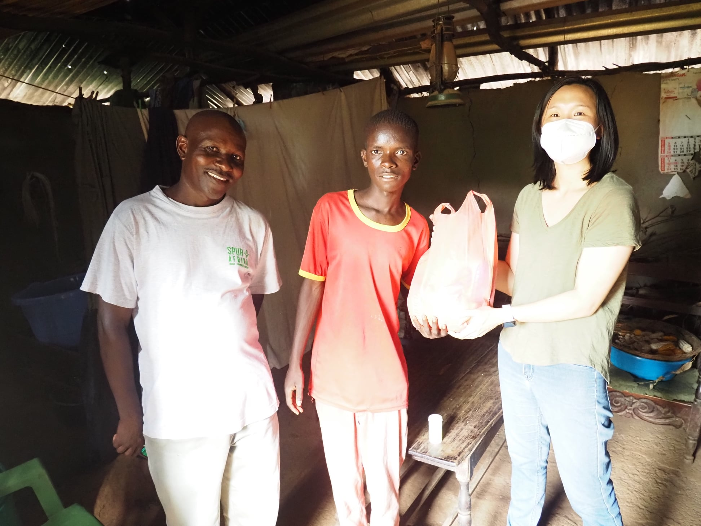

::: {.callout-note title="Updated September 2026"}
The original version of this code had two bugs. The gallery only looked right
because of a fallback.

- The fancybox stylesheet link had no version number, so it now loads a newer
  major version of the CSS (6.x) than the 4.0 script.
- The `data-isotope` settings weren't valid JSON. Inside an R string in single
  quotes, `\"` is just `"`, so the quotes around `columnWidth` ended the string
  early. The browser reported "Error parsing data-isotope", and isotope never
  started: the photos were only laid out by their `float: left` styles.

The code below fixes both. It sets isotope up with a short script instead of the
`data-isotope` attribute, so there is nothing to escape, and waits for the photos
to load before laying them out. If you copied the original, compare it with the
version below.
:::

The [Wowchemy theme](https://wowchemy.com/) (formerly Hugo Academic) can 'tile'
irregularly shaped posts in a grid, using the [Isotope](https://isotope.metafizzy.co/)
Javascript library. In [another post](/post/hugoacademicpagesascards/) I describe
how the 'cascading card' layout can be used in the Wowchemy's pages widget (used
for 'posts', 'talks' and 'publications'). Wouldn't it be nice to also use
the Isotope library for galleries within a post?

Another Javascript library, [fancybox](https://fancyapps.com/docs/ui/fancybox/) can
also be used for photo galleries. When a picture has a `data-fancybox` attribute, then
clicking on that photo results in a 'lightbox' view of the photo. Photos with the
same `data-fancybox` attribute can be seen in the same lightbox by clicking on
the right/left arrows, or using cursor keys.

The example below is taken from my [post on the topic of 'equity' after visiting
Kenya in 2021/2022](/post/kenya2021justice/), although that post now uses
Quarto's built-in figure layout and lightbox instead. The code shown below is encased
in a ```` ```{r} ... ``` ```` code chunk.


```r
htmltools::HTML(paste(
'<link
  rel="stylesheet"
  href="https://cdn.jsdelivr.net/npm/@fancyapps/ui@4.0/dist/fancybox.css"
/>', # for fancybox (same version as the script below)
'<script 
    src="https://cdn.jsdelivr.net/npm/@fancyapps/ui@4.0/dist/fancybox.umd.js">
 </script>', # for fancybox
'<script 
    src="https://unpkg.com/isotope-layout@3/dist/isotope.pkgd.min.js">
 </script>', # for isotope
'<script 
    src="https://unpkg.com/imagesloaded@5/imagesloaded.pkgd.min.js">
 </script>', # to wait for the photos before laying them out
'<div class="isotope-gallery" id="equity-gallery">',
'  <div class="grid-sizer" style="width: 1%"></div>',
'  <div class="isotope-grid-item" style="float:left; width: 48%">',
'    <a data-fancybox="gallery" href="./20220114_mothersandchildren.jpg">',
'      ', 
       # default CSS top/bottom margin is not zero
'    </a>',
'  </div>',
'  <div class="isotope-grid-item" style="float:left; width: 48%">',
'    <a data-fancybox="gallery" href="./20220114_consult.jpg">',
'      ',
'    </a>',
'  </div>',
'  <div class="isotope-grid-item" style="float:left; width: 53%">',
'    <a data-fancybox="gallery" href="./20220114_support.jpg">', 
'      ',
'    </a>',
'  </div>',
'  <div class="isotope-grid-item" style="float:left; width: 43%">',
'    <a data-fancybox="gallery" href="./20220114_disability.jpg">',
'      ',
'    </a>',
'  </div>',
'</div>',
'<br clear="left"><br>',
'<script>
  imagesLoaded("#equity-gallery", function () {
    new Isotope("#equity-gallery", {
      itemSelector: ".isotope-grid-item",
      percentPosition: true,
      masonry: { columnWidth: ".grid-sizer" }
    });
  });
</script>'
))
```

```{=html}
<link
  rel="stylesheet"
  href="https://cdn.jsdelivr.net/npm/@fancyapps/ui@4.0/dist/fancybox.css"
/> <script 
    src="https://cdn.jsdelivr.net/npm/@fancyapps/ui@4.0/dist/fancybox.umd.js">
 </script> <script 
    src="https://unpkg.com/isotope-layout@3/dist/isotope.pkgd.min.js">
 </script> <script 
    src="https://unpkg.com/imagesloaded@5/imagesloaded.pkgd.min.js">
 </script> <div class="isotope-gallery" id="equity-gallery">   <div class="grid-sizer" style="width: 1%"></div>   <div class="isotope-grid-item" style="float:left; width: 48%">     <a data-fancybox="gallery" href="./20220114_mothersandchildren.jpg">            </a>   </div>   <div class="isotope-grid-item" style="float:left; width: 48%">     <a data-fancybox="gallery" href="./20220114_consult.jpg">            </a>   </div>   <div class="isotope-grid-item" style="float:left; width: 53%">     <a data-fancybox="gallery" href="./20220114_support.jpg">            </a>   </div>   <div class="isotope-grid-item" style="float:left; width: 43%">     <a data-fancybox="gallery" href="./20220114_disability.jpg">            </a>   </div> </div> <br clear="left"><br> <script>
  imagesLoaded("#equity-gallery", function () {
    new Isotope("#equity-gallery", {
      itemSelector: ".isotope-grid-item",
      percentPosition: true,
      masonry: { columnWidth: ".grid-sizer" }
    });
  });
</script>
```


The first part loads the CSS and Javascript of `fancybox`, and the Javascript of
`isotope` and `imagesLoaded`. `isotope` has already been included by `Wowchemy`,
but it is not clear to me how to access that included Javascript code. Pin the
version of each library (`@4.0`, `@3`, `@5`), and use the same version for
fancybox's CSS and its script.

The gallery is a `div` with an `id` (here `equity-gallery`), so that the script at
the end can find it. Avoid the class name `grid` for it: Bootstrap 5, which many
themes use (including the one on this site), styles `.grid` as a CSS grid, which
interferes with isotope.

The script at the end waits until the photos have loaded (`imagesLoaded`), so
that their heights are known, and then starts `isotope` with these options:

* `itemSelector` defines the class of the divisions which contain gallery items,
here `isotope-grid-item`. Note the added `.` period at the beginning of the name,
as in a CSS selector.

* `masonry` is the default layout. It places each photo in the highest free
space, like bricks in a wall. Its options go in their own `{ ... }`:

  + `columnWidth` is the width of the element with the class `grid-sizer` (again
  note the `.`). That element is only 1% wide, so isotope can position photos
  in steps of 1% of the gallery width. (A full-width `grid-sizer` would give a
  single column, with one photo per row.)

  + a `gutter` (space between columns) can also be set here. In this example
  the widths already leave a small gap.

* `percentPosition: true` lets isotope position photos as percentages of the
gallery width, so the layout adapts to the width of the screen.

Setting isotope up in a script, rather than with a `data-isotope` attribute on
the `div`, means the options don't have to be written as JSON inside an HTML
attribute inside an R string. That is where the original version of this post
went wrong.

Each element in the grid which is part of the gallery needs to have a `class`
definition which is the same as defined by `itemSelector` as mentioned above.

In the `style` attribute, the `width` can be defined as a percentage. The percentage
does not need to add up to 100%. Adjusting the percentages can help 'line' up the
rows to be of equal height. The `float:left` style is only a fallback: if the
Javascript doesn't run, the photos still sit side by side. Once isotope runs, it
positions them itself.

The `data-fancybox` attribute in gallery items defines groups of photos as part
of the same lightbox display provided by `fancybox`.

In recent versions of [hugo](https://gohugo.io/), the `href` and `img src` of
included pictures can be in the same directory as the post itself.

The images themselves do not have a default margin of zero pixels. Zero pixel
margins can be defined with the `style` attribute of the images, along with
`display:block; width:100%` so that each photo fills its gallery item.


