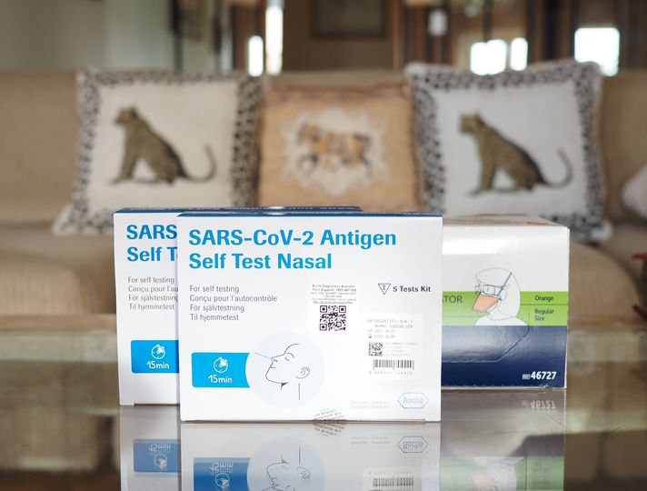

{fig-alt=""}

Although this [Spur Afrika](https://spurafrika.org/) Kenya Trip (25th December 2021 to 6th January 2022) has been planned
- in one form or another - for a while, the finalization of detail has been
something of a 'surprise'.

There has been not as much time to prepare as usual, I have been really touched by
the individual expressions and provision of support: in words, technical advice and
offers of practical assistance. Even to the extent of taking care of a
bunny rabbit (thanks R, V and P!). And sincere concern and measures to mitigate
the peculiar circumstances of the past two years.

(thanks J!)

[Spur Afrika trip 2021-2022 posts](/spurafrika2021/)