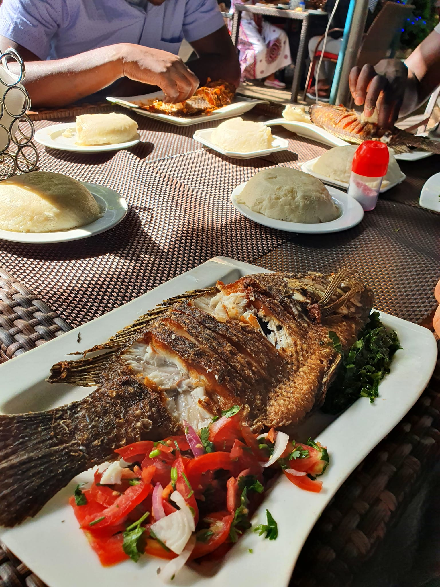
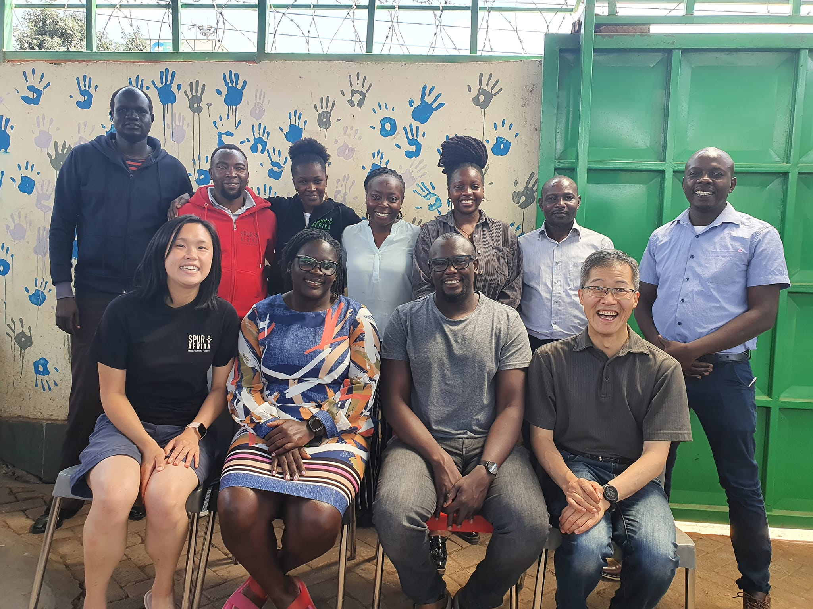
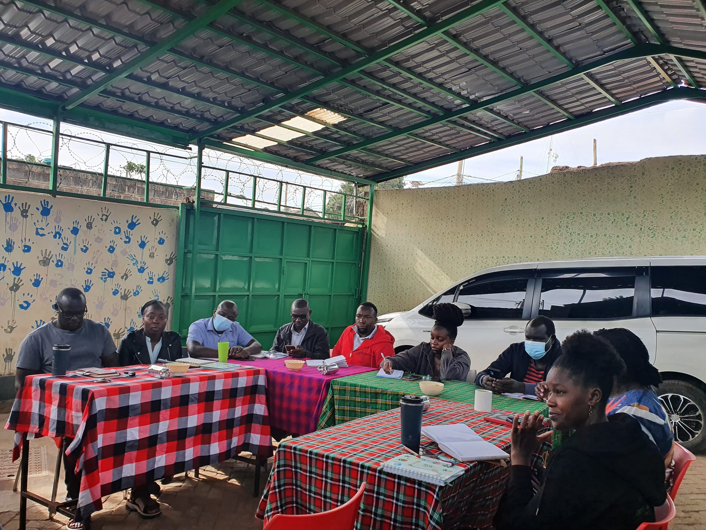
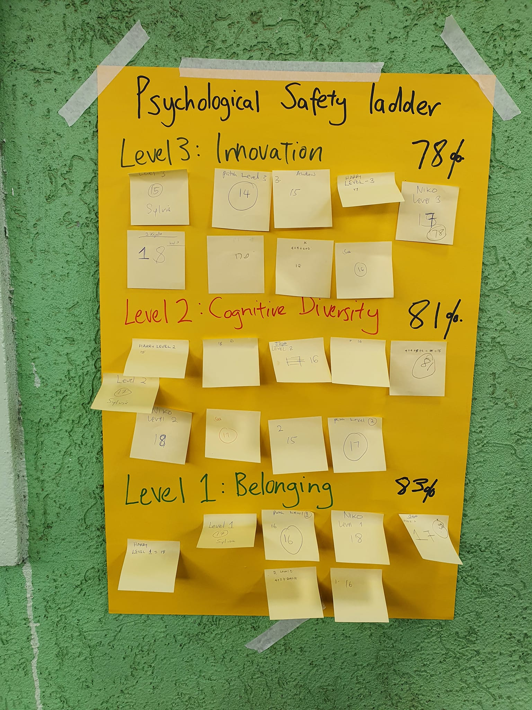
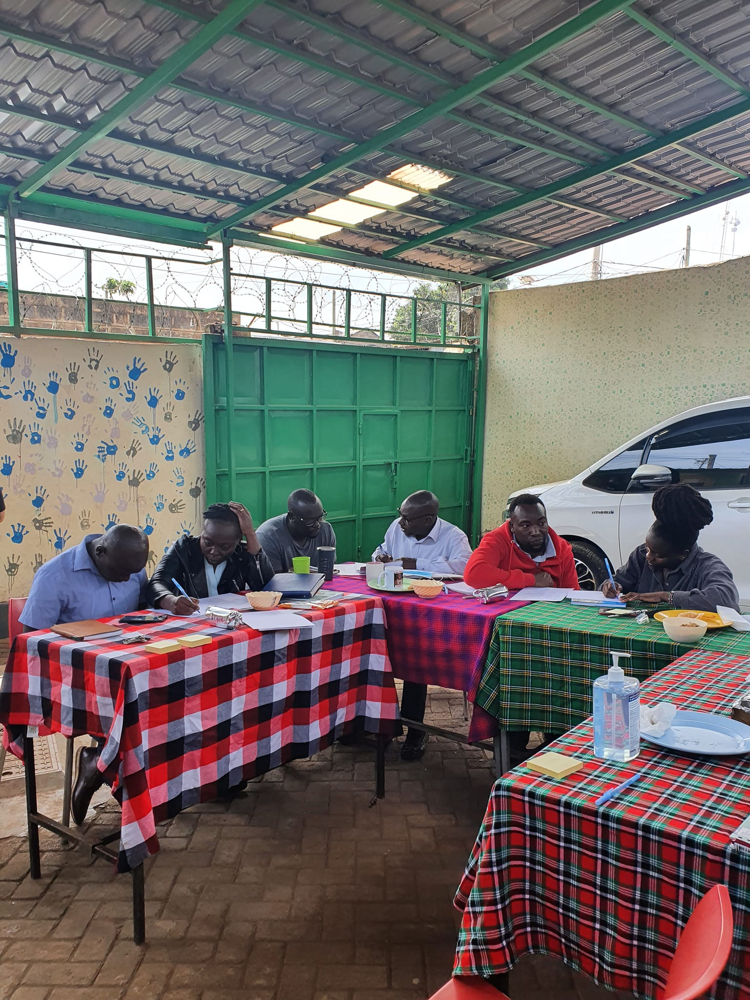
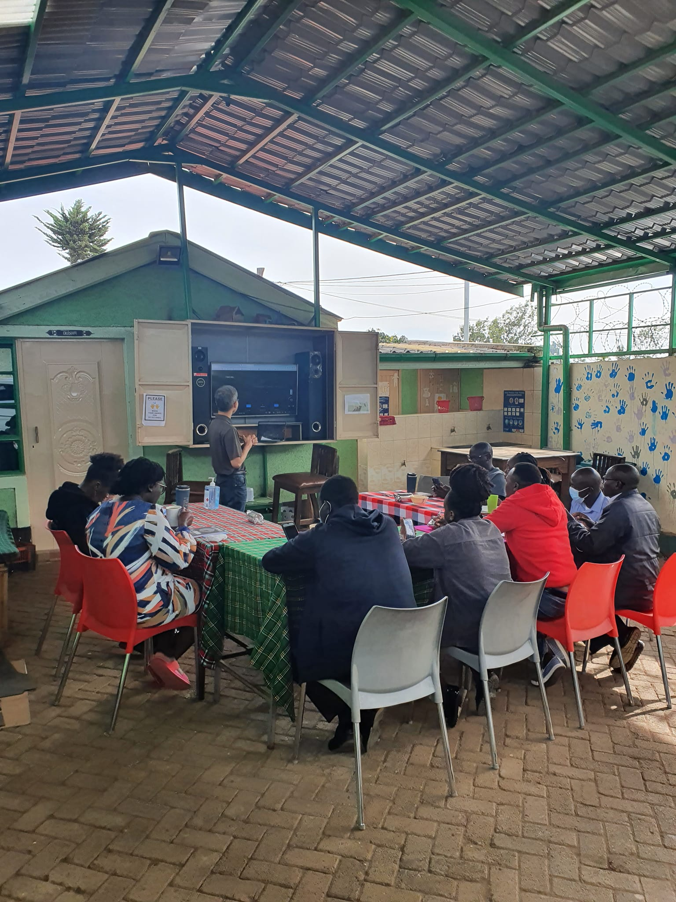

LAST DAY OF KENYA 🥲😭

We spent the morning training our Kenyan team. David spoke about monitoring and evaluation, in which the team did some quizzes on the phone. While Rosalie taught about what makes a efficient and effective team. We explored Spur millstones and created some new traditions to help the team celebrate success. 🥳

After the training, we had a team lunch of Kenyan fish! The team felt appreciated and our tummies were full. 😝

It was hard to say cya later to the Spur team. It's even harder to leave when you have formed great relationships.  It is really bitter-sweet to say, cya later. However, we know we have heaps to look forward to. My heart is very much full and we have a lot of work ahead of us. 🤩🤩🥰🥰

The Spur board also met and it was an encouraging time of reflection and planning. We are pleased with where Spur is heading but there are still many challenges in our way. We pray God will guide us accordingly. Your prayers would be greatly appreciated.🙏🏼🙏🏼

Tonight we get ready to board a plane to Doha and then Melbourne. It will take us over 33 hours. We pray for safety & smooth check in. We pray we have all the right documents and that we stay covid negative. Melbourne seems covid crazy at the moment so praying we can stay negative and that our results will come back soon so we can get out of quarantine.👌

Thank you for all your prayers and support. Praying you will all continue supporting Spur even when we at in Melbourne.  Please get in touch!! 👍
We will update when we get to Doha. We have 13 hours there.😁😄

[Spur Afrika trip 2021-2022 posts](/spurafrika2021/)

::: {layout="[[35,63],[63,36],[35,35,-30]]"}
{.lightbox group="kenya2021lastday"}

{.lightbox group="kenya2021lastday"}

{.lightbox group="kenya2021lastday"}

{.lightbox group="kenya2021lastday"}

{.lightbox group="kenya2021lastday"}

{.lightbox group="kenya2021lastday"}
:::

