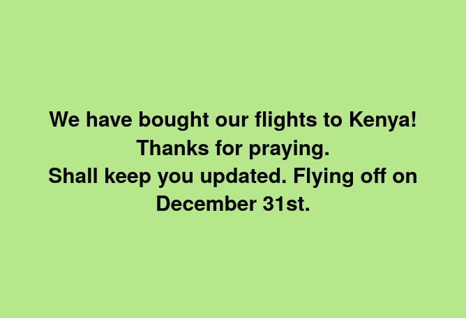

Hi Friends,

Who would have thought there would be so many changes in one year? I am thankful for all the changes, good and bad but it can be overwhelming. 😭🤣😅

We are so thankful to have the opportunity to go to Kenya again in 2023. There is A LOT going on, so we would love your support and prayer as we plan to not only for this trip but also a wedding. 💒👰️

Our first challenge is booking our flights. It seems expensive however we pray that God will give guidance and peace (when we finally book). Also, I am not feeling so well lately, so praying for energy and reliance on God (and the sense to say no when appropriate).

Praying that David and I will work well together and that we can work well with our Kenyan teams, both in Kibera and Kisumu. There are lots of HUGE (kinda SCARY) goals ahead for Spur and for ourselves, so we appreciate your prayers and support. 🙏🙏

Stay tuned for more updates, photos and stories (written badly by myself, or very creatively by David). 🤪😁

Love,

Written by Rosalie on behalf of us both 💚💚❤️❤️

[Spur Afrika trip 2023 posts](/spurafrika2023/)

{.lightbox}
