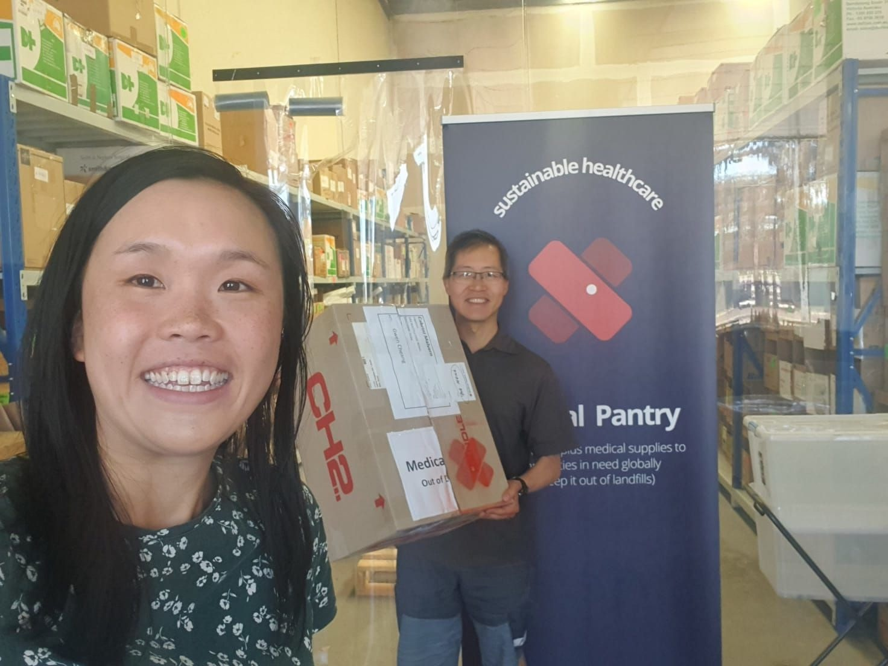

{fig-alt=""}

Thanks to the [Medical Pantry](https://medicalpantry.org/) for partnering with Spur Afrika to provide much needed basic treatment supplies for Spur Afrika's mobile clinics this coming January 2023.

Medical Pantry co-ordinates the collection and use of no-longer needed medical supplies to promote both sustainability and improved healthcare delivery.

Spur Afrika, its workers and partnering healthcare providers, will use these supplies to help treat some basic conditions - e.g. wound care - for those in the informal settlement (slum) of Nairobi as well as the poor rural areas of western areas in Kenya.

Thanks to Medical Pantry for supplying a 'coat' and 'fish' to global brothers and sisters in need! (James 2:15-16, Luke 11:11)

Rosalie and myself are leaving for Kenya soon (December 31st). Pray for our preparation and good health. And working transport (!!) as we do some final errands.

We are having some help soon with packing all the needed supplies, more on that later 😊! 

[Spur Afrika trip 2023 posts](/spurafrika2023/)
