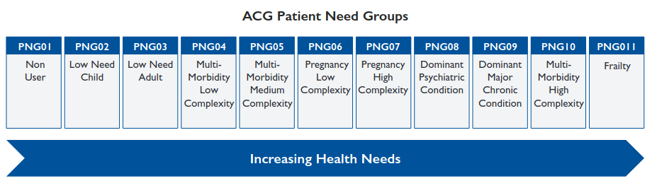
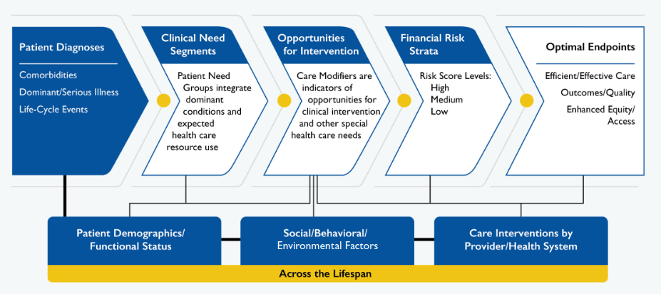
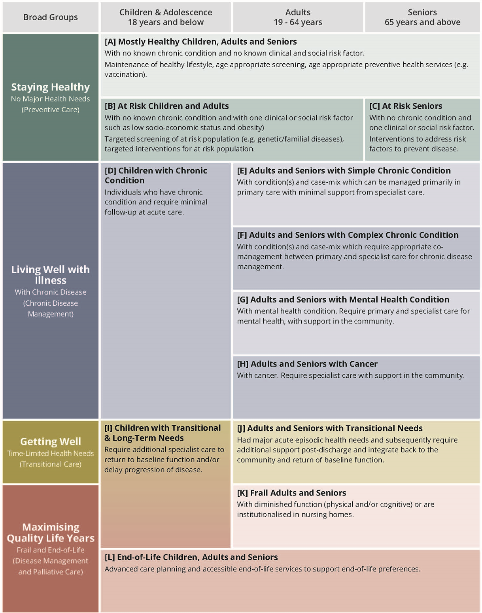
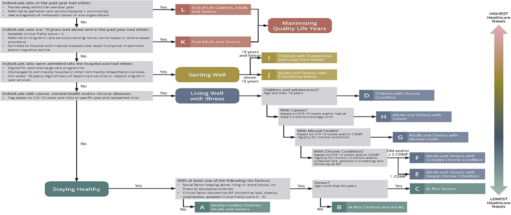

---
authors:
  - name: David Fong
bibliography: references.bib
pdf-engine: xelatex
format:
  html: 
    title: "Patient complexity and Patient needs"
    toc: true
    csl: ieee.csl
    citation-location: margin
    other-links:
      - text: "David Fong homepage"
        icon: house
        href: https://www.davidfong.org/
  PrettyPDF-pdf:
    title: "Patient complexity and Patient needs\\vspace{-1.5ex}"
    keep-tex: false
    papersize: a4
    csl: diabetologia.csl
    fig-pos: "H"

# pdf:
#   keep-tex: true
#   documentclass: scrartcl
#   papersize: a4
#   geometry:
#     - top=10mm
#     - left=20mm
#     - right=20mm
#     - bottom=20mm
#   include-in-header:
#     text: |
#       \addtokomafont{author}{\raggedright\setlength{\tabcolsep}{0pt}}
#       \addtokomafont{title}{\raggedright\small}
#       \KOMAoptions{headings=small}
---

The concept of *patient complexity* is intuitive to most primary care clinicians, but difficult to define in an agreed precise manner [@nicolaus2022]. Often complexity is linked to an arbitrary - if significant - outcome such as hospital admission risk, based predominantly on medical risk factors [@hudson2014; @islam2024]. However, clinicians typically experience complexity as consultations that are multi-faceted, time-consuming, shaped by psychological, socio-economic and systemic factors and with multiple - sometimes problematic - interactions between patient, multiple health care providers and community [@salisbury2021; @deoliveira2022; @nicolaus2022]. Some define complexity as the *gap between an individual's needs and the capacity of the healthcare system to answer those needs* [@grembowski2014]. Greater complexity often corresponds with higher overall healthcare use and social support needs [@nicolaus2022].

Several reporting tools for general practice electronic medical records (EMRs) measure patient complexity for reporting to Primary Health Networks (PHNs). The PHN Performance and Quality Framework includes indicator 'P12', which tracks potentially preventable hospitalisation [@primary2018].

-   [PenCS](https://www.pencs.com.au/) incorporates a CSIRO developed tool using logistic regression to predict hospitalisation using Australian general practice EMR data. Tool workings and development is well-documented and transparent [@khanna2019]. The authors are happy to share the methodology *exactly* for non-profit purposes. It may be possible to adapt the tool to other outcomes.

-   [POLAR](https://www.outcomehealth.org.au/services/polar/) uses the *Diversion 2* tool, developed using machine learning techniques with demographic, diagnoses, medication, pathology and measurement data extracted from general practices with GRHANITE and linked with hospital admission data [@southwesternsydneyphn2023; @pearce2017].

-   [Primary Sense](https://www.primarysense.org.au/) integrates the extensively developed, international and proprietary [John Hopkins ACG System](https://www.hopkinsacg.org/) [@goldcoastprimaryhealthnetwork; @primarysense]. The John Hopkins ACG system has been used to estimate current and likely future care needs in primary care, including more equitable funding of general practices in the NHS [@shepherd2023; @shepherd2025]. However, the use of John Hopkins ACG in Primary Sense is limited to the risk of hospital admission. John Hopkins ACG uses *patient segmentation* to group patients into relatively homogenous groups with similar care needs based on medical and socio-economic characteristics [@johnhopkinsacgsystem; @johnshopkinsacgsystem; @johnshopkinsacgsystema] (@fig-JohnHopkinsPatientNeedsGroups).

Opportunities

-   Patient segmentation - with social need and other modifiers for special care needs - has potential value in primary care settings to predict and provide services tailored towards behavioural, clinical or demographic drivers of health over and above predictors based on a single score [@thelearninghealthsystemseries2017; @johnhopkinsacgsystem; @lynn2007; @johnshopkinsacgsystema] (@fig-JohnHopkins_CareModifiers). The patient segmentation approach has been adapted for diverse populations, including in Southeast Asia [@ang2025] ([Figures @fig-HealthScopes], [-@fig-HealthScopes_Classification]).

-   Predictive models for specific outcomes within patient segments might improve predictive power, as both patient needs and importance of specific risk-factors varies between patient segments [@langton2020].

-   Alternative intermediate outcomes, e.g. primary care visit frequency and duration or corespondence volume, could be explored [@deoliveira2022].

## Figures

[{#fig-JohnHopkinsPatientNeedsGroups}](https://www.hopkinsacg.org/wp-content/uploads/2022/08/Johns-Hopkins-ACG-System_v13.0_PNG-Overview-v080322.pdf)

[{#fig-JohnHopkins_CareModifiers}](https://www.hopkinsacg.org/wp-content/uploads/2022/08/Johns-Hopkins-ACG-System_v13.0-PNG-Thought-Leadership-v080822.pdf)

[{#fig-HealthScopes}](https://doi.org/10.1371/journal.pone.0317016.g001)

[{#fig-HealthScopes_Classification}](https://journals.plos.org/plosone/article/figure?id=10.1371/journal.pone.0317016.g002)

:::: {.content-hidden when-format="html"}
## References

::: {#refs}
:::
::::
