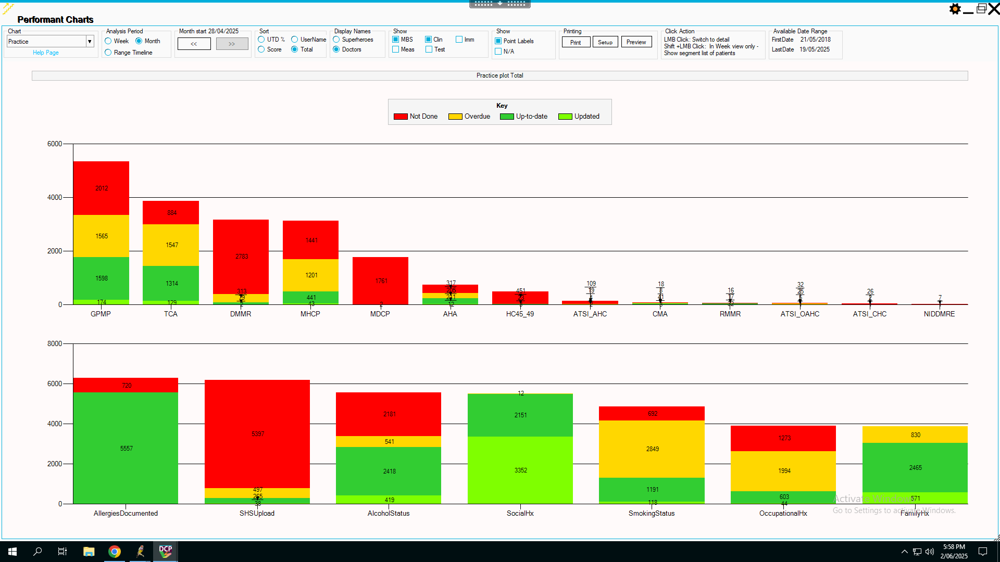
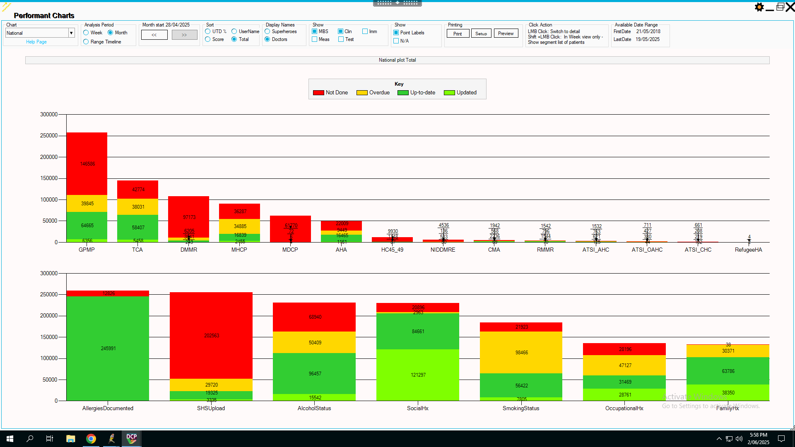

```{r}
#| message: false
#| warning: false

library(dplyr)
library(tidyr)
library(lme4)
library(table1)
library(flextable)
library(officer)
library(ggplot2)
library(highcharter)
library(effects)
library(modelsummary)
library(wesanderson)
```

```{r}
# see Appendix 1 for the derivation of these numbers
# number of mental health care plans, cohealth and 'other'
n_mhcp_cohealth <- 43+441 
n_mhcp_other <- 2455 + 16839

# number of patients with mental health conditions
n_mentalhealth_cohealth <- 43+441+1201+1441
n_mentalhealth_other <- 2455+16839+34885+36287

# total number of patients
n_total_cohealth <- 5557+720
n_total_other <- 245991+12826
```

## Introduction

cohealth, a community health service in inner-west urban Melbourne, has a relatively high proportion of patients with mental health conditions. According to statistics derived from a clinical decision support tool ([Doctor's Control Panel](https://www.doctorscontrolpanel.com.au/), `{r} sprintf("%0.1f%%", n_mentalhealth_cohealth/n_total_cohealth*100)` of patients consulted by cohealth clinics in the four weeks from 28th April 2025 are eligible for a mental health care plan (i.e. have a recorded mental health condition), compared to a national average of `{r} sprintf("%0.1f%%", n_mentalhealth_other/n_total_other*100)` nationally among practices which use Doctor's Control Panel (see @sec-appendix-mhcpeligible).

That cohealth medical clinic patients have a relatively high proportion of mental health conditions is consistent with other available statistics. At one of the cohealth general practice sites, Kensington, approximately `{r} sprintf("%0.1f%%", 52/774*100)` of consultations (52 of 774[^PenCSlofreq]) are with patients who have a recorded low-frequency mental health condition (schizophrenia or bipolar affective disorder) compared to the Australian general practice average of 0.5%[^BEACH]. To help meet the needs of cohealth patients with mental health conditions, cohealth medical clinics work closely and co-operatively with area mental health services (e.g. [Inner West Area Mental Health Service](https://vahi.vic.gov.au/mental-health-services/inner-west-adult-area-mental-health-service)) and cohealth clinics also employ mental health nurses through the Primary Health Network [CAREinMIND](https://nwmphn.org.au/our-work/mental-health/careinmind-mental-health-services/) program.

[^PenCSlofreq]: [PenCS](https://www.pencs.com.au/) data extract, Kensington clinic, 1st June 2025. 'Consultation' defined as those who (according to PenCS) have had a visit in the month of May 2025, having been billed at least one of the standard and common Medicare item numbers (3, 23, 36, 44, 123, 2713, 91890,91891, 721, 723, 732, 701, 703, 705, 707, 2700, 2701, 2712, 2715, 2717). Each patient can only be counted once during the specified time period (one month).

[^BEACH]: “[General practice activity in Australia 2015-2016](https://www.sydney.edu.au/medicine-health/our-research/research-centres/bettering-the-evaluation-and-care-of-health/publication.html)”, Sydney University Press, 2016.  

```{r}
# Data for the first plot
# patients with a recorded mental health condition
df1 <- data.frame(
  Clinic = c("cohealth", "Other clinics"),
  Percentage = c(
    round(n_mentalhealth_cohealth/n_total_cohealth * 100, 1),
    round(n_mentalhealth_other/n_total_other * 100, 1)
  )
)

# Data for the second plot
# consults with patients who have a low-frequency mental health condition
df2 <- data.frame(
  Clinic = c("cohealth, Kensington", "Other clinics"),
  Percentage = c(round(52/774*100, 1), 0.5)
)

# Choose a Wes Anderson palette (e.g., 'Rushmore')
palette <- wes_palette("Darjeeling1", 2, type = "discrete")

hc1 <- highchart() %>%
  hc_chart(type = "column") %>%
  hc_title(text = "Patients with Recorded Mental Health Condition") %>%
  hc_xAxis(categories = df1$Clinic) %>%
  hc_yAxis(title = list(text = "Proportion (%)")) %>%
  hc_add_series(
    name = "Proportion",
    data = df1$Percentage,
    colorByPoint = TRUE,
    colors = palette
  ) %>%
  hc_tooltip(pointFormat = "<b>{point.y}%</b>") %>%
  hc_legend(enabled = FALSE)

# Second highcharter plot
hc2 <- highchart() %>%
  hc_chart(type = "column") %>%
  hc_title(text = "Proportion of consultations with patients with recorded Low-Frequency Mental Health Disorder") %>%
  hc_xAxis(categories = df2$Clinic) %>%
  hc_yAxis(title = list(text = "Proportion (%)")) %>%
  hc_add_series(
    name = "Proportion",
    data = df2$Percentage,
    colorByPoint = TRUE,
    colors = palette
  ) %>%
  hc_tooltip(pointFormat = "<b>{point.y}%</b>") %>%
  hc_legend(enabled = FALSE)
```

```{r}
#| layout-ncol: 2
 
hc1
hc2
```

Although cohealth consults a high proportion of patients with recorded mental health conditions and are potentially eligible for mental health care plans (MHCP), a relatively small proportion of those patients have had - and been billed - an 'up-to-date' care plan i.e. within the past twelve months. At cohealth, `{r} sprintf("%0.1f%%", n_mhcp_cohealth/n_mentalhealth_cohealth*100)` of eligible patients have an up-to-date care plan, compared to `{r} sprintf("%0.1f%%", n_mhcp_other/n_mentalhealth_other*100)` nationally (see @sec-appendix-mhcpeligible). The proportion of all patients at cohealth who have an up-to-date mental health care plan (`{r} sprintf("%0.1f%%", n_mhcp_cohealth/n_total_cohealth*100)`) is almost indistinguishable from the proportion of other clinics (`{r} sprintf("%0.1f%%", n_mhcp_other/n_total_other*100)`).

```{r}
# Data for the first plot
# patients eligible for MHCP who have an up-to-date MHCP
df1 <- data.frame(
  Clinic = c("cohealth", "Other clinics"),
  Percentage = c(
    round(n_mhcp_cohealth/n_mentalhealth_cohealth * 100, 1),
    round(n_mhcp_other/n_mentalhealth_other * 100, 1)
  )
)

# Data for the second plot
# all patients, proportion who have an up-to-date MHCP
df2 <- data.frame(
  Clinic = c("cohealth", "Other clinics"),
  Percentage = c(
    round(n_mhcp_cohealth/n_total_cohealth * 100, 1),
    round(n_mhcp_other/n_total_other * 100, 1)
  )
)

# Choose a Wes Anderson palette (e.g., 'Rushmore')
palette <- wes_palette("Darjeeling1", 2, type = "discrete")

hc1 <- highchart() %>%
  hc_chart(type = "bar") %>%
  hc_title(text = "Eligible patients with an up-to-date mental health care plan (MHCP)") %>%
  hc_xAxis(categories = df1$Clinic) %>%
  hc_yAxis(title = list(text = "Proportion (%)")) %>%
  hc_add_series(
    name = "Proportion",
    data = df1$Percentage,
    colorByPoint = TRUE,
    colors = palette
  ) %>%
  hc_tooltip(pointFormat = "<b>{point.y}%</b>") %>%
  hc_legend(enabled = FALSE)

# Second highcharter plot
hc2 <- highchart() %>%
  hc_chart(type = "bar") %>%
  hc_title(text = "Proportion of all patients with an up-to-date mental health care plan (MHCP)") %>%
  hc_xAxis(categories = df2$Clinic) %>%
  hc_yAxis(title = list(text = "Proportion (%)")) %>%
  hc_add_series(
    name = "Proportion",
    data = df2$Percentage,
    colorByPoint = TRUE,
    colors = palette
  ) %>%
  hc_tooltip(pointFormat = "<b>{point.y}%</b>") %>%
  hc_legend(enabled = FALSE)
```

```{r}
#| layout-ncol: 2

hc1
hc2
```

Why, despite the high prevalence of mental health conditions among cohealth clinic patients, do cohealth general practice clinics do - and bill - relatively few mental health care plans? 

cohealth clinics have - in some ways - more mental health support in the form of on-site counselling (through mental health nurses and social workers) and close liaison with area mental health services compared to many other Australian general practices.


The number of MHCP-eligible patients at coHealth who were billed MHCPs in the previous twelve months were divided into groups according to concession card holder patients (either health care card 'HCC' or pension card) and high-prevalence and low-prevalence mental health disorders.

It is postulated that concession card holders have lower financial resources and are less able to utilise the government subsidies unlocked by MHCP plans for private psychology. This is because private psychology fees are far greater than the government subsidy to use private psychology.

Mental health conditions can be broadly divided into low- and high- frequency mental health conditions. High-frequency mental health conditions are the common mental health conditions such as anxiety and depression. Low-frequency mental health conditions are the less common, and often more serious and lifelong conditions, of schizophrenia and bipolar affective disorder. It is postulated that patients with low-prevalence mental health disorders have more severe mental health conditions and are at greater need of mental health assessments and services.

```{r}
# outcome
#   counts of patients who have had, in the past year:
#     mhcp- mental health care plan e.g. MBS item 2715, 2717
#     mh2713 - general practitioner mental health consult i.e. MBS item 2713
#     gpmp - general practitioenr chronic disease care plan i.e. MBS item 721
# 
# predictors
#   concession - false = no, true = yes
#   mental health condition - "high" = high-frequency, "low" = low-frequency
# 
# random effects
#   (not considered to be a predictor of interest)
#   clinic - the clinic's name, a categorical variable

# the initial data was created as counts (i.e. aggregated data)
# the original patient data can be recreated from the counts

summary_df <- tibble(
  concession = logical(),
  condition = factor(),
  clinic = character(),
  total = integer(), # number in this patient category (concession, condition, clinic) occurs
  mhcp = integer(), # number who had a mental health care plan (MHCP e.g. 2715/2717)
  mh2713 = integer(), # number who had a billed GP mental health consult (MBS item 2713)
  gpmp = integer() # number who had a chronic disease management plan (MBS item 721)
)

summary_df <- summary_df |>
  add_row(concession = TRUE, condition = "high", clinic = "Kensington", total = 285, mhcp = 42, mh2713 = 13, gpmp = 109) |>
  add_row(concession = TRUE, condition = "low", clinic = "Kensington", total = 73, mhcp = 7, mh2713 = 7, gpmp = 33) |>
  add_row(concession = FALSE, condition = "high", clinic = "Kensington", total = 84, mhcp = 9, mh2713 = 4, gpmp = 19) |>
  add_row(concession = FALSE, condition = "low", clinic = "Kensington", total = 8, mhcp = 2, mh2713 = 0, gpmp = 3) |>
  add_row(concession = TRUE, condition = "high", clinic = "Paisley", total = 430, mhcp = 26, mh2713 = 42, gpmp = 164) |>
  add_row(concession = TRUE, condition = "low", clinic = "Paisley", total = 123, mhcp = 13, mh2713 = 10, gpmp = 58) |>
  add_row(concession = FALSE, condition = "high", clinic = "Paisley", total = 131, mhcp = 21, mh2713 = 14, gpmp = 26) |>
  add_row(concession = FALSE, condition = "low", clinic = "Paisley", total = 8, mhcp = 1, mh2713 = 0, gpmp = 4) |>
  add_row(concession = TRUE, condition = "high", clinic = "Laverton", total = 79, mhcp = 14, mh2713 = 6, gpmp = 32) |>
  add_row(concession = TRUE, condition = "low", clinic = "Laverton", total = 38, mhcp = 10, mh2713 = 15, gpmp = 18) |>
  add_row(concession = FALSE, condition = "high", clinic = "Laverton", total = 43, mhcp = 7, mh2713 = 1, gpmp = 16) |>
  add_row(concession = FALSE, condition = "low", clinic = "Laverton", total = 4, mhcp = 1, mh2713 = 1, gpmp = 1) |>
  add_row(concession = TRUE, condition = "high", clinic = "Collingwood", total = 346, mhcp = 35, mh2713 = 17, gpmp = 88) |>
  add_row(concession = TRUE, condition = "low", clinic = "Collingwood", total = 87, mhcp = 5, mh2713 = 10, gpmp = 20) |>
  add_row(concession = FALSE, condition = "high", clinic = "Collingwood", total = 88, mhcp = 14, mh2713 = 4, gpmp = 17) |>
  add_row(concession = FALSE, condition = "low", clinic = "Collingwood", total = 6, mhcp = 1, mh2713 = 0, gpmp = 1) |>
  add_row(concession = TRUE, condition = "high", clinic = "Fitzroy", total = 445, mhcp = 74, mh2713 = 29, gpmp = 94) |>
  add_row(concession = TRUE, condition = "low", clinic = "Fitzroy", total = 165, mhcp = 18, mh2713 = 13, gpmp = 38) |>
  add_row(concession = FALSE, condition = "high", clinic = "Fitzroy", total = 91, mhcp = 20, mh2713 = 2, gpmp = 14) |>
  add_row(concession = FALSE, condition = "low", clinic = "Fitzroy", total = 10, mhcp = 3, mh2713 = 1, gpmp = 1)
```

## Mental health care plans

```{r}
# duplicate rows according to the weighting 'mhcp',
# hence "re-creating" the original patient-level data from the counts
mhcp <- summary_df |>
  # duplicate rows by number of mental health care plans (mhcp)
  uncount(mhcp) |>
  # add back mhcp column to a logical
  mutate(mhcp = TRUE) |> 
  # don't need 'total' column any more
  select(concession, condition, clinic, mhcp) |>
  bind_rows(
    # do the same, except
    # now duplicate rows by number who do not have mental health care plans
    summary_df |>
      mutate(no_mhcp = total - mhcp) |>
      uncount(no_mhcp) |>
      mutate(mhcp = FALSE) |>
      select(concession, condition, clinic, mhcp)
  )
  
label(mhcp$mhcp) = "Mental Health Plan"
label(mhcp$concession) = "Concession card"
label(mhcp$condition) = "Condition frequency"

table1(
  x = ~ mhcp + concession + Condition | clinic,
  data = mhcp |>
    mutate(Condition = factor(condition, label = c("High-prevalence", "Low-prevalence"))),
  overall = c(left = "Total")
  ) |>
  t1flex(tablefn = "flextable", cwidth = 0.85) |>
  fontsize(size = 9, part = "all") |>
  footnote(i = 1, j = 1, value = as_paragraph("Mental health care plans (claimed in the previous twelve months), concession card status and High- vs Low- frequency mental health conditions."), ref_symbols = "a", part = "body") |>
  footnote(i = 1, j = 2, value = as_paragraph("coHealth clinics, May 2025, 'active' patients"), part = "header")
```


Concession card holders (with either high-prevalence or low-prevalence mental health conditions) have lower annual rates of mental health care plans billing (11.8% vs 16.7%). 

```{r}
table1(
  x = ~ mhcp | concession,
  data = mhcp |>
    mutate(concession = factor(concession, levels = c(FALSE, TRUE), label = c("No Concession", "Concession"))),
  overall = FALSE
) |>
  t1flex(tablefn = "flextable") |>
  width(width = 2) |>
  fontsize(size = 9, part = "all") |>
  footnote(i = 1, j = 1, value = as_paragraph("Mental health care plans and Concession card status"), ref_symbols = "a", part = "body") |>
  footnote(i = 1, j = 2, value = as_paragraph("coHealth clinics, May 2025, 'active' patients"), part = "header")
```

Low-prevalence conditions (schizophrenia and bipolar affective disorder) are often severe and lifelong mental health conditions. Patients with schizophrenia and bipolar affective disorder can benefit from psychological therapies. If mental health care plans were done on the basis of need, it would be expected that more patients with low-prevalence conditions would have mental health care plans compared to patients with high-prevalence mental health conditions. People with low-prevalence conditions have a similar, if slightly lower, rate of mental health care plans than those with high-prevalence conditions (11.7% vs 13.0%).

```{r}
table1(
  x = ~ mhcp | condition,
  data = mhcp |>
    mutate(condition = factor(condition, label = c("High-prevalence", "Low-prevalence"))),
  overall = FALSE
) |>
  t1flex(tablefn = "flextable") |>
  width(width = 2) |>
  fontsize(size = 9, part = "all") |>
  footnote(i = 1, j = 1, value = as_paragraph("Mental health care plans and High- vs Low- prevalence mental health conditions"), ref_symbols = "a", part = "body") |>
  footnote(i = 1, j = 2, value = as_paragraph("coHealth clinics, May 2025, 'active' patients"), part = "header")
```

```{r}
# the basic model
model_mhcp <- glm(
  mhcp ~ concession + condition,
  family = binomial(link = "logit"),
  data = mhcp
)

# add clinic as a random effect
model_mhcp_effects <- glmer(
  mhcp ~ concession + condition + (1|clinic),
  family = binomial(link = "logit"),
  data = mhcp
)

# in this case, using 'clinic' as a random effect makes little difference to the model
```

Probability comparison

```{r}
plot(effects::allEffects(model_mhcp_effects))
```

```{r}
# personalised flextable theme

my_flextable_theme <- function(x, ...) {
    if (!inherits(x, "flextable")) {
        stop(sprintf("Function `%s` supports only flextable objects.", 
            "theme_alafoli()"))
    }
    #fp_bdr <- officer::fp_border(width = flextable_global$defaults$border.width, 
    #  color = flextable_global$defaults$border.color)
    x <- border_remove(x) |>
      bg(bg = "transparent", part = "all") |>
      color(color = "#000000", part = "all") |>
      # the header text bold
      bold(bold = TRUE, part = "header") |>
      italic(italic = FALSE, part = "all") |>
      padding(padding = 3, part = "all") |>
      align_text_col(align = "left", header = TRUE) |>
      # the first header row is centered text
      align(i = 1, align = "center", part = "header") |>
      align_nottext_col(align = "right", header = TRUE) |>
      # make first column wider
      width(j = 1, width = 1.5) |>
      # thin horizontal line between models and other column headers
      hline(i = 1, j = 2:7, border = officer::fp_border(color = "grey", width = 0.5), part = "header") |>
      hline_bottom(part = "header") |>
      hline_top(part = "body") |>
      # place horizontal line below fourth row
      hline(i = 4, border = officer::fp_border(color = "grey", width = 0.5), part = "body") |>
      hline_bottom(part = "body") |>
      fix_border_issues()
}

```

```{r}
#| message: false
#| warning: false

label(mhcp$condition) = "condition"

table_mhcp_model <- modelsummary(
  models = list(
    "Logistic model" = model_mhcp,
    "Logistic model - clinic random effect" = model_mhcp_effects
  ),
  estimate = c("Odds ratio" = "{estimate}"),
  coef_rename = c(
    "concessionTRUE" = "Concession holder",
    "conditionlow" = "Low-frequency condition"
  ),
  shape = term ~ model + statistic,
  exponentiate = TRUE,
  statistic = c("CI (95%)" = "[{conf.low}, {conf.high}]", "p" = "{p.value}"),
  output = "flextable"
  ) |>
  my_flextable_theme() |>
  add_footer_lines(
    paste(
      "The odds ratio of having been billed a mental health care plan,",
      "according to concession card status and low-vs-high prevalence mental health condition",
      "(coHealth GP clinics, May 2025)"
    )
  )

table_mhcp_model
```

## Mental health consultations (MBS Item '2713')

Do patients with mental health conditions *and* a concession card not only have less mental health care plans billed in general practice, but *also* have less mental health care delivered by those general practitioners?

Are there any other potential ways to measure mental health care delivery in general practice?

Potential measurements:

1. Examination of 'reasons for consult' in general practice electronic medical record (EMR) notes
   i) Relatively easy to do, as reasons for consult are part of 'structured data' within the EMR
2. Examination of the electronic medical record (EMR) consultation notes
   i) More difficult to do than option (1), but can be done with basic natural language processing (NLP)
3. Examination of other billing items associated with mental health care

Unfortunately, although options (1) and (2) are relatively easy to perform with a basic database search and simple application of data science, only option (3) is currently available for use to clinicians at cohealth.

There *is* another billing item associated with mental health care, which is the [general practitioner attendance in relation to a mental health disorder, Medicare Benefit Schedule - Item 2713](https://www9.health.gov.au/mbs/fullDisplay.cfm?type=item&q=2713). Unfortunately, MBS item 2713 is little used. Item 2713 has a requirement for minimum consultation length of 20 minutes, and has a rebate value of $81.70. 

However, there is an alternative item number which can also be claimed if a consult is between 20 to 40 minutes in length, [the level 'C' consult, Medicare Benefit Schedule - Item 36](https://www9.health.gov.au/mbs/fullDisplay.cfm?type=item&q=36&qt=item), which has a rebate value of $82.90. In almost all cases where an item 2713 could be claimed, an item 36 could be claimed instead, with greater revenue than an item 2713.

This is even more the case when a patient has a concession card, as there is a bulk-billing incentive payment for item 36 which is at least $14 more (depending on the practice's 'MMM' location) than the bulk-biling incentive payment for an item 2713.

Nevertheless, occasionally general practitioners *do* claim an item 2713. One possible reason is because it - depending on the duration and content of the consult - it is sometimes possible to 'co-bill' an item 2713 with a standard consult item (such as level B or C consult).

Are concession card holders, or patients living with low-frequency mental health disorders, billed the general practice mental health item '2713' the same, more, or less than patients without concession card holders at cohealth clinics?

```{r}
# duplicate rows according to the weighting 'mh2713',
# hence "re-creating" the original patient-level data from the counts
mh2713 <- summary_df |>
  # duplicate rows by number of mental health GP consults (mh2713)
  uncount(mh2713) |>
  # add back mhcp column to a logical
  mutate(mh2713 = TRUE) |> 
  # don't need 'total' column any more
  select(concession, condition, clinic, mh2713) |>
  bind_rows(
    # do the same, except
    # now duplicate rows by number who do not have mental health care plans
    summary_df |>
      mutate(no_mh2713 = total - mh2713) |>
      uncount(no_mh2713) |>
      mutate(mh2713 = FALSE) |>
      select(concession, condition, clinic, mh2713)
  )
  
label(mh2713$mh2713) = "Mental Health GP Consult"
label(mh2713$concession) = "Concession card"
label(mh2713$condition) = "Condition frequency"

table1(
  x = ~ mh2713 | clinic,
  data = mh2713 |>
    mutate(condition = factor(condition, label = c("High-prevalence", "Low-prevalence"))),
  overall = c(left = "Total")
) |>
  t1flex(tablefn = "flextable", cwidth = 0.85) |>
  fontsize(size = 9, part = "all") |>
  footnote(i = 1, j = 1, value = as_paragraph("Mental health GP consultations, claimed in the previous twelve months"), ref_symbols = "a", part = "body") |>
  footnote(i = 1, j = 2, value = as_paragraph("coHealth clinics, May 2025, 'active' patients"), part = "header")

```

```{r}
table1(
  x = ~ mh2713 | concession,
  data = mh2713 |>
    mutate(concession = factor(concession, levels = c(FALSE, TRUE), label = c("No Concession", "Concession"))),
  overall = FALSE
) |>
  t1flex(tablefn = "flextable") |>
  width(width = 2) |>
  fontsize(size = 9, part = "all") |>
  footnote(i = 1, j = 1, value = as_paragraph("Mental health GP consultations, claimed in the previous twelve months"), ref_symbols = "a", part = "body") |>
  footnote(i = 1, j = 2, value = as_paragraph("coHealth clinics, May 2025, 'active' patients"), part = "header")
```

```{r}
# the basic model
model_mh2713 <- glm(
  mh2713 ~ concession + condition,
  family = binomial(link = "logit"),
  data = mh2713
)

# add clinic as a random effect
model_mh2713_effects <- glmer(
  mh2713 ~ concession + condition + (1|clinic),
  family = binomial(link = "logit"),
  data = mh2713
)

label(mh2713$condition) = "condition"
```

```{r}
plot(effects::allEffects(model_mh2713_effects))
```


## Chronic disease management plans (MBS item '721')

Another potential indicator of care provision, using billing data, is the billing of [general practitioner chronic disease management plans, Medicare Benefit Schedule item 721](https://www9.health.gov.au/mbs/fullDisplay.cfm?type=item&q=721). Chronic disease management plans are the purpose of planning, setting goals, coordinating and reviewing an ongoing chronic condition (present for more than six months or expected to be present for more than six months). People living with mental health conditions, particularly low-frequency mental health conditions and those living with socio-economic disadvantage are more likely to live with both chronic health conditions and experience disability as the result of those conditions.

```{r}
# duplicate rows according to the weighting 'gpmp',
# hence "re-creating" the original patient-level data from the counts
gpmp<- summary_df |>
  # duplicate rows by number of GP chronic disease management plans (gpmp)
  uncount(gpmp) |>
  # add back mhcp column to a logical
  mutate(gpmp = TRUE) |> 
  # don't need 'total' column any more
  select(concession, condition, clinic, gpmp) |>
  bind_rows(
    # do the same, except
    # now duplicate rows by number who do not have mental health care plans
    summary_df |>
      mutate(no_gpmp = total - gpmp) |>
      uncount(no_gpmp) |>
      mutate(gpmp = FALSE) |>
      select(concession, condition, clinic, gpmp)
  )
  
label(gpmp$gpmp) = "Chronic Disease Management Plan"
label(gpmp$concession) = "Concession card"
label(gpmp$condition) = "Condition frequency"

table1(
  x = ~ gpmp | clinic,
  data = gpmp |>
    mutate(condition = factor(condition, label = c("High-prevalence", "Low-prevalence"))),
  overall = c(left = "Total"),
) |>
  t1flex(tablefn = "flextable", cwidth = 0.85) |>
  fontsize(size = 9, part = "all") |>
  footnote(i = 1, j = 1, value = as_paragraph("GP chronic disease management plans claimed in the previous twelve months"), ref_symbols = "a", part = "body") |>
  footnote(i = 1, j = 2, value = as_paragraph("coHealth clinics, May 2025, 'active' patients"), part = "header")
```

```{r}
table1(
  x = ~ gpmp | concession,
  data = gpmp |>
    mutate(concession = factor(concession, levels = c(FALSE, TRUE), label = c("No Concession", "Concession"))),
  overall = FALSE
) |>
  t1flex(tablefn = "flextable") |>
  width(width = 2) |>
  fontsize(size = 9, part = "all") |>
  footnote(i = 1, j = 1, value = as_paragraph("GP chronic disease management plan 'GPMP' and Concession card status"), ref_symbols = "a", part = "body") |>
  footnote(i = 1, j = 2, value = as_paragraph("coHealth clinics, May 2025, 'active' patients"), part = "header")
```

```{r}
# the basic model
model_gpmp <- glm(
  gpmp ~ concession + condition,
  family = binomial(link = "logit"),
  data = gpmp
)

# add clinic as a random effect
model_gpmp_effects <- glmer(
  gpmp ~ concession + condition + (1|clinic),
  family = binomial(link = "logit"),
  data = gpmp
)
```

```{r}
plot(effects::allEffects(model_gpmp_effects))
```


```{r}
label(gpmp$condition) = "condition"

table_gpmp_model <- modelsummary(
  models = list(
    "Logistic model - MH2713" = model_mh2713_effects,
    "Logistic model - GPMP" = model_gpmp_effects
  ),
  estimate = c("Odds ratio" = "{estimate}"),
  coef_rename = c(
    "concessionTRUE" = "Concession holder",
    "conditionlow" = "Low-frequency condition"
  ),
  shape = term ~ model + statistic,
  exponentiate = TRUE,
  statistic = c("CI (95%)" = "[{conf.low}, {conf.high}]", "p" = "{p.value}"),
  output = "flextable"
  ) |>
  my_flextable_theme() |>
  add_footer_lines(
    paste(
      "The odds ratio of having been billed a GP mental health consultation 'MH2713'",
      "or GP chronic disease management plan 'GPMP',",
      "according to concession card status and low-vs-high prevalence mental health condition",
      "(coHealth GP clinics, May 2025)"
    )
  )

table_gpmp_model
```

```{r}
#| warning: false

model_list <- list(
  "MHCP" = model_mhcp_effects,
  "MH2713" = model_mh2713_effects,
  "GPMP" = model_gpmp_effects
)

modelplot(
  models = model_list,
  coef_map = c(
    'conditionlow' = "Low-frequency condition",
    'concessionTRUE' = "Concession holder"
  ),
  exponentiate = TRUE
) +
  labs(
    x = "Odds ratio estimates and 95% confidence intervals",
    y = "Predictors",
    title = "MHCP, MH2713 and GPMP billed in previous twelve months",
    caption = "(coHealth GP clinics, May 2025)"
  ) +
  scale_color_manual(values = wes_palette('Darjeeling1'))
```

## Appendices

### Proportion of patients eligible and who have a mental health care plan {#sec-appendix-mhcpeligible}

Figures derived from [Doctor's Control Panel](https://www.doctorscontrolpanel.com.au/) 'Performance' charts, for the four weeks starting from 28th April 2025. The charts are included below.

The total number of unique patients seen during that time period can be calculated from the numbers who are expected to have 'Allergies Documented', which is all patients seen. For cohealth, the figure is 5557+720 = `{r} 5557+720`. For all practices which use Doctor's Control Panel ('national'), the figure is 245991+12826 = `{r} format(245991+12826, scientific = FALSE)`.

The total number of unique patients seen during that time period considered eligible for a mental health care plan (because they have a recorded and coded mental health condition) can be calculated from the 'MHCP' (Mental Health Care Plan) bar. For cohealth, the figure is 43+441+1201+1441 = `{r} 43+441+1201+1441`, which is `{r} sprintf("%0.1f%%",(43+441+1201+1441)/(5557+720)*100)` of the total. For 'national' practices, the figure is 2455+16839+34885+36287 = `{r} format(2455+16839+34885+36287, scientific = FALSE)`, which is `{r} sprintf("%0.1f%%", (2455+16839+34885+36287)/(245991+12826)*100)` of the total.

The total number of unique patients seen during that time period who had an 'up-to-date' (i.e. within the previous twelve months) mental health care plan can be calculated from the 'up-to-date' and 'updated' sections of the MHCP bar. For cohealth, the figure is 43+441 = `{r} 43+441`, which is `{r} sprintf("%0.1f%%", (43+441)/(43+441+1201+1441)*100)` of patients with recorded mental health conditions. For 'national' practices, the figure is 2455 + 16839 = `{r} format(2455+16839, scientific = FALSE)`, which is `{r} sprintf("%0.1f%%", (2455+16839)/(2455+16839+34885+36287)*100)` of patients with mental health conditions.




